!!! abstract "Tóm tắt"

    Họ Acanthaceae gồm khoảng 24 chi và 45 loài được một số cộng đồng tại các quốc gia như Trinidad, Italian, Mexico, Brazil(Yanomamo), Mexico(Seri), French, Iran, Malaysia, Haiti, Portuguese, China, Dutch, Java, Thailand, Turkey, Panama, Sudan, German, ain, English, India(Punjab), Venezuela, Indonesia, Elsewhere, Dominican Republic, India, Ethiopia, India(Santal) sử dụng trong một số trường hợp QUERY LENGTH LIMIT EXCEEDED. MAX ALLOWED QUERY : 500 CHARS MYMEMORY WARNING: YOU USED ALL AVAILABLE FREE TRANSLATIONS FOR TODAY. NEXT AVAILABLE IN  14 HOURS 11 MINUTES 21 SECONDS VISIT HTTPS://MYMEMORY.TRANSLATED.NET/DOC/USAGELIMITS.PHP TO TRANSLATE MORE.

!!! info "DrDuke"

    James A. Duke sinh năm 1929-2017 là một nhà thực vật học người Mỹ. Đây là một trong những tác giả hàng đầu trong lĩnh vực dược dân tộc học với cuốn *CRC Handbook of Medicinal Herbs* và chính là người xây dựng lên cơ sở dữ liệu về hợp chất tự nhiên và dược dân tộc học tại Bộ nông nghiệp Hoa Kỳ. Các thông tin được đăng tải tại website [Dr. Duke's Phytochemical and Ethnobotanical Databases](https://phytochem.nal.usda.gov/). 
    Trong suốt thập niên 1970, ông lãnh đạo the Plant Taxonomy Laboratory, Plant Genetics and Germplasm Institute of the Agricultural Research Service, U.S. Department of Agriculture.
    Trong tài liệu này, các thông tin về dược dân tộc của các dược liệu được trích dẫn từ tài liệu của James A. Ducke với sự trợ giúp của phần mềm dịch thuật từ tiếng Anh sang tiếng Việt.
   

# Chi Jacobinia

??? note "Danh sách các dược liệu thuộc chi"
    
	 - *Jacobinia icigera*

---
## Jacobinia icigera
### Thông tin về thực vật

!!! info "Phân loại thực vật của *N/A* từ GIBF:"
    - **Kingdom:** Plantae
    - **Phylum:** Tracheophyta
    - **Order:** Lamiales
    - **Family:** Acanthaceae
    - **Genus:** Justicia
    - **Species:** *N/A*

 

| Label (VI)   | Label (EN)   | Scientific Name     | Descriptions (VI)   | Descriptions (EN)   | Also Known As (VI)   | Also Known As (EN)                                                                   |
|:-------------|:-------------|:--------------------|:--------------------|:--------------------|:---------------------|:-------------------------------------------------------------------------------------|
| N/A          | N/A          | Pteridium aquilinum | loài thực vật       | species of plant    | ['']                 | ['bracken', 'common bracken', 'lady bracken', 'brake', 'bracken fern', 'eagle fern'] |

#### Phân bố trên thế giới

**Từ CSDL GIBF** nan, Brazil, Ecuador, Papua New Guinea, Uruguay, United States of America, Costa Rica, Colombia, Cuba, unknown or invalid, Argentina, Morocco, Mexico, Chinese Taipei, Egypt, Portugal, Peru, Bolivia (Plurinational State of), Venezuela (Bolivarian Republic of)

#### Phân bố tại Việt Nam

**Từ CSDL GIBF**: Không có ghi nhận ở Việt Nam

---
### Thành phần hóa học
        
- Theo cơ sở dữ liệu lotus: Từ loài *N/A* đã phân lập và xác định được Chưa có hoạt chất nào được phân lập. hoạt chất thuộc về các nhóm Không có hoạt chất nào được phân lập. 

Không có hình ảnh nào được tạo ra

---

### Dược dân tộc học

Danh sách các quốc gia có sử dụng *N/A* trong điều trị các bệnh. 

| Country   | Disease   | Bệnh                                                                                                                                                                                                |
|:----------|:----------|:----------------------------------------------------------------------------------------------------------------------------------------------------------------------------------------------------|
| Mexico    | Stimulant | MYMEMORY WARNING: YOU USED ALL AVAILABLE FREE TRANSLATIONS FOR TODAY. NEXT AVAILABLE IN  14 HOURS 11 MINUTES 17 SECONDS VISIT HTTPS://MYMEMORY.TRANSLATED.NET/DOC/USAGELIMITS.PHP TO TRANSLATE MORE |

---

# Chi Crossandra

??? note "Danh sách các dược liệu thuộc chi"
    
	 - *Crossandra infunduliformis*

---
## Crossandra infunduliformis
### Thông tin về thực vật

!!! info "Phân loại thực vật của *Crossandra infundibuliformis* từ GIBF:"
    - **Kingdom:** Plantae
    - **Phylum:** Tracheophyta
    - **Order:** Lamiales
    - **Family:** Acanthaceae
    - **Genus:** Crossandra
    - **Species:** *Crossandra infundibuliformis*

 

| Label (VI)   | Label (EN)   | Scientific Name     | Descriptions (VI)   | Descriptions (EN)   | Also Known As (VI)   | Also Known As (EN)                                                                   |
|:-------------|:-------------|:--------------------|:--------------------|:--------------------|:---------------------|:-------------------------------------------------------------------------------------|
| N/A          | N/A          | Pteridium aquilinum | loài thực vật       | species of plant    | ['']                 | ['bracken', 'common bracken', 'lady bracken', 'brake', 'bracken fern', 'eagle fern'] |

#### Phân bố trên thế giới

**Từ CSDL GIBF** nan, Brazil, Guatemala, Guadeloupe, Bangladesh, Barbados, China, Zimbabwe, Honduras, Ecuador, Thailand, Puerto Rico, Sri Lanka, United States of America, Indonesia, Costa Rica, Dominican Republic, Nigeria, Hong Kong, Mexico, Macao, El Salvador, Philippines, Malaysia, Palau, Panama, Singapore, Cook Islands, Australia, India

#### Phân bố tại Việt Nam

**Từ CSDL GIBF**: Không có ghi nhận ở Việt Nam

---
### Thành phần hóa học
        
- Theo cơ sở dữ liệu lotus: Từ loài *Crossandra infundibuliformis* đã phân lập và xác định được Chưa có hoạt chất nào được phân lập. hoạt chất thuộc về các nhóm Không có hoạt chất nào được phân lập. 

Không có hình ảnh nào được tạo ra

---

### Dược dân tộc học

Danh sách các quốc gia có sử dụng *Crossandra infundibuliformis* trong điều trị các bệnh. 

| Country   | Disease     | Bệnh                                                                                                                                                                                                |
|:----------|:------------|:----------------------------------------------------------------------------------------------------------------------------------------------------------------------------------------------------|
| India     | Aphrodisiac | MYMEMORY WARNING: YOU USED ALL AVAILABLE FREE TRANSLATIONS FOR TODAY. NEXT AVAILABLE IN  14 HOURS 10 MINUTES 31 SECONDS VISIT HTTPS://MYMEMORY.TRANSLATED.NET/DOC/USAGELIMITS.PHP TO TRANSLATE MORE |

---

# Chi Lepidagathis

??? note "Danh sách các dược liệu thuộc chi"
    
	 - *Lepidagathis alopecuroidea*
	 - *Lepidagathis cristata*

---
## Lepidagathis alopecuroidea
### Thông tin về thực vật

!!! info "Phân loại thực vật của *Lepidagathis alopecuroidea* từ GIBF:"
    - **Kingdom:** Plantae
    - **Phylum:** Tracheophyta
    - **Order:** Lamiales
    - **Family:** Acanthaceae
    - **Genus:** Lepidagathis
    - **Species:** *Lepidagathis alopecuroidea*

 

| Label (VI)   | Label (EN)   | Scientific Name            | Descriptions (VI)   | Descriptions (EN)   | Also Known As (VI)             | Also Known As (EN)   |
|:-------------|:-------------|:---------------------------|:--------------------|:--------------------|:-------------------------------|:---------------------|
| N/A          | N/A          | Lepidagathis alopecuroidea | loài thực vật       | species of plant    | ['Lepidagathis alopecuroidea'] | ['']                 |

#### Phân bố trên thế giới

**Từ CSDL GIBF** Brazil, Guadeloupe, Trinidad and Tobago, Guinea, Puerto Rico, Costa Rica, Colombia, Cuba, French Guiana, Togo, Sierra Leone, Dominica, Mexico, Benin, Gabon, Nicaragua, Martinique, Liberia, Côte d’Ivoire, Congo, Peru, Bolivia (Plurinational State of), Cameroon, Venezuela (Bolivarian Republic of)

#### Phân bố tại Việt Nam

**Từ CSDL GIBF**: Không có ghi nhận ở Việt Nam

---
### Thành phần hóa học
        
- Theo cơ sở dữ liệu lotus: Từ loài *Lepidagathis alopecuroidea* đã phân lập và xác định được Chưa có hoạt chất nào được phân lập. hoạt chất thuộc về các nhóm Không có hoạt chất nào được phân lập. 

Không có hình ảnh nào được tạo ra

---

### Dược dân tộc học

Danh sách các quốc gia có sử dụng *Lepidagathis alopecuroidea* trong điều trị các bệnh. 

| Country   | Disease     | Bệnh                                                                                                                                                                                                |
|:----------|:------------|:----------------------------------------------------------------------------------------------------------------------------------------------------------------------------------------------------|
| Elsewhere | Carminative | MYMEMORY WARNING: YOU USED ALL AVAILABLE FREE TRANSLATIONS FOR TODAY. NEXT AVAILABLE IN  14 HOURS 09 MINUTES 56 SECONDS VISIT HTTPS://MYMEMORY.TRANSLATED.NET/DOC/USAGELIMITS.PHP TO TRANSLATE MORE |

---

---
## Lepidagathis cristata
### Thông tin về thực vật

!!! info "Phân loại thực vật của *Lepidagathis cristata* từ GIBF:"
    - **Kingdom:** Plantae
    - **Phylum:** Tracheophyta
    - **Order:** Lamiales
    - **Family:** Acanthaceae
    - **Genus:** Lepidagathis
    - **Species:** *Lepidagathis cristata*

 

| Label (VI)   | Label (EN)   | Scientific Name       | Descriptions (VI)   | Descriptions (EN)   | Also Known As (VI)   | Also Known As (EN)   |
|:-------------|:-------------|:----------------------|:--------------------|:--------------------|:---------------------|:---------------------|
| N/A          | N/A          | Lepidagathis cristata | loài thực vật       | species of plant    | ['']                 | ['']                 |

#### Phân bố trên thế giới

**Từ CSDL GIBF** nan, India, unknown or invalid

#### Phân bố tại Việt Nam

**Từ CSDL GIBF**: Không có ghi nhận ở Việt Nam

---
### Thành phần hóa học
        
- Theo cơ sở dữ liệu lotus: Từ loài *Lepidagathis cristata* đã phân lập và xác định được 12 hoạt chất thuộc về các nhóm Flavonoids, Carboxylic acids and derivatives, Steroids and steroid derivatives, Indoles and derivatives. 

|    | chemicalTaxonomyClassyfireClass   |   smiles_count |
|---:|:----------------------------------|---------------:|
|  0 | Carboxylic acids and derivatives  |              2 |
|  1 | Flavonoids                        |              3 |
|  2 | Indoles and derivatives           |              2 |
|  3 | Steroids and steroid derivatives  |              5 |

#### Nhóm Carboxylic acids and derivatives
<figure markdown="span">
    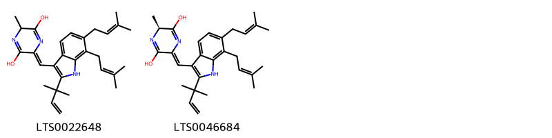{ width=100% }
    <figcaption>Hình ảnh cấu trúc hóa học của 2 hoạt chất thuộc nhóm Carboxylic acids and derivatives gồm ['(3z)-3-{[6,7-bis(3-methylbut-2-en-1-yl)-2-(2-methylbut-3-en-2-yl)-1h-indol-3-yl]methylidene}-6-methyl-6h-pyrazine-2,5-diol (LTS0022648)', '(3z,6s)-3-{[6,7-bis(3-methylbut-2-en-1-yl)-2-(2-methylbut-3-en-2-yl)-1h-indol-3-yl]methylidene}-6-methyl-6h-pyrazine-2,5-diol (LTS0046684)'].</figcaption>
</figure>
#### Nhóm Flavonoids
<figure markdown="span">
    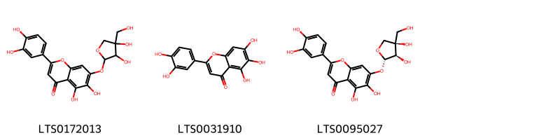{ width=100% }
    <figcaption>Hình ảnh cấu trúc hóa học của 3 hoạt chất thuộc nhóm Flavonoids gồm ['7-{[3,4-dihydroxy-4-(hydroxymethyl)oxolan-2-yl]oxy}-2-(3,4-dihydroxyphenyl)-5,6-dihydroxychromen-4-one (LTS0172013)', '6-hydroxyluteolin (LTS0031910)', '6-hydroxyluteolin 7-apioside (LTS0095027)'].</figcaption>
</figure>
#### Nhóm Indoles and derivatives
<figure markdown="span">
    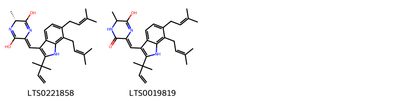{ width=100% }
    <figcaption>Hình ảnh cấu trúc hóa học của 2 hoạt chất thuộc nhóm Indoles and derivatives gồm ['(3z,6r)-3-{[6,7-bis(3-methylbut-2-en-1-yl)-2-(2-methylbut-3-en-2-yl)-1h-indol-3-yl]methylidene}-6-methyl-6h-pyrazine-2,5-diol (LTS0221858)', '3-{[6,7-bis(3-methylbut-2-en-1-yl)-2-(2-methylbut-3-en-2-yl)-1h-indol-3-yl]methylidene}-5-hydroxy-6-methyl-1,6-dihydropyrazin-2-one (LTS0019819)'].</figcaption>
</figure>
#### Nhóm Steroids and steroid derivatives
<figure markdown="span">
    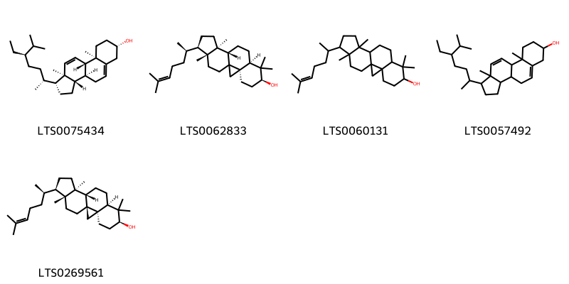{ width=100% }
    <figcaption>Hình ảnh cấu trúc hóa học của 5 hoạt chất thuộc nhóm Steroids and steroid derivatives gồm ['(1r,3as,3bs,7s,9ar,9bs,11ar)-1-[(2r,5r)-5-ethyl-6-methylheptan-2-yl]-9a,11a-dimethyl-1h,2h,3h,3ah,3bh,4h,6h,7h,8h,9h,9bh-cyclopenta[a]phenanthren-7-ol (LTS0075434)', '(3r,6s,8r,11s,12s,15r,16r)-7,7,12,16-tetramethyl-15-[(2r)-6-methylhept-5-en-2-yl]pentacyclo[9.7.0.0¹,³.0³,⁸.0¹²,¹⁶]octadecan-6-ol (LTS0062833)', 'cycloartenol (LTS0060131)', '1-(5-ethyl-6-methylheptan-2-yl)-9a,11a-dimethyl-1h,2h,3h,3ah,3bh,4h,6h,7h,8h,9h,9bh-cyclopenta[a]phenanthren-7-ol (LTS0057492)', 'cycloartenol (LTS0269561)'].</figcaption>
</figure>

---

### Dược dân tộc học

Danh sách các quốc gia có sử dụng *Lepidagathis cristata* trong điều trị các bệnh. 

| Country   | Disease   | Bệnh                                                                                                                                                                                                |
|:----------|:----------|:----------------------------------------------------------------------------------------------------------------------------------------------------------------------------------------------------|
| Elsewhere | Tonic     | MYMEMORY WARNING: YOU USED ALL AVAILABLE FREE TRANSLATIONS FOR TODAY. NEXT AVAILABLE IN  14 HOURS 09 MINUTES 28 SECONDS VISIT HTTPS://MYMEMORY.TRANSLATED.NET/DOC/USAGELIMITS.PHP TO TRANSLATE MORE |

---

# Chi Justicia

??? note "Danh sách các dược liệu thuộc chi"
    
	 - *Justicia adhatoda*
	 - *Justicia genarussa*
	 - *Justicia gendarussa*
	 - *Justicia pectoralis*
	 - *Justicia procumbens*
	 - *Justicia secunda*
	 - *Justicia tranquebariensis*

---
## Justicia adhatoda
### Thông tin về thực vật

!!! info "Phân loại thực vật của *Justicia adhatoda* từ GIBF:"
    - **Kingdom:** Plantae
    - **Phylum:** Tracheophyta
    - **Order:** Lamiales
    - **Family:** Acanthaceae
    - **Genus:** Justicia
    - **Species:** *Justicia adhatoda*

 

| Label (VI)   | Label (EN)   | Scientific Name   | Descriptions (VI)   | Descriptions (EN)   | Also Known As (VI)   | Also Known As (EN)   |
|:-------------|:-------------|:------------------|:--------------------|:--------------------|:---------------------|:---------------------|
| N/A          | N/A          | Justicia adhatoda | loài thực vật       | species of plant    | ['']                 | ['']                 |

#### Phân bố trên thế giới

**Từ CSDL GIBF** nan, Brazil, Japan, Malta, Bangladesh, Nepal, China, Thailand, Spain, Sri Lanka, United States of America, Greece, Bhutan, Indonesia, Pakistan, Argentina, Cyprus, unknown or invalid, Lao People’s Democratic Republic, Morocco, Hong Kong, Algeria, Belgium, Egypt, South Africa, Myanmar, Italy, India, Peru, France

#### Phân bố tại Việt Nam

**Từ CSDL GIBF**: Không có ghi nhận ở Việt Nam

---
### Thành phần hóa học
        
- Theo cơ sở dữ liệu lotus: Từ loài *Justicia adhatoda* đã phân lập và xác định được 54 hoạt chất thuộc về các nhóm Fatty Acyls, Benzene and substituted derivatives, Flavonoids, Pyrrolidines, Steroids and steroid derivatives, Organooxygen compounds, Diazanaphthalenes, Prenol lipids, Saturated hydrocarbons, Indoles and derivatives. 

|    | chemicalTaxonomyClassyfireClass     |   smiles_count |
|---:|:------------------------------------|---------------:|
|  0 | Benzene and substituted derivatives |              4 |
|  1 | Diazanaphthalenes                   |             29 |
|  2 | Fatty Acyls                         |              4 |
|  3 | Flavonoids                          |              2 |
|  4 | Indoles and derivatives             |              1 |
|  5 | Organooxygen compounds              |              6 |
|  6 | Prenol lipids                       |              1 |
|  7 | Pyrrolidines                        |              4 |
|  8 | Saturated hydrocarbons              |              1 |
|  9 | Steroids and steroid derivatives    |              2 |

#### Nhóm Benzene and substituted derivatives
<figure markdown="span">
    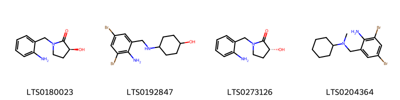{ width=100% }
    <figcaption>Hình ảnh cấu trúc hóa học của 4 hoạt chất thuộc nhóm Benzene and substituted derivatives gồm ['(3s)-1-[(2-aminophenyl)methyl]-3-hydroxypyrrolidin-2-one (LTS0180023)', 'ambroxol (LTS0192847)', '(3r)-1-[(2-aminophenyl)methyl]-3-hydroxypyrrolidin-2-one (LTS0273126)', 'bromhexine (LTS0204364)'].</figcaption>
</figure>
#### Nhóm Diazanaphthalenes
<figure markdown="span">
    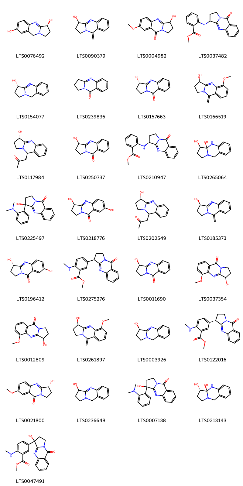{ width=100% }
    <figcaption>Hình ảnh cấu trúc hóa học của 29 hoạt chất thuộc nhóm Diazanaphthalenes gồm ['vasicinol (LTS0076492)', '9-methylidene-1h,2h,3h-pyrrolo[2,1-b]quinazolin-3-ol (LTS0090379)', '3-hydroxy-7-methoxy-1h,2h,3h-pyrrolo[2,1-b]quinazolin-9-one (LTS0004982)', 'methyl 2-({9-oxo-1h,2h,3h-pyrrolo[2,1-b]quinazolin-3-yl}amino)benzoate (LTS0037482)', '(-)-peganine (LTS0154077)', 'deoxyvasicinone (LTS0239836)', 'vasicinone (LTS0157663)', '(3r)-5-methoxy-9-methylidene-1h,2h,3h-pyrrolo[2,1-b]quinazolin-3-ol (LTS0166519)', '1-[(3s,9r)-3-hydroxy-1h,2h,3h,9h-pyrrolo[2,1-b]quinazolin-9-yl]propan-2-one (LTS0117984)', '3-hydroxy-1h,2h,3h-pyrrolo[2,1-b]quinazolin-9-one (LTS0250737)', 'methyl 2-{[(3s)-9-oxo-1h,2h,3h-pyrrolo[2,1-b]quinazolin-3-yl]amino}benzoate (LTS0210947)', '1h,2h,3h,4h,9h-pyrrolo[2,1-b]quinazoline-3,3a-diol (LTS0265064)', '(3r)-3-[2-(dimethylamino)phenyl]-3-hydroxy-1h,2h-pyrrolo[2,1-b]quinazolin-9-one (LTS0225497)', '3,7-dihydroxy-1h,2h,3h-pyrrolo[2,1-b]quinazolin-9-one (LTS0218776)', '1-{3-hydroxy-1h,2h,3h,9h-pyrrolo[2,1-b]quinazolin-9-yl}propan-2-one (LTS0202549)', '(3r)-9-methylidene-1h,2h,3h-pyrrolo[2,1-b]quinazolin-3-ol (LTS0185373)', '(3s)-3,7-dihydroxy-1h,2h,3h-pyrrolo[2,1-b]quinazolin-9-one (LTS0196412)', 'anisotine (LTS0275276)', '(3r)-3-hydroxy-1h,2h,3h-pyrrolo[2,1-b]quinazolin-9-one (LTS0011690)', '3-hydroxy-5-methoxy-1h,2h,3h-pyrrolo[2,1-b]quinazolin-9-one (LTS0037354)', '(3r)-3-hydroxy-5-methoxy-1h,2h,3h-pyrrolo[2,1-b]quinazolin-9-one (LTS0012809)', '5-methoxy-9-methylidene-1h,2h,3h-pyrrolo[2,1-b]quinazolin-3-ol (LTS0261897)', '(+-)-vasicine (LTS0003926)', 'methyl 2-(methylamino)-5-[(3s)-9-oxo-1h,2h,3h-pyrrolo[2,1-b]quinazolin-3-yl]benzoate (LTS0122016)', '(3r)-3-hydroxy-7-methoxy-1h,2h,3h-pyrrolo[2,1-b]quinazolin-9-one (LTS0021800)', 'vasicine (LTS0236648)', '3-[2-(dimethylamino)phenyl]-3-hydroxy-1h,2h-pyrrolo[2,1-b]quinazolin-9-one (LTS0007138)', '(3s,3as)-1h,2h,3h,4h,9h-pyrrolo[2,1-b]quinazoline-3,3a-diol (LTS0213143)', 'methyl 5-{3-hydroxy-9-oxo-1h,2h-pyrrolo[2,1-b]quinazolin-3-yl}-2-(methylamino)benzoate (LTS0047491)'].</figcaption>
</figure>
#### Nhóm Fatty Acyls
<figure markdown="span">
    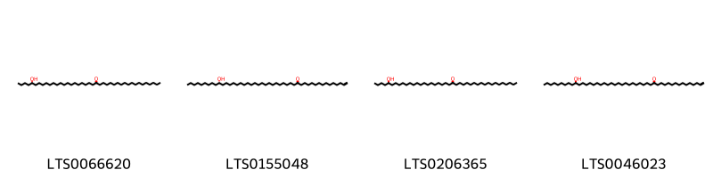{ width=100% }
    <figcaption>Hình ảnh cấu trúc hóa học của 4 hoạt chất thuộc nhóm Fatty Acyls gồm ['(37r)-37-hydroxyhentetracontan-19-one (LTS0066620)', '(37s)-37-hydroxyhexatetracont-1-en-15-one (LTS0155048)', '37-hydroxyhentetracontan-19-one (LTS0206365)', '37-hydroxyhexatetracont-1-en-15-one (LTS0046023)'].</figcaption>
</figure>
#### Nhóm Flavonoids
<figure markdown="span">
    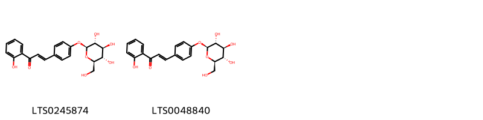{ width=100% }
    <figcaption>Hình ảnh cấu trúc hóa học của 2 hoạt chất thuộc nhóm Flavonoids gồm ['(2e)-1-(2-hydroxyphenyl)-3-(4-{[(2s,3r,4s,5s,6r)-3,4,5-trihydroxy-6-(hydroxymethyl)oxan-2-yl]oxy}phenyl)prop-2-en-1-one (LTS0245874)', '1-(2-hydroxyphenyl)-3-(4-{[(2s,3r,4s,5s,6r)-3,4,5-trihydroxy-6-(hydroxymethyl)oxan-2-yl]oxy}phenyl)prop-2-en-1-one (LTS0048840)'].</figcaption>
</figure>
#### Nhóm Indoles and derivatives
<figure markdown="span">
    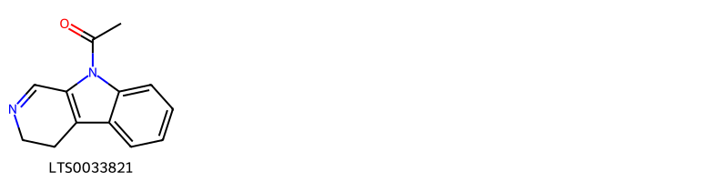{ width=100% }
    <figcaption>Hình ảnh cấu trúc hóa học của 1 hoạt chất thuộc nhóm Indoles and derivatives gồm ['1-{3h,4h-pyrido[3,4-b]indol-9-yl}ethanone (LTS0033821)'].</figcaption>
</figure>
#### Nhóm Organooxygen compounds
<figure markdown="span">
    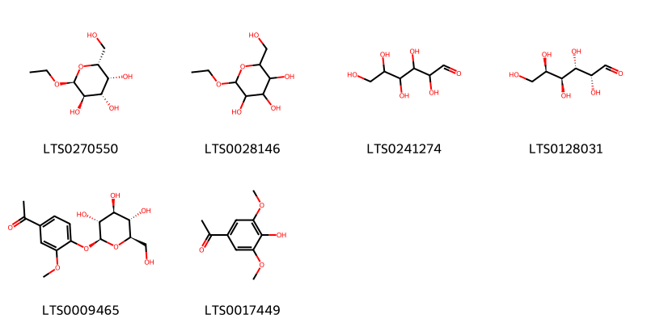{ width=100% }
    <figcaption>Hình ảnh cấu trúc hóa học của 6 hoạt chất thuộc nhóm Organooxygen compounds gồm ['(2s,3r,4s,5r,6r)-2-ethoxy-6-(hydroxymethyl)oxane-3,4,5-triol (LTS0270550)', '�-d-galactopyranoside, ethyl (LTS0028146)', 'dextrose (LTS0241274)', 'aldehydo-d-galactose (LTS0128031)', '1-(3-methoxy-4-{[(2s,3r,4s,5s,6r)-3,4,5-trihydroxy-6-(hydroxymethyl)oxan-2-yl]oxy}phenyl)ethanone (LTS0009465)', 'acetosyringone (LTS0017449)'].</figcaption>
</figure>
#### Nhóm Prenol lipids
<figure markdown="span">
    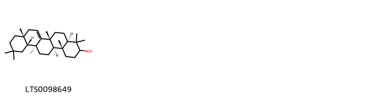{ width=100% }
    <figcaption>Hình ảnh cấu trúc hóa học của 1 hoạt chất thuộc nhóm Prenol lipids gồm ['(4ar,6ar,8ar,12ar,12bs,14ar,14br)-4,4,6a,8a,11,11,12b,14b-octamethyl-1,2,3,4a,5,6,8,9,10,12,12a,13,14,14a-tetradecahydropicen-3-ol (LTS0098649)'].</figcaption>
</figure>
#### Nhóm Pyrrolidines
<figure markdown="span">
    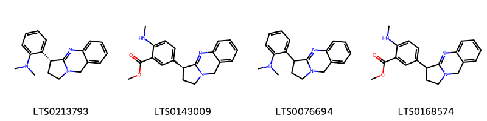{ width=100% }
    <figcaption>Hình ảnh cấu trúc hóa học của 4 hoạt chất thuộc nhóm Pyrrolidines gồm ['n,n-dimethyl-2-[(3r)-1h,2h,3h,9h-pyrrolo[2,1-b]quinazolin-3-yl]aniline (LTS0213793)', 'methyl 2-(methylamino)-5-[(3s)-1h,2h,3h,9h-pyrrolo[2,1-b]quinazolin-3-yl]benzoate (LTS0143009)', 'n,n-dimethyl-2-{1h,2h,3h,9h-pyrrolo[2,1-b]quinazolin-3-yl}aniline (LTS0076694)', 'methyl 2-(methylamino)-5-{1h,2h,3h,9h-pyrrolo[2,1-b]quinazolin-3-yl}benzoate (LTS0168574)'].</figcaption>
</figure>
#### Nhóm Saturated hydrocarbons
<figure markdown="span">
    { width=100% }
    <figcaption>Hình ảnh cấu trúc hóa học của 1 hoạt chất thuộc nhóm Saturated hydrocarbons gồm ['nonacosane (LTS0062747)'].</figcaption>
</figure>
#### Nhóm Steroids and steroid derivatives
<figure markdown="span">
    { width=100% }
    <figcaption>Hình ảnh cấu trúc hóa học của 2 hoạt chất thuộc nhóm Steroids and steroid derivatives gồm ['sitogluside (LTS0201798)', '2-{[1-(5-ethyl-6-methylheptan-2-yl)-9a,11a-dimethyl-1h,2h,3h,3ah,3bh,4h,6h,7h,8h,9h,9bh,10h,11h-cyclopenta[a]phenanthren-7-yl]oxy}-6-(hydroxymethyl)oxane-3,4,5-triol (LTS0158828)'].</figcaption>
</figure>

---

### Dược dân tộc học

Danh sách các quốc gia có sử dụng *Justicia adhatoda* trong điều trị các bệnh. 

| Country   | Disease     | Bệnh                                                                                                                                                                                                |
|:----------|:------------|:----------------------------------------------------------------------------------------------------------------------------------------------------------------------------------------------------|
| Turkey    | Expectorant | MYMEMORY WARNING: YOU USED ALL AVAILABLE FREE TRANSLATIONS FOR TODAY. NEXT AVAILABLE IN  14 HOURS 08 MINUTES 50 SECONDS VISIT HTTPS://MYMEMORY.TRANSLATED.NET/DOC/USAGELIMITS.PHP TO TRANSLATE MORE |

---

---
## Justicia genarussa
### Thông tin về thực vật

!!! info "Phân loại thực vật của *Justicia gendarussa* từ GIBF:"
    - **Kingdom:** Plantae
    - **Phylum:** Tracheophyta
    - **Order:** Lamiales
    - **Family:** Acanthaceae
    - **Genus:** Justicia
    - **Species:** *Justicia gendarussa*

 

| Label (VI)   | Label (EN)   | Scientific Name   | Descriptions (VI)   | Descriptions (EN)   | Also Known As (VI)   | Also Known As (EN)   |
|:-------------|:-------------|:------------------|:--------------------|:--------------------|:---------------------|:---------------------|
| N/A          | N/A          | Justicia adhatoda | loài thực vật       | species of plant    | ['']                 | ['']                 |

#### Phân bố trên thế giới

**Từ CSDL GIBF** Brazil, Viet Nam, Uganda, Bangladesh, China, Mozambique, Tanzania, United Republic of, Thailand, Madagascar, Guinea, Sri Lanka, Réunion, United States of America, Bhutan, Seychelles, Indonesia, Hong Kong, Kenya, Macao, Chinese Taipei, Malaysia, Philippines, Mauritius, Mayotte, Singapore, Cambodia, Martinique, India

#### Phân bố tại Việt Nam

**Từ CSDL GIBF**: Đà Nẵng, Ninh Thuận

---
### Thành phần hóa học
        
- Theo cơ sở dữ liệu lotus: Từ loài *Justicia gendarussa* đã phân lập và xác định được Chưa có hoạt chất nào được phân lập. hoạt chất thuộc về các nhóm Không có hoạt chất nào được phân lập. 

Không có hình ảnh nào được tạo ra

---

### Dược dân tộc học

Danh sách các quốc gia có sử dụng *Justicia gendarussa* trong điều trị các bệnh. 

| Country   | Disease   | Bệnh                                                                                                                                                                                                |
|:----------|:----------|:----------------------------------------------------------------------------------------------------------------------------------------------------------------------------------------------------|
| Elsewhere | Emetic    | MYMEMORY WARNING: YOU USED ALL AVAILABLE FREE TRANSLATIONS FOR TODAY. NEXT AVAILABLE IN  14 HOURS 08 MINUTES 08 SECONDS VISIT HTTPS://MYMEMORY.TRANSLATED.NET/DOC/USAGELIMITS.PHP TO TRANSLATE MORE |

---

---
## Justicia gendarussa
### Thông tin về thực vật

!!! info "Phân loại thực vật của *Justicia gendarussa* từ GIBF:"
    - **Kingdom:** Plantae
    - **Phylum:** Tracheophyta
    - **Order:** Lamiales
    - **Family:** Acanthaceae
    - **Genus:** Justicia
    - **Species:** *Justicia gendarussa*

 

| Label (VI)   | Label (EN)   | Scientific Name     | Descriptions (VI)   | Descriptions (EN)   | Also Known As (VI)   | Also Known As (EN)                         |
|:-------------|:-------------|:--------------------|:--------------------|:--------------------|:---------------------|:-------------------------------------------|
| N/A          | N/A          | Justicia gendarussa | loài thực vật       | species of plant    | ['']                 | ['Water Willow', 'Willow leaved Justicia'] |

#### Phân bố trên thế giới

**Từ CSDL GIBF** Brazil, Viet Nam, Uganda, Bangladesh, China, Mozambique, Tanzania, United Republic of, Thailand, Madagascar, Guinea, Sri Lanka, Réunion, United States of America, Bhutan, Seychelles, Indonesia, Hong Kong, Kenya, Macao, Chinese Taipei, Malaysia, Philippines, Mauritius, Mayotte, Singapore, Cambodia, Martinique, India

#### Phân bố tại Việt Nam

**Từ CSDL GIBF**: Đà Nẵng, Ninh Thuận

---
### Thành phần hóa học
        
- Theo cơ sở dữ liệu lotus: Từ loài *Justicia gendarussa* đã phân lập và xác định được 4 hoạt chất thuộc về các nhóm Benzene and substituted derivatives. 

|    | chemicalTaxonomyClassyfireClass     |   smiles_count |
|---:|:------------------------------------|---------------:|
|  0 | Benzene and substituted derivatives |              4 |

#### Nhóm Benzene and substituted derivatives
<figure markdown="span">
    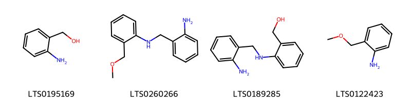{ width=100% }
    <figcaption>Hình ảnh cấu trúc hóa học của 4 hoạt chất thuộc nhóm Benzene and substituted derivatives gồm ['isatoic anhydride (LTS0195169)', 'n-[(2-aminophenyl)methyl]-2-(methoxymethyl)aniline (LTS0260266)', '(2-{[(2-aminophenyl)methyl]amino}phenyl)methanol (LTS0189285)', '2-(methoxymethyl)aniline (LTS0122423)'].</figcaption>
</figure>

---

### Dược dân tộc học

Danh sách các quốc gia có sử dụng *Justicia gendarussa* trong điều trị các bệnh. 

| Country   | Disease                                                                       | Bệnh                                                                                                                                                                                                |
|:----------|:------------------------------------------------------------------------------|:----------------------------------------------------------------------------------------------------------------------------------------------------------------------------------------------------|
| China     | Carminative, Diaphoretic, Diuretic, Diuretic, Diuretic, Refrigerant, Sedative | MYMEMORY WARNING: YOU USED ALL AVAILABLE FREE TRANSLATIONS FOR TODAY. NEXT AVAILABLE IN  14 HOURS 07 MINUTES 43 SECONDS VISIT HTTPS://MYMEMORY.TRANSLATED.NET/DOC/USAGELIMITS.PHP TO TRANSLATE MORE |
| Elsewhere | Emetic, Emmenagogue, Insecticide, Styptic, Diaphoretic                        | MYMEMORY WARNING: YOU USED ALL AVAILABLE FREE TRANSLATIONS FOR TODAY. NEXT AVAILABLE IN  14 HOURS 07 MINUTES 40 SECONDS VISIT HTTPS://MYMEMORY.TRANSLATED.NET/DOC/USAGELIMITS.PHP TO TRANSLATE MORE |

---

---
## Justicia pectoralis
### Thông tin về thực vật

!!! info "Phân loại thực vật của *Dianthera pectoralis* từ GIBF:"
    - **Kingdom:** Plantae
    - **Phylum:** Tracheophyta
    - **Order:** Lamiales
    - **Family:** Acanthaceae
    - **Genus:** Dianthera
    - **Species:** *Dianthera pectoralis*

 

| Label (VI)   | Label (EN)   | Scientific Name     | Descriptions (VI)   | Descriptions (EN)   | Also Known As (VI)   | Also Known As (EN)   |
|:-------------|:-------------|:--------------------|:--------------------|:--------------------|:---------------------|:---------------------|
| N/A          | N/A          | Justicia pectoralis | loài thực vật       | species of plant    | ['']                 | ['']                 |

#### Phân bố trên thế giới

**Từ CSDL GIBF** Brazil, Guadeloupe, Barbados, Suriname, Ecuador, Trinidad and Tobago, United States of America, Jamaica, Costa Rica, Dominican Republic, Colombia, French Guiana, Mexico, El Salvador, Panama, Nicaragua, Martinique, Peru, Bolivia (Plurinational State of), Belize, Venezuela (Bolivarian Republic of)

#### Phân bố tại Việt Nam

**Từ CSDL GIBF**: Không có ghi nhận ở Việt Nam

---
### Thành phần hóa học
        
- Theo cơ sở dữ liệu lotus: Từ loài *Dianthera pectoralis* đã phân lập và xác định được 15 hoạt chất thuộc về các nhóm Flavonoids, 3,4-dihydrocoumarins, Carboxylic acids and derivatives, Coumarins and derivatives, Phenylpropanoic acids, Diazanaphthalenes, Arylnaphthalene lignans, Indoles and derivatives. 

|    | chemicalTaxonomyClassyfireClass   |   smiles_count |
|---:|:----------------------------------|---------------:|
|  0 | 3,4-dihydrocoumarins              |              1 |
|  1 | Arylnaphthalene lignans           |              2 |
|  2 | Carboxylic acids and derivatives  |              1 |
|  3 | Coumarins and derivatives         |              2 |
|  4 | Diazanaphthalenes                 |              2 |
|  5 | Flavonoids                        |              5 |
|  6 | Indoles and derivatives           |              1 |
|  7 | Phenylpropanoic acids             |              1 |

#### Nhóm 3_4-dihydrocoumarins
<figure markdown="span">
    { width=100% }
    <figcaption>Hình ảnh cấu trúc hóa học của Không tìm thấy chú thích hoạt chất thuộc nhóm 3_4-dihydrocoumarins gồm Không tìm thấy chú thích.</figcaption>
</figure>
#### Nhóm Arylnaphthalene lignans
<figure markdown="span">
    { width=100% }
    <figcaption>Hình ảnh cấu trúc hóa học của 2 hoạt chất thuộc nhóm Arylnaphthalene lignans gồm ['justicidin b (LTS0069069)', 'retrochinensin (LTS0163462)'].</figcaption>
</figure>
#### Nhóm Carboxylic acids and derivatives
<figure markdown="span">
    { width=100% }
    <figcaption>Hình ảnh cấu trúc hóa học của 1 hoạt chất thuộc nhóm Carboxylic acids and derivatives gồm ['bet (LTS0164067)'].</figcaption>
</figure>
#### Nhóm Coumarins and derivatives
<figure markdown="span">
    { width=100% }
    <figcaption>Hình ảnh cấu trúc hóa học của 2 hoạt chất thuộc nhóm Coumarins and derivatives gồm ['2h-1-benzopyran-2-one (LTS0069773)', 'umbelliferone (LTS0162728)'].</figcaption>
</figure>
#### Nhóm Diazanaphthalenes
<figure markdown="span">
    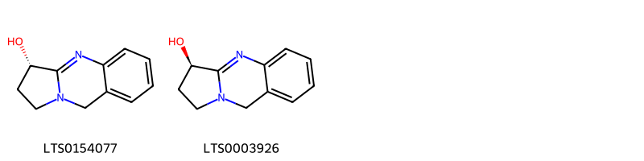{ width=100% }
    <figcaption>Hình ảnh cấu trúc hóa học của 2 hoạt chất thuộc nhóm Diazanaphthalenes gồm ['(-)-peganine (LTS0154077)', '(+-)-vasicine (LTS0003926)'].</figcaption>
</figure>
#### Nhóm Flavonoids
<figure markdown="span">
    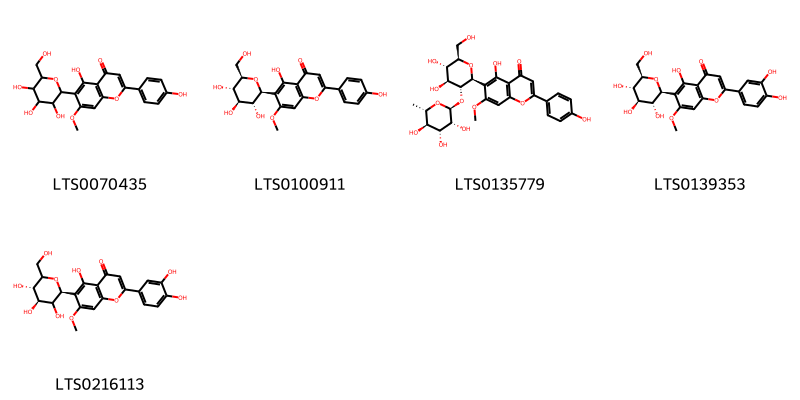{ width=100% }
    <figcaption>Hình ảnh cấu trúc hóa học của 5 hoạt chất thuộc nhóm Flavonoids gồm ['5-hydroxy-2-(4-hydroxyphenyl)-7-methoxy-6-[3,4,5-trihydroxy-6-(hydroxymethyl)oxan-2-yl]chromen-4-one (LTS0070435)', '5-hydroxy-2-(4-hydroxyphenyl)-7-methoxy-6-[(2s,3r,4r,5s,6r)-3,4,5-trihydroxy-6-(hydroxymethyl)oxan-2-yl]chromen-4-one (LTS0100911)', '6-[(2s,3r,4s,5s,6r)-4,5-dihydroxy-6-(hydroxymethyl)-3-{[(2s,3r,4r,5r,6s)-3,4,5-trihydroxy-6-methyloxan-2-yl]oxy}oxan-2-yl]-5-hydroxy-2-(4-hydroxyphenyl)-7-methoxychromen-4-one (LTS0135779)', 'swertiajaponin (LTS0139353)', 'swertiajaponin (LTS0216113)'].</figcaption>
</figure>
#### Nhóm Indoles and derivatives
<figure markdown="span">
    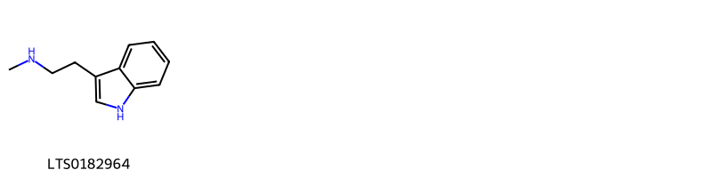{ width=100% }
    <figcaption>Hình ảnh cấu trúc hóa học của 1 hoạt chất thuộc nhóm Indoles and derivatives gồm ['methyltryptamine (LTS0182964)'].</figcaption>
</figure>
#### Nhóm Phenylpropanoic acids
<figure markdown="span">
    { width=100% }
    <figcaption>Hình ảnh cấu trúc hóa học của 1 hoạt chất thuộc nhóm Phenylpropanoic acids gồm ['melilotic acid (LTS0176151)'].</figcaption>
</figure>

---

### Dược dân tộc học

Danh sách các quốc gia có sử dụng *Dianthera pectoralis* trong điều trị các bệnh. 

| Country            | Disease                        | Bệnh                                                                                                                                                                                                |
|:-------------------|:-------------------------------|:----------------------------------------------------------------------------------------------------------------------------------------------------------------------------------------------------|
| Brazil(Yanomamo)   | Hallucinogen                   | MYMEMORY WARNING: YOU USED ALL AVAILABLE FREE TRANSLATIONS FOR TODAY. NEXT AVAILABLE IN  14 HOURS 06 MINUTES 54 SECONDS VISIT HTTPS://MYMEMORY.TRANSLATED.NET/DOC/USAGELIMITS.PHP TO TRANSLATE MORE |
| Dominican Republic | Aphrodisiac                    | MYMEMORY WARNING: YOU USED ALL AVAILABLE FREE TRANSLATIONS FOR TODAY. NEXT AVAILABLE IN  14 HOURS 06 MINUTES 52 SECONDS VISIT HTTPS://MYMEMORY.TRANSLATED.NET/DOC/USAGELIMITS.PHP TO TRANSLATE MORE |
| Haiti              | Aphrodisiac, Nervine, Sedative | MYMEMORY WARNING: YOU USED ALL AVAILABLE FREE TRANSLATIONS FOR TODAY. NEXT AVAILABLE IN  14 HOURS 06 MINUTES 47 SECONDS VISIT HTTPS://MYMEMORY.TRANSLATED.NET/DOC/USAGELIMITS.PHP TO TRANSLATE MORE |
| Trinidad           | Hemostat, Hemostat             | MYMEMORY WARNING: YOU USED ALL AVAILABLE FREE TRANSLATIONS FOR TODAY. NEXT AVAILABLE IN  14 HOURS 06 MINUTES 43 SECONDS VISIT HTTPS://MYMEMORY.TRANSLATED.NET/DOC/USAGELIMITS.PHP TO TRANSLATE MORE |
| Venezuela          | Vulnerary                      | MYMEMORY WARNING: YOU USED ALL AVAILABLE FREE TRANSLATIONS FOR TODAY. NEXT AVAILABLE IN  14 HOURS 06 MINUTES 39 SECONDS VISIT HTTPS://MYMEMORY.TRANSLATED.NET/DOC/USAGELIMITS.PHP TO TRANSLATE MORE |

---

---
## Justicia procumbens
### Thông tin về thực vật

!!! info "Phân loại thực vật của *N/A* từ GIBF:"
    - **Kingdom:** Plantae
    - **Phylum:** Tracheophyta
    - **Order:** Lamiales
    - **Family:** Acanthaceae
    - **Genus:** N/A
    - **Species:** *N/A*

 

| Label (VI)   | Label (EN)   | Scientific Name     | Descriptions (VI)   | Descriptions (EN)   | Also Known As (VI)   | Also Known As (EN)   |
|:-------------|:-------------|:--------------------|:--------------------|:--------------------|:---------------------|:---------------------|
| N/A          | N/A          | Justicia procumbens | loài thực vật       | species of plant    | ['']                 | ['']                 |

#### Phân bố trên thế giới

**Từ CSDL GIBF** nan, Brazil, Viet Nam, Japan, Uganda, Senegal, China, Chile, New Zealand, Ecuador, Thailand, Spain, Guinea-Bissau, Puerto Rico, United States of America, Virgin Islands (U.S.), Indonesia, Costa Rica, Colombia, Argentina, French Guiana, Hong Kong, Mexico, Kenya, Macao, El Salvador, Eswatini, Malaysia, Chinese Taipei, Kuwait, Panama, Namibia, Singapore, Portugal, South Africa, Australia, Italy, India, France, Venezuela (Bolivarian Republic of)

#### Phân bố tại Việt Nam

**Từ CSDL GIBF**: Hồ Chí Minh city, Đồng Nai, Lâm Đồng

---
### Thành phần hóa học
        
- Theo cơ sở dữ liệu lotus: Từ loài *N/A* đã phân lập và xác định được 59 hoạt chất thuộc về các nhóm Dibenzylbutane lignans, Naphthofurans, Prenol lipids, Arylnaphthalene lignans, Lignan glycosides. 

|    | chemicalTaxonomyClassyfireClass   |   smiles_count |
|---:|:----------------------------------|---------------:|
|  0 | Arylnaphthalene lignans           |             16 |
|  1 | Dibenzylbutane lignans            |             18 |
|  2 | Lignan glycosides                 |             14 |
|  3 | Naphthofurans                     |              2 |
|  4 | Prenol lipids                     |              7 |

#### Nhóm Arylnaphthalene lignans
<figure markdown="span">
    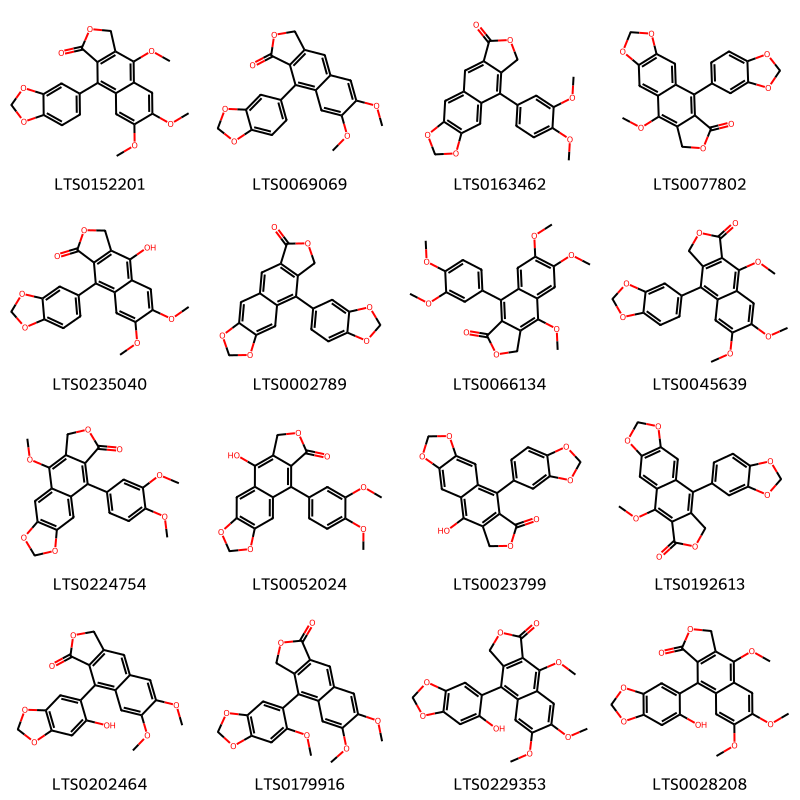{ width=100% }
    <figcaption>Hình ảnh cấu trúc hóa học của 16 hoạt chất thuộc nhóm Arylnaphthalene lignans gồm ['justicidin a (LTS0152201)', 'justicidin b (LTS0069069)', 'retrochinensin (LTS0163462)', 'justicidin f (LTS0077802)', 'diphyllin (LTS0235040)', 'justicidin e (LTS0002789)', '9-(3,4-dimethoxyphenyl)-4,6,7-trimethoxy-3h-naphtho[2,3-c]furan-1-one (LTS0066134)', 'justicidin c (LTS0045639)', '10-(3,4-dimethoxyphenyl)-16-methoxy-4,6,13-trioxatetracyclo[7.7.0.0³,⁷.0¹¹,¹⁵]hexadeca-1,3(7),8,10,15-pentaen-12-one (LTS0224754)', '10-(3,4-dimethoxyphenyl)-16-hydroxy-4,6,13-trioxatetracyclo[7.7.0.0³,⁷.0¹¹,¹⁵]hexadeca-1,3(7),8,10,15-pentaen-12-one (LTS0052024)', '10-(2h-1,3-benzodioxol-5-yl)-16-hydroxy-4,6,13-trioxatetracyclo[7.7.0.0³,⁷.0¹¹,¹⁵]hexadeca-1,3(7),8,10,15-pentaen-12-one (LTS0023799)', 'justicidin d (LTS0192613)', 'justicidin h (LTS0202464)', '6,7-dimethoxy-4-(6-methoxy-2h-1,3-benzodioxol-5-yl)-3h-naphtho[2,3-c]furan-1-one (LTS0179916)', '4-(6-hydroxy-2h-1,3-benzodioxol-5-yl)-6,7,9-trimethoxy-3h-naphtho[2,3-c]furan-1-one (LTS0229353)', "6'-hydroxyjusticidin a (LTS0028208)"].</figcaption>
</figure>
#### Nhóm Dibenzylbutane lignans
<figure markdown="span">
    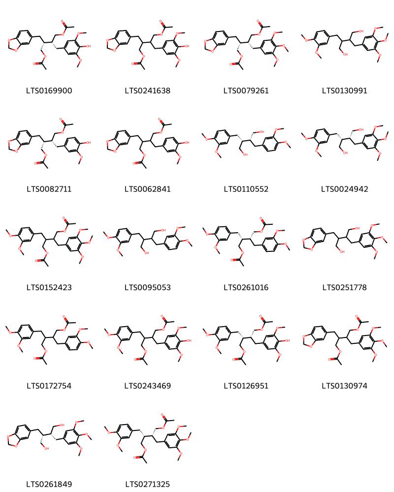{ width=100% }
    <figcaption>Hình ảnh cấu trúc hóa học của 18 hoạt chất thuộc nhóm Dibenzylbutane lignans gồm ['(2r,3r)-4-(acetyloxy)-3-(2h-1,3-benzodioxol-5-ylmethyl)-2-[(4-hydroxy-3,5-dimethoxyphenyl)methyl]butyl acetate (LTS0169900)', '4-(acetyloxy)-3-(2h-1,3-benzodioxol-5-ylmethyl)-2-[(4-hydroxy-3,5-dimethoxyphenyl)methyl]butyl acetate (LTS0241638)', '(2r,3r)-4-(acetyloxy)-3-(2h-1,3-benzodioxol-5-ylmethyl)-2-[(3,4,5-trimethoxyphenyl)methyl]butyl acetate (LTS0079261)', '2-[(3,4-dimethoxyphenyl)methyl]-3-[(3,4,5-trimethoxyphenyl)methyl]butane-1,4-diol (LTS0130991)', '(2r,3r)-4-(acetyloxy)-3-(2h-1,3-benzodioxol-5-ylmethyl)-2-[(4-hydroxy-3-methoxyphenyl)methyl]butyl acetate (LTS0082711)', '4-(acetyloxy)-3-(2h-1,3-benzodioxol-5-ylmethyl)-2-[(4-hydroxy-3-methoxyphenyl)methyl]butyl acetate (LTS0062841)', '(2r,3r)-2,3-bis[(3,4-dimethoxyphenyl)methyl]butane-1,4-diol (LTS0110552)', '(2r,3r)-2-[(3,4-dimethoxyphenyl)methyl]-3-[(3,4,5-trimethoxyphenyl)methyl]butane-1,4-diol (LTS0024942)', '4-(acetyloxy)-2-[(3,4-dimethoxyphenyl)methyl]-3-[(3,4,5-trimethoxyphenyl)methyl]butyl acetate (LTS0152423)', '2,3-bis[(3,4-dimethoxyphenyl)methyl]butane-1,4-diol (LTS0095053)', '(2r,3r)-4-(acetyloxy)-2,3-bis[(3,4-dimethoxyphenyl)methyl]butyl acetate (LTS0261016)', '2-(2h-1,3-benzodioxol-5-ylmethyl)-3-[(3,4,5-trimethoxyphenyl)methyl]butane-1,4-diol (LTS0251778)', '4-(acetyloxy)-2,3-bis[(3,4-dimethoxyphenyl)methyl]butyl acetate (LTS0172754)', '4-(acetyloxy)-2-[(3,4-dimethoxyphenyl)methyl]-3-[(4-hydroxy-3,5-dimethoxyphenyl)methyl]butyl acetate (LTS0243469)', '(2r,3r)-4-(acetyloxy)-2-[(3,4-dimethoxyphenyl)methyl]-3-[(4-hydroxy-3,5-dimethoxyphenyl)methyl]butyl acetate (LTS0126951)', '4-(acetyloxy)-3-(2h-1,3-benzodioxol-5-ylmethyl)-2-[(3,4,5-trimethoxyphenyl)methyl]butyl acetate (LTS0130974)', '(2r,3r)-2-(2h-1,3-benzodioxol-5-ylmethyl)-3-[(3,4,5-trimethoxyphenyl)methyl]butane-1,4-diol (LTS0261849)', '(2r,3r)-4-(acetyloxy)-2-[(3,4-dimethoxyphenyl)methyl]-3-[(3,4,5-trimethoxyphenyl)methyl]butyl acetate (LTS0271325)'].</figcaption>
</figure>
#### Nhóm Lignan glycosides
<figure markdown="span">
    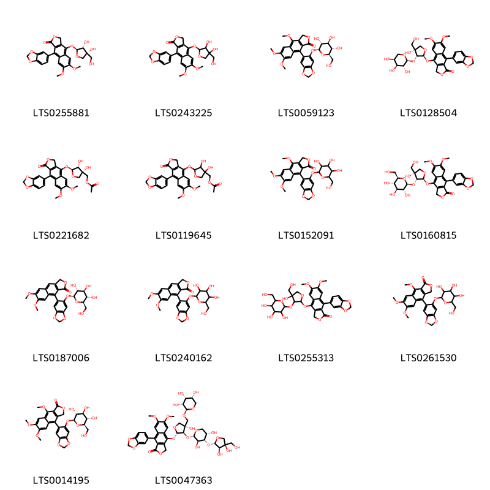{ width=100% }
    <figcaption>Hình ảnh cấu trúc hóa học của 14 hoạt chất thuộc nhóm Lignan glycosides gồm ['9-(2h-1,3-benzodioxol-5-yl)-4-{[(2s,3r,4r)-3,4-dihydroxy-4-(hydroxymethyl)oxolan-2-yl]oxy}-6,7-dimethoxy-3h-naphtho[2,3-c]furan-1-one (LTS0255881)', '9-(2h-1,3-benzodioxol-5-yl)-4-{[3,4-dihydroxy-4-(hydroxymethyl)oxolan-2-yl]oxy}-6,7-dimethoxy-3h-naphtho[2,3-c]furan-1-one (LTS0243225)', '4,6,7-trimethoxy-9-(6-{[(2s,3r,4s,5s,6r)-3,4,5-trihydroxy-6-(hydroxymethyl)oxan-2-yl]oxy}-2h-1,3-benzodioxol-5-yl)-3h-naphtho[2,3-c]furan-1-one (LTS0059123)', '9-(2h-1,3-benzodioxol-5-yl)-4-{[(2s,3r,4r)-4-hydroxy-4-(hydroxymethyl)-3-{[(2s,3r,4s,5s)-3,4,5-trihydroxyoxan-2-yl]oxy}oxolan-2-yl]oxy}-6,7-dimethoxy-3h-naphtho[2,3-c]furan-1-one (LTS0128504)', '[(3s,4r,5s)-5-{[9-(2h-1,3-benzodioxol-5-yl)-6,7-dimethoxy-1-oxo-3h-naphtho[2,3-c]furan-4-yl]oxy}-3,4-dihydroxyoxolan-3-yl]methyl acetate (LTS0221682)', '(5-{[9-(2h-1,3-benzodioxol-5-yl)-6,7-dimethoxy-1-oxo-3h-naphtho[2,3-c]furan-4-yl]oxy}-3,4-dihydroxyoxolan-3-yl)methyl acetate (LTS0119645)', '4,6,7-trimethoxy-9-(6-{[3,4,5-trihydroxy-6-(hydroxymethyl)oxan-2-yl]oxy}-2h-1,3-benzodioxol-5-yl)-3h-naphtho[2,3-c]furan-1-one (LTS0152091)', '9-(2h-1,3-benzodioxol-5-yl)-4-{[(2s,3r,4r)-4-hydroxy-4-(hydroxymethyl)-3-{[(2s,3r,4s,5s,6r)-3,4,5-trihydroxy-6-(hydroxymethyl)oxan-2-yl]oxy}oxolan-2-yl]oxy}-6,7-dimethoxy-3h-naphtho[2,3-c]furan-1-one (LTS0160815)', '6,7-dimethoxy-9-(6-{[(2s,3r,4s,5s,6r)-3,4,5-trihydroxy-6-(hydroxymethyl)oxan-2-yl]oxy}-2h-1,3-benzodioxol-5-yl)-3h-naphtho[2,3-c]furan-1-one (LTS0187006)', '6,7-dimethoxy-9-(6-{[3,4,5-trihydroxy-6-(hydroxymethyl)oxan-2-yl]oxy}-2h-1,3-benzodioxol-5-yl)-3h-naphtho[2,3-c]furan-1-one (LTS0240162)', '9-(2h-1,3-benzodioxol-5-yl)-4-{[4-hydroxy-4-(hydroxymethyl)-3-{[3,4,5-trihydroxy-6-(hydroxymethyl)oxan-2-yl]oxy}oxolan-2-yl]oxy}-6,7-dimethoxy-3h-naphtho[2,3-c]furan-1-one (LTS0255313)', '6,7,9-trimethoxy-4-(6-{[3,4,5-trihydroxy-6-(hydroxymethyl)oxan-2-yl]oxy}-2h-1,3-benzodioxol-5-yl)-3h-naphtho[2,3-c]furan-1-one (LTS0261530)', '6,7,9-trimethoxy-4-(6-{[(2s,3r,4s,5s,6r)-3,4,5-trihydroxy-6-(hydroxymethyl)oxan-2-yl]oxy}-2h-1,3-benzodioxol-5-yl)-3h-naphtho[2,3-c]furan-1-one (LTS0014195)', '9-(2h-1,3-benzodioxol-5-yl)-4-{[(2s,3r,4s)-3-{[(2s,3r,4s,5s)-4-{[(2s,3r,4r)-3,4-dihydroxy-4-(hydroxymethyl)oxolan-2-yl]oxy}-3,5-dihydroxyoxan-2-yl]oxy}-4-hydroxy-4-({[(2s,3r,4r,5r)-3,4,5-trihydroxyoxan-2-yl]oxy}methyl)oxolan-2-yl]oxy}-6,7-dimethoxy-3h-naphtho[2,3-c]furan-1-one (LTS0047363)'].</figcaption>
</figure>
#### Nhóm Naphthofurans
<figure markdown="span">
    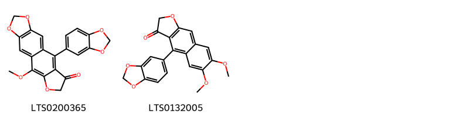{ width=100% }
    <figcaption>Hình ảnh cấu trúc hóa học của 2 hoạt chất thuộc nhóm Naphthofurans gồm ['16-(2h-1,3-benzodioxol-5-yl)-10-methoxy-4,6,12-trioxatetracyclo[7.7.0.0³,⁷.0¹¹,¹⁵]hexadeca-1,3(7),8,10,15-pentaen-14-one (LTS0200365)', '4-(2h-1,3-benzodioxol-5-yl)-6,7-dimethoxy-2h-naphtho[2,3-b]furan-3-one (LTS0132005)'].</figcaption>
</figure>
#### Nhóm Prenol lipids
<figure markdown="span">
    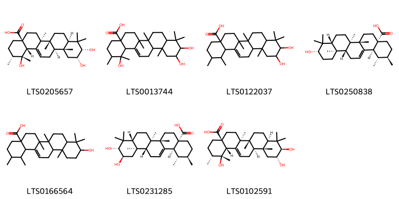{ width=100% }
    <figcaption>Hình ảnh cấu trúc hóa học của 7 hoạt chất thuộc nhóm Prenol lipids gồm ['euscaphic acid (LTS0205657)', '1,10,11-trihydroxy-1,2,6a,6b,9,9,12a-heptamethyl-2,3,4,5,6,7,8,8a,10,11,12,12b,13,14b-tetradecahydropicene-4a-carboxylic acid (LTS0013744)', '10,11-dihydroxy-1,2,6a,6b,9,9,12a-heptamethyl-2,3,4,5,6,7,8,8a,10,11,12,12b,13,14b-tetradecahydro-1h-picene-4a-carboxylic acid (LTS0122037)', 'ursolic acid (LTS0250838)', '10-hydroxy-1,2,6a,6b,9,9,12a-heptamethyl-2,3,4,5,6,7,8,8a,10,11,12,12b,13,14b-tetradecahydro-1h-picene-4a-carboxylic acid (LTS0166564)', 'corosolic acid (LTS0231285)', 'tormentic acid (LTS0102591)'].</figcaption>
</figure>

---

### Dược dân tộc học

Danh sách các quốc gia có sử dụng *N/A* trong điều trị các bệnh. 

| Country   | Disease                                                              | Bệnh                                                                                                                                                                                                |
|:----------|:---------------------------------------------------------------------|:----------------------------------------------------------------------------------------------------------------------------------------------------------------------------------------------------|
| China     | Carminative                                                          | MYMEMORY WARNING: YOU USED ALL AVAILABLE FREE TRANSLATIONS FOR TODAY. NEXT AVAILABLE IN  14 HOURS 06 MINUTES 08 SECONDS VISIT HTTPS://MYMEMORY.TRANSLATED.NET/DOC/USAGELIMITS.PHP TO TRANSLATE MORE |
| Elsewhere | Carminative, Diaphoretic, Laxative, Vermifuge, Diuretic, Expectorant | MYMEMORY WARNING: YOU USED ALL AVAILABLE FREE TRANSLATIONS FOR TODAY. NEXT AVAILABLE IN  14 HOURS 06 MINUTES 06 SECONDS VISIT HTTPS://MYMEMORY.TRANSLATED.NET/DOC/USAGELIMITS.PHP TO TRANSLATE MORE |

---

---
## Justicia secunda
### Thông tin về thực vật

!!! info "Phân loại thực vật của *Justicia secunda* từ GIBF:"
    - **Kingdom:** Plantae
    - **Phylum:** Tracheophyta
    - **Order:** Lamiales
    - **Family:** Acanthaceae
    - **Genus:** Justicia
    - **Species:** *Justicia secunda*

 

| Label (VI)   | Label (EN)   | Scientific Name   | Descriptions (VI)   | Descriptions (EN)   | Also Known As (VI)   | Also Known As (EN)   |
|:-------------|:-------------|:------------------|:--------------------|:--------------------|:---------------------|:---------------------|
| N/A          | N/A          | Justicia secunda  | loài thực vật       | species of plant    | ['']                 | ['']                 |

#### Phân bố trên thế giới

**Từ CSDL GIBF** nan, Brazil, Guatemala, Guadeloupe, Barbados, Suriname, Honduras, Ecuador, Trinidad and Tobago, United States of America, Jamaica, Costa Rica, Dominican Republic, Colombia, unknown or invalid, Sao Tome and Principe, French Guiana, Dominica, Benin, Congo, Democratic Republic of the, El Salvador, Gabon, Panama, Bonaire, Sint Eustatius and Saba, Martinique, Côte d’Ivoire, Congo, Peru, Guyana, Venezuela (Bolivarian Republic of)

#### Phân bố tại Việt Nam

**Từ CSDL GIBF**: Không có ghi nhận ở Việt Nam

---
### Thành phần hóa học
        
- Theo cơ sở dữ liệu lotus: Từ loài *Justicia secunda* đã phân lập và xác định được 1 hoạt chất thuộc về các nhóm Diazines. 

|    | chemicalTaxonomyClassyfireClass   |   smiles_count |
|---:|:----------------------------------|---------------:|
|  0 | Diazines                          |              1 |

#### Nhóm Diazines
<figure markdown="span">
    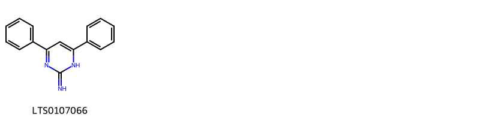{ width=100% }
    <figcaption>Hình ảnh cấu trúc hóa học của 1 hoạt chất thuộc nhóm Diazines gồm ['4,6-diphenyl-1h-pyrimidin-2-imine (LTS0107066)'].</figcaption>
</figure>

---

### Dược dân tộc học

Danh sách các quốc gia có sử dụng *Justicia secunda* trong điều trị các bệnh. 

| Country   | Disease   | Bệnh                                                                                                                                                                                                |
|:----------|:----------|:----------------------------------------------------------------------------------------------------------------------------------------------------------------------------------------------------|
| Elsewhere | Diuretic  | MYMEMORY WARNING: YOU USED ALL AVAILABLE FREE TRANSLATIONS FOR TODAY. NEXT AVAILABLE IN  14 HOURS 05 MINUTES 25 SECONDS VISIT HTTPS://MYMEMORY.TRANSLATED.NET/DOC/USAGELIMITS.PHP TO TRANSLATE MORE |
| Trinidad  | Diuretic  | MYMEMORY WARNING: YOU USED ALL AVAILABLE FREE TRANSLATIONS FOR TODAY. NEXT AVAILABLE IN  14 HOURS 05 MINUTES 13 SECONDS VISIT HTTPS://MYMEMORY.TRANSLATED.NET/DOC/USAGELIMITS.PHP TO TRANSLATE MORE |

---

---
## Justicia tranquebariensis
### Thông tin về thực vật

!!! info "Phân loại thực vật của *Justicia tranquebariensis* từ GIBF:"
    - **Kingdom:** Plantae
    - **Phylum:** Tracheophyta
    - **Order:** Lamiales
    - **Family:** Acanthaceae
    - **Genus:** Justicia
    - **Species:** *Justicia tranquebariensis*

 

| Label (VI)   | Label (EN)   | Scientific Name           | Descriptions (VI)   | Descriptions (EN)   | Also Known As (VI)   | Also Known As (EN)   |
|:-------------|:-------------|:--------------------------|:--------------------|:--------------------|:---------------------|:---------------------|
| N/A          | N/A          | Justicia tranquebariensis | loài thực vật       | species of plant    | ['']                 | ['']                 |

#### Phân bố trên thế giới

**Từ CSDL GIBF** Sri Lanka, nan, India, unknown or invalid

#### Phân bố tại Việt Nam

**Từ CSDL GIBF**: Không có ghi nhận ở Việt Nam

---
### Thành phần hóa học
        
- Theo cơ sở dữ liệu lotus: Từ loài *Justicia tranquebariensis* đã phân lập và xác định được 10 hoạt chất thuộc về các nhóm Aryltetralin lignans, Steroids and steroid derivatives, Furanoid lignans. 

|    | chemicalTaxonomyClassyfireClass   |   smiles_count |
|---:|:----------------------------------|---------------:|
|  0 | Aryltetralin lignans              |              1 |
|  1 | Furanoid lignans                  |              2 |
|  2 | Steroids and steroid derivatives  |              7 |

#### Nhóm Aryltetralin lignans
<figure markdown="span">
    { width=100% }
    <figcaption>Hình ảnh cấu trúc hóa học của 1 hoạt chất thuộc nhóm Aryltetralin lignans gồm ['(+)-isolariciresinol (LTS0164886)'].</figcaption>
</figure>
#### Nhóm Furanoid lignans
<figure markdown="span">
    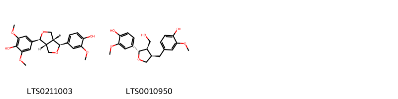{ width=100% }
    <figcaption>Hình ảnh cấu trúc hóa học của 2 hoạt chất thuộc nhóm Furanoid lignans gồm ['(-)-medioresinol (LTS0211003)', 'lariciresinol (LTS0010950)'].</figcaption>
</figure>
#### Nhóm Steroids and steroid derivatives
<figure markdown="span">
    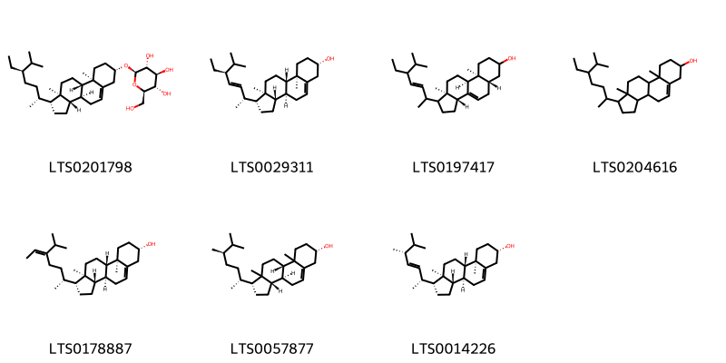{ width=100% }
    <figcaption>Hình ảnh cấu trúc hóa học của 7 hoạt chất thuộc nhóm Steroids and steroid derivatives gồm ['sitogluside (LTS0201798)', 'phytosterol (LTS0029311)', '(3ar,5as,9as,9bs,11ar)-1-(5-ethyl-6-methylhept-3-en-2-yl)-9a,11a-dimethyl-1h,2h,3h,3ah,5h,5ah,6h,7h,8h,9h,9bh,10h,11h-cyclopenta[a]phenanthren-7-ol (LTS0197417)', 'stigmast-5-en-3-ol, (3β)- (LTS0204616)', 'fucosterol (LTS0178887)', '(1r,3as,3bs,7s,9bs)-1-[(2r,5r)-5,6-dimethylheptan-2-yl]-9a,11a-dimethyl-1h,2h,3h,3ah,3bh,4h,6h,7h,8h,9h,9bh,10h,11h-cyclopenta[a]phenanthren-7-ol (LTS0057877)', 'brassicasterol (LTS0014226)'].</figcaption>
</figure>

---

### Dược dân tộc học

Danh sách các quốc gia có sử dụng *Justicia tranquebariensis* trong điều trị các bệnh. 

| Country   | Disease               | Bệnh                                                                                                                                                                                                |
|:----------|:----------------------|:----------------------------------------------------------------------------------------------------------------------------------------------------------------------------------------------------|
| India     | Refrigerant, Aperient | MYMEMORY WARNING: YOU USED ALL AVAILABLE FREE TRANSLATIONS FOR TODAY. NEXT AVAILABLE IN  14 HOURS 04 MINUTES 43 SECONDS VISIT HTTPS://MYMEMORY.TRANSLATED.NET/DOC/USAGELIMITS.PHP TO TRANSLATE MORE |

---

# Chi Graptophyllum

??? note "Danh sách các dược liệu thuộc chi"
    
	 - *Graptophyllum pictum*

---
## Graptophyllum pictum
### Thông tin về thực vật

!!! info "Phân loại thực vật của *Graptophyllum pictum* từ GIBF:"
    - **Kingdom:** Plantae
    - **Phylum:** Tracheophyta
    - **Order:** Lamiales
    - **Family:** Acanthaceae
    - **Genus:** Graptophyllum
    - **Species:** *Graptophyllum pictum*

 

| Label (VI)   | Label (EN)   | Scientific Name      | Descriptions (VI)   | Descriptions (EN)   | Also Known As (VI)   | Also Known As (EN)   |
|:-------------|:-------------|:---------------------|:--------------------|:--------------------|:---------------------|:---------------------|
| N/A          | N/A          | Graptophyllum pictum | loài thực vật       | species of plant    | ['']                 | ['']                 |

#### Phân bố trên thế giới

**Từ CSDL GIBF** Brazil, Uganda, Viet Nam, Guadeloupe, Barbados, China, New Caledonia, Saint Lucia, Honduras, Tanzania, United Republic of, Ecuador, French Polynesia, Trinidad and Tobago, Thailand, Guinea, Puerto Rico, Cayman Islands, Ghana, Sri Lanka, Réunion, United States of America, Jamaica, Virgin Islands (U.S.), Indonesia, Seychelles, Costa Rica, Dominican Republic, Colombia, Nigeria, Cuba, Grenada, Fiji, Hong Kong, Mexico, Benin, Vanuatu, Belgium, Philippines, Malaysia, Haiti, Mauritius, Panama, Nicaragua, Singapore, Bahamas, South Africa, Australia, India, Samoa, Venezuela (Bolivarian Republic of)

#### Phân bố tại Việt Nam

**Từ CSDL GIBF**: Không có ghi nhận ở Việt Nam

---
### Thành phần hóa học
        
- Theo cơ sở dữ liệu lotus: Từ loài *Graptophyllum pictum* đã phân lập và xác định được Chưa có hoạt chất nào được phân lập. hoạt chất thuộc về các nhóm Không có hoạt chất nào được phân lập. 

Không có hình ảnh nào được tạo ra

---

### Dược dân tộc học

Danh sách các quốc gia có sử dụng *Graptophyllum pictum* trong điều trị các bệnh. 

| Country   | Disease     | Bệnh                                                                                                                                                                                                |
|:----------|:------------|:----------------------------------------------------------------------------------------------------------------------------------------------------------------------------------------------------|
| India     | Emollient   | MYMEMORY WARNING: YOU USED ALL AVAILABLE FREE TRANSLATIONS FOR TODAY. NEXT AVAILABLE IN  14 HOURS 03 MINUTES 47 SECONDS VISIT HTTPS://MYMEMORY.TRANSLATED.NET/DOC/USAGELIMITS.PHP TO TRANSLATE MORE |
| Java      | Emmenagogue | MYMEMORY WARNING: YOU USED ALL AVAILABLE FREE TRANSLATIONS FOR TODAY. NEXT AVAILABLE IN  14 HOURS 03 MINUTES 41 SECONDS VISIT HTTPS://MYMEMORY.TRANSLATED.NET/DOC/USAGELIMITS.PHP TO TRANSLATE MORE |

---

# Chi Adhatoda

??? note "Danh sách các dược liệu thuộc chi"
    
	 - *Adhatoda schimperana*
	 - *Adhatoda vasica*

---
## Adhatoda schimperana
### Thông tin về thực vật

!!! info "Phân loại thực vật của *Justicia schimperiana* từ GIBF:"
    - **Kingdom:** Plantae
    - **Phylum:** Tracheophyta
    - **Order:** Lamiales
    - **Family:** Acanthaceae
    - **Genus:** Justicia
    - **Species:** *Justicia schimperiana*

 

| Label (VI)   | Label (EN)   | Scientific Name      | Descriptions (VI)   | Descriptions (EN)   | Also Known As (VI)   | Also Known As (EN)   |
|:-------------|:-------------|:---------------------|:--------------------|:--------------------|:---------------------|:---------------------|
| N/A          | N/A          | Graptophyllum pictum | loài thực vật       | species of plant    | ['']                 | ['']                 |

#### Phân bố trên thế giới

**Từ CSDL GIBF** nan, Kenya, unknown or invalid, Eritrea, Ethiopia

#### Phân bố tại Việt Nam

**Từ CSDL GIBF**: Không có ghi nhận ở Việt Nam

---
### Thành phần hóa học
        
- Theo cơ sở dữ liệu lotus: Từ loài *Justicia schimperiana* đã phân lập và xác định được Chưa có hoạt chất nào được phân lập. hoạt chất thuộc về các nhóm Không có hoạt chất nào được phân lập. 

Không có hình ảnh nào được tạo ra

---

### Dược dân tộc học

Danh sách các quốc gia có sử dụng *Justicia schimperiana* trong điều trị các bệnh. 

| Country   | Disease      | Bệnh                                                                                                                                                                                                |
|:----------|:-------------|:----------------------------------------------------------------------------------------------------------------------------------------------------------------------------------------------------|
| Ethiopia  | Pediculicide | MYMEMORY WARNING: YOU USED ALL AVAILABLE FREE TRANSLATIONS FOR TODAY. NEXT AVAILABLE IN  14 HOURS 03 MINUTES 16 SECONDS VISIT HTTPS://MYMEMORY.TRANSLATED.NET/DOC/USAGELIMITS.PHP TO TRANSLATE MORE |

---

---
## Adhatoda vasica
### Thông tin về thực vật

!!! info "Phân loại thực vật của *Justicia adhatoda* từ GIBF:"
    - **Kingdom:** Plantae
    - **Phylum:** Tracheophyta
    - **Order:** Lamiales
    - **Family:** Acanthaceae
    - **Genus:** Justicia
    - **Species:** *Justicia adhatoda*

 

| Label (VI)   | Label (EN)   | Scientific Name   | Descriptions (VI)   | Descriptions (EN)       | Also Known As (VI)   | Also Known As (EN)   |
|:-------------|:-------------|:------------------|:--------------------|:------------------------|:---------------------|:---------------------|
| N/A          | N/A          | Adhatoda vasica   | loài thực vật       | Herbal species of plant | ['']                 | ['']                 |

#### Phân bố trên thế giới

**Từ CSDL GIBF** nan, Viet Nam, Bangladesh, Nepal, China, Thailand, Spain, Sri Lanka, United States of America, Bhutan, Indonesia, Pakistan, Tunisia, Cuba, unknown or invalid, Lao People’s Democratic Republic, Hong Kong, Belgium, Chinese Taipei, Portugal, Myanmar, India

#### Phân bố tại Việt Nam

**Từ CSDL GIBF**: Không có ghi nhận ở Việt Nam

---
### Thành phần hóa học
        
- Theo cơ sở dữ liệu lotus: Từ loài *Justicia adhatoda* đã phân lập và xác định được Chưa có hoạt chất nào được phân lập. hoạt chất thuộc về các nhóm Không có hoạt chất nào được phân lập. 

Không có hình ảnh nào được tạo ra

---

### Dược dân tộc học

Danh sách các quốc gia có sử dụng *Justicia adhatoda* trong điều trị các bệnh. 

| Country   | Disease                              | Bệnh                                                                                                                                                                                                |
|:----------|:-------------------------------------|:----------------------------------------------------------------------------------------------------------------------------------------------------------------------------------------------------|
| Elsewhere | Algicide                             | MYMEMORY WARNING: YOU USED ALL AVAILABLE FREE TRANSLATIONS FOR TODAY. NEXT AVAILABLE IN  14 HOURS 02 MINUTES 47 SECONDS VISIT HTTPS://MYMEMORY.TRANSLATED.NET/DOC/USAGELIMITS.PHP TO TRANSLATE MORE |
| India     | Expectorant, Insecticide, Antiseptic | MYMEMORY WARNING: YOU USED ALL AVAILABLE FREE TRANSLATIONS FOR TODAY. NEXT AVAILABLE IN  14 HOURS 02 MINUTES 36 SECONDS VISIT HTTPS://MYMEMORY.TRANSLATED.NET/DOC/USAGELIMITS.PHP TO TRANSLATE MORE |

---

# Chi Hygrophila

??? note "Danh sách các dược liệu thuộc chi"
    
	 - *Hygrophila auriculata*
	 - *Hygrophila inosa*
	 - *Hygrophila salicifolia*

---
## Hygrophila auriculata
### Thông tin về thực vật

!!! info "Phân loại thực vật của *Hygrophila auriculata* từ GIBF:"
    - **Kingdom:** Plantae
    - **Phylum:** Tracheophyta
    - **Order:** Lamiales
    - **Family:** Acanthaceae
    - **Genus:** Hygrophila
    - **Species:** *Hygrophila auriculata*

 

| Label (VI)   | Label (EN)   | Scientific Name       | Descriptions (VI)   | Descriptions (EN)   | Also Known As (VI)   | Also Known As (EN)   |
|:-------------|:-------------|:----------------------|:--------------------|:--------------------|:---------------------|:---------------------|
| N/A          | N/A          | Hygrophila auriculata | loài thực vật       | species of plant    | ['']                 | ['Marsh Barbel']     |

#### Phân bố trên thế giới

**Từ CSDL GIBF** Uganda, Senegal, Bangladesh, Gambia, Mali, Mozambique, Tanzania, United Republic of, Guinea-Bissau, Ghana, Sri Lanka, Zambia, Nigeria, Ethiopia, Togo, Malawi, Benin, Congo, Democratic Republic of the, Kenya, Rwanda, Eswatini, South Sudan, South Africa, India, Cameroon

#### Phân bố tại Việt Nam

**Từ CSDL GIBF**: Không có ghi nhận ở Việt Nam

---
### Thành phần hóa học
        
- Theo cơ sở dữ liệu lotus: Từ loài *Hygrophila auriculata* đã phân lập và xác định được 9 hoạt chất thuộc về các nhóm Fatty Acyls, Prenol lipids, Saturated hydrocarbons, Steroids and steroid derivatives. 

|    | chemicalTaxonomyClassyfireClass   |   smiles_count |
|---:|:----------------------------------|---------------:|
|  0 | Fatty Acyls                       |              5 |
|  1 | Prenol lipids                     |              2 |
|  2 | Saturated hydrocarbons            |              1 |
|  3 | Steroids and steroid derivatives  |              1 |

#### Nhóm Fatty Acyls
<figure markdown="span">
    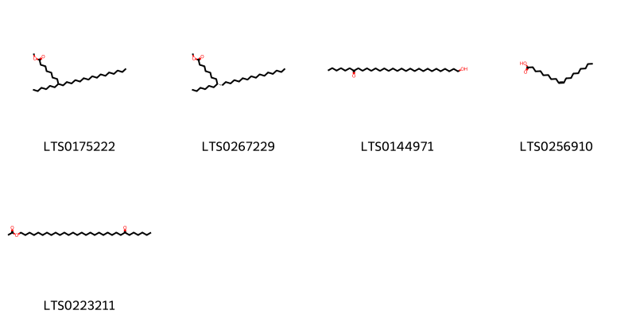{ width=100% }
    <figcaption>Hình ảnh cấu trúc hóa học của 5 hoạt chất thuộc nhóm Fatty Acyls gồm ['methyl 8-hexyltetracosanoate (LTS0175222)', 'methyl (8s)-8-hexyltetracosanoate (LTS0267229)', '31-hydroxyhentriacontan-7-one (LTS0144971)', 'oleic acid (LTS0256910)', '25-oxohentriacontyl acetate (LTS0223211)'].</figcaption>
</figure>
#### Nhóm Prenol lipids
<figure markdown="span">
    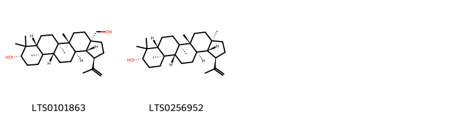{ width=100% }
    <figcaption>Hình ảnh cấu trúc hóa học của 2 hoạt chất thuộc nhóm Prenol lipids gồm ['betulin (LTS0101863)', 'lupeol (LTS0256952)'].</figcaption>
</figure>
#### Nhóm Saturated hydrocarbons
<figure markdown="span">
    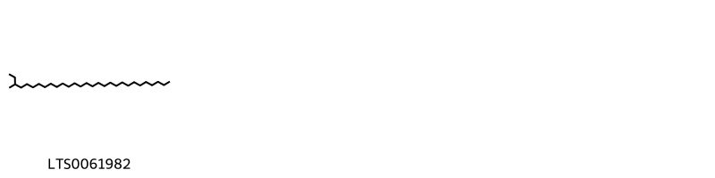{ width=100% }
    <figcaption>Hình ảnh cấu trúc hóa học của 1 hoạt chất thuộc nhóm Saturated hydrocarbons gồm ['3-methylnonacosane (LTS0061982)'].</figcaption>
</figure>
#### Nhóm Steroids and steroid derivatives
<figure markdown="span">
    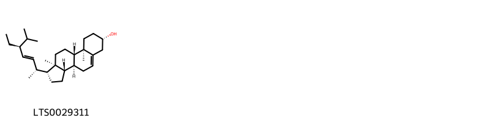{ width=100% }
    <figcaption>Hình ảnh cấu trúc hóa học của 1 hoạt chất thuộc nhóm Steroids and steroid derivatives gồm ['phytosterol (LTS0029311)'].</figcaption>
</figure>

---

### Dược dân tộc học

Danh sách các quốc gia có sử dụng *Hygrophila auriculata* trong điều trị các bệnh. 

| Country   | Disease   | Bệnh                                                                                                                                                                                                |
|:----------|:----------|:----------------------------------------------------------------------------------------------------------------------------------------------------------------------------------------------------|
| India     | Diuretic  | MYMEMORY WARNING: YOU USED ALL AVAILABLE FREE TRANSLATIONS FOR TODAY. NEXT AVAILABLE IN  14 HOURS 01 MINUTES 57 SECONDS VISIT HTTPS://MYMEMORY.TRANSLATED.NET/DOC/USAGELIMITS.PHP TO TRANSLATE MORE |

---

---
## Hygrophila inosa
### Thông tin về thực vật

!!! info "Phân loại thực vật của *N/A* từ GIBF:"
    - **Kingdom:** Plantae
    - **Phylum:** N/A
    - **Order:** N/A
    - **Family:** N/A
    - **Genus:** N/A
    - **Species:** *N/A*

 

| Label (VI)   | Label (EN)   | Scientific Name       | Descriptions (VI)   | Descriptions (EN)   | Also Known As (VI)   | Also Known As (EN)   |
|:-------------|:-------------|:----------------------|:--------------------|:--------------------|:---------------------|:---------------------|
| N/A          | N/A          | Hygrophila auriculata | loài thực vật       | species of plant    | ['']                 | ['Marsh Barbel']     |

#### Phân bố trên thế giới

**Từ CSDL GIBF** United States of America, Niue, Australia, New Zealand, Argentina, Germany, United Kingdom of Great Britain and Northern Ireland, Denmark

#### Phân bố tại Việt Nam

**Từ CSDL GIBF**: Không có ghi nhận ở Việt Nam

---
### Thành phần hóa học
        
- Theo cơ sở dữ liệu lotus: Từ loài *N/A* đã phân lập và xác định được Chưa có hoạt chất nào được phân lập. hoạt chất thuộc về các nhóm Không có hoạt chất nào được phân lập. 

Không có hình ảnh nào được tạo ra

---

### Dược dân tộc học

Danh sách các quốc gia có sử dụng *N/A* trong điều trị các bệnh. 

| Country   | Disease                          | Bệnh                                                                                                                                                                                                |
|:----------|:---------------------------------|:----------------------------------------------------------------------------------------------------------------------------------------------------------------------------------------------------|
| English   | Aphrodisiac                      | MYMEMORY WARNING: YOU USED ALL AVAILABLE FREE TRANSLATIONS FOR TODAY. NEXT AVAILABLE IN  14 HOURS 01 MINUTES 26 SECONDS VISIT HTTPS://MYMEMORY.TRANSLATED.NET/DOC/USAGELIMITS.PHP TO TRANSLATE MORE |
| French    | Diuretic                         | MYMEMORY WARNING: YOU USED ALL AVAILABLE FREE TRANSLATIONS FOR TODAY. NEXT AVAILABLE IN  14 HOURS 01 MINUTES 23 SECONDS VISIT HTTPS://MYMEMORY.TRANSLATED.NET/DOC/USAGELIMITS.PHP TO TRANSLATE MORE |
| German    | Tonic                            | MYMEMORY WARNING: YOU USED ALL AVAILABLE FREE TRANSLATIONS FOR TODAY. NEXT AVAILABLE IN  14 HOURS 01 MINUTES 20 SECONDS VISIT HTTPS://MYMEMORY.TRANSLATED.NET/DOC/USAGELIMITS.PHP TO TRANSLATE MORE |
| India     | Refrigerant                      | MYMEMORY WARNING: YOU USED ALL AVAILABLE FREE TRANSLATIONS FOR TODAY. NEXT AVAILABLE IN  14 HOURS 01 MINUTES 15 SECONDS VISIT HTTPS://MYMEMORY.TRANSLATED.NET/DOC/USAGELIMITS.PHP TO TRANSLATE MORE |
| Italian   | Demulcent                        | MYMEMORY WARNING: YOU USED ALL AVAILABLE FREE TRANSLATIONS FOR TODAY. NEXT AVAILABLE IN  14 HOURS 01 MINUTES 11 SECONDS VISIT HTTPS://MYMEMORY.TRANSLATED.NET/DOC/USAGELIMITS.PHP TO TRANSLATE MORE |
| Sudan     | Demulcent, Diuretic, Refrigerant | MYMEMORY WARNING: YOU USED ALL AVAILABLE FREE TRANSLATIONS FOR TODAY. NEXT AVAILABLE IN  14 HOURS 01 MINUTES 07 SECONDS VISIT HTTPS://MYMEMORY.TRANSLATED.NET/DOC/USAGELIMITS.PHP TO TRANSLATE MORE |

---

---
## Hygrophila salicifolia
### Thông tin về thực vật

!!! info "Phân loại thực vật của *Hygrophila ringens* từ GIBF:"
    - **Kingdom:** Plantae
    - **Phylum:** Tracheophyta
    - **Order:** Lamiales
    - **Family:** Acanthaceae
    - **Genus:** Hygrophila
    - **Species:** *Hygrophila ringens*

 

| Label (VI)   | Label (EN)   | Scientific Name        | Descriptions (VI)   | Descriptions (EN)   | Also Known As (VI)   | Also Known As (EN)   |
|:-------------|:-------------|:-----------------------|:--------------------|:--------------------|:---------------------|:---------------------|
| N/A          | N/A          | Hygrophila salicifolia | loài thực vật       | species of plant    | ['']                 | ['']                 |

#### Phân bố trên thế giới

**Từ CSDL GIBF** nan, Viet Nam, Japan, Cambodia, Korea, Republic of, Chinese Taipei, China, Argentina, French Polynesia, Thailand

#### Phân bố tại Việt Nam

**Từ CSDL GIBF**: Hai Phong, Thai Nguyen

---
### Thành phần hóa học
        
- Theo cơ sở dữ liệu lotus: Từ loài *Hygrophila ringens* đã phân lập và xác định được Chưa có hoạt chất nào được phân lập. hoạt chất thuộc về các nhóm Không có hoạt chất nào được phân lập. 

Không có hình ảnh nào được tạo ra

---

### Dược dân tộc học

Danh sách các quốc gia có sử dụng *Hygrophila ringens* trong điều trị các bệnh. 

| Country   | Disease   | Bệnh                                                                                                                                                                                                |
|:----------|:----------|:----------------------------------------------------------------------------------------------------------------------------------------------------------------------------------------------------|
| Elsewhere | Diuretic  | MYMEMORY WARNING: YOU USED ALL AVAILABLE FREE TRANSLATIONS FOR TODAY. NEXT AVAILABLE IN  14 HOURS 00 MINUTES 30 SECONDS VISIT HTTPS://MYMEMORY.TRANSLATED.NET/DOC/USAGELIMITS.PHP TO TRANSLATE MORE |

---

# Chi Acanthus

??? note "Danh sách các dược liệu thuộc chi"
    
	 - *Acanthus mollis*

---
## Acanthus mollis
### Thông tin về thực vật

!!! info "Phân loại thực vật của *Acanthus mollis* từ GIBF:"
    - **Kingdom:** Plantae
    - **Phylum:** Tracheophyta
    - **Order:** Lamiales
    - **Family:** Acanthaceae
    - **Genus:** Acanthus
    - **Species:** *Acanthus mollis*

 

| Label (VI)   | Label (EN)   | Scientific Name   | Descriptions (VI)   | Descriptions (EN)                                                            | Also Known As (VI)   | Also Known As (EN)                  |
|:-------------|:-------------|:------------------|:--------------------|:-----------------------------------------------------------------------------|:---------------------|:------------------------------------|
| N/A          | N/A          | Acanthus mollis   |                     | herbaceous perennial plant with an underground rhizome in the genus Acanthus | ['']                 | ['oyster plant', "bear's breeches"] |

#### Phân bố trên thế giới

**Từ CSDL GIBF** Morocco, Gibraltar, Algeria, United States of America, Portugal, Malta, Greece, United Kingdom of Great Britain and Northern Ireland, South Africa, Australia, Chile, New Zealand, Italy, Croatia, Monaco, France, Spain, Netherlands

#### Phân bố tại Việt Nam

**Từ CSDL GIBF**: Không có ghi nhận ở Việt Nam

---
### Thành phần hóa học
        
- Theo cơ sở dữ liệu lotus: Từ loài *Acanthus mollis* đã phân lập và xác định được 10 hoạt chất thuộc về các nhóm Benzodioxoles, Organooxygen compounds, Furanoid lignans, Arylnaphthalene lignans, Lignan glycosides. 

|    | chemicalTaxonomyClassyfireClass   |   smiles_count |
|---:|:----------------------------------|---------------:|
|  0 | Arylnaphthalene lignans           |              1 |
|  1 | Benzodioxoles                     |              2 |
|  2 | Furanoid lignans                  |              1 |
|  3 | Lignan glycosides                 |              4 |
|  4 | Organooxygen compounds            |              2 |

#### Nhóm Arylnaphthalene lignans
<figure markdown="span">
    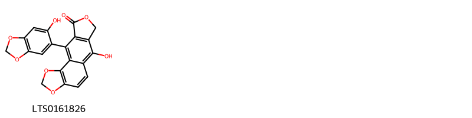{ width=100% }
    <figcaption>Hình ảnh cấu trúc hóa học của 1 hoạt chất thuộc nhóm Arylnaphthalene lignans gồm ['10-hydroxy-16-(6-hydroxy-2h-1,3-benzodioxol-5-yl)-3,5,13-trioxatetracyclo[7.7.0.0²,⁶.0¹¹,¹⁵]hexadeca-1,6,8,10,15-pentaen-14-one (LTS0161826)'].</figcaption>
</figure>
#### Nhóm Benzodioxoles
<figure markdown="span">
    { width=100% }
    <figcaption>Hình ảnh cấu trúc hóa học của 2 hoạt chất thuộc nhóm Benzodioxoles gồm ['sesamolin (LTS0079632)', 'sesamolin (LTS0276354)'].</figcaption>
</figure>
#### Nhóm Furanoid lignans
<figure markdown="span">
    { width=100% }
    <figcaption>Hình ảnh cấu trúc hóa học của 1 hoạt chất thuộc nhóm Furanoid lignans gồm ['sesamin (LTS0120161)'].</figcaption>
</figure>
#### Nhóm Lignan glycosides
<figure markdown="span">
    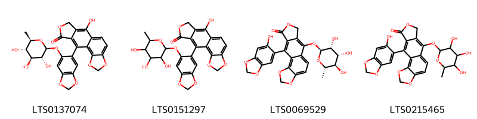{ width=100% }
    <figcaption>Hình ảnh cấu trúc hóa học của 4 hoạt chất thuộc nhóm Lignan glycosides gồm ['10-hydroxy-16-(6-{[(2s,3r,4s,5s,6r)-3,4,5-trihydroxy-6-methyloxan-2-yl]oxy}-2h-1,3-benzodioxol-5-yl)-3,5,13-trioxatetracyclo[7.7.0.0²,⁶.0¹¹,¹⁵]hexadeca-1,6,8,10,15-pentaen-14-one (LTS0137074)', '10-hydroxy-16-{6-[(3,4,5-trihydroxy-6-methyloxan-2-yl)oxy]-2h-1,3-benzodioxol-5-yl}-3,5,13-trioxatetracyclo[7.7.0.0²,⁶.0¹¹,¹⁵]hexadeca-1,6,8,10,15-pentaen-14-one (LTS0151297)', '16-(6-hydroxy-2h-1,3-benzodioxol-5-yl)-10-{[(2s,3r,4r,5r,6s)-3,4,5-trihydroxy-6-methyloxan-2-yl]oxy}-3,5,13-trioxatetracyclo[7.7.0.0²,⁶.0¹¹,¹⁵]hexadeca-1,6,8,10,15-pentaen-14-one (LTS0069529)', '16-(6-hydroxy-2h-1,3-benzodioxol-5-yl)-10-[(3,4,5-trihydroxy-6-methyloxan-2-yl)oxy]-3,5,13-trioxatetracyclo[7.7.0.0²,⁶.0¹¹,¹⁵]hexadeca-1,6,8,10,15-pentaen-14-one (LTS0215465)'].</figcaption>
</figure>
#### Nhóm Organooxygen compounds
<figure markdown="span">
    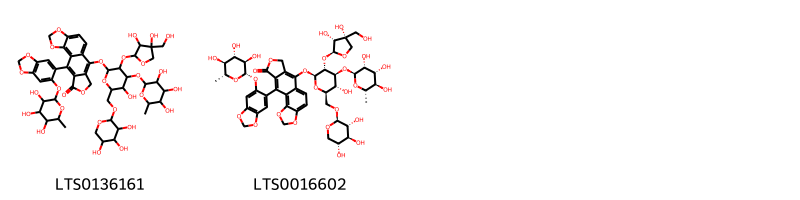{ width=100% }
    <figcaption>Hình ảnh cấu trúc hóa học của 2 hoạt chất thuộc nhóm Organooxygen compounds gồm ['10-[(3-{[3,4-dihydroxy-4-(hydroxymethyl)oxolan-2-yl]oxy}-5-hydroxy-4-[(3,4,5-trihydroxy-6-methyloxan-2-yl)oxy]-6-{[(3,4,5-trihydroxyoxan-2-yl)oxy]methyl}oxan-2-yl)oxy]-16-{6-[(3,4,5-trihydroxy-6-methyloxan-2-yl)oxy]-2h-1,3-benzodioxol-5-yl}-3,5,13-trioxatetracyclo[7.7.0.0²,⁶.0¹¹,¹⁵]hexadeca-1,6,8,10,15-pentaen-14-one (LTS0136161)', '10-{[(2s,3r,4s,5r,6r)-3-{[(2s,3r,4r)-3,4-dihydroxy-4-(hydroxymethyl)oxolan-2-yl]oxy}-5-hydroxy-4-{[(2s,3r,4r,5r,6s)-3,4,5-trihydroxy-6-methyloxan-2-yl]oxy}-6-({[(2s,3r,4s,5r)-3,4,5-trihydroxyoxan-2-yl]oxy}methyl)oxan-2-yl]oxy}-16-(6-{[(2s,3r,4s,5s,6r)-3,4,5-trihydroxy-6-methyloxan-2-yl]oxy}-2h-1,3-benzodioxol-5-yl)-3,5,13-trioxatetracyclo[7.7.0.0²,⁶.0¹¹,¹⁵]hexadeca-1,6,8,10,15-pentaen-14-one (LTS0016602)'].</figcaption>
</figure>

---

### Dược dân tộc học

Danh sách các quốc gia có sử dụng *Acanthus mollis* trong điều trị các bệnh. 

| Country    | Disease                   | Bệnh                                                                                                                                                                                                |
|:-----------|:--------------------------|:----------------------------------------------------------------------------------------------------------------------------------------------------------------------------------------------------|
| Dutch      | Stomachic                 | MYMEMORY WARNING: YOU USED ALL AVAILABLE FREE TRANSLATIONS FOR TODAY. NEXT AVAILABLE IN  13 HOURS 59 MINUTES 57 SECONDS VISIT HTTPS://MYMEMORY.TRANSLATED.NET/DOC/USAGELIMITS.PHP TO TRANSLATE MORE |
| Elsewhere  | Antidiarrheic, Hemostatic | MYMEMORY WARNING: YOU USED ALL AVAILABLE FREE TRANSLATIONS FOR TODAY. NEXT AVAILABLE IN  13 HOURS 59 MINUTES 52 SECONDS VISIT HTTPS://MYMEMORY.TRANSLATED.NET/DOC/USAGELIMITS.PHP TO TRANSLATE MORE |
| English    | Tonic                     | MYMEMORY WARNING: YOU USED ALL AVAILABLE FREE TRANSLATIONS FOR TODAY. NEXT AVAILABLE IN  13 HOURS 59 MINUTES 49 SECONDS VISIT HTTPS://MYMEMORY.TRANSLATED.NET/DOC/USAGELIMITS.PHP TO TRANSLATE MORE |
| French     | Emollient                 | MYMEMORY WARNING: YOU USED ALL AVAILABLE FREE TRANSLATIONS FOR TODAY. NEXT AVAILABLE IN  13 HOURS 59 MINUTES 45 SECONDS VISIT HTTPS://MYMEMORY.TRANSLATED.NET/DOC/USAGELIMITS.PHP TO TRANSLATE MORE |
| German     | Astringent                | MYMEMORY WARNING: YOU USED ALL AVAILABLE FREE TRANSLATIONS FOR TODAY. NEXT AVAILABLE IN  13 HOURS 59 MINUTES 42 SECONDS VISIT HTTPS://MYMEMORY.TRANSLATED.NET/DOC/USAGELIMITS.PHP TO TRANSLATE MORE |
| Italian    | Stimulant                 | MYMEMORY WARNING: YOU USED ALL AVAILABLE FREE TRANSLATIONS FOR TODAY. NEXT AVAILABLE IN  13 HOURS 59 MINUTES 39 SECONDS VISIT HTTPS://MYMEMORY.TRANSLATED.NET/DOC/USAGELIMITS.PHP TO TRANSLATE MORE |
| Malaysia   | Vulnerary                 | MYMEMORY WARNING: YOU USED ALL AVAILABLE FREE TRANSLATIONS FOR TODAY. NEXT AVAILABLE IN  13 HOURS 59 MINUTES 36 SECONDS VISIT HTTPS://MYMEMORY.TRANSLATED.NET/DOC/USAGELIMITS.PHP TO TRANSLATE MORE |
| Portuguese | Nervine                   | MYMEMORY WARNING: YOU USED ALL AVAILABLE FREE TRANSLATIONS FOR TODAY. NEXT AVAILABLE IN  13 HOURS 59 MINUTES 33 SECONDS VISIT HTTPS://MYMEMORY.TRANSLATED.NET/DOC/USAGELIMITS.PHP TO TRANSLATE MORE |
| Turkey     | Expectorant               | MYMEMORY WARNING: YOU USED ALL AVAILABLE FREE TRANSLATIONS FOR TODAY. NEXT AVAILABLE IN  13 HOURS 59 MINUTES 29 SECONDS VISIT HTTPS://MYMEMORY.TRANSLATED.NET/DOC/USAGELIMITS.PHP TO TRANSLATE MORE |
| ain        | Emollient                 | MYMEMORY WARNING: YOU USED ALL AVAILABLE FREE TRANSLATIONS FOR TODAY. NEXT AVAILABLE IN  13 HOURS 59 MINUTES 24 SECONDS VISIT HTTPS://MYMEMORY.TRANSLATED.NET/DOC/USAGELIMITS.PHP TO TRANSLATE MORE |

---

# Chi Pseuderanthemum

??? note "Danh sách các dược liệu thuộc chi"
    
	 - *Pseuderanthemum bicolor*

---
## Pseuderanthemum bicolor
### Thông tin về thực vật

!!! info "Phân loại thực vật của *Pseuderanthemum bicolor* từ GIBF:"
    - **Kingdom:** Plantae
    - **Phylum:** Tracheophyta
    - **Order:** Lamiales
    - **Family:** Acanthaceae
    - **Genus:** Pseuderanthemum
    - **Species:** *Pseuderanthemum bicolor*

 

| Label (VI)   | Label (EN)   | Scientific Name         | Descriptions (VI)   | Descriptions (EN)   | Also Known As (VI)   | Also Known As (EN)   |
|:-------------|:-------------|:------------------------|:--------------------|:--------------------|:---------------------|:---------------------|
| N/A          | N/A          | Pseuderanthemum bicolor | loài thực vật       | species of plant    | ['']                 | ['']                 |

#### Phân bố trên thế giới

**Từ CSDL GIBF** nan, Brazil, Viet Nam, United States of America, Guadeloupe, Indonesia, Cook Islands, Philippines, Martinique, Timor-Leste, India, Solomon Islands, unknown or invalid, Papua New Guinea, Trinidad and Tobago, Thailand, Fiji

#### Phân bố tại Việt Nam

**Từ CSDL GIBF**: Ninh Thuận

---
### Thành phần hóa học
        
- Theo cơ sở dữ liệu lotus: Từ loài *Pseuderanthemum bicolor* đã phân lập và xác định được Chưa có hoạt chất nào được phân lập. hoạt chất thuộc về các nhóm Không có hoạt chất nào được phân lập. 

Không có hình ảnh nào được tạo ra

---

### Dược dân tộc học

Danh sách các quốc gia có sử dụng *Pseuderanthemum bicolor* trong điều trị các bệnh. 

| Country   | Disease     | Bệnh                                                                                                                                                                                                |
|:----------|:------------|:----------------------------------------------------------------------------------------------------------------------------------------------------------------------------------------------------|
| Elsewhere | Cicatrizant | MYMEMORY WARNING: YOU USED ALL AVAILABLE FREE TRANSLATIONS FOR TODAY. NEXT AVAILABLE IN  13 HOURS 58 MINUTES 47 SECONDS VISIT HTTPS://MYMEMORY.TRANSLATED.NET/DOC/USAGELIMITS.PHP TO TRANSLATE MORE |

---

# Chi Barleria

??? note "Danh sách các dược liệu thuộc chi"
    
	 - *Barleria lupulina*
	 - *Barleria prionitis*

---
## Barleria lupulina
### Thông tin về thực vật

!!! info "Phân loại thực vật của *Barleria lupulina* từ GIBF:"
    - **Kingdom:** Plantae
    - **Phylum:** Tracheophyta
    - **Order:** Lamiales
    - **Family:** Acanthaceae
    - **Genus:** Barleria
    - **Species:** *Barleria lupulina*

 

| Label (VI)   | Label (EN)   | Scientific Name   | Descriptions (VI)   | Descriptions (EN)   | Also Known As (VI)   | Also Known As (EN)   |
|:-------------|:-------------|:------------------|:--------------------|:--------------------|:---------------------|:---------------------|
| N/A          | N/A          | Barleria lupulina | loài thực vật       | species of plant    | ['']                 | ['']                 |

#### Phân bố trên thế giới

**Từ CSDL GIBF** Viet Nam, Guadeloupe, China, Anguilla, Trinidad and Tobago, Madagascar, Thailand, Ghana, Sri Lanka, Réunion, United States of America, Virgin Islands (U.S.), Indonesia, Dominican Republic, Nigeria, Burkina Faso, French Guiana, Lao People’s Democratic Republic, Benin, Haiti, Mauritius, Mayotte, Curaçao, Nicaragua, Martinique, Australia, Côte d’Ivoire, Myanmar, India, Venezuela (Bolivarian Republic of)

#### Phân bố tại Việt Nam

**Từ CSDL GIBF**: Không có ghi nhận ở Việt Nam

---
### Thành phần hóa học
        
- Theo cơ sở dữ liệu lotus: Từ loài *Barleria lupulina* đã phân lập và xác định được 38 hoạt chất thuộc về các nhóm Fatty Acyls, Carboxylic acids and derivatives, Cinnamic acids and derivatives, Organooxygen compounds, Prenol lipids, Lignan glycosides. 

|    | chemicalTaxonomyClassyfireClass   |   smiles_count |
|---:|:----------------------------------|---------------:|
|  0 | Carboxylic acids and derivatives  |              1 |
|  1 | Cinnamic acids and derivatives    |              3 |
|  2 | Fatty Acyls                       |              1 |
|  3 | Lignan glycosides                 |              1 |
|  4 | Organooxygen compounds            |              4 |
|  5 | Prenol lipids                     |             27 |

#### Nhóm Carboxylic acids and derivatives
<figure markdown="span">
    { width=100% }
    <figcaption>Hình ảnh cấu trúc hóa học của 1 hoạt chất thuộc nhóm Carboxylic acids and derivatives gồm ['bet (LTS0164067)'].</figcaption>
</figure>
#### Nhóm Cinnamic acids and derivatives
<figure markdown="span">
    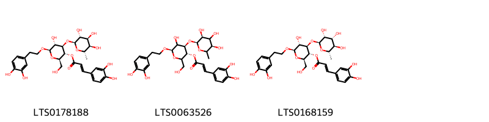{ width=100% }
    <figcaption>Hình ảnh cấu trúc hóa học của 3 hoạt chất thuộc nhóm Cinnamic acids and derivatives gồm ['(2r,3r,4r,5r,6r)-6-[2-(3,4-dihydroxyphenyl)ethoxy]-5-hydroxy-2-(hydroxymethyl)-4-{[(2s,3r,4s,5r,6s)-3,4,5-trihydroxy-6-methyloxan-2-yl]oxy}oxan-3-yl (2e)-3-(3,4-dihydroxyphenyl)prop-2-enoate (LTS0178188)', '(3r,4r,6r)-6-[2-(3,4-dihydroxyphenyl)ethoxy]-5-hydroxy-2-(hydroxymethyl)-4-{[(2s,3s,5r)-3,4,5-trihydroxy-6-methyloxan-2-yl]oxy}oxan-3-yl (2e)-3-(3,4-dihydroxyphenyl)prop-2-enoate (LTS0063526)', 'verbascoside (LTS0168159)'].</figcaption>
</figure>
#### Nhóm Fatty Acyls
<figure markdown="span">
    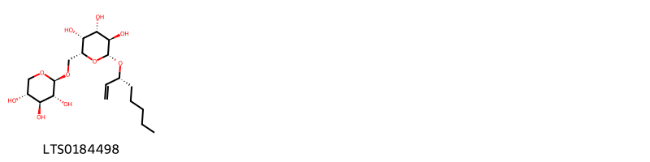{ width=100% }
    <figcaption>Hình ảnh cấu trúc hóa học của 1 hoạt chất thuộc nhóm Fatty Acyls gồm ['(2r,3r,4s,5r,6r)-2-[(3r)-oct-1-en-3-yloxy]-6-({[(2s,3r,4s,5r)-3,4,5-trihydroxyoxan-2-yl]oxy}methyl)oxane-3,4,5-triol (LTS0184498)'].</figcaption>
</figure>
#### Nhóm Lignan glycosides
<figure markdown="span">
    { width=100% }
    <figcaption>Hình ảnh cấu trúc hóa học của 1 hoạt chất thuộc nhóm Lignan glycosides gồm ['(2r,3r,4s,5s,6r)-2-{[(1s,2r,3r)-7-hydroxy-1-(4-hydroxy-3,5-dimethoxyphenyl)-3-(hydroxymethyl)-6,8-dimethoxy-1,2,3,4-tetrahydronaphthalen-2-yl]methoxy}-6-(hydroxymethyl)oxane-3,4,5-triol (LTS0225234)'].</figcaption>
</figure>
#### Nhóm Organooxygen compounds
<figure markdown="span">
    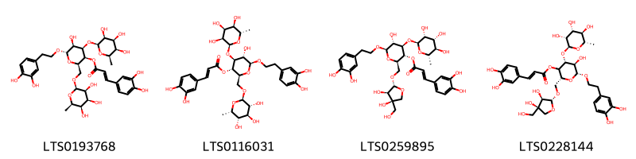{ width=100% }
    <figcaption>Hình ảnh cấu trúc hóa học của 4 hoạt chất thuộc nhóm Organooxygen compounds gồm ['(2r,3s,4r,5s,6s)-6-[2-(3,4-dihydroxyphenyl)ethoxy]-5-hydroxy-4-{[(2s,3s,4s,5r,6r)-3,4,5-trihydroxy-6-methyloxan-2-yl]oxy}-2-({[(2r,3s,4s,5r,6r)-3,4,5-trihydroxy-6-methyloxan-2-yl]oxy}methyl)oxan-3-yl (2e)-3-(3,4-dihydroxyphenyl)prop-2-enoate (LTS0193768)', '(2s,3s,4s,5s,6s)-6-[2-(3,4-dihydroxyphenyl)ethoxy]-5-hydroxy-4-{[(2s,3s,4s,5r,6s)-3,4,5-trihydroxy-6-methyloxan-2-yl]oxy}-2-({[(2r,3r,4s,5s,6s)-3,4,5-trihydroxy-6-methyloxan-2-yl]oxy}methyl)oxan-3-yl (2e)-3-(3,4-dihydroxyphenyl)prop-2-enoate (LTS0116031)', '(2r,3r,4r,5r,6r)-2-({[(2r,3r,4r)-3,4-dihydroxy-4-(hydroxymethyl)oxolan-2-yl]oxy}methyl)-6-[2-(3,4-dihydroxyphenyl)ethoxy]-5-hydroxy-4-{[(2s,3r,4r,5r,6s)-3,4,5-trihydroxy-6-methyloxan-2-yl]oxy}oxan-3-yl (2e)-3-(3,4-dihydroxyphenyl)prop-2-enoate (LTS0259895)', '(2r,4r,5r,6r)-2-({[(2r,3r,4r)-3,4-dihydroxy-4-(hydroxymethyl)oxolan-2-yl]oxy}methyl)-6-[2-(3,4-dihydroxyphenyl)ethoxy]-5-hydroxy-4-{[(2s,3r,4r,5r,6s)-3,4,5-trihydroxy-6-methyloxan-2-yl]oxy}oxan-3-yl (2e)-3-(3,4-dihydroxyphenyl)prop-2-enoate (LTS0228144)'].</figcaption>
</figure>
#### Nhóm Prenol lipids
<figure markdown="span">
    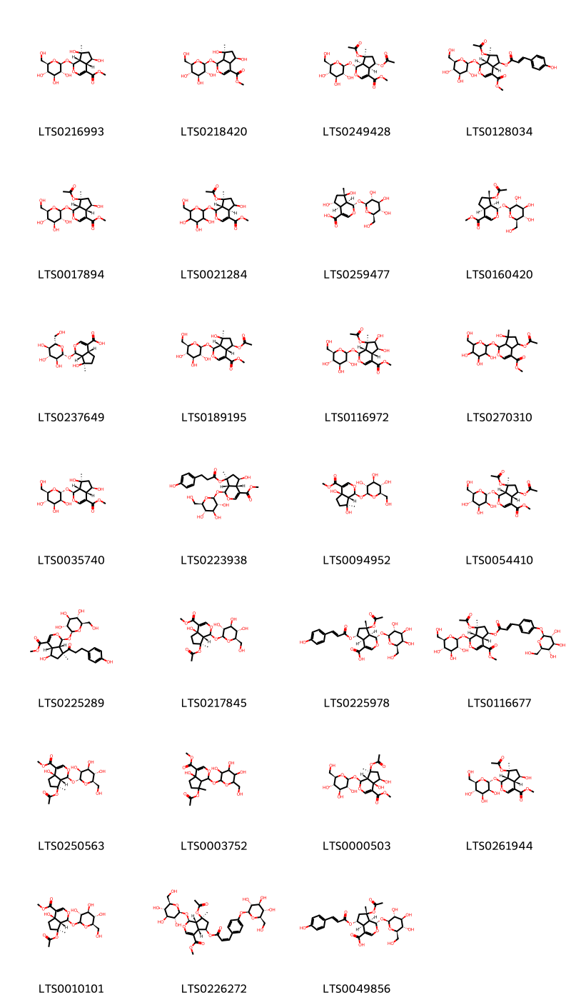{ width=100% }
    <figcaption>Hình ảnh cấu trúc hóa học của 27 hoạt chất thuộc nhóm Prenol lipids gồm ['methyl (1s,4as,5r,7s,7as)-5,7-dihydroxy-7-methyl-1-{[(2s,3r,4s,5s,6r)-3,4,5-trihydroxy-6-(hydroxymethyl)oxan-2-yl]oxy}-1h,4ah,5h,6h,7ah-cyclopenta[c]pyran-4-carboxylate (LTS0216993)', 'methyl (1s,5r,7s)-5,7-dihydroxy-7-methyl-1-{[(2s,3r,4s,5s,6r)-3,4,5-trihydroxy-6-(hydroxymethyl)oxan-2-yl]oxy}-1h,4ah,5h,6h,7ah-cyclopenta[c]pyran-4-carboxylate (LTS0218420)', 'methyl (1r,4ar,5s,7s,7ar)-5,7-bis(acetyloxy)-7-methyl-1-{[(2s,3r,4s,5s,6r)-3,4,5-trihydroxy-6-(hydroxymethyl)oxan-2-yl]oxy}-1h,4ah,5h,6h,7ah-cyclopenta[c]pyran-4-carboxylate (LTS0249428)', 'methyl (1s,4as,5r,7s,7as)-7-(acetyloxy)-5-{[(2e)-3-(4-hydroxyphenyl)prop-2-enoyl]oxy}-7-methyl-1-{[(2s,3r,4s,5s,6r)-3,4,5-trihydroxy-6-(hydroxymethyl)oxan-2-yl]oxy}-1h,4ah,5h,6h,7ah-cyclopenta[c]pyran-4-carboxylate (LTS0128034)', 'methyl (1s,4as,5r,7s,7as)-7-(acetyloxy)-5-hydroxy-7-methyl-1-{[(2s,3r,4s,5s,6r)-3,4,5-trihydroxy-6-(hydroxymethyl)oxan-2-yl]oxy}-1h,4ah,5h,6h,7ah-cyclopenta[c]pyran-4-carboxylate (LTS0017894)', 'methyl (4ar,7s,7as)-7-(acetyloxy)-5-hydroxy-7-methyl-1-{[3,4,5-trihydroxy-6-(hydroxymethyl)oxan-2-yl]oxy}-1h,4ah,5h,6h,7ah-cyclopenta[c]pyran-4-carboxylate (LTS0021284)', 'shanzhiside (LTS0259477)', 'methyl (1s,4as,7s,7as)-7-(acetyloxy)-7-methyl-1-{[(2s,3r,4s,5s,6r)-3,4,5-trihydroxy-6-(hydroxymethyl)oxan-2-yl]oxy}-1h,4ah,5h,6h,7ah-cyclopenta[c]pyran-4-carboxylate (LTS0160420)', '(1r,4ar,7r,7ar)-7-hydroxy-7-methyl-1-{[(2r,3s,4r,5r,6s)-3,4,5-trihydroxy-6-(hydroxymethyl)oxan-2-yl]oxy}-1h,4ah,5h,6h,7ah-cyclopenta[c]pyran-4-carboxylic acid (LTS0237649)', 'methyl (1s,4as,5r,7s,7as)-5-(acetyloxy)-7-hydroxy-7-methyl-1-{[(2s,3r,4s,5s,6r)-3,4,5-trihydroxy-6-(hydroxymethyl)oxan-2-yl]oxy}-1h,4ah,5h,6h,7ah-cyclopenta[c]pyran-4-carboxylate (LTS0189195)', 'methyl (1s,4as,5s,6s,7r,7as)-7-(acetyloxy)-5,6-dihydroxy-7-methyl-1-{[(2s,3r,4s,5s,6r)-3,4,5-trihydroxy-6-(hydroxymethyl)oxan-2-yl]oxy}-1h,4ah,5h,6h,7ah-cyclopenta[c]pyran-4-carboxylate (LTS0116972)', 'methyl 5-(acetyloxy)-7-hydroxy-7-methyl-1-{[3,4,5-trihydroxy-6-(hydroxymethyl)oxan-2-yl]oxy}-1h,4ah,5h,6h,7ah-cyclopenta[c]pyran-4-carboxylate (LTS0270310)', 'methyl (1s,4as,5r,7s,7as)-5,7-dihydroxy-7-methyl-1-{[(2r,3s,4s,5s,6r)-3,4,5-trihydroxy-6-(hydroxymethyl)oxan-2-yl]oxy}-1h,4ah,5h,6h,7ah-cyclopenta[c]pyran-4-carboxylate (LTS0035740)', 'methyl (1s,4as,5r,7s,7as)-5-hydroxy-7-{[3-(4-hydroxyphenyl)propanoyl]oxy}-7-methyl-1-{[(2s,3r,4s,5s,6r)-3,4,5-trihydroxy-6-(hydroxymethyl)oxan-2-yl]oxy}-1h,4ah,5h,6h,7ah-cyclopenta[c]pyran-4-carboxylate (LTS0223938)', 'ipolamiide (LTS0094952)', 'methyl (1s,4as,5r,7s,7as)-5,7-bis(acetyloxy)-7-methyl-1-{[(2r,3s,4s,5s,6r)-3,4,5-trihydroxy-6-(hydroxymethyl)oxan-2-yl]oxy}-1h,4ah,5h,6h,7ah-cyclopenta[c]pyran-4-carboxylate (LTS0054410)', 'methyl (1s,4as,5r,7s,7as)-5-hydroxy-7-[3-(4-hydroxyphenyl)propanoyl]-7-methyl-1-{[(2s,3r,4s,5s,6r)-3,4,5-trihydroxy-6-(hydroxymethyl)oxan-2-yl]oxy}-1h,4ah,5h,6h,7ah-cyclopenta[c]pyran-4-carboxylate (LTS0225289)', 'methyl (1s,4ar,7s,7as)-7-(acetyloxy)-4a-hydroxy-7-methyl-1-{[(2s,3r,4s,5s,6r)-3,4,5-trihydroxy-6-(hydroxymethyl)oxan-2-yl]oxy}-1h,5h,6h,7ah-cyclopenta[c]pyran-4-carboxylate (LTS0217845)', '(1s,4as,5r,7s,7as)-7-(acetyloxy)-5-{[(2e)-3-(4-hydroxyphenyl)prop-2-enoyl]oxy}-7-methyl-1-{[(2s,3r,4s,5r,6r)-3,4,5-trihydroxy-6-(hydroxymethyl)oxan-2-yl]oxy}-1h,4ah,5h,6h,7ah-cyclopenta[c]pyran-4-carboxylic acid (LTS0225978)', 'methyl (1s,4as,5r,7s,7as)-7-(acetyloxy)-7-methyl-1-{[(2s,3r,4s,5s,6r)-3,4,5-trihydroxy-6-(hydroxymethyl)oxan-2-yl]oxy}-5-{[(2e)-3-(4-{[(2s,3r,4s,5s,6r)-3,4,5-trihydroxy-6-(hydroxymethyl)oxan-2-yl]oxy}phenyl)prop-2-enoyl]oxy}-1h,4ah,5h,6h,7ah-cyclopenta[c]pyran-4-carboxylate (LTS0116677)', 'methyl (1s,4ar,7s,7as)-7-(acetyloxy)-4a-hydroxy-7-methyl-1-{[(2r,3s,4s,5s,6r)-3,4,5-trihydroxy-6-(hydroxymethyl)oxan-2-yl]oxy}-1h,5h,6h,7ah-cyclopenta[c]pyran-4-carboxylate (LTS0250563)', 'methyl 7-(acetyloxy)-4a-hydroxy-7-methyl-1-{[3,4,5-trihydroxy-6-(hydroxymethyl)oxan-2-yl]oxy}-1h,5h,6h,7ah-cyclopenta[c]pyran-4-carboxylate (LTS0003752)', 'methyl (1s,4ar,5r,7s,7as)-7-(acetyloxy)-4a,5-dihydroxy-7-methyl-1-{[(2s,3r,4s,5s,6r)-3,4,5-trihydroxy-6-(hydroxymethyl)oxan-2-yl]oxy}-1h,5h,6h,7ah-cyclopenta[c]pyran-4-carboxylate (LTS0000503)', 'methyl (1s,4as,5r,7s,7as)-7-(acetyloxy)-5-hydroxy-7-methyl-1-{[(2r,3s,4s,5s,6r)-3,4,5-trihydroxy-6-(hydroxymethyl)oxan-2-yl]oxy}-1h,4ah,5h,6h,7ah-cyclopenta[c]pyran-4-carboxylate (LTS0261944)', 'methyl (1s,4ar,7s,7as)-7-(acetyloxy)-4a-hydroxy-7-methyl-1-{[(3r,4s,5s,6r)-3,4,5-trihydroxy-6-(hydroxymethyl)oxan-2-yl]oxy}-1h,5h,6h,7ah-cyclopenta[c]pyran-4-carboxylate (LTS0010101)', 'methyl (1s,4as,5r,7s,7as)-7-(acetyloxy)-7-methyl-1-{[(2s,3r,4s,5s,6r)-3,4,5-trihydroxy-6-(hydroxymethyl)oxan-2-yl]oxy}-5-{[(2z)-3-(4-{[(2s,3r,4s,5s,6r)-3,4,5-trihydroxy-6-(hydroxymethyl)oxan-2-yl]oxy}phenyl)prop-2-enoyl]oxy}-1h,4ah,5h,6h,7ah-cyclopenta[c]pyran-4-carboxylate (LTS0226272)', '(1s,4as,5r,7s,7as)-7-(acetyloxy)-5-{[(2e)-3-(4-hydroxyphenyl)prop-2-enoyl]oxy}-7-methyl-1-{[(2s,3r,4s,5s,6r)-3,4,5-trihydroxy-6-(hydroxymethyl)oxan-2-yl]oxy}-1h,4ah,5h,6h,7ah-cyclopenta[c]pyran-4-carboxylic acid (LTS0049856)'].</figcaption>
</figure>

---

### Dược dân tộc học

Danh sách các quốc gia có sử dụng *Barleria lupulina* trong điều trị các bệnh. 

| Country   | Disease   | Bệnh                                                                                                                                                                                                |
|:----------|:----------|:----------------------------------------------------------------------------------------------------------------------------------------------------------------------------------------------------|
| Haiti     | Diuretic  | MYMEMORY WARNING: YOU USED ALL AVAILABLE FREE TRANSLATIONS FOR TODAY. NEXT AVAILABLE IN  13 HOURS 58 MINUTES 16 SECONDS VISIT HTTPS://MYMEMORY.TRANSLATED.NET/DOC/USAGELIMITS.PHP TO TRANSLATE MORE |

---

---
## Barleria prionitis
### Thông tin về thực vật

!!! info "Phân loại thực vật của *Barleria prionitis* từ GIBF:"
    - **Kingdom:** Plantae
    - **Phylum:** Tracheophyta
    - **Order:** Lamiales
    - **Family:** Acanthaceae
    - **Genus:** Barleria
    - **Species:** *Barleria prionitis*

 

| Label (VI)   | Label (EN)   | Scientific Name    | Descriptions (VI)   | Descriptions (EN)                          | Also Known As (VI)   | Also Known As (EN)                                 |
|:-------------|:-------------|:-------------------|:--------------------|:-------------------------------------------|:---------------------|:---------------------------------------------------|
| N/A          | N/A          | Barleria prionitis | loài thực vật       | species of plant in the Acanthaceae family | ['']                 | ['Barleria prionitis L.', 'Yellow Hedge Barleria'] |

#### Phân bố trên thế giới

**Từ CSDL GIBF** Sri Lanka, Namibia, Réunion, Benin, Indonesia, Timor-Leste, Malaysia, South Africa, Australia, Philippines, Nepal, Mauritius, India, Pakistan, Angola, Thailand, Ghana, Puerto Rico

#### Phân bố tại Việt Nam

**Từ CSDL GIBF**: Không có ghi nhận ở Việt Nam

---
### Thành phần hóa học
        
- Theo cơ sở dữ liệu lotus: Từ loài *Barleria prionitis* đã phân lập và xác định được 27 hoạt chất thuộc về các nhóm Flavonoids, Carboxylic acids and derivatives, Cinnamic acids and derivatives, Benzodioxoles, Organooxygen compounds, Prenol lipids. 

|    | chemicalTaxonomyClassyfireClass   |   smiles_count |
|---:|:----------------------------------|---------------:|
|  0 | Benzodioxoles                     |              4 |
|  1 | Carboxylic acids and derivatives  |              1 |
|  2 | Cinnamic acids and derivatives    |              4 |
|  3 | Flavonoids                        |              5 |
|  4 | Organooxygen compounds            |              2 |
|  5 | Prenol lipids                     |             11 |

#### Nhóm Benzodioxoles
<figure markdown="span">
    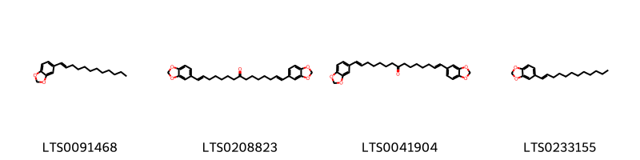{ width=100% }
    <figcaption>Hình ảnh cấu trúc hóa học của 4 hoạt chất thuộc nhóm Benzodioxoles gồm ['5-(dodec-1-en-1-yl)-2h-1,3-benzodioxole (LTS0091468)', '(1e,14e)-1,15-bis(2h-1,3-benzodioxol-5-yl)pentadeca-1,14-dien-8-one (LTS0208823)', '1,15-bis(2h-1,3-benzodioxol-5-yl)pentadeca-1,14-dien-8-one (LTS0041904)', '5-[(1e)-dodec-1-en-1-yl]-2h-1,3-benzodioxole (LTS0233155)'].</figcaption>
</figure>
#### Nhóm Carboxylic acids and derivatives
<figure markdown="span">
    { width=100% }
    <figcaption>Hình ảnh cấu trúc hóa học của 1 hoạt chất thuộc nhóm Carboxylic acids and derivatives gồm ['bet (LTS0164067)'].</figcaption>
</figure>
#### Nhóm Cinnamic acids and derivatives
<figure markdown="span">
    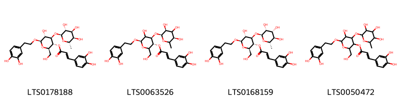{ width=100% }
    <figcaption>Hình ảnh cấu trúc hóa học của 4 hoạt chất thuộc nhóm Cinnamic acids and derivatives gồm ['(2r,3r,4r,5r,6r)-6-[2-(3,4-dihydroxyphenyl)ethoxy]-5-hydroxy-2-(hydroxymethyl)-4-{[(2s,3r,4s,5r,6s)-3,4,5-trihydroxy-6-methyloxan-2-yl]oxy}oxan-3-yl (2e)-3-(3,4-dihydroxyphenyl)prop-2-enoate (LTS0178188)', '(3r,4r,6r)-6-[2-(3,4-dihydroxyphenyl)ethoxy]-5-hydroxy-2-(hydroxymethyl)-4-{[(2s,3s,5r)-3,4,5-trihydroxy-6-methyloxan-2-yl]oxy}oxan-3-yl (2e)-3-(3,4-dihydroxyphenyl)prop-2-enoate (LTS0063526)', 'verbascoside (LTS0168159)', '6-[2-(3,4-dihydroxyphenyl)ethoxy]-5-hydroxy-2-(hydroxymethyl)-4-[(3,4,5-trihydroxy-6-methyloxan-2-yl)oxy]oxan-3-yl 3-(3,4-dihydroxyphenyl)prop-2-enoate (LTS0050472)'].</figcaption>
</figure>
#### Nhóm Flavonoids
<figure markdown="span">
    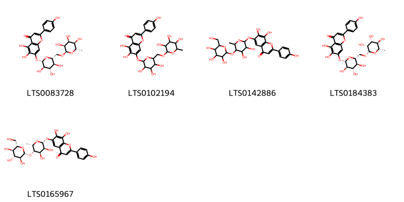{ width=100% }
    <figcaption>Hình ảnh cấu trúc hóa học của 5 hoạt chất thuộc nhóm Flavonoids gồm ['5,6-dihydroxy-2-(4-hydroxyphenyl)-7-{[(2s,3r,4s,5s,6r)-3,4,5-trihydroxy-6-({[(2r,3s,4s,5r,6s)-3,4,5-trihydroxy-6-methyloxan-2-yl]oxy}methyl)oxan-2-yl]oxy}chromen-4-one (LTS0083728)', '5,6-dihydroxy-2-(4-hydroxyphenyl)-7-[(3,4,5-trihydroxy-6-{[(3,4,5-trihydroxy-6-methyloxan-2-yl)oxy]methyl}oxan-2-yl)oxy]chromen-4-one (LTS0102194)', '6-[(3,4-dihydroxy-6-methyl-5-{[3,4,5-trihydroxy-6-(hydroxymethyl)oxan-2-yl]oxy}oxan-2-yl)oxy]-7,8-dihydroxy-2-(4-hydroxyphenyl)chromen-4-one (LTS0142886)', '5,6-dihydroxy-2-(4-hydroxyphenyl)-7-{[(2s,3r,4s,5s,6r)-3,4,5-trihydroxy-6-({[(2s,3r,4r,5r,6s)-3,4,5-trihydroxy-6-methyloxan-2-yl]oxy}methyl)oxan-2-yl]oxy}chromen-4-one (LTS0184383)', '6-{[(2r,3s,4r,5s,6s)-3,4-dihydroxy-6-methyl-5-{[(2r,3s,4r,5r,6s)-3,4,5-trihydroxy-6-(hydroxymethyl)oxan-2-yl]oxy}oxan-2-yl]oxy}-7,8-dihydroxy-2-(4-hydroxyphenyl)chromen-4-one (LTS0165967)'].</figcaption>
</figure>
#### Nhóm Organooxygen compounds
<figure markdown="span">
    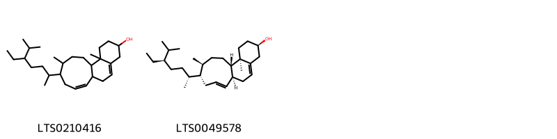{ width=100% }
    <figcaption>Hình ảnh cấu trúc hóa học của 2 hoạt chất thuộc nhóm Organooxygen compounds gồm ['10-(5-ethyl-6-methylheptan-2-yl)-11,13b-dimethyl-1h,2h,3h,4h,6h,6ah,9h,10h,11h,12h,13h,13ah-cyclonona[a]naphthalen-3-ol (LTS0210416)', '(3r,6as,10r,11s,13as,13br)-10-[(2r,5r)-5-ethyl-6-methylheptan-2-yl]-11,13b-dimethyl-1h,2h,3h,4h,6h,6ah,9h,10h,11h,12h,13h,13ah-cyclonona[a]naphthalen-3-ol (LTS0049578)'].</figcaption>
</figure>
#### Nhóm Prenol lipids
<figure markdown="span">
    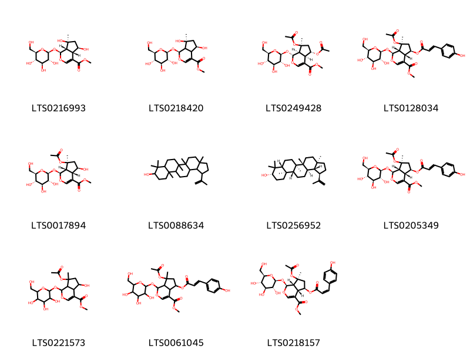{ width=100% }
    <figcaption>Hình ảnh cấu trúc hóa học của 11 hoạt chất thuộc nhóm Prenol lipids gồm ['methyl (1s,4as,5r,7s,7as)-5,7-dihydroxy-7-methyl-1-{[(2s,3r,4s,5s,6r)-3,4,5-trihydroxy-6-(hydroxymethyl)oxan-2-yl]oxy}-1h,4ah,5h,6h,7ah-cyclopenta[c]pyran-4-carboxylate (LTS0216993)', 'methyl (1s,5r,7s)-5,7-dihydroxy-7-methyl-1-{[(2s,3r,4s,5s,6r)-3,4,5-trihydroxy-6-(hydroxymethyl)oxan-2-yl]oxy}-1h,4ah,5h,6h,7ah-cyclopenta[c]pyran-4-carboxylate (LTS0218420)', 'methyl (1r,4ar,5s,7s,7ar)-5,7-bis(acetyloxy)-7-methyl-1-{[(2s,3r,4s,5s,6r)-3,4,5-trihydroxy-6-(hydroxymethyl)oxan-2-yl]oxy}-1h,4ah,5h,6h,7ah-cyclopenta[c]pyran-4-carboxylate (LTS0249428)', 'methyl (1s,4as,5r,7s,7as)-7-(acetyloxy)-5-{[(2e)-3-(4-hydroxyphenyl)prop-2-enoyl]oxy}-7-methyl-1-{[(2s,3r,4s,5s,6r)-3,4,5-trihydroxy-6-(hydroxymethyl)oxan-2-yl]oxy}-1h,4ah,5h,6h,7ah-cyclopenta[c]pyran-4-carboxylate (LTS0128034)', 'methyl (1s,4as,5r,7s,7as)-7-(acetyloxy)-5-hydroxy-7-methyl-1-{[(2s,3r,4s,5s,6r)-3,4,5-trihydroxy-6-(hydroxymethyl)oxan-2-yl]oxy}-1h,4ah,5h,6h,7ah-cyclopenta[c]pyran-4-carboxylate (LTS0017894)', 'lupeol (LTS0088634)', 'lupeol (LTS0256952)', 'methyl (1s,4as,5r,7s,7as)-7-(acetyloxy)-5-{[3-(4-hydroxyphenyl)prop-2-enoyl]oxy}-7-methyl-1-{[(2s,3r,4s,5s,6r)-3,4,5-trihydroxy-6-(hydroxymethyl)oxan-2-yl]oxy}-1h,4ah,5h,6h,7ah-cyclopenta[c]pyran-4-carboxylate (LTS0205349)', 'methyl 7-(acetyloxy)-5-hydroxy-7-methyl-1-{[3,4,5-trihydroxy-6-(hydroxymethyl)oxan-2-yl]oxy}-1h,4ah,5h,6h,7ah-cyclopenta[c]pyran-4-carboxylate (LTS0221573)', 'methyl 7-(acetyloxy)-5-{[3-(4-hydroxyphenyl)prop-2-enoyl]oxy}-7-methyl-1-{[3,4,5-trihydroxy-6-(hydroxymethyl)oxan-2-yl]oxy}-1h,4ah,5h,6h,7ah-cyclopenta[c]pyran-4-carboxylate (LTS0061045)', 'methyl (1s,4as,5r,7s,7as)-7-(acetyloxy)-5-{[(2z)-3-(4-hydroxyphenyl)prop-2-enoyl]oxy}-7-methyl-1-{[(2s,3r,4s,5s,6r)-3,4,5-trihydroxy-6-(hydroxymethyl)oxan-2-yl]oxy}-1h,4ah,5h,6h,7ah-cyclopenta[c]pyran-4-carboxylate (LTS0218157)'].</figcaption>
</figure>

---

### Dược dân tộc học

Danh sách các quốc gia có sử dụng *Barleria prionitis* trong điều trị các bệnh. 

| Country   | Disease   | Bệnh                                                                                                                                                                                                |
|:----------|:----------|:----------------------------------------------------------------------------------------------------------------------------------------------------------------------------------------------------|
| Java      | Diuretic  | MYMEMORY WARNING: YOU USED ALL AVAILABLE FREE TRANSLATIONS FOR TODAY. NEXT AVAILABLE IN  13 HOURS 57 MINUTES 38 SECONDS VISIT HTTPS://MYMEMORY.TRANSLATED.NET/DOC/USAGELIMITS.PHP TO TRANSLATE MORE |
| Thailand  | nan       | MYMEMORY WARNING: YOU USED ALL AVAILABLE FREE TRANSLATIONS FOR TODAY. NEXT AVAILABLE IN  13 HOURS 57 MINUTES 35 SECONDS VISIT HTTPS://MYMEMORY.TRANSLATED.NET/DOC/USAGELIMITS.PHP TO TRANSLATE MORE |

---

# Chi Hemigraphis

??? note "Danh sách các dược liệu thuộc chi"
    
	 - *Hemigraphis colorata*

---
## Hemigraphis colorata
### Thông tin về thực vật

!!! info "Phân loại thực vật của *Strobilanthes alternata* từ GIBF:"
    - **Kingdom:** Plantae
    - **Phylum:** Tracheophyta
    - **Order:** Lamiales
    - **Family:** Acanthaceae
    - **Genus:** Strobilanthes
    - **Species:** *Strobilanthes alternata*

 

| Label (VI)   | Label (EN)   | Scientific Name      | Descriptions (VI)   | Descriptions (EN)   | Also Known As (VI)   | Also Known As (EN)   |
|:-------------|:-------------|:---------------------|:--------------------|:--------------------|:---------------------|:---------------------|
| N/A          | N/A          | Hemigraphis colorata | loài thực vật       | species of plant    | ['']                 | ['']                 |

#### Phân bố trên thế giới

**Từ CSDL GIBF** nan, Brazil, Congo, Democratic Republic of the, United States of America, Niue, Tonga, Indonesia, Malaysia, Costa Rica, Colombia, India, French Polynesia, Togo, Thailand, Puerto Rico

#### Phân bố tại Việt Nam

**Từ CSDL GIBF**: Không có ghi nhận ở Việt Nam

---
### Thành phần hóa học
        
- Theo cơ sở dữ liệu lotus: Từ loài *Strobilanthes alternata* đã phân lập và xác định được Chưa có hoạt chất nào được phân lập. hoạt chất thuộc về các nhóm Không có hoạt chất nào được phân lập. 

Không có hình ảnh nào được tạo ra

---

### Dược dân tộc học

Danh sách các quốc gia có sử dụng *Strobilanthes alternata* trong điều trị các bệnh. 

| Country   | Disease   | Bệnh                                                                                                                                                                                                |
|:----------|:----------|:----------------------------------------------------------------------------------------------------------------------------------------------------------------------------------------------------|
| Java      | Diuretic  | MYMEMORY WARNING: YOU USED ALL AVAILABLE FREE TRANSLATIONS FOR TODAY. NEXT AVAILABLE IN  13 HOURS 57 MINUTES 00 SECONDS VISIT HTTPS://MYMEMORY.TRANSLATED.NET/DOC/USAGELIMITS.PHP TO TRANSLATE MORE |

---

# Chi Staurogyne

??? note "Danh sách các dược liệu thuộc chi"
    
	 - *Staurogyne malaccensis*

---
## Staurogyne malaccensis
### Thông tin về thực vật

!!! info "Phân loại thực vật của *Staurogyne malaccensis* từ GIBF:"
    - **Kingdom:** Plantae
    - **Phylum:** Tracheophyta
    - **Order:** Lamiales
    - **Family:** Acanthaceae
    - **Genus:** Staurogyne
    - **Species:** *Staurogyne malaccensis*

 

| Label (VI)   | Label (EN)   | Scientific Name        | Descriptions (VI)   | Descriptions (EN)   | Also Known As (VI)   | Also Known As (EN)   |
|:-------------|:-------------|:-----------------------|:--------------------|:--------------------|:---------------------|:---------------------|
| N/A          | N/A          | Staurogyne malaccensis | loài thực vật       | species of plant    | ['']                 | ['']                 |

#### Phân bố trên thế giới

**Từ CSDL GIBF** nan, Viet Nam, Malaysia, unknown or invalid, Thailand

#### Phân bố tại Việt Nam

**Từ CSDL GIBF**: Không có ghi nhận ở Việt Nam

---
### Thành phần hóa học
        
- Theo cơ sở dữ liệu lotus: Từ loài *Staurogyne malaccensis* đã phân lập và xác định được Chưa có hoạt chất nào được phân lập. hoạt chất thuộc về các nhóm Không có hoạt chất nào được phân lập. 

Không có hình ảnh nào được tạo ra

---

### Dược dân tộc học

Danh sách các quốc gia có sử dụng *Staurogyne malaccensis* trong điều trị các bệnh. 

| Country   | Disease   | Bệnh                                                                                                                                                                                                |
|:----------|:----------|:----------------------------------------------------------------------------------------------------------------------------------------------------------------------------------------------------|
| Java      | Diuretic  | MYMEMORY WARNING: YOU USED ALL AVAILABLE FREE TRANSLATIONS FOR TODAY. NEXT AVAILABLE IN  13 HOURS 56 MINUTES 37 SECONDS VISIT HTTPS://MYMEMORY.TRANSLATED.NET/DOC/USAGELIMITS.PHP TO TRANSLATE MORE |

---

# Chi Ruellia

??? note "Danh sách các dược liệu thuộc chi"
    
	 - *Ruellia albicaulis*
	 - *Ruellia californica*
	 - *Ruellia canescens*
	 - *Ruellia tuberosa*

---
## Ruellia albicaulis
### Thông tin về thực vật

!!! info "Phân loại thực vật của *Ruellia inundata* từ GIBF:"
    - **Kingdom:** Plantae
    - **Phylum:** Tracheophyta
    - **Order:** Lamiales
    - **Family:** Acanthaceae
    - **Genus:** Ruellia
    - **Species:** *Ruellia inundata*

 

| Label (VI)   | Label (EN)   | Scientific Name        | Descriptions (VI)   | Descriptions (EN)   | Also Known As (VI)   | Also Known As (EN)   |
|:-------------|:-------------|:-----------------------|:--------------------|:--------------------|:---------------------|:---------------------|
| N/A          | N/A          | Staurogyne malaccensis | loài thực vật       | species of plant    | ['']                 | ['']                 |

#### Phân bố trên thế giới

**Từ CSDL GIBF** nan, Mexico, Guatemala, Nicaragua, Colombia, Ecuador, unknown or invalid

#### Phân bố tại Việt Nam

**Từ CSDL GIBF**: Không có ghi nhận ở Việt Nam

---
### Thành phần hóa học
        
- Theo cơ sở dữ liệu lotus: Từ loài *Ruellia inundata* đã phân lập và xác định được Chưa có hoạt chất nào được phân lập. hoạt chất thuộc về các nhóm Không có hoạt chất nào được phân lập. 

Không có hình ảnh nào được tạo ra

---

### Dược dân tộc học

Danh sách các quốc gia có sử dụng *Ruellia inundata* trong điều trị các bệnh. 

| Country   | Disease     | Bệnh                                                                                                                                                                                                |
|:----------|:------------|:----------------------------------------------------------------------------------------------------------------------------------------------------------------------------------------------------|
| Mexico    | Aphrodisiac | MYMEMORY WARNING: YOU USED ALL AVAILABLE FREE TRANSLATIONS FOR TODAY. NEXT AVAILABLE IN  13 HOURS 56 MINUTES 11 SECONDS VISIT HTTPS://MYMEMORY.TRANSLATED.NET/DOC/USAGELIMITS.PHP TO TRANSLATE MORE |

---

---
## Ruellia californica
### Thông tin về thực vật

!!! info "Phân loại thực vật của *Ruellia californica* từ GIBF:"
    - **Kingdom:** Plantae
    - **Phylum:** Tracheophyta
    - **Order:** Lamiales
    - **Family:** Acanthaceae
    - **Genus:** Ruellia
    - **Species:** *Ruellia californica*

 

| Label (VI)   | Label (EN)   | Scientific Name     | Descriptions (VI)   | Descriptions (EN)   | Also Known As (VI)   | Also Known As (EN)   |
|:-------------|:-------------|:--------------------|:--------------------|:--------------------|:---------------------|:---------------------|
| N/A          | N/A          | Ruellia californica | loài thực vật       | species of plant    | ['']                 | ['']                 |

#### Phân bố trên thế giới

**Từ CSDL GIBF** Mexico, United States of America

#### Phân bố tại Việt Nam

**Từ CSDL GIBF**: Không có ghi nhận ở Việt Nam

---
### Thành phần hóa học
        
- Theo cơ sở dữ liệu lotus: Từ loài *Ruellia californica* đã phân lập và xác định được Chưa có hoạt chất nào được phân lập. hoạt chất thuộc về các nhóm Không có hoạt chất nào được phân lập. 

Không có hình ảnh nào được tạo ra

---

### Dược dân tộc học

Danh sách các quốc gia có sử dụng *Ruellia californica* trong điều trị các bệnh. 

| Country      | Disease   | Bệnh                                                                                                                                                                                                |
|:-------------|:----------|:----------------------------------------------------------------------------------------------------------------------------------------------------------------------------------------------------|
| Mexico(Seri) | Collyrium | MYMEMORY WARNING: YOU USED ALL AVAILABLE FREE TRANSLATIONS FOR TODAY. NEXT AVAILABLE IN  13 HOURS 55 MINUTES 49 SECONDS VISIT HTTPS://MYMEMORY.TRANSLATED.NET/DOC/USAGELIMITS.PHP TO TRANSLATE MORE |

---

---
## Ruellia canescens
### Thông tin về thực vật

!!! info "Phân loại thực vật của *N/A* từ GIBF:"
    - **Kingdom:** Plantae
    - **Phylum:** Tracheophyta
    - **Order:** Lamiales
    - **Family:** Acanthaceae
    - **Genus:** N/A
    - **Species:** *N/A*

 

| Label (VI)   | Label (EN)   | Scientific Name     | Descriptions (VI)   | Descriptions (EN)   | Also Known As (VI)   | Also Known As (EN)   |
|:-------------|:-------------|:--------------------|:--------------------|:--------------------|:---------------------|:---------------------|
| N/A          | N/A          | Ruellia californica | loài thực vật       | species of plant    | ['']                 | ['']                 |

#### Phân bố trên thế giới

**Từ CSDL GIBF** nan, Brazil, Viet Nam, Japan, Uganda, Senegal, China, Chile, New Zealand, Ecuador, Thailand, Spain, Guinea-Bissau, Puerto Rico, United States of America, Virgin Islands (U.S.), Indonesia, Costa Rica, Colombia, Argentina, French Guiana, Hong Kong, Mexico, Kenya, Macao, El Salvador, Eswatini, Malaysia, Chinese Taipei, Kuwait, Panama, Namibia, Singapore, Portugal, South Africa, Australia, Italy, India, France, Venezuela (Bolivarian Republic of)

#### Phân bố tại Việt Nam

**Từ CSDL GIBF**: Hồ Chí Minh city, Đồng Nai, Lâm Đồng

---
### Thành phần hóa học
        
- Theo cơ sở dữ liệu lotus: Từ loài *N/A* đã phân lập và xác định được Chưa có hoạt chất nào được phân lập. hoạt chất thuộc về các nhóm Không có hoạt chất nào được phân lập. 

Không có hình ảnh nào được tạo ra

---

### Dược dân tộc học

Danh sách các quốc gia có sử dụng *N/A* trong điều trị các bệnh. 

| Country   | Disease    | Bệnh                                                                                                                                                                                                |
|:----------|:-----------|:----------------------------------------------------------------------------------------------------------------------------------------------------------------------------------------------------|
| Elsewhere | Antibiotic | MYMEMORY WARNING: YOU USED ALL AVAILABLE FREE TRANSLATIONS FOR TODAY. NEXT AVAILABLE IN  13 HOURS 55 MINUTES 15 SECONDS VISIT HTTPS://MYMEMORY.TRANSLATED.NET/DOC/USAGELIMITS.PHP TO TRANSLATE MORE |

---

---
## Ruellia tuberosa
### Thông tin về thực vật

!!! info "Phân loại thực vật của *Ruellia tuberosa* từ GIBF:"
    - **Kingdom:** Plantae
    - **Phylum:** Tracheophyta
    - **Order:** Lamiales
    - **Family:** Acanthaceae
    - **Genus:** Ruellia
    - **Species:** *Ruellia tuberosa*

 

| Label (VI)   | Label (EN)   | Scientific Name   | Descriptions (VI)   | Descriptions (EN)   | Also Known As (VI)   | Also Known As (EN)           |
|:-------------|:-------------|:------------------|:--------------------|:--------------------|:---------------------|:-----------------------------|
| N/A          | N/A          | Ruellia tuberosa  | loài thực vật       | species of plant    | ['']                 | ['minnieroot', 'fever root'] |

#### Phân bố trên thế giới

**Từ CSDL GIBF** Brazil, Saint Kitts and Nevis, Viet Nam, Guadeloupe, Antigua and Barbuda, Honduras, Papua New Guinea, Trinidad and Tobago, Thailand, Puerto Rico, Sri Lanka, Cayman Islands, Saint Barthélemy, Jamaica, Virgin Islands (U.S.), Indonesia, Dominican Republic, Colombia, French Guiana, Sint Maarten (Dutch part), Lao People’s Democratic Republic, Maldives, Chinese Taipei, Malaysia, Philippines, Curaçao, Singapore, Martinique, Australia, India, Northern Mariana Islands, Venezuela (Bolivarian Republic of)

#### Phân bố tại Việt Nam

**Từ CSDL GIBF**: Hậu Giang, Bến Tre, Quảng Ngãi, Long An, Nam Định

---
### Thành phần hóa học
        
- Theo cơ sở dữ liệu lotus: Từ loài *Ruellia tuberosa* đã phân lập và xác định được 20 hoạt chất thuộc về các nhóm Fatty Acyls, Flavonoids, Carboxylic acids and derivatives, Cinnamic acids and derivatives, Steroids and steroid derivatives, Organooxygen compounds, Saturated hydrocarbons, Lignan glycosides. 

|    | chemicalTaxonomyClassyfireClass   |   smiles_count |
|---:|:----------------------------------|---------------:|
|  0 | Carboxylic acids and derivatives  |              3 |
|  1 | Cinnamic acids and derivatives    |              2 |
|  2 | Fatty Acyls                       |              4 |
|  3 | Flavonoids                        |              3 |
|  4 | Lignan glycosides                 |              2 |
|  5 | Organooxygen compounds            |              4 |
|  6 | Saturated hydrocarbons            |              1 |
|  7 | Steroids and steroid derivatives  |              1 |

#### Nhóm Carboxylic acids and derivatives
<figure markdown="span">
    { width=100% }
    <figcaption>Hình ảnh cấu trúc hóa học của 3 hoạt chất thuộc nhóm Carboxylic acids and derivatives gồm ['l-valine (LTS0231703)', 'l-tyrosine (LTS0029981)', 'l-leucine (LTS0113423)'].</figcaption>
</figure>
#### Nhóm Cinnamic acids and derivatives
<figure markdown="span">
    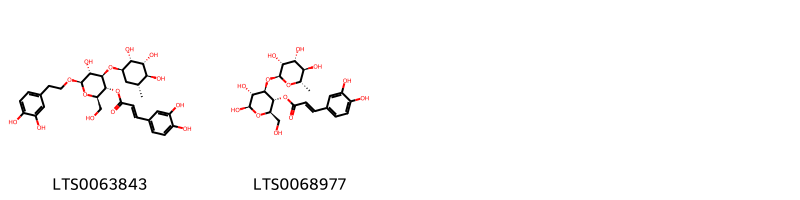{ width=100% }
    <figcaption>Hình ảnh cấu trúc hóa học của 2 hoạt chất thuộc nhóm Cinnamic acids and derivatives gồm ['(2r,3r,4r,5r,6r)-6-[2-(3,4-dihydroxyphenyl)ethoxy]-5-hydroxy-2-(hydroxymethyl)-4-{[(1r,2r,3r,4s,5r)-2,3,4-trihydroxy-5-methylcyclohexyl]oxy}oxan-3-yl (2e)-3-(3,4-dihydroxyphenyl)prop-2-enoate (LTS0063843)', '(2r,3r,4r,5r,6r)-5,6-dihydroxy-2-(hydroxymethyl)-4-{[(2s,3r,4r,5r,6s)-3,4,5-trihydroxy-6-methyloxan-2-yl]oxy}oxan-3-yl (2e)-3-(3,4-dihydroxyphenyl)prop-2-enoate (LTS0068977)'].</figcaption>
</figure>
#### Nhóm Fatty Acyls
<figure markdown="span">
    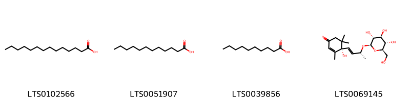{ width=100% }
    <figcaption>Hình ảnh cấu trúc hóa học của 4 hoạt chất thuộc nhóm Fatty Acyls gồm ['myristic acid (LTS0102566)', 'lauric acid (LTS0051907)', 'capric acid (LTS0039856)', '(4s)-4-hydroxy-3,5,5-trimethyl-4-[(1e,3r)-3-{[(2r,3r,4s,5s,6r)-3,4,5-trihydroxy-6-(hydroxymethyl)oxan-2-yl]oxy}but-1-en-1-yl]cyclohex-2-en-1-one (LTS0069145)'].</figcaption>
</figure>
#### Nhóm Flavonoids
<figure markdown="span">
    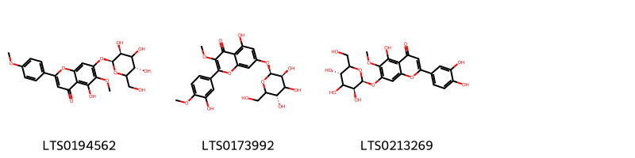{ width=100% }
    <figcaption>Hình ảnh cấu trúc hóa học của 3 hoạt chất thuộc nhóm Flavonoids gồm ['5-hydroxy-6-methoxy-2-(4-methoxyphenyl)-7-{[(2s,3s,5s)-3,4,5-trihydroxy-6-(hydroxymethyl)oxan-2-yl]oxy}chromen-4-one (LTS0194562)', '5-hydroxy-2-(3-hydroxy-4-methoxyphenyl)-3-methoxy-7-{[(2s,3s,5s)-3,4,5-trihydroxy-6-(hydroxymethyl)oxan-2-yl]oxy}chromen-4-one (LTS0173992)', '2-(3,4-dihydroxyphenyl)-5-hydroxy-6-methoxy-7-{[(2s,3s,5s)-3,4,5-trihydroxy-6-(hydroxymethyl)oxan-2-yl]oxy}chromen-4-one (LTS0213269)'].</figcaption>
</figure>
#### Nhóm Lignan glycosides
<figure markdown="span">
    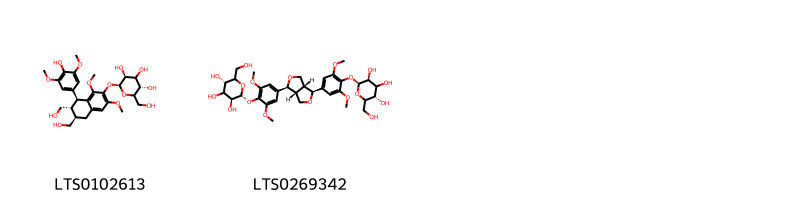{ width=100% }
    <figcaption>Hình ảnh cấu trúc hóa học của 2 hoạt chất thuộc nhóm Lignan glycosides gồm ['(2s,3s,5s)-2-{[(6r,7r,8s)-8-(4-hydroxy-3,5-dimethoxyphenyl)-6,7-bis(hydroxymethyl)-1,3-dimethoxy-5,6,7,8-tetrahydronaphthalen-2-yl]oxy}-6-(hydroxymethyl)oxane-3,4,5-triol (LTS0102613)', '(2r,3s,5s)-2-{4-[(1s,3ar,4s,6ar)-4-(3,5-dimethoxy-4-{[(2s,3s,5s)-3,4,5-trihydroxy-6-(hydroxymethyl)oxan-2-yl]oxy}phenyl)-hexahydrofuro[3,4-c]furan-1-yl]-2,6-dimethoxyphenoxy}-6-(hydroxymethyl)oxane-3,4,5-triol (LTS0269342)'].</figcaption>
</figure>
#### Nhóm Organooxygen compounds
<figure markdown="span">
    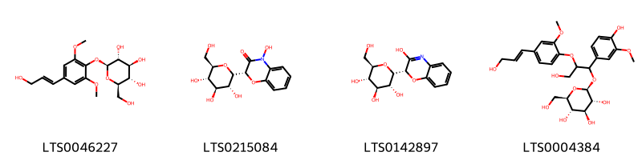{ width=100% }
    <figcaption>Hình ảnh cấu trúc hóa học của 4 hoạt chất thuộc nhóm Organooxygen compounds gồm ['syringin (LTS0046227)', '(2r)-4-hydroxy-2-[(3r,4s,5s,6r)-3,4,5-trihydroxy-6-(hydroxymethyl)oxan-2-yl]-2h-1,4-benzoxazin-3-one (LTS0215084)', '(3r,4s,5s,6r)-2-[(2r)-3-hydroxy-2h-1,4-benzoxazin-2-yl]-6-(hydroxymethyl)oxane-3,4,5-triol (LTS0142897)', '(2r,3r,4s,5s,6r)-2-[3-hydroxy-1-(4-hydroxy-3-methoxyphenyl)-2-[4-(3-hydroxyprop-1-en-1-yl)-2-methoxyphenoxy]propoxy]-6-(hydroxymethyl)oxane-3,4,5-triol (LTS0004384)'].</figcaption>
</figure>
#### Nhóm Saturated hydrocarbons
<figure markdown="span">
    { width=100% }
    <figcaption>Hình ảnh cấu trúc hóa học của 1 hoạt chất thuộc nhóm Saturated hydrocarbons gồm ['tritriacontane (LTS0203319)'].</figcaption>
</figure>
#### Nhóm Steroids and steroid derivatives
<figure markdown="span">
    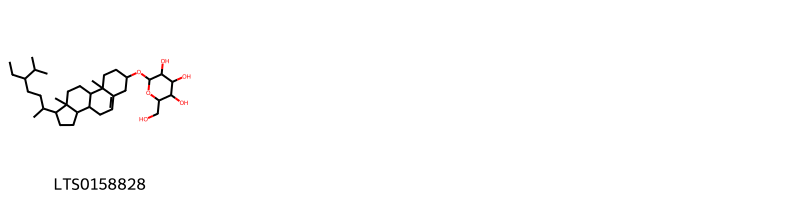{ width=100% }
    <figcaption>Hình ảnh cấu trúc hóa học của 1 hoạt chất thuộc nhóm Steroids and steroid derivatives gồm ['2-{[1-(5-ethyl-6-methylheptan-2-yl)-9a,11a-dimethyl-1h,2h,3h,3ah,3bh,4h,6h,7h,8h,9h,9bh,10h,11h-cyclopenta[a]phenanthren-7-yl]oxy}-6-(hydroxymethyl)oxane-3,4,5-triol (LTS0158828)'].</figcaption>
</figure>

---

### Dược dân tộc học

Danh sách các quốc gia có sử dụng *Ruellia tuberosa* trong điều trị các bệnh. 

| Country            | Disease               | Bệnh                                                                                                                                                                                                |
|:-------------------|:----------------------|:----------------------------------------------------------------------------------------------------------------------------------------------------------------------------------------------------|
| Dominican Republic | Antiseptic, Purgative | MYMEMORY WARNING: YOU USED ALL AVAILABLE FREE TRANSLATIONS FOR TODAY. NEXT AVAILABLE IN  13 HOURS 54 MINUTES 47 SECONDS VISIT HTTPS://MYMEMORY.TRANSLATED.NET/DOC/USAGELIMITS.PHP TO TRANSLATE MORE |
| Elsewhere          | Emetic                | MYMEMORY WARNING: YOU USED ALL AVAILABLE FREE TRANSLATIONS FOR TODAY. NEXT AVAILABLE IN  13 HOURS 54 MINUTES 44 SECONDS VISIT HTTPS://MYMEMORY.TRANSLATED.NET/DOC/USAGELIMITS.PHP TO TRANSLATE MORE |
| Haiti              | Diaphoretic, Diuretic | MYMEMORY WARNING: YOU USED ALL AVAILABLE FREE TRANSLATIONS FOR TODAY. NEXT AVAILABLE IN  13 HOURS 54 MINUTES 40 SECONDS VISIT HTTPS://MYMEMORY.TRANSLATED.NET/DOC/USAGELIMITS.PHP TO TRANSLATE MORE |
| Venezuela          | Emetic                | MYMEMORY WARNING: YOU USED ALL AVAILABLE FREE TRANSLATIONS FOR TODAY. NEXT AVAILABLE IN  13 HOURS 54 MINUTES 36 SECONDS VISIT HTTPS://MYMEMORY.TRANSLATED.NET/DOC/USAGELIMITS.PHP TO TRANSLATE MORE |

---

# Chi Asteracantha

??? note "Danh sách các dược liệu thuộc chi"
    
	 - *Asteracantha longifolia*

---
## Asteracantha longifolia
### Thông tin về thực vật

!!! info "Phân loại thực vật của *Hygrophila auriculata* từ GIBF:"
    - **Kingdom:** Plantae
    - **Phylum:** Tracheophyta
    - **Order:** Lamiales
    - **Family:** Acanthaceae
    - **Genus:** Hygrophila
    - **Species:** *Hygrophila auriculata*

 

| Label (VI)   | Label (EN)   | Scientific Name         | Descriptions (VI)   | Descriptions (EN)   | Also Known As (VI)   | Also Known As (EN)   |
|:-------------|:-------------|:------------------------|:--------------------|:--------------------|:---------------------|:---------------------|
| N/A          | N/A          | Asteracantha longifolia | loài thực vật       | species of plant    | ['']                 | ['']                 |

#### Phân bố trên thế giới

**Từ CSDL GIBF** Sri Lanka, nan, Congo, Democratic Republic of the, United States of America, Rwanda, South Africa, India, Tanzania, United Republic of, unknown or invalid, Eritrea, Ethiopia, Sudan

#### Phân bố tại Việt Nam

**Từ CSDL GIBF**: Không có ghi nhận ở Việt Nam

---
### Thành phần hóa học
        
- Theo cơ sở dữ liệu lotus: Từ loài *Hygrophila auriculata* đã phân lập và xác định được 3 hoạt chất thuộc về các nhóm Fatty Acyls. 

|    | chemicalTaxonomyClassyfireClass   |   smiles_count |
|---:|:----------------------------------|---------------:|
|  0 | Fatty Acyls                       |              3 |

#### Nhóm Fatty Acyls
<figure markdown="span">
    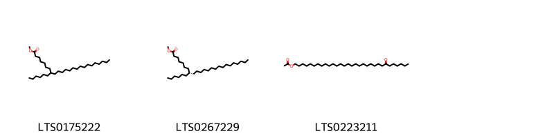{ width=100% }
    <figcaption>Hình ảnh cấu trúc hóa học của 3 hoạt chất thuộc nhóm Fatty Acyls gồm ['methyl 8-hexyltetracosanoate (LTS0175222)', 'methyl (8s)-8-hexyltetracosanoate (LTS0267229)', '25-oxohentriacontyl acetate (LTS0223211)'].</figcaption>
</figure>

---

### Dược dân tộc học

Danh sách các quốc gia có sử dụng *Hygrophila auriculata* trong điều trị các bệnh. 

| Country   | Disease   | Bệnh                                                                                                                                                                                                |
|:----------|:----------|:----------------------------------------------------------------------------------------------------------------------------------------------------------------------------------------------------|
| India     | Diuretic  | MYMEMORY WARNING: YOU USED ALL AVAILABLE FREE TRANSLATIONS FOR TODAY. NEXT AVAILABLE IN  13 HOURS 54 MINUTES 06 SECONDS VISIT HTTPS://MYMEMORY.TRANSLATED.NET/DOC/USAGELIMITS.PHP TO TRANSLATE MORE |

---

# Chi Blepharis

??? note "Danh sách các dược liệu thuộc chi"
    
	 - *Blepharis edulis*

---
## Blepharis edulis
### Thông tin về thực vật

!!! info "Phân loại thực vật của *Blepharis edulis* từ GIBF:"
    - **Kingdom:** Plantae
    - **Phylum:** Tracheophyta
    - **Order:** Lamiales
    - **Family:** Acanthaceae
    - **Genus:** Blepharis
    - **Species:** *Blepharis edulis*

 

| Label (VI)   | Label (EN)   | Scientific Name   | Descriptions (VI)   | Descriptions (EN)   | Also Known As (VI)   | Also Known As (EN)   |
|:-------------|:-------------|:------------------|:--------------------|:--------------------|:---------------------|:---------------------|
| N/A          | N/A          | Blepharis edulis  | loài thực vật       | species of plant    | ['']                 | ['']                 |

#### Phân bố trên thế giới

**Từ CSDL GIBF** nan, Uganda, China, Israel, Mali, Somalia, Tanzania, United Republic of, Yemen, Western Sahara, Eritrea, Chad, Iran (Islamic Republic of), Mauritania, Dominican Republic, unknown or invalid, Ethiopia, Congo, Democratic Republic of the, Kenya, Saudi Arabia, Palestine, State of, Egypt, Sudan, Niger, India

#### Phân bố tại Việt Nam

**Từ CSDL GIBF**: Không có ghi nhận ở Việt Nam

---
### Thành phần hóa học
        
- Theo cơ sở dữ liệu lotus: Từ loài *Blepharis edulis* đã phân lập và xác định được 3 hoạt chất thuộc về các nhóm Organooxygen compounds, Benzoxazoles. 

|    | chemicalTaxonomyClassyfireClass   |   smiles_count |
|---:|:----------------------------------|---------------:|
|  0 | Benzoxazoles                      |              1 |
|  1 | Organooxygen compounds            |              2 |

#### Nhóm Benzoxazoles
<figure markdown="span">
    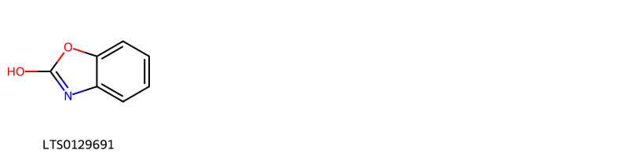{ width=100% }
    <figcaption>Hình ảnh cấu trúc hóa học của 1 hoạt chất thuộc nhóm Benzoxazoles gồm ['1,3-benzoxazol-2-ol (LTS0129691)'].</figcaption>
</figure>
#### Nhóm Organooxygen compounds
<figure markdown="span">
    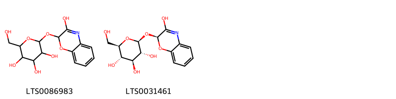{ width=100% }
    <figcaption>Hình ảnh cấu trúc hóa học của 2 hoạt chất thuộc nhóm Organooxygen compounds gồm ['2-[(3-hydroxy-2h-1,4-benzoxazin-2-yl)oxy]-6-(hydroxymethyl)oxane-3,4,5-triol (LTS0086983)', '(2s,3r,4s,5s,6r)-2-{[(2s)-3-hydroxy-2h-1,4-benzoxazin-2-yl]oxy}-6-(hydroxymethyl)oxane-3,4,5-triol (LTS0031461)'].</figcaption>
</figure>

---

### Dược dân tộc học

Danh sách các quốc gia có sử dụng *Blepharis edulis* trong điều trị các bệnh. 

| Country   | Disease     | Bệnh                                                                                                                                                                                                |
|:----------|:------------|:----------------------------------------------------------------------------------------------------------------------------------------------------------------------------------------------------|
| India     | Expectorant | MYMEMORY WARNING: YOU USED ALL AVAILABLE FREE TRANSLATIONS FOR TODAY. NEXT AVAILABLE IN  13 HOURS 53 MINUTES 40 SECONDS VISIT HTTPS://MYMEMORY.TRANSLATED.NET/DOC/USAGELIMITS.PHP TO TRANSLATE MORE |

---

# Chi Rungia

??? note "Danh sách các dược liệu thuộc chi"
    
	 - *Rungia pectinata*
	 - *Rungia repens*

---
## Rungia pectinata
### Thông tin về thực vật

!!! info "Phân loại thực vật của *Rungia pectinata* từ GIBF:"
    - **Kingdom:** Plantae
    - **Phylum:** Tracheophyta
    - **Order:** Lamiales
    - **Family:** Acanthaceae
    - **Genus:** Rungia
    - **Species:** *Rungia pectinata*

 

| Label (VI)   | Label (EN)   | Scientific Name   | Descriptions (VI)   | Descriptions (EN)   | Also Known As (VI)   | Also Known As (EN)   |
|:-------------|:-------------|:------------------|:--------------------|:--------------------|:---------------------|:---------------------|
| N/A          | N/A          | Rungia pectinata  | loài thực vật       | species of plant    | ['']                 | ['']                 |

#### Phân bố trên thế giới

**Từ CSDL GIBF** nan, Yemen, Hong Kong, Sri Lanka, Viet Nam, Bangladesh, Nepal, Philippines, China, Oman, Myanmar, India, Papua New Guinea, Thailand, Lao People’s Democratic Republic

#### Phân bố tại Việt Nam

**Từ CSDL GIBF**: Kon Tum, 谅山

---
### Thành phần hóa học
        
- Theo cơ sở dữ liệu lotus: Từ loài *Rungia pectinata* đã phân lập và xác định được Chưa có hoạt chất nào được phân lập. hoạt chất thuộc về các nhóm Không có hoạt chất nào được phân lập. 

Không có hình ảnh nào được tạo ra

---

### Dược dân tộc học

Danh sách các quốc gia có sử dụng *Rungia pectinata* trong điều trị các bệnh. 

| Country   | Disease               | Bệnh                                                                                                                                                                                                |
|:----------|:----------------------|:----------------------------------------------------------------------------------------------------------------------------------------------------------------------------------------------------|
| Elsewhere | Aperient, Refrigerant | MYMEMORY WARNING: YOU USED ALL AVAILABLE FREE TRANSLATIONS FOR TODAY. NEXT AVAILABLE IN  13 HOURS 53 MINUTES 10 SECONDS VISIT HTTPS://MYMEMORY.TRANSLATED.NET/DOC/USAGELIMITS.PHP TO TRANSLATE MORE |
| India     | Aperient, Refrigerant | MYMEMORY WARNING: YOU USED ALL AVAILABLE FREE TRANSLATIONS FOR TODAY. NEXT AVAILABLE IN  13 HOURS 53 MINUTES 06 SECONDS VISIT HTTPS://MYMEMORY.TRANSLATED.NET/DOC/USAGELIMITS.PHP TO TRANSLATE MORE |

---

---
## Rungia repens
### Thông tin về thực vật

!!! info "Phân loại thực vật của *Rungia repens* từ GIBF:"
    - **Kingdom:** Plantae
    - **Phylum:** Tracheophyta
    - **Order:** Lamiales
    - **Family:** Acanthaceae
    - **Genus:** Rungia
    - **Species:** *Rungia repens*

 

| Label (VI)   | Label (EN)   | Scientific Name   | Descriptions (VI)   | Descriptions (EN)   | Also Known As (VI)   | Also Known As (EN)   |
|:-------------|:-------------|:------------------|:--------------------|:--------------------|:---------------------|:---------------------|
| N/A          | N/A          | Rungia repens     | loài thực vật       | species of plant    | ['']                 | ['']                 |

#### Phân bố trên thế giới

**Từ CSDL GIBF** Sri Lanka, nan, Indonesia, Myanmar, India, unknown or invalid, Papua New Guinea

#### Phân bố tại Việt Nam

**Từ CSDL GIBF**: Không có ghi nhận ở Việt Nam

---
### Thành phần hóa học
        
- Theo cơ sở dữ liệu lotus: Từ loài *Rungia repens* đã phân lập và xác định được Chưa có hoạt chất nào được phân lập. hoạt chất thuộc về các nhóm Không có hoạt chất nào được phân lập. 

Không có hình ảnh nào được tạo ra

---

### Dược dân tộc học

Danh sách các quốc gia có sử dụng *Rungia repens* trong điều trị các bệnh. 

| Country   | Disease             | Bệnh                                                                                                                                                                                                |
|:----------|:--------------------|:----------------------------------------------------------------------------------------------------------------------------------------------------------------------------------------------------|
| Elsewhere | Vermifuge, Diuretic | MYMEMORY WARNING: YOU USED ALL AVAILABLE FREE TRANSLATIONS FOR TODAY. NEXT AVAILABLE IN  13 HOURS 52 MINUTES 43 SECONDS VISIT HTTPS://MYMEMORY.TRANSLATED.NET/DOC/USAGELIMITS.PHP TO TRANSLATE MORE |
| India     | Fungicide           | MYMEMORY WARNING: YOU USED ALL AVAILABLE FREE TRANSLATIONS FOR TODAY. NEXT AVAILABLE IN  13 HOURS 52 MINUTES 40 SECONDS VISIT HTTPS://MYMEMORY.TRANSLATED.NET/DOC/USAGELIMITS.PHP TO TRANSLATE MORE |

---

# Chi Aphelandra

??? note "Danh sách các dược liệu thuộc chi"
    
	 - *Aphelandra squarrosa*

---
## Aphelandra squarrosa
### Thông tin về thực vật

!!! info "Phân loại thực vật của *Aphelandra squarrosa* từ GIBF:"
    - **Kingdom:** Plantae
    - **Phylum:** Tracheophyta
    - **Order:** Lamiales
    - **Family:** Acanthaceae
    - **Genus:** Aphelandra
    - **Species:** *Aphelandra squarrosa*

 

| Label (VI)   | Label (EN)   | Scientific Name      | Descriptions (VI)   | Descriptions (EN)   | Also Known As (VI)   | Also Known As (EN)   |
|:-------------|:-------------|:---------------------|:--------------------|:--------------------|:---------------------|:---------------------|
| N/A          | N/A          | Aphelandra squarrosa | loài thực vật       | species of plant    | ['']                 | ['zebra plant']      |

#### Phân bố trên thế giới

**Từ CSDL GIBF** nan, Brazil, Singapore, Benin, United States of America, Japan, Martinique, Belgium, Chinese Taipei, Guadeloupe, Nigeria, Colombia, Ecuador, Argentina, unknown or invalid, French Polynesia, Panama, Egypt

#### Phân bố tại Việt Nam

**Từ CSDL GIBF**: Không có ghi nhận ở Việt Nam

---
### Thành phần hóa học
        
- Theo cơ sở dữ liệu lotus: Từ loài *Aphelandra squarrosa* đã phân lập và xác định được 6 hoạt chất thuộc về các nhóm 2-arylbenzofuran flavonoids, Benzoxazines. 

|    | chemicalTaxonomyClassyfireClass   |   smiles_count |
|---:|:----------------------------------|---------------:|
|  0 | 2-arylbenzofuran flavonoids       |              4 |
|  1 | Benzoxazines                      |              2 |

#### Nhóm 2-arylbenzofuran flavonoids
<figure markdown="span">
    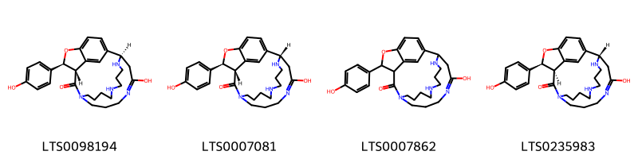{ width=100% }
    <figcaption>Hình ảnh cấu trúc hóa học của 4 hoạt chất thuộc nhóm 2-arylbenzofuran flavonoids gồm ['(11r,17s,18s)-24-hydroxy-17-(4-hydroxyphenyl)-16-oxa-1,6,10,23-tetraazatetracyclo[9.8.6.2¹²,¹⁵.0¹⁴,¹⁸]heptacosa-12(27),13,15(26),23-tetraen-19-one (LTS0098194)', '(11s,17s,18s)-24-hydroxy-17-(4-hydroxyphenyl)-16-oxa-1,6,10,23-tetraazatetracyclo[9.8.6.2¹²,¹⁵.0¹⁴,¹⁸]heptacosa-12(27),13,15(26),23-tetraen-19-one (LTS0007081)', '24-hydroxy-17-(4-hydroxyphenyl)-16-oxa-1,6,10,23-tetraazatetracyclo[9.8.6.2¹²,¹⁵.0¹⁴,¹⁸]heptacosa-12(27),13,15(26),23-tetraen-19-one (LTS0007862)', '(11s,17s,18r)-24-hydroxy-17-(4-hydroxyphenyl)-16-oxa-1,6,10,23-tetraazatetracyclo[9.8.6.2¹²,¹⁵.0¹⁴,¹⁸]heptacosa-12(27),13,15(26),23-tetraen-19-one (LTS0235983)'].</figcaption>
</figure>
#### Nhóm Benzoxazines
<figure markdown="span">
    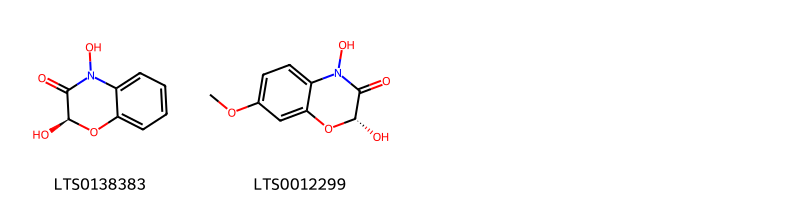{ width=100% }
    <figcaption>Hình ảnh cấu trúc hóa học của 2 hoạt chất thuộc nhóm Benzoxazines gồm ['(2r)-2,4-dihydroxy-2h-1,4-benzoxazin-3-one (LTS0138383)', '(2r)-2,4-dihydroxy-7-methoxy-2h-1,4-benzoxazin-3-one (LTS0012299)'].</figcaption>
</figure>

---

### Dược dân tộc học

Danh sách các quốc gia có sử dụng *Aphelandra squarrosa* trong điều trị các bệnh. 

| Country   |   Disease | Bệnh                                                                                                                                                                                                |
|:----------|----------:|:----------------------------------------------------------------------------------------------------------------------------------------------------------------------------------------------------|
| Elsewhere |       nan | MYMEMORY WARNING: YOU USED ALL AVAILABLE FREE TRANSLATIONS FOR TODAY. NEXT AVAILABLE IN  13 HOURS 52 MINUTES 15 SECONDS VISIT HTTPS://MYMEMORY.TRANSLATED.NET/DOC/USAGELIMITS.PHP TO TRANSLATE MORE |

---

# Chi Pachystachys

??? note "Danh sách các dược liệu thuộc chi"
    
	 - *Pachystachys coccinea*

---
## Pachystachys coccinea
### Thông tin về thực vật

!!! info "Phân loại thực vật của *Pachystachys coccinea* từ GIBF:"
    - **Kingdom:** Plantae
    - **Phylum:** Tracheophyta
    - **Order:** Lamiales
    - **Family:** Acanthaceae
    - **Genus:** Pachystachys
    - **Species:** *Pachystachys coccinea*

 

| Label (VI)   | Label (EN)   | Scientific Name       | Descriptions (VI)   | Descriptions (EN)         | Also Known As (VI)   | Also Known As (EN)   |
|:-------------|:-------------|:----------------------|:--------------------|:--------------------------|:---------------------|:---------------------|
| N/A          | N/A          | Pachystachys coccinea |                     | perennial evergreen shrub | ['']                 | ['Cardinals guard']  |

#### Phân bố trên thế giới

**Từ CSDL GIBF** Brazil, Ecuador, French Polynesia, Trinidad and Tobago, Bolivia (Plurinational State of), Sri Lanka, United States of America, Jamaica, Indonesia, Costa Rica, Dominican Republic, Colombia, Cuba, unknown or invalid, French Guiana, Hong Kong, Dominica, Belgium, Philippines, Chinese Taipei, Nicaragua, Cook Islands, South Africa, Côte d’Ivoire, Australia, India, Peru, France, Guyana, Venezuela (Bolivarian Republic of)

#### Phân bố tại Việt Nam

**Từ CSDL GIBF**: Không có ghi nhận ở Việt Nam

---
### Thành phần hóa học
        
- Theo cơ sở dữ liệu lotus: Từ loài *Pachystachys coccinea* đã phân lập và xác định được Chưa có hoạt chất nào được phân lập. hoạt chất thuộc về các nhóm Không có hoạt chất nào được phân lập. 

Không có hình ảnh nào được tạo ra

---

### Dược dân tộc học

Danh sách các quốc gia có sử dụng *Pachystachys coccinea* trong điều trị các bệnh. 

| Country   | Disease   | Bệnh                                                                                                                                                                                                |
|:----------|:----------|:----------------------------------------------------------------------------------------------------------------------------------------------------------------------------------------------------|
| Elsewhere | Poison    | MYMEMORY WARNING: YOU USED ALL AVAILABLE FREE TRANSLATIONS FOR TODAY. NEXT AVAILABLE IN  13 HOURS 51 MINUTES 39 SECONDS VISIT HTTPS://MYMEMORY.TRANSLATED.NET/DOC/USAGELIMITS.PHP TO TRANSLATE MORE |

---

# Chi Dicliptera

??? note "Danh sách các dược liệu thuộc chi"
    
	 - *Dicliptera japonica*

---
## Dicliptera japonica
### Thông tin về thực vật

!!! info "Phân loại thực vật của *Dicliptera japonica* từ GIBF:"
    - **Kingdom:** Plantae
    - **Phylum:** Tracheophyta
    - **Order:** Lamiales
    - **Family:** Acanthaceae
    - **Genus:** Dicliptera
    - **Species:** *Dicliptera japonica*

 

| Label (VI)   | Label (EN)   | Scientific Name     | Descriptions (VI)   | Descriptions (EN)   | Also Known As (VI)   | Also Known As (EN)   |
|:-------------|:-------------|:--------------------|:--------------------|:--------------------|:---------------------|:---------------------|
| N/A          | N/A          | Dicliptera japonica |                     | species of plant    | ['']                 | ['']                 |

#### Phân bố trên thế giới

**Từ CSDL GIBF** Chinese Taipei, Japan, China

#### Phân bố tại Việt Nam

**Từ CSDL GIBF**: Không có ghi nhận ở Việt Nam

---
### Thành phần hóa học
        
- Theo cơ sở dữ liệu lotus: Từ loài *Dicliptera japonica* đã phân lập và xác định được 7 hoạt chất thuộc về các nhóm Prenol lipids, Steroids and steroid derivatives. 

|    | chemicalTaxonomyClassyfireClass   |   smiles_count |
|---:|:----------------------------------|---------------:|
|  0 | Prenol lipids                     |              1 |
|  1 | Steroids and steroid derivatives  |              6 |

#### Nhóm Prenol lipids
<figure markdown="span">
    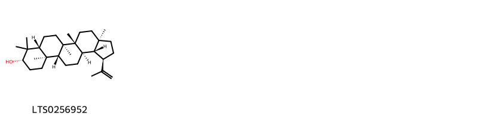{ width=100% }
    <figcaption>Hình ảnh cấu trúc hóa học của 1 hoạt chất thuộc nhóm Prenol lipids gồm ['lupeol (LTS0256952)'].</figcaption>
</figure>
#### Nhóm Steroids and steroid derivatives
<figure markdown="span">
    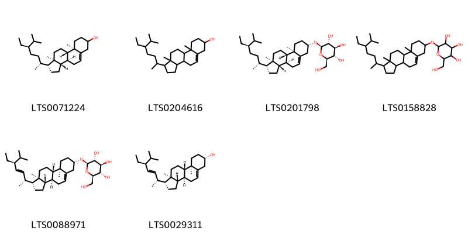{ width=100% }
    <figcaption>Hình ảnh cấu trúc hóa học của 6 hoạt chất thuộc nhóm Steroids and steroid derivatives gồm ['stigmast-5-en-3-ol (LTS0071224)', 'stigmast-5-en-3-ol, (3β)- (LTS0204616)', 'sitogluside (LTS0201798)', '2-{[1-(5-ethyl-6-methylheptan-2-yl)-9a,11a-dimethyl-1h,2h,3h,3ah,3bh,4h,6h,7h,8h,9h,9bh,10h,11h-cyclopenta[a]phenanthren-7-yl]oxy}-6-(hydroxymethyl)oxane-3,4,5-triol (LTS0158828)', '(2r,3r,4s,5s,6r)-2-{[(1r,3as,3bs,7s,9ar,9bs,11ar)-1-[(2r,3e,5s)-5-ethyl-6-methylhept-3-en-2-yl]-9a,11a-dimethyl-1h,2h,3h,3ah,3bh,4h,6h,7h,8h,9h,9bh,10h,11h-cyclopenta[a]phenanthren-7-yl]oxy}-6-(hydroxymethyl)oxane-3,4,5-triol (LTS0088971)', 'phytosterol (LTS0029311)'].</figcaption>
</figure>

---

### Dược dân tộc học

Danh sách các quốc gia có sử dụng *Dicliptera japonica* trong điều trị các bệnh. 

| Country   | Disease                                        | Bệnh                                                                                                                                                                                                |
|:----------|:-----------------------------------------------|:----------------------------------------------------------------------------------------------------------------------------------------------------------------------------------------------------|
| China     | Carminative, Hemostat, Alexiteric, Refrigerant | MYMEMORY WARNING: YOU USED ALL AVAILABLE FREE TRANSLATIONS FOR TODAY. NEXT AVAILABLE IN  13 HOURS 51 MINUTES 09 SECONDS VISIT HTTPS://MYMEMORY.TRANSLATED.NET/DOC/USAGELIMITS.PHP TO TRANSLATE MORE |

---

# Chi Phlogacanthus

??? note "Danh sách các dược liệu thuộc chi"
    
	 - *Phlogacanthus thyrsiflorus*
	 - *Phlogacanthus tubiflorus*

---
## Phlogacanthus thyrsiflorus
### Thông tin về thực vật

!!! info "Phân loại thực vật của *Phlogacanthus thyrsiformis* từ GIBF:"
    - **Kingdom:** Plantae
    - **Phylum:** Tracheophyta
    - **Order:** Lamiales
    - **Family:** Acanthaceae
    - **Genus:** Phlogacanthus
    - **Species:** *Phlogacanthus thyrsiformis*

 

| Label (VI)   | Label (EN)   | Scientific Name            | Descriptions (VI)   | Descriptions (EN)   | Also Known As (VI)   | Also Known As (EN)   |
|:-------------|:-------------|:---------------------------|:--------------------|:--------------------|:---------------------|:---------------------|
| N/A          | N/A          | Phlogacanthus thyrsiflorus | loài thực vật       | species of plant    | ['']                 | ['']                 |

#### Phân bố trên thế giới

**Từ CSDL GIBF** nan, Bhutan, Bangladesh, Nepal, Myanmar, India, unknown or invalid

#### Phân bố tại Việt Nam

**Từ CSDL GIBF**: Không có ghi nhận ở Việt Nam

---
### Thành phần hóa học
        
- Theo cơ sở dữ liệu lotus: Từ loài *Phlogacanthus thyrsiformis* đã phân lập và xác định được 6 hoạt chất thuộc về các nhóm Prenol lipids. 

|    | chemicalTaxonomyClassyfireClass   |   smiles_count |
|---:|:----------------------------------|---------------:|
|  0 | Prenol lipids                     |              6 |

#### Nhóm Prenol lipids
<figure markdown="span">
    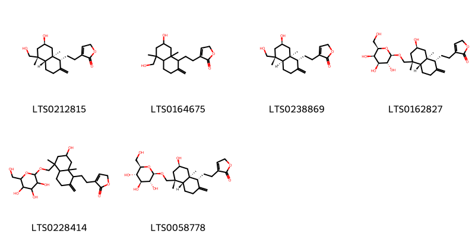{ width=100% }
    <figcaption>Hình ảnh cấu trúc hóa học của 6 hoạt chất thuộc nhóm Prenol lipids gồm ['3-{2-[(1r,4as,5r,7s,8as)-7-hydroxy-5-(hydroxymethyl)-5,8a-dimethyl-2-methylidene-hexahydro-1h-naphthalen-1-yl]ethyl}-5h-furan-2-one (LTS0212815)', '3-{2-[7-hydroxy-5-(hydroxymethyl)-5,8a-dimethyl-2-methylidene-hexahydro-1h-naphthalen-1-yl]ethyl}-5h-furan-2-one (LTS0164675)', '3-{2-[(1r,4ar,5r,7s,8as)-7-hydroxy-5-(hydroxymethyl)-5,8a-dimethyl-2-methylidene-hexahydro-1h-naphthalen-1-yl]ethyl}-5h-furan-2-one (LTS0238869)', '3-{2-[(1r,4as,5r,7s,8as)-7-hydroxy-5,8a-dimethyl-2-methylidene-5-({[(2r,3r,4s,5r,6r)-3,4,5-trihydroxy-6-(hydroxymethyl)oxan-2-yl]oxy}methyl)-hexahydro-1h-naphthalen-1-yl]ethyl}-5h-furan-2-one (LTS0162827)', '3-{2-[7-hydroxy-5,8a-dimethyl-2-methylidene-5-({[3,4,5-trihydroxy-6-(hydroxymethyl)oxan-2-yl]oxy}methyl)-hexahydro-1h-naphthalen-1-yl]ethyl}-5h-furan-2-one (LTS0228414)', '3-{2-[(1r,4as,5r,7s,8as)-7-hydroxy-5,8a-dimethyl-2-methylidene-5-({[(2r,3r,4s,5s,6r)-3,4,5-trihydroxy-6-(hydroxymethyl)oxan-2-yl]oxy}methyl)-hexahydro-1h-naphthalen-1-yl]ethyl}-5h-furan-2-one (LTS0058778)'].</figcaption>
</figure>

---

### Dược dân tộc học

Danh sách các quốc gia có sử dụng *Phlogacanthus thyrsiformis* trong điều trị các bệnh. 

| Country       | Disease                 | Bệnh                                                                                                                                                                                                |
|:--------------|:------------------------|:----------------------------------------------------------------------------------------------------------------------------------------------------------------------------------------------------|
| India(Punjab) | Antiseptic, Expectorant | MYMEMORY WARNING: YOU USED ALL AVAILABLE FREE TRANSLATIONS FOR TODAY. NEXT AVAILABLE IN  13 HOURS 50 MINUTES 35 SECONDS VISIT HTTPS://MYMEMORY.TRANSLATED.NET/DOC/USAGELIMITS.PHP TO TRANSLATE MORE |

---

---
## Phlogacanthus tubiflorus
### Thông tin về thực vật

!!! info "Phân loại thực vật của *Phlogacanthus tubiflorus* từ GIBF:"
    - **Kingdom:** Plantae
    - **Phylum:** Tracheophyta
    - **Order:** Lamiales
    - **Family:** Acanthaceae
    - **Genus:** Phlogacanthus
    - **Species:** *Phlogacanthus tubiflorus*

 

| Label (VI)   | Label (EN)   | Scientific Name          | Descriptions (VI)   | Descriptions (EN)   | Also Known As (VI)   | Also Known As (EN)   |
|:-------------|:-------------|:-------------------------|:--------------------|:--------------------|:---------------------|:---------------------|
| N/A          | N/A          | Phlogacanthus tubiflorus |                     | species of plant    | ['']                 | ['']                 |

#### Phân bố trên thế giới

**Từ CSDL GIBF** nan, Bangladesh, Myanmar, India, unknown or invalid

#### Phân bố tại Việt Nam

**Từ CSDL GIBF**: Không có ghi nhận ở Việt Nam

---
### Thành phần hóa học
        
- Theo cơ sở dữ liệu lotus: Từ loài *Phlogacanthus tubiflorus* đã phân lập và xác định được Chưa có hoạt chất nào được phân lập. hoạt chất thuộc về các nhóm Không có hoạt chất nào được phân lập. 

Không có hình ảnh nào được tạo ra

---

### Dược dân tộc học

Danh sách các quốc gia có sử dụng *Phlogacanthus tubiflorus* trong điều trị các bệnh. 

| Country   | Disease   | Bệnh                                                                                                                                                                                                |
|:----------|:----------|:----------------------------------------------------------------------------------------------------------------------------------------------------------------------------------------------------|
| India     | Soap      | MYMEMORY WARNING: YOU USED ALL AVAILABLE FREE TRANSLATIONS FOR TODAY. NEXT AVAILABLE IN  13 HOURS 50 MINUTES 05 SECONDS VISIT HTTPS://MYMEMORY.TRANSLATED.NET/DOC/USAGELIMITS.PHP TO TRANSLATE MORE |

---

# Chi Blechum

??? note "Danh sách các dược liệu thuộc chi"
    
	 - *Blechum brownei*
	 - *Blechum pyramidatum*

---
## Blechum brownei
### Thông tin về thực vật

!!! info "Phân loại thực vật của *Ruellia blechum* từ GIBF:"
    - **Kingdom:** Plantae
    - **Phylum:** Tracheophyta
    - **Order:** Lamiales
    - **Family:** Acanthaceae
    - **Genus:** Ruellia
    - **Species:** *Ruellia blechum*

 

| Label (VI)   | Label (EN)   | Scientific Name          | Descriptions (VI)   | Descriptions (EN)   | Also Known As (VI)   | Also Known As (EN)   |
|:-------------|:-------------|:-------------------------|:--------------------|:--------------------|:---------------------|:---------------------|
| N/A          | N/A          | Phlogacanthus tubiflorus |                     | species of plant    | ['']                 | ['']                 |

#### Phân bố trên thế giới

**Từ CSDL GIBF** Guatemala, Guadeloupe, Ecuador, Papua New Guinea, Trinidad and Tobago, United States of America, Costa Rica, Colombia, Cuba, unknown or invalid, French Guiana, Grenada, Dominica, Mexico, Philippines, Belize, Nicaragua, Bahamas, Micronesia (Federated States of), Peru, Samoa

#### Phân bố tại Việt Nam

**Từ CSDL GIBF**: Không có ghi nhận ở Việt Nam

---
### Thành phần hóa học
        
- Theo cơ sở dữ liệu lotus: Từ loài *Ruellia blechum* đã phân lập và xác định được Chưa có hoạt chất nào được phân lập. hoạt chất thuộc về các nhóm Không có hoạt chất nào được phân lập. 

Không có hình ảnh nào được tạo ra

---

### Dược dân tộc học

Danh sách các quốc gia có sử dụng *Ruellia blechum* trong điều trị các bệnh. 

| Country   | Disease                              | Bệnh                                                                                                                                                                                                |
|:----------|:-------------------------------------|:----------------------------------------------------------------------------------------------------------------------------------------------------------------------------------------------------|
| Panama    | Insecticide, Pediculicide, Vermifuge | MYMEMORY WARNING: YOU USED ALL AVAILABLE FREE TRANSLATIONS FOR TODAY. NEXT AVAILABLE IN  13 HOURS 49 MINUTES 41 SECONDS VISIT HTTPS://MYMEMORY.TRANSLATED.NET/DOC/USAGELIMITS.PHP TO TRANSLATE MORE |

---

---
## Blechum pyramidatum
### Thông tin về thực vật

!!! info "Phân loại thực vật của *Ruellia blechum* từ GIBF:"
    - **Kingdom:** Plantae
    - **Phylum:** Tracheophyta
    - **Order:** Lamiales
    - **Family:** Acanthaceae
    - **Genus:** Ruellia
    - **Species:** *Ruellia blechum*

 

| Label (VI)   | Label (EN)   | Scientific Name     | Descriptions (VI)   | Descriptions (EN)   | Also Known As (VI)   | Also Known As (EN)   |
|:-------------|:-------------|:--------------------|:--------------------|:--------------------|:---------------------|:---------------------|
| N/A          | N/A          | Blechum pyramidatum | loài thực vật       | species of plant    | ['']                 | ['']                 |

#### Phân bố trên thế giới

**Từ CSDL GIBF** nan, Brazil, Guatemala, Guadeloupe, Barbados, Suriname, Ecuador, Papua New Guinea, Puerto Rico, United States of America, Jamaica, Tonga, Costa Rica, Colombia, Fiji, Mexico, El Salvador, Niue, Belgium, Chinese Taipei, Palau, Solomon Islands, Nicaragua, Bonaire, Sint Eustatius and Saba, Martinique, Northern Mariana Islands, Peru, Nauru, Venezuela (Bolivarian Republic of)

#### Phân bố tại Việt Nam

**Từ CSDL GIBF**: Không có ghi nhận ở Việt Nam

---
### Thành phần hóa học
        
- Theo cơ sở dữ liệu lotus: Từ loài *Ruellia blechum* đã phân lập và xác định được Chưa có hoạt chất nào được phân lập. hoạt chất thuộc về các nhóm Không có hoạt chất nào được phân lập. 

Không có hình ảnh nào được tạo ra

---

### Dược dân tộc học

Danh sách các quốc gia có sử dụng *Ruellia blechum* trong điều trị các bệnh. 

| Country   | Disease   | Bệnh                                                                                                                                                                                                |
|:----------|:----------|:----------------------------------------------------------------------------------------------------------------------------------------------------------------------------------------------------|
| Haiti     | Diuretic  | MYMEMORY WARNING: YOU USED ALL AVAILABLE FREE TRANSLATIONS FOR TODAY. NEXT AVAILABLE IN  13 HOURS 49 MINUTES 18 SECONDS VISIT HTTPS://MYMEMORY.TRANSLATED.NET/DOC/USAGELIMITS.PHP TO TRANSLATE MORE |

---

# Chi Andrographis

??? note "Danh sách các dược liệu thuộc chi"
    
	 - *Andrographis paniculata*

---
## Andrographis paniculata
### Thông tin về thực vật

!!! info "Phân loại thực vật của *Andrographis paniculata* từ GIBF:"
    - **Kingdom:** Plantae
    - **Phylum:** Tracheophyta
    - **Order:** Lamiales
    - **Family:** Acanthaceae
    - **Genus:** Andrographis
    - **Species:** *Andrographis paniculata*

 

| Label (VI)   | Label (EN)   | Scientific Name         | Descriptions (VI)   | Descriptions (EN)   | Also Known As (VI)                                                                                              | Also Known As (EN)                            |
|:-------------|:-------------|:------------------------|:--------------------|:--------------------|:----------------------------------------------------------------------------------------------------------------|:----------------------------------------------|
| N/A          | N/A          | Andrographis paniculata |                     | species of plant    | ['Lam khái liên', 'Khô đảm thảo', 'Justicia paniculata', 'Công cộng', 'Cây lá đắng', 'Andrographis paniculata'] | ['Creat', 'King of bitter', 'Green chirayta'] |

#### Phân bố trên thế giới

**Từ CSDL GIBF** nan, Brazil, Barbados, China, Thailand, Sri Lanka, United States of America, Jamaica, Indonesia, Dominican Republic, Lao People’s Democratic Republic, Hong Kong, Chinese Taipei, Philippines, Malaysia, Brunei Darussalam, Singapore, Timor-Leste, Australia, Myanmar, India

#### Phân bố tại Việt Nam

**Từ CSDL GIBF**: Không có ghi nhận ở Việt Nam

---
### Thành phần hóa học
        
- Theo cơ sở dữ liệu lotus: Từ loài *Andrographis paniculata* đã phân lập và xác định được 221 hoạt chất thuộc về các nhóm Fatty Acyls, Dihydrofurans, Lactones, Oxepanes, Benzene and substituted derivatives, Flavonoids, Cinnamic acids and derivatives, Steroids and steroid derivatives, Organooxygen compounds, Prenol lipids, Indoles and derivatives. 

|    | chemicalTaxonomyClassyfireClass     |   smiles_count |
|---:|:------------------------------------|---------------:|
|  0 | Benzene and substituted derivatives |              4 |
|  1 | Cinnamic acids and derivatives      |              5 |
|  2 | Dihydrofurans                       |              7 |
|  3 | Fatty Acyls                         |              6 |
|  4 | Flavonoids                          |             40 |
|  5 | Indoles and derivatives             |              1 |
|  6 | Lactones                            |             15 |
|  7 | Organooxygen compounds              |             20 |
|  8 | Oxepanes                            |              5 |
|  9 | Prenol lipids                       |            109 |
| 10 | Steroids and steroid derivatives    |              9 |

#### Nhóm Benzene and substituted derivatives
<figure markdown="span">
    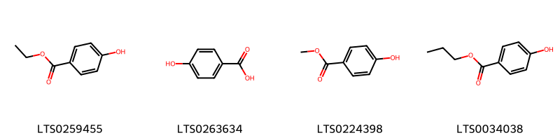{ width=100% }
    <figcaption>Hình ảnh cấu trúc hóa học của 4 hoạt chất thuộc nhóm Benzene and substituted derivatives gồm ['ethylparaben (LTS0259455)', 'p-hydroxybenzoic acid (LTS0263634)', 'paraben (LTS0224398)', 'propylparaben (LTS0034038)'].</figcaption>
</figure>
#### Nhóm Cinnamic acids and derivatives
<figure markdown="span">
    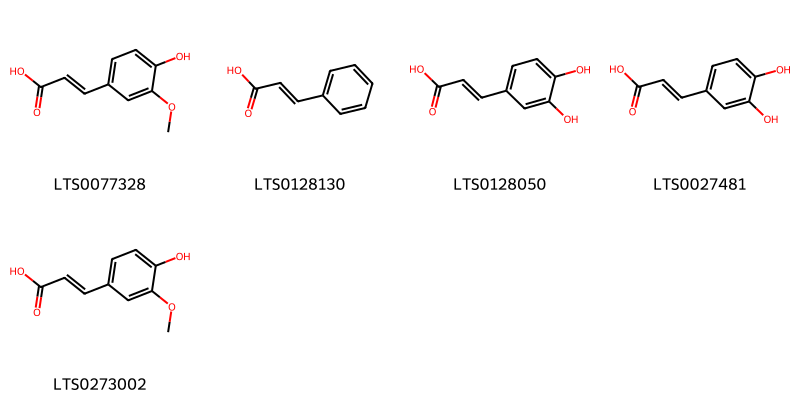{ width=100% }
    <figcaption>Hình ảnh cấu trúc hóa học của 5 hoạt chất thuộc nhóm Cinnamic acids and derivatives gồm ['ferulic acid (LTS0077328)', 'cinnamic acid (LTS0128130)', '3,4-dihydroxycinnamic acid (LTS0128050)', 'caffeic acid (LTS0027481)', 'ferulic acid (LTS0273002)'].</figcaption>
</figure>
#### Nhóm Dihydrofurans
<figure markdown="span">
    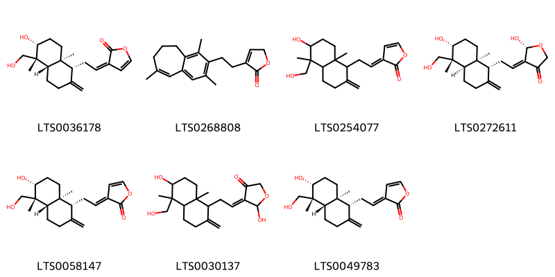{ width=100% }
    <figcaption>Hình ảnh cấu trúc hóa học của 7 hoạt chất thuộc nhóm Dihydrofurans gồm ['(3z)-3-{2-[(1r,4as,5r,6r,8as)-6-hydroxy-5-(hydroxymethyl)-5,8a-dimethyl-2-methylidene-hexahydro-1h-naphthalen-1-yl]ethylidene}furan-2-one (LTS0036178)', '3-(2-{1,3,6-trimethyl-8,9-dihydro-7h-benzo[7]annulen-2-yl}ethyl)-5h-furan-2-one (LTS0268808)', '3-{2-[6-hydroxy-5-(hydroxymethyl)-5,8a-dimethyl-2-methylidene-hexahydro-1h-naphthalen-1-yl]ethylidene}furan-2-one (LTS0254077)', '(4e,5r)-4-{2-[(1r,4ar,5r,6r,8as)-6-hydroxy-5-(hydroxymethyl)-5,8a-dimethyl-2-methylidene-hexahydro-1h-naphthalen-1-yl]ethylidene}-5-hydroxyoxolan-3-one (LTS0272611)', 'dehydroandrographolide (LTS0058147)', '5-hydroxy-4-{2-[6-hydroxy-5-(hydroxymethyl)-5,8a-dimethyl-2-methylidene-hexahydro-1h-naphthalen-1-yl]ethylidene}oxolan-3-one (LTS0030137)', '3-{2-[(1r,4as,5r,6r,8as)-6-hydroxy-5-(hydroxymethyl)-5,8a-dimethyl-2-methylidene-hexahydro-1h-naphthalen-1-yl]ethylidene}furan-2-one (LTS0049783)'].</figcaption>
</figure>
#### Nhóm Fatty Acyls
<figure markdown="span">
    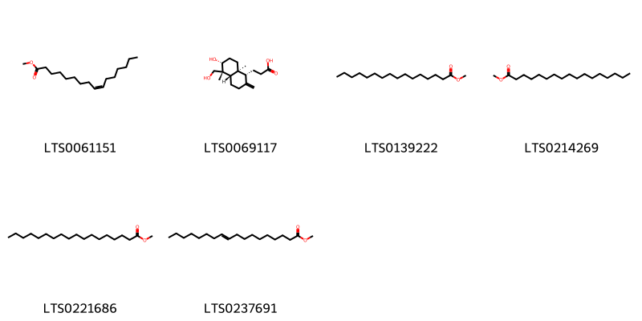{ width=100% }
    <figcaption>Hình ảnh cấu trúc hóa học của 6 hoạt chất thuộc nhóm Fatty Acyls gồm ['methyl palmitoleate (LTS0061151)', '3-[(1r,4as,5r,6r,8as)-6-hydroxy-5-(hydroxymethyl)-5,8a-dimethyl-2-methylidene-hexahydro-1h-naphthalen-1-yl]propanoic acid (LTS0069117)', 'methyl palmitate (LTS0139222)', 'methyl margarate (LTS0214269)', 'methyl stearate (LTS0221686)', 'methyl octadec-10-enoate (LTS0237691)'].</figcaption>
</figure>
#### Nhóm Flavonoids
<figure markdown="span">
    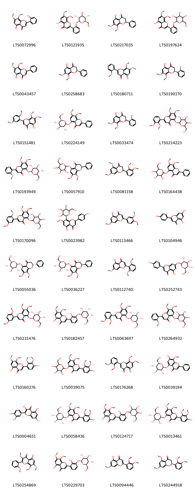{ width=100% }
    <figcaption>Hình ảnh cấu trúc hóa học của 40 hoạt chất thuộc nhóm Flavonoids gồm ['skullcapflavone i (LTS0072996)', '5-hydroxy-7,8-dimethoxy-2-(2-{[(2s,3r,4s,5s,6r)-3,4,5-trihydroxy-6-(hydroxymethyl)oxan-2-yl]oxy}phenyl)chromen-4-one (LTS0121935)', '5-hydroxy-7,8-dimethoxy-2-phenyl-2,3-dihydro-1-benzopyran-4-one (LTS0217035)', '5-hydroxy-7,8-dimethoxy-2-(2-{[3,4,5-trihydroxy-6-(hydroxymethyl)oxan-2-yl]oxy}phenyl)chromen-4-one (LTS0197624)', '7-o-methylwogonin (LTS0043457)', '(2s)-5-hydroxy-7,8-dimethoxy-2-phenyl-2,3-dihydro-1-benzopyran-4-one (LTS0258683)', 'andrographin (LTS0180711)', 'dihydroskullcap flavone i (LTS0190170)', '2-(2,5-dimethoxyphenyl)-5-hydroxy-7,8-dimethoxychromen-4-one (LTS0151481)', '7,8-dimethoxy-2-phenyl-5-{[(2s,3r,4s,5s,6r)-3,4,5-trihydroxy-6-(hydroxymethyl)oxan-2-yl]oxy}chromen-4-one (LTS0224149)', '5-hydroxy-2-(2-hydroxyphenyl)-7,8-dimethoxy-2,3-dihydro-1-benzopyran-4-one (LTS0033474)', '2-(2,3-dimethoxyphenyl)-7,8-dimethoxy-5-{[3,4,5-trihydroxy-6-(hydroxymethyl)oxan-2-yl]oxy}chromen-4-one (LTS0214223)', '7,8-dimethoxy-2-(2-methoxyphenyl)-5-{[(2s,3r,4s,5s,6r)-3,4,5-trihydroxy-6-(hydroxymethyl)oxan-2-yl]oxy}chromen-4-one (LTS0193949)', '7,8-dimethoxy-2-phenyl-5-{[3,4,5-trihydroxy-6-(hydroxymethyl)oxan-2-yl]oxy}-2,3-dihydro-1-benzopyran-4-one (LTS0057910)', '2-(2,3-dimethoxyphenyl)-5,7-dimethoxy-2,3-dihydro-1-benzopyran-4-one (LTS0081158)', '7,8-dimethoxy-2-phenyl-5-{[3,4,5-trihydroxy-6-(hydroxymethyl)oxan-2-yl]oxy}chromen-4-one (LTS0164438)', '2-(2,5-dimethoxyphenyl)-7,8-dimethoxy-5-{[3,4,5-trihydroxy-6-(hydroxymethyl)oxan-2-yl]oxy}chromen-4-one (LTS0170096)', 'isoswertisin (LTS0023982)', '2-(3,4-dimethoxyphenyl)-5-hydroxy-7-methoxychromen-4-one (LTS0113466)', 'chamomile (LTS0104946)', '(2r)-7,8-dimethoxy-2-phenyl-5-{[(2s,3r,4s,5s,6r)-3,4,5-trihydroxy-6-(hydroxymethyl)oxan-2-yl]oxy}-2,3-dihydro-1-benzopyran-4-one (LTS0055036)', 'andrographidin a (LTS0036227)', '2-(2,6-dimethoxyphenyl)-5-hydroxy-7-methoxychromen-4-one (LTS0112740)', 'apigenin 7-o-β-glucoside (LTS0252743)', '2-(2,5-dimethoxyphenyl)-7,8-dimethoxy-5-{[(2s,3r,4s,5s,6r)-3,4,5-trihydroxy-6-(hydroxymethyl)oxan-2-yl]oxy}chromen-4-one (LTS0231476)', '5-hydroxy-2-(2-hydroxy-3-{[(2s,3r,4r,5s,6r)-3,4,5-trihydroxy-6-(hydroxymethyl)oxan-2-yl]oxy}phenyl)-7,8-dimethoxychromen-4-one (LTS0182457)', '2-(2,3-dimethoxyphenyl)-7,8-dimethoxy-5-{[(2s,3r,4s,5s,6r)-3,4,5-trihydroxy-6-(hydroxymethyl)oxan-2-yl]oxy}chromen-4-one (LTS0063697)', '7,8-dimethoxy-2-(2-methoxyphenyl)-5-{[3,4,5-trihydroxy-6-(hydroxymethyl)oxan-2-yl]oxy}chromen-4-one (LTS0264932)', '5-hydroxy-2-(4-hydroxy-2,3-dimethoxyphenyl)-7,8-dimethoxychromen-4-one (LTS0160276)', '2-(4-hydroxy-2,3-dimethoxyphenyl)-7,8-dimethoxy-5-{[3,4,5-trihydroxy-6-(hydroxymethyl)oxan-2-yl]oxy}chromen-4-one (LTS0039075)', '2-(2,3-dimethoxyphenyl)-5-hydroxy-7,8-dimethoxychromen-4-one (LTS0176268)', '7-hydroxy-8-methoxy-2-phenyl-5-{[(2s,3r,4s,5s,6r)-3,4,5-trihydroxy-6-(hydroxymethyl)oxan-2-yl]oxy}chromen-4-one (LTS0039194)', 'quercetin (LTS0004651)', '2-(4-hydroxy-2,3-dimethoxyphenyl)-7,8-dimethoxy-5-{[(2s,3r,4s,5s,6r)-3,4,5-trihydroxy-6-(hydroxymethyl)oxan-2-yl]oxy}chromen-4-one (LTS0058436)', '5-hydroxy-2-(2-hydroxy-3-{[3,4,5-trihydroxy-6-(hydroxymethyl)oxan-2-yl]oxy}phenyl)-7,8-dimethoxychromen-4-one (LTS0124717)', '2-(4-hydroxy-2,3-dimethoxyphenyl)-7,8-dimethoxy-5-{[(2s,3s,4s,5s,6r)-3,4,5-trihydroxy-6-(hydroxymethyl)oxan-2-yl]oxy}chromen-4-one (LTS0013461)', '5-hydroxy-3,7,8-trimethoxy-2-(2-methoxyphenyl)chromen-4-one (LTS0254869)', '5-hydroxy-2-(2-hydroxy-3-{[(2s,3r,4s,5s,6r)-3,4,5-trihydroxy-6-(hydroxymethyl)oxan-2-yl]oxy}phenyl)-7,8-dimethoxychromen-4-one (LTS0229703)', '2-(2,3-dimethoxyphenyl)-5-hydroxy-7-methoxychromen-4-one (LTS0094446)', '(2s)-2-(2,3-dimethoxyphenyl)-5,7-dimethoxy-2,3-dihydro-1-benzopyran-4-one (LTS0244918)'].</figcaption>
</figure>
#### Nhóm Indoles and derivatives
<figure markdown="span">
    { width=100% }
    <figcaption>Hình ảnh cấu trúc hóa học của 1 hoạt chất thuộc nhóm Indoles and derivatives gồm ['n-[2-(5-methoxy-1h-indol-3-yl)ethyl]ethanimidic acid (LTS0219322)'].</figcaption>
</figure>
#### Nhóm Lactones
<figure markdown="span">
    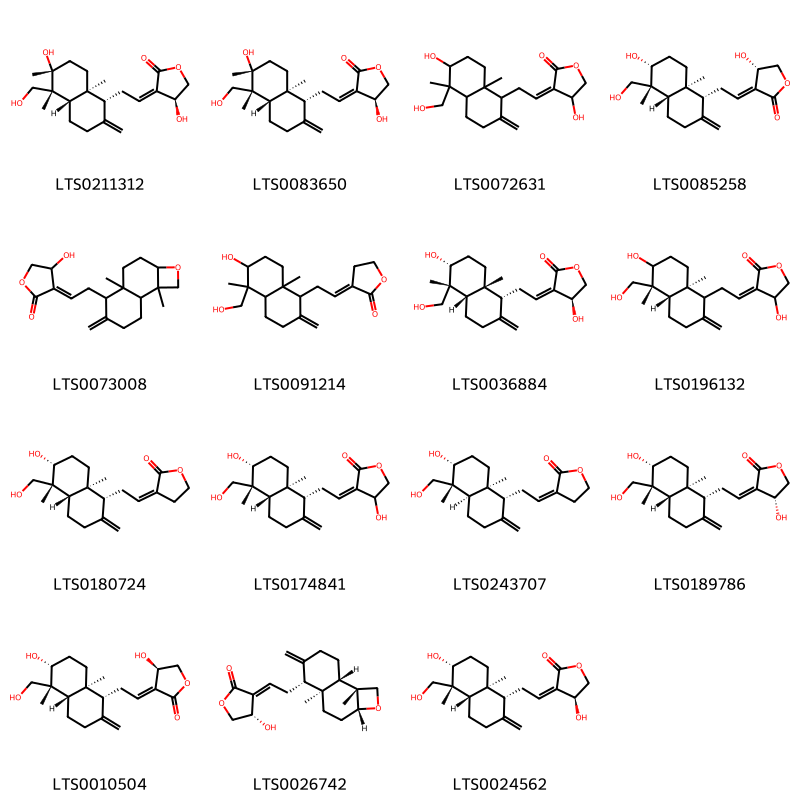{ width=100% }
    <figcaption>Hình ảnh cấu trúc hóa học của 15 hoạt chất thuộc nhóm Lactones gồm ['(4s)-3-{2-[(1r,4as,5r,6r,8as)-6-hydroxy-5-(hydroxymethyl)-5,6,8a-trimethyl-2-methylidene-hexahydronaphthalen-1-yl]ethylidene}-4-hydroxyoxolan-2-one (LTS0211312)', '(3z,4s)-3-{2-[(1r,4as,5r,6r,8as)-6-hydroxy-5-(hydroxymethyl)-5,6,8a-trimethyl-2-methylidene-hexahydronaphthalen-1-yl]ethylidene}-4-hydroxyoxolan-2-one (LTS0083650)', 'andrographolide (LTS0072631)', 'andrographolide (LTS0085258)', '3-(2-{4a,8b-dimethyl-6-methylidene-octahydronaphtho[2,1-b]oxet-5-yl}ethylidene)-4-hydroxyoxolan-2-one (LTS0073008)', '3-{2-[6-hydroxy-5-(hydroxymethyl)-5,8a-dimethyl-2-methylidene-hexahydro-1h-naphthalen-1-yl]ethylidene}oxolan-2-one (LTS0091214)', '(3z,4s)-3-{2-[(1r,4as,5r,6r,8ar)-6-hydroxy-5-(hydroxymethyl)-5,8a-dimethyl-2-methylidene-hexahydro-1h-naphthalen-1-yl]ethylidene}-4-hydroxyoxolan-2-one (LTS0036884)', '3-{2-[(4as,5r,8as)-6-hydroxy-5-(hydroxymethyl)-5,8a-dimethyl-2-methylidene-hexahydro-1h-naphthalen-1-yl]ethylidene}-4-hydroxyoxolan-2-one (LTS0196132)', '(3z)-3-{2-[(1r,4as,5r,6r,8as)-6-hydroxy-5-(hydroxymethyl)-5,8a-dimethyl-2-methylidene-hexahydro-1h-naphthalen-1-yl]ethylidene}oxolan-2-one (LTS0180724)', '(3z)-3-{2-[(1r,4as,5r,6r,8as)-6-hydroxy-5-(hydroxymethyl)-5,8a-dimethyl-2-methylidene-hexahydro-1h-naphthalen-1-yl]ethylidene}-4-hydroxyoxolan-2-one (LTS0174841)', '(3z)-3-{2-[(1r,4ar,5r,6r,8as)-6-hydroxy-5-(hydroxymethyl)-5,8a-dimethyl-2-methylidene-hexahydro-1h-naphthalen-1-yl]ethylidene}oxolan-2-one (LTS0243707)', '(3z,4r)-3-{2-[(1r,4as,5r,6r,8as)-6-hydroxy-5-(hydroxymethyl)-5,8a-dimethyl-2-methylidene-hexahydro-1h-naphthalen-1-yl]ethylidene}-4-hydroxyoxolan-2-one (LTS0189786)', '(3e,4r)-3-{2-[(1r,4as,5r,6r,8as)-6-hydroxy-5-(hydroxymethyl)-5,8a-dimethyl-2-methylidene-hexahydro-1h-naphthalen-1-yl]ethylidene}-4-hydroxyoxolan-2-one (LTS0010504)', '(3e,4s)-3-{2-[(2ar,4as,5r,8as,8br)-4a,8b-dimethyl-6-methylidene-octahydronaphtho[2,1-b]oxet-5-yl]ethylidene}-4-hydroxyoxolan-2-one (LTS0026742)', '(3z,4s)-3-{2-[(1r,4as,5r,6r,8as)-6-hydroxy-5-(hydroxymethyl)-5,8a-dimethyl-2-methylidene-hexahydro-1h-naphthalen-1-yl]ethylidene}-4-hydroxyoxolan-2-one (LTS0024562)'].</figcaption>
</figure>
#### Nhóm Organooxygen compounds
<figure markdown="span">
    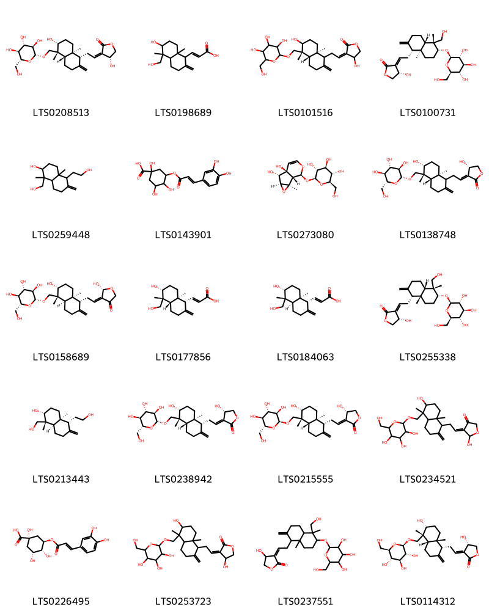{ width=100% }
    <figcaption>Hình ảnh cấu trúc hóa học của 20 hoạt chất thuộc nhóm Organooxygen compounds gồm ['(3z,4r)-3-{2-[(1r,4as,5r,6r,8as)-6-hydroxy-5,8a-dimethyl-2-methylidene-5-({[(2r,3r,4s,5s,6r)-3,4,5-trihydroxy-6-(hydroxymethyl)oxan-2-yl]oxy}methyl)-hexahydro-1h-naphthalen-1-yl]ethylidene}-4-hydroxyoxolan-2-one (LTS0208513)', '3-[6-hydroxy-5-(hydroxymethyl)-5,8a-dimethyl-2-methylidene-hexahydro-1h-naphthalen-1-yl]prop-2-enoic acid (LTS0198689)', '3-{2-[(4as,5r,8as)-6-hydroxy-5,8a-dimethyl-2-methylidene-5-({[3,4,5-trihydroxy-6-(hydroxymethyl)oxan-2-yl]oxy}methyl)-hexahydro-1h-naphthalen-1-yl]ethylidene}-4-hydroxyoxolan-2-one (LTS0101516)', '(3e,4s)-3-{2-[(1r,4as,5r,6r,8as)-5-(hydroxymethyl)-5,8a-dimethyl-2-methylidene-6-{[(2r,3r,4s,5s,6r)-3,4,5-trihydroxy-6-(hydroxymethyl)oxan-2-yl]oxy}-hexahydro-1h-naphthalen-1-yl]ethylidene}-4-hydroxyoxolan-2-one (LTS0100731)', '5-(2-hydroxyethyl)-1-(hydroxymethyl)-1,4a-dimethyl-6-methylidene-hexahydro-2h-naphthalen-2-ol (LTS0259448)', '3-{[3-(3,4-dihydroxyphenyl)prop-2-enoyl]oxy}-1,4,5-trihydroxycyclohexane-1-carboxylic acid (LTS0143901)', 'procumbide (LTS0273080)', '(3e,4s)-3-{2-[(4as,5r,6r,8as)-6-hydroxy-5,8a-dimethyl-2-methylidene-5-({[(2r,3r,4s,5s,6r)-3,4,5-trihydroxy-6-(hydroxymethyl)oxan-2-yl]oxy}methyl)-hexahydro-1h-naphthalen-1-yl]ethylidene}-4-hydroxyoxolan-2-one (LTS0138748)', '(4e,5r)-4-{2-[(1r,4ar,5r,6r,8as)-6-hydroxy-5,8a-dimethyl-2-methylidene-5-({[(2r,3r,4s,5s,6r)-3,4,5-trihydroxy-6-(hydroxymethyl)oxan-2-yl]oxy}methyl)-hexahydro-1h-naphthalen-1-yl]ethylidene}-5-hydroxyoxolan-3-one (LTS0158689)', '(2e)-3-[(1r,4as,5r,6r,8ar)-6-hydroxy-5-(hydroxymethyl)-5,8a-dimethyl-2-methylidene-hexahydro-1h-naphthalen-1-yl]prop-2-enoic acid (LTS0177856)', '(2e)-3-[(1r,4ar,5r,6r,8ar)-6-hydroxy-5-(hydroxymethyl)-5,8a-dimethyl-2-methylidene-hexahydro-1h-naphthalen-1-yl]prop-2-enoic acid (LTS0184063)', '(3e,4s)-3-{2-[(1r,4as,5r,6r,8ar)-5-(hydroxymethyl)-5,8a-dimethyl-2-methylidene-6-{[(2r,3r,4s,5s,6r)-3,4,5-trihydroxy-6-(hydroxymethyl)oxan-2-yl]oxy}-hexahydro-1h-naphthalen-1-yl]ethylidene}-4-hydroxyoxolan-2-one (LTS0255338)', '(1r,2r,4as,5r,8ar)-5-(2-hydroxyethyl)-1-(hydroxymethyl)-1,4a-dimethyl-6-methylidene-hexahydro-2h-naphthalen-2-ol (LTS0213443)', '(3e,4s)-3-{2-[(1r,4as,5r,6r,8as)-6-hydroxy-5,8a-dimethyl-2-methylidene-5-({[(2r,3r,4s,5s,6r)-3,4,5-trihydroxy-6-(hydroxymethyl)oxan-2-yl]oxy}methyl)-hexahydro-1h-naphthalen-1-yl]ethylidene}-4-hydroxyoxolan-2-one (LTS0238942)', '(3e,4s)-3-{2-[(1r,4as,5r,6r,8as)-6-hydroxy-5,8a-dimethyl-2-methylidene-5-({[(2s,3r,4s,5s,6r)-3,4,5-trihydroxy-6-(hydroxymethyl)oxan-2-yl]oxy}methyl)-hexahydro-1h-naphthalen-1-yl]ethylidene}-4-hydroxyoxolan-2-one (LTS0215555)', '5-hydroxy-4-{2-[6-hydroxy-5,8a-dimethyl-2-methylidene-5-({[3,4,5-trihydroxy-6-(hydroxymethyl)oxan-2-yl]oxy}methyl)-hexahydro-1h-naphthalen-1-yl]ethylidene}oxolan-3-one (LTS0234521)', 'chlorogenic acid (LTS0226495)', '4-hydroxy-3-{2-[6-hydroxy-5,8a-dimethyl-2-methylidene-5-({[3,4,5-trihydroxy-6-(hydroxymethyl)oxan-2-yl]oxy}methyl)-hexahydro-1h-naphthalen-1-yl]ethylidene}oxolan-2-one (LTS0253723)', '4-hydroxy-3-{2-[5-(hydroxymethyl)-5,8a-dimethyl-2-methylidene-6-{[3,4,5-trihydroxy-6-(hydroxymethyl)oxan-2-yl]oxy}-hexahydro-1h-naphthalen-1-yl]ethylidene}oxolan-2-one (LTS0237551)', '(3e,4s)-3-{2-[(1r,4as,5r,6r,8ar)-6-hydroxy-5,8a-dimethyl-2-methylidene-5-({[(2r,3r,4s,5s,6r)-3,4,5-trihydroxy-6-(hydroxymethyl)oxan-2-yl]oxy}methyl)-hexahydro-1h-naphthalen-1-yl]ethylidene}-4-hydroxyoxolan-2-one (LTS0114312)'].</figcaption>
</figure>
#### Nhóm Oxepanes
<figure markdown="span">
    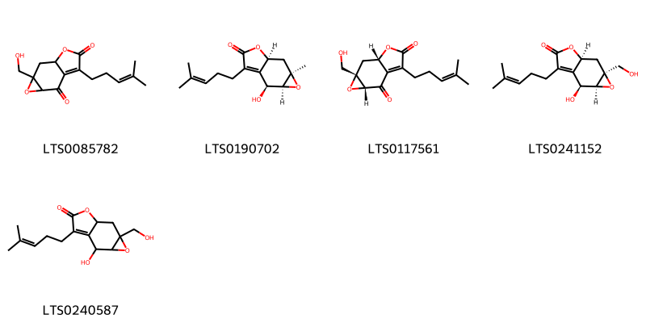{ width=100% }
    <figcaption>Hình ảnh cấu trúc hóa học của 5 hoạt chất thuộc nhóm Oxepanes gồm ['5-(hydroxymethyl)-10-(4-methylpent-3-en-1-yl)-4,8-dioxatricyclo[5.3.0.0³,⁵]dec-1(10)-ene-2,9-dione (LTS0085782)', '(2s,3s,5r,7s)-2-hydroxy-5-methyl-10-(4-methylpent-3-en-1-yl)-4,8-dioxatricyclo[5.3.0.0³,⁵]dec-1(10)-en-9-one (LTS0190702)', '(3r,5s,7s)-5-(hydroxymethyl)-10-(4-methylpent-3-en-1-yl)-4,8-dioxatricyclo[5.3.0.0³,⁵]dec-1(10)-ene-2,9-dione (LTS0117561)', '(2s,3s,5s,7s)-2-hydroxy-5-(hydroxymethyl)-10-(4-methylpent-3-en-1-yl)-4,8-dioxatricyclo[5.3.0.0³,⁵]dec-1(10)-en-9-one (LTS0241152)', '2-hydroxy-5-(hydroxymethyl)-10-(4-methylpent-3-en-1-yl)-4,8-dioxatricyclo[5.3.0.0³,⁵]dec-1(10)-en-9-one (LTS0240587)'].</figcaption>
</figure>
#### Nhóm Prenol lipids
<figure markdown="span">
    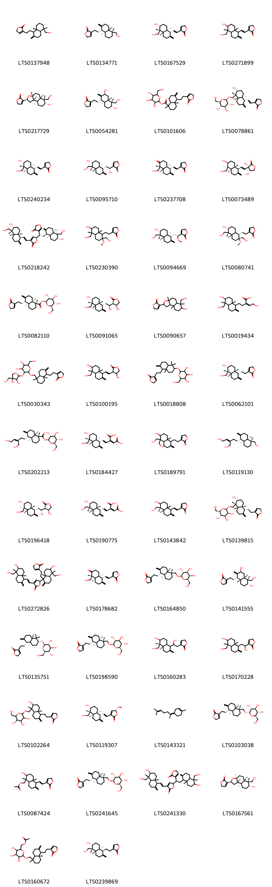{ width=100% }
    <figcaption>Hình ảnh cấu trúc hóa học của 109 hoạt chất thuộc nhóm Prenol lipids gồm ['3-{2-[5-(hydroxymethyl)-5,8a-dimethyl-2-methylidene-hexahydro-1h-naphthalen-1-yl]ethyl}-5h-furan-2-one (LTS0137948)', 'andrograpanin (LTS0134771)', '3-[(1e)-2-[(1r,4as,5r,6r,8ar)-6-hydroxy-5-(hydroxymethyl)-5,8a-dimethyl-2-methylidene-hexahydro-1h-naphthalen-1-yl]ethenyl]-5h-furan-2-one (LTS0167529)', '3-{2-[6-hydroxy-5-(hydroxymethyl)-5,8a-dimethyl-2-methylidene-hexahydro-1h-naphthalen-1-yl]ethenyl}-5h-furan-2-one (LTS0271899)', '3-[(2s,3ar,5as,6r,7r,9ar,9bs)-7-hydroxy-6-(hydroxymethyl)-3a,6,9a-trimethyl-octahydro-1h-naphtho[2,1-b]furan-2-yl]-5h-furan-2-one (LTS0217729)', '3-{2-[(1s,3s,4as,5r,6r,8as)-3,6-dihydroxy-5-(hydroxymethyl)-5,8a-dimethyl-2-methylidene-hexahydro-1h-naphthalen-1-yl]ethyl}-5h-furan-2-one (LTS0054281)', '3,4,5-trihydroxy-6-(hydroxymethyl)oxan-2-yl 1,4a-dimethyl-6-methylidene-5-[2-(2-oxo-5h-furan-3-yl)ethyl]-hexahydro-2h-naphthalene-1-carboxylate (LTS0101606)', '3-[(1e)-2-[(1r,4as,5r,6r,8ar)-6-hydroxy-5,8a-dimethyl-2-methylidene-5-({[(2r,3r,4s,5s,6r)-3,4,5-trihydroxy-6-(hydroxymethyl)oxan-2-yl]oxy}methyl)-hexahydro-1h-naphthalen-1-yl]ethenyl]-5h-furan-2-one (LTS0078861)', '3-[(1e)-2-[(1r,4ar,5r,6r,8ar)-6-hydroxy-5-(hydroxymethyl)-5,8a-dimethyl-2-methylidene-hexahydro-1h-naphthalen-1-yl]ethenyl]-5h-furan-2-one (LTS0240234)', '3-[(1r)-2-[(1r,4as,5r,6r,8as)-6-hydroxy-5-(hydroxymethyl)-5,8a-dimethyl-2-methylidene-hexahydro-1h-naphthalen-1-yl]-1-hydroxyethyl]-5h-furan-2-one (LTS0095710)', '3-[(1e)-2-[(1r,4as,5r,8ar)-5-(hydroxymethyl)-5,8a-dimethyl-2-methylidene-6-oxo-hexahydronaphthalen-1-yl]ethenyl]-5h-furan-2-one (LTS0237708)', '(3s,4s)-3-[(1e)-2-[(1s,4ar,5s,6s,8as)-6-hydroxy-5-(hydroxymethyl)-5,8a-dimethyl-2-methylidene-hexahydro-1h-naphthalen-1-yl]ethenyl]-3,4-dihydroxyoxolan-2-one (LTS0073489)', '(5s)-5-[(1s)-2-[(1s,4ar,5s,6r,8as)-6-hydroxy-5-(hydroxymethyl)-5,8a-dimethyl-2-methylidene-hexahydro-1h-naphthalen-1-yl]-1-(4-oxo-5h-furan-3-yl)ethyl]-3-[(1e)-2-[(1s,4as,5r,6r,8as)-6-hydroxy-5-(hydroxymethyl)-5,8a-dimethyl-2-methylidene-hexahydro-1h-naphthalen-1-yl]ethenyl]-5h-furan-2-one (LTS0218242)', '3-{2-[6-hydroxy-2,5-bis(hydroxymethyl)-2-methoxy-5,8a-dimethyl-hexahydro-1h-naphthalen-1-yl]ethyl}-5h-furan-2-one (LTS0230390)', '3-[(1r)-2-[(1r,4as,5r,6r,8as)-6-hydroxy-5-(hydroxymethyl)-5,8a-dimethyl-2-methylidene-hexahydro-1h-naphthalen-1-yl]-1-methoxyethyl]-5h-furan-2-one (LTS0094669)', '3-{2-[(1s,2r,4as,5r,6r,8ar)-6-hydroxy-2,5-bis(hydroxymethyl)-2-methoxy-5,8a-dimethyl-hexahydro-1h-naphthalen-1-yl]ethyl}-5h-furan-2-one (LTS0080741)', '(2s,3r,4s,5s,6r)-3,4,5-trihydroxy-6-(hydroxymethyl)oxan-2-yl (1r,4as,5r,8ar)-1,4a-dimethyl-6-methylidene-5-[2-(2-oxo-5h-furan-3-yl)ethyl]-hexahydro-2h-naphthalene-1-carboxylate (LTS0082110)', '(3r,4s)-3-[(1s)-2-[(1r,4as,5r,6r,8ar)-6-hydroxy-5-(hydroxymethyl)-5,8a-dimethyl-2-methylidene-hexahydro-1h-naphthalen-1-yl]-1-hydroxyethyl]-4-hydroxyoxolan-2-one (LTS0091065)', '3-[7-hydroxy-6-(hydroxymethyl)-3a,6,9a-trimethyl-octahydro-1h-naphtho[2,1-b]furan-2-yl]-5h-furan-2-one (LTS0090657)', '4-hydroxy-2-{2-[6-hydroxy-5-(hydroxymethyl)-5,8a-dimethyl-2-methylidene-hexahydro-1h-naphthalen-1-yl]ethyl}but-2-enoic acid (LTS0019434)', '3-[2-(5-{[(3-{[3,4-dihydroxy-4-(hydroxymethyl)oxolan-2-yl]oxy}-4,5-dihydroxy-6-(hydroxymethyl)oxan-2-yl)oxy]methyl}-5,8a-dimethyl-2-methylidene-hexahydro-1h-naphthalen-1-yl)ethyl]-5h-furan-2-one (LTS0030343)', '4-hydroxy-3-{2-[6-hydroxy-5-(hydroxymethyl)-5,8a-dimethyl-2-methylidene-hexahydro-1h-naphthalen-1-yl]ethenyl}oxolan-2-one (LTS0100195)', '3-[2-(5,5,8a-trimethyl-2-methylidene-6-{[3,4,5-trihydroxy-6-(hydroxymethyl)oxan-2-yl]oxy}-hexahydro-1h-naphthalen-1-yl)ethyl]-5h-furan-2-one (LTS0018808)', '3-{2-[(1r,4as,5r,6r,8ar)-6-hydroxy-5-(hydroxymethyl)-5,8a-dimethyl-2-methylidene-hexahydro-1h-naphthalen-1-yl]ethyl}-5h-furan-2-one (LTS0062101)', '(2s,3r,4s,5s,6r)-3,4,5-trihydroxy-6-(hydroxymethyl)oxan-2-yl (1r,4as,5r,8as)-5-[(3z)-5-hydroxy-3-(hydroxymethyl)pent-3-en-1-yl]-1,4a-dimethyl-6-methylidene-hexahydro-2h-naphthalene-1-carboxylate (LTS0202213)', 'andrographic acid (LTS0184427)', '3-{2-[6-hydroxy-5,5-bis(hydroxymethyl)-8a-methyl-2-methylidene-hexahydro-1h-naphthalen-1-yl]ethyl}-5h-furan-2-one (LTS0189791)', '(2z)-2-{2-[(1r,4ar,5r,8as)-5-(hydroxymethyl)-5,8a-dimethyl-2-methylidene-hexahydro-1h-naphthalen-1-yl]ethyl}but-2-ene-1,4-diol (LTS0119130)', '(3r,4s)-3-[(1r)-2-[(1r,4as,5s,6r,8ar)-6-hydroxy-5-(hydroxymethyl)-5,8a-dimethyl-2-methylidene-hexahydro-1h-naphthalen-1-yl]-1-hydroxyethyl]-4-hydroxyoxolan-2-one (LTS0196418)', '(2z)-2-[(1e)-2-[(1r,4as,5r,6r,8as)-6-hydroxy-5-(hydroxymethyl)-5,8a-dimethyl-2-methylidene-hexahydro-1h-naphthalen-1-yl]ethenyl]but-2-enedioic acid (LTS0190775)', '3-[(1e)-2-[(4as,5r)-6-hydroxy-5-(hydroxymethyl)-5,8a-dimethyl-2-methylidene-hexahydro-1h-naphthalen-1-yl]ethenyl]-5h-furan-2-one (LTS0143842)', '3-{2-[(1r,4as,5r,6r,8ar)-6-hydroxy-5,8a-dimethyl-2-methylidene-5-({[(2r,3s,4s,5s,6r)-3,4,5-trihydroxy-6-(hydroxymethyl)oxan-2-yl]oxy}methyl)-hexahydro-1h-naphthalen-1-yl]ethyl}-5h-furan-2-one (LTS0139815)', '5-[6-hydroxy-5-(hydroxymethyl)-5,8a-dimethyl-2-methylidene-1-[2-(2-oxo-5h-furan-3-yl)ethyl]-hexahydronaphthalen-1-yl]-3-[(1e)-2-[6-hydroxy-5-(hydroxymethyl)-5,8a-dimethyl-2-methylidene-hexahydro-1h-naphthalen-1-yl]ethenyl]-5h-furan-2-one (LTS0272826)', '3-[(1e)-2-[(1r,4ar,5r,8ar)-5-(hydroxymethyl)-5,8a-dimethyl-2-methylidene-6-oxo-hexahydronaphthalen-1-yl]ethenyl]-5h-furan-2-one (LTS0178682)', '3-{2-[(1r,4as,5r,8as)-5,8a-dimethyl-2-methylidene-5-({[(2r,3r,4s,5r,6r)-3,4,5-trihydroxy-6-(hydroxymethyl)oxan-2-yl]oxy}methyl)-hexahydro-1h-naphthalen-1-yl]ethyl}-5h-furan-2-one (LTS0164850)', '3-{2-[(1s,3s,4as,5r,6r,8ar)-3,6-dihydroxy-5-(hydroxymethyl)-5,8a-dimethyl-2-methylidene-hexahydro-1h-naphthalen-1-yl]ethyl}-5h-furan-2-one (LTS0141555)', '3-{2-[(1r,4as,6r,8as)-5,5,8a-trimethyl-2-methylidene-6-{[(2r,3r,4s,5s,6r)-3,4,5-trihydroxy-6-(hydroxymethyl)oxan-2-yl]oxy}-hexahydro-1h-naphthalen-1-yl]ethyl}-5h-furan-2-one (LTS0135751)', '3-{2-[(1r,4ar,5r,8as)-5,8a-dimethyl-2-methylidene-5-({[(2r,3r,4s,5s,6r)-3,4,5-trihydroxy-6-(hydroxymethyl)oxan-2-yl]oxy}methyl)-hexahydro-1h-naphthalen-1-yl]ethyl}-5h-furan-2-one (LTS0198590)', '3-{2-[(4as,5r,8ar)-6-hydroxy-5-(hydroxymethyl)-5,8a-dimethyl-2-methylidene-hexahydro-1h-naphthalen-1-yl]-2-hydroxyethyl}-5h-furan-2-one (LTS0160283)', '3-{1-hydroxy-2-[6-hydroxy-5-(hydroxymethyl)-5,8a-dimethyl-2-methylidene-hexahydro-1h-naphthalen-1-yl]ethyl}-5h-furan-2-one (LTS0170228)', '3-{2-[6-hydroxy-5,8a-dimethyl-2-methylidene-5-({[3,4,5-trihydroxy-6-(hydroxymethyl)oxan-2-yl]oxy}methyl)-hexahydro-1h-naphthalen-1-yl]ethyl}-5h-furan-2-one (LTS0102264)', '(5r)-3-[(1e)-2-[(1r,4ar,5r,6r,8ar)-6-hydroxy-5-(hydroxymethyl)-5,8a-dimethyl-2-methylidene-hexahydro-1h-naphthalen-1-yl]ethenyl]-5-methoxy-5h-furan-2-one (LTS0119307)', '(z)-γ-bisabolene (LTS0143321)', '3-{2-[(1r,4as,5r,8as)-5,8a-dimethyl-2-methylidene-5-({[(2s,3r,4s,5s,6r)-3,4,5-trihydroxy-6-(hydroxymethyl)oxan-2-yl]oxy}methyl)-hexahydro-1h-naphthalen-1-yl]ethyl}-5h-furan-2-one (LTS0103038)', '{2-hydroxy-1,4a-dimethyl-6-methylidene-5-[2-(2-oxo-5h-furan-3-yl)ethenyl]-hexahydro-2h-naphthalen-1-yl}methyl acetate (LTS0087424)', 'neoandrographolide (LTS0241645)', '5-{2-[6-hydroxy-5-(hydroxymethyl)-5,8a-dimethyl-2-methylidene-hexahydro-1h-naphthalen-1-yl]-1-(2-oxo-5h-furan-3-yl)ethyl}-3-{2-[6-hydroxy-5-(hydroxymethyl)-5,8a-dimethyl-2-methylidene-hexahydro-1h-naphthalen-1-yl]ethenyl}-5h-furan-2-one (LTS0241330)', '3-[(2s,3as,5as,6r,7r,9ar,9bs)-7-hydroxy-6-(hydroxymethyl)-3a,6,9a-trimethyl-octahydro-1h-naphtho[2,1-b]furan-2-yl]-5h-furan-2-one (LTS0167561)', '[6-({1,4a-dimethyl-6-methylidene-5-[2-(2-oxo-5h-furan-3-yl)ethyl]-hexahydro-2h-naphthalen-1-yl}methoxy)-3,4,5-trihydroxyoxan-2-yl]methyl acetate (LTS0160672)', '3-{2-[(1s,4as,5r,6r,8as)-6-hydroxy-5-(hydroxymethyl)-5,8a-dimethyl-2-methylidene-hexahydro-1h-naphthalen-1-yl]ethyl}-5h-furan-2-one (LTS0239869)', 'methyl (2e,5s)-6-[(1r,4as,5r,6r,8as)-6-hydroxy-5-(hydroxymethyl)-5,8a-dimethyl-2-methylidene-hexahydro-1h-naphthalen-1-yl]-2-{2-[(1r,4as,5r,6r,8as)-6-hydroxy-5-(hydroxymethyl)-5,8a-dimethyl-2-methylidene-hexahydro-1h-naphthalen-1-yl]ethylidene}-4-oxo-5-(2-oxo-5h-furan-3-yl)hexanoate (LTS0184935)', '3-[(1e)-2-[(1r,4as,5r,6r,8ar)-6-hydroxy-5-(hydroxymethyl)-5,8a-dimethyl-2-methylidene-hexahydro-1h-naphthalen-1-yl]ethenyl]-5-methoxy-5h-furan-2-one (LTS0104915)', 'bisabolene (LTS0109697)', "3-{2-[(1s,2r,4as,5r,6r,8ar)-6-hydroxy-5-(hydroxymethyl)-5,8a-dimethyl-hexahydro-1h-spiro[naphthalene-2,2'-oxiran]-1-yl]ethyl}-5h-furan-2-one (LTS0104076)", '2-{2-[6-hydroxy-5-(hydroxymethyl)-5,8a-dimethyl-2-methylidene-hexahydro-1h-naphthalen-1-yl]ethenyl}but-2-enedioic acid (LTS0109188)', '[(2r,3s,4s,5r,6s)-6-{[(1r,4as,5r,8as)-1,4a-dimethyl-6-methylidene-5-[2-(2-oxo-5h-furan-3-yl)ethyl]-hexahydro-2h-naphthalen-1-yl]methoxy}-3,4,5-trihydroxyoxan-2-yl]methyl acetate (LTS0174211)', '3,4,5-trihydroxy-6-(hydroxymethyl)oxan-2-yl 5-[5-hydroxy-3-(hydroxymethyl)pent-3-en-1-yl]-1,4a-dimethyl-6-methylidene-hexahydro-2h-naphthalene-1-carboxylate (LTS0202736)', '3-{2-[(1r,4as,5r,6r,8as)-6-hydroxy-5,8a-dimethyl-2-methylidene-5-({[(2s,3r,4s,5s,6r)-3,4,5-trihydroxy-6-(hydroxymethyl)oxan-2-yl]oxy}methyl)-hexahydro-1h-naphthalen-1-yl]ethyl}-5h-furan-2-one (LTS0245899)', '(3s,4s)-3-{2-[(1s,4ar,5s,6s,8as)-6-hydroxy-5-(hydroxymethyl)-5,8a-dimethyl-2-methylidene-hexahydro-1h-naphthalen-1-yl]ethenyl}-3,4-dihydroxyoxolan-2-one (LTS0224130)', '4-hydroxy-3-{1-hydroxy-2-[6-hydroxy-5-(hydroxymethyl)-5,8a-dimethyl-2-methylidene-hexahydro-1h-naphthalen-1-yl]ethyl}oxolan-2-one (LTS0244821)', '(3r,4s)-3-[(1r)-2-[(1r,4as,5r,6r,8as)-6-hydroxy-5-(hydroxymethyl)-5,8a-dimethyl-2-methylidene-hexahydro-1h-naphthalen-1-yl]-1-hydroxyethyl]-4-hydroxyoxolan-2-one (LTS0069195)', '3-{2-[(1r,2s,4as,5r,6r,8as)-6-hydroxy-2,5-bis(hydroxymethyl)-5,8a-dimethyl-octahydronaphthalen-1-yl]ethyl}-5h-furan-2-one (LTS0214602)', '2-{2-[5-(hydroxymethyl)-5,8a-dimethyl-2-methylidene-hexahydro-1h-naphthalen-1-yl]ethyl}but-2-ene-1,4-diol (LTS0218923)', '3-{2-[(4as,5r,6r,8ar)-6-hydroxy-5-(hydroxymethyl)-2,5,8a-trimethyl-3,4,4a,6,7,8-hexahydronaphthalen-1-yl]ethyl}-5h-furan-2-one (LTS0077528)', '3-{2-[6-hydroxy-2,5-bis(hydroxymethyl)-5,8a-dimethyl-octahydronaphthalen-1-yl]ethyl}-5h-furan-2-one (LTS0075854)', '3-{2-[(1r,4ar,5r,6r,8as)-6-hydroxy-5-(hydroxymethyl)-5,8a-dimethyl-2-methylidene-hexahydro-1h-naphthalen-1-yl]ethyl}-5h-furan-2-one (LTS0223583)', '(3s,4s)-3-[(1r)-2-[(1r,4as,5r,6r,8as)-6-hydroxy-5-(hydroxymethyl)-5,8a-dimethyl-2-methylidene-hexahydro-1h-naphthalen-1-yl]-1-hydroxyethyl]-4-hydroxyoxolan-2-one (LTS0072662)', '3-[(1s)-2-[(1r,4as,5r,6r,8as)-6-hydroxy-5-(hydroxymethyl)-5,8a-dimethyl-2-methylidene-hexahydro-1h-naphthalen-1-yl]-1-methoxyethyl]-5h-furan-2-one (LTS0210040)', 'bisandrographolide (LTS0267665)', '(2z)-2-{2-[(1r,4as,5r,6r,8as)-6-hydroxy-5-(hydroxymethyl)-5,8a-dimethyl-2-methylidene-hexahydro-1h-naphthalen-1-yl]ethyl}-4-hydroxybut-2-enoic acid (LTS0046372)', '(3r,4s)-3-[(1e)-2-[(1r,4as,5r,6r,8ar)-6-hydroxy-5-(hydroxymethyl)-5,8a-dimethyl-2-methylidene-hexahydro-1h-naphthalen-1-yl]ethenyl]-4-hydroxyoxolan-2-one (LTS0048115)', '3-{2-[(1r,4ar,5r,8as)-5-(hydroxymethyl)-5,8a-dimethyl-2-methylidene-hexahydro-1h-naphthalen-1-yl]ethyl}-5h-furan-2-one (LTS0177629)', '(3s,4s)-3-[(1r)-2-[(1r,4as,5s,6r,8ar)-6-hydroxy-5-(hydroxymethyl)-5,8a-dimethyl-2-methylidene-hexahydro-1h-naphthalen-1-yl]-1-hydroxyethyl]-4-hydroxyoxolan-2-one (LTS0212662)', '3-{2-[(1r,4as,5r,6r,8ar)-6-hydroxy-5-(hydroxymethyl)-5,8a-dimethyl-2-methylidene-hexahydro-1h-naphthalen-1-yl]-2-oxoethyl}-5h-furan-2-one (LTS0176790)', '3-[(1e)-2-[(1r,4ar,5r,6r,8ar)-6-hydroxy-5,8a-dimethyl-2-methylidene-5-({[(2r,3r,4s,5s,6r)-3,4,5-trihydroxy-6-(hydroxymethyl)oxan-2-yl]oxy}methyl)-hexahydro-1h-naphthalen-1-yl]ethenyl]-5h-furan-2-one (LTS0165723)', '3-{2-[3,6-dihydroxy-5-(hydroxymethyl)-5,8a-dimethyl-2-methylidene-hexahydro-1h-naphthalen-1-yl]ethyl}-5h-furan-2-one (LTS0043952)', 'methyl (2e)-6-[(1r,4as,5r,6r,8as)-6-hydroxy-5-(hydroxymethyl)-5,8a-dimethyl-2-methylidene-hexahydro-1h-naphthalen-1-yl]-2-{2-[(1r,4as,5r,6r,8as)-6-hydroxy-5-(hydroxymethyl)-5,8a-dimethyl-2-methylidene-hexahydro-1h-naphthalen-1-yl]ethylidene}-4-oxo-5-(2-oxo-5h-furan-3-yl)hexanoate (LTS0240136)', '3-{2-hydroxy-2-[6-hydroxy-5-(hydroxymethyl)-5,8a-dimethyl-2-methylidene-hexahydro-1h-naphthalen-1-yl]ethyl}-5h-furan-2-one (LTS0249448)', '3-{2-[(1s,3r,4as,5r,6r,8ar)-3,6-dihydroxy-5-(hydroxymethyl)-5,8a-dimethyl-2-methylidene-hexahydro-1h-naphthalen-1-yl]ethyl}-5h-furan-2-one (LTS0038665)', '(2z)-2-{2-[(1r,4ar,5r,6r,8as)-6-hydroxy-5-(hydroxymethyl)-5,8a-dimethyl-2-methylidene-hexahydro-1h-naphthalen-1-yl]ethyl}-4-hydroxybut-2-enoic acid (LTS0046045)', '3-[(1e)-2-[(1r,4as,5r,6r,8ar)-6-hydroxy-5-(hydroxymethyl)-5,8a-dimethyl-2-methylidene-hexahydro-1h-naphthalen-1-yl]ethenyl]-5-(propan-2-ylidene)furan-2-one (LTS0034331)', '3-[(2r,3as,5as,6r,7r,9ar,9bs)-7-hydroxy-6-(hydroxymethyl)-3a,6,9a-trimethyl-octahydro-1h-naphtho[2,1-b]furan-2-yl]-5h-furan-2-one (LTS0049601)', 'ninandrographolide (LTS0035021)', '3-{2-[(1s,3r,4as,5r,6r,8as)-3,6-dihydroxy-5-(hydroxymethyl)-5,8a-dimethyl-2-methylidene-hexahydro-1h-naphthalen-1-yl]ethyl}-5h-furan-2-one (LTS0046709)', '3-[(1s)-2-[(1r,4as,5r,6r,8as)-6-hydroxy-5-(hydroxymethyl)-5,8a-dimethyl-2-methylidene-hexahydro-1h-naphthalen-1-yl]-1-hydroxyethyl]-5h-furan-2-one (LTS0040022)', '(5s)-3-[(1e)-2-[(1r,4as,5r,6r,8ar)-6-hydroxy-5-(hydroxymethyl)-5,8a-dimethyl-2-methylidene-hexahydro-1h-naphthalen-1-yl]ethenyl]-5-{2-[(1r,4as,5r,6r,8as)-6-hydroxy-5-(hydroxymethyl)-5,8a-dimethyl-2-methylidene-hexahydro-1h-naphthalen-1-yl]-1-(2-oxo-5h-furan-3-yl)ethyl}-5h-furan-2-one (LTS0010519)', '(2z)-2-{2-[(1r,4as,5r,8as)-5-(hydroxymethyl)-5,8a-dimethyl-2-methylidene-hexahydro-1h-naphthalen-1-yl]ethyl}but-2-ene-1,4-diol (LTS0063494)', '3-[(1e)-2-[(1s,4as,5r,6r,8ar)-6-hydroxy-5-(hydroxymethyl)-5,8a-dimethyl-2-methylidene-hexahydro-1h-naphthalen-1-yl]ethenyl]-5h-furan-2-one (LTS0242996)', '3-{2-[6-hydroxy-5-(hydroxymethyl)-5,8a-dimethyl-2-methylidene-hexahydro-1h-naphthalen-1-yl]ethenyl}-5-(propan-2-ylidene)furan-2-one (LTS0058178)', '3-{2-[(1r,4as,5r,8as)-5-(hydroxymethyl)-5,8a-dimethyl-2-methylidene-6-oxo-hexahydronaphthalen-1-yl]ethyl}-5h-furan-2-one (LTS0135055)', '3-{2-[5-(hydroxymethyl)-5,8a-dimethyl-2-methylidene-6-oxo-hexahydronaphthalen-1-yl]ethenyl}-5h-furan-2-one (LTS0110744)', '(3s,4s)-3-[(1s)-2-[(1r,4as,5r,6r,8as)-6-hydroxy-5-(hydroxymethyl)-5,8a-dimethyl-2-methylidene-hexahydro-1h-naphthalen-1-yl]-1-hydroxyethyl]-4-hydroxyoxolan-2-one (LTS0009727)', '3-{2-[6-hydroxy-5,8a-dimethyl-2-methylidene-5-({[3,4,5-trihydroxy-6-(hydroxymethyl)oxan-2-yl]oxy}methyl)-hexahydro-1h-naphthalen-1-yl]ethenyl}-5h-furan-2-one (LTS0016153)', '(5r)-3-[(1e)-2-[(1r,4as,5r,6r,8ar)-6-hydroxy-5-(hydroxymethyl)-5,8a-dimethyl-2-methylidene-hexahydro-1h-naphthalen-1-yl]ethenyl]-5-[(1s)-2-[(1r,4as,5r,6r,8as)-6-hydroxy-5-(hydroxymethyl)-5,8a-dimethyl-2-methylidene-hexahydro-1h-naphthalen-1-yl]-1-(2-oxo-5h-furan-3-yl)ethyl]-5h-furan-2-one (LTS0268960)', '3-{2-[6-hydroxy-5-(hydroxymethyl)-5,8a-dimethyl-2-methylidene-hexahydro-1h-naphthalen-1-yl]ethenyl}-5-methoxy-5h-furan-2-one (LTS0004521)', '3-{2-[(1r,5r,6r,8as)-6-hydroxy-5-(hydroxymethyl)-5,8a-dimethyl-2-methylidene-hexahydro-1h-naphthalen-1-yl]-1-methoxyethyl}-5h-furan-2-one (LTS0011960)', '3-{2-[6-hydroxy-5-(hydroxymethyl)-5,8a-dimethyl-2-methylidene-hexahydro-1h-naphthalen-1-yl]-2-oxoethyl}-5h-furan-2-one (LTS0021696)', "3-{2-[6-hydroxy-5-(hydroxymethyl)-5,8a-dimethyl-hexahydro-1h-spiro[naphthalene-2,2'-oxiran]-1-yl]ethyl}-5h-furan-2-one (LTS0029248)", '3-{2-[6-hydroxy-5-(hydroxymethyl)-5,8a-dimethyl-2-methylidene-hexahydro-1h-naphthalen-1-yl]ethyl}-5h-furan-2-one (LTS0026438)', '3-{2-[(1r,4ar,6r,8as)-6-hydroxy-5,5-bis(hydroxymethyl)-8a-methyl-2-methylidene-hexahydro-1h-naphthalen-1-yl]ethyl}-5h-furan-2-one (LTS0253316)', '3-{2-[(1r,4ar,5r,6r,8as)-6-hydroxy-5,8a-dimethyl-2-methylidene-5-({[(2r,3r,4s,5s,6r)-3,4,5-trihydroxy-6-(hydroxymethyl)oxan-2-yl]oxy}methyl)-hexahydro-1h-naphthalen-1-yl]ethyl}-5h-furan-2-one (LTS0111629)', '3-[(2r,3ar,5as,6r,7r,9ar,9bs)-7-hydroxy-6-(hydroxymethyl)-3a,6,9a-trimethyl-octahydro-1h-naphtho[2,1-b]furan-2-yl]-5h-furan-2-one (LTS0003573)', '3-{2-[(1r,4as,5r,8as)-5-({[(2r,3r,4s,5s,6r)-3-{[(2s,3r,4r)-3,4-dihydroxy-4-(hydroxymethyl)oxolan-2-yl]oxy}-4,5-dihydroxy-6-(hydroxymethyl)oxan-2-yl]oxy}methyl)-5,8a-dimethyl-2-methylidene-hexahydro-1h-naphthalen-1-yl]ethyl}-5h-furan-2-one (LTS0098327)', '3-[(2r)-2-[(1r,4as,5r,6r,8ar)-6-hydroxy-5-(hydroxymethyl)-5,8a-dimethyl-2-methylidene-hexahydro-1h-naphthalen-1-yl]-2-hydroxyethyl]-5h-furan-2-one (LTS0032723)', '3-{2-[(1r,4as,5r,6r,8as)-6-hydroxy-5-(hydroxymethyl)-5,8a-dimethyl-2-methylidene-hexahydro-1h-naphthalen-1-yl]ethyl}-5h-furan-2-one (LTS0039788)', '3-{2-[5,8a-dimethyl-2-methylidene-5-({[3,4,5-trihydroxy-6-(hydroxymethyl)oxan-2-yl]oxy}methyl)-hexahydro-1h-naphthalen-1-yl]ethyl}-5h-furan-2-one (LTS0041572)', 'methyl 6-[6-hydroxy-5-(hydroxymethyl)-5,8a-dimethyl-2-methylidene-hexahydro-1h-naphthalen-1-yl]-2-{2-[6-hydroxy-5-(hydroxymethyl)-5,8a-dimethyl-2-methylidene-hexahydro-1h-naphthalen-1-yl]ethylidene}-4-oxo-5-(2-oxo-5h-furan-3-yl)hexanoate (LTS0263329)', '[(1r,2r,4ar,5r,8as)-2-hydroxy-1,4a-dimethyl-6-methylidene-5-[(1e)-2-(2-oxo-5h-furan-3-yl)ethenyl]-hexahydro-2h-naphthalen-1-yl]methyl acetate (LTS0261514)', '3-{2-[6-hydroxy-5-(hydroxymethyl)-5,8a-dimethyl-2-methylidene-hexahydro-1h-naphthalen-1-yl]-1-methoxyethyl}-5h-furan-2-one (LTS0263875)'].</figcaption>
</figure>
#### Nhóm Steroids and steroid derivatives
<figure markdown="span">
    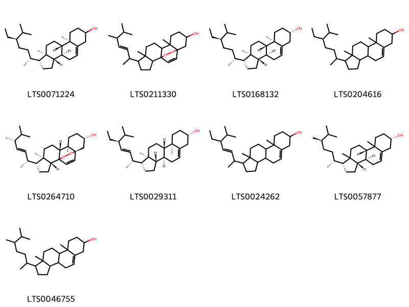{ width=100% }
    <figcaption>Hình ảnh cấu trúc hóa học của 9 hoạt chất thuộc nhóm Steroids and steroid derivatives gồm ['stigmast-5-en-3-ol (LTS0071224)', '5-(5,6-dimethylhept-3-en-2-yl)-6,10-dimethyl-16,17-dioxapentacyclo[13.2.2.0¹,⁹.0²,⁶.0¹⁰,¹⁵]nonadec-18-en-13-ol (LTS0211330)', 'sitosterol (LTS0168132)', 'stigmast-5-en-3-ol, (3β)- (LTS0204616)', 'ergosterol peroxide (LTS0264710)', 'phytosterol (LTS0029311)', 'stigmasterol (LTS0024262)', '(1r,3as,3bs,7s,9bs)-1-[(2r,5r)-5,6-dimethylheptan-2-yl]-9a,11a-dimethyl-1h,2h,3h,3ah,3bh,4h,6h,7h,8h,9h,9bh,10h,11h-cyclopenta[a]phenanthren-7-ol (LTS0057877)', 'campesterol (LTS0046755)'].</figcaption>
</figure>

---

### Dược dân tộc học

Danh sách các quốc gia có sử dụng *Andrographis paniculata* trong điều trị các bệnh. 

| Country       | Disease                | Bệnh                                                                                                                                                                                                |
|:--------------|:-----------------------|:----------------------------------------------------------------------------------------------------------------------------------------------------------------------------------------------------|
| China         | Detoxicant, Antiseptic | MYMEMORY WARNING: YOU USED ALL AVAILABLE FREE TRANSLATIONS FOR TODAY. NEXT AVAILABLE IN  13 HOURS 48 MINUTES 54 SECONDS VISIT HTTPS://MYMEMORY.TRANSLATED.NET/DOC/USAGELIMITS.PHP TO TRANSLATE MORE |
| Elsewhere     | nan, Stomachic         | MYMEMORY WARNING: YOU USED ALL AVAILABLE FREE TRANSLATIONS FOR TODAY. NEXT AVAILABLE IN  13 HOURS 48 MINUTES 49 SECONDS VISIT HTTPS://MYMEMORY.TRANSLATED.NET/DOC/USAGELIMITS.PHP TO TRANSLATE MORE |
| India         | Tonic, nan             | MYMEMORY WARNING: YOU USED ALL AVAILABLE FREE TRANSLATIONS FOR TODAY. NEXT AVAILABLE IN  13 HOURS 48 MINUTES 44 SECONDS VISIT HTTPS://MYMEMORY.TRANSLATED.NET/DOC/USAGELIMITS.PHP TO TRANSLATE MORE |
| India(Santal) | Laxative               | MYMEMORY WARNING: YOU USED ALL AVAILABLE FREE TRANSLATIONS FOR TODAY. NEXT AVAILABLE IN  13 HOURS 48 MINUTES 41 SECONDS VISIT HTTPS://MYMEMORY.TRANSLATED.NET/DOC/USAGELIMITS.PHP TO TRANSLATE MORE |
| Iran          | Astringent             | MYMEMORY WARNING: YOU USED ALL AVAILABLE FREE TRANSLATIONS FOR TODAY. NEXT AVAILABLE IN  13 HOURS 48 MINUTES 38 SECONDS VISIT HTTPS://MYMEMORY.TRANSLATED.NET/DOC/USAGELIMITS.PHP TO TRANSLATE MORE |
| Malaysia      | Stomachic              | MYMEMORY WARNING: YOU USED ALL AVAILABLE FREE TRANSLATIONS FOR TODAY. NEXT AVAILABLE IN  13 HOURS 48 MINUTES 32 SECONDS VISIT HTTPS://MYMEMORY.TRANSLATED.NET/DOC/USAGELIMITS.PHP TO TRANSLATE MORE |

---

# Chi Strobilanthes

??? note "Danh sách các dược liệu thuộc chi"
    
	 - *Strobilanthes atropurpureus*
	 - *Strobilanthes callosus*
	 - *Strobilanthes ciliatus*
	 - *Strobilanthes cusia*
	 - *Strobilanthes flaccidifolius*

---
## Strobilanthes atropurpureus
### Thông tin về thực vật

!!! info "Phân loại thực vật của *Strobilanthes atropurpurea* từ GIBF:"
    - **Kingdom:** Plantae
    - **Phylum:** Tracheophyta
    - **Order:** Lamiales
    - **Family:** Acanthaceae
    - **Genus:** Strobilanthes
    - **Species:** *Strobilanthes atropurpurea*

 

| Label (VI)   | Label (EN)   | Scientific Name         | Descriptions (VI)   | Descriptions (EN)   | Also Known As (VI)                                                                                              | Also Known As (EN)                            |
|:-------------|:-------------|:------------------------|:--------------------|:--------------------|:----------------------------------------------------------------------------------------------------------------|:----------------------------------------------|
| N/A          | N/A          | Andrographis paniculata |                     | species of plant    | ['Lam khái liên', 'Khô đảm thảo', 'Justicia paniculata', 'Công cộng', 'Cây lá đắng', 'Andrographis paniculata'] | ['Creat', 'King of bitter', 'Green chirayta'] |

#### Phân bố trên thế giới

**Từ CSDL GIBF** nan, Viet Nam, United States of America, Portugal, Bhutan, Belgium, Nepal, Indonesia, China, Pakistan, Myanmar, India, Slovenia, unknown or invalid, Canada, Netherlands

#### Phân bố tại Việt Nam

**Từ CSDL GIBF**: Cao Bang

---
### Thành phần hóa học
        
- Theo cơ sở dữ liệu lotus: Từ loài *Strobilanthes atropurpurea* đã phân lập và xác định được Chưa có hoạt chất nào được phân lập. hoạt chất thuộc về các nhóm Không có hoạt chất nào được phân lập. 

Không có hình ảnh nào được tạo ra

---

### Dược dân tộc học

Danh sách các quốc gia có sử dụng *Strobilanthes atropurpurea* trong điều trị các bệnh. 

| Country   | Disease   | Bệnh                                                                                                                                                                                                |
|:----------|:----------|:----------------------------------------------------------------------------------------------------------------------------------------------------------------------------------------------------|
| Elsewhere | Poison    | MYMEMORY WARNING: YOU USED ALL AVAILABLE FREE TRANSLATIONS FOR TODAY. NEXT AVAILABLE IN  13 HOURS 47 MINUTES 42 SECONDS VISIT HTTPS://MYMEMORY.TRANSLATED.NET/DOC/USAGELIMITS.PHP TO TRANSLATE MORE |

---

---
## Strobilanthes callosus
### Thông tin về thực vật

!!! info "Phân loại thực vật của *Strobilanthes callosa* từ GIBF:"
    - **Kingdom:** Plantae
    - **Phylum:** Tracheophyta
    - **Order:** Lamiales
    - **Family:** Acanthaceae
    - **Genus:** Strobilanthes
    - **Species:** *Strobilanthes callosa*

 

| Label (VI)   | Label (EN)   | Scientific Name         | Descriptions (VI)   | Descriptions (EN)   | Also Known As (VI)                                                                                              | Also Known As (EN)                            |
|:-------------|:-------------|:------------------------|:--------------------|:--------------------|:----------------------------------------------------------------------------------------------------------------|:----------------------------------------------|
| N/A          | N/A          | Andrographis paniculata |                     | species of plant    | ['Lam khái liên', 'Khô đảm thảo', 'Justicia paniculata', 'Công cộng', 'Cây lá đắng', 'Andrographis paniculata'] | ['Creat', 'King of bitter', 'Green chirayta'] |

#### Phân bố trên thế giới

**Từ CSDL GIBF** nan, India, United States of America, unknown or invalid

#### Phân bố tại Việt Nam

**Từ CSDL GIBF**: Không có ghi nhận ở Việt Nam

---
### Thành phần hóa học
        
- Theo cơ sở dữ liệu lotus: Từ loài *Strobilanthes callosa* đã phân lập và xác định được Chưa có hoạt chất nào được phân lập. hoạt chất thuộc về các nhóm Không có hoạt chất nào được phân lập. 

Không có hình ảnh nào được tạo ra

---

### Dược dân tộc học

Danh sách các quốc gia có sử dụng *Strobilanthes callosa* trong điều trị các bệnh. 

| Country   | Disease                      | Bệnh                                                                                                                                                                                                |
|:----------|:-----------------------------|:----------------------------------------------------------------------------------------------------------------------------------------------------------------------------------------------------|
| Elsewhere | Emollient, Poison, Vulnerary | MYMEMORY WARNING: YOU USED ALL AVAILABLE FREE TRANSLATIONS FOR TODAY. NEXT AVAILABLE IN  13 HOURS 47 MINUTES 11 SECONDS VISIT HTTPS://MYMEMORY.TRANSLATED.NET/DOC/USAGELIMITS.PHP TO TRANSLATE MORE |
| India     | Insecticide                  | MYMEMORY WARNING: YOU USED ALL AVAILABLE FREE TRANSLATIONS FOR TODAY. NEXT AVAILABLE IN  13 HOURS 47 MINUTES 08 SECONDS VISIT HTTPS://MYMEMORY.TRANSLATED.NET/DOC/USAGELIMITS.PHP TO TRANSLATE MORE |

---

---
## Strobilanthes ciliatus
### Thông tin về thực vật

!!! info "Phân loại thực vật của *Strobilanthes ciliata* từ GIBF:"
    - **Kingdom:** Plantae
    - **Phylum:** Tracheophyta
    - **Order:** Lamiales
    - **Family:** Acanthaceae
    - **Genus:** Strobilanthes
    - **Species:** *Strobilanthes ciliata*

 

| Label (VI)   | Label (EN)   | Scientific Name         | Descriptions (VI)   | Descriptions (EN)   | Also Known As (VI)                                                                                              | Also Known As (EN)                            |
|:-------------|:-------------|:------------------------|:--------------------|:--------------------|:----------------------------------------------------------------------------------------------------------------|:----------------------------------------------|
| N/A          | N/A          | Andrographis paniculata |                     | species of plant    | ['Lam khái liên', 'Khô đảm thảo', 'Justicia paniculata', 'Công cộng', 'Cây lá đắng', 'Andrographis paniculata'] | ['Creat', 'King of bitter', 'Green chirayta'] |

#### Phân bố trên thế giới

**Từ CSDL GIBF** nan, India, unknown or invalid

#### Phân bố tại Việt Nam

**Từ CSDL GIBF**: Không có ghi nhận ở Việt Nam

---
### Thành phần hóa học
        
- Theo cơ sở dữ liệu lotus: Từ loài *Strobilanthes ciliata* đã phân lập và xác định được Chưa có hoạt chất nào được phân lập. hoạt chất thuộc về các nhóm Không có hoạt chất nào được phân lập. 

Không có hình ảnh nào được tạo ra

---

### Dược dân tộc học

Danh sách các quốc gia có sử dụng *Strobilanthes ciliata* trong điều trị các bệnh. 

| Country   | Disease              | Bệnh                                                                                                                                                                                                |
|:----------|:---------------------|:----------------------------------------------------------------------------------------------------------------------------------------------------------------------------------------------------|
| Elsewhere | Emollient, Vulnerary | MYMEMORY WARNING: YOU USED ALL AVAILABLE FREE TRANSLATIONS FOR TODAY. NEXT AVAILABLE IN  13 HOURS 46 MINUTES 41 SECONDS VISIT HTTPS://MYMEMORY.TRANSLATED.NET/DOC/USAGELIMITS.PHP TO TRANSLATE MORE |

---

---
## Strobilanthes cusia
### Thông tin về thực vật

!!! info "Phân loại thực vật của *Strobilanthes cusia* từ GIBF:"
    - **Kingdom:** Plantae
    - **Phylum:** Tracheophyta
    - **Order:** Lamiales
    - **Family:** Acanthaceae
    - **Genus:** Strobilanthes
    - **Species:** *Strobilanthes cusia*

 

| Label (VI)   | Label (EN)   | Scientific Name     | Descriptions (VI)   | Descriptions (EN)   | Also Known As (VI)   | Also Known As (EN)            |
|:-------------|:-------------|:--------------------|:--------------------|:--------------------|:---------------------|:------------------------------|
| N/A          | N/A          | Strobilanthes cusia | loài thực vật       | species of plant    | ['']                 | ['STROBILANTHES CUSIA WHOLE'] |

#### Phân bố trên thế giới

**Từ CSDL GIBF** Sri Lanka, Hong Kong, Chinese Taipei

#### Phân bố tại Việt Nam

**Từ CSDL GIBF**: Không có ghi nhận ở Việt Nam

---
### Thành phần hóa học
        
- Theo cơ sở dữ liệu lotus: Từ loài *Strobilanthes cusia* đã phân lập và xác định được 21 hoạt chất thuộc về các nhóm Cinnamic acids and derivatives, Organooxygen compounds, Diazanaphthalenes, Prenol lipids, Lignan glycosides. 

|    | chemicalTaxonomyClassyfireClass   |   smiles_count |
|---:|:----------------------------------|---------------:|
|  0 | Cinnamic acids and derivatives    |              8 |
|  1 | Diazanaphthalenes                 |              1 |
|  2 | Lignan glycosides                 |              8 |
|  3 | Organooxygen compounds            |              1 |
|  4 | Prenol lipids                     |              2 |

#### Nhóm Cinnamic acids and derivatives
<figure markdown="span">
    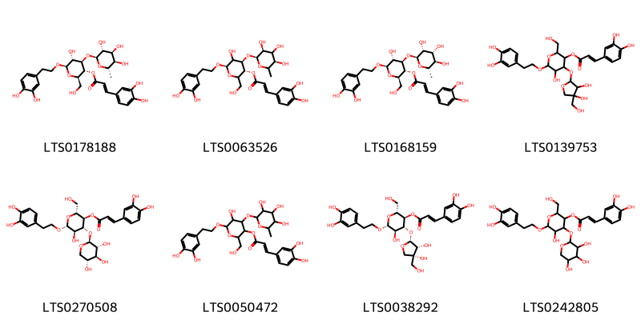{ width=100% }
    <figcaption>Hình ảnh cấu trúc hóa học của 8 hoạt chất thuộc nhóm Cinnamic acids and derivatives gồm ['(2r,3r,4r,5r,6r)-6-[2-(3,4-dihydroxyphenyl)ethoxy]-5-hydroxy-2-(hydroxymethyl)-4-{[(2s,3r,4s,5r,6s)-3,4,5-trihydroxy-6-methyloxan-2-yl]oxy}oxan-3-yl (2e)-3-(3,4-dihydroxyphenyl)prop-2-enoate (LTS0178188)', '(3r,4r,6r)-6-[2-(3,4-dihydroxyphenyl)ethoxy]-5-hydroxy-2-(hydroxymethyl)-4-{[(2s,3s,5r)-3,4,5-trihydroxy-6-methyloxan-2-yl]oxy}oxan-3-yl (2e)-3-(3,4-dihydroxyphenyl)prop-2-enoate (LTS0063526)', 'verbascoside (LTS0168159)', '4-{[3,4-dihydroxy-4-(hydroxymethyl)oxolan-2-yl]oxy}-6-[2-(3,4-dihydroxyphenyl)ethoxy]-5-hydroxy-2-(hydroxymethyl)oxan-3-yl 3-(3,4-dihydroxyphenyl)prop-2-enoate (LTS0139753)', '(2r,3r,4r,5r,6r)-6-[2-(3,4-dihydroxyphenyl)ethoxy]-5-hydroxy-2-(hydroxymethyl)-4-{[(2s,3r,4s,5r)-3,4,5-trihydroxyoxan-2-yl]oxy}oxan-3-yl (2e)-3-(3,4-dihydroxyphenyl)prop-2-enoate (LTS0270508)', '6-[2-(3,4-dihydroxyphenyl)ethoxy]-5-hydroxy-2-(hydroxymethyl)-4-[(3,4,5-trihydroxy-6-methyloxan-2-yl)oxy]oxan-3-yl 3-(3,4-dihydroxyphenyl)prop-2-enoate (LTS0050472)', '(2r,3r,4r,5r,6r)-4-{[(2r,3r,4r)-3,4-dihydroxy-4-(hydroxymethyl)oxolan-2-yl]oxy}-6-[2-(3,4-dihydroxyphenyl)ethoxy]-5-hydroxy-2-(hydroxymethyl)oxan-3-yl (2e)-3-(3,4-dihydroxyphenyl)prop-2-enoate (LTS0038292)', '6-[2-(3,4-dihydroxyphenyl)ethoxy]-5-hydroxy-2-(hydroxymethyl)-4-[(3,4,5-trihydroxyoxan-2-yl)oxy]oxan-3-yl 3-(3,4-dihydroxyphenyl)prop-2-enoate (LTS0242805)'].</figcaption>
</figure>
#### Nhóm Diazanaphthalenes
<figure markdown="span">
    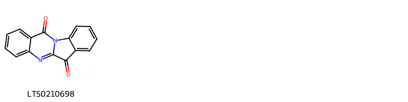{ width=100% }
    <figcaption>Hình ảnh cấu trúc hóa học của 1 hoạt chất thuộc nhóm Diazanaphthalenes gồm ['tryptanthrin (LTS0210698)'].</figcaption>
</figure>
#### Nhóm Lignan glycosides
<figure markdown="span">
    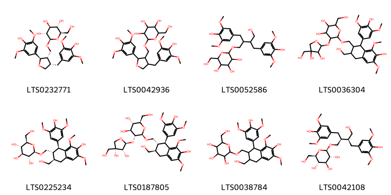{ width=100% }
    <figcaption>Hình ảnh cấu trúc hóa học của 8 hoạt chất thuộc nhóm Lignan glycosides gồm ['(2r,3r,4s,5s,6r)-2-{[(2r,3s,4s)-2-(4-hydroxy-3,5-dimethoxyphenyl)-4-[(4-hydroxy-3,5-dimethoxyphenyl)methyl]oxolan-3-yl]methoxy}-6-(hydroxymethyl)oxane-3,4,5-triol (LTS0232771)', '2-{[2-(4-hydroxy-3,5-dimethoxyphenyl)-4-[(4-hydroxy-3,5-dimethoxyphenyl)methyl]oxolan-3-yl]methoxy}-6-(hydroxymethyl)oxane-3,4,5-triol (LTS0042936)', '2-{4-hydroxy-2,3-bis[(4-hydroxy-3,5-dimethoxyphenyl)methyl]butoxy}-6-(hydroxymethyl)oxane-3,4,5-triol (LTS0052586)', '5-{[3,4-dihydroxy-4-(hydroxymethyl)oxolan-2-yl]oxy}-6-{[7-hydroxy-1-(4-hydroxy-3,5-dimethoxyphenyl)-3-(hydroxymethyl)-6,8-dimethoxy-1,2,3,4-tetrahydronaphthalen-2-yl]methoxy}-2-(hydroxymethyl)oxane-3,4-diol (LTS0036304)', '(2r,3r,4s,5s,6r)-2-{[(1s,2r,3r)-7-hydroxy-1-(4-hydroxy-3,5-dimethoxyphenyl)-3-(hydroxymethyl)-6,8-dimethoxy-1,2,3,4-tetrahydronaphthalen-2-yl]methoxy}-6-(hydroxymethyl)oxane-3,4,5-triol (LTS0225234)', '(2r,3s,4s,5r,6r)-5-{[(2s,3r,4r)-3,4-dihydroxy-4-(hydroxymethyl)oxolan-2-yl]oxy}-6-{[(1s,2r,3r)-7-hydroxy-1-(4-hydroxy-3,5-dimethoxyphenyl)-3-(hydroxymethyl)-6,8-dimethoxy-1,2,3,4-tetrahydronaphthalen-2-yl]methoxy}-2-(hydroxymethyl)oxane-3,4-diol (LTS0187805)', '2-{[7-hydroxy-1-(4-hydroxy-3,5-dimethoxyphenyl)-3-(hydroxymethyl)-6,8-dimethoxy-1,2,3,4-tetrahydronaphthalen-2-yl]methoxy}-6-(hydroxymethyl)oxane-3,4,5-triol (LTS0038784)', '(2r,3r,4s,5s,6r)-2-[(2s,3s)-4-hydroxy-2,3-bis[(4-hydroxy-3,5-dimethoxyphenyl)methyl]butoxy]-6-(hydroxymethyl)oxane-3,4,5-triol (LTS0042108)'].</figcaption>
</figure>
#### Nhóm Organooxygen compounds
<figure markdown="span">
    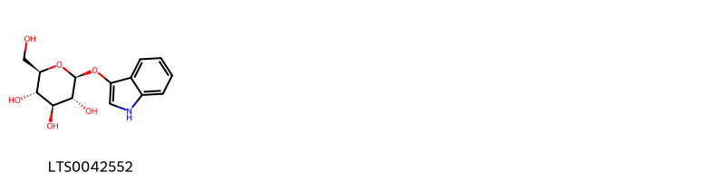{ width=100% }
    <figcaption>Hình ảnh cấu trúc hóa học của 1 hoạt chất thuộc nhóm Organooxygen compounds gồm ['indican (LTS0042552)'].</figcaption>
</figure>
#### Nhóm Prenol lipids
<figure markdown="span">
    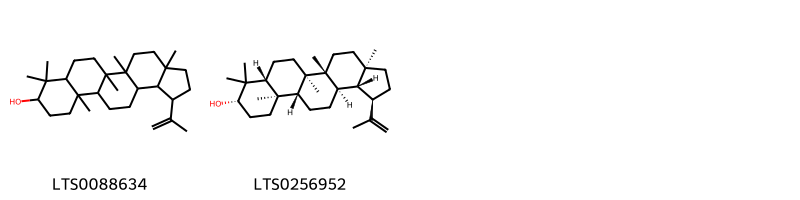{ width=100% }
    <figcaption>Hình ảnh cấu trúc hóa học của 2 hoạt chất thuộc nhóm Prenol lipids gồm ['lupeol (LTS0088634)', 'lupeol (LTS0256952)'].</figcaption>
</figure>

---

### Dược dân tộc học

Danh sách các quốc gia có sử dụng *Strobilanthes cusia* trong điều trị các bệnh. 

| Country   | Disease              | Bệnh                                                                                                                                                                                                |
|:----------|:---------------------|:----------------------------------------------------------------------------------------------------------------------------------------------------------------------------------------------------|
| Elsewhere | Astringent, Diuretic | MYMEMORY WARNING: YOU USED ALL AVAILABLE FREE TRANSLATIONS FOR TODAY. NEXT AVAILABLE IN  13 HOURS 46 MINUTES 16 SECONDS VISIT HTTPS://MYMEMORY.TRANSLATED.NET/DOC/USAGELIMITS.PHP TO TRANSLATE MORE |

---

---
## Strobilanthes flaccidifolius
### Thông tin về thực vật

!!! info "Phân loại thực vật của *N/A* từ GIBF:"
    - **Kingdom:** Plantae
    - **Phylum:** Tracheophyta
    - **Order:** Lamiales
    - **Family:** Acanthaceae
    - **Genus:** Strobilanthes
    - **Species:** *N/A*

 

| Label (VI)   | Label (EN)   | Scientific Name     | Descriptions (VI)   | Descriptions (EN)   | Also Known As (VI)   | Also Known As (EN)            |
|:-------------|:-------------|:--------------------|:--------------------|:--------------------|:---------------------|:------------------------------|
| N/A          | N/A          | Strobilanthes cusia | loài thực vật       | species of plant    | ['']                 | ['STROBILANTHES CUSIA WHOLE'] |

#### Phân bố trên thế giới

**Từ CSDL GIBF** Viet Nam, Japan, New Caledonia, China, New Zealand, Thailand, Puerto Rico, Sri Lanka, United States of America, Indonesia, Costa Rica, French Guiana, Hong Kong, Niue, Chinese Taipei, Malaysia, Philippines, Panama, Singapore, Portugal, Australia, India

#### Phân bố tại Việt Nam

**Từ CSDL GIBF**: Đà Nẵng

---
### Thành phần hóa học
        
- Theo cơ sở dữ liệu lotus: Từ loài *N/A* đã phân lập và xác định được Chưa có hoạt chất nào được phân lập. hoạt chất thuộc về các nhóm Không có hoạt chất nào được phân lập. 

Không có hình ảnh nào được tạo ra

---

### Dược dân tộc học

Danh sách các quốc gia có sử dụng *N/A* trong điều trị các bệnh. 

| Country   | Disease              | Bệnh                                                                                                                                                                                                |
|:----------|:---------------------|:----------------------------------------------------------------------------------------------------------------------------------------------------------------------------------------------------|
| China     | Alexiteric           | MYMEMORY WARNING: YOU USED ALL AVAILABLE FREE TRANSLATIONS FOR TODAY. NEXT AVAILABLE IN  13 HOURS 45 MINUTES 37 SECONDS VISIT HTTPS://MYMEMORY.TRANSLATED.NET/DOC/USAGELIMITS.PHP TO TRANSLATE MORE |
| Indonesia | Astringent, Diuretic | MYMEMORY WARNING: YOU USED ALL AVAILABLE FREE TRANSLATIONS FOR TODAY. NEXT AVAILABLE IN  13 HOURS 45 MINUTES 34 SECONDS VISIT HTTPS://MYMEMORY.TRANSLATED.NET/DOC/USAGELIMITS.PHP TO TRANSLATE MORE |

---

# Chi Peristrophe

??? note "Danh sách các dược liệu thuộc chi"
    
	 - *Peristrophe bicalyculata*

---
## Peristrophe bicalyculata
### Thông tin về thực vật

!!! info "Phân loại thực vật của *Dicliptera paniculata* từ GIBF:"
    - **Kingdom:** Plantae
    - **Phylum:** Tracheophyta
    - **Order:** Lamiales
    - **Family:** Acanthaceae
    - **Genus:** Dicliptera
    - **Species:** *Dicliptera paniculata*

 

| Label (VI)   | Label (EN)   | Scientific Name          | Descriptions (VI)   | Descriptions (EN)   | Also Known As (VI)   | Also Known As (EN)   |
|:-------------|:-------------|:-------------------------|:--------------------|:--------------------|:---------------------|:---------------------|
| N/A          | N/A          | Peristrophe bicalyculata | loài thực vật       | species of plant    | ['']                 | ['']                 |

#### Phân bố trên thế giới

**Từ CSDL GIBF** nan, Senegal, Nepal, Burundi, Mali, China, Zimbabwe, Somalia, Mozambique, Tanzania, United Republic of, Thailand, Chad, Mauritania, Pakistan, Nigeria, Burkina Faso, unknown or invalid, Ethiopia, Cabo Verde, Malawi, Benin, Kenya, Egypt, Niger, India

#### Phân bố tại Việt Nam

**Từ CSDL GIBF**: Không có ghi nhận ở Việt Nam

---
### Thành phần hóa học
        
- Theo cơ sở dữ liệu lotus: Từ loài *Dicliptera paniculata* đã phân lập và xác định được Chưa có hoạt chất nào được phân lập. hoạt chất thuộc về các nhóm Không có hoạt chất nào được phân lập. 

Không có hình ảnh nào được tạo ra

---

### Dược dân tộc học

Danh sách các quốc gia có sử dụng *Dicliptera paniculata* trong điều trị các bệnh. 

| Country   |   Disease | Bệnh                                                                                                                                                                                                |
|:----------|----------:|:----------------------------------------------------------------------------------------------------------------------------------------------------------------------------------------------------|
| Elsewhere |       nan | MYMEMORY WARNING: YOU USED ALL AVAILABLE FREE TRANSLATIONS FOR TODAY. NEXT AVAILABLE IN  13 HOURS 45 MINUTES 06 SECONDS VISIT HTTPS://MYMEMORY.TRANSLATED.NET/DOC/USAGELIMITS.PHP TO TRANSLATE MORE |

---

