!!! abstract "Tóm tắt"

    Họ Aceraceae gồm khoảng 1 chi và 7 loài được một số cộng đồng tại các quốc gia như US(Appalachia), US, Turkey, Elsewhere, anish sử dụng trong một số trường hợp MYMEMORY WARNING: YOU USED ALL AVAILABLE FREE TRANSLATIONS FOR TODAY. NEXT AVAILABLE IN  05 HOURS 55 MINUTES 39 SECONDS VISIT HTTPS://MYMEMORY.TRANSLATED.NET/DOC/USAGELIMITS.PHP TO TRANSLATE MORE.

!!! info "DrDuke"

    James A. Duke sinh năm 1929-2017 là một nhà thực vật học người Mỹ. Đây là một trong những tác giả hàng đầu trong lĩnh vực dược dân tộc học với cuốn *CRC Handbook of Medicinal Herbs* và chính là người xây dựng lên cơ sở dữ liệu về hợp chất tự nhiên và dược dân tộc học tại Bộ nông nghiệp Hoa Kỳ. Các thông tin được đăng tải tại website [Dr. Duke's Phytochemical and Ethnobotanical Databases](https://phytochem.nal.usda.gov/). 
    Trong suốt thập niên 1970, ông lãnh đạo the Plant Taxonomy Laboratory, Plant Genetics and Germplasm Institute of the Agricultural Research Service, U.S. Department of Agriculture.
    Trong tài liệu này, các thông tin về dược dân tộc của các dược liệu được trích dẫn từ tài liệu của James A. Ducke với sự trợ giúp của phần mềm dịch thuật từ tiếng Anh sang tiếng Việt.
   

# Chi Acer

??? note "Danh sách các dược liệu thuộc chi"
    
	 - *Acer icatum*
	 - *Acer negundo*
	 - *Acer nikoense*
	 - *Acer pseudo-platanus*
	 - *Acer pycnanthum*
	 - *Acer rubrum*
	 - *Acer saccharinum*

---
## Acer icatum
### Thông tin về thực vật

!!! info "Phân loại thực vật của *N/A* từ GIBF:"
    - **Kingdom:** Plantae
    - **Phylum:** Tracheophyta
    - **Order:** Sapindales
    - **Family:** Sapindaceae
    - **Genus:** Acer
    - **Species:** *N/A*

 

| Label (VI)   | Label (EN)   | Scientific Name   | Descriptions (VI)   | Descriptions (EN)   | Also Known As (VI)   | Also Known As (EN)                     |
|:-------------|:-------------|:------------------|:--------------------|:--------------------|:---------------------|:---------------------------------------|
| N/A          | N/A          | Carya ovata       | loài thực vật       | species of plant    | ['']                 | ['shagbark hickory', 'upland hickory'] |

#### Phân bố trên thế giới

**Từ CSDL GIBF** Guatemala, Finland, China, Kazakhstan, New Zealand, Chile, Spain, United States of America, Korea, Republic of, Russian Federation, Lithuania, Chinese Taipei, Canada, Germany, Austria, Portugal, Kyrgyzstan, South Africa, Australia, Ukraine, Italy, United Kingdom of Great Britain and Northern Ireland, Ireland

#### Phân bố tại Việt Nam

**Từ CSDL GIBF**: Không có ghi nhận ở Việt Nam

---
### Thành phần hóa học
        
- Theo cơ sở dữ liệu lotus: Từ loài *N/A* đã phân lập và xác định được Chưa có hoạt chất nào được phân lập. hoạt chất thuộc về các nhóm Không có hoạt chất nào được phân lập. 

Không có hình ảnh nào được tạo ra

---

### Dược dân tộc học

Danh sách các quốc gia có sử dụng *N/A* trong điều trị các bệnh. 

| Country   | Disease            | Bệnh                                                                                                                                                                                                |
|:----------|:-------------------|:----------------------------------------------------------------------------------------------------------------------------------------------------------------------------------------------------|
| US        | Apertif, Vermifuge | MYMEMORY WARNING: YOU USED ALL AVAILABLE FREE TRANSLATIONS FOR TODAY. NEXT AVAILABLE IN  05 HOURS 55 MINUTES 36 SECONDS VISIT HTTPS://MYMEMORY.TRANSLATED.NET/DOC/USAGELIMITS.PHP TO TRANSLATE MORE |

---

---
## Acer negundo
### Thông tin về thực vật

!!! info "Phân loại thực vật của *Acer negundo* từ GIBF:"
    - **Kingdom:** Plantae
    - **Phylum:** Tracheophyta
    - **Order:** Sapindales
    - **Family:** Sapindaceae
    - **Genus:** Acer
    - **Species:** *Acer negundo*

 

| Label (VI)   | Label (EN)   | Scientific Name   | Descriptions (VI)   | Descriptions (EN)   | Also Known As (VI)   | Also Known As (EN)                                                                                                                                                |
|:-------------|:-------------|:------------------|:--------------------|:--------------------|:---------------------|:------------------------------------------------------------------------------------------------------------------------------------------------------------------|
| N/A          | N/A          | Acer negundo      |                     | species of tree     | ['']                 | ['ash-leaved maple', 'box elder', 'boxelder', 'ashleaf maple', 'boxelder maple', 'California boxelder', 'Manitoba maple', 'three-leaf maple', 'western boxelder'] |

#### Phân bố trên thế giới

**Từ CSDL GIBF** Guatemala, Sweden, Kazakhstan, New Zealand, Chile, Türkiye, Poland, United States of America, Russian Federation, Lithuania, Belgium, Canada, Germany, Austria, Hungary, Ukraine, Kyrgyzstan, South Africa, Australia

#### Phân bố tại Việt Nam

**Từ CSDL GIBF**: Không có ghi nhận ở Việt Nam

---
### Thành phần hóa học
        
- Theo cơ sở dữ liệu lotus: Từ loài *Acer negundo* đã phân lập và xác định được 18 hoạt chất thuộc về các nhóm Tannins, Organooxygen compounds, Benzene and substituted derivatives, Flavonoids. 

|    | chemicalTaxonomyClassyfireClass     |   smiles_count |
|---:|:------------------------------------|---------------:|
|  0 | Benzene and substituted derivatives |              3 |
|  1 | Flavonoids                          |              8 |
|  2 | Organooxygen compounds              |              6 |
|  3 | Tannins                             |              1 |

#### Nhóm Benzene and substituted derivatives
<figure markdown="span">
    { width=100% }
    <figcaption>Hình ảnh cấu trúc hóa học của 3 hoạt chất thuộc nhóm Benzene and substituted derivatives gồm ['galop (LTS0222857)', 'methyl gallate (LTS0043810)', 'ethyl gallate (LTS0270645)'].</figcaption>
</figure>
#### Nhóm Flavonoids
<figure markdown="span">
    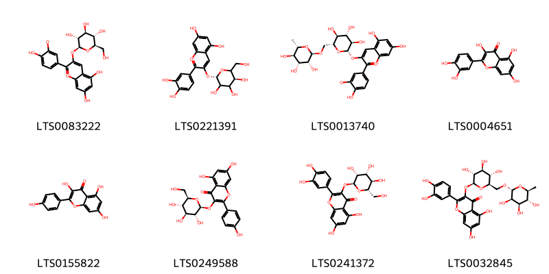{ width=100% }
    <figcaption>Hình ảnh cấu trúc hóa học của 8 hoạt chất thuộc nhóm Flavonoids gồm ['5,7-dihydroxy-2-(4-hydroxy-3-oxidophenyl)-3-{[(2s,3r,4s,5s,6r)-3,4,5-trihydroxy-6-(hydroxymethyl)oxan-2-yl]oxy}-1λ⁴-chromen-1-ylium (LTS0083222)', 'chrysanthemin (LTS0221391)', '5,7-dihydroxy-2-(4-hydroxy-3-oxidophenyl)-3-{[(2s,3r,4s,5s,6r)-3,4,5-trihydroxy-6-({[(2r,3r,4r,5r,6s)-3,4,5-trihydroxy-6-methyloxan-2-yl]oxy}methyl)oxan-2-yl]oxy}-1λ⁴-chromen-1-ylium (LTS0013740)', 'quercetin (LTS0004651)', 'kaempherol (LTS0155822)', 'astragalin (LTS0249588)', '2-(3,4-dihydroxyphenyl)-5,7-dihydroxy-3-{[(2s,3r,4r,5r,6s)-3,4,5-trihydroxy-6-(hydroxymethyl)oxan-2-yl]oxy}chromen-4-one (LTS0241372)', '3-rutinosyl quercetin (LTS0032845)'].</figcaption>
</figure>
#### Nhóm Organooxygen compounds
<figure markdown="span">
    { width=100% }
    <figcaption>Hình ảnh cấu trúc hóa học của 6 hoạt chất thuộc nhóm Organooxygen compounds gồm ['(+)-glucose (LTS0262158)', 'sucrose (LTS0272557)', 'keto-d-fructose (LTS0241114)', 'glucose (LTS0013597)', 'raffinose (LTS0113066)', 'd-fructopyranose (LTS0259277)'].</figcaption>
</figure>
#### Nhóm Tannins
<figure markdown="span">
    { width=100% }
    <figcaption>Hình ảnh cấu trúc hóa học của 1 hoạt chất thuộc nhóm Tannins gồm ['ellagic acid (LTS0037297)'].</figcaption>
</figure>

---

### Dược dân tộc học

Danh sách các quốc gia có sử dụng *Acer negundo* trong điều trị các bệnh. 

| Country   | Disease   | Bệnh                                                                                                                                                                                                |
|:----------|:----------|:----------------------------------------------------------------------------------------------------------------------------------------------------------------------------------------------------|
| Turkey    | Sweetener | MYMEMORY WARNING: YOU USED ALL AVAILABLE FREE TRANSLATIONS FOR TODAY. NEXT AVAILABLE IN  05 HOURS 55 MINUTES 08 SECONDS VISIT HTTPS://MYMEMORY.TRANSLATED.NET/DOC/USAGELIMITS.PHP TO TRANSLATE MORE |

---

---
## Acer nikoense
### Thông tin về thực vật

!!! info "Phân loại thực vật của *Acer nikoense* từ GIBF:"
    - **Kingdom:** Plantae
    - **Phylum:** Tracheophyta
    - **Order:** Sapindales
    - **Family:** Sapindaceae
    - **Genus:** Acer
    - **Species:** *Acer nikoense*

 

| Label (VI)   | Label (EN)   | Scientific Name   | Descriptions (VI)   | Descriptions (EN)   | Also Known As (VI)   | Also Known As (EN)   |
|:-------------|:-------------|:------------------|:--------------------|:--------------------|:---------------------|:---------------------|
| N/A          | N/A          | Acer nikoense     | loài thực vật       | species of plant    | ['']                 | ['']                 |

#### Phân bố trên thế giới

**Từ CSDL GIBF** nan, United States of America, Japan, Poland, China, Canada, France, Netherlands

#### Phân bố tại Việt Nam

**Từ CSDL GIBF**: Không có ghi nhận ở Việt Nam

---
### Thành phần hóa học
        
- Theo cơ sở dữ liệu lotus: Từ loài *Acer nikoense* đã phân lập và xác định được 104 hoạt chất thuộc về các nhóm Fatty Acyls, Benzene and substituted derivatives, Coumarinolignans, Flavonoids, Tannins, Coumarins and derivatives, Steroids and steroid derivatives, Diarylheptanoids, Phenols, Organooxygen compounds, 2-arylbenzofuran flavonoids, Lignan glycosides. 

|    | chemicalTaxonomyClassyfireClass     |   smiles_count |
|---:|:------------------------------------|---------------:|
|  0 | 2-arylbenzofuran flavonoids         |              3 |
|  1 | Benzene and substituted derivatives |              6 |
|  2 | Coumarinolignans                    |              6 |
|  3 | Coumarins and derivatives           |              5 |
|  4 | Diarylheptanoids                    |             33 |
|  5 | Fatty Acyls                         |              4 |
|  6 | Flavonoids                          |              6 |
|  7 | Lignan glycosides                   |             21 |
|  8 | Organooxygen compounds              |             10 |
|  9 | Phenols                             |              4 |
| 10 | Steroids and steroid derivatives    |              2 |
| 11 | Tannins                             |              3 |

#### Nhóm 2-arylbenzofuran flavonoids
<figure markdown="span">
    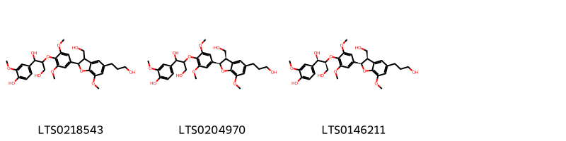{ width=100% }
    <figcaption>Hình ảnh cấu trúc hóa học của 3 hoạt chất thuộc nhóm 2-arylbenzofuran flavonoids gồm ['1-(4-hydroxy-3-methoxyphenyl)-2-{4-[3-(hydroxymethyl)-5-(3-hydroxypropyl)-7-methoxy-2,3-dihydro-1-benzofuran-2-yl]-2,6-dimethoxyphenoxy}propane-1,3-diol (LTS0218543)', '1-(4-hydroxy-3-methoxyphenyl)-2-{4-[(2r,3r)-3-(hydroxymethyl)-5-(3-hydroxypropyl)-7-methoxy-2,3-dihydro-1-benzofuran-2-yl]-2,6-dimethoxyphenoxy}propane-1,3-diol (LTS0204970)', '(1r,2s)-1-(4-hydroxy-3-methoxyphenyl)-2-{4-[(2r,3r)-3-(hydroxymethyl)-5-(3-hydroxypropyl)-7-methoxy-2,3-dihydro-1-benzofuran-2-yl]-2,6-dimethoxyphenoxy}propane-1,3-diol (LTS0146211)'].</figcaption>
</figure>
#### Nhóm Benzene and substituted derivatives
<figure markdown="span">
    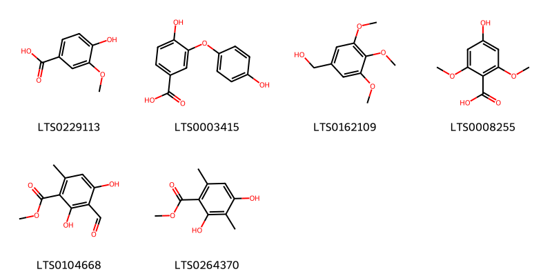{ width=100% }
    <figcaption>Hình ảnh cấu trúc hóa học của 6 hoạt chất thuộc nhóm Benzene and substituted derivatives gồm ['vanillic acid (LTS0229113)', '4-hydroxy-3-(4-hydroxyphenoxy)benzoic acid (LTS0003415)', '(3,4,5-trimethoxyphenyl)methanol (LTS0162109)', '4-hydroxy-2,6-dimethoxybenzoic acid (LTS0008255)', 'methyl 3-formyl-2,4-dihydroxy-6-methylbenzoate (LTS0104668)', 'atraric acid (LTS0264370)'].</figcaption>
</figure>
#### Nhóm Coumarinolignans
<figure markdown="span">
    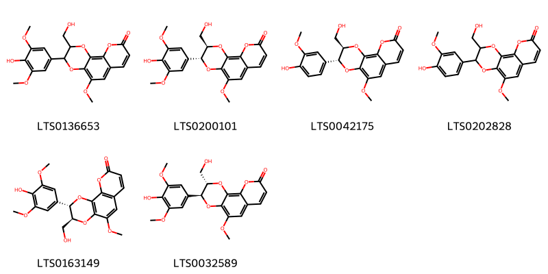{ width=100% }
    <figcaption>Hình ảnh cấu trúc hóa học của 6 hoạt chất thuộc nhóm Coumarinolignans gồm ['3-(4-hydroxy-3,5-dimethoxyphenyl)-2-(hydroxymethyl)-5-methoxy-2h,3h-[1,4]dioxino[2,3-h]chromen-9-one (LTS0136653)', '(2r,3r)-3-(4-hydroxy-3,5-dimethoxyphenyl)-2-(hydroxymethyl)-5-methoxy-2h,3h-[1,4]dioxino[2,3-h]chromen-9-one (LTS0200101)', 'cleomiscosin a (LTS0042175)', '3-(4-hydroxy-3-methoxyphenyl)-2-(hydroxymethyl)-5-methoxy-2h,3h-[1,4]dioxino[2,3-h]chromen-9-one (LTS0202828)', 'cleomiscosin d (LTS0163149)', '(2s,3s)-3-(4-hydroxy-3,5-dimethoxyphenyl)-2-(hydroxymethyl)-5-methoxy-2h,3h-[1,4]dioxino[2,3-h]chromen-9-one (LTS0032589)'].</figcaption>
</figure>
#### Nhóm Coumarins and derivatives
<figure markdown="span">
    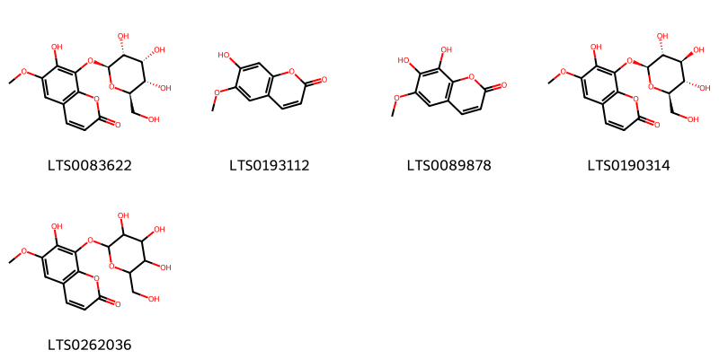{ width=100% }
    <figcaption>Hình ảnh cấu trúc hóa học của 5 hoạt chất thuộc nhóm Coumarins and derivatives gồm ['fraxin (LTS0083622)', 'scopoletin (LTS0193112)', 'fraxetin (LTS0089878)', 'fraxin (LTS0190314)', '7-hydroxy-6-methoxy-8-{[3,4,5-trihydroxy-6-(hydroxymethyl)oxan-2-yl]oxy}chromen-2-one (LTS0262036)'].</figcaption>
</figure>
#### Nhóm Diarylheptanoids
<figure markdown="span">
    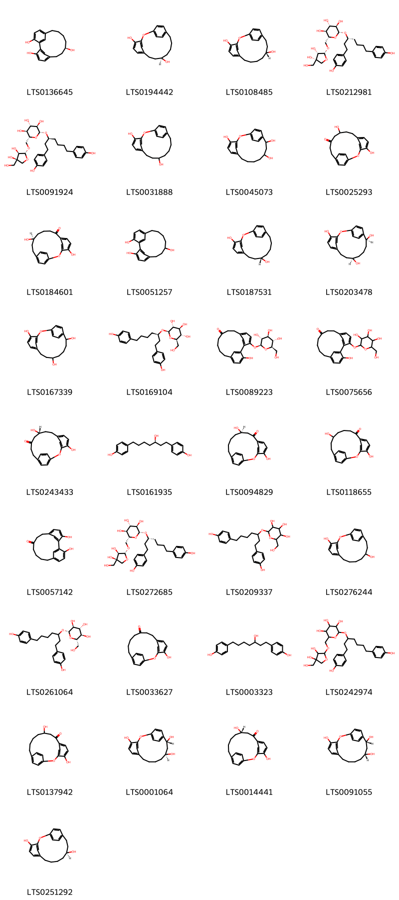{ width=100% }
    <figcaption>Hình ảnh cấu trúc hóa học của 33 hoạt chất thuộc nhóm Diarylheptanoids gồm ['(9r)-tricyclo[12.3.1.1²,⁶]nonadeca-1(18),2(19),3,5,14,16-hexaene-3,9,17-triol (LTS0136645)', '(10r)-2-oxatricyclo[13.2.2.1³,⁷]icosa-1(17),3(20),4,6,15,18-hexaene-4,10-diol (LTS0194442)', '(12r)-2-oxatricyclo[13.2.2.1³,⁷]icosa-1(17),3(20),4,6,15,18-hexaene-4,12-diol (LTS0108485)', '(2r,3r,4s,5s,6r)-2-{[(3r)-1,7-bis(4-hydroxyphenyl)heptan-3-yl]oxy}-6-({[(2r,3s,4s)-3,4-dihydroxy-4-(hydroxymethyl)oxolan-2-yl]oxy}methyl)oxane-3,4,5-triol (LTS0212981)', '(2r,3r,4s,5s,6r)-2-{[(3s)-1,7-bis(4-hydroxyphenyl)heptan-3-yl]oxy}-6-({[(2r,3r,4r)-3,4-dihydroxy-4-(hydroxymethyl)oxolan-2-yl]oxy}methyl)oxane-3,4,5-triol (LTS0091924)', '2-oxatricyclo[13.2.2.1³,⁷]icosa-1(17),3(20),4,6,15,18-hexaene-4,10-diol (LTS0031888)', '2-oxatricyclo[13.2.2.1³,⁷]icosa-1(17),3(20),4,6,15,18-hexaene-4,12,14-triol (LTS0045073)', '4,10-dihydroxy-2-oxatricyclo[13.2.2.1³,⁷]icosa-1(17),3(20),4,6,15,18-hexaen-12-one (LTS0025293)', '(12s)-4,12-dihydroxy-2-oxatricyclo[13.2.2.1³,⁷]icosa-1(17),3(20),4,6,15,18-hexaen-8-one (LTS0184601)', 'tricyclo[12.3.1.1²,⁶]nonadeca-1(18),2(19),3,5,14,16-hexaene-3,9,17-triol (LTS0051257)', '(10s)-2-oxatricyclo[13.2.2.1³,⁷]icosa-1(17),3(20),4,6,15,18-hexaene-4,10-diol (LTS0187531)', '(10r,14s)-2-oxatricyclo[13.2.2.1³,⁷]icosa-1(17),3(20),4,6,15,18-hexaene-4,10,14-triol (LTS0203478)', '2-oxatricyclo[13.2.2.1³,⁷]icosa-1(17),3(20),4,6,15,18-hexaene-4,10,14-triol (LTS0167339)', '(2r,3r,4s,5s,6r)-2-{[(3r)-1,7-bis(4-hydroxyphenyl)heptan-3-yl]oxy}-6-(hydroxymethyl)oxane-3,4,5-triol (LTS0169104)', '17-hydroxy-3-{[(2s,3r,4s,5s,6r)-3,4,5-trihydroxy-6-(hydroxymethyl)oxan-2-yl]oxy}tricyclo[12.3.1.1²,⁶]nonadeca-1(18),2(19),3,5,14,16-hexaen-9-one (LTS0089223)', '17-hydroxy-3-{[3,4,5-trihydroxy-6-(hydroxymethyl)oxan-2-yl]oxy}tricyclo[12.3.1.1²,⁶]nonadeca-1(18),2(19),3,5,14,16-hexaen-9-one (LTS0075656)', '(10r)-4,10-dihydroxy-2-oxatricyclo[13.2.2.1³,⁷]icosa-1(17),3(20),4,6,15,18-hexaen-12-one (LTS0243433)', '4-[(5r)-5-hydroxy-7-(4-hydroxyphenyl)heptyl]phenol (LTS0161935)', '(10r)-4,10-dihydroxy-2-oxatricyclo[13.2.2.1³,⁷]icosa-1(17),3(20),4,6,15,18-hexaen-8-one (LTS0094829)', '4,12-dihydroxy-2-oxatricyclo[13.2.2.1³,⁷]icosa-1(17),3(20),4,6,15,18-hexaen-8-one (LTS0118655)', '3,17-dihydroxytricyclo[12.3.1.1²,⁶]nonadeca-1(18),2(19),3,5,14,16-hexaen-9-one (LTS0057142)', '(2r,3r,4s,5s,6r)-2-{[(3r)-1,7-bis(4-hydroxyphenyl)heptan-3-yl]oxy}-6-({[(2r,3r,4r)-3,4-dihydroxy-4-(hydroxymethyl)oxolan-2-yl]oxy}methyl)oxane-3,4,5-triol (LTS0272685)', '2-{[1,7-bis(4-hydroxyphenyl)heptan-3-yl]oxy}-6-(hydroxymethyl)oxane-3,4,5-triol (LTS0209337)', '2-oxatricyclo[13.2.2.1³,⁷]icosa-1(17),3(20),4,6,15,18-hexaene-4,12-diol (LTS0276244)', '(2s,3s,4r,5r,6s)-2-{[1,7-bis(4-hydroxyphenyl)heptan-3-yl]oxy}-6-(hydroxymethyl)oxane-3,4,5-triol (LTS0261064)', '4-hydroxy-2-oxatricyclo[13.2.2.1³,⁷]icosa-1(17),3(20),4,6,15,18-hexaen-10-one (LTS0033627)', '4-[5-hydroxy-7-(4-hydroxyphenyl)heptyl]phenol (LTS0003323)', '2-{[1,7-bis(4-hydroxyphenyl)heptan-3-yl]oxy}-6-({[3,4-dihydroxy-4-(hydroxymethyl)oxolan-2-yl]oxy}methyl)oxane-3,4,5-triol (LTS0242974)', '4,10-dihydroxy-2-oxatricyclo[13.2.2.1³,⁷]icosa-1(17),3(20),4,6,15,18-hexaen-8-one (LTS0137942)', '(12s,14r)-2-oxatricyclo[13.2.2.1³,⁷]icosa-1(17),3(20),4,6,15,18-hexaene-4,12,14-triol (LTS0001064)', '(10s)-4,10-dihydroxy-2-oxatricyclo[13.2.2.1³,⁷]icosa-1(17),3(20),4,6,15,18-hexaen-8-one (LTS0014441)', '(12r,14r)-2-oxatricyclo[13.2.2.1³,⁷]icosa-1(17),3(20),4,6,15,18-hexaene-4,12,14-triol (LTS0091055)', '(12s)-2-oxatricyclo[13.2.2.1³,⁷]icosa-1(17),3(20),4,6,15,18-hexaene-4,12-diol (LTS0251292)'].</figcaption>
</figure>
#### Nhóm Fatty Acyls
<figure markdown="span">
    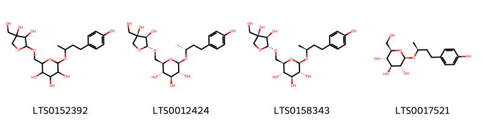{ width=100% }
    <figcaption>Hình ảnh cấu trúc hóa học của 4 hoạt chất thuộc nhóm Fatty Acyls gồm ['2-({[3,4-dihydroxy-4-(hydroxymethyl)oxolan-2-yl]oxy}methyl)-6-{[4-(4-hydroxyphenyl)butan-2-yl]oxy}oxane-3,4,5-triol (LTS0152392)', '(2r,3s,4s,5r,6r)-2-({[(2r,3r,4r)-3,4-dihydroxy-4-(hydroxymethyl)oxolan-2-yl]oxy}methyl)-6-{[(2r)-4-(4-hydroxyphenyl)butan-2-yl]oxy}oxane-3,4,5-triol (LTS0012424)', '(2r,3s,4s,5r,6r)-2-({[(2r,3r,4r)-3,4-dihydroxy-4-(hydroxymethyl)oxolan-2-yl]oxy}methyl)-6-{[(2s)-4-(4-hydroxyphenyl)butan-2-yl]oxy}oxane-3,4,5-triol (LTS0158343)', '(2r,3s,4s,5r,6r)-2-(hydroxymethyl)-6-{[(2s)-4-(4-hydroxyphenyl)butan-2-yl]oxy}oxane-3,4,5-triol (LTS0017521)'].</figcaption>
</figure>
#### Nhóm Flavonoids
<figure markdown="span">
    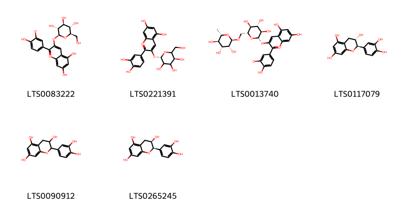{ width=100% }
    <figcaption>Hình ảnh cấu trúc hóa học của 6 hoạt chất thuộc nhóm Flavonoids gồm ['5,7-dihydroxy-2-(4-hydroxy-3-oxidophenyl)-3-{[(2s,3r,4s,5s,6r)-3,4,5-trihydroxy-6-(hydroxymethyl)oxan-2-yl]oxy}-1λ⁴-chromen-1-ylium (LTS0083222)', 'chrysanthemin (LTS0221391)', '5,7-dihydroxy-2-(4-hydroxy-3-oxidophenyl)-3-{[(2s,3r,4s,5s,6r)-3,4,5-trihydroxy-6-({[(2r,3r,4r,5r,6s)-3,4,5-trihydroxy-6-methyloxan-2-yl]oxy}methyl)oxan-2-yl]oxy}-1λ⁴-chromen-1-ylium (LTS0013740)', '(+)-catechol (LTS0117079)', 'catechol (LTS0090912)', 'ent-epicatechin (LTS0265245)'].</figcaption>
</figure>
#### Nhóm Lignan glycosides
<figure markdown="span">
    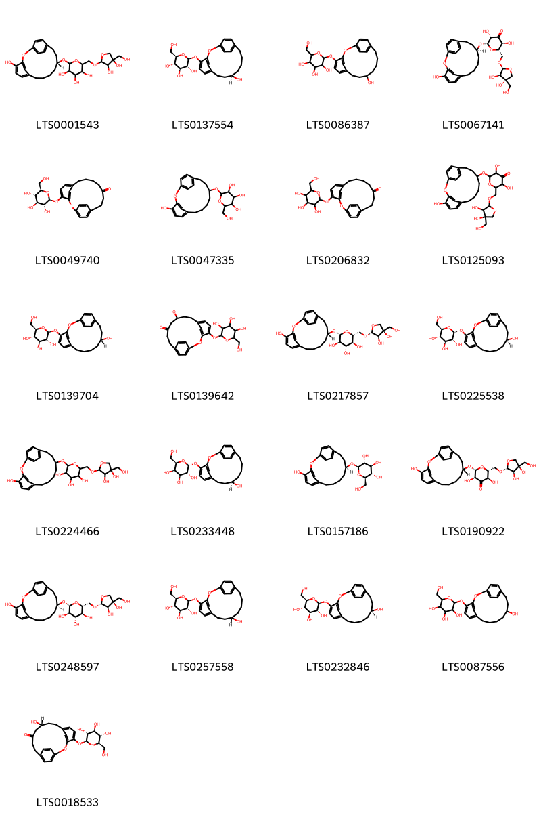{ width=100% }
    <figcaption>Hình ảnh cấu trúc hóa học của 21 hoạt chất thuộc nhóm Lignan glycosides gồm ['2-({[3,4-dihydroxy-4-(hydroxymethyl)oxolan-2-yl]oxy}methyl)-6-{[(12r)-4-hydroxy-2-oxatricyclo[13.2.2.1³,⁷]icosa-1(17),3(20),4,6,15,18-hexaen-12-yl]oxy}oxane-3,4,5-triol (LTS0001543)', '(2s,3r,4s,5s,6r)-2-{[(10r)-10-hydroxy-2-oxatricyclo[13.2.2.1³,⁷]icosa-1(17),3(20),4,6,15,18-hexaen-4-yl]oxy}-6-(hydroxymethyl)oxane-3,4,5-triol (LTS0137554)', '2-({10-hydroxy-2-oxatricyclo[13.2.2.1³,⁷]icosa-1(17),3(20),4,6,15,18-hexaen-4-yl}oxy)-6-(hydroxymethyl)oxane-3,4,5-triol (LTS0086387)', '(2s,3s,5s,6s)-2-({[(2s,3r,4s)-3,4-dihydroxy-4-(hydroxymethyl)oxolan-2-yl]oxy}methyl)-3,5-dihydroxy-6-{[(12s)-4-hydroxy-2-oxatricyclo[13.2.2.1³,⁷]icosa-1(17),3(20),4,6,15,18-hexaen-12-yl]oxy}oxan-4-one (LTS0067141)', '4-{[(2s,3r,4s,5s,6r)-3,4,5-trihydroxy-6-(hydroxymethyl)oxan-2-yl]oxy}-2-oxatricyclo[13.2.2.1³,⁷]icosa-1(17),3(20),4,6,15,18-hexaen-12-one (LTS0049740)', '2-({4-hydroxy-2-oxatricyclo[13.2.2.1³,⁷]icosa-1(17),3(20),4,6,15,18-hexaen-12-yl}oxy)-6-(hydroxymethyl)oxane-3,4,5-triol (LTS0047335)', '4-{[3,4,5-trihydroxy-6-(hydroxymethyl)oxan-2-yl]oxy}-2-oxatricyclo[13.2.2.1³,⁷]icosa-1(17),3(20),4,6,15,18-hexaen-12-one (LTS0206832)', '2-({[3,4-dihydroxy-4-(hydroxymethyl)oxolan-2-yl]oxy}methyl)-3,5-dihydroxy-6-({4-hydroxy-2-oxatricyclo[13.2.2.1³,⁷]icosa-1(17),3(20),4,6,15,18-hexaen-12-yl}oxy)oxan-4-one (LTS0125093)', '(2s,3r,4s,5s,6r)-2-{[(12r)-12-hydroxy-2-oxatricyclo[13.2.2.1³,⁷]icosa-1(17),3(20),4,6,15,18-hexaen-4-yl]oxy}-6-(hydroxymethyl)oxane-3,4,5-triol (LTS0139704)', '10-hydroxy-4-{[3,4,5-trihydroxy-6-(hydroxymethyl)oxan-2-yl]oxy}-2-oxatricyclo[13.2.2.1³,⁷]icosa-1(17),3(20),4,6,15,18-hexaen-12-one (LTS0139642)', '(2r,3s,4s,5r,6r)-2-({[(2r,3r,4r)-3,4-dihydroxy-4-(hydroxymethyl)oxolan-2-yl]oxy}methyl)-6-{[(12r)-4-hydroxy-2-oxatricyclo[13.2.2.1³,⁷]icosa-1(17),3(20),4,6,15,18-hexaen-12-yl]oxy}oxane-3,4,5-triol (LTS0217857)', '(2r,3r,4s,5s,6r)-2-{[(12s)-12-hydroxy-2-oxatricyclo[13.2.2.1³,⁷]icosa-1(17),3(20),4,6,15,18-hexaen-4-yl]oxy}-6-(hydroxymethyl)oxane-3,4,5-triol (LTS0225538)', '2-({[3,4-dihydroxy-4-(hydroxymethyl)oxolan-2-yl]oxy}methyl)-6-({4-hydroxy-2-oxatricyclo[13.2.2.1³,⁷]icosa-1(17),3(20),4,6,15,18-hexaen-12-yl}oxy)oxane-3,4,5-triol (LTS0224466)', '(2r,3r,4s,5r,6r)-2-{[(10r)-10-hydroxy-2-oxatricyclo[13.2.2.1³,⁷]icosa-1(17),3(20),4,6,15,18-hexaen-4-yl]oxy}-6-(hydroxymethyl)oxane-3,4,5-triol (LTS0233448)', '(2r,3r,4s,5s,6r)-2-{[(12s)-4-hydroxy-2-oxatricyclo[13.2.2.1³,⁷]icosa-1(17),3(20),4,6,15,18-hexaen-12-yl]oxy}-6-(hydroxymethyl)oxane-3,4,5-triol (LTS0157186)', '(2r,3r,5s,6r)-2-({[(2r,3r,4r)-3,4-dihydroxy-4-(hydroxymethyl)oxolan-2-yl]oxy}methyl)-3,5-dihydroxy-6-{[(12r)-4-hydroxy-2-oxatricyclo[13.2.2.1³,⁷]icosa-1(17),3(20),4,6,15,18-hexaen-12-yl]oxy}oxan-4-one (LTS0190922)', '(2r,3s,4s,5r,6r)-2-({[(2r,3r,4r)-3,4-dihydroxy-4-(hydroxymethyl)oxolan-2-yl]oxy}methyl)-6-{[(12s)-4-hydroxy-2-oxatricyclo[13.2.2.1³,⁷]icosa-1(17),3(20),4,6,15,18-hexaen-12-yl]oxy}oxane-3,4,5-triol (LTS0248597)', '(2s,3r,4s,5s,6r)-2-{[(10s)-10-hydroxy-2-oxatricyclo[13.2.2.1³,⁷]icosa-1(17),3(20),4,6,15,18-hexaen-4-yl]oxy}-6-(hydroxymethyl)oxane-3,4,5-triol (LTS0257558)', '(2s,3r,4s,5s,6r)-2-{[(12s)-12-hydroxy-2-oxatricyclo[13.2.2.1³,⁷]icosa-1(17),3(20),4,6,15,18-hexaen-4-yl]oxy}-6-(hydroxymethyl)oxane-3,4,5-triol (LTS0232846)', '2-({12-hydroxy-2-oxatricyclo[13.2.2.1³,⁷]icosa-1(17),3(20),4,6,15,18-hexaen-4-yl}oxy)-6-(hydroxymethyl)oxane-3,4,5-triol (LTS0087556)', '(10r)-10-hydroxy-4-{[(2s,3r,4s,5s,6r)-3,4,5-trihydroxy-6-(hydroxymethyl)oxan-2-yl]oxy}-2-oxatricyclo[13.2.2.1³,⁷]icosa-1(17),3(20),4,6,15,18-hexaen-12-one (LTS0018533)'].</figcaption>
</figure>
#### Nhóm Organooxygen compounds
<figure markdown="span">
    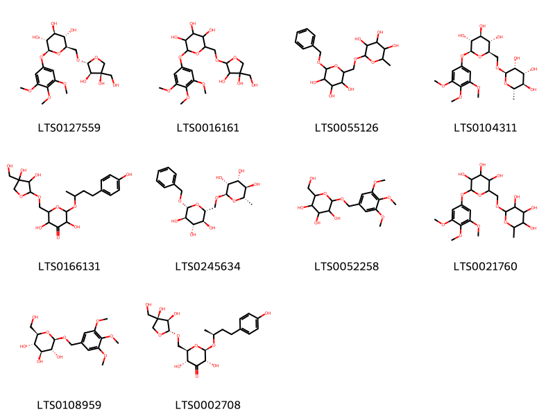{ width=100% }
    <figcaption>Hình ảnh cấu trúc hóa học của 10 hoạt chất thuộc nhóm Organooxygen compounds gồm ['(2r,3s,4s,5r,6s)-2-({[(2r,3r,4r)-3,4-dihydroxy-4-(hydroxymethyl)oxolan-2-yl]oxy}methyl)-6-(3,4,5-trimethoxyphenoxy)oxane-3,4,5-triol (LTS0127559)', '2-({[3,4-dihydroxy-4-(hydroxymethyl)oxolan-2-yl]oxy}methyl)-6-(3,4,5-trimethoxyphenoxy)oxane-3,4,5-triol (LTS0016161)', '2-{[6-(benzyloxy)-3,4,5-trihydroxyoxan-2-yl]methoxy}-6-methyloxane-3,4,5-triol (LTS0055126)', '(2r,3s,4s,5r,6s)-2-({[(2r,3r,4r,5r,6s)-3,4,5-trihydroxy-6-methyloxan-2-yl]oxy}methyl)-6-(3,4,5-trimethoxyphenoxy)oxane-3,4,5-triol (LTS0104311)', '2-({[3,4-dihydroxy-4-(hydroxymethyl)oxolan-2-yl]oxy}methyl)-3,5-dihydroxy-6-{[4-(4-hydroxyphenyl)butan-2-yl]oxy}oxan-4-one (LTS0166131)', '(2r,3r,4r,5r,6s)-2-{[(2r,3s,4s,5r,6r)-6-(benzyloxy)-3,4,5-trihydroxyoxan-2-yl]methoxy}-6-methyloxane-3,4,5-triol (LTS0245634)', '2-(hydroxymethyl)-6-[(3,4,5-trimethoxyphenyl)methoxy]oxane-3,4,5-triol (LTS0052258)', '2-{[(3,4,5-trihydroxy-6-methyloxan-2-yl)oxy]methyl}-6-(3,4,5-trimethoxyphenoxy)oxane-3,4,5-triol (LTS0021760)', '(2r,3s,4s,5r,6r)-2-(hydroxymethyl)-6-[(3,4,5-trimethoxyphenyl)methoxy]oxane-3,4,5-triol (LTS0108959)', '(2r,3r,5s,6r)-2-({[(2r,3r,4r)-3,4-dihydroxy-4-(hydroxymethyl)oxolan-2-yl]oxy}methyl)-3,5-dihydroxy-6-{[(2s)-4-(4-hydroxyphenyl)butan-2-yl]oxy}oxan-4-one (LTS0002708)'].</figcaption>
</figure>
#### Nhóm Phenols
<figure markdown="span">
    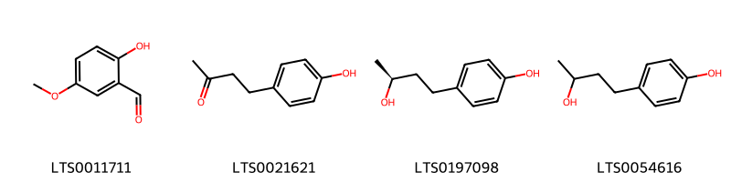{ width=100% }
    <figcaption>Hình ảnh cấu trúc hóa học của 4 hoạt chất thuộc nhóm Phenols gồm ['2-hydroxy-5-methoxybenzaldehyde (LTS0011711)', 'frambinone (LTS0021621)', '(+)-rhododendrol (LTS0197098)', 'rhododendrol (LTS0054616)'].</figcaption>
</figure>
#### Nhóm Steroids and steroid derivatives
<figure markdown="span">
    { width=100% }
    <figcaption>Hình ảnh cấu trúc hóa học của 2 hoạt chất thuộc nhóm Steroids and steroid derivatives gồm ['stigmast-5-en-3-ol (LTS0071224)', 'stigmast-5-en-3-ol, (3β)- (LTS0204616)'].</figcaption>
</figure>
#### Nhóm Tannins
<figure markdown="span">
    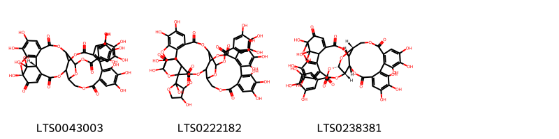{ width=100% }
    <figcaption>Hình ảnh cấu trúc hóa học của 3 hoạt chất thuộc nhóm Tannins gồm ['(1r,38r)-1,13,14,15,18,19,20,34,35,39,39-undecahydroxy-2,5,10,23,31-pentaoxo-6,9,24,27,30,40-hexaoxaoctacyclo[34.3.1.0⁴,³⁸.0⁷,²⁶.0⁸,²⁹.0¹¹,¹⁶.0¹⁷,²².0³²,³⁷]tetraconta-3,11(16),12,14,17,19,21,32,34,36-decaen-28-yl 3,4,5-trihydroxybenzoate (LTS0043003)', "3a,6,10',11',12',15',16',17',31',32',36',37'-dodecahydroxy-2,2',7',20',28',41'-hexaoxo-6,6a-dihydro-5h-3',6',21',24',27',38',42'-heptaoxaspiro[furo[3,2-b]furan-3,39'-nonacyclo[35.2.2.1³³,³⁶.0¹,³⁵.0⁴,²³.0⁵,²⁶.0⁸,¹³.0¹⁴,¹⁹.0²⁹,³⁴]dotetracontane]-8'(13'),9',11',14',16',18',29'(34'),30',32'-nonaen-25'-yl 3,4,5-trihydroxybenzoate (LTS0222182)", '(7r,8s,26r,28s,29s)-1,13,14,15,18,19,20,34,35,39,39-undecahydroxy-2,5,10,23,31-pentaoxo-6,9,24,27,30,40-hexaoxaoctacyclo[34.3.1.0⁴,³⁸.0⁷,²⁶.0⁸,²⁹.0¹¹,¹⁶.0¹⁷,²².0³²,³⁷]tetraconta-3,11,13,15,17(22),18,20,32,34,36-decaen-28-yl 3,4,5-trihydroxybenzoate (LTS0238381)'].</figcaption>
</figure>

---

### Dược dân tộc học

Danh sách các quốc gia có sử dụng *Acer nikoense* trong điều trị các bệnh. 

| Country   | Disease   | Bệnh                                                                                                                                                                                                |
|:----------|:----------|:----------------------------------------------------------------------------------------------------------------------------------------------------------------------------------------------------|
| Elsewhere | Collyrium | MYMEMORY WARNING: YOU USED ALL AVAILABLE FREE TRANSLATIONS FOR TODAY. NEXT AVAILABLE IN  05 HOURS 54 MINUTES 25 SECONDS VISIT HTTPS://MYMEMORY.TRANSLATED.NET/DOC/USAGELIMITS.PHP TO TRANSLATE MORE |

---

---
## Acer pseudoplatanus
### Thông tin về thực vật

!!! info "Phân loại thực vật của *Acer pseudoplatanus* từ GIBF:"
    - **Kingdom:** Plantae
    - **Phylum:** Tracheophyta
    - **Order:** Sapindales
    - **Family:** Sapindaceae
    - **Genus:** Acer
    - **Species:** *Acer pseudoplatanus*

 

| Label (VI)   | Label (EN)   | Scientific Name     | Descriptions (VI)   | Descriptions (EN)   | Also Known As (VI)   | Also Known As (EN)             |
|:-------------|:-------------|:--------------------|:--------------------|:--------------------|:---------------------|:-------------------------------|
| N/A          | N/A          | Acer pseudoplatanus | loài thực vật       | species of plant    | ['']                 | ['sycamore', 'sycamore maple'] |

#### Phân bố trên thế giới

**Từ CSDL GIBF** Sweden, Chile, New Zealand, Spain, Netherlands, Denmark, Poland, United States of America, Russian Federation, Norway, United Kingdom of Great Britain and Northern Ireland, Belgium, Germany, Austria, Hungary, Portugal, Ukraine, Slovakia, Australia, Switzerland, France, Ireland

#### Phân bố tại Việt Nam

**Từ CSDL GIBF**: Không có ghi nhận ở Việt Nam

---
### Thành phần hóa học
        
- Theo cơ sở dữ liệu lotus: Từ loài *Acer pseudoplatanus* đã phân lập và xác định được 5 hoạt chất thuộc về các nhóm Carboxylic acids and derivatives, Flavonoids. 

|    | chemicalTaxonomyClassyfireClass   |   smiles_count |
|---:|:----------------------------------|---------------:|
|  0 | Carboxylic acids and derivatives  |              2 |
|  1 | Flavonoids                        |              3 |

#### Nhóm Carboxylic acids and derivatives
<figure markdown="span">
    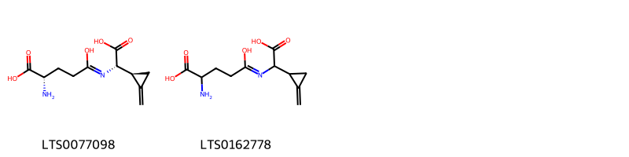{ width=100% }
    <figcaption>Hình ảnh cấu trúc hóa học của 2 hoạt chất thuộc nhóm Carboxylic acids and derivatives gồm ['(2s)-2-amino-4-{[(s)-carboxy[(1s)-2-methylidenecyclopropyl]methyl]-c-hydroxycarbonimidoyl}butanoic acid (LTS0077098)', '2-amino-4-{[carboxy(2-methylidenecyclopropyl)methyl]-c-hydroxycarbonimidoyl}butanoic acid (LTS0162778)'].</figcaption>
</figure>
#### Nhóm Flavonoids
<figure markdown="span">
    { width=100% }
    <figcaption>Hình ảnh cấu trúc hóa học của 3 hoạt chất thuộc nhóm Flavonoids gồm ['5,7-dihydroxy-2-(4-hydroxy-3-oxidophenyl)-3-{[(2s,3r,4s,5s,6r)-3,4,5-trihydroxy-6-(hydroxymethyl)oxan-2-yl]oxy}-1λ⁴-chromen-1-ylium (LTS0083222)', 'chrysanthemin (LTS0221391)', '5,7-dihydroxy-2-(4-hydroxy-3-oxidophenyl)-3-{[(2s,3r,4s,5s,6r)-3,4,5-trihydroxy-6-({[(2r,3r,4r,5r,6s)-3,4,5-trihydroxy-6-methyloxan-2-yl]oxy}methyl)oxan-2-yl]oxy}-1λ⁴-chromen-1-ylium (LTS0013740)'].</figcaption>
</figure>

---

### Dược dân tộc học

Danh sách các quốc gia có sử dụng *Acer pseudoplatanus* trong điều trị các bệnh. 

| Country   | Disease    | Bệnh                                                                                                                                                                                                |
|:----------|:-----------|:----------------------------------------------------------------------------------------------------------------------------------------------------------------------------------------------------|
| Turkey    | Astringent | MYMEMORY WARNING: YOU USED ALL AVAILABLE FREE TRANSLATIONS FOR TODAY. NEXT AVAILABLE IN  05 HOURS 53 MINUTES 36 SECONDS VISIT HTTPS://MYMEMORY.TRANSLATED.NET/DOC/USAGELIMITS.PHP TO TRANSLATE MORE |
| anish     | Tonic      | MYMEMORY WARNING: YOU USED ALL AVAILABLE FREE TRANSLATIONS FOR TODAY. NEXT AVAILABLE IN  05 HOURS 53 MINUTES 33 SECONDS VISIT HTTPS://MYMEMORY.TRANSLATED.NET/DOC/USAGELIMITS.PHP TO TRANSLATE MORE |

---

---
## Acer pycnanthum
### Thông tin về thực vật

!!! info "Phân loại thực vật của *Acer pycnanthum* từ GIBF:"
    - **Kingdom:** Plantae
    - **Phylum:** Tracheophyta
    - **Order:** Sapindales
    - **Family:** Sapindaceae
    - **Genus:** Acer
    - **Species:** *Acer pycnanthum*

 

| Label (VI)   | Label (EN)   | Scientific Name   | Descriptions (VI)   | Descriptions (EN)   | Also Known As (VI)   | Also Known As (EN)   |
|:-------------|:-------------|:------------------|:--------------------|:--------------------|:---------------------|:---------------------|
| N/A          | N/A          | Acer pycnanthum   | loài thực vật       | species of plant    | ['']                 | ['']                 |

#### Phân bố trên thế giới

**Từ CSDL GIBF** nan, United States of America, Japan, Korea, Republic of, Belgium, unknown or invalid, Canada

#### Phân bố tại Việt Nam

**Từ CSDL GIBF**: Không có ghi nhận ở Việt Nam

---
### Thành phần hóa học
        
- Theo cơ sở dữ liệu lotus: Từ loài *Acer pycnanthum* đã phân lập và xác định được 10 hoạt chất thuộc về các nhóm Benzene and substituted derivatives, Flavonoids. 

|    | chemicalTaxonomyClassyfireClass     |   smiles_count |
|---:|:------------------------------------|---------------:|
|  0 | Benzene and substituted derivatives |              7 |
|  1 | Flavonoids                          |              3 |

#### Nhóm Benzene and substituted derivatives
<figure markdown="span">
    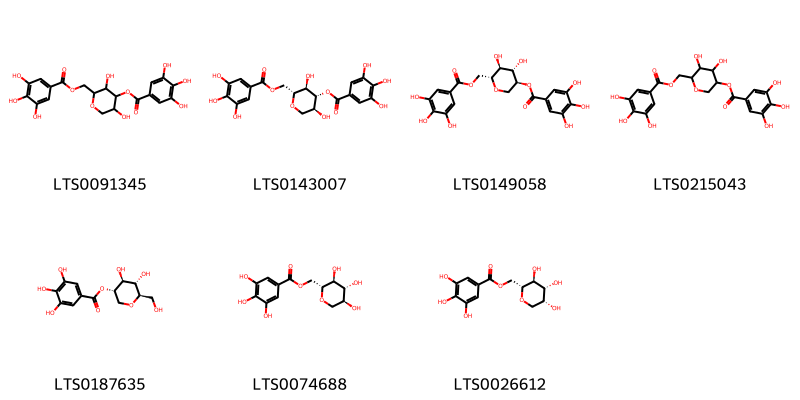{ width=100% }
    <figcaption>Hình ảnh cấu trúc hóa học của 7 hoạt chất thuộc nhóm Benzene and substituted derivatives gồm ['3,5-dihydroxy-2-[(3,4,5-trihydroxybenzoyloxy)methyl]oxan-4-yl 3,4,5-trihydroxybenzoate (LTS0091345)', '(2r,3r,4r,5s)-3,5-dihydroxy-2-[(3,4,5-trihydroxybenzoyloxy)methyl]oxan-4-yl 3,4,5-trihydroxybenzoate (LTS0143007)', '(3s,4s,5s,6r)-4,5-dihydroxy-6-[(3,4,5-trihydroxybenzoyloxy)methyl]oxan-3-yl 3,4,5-trihydroxybenzoate (LTS0149058)', '4,5-dihydroxy-6-[(3,4,5-trihydroxybenzoyloxy)methyl]oxan-3-yl 3,4,5-trihydroxybenzoate (LTS0215043)', '(3s,4s,5s,6r)-4,5-dihydroxy-6-(hydroxymethyl)oxan-3-yl 3,4,5-trihydroxybenzoate (LTS0187635)', '[(2r,3s,4r,5s)-3,4,5-trihydroxyoxan-2-yl]methyl 3,4,5-trihydroxybenzoate (LTS0074688)', '[(2r,3s,4r,5r)-3,4,5-trihydroxyoxan-2-yl]methyl 3,4,5-trihydroxybenzoate (LTS0026612)'].</figcaption>
</figure>
#### Nhóm Flavonoids
<figure markdown="span">
    { width=100% }
    <figcaption>Hình ảnh cấu trúc hóa học của 3 hoạt chất thuộc nhóm Flavonoids gồm ['5,7-dihydroxy-2-(4-hydroxy-3-oxidophenyl)-3-{[(2s,3r,4s,5s,6r)-3,4,5-trihydroxy-6-(hydroxymethyl)oxan-2-yl]oxy}-1λ⁴-chromen-1-ylium (LTS0083222)', 'chrysanthemin (LTS0221391)', '5,7-dihydroxy-2-(4-hydroxy-3-oxidophenyl)-3-{[(2s,3r,4s,5s,6r)-3,4,5-trihydroxy-6-({[(2r,3r,4r,5r,6s)-3,4,5-trihydroxy-6-methyloxan-2-yl]oxy}methyl)oxan-2-yl]oxy}-1λ⁴-chromen-1-ylium (LTS0013740)'].</figcaption>
</figure>

---

### Dược dân tộc học

Danh sách các quốc gia có sử dụng *Acer pycnanthum* trong điều trị các bệnh. 

| Country   | Disease   | Bệnh                                                                                                                                                                                                |
|:----------|:----------|:----------------------------------------------------------------------------------------------------------------------------------------------------------------------------------------------------|
| Elsewhere | Collyrium | MYMEMORY WARNING: YOU USED ALL AVAILABLE FREE TRANSLATIONS FOR TODAY. NEXT AVAILABLE IN  05 HOURS 53 MINUTES 08 SECONDS VISIT HTTPS://MYMEMORY.TRANSLATED.NET/DOC/USAGELIMITS.PHP TO TRANSLATE MORE |

---

---
## Acer rubrum
### Thông tin về thực vật

!!! info "Phân loại thực vật của *Acer rubrum* từ GIBF:"
    - **Kingdom:** Plantae
    - **Phylum:** Tracheophyta
    - **Order:** Sapindales
    - **Family:** Sapindaceae
    - **Genus:** Acer
    - **Species:** *Acer rubrum*

 

| Label (VI)   | Label (EN)   | Scientific Name   | Descriptions (VI)   | Descriptions (EN)         | Also Known As (VI)   | Also Known As (EN)                                        |
|:-------------|:-------------|:------------------|:--------------------|:--------------------------|:---------------------|:----------------------------------------------------------|
| N/A          | N/A          | Acer rubrum       |                     | species of deciduous tree | ['']                 | ['red maple', 'soft maple', 'swamp maple', 'water maple'] |

#### Phân bố trên thế giới

**Từ CSDL GIBF** United States of America, Canada

#### Phân bố tại Việt Nam

**Từ CSDL GIBF**: Không có ghi nhận ở Việt Nam

---
### Thành phần hóa học
        
- Theo cơ sở dữ liệu lotus: Từ loài *Acer rubrum* đã phân lập và xác định được 29 hoạt chất thuộc về các nhóm Depsides and depsidones, Benzene and substituted derivatives, Flavonoids, Tannins, Organooxygen compounds, Indoles and derivatives. 

|    | chemicalTaxonomyClassyfireClass     |   smiles_count |
|---:|:------------------------------------|---------------:|
|  0 | Benzene and substituted derivatives |             20 |
|  1 | Depsides and depsidones             |              2 |
|  2 | Flavonoids                          |              3 |
|  3 | Indoles and derivatives             |              1 |
|  4 | Organooxygen compounds              |              1 |
|  5 | Tannins                             |              2 |

#### Nhóm Benzene and substituted derivatives
<figure markdown="span">
    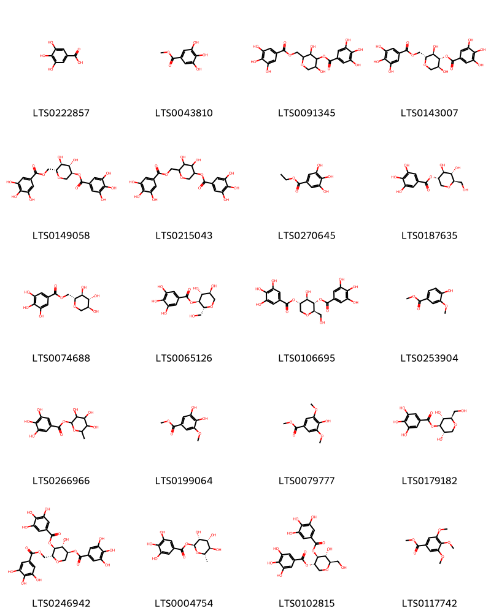{ width=100% }
    <figcaption>Hình ảnh cấu trúc hóa học của 20 hoạt chất thuộc nhóm Benzene and substituted derivatives gồm ['galop (LTS0222857)', 'methyl gallate (LTS0043810)', '3,5-dihydroxy-2-[(3,4,5-trihydroxybenzoyloxy)methyl]oxan-4-yl 3,4,5-trihydroxybenzoate (LTS0091345)', '(2r,3r,4r,5s)-3,5-dihydroxy-2-[(3,4,5-trihydroxybenzoyloxy)methyl]oxan-4-yl 3,4,5-trihydroxybenzoate (LTS0143007)', '(3s,4s,5s,6r)-4,5-dihydroxy-6-[(3,4,5-trihydroxybenzoyloxy)methyl]oxan-3-yl 3,4,5-trihydroxybenzoate (LTS0149058)', '4,5-dihydroxy-6-[(3,4,5-trihydroxybenzoyloxy)methyl]oxan-3-yl 3,4,5-trihydroxybenzoate (LTS0215043)', 'ethyl gallate (LTS0270645)', '(3s,4s,5s,6r)-4,5-dihydroxy-6-(hydroxymethyl)oxan-3-yl 3,4,5-trihydroxybenzoate (LTS0187635)', '[(2r,3s,4r,5s)-3,4,5-trihydroxyoxan-2-yl]methyl 3,4,5-trihydroxybenzoate (LTS0074688)', '(2r,3s,4r,5s)-4,5-dihydroxy-2-(hydroxymethyl)oxan-3-yl 3,4,5-trihydroxybenzoate (LTS0065126)', '(2r,3s,4r,5s)-4-hydroxy-2-(hydroxymethyl)-5-(3,4,5-trihydroxybenzoyloxy)oxan-3-yl 3,4,5-trihydroxybenzoate (LTS0106695)', 'vanillate (LTS0253904)', '3,4,5-trihydroxy-6-methyloxan-2-yl 3,4,5-trihydroxybenzoate (LTS0266966)', 'methyl 3,4-dihydroxy-5-methoxybenzoate (LTS0199064)', 'syringate (LTS0079777)', '(2r,3r,4r,5s)-3,5-dihydroxy-2-(hydroxymethyl)oxan-4-yl 3,4,5-trihydroxybenzoate (LTS0179182)', '(3s,4r,5s,6r)-4-hydroxy-5-(3,4,5-trihydroxybenzoyloxy)-6-[(3,4,5-trihydroxybenzoyloxy)methyl]oxan-3-yl 3,4,5-trihydroxybenzoate (LTS0246942)', '(2s,3r,4r,5r,6s)-3,4,5-trihydroxy-6-methyloxan-2-yl 3,4,5-trihydroxybenzoate (LTS0004754)', '(2r,3r,4s,5s)-3-hydroxy-2-(hydroxymethyl)-5-(3,4,5-trihydroxybenzoyloxy)oxan-4-yl 3,4,5-trihydroxybenzoate (LTS0102815)', 'methyl 3,4,5-trimethoxybenzoate (LTS0117742)'].</figcaption>
</figure>
#### Nhóm Depsides and depsidones
<figure markdown="span">
    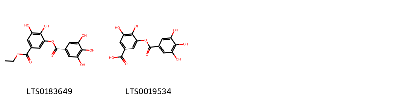{ width=100% }
    <figcaption>Hình ảnh cấu trúc hóa học của 2 hoạt chất thuộc nhóm Depsides and depsidones gồm ['ethyl 3,4-dihydroxy-5-(3,4,5-trihydroxybenzoyloxy)benzoate (LTS0183649)', 'digallic acid (LTS0019534)'].</figcaption>
</figure>
#### Nhóm Flavonoids
<figure markdown="span">
    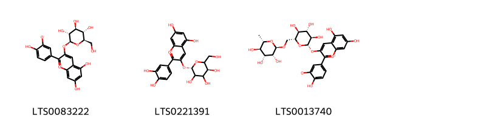{ width=100% }
    <figcaption>Hình ảnh cấu trúc hóa học của 3 hoạt chất thuộc nhóm Flavonoids gồm ['5,7-dihydroxy-2-(4-hydroxy-3-oxidophenyl)-3-{[(2s,3r,4s,5s,6r)-3,4,5-trihydroxy-6-(hydroxymethyl)oxan-2-yl]oxy}-1λ⁴-chromen-1-ylium (LTS0083222)', 'chrysanthemin (LTS0221391)', '5,7-dihydroxy-2-(4-hydroxy-3-oxidophenyl)-3-{[(2s,3r,4s,5s,6r)-3,4,5-trihydroxy-6-({[(2r,3r,4r,5r,6s)-3,4,5-trihydroxy-6-methyloxan-2-yl]oxy}methyl)oxan-2-yl]oxy}-1λ⁴-chromen-1-ylium (LTS0013740)'].</figcaption>
</figure>
#### Nhóm Indoles and derivatives
<figure markdown="span">
    { width=100% }
    <figcaption>Hình ảnh cấu trúc hóa học của 1 hoạt chất thuộc nhóm Indoles and derivatives gồm ['gramin (LTS0099391)'].</figcaption>
</figure>
#### Nhóm Organooxygen compounds
<figure markdown="span">
    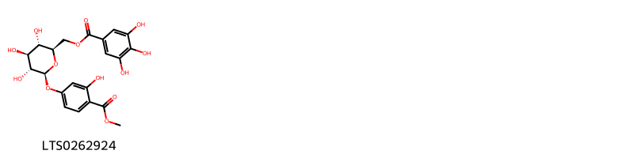{ width=100% }
    <figcaption>Hình ảnh cấu trúc hóa học của 1 hoạt chất thuộc nhóm Organooxygen compounds gồm ['[(2r,3s,4s,5r,6s)-3,4,5-trihydroxy-6-[3-hydroxy-4-(methoxycarbonyl)phenoxy]oxan-2-yl]methyl 3,4,5-trihydroxybenzoate (LTS0262924)'].</figcaption>
</figure>
#### Nhóm Tannins
<figure markdown="span">
    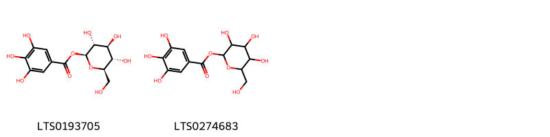{ width=100% }
    <figcaption>Hình ảnh cấu trúc hóa học của 2 hoạt chất thuộc nhóm Tannins gồm ['β-glucogallin (LTS0193705)', '3,4,5-trihydroxy-6-(hydroxymethyl)oxan-2-yl 3,4,5-trihydroxybenzoate (LTS0274683)'].</figcaption>
</figure>

---

### Dược dân tộc học

Danh sách các quốc gia có sử dụng *Acer rubrum* trong điều trị các bệnh. 

| Country        | Disease                  | Bệnh                                                                                                                                                                                                |
|:---------------|:-------------------------|:----------------------------------------------------------------------------------------------------------------------------------------------------------------------------------------------------|
| Turkey         | Astringent               | MYMEMORY WARNING: YOU USED ALL AVAILABLE FREE TRANSLATIONS FOR TODAY. NEXT AVAILABLE IN  05 HOURS 52 MINUTES 35 SECONDS VISIT HTTPS://MYMEMORY.TRANSLATED.NET/DOC/USAGELIMITS.PHP TO TRANSLATE MORE |
| US             | Poison, Tonic, Vermifuge | MYMEMORY WARNING: YOU USED ALL AVAILABLE FREE TRANSLATIONS FOR TODAY. NEXT AVAILABLE IN  05 HOURS 52 MINUTES 32 SECONDS VISIT HTTPS://MYMEMORY.TRANSLATED.NET/DOC/USAGELIMITS.PHP TO TRANSLATE MORE |
| US(Appalachia) | Collyrium                | MYMEMORY WARNING: YOU USED ALL AVAILABLE FREE TRANSLATIONS FOR TODAY. NEXT AVAILABLE IN  05 HOURS 52 MINUTES 27 SECONDS VISIT HTTPS://MYMEMORY.TRANSLATED.NET/DOC/USAGELIMITS.PHP TO TRANSLATE MORE |

---

---
## Acer saccharinum
### Thông tin về thực vật

!!! info "Phân loại thực vật của *Acer saccharinum* từ GIBF:"
    - **Kingdom:** Plantae
    - **Phylum:** Tracheophyta
    - **Order:** Sapindales
    - **Family:** Sapindaceae
    - **Genus:** Acer
    - **Species:** *Acer saccharinum*

 

| Label (VI)   | Label (EN)   | Scientific Name   | Descriptions (VI)   | Descriptions (EN)   | Also Known As (VI)   | Also Known As (EN)                                           |
|:-------------|:-------------|:------------------|:--------------------|:--------------------|:---------------------|:-------------------------------------------------------------|
| N/A          | N/A          | Acer saccharinum  | loài thực vật       | species of plant    | ['']                 | ['soft maple', 'river maple', 'silver maple', 'white maple'] |

#### Phân bố trên thế giới

**Từ CSDL GIBF** Belarus, Austria, Hungary, United States of America, Sweden, Netherlands, Belgium, Ukraine, Serbia, Canada, Germany, Denmark, Poland

#### Phân bố tại Việt Nam

**Từ CSDL GIBF**: Không có ghi nhận ở Việt Nam

---
### Thành phần hóa học
        
- Theo cơ sở dữ liệu lotus: Từ loài *Acer saccharinum* đã phân lập và xác định được 8 hoạt chất thuộc về các nhóm Indoles and derivatives, Benzene and substituted derivatives, Flavonoids. 

|    | chemicalTaxonomyClassyfireClass     |   smiles_count |
|---:|:------------------------------------|---------------:|
|  0 | Benzene and substituted derivatives |              1 |
|  1 | Flavonoids                          |              6 |
|  2 | Indoles and derivatives             |              1 |

#### Nhóm Benzene and substituted derivatives
<figure markdown="span">
    { width=100% }
    <figcaption>Hình ảnh cấu trúc hóa học của 1 hoạt chất thuộc nhóm Benzene and substituted derivatives gồm ['methyl gallate (LTS0043810)'].</figcaption>
</figure>
#### Nhóm Flavonoids
<figure markdown="span">
    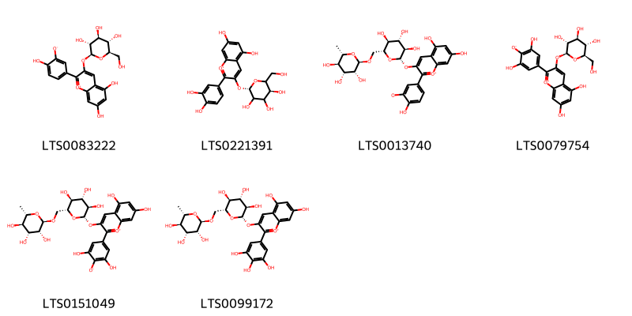{ width=100% }
    <figcaption>Hình ảnh cấu trúc hóa học của 6 hoạt chất thuộc nhóm Flavonoids gồm ['5,7-dihydroxy-2-(4-hydroxy-3-oxidophenyl)-3-{[(2s,3r,4s,5s,6r)-3,4,5-trihydroxy-6-(hydroxymethyl)oxan-2-yl]oxy}-1λ⁴-chromen-1-ylium (LTS0083222)', 'chrysanthemin (LTS0221391)', '5,7-dihydroxy-2-(4-hydroxy-3-oxidophenyl)-3-{[(2s,3r,4s,5s,6r)-3,4,5-trihydroxy-6-({[(2r,3r,4r,5r,6s)-3,4,5-trihydroxy-6-methyloxan-2-yl]oxy}methyl)oxan-2-yl]oxy}-1λ⁴-chromen-1-ylium (LTS0013740)', '2-(3,5-dihydroxy-4-oxidophenyl)-5,7-dihydroxy-3-{[(2s,3r,4s,5s,6r)-3,4,5-trihydroxy-6-(hydroxymethyl)oxan-2-yl]oxy}-1λ⁴-chromen-1-ylium (LTS0079754)', '2-(3,5-dihydroxy-4-oxidophenyl)-5,7-dihydroxy-3-{[(2s,3r,4s,5s,6r)-3,4,5-trihydroxy-6-({[(2r,3r,4r,5r,6s)-3,4,5-trihydroxy-6-methyloxan-2-yl]oxy}methyl)oxan-2-yl]oxy}-1λ⁴-chromen-1-ylium (LTS0151049)', 'tulipanin (LTS0099172)'].</figcaption>
</figure>
#### Nhóm Indoles and derivatives
<figure markdown="span">
    { width=100% }
    <figcaption>Hình ảnh cấu trúc hóa học của 1 hoạt chất thuộc nhóm Indoles and derivatives gồm ['gramin (LTS0099391)'].</figcaption>
</figure>

---

### Dược dân tộc học

Danh sách các quốc gia có sử dụng *Acer saccharinum* trong điều trị các bệnh. 

| Country   | Disease    | Bệnh                                                                                                                                                                                                |
|:----------|:-----------|:----------------------------------------------------------------------------------------------------------------------------------------------------------------------------------------------------|
| Turkey    | Astringent | MYMEMORY WARNING: YOU USED ALL AVAILABLE FREE TRANSLATIONS FOR TODAY. NEXT AVAILABLE IN  05 HOURS 51 MINUTES 57 SECONDS VISIT HTTPS://MYMEMORY.TRANSLATED.NET/DOC/USAGELIMITS.PHP TO TRANSLATE MORE |

---

