!!! abstract "Tóm tắt"

    Họ Acoraceae gồm khoảng 1 chi và 3 loài được một số cộng đồng tại các quốc gia như Turkey, US(Blackfoot), Brazil, Arabic, Egypt, US(Appalachia), French, New Guinea, US, Dutch, Iran, Danish, Italian, China, Swedish, anish, US(Amerindian), German, Hungary, Elsewhere, Yugoslavia, India, Java, Sanscrit, Malaysia, Nepal sử dụng trong một số trường hợp QUERY LENGTH LIMIT EXCEEDED. MAX ALLOWED QUERY : 500 CHARS.

!!! info "DrDuke"

    James A. Duke sinh năm 1929-2017 là một nhà thực vật học người Mỹ. Đây là một trong những tác giả hàng đầu trong lĩnh vực dược dân tộc học với cuốn *CRC Handbook of Medicinal Herbs* và chính là người xây dựng lên cơ sở dữ liệu về hợp chất tự nhiên và dược dân tộc học tại Bộ nông nghiệp Hoa Kỳ. Các thông tin được đăng tải tại website [Dr. Duke's Phytochemical and Ethnobotanical Databases](https://phytochem.nal.usda.gov/). 
    Trong suốt thập niên 1970, ông lãnh đạo the Plant Taxonomy Laboratory, Plant Genetics and Germplasm Institute of the Agricultural Research Service, U.S. Department of Agriculture.
    Trong tài liệu này, các thông tin về dược dân tộc của các dược liệu được trích dẫn từ tài liệu của James A. Ducke với sự trợ giúp của phần mềm dịch thuật từ tiếng Anh sang tiếng Việt.
   

# Chi Acorus

??? note "Danh sách các dược liệu thuộc chi"
    
	 - *Acorus calamus*
	 - *Acorus gramineus*
	 - *Acorus urius*

---
## Acorus calamus
### Thông tin về thực vật

!!! info "Phân loại thực vật của *Acorus calamus* từ GIBF:"
    - **Kingdom:** Plantae
    - **Phylum:** Tracheophyta
    - **Order:** Acorales
    - **Family:** Acoraceae
    - **Genus:** Acorus
    - **Species:** *Acorus calamus*

 

| Label (VI)   | Label (EN)   | Scientific Name   | Descriptions (VI)   | Descriptions (EN)   | Also Known As (VI)   | Also Known As (EN)                                                                                                                                 |
|:-------------|:-------------|:------------------|:--------------------|:--------------------|:---------------------|:---------------------------------------------------------------------------------------------------------------------------------------------------|
| N/A          | N/A          | Acorus calamus    | loài thực vật       | species of plant    | ['']                 | ['sweetflag', 'sweetroot', 'myrtle flag', 'myrtle grass', 'sweet calamus', 'calamus', 'Acorus roseau', 'flag root', 'sweet calomel', 'sweet-flag'] |

#### Phân bố trên thế giới

**Từ CSDL GIBF** Italy, Japan, Belgium, Norway, Canada, Ukraine, Denmark, Netherlands, Lithuania, Belarus, Russian Federation, United States of America, Sweden, Finland, Czechia, Germany, Switzerland, Austria, United Kingdom of Great Britain and Northern Ireland, China, Poland

#### Phân bố tại Việt Nam

**Từ CSDL GIBF**: Không có ghi nhận ở Việt Nam

---
### Thành phần hóa học
        
- Theo cơ sở dữ liệu lotus: Từ loài *Acorus calamus* đã phân lập và xác định được 283 hoạt chất thuộc về các nhóm Tropones, Alkyl halides, Lignan lactones, Benzofurans, Hydroxy acids and derivatives, Phenols, Dioxolanes, Carboxylic acids and derivatives, Fatty Acyls, Cinnamic acids and derivatives, Cinnamaldehydes, Glycerolipids, Prenol lipids, Benzene and substituted derivatives, Indanes, Organooxygen compounds, Furanoid lignans, Phenol ethers, Cyclobutane lignans, Flavonoids, Steroids and steroid derivatives, Organonitrogen compounds, Unsaturated hydrocarbons. 

|    | chemicalTaxonomyClassyfireClass     |   smiles_count |
|---:|:------------------------------------|---------------:|
|  0 |                                     |              1 |
|  1 | Alkyl halides                       |              1 |
|  2 | Benzene and substituted derivatives |             10 |
|  3 | Benzofurans                         |              2 |
|  4 | Carboxylic acids and derivatives    |              2 |
|  5 | Cinnamaldehydes                     |              3 |
|  6 | Cinnamic acids and derivatives      |              1 |
|  7 | Cyclobutane lignans                 |              1 |
|  8 | Dioxolanes                          |              2 |
|  9 | Fatty Acyls                         |             12 |
| 10 | Flavonoids                          |              2 |
| 11 | Furanoid lignans                    |             10 |
| 12 | Glycerolipids                       |              2 |
| 13 | Hydroxy acids and derivatives       |              2 |
| 14 | Indanes                             |              2 |
| 15 | Lignan lactones                     |              2 |
| 16 | Organonitrogen compounds            |              1 |
| 17 | Organooxygen compounds              |             29 |
| 18 | Phenol ethers                       |              5 |
| 19 | Phenols                             |              4 |
| 20 | Prenol lipids                       |            116 |
| 21 | Steroids and steroid derivatives    |             26 |
| 22 | Tropones                            |              2 |
| 23 | Unsaturated hydrocarbons            |              4 |

#### Nhóm 
<figure markdown="span">
    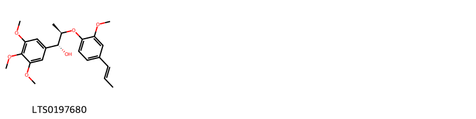{ width=100% }
    <figcaption>Hình ảnh cấu trúc hóa học của 1 hoạt chất thuộc nhóm  gồm ['surinamensin (LTS0197680)'].</figcaption>
</figure>
#### Nhóm Alkyl halides
<figure markdown="span">
    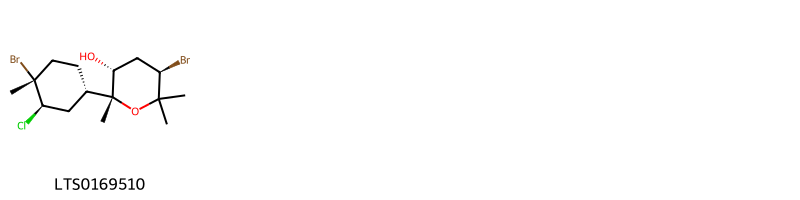{ width=100% }
    <figcaption>Hình ảnh cấu trúc hóa học của 1 hoạt chất thuộc nhóm Alkyl halides gồm ['isocaespitol (LTS0169510)'].</figcaption>
</figure>
#### Nhóm Benzene and substituted derivatives
<figure markdown="span">
    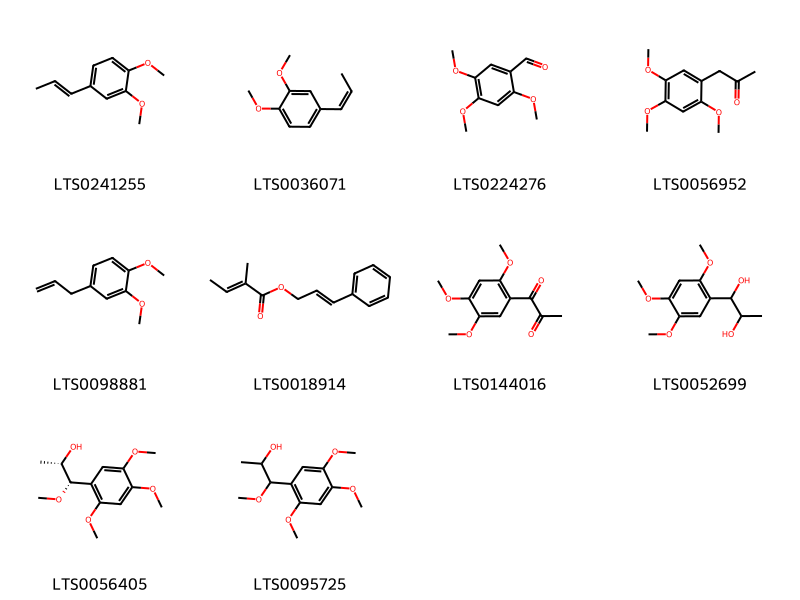{ width=100% }
    <figcaption>Hình ảnh cấu trúc hóa học của 10 hoạt chất thuộc nhóm Benzene and substituted derivatives gồm ['isoeugenyl methyl ether (LTS0241255)', '(z)-methyl isoeugenol (LTS0036071)', '2,4,5-trimethoxybenzaldehyde (LTS0224276)', '1-(2,4,5-trimethoxyphenyl)propan-2-one (LTS0056952)', 'methyl eugenol (LTS0098881)', '3-phenylprop-2-en-1-yl (2e)-2-methylbut-2-enoate (LTS0018914)', '1-(2,4,5-trimethoxyphenyl)propane-1,2-dione (LTS0144016)', '1-(2,4,5-trimethoxyphenyl)propane-1,2-diol (LTS0052699)', '(1s,2s)-1-methoxy-1-(2,4,5-trimethoxyphenyl)propan-2-ol (LTS0056405)', '1-methoxy-1-(2,4,5-trimethoxyphenyl)propan-2-ol (LTS0095725)'].</figcaption>
</figure>
#### Nhóm Benzofurans
<figure markdown="span">
    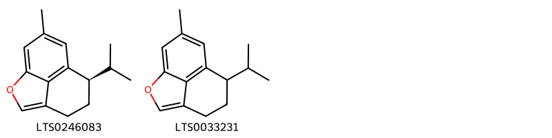{ width=100% }
    <figcaption>Hình ảnh cấu trúc hóa học của 2 hoạt chất thuộc nhóm Benzofurans gồm ['(7r)-7-isopropyl-10-methyl-2-oxatricyclo[6.3.1.0⁴,¹²]dodeca-1(11),3,8(12),9-tetraene (LTS0246083)', '7-isopropyl-10-methyl-2-oxatricyclo[6.3.1.0⁴,¹²]dodeca-1(11),3,8(12),9-tetraene (LTS0033231)'].</figcaption>
</figure>
#### Nhóm Carboxylic acids and derivatives
<figure markdown="span">
    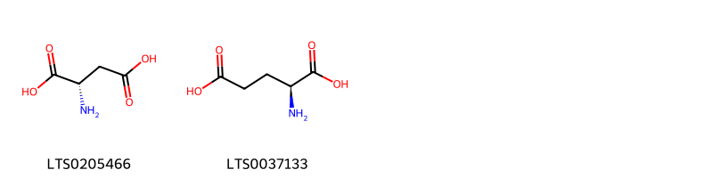{ width=100% }
    <figcaption>Hình ảnh cấu trúc hóa học của 2 hoạt chất thuộc nhóm Carboxylic acids and derivatives gồm ['l-aspartic acid (LTS0205466)', 'l-glutamic acid (LTS0037133)'].</figcaption>
</figure>
#### Nhóm Cinnamaldehydes
<figure markdown="span">
    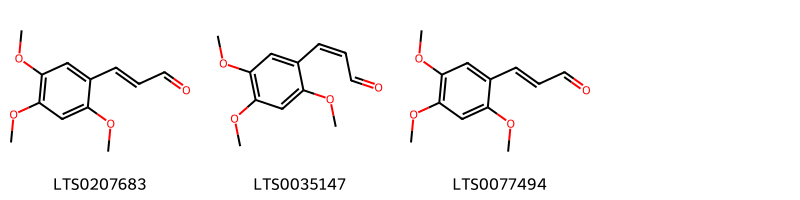{ width=100% }
    <figcaption>Hình ảnh cấu trúc hóa học của 3 hoạt chất thuộc nhóm Cinnamaldehydes gồm ['3-(2,4,5-trimethoxyphenyl)prop-2-enal (LTS0207683)', '(2z)-3-(2,4,5-trimethoxyphenyl)prop-2-enal (LTS0035147)', '(2e)-3-(2,4,5-trimethoxyphenyl)prop-2-enal (LTS0077494)'].</figcaption>
</figure>
#### Nhóm Cinnamic acids and derivatives
<figure markdown="span">
    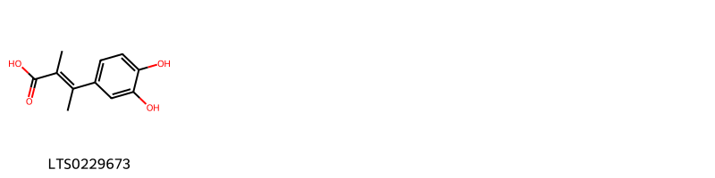{ width=100% }
    <figcaption>Hình ảnh cấu trúc hóa học của 1 hoạt chất thuộc nhóm Cinnamic acids and derivatives gồm ['(2e)-3-(3,4-dihydroxyphenyl)-2-methylbut-2-enoic acid (LTS0229673)'].</figcaption>
</figure>
#### Nhóm Cyclobutane lignans
<figure markdown="span">
    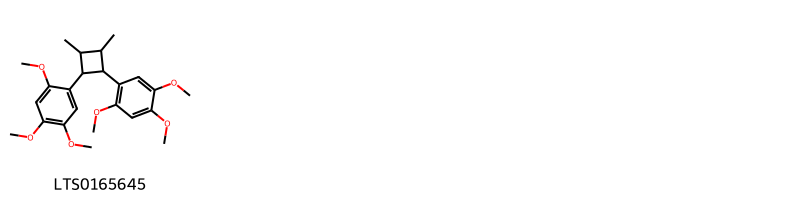{ width=100% }
    <figcaption>Hình ảnh cấu trúc hóa học của 1 hoạt chất thuộc nhóm Cyclobutane lignans gồm ['1-[2,3-dimethyl-4-(2,4,5-trimethoxyphenyl)cyclobutyl]-2,4,5-trimethoxybenzene (LTS0165645)'].</figcaption>
</figure>
#### Nhóm Dioxolanes
<figure markdown="span">
    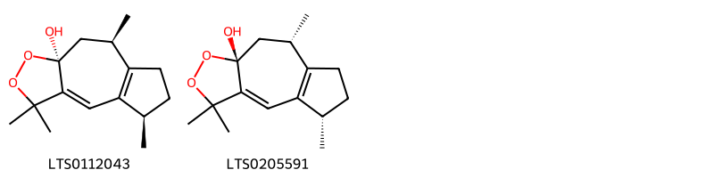{ width=100% }
    <figcaption>Hình ảnh cấu trúc hóa học của 2 hoạt chất thuộc nhóm Dioxolanes gồm ['(+)-dioxosarcoguaiacol, (rel)- (LTS0112043)', '(5s,8s,9ar)-3,3,5,8-tetramethyl-5h,6h,7h,8h,9h-azuleno[6,5-c][1,2]dioxol-9a-ol (LTS0205591)'].</figcaption>
</figure>
#### Nhóm Fatty Acyls
<figure markdown="span">
    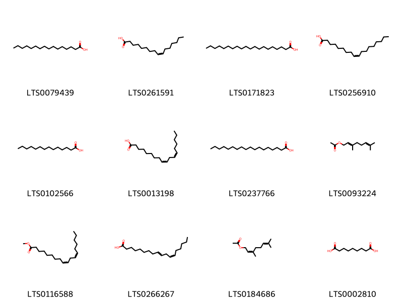{ width=100% }
    <figcaption>Hình ảnh cấu trúc hóa học của 12 hoạt chất thuộc nhóm Fatty Acyls gồm ['palmitic acid (LTS0079439)', 'palmitoleic acid (LTS0261591)', 'arachidic acid (LTS0171823)', 'oleic acid (LTS0256910)', 'myristic acid (LTS0102566)', 'linoleic (LTS0013198)', 'stearic acid (LTS0237766)', 'geranyl acetate (LTS0093224)', 'methyl linoleate (LTS0116588)', '10-trans,12-cis-linoleic acid (LTS0266267)', '3,7-dimethylocta-2,6-dien-1-yl acetate (LTS0184686)', 'azelaic acid (LTS0002810)'].</figcaption>
</figure>
#### Nhóm Flavonoids
<figure markdown="span">
    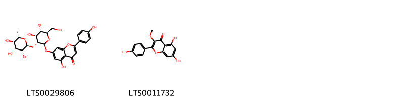{ width=100% }
    <figcaption>Hình ảnh cấu trúc hóa học của 2 hoạt chất thuộc nhóm Flavonoids gồm ['rhoifolin (LTS0029806)', 'isokaempferide (LTS0011732)'].</figcaption>
</figure>
#### Nhóm Furanoid lignans
<figure markdown="span">
    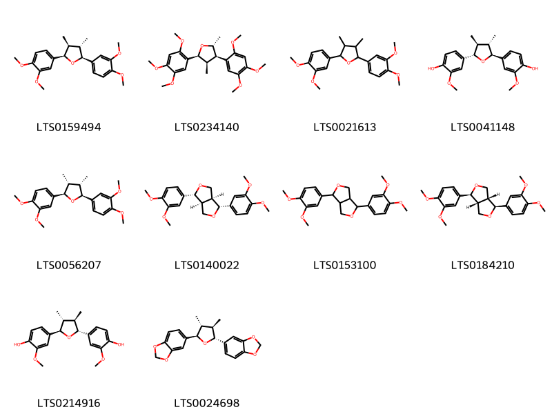{ width=100% }
    <figcaption>Hình ảnh cấu trúc hóa học của 10 hoạt chất thuộc nhóm Furanoid lignans gồm ['(+)-veraguensin (LTS0159494)', '(2r,3r,4r,5s)-2,4-dimethyl-3,5-bis(2,4,5-trimethoxyphenyl)oxolane (LTS0234140)', '2,5-bis(3,4-dimethoxyphenyl)-3,4-dimethyloxolane (LTS0021613)', '4-[(2s,3s,4s,5s)-5-(4-hydroxy-3-methoxyphenyl)-3,4-dimethyloxolan-2-yl]-2-methoxyphenol (LTS0041148)', '(2r,3r,4s,5s)-2,5-bis(3,4-dimethoxyphenyl)-3,4-dimethyloxolane (LTS0056207)', '(1r,3as,4r,6as)-1,4-bis(3,4-dimethoxyphenyl)-hexahydrofuro[3,4-c]furan (LTS0140022)', '1,4-bis(3,4-dimethoxyphenyl)-hexahydrofuro[3,4-c]furan (LTS0153100)', 'eudesmin (LTS0184210)', '4-[(2r,3r,4r,5r)-5-(4-hydroxy-3-methoxyphenyl)-3,4-dimethyloxolan-2-yl]-2-methoxyphenol (LTS0214916)', '(+)-galbacin (LTS0024698)'].</figcaption>
</figure>
#### Nhóm Glycerolipids
<figure markdown="span">
    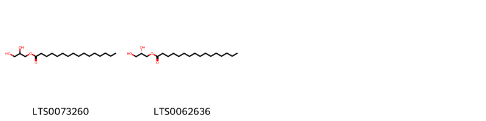{ width=100% }
    <figcaption>Hình ảnh cấu trúc hóa học của 2 hoạt chất thuộc nhóm Glycerolipids gồm ['glyceryl palmitate (LTS0073260)', '1-hexadecanoyl-sn-glycerol (LTS0062636)'].</figcaption>
</figure>
#### Nhóm Hydroxy acids and derivatives
<figure markdown="span">
    { width=100% }
    <figcaption>Hình ảnh cấu trúc hóa học của 2 hoạt chất thuộc nhóm Hydroxy acids and derivatives gồm ['(-)-malic acid (LTS0128885)', 'malic acid (LTS0216520)'].</figcaption>
</figure>
#### Nhóm Indanes
<figure markdown="span">
    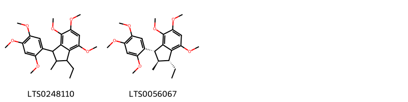{ width=100% }
    <figcaption>Hình ảnh cấu trúc hóa học của 2 hoạt chất thuộc nhóm Indanes gồm ['1-ethyl-4,5,7-trimethoxy-2-methyl-3-(2,4,5-trimethoxyphenyl)-2,3-dihydro-1h-indene (LTS0248110)', '(1r,2r,3r)-1-ethyl-4,5,7-trimethoxy-2-methyl-3-(2,4,5-trimethoxyphenyl)-2,3-dihydro-1h-indene (LTS0056067)'].</figcaption>
</figure>
#### Nhóm Lignan lactones
<figure markdown="span">
    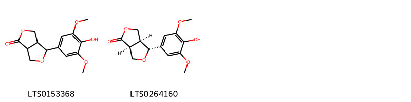{ width=100% }
    <figcaption>Hình ảnh cấu trúc hóa học của 2 hoạt chất thuộc nhóm Lignan lactones gồm ['4-(4-hydroxy-3,5-dimethoxyphenyl)-tetrahydro-3h-furo[3,4-c]furan-1-one (LTS0153368)', '(3as,4r,6as)-4-(4-hydroxy-3,5-dimethoxyphenyl)-tetrahydro-3h-furo[3,4-c]furan-1-one (LTS0264160)'].</figcaption>
</figure>
#### Nhóm Organonitrogen compounds
<figure markdown="span">
    { width=100% }
    <figcaption>Hình ảnh cấu trúc hóa học của 1 hoạt chất thuộc nhóm Organonitrogen compounds gồm ['choline (LTS0170307)'].</figcaption>
</figure>
#### Nhóm Organooxygen compounds
<figure markdown="span">
    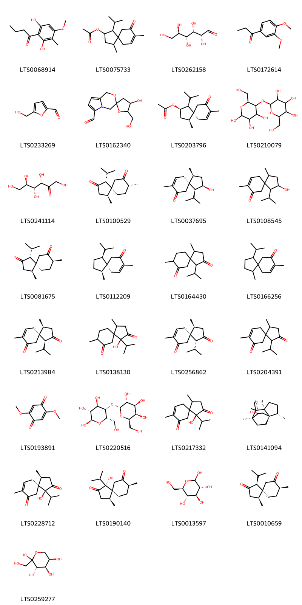{ width=100% }
    <figcaption>Hình ảnh cấu trúc hóa học của 29 hoạt chất thuộc nhóm Organooxygen compounds gồm ['aspidinol (LTS0068914)', '1-isopropyl-4,8-dimethyl-9-oxospiro[4.5]dec-7-en-2-yl acetate (LTS0075733)', '(+)-glucose (LTS0262158)', '1-(3,4-dimethoxyphenyl)propan-1-one (LTS0172614)', 'hydroxymethylfurfural (LTS0233269)', "4-hydroxy-5-(hydroxymethyl)-1',4'-dihydrospiro[oxolane-2,3'-pyrrolo[2,1-c][1,4]oxazine]-6'-carbaldehyde (LTS0162340)", '(1s,2r,4s,5s)-1-isopropyl-4,8-dimethyl-9-oxospiro[4.5]dec-7-en-2-yl acetate (LTS0203796)', 'starch (LTS0210079)', 'keto-d-fructose (LTS0241114)', '(1r,4s,5s,8r)-1-isopropyl-4,8-dimethylspiro[4.5]decane-2,7-dione (LTS0100529)', '(1s,2r,4s,5s)-2-hydroxy-1-isopropyl-4,8-dimethylspiro[4.5]dec-8-en-7-one (LTS0037695)', '2-hydroxy-1-isopropyl-4,8-dimethylspiro[4.5]dec-8-en-7-one (LTS0108545)', '(1r,4s,5s,8s)-1-isopropyl-4,8-dimethylspiro[4.5]decane-2,7-dione (LTS0081675)', '(-)-acorenone (LTS0112209)', '1-isopropyl-4,8-dimethylspiro[4.5]decane-2,7-dione (LTS0164430)', '1-isopropyl-4,8-dimethylspiro[4.5]dec-8-en-7-one (LTS0166256)', '(1s,4s,5s)-1-isopropyl-4,8-dimethylspiro[4.5]dec-8-ene-2,7-dione (LTS0213984)', '1-hydroxy-1-isopropyl-4,8-dimethylspiro[4.5]decane-2,7-dione (LTS0138130)', '(1r,4s,5s)-1-isopropyl-4,8-dimethylspiro[4.5]dec-8-ene-2,7-dione (LTS0256862)', '1-isopropyl-4,8-dimethylspiro[4.5]dec-8-ene-2,7-dione (LTS0204391)', '2,5-dimethoxy-4-benzoquinone (LTS0193891)', '(2r,3r,4r,5s,6s)-6-(hydroxymethyl)-5-{[(2r,3r,4s,5r,6r)-3,4,5-trihydroxy-6-(hydroxymethyl)oxan-2-yl]oxy}oxane-2,3,4-triol (LTS0220516)', '1-hydroxy-1-isopropyl-4,8-dimethylspiro[4.5]dec-8-ene-2,7-dione (LTS0217332)', '(1s,2s,5s,7s,8s)-2,6,6,7-tetramethyltricyclo[5.2.2.0¹,⁵]undecan-8-ol (LTS0141094)', '(1s,4s,5s)-1-hydroxy-1-isopropyl-4,8-dimethylspiro[4.5]dec-8-ene-2,7-dione (LTS0228712)', '(1r,4s,5s,8s)-1-hydroxy-1-isopropyl-4,8-dimethylspiro[4.5]decane-2,7-dione (LTS0190140)', 'glucose (LTS0013597)', '(1s,4s,5s,8s)-1-isopropyl-4,8-dimethylspiro[4.5]decane-2,7-dione (LTS0010659)', 'd-fructopyranose (LTS0259277)'].</figcaption>
</figure>
#### Nhóm Phenol ethers
<figure markdown="span">
    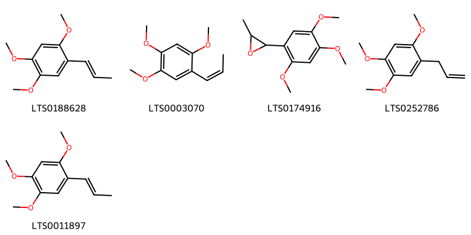{ width=100% }
    <figcaption>Hình ảnh cấu trúc hóa học của 5 hoạt chất thuộc nhóm Phenol ethers gồm ['cis-asarone (LTS0188628)', 'β-asarone (LTS0003070)', '2-methyl-3-(2,4,5-trimethoxyphenyl)oxirane (LTS0174916)', '1,2,4-trimethoxy-5-(prop-2-en-1-yl)benzene (LTS0252786)', '1,2,4-trimethoxy-5-(prop-1-en-1-yl)benzene (LTS0011897)'].</figcaption>
</figure>
#### Nhóm Phenols
<figure markdown="span">
    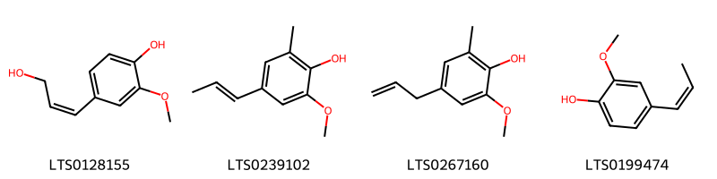{ width=100% }
    <figcaption>Hình ảnh cấu trúc hóa học của 4 hoạt chất thuộc nhóm Phenols gồm ['4-[(1z)-3-hydroxyprop-1-en-1-yl]-2-methoxyphenol (LTS0128155)', '6-methylisoeugenol (LTS0239102)', '6-methyleugenol (LTS0267160)', 'cis-isoeugenol (LTS0199474)'].</figcaption>
</figure>
#### Nhóm Prenol lipids
<figure markdown="span">
    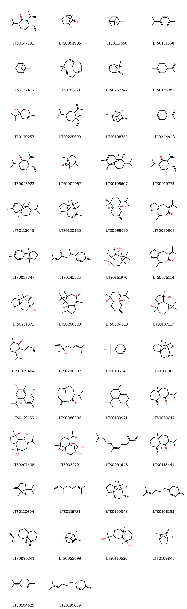{ width=100% }
    <figcaption>Hình ảnh cấu trúc hóa học của 116 hoạt chất thuộc nhóm Prenol lipids gồm ['(2r,3s,6s)-3-ethenyl-6-isopropyl-2-(prop-1-en-2-yl)cyclohexan-1-one (LTS0147891)', 'camphor (LTS0091905)', 'β-pinene (LTS0117550)', 'cymene (LTS0181568)', 'α pinene (LTS0132416)', 'humulene (LTS0263171)', 'camphene (LTS0267242)', 'limonene,  (LTS0155981)', '(+)-4-terpineol (LTS0140257)', 'β-elemene (LTS0225699)', '(-)-β-pinene (LTS0108757)', 'α-limonene (LTS0244943)', '(2s,3s,6s)-3-ethenyl-6-isopropyl-2-(prop-1-en-2-yl)cyclohexan-1-one (LTS0025923)', 'd-camphor (LTS0002057)', '(1r,2s,6s,7s,8r)-8-isopropyl-1,3-dimethyltricyclo[4.4.0.0²,⁷]dec-3-ene (LTS0106607)', '3-ethenyl-6-isopropyl-2-(prop-1-en-2-yl)cyclohexan-1-one (LTS0019773)', '(1r,6s,7s)-8-isopropyl-1,3-dimethyltricyclo[4.4.0.0²,⁷]dec-3-ene (LTS0115648)', 'cedrene (LTS0120985)', '(1r,4s,4ar,8as)-4-isopropyl-1-methyl-6-methylidene-hexahydro-2h-naphthalene-1,4a-diol (LTS0099635)', '1,4-dimethyl-7-(propan-2-ylidene)-1,2,3,4,5,8-hexahydroazulen-6-one (LTS0030968)', 'cuparene (LTS0028747)', '2-methyl-6-(4-methylidenecyclohex-2-en-1-yl)hept-2-en-4-one (LTS0145225)', '(1ar,4r,4ar,7r,7as,7br)-1,1,4,7-tetramethyl-octahydrocyclopropa[e]azulene-4,7-diol (LTS0161970)', '(1r,4r)-1,4-dimethyl-7-(propan-2-ylidene)-1,2,3,4,5,8-hexahydroazulen-6-one (LTS0076114)', 'cedrol (LTS0251071)', '(1ar,7r,7as,7br)-1,1,4,7-tetramethyl-1ah,2h,5h,6h,7h,7ah,7bh-cyclopropa[e]azulen-3-one (LTS0266320)', '4-isopropyl-1-methyl-6-methylidene-hexahydro-2h-naphthalene-1,4a-diol (LTS0004913)', '1,1,4,7-tetramethyl-octahydrocyclopropa[e]azulene-4,7-diol (LTS0107117)', '3-isopropyl-6-methyl-2-(3-methylbut-3-en-1-yl)cyclohex-2-en-1-one (LTS0029404)', '(-)-linalool (LTS0200382)', 'terpineol (LTS0136148)', '(1r,2r,5s,7r)-2,6,6,8-tetramethyltricyclo[5.3.1.0¹,⁵]undec-8-ene (LTS0188060)', '(1r,4ar,5s,7s)-5-isopropyl-3,8-dimethyl-1,2,4a,5,6,7-hexahydronaphthalene-1,7-diol (LTS0129166)', '(+)-preisocalamenediol (LTS0086036)', '4-isopropyl-1,6-dimethyl-3,4,4a,7-tetrahydronaphthalene (LTS0130921)', '2-isopropyl-4a-methyl-8-methylidene-hexahydro-2h-naphthalen-1-one (LTS0080817)', '7-isopropyl-1,4-dimethyl-octahydroazulene-1,4,8-triol (LTS0207438)', '(1r,2s,5r,6s,9r,10s)-2-isopropyl-5-methyl-11-oxatricyclo[7.2.1.0¹,⁶]dodecane-5,9,10-triol (LTS0032791)', 'β-farnesene (LTS0091648)', 'acolamone (LTS0113441)', '(+)-sabinene (LTS0110694)', 'α-myrcene (LTS0115731)', '(1r,2r,5s,7r)-2,6,6-trimethyl-8-methylidenetricyclo[5.3.1.0¹,⁵]undecane (LTS0199043)', 'β-sesquiphellandrene (LTS0106193)', 'β-selinene (LTS0096341)', '(-)-α-pinene (LTS0032699)', '7-(2-hydroxypropan-2-yl)-1,4a-dimethyl-octahydronaphthalen-1-ol (LTS0110530)', '(+)-camphene (LTS0109845)', 'terpinolene (LTS0104525)', '3-[(2s)-6-methylhept-5-en-2-yl]-6-methylidenecyclohex-1-ene (LTS0195839)', '(2r,4ar,8as)-2-isopropyl-4a-methyl-8-methylidene-hexahydro-2h-naphthalen-1-one (LTS0143966)', '(1as,4ar,7s,7ar,7bs)-1,1,4,7-tetramethyl-1ah,2h,4ah,5h,6h,7h,7ah,7bh-cyclopropa[e]azulene (LTS0192172)', '(2r,4ar,8ar)-2-isopropyl-4a,8-dimethyl-2,3,4,5,6,8a-hexahydronaphthalen-1-one (LTS0139814)', 'proximadiol (LTS0133156)', '4-isopropyl-1,6-dimethyl-2,3,4,4a,7,8-hexahydronaphthalene (LTS0270743)', '(3r,6e)-nerolidol (LTS0145065)', '(1s,4s,4as,6r,8ar)-4-isopropyl-1,6-dimethyl-octahydronaphthalene-1,6-diol (LTS0146428)', '4-isopropyl-1,6-dimethyl-3,4,4a,7,8,8a-hexahydronaphthalene (LTS0154650)', '3-ethenyl-6-isopropyl-3-methyl-2-(prop-1-en-2-yl)cyclohexan-1-one (LTS0138920)', '5-hydroxy-2-isopropyl-4a,8-dimethyl-2,3,4,5,6,7-hexahydronaphthalen-1-one (LTS0153030)', '(1s,3ar,4r,7s,8r,8ar)-4-ethoxy-7-isopropyl-1,4-dimethyl-octahydroazulene-1,8-diol (LTS0083570)', '1-(4-hydroxy-7-isopropyl-4-methyl-octahydroinden-1-yl)ethanone (LTS0119894)', '(4s,4as)-4-isopropyl-1,6-dimethyl-3,4,4a,7-tetrahydronaphthalene (LTS0098195)', '(1r,4s,4as,6r,8ar)-4-isopropyl-1,6-dimethyl-hexahydro-2h-naphthalene-1,4a,6-triol (LTS0104888)', '(2r,4ar,5r,8as)-4a-hydroxy-2,5-dimethyl-8-(propan-2-ylidene)-hexahydronaphthalene-1,7-dione (LTS0234455)', '(+)-gamma-cadinene (LTS0103949)', '(1r,2r,5r)-2-methyl-5-(prop-1-en-2-yl)cyclohexyl acetate (LTS0174962)', '(1r,4r,4as,6r,8as)-4-isopropyl-1,6-dimethyl-hexahydro-2h-naphthalene-1,6,8a-triol (LTS0117149)', '(-)-α-curcumene (LTS0216936)', '(-)-isoshyobunone (LTS0268112)', '10-isopropyl-3,7-dimethylcyclodeca-2,6-dien-1-one (LTS0196979)', '(1s,3ar,7s,8r,8ar)-7-isopropyl-1-methyl-4-methylidene-octahydroazulene-1,8-diol (LTS0194689)', 'β-farnesene (LTS0067925)', '(1s,4s,4as,8ar)-4-isopropyl-1,6-dimethyl-3,4,4a,7,8,8a-hexahydro-2h-naphthalen-1-ol (LTS0234538)', '(1s,3ar,7s,8r,8ar)-7-isopropyl-1,4-dimethyl-3,3a,6,7,8,8a-hexahydro-2h-azulene-1,8-diol (LTS0260746)', 'β-caryophyllene oxide (LTS0213960)', '1,4-dimethyl-7-(propan-2-ylidene)-2,3,3a,4,5,8-hexahydroazulen-6-one (LTS0226581)', '(1s,3ar,4r,7s,8r,8ar)-7-isopropyl-1,4-dimethyl-octahydroazulene-1,4,8-triol (LTS0207765)', '(1ar,7r,7ar,7bs)-1,1,7,7a-tetramethyl-1ah,2h,3h,5h,6h,7h,7bh-cyclopropa[a]naphthalene (LTS0234436)', '7-isopropyl-1-methyl-4-methylidene-octahydroazulene-1,8-diol (LTS0046165)', 'α-thujene (LTS0185078)', '(1s,4s,4ar,8as)-4-isopropyl-1-methyl-6-methylidene-hexahydro-2h-naphthalene-1,4a-diol (LTS0038890)', '(1r,4s,4ar)-4-isopropyl-1-methyl-6-methylidene-hexahydro-2h-naphthalene-1,4a-diol (LTS0037664)', '(2e,6e,10r)-10-isopropyl-3,7-dimethylcyclodeca-2,6-dien-1-one (LTS0236380)', '(4z)-5,9-dimethyl-2-(prop-1-en-2-yl)deca-4,8-dien-1-ol (LTS0063111)', '(-)-germacrene a (LTS0022487)', '2-isopropyl-4a,8-dimethyl-2,3,4,5,6,8a-hexahydronaphthalen-1-one (LTS0173913)', 'β-ocimene (LTS0242381)', '(2r,3s,6s)-3-ethenyl-6-isopropyl-3-methyl-2-(prop-1-en-2-yl)cyclohexan-1-one (LTS0156272)', '7-isopropyl-1,4-dimethyl-3,3a,6,7,8,8a-hexahydro-2h-azulene-1,8-diol (LTS0254923)', '(1ar,4s,4ar,7r,7ar,7bs)-1,1,4,7-tetramethyl-decahydrocyclopropa[e]azulene (LTS0244850)', '3-ethenyl-6-isopropyl-3-methyl-2-(propan-2-ylidene)cyclohexan-1-one (LTS0251606)', '(+)-α-terpineol (LTS0258249)', '5,7-dihydroxy-2-isopropyl-4a,8-dimethyl-2,3,4,5,6,7-hexahydronaphthalen-1-one (LTS0007192)', '(+)-β-cedrene (LTS0009064)', '(1s,1as,1bs,5r,5ar,6ar)-1-isopropyl-5a-methyl-2-methylidene-octahydrocyclopropa[a]inden-5-ol (LTS0013574)', '2-isopropyl-5-methyl-11-oxatricyclo[7.2.1.0¹,⁶]dodecane-5,9,10-triol (LTS0134442)', '(4s,4as,8as)-4-isopropyl-1,6-dimethyl-3,4,4a,7,8,8a-hexahydronaphthalene (LTS0014980)', '(3ar,4s)-1,4-dimethyl-7-(propan-2-ylidene)-2,3,3a,4,5,8-hexahydroazulen-6-one (LTS0052280)', 'dihydrocarvyl acetate (LTS0126582)', '(1ar,7r,7ar,7bs)-1,1,7,7a-tetramethyl-1ah,2h,4h,5h,6h,7h,7bh-cyclopropa[a]naphthalene (LTS0261904)', 'cedrene (LTS0023956)', 'bicyclogermacrene (LTS0099340)', '(2s,4ar,5r)-5-hydroxy-2-isopropyl-4a,8-dimethyl-2,3,4,5,6,7-hexahydronaphthalen-1-one (LTS0025879)', 'delta-cadinene (LTS0019321)', '(1r,4s,4as,8ar)-4-isopropyl-1,6-dimethyl-3,4,4a,7,8,8a-hexahydro-2h-naphthalen-1-ol (LTS0087313)', 'α-selinene (LTS0024564)', '(2r,3r,6s)-3-ethenyl-6-isopropyl-3-methyl-2-(prop-1-en-2-yl)cyclohexan-1-one (LTS0231932)', '(+)-shyobunone (LTS0097992)', '(-)-β-curcumene (LTS0027873)', '(2s,4ar,5r,7r)-5,7-dihydroxy-2-isopropyl-4a,8-dimethyl-2,3,4,5,6,7-hexahydronaphthalen-1-one (LTS0028210)', '(1s,1as,1bs,5r,5ar)-1-isopropyl-5a-methyl-2-methylidene-octahydrocyclopropa[a]inden-5-ol (LTS0091451)', '(z)-β-farnesene (LTS0254048)', '(+)-α-thujene (LTS0272912)', '(4s,4ar)-4-isopropyl-1,6-dimethyl-3,4,4a,7-tetrahydronaphthalene (LTS0116393)', '2-isopropyl-5-methyl-9-methylidenecyclodec-5-en-1-one (LTS0257046)'].</figcaption>
</figure>
#### Nhóm Steroids and steroid derivatives
<figure markdown="span">
    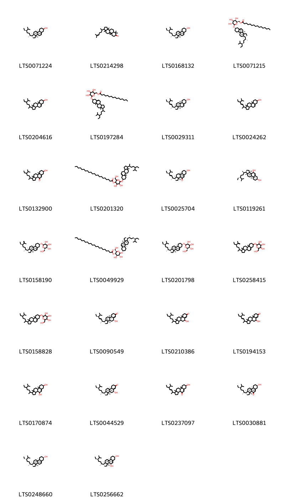{ width=100% }
    <figcaption>Hình ảnh cấu trúc hóa học của 26 hoạt chất thuộc nhóm Steroids and steroid derivatives gồm ['stigmast-5-en-3-ol (LTS0071224)', '7,7,12,16-tetramethyl-15-(6-methylhept-5-en-2-yl)pentacyclo[9.7.0.0¹,³.0³,⁸.0¹²,¹⁶]octadecan-6-one (LTS0214298)', 'sitosterol (LTS0168132)', 'sitoindoside i (LTS0071215)', 'stigmast-5-en-3-ol, (3β)- (LTS0204616)', '(6-{[1-(5-ethyl-6-methylheptan-2-yl)-9a,11a-dimethyl-1h,2h,3h,3ah,3bh,4h,6h,7h,8h,9h,9bh,10h,11h-cyclopenta[a]phenanthren-7-yl]oxy}-3,4,5-trihydroxyoxan-2-yl)methyl hexadecanoate (LTS0197284)', 'phytosterol (LTS0029311)', 'stigmasterol (LTS0024262)', '1-(5-ethyl-6-methylheptan-2-yl)-7-hydroxy-9a,11a-dimethyl-1h,2h,3h,3ah,3bh,6h,7h,8h,9h,9bh,10h,11h-cyclopenta[a]phenanthren-4-one (LTS0132900)', '6-{[1-(5-ethyl-6-methylheptan-2-yl)-9a,11a-dimethyl-1h,2h,3h,3ah,3bh,4h,6h,7h,8h,9h,9bh,10h,11h-cyclopenta[a]phenanthren-7-yl]oxy}-4,5-dihydroxy-2-(hydroxymethyl)oxan-3-yl docosanoate (LTS0201320)', '(1r,3as,3bs,7s,9ar,9bs,11ar)-1-[(2r,3e,5s)-5-ethyl-6-methylhept-3-en-2-yl]-7-hydroxy-9a,11a-dimethyl-1h,2h,3h,3ah,3bh,6h,7h,8h,9h,9bh,10h,11h-cyclopenta[a]phenanthren-4-one (LTS0025704)', '7β-hydroxysitosterol (LTS0119261)', '(2r,3r,4s,5s,6r)-2-{[(1r,3as,3bs,7s,9ar,9bs,11ar)-1-[(2r,5r)-5-ethyl-6-methylhept-6-en-2-yl]-9a,11a-dimethyl-1h,2h,3h,3ah,3bh,4h,6h,7h,8h,9h,9bh,10h,11h-cyclopenta[a]phenanthren-7-yl]oxy}-6-(hydroxymethyl)oxane-3,4,5-triol (LTS0158190)', '(2r,3s,4r,5r,6r)-6-{[(1r,3as,3bs,7s,9ar,9bs,11ar)-1-[(2r,5r)-5-ethyl-6-methylheptan-2-yl]-9a,11a-dimethyl-1h,2h,3h,3ah,3bh,4h,6h,7h,8h,9h,9bh,10h,11h-cyclopenta[a]phenanthren-7-yl]oxy}-4,5-dihydroxy-2-(hydroxymethyl)oxan-3-yl docosanoate (LTS0049929)', 'sitogluside (LTS0201798)', '2-{[1-(5-ethyl-6-methylhept-6-en-2-yl)-9a,11a-dimethyl-1h,2h,3h,3ah,3bh,4h,6h,7h,8h,9h,9bh,10h,11h-cyclopenta[a]phenanthren-7-yl]oxy}-6-(hydroxymethyl)oxane-3,4,5-triol (LTS0258415)', '2-{[1-(5-ethyl-6-methylheptan-2-yl)-9a,11a-dimethyl-1h,2h,3h,3ah,3bh,4h,6h,7h,8h,9h,9bh,10h,11h-cyclopenta[a]phenanthren-7-yl]oxy}-6-(hydroxymethyl)oxane-3,4,5-triol (LTS0158828)', '(1r,3as,3bs,5r,9ar,9bs,11ar)-1-[(2r,3e,5s)-5-ethyl-6-methylhept-3-en-2-yl]-5-hydroxy-9a,11a-dimethyl-1h,2h,3h,3ah,3bh,4h,5h,8h,9h,9bh,10h,11h-cyclopenta[a]phenanthren-7-one (LTS0090549)', '1-(5-ethyl-6-methylheptan-2-yl)-5-hydroxy-9a,11a-dimethyl-1h,2h,3h,3ah,3bh,4h,5h,8h,9h,9bh,10h,11h-cyclopenta[a]phenanthren-7-one (LTS0210386)', '1-(5-ethyl-6-methylhept-3-en-2-yl)-5-hydroxy-9a,11a-dimethyl-1h,2h,3h,3ah,3bh,4h,5h,8h,9h,9bh,10h,11h-cyclopenta[a]phenanthren-7-one (LTS0194153)', '1-(5-ethyl-6-methylheptan-2-yl)-9a,11a-dimethyl-1h,2h,3h,3ah,3bh,4h,6h,7h,8h,9h,9bh,10h,11h-cyclopenta[a]phenanthrene-4,7-diol (LTS0170874)', '(1r,3as,3bs,5r,9ar,9bs,11ar)-1-[(2r,5r)-5-ethyl-6-methylheptan-2-yl]-5-hydroxy-9a,11a-dimethyl-1h,2h,3h,3ah,3bh,4h,5h,8h,9h,9bh,10h,11h-cyclopenta[a]phenanthren-7-one (LTS0044529)', '1-(5-ethyl-6-methylhept-3-en-2-yl)-7-hydroxy-9a,11a-dimethyl-1h,2h,3h,3ah,3bh,6h,7h,8h,9h,9bh,10h,11h-cyclopenta[a]phenanthren-4-one (LTS0237097)', '(1r,3as,3bs,7s,9ar,9bs,11ar)-1-[(2r,5r)-5-ethyl-6-methylheptan-2-yl]-7-hydroxy-9a,11a-dimethyl-1h,2h,3h,3ah,3bh,6h,7h,8h,9h,9bh,10h,11h-cyclopenta[a]phenanthren-4-one (LTS0030881)', 'clionasterol (LTS0248660)', '(1r,3as,3bs,4s,7s,9ar,9bs,11ar)-1-[(2r,5r)-5-ethyl-6-methylheptan-2-yl]-9a,11a-dimethyl-1h,2h,3h,3ah,3bh,4h,6h,7h,8h,9h,9bh,10h,11h-cyclopenta[a]phenanthrene-4,7-diol (LTS0256662)'].</figcaption>
</figure>
#### Nhóm Tropones
<figure markdown="span">
    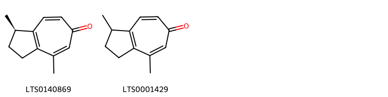{ width=100% }
    <figcaption>Hình ảnh cấu trúc hóa học của 2 hoạt chất thuộc nhóm Tropones gồm ['(1r)-1,4-dimethyl-2,3-dihydro-1h-azulen-6-one (LTS0140869)', '1,4-dimethyl-2,3-dihydro-1h-azulen-6-one (LTS0001429)'].</figcaption>
</figure>
#### Nhóm Unsaturated hydrocarbons
<figure markdown="span">
    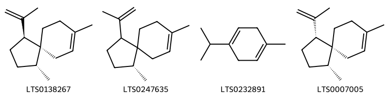{ width=100% }
    <figcaption>Hình ảnh cấu trúc hóa học của 4 hoạt chất thuộc nhóm Unsaturated hydrocarbons gồm ['(1r,4s,5r)-1,8-dimethyl-4-(prop-1-en-2-yl)spiro[4.5]dec-7-ene (LTS0138267)', '(1r)-1,8-dimethyl-4-(prop-1-en-2-yl)spiro[4.5]dec-7-ene (LTS0247635)', 'α terpinene (LTS0232891)', '(1r,4r,5r)-1,8-dimethyl-4-(prop-1-en-2-yl)spiro[4.5]dec-7-ene (LTS0007005)'].</figcaption>
</figure>

---

### Dược dân tộc học

Danh sách các quốc gia có sử dụng *Acorus calamus* trong điều trị các bệnh. 

| Country        | Disease                                                                                                                    | Bệnh                                                                                                                             |
|:---------------|:---------------------------------------------------------------------------------------------------------------------------|:---------------------------------------------------------------------------------------------------------------------------------|
| Arabic         | Emetic                                                                                                                     | Phôi                                                                                                                             |
| Brazil         | Vermifuge                                                                                                                  | Thuốc diệt sán                                                                                                                   |
| China          | Carminative, Expectorant, Laxative, Vermifuge, Alexiteric                                                                  | Carminative, đờm, nhuận tràng, Vermifuge, Alexiteric                                                                             |
| Danish         | Digestive                                                                                                                  | tiêu                                                                                                                             |
| Dutch          | Hemostat                                                                                                                   | Máy cầm máu                                                                                                                      |
| Egypt          | Aphrodisiac, Carminative, Emetic, Emmenagogue, Stomachic, Tonic                                                            | Kích thích tình dục, Carminative, Emetic, Emmenagogue, Dạ dày, Tonic                                                             |
| Elsewhere      | Carminative, Hallucinogen, Insecticide, Perfume, Stimulant, Stomachic, Stomachic, Tonic, Carminative, Emetic, Pediculicide | Carminative, Hallucinogen, Thuốc trừ sâu, Nước hoa, Chất kích thích, Dạ dày, Dạ dày, Thuốc bổ, Carminative, Emetic, Pediculicide |
| French         | Nervine                                                                                                                    | Thuốc an thần                                                                                                                    |
| German         | Emmenagogue                                                                                                                | Emmenagogue                                                                                                                      |
| Hungary        | Apertif                                                                                                                    | Apertif                                                                                                                          |
| India          | Sudorific                                                                                                                  | Ngạt thở                                                                                                                         |
| Iran           | Antiseptic                                                                                                                 | Khử trùng                                                                                                                        |
| Italian        | Carminative                                                                                                                | Gây ô nhiễm môi trường                                                                                                           |
| Java           | Vermifuge                                                                                                                  | Thuốc diệt sán                                                                                                                   |
| Malaysia       | Sedative                                                                                                                   | Thuốc an thần                                                                                                                    |
| Nepal          | Emetic, Emetic, Nervine, Nervine                                                                                           | Emetic, Emetic, Nervine, Nervine                                                                                                 |
| New Guinea     | Abortifacient                                                                                                              | Thuốc gây sẩy thai                                                                                                               |
| Sanscrit       | Stimulant                                                                                                                  | Chất kích thích                                                                                                                  |
| Swedish        | Stomachic                                                                                                                  | Sững sờ                                                                                                                          |
| Turkey         | Tonic                                                                                                                      | (thuộc) trương lực                                                                                                               |
| US             | Stimulant, Tonic                                                                                                           | Chất kích thích, Thuốc bổ                                                                                                        |
| US(Amerindian) | Carminative                                                                                                                | Gây ô nhiễm môi trường                                                                                                           |
| US(Appalachia) | Expectorant, Carminative                                                                                                   | Chất đờm, gây thối rữa                                                                                                           |
| US(Blackfoot)  | Carminative                                                                                                                | Gây ô nhiễm môi trường                                                                                                           |
| Yugoslavia     | Abortifacient                                                                                                              | Thuốc gây sẩy thai                                                                                                               |
| anish          | Diuretic                                                                                                                   | Thuốc lợi tiêu                                                                                                                   |

---

---
## Acorus gramineus
### Thông tin về thực vật

!!! info "Phân loại thực vật của *Acorus gramineus* từ GIBF:"
    - **Kingdom:** Plantae
    - **Phylum:** Tracheophyta
    - **Order:** Acorales
    - **Family:** Acoraceae
    - **Genus:** Acorus
    - **Species:** *Acorus gramineus*

 

| Label (VI)   | Label (EN)   | Scientific Name   | Descriptions (VI)   | Descriptions (EN)   | Also Known As (VI)   | Also Known As (EN)                                                                                                                                                   |
|:-------------|:-------------|:------------------|:--------------------|:--------------------|:---------------------|:---------------------------------------------------------------------------------------------------------------------------------------------------------------------|
| N/A          | N/A          | Acorus gramineus  | loài thực vật       | species of plant    | ['']                 | ['grass-leaf sweet-flag', 'grass-leaved sweet flag', 'grassy-leaved sweet flag', 'Japanese rush', 'Japanese sweet flag', 'Japanese sweetflag', 'slender sweet flag'] |

#### Phân bố trên thế giới

**Từ CSDL GIBF** nan, Hong Kong, Japan, United Kingdom of Great Britain and Northern Ireland, Belgium, Korea, Republic of, Germany, Chinese Taipei, Macao, United States of America, Philippines, Viet Nam, China

#### Phân bố tại Việt Nam

**Từ CSDL GIBF**: Không có ghi nhận ở Việt Nam

---
### Thành phần hóa học
        
- Theo cơ sở dữ liệu lotus: Từ loài *Acorus gramineus* đã phân lập và xác định được 89 hoạt chất thuộc về các nhóm Phenol ethers, Cyclobutane lignans, Cinnamyl alcohols, Prenol lipids, Lignan glycosides, Cinnamic acids and derivatives, Benzodioxoles, Benzene and substituted derivatives, Organooxygen compounds, Phenols, Furanoid lignans. 

|    | chemicalTaxonomyClassyfireClass     |   smiles_count |
|---:|:------------------------------------|---------------:|
|  0 |                                     |             14 |
|  1 | Benzene and substituted derivatives |              9 |
|  2 | Benzodioxoles                       |              1 |
|  3 | Cinnamic acids and derivatives      |              3 |
|  4 | Cinnamyl alcohols                   |              2 |
|  5 | Cyclobutane lignans                 |              1 |
|  6 | Furanoid lignans                    |              8 |
|  7 | Lignan glycosides                   |              1 |
|  8 | Organooxygen compounds              |              1 |
|  9 | Phenol ethers                       |             11 |
| 10 | Phenols                             |              5 |
| 11 | Prenol lipids                       |             32 |

#### Nhóm 
<figure markdown="span">
    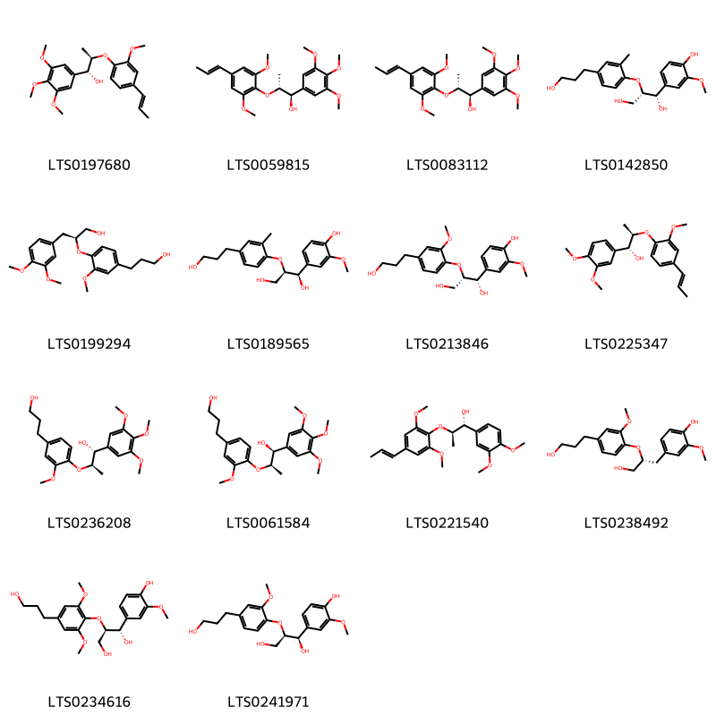{ width=100% }
    <figcaption>Hình ảnh cấu trúc hóa học của 14 hoạt chất thuộc nhóm  gồm ['surinamensin (LTS0197680)', '(1r,2r)-2-[2,6-dimethoxy-4-(prop-1-en-1-yl)phenoxy]-1-(3,4,5-trimethoxyphenyl)propan-1-ol (LTS0059815)', '(7r,8r)-polysphorin (LTS0083112)', '(1s,2s)-1-(4-hydroxy-3-methoxyphenyl)-2-[4-(3-hydroxypropyl)-2-methylphenoxy]propane-1,3-diol (LTS0142850)', 'ligraminol d (LTS0199294)', '(1r,2r)-1-(4-hydroxy-3-methoxyphenyl)-2-[4-(3-hydroxypropyl)-2-methylphenoxy]propane-1,3-diol (LTS0189565)', '(1s,2s)-1-(4-hydroxy-3-methoxyphenyl)-2-[4-(3-hydroxypropyl)-2-methoxyphenoxy]propane-1,3-diol (LTS0213846)', '(1r,2r)-1-(3,4-dimethoxyphenyl)-2-{2-methoxy-4-[(1e)-prop-1-en-1-yl]phenoxy}propan-1-ol (LTS0225347)', '(1r,2r)-2-[4-(3-hydroxypropyl)-2-methoxyphenoxy]-1-(3,4,5-trimethoxyphenyl)propan-1-ol (LTS0236208)', '(1s,2r)-2-[4-(3-hydroxypropyl)-2-methoxyphenoxy]-1-(3,4,5-trimethoxyphenyl)propan-1-ol (LTS0061584)', '(1r,2r)-2-{2,6-dimethoxy-4-[(1e)-prop-1-en-1-yl]phenoxy}-1-(3,4-dimethoxyphenyl)propan-1-ol (LTS0221540)', 'ligraminol e (LTS0238492)', '(1s,2r)-1-(4-hydroxy-3-methoxyphenyl)-2-[4-(3-hydroxypropyl)-2,6-dimethoxyphenoxy]propane-1,3-diol (LTS0234616)', '(1r,2r)-1-(4-hydroxy-3-methoxyphenyl)-2-[4-(3-hydroxypropyl)-2-methoxyphenoxy]propane-1,3-diol (LTS0241971)'].</figcaption>
</figure>
#### Nhóm Benzene and substituted derivatives
<figure markdown="span">
    { width=100% }
    <figcaption>Hình ảnh cấu trúc hóa học của 9 hoạt chất thuộc nhóm Benzene and substituted derivatives gồm ['isoeugenyl methyl ether (LTS0241255)', '(z)-methyl isoeugenol (LTS0036071)', 'methyl eugenol (LTS0098881)', 'methyl isoeugenol (LTS0170487)', '2-(3,4-dimethoxyphenyl)-3-methyloxirane (LTS0122019)', '3,4-dimethoxybenzenepropanol (LTS0159608)', 'ligraminol c (LTS0082909)', '(1r,2r)-1-(3,4-dimethoxyphenyl)-2-[2-methoxy-4-(prop-1-en-1-yl)phenoxy]propyl acetate (LTS0212185)', '(2s,3s)-2-(3,4-dimethoxyphenyl)-3-methyloxirane (LTS0223729)'].</figcaption>
</figure>
#### Nhóm Benzodioxoles
<figure markdown="span">
    { width=100% }
    <figcaption>Hình ảnh cấu trúc hóa học của 1 hoạt chất thuộc nhóm Benzodioxoles gồm ['sassafras (LTS0136093)'].</figcaption>
</figure>
#### Nhóm Cinnamic acids and derivatives
<figure markdown="span">
    { width=100% }
    <figcaption>Hình ảnh cấu trúc hóa học của 3 hoạt chất thuộc nhóm Cinnamic acids and derivatives gồm ['3-(4-hydroxy-3-methoxyphenyl)-n-[2-(4-hydroxyphenyl)ethyl]prop-2-enimidic acid (LTS0240896)', '(2e)-n-[(2s)-2-hydroxy-2-(4-hydroxyphenyl)ethyl]-3-(4-hydroxy-3-methoxyphenyl)prop-2-enimidic acid (LTS0161076)', '(2z)-3-(4-hydroxy-3-methoxyphenyl)-n-[2-(4-hydroxyphenyl)ethyl]prop-2-enimidic acid (LTS0255533)'].</figcaption>
</figure>
#### Nhóm Cinnamyl alcohols
<figure markdown="span">
    { width=100% }
    <figcaption>Hình ảnh cấu trúc hóa học của 2 hoạt chất thuộc nhóm Cinnamyl alcohols gồm ['(2z)-3-(2,4,5-trimethoxyphenyl)prop-2-en-1-ol (LTS0044161)', '3-(2,4,5-trimethoxyphenyl)prop-2-en-1-ol (LTS0233079)'].</figcaption>
</figure>
#### Nhóm Cyclobutane lignans
<figure markdown="span">
    { width=100% }
    <figcaption>Hình ảnh cấu trúc hóa học của 1 hoạt chất thuộc nhóm Cyclobutane lignans gồm ['magnosalin (LTS0100649)'].</figcaption>
</figure>
#### Nhóm Furanoid lignans
<figure markdown="span">
    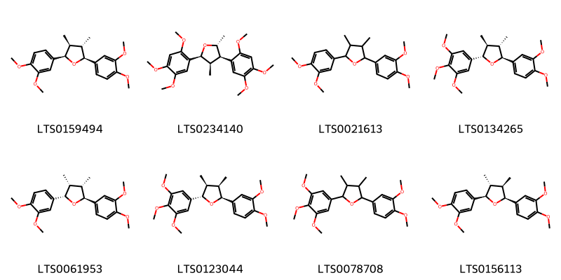{ width=100% }
    <figcaption>Hình ảnh cấu trúc hóa học của 8 hoạt chất thuộc nhóm Furanoid lignans gồm ['(+)-veraguensin (LTS0159494)', '(2r,3r,4r,5s)-2,4-dimethyl-3,5-bis(2,4,5-trimethoxyphenyl)oxolane (LTS0234140)', '2,5-bis(3,4-dimethoxyphenyl)-3,4-dimethyloxolane (LTS0021613)', '5-methoxygalbelgin (LTS0134265)', 'ganschisandrin (LTS0061953)', 'ligraminol a (LTS0123044)', '2-(3,4-dimethoxyphenyl)-3,4-dimethyl-5-(3,4,5-trimethoxyphenyl)oxolane (LTS0078708)', 'veraguensin (LTS0156113)'].</figcaption>
</figure>
#### Nhóm Lignan glycosides
<figure markdown="span">
    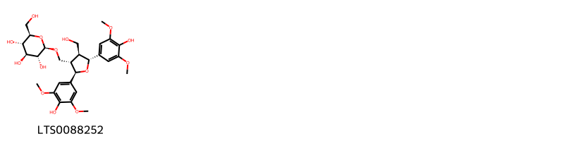{ width=100% }
    <figcaption>Hình ảnh cấu trúc hóa học của 1 hoạt chất thuộc nhóm Lignan glycosides gồm ['ligraminol b (LTS0088252)'].</figcaption>
</figure>
#### Nhóm Organooxygen compounds
<figure markdown="span">
    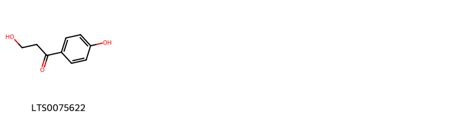{ width=100% }
    <figcaption>Hình ảnh cấu trúc hóa học của 1 hoạt chất thuộc nhóm Organooxygen compounds gồm ['3-hydroxy-1-(4-hydroxyphenyl)propan-1-one (LTS0075622)'].</figcaption>
</figure>
#### Nhóm Phenol ethers
<figure markdown="span">
    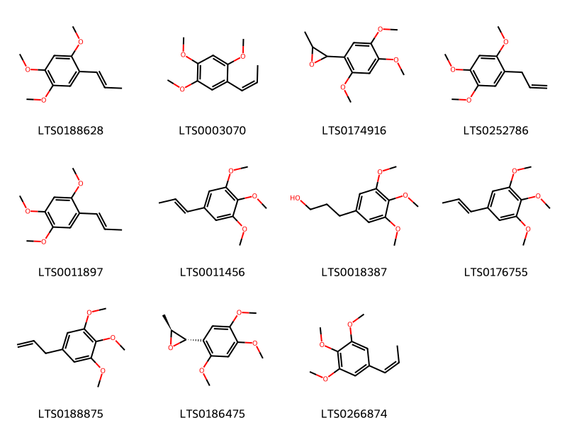{ width=100% }
    <figcaption>Hình ảnh cấu trúc hóa học của 11 hoạt chất thuộc nhóm Phenol ethers gồm ['cis-asarone (LTS0188628)', 'β-asarone (LTS0003070)', '2-methyl-3-(2,4,5-trimethoxyphenyl)oxirane (LTS0174916)', '1,2,4-trimethoxy-5-(prop-2-en-1-yl)benzene (LTS0252786)', '1,2,4-trimethoxy-5-(prop-1-en-1-yl)benzene (LTS0011897)', 'isoelemicin (LTS0011456)', '3-(3,4,5-trimethoxyphenyl)propan-1-ol (LTS0018387)', '1,2,3-trimethoxy-5-(prop-1-en-1-yl)benzene (LTS0176755)', 'elemicin (LTS0188875)', '(2s,3s)-2-methyl-3-(2,4,5-trimethoxyphenyl)oxirane (LTS0186475)', '1,2,3-trimethoxy-5-[(1z)-prop-1-en-1-yl]benzene (LTS0266874)'].</figcaption>
</figure>
#### Nhóm Phenols
<figure markdown="span">
    { width=100% }
    <figcaption>Hình ảnh cấu trúc hóa học của 5 hoạt chất thuộc nhóm Phenols gồm ['4-[(1z)-3-hydroxyprop-1-en-1-yl]-2-methoxyphenol (LTS0128155)', 'eugenol (LTS0052342)', '4-(3-hydroxyprop-1-en-1-yl)-2-methoxyphenol (LTS0256062)', '(2e)-3-(4-hydroxy-3-methoxyphenyl)-n-[2-(4-hydroxyphenyl)ethyl]prop-2-enimidic acid (LTS0187051)', 'chavibetol (LTS0244260)'].</figcaption>
</figure>
#### Nhóm Prenol lipids
<figure markdown="span">
    { width=100% }
    <figcaption>Hình ảnh cấu trúc hóa học của 32 hoạt chất thuộc nhóm Prenol lipids gồm ['(2r,3s,6s)-3-ethenyl-6-isopropyl-2-(prop-1-en-2-yl)cyclohexan-1-one (LTS0147891)', 'camphor (LTS0091905)', 'β-pinene (LTS0117550)', 'cymene (LTS0181568)', 'α pinene (LTS0132416)', 'humulene (LTS0263171)', 'camphene (LTS0267242)', 'limonene,  (LTS0155981)', '(+)-4-terpineol (LTS0140257)', 'β-elemene (LTS0225699)', '(-)-β-pinene (LTS0108757)', 'α-limonene (LTS0244943)', '(2s,3s,6s)-3-ethenyl-6-isopropyl-2-(prop-1-en-2-yl)cyclohexan-1-one (LTS0025923)', 'd-camphor (LTS0002057)', '(1r,2s,6s,7s,8r)-8-isopropyl-1,3-dimethyltricyclo[4.4.0.0²,⁷]dec-3-ene (LTS0106607)', '3-ethenyl-6-isopropyl-2-(prop-1-en-2-yl)cyclohexan-1-one (LTS0019773)', 'linalool, (+-)- (LTS0128839)', '(e)-calamene (LTS0228241)', 'α-humulene (LTS0076944)', '(-)-camphene (LTS0067556)', '(+)-linalool (LTS0196043)', '4-terpineol (LTS0253733)', 'borneol (LTS0264960)', '(+)-borneol (LTS0059936)', 'β-elemene (LTS0260361)', 'α-copaene (LTS0207598)', '(+)-α-pinene (LTS0211102)', '4-isopropyl-1,6-dimethyl-3,4,4a,5,8,8a-hexahydronaphthalene (LTS0032357)', '(4s,4ar,8ar)-4-isopropyl-1,6-dimethyl-3,4,4a,5,8,8a-hexahydronaphthalene (LTS0052995)', '(+)-caryophyllene (LTS0046179)', '(1r,4r)-4-isopropyl-1,6-dimethyl-1,2,3,4-tetrahydronaphthalene (LTS0012083)', '4,11,11-trimethyl-8-methylidenebicyclo[7.2.0]undec-4-ene (LTS0256716)'].</figcaption>
</figure>

---

### Dược dân tộc học

Danh sách các quốc gia có sử dụng *Acorus gramineus* trong điều trị các bệnh. 

| Country   | Disease                                                                                          | Bệnh                                                                                                           |
|:----------|:-------------------------------------------------------------------------------------------------|:---------------------------------------------------------------------------------------------------------------|
| China     | Diaphoretic, Digestive, Stimulant, Stomachic, Stomachic, Vermifuge, Tonic, Insecticide, Sedative | Thuốc mỡ, Tiêu hóa, Thuốc kích thích, Dạ dày, Dạ dày, Vermifuge, Thuốc bổ, Thuốc diệt côn trùng, Thuốc an thần |
| Elsewhere | nan                                                                                              | Ở đây                                                                                                          |

---

---
## Acorus urius
### Thông tin về thực vật

!!! info "Phân loại thực vật của *N/A* từ GIBF:"
    - **Kingdom:** Plantae
    - **Phylum:** Tracheophyta
    - **Order:** Acorales
    - **Family:** Acoraceae
    - **Genus:** Acorus
    - **Species:** *N/A*

 

| Label (VI)   | Label (EN)   | Scientific Name   | Descriptions (VI)   | Descriptions (EN)   | Also Known As (VI)   | Also Known As (EN)                                                                                                                                                   |
|:-------------|:-------------|:------------------|:--------------------|:--------------------|:---------------------|:---------------------------------------------------------------------------------------------------------------------------------------------------------------------|
| N/A          | N/A          | Acorus gramineus  | loài thực vật       | species of plant    | ['']                 | ['grass-leaf sweet-flag', 'grass-leaved sweet flag', 'grassy-leaved sweet flag', 'Japanese rush', 'Japanese sweet flag', 'Japanese sweetflag', 'slender sweet flag'] |

#### Phân bố trên thế giới

**Từ CSDL GIBF** Italy, Japan, Belgium, Norway, Canada, Ukraine, Denmark, Netherlands, Lithuania, Belarus, Chinese Taipei, Russian Federation, United States of America, Sweden, Finland, Hong Kong, Czechia, Germany, Switzerland, Austria, United Kingdom of Great Britain and Northern Ireland, China, Macao, Poland

#### Phân bố tại Việt Nam

**Từ CSDL GIBF**: Không có ghi nhận ở Việt Nam

---
### Thành phần hóa học
        
- Theo cơ sở dữ liệu lotus: Từ loài *N/A* đã phân lập và xác định được Chưa có hoạt chất nào được phân lập. hoạt chất thuộc về các nhóm Không có hoạt chất nào được phân lập. 

Không có hình ảnh nào được tạo ra

---

### Dược dân tộc học

Danh sách các quốc gia có sử dụng *N/A* trong điều trị các bệnh. 

| Country   | Disease     | Bệnh          |
|:----------|:------------|:--------------|
| China     | Insecticide | Thuốc trừ sâu |

---

