!!! abstract "Tóm tắt"

    Họ Actinidiaceae gồm khoảng 1 chi và 2 loài được một số cộng đồng tại các quốc gia như Elsewhere, China sử dụng trong một số trường hợp MYMEMORY WARNING: YOU USED ALL AVAILABLE FREE TRANSLATIONS FOR TODAY. NEXT AVAILABLE IN  08 HOURS 41 MINUTES 48 SECONDS VISIT HTTPS://MYMEMORY.TRANSLATED.NET/DOC/USAGELIMITS.PHP TO TRANSLATE MORE.

!!! info "DrDuke"

    James A. Duke sinh năm 1929-2017 là một nhà thực vật học người Mỹ. Đây là một trong những tác giả hàng đầu trong lĩnh vực dược dân tộc học với cuốn *CRC Handbook of Medicinal Herbs* và chính là người xây dựng lên cơ sở dữ liệu về hợp chất tự nhiên và dược dân tộc học tại Bộ nông nghiệp Hoa Kỳ. Các thông tin được đăng tải tại website [Dr. Duke's Phytochemical and Ethnobotanical Databases](https://phytochem.nal.usda.gov/). 
    Trong suốt thập niên 1970, ông lãnh đạo the Plant Taxonomy Laboratory, Plant Genetics and Germplasm Institute of the Agricultural Research Service, U.S. Department of Agriculture.
    Trong tài liệu này, các thông tin về dược dân tộc của các dược liệu được trích dẫn từ tài liệu của James A. Ducke với sự trợ giúp của phần mềm dịch thuật từ tiếng Anh sang tiếng Việt.
   

# Chi Actinidia

??? note "Danh sách các dược liệu thuộc chi"
    
	 - *Actinidia chinensis*
	 - *Actinidia polygama*

---
## Actinidia chinensis
### Thông tin về thực vật

!!! info "Phân loại thực vật của *Actinidia chinensis* từ GIBF:"
    - **Kingdom:** Plantae
    - **Phylum:** Tracheophyta
    - **Order:** Ericales
    - **Family:** Actinidiaceae
    - **Genus:** Actinidia
    - **Species:** *Actinidia chinensis*

 

| Label (VI)   | Label (EN)   | Scientific Name     | Descriptions (VI)   | Descriptions (EN)   | Also Known As (VI)   | Also Known As (EN)                                                         |
|:-------------|:-------------|:--------------------|:--------------------|:--------------------|:---------------------|:---------------------------------------------------------------------------|
| N/A          | N/A          | Actinidia chinensis | loài thực vật       | species of plant    | ['']                 | ['Chinese gooseberry', 'kiwi', 'kiwi fruit', 'golden kiwi', 'yellow kiwi'] |

#### Phân bố trên thế giới

**Từ CSDL GIBF** Italy, Australia, Japan, Belgium, Georgia, unknown or invalid, Denmark, Netherlands, Korea, Republic of, Chinese Taipei, Spain, United States of America, Montenegro, Germany, Switzerland, Austria, France, China, New Zealand

#### Phân bố tại Việt Nam

**Từ CSDL GIBF**: Không có ghi nhận ở Việt Nam

---
### Thành phần hóa học
        
- Theo cơ sở dữ liệu lotus: Từ loài *Actinidia chinensis* đã phân lập và xác định được 186 hoạt chất thuộc về các nhóm Naphthalenes, Hydroxy acids and derivatives, Carboxylic acids and derivatives, Fatty Acyls, Indoles and derivatives, Dibenzylbutane lignans, Diazines, Prenol lipids, Furans, Benzene and substituted derivatives, Dihydrofurans, Organooxygen compounds, Furanoid lignans, Pyridines and derivatives, Flavonoids, Steroids and steroid derivatives, Pyrans, Coumarins and derivatives, Benzopyrans, Imidazopyrimidines. 

|    | chemicalTaxonomyClassyfireClass     |   smiles_count |
|---:|:------------------------------------|---------------:|
|  0 | Benzene and substituted derivatives |             10 |
|  1 | Benzopyrans                         |              8 |
|  2 | Carboxylic acids and derivatives    |              6 |
|  3 | Coumarins and derivatives           |             10 |
|  4 | Diazines                            |              1 |
|  5 | Dibenzylbutane lignans              |              2 |
|  6 | Dihydrofurans                       |              1 |
|  7 | Fatty Acyls                         |              8 |
|  8 | Flavonoids                          |             45 |
|  9 | Furanoid lignans                    |              5 |
| 10 | Furans                              |              2 |
| 11 | Hydroxy acids and derivatives       |              1 |
| 12 | Imidazopyrimidines                  |              1 |
| 13 | Indoles and derivatives             |              1 |
| 14 | Naphthalenes                        |              1 |
| 15 | Organooxygen compounds              |             26 |
| 16 | Prenol lipids                       |             38 |
| 17 | Pyrans                              |              1 |
| 18 | Pyridines and derivatives           |              1 |
| 19 | Steroids and steroid derivatives    |             13 |

#### Nhóm Benzene and substituted derivatives
<figure markdown="span">
    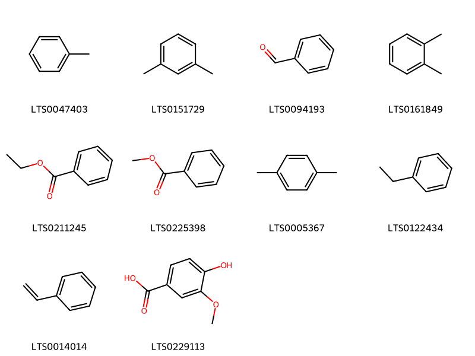{ width=100% }
    <figcaption>Hình ảnh cấu trúc hóa học của 10 hoạt chất thuộc nhóm Benzene and substituted derivatives gồm ['toluene (LTS0047403)', 'm-xylene (LTS0151729)', 'benzaldehyde (LTS0094193)', 'ortho-xylene (LTS0161849)', 'ethyl benzoate (LTS0211245)', 'methyl benzoate (LTS0225398)', 'para-xylene (LTS0005367)', 'ethylbenzene (LTS0122434)', 'styrene (LTS0014014)', 'vanillic acid (LTS0229113)'].</figcaption>
</figure>
#### Nhóm Benzopyrans
<figure markdown="span">
    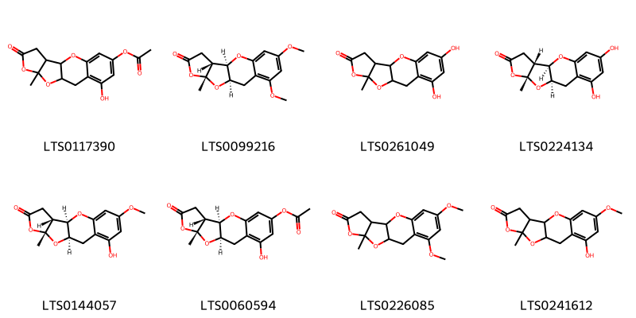{ width=100% }
    <figcaption>Hình ảnh cấu trúc hóa học của 8 hoạt chất thuộc nhóm Benzopyrans gồm ['4-hydroxy-15-methyl-13-oxo-9,14,16-trioxatetracyclo[8.6.0.0³,⁸.0¹¹,¹⁵]hexadeca-3,5,7-trien-6-yl acetate (LTS0117390)', '(1r,10r,11r,15r)-4,6-dimethoxy-15-methyl-9,14,16-trioxatetracyclo[8.6.0.0³,⁸.0¹¹,¹⁵]hexadeca-3,5,7-trien-13-one (LTS0099216)', '4,6-dihydroxy-15-methyl-9,14,16-trioxatetracyclo[8.6.0.0³,⁸.0¹¹,¹⁵]hexadeca-3,5,7-trien-13-one (LTS0261049)', '(1r,10r,11r,15r)-4,6-dihydroxy-15-methyl-9,14,16-trioxatetracyclo[8.6.0.0³,⁸.0¹¹,¹⁵]hexadeca-3,5,7-trien-13-one (LTS0224134)', '(1r,10r,11r,15r)-4-hydroxy-6-methoxy-15-methyl-9,14,16-trioxatetracyclo[8.6.0.0³,⁸.0¹¹,¹⁵]hexadeca-3,5,7-trien-13-one (LTS0144057)', '(1r,10r,11r,15r)-4-hydroxy-15-methyl-13-oxo-9,14,16-trioxatetracyclo[8.6.0.0³,⁸.0¹¹,¹⁵]hexadeca-3,5,7-trien-6-yl acetate (LTS0060594)', '4,6-dimethoxy-15-methyl-9,14,16-trioxatetracyclo[8.6.0.0³,⁸.0¹¹,¹⁵]hexadeca-3,5,7-trien-13-one (LTS0226085)', '4-hydroxy-6-methoxy-15-methyl-9,14,16-trioxatetracyclo[8.6.0.0³,⁸.0¹¹,¹⁵]hexadeca-3,5,7-trien-13-one (LTS0241612)'].</figcaption>
</figure>
#### Nhóm Carboxylic acids and derivatives
<figure markdown="span">
    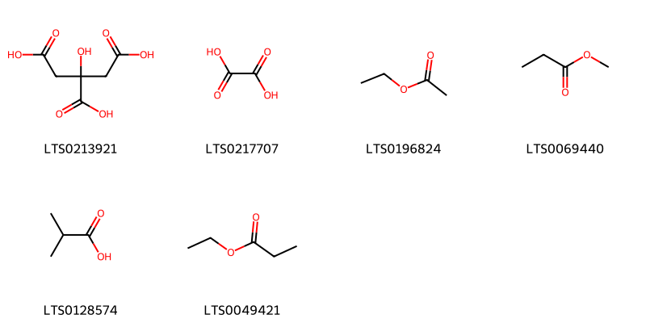{ width=100% }
    <figcaption>Hình ảnh cấu trúc hóa học của 6 hoạt chất thuộc nhóm Carboxylic acids and derivatives gồm ['citric acid (LTS0213921)', 'oxalic acid (LTS0217707)', 'ethyl acetate (LTS0196824)', 'methyl propionate (LTS0069440)', 'isobutyric acid (LTS0128574)', 'ethyl propionate (LTS0049421)'].</figcaption>
</figure>
#### Nhóm Coumarins and derivatives
<figure markdown="span">
    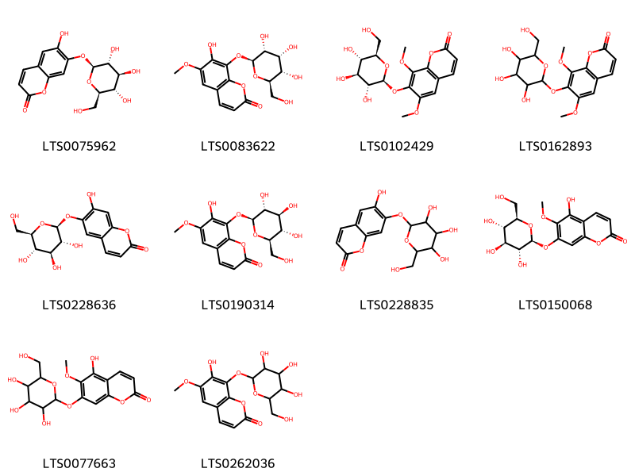{ width=100% }
    <figcaption>Hình ảnh cấu trúc hóa học của 10 hoạt chất thuộc nhóm Coumarins and derivatives gồm ['cichoriin (LTS0075962)', 'fraxin (LTS0083622)', 'isofraxidin-7-glucoside (LTS0102429)', '6,8-dimethoxy-7-{[3,4,5-trihydroxy-6-(hydroxymethyl)oxan-2-yl]oxy}chromen-2-one (LTS0162893)', 'esculin (LTS0228636)', 'fraxin (LTS0190314)', '6-hydroxy-7-{[3,4,5-trihydroxy-6-(hydroxymethyl)oxan-2-yl]oxy}chromen-2-one (LTS0228835)', '5-hydroxy-6-methoxy-7-{[(2s,3r,4s,5s,6r)-3,4,5-trihydroxy-6-(hydroxymethyl)oxan-2-yl]oxy}chromen-2-one (LTS0150068)', '5-hydroxy-6-methoxy-7-{[3,4,5-trihydroxy-6-(hydroxymethyl)oxan-2-yl]oxy}chromen-2-one (LTS0077663)', '7-hydroxy-6-methoxy-8-{[3,4,5-trihydroxy-6-(hydroxymethyl)oxan-2-yl]oxy}chromen-2-one (LTS0262036)'].</figcaption>
</figure>
#### Nhóm Diazines
<figure markdown="span">
    { width=100% }
    <figcaption>Hình ảnh cấu trúc hóa học của 1 hoạt chất thuộc nhóm Diazines gồm ['pirod (LTS0008205)'].</figcaption>
</figure>
#### Nhóm Dibenzylbutane lignans
<figure markdown="span">
    { width=100% }
    <figcaption>Hình ảnh cấu trúc hóa học của 2 hoạt chất thuộc nhóm Dibenzylbutane lignans gồm ['(2s,3r)-2,3-bis[(4-hydroxy-3-methoxyphenyl)(¹³c)methyl](1-¹³c)butane-1,4-diol (LTS0268699)', 'secoisolariciresinol (LTS0086727)'].</figcaption>
</figure>
#### Nhóm Dihydrofurans
<figure markdown="span">
    { width=100% }
    <figcaption>Hình ảnh cấu trúc hóa học của 1 hoạt chất thuộc nhóm Dihydrofurans gồm ['vitamin c (LTS0022555)'].</figcaption>
</figure>
#### Nhóm Fatty Acyls
<figure markdown="span">
    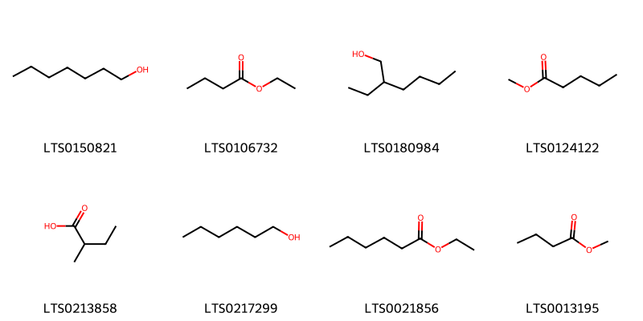{ width=100% }
    <figcaption>Hình ảnh cấu trúc hóa học của 8 hoạt chất thuộc nhóm Fatty Acyls gồm ['heptanol (LTS0150821)', 'ethyl butyrate (LTS0106732)', '2-ethylhexanol (LTS0180984)', 'methyl valerate (LTS0124122)', '2-methylbutanoic acid (LTS0213858)', 'hexanol (LTS0217299)', 'ethyl hexanoate (LTS0021856)', 'methyl butyrate (LTS0013195)'].</figcaption>
</figure>
#### Nhóm Flavonoids
<figure markdown="span">
    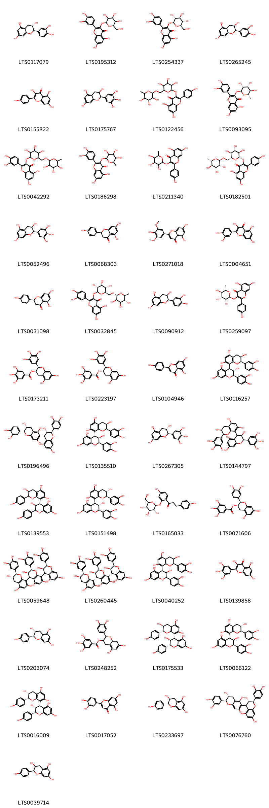{ width=100% }
    <figcaption>Hình ảnh cấu trúc hóa học của 45 hoạt chất thuộc nhóm Flavonoids gồm ['(+)-catechol (LTS0117079)', '2-(3,4-dihydroxyphenyl)-5,7-dihydroxy-3-{[3,4,5-trihydroxy-6-(hydroxymethyl)oxan-2-yl]oxy}chromen-4-one (LTS0195312)', 'isoquercetin (LTS0254337)', 'ent-epicatechin (LTS0265245)', 'kaempherol (LTS0155822)', 'epigallocatechin (LTS0175767)', '5,7-dihydroxy-2-(4-hydroxyphenyl)-3-[(3,4,5-trihydroxy-6-{[(3,4,5-trihydroxy-6-methyloxan-2-yl)oxy]methyl}oxan-2-yl)oxy]chromen-4-one (LTS0122456)', 'quercitrin (LTS0093095)', 'rutin (LTS0042292)', 'quercitrin (LTS0186298)', '5,7-dihydroxy-2-(4-hydroxyphenyl)-3-[(3,4,5-trihydroxy-6-methyloxan-2-yl)oxy]chromen-4-one (LTS0211340)', 'nictoflorin (LTS0182501)', 'epigallocatechin (LTS0052496)', 'asahina (LTS0068303)', 'tricin (LTS0271018)', 'quercetin (LTS0004651)', 'naringenin (LTS0031098)', '3-rutinosyl quercetin (LTS0032845)', 'catechol (LTS0090912)', 'afzelin (LTS0259097)', '(-)-epigallocatechin gallate (LTS0173211)', 'gallocatechin 3-o-gallate (LTS0223197)', 'chamomile (LTS0104946)', '(2r,3s,4s)-2-(3,4-dihydroxyphenyl)-4-[(2r,3r)-2-(3,4-dihydroxyphenyl)-3,5,7-trihydroxy-3,4-dihydro-2h-1-benzopyran-8-yl]-3,4-dihydro-2h-1-benzopyran-3,5,7-triol (LTS0116257)', '(2r,3s,4s)-2-(3,4-dihydroxyphenyl)-4-[(2r,3r)-2-(3,4-dihydroxyphenyl)-3,5,7-trihydroxy-3,4-dihydro-2h-1-benzopyran-6-yl]-3,4-dihydro-2h-1-benzopyran-3,5,7-triol (LTS0196496)', '(2r,3r,4r)-2-(3,4-dihydroxyphenyl)-4-[(2r,3r)-2-(3,4-dihydroxyphenyl)-3,5,7-trihydroxy-3,4-dihydro-2h-1-benzopyran-8-yl]-3,4-dihydro-2h-1-benzopyran-3,5,7-triol (LTS0135510)', 'gallocatechol (LTS0267305)', '4-[3,5,7-trihydroxy-2-(3,4,5-trihydroxyphenyl)-3,4-dihydro-2h-1-benzopyran-8-yl]-2-(3,4,5-trihydroxyphenyl)-3,4-dihydro-2h-1-benzopyran-3,5,7-triol (LTS0144797)', '2-(4-hydroxyphenyl)-8-[3,5,7-trihydroxy-2-(4-hydroxyphenyl)-3,4-dihydro-2h-1-benzopyran-4-yl]-3,4-dihydro-2h-1-benzopyran-3,5,7-triol (LTS0139553)', '(2r,3s,4s)-2-(3,4-dihydroxyphenyl)-4-[(2r,3s)-2-(3,4-dihydroxyphenyl)-3,5,7-trihydroxy-3,4-dihydro-2h-1-benzopyran-8-yl]-3,4-dihydro-2h-1-benzopyran-3,5,7-triol (LTS0151498)', '1-(4-hydroxy-2-{[(2s,3r,4s,5s,6r)-3,4,5-trihydroxy-6-(hydroxymethyl)oxan-2-yl]oxy}phenyl)-3-(4-hydroxyphenyl)propan-1-one (LTS0165033)', 'epicatechin gallate (LTS0071606)', '(2r,3r)-2-(3,4-dihydroxyphenyl)-8-[(2r,3r)-2-(3,4-dihydroxyphenyl)-3,5,7-trihydroxy-3,4-dihydro-2h-1-benzopyran-4-yl]-4-[(2r,3s)-2-(3,4-dihydroxyphenyl)-3,5,7-trihydroxy-3,4-dihydro-2h-1-benzopyran-8-yl]-3,4-dihydro-2h-1-benzopyran-3,5,7-triol (LTS0059648)', 'procyanidin c1 (LTS0260445)', '2-(3,4-dihydroxyphenyl)-4-[2-(3,4-dihydroxyphenyl)-3,5,7-trihydroxy-3,4-dihydro-2h-1-benzopyran-8-yl]-3,4-dihydro-2h-1-benzopyran-3,5,7-triol (LTS0040252)', 'myricetin (LTS0139858)', 'epiafzelechin (LTS0203074)', '2-(3,4-dihydroxyphenyl)-5,7-dihydroxy-3,4-dihydro-2h-1-benzopyran-3-yl 3,4,5-trihydroxybenzoate (LTS0248252)', 'afzelechin-(4α->8)-afzelechin (LTS0175533)', '(2r,3r,4r)-2-(3,4-dihydroxyphenyl)-4-[(2r,3s)-2-(3,4-dihydroxyphenyl)-3,5,7-trihydroxy-3,4-dihydro-2h-1-benzopyran-8-yl]-3,4-dihydro-2h-1-benzopyran-3,5,7-triol (LTS0066122)', '(2r,3r)-2-(4-hydroxyphenyl)-8-[(2r,3r,4r)-3,5,7-trihydroxy-2-(4-hydroxyphenyl)-3,4-dihydro-2h-1-benzopyran-4-yl]-3,4-dihydro-2h-1-benzopyran-3,5,7-triol (LTS0016009)', 'luteolin (LTS0017052)', 'afzelechin (LTS0233697)', '(2r,3s,4r)-2-(3,4-dihydroxyphenyl)-4-[(2r,3r)-2-(3,4-dihydroxyphenyl)-3,5,7-trihydroxy-3,4-dihydro-2h-1-benzopyran-6-yl]-3,4-dihydro-2h-1-benzopyran-3,5,7-triol (LTS0076760)', "3,5,7,4'-tetrahydroxyflavan (LTS0039714)"].</figcaption>
</figure>
#### Nhóm Furanoid lignans
<figure markdown="span">
    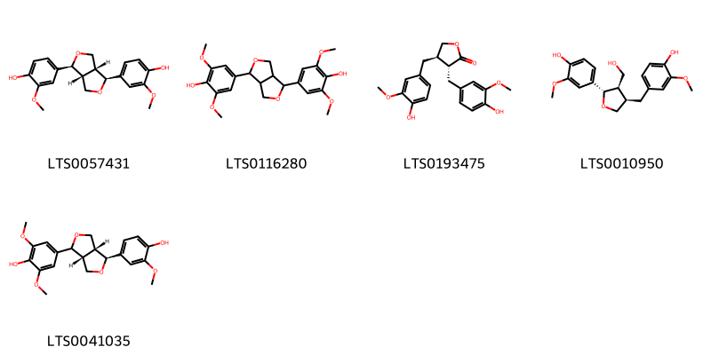{ width=100% }
    <figcaption>Hình ảnh cấu trúc hóa học của 5 hoạt chất thuộc nhóm Furanoid lignans gồm ['pinoresinol (LTS0057431)', 'syringaresinol (LTS0116280)', 'matairesinol (LTS0193475)', 'lariciresinol (LTS0010950)', '4-[(3ar,4s,6ar)-4-(4-hydroxy-3-methoxyphenyl)-hexahydrofuro[3,4-c]furan-1-yl]-2,6-dimethoxyphenol (LTS0041035)'].</figcaption>
</figure>
#### Nhóm Furans
<figure markdown="span">
    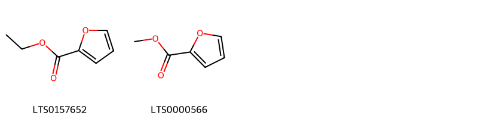{ width=100% }
    <figcaption>Hình ảnh cấu trúc hóa học của 2 hoạt chất thuộc nhóm Furans gồm ['ethyl 2-furoate (LTS0157652)', 'methyl furoate (LTS0000566)'].</figcaption>
</figure>
#### Nhóm Hydroxy acids and derivatives
<figure markdown="span">
    { width=100% }
    <figcaption>Hình ảnh cấu trúc hóa học của 1 hoạt chất thuộc nhóm Hydroxy acids and derivatives gồm ['malic acid (LTS0216520)'].</figcaption>
</figure>
#### Nhóm Imidazopyrimidines
<figure markdown="span">
    { width=100% }
    <figcaption>Hình ảnh cấu trúc hóa học của 1 hoạt chất thuộc nhóm Imidazopyrimidines gồm ['leucon (LTS0114351)'].</figcaption>
</figure>
#### Nhóm Indoles and derivatives
<figure markdown="span">
    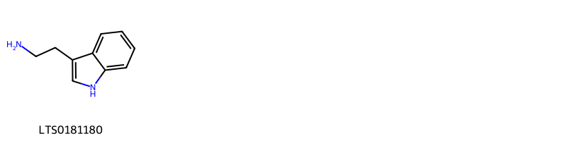{ width=100% }
    <figcaption>Hình ảnh cấu trúc hóa học của 1 hoạt chất thuộc nhóm Indoles and derivatives gồm ['tryptamine (LTS0181180)'].</figcaption>
</figure>
#### Nhóm Naphthalenes
<figure markdown="span">
    { width=100% }
    <figcaption>Hình ảnh cấu trúc hóa học của 1 hoạt chất thuộc nhóm Naphthalenes gồm ['naphthalene (LTS0254484)'].</figcaption>
</figure>
#### Nhóm Organooxygen compounds
<figure markdown="span">
    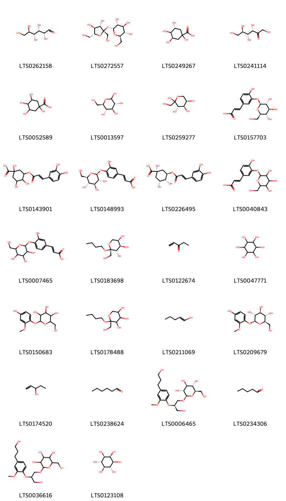{ width=100% }
    <figcaption>Hình ảnh cấu trúc hóa học của 26 hoạt chất thuộc nhóm Organooxygen compounds gồm ['(+)-glucose (LTS0262158)', 'sucrose (LTS0272557)', '(3r,5r)-1,3,4,5-tetrahydroxycyclohexane-1-carboxylic acid (LTS0249267)', 'keto-d-fructose (LTS0241114)', 'quinic acid (LTS0052589)', 'glucose (LTS0013597)', 'd-fructopyranose (LTS0259277)', 'caffeic acid 3-glucoside (LTS0157703)', '3-{[3-(3,4-dihydroxyphenyl)prop-2-enoyl]oxy}-1,4,5-trihydroxycyclohexane-1-carboxylic acid (LTS0143901)', '(2e)-3-(3-hydroxy-4-{[(2s,3r,4s,5s,6r)-3,4,5-trihydroxy-6-(hydroxymethyl)oxan-2-yl]oxy}phenyl)prop-2-enoic acid (LTS0148993)', 'chlorogenic acid (LTS0226495)', '3-(4-hydroxy-3-{[3,4,5-trihydroxy-6-(hydroxymethyl)oxan-2-yl]oxy}phenyl)prop-2-enoic acid (LTS0040843)', '3-(3-hydroxy-4-{[3,4,5-trihydroxy-6-(hydroxymethyl)oxan-2-yl]oxy}phenyl)prop-2-enoic acid (LTS0007465)', '(2r,3s,4r,5r)-2-butoxy-2-(hydroxymethyl)oxane-3,4,5-triol (LTS0183698)', '1-penten-3-one (LTS0122674)', '(-)-inositol (LTS0047771)', '2-(4-hydroxy-2-methoxyphenoxy)-6-(hydroxymethyl)oxane-3,4,5-triol (LTS0150683)', '2-butoxy-2-(hydroxymethyl)oxane-3,4,5-triol (LTS0178488)', 'pent-1-en-1-ol (LTS0211069)', '(2s,3r,4s,5s,6r)-2-(4-hydroxy-2-methoxyphenoxy)-6-(hydroxymethyl)oxane-3,4,5-triol (LTS0209679)', '1-penten-3-ol (LTS0174520)', 'hexanal (LTS0238624)', '(2r,3r,4s,5s,6r)-2-[(2r)-3-hydroxy-2-[4-(3-hydroxypropyl)-2-methoxyphenoxy]propoxy]-6-(hydroxymethyl)oxane-3,4,5-triol (LTS0006465)', 'pentanal (LTS0234306)', '2-{3-hydroxy-2-[4-(3-hydroxypropyl)-2-methoxyphenoxy]propoxy}-6-(hydroxymethyl)oxane-3,4,5-triol (LTS0036616)', '(1r,2r,3s,4r,5s,6s)-cyclohexane-1,2,3,4,5,6-hexol (LTS0123108)'].</figcaption>
</figure>
#### Nhóm Prenol lipids
<figure markdown="span">
    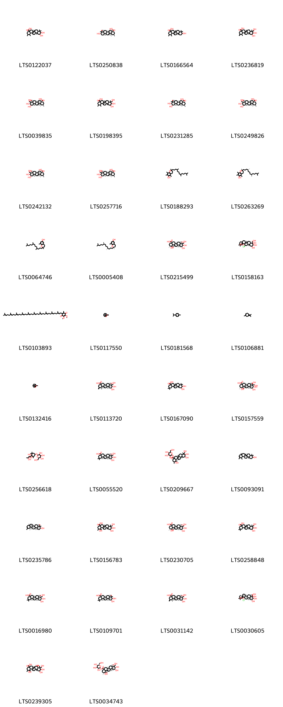{ width=100% }
    <figcaption>Hình ảnh cấu trúc hóa học của 38 hoạt chất thuộc nhóm Prenol lipids gồm ['10,11-dihydroxy-1,2,6a,6b,9,9,12a-heptamethyl-2,3,4,5,6,7,8,8a,10,11,12,12b,13,14b-tetradecahydro-1h-picene-4a-carboxylic acid (LTS0122037)', 'ursolic acid (LTS0250838)', '10-hydroxy-1,2,6a,6b,9,9,12a-heptamethyl-2,3,4,5,6,7,8,8a,10,11,12,12b,13,14b-tetradecahydro-1h-picene-4a-carboxylic acid (LTS0166564)', '10,11-dihydroxy-9-(hydroxymethyl)-1,6a,6b,9,12a-pentamethyl-2-methylidene-1,3,4,5,6,7,8,8a,10,11,12,12b,13,14b-tetradecahydropicene-4a-carboxylic acid (LTS0236819)', '(1s,2r,4as,6as,6br,8ar,9s,10r,11r,12ar,12br,14bs)-10,11-dihydroxy-9-(hydroxymethyl)-1,2,6a,6b,9,12a-hexamethyl-2,3,4,5,6,7,8,8a,10,11,12,12b,13,14b-tetradecahydro-1h-picene-4a-carboxylic acid (LTS0039835)', 'asiatic acid (LTS0198395)', 'corosolic acid (LTS0231285)', 'asiatic acid (LTS0249826)', '(1s,2r,4as,6as,6br,8ar,9r,10s,11r,12ar,12br,14bs)-10,11-dihydroxy-9-(hydroxymethyl)-1,2,6a,6b,9,12a-hexamethyl-2,3,4,5,6,7,8,8a,10,11,12,12b,13,14b-tetradecahydro-1h-picene-4a-carboxylic acid (LTS0242132)', '(1s,2r,4as,6as,6br,8ar,9s,10s,11r,12ar,12br,14bs)-10,11-dihydroxy-9-(hydroxymethyl)-1,2,6a,6b,9,12a-hexamethyl-2,3,4,5,6,7,8,8a,10,11,12,12b,13,14b-tetradecahydro-1h-picene-4a-carboxylic acid (LTS0257716)', 'vita e (LTS0188293)', 'vitamin e (LTS0263269)', 'd-tocopherol (LTS0064746)', 'delta-tocopherol (LTS0005408)', '19α-hydroxyasiatic acid (LTS0215499)', '16-chloro-9,10,11-trihydroxy-9-(hydroxymethyl)-4,5,13,20,20-pentamethyl-24-oxahexacyclo[15.5.2.0¹,¹⁸.0⁴,¹⁷.0⁵,¹⁴.0⁸,¹³]tetracosan-23-one (LTS0158163)', 'coenzyme q10 (LTS0103893)', 'β-pinene (LTS0117550)', 'cymene (LTS0181568)', 'monoterpenes (LTS0106881)', 'α pinene (LTS0132416)', 'actinidic acid (LTS0113720)', '10,11-dihydroxy-2,2,6a,6b,9,9,12a-heptamethyl-1,3,4,5,6,7,8,8a,10,11,12,12b,13,14b-tetradecahydropicene-4a-carboxylic acid (LTS0167090)', '(1r,2r,4as,6as,6br,8ar,10s,11r,12ar,12br,14bs)-1,10,11-trihydroxy-9,9-bis(hydroxymethyl)-1,2,6a,6b,12a-pentamethyl-2,3,4,5,6,7,8,8a,10,11,12,12b,13,14b-tetradecahydropicene-4a-carboxylic acid (LTS0157559)', '2-({3,4-dihydroxy-4-[(1e)-3-hydroxybut-1-en-1-yl]-3,5,5-trimethylcyclohexyl}oxy)-6-(hydroxymethyl)oxane-3,4,5-triol (LTS0256618)', 'arjunolic acid (LTS0055520)', '3,4,5-trihydroxy-6-(hydroxymethyl)oxan-2-yl 1,10,11-trihydroxy-9-(hydroxymethyl)-1,2,6a,6b,9,12a-hexamethyl-2,3,4,5,6,7,8,8a,10,11,12,12b,13,14b-tetradecahydropicene-4a-carboxylate (LTS0209667)', '4,4,6a,6b,8a,11,12,14b-octamethyl-2,3,4a,5,6,7,8,9,12,12a,12b,13,14,14a-tetradecahydro-1h-picen-3-ol (LTS0093091)', '(3s,4ar,6ar,6br,8as,12s,12ar,12br,14ar,14br)-4,4,6a,6b,8a,11,12,14b-octamethyl-2,3,4a,5,6,7,8,9,12,12a,12b,13,14,14a-tetradecahydro-1h-picen-3-ol (LTS0235786)', '1,10,11-trihydroxy-9-(hydroxymethyl)-1,2,6a,6b,9,12a-hexamethyl-2,3,4,5,6,7,8,8a,10,11,12,12b,13,14b-tetradecahydropicene-4a-carboxylic acid (LTS0156783)', '(1r,2r,4as,6as,6br,8ar,9s,10s,11r,12ar,12br,14bs)-1,10,11-trihydroxy-9-(hydroxymethyl)-1,2,6a,6b,9,12a-hexamethyl-2,3,4,5,6,7,8,8a,10,11,12,12b,13,14b-tetradecahydropicene-4a-carboxylic acid (LTS0230705)', '10,11-dihydroxy-9-(hydroxymethyl)-2,2,6a,6b,9,12a-hexamethyl-1,3,4,5,6,7,8,8a,10,11,12,12b,13,14b-tetradecahydropicene-4a-carboxylic acid (LTS0258848)', '(4as,6as,6br,8ar,9s,10s,11r,12ar,12br,14bs)-10,11-dihydroxy-9-(hydroxymethyl)-2,2,6a,6b,9,12a-hexamethyl-1,3,4,5,6,7,8,8a,10,11,12,12b,13,14b-tetradecahydropicene-4a-carboxylic acid (LTS0016980)', 'maslinic acid (LTS0109701)', '(1r,4as,6as,6br,8ar,9s,10s,11r,12ar,12br,14bs)-10,11-dihydroxy-9-(hydroxymethyl)-1,6a,6b,9,12a-pentamethyl-2-methylidene-1,3,4,5,6,7,8,8a,10,11,12,12b,13,14b-tetradecahydropicene-4a-carboxylic acid (LTS0031142)', '(1s,4s,5r,8r,9s,10s,11r,13r,14r,16s,17s,18r)-16-chloro-9,10,11-trihydroxy-9-(hydroxymethyl)-4,5,13,20,20-pentamethyl-24-oxahexacyclo[15.5.2.0¹,¹⁸.0⁴,¹⁷.0⁵,¹⁴.0⁸,¹³]tetracosan-23-one (LTS0030605)', '1,10,11-trihydroxy-9,9-bis(hydroxymethyl)-1,2,6a,6b,12a-pentamethyl-2,3,4,5,6,7,8,8a,10,11,12,12b,13,14b-tetradecahydropicene-4a-carboxylic acid (LTS0239305)', '(2s,3r,4s,5s,6r)-3,4,5-trihydroxy-6-(hydroxymethyl)oxan-2-yl (1r,2r,4as,6as,6br,8ar,9s,10s,11r,12ar,12br,14bs)-1,10,11-trihydroxy-9-(hydroxymethyl)-1,2,6a,6b,9,12a-hexamethyl-2,3,4,5,6,7,8,8a,10,11,12,12b,13,14b-tetradecahydropicene-4a-carboxylate (LTS0034743)'].</figcaption>
</figure>
#### Nhóm Pyrans
<figure markdown="span">
    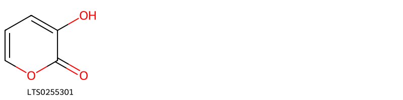{ width=100% }
    <figcaption>Hình ảnh cấu trúc hóa học của 1 hoạt chất thuộc nhóm Pyrans gồm ['2h-pyran-2-one, 3-hydroxy- (LTS0255301)'].</figcaption>
</figure>
#### Nhóm Pyridines and derivatives
<figure markdown="span">
    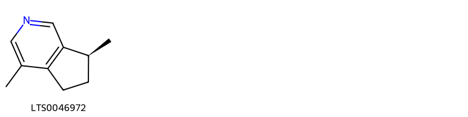{ width=100% }
    <figcaption>Hình ảnh cấu trúc hóa học của 1 hoạt chất thuộc nhóm Pyridines and derivatives gồm ['actinidine (LTS0046972)'].</figcaption>
</figure>
#### Nhóm Steroids and steroid derivatives
<figure markdown="span">
    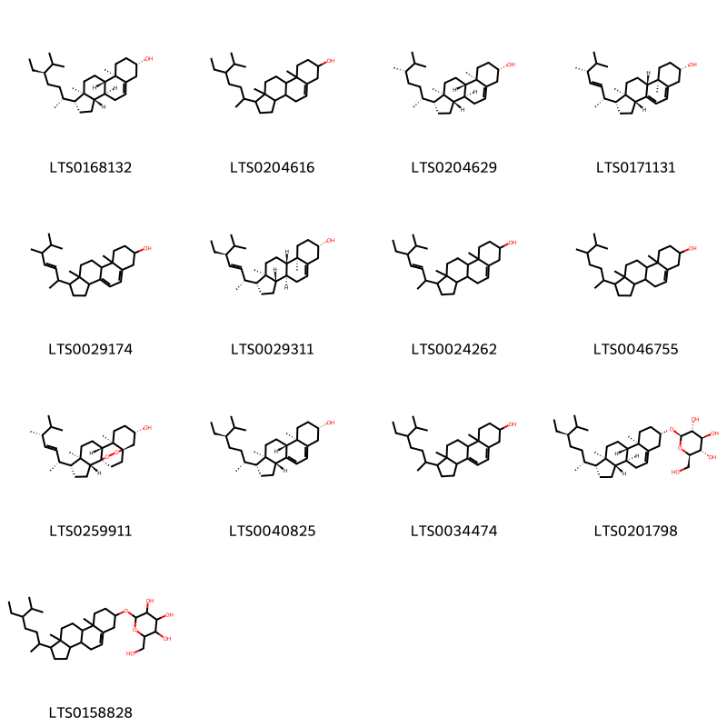{ width=100% }
    <figcaption>Hình ảnh cấu trúc hóa học của 13 hoạt chất thuộc nhóm Steroids and steroid derivatives gồm ['sitosterol (LTS0168132)', 'stigmast-5-en-3-ol, (3β)- (LTS0204616)', '22,23-dihydrobrassicasterol (LTS0204629)', 'ergosterol (LTS0171131)', '1-(5,6-dimethylhept-3-en-2-yl)-9a,11a-dimethyl-1h,2h,3h,3ah,6h,7h,8h,9h,9bh,10h,11h-cyclopenta[a]phenanthren-7-ol (LTS0029174)', 'phytosterol (LTS0029311)', 'stigmasterol (LTS0024262)', 'campesterol (LTS0046755)', '(1s,2r,5r,6r,9r,10r,13s,15r)-5-[(2r,3e,5r)-5,6-dimethylhept-3-en-2-yl]-6,10-dimethyl-16,17-dioxapentacyclo[13.2.2.0¹,⁹.0²,⁶.0¹⁰,¹⁵]nonadecan-13-ol (LTS0259911)', '7-dehydrositosterol (LTS0040825)', '7-dehydrositosterol (LTS0034474)', 'sitogluside (LTS0201798)', '2-{[1-(5-ethyl-6-methylheptan-2-yl)-9a,11a-dimethyl-1h,2h,3h,3ah,3bh,4h,6h,7h,8h,9h,9bh,10h,11h-cyclopenta[a]phenanthren-7-yl]oxy}-6-(hydroxymethyl)oxane-3,4,5-triol (LTS0158828)'].</figcaption>
</figure>

---

### Dược dân tộc học

Danh sách các quốc gia có sử dụng *Actinidia chinensis* trong điều trị các bệnh. 

| Country   | Disease            | Bệnh                                                                                                                                                                                                |
|:----------|:-------------------|:----------------------------------------------------------------------------------------------------------------------------------------------------------------------------------------------------|
| China     | Antidote, Diuretic | MYMEMORY WARNING: YOU USED ALL AVAILABLE FREE TRANSLATIONS FOR TODAY. NEXT AVAILABLE IN  08 HOURS 41 MINUTES 46 SECONDS VISIT HTTPS://MYMEMORY.TRANSLATED.NET/DOC/USAGELIMITS.PHP TO TRANSLATE MORE |

---

---
## Actinidia polygama
### Thông tin về thực vật

!!! info "Phân loại thực vật của *Actinidia polygama* từ GIBF:"
    - **Kingdom:** Plantae
    - **Phylum:** Tracheophyta
    - **Order:** Ericales
    - **Family:** Actinidiaceae
    - **Genus:** Actinidia
    - **Species:** *Actinidia polygama*

 

| Label (VI)   | Label (EN)   | Scientific Name    | Descriptions (VI)   | Descriptions (EN)   | Also Known As (VI)   | Also Known As (EN)   |
|:-------------|:-------------|:-------------------|:--------------------|:--------------------|:---------------------|:---------------------|
| N/A          | N/A          | Actinidia polygama |                     | species of plant    | ['']                 | ['silver vine']      |

#### Phân bố trên thế giới

**Từ CSDL GIBF** Japan, Belgium, Korea, Republic of, Russian Federation, Latvia

#### Phân bố tại Việt Nam

**Từ CSDL GIBF**: Không có ghi nhận ở Việt Nam

---
### Thành phần hóa học
        
- Theo cơ sở dữ liệu lotus: Từ loài *Actinidia polygama* đã phân lập và xác định được 68 hoạt chất thuộc về các nhóm Flavonoids, Prenol lipids, Oxanes, Oxepanes, Benzofurans, Hydroxy acids and derivatives, Dihydrofurans, Organooxygen compounds, Lactones, Carboxylic acids and derivatives, Pyridines and derivatives. 

|    | chemicalTaxonomyClassyfireClass   |   smiles_count |
|---:|:----------------------------------|---------------:|
|  0 | Benzofurans                       |              2 |
|  1 | Carboxylic acids and derivatives  |              2 |
|  2 | Dihydrofurans                     |              1 |
|  3 | Flavonoids                        |              8 |
|  4 | Hydroxy acids and derivatives     |              1 |
|  5 | Lactones                          |              8 |
|  6 | Organooxygen compounds            |              7 |
|  7 | Oxanes                            |              1 |
|  8 | Oxepanes                          |              1 |
|  9 | Prenol lipids                     |             36 |
| 10 | Pyridines and derivatives         |              1 |

#### Nhóm Benzofurans
<figure markdown="span">
    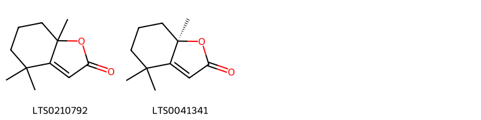{ width=100% }
    <figcaption>Hình ảnh cấu trúc hóa học của 2 hoạt chất thuộc nhóm Benzofurans gồm ['(+/-)-dihydroactinidiolide (LTS0210792)', 'dihydroactinidiolide (LTS0041341)'].</figcaption>
</figure>
#### Nhóm Carboxylic acids and derivatives
<figure markdown="span">
    { width=100% }
    <figcaption>Hình ảnh cấu trúc hóa học của 2 hoạt chất thuộc nhóm Carboxylic acids and derivatives gồm ['citric acid (LTS0213921)', 'oxalic acid (LTS0217707)'].</figcaption>
</figure>
#### Nhóm Dihydrofurans
<figure markdown="span">
    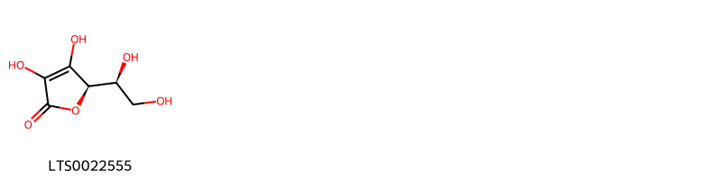{ width=100% }
    <figcaption>Hình ảnh cấu trúc hóa học của 1 hoạt chất thuộc nhóm Dihydrofurans gồm ['vitamin c (LTS0022555)'].</figcaption>
</figure>
#### Nhóm Flavonoids
<figure markdown="span">
    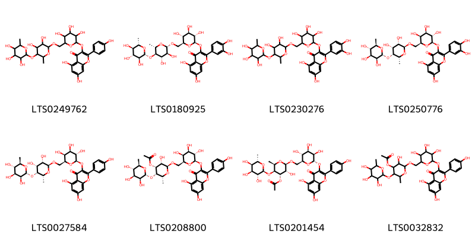{ width=100% }
    <figcaption>Hình ảnh cấu trúc hóa học của 8 hoạt chất thuộc nhóm Flavonoids gồm ['3-({6-[({3,4-dihydroxy-6-methyl-5-[(3,4,5-trihydroxy-6-methyloxan-2-yl)oxy]oxan-2-yl}oxy)methyl]-3,4,5-trihydroxyoxan-2-yl}oxy)-5,7-dihydroxy-2-(4-hydroxyphenyl)chromen-4-one (LTS0249762)', '3-{[(2r,3s,4r,5r,6s)-6-({[(2s,3s,4s,5r,6s)-3,4-dihydroxy-6-methyl-5-{[(2r,3s,4r,5r,6s)-3,4,5-trihydroxy-6-methyloxan-2-yl]oxy}oxan-2-yl]oxy}methyl)-3,4,5-trihydroxyoxan-2-yl]oxy}-2-(3,4-dihydroxyphenyl)-5,7-dihydroxychromen-4-one (LTS0180925)', '3-({6-[({3,4-dihydroxy-6-methyl-5-[(3,4,5-trihydroxy-6-methyloxan-2-yl)oxy]oxan-2-yl}oxy)methyl]-3,4,5-trihydroxyoxan-2-yl}oxy)-2-(3,4-dihydroxyphenyl)-5,7-dihydroxychromen-4-one (LTS0230276)', '3-{[(2r,3s,4r,5s,6s)-6-({[(2s,3s,4r,5r,6r)-3,4-dihydroxy-6-methyl-5-{[(2r,3s,4s,5s,6r)-3,4,5-trihydroxy-6-methyloxan-2-yl]oxy}oxan-2-yl]oxy}methyl)-3,4,5-trihydroxyoxan-2-yl]oxy}-2-(3,4-dihydroxyphenyl)-5,7-dihydroxychromen-4-one (LTS0250776)', '3-{[(2r,3s,4r,5s,6s)-6-({[(2s,3s,4r,5r,6r)-3,4-dihydroxy-6-methyl-5-{[(2r,3s,4s,5s,6r)-3,4,5-trihydroxy-6-methyloxan-2-yl]oxy}oxan-2-yl]oxy}methyl)-3,4,5-trihydroxyoxan-2-yl]oxy}-5,7-dihydroxy-2-(4-hydroxyphenyl)chromen-4-one (LTS0027584)', '(2s,3s,4r,5s,6r)-2-{[(2s,3s,4r,5s,6r)-6-{[5,7-dihydroxy-2-(4-hydroxyphenyl)-4-oxochromen-3-yl]oxy}-3,4,5-trihydroxyoxan-2-yl]methoxy}-3-hydroxy-6-methyl-5-{[(2r,3s,4s,5s,6r)-3,4,5-trihydroxy-6-methyloxan-2-yl]oxy}oxan-4-yl acetate (LTS0208800)', '(2r,3r,4s,5s,6r)-2-{[(2s,3r,4r,5r,6s)-6-{[5,7-dihydroxy-2-(4-hydroxyphenyl)-4-oxochromen-3-yl]oxy}-3,4,5-trihydroxyoxan-2-yl]methoxy}-3-hydroxy-6-methyl-5-{[(2s,3r,4s,5r,6s)-3,4,5-trihydroxy-6-methyloxan-2-yl]oxy}oxan-4-yl acetate (LTS0201454)', '2-[(6-{[5,7-dihydroxy-2-(4-hydroxyphenyl)-4-oxochromen-3-yl]oxy}-3,4,5-trihydroxyoxan-2-yl)methoxy]-3-hydroxy-6-methyl-5-[(3,4,5-trihydroxy-6-methyloxan-2-yl)oxy]oxan-4-yl acetate (LTS0032832)'].</figcaption>
</figure>
#### Nhóm Hydroxy acids and derivatives
<figure markdown="span">
    { width=100% }
    <figcaption>Hình ảnh cấu trúc hóa học của 1 hoạt chất thuộc nhóm Hydroxy acids and derivatives gồm ['malic acid (LTS0216520)'].</figcaption>
</figure>
#### Nhóm Lactones
<figure markdown="span">
    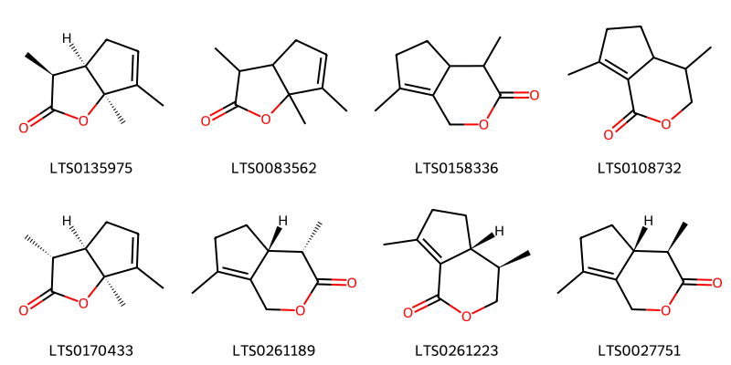{ width=100% }
    <figcaption>Hình ảnh cấu trúc hóa học của 8 hoạt chất thuộc nhóm Lactones gồm ['(3s,3ar,6as)-3,6,6a-trimethyl-3h,3ah,4h-cyclopenta[b]furan-2-one (LTS0135975)', '3,6,6a-trimethyl-3h,3ah,4h-cyclopenta[b]furan-2-one (LTS0083562)', '4,7-dimethyl-1h,4h,4ah,5h,6h-cyclopenta[c]pyran-3-one (LTS0158336)', '4,7-dimethyl-3h,4h,4ah,5h,6h-cyclopenta[c]pyran-1-one (LTS0108732)', '(3r,3ar,6as)-3,6,6a-trimethyl-3h,3ah,4h-cyclopenta[b]furan-2-one (LTS0170433)', '(4s,4ar)-4,7-dimethyl-1h,4h,4ah,5h,6h-cyclopenta[c]pyran-3-one (LTS0261189)', '(4r,4ar)-4,7-dimethyl-3h,4h,4ah,5h,6h-cyclopenta[c]pyran-1-one (LTS0261223)', '(4r,4ar)-4,7-dimethyl-1h,4h,4ah,5h,6h-cyclopenta[c]pyran-3-one (LTS0027751)'].</figcaption>
</figure>
#### Nhóm Organooxygen compounds
<figure markdown="span">
    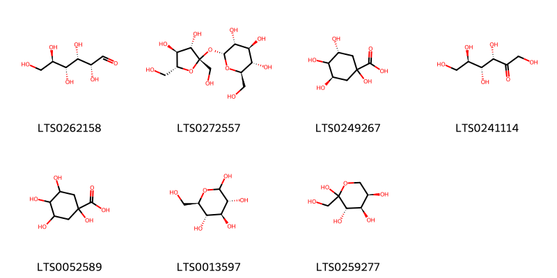{ width=100% }
    <figcaption>Hình ảnh cấu trúc hóa học của 7 hoạt chất thuộc nhóm Organooxygen compounds gồm ['(+)-glucose (LTS0262158)', 'sucrose (LTS0272557)', '(3r,5r)-1,3,4,5-tetrahydroxycyclohexane-1-carboxylic acid (LTS0249267)', 'keto-d-fructose (LTS0241114)', 'quinic acid (LTS0052589)', 'glucose (LTS0013597)', 'd-fructopyranose (LTS0259277)'].</figcaption>
</figure>
#### Nhóm Oxanes
<figure markdown="span">
    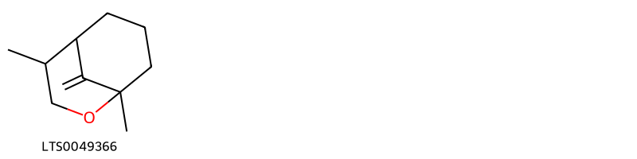{ width=100% }
    <figcaption>Hình ảnh cấu trúc hóa học của 1 hoạt chất thuộc nhóm Oxanes gồm ['1,4-dimethyl-9-methylidene-2-oxabicyclo[3.3.1]nonane (LTS0049366)'].</figcaption>
</figure>
#### Nhóm Oxepanes
<figure markdown="span">
    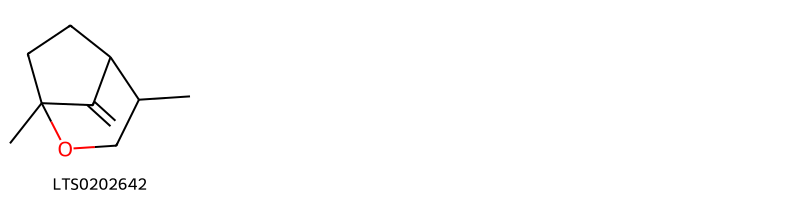{ width=100% }
    <figcaption>Hình ảnh cấu trúc hóa học của 1 hoạt chất thuộc nhóm Oxepanes gồm ['1,4-dimethyl-8-methylidene-2-oxabicyclo[3.2.1]octane (LTS0202642)'].</figcaption>
</figure>
#### Nhóm Prenol lipids
<figure markdown="span">
    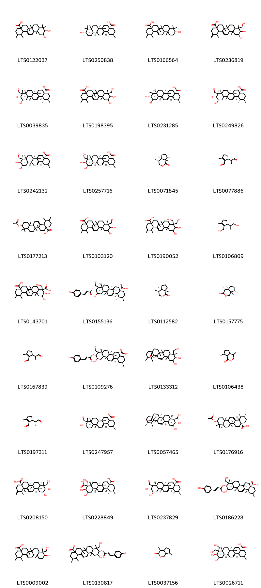{ width=100% }
    <figcaption>Hình ảnh cấu trúc hóa học của 36 hoạt chất thuộc nhóm Prenol lipids gồm ['10,11-dihydroxy-1,2,6a,6b,9,9,12a-heptamethyl-2,3,4,5,6,7,8,8a,10,11,12,12b,13,14b-tetradecahydro-1h-picene-4a-carboxylic acid (LTS0122037)', 'ursolic acid (LTS0250838)', '10-hydroxy-1,2,6a,6b,9,9,12a-heptamethyl-2,3,4,5,6,7,8,8a,10,11,12,12b,13,14b-tetradecahydro-1h-picene-4a-carboxylic acid (LTS0166564)', '10,11-dihydroxy-9-(hydroxymethyl)-1,6a,6b,9,12a-pentamethyl-2-methylidene-1,3,4,5,6,7,8,8a,10,11,12,12b,13,14b-tetradecahydropicene-4a-carboxylic acid (LTS0236819)', '(1s,2r,4as,6as,6br,8ar,9s,10r,11r,12ar,12br,14bs)-10,11-dihydroxy-9-(hydroxymethyl)-1,2,6a,6b,9,12a-hexamethyl-2,3,4,5,6,7,8,8a,10,11,12,12b,13,14b-tetradecahydro-1h-picene-4a-carboxylic acid (LTS0039835)', 'asiatic acid (LTS0198395)', 'corosolic acid (LTS0231285)', 'asiatic acid (LTS0249826)', '(1s,2r,4as,6as,6br,8ar,9r,10s,11r,12ar,12br,14bs)-10,11-dihydroxy-9-(hydroxymethyl)-1,2,6a,6b,9,12a-hexamethyl-2,3,4,5,6,7,8,8a,10,11,12,12b,13,14b-tetradecahydro-1h-picene-4a-carboxylic acid (LTS0242132)', '(1s,2r,4as,6as,6br,8ar,9s,10s,11r,12ar,12br,14bs)-10,11-dihydroxy-9-(hydroxymethyl)-1,2,6a,6b,9,12a-hexamethyl-2,3,4,5,6,7,8,8a,10,11,12,12b,13,14b-tetradecahydro-1h-picene-4a-carboxylic acid (LTS0257716)', '(4r,4ar,7s,7as)-4,7-dimethyl-hexahydro-3h-cyclopenta[c]pyran-1-one (LTS0071845)', '(5r)-2-methyl-5-[(2s)-1-oxopropan-2-yl]cyclopent-1-ene-1-carbaldehyde (LTS0077886)', '10-(acetyloxy)-1,2,6a,6b,9,9,12a-heptamethyl-2,3,4,5,6,7,8,8a,10,11,12,12b,13,14b-tetradecahydro-1h-picene-4a-carboxylic acid (LTS0177213)', '9-formyl-10,11-dihydroxy-1,2,6a,6b,9,12a-hexamethyl-2,3,4,5,6,7,8,8a,10,11,12,12b,13,14b-tetradecahydro-1h-picene-4a-carboxylic acid (LTS0103120)', '10,11-dihydroxy-9,9-bis(hydroxymethyl)-1,2,6a,6b,12a-pentamethyl-2,3,4,5,6,7,8,8a,10,11,12,12b,13,14b-tetradecahydro-1h-picene-4a-carboxylic acid (LTS0190052)', '(2s)-2-[(1r)-2-(hydroxymethyl)-3-methylcyclopent-2-en-1-yl]propan-1-ol (LTS0106809)', '2,3-dihydroxy-4-(hydroxymethyl)-6a,6b,11,12,14b-pentamethyl-2,3,4a,5,6,7,8,9,10,11,12,12a,14,14a-tetradecahydro-1h-picene-4,8a-dicarboxylic acid (LTS0143701)', '(1s,2r,4as,6as,6br,8ar,9r,10r,11r,12ar,12br,14bs)-11-hydroxy-9-(hydroxymethyl)-10-{[(2e)-3-(4-hydroxyphenyl)prop-2-enoyl]oxy}-1,2,6a,6b,9,12a-hexamethyl-2,3,4,5,6,7,8,8a,10,11,12,12b,13,14b-tetradecahydro-1h-picene-4a-carboxylic acid (LTS0155136)', '(4s,4ar,7s,7as)-4,7-dimethyl-hexahydro-3h-cyclopenta[c]pyran-1-one (LTS0112582)', '(4r,4as,7s,7as)-4,7-dimethyl-hexahydro-1h-cyclopenta[c]pyran-3-one (LTS0157775)', '2-methyl-5-(1-oxopropan-2-yl)cyclopent-1-ene-1-carbaldehyde (LTS0167839)', '(1s,2r,4as,6as,6br,8ar,9r,10s,11r,12ar,12br,14bs)-11-hydroxy-9-(hydroxymethyl)-10-{[(2e)-3-(4-hydroxyphenyl)prop-2-enoyl]oxy}-1,2,6a,6b,9,12a-hexamethyl-2,3,4,5,6,7,8,8a,10,11,12,12b,13,14b-tetradecahydro-1h-picene-4a-carboxylic acid (LTS0109276)', '10,11-dihydroxy-9-(hydroxymethyl)-4,5,9,13,19,20-hexamethyl-24-oxahexacyclo[15.5.2.0¹,¹⁸.0⁴,¹⁷.0⁵,¹⁴.0⁸,¹³]tetracos-15-en-23-one (LTS0133312)', '4,7-dimethyl-hexahydro-3h-cyclopenta[c]pyran-1-one (LTS0106438)', '(5s)-2-methyl-5-[(2r)-1-oxopropan-2-yl]cyclopent-1-ene-1-carbaldehyde (LTS0197311)', '(1s,2r,4as,6as,6br,8ar,9s,10s,12ar,12br,14bs)-10-hydroxy-9-(hydroxymethyl)-1,2,6a,6b,9,12a-hexamethyl-2,3,4,5,6,7,8,8a,10,11,12,12b,13,14b-tetradecahydro-1h-picene-4a-carboxylic acid (LTS0247957)', '(1s,4s,5r,8r,9s,10s,11r,13s,14r,17s,18r,19s,20r)-10,11-dihydroxy-9-(hydroxymethyl)-4,5,9,13,19,20-hexamethyl-24-oxahexacyclo[15.5.2.0¹,¹⁸.0⁴,¹⁷.0⁵,¹⁴.0⁸,¹³]tetracos-15-en-23-one (LTS0057465)', '(1s,2r,4as,6as,6br,8ar,10s,12ar,12br,14bs)-10-(acetyloxy)-1,2,6a,6b,9,9,12a-heptamethyl-2,3,4,5,6,7,8,8a,10,11,12,12b,13,14b-tetradecahydro-1h-picene-4a-carboxylic acid (LTS0176916)', '(1r,4as,6as,6br,8ar,9r,10s,11r,12ar,12br,14bs)-10,11-dihydroxy-9-(hydroxymethyl)-1,6a,6b,9,12a-pentamethyl-2-methylidene-1,3,4,5,6,7,8,8a,10,11,12,12b,13,14b-tetradecahydropicene-4a-carboxylic acid (LTS0208150)', '(2r,3s,4r,4ar,6ar,6bs,8as,11r,12s,12as,14ar,14br)-2,3-dihydroxy-4-(hydroxymethyl)-6a,6b,11,12,14b-pentamethyl-2,3,4a,5,6,7,8,9,10,11,12,12a,14,14a-tetradecahydro-1h-picene-4,8a-dicarboxylic acid (LTS0228849)', '(1s,2r,4as,6as,6br,8ar,9r,10s,11r,12ar,12br,14bs)-9-formyl-10,11-dihydroxy-1,2,6a,6b,9,12a-hexamethyl-2,3,4,5,6,7,8,8a,10,11,12,12b,13,14b-tetradecahydro-1h-picene-4a-carboxylic acid (LTS0237829)', '(1s,2r,4as,6as,6br,8ar,9s,10r,11r,12ar,12br,14bs)-11-hydroxy-9-(hydroxymethyl)-10-{[(2e)-3-(4-hydroxyphenyl)prop-2-enoyl]oxy}-1,2,6a,6b,9,12a-hexamethyl-2,3,4,5,6,7,8,8a,10,11,12,12b,13,14b-tetradecahydro-1h-picene-4a-carboxylic acid (LTS0186228)', '10-hydroxy-9-(hydroxymethyl)-1,2,6a,6b,9,12a-hexamethyl-2,3,4,5,6,7,8,8a,10,11,12,12b,13,14b-tetradecahydro-1h-picene-4a-carboxylic acid (LTS0009002)', '11-hydroxy-9-(hydroxymethyl)-10-{[3-(4-hydroxyphenyl)prop-2-enoyl]oxy}-1,2,6a,6b,9,12a-hexamethyl-2,3,4,5,6,7,8,8a,10,11,12,12b,13,14b-tetradecahydro-1h-picene-4a-carboxylic acid (LTS0130817)', 'iridomyrmecin (LTS0037156)', '(1s,2r,4as,6as,6br,8ar,10s,11r,12ar,12br,14bs)-10,11-dihydroxy-9,9-bis(hydroxymethyl)-1,2,6a,6b,12a-pentamethyl-2,3,4,5,6,7,8,8a,10,11,12,12b,13,14b-tetradecahydro-1h-picene-4a-carboxylic acid (LTS0026711)'].</figcaption>
</figure>
#### Nhóm Pyridines and derivatives
<figure markdown="span">
    { width=100% }
    <figcaption>Hình ảnh cấu trúc hóa học của 1 hoạt chất thuộc nhóm Pyridines and derivatives gồm ['actinidine (LTS0046972)'].</figcaption>
</figure>

---

### Dược dân tộc học

Danh sách các quốc gia có sử dụng *Actinidia polygama* trong điều trị các bệnh. 

| Country   | Disease   | Bệnh                                                                                                                                                                                                |
|:----------|:----------|:----------------------------------------------------------------------------------------------------------------------------------------------------------------------------------------------------|
| Elsewhere | Tonic     | MYMEMORY WARNING: YOU USED ALL AVAILABLE FREE TRANSLATIONS FOR TODAY. NEXT AVAILABLE IN  08 HOURS 41 MINUTES 08 SECONDS VISIT HTTPS://MYMEMORY.TRANSLATED.NET/DOC/USAGELIMITS.PHP TO TRANSLATE MORE |

---

