!!! abstract "Tóm tắt"

    Họ Agavaceae gồm khoảng 11 chi và 33 loài được một số cộng đồng tại các quốc gia như US(Blackfoot), Trinidad, India(Santal), Hindu, Venezuela, English, Mexico, Perak, Caroline I, Mexico(Kickapoo), Malaya, Haiti, Elsewhere, Dominican Republic, South Africa, Egypt, India, Fiji, US, Turkey, US(Amerindian) sử dụng trong một số trường hợp QUERY LENGTH LIMIT EXCEEDED. MAX ALLOWED QUERY : 500 CHARS.

!!! info "DrDuke"

    James A. Duke sinh năm 1929-2017 là một nhà thực vật học người Mỹ. Đây là một trong những tác giả hàng đầu trong lĩnh vực dược dân tộc học với cuốn *CRC Handbook of Medicinal Herbs* và chính là người xây dựng lên cơ sở dữ liệu về hợp chất tự nhiên và dược dân tộc học tại Bộ nông nghiệp Hoa Kỳ. Các thông tin được đăng tải tại website [Dr. Duke's Phytochemical and Ethnobotanical Databases](https://phytochem.nal.usda.gov/). 
    Trong suốt thập niên 1970, ông lãnh đạo the Plant Taxonomy Laboratory, Plant Genetics and Germplasm Institute of the Agricultural Research Service, U.S. Department of Agriculture.
    Trong tài liệu này, các thông tin về dược dân tộc của các dược liệu được trích dẫn từ tài liệu của James A. Ducke với sự trợ giúp của phần mềm dịch thuật từ tiếng Anh sang tiếng Việt.
   

# Chi Agave

??? note "Danh sách các dược liệu thuộc chi"
    
	 - *Agave americana*
	 - *Agave breviina*
	 - *Agave cocui*
	 - *Agave intermixta*
	 - *Agave lecheguilla*
	 - *Agave lechuguilla*
	 - *Agave sisalana*

---
## Agave americana
### Thông tin về thực vật

!!! info "Phân loại thực vật của *Agave americana* từ GIBF:"
    - **Kingdom:** Plantae
    - **Phylum:** Tracheophyta
    - **Order:** Asparagales
    - **Family:** Asparagaceae
    - **Genus:** Agave
    - **Species:** *Agave americana*

 

| Label (VI)   | Label (EN)   | Scientific Name   | Descriptions (VI)   | Descriptions (EN)   | Also Known As (VI)   | Also Known As (EN)                                                    |
|:-------------|:-------------|:------------------|:--------------------|:--------------------|:---------------------|:----------------------------------------------------------------------|
| N/A          | N/A          | Agave americana   | loài thực vật       | species of plant    | ['dứa mỹ']           | ['maguey', 'century plant', 'agave', 'American aloe', 'yellow agave'] |

#### Phân bố trên thế giới

**Từ CSDL GIBF** Spain, Chile, Australia, Albania, Dominican Republic, Montenegro, Malta, Peru, Mexico, Argentina, Portugal, South Africa, France, New Zealand, Bolivia (Plurinational State of), Ecuador, United States of America, Italy, Algeria, Greece, Croatia

#### Phân bố tại Việt Nam

**Từ CSDL GIBF**: Không có ghi nhận ở Việt Nam

---
### Thành phần hóa học
        
- Theo cơ sở dữ liệu lotus: Từ loài *Agave americana* đã phân lập và xác định được 71 hoạt chất thuộc về các nhóm Organooxygen compounds, Benzopyrans, Flavonoids, Oxepanes, Prenol lipids, Carboxylic acids and derivatives, Fatty Acyls, Phenols, Hydroxy acids and derivatives, Steroids and steroid derivatives, Benzene and substituted derivatives, Organic phosphoric acids and derivatives. 

|    | chemicalTaxonomyClassyfireClass          |   smiles_count |
|---:|:-----------------------------------------|---------------:|
|  0 | Benzene and substituted derivatives      |              1 |
|  1 | Benzopyrans                              |              1 |
|  2 | Carboxylic acids and derivatives         |              8 |
|  3 | Fatty Acyls                              |             11 |
|  4 | Flavonoids                               |              7 |
|  5 | Hydroxy acids and derivatives            |              3 |
|  6 | Organic phosphoric acids and derivatives |              1 |
|  7 | Organooxygen compounds                   |              9 |
|  8 | Oxepanes                                 |              1 |
|  9 | Phenols                                  |              3 |
| 10 | Prenol lipids                            |              7 |
| 11 | Steroids and steroid derivatives         |             19 |

#### Nhóm Benzene and substituted derivatives
<figure markdown="span">
    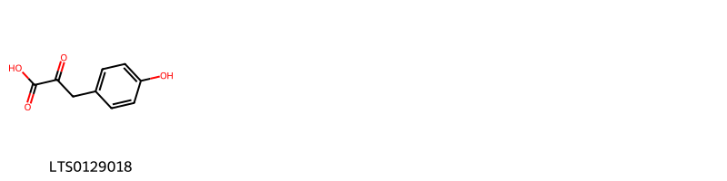{ width=100% }
    <figcaption>Hình ảnh cấu trúc hóa học của 1 hoạt chất thuộc nhóm Benzene and substituted derivatives gồm ['4-hydroxyphenylpyruvic acid (LTS0129018)'].</figcaption>
</figure>
#### Nhóm Benzopyrans
<figure markdown="span">
    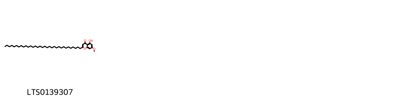{ width=100% }
    <figcaption>Hình ảnh cấu trúc hóa học của 1 hoạt chất thuộc nhóm Benzopyrans gồm ['5-hydroxy-7-methoxy-2-tritriacontylchromen-4-one (LTS0139307)'].</figcaption>
</figure>
#### Nhóm Carboxylic acids and derivatives
<figure markdown="span">
    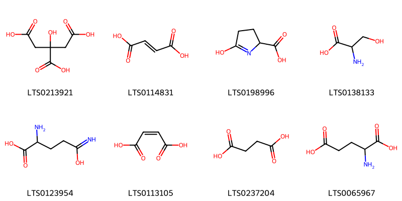{ width=100% }
    <figcaption>Hình ảnh cấu trúc hóa học của 8 hoạt chất thuộc nhóm Carboxylic acids and derivatives gồm ['citric acid (LTS0213921)', 'fumaric acid (LTS0114831)', 'pyroglutamic acid (LTS0198996)', 'serin (LTS0138133)', 'glutamine (LTS0123954)', 'maleic acid (LTS0113105)', 'succinic acid (LTS0237204)', 'glutaminsaeure (LTS0065967)'].</figcaption>
</figure>
#### Nhóm Fatty Acyls
<figure markdown="span">
    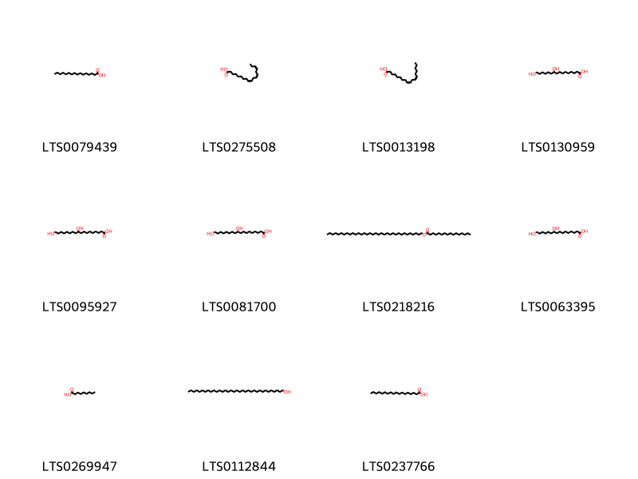{ width=100% }
    <figcaption>Hình ảnh cấu trúc hóa học của 11 hoạt chất thuộc nhóm Fatty Acyls gồm ['palmitic acid (LTS0079439)', 'α-linolenic acid (LTS0275508)', 'linoleic (LTS0013198)', '10,16-dihydroxy-palmitic acid (LTS0130959)', '10,18-dihydroxyoctadecanoic acid (LTS0095927)', '(10r)-10,18-dihydroxyoctadecanoic acid (LTS0081700)', 'tetratriacontyl hexadecanoate (LTS0218216)', '(10r)-10,16-dihydroxyhexadecanoic acid (LTS0063395)', 'nonanoic acid (LTS0269947)', 'geddyl alcohol (LTS0112844)', 'stearic acid (LTS0237766)'].</figcaption>
</figure>
#### Nhóm Flavonoids
<figure markdown="span">
    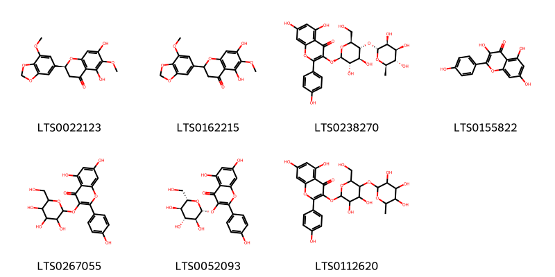{ width=100% }
    <figcaption>Hình ảnh cấu trúc hóa học của 7 hoạt chất thuộc nhóm Flavonoids gồm ['(2s)-5,7-dihydroxy-6-methoxy-2-(7-methoxy-2h-1,3-benzodioxol-5-yl)-2,3-dihydro-1-benzopyran-4-one (LTS0022123)', 'agamanone (LTS0162215)', '3-{[(2r,3s,4s,5r,6s)-3,4-dihydroxy-6-(hydroxymethyl)-5-{[(2r,3s,4s,5s,6r)-3,4,5-trihydroxy-6-methyloxan-2-yl]oxy}oxan-2-yl]oxy}-5,7-dihydroxy-2-(4-hydroxyphenyl)chromen-4-one (LTS0238270)', 'kaempherol (LTS0155822)', 'trifolin (LTS0267055)', '5,7-dihydroxy-2-(4-hydroxyphenyl)-3-{[(2r,3s,4r,5r,6s)-3,4,5-trihydroxy-6-(hydroxymethyl)oxan-2-yl]oxy}chromen-4-one (LTS0052093)', '3-{[3,4-dihydroxy-6-(hydroxymethyl)-5-[(3,4,5-trihydroxy-6-methyloxan-2-yl)oxy]oxan-2-yl]oxy}-5,7-dihydroxy-2-(4-hydroxyphenyl)chromen-4-one (LTS0112620)'].</figcaption>
</figure>
#### Nhóm Hydroxy acids and derivatives
<figure markdown="span">
    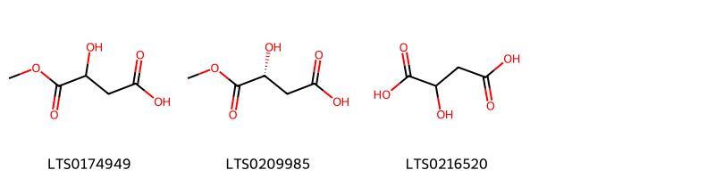{ width=100% }
    <figcaption>Hình ảnh cấu trúc hóa học của 3 hoạt chất thuộc nhóm Hydroxy acids and derivatives gồm ['3-hydroxy-4-methoxy-4-oxobutanoic acid (LTS0174949)', '(3r)-3-hydroxy-4-methoxy-4-oxobutanoic acid (LTS0209985)', 'malic acid (LTS0216520)'].</figcaption>
</figure>
#### Nhóm Organic phosphoric acids and derivatives
<figure markdown="span">
    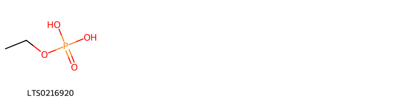{ width=100% }
    <figcaption>Hình ảnh cấu trúc hóa học của 1 hoạt chất thuộc nhóm Organic phosphoric acids and derivatives gồm ['ethyl dihydrogen phosphate (LTS0216920)'].</figcaption>
</figure>
#### Nhóm Organooxygen compounds
<figure markdown="span">
    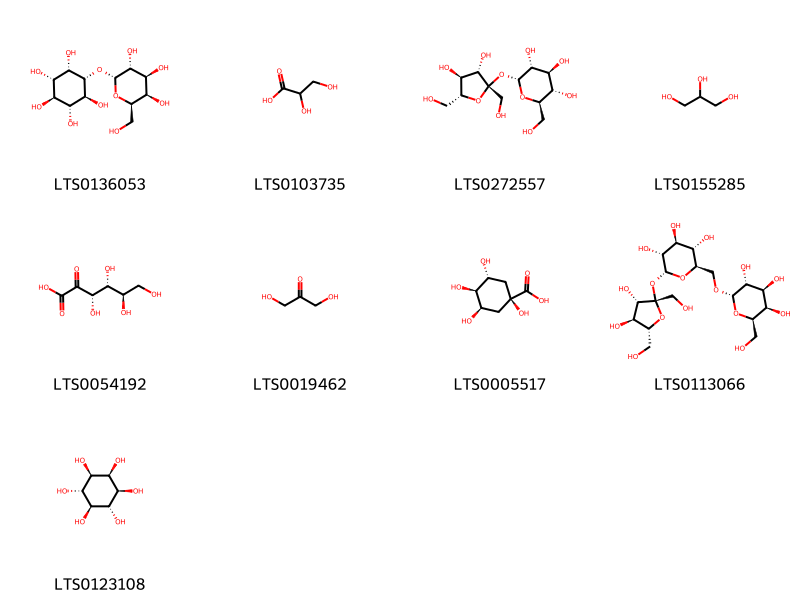{ width=100% }
    <figcaption>Hình ảnh cấu trúc hóa học của 9 hoạt chất thuộc nhóm Organooxygen compounds gồm ['galactinol (LTS0136053)', 'glyceric acid (LTS0103735)', 'sucrose (LTS0272557)', 'glycerol (LTS0155285)', '2-ketogluconic acid (LTS0054192)', 'dihydroxyacetone (LTS0019462)', '(-)-quinic acid (LTS0005517)', 'raffinose (LTS0113066)', '(1r,2r,3s,4r,5s,6s)-cyclohexane-1,2,3,4,5,6-hexol (LTS0123108)'].</figcaption>
</figure>
#### Nhóm Oxepanes
<figure markdown="span">
    { width=100% }
    <figcaption>Hình ảnh cấu trúc hóa học của 1 hoạt chất thuộc nhóm Oxepanes gồm ['levoglucosan (LTS0260469)'].</figcaption>
</figure>
#### Nhóm Phenols
<figure markdown="span">
    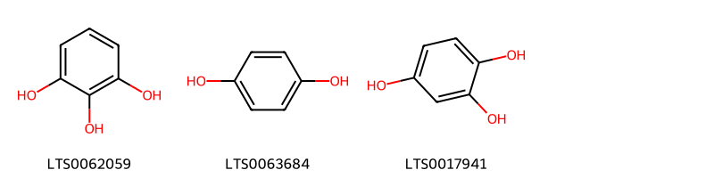{ width=100% }
    <figcaption>Hình ảnh cấu trúc hóa học của 3 hoạt chất thuộc nhóm Phenols gồm ['pyrogallol (LTS0062059)', 'α-hydroquinone (LTS0063684)', '1,2,4-benzenetriol (LTS0017941)'].</figcaption>
</figure>
#### Nhóm Prenol lipids
<figure markdown="span">
    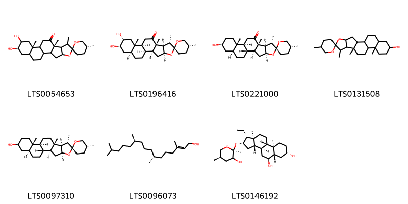{ width=100% }
    <figcaption>Hình ảnh cấu trúc hóa học của 7 hoạt chất thuộc nhóm Prenol lipids gồm ["(5r,9's,13's,16'r)-15',16'-dihydroxy-5,7',9',13'-tetramethyl-5'-oxaspiro[oxane-2,6'-pentacyclo[10.8.0.0²,⁹.0⁴,⁸.0¹³,¹⁸]icosan]-10'-one (LTS0054653)", "(1's,2r,2's,4's,5r,7's,8'r,9's,12's,13's,15'r,16'r,18's)-15',16'-dihydroxy-5,7',9',13'-tetramethyl-5'-oxaspiro[oxane-2,6'-pentacyclo[10.8.0.0²,⁹.0⁴,⁸.0¹³,¹⁸]icosan]-10'-one (LTS0196416)", 'hecogenin (LTS0221000)', 'tigogenin (LTS0131508)', 'tigogenin (LTS0097310)', 'phytol (LTS0096073)', '(1r,2s,3as,3br,5s,5as,7s,9ar,9bs,11as)-1-ethyl-2-{[(2s,5r)-3-hydroxy-2,5-dimethyloxan-2-yl]oxy}-9a,11a-dimethyl-tetradecahydro-1h-cyclopenta[a]phenanthrene-5,7-diol (LTS0146192)'].</figcaption>
</figure>
#### Nhóm Steroids and steroid derivatives
<figure markdown="span">
    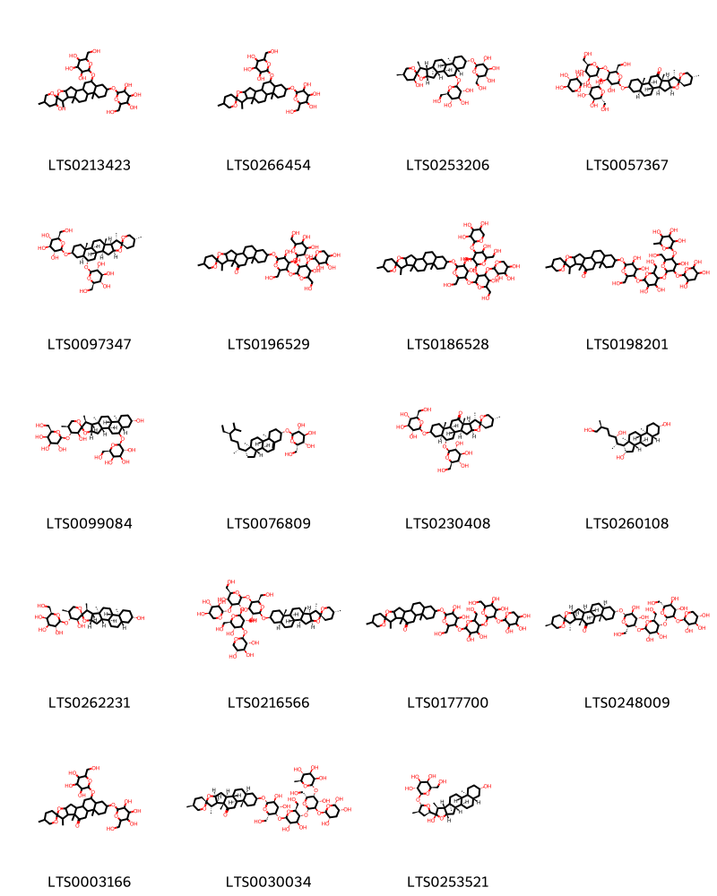{ width=100% }
    <figcaption>Hình ảnh cấu trúc hóa học của 19 hoạt chất thuộc nhóm Steroids and steroid derivatives gồm ["2-(hydroxymethyl)-6-(5,7',9',13'-tetramethyl-16'-{[3,4,5-trihydroxy-6-(hydroxymethyl)oxan-2-yl]oxy}-5'-oxaspiro[oxane-2,6'-pentacyclo[10.8.0.0²,⁹.0⁴,⁸.0¹³,¹⁸]icosan]-3-oloxy)oxane-3,4,5-triol (LTS0213423)", "2-(hydroxymethyl)-6-(5,7',9',13'-tetramethyl-16'-{[3,4,5-trihydroxy-6-(hydroxymethyl)oxan-2-yl]oxy}-5'-oxaspiro[oxane-2,6'-pentacyclo[10.8.0.0²,⁹.0⁴,⁸.0¹³,¹⁸]icosane]oxy)oxane-3,4,5-triol (LTS0266454)", "(2r,3s,4s,5r,6r)-2-(hydroxymethyl)-6-[(1'r,2s,2's,3s,4's,5r,7's,8'r,9's,12's,13'r,16's,18's,19's)-5,7',9',13'-tetramethyl-16'-{[(2r,3r,4s,5s,6r)-3,4,5-trihydroxy-6-(hydroxymethyl)oxan-2-yl]oxy}-5'-oxaspiro[oxane-2,6'-pentacyclo[10.8.0.0²,⁹.0⁴,⁸.0¹³,¹⁸]icosan]-3-oloxy]oxane-3,4,5-triol (LTS0253206)", "(1'r,2r,2's,4's,5r,7's,8'r,9's,12's,13's,16's,18's)-16'-{[(2r,3r,4r,5r,6r)-3,4-dihydroxy-5-{[(2s,3r,4s,5r,6r)-5-hydroxy-6-(hydroxymethyl)-3-{[(2s,3r,4s,5s,6r)-3,4,5-trihydroxy-6-(hydroxymethyl)oxan-2-yl]oxy}-4-{[(2s,3r,4s,5r)-3,4,5-trihydroxyoxan-2-yl]oxy}oxan-2-yl]oxy}-6-(hydroxymethyl)oxan-2-yl]oxy}-5,7',9',13'-tetramethyl-5'-oxaspiro[oxane-2,6'-pentacyclo[10.8.0.0²,⁹.0⁴,⁸.0¹³,¹⁸]icosan]-10'-one (LTS0057367)", "(2r,3s,4s,5r,6r)-2-(hydroxymethyl)-6-[(1'r,2r,2's,4's,5r,7's,8'r,9's,12's,13'r,16's,18's,19's)-5,7',9',13'-tetramethyl-16'-{[(2r,3r,4s,5s,6r)-3,4,5-trihydroxy-6-(hydroxymethyl)oxan-2-yl]oxy}-5'-oxaspiro[oxane-2,6'-pentacyclo[10.8.0.0²,⁹.0⁴,⁸.0¹³,¹⁸]icosane]oxy]oxane-3,4,5-triol (LTS0097347)", "16'-[(3,4-dihydroxy-5-{[5-hydroxy-6-(hydroxymethyl)-3-{[3,4,5-trihydroxy-6-(hydroxymethyl)oxan-2-yl]oxy}-4-[(3,4,5-trihydroxyoxan-2-yl)oxy]oxan-2-yl]oxy}-6-(hydroxymethyl)oxan-2-yl)oxy]-5,7',9',13'-tetramethyl-5'-oxaspiro[oxane-2,6'-pentacyclo[10.8.0.0²,⁹.0⁴,⁸.0¹³,¹⁸]icosan]-10'-one (LTS0196529)", "2-[(2-{[4,5-dihydroxy-2-(hydroxymethyl)-6-{5,7',9',13'-tetramethyl-5'-oxaspiro[oxane-2,6'-pentacyclo[10.8.0.0²,⁹.0⁴,⁸.0¹³,¹⁸]icosane]oxy}oxan-3-yl]oxy}-3-{[3,5-dihydroxy-6-(hydroxymethyl)-4-[(3,4,5-trihydroxyoxan-2-yl)oxy]oxan-2-yl]oxy}-5-hydroxy-6-(hydroxymethyl)oxan-4-yl)oxy]oxane-3,4,5-triol (LTS0186528)", "16'-({5-[(3,4-dihydroxy-5-{[4-hydroxy-6-(hydroxymethyl)-5-[(3,4,5-trihydroxy-6-methyloxan-2-yl)oxy]-3-[(3,5,6-trihydroxyoxan-2-yl)oxy]oxan-2-yl]oxy}-6-(hydroxymethyl)oxan-2-yl)oxy]-3,4-dihydroxy-6-(hydroxymethyl)oxan-2-yl}oxy)-5,7',9',13'-tetramethyl-5'-oxaspiro[oxane-2,6'-pentacyclo[10.8.0.0²,⁹.0⁴,⁸.0¹³,¹⁸]icosan]-10'-one (LTS0198201)", "(2r,3r,4s,5r,6r)-2-(hydroxymethyl)-6-[(1'r,2s,2's,3s,4r,4's,5s,7's,8'r,9's,12's,13'r,16's,18's,19's)-5,7',9',13'-tetramethyl-4-{[(2r,3r,4s,5r,6r)-3,4,5-trihydroxy-6-(hydroxymethyl)oxan-2-yl]oxy}-5'-oxaspiro[oxane-2,6'-pentacyclo[10.8.0.0²,⁹.0⁴,⁸.0¹³,¹⁸]icosane]-3,16'-dioloxy]oxane-3,4,5-triol (LTS0099084)", '(2r,3r,4s,5s,6s)-2-{[(1r,3as,3bs,7s,9ar,9bs,11ar)-1-[(2r,5r)-5-ethyl-6-methylheptan-2-yl]-9a,11a-dimethyl-1h,2h,3h,3ah,3bh,4h,6h,7h,8h,9h,9bh,10h,11h-cyclopenta[a]phenanthren-7-yl]oxy}-6-(hydroxymethyl)oxane-3,4,5-triol (LTS0076809)', "(1'r,2r,2's,4's,5r,7's,8'r,9's,12's,13'r,16's,18's,19's)-5,7',9',13'-tetramethyl-16',19'-bis({[(2r,3r,4s,5s,6r)-3,4,5-trihydroxy-6-(hydroxymethyl)oxan-2-yl]oxy})-5'-oxaspiro[oxane-2,6'-pentacyclo[10.8.0.0²,⁹.0⁴,⁸.0¹³,¹⁸]icosan]-10'-one (LTS0230408)", '(1r,2s,3as,3br,5as,7s,9as,9bs,11as)-1-[(2s,3s,6s)-3,7-dihydroxy-6-methylheptan-2-yl]-9a,11a-dimethyl-tetradecahydro-1h-cyclopenta[a]phenanthrene-2,7-diol (LTS0260108)', "(2r,3r,4s,5r,6r)-2-(hydroxymethyl)-6-[(1'r,2s,2's,3s,4r,4's,5s,7's,8'r,9's,12's,13's,16's,18's)-5,7',9',13'-tetramethyl-5'-oxaspiro[oxane-2,6'-pentacyclo[10.8.0.0²,⁹.0⁴,⁸.0¹³,¹⁸]icosane]-3,16'-dioloxy]oxane-3,4,5-triol (LTS0262231)", "(2s,3r,4s,5r)-2-{[(2s,3r,4s,5r,6r)-2-{[(2r,3r,4r,5r,6r)-4,5-dihydroxy-2-(hydroxymethyl)-6-[(1'r,2r,2's,4's,5r,7's,8'r,9's,12's,13's,16's,18's)-5,7',9',13'-tetramethyl-5'-oxaspiro[oxane-2,6'-pentacyclo[10.8.0.0²,⁹.0⁴,⁸.0¹³,¹⁸]icosane]oxy]oxan-3-yl]oxy}-3-{[(2s,3r,4s,5r,6r)-3,5-dihydroxy-6-(hydroxymethyl)-4-{[(2s,3r,4s,5r)-3,4,5-trihydroxyoxan-2-yl]oxy}oxan-2-yl]oxy}-5-hydroxy-6-(hydroxymethyl)oxan-4-yl]oxy}oxane-3,4,5-triol (LTS0216566)", "16'-({5-[(5-{[4,5-dihydroxy-6-(hydroxymethyl)-3-[(3,4,5-trihydroxyoxan-2-yl)oxy]oxan-2-yl]oxy}-3,4-dihydroxy-6-(hydroxymethyl)oxan-2-yl)oxy]-3,4-dihydroxy-6-(hydroxymethyl)oxan-2-yl}oxy)-5,7',9',13'-tetramethyl-5'-oxaspiro[oxane-2,6'-pentacyclo[10.8.0.0²,⁹.0⁴,⁸.0¹³,¹⁸]icosan]-10'-one (LTS0177700)", "(1'r,2r,2's,4's,5s,7's,8'r,9's,12's,13's,16'r,18's)-16'-{[(2s,3s,4s,5s,6s)-5-{[(2r,3s,4s,5r,6s)-5-{[(2s,3r,4s,5s,6r)-4,5-dihydroxy-6-(hydroxymethyl)-3-{[(2r,3s,4r,5s)-3,4,5-trihydroxyoxan-2-yl]oxy}oxan-2-yl]oxy}-3,4-dihydroxy-6-(hydroxymethyl)oxan-2-yl]oxy}-3,4-dihydroxy-6-(hydroxymethyl)oxan-2-yl]oxy}-5,7',9',13'-tetramethyl-5'-oxaspiro[oxane-2,6'-pentacyclo[10.8.0.0²,⁹.0⁴,⁸.0¹³,¹⁸]icosan]-10'-one (LTS0248009)", "5,7',9',13'-tetramethyl-16',19'-bis({[3,4,5-trihydroxy-6-(hydroxymethyl)oxan-2-yl]oxy})-5'-oxaspiro[oxane-2,6'-pentacyclo[10.8.0.0²,⁹.0⁴,⁸.0¹³,¹⁸]icosan]-10'-one (LTS0003166)", "(1'r,2r,2's,4's,5s,7's,8'r,9's,12's,13's,16's,18's)-16'-{[(2s,3s,4s,5s,6s)-5-{[(2r,3s,4s,5r,6s)-3,4-dihydroxy-5-{[(2s,3r,4s,5r,6r)-4-hydroxy-6-(hydroxymethyl)-5-{[(2s,3r,4r,5r,6s)-3,4,5-trihydroxy-6-methyloxan-2-yl]oxy}-3-{[(2s,3s,5r,6s)-3,5,6-trihydroxyoxan-2-yl]oxy}oxan-2-yl]oxy}-6-(hydroxymethyl)oxan-2-yl]oxy}-3,4-dihydroxy-6-(hydroxymethyl)oxan-2-yl]oxy}-5,7',9',13'-tetramethyl-5'-oxaspiro[oxane-2,6'-pentacyclo[10.8.0.0²,⁹.0⁴,⁸.0¹³,¹⁸]icosan]-10'-one (LTS0030034)", '(2s,3r,4s,5r,6r)-2-{[(2s,3r,5r)-5-[(1r,2s,4s,6s,7s,8r,9s,12s,13s,16s,18s)-6,16-dihydroxy-7,9,13-trimethyl-5-oxapentacyclo[10.8.0.0²,⁹.0⁴,⁸.0¹³,¹⁸]icosan-6-yl]-3-methyloxolan-2-yl]oxy}-6-(hydroxymethyl)oxane-3,4,5-triol (LTS0253521)'].</figcaption>
</figure>

---

### Dược dân tộc học

Danh sách các quốc gia có sử dụng *Agave americana* trong điều trị các bệnh. 

| Country   | Disease     | Bệnh           |
|:----------|:------------|:---------------|
| English   | Diuretic    | Thuốc lợi tiêu |
| Haiti     | Cicatrizant | Cicatrizant    |

---

---
## Agave breviina
### Thông tin về thực vật

!!! info "Phân loại thực vật của *N/A* từ GIBF:"
    - **Kingdom:** Plantae
    - **Phylum:** Tracheophyta
    - **Order:** Asparagales
    - **Family:** Asparagaceae
    - **Genus:** Agave
    - **Species:** *N/A*

 

| Label (VI)   | Label (EN)   | Scientific Name   | Descriptions (VI)   | Descriptions (EN)   | Also Known As (VI)   | Also Known As (EN)                                                    |
|:-------------|:-------------|:------------------|:--------------------|:--------------------|:---------------------|:----------------------------------------------------------------------|
| N/A          | N/A          | Agave americana   | loài thực vật       | species of plant    | ['dứa mỹ']           | ['maguey', 'century plant', 'agave', 'American aloe', 'yellow agave'] |

#### Phân bố trên thế giới

**Từ CSDL GIBF** Portugal, South Africa, Brazil, France, Spain, Puerto Rico, Peru, New Zealand, Ecuador, United States of America, Mexico, Chile, Greece, Australia, Croatia

#### Phân bố tại Việt Nam

**Từ CSDL GIBF**: Không có ghi nhận ở Việt Nam

---
### Thành phần hóa học
        
- Theo cơ sở dữ liệu lotus: Từ loài *N/A* đã phân lập và xác định được Chưa có hoạt chất nào được phân lập. hoạt chất thuộc về các nhóm Không có hoạt chất nào được phân lập. 

Không có hình ảnh nào được tạo ra

---

### Dược dân tộc học

Danh sách các quốc gia có sử dụng *N/A* trong điều trị các bệnh. 

| Country   | Disease    | Bệnh      |
|:----------|:-----------|:----------|
| Haiti     | Antiseptic | Khử trùng |

---

---
## Agave cocui
### Thông tin về thực vật

!!! info "Phân loại thực vật của *Agave cocui* từ GIBF:"
    - **Kingdom:** Plantae
    - **Phylum:** Tracheophyta
    - **Order:** Asparagales
    - **Family:** Asparagaceae
    - **Genus:** Agave
    - **Species:** *Agave cocui*

 

| Label (VI)   | Label (EN)   | Scientific Name   | Descriptions (VI)   | Descriptions (EN)   | Also Known As (VI)   | Also Known As (EN)   |
|:-------------|:-------------|:------------------|:--------------------|:--------------------|:---------------------|:---------------------|
| N/A          | N/A          | Agave cocui       | loài thực vật       | species of plant    | ['']                 | ['']                 |

#### Phân bố trên thế giới

**Từ CSDL GIBF** nan, Colombia, Venezuela (Bolivarian Republic of), Portugal, Bonaire, Sint Eustatius and Saba, Jamaica

#### Phân bố tại Việt Nam

**Từ CSDL GIBF**: Không có ghi nhận ở Việt Nam

---
### Thành phần hóa học
        
- Theo cơ sở dữ liệu lotus: Từ loài *Agave cocui* đã phân lập và xác định được 2 hoạt chất thuộc về các nhóm Prenol lipids. 

|    | chemicalTaxonomyClassyfireClass   |   smiles_count |
|---:|:----------------------------------|---------------:|
|  0 | Prenol lipids                     |              2 |

#### Nhóm Prenol lipids
<figure markdown="span">
    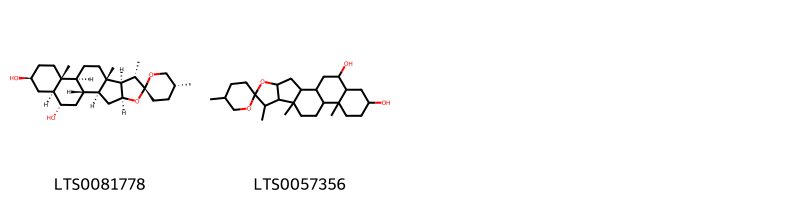{ width=100% }
    <figcaption>Hình ảnh cấu trúc hóa học của 2 hoạt chất thuộc nhóm Prenol lipids gồm ['chlorogenin (LTS0081778)', "5,7',9',13'-tetramethyl-5'-oxaspiro[oxane-2,6'-pentacyclo[10.8.0.0²,⁹.0⁴,⁸.0¹³,¹⁸]icosane]-16',19'-diol (LTS0057356)"].</figcaption>
</figure>

---

### Dược dân tộc học

Danh sách các quốc gia có sử dụng *Agave cocui* trong điều trị các bệnh. 

| Country   | Disease    | Bệnh         |
|:----------|:-----------|:-------------|
| Venezuela | Intoxicant | chất gây độc |

---

---
## Agave intermixta
### Thông tin về thực vật

!!! info "Phân loại thực vật của *Agave intermixta* từ GIBF:"
    - **Kingdom:** Plantae
    - **Phylum:** Tracheophyta
    - **Order:** Asparagales
    - **Family:** Asparagaceae
    - **Genus:** Agave
    - **Species:** *Agave intermixta*

 

| Label (VI)   | Label (EN)   | Scientific Name   | Descriptions (VI)   | Descriptions (EN)   | Also Known As (VI)   | Also Known As (EN)   |
|:-------------|:-------------|:------------------|:--------------------|:--------------------|:---------------------|:---------------------|
| N/A          | N/A          | Agave intermixta  | loài thực vật       | species of plant    | ['']                 | ['']                 |

#### Phân bố trên thế giới

**Từ CSDL GIBF** Haiti, Dominican Republic, Jamaica

#### Phân bố tại Việt Nam

**Từ CSDL GIBF**: Không có ghi nhận ở Việt Nam

---
### Thành phần hóa học
        
- Theo cơ sở dữ liệu lotus: Từ loài *Agave intermixta* đã phân lập và xác định được Chưa có hoạt chất nào được phân lập. hoạt chất thuộc về các nhóm Không có hoạt chất nào được phân lập. 

Không có hình ảnh nào được tạo ra

---

### Dược dân tộc học

Danh sách các quốc gia có sử dụng *Agave intermixta* trong điều trị các bệnh. 

| Country            | Disease            | Bệnh                        |
|:-------------------|:-------------------|:----------------------------|
| Dominican Republic | Diuretic, Laxative | Thuốc lợi tiểu, nhuận tràng |

---

---
## Agave lecheguilla
### Thông tin về thực vật

!!! info "Phân loại thực vật của *Agave lecheguilla* từ GIBF:"
    - **Kingdom:** Plantae
    - **Phylum:** Tracheophyta
    - **Order:** Asparagales
    - **Family:** Asparagaceae
    - **Genus:** Agave
    - **Species:** *Agave lecheguilla*

 

| Label (VI)   | Label (EN)   | Scientific Name   | Descriptions (VI)   | Descriptions (EN)   | Also Known As (VI)   | Also Known As (EN)   |
|:-------------|:-------------|:------------------|:--------------------|:--------------------|:---------------------|:---------------------|
| N/A          | N/A          | Agave intermixta  | loài thực vật       | species of plant    | ['']                 | ['']                 |

#### Phân bố trên thế giới

**Từ CSDL GIBF** nan, United States of America, Mexico

#### Phân bố tại Việt Nam

**Từ CSDL GIBF**: Không có ghi nhận ở Việt Nam

---
### Thành phần hóa học
        
- Theo cơ sở dữ liệu lotus: Từ loài *Agave lecheguilla* đã phân lập và xác định được 4 hoạt chất thuộc về các nhóm Prenol lipids. 

|    | chemicalTaxonomyClassyfireClass   |   smiles_count |
|---:|:----------------------------------|---------------:|
|  0 | Prenol lipids                     |              3 |

#### Nhóm Prenol lipids
<figure markdown="span">
    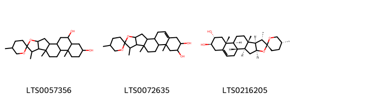{ width=100% }
    <figcaption>Hình ảnh cấu trúc hóa học của 3 hoạt chất thuộc nhóm Prenol lipids gồm ["5,7',9',13'-tetramethyl-5'-oxaspiro[oxane-2,6'-pentacyclo[10.8.0.0²,⁹.0⁴,⁸.0¹³,¹⁸]icosane]-16',19'-diol (LTS0057356)", "5,7',9',13'-tetramethyl-5'-oxaspiro[oxane-2,6'-pentacyclo[10.8.0.0²,⁹.0⁴,⁸.0¹³,¹⁸]icosan]-18'-ene-15',16'-diol (LTS0072635)", "(1's,2r,2's,4's,5r,7's,8'r,9's,12's,13'r,15'r,16'r)-5,7',9',13'-tetramethyl-5'-oxaspiro[oxane-2,6'-pentacyclo[10.8.0.0²,⁹.0⁴,⁸.0¹³,¹⁸]icosan]-18'-ene-15',16'-diol (LTS0216205)"].</figcaption>
</figure>

---

### Dược dân tộc học

Danh sách các quốc gia có sử dụng *Agave lecheguilla* trong điều trị các bệnh. 

| Country   | Disease   | Bệnh     |
|:----------|:----------|:---------|
| Mexico    | Poison    | Chất độc |

---

---
## Agave lechuguilla
### Thông tin về thực vật

!!! info "Phân loại thực vật của *Agave lechuguilla* từ GIBF:"
    - **Kingdom:** Plantae
    - **Phylum:** Tracheophyta
    - **Order:** Asparagales
    - **Family:** Asparagaceae
    - **Genus:** Agave
    - **Species:** *Agave lechuguilla*

 

| Label (VI)   | Label (EN)   | Scientific Name   | Descriptions (VI)   | Descriptions (EN)   | Also Known As (VI)   | Also Known As (EN)    |
|:-------------|:-------------|:------------------|:--------------------|:--------------------|:---------------------|:----------------------|
| N/A          | N/A          | Agave lechuguilla | loài thực vật       | species of plant    | ['']                 | ['Agave lechuguilla'] |

#### Phân bố trên thế giới

**Từ CSDL GIBF** United States of America, Mexico

#### Phân bố tại Việt Nam

**Từ CSDL GIBF**: Không có ghi nhận ở Việt Nam

---
### Thành phần hóa học
        
- Theo cơ sở dữ liệu lotus: Từ loài *Agave lechuguilla* đã phân lập và xác định được Chưa có hoạt chất nào được phân lập. hoạt chất thuộc về các nhóm Không có hoạt chất nào được phân lập. 

Không có hình ảnh nào được tạo ra

---

### Dược dân tộc học

Danh sách các quốc gia có sử dụng *Agave lechuguilla* trong điều trị các bệnh. 

| Country          | Disease   | Bệnh     |
|:-----------------|:----------|:---------|
| Mexico(Kickapoo) | Soap      | Xà phòng |

---

---
## Agave sisalana
### Thông tin về thực vật

!!! info "Phân loại thực vật của *Agave sisalana* từ GIBF:"
    - **Kingdom:** Plantae
    - **Phylum:** Tracheophyta
    - **Order:** Asparagales
    - **Family:** Asparagaceae
    - **Genus:** Agave
    - **Species:** *Agave sisalana*

 

| Label (VI)   | Label (EN)   | Scientific Name   | Descriptions (VI)   | Descriptions (EN)   | Also Known As (VI)   | Also Known As (EN)   |
|:-------------|:-------------|:------------------|:--------------------|:--------------------|:---------------------|:---------------------|
| N/A          | N/A          | Agave sisalana    |                     | species of plant    | ['']                 | ['Agave sisalana']   |

#### Phân bố trên thế giới

**Từ CSDL GIBF** Malawi, Saint Barthélemy, El Salvador, Namibia, Spain, Northern Mariana Islands, Haiti, Turks and Caicos Islands, Puerto Rico, Sao Tome and Principe, India, Anguilla, Malta, Brazil, Eswatini, Mexico, China, Benin, Chinese Taipei, Saint Martin (French part), South Africa, Botswana, Bermuda, Mozambique, United States of America, Madagascar, Cabo Verde

#### Phân bố tại Việt Nam

**Từ CSDL GIBF**: Không có ghi nhận ở Việt Nam

---
### Thành phần hóa học
        
- Theo cơ sở dữ liệu lotus: Từ loài *Agave sisalana* đã phân lập và xác định được 32 hoạt chất thuộc về các nhóm Steroids and steroid derivatives, Prenol lipids. 

|    | chemicalTaxonomyClassyfireClass   |   smiles_count |
|---:|:----------------------------------|---------------:|
|  0 | Prenol lipids                     |             15 |
|  1 | Steroids and steroid derivatives  |             16 |

#### Nhóm Prenol lipids
<figure markdown="span">
    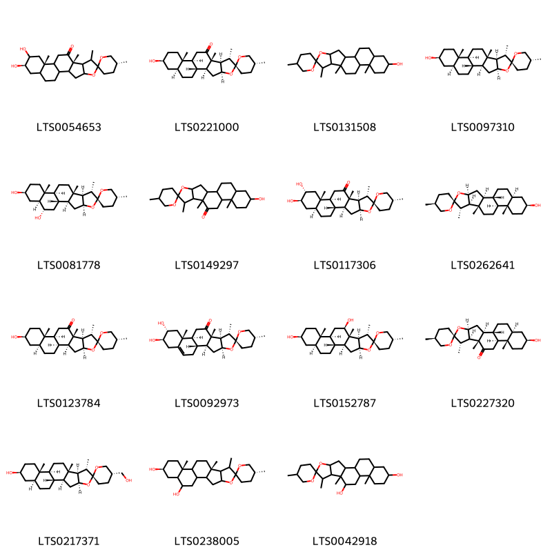{ width=100% }
    <figcaption>Hình ảnh cấu trúc hóa học của 15 hoạt chất thuộc nhóm Prenol lipids gồm ["(5r,9's,13's,16'r)-15',16'-dihydroxy-5,7',9',13'-tetramethyl-5'-oxaspiro[oxane-2,6'-pentacyclo[10.8.0.0²,⁹.0⁴,⁸.0¹³,¹⁸]icosan]-10'-one (LTS0054653)", 'hecogenin (LTS0221000)', 'tigogenin (LTS0131508)', 'tigogenin (LTS0097310)', 'chlorogenin (LTS0081778)', 'hecogenin (LTS0149297)', "(1'r,2r,2's,4's,5r,7's,8'r,9's,12's,13's,15'r,16'r,18's)-15',16'-dihydroxy-5,7',9',13'-tetramethyl-5'-oxaspiro[oxane-2,6'-pentacyclo[10.8.0.0²,⁹.0⁴,⁸.0¹³,¹⁸]icosan]-10'-one (LTS0117306)", 'neotigogenin (LTS0262641)', "(1's,2r,2's,4's,5r,7's,8'r,9's,12's,13's,16's,18's)-16'-hydroxy-5,7',9',13'-tetramethyl-5'-oxaspiro[oxane-2,6'-pentacyclo[10.8.0.0²,⁹.0⁴,⁸.0¹³,¹⁸]icosan]-10'-one (LTS0123784)", "(1'r,2r,2's,4's,5r,7's,8'r,9's,12's,13'r,15'r,16'r)-15',16'-dihydroxy-5,7',9',13'-tetramethyl-5'-oxaspiro[oxane-2,6'-pentacyclo[10.8.0.0²,⁹.0⁴,⁸.0¹³,¹⁸]icosan]-18'-en-10'-one (LTS0092973)", "(1'r,2r,2's,4's,5r,7's,8'r,9's,10'r,12's,13's,16's,18's)-5,7',9',13'-tetramethyl-5'-oxaspiro[oxane-2,6'-pentacyclo[10.8.0.0²,⁹.0⁴,⁸.0¹³,¹⁸]icosane]-10',16'-diol (LTS0152787)", "(1'r,2r,2's,4's,5s,7's,8'r,9's,12's,13's,16's,18's)-16'-hydroxy-5,7',9',13'-tetramethyl-5'-oxaspiro[oxane-2,6'-pentacyclo[10.8.0.0²,⁹.0⁴,⁸.0¹³,¹⁸]icosan]-10'-one (LTS0227320)", "(1'r,2r,2's,4's,5s,7's,8'r,9's,12's,13's,16's,18's)-5-(hydroxymethyl)-7',9',13'-trimethyl-5'-oxaspiro[oxane-2,6'-pentacyclo[10.8.0.0²,⁹.0⁴,⁸.0¹³,¹⁸]icosan]-16'-ol (LTS0217371)", "(5r,9's,13'r,16's)-5,7',9',13'-tetramethyl-5'-oxaspiro[oxane-2,6'-pentacyclo[10.8.0.0²,⁹.0⁴,⁸.0¹³,¹⁸]icosane]-16',19'-diol (LTS0238005)", "5,7',9',13'-tetramethyl-5'-oxaspiro[oxane-2,6'-pentacyclo[10.8.0.0²,⁹.0⁴,⁸.0¹³,¹⁸]icosane]-10',16'-diol (LTS0042918)"].</figcaption>
</figure>
#### Nhóm Steroids and steroid derivatives
<figure markdown="span">
    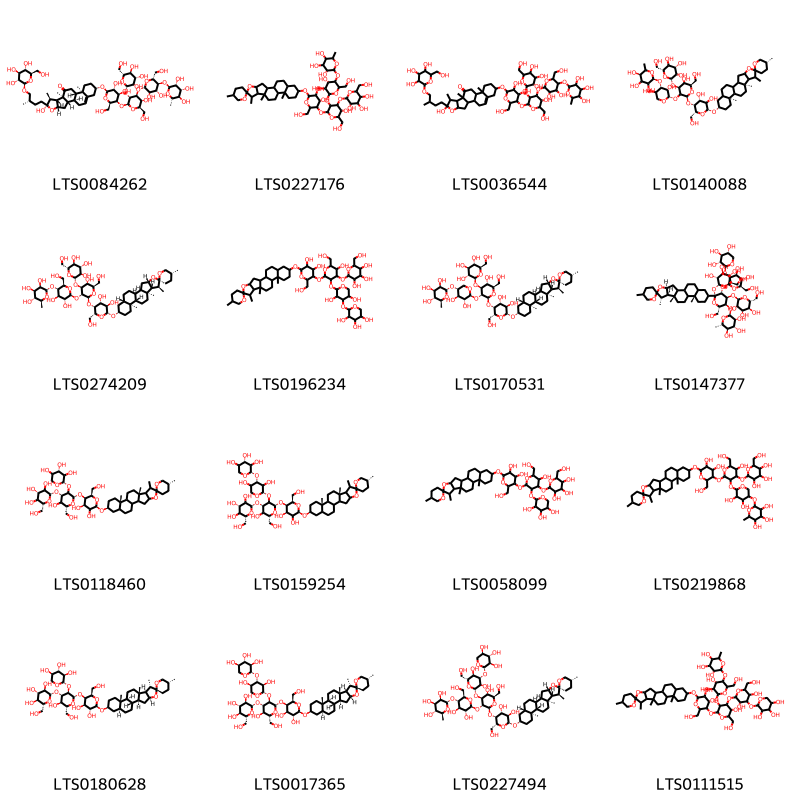{ width=100% }
    <figcaption>Hình ảnh cấu trúc hóa học của 16 hoạt chất thuộc nhóm Steroids and steroid derivatives gồm ['(1r,2s,4s,6s,7s,8r,9s,12s,13r,16s)-16-{[(2r,3r,4r,5r,6r)-5-{[(2s,3r,4s,5r,6r)-4-{[(2s,3r,4r,5s,6r)-3,4-dihydroxy-6-(hydroxymethyl)-5-{[(2s,3r,4r,5r,6s)-3,4,5-trihydroxy-6-methyloxan-2-yl]oxy}oxan-2-yl]oxy}-5-hydroxy-6-(hydroxymethyl)-3-{[(2s,3r,4s,5s,6r)-3,4,5-trihydroxy-6-(hydroxymethyl)oxan-2-yl]oxy}oxan-2-yl]oxy}-3,4-dihydroxy-6-(hydroxymethyl)oxan-2-yl]oxy}-6-hydroxy-7,9,13-trimethyl-6-[(3s)-3-methyl-4-{[(2r,3r,4s,5s,6r)-3,4,5-trihydroxy-6-(hydroxymethyl)oxan-2-yl]oxy}butyl]-5-oxapentacyclo[10.8.0.0²,⁹.0⁴,⁸.0¹³,¹⁸]icos-18-en-10-one (LTS0084262)', "2-[(2-{[4,5-dihydroxy-2-(hydroxymethyl)-6-{5,7',9',13'-tetramethyl-5'-oxaspiro[oxane-2,6'-pentacyclo[10.8.0.0²,⁹.0⁴,⁸.0¹³,¹⁸]icosane]oxy}oxan-3-yl]oxy}-3-{[3,4-dihydroxy-6-(hydroxymethyl)-5-[(3,4,5-trihydroxy-6-methyloxan-2-yl)oxy]oxan-2-yl]oxy}-5-hydroxy-6-(hydroxymethyl)oxan-4-yl)oxy]-6-(hydroxymethyl)oxane-3,4,5-triol (LTS0227176)", '16-({5-[(4-{[3,4-dihydroxy-6-(hydroxymethyl)-5-[(3,4,5-trihydroxy-6-methyloxan-2-yl)oxy]oxan-2-yl]oxy}-5-hydroxy-6-(hydroxymethyl)-3-{[3,4,5-trihydroxy-6-(hydroxymethyl)oxan-2-yl]oxy}oxan-2-yl)oxy]-3,4-dihydroxy-6-(hydroxymethyl)oxan-2-yl}oxy)-6-hydroxy-7,9,13-trimethyl-6-(3-methyl-4-{[3,4,5-trihydroxy-6-(hydroxymethyl)oxan-2-yl]oxy}butyl)-5-oxapentacyclo[10.8.0.0²,⁹.0⁴,⁸.0¹³,¹⁸]icos-18-en-10-one (LTS0036544)', "(2s,5r)-2-{[(2s,4s)-2-{[(2s,4s,6r)-2-{[(2r,3r,4r,6r)-4,5-dihydroxy-2-(hydroxymethyl)-6-[(5r,9's,13's,16's)-5,7',9',13'-tetramethyl-5'-oxaspiro[oxane-2,6'-pentacyclo[10.8.0.0²,⁹.0⁴,⁸.0¹³,¹⁸]icosane]oxy]oxan-3-yl]oxy}-5-hydroxy-6-(hydroxymethyl)-4-{[(2s,4s,6r)-3,4,5-trihydroxy-6-(hydroxymethyl)oxan-2-yl]oxy}oxan-3-yl]oxy}-3,5-dihydroxyoxan-4-yl]oxy}-6-methyloxane-3,4,5-triol (LTS0140088)", "(2s,3r,4r,5r,6s)-2-{[(2r,3s,4r,5r,6s)-6-{[(2s,3r,4s,5r,6r)-2-{[(2r,3r,4r,5r,6r)-4,5-dihydroxy-2-(hydroxymethyl)-6-[(1'r,2r,2's,4's,5r,7's,8'r,9's,12's,13's,16's,18's)-5,7',9',13'-tetramethyl-5'-oxaspiro[oxane-2,6'-pentacyclo[10.8.0.0²,⁹.0⁴,⁸.0¹³,¹⁸]icosane]oxy]oxan-3-yl]oxy}-5-hydroxy-6-(hydroxymethyl)-4-{[(2s,3r,4s,5s,6r)-3,4,5-trihydroxy-6-(hydroxymethyl)oxan-2-yl]oxy}oxan-3-yl]oxy}-4,5-dihydroxy-2-(hydroxymethyl)oxan-3-yl]oxy}-6-methyloxane-3,4,5-triol (LTS0274209)", "2-[(2-{[4,5-dihydroxy-2-(hydroxymethyl)-6-{5,7',9',13'-tetramethyl-5'-oxaspiro[oxane-2,6'-pentacyclo[10.8.0.0²,⁹.0⁴,⁸.0¹³,¹⁸]icosane]oxy}oxan-3-yl]oxy}-3-({3,5-dihydroxy-4-[(3,4,5-trihydroxyoxan-2-yl)oxy]oxan-2-yl}oxy)-5-hydroxy-6-(hydroxymethyl)oxan-4-yl)oxy]-6-(hydroxymethyl)oxane-3,4,5-triol (LTS0196234)", "(2s,3r,4r,5r,6s)-2-{[(3r,4r,5r,6s)-6-{[(2s,3r,4s,5r,6r)-2-{[(2r,3r,4r,5r,6r)-4,5-dihydroxy-2-(hydroxymethyl)-6-[(1'r,2r,2's,4's,5r,7's,8'r,9's,12's,13's,16's,18's)-5,7',9',13'-tetramethyl-5'-oxaspiro[oxane-2,6'-pentacyclo[10.8.0.0²,⁹.0⁴,⁸.0¹³,¹⁸]icosane]oxy]oxan-3-yl]oxy}-5-hydroxy-6-(hydroxymethyl)-4-{[(2s,3r,4s,5s,6r)-3,4,5-trihydroxy-6-(hydroxymethyl)oxan-2-yl]oxy}oxan-3-yl]oxy}-4,5-dihydroxyoxan-3-yl]oxy}-6-methyloxane-3,4,5-triol (LTS0170531)", "(2r,3r,4s,5s,6r)-2-{[(2r,3r,4s,5s,6s)-3-{[(2s,3r,4s,5s,6r)-4,5-dihydroxy-6-(hydroxymethyl)-3-{[(2s,3r,4s,5r)-3,4,5-trihydroxyoxan-2-yl]oxy}oxan-2-yl]oxy}-6-(hydroxymethyl)-2-[(4's,7's,8'r,9's,13's)-5,7',9',13'-tetramethyl-5'-oxaspiro[oxane-2,6'-pentacyclo[10.8.0.0²,⁹.0⁴,⁸.0¹³,¹⁸]icosan]-16'-yl]-4-{[(2r,3r,4s,5s,6r)-3,4,5-trihydroxy-6-(hydroxymethyl)oxan-2-yl]oxy}-5-{[(2s,3r,4r,5r,6s)-3,4,5-trihydroxy-6-methyloxan-2-yl]oxy}oxan-2-yl]oxy}-6-(hydroxymethyl)oxane-3,4,5-triol (LTS0147377)", "(2s,4s,6r)-2-{[(2s,4s,6r)-2-{[(2r,3r,4r,6r)-4,5-dihydroxy-2-(hydroxymethyl)-6-[(5r,9's,13's,16's)-5,7',9',13'-tetramethyl-5'-oxaspiro[oxane-2,6'-pentacyclo[10.8.0.0²,⁹.0⁴,⁸.0¹³,¹⁸]icosane]oxy]oxan-3-yl]oxy}-5-hydroxy-6-(hydroxymethyl)-3-{[(2s,4s)-3,4,5-trihydroxyoxan-2-yl]oxy}oxan-4-yl]oxy}-6-(hydroxymethyl)oxane-3,4,5-triol (LTS0118460)", "(2s,4s,6r)-2-{[(2s,4s,6r)-2-{[(2r,3r,4r,6r)-4,5-dihydroxy-2-(hydroxymethyl)-6-[(5r,9's,13's,16's)-5,7',9',13'-tetramethyl-5'-oxaspiro[oxane-2,6'-pentacyclo[10.8.0.0²,⁹.0⁴,⁸.0¹³,¹⁸]icosane]oxy]oxan-3-yl]oxy}-3-{[(2s,4s)-3,5-dihydroxy-4-{[(2s,4s)-3,4,5-trihydroxyoxan-2-yl]oxy}oxan-2-yl]oxy}-5-hydroxy-6-(hydroxymethyl)oxan-4-yl]oxy}-6-(hydroxymethyl)oxane-3,4,5-triol (LTS0159254)", "2-[(2-{[4,5-dihydroxy-2-(hydroxymethyl)-6-{5,7',9',13'-tetramethyl-5'-oxaspiro[oxane-2,6'-pentacyclo[10.8.0.0²,⁹.0⁴,⁸.0¹³,¹⁸]icosane]oxy}oxan-3-yl]oxy}-5-hydroxy-6-(hydroxymethyl)-3-[(3,4,5-trihydroxyoxan-2-yl)oxy]oxan-4-yl)oxy]-6-(hydroxymethyl)oxane-3,4,5-triol (LTS0058099)", "2-[(2-{[4,5-dihydroxy-2-(hydroxymethyl)-6-{5,7',9',13'-tetramethyl-5'-oxaspiro[oxane-2,6'-pentacyclo[10.8.0.0²,⁹.0⁴,⁸.0¹³,¹⁸]icosane]oxy}oxan-3-yl]oxy}-3-({3,4-dihydroxy-5-[(3,4,5-trihydroxy-6-methyloxan-2-yl)oxy]oxan-2-yl}oxy)-5-hydroxy-6-(hydroxymethyl)oxan-4-yl)oxy]-6-(hydroxymethyl)oxane-3,4,5-triol (LTS0219868)", "(2s,3r,4s,5s,6r)-2-{[(2s,3r,4s,5r,6r)-2-{[(2r,3r,4r,5r,6r)-4,5-dihydroxy-2-(hydroxymethyl)-6-[(1'r,2r,2's,4's,5r,7's,8'r,9's,12's,13's,16's,18's)-5,7',9',13'-tetramethyl-5'-oxaspiro[oxane-2,6'-pentacyclo[10.8.0.0²,⁹.0⁴,⁸.0¹³,¹⁸]icosane]oxy]oxan-3-yl]oxy}-5-hydroxy-6-(hydroxymethyl)-3-{[(2s,3r,4s,5r)-3,4,5-trihydroxyoxan-2-yl]oxy}oxan-4-yl]oxy}-6-(hydroxymethyl)oxane-3,4,5-triol (LTS0180628)", "(2s,3r,4s,5s,6r)-2-{[(2s,3r,4s,5r,6r)-2-{[(2r,3r,4r,5r,6r)-4,5-dihydroxy-2-(hydroxymethyl)-6-[(1'r,2r,2's,4's,5r,7's,8'r,9's,12's,13's,16's,18's)-5,7',9',13'-tetramethyl-5'-oxaspiro[oxane-2,6'-pentacyclo[10.8.0.0²,⁹.0⁴,⁸.0¹³,¹⁸]icosane]oxy]oxan-3-yl]oxy}-3-{[(2s,3r,4s,5r)-3,5-dihydroxy-4-{[(2s,3r,4s,5r)-3,4,5-trihydroxyoxan-2-yl]oxy}oxan-2-yl]oxy}-5-hydroxy-6-(hydroxymethyl)oxan-4-yl]oxy}-6-(hydroxymethyl)oxane-3,4,5-triol (LTS0017365)", "(2s,3r,4r,5r,6s)-2-{[(2r,3s,4r,5r,6s)-6-{[(2s,3r,4s,5r,6r)-2-{[(2r,3r,4r,5r,6r)-4,5-dihydroxy-2-(hydroxymethyl)-6-[(1'r,2r,2's,4's,5r,7's,8'r,9's,12's,13's,16's,18's)-5,7',9',13'-tetramethyl-5'-oxaspiro[oxane-2,6'-pentacyclo[10.8.0.0²,⁹.0⁴,⁸.0¹³,¹⁸]icosane]oxy]oxan-3-yl]oxy}-4-{[(2s,3r,4s,5r,6r)-3,5-dihydroxy-6-(hydroxymethyl)-4-{[(2s,3r,4s,5r)-3,4,5-trihydroxyoxan-2-yl]oxy}oxan-2-yl]oxy}-5-hydroxy-6-(hydroxymethyl)oxan-3-yl]oxy}-4,5-dihydroxy-2-(hydroxymethyl)oxan-3-yl]oxy}-6-methyloxane-3,4,5-triol (LTS0227494)", "2-({6-[(2-{[4,5-dihydroxy-2-(hydroxymethyl)-6-{5,7',9',13'-tetramethyl-5'-oxaspiro[oxane-2,6'-pentacyclo[10.8.0.0²,⁹.0⁴,⁸.0¹³,¹⁸]icosane]oxy}oxan-3-yl]oxy}-4-{[3,5-dihydroxy-6-(hydroxymethyl)-4-[(3,4,5-trihydroxyoxan-2-yl)oxy]oxan-2-yl]oxy}-5-hydroxy-6-(hydroxymethyl)oxan-3-yl)oxy]-4,5-dihydroxy-2-(hydroxymethyl)oxan-3-yl}oxy)-6-methyloxane-3,4,5-triol (LTS0111515)"].</figcaption>
</figure>

---

### Dược dân tộc học

Danh sách các quốc gia có sử dụng *Agave sisalana* trong điều trị các bệnh. 

| Country            | Disease                | Bệnh                   |
|:-------------------|:-----------------------|:-----------------------|
| Dominican Republic | Sudorific              | Ngạt thở               |
| Haiti              | Cicatrizant, Sudorific | Cicatrizant, Sudorific |

---

# Chi Dracaena

??? note "Danh sách các dược liệu thuộc chi"
    
	 - *Dracaena cinnabari*
	 - *Dracaena congesta*
	 - *Dracaena graminifolia*
	 - *Dracaena porteri*

---
## Dracaena cinnabari
### Thông tin về thực vật

!!! info "Phân loại thực vật của *Dracaena cinnabari* từ GIBF:"
    - **Kingdom:** Plantae
    - **Phylum:** Tracheophyta
    - **Order:** Asparagales
    - **Family:** Asparagaceae
    - **Genus:** Dracaena
    - **Species:** *Dracaena cinnabari*

 

| Label (VI)   | Label (EN)   | Scientific Name    | Descriptions (VI)   | Descriptions (EN)   | Also Known As (VI)   | Also Known As (EN)      |
|:-------------|:-------------|:-------------------|:--------------------|:--------------------|:---------------------|:------------------------|
| N/A          | N/A          | Dracaena cinnabari | loài thực vật       | species of plant    | ['']                 | ["Dragon's blood tree"] |

#### Phân bố trên thế giới

**Từ CSDL GIBF** nan, United Kingdom of Great Britain and Northern Ireland, Tanzania, United Republic of, New Zealand, Yemen, United States of America, Belgium, Oman

#### Phân bố tại Việt Nam

**Từ CSDL GIBF**: Không có ghi nhận ở Việt Nam

---
### Thành phần hóa học
        
- Theo cơ sở dữ liệu lotus: Từ loài *Dracaena cinnabari* đã phân lập và xác định được 75 hoạt chất thuộc về các nhóm Flavonoids, Prenol lipids, Diarylheptanoids, Linear 1,3-diarylpropanoids, Homoisoflavonoids, Steroids and steroid derivatives, Benzene and substituted derivatives. 

|    | chemicalTaxonomyClassyfireClass     |   smiles_count |
|---:|:------------------------------------|---------------:|
|  0 | Benzene and substituted derivatives |              1 |
|  1 | Diarylheptanoids                    |             15 |
|  2 | Flavonoids                          |              9 |
|  3 | Homoisoflavonoids                   |              8 |
|  4 | Linear 1,3-diarylpropanoids         |              4 |
|  5 | Prenol lipids                       |              8 |
|  6 | Steroids and steroid derivatives    |             30 |

#### Nhóm Benzene and substituted derivatives
<figure markdown="span">
    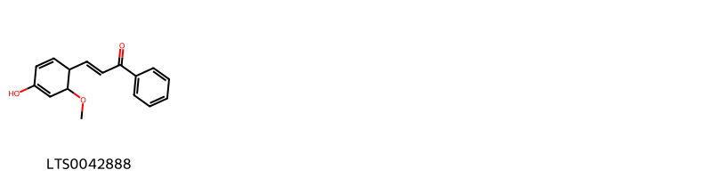{ width=100% }
    <figcaption>Hình ảnh cấu trúc hóa học của 1 hoạt chất thuộc nhóm Benzene and substituted derivatives gồm ['3-(4-hydroxy-6-methoxycyclohexa-2,4-dien-1-yl)-1-phenylprop-2-en-1-one (LTS0042888)'].</figcaption>
</figure>
#### Nhóm Diarylheptanoids
<figure markdown="span">
    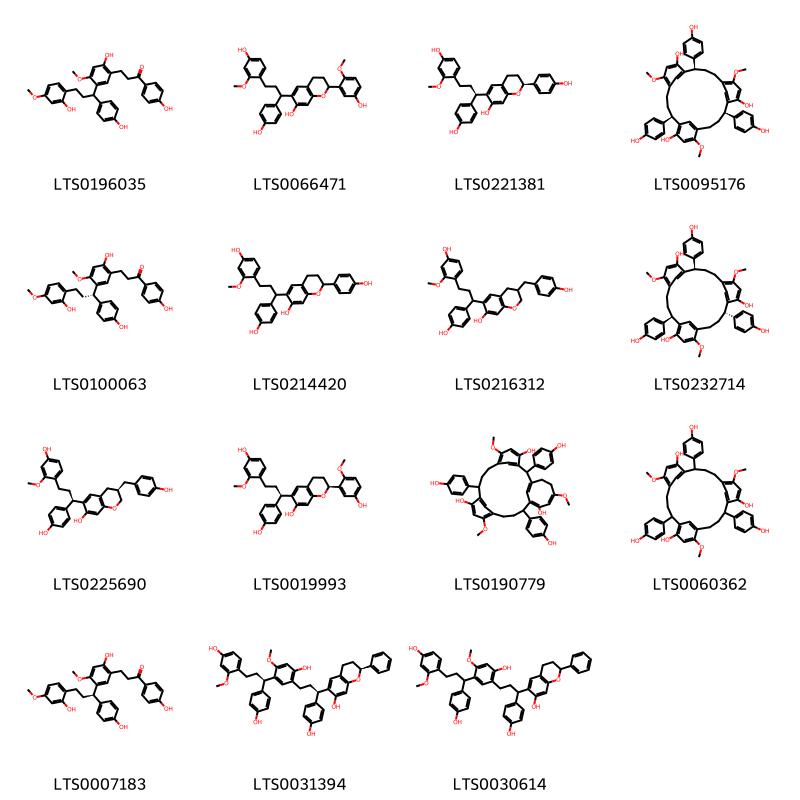{ width=100% }
    <figcaption>Hình ảnh cấu trúc hóa học của 15 hoạt chất thuộc nhóm Diarylheptanoids gồm ['3-{2-hydroxy-5-[3-(2-hydroxy-4-methoxyphenyl)-1-(4-hydroxyphenyl)propyl]-4-methoxyphenyl}-1-(4-hydroxyphenyl)propan-1-one (LTS0196035)', '2-(5-hydroxy-2-methoxyphenyl)-6-[3-(4-hydroxy-2-methoxyphenyl)-1-(4-hydroxyphenyl)propyl]-3,4-dihydro-2h-1-benzopyran-7-ol (LTS0066471)', '(2s)-6-[(1r)-3-(4-hydroxy-2-methoxyphenyl)-1-(4-hydroxyphenyl)propyl]-2-(4-hydroxyphenyl)-3,4-dihydro-2h-1-benzopyran-7-ol (LTS0221381)', '(4r,12r,20r)-4,12,20-tris(4-hydroxyphenyl)-8,16,24-trimethoxytetracyclo[19.3.1.1⁵,⁹.1¹³,¹⁷]heptacosa-1(25),5(27),6,8,13(26),14,16,21,23-nonaene-6,14,22-triol (LTS0095176)', '3-{2-hydroxy-5-[(1s)-3-(2-hydroxy-4-methoxyphenyl)-1-(4-hydroxyphenyl)propyl]-4-methoxyphenyl}-1-(4-hydroxyphenyl)propan-1-one (LTS0100063)', '6-[3-(4-hydroxy-2-methoxyphenyl)-1-(4-hydroxyphenyl)propyl]-2-(4-hydroxyphenyl)-3,4-dihydro-2h-1-benzopyran-7-ol (LTS0214420)', '6-[3-(4-hydroxy-2-methoxyphenyl)-1-(4-hydroxyphenyl)propyl]-3-[(4-hydroxyphenyl)methyl]-3,4-dihydro-2h-1-benzopyran-7-ol (LTS0216312)', '(4s,12r,20r)-4,12,20-tris(4-hydroxyphenyl)-8,16,24-trimethoxytetracyclo[19.3.1.1⁵,⁹.1¹³,¹⁷]heptacosa-1(25),5(27),6,8,13(26),14,16,21,23-nonaene-6,14,22-triol (LTS0232714)', '(3r)-6-[(1r)-3-(4-hydroxy-2-methoxyphenyl)-1-(4-hydroxyphenyl)propyl]-3-[(4-hydroxyphenyl)methyl]-3,4-dihydro-2h-1-benzopyran-7-ol (LTS0225690)', '(2s)-2-(5-hydroxy-2-methoxyphenyl)-6-[(1r)-3-(4-hydroxy-2-methoxyphenyl)-1-(4-hydroxyphenyl)propyl]-3,4-dihydro-2h-1-benzopyran-7-ol (LTS0019993)', '(1e,19e,21e)-2,10,18-tris(4-hydroxyphenyl)-6,14,22-trimethoxytetracyclo[17.5.1.1³,⁷.1¹¹,¹⁵]heptacosa-1(25),3(27),4,6,11(26),12,14,19,21-nonaene-4,12,20-triol (LTS0190779)', '4,12,20-tris(4-hydroxyphenyl)-8,16,24-trimethoxytetracyclo[19.3.1.1⁵,⁹.1¹³,¹⁷]heptacosa-1(25),5(27),6,8,13(26),14,16,21,23-nonaene-6,14,22-triol (LTS0060362)', '3-{2-hydroxy-5-[(1r)-3-(2-hydroxy-4-methoxyphenyl)-1-(4-hydroxyphenyl)propyl]-4-methoxyphenyl}-1-(4-hydroxyphenyl)propan-1-one (LTS0007183)', '(2s)-6-[(1r)-3-{2-hydroxy-5-[(1r)-3-(4-hydroxy-2-methoxyphenyl)-1-(4-hydroxyphenyl)propyl]-4-methoxyphenyl}-1-(4-hydroxyphenyl)propyl]-2-phenyl-3,4-dihydro-2h-1-benzopyran-7-ol (LTS0031394)', '6-(3-{2-hydroxy-5-[3-(4-hydroxy-2-methoxyphenyl)-1-(4-hydroxyphenyl)propyl]-4-methoxyphenyl}-1-(4-hydroxyphenyl)propyl)-2-phenyl-3,4-dihydro-2h-1-benzopyran-7-ol (LTS0030614)'].</figcaption>
</figure>
#### Nhóm Flavonoids
<figure markdown="span">
    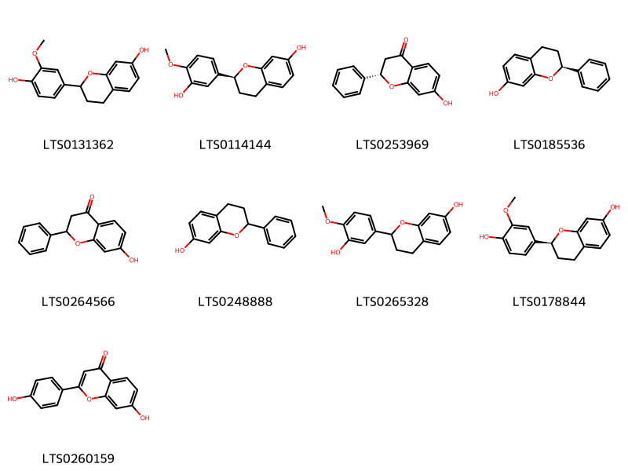{ width=100% }
    <figcaption>Hình ảnh cấu trúc hóa học của 9 hoạt chất thuộc nhóm Flavonoids gồm ['2-(4-hydroxy-3-methoxyphenyl)-3,4-dihydro-2h-1-benzopyran-7-ol (LTS0131362)', '(2s)-2-(3-hydroxy-4-methoxyphenyl)-3,4-dihydro-2h-1-benzopyran-7-ol (LTS0114144)', '(2s)-7-hydroxyflavanone (LTS0253969)', '7-hydroxyflavan (LTS0185536)', '7-hydroxyflavanone (LTS0264566)', '7-hydroxyflavan (LTS0248888)', '2-(3-hydroxy-4-methoxyphenyl)-3,4-dihydro-2h-1-benzopyran-7-ol (LTS0265328)', '(2s)-2-(4-hydroxy-3-methoxyphenyl)-3,4-dihydro-2h-1-benzopyran-7-ol (LTS0178844)', "7,4'-dihydroxyflavone (LTS0260159)"].</figcaption>
</figure>
#### Nhóm Homoisoflavonoids
<figure markdown="span">
    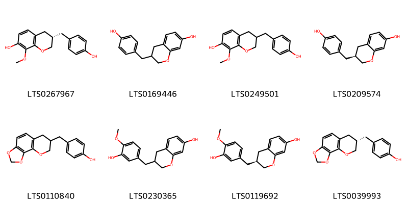{ width=100% }
    <figcaption>Hình ảnh cấu trúc hóa học của 8 hoạt chất thuộc nhóm Homoisoflavonoids gồm ['(3s)-3-[(4-hydroxyphenyl)methyl]-8-methoxy-3,4-dihydro-2h-1-benzopyran-7-ol (LTS0267967)', '3-[(4-hydroxyphenyl)methyl]-3,4-dihydro-2h-1-benzopyran-7-ol (LTS0169446)', '3-[(4-hydroxyphenyl)methyl]-8-methoxy-3,4-dihydro-2h-1-benzopyran-7-ol (LTS0249501)', '(3s)-3-[(4-hydroxyphenyl)methyl]-3,4-dihydro-2h-1-benzopyran-7-ol (LTS0209574)', '4-{3,5,13-trioxatricyclo[7.4.0.0²,⁶]trideca-1(9),2(6),7-trien-11-ylmethyl}phenol (LTS0110840)', '3-[(3-hydroxy-4-methoxyphenyl)methyl]-3,4-dihydro-2h-1-benzopyran-7-ol (LTS0230365)', '(3s)-3-[(3-hydroxy-4-methoxyphenyl)methyl]-3,4-dihydro-2h-1-benzopyran-7-ol (LTS0119692)', '4-[(11s)-3,5,13-trioxatricyclo[7.4.0.0²,⁶]trideca-1(9),2(6),7-trien-11-ylmethyl]phenol (LTS0039993)'].</figcaption>
</figure>
#### Nhóm Linear 1_3-diarylpropanoids
<figure markdown="span">
    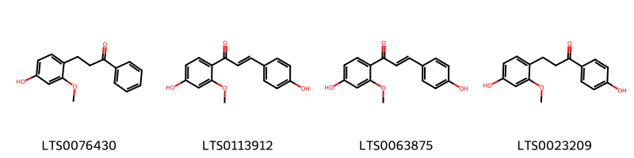{ width=100% }
    <figcaption>Hình ảnh cấu trúc hóa học của Không tìm thấy chú thích hoạt chất thuộc nhóm Linear 1_3-diarylpropanoids gồm Không tìm thấy chú thích.</figcaption>
</figure>
#### Nhóm Prenol lipids
<figure markdown="span">
    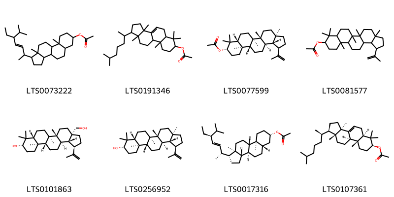{ width=100% }
    <figcaption>Hình ảnh cấu trúc hóa học của 8 hoạt chất thuộc nhóm Prenol lipids gồm ['1-(5-ethyl-6-methylhept-3-en-2-yl)-9a,11a-dimethyl-tetradecahydro-1h-cyclopenta[a]phenanthren-7-yl acetate (LTS0073222)', '3a,6,6,9a,11a-pentamethyl-1-(6-methylheptan-2-yl)-1h,2h,3h,5h,5ah,7h,8h,9h,9bh,10h,11h-cyclopenta[a]phenanthren-7-yl acetate (LTS0191346)', 'lupeol acetate (LTS0077599)', '3a,5a,5b,8,8,11a-hexamethyl-1-(prop-1-en-2-yl)-hexadecahydrocyclopenta[a]chrysen-9-yl acetate (LTS0081577)', 'betulin (LTS0101863)', 'lupeol (LTS0256952)', '(1r,3as,3br,5as,7s,9as,9bs,11ar)-1-[(2r,3e,5s)-5-ethyl-6-methylhept-3-en-2-yl]-9a,11a-dimethyl-tetradecahydro-1h-cyclopenta[a]phenanthren-7-yl acetate (LTS0017316)', '(1r,3ar,5ar,7s,9ar,9br,11ar)-3a,6,6,9a,11a-pentamethyl-1-[(2r)-6-methylheptan-2-yl]-1h,2h,3h,5h,5ah,7h,8h,9h,9bh,10h,11h-cyclopenta[a]phenanthren-7-yl acetate (LTS0107361)'].</figcaption>
</figure>
#### Nhóm Steroids and steroid derivatives
<figure markdown="span">
    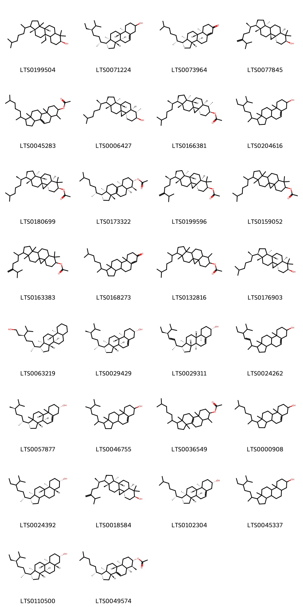{ width=100% }
    <figcaption>Hình ảnh cấu trúc hóa học của 30 hoạt chất thuộc nhóm Steroids and steroid derivatives gồm ['(3br,7s,9bs,11ar)-9b-ethyl-3a,6,6,11a-tetramethyl-1-(6-methylheptan-2-yl)-dodecahydro-1h-cyclopenta[a]phenanthren-7-ol (LTS0199504)', 'stigmast-5-en-3-ol (LTS0071224)', 'cholestenone (LTS0073964)', '24-methylene-cycloartanol (LTS0077845)', '6,9a,11a-trimethyl-1-(6-methylheptan-2-yl)-1h,2h,3h,3ah,5h,5ah,6h,7h,8h,9h,9bh,10h,11h-cyclopenta[a]phenanthren-7-yl acetate (LTS0045283)', '(1s,3r,6s,7s,8s,11s,12s,15r,16r)-7,12,16-trimethyl-15-[(2r)-6-methylheptan-2-yl]pentacyclo[9.7.0.0¹,³.0³,⁸.0¹²,¹⁶]octadecan-6-ol (LTS0006427)', '(1s,3r,6s,7s,8s,11s,12s,15r,16r)-7,12,16-trimethyl-15-[(2r)-6-methylheptan-2-yl]pentacyclo[9.7.0.0¹,³.0³,⁸.0¹²,¹⁶]octadecan-6-yl acetate (LTS0166381)', 'stigmast-5-en-3-ol, (3β)- (LTS0204616)', '(1s,3r,6s,8r,11s,12s,15r,16r)-7,7,12,16-tetramethyl-15-[(2r)-6-methylheptan-2-yl]pentacyclo[9.7.0.0¹,³.0³,⁸.0¹²,¹⁶]octadecan-6-yl acetate (LTS0180699)', '(1r,3ar,5ar,6s,7s,9as,11ar)-3a,6,9a,11a-tetramethyl-1-[(2r)-6-methylheptan-2-yl]-1h,2h,3h,4h,5h,5ah,6h,7h,8h,9h,10h,11h-cyclopenta[a]phenanthren-7-yl acetate (LTS0173322)', '(1s,3r,6s,8r,11s,12s,15r,16r)-7,7,12,16-tetramethyl-15-[(2r)-6-methyl-5-methylideneheptan-2-yl]pentacyclo[9.7.0.0¹,³.0³,⁸.0¹²,¹⁶]octadecan-6-yl acetate (LTS0199596)', '7,7,12,16-tetramethyl-15-(6-methylheptan-2-yl)pentacyclo[9.7.0.0¹,³.0³,⁸.0¹²,¹⁶]octadecan-6-yl acetate (LTS0159052)', '7,7,12,16-tetramethyl-15-(6-methyl-5-methylideneheptan-2-yl)pentacyclo[9.7.0.0¹,³.0³,⁸.0¹²,¹⁶]octadecan-6-yl acetate (LTS0163383)', '9a,11a-dimethyl-1-(6-methylheptan-2-yl)-1h,2h,3h,3ah,3bh,4h,5h,8h,9h,9bh,10h,11h-cyclopenta[a]phenanthren-7-one (LTS0168273)', '7,12,16-trimethyl-15-(6-methylheptan-2-yl)pentacyclo[9.7.0.0¹,³.0³,⁸.0¹²,¹⁶]octadecan-6-yl acetate (LTS0132816)', 'cycloartanol (LTS0176903)', '(3s,6r)-6-[(1r,3as,3br,9as,9bs,11ar)-9a,11a-dimethyl-tetradecahydro-1h-cyclopenta[a]phenanthren-1-yl]-3-isopropylheptan-1-ol (LTS0063219)', 'campesterol (LTS0029429)', 'phytosterol (LTS0029311)', 'stigmasterol (LTS0024262)', '(1r,3as,3bs,7s,9bs)-1-[(2r,5r)-5,6-dimethylheptan-2-yl]-9a,11a-dimethyl-1h,2h,3h,3ah,3bh,4h,6h,7h,8h,9h,9bh,10h,11h-cyclopenta[a]phenanthren-7-ol (LTS0057877)', 'campesterol (LTS0046755)', '3a,6,9a,11a-tetramethyl-1-(6-methylheptan-2-yl)-1h,2h,3h,4h,5h,5ah,6h,7h,8h,9h,10h,11h-cyclopenta[a]phenanthren-7-yl acetate (LTS0036549)', 'epicholestrol (LTS0000908)', '(1r,5as,7s,9as,9bs,11ar)-1-[(2r)-5-ethyl-6-methylheptan-2-yl]-9a,11a-dimethyl-tetradecahydro-1h-cyclopenta[a]phenanthren-7-ol (LTS0024392)', '24-methylenecycloartanol (LTS0018584)', 'cholesterol (LTS0102304)', '24-ethyl coprostanol (LTS0045337)', 'stigmastanol (LTS0110500)', '(1r,3ar,5ar,6s,7s,9as,9br,11ar)-6,9a,11a-trimethyl-1-[(2r)-6-methylheptan-2-yl]-1h,2h,3h,3ah,5h,5ah,6h,7h,8h,9h,9bh,10h,11h-cyclopenta[a]phenanthren-7-yl acetate (LTS0049574)'].</figcaption>
</figure>

---

### Dược dân tộc học

Danh sách các quốc gia có sử dụng *Dracaena cinnabari* trong điều trị các bệnh. 

| Country   | Disease                 | Bệnh                     |
|:----------|:------------------------|:-------------------------|
| Egypt     | Cicatrizant, Astringent | Cicatrizant, Chất làm se |
| Elsewhere | Astringent              | Lam se da                |

---

---
## Dracaena congesta
### Thông tin về thực vật

!!! info "Phân loại thực vật của *N/A* từ GIBF:"
    - **Kingdom:** Plantae
    - **Phylum:** Tracheophyta
    - **Order:** Asparagales
    - **Family:** Asparagaceae
    - **Genus:** N/A
    - **Species:** *N/A*

 

| Label (VI)   | Label (EN)   | Scientific Name   | Descriptions (VI)   | Descriptions (EN)   | Also Known As (VI)   | Also Known As (EN)   |
|:-------------|:-------------|:------------------|:--------------------|:--------------------|:---------------------|:---------------------|
| N/A          | N/A          | Dracaena congesta | loài thực vật       | species of plant    | ['']                 | ['']                 |

#### Phân bố trên thế giới

**Từ CSDL GIBF** Georgia, Thailand, Namibia, Spain, Austria, Australia, Serbia, Puerto Rico, Canada, Virgin Islands (U.S.), Türkiye, Peru, Mexico, Ireland, Chinese Taipei, Uruguay, United Kingdom of Great Britain and Northern Ireland, Niue, Portugal, South Africa, France, Morocco, New Zealand, Costa Rica, Russian Federation, Ecuador, United States of America, Italy, Israel, Algeria

#### Phân bố tại Việt Nam

**Từ CSDL GIBF**: Không có ghi nhận ở Việt Nam

---
### Thành phần hóa học
        
- Theo cơ sở dữ liệu lotus: Từ loài *N/A* đã phân lập và xác định được Chưa có hoạt chất nào được phân lập. hoạt chất thuộc về các nhóm Không có hoạt chất nào được phân lập. 

Không có hình ảnh nào được tạo ra

---

### Dược dân tộc học

Danh sách các quốc gia có sử dụng *N/A* trong điều trị các bệnh. 

| Country   | Disease   | Bệnh           |
|:----------|:----------|:---------------|
| Elsewhere | Vermifuge | Thuốc diệt sán |
| Malaya    | Vermifuge | Thuốc diệt sán |

---

---
## Dracaena graminifolia
### Thông tin về thực vật

!!! info "Phân loại thực vật của *Dracaena graminifolia* từ GIBF:"
    - **Kingdom:** Plantae
    - **Phylum:** Tracheophyta
    - **Order:** Asparagales
    - **Family:** Asparagaceae
    - **Genus:** Dracaena
    - **Species:** *Dracaena graminifolia*

 

| Label (VI)   | Label (EN)   | Scientific Name       | Descriptions (VI)   | Descriptions (EN)   | Also Known As (VI)   | Also Known As (EN)   |
|:-------------|:-------------|:----------------------|:--------------------|:--------------------|:---------------------|:---------------------|
| N/A          | N/A          | Dracaena graminifolia |                     |                     | ['']                 | ['']                 |

#### Phân bố trên thế giới

**Từ CSDL GIBF** Georgia, Thailand, Namibia, Spain, Austria, Australia, Serbia, Puerto Rico, Canada, Virgin Islands (U.S.), Türkiye, Peru, Mexico, Ireland, Chinese Taipei, Uruguay, United Kingdom of Great Britain and Northern Ireland, Niue, Portugal, South Africa, France, Morocco, New Zealand, Costa Rica, Russian Federation, Ecuador, United States of America, Italy, Israel, Algeria

#### Phân bố tại Việt Nam

**Từ CSDL GIBF**: Không có ghi nhận ở Việt Nam

---
### Thành phần hóa học
        
- Theo cơ sở dữ liệu lotus: Từ loài *Dracaena graminifolia* đã phân lập và xác định được Chưa có hoạt chất nào được phân lập. hoạt chất thuộc về các nhóm Không có hoạt chất nào được phân lập. 

Không có hình ảnh nào được tạo ra

---

### Dược dân tộc học

Danh sách các quốc gia có sử dụng *Dracaena graminifolia* trong điều trị các bệnh. 

| Country   | Disease   | Bệnh          |
|:----------|:----------|:--------------|
| Perak     | Antidote  | Chất giải độc |

---

---
## Dracaena porteri
### Thông tin về thực vật

!!! info "Phân loại thực vật của *Dracaena porteri* từ GIBF:"
    - **Kingdom:** Plantae
    - **Phylum:** Tracheophyta
    - **Order:** Asparagales
    - **Family:** Asparagaceae
    - **Genus:** Dracaena
    - **Species:** *Dracaena porteri*

 

| Label (VI)   | Label (EN)   | Scientific Name   | Descriptions (VI)   | Descriptions (EN)   | Also Known As (VI)   | Also Known As (EN)   |
|:-------------|:-------------|:------------------|:--------------------|:--------------------|:---------------------|:---------------------|
| N/A          | N/A          | Dracaena porteri  | loài thực vật       | species of plant    | ['']                 | ['']                 |

#### Phân bố trên thế giới

**Từ CSDL GIBF** nan, Thailand, Malaysia, Singapore, Indonesia

#### Phân bố tại Việt Nam

**Từ CSDL GIBF**: Không có ghi nhận ở Việt Nam

---
### Thành phần hóa học
        
- Theo cơ sở dữ liệu lotus: Từ loài *Dracaena porteri* đã phân lập và xác định được Chưa có hoạt chất nào được phân lập. hoạt chất thuộc về các nhóm Không có hoạt chất nào được phân lập. 

Không có hình ảnh nào được tạo ra

---

### Dược dân tộc học

Danh sách các quốc gia có sử dụng *Dracaena porteri* trong điều trị các bệnh. 

| Country   | Disease   | Bệnh           |
|:----------|:----------|:---------------|
| Malaya    | Vermifuge | Thuốc diệt sán |

---

# Chi Furcraea

??? note "Danh sách các dược liệu thuộc chi"
    
	 - *Furcraea gigantea*
	 - *Furcraea hexapetala*
	 - *Furcraea tuberosa*

---
## Furcraea gigantea
### Thông tin về thực vật

!!! info "Phân loại thực vật của *Furcraea foetida* từ GIBF:"
    - **Kingdom:** Plantae
    - **Phylum:** Tracheophyta
    - **Order:** Asparagales
    - **Family:** Asparagaceae
    - **Genus:** Furcraea
    - **Species:** *Furcraea foetida*

 

| Label (VI)   | Label (EN)   | Scientific Name   | Descriptions (VI)   | Descriptions (EN)   | Also Known As (VI)   | Also Known As (EN)   |
|:-------------|:-------------|:------------------|:--------------------|:--------------------|:---------------------|:---------------------|
| N/A          | N/A          | Furcraea gigantea |                     |                     | ['']                 | ['']                 |

#### Phân bố trên thế giới

**Từ CSDL GIBF** nan, unknown or invalid, Ghana, Dominica, French Polynesia, Cameroon, Kenya, Martinique, Jamaica, Indonesia, Sierra Leone, Colombia, Sri Lanka, Venezuela (Bolivarian Republic of), Suriname, Poland, Mauritius, India, Malaysia, Mayotte, Seychelles, Nigeria, Virgin Islands (U.S.), Barbados, Uganda, Vanuatu, Brazil, Saint Helena, Ascension and Tristan da Cunha, Aruba, Mexico, China, Curaçao, South Africa, Fiji, Paraguay, New Caledonia, Congo, Democratic Republic of the, Ecuador, United States of America, Madagascar, Cabo Verde, Guyana

#### Phân bố tại Việt Nam

**Từ CSDL GIBF**: Không có ghi nhận ở Việt Nam

---
### Thành phần hóa học
        
- Theo cơ sở dữ liệu lotus: Từ loài *Furcraea foetida* đã phân lập và xác định được 2 hoạt chất thuộc về các nhóm Steroids and steroid derivatives. 

|    | chemicalTaxonomyClassyfireClass   |   smiles_count |
|---:|:----------------------------------|---------------:|
|  0 | Steroids and steroid derivatives  |              2 |

#### Nhóm Steroids and steroid derivatives
<figure markdown="span">
    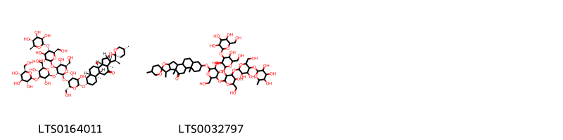{ width=100% }
    <figcaption>Hình ảnh cấu trúc hóa học của 2 hoạt chất thuộc nhóm Steroids and steroid derivatives gồm ["(1'r,2r,2's,4's,5r,7's,8'r,9's,12's,13's,16's,18's)-16'-{[(2r,3r,4r,5r,6r)-5-{[(2s,3r,4s,5r,6r)-3-{[(2s,3r,4s,5r,6r)-3,5-dihydroxy-6-(hydroxymethyl)-4-{[(2s,3r,4s,5s,6r)-3,4,5-trihydroxy-6-(hydroxymethyl)oxan-2-yl]oxy}oxan-2-yl]oxy}-4-{[(2s,3r,4r,5s,6r)-3,4-dihydroxy-6-(hydroxymethyl)-5-{[(2s,3r,4r,5r,6s)-3,4,5-trihydroxy-6-methyloxan-2-yl]oxy}oxan-2-yl]oxy}-5-hydroxy-6-(hydroxymethyl)oxan-2-yl]oxy}-3,4-dihydroxy-6-(hydroxymethyl)oxan-2-yl]oxy}-5,7',9',13'-tetramethyl-5'-oxaspiro[oxane-2,6'-pentacyclo[10.8.0.0²,⁹.0⁴,⁸.0¹³,¹⁸]icosan]-10'-one (LTS0164011)", "16'-({5-[(3-{[3,5-dihydroxy-6-(hydroxymethyl)-4-{[3,4,5-trihydroxy-6-(hydroxymethyl)oxan-2-yl]oxy}oxan-2-yl]oxy}-4-{[3,4-dihydroxy-6-(hydroxymethyl)-5-[(3,4,5-trihydroxy-6-methyloxan-2-yl)oxy]oxan-2-yl]oxy}-5-hydroxy-6-(hydroxymethyl)oxan-2-yl)oxy]-3,4-dihydroxy-6-(hydroxymethyl)oxan-2-yl}oxy)-5,7',9',13'-tetramethyl-5'-oxaspiro[oxane-2,6'-pentacyclo[10.8.0.0²,⁹.0⁴,⁸.0¹³,¹⁸]icosan]-10'-one (LTS0032797)"].</figcaption>
</figure>

---

### Dược dân tộc học

Danh sách các quốc gia có sử dụng *Furcraea foetida* trong điều trị các bệnh. 

| Country   | Disease   | Bệnh          |
|:----------|:----------|:--------------|
| India     | Piscicide | Thuốc diệt cá |

---

---
## Furcraea hexapetala
### Thông tin về thực vật

!!! info "Phân loại thực vật của *Furcraea hexapetala* từ GIBF:"
    - **Kingdom:** Plantae
    - **Phylum:** Tracheophyta
    - **Order:** Asparagales
    - **Family:** Asparagaceae
    - **Genus:** Furcraea
    - **Species:** *Furcraea hexapetala*

 

| Label (VI)   | Label (EN)   | Scientific Name     | Descriptions (VI)   | Descriptions (EN)   | Also Known As (VI)   | Also Known As (EN)   |
|:-------------|:-------------|:--------------------|:--------------------|:--------------------|:---------------------|:---------------------|
| N/A          | N/A          | Furcraea hexapetala | loài thực vật       | species of plant    | ['']                 | ['']                 |

#### Phân bố trên thế giới

**Từ CSDL GIBF** Honduras, nan, Spain, French Polynesia, Trinidad and Tobago, Jamaica, Colombia, Dominican Republic, Samoa, Cuba, Bahamas, Belgium, Belize, Brazil, Peru, Mexico, Switzerland, Bermuda, Ecuador, United States of America, Italy

#### Phân bố tại Việt Nam

**Từ CSDL GIBF**: Không có ghi nhận ở Việt Nam

---
### Thành phần hóa học
        
- Theo cơ sở dữ liệu lotus: Từ loài *Furcraea hexapetala* đã phân lập và xác định được 6 hoạt chất thuộc về các nhóm Prenol lipids. 

|    | chemicalTaxonomyClassyfireClass   |   smiles_count |
|---:|:----------------------------------|---------------:|
|  0 | Prenol lipids                     |              6 |

#### Nhóm Prenol lipids
<figure markdown="span">
    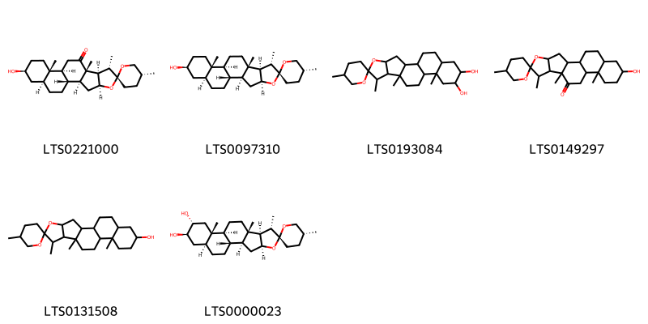{ width=100% }
    <figcaption>Hình ảnh cấu trúc hóa học của 6 hoạt chất thuộc nhóm Prenol lipids gồm ['hecogenin (LTS0221000)', 'tigogenin (LTS0097310)', "5,7',9',13'-tetramethyl-5'-oxaspiro[oxane-2,6'-pentacyclo[10.8.0.0²,⁹.0⁴,⁸.0¹³,¹⁸]icosane]-15',16'-diol (LTS0193084)", 'hecogenin (LTS0149297)', 'tigogenin (LTS0131508)', 'gitogenin (LTS0000023)'].</figcaption>
</figure>

---

### Dược dân tộc học

Danh sách các quốc gia có sử dụng *Furcraea hexapetala* trong điều trị các bệnh. 

| Country            | Disease               | Bệnh                      |
|:-------------------|:----------------------|:--------------------------|
| Dominican Republic | Diuretic, Soap        | Thuốc lợi tiểu, xà phòng  |
| Haiti              | Piscicide, Astringent | Chất diệt cá, Chất làm se |

---

---
## Furcraea tuberosa
### Thông tin về thực vật

!!! info "Phân loại thực vật của *Furcraea tuberosa* từ GIBF:"
    - **Kingdom:** Plantae
    - **Phylum:** Tracheophyta
    - **Order:** Asparagales
    - **Family:** Asparagaceae
    - **Genus:** Furcraea
    - **Species:** *Furcraea tuberosa*

 

| Label (VI)   | Label (EN)   | Scientific Name   | Descriptions (VI)   | Descriptions (EN)   | Also Known As (VI)   | Also Known As (EN)   |
|:-------------|:-------------|:------------------|:--------------------|:--------------------|:---------------------|:---------------------|
| N/A          | N/A          | Furcraea tuberosa | loài thực vật       | species of plant    | ['']                 | ['']                 |

#### Phân bố trên thế giới

**Từ CSDL GIBF** nan, unknown or invalid, Guadeloupe, Dominica, French Polynesia, Trinidad and Tobago, French Guiana, Martinique, Jamaica, Haiti, Sri Lanka, Dominican Republic, Suriname, Puerto Rico, Mauritius, India, Seychelles, Cuba, Saint Kitts and Nevis, Bahamas, Anguilla, Virgin Islands (U.S.), Belgium, Sint Maarten (Dutch part), Netherlands, Barbados, Virgin Islands (British), Antigua and Barbuda, Brazil, Saint Lucia, Mexico, Grenada, Mozambique, Paraguay, United States of America, Saint Barthélemy, Guyana

#### Phân bố tại Việt Nam

**Từ CSDL GIBF**: Không có ghi nhận ở Việt Nam

---
### Thành phần hóa học
        
- Theo cơ sở dữ liệu lotus: Từ loài *Furcraea tuberosa* đã phân lập và xác định được Chưa có hoạt chất nào được phân lập. hoạt chất thuộc về các nhóm Không có hoạt chất nào được phân lập. 

Không có hình ảnh nào được tạo ra

---

### Dược dân tộc học

Danh sách các quốc gia có sử dụng *Furcraea tuberosa* trong điều trị các bệnh. 

| Country            | Disease        | Bệnh                     |
|:-------------------|:---------------|:-------------------------|
| Dominican Republic | Piscicide      | Thuốc diệt cá            |
| Haiti              | Diuretic, Soap | Thuốc lợi tiểu, xà phòng |

---

# Chi Phormium

??? note "Danh sách các dược liệu thuộc chi"
    
	 - *Phormium tenax*

---
## Phormium tenax
### Thông tin về thực vật

!!! info "Phân loại thực vật của *Phormium tenax* từ GIBF:"
    - **Kingdom:** Plantae
    - **Phylum:** Tracheophyta
    - **Order:** Asparagales
    - **Family:** Asphodelaceae
    - **Genus:** Phormium
    - **Species:** *Phormium tenax*

 

| Label (VI)   | Label (EN)   | Scientific Name   | Descriptions (VI)   | Descriptions (EN)   | Also Known As (VI)   | Also Known As (EN)                                   |
|:-------------|:-------------|:------------------|:--------------------|:--------------------|:---------------------|:-----------------------------------------------------|
| N/A          | N/A          | Phormium tenax    | loài thực vật       | species of plant    | ['']                 | ['harakeke', 'New Zealand flax', 'New Zealand hemp'] |

#### Phân bố trên thế giới

**Từ CSDL GIBF** Falkland Islands (Malvinas), United Kingdom of Great Britain and Northern Ireland, Portugal, New Zealand, Norfolk Island, Chile, United States of America, Australia

#### Phân bố tại Việt Nam

**Từ CSDL GIBF**: Không có ghi nhận ở Việt Nam

---
### Thành phần hóa học
        
- Theo cơ sở dữ liệu lotus: Từ loài *Phormium tenax* đã phân lập và xác định được 9 hoạt chất thuộc về các nhóm Fatty Acyls, Steroids and steroid derivatives, Anthracenes, Naphthalenes. 

|    | chemicalTaxonomyClassyfireClass   |   smiles_count |
|---:|:----------------------------------|---------------:|
|  0 | Anthracenes                       |              1 |
|  1 | Fatty Acyls                       |              1 |
|  2 | Naphthalenes                      |              2 |
|  3 | Steroids and steroid derivatives  |              5 |

#### Nhóm Anthracenes
<figure markdown="span">
    { width=100% }
    <figcaption>Hình ảnh cấu trúc hóa học của 1 hoạt chất thuộc nhóm Anthracenes gồm ['turkey rhubarb (LTS0160968)'].</figcaption>
</figure>
#### Nhóm Fatty Acyls
<figure markdown="span">
    { width=100% }
    <figcaption>Hình ảnh cấu trúc hóa học của 1 hoạt chất thuộc nhóm Fatty Acyls gồm ['ceryl alcohol (LTS0140051)'].</figcaption>
</figure>
#### Nhóm Naphthalenes
<figure markdown="span">
    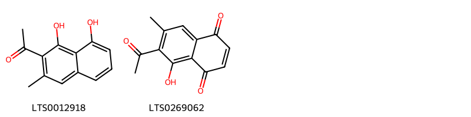{ width=100% }
    <figcaption>Hình ảnh cấu trúc hóa học của 2 hoạt chất thuộc nhóm Naphthalenes gồm ['nepodin (LTS0012918)', '6-acetyl-5-hydroxy-7-methylnaphthalene-1,4-dione (LTS0269062)'].</figcaption>
</figure>
#### Nhóm Steroids and steroid derivatives
<figure markdown="span">
    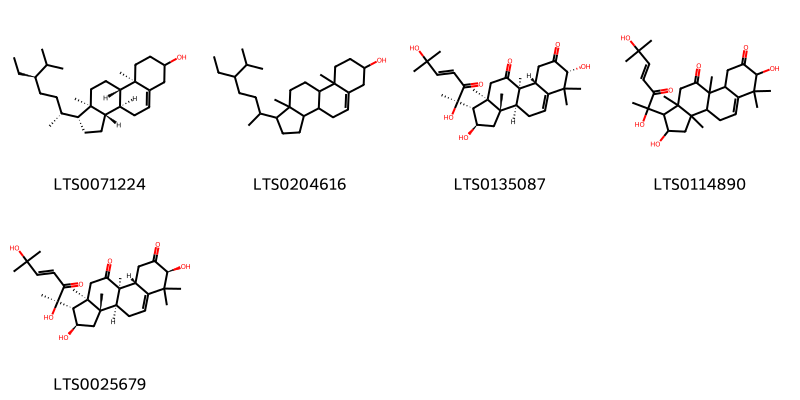{ width=100% }
    <figcaption>Hình ảnh cấu trúc hóa học của 5 hoạt chất thuộc nhóm Steroids and steroid derivatives gồm ['stigmast-5-en-3-ol (LTS0071224)', 'stigmast-5-en-3-ol, (3β)- (LTS0204616)', '(1r,2r,3as,3bs,7r,9ar,9br,11ar)-1-[(2r,4e)-2,6-dihydroxy-6-methyl-3-oxohept-4-en-2-yl]-2,7-dihydroxy-3a,6,6,9b,11a-pentamethyl-1h,2h,3h,3bh,4h,7h,9h,9ah,11h-cyclopenta[a]phenanthrene-8,10-dione (LTS0135087)', '1-(2,6-dihydroxy-6-methyl-3-oxohept-4-en-2-yl)-2,7-dihydroxy-3a,6,6,9b,11a-pentamethyl-1h,2h,3h,3bh,4h,7h,9h,9ah,11h-cyclopenta[a]phenanthrene-8,10-dione (LTS0114890)', '(1r,2r,3as,3bs,7s,9ar,9br,11ar)-1-[(2r,4e)-2,6-dihydroxy-6-methyl-3-oxohept-4-en-2-yl]-2,7-dihydroxy-3a,6,6,9b,11a-pentamethyl-1h,2h,3h,3bh,4h,7h,9h,9ah,11h-cyclopenta[a]phenanthrene-8,10-dione (LTS0025679)'].</figcaption>
</figure>

---

### Dược dân tộc học

Danh sách các quốc gia có sử dụng *Phormium tenax* trong điều trị các bệnh. 

| Country   | Disease              | Bệnh                                 |
|:----------|:---------------------|:-------------------------------------|
| Elsewhere | Purgative, Vermifuge | Phương pháp thanh lọc, diệt giun sán |

---

# Chi Sansevieria

??? note "Danh sách các dược liệu thuộc chi"
    
	 - *Sansevieria roxburghiana*
	 - *Sansevieria thyrsiflora*
	 - *Sansevieria trifasciata*

---
## Sansevieria roxburghiana
### Thông tin về thực vật

!!! info "Phân loại thực vật của *Dracaena roxburghiana* từ GIBF:"
    - **Kingdom:** Plantae
    - **Phylum:** Tracheophyta
    - **Order:** Asparagales
    - **Family:** Asparagaceae
    - **Genus:** Dracaena
    - **Species:** *Dracaena roxburghiana*

 

| Label (VI)   | Label (EN)   | Scientific Name          | Descriptions (VI)   | Descriptions (EN)   | Also Known As (VI)   | Also Known As (EN)   |
|:-------------|:-------------|:-------------------------|:--------------------|:--------------------|:---------------------|:---------------------|
| N/A          | N/A          | Sansevieria roxburghiana |                     | species of plant    | ['']                 | ['']                 |

#### Phân bố trên thế giới

**Từ CSDL GIBF** nan, Antigua and Barbuda, Mauritius, India, United States of America, China, Belgium

#### Phân bố tại Việt Nam

**Từ CSDL GIBF**: Không có ghi nhận ở Việt Nam

---
### Thành phần hóa học
        
- Theo cơ sở dữ liệu lotus: Từ loài *Dracaena roxburghiana* đã phân lập và xác định được Chưa có hoạt chất nào được phân lập. hoạt chất thuộc về các nhóm Không có hoạt chất nào được phân lập. 

Không có hình ảnh nào được tạo ra

---

### Dược dân tộc học

Danh sách các quốc gia có sử dụng *Dracaena roxburghiana* trong điều trị các bệnh. 

| Country   | Disease     | Bệnh           |
|:----------|:------------|:---------------|
| Elsewhere | Expectorant | Thuốc long đàm |

---

---
## Sansevieria thyrsiflora
### Thông tin về thực vật

!!! info "Phân loại thực vật của *Dracaena hyacinthoides* từ GIBF:"
    - **Kingdom:** Plantae
    - **Phylum:** Tracheophyta
    - **Order:** Asparagales
    - **Family:** Asparagaceae
    - **Genus:** Dracaena
    - **Species:** *Dracaena hyacinthoides*

 

| Label (VI)   | Label (EN)   | Scientific Name         | Descriptions (VI)   | Descriptions (EN)   | Also Known As (VI)   | Also Known As (EN)   |
|:-------------|:-------------|:------------------------|:--------------------|:--------------------|:---------------------|:---------------------|
| N/A          | N/A          | Sansevieria thyrsiflora | loài thực vật       | species of plant    | ['']                 | ['']                 |

#### Phân bố trên thế giới

**Từ CSDL GIBF** nan, South Africa, Dominica, Seychelles, United States of America, Zimbabwe, Guinea, Curaçao

#### Phân bố tại Việt Nam

**Từ CSDL GIBF**: Không có ghi nhận ở Việt Nam

---
### Thành phần hóa học
        
- Theo cơ sở dữ liệu lotus: Từ loài *Dracaena hyacinthoides* đã phân lập và xác định được Chưa có hoạt chất nào được phân lập. hoạt chất thuộc về các nhóm Không có hoạt chất nào được phân lập. 

Không có hình ảnh nào được tạo ra

---

### Dược dân tộc học

Danh sách các quốc gia có sử dụng *Dracaena hyacinthoides* trong điều trị các bệnh. 

| Country      | Disease                         | Bệnh                                |
|:-------------|:--------------------------------|:------------------------------------|
| Elsewhere    | Hemolytic                       | Tan máu                             |
| South Africa | Parasiticide                    | Thuốc diệt ký sinh                  |
| Trinidad     | Hemolytic, Vermifuge, Vermifuge | Thuốc tan máu, Vermifuge, Vermifuge |

---

---
## Sansevieria trifasciata
### Thông tin về thực vật

!!! info "Phân loại thực vật của *Dracaena trifasciata* từ GIBF:"
    - **Kingdom:** Plantae
    - **Phylum:** Tracheophyta
    - **Order:** Asparagales
    - **Family:** Asparagaceae
    - **Genus:** Dracaena
    - **Species:** *Dracaena trifasciata*

 

| Label (VI)   | Label (EN)   | Scientific Name         | Descriptions (VI)   | Descriptions (EN)   | Also Known As (VI)          | Also Known As (EN)                                                                          |
|:-------------|:-------------|:------------------------|:--------------------|:--------------------|:----------------------------|:--------------------------------------------------------------------------------------------|
| N/A          | N/A          | Sansevieria trifasciata | loài thực vật       | species of plant    | ['Sansevieria trifasciata'] | ["Mother-in-law's tongue", "Saint George's Sword", 'Snake plant', "Viper's bowstring hemp"] |

#### Phân bố trên thế giới

**Từ CSDL GIBF** Honduras, nan, Thailand, Namibia, Philippines, Guadeloupe, French Guiana, Trinidad and Tobago, Germany, Northern Mariana Islands, Australia, Jamaica, Guatemala, Haiti, Indonesia, Colombia, Saint Vincent and the Grenadines, Dominican Republic, American Samoa, Puerto Rico, Malaysia, India, Mauritius, Bahamas, Cuba, Virgin Islands (U.S.), Cambodia, Barbados, Antigua and Barbuda, Belize, Brazil, Peru, Saint Lucia, Mexico, Benin, Chinese Taipei, Hong Kong, Argentina, South Africa, Botswana, Bolivia (Plurinational State of), Costa Rica, New Caledonia, Ecuador, United States of America, Madagascar

#### Phân bố tại Việt Nam

**Từ CSDL GIBF**: Không có ghi nhận ở Việt Nam

---
### Thành phần hóa học
        
- Theo cơ sở dữ liệu lotus: Từ loài *Dracaena trifasciata* đã phân lập và xác định được 31 hoạt chất thuộc về các nhóm Steroids and steroid derivatives. 

|    | chemicalTaxonomyClassyfireClass   |   smiles_count |
|---:|:----------------------------------|---------------:|
|  0 | Steroids and steroid derivatives  |             31 |

#### Nhóm Steroids and steroid derivatives
<figure markdown="span">
    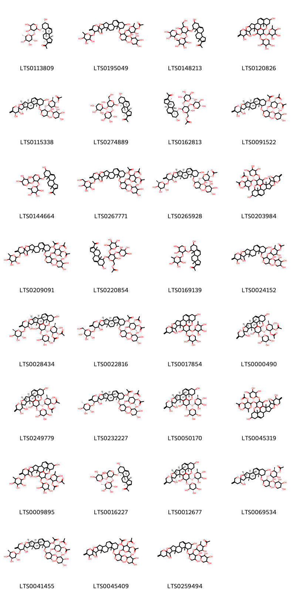{ width=100% }
    <figcaption>Hình ảnh cấu trúc hóa học của 31 hoạt chất thuộc nhóm Steroids and steroid derivatives gồm ['1-[(3as,3bs,7r,9r,9ar,9bs,11as)-9-{[(2s,3r,4s,5s)-4,5-dihydroxy-3-{[(2s,3r,4r,5r,6s)-3,4,5-trihydroxy-6-methyloxan-2-yl]oxy}oxan-2-yl]oxy}-7-hydroxy-9a,11a-dimethyl-3h,3ah,3bh,4h,6h,7h,8h,9h,9bh,10h,11h-cyclopenta[a]phenanthren-1-yl]ethanone (LTS0113809)', "4,5-dihydroxy-6-({5-hydroxy-4-[(3,4,5-trihydroxyoxan-2-yl)oxy]-2-{7',9',13'-trimethyl-5-methylidene-4-[(3,4,5-trihydroxy-6-methyloxan-2-yl)oxy]-5'-oxaspiro[oxane-2,6'-pentacyclo[10.8.0.0²,⁹.0⁴,⁸.0¹³,¹⁸]icosan]-18'-ene-3,16'-dioloxy}oxan-3-yl}oxy)-2-methyloxan-3-yl acetate (LTS0195049)", '1-(7-hydroxy-9-{[5-hydroxy-6-(hydroxymethyl)-3-[(3,4,5-trihydroxy-6-methyloxan-2-yl)oxy]-4-[(3,4,5-trihydroxyoxan-2-yl)oxy]oxan-2-yl]oxy}-9a,11a-dimethyl-3h,3ah,3bh,4h,6h,7h,8h,9h,9bh,10h,11h-cyclopenta[a]phenanthren-1-yl)ethanone (LTS0148213)', "14'-({5-hydroxy-3-[(3,4,5-trihydroxy-6-methyloxan-2-yl)oxy]-4-[(3,4,5-trihydroxyoxan-2-yl)oxy]oxan-2-yl}oxy)-7',9',13'-trimethyl-5-methylidene-5'-oxaspiro[oxane-2,6'-pentacyclo[10.8.0.0²,⁹.0⁴,⁸.0¹³,¹⁸]icosan]-18'-ene-3,4,16'-triol (LTS0120826)", "(2s,3r,4s,5r,6s)-4,5-dihydroxy-6-{[(2s,3r,4s,5s)-5-hydroxy-4-{[(2s,3r,4s,5r)-3,4,5-trihydroxyoxan-2-yl]oxy}-2-[(1's,2s,2's,3s,4s,4's,7's,8'r,9's,12's,13'r,14'r,16'r)-7',9',13'-trimethyl-5-methylidene-5'-oxaspiro[oxane-2,6'-pentacyclo[10.8.0.0²,⁹.0⁴,⁸.0¹³,¹⁸]icosan]-18'-ene-3,4,16'-trioloxy]oxan-3-yl]oxy}-2-methyloxan-3-yl acetate (LTS0115338)", '1-[(3as,3bs,7r,9r,9ar,9bs,11as)-7-hydroxy-9-{[(2r,3r,4s,5r,6r)-5-hydroxy-6-(hydroxymethyl)-3-{[(2s,3r,4r,5r,6s)-3,4,5-trihydroxy-6-methyloxan-2-yl]oxy}-4-{[(2s,3r,4s,5r)-3,4,5-trihydroxyoxan-2-yl]oxy}oxan-2-yl]oxy}-9a,11a-dimethyl-3h,3ah,3bh,4h,6h,7h,8h,9h,9bh,10h,11h-cyclopenta[a]phenanthren-1-yl]ethanone (LTS0274889)', '[(2r,3r,4s,5r,6r)-6-{[(3as,3bs,7r,9r,9ar,9bs,11as)-1-acetyl-7-hydroxy-9a,11a-dimethyl-3h,3ah,3bh,4h,6h,7h,8h,9h,9bh,10h,11h-cyclopenta[a]phenanthren-9-yl]oxy}-3-hydroxy-5-{[(2s,3r,4r,5r,6s)-3,4,5-trihydroxy-6-methyloxan-2-yl]oxy}-4-{[(2s,3r,4s,5r)-3,4,5-trihydroxyoxan-2-yl]oxy}oxan-2-yl]methyl acetate (LTS0162813)', "(2s,3s,4r,5r,6s)-4,5-bis(acetyloxy)-6-{[(2s,3r,4s,5s)-5-hydroxy-4-{[(2s,3r,4s,5r)-3,4,5-trihydroxyoxan-2-yl]oxy}-2-[(1's,2s,2's,3s,4s,4's,7's,8'r,9's,12's,13'r,14'r,16'r)-7',9',13'-trimethyl-5-methylidene-5'-oxaspiro[oxane-2,6'-pentacyclo[10.8.0.0²,⁹.0⁴,⁸.0¹³,¹⁸]icosan]-18'-ene-3,4,16'-trioloxy]oxan-3-yl]oxy}-2-methyloxan-3-yl acetate (LTS0091522)", '1-[7-hydroxy-9-({5-hydroxy-3-[(3,4,5-trihydroxy-6-methyloxan-2-yl)oxy]-4-[(3,4,5-trihydroxyoxan-2-yl)oxy]oxan-2-yl}oxy)-9a,11a-dimethyl-3h,3ah,3bh,4h,6h,7h,8h,9h,9bh,10h,11h-cyclopenta[a]phenanthren-1-yl]ethanone (LTS0144664)', "4,5-bis(acetyloxy)-6-({5-hydroxy-4-[(3,4,5-trihydroxyoxan-2-yl)oxy]-2-(7',9',13'-trimethyl-5-methylidene-4-{[3,4,5-trihydroxy-6-(hydroxymethyl)oxan-2-yl]oxy}-5'-oxaspiro[oxane-2,6'-pentacyclo[10.8.0.0²,⁹.0⁴,⁸.0¹³,¹⁸]icosan]-18'-ene-3,16'-dioloxy)oxan-3-yl}oxy)-2-methyloxan-3-yl acetate (LTS0267771)", "(2s,3r,4s,5r,6s)-4,5-dihydroxy-6-{[(2s,3r,4s,5s)-5-hydroxy-4-{[(2s,3r,4s,5r)-3,4,5-trihydroxyoxan-2-yl]oxy}-2-[(1's,2s,2's,3s,4s,4's,7's,8'r,9's,12's,13'r,14'r,16'r)-7',9',13'-trimethyl-5-methylidene-4-{[(2s,3r,4s,5r,6r)-3,4,5-trihydroxy-6-methyloxan-2-yl]oxy}-5'-oxaspiro[oxane-2,6'-pentacyclo[10.8.0.0²,⁹.0⁴,⁸.0¹³,¹⁸]icosan]-18'-ene-3,16'-dioloxy]oxan-3-yl]oxy}-2-methyloxan-3-yl acetate (LTS0265928)", "3-(acetyloxy)-5-hydroxy-2-({5-hydroxy-4-[(3,4,5-trihydroxyoxan-2-yl)oxy]-2-{7',9',13'-trimethyl-5-methylidene-5'-oxaspiro[oxane-2,6'-pentacyclo[10.8.0.0²,⁹.0⁴,⁸.0¹³,¹⁸]icosan]-18'-ene-3,16'-dioloxy}oxan-3-yl}oxy)-6-methyloxan-4-yl acetate (LTS0203984)", "4,5-bis(acetyloxy)-6-({5-hydroxy-4-[(3,4,5-trihydroxyoxan-2-yl)oxy]-2-{7',9',13'-trimethyl-5-methylidene-4-[(3,4,5-trihydroxy-6-methyloxan-2-yl)oxy]-5'-oxaspiro[oxane-2,6'-pentacyclo[10.8.0.0²,⁹.0⁴,⁸.0¹³,¹⁸]icosan]-18'-ene-3,16'-dioloxy}oxan-3-yl}oxy)-2-methyloxan-3-yl acetate (LTS0209091)", '[6-({1-acetyl-7-hydroxy-9a,11a-dimethyl-3h,3ah,3bh,4h,6h,7h,8h,9h,9bh,10h,11h-cyclopenta[a]phenanthren-9-yl}oxy)-3-hydroxy-5-[(3,4,5-trihydroxy-6-methyloxan-2-yl)oxy]-4-[(3,4,5-trihydroxyoxan-2-yl)oxy]oxan-2-yl]methyl acetate (LTS0220854)', '1-[9-({4,5-dihydroxy-3-[(3,4,5-trihydroxy-6-methyloxan-2-yl)oxy]oxan-2-yl}oxy)-7-hydroxy-9a,11a-dimethyl-3h,3ah,3bh,4h,6h,7h,8h,9h,9bh,10h,11h-cyclopenta[a]phenanthren-1-yl]ethanone (LTS0169139)', "4,5-dihydroxy-6-({5-hydroxy-4-[(3,4,5-trihydroxyoxan-2-yl)oxy]-2-{7',9',13'-trimethyl-5-methylidene-5'-oxaspiro[oxane-2,6'-pentacyclo[10.8.0.0²,⁹.0⁴,⁸.0¹³,¹⁸]icosan]-18'-ene-3,4,16'-trioloxy}oxan-3-yl}oxy)-2-methyloxan-3-yl acetate (LTS0024152)", "(2s,3r,4r,5s,6s)-3-(acetyloxy)-5-hydroxy-2-{[(2s,3r,4s,5s)-5-hydroxy-4-{[(2s,3r,4s,5r)-3,4,5-trihydroxyoxan-2-yl]oxy}-2-[(1's,2s,2's,3s,4s,4's,7's,8'r,9's,12's,13'r,14'r,16'r)-7',9',13'-trimethyl-5-methylidene-4-{[(2s,3r,4s,5r,6r)-3,4,5-trihydroxy-6-methyloxan-2-yl]oxy}-5'-oxaspiro[oxane-2,6'-pentacyclo[10.8.0.0²,⁹.0⁴,⁸.0¹³,¹⁸]icosan]-18'-ene-3,16'-dioloxy]oxan-3-yl]oxy}-6-methyloxan-4-yl acetate (LTS0028434)", "(2s,3s,4r,5r,6s)-4,5-bis(acetyloxy)-6-{[(2s,3r,4s,5s)-5-hydroxy-4-{[(2s,3r,4s,5r)-3,4,5-trihydroxyoxan-2-yl]oxy}-2-[(1's,2s,2's,3s,4s,4's,7's,8'r,9's,12's,13'r,14'r,16'r)-7',9',13'-trimethyl-5-methylidene-4-{[(2r,3r,4s,5s,6r)-3,4,5-trihydroxy-6-(hydroxymethyl)oxan-2-yl]oxy}-5'-oxaspiro[oxane-2,6'-pentacyclo[10.8.0.0²,⁹.0⁴,⁸.0¹³,¹⁸]icosan]-18'-ene-3,16'-dioloxy]oxan-3-yl]oxy}-2-methyloxan-3-yl acetate (LTS0022816)", "2-({5-hydroxy-4-[(3,4,5-trihydroxyoxan-2-yl)oxy]-2-{7',9',13'-trimethyl-5-methylidene-5'-oxaspiro[oxane-2,6'-pentacyclo[10.8.0.0²,⁹.0⁴,⁸.0¹³,¹⁸]icosan]-18'-ene-3,16'-dioloxy}oxan-3-yl}oxy)-6-methyloxane-3,4,5-triol (LTS0017854)", "(2s,3r,4r,5s,6s)-3-(acetyloxy)-5-hydroxy-2-{[(2s,3r,4s,5s)-5-hydroxy-4-{[(2s,3r,4s,5r)-3,4,5-trihydroxyoxan-2-yl]oxy}-2-[(1's,2s,2's,3s,4's,7's,8'r,9's,12's,13'r,14'r,16'r)-7',9',13'-trimethyl-5-methylidene-5'-oxaspiro[oxane-2,6'-pentacyclo[10.8.0.0²,⁹.0⁴,⁸.0¹³,¹⁸]icosan]-18'-ene-3,16'-dioloxy]oxan-3-yl]oxy}-6-methyloxan-4-yl acetate (LTS0000490)", "(2s,3r,4r,5s,6s)-3-(acetyloxy)-5-hydroxy-2-{[(2s,3r,4s,5s)-5-hydroxy-4-{[(2s,3r,4s,5r)-3,4,5-trihydroxyoxan-2-yl]oxy}-2-[(1's,2s,2's,3s,4s,4's,7's,8'r,9's,12's,13'r,14'r,16'r)-7',9',13'-trimethyl-5-methylidene-5'-oxaspiro[oxane-2,6'-pentacyclo[10.8.0.0²,⁹.0⁴,⁸.0¹³,¹⁸]icosan]-18'-ene-3,4,16'-trioloxy]oxan-3-yl]oxy}-6-methyloxan-4-yl acetate (LTS0249779)", "(2s,3s,4r,5r,6s)-4,5-bis(acetyloxy)-6-{[(2s,3r,4s,5s)-5-hydroxy-4-{[(2s,3r,4s,5r)-3,4,5-trihydroxyoxan-2-yl]oxy}-2-[(1's,2s,2's,3s,4s,4's,7's,8'r,9's,12's,13'r,14'r,16'r)-7',9',13'-trimethyl-5-methylidene-4-{[(2s,3r,4r,5r,6s)-3,4,5-trihydroxy-6-methyloxan-2-yl]oxy}-5'-oxaspiro[oxane-2,6'-pentacyclo[10.8.0.0²,⁹.0⁴,⁸.0¹³,¹⁸]icosan]-18'-ene-3,16'-dioloxy]oxan-3-yl]oxy}-2-methyloxan-3-yl acetate (LTS0232227)", "(1's,2s,2's,3s,4s,4's,7's,8'r,9's,12's,13'r,14'r,16'r)-14'-{[(2s,3r,4s,5s)-5-hydroxy-3-{[(2s,3r,4r,5r,6s)-3,4,5-trihydroxy-6-methyloxan-2-yl]oxy}-4-{[(2s,3r,4s,5r)-3,4,5-trihydroxyoxan-2-yl]oxy}oxan-2-yl]oxy}-7',9',13'-trimethyl-5-methylidene-5'-oxaspiro[oxane-2,6'-pentacyclo[10.8.0.0²,⁹.0⁴,⁸.0¹³,¹⁸]icosan]-18'-ene-3,4,16'-triol (LTS0050170)", "3-(acetyloxy)-5-hydroxy-2-({5-hydroxy-4-[(3,4,5-trihydroxyoxan-2-yl)oxy]-2-{7',9',13'-trimethyl-5-methylidene-5'-oxaspiro[oxane-2,6'-pentacyclo[10.8.0.0²,⁹.0⁴,⁸.0¹³,¹⁸]icosan]-18'-ene-3,4,16'-trioloxy}oxan-3-yl}oxy)-6-methyloxan-4-yl acetate (LTS0045319)", "3-(acetyloxy)-5-hydroxy-2-({5-hydroxy-4-[(3,4,5-trihydroxyoxan-2-yl)oxy]-2-{7',9',13'-trimethyl-5-methylidene-4-[(3,4,5-trihydroxy-6-methyloxan-2-yl)oxy]-5'-oxaspiro[oxane-2,6'-pentacyclo[10.8.0.0²,⁹.0⁴,⁸.0¹³,¹⁸]icosan]-18'-ene-3,16'-dioloxy}oxan-3-yl}oxy)-6-methyloxan-4-yl acetate (LTS0009895)", '1-[(3as,3bs,7r,9r,9ar,9bs,11as)-7-hydroxy-9-{[(2s,3r,4s,5s)-5-hydroxy-3-{[(2s,3r,4r,5r,6s)-3,4,5-trihydroxy-6-methyloxan-2-yl]oxy}-4-{[(2s,3r,4s,5r)-3,4,5-trihydroxyoxan-2-yl]oxy}oxan-2-yl]oxy}-9a,11a-dimethyl-3h,3ah,3bh,4h,6h,7h,8h,9h,9bh,10h,11h-cyclopenta[a]phenanthren-1-yl]ethanone (LTS0016227)', "(2s,3r,4r,5r,6s)-2-{[(2s,3r,4s,5s)-5-hydroxy-4-{[(2s,3r,4s,5r)-3,4,5-trihydroxyoxan-2-yl]oxy}-2-[(1's,2s,2's,3s,4's,7's,8'r,9's,12's,13'r,14'r,16'r)-7',9',13'-trimethyl-5-methylidene-5'-oxaspiro[oxane-2,6'-pentacyclo[10.8.0.0²,⁹.0⁴,⁸.0¹³,¹⁸]icosan]-18'-ene-3,16'-dioloxy]oxan-3-yl]oxy}-6-methyloxane-3,4,5-triol (LTS0012677)", "(2s,3r,4s,5r,6s)-4,5-dihydroxy-6-{[(2s,3r,4s,5s)-5-hydroxy-4-{[(2s,3r,4s,5r)-3,4,5-trihydroxyoxan-2-yl]oxy}-2-[(1's,2s,2's,3s,4's,7's,8'r,9's,12's,13'r,14'r,16'r)-7',9',13'-trimethyl-5-methylidene-5'-oxaspiro[oxane-2,6'-pentacyclo[10.8.0.0²,⁹.0⁴,⁸.0¹³,¹⁸]icosan]-18'-ene-3,16'-dioloxy]oxan-3-yl]oxy}-2-methyloxan-3-yl acetate (LTS0069534)", "(2s,3s,4r,5r,6s)-4,5-bis(acetyloxy)-6-{[(2s,3r,4s,5s)-5-hydroxy-4-{[(2s,3r,4s,5r)-3,4,5-trihydroxyoxan-2-yl]oxy}-2-[(1's,2s,2's,3s,4s,4's,7's,8'r,9's,12's,13'r,14'r,16'r)-7',9',13'-trimethyl-5-methylidene-4-{[(2s,3r,4s,5r,6r)-3,4,5-trihydroxy-6-methyloxan-2-yl]oxy}-5'-oxaspiro[oxane-2,6'-pentacyclo[10.8.0.0²,⁹.0⁴,⁸.0¹³,¹⁸]icosan]-18'-ene-3,16'-dioloxy]oxan-3-yl]oxy}-2-methyloxan-3-yl acetate (LTS0041455)", "4,5-bis(acetyloxy)-6-({5-hydroxy-4-[(3,4,5-trihydroxyoxan-2-yl)oxy]-2-{7',9',13'-trimethyl-5-methylidene-5'-oxaspiro[oxane-2,6'-pentacyclo[10.8.0.0²,⁹.0⁴,⁸.0¹³,¹⁸]icosan]-18'-ene-3,4,16'-trioloxy}oxan-3-yl}oxy)-2-methyloxan-3-yl acetate (LTS0045409)", "4,5-dihydroxy-6-({5-hydroxy-4-[(3,4,5-trihydroxyoxan-2-yl)oxy]-2-{7',9',13'-trimethyl-5-methylidene-5'-oxaspiro[oxane-2,6'-pentacyclo[10.8.0.0²,⁹.0⁴,⁸.0¹³,¹⁸]icosan]-18'-ene-3,16'-dioloxy}oxan-3-yl}oxy)-2-methyloxan-3-yl acetate (LTS0259494)"].</figcaption>
</figure>

---

### Dược dân tộc học

Danh sách các quốc gia có sử dụng *Dracaena trifasciata* trong điều trị các bệnh. 

| Country   | Disease          | Bệnh                      |
|:----------|:-----------------|:--------------------------|
| Elsewhere | Stimulant, Tonic | Chất kích thích, Thuốc bổ |

---

# Chi Manfreda

??? note "Danh sách các dược liệu thuộc chi"
    
	 - *Manfreda brachystachya*
	 - *Manfreda guttata*
	 - *Manfreda virginica*

---
## Manfreda brachystachya
### Thông tin về thực vật

!!! info "Phân loại thực vật của *Agave scabra* từ GIBF:"
    - **Kingdom:** Plantae
    - **Phylum:** Tracheophyta
    - **Order:** Asparagales
    - **Family:** Asparagaceae
    - **Genus:** Agave
    - **Species:** *Agave scabra*

 

| Label (VI)   | Label (EN)   | Scientific Name         | Descriptions (VI)   | Descriptions (EN)   | Also Known As (VI)          | Also Known As (EN)                                                                          |
|:-------------|:-------------|:------------------------|:--------------------|:--------------------|:----------------------------|:--------------------------------------------------------------------------------------------|
| N/A          | N/A          | Sansevieria trifasciata | loài thực vật       | species of plant    | ['Sansevieria trifasciata'] | ["Mother-in-law's tongue", "Saint George's Sword", 'Snake plant', "Viper's bowstring hemp"] |

#### Phân bố trên thế giới

**Từ CSDL GIBF** Honduras, nan, El Salvador, Nicaragua, United States of America, Mexico, Guatemala

#### Phân bố tại Việt Nam

**Từ CSDL GIBF**: Không có ghi nhận ở Việt Nam

---
### Thành phần hóa học
        
- Theo cơ sở dữ liệu lotus: Từ loài *Agave scabra* đã phân lập và xác định được Chưa có hoạt chất nào được phân lập. hoạt chất thuộc về các nhóm Không có hoạt chất nào được phân lập. 

Không có hình ảnh nào được tạo ra

---

### Dược dân tộc học

Danh sách các quốc gia có sử dụng *Agave scabra* trong điều trị các bệnh. 

| Country   | Disease                     | Bệnh                            |
|:----------|:----------------------------|:--------------------------------|
| Mexico    | Hirudicide, Piscicide, Soap | Hirudicide, Piscicide, Xà phòng |

---

---
## Manfreda guttata
### Thông tin về thực vật

!!! info "Phân loại thực vật của *Agave guttata* từ GIBF:"
    - **Kingdom:** Plantae
    - **Phylum:** Tracheophyta
    - **Order:** Asparagales
    - **Family:** Asparagaceae
    - **Genus:** Agave
    - **Species:** *Agave guttata*

 

| Label (VI)   | Label (EN)   | Scientific Name   | Descriptions (VI)   | Descriptions (EN)   | Also Known As (VI)   | Also Known As (EN)   |
|:-------------|:-------------|:------------------|:--------------------|:--------------------|:---------------------|:---------------------|
| N/A          | N/A          | Manfreda guttata  | loài thực vật       | species of plant    | ['']                 | ['']                 |

#### Phân bố trên thế giới

**Từ CSDL GIBF** nan, unknown or invalid, United States of America, Mexico, Belgium

#### Phân bố tại Việt Nam

**Từ CSDL GIBF**: Không có ghi nhận ở Việt Nam

---
### Thành phần hóa học
        
- Theo cơ sở dữ liệu lotus: Từ loài *Agave guttata* đã phân lập và xác định được Chưa có hoạt chất nào được phân lập. hoạt chất thuộc về các nhóm Không có hoạt chất nào được phân lập. 

Không có hình ảnh nào được tạo ra

---

### Dược dân tộc học

Danh sách các quốc gia có sử dụng *Agave guttata* trong điều trị các bệnh. 

| Country   | Disease   | Bệnh          |
|:----------|:----------|:--------------|
| Mexico    | Piscicide | Thuốc diệt cá |

---

---
## Manfreda virginica
### Thông tin về thực vật

!!! info "Phân loại thực vật của *Agave virginica* từ GIBF:"
    - **Kingdom:** Plantae
    - **Phylum:** Tracheophyta
    - **Order:** Asparagales
    - **Family:** Asparagaceae
    - **Genus:** Agave
    - **Species:** *Agave virginica*

 

| Label (VI)   | Label (EN)   | Scientific Name    | Descriptions (VI)   | Descriptions (EN)   | Also Known As (VI)   | Also Known As (EN)   |
|:-------------|:-------------|:-------------------|:--------------------|:--------------------|:---------------------|:---------------------|
| N/A          | N/A          | Manfreda virginica | loài thực vật       | species of plant    | ['']                 | ['']                 |

#### Phân bố trên thế giới

**Từ CSDL GIBF** United States of America, Mexico

#### Phân bố tại Việt Nam

**Từ CSDL GIBF**: Không có ghi nhận ở Việt Nam

---
### Thành phần hóa học
        
- Theo cơ sở dữ liệu lotus: Từ loài *Agave virginica* đã phân lập và xác định được Chưa có hoạt chất nào được phân lập. hoạt chất thuộc về các nhóm Không có hoạt chất nào được phân lập. 

Không có hình ảnh nào được tạo ra

---

### Dược dân tộc học

Danh sách các quốc gia có sử dụng *Agave virginica* trong điều trị các bệnh. 

| Country   | Disease                       | Bệnh                    |
|:----------|:------------------------------|:------------------------|
| US        | Carminative, Stomachic, Tonic | Sáng tạo, Dạ dày, Tonic |

---

# Chi Polianthes

??? note "Danh sách các dược liệu thuộc chi"
    
	 - *Polianthes geminiflora*
	 - *Polianthes graminifolia*
	 - *Polianthes tuberosa*

---
## Polianthes geminiflora
### Thông tin về thực vật

!!! info "Phân loại thực vật của *Agave coetocapnia* từ GIBF:"
    - **Kingdom:** Plantae
    - **Phylum:** Tracheophyta
    - **Order:** Asparagales
    - **Family:** Asparagaceae
    - **Genus:** Agave
    - **Species:** *Agave coetocapnia*

 

| Label (VI)   | Label (EN)   | Scientific Name        | Descriptions (VI)   | Descriptions (EN)   | Also Known As (VI)   | Also Known As (EN)   |
|:-------------|:-------------|:-----------------------|:--------------------|:--------------------|:---------------------|:---------------------|
| N/A          | N/A          | Polianthes geminiflora | loài thực vật       | species of plant    | ['']                 | ['']                 |

#### Phân bố trên thế giới

**Từ CSDL GIBF** nan, United States of America, Mexico

#### Phân bố tại Việt Nam

**Từ CSDL GIBF**: Không có ghi nhận ở Việt Nam

---
### Thành phần hóa học
        
- Theo cơ sở dữ liệu lotus: Từ loài *Agave coetocapnia* đã phân lập và xác định được Chưa có hoạt chất nào được phân lập. hoạt chất thuộc về các nhóm Không có hoạt chất nào được phân lập. 

Không có hình ảnh nào được tạo ra

---

### Dược dân tộc học

Danh sách các quốc gia có sử dụng *Agave coetocapnia* trong điều trị các bệnh. 

| Country   | Disease   | Bệnh     |
|:----------|:----------|:---------|
| Mexico    | Soap      | Xà phòng |

---

---
## Polianthes graminifolia
### Thông tin về thực vật

!!! info "Phân loại thực vật của *Agave graminifolia* từ GIBF:"
    - **Kingdom:** Plantae
    - **Phylum:** Tracheophyta
    - **Order:** Asparagales
    - **Family:** Asparagaceae
    - **Genus:** Agave
    - **Species:** *Agave graminifolia*

 

| Label (VI)   | Label (EN)   | Scientific Name         | Descriptions (VI)   | Descriptions (EN)   | Also Known As (VI)   | Also Known As (EN)   |
|:-------------|:-------------|:------------------------|:--------------------|:--------------------|:---------------------|:---------------------|
| N/A          | N/A          | Polianthes graminifolia | loài thực vật       | species of plant    | ['']                 | ['']                 |

#### Phân bố trên thế giới

**Từ CSDL GIBF** nan, Mexico

#### Phân bố tại Việt Nam

**Từ CSDL GIBF**: Không có ghi nhận ở Việt Nam

---
### Thành phần hóa học
        
- Theo cơ sở dữ liệu lotus: Từ loài *Agave graminifolia* đã phân lập và xác định được Chưa có hoạt chất nào được phân lập. hoạt chất thuộc về các nhóm Không có hoạt chất nào được phân lập. 

Không có hình ảnh nào được tạo ra

---

### Dược dân tộc học

Danh sách các quốc gia có sử dụng *Agave graminifolia* trong điều trị các bệnh. 

| Country   | Disease   | Bệnh     |
|:----------|:----------|:---------|
| Mexico    | Soap      | Xà phòng |

---

---
## Polianthes tuberosa
### Thông tin về thực vật

!!! info "Phân loại thực vật của *Agave amica* từ GIBF:"
    - **Kingdom:** Plantae
    - **Phylum:** Tracheophyta
    - **Order:** Asparagales
    - **Family:** Asparagaceae
    - **Genus:** Agave
    - **Species:** *Agave amica*

 

| Label (VI)   | Label (EN)   | Scientific Name     | Descriptions (VI)   | Descriptions (EN)   | Also Known As (VI)   | Also Known As (EN)   |
|:-------------|:-------------|:--------------------|:--------------------|:--------------------|:---------------------|:---------------------|
| N/A          | N/A          | Polianthes tuberosa | loài thực vật       | species of plant    | ['']                 | ['']                 |

#### Phân bố trên thế giới

**Từ CSDL GIBF** Viet Nam, nan, unknown or invalid, Honduras, El Salvador, Spain, Guadeloupe, Philippines, French Polynesia, Trinidad and Tobago, Martinique, Australia, Indonesia, Colombia, Sri Lanka, Dominican Republic, Sweden, Côte d’Ivoire, Puerto Rico, India, Nigeria, Belgium, Belize, Nicaragua, Japan, Brazil, Myanmar, Panama, Palau, Peru, Equatorial Guinea, Mexico, China, Norway, Hong Kong, Chinese Taipei, Uruguay, France, Bolivia (Plurinational State of), Congo, Democratic Republic of the, New Caledonia, Ecuador, United States of America, Zimbabwe

#### Phân bố tại Việt Nam

**Từ CSDL GIBF**: Ha Noi

---
### Thành phần hóa học
        
- Theo cơ sở dữ liệu lotus: Từ loài *Agave amica* đã phân lập và xác định được 76 hoạt chất thuộc về các nhóm Organooxygen compounds, Indoles and derivatives, Lactones, Amaryllidaceae alkaloids, Prenol lipids, Fatty Acyls, Steroids and steroid derivatives. 

|    | chemicalTaxonomyClassyfireClass   |   smiles_count |
|---:|:----------------------------------|---------------:|
|  0 | Amaryllidaceae alkaloids          |              1 |
|  1 | Fatty Acyls                       |              1 |
|  2 | Indoles and derivatives           |              1 |
|  3 | Lactones                          |             10 |
|  4 | Organooxygen compounds            |              2 |
|  5 | Prenol lipids                     |              4 |
|  6 | Steroids and steroid derivatives  |             57 |

#### Nhóm Amaryllidaceae alkaloids
<figure markdown="span">
    { width=100% }
    <figcaption>Hình ảnh cấu trúc hóa học của 1 hoạt chất thuộc nhóm Amaryllidaceae alkaloids gồm ['galantamine (LTS0038419)'].</figcaption>
</figure>
#### Nhóm Fatty Acyls
<figure markdown="span">
    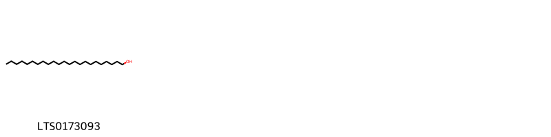{ width=100% }
    <figcaption>Hình ảnh cấu trúc hóa học của 1 hoạt chất thuộc nhóm Fatty Acyls gồm ['1-tricosanol (LTS0173093)'].</figcaption>
</figure>
#### Nhóm Indoles and derivatives
<figure markdown="span">
    { width=100% }
    <figcaption>Hình ảnh cấu trúc hóa học của 1 hoạt chất thuộc nhóm Indoles and derivatives gồm ['indole (LTS0185357)'].</figcaption>
</figure>
#### Nhóm Lactones
<figure markdown="span">
    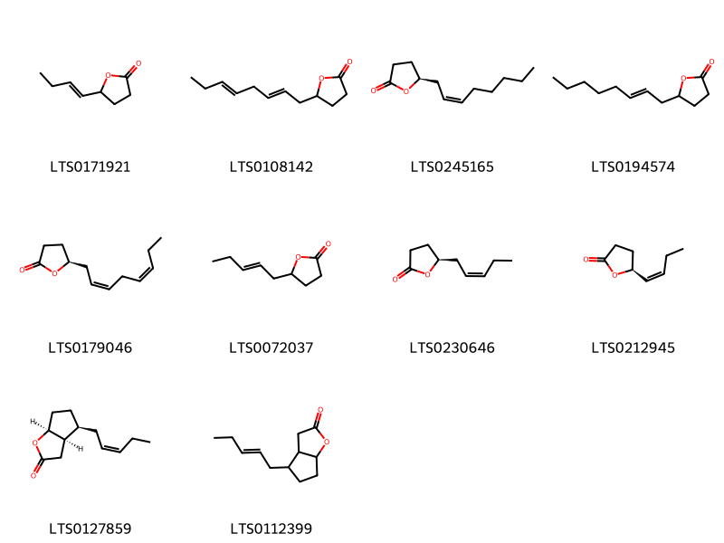{ width=100% }
    <figcaption>Hình ảnh cấu trúc hóa học của 10 hoạt chất thuộc nhóm Lactones gồm ['5-(but-1-en-1-yl)oxolan-2-one (LTS0171921)', '5-(octa-2,5-dien-1-yl)oxolan-2-one (LTS0108142)', '(5s)-5-[(2z)-oct-2-en-1-yl]oxolan-2-one (LTS0245165)', '5-(oct-2-en-1-yl)oxolan-2-one (LTS0194574)', '(5s)-5-[(2z,5z)-octa-2,5-dien-1-yl]oxolan-2-one (LTS0179046)', '5-(pent-2-en-1-yl)oxolan-2-one (LTS0072037)', '(5s)-5-[(2z)-pent-2-en-1-yl]oxolan-2-one (LTS0230646)', '(5s)-5-[(1z)-but-1-en-1-yl]oxolan-2-one (LTS0212945)', '(3ar,4s,6as)-4-[(2z)-pent-2-en-1-yl]-hexahydrocyclopenta[b]furan-2-one (LTS0127859)', '4-(pent-2-en-1-yl)-hexahydrocyclopenta[b]furan-2-one (LTS0112399)'].</figcaption>
</figure>
#### Nhóm Organooxygen compounds
<figure markdown="span">
    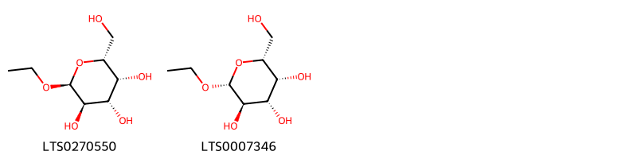{ width=100% }
    <figcaption>Hình ảnh cấu trúc hóa học của 2 hoạt chất thuộc nhóm Organooxygen compounds gồm ['(2s,3r,4s,5r,6r)-2-ethoxy-6-(hydroxymethyl)oxane-3,4,5-triol (LTS0270550)', 'ethyl β-d-galactopyranoside (LTS0007346)'].</figcaption>
</figure>
#### Nhóm Prenol lipids
<figure markdown="span">
    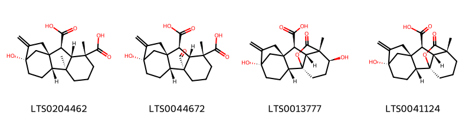{ width=100% }
    <figcaption>Hình ảnh cấu trúc hóa học của 4 hoạt chất thuộc nhóm Prenol lipids gồm ['gibberellin a53 (LTS0204462)', 'gibberellin a19 (LTS0044672)', 'gibberellin a1 (LTS0013777)', 'gibberellin a20 (LTS0041124)'].</figcaption>
</figure>
#### Nhóm Steroids and steroid derivatives
<figure markdown="span">
    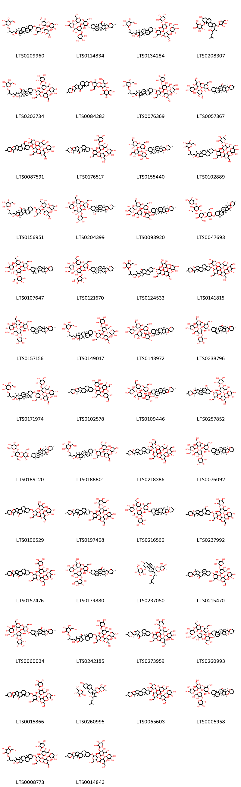{ width=100% }
    <figcaption>Hình ảnh cấu trúc hóa học của 57 hoạt chất thuộc nhóm Steroids and steroid derivatives gồm ['(2s,3r,4s,5r,6r)-2-{[(2s,3r,4s,5r,6r)-2-{[(2r,3s,4r,5r,6r)-4,5-dihydroxy-6-{[(1r,2s,4s,6r,7s,8r,9s,12s,13s,16s,18s)-6-hydroxy-7,9,13-trimethyl-6-[(3r)-3-methyl-4-{[(2r,3r,4s,5r,6r)-3,4,5-trihydroxy-6-(hydroxymethyl)oxan-2-yl]oxy}butyl]-5-oxapentacyclo[10.8.0.0²,⁹.0⁴,⁸.0¹³,¹⁸]icosan-16-yl]oxy}-2-(hydroxymethyl)oxan-3-yl]oxy}-5-hydroxy-6-(hydroxymethyl)-4-{[(2s,3r,4s,5r)-3,4,5-trihydroxyoxan-2-yl]oxy}oxan-3-yl]oxy}-6-(hydroxymethyl)oxane-3,4,5-triol (LTS0209960)', "(1's,2r,2's,4's,5r,7's,8'r,9's,13's,16's,18's)-16'-{[(2r,3r,4r,5r,6r)-5-{[(2s,3r,4s,5r,6r)-3-{[(2s,3r,4s,5r,6r)-3,5-dihydroxy-6-(hydroxymethyl)-4-{[(2s,3r,4s,5r)-3,4,5-trihydroxyoxan-2-yl]oxy}oxan-2-yl]oxy}-5-hydroxy-6-(hydroxymethyl)-4-{[(2s,3r,4s,5r)-3,4,5-trihydroxyoxan-2-yl]oxy}oxan-2-yl]oxy}-3,4-dihydroxy-6-(hydroxymethyl)oxan-2-yl]oxy}-5,7',9',13'-tetramethyl-5'-oxaspiro[oxane-2,6'-pentacyclo[10.8.0.0²,⁹.0⁴,⁸.0¹³,¹⁸]icosan]-11'-en-10'-one (LTS0114834)", '(2s,3r,4s,5s,6r)-2-{[(2s,3r,4s,5r,6r)-3-{[(2s,3r,4s,5r,6r)-3,5-dihydroxy-6-(hydroxymethyl)-4-{[(2s,3r,4s,5r)-3,4,5-trihydroxyoxan-2-yl]oxy}oxan-2-yl]oxy}-2-{[(2r,3r,4r,5r,6r)-4,5-dihydroxy-6-{[(1r,2s,4s,6r,7s,8r,9s,12s,13s,16s,18s)-6-hydroxy-7,9,13-trimethyl-6-[(3r)-3-methyl-4-{[(2r,3r,4s,5s,6r)-3,4,5-trihydroxy-6-(hydroxymethyl)oxan-2-yl]oxy}butyl]-5-oxapentacyclo[10.8.0.0²,⁹.0⁴,⁸.0¹³,¹⁸]icosan-16-yl]oxy}-2-(hydroxymethyl)oxan-3-yl]oxy}-5-hydroxy-6-(hydroxymethyl)oxan-4-yl]oxy}-6-(hydroxymethyl)oxane-3,4,5-triol (LTS0134284)', '2-[(2-{[3,4-dihydroxy-4-(hydroxymethyl)oxolan-2-yl]oxy}-7-hydroxy-1-(3-hydroxy-6-methylheptan-2-yl)-9a,11a-dimethyl-1h,2h,3h,3ah,3bh,4h,6h,7h,8h,9h,9bh,10h,11h-cyclopenta[a]phenanthren-9-yl)oxy]-6-(hydroxymethyl)oxane-3,4,5-triol (LTS0208307)', '(1r,2s,4s,6r,7s,8r,9s,12s,13s,16s,18s)-16-{[(2r,3r,4r,5r,6r)-5-{[(2s,3r,4s,5r,6r)-3-{[(2s,3r,4s,5r,6r)-3,5-dihydroxy-6-(hydroxymethyl)-4-{[(2s,3r,4s,5r)-3,4,5-trihydroxyoxan-2-yl]oxy}oxan-2-yl]oxy}-5-hydroxy-6-(hydroxymethyl)-4-{[(2s,3r,4s,5r)-3,4,5-trihydroxyoxan-2-yl]oxy}oxan-2-yl]oxy}-3,4-dihydroxy-6-(hydroxymethyl)oxan-2-yl]oxy}-6-hydroxy-7,9,13-trimethyl-6-[(3r)-3-methyl-4-{[(2r,3r,4s,5s,6r)-3,4,5-trihydroxy-6-(hydroxymethyl)oxan-2-yl]oxy}butyl]-5-oxapentacyclo[10.8.0.0²,⁹.0⁴,⁸.0¹³,¹⁸]icosan-10-one (LTS0203734)', "16'-[(5-{[4,5-dihydroxy-6-(hydroxymethyl)-3-{[3,4,5-trihydroxy-6-(hydroxymethyl)oxan-2-yl]oxy}oxan-2-yl]oxy}-3,4-dihydroxy-6-(hydroxymethyl)oxan-2-yl)oxy]-5,7',9',13'-tetramethyl-5'-oxaspiro[oxane-2,6'-pentacyclo[10.8.0.0²,⁹.0⁴,⁸.0¹³,¹⁸]icosan]-10'-one (LTS0084283)", '(2s,3r,4s,5r,6r)-2-{[(2s,3r,4s,5r,6r)-3-{[(2s,3r,4s,5r,6r)-3,5-dihydroxy-6-(hydroxymethyl)-4-{[(2s,3r,4s,5r)-3,4,5-trihydroxyoxan-2-yl]oxy}oxan-2-yl]oxy}-2-{[(2r,3s,4r,5r,6r)-4,5-dihydroxy-6-{[(1r,2s,4s,6r,7s,8r,9s,12s,13s,16s,18s)-6-hydroxy-7,9,13-trimethyl-6-[(3r)-3-methyl-4-{[(2r,3r,4s,5r,6r)-3,4,5-trihydroxy-6-(hydroxymethyl)oxan-2-yl]oxy}butyl]-5-oxapentacyclo[10.8.0.0²,⁹.0⁴,⁸.0¹³,¹⁸]icosan-16-yl]oxy}-2-(hydroxymethyl)oxan-3-yl]oxy}-5-hydroxy-6-(hydroxymethyl)oxan-4-yl]oxy}-6-(hydroxymethyl)oxane-3,4,5-triol (LTS0076369)', "(1'r,2r,2's,4's,5r,7's,8'r,9's,12's,13's,16's,18's)-16'-{[(2r,3r,4r,5r,6r)-3,4-dihydroxy-5-{[(2s,3r,4s,5r,6r)-5-hydroxy-6-(hydroxymethyl)-3-{[(2s,3r,4s,5s,6r)-3,4,5-trihydroxy-6-(hydroxymethyl)oxan-2-yl]oxy}-4-{[(2s,3r,4s,5r)-3,4,5-trihydroxyoxan-2-yl]oxy}oxan-2-yl]oxy}-6-(hydroxymethyl)oxan-2-yl]oxy}-5,7',9',13'-tetramethyl-5'-oxaspiro[oxane-2,6'-pentacyclo[10.8.0.0²,⁹.0⁴,⁸.0¹³,¹⁸]icosan]-10'-one (LTS0057367)", "2-[(2-{[4,5-dihydroxy-2-(hydroxymethyl)-6-{5,7',9',13'-tetramethyl-5'-oxaspiro[oxane-2,6'-pentacyclo[10.8.0.0²,⁹.0⁴,⁸.0¹³,¹⁸]icosan]-19'-oloxy}oxan-3-yl]oxy}-3-{[4,5-dihydroxy-6-(hydroxymethyl)-3-[(3,4,5-trihydroxyoxan-2-yl)oxy]oxan-2-yl]oxy}-5-hydroxy-6-(hydroxymethyl)oxan-4-yl)oxy]oxane-3,4,5-triol (LTS0087591)", "16'-({5-[(3-{[3,5-dihydroxy-6-(hydroxymethyl)-4-[(3,4,5-trihydroxyoxan-2-yl)oxy]oxan-2-yl]oxy}-5-hydroxy-6-(hydroxymethyl)-4-[(3,4,5-trihydroxyoxan-2-yl)oxy]oxan-2-yl)oxy]-3,4-dihydroxy-6-(hydroxymethyl)oxan-2-yl}oxy)-5,7',9',13'-tetramethyl-5'-oxaspiro[oxane-2,6'-pentacyclo[10.8.0.0²,⁹.0⁴,⁸.0¹³,¹⁸]icosan]-18'-en-10'-one (LTS0176517)", "(2s,3r,4s,5r)-2-{[(2s,3r,4s,5s,6r)-2-{[(2s,3r,4s,5s,6r)-2-{[(2r,3r,4r,5r,6r)-4,5-dihydroxy-2-(hydroxymethyl)-6-[(1'r,2r,2's,4's,5r,7's,8'r,9's,12's,13's,16's,18's)-5,7',9',13'-tetramethyl-5'-oxaspiro[oxane-2,6'-pentacyclo[10.8.0.0²,⁹.0⁴,⁸.0¹³,¹⁸]icosane]oxy]oxan-3-yl]oxy}-4,5-dihydroxy-6-(hydroxymethyl)oxan-3-yl]oxy}-4,5-dihydroxy-6-(hydroxymethyl)oxan-3-yl]oxy}oxane-3,4,5-triol (LTS0155440)", '2-[(3-{[3,5-dihydroxy-6-(hydroxymethyl)-4-[(3,4,5-trihydroxyoxan-2-yl)oxy]oxan-2-yl]oxy}-2-[(4,5-dihydroxy-6-{[6-hydroxy-7,9,13-trimethyl-6-(3-methyl-4-{[3,4,5-trihydroxy-6-(hydroxymethyl)oxan-2-yl]oxy}butyl)-5-oxapentacyclo[10.8.0.0²,⁹.0⁴,⁸.0¹³,¹⁸]icosan-16-yl]oxy}-2-(hydroxymethyl)oxan-3-yl)oxy]-5-hydroxy-6-(hydroxymethyl)oxan-4-yl)oxy]-6-(hydroxymethyl)oxane-3,4,5-triol (LTS0102889)', '(1r,2s,4s,6r,7s,8r,9s,12s,13s,16s,18s)-16-{[(2r,3r,4r,5r,6r)-3,4-dihydroxy-5-{[(2s,3r,4s,5r,6r)-5-hydroxy-6-(hydroxymethyl)-3-{[(2s,3r,4s,5s,6r)-3,4,5-trihydroxy-6-(hydroxymethyl)oxan-2-yl]oxy}-4-{[(2s,3r,4s,5r)-3,4,5-trihydroxyoxan-2-yl]oxy}oxan-2-yl]oxy}-6-(hydroxymethyl)oxan-2-yl]oxy}-6-hydroxy-7,9,13-trimethyl-6-[(3r)-3-methyl-4-{[(2r,3r,4s,5s,6r)-3,4,5-trihydroxy-6-(hydroxymethyl)oxan-2-yl]oxy}butyl]-5-oxapentacyclo[10.8.0.0²,⁹.0⁴,⁸.0¹³,¹⁸]icosan-10-one (LTS0156951)', "(2s,3r,4s,5r)-2-{[(2s,3r,4s,5r,6r)-2-{[(2r,3r,4r,5r,6r)-4,5-dihydroxy-2-(hydroxymethyl)-6-[(1'r,2r,2's,4's,5r,7's,8'r,9's,12's,13'r,16's,18's,19's)-5,7',9',13'-tetramethyl-5'-oxaspiro[oxane-2,6'-pentacyclo[10.8.0.0²,⁹.0⁴,⁸.0¹³,¹⁸]icosan]-19'-oloxy]oxan-3-yl]oxy}-3-{[(2s,3r,4s,5r,6r)-3,5-dihydroxy-6-(hydroxymethyl)-4-{[(2s,3r,4s,5r)-3,4,5-trihydroxyoxan-2-yl]oxy}oxan-2-yl]oxy}-5-hydroxy-6-(hydroxymethyl)oxan-4-yl]oxy}oxane-3,4,5-triol (LTS0204399)", "(2s,3r,4s,5s,6r)-2-{[(2s,3r,4s,5r,6r)-2-{[(2r,3r,4r,5r,6r)-4,5-dihydroxy-2-(hydroxymethyl)-6-[(1'r,2r,2's,4's,5r,7's,8'r,9's,12's,13's,16's,18's)-5,7',9',13'-tetramethyl-5'-oxaspiro[oxane-2,6'-pentacyclo[10.8.0.0²,⁹.0⁴,⁸.0¹³,¹⁸]icosane]oxy]oxan-3-yl]oxy}-3-{[(2s,3r,4s,5s,6r)-4,5-dihydroxy-6-(hydroxymethyl)-3-{[(2s,3r,4s,5r)-3,4,5-trihydroxyoxan-2-yl]oxy}oxan-2-yl]oxy}-5-hydroxy-6-(hydroxymethyl)oxan-4-yl]oxy}-6-(hydroxymethyl)oxane-3,4,5-triol (LTS0093920)", "(2s,3r,4s,5r)-2-{[(2s,3r,4s,5r,6r)-2-{[(2s,3r,4s,5s,6r)-2-{[(2r,3r,4r,5r,6r)-4,5-dihydroxy-2-(hydroxymethyl)-6-[(1'r,2r,2's,4's,5r,7's,8'r,9's,12's,13's,16's,18's)-5,7',9',13'-tetramethyl-5'-oxaspiro[oxane-2,6'-pentacyclo[10.8.0.0²,⁹.0⁴,⁸.0¹³,¹⁸]icosane]oxy]oxan-3-yl]oxy}-4,5-dihydroxy-6-(hydroxymethyl)oxan-3-yl]oxy}-3,5-dihydroxy-6-(hydroxymethyl)oxan-4-yl]oxy}oxane-3,4,5-triol (LTS0047693)", "(2s,3r,4s,5s,6r)-2-{[(2s,3r,4s,5r,6r)-2-{[(2r,3r,4r,5r,6r)-4,5-dihydroxy-2-(hydroxymethyl)-6-[(1'r,2r,2's,4's,5r,7's,8'r,9's,12's,13's,16's,18's)-5,7',9',13'-tetramethyl-5'-oxaspiro[oxane-2,6'-pentacyclo[10.8.0.0²,⁹.0⁴,⁸.0¹³,¹⁸]icosane]oxy]oxan-3-yl]oxy}-3-{[(2s,3r,4s,5r,6r)-3,5-dihydroxy-6-(hydroxymethyl)-4-{[(2s,3r,4s,5s,6r)-3,4,5-trihydroxy-6-(hydroxymethyl)oxan-2-yl]oxy}oxan-2-yl]oxy}-5-hydroxy-6-(hydroxymethyl)oxan-4-yl]oxy}-6-(hydroxymethyl)oxane-3,4,5-triol (LTS0107647)", "(2s,3r,4s,5r,6r)-2-{[(2s,3r,4s,5r,6r)-2-{[(2r,3s,4r,5r,6r)-4,5-dihydroxy-2-(hydroxymethyl)-6-[(1'r,2r,2's,4's,5r,7's,8'r,9's,12's,13's,16's,18's)-5,7',9',13'-tetramethyl-5'-oxaspiro[oxane-2,6'-pentacyclo[10.8.0.0²,⁹.0⁴,⁸.0¹³,¹⁸]icosane]oxy]oxan-3-yl]oxy}-3-{[(2s,3r,4s,5r,6r)-3,5-dihydroxy-6-(hydroxymethyl)-4-{[(2s,3r,4s,5r,6r)-3,4,5-trihydroxy-6-(hydroxymethyl)oxan-2-yl]oxy}oxan-2-yl]oxy}-5-hydroxy-6-(hydroxymethyl)oxan-4-yl]oxy}-6-(hydroxymethyl)oxane-3,4,5-triol (LTS0121670)", '16-[(3,4-dihydroxy-5-{[5-hydroxy-6-(hydroxymethyl)-3-{[3,4,5-trihydroxy-6-(hydroxymethyl)oxan-2-yl]oxy}-4-[(3,4,5-trihydroxyoxan-2-yl)oxy]oxan-2-yl]oxy}-6-(hydroxymethyl)oxan-2-yl)oxy]-6-hydroxy-7,9,13-trimethyl-6-(3-methyl-4-{[3,4,5-trihydroxy-6-(hydroxymethyl)oxan-2-yl]oxy}butyl)-5-oxapentacyclo[10.8.0.0²,⁹.0⁴,⁸.0¹³,¹⁸]icosan-10-one (LTS0124533)', "2-[(2-{[4,5-dihydroxy-2-(hydroxymethyl)-6-{5,7',9',13'-tetramethyl-5'-oxaspiro[oxane-2,6'-pentacyclo[10.8.0.0²,⁹.0⁴,⁸.0¹³,¹⁸]icosane]oxy}oxan-3-yl]oxy}-3-{[4,5-dihydroxy-6-(hydroxymethyl)-3-[(3,4,5-trihydroxyoxan-2-yl)oxy]oxan-2-yl]oxy}-5-hydroxy-6-(hydroxymethyl)oxan-4-yl)oxy]-6-(hydroxymethyl)oxane-3,4,5-triol (LTS0141815)", "(2s,3r,4s,5r,6r)-2-{[(2s,3r,4s,5r,6r)-2-{[(2r,3s,4r,5r,6r)-4,5-dihydroxy-2-(hydroxymethyl)-6-[(1'r,2r,2's,4's,5r,7's,8'r,9's,12's,13's,16's,18's)-5,7',9',13'-tetramethyl-5'-oxaspiro[oxane-2,6'-pentacyclo[10.8.0.0²,⁹.0⁴,⁸.0¹³,¹⁸]icosane]oxy]oxan-3-yl]oxy}-3-{[(2s,3r,4s,5r,6r)-3,5-dihydroxy-6-(hydroxymethyl)-4-{[(2s,3r,4s,5r)-3,4,5-trihydroxyoxan-2-yl]oxy}oxan-2-yl]oxy}-5-hydroxy-6-(hydroxymethyl)oxan-4-yl]oxy}-6-(hydroxymethyl)oxane-3,4,5-triol (LTS0157156)", '(2r,3r,4s,5r,6r)-2-[(2r)-4-[(1r,2s,4s,6r,7s,8r,9s,12s,13s,16s,18s)-16-{[(2r,3r,4r,5s,6r)-5-{[(2s,3r,4s,5r,6r)-3-{[(2s,3r,4s,5r,6r)-3,5-dihydroxy-6-(hydroxymethyl)-4-{[(2s,3r,4s,5r)-3,4,5-trihydroxyoxan-2-yl]oxy}oxan-2-yl]oxy}-5-hydroxy-6-(hydroxymethyl)-4-{[(2s,3r,4s,5r)-3,4,5-trihydroxyoxan-2-yl]oxy}oxan-2-yl]oxy}-3,4-dihydroxy-6-(hydroxymethyl)oxan-2-yl]oxy}-6-hydroxy-7,9,13-trimethyl-5-oxapentacyclo[10.8.0.0²,⁹.0⁴,⁸.0¹³,¹⁸]icosan-6-yl]-2-methylbutoxy]-6-(hydroxymethyl)oxane-3,4,5-triol (LTS0149017)', "(2s,3r,4s,5r)-2-{[(2s,3r,4s,5r,6r)-2-{[(2r,3r,4r,5r,6r)-4,5-dihydroxy-2-(hydroxymethyl)-6-[(1'r,2r,2's,4's,5r,7's,8'r,9's,12's,13's,16's,18's)-5,7',9',13'-tetramethyl-5'-oxaspiro[oxane-2,6'-pentacyclo[10.8.0.0²,⁹.0⁴,⁸.0¹³,¹⁸]icosane]oxy]oxan-3-yl]oxy}-3-{[(2s,3r,4s,5s,6r)-4,5-dihydroxy-6-(hydroxymethyl)-3-{[(2s,3r,4s,5r)-3,4,5-trihydroxyoxan-2-yl]oxy}oxan-2-yl]oxy}-5-hydroxy-6-(hydroxymethyl)oxan-4-yl]oxy}oxane-3,4,5-triol (LTS0143972)", "(1'r,2r,2's,4's,5r,7's,8'r,9's,12's,13'r,16's)-16'-{[(2r,3r,4r,5r,6r)-5-{[(2s,3r,4s,5r,6r)-3-{[(2s,3r,4s,5r,6r)-3,5-dihydroxy-6-(hydroxymethyl)-4-{[(2s,3r,4s,5s)-3,4,5-trihydroxyoxan-2-yl]oxy}oxan-2-yl]oxy}-5-hydroxy-6-(hydroxymethyl)-4-{[(2s,3r,4s,5r)-3,4,5-trihydroxyoxan-2-yl]oxy}oxan-2-yl]oxy}-3,4-dihydroxy-6-(hydroxymethyl)oxan-2-yl]oxy}-5,7',9',13'-tetramethyl-5'-oxaspiro[oxane-2,6'-pentacyclo[10.8.0.0²,⁹.0⁴,⁸.0¹³,¹⁸]icosan]-18'-en-10'-one (LTS0238796)", '(2r,3r,4s,5s,6r)-2-[(2r)-4-[(1r,2s,4s,6r,7s,8r,9s,12s,13s,16s,18s)-16-{[(2r,3r,4r,5r,6r)-5-{[(2s,3r,4s,5r,6r)-3-{[(2s,3r,4s,5r,6r)-3,5-dihydroxy-6-(hydroxymethyl)-4-{[(2s,3r,4s,5r)-3,4,5-trihydroxyoxan-2-yl]oxy}oxan-2-yl]oxy}-5-hydroxy-6-(hydroxymethyl)-4-{[(2s,3r,4s,5r)-3,4,5-trihydroxyoxan-2-yl]oxy}oxan-2-yl]oxy}-3,4-dihydroxy-6-(hydroxymethyl)oxan-2-yl]oxy}-6-hydroxy-7,9,13-trimethyl-5-oxapentacyclo[10.8.0.0²,⁹.0⁴,⁸.0¹³,¹⁸]icosan-6-yl]-2-methylbutoxy]-6-(hydroxymethyl)oxane-3,4,5-triol (LTS0171974)', "2-({2-[(2-{[4,5-dihydroxy-2-(hydroxymethyl)-6-{5,7',9',13'-tetramethyl-5'-oxaspiro[oxane-2,6'-pentacyclo[10.8.0.0²,⁹.0⁴,⁸.0¹³,¹⁸]icosane]oxy}oxan-3-yl]oxy}-4,5-dihydroxy-6-(hydroxymethyl)oxan-3-yl)oxy]-4,5-dihydroxy-6-(hydroxymethyl)oxan-3-yl}oxy)oxane-3,4,5-triol (LTS0102578)", "(2s,3r,4s,5r)-2-{[(2s,3r,4s,5r,6r)-2-{[(2r,3r,4r,5r,6r)-4,5-dihydroxy-2-(hydroxymethyl)-6-[(1'r,2r,2's,4's,5r,7's,8'r,9's,12's,13'r,16's,18's,19's)-5,7',9',13'-tetramethyl-5'-oxaspiro[oxane-2,6'-pentacyclo[10.8.0.0²,⁹.0⁴,⁸.0¹³,¹⁸]icosan]-19'-oloxy]oxan-3-yl]oxy}-3-{[(2s,3r,4s,5s,6r)-4,5-dihydroxy-6-(hydroxymethyl)-3-{[(2s,3r,4s,5r)-3,4,5-trihydroxyoxan-2-yl]oxy}oxan-2-yl]oxy}-5-hydroxy-6-(hydroxymethyl)oxan-4-yl]oxy}oxane-3,4,5-triol (LTS0109446)", "(2s,3r,4s,5r)-2-{[(2s,3r,4s,5r,6r)-2-{[(2r,3r,4r,5r,6r)-4,5-dihydroxy-2-(hydroxymethyl)-6-[(1'r,2r,2's,4's,7's,8'r,9's,12's,13'r,16's,18's,19's)-5,7',9',13'-tetramethyl-5'-oxaspiro[oxane-2,6'-pentacyclo[10.8.0.0²,⁹.0⁴,⁸.0¹³,¹⁸]icosan]-19'-oloxy]oxan-3-yl]oxy}-3-{[(2s,3r,4s,5r,6r)-3,5-dihydroxy-6-(hydroxymethyl)-4-{[(2s,3r,4s,5r)-3,4,5-trihydroxyoxan-2-yl]oxy}oxan-2-yl]oxy}-5-hydroxy-6-(hydroxymethyl)oxan-4-yl]oxy}oxane-3,4,5-triol (LTS0257852)", "(1'r,2r,2's,4's,5r,7's,8'r,9's,12's,13's,16's,18's)-16'-{[(2r,3r,4r,5r,6r)-5-{[(2s,3r,4s,5s,6r)-4,5-dihydroxy-6-(hydroxymethyl)-3-{[(2s,3r,4s,5s,6r)-3,4,5-trihydroxy-6-(hydroxymethyl)oxan-2-yl]oxy}oxan-2-yl]oxy}-3,4-dihydroxy-6-(hydroxymethyl)oxan-2-yl]oxy}-5,7',9',13'-tetramethyl-5'-oxaspiro[oxane-2,6'-pentacyclo[10.8.0.0²,⁹.0⁴,⁸.0¹³,¹⁸]icosan]-10'-one (LTS0189120)", '(2s,3r,4s,5s,6r)-2-{[(2s,3r,4s,5r,6r)-2-{[(2r,3r,4r,5r,6r)-4,5-dihydroxy-6-{[(1r,2s,4s,6r,7s,8r,9s,12s,13s,16s,18s)-6-hydroxy-7,9,13-trimethyl-6-[(3r)-3-methyl-4-{[(2r,3r,4s,5s,6r)-3,4,5-trihydroxy-6-(hydroxymethyl)oxan-2-yl]oxy}butyl]-5-oxapentacyclo[10.8.0.0²,⁹.0⁴,⁸.0¹³,¹⁸]icosan-16-yl]oxy}-2-(hydroxymethyl)oxan-3-yl]oxy}-5-hydroxy-6-(hydroxymethyl)-4-{[(2s,3r,4s,5r)-3,4,5-trihydroxyoxan-2-yl]oxy}oxan-3-yl]oxy}-6-(hydroxymethyl)oxane-3,4,5-triol (LTS0188801)', "2-[(2-{[4,5-dihydroxy-2-(hydroxymethyl)-6-{5,7',9',13'-tetramethyl-5'-oxaspiro[oxane-2,6'-pentacyclo[10.8.0.0²,⁹.0⁴,⁸.0¹³,¹⁸]icosane]oxy}oxan-3-yl]oxy}-3-{[4,5-dihydroxy-6-(hydroxymethyl)-3-{[3,4,5-trihydroxy-6-(hydroxymethyl)oxan-2-yl]oxy}oxan-2-yl]oxy}-5-hydroxy-6-(hydroxymethyl)oxan-4-yl)oxy]-6-(hydroxymethyl)oxane-3,4,5-triol (LTS0218386)", "(2s,3r,4s,5s,6r)-2-{[(2s,3r,4s,5r,6r)-2-{[(2r,3r,4r,5r,6r)-4,5-dihydroxy-2-(hydroxymethyl)-6-[(1'r,2r,2's,4's,5r,7's,8'r,9's,12's,13's,16's,18's)-5,7',9',13'-tetramethyl-5'-oxaspiro[oxane-2,6'-pentacyclo[10.8.0.0²,⁹.0⁴,⁸.0¹³,¹⁸]icosane]oxy]oxan-3-yl]oxy}-3-{[(2s,3r,4s,5r,6r)-3,5-dihydroxy-6-(hydroxymethyl)-4-{[(2s,3r,4s,5r)-3,4,5-trihydroxyoxan-2-yl]oxy}oxan-2-yl]oxy}-5-hydroxy-6-(hydroxymethyl)oxan-4-yl]oxy}-6-(hydroxymethyl)oxane-3,4,5-triol (LTS0076092)", "16'-[(3,4-dihydroxy-5-{[5-hydroxy-6-(hydroxymethyl)-3-{[3,4,5-trihydroxy-6-(hydroxymethyl)oxan-2-yl]oxy}-4-[(3,4,5-trihydroxyoxan-2-yl)oxy]oxan-2-yl]oxy}-6-(hydroxymethyl)oxan-2-yl)oxy]-5,7',9',13'-tetramethyl-5'-oxaspiro[oxane-2,6'-pentacyclo[10.8.0.0²,⁹.0⁴,⁸.0¹³,¹⁸]icosan]-10'-one (LTS0196529)", "16'-({5-[(3-{[3,5-dihydroxy-6-(hydroxymethyl)-4-{[3,4,5-trihydroxy-6-(hydroxymethyl)oxan-2-yl]oxy}oxan-2-yl]oxy}-5-hydroxy-6-(hydroxymethyl)-4-[(3,4,5-trihydroxyoxan-2-yl)oxy]oxan-2-yl)oxy]-3,4-dihydroxy-6-(hydroxymethyl)oxan-2-yl}oxy)-5,7',9',13'-tetramethyl-5'-oxaspiro[oxane-2,6'-pentacyclo[10.8.0.0²,⁹.0⁴,⁸.0¹³,¹⁸]icosan]-18'-en-10'-one (LTS0197468)", "(2s,3r,4s,5r)-2-{[(2s,3r,4s,5r,6r)-2-{[(2r,3r,4r,5r,6r)-4,5-dihydroxy-2-(hydroxymethyl)-6-[(1'r,2r,2's,4's,5r,7's,8'r,9's,12's,13's,16's,18's)-5,7',9',13'-tetramethyl-5'-oxaspiro[oxane-2,6'-pentacyclo[10.8.0.0²,⁹.0⁴,⁸.0¹³,¹⁸]icosane]oxy]oxan-3-yl]oxy}-3-{[(2s,3r,4s,5r,6r)-3,5-dihydroxy-6-(hydroxymethyl)-4-{[(2s,3r,4s,5r)-3,4,5-trihydroxyoxan-2-yl]oxy}oxan-2-yl]oxy}-5-hydroxy-6-(hydroxymethyl)oxan-4-yl]oxy}oxane-3,4,5-triol (LTS0216566)", "2-[(2-{[4,5-dihydroxy-2-(hydroxymethyl)-6-{5,7',9',13'-tetramethyl-5'-oxaspiro[oxane-2,6'-pentacyclo[10.8.0.0²,⁹.0⁴,⁸.0¹³,¹⁸]icosan]-19'-oloxy}oxan-3-yl]oxy}-3-{[3,5-dihydroxy-6-(hydroxymethyl)-4-[(3,4,5-trihydroxyoxan-2-yl)oxy]oxan-2-yl]oxy}-5-hydroxy-6-(hydroxymethyl)oxan-4-yl)oxy]oxane-3,4,5-triol (LTS0237992)", "16'-({5-[(3-{[3,5-dihydroxy-6-(hydroxymethyl)-4-[(3,4,5-trihydroxyoxan-2-yl)oxy]oxan-2-yl]oxy}-5-hydroxy-6-(hydroxymethyl)-4-{[3,4,5-trihydroxy-6-(hydroxymethyl)oxan-2-yl]oxy}oxan-2-yl)oxy]-3,4-dihydroxy-6-(hydroxymethyl)oxan-2-yl}oxy)-5,7',9',13'-tetramethyl-5'-oxaspiro[oxane-2,6'-pentacyclo[10.8.0.0²,⁹.0⁴,⁸.0¹³,¹⁸]icosan]-18'-en-10'-one (LTS0157476)", "(1'r,2r,2's,4's,5r,7's,8'r,9's,12's,13'r,16's)-16'-{[(2r,3r,4r,5r,6r)-5-{[(2s,3r,4s,5r,6r)-3-{[(2s,3r,4s,5r,6r)-3,5-dihydroxy-6-(hydroxymethyl)-4-{[(2s,3r,4s,5s,6r)-3,4,5-trihydroxy-6-(hydroxymethyl)oxan-2-yl]oxy}oxan-2-yl]oxy}-5-hydroxy-6-(hydroxymethyl)-4-{[(2s,3r,4s,5r)-3,4,5-trihydroxyoxan-2-yl]oxy}oxan-2-yl]oxy}-3,4-dihydroxy-6-(hydroxymethyl)oxan-2-yl]oxy}-5,7',9',13'-tetramethyl-5'-oxaspiro[oxane-2,6'-pentacyclo[10.8.0.0²,⁹.0⁴,⁸.0¹³,¹⁸]icosan]-18'-en-10'-one (LTS0179880)", '(2r,3r,4r,5r,6s)-2-{[(1r,2s,3as,3bs,7r,9r,9ar,9bs,11as)-7-hydroxy-1-[(2s,3s)-3-hydroxy-6-methylheptan-2-yl]-9a,11a-dimethyl-9-{[(2r,3r,4s,5s,6r)-3,4,5-trihydroxy-6-(hydroxymethyl)oxan-2-yl]oxy}-1h,2h,3h,3ah,3bh,4h,6h,7h,8h,9h,9bh,10h,11h-cyclopenta[a]phenanthren-2-yl]oxy}-6-methyloxane-3,4,5-triol (LTS0237050)', "(1's,2r,2's,4's,7's,8'r,9's,13's,16's,18's)-16'-{[(2r,3r,4r,5r,6r)-5-{[(2s,3r,4s,5r,6r)-3-{[(2s,3r,4s,5r,6r)-3,5-dihydroxy-6-(hydroxymethyl)-4-{[(2s,3r,4s,5r)-3,4,5-trihydroxyoxan-2-yl]oxy}oxan-2-yl]oxy}-5-hydroxy-6-(hydroxymethyl)-4-{[(2s,3r,4s,5r)-3,4,5-trihydroxyoxan-2-yl]oxy}oxan-2-yl]oxy}-3,4-dihydroxy-6-(hydroxymethyl)oxan-2-yl]oxy}-5,7',9',13'-tetramethyl-5'-oxaspiro[oxane-2,6'-pentacyclo[10.8.0.0²,⁹.0⁴,⁸.0¹³,¹⁸]icosan]-11'-en-10'-one (LTS0215470)", "(1'r,2r,2's,4's,5r,7's,8'r,9's,12's,13'r,16's)-16'-{[(2r,3r,4r,5r,6r)-5-{[(2s,3r,4s,5r,6r)-3-{[(2s,3r,4s,5r,6r)-3,5-dihydroxy-6-(hydroxymethyl)-4-{[(2s,3r,4s,5r)-3,4,5-trihydroxyoxan-2-yl]oxy}oxan-2-yl]oxy}-5-hydroxy-6-(hydroxymethyl)-4-{[(2s,3r,4s,5s,6r)-3,4,5-trihydroxy-6-(hydroxymethyl)oxan-2-yl]oxy}oxan-2-yl]oxy}-3,4-dihydroxy-6-(hydroxymethyl)oxan-2-yl]oxy}-5,7',9',13'-tetramethyl-5'-oxaspiro[oxane-2,6'-pentacyclo[10.8.0.0²,⁹.0⁴,⁸.0¹³,¹⁸]icosan]-18'-en-10'-one (LTS0060034)", '16-({5-[(3-{[3,5-dihydroxy-6-(hydroxymethyl)-4-[(3,4,5-trihydroxyoxan-2-yl)oxy]oxan-2-yl]oxy}-5-hydroxy-6-(hydroxymethyl)-4-[(3,4,5-trihydroxyoxan-2-yl)oxy]oxan-2-yl)oxy]-3,4-dihydroxy-6-(hydroxymethyl)oxan-2-yl}oxy)-6-hydroxy-7,9,13-trimethyl-6-(3-methyl-4-{[3,4,5-trihydroxy-6-(hydroxymethyl)oxan-2-yl]oxy}butyl)-5-oxapentacyclo[10.8.0.0²,⁹.0⁴,⁸.0¹³,¹⁸]icosan-10-one (LTS0242185)', "16'-({5-[(3-{[3,5-dihydroxy-6-(hydroxymethyl)-4-[(3,4,5-trihydroxyoxan-2-yl)oxy]oxan-2-yl]oxy}-5-hydroxy-6-(hydroxymethyl)-4-{[3,4,5-trihydroxy-6-(hydroxymethyl)oxan-2-yl]oxy}oxan-2-yl)oxy]-3,4-dihydroxy-6-(hydroxymethyl)oxan-2-yl}oxy)-5,7',9',13'-tetramethyl-5'-oxaspiro[oxane-2,6'-pentacyclo[10.8.0.0²,⁹.0⁴,⁸.0¹³,¹⁸]icosan]-10'-one (LTS0273959)", "(2s,3r,4s,5s,6r)-2-{[(2s,3r,4s,5r,6r)-2-{[(2r,3r,4r,5r,6r)-4,5-dihydroxy-2-(hydroxymethyl)-6-[(1'r,2r,2's,4's,5r,7's,8'r,9's,12's,13's,16's,18's)-5,7',9',13'-tetramethyl-5'-oxaspiro[oxane-2,6'-pentacyclo[10.8.0.0²,⁹.0⁴,⁸.0¹³,¹⁸]icosane]oxy]oxan-3-yl]oxy}-3-{[(2s,3r,4s,5s,6r)-4,5-dihydroxy-6-(hydroxymethyl)-3-{[(2s,3r,4s,5s,6r)-3,4,5-trihydroxy-6-(hydroxymethyl)oxan-2-yl]oxy}oxan-2-yl]oxy}-5-hydroxy-6-(hydroxymethyl)oxan-4-yl]oxy}-6-(hydroxymethyl)oxane-3,4,5-triol (LTS0260993)", "16'-({5-[(3-{[3,5-dihydroxy-6-(hydroxymethyl)-4-[(3,4,5-trihydroxyoxan-2-yl)oxy]oxan-2-yl]oxy}-5-hydroxy-6-(hydroxymethyl)-4-[(3,4,5-trihydroxyoxan-2-yl)oxy]oxan-2-yl)oxy]-3,4-dihydroxy-6-(hydroxymethyl)oxan-2-yl}oxy)-5,7',9',13'-tetramethyl-5'-oxaspiro[oxane-2,6'-pentacyclo[10.8.0.0²,⁹.0⁴,⁸.0¹³,¹⁸]icosan]-11'-en-10'-one (LTS0015866)", '2-{[7-hydroxy-1-(3-hydroxy-6-methylheptan-2-yl)-9a,11a-dimethyl-9-{[3,4,5-trihydroxy-6-(hydroxymethyl)oxan-2-yl]oxy}-1h,2h,3h,3ah,3bh,4h,6h,7h,8h,9h,9bh,10h,11h-cyclopenta[a]phenanthren-2-yl]oxy}-6-methyloxane-3,4,5-triol (LTS0260995)', "2-[(2-{[4,5-dihydroxy-2-(hydroxymethyl)-6-{5,7',9',13'-tetramethyl-5'-oxaspiro[oxane-2,6'-pentacyclo[10.8.0.0²,⁹.0⁴,⁸.0¹³,¹⁸]icosane]oxy}oxan-3-yl]oxy}-3-{[4,5-dihydroxy-6-(hydroxymethyl)-3-[(3,4,5-trihydroxyoxan-2-yl)oxy]oxan-2-yl]oxy}-5-hydroxy-6-(hydroxymethyl)oxan-4-yl)oxy]oxane-3,4,5-triol (LTS0065603)", "(1'r,2r,2's,4's,5r,7's,8'r,9's,12's,13's,16's,18's)-16'-{[(2r,3r,4r,5r,6r)-5-{[(2s,3r,4s,5r,6r)-3-{[(2s,3r,4s,5r,6r)-3,5-dihydroxy-6-(hydroxymethyl)-4-{[(2s,3r,4s,5r)-3,4,5-trihydroxyoxan-2-yl]oxy}oxan-2-yl]oxy}-5-hydroxy-6-(hydroxymethyl)-4-{[(2s,3r,4s,5r)-3,4,5-trihydroxyoxan-2-yl]oxy}oxan-2-yl]oxy}-3,4-dihydroxy-6-(hydroxymethyl)oxan-2-yl]oxy}-5,7',9',13'-tetramethyl-5'-oxaspiro[oxane-2,6'-pentacyclo[10.8.0.0²,⁹.0⁴,⁸.0¹³,¹⁸]icosan]-10'-one (LTS0005958)", '2-{4-[16-({5-[(3-{[3,5-dihydroxy-6-(hydroxymethyl)-4-[(3,4,5-trihydroxyoxan-2-yl)oxy]oxan-2-yl]oxy}-5-hydroxy-6-(hydroxymethyl)-4-[(3,4,5-trihydroxyoxan-2-yl)oxy]oxan-2-yl)oxy]-3,4-dihydroxy-6-(hydroxymethyl)oxan-2-yl}oxy)-6-hydroxy-7,9,13-trimethyl-5-oxapentacyclo[10.8.0.0²,⁹.0⁴,⁸.0¹³,¹⁸]icosan-6-yl]-2-methylbutoxy}-6-(hydroxymethyl)oxane-3,4,5-triol (LTS0008773)', "16'-({5-[(3-{[3,5-dihydroxy-6-(hydroxymethyl)-4-[(3,4,5-trihydroxyoxan-2-yl)oxy]oxan-2-yl]oxy}-5-hydroxy-6-(hydroxymethyl)-4-[(3,4,5-trihydroxyoxan-2-yl)oxy]oxan-2-yl)oxy]-3,4-dihydroxy-6-(hydroxymethyl)oxan-2-yl}oxy)-5,7',9',13'-tetramethyl-5'-oxaspiro[oxane-2,6'-pentacyclo[10.8.0.0²,⁹.0⁴,⁸.0¹³,¹⁸]icosan]-10'-one (LTS0014843)", '(2r,3r,4s,5s,6r)-2-{[(1r,2s,3as,3bs,7r,9r,9ar,9bs,11as)-2-{[(2s,3r,4r)-3,4-dihydroxy-4-(hydroxymethyl)oxolan-2-yl]oxy}-7-hydroxy-1-[(2s,3s)-3-hydroxy-6-methylheptan-2-yl]-9a,11a-dimethyl-1h,2h,3h,3ah,3bh,4h,6h,7h,8h,9h,9bh,10h,11h-cyclopenta[a]phenanthren-9-yl]oxy}-6-(hydroxymethyl)oxane-3,4,5-triol (LTS0023925)', '2-({2-[(4,5-dihydroxy-6-{[6-hydroxy-7,9,13-trimethyl-6-(3-methyl-4-{[3,4,5-trihydroxy-6-(hydroxymethyl)oxan-2-yl]oxy}butyl)-5-oxapentacyclo[10.8.0.0²,⁹.0⁴,⁸.0¹³,¹⁸]icosan-16-yl]oxy}-2-(hydroxymethyl)oxan-3-yl)oxy]-5-hydroxy-6-(hydroxymethyl)-4-[(3,4,5-trihydroxyoxan-2-yl)oxy]oxan-3-yl}oxy)-6-(hydroxymethyl)oxane-3,4,5-triol (LTS0010867)', "(1'r,2r,2's,4's,5r,7's,8'r,9's,12's,13's,16's,18's)-16'-{[(2r,3r,4r,5r,6r)-5-{[(2s,3r,4s,5r,6r)-3-{[(2s,3r,4s,5r,6r)-3,5-dihydroxy-6-(hydroxymethyl)-4-{[(2s,3r,4s,5r)-3,4,5-trihydroxyoxan-2-yl]oxy}oxan-2-yl]oxy}-5-hydroxy-6-(hydroxymethyl)-4-{[(2s,3r,4s,5s,6r)-3,4,5-trihydroxy-6-(hydroxymethyl)oxan-2-yl]oxy}oxan-2-yl]oxy}-3,4-dihydroxy-6-(hydroxymethyl)oxan-2-yl]oxy}-5,7',9',13'-tetramethyl-5'-oxaspiro[oxane-2,6'-pentacyclo[10.8.0.0²,⁹.0⁴,⁸.0¹³,¹⁸]icosan]-10'-one (LTS0005338)", '2-{[1-(7-hydroxy-5-isopropylheptan-2-yl)-9a,11a-dimethyl-1h,2h,3h,3ah,3bh,4h,6h,7h,8h,9h,9bh,10h,11h-cyclopenta[a]phenanthren-7-yl]oxy}-6-(hydroxymethyl)oxane-3,4,5-triol (LTS0238215)', "(1'r,2r,2's,4's,7's,8'r,9's,12's,13's,16's,18's)-16'-{[(2r,3r,4r,5r,6r)-5-{[(2s,3r,4s,5r,6r)-3-{[(2s,3r,4s,5r,6r)-3,5-dihydroxy-6-(hydroxymethyl)-4-{[(2s,3r,4s,5r)-3,4,5-trihydroxyoxan-2-yl]oxy}oxan-2-yl]oxy}-5-hydroxy-6-(hydroxymethyl)-4-{[(2s,3r,4s,5r)-3,4,5-trihydroxyoxan-2-yl]oxy}oxan-2-yl]oxy}-3,4-dihydroxy-6-(hydroxymethyl)oxan-2-yl]oxy}-5,7',9',13'-tetramethyl-5'-oxaspiro[oxane-2,6'-pentacyclo[10.8.0.0²,⁹.0⁴,⁸.0¹³,¹⁸]icosan]-10'-one (LTS0235756)", '(2r,3r,4s,5s,6r)-2-{[(1s,3as,3bs,7s,9ar,9br,11as)-1-[(2r,5s)-7-hydroxy-5-isopropylheptan-2-yl]-9a,11a-dimethyl-1h,2h,3h,3ah,3bh,4h,6h,7h,8h,9h,9bh,10h,11h-cyclopenta[a]phenanthren-7-yl]oxy}-6-(hydroxymethyl)oxane-3,4,5-triol (LTS0049159)', "(1'r,2r,2's,4's,5r,7's,8'r,9's,12's,13'r,16's)-16'-{[(2r,3r,4r,5r,6r)-5-{[(2s,3r,4s,5r,6r)-3-{[(2s,3r,4s,5r,6r)-3,5-dihydroxy-6-(hydroxymethyl)-4-{[(2s,3r,4s,5s)-3,4,5-trihydroxyoxan-2-yl]oxy}oxan-2-yl]oxy}-5-hydroxy-6-(hydroxymethyl)-4-{[(2s,3r,4s,5s,6r)-3,4,5-trihydroxy-6-(hydroxymethyl)oxan-2-yl]oxy}oxan-2-yl]oxy}-3,4-dihydroxy-6-(hydroxymethyl)oxan-2-yl]oxy}-5,7',9',13'-tetramethyl-5'-oxaspiro[oxane-2,6'-pentacyclo[10.8.0.0²,⁹.0⁴,⁸.0¹³,¹⁸]icosan]-18'-en-10'-one (LTS0024213)"].</figcaption>
</figure>

---

### Dược dân tộc học

Danh sách các quốc gia có sử dụng *Agave amica* trong điều trị các bệnh. 

| Country   | Disease                   | Bệnh                           |
|:----------|:--------------------------|:-------------------------------|
| Elsewhere | Emetic, Diuretic          | Emetic, lợi tiểu               |
| Malaya    | Cosmetic, Perfumery       | Mỹ phẩm, Nước hoa              |
| Mexico    | Astringent, Soap, Styptic | Chất làm se, Xà phòng, Styptic |
| Turkey    | Diuretic, Perfume         | Thuốc lợi tiểu, Nước hoa       |

---

# Chi Yucca

??? note "Danh sách các dược liệu thuộc chi"
    
	 - *Yucca aloifolia*
	 - *Yucca australis*
	 - *Yucca brevifolia*
	 - *Yucca elata*
	 - *Yucca filamentosa*
	 - *Yucca glauca*
	 - *Yucca gloriosa*
	 - *Yucca treculeana*

---
## Yucca aloifolia
### Thông tin về thực vật

!!! info "Phân loại thực vật của *Yucca aloifolia* từ GIBF:"
    - **Kingdom:** Plantae
    - **Phylum:** Tracheophyta
    - **Order:** Asparagales
    - **Family:** Asparagaceae
    - **Genus:** Yucca
    - **Species:** *Yucca aloifolia*

 

| Label (VI)   | Label (EN)   | Scientific Name   | Descriptions (VI)   | Descriptions (EN)   | Also Known As (VI)   | Also Known As (EN)                                                       |
|:-------------|:-------------|:------------------|:--------------------|:--------------------|:---------------------|:-------------------------------------------------------------------------|
| N/A          | N/A          | Yucca aloifolia   | loài thực vật       | species of plant    | ['']                 | ['Roman Candle', "Adam's Needle", 'Palm Lily', 'Spanish Dagger/Bayonet'] |

#### Phân bố trên thế giới

**Từ CSDL GIBF** Namibia, Spain, Australia, Puerto Rico, Bahamas, Saint Kitts and Nevis, Bonaire, Sint Eustatius and Saba, Virgin Islands (U.S.), Brazil, Saint Lucia, Mexico, South Africa, Bermuda, Portugal, Cyprus, United States of America, Italy, Israel, Lesotho

#### Phân bố tại Việt Nam

**Từ CSDL GIBF**: Không có ghi nhận ở Việt Nam

---
### Thành phần hóa học
        
- Theo cơ sở dữ liệu lotus: Từ loài *Yucca aloifolia* đã phân lập và xác định được 22 hoạt chất thuộc về các nhóm Steroids and steroid derivatives, Prenol lipids. 

|    | chemicalTaxonomyClassyfireClass   |   smiles_count |
|---:|:----------------------------------|---------------:|
|  0 | Prenol lipids                     |             10 |
|  1 | Steroids and steroid derivatives  |             12 |

#### Nhóm Prenol lipids
<figure markdown="span">
    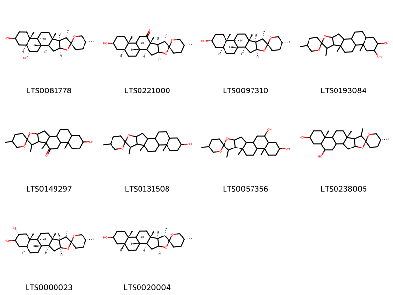{ width=100% }
    <figcaption>Hình ảnh cấu trúc hóa học của 10 hoạt chất thuộc nhóm Prenol lipids gồm ['chlorogenin (LTS0081778)', 'hecogenin (LTS0221000)', 'tigogenin (LTS0097310)', "5,7',9',13'-tetramethyl-5'-oxaspiro[oxane-2,6'-pentacyclo[10.8.0.0²,⁹.0⁴,⁸.0¹³,¹⁸]icosane]-15',16'-diol (LTS0193084)", 'hecogenin (LTS0149297)', 'tigogenin (LTS0131508)', "5,7',9',13'-tetramethyl-5'-oxaspiro[oxane-2,6'-pentacyclo[10.8.0.0²,⁹.0⁴,⁸.0¹³,¹⁸]icosane]-16',19'-diol (LTS0057356)", "(5r,9's,13'r,16's)-5,7',9',13'-tetramethyl-5'-oxaspiro[oxane-2,6'-pentacyclo[10.8.0.0²,⁹.0⁴,⁸.0¹³,¹⁸]icosane]-16',19'-diol (LTS0238005)", 'gitogenin (LTS0000023)', 'smilagenin (LTS0020004)'].</figcaption>
</figure>
#### Nhóm Steroids and steroid derivatives
<figure markdown="span">
    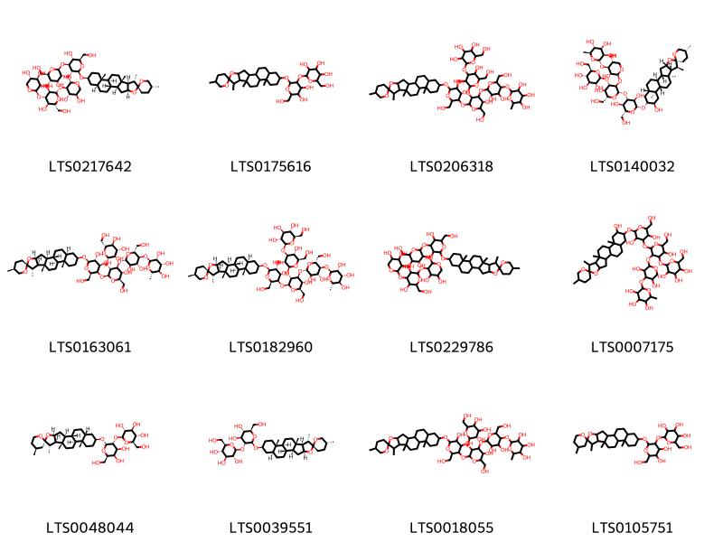{ width=100% }
    <figcaption>Hình ảnh cấu trúc hóa học của 12 hoạt chất thuộc nhóm Steroids and steroid derivatives gồm ["(2r,3s,4r,5s)-2-{[(2s,3r,4s,5r,6r)-2-{[(2s,3r,4s,5r)-2-{[(2s,3r,4s,5s,6r)-2-{[(2r,3r,4s,5r,6r)-3,5-dihydroxy-2-(hydroxymethyl)-6-[(1'r,2r,2's,4's,5r,7's,8'r,9's,12's,13's,16's,18's)-5,7',9',13'-tetramethyl-5'-oxaspiro[oxane-2,6'-pentacyclo[10.8.0.0²,⁹.0⁴,⁸.0¹³,¹⁸]icosane]oxy]oxan-4-yl]oxy}-4,5-dihydroxy-6-(hydroxymethyl)oxan-3-yl]oxy}-4,5-dihydroxyoxan-3-yl]oxy}-3,5-dihydroxy-6-(hydroxymethyl)oxan-4-yl]oxy}oxane-3,4,5-triol (LTS0217642)", 'timosaponin a3 (LTS0175616)', "2-({6-[(2-{[4,5-dihydroxy-2-(hydroxymethyl)-6-{5,7',9',13'-tetramethyl-5'-oxaspiro[oxane-2,6'-pentacyclo[10.8.0.0²,⁹.0⁴,⁸.0¹³,¹⁸]icosane]oxy}oxan-3-yl]oxy}-3-{[3,5-dihydroxy-6-(hydroxymethyl)-4-{[3,4,5-trihydroxy-6-(hydroxymethyl)oxan-2-yl]oxy}oxan-2-yl]oxy}-5-hydroxy-6-(hydroxymethyl)oxan-4-yl)oxy]-4,5-dihydroxy-2-(hydroxymethyl)oxan-3-yl}oxy)-6-methyloxane-3,4,5-triol (LTS0206318)", "(2s,3r,4r,5r,6s)-2-{[(2s,3r,4s,5r)-2-{[(2s,3r,4s,5r,6r)-2-{[(2r,3r,4s,5r,6r)-3,5-dihydroxy-2-(hydroxymethyl)-6-[(1'r,2r,2's,4's,5r,7's,8'r,9's,12's,13's,15'r,16'r,18's)-5,7',9',13'-tetramethyl-5'-oxaspiro[oxane-2,6'-pentacyclo[10.8.0.0²,⁹.0⁴,⁸.0¹³,¹⁸]icosan]-15'-oloxy]oxan-4-yl]oxy}-5-hydroxy-6-(hydroxymethyl)-4-{[(2s,3r,4s,5s,6r)-3,4,5-trihydroxy-6-(hydroxymethyl)oxan-2-yl]oxy}oxan-3-yl]oxy}-3,5-dihydroxyoxan-4-yl]oxy}-6-methyloxane-3,4,5-triol (LTS0140032)", "(2s,3r,4r,5r,6s)-2-{[(2r,3s,4r,5r,6s)-6-{[(2s,3r,4s,5r,6r)-2-{[(2r,3r,4r,5r,6r)-4,5-dihydroxy-2-(hydroxymethyl)-6-[(1'r,2r,2's,4's,5s,7's,8'r,9's,12's,13's,16's,18's)-5,7',9',13'-tetramethyl-5'-oxaspiro[oxane-2,6'-pentacyclo[10.8.0.0²,⁹.0⁴,⁸.0¹³,¹⁸]icosane]oxy]oxan-3-yl]oxy}-5-hydroxy-6-(hydroxymethyl)-3-{[(2s,3r,4s,5s,6r)-3,4,5-trihydroxy-6-(hydroxymethyl)oxan-2-yl]oxy}oxan-4-yl]oxy}-4,5-dihydroxy-2-(hydroxymethyl)oxan-3-yl]oxy}-6-methyloxane-3,4,5-triol (LTS0163061)", "(2s,3r,4r,5r,6s)-2-{[(2r,3s,4r,5r,6s)-6-{[(2s,3r,4s,5r,6r)-2-{[(2r,3r,4r,5r,6r)-4,5-dihydroxy-2-(hydroxymethyl)-6-[(1'r,2r,2's,4's,5s,7's,8'r,9's,12's,13's,16's,18's)-5,7',9',13'-tetramethyl-5'-oxaspiro[oxane-2,6'-pentacyclo[10.8.0.0²,⁹.0⁴,⁸.0¹³,¹⁸]icosane]oxy]oxan-3-yl]oxy}-3-{[(2s,3r,4s,5r,6r)-3,5-dihydroxy-6-(hydroxymethyl)-4-{[(2s,3r,4s,5s,6r)-3,4,5-trihydroxy-6-(hydroxymethyl)oxan-2-yl]oxy}oxan-2-yl]oxy}-5-hydroxy-6-(hydroxymethyl)oxan-4-yl]oxy}-4,5-dihydroxy-2-(hydroxymethyl)oxan-3-yl]oxy}-6-methyloxane-3,4,5-triol (LTS0182960)", "2-{[2-({2-[(2-{[3,5-dihydroxy-2-(hydroxymethyl)-6-{5,7',9',13'-tetramethyl-5'-oxaspiro[oxane-2,6'-pentacyclo[10.8.0.0²,⁹.0⁴,⁸.0¹³,¹⁸]icosane]oxy}oxan-4-yl]oxy}-4,5-dihydroxy-6-(hydroxymethyl)oxan-3-yl)oxy]-4,5-dihydroxyoxan-3-yl}oxy)-3,5-dihydroxy-6-(hydroxymethyl)oxan-4-yl]oxy}oxane-3,4,5-triol (LTS0229786)", "2-[(2-{[3,5-dihydroxy-2-(hydroxymethyl)-6-{5,7',9',13'-tetramethyl-5'-oxaspiro[oxane-2,6'-pentacyclo[10.8.0.0²,⁹.0⁴,⁸.0¹³,¹⁸]icosan]-15'-oloxy}oxan-4-yl]oxy}-3-({3,5-dihydroxy-4-[(3,4,5-trihydroxy-6-methyloxan-2-yl)oxy]oxan-2-yl}oxy)-5-hydroxy-6-(hydroxymethyl)oxan-4-yl)oxy]-6-(hydroxymethyl)oxane-3,4,5-triol (LTS0007175)", "(2s,3r,4s,5s,6r)-2-{[(2s,3r,4s,5r,6r)-4,5-dihydroxy-6-(hydroxymethyl)-2-[(1'r,2s,2's,4s,4's,7's,8'r,9's,12's,13's,16's,18'r)-4,7',9',13'-tetramethyl-5'-oxaspiro[oxane-2,6'-pentacyclo[10.8.0.0²,⁹.0⁴,⁸.0¹³,¹⁸]icosane]oxy]oxan-3-yl]oxy}-6-(hydroxymethyl)oxane-3,4,5-triol (LTS0048044)", "(2s,3r,4s,5s,6r)-2-{[(2r,3r,4s,5s,6r)-4,5-dihydroxy-6-(hydroxymethyl)-2-[(1'r,2r,2's,4's,5r,7's,8'r,9's,12's,13's,16's,18's)-5,7',9',13'-tetramethyl-5'-oxaspiro[oxane-2,6'-pentacyclo[10.8.0.0²,⁹.0⁴,⁸.0¹³,¹⁸]icosane]oxy]oxan-3-yl]oxy}-6-(hydroxymethyl)oxane-3,4,5-triol (LTS0039551)", "2-({6-[(2-{[4,5-dihydroxy-2-(hydroxymethyl)-6-{5,7',9',13'-tetramethyl-5'-oxaspiro[oxane-2,6'-pentacyclo[10.8.0.0²,⁹.0⁴,⁸.0¹³,¹⁸]icosane]oxy}oxan-3-yl]oxy}-5-hydroxy-6-(hydroxymethyl)-3-{[3,4,5-trihydroxy-6-(hydroxymethyl)oxan-2-yl]oxy}oxan-4-yl)oxy]-4,5-dihydroxy-2-(hydroxymethyl)oxan-3-yl}oxy)-6-methyloxane-3,4,5-triol (LTS0018055)", "2-{[4,5-dihydroxy-6-(hydroxymethyl)-2-{4,7',9',13'-tetramethyl-5'-oxaspiro[oxane-2,6'-pentacyclo[10.8.0.0²,⁹.0⁴,⁸.0¹³,¹⁸]icosane]oxy}oxan-3-yl]oxy}-6-(hydroxymethyl)oxane-3,4,5-triol (LTS0105751)"].</figcaption>
</figure>

---

### Dược dân tộc học

Danh sách các quốc gia có sử dụng *Yucca aloifolia* trong điều trị các bệnh. 

| Country            | Disease    | Bệnh           |
|:-------------------|:-----------|:---------------|
| Dominican Republic | Diuretic   | Thuốc lợi tiêu |
| Elsewhere          | Purgative  | Thuốc xổ       |
| Haiti              | Diuretic   | Thuốc lợi tiêu |
| Mexico             | Soap, Soap | - Xà-bông.     |

---

---
## Yucca australis
### Thông tin về thực vật

!!! info "Phân loại thực vật của *Yucca treculiana* từ GIBF:"
    - **Kingdom:** Plantae
    - **Phylum:** Tracheophyta
    - **Order:** Asparagales
    - **Family:** Asparagaceae
    - **Genus:** Yucca
    - **Species:** *Yucca treculiana*

 

| Label (VI)   | Label (EN)   | Scientific Name   | Descriptions (VI)   | Descriptions (EN)   | Also Known As (VI)   | Also Known As (EN)                                                       |
|:-------------|:-------------|:------------------|:--------------------|:--------------------|:---------------------|:-------------------------------------------------------------------------|
| N/A          | N/A          | Yucca aloifolia   | loài thực vật       | species of plant    | ['']                 | ['Roman Candle', "Adam's Needle", 'Palm Lily', 'Spanish Dagger/Bayonet'] |

#### Phân bố trên thế giới

**Từ CSDL GIBF** nan, Spain, Paraguay, United States of America, Mexico

#### Phân bố tại Việt Nam

**Từ CSDL GIBF**: Không có ghi nhận ở Việt Nam

---
### Thành phần hóa học
        
- Theo cơ sở dữ liệu lotus: Từ loài *Yucca treculiana* đã phân lập và xác định được Chưa có hoạt chất nào được phân lập. hoạt chất thuộc về các nhóm Không có hoạt chất nào được phân lập. 

Không có hình ảnh nào được tạo ra

---

### Dược dân tộc học

Danh sách các quốc gia có sử dụng *Yucca treculiana* trong điều trị các bệnh. 

| Country   | Disease   | Bệnh          |
|:----------|:----------|:--------------|
| Mexico    | Cathartic | thuốc tẩy nhẹ |

---

---
## Yucca brevifolia
### Thông tin về thực vật

!!! info "Phân loại thực vật của *Yucca brevifolia* từ GIBF:"
    - **Kingdom:** Plantae
    - **Phylum:** Tracheophyta
    - **Order:** Asparagales
    - **Family:** Asparagaceae
    - **Genus:** Yucca
    - **Species:** *Yucca brevifolia*

 

| Label (VI)   | Label (EN)   | Scientific Name   | Descriptions (VI)   | Descriptions (EN)   | Also Known As (VI)   | Also Known As (EN)   |
|:-------------|:-------------|:------------------|:--------------------|:--------------------|:---------------------|:---------------------|
| N/A          | N/A          | Yucca brevifolia  | loài thực vật       | species of plant    | ['']                 | ['Joshua Tree']      |

#### Phân bố trên thế giới

**Từ CSDL GIBF** United States of America

#### Phân bố tại Việt Nam

**Từ CSDL GIBF**: Không có ghi nhận ở Việt Nam

---
### Thành phần hóa học
        
- Theo cơ sở dữ liệu lotus: Từ loài *Yucca brevifolia* đã phân lập và xác định được Chưa có hoạt chất nào được phân lập. hoạt chất thuộc về các nhóm Không có hoạt chất nào được phân lập. 

Không có hình ảnh nào được tạo ra

---

### Dược dân tộc học

Danh sách các quốc gia có sử dụng *Yucca brevifolia* trong điều trị các bệnh. 

| Country        | Disease   | Bệnh   |
|:---------------|:----------|:-------|
| US(Amerindian) | Emetic    | Phôi   |

---

---
## Yucca elata
### Thông tin về thực vật

!!! info "Phân loại thực vật của *Yucca elata* từ GIBF:"
    - **Kingdom:** Plantae
    - **Phylum:** Tracheophyta
    - **Order:** Asparagales
    - **Family:** Asparagaceae
    - **Genus:** Yucca
    - **Species:** *Yucca elata*

 

| Label (VI)   | Label (EN)   | Scientific Name   | Descriptions (VI)   | Descriptions (EN)          | Also Known As (VI)   | Also Known As (EN)                                     |
|:-------------|:-------------|:------------------|:--------------------|:---------------------------|:---------------------|:-------------------------------------------------------|
| N/A          | N/A          | Yucca elata       |                     | species of perennial plant | ['']                 | ['soapweed', 'palmella', 'soaptree', 'soaptree yucca'] |

#### Phân bố trên thế giới

**Từ CSDL GIBF** United States of America, Mexico

#### Phân bố tại Việt Nam

**Từ CSDL GIBF**: Không có ghi nhận ở Việt Nam

---
### Thành phần hóa học
        
- Theo cơ sở dữ liệu lotus: Từ loài *Yucca elata* đã phân lập và xác định được 2 hoạt chất thuộc về các nhóm Prenol lipids. 

|    | chemicalTaxonomyClassyfireClass   |   smiles_count |
|---:|:----------------------------------|---------------:|
|  0 | Prenol lipids                     |              2 |

#### Nhóm Prenol lipids
<figure markdown="span">
    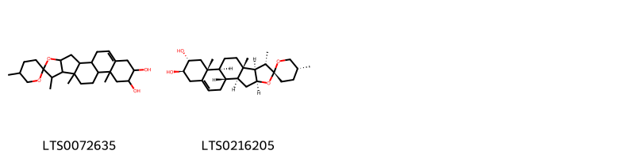{ width=100% }
    <figcaption>Hình ảnh cấu trúc hóa học của 2 hoạt chất thuộc nhóm Prenol lipids gồm ["5,7',9',13'-tetramethyl-5'-oxaspiro[oxane-2,6'-pentacyclo[10.8.0.0²,⁹.0⁴,⁸.0¹³,¹⁸]icosan]-18'-ene-15',16'-diol (LTS0072635)", "(1's,2r,2's,4's,5r,7's,8'r,9's,12's,13'r,15'r,16'r)-5,7',9',13'-tetramethyl-5'-oxaspiro[oxane-2,6'-pentacyclo[10.8.0.0²,⁹.0⁴,⁸.0¹³,¹⁸]icosan]-18'-ene-15',16'-diol (LTS0216205)"].</figcaption>
</figure>

---

### Dược dân tộc học

Danh sách các quốc gia có sử dụng *Yucca elata* trong điều trị các bệnh. 

| Country   | Disease   | Bệnh     |
|:----------|:----------|:---------|
| US        | Soap      | Xà phòng |

---

---
## Yucca filamentosa
### Thông tin về thực vật

!!! info "Phân loại thực vật của *Yucca filamentosa* từ GIBF:"
    - **Kingdom:** Plantae
    - **Phylum:** Tracheophyta
    - **Order:** Asparagales
    - **Family:** Asparagaceae
    - **Genus:** Yucca
    - **Species:** *Yucca filamentosa*

 

| Label (VI)   | Label (EN)   | Scientific Name   | Descriptions (VI)   | Descriptions (EN)   | Also Known As (VI)   | Also Known As (EN)                                                                                                                             |
|:-------------|:-------------|:------------------|:--------------------|:--------------------|:---------------------|:-----------------------------------------------------------------------------------------------------------------------------------------------|
| N/A          | N/A          | Yucca filamentosa | loài thực vật       | species of plant    | ['']                 | ["Adam's needle", 'needle palm', 'beargrass', 'common yucca', 'curly-leaved yucca', 'filament yucca', 'silkgrass', 'spoonleaf yucca', 'yucca'] |

#### Phân bố trên thế giới

**Từ CSDL GIBF** nan, United Kingdom of Great Britain and Northern Ireland, South Africa, Sweden, Hungary, Germany, Canada, United States of America, Italy, Austria, Netherlands, Slovakia

#### Phân bố tại Việt Nam

**Từ CSDL GIBF**: Không có ghi nhận ở Việt Nam

---
### Thành phần hóa học
        
- Theo cơ sở dữ liệu lotus: Từ loài *Yucca filamentosa* đã phân lập và xác định được 5 hoạt chất thuộc về các nhóm Steroids and steroid derivatives. 

|    | chemicalTaxonomyClassyfireClass   |   smiles_count |
|---:|:----------------------------------|---------------:|
|  0 | Steroids and steroid derivatives  |              5 |

#### Nhóm Steroids and steroid derivatives
<figure markdown="span">
    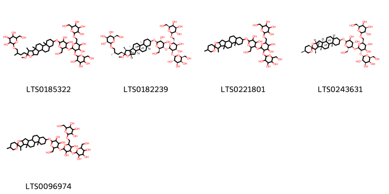{ width=100% }
    <figcaption>Hình ảnh cấu trúc hóa học của 5 hoạt chất thuộc nhóm Steroids and steroid derivatives gồm ['2-{4-[16-({5-[(4,5-dihydroxy-3-{[3,4,5-trihydroxy-6-(hydroxymethyl)oxan-2-yl]oxy}-6-({[3,4,5-trihydroxy-6-(hydroxymethyl)oxan-2-yl]oxy}methyl)oxan-2-yl)oxy]-3,4-dihydroxy-6-(hydroxymethyl)oxan-2-yl}oxy)-6-methoxy-7,9,13-trimethyl-5-oxapentacyclo[10.8.0.0²,⁹.0⁴,⁸.0¹³,¹⁸]icosan-6-yl]-2-methylbutoxy}-6-(hydroxymethyl)oxane-3,4,5-triol (LTS0185322)', '(2r,3r,4s,5s,6r)-2-[(2s)-4-[(1r,2r,4s,6s,7s,8r,9s,12s,13s,16r,18r)-16-{[(2r,3r,4r,5s,6r)-5-{[(2s,3r,4s,5s,6r)-4,5-dihydroxy-3-{[(2s,3s,4r,5s,6s)-3,4,5-trihydroxy-6-(hydroxymethyl)oxan-2-yl]oxy}-6-({[(2s,3s,4r,5s,6s)-3,4,5-trihydroxy-6-(hydroxymethyl)oxan-2-yl]oxy}methyl)oxan-2-yl]oxy}-3,4-dihydroxy-6-(hydroxymethyl)oxan-2-yl]oxy}-6-methoxy-7,9,13-trimethyl-5-oxapentacyclo[10.8.0.0²,⁹.0⁴,⁸.0¹³,¹⁸]icosan-6-yl]-2-methylbutoxy]-6-(hydroxymethyl)oxane-3,4,5-triol (LTS0182239)', "2-[(6-{[4,5-dihydroxy-2-(hydroxymethyl)-6-{5,7',9',13'-tetramethyl-5'-oxaspiro[oxane-2,6'-pentacyclo[10.8.0.0²,⁹.0⁴,⁸.0¹³,¹⁸]icosane]oxy}oxan-3-yl]oxy}-3,4-dihydroxy-5-{[3,4,5-trihydroxy-6-(hydroxymethyl)oxan-2-yl]oxy}oxan-2-yl)methoxy]-6-(hydroxymethyl)oxane-3,4,5-triol (LTS0221801)", "(2s,3s,4r,5s,6s)-2-{[(2s,3r,4r,5s,6r)-6-{[(2s,3r,4s,5s,6s)-4,5-dihydroxy-2-(hydroxymethyl)-6-[(1's,2r,2's,4'r,5s,7'r,8's,9's,12's,13's,16's,18'r)-5,7',9',13'-tetramethyl-5'-oxaspiro[oxane-2,6'-pentacyclo[10.8.0.0²,⁹.0⁴,⁸.0¹³,¹⁸]icosane]oxy]oxan-3-yl]oxy}-3,4-dihydroxy-5-{[(2s,3s,4r,5s,6s)-3,4,5-trihydroxy-6-(hydroxymethyl)oxan-2-yl]oxy}oxan-2-yl]methoxy}-6-(hydroxymethyl)oxane-3,4,5-triol (LTS0243631)", "2-[(6-{[4,5-dihydroxy-2-(hydroxymethyl)-6-{5,7',9',13'-tetramethyl-5'-oxaspiro[oxane-2,6'-pentacyclo[10.8.0.0²,⁹.0⁴,⁸.0¹³,¹⁸]icosane]oxy}oxan-3-yl]oxy}-3,5-dihydroxy-4-{[3,4,5-trihydroxy-6-(hydroxymethyl)oxan-2-yl]oxy}oxan-2-yl)methoxy]-6-(hydroxymethyl)oxane-3,4,5-triol (LTS0096974)"].</figcaption>
</figure>

---

### Dược dân tộc học

Danh sách các quốc gia có sử dụng *Yucca filamentosa* trong điều trị các bệnh. 

| Country   | Disease   | Bệnh     |
|:----------|:----------|:---------|
| Egypt     | Soap      | Xà phòng |
| US        | Soap      | Xà phòng |

---

---
## Yucca glauca
### Thông tin về thực vật

!!! info "Phân loại thực vật của *Yucca glauca* từ GIBF:"
    - **Kingdom:** Plantae
    - **Phylum:** Tracheophyta
    - **Order:** Asparagales
    - **Family:** Asparagaceae
    - **Genus:** Yucca
    - **Species:** *Yucca glauca*

 

| Label (VI)   | Label (EN)   | Scientific Name   | Descriptions (VI)   | Descriptions (EN)   | Also Known As (VI)   | Also Known As (EN)                                                                                                                                                                              |
|:-------------|:-------------|:------------------|:--------------------|:--------------------|:---------------------|:------------------------------------------------------------------------------------------------------------------------------------------------------------------------------------------------|
| N/A          | N/A          | Yucca glauca      | loài thực vật       | species of plant    | ['']                 | ['Spanish bayonet', 'soapweed', 'American vetch', 'beargrass', 'yucca', 'narrowleaf yucca', 'Great Plains yucca', "Gurney's yucca", 'small soapweed', 'small soapweed yucca', 'soapweed yucca'] |

#### Phân bố trên thế giới

**Từ CSDL GIBF** Canada, United States of America

#### Phân bố tại Việt Nam

**Từ CSDL GIBF**: Không có ghi nhận ở Việt Nam

---
### Thành phần hóa học
        
- Theo cơ sở dữ liệu lotus: Từ loài *Yucca glauca* đã phân lập và xác định được 10 hoạt chất thuộc về các nhóm Prenol lipids, Steroids and steroid derivatives. 

|    | chemicalTaxonomyClassyfireClass   |   smiles_count |
|---:|:----------------------------------|---------------:|
|  0 | Prenol lipids                     |              2 |
|  1 | Steroids and steroid derivatives  |              8 |

#### Nhóm Prenol lipids
<figure markdown="span">
    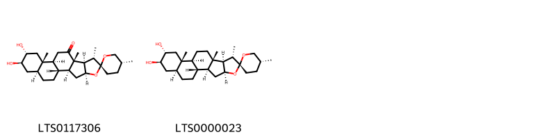{ width=100% }
    <figcaption>Hình ảnh cấu trúc hóa học của 2 hoạt chất thuộc nhóm Prenol lipids gồm ["(1'r,2r,2's,4's,5r,7's,8'r,9's,12's,13's,15'r,16'r,18's)-15',16'-dihydroxy-5,7',9',13'-tetramethyl-5'-oxaspiro[oxane-2,6'-pentacyclo[10.8.0.0²,⁹.0⁴,⁸.0¹³,¹⁸]icosan]-10'-one (LTS0117306)", 'gitogenin (LTS0000023)'].</figcaption>
</figure>
#### Nhóm Steroids and steroid derivatives
<figure markdown="span">
    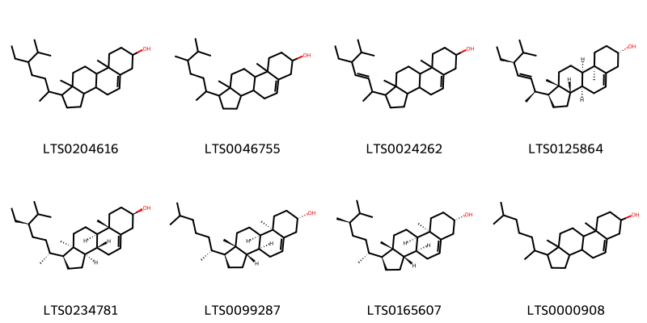{ width=100% }
    <figcaption>Hình ảnh cấu trúc hóa học của 8 hoạt chất thuộc nhóm Steroids and steroid derivatives gồm ['stigmast-5-en-3-ol, (3β)- (LTS0204616)', 'campesterol (LTS0046755)', 'stigmasterol (LTS0024262)', '(1s,3as,3bs,7s,9ar,9br,11as)-1-[(2s,3e,5s)-5-ethyl-6-methylhept-3-en-2-yl]-9a,11a-dimethyl-1h,2h,3h,3ah,3bh,4h,6h,7h,8h,9h,9bh,10h,11h-cyclopenta[a]phenanthren-7-ol (LTS0125864)', '(1s,3ar,3br,7r,9as,9br,11ar)-1-[(2r,5r)-5-ethyl-6-methylheptan-2-yl]-9a,11a-dimethyl-1h,2h,3h,3ah,3bh,4h,6h,7h,8h,9h,9bh,10h,11h-cyclopenta[a]phenanthren-7-ol (LTS0234781)', '(1s,3as,3bs,7s,9ar,9br,11as)-9a,11a-dimethyl-1-[(2r)-6-methylheptan-2-yl]-1h,2h,3h,3ah,3bh,4h,6h,7h,8h,9h,9bh,10h,11h-cyclopenta[a]phenanthren-7-ol (LTS0099287)', '(1s,3as,3bs,7s,9ar,9br,11as)-1-[(2r,5r)-5,6-dimethylheptan-2-yl]-9a,11a-dimethyl-1h,2h,3h,3ah,3bh,4h,6h,7h,8h,9h,9bh,10h,11h-cyclopenta[a]phenanthren-7-ol (LTS0165607)', 'epicholestrol (LTS0000908)'].</figcaption>
</figure>

---

### Dược dân tộc học

Danh sách các quốc gia có sử dụng *Yucca glauca* trong điều trị các bệnh. 

| Country        | Disease        | Bệnh                  |
|:---------------|:---------------|:----------------------|
| US(Amerindian) | Soap           | Xà phòng              |
| US(Blackfoot)  | Hemostat, Soap | Máy cầm máu, xà phòng |

---

---
## Yucca gloriosa
### Thông tin về thực vật

!!! info "Phân loại thực vật của *Yucca gloriosa* từ GIBF:"
    - **Kingdom:** Plantae
    - **Phylum:** Tracheophyta
    - **Order:** Asparagales
    - **Family:** Asparagaceae
    - **Genus:** Yucca
    - **Species:** *Yucca gloriosa*

 

| Label (VI)   | Label (EN)   | Scientific Name   | Descriptions (VI)   | Descriptions (EN)   | Also Known As (VI)   | Also Known As (EN)                                                                                                                                                                                                  |
|:-------------|:-------------|:------------------|:--------------------|:--------------------|:---------------------|:--------------------------------------------------------------------------------------------------------------------------------------------------------------------------------------------------------------------|
| N/A          | N/A          | Yucca gloriosa    | loài thực vật       | species of plant    | ['']                 | ["Adam's needle", 'Glorious yucca', "Lord's candlestick", 'Mound lily', 'Moundlily yucca', 'Palm lily', 'Roman candle', 'Sea Islands yucca', 'Soft-tipped yucca', 'Spanish bayonet', 'Spanish dagger', 'Tree lily'] |

#### Phân bố trên thế giới

**Từ CSDL GIBF** nan, Georgia, Spain, Germany, Australia, Albania, Sweden, Lesotho, Belgium, Netherlands, China, Uruguay, Argentina, United Kingdom of Great Britain and Northern Ireland, South Africa, Portugal, France, New Zealand, Bolivia (Plurinational State of), United States of America, Italy, Greece, Croatia

#### Phân bố tại Việt Nam

**Từ CSDL GIBF**: Không có ghi nhận ở Việt Nam

---
### Thành phần hóa học
        
- Theo cơ sở dữ liệu lotus: Từ loài *Yucca gloriosa* đã phân lập và xác định được 73 hoạt chất thuộc về các nhóm Steroids and steroid derivatives, 2-arylbenzofuran flavonoids, Prenol lipids. 

|    | chemicalTaxonomyClassyfireClass   |   smiles_count |
|---:|:----------------------------------|---------------:|
|  0 | 2-arylbenzofuran flavonoids       |              7 |
|  1 | Prenol lipids                     |             15 |
|  2 | Steroids and steroid derivatives  |             50 |

#### Nhóm 2-arylbenzofuran flavonoids
<figure markdown="span">
    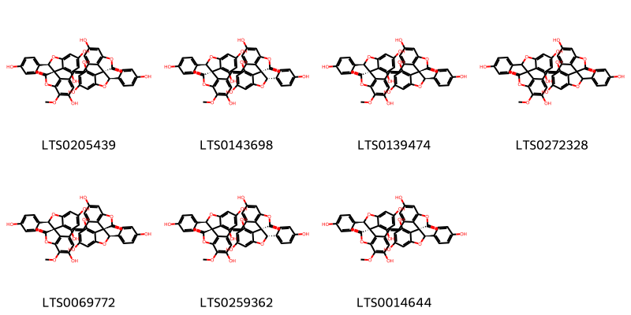{ width=100% }
    <figcaption>Hình ảnh cấu trúc hóa học của 7 hoạt chất thuộc nhóm 2-arylbenzofuran flavonoids gồm ["(2'r,3r)-4',6,6'-trihydroxy-2'-(4-hydroxyphenyl)-7-methoxy-4-[(1e)-2-[(2'r,3s)-4',6,6'-trihydroxy-2'-(4-hydroxyphenyl)-2-oxo-2'h-3,3'-spirobi[[1]benzofuran]-4-yl]ethenyl]-2'h-3,3'-spirobi[[1]benzofuran]-2-one (LTS0205439)", "(2'r,3s)-4',6,6'-trihydroxy-2'-(4-hydroxyphenyl)-7-methoxy-4-[(1e)-2-[(2's,3s)-4',6,6'-trihydroxy-2'-(4-hydroxyphenyl)-2-oxo-2'h-3,3'-spirobi[[1]benzofuran]-4-yl]ethenyl]-2'h-3,3'-spirobi[[1]benzofuran]-2-one (LTS0143698)", "(2'r,3s)-4',6,6'-trihydroxy-2'-(4-hydroxyphenyl)-7-methoxy-4-[(1e)-2-[(2'r,3r)-4',6,6'-trihydroxy-2'-(4-hydroxyphenyl)-2-oxo-2'h-3,3'-spirobi[[1]benzofuran]-4-yl]ethenyl]-2'h-3,3'-spirobi[[1]benzofuran]-2-one (LTS0139474)", "4',6,6'-trihydroxy-2'-(4-hydroxyphenyl)-7-methoxy-4-{2-[4',6,6'-trihydroxy-2'-(4-hydroxyphenyl)-2-oxo-2'h-3,3'-spirobi[[1]benzofuran]-4-yl]ethenyl}-2'h-3,3'-spirobi[[1]benzofuran]-2-one (LTS0272328)", "(2'r,3r)-4',6,6'-trihydroxy-2'-(4-hydroxyphenyl)-7-methoxy-4-[(1e)-2-[(2'r,3r)-4',6,6'-trihydroxy-2'-(4-hydroxyphenyl)-2-oxo-2'h-3,3'-spirobi[[1]benzofuran]-4-yl]ethenyl]-2'h-3,3'-spirobi[[1]benzofuran]-2-one (LTS0069772)", "(2'r,3r)-4',6,6'-trihydroxy-2'-(4-hydroxyphenyl)-7-methoxy-4-[(1e)-2-[(2's,3s)-4',6,6'-trihydroxy-2'-(4-hydroxyphenyl)-2-oxo-2'h-3,3'-spirobi[[1]benzofuran]-4-yl]ethenyl]-2'h-3,3'-spirobi[[1]benzofuran]-2-one (LTS0259362)", "(2'r,3s)-4',6,6'-trihydroxy-2'-(4-hydroxyphenyl)-7-methoxy-4-[(1e)-2-[(2'r,3s)-4',6,6'-trihydroxy-2'-(4-hydroxyphenyl)-2-oxo-2'h-3,3'-spirobi[[1]benzofuran]-4-yl]ethenyl]-2'h-3,3'-spirobi[[1]benzofuran]-2-one (LTS0014644)"].</figcaption>
</figure>
#### Nhóm Prenol lipids
<figure markdown="span">
    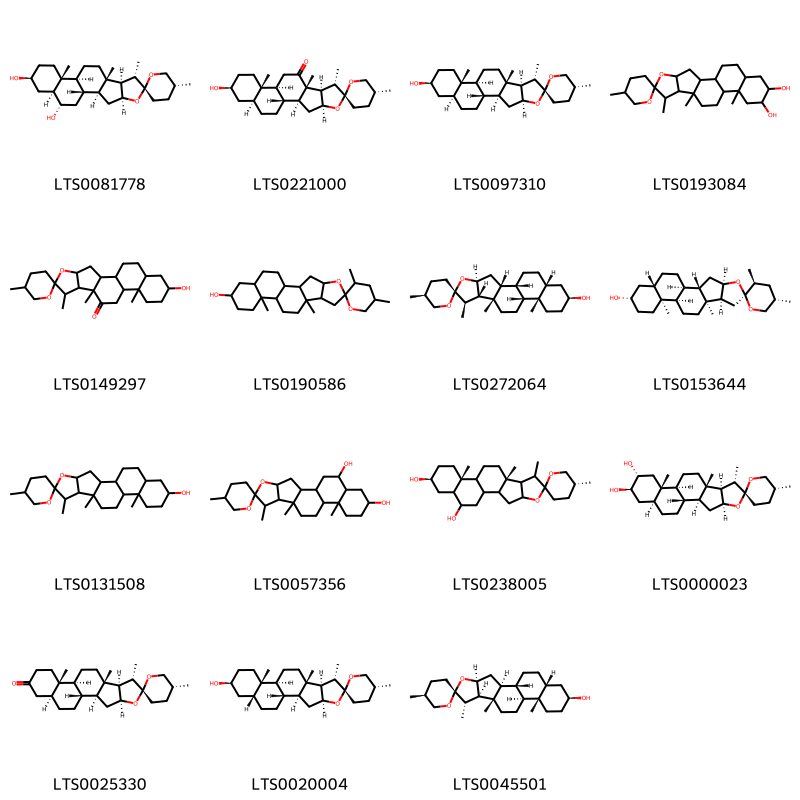{ width=100% }
    <figcaption>Hình ảnh cấu trúc hóa học của 15 hoạt chất thuộc nhóm Prenol lipids gồm ['chlorogenin (LTS0081778)', 'hecogenin (LTS0221000)', 'tigogenin (LTS0097310)', "5,7',9',13'-tetramethyl-5'-oxaspiro[oxane-2,6'-pentacyclo[10.8.0.0²,⁹.0⁴,⁸.0¹³,¹⁸]icosane]-15',16'-diol (LTS0193084)", 'hecogenin (LTS0149297)', "3,5,9',13'-tetramethyl-5'-oxaspiro[oxane-2,6'-pentacyclo[10.8.0.0²,⁹.0⁴,⁸.0¹³,¹⁸]icosan]-16'-ol (LTS0190586)", "(1'r,2r,2'r,4's,5s,7'r,8's,9's,12'r,13's,16's,18'r)-5,7',9',13'-tetramethyl-5'-oxaspiro[oxane-2,6'-pentacyclo[10.8.0.0²,⁹.0⁴,⁸.0¹³,¹⁸]icosan]-16'-ol (LTS0272064)", "(1'r,2s,2's,3s,4'r,5s,8's,9's,12'r,13's,16's,18's)-3,5,9',13'-tetramethyl-5'-oxaspiro[oxane-2,6'-pentacyclo[10.8.0.0²,⁹.0⁴,⁸.0¹³,¹⁸]icosan]-16'-ol (LTS0153644)", 'tigogenin (LTS0131508)', "5,7',9',13'-tetramethyl-5'-oxaspiro[oxane-2,6'-pentacyclo[10.8.0.0²,⁹.0⁴,⁸.0¹³,¹⁸]icosane]-16',19'-diol (LTS0057356)", "(5r,9's,13'r,16's)-5,7',9',13'-tetramethyl-5'-oxaspiro[oxane-2,6'-pentacyclo[10.8.0.0²,⁹.0⁴,⁸.0¹³,¹⁸]icosane]-16',19'-diol (LTS0238005)", 'gitogenin (LTS0000023)', "(1'r,2r,2's,4's,5r,7's,8'r,9's,12's,13's,18's)-5,7',9',13'-tetramethyl-5'-oxaspiro[oxane-2,6'-pentacyclo[10.8.0.0²,⁹.0⁴,⁸.0¹³,¹⁸]icosan]-16'-one (LTS0025330)", 'smilagenin (LTS0020004)', 'sarsasapogenin (LTS0045501)'].</figcaption>
</figure>
#### Nhóm Steroids and steroid derivatives
<figure markdown="span">
    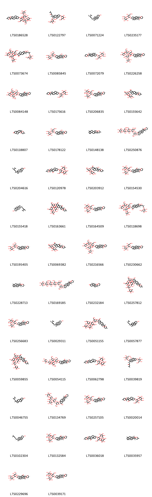{ width=100% }
    <figcaption>Hình ảnh cấu trúc hóa học của 50 hoạt chất thuộc nhóm Steroids and steroid derivatives gồm ["2-[(2-{[4,5-dihydroxy-2-(hydroxymethyl)-6-{5,7',9',13'-tetramethyl-5'-oxaspiro[oxane-2,6'-pentacyclo[10.8.0.0²,⁹.0⁴,⁸.0¹³,¹⁸]icosane]oxy}oxan-3-yl]oxy}-3-{[3,5-dihydroxy-6-(hydroxymethyl)-4-[(3,4,5-trihydroxyoxan-2-yl)oxy]oxan-2-yl]oxy}-5-hydroxy-6-(hydroxymethyl)oxan-4-yl)oxy]oxane-3,4,5-triol (LTS0186528)", '2-[4-hydroxy-9a,11a-dimethyl-2,7-bis({[3,4,5-trihydroxy-6-(hydroxymethyl)oxan-2-yl]oxy})-1h,2h,3h,3ah,3bh,4h,6h,7h,8h,9h,9bh,10h,11h-cyclopenta[a]phenanthren-1-yl]-6-methylheptan-4-one (LTS0122797)', 'stigmast-5-en-3-ol (LTS0071224)', "(2s,3r,4s,5s,6r)-2-{[(2r,3r,4s,5s,6r)-4,5-dihydroxy-6-(hydroxymethyl)-2-[(1'r,2r,2's,4's,5r,7's,8'r,9's,12's,13's,16's,18'r)-5,7',9',13'-tetramethyl-5'-oxaspiro[oxane-2,6'-pentacyclo[10.8.0.0²,⁹.0⁴,⁸.0¹³,¹⁸]icosane]oxy]oxan-3-yl]oxy}-6-(hydroxymethyl)oxane-3,4,5-triol (LTS0235177)", '2-{4-[16-({5-[(3-{[3,5-dihydroxy-6-(hydroxymethyl)-4-[(3,4,5-trihydroxyoxan-2-yl)oxy]oxan-2-yl]oxy}-5-hydroxy-6-(hydroxymethyl)-4-[(3,4,5-trihydroxyoxan-2-yl)oxy]oxan-2-yl)oxy]-3,4-dihydroxy-6-(hydroxymethyl)oxan-2-yl}oxy)-6,15-dihydroxy-7,9,13-trimethyl-5-oxapentacyclo[10.8.0.0²,⁹.0⁴,⁸.0¹³,¹⁸]icosan-6-yl]-2-methylbutoxy}-6-(hydroxymethyl)oxane-3,4,5-triol (LTS0073674)', "(2s,3r,4s,5s,6r)-2-{[(2r,3r,4s,5r,6r)-4,5-dihydroxy-6-(hydroxymethyl)-2-[(1's,2r,2's,4's,5r,7's,8'r,9's,10'r,12's,13's,15's,16'r,18'r)-5,7',9',13'-tetramethyl-5'-oxaspiro[oxane-2,6'-pentacyclo[10.8.0.0²,⁹.0⁴,⁸.0¹³,¹⁸]icosane]-10',15'-dioloxy]oxan-3-yl]oxy}-6-(hydroxymethyl)oxane-3,4,5-triol (LTS0085845)", 'timosaponin a-iii (LTS0072079)', "(2s,3r,4s,5r)-2-{[(2s,3r,4s,5r,6r)-2-{[(2r,3r,4r,5r,6r)-4,5-dihydroxy-2-(hydroxymethyl)-6-[(1'r,2r,2's,4's,5r,7's,8'r,9's,12's,13's,15'r,16'r,18's)-5,7',9',13'-tetramethyl-5'-oxaspiro[oxane-2,6'-pentacyclo[10.8.0.0²,⁹.0⁴,⁸.0¹³,¹⁸]icosan]-15'-oloxy]oxan-3-yl]oxy}-3-{[(2s,3r,4s,5r,6r)-3,5-dihydroxy-6-(hydroxymethyl)-4-{[(2s,3r,4s,5r)-3,4,5-trihydroxyoxan-2-yl]oxy}oxan-2-yl]oxy}-5-hydroxy-6-(hydroxymethyl)oxan-4-yl]oxy}oxane-3,4,5-triol (LTS0226258)", "(1's,2r,2'r,4'r,5r,7's,8's,9's,12'r,13's,15'r,16'r,18's)-16'-{[(2r,3r,4r,5r,6r)-3,4-dihydroxy-5-{[(2s,3r,4s,5r,6r)-5-hydroxy-6-(hydroxymethyl)-3-{[(2s,3r,4s,5s,6r)-3,4,5-trihydroxy-6-(hydroxymethyl)oxan-2-yl]oxy}-4-{[(2s,3r,4s,5r)-3,4,5-trihydroxyoxan-2-yl]oxy}oxan-2-yl]oxy}-6-(hydroxymethyl)oxan-2-yl]oxy}-15'-hydroxy-5,7',9',13'-tetramethyl-5'-oxaspiro[oxane-2,6'-pentacyclo[10.8.0.0²,⁹.0⁴,⁸.0¹³,¹⁸]icosan]-10'-one (LTS0084148)", 'timosaponin a3 (LTS0175616)', "(1'r,2r,2'r,4's,5r,7's,8's,9's,12's,13's,16's,18'r)-16'-{[(2r,3r,4s,5s,6r)-5-hydroxy-6-(hydroxymethyl)-3,4-bis({[(2s,3r,4s,5s,6r)-3,4,5-trihydroxy-6-(hydroxymethyl)oxan-2-yl]oxy})oxan-2-yl]oxy}-5,7',9',13'-tetramethyl-5'-oxaspiro[oxane-2,6'-pentacyclo[10.8.0.0²,⁹.0⁴,⁸.0¹³,¹⁸]icosan]-10'-one (LTS0206835)", "2-{[4,5-dihydroxy-6-(hydroxymethyl)-2-{5,7',9',13'-tetramethyl-5'-oxaspiro[oxane-2,6'-pentacyclo[10.8.0.0²,⁹.0⁴,⁸.0¹³,¹⁸]icosan]-15'-oloxy}oxan-3-yl]oxy}-6-(hydroxymethyl)oxane-3,4,5-triol (LTS0155642)", "1',5,9'a,11'a-tetramethyl-dodecahydrospiro[oxane-2,2'-phenanthro[1,2-b]furan]-7'-one (LTS0118807)", "(2s,3r,4s,5s,6r)-2-{[(2r,3r,4s,5r,6r)-4,5-dihydroxy-6-(hydroxymethyl)-2-[(1's,2r,2's,4's,5r,7's,8'r,9's,10'r,12's,13's,16's,18'r)-5,7',9',13'-tetramethyl-5'-oxaspiro[oxane-2,6'-pentacyclo[10.8.0.0²,⁹.0⁴,⁸.0¹³,¹⁸]icosan]-10'-oloxy]oxan-3-yl]oxy}-6-(hydroxymethyl)oxane-3,4,5-triol (LTS0178122)", "5,7',9',17'-tetramethyl-5'-oxaspiro[oxane-2,6'-pentacyclo[10.8.0.0²,⁹.0⁴,⁸.0¹³,¹⁸]icosane]-13'(18'),14',16'-triene (LTS0148138)", "(2s,3r,4r,5r,6s)-2-{[(2r,3s,4r,5r,6s)-6-{[(2s,3r,4s,5r,6r)-2-{[(2s,3r,4s,5s,6r)-2-{[(2r,3r,4r,5r,6r)-4,5-dihydroxy-2-(hydroxymethyl)-6-[(1'r,2r,2's,4's,5r,7's,8'r,9's,12's,13's,16's,18's)-5,7',9',13'-tetramethyl-5'-oxaspiro[oxane-2,6'-pentacyclo[10.8.0.0²,⁹.0⁴,⁸.0¹³,¹⁸]icosane]oxy]oxan-3-yl]oxy}-4,5-dihydroxy-6-(hydroxymethyl)oxan-3-yl]oxy}-3,5-dihydroxy-6-(hydroxymethyl)oxan-4-yl]oxy}-4,5-dihydroxy-2-(hydroxymethyl)oxan-3-yl]oxy}-6-methyloxane-3,4,5-triol (LTS0250876)", 'stigmast-5-en-3-ol, (3β)- (LTS0204616)', "2-{[3-hydroxy-2-(hydroxymethyl)-6-{5,7',9',13'-tetramethyl-5'-oxaspiro[oxane-2,6'-pentacyclo[10.8.0.0²,⁹.0⁴,⁸.0¹³,¹⁸]icosan]-10'-oloxy}-5-{[3,4,5-trihydroxy-6-(hydroxymethyl)oxan-2-yl]oxy}oxan-4-yl]oxy}-6-(hydroxymethyl)oxane-3,4,5-triol (LTS0120978)", "2-{[4,5-dihydroxy-6-(hydroxymethyl)-2-{5,7',9',13'-tetramethyl-5'-oxaspiro[oxane-2,6'-pentacyclo[10.8.0.0²,⁹.0⁴,⁸.0¹³,¹⁸]icosane]-10',15'-dioloxy}oxan-3-yl]oxy}-6-(hydroxymethyl)oxane-3,4,5-triol (LTS0203912)", "(1'r,2r,2'r,4's,5r,7's,8's,9's,12's,13's,16's,18'r)-16'-{[(2r,3r,4s,5r,6r)-5-hydroxy-6-(hydroxymethyl)-3,4-bis({[(2s,3r,4s,5s,6r)-3,4,5-trihydroxy-6-(hydroxymethyl)oxan-2-yl]oxy})oxan-2-yl]oxy}-5,7',9',13'-tetramethyl-5'-oxaspiro[oxane-2,6'-pentacyclo[10.8.0.0²,⁹.0⁴,⁸.0¹³,¹⁸]icosan]-10'-one (LTS0154530)", '(z)-24-ethylidenelophenol (LTS0155418)', "16'-[(3,4-dihydroxy-5-{[5-hydroxy-6-(hydroxymethyl)-3-{[3,4,5-trihydroxy-6-(hydroxymethyl)oxan-2-yl]oxy}-4-[(3,4,5-trihydroxyoxan-2-yl)oxy]oxan-2-yl]oxy}-6-(hydroxymethyl)oxan-2-yl)oxy]-15'-hydroxy-5,7',9',13'-tetramethyl-5'-oxaspiro[oxane-2,6'-pentacyclo[10.8.0.0²,⁹.0⁴,⁸.0¹³,¹⁸]icosan]-10'-one (LTS0163661)", "(2s,3r,4s,5s,6r)-2-{[(2r,3r,4s,5r,6r)-3-hydroxy-2-(hydroxymethyl)-6-[(1'r,2r,2's,4's,5r,7's,8'r,9's,12's,13's,16's,18'r)-5,7',9',13'-tetramethyl-5'-oxaspiro[oxane-2,6'-pentacyclo[10.8.0.0²,⁹.0⁴,⁸.0¹³,¹⁸]icosane]oxy]-5-{[(2s,3r,4s,5s,6r)-3,4,5-trihydroxy-6-(hydroxymethyl)oxan-2-yl]oxy}oxan-4-yl]oxy}-6-(hydroxymethyl)oxane-3,4,5-triol (LTS0164509)", '(2r,3r,4s,5s,6r)-2-[(2r)-4-[(1r,2s,4s,6r,7s,8r,9s,12s,13s,15r,16r,18s)-16-{[(2r,3r,4r,5r,6r)-5-{[(2s,3r,4s,5r,6r)-3-{[(2s,3r,4s,5r,6r)-3,5-dihydroxy-6-(hydroxymethyl)-4-{[(2s,3r,4s,5r)-3,4,5-trihydroxyoxan-2-yl]oxy}oxan-2-yl]oxy}-5-hydroxy-6-(hydroxymethyl)-4-{[(2s,3r,4s,5r)-3,4,5-trihydroxyoxan-2-yl]oxy}oxan-2-yl]oxy}-3,4-dihydroxy-6-(hydroxymethyl)oxan-2-yl]oxy}-6,15-dihydroxy-7,9,13-trimethyl-5-oxapentacyclo[10.8.0.0²,⁹.0⁴,⁸.0¹³,¹⁸]icosan-6-yl]-2-methylbutoxy]-6-(hydroxymethyl)oxane-3,4,5-triol (LTS0118698)', "(2s,3r,4s,5s,6r)-2-{[(2r,3r,4s,5r,6r)-4,5-dihydroxy-6-(hydroxymethyl)-2-[(1'r,2r,2's,4's,5r,7's,8'r,9's,12's,13's,15's,16'r,18'r)-5,7',9',13'-tetramethyl-5'-oxaspiro[oxane-2,6'-pentacyclo[10.8.0.0²,⁹.0⁴,⁸.0¹³,¹⁸]icosan]-15'-oloxy]oxan-3-yl]oxy}-6-(hydroxymethyl)oxane-3,4,5-triol (LTS0195405)", "16'-{[4,5-dihydroxy-6-(hydroxymethyl)-3-{[3,4,5-trihydroxy-6-(hydroxymethyl)oxan-2-yl]oxy}oxan-2-yl]oxy}-15'-hydroxy-5,7',9',13'-tetramethyl-5'-oxaspiro[oxane-2,6'-pentacyclo[10.8.0.0²,⁹.0⁴,⁸.0¹³,¹⁸]icosan]-10'-one (LTS0069382)", "(2s,3r,4s,5r)-2-{[(2s,3r,4s,5r,6r)-2-{[(2r,3r,4r,5r,6r)-4,5-dihydroxy-2-(hydroxymethyl)-6-[(1'r,2r,2's,4's,5r,7's,8'r,9's,12's,13's,16's,18's)-5,7',9',13'-tetramethyl-5'-oxaspiro[oxane-2,6'-pentacyclo[10.8.0.0²,⁹.0⁴,⁸.0¹³,¹⁸]icosane]oxy]oxan-3-yl]oxy}-3-{[(2s,3r,4s,5r,6r)-3,5-dihydroxy-6-(hydroxymethyl)-4-{[(2s,3r,4s,5r)-3,4,5-trihydroxyoxan-2-yl]oxy}oxan-2-yl]oxy}-5-hydroxy-6-(hydroxymethyl)oxan-4-yl]oxy}oxane-3,4,5-triol (LTS0216566)", 'ys-ii (LTS0230662)', "(1's,2r,2's,4's,5r,7's,8'r,9's,12's)-5,7',9',17'-tetramethyl-5'-oxaspiro[oxane-2,6'-pentacyclo[10.8.0.0²,⁹.0⁴,⁸.0¹³,¹⁸]icosane]-13'(18'),14',16'-triene (LTS0228713)", "(2s,3r,4r,5r,6s)-2-{[(2r,3s,4r,5r,6s)-6-{[(2s,3r,4s,5r,6r)-2-{[(2s,3r,4s,5r,6r)-2-{[(2s,3r,4s,5s,6r)-2-{[(2r,3r,4r,5r,6r)-4,5-dihydroxy-2-(hydroxymethyl)-6-[(1'r,2r,2's,4's,5r,7's,8'r,9's,12's,13's,16's,18's)-5,7',9',13'-tetramethyl-5'-oxaspiro[oxane-2,6'-pentacyclo[10.8.0.0²,⁹.0⁴,⁸.0¹³,¹⁸]icosane]oxy]oxan-3-yl]oxy}-4,5-dihydroxy-6-(hydroxymethyl)oxan-3-yl]oxy}-3,5-dihydroxy-6-(hydroxymethyl)oxan-4-yl]oxy}-3,5-dihydroxy-6-(hydroxymethyl)oxan-4-yl]oxy}-4,5-dihydroxy-2-(hydroxymethyl)oxan-3-yl]oxy}-6-methyloxane-3,4,5-triol (LTS0169185)", "(1's,2r,3'as,3'br,5r,5'as,9'as,9'bs,11'ar)-1',5,9'a,11'a-tetramethyl-dodecahydrospiro[oxane-2,2'-phenanthro[1,2-b]furan]-7'-one (LTS0232184)", "2-({6-[(2-{[4,5-dihydroxy-2-(hydroxymethyl)-6-{5,7',9',13'-tetramethyl-5'-oxaspiro[oxane-2,6'-pentacyclo[10.8.0.0²,⁹.0⁴,⁸.0¹³,¹⁸]icosan]-15'-oloxy}oxan-3-yl]oxy}-5-hydroxy-6-(hydroxymethyl)-3-{[3,4,5-trihydroxy-6-(hydroxymethyl)oxan-2-yl]oxy}oxan-4-yl)oxy]-4,5-dihydroxyoxan-3-yl}oxy)-6-methyloxane-3,4,5-triol (LTS0257812)", "(2s,3r,4s,5s,6r)-2-{[(2r,3r,4s,5r,6r)-3-hydroxy-2-(hydroxymethyl)-6-[(1's,2r,2's,4's,5r,7's,8'r,9's,10'r,12's,13's,16's,18'r)-5,7',9',13'-tetramethyl-5'-oxaspiro[oxane-2,6'-pentacyclo[10.8.0.0²,⁹.0⁴,⁸.0¹³,¹⁸]icosan]-10'-oloxy]-5-{[(2s,3r,4s,5s,6r)-3,4,5-trihydroxy-6-(hydroxymethyl)oxan-2-yl]oxy}oxan-4-yl]oxy}-6-(hydroxymethyl)oxane-3,4,5-triol (LTS0256683)", 'phytosterol (LTS0029311)', "2-[(2-{[4,5-dihydroxy-2-(hydroxymethyl)-6-{5,7',9',13'-tetramethyl-5'-oxaspiro[oxane-2,6'-pentacyclo[10.8.0.0²,⁹.0⁴,⁸.0¹³,¹⁸]icosan]-15'-oloxy}oxan-3-yl]oxy}-3-{[3,5-dihydroxy-6-(hydroxymethyl)-4-[(3,4,5-trihydroxyoxan-2-yl)oxy]oxan-2-yl]oxy}-5-hydroxy-6-(hydroxymethyl)oxan-4-yl)oxy]oxane-3,4,5-triol (LTS0051155)", '(1r,3as,3bs,7s,9bs)-1-[(2r,5r)-5,6-dimethylheptan-2-yl]-9a,11a-dimethyl-1h,2h,3h,3ah,3bh,4h,6h,7h,8h,9h,9bh,10h,11h-cyclopenta[a]phenanthren-7-ol (LTS0057877)', "16'-[(5-{[4-({3,4-dihydroxy-5-[(3,4,5-trihydroxyoxan-2-yl)oxy]oxan-2-yl}oxy)-5-hydroxy-6-(hydroxymethyl)-3-{[3,4,5-trihydroxy-6-(hydroxymethyl)oxan-2-yl]oxy}oxan-2-yl]oxy}-3,4-dihydroxy-6-(hydroxymethyl)oxan-2-yl)oxy]-15'-hydroxy-5,7',9',13'-tetramethyl-5'-oxaspiro[oxane-2,6'-pentacyclo[10.8.0.0²,⁹.0⁴,⁸.0¹³,¹⁸]icosan]-10'-one (LTS0059855)", "(1'r,2r,2's,4'r,5r,7's,8'r,9's,12'r,13's,15'r,16'r,18's)-16'-{[(2r,3r,4r,5r,6r)-5-{[(2s,3r,4s,5r,6r)-4-{[(2s,3r,4r,5r)-3,4-dihydroxy-5-{[(2s,3r,4r,5s)-3,4,5-trihydroxyoxan-2-yl]oxy}oxan-2-yl]oxy}-5-hydroxy-6-(hydroxymethyl)-3-{[(2s,3r,4s,5s,6r)-3,4,5-trihydroxy-6-(hydroxymethyl)oxan-2-yl]oxy}oxan-2-yl]oxy}-3,4-dihydroxy-6-(hydroxymethyl)oxan-2-yl]oxy}-15'-hydroxy-5,7',9',13'-tetramethyl-5'-oxaspiro[oxane-2,6'-pentacyclo[10.8.0.0²,⁹.0⁴,⁸.0¹³,¹⁸]icosan]-10'-one (LTS0054115)", "2-{[3-hydroxy-2-(hydroxymethyl)-6-{5,7',9',13'-tetramethyl-5'-oxaspiro[oxane-2,6'-pentacyclo[10.8.0.0²,⁹.0⁴,⁸.0¹³,¹⁸]icosane]oxy}-5-{[3,4,5-trihydroxy-6-(hydroxymethyl)oxan-2-yl]oxy}oxan-4-yl]oxy}-6-(hydroxymethyl)oxane-3,4,5-triol (LTS0062798)", '(2r)-2-[(1r,2s,3as,3bs,4r,7s,9ar,9bs,11as)-4-hydroxy-9a,11a-dimethyl-2,7-bis({[(2r,3r,4s,5s,6r)-3,4,5-trihydroxy-6-(hydroxymethyl)oxan-2-yl]oxy})-1h,2h,3h,3ah,3bh,4h,6h,7h,8h,9h,9bh,10h,11h-cyclopenta[a]phenanthren-1-yl]-6-methylheptan-4-one (LTS0039819)', 'campesterol (LTS0046755)', "(2s,3r,4r,5r,6s)-2-{[(3r,4r,5r,6s)-6-{[(2s,3r,4s,5r,6r)-2-{[(2r,3r,4r,5r,6r)-4,5-dihydroxy-2-(hydroxymethyl)-6-[(1'r,2r,2's,4's,5r,7's,8'r,9's,12's,13's,15'r,16'r,18's)-5,7',9',13'-tetramethyl-5'-oxaspiro[oxane-2,6'-pentacyclo[10.8.0.0²,⁹.0⁴,⁸.0¹³,¹⁸]icosan]-15'-oloxy]oxan-3-yl]oxy}-5-hydroxy-6-(hydroxymethyl)-3-{[(2s,3r,4s,5s,6r)-3,4,5-trihydroxy-6-(hydroxymethyl)oxan-2-yl]oxy}oxan-4-yl]oxy}-4,5-dihydroxyoxan-3-yl]oxy}-6-methyloxane-3,4,5-triol (LTS0134769)", "(1'r,2r,2's,4's,5r,7's,8'r,9's,12's,13's,16's,18'r)-16'-{[(2r,3r,4s,5s,6r)-5-hydroxy-6-(hydroxymethyl)-3,4-bis({[(2s,3r,4s,5s,6r)-3,4,5-trihydroxy-6-(hydroxymethyl)oxan-2-yl]oxy})oxan-2-yl]oxy}-5,7',9',13'-tetramethyl-5'-oxaspiro[oxane-2,6'-pentacyclo[10.8.0.0²,⁹.0⁴,⁸.0¹³,¹⁸]icosan]-10'-one (LTS0257105)", "2-{[4,5-dihydroxy-6-(hydroxymethyl)-2-{5,7',9',13'-tetramethyl-5'-oxaspiro[oxane-2,6'-pentacyclo[10.8.0.0²,⁹.0⁴,⁸.0¹³,¹⁸]icosan]-10'-oloxy}oxan-3-yl]oxy}-6-(hydroxymethyl)oxane-3,4,5-triol (LTS0020014)", 'cholesterol (LTS0102304)', "(1'r,2r,2's,4's,5r,7's,8'r,9's,12's,13's,16's,18'r)-16'-{[(2r,3r,4s,5r,6r)-5-hydroxy-6-(hydroxymethyl)-3,4-bis({[(2s,3r,4s,5s,6r)-3,4,5-trihydroxy-6-(hydroxymethyl)oxan-2-yl]oxy})oxan-2-yl]oxy}-5,7',9',13'-tetramethyl-5'-oxaspiro[oxane-2,6'-pentacyclo[10.8.0.0²,⁹.0⁴,⁸.0¹³,¹⁸]icosan]-10'-one (LTS0132584)", "16'-{[5-hydroxy-6-(hydroxymethyl)-3,4-bis({[3,4,5-trihydroxy-6-(hydroxymethyl)oxan-2-yl]oxy})oxan-2-yl]oxy}-5,7',9',13'-tetramethyl-5'-oxaspiro[oxane-2,6'-pentacyclo[10.8.0.0²,⁹.0⁴,⁸.0¹³,¹⁸]icosan]-10'-one (LTS0036018)", "(1's,2r,2's,4's,7's,8'r,9's,12's)-5,7',9',17'-tetramethyl-5'-oxaspiro[oxane-2,6'-pentacyclo[10.8.0.0²,⁹.0⁴,⁸.0¹³,¹⁸]icosane]-13'(18'),14',16'-triene (LTS0035957)", "(1's,2r,2'r,4'r,5r,7's,8's,9's,12'r,13's,15's,16'r,18'r)-16'-{[(2r,3r,4s,5r,6r)-4,5-dihydroxy-6-(hydroxymethyl)-3-{[(2s,3r,4s,5s,6r)-3,4,5-trihydroxy-6-(hydroxymethyl)oxan-2-yl]oxy}oxan-2-yl]oxy}-15'-hydroxy-5,7',9',13'-tetramethyl-5'-oxaspiro[oxane-2,6'-pentacyclo[10.8.0.0²,⁹.0⁴,⁸.0¹³,¹⁸]icosan]-10'-one (LTS0229696)", 'ys-iv (LTS0039171)'].</figcaption>
</figure>

---

### Dược dân tộc học

Danh sách các quốc gia có sử dụng *Yucca gloriosa* trong điều trị các bệnh. 

| Country       | Disease   | Bệnh     |
|:--------------|:----------|:---------|
| Elsewhere     | nan       | Ở đây    |
| India(Santal) | Purgative | Thuốc xổ |

---

---
## Yucca treculeana
### Thông tin về thực vật

!!! info "Phân loại thực vật của *Yucca treculeana* từ GIBF:"
    - **Kingdom:** Plantae
    - **Phylum:** Tracheophyta
    - **Order:** Asparagales
    - **Family:** Asparagaceae
    - **Genus:** Yucca
    - **Species:** *Yucca treculeana*

 

| Label (VI)   | Label (EN)   | Scientific Name   | Descriptions (VI)   | Descriptions (EN)   | Also Known As (VI)   | Also Known As (EN)                                                                                                                                                                                                  |
|:-------------|:-------------|:------------------|:--------------------|:--------------------|:---------------------|:--------------------------------------------------------------------------------------------------------------------------------------------------------------------------------------------------------------------|
| N/A          | N/A          | Yucca gloriosa    | loài thực vật       | species of plant    | ['']                 | ["Adam's needle", 'Glorious yucca', "Lord's candlestick", 'Mound lily', 'Moundlily yucca', 'Palm lily', 'Roman candle', 'Sea Islands yucca', 'Soft-tipped yucca', 'Spanish bayonet', 'Spanish dagger', 'Tree lily'] |

#### Phân bố trên thế giới

**Từ CSDL GIBF** Portugal, Russian Federation, United States of America, Mexico, Belgium

#### Phân bố tại Việt Nam

**Từ CSDL GIBF**: Không có ghi nhận ở Việt Nam

---
### Thành phần hóa học
        
- Theo cơ sở dữ liệu lotus: Từ loài *Yucca treculeana* đã phân lập và xác định được 4 hoạt chất thuộc về các nhóm Prenol lipids, Steroids and steroid derivatives. 

|    | chemicalTaxonomyClassyfireClass   |   smiles_count |
|---:|:----------------------------------|---------------:|
|  0 | Prenol lipids                     |              2 |
|  1 | Steroids and steroid derivatives  |              2 |

#### Nhóm Prenol lipids
<figure markdown="span">
    { width=100% }
    <figcaption>Hình ảnh cấu trúc hóa học của 2 hoạt chất thuộc nhóm Prenol lipids gồm ['smilagenin (LTS0020004)', 'sarsasapogenin (LTS0045501)'].</figcaption>
</figure>
#### Nhóm Steroids and steroid derivatives
<figure markdown="span">
    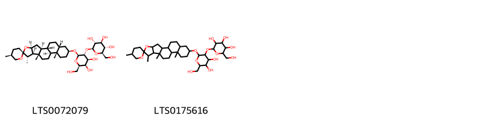{ width=100% }
    <figcaption>Hình ảnh cấu trúc hóa học của 2 hoạt chất thuộc nhóm Steroids and steroid derivatives gồm ['timosaponin a-iii (LTS0072079)', 'timosaponin a3 (LTS0175616)'].</figcaption>
</figure>

---

### Dược dân tộc học

Danh sách các quốc gia có sử dụng *Yucca treculeana* trong điều trị các bệnh. 

| Country   | Disease   | Bệnh     |
|:----------|:----------|:---------|
| Mexico    | Purgative | Thuốc xổ |

---

# Chi Prochnyanthes

??? note "Danh sách các dược liệu thuộc chi"
    
	 - *Prochnyanthes mexicana*

---
## Prochnyanthes mexicana
### Thông tin về thực vật

!!! info "Phân loại thực vật của *Agave bulliana* từ GIBF:"
    - **Kingdom:** Plantae
    - **Phylum:** Tracheophyta
    - **Order:** Asparagales
    - **Family:** Asparagaceae
    - **Genus:** Agave
    - **Species:** *Agave bulliana*

 

| Label (VI)   | Label (EN)   | Scientific Name        | Descriptions (VI)   | Descriptions (EN)   | Also Known As (VI)   | Also Known As (EN)   |
|:-------------|:-------------|:-----------------------|:--------------------|:--------------------|:---------------------|:---------------------|
| N/A          | N/A          | Prochnyanthes mexicana | loài thực vật       | species of plant    | ['']                 | ['']                 |

#### Phân bố trên thế giới

**Từ CSDL GIBF** nan, Mexico

#### Phân bố tại Việt Nam

**Từ CSDL GIBF**: Không có ghi nhận ở Việt Nam

---
### Thành phần hóa học
        
- Theo cơ sở dữ liệu lotus: Từ loài *Agave bulliana* đã phân lập và xác định được Chưa có hoạt chất nào được phân lập. hoạt chất thuộc về các nhóm Không có hoạt chất nào được phân lập. 

Không có hình ảnh nào được tạo ra

---

### Dược dân tộc học

Danh sách các quốc gia có sử dụng *Agave bulliana* trong điều trị các bệnh. 

| Country   | Disease           | Bệnh                           |
|:----------|:------------------|:-------------------------------|
| Mexico    | Insecticide, Soap | Thuốc diệt côn trùng, xà phòng |

---

# Chi Cordyline

??? note "Danh sách các dược liệu thuộc chi"
    
	 - *Cordyline fruticosa*
	 - *Cordyline roxburghiana*

---
## Cordyline fruticosa
### Thông tin về thực vật

!!! info "Phân loại thực vật của *Cordyline fruticosa* từ GIBF:"
    - **Kingdom:** Plantae
    - **Phylum:** Tracheophyta
    - **Order:** Asparagales
    - **Family:** Asparagaceae
    - **Genus:** Cordyline
    - **Species:** *Cordyline fruticosa*

 

| Label (VI)   | Label (EN)   | Scientific Name     | Descriptions (VI)   | Descriptions (EN)   | Also Known As (VI)   | Also Known As (EN)                                    |
|:-------------|:-------------|:--------------------|:--------------------|:--------------------|:---------------------|:------------------------------------------------------|
| N/A          | N/A          | Cordyline fruticosa | loài thực vật       | species of plant    | ['']                 | ['Ti Tree', 'Good Luck Plant', 'Hawaiian ashidomina'] |

#### Phân bố trên thế giới

**Từ CSDL GIBF** nan, Honduras, Viet Nam, Thailand, El Salvador, Philippines, Dominica, French Polynesia, French Guiana, Trinidad and Tobago, Northern Mariana Islands, United Arab Emirates, Australia, Jamaica, Guatemala, Indonesia, Colombia, Sri Lanka, Pakistan, Maldives, Malaysia, Norfolk Island, India, Puerto Rico, Samoa, Nigeria, Bangladesh, Bahamas, Saint Kitts and Nevis, Belize, Nicaragua, Brazil, Mexico, China, Nepal, Hong Kong, Grenada, Tanzania, United Republic of, Cook Islands, Fiji, Costa Rica, Bolivia (Plurinational State of), Papua New Guinea, United States of America, Madagascar, Wallis and Futuna

#### Phân bố tại Việt Nam

**Từ CSDL GIBF**: Ninh Bình

---
### Thành phần hóa học
        
- Theo cơ sở dữ liệu lotus: Từ loài *Cordyline fruticosa* đã phân lập và xác định được 2 hoạt chất thuộc về các nhóm Prenol lipids. 

|    | chemicalTaxonomyClassyfireClass   |   smiles_count |
|---:|:----------------------------------|---------------:|
|  0 | Prenol lipids                     |              2 |

#### Nhóm Prenol lipids
<figure markdown="span">
    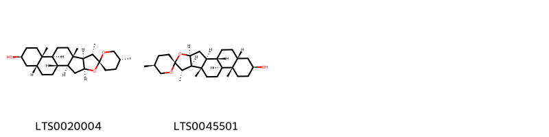{ width=100% }
    <figcaption>Hình ảnh cấu trúc hóa học của 2 hoạt chất thuộc nhóm Prenol lipids gồm ['smilagenin (LTS0020004)', 'sarsasapogenin (LTS0045501)'].</figcaption>
</figure>

---

### Dược dân tộc học

Danh sách các quốc gia có sử dụng *Cordyline fruticosa* trong điều trị các bệnh. 

| Country    | Disease               | Bệnh                                   |
|:-----------|:----------------------|:---------------------------------------|
| Caroline I | Aphrodisiac, Laxative | Thuốc kích thích tình dục, nhuận tràng |
| Fiji       | Sweetener             | tiền trà nước                          |

---

---
## Cordyline roxburghiana
### Thông tin về thực vật

!!! info "Phân loại thực vật của *Dracaena roxburghiana* từ GIBF:"
    - **Kingdom:** Plantae
    - **Phylum:** Tracheophyta
    - **Order:** Asparagales
    - **Family:** Asparagaceae
    - **Genus:** Dracaena
    - **Species:** *Dracaena roxburghiana*

 

| Label (VI)   | Label (EN)   | Scientific Name     | Descriptions (VI)   | Descriptions (EN)   | Also Known As (VI)   | Also Known As (EN)                                    |
|:-------------|:-------------|:--------------------|:--------------------|:--------------------|:---------------------|:------------------------------------------------------|
| N/A          | N/A          | Cordyline fruticosa | loài thực vật       | species of plant    | ['']                 | ['Ti Tree', 'Good Luck Plant', 'Hawaiian ashidomina'] |

#### Phân bố trên thế giới

**Từ CSDL GIBF** nan, Honduras, Viet Nam, Thailand, El Salvador, Philippines, Dominica, French Polynesia, French Guiana, Trinidad and Tobago, Northern Mariana Islands, United Arab Emirates, Australia, Jamaica, Guatemala, Indonesia, Colombia, Sri Lanka, Pakistan, Maldives, Malaysia, Norfolk Island, India, Puerto Rico, Samoa, Nigeria, Bangladesh, Bahamas, Saint Kitts and Nevis, Belize, Nicaragua, Brazil, Mexico, China, Nepal, Hong Kong, Grenada, Tanzania, United Republic of, Cook Islands, Fiji, Costa Rica, Bolivia (Plurinational State of), Papua New Guinea, United States of America, Madagascar, Wallis and Futuna

#### Phân bố tại Việt Nam

**Từ CSDL GIBF**: Ninh Bình

---
### Thành phần hóa học
        
- Theo cơ sở dữ liệu lotus: Từ loài *Dracaena roxburghiana* đã phân lập và xác định được Chưa có hoạt chất nào được phân lập. hoạt chất thuộc về các nhóm Không có hoạt chất nào được phân lập. 

Không có hình ảnh nào được tạo ra

---

### Dược dân tộc học

Danh sách các quốc gia có sử dụng *Dracaena roxburghiana* trong điều trị các bệnh. 

| Country   | Disease               | Bệnh                  |
|:----------|:----------------------|:----------------------|
| Hindu     | nan, Purgative, Tonic | nan, Purgative, Tonic |

---

# Chi Nolina

??? note "Danh sách các dược liệu thuộc chi"
    
	 - *Nolina texana*

---
## Nolina texana
### Thông tin về thực vật

!!! info "Phân loại thực vật của *Nolina texana* từ GIBF:"
    - **Kingdom:** Plantae
    - **Phylum:** Tracheophyta
    - **Order:** Asparagales
    - **Family:** Asparagaceae
    - **Genus:** Nolina
    - **Species:** *Nolina texana*

 

| Label (VI)   | Label (EN)   | Scientific Name   | Descriptions (VI)   | Descriptions (EN)   | Also Known As (VI)   | Also Known As (EN)   |
|:-------------|:-------------|:------------------|:--------------------|:--------------------|:---------------------|:---------------------|
| N/A          | N/A          | Nolina texana     | loài thực vật       | species of plant    | ['']                 | ['']                 |

#### Phân bố trên thế giới

**Từ CSDL GIBF** United States of America

#### Phân bố tại Việt Nam

**Từ CSDL GIBF**: Không có ghi nhận ở Việt Nam

---
### Thành phần hóa học
        
- Theo cơ sở dữ liệu lotus: Từ loài *Nolina texana* đã phân lập và xác định được Chưa có hoạt chất nào được phân lập. hoạt chất thuộc về các nhóm Không có hoạt chất nào được phân lập. 

Không có hình ảnh nào được tạo ra

---

### Dược dân tộc học

Danh sách các quốc gia có sử dụng *Nolina texana* trong điều trị các bệnh. 

| Country   | Disease   | Bệnh     |
|:----------|:----------|:---------|
| US        | Poison    | Chất độc |

---

