!!! abstract "Tóm tắt"

    Họ Aizoaceae gồm khoảng 5 chi và 12 loài được một số cộng đồng tại các quốc gia như Haiti, Elsewhere, Dominican Republic, South Africa, Philippines, Sudan, Turkey, S Africa(Hottentot), Australia sử dụng trong một số trường hợp MYMEMORY WARNING: YOU USED ALL AVAILABLE FREE TRANSLATIONS FOR TODAY. NEXT AVAILABLE IN  14 HOURS 57 MINUTES 06 SECONDS VISIT HTTPS://MYMEMORY.TRANSLATED.NET/DOC/USAGELIMITS.PHP TO TRANSLATE MORE.

!!! info "DrDuke"

    James A. Duke sinh năm 1929-2017 là một nhà thực vật học người Mỹ. Đây là một trong những tác giả hàng đầu trong lĩnh vực dược dân tộc học với cuốn *CRC Handbook of Medicinal Herbs* và chính là người xây dựng lên cơ sở dữ liệu về hợp chất tự nhiên và dược dân tộc học tại Bộ nông nghiệp Hoa Kỳ. Các thông tin được đăng tải tại website [Dr. Duke's Phytochemical and Ethnobotanical Databases](https://phytochem.nal.usda.gov/). 
    Trong suốt thập niên 1970, ông lãnh đạo the Plant Taxonomy Laboratory, Plant Genetics and Germplasm Institute of the Agricultural Research Service, U.S. Department of Agriculture.
    Trong tài liệu này, các thông tin về dược dân tộc của các dược liệu được trích dẫn từ tài liệu của James A. Ducke với sự trợ giúp của phần mềm dịch thuật từ tiếng Anh sang tiếng Việt.
   

# Chi Tetragonia

??? note "Danh sách các dược liệu thuộc chi"
    
	 - *Tetragonia tetragonioides*
	 - *Tetragonia tetragonoides*

---
## Tetragonia tetragonioides
### Thông tin về thực vật

!!! info "Phân loại thực vật của *Tetragonia tetragonioides* từ GIBF:"
    - **Kingdom:** Plantae
    - **Phylum:** Tracheophyta
    - **Order:** Caryophyllales
    - **Family:** Aizoaceae
    - **Genus:** Tetragonia
    - **Species:** *Tetragonia tetragonioides*

 

| Label (VI)   | Label (EN)   | Scientific Name           | Descriptions (VI)   | Descriptions (EN)   | Also Known As (VI)   | Also Known As (EN)      |
|:-------------|:-------------|:--------------------------|:--------------------|:--------------------|:---------------------|:------------------------|
| N/A          | N/A          | Tetragonia tetragonioides |                     | species of plant    | ['']                 | ['New Zealand spinach'] |

#### Phân bố trên thế giới

**Từ CSDL GIBF** United Kingdom of Great Britain and Northern Ireland, Portugal, Japan, Brazil, France, Spain, Réunion, Jersey, Germany, Ecuador, United States of America, Netherlands, Belgium, Korea, Republic of

#### Phân bố tại Việt Nam

**Từ CSDL GIBF**: Không có ghi nhận ở Việt Nam

---
### Thành phần hóa học
        
- Theo cơ sở dữ liệu lotus: Từ loài *Tetragonia tetragonioides* đã phân lập và xác định được 2 hoạt chất thuộc về các nhóm Prenol lipids, Carboxylic acids and derivatives. 

|    | chemicalTaxonomyClassyfireClass   |   smiles_count |
|---:|:----------------------------------|---------------:|
|  0 | Carboxylic acids and derivatives  |              1 |
|  1 | Prenol lipids                     |              1 |

#### Nhóm Carboxylic acids and derivatives
<figure markdown="span">
    { width=100% }
    <figcaption>Hình ảnh cấu trúc hóa học của 1 hoạt chất thuộc nhóm Carboxylic acids and derivatives gồm ['oxalic acid (LTS0217707)'].</figcaption>
</figure>
#### Nhóm Prenol lipids
<figure markdown="span">
    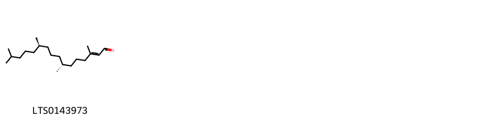{ width=100% }
    <figcaption>Hình ảnh cấu trúc hóa học của 1 hoạt chất thuộc nhóm Prenol lipids gồm ['phyton (LTS0143973)'].</figcaption>
</figure>

---

### Dược dân tộc học

Danh sách các quốc gia có sử dụng *Tetragonia tetragonioides* trong điều trị các bệnh. 

| Country   | Disease   | Bệnh                                                                                                                                                                                                |
|:----------|:----------|:----------------------------------------------------------------------------------------------------------------------------------------------------------------------------------------------------|
| Elsewhere | Larvicide | MYMEMORY WARNING: YOU USED ALL AVAILABLE FREE TRANSLATIONS FOR TODAY. NEXT AVAILABLE IN  14 HOURS 57 MINUTES 03 SECONDS VISIT HTTPS://MYMEMORY.TRANSLATED.NET/DOC/USAGELIMITS.PHP TO TRANSLATE MORE |

---

---
## Tetragonia tetragonoides
### Thông tin về thực vật

!!! info "Phân loại thực vật của *Tetragonia tetragonoides* từ GIBF:"
    - **Kingdom:** Plantae
    - **Phylum:** Tracheophyta
    - **Order:** Caryophyllales
    - **Family:** Aizoaceae
    - **Genus:** Tetragonia
    - **Species:** *Tetragonia tetragonoides*

 

| Label (VI)   | Label (EN)   | Scientific Name          | Descriptions (VI)   | Descriptions (EN)   | Also Known As (VI)   | Also Known As (EN)                                                               |
|:-------------|:-------------|:-------------------------|:--------------------|:--------------------|:---------------------|:---------------------------------------------------------------------------------|
| N/A          | N/A          | Tetragonia tetragonoides | loài thực vật       | species of plant    | ['']                 | ['New Zealand spinach', 'Tetragonia tetragoniodes', 'Tetragonia tetragonioides'] |

#### Phân bố trên thế giới

**Từ CSDL GIBF** nan, Uruguay, Portugal, South Africa, Japan, Brazil, Spain, France, New Zealand, Ecuador, United States of America, Chile, China, Nepal, Australia, Croatia, Chinese Taipei

#### Phân bố tại Việt Nam

**Từ CSDL GIBF**: Không có ghi nhận ở Việt Nam

---
### Thành phần hóa học
        
- Theo cơ sở dữ liệu lotus: Từ loài *Tetragonia tetragonoides* đã phân lập và xác định được 37 hoạt chất thuộc về các nhóm Flavonoids, Prenol lipids, Carboxylic acids and derivatives, Aryltetralin lignans, Cinnamic acids and derivatives, Steroids and steroid derivatives. 

|    | chemicalTaxonomyClassyfireClass   |   smiles_count |
|---:|:----------------------------------|---------------:|
|  0 | Aryltetralin lignans              |              2 |
|  1 | Carboxylic acids and derivatives  |              1 |
|  2 | Cinnamic acids and derivatives    |              9 |
|  3 | Flavonoids                        |              6 |
|  4 | Prenol lipids                     |              9 |
|  5 | Steroids and steroid derivatives  |             10 |

#### Nhóm Aryltetralin lignans
<figure markdown="span">
    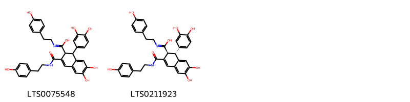{ width=100% }
    <figcaption>Hình ảnh cấu trúc hóa học của 2 hoạt chất thuộc nhóm Aryltetralin lignans gồm ['1-(3,4-dihydroxyphenyl)-6,7-dihydroxy-n-[2-(4-hydroxyphenyl)ethyl]-3-{[2-(4-hydroxyphenyl)ethyl]carbamoyl}-1,2-dihydronaphthalene-2-carboximidic acid (LTS0075548)', '(1r,2s)-1-(3,4-dihydroxyphenyl)-6,7-dihydroxy-n-[2-(4-hydroxyphenyl)ethyl]-3-{[2-(4-hydroxyphenyl)ethyl]carbamoyl}-1,2-dihydronaphthalene-2-carboximidic acid (LTS0211923)'].</figcaption>
</figure>
#### Nhóm Carboxylic acids and derivatives
<figure markdown="span">
    { width=100% }
    <figcaption>Hình ảnh cấu trúc hóa học của 1 hoạt chất thuộc nhóm Carboxylic acids and derivatives gồm ['oxalic acid (LTS0217707)'].</figcaption>
</figure>
#### Nhóm Cinnamic acids and derivatives
<figure markdown="span">
    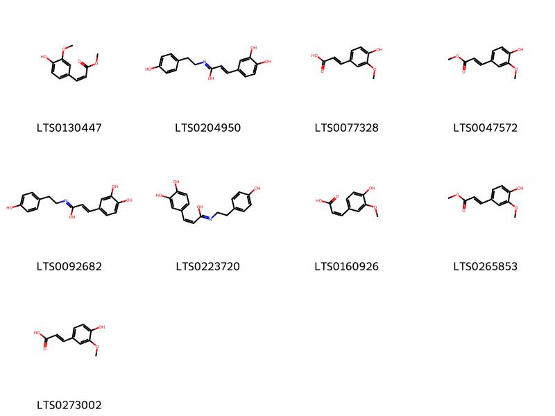{ width=100% }
    <figcaption>Hình ảnh cấu trúc hóa học của 9 hoạt chất thuộc nhóm Cinnamic acids and derivatives gồm ['(z)-methyl ferulate (LTS0130447)', '3-(3,4-dihydroxyphenyl)-n-[2-(4-hydroxyphenyl)ethyl]prop-2-enimidic acid (LTS0204950)', 'ferulic acid (LTS0077328)', 'methyl ferulate (LTS0047572)', '(2e)-3-(3,4-dihydroxyphenyl)-n-[2-(4-hydroxyphenyl)ethyl]prop-2-enimidic acid (LTS0092682)', '(2z)-3-(3,4-dihydroxyphenyl)-n-[2-(4-hydroxyphenyl)ethyl]prop-2-enimidic acid (LTS0223720)', 'cis-ferulic acid (LTS0160926)', 'methyl ferulate (LTS0265853)', 'ferulic acid (LTS0273002)'].</figcaption>
</figure>
#### Nhóm Flavonoids
<figure markdown="span">
    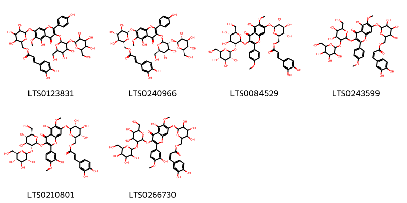{ width=100% }
    <figcaption>Hình ảnh cấu trúc hóa học của 6 hoạt chất thuộc nhóm Flavonoids gồm ['{6-[(3-{[4,5-dihydroxy-6-(hydroxymethyl)-3-{[3,4,5-trihydroxy-6-(hydroxymethyl)oxan-2-yl]oxy}oxan-2-yl]oxy}-5-hydroxy-2-(4-hydroxyphenyl)-6-methoxy-4-oxochromen-7-yl)oxy]-3,4,5-trihydroxyoxan-2-yl}methyl 3-(3,4-dihydroxyphenyl)prop-2-enoate (LTS0123831)', '[(2r,3s,4s,5r,6s)-6-[(3-{[(2s,3r,4s,5s,6r)-4,5-dihydroxy-6-(hydroxymethyl)-3-{[(2s,3r,4s,5s,6r)-3,4,5-trihydroxy-6-(hydroxymethyl)oxan-2-yl]oxy}oxan-2-yl]oxy}-5-hydroxy-2-(4-hydroxyphenyl)-6-methoxy-4-oxochromen-7-yl)oxy]-3,4,5-trihydroxyoxan-2-yl]methyl (2e)-3-(3,4-dihydroxyphenyl)prop-2-enoate (LTS0240966)', '[(2r,3s,4s,5r,6s)-6-[(3-{[(2s,3r,4s,5s,6r)-4,5-dihydroxy-6-(hydroxymethyl)-3-{[(2s,3r,4s,5s,6r)-3,4,5-trihydroxy-6-(hydroxymethyl)oxan-2-yl]oxy}oxan-2-yl]oxy}-5-hydroxy-6-methoxy-2-(4-methoxyphenyl)-4-oxochromen-7-yl)oxy]-3,4,5-trihydroxyoxan-2-yl]methyl (2e)-3-(3,4-dihydroxyphenyl)prop-2-enoate (LTS0084529)', '{6-[(3-{[4,5-dihydroxy-6-(hydroxymethyl)-3-{[3,4,5-trihydroxy-6-(hydroxymethyl)oxan-2-yl]oxy}oxan-2-yl]oxy}-5-hydroxy-6-methoxy-2-(4-methoxyphenyl)-4-oxochromen-7-yl)oxy]-3,4,5-trihydroxyoxan-2-yl}methyl 3-(3,4-dihydroxyphenyl)prop-2-enoate (LTS0243599)', '[(2r,3s,4s,5r,6s)-6-[(3-{[(2s,3r,4s,5s,6r)-4,5-dihydroxy-6-(hydroxymethyl)-3-{[(2s,3r,4s,5s,6r)-3,4,5-trihydroxy-6-(hydroxymethyl)oxan-2-yl]oxy}oxan-2-yl]oxy}-5-hydroxy-2-(3-hydroxy-4-methoxyphenyl)-6-methoxy-4-oxochromen-7-yl)oxy]-3,4,5-trihydroxyoxan-2-yl]methyl (2e)-3-(3,4-dihydroxyphenyl)prop-2-enoate (LTS0210801)', '{6-[(3-{[4,5-dihydroxy-6-(hydroxymethyl)-3-{[3,4,5-trihydroxy-6-(hydroxymethyl)oxan-2-yl]oxy}oxan-2-yl]oxy}-5-hydroxy-2-(3-hydroxy-4-methoxyphenyl)-6-methoxy-4-oxochromen-7-yl)oxy]-3,4,5-trihydroxyoxan-2-yl}methyl 3-(3,4-dihydroxyphenyl)prop-2-enoate (LTS0266730)'].</figcaption>
</figure>
#### Nhóm Prenol lipids
<figure markdown="span">
    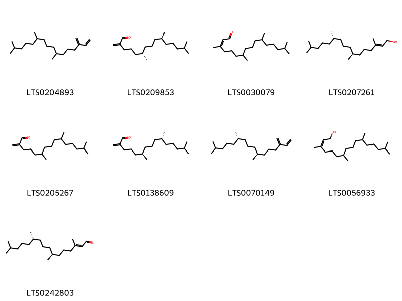{ width=100% }
    <figcaption>Hình ảnh cấu trúc hóa học của 9 hoạt chất thuộc nhóm Prenol lipids gồm ['7,11,15-trimethyl-3-methylidenehexadec-1-ene (LTS0204893)', '(6s,10s)-6,10,14-trimethyl-2-methylidenepentadecanal (LTS0209853)', '3,7,11,15-tetramethylhexadec-2-enal (LTS0030079)', '(2e,7s,11s)-3,7,11,15-tetramethylhexadec-2-en-1-ol (LTS0207261)', '6,10,14-trimethyl-2-methylidenepentadecanal (LTS0205267)', '(6r,10r)-6,10,14-trimethyl-2-methylidenepentadecanal (LTS0138609)', '(7s,11s)-7,11,15-trimethyl-3-methylidenehexadec-1-ene (LTS0070149)', '3,7,11,15-tetramethylhexadec-2-en-1-ol (LTS0056933)', '(2e,7s,11s)-3,7,11,15-tetramethylhexadec-2-enal (LTS0242803)'].</figcaption>
</figure>
#### Nhóm Steroids and steroid derivatives
<figure markdown="span">
    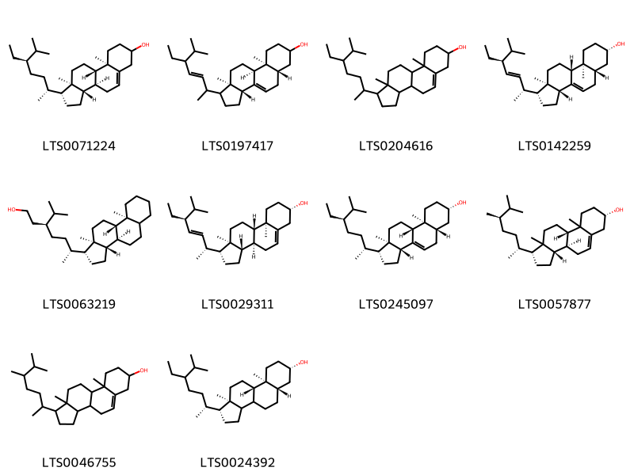{ width=100% }
    <figcaption>Hình ảnh cấu trúc hóa học của 10 hoạt chất thuộc nhóm Steroids and steroid derivatives gồm ['stigmast-5-en-3-ol (LTS0071224)', '(3ar,5as,9as,9bs,11ar)-1-(5-ethyl-6-methylhept-3-en-2-yl)-9a,11a-dimethyl-1h,2h,3h,3ah,5h,5ah,6h,7h,8h,9h,9bh,10h,11h-cyclopenta[a]phenanthren-7-ol (LTS0197417)', 'stigmast-5-en-3-ol, (3β)- (LTS0204616)', 'chondrillasterol (LTS0142259)', '(3s,6r)-6-[(1r,3as,3br,9as,9bs,11ar)-9a,11a-dimethyl-tetradecahydro-1h-cyclopenta[a]phenanthren-1-yl]-3-isopropylheptan-1-ol (LTS0063219)', 'phytosterol (LTS0029311)', '(3β,5α)-stigmast-7-en-3-ol (LTS0245097)', '(1r,3as,3bs,7s,9bs)-1-[(2r,5r)-5,6-dimethylheptan-2-yl]-9a,11a-dimethyl-1h,2h,3h,3ah,3bh,4h,6h,7h,8h,9h,9bh,10h,11h-cyclopenta[a]phenanthren-7-ol (LTS0057877)', 'campesterol (LTS0046755)', '(1r,5as,7s,9as,9bs,11ar)-1-[(2r)-5-ethyl-6-methylheptan-2-yl]-9a,11a-dimethyl-tetradecahydro-1h-cyclopenta[a]phenanthren-7-ol (LTS0024392)'].</figcaption>
</figure>

---

### Dược dân tộc học

Danh sách các quốc gia có sử dụng *Tetragonia tetragonoides* trong điều trị các bệnh. 

| Country   | Disease   | Bệnh                                                                                                                                                                                                |
|:----------|:----------|:----------------------------------------------------------------------------------------------------------------------------------------------------------------------------------------------------|
| Elsewhere | Stomachic | MYMEMORY WARNING: YOU USED ALL AVAILABLE FREE TRANSLATIONS FOR TODAY. NEXT AVAILABLE IN  14 HOURS 56 MINUTES 38 SECONDS VISIT HTTPS://MYMEMORY.TRANSLATED.NET/DOC/USAGELIMITS.PHP TO TRANSLATE MORE |

---

# Chi Trianthema

??? note "Danh sách các dược liệu thuộc chi"
    
	 - *Trianthema decandra*
	 - *Trianthema govindia*
	 - *Trianthema pentandra*
	 - *Trianthema portulacastrum*
	 - *Trianthema salsoloides*
	 - *Trianthema triquetra*

---
## Trianthema decandra
### Thông tin về thực vật

!!! info "Phân loại thực vật của *Zaleya decandra* từ GIBF:"
    - **Kingdom:** Plantae
    - **Phylum:** Tracheophyta
    - **Order:** Caryophyllales
    - **Family:** Aizoaceae
    - **Genus:** Zaleya
    - **Species:** *Zaleya decandra*

 

| Label (VI)   | Label (EN)   | Scientific Name     | Descriptions (VI)   | Descriptions (EN)   | Also Known As (VI)   | Also Known As (EN)   |
|:-------------|:-------------|:--------------------|:--------------------|:--------------------|:---------------------|:---------------------|
| N/A          | N/A          | Trianthema decandra | loài thực vật       | species of plant    | ['']                 | ['']                 |

#### Phân bố trên thế giới

**Từ CSDL GIBF** nan, unknown or invalid, Sri Lanka, Venezuela (Bolivarian Republic of), Myanmar, Brazil, India, Papua New Guinea, United States of America, Mexico, Australia, Indonesia

#### Phân bố tại Việt Nam

**Từ CSDL GIBF**: Không có ghi nhận ở Việt Nam

---
### Thành phần hóa học
        
- Theo cơ sở dữ liệu lotus: Từ loài *Zaleya decandra* đã phân lập và xác định được Chưa có hoạt chất nào được phân lập. hoạt chất thuộc về các nhóm Không có hoạt chất nào được phân lập. 

Không có hình ảnh nào được tạo ra

---

### Dược dân tộc học

Danh sách các quốc gia có sử dụng *Zaleya decandra* trong điều trị các bệnh. 

| Country   | Disease   | Bệnh                                                                                                                                                                                                |
|:----------|:----------|:----------------------------------------------------------------------------------------------------------------------------------------------------------------------------------------------------|
| Australia | Poison    | MYMEMORY WARNING: YOU USED ALL AVAILABLE FREE TRANSLATIONS FOR TODAY. NEXT AVAILABLE IN  14 HOURS 56 MINUTES 02 SECONDS VISIT HTTPS://MYMEMORY.TRANSLATED.NET/DOC/USAGELIMITS.PHP TO TRANSLATE MORE |
| Elsewhere | Aperient  | MYMEMORY WARNING: YOU USED ALL AVAILABLE FREE TRANSLATIONS FOR TODAY. NEXT AVAILABLE IN  14 HOURS 56 MINUTES 00 SECONDS VISIT HTTPS://MYMEMORY.TRANSLATED.NET/DOC/USAGELIMITS.PHP TO TRANSLATE MORE |

---

---
## Trianthema govindia
### Thông tin về thực vật

!!! info "Phân loại thực vật của *Zaleya govindia* từ GIBF:"
    - **Kingdom:** Plantae
    - **Phylum:** Tracheophyta
    - **Order:** Caryophyllales
    - **Family:** Aizoaceae
    - **Genus:** Zaleya
    - **Species:** *Zaleya govindia*

 

| Label (VI)   | Label (EN)   | Scientific Name     | Descriptions (VI)   | Descriptions (EN)   | Also Known As (VI)   | Also Known As (EN)   |
|:-------------|:-------------|:--------------------|:--------------------|:--------------------|:---------------------|:---------------------|
| N/A          | N/A          | Trianthema govindia |                     |                     | ['']                 | ['']                 |

#### Phân bố trên thế giới

**Từ CSDL GIBF** nan, unknown or invalid, Sri Lanka, Venezuela (Bolivarian Republic of), Myanmar, Brazil, India, Papua New Guinea, United States of America, Mexico, Australia, Indonesia

#### Phân bố tại Việt Nam

**Từ CSDL GIBF**: Không có ghi nhận ở Việt Nam

---
### Thành phần hóa học
        
- Theo cơ sở dữ liệu lotus: Từ loài *Zaleya govindia* đã phân lập và xác định được Chưa có hoạt chất nào được phân lập. hoạt chất thuộc về các nhóm Không có hoạt chất nào được phân lập. 

Không có hình ảnh nào được tạo ra

---

### Dược dân tộc học

Danh sách các quốc gia có sử dụng *Zaleya govindia* trong điều trị các bệnh. 

| Country   | Disease                   | Bệnh                                                                                                                                                                                                |
|:----------|:--------------------------|:----------------------------------------------------------------------------------------------------------------------------------------------------------------------------------------------------|
| Elsewhere | Astringent, Abortifacient | MYMEMORY WARNING: YOU USED ALL AVAILABLE FREE TRANSLATIONS FOR TODAY. NEXT AVAILABLE IN  14 HOURS 55 MINUTES 38 SECONDS VISIT HTTPS://MYMEMORY.TRANSLATED.NET/DOC/USAGELIMITS.PHP TO TRANSLATE MORE |

---

---
## Trianthema pentandra
### Thông tin về thực vật

!!! info "Phân loại thực vật của *Zaleya pentandra* từ GIBF:"
    - **Kingdom:** Plantae
    - **Phylum:** Tracheophyta
    - **Order:** Caryophyllales
    - **Family:** Aizoaceae
    - **Genus:** Zaleya
    - **Species:** *Zaleya pentandra*

 

| Label (VI)   | Label (EN)   | Scientific Name      | Descriptions (VI)   | Descriptions (EN)   | Also Known As (VI)        | Also Known As (EN)        |
|:-------------|:-------------|:---------------------|:--------------------|:--------------------|:--------------------------|:--------------------------|
| N/A          | N/A          | Trianthema pentandra | loài thực vật       | species of plant    | ['Trianthema pentandrum'] | ['Trianthema pentandrum'] |

#### Phân bố trên thế giới

**Từ CSDL GIBF** nan, Malawi, unknown or invalid, Eritrea, Somalia, Afghanistan, Burkina Faso, Kenya, Niger, Indonesia, Pakistan, Palestine, State of, India, Sudan, Nigeria, Uganda, Yemen, Ethiopia, South Africa, Tanzania, United Republic of, Mauritania, Zimbabwe, Zambia, Chad, Algeria, Madagascar, Saudi Arabia, Cabo Verde

#### Phân bố tại Việt Nam

**Từ CSDL GIBF**: Không có ghi nhận ở Việt Nam

---
### Thành phần hóa học
        
- Theo cơ sở dữ liệu lotus: Từ loài *Zaleya pentandra* đã phân lập và xác định được Chưa có hoạt chất nào được phân lập. hoạt chất thuộc về các nhóm Không có hoạt chất nào được phân lập. 

Không có hình ảnh nào được tạo ra

---

### Dược dân tộc học

Danh sách các quốc gia có sử dụng *Zaleya pentandra* trong điều trị các bệnh. 

| Country   | Disease    | Bệnh                                                                                                                                                                                                |
|:----------|:-----------|:----------------------------------------------------------------------------------------------------------------------------------------------------------------------------------------------------|
| Sudan     | Astringent | MYMEMORY WARNING: YOU USED ALL AVAILABLE FREE TRANSLATIONS FOR TODAY. NEXT AVAILABLE IN  14 HOURS 55 MINUTES 14 SECONDS VISIT HTTPS://MYMEMORY.TRANSLATED.NET/DOC/USAGELIMITS.PHP TO TRANSLATE MORE |

---

---
## Trianthema portulacastrum
### Thông tin về thực vật

!!! info "Phân loại thực vật của *Trianthema portulacastrum* từ GIBF:"
    - **Kingdom:** Plantae
    - **Phylum:** Tracheophyta
    - **Order:** Caryophyllales
    - **Family:** Aizoaceae
    - **Genus:** Trianthema
    - **Species:** *Trianthema portulacastrum*

 

| Label (VI)   | Label (EN)   | Scientific Name           | Descriptions (VI)   | Descriptions (EN)   | Also Known As (VI)   | Also Known As (EN)                                                                           |
|:-------------|:-------------|:--------------------------|:--------------------|:--------------------|:---------------------|:---------------------------------------------------------------------------------------------|
| N/A          | N/A          | Trianthema portulacastrum | loài thực vật       | species of plant    | ['']                 | ['desert horsepurslane', 'horse purslane', 'desert horse purslane', 'desert horse-purslane'] |

#### Phân bố trên thế giới

**Từ CSDL GIBF** nan, Viet Nam, Thailand, United Arab Emirates, Australia, Colombia, Pakistan, Dominican Republic, Puerto Rico, India, Saint Kitts and Nevis, Virgin Islands (U.S.), Antigua and Barbuda, Panama, Brazil, Peru, Aruba, Montserrat, Mexico, Curaçao, Gambia, Chinese Taipei, Egypt, Ecuador, United States of America, Israel, Saudi Arabia

#### Phân bố tại Việt Nam

**Từ CSDL GIBF**: Long An

---
### Thành phần hóa học
        
- Theo cơ sở dữ liệu lotus: Từ loài *Trianthema portulacastrum* đã phân lập và xác định được 21 hoạt chất thuộc về các nhóm Benzopyrans, Flavonoids, Prenol lipids, Fatty Acyls, Phenols, Steroids and steroid derivatives, Benzene and substituted derivatives. 

|    | chemicalTaxonomyClassyfireClass     |   smiles_count |
|---:|:------------------------------------|---------------:|
|  0 | Benzene and substituted derivatives |              2 |
|  1 | Benzopyrans                         |              1 |
|  2 | Fatty Acyls                         |              1 |
|  3 | Flavonoids                          |              1 |
|  4 | Phenols                             |              1 |
|  5 | Prenol lipids                       |              6 |
|  6 | Steroids and steroid derivatives    |              9 |

#### Nhóm Benzene and substituted derivatives
<figure markdown="span">
    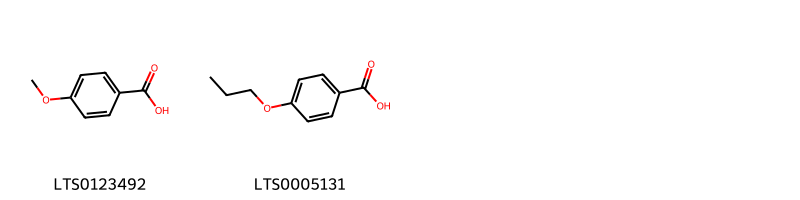{ width=100% }
    <figcaption>Hình ảnh cấu trúc hóa học của 2 hoạt chất thuộc nhóm Benzene and substituted derivatives gồm ['p-anisic acid (LTS0123492)', '4-propoxybenzoic acid (LTS0005131)'].</figcaption>
</figure>
#### Nhóm Benzopyrans
<figure markdown="span">
    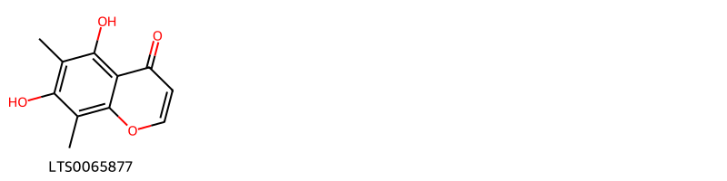{ width=100% }
    <figcaption>Hình ảnh cấu trúc hóa học của 1 hoạt chất thuộc nhóm Benzopyrans gồm ['leptorumol (LTS0065877)'].</figcaption>
</figure>
#### Nhóm Fatty Acyls
<figure markdown="span">
    { width=100% }
    <figcaption>Hình ảnh cấu trúc hóa học của 1 hoạt chất thuộc nhóm Fatty Acyls gồm ['linoleic (LTS0013198)'].</figcaption>
</figure>
#### Nhóm Flavonoids
<figure markdown="span">
    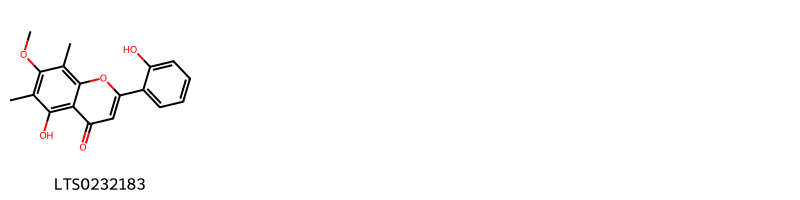{ width=100% }
    <figcaption>Hình ảnh cấu trúc hóa học của 1 hoạt chất thuộc nhóm Flavonoids gồm ['5-hydroxy-2-(2-hydroxyphenyl)-7-methoxy-6,8-dimethylchromen-4-one (LTS0232183)'].</figcaption>
</figure>
#### Nhóm Phenols
<figure markdown="span">
    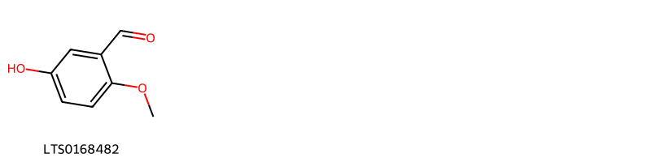{ width=100% }
    <figcaption>Hình ảnh cấu trúc hóa học của 1 hoạt chất thuộc nhóm Phenols gồm ['5-hydroxy-2-methoxybenzaldehyde (LTS0168482)'].</figcaption>
</figure>
#### Nhóm Prenol lipids
<figure markdown="span">
    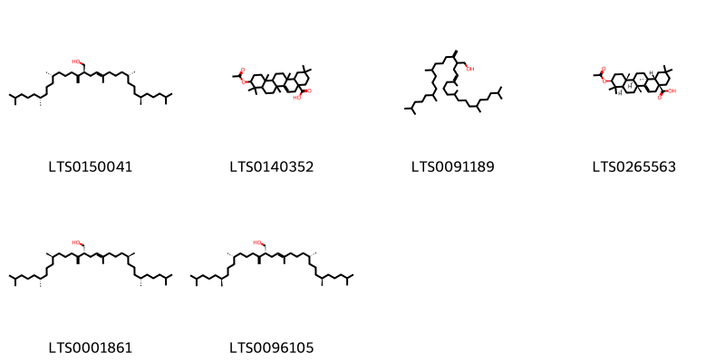{ width=100% }
    <figcaption>Hình ảnh cấu trúc hóa học của 6 hoạt chất thuộc nhóm Prenol lipids gồm ['(2s,4e,9r,13r)-5,9,13,17-tetramethyl-2-[(6s,10r)-6,10,14-trimethylpentadec-1-en-2-yl]octadec-4-en-1-ol (LTS0150041)', '10-(acetyloxy)-2,2,6b,9,9,12a,14a-heptamethyl-1,3,4,5,7,8,8a,10,11,12,12b,13,14,14b-tetradecahydropicene-4a-carboxylic acid (LTS0140352)', '5,9,13,17-tetramethyl-2-(6,10,14-trimethylpentadec-1-en-2-yl)octadec-4-en-1-ol (LTS0091189)', 'acetyl aleuritolic acid (LTS0265563)', '(2r,4e,9s,13s)-5,9,13,17-tetramethyl-2-[(6r,10r)-6,10,14-trimethylpentadec-1-en-2-yl]octadec-4-en-1-ol (LTS0001861)', '(2r,4e,9r,13r)-5,9,13,17-tetramethyl-2-[(6s,10s)-6,10,14-trimethylpentadec-1-en-2-yl]octadec-4-en-1-ol (LTS0096105)'].</figcaption>
</figure>
#### Nhóm Steroids and steroid derivatives
<figure markdown="span">
    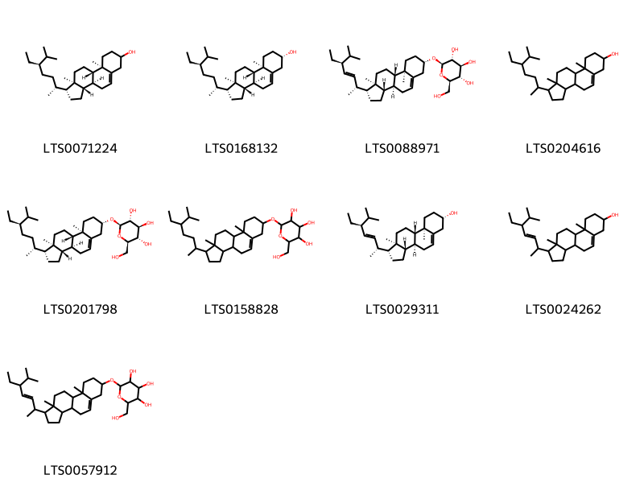{ width=100% }
    <figcaption>Hình ảnh cấu trúc hóa học của 9 hoạt chất thuộc nhóm Steroids and steroid derivatives gồm ['stigmast-5-en-3-ol (LTS0071224)', 'sitosterol (LTS0168132)', '(2r,3r,4s,5s,6r)-2-{[(1r,3as,3bs,7s,9ar,9bs,11ar)-1-[(2r,3e,5s)-5-ethyl-6-methylhept-3-en-2-yl]-9a,11a-dimethyl-1h,2h,3h,3ah,3bh,4h,6h,7h,8h,9h,9bh,10h,11h-cyclopenta[a]phenanthren-7-yl]oxy}-6-(hydroxymethyl)oxane-3,4,5-triol (LTS0088971)', 'stigmast-5-en-3-ol, (3β)- (LTS0204616)', 'sitogluside (LTS0201798)', '2-{[1-(5-ethyl-6-methylheptan-2-yl)-9a,11a-dimethyl-1h,2h,3h,3ah,3bh,4h,6h,7h,8h,9h,9bh,10h,11h-cyclopenta[a]phenanthren-7-yl]oxy}-6-(hydroxymethyl)oxane-3,4,5-triol (LTS0158828)', 'phytosterol (LTS0029311)', 'stigmasterol (LTS0024262)', '2-{[1-(5-ethyl-6-methylhept-3-en-2-yl)-9a,11a-dimethyl-1h,2h,3h,3ah,3bh,4h,6h,7h,8h,9h,9bh,10h,11h-cyclopenta[a]phenanthren-7-yl]oxy}-6-(hydroxymethyl)oxane-3,4,5-triol (LTS0057912)'].</figcaption>
</figure>

---

### Dược dân tộc học

Danh sách các quốc gia có sử dụng *Trianthema portulacastrum* trong điều trị các bệnh. 

| Country     | Disease                                                           | Bệnh                                                                                                                                                                                                |
|:------------|:------------------------------------------------------------------|:----------------------------------------------------------------------------------------------------------------------------------------------------------------------------------------------------|
| Elsewhere   | Abortifacient, Antidote, Diuretic, Insecticide, Poison, Cathartic | MYMEMORY WARNING: YOU USED ALL AVAILABLE FREE TRANSLATIONS FOR TODAY. NEXT AVAILABLE IN  14 HOURS 54 MINUTES 51 SECONDS VISIT HTTPS://MYMEMORY.TRANSLATED.NET/DOC/USAGELIMITS.PHP TO TRANSLATE MORE |
| Philippines | Abortifacient, Cathartic, Emmenagogue                             | MYMEMORY WARNING: YOU USED ALL AVAILABLE FREE TRANSLATIONS FOR TODAY. NEXT AVAILABLE IN  14 HOURS 54 MINUTES 48 SECONDS VISIT HTTPS://MYMEMORY.TRANSLATED.NET/DOC/USAGELIMITS.PHP TO TRANSLATE MORE |

---

---
## Trianthema salsoloides
### Thông tin về thực vật

!!! info "Phân loại thực vật của *Trianthema salsoloides* từ GIBF:"
    - **Kingdom:** Plantae
    - **Phylum:** Tracheophyta
    - **Order:** Caryophyllales
    - **Family:** Aizoaceae
    - **Genus:** Trianthema
    - **Species:** *Trianthema salsoloides*

 

| Label (VI)   | Label (EN)   | Scientific Name        | Descriptions (VI)   | Descriptions (EN)   | Also Known As (VI)   | Also Known As (EN)   |
|:-------------|:-------------|:-----------------------|:--------------------|:--------------------|:---------------------|:---------------------|
| N/A          | N/A          | Trianthema salsoloides | loài thực vật       | species of plant    | ['']                 | ['']                 |

#### Phân bố trên thế giới

**Từ CSDL GIBF** nan, South Africa, Botswana, Namibia, Djibouti, Mozambique, Tanzania, United Republic of, Ethiopia, Sudan, Kenya, Chile, Zimbabwe, Angola

#### Phân bố tại Việt Nam

**Từ CSDL GIBF**: Không có ghi nhận ở Việt Nam

---
### Thành phần hóa học
        
- Theo cơ sở dữ liệu lotus: Từ loài *Trianthema salsoloides* đã phân lập và xác định được Chưa có hoạt chất nào được phân lập. hoạt chất thuộc về các nhóm Không có hoạt chất nào được phân lập. 

Không có hình ảnh nào được tạo ra

---

### Dược dân tộc học

Danh sách các quốc gia có sử dụng *Trianthema salsoloides* trong điều trị các bệnh. 

| Country   | Disease   | Bệnh                                                                                                                                                                                                |
|:----------|:----------|:----------------------------------------------------------------------------------------------------------------------------------------------------------------------------------------------------|
| Sudan     | Soap      | MYMEMORY WARNING: YOU USED ALL AVAILABLE FREE TRANSLATIONS FOR TODAY. NEXT AVAILABLE IN  14 HOURS 54 MINUTES 08 SECONDS VISIT HTTPS://MYMEMORY.TRANSLATED.NET/DOC/USAGELIMITS.PHP TO TRANSLATE MORE |

---

---
## Trianthema triquetra
### Thông tin về thực vật

!!! info "Phân loại thực vật của *Trianthema triquetrum* từ GIBF:"
    - **Kingdom:** Plantae
    - **Phylum:** Tracheophyta
    - **Order:** Caryophyllales
    - **Family:** Aizoaceae
    - **Genus:** Trianthema
    - **Species:** *Trianthema triquetrum*

 

| Label (VI)   | Label (EN)   | Scientific Name      | Descriptions (VI)   | Descriptions (EN)   | Also Known As (VI)        | Also Known As (EN)                               |
|:-------------|:-------------|:---------------------|:--------------------|:--------------------|:--------------------------|:-------------------------------------------------|
| N/A          | N/A          | Trianthema triquetra | loài thực vật       | species of plant    | ['Trianthema triquetrum'] | ['Trianthema triquetrum (orthographic variant)'] |

#### Phân bố trên thế giới

**Từ CSDL GIBF** Australia

#### Phân bố tại Việt Nam

**Từ CSDL GIBF**: Không có ghi nhận ở Việt Nam

---
### Thành phần hóa học
        
- Theo cơ sở dữ liệu lotus: Từ loài *Trianthema triquetrum* đã phân lập và xác định được Chưa có hoạt chất nào được phân lập. hoạt chất thuộc về các nhóm Không có hoạt chất nào được phân lập. 

Không có hình ảnh nào được tạo ra

---

### Dược dân tộc học

Danh sách các quốc gia có sử dụng *Trianthema triquetrum* trong điều trị các bệnh. 

| Country   | Disease   | Bệnh                                                                                                                                                                                                |
|:----------|:----------|:----------------------------------------------------------------------------------------------------------------------------------------------------------------------------------------------------|
| Elsewhere | Poison    | MYMEMORY WARNING: YOU USED ALL AVAILABLE FREE TRANSLATIONS FOR TODAY. NEXT AVAILABLE IN  14 HOURS 53 MINUTES 43 SECONDS VISIT HTTPS://MYMEMORY.TRANSLATED.NET/DOC/USAGELIMITS.PHP TO TRANSLATE MORE |

---

# Chi Sceletium

??? note "Danh sách các dược liệu thuộc chi"
    
	 - *Sceletium anatomicum*

---
## Sceletium anatomicum
### Thông tin về thực vật

!!! info "Phân loại thực vật của *Mesembryanthemum emarcidum* từ GIBF:"
    - **Kingdom:** Plantae
    - **Phylum:** Tracheophyta
    - **Order:** Caryophyllales
    - **Family:** Aizoaceae
    - **Genus:** Mesembryanthemum
    - **Species:** *Mesembryanthemum emarcidum*

 

| Label (VI)   | Label (EN)   | Scientific Name      | Descriptions (VI)   | Descriptions (EN)   | Also Known As (VI)        | Also Known As (EN)                               |
|:-------------|:-------------|:---------------------|:--------------------|:--------------------|:--------------------------|:-------------------------------------------------|
| N/A          | N/A          | Trianthema triquetra | loài thực vật       | species of plant    | ['Trianthema triquetrum'] | ['Trianthema triquetrum (orthographic variant)'] |

#### Phân bố trên thế giới

**Từ CSDL GIBF** Australia

#### Phân bố tại Việt Nam

**Từ CSDL GIBF**: Không có ghi nhận ở Việt Nam

---
### Thành phần hóa học
        
- Theo cơ sở dữ liệu lotus: Từ loài *Mesembryanthemum emarcidum* đã phân lập và xác định được Chưa có hoạt chất nào được phân lập. hoạt chất thuộc về các nhóm Không có hoạt chất nào được phân lập. 

Không có hình ảnh nào được tạo ra

---

### Dược dân tộc học

Danh sách các quốc gia có sử dụng *Mesembryanthemum emarcidum* trong điều trị các bệnh. 

| Country      | Disease                        | Bệnh                                                                                                                                                                                                |
|:-------------|:-------------------------------|:----------------------------------------------------------------------------------------------------------------------------------------------------------------------------------------------------|
| South Africa | Sedative, Intoxicant, Narcotic | MYMEMORY WARNING: YOU USED ALL AVAILABLE FREE TRANSLATIONS FOR TODAY. NEXT AVAILABLE IN  14 HOURS 53 MINUTES 14 SECONDS VISIT HTTPS://MYMEMORY.TRANSLATED.NET/DOC/USAGELIMITS.PHP TO TRANSLATE MORE |

---

# Chi Sesuvium

??? note "Danh sách các dược liệu thuộc chi"
    
	 - *Sesuvium portulacastrum*

---
## Sesuvium portulacastrum
### Thông tin về thực vật

!!! info "Phân loại thực vật của *Sesuvium portulacastrum* từ GIBF:"
    - **Kingdom:** Plantae
    - **Phylum:** Tracheophyta
    - **Order:** Caryophyllales
    - **Family:** Aizoaceae
    - **Genus:** Sesuvium
    - **Species:** *Sesuvium portulacastrum*

 

| Label (VI)   | Label (EN)   | Scientific Name         | Descriptions (VI)   | Descriptions (EN)   | Also Known As (VI)          | Also Known As (EN)                                                                                                                          |
|:-------------|:-------------|:------------------------|:--------------------|:--------------------|:----------------------------|:--------------------------------------------------------------------------------------------------------------------------------------------|
| N/A          | N/A          | Sesuvium portulacastrum | loài thực vật       | species of plant    | ['Sesuvium portulacastrum'] | ['sea pickle', 'sea purslane', 'shoreline purslane', 'shoreline seapurslane', 'sea-purslane', 'seaside purslane', 'shoreline sea-purslane'] |

#### Phân bố trên thế giới

**Từ CSDL GIBF** Cayman Islands, Thailand, Spain, Guadeloupe, Senegal, United States Minor Outlying Islands, Martinique, Australia, Jamaica, Turks and Caicos Islands, Dominican Republic, Puerto Rico, Cuba, Bahamas, Bonaire, Sint Eustatius and Saba, Sint Maarten (Dutch part), Virgin Islands (U.S.), Antigua and Barbuda, Belize, Panama, Brazil, Peru, Aruba, Mexico, Curaçao, Chinese Taipei, Argentina, Niue, New Caledonia, Ecuador, United States of America, Cabo Verde

#### Phân bố tại Việt Nam

**Từ CSDL GIBF**: Không có ghi nhận ở Việt Nam

---
### Thành phần hóa học
        
- Theo cơ sở dữ liệu lotus: Từ loài *Sesuvium portulacastrum* đã phân lập và xác định được 4 hoạt chất thuộc về các nhóm Flavonoids. 

|    | chemicalTaxonomyClassyfireClass   |   smiles_count |
|---:|:----------------------------------|---------------:|
|  0 | Flavonoids                        |              4 |

#### Nhóm Flavonoids
<figure markdown="span">
    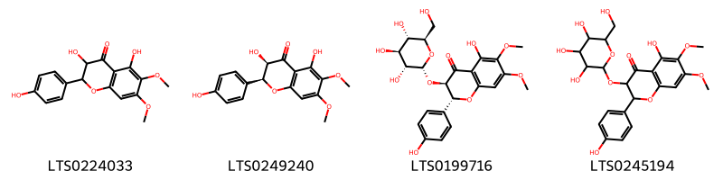{ width=100% }
    <figcaption>Hình ảnh cấu trúc hóa học của 4 hoạt chất thuộc nhóm Flavonoids gồm ['3,5-dihydroxy-2-(4-hydroxyphenyl)-6,7-dimethoxy-2,3-dihydro-1-benzopyran-4-one (LTS0224033)', '(2s,3r)-3,5-dihydroxy-2-(4-hydroxyphenyl)-6,7-dimethoxy-2,3-dihydro-1-benzopyran-4-one (LTS0249240)', '(2r,3r)-5-hydroxy-2-(4-hydroxyphenyl)-6,7-dimethoxy-3-{[(2r,3r,4s,5s,6r)-3,4,5-trihydroxy-6-(hydroxymethyl)oxan-2-yl]oxy}-2,3-dihydro-1-benzopyran-4-one (LTS0199716)', '5-hydroxy-2-(4-hydroxyphenyl)-6,7-dimethoxy-3-{[3,4,5-trihydroxy-6-(hydroxymethyl)oxan-2-yl]oxy}-2,3-dihydro-1-benzopyran-4-one (LTS0245194)'].</figcaption>
</figure>

---

### Dược dân tộc học

Danh sách các quốc gia có sử dụng *Sesuvium portulacastrum* trong điều trị các bệnh. 

| Country            | Disease   | Bệnh                                                                                                                                                                                                |
|:-------------------|:----------|:----------------------------------------------------------------------------------------------------------------------------------------------------------------------------------------------------|
| Dominican Republic | Vermifuge | MYMEMORY WARNING: YOU USED ALL AVAILABLE FREE TRANSLATIONS FOR TODAY. NEXT AVAILABLE IN  14 HOURS 52 MINUTES 50 SECONDS VISIT HTTPS://MYMEMORY.TRANSLATED.NET/DOC/USAGELIMITS.PHP TO TRANSLATE MORE |
| Haiti              | Emollient | MYMEMORY WARNING: YOU USED ALL AVAILABLE FREE TRANSLATIONS FOR TODAY. NEXT AVAILABLE IN  14 HOURS 52 MINUTES 46 SECONDS VISIT HTTPS://MYMEMORY.TRANSLATED.NET/DOC/USAGELIMITS.PHP TO TRANSLATE MORE |

---

# Chi Mesembryanthemum

??? note "Danh sách các dược liệu thuộc chi"
    
	 - *Mesembryanthemum crystallinum*
	 - *Mesembryanthemum stellatum*
	 - *Mesembryanthemum tortuosum*

---
## Mesembryanthemum crystallinum
### Thông tin về thực vật

!!! info "Phân loại thực vật của *Mesembryanthemum crystallinum* từ GIBF:"
    - **Kingdom:** Plantae
    - **Phylum:** Tracheophyta
    - **Order:** Caryophyllales
    - **Family:** Aizoaceae
    - **Genus:** Mesembryanthemum
    - **Species:** *Mesembryanthemum crystallinum*

 

| Label (VI)   | Label (EN)   | Scientific Name               | Descriptions (VI)   | Descriptions (EN)   | Also Known As (VI)   | Also Known As (EN)   |
|:-------------|:-------------|:------------------------------|:--------------------|:--------------------|:---------------------|:---------------------|
| N/A          | N/A          | Mesembryanthemum crystallinum | loài thực vật       | species of plant    | ['']                 | ['']                 |

#### Phân bố trên thế giới

**Từ CSDL GIBF** Tunisia, Malta, South Africa, Portugal, Morocco, Gibraltar, Spain, Cyprus, Chile, United States of America, Algeria, Mexico, Australia

#### Phân bố tại Việt Nam

**Từ CSDL GIBF**: Không có ghi nhận ở Việt Nam

---
### Thành phần hóa học
        
- Theo cơ sở dữ liệu lotus: Từ loài *Mesembryanthemum crystallinum* đã phân lập và xác định được 2 hoạt chất thuộc về các nhóm Flavonoids, Fatty Acyls. 

|    | chemicalTaxonomyClassyfireClass   |   smiles_count |
|---:|:----------------------------------|---------------:|
|  0 | Fatty Acyls                       |              1 |
|  1 | Flavonoids                        |              1 |

#### Nhóm Fatty Acyls
<figure markdown="span">
    { width=100% }
    <figcaption>Hình ảnh cấu trúc hóa học của 1 hoạt chất thuộc nhóm Fatty Acyls gồm ['2-carboxy-d-arabinitol (LTS0056947)'].</figcaption>
</figure>
#### Nhóm Flavonoids
<figure markdown="span">
    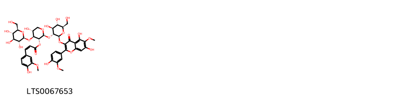{ width=100% }
    <figcaption>Hình ảnh cấu trúc hóa học của 1 hoạt chất thuộc nhóm Flavonoids gồm ['(2s,3r,4s,5r)-2-{[(2s,3r,4s,5s,6r)-2-{[5,7-dihydroxy-2-(4-hydroxy-3-methoxyphenyl)-6-methoxy-4-oxochromen-3-yl]oxy}-4,5-dihydroxy-6-(hydroxymethyl)oxan-3-yl]oxy}-5-hydroxy-4-{[(2s,3r,4s,5s,6r)-3,4,5-trihydroxy-6-(hydroxymethyl)oxan-2-yl]oxy}oxan-3-yl (2z)-3-(4-hydroxy-3-methoxyphenyl)prop-2-enoate (LTS0067653)'].</figcaption>
</figure>

---

### Dược dân tộc học

Danh sách các quốc gia có sử dụng *Mesembryanthemum crystallinum* trong điều trị các bệnh. 

| Country   | Disease             | Bệnh                                                                                                                                                                                                |
|:----------|:--------------------|:----------------------------------------------------------------------------------------------------------------------------------------------------------------------------------------------------|
| Elsewhere | Diuretic            | MYMEMORY WARNING: YOU USED ALL AVAILABLE FREE TRANSLATIONS FOR TODAY. NEXT AVAILABLE IN  14 HOURS 52 MINUTES 17 SECONDS VISIT HTTPS://MYMEMORY.TRANSLATED.NET/DOC/USAGELIMITS.PHP TO TRANSLATE MORE |
| Turkey    | Diuretic, Demulcent | MYMEMORY WARNING: YOU USED ALL AVAILABLE FREE TRANSLATIONS FOR TODAY. NEXT AVAILABLE IN  14 HOURS 52 MINUTES 15 SECONDS VISIT HTTPS://MYMEMORY.TRANSLATED.NET/DOC/USAGELIMITS.PHP TO TRANSLATE MORE |

---

---
## Mesembryanthemum stellatum
### Thông tin về thực vật

!!! info "Phân loại thực vật của *N/A* từ GIBF:"
    - **Kingdom:** Plantae
    - **Phylum:** Tracheophyta
    - **Order:** Caryophyllales
    - **Family:** Aizoaceae
    - **Genus:** N/A
    - **Species:** *N/A*

 

| Label (VI)   | Label (EN)   | Scientific Name               | Descriptions (VI)   | Descriptions (EN)   | Also Known As (VI)   | Also Known As (EN)   |
|:-------------|:-------------|:------------------------------|:--------------------|:--------------------|:---------------------|:---------------------|
| N/A          | N/A          | Mesembryanthemum crystallinum | loài thực vật       | species of plant    | ['']                 | ['']                 |

#### Phân bố trên thế giới

**Từ CSDL GIBF** Cayman Islands, Thailand, Namibia, Spain, United States Minor Outlying Islands, Chile, Australia, Jamaica, Turks and Caicos Islands, Dominican Republic, Puerto Rico, Sint Maarten (Dutch part), Panama, Brazil, Peru, Aruba, Mexico, Curaçao, Chinese Taipei, Argentina, South Africa, Portugal, Morocco, France, New Zealand, Ecuador, United States of America, Algeria

#### Phân bố tại Việt Nam

**Từ CSDL GIBF**: Không có ghi nhận ở Việt Nam

---
### Thành phần hóa học
        
- Theo cơ sở dữ liệu lotus: Từ loài *N/A* đã phân lập và xác định được Chưa có hoạt chất nào được phân lập. hoạt chất thuộc về các nhóm Không có hoạt chất nào được phân lập. 

Không có hình ảnh nào được tạo ra

---

### Dược dân tộc học

Danh sách các quốc gia có sử dụng *N/A* trong điều trị các bệnh. 

| Country      | Disease    | Bệnh                                                                                                                                                                                                |
|:-------------|:-----------|:----------------------------------------------------------------------------------------------------------------------------------------------------------------------------------------------------|
| South Africa | Intoxicant | MYMEMORY WARNING: YOU USED ALL AVAILABLE FREE TRANSLATIONS FOR TODAY. NEXT AVAILABLE IN  14 HOURS 51 MINUTES 47 SECONDS VISIT HTTPS://MYMEMORY.TRANSLATED.NET/DOC/USAGELIMITS.PHP TO TRANSLATE MORE |

---

---
## Mesembryanthemum tortuosum
### Thông tin về thực vật

!!! info "Phân loại thực vật của *Mesembryanthemum tortuosum* từ GIBF:"
    - **Kingdom:** Plantae
    - **Phylum:** Tracheophyta
    - **Order:** Caryophyllales
    - **Family:** Aizoaceae
    - **Genus:** Mesembryanthemum
    - **Species:** *Mesembryanthemum tortuosum*

 

| Label (VI)   | Label (EN)   | Scientific Name            | Descriptions (VI)   | Descriptions (EN)   | Also Known As (VI)   | Also Known As (EN)   |
|:-------------|:-------------|:---------------------------|:--------------------|:--------------------|:---------------------|:---------------------|
| N/A          | N/A          | Mesembryanthemum tortuosum | loài thực vật       | species of plant    | ['']                 | ['']                 |

#### Phân bố trên thế giới

**Từ CSDL GIBF** nan, unknown or invalid, South Africa

#### Phân bố tại Việt Nam

**Từ CSDL GIBF**: Không có ghi nhận ở Việt Nam

---
### Thành phần hóa học
        
- Theo cơ sở dữ liệu lotus: Từ loài *Mesembryanthemum tortuosum* đã phân lập và xác định được 25 hoạt chất thuộc về các nhóm Quinolines and derivatives, Benzene and substituted derivatives, Phenols, Pyrrolidines. 

|    | chemicalTaxonomyClassyfireClass     |   smiles_count |
|---:|:------------------------------------|---------------:|
|  0 | Benzene and substituted derivatives |              5 |
|  1 | Phenols                             |              1 |
|  2 | Pyrrolidines                        |              8 |
|  3 | Quinolines and derivatives          |             11 |

#### Nhóm Benzene and substituted derivatives
<figure markdown="span">
    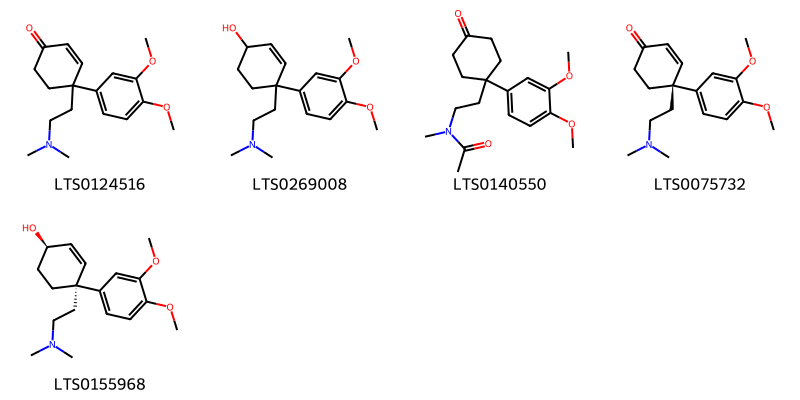{ width=100% }
    <figcaption>Hình ảnh cấu trúc hóa học của 5 hoạt chất thuộc nhóm Benzene and substituted derivatives gồm ['4-(3,4-dimethoxyphenyl)-4-[2-(dimethylamino)ethyl]cyclohex-2-en-1-one (LTS0124516)', '4-(3,4-dimethoxyphenyl)-4-[2-(dimethylamino)ethyl]cyclohex-2-en-1-ol (LTS0269008)', 'n-{2-[1-(3,4-dimethoxyphenyl)-4-oxocyclohexyl]ethyl}-n-methylacetamide (LTS0140550)', '(4s)-4-(3,4-dimethoxyphenyl)-4-[2-(dimethylamino)ethyl]cyclohex-2-en-1-one (LTS0075732)', '(1r,4r)-4-(3,4-dimethoxyphenyl)-4-[2-(dimethylamino)ethyl]cyclohex-2-en-1-ol (LTS0155968)'].</figcaption>
</figure>
#### Nhóm Phenols
<figure markdown="span">
    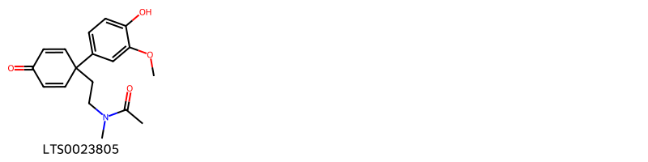{ width=100% }
    <figcaption>Hình ảnh cấu trúc hóa học của 1 hoạt chất thuộc nhóm Phenols gồm ['n-{2-[1-(4-hydroxy-3-methoxyphenyl)-4-oxocyclohexa-2,5-dien-1-yl]ethyl}-n-methylacetamide (LTS0023805)'].</figcaption>
</figure>
#### Nhóm Pyrrolidines
<figure markdown="span">
    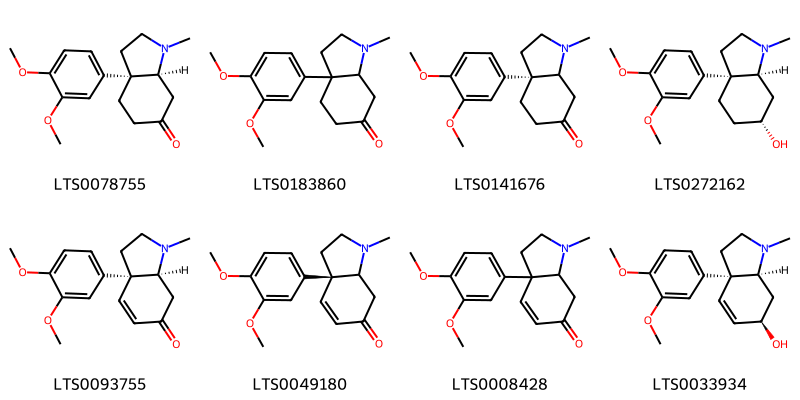{ width=100% }
    <figcaption>Hình ảnh cấu trúc hóa học của 8 hoạt chất thuộc nhóm Pyrrolidines gồm ['(3as,7as)-3a-(3,4-dimethoxyphenyl)-1-methyl-hexahydroindol-6-one (LTS0078755)', '3a-(3,4-dimethoxyphenyl)-1-methyl-hexahydroindol-6-one (LTS0183860)', '(3as)-3a-(3,4-dimethoxyphenyl)-1-methyl-hexahydroindol-6-one (LTS0141676)', 'mesembrinol (LTS0272162)', 'mesembrenone (LTS0093755)', '(3as)-3a-(3,4-dimethoxyphenyl)-1-methyl-2,3,7,7a-tetrahydroindol-6-one (LTS0049180)', '3a-(3,4-dimethoxyphenyl)-1-methyl-2,3,7,7a-tetrahydroindol-6-one (LTS0008428)', '(3ar,6r,7as)-3a-(3,4-dimethoxyphenyl)-1-methyl-3,6,7,7a-tetrahydro-2h-indol-6-ol (LTS0033934)'].</figcaption>
</figure>
#### Nhóm Quinolines and derivatives
<figure markdown="span">
    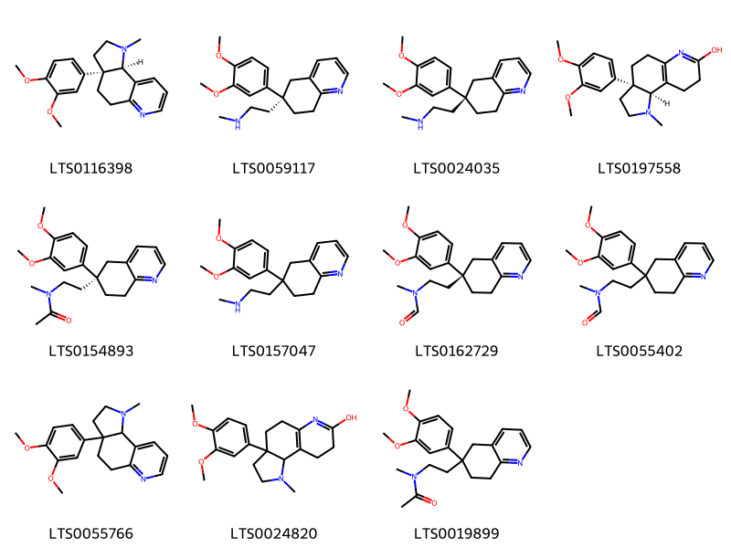{ width=100% }
    <figcaption>Hình ảnh cấu trúc hóa học của 11 hoạt chất thuộc nhóm Quinolines and derivatives gồm ['(+)-sceletium a4 (LTS0116398)', 'tortuosamine (LTS0059117)', 'tortuosamine (LTS0024035)', '(3ar,9bs)-3a-(3,4-dimethoxyphenyl)-1-methyl-2h,3h,4h,5h,8h,9h,9bh-pyrrolo[2,3-f]quinolin-7-ol (LTS0197558)', 'n-{2-[(6r)-6-(3,4-dimethoxyphenyl)-7,8-dihydro-5h-quinolin-6-yl]ethyl}-n-methylacetamide (LTS0154893)', '{2-[6-(3,4-dimethoxyphenyl)-7,8-dihydro-5h-quinolin-6-yl]ethyl}(methyl)amine (LTS0157047)', 'n-{2-[(6s)-6-(3,4-dimethoxyphenyl)-7,8-dihydro-5h-quinolin-6-yl]ethyl}-n-methylformamide (LTS0162729)', 'n-{2-[6-(3,4-dimethoxyphenyl)-7,8-dihydro-5h-quinolin-6-yl]ethyl}-n-methylformamide (LTS0055402)', '3a-(3,4-dimethoxyphenyl)-1-methyl-2h,3h,4h,5h,9bh-pyrrolo[2,3-f]quinoline (LTS0055766)', '3a-(3,4-dimethoxyphenyl)-1-methyl-2h,3h,4h,5h,8h,9h,9bh-pyrrolo[2,3-f]quinolin-7-ol (LTS0024820)', 'n-{2-[6-(3,4-dimethoxyphenyl)-7,8-dihydro-5h-quinolin-6-yl]ethyl}-n-methylacetamide (LTS0019899)'].</figcaption>
</figure>

---

### Dược dân tộc học

Danh sách các quốc gia có sử dụng *Mesembryanthemum tortuosum* trong điều trị các bệnh. 

| Country             | Disease   | Bệnh                                                                                                                                                                                                |
|:--------------------|:----------|:----------------------------------------------------------------------------------------------------------------------------------------------------------------------------------------------------|
| S Africa(Hottentot) | Narcotic  | MYMEMORY WARNING: YOU USED ALL AVAILABLE FREE TRANSLATIONS FOR TODAY. NEXT AVAILABLE IN  14 HOURS 51 MINUTES 15 SECONDS VISIT HTTPS://MYMEMORY.TRANSLATED.NET/DOC/USAGELIMITS.PHP TO TRANSLATE MORE |

---

