!!! abstract "Tóm tắt"

    Họ Alangiaceae gồm khoảng 2 chi và 3 loài được một số cộng đồng tại các quốc gia như Elsewhere, China sử dụng trong một số trường hợp Vermifuge, Thuốc trừ sâu, Carminative, Chất độc, Ngừa thai, Hemostat.

!!! info "DrDuke"

    James A. Duke sinh năm 1929-2017 là một nhà thực vật học người Mỹ. Đây là một trong những tác giả hàng đầu trong lĩnh vực dược dân tộc học với cuốn *CRC Handbook of Medicinal Herbs* và chính là người xây dựng lên cơ sở dữ liệu về hợp chất tự nhiên và dược dân tộc học tại Bộ nông nghiệp Hoa Kỳ. Các thông tin được đăng tải tại website [Dr. Duke's Phytochemical and Ethnobotanical Databases](https://phytochem.nal.usda.gov/). 
    Trong suốt thập niên 1970, ông lãnh đạo the Plant Taxonomy Laboratory, Plant Genetics and Germplasm Institute of the Agricultural Research Service, U.S. Department of Agriculture.
    Trong tài liệu này, các thông tin về dược dân tộc của các dược liệu được trích dẫn từ tài liệu của James A. Ducke với sự trợ giúp của phần mềm dịch thuật từ tiếng Anh sang tiếng Việt.
   

# Chi Alangium

??? note "Danh sách các dược liệu thuộc chi"
    
	 - *Alangium chinense*
	 - *Alangium salviifolium*

---
## Alangium chinense
### Thông tin về thực vật

!!! info "Phân loại thực vật của *Alangium chinense* từ GIBF:"
    - **Kingdom:** Plantae
    - **Phylum:** Tracheophyta
    - **Order:** Cornales
    - **Family:** Cornaceae
    - **Genus:** Alangium
    - **Species:** *Alangium chinense*

 

| Label (VI)   | Label (EN)   | Scientific Name   | Descriptions (VI)   | Descriptions (EN)   | Also Known As (VI)   | Also Known As (EN)   |
|:-------------|:-------------|:------------------|:--------------------|:--------------------|:---------------------|:---------------------|
| N/A          | N/A          | Alangium chinense | loài thực vật       | species of plant    | ['']                 | ['']                 |

#### Phân bố trên thế giới

**Từ CSDL GIBF** Pakistan, Hong Kong, Sao Tome and Principe, Belgium, Chinese Taipei, India, Bangladesh, China, Kenya, Cameroon, Tanzania, United Republic of, New Zealand, Nepal

#### Phân bố tại Việt Nam

**Từ CSDL GIBF**: Không có ghi nhận ở Việt Nam

---
### Thành phần hóa học
        
- Theo cơ sở dữ liệu lotus: Từ loài *Alangium chinense* đã phân lập và xác định được 58 hoạt chất thuộc về các nhóm Fatty Acyls, Naphthalenes, Flavonoids, Prenol lipids, Piperidines, Organooxygen compounds, Tannins, Isoquinolines and derivatives, Indolonaphthyridine alkaloids. 

|    | chemicalTaxonomyClassyfireClass   |   smiles_count |
|---:|:----------------------------------|---------------:|
|  0 | Fatty Acyls                       |              2 |
|  1 | Flavonoids                        |             10 |
|  2 | Indolonaphthyridine alkaloids     |              1 |
|  3 | Isoquinolines and derivatives     |              1 |
|  4 | Naphthalenes                      |              2 |
|  5 | Organooxygen compounds            |             24 |
|  6 | Piperidines                       |              4 |
|  7 | Prenol lipids                     |             10 |
|  8 | Tannins                           |              4 |

#### Nhóm Fatty Acyls
<figure markdown="span">
    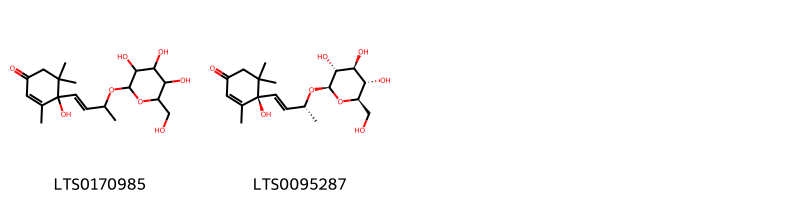{ width=100% }
    <figcaption>Hình ảnh cấu trúc hóa học của 2 hoạt chất thuộc nhóm Fatty Acyls gồm ['4-hydroxy-3,5,5-trimethyl-4-(3-{[3,4,5-trihydroxy-6-(hydroxymethyl)oxan-2-yl]oxy}but-1-en-1-yl)cyclohex-2-en-1-one (LTS0170985)', '(4r)-4-hydroxy-3,5,5-trimethyl-4-[(1e,3r)-3-{[(2r,3r,4s,5s,6r)-3,4,5-trihydroxy-6-(hydroxymethyl)oxan-2-yl]oxy}but-1-en-1-yl]cyclohex-2-en-1-one (LTS0095287)'].</figcaption>
</figure>
#### Nhóm Flavonoids
<figure markdown="span">
    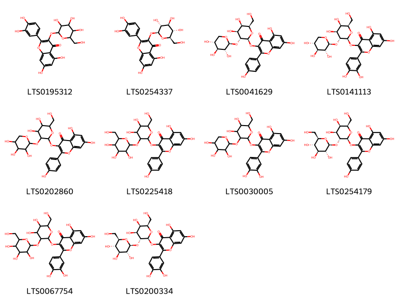{ width=100% }
    <figcaption>Hình ảnh cấu trúc hóa học của 10 hoạt chất thuộc nhóm Flavonoids gồm ['2-(3,4-dihydroxyphenyl)-5,7-dihydroxy-3-{[3,4,5-trihydroxy-6-(hydroxymethyl)oxan-2-yl]oxy}chromen-4-one (LTS0195312)', 'isoquercetin (LTS0254337)', '3-{[(2s,3r,4s,5r,6r)-4,5-dihydroxy-6-(hydroxymethyl)-3-{[(2s,3r,4s,5r)-3,4,5-trihydroxyoxan-2-yl]oxy}oxan-2-yl]oxy}-5,7-dihydroxy-2-(4-hydroxyphenyl)chromen-4-one (LTS0041629)', '3-{[(2s,3r,4s,5r,6r)-4,5-dihydroxy-6-(hydroxymethyl)-3-{[(2s,3r,4s,5r)-3,4,5-trihydroxyoxan-2-yl]oxy}oxan-2-yl]oxy}-2-(3,4-dihydroxyphenyl)-5,7-dihydroxychromen-4-one (LTS0141113)', '3-{[4,5-dihydroxy-6-(hydroxymethyl)-3-[(3,4,5-trihydroxyoxan-2-yl)oxy]oxan-2-yl]oxy}-5,7-dihydroxy-2-(4-hydroxyphenyl)chromen-4-one (LTS0202860)', '3-{[4,5-dihydroxy-6-(hydroxymethyl)-3-{[3,4,5-trihydroxy-6-(hydroxymethyl)oxan-2-yl]oxy}oxan-2-yl]oxy}-5,7-dihydroxy-2-(4-hydroxyphenyl)chromen-4-one (LTS0225418)', '3-{[4,5-dihydroxy-6-(hydroxymethyl)-3-[(3,4,5-trihydroxyoxan-2-yl)oxy]oxan-2-yl]oxy}-2-(3,4-dihydroxyphenyl)-5,7-dihydroxychromen-4-one (LTS0030005)', '3-{[(2s,3r,4s,5r,6r)-4,5-dihydroxy-6-(hydroxymethyl)-3-{[(2s,3r,4s,5s,6r)-3,4,5-trihydroxy-6-(hydroxymethyl)oxan-2-yl]oxy}oxan-2-yl]oxy}-5,7-dihydroxy-2-(4-hydroxyphenyl)chromen-4-one (LTS0254179)', '3-{[4,5-dihydroxy-6-(hydroxymethyl)-3-{[3,4,5-trihydroxy-6-(hydroxymethyl)oxan-2-yl]oxy}oxan-2-yl]oxy}-2-(3,4-dihydroxyphenyl)-5,7-dihydroxychromen-4-one (LTS0067754)', '3-{[(2s,3r,4s,5r,6r)-4,5-dihydroxy-6-(hydroxymethyl)-3-{[(2s,3r,4s,5s,6r)-3,4,5-trihydroxy-6-(hydroxymethyl)oxan-2-yl]oxy}oxan-2-yl]oxy}-2-(3,4-dihydroxyphenyl)-5,7-dihydroxychromen-4-one (LTS0200334)'].</figcaption>
</figure>
#### Nhóm Indolonaphthyridine alkaloids
<figure markdown="span">
    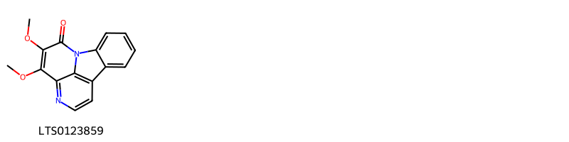{ width=100% }
    <figcaption>Hình ảnh cấu trúc hóa học của 1 hoạt chất thuộc nhóm Indolonaphthyridine alkaloids gồm ['methyl nigakinone (LTS0123859)'].</figcaption>
</figure>
#### Nhóm Isoquinolines and derivatives
<figure markdown="span">
    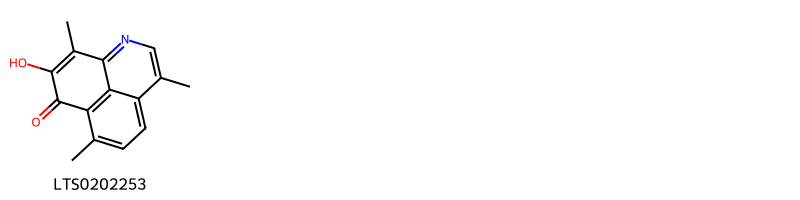{ width=100% }
    <figcaption>Hình ảnh cấu trúc hóa học của 1 hoạt chất thuộc nhóm Isoquinolines and derivatives gồm ['11-hydroxy-4,8,12-trimethyl-2-azatricyclo[7.3.1.0⁵,¹³]trideca-1(13),2,4,6,8,11-hexaen-10-one (LTS0202253)'].</figcaption>
</figure>
#### Nhóm Naphthalenes
<figure markdown="span">
    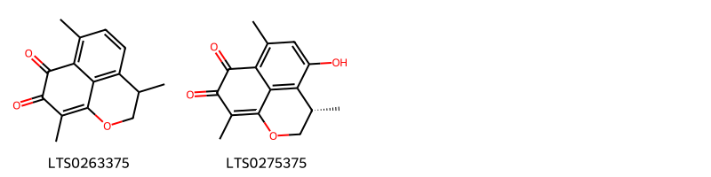{ width=100% }
    <figcaption>Hình ảnh cấu trúc hóa học của 2 hoạt chất thuộc nhóm Naphthalenes gồm ['mansonone e (LTS0263375)', '(4s)-6-hydroxy-4,8,12-trimethyl-2-oxatricyclo[7.3.1.0⁵,¹³]trideca-1(12),5,7,9(13)-tetraene-10,11-dione (LTS0275375)'].</figcaption>
</figure>
#### Nhóm Organooxygen compounds
<figure markdown="span">
    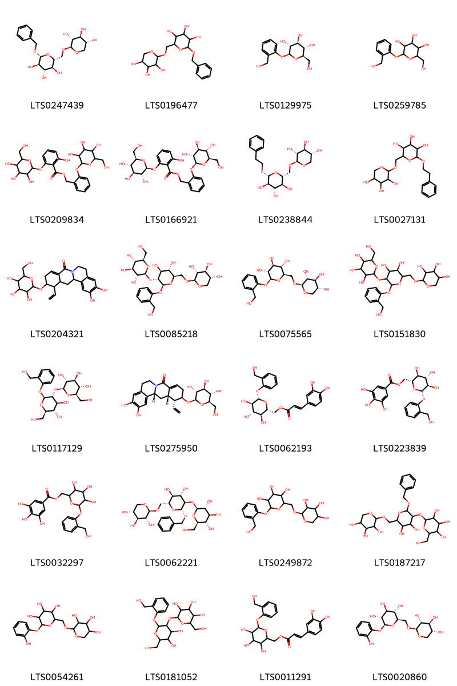{ width=100% }
    <figcaption>Hình ảnh cấu trúc hóa học của 24 hoạt chất thuộc nhóm Organooxygen compounds gồm ['(2r,3r,4s,5s,6r)-2-(benzyloxy)-6-({[(2s,3r,4s,5r)-3,4,5-trihydroxyoxan-2-yl]oxy}methyl)oxane-3,4,5-triol (LTS0247439)', '2-(benzyloxy)-6-{[(3,4,5-trihydroxyoxan-2-yl)oxy]methyl}oxane-3,4,5-triol (LTS0196477)', 'salicin (LTS0129975)', 'salicin (LTS0259785)', '(2-{[3,4,5-trihydroxy-6-(hydroxymethyl)oxan-2-yl]oxy}phenyl)methyl 2-hydroxy-6-{[3,4,5-trihydroxy-6-(hydroxymethyl)oxan-2-yl]oxy}benzoate (LTS0209834)', '(2-{[(2s,3r,4s,5s,6r)-3,4,5-trihydroxy-6-(hydroxymethyl)oxan-2-yl]oxy}phenyl)methyl 2-hydroxy-6-{[(2s,3r,4s,5s,6r)-3,4,5-trihydroxy-6-(hydroxymethyl)oxan-2-yl]oxy}benzoate (LTS0166921)', '(2r,3r,4s,5s,6r)-2-(2-phenylethoxy)-6-({[(2s,3r,4s,5r)-3,4,5-trihydroxyoxan-2-yl]oxy}methyl)oxane-3,4,5-triol (LTS0238844)', '2-(2-phenylethoxy)-6-{[(3,4,5-trihydroxyoxan-2-yl)oxy]methyl}oxane-3,4,5-triol (LTS0027131)', '1-ethenyl-10,11-dihydroxy-2-{[3,4,5-trihydroxy-6-(hydroxymethyl)oxan-2-yl]oxy}-1,2,3,7,8,12b,13,13a-octahydro-6-azatetraphen-5-one (LTS0204321)', '(2s,3r,4s,5s,6r)-2-{[(2s,3r,4s,5s,6r)-4,5-dihydroxy-2-[2-(hydroxymethyl)phenoxy]-6-({[(2s,3r,4s,5r)-3,4,5-trihydroxyoxan-2-yl]oxy}methyl)oxan-3-yl]oxy}-6-(hydroxymethyl)oxane-3,4,5-triol (LTS0085218)', '(2s,3r,4s,5s,6r)-2-[2-(hydroxymethyl)phenoxy]-6-({[(2s,3r,4s,5r)-3,4,5-trihydroxyoxan-2-yl]oxy}methyl)oxane-3,4,5-triol (LTS0075565)', '2-({4,5-dihydroxy-2-[2-(hydroxymethyl)phenoxy]-6-{[(3,4,5-trihydroxyoxan-2-yl)oxy]methyl}oxan-3-yl}oxy)-6-(hydroxymethyl)oxane-3,4,5-triol (LTS0151830)', '(2s,3r,4s,5s,6r)-2-{[(2s,3r,4s,5s,6r)-4,5-dihydroxy-6-(hydroxymethyl)-2-[2-(hydroxymethyl)phenoxy]oxan-3-yl]oxy}-6-(hydroxymethyl)oxane-3,4,5-triol (LTS0117129)', '(1r,2r,12br,13as)-1-ethenyl-10,11-dihydroxy-2-{[(2r,3r,4s,5s,6r)-3,4,5-trihydroxy-6-(hydroxymethyl)oxan-2-yl]oxy}-1,2,3,7,8,12b,13,13a-octahydro-6-azatetraphen-5-one (LTS0275950)', '[(2r,3s,4s,5r,6s)-3,4,5-trihydroxy-6-[2-(hydroxymethyl)phenoxy]oxan-2-yl]methyl (2e)-3-(3,4-dihydroxyphenyl)prop-2-enoate (LTS0062193)', '[(2r,3s,4s,5r,6s)-3,4,5-trihydroxy-6-[2-(hydroxymethyl)phenoxy]oxan-2-yl]methyl 3,4,5-trihydroxybenzoate (LTS0223839)', '{3,4,5-trihydroxy-6-[2-(hydroxymethyl)phenoxy]oxan-2-yl}methyl 3,4,5-trihydroxybenzoate (LTS0032297)', '(2s,3r,4s,5s,6r)-2-{[(2r,3r,4s,5s,6r)-2-(benzyloxy)-4,5-dihydroxy-6-({[(2s,3r,4s,5r)-3,4,5-trihydroxyoxan-2-yl]oxy}methyl)oxan-3-yl]oxy}-6-(hydroxymethyl)oxane-3,4,5-triol (LTS0062221)', '2-[2-(hydroxymethyl)phenoxy]-6-{[(3,4,5-trihydroxyoxan-2-yl)oxy]methyl}oxane-3,4,5-triol (LTS0249872)', '2-{[2-(benzyloxy)-4,5-dihydroxy-6-{[(3,4,5-trihydroxyoxan-2-yl)oxy]methyl}oxan-3-yl]oxy}-6-(hydroxymethyl)oxane-3,4,5-triol (LTS0187217)', '2-(2-hydroxyphenoxy)-6-{[(3,4,5-trihydroxyoxan-2-yl)oxy]methyl}oxane-3,4,5-triol (LTS0054261)', '2-{[4,5-dihydroxy-6-(hydroxymethyl)-2-[2-(hydroxymethyl)phenoxy]oxan-3-yl]oxy}-6-(hydroxymethyl)oxane-3,4,5-triol (LTS0181052)', '{3,4,5-trihydroxy-6-[2-(hydroxymethyl)phenoxy]oxan-2-yl}methyl 3-(3,4-dihydroxyphenyl)prop-2-enoate (LTS0011291)', '(2s,3r,4s,5s,6r)-2-(2-hydroxyphenoxy)-6-({[(2s,3r,4s,5r)-3,4,5-trihydroxyoxan-2-yl]oxy}methyl)oxane-3,4,5-triol (LTS0020860)'].</figcaption>
</figure>
#### Nhóm Piperidines
<figure markdown="span">
    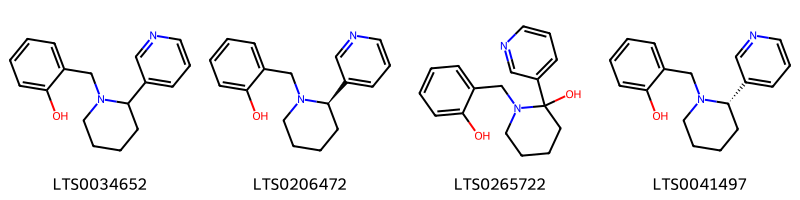{ width=100% }
    <figcaption>Hình ảnh cấu trúc hóa học của 4 hoạt chất thuộc nhóm Piperidines gồm ['2-{[2-(pyridin-3-yl)piperidin-1-yl]methyl}phenol (LTS0034652)', '2-{[(2r)-2-(pyridin-3-yl)piperidin-1-yl]methyl}phenol (LTS0206472)', '1-[(2-hydroxyphenyl)methyl]-2-(pyridin-3-yl)piperidin-2-ol (LTS0265722)', '2-{[(2s)-2-(pyridin-3-yl)piperidin-1-yl]methyl}phenol (LTS0041497)'].</figcaption>
</figure>
#### Nhóm Prenol lipids
<figure markdown="span">
    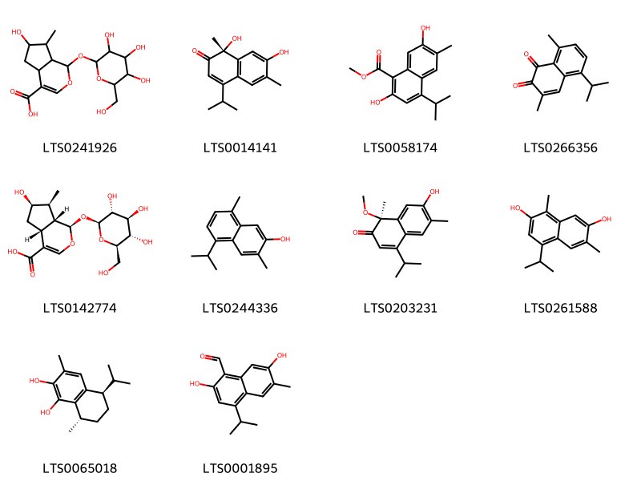{ width=100% }
    <figcaption>Hình ảnh cấu trúc hóa học của 10 hoạt chất thuộc nhóm Prenol lipids gồm ['6-hydroxy-7-methyl-1-{[3,4,5-trihydroxy-6-(hydroxymethyl)oxan-2-yl]oxy}-1h,4ah,5h,6h,7h,7ah-cyclopenta[c]pyran-4-carboxylic acid (LTS0241926)', '(1r)-1,7-dihydroxy-4-isopropyl-1,6-dimethylnaphthalen-2-one (LTS0014141)', 'methyl 2,7-dihydroxy-4-isopropyl-6-methylnaphthalene-1-carboxylate (LTS0058174)', 'mansonone c (LTS0266356)', '(1r,4ar,6r,7s,7ar)-6-hydroxy-7-methyl-1-{[(2s,3r,4s,5s,6r)-3,4,5-trihydroxy-6-(hydroxymethyl)oxan-2-yl]oxy}-1h,4ah,5h,6h,7h,7ah-cyclopenta[c]pyran-4-carboxylic acid (LTS0142774)', '7-hydroxycadalene (LTS0244336)', '(1s)-7-hydroxy-4-isopropyl-1-methoxy-1,6-dimethylnaphthalen-2-one (LTS0203231)', '2,7-dihydroxycadalene (LTS0261588)', '(5r,8s)-5-isopropyl-3,8-dimethyl-5,6,7,8-tetrahydronaphthalene-1,2-diol (LTS0065018)', '2,7-dihydroxy-4-isopropyl-6-methylnaphthalene-1-carbaldehyde (LTS0001895)'].</figcaption>
</figure>
#### Nhóm Tannins
<figure markdown="span">
    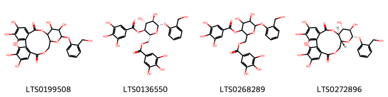{ width=100% }
    <figcaption>Hình ảnh cấu trúc hóa học của 4 hoạt chất thuộc nhóm Tannins gồm ['3,4,5,11,12,21,22,23-octahydroxy-13-[2-(hydroxymethyl)phenoxy]-9,14,17-trioxatetracyclo[17.4.0.0²,⁷.0¹⁰,¹⁵]tricosa-1(19),2,4,6,20,22-hexaene-8,18-dione (LTS0199508)', '(2r,3s,4r,5r,6s)-4,5-dihydroxy-6-[2-(hydroxymethyl)phenoxy]-2-[(3,4,5-trihydroxybenzoyloxy)methyl]oxan-3-yl 3,4,5-trihydroxybenzoate (LTS0136550)', '4,5-dihydroxy-6-[2-(hydroxymethyl)phenoxy]-2-[(3,4,5-trihydroxybenzoyloxy)methyl]oxan-3-yl 3,4,5-trihydroxybenzoate (LTS0268289)', '(10s,11r,12r,13s,15r)-3,4,5,11,12,21,22,23-octahydroxy-13-[2-(hydroxymethyl)phenoxy]-9,14,17-trioxatetracyclo[17.4.0.0²,⁷.0¹⁰,¹⁵]tricosa-1(19),2,4,6,20,22-hexaene-8,18-dione (LTS0272896)'].</figcaption>
</figure>

---

### Dược dân tộc học

Danh sách các quốc gia có sử dụng *Alangium chinense* trong điều trị các bệnh. 

| Country   | Disease                                      | Bệnh                                         |
|:----------|:---------------------------------------------|:---------------------------------------------|
| China     | Carminative, Poison, Contraceptive, Hemostat | Carminative, Poison, Contraceptive, Hemostat |

---

---
## Alangium salviifolium
### Thông tin về thực vật

!!! info "Phân loại thực vật của *Alangium salviifolium* từ GIBF:"
    - **Kingdom:** Plantae
    - **Phylum:** Tracheophyta
    - **Order:** Cornales
    - **Family:** Cornaceae
    - **Genus:** Alangium
    - **Species:** *Alangium salviifolium*

 

| Label (VI)   | Label (EN)   | Scientific Name       | Descriptions (VI)   | Descriptions (EN)   | Also Known As (VI)   | Also Known As (EN)       |
|:-------------|:-------------|:----------------------|:--------------------|:--------------------|:---------------------|:-------------------------|
| N/A          | N/A          | Alangium salviifolium | loài thực vật       | species of plant    | ['']                 | ['sage-leaved alangium'] |

#### Phân bố trên thế giới

**Từ CSDL GIBF** nan, Sri Lanka, Comoros, Thailand, Lao People’s Democratic Republic, Cambodia, Philippines, India, Indonesia, Bangladesh, United States of America, Mayotte, Tanzania, United Republic of, Kenya, Viet Nam, China, Nepal

#### Phân bố tại Việt Nam

**Từ CSDL GIBF**: Hoa Binh, Hải Phòng, Lạng Sơn

---
### Thành phần hóa học
        
- Theo cơ sở dữ liệu lotus: Từ loài *Alangium salviifolium* đã phân lập và xác định được 14 hoạt chất thuộc về các nhóm Isoquinolines and derivatives, Organooxygen compounds, Steroids and steroid derivatives, Diazines. 

|    | chemicalTaxonomyClassyfireClass   |   smiles_count |
|---:|:----------------------------------|---------------:|
|  0 | Diazines                          |              1 |
|  1 | Isoquinolines and derivatives     |              2 |
|  2 | Organooxygen compounds            |              9 |
|  3 | Steroids and steroid derivatives  |              2 |

#### Nhóm Diazines
<figure markdown="span">
    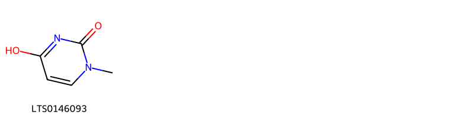{ width=100% }
    <figcaption>Hình ảnh cấu trúc hóa học của 1 hoạt chất thuộc nhóm Diazines gồm ['4-hydroxy-1-methylpyrimidin-2-one (LTS0146093)'].</figcaption>
</figure>
#### Nhóm Isoquinolines and derivatives
<figure markdown="span">
    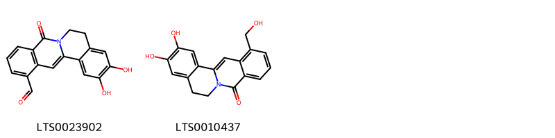{ width=100% }
    <figcaption>Hình ảnh cấu trúc hóa học của 2 hoạt chất thuộc nhóm Isoquinolines and derivatives gồm ['10,11-dihydroxy-5-oxo-7,8-dihydro-6-azatetraphene-1-carbaldehyde (LTS0023902)', '10,11-dihydroxy-1-(hydroxymethyl)-7,8-dihydro-6-azatetraphen-5-one (LTS0010437)'].</figcaption>
</figure>
#### Nhóm Organooxygen compounds
<figure markdown="span">
    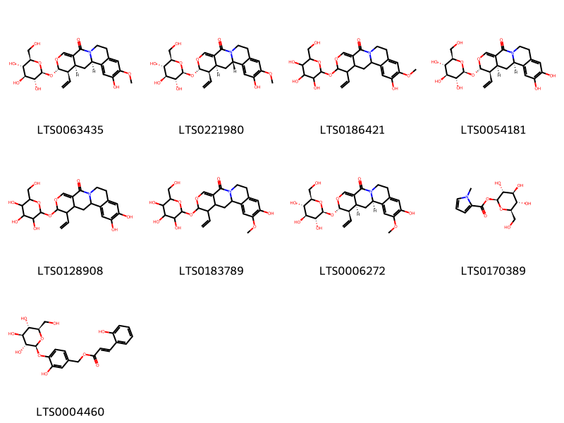{ width=100% }
    <figcaption>Hình ảnh cấu trúc hóa học của 9 hoạt chất thuộc nhóm Organooxygen compounds gồm ['(3s,4r,4as,5ar)-4-ethenyl-7-hydroxy-8-methoxy-3-{[(2s,3r,4s,5s,6r)-3,4,5-trihydroxy-6-(hydroxymethyl)oxan-2-yl]oxy}-4,4a,5,5a,10,11-hexahydro-3h-2-oxa-12-azatetraphen-13-one (LTS0063435)', 'isoalangiside (LTS0221980)', '4-ethenyl-7-hydroxy-8-methoxy-3-{[3,4,5-trihydroxy-6-(hydroxymethyl)oxan-2-yl]oxy}-4,4a,5,5a,10,11-hexahydro-3h-2-oxa-12-azatetraphen-13-one (LTS0186421)', 'demethylalangiside (LTS0054181)', '4-ethenyl-7,8-dihydroxy-3-{[3,4,5-trihydroxy-6-(hydroxymethyl)oxan-2-yl]oxy}-4,4a,5,5a,10,11-hexahydro-3h-2-oxa-12-azatetraphen-13-one (LTS0128908)', '4-ethenyl-8-hydroxy-7-methoxy-3-{[3,4,5-trihydroxy-6-(hydroxymethyl)oxan-2-yl]oxy}-4,4a,5,5a,10,11-hexahydro-3h-2-oxa-12-azatetraphen-13-one (LTS0183789)', '(3s,4r,4as,5ar)-4-ethenyl-8-hydroxy-7-methoxy-3-{[(2s,3r,4s,5s,6r)-3,4,5-trihydroxy-6-(hydroxymethyl)oxan-2-yl]oxy}-4,4a,5,5a,10,11-hexahydro-3h-2-oxa-12-azatetraphen-13-one (LTS0006272)', '(2s,3r,4s,5s,6r)-3,4,5-trihydroxy-6-(hydroxymethyl)oxan-2-yl 1-methylpyrrole-2-carboxylate (LTS0170389)', '(3-hydroxy-4-{[(2s,3r,4s,5s,6r)-3,4,5-trihydroxy-6-(hydroxymethyl)oxan-2-yl]oxy}phenyl)methyl (2e)-3-(2-hydroxyphenyl)prop-2-enoate (LTS0004460)'].</figcaption>
</figure>
#### Nhóm Steroids and steroid derivatives
<figure markdown="span">
    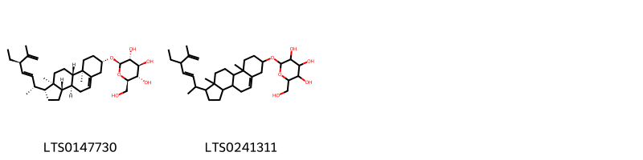{ width=100% }
    <figcaption>Hình ảnh cấu trúc hóa học của 2 hoạt chất thuộc nhóm Steroids and steroid derivatives gồm ['(2r,3r,4s,5s,6r)-2-{[(1r,3as,3bs,7s,9ar,9bs,11ar)-1-[(2r,3e,5r)-5-ethyl-6-methylhepta-3,6-dien-2-yl]-9a,11a-dimethyl-1h,2h,3h,3ah,3bh,4h,6h,7h,8h,9h,9bh,10h,11h-cyclopenta[a]phenanthren-7-yl]oxy}-6-(hydroxymethyl)oxane-3,4,5-triol (LTS0147730)', '2-{[1-(5-ethyl-6-methylhepta-3,6-dien-2-yl)-9a,11a-dimethyl-1h,2h,3h,3ah,3bh,4h,6h,7h,8h,9h,9bh,10h,11h-cyclopenta[a]phenanthren-7-yl]oxy}-6-(hydroxymethyl)oxane-3,4,5-triol (LTS0241311)'].</figcaption>
</figure>

---

### Dược dân tộc học

Danh sách các quốc gia có sử dụng *Alangium salviifolium* trong điều trị các bệnh. 

| Country   | Disease   | Bệnh           |
|:----------|:----------|:---------------|
| Elsewhere | Vermifuge | Thuốc diệt sán |

---

# Chi Marlea

??? note "Danh sách các dược liệu thuộc chi"
    
	 - *Marlea platanifolia*

---
## Marlea platanifolia
### Thông tin về thực vật

!!! info "Phân loại thực vật của *Alangium platanifolium* từ GIBF:"
    - **Kingdom:** Plantae
    - **Phylum:** Tracheophyta
    - **Order:** Cornales
    - **Family:** Cornaceae
    - **Genus:** Alangium
    - **Species:** *Alangium platanifolium*

 

| Label (VI)   | Label (EN)   | Scientific Name     | Descriptions (VI)   | Descriptions (EN)   | Also Known As (VI)   | Also Known As (EN)   |
|:-------------|:-------------|:--------------------|:--------------------|:--------------------|:---------------------|:---------------------|
| N/A          | N/A          | Marlea platanifolia |                     |                     | ['']                 | ['']                 |

#### Phân bố trên thế giới

**Từ CSDL GIBF** nan, Sri Lanka, Comoros, Thailand, Lao People’s Democratic Republic, Cambodia, Philippines, India, Indonesia, Bangladesh, United States of America, Mayotte, Tanzania, United Republic of, Kenya, Viet Nam, China, Nepal

#### Phân bố tại Việt Nam

**Từ CSDL GIBF**: Hoa Binh, Hải Phòng, Lạng Sơn

---
### Thành phần hóa học
        
- Theo cơ sở dữ liệu lotus: Từ loài *Alangium platanifolium* đã phân lập và xác định được Chưa có hoạt chất nào được phân lập. hoạt chất thuộc về các nhóm Không có hoạt chất nào được phân lập. 

Không có hình ảnh nào được tạo ra

---

### Dược dân tộc học

Danh sách các quốc gia có sử dụng *Alangium platanifolium* trong điều trị các bệnh. 

| Country   | Disease     | Bệnh          |
|:----------|:------------|:--------------|
| China     | Insecticide | Thuốc trừ sâu |

---

