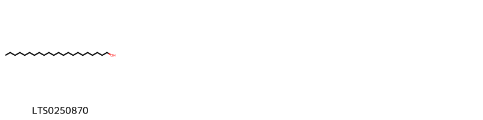
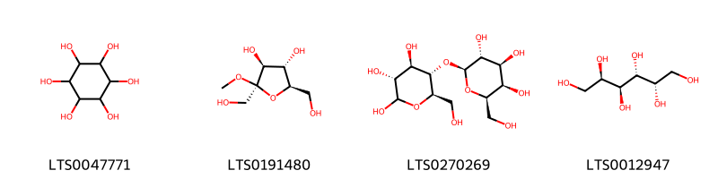
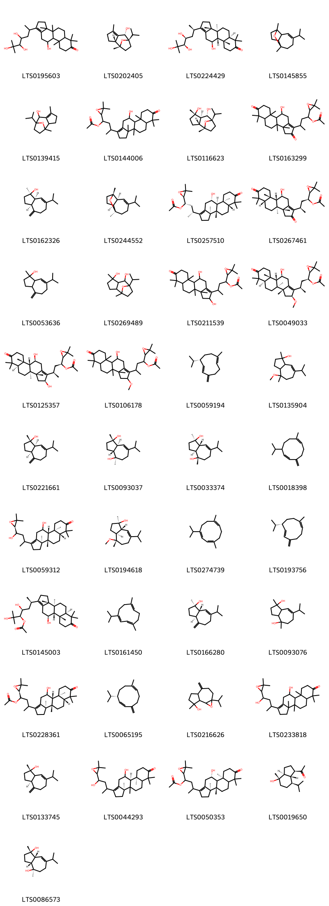
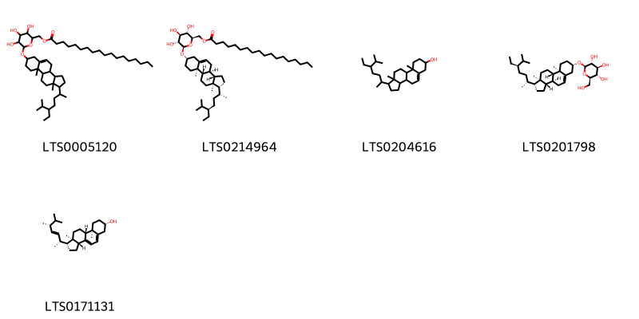
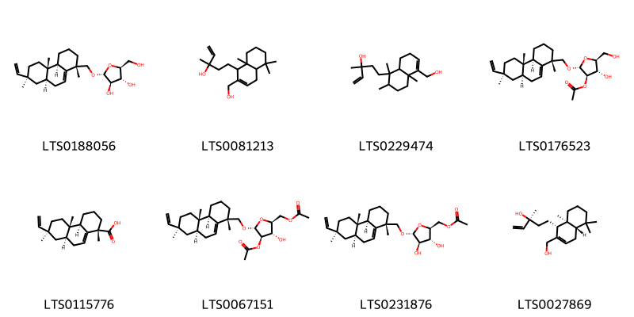
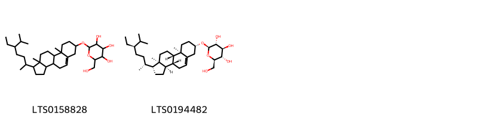

!!! abstract "Tóm tắt"

    Họ Alismataceae gồm khoảng 2 chi và 6 loài được một số cộng đồng tại các quốc gia như Turkey, Elsewhere, Japan*, Haiti, China, Egypt sử dụng trong một số trường hợp nan, Chất làm se, Hemostat, Chất độc, Sudorific, Thuốc lợi tiểu, Demulcent, Vesicant, Thuốc lợi tiểu, Chất làm se, Chất độc, Thuốc lợi tiểu, Chất làm se, Discutient, Thuốc lợi tiểu, Thuốc lợi tiểu, Chất làm lạnh, Chất làm lạnh, Dạ dày, Thuốc bổ, Chất làm se, Thuốc lợi tiểu, Chất độc, Chất làm se, Discutient, Discutient, Chất làm se.

!!! info "DrDuke"

    James A. Duke sinh năm 1929-2017 là một nhà thực vật học người Mỹ. Đây là một trong những tác giả hàng đầu trong lĩnh vực dược dân tộc học với cuốn *CRC Handbook of Medicinal Herbs* và chính là người xây dựng lên cơ sở dữ liệu về hợp chất tự nhiên và dược dân tộc học tại Bộ nông nghiệp Hoa Kỳ. Các thông tin được đăng tải tại website [Dr. Duke's Phytochemical and Ethnobotanical Databases](https://phytochem.nal.usda.gov/). 
    Trong suốt thập niên 1970, ông lãnh đạo the Plant Taxonomy Laboratory, Plant Genetics and Germplasm Institute of the Agricultural Research Service, U.S. Department of Agriculture.
    Trong tài liệu này, các thông tin về dược dân tộc của các dược liệu được trích dẫn từ tài liệu của James A. Ducke với sự trợ giúp của phần mềm dịch thuật từ tiếng Anh sang tiếng Việt.
   

# Chi Alisma

??? note "Danh sách các dược liệu thuộc chi"
    
	 - *Alisma gramineum*
	 - *Alisma orientale*
	 - *Alisma plantago*
	 - *Alisma plantago-aquatica*

---
## Alisma gramineum
### Thông tin về thực vật

!!! info "Phân loại thực vật của *Alisma gramineum* từ GIBF:"
    - **Kingdom:** Plantae
    - **Phylum:** Tracheophyta
    - **Order:** Alismatales
    - **Family:** Alismataceae
    - **Genus:** Alisma
    - **Species:** *Alisma gramineum*

 

| Label (VI)   | Label (EN)   | Scientific Name   | Descriptions (VI)   | Descriptions (EN)   | Also Known As (VI)   | Also Known As (EN)                                                                                                                                                                                       |
|:-------------|:-------------|:------------------|:--------------------|:--------------------|:---------------------|:---------------------------------------------------------------------------------------------------------------------------------------------------------------------------------------------------------|
| N/A          | N/A          | Alisma gramineum  |                     | species of plant    | ['']                 | ['lanceleaf water plantain', 'grass-leaved water plantain', 'narrowleaf water plantain', 'ribbon-leaved water-plantain', 'Geyer waterplantain', 'grasslike waterplantain', 'narrow-leaf water-plantain'] |

#### Phân bố trên thế giới

**Từ CSDL GIBF** Ukraine, Netherlands, Italy, Lithuania, Japan, Germany, Belgium, Estonia, Hungary, Switzerland, Russian Federation, United States of America, Austria, France, Kazakhstan, Croatia, Canada, Uzbekistan

#### Phân bố tại Việt Nam

**Từ CSDL GIBF**: Không có ghi nhận ở Việt Nam

---
### Thành phần hóa học
        
- Theo cơ sở dữ liệu lotus: Từ loài *Alisma gramineum* đã phân lập và xác định được Chưa có hoạt chất nào được phân lập. hoạt chất thuộc về các nhóm Không có hoạt chất nào được phân lập. 

Không có hình ảnh nào được tạo ra

---

### Dược dân tộc học

Danh sách các quốc gia có sử dụng *Alisma gramineum* trong điều trị các bệnh. 

| Country   | Disease                      | Bệnh                                  |
|:----------|:-----------------------------|:--------------------------------------|
| Egypt     | Astringent, Poison, Diuretic | Chất làm se, Chất độc, Thuốc lợi tiểu |

---

---
## Alisma orientale
### Thông tin về thực vật

!!! info "Phân loại thực vật của *Alisma plantago-aquatica* từ GIBF:"
    - **Kingdom:** Plantae
    - **Phylum:** Tracheophyta
    - **Order:** Alismatales
    - **Family:** Alismataceae
    - **Genus:** Alisma
    - **Species:** *Alisma plantago-aquatica*

 

| Label (VI)   | Label (EN)   | Scientific Name   | Descriptions (VI)   | Descriptions (EN)   | Also Known As (VI)   | Also Known As (EN)   |
|:-------------|:-------------|:------------------|:--------------------|:--------------------|:---------------------|:---------------------|
| N/A          | N/A          | Alisma orientale  | loài thực vật       | species of plant    | ['']                 | ['']                 |

#### Phân bố trên thế giới

**Từ CSDL GIBF** Ukraine, nan, Korea, Republic of, Korea (Democratic People’s Republic of), Russian Federation, United States of America, Norway, China

#### Phân bố tại Việt Nam

**Từ CSDL GIBF**: Không có ghi nhận ở Việt Nam

---
### Thành phần hóa học
        
- Theo cơ sở dữ liệu lotus: Từ loài *Alisma plantago-aquatica* đã phân lập và xác định được Chưa có hoạt chất nào được phân lập. hoạt chất thuộc về các nhóm Không có hoạt chất nào được phân lập. 

Không có hình ảnh nào được tạo ra

---

### Dược dân tộc học

Danh sách các quốc gia có sử dụng *Alisma plantago-aquatica* trong điều trị các bệnh. 

| Country   | Disease   | Bệnh           |
|:----------|:----------|:---------------|
| Japan*    | Diuretic  | Thuốc lợi tiêu |

---

---
## Alisma plantago
### Thông tin về thực vật

!!! info "Phân loại thực vật của *Alisma plantago-aquatica* từ GIBF:"
    - **Kingdom:** Plantae
    - **Phylum:** Tracheophyta
    - **Order:** Alismatales
    - **Family:** Alismataceae
    - **Genus:** Alisma
    - **Species:** *Alisma plantago-aquatica*

 

| Label (VI)   | Label (EN)   | Scientific Name   | Descriptions (VI)   | Descriptions (EN)   | Also Known As (VI)   | Also Known As (EN)   |
|:-------------|:-------------|:------------------|:--------------------|:--------------------|:---------------------|:---------------------|
| N/A          | N/A          | Alisma plantago   |                     |                     | ['']                 | ['']                 |

#### Phân bố trên thế giới

**Từ CSDL GIBF** nan, Bulgaria, Italy, Japan, Belgium, Estonia, Canada, Ukraine, Lithuania, Belarus, Korea, Republic of, Spain, United States of America, Sweden, Chile, Germany, Iran (Islamic Republic of), Egypt, Armenia, Austria, France, China, United Kingdom of Great Britain and Northern Ireland, India, Korea (Democratic People’s Republic of), Poland

#### Phân bố tại Việt Nam

**Từ CSDL GIBF**: Không có ghi nhận ở Việt Nam

---
### Thành phần hóa học
        
- Theo cơ sở dữ liệu lotus: Từ loài *Alisma plantago-aquatica* đã phân lập và xác định được 200 hoạt chất thuộc về các nhóm Fatty Acyls, Prenol lipids, Pyrimidine nucleosides, Steroids and steroid derivatives, Organooxygen compounds. 

|    | chemicalTaxonomyClassyfireClass   |   smiles_count |
|---:|:----------------------------------|---------------:|
|  0 | Fatty Acyls                       |              1 |
|  1 | Organooxygen compounds            |              4 |
|  2 | Prenol lipids                     |             41 |
|  3 | Pyrimidine nucleosides            |              2 |
|  4 | Steroids and steroid derivatives  |              5 |

#### Nhóm Fatty Acyls
<figure markdown="span">
    { width=100% }
    <figcaption>Hình ảnh cấu trúc hóa học của 1 hoạt chất thuộc nhóm Fatty Acyls gồm ['docosanol (LTS0250870)'].</figcaption>
</figure>
#### Nhóm Organooxygen compounds
<figure markdown="span">
    { width=100% }
    <figcaption>Hình ảnh cấu trúc hóa học của 4 hoạt chất thuộc nhóm Organooxygen compounds gồm ['(-)-inositol (LTS0047771)', '(2r,3s,4s,5r)-2,5-bis(hydroxymethyl)-2-methoxyoxolane-3,4-diol (LTS0191480)', '(3r,4r,5s,6r)-6-(hydroxymethyl)-5-{[(2s,3r,4s,5r,6r)-3,4,5-trihydroxy-6-(hydroxymethyl)oxan-2-yl]oxy}oxane-2,3,4-triol (LTS0270269)', 'galactitol (LTS0012947)'].</figcaption>
</figure>
#### Nhóm Prenol lipids
<figure markdown="span">
    { width=100% }
    <figcaption>Hình ảnh cấu trúc hóa học của 41 hoạt chất thuộc nhóm Prenol lipids gồm ['10-hydroxy-3a,3b,6,6,9a-pentamethyl-1-(4,5,6-trihydroxy-6-methylheptan-2-yl)-2h,3h,4h,5h,5ah,8h,9h,9bh,10h,11h-cyclopenta[a]phenanthren-7-one (LTS0195603)', '(1r,2r,7s,8r)-8-isopropyl-1,5-dimethyl-11-oxatricyclo[6.2.1.0²,⁶]undec-5-en-7-ol (LTS0202405)', '(3ar,3bs,5ar,9as,9bs,10s)-10-hydroxy-3a,3b,6,6,9a-pentamethyl-1-[(2r,4s,5r)-4,5,6-trihydroxy-6-methylheptan-2-yl]-2h,3h,4h,5h,5ah,8h,9h,9bh,10h,11h-cyclopenta[a]phenanthren-7-one (LTS0224429)', '4-isopropyl-7,9-dimethyl-8-oxatricyclo[5.4.0.0²,⁹]undec-3-ene (LTS0145855)', '8-isopropyl-1,5-dimethyl-11-oxatricyclo[6.2.1.0²,⁶]undec-5-en-7-ol (LTS0139415)', '1-(3,3-dimethyloxiran-2-yl)-3-{10-hydroxy-3a,3b,6,6,9a-pentamethyl-7-oxo-2h,3h,4h,5h,5ah,8h,9h,9bh,10h,11h-cyclopenta[a]phenanthren-1-yl}butyl acetate (LTS0144006)', '(1r,2r,5s,6r,7s,8r)-8-isopropyl-1,5-dimethyl-11-oxatricyclo[6.2.1.0²,⁶]undecane-5,7-diol (LTS0116623)', '1-(3,3-dimethyloxiran-2-yl)-3-{10-hydroxy-3a,3b,6,6,9a-pentamethyl-2,7-dioxo-3h,4h,5h,5ah,8h,9h,9bh,10h,11h-cyclopenta[a]phenanthren-1-yl}butyl acetate (LTS0163299)', '(1r,3as,8as)-7-isopropyl-1-methyl-4-methylidene-2,3,3a,5,6,8a-hexahydroazulen-1-ol (LTS0162326)', '(1s,2s,7r,9r)-4-isopropyl-7,9-dimethyl-8-oxatricyclo[5.4.0.0²,⁹]undec-3-ene (LTS0244552)', '(1s,3r)-3-[(3ar,3bs,5ar,9as,9bs,10s)-10-hydroxy-3a,3b,6,6,9a-pentamethyl-7-oxo-2h,3h,4h,5h,5ah,8h,9h,9bh,10h,11h-cyclopenta[a]phenanthren-1-yl]-1-[(2r)-3,3-dimethyloxiran-2-yl]butyl acetate (LTS0257510)', '(1s,3r)-3-[(3ar,3bs,5as,9as,9bs,10s)-10-hydroxy-3a,3b,6,6,9a-pentamethyl-2,7-dioxo-3h,4h,5h,5ah,8h,9h,9bh,10h,11h-cyclopenta[a]phenanthren-1-yl]-1-[(2r)-3,3-dimethyloxiran-2-yl]butyl acetate (LTS0267461)', '7-isopropyl-1-methyl-4-methylidene-2,3,3a,5,6,8a-hexahydroazulen-1-ol (LTS0053636)', '8-isopropyl-1,5-dimethyl-11-oxatricyclo[6.2.1.0²,⁶]undecane-5,7-diol (LTS0269489)', '3-{2,10-dihydroxy-3a,3b,6,6,9a-pentamethyl-7-oxo-2h,3h,4h,5h,5ah,8h,9h,9bh,10h,11h-cyclopenta[a]phenanthren-1-yl}-1-(3,3-dimethyloxiran-2-yl)butyl acetate (LTS0211539)', '(1s,3r)-3-[(2s,3ar,3bs,5ar,9as,9bs,10s)-10-hydroxy-2-methoxy-3a,3b,6,6,9a-pentamethyl-7-oxo-2h,3h,4h,5h,5ah,8h,9h,9bh,10h,11h-cyclopenta[a]phenanthren-1-yl]-1-[(2r)-3,3-dimethyloxiran-2-yl]butyl acetate (LTS0049033)', '(1s,3r)-3-[(2s,3ar,3bs,5ar,9as,9bs,10s)-2,10-dihydroxy-3a,3b,6,6,9a-pentamethyl-7-oxo-2h,3h,4h,5h,5ah,8h,9h,9bh,10h,11h-cyclopenta[a]phenanthren-1-yl]-1-[(2r)-3,3-dimethyloxiran-2-yl]butyl acetate (LTS0125357)', '1-(3,3-dimethyloxiran-2-yl)-3-{10-hydroxy-2-methoxy-3a,3b,6,6,9a-pentamethyl-7-oxo-2h,3h,4h,5h,5ah,8h,9h,9bh,10h,11h-cyclopenta[a]phenanthren-1-yl}butyl acetate (LTS0106178)', '(-)-germacrene d (LTS0059194)', '7-isopropyl-4-methoxy-1,4-dimethyl-2,3,3a,5,6,8a-hexahydroazulen-1-ol (LTS0135904)', '(1s,3as,8as)-7-isopropyl-1-methyl-4-methylidene-2,3,3a,5,6,8a-hexahydroazulen-1-ol (LTS0221661)', '(1s,3ar,4r,8as)-7-isopropyl-1,4-dimethyl-2,3,3a,5,6,8a-hexahydroazulene-1,4-diol (LTS0093037)', '(-)-alismoxide (LTS0033374)', '8-isopropyl-1-methyl-5-methylidenecyclodeca-1,6-diene (LTS0018398)', '(3ar,3bs,5ar,9as,9br)-1-{4-[(2r)-3,3-dimethyloxiran-2-yl]-4-hydroxybutan-2-yl}-10-hydroxy-3a,3b,6,6,9a-pentamethyl-2h,3h,4h,5h,5ah,8h,9h,9bh,10h,11h-cyclopenta[a]phenanthren-7-one (LTS0059312)', '(1r,3as,4s,8ar)-7-isopropyl-4-methoxy-1,4-dimethyl-2,3,3a,5,6,8a-hexahydroazulen-1-ol (LTS0194618)', '4-isopropyl-1,7-dimethylcyclodeca-1,3,7-triene (LTS0274739)', '(6e,8s)-8-isopropyl-1-methyl-5-methylidenecyclodeca-1,6-diene (LTS0193756)', '(3r,4s,6r)-6-[(3ar,3bs,5ar,9as,9bs,10s)-10-hydroxy-3a,3b,6,6,9a-pentamethyl-7-oxo-2h,3h,4h,5h,5ah,8h,9h,9bh,10h,11h-cyclopenta[a]phenanthren-1-yl]-2,4-dihydroxy-2-methylheptan-3-yl acetate (LTS0145003)', 'germacrene c (LTS0161450)', '(1r,3as,8ar)-7-isopropyl-1-methyl-4-methylidene-2,3,3a,5,6,8a-hexahydroazulen-1-ol (LTS0166280)', '7-isopropyl-1,4-dimethyl-2,3,3a,5,6,8a-hexahydroazulene-1,4-diol (LTS0093076)', '3-[(3ar,3bs,5ar,9as,9br)-10-hydroxy-3a,3b,6,6,9a-pentamethyl-7-oxo-2h,3h,4h,5h,5ah,8h,9h,9bh,10h,11h-cyclopenta[a]phenanthren-1-yl]-1-[(2r)-3,3-dimethyloxiran-2-yl]butyl acetate (LTS0228361)', '(1z,6z,8s)-8-isopropyl-1-methyl-5-methylidenecyclodeca-1,6-diene (LTS0065195)', '1a-isopropyl-7-methyl-4-methylidene-hexahydro-2h-azuleno[4,5-b]oxiren-7-ol (LTS0216626)', '1-[4-(3,3-dimethyloxiran-2-yl)-4-hydroxybutan-2-yl]-10-hydroxy-3a,3b,6,6,9a-pentamethyl-2h,3h,4h,5h,5ah,8h,9h,9bh,10h,11h-cyclopenta[a]phenanthren-7-one (LTS0233818)', '(1s,3as)-7-isopropyl-1-methyl-4-methylidene-2,3,3a,5,6,8a-hexahydroazulen-1-ol (LTS0133745)', '(3ar,9as,9bs)-1-[4-(3,3-dimethyloxiran-2-yl)-4-hydroxybutan-2-yl]-10-hydroxy-3a,3b,6,6,9a-pentamethyl-2h,3h,4h,5h,5ah,8h,9h,9bh,10h,11h-cyclopenta[a]phenanthren-7-one (LTS0044293)', '3-[(3ar,3bs,9as,10s)-10-hydroxy-3a,3b,6,6,9a-pentamethyl-7-oxo-2h,3h,4h,5h,5ah,8h,9h,9bh,10h,11h-cyclopenta[a]phenanthren-1-yl]-1-(3,3-dimethyloxiran-2-yl)butyl acetate (LTS0050353)', '1-[(1r,3as,4s,7r,7ar)-4-hydroxy-7-isopropyl-4-methyl-octahydroinden-1-yl]ethanone (LTS0019650)', '(1s,3ar,4r,8ar)-7-isopropyl-1,4-dimethyl-2,3,3a,5,6,8a-hexahydroazulene-1,4-diol (LTS0086573)'].</figcaption>
</figure>
#### Nhóm Pyrimidine nucleosides
<figure markdown="span">
    { width=100% }
    <figcaption>Hình ảnh cấu trúc hóa học của 2 hoạt chất thuộc nhóm Pyrimidine nucleosides gồm ['thymidine (LTS0162810)', 'uridine (LTS0220125)'].</figcaption>
</figure>
#### Nhóm Steroids and steroid derivatives
<figure markdown="span">
    { width=100% }
    <figcaption>Hình ảnh cấu trúc hóa học của 5 hoạt chất thuộc nhóm Steroids and steroid derivatives gồm ['(6-{[1-(5-ethyl-6-methylheptan-2-yl)-9a,11a-dimethyl-1h,2h,3h,3ah,3bh,4h,6h,7h,8h,9h,9bh,10h,11h-cyclopenta[a]phenanthren-7-yl]oxy}-3,4,5-trihydroxyoxan-2-yl)methyl octadecanoate (LTS0005120)', '[(2r,3s,4s,5r,6r)-6-{[(1r,3as,3bs,7s,9ar,9bs,11ar)-1-[(2r,5r)-5-ethyl-6-methylheptan-2-yl]-9a,11a-dimethyl-1h,2h,3h,3ah,3bh,4h,6h,7h,8h,9h,9bh,10h,11h-cyclopenta[a]phenanthren-7-yl]oxy}-3,4,5-trihydroxyoxan-2-yl]methyl octadecanoate (LTS0214964)', 'stigmast-5-en-3-ol, (3β)- (LTS0204616)', 'sitogluside (LTS0201798)', 'ergosterol (LTS0171131)'].</figcaption>
</figure>

---

### Dược dân tộc học

Danh sách các quốc gia có sử dụng *Alisma plantago-aquatica* trong điều trị các bệnh. 

| Country   | Disease                                                                                          | Bệnh                                                                                                                     |
|:----------|:-------------------------------------------------------------------------------------------------|:-------------------------------------------------------------------------------------------------------------------------|
| China     | Astringent, Discutient, Diuretic, Diuretic, Diuretic, Refrigerant, Refrigerant, Stomachic, Tonic | Chất làm se, Không chú ý, Thuốc lợi tiểu, Thuốc lợi tiểu, Thuốc lợi tiểu, Chất làm lạnh, Chất làm lạnh, Dạ dày, Thuốc bổ |
| Turkey    | Astringent, Hemostat, Poison, Sudorific, Diuretic                                                | Chất làm se, Hemostat, Poison, Sudorific, lợi tiểu                                                                       |

---

---
## Alisma plantagoaquatica
### Thông tin về thực vật

!!! info "Phân loại thực vật của *Alisma plantago-aquatica* từ GIBF:"
    - **Kingdom:** Plantae
    - **Phylum:** Tracheophyta
    - **Order:** Alismatales
    - **Family:** Alismataceae
    - **Genus:** Alisma
    - **Species:** *Alisma plantago-aquatica*

 

| Label (VI)   | Label (EN)   | Scientific Name   | Descriptions (VI)   | Descriptions (EN)   | Also Known As (VI)   | Also Known As (EN)   |
|:-------------|:-------------|:------------------|:--------------------|:--------------------|:---------------------|:---------------------|
| N/A          | N/A          | Alisma plantago   |                     |                     | ['']                 | ['']                 |

#### Phân bố trên thế giới

**Từ CSDL GIBF** Australia, Japan, Belgium, Slovakia, Argentina, Ukraine, Denmark, Netherlands, Belarus, Luxembourg, Malta, Hungary, Portugal, Russian Federation, Sweden, Croatia, South Africa, Czechia, Germany, Romania, Switzerland, Austria, France, United Kingdom of Great Britain and Northern Ireland, Poland, New Zealand

#### Phân bố tại Việt Nam

**Từ CSDL GIBF**: Không có ghi nhận ở Việt Nam

---
### Thành phần hóa học
        
- Theo cơ sở dữ liệu lotus: Từ loài *Alisma plantago-aquatica* đã phân lập và xác định được Chưa có hoạt chất nào được phân lập. hoạt chất thuộc về các nhóm Không có hoạt chất nào được phân lập. 

Không có hình ảnh nào được tạo ra

---

### Dược dân tộc học

Danh sách các quốc gia có sử dụng *Alisma plantago-aquatica* trong điều trị các bệnh. 

| Country   | Disease                      | Bệnh                            |
|:----------|:-----------------------------|:--------------------------------|
| China     | nan                          | Ở đây                           |
| Egypt     | Astringent, Diuretic, Poison | Chất làm se, lợi tiểu, chất độc |

---

# Chi Sagittaria

??? note "Danh sách các dược liệu thuộc chi"
    
	 - *Sagittaria lancifolia*
	 - *Sagittaria sagittifolia*

---
## Sagittaria lancifolia
### Thông tin về thực vật

!!! info "Phân loại thực vật của *Sagittaria lancifolia* từ GIBF:"
    - **Kingdom:** Plantae
    - **Phylum:** Tracheophyta
    - **Order:** Alismatales
    - **Family:** Alismataceae
    - **Genus:** Sagittaria
    - **Species:** *Sagittaria lancifolia*

 

| Label (VI)   | Label (EN)   | Scientific Name       | Descriptions (VI)   | Descriptions (EN)   | Also Known As (VI)   | Also Known As (EN)   |
|:-------------|:-------------|:----------------------|:--------------------|:--------------------|:---------------------|:---------------------|
| N/A          | N/A          | Sagittaria lancifolia | loài thực vật       | species of plant    | ['']                 | ['']                 |

#### Phân bố trên thế giới

**Từ CSDL GIBF** Puerto Rico, Panama, Thailand, Honduras, United States of America, Mexico, French Guiana

#### Phân bố tại Việt Nam

**Từ CSDL GIBF**: Không có ghi nhận ở Việt Nam

---
### Thành phần hóa học
        
- Theo cơ sở dữ liệu lotus: Từ loài *Sagittaria lancifolia* đã phân lập và xác định được Chưa có hoạt chất nào được phân lập. hoạt chất thuộc về các nhóm Không có hoạt chất nào được phân lập. 

Không có hình ảnh nào được tạo ra

---

### Dược dân tộc học

Danh sách các quốc gia có sử dụng *Sagittaria lancifolia* trong điều trị các bệnh. 

| Country   | Disease   | Bệnh              |
|:----------|:----------|:------------------|
| Haiti     | Vesicant  | Chất gây bọng mắt |

---

---
## Sagittaria sagittifolia
### Thông tin về thực vật

!!! info "Phân loại thực vật của *Sagittaria sagittifolia* từ GIBF:"
    - **Kingdom:** Plantae
    - **Phylum:** Tracheophyta
    - **Order:** Alismatales
    - **Family:** Alismataceae
    - **Genus:** Sagittaria
    - **Species:** *Sagittaria sagittifolia*

 

| Label (VI)   | Label (EN)   | Scientific Name         | Descriptions (VI)   | Descriptions (EN)   | Also Known As (VI)   | Also Known As (EN)   |
|:-------------|:-------------|:------------------------|:--------------------|:--------------------|:---------------------|:---------------------|
| N/A          | N/A          | Sagittaria sagittifolia |                     | species of plant    | ['']                 | ['']                 |

#### Phân bố trên thế giới

**Từ CSDL GIBF** Ukraine, Finland, Netherlands, Hong Kong, Lithuania, Germany, Belgium, Estonia, Ireland, Switzerland, Russian Federation, Poland, United Kingdom of Great Britain and Northern Ireland, Austria

#### Phân bố tại Việt Nam

**Từ CSDL GIBF**: Không có ghi nhận ở Việt Nam

---
### Thành phần hóa học
        
- Theo cơ sở dữ liệu lotus: Từ loài *Sagittaria sagittifolia* đã phân lập và xác định được 31 hoạt chất thuộc về các nhóm Prenol lipids, Steroids and steroid derivatives, Indoles and derivatives, Carboxylic acids and derivatives. 

|    | chemicalTaxonomyClassyfireClass   |   smiles_count |
|---:|:----------------------------------|---------------:|
|  0 | Carboxylic acids and derivatives  |             19 |
|  1 | Indoles and derivatives           |              1 |
|  2 | Prenol lipids                     |              8 |
|  3 | Steroids and steroid derivatives  |              2 |

#### Nhóm Carboxylic acids and derivatives
<figure markdown="span">
    { width=100% }
    <figcaption>Hình ảnh cấu trúc hóa học của 19 hoạt chất thuộc nhóm Carboxylic acids and derivatives gồm ['l-threonine (LTS0184056)', 'l-serine (LTS0106692)', 'l-alanine (LTS0042208)', 'l-lysine (LTS0068734)', 'd-methionine (LTS0108782)', 'l-aspartic acid (LTS0205466)', 'l-proline (LTS0090383)', 'd-phenylalanine (LTS0048920)', 'l-methionine (LTS0196746)', 'l-isoleucine (LTS0249538)', '(2s)-2-(phenylamino)propanoic acid (LTS0199539)', 'l-valine (LTS0231703)', 'd-aspartic acid (LTS0144001)', 'd-alanine (LTS0272178)', 'l-glutamic acid (LTS0037133)', 'l-arginine (LTS0064737)', 'l-tyrosine (LTS0029981)', 'l-leucine (LTS0113423)', 'l-histidine (LTS0094081)'].</figcaption>
</figure>
#### Nhóm Indoles and derivatives
<figure markdown="span">
    { width=100% }
    <figcaption>Hình ảnh cấu trúc hóa học của 1 hoạt chất thuộc nhóm Indoles and derivatives gồm ['l-tryptophan (LTS0263809)'].</figcaption>
</figure>
#### Nhóm Prenol lipids
<figure markdown="span">
    { width=100% }
    <figcaption>Hình ảnh cấu trúc hóa học của 8 hoạt chất thuộc nhóm Prenol lipids gồm ['(2r,3r,4r,5s)-2-{[(1s,4ar,4bs,7s,8as)-7-ethenyl-1,4b,7-trimethyl-3,4,4a,5,6,8,8a,9-octahydro-2h-phenanthren-1-yl]methoxy}-5-(hydroxymethyl)oxolane-3,4-diol (LTS0188056)', '5-[2-(hydroxymethyl)-5,5,8a-trimethyl-1,4,4a,6,7,8-hexahydronaphthalen-1-yl]-3-methylpent-1-en-3-ol (LTS0081213)', '5-[5-(hydroxymethyl)-1,2,4a-trimethyl-2,3,4,7,8,8a-hexahydronaphthalen-1-yl]-3-methylpent-1-en-3-ol (LTS0229474)', '(2r,3r,4s,5s)-2-{[(1s,4ar,4bs,7s,8as)-7-ethenyl-1,4b,7-trimethyl-3,4,4a,5,6,8,8a,9-octahydro-2h-phenanthren-1-yl]methoxy}-4-hydroxy-5-(hydroxymethyl)oxolan-3-yl acetate (LTS0176523)', '(1s,4ar,4bs,7s,8as)-7-ethenyl-1,4b,7-trimethyl-3,4,4a,5,6,8,8a,9-octahydro-2h-phenanthrene-1-carboxylic acid (LTS0115776)', '[(2s,3s,4r,5r)-5-{[(1s,4ar,4bs,7s,8as)-7-ethenyl-1,4b,7-trimethyl-3,4,4a,5,6,8,8a,9-octahydro-2h-phenanthren-1-yl]methoxy}-4-(acetyloxy)-3-hydroxyoxolan-2-yl]methyl acetate (LTS0067151)', '[(2s,3r,4r,5r)-5-{[(1s,4ar,4bs,7s,8as)-7-ethenyl-1,4b,7-trimethyl-3,4,4a,5,6,8,8a,9-octahydro-2h-phenanthren-1-yl]methoxy}-3,4-dihydroxyoxolan-2-yl]methyl acetate (LTS0231876)', '(3s)-5-[(1r,4as,8as)-2-(hydroxymethyl)-5,5,8a-trimethyl-1,4,4a,6,7,8-hexahydronaphthalen-1-yl]-3-methylpent-1-en-3-ol (LTS0027869)'].</figcaption>
</figure>
#### Nhóm Steroids and steroid derivatives
<figure markdown="span">
    { width=100% }
    <figcaption>Hình ảnh cấu trúc hóa học của 2 hoạt chất thuộc nhóm Steroids and steroid derivatives gồm ['2-{[1-(5-ethyl-6-methylheptan-2-yl)-9a,11a-dimethyl-1h,2h,3h,3ah,3bh,4h,6h,7h,8h,9h,9bh,10h,11h-cyclopenta[a]phenanthren-7-yl]oxy}-6-(hydroxymethyl)oxane-3,4,5-triol (LTS0158828)', '(2r,3r,4s,5s,6r)-2-{[(1r,3ar,3br,7s,9ar,9bs,11ar)-1-[(2r,5r)-5-ethyl-6-methylheptan-2-yl]-9a,11a-dimethyl-1h,2h,3h,3ah,3bh,4h,6h,7h,8h,9h,9bh,10h,11h-cyclopenta[a]phenanthren-7-yl]oxy}-6-(hydroxymethyl)oxane-3,4,5-triol (LTS0194482)'].</figcaption>
</figure>

---

### Dược dân tộc học

Danh sách các quốc gia có sử dụng *Sagittaria sagittifolia* trong điều trị các bệnh. 

| Country   | Disease                                        | Bệnh                                    |
|:----------|:-----------------------------------------------|:----------------------------------------|
| Elsewhere | Astringent, Discutient, Discutient, Astringent | Làm se, phân biệt, phân biệt, phân biệt |
| Turkey    | Demulcent                                      | dịu, giảm kích thích                    |

---

