!!! abstract "Tóm tắt"

    Họ Aloaceae gồm khoảng 1 chi và 8 loài được một số cộng đồng tại các quốc gia như Haiti, ain, Elsewhere, Trinidad, Panama, Nepal, Egypt, India, Japan*, Africa(Swahili), Turkey, China, Lesotho, Malaya sử dụng trong một số trường hợp QUERY LENGTH LIMIT EXCEEDED. MAX ALLOWED QUERY : 500 CHARS.

!!! info "DrDuke"

    James A. Duke sinh năm 1929-2017 là một nhà thực vật học người Mỹ. Đây là một trong những tác giả hàng đầu trong lĩnh vực dược dân tộc học với cuốn *CRC Handbook of Medicinal Herbs* và chính là người xây dựng lên cơ sở dữ liệu về hợp chất tự nhiên và dược dân tộc học tại Bộ nông nghiệp Hoa Kỳ. Các thông tin được đăng tải tại website [Dr. Duke's Phytochemical and Ethnobotanical Databases](https://phytochem.nal.usda.gov/). 
    Trong suốt thập niên 1970, ông lãnh đạo the Plant Taxonomy Laboratory, Plant Genetics and Germplasm Institute of the Agricultural Research Service, U.S. Department of Agriculture.
    Trong tài liệu này, các thông tin về dược dân tộc của các dược liệu được trích dẫn từ tài liệu của James A. Ducke với sự trợ giúp của phần mềm dịch thuật từ tiếng Anh sang tiếng Việt.
   

# Chi Aloe

??? note "Danh sách các dược liệu thuộc chi"
    
	 - *Aloe barbadense*
	 - *Aloe barbadensis*
	 - *Aloe ecklonis*
	 - *Aloe ferox*
	 - *Aloe rabaiensis*
	 - *Aloe saponaria*
	 - *Aloe vera*
	 - *Aloe zebria*

---
## Aloe barbadense
### Thông tin về thực vật

!!! info "Phân loại thực vật của *Aloe vera* từ GIBF:"
    - **Kingdom:** Plantae
    - **Phylum:** Tracheophyta
    - **Order:** Asparagales
    - **Family:** Asphodelaceae
    - **Genus:** Aloe
    - **Species:** *Aloe vera*

 

| Label (VI)   | Label (EN)   | Scientific Name     | Descriptions (VI)   | Descriptions (EN)   | Also Known As (VI)   | Also Known As (EN)   |
|:-------------|:-------------|:--------------------|:--------------------|:--------------------|:---------------------|:---------------------|
| N/A          | N/A          | Picramnia pentandra | loài thực vật       | species of plant    | ['']                 | ['']                 |

#### Phân bố trên thế giới

**Từ CSDL GIBF** Honduras, nan, unknown or invalid, Spain, Dominica, French Polynesia, Kenya, Jamaica, Puerto Rico, India, Nigeria, Cuba, Bahamas, Barbados, Brazil, Peru, Mexico, Angola, Bolivia (Plurinational State of), Paraguay, New Caledonia, Ecuador, United States of America, Italy, Cabo Verde, Oman

#### Phân bố tại Việt Nam

**Từ CSDL GIBF**: Không có ghi nhận ở Việt Nam

---
### Thành phần hóa học
        
- Theo cơ sở dữ liệu lotus: Từ loài *Aloe vera* đã phân lập và xác định được Chưa có hoạt chất nào được phân lập. hoạt chất thuộc về các nhóm Không có hoạt chất nào được phân lập. 

Không có hình ảnh nào được tạo ra

---

### Dược dân tộc học

Danh sách các quốc gia có sử dụng *Aloe vera* trong điều trị các bệnh. 

| Country   | Disease                                            | Bệnh                                                                                                                                                                                                |
|:----------|:---------------------------------------------------|:----------------------------------------------------------------------------------------------------------------------------------------------------------------------------------------------------|
| Haiti     | Apertif, Diuretic, Emollient, Larvicide, Purgative | MYMEMORY WARNING: YOU USED ALL AVAILABLE FREE TRANSLATIONS FOR TODAY. NEXT AVAILABLE IN  18 HOURS 40 MINUTES 35 SECONDS VISIT HTTPS://MYMEMORY.TRANSLATED.NET/DOC/USAGELIMITS.PHP TO TRANSLATE MORE |

---

---
## Aloe barbadensis
### Thông tin về thực vật

!!! info "Phân loại thực vật của *Aloe vera* từ GIBF:"
    - **Kingdom:** Plantae
    - **Phylum:** Tracheophyta
    - **Order:** Asparagales
    - **Family:** Asphodelaceae
    - **Genus:** Aloe
    - **Species:** *Aloe vera*

 

| Label (VI)   | Label (EN)   | Scientific Name   | Descriptions (VI)   | Descriptions (EN)   | Also Known As (VI)   | Also Known As (EN)   |
|:-------------|:-------------|:------------------|:--------------------|:--------------------|:---------------------|:---------------------|
| N/A          | N/A          | Aloe barbadensis  | loài thực vật       | species of plant    | ['']                 | ['']                 |

#### Phân bố trên thế giới

**Từ CSDL GIBF** Honduras, nan, unknown or invalid, Spain, Dominica, French Polynesia, Kenya, Jamaica, Puerto Rico, India, Nigeria, Cuba, Bahamas, Barbados, Brazil, Peru, Mexico, Angola, Bolivia (Plurinational State of), Paraguay, New Caledonia, Ecuador, United States of America, Italy, Cabo Verde, Oman

#### Phân bố tại Việt Nam

**Từ CSDL GIBF**: Không có ghi nhận ở Việt Nam

---
### Thành phần hóa học
        
- Theo cơ sở dữ liệu lotus: Từ loài *Aloe vera* đã phân lập và xác định được 31 hoạt chất thuộc về các nhóm Organooxygen compounds, Benzopyrans, Anthracenes, Saccharolipids. 

|    | chemicalTaxonomyClassyfireClass   |   smiles_count |
|---:|:----------------------------------|---------------:|
|  0 | Anthracenes                       |             11 |
|  1 | Benzopyrans                       |              2 |
|  2 | Organooxygen compounds            |             12 |
|  3 | Saccharolipids                    |              6 |

#### Nhóm Anthracenes
<figure markdown="span">
    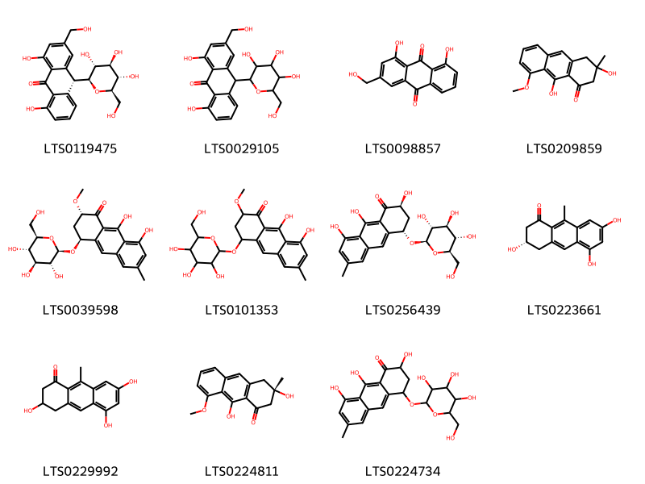{ width=100% }
    <figcaption>Hình ảnh cấu trúc hóa học của 11 hoạt chất thuộc nhóm Anthracenes gồm ['barbaloin (LTS0119475)', 'aloin (LTS0029105)', 'aloe emodin (LTS0098857)', '3,9-dihydroxy-8-methoxy-3-methyl-2,4-dihydroanthracen-1-one (LTS0209859)', '(2s,4s)-8,9-dihydroxy-2-methoxy-6-methyl-4-{[(2r,3r,4s,5s,6r)-3,4,5-trihydroxy-6-(hydroxymethyl)oxan-2-yl]oxy}-3,4-dihydro-2h-anthracen-1-one (LTS0039598)', '8,9-dihydroxy-2-methoxy-6-methyl-4-{[3,4,5-trihydroxy-6-(hydroxymethyl)oxan-2-yl]oxy}-3,4-dihydro-2h-anthracen-1-one (LTS0101353)', '(2s,4s)-2,8,9-trihydroxy-6-methyl-4-{[(2r,3r,4s,5s,6r)-3,4,5-trihydroxy-6-(hydroxymethyl)oxan-2-yl]oxy}-3,4-dihydro-2h-anthracen-1-one (LTS0256439)', '(3s)-3,5,7-trihydroxy-9-methyl-3,4-dihydro-2h-anthracen-1-one (LTS0223661)', '3,5,7-trihydroxy-9-methyl-3,4-dihydro-2h-anthracen-1-one (LTS0229992)', '(3s)-3,9-dihydroxy-8-methoxy-3-methyl-2,4-dihydroanthracen-1-one (LTS0224811)', '2,8,9-trihydroxy-6-methyl-4-{[3,4,5-trihydroxy-6-(hydroxymethyl)oxan-2-yl]oxy}-3,4-dihydro-2h-anthracen-1-one (LTS0224734)'].</figcaption>
</figure>
#### Nhóm Benzopyrans
<figure markdown="span">
    { width=100% }
    <figcaption>Hình ảnh cấu trúc hóa học của 2 hoạt chất thuộc nhóm Benzopyrans gồm ['3-(4-hydroxy-6-methoxy-3,4-dihydro-2h-1-benzopyran-3-yl)-6-methoxy-3,4-dihydro-2h-1-benzopyran-4-ol (LTS0076474)', '(3s,4s)-3-[(3r,4r)-4-hydroxy-6-methoxy-3,4-dihydro-2h-1-benzopyran-3-yl]-6-methoxy-3,4-dihydro-2h-1-benzopyran-4-ol (LTS0176064)'].</figcaption>
</figure>
#### Nhóm Organooxygen compounds
<figure markdown="span">
    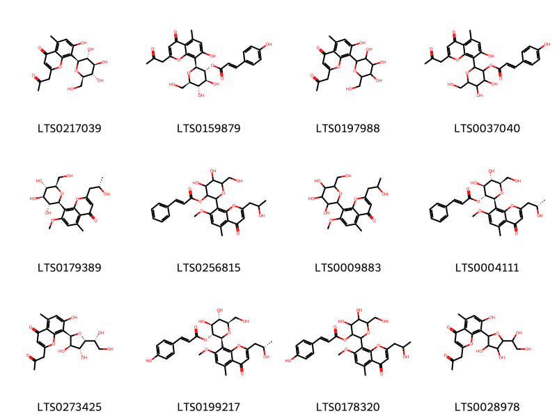{ width=100% }
    <figcaption>Hình ảnh cấu trúc hóa học của 12 hoạt chất thuộc nhóm Organooxygen compounds gồm ['aloesin (LTS0217039)', 'aloeresin a (LTS0159879)', '7-hydroxy-5-methyl-2-(2-oxopropyl)-8-[3,4,5-trihydroxy-6-(hydroxymethyl)oxan-2-yl]chromen-4-one (LTS0197988)', '4,5-dihydroxy-2-[7-hydroxy-5-methyl-4-oxo-2-(2-oxopropyl)chromen-8-yl]-6-(hydroxymethyl)oxan-3-yl 3-(4-hydroxyphenyl)prop-2-enoate (LTS0037040)', '2-[(2s)-2-hydroxypropyl]-7-methoxy-5-methyl-8-[(2s,3r,4r,5s,6r)-3,4,5-trihydroxy-6-(hydroxymethyl)oxan-2-yl]chromen-4-one (LTS0179389)', 'methyl aloesinyl cinnamate (LTS0256815)', '2-(2-hydroxypropyl)-7-methoxy-5-methyl-8-[3,4,5-trihydroxy-6-(hydroxymethyl)oxan-2-yl]chromen-4-one (LTS0009883)', '(2s,3r,4s,5s,6r)-4,5-dihydroxy-6-(hydroxymethyl)-2-{2-[(2s)-2-hydroxypropyl]-7-methoxy-5-methyl-4-oxochromen-8-yl}oxan-3-yl (2e)-3-phenylprop-2-enoate (LTS0004111)', '8-[(2r,3r,4r,5r)-5-[(1r)-1,2-dihydroxyethyl]-3,4-dihydroxyoxolan-2-yl]-7-hydroxy-5-methyl-2-(2-oxopropyl)chromen-4-one (LTS0273425)', '(2s,3r,4s,5s,6r)-4,5-dihydroxy-6-(hydroxymethyl)-2-{2-[(2s)-2-hydroxypropyl]-7-methoxy-5-methyl-4-oxochromen-8-yl}oxan-3-yl (2e)-3-(4-hydroxyphenyl)prop-2-enoate (LTS0199217)', '4,5-dihydroxy-6-(hydroxymethyl)-2-[2-(2-hydroxypropyl)-7-methoxy-5-methyl-4-oxochromen-8-yl]oxan-3-yl 3-(4-hydroxyphenyl)prop-2-enoate (LTS0178320)', '8-[5-(1,2-dihydroxyethyl)-3,4-dihydroxyoxolan-2-yl]-7-hydroxy-5-methyl-2-(2-oxopropyl)chromen-4-one (LTS0028978)'].</figcaption>
</figure>
#### Nhóm Saccharolipids
<figure markdown="span">
    { width=100% }
    <figcaption>Hình ảnh cấu trúc hóa học của 6 hoạt chất thuộc nhóm Saccharolipids gồm ['4-({3-[(6-{[(3-carboxy-2-hydroxypropanoyl)oxy]methyl}-5-[(6-{[(3-carboxy-2-hydroxypropanoyl)oxy]methyl}-5-[(6-{[(3-carboxy-2-hydroxypropanoyl)oxy]methyl}-5-[(6-{[(3-carboxy-2-hydroxypropanoyl)oxy]methyl}-3,4-dihydroxy-5-{[3,4,5-trihydroxy-6-(hydroxymethyl)oxan-2-yl]oxy}oxan-2-yl)oxy]-3,4-dihydroxyoxan-2-yl)oxy]-3,4-dihydroxyoxan-2-yl)oxy]-3,4-dihydroxyoxan-2-yl)oxy]-4,5,6-trihydroxyoxan-2-yl}methoxy)-3-hydroxy-4-oxobutanoic acid (LTS0069518)', '(3s)-3-hydroxy-4-oxo-4-{[(2r,3s,4r,5r,6s)-4,5,6-trihydroxy-3-{[(2r,3r,4s,5s,6r)-3,4,5-trihydroxy-6-(hydroxymethyl)oxan-2-yl]oxy}oxan-2-yl]methoxy}butanoic acid (LTS0024203)', '(3s)-3-hydroxy-4-oxo-4-{[(2r,3s,4s,5r,6r)-3,4,5,6-tetrahydroxyoxan-2-yl]methoxy}butanoic acid (LTS0105121)', '(3s)-4-{[(2r,3s,4r,5r,6r)-3-{[(2r,3r,4r,5s,6r)-6-({[(2s)-3-carboxy-2-hydroxypropanoyl]oxy}methyl)-5-{[(2r,3r,4r,5s,6r)-6-({[(2s)-3-carboxy-2-hydroxypropanoyl]oxy}methyl)-5-{[(2r,3r,4r,5s,6r)-6-({[(2s)-3-carboxy-2-hydroxypropanoyl]oxy}methyl)-5-{[(2r,3r,4r,5s,6r)-6-({[(2s)-3-carboxy-2-hydroxypropanoyl]oxy}methyl)-3,4-dihydroxy-5-{[(2r,3r,4s,5s,6r)-3,4,5-trihydroxy-6-(hydroxymethyl)oxan-2-yl]oxy}oxan-2-yl]oxy}-3,4-dihydroxyoxan-2-yl]oxy}-3,4-dihydroxyoxan-2-yl]oxy}-3,4-dihydroxyoxan-2-yl]oxy}-4,5,6-trihydroxyoxan-2-yl]methoxy}-3-hydroxy-4-oxobutanoic acid (LTS0128796)', '3-hydroxy-4-oxo-4-[(4,5,6-trihydroxy-3-{[3,4,5-trihydroxy-6-(hydroxymethyl)oxan-2-yl]oxy}oxan-2-yl)methoxy]butanoic acid (LTS0002248)', '3-hydroxy-4-oxo-4-[(3,4,5,6-tetrahydroxyoxan-2-yl)methoxy]butanoic acid (LTS0030533)'].</figcaption>
</figure>

---

### Dược dân tộc học

Danh sách các quốc gia có sử dụng *Aloe vera* trong điều trị các bệnh. 

| Country   | Disease                                                                          | Bệnh                                                                                                                                                                                                |
|:----------|:---------------------------------------------------------------------------------|:----------------------------------------------------------------------------------------------------------------------------------------------------------------------------------------------------|
| China     | Stomachic, Laxative, Emmenagogue                                                 | MYMEMORY WARNING: YOU USED ALL AVAILABLE FREE TRANSLATIONS FOR TODAY. NEXT AVAILABLE IN  18 HOURS 40 MINUTES 07 SECONDS VISIT HTTPS://MYMEMORY.TRANSLATED.NET/DOC/USAGELIMITS.PHP TO TRANSLATE MORE |
| Egypt     | Emmenagogue, Insecticide, Cholagogue, Ecbolic, Purgative, Tonic                  | MYMEMORY WARNING: YOU USED ALL AVAILABLE FREE TRANSLATIONS FOR TODAY. NEXT AVAILABLE IN  18 HOURS 40 MINUTES 04 SECONDS VISIT HTTPS://MYMEMORY.TRANSLATED.NET/DOC/USAGELIMITS.PHP TO TRANSLATE MORE |
| Elsewhere | Antiseptic, Cathartic, Emmenagogue, Emollient, Purgative, Vermifuge, Insecticide | MYMEMORY WARNING: YOU USED ALL AVAILABLE FREE TRANSLATIONS FOR TODAY. NEXT AVAILABLE IN  18 HOURS 40 MINUTES 01 SECONDS VISIT HTTPS://MYMEMORY.TRANSLATED.NET/DOC/USAGELIMITS.PHP TO TRANSLATE MORE |
| Haiti     | Digestive, Emollient, Purgative, Vermifuge, Stimulant                            | MYMEMORY WARNING: YOU USED ALL AVAILABLE FREE TRANSLATIONS FOR TODAY. NEXT AVAILABLE IN  18 HOURS 39 MINUTES 58 SECONDS VISIT HTTPS://MYMEMORY.TRANSLATED.NET/DOC/USAGELIMITS.PHP TO TRANSLATE MORE |
| India     | Purgative, Emmenagogue, Stomachic                                                | MYMEMORY WARNING: YOU USED ALL AVAILABLE FREE TRANSLATIONS FOR TODAY. NEXT AVAILABLE IN  18 HOURS 39 MINUTES 53 SECONDS VISIT HTTPS://MYMEMORY.TRANSLATED.NET/DOC/USAGELIMITS.PHP TO TRANSLATE MORE |
| Panama    | Laxative, Demulcent                                                              | MYMEMORY WARNING: YOU USED ALL AVAILABLE FREE TRANSLATIONS FOR TODAY. NEXT AVAILABLE IN  18 HOURS 39 MINUTES 46 SECONDS VISIT HTTPS://MYMEMORY.TRANSLATED.NET/DOC/USAGELIMITS.PHP TO TRANSLATE MORE |
| Trinidad  | Abortifacient, Abortifacient, Antiseptic, Emollient, Purgative                   | MYMEMORY WARNING: YOU USED ALL AVAILABLE FREE TRANSLATIONS FOR TODAY. NEXT AVAILABLE IN  18 HOURS 39 MINUTES 42 SECONDS VISIT HTTPS://MYMEMORY.TRANSLATED.NET/DOC/USAGELIMITS.PHP TO TRANSLATE MORE |
| Turkey    | Cholagogue, Emmenagogue, Purgative, Stimulant, Tonic, Vermifuge                  | MYMEMORY WARNING: YOU USED ALL AVAILABLE FREE TRANSLATIONS FOR TODAY. NEXT AVAILABLE IN  18 HOURS 39 MINUTES 37 SECONDS VISIT HTTPS://MYMEMORY.TRANSLATED.NET/DOC/USAGELIMITS.PHP TO TRANSLATE MORE |

---

---
## Aloe ecklonis
### Thông tin về thực vật

!!! info "Phân loại thực vật của *Aloe ecklonis* từ GIBF:"
    - **Kingdom:** Plantae
    - **Phylum:** Tracheophyta
    - **Order:** Asparagales
    - **Family:** Asphodelaceae
    - **Genus:** Aloe
    - **Species:** *Aloe ecklonis*

 

| Label (VI)   | Label (EN)   | Scientific Name   | Descriptions (VI)   | Descriptions (EN)   | Also Known As (VI)   | Also Known As (EN)   |
|:-------------|:-------------|:------------------|:--------------------|:--------------------|:---------------------|:---------------------|
| N/A          | N/A          | Aloe ecklonis     | loài thực vật       | species of plant    | ['']                 | ['']                 |

#### Phân bố trên thế giới

**Từ CSDL GIBF** unknown or invalid, South Africa, Djibouti, Eswatini, Lesotho

#### Phân bố tại Việt Nam

**Từ CSDL GIBF**: Không có ghi nhận ở Việt Nam

---
### Thành phần hóa học
        
- Theo cơ sở dữ liệu lotus: Từ loài *Aloe ecklonis* đã phân lập và xác định được Chưa có hoạt chất nào được phân lập. hoạt chất thuộc về các nhóm Không có hoạt chất nào được phân lập. 

Không có hình ảnh nào được tạo ra

---

### Dược dân tộc học

Danh sách các quốc gia có sử dụng *Aloe ecklonis* trong điều trị các bệnh. 

| Country   | Disease   | Bệnh                                                                                                                                                                                                |
|:----------|:----------|:----------------------------------------------------------------------------------------------------------------------------------------------------------------------------------------------------|
| Lesotho   | Purgative | MYMEMORY WARNING: YOU USED ALL AVAILABLE FREE TRANSLATIONS FOR TODAY. NEXT AVAILABLE IN  18 HOURS 39 MINUTES 02 SECONDS VISIT HTTPS://MYMEMORY.TRANSLATED.NET/DOC/USAGELIMITS.PHP TO TRANSLATE MORE |

---

---
## Aloe ferox
### Thông tin về thực vật

!!! info "Phân loại thực vật của *Aloe ferox* từ GIBF:"
    - **Kingdom:** Plantae
    - **Phylum:** Tracheophyta
    - **Order:** Asparagales
    - **Family:** Asphodelaceae
    - **Genus:** Aloe
    - **Species:** *Aloe ferox*

 

| Label (VI)   | Label (EN)   | Scientific Name   | Descriptions (VI)   | Descriptions (EN)   | Also Known As (VI)   | Also Known As (EN)                                   |
|:-------------|:-------------|:------------------|:--------------------|:--------------------|:---------------------|:-----------------------------------------------------|
| N/A          | N/A          | Aloe ferox        | loài thực vật       | species of plant    | ['']                 | ['Bitter aloe', 'Cape aloe', 'Red aloe', 'Tap aloe'] |

#### Phân bố trên thế giới

**Từ CSDL GIBF** France, South Africa

#### Phân bố tại Việt Nam

**Từ CSDL GIBF**: Không có ghi nhận ở Việt Nam

---
### Thành phần hóa học
        
- Theo cơ sở dữ liệu lotus: Từ loài *Aloe ferox* đã phân lập và xác định được 49 hoạt chất thuộc về các nhóm Stilbenes, Organooxygen compounds, Benzopyrans, Naphthofurans, Anthracenes, Fatty Acyls, Tetralins, Phenols, Cinnamic acids and derivatives, Benzene and substituted derivatives. 

|    | chemicalTaxonomyClassyfireClass     |   smiles_count |
|---:|:------------------------------------|---------------:|
|  0 | Anthracenes                         |             14 |
|  1 | Benzene and substituted derivatives |              1 |
|  2 | Benzopyrans                         |              5 |
|  3 | Cinnamic acids and derivatives      |              1 |
|  4 | Fatty Acyls                         |              5 |
|  5 | Naphthofurans                       |              3 |
|  6 | Organooxygen compounds              |             13 |
|  7 | Phenols                             |              1 |
|  8 | Stilbenes                           |              3 |
|  9 | Tetralins                           |              3 |

#### Nhóm Anthracenes
<figure markdown="span">
    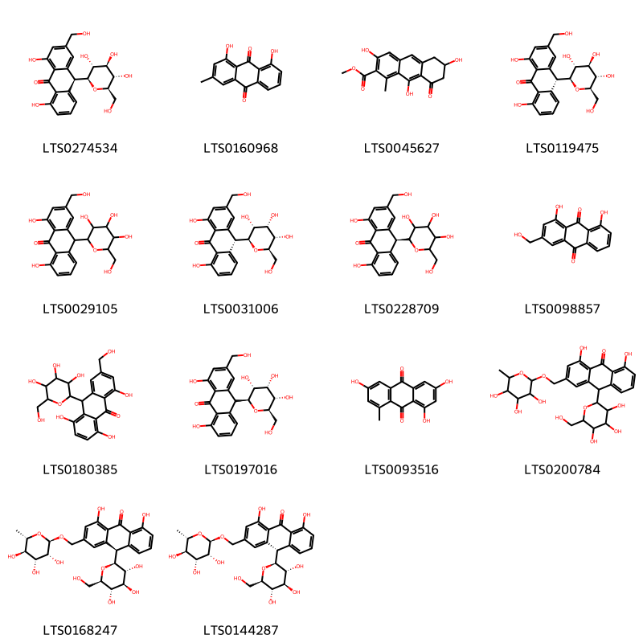{ width=100% }
    <figcaption>Hình ảnh cấu trúc hóa học của 14 hoạt chất thuộc nhóm Anthracenes gồm ['aloin (LTS0274534)', 'turkey rhubarb (LTS0160968)', 'methyl 3,6,9-trihydroxy-1-methyl-8-oxo-6,7-dihydro-5h-anthracene-2-carboxylate (LTS0045627)', 'barbaloin (LTS0119475)', 'aloin (LTS0029105)', '(10r)-1,8-dihydroxy-3-(hydroxymethyl)-10-[(2s,3r,4s,5s,6r)-3,4,5-trihydroxy-6-(hydroxymethyl)oxan-2-yl]-10h-anthracen-9-one (LTS0031006)', '(10s)-1,8-dihydroxy-3-(hydroxymethyl)-10-[3,4,5-trihydroxy-6-(hydroxymethyl)oxan-2-yl]-10h-anthracen-9-one (LTS0228709)', 'aloe emodin (LTS0098857)', '1,5,8-trihydroxy-3-(hydroxymethyl)-10-[3,4,5-trihydroxy-6-(hydroxymethyl)oxan-2-yl]-10h-anthracen-9-one (LTS0180385)', '1,8-dihydroxy-3-(hydroxymethyl)-10-[(2s,3r,4s,5s,6r)-3,4,5-trihydroxy-6-(hydroxymethyl)oxan-2-yl]-10h-anthracen-9-one (LTS0197016)', '1,3,6-trihydroxy-8-methylanthracene-9,10-dione (LTS0093516)', '1,8-dihydroxy-10-[3,4,5-trihydroxy-6-(hydroxymethyl)oxan-2-yl]-3-{[(3,4,5-trihydroxy-6-methyloxan-2-yl)oxy]methyl}-10h-anthracen-9-one (LTS0200784)', 'aloinoside b (LTS0168247)', 'aloinoside a (LTS0144287)'].</figcaption>
</figure>
#### Nhóm Benzene and substituted derivatives
<figure markdown="span">
    { width=100% }
    <figcaption>Hình ảnh cấu trúc hóa học của 1 hoạt chất thuộc nhóm Benzene and substituted derivatives gồm ['benzoic acid (LTS0145871)'].</figcaption>
</figure>
#### Nhóm Benzopyrans
<figure markdown="span">
    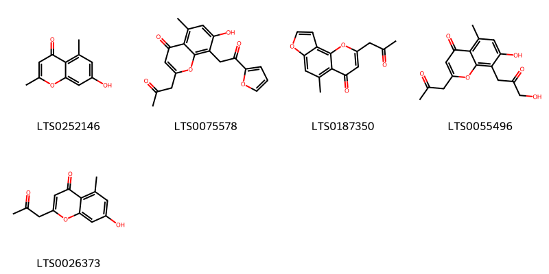{ width=100% }
    <figcaption>Hình ảnh cấu trúc hóa học của 5 hoạt chất thuộc nhóm Benzopyrans gồm ['altechromone a (LTS0252146)', '8-[2-(furan-2-yl)-2-oxoethyl]-7-hydroxy-5-methyl-2-(2-oxopropyl)chromen-4-one (LTS0075578)', '5-methyl-2-(2-oxopropyl)furo[2,3-h]chromen-4-one (LTS0187350)', '7-hydroxy-8-(3-hydroxy-2-oxopropyl)-5-methyl-2-(2-oxopropyl)chromen-4-one (LTS0055496)', 'aloesone (LTS0026373)'].</figcaption>
</figure>
#### Nhóm Cinnamic acids and derivatives
<figure markdown="span">
    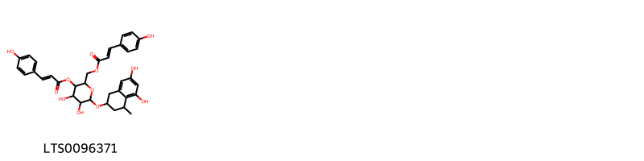{ width=100% }
    <figcaption>Hình ảnh cấu trúc hóa học của 1 hoạt chất thuộc nhóm Cinnamic acids and derivatives gồm ['{6-[(5,7-dihydroxy-4-methyl-1,2,3,4-tetrahydronaphthalen-2-yl)oxy]-4,5-dihydroxy-3-{[(2e)-3-(4-hydroxyphenyl)prop-2-enoyl]oxy}oxan-2-yl}methyl (2e)-3-(4-hydroxyphenyl)prop-2-enoate (LTS0096371)'].</figcaption>
</figure>
#### Nhóm Fatty Acyls
<figure markdown="span">
    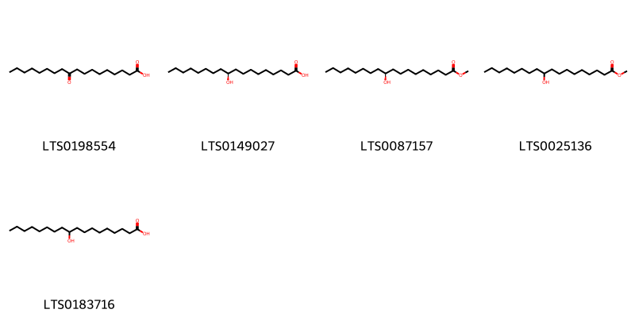{ width=100% }
    <figcaption>Hình ảnh cấu trúc hóa học của 5 hoạt chất thuộc nhóm Fatty Acyls gồm ['10-keto stearic acid (LTS0198554)', '(10s)-10-hydroxystearic acid (LTS0149027)', 'methyl (10s)-10-hydroxyoctadecanoate (LTS0087157)', 'methyl 10-hydroxyoctadecanoate (LTS0025136)', '10-hydroxystearic acid (LTS0183716)'].</figcaption>
</figure>
#### Nhóm Naphthofurans
<figure markdown="span">
    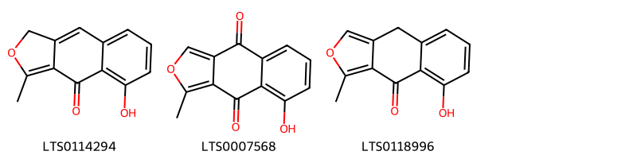{ width=100% }
    <figcaption>Hình ảnh cấu trúc hóa học của 3 hoạt chất thuộc nhóm Naphthofurans gồm ['5-hydroxy-3-methyl-1h-naphtho[2,3-c]furan-4-one (LTS0114294)', '8-hydroxy-1-methylnaphtho[2,3-c]furan-4,9-dione (LTS0007568)', '5-hydroxy-3-methyl-9h-naphtho[2,3-c]furan-4-one (LTS0118996)'].</figcaption>
</figure>
#### Nhóm Organooxygen compounds
<figure markdown="span">
    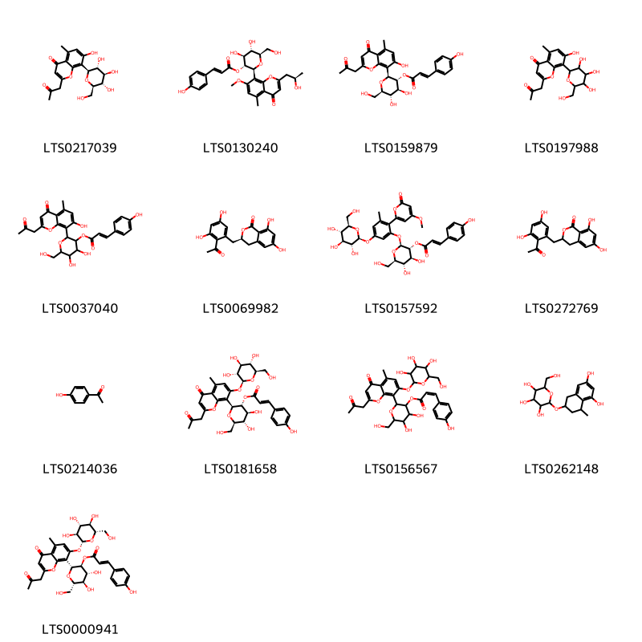{ width=100% }
    <figcaption>Hình ảnh cấu trúc hóa học của 13 hoạt chất thuộc nhóm Organooxygen compounds gồm ['aloesin (LTS0217039)', '(2s,3r,4s,5s,6r)-4,5-dihydroxy-6-(hydroxymethyl)-2-{2-[(2r)-2-hydroxypropyl]-7-methoxy-5-methyl-4-oxochromen-8-yl}oxan-3-yl (2e)-3-(4-hydroxyphenyl)prop-2-enoate (LTS0130240)', 'aloeresin a (LTS0159879)', '7-hydroxy-5-methyl-2-(2-oxopropyl)-8-[3,4,5-trihydroxy-6-(hydroxymethyl)oxan-2-yl]chromen-4-one (LTS0197988)', '4,5-dihydroxy-2-[7-hydroxy-5-methyl-4-oxo-2-(2-oxopropyl)chromen-8-yl]-6-(hydroxymethyl)oxan-3-yl 3-(4-hydroxyphenyl)prop-2-enoate (LTS0037040)', '(3r)-3-[(2-acetyl-3,5-dihydroxyphenyl)methyl]-6,8-dihydroxy-3,4-dihydro-2-benzopyran-1-one (LTS0069982)', '(2s,3r,4s,5s,6r)-4,5-dihydroxy-6-(hydroxymethyl)-2-[2-(4-methoxy-6-oxopyran-2-yl)-3-methyl-5-{[(2s,3r,4s,5s,6r)-3,4,5-trihydroxy-6-(hydroxymethyl)oxan-2-yl]oxy}phenoxy]oxan-3-yl (2e)-3-(4-hydroxyphenyl)prop-2-enoate (LTS0157592)', '3-[(2-acetyl-3,5-dihydroxyphenyl)methyl]-6,8-dihydroxy-3,4-dihydro-2-benzopyran-1-one (LTS0272769)', 'hydroxyacetophenone (LTS0214036)', '(2s,3r,4s,5s,6r)-4,5-dihydroxy-6-(hydroxymethyl)-2-[5-methyl-4-oxo-2-(2-oxopropyl)-7-{[(2s,3r,4s,5s,6r)-3,4,5-trihydroxy-6-(hydroxymethyl)oxan-2-yl]oxy}chromen-8-yl]oxan-3-yl (2e)-3-(4-hydroxyphenyl)prop-2-enoate (LTS0181658)', '4,5-dihydroxy-6-(hydroxymethyl)-2-[5-methyl-4-oxo-2-(2-oxopropyl)-7-{[3,4,5-trihydroxy-6-(hydroxymethyl)oxan-2-yl]oxy}chromen-8-yl]oxan-3-yl 3-(4-hydroxyphenyl)prop-2-enoate (LTS0156567)', '2-[(5,7-dihydroxy-4-methyl-1,2,3,4-tetrahydronaphthalen-2-yl)oxy]-6-(hydroxymethyl)oxane-3,4,5-triol (LTS0262148)', '(2r,3s,4r,5r,6s)-4,5-dihydroxy-6-(hydroxymethyl)-2-[5-methyl-4-oxo-2-(2-oxopropyl)-7-{[(2r,3s,4r,5r,6s)-3,4,5-trihydroxy-6-(hydroxymethyl)oxan-2-yl]oxy}chromen-8-yl]oxan-3-yl (2e)-3-(4-hydroxyphenyl)prop-2-enoate (LTS0000941)'].</figcaption>
</figure>
#### Nhóm Phenols
<figure markdown="span">
    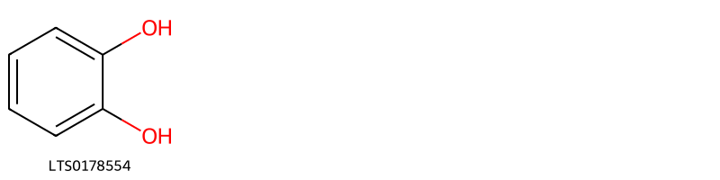{ width=100% }
    <figcaption>Hình ảnh cấu trúc hóa học của 1 hoạt chất thuộc nhóm Phenols gồm ['catechol (LTS0178554)'].</figcaption>
</figure>
#### Nhóm Stilbenes
<figure markdown="span">
    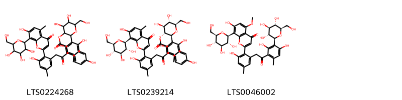{ width=100% }
    <figcaption>Hình ảnh cấu trúc hóa học của 3 hoạt chất thuộc nhóm Stilbenes gồm ['2-{2,6-dihydroxy-3-[2-(3-hydroxy-2-{7-hydroxy-5-methyl-4-oxo-8-[3,4,5-trihydroxy-6-(hydroxymethyl)oxan-2-yl]chromen-2-yl}-5-methylphenyl)acetyl]-4-methylphenyl}-4,5-dihydroxy-6-(hydroxymethyl)oxan-3-yl 3-(4-hydroxyphenyl)prop-2-enoate (LTS0224268)', '(2s,3r,4s,5s,6r)-2-{2,6-dihydroxy-3-[2-(3-hydroxy-2-{7-hydroxy-5-methyl-4-oxo-8-[(2s,3r,4r,5s,6r)-3,4,5-trihydroxy-6-(hydroxymethyl)oxan-2-yl]chromen-2-yl}-5-methylphenyl)acetyl]-4-methylphenyl}-4,5-dihydroxy-6-(hydroxymethyl)oxan-3-yl (2e)-3-(4-hydroxyphenyl)prop-2-enoate (LTS0239214)', '2-[2-(2-{2,4-dihydroxy-6-methyl-3-[(2s,3r,4r,5s,6r)-3,4,5-trihydroxy-6-(hydroxymethyl)oxan-2-yl]phenyl}-2-oxoethyl)-6-hydroxy-4-methylphenyl]-7-hydroxy-5-methoxy-8-[(2s,3r,4r,5s,6r)-3,4,5-trihydroxy-6-(hydroxymethyl)oxan-2-yl]chromen-4-one (LTS0046002)'].</figcaption>
</figure>
#### Nhóm Tetralins
<figure markdown="span">
    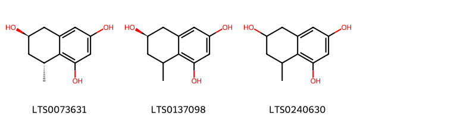{ width=100% }
    <figcaption>Hình ảnh cấu trúc hóa học của 3 hoạt chất thuộc nhóm Tetralins gồm ['(6r,8r)-8-methyl-5,6,7,8-tetrahydronaphthalene-1,3,6-triol (LTS0073631)', '(6r)-8-methyl-5,6,7,8-tetrahydronaphthalene-1,3,6-triol (LTS0137098)', '8-methyl-5,6,7,8-tetrahydronaphthalene-1,3,6-triol (LTS0240630)'].</figcaption>
</figure>

---

### Dược dân tộc học

Danh sách các quốc gia có sử dụng *Aloe ferox* trong điều trị các bệnh. 

| Country   | Disease   | Bệnh                                                                                                                                                                                                |
|:----------|:----------|:----------------------------------------------------------------------------------------------------------------------------------------------------------------------------------------------------|
| Japan*    | Aperient  | MYMEMORY WARNING: YOU USED ALL AVAILABLE FREE TRANSLATIONS FOR TODAY. NEXT AVAILABLE IN  18 HOURS 38 MINUTES 23 SECONDS VISIT HTTPS://MYMEMORY.TRANSLATED.NET/DOC/USAGELIMITS.PHP TO TRANSLATE MORE |

---

---
## Aloe rabaiensis
### Thông tin về thực vật

!!! info "Phân loại thực vật của *Aloe rabaiensis* từ GIBF:"
    - **Kingdom:** Plantae
    - **Phylum:** Tracheophyta
    - **Order:** Asparagales
    - **Family:** Asphodelaceae
    - **Genus:** Aloe
    - **Species:** *Aloe rabaiensis*

 

| Label (VI)   | Label (EN)   | Scientific Name   | Descriptions (VI)   | Descriptions (EN)   | Also Known As (VI)   | Also Known As (EN)   |
|:-------------|:-------------|:------------------|:--------------------|:--------------------|:---------------------|:---------------------|
| N/A          | N/A          | Aloe rabaiensis   | loài thực vật       | species of plant    | ['']                 | ['']                 |

#### Phân bố trên thế giới

**Từ CSDL GIBF** nan, Uganda, Somalia, Tanzania, United Republic of, Kenya, Angola, Belgium

#### Phân bố tại Việt Nam

**Từ CSDL GIBF**: Không có ghi nhận ở Việt Nam

---
### Thành phần hóa học
        
- Theo cơ sở dữ liệu lotus: Từ loài *Aloe rabaiensis* đã phân lập và xác định được 3 hoạt chất thuộc về các nhóm Organooxygen compounds, Anthracenes. 

|    | chemicalTaxonomyClassyfireClass   |   smiles_count |
|---:|:----------------------------------|---------------:|
|  0 | Anthracenes                       |              2 |
|  1 | Organooxygen compounds            |              1 |

#### Nhóm Anthracenes
<figure markdown="span">
    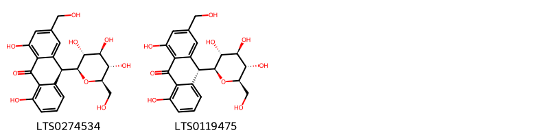{ width=100% }
    <figcaption>Hình ảnh cấu trúc hóa học của 2 hoạt chất thuộc nhóm Anthracenes gồm ['aloin (LTS0274534)', 'barbaloin (LTS0119475)'].</figcaption>
</figure>
#### Nhóm Organooxygen compounds
<figure markdown="span">
    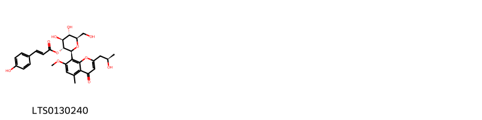{ width=100% }
    <figcaption>Hình ảnh cấu trúc hóa học của 1 hoạt chất thuộc nhóm Organooxygen compounds gồm ['(2s,3r,4s,5s,6r)-4,5-dihydroxy-6-(hydroxymethyl)-2-{2-[(2r)-2-hydroxypropyl]-7-methoxy-5-methyl-4-oxochromen-8-yl}oxan-3-yl (2e)-3-(4-hydroxyphenyl)prop-2-enoate (LTS0130240)'].</figcaption>
</figure>

---

### Dược dân tộc học

Danh sách các quốc gia có sử dụng *Aloe rabaiensis* trong điều trị các bệnh. 

| Country         | Disease   | Bệnh                                                                                                                                                                                                |
|:----------------|:----------|:----------------------------------------------------------------------------------------------------------------------------------------------------------------------------------------------------|
| Africa(Swahili) | Laxative  | MYMEMORY WARNING: YOU USED ALL AVAILABLE FREE TRANSLATIONS FOR TODAY. NEXT AVAILABLE IN  18 HOURS 37 MINUTES 26 SECONDS VISIT HTTPS://MYMEMORY.TRANSLATED.NET/DOC/USAGELIMITS.PHP TO TRANSLATE MORE |

---

---
## Aloe saponaria
### Thông tin về thực vật

!!! info "Phân loại thực vật của *Aloe microstigma* từ GIBF:"
    - **Kingdom:** Plantae
    - **Phylum:** Tracheophyta
    - **Order:** Asparagales
    - **Family:** Asphodelaceae
    - **Genus:** Aloe
    - **Species:** *Aloe microstigma*

 

| Label (VI)   | Label (EN)   | Scientific Name   | Descriptions (VI)   | Descriptions (EN)   | Also Known As (VI)   | Also Known As (EN)   |
|:-------------|:-------------|:------------------|:--------------------|:--------------------|:---------------------|:---------------------|
| N/A          | N/A          | Aloe saponaria    | loài thực vật       | species of plant    | ['']                 | ['']                 |

#### Phân bố trên thế giới

**Từ CSDL GIBF** Honduras, Malawi, nan, Argentina, South Africa, Portugal, Brazil, Spain, New Zealand, Eswatini, United States of America, Mexico, Lesotho, Australia, Guatemala

#### Phân bố tại Việt Nam

**Từ CSDL GIBF**: Không có ghi nhận ở Việt Nam

---
### Thành phần hóa học
        
- Theo cơ sở dữ liệu lotus: Từ loài *Aloe microstigma* đã phân lập và xác định được 9 hoạt chất thuộc về các nhóm Organooxygen compounds, Anthracenes. 

|    | chemicalTaxonomyClassyfireClass   |   smiles_count |
|---:|:----------------------------------|---------------:|
|  0 | Anthracenes                       |              6 |
|  1 | Organooxygen compounds            |              3 |

#### Nhóm Anthracenes
<figure markdown="span">
    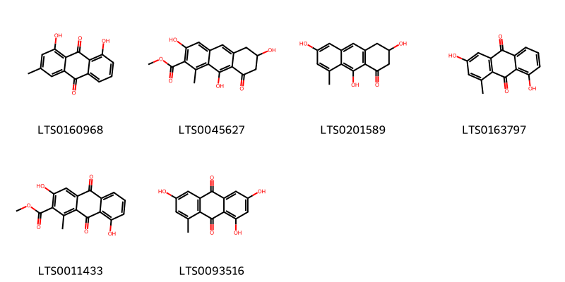{ width=100% }
    <figcaption>Hình ảnh cấu trúc hóa học của 6 hoạt chất thuộc nhóm Anthracenes gồm ['turkey rhubarb (LTS0160968)', 'methyl 3,6,9-trihydroxy-1-methyl-8-oxo-6,7-dihydro-5h-anthracene-2-carboxylate (LTS0045627)', '3,6,9-trihydroxy-8-methyl-3,4-dihydro-2h-anthracen-1-one (LTS0201589)', '3,8-dihydroxy-1-methylanthracene-9,10-dione (LTS0163797)', 'methyl 3,8-dihydroxy-1-methyl-9,10-dioxoanthracene-2-carboxylate (LTS0011433)', '1,3,6-trihydroxy-8-methylanthracene-9,10-dione (LTS0093516)'].</figcaption>
</figure>
#### Nhóm Organooxygen compounds
<figure markdown="span">
    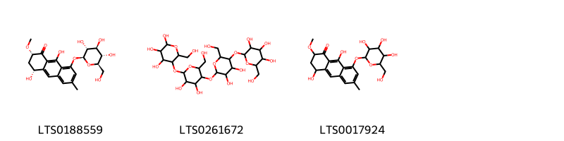{ width=100% }
    <figcaption>Hình ảnh cấu trúc hóa học của 3 hoạt chất thuộc nhóm Organooxygen compounds gồm ['(2s,4r)-4,9-dihydroxy-2-methoxy-6-methyl-8-{[(2s,3r,4s,5s,6r)-3,4,5-trihydroxy-6-(hydroxymethyl)oxan-2-yl]oxy}-3,4-dihydro-2h-anthracen-1-one (LTS0188559)', 'amylotetraose (LTS0261672)', '4,9-dihydroxy-2-methoxy-6-methyl-8-{[3,4,5-trihydroxy-6-(hydroxymethyl)oxan-2-yl]oxy}-3,4-dihydro-2h-anthracen-1-one (LTS0017924)'].</figcaption>
</figure>

---

### Dược dân tộc học

Danh sách các quốc gia có sử dụng *Aloe microstigma* trong điều trị các bệnh. 

| Country   | Disease   | Bệnh                                                                                                                                                                                                |
|:----------|:----------|:----------------------------------------------------------------------------------------------------------------------------------------------------------------------------------------------------|
| ain       | Stomachic | MYMEMORY WARNING: YOU USED ALL AVAILABLE FREE TRANSLATIONS FOR TODAY. NEXT AVAILABLE IN  18 HOURS 37 MINUTES 01 SECONDS VISIT HTTPS://MYMEMORY.TRANSLATED.NET/DOC/USAGELIMITS.PHP TO TRANSLATE MORE |

---

---
## Aloe vera
### Thông tin về thực vật

!!! info "Phân loại thực vật của *Aloe vera* từ GIBF:"
    - **Kingdom:** Plantae
    - **Phylum:** Tracheophyta
    - **Order:** Asparagales
    - **Family:** Asphodelaceae
    - **Genus:** Aloe
    - **Species:** *Aloe vera*

 

| Label (VI)   | Label (EN)   | Scientific Name   | Descriptions (VI)   | Descriptions (EN)      | Also Known As (VI)   | Also Known As (EN)   |
|:-------------|:-------------|:------------------|:--------------------|:-----------------------|:---------------------|:---------------------|
| N/A          | N/A          | Aloe vera         | loài thực vật       | species of plant, herb | ['Nha đam']          | ['']                 |

#### Phân bố trên thế giới

**Từ CSDL GIBF** Spain, Philippines, French Guiana, United Arab Emirates, Australia, Jamaica, Haiti, Colombia, Sri Lanka, Dominican Republic, Saint Vincent and the Grenadines, Puerto Rico, Malaysia, India, Réunion, Bahamas, Anguilla, Bonaire, Sint Eustatius and Saba, Sint Maarten (Dutch part), Virgin Islands (U.S.), Barbados, Malta, Antigua and Barbuda, Brazil, Peru, Aruba, Mexico, Benin, Curaçao, Chinese Taipei, Jordan, Portugal, Gibraltar, France, Cyprus, Ecuador, United States of America, Chad, Greece, Cabo Verde, Oman

#### Phân bố tại Việt Nam

**Từ CSDL GIBF**: Không có ghi nhận ở Việt Nam

---
### Thành phần hóa học
        
- Theo cơ sở dữ liệu lotus: Từ loài *Aloe vera* đã phân lập và xác định được 113 hoạt chất thuộc về các nhóm Organooxygen compounds, Benzopyrans, Indoles and derivatives, Prenol lipids, Carboxylic acids and derivatives, Anthracenes, Saccharolipids, Fatty Acyls, Neoflavonoids, Glycerophospholipids, Glycerolipids, Hydroxy acids and derivatives, Steroids and steroid derivatives, Benzene and substituted derivatives, Organic phosphoric acids and derivatives. 

|    | chemicalTaxonomyClassyfireClass          |   smiles_count |
|---:|:-----------------------------------------|---------------:|
|  0 | Anthracenes                              |             34 |
|  1 | Benzene and substituted derivatives      |              3 |
|  2 | Benzopyrans                              |              2 |
|  3 | Carboxylic acids and derivatives         |              1 |
|  4 | Fatty Acyls                              |              3 |
|  5 | Glycerolipids                            |              2 |
|  6 | Glycerophospholipids                     |              2 |
|  7 | Hydroxy acids and derivatives            |              1 |
|  8 | Indoles and derivatives                  |              1 |
|  9 | Neoflavonoids                            |              1 |
| 10 | Organic phosphoric acids and derivatives |              1 |
| 11 | Organooxygen compounds                   |             47 |
| 12 | Prenol lipids                            |              1 |
| 13 | Saccharolipids                           |              6 |
| 14 | Steroids and steroid derivatives         |              6 |

#### Nhóm Anthracenes
<figure markdown="span">
    { width=100% }
    <figcaption>Hình ảnh cấu trúc hóa học của 34 hoạt chất thuộc nhóm Anthracenes gồm ['aloin (LTS0274534)', 'turkey rhubarb (LTS0160968)', 'methyl 3,6,9-trihydroxy-1-methyl-8-oxo-6,7-dihydro-5h-anthracene-2-carboxylate (LTS0045627)', 'barbaloin (LTS0119475)', 'aloin (LTS0029105)', '(3r)-3,9-dihydroxy-8-methoxy-3-methyl-2,4-dihydroanthracen-1-one (LTS0143764)', '(10r)-1,8-dihydroxy-3-(hydroxymethyl)-10-[(2s,3r,4s,5s,6r)-3,4,5-trihydroxy-6-(hydroxymethyl)oxan-2-yl]-10h-anthracen-9-one (LTS0031006)', '(10s)-1,8-dihydroxy-3-(hydroxymethyl)-10-[3,4,5-trihydroxy-6-(hydroxymethyl)oxan-2-yl]-10h-anthracen-9-one (LTS0228709)', 'aloe emodin (LTS0098857)', '1,8-dihydroxy-3-(hydroxymethyl)-10-[(2s,3r,4s,5s,6r)-3,4,5-trihydroxy-6-(hydroxymethyl)oxan-2-yl]-10h-anthracen-9-one (LTS0197016)', '(10s)-1,2,8-trihydroxy-6-(hydroxymethyl)-10-[(2s,3r,4r,5s,6r)-3,4,5-trihydroxy-6-(hydroxymethyl)oxan-2-yl]-10h-anthracen-9-one (LTS0143834)', '1,8-dihydroxy-10-[3,4,5-trihydroxy-6-(hydroxymethyl)oxan-2-yl]-3-{[(3,4,5-trihydroxy-6-methyloxan-2-yl)oxy]methyl}-10h-anthracen-9-one (LTS0200784)', 'aloinoside b (LTS0168247)', 'aloinoside a (LTS0144287)', "1,4',5',8-tetrahydroxy-2',6-bis(hydroxymethyl)-9'-[(2s,3r,4r,5s,6r)-3,4,5-trihydroxy-6-(hydroxymethyl)oxan-2-yl]-[2,9'-bianthracene]-9,10,10'-trione (LTS0267513)", '3,9-dihydroxy-8-methoxy-3-methyl-2,4-dihydroanthracen-1-one (LTS0209859)', '(10s)-1,8,10-trihydroxy-3-(hydroxymethyl)-10-[(2r,3r,4s,5s,6r)-3,4,5-trihydroxy-6-(hydroxymethyl)oxan-2-yl]anthracen-9-one (LTS0146973)', '(2s,4s)-8,9-dihydroxy-2-methoxy-6-methyl-4-{[(2r,3r,4s,5s,6r)-3,4,5-trihydroxy-6-(hydroxymethyl)oxan-2-yl]oxy}-3,4-dihydro-2h-anthracen-1-one (LTS0039598)', '1,8,10-trihydroxy-3-(hydroxymethyl)-10-[3,4,5-trihydroxy-6-(hydroxymethyl)oxan-2-yl]anthracen-9-one (LTS0168468)', "1,4',5',8-tetrahydroxy-2',6-bis(hydroxymethyl)-9'-[3,4,5-trihydroxy-6-(hydroxymethyl)oxan-2-yl]-[2,9'-bianthracene]-9,10,10'-trione (LTS0197525)", 'emodin (LTS0163480)', "(9'r)-1,4',5',8-tetrahydroxy-2',6-bis(hydroxymethyl)-9'-[(2s,3r,4r,5s,6r)-3,4,5-trihydroxy-6-(hydroxymethyl)oxan-2-yl]-[2,9'-bianthracene]-9,10,10'-trione (LTS0153582)", '8,9-dihydroxy-2-methoxy-6-methyl-4-{[3,4,5-trihydroxy-6-(hydroxymethyl)oxan-2-yl]oxy}-3,4-dihydro-2h-anthracen-1-one (LTS0101353)', '(2s,4s)-2,8,9-trihydroxy-6-methyl-4-{[(2r,3r,4s,5s,6r)-3,4,5-trihydroxy-6-(hydroxymethyl)oxan-2-yl]oxy}-3,4-dihydro-2h-anthracen-1-one (LTS0256439)', '(3s)-3,5,7-trihydroxy-9-methyl-3,4-dihydro-2h-anthracen-1-one (LTS0223661)', '(10r)-1,8,10-trihydroxy-3-(hydroxymethyl)-10-[(2r,3r,4s,5s,6r)-3,4,5-trihydroxy-6-(hydroxymethyl)oxan-2-yl]anthracen-9-one (LTS0031255)', '3,5,7-trihydroxy-9-methyl-3,4-dihydro-2h-anthracen-1-one (LTS0229992)', '(3s)-3,9-dihydroxy-8-methoxy-3-methyl-2,4-dihydroanthracen-1-one (LTS0224811)', '2,8,9-trihydroxy-6-methyl-4-{[3,4,5-trihydroxy-6-(hydroxymethyl)oxan-2-yl]oxy}-3,4-dihydro-2h-anthracen-1-one (LTS0224734)', '1-anthrol (LTS0036808)', '2,8-dihydroxy-6-(hydroxymethyl)-1-methoxy-10-[3,4,5-trihydroxy-6-(hydroxymethyl)oxan-2-yl]-10h-anthracen-9-one (LTS0083071)', '(10s)-2,8-dihydroxy-6-(hydroxymethyl)-1-methoxy-10-[(2s,3r,4r,5s,6r)-3,4,5-trihydroxy-6-(hydroxymethyl)oxan-2-yl]-10h-anthracen-9-one (LTS0170582)', "(9's)-1,4',5',8-tetrahydroxy-2',6-bis(hydroxymethyl)-9'-[(2s,3r,4r,5s,6r)-3,4,5-trihydroxy-6-(hydroxymethyl)oxan-2-yl]-[2,9'-bianthracene]-9,10,10'-trione (LTS0112501)", '(10r)-2,8-dihydroxy-6-(hydroxymethyl)-1-methoxy-10-[(2s,3r,4r,5s,6r)-3,4,5-trihydroxy-6-(hydroxymethyl)oxan-2-yl]-10h-anthracen-9-one (LTS0194466)'].</figcaption>
</figure>
#### Nhóm Benzene and substituted derivatives
<figure markdown="span">
    { width=100% }
    <figcaption>Hình ảnh cấu trúc hóa học của 3 hoạt chất thuộc nhóm Benzene and substituted derivatives gồm ['4,5-diethyl-3-hexylbenzene-1,2-dicarboxylic acid (LTS0256168)', '6-{3-[(1r)-3-ethoxy-1-(4-hydroxyphenyl)but-3-en-1-yl]-4,6-dihydroxy-2-methylphenyl}-4-methoxypyran-2-one (LTS0116396)', 'etalon (LTS0123172)'].</figcaption>
</figure>
#### Nhóm Benzopyrans
<figure markdown="span">
    { width=100% }
    <figcaption>Hình ảnh cấu trúc hóa học của 2 hoạt chất thuộc nhóm Benzopyrans gồm ['3-(4-hydroxy-6-methoxy-3,4-dihydro-2h-1-benzopyran-3-yl)-6-methoxy-3,4-dihydro-2h-1-benzopyran-4-ol (LTS0076474)', '(3s,4s)-3-[(3r,4r)-4-hydroxy-6-methoxy-3,4-dihydro-2h-1-benzopyran-3-yl]-6-methoxy-3,4-dihydro-2h-1-benzopyran-4-ol (LTS0176064)'].</figcaption>
</figure>
#### Nhóm Carboxylic acids and derivatives
<figure markdown="span">
    { width=100% }
    <figcaption>Hình ảnh cấu trúc hóa học của 1 hoạt chất thuộc nhóm Carboxylic acids and derivatives gồm ['oxalic acid (LTS0217707)'].</figcaption>
</figure>
#### Nhóm Fatty Acyls
<figure markdown="span">
    { width=100% }
    <figcaption>Hình ảnh cấu trúc hóa học của 3 hoạt chất thuộc nhóm Fatty Acyls gồm ['methyl oleate (LTS0113685)', 'oleic acid (LTS0256910)', 'arachidonic acid (LTS0241153)'].</figcaption>
</figure>
#### Nhóm Glycerolipids
<figure markdown="span">
    { width=100% }
    <figcaption>Hình ảnh cấu trúc hóa học của 2 hoạt chất thuộc nhóm Glycerolipids gồm ['triolein (LTS0254684)', '[(2s,3s,4s,5r,6s)-6-[2-(hexadecanoyloxy)-3-[(5e,8e,11e,14e,17e)-icosa-5,8,11,14,17-pentaenoyloxy]propoxy]-3,4,5-trihydroxyoxan-2-yl]methanesulfonic acid (LTS0009878)'].</figcaption>
</figure>
#### Nhóm Glycerophospholipids
<figure markdown="span">
    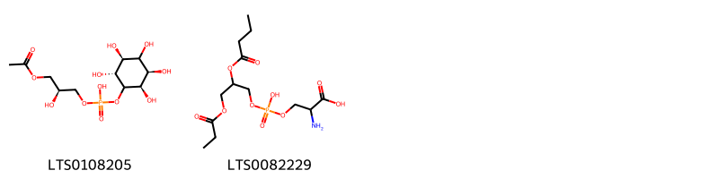{ width=100% }
    <figcaption>Hình ảnh cấu trúc hóa học của 2 hoạt chất thuộc nhóm Glycerophospholipids gồm ['(2s)-3-(acetyloxy)-2-hydroxypropoxy([(2r,3r,5s,6r)-2,3,4,5,6-pentahydroxycyclohexyl]oxy)phosphinic acid (LTS0108205)', '2-amino-3-{[2-(butanoyloxy)-3-(propanoyloxy)propoxy(hydroxy)phosphoryl]oxy}propanoic acid (LTS0082229)'].</figcaption>
</figure>
#### Nhóm Hydroxy acids and derivatives
<figure markdown="span">
    { width=100% }
    <figcaption>Hình ảnh cấu trúc hóa học của 1 hoạt chất thuộc nhóm Hydroxy acids and derivatives gồm ['malic acid (LTS0216520)'].</figcaption>
</figure>
#### Nhóm Indoles and derivatives
<figure markdown="span">
    { width=100% }
    <figcaption>Hình ảnh cấu trúc hóa học của 1 hoạt chất thuộc nhóm Indoles and derivatives gồm ['n-[2-(5-methoxy-1h-indol-3-yl)ethyl]ethanimidic acid (LTS0219322)'].</figcaption>
</figure>
#### Nhóm Neoflavonoids
<figure markdown="span">
    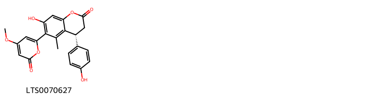{ width=100% }
    <figcaption>Hình ảnh cấu trúc hóa học của 1 hoạt chất thuộc nhóm Neoflavonoids gồm ['(4r)-7-hydroxy-4-(4-hydroxyphenyl)-6-(4-methoxy-6-oxopyran-2-yl)-5-methyl-3,4-dihydro-1-benzopyran-2-one (LTS0070627)'].</figcaption>
</figure>
#### Nhóm Organic phosphoric acids and derivatives
<figure markdown="span">
    { width=100% }
    <figcaption>Hình ảnh cấu trúc hóa học của 1 hoạt chất thuộc nhóm Organic phosphoric acids and derivatives gồm ['o-phosphoethanolamine; bis(nonane) (LTS0249963)'].</figcaption>
</figure>
#### Nhóm Organooxygen compounds
<figure markdown="span">
    { width=100% }
    <figcaption>Hình ảnh cấu trúc hóa học của 47 hoạt chất thuộc nhóm Organooxygen compounds gồm ['aloesin (LTS0217039)', '6-(4-hydroxy-2-methyl-6-{[(2s,3r,4s,5s,6r)-3,4,5-trihydroxy-6-(hydroxymethyl)oxan-2-yl]oxy}phenyl)-4-methoxypyran-2-one (LTS0055148)', '(2s,3r,4s,5s,6r)-4,5-dihydroxy-6-(hydroxymethyl)-2-{2-[(2r)-2-hydroxypropyl]-7-methoxy-5-methyl-4-oxochromen-8-yl}oxan-3-yl (2e)-3-(4-hydroxyphenyl)prop-2-enoate (LTS0130240)', 'aloeresin a (LTS0159879)', '7-hydroxy-5-methyl-2-(2-oxopropyl)-8-[3,4,5-trihydroxy-6-(hydroxymethyl)oxan-2-yl]chromen-4-one (LTS0197988)', '4,5-dihydroxy-2-[7-hydroxy-5-methyl-4-oxo-2-(2-oxopropyl)chromen-8-yl]-6-(hydroxymethyl)oxan-3-yl 3-(4-hydroxyphenyl)prop-2-enoate (LTS0037040)', '4,5-dihydroxy-6-(hydroxymethyl)-2-[5-methyl-4-oxo-2-(2-oxopropyl)-7-{[3,4,5-trihydroxy-6-(hydroxymethyl)oxan-2-yl]oxy}chromen-8-yl]oxan-3-yl 3-phenylprop-2-enoate (LTS0084414)', '4,5-dihydroxy-6-(hydroxymethyl)-2-[2-(2-hydroxypropyl)-7-methoxy-5-methyl-4-oxochromen-8-yl]oxan-3-yl 3-(3,4-dihydroxyphenyl)prop-2-enoate (LTS0210130)', '(3r)-3-[(2-acetyl-3,5-dihydroxyphenyl)methyl]-6,8-dihydroxy-3,4-dihydro-2-benzopyran-1-one (LTS0069982)', '(2s,3r,4s,5s,6r)-4,5-dihydroxy-6-(hydroxymethyl)-2-{2-[(2r)-2-hydroxypropyl]-7-methoxy-5-methyl-4-oxochromen-8-yl}oxan-3-yl (2e)-3-(3,4-dihydroxyphenyl)prop-2-enoate (LTS0269979)', '2-[(2s)-2-hydroxypropyl]-7-methoxy-5-methyl-8-[(2s,3r,4r,5s,6r)-3,4,5-trihydroxy-6-(hydroxymethyl)oxan-2-yl]chromen-4-one (LTS0179389)', 'methyl aloesinyl cinnamate (LTS0256815)', '2-(2-hydroxypropyl)-7-methoxy-5-methyl-8-[3,4,5-trihydroxy-6-(hydroxymethyl)oxan-2-yl]chromen-4-one (LTS0009883)', '(2s,3r,4s,5s,6r)-4,5-dihydroxy-6-(hydroxymethyl)-2-{2-[(2s)-2-hydroxypropyl]-7-methoxy-5-methyl-4-oxochromen-8-yl}oxan-3-yl (2e)-3-phenylprop-2-enoate (LTS0004111)', '4,5-dihydroxy-6-(hydroxymethyl)-2-[2-(4-methoxy-6-oxopyran-2-yl)-3-methyl-5-{[3,4,5-trihydroxy-6-(hydroxymethyl)oxan-2-yl]oxy}phenoxy]oxan-3-yl 3-(4-hydroxyphenyl)prop-2-enoate (LTS0200257)', '8-[(2r,3r,4r,5r)-5-[(1r)-1,2-dihydroxyethyl]-3,4-dihydroxyoxolan-2-yl]-7-hydroxy-5-methyl-2-(2-oxopropyl)chromen-4-one (LTS0273425)', '(2s,3r,4s,5s,6r)-4,5-dihydroxy-6-(hydroxymethyl)-2-{2-[(2s)-2-hydroxypropyl]-7-methoxy-5-methyl-4-oxochromen-8-yl}oxan-3-yl (2e)-3-(4-hydroxyphenyl)prop-2-enoate (LTS0199217)', '(2s,3r,4s,5s,6r)-4,5-dihydroxy-6-(hydroxymethyl)-2-[2-(4-methoxy-6-oxopyran-2-yl)-3-methyl-5-{[(2s,3r,4s,5s,6r)-3,4,5-trihydroxy-6-(hydroxymethyl)oxan-2-yl]oxy}phenoxy]oxan-3-yl (2e)-3-(4-hydroxyphenyl)prop-2-enoate (LTS0157592)', '4,5-dihydroxy-6-(hydroxymethyl)-2-[2-(2-hydroxypropyl)-7-methoxy-5-methyl-4-oxochromen-8-yl]oxan-3-yl 3-(4-hydroxyphenyl)prop-2-enoate (LTS0178320)', '8-[5-(1,2-dihydroxyethyl)-3,4-dihydroxyoxolan-2-yl]-7-hydroxy-5-methyl-2-(2-oxopropyl)chromen-4-one (LTS0028978)', '4,5-dihydroxy-2-[5-hydroxy-2-(4-methoxy-6-oxopyran-2-yl)-3-methylphenoxy]-6-(hydroxymethyl)oxan-3-yl 3-(4-hydroxyphenyl)prop-2-enoate (LTS0001902)', '(2s,3r,4s,5s,6r)-4,5-dihydroxy-2-[5-hydroxy-2-(4-methoxy-6-oxopyran-2-yl)-3-methylphenoxy]-6-(hydroxymethyl)oxan-3-yl (2e)-3-(4-hydroxyphenyl)prop-2-enoate (LTS0110311)', '(2s,3s,4r,5s,6s)-4-(acetyloxy)-3-{[(2r,3s,4r,5r,6r)-4-(acetyloxy)-5-{[(2r,3s,4r,5r,6r)-4-(acetyloxy)-3-hydroxy-6-(hydroxymethyl)-5-methoxyoxan-2-yl]oxy}-3-hydroxy-6-(hydroxymethyl)oxan-2-yl]oxy}-6-{[(2r,3r,4r,5s,6r)-4-(acetyloxy)-6-{[(2r,3s,4r,5s,6r)-6-{[(2r,3r,4r,5s,6r)-4-(acetyloxy)-6-{[(2r,3r,4r,5s,6r)-4-(acetyloxy)-6-{[(2r,3r,4r,5s,6s)-4-(acetyloxy)-5-hydroxy-2-(hydroxymethyl)-6-methoxyoxan-3-yl]oxy}-5-hydroxy-2-(hydroxymethyl)oxan-3-yl]oxy}-5-hydroxy-2-(hydroxymethyl)oxan-3-yl]oxy}-4-hydroxy-5-[(1-hydroxyethylidene)amino]-2-(hydroxymethyl)oxan-3-yl]oxy}-5-hydroxy-2-(hydroxymethyl)oxan-3-yl]oxy}-5-hydroxyoxane-2-carboxylic acid (LTS0125187)', '(2s,3r,4s,5s,6r)-2-{2-[(1s,2s)-1,2-dihydroxypropyl]-7-methoxy-5-methyl-4-oxochromen-8-yl}-4,5-dihydroxy-6-(hydroxymethyl)oxan-3-yl (2e)-3-phenylprop-2-enoate (LTS0104348)', '1-(4-{[(3,4-dihydroxy-5-{[3,4,5-trihydroxy-6-(hydroxymethyl)oxan-2-yl]oxy}oxan-2-yl)oxy]methyl}-1-hydroxy-8-[(3,4,5-trihydroxy-6-methyloxan-2-yl)oxy]naphthalen-2-yl)ethanone (LTS0211986)', '7-hydroxy-2-[(2r)-2-hydroxypropyl]-5-methyl-8-[(2s,3r,4r,5s,6r)-3,4,5-trihydroxy-6-(hydroxymethyl)oxan-2-yl]chromen-4-one (LTS0101529)', '7-hydroxy-2-(2-hydroxypropyl)-5-methyl-8-[3,4,5-trihydroxy-6-(hydroxymethyl)oxan-2-yl]chromen-4-one (LTS0270933)', '(+)-glucose (LTS0262158)', '7-methoxy-5-methyl-2-(prop-1-en-1-yl)-8-[3,4,5-trihydroxy-6-(hydroxymethyl)oxan-2-yl]chromen-4-one (LTS0142692)', '(2s,3r,4s,5s,6r)-4,5-dihydroxy-6-(hydroxymethyl)-2-{2-[(2s)-2-hydroxypropyl]-7-methoxy-5-methyl-4-oxochromen-8-yl}oxan-3-yl (2e)-3-(3,4-dihydroxyphenyl)prop-2-enoate (LTS0154037)', '(2s,3r,4s,5s,6r)-4,5-dihydroxy-6-(hydroxymethyl)-2-{2-[(2r)-2-hydroxypropyl]-7-methoxy-5-methyl-4-oxochromen-8-yl}oxan-3-yl (2z)-3-(4-hydroxyphenyl)prop-2-enoate (LTS0147074)', '2-(1,2-dihydroxypropyl)-7-methoxy-5-methyl-8-[3,4,5-trihydroxy-6-(hydroxymethyl)oxan-2-yl]chromen-4-one (LTS0172417)', '(2s,3s,4s,5r,6r)-2-[2-(1,2-dihydroxypropyl)-7-methoxy-5-methyl-4-oxochromen-8-yl]-4,5-dihydroxy-6-(hydroxymethyl)oxan-3-yl (2e)-3-(4-hydroxyphenyl)prop-2-enoate (LTS0249925)', '5,7-dihydroxy-2-methyl-8-[(2s,3r,4r,5s,6r)-3,4,5-trihydroxy-6-(hydroxymethyl)oxan-2-yl]chromen-4-one (LTS0126973)', '7-hydroxy-2-[(2s)-2-hydroxypropyl]-5-methyl-8-[(2s,3r,4r,5s,6r)-3,4,5-trihydroxy-6-(hydroxymethyl)oxan-2-yl]chromen-4-one (LTS0268777)', '2-[(1r)-1,2-dihydroxyethyl]-7-methoxy-5-methyl-8-[(2s,3r,4r,5s,6r)-3,4,5-trihydroxy-6-(hydroxymethyl)oxan-2-yl]chromen-4-one (LTS0214267)', 'keto-d-fructose (LTS0241114)', '2-[(2r)-2-hydroxypropyl]-7-methoxy-5-methyl-8-[(2s,3r,4r,5s,6r)-3,4,5-trihydroxy-6-(hydroxymethyl)oxan-2-yl]chromen-4-one (LTS0189480)', '5,7-dihydroxy-2-methyl-8-[3,4,5-trihydroxy-6-(hydroxymethyl)oxan-2-yl]chromen-4-one (LTS0250499)', '1-[4-({[(2r,3r,4r,5r)-3,4-dihydroxy-5-{[(2s,3r,4s,5s,6r)-3,4,5-trihydroxy-6-(hydroxymethyl)oxan-2-yl]oxy}oxan-2-yl]oxy}methyl)-1-hydroxy-8-{[(2s,3r,4r,5r,6s)-3,4,5-trihydroxy-6-methyloxan-2-yl]oxy}naphthalen-2-yl]ethanone (LTS0010619)', 'glucose (LTS0013597)', '2-[(1r,2s)-1,2-dihydroxypropyl]-7-methoxy-5-methyl-8-[(2s,3r,4r,5s,6r)-3,4,5-trihydroxy-6-(hydroxymethyl)oxan-2-yl]chromen-4-one (LTS0014529)', "c-2'-decoumaroyl-aloeresin g (LTS0032099)", '(2s,3r,4s,5r,6r)-4,5-dihydroxy-6-(hydroxymethyl)-2-[5-methyl-4-oxo-2-(2-oxopropyl)-7-{[(2s,3r,4s,5r,6r)-3,4,5-trihydroxy-6-(hydroxymethyl)oxan-2-yl]oxy}chromen-8-yl]oxan-3-yl (2e)-3-phenylprop-2-enoate (LTS0103398)', '(2s,3s,4r,5s,6r)-4-(acetyloxy)-3-{[(2s,3s,4r,5r,6r)-4-(acetyloxy)-5-{[(2s,3s,4r,5r,6r)-4-(acetyloxy)-3-hydroxy-6-(hydroxymethyl)-5-methoxyoxan-2-yl]oxy}-3-hydroxy-6-(hydroxymethyl)oxan-2-yl]oxy}-6-{[(2r,3r,4r,5s,6s)-4-(acetyloxy)-6-{[(2r,3s,4s,5s,6s)-6-{[(2r,3r,4r,5s,6s)-4-(acetyloxy)-6-{[(2r,3r,4r,5s,6s)-4-(acetyloxy)-6-{[(2r,3r,4r,5s,6r)-4-(acetyloxy)-5-hydroxy-2-(hydroxymethyl)-6-methoxyoxan-3-yl]oxy}-5-hydroxy-2-(hydroxymethyl)oxan-3-yl]oxy}-5-hydroxy-2-(hydroxymethyl)oxan-3-yl]oxy}-4-hydroxy-5-[(1-hydroxyethylidene)amino]-2-(hydroxymethyl)oxan-3-yl]oxy}-5-hydroxy-2-(hydroxymethyl)oxan-3-yl]oxy}-5-hydroxyoxane-2-carboxylic acid (LTS0237369)', '2-[(1r,2r)-1,2-dihydroxypropyl]-7-methoxy-5-methyl-8-[(2s,3r,4r,5r,6r)-3,4,5-trihydroxy-6-(hydroxymethyl)oxan-2-yl]chromen-4-one (LTS0045120)', '2-(1,2-dihydroxyethyl)-7-methoxy-5-methyl-8-[3,4,5-trihydroxy-6-(hydroxymethyl)oxan-2-yl]chromen-4-one (LTS0049714)'].</figcaption>
</figure>
#### Nhóm Prenol lipids
<figure markdown="span">
    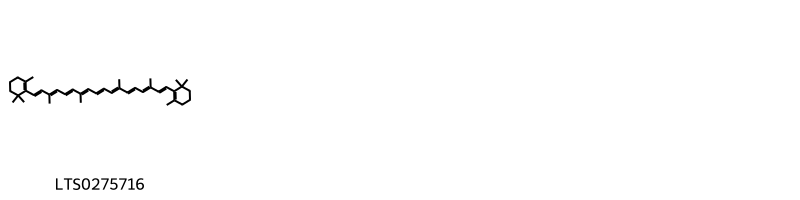{ width=100% }
    <figcaption>Hình ảnh cấu trúc hóa học của 1 hoạt chất thuộc nhóm Prenol lipids gồm ['β-carotene (LTS0275716)'].</figcaption>
</figure>
#### Nhóm Saccharolipids
<figure markdown="span">
    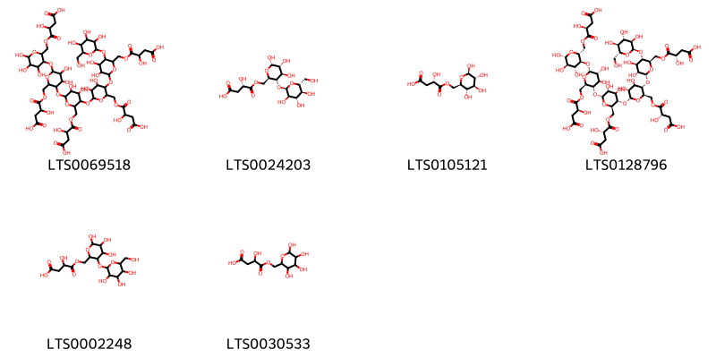{ width=100% }
    <figcaption>Hình ảnh cấu trúc hóa học của 6 hoạt chất thuộc nhóm Saccharolipids gồm ['4-({3-[(6-{[(3-carboxy-2-hydroxypropanoyl)oxy]methyl}-5-[(6-{[(3-carboxy-2-hydroxypropanoyl)oxy]methyl}-5-[(6-{[(3-carboxy-2-hydroxypropanoyl)oxy]methyl}-5-[(6-{[(3-carboxy-2-hydroxypropanoyl)oxy]methyl}-3,4-dihydroxy-5-{[3,4,5-trihydroxy-6-(hydroxymethyl)oxan-2-yl]oxy}oxan-2-yl)oxy]-3,4-dihydroxyoxan-2-yl)oxy]-3,4-dihydroxyoxan-2-yl)oxy]-3,4-dihydroxyoxan-2-yl)oxy]-4,5,6-trihydroxyoxan-2-yl}methoxy)-3-hydroxy-4-oxobutanoic acid (LTS0069518)', '(3s)-3-hydroxy-4-oxo-4-{[(2r,3s,4r,5r,6s)-4,5,6-trihydroxy-3-{[(2r,3r,4s,5s,6r)-3,4,5-trihydroxy-6-(hydroxymethyl)oxan-2-yl]oxy}oxan-2-yl]methoxy}butanoic acid (LTS0024203)', '(3s)-3-hydroxy-4-oxo-4-{[(2r,3s,4s,5r,6r)-3,4,5,6-tetrahydroxyoxan-2-yl]methoxy}butanoic acid (LTS0105121)', '(3s)-4-{[(2r,3s,4r,5r,6r)-3-{[(2r,3r,4r,5s,6r)-6-({[(2s)-3-carboxy-2-hydroxypropanoyl]oxy}methyl)-5-{[(2r,3r,4r,5s,6r)-6-({[(2s)-3-carboxy-2-hydroxypropanoyl]oxy}methyl)-5-{[(2r,3r,4r,5s,6r)-6-({[(2s)-3-carboxy-2-hydroxypropanoyl]oxy}methyl)-5-{[(2r,3r,4r,5s,6r)-6-({[(2s)-3-carboxy-2-hydroxypropanoyl]oxy}methyl)-3,4-dihydroxy-5-{[(2r,3r,4s,5s,6r)-3,4,5-trihydroxy-6-(hydroxymethyl)oxan-2-yl]oxy}oxan-2-yl]oxy}-3,4-dihydroxyoxan-2-yl]oxy}-3,4-dihydroxyoxan-2-yl]oxy}-3,4-dihydroxyoxan-2-yl]oxy}-4,5,6-trihydroxyoxan-2-yl]methoxy}-3-hydroxy-4-oxobutanoic acid (LTS0128796)', '3-hydroxy-4-oxo-4-[(4,5,6-trihydroxy-3-{[3,4,5-trihydroxy-6-(hydroxymethyl)oxan-2-yl]oxy}oxan-2-yl)methoxy]butanoic acid (LTS0002248)', '3-hydroxy-4-oxo-4-[(3,4,5,6-tetrahydroxyoxan-2-yl)methoxy]butanoic acid (LTS0030533)'].</figcaption>
</figure>
#### Nhóm Steroids and steroid derivatives
<figure markdown="span">
    { width=100% }
    <figcaption>Hình ảnh cấu trúc hóa học của 6 hoạt chất thuộc nhóm Steroids and steroid derivatives gồm ['stigmast-5-en-3-ol (LTS0071224)', 'stigmast-5-en-3-ol, (3β)- (LTS0204616)', 'phytosterol (LTS0029311)', 'cholesterol (LTS0102304)', 'sitogluside (LTS0201798)', '2-{[1-(5-ethyl-6-methylheptan-2-yl)-9a,11a-dimethyl-1h,2h,3h,3ah,3bh,4h,6h,7h,8h,9h,9bh,10h,11h-cyclopenta[a]phenanthren-7-yl]oxy}-6-(hydroxymethyl)oxane-3,4,5-triol (LTS0158828)'].</figcaption>
</figure>

---

### Dược dân tộc học

Danh sách các quốc gia có sử dụng *Aloe vera* trong điều trị các bệnh. 

| Country   | Disease                        | Bệnh                                                                                                                                                                                                |
|:----------|:-------------------------------|:----------------------------------------------------------------------------------------------------------------------------------------------------------------------------------------------------|
| China     | Stomachic, Vermifuge, Laxative | MYMEMORY WARNING: YOU USED ALL AVAILABLE FREE TRANSLATIONS FOR TODAY. NEXT AVAILABLE IN  18 HOURS 36 MINUTES 24 SECONDS VISIT HTTPS://MYMEMORY.TRANSLATED.NET/DOC/USAGELIMITS.PHP TO TRANSLATE MORE |
| Malaya    | Aperient                       | MYMEMORY WARNING: YOU USED ALL AVAILABLE FREE TRANSLATIONS FOR TODAY. NEXT AVAILABLE IN  18 HOURS 36 MINUTES 21 SECONDS VISIT HTTPS://MYMEMORY.TRANSLATED.NET/DOC/USAGELIMITS.PHP TO TRANSLATE MORE |
| Nepal     | Purgative, Purgative           | MYMEMORY WARNING: YOU USED ALL AVAILABLE FREE TRANSLATIONS FOR TODAY. NEXT AVAILABLE IN  18 HOURS 36 MINUTES 18 SECONDS VISIT HTTPS://MYMEMORY.TRANSLATED.NET/DOC/USAGELIMITS.PHP TO TRANSLATE MORE |

---

---
## Aloe zebria
### Thông tin về thực vật

!!! info "Phân loại thực vật của *Aloe zebrina* từ GIBF:"
    - **Kingdom:** Plantae
    - **Phylum:** Tracheophyta
    - **Order:** Asparagales
    - **Family:** Asphodelaceae
    - **Genus:** Aloe
    - **Species:** *Aloe zebrina*

 

| Label (VI)   | Label (EN)   | Scientific Name   | Descriptions (VI)   | Descriptions (EN)      | Also Known As (VI)   | Also Known As (EN)   |
|:-------------|:-------------|:------------------|:--------------------|:-----------------------|:---------------------|:---------------------|
| N/A          | N/A          | Aloe vera         | loài thực vật       | species of plant, herb | ['Nha đam']          | ['']                 |

#### Phân bố trên thế giới

**Từ CSDL GIBF** nan, Malawi, Namibia, Cameroon, Kenya, Rwanda, Côte d’Ivoire, Burundi, Uganda, Ethiopia, Angola, Botswana, South Africa, Mozambique, Tanzania, United Republic of, Congo, Democratic Republic of the, United States of America, Zimbabwe, Zambia, Madagascar

#### Phân bố tại Việt Nam

**Từ CSDL GIBF**: Không có ghi nhận ở Việt Nam

---
### Thành phần hóa học
        
- Theo cơ sở dữ liệu lotus: Từ loài *Aloe zebrina* đã phân lập và xác định được Chưa có hoạt chất nào được phân lập. hoạt chất thuộc về các nhóm Không có hoạt chất nào được phân lập. 

Không có hình ảnh nào được tạo ra

---

### Dược dân tộc học

Danh sách các quốc gia có sử dụng *Aloe zebrina* trong điều trị các bệnh. 

| Country   | Disease   | Bệnh                                                                                                                                                                                                |
|:----------|:----------|:----------------------------------------------------------------------------------------------------------------------------------------------------------------------------------------------------|
| China     | Cathartic | MYMEMORY WARNING: YOU USED ALL AVAILABLE FREE TRANSLATIONS FOR TODAY. NEXT AVAILABLE IN  18 HOURS 33 MINUTES 12 SECONDS VISIT HTTPS://MYMEMORY.TRANSLATED.NET/DOC/USAGELIMITS.PHP TO TRANSLATE MORE |

---

