!!! abstract "Tóm tắt"

    Họ Amaranthaceae gồm khoảng 12 chi và 37 loài được một số cộng đồng tại các quốc gia như Trinidad, Japan*, Mexico, Guatemala, Japan, Ivory Coast, Haiti, Philippines, China, Mauritius, Iraq, Upper Volta, Java, Turkey, Ghana, Sudan, Venezuela, Panama(Cuna), Elsewhere, Paraguay, Dominican Republic, Malaya, India, Congo, Argentina, US, Samoa, Lesotho sử dụng trong một số trường hợp QUERY LENGTH LIMIT EXCEEDED. MAX ALLOWED QUERY : 500 CHARS MYMEMORY WARNING: YOU USED ALL AVAILABLE FREE TRANSLATIONS FOR TODAY. NEXT AVAILABLE IN  13 HOURS 16 MINUTES 56 SECONDS VISIT HTTPS://MYMEMORY.TRANSLATED.NET/DOC/USAGELIMITS.PHP TO TRANSLATE MORE.

!!! info "DrDuke"

    James A. Duke sinh năm 1929-2017 là một nhà thực vật học người Mỹ. Đây là một trong những tác giả hàng đầu trong lĩnh vực dược dân tộc học với cuốn *CRC Handbook of Medicinal Herbs* và chính là người xây dựng lên cơ sở dữ liệu về hợp chất tự nhiên và dược dân tộc học tại Bộ nông nghiệp Hoa Kỳ. Các thông tin được đăng tải tại website [Dr. Duke's Phytochemical and Ethnobotanical Databases](https://phytochem.nal.usda.gov/). 
    Trong suốt thập niên 1970, ông lãnh đạo the Plant Taxonomy Laboratory, Plant Genetics and Germplasm Institute of the Agricultural Research Service, U.S. Department of Agriculture.
    Trong tài liệu này, các thông tin về dược dân tộc của các dược liệu được trích dẫn từ tài liệu của James A. Ducke với sự trợ giúp của phần mềm dịch thuật từ tiếng Anh sang tiếng Việt.
   

# Chi Gomphrena

??? note "Danh sách các dược liệu thuộc chi"
    
	 - *Gomphrena celosioides*
	 - *Gomphrena corymbosa*
	 - *Gomphrena pulchella*

---
## Gomphrena celosioides
### Thông tin về thực vật

!!! info "Phân loại thực vật của *Gomphrena celosioides* từ GIBF:"
    - **Kingdom:** Plantae
    - **Phylum:** Tracheophyta
    - **Order:** Caryophyllales
    - **Family:** Amaranthaceae
    - **Genus:** Gomphrena
    - **Species:** *Gomphrena celosioides*

 

| Label (VI)   | Label (EN)   | Scientific Name       | Descriptions (VI)   | Descriptions (EN)   | Also Known As (VI)   | Also Known As (EN)                                                                                                                                                  |
|:-------------|:-------------|:----------------------|:--------------------|:--------------------|:---------------------|:--------------------------------------------------------------------------------------------------------------------------------------------------------------------|
| N/A          | N/A          | Gomphrena celosioides | loài thực vật       | species of plant    | ['']                 | ['Gomphrena hygrophila var. subecristata', 'Gomphrena lutea', 'Gomphrena alba Peter', 'Gomphrena celosioides f. aureiflora', 'Gomphrena Weed', 'Xeraea celosiodes'] |

#### Phân bố trên thế giới

**Từ CSDL GIBF** Brazil, Botswana, China, Gambia, Tanzania, United Republic of, Yemen, Madagascar, Uruguay, Thailand, Ghana, Sri Lanka, Réunion, United States of America, Indonesia, Costa Rica, Nigeria, Argentina, French Guiana, Benin, Kenya, Macao, Eswatini, Chinese Taipei, Philippines, Malaysia, Namibia, Singapore, South Africa, Australia, India

#### Phân bố tại Việt Nam

**Từ CSDL GIBF**: Không có ghi nhận ở Việt Nam

---
### Thành phần hóa học
        
- Theo cơ sở dữ liệu lotus: Từ loài *Gomphrena celosioides* đã phân lập và xác định được 3 hoạt chất thuộc về các nhóm Benzene and substituted derivatives, Steroids and steroid derivatives. 

|    | chemicalTaxonomyClassyfireClass     |   smiles_count |
|---:|:------------------------------------|---------------:|
|  0 | Benzene and substituted derivatives |              1 |
|  1 | Steroids and steroid derivatives    |              2 |

#### Nhóm Benzene and substituted derivatives
<figure markdown="span">
    { width=100% }
    <figcaption>Hình ảnh cấu trúc hóa học của 1 hoạt chất thuộc nhóm Benzene and substituted derivatives gồm ['vanillic acid (LTS0229113)'].</figcaption>
</figure>
#### Nhóm Steroids and steroid derivatives
<figure markdown="span">
    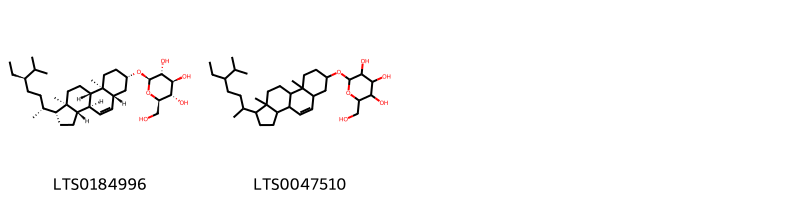{ width=100% }
    <figcaption>Hình ảnh cấu trúc hóa học của 2 hoạt chất thuộc nhóm Steroids and steroid derivatives gồm ['(2r,3r,4s,5s,6r)-2-{[(1r,3as,3bs,5ar,7s,9as,9bs,11ar)-1-[(2r,5r)-5-ethyl-6-methylheptan-2-yl]-9a,11a-dimethyl-1h,2h,3h,3ah,3bh,5ah,6h,7h,8h,9h,9bh,10h,11h-cyclopenta[a]phenanthren-7-yl]oxy}-6-(hydroxymethyl)oxane-3,4,5-triol (LTS0184996)', '2-{[1-(5-ethyl-6-methylheptan-2-yl)-9a,11a-dimethyl-1h,2h,3h,3ah,3bh,5ah,6h,7h,8h,9h,9bh,10h,11h-cyclopenta[a]phenanthren-7-yl]oxy}-6-(hydroxymethyl)oxane-3,4,5-triol (LTS0047510)'].</figcaption>
</figure>

---

### Dược dân tộc học

Danh sách các quốc gia có sử dụng *Gomphrena celosioides* trong điều trị các bệnh. 

| Country   | Disease       | Bệnh                                                                                                                                                                                                |
|:----------|:--------------|:----------------------------------------------------------------------------------------------------------------------------------------------------------------------------------------------------|
| Paraguay  | Antifertility | MYMEMORY WARNING: YOU USED ALL AVAILABLE FREE TRANSLATIONS FOR TODAY. NEXT AVAILABLE IN  13 HOURS 16 MINUTES 53 SECONDS VISIT HTTPS://MYMEMORY.TRANSLATED.NET/DOC/USAGELIMITS.PHP TO TRANSLATE MORE |

---

---
## Gomphrena corymbosa
### Thông tin về thực vật

!!! info "Phân loại thực vật của *N/A* từ GIBF:"
    - **Kingdom:** Plantae
    - **Phylum:** Tracheophyta
    - **Order:** Caryophyllales
    - **Family:** Amaranthaceae
    - **Genus:** Gomphrena
    - **Species:** *N/A*

 

| Label (VI)   | Label (EN)   | Scientific Name       | Descriptions (VI)   | Descriptions (EN)   | Also Known As (VI)   | Also Known As (EN)                                                                                                                                                  |
|:-------------|:-------------|:----------------------|:--------------------|:--------------------|:---------------------|:--------------------------------------------------------------------------------------------------------------------------------------------------------------------|
| N/A          | N/A          | Gomphrena celosioides | loài thực vật       | species of plant    | ['']                 | ['Gomphrena hygrophila var. subecristata', 'Gomphrena lutea', 'Gomphrena alba Peter', 'Gomphrena celosioides f. aureiflora', 'Gomphrena Weed', 'Xeraea celosiodes'] |

#### Phân bố trên thế giới

**Từ CSDL GIBF** Brazil, Viet Nam, Virgin Islands (British), Guadeloupe, China, Antigua and Barbuda, Gambia, Chile, Yemen, Uruguay, Thailand, Madagascar, Guinea-Bissau, Cayman Islands, Sri Lanka, Puerto Rico, Ghana, Réunion, United States of America, Indonesia, Nigeria, Argentina, Aruba, French Guiana, Cabo Verde, Mexico, Benin, Kenya, Chinese Taipei, Malaysia, Curaçao, Namibia, Bonaire, Sint Eustatius and Saba, Liberia, South Africa, Australia, Bahamas, India, Bolivia (Plurinational State of), Montserrat

#### Phân bố tại Việt Nam

**Từ CSDL GIBF**: Tiền Giang

---
### Thành phần hóa học
        
- Theo cơ sở dữ liệu lotus: Từ loài *N/A* đã phân lập và xác định được Chưa có hoạt chất nào được phân lập. hoạt chất thuộc về các nhóm Không có hoạt chất nào được phân lập. 

Không có hình ảnh nào được tạo ra

---

### Dược dân tộc học

Danh sách các quốc gia có sử dụng *N/A* trong điều trị các bệnh. 

| Country   | Disease   | Bệnh                                                                                                                                                                                                |
|:----------|:----------|:----------------------------------------------------------------------------------------------------------------------------------------------------------------------------------------------------|
| Java      | Soap      | MYMEMORY WARNING: YOU USED ALL AVAILABLE FREE TRANSLATIONS FOR TODAY. NEXT AVAILABLE IN  13 HOURS 16 MINUTES 19 SECONDS VISIT HTTPS://MYMEMORY.TRANSLATED.NET/DOC/USAGELIMITS.PHP TO TRANSLATE MORE |

---

---
## Gomphrena pulchella
### Thông tin về thực vật

!!! info "Phân loại thực vật của *Gomphrena pulchella* từ GIBF:"
    - **Kingdom:** Plantae
    - **Phylum:** Tracheophyta
    - **Order:** Caryophyllales
    - **Family:** Amaranthaceae
    - **Genus:** Gomphrena
    - **Species:** *Gomphrena pulchella*

 

| Label (VI)   | Label (EN)   | Scientific Name     | Descriptions (VI)   | Descriptions (EN)   | Also Known As (VI)   | Also Known As (EN)                                         |
|:-------------|:-------------|:--------------------|:--------------------|:--------------------|:---------------------|:-----------------------------------------------------------|
| N/A          | N/A          | Gomphrena pulchella | loài thực vật       | species of plant    | ['']                 | ['Gomphrena pulchella var. ecristata', 'Xeraea pulchella'] |

#### Phân bố trên thế giới

**Từ CSDL GIBF** nan, Brazil, Mexico, United States of America, Paraguay, Argentina, Thailand, Uruguay, Bolivia (Plurinational State of)

#### Phân bố tại Việt Nam

**Từ CSDL GIBF**: Không có ghi nhận ở Việt Nam

---
### Thành phần hóa học
        
- Theo cơ sở dữ liệu lotus: Từ loài *Gomphrena pulchella* đã phân lập và xác định được Chưa có hoạt chất nào được phân lập. hoạt chất thuộc về các nhóm Không có hoạt chất nào được phân lập. 

Không có hình ảnh nào được tạo ra

---

### Dược dân tộc học

Danh sách các quốc gia có sử dụng *Gomphrena pulchella* trong điều trị các bệnh. 

| Country   | Disease                        | Bệnh                                                                                                                                                                                                |
|:----------|:-------------------------------|:----------------------------------------------------------------------------------------------------------------------------------------------------------------------------------------------------|
| Argentina | Emollient, Diuretic, Purgative | MYMEMORY WARNING: YOU USED ALL AVAILABLE FREE TRANSLATIONS FOR TODAY. NEXT AVAILABLE IN  13 HOURS 15 MINUTES 32 SECONDS VISIT HTTPS://MYMEMORY.TRANSLATED.NET/DOC/USAGELIMITS.PHP TO TRANSLATE MORE |

---

# Chi Alternanthera

??? note "Danh sách các dược liệu thuộc chi"
    
	 - *Alternanthera aurata*
	 - *Alternanthera polygonoides*
	 - *Alternanthera repens*
	 - *Alternanthera sessilis*

---
## Alternanthera aurata
### Thông tin về thực vật

!!! info "Phân loại thực vật của *Pedersenia argentata* từ GIBF:"
    - **Kingdom:** Plantae
    - **Phylum:** Tracheophyta
    - **Order:** Caryophyllales
    - **Family:** Amaranthaceae
    - **Genus:** Pedersenia
    - **Species:** *Pedersenia argentata*

 

| Label (VI)   | Label (EN)   | Scientific Name      | Descriptions (VI)   | Descriptions (EN)   | Also Known As (VI)   | Also Known As (EN)   |
|:-------------|:-------------|:---------------------|:--------------------|:--------------------|:---------------------|:---------------------|
| N/A          | N/A          | Alternanthera aurata | loài thực vật       | species of plant    | ['']                 | ['']                 |

#### Phân bố trên thế giới

**Từ CSDL GIBF** nan, Brazil, Mexico, United States of America, Paraguay, Argentina, Thailand, Uruguay, Bolivia (Plurinational State of)

#### Phân bố tại Việt Nam

**Từ CSDL GIBF**: Không có ghi nhận ở Việt Nam

---
### Thành phần hóa học
        
- Theo cơ sở dữ liệu lotus: Từ loài *Pedersenia argentata* đã phân lập và xác định được Chưa có hoạt chất nào được phân lập. hoạt chất thuộc về các nhóm Không có hoạt chất nào được phân lập. 

Không có hình ảnh nào được tạo ra

---

### Dược dân tộc học

Danh sách các quốc gia có sử dụng *Pedersenia argentata* trong điều trị các bệnh. 

| Country   | Disease     | Bệnh                                                                                                                                                                                                |
|:----------|:------------|:----------------------------------------------------------------------------------------------------------------------------------------------------------------------------------------------------|
| Venezuela | Refrigerant | MYMEMORY WARNING: YOU USED ALL AVAILABLE FREE TRANSLATIONS FOR TODAY. NEXT AVAILABLE IN  13 HOURS 15 MINUTES 01 SECONDS VISIT HTTPS://MYMEMORY.TRANSLATED.NET/DOC/USAGELIMITS.PHP TO TRANSLATE MORE |

---

---
## Alternanthera polygonoides
### Thông tin về thực vật

!!! info "Phân loại thực vật của *N/A* từ GIBF:"
    - **Kingdom:** Plantae
    - **Phylum:** Tracheophyta
    - **Order:** Caryophyllales
    - **Family:** Amaranthaceae
    - **Genus:** Alternanthera
    - **Species:** *N/A*

 

| Label (VI)   | Label (EN)   | Scientific Name            | Descriptions (VI)   | Descriptions (EN)   | Also Known As (VI)   | Also Known As (EN)   |
|:-------------|:-------------|:---------------------------|:--------------------|:--------------------|:---------------------|:---------------------|
| N/A          | N/A          | Alternanthera polygonoides | loài thực vật       | species of plant    | ['']                 | ['']                 |

#### Phân bố trên thế giới

**Từ CSDL GIBF** Brazil, Botswana, New Zealand, Ecuador, Thailand, Uruguay, United States of America, Indonesia, Costa Rica, Argentina, French Guiana, Cabo Verde, Mexico, Kenya, Niue, Chinese Taipei, Namibia, South Africa, Australia, Myanmar, India, Peru, Belize

#### Phân bố tại Việt Nam

**Từ CSDL GIBF**: Không có ghi nhận ở Việt Nam

---
### Thành phần hóa học
        
- Theo cơ sở dữ liệu lotus: Từ loài *N/A* đã phân lập và xác định được 2 hoạt chất thuộc về các nhóm Carboxylic acids and derivatives. 

|    | chemicalTaxonomyClassyfireClass   |   smiles_count |
|---:|:----------------------------------|---------------:|
|  0 |                                   |              1 |
|  1 | Carboxylic acids and derivatives  |              1 |

#### Nhóm 
<figure markdown="span">
    { width=100% }
    <figcaption>Hình ảnh cấu trúc hóa học của 1 hoạt chất thuộc nhóm  gồm ['trigonelline (LTS0040106)'].</figcaption>
</figure>
#### Nhóm Carboxylic acids and derivatives
<figure markdown="span">
    { width=100% }
    <figcaption>Hình ảnh cấu trúc hóa học của 1 hoạt chất thuộc nhóm Carboxylic acids and derivatives gồm ['bet (LTS0164067)'].</figcaption>
</figure>

---

### Dược dân tộc học

Danh sách các quốc gia có sử dụng *N/A* trong điều trị các bệnh. 

| Country   | Disease                                                  | Bệnh                                                                                                                                                                                                |
|:----------|:---------------------------------------------------------|:----------------------------------------------------------------------------------------------------------------------------------------------------------------------------------------------------|
| Venezuela | Astringent, Diuretic, Tonic, Tonic, Diuretic, Astringent | MYMEMORY WARNING: YOU USED ALL AVAILABLE FREE TRANSLATIONS FOR TODAY. NEXT AVAILABLE IN  13 HOURS 14 MINUTES 39 SECONDS VISIT HTTPS://MYMEMORY.TRANSLATED.NET/DOC/USAGELIMITS.PHP TO TRANSLATE MORE |

---

---
## Alternanthera repens
### Thông tin về thực vật

!!! info "Phân loại thực vật của *N/A* từ GIBF:"
    - **Kingdom:** Plantae
    - **Phylum:** Tracheophyta
    - **Order:** Caryophyllales
    - **Family:** Amaranthaceae
    - **Genus:** Alternanthera
    - **Species:** *N/A*

 

| Label (VI)   | Label (EN)   | Scientific Name            | Descriptions (VI)   | Descriptions (EN)   | Also Known As (VI)   | Also Known As (EN)   |
|:-------------|:-------------|:---------------------------|:--------------------|:--------------------|:---------------------|:---------------------|
| N/A          | N/A          | Alternanthera polygonoides | loài thực vật       | species of plant    | ['']                 | ['']                 |

#### Phân bố trên thế giới

**Từ CSDL GIBF** Brazil, Botswana, New Zealand, Ecuador, Thailand, Uruguay, United States of America, Indonesia, Costa Rica, Argentina, French Guiana, Cabo Verde, Mexico, Kenya, Niue, Chinese Taipei, Namibia, South Africa, Australia, Myanmar, India, Peru, Belize

#### Phân bố tại Việt Nam

**Từ CSDL GIBF**: Không có ghi nhận ở Việt Nam

---
### Thành phần hóa học
        
- Theo cơ sở dữ liệu lotus: Từ loài *N/A* đã phân lập và xác định được Chưa có hoạt chất nào được phân lập. hoạt chất thuộc về các nhóm Không có hoạt chất nào được phân lập. 

Không có hình ảnh nào được tạo ra

---

### Dược dân tộc học

Danh sách các quốc gia có sử dụng *N/A* trong điều trị các bệnh. 

| Country   | Disease                 | Bệnh                                                                                                                                                                                                |
|:----------|:------------------------|:----------------------------------------------------------------------------------------------------------------------------------------------------------------------------------------------------|
| Ghana     | Laxative, Abortifacient | MYMEMORY WARNING: YOU USED ALL AVAILABLE FREE TRANSLATIONS FOR TODAY. NEXT AVAILABLE IN  13 HOURS 13 MINUTES 56 SECONDS VISIT HTTPS://MYMEMORY.TRANSLATED.NET/DOC/USAGELIMITS.PHP TO TRANSLATE MORE |
| Mexico    | Diaphoretic, Diuretic   | MYMEMORY WARNING: YOU USED ALL AVAILABLE FREE TRANSLATIONS FOR TODAY. NEXT AVAILABLE IN  13 HOURS 13 MINUTES 52 SECONDS VISIT HTTPS://MYMEMORY.TRANSLATED.NET/DOC/USAGELIMITS.PHP TO TRANSLATE MORE |
| US        | Diuretic                | MYMEMORY WARNING: YOU USED ALL AVAILABLE FREE TRANSLATIONS FOR TODAY. NEXT AVAILABLE IN  13 HOURS 13 MINUTES 49 SECONDS VISIT HTTPS://MYMEMORY.TRANSLATED.NET/DOC/USAGELIMITS.PHP TO TRANSLATE MORE |

---

---
## Alternanthera sessilis
### Thông tin về thực vật

!!! info "Phân loại thực vật của *Alternanthera sessilis* từ GIBF:"
    - **Kingdom:** Plantae
    - **Phylum:** Tracheophyta
    - **Order:** Caryophyllales
    - **Family:** Amaranthaceae
    - **Genus:** Alternanthera
    - **Species:** *Alternanthera sessilis*

 

| Label (VI)   | Label (EN)   | Scientific Name        | Descriptions (VI)   | Descriptions (EN)          | Also Known As (VI)   | Also Known As (EN)                                                                                                                                                             |
|:-------------|:-------------|:-----------------------|:--------------------|:---------------------------|:---------------------|:-------------------------------------------------------------------------------------------------------------------------------------------------------------------------------|
| N/A          | N/A          | Alternanthera sessilis | loài thực vật       | species of flowering plant | ['']                 | ['Paronychia sessilis', 'chaff flower', 'Achyranthes ficoidea var. sessilis', 'Achyranthes sessilis', 'Illecebrum sessile', 'sessile joyweed', 'joy weed', 'dwarf copperleaf'] |

#### Phân bố trên thế giới

**Từ CSDL GIBF** Brazil, China, Israel, Thailand, United States of America, Indonesia, Nigeria, Colombia, French Guiana, Hong Kong, Maldives, Eswatini, Chinese Taipei, Malaysia, Panama, Singapore, South Africa, Australia, India, United Kingdom of Great Britain and Northern Ireland, Cameroon

#### Phân bố tại Việt Nam

**Từ CSDL GIBF**: Không có ghi nhận ở Việt Nam

---
### Thành phần hóa học
        
- Theo cơ sở dữ liệu lotus: Từ loài *Alternanthera sessilis* đã phân lập và xác định được 11 hoạt chất thuộc về các nhóm Prenol lipids. 

|    | chemicalTaxonomyClassyfireClass   |   smiles_count |
|---:|:----------------------------------|---------------:|
|  0 | Prenol lipids                     |             11 |

#### Nhóm Prenol lipids
<figure markdown="span">
    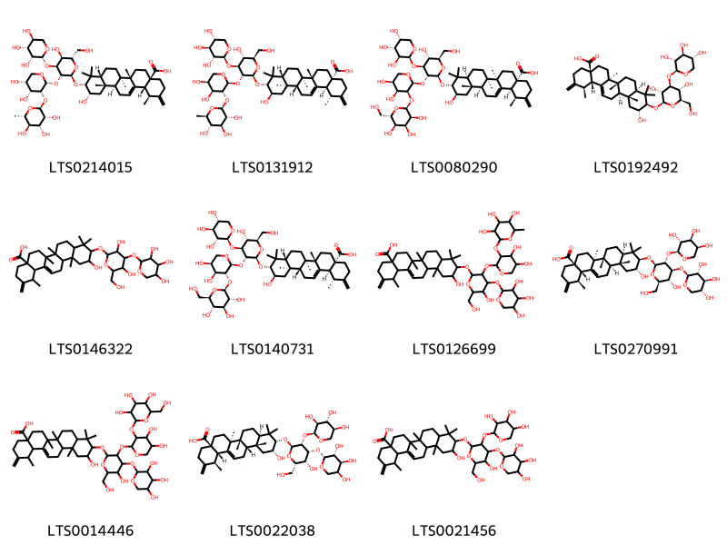{ width=100% }
    <figcaption>Hình ảnh cấu trúc hóa học của 11 hoạt chất thuộc nhóm Prenol lipids gồm ['(1s,4ar,6as,6br,8ar,10r,11s,12as,12bs,14br)-10-{[(2r,3r,4s,5s,6s)-3-{[(2r,3r,4r,5r)-4,5-dihydroxy-3-{[(2s,3r,4r,5r,6s)-3,4,5-trihydroxy-6-methyloxan-2-yl]oxy}oxan-2-yl]oxy}-5-hydroxy-6-(hydroxymethyl)-4-{[(2r,3r,4r,5s)-3,4,5-trihydroxyoxan-2-yl]oxy}oxan-2-yl]oxy}-11-hydroxy-1,6a,6b,9,9,12a-hexamethyl-2-methylidene-1,3,4,5,6,7,8,8a,10,11,12,12b,13,14b-tetradecahydropicene-4a-carboxylic acid (LTS0214015)', '(1r,4as,6as,6br,8ar,10r,11r,12ar,12br,14bs)-10-{[(2r,3r,4s,5r,6r)-3-{[(2s,3r,4s,5s)-4,5-dihydroxy-3-{[(2s,3r,4s,5s,6r)-3,4,5-trihydroxy-6-methyloxan-2-yl]oxy}oxan-2-yl]oxy}-5-hydroxy-6-(hydroxymethyl)-4-{[(2s,3r,4s,5r)-3,4,5-trihydroxyoxan-2-yl]oxy}oxan-2-yl]oxy}-11-hydroxy-1,6a,6b,9,9,12a-hexamethyl-2-methylidene-1,3,4,5,6,7,8,8a,10,11,12,12b,13,14b-tetradecahydropicene-4a-carboxylic acid (LTS0131912)', '(1s,4as,6ar,6br,8as,10r,11r,12as,12bs,14bs)-10-{[(2r,3r,4s,5r,6r)-3-{[(2s,3s,4s,5s)-4,5-dihydroxy-3-{[(2s,3s,4s,5r,6s)-3,4,5-trihydroxy-6-(hydroxymethyl)oxan-2-yl]oxy}oxan-2-yl]oxy}-5-hydroxy-6-(hydroxymethyl)-4-{[(2s,3s,4r,5r)-3,4,5-trihydroxyoxan-2-yl]oxy}oxan-2-yl]oxy}-11-hydroxy-1,6a,6b,9,9,12a-hexamethyl-2-methylidene-1,3,4,5,6,7,8,8a,10,11,12,12b,13,14b-tetradecahydropicene-4a-carboxylic acid (LTS0080290)', '(1r,4as,6as,6br,8ar,10r,11r,12ar,12br,14bs)-10-{[(2r,3r,4s,5r,6r)-3,5-dihydroxy-6-(hydroxymethyl)-4-{[(2s,3r,4s,5r)-3,4,5-trihydroxyoxan-2-yl]oxy}oxan-2-yl]oxy}-11-hydroxy-1,6a,6b,9,9,12a-hexamethyl-2-methylidene-1,3,4,5,6,7,8,8a,10,11,12,12b,13,14b-tetradecahydropicene-4a-carboxylic acid (LTS0192492)', '10-{[3,5-dihydroxy-6-(hydroxymethyl)-4-[(3,4,5-trihydroxyoxan-2-yl)oxy]oxan-2-yl]oxy}-11-hydroxy-1,6a,6b,9,9,12a-hexamethyl-2-methylidene-1,3,4,5,6,7,8,8a,10,11,12,12b,13,14b-tetradecahydropicene-4a-carboxylic acid (LTS0146322)', '(1r,4as,6as,6br,8ar,10r,11r,12ar,12br,14bs)-10-{[(2r,3r,4s,5r,6r)-3-{[(2s,3r,4s,5s)-4,5-dihydroxy-3-{[(2s,3r,4s,5s,6r)-3,4,5-trihydroxy-6-(hydroxymethyl)oxan-2-yl]oxy}oxan-2-yl]oxy}-5-hydroxy-6-(hydroxymethyl)-4-{[(2s,3r,4s,5r)-3,4,5-trihydroxyoxan-2-yl]oxy}oxan-2-yl]oxy}-11-hydroxy-1,6a,6b,9,9,12a-hexamethyl-2-methylidene-1,3,4,5,6,7,8,8a,10,11,12,12b,13,14b-tetradecahydropicene-4a-carboxylic acid (LTS0140731)', '10-{[3-({4,5-dihydroxy-3-[(3,4,5-trihydroxy-6-methyloxan-2-yl)oxy]oxan-2-yl}oxy)-5-hydroxy-6-(hydroxymethyl)-4-[(3,4,5-trihydroxyoxan-2-yl)oxy]oxan-2-yl]oxy}-11-hydroxy-1,6a,6b,9,9,12a-hexamethyl-2-methylidene-1,3,4,5,6,7,8,8a,10,11,12,12b,13,14b-tetradecahydropicene-4a-carboxylic acid (LTS0126699)', '(1r,4as,6as,6br,8ar,10r,11r,12ar,12br,14bs)-11-hydroxy-10-{[(2r,3r,4s,5r,6r)-5-hydroxy-6-(hydroxymethyl)-4-{[(2s,3r,4s,5r)-3,4,5-trihydroxyoxan-2-yl]oxy}-3-{[(2s,3r,4s,5s)-3,4,5-trihydroxyoxan-2-yl]oxy}oxan-2-yl]oxy}-1,6a,6b,9,9,12a-hexamethyl-2-methylidene-1,3,4,5,6,7,8,8a,10,11,12,12b,13,14b-tetradecahydropicene-4a-carboxylic acid (LTS0270991)', '10-({3-[(4,5-dihydroxy-3-{[3,4,5-trihydroxy-6-(hydroxymethyl)oxan-2-yl]oxy}oxan-2-yl)oxy]-5-hydroxy-6-(hydroxymethyl)-4-[(3,4,5-trihydroxyoxan-2-yl)oxy]oxan-2-yl}oxy)-11-hydroxy-1,6a,6b,9,9,12a-hexamethyl-2-methylidene-1,3,4,5,6,7,8,8a,10,11,12,12b,13,14b-tetradecahydropicene-4a-carboxylic acid (LTS0014446)', '(1r,4as,6as,6br,8ar,10s,11r,12ar,12bs,14bs)-11-hydroxy-10-{[(2r,3r,4r,5r,6s)-5-hydroxy-6-(hydroxymethyl)-4-{[(2r,3r,4s,5s)-3,4,5-trihydroxyoxan-2-yl]oxy}-3-{[(2s,3s,4r,5s)-3,4,5-trihydroxyoxan-2-yl]oxy}oxan-2-yl]oxy}-1,6a,6b,9,9,12a-hexamethyl-2-methylidene-1,3,4,5,6,7,8,8a,10,11,12,12b,13,14b-tetradecahydropicene-4a-carboxylic acid (LTS0022038)', '11-hydroxy-10-{[5-hydroxy-6-(hydroxymethyl)-3,4-bis[(3,4,5-trihydroxyoxan-2-yl)oxy]oxan-2-yl]oxy}-1,6a,6b,9,9,12a-hexamethyl-2-methylidene-1,3,4,5,6,7,8,8a,10,11,12,12b,13,14b-tetradecahydropicene-4a-carboxylic acid (LTS0021456)'].</figcaption>
</figure>

---

### Dược dân tộc học

Danh sách các quốc gia có sử dụng *Alternanthera sessilis* trong điều trị các bệnh. 

| Country   | Disease   | Bệnh                                                                                                                                                                                                |
|:----------|:----------|:----------------------------------------------------------------------------------------------------------------------------------------------------------------------------------------------------|
| India     | Collyrium | MYMEMORY WARNING: YOU USED ALL AVAILABLE FREE TRANSLATIONS FOR TODAY. NEXT AVAILABLE IN  13 HOURS 13 MINUTES 24 SECONDS VISIT HTTPS://MYMEMORY.TRANSLATED.NET/DOC/USAGELIMITS.PHP TO TRANSLATE MORE |

---

# Chi Celosia

??? note "Danh sách các dược liệu thuộc chi"
    
	 - *Celosia argentea*
	 - *Celosia cristata*
	 - *Celosia stuhlmanniana*

---
## Celosia argentea
### Thông tin về thực vật

!!! info "Phân loại thực vật của *Celosia argentea* từ GIBF:"
    - **Kingdom:** Plantae
    - **Phylum:** Tracheophyta
    - **Order:** Caryophyllales
    - **Family:** Amaranthaceae
    - **Genus:** Celosia
    - **Species:** *Celosia argentea*

 

| Label (VI)   | Label (EN)   | Scientific Name   | Descriptions (VI)   | Descriptions (EN)   | Also Known As (VI)   | Also Known As (EN)                                          |
|:-------------|:-------------|:------------------|:--------------------|:--------------------|:---------------------|:------------------------------------------------------------|
| N/A          | N/A          | Celosia argentea  | loài thực vật       | species of plant    | ['']                 | ['caudatus', 'plumed cockscomb', 'silver spiked cockscomb'] |

#### Phân bố trên thế giới

**Từ CSDL GIBF** Brazil, Guatemala, Viet Nam, Japan, Guadeloupe, Barbados, China, Antigua and Barbuda, Saint Lucia, Honduras, Ecuador, Trinidad and Tobago, Thailand, Puerto Rico, Sri Lanka, United States of America, Indonesia, Costa Rica, Dominican Republic, Colombia, Nigeria, Lao People’s Democratic Republic, Hong Kong, Mexico, Maldives, Guam, France, Chinese Taipei, Malaysia, Philippines, Singapore, Cambodia, Bahamas, South Africa, Australia, Myanmar, India, Peru, Bolivia (Plurinational State of), Belize

#### Phân bố tại Việt Nam

**Từ CSDL GIBF**: Quảng Nam, Thừa Thiên - Huế, Nghệ An, Đà Nẵng, Bến Tre, Quảng Ninh, Đắk Lắk, Hồ Chí Minh city, Hà Giang, Khánh Hòa

---
### Thành phần hóa học
        
- Theo cơ sở dữ liệu lotus: Từ loài *Celosia argentea* đã phân lập và xác định được 102 hoạt chất thuộc về các nhóm Fatty Acyls, Flavonoids, Carboxylic acids and derivatives, Steroids and steroid derivatives, Phenols, Organooxygen compounds, Isoflavonoids, Prenol lipids, Betalains. 

|    | chemicalTaxonomyClassyfireClass   |   smiles_count |
|---:|:----------------------------------|---------------:|
|  0 |                                   |              1 |
|  1 | Betalains                         |              2 |
|  2 | Carboxylic acids and derivatives  |             61 |
|  3 | Fatty Acyls                       |              3 |
|  4 | Flavonoids                        |              8 |
|  5 | Isoflavonoids                     |              1 |
|  6 | Organooxygen compounds            |              6 |
|  7 | Phenols                           |              3 |
|  8 | Prenol lipids                     |              2 |
|  9 | Steroids and steroid derivatives  |             14 |

#### Nhóm 
<figure markdown="span">
    { width=100% }
    <figcaption>Hình ảnh cấu trúc hóa học của 1 hoạt chất thuộc nhóm  gồm ['trigonelline (LTS0040106)'].</figcaption>
</figure>
#### Nhóm Betalains
<figure markdown="span">
    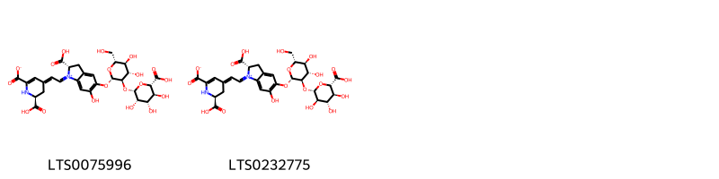{ width=100% }
    <figcaption>Hình ảnh cấu trúc hóa học của 2 hoạt chất thuộc nhóm Betalains gồm ['(2s)-2-carboxy-5-{[(2s,3r,4s,5s,6r)-3-{[(2r,3s,4s,5s,6s)-6-carboxy-3,4,5-trihydroxyoxan-2-yl]oxy}-4,5-dihydroxy-6-(hydroxymethyl)oxan-2-yl]oxy}-1-{2-[(2s)-2-carboxy-6-carboxylato-2,3-dihydro-1h-pyridin-4-ylidene]ethylidene}-6-hydroxy-2,3-dihydro-1h-1λ⁵-indol-1-ylium (LTS0075996)', '(2s)-2-carboxy-5-{[(2s,3r,4s,5s,6r)-3-{[(2r,3r,4s,5s,6s)-6-carboxy-3,4,5-trihydroxyoxan-2-yl]oxy}-4,5-dihydroxy-6-(hydroxymethyl)oxan-2-yl]oxy}-1-{2-[(2s)-2-carboxy-6-carboxylato-2,3-dihydro-1h-pyridin-4-ylidene]ethylidene}-6-hydroxy-2,3-dihydro-1h-1λ⁵-indol-1-ylium (LTS0232775)'].</figcaption>
</figure>
#### Nhóm Carboxylic acids and derivatives
<figure markdown="span">
    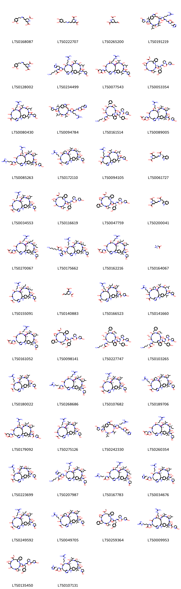{ width=100% }
    <figcaption>Hình ảnh cấu trúc hóa học của 61 hoạt chất thuộc nhóm Carboxylic acids and derivatives gồm ['(2r,4e)-4-[(2z)-2-{[2-(3,4-dihydroxyphenyl)ethyl]imino}ethylidene]-2,3-dihydro-1h-pyridine-2,6-dicarboxylic acid (LTS0168087)', '4-(2-{[2-(3,4-dihydroxyphenyl)ethyl]imino}ethylidene)-2,3-dihydro-1h-pyridine-2,6-dicarboxylic acid (LTS0222707)', 'betalamic acid (LTS0265200)', '(2s)-2-[(2-{[(2s)-5-carbamimidamido-1-hydroxy-2-({hydroxy[(4r,6s,9s,12s,15s,16r)-3,4,8,11,14-pentahydroxy-15-({hydroxy[(2s)-5-hydroxy-3,4-dihydro-2h-pyrrol-2-yl]methylidene}amino)-9,16-diisopropyl-12-(2-methylpropyl)-2,7,10,13-tetraazatricyclo[15.3.1.0⁴,²⁰]henicosa-1(21),2,7,10,13,17,19-heptaen-6-yl]methylidene}amino)pentylidene]amino}-1-hydroxyethylidene)amino]-3-(3h-imidazol-4-yl)propanoic acid (LTS0191219)', '(2s,4e)-4-[(2z)-2-{[2-(3,4-dihydroxyphenyl)ethyl]imino}ethylidene]-2,3-dihydro-1h-pyridine-2,6-dicarboxylic acid (LTS0128002)', '6-amino-2-{[2-({[13-(3-carbamimidamidopropyl)-12,15,18,21,24-pentahydroxy-25-{[hydroxy(5-hydroxy-3,4-dihydro-2h-pyrrol-2-yl)methylidene]amino}-19,26-diisopropyl-22-(2-methylpropyl)-3,5,7,11,14,17,20,23-octaazapentacyclo[14.13.2.1²,²⁷.1⁵,⁸.0⁴,³⁰]tritriaconta-1(29),2(32),4(30),6,8(33),11,14,17,20,23,27-undecaen-10-yl](hydroxy)methylidene}amino)-1-hydroxy-3-(3h-imidazol-4-yl)propylidene]amino}hexanoic acid (LTS0234499)', '2-({[21-(3-carbamimidamidopropyl)-10,13,16,19,22,25-hexahydroxy-9-{[hydroxy(5-hydroxy-3,4-dihydro-2h-pyrrol-2-yl)methylidene]amino}-8,15-diisopropyl-12-(2-methylpropyl)-2,11,14,17,20,23,26,30,32-nonaazapentacyclo[16.14.2.1³,⁷.1²⁹,³².0⁴,³³]hexatriaconta-1(33),3(36),4,6,10,13,16,19,22,25,29(35),30-dodecaen-27-yl](hydroxy)methylidene}amino)butanedioic acid (LTS0077543)', '(2s)-2-({hydroxy[(2s)-1-[(2s)-5-hydroxy-3,4-dihydro-2h-pyrrole-2-carbonyl]pyrrolidin-2-yl]methylidene}amino)-3-(4-hydroxyphenyl)-n-[(2r,5s,11s,14s)-3,6,9,12-tetrahydroxy-11-(hydroxymethyl)-5-isopropyl-14-(methoxycarbonyl)-1,4,7,10,13-pentaazatricyclo[14.6.1.0¹⁷,²²]tricosa-3,6,9,12,16(23),17,19,21-octaen-2-yl]propanimidic acid (LTS0053354)', '21-(3-carbamimidamidopropyl)-10,13,16,19,22,25-hexahydroxy-9-{[hydroxy(5-hydroxy-3,4-dihydro-2h-pyrrol-2-yl)methylidene]amino}-8,15-diisopropyl-12-(2-methylpropyl)-2,11,14,17,20,23,26,30,32-nonaazapentacyclo[16.14.2.1³,⁷.1²⁹,³².0⁴,³³]hexatriaconta-1(33),3(36),4,6,10,13,16,19,22,25,29(35),30-dodecaene-27-carboxylic acid (LTS0080430)', '2-({2-[(5-carbamimidamido-1-hydroxy-2-{[hydroxy(3,4,8,11,14-pentahydroxy-15-{[hydroxy(5-hydroxy-3,4-dihydro-2h-pyrrol-2-yl)methylidene]amino}-9,16-diisopropyl-12-(2-methylpropyl)-2,7,10,13-tetraazatricyclo[15.3.1.0⁴,²⁰]henicosa-1(21),2,7,10,13,17,19-heptaen-6-yl)methylidene]amino}pentylidene)amino]-1-hydroxyethylidene}amino)-3-(3h-imidazol-4-yl)propanoic acid (LTS0094784)', '(2s)-6-amino-2-({[(2s,5s,8s,11s,14s)-8-benzyl-3,6,9,12-tetrahydroxy-2-{[(2s)-1-hydroxy-2-({hydroxy[(2s)-1-[(2s)-5-hydroxy-3,4-dihydro-2h-pyrrole-2-carbonyl]pyrrolidin-2-yl]methylidene}amino)-3-(4-hydroxyphenyl)propylidene]amino}-11-(hydroxymethyl)-5-isopropyl-1,4,7,10,13-pentaazatricyclo[14.6.1.0¹⁷,²²]tricosa-3,6,9,12,16(23),17,19,21-octaen-14-yl](hydroxy)methylidene}amino)hexanoic acid (LTS0161514)', '(2s)-2-({[(10s,16s,18s,21s,24s,27s,28s)-16-(3-carbamimidamidopropyl)-12,15,20,23,26-pentahydroxy-27-{2-[(2s)-5-hydroxy-3,4-dihydro-2h-pyrrol-2-yl]-2-oxoacetamido}-21,28-diisopropyl-24-(2-methylpropyl)-17-oxo-3,5,7,11,14,19,22,25-octaazapentacyclo[16.13.2.1²,²⁹.1⁵,⁸.0⁴,³²]pentatriaconta-1(31),2(34),4(32),6,8(35),11,14,19,22,25,29-undecaen-10-yl](hydroxy)methylidene}amino)butanedioic acid (LTS0089005)', '5-carbamimidamido-2-({[(10s,16r,21s,24s,27s,28r)-16-(3-carbamimidamidopropyl)-12,15,20,23,26-pentahydroxy-27-{2-[(2s)-5-hydroxy-3,4-dihydro-2h-pyrrol-2-yl]-2-oxoacetamido}-28-isopropyl-24-(2-methylpropyl)-17-oxo-21-(sec-butyl)-3,5,7,11,14,19,22,25-octaazapentacyclo[16.13.2.1²,²⁹.1⁵,⁸.0⁴,³²]pentatriaconta-1(31),2(34),4(32),6,8(35),11,14,19,22,25,29-undecaen-10-yl](hydroxy)methylidene}amino)pentanoic acid (LTS0085263)', '(7s,10s,13s,19s,22s,25s,28s,29r)-25-[(2r)-butan-2-yl]-10-(3-carbamimidamidopropyl)-9,12,21,24,27-pentahydroxy-28-({hydroxy[(2s)-5-hydroxy-3,4-dihydro-2h-pyrrol-2-yl]methylidene}amino)-22,29-diisopropyl-18-oxo-2,4,8,11,17,20,23,26,35-nonaazahexacyclo[17.16.2.1²,⁵.1³⁰,³⁴.0¹³,¹⁷.0³³,³⁶]nonatriaconta-1(36),3,5(39),8,11,20,23,26,30,32,34(38)-undecaene-7-carboxylic acid (LTS0172110)', '13-(3-carbamimidamidopropyl)-12,15,18,21,24-pentahydroxy-25-{[hydroxy(5-hydroxy-3,4-dihydro-2h-pyrrol-2-yl)methylidene]amino}-19,26-diisopropyl-22-(2-methylpropyl)-3,5,7,11,14,17,20,23-octaazapentacyclo[14.13.2.1²,²⁷.1⁵,⁸.0⁴,³⁰]tritriaconta-1(29),2(32),4(30),6,8(33),11,14,17,20,23,27-undecaene-10-carboxylic acid (LTS0094105)', '(2s,4z)-4-(2-{[(1s)-1-carboxy-2-(1h-indol-3-yl)ethyl]imino}ethylidene)-2,3-dihydro-1h-pyridine-2,6-dicarboxylic acid (LTS0061727)', '(8r,9s,12s,15s,18s,21s,27s)-21-(3-carbamimidamidopropyl)-10,13,16,19,22,25-hexahydroxy-9-({hydroxy[(2s)-5-hydroxy-3,4-dihydro-2h-pyrrol-2-yl]methylidene}amino)-8,15-diisopropyl-12-(2-methylpropyl)-2,11,14,17,20,23,26,30,32-nonaazapentacyclo[16.14.2.1³,⁷.1²⁹,³².0⁴,³³]hexatriaconta-1(33),3(36),4,6,10,13,16,19,22,25,29(35),30-dodecaene-27-carboxylic acid (LTS0034553)', '(2s)-2-({hydroxy[(2s)-1-[(2s)-5-hydroxy-3,4-dihydro-2h-pyrrole-2-carbonyl]pyrrolidin-2-yl]methylidene}amino)-3-(4-hydroxyphenyl)-n-[(2s,5s,11s,14s)-3,6,9,12-tetrahydroxy-11-(hydroxymethyl)-5-isopropyl-14-(methoxycarbonyl)-1,4,7,10,13-pentaazatricyclo[14.6.1.0¹⁷,²²]tricosa-3,6,9,12,16(23),17,19,21-octaen-2-yl]propanimidic acid (LTS0116619)', '(2s)-n-[(2s,5s,8r,11s,14s)-8-benzyl-3,6,9,12-tetrahydroxy-11-(hydroxymethyl)-5-isopropyl-14-(methoxycarbonyl)-1,4,7,10,13-pentaazatricyclo[14.6.1.0¹⁷,²²]tricosa-3,6,9,12,16(23),17,19,21-octaen-2-yl]-2-({hydroxy[(2s)-1-[(2s)-5-hydroxy-3,4-dihydro-2h-pyrrole-2-carbonyl]pyrrolidin-2-yl]methylidene}amino)-3-(4-hydroxyphenyl)propanimidic acid (LTS0047759)', '(4e)-4-(2-{[1-carboxy-2-(1h-indol-3-yl)ethyl]imino}ethylidene)-2,3-dihydro-1h-pyridine-2,6-dicarboxylic acid (LTS0200041)', '(2s)-2-({[(8r,9s,12s,15s,18s,21s,27s)-15-[(2r)-butan-2-yl]-12-[(2s)-butan-2-yl]-21-(3-carbamimidamidopropyl)-10,13,16,19,22,25-hexahydroxy-9-({hydroxy[(2s)-5-hydroxy-3,4-dihydro-2h-pyrrol-2-yl]methylidene}amino)-8-isopropyl-2,11,14,17,20,23,26,30,32-nonaazapentacyclo[16.14.2.1³,⁷.1²⁹,³².0⁴,³³]hexatriaconta-1(33),3(36),4,6,10,13,16,19,22,25,29(35),30-dodecaen-27-yl](hydroxy)methylidene}amino)butanedioic acid (LTS0270067)', '(2s)-7-amino-2-{[(2s)-2-({[(10s,13s,16s,19r,22s,25s,26r)-22-[(2s)-butan-2-yl]-13-(3-carbamimidamidopropyl)-12,15,18,21,24-pentahydroxy-25-({hydroxy[(2r)-5-hydroxy-3,4-dihydro-2h-pyrrol-2-yl]methylidene}amino)-19,26-diisopropyl-3,5,7,11,14,17,20,23-octaazapentacyclo[14.13.2.1²,²⁷.1⁵,⁸.0⁴,³⁰]tritriaconta-1(29),2(32),4(30),6,8(33),11,14,17,20,23,27-undecaen-10-yl](hydroxy)methylidene}amino)-1-hydroxy-2-(3h-imidazol-4-yl)ethylidene]amino}heptanoic acid (LTS0175662)', '(2s)-2-({[(8r,9s,12s,15s,18s,21s,27r)-15-[(2s)-butan-2-yl]-21-(3-carbamimidamidopropyl)-10,13,16,19,22,25-hexahydroxy-9-({hydroxy[(2s)-5-hydroxy-3,4-dihydro-2h-pyrrol-2-yl]methylidene}amino)-8-isopropyl-12-(2-methylpropyl)-2,11,14,17,20,23,26,30,32-nonaazapentacyclo[16.14.2.1³,⁷.1²⁹,³².0⁴,³³]hexatriaconta-1(33),3(36),4,6,10,13,16,19,22,25,29(35),30-dodecaen-27-yl](hydroxy)methylidene}amino)butanedioic acid (LTS0162216)', 'bet (LTS0164067)', '(8s,9s,12s,15s,18s,21s,27r)-12,15-bis[(2r)-butan-2-yl]-21-(3-carbamimidamidopropyl)-10,13,16,19,22,25-hexahydroxy-9-({hydroxy[(2r)-5-hydroxy-3,4-dihydro-2h-pyrrol-2-yl]methylidene}amino)-8-isopropyl-2,11,14,17,20,23,26,30,32-nonaazapentacyclo[16.14.2.1³,⁷.1²⁹,³².0⁴,³³]hexatriaconta-1(33),3(36),4,6,10,13,16,19,22,25,29(35),30-dodecaene-27-carboxylic acid (LTS0155091)', '(2s,4z)-4-(2-oxoethylidene)-2,3-dihydro-1h-pyridine-2,6-dicarboxylic acid (LTS0140883)', '(10s,16r,21s,24s,27s,28r)-16-(3-carbamimidamidopropyl)-12,15,20,23,26-pentahydroxy-27-{2-[(2s)-5-hydroxy-3,4-dihydro-2h-pyrrol-2-yl]-2-oxoacetamido}-28-isopropyl-24-(2-methylpropyl)-17-oxo-21-(sec-butyl)-3,5,7,11,14,19,22,25-octaazapentacyclo[16.13.2.1²,²⁹.1⁵,⁸.0⁴,³²]pentatriaconta-1(31),2(34),4(32),6,8(35),11,14,19,22,25,29-undecaene-10-carboxylic acid (LTS0166523)', '10-(3-carbamimidamidopropyl)-9,12,21,24,27-pentahydroxy-28-{[hydroxy(5-hydroxy-3,4-dihydro-2h-pyrrol-2-yl)methylidene]amino}-22,29-diisopropyl-25-(2-methylpropyl)-18-oxo-2,4,8,11,17,20,23,26,35-nonaazahexacyclo[17.16.2.1²,⁵.1³⁰,³⁴.0¹³,¹⁷.0³³,³⁶]nonatriaconta-1(36),3,5(39),8,11,20,23,26,30,32,34(38)-undecaene-7-carboxylic acid (LTS0141660)', '(2s)-2-({[(8r,9s,12s,15s,18s,21s,27r)-21-(3-carbamimidamidopropyl)-10,13,16,19,22,25-hexahydroxy-9-({hydroxy[(2s)-5-hydroxy-3,4-dihydro-2h-pyrrol-2-yl]methylidene}amino)-8,15-diisopropyl-12-(2-methylpropyl)-2,11,14,17,20,23,26,30,32-nonaazapentacyclo[16.14.2.1³,⁷.1²⁹,³².0⁴,³³]hexatriaconta-1(33),3(36),4,6,10,13,16,19,22,25,29(35),30-dodecaen-27-yl](hydroxy)methylidene}amino)butanedioic acid (LTS0161052)', '(2s)-n-[(2r,5r,8s,11s,14s)-8-benzyl-3,6,9,12-tetrahydroxy-11-(hydroxymethyl)-5-isopropyl-14-(methoxycarbonyl)-1,4,7,10,13-pentaazatricyclo[14.6.1.0¹⁷,²²]tricosa-3,6,9,12,16(23),17,19,21-octaen-2-yl]-2-({hydroxy[(2s)-1-[(2s)-5-hydroxy-3,4-dihydro-2h-pyrrole-2-carbonyl]pyrrolidin-2-yl]methylidene}amino)-3-(4-hydroxyphenyl)propanimidic acid (LTS0098141)', '(2s)-6-amino-2-({[(2s,5s,8r,11s,14r)-8-benzyl-3,6,9,12-tetrahydroxy-2-{[(2s)-1-hydroxy-2-({hydroxy[(2s)-1-[(2r)-5-hydroxy-3,4-dihydro-2h-pyrrole-2-carbonyl]pyrrolidin-2-yl]methylidene}amino)-3-(4-hydroxyphenyl)propylidene]amino}-11-(hydroxymethyl)-5-isopropyl-1,4,7,10,13-pentaazatricyclo[14.6.1.0¹⁷,²²]tricosa-3,6,9,12,16(23),17,19,21-octaen-14-yl](hydroxy)methylidene}amino)hexanoic acid (LTS0227747)', '(2s)-6-amino-2-({[(2s,5s,8r,11s,14s)-8-benzyl-3,6,9,12-tetrahydroxy-2-{[(2s)-1-hydroxy-2-({hydroxy[(2s)-1-[(2s)-5-hydroxy-3,4-dihydro-2h-pyrrole-2-carbonyl]pyrrolidin-2-yl]methylidene}amino)-3-(4-hydroxyphenyl)propylidene]amino}-11-(hydroxymethyl)-5-isopropyl-1,4,7,10,13-pentaazatricyclo[14.6.1.0¹⁷,²²]tricosa-3,6,9,12,16(23),17,19,21-octaen-14-yl](hydroxy)methylidene}amino)hexanoic acid (LTS0103265)', '(10r,13s,16s,19s,22s,25s,26r)-13-(3-carbamimidamidopropyl)-12,15,18,21,24-pentahydroxy-25-({hydroxy[(2s)-5-hydroxy-3,4-dihydro-2h-pyrrol-2-yl]methylidene}amino)-19,26-diisopropyl-22-(2-methylpropyl)-3,5,7,11,14,17,20,23-octaazapentacyclo[14.13.2.1²,²⁷.1⁵,⁸.0⁴,³⁰]tritriaconta-1(29),2(32),4(30),6,8(33),11,14,17,20,23,27-undecaene-10-carboxylic acid (LTS0180022)', '(2s)-2-({[(8r,9s,12s,15s,18s,21s,27r)-15-[(2s)-butan-2-yl]-21-(3-carbamimidamidopropyl)-10,13,16,19,22,25-hexahydroxy-9-({hydroxy[(2s)-5-hydroxy-3,4-dihydro-2h-pyrrol-2-yl]methylidene}amino)-8-isopropyl-12-(2-methylpropyl)-2,11,14,17,20,23,26,30,32-nonaazapentacyclo[16.14.2.1³,⁷.1²⁹,³².0⁴,³³]hexatriaconta-1(33),3(36),4,6,10,13,16,19,22,25,29(35),30-dodecaen-27-yl](hydroxy)methylidene}amino)-5-carbamimidamidopentanoic acid (LTS0268686)', '(8s,9s,12s,15s,18s,21s,27s)-21-(3-carbamimidamidopropyl)-10,13,16,19,22,25-hexahydroxy-9-({hydroxy[(2s)-5-hydroxy-3,4-dihydro-2h-pyrrol-2-yl]methylidene}amino)-8,15-diisopropyl-12-(2-methylpropyl)-2,11,14,17,20,23,26,30,32-nonaazapentacyclo[16.14.2.1³,⁷.1²⁹,³².0⁴,³³]hexatriaconta-1(33),3(36),4,6,10,13,16,19,22,25,29(35),30-dodecaene-27-carboxylic acid (LTS0107682)', '(7s,10s,13s,19s,22s,25s,28s,29r)-10-(3-carbamimidamidopropyl)-9,12,21,24,27-pentahydroxy-28-({hydroxy[(2s)-5-hydroxy-3,4-dihydro-2h-pyrrol-2-yl]methylidene}amino)-22,29-diisopropyl-25-(2-methylpropyl)-18-oxo-2,4,8,11,17,20,23,26,35-nonaazahexacyclo[17.16.2.1²,⁵.1³⁰,³⁴.0¹³,¹⁷.0³³,³⁶]nonatriaconta-1(36),3,5(39),8,11,20,23,26,30,32,34(38)-undecaene-7-carboxylic acid (LTS0189706)', '2-({[(10s,16r,21s,24s,27s,28r)-16-(3-carbamimidamidopropyl)-12,15,20,23,26-pentahydroxy-27-{2-[(2s)-5-hydroxy-3,4-dihydro-2h-pyrrol-2-yl]-2-oxoacetamido}-28-isopropyl-24-(2-methylpropyl)-17-oxo-21-(sec-butyl)-3,5,7,11,14,19,22,25-octaazapentacyclo[16.13.2.1²,²⁹.1⁵,⁸.0⁴,³²]pentatriaconta-1(31),2(34),4(32),6,8(35),11,14,19,22,25,29-undecaen-10-yl](hydroxy)methylidene}amino)butanedioic acid (LTS0179092)', '(8r,9s,12s,15s,18s,21s,27r)-21-(3-carbamimidamidopropyl)-10,13,16,19,22,25-hexahydroxy-9-({hydroxy[(2s)-5-hydroxy-3,4-dihydro-2h-pyrrol-2-yl]methylidene}amino)-8,15-diisopropyl-12-(2-methylpropyl)-2,11,14,17,20,23,26,30,32-nonaazapentacyclo[16.14.2.1³,⁷.1²⁹,³².0⁴,³³]hexatriaconta-1(33),3(36),4,6,10,13,16,19,22,25,29(35),30-dodecaene-27-carboxylic acid (LTS0275126)', '(2r)-2-[(2-{[(2r)-5-carbamimidamido-2-({[(4s,6r,12s,15r,16s)-3,4-dihydroxy-15-({hydroxy[(2s)-5-hydroxy-3,4-dihydro-2h-pyrrol-2-yl]methylidene}amino)-9,16-diisopropyl-12-(2-methylpropyl)-8,11,14-trioxa-2,7,10,13-tetraazatricyclo[15.3.1.0⁴,²⁰]henicosa-1(21),2,17,19-tetraen-6-yl](hydroxy)methylidene}amino)-1-hydroxypentylidene]amino}-1-hydroxyethylidene)amino]-3-(3h-imidazol-4-yl)propanoic acid (LTS0242330)', '(2r)-2-({[(8s,9r,12r,15r,18s,21s,27r)-12-[(2s)-butan-2-yl]-21-(3-carbamimidamidopropyl)-10,13,16,19,22,25-hexahydroxy-9-({hydroxy[(2r)-5-hydroxy-3,4-dihydro-2h-pyrrol-2-yl]methylidene}amino)-8,15-diisopropyl-2,11,14,17,20,23,26,30,32-nonaazapentacyclo[16.14.2.1³,⁷.1²⁹,³².0⁴,³³]hexatriaconta-1(33),3(36),4,6,10,13,16,19,22,25,29(35),30-dodecaen-27-yl](hydroxy)methylidene}amino)butanedioic acid (LTS0260354)', '(10s,13s,16s,19s,22s,25s,26r)-22-[(2r)-butan-2-yl]-13-(3-carbamimidamidopropyl)-12,15,18,21,24-pentahydroxy-25-({hydroxy[(2s)-5-hydroxy-3,4-dihydro-2h-pyrrol-2-yl]methylidene}amino)-19,26-diisopropyl-3,5,7,11,14,17,20,23-octaazapentacyclo[14.13.2.1²,²⁷.1⁵,⁸.0⁴,³⁰]tritriaconta-1(29),2(32),4(30),6,8(33),11,14,17,20,23,27-undecaene-10-carboxylic acid (LTS0223699)', '(2s)-6-amino-2-{[(2s)-2-({[(10r,13s,16s,19s,22s,25s,26r)-13-(3-carbamimidamidopropyl)-12,15,18,21,24-pentahydroxy-25-({hydroxy[(2s)-5-hydroxy-3,4-dihydro-2h-pyrrol-2-yl]methylidene}amino)-19,26-diisopropyl-22-(2-methylpropyl)-3,5,7,11,14,17,20,23-octaazapentacyclo[14.13.2.1²,²⁷.1⁵,⁸.0⁴,³⁰]tritriaconta-1(29),2(32),4(30),6,8(33),11,14,17,20,23,27-undecaen-10-yl](hydroxy)methylidene}amino)-1-hydroxy-3-(3h-imidazol-4-yl)propylidene]amino}hexanoic acid (LTS0207987)', '(2s)-2-({[(8r,9r,12r,15r,18r,21r,27s)-12,15-bis[(2s)-butan-2-yl]-21-(3-carbamimidamidopropyl)-10,13,16,19,22,25-hexahydroxy-9-({hydroxy[(2s)-5-hydroxy-3,4-dihydro-2h-pyrrol-2-yl]methylidene}amino)-8-isopropyl-2,11,14,17,20,23,26,30,32-nonaazapentacyclo[16.14.2.1³,⁷.1²⁹,³².0⁴,³³]hexatriaconta-1(33),3(36),4,6,10,13,16,19,22,25,29(35),30-dodecaen-27-yl](hydroxy)methylidene}amino)-5-carbamimidamidopentanoic acid (LTS0167783)', '(2s)-2-({[(10r,13s,16s,19s,22s,25s,26r)-13-(3-carbamimidamidopropyl)-12,15,18,21,24-pentahydroxy-25-({hydroxy[(2s)-5-hydroxy-3,4-dihydro-2h-pyrrol-2-yl]methylidene}amino)-19,26-diisopropyl-22-(2-methylpropyl)-3,5,7,11,14,17,20,23-octaazapentacyclo[14.13.2.1²,²⁷.1⁵,⁸.0⁴,³⁰]tritriaconta-1(29),2(32),4(30),6,8(33),11,14,17,20,23,27-undecaen-10-yl](hydroxy)methylidene}amino)-3-(3h-imidazol-4-yl)propanoic acid (LTS0034676)', '(8r,9s,12s,15s,18s,21s,27r)-15-[(2s)-butan-2-yl]-21-(3-carbamimidamidopropyl)-10,13,16,19,22,25-hexahydroxy-9-({hydroxy[(2s)-5-hydroxy-3,4-dihydro-2h-pyrrol-2-yl]methylidene}amino)-8-isopropyl-12-(2-methylpropyl)-2,11,14,17,20,23,26,30,32-nonaazapentacyclo[16.14.2.1³,⁷.1²⁹,³².0⁴,³³]hexatriaconta-1(33),3(36),4,6,10,13,16,19,22,25,29(35),30-dodecaene-27-carboxylic acid (LTS0249592)', '(7r,10s,13s,19s,22s,25s,28s,29r)-10-(3-carbamimidamidopropyl)-9,12,21,24,27-pentahydroxy-28-({hydroxy[(2s)-5-hydroxy-3,4-dihydro-2h-pyrrol-2-yl]methylidene}amino)-22,29-diisopropyl-25-(2-methylpropyl)-18-oxo-2,4,8,11,17,20,23,26,35-nonaazahexacyclo[17.16.2.1²,⁵.1³⁰,³⁴.0¹³,¹⁷.0³³,³⁶]nonatriaconta-1(36),3,5(39),8,11,20,23,26,30,32,34(38)-undecaene-7-carboxylic acid (LTS0049705)', '(2s)-n-[(2s,5s,8s,11s,14s)-8-benzyl-3,6,9,12-tetrahydroxy-11-(hydroxymethyl)-5-isopropyl-14-(methoxycarbonyl)-1,4,7,10,13-pentaazatricyclo[14.6.1.0¹⁷,²²]tricosa-3,6,9,12,16(23),17,19,21-octaen-2-yl]-2-({hydroxy[(2s)-1-[(2s)-5-hydroxy-3,4-dihydro-2h-pyrrole-2-carbonyl]pyrrolidin-2-yl]methylidene}amino)-3-(4-hydroxyphenyl)propanimidic acid (LTS0259364)', '5-carbamimidamido-2-({[(10s,16r,21s,24s,27s,28r)-16-(3-carbamimidamidopropyl)-12,15,20,23,26-pentahydroxy-27-{2-[(2s)-5-hydroxy-3,4-dihydro-2h-pyrrol-2-yl]-2-oxoacetamido}-21,28-diisopropyl-24-(2-methylpropyl)-17-oxo-3,5,7,11,14,19,22,25-octaazapentacyclo[16.13.2.1²,²⁹.1⁵,⁸.0⁴,³²]pentatriaconta-1(31),2(34),4(32),6,8(35),11,14,19,22,25,29-undecaen-10-yl](hydroxy)methylidene}amino)pentanoic acid (LTS0009953)', '2-({hydroxy[1-(5-hydroxy-3,4-dihydro-2h-pyrrole-2-carbonyl)pyrrolidin-2-yl]methylidene}amino)-3-(4-hydroxyphenyl)-n-[3,6,9,12-tetrahydroxy-11-(hydroxymethyl)-5-isopropyl-14-(methoxycarbonyl)-1,4,7,10,13-pentaazatricyclo[14.6.1.0¹⁷,²²]tricosa-3,6,9,12,16(23),17,19,21-octaen-2-yl]propanimidic acid (LTS0135450)', '(2s)-2-({[(10s,13s,16s,19s,22s,25s,26r)-22-[(2r)-butan-2-yl]-13-(3-carbamimidamidopropyl)-12,15,18,21,24-pentahydroxy-25-({hydroxy[(2s)-5-hydroxy-3,4-dihydro-2h-pyrrol-2-yl]methylidene}amino)-19,26-diisopropyl-3,5,7,11,14,17,20,23-octaazapentacyclo[14.13.2.1²,²⁷.1⁵,⁸.0⁴,³⁰]tritriaconta-1(29),2(32),4(30),6,8(33),11,14,17,20,23,27-undecaen-10-yl](hydroxy)methylidene}amino)-3-(3h-imidazol-4-yl)propanoic acid (LTS0107131)', '5-carbamimidamido-2-({[21-(3-carbamimidamidopropyl)-10,13,16,19,22,25-hexahydroxy-9-{[hydroxy(5-hydroxy-3,4-dihydro-2h-pyrrol-2-yl)methylidene]amino}-8,15-diisopropyl-12-(2-methylpropyl)-2,11,14,17,20,23,26,30,32-nonaazapentacyclo[16.14.2.1³,⁷.1²⁹,³².0⁴,³³]hexatriaconta-1(33),3(36),4,6,10,13,16,19,22,25,29(35),30-dodecaen-27-yl](hydroxy)methylidene}amino)pentanoic acid (LTS0266782)', '(4z)-4-(2-{[2-(3,4-dihydroxyphenyl)ethyl]imino}ethylidene)-2,3-dihydro-1h-pyridine-2,6-dicarboxylic acid (LTS0015433)', '(2s,4e)-4-[(2z)-2-{[(1s)-1-carboxy-2-(1h-indol-3-yl)ethyl]imino}ethylidene]-2,3-dihydro-1h-pyridine-2,6-dicarboxylic acid (LTS0000911)', '6-amino-2-{[(8-benzyl-3,6,9,12-tetrahydroxy-2-{[1-hydroxy-2-({hydroxy[1-(5-hydroxy-3,4-dihydro-2h-pyrrole-2-carbonyl)pyrrolidin-2-yl]methylidene}amino)-3-(4-hydroxyphenyl)propylidene]amino}-11-(hydroxymethyl)-5-isopropyl-1,4,7,10,13-pentaazatricyclo[14.6.1.0¹⁷,²²]tricosa-3,6,9,12,16(23),17,19,21-octaen-14-yl)(hydroxy)methylidene]amino}hexanoic acid (LTS0016258)', '2-({[21-(3-carbamimidamidopropyl)-10,13,16,19,22,25-hexahydroxy-9-{[hydroxy(5-hydroxy-3,4-dihydro-2h-pyrrol-2-yl)methylidene]amino}-8-isopropyl-12-(2-methylpropyl)-15-(sec-butyl)-2,11,14,17,20,23,26,30,32-nonaazapentacyclo[16.14.2.1³,⁷.1²⁹,³².0⁴,³³]hexatriaconta-1(33),3(36),4,6,10,13,16,19,22,25,29(35),30-dodecaen-27-yl](hydroxy)methylidene}amino)butanedioic acid (LTS0089791)', '(2s)-5-carbamimidamido-2-({[(8r,9s,12s,15s,18s,21s,27r)-21-(3-carbamimidamidopropyl)-10,13,16,19,22,25-hexahydroxy-9-({hydroxy[(2s)-5-hydroxy-3,4-dihydro-2h-pyrrol-2-yl]methylidene}amino)-8,15-diisopropyl-12-(2-methylpropyl)-2,11,14,17,20,23,26,30,32-nonaazapentacyclo[16.14.2.1³,⁷.1²⁹,³².0⁴,³³]hexatriaconta-1(33),3(36),4,6,10,13,16,19,22,25,29(35),30-dodecaen-27-yl](hydroxy)methylidene}amino)pentanoic acid (LTS0087185)', 'n-[8-benzyl-3,6,9,12-tetrahydroxy-11-(hydroxymethyl)-5-isopropyl-14-(methoxycarbonyl)-1,4,7,10,13-pentaazatricyclo[14.6.1.0¹⁷,²²]tricosa-3,6,9,12,16(23),17,19,21-octaen-2-yl]-2-({hydroxy[1-(5-hydroxy-3,4-dihydro-2h-pyrrole-2-carbonyl)pyrrolidin-2-yl]methylidene}amino)-3-(4-hydroxyphenyl)propanimidic acid (LTS0207543)', '21-(3-carbamimidamidopropyl)-10,13,16,19,22,25-hexahydroxy-9-{[hydroxy(5-hydroxy-3,4-dihydro-2h-pyrrol-2-yl)methylidene]amino}-8-isopropyl-12-(2-methylpropyl)-15-(sec-butyl)-2,11,14,17,20,23,26,30,32-nonaazapentacyclo[16.14.2.1³,⁷.1²⁹,³².0⁴,³³]hexatriaconta-1(33),3(36),4,6,10,13,16,19,22,25,29(35),30-dodecaene-27-carboxylic acid (LTS0258445)', '5-carbamimidamido-2-({[21-(3-carbamimidamidopropyl)-10,13,16,19,22,25-hexahydroxy-9-{[hydroxy(5-hydroxy-3,4-dihydro-2h-pyrrol-2-yl)methylidene]amino}-8-isopropyl-12-(2-methylpropyl)-15-(sec-butyl)-2,11,14,17,20,23,26,30,32-nonaazapentacyclo[16.14.2.1³,⁷.1²⁹,³².0⁴,³³]hexatriaconta-1(33),3(36),4,6,10,13,16,19,22,25,29(35),30-dodecaen-27-yl](hydroxy)methylidene}amino)pentanoic acid (LTS0232644)', '(2r)-2-({[(8s,9s,12r,15r,18r,21s,27r)-12-[(2r)-butan-2-yl]-21-(3-carbamimidamidopropyl)-10,13,16,19,22,25-hexahydroxy-9-({hydroxy[(2r)-5-hydroxy-3,4-dihydro-2h-pyrrol-2-yl]methylidene}amino)-8,15-diisopropyl-2,11,14,17,20,23,26,30,32-nonaazapentacyclo[16.14.2.1³,⁷.1²⁹,³².0⁴,³³]hexatriaconta-1(33),3(36),4,6,10,13,16,19,22,25,29(35),30-dodecaen-27-yl](hydroxy)methylidene}amino)-5-carbamimidamidopentanoic acid (LTS0025304)', '2-({[13-(3-carbamimidamidopropyl)-12,15,18,21,24-pentahydroxy-25-{[hydroxy(5-hydroxy-3,4-dihydro-2h-pyrrol-2-yl)methylidene]amino}-19,26-diisopropyl-22-(2-methylpropyl)-3,5,7,11,14,17,20,23-octaazapentacyclo[14.13.2.1²,²⁷.1⁵,⁸.0⁴,³⁰]tritriaconta-1(29),2(32),4(30),6,8(33),11,14,17,20,23,27-undecaen-10-yl](hydroxy)methylidene}amino)-3-(3h-imidazol-4-yl)propanoic acid (LTS0260016)'].</figcaption>
</figure>
#### Nhóm Fatty Acyls
<figure markdown="span">
    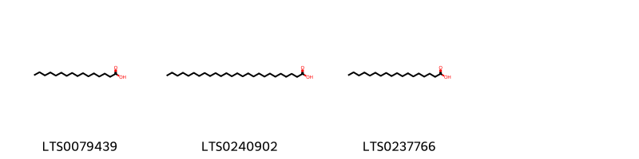{ width=100% }
    <figcaption>Hình ảnh cấu trúc hóa học của 3 hoạt chất thuộc nhóm Fatty Acyls gồm ['palmitic acid (LTS0079439)', 'hexacosanoic acid (LTS0240902)', 'stearic acid (LTS0237766)'].</figcaption>
</figure>
#### Nhóm Flavonoids
<figure markdown="span">
    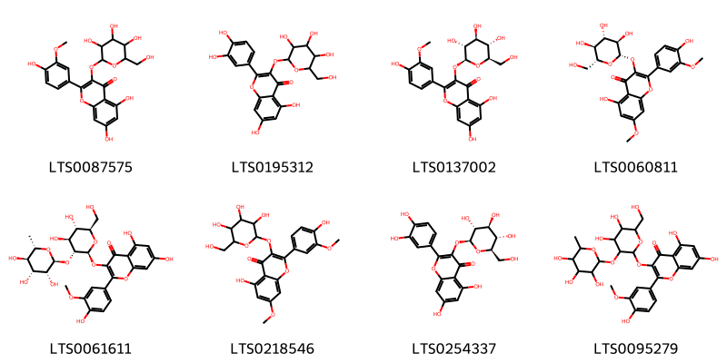{ width=100% }
    <figcaption>Hình ảnh cấu trúc hóa học của 8 hoạt chất thuộc nhóm Flavonoids gồm ['isorhamnetin 3-galactoside (LTS0087575)', '2-(3,4-dihydroxyphenyl)-5,7-dihydroxy-3-{[3,4,5-trihydroxy-6-(hydroxymethyl)oxan-2-yl]oxy}chromen-4-one (LTS0195312)', 'isorhamnetin 3-o-glucoside (LTS0137002)', '5-hydroxy-2-(4-hydroxy-3-methoxyphenyl)-7-methoxy-3-{[(2s,3r,4s,5s,6r)-3,4,5-trihydroxy-6-(hydroxymethyl)oxan-2-yl]oxy}chromen-4-one (LTS0060811)', '3-{[(2s,3r,4s,5s,6r)-4,5-dihydroxy-6-(hydroxymethyl)-3-{[(2s,3r,4r,5r,6s)-3,4,5-trihydroxy-6-methyloxan-2-yl]oxy}oxan-2-yl]oxy}-5,7-dihydroxy-2-(4-hydroxy-3-methoxyphenyl)chromen-4-one (LTS0061611)', '5-hydroxy-2-(4-hydroxy-3-methoxyphenyl)-7-methoxy-3-{[3,4,5-trihydroxy-6-(hydroxymethyl)oxan-2-yl]oxy}chromen-4-one (LTS0218546)', 'isoquercetin (LTS0254337)', '3-{[4,5-dihydroxy-6-(hydroxymethyl)-3-[(3,4,5-trihydroxy-6-methyloxan-2-yl)oxy]oxan-2-yl]oxy}-5,7-dihydroxy-2-(4-hydroxy-3-methoxyphenyl)chromen-4-one (LTS0095279)'].</figcaption>
</figure>
#### Nhóm Isoflavonoids
<figure markdown="span">
    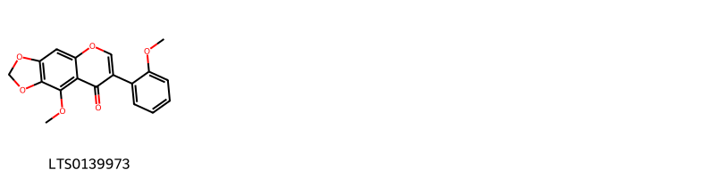{ width=100% }
    <figcaption>Hình ảnh cấu trúc hóa học của 1 hoạt chất thuộc nhóm Isoflavonoids gồm ['tlatlancuayin (LTS0139973)'].</figcaption>
</figure>
#### Nhóm Organooxygen compounds
<figure markdown="span">
    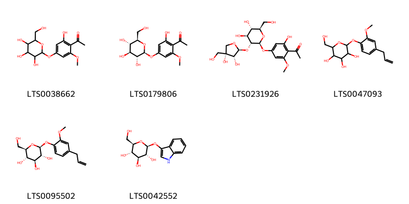{ width=100% }
    <figcaption>Hình ảnh cấu trúc hóa học của 6 hoạt chất thuộc nhóm Organooxygen compounds gồm ['1-(2-hydroxy-6-methoxy-4-{[3,4,5-trihydroxy-6-(hydroxymethyl)oxan-2-yl]oxy}phenyl)ethanone (LTS0038662)', '1-(2-hydroxy-6-methoxy-4-{[(2s,3r,4s,5s,6r)-3,4,5-trihydroxy-6-(hydroxymethyl)oxan-2-yl]oxy}phenyl)ethanone (LTS0179806)', '1-(4-{[(2s,3r,4s,5s,6r)-3-{[(2s,3r,4r)-3,4-dihydroxy-4-(hydroxymethyl)oxolan-2-yl]oxy}-4,5-dihydroxy-6-(hydroxymethyl)oxan-2-yl]oxy}-2-hydroxy-6-methoxyphenyl)ethanone (LTS0231926)', '2-(hydroxymethyl)-6-[2-methoxy-4-(prop-2-en-1-yl)phenoxy]oxane-3,4,5-triol (LTS0047093)', 'eugenyl glucoside (LTS0095502)', 'indican (LTS0042552)'].</figcaption>
</figure>
#### Nhóm Phenols
<figure markdown="span">
    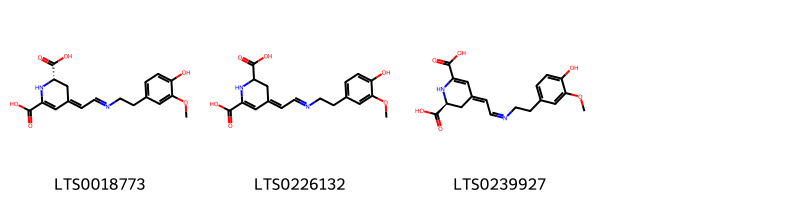{ width=100% }
    <figcaption>Hình ảnh cấu trúc hóa học của 3 hoạt chất thuộc nhóm Phenols gồm ['(2s,4e)-4-[(2e)-2-{[2-(4-hydroxy-3-methoxyphenyl)ethyl]imino}ethylidene]-2,3-dihydro-1h-pyridine-2,6-dicarboxylic acid (LTS0018773)', '(4e)-4-(2-{[2-(4-hydroxy-3-methoxyphenyl)ethyl]imino}ethylidene)-2,3-dihydro-1h-pyridine-2,6-dicarboxylic acid (LTS0226132)', '3-methoxytyramine-betaxanthin (LTS0239927)'].</figcaption>
</figure>
#### Nhóm Prenol lipids
<figure markdown="span">
    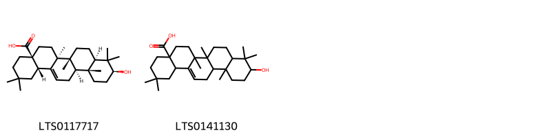{ width=100% }
    <figcaption>Hình ảnh cấu trúc hóa học của 2 hoạt chất thuộc nhóm Prenol lipids gồm ['oleanolic acid (LTS0117717)', 'oleanolic acid (LTS0141130)'].</figcaption>
</figure>
#### Nhóm Steroids and steroid derivatives
<figure markdown="span">
    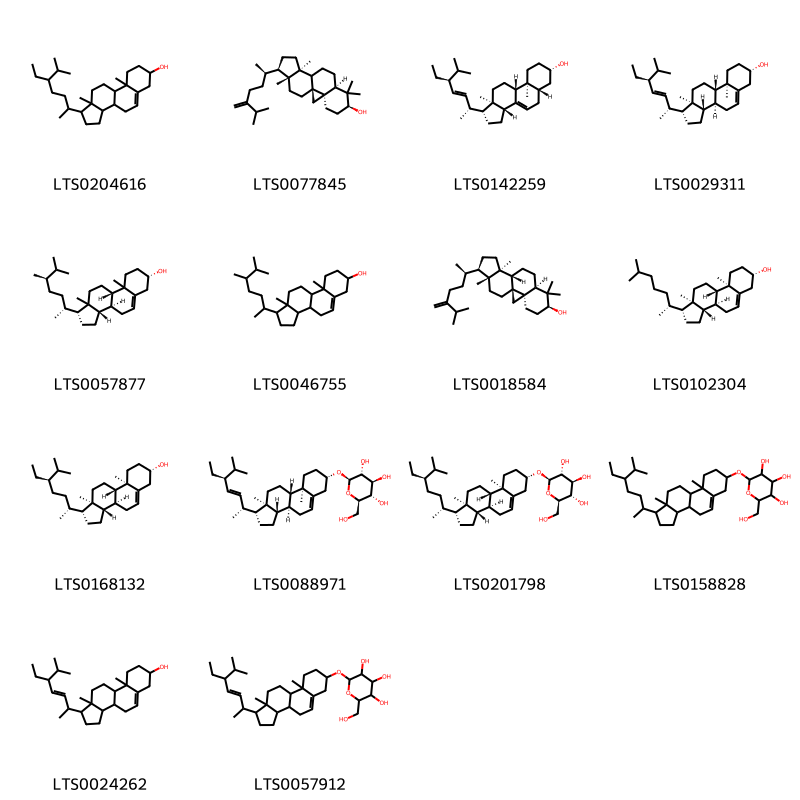{ width=100% }
    <figcaption>Hình ảnh cấu trúc hóa học của 14 hoạt chất thuộc nhóm Steroids and steroid derivatives gồm ['stigmast-5-en-3-ol, (3β)- (LTS0204616)', '24-methylene-cycloartanol (LTS0077845)', 'chondrillasterol (LTS0142259)', 'phytosterol (LTS0029311)', '(1r,3as,3bs,7s,9bs)-1-[(2r,5r)-5,6-dimethylheptan-2-yl]-9a,11a-dimethyl-1h,2h,3h,3ah,3bh,4h,6h,7h,8h,9h,9bh,10h,11h-cyclopenta[a]phenanthren-7-ol (LTS0057877)', 'campesterol (LTS0046755)', '24-methylenecycloartanol (LTS0018584)', 'cholesterol (LTS0102304)', 'sitosterol (LTS0168132)', '(2r,3r,4s,5s,6r)-2-{[(1r,3as,3bs,7s,9ar,9bs,11ar)-1-[(2r,3e,5s)-5-ethyl-6-methylhept-3-en-2-yl]-9a,11a-dimethyl-1h,2h,3h,3ah,3bh,4h,6h,7h,8h,9h,9bh,10h,11h-cyclopenta[a]phenanthren-7-yl]oxy}-6-(hydroxymethyl)oxane-3,4,5-triol (LTS0088971)', 'sitogluside (LTS0201798)', '2-{[1-(5-ethyl-6-methylheptan-2-yl)-9a,11a-dimethyl-1h,2h,3h,3ah,3bh,4h,6h,7h,8h,9h,9bh,10h,11h-cyclopenta[a]phenanthren-7-yl]oxy}-6-(hydroxymethyl)oxane-3,4,5-triol (LTS0158828)', 'stigmasterol (LTS0024262)', '2-{[1-(5-ethyl-6-methylhept-3-en-2-yl)-9a,11a-dimethyl-1h,2h,3h,3ah,3bh,4h,6h,7h,8h,9h,9bh,10h,11h-cyclopenta[a]phenanthren-7-yl]oxy}-6-(hydroxymethyl)oxane-3,4,5-triol (LTS0057912)'].</figcaption>
</figure>

---

### Dược dân tộc học

Danh sách các quốc gia có sử dụng *Celosia argentea* trong điều trị các bệnh. 

| Country   | Disease                                                              | Bệnh                                                                                                                                                                                                |
|:----------|:---------------------------------------------------------------------|:----------------------------------------------------------------------------------------------------------------------------------------------------------------------------------------------------|
| China     | Antiphlogistic, Astringent, Refrigerant, Tonic, Vermifuge, Vulnerary | MYMEMORY WARNING: YOU USED ALL AVAILABLE FREE TRANSLATIONS FOR TODAY. NEXT AVAILABLE IN  13 HOURS 12 MINUTES 39 SECONDS VISIT HTTPS://MYMEMORY.TRANSLATED.NET/DOC/USAGELIMITS.PHP TO TRANSLATE MORE |
| Elsewhere | Aphrodisiac, Aphrodisiac, Tonic, Astringent                          | MYMEMORY WARNING: YOU USED ALL AVAILABLE FREE TRANSLATIONS FOR TODAY. NEXT AVAILABLE IN  13 HOURS 12 MINUTES 34 SECONDS VISIT HTTPS://MYMEMORY.TRANSLATED.NET/DOC/USAGELIMITS.PHP TO TRANSLATE MORE |

---

---
## Celosia cristata
### Thông tin về thực vật

!!! info "Phân loại thực vật của *Celosia argentea* từ GIBF:"
    - **Kingdom:** Plantae
    - **Phylum:** Tracheophyta
    - **Order:** Caryophyllales
    - **Family:** Amaranthaceae
    - **Genus:** Celosia
    - **Species:** *Celosia argentea*

 

| Label (VI)   | Label (EN)   | Scientific Name   | Descriptions (VI)   | Descriptions (EN)   | Also Known As (VI)   | Also Known As (EN)   |
|:-------------|:-------------|:------------------|:--------------------|:--------------------|:---------------------|:---------------------|
| N/A          | N/A          | Celosia cristata  |                     | species of plant    | ['']                 | ['cockscomb']        |

#### Phân bố trên thế giới

**Từ CSDL GIBF** nan, Brazil, Viet Nam, Japan, China, Chile, Ecuador, Thailand, Spain, United States of America, Korea, Republic of, Greece, Pakistan, Russian Federation, Burkina Faso, Lao People’s Democratic Republic, Mexico, Chinese Taipei, Germany, Portugal, Ukraine, Italy, Peru, United Kingdom of Great Britain and Northern Ireland, Guyana, Venezuela (Bolivarian Republic of)

#### Phân bố tại Việt Nam

**Từ CSDL GIBF**: Kon Tum

---
### Thành phần hóa học
        
- Theo cơ sở dữ liệu lotus: Từ loài *Celosia argentea* đã phân lập và xác định được 25 hoạt chất thuộc về các nhóm Flavonoids, Carboxylic acids and derivatives, Steroids and steroid derivatives, Phenols, Isoflavonoids, Betalains. 

|    | chemicalTaxonomyClassyfireClass   |   smiles_count |
|---:|:----------------------------------|---------------:|
|  0 | Betalains                         |              2 |
|  1 | Carboxylic acids and derivatives  |              6 |
|  2 | Flavonoids                        |              5 |
|  3 | Isoflavonoids                     |              2 |
|  4 | Phenols                           |              3 |
|  5 | Steroids and steroid derivatives  |              7 |

#### Nhóm Betalains
<figure markdown="span">
    { width=100% }
    <figcaption>Hình ảnh cấu trúc hóa học của 2 hoạt chất thuộc nhóm Betalains gồm ['(2s)-2-carboxy-5-{[(2s,3r,4s,5s,6r)-3-{[(2r,3s,4s,5s,6s)-6-carboxy-3,4,5-trihydroxyoxan-2-yl]oxy}-4,5-dihydroxy-6-(hydroxymethyl)oxan-2-yl]oxy}-1-{2-[(2s)-2-carboxy-6-carboxylato-2,3-dihydro-1h-pyridin-4-ylidene]ethylidene}-6-hydroxy-2,3-dihydro-1h-1λ⁵-indol-1-ylium (LTS0075996)', '(2s)-2-carboxy-5-{[(2s,3r,4s,5s,6r)-3-{[(2r,3r,4s,5s,6s)-6-carboxy-3,4,5-trihydroxyoxan-2-yl]oxy}-4,5-dihydroxy-6-(hydroxymethyl)oxan-2-yl]oxy}-1-{2-[(2s)-2-carboxy-6-carboxylato-2,3-dihydro-1h-pyridin-4-ylidene]ethylidene}-6-hydroxy-2,3-dihydro-1h-1λ⁵-indol-1-ylium (LTS0232775)'].</figcaption>
</figure>
#### Nhóm Carboxylic acids and derivatives
<figure markdown="span">
    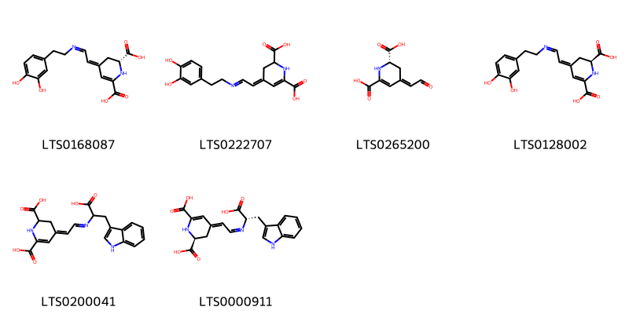{ width=100% }
    <figcaption>Hình ảnh cấu trúc hóa học của 6 hoạt chất thuộc nhóm Carboxylic acids and derivatives gồm ['(2r,4e)-4-[(2z)-2-{[2-(3,4-dihydroxyphenyl)ethyl]imino}ethylidene]-2,3-dihydro-1h-pyridine-2,6-dicarboxylic acid (LTS0168087)', '4-(2-{[2-(3,4-dihydroxyphenyl)ethyl]imino}ethylidene)-2,3-dihydro-1h-pyridine-2,6-dicarboxylic acid (LTS0222707)', 'betalamic acid (LTS0265200)', '(2s,4e)-4-[(2z)-2-{[2-(3,4-dihydroxyphenyl)ethyl]imino}ethylidene]-2,3-dihydro-1h-pyridine-2,6-dicarboxylic acid (LTS0128002)', '(4e)-4-(2-{[1-carboxy-2-(1h-indol-3-yl)ethyl]imino}ethylidene)-2,3-dihydro-1h-pyridine-2,6-dicarboxylic acid (LTS0200041)', '(2s,4e)-4-[(2z)-2-{[(1s)-1-carboxy-2-(1h-indol-3-yl)ethyl]imino}ethylidene]-2,3-dihydro-1h-pyridine-2,6-dicarboxylic acid (LTS0000911)'].</figcaption>
</figure>
#### Nhóm Flavonoids
<figure markdown="span">
    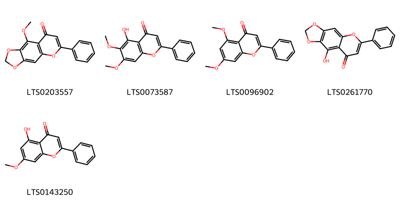{ width=100% }
    <figcaption>Hình ảnh cấu trúc hóa học của 5 hoạt chất thuộc nhóm Flavonoids gồm ['9-methoxy-6-phenyl-2h-[1,3]dioxolo[4,5-g]chromen-8-one (LTS0203557)', 'mosloflavone (LTS0073587)', '5,7-dimethoxyflavone (LTS0096902)', '9-hydroxy-6-phenyl-2h-[1,3]dioxolo[4,5-g]chromen-8-one (LTS0261770)', 'tectochrysin (LTS0143250)'].</figcaption>
</figure>
#### Nhóm Isoflavonoids
<figure markdown="span">
    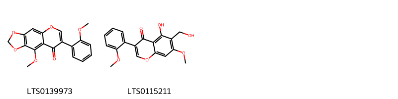{ width=100% }
    <figcaption>Hình ảnh cấu trúc hóa học của 2 hoạt chất thuộc nhóm Isoflavonoids gồm ['tlatlancuayin (LTS0139973)', '5-hydroxy-6-(hydroxymethyl)-7-methoxy-3-(2-methoxyphenyl)chromen-4-one (LTS0115211)'].</figcaption>
</figure>
#### Nhóm Phenols
<figure markdown="span">
    { width=100% }
    <figcaption>Hình ảnh cấu trúc hóa học của 3 hoạt chất thuộc nhóm Phenols gồm ['(2s,4e)-4-[(2e)-2-{[2-(4-hydroxy-3-methoxyphenyl)ethyl]imino}ethylidene]-2,3-dihydro-1h-pyridine-2,6-dicarboxylic acid (LTS0018773)', '(4e)-4-(2-{[2-(4-hydroxy-3-methoxyphenyl)ethyl]imino}ethylidene)-2,3-dihydro-1h-pyridine-2,6-dicarboxylic acid (LTS0226132)', '3-methoxytyramine-betaxanthin (LTS0239927)'].</figcaption>
</figure>
#### Nhóm Steroids and steroid derivatives
<figure markdown="span">
    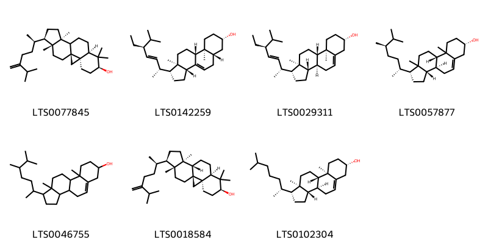{ width=100% }
    <figcaption>Hình ảnh cấu trúc hóa học của 7 hoạt chất thuộc nhóm Steroids and steroid derivatives gồm ['24-methylene-cycloartanol (LTS0077845)', 'chondrillasterol (LTS0142259)', 'phytosterol (LTS0029311)', '(1r,3as,3bs,7s,9bs)-1-[(2r,5r)-5,6-dimethylheptan-2-yl]-9a,11a-dimethyl-1h,2h,3h,3ah,3bh,4h,6h,7h,8h,9h,9bh,10h,11h-cyclopenta[a]phenanthren-7-ol (LTS0057877)', 'campesterol (LTS0046755)', '24-methylenecycloartanol (LTS0018584)', 'cholesterol (LTS0102304)'].</figcaption>
</figure>

---

### Dược dân tộc học

Danh sách các quốc gia có sử dụng *Celosia argentea* trong điều trị các bệnh. 

| Country   | Disease                              | Bệnh                                                                                                                                                                                                |
|:----------|:-------------------------------------|:----------------------------------------------------------------------------------------------------------------------------------------------------------------------------------------------------|
| China     | Astringent, Hemostat                 | MYMEMORY WARNING: YOU USED ALL AVAILABLE FREE TRANSLATIONS FOR TODAY. NEXT AVAILABLE IN  13 HOURS 11 MINUTES 57 SECONDS VISIT HTTPS://MYMEMORY.TRANSLATED.NET/DOC/USAGELIMITS.PHP TO TRANSLATE MORE |
| Elsewhere | Antidiarrheic, Astringent, Demulcent | MYMEMORY WARNING: YOU USED ALL AVAILABLE FREE TRANSLATIONS FOR TODAY. NEXT AVAILABLE IN  13 HOURS 11 MINUTES 53 SECONDS VISIT HTTPS://MYMEMORY.TRANSLATED.NET/DOC/USAGELIMITS.PHP TO TRANSLATE MORE |
| Iraq      | Demulcent                            | MYMEMORY WARNING: YOU USED ALL AVAILABLE FREE TRANSLATIONS FOR TODAY. NEXT AVAILABLE IN  13 HOURS 11 MINUTES 50 SECONDS VISIT HTTPS://MYMEMORY.TRANSLATED.NET/DOC/USAGELIMITS.PHP TO TRANSLATE MORE |
| Japan     | Diuretic                             | MYMEMORY WARNING: YOU USED ALL AVAILABLE FREE TRANSLATIONS FOR TODAY. NEXT AVAILABLE IN  13 HOURS 11 MINUTES 46 SECONDS VISIT HTTPS://MYMEMORY.TRANSLATED.NET/DOC/USAGELIMITS.PHP TO TRANSLATE MORE |

---

---
## Celosia stuhlmanniana
### Thông tin về thực vật

!!! info "Phân loại thực vật của *Celosia stuhlmanniana* từ GIBF:"
    - **Kingdom:** Plantae
    - **Phylum:** Tracheophyta
    - **Order:** Caryophyllales
    - **Family:** Amaranthaceae
    - **Genus:** Celosia
    - **Species:** *Celosia stuhlmanniana*

 

| Label (VI)   | Label (EN)   | Scientific Name       | Descriptions (VI)   | Descriptions (EN)   | Also Known As (VI)   | Also Known As (EN)   |
|:-------------|:-------------|:----------------------|:--------------------|:--------------------|:---------------------|:---------------------|
| N/A          | N/A          | Celosia stuhlmanniana |                     | species of plant    | ['']                 | ['']                 |

#### Phân bố trên thế giới

**Từ CSDL GIBF** nan, Congo, Democratic Republic of the, Rwanda, Zambia, Burundi, Mozambique, Tanzania, United Republic of

#### Phân bố tại Việt Nam

**Từ CSDL GIBF**: Không có ghi nhận ở Việt Nam

---
### Thành phần hóa học
        
- Theo cơ sở dữ liệu lotus: Từ loài *Celosia stuhlmanniana* đã phân lập và xác định được Chưa có hoạt chất nào được phân lập. hoạt chất thuộc về các nhóm Không có hoạt chất nào được phân lập. 

Không có hình ảnh nào được tạo ra

---

### Dược dân tộc học

Danh sách các quốc gia có sử dụng *Celosia stuhlmanniana* trong điều trị các bệnh. 

| Country   | Disease   | Bệnh                                                                                                                                                                                                |
|:----------|:----------|:----------------------------------------------------------------------------------------------------------------------------------------------------------------------------------------------------|
| Congo     | Vermifuge | MYMEMORY WARNING: YOU USED ALL AVAILABLE FREE TRANSLATIONS FOR TODAY. NEXT AVAILABLE IN  13 HOURS 10 MINUTES 42 SECONDS VISIT HTTPS://MYMEMORY.TRANSLATED.NET/DOC/USAGELIMITS.PHP TO TRANSLATE MORE |

---

# Chi Pupalia

??? note "Danh sách các dược liệu thuộc chi"
    
	 - *Pupalia lappacea*

---
## Pupalia lappacea
### Thông tin về thực vật

!!! info "Phân loại thực vật của *Pupalia lappacea* từ GIBF:"
    - **Kingdom:** Plantae
    - **Phylum:** Tracheophyta
    - **Order:** Caryophyllales
    - **Family:** Amaranthaceae
    - **Genus:** Pupalia
    - **Species:** *Pupalia lappacea*

 

| Label (VI)   | Label (EN)   | Scientific Name   | Descriptions (VI)   | Descriptions (EN)   | Also Known As (VI)   | Also Known As (EN)   |
|:-------------|:-------------|:------------------|:--------------------|:--------------------|:---------------------|:---------------------|
| N/A          | N/A          | Pupalia lappacea  | loài thực vật       | species of plant    | ['']                 | ['']                 |

#### Phân bố trên thế giới

**Từ CSDL GIBF** Botswana, Mali, Gambia, Zimbabwe, Somalia, Mozambique, Tanzania, United Republic of, Yemen, Guinea-Bissau, Ghana, Chad, Nigeria, Togo, Malawi, Benin, Algeria, Kenya, Eswatini, Belgium, Namibia, South Africa, Australia, Myanmar, India

#### Phân bố tại Việt Nam

**Từ CSDL GIBF**: Không có ghi nhận ở Việt Nam

---
### Thành phần hóa học
        
- Theo cơ sở dữ liệu lotus: Từ loài *Pupalia lappacea* đã phân lập và xác định được Chưa có hoạt chất nào được phân lập. hoạt chất thuộc về các nhóm Không có hoạt chất nào được phân lập. 

Không có hình ảnh nào được tạo ra

---

### Dược dân tộc học

Danh sách các quốc gia có sử dụng *Pupalia lappacea* trong điều trị các bệnh. 

| Country   | Disease                  | Bệnh                                                                                                                                                                                                |
|:----------|:-------------------------|:----------------------------------------------------------------------------------------------------------------------------------------------------------------------------------------------------|
| Elsewhere | Raticide, Carminative    | MYMEMORY WARNING: YOU USED ALL AVAILABLE FREE TRANSLATIONS FOR TODAY. NEXT AVAILABLE IN  13 HOURS 10 MINUTES 16 SECONDS VISIT HTTPS://MYMEMORY.TRANSLATED.NET/DOC/USAGELIMITS.PHP TO TRANSLATE MORE |
| Sudan     | Carminative, Carminative | MYMEMORY WARNING: YOU USED ALL AVAILABLE FREE TRANSLATIONS FOR TODAY. NEXT AVAILABLE IN  13 HOURS 10 MINUTES 12 SECONDS VISIT HTTPS://MYMEMORY.TRANSLATED.NET/DOC/USAGELIMITS.PHP TO TRANSLATE MORE |

---

# Chi Iresine

??? note "Danh sách các dược liệu thuộc chi"
    
	 - *Iresine arbuscula*
	 - *Iresine calea*
	 - *Iresine herbstii*

---
## Iresine arbuscula
### Thông tin về thực vật

!!! info "Phân loại thực vật của *Iresine arbuscula* từ GIBF:"
    - **Kingdom:** Plantae
    - **Phylum:** Tracheophyta
    - **Order:** Caryophyllales
    - **Family:** Amaranthaceae
    - **Genus:** Iresine
    - **Species:** *Iresine arbuscula*

 

| Label (VI)   | Label (EN)   | Scientific Name   | Descriptions (VI)   | Descriptions (EN)   | Also Known As (VI)   | Also Known As (EN)                    |
|:-------------|:-------------|:------------------|:--------------------|:--------------------|:---------------------|:--------------------------------------|
| N/A          | N/A          | Iresine arbuscula | loài thực vật       | species of plant    | ['']                 | ['Iresine arbuscula var. tomentella'] |

#### Phân bố trên thế giới

**Từ CSDL GIBF** nan, Mexico, Guatemala, El Salvador, Belize

#### Phân bố tại Việt Nam

**Từ CSDL GIBF**: Không có ghi nhận ở Việt Nam

---
### Thành phần hóa học
        
- Theo cơ sở dữ liệu lotus: Từ loài *Iresine arbuscula* đã phân lập và xác định được Chưa có hoạt chất nào được phân lập. hoạt chất thuộc về các nhóm Không có hoạt chất nào được phân lập. 

Không có hình ảnh nào được tạo ra

---

### Dược dân tộc học

Danh sách các quốc gia có sử dụng *Iresine arbuscula* trong điều trị các bệnh. 

| Country   | Disease   | Bệnh                                                                                                                                                                                                |
|:----------|:----------|:----------------------------------------------------------------------------------------------------------------------------------------------------------------------------------------------------|
| Guatemala | Soap      | MYMEMORY WARNING: YOU USED ALL AVAILABLE FREE TRANSLATIONS FOR TODAY. NEXT AVAILABLE IN  13 HOURS 09 MINUTES 36 SECONDS VISIT HTTPS://MYMEMORY.TRANSLATED.NET/DOC/USAGELIMITS.PHP TO TRANSLATE MORE |

---

---
## Iresine calea
### Thông tin về thực vật

!!! info "Phân loại thực vật của *Iresine latifolia* từ GIBF:"
    - **Kingdom:** Plantae
    - **Phylum:** Tracheophyta
    - **Order:** Caryophyllales
    - **Family:** Amaranthaceae
    - **Genus:** Iresine
    - **Species:** *Iresine latifolia*

 

| Label (VI)   | Label (EN)   | Scientific Name   | Descriptions (VI)   | Descriptions (EN)   | Also Known As (VI)   | Also Known As (EN)   |
|:-------------|:-------------|:------------------|:--------------------|:--------------------|:---------------------|:---------------------|
| N/A          | N/A          | Iresine calea     | loài thực vật       | species of plant    | ['']                 | ['']                 |

#### Phân bố trên thế giới

**Từ CSDL GIBF** Nicaragua, Guatemala, Mexico, El Salvador, Costa Rica, Honduras

#### Phân bố tại Việt Nam

**Từ CSDL GIBF**: Không có ghi nhận ở Việt Nam

---
### Thành phần hóa học
        
- Theo cơ sở dữ liệu lotus: Từ loài *Iresine latifolia* đã phân lập và xác định được Chưa có hoạt chất nào được phân lập. hoạt chất thuộc về các nhóm Không có hoạt chất nào được phân lập. 

Không có hình ảnh nào được tạo ra

---

### Dược dân tộc học

Danh sách các quốc gia có sử dụng *Iresine latifolia* trong điều trị các bệnh. 

| Country   | Disease                                                             | Bệnh                                                                                                                                                                                                |
|:----------|:--------------------------------------------------------------------|:----------------------------------------------------------------------------------------------------------------------------------------------------------------------------------------------------|
| Mexico    | Diaphoretic, Diaphoretic, Diuretic, Diuretic, Diuretic, Diaphoretic | MYMEMORY WARNING: YOU USED ALL AVAILABLE FREE TRANSLATIONS FOR TODAY. NEXT AVAILABLE IN  13 HOURS 08 MINUTES 59 SECONDS VISIT HTTPS://MYMEMORY.TRANSLATED.NET/DOC/USAGELIMITS.PHP TO TRANSLATE MORE |

---

---
## Iresine herbstii
### Thông tin về thực vật

!!! info "Phân loại thực vật của *Iresine herbstii* từ GIBF:"
    - **Kingdom:** Plantae
    - **Phylum:** Tracheophyta
    - **Order:** Caryophyllales
    - **Family:** Amaranthaceae
    - **Genus:** Iresine
    - **Species:** *Iresine herbstii*

 

| Label (VI)   | Label (EN)   | Scientific Name   | Descriptions (VI)   | Descriptions (EN)   | Also Known As (VI)   | Also Known As (EN)              |
|:-------------|:-------------|:------------------|:--------------------|:--------------------|:---------------------|:--------------------------------|
| N/A          | N/A          | Iresine herbstii  |                     | species of plant    | ['']                 | ['Iresine diffusa f. herbstii'] |

#### Phân bố trên thế giới

**Từ CSDL GIBF** nan, Brazil, Guatemala, Japan, Guadeloupe, Nepal, Burundi, China, Ecuador, Papua New Guinea, Thailand, Spain, Poland, Netherlands, Réunion, United States of America, Bhutan, Indonesia, Seychelles, Russian Federation, Nigeria, Colombia, Cuba, unknown or invalid, Sao Tome and Principe, Argentina, Ethiopia, Fiji, Mexico, Congo, Democratic Republic of the, Vanuatu, Philippines, Portugal, South Africa

#### Phân bố tại Việt Nam

**Từ CSDL GIBF**: Không có ghi nhận ở Việt Nam

---
### Thành phần hóa học
        
- Theo cơ sở dữ liệu lotus: Từ loài *Iresine herbstii* đã phân lập và xác định được 4 hoạt chất thuộc về các nhóm Carboxylic acids and derivatives. 

|    | chemicalTaxonomyClassyfireClass   |   smiles_count |
|---:|:----------------------------------|---------------:|
|  0 |                                   |              1 |
|  1 | Carboxylic acids and derivatives  |              3 |

#### Nhóm 
<figure markdown="span">
    { width=100% }
    <figcaption>Hình ảnh cấu trúc hóa học của 1 hoạt chất thuộc nhóm  gồm ['trigonelline (LTS0040106)'].</figcaption>
</figure>
#### Nhóm Carboxylic acids and derivatives
<figure markdown="span">
    { width=100% }
    <figcaption>Hình ảnh cấu trúc hóa học của 3 hoạt chất thuộc nhóm Carboxylic acids and derivatives gồm ['bet (LTS0164067)', '(2s,4z)-4-(2-oxoethylidene)-2,3-dihydro-1h-pyridine-2,6-dicarboxylic acid (LTS0140883)', 'betalamic acid (LTS0265200)'].</figcaption>
</figure>

---

### Dược dân tộc học

Danh sách các quốc gia có sử dụng *Iresine herbstii* trong điều trị các bệnh. 

| Country   |   Disease | Bệnh                                                                                                                                                                                                |
|:----------|----------:|:----------------------------------------------------------------------------------------------------------------------------------------------------------------------------------------------------|
| Elsewhere |       nan | MYMEMORY WARNING: YOU USED ALL AVAILABLE FREE TRANSLATIONS FOR TODAY. NEXT AVAILABLE IN  13 HOURS 08 MINUTES 33 SECONDS VISIT HTTPS://MYMEMORY.TRANSLATED.NET/DOC/USAGELIMITS.PHP TO TRANSLATE MORE |
| Trinidad  |       nan | MYMEMORY WARNING: YOU USED ALL AVAILABLE FREE TRANSLATIONS FOR TODAY. NEXT AVAILABLE IN  13 HOURS 08 MINUTES 30 SECONDS VISIT HTTPS://MYMEMORY.TRANSLATED.NET/DOC/USAGELIMITS.PHP TO TRANSLATE MORE |

---

# Chi Cyathula

??? note "Danh sách các dược liệu thuộc chi"
    
	 - *Cyathula achyranthoides*
	 - *Cyathula cylindrica*
	 - *Cyathula globulifera*
	 - *Cyathula prostrata*

---
## Cyathula achyranthoides
### Thông tin về thực vật

!!! info "Phân loại thực vật của *Cyathula achyranthoides* từ GIBF:"
    - **Kingdom:** Plantae
    - **Phylum:** Tracheophyta
    - **Order:** Caryophyllales
    - **Family:** Amaranthaceae
    - **Genus:** Cyathula
    - **Species:** *Cyathula achyranthoides*

 

| Label (VI)   | Label (EN)   | Scientific Name         | Descriptions (VI)   | Descriptions (EN)   | Also Known As (VI)   | Also Known As (EN)   |
|:-------------|:-------------|:------------------------|:--------------------|:--------------------|:---------------------|:---------------------|
| N/A          | N/A          | Cyathula achyranthoides | loài thực vật       | species of plant    | ['']                 | ['']                 |

#### Phân bố trên thế giới

**Từ CSDL GIBF** Brazil, Guatemala, Uganda, Suriname, Honduras, Tanzania, United Republic of, Ecuador, Trinidad and Tobago, Madagascar, Netherlands, Guinea, Guinea-Bissau, Jamaica, Costa Rica, Colombia, Cuba, Burkina Faso, French Guiana, Togo, Equatorial Guinea, Mexico, Benin, Congo, Democratic Republic of the, El Salvador, Belize, Nicaragua, Niger, Côte d’Ivoire, Congo, Peru, Bolivia (Plurinational State of), Cameroon, Venezuela (Bolivarian Republic of)

#### Phân bố tại Việt Nam

**Từ CSDL GIBF**: Không có ghi nhận ở Việt Nam

---
### Thành phần hóa học
        
- Theo cơ sở dữ liệu lotus: Từ loài *Cyathula achyranthoides* đã phân lập và xác định được Chưa có hoạt chất nào được phân lập. hoạt chất thuộc về các nhóm Không có hoạt chất nào được phân lập. 

Không có hình ảnh nào được tạo ra

---

### Dược dân tộc học

Danh sách các quốc gia có sử dụng *Cyathula achyranthoides* trong điều trị các bệnh. 

| Country      | Disease   | Bệnh                                                                                                                                                                                                |
|:-------------|:----------|:----------------------------------------------------------------------------------------------------------------------------------------------------------------------------------------------------|
| Elsewhere    | Styptic   | MYMEMORY WARNING: YOU USED ALL AVAILABLE FREE TRANSLATIONS FOR TODAY. NEXT AVAILABLE IN  13 HOURS 07 MINUTES 54 SECONDS VISIT HTTPS://MYMEMORY.TRANSLATED.NET/DOC/USAGELIMITS.PHP TO TRANSLATE MORE |
| Panama(Cuna) | Hemostat  | MYMEMORY WARNING: YOU USED ALL AVAILABLE FREE TRANSLATIONS FOR TODAY. NEXT AVAILABLE IN  13 HOURS 07 MINUTES 51 SECONDS VISIT HTTPS://MYMEMORY.TRANSLATED.NET/DOC/USAGELIMITS.PHP TO TRANSLATE MORE |

---

---
## Cyathula cylindrica
### Thông tin về thực vật

!!! info "Phân loại thực vật của *Cyathula cylindrica* từ GIBF:"
    - **Kingdom:** Plantae
    - **Phylum:** Tracheophyta
    - **Order:** Caryophyllales
    - **Family:** Amaranthaceae
    - **Genus:** Cyathula
    - **Species:** *Cyathula cylindrica*

 

| Label (VI)   | Label (EN)   | Scientific Name     | Descriptions (VI)   | Descriptions (EN)   | Also Known As (VI)   | Also Known As (EN)   |
|:-------------|:-------------|:--------------------|:--------------------|:--------------------|:---------------------|:---------------------|
| N/A          | N/A          | Cyathula cylindrica | loài thực vật       | species of plant    | ['']                 | ['']                 |

#### Phân bố trên thế giới

**Từ CSDL GIBF** Uganda, Burundi, Zimbabwe, Mozambique, Tanzania, United Republic of, Ecuador, Madagascar, unknown or invalid, Ethiopia, Equatorial Guinea, Malawi, Congo, Democratic Republic of the, Kenya, Rwanda, Eswatini, Namibia, South Africa, Angola, Bolivia (Plurinational State of), Cameroon

#### Phân bố tại Việt Nam

**Từ CSDL GIBF**: Không có ghi nhận ở Việt Nam

---
### Thành phần hóa học
        
- Theo cơ sở dữ liệu lotus: Từ loài *Cyathula cylindrica* đã phân lập và xác định được Chưa có hoạt chất nào được phân lập. hoạt chất thuộc về các nhóm Không có hoạt chất nào được phân lập. 

Không có hình ảnh nào được tạo ra

---

### Dược dân tộc học

Danh sách các quốc gia có sử dụng *Cyathula cylindrica* trong điều trị các bệnh. 

| Country   | Disease   | Bệnh                                                                                                                                                                                                |
|:----------|:----------|:----------------------------------------------------------------------------------------------------------------------------------------------------------------------------------------------------|
| Lesotho   | Soap      | MYMEMORY WARNING: YOU USED ALL AVAILABLE FREE TRANSLATIONS FOR TODAY. NEXT AVAILABLE IN  13 HOURS 07 MINUTES 11 SECONDS VISIT HTTPS://MYMEMORY.TRANSLATED.NET/DOC/USAGELIMITS.PHP TO TRANSLATE MORE |

---

---
## Cyathula globulifera
### Thông tin về thực vật

!!! info "Phân loại thực vật của *Cyathula uncinulata* từ GIBF:"
    - **Kingdom:** Plantae
    - **Phylum:** Tracheophyta
    - **Order:** Caryophyllales
    - **Family:** Amaranthaceae
    - **Genus:** Cyathula
    - **Species:** *Cyathula uncinulata*

 

| Label (VI)   | Label (EN)   | Scientific Name      | Descriptions (VI)   | Descriptions (EN)   | Also Known As (VI)   | Also Known As (EN)   |
|:-------------|:-------------|:---------------------|:--------------------|:--------------------|:---------------------|:---------------------|
| N/A          | N/A          | Cyathula globulifera |                     |                     | ['']                 | ['']                 |

#### Phân bố trên thế giới

**Từ CSDL GIBF** nan, Congo, Democratic Republic of the, Kenya, Uganda, Zambia, South Africa, Mozambique, Tanzania, United Republic of, unknown or invalid, Angola, Eritrea, Ethiopia, Madagascar, Lesotho

#### Phân bố tại Việt Nam

**Từ CSDL GIBF**: Không có ghi nhận ở Việt Nam

---
### Thành phần hóa học
        
- Theo cơ sở dữ liệu lotus: Từ loài *Cyathula uncinulata* đã phân lập và xác định được Chưa có hoạt chất nào được phân lập. hoạt chất thuộc về các nhóm Không có hoạt chất nào được phân lập. 

Không có hình ảnh nào được tạo ra

---

### Dược dân tộc học

Danh sách các quốc gia có sử dụng *Cyathula uncinulata* trong điều trị các bệnh. 

| Country   | Disease   | Bệnh                                                                                                                                                                                                |
|:----------|:----------|:----------------------------------------------------------------------------------------------------------------------------------------------------------------------------------------------------|
| Lesotho   | Emetic    | MYMEMORY WARNING: YOU USED ALL AVAILABLE FREE TRANSLATIONS FOR TODAY. NEXT AVAILABLE IN  13 HOURS 06 MINUTES 46 SECONDS VISIT HTTPS://MYMEMORY.TRANSLATED.NET/DOC/USAGELIMITS.PHP TO TRANSLATE MORE |

---

---
## Cyathula prostrata
### Thông tin về thực vật

!!! info "Phân loại thực vật của *Cyathula prostrata* từ GIBF:"
    - **Kingdom:** Plantae
    - **Phylum:** Tracheophyta
    - **Order:** Caryophyllales
    - **Family:** Amaranthaceae
    - **Genus:** Cyathula
    - **Species:** *Cyathula prostrata*

 

| Label (VI)   | Label (EN)   | Scientific Name    | Descriptions (VI)   | Descriptions (EN)   | Also Known As (VI)   | Also Known As (EN)   |
|:-------------|:-------------|:-------------------|:--------------------|:--------------------|:---------------------|:---------------------|
| N/A          | N/A          | Cyathula prostrata | loài thực vật       | species of plant    | ['']                 | ['']                 |

#### Phân bố trên thế giới

**Từ CSDL GIBF** nan, Brazil, Viet Nam, Guadeloupe, Nepal, China, Gambia, Saint Lucia, Ecuador, Thailand, Guinea, Puerto Rico, Réunion, Indonesia, Costa Rica, Colombia, Nigeria, Sao Tome and Principe, French Guiana, Hong Kong, Dominica, Benin, Vanuatu, Chinese Taipei, Philippines, Gabon, Malaysia, Panama, Nicaragua, Singapore, Cambodia, Martinique, India, Peru

#### Phân bố tại Việt Nam

**Từ CSDL GIBF**: Hồ Chí Minh city

---
### Thành phần hóa học
        
- Theo cơ sở dữ liệu lotus: Từ loài *Cyathula prostrata* đã phân lập và xác định được 1 hoạt chất thuộc về các nhóm Carboxylic acids and derivatives. 

|    | chemicalTaxonomyClassyfireClass   |   smiles_count |
|---:|:----------------------------------|---------------:|
|  0 | Carboxylic acids and derivatives  |              1 |

#### Nhóm Carboxylic acids and derivatives
<figure markdown="span">
    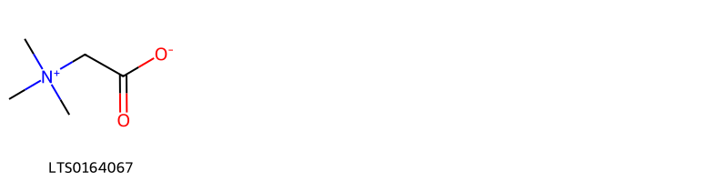{ width=100% }
    <figcaption>Hình ảnh cấu trúc hóa học của 1 hoạt chất thuộc nhóm Carboxylic acids and derivatives gồm ['bet (LTS0164067)'].</figcaption>
</figure>

---

### Dược dân tộc học

Danh sách các quốc gia có sử dụng *Cyathula prostrata* trong điều trị các bệnh. 

| Country     | Disease                        | Bệnh                                                                                                                                                                                                |
|:------------|:-------------------------------|:----------------------------------------------------------------------------------------------------------------------------------------------------------------------------------------------------|
| Ivory Coast | Cardiac, Analgesic, Antiseptic | MYMEMORY WARNING: YOU USED ALL AVAILABLE FREE TRANSLATIONS FOR TODAY. NEXT AVAILABLE IN  13 HOURS 05 MINUTES 58 SECONDS VISIT HTTPS://MYMEMORY.TRANSLATED.NET/DOC/USAGELIMITS.PHP TO TRANSLATE MORE |
| Malaya      | Vermifuge                      | MYMEMORY WARNING: YOU USED ALL AVAILABLE FREE TRANSLATIONS FOR TODAY. NEXT AVAILABLE IN  13 HOURS 05 MINUTES 54 SECONDS VISIT HTTPS://MYMEMORY.TRANSLATED.NET/DOC/USAGELIMITS.PHP TO TRANSLATE MORE |
| Upper Volta | Antiseptic, Cardiac, Analgesic | MYMEMORY WARNING: YOU USED ALL AVAILABLE FREE TRANSLATIONS FOR TODAY. NEXT AVAILABLE IN  13 HOURS 05 MINUTES 49 SECONDS VISIT HTTPS://MYMEMORY.TRANSLATED.NET/DOC/USAGELIMITS.PHP TO TRANSLATE MORE |

---

# Chi Deeringia

??? note "Danh sách các dược liệu thuộc chi"
    
	 - *Deeringia amaranthoides*
	 - *Deeringia amarantoides*

---
## Deeringia amaranthoides
### Thông tin về thực vật

!!! info "Phân loại thực vật của *Deeringia amaranthoides* từ GIBF:"
    - **Kingdom:** Plantae
    - **Phylum:** Tracheophyta
    - **Order:** Caryophyllales
    - **Family:** Amaranthaceae
    - **Genus:** Deeringia
    - **Species:** *Deeringia amaranthoides*

 

| Label (VI)   | Label (EN)   | Scientific Name         | Descriptions (VI)   | Descriptions (EN)   | Also Known As (VI)   | Also Known As (EN)   |
|:-------------|:-------------|:------------------------|:--------------------|:--------------------|:---------------------|:---------------------|
| N/A          | N/A          | Deeringia amaranthoides | loài thực vật       | species of plant    | ['']                 | ['']                 |

#### Phân bố trên thế giới

**Từ CSDL GIBF** nan, Viet Nam, Indonesia, Chinese Taipei, Nepal, Timor-Leste, Australia, Myanmar, Madagascar, Christmas Island

#### Phân bố tại Việt Nam

**Từ CSDL GIBF**: Quang Binh, Yên Bái

---
### Thành phần hóa học
        
- Theo cơ sở dữ liệu lotus: Từ loài *Deeringia amaranthoides* đã phân lập và xác định được Chưa có hoạt chất nào được phân lập. hoạt chất thuộc về các nhóm Không có hoạt chất nào được phân lập. 

Không có hình ảnh nào được tạo ra

---

### Dược dân tộc học

Danh sách các quốc gia có sử dụng *Deeringia amaranthoides* trong điều trị các bệnh. 

| Country   | Disease      | Bệnh                                                                                                                                                                                                |
|:----------|:-------------|:----------------------------------------------------------------------------------------------------------------------------------------------------------------------------------------------------|
| India     | Sternutatory | MYMEMORY WARNING: YOU USED ALL AVAILABLE FREE TRANSLATIONS FOR TODAY. NEXT AVAILABLE IN  13 HOURS 05 MINUTES 18 SECONDS VISIT HTTPS://MYMEMORY.TRANSLATED.NET/DOC/USAGELIMITS.PHP TO TRANSLATE MORE |

---

---
## Deeringia amarantoides
### Thông tin về thực vật

!!! info "Phân loại thực vật của *Deeringia amaranthoides* từ GIBF:"
    - **Kingdom:** Plantae
    - **Phylum:** Tracheophyta
    - **Order:** Caryophyllales
    - **Family:** Amaranthaceae
    - **Genus:** Deeringia
    - **Species:** *Deeringia amaranthoides*

 

| Label (VI)   | Label (EN)   | Scientific Name         | Descriptions (VI)   | Descriptions (EN)   | Also Known As (VI)   | Also Known As (EN)   |
|:-------------|:-------------|:------------------------|:--------------------|:--------------------|:---------------------|:---------------------|
| N/A          | N/A          | Deeringia amaranthoides | loài thực vật       | species of plant    | ['']                 | ['']                 |

#### Phân bố trên thế giới

**Từ CSDL GIBF** nan, Viet Nam, Indonesia, Chinese Taipei, Nepal, Timor-Leste, Australia, Myanmar, Madagascar, Christmas Island

#### Phân bố tại Việt Nam

**Từ CSDL GIBF**: Quang Binh, Yên Bái

---
### Thành phần hóa học
        
- Theo cơ sở dữ liệu lotus: Từ loài *Deeringia amaranthoides* đã phân lập và xác định được Chưa có hoạt chất nào được phân lập. hoạt chất thuộc về các nhóm Không có hoạt chất nào được phân lập. 

Không có hình ảnh nào được tạo ra

---

### Dược dân tộc học

Danh sách các quốc gia có sử dụng *Deeringia amaranthoides* trong điều trị các bệnh. 

| Country   | Disease      | Bệnh                                                                                                                                                                                                |
|:----------|:-------------|:----------------------------------------------------------------------------------------------------------------------------------------------------------------------------------------------------|
| Java      | Sternutatory | MYMEMORY WARNING: YOU USED ALL AVAILABLE FREE TRANSLATIONS FOR TODAY. NEXT AVAILABLE IN  13 HOURS 04 MINUTES 50 SECONDS VISIT HTTPS://MYMEMORY.TRANSLATED.NET/DOC/USAGELIMITS.PHP TO TRANSLATE MORE |

---

# Chi Amaranthus

??? note "Danh sách các dược liệu thuộc chi"
    
	 - *Amaranthus bidentata*
	 - *Amaranthus blitum*
	 - *Amaranthus dubius*
	 - *Amaranthus gracilis*
	 - *Amaranthus hybridus*
	 - *Amaranthus hypochondriacus*
	 - *Amaranthus inosus*
	 - *Amaranthus palmeri*
	 - *Amaranthus quitensis*
	 - *Amaranthus retroflexus*

---
## Amaranthus bidentata
### Thông tin về thực vật

!!! info "Phân loại thực vật của *N/A* từ GIBF:"
    - **Kingdom:** N/A
    - **Phylum:** N/A
    - **Order:** N/A
    - **Family:** N/A
    - **Genus:** N/A
    - **Species:** *N/A*

 

| Label (VI)   | Label (EN)   | Scientific Name         | Descriptions (VI)   | Descriptions (EN)   | Also Known As (VI)   | Also Known As (EN)   |
|:-------------|:-------------|:------------------------|:--------------------|:--------------------|:---------------------|:---------------------|
| N/A          | N/A          | Deeringia amaranthoides | loài thực vật       | species of plant    | ['']                 | ['']                 |

#### Phân bố trên thế giới

**Từ CSDL GIBF** Không có kết quả phù hợp

#### Phân bố tại Việt Nam

**Từ CSDL GIBF**: Không có ghi nhận ở Việt Nam

---
### Thành phần hóa học
        
- Theo cơ sở dữ liệu lotus: Từ loài *N/A* đã phân lập và xác định được Chưa có hoạt chất nào được phân lập. hoạt chất thuộc về các nhóm Không có hoạt chất nào được phân lập. 

Không có hình ảnh nào được tạo ra

---

### Dược dân tộc học

Danh sách các quốc gia có sử dụng *N/A* trong điều trị các bệnh. 

| Country   | Disease             | Bệnh                                                                                                                                                                                                |
|:----------|:--------------------|:----------------------------------------------------------------------------------------------------------------------------------------------------------------------------------------------------|
| China     | Diuretic, Vulnerary | MYMEMORY WARNING: YOU USED ALL AVAILABLE FREE TRANSLATIONS FOR TODAY. NEXT AVAILABLE IN  13 HOURS 04 MINUTES 04 SECONDS VISIT HTTPS://MYMEMORY.TRANSLATED.NET/DOC/USAGELIMITS.PHP TO TRANSLATE MORE |

---

---
## Amaranthus blitum
### Thông tin về thực vật

!!! info "Phân loại thực vật của *Amaranthus blitum* từ GIBF:"
    - **Kingdom:** Plantae
    - **Phylum:** Tracheophyta
    - **Order:** Caryophyllales
    - **Family:** Amaranthaceae
    - **Genus:** Amaranthus
    - **Species:** *Amaranthus blitum*

 

| Label (VI)   | Label (EN)   | Scientific Name   | Descriptions (VI)   | Descriptions (EN)   | Also Known As (VI)   | Also Known As (EN)              |
|:-------------|:-------------|:------------------|:--------------------|:--------------------|:---------------------|:--------------------------------|
| N/A          | N/A          | Amaranthus blitum | loài thực vật       | species of plant    | ['']                 | ['amaranth', 'purple amaranth'] |

#### Phân bố trên thế giới

**Từ CSDL GIBF** Brazil, Czechia, Sweden, China, Kazakhstan, New Zealand, Spain, Denmark, Netherlands, Poland, United States of America, Russian Federation, Croatia, Argentina, Belarus, Hong Kong, Belgium, Chinese Taipei, Malaysia, Palestine, State of, Canada, Germany, Austria, Hungary, Portugal, Slovakia, South Africa, Italy, France

#### Phân bố tại Việt Nam

**Từ CSDL GIBF**: Không có ghi nhận ở Việt Nam

---
### Thành phần hóa học
        
- Theo cơ sở dữ liệu lotus: Từ loài *Amaranthus blitum* đã phân lập và xác định được 4 hoạt chất thuộc về các nhóm Glycerophospholipids. 

|    | chemicalTaxonomyClassyfireClass   |   smiles_count |
|---:|:----------------------------------|---------------:|
|  0 | Glycerophospholipids              |              4 |

#### Nhóm Glycerophospholipids
<figure markdown="span">
    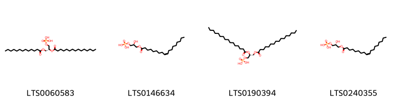{ width=100% }
    <figcaption>Hình ảnh cấu trúc hóa học của 4 hoạt chất thuộc nhóm Glycerophospholipids gồm ['(2r)-2-(pentadecanoyloxy)-3-(tridecanoyloxy)propoxyphosphonic acid (LTS0060583)', '(2s)-2-hydroxy-3-[(9z)-octadec-9-enoyloxy]propoxyphosphonic acid (LTS0146634)', 'dipalmitoyl (LTS0190394)', '1-oleoyl lysophosphatidic acid (LTS0240355)'].</figcaption>
</figure>

---

### Dược dân tộc học

Danh sách các quốc gia có sử dụng *Amaranthus blitum* trong điều trị các bệnh. 

| Country   | Disease   | Bệnh                                                                                                                                                                                                |
|:----------|:----------|:----------------------------------------------------------------------------------------------------------------------------------------------------------------------------------------------------|
| China     | Antidote  | MYMEMORY WARNING: YOU USED ALL AVAILABLE FREE TRANSLATIONS FOR TODAY. NEXT AVAILABLE IN  13 HOURS 03 MINUTES 49 SECONDS VISIT HTTPS://MYMEMORY.TRANSLATED.NET/DOC/USAGELIMITS.PHP TO TRANSLATE MORE |

---

---
## Amaranthus dubius
### Thông tin về thực vật

!!! info "Phân loại thực vật của *Amaranthus dubius* từ GIBF:"
    - **Kingdom:** Plantae
    - **Phylum:** Tracheophyta
    - **Order:** Caryophyllales
    - **Family:** Amaranthaceae
    - **Genus:** Amaranthus
    - **Species:** *Amaranthus dubius*

 

| Label (VI)   | Label (EN)   | Scientific Name   | Descriptions (VI)   | Descriptions (EN)   | Also Known As (VI)   | Also Known As (EN)                                                           |
|:-------------|:-------------|:------------------|:--------------------|:--------------------|:---------------------|:-----------------------------------------------------------------------------|
| N/A          | N/A          | Amaranthus dubius | loài thực vật       | species of plant    | ['']                 | ['Chinese spinach', 'amaranth', 'spleen amaranth', 'pigweed', 'red spinach'] |

#### Phân bố trên thế giới

**Từ CSDL GIBF** Uganda, Japan, Sweden, Guadeloupe, Nepal, China, Zimbabwe, Tanzania, United Republic of, Ecuador, French Polynesia, Papua New Guinea, Guinea, Puerto Rico, Réunion, United States of America, Jamaica, Indonesia, Seychelles, Costa Rica, Colombia, unknown or invalid, Aruba, French Guiana, Togo, Equatorial Guinea, Ethiopia, Malawi, Mexico, Benin, Congo, Democratic Republic of the, Kenya, Rwanda, Saudi Arabia, Chinese Taipei, Mauritius, Curaçao, Panama, Angola, Bonaire, Sint Eustatius and Saba, Martinique, Timor-Leste, South Africa, Comoros, Australia, India, Peru, Nauru, Belize, Venezuela (Bolivarian Republic of)

#### Phân bố tại Việt Nam

**Từ CSDL GIBF**: Không có ghi nhận ở Việt Nam

---
### Thành phần hóa học
        
- Theo cơ sở dữ liệu lotus: Từ loài *Amaranthus dubius* đã phân lập và xác định được 14 hoạt chất thuộc về các nhóm Fatty Acyls, Steroids and steroid derivatives. 

|    | chemicalTaxonomyClassyfireClass   |   smiles_count |
|---:|:----------------------------------|---------------:|
|  0 | Fatty Acyls                       |              9 |
|  1 | Steroids and steroid derivatives  |              5 |

#### Nhóm Fatty Acyls
<figure markdown="span">
    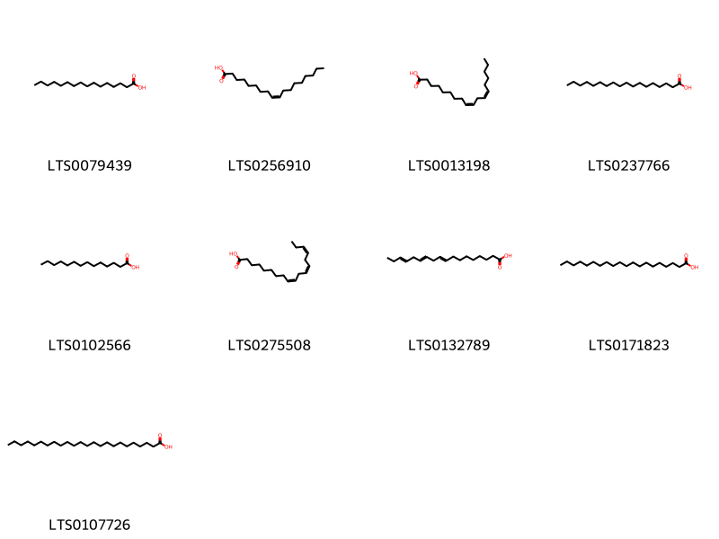{ width=100% }
    <figcaption>Hình ảnh cấu trúc hóa học của 9 hoạt chất thuộc nhóm Fatty Acyls gồm ['palmitic acid (LTS0079439)', 'oleic acid (LTS0256910)', 'linoleic (LTS0013198)', 'stearic acid (LTS0237766)', 'myristic acid (LTS0102566)', 'α-linolenic acid (LTS0275508)', 'α linolenic acid (LTS0132789)', 'arachidic acid (LTS0171823)', 'lignoceric acid (LTS0107726)'].</figcaption>
</figure>
#### Nhóm Steroids and steroid derivatives
<figure markdown="span">
    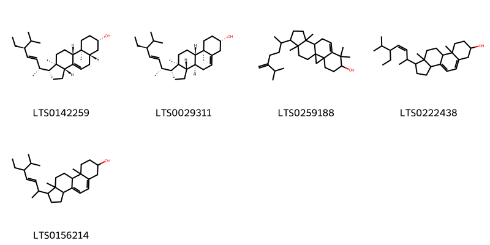{ width=100% }
    <figcaption>Hình ảnh cấu trúc hóa học của 5 hoạt chất thuộc nhóm Steroids and steroid derivatives gồm ['chondrillasterol (LTS0142259)', 'phytosterol (LTS0029311)', '7,7,12,16-tetramethyl-15-(6-methyl-5-methylideneheptan-2-yl)pentacyclo[9.7.0.0¹,³.0³,⁸.0¹²,¹⁶]octadec-8-en-6-ol (LTS0259188)', '1-[(3z)-5-ethyl-6-methylhept-3-en-2-yl]-9a,11a-dimethyl-1h,2h,3h,3ah,6h,7h,8h,9h,9bh,10h,11h-cyclopenta[a]phenanthren-7-ol (LTS0222438)', '1-[(3e)-5-ethyl-6-methylhept-3-en-2-yl]-9a,11a-dimethyl-1h,2h,3h,3ah,6h,7h,8h,9h,9bh,10h,11h-cyclopenta[a]phenanthren-7-ol (LTS0156214)'].</figcaption>
</figure>

---

### Dược dân tộc học

Danh sách các quốc gia có sử dụng *Amaranthus dubius* trong điều trị các bệnh. 

| Country            | Disease                | Bệnh                                                                                                                                                                                                |
|:-------------------|:-----------------------|:----------------------------------------------------------------------------------------------------------------------------------------------------------------------------------------------------|
| Dominican Republic | Rubefacient, Purgative | MYMEMORY WARNING: YOU USED ALL AVAILABLE FREE TRANSLATIONS FOR TODAY. NEXT AVAILABLE IN  13 HOURS 03 MINUTES 24 SECONDS VISIT HTTPS://MYMEMORY.TRANSLATED.NET/DOC/USAGELIMITS.PHP TO TRANSLATE MORE |
| Haiti              | Emetic                 | MYMEMORY WARNING: YOU USED ALL AVAILABLE FREE TRANSLATIONS FOR TODAY. NEXT AVAILABLE IN  13 HOURS 03 MINUTES 21 SECONDS VISIT HTTPS://MYMEMORY.TRANSLATED.NET/DOC/USAGELIMITS.PHP TO TRANSLATE MORE |

---

---
## Amaranthus gracilis
### Thông tin về thực vật

!!! info "Phân loại thực vật của *Amaranthus viridis* từ GIBF:"
    - **Kingdom:** Plantae
    - **Phylum:** Tracheophyta
    - **Order:** Caryophyllales
    - **Family:** Amaranthaceae
    - **Genus:** Amaranthus
    - **Species:** *Amaranthus viridis*

 

| Label (VI)   | Label (EN)   | Scientific Name     | Descriptions (VI)   | Descriptions (EN)   | Also Known As (VI)   | Also Known As (EN)   |
|:-------------|:-------------|:--------------------|:--------------------|:--------------------|:---------------------|:---------------------|
| N/A          | N/A          | Amaranthus gracilis | loài thực vật       | species of plant    | ['']                 | ['']                 |

#### Phân bố trên thế giới

**Từ CSDL GIBF** nan, Brazil, Guatemala, Viet Nam, Japan, Sweden, New Caledonia, Barbados, Israel, Türkiye, Ecuador, French Polynesia, Papua New Guinea, Thailand, Spain, Uruguay, Puerto Rico, Bolivia (Plurinational State of), Samoa, United States of America, Tonga, Virgin Islands (U.S.), Indonesia, Tunisia, Dominican Republic, Colombia, Kiribati, Argentina, unknown or invalid, Morocco, Mexico, Algeria, Congo, Democratic Republic of the, Belgium, Philippines, Chinese Taipei, Mayotte, Germany, Brunei Darussalam, Syrian Arab Republic, Egypt, Lebanon, Belize, Cambodia, Bonaire, Sint Eustatius and Saba, Paraguay, South Africa, Comoros, India, Peru, France, Cameroon

#### Phân bố tại Việt Nam

**Từ CSDL GIBF**: Thừa Thiên–Huế

---
### Thành phần hóa học
        
- Theo cơ sở dữ liệu lotus: Từ loài *Amaranthus viridis* đã phân lập và xác định được Chưa có hoạt chất nào được phân lập. hoạt chất thuộc về các nhóm Không có hoạt chất nào được phân lập. 

Không có hình ảnh nào được tạo ra

---

### Dược dân tộc học

Danh sách các quốc gia có sử dụng *Amaranthus viridis* trong điều trị các bệnh. 

| Country   | Disease   | Bệnh                                                                                                                                                                                                |
|:----------|:----------|:----------------------------------------------------------------------------------------------------------------------------------------------------------------------------------------------------|
| India     | Emollient | MYMEMORY WARNING: YOU USED ALL AVAILABLE FREE TRANSLATIONS FOR TODAY. NEXT AVAILABLE IN  13 HOURS 02 MINUTES 45 SECONDS VISIT HTTPS://MYMEMORY.TRANSLATED.NET/DOC/USAGELIMITS.PHP TO TRANSLATE MORE |

---

---
## Amaranthus hybridus
### Thông tin về thực vật

!!! info "Phân loại thực vật của *Amaranthus hybridus* từ GIBF:"
    - **Kingdom:** Plantae
    - **Phylum:** Tracheophyta
    - **Order:** Caryophyllales
    - **Family:** Amaranthaceae
    - **Genus:** Amaranthus
    - **Species:** *Amaranthus hybridus*

 

| Label (VI)   | Label (EN)   | Scientific Name     | Descriptions (VI)   | Descriptions (EN)   | Also Known As (VI)   | Also Known As (EN)                                     |
|:-------------|:-------------|:--------------------|:--------------------|:--------------------|:---------------------|:-------------------------------------------------------|
| N/A          | N/A          | Amaranthus hybridus | loài thực vật       | species of plant    | ['']                 | ['Slim amaranth', 'Smooth amaranth', 'Smooth pigweed'] |

#### Phân bố trên thế giới

**Từ CSDL GIBF** Sweden, Ecuador, Spain, Netherlands, Réunion, United States of America, Argentina, Mexico, Norway, Saudi Arabia, Belgium, Chinese Taipei, Germany, Austria, Portugal, Slovakia, South Africa, Australia, Italy, Switzerland, United Kingdom of Great Britain and Northern Ireland

#### Phân bố tại Việt Nam

**Từ CSDL GIBF**: Không có ghi nhận ở Việt Nam

---
### Thành phần hóa học
        
- Theo cơ sở dữ liệu lotus: Từ loài *Amaranthus hybridus* đã phân lập và xác định được 21 hoạt chất thuộc về các nhóm Fatty Acyls, Steroids and steroid derivatives. 

|    | chemicalTaxonomyClassyfireClass   |   smiles_count |
|---:|:----------------------------------|---------------:|
|  0 |                                   |              1 |
|  1 | Fatty Acyls                       |              9 |
|  2 | Steroids and steroid derivatives  |             11 |

#### Nhóm 
<figure markdown="span">
    { width=100% }
    <figcaption>Hình ảnh cấu trúc hóa học của 1 hoạt chất thuộc nhóm  gồm ['trigonelline (LTS0040106)'].</figcaption>
</figure>
#### Nhóm Fatty Acyls
<figure markdown="span">
    { width=100% }
    <figcaption>Hình ảnh cấu trúc hóa học của 9 hoạt chất thuộc nhóm Fatty Acyls gồm ['palmitic acid (LTS0079439)', 'oleic acid (LTS0256910)', 'linoleic (LTS0013198)', 'stearic acid (LTS0237766)', 'myristic acid (LTS0102566)', 'α-linolenic acid (LTS0275508)', 'α linolenic acid (LTS0132789)', 'arachidic acid (LTS0171823)', 'lignoceric acid (LTS0107726)'].</figcaption>
</figure>
#### Nhóm Steroids and steroid derivatives
<figure markdown="span">
    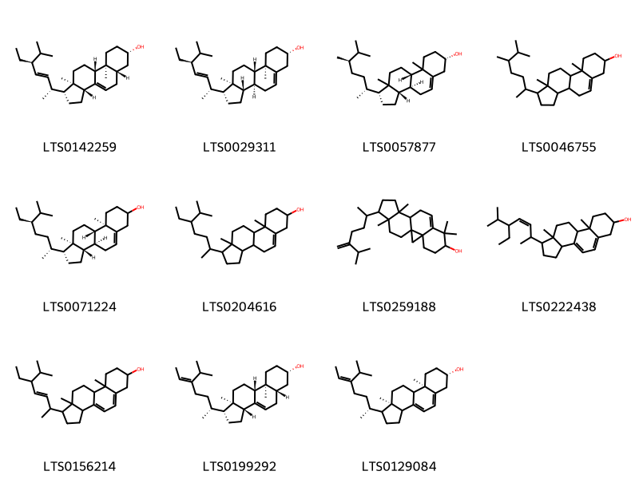{ width=100% }
    <figcaption>Hình ảnh cấu trúc hóa học của 11 hoạt chất thuộc nhóm Steroids and steroid derivatives gồm ['chondrillasterol (LTS0142259)', 'phytosterol (LTS0029311)', '(1r,3as,3bs,7s,9bs)-1-[(2r,5r)-5,6-dimethylheptan-2-yl]-9a,11a-dimethyl-1h,2h,3h,3ah,3bh,4h,6h,7h,8h,9h,9bh,10h,11h-cyclopenta[a]phenanthren-7-ol (LTS0057877)', 'campesterol (LTS0046755)', 'stigmast-5-en-3-ol (LTS0071224)', 'stigmast-5-en-3-ol, (3β)- (LTS0204616)', '7,7,12,16-tetramethyl-15-(6-methyl-5-methylideneheptan-2-yl)pentacyclo[9.7.0.0¹,³.0³,⁸.0¹²,¹⁶]octadec-8-en-6-ol (LTS0259188)', '1-[(3z)-5-ethyl-6-methylhept-3-en-2-yl]-9a,11a-dimethyl-1h,2h,3h,3ah,6h,7h,8h,9h,9bh,10h,11h-cyclopenta[a]phenanthren-7-ol (LTS0222438)', '1-[(3e)-5-ethyl-6-methylhept-3-en-2-yl]-9a,11a-dimethyl-1h,2h,3h,3ah,6h,7h,8h,9h,9bh,10h,11h-cyclopenta[a]phenanthren-7-ol (LTS0156214)', 'delta7-avenasterol (LTS0199292)', '5-dehydroavenasterol (LTS0129084)'].</figcaption>
</figure>

---

### Dược dân tộc học

Danh sách các quốc gia có sử dụng *Amaranthus hybridus* trong điều trị các bệnh. 

| Country   | Disease    | Bệnh                                                                                                                                                                                                |
|:----------|:-----------|:----------------------------------------------------------------------------------------------------------------------------------------------------------------------------------------------------|
| US        | Antiseptic | MYMEMORY WARNING: YOU USED ALL AVAILABLE FREE TRANSLATIONS FOR TODAY. NEXT AVAILABLE IN  13 HOURS 02 MINUTES 07 SECONDS VISIT HTTPS://MYMEMORY.TRANSLATED.NET/DOC/USAGELIMITS.PHP TO TRANSLATE MORE |

---

---
## Amaranthus hypochondriacus
### Thông tin về thực vật

!!! info "Phân loại thực vật của *Amaranthus hypochondriacus* từ GIBF:"
    - **Kingdom:** Plantae
    - **Phylum:** Tracheophyta
    - **Order:** Caryophyllales
    - **Family:** Amaranthaceae
    - **Genus:** Amaranthus
    - **Species:** *Amaranthus hypochondriacus*

 

| Label (VI)   | Label (EN)   | Scientific Name            | Descriptions (VI)   | Descriptions (EN)   | Also Known As (VI)   | Also Known As (EN)   |
|:-------------|:-------------|:---------------------------|:--------------------|:--------------------|:---------------------|:---------------------|
| N/A          | N/A          | Amaranthus hypochondriacus | loài thực vật       | species of plant    | ['']                 | ['']                 |

#### Phân bố trên thế giới

**Từ CSDL GIBF** Czechia, Sweden, New Zealand, Slovenia, Spain, Netherlands, Denmark, United States of America, Romania, Greece, Costa Rica, Mexico, Norway, France, Belgium, Canada, Germany, Austria, Hungary, Slovakia, Ukraine, Italy, Switzerland, United Kingdom of Great Britain and Northern Ireland

#### Phân bố tại Việt Nam

**Từ CSDL GIBF**: Không có ghi nhận ở Việt Nam

---
### Thành phần hóa học
        
- Theo cơ sở dữ liệu lotus: Từ loài *Amaranthus hypochondriacus* đã phân lập và xác định được 27 hoạt chất thuộc về các nhóm Carboxylic acids and derivatives, Steroids and steroid derivatives, Prenol lipids, Betalains. 

|    | chemicalTaxonomyClassyfireClass   |   smiles_count |
|---:|:----------------------------------|---------------:|
|  0 |                                   |              1 |
|  1 | Betalains                         |              1 |
|  2 | Carboxylic acids and derivatives  |              1 |
|  3 | Prenol lipids                     |             10 |
|  4 | Steroids and steroid derivatives  |             13 |

#### Nhóm 
<figure markdown="span">
    { width=100% }
    <figcaption>Hình ảnh cấu trúc hóa học của 1 hoạt chất thuộc nhóm  gồm ['trigonelline (LTS0040106)'].</figcaption>
</figure>
#### Nhóm Betalains
<figure markdown="span">
    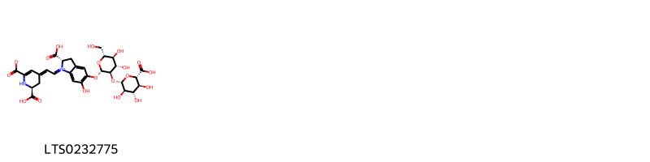{ width=100% }
    <figcaption>Hình ảnh cấu trúc hóa học của 1 hoạt chất thuộc nhóm Betalains gồm ['(2s)-2-carboxy-5-{[(2s,3r,4s,5s,6r)-3-{[(2r,3r,4s,5s,6s)-6-carboxy-3,4,5-trihydroxyoxan-2-yl]oxy}-4,5-dihydroxy-6-(hydroxymethyl)oxan-2-yl]oxy}-1-{2-[(2s)-2-carboxy-6-carboxylato-2,3-dihydro-1h-pyridin-4-ylidene]ethylidene}-6-hydroxy-2,3-dihydro-1h-1λ⁵-indol-1-ylium (LTS0232775)'].</figcaption>
</figure>
#### Nhóm Carboxylic acids and derivatives
<figure markdown="span">
    { width=100% }
    <figcaption>Hình ảnh cấu trúc hóa học của 1 hoạt chất thuộc nhóm Carboxylic acids and derivatives gồm ['bet (LTS0164067)'].</figcaption>
</figure>
#### Nhóm Prenol lipids
<figure markdown="span">
    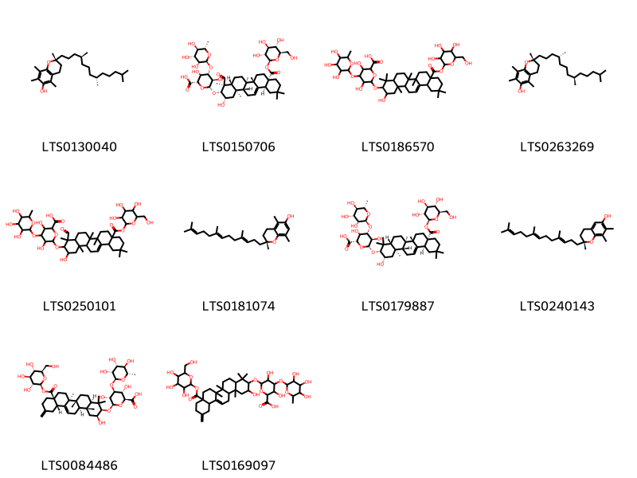{ width=100% }
    <figcaption>Hình ảnh cấu trúc hóa học của 10 hoạt chất thuộc nhóm Prenol lipids gồm ['(2r)-2,5,7,8-tetramethyl-2-[(4s,8s)-4,8,12-trimethyltridecyl]-3,4-dihydro-1-benzopyran-6-ol (LTS0130040)', '(2s,3s,4s,5r,6r)-6-{[(2s,3r,4s,4ar,6ar,6bs,8as,12as,14ar,14br)-4-formyl-2-hydroxy-4,6a,6b,11,11,14b-hexamethyl-8a-({[(2s,3r,4s,5s,6r)-3,4,5-trihydroxy-6-(hydroxymethyl)oxan-2-yl]oxy}carbonyl)-1,2,3,4a,5,6,7,8,9,10,12,12a,14,14a-tetradecahydropicen-3-yl]oxy}-3,5-dihydroxy-4-{[(2s,3r,4r,5r,6s)-3,4,5-trihydroxy-6-methyloxan-2-yl]oxy}oxane-2-carboxylic acid (LTS0150706)', '3,5-dihydroxy-6-{[2-hydroxy-4,4,6a,6b,11,11,14b-heptamethyl-8a-({[3,4,5-trihydroxy-6-(hydroxymethyl)oxan-2-yl]oxy}carbonyl)-1,2,3,4a,5,6,7,8,9,10,12,12a,14,14a-tetradecahydropicen-3-yl]oxy}-4-[(3,4,5-trihydroxy-6-methyloxan-2-yl)oxy]oxane-2-carboxylic acid (LTS0186570)', 'vitamin e (LTS0263269)', '6-{[4-formyl-2-hydroxy-4,6a,6b,11,11,14b-hexamethyl-8a-({[3,4,5-trihydroxy-6-(hydroxymethyl)oxan-2-yl]oxy}carbonyl)-1,2,3,4a,5,6,7,8,9,10,12,12a,14,14a-tetradecahydropicen-3-yl]oxy}-3,5-dihydroxy-4-[(3,4,5-trihydroxy-6-methyloxan-2-yl)oxy]oxane-2-carboxylic acid (LTS0250101)', 'β-tocotrienol (LTS0181074)', '(2s,3s,4s,5r,6r)-6-{[(2s,3r,4ar,6ar,6bs,8as,12as,14ar,14br)-2-hydroxy-4,4,6a,6b,11,11,14b-heptamethyl-8a-({[(2s,3r,4s,5s,6r)-3,4,5-trihydroxy-6-(hydroxymethyl)oxan-2-yl]oxy}carbonyl)-1,2,3,4a,5,6,7,8,9,10,12,12a,14,14a-tetradecahydropicen-3-yl]oxy}-3,5-dihydroxy-4-{[(2s,3r,4r,5r,6s)-3,4,5-trihydroxy-6-methyloxan-2-yl]oxy}oxane-2-carboxylic acid (LTS0179887)', 'γ-tocotrienol (LTS0240143)', '(2s,3s,4s,5r,6r)-6-{[(2s,3r,4ar,6ar,6bs,8as,12as,14ar,14br)-2-hydroxy-4,4,6a,6b,14b-pentamethyl-11-methylidene-8a-({[(2s,3r,4s,5s,6r)-3,4,5-trihydroxy-6-(hydroxymethyl)oxan-2-yl]oxy}carbonyl)-1,2,3,4a,5,6,7,8,9,10,12,12a,14,14a-tetradecahydropicen-3-yl]oxy}-3,5-dihydroxy-4-{[(2s,3r,4r,5r,6s)-3,4,5-trihydroxy-6-methyloxan-2-yl]oxy}oxane-2-carboxylic acid (LTS0084486)', '3,5-dihydroxy-6-{[2-hydroxy-4,4,6a,6b,14b-pentamethyl-11-methylidene-8a-({[3,4,5-trihydroxy-6-(hydroxymethyl)oxan-2-yl]oxy}carbonyl)-1,2,3,4a,5,6,7,8,9,10,12,12a,14,14a-tetradecahydropicen-3-yl]oxy}-4-[(3,4,5-trihydroxy-6-methyloxan-2-yl)oxy]oxane-2-carboxylic acid (LTS0169097)'].</figcaption>
</figure>
#### Nhóm Steroids and steroid derivatives
<figure markdown="span">
    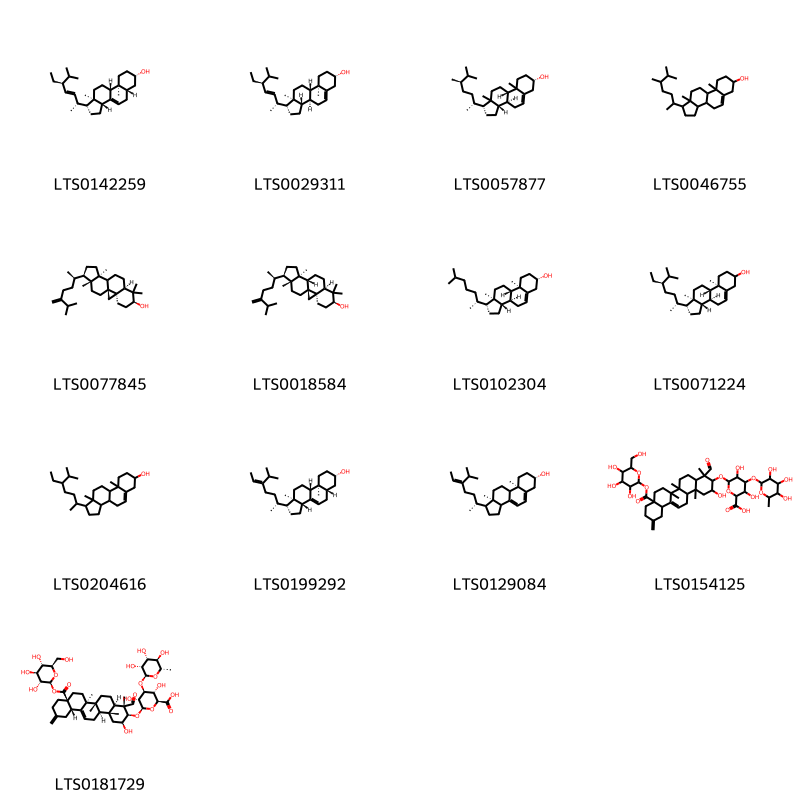{ width=100% }
    <figcaption>Hình ảnh cấu trúc hóa học của 13 hoạt chất thuộc nhóm Steroids and steroid derivatives gồm ['chondrillasterol (LTS0142259)', 'phytosterol (LTS0029311)', '(1r,3as,3bs,7s,9bs)-1-[(2r,5r)-5,6-dimethylheptan-2-yl]-9a,11a-dimethyl-1h,2h,3h,3ah,3bh,4h,6h,7h,8h,9h,9bh,10h,11h-cyclopenta[a]phenanthren-7-ol (LTS0057877)', 'campesterol (LTS0046755)', '24-methylene-cycloartanol (LTS0077845)', '24-methylenecycloartanol (LTS0018584)', 'cholesterol (LTS0102304)', 'stigmast-5-en-3-ol (LTS0071224)', 'stigmast-5-en-3-ol, (3β)- (LTS0204616)', 'delta7-avenasterol (LTS0199292)', '5-dehydroavenasterol (LTS0129084)', '6-{[4-formyl-2-hydroxy-4,6a,6b,14b-tetramethyl-11-methylidene-8a-({[3,4,5-trihydroxy-6-(hydroxymethyl)oxan-2-yl]oxy}carbonyl)-1,2,3,4a,5,6,7,8,9,10,12,12a,14,14a-tetradecahydropicen-3-yl]oxy}-3,5-dihydroxy-4-[(3,4,5-trihydroxy-6-methyloxan-2-yl)oxy]oxane-2-carboxylic acid (LTS0154125)', '(2s,3s,4s,5r,6r)-6-{[(2s,3r,4s,4ar,6ar,6bs,8as,12as,14ar,14br)-4-formyl-2-hydroxy-4,6a,6b,14b-tetramethyl-11-methylidene-8a-({[(2s,3r,4s,5s,6r)-3,4,5-trihydroxy-6-(hydroxymethyl)oxan-2-yl]oxy}carbonyl)-1,2,3,4a,5,6,7,8,9,10,12,12a,14,14a-tetradecahydropicen-3-yl]oxy}-3,5-dihydroxy-4-{[(2s,3r,4r,5r,6s)-3,4,5-trihydroxy-6-methyloxan-2-yl]oxy}oxane-2-carboxylic acid (LTS0181729)'].</figcaption>
</figure>

---

### Dược dân tộc học

Danh sách các quốc gia có sử dụng *Amaranthus hypochondriacus* trong điều trị các bệnh. 

| Country   | Disease                                             | Bệnh                                                                                                                                                                                                |
|:----------|:----------------------------------------------------|:----------------------------------------------------------------------------------------------------------------------------------------------------------------------------------------------------|
| Turkey    | Astringent, Demulcent, Diuretic, Refrigerant, Tonic | MYMEMORY WARNING: YOU USED ALL AVAILABLE FREE TRANSLATIONS FOR TODAY. NEXT AVAILABLE IN  13 HOURS 01 MINUTES 31 SECONDS VISIT HTTPS://MYMEMORY.TRANSLATED.NET/DOC/USAGELIMITS.PHP TO TRANSLATE MORE |

---

---
## Amaranthus inosus
### Thông tin về thực vật

!!! info "Phân loại thực vật của *N/A* từ GIBF:"
    - **Kingdom:** N/A
    - **Phylum:** N/A
    - **Order:** N/A
    - **Family:** N/A
    - **Genus:** N/A
    - **Species:** *N/A*

 

| Label (VI)   | Label (EN)   | Scientific Name            | Descriptions (VI)   | Descriptions (EN)   | Also Known As (VI)   | Also Known As (EN)   |
|:-------------|:-------------|:---------------------------|:--------------------|:--------------------|:---------------------|:---------------------|
| N/A          | N/A          | Amaranthus hypochondriacus | loài thực vật       | species of plant    | ['']                 | ['']                 |

#### Phân bố trên thế giới

**Từ CSDL GIBF** Không có kết quả phù hợp

#### Phân bố tại Việt Nam

**Từ CSDL GIBF**: Không có ghi nhận ở Việt Nam

---
### Thành phần hóa học
        
- Theo cơ sở dữ liệu lotus: Từ loài *N/A* đã phân lập và xác định được Chưa có hoạt chất nào được phân lập. hoạt chất thuộc về các nhóm Không có hoạt chất nào được phân lập. 

Không có hình ảnh nào được tạo ra

---

### Dược dân tộc học

Danh sách các quốc gia có sử dụng *N/A* trong điều trị các bệnh. 

| Country     | Disease     | Bệnh                                                                                                                                                                                                |
|:------------|:------------|:----------------------------------------------------------------------------------------------------------------------------------------------------------------------------------------------------|
| Ghana       | Expectorant | MYMEMORY WARNING: YOU USED ALL AVAILABLE FREE TRANSLATIONS FOR TODAY. NEXT AVAILABLE IN  13 HOURS 00 MINUTES 49 SECONDS VISIT HTTPS://MYMEMORY.TRANSLATED.NET/DOC/USAGELIMITS.PHP TO TRANSLATE MORE |
| Java        | Emmenagogue | MYMEMORY WARNING: YOU USED ALL AVAILABLE FREE TRANSLATIONS FOR TODAY. NEXT AVAILABLE IN  13 HOURS 00 MINUTES 45 SECONDS VISIT HTTPS://MYMEMORY.TRANSLATED.NET/DOC/USAGELIMITS.PHP TO TRANSLATE MORE |
| Malaya      | Diuretic    | MYMEMORY WARNING: YOU USED ALL AVAILABLE FREE TRANSLATIONS FOR TODAY. NEXT AVAILABLE IN  13 HOURS 00 MINUTES 39 SECONDS VISIT HTTPS://MYMEMORY.TRANSLATED.NET/DOC/USAGELIMITS.PHP TO TRANSLATE MORE |
| Mauritius   | Diuretic    | MYMEMORY WARNING: YOU USED ALL AVAILABLE FREE TRANSLATIONS FOR TODAY. NEXT AVAILABLE IN  13 HOURS 00 MINUTES 34 SECONDS VISIT HTTPS://MYMEMORY.TRANSLATED.NET/DOC/USAGELIMITS.PHP TO TRANSLATE MORE |
| Philippines | Sudorific   | MYMEMORY WARNING: YOU USED ALL AVAILABLE FREE TRANSLATIONS FOR TODAY. NEXT AVAILABLE IN  13 HOURS 00 MINUTES 26 SECONDS VISIT HTTPS://MYMEMORY.TRANSLATED.NET/DOC/USAGELIMITS.PHP TO TRANSLATE MORE |

---

---
## Amaranthus palmeri
### Thông tin về thực vật

!!! info "Phân loại thực vật của *Amaranthus palmeri* từ GIBF:"
    - **Kingdom:** Plantae
    - **Phylum:** Tracheophyta
    - **Order:** Caryophyllales
    - **Family:** Amaranthaceae
    - **Genus:** Amaranthus
    - **Species:** *Amaranthus palmeri*

 

| Label (VI)   | Label (EN)   | Scientific Name    | Descriptions (VI)   | Descriptions (EN)   | Also Known As (VI)   | Also Known As (EN)   |
|:-------------|:-------------|:-------------------|:--------------------|:--------------------|:---------------------|:---------------------|
| N/A          | N/A          | Amaranthus palmeri | loài thực vật       | species of plant    | ['']                 | ['']                 |

#### Phân bố trên thế giới

**Từ CSDL GIBF** Mexico, United States of America, Portugal, China, Israel, Italy, Georgia

#### Phân bố tại Việt Nam

**Từ CSDL GIBF**: Không có ghi nhận ở Việt Nam

---
### Thành phần hóa học
        
- Theo cơ sở dữ liệu lotus: Từ loài *Amaranthus palmeri* đã phân lập và xác định được Chưa có hoạt chất nào được phân lập. hoạt chất thuộc về các nhóm Không có hoạt chất nào được phân lập. 

Không có hình ảnh nào được tạo ra

---

### Dược dân tộc học

Danh sách các quốc gia có sử dụng *Amaranthus palmeri* trong điều trị các bệnh. 

| Country   | Disease   | Bệnh                                                                                                                                                                                                |
|:----------|:----------|:----------------------------------------------------------------------------------------------------------------------------------------------------------------------------------------------------|
| Mexico    | Soap      | MYMEMORY WARNING: YOU USED ALL AVAILABLE FREE TRANSLATIONS FOR TODAY. NEXT AVAILABLE IN  13 HOURS 00 MINUTES 09 SECONDS VISIT HTTPS://MYMEMORY.TRANSLATED.NET/DOC/USAGELIMITS.PHP TO TRANSLATE MORE |
| US        | Poison    | MYMEMORY WARNING: YOU USED ALL AVAILABLE FREE TRANSLATIONS FOR TODAY. NEXT AVAILABLE IN  13 HOURS 00 MINUTES 06 SECONDS VISIT HTTPS://MYMEMORY.TRANSLATED.NET/DOC/USAGELIMITS.PHP TO TRANSLATE MORE |

---

---
## Amaranthus quitensis
### Thông tin về thực vật

!!! info "Phân loại thực vật của *Amaranthus quitensis* từ GIBF:"
    - **Kingdom:** Plantae
    - **Phylum:** Tracheophyta
    - **Order:** Caryophyllales
    - **Family:** Amaranthaceae
    - **Genus:** Amaranthus
    - **Species:** *Amaranthus quitensis*

 

| Label (VI)   | Label (EN)   | Scientific Name      | Descriptions (VI)   | Descriptions (EN)   | Also Known As (VI)   | Also Known As (EN)   |
|:-------------|:-------------|:---------------------|:--------------------|:--------------------|:---------------------|:---------------------|
| N/A          | N/A          | Amaranthus quitensis | loài thực vật       | species of plant    | ['']                 | ['']                 |

#### Phân bố trên thế giới

**Từ CSDL GIBF** nan, Brazil, Sweden, Ecuador, Spain, Netherlands, Denmark, Bolivia (Plurinational State of), Romania, Greece, Norfolk Island, Colombia, Argentina, Mexico, France, Belgium, Germany, Paraguay, Australia, Peru, United Kingdom of Great Britain and Northern Ireland, Venezuela (Bolivarian Republic of)

#### Phân bố tại Việt Nam

**Từ CSDL GIBF**: Không có ghi nhận ở Việt Nam

---
### Thành phần hóa học
        
- Theo cơ sở dữ liệu lotus: Từ loài *Amaranthus quitensis* đã phân lập và xác định được Chưa có hoạt chất nào được phân lập. hoạt chất thuộc về các nhóm Không có hoạt chất nào được phân lập. 

Không có hình ảnh nào được tạo ra

---

### Dược dân tộc học

Danh sách các quốc gia có sử dụng *Amaranthus quitensis* trong điều trị các bệnh. 

| Country   | Disease   | Bệnh                                                                                                                                                                                                |
|:----------|:----------|:----------------------------------------------------------------------------------------------------------------------------------------------------------------------------------------------------|
| Argentina | Diuretic  | MYMEMORY WARNING: YOU USED ALL AVAILABLE FREE TRANSLATIONS FOR TODAY. NEXT AVAILABLE IN  12 HOURS 59 MINUTES 41 SECONDS VISIT HTTPS://MYMEMORY.TRANSLATED.NET/DOC/USAGELIMITS.PHP TO TRANSLATE MORE |

---

---
## Amaranthus retroflexus
### Thông tin về thực vật

!!! info "Phân loại thực vật của *Amaranthus retroflexus* từ GIBF:"
    - **Kingdom:** Plantae
    - **Phylum:** Tracheophyta
    - **Order:** Caryophyllales
    - **Family:** Amaranthaceae
    - **Genus:** Amaranthus
    - **Species:** *Amaranthus retroflexus*

 

| Label (VI)   | Label (EN)   | Scientific Name        | Descriptions (VI)   | Descriptions (EN)   | Also Known As (VI)   | Also Known As (EN)                                                                                                                                                                    |
|:-------------|:-------------|:-----------------------|:--------------------|:--------------------|:---------------------|:--------------------------------------------------------------------------------------------------------------------------------------------------------------------------------------|
| N/A          | N/A          | Amaranthus retroflexus | loài thực vật       | species of plant    | ['']                 | ['redroot', 'common amaranth', 'common tumbleweed', 'pigweed amaranth', 'red-root amaranth', 'red-rooted pigweed', 'redroot pigweed', 'green amaranth', 'rough pigweed', 'wild beet'] |

#### Phân bố trên thế giới

**Từ CSDL GIBF** Czechia, Mongolia, Uzbekistan, Sweden, Israel, Kazakhstan, Thailand, Spain, Poland, Netherlands, United States of America, Romania, Russian Federation, Belgium, Chinese Taipei, Canada, Austria, Hungary, Ukraine, Slovakia, Australia, Italy, Serbia

#### Phân bố tại Việt Nam

**Từ CSDL GIBF**: Không có ghi nhận ở Việt Nam

---
### Thành phần hóa học
        
- Theo cơ sở dữ liệu lotus: Từ loài *Amaranthus retroflexus* đã phân lập và xác định được 48 hoạt chất thuộc về các nhóm Fatty Acyls, Carboxylic acids and derivatives, Steroids and steroid derivatives, Organooxygen compounds, Prenol lipids. 

|    | chemicalTaxonomyClassyfireClass   |   smiles_count |
|---:|:----------------------------------|---------------:|
|  0 |                                   |              1 |
|  1 | Carboxylic acids and derivatives  |              1 |
|  2 | Fatty Acyls                       |             13 |
|  3 | Organooxygen compounds            |              1 |
|  4 | Prenol lipids                     |             22 |
|  5 | Steroids and steroid derivatives  |             10 |

#### Nhóm 
<figure markdown="span">
    { width=100% }
    <figcaption>Hình ảnh cấu trúc hóa học của 1 hoạt chất thuộc nhóm  gồm ['trigonelline (LTS0040106)'].</figcaption>
</figure>
#### Nhóm Carboxylic acids and derivatives
<figure markdown="span">
    { width=100% }
    <figcaption>Hình ảnh cấu trúc hóa học của 1 hoạt chất thuộc nhóm Carboxylic acids and derivatives gồm ['bet (LTS0164067)'].</figcaption>
</figure>
#### Nhóm Fatty Acyls
<figure markdown="span">
    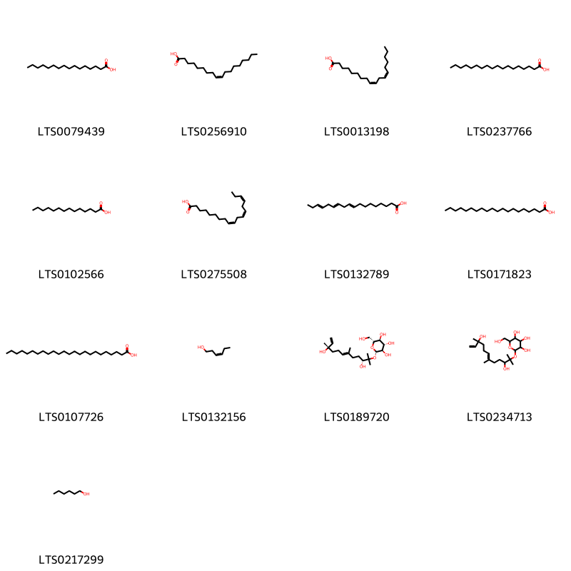{ width=100% }
    <figcaption>Hình ảnh cấu trúc hóa học của 13 hoạt chất thuộc nhóm Fatty Acyls gồm ['palmitic acid (LTS0079439)', 'oleic acid (LTS0256910)', 'linoleic (LTS0013198)', 'stearic acid (LTS0237766)', 'myristic acid (LTS0102566)', 'α-linolenic acid (LTS0275508)', 'α linolenic acid (LTS0132789)', 'arachidic acid (LTS0171823)', 'lignoceric acid (LTS0107726)', 'cis-3-hexenol (LTS0132156)', '(2s,3r,4s,5s,6r)-2-{[(3r,6e,10s)-3,10-dihydroxy-2,6,10-trimethyldodeca-6,11-dien-2-yl]oxy}-6-(hydroxymethyl)oxane-3,4,5-triol (LTS0189720)', '2-[(3,10-dihydroxy-2,6,10-trimethyldodeca-6,11-dien-2-yl)oxy]-6-(hydroxymethyl)oxane-3,4,5-triol (LTS0234713)', 'hexanol (LTS0217299)'].</figcaption>
</figure>
#### Nhóm Organooxygen compounds
<figure markdown="span">
    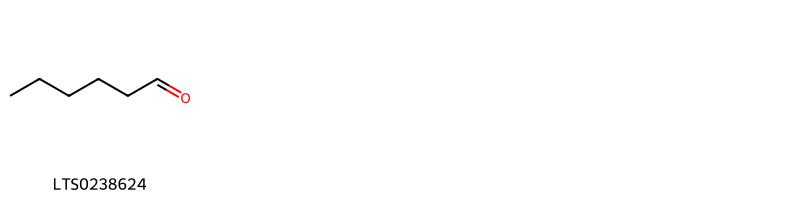{ width=100% }
    <figcaption>Hình ảnh cấu trúc hóa học của 1 hoạt chất thuộc nhóm Organooxygen compounds gồm ['hexanal (LTS0238624)'].</figcaption>
</figure>
#### Nhóm Prenol lipids
<figure markdown="span">
    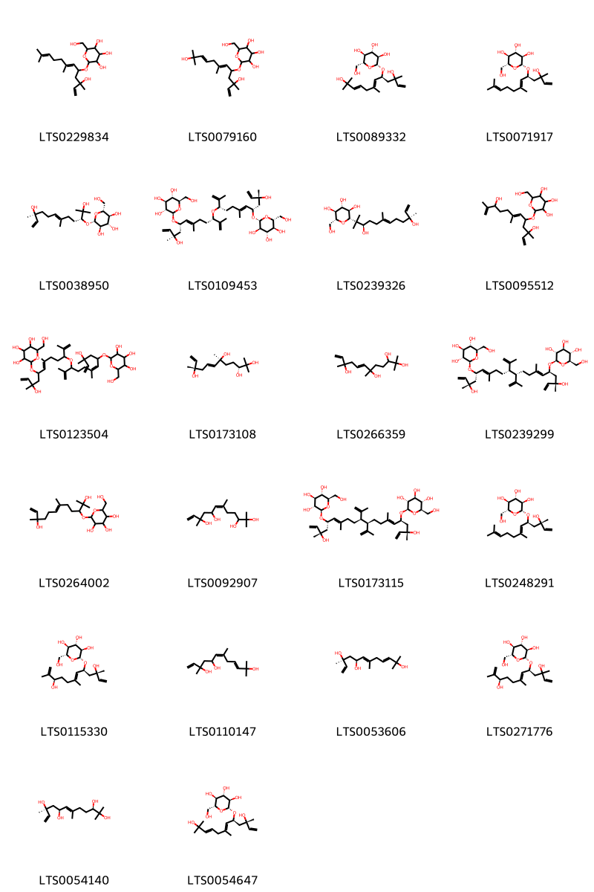{ width=100% }
    <figcaption>Hình ảnh cấu trúc hóa học của 22 hoạt chất thuộc nhóm Prenol lipids gồm ['2-[(3-hydroxy-3,7,11-trimethyldodeca-1,6,10-trien-5-yl)oxy]-6-(hydroxymethyl)oxane-3,4,5-triol (LTS0229834)', '2-[(3,11-dihydroxy-3,7,11-trimethyldodeca-1,6,9-trien-5-yl)oxy]-6-(hydroxymethyl)oxane-3,4,5-triol (LTS0079160)', '(2r,3r,4s,5s,6r)-2-{[(5s,6e,9e)-3,11-dihydroxy-3,7,11-trimethyldodeca-1,6,9-trien-5-yl]oxy}-6-(hydroxymethyl)oxane-3,4,5-triol (LTS0089332)', '(2r,3r,4s,5s,6r)-2-{[(5s,6e)-3-hydroxy-3,7,11-trimethyldodeca-1,6,10-trien-5-yl]oxy}-6-(hydroxymethyl)oxane-3,4,5-triol (LTS0071917)', '(2s,3r,4s,5s,6r)-2-{[(3r,6e,10s)-2,10-dihydroxy-2,6,10-trimethyldodeca-6,11-dien-3-yl]oxy}-6-(hydroxymethyl)oxane-3,4,5-triol (LTS0038950)', '(2r,3r,4s,5s,6r)-2-{[(3r,5s,6e,10s)-3-hydroxy-10-{[(3s,6e,8s,10r)-10-hydroxy-2,6,10-trimethyl-8-{[(2r,3r,4s,5s,6r)-3,4,5-trihydroxy-6-(hydroxymethyl)oxan-2-yl]oxy}dodeca-1,6,11-trien-3-yl]oxy}-3,7,11-trimethyldodeca-1,6,11-trien-5-yl]oxy}-6-(hydroxymethyl)oxane-3,4,5-triol (LTS0109453)', '(2s,3r,4r,5s,6r)-2-[(3r,6e,10s)-3,10-dihydroxy-2,6,10-trimethyldodeca-6,11-dien-2-yl]-6-(hydroxymethyl)oxane-3,4,5-triol (LTS0239326)', '2-[(3,10-dihydroxy-3,7,11-trimethyldodeca-1,6,11-trien-5-yl)oxy]-6-(hydroxymethyl)oxane-3,4,5-triol (LTS0095512)', '2-({3-hydroxy-10-[(10-hydroxy-2,6,10-trimethyl-8-{[3,4,5-trihydroxy-6-(hydroxymethyl)oxan-2-yl]oxy}dodeca-1,6,11-trien-3-yl)oxy]-3,7,11-trimethyldodeca-1,6,11-trien-5-yl}oxy)-6-(hydroxymethyl)oxane-3,4,5-triol (LTS0123504)', '(3r,6s,7e,10s)-2,6,10-trimethyldodeca-7,11-diene-2,3,6,10-tetrol (LTS0173108)', '2,6,10-trimethyldodeca-7,11-diene-2,3,6,10-tetrol (LTS0266359)', '(2r,3r,4s,5s,6r)-2-{[(3s,5s,6e,10s,11s,14e,16s,18s)-3,18-dihydroxy-3,7,14,18-tetramethyl-10,11-bis(prop-1-en-2-yl)-16-{[(2r,3r,4s,5s,6r)-3,4,5-trihydroxy-6-(hydroxymethyl)oxan-2-yl]oxy}icosa-1,6,14,19-tetraen-5-yl]oxy}-6-(hydroxymethyl)oxane-3,4,5-triol (LTS0239299)', '2-[(2,10-dihydroxy-2,6,10-trimethyldodeca-6,11-dien-3-yl)oxy]-6-(hydroxymethyl)oxane-3,4,5-triol (LTS0264002)', '2,6,10-trimethyldodeca-6,11-diene-2,3,8,10-tetrol (LTS0092907)', '(2r,3r,4s,5s,6r)-2-{[(3s,5s,6e,10r,11r,14e,16s,18s)-3,18-dihydroxy-3,7,14,18-tetramethyl-10,11-bis(prop-1-en-2-yl)-16-{[(2r,3r,4s,5s,6r)-3,4,5-trihydroxy-6-(hydroxymethyl)oxan-2-yl]oxy}icosa-1,6,14,19-tetraen-5-yl]oxy}-6-(hydroxymethyl)oxane-3,4,5-triol (LTS0173115)', '(2r,3r,4s,5s,6r)-2-{[(3s,5s,6e)-3-hydroxy-3,7,11-trimethyldodeca-1,6,10-trien-5-yl]oxy}-6-(hydroxymethyl)oxane-3,4,5-triol (LTS0248291)', '(2r,3r,4s,5s,6r)-2-{[(3s,5s,6e,10r)-3,10-dihydroxy-3,7,11-trimethyldodeca-1,6,11-trien-5-yl]oxy}-6-(hydroxymethyl)oxane-3,4,5-triol (LTS0115330)', '2,6,10-trimethyldodeca-3,6,11-triene-2,8,10-triol (LTS0110147)', '(3e,6e,8s,10s)-2,6,10-trimethyldodeca-3,6,11-triene-2,8,10-triol (LTS0053606)', '(2r,3r,4s,5s,6r)-2-{[(5s,6e,10r)-3,10-dihydroxy-3,7,11-trimethyldodeca-1,6,11-trien-5-yl]oxy}-6-(hydroxymethyl)oxane-3,4,5-triol (LTS0271776)', '(3r,6e,8s,10s)-2,6,10-trimethyldodeca-6,11-diene-2,3,8,10-tetrol (LTS0054140)', '(2r,3r,4s,5s,6r)-2-{[(3s,5s,6e,9e)-3,11-dihydroxy-3,7,11-trimethyldodeca-1,6,9-trien-5-yl]oxy}-6-(hydroxymethyl)oxane-3,4,5-triol (LTS0054647)'].</figcaption>
</figure>
#### Nhóm Steroids and steroid derivatives
<figure markdown="span">
    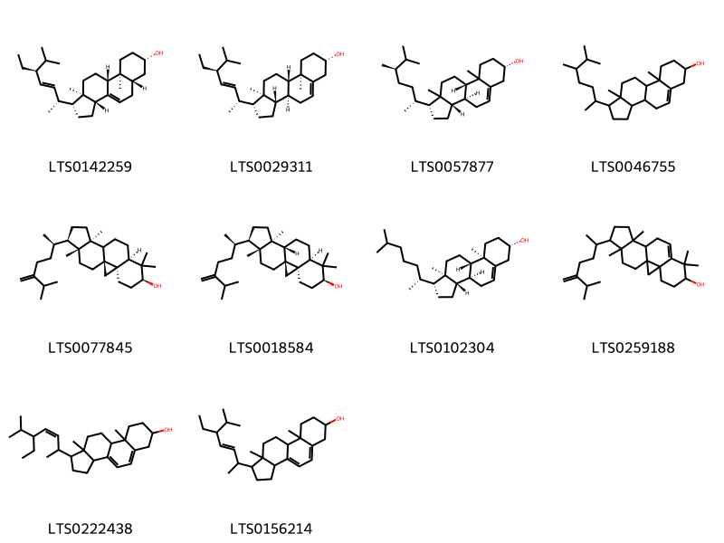{ width=100% }
    <figcaption>Hình ảnh cấu trúc hóa học của 10 hoạt chất thuộc nhóm Steroids and steroid derivatives gồm ['chondrillasterol (LTS0142259)', 'phytosterol (LTS0029311)', '(1r,3as,3bs,7s,9bs)-1-[(2r,5r)-5,6-dimethylheptan-2-yl]-9a,11a-dimethyl-1h,2h,3h,3ah,3bh,4h,6h,7h,8h,9h,9bh,10h,11h-cyclopenta[a]phenanthren-7-ol (LTS0057877)', 'campesterol (LTS0046755)', '24-methylene-cycloartanol (LTS0077845)', '24-methylenecycloartanol (LTS0018584)', 'cholesterol (LTS0102304)', '7,7,12,16-tetramethyl-15-(6-methyl-5-methylideneheptan-2-yl)pentacyclo[9.7.0.0¹,³.0³,⁸.0¹²,¹⁶]octadec-8-en-6-ol (LTS0259188)', '1-[(3z)-5-ethyl-6-methylhept-3-en-2-yl]-9a,11a-dimethyl-1h,2h,3h,3ah,6h,7h,8h,9h,9bh,10h,11h-cyclopenta[a]phenanthren-7-ol (LTS0222438)', '1-[(3e)-5-ethyl-6-methylhept-3-en-2-yl]-9a,11a-dimethyl-1h,2h,3h,3ah,6h,7h,8h,9h,9bh,10h,11h-cyclopenta[a]phenanthren-7-ol (LTS0156214)'].</figcaption>
</figure>

---

### Dược dân tộc học

Danh sách các quốc gia có sử dụng *Amaranthus retroflexus* trong điều trị các bệnh. 

| Country   | Disease      | Bệnh                                                                                                                                                                                                |
|:----------|:-------------|:----------------------------------------------------------------------------------------------------------------------------------------------------------------------------------------------------|
| US        | Poison, Soap | MYMEMORY WARNING: YOU USED ALL AVAILABLE FREE TRANSLATIONS FOR TODAY. NEXT AVAILABLE IN  12 HOURS 59 MINUTES 11 SECONDS VISIT HTTPS://MYMEMORY.TRANSLATED.NET/DOC/USAGELIMITS.PHP TO TRANSLATE MORE |

---

# Chi Achyranthes

??? note "Danh sách các dược liệu thuộc chi"
    
	 - *Achyranthes aera*
	 - *Achyranthes bidentata*
	 - *Achyranthes fauriei*
	 - *Achyranthes indica*
	 - *Achyranthes japonica*

---
## Achyranthes aera
### Thông tin về thực vật

!!! info "Phân loại thực vật của *Alternanthera elongata* từ GIBF:"
    - **Kingdom:** Plantae
    - **Phylum:** Tracheophyta
    - **Order:** Caryophyllales
    - **Family:** Amaranthaceae
    - **Genus:** Alternanthera
    - **Species:** *Alternanthera elongata*

 

| Label (VI)   | Label (EN)   | Scientific Name        | Descriptions (VI)   | Descriptions (EN)   | Also Known As (VI)   | Also Known As (EN)                                                                                                                                                                    |
|:-------------|:-------------|:-----------------------|:--------------------|:--------------------|:---------------------|:--------------------------------------------------------------------------------------------------------------------------------------------------------------------------------------|
| N/A          | N/A          | Amaranthus retroflexus | loài thực vật       | species of plant    | ['']                 | ['redroot', 'common amaranth', 'common tumbleweed', 'pigweed amaranth', 'red-root amaranth', 'red-rooted pigweed', 'redroot pigweed', 'green amaranth', 'rough pigweed', 'wild beet'] |

#### Phân bố trên thế giới

**Từ CSDL GIBF** Brazil

#### Phân bố tại Việt Nam

**Từ CSDL GIBF**: Không có ghi nhận ở Việt Nam

---
### Thành phần hóa học
        
- Theo cơ sở dữ liệu lotus: Từ loài *Alternanthera elongata* đã phân lập và xác định được Chưa có hoạt chất nào được phân lập. hoạt chất thuộc về các nhóm Không có hoạt chất nào được phân lập. 

Không có hình ảnh nào được tạo ra

---

### Dược dân tộc học

Danh sách các quốc gia có sử dụng *Alternanthera elongata* trong điều trị các bệnh. 

| Country     | Disease              | Bệnh                                                                                                                                                                                                |
|:------------|:---------------------|:----------------------------------------------------------------------------------------------------------------------------------------------------------------------------------------------------|
| Elsewhere   | Dentifrice, Emetic   | MYMEMORY WARNING: YOU USED ALL AVAILABLE FREE TRANSLATIONS FOR TODAY. NEXT AVAILABLE IN  12 HOURS 58 MINUTES 26 SECONDS VISIT HTTPS://MYMEMORY.TRANSLATED.NET/DOC/USAGELIMITS.PHP TO TRANSLATE MORE |
| Haiti       | Diuretic, Astringent | MYMEMORY WARNING: YOU USED ALL AVAILABLE FREE TRANSLATIONS FOR TODAY. NEXT AVAILABLE IN  12 HOURS 58 MINUTES 23 SECONDS VISIT HTTPS://MYMEMORY.TRANSLATED.NET/DOC/USAGELIMITS.PHP TO TRANSLATE MORE |
| India       | Diuretic, Diuretic   | MYMEMORY WARNING: YOU USED ALL AVAILABLE FREE TRANSLATIONS FOR TODAY. NEXT AVAILABLE IN  12 HOURS 58 MINUTES 20 SECONDS VISIT HTTPS://MYMEMORY.TRANSLATED.NET/DOC/USAGELIMITS.PHP TO TRANSLATE MORE |
| Philippines | Diuretic             | MYMEMORY WARNING: YOU USED ALL AVAILABLE FREE TRANSLATIONS FOR TODAY. NEXT AVAILABLE IN  12 HOURS 58 MINUTES 13 SECONDS VISIT HTTPS://MYMEMORY.TRANSLATED.NET/DOC/USAGELIMITS.PHP TO TRANSLATE MORE |
| Samoa       | Diuretic             | MYMEMORY WARNING: YOU USED ALL AVAILABLE FREE TRANSLATIONS FOR TODAY. NEXT AVAILABLE IN  12 HOURS 58 MINUTES 08 SECONDS VISIT HTTPS://MYMEMORY.TRANSLATED.NET/DOC/USAGELIMITS.PHP TO TRANSLATE MORE |
| Sudan       | Styptic              | MYMEMORY WARNING: YOU USED ALL AVAILABLE FREE TRANSLATIONS FOR TODAY. NEXT AVAILABLE IN  12 HOURS 58 MINUTES 03 SECONDS VISIT HTTPS://MYMEMORY.TRANSLATED.NET/DOC/USAGELIMITS.PHP TO TRANSLATE MORE |

---

---
## Achyranthes bidentata
### Thông tin về thực vật

!!! info "Phân loại thực vật của *Achyranthes bidentata* từ GIBF:"
    - **Kingdom:** Plantae
    - **Phylum:** Tracheophyta
    - **Order:** Caryophyllales
    - **Family:** Amaranthaceae
    - **Genus:** Achyranthes
    - **Species:** *Achyranthes bidentata*

 

| Label (VI)   | Label (EN)   | Scientific Name       | Descriptions (VI)   | Descriptions (EN)   | Also Known As (VI)        | Also Known As (EN)   |
|:-------------|:-------------|:----------------------|:--------------------|:--------------------|:--------------------------|:---------------------|
| N/A          | N/A          | Achyranthes bidentata | loài thực vật       | species of plant    | ['Achyranthes bidentata'] | ['']                 |

#### Phân bố trên thế giới

**Từ CSDL GIBF** nan, United States of America, Japan, Korea, Republic of, Chinese Taipei, China

#### Phân bố tại Việt Nam

**Từ CSDL GIBF**: Không có ghi nhận ở Việt Nam

---
### Thành phần hóa học
        
- Theo cơ sở dữ liệu lotus: Từ loài *Achyranthes bidentata* đã phân lập và xác định được 42 hoạt chất thuộc về các nhóm Fatty Acyls, Carboxylic acids and derivatives, Anthracenes, Azolidines, Azoles, Prenol lipids. 

|    | chemicalTaxonomyClassyfireClass   |   smiles_count |
|---:|:----------------------------------|---------------:|
|  0 | Anthracenes                       |              2 |
|  1 | Azoles                            |              1 |
|  2 | Azolidines                        |              1 |
|  3 | Carboxylic acids and derivatives  |              1 |
|  4 | Fatty Acyls                       |              1 |
|  5 | Prenol lipids                     |             36 |

#### Nhóm Anthracenes
<figure markdown="span">
    { width=100% }
    <figcaption>Hình ảnh cấu trúc hóa học của 2 hoạt chất thuộc nhóm Anthracenes gồm ['emodin (LTS0163480)', 'physcion (LTS0052688)'].</figcaption>
</figure>
#### Nhóm Azoles
<figure markdown="span">
    { width=100% }
    <figcaption>Hình ảnh cấu trúc hóa học của 1 hoạt chất thuộc nhóm Azoles gồm ['allantoin (LTS0106609)'].</figcaption>
</figure>
#### Nhóm Azolidines
<figure markdown="span">
    { width=100% }
    <figcaption>Hình ảnh cấu trúc hóa học của 1 hoạt chất thuộc nhóm Azolidines gồm ['n-[(4s)-2,5-dihydroxy-4h-imidazol-4-yl]carbamimidic acid (LTS0174328)'].</figcaption>
</figure>
#### Nhóm Carboxylic acids and derivatives
<figure markdown="span">
    { width=100% }
    <figcaption>Hình ảnh cấu trúc hóa học của 1 hoạt chất thuộc nhóm Carboxylic acids and derivatives gồm ['bet (LTS0164067)'].</figcaption>
</figure>
#### Nhóm Fatty Acyls
<figure markdown="span">
    { width=100% }
    <figcaption>Hình ảnh cấu trúc hóa học của 1 hoạt chất thuộc nhóm Fatty Acyls gồm ['palmitic acid (LTS0079439)'].</figcaption>
</figure>
#### Nhóm Prenol lipids
<figure markdown="span">
    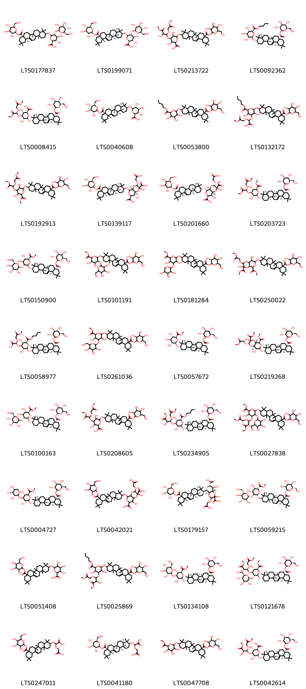{ width=100% }
    <figcaption>Hình ảnh cấu trúc hóa học của 36 hoạt chất thuộc nhóm Prenol lipids gồm ['(2s,3s,4s,5r,6r)-6-{[(6ar,6bs,8as,12ar,14br)-4,4,6a,6b,11,11,14b-heptamethyl-8a-({[(2s,3r,4s,5s,6r)-3,4,5-trihydroxy-6-(hydroxymethyl)oxan-2-yl]oxy}carbonyl)-1,2,3,4a,5,6,7,8,9,10,12,12a,14,14a-tetradecahydropicen-3-yl]oxy}-3,4-dihydroxy-5-{[(2s,3r,4s,5s,6r)-3,4,5-trihydroxy-6-(hydroxymethyl)oxan-2-yl]oxy}oxane-2-carboxylic acid (LTS0177837)', 'chikusetsusaponin-v (LTS0199071)', '6-{[4,4,6a,6b,11,11,14b-heptamethyl-8a-({[3,4,5-trihydroxy-6-(hydroxymethyl)oxan-2-yl]oxy}carbonyl)-1,2,3,4a,5,6,7,8,9,10,12,12a,14,14a-tetradecahydropicen-3-yl]oxy}-3,5-dihydroxy-4-[2-hydroxy-3-methoxy-1-(2-methoxy-2-oxoethoxy)-3-oxopropoxy]oxane-2-carboxylic acid (LTS0213722)', 'butyl (2s,3s,4s,5r,6r)-6-{[(3s,4ar,6ar,6bs,8as,12as,14ar,14br)-4,4,6a,6b,11,11,14b-heptamethyl-8a-({[(2s,3r,4s,5s,6r)-3,4,5-trihydroxy-6-(hydroxymethyl)oxan-2-yl]oxy}carbonyl)-1,2,3,4a,5,6,7,8,9,10,12,12a,14,14a-tetradecahydropicen-3-yl]oxy}-3,4,5-trihydroxyoxane-2-carboxylate (LTS0092362)', '(2s,3s,4s,5r,6r)-6-{[(3s,4ar,6ar,6bs,8as,12as,14ar,14br)-4,4,6a,6b,11,11,14b-heptamethyl-8a-({[(2s,3r,4s,5s,6r)-3,4,5-trihydroxy-6-(hydroxymethyl)oxan-2-yl]oxy}carbonyl)-1,2,3,4a,5,6,7,8,9,10,12,12a,14,14a-tetradecahydropicen-3-yl]oxy}-3,5-dihydroxy-4-[(1s)-2-methoxy-1-(2-methoxy-2-oxoethoxy)-2-oxoethoxy]oxane-2-carboxylic acid (LTS0008415)', 'calenduloside f (LTS0040608)', 'butyl 6-{[4,4,6a,6b,11,11,14b-heptamethyl-8a-({[3,4,5-trihydroxy-6-(hydroxymethyl)oxan-2-yl]oxy}carbonyl)-1,2,3,4a,5,6,7,8,9,10,12,12a,14,14a-tetradecahydropicen-3-yl]oxy}-3,4,5-trihydroxyoxane-2-carboxylate (LTS0053800)', '[(2-{[4,4,6a,6b,11,11,14b-heptamethyl-8a-({[3,4,5-trihydroxy-6-(hydroxymethyl)oxan-2-yl]oxy}carbonyl)-1,2,3,4a,5,6,7,8,9,10,12,12a,14,14a-tetradecahydropicen-3-yl]oxy}-6-(butoxycarbonyl)-3,5-dihydroxyoxan-4-yl)oxy](2-methoxy-2-oxoethoxy)acetic acid (LTS0132172)', 'methyl 6-{[4,4,6a,6b,11,11,14b-heptamethyl-8a-({[3,4,5-trihydroxy-6-(hydroxymethyl)oxan-2-yl]oxy}carbonyl)-1,2,3,4a,5,6,7,8,9,10,12,12a,14,14a-tetradecahydropicen-3-yl]oxy}-3,5-dihydroxy-4-[2-methoxy-1-(2-methoxy-2-oxoethoxy)-2-oxoethoxy]oxane-2-carboxylate (LTS0192913)', '(2r,3r,4ar,5r,7s,8s,8as)-5-{[(3s,4ar,6ar,6bs,8as,12ar,14ar,14br)-4,4,6a,6b,11,11,14b-heptamethyl-8a-({[(2s,3r,4s,5s,6r)-3,4,5-trihydroxy-6-(hydroxymethyl)oxan-2-yl]oxy}carbonyl)-1,2,3,4a,5,6,7,8,9,10,12,12a,14,14a-tetradecahydropicen-3-yl]oxy}-3-(carboxymethoxy)-2,8-dihydroxy-hexahydropyrano[3,4-b][1,4]dioxine-2,7-dicarboxylic acid (LTS0139117)', '(2r,3s,4as,5s,7s,8r,8ar)-5-{[(3r,4ar,6as,6bs,8ar,12as,14ar,14br)-4,4,6a,6b,11,11,14b-heptamethyl-8a-({[(2s,3r,4s,5r,6r)-3,4,5-trihydroxy-6-(hydroxymethyl)oxan-2-yl]oxy}carbonyl)-1,2,3,4a,5,6,7,8,9,10,12,12a,14,14a-tetradecahydropicen-3-yl]oxy}-3-(carboxymethoxy)-2,8-dihydroxy-hexahydropyrano[3,4-b][1,4]dioxine-2,7-dicarboxylic acid (LTS0201660)', 'methyl (2s,3s,4s,5r,6r)-6-{[(3s,4ar,6ar,6bs,8as,12as,14ar,14br)-4,4,6a,6b,11,11,14b-heptamethyl-8a-({[(2s,3r,4s,5s,6r)-3,4,5-trihydroxy-6-(hydroxymethyl)oxan-2-yl]oxy}carbonyl)-1,2,3,4a,5,6,7,8,9,10,12,12a,14,14a-tetradecahydropicen-3-yl]oxy}-3,5-dihydroxy-4-[(1s)-2-methoxy-1-(2-methoxy-2-oxoethoxy)-2-oxoethoxy]oxane-2-carboxylate (LTS0203723)', 'methyl (2s,3s,4s,5r,6r)-6-{[(3s,4ar,6ar,6bs,8as,12as,14ar,14br)-4,4,6a,6b,11,11,14b-heptamethyl-8a-({[(2s,3r,4s,5r,6r)-3,4,5-trihydroxy-6-(hydroxymethyl)oxan-2-yl]oxy}carbonyl)-1,2,3,4a,5,6,7,8,9,10,12,12a,14,14a-tetradecahydropicen-3-yl]oxy}-3,4-dihydroxy-5-{[(2s,3r,4s,5r,6r)-3,4,5-trihydroxy-6-(hydroxymethyl)oxan-2-yl]oxy}oxane-2-carboxylate (LTS0150900)', 'methyl 6-{[4,4,6a,6b,11,11,14b-heptamethyl-8a-({[3,4,5-trihydroxy-6-(hydroxymethyl)oxan-2-yl]oxy}carbonyl)-1,2,3,4a,5,6,7,8,9,10,12,12a,14,14a-tetradecahydropicen-3-yl]oxy}-3,4-dihydroxy-5-{[3,4,5-trihydroxy-6-(hydroxymethyl)oxan-2-yl]oxy}oxane-2-carboxylate (LTS0101191)', 'methyl 6-{[4,4,6a,6b,11,11,14b-heptamethyl-8a-({[3,4,5-trihydroxy-6-(hydroxymethyl)oxan-2-yl]oxy}carbonyl)-1,2,3,4a,5,6,7,8,9,10,12,12a,14,14a-tetradecahydropicen-3-yl]oxy}-3,5-dihydroxy-4-[(3,4,5-trihydroxyoxan-2-yl)oxy]oxane-2-carboxylate (LTS0181284)', '3,5-dimethyl 7-{[4,4,6a,6b,11,11,14b-heptamethyl-8a-({[3,4,5-trihydroxy-6-(hydroxymethyl)oxan-2-yl]oxy}carbonyl)-1,2,3,4a,5,6,7,8,9,10,12,12a,14,14a-tetradecahydropicen-3-yl]oxy}-3,8-dihydroxy-2-(2-methoxy-2-oxoethoxy)-hexahydropyrano[3,4-b][1,4]dioxine-3,5-dicarboxylate (LTS0250022)', '(s)-{[(2r,3r,4s,5s,6s)-2-{[(3s,4ar,6ar,6bs,8as,12as,14ar,14br)-4,4,6a,6b,11,11,14b-heptamethyl-8a-({[(2s,3r,4s,5s,6r)-3,4,5-trihydroxy-6-(hydroxymethyl)oxan-2-yl]oxy}carbonyl)-1,2,3,4a,5,6,7,8,9,10,12,12a,14,14a-tetradecahydropicen-3-yl]oxy}-6-(butoxycarbonyl)-3,5-dihydroxyoxan-4-yl]oxy}(2-methoxy-2-oxoethoxy)acetic acid (LTS0058977)', 'methyl 6-{[4,4,6a,6b,11,11,14b-heptamethyl-8a-({[3,4,5-trihydroxy-6-(hydroxymethyl)oxan-2-yl]oxy}carbonyl)-1,2,3,4a,5,6,7,8,9,10,12,12a,14,14a-tetradecahydropicen-3-yl]oxy}-3,5-dihydroxy-4-{[3,4,5-trihydroxy-6-(hydroxymethyl)oxan-2-yl]oxy}oxane-2-carboxylate (LTS0261036)', 'methyl (2s,3s,4s,5r,6r)-6-{[(3s,4ar,6ar,6bs,8as,12as,14ar,14br)-4,4,6a,6b,11,11,14b-heptamethyl-8a-({[(2s,3r,4s,5s,6r)-3,4,5-trihydroxy-6-(hydroxymethyl)oxan-2-yl]oxy}carbonyl)-1,2,3,4a,5,6,7,8,9,10,12,12a,14,14a-tetradecahydropicen-3-yl]oxy}-3,4,5-trihydroxyoxane-2-carboxylate (LTS0057672)', '3,5-dimethyl (2s,3r,4as,5s,7r,8r,8ar)-7-{[(3s,4ar,6ar,6bs,8as,12as,14ar,14br)-4,4,6a,6b,11,11,14b-heptamethyl-8a-({[(2s,3r,4s,5s,6r)-3,4,5-trihydroxy-6-(hydroxymethyl)oxan-2-yl]oxy}carbonyl)-1,2,3,4a,5,6,7,8,9,10,12,12a,14,14a-tetradecahydropicen-3-yl]oxy}-3,8-dihydroxy-2-(2-methoxy-2-oxoethoxy)-hexahydropyrano[3,4-b][1,4]dioxine-3,5-dicarboxylate (LTS0219268)', 'methyl (2s,3s,4s,5r,6r)-6-{[(3s,4ar,6ar,6bs,8as,12as,14ar,14br)-4,4,6a,6b,11,11,14b-heptamethyl-8a-({[(2s,3r,4s,5s,6r)-3,4,5-trihydroxy-6-(hydroxymethyl)oxan-2-yl]oxy}carbonyl)-1,2,3,4a,5,6,7,8,9,10,12,12a,14,14a-tetradecahydropicen-3-yl]oxy}-3,4-dihydroxy-5-{[(2s,3r,4s,5s,6r)-3,4,5-trihydroxy-6-(hydroxymethyl)oxan-2-yl]oxy}oxane-2-carboxylate (LTS0100163)', '6-{[4,4,6a,6b,11,11,14b-heptamethyl-8a-({[3,4,5-trihydroxy-6-(hydroxymethyl)oxan-2-yl]oxy}carbonyl)-1,2,3,4a,5,6,7,8,9,10,12,12a,14,14a-tetradecahydropicen-3-yl]oxy}-3,5-dihydroxy-4-[2-methoxy-1-(2-methoxy-2-oxoethoxy)-2-oxoethoxy]oxane-2-carboxylic acid (LTS0208605)', 'butyl (2s,3s,4s,5r,6r)-6-{[(3s,4ar,6ar,6bs,8as,12as,14ar,14br)-4,4,6a,6b,11,11,14b-heptamethyl-8a-({[(2s,3r,4s,5s,6r)-3,4,5-trihydroxy-6-(hydroxymethyl)oxan-2-yl]oxy}carbonyl)-1,2,3,4a,5,6,7,8,9,10,12,12a,14,14a-tetradecahydropicen-3-yl]oxy}-3,5-dihydroxy-4-[(1s,2r)-2-hydroxy-3-methoxy-1-(2-methoxy-2-oxoethoxy)-3-oxopropoxy]oxane-2-carboxylate (LTS0234905)', 'methyl 6-{[4,4,6a,6b,11,11,14b-heptamethyl-8a-({[3,4,5-trihydroxy-6-(hydroxymethyl)oxan-2-yl]oxy}carbonyl)-1,2,3,4a,5,6,7,8,9,10,12,12a,14,14a-tetradecahydropicen-3-yl]oxy}-3-hydroxy-4-[2-hydroxy-3-methoxy-1-(2-methoxy-2-oxoethoxy)-3-oxopropoxy]-5-{[3,4,5-trihydroxy-6-(hydroxymethyl)oxan-2-yl]oxy}oxane-2-carboxylate (LTS0027838)', 'methyl (2s,3s,4s,5r,6r)-6-{[(3s,4ar,6ar,6bs,8as,12as,14ar,14br)-4,4,6a,6b,11,11,14b-heptamethyl-8a-({[(2s,3r,4s,5s,6r)-3,4,5-trihydroxy-6-(hydroxymethyl)oxan-2-yl]oxy}carbonyl)-1,2,3,4a,5,6,7,8,9,10,12,12a,14,14a-tetradecahydropicen-3-yl]oxy}-3,5-dihydroxy-4-{[(2s,3r,4s,5s)-3,4,5-trihydroxyoxan-2-yl]oxy}oxane-2-carboxylate (LTS0004727)', '5-{[4,4,6a,6b,11,11,14b-heptamethyl-8a-({[3,4,5-trihydroxy-6-(hydroxymethyl)oxan-2-yl]oxy}carbonyl)-1,2,3,4a,5,6,7,8,9,10,12,12a,14,14a-tetradecahydropicen-3-yl]oxy}-3-(carboxymethoxy)-2,8-dihydroxy-hexahydropyrano[3,4-b][1,4]dioxine-2,7-dicarboxylic acid (LTS0042021)', '(4as,5s,7s,8s,8as)-5-[(3s,4as,6ar,6bs,8as,12as,14ar,14bs)-4,4,6a,6b,11,11,14b-heptamethyl-8a-({[(2s,3r,4s,5s,6r)-3,4,5-trihydroxy-6-(hydroxymethyl)oxan-2-yl]oxy}carbonyl)-1,2,3,4a,5,6,7,8,9,10,12,12a,14,14a-tetradecahydropicen-3-yl]-3-(carboxymethoxy)-2,8-dihydroxy-hexahydropyrano[3,4-b][1,4]dioxine-2,7-dicarboxylic acid (LTS0179157)', 'methyl (2r,3r,4r,5s,6s)-6-{[(3r,4as,6as,6br,8ar,12ar,14as,14bs)-4,4,6a,6b,11,11,14b-heptamethyl-8a-({[(2r,3s,4r,5r,6s)-3,4,5-trihydroxy-6-(hydroxymethyl)oxan-2-yl]oxy}carbonyl)-1,2,3,4a,5,6,7,8,9,10,12,12a,14,14a-tetradecahydropicen-3-yl]oxy}-3,4-dihydroxy-5-{[(2r,3s,4r,5r,6s)-3,4,5-trihydroxy-6-(hydroxymethyl)oxan-2-yl]oxy}oxane-2-carboxylate (LTS0059215)', '6-{[4,4,6a,6b,11,11,14b-heptamethyl-8a-({[3,4,5-trihydroxy-6-(hydroxymethyl)oxan-2-yl]oxy}carbonyl)-1,2,3,4a,5,6,7,8,9,10,12,12a,14,14a-tetradecahydropicen-3-yl]oxy}-3,4,5-trihydroxyoxane-2-carboxylic acid (LTS0051408)', 'butyl 6-{[4,4,6a,6b,11,11,14b-heptamethyl-8a-({[3,4,5-trihydroxy-6-(hydroxymethyl)oxan-2-yl]oxy}carbonyl)-1,2,3,4a,5,6,7,8,9,10,12,12a,14,14a-tetradecahydropicen-3-yl]oxy}-3,5-dihydroxy-4-[2-hydroxy-3-methoxy-1-(2-methoxy-2-oxoethoxy)-3-oxopropoxy]oxane-2-carboxylate (LTS0025869)', 'methyl (2s,3s,4s,5r,6r)-6-{[(3s,4ar,6ar,6bs,8as,12as,14ar,14br)-4,4,6a,6b,11,11,14b-heptamethyl-8a-({[(2s,3r,4s,5s,6r)-3,4,5-trihydroxy-6-(hydroxymethyl)oxan-2-yl]oxy}carbonyl)-1,2,3,4a,5,6,7,8,9,10,12,12a,14,14a-tetradecahydropicen-3-yl]oxy}-3,5-dihydroxy-4-{[(2s,3r,4s,5s,6r)-3,4,5-trihydroxy-6-(hydroxymethyl)oxan-2-yl]oxy}oxane-2-carboxylate (LTS0134108)', 'methyl (2s,3s,4s,5r,6r)-6-{[(3s,4ar,6ar,6bs,8as,12as,14ar,14br)-4,4,6a,6b,11,11,14b-heptamethyl-8a-({[(2s,3r,4s,5s,6r)-3,4,5-trihydroxy-6-(hydroxymethyl)oxan-2-yl]oxy}carbonyl)-1,2,3,4a,5,6,7,8,9,10,12,12a,14,14a-tetradecahydropicen-3-yl]oxy}-3-hydroxy-4-[(1s,2r)-2-hydroxy-3-methoxy-1-(2-methoxy-2-oxoethoxy)-3-oxopropoxy]-5-{[(2s,3r,4s,5s,6r)-3,4,5-trihydroxy-6-(hydroxymethyl)oxan-2-yl]oxy}oxane-2-carboxylate (LTS0121678)', '{[4,4,6a,6b,11,11,14b-heptamethyl-8a-({[3,4,5-trihydroxy-6-(hydroxymethyl)oxan-2-yl]oxy}carbonyl)-1,2,3,4a,5,6,7,8,9,10,12,12a,14,14a-tetradecahydropicen-3-yl]oxy}(carboxymethoxy)acetic acid (LTS0247011)', '[(s)-{[(3s,4ar,6ar,6bs,8as,12as,14ar,14br)-4,4,6a,6b,11,11,14b-heptamethyl-8a-({[(2s,3r,4s,5s,6r)-3,4,5-trihydroxy-6-(hydroxymethyl)oxan-2-yl]oxy}carbonyl)-1,2,3,4a,5,6,7,8,9,10,12,12a,14,14a-tetradecahydropicen-3-yl]oxy}(carboxy)methoxy]acetic acid (LTS0041180)', 'methyl 6-{[4,4,6a,6b,11,11,14b-heptamethyl-8a-({[3,4,5-trihydroxy-6-(hydroxymethyl)oxan-2-yl]oxy}carbonyl)-1,2,3,4a,5,6,7,8,9,10,12,12a,14,14a-tetradecahydropicen-3-yl]oxy}-3,4,5-trihydroxyoxane-2-carboxylate (LTS0047708)', '(2s,3s,4s,5r,6r)-6-{[(3s,4ar,6ar,6bs,8as,12as,14ar,14br)-4,4,6a,6b,11,11,14b-heptamethyl-8a-({[(2s,3r,4s,5s,6r)-3,4,5-trihydroxy-6-(hydroxymethyl)oxan-2-yl]oxy}carbonyl)-1,2,3,4a,5,6,7,8,9,10,12,12a,14,14a-tetradecahydropicen-3-yl]oxy}-3,5-dihydroxy-4-[(1s,2r)-2-hydroxy-3-methoxy-1-(2-methoxy-2-oxoethoxy)-3-oxopropoxy]oxane-2-carboxylic acid (LTS0042614)'].</figcaption>
</figure>

---

### Dược dân tộc học

Danh sách các quốc gia có sử dụng *Achyranthes bidentata* trong điều trị các bệnh. 

| Country   | Disease                                                             | Bệnh                                                                                                                                                                                                |
|:----------|:--------------------------------------------------------------------|:----------------------------------------------------------------------------------------------------------------------------------------------------------------------------------------------------|
| China     | Diuretic, Emmenagogue, Hemolytic, Tonic, Coagulant, Diuretic, Tonic | MYMEMORY WARNING: YOU USED ALL AVAILABLE FREE TRANSLATIONS FOR TODAY. NEXT AVAILABLE IN  12 HOURS 57 MINUTES 31 SECONDS VISIT HTTPS://MYMEMORY.TRANSLATED.NET/DOC/USAGELIMITS.PHP TO TRANSLATE MORE |
| Japan*    | Diuretic                                                            | MYMEMORY WARNING: YOU USED ALL AVAILABLE FREE TRANSLATIONS FOR TODAY. NEXT AVAILABLE IN  12 HOURS 57 MINUTES 27 SECONDS VISIT HTTPS://MYMEMORY.TRANSLATED.NET/DOC/USAGELIMITS.PHP TO TRANSLATE MORE |
| Java      | Vermifuge                                                           | MYMEMORY WARNING: YOU USED ALL AVAILABLE FREE TRANSLATIONS FOR TODAY. NEXT AVAILABLE IN  12 HOURS 57 MINUTES 21 SECONDS VISIT HTTPS://MYMEMORY.TRANSLATED.NET/DOC/USAGELIMITS.PHP TO TRANSLATE MORE |

---

---
## Achyranthes fauriei
### Thông tin về thực vật

!!! info "Phân loại thực vật của *Achyranthes bidentata* từ GIBF:"
    - **Kingdom:** Plantae
    - **Phylum:** Tracheophyta
    - **Order:** Caryophyllales
    - **Family:** Amaranthaceae
    - **Genus:** Achyranthes
    - **Species:** *Achyranthes bidentata*

 

| Label (VI)   | Label (EN)   | Scientific Name     | Descriptions (VI)   | Descriptions (EN)   | Also Known As (VI)   | Also Known As (EN)   |
|:-------------|:-------------|:--------------------|:--------------------|:--------------------|:---------------------|:---------------------|
| N/A          | N/A          | Achyranthes fauriei | loài thực vật       | species of plant    | ['']                 | ['']                 |

#### Phân bố trên thế giới

**Từ CSDL GIBF** nan, Japan, Korea, Republic of

#### Phân bố tại Việt Nam

**Từ CSDL GIBF**: Không có ghi nhận ở Việt Nam

---
### Thành phần hóa học
        
- Theo cơ sở dữ liệu lotus: Từ loài *Achyranthes bidentata* đã phân lập và xác định được 8 hoạt chất thuộc về các nhóm Prenol lipids. 

|    | chemicalTaxonomyClassyfireClass   |   smiles_count |
|---:|:----------------------------------|---------------:|
|  0 | Prenol lipids                     |              8 |

#### Nhóm Prenol lipids
<figure markdown="span">
    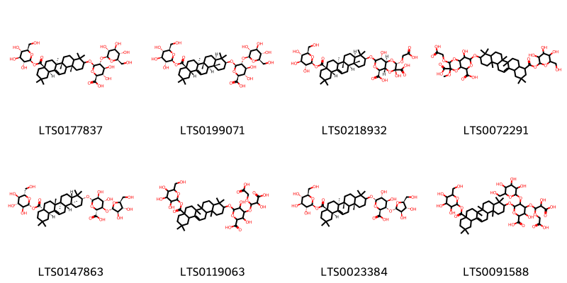{ width=100% }
    <figcaption>Hình ảnh cấu trúc hóa học của 8 hoạt chất thuộc nhóm Prenol lipids gồm ['(2s,3s,4s,5r,6r)-6-{[(6ar,6bs,8as,12ar,14br)-4,4,6a,6b,11,11,14b-heptamethyl-8a-({[(2s,3r,4s,5s,6r)-3,4,5-trihydroxy-6-(hydroxymethyl)oxan-2-yl]oxy}carbonyl)-1,2,3,4a,5,6,7,8,9,10,12,12a,14,14a-tetradecahydropicen-3-yl]oxy}-3,4-dihydroxy-5-{[(2s,3r,4s,5s,6r)-3,4,5-trihydroxy-6-(hydroxymethyl)oxan-2-yl]oxy}oxane-2-carboxylic acid (LTS0177837)', 'chikusetsusaponin-v (LTS0199071)', '(2s,3r,4as,5s,8r,8ar)-7-{[(3s,4ar,6ar,6bs,8as,12as,14ar,14br)-4,4,6a,6b,11,11,14b-heptamethyl-8a-({[(2s,3r,4s,5s,6r)-3,4,5-trihydroxy-6-(hydroxymethyl)oxan-2-yl]oxy}carbonyl)-1,2,3,4a,5,6,7,8,9,10,12,12a,14,14a-tetradecahydropicen-3-yl]oxy}-2-(carboxymethoxy)-3,8-dihydroxy-hexahydropyrano[3,4-b][1,4]dioxine-3,5-dicarboxylic acid (LTS0218932)', '7-{[4,4,6a,6b,11,11,14b-heptamethyl-9-({[3,4,5-trihydroxy-6-(hydroxymethyl)oxan-2-yl]oxy}carbonyl)-2,3,4a,5,6,7,8,8a,9,10,12,12a,14,14a-tetradecahydro-1h-picen-3-yl]oxy}-2-(carboxymethoxy)-8-hydroxy-3-methoxy-hexahydropyrano[3,4-b][1,4]dioxine-3,5-dicarboxylic acid (LTS0072291)', '(2r,3r,4s,5s,6s)-6-{[(3r,4as,6as,6br,8ar,12ar,14as,14bs)-4,4,6a,6b,11,11,14b-heptamethyl-8a-({[(2r,3s,4r,5r,6s)-3,4,5-trihydroxy-6-(hydroxymethyl)oxan-2-yl]oxy}carbonyl)-1,2,3,4a,5,6,7,8,9,10,12,12a,14,14a-tetradecahydropicen-3-yl]oxy}-3-{[(2s,3r,4r,5s)-3,4-dihydroxy-5-(hydroxymethyl)oxolan-2-yl]oxy}-4,5-dihydroxyoxane-2-carboxylic acid (LTS0147863)', '6-{[4,4,6a,6b,11,11,14b-heptamethyl-8a-({[3,4,5-trihydroxy-6-(hydroxymethyl)oxan-2-yl]oxy}carbonyl)-1,2,3,4a,5,6,7,8,9,10,12,12a,14,14a-tetradecahydropicen-3-yl]oxy}-4-[2-carboxy-1-(carboxymethoxy)-2-hydroxyethoxy]-3,5-dihydroxyoxane-2-carboxylic acid (LTS0119063)', '(2s,3s,4r,5r,6s)-6-{[(6ar,6bs,8as,12ar,14br)-4,4,6a,6b,11,11,14b-heptamethyl-8a-({[(2s,3r,4s,5s,6r)-3,4,5-trihydroxy-6-(hydroxymethyl)oxan-2-yl]oxy}carbonyl)-1,2,3,4a,5,6,7,8,9,10,12,12a,14,14a-tetradecahydropicen-3-yl]oxy}-3-{[(2s,3r,4r,5s)-3,4-dihydroxy-5-(hydroxymethyl)oxolan-2-yl]oxy}-4,5-dihydroxyoxane-2-carboxylic acid (LTS0023384)', '6-{[4,4,6a,6b,11,11,14b-heptamethyl-8a-({[3,4,5-trihydroxy-6-(hydroxymethyl)oxan-2-yl]oxy}carbonyl)-1,2,3,4a,5,6,7,8,9,10,12,12a,14,14a-tetradecahydropicen-3-yl]oxy}-4-[2-carboxy-1-(carboxymethoxy)-2-hydroxyethoxy]-3-hydroxy-5-{[3,4,5-trihydroxy-6-(hydroxymethyl)oxan-2-yl]oxy}oxane-2-carboxylic acid (LTS0091588)'].</figcaption>
</figure>

---

### Dược dân tộc học

Danh sách các quốc gia có sử dụng *Achyranthes bidentata* trong điều trị các bệnh. 

| Country   | Disease   | Bệnh                                                                                                                                                                                                |
|:----------|:----------|:----------------------------------------------------------------------------------------------------------------------------------------------------------------------------------------------------|
| Japan*    | Diuretic  | MYMEMORY WARNING: YOU USED ALL AVAILABLE FREE TRANSLATIONS FOR TODAY. NEXT AVAILABLE IN  12 HOURS 56 MINUTES 32 SECONDS VISIT HTTPS://MYMEMORY.TRANSLATED.NET/DOC/USAGELIMITS.PHP TO TRANSLATE MORE |

---

---
## Achyranthes indica
### Thông tin về thực vật

!!! info "Phân loại thực vật của *Achyranthes aspera* từ GIBF:"
    - **Kingdom:** Plantae
    - **Phylum:** Tracheophyta
    - **Order:** Caryophyllales
    - **Family:** Amaranthaceae
    - **Genus:** Achyranthes
    - **Species:** *Achyranthes aspera*

 

| Label (VI)   | Label (EN)   | Scientific Name    | Descriptions (VI)   | Descriptions (EN)   | Also Known As (VI)   | Also Known As (EN)   |
|:-------------|:-------------|:-------------------|:--------------------|:--------------------|:---------------------|:---------------------|
| N/A          | N/A          | Achyranthes indica | loài thực vật       | species of plant    | ['']                 | ['']                 |

#### Phân bố trên thế giới

**Từ CSDL GIBF** nan, Brazil, Guatemala, Guadeloupe, Honduras, Trinidad and Tobago, Ghana, Puerto Rico, United States of America, Jamaica, Virgin Islands (U.S.), Costa Rica, Dominican Republic, Colombia, Guyana, Cuba, Dominica, Mexico, El Salvador, Haiti, Panama, Nicaragua, Bahamas, Peru, Bolivia (Plurinational State of), Cameroon, Venezuela (Bolivarian Republic of)

#### Phân bố tại Việt Nam

**Từ CSDL GIBF**: Không có ghi nhận ở Việt Nam

---
### Thành phần hóa học
        
- Theo cơ sở dữ liệu lotus: Từ loài *Achyranthes aspera* đã phân lập và xác định được Chưa có hoạt chất nào được phân lập. hoạt chất thuộc về các nhóm Không có hoạt chất nào được phân lập. 

Không có hình ảnh nào được tạo ra

---

### Dược dân tộc học

Danh sách các quốc gia có sử dụng *Achyranthes aspera* trong điều trị các bệnh. 

| Country            | Disease              | Bệnh                                                                                                                                                                                                |
|:-------------------|:---------------------|:----------------------------------------------------------------------------------------------------------------------------------------------------------------------------------------------------|
| Dominican Republic | Astringent, Diuretic | MYMEMORY WARNING: YOU USED ALL AVAILABLE FREE TRANSLATIONS FOR TODAY. NEXT AVAILABLE IN  12 HOURS 55 MINUTES 54 SECONDS VISIT HTTPS://MYMEMORY.TRANSLATED.NET/DOC/USAGELIMITS.PHP TO TRANSLATE MORE |
| Elsewhere          | Expectorant          | MYMEMORY WARNING: YOU USED ALL AVAILABLE FREE TRANSLATIONS FOR TODAY. NEXT AVAILABLE IN  12 HOURS 55 MINUTES 49 SECONDS VISIT HTTPS://MYMEMORY.TRANSLATED.NET/DOC/USAGELIMITS.PHP TO TRANSLATE MORE |
| Trinidad           | Expectorant          | MYMEMORY WARNING: YOU USED ALL AVAILABLE FREE TRANSLATIONS FOR TODAY. NEXT AVAILABLE IN  12 HOURS 55 MINUTES 46 SECONDS VISIT HTTPS://MYMEMORY.TRANSLATED.NET/DOC/USAGELIMITS.PHP TO TRANSLATE MORE |

---

---
## Achyranthes japonica
### Thông tin về thực vật

!!! info "Phân loại thực vật của *Achyranthes bidentata* từ GIBF:"
    - **Kingdom:** Plantae
    - **Phylum:** Tracheophyta
    - **Order:** Caryophyllales
    - **Family:** Amaranthaceae
    - **Genus:** Achyranthes
    - **Species:** *Achyranthes bidentata*

 

| Label (VI)   | Label (EN)   | Scientific Name      | Descriptions (VI)   | Descriptions (EN)   | Also Known As (VI)   | Also Known As (EN)                                             |
|:-------------|:-------------|:---------------------|:--------------------|:--------------------|:---------------------|:---------------------------------------------------------------|
| N/A          | N/A          | Achyranthes japonica | loài thực vật       | species of plant    | ['']                 | ['Achyranthes fauriei var. japonica', 'Japanese chaff flower'] |

#### Phân bố trên thế giới

**Từ CSDL GIBF** nan, United States of America, Korea, Republic of

#### Phân bố tại Việt Nam

**Từ CSDL GIBF**: Không có ghi nhận ở Việt Nam

---
### Thành phần hóa học
        
- Theo cơ sở dữ liệu lotus: Từ loài *Achyranthes bidentata* đã phân lập và xác định được 1 hoạt chất thuộc về các nhóm Protoberberine alkaloids and derivatives. 

|    | chemicalTaxonomyClassyfireClass          |   smiles_count |
|---:|:-----------------------------------------|---------------:|
|  0 | Protoberberine alkaloids and derivatives |              1 |

#### Nhóm Protoberberine alkaloids and derivatives
<figure markdown="span">
    { width=100% }
    <figcaption>Hình ảnh cấu trúc hóa học của 1 hoạt chất thuộc nhóm Protoberberine alkaloids and derivatives gồm ['berberine (LTS0101484)'].</figcaption>
</figure>

---

### Dược dân tộc học

Danh sách các quốc gia có sử dụng *Achyranthes bidentata* trong điều trị các bệnh. 

| Country   | Disease                                | Bệnh                                                                                                                                                                                                |
|:----------|:---------------------------------------|:----------------------------------------------------------------------------------------------------------------------------------------------------------------------------------------------------|
| Japan     | Diuretic, Emmenagogue, Tonic, Diuretic | MYMEMORY WARNING: YOU USED ALL AVAILABLE FREE TRANSLATIONS FOR TODAY. NEXT AVAILABLE IN  12 HOURS 55 MINUTES 10 SECONDS VISIT HTTPS://MYMEMORY.TRANSLATED.NET/DOC/USAGELIMITS.PHP TO TRANSLATE MORE |
| Japan*    | Diuretic, Stomachic, Diuretic          | MYMEMORY WARNING: YOU USED ALL AVAILABLE FREE TRANSLATIONS FOR TODAY. NEXT AVAILABLE IN  12 HOURS 55 MINUTES 06 SECONDS VISIT HTTPS://MYMEMORY.TRANSLATED.NET/DOC/USAGELIMITS.PHP TO TRANSLATE MORE |

---

# Chi Aerva

??? note "Danh sách các dược liệu thuộc chi"
    
	 - *Aerva lanata*

---
## Aerva lanata
### Thông tin về thực vật

!!! info "Phân loại thực vật của *Ouret lanata* từ GIBF:"
    - **Kingdom:** Plantae
    - **Phylum:** Tracheophyta
    - **Order:** Caryophyllales
    - **Family:** Amaranthaceae
    - **Genus:** Ouret
    - **Species:** *Ouret lanata*

 

| Label (VI)   | Label (EN)   | Scientific Name   | Descriptions (VI)   | Descriptions (EN)   | Also Known As (VI)   | Also Known As (EN)     |
|:-------------|:-------------|:------------------|:--------------------|:--------------------|:---------------------|:-----------------------|
| N/A          | N/A          | Aerva lanata      | loài thực vật       | species of plant    | ['']                 | ['mountain knotgrass'] |

#### Phân bố trên thế giới

**Từ CSDL GIBF** Kenya, Saudi Arabia, Mayotte, Côte d’Ivoire, Somalia, India, Tanzania, United Republic of, Mozambique, Togo, Malawi

#### Phân bố tại Việt Nam

**Từ CSDL GIBF**: Không có ghi nhận ở Việt Nam

---
### Thành phần hóa học
        
- Theo cơ sở dữ liệu lotus: Từ loài *Ouret lanata* đã phân lập và xác định được 42 hoạt chất thuộc về các nhóm Benzene and substituted derivatives, Flavonoids, Cinnamic acids and derivatives, Steroids and steroid derivatives, Phenols, Organooxygen compounds, Indolonaphthyridine alkaloids, Prenol lipids, Harmala alkaloids. 

|    | chemicalTaxonomyClassyfireClass     |   smiles_count |
|---:|:------------------------------------|---------------:|
|  0 | Benzene and substituted derivatives |              2 |
|  1 | Cinnamic acids and derivatives      |              4 |
|  2 | Flavonoids                          |              7 |
|  3 | Harmala alkaloids                   |              2 |
|  4 | Indolonaphthyridine alkaloids       |              5 |
|  5 | Organooxygen compounds              |             13 |
|  6 | Phenols                             |              1 |
|  7 | Prenol lipids                       |              1 |
|  8 | Steroids and steroid derivatives    |              7 |

#### Nhóm Benzene and substituted derivatives
<figure markdown="span">
    { width=100% }
    <figcaption>Hình ảnh cấu trúc hóa học của 2 hoạt chất thuộc nhóm Benzene and substituted derivatives gồm ['syringic acid (LTS0210036)', 'vanillic acid (LTS0229113)'].</figcaption>
</figure>
#### Nhóm Cinnamic acids and derivatives
<figure markdown="span">
    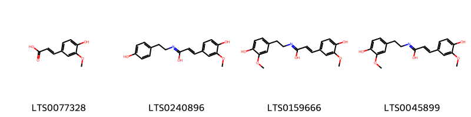{ width=100% }
    <figcaption>Hình ảnh cấu trúc hóa học của 4 hoạt chất thuộc nhóm Cinnamic acids and derivatives gồm ['ferulic acid (LTS0077328)', '3-(4-hydroxy-3-methoxyphenyl)-n-[2-(4-hydroxyphenyl)ethyl]prop-2-enimidic acid (LTS0240896)', '3-(4-hydroxy-3-methoxyphenyl)-n-[2-(4-hydroxy-3-methoxyphenyl)ethyl]prop-2-enimidic acid (LTS0159666)', '(2e)-3-(4-hydroxy-3-methoxyphenyl)-n-[2-(4-hydroxy-3-methoxyphenyl)ethyl]prop-2-enimidic acid (LTS0045899)'].</figcaption>
</figure>
#### Nhóm Flavonoids
<figure markdown="span">
    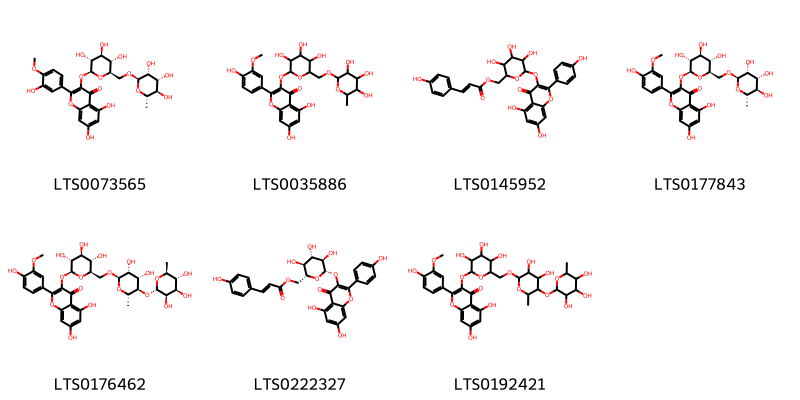{ width=100% }
    <figcaption>Hình ảnh cấu trúc hóa học của 7 hoạt chất thuộc nhóm Flavonoids gồm ['5,7-dihydroxy-2-(3-hydroxy-4-methoxyphenyl)-3-{[(2s,3r,4s,5s,6r)-3,4,5-trihydroxy-6-({[(2r,3r,4r,5r,6s)-3,4,5-trihydroxy-6-methyloxan-2-yl]oxy}methyl)oxan-2-yl]oxy}chromen-4-one (LTS0073565)', '5,7-dihydroxy-2-(4-hydroxy-3-methoxyphenyl)-3-[(3,4,5-trihydroxy-6-{[(3,4,5-trihydroxy-6-methyloxan-2-yl)oxy]methyl}oxan-2-yl)oxy]chromen-4-one (LTS0035886)', '(6-{[5,7-dihydroxy-2-(4-hydroxyphenyl)-4-oxochromen-3-yl]oxy}-3,4,5-trihydroxyoxan-2-yl)methyl 3-(4-hydroxyphenyl)prop-2-enoate (LTS0145952)', 'narcissin (LTS0177843)', '3-{[(2s,3r,4s,5s,6r)-6-({[(2r,3r,4s,5r,6s)-3,4-dihydroxy-6-methyl-5-{[(2s,3r,4r,5r,6s)-3,4,5-trihydroxy-6-methyloxan-2-yl]oxy}oxan-2-yl]oxy}methyl)-3,4,5-trihydroxyoxan-2-yl]oxy}-5,7-dihydroxy-2-(4-hydroxy-3-methoxyphenyl)chromen-4-one (LTS0176462)', 'tiliroside (LTS0222327)', '3-({6-[({3,4-dihydroxy-6-methyl-5-[(3,4,5-trihydroxy-6-methyloxan-2-yl)oxy]oxan-2-yl}oxy)methyl]-3,4,5-trihydroxyoxan-2-yl}oxy)-5,7-dihydroxy-2-(4-hydroxy-3-methoxyphenyl)chromen-4-one (LTS0192421)'].</figcaption>
</figure>
#### Nhóm Harmala alkaloids
<figure markdown="span">
    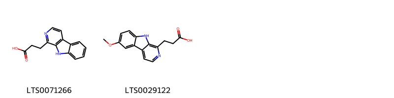{ width=100% }
    <figcaption>Hình ảnh cấu trúc hóa học của 2 hoạt chất thuộc nhóm Harmala alkaloids gồm ['3-{9h-pyrido[3,4-b]indol-1-yl}propanoic acid (LTS0071266)', '3-{6-methoxy-9h-pyrido[3,4-b]indol-1-yl}propanoic acid (LTS0029122)'].</figcaption>
</figure>
#### Nhóm Indolonaphthyridine alkaloids
<figure markdown="span">
    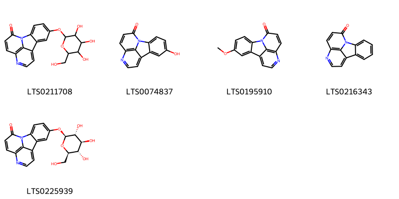{ width=100% }
    <figcaption>Hình ảnh cấu trúc hóa học của 5 hoạt chất thuộc nhóm Indolonaphthyridine alkaloids gồm ['12-{[3,4,5-trihydroxy-6-(hydroxymethyl)oxan-2-yl]oxy}-1,6-diazatetracyclo[7.6.1.0⁵,¹⁶.0¹⁰,¹⁵]hexadeca-3,5,7,9(16),10(15),11,13-heptaen-2-one (LTS0211708)', '10-hydroxycanthin-6-one (LTS0074837)', '12-methoxy-1,6-diazatetracyclo[7.6.1.0⁵,¹⁶.0¹⁰,¹⁵]hexadeca-3,5,7,9(16),10(15),11,13-heptaen-2-one (LTS0195910)', 'canthin-6-one (LTS0216343)', '12-{[(2s,3r,4s,5s,6r)-3,4,5-trihydroxy-6-(hydroxymethyl)oxan-2-yl]oxy}-1,6-diazatetracyclo[7.6.1.0⁵,¹⁶.0¹⁰,¹⁵]hexadeca-3,5,7,9(16),10(15),11,13-heptaen-2-one (LTS0225939)'].</figcaption>
</figure>
#### Nhóm Organooxygen compounds
<figure markdown="span">
    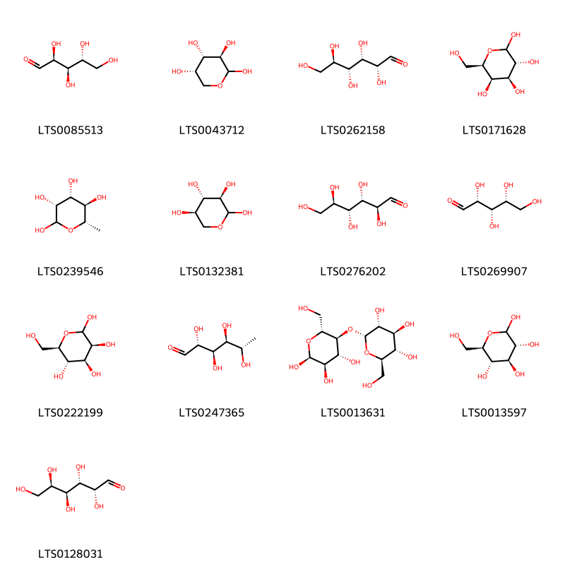{ width=100% }
    <figcaption>Hình ảnh cấu trúc hóa học của 13 hoạt chất thuộc nhóm Organooxygen compounds gồm ['arabinose (LTS0085513)', 'l-arabinopyranose (LTS0043712)', '(+)-glucose (LTS0262158)', 'galactose (LTS0171628)', 'l-rhamnose (LTS0239546)', 'd-xylose (LTS0132381)', '(+-)-mannose (LTS0276202)', '(d)-xylose (LTS0269907)', 'β-glucose (LTS0222199)', 'rhamnose (LTS0247365)', 'α-maltose (LTS0013631)', 'glucose (LTS0013597)', 'aldehydo-d-galactose (LTS0128031)'].</figcaption>
</figure>
#### Nhóm Phenols
<figure markdown="span">
    { width=100% }
    <figcaption>Hình ảnh cấu trúc hóa học của 1 hoạt chất thuộc nhóm Phenols gồm ['(2e)-3-(4-hydroxy-3-methoxyphenyl)-n-[2-(4-hydroxyphenyl)ethyl]prop-2-enimidic acid (LTS0187051)'].</figcaption>
</figure>
#### Nhóm Prenol lipids
<figure markdown="span">
    { width=100% }
    <figcaption>Hình ảnh cấu trúc hóa học của 1 hoạt chất thuộc nhóm Prenol lipids gồm ['amyrin (LTS0222826)'].</figcaption>
</figure>
#### Nhóm Steroids and steroid derivatives
<figure markdown="span">
    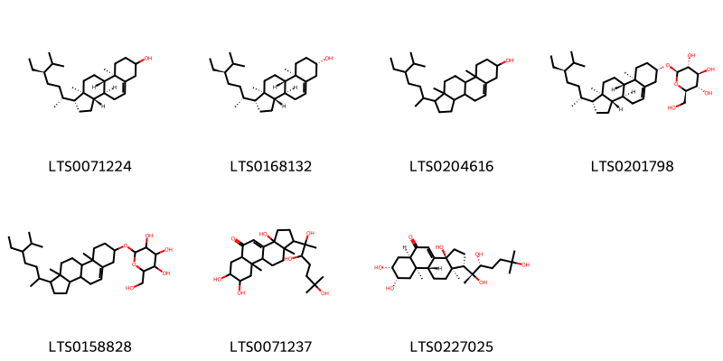{ width=100% }
    <figcaption>Hình ảnh cấu trúc hóa học của 7 hoạt chất thuộc nhóm Steroids and steroid derivatives gồm ['stigmast-5-en-3-ol (LTS0071224)', 'sitosterol (LTS0168132)', 'stigmast-5-en-3-ol, (3β)- (LTS0204616)', 'sitogluside (LTS0201798)', '2-{[1-(5-ethyl-6-methylheptan-2-yl)-9a,11a-dimethyl-1h,2h,3h,3ah,3bh,4h,6h,7h,8h,9h,9bh,10h,11h-cyclopenta[a]phenanthren-7-yl]oxy}-6-(hydroxymethyl)oxane-3,4,5-triol (LTS0158828)', '3a,7,8-trihydroxy-9a,11a-dimethyl-1-(2,3,6-trihydroxy-6-methylheptan-2-yl)-1h,2h,3h,5ah,6h,7h,8h,9h,9bh,10h,11h-cyclopenta[a]phenanthren-5-one (LTS0071237)', '20-hydroxyecdysone (LTS0227025)'].</figcaption>
</figure>

---

### Dược dân tộc học

Danh sách các quốc gia có sử dụng *Ouret lanata* trong điều trị các bệnh. 

| Country   | Disease             | Bệnh                                                                                                                                                                                                |
|:----------|:--------------------|:----------------------------------------------------------------------------------------------------------------------------------------------------------------------------------------------------|
| Elsewhere | Demulcent, Diuretic | MYMEMORY WARNING: YOU USED ALL AVAILABLE FREE TRANSLATIONS FOR TODAY. NEXT AVAILABLE IN  12 HOURS 54 MINUTES 28 SECONDS VISIT HTTPS://MYMEMORY.TRANSLATED.NET/DOC/USAGELIMITS.PHP TO TRANSLATE MORE |

---

# Chi Pfaffia

??? note "Danh sách các dược liệu thuộc chi"
    
	 - *Pfaffia iresinioides*

---
## Pfaffia iresinioides
### Thông tin về thực vật

!!! info "Phân loại thực vật của *Pfaffia iresinoides* từ GIBF:"
    - **Kingdom:** Plantae
    - **Phylum:** Tracheophyta
    - **Order:** Caryophyllales
    - **Family:** Amaranthaceae
    - **Genus:** Pfaffia
    - **Species:** *Pfaffia iresinoides*

 

| Label (VI)   | Label (EN)   | Scientific Name   | Descriptions (VI)   | Descriptions (EN)   | Also Known As (VI)   | Also Known As (EN)     |
|:-------------|:-------------|:------------------|:--------------------|:--------------------|:---------------------|:-----------------------|
| N/A          | N/A          | Aerva lanata      | loài thực vật       | species of plant    | ['']                 | ['mountain knotgrass'] |

#### Phân bố trên thế giới

**Từ CSDL GIBF** nan, Mexico, Brazil, Guadeloupe, French Guiana, Colombia, Ecuador, Peru, Trinidad and Tobago, Venezuela (Bolivarian Republic of)

#### Phân bố tại Việt Nam

**Từ CSDL GIBF**: Không có ghi nhận ở Việt Nam

---
### Thành phần hóa học
        
- Theo cơ sở dữ liệu lotus: Từ loài *Pfaffia iresinoides* đã phân lập và xác định được Chưa có hoạt chất nào được phân lập. hoạt chất thuộc về các nhóm Không có hoạt chất nào được phân lập. 

Không có hình ảnh nào được tạo ra

---

### Dược dân tộc học

Danh sách các quốc gia có sử dụng *Pfaffia iresinoides* trong điều trị các bệnh. 

| Country   | Disease   | Bệnh                                                                                                                                                                                                |
|:----------|:----------|:----------------------------------------------------------------------------------------------------------------------------------------------------------------------------------------------------|
| Venezuela | Tonic     | MYMEMORY WARNING: YOU USED ALL AVAILABLE FREE TRANSLATIONS FOR TODAY. NEXT AVAILABLE IN  12 HOURS 53 MINUTES 30 SECONDS VISIT HTTPS://MYMEMORY.TRANSLATED.NET/DOC/USAGELIMITS.PHP TO TRANSLATE MORE |

---

# Chi Digera

??? note "Danh sách các dược liệu thuộc chi"
    
	 - *Digera muricata*

---
## Digera muricata
### Thông tin về thực vật

!!! info "Phân loại thực vật của *Digera muricata* từ GIBF:"
    - **Kingdom:** Plantae
    - **Phylum:** Tracheophyta
    - **Order:** Caryophyllales
    - **Family:** Amaranthaceae
    - **Genus:** Digera
    - **Species:** *Digera muricata*

 

| Label (VI)   | Label (EN)   | Scientific Name   | Descriptions (VI)   | Descriptions (EN)   | Also Known As (VI)   | Also Known As (EN)   |
|:-------------|:-------------|:------------------|:--------------------|:--------------------|:---------------------|:---------------------|
| N/A          | N/A          | Digera muricata   | loài thực vật       | species of plant    | ['']                 | ['']                 |

#### Phân bố trên thế giới

**Từ CSDL GIBF** Sri Lanka, Kenya, Cambodia, United States of America, Saudi Arabia, Chinese Taipei, Pakistan, Oman, India, Tanzania, United Republic of, Egypt

#### Phân bố tại Việt Nam

**Từ CSDL GIBF**: Không có ghi nhận ở Việt Nam

---
### Thành phần hóa học
        
- Theo cơ sở dữ liệu lotus: Từ loài *Digera muricata* đã phân lập và xác định được Chưa có hoạt chất nào được phân lập. hoạt chất thuộc về các nhóm Không có hoạt chất nào được phân lập. 

Không có hình ảnh nào được tạo ra

---

### Dược dân tộc học

Danh sách các quốc gia có sử dụng *Digera muricata* trong điều trị các bệnh. 

| Country   | Disease   | Bệnh                                                                                                                                                                                                |
|:----------|:----------|:----------------------------------------------------------------------------------------------------------------------------------------------------------------------------------------------------|
| India     | Laxative  | MYMEMORY WARNING: YOU USED ALL AVAILABLE FREE TRANSLATIONS FOR TODAY. NEXT AVAILABLE IN  12 HOURS 53 MINUTES 02 SECONDS VISIT HTTPS://MYMEMORY.TRANSLATED.NET/DOC/USAGELIMITS.PHP TO TRANSLATE MORE |

---

