!!! abstract "Tóm tắt"

    Họ Anacardiaceae gồm khoảng 24 chi và 64 loài được một số cộng đồng tại các quốc gia như Africa, Guatemala, US(Ojibwe), Mozambique, US(Flathead), Panama, Africa(Ovambo), Nigeria, US(Amerindian), Sudan, Africa(Zulu), Sumatra, English, ain, Chile, Asia, India(Bengal), Paraguay, Africa(Swahili), Turkey, South Africa, US(Blackfoot), Tahiti, Brazil, US, US(CA), Dominican Republic, Mexico, Malaya, Iran, China, Trinidad, Haiti, Iraq, Upper Volta, Elsewhere, India, Java, Venezuela, Samoa, Latin America sử dụng trong một số trường hợp QUERY LENGTH LIMIT EXCEEDED. MAX ALLOWED QUERY : 500 CHARS QUERY LENGTH LIMIT EXCEEDED. MAX ALLOWED QUERY : 500 CHARS Chất làm se, Thuốc nhuận tràng, Thuốc tẩy, Taenifuge, Emmenagogue, Hemolytic, Thuốc diệt ký sinh trùng, Chất kích thích, Thuốc bổ, Vermifuge, Vermifuge.

!!! info "DrDuke"

    James A. Duke sinh năm 1929-2017 là một nhà thực vật học người Mỹ. Đây là một trong những tác giả hàng đầu trong lĩnh vực dược dân tộc học với cuốn *CRC Handbook of Medicinal Herbs* và chính là người xây dựng lên cơ sở dữ liệu về hợp chất tự nhiên và dược dân tộc học tại Bộ nông nghiệp Hoa Kỳ. Các thông tin được đăng tải tại website [Dr. Duke's Phytochemical and Ethnobotanical Databases](https://phytochem.nal.usda.gov/). 
    Trong suốt thập niên 1970, ông lãnh đạo the Plant Taxonomy Laboratory, Plant Genetics and Germplasm Institute of the Agricultural Research Service, U.S. Department of Agriculture.
    Trong tài liệu này, các thông tin về dược dân tộc của các dược liệu được trích dẫn từ tài liệu của James A. Ducke với sự trợ giúp của phần mềm dịch thuật từ tiếng Anh sang tiếng Việt.
   

# Chi Melanorrhoea

??? note "Danh sách các dược liệu thuộc chi"
    
	 - *Melanorrhoea usitata*

---
## Melanorrhoea usitata
### Thông tin về thực vật

!!! info "Phân loại thực vật của *Gluta usitata* từ GIBF:"
    - **Kingdom:** Plantae
    - **Phylum:** Tracheophyta
    - **Order:** Sapindales
    - **Family:** Anacardiaceae
    - **Genus:** Gluta
    - **Species:** *Gluta usitata*

 

| Label (VI)   | Label (EN)   | Scientific Name      | Descriptions (VI)   | Descriptions (EN)   | Also Known As (VI)   | Also Known As (EN)   |
|:-------------|:-------------|:---------------------|:--------------------|:--------------------|:---------------------|:---------------------|
| N/A          | N/A          | Melanorrhoea usitata | loài thực vật       | species of plant    | ['']                 | ['']                 |

#### Phân bố trên thế giới

**Từ CSDL GIBF** nan, Thailand, Myanmar, India, Viet Nam, Nepal

#### Phân bố tại Việt Nam

**Từ CSDL GIBF**: Không có ghi nhận ở Việt Nam

---
### Thành phần hóa học
        
- Theo cơ sở dữ liệu lotus: Từ loài *Gluta usitata* đã phân lập và xác định được Chưa có hoạt chất nào được phân lập. hoạt chất thuộc về các nhóm Không có hoạt chất nào được phân lập. 

Không có hình ảnh nào được tạo ra

---

### Dược dân tộc học

Danh sách các quốc gia có sử dụng *Gluta usitata* trong điều trị các bệnh. 

| Country   | Disease   | Bệnh           |
|:----------|:----------|:---------------|
| Elsewhere | Vermifuge | Thuốc diệt sán |

---

# Chi Lithraea

??? note "Danh sách các dược liệu thuộc chi"
    
	 - *Lithraea caustica*

---
## Lithraea caustica
### Thông tin về thực vật

!!! info "Phân loại thực vật của *Lithraea caustica* từ GIBF:"
    - **Kingdom:** Plantae
    - **Phylum:** Tracheophyta
    - **Order:** Sapindales
    - **Family:** Anacardiaceae
    - **Genus:** Lithraea
    - **Species:** *Lithraea caustica*

 

| Label (VI)   | Label (EN)   | Scientific Name   | Descriptions (VI)   | Descriptions (EN)   | Also Known As (VI)   | Also Known As (EN)   |
|:-------------|:-------------|:------------------|:--------------------|:--------------------|:---------------------|:---------------------|
| N/A          | N/A          | Lithraea caustica | loài thực vật       | species of plant    | ['']                 | ['']                 |

#### Phân bố trên thế giới

**Từ CSDL GIBF** Chile

#### Phân bố tại Việt Nam

**Từ CSDL GIBF**: Không có ghi nhận ở Việt Nam

---
### Thành phần hóa học
        
- Theo cơ sở dữ liệu lotus: Từ loài *Lithraea caustica* đã phân lập và xác định được 1 hoạt chất thuộc về các nhóm Phenols. 

|    | chemicalTaxonomyClassyfireClass   |   smiles_count |
|---:|:----------------------------------|---------------:|
|  0 | Phenols                           |              1 |

#### Nhóm Phenols
<figure markdown="span">
    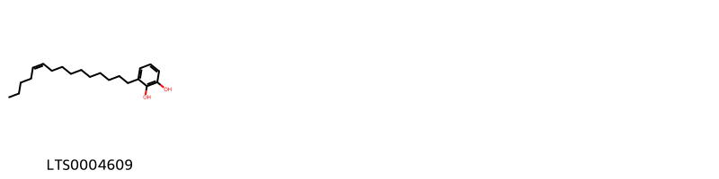{ width=100% }
    <figcaption>Hình ảnh cấu trúc hóa học của 1 hoạt chất thuộc nhóm Phenols gồm ['litreol (LTS0004609)'].</figcaption>
</figure>

---

### Dược dân tộc học

Danh sách các quốc gia có sử dụng *Lithraea caustica* trong điều trị các bệnh. 

| Country   | Disease     | Bệnh                   |
|:----------|:------------|:-----------------------|
| Chile     | Rubefacient | Chất gây xung huyết da |

---

# Chi Sclerocarya

??? note "Danh sách các dược liệu thuộc chi"
    
	 - *Sclerocarya birraca*
	 - *Sclerocarya birrea*
	 - *Sclerocarya caffra*
	 - *Sclerocarya schweinfurthii*

---
## Sclerocarya birraca
### Thông tin về thực vật

!!! info "Phân loại thực vật của *Sclerocarya birrea* từ GIBF:"
    - **Kingdom:** Plantae
    - **Phylum:** Tracheophyta
    - **Order:** Sapindales
    - **Family:** Anacardiaceae
    - **Genus:** Sclerocarya
    - **Species:** *Sclerocarya birrea*

 

| Label (VI)   | Label (EN)   | Scientific Name   | Descriptions (VI)   | Descriptions (EN)   | Also Known As (VI)   | Also Known As (EN)   |
|:-------------|:-------------|:------------------|:--------------------|:--------------------|:---------------------|:---------------------|
| N/A          | N/A          | Lithraea caustica | loài thực vật       | species of plant    | ['']                 | ['']                 |

#### Phân bố trên thế giới

**Từ CSDL GIBF** Malawi, South Africa, Senegal, Nigeria, Madagascar, Namibia, Mozambique, Botswana, Benin, Burkina Faso, Zimbabwe, Eswatini

#### Phân bố tại Việt Nam

**Từ CSDL GIBF**: Không có ghi nhận ở Việt Nam

---
### Thành phần hóa học
        
- Theo cơ sở dữ liệu lotus: Từ loài *Sclerocarya birrea* đã phân lập và xác định được Chưa có hoạt chất nào được phân lập. hoạt chất thuộc về các nhóm Không có hoạt chất nào được phân lập. 

Không có hình ảnh nào được tạo ra

---

### Dược dân tộc học

Danh sách các quốc gia có sử dụng *Sclerocarya birrea* trong điều trị các bệnh. 

| Country   | Disease    | Bệnh         |
|:----------|:-----------|:-------------|
| Sudan     | Intoxicant | chất gây độc |

---

---
## Sclerocarya birrea
### Thông tin về thực vật

!!! info "Phân loại thực vật của *Sclerocarya birrea* từ GIBF:"
    - **Kingdom:** Plantae
    - **Phylum:** Tracheophyta
    - **Order:** Sapindales
    - **Family:** Anacardiaceae
    - **Genus:** Sclerocarya
    - **Species:** *Sclerocarya birrea*

 

| Label (VI)   | Label (EN)   | Scientific Name    | Descriptions (VI)   | Descriptions (EN)   | Also Known As (VI)   | Also Known As (EN)   |
|:-------------|:-------------|:-------------------|:--------------------|:--------------------|:---------------------|:---------------------|
| N/A          | N/A          | Sclerocarya birrea | loài thực vật       | species of plant    | ['']                 | ['']                 |

#### Phân bố trên thế giới

**Từ CSDL GIBF** Malawi, South Africa, Senegal, Nigeria, Madagascar, Namibia, Mozambique, Botswana, Benin, Burkina Faso, Zimbabwe, Eswatini

#### Phân bố tại Việt Nam

**Từ CSDL GIBF**: Không có ghi nhận ở Việt Nam

---
### Thành phần hóa học
        
- Theo cơ sở dữ liệu lotus: Từ loài *Sclerocarya birrea* đã phân lập và xác định được 22 hoạt chất thuộc về các nhóm Flavonoids, Phenols, Benzene and substituted derivatives. 

|    | chemicalTaxonomyClassyfireClass     |   smiles_count |
|---:|:------------------------------------|---------------:|
|  0 | Benzene and substituted derivatives |              1 |
|  1 | Flavonoids                          |             20 |
|  2 | Phenols                             |              1 |

#### Nhóm Benzene and substituted derivatives
<figure markdown="span">
    { width=100% }
    <figcaption>Hình ảnh cấu trúc hóa học của 1 hoạt chất thuộc nhóm Benzene and substituted derivatives gồm ['galop (LTS0222857)'].</figcaption>
</figure>
#### Nhóm Flavonoids
<figure markdown="span">
    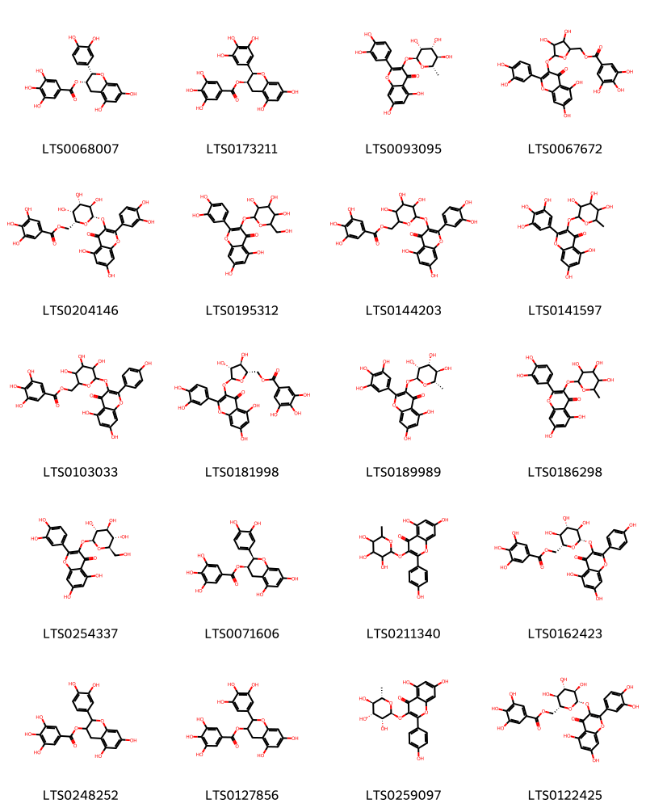{ width=100% }
    <figcaption>Hình ảnh cấu trúc hóa học của 20 hoạt chất thuộc nhóm Flavonoids gồm ['ent-epicatechin 3-o-gallate (LTS0068007)', '(-)-epigallocatechin gallate (LTS0173211)', 'quercitrin (LTS0093095)', '(5-{[2-(3,4-dihydroxyphenyl)-5,7-dihydroxy-4-oxochromen-3-yl]oxy}-3,4-dihydroxyoxolan-2-yl)methyl 3,4,5-trihydroxybenzoate (LTS0067672)', '[(2r,3r,4s,5r,6s)-6-{[2-(3,4-dihydroxyphenyl)-5,7-dihydroxy-4-oxochromen-3-yl]oxy}-3,4,5-trihydroxyoxan-2-yl]methyl 3,4,5-trihydroxybenzoate (LTS0204146)', '2-(3,4-dihydroxyphenyl)-5,7-dihydroxy-3-{[3,4,5-trihydroxy-6-(hydroxymethyl)oxan-2-yl]oxy}chromen-4-one (LTS0195312)', '(6-{[2-(3,4-dihydroxyphenyl)-5,7-dihydroxy-4-oxochromen-3-yl]oxy}-3,4,5-trihydroxyoxan-2-yl)methyl 3,4,5-trihydroxybenzoate (LTS0144203)', 'myricitrin (LTS0141597)', '(6-{[5,7-dihydroxy-2-(4-hydroxyphenyl)-4-oxochromen-3-yl]oxy}-3,4,5-trihydroxyoxan-2-yl)methyl 3,4,5-trihydroxybenzoate (LTS0103033)', '[(2s,3r,4r,5s)-5-{[2-(3,4-dihydroxyphenyl)-5,7-dihydroxy-4-oxochromen-3-yl]oxy}-3,4-dihydroxyoxolan-2-yl]methyl 3,4,5-trihydroxybenzoate (LTS0181998)', 'myricitrin (LTS0189989)', 'quercitrin (LTS0186298)', 'isoquercetin (LTS0254337)', 'epicatechin gallate (LTS0071606)', '5,7-dihydroxy-2-(4-hydroxyphenyl)-3-[(3,4,5-trihydroxy-6-methyloxan-2-yl)oxy]chromen-4-one (LTS0211340)', '[(2r,3s,4s,5r,6s)-6-{[5,7-dihydroxy-2-(4-hydroxyphenyl)-4-oxochromen-3-yl]oxy}-3,4,5-trihydroxyoxan-2-yl]methyl 3,4,5-trihydroxybenzoate (LTS0162423)', '2-(3,4-dihydroxyphenyl)-5,7-dihydroxy-3,4-dihydro-2h-1-benzopyran-3-yl 3,4,5-trihydroxybenzoate (LTS0248252)', '5,7-dihydroxy-2-(3,4,5-trihydroxyphenyl)-3,4-dihydro-2h-1-benzopyran-3-yl 3,4,5-trihydroxybenzoate (LTS0127856)', 'afzelin (LTS0259097)', '[(2r,3s,4s,5r,6s)-6-{[2-(3,4-dihydroxyphenyl)-5,7-dihydroxy-4-oxochromen-3-yl]oxy}-3,4,5-trihydroxyoxan-2-yl]methyl 3,4,5-trihydroxybenzoate (LTS0122425)'].</figcaption>
</figure>
#### Nhóm Phenols
<figure markdown="span">
    { width=100% }
    <figcaption>Hình ảnh cấu trúc hóa học của 1 hoạt chất thuộc nhóm Phenols gồm ['4-methoxysalicylaldehyde (LTS0030238)'].</figcaption>
</figure>

---

### Dược dân tộc học

Danh sách các quốc gia có sử dụng *Sclerocarya birrea* trong điều trị các bệnh. 

| Country   | Disease    | Bệnh         |
|:----------|:-----------|:-------------|
| Africa    | Intoxicant | chất gây độc |

---

---
## Sclerocarya caffra
### Thông tin về thực vật

!!! info "Phân loại thực vật của *Sclerocarya birrea* từ GIBF:"
    - **Kingdom:** Plantae
    - **Phylum:** Tracheophyta
    - **Order:** Sapindales
    - **Family:** Anacardiaceae
    - **Genus:** Sclerocarya
    - **Species:** *Sclerocarya birrea*

 

| Label (VI)   | Label (EN)   | Scientific Name    | Descriptions (VI)   | Descriptions (EN)   | Also Known As (VI)   | Also Known As (EN)   |
|:-------------|:-------------|:-------------------|:--------------------|:--------------------|:---------------------|:---------------------|
| N/A          | N/A          | Sclerocarya caffra | loài thực vật       | species of plant    | ['']                 | ['']                 |

#### Phân bố trên thế giới

**Từ CSDL GIBF** nan, Angola, Mozambique, Tanzania, United Republic of, Malawi, Zambia, Namibia, Sudan, United States of America, Congo, Democratic Republic of the, Zimbabwe, South Africa, Cuba, Mayotte, Saint Helena, Ascension and Tristan da Cunha, Eswatini, United Kingdom of Great Britain and Northern Ireland, Madagascar, Botswana, Kenya

#### Phân bố tại Việt Nam

**Từ CSDL GIBF**: Không có ghi nhận ở Việt Nam

---
### Thành phần hóa học
        
- Theo cơ sở dữ liệu lotus: Từ loài *Sclerocarya birrea* đã phân lập và xác định được 1 hoạt chất thuộc về các nhóm Phenols. 

|    | chemicalTaxonomyClassyfireClass   |   smiles_count |
|---:|:----------------------------------|---------------:|
|  0 | Phenols                           |              1 |

#### Nhóm Phenols
<figure markdown="span">
    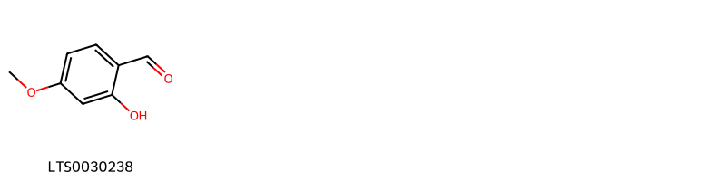{ width=100% }
    <figcaption>Hình ảnh cấu trúc hóa học của 1 hoạt chất thuộc nhóm Phenols gồm ['4-methoxysalicylaldehyde (LTS0030238)'].</figcaption>
</figure>

---

### Dược dân tộc học

Danh sách các quốc gia có sử dụng *Sclerocarya birrea* trong điều trị các bệnh. 

| Country      | Disease    | Bệnh         |
|:-------------|:-----------|:-------------|
| Africa       | Intoxicant | chất gây độc |
| Elsewhere    | Astringent | Lam se da    |
| South Africa | Intoxicant | chất gây độc |

---

---
## Sclerocarya schweinfurthii
### Thông tin về thực vật

!!! info "Phân loại thực vật của *Sclerocarya birrea* từ GIBF:"
    - **Kingdom:** Plantae
    - **Phylum:** Tracheophyta
    - **Order:** Sapindales
    - **Family:** Anacardiaceae
    - **Genus:** Sclerocarya
    - **Species:** *Sclerocarya birrea*

 

| Label (VI)   | Label (EN)   | Scientific Name    | Descriptions (VI)   | Descriptions (EN)   | Also Known As (VI)   | Also Known As (EN)   |
|:-------------|:-------------|:-------------------|:--------------------|:--------------------|:---------------------|:---------------------|
| N/A          | N/A          | Sclerocarya caffra | loài thực vật       | species of plant    | ['']                 | ['']                 |

#### Phân bố trên thế giới

**Từ CSDL GIBF** nan, Angola, Mozambique, Tanzania, United Republic of, Malawi, Zambia, Namibia, Sudan, United States of America, Congo, Democratic Republic of the, Zimbabwe, South Africa, Cuba, Mayotte, Saint Helena, Ascension and Tristan da Cunha, Eswatini, United Kingdom of Great Britain and Northern Ireland, Madagascar, Botswana, Kenya

#### Phân bố tại Việt Nam

**Từ CSDL GIBF**: Không có ghi nhận ở Việt Nam

---
### Thành phần hóa học
        
- Theo cơ sở dữ liệu lotus: Từ loài *Sclerocarya birrea* đã phân lập và xác định được Chưa có hoạt chất nào được phân lập. hoạt chất thuộc về các nhóm Không có hoạt chất nào được phân lập. 

Không có hình ảnh nào được tạo ra

---

### Dược dân tộc học

Danh sách các quốc gia có sử dụng *Sclerocarya birrea* trong điều trị các bệnh. 

| Country        | Disease    | Bệnh         |
|:---------------|:-----------|:-------------|
| Africa(Ovambo) | Intoxicant | chất gây độc |

---

# Chi Cyrtocarpa

??? note "Danh sách các dược liệu thuộc chi"
    
	 - *Cyrtocarpa procera*

---
## Cyrtocarpa procera
### Thông tin về thực vật

!!! info "Phân loại thực vật của *Cyrtocarpa procera* từ GIBF:"
    - **Kingdom:** Plantae
    - **Phylum:** Tracheophyta
    - **Order:** Sapindales
    - **Family:** Anacardiaceae
    - **Genus:** Cyrtocarpa
    - **Species:** *Cyrtocarpa procera*

 

| Label (VI)   | Label (EN)   | Scientific Name    | Descriptions (VI)   | Descriptions (EN)   | Also Known As (VI)   | Also Known As (EN)   |
|:-------------|:-------------|:-------------------|:--------------------|:--------------------|:---------------------|:---------------------|
| N/A          | N/A          | Cyrtocarpa procera | loài thực vật       | species of plant    | ['']                 | ['']                 |

#### Phân bố trên thế giới

**Từ CSDL GIBF** Mexico

#### Phân bố tại Việt Nam

**Từ CSDL GIBF**: Không có ghi nhận ở Việt Nam

---
### Thành phần hóa học
        
- Theo cơ sở dữ liệu lotus: Từ loài *Cyrtocarpa procera* đã phân lập và xác định được 2 hoạt chất thuộc về các nhóm Prenol lipids, Steroids and steroid derivatives. 

|    | chemicalTaxonomyClassyfireClass   |   smiles_count |
|---:|:----------------------------------|---------------:|
|  0 | Prenol lipids                     |              1 |
|  1 | Steroids and steroid derivatives  |              1 |

#### Nhóm Prenol lipids
<figure markdown="span">
    { width=100% }
    <figcaption>Hình ảnh cấu trúc hóa học của 1 hoạt chất thuộc nhóm Prenol lipids gồm ['β-amyrin (LTS0251864)'].</figcaption>
</figure>
#### Nhóm Steroids and steroid derivatives
<figure markdown="span">
    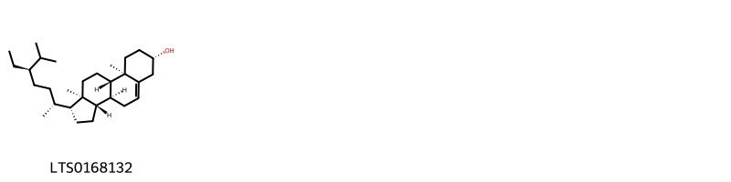{ width=100% }
    <figcaption>Hình ảnh cấu trúc hóa học của 1 hoạt chất thuộc nhóm Steroids and steroid derivatives gồm ['sitosterol (LTS0168132)'].</figcaption>
</figure>

---

### Dược dân tộc học

Danh sách các quốc gia có sử dụng *Cyrtocarpa procera* trong điều trị các bệnh. 

| Country   | Disease   | Bệnh     |
|:----------|:----------|:---------|
| Mexico    | Soap      | Xà phòng |

---

# Chi Pentaadon

??? note "Danh sách các dược liệu thuộc chi"
    
	 - *Pentaadon officinalis*

---
## Pentaadon officinalis
### Thông tin về thực vật

!!! info "Phân loại thực vật của *N/A* từ GIBF:"
    - **Kingdom:** N/A
    - **Phylum:** N/A
    - **Order:** N/A
    - **Family:** N/A
    - **Genus:** N/A
    - **Species:** *N/A*

 

| Label (VI)   | Label (EN)   | Scientific Name    | Descriptions (VI)   | Descriptions (EN)   | Also Known As (VI)   | Also Known As (EN)   |
|:-------------|:-------------|:-------------------|:--------------------|:--------------------|:---------------------|:---------------------|
| N/A          | N/A          | Cyrtocarpa procera | loài thực vật       | species of plant    | ['']                 | ['']                 |

#### Phân bố trên thế giới

**Từ CSDL GIBF** Không có kết quả phù hợp

#### Phân bố tại Việt Nam

**Từ CSDL GIBF**: Không có ghi nhận ở Việt Nam

---
### Thành phần hóa học
        
- Theo cơ sở dữ liệu lotus: Từ loài *N/A* đã phân lập và xác định được Chưa có hoạt chất nào được phân lập. hoạt chất thuộc về các nhóm Không có hoạt chất nào được phân lập. 

Không có hình ảnh nào được tạo ra

---

### Dược dân tộc học

Danh sách các quốc gia có sử dụng *N/A* trong điều trị các bệnh. 

| Country   | Disease      | Bệnh               |
|:----------|:-------------|:-------------------|
| Malaya    | Parasiticide | Thuốc diệt ký sinh |

---

# Chi Holigarna

??? note "Danh sách các dược liệu thuộc chi"
    
	 - *Holigarna arnottiana*
	 - *Holigarna longifolia*

---
## Holigarna arnottiana
### Thông tin về thực vật

!!! info "Phân loại thực vật của *Holigarna arnottiana* từ GIBF:"
    - **Kingdom:** Plantae
    - **Phylum:** Tracheophyta
    - **Order:** Sapindales
    - **Family:** Anacardiaceae
    - **Genus:** Holigarna
    - **Species:** *Holigarna arnottiana*

 

| Label (VI)   | Label (EN)   | Scientific Name      | Descriptions (VI)   | Descriptions (EN)   | Also Known As (VI)   | Also Known As (EN)   |
|:-------------|:-------------|:---------------------|:--------------------|:--------------------|:---------------------|:---------------------|
| N/A          | N/A          | Holigarna arnottiana | loài thực vật       | species of plant    | ['']                 | ['']                 |

#### Phân bố trên thế giới

**Từ CSDL GIBF** nan, India, unknown or invalid, Nepal

#### Phân bố tại Việt Nam

**Từ CSDL GIBF**: Không có ghi nhận ở Việt Nam

---
### Thành phần hóa học
        
- Theo cơ sở dữ liệu lotus: Từ loài *Holigarna arnottiana* đã phân lập và xác định được Chưa có hoạt chất nào được phân lập. hoạt chất thuộc về các nhóm Không có hoạt chất nào được phân lập. 

Không có hình ảnh nào được tạo ra

---

### Dược dân tộc học

Danh sách các quốc gia có sử dụng *Holigarna arnottiana* trong điều trị các bệnh. 

| Country   | Disease   | Bệnh              |
|:----------|:----------|:------------------|
| India     | Vesicant  | Chất gây bọng mắt |

---

---
## Holigarna longifolia
### Thông tin về thực vật

!!! info "Phân loại thực vật của *N/A* từ GIBF:"
    - **Kingdom:** Plantae
    - **Phylum:** Tracheophyta
    - **Order:** Sapindales
    - **Family:** Anacardiaceae
    - **Genus:** N/A
    - **Species:** *N/A*

 

| Label (VI)   | Label (EN)   | Scientific Name      | Descriptions (VI)   | Descriptions (EN)   | Also Known As (VI)   | Also Known As (EN)   |
|:-------------|:-------------|:---------------------|:--------------------|:--------------------|:---------------------|:---------------------|
| N/A          | N/A          | Holigarna longifolia |                     | species of plant    | ['']                 | ['']                 |

#### Phân bố trên thế giới

**Từ CSDL GIBF** Italy, Australia, Argentina, Israel, French Guiana, Canada, Ukraine, Panama, Chinese Taipei, Spain, Portugal, United States of America, Uruguay, Chile, Saint Martin (French part), South Africa, Hong Kong, Thailand, Brazil, Mexico, France, Colombia, India, Indonesia, Malaysia

#### Phân bố tại Việt Nam

**Từ CSDL GIBF**: Không có ghi nhận ở Việt Nam

---
### Thành phần hóa học
        
- Theo cơ sở dữ liệu lotus: Từ loài *N/A* đã phân lập và xác định được Chưa có hoạt chất nào được phân lập. hoạt chất thuộc về các nhóm Không có hoạt chất nào được phân lập. 

Không có hình ảnh nào được tạo ra

---

### Dược dân tộc học

Danh sách các quốc gia có sử dụng *N/A* trong điều trị các bệnh. 

| Country   | Disease   | Bệnh              |
|:----------|:----------|:------------------|
| India     | Vesicant  | Chất gây bọng mắt |

---

# Chi Anacardium

??? note "Danh sách các dược liệu thuộc chi"
    
	 - *Anacardium excelsum*
	 - *Anacardium occidentale*

---
## Anacardium excelsum
### Thông tin về thực vật

!!! info "Phân loại thực vật của *Anacardium excelsum* từ GIBF:"
    - **Kingdom:** Plantae
    - **Phylum:** Tracheophyta
    - **Order:** Sapindales
    - **Family:** Anacardiaceae
    - **Genus:** Anacardium
    - **Species:** *Anacardium excelsum*

 

| Label (VI)   | Label (EN)   | Scientific Name     | Descriptions (VI)   | Descriptions (EN)   | Also Known As (VI)   | Also Known As (EN)      |
|:-------------|:-------------|:--------------------|:--------------------|:--------------------|:---------------------|:------------------------|
| N/A          | N/A          | Anacardium excelsum | loài thực vật       | species of plant    | ['']                 | ['Anacardium excelsum'] |

#### Phân bố trên thế giới

**Từ CSDL GIBF** Nicaragua, Colombia, Costa Rica, Dominican Republic, Venezuela (Bolivarian Republic of), Panama

#### Phân bố tại Việt Nam

**Từ CSDL GIBF**: Không có ghi nhận ở Việt Nam

---
### Thành phần hóa học
        
- Theo cơ sở dữ liệu lotus: Từ loài *Anacardium excelsum* đã phân lập và xác định được Chưa có hoạt chất nào được phân lập. hoạt chất thuộc về các nhóm Không có hoạt chất nào được phân lập. 

Không có hình ảnh nào được tạo ra

---

### Dược dân tộc học

Danh sách các quốc gia có sử dụng *Anacardium excelsum* trong điều trị các bệnh. 

| Country   | Disease   | Bệnh          |
|:----------|:----------|:--------------|
| Elsewhere | Piscicide | Thuốc diệt cá |
| Panama    | Piscicide | Thuốc diệt cá |

---

---
## Anacardium occidentale
### Thông tin về thực vật

!!! info "Phân loại thực vật của *Anacardium occidentale* từ GIBF:"
    - **Kingdom:** Plantae
    - **Phylum:** Tracheophyta
    - **Order:** Sapindales
    - **Family:** Anacardiaceae
    - **Genus:** Anacardium
    - **Species:** *Anacardium occidentale*

 

| Label (VI)   | Label (EN)   | Scientific Name        | Descriptions (VI)   | Descriptions (EN)   | Also Known As (VI)                                                           | Also Known As (EN)   |
|:-------------|:-------------|:-----------------------|:--------------------|:--------------------|:-----------------------------------------------------------------------------|:---------------------|
| N/A          | N/A          | Anacardium occidentale | loài thực vật       | species of plant    | ['Điều', 'Anacardium curatellifolium', 'Cây điều', 'Anacardium occidentale'] | ['cashew tree']      |

#### Phân bố trên thế giới

**Từ CSDL GIBF** Virgin Islands (U.S.), Sri Lanka, Australia, Guadeloupe, Cambodia, Grenada, Mozambique, Saint Lucia, Benin, Nicaragua, Panama, French Guiana, Puerto Rico, Senegal, Nigeria, Bolivia (Plurinational State of), Honduras, Jamaica, Bangladesh, Bonaire, Sint Eustatius and Saba, Liberia, El Salvador, Belize, Saint Martin (French part), South Africa, Trinidad and Tobago, Saint Vincent and the Grenadines, Thailand, Martinique, Brazil, Côte d’Ivoire, Guyana, Mexico, Dominican Republic, Peru, Dominica, Singapore, Viet Nam, Madagascar, Aruba, Haiti, Colombia, Kenya, Costa Rica, India, Indonesia, Gambia, Cayman Islands, Philippines, Malaysia

#### Phân bố tại Việt Nam

**Từ CSDL GIBF**: Kiên Giang, Bà Rịa - Vũng Tàu, Ninh Thuận

---
### Thành phần hóa học
        
- Theo cơ sở dữ liệu lotus: Từ loài *Anacardium occidentale* đã phân lập và xác định được 61 hoạt chất thuộc về các nhóm Flavonoids, Indoles and derivatives, Steroids and steroid derivatives, Harmala alkaloids, Dibenzylbutane lignans, Benzene and substituted derivatives, Phenols, Furanoid lignans. 

|    | chemicalTaxonomyClassyfireClass     |   smiles_count |
|---:|:------------------------------------|---------------:|
|  0 | Benzene and substituted derivatives |             10 |
|  1 | Dibenzylbutane lignans              |              2 |
|  2 | Flavonoids                          |             13 |
|  3 | Furanoid lignans                    |              3 |
|  4 | Harmala alkaloids                   |              5 |
|  5 | Indoles and derivatives             |              1 |
|  6 | Phenols                             |             23 |
|  7 | Steroids and steroid derivatives    |              4 |

#### Nhóm Benzene and substituted derivatives
<figure markdown="span">
    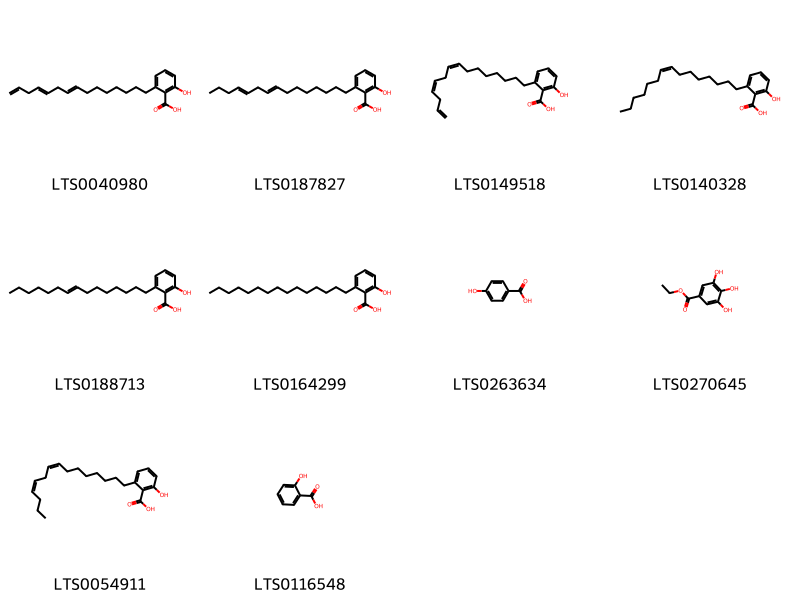{ width=100% }
    <figcaption>Hình ảnh cấu trúc hóa học của 10 hoạt chất thuộc nhóm Benzene and substituted derivatives gồm ['anacardic acids (LTS0040980)', '2-hydroxy-6-(pentadeca-8,11-dien-1-yl)benzoic acid (LTS0187827)', 'anacardic acid (LTS0149518)', 'ginkgoic acid (LTS0140328)', '2-hydroxy-6-(pentadec-8-en-1-yl)benzoic acid (LTS0188713)', '6-pentadecylsalicylic acid (LTS0164299)', 'p-hydroxybenzoic acid (LTS0263634)', 'ethyl gallate (LTS0270645)', '2-hydroxy-6-[(8z,11z)-pentadeca-8,11-dien-1-yl]benzoic acid (LTS0054911)', 'salicyclic acid (LTS0116548)'].</figcaption>
</figure>
#### Nhóm Dibenzylbutane lignans
<figure markdown="span">
    { width=100% }
    <figcaption>Hình ảnh cấu trúc hóa học của 2 hoạt chất thuộc nhóm Dibenzylbutane lignans gồm ['(2s,3r)-2,3-bis[(4-hydroxy-3-methoxyphenyl)(¹³c)methyl](1-¹³c)butane-1,4-diol (LTS0268699)', 'secoisolariciresinol (LTS0086727)'].</figcaption>
</figure>
#### Nhóm Flavonoids
<figure markdown="span">
    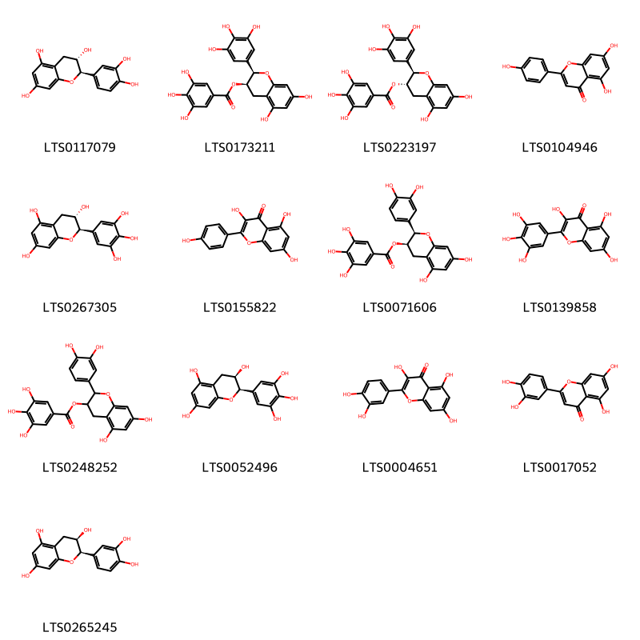{ width=100% }
    <figcaption>Hình ảnh cấu trúc hóa học của 13 hoạt chất thuộc nhóm Flavonoids gồm ['(+)-catechol (LTS0117079)', '(-)-epigallocatechin gallate (LTS0173211)', 'gallocatechin 3-o-gallate (LTS0223197)', 'chamomile (LTS0104946)', 'gallocatechol (LTS0267305)', 'kaempherol (LTS0155822)', 'epicatechin gallate (LTS0071606)', 'myricetin (LTS0139858)', '2-(3,4-dihydroxyphenyl)-5,7-dihydroxy-3,4-dihydro-2h-1-benzopyran-3-yl 3,4,5-trihydroxybenzoate (LTS0248252)', 'epigallocatechin (LTS0052496)', 'quercetin (LTS0004651)', 'luteolin (LTS0017052)', 'ent-epicatechin (LTS0265245)'].</figcaption>
</figure>
#### Nhóm Furanoid lignans
<figure markdown="span">
    { width=100% }
    <figcaption>Hình ảnh cấu trúc hóa học của 3 hoạt chất thuộc nhóm Furanoid lignans gồm ['pinoresinol (LTS0057431)', 'matairesinol (LTS0193475)', 'lariciresinol (LTS0010950)'].</figcaption>
</figure>
#### Nhóm Harmala alkaloids
<figure markdown="span">
    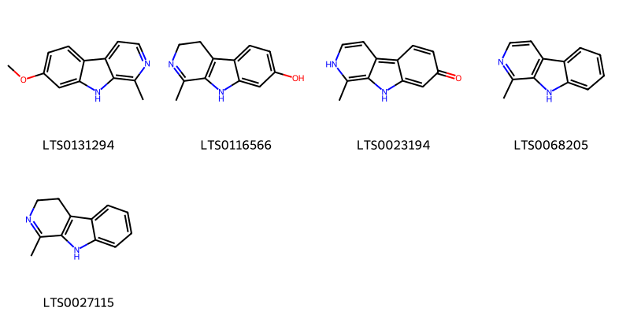{ width=100% }
    <figcaption>Hình ảnh cấu trúc hóa học của 5 hoạt chất thuộc nhóm Harmala alkaloids gồm ['harmine (LTS0131294)', 'harmalol (LTS0116566)', 'harmol (LTS0023194)', 'harmane (LTS0068205)', '1-methyl-3h,4h,9h-pyrido[3,4-b]indole (LTS0027115)'].</figcaption>
</figure>
#### Nhóm Indoles and derivatives
<figure markdown="span">
    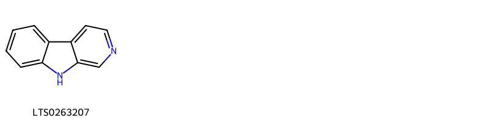{ width=100% }
    <figcaption>Hình ảnh cấu trúc hóa học của 1 hoạt chất thuộc nhóm Indoles and derivatives gồm ['β-carboline (LTS0263207)'].</figcaption>
</figure>
#### Nhóm Phenols
<figure markdown="span">
    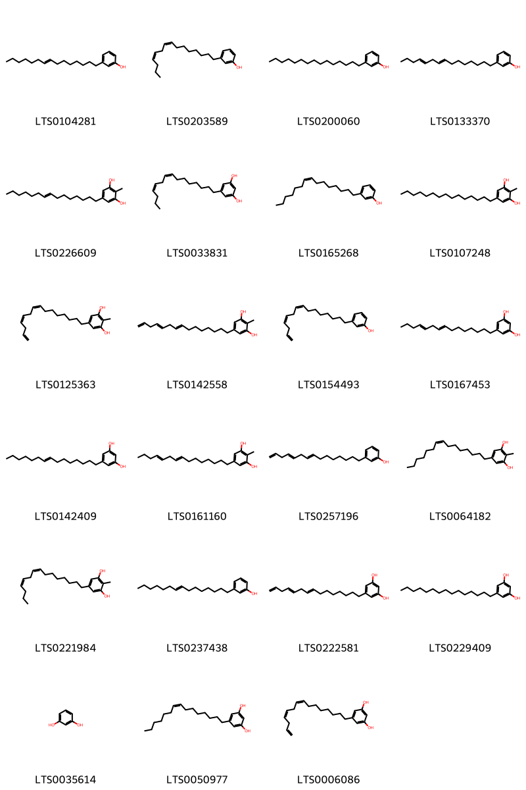{ width=100% }
    <figcaption>Hình ảnh cấu trúc hóa học của 23 hoạt chất thuộc nhóm Phenols gồm ['anacardium occidentale seed oil (LTS0104281)', 'cardanol diene (LTS0203589)', '3-pentadecylphenol (LTS0200060)', '3-(pentadeca-8,11-dien-1-yl)phenol (LTS0133370)', '2-methyl-5-(pentadec-8-en-1-yl)benzene-1,3-diol (LTS0226609)', '5-[(8z,11z)-pentadeca-8,11-dien-1-yl]benzene-1,3-diol (LTS0033831)', 'cardanol monoene (LTS0165268)', '2-methyl-5-pentadecylbenzene-1,3-diol (LTS0107248)', '2-methyl-5-[(8z,11z)-pentadeca-8,11,14-trien-1-yl]benzene-1,3-diol (LTS0125363)', '2-methyl-5-(pentadeca-8,11,14-trien-1-yl)benzene-1,3-diol (LTS0142558)', 'cardanol triene (LTS0154493)', '5-(pentadeca-8,11-dien-1-yl)benzene-1,3-diol (LTS0167453)', '5-(pentadec-8-en-1-yl)benzene-1,3-diol (LTS0142409)', '2-methyl-5-(pentadeca-8,11-dien-1-yl)benzene-1,3-diol (LTS0161160)', '3-(pentadeca-8,11,14-trien-1-yl)phenol (LTS0257196)', '2-methyl-5-[(8z)-pentadec-8-en-1-yl]benzene-1,3-diol (LTS0064182)', '2-methyl-5-[(8z,11z)-pentadeca-8,11-dien-1-yl]benzene-1,3-diol (LTS0221984)', '(15:1)-cardanol (LTS0237438)', '5-(pentadeca-8,11,14-trien-1-yl)benzene-1,3-diol (LTS0222581)', 'cardol (LTS0229409)', 'resorcinol (LTS0035614)', 'bilobol (LTS0050977)', 'cardol triene (LTS0006086)'].</figcaption>
</figure>
#### Nhóm Steroids and steroid derivatives
<figure markdown="span">
    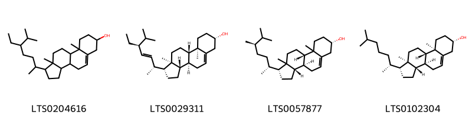{ width=100% }
    <figcaption>Hình ảnh cấu trúc hóa học của 4 hoạt chất thuộc nhóm Steroids and steroid derivatives gồm ['stigmast-5-en-3-ol, (3β)- (LTS0204616)', 'phytosterol (LTS0029311)', '(1r,3as,3bs,7s,9bs)-1-[(2r,5r)-5,6-dimethylheptan-2-yl]-9a,11a-dimethyl-1h,2h,3h,3ah,3bh,4h,6h,7h,8h,9h,9bh,10h,11h-cyclopenta[a]phenanthren-7-ol (LTS0057877)', 'cholesterol (LTS0102304)'].</figcaption>
</figure>

---

### Dược dân tộc học

Danh sách các quốc gia có sử dụng *Anacardium occidentale* trong điều trị các bệnh. 

| Country            | Disease                                      | Bệnh                                                    |
|:-------------------|:---------------------------------------------|:--------------------------------------------------------|
| Africa(Swahili)    | Intoxicant                                   | chất gây độc                                            |
| Dominican Republic | Poison                                       | Chất độc                                                |
| Elsewhere          | Piscicide, Vesicant, Astringent, Termitifuge | Thuốc diệt cá, chất tạo bọt, chất làm se, chất diệt mối |
| Guatemala          | Poison                                       | Chất độc                                                |
| Haiti              | Purgative                                    | Thuốc xổ                                                |
| Mexico             | Poison                                       | Chất độc                                                |
| Mozambique         | Intoxicant                                   | chất gây độc                                            |
| Panama             | Diuretic                                     | Thuốc lợi tiêu                                          |
| Turkey             | Poison                                       | Chất độc                                                |

---

# Chi Schinus

??? note "Danh sách các dược liệu thuộc chi"
    
	 - *Schinus latifolius*
	 - *Schinus molle*
	 - *Schinus terebenthifolius*
	 - *Schinus terebinthifolius*
	 - *Schinus weinmanniaefolius*

---
## Schinus latifolius
### Thông tin về thực vật

!!! info "Phân loại thực vật của *Schinus latifolia* từ GIBF:"
    - **Kingdom:** Plantae
    - **Phylum:** Tracheophyta
    - **Order:** Sapindales
    - **Family:** Anacardiaceae
    - **Genus:** Schinus
    - **Species:** *Schinus latifolia*

 

| Label (VI)   | Label (EN)   | Scientific Name    | Descriptions (VI)   | Descriptions (EN)   | Also Known As (VI)   | Also Known As (EN)   |
|:-------------|:-------------|:-------------------|:--------------------|:--------------------|:---------------------|:---------------------|
| N/A          | N/A          | Schinus latifolius |                     |                     | ['']                 | ['']                 |

#### Phân bố trên thế giới

**Từ CSDL GIBF** Chile

#### Phân bố tại Việt Nam

**Từ CSDL GIBF**: Không có ghi nhận ở Việt Nam

---
### Thành phần hóa học
        
- Theo cơ sở dữ liệu lotus: Từ loài *Schinus latifolia* đã phân lập và xác định được 3 hoạt chất thuộc về các nhóm Prenol lipids. 

|    | chemicalTaxonomyClassyfireClass   |   smiles_count |
|---:|:----------------------------------|---------------:|
|  0 | Prenol lipids                     |              3 |

#### Nhóm Prenol lipids
<figure markdown="span">
    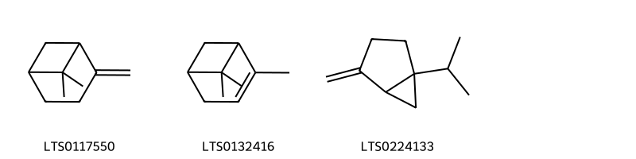{ width=100% }
    <figcaption>Hình ảnh cấu trúc hóa học của 3 hoạt chất thuộc nhóm Prenol lipids gồm ['β-pinene (LTS0117550)', 'α pinene (LTS0132416)', 'sabinene (LTS0224133)'].</figcaption>
</figure>

---

### Dược dân tộc học

Danh sách các quốc gia có sử dụng *Schinus latifolia* trong điều trị các bệnh. 

| Country   | Disease    | Bệnh         |
|:----------|:-----------|:-------------|
| Chile     | Intoxicant | chất gây độc |

---

---
## Schinus molle
### Thông tin về thực vật

!!! info "Phân loại thực vật của *Schinus molle* từ GIBF:"
    - **Kingdom:** Plantae
    - **Phylum:** Tracheophyta
    - **Order:** Sapindales
    - **Family:** Anacardiaceae
    - **Genus:** Schinus
    - **Species:** *Schinus molle*

 

| Label (VI)   | Label (EN)   | Scientific Name   | Descriptions (VI)   | Descriptions (EN)   | Also Known As (VI)   | Also Known As (EN)                                                                                                                                                         |
|:-------------|:-------------|:------------------|:--------------------|:--------------------|:---------------------|:---------------------------------------------------------------------------------------------------------------------------------------------------------------------------|
| N/A          | N/A          | Schinus molle     | loài thực vật       | species of plant    | ['']                 | ['pepper tree', 'American pepper', 'California pepper tree', 'false pepper', 'peppercorn tree', 'pepperina', 'Peruvian mastica', 'Peruvian pepper', 'Peruvian peppertree'] |

#### Phân bố trên thế giới

**Từ CSDL GIBF** nan, Australia, Argentina, Spain, Bolivia (Plurinational State of), Portugal, Algeria, United States of America, Uruguay, Chile, Greece, South Africa, Brazil, Peru, Mexico, France, Ecuador, Colombia, Botswana

#### Phân bố tại Việt Nam

**Từ CSDL GIBF**: Không có ghi nhận ở Việt Nam

---
### Thành phần hóa học
        
- Theo cơ sở dữ liệu lotus: Từ loài *Schinus molle* đã phân lập và xác định được 88 hoạt chất thuộc về các nhóm Fatty Acyls, Flavonoids, Prenol lipids, Steroids and steroid derivatives, Benzene and substituted derivatives, Unsaturated hydrocarbons, Organooxygen compounds, Tannins. 

|    | chemicalTaxonomyClassyfireClass     |   smiles_count |
|---:|:------------------------------------|---------------:|
|  0 | Benzene and substituted derivatives |              2 |
|  1 | Fatty Acyls                         |              4 |
|  2 | Flavonoids                          |              7 |
|  3 | Organooxygen compounds              |              7 |
|  4 | Prenol lipids                       |             64 |
|  5 | Steroids and steroid derivatives    |              2 |
|  6 | Tannins                             |              1 |
|  7 | Unsaturated hydrocarbons            |              1 |

#### Nhóm Benzene and substituted derivatives
<figure markdown="span">
    { width=100% }
    <figcaption>Hình ảnh cấu trúc hóa học của 2 hoạt chất thuộc nhóm Benzene and substituted derivatives gồm ['galop (LTS0222857)', '3,4-dihydroxybenzoic acid (LTS0018765)'].</figcaption>
</figure>
#### Nhóm Fatty Acyls
<figure markdown="span">
    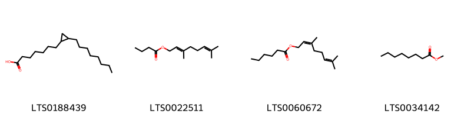{ width=100% }
    <figcaption>Hình ảnh cấu trúc hóa học của 4 hoạt chất thuộc nhóm Fatty Acyls gồm ['7-(2-octylcyclopropyl)heptanoic acid (LTS0188439)', 'geranyl butyrate (LTS0022511)', '(2z)-3,7-dimethylocta-2,6-dien-1-yl hexanoate (LTS0060672)', 'methyl caprylate (LTS0034142)'].</figcaption>
</figure>
#### Nhóm Flavonoids
<figure markdown="span">
    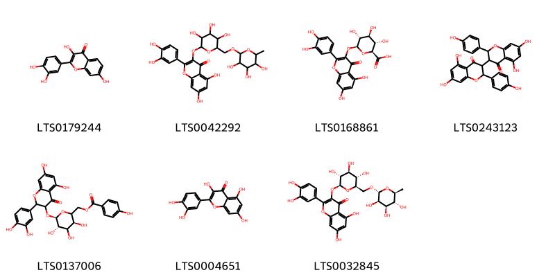{ width=100% }
    <figcaption>Hình ảnh cấu trúc hóa học của 7 hoạt chất thuộc nhóm Flavonoids gồm ["3,7,3',4'-tetrahydroxyflavone (LTS0179244)", 'rutin (LTS0042292)', 'querciturone (LTS0168861)', '3-[5,7-dihydroxy-2-(4-hydroxyphenyl)-4-oxo-2,3-dihydro-1-benzopyran-3-yl]-5,7-dihydroxy-2-(4-hydroxyphenyl)-2,3-dihydro-1-benzopyran-4-one (LTS0243123)', '[(3s,5s,6r)-6-{[2-(3,4-dihydroxyphenyl)-5,7-dihydroxy-4-oxo-2,3-dihydro-1-benzopyran-3-yl]oxy}-3,4,5-trihydroxyoxan-2-yl]methyl 4-hydroxybenzoate (LTS0137006)', 'quercetin (LTS0004651)', '3-rutinosyl quercetin (LTS0032845)'].</figcaption>
</figure>
#### Nhóm Organooxygen compounds
<figure markdown="span">
    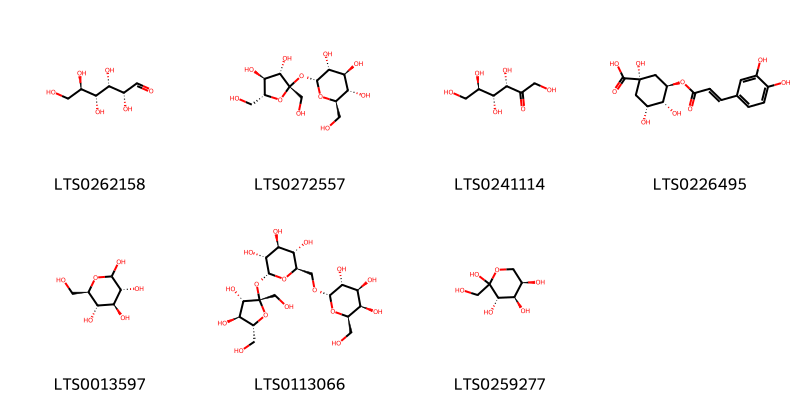{ width=100% }
    <figcaption>Hình ảnh cấu trúc hóa học của 7 hoạt chất thuộc nhóm Organooxygen compounds gồm ['(+)-glucose (LTS0262158)', 'sucrose (LTS0272557)', 'keto-d-fructose (LTS0241114)', 'chlorogenic acid (LTS0226495)', 'glucose (LTS0013597)', 'raffinose (LTS0113066)', 'd-fructopyranose (LTS0259277)'].</figcaption>
</figure>
#### Nhóm Prenol lipids
<figure markdown="span">
    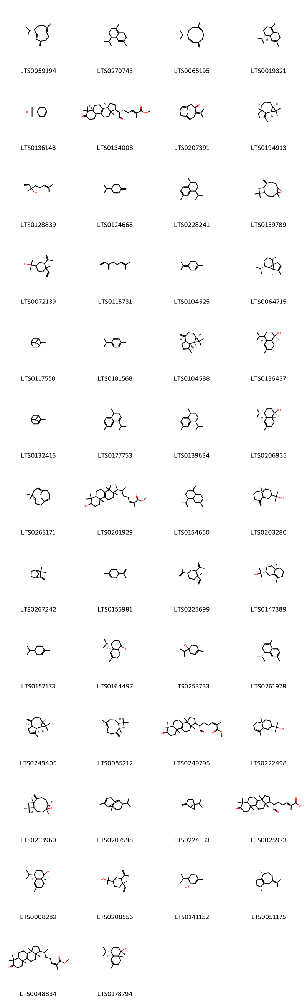{ width=100% }
    <figcaption>Hình ảnh cấu trúc hóa học của 64 hoạt chất thuộc nhóm Prenol lipids gồm ['(-)-germacrene d (LTS0059194)', '4-isopropyl-1,6-dimethyl-2,3,4,4a,7,8-hexahydronaphthalene (LTS0270743)', '(1z,6z,8s)-8-isopropyl-1-methyl-5-methylidenecyclodeca-1,6-diene (LTS0065195)', 'delta-cadinene (LTS0019321)', 'terpineol (LTS0136148)', 'methyl (2e,6s)-6-[(1s,3as,5ar,9as,11as)-3a,6,6,9a,11a-pentamethyl-7-oxo-1h,2h,3h,4h,5h,5ah,8h,9h,10h,11h-cyclopenta[a]phenanthren-1-yl]-2-methyl-7-oxohept-2-enoate (LTS0134008)', 'germacrone (LTS0207391)', '(-)-α-gurjunene (LTS0194913)', 'linalool, (+-)- (LTS0128839)', 'β phellandrene (LTS0124668)', '(e)-calamene (LTS0228241)', 'caryophyllene oxide (LTS0159789)', '2-[4-ethenyl-4-methyl-3-(prop-1-en-2-yl)cyclohexyl]propan-2-ol (LTS0072139)', 'α-myrcene (LTS0115731)', 'terpinolene (LTS0104525)', '(1s,5r,7s,10r)-7-isopropyl-4,10-dimethyltricyclo[4.4.0.0¹,⁵]dec-3-ene (LTS0064715)', 'β-pinene (LTS0117550)', 'cymene (LTS0181568)', '(1ar,4ar,7ar,7br)-1,1,7-trimethyl-4-methylidene-1ah,2h,3h,4ah,5h,7ah,7bh-cyclopropa[e]azulene (LTS0104588)', '(1r,4ar,8as)-4-isopropyl-1,6-dimethyl-3,4,4a,7,8,8a-hexahydro-2h-naphthalen-1-ol (LTS0136437)', 'α pinene (LTS0132416)', '(1s)-4-isopropyl-1,6-dimethyl-1,2-dihydronaphthalene (LTS0177753)', '(1s,4s)-4-isopropyl-1,6-dimethyl-1,2,3,4-tetrahydronaphthalene (LTS0139634)', 'α-cadinol (LTS0206935)', 'humulene (LTS0263171)', 'methyl 6-{7-hydroxy-3a,6,6,9a,11a-pentamethyl-1h,2h,3h,4h,5h,5ah,7h,8h,9h,10h,11h-cyclopenta[a]phenanthren-1-yl}-2-methylhept-2-enoate (LTS0201929)', '4-isopropyl-1,6-dimethyl-3,4,4a,7,8,8a-hexahydronaphthalene (LTS0154650)', 'β-eudesmol (LTS0203280)', 'camphene (LTS0267242)', 'limonene,  (LTS0155981)', 'β-elemene (LTS0225699)', 'gamma-eudesmol (LTS0147389)', 'phellandrene (LTS0157173)', '(1r,4s,4ar)-4-isopropyl-1,6-dimethyl-3,4,4a,7,8,8a-hexahydro-2h-naphthalen-1-ol (LTS0164497)', '4-terpineol (LTS0253733)', '(4s)-4-isopropyl-1,6-dimethyl-3,4-dihydronaphthalene (LTS0261978)', '(1ar,4ar,7as,7br)-1,1,7-trimethyl-4-methylidene-1ah,2h,3h,4ah,5h,7ah,7bh-cyclopropa[e]azulene (LTS0249405)', 'caryophyllene (LTS0085212)', 'methyl 6-{3a,6,6,9a,11a-pentamethyl-7-oxo-1h,2h,3h,4h,5h,5ah,8h,9h,10h,11h-cyclopenta[a]phenanthren-1-yl}-2-methyl-7-oxohept-2-enoate (LTS0249795)', 'α-eudesmol (LTS0222498)', 'β-caryophyllene oxide (LTS0213960)', 'α-copaene (LTS0207598)', 'sabinene (LTS0224133)', '(2e)-6-{3a,6,6,9a,11a-pentamethyl-7-oxo-1h,2h,3h,4h,5h,5ah,8h,9h,10h,11h-cyclopenta[a]phenanthren-1-yl}-2-methyl-7-oxohept-2-enoic acid (LTS0025973)', 'delta-cadinol (LTS0008282)', 'elemol (LTS0208556)', '(+)-trans-piperitenol (LTS0141152)', '(1r,4r)-1,4-dimethyl-7-(propan-2-ylidene)-2,3,4,5,6,8-hexahydro-1h-azulene (LTS0051175)', 'methyl 6-{3a,6,6,9a,11a-pentamethyl-7-oxo-1h,2h,3h,4h,5h,5ah,8h,9h,10h,11h-cyclopenta[a]phenanthren-1-yl}-2-methylhept-2-enoate (LTS0048834)', 'α-cadinol (LTS0178794)', '1,1,7-trimethyl-4-methylidene-1ah,2h,3h,4ah,5h,7ah,7bh-cyclopropa[e]azulene (LTS0049986)', '(1r,2s,7s,8s)-8-isopropyl-1,3-dimethyltricyclo[4.4.0.0²,⁷]dec-3-ene (LTS0190031)', 'methyl 6-{3a,6,6,9a,11a-pentamethyl-7-oxo-1h,2h,3h,5h,5ah,8h,9h,9bh,10h,11h-cyclopenta[a]phenanthren-1-yl}-2-methylhept-2-enoate (LTS0007388)', 'gamma-muurolene (LTS0052920)', 'α-muurolene (LTS0022607)', '4-isopropyl-1,6-dimethyl-1,2-dihydronaphthalene (LTS0004459)', '(1s,2e,10r)-3,7,11,11-tetramethylbicyclo[8.1.0]undeca-2,6-diene (LTS0032090)', '3,4-dihydrocadalene (LTS0015523)', 'delta-cadinol (LTS0013807)', 'methyl (2e,6r)-6-[(1s,3as,5ar,9ar,9br,11as)-3a,6,6,9a,11a-pentamethyl-7-oxo-1h,2h,3h,5h,5ah,8h,9h,9bh,10h,11h-cyclopenta[a]phenanthren-1-yl]-2-methylhept-2-enoate (LTS0039324)', '(-)-α-cubebene (LTS0042045)', 'methyl (2e,6r)-6-[(1s,3as,5ar,7s,9as,11as)-7-hydroxy-3a,6,6,9a,11a-pentamethyl-1h,2h,3h,4h,5h,5ah,7h,8h,9h,10h,11h-cyclopenta[a]phenanthren-1-yl]-2-methylhept-2-enoate (LTS0018220)', '(2e,6e)-3,7,11,11-tetramethylbicyclo[8.1.0]undeca-2,6-diene (LTS0225278)', 'methyl (2e,6r)-6-[(1s,3as,5ar,9as,11as)-3a,6,6,9a,11a-pentamethyl-7-oxo-1h,2h,3h,4h,5h,5ah,8h,9h,10h,11h-cyclopenta[a]phenanthren-1-yl]-2-methylhept-2-enoate (LTS0247445)'].</figcaption>
</figure>
#### Nhóm Steroids and steroid derivatives
<figure markdown="span">
    { width=100% }
    <figcaption>Hình ảnh cấu trúc hóa học của 2 hoạt chất thuộc nhóm Steroids and steroid derivatives gồm ['stigmast-5-en-3-ol, (3β)- (LTS0204616)', '(1r,3ar,3br,7s,9ar,9br,11ar)-1-[(2r,5r)-5-ethyl-6-methylheptan-2-yl]-9a,11a-dimethyl-1h,2h,3h,3ah,3bh,4h,6h,7h,8h,9h,9bh,10h,11h-cyclopenta[a]phenanthren-7-ol (LTS0129695)'].</figcaption>
</figure>
#### Nhóm Tannins
<figure markdown="span">
    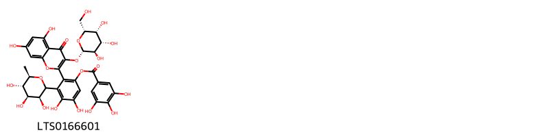{ width=100% }
    <figcaption>Hình ảnh cấu trúc hóa học của 1 hoạt chất thuộc nhóm Tannins gồm ['2-(5,7-dihydroxy-4-oxo-3-{[(2s,3r,4s,5r,6r)-3,4,5-trihydroxy-6-(hydroxymethyl)oxan-2-yl]oxy}chromen-2-yl)-4,5-dihydroxy-3-[(3s,4s,5s,6r)-3,4,5-trihydroxy-6-methyloxan-2-yl]phenyl 3,4,5-trihydroxybenzoate (LTS0166601)'].</figcaption>
</figure>
#### Nhóm Unsaturated hydrocarbons
<figure markdown="span">
    { width=100% }
    <figcaption>Hình ảnh cấu trúc hóa học của 1 hoạt chất thuộc nhóm Unsaturated hydrocarbons gồm ['α terpinene (LTS0232891)'].</figcaption>
</figure>

---

### Dược dân tộc học

Danh sách các quốc gia có sử dụng *Schinus molle* trong điều trị các bệnh. 

| Country       | Disease                                                                          | Bệnh                                                                                      |
|:--------------|:---------------------------------------------------------------------------------|:------------------------------------------------------------------------------------------|
| Elsewhere     | Diuretic, Emmenagogue, Poison, Purgative, Stomachic, nan, Piscicide, Expectorant | Thuốc lợi tiểu, Chất gây nôn, Chất độc, Phẫu thuật, Dạ dày, nan, Thuốc diệt cá, Thuốc đờm |
| Latin America | Purgative                                                                        | Thuốc xổ                                                                                  |
| Mexico        | Astringent, Purgative, Vulnerary, Collyrium, Purgative                           | Làm se, Purgative, Vulnerary, Collyrium, Purgative                                        |
| Paraguay      | Diuretic                                                                         | Thuốc lợi tiêu                                                                            |
| Turkey        | Expectorant, Purgative, Stomachic, Tonic, Diuretic                               | Thuốc long đờm, thuốc tẩy, thuốc dạ dày, thuốc bổ, thuốc lợi tiểu                         |

---

---
## Schinus terebenthifolius
### Thông tin về thực vật

!!! info "Phân loại thực vật của *Schinus terebinthifolia* từ GIBF:"
    - **Kingdom:** Plantae
    - **Phylum:** Tracheophyta
    - **Order:** Sapindales
    - **Family:** Anacardiaceae
    - **Genus:** Schinus
    - **Species:** *Schinus terebinthifolia*

 

| Label (VI)   | Label (EN)   | Scientific Name   | Descriptions (VI)   | Descriptions (EN)   | Also Known As (VI)   | Also Known As (EN)                                                                                                                                                         |
|:-------------|:-------------|:------------------|:--------------------|:--------------------|:---------------------|:---------------------------------------------------------------------------------------------------------------------------------------------------------------------------|
| N/A          | N/A          | Schinus molle     | loài thực vật       | species of plant    | ['']                 | ['pepper tree', 'American pepper', 'California pepper tree', 'false pepper', 'peppercorn tree', 'pepperina', 'Peruvian mastica', 'Peruvian pepper', 'Peruvian peppertree'] |

#### Phân bố trên thế giới

**Từ CSDL GIBF** nan, South Africa, Puerto Rico, Australia, Guatemala, Brazil, Chinese Taipei, Argentina, Spain, Bahamas, United States of America, Uruguay, New Zealand

#### Phân bố tại Việt Nam

**Từ CSDL GIBF**: Không có ghi nhận ở Việt Nam

---
### Thành phần hóa học
        
- Theo cơ sở dữ liệu lotus: Từ loài *Schinus terebinthifolia* đã phân lập và xác định được Chưa có hoạt chất nào được phân lập. hoạt chất thuộc về các nhóm Không có hoạt chất nào được phân lập. 

Không có hình ảnh nào được tạo ra

---

### Dược dân tộc học

Danh sách các quốc gia có sử dụng *Schinus terebinthifolia* trong điều trị các bệnh. 

| Country   | Disease                                | Bệnh                                             |
|:----------|:---------------------------------------|:-------------------------------------------------|
| Elsewhere | nan, Stimulant, Tonic, nan, Astringent | nan, Chất kích thích, Thuốc bổ, nan, Chất làm se |

---

---
## Schinus terebinthifolius
### Thông tin về thực vật

!!! info "Phân loại thực vật của *Schinus terebinthifolia* từ GIBF:"
    - **Kingdom:** Plantae
    - **Phylum:** Tracheophyta
    - **Order:** Sapindales
    - **Family:** Anacardiaceae
    - **Genus:** Schinus
    - **Species:** *Schinus terebinthifolia*

 

| Label (VI)   | Label (EN)   | Scientific Name   | Descriptions (VI)   | Descriptions (EN)   | Also Known As (VI)   | Also Known As (EN)                                                                                                                                                         |
|:-------------|:-------------|:------------------|:--------------------|:--------------------|:---------------------|:---------------------------------------------------------------------------------------------------------------------------------------------------------------------------|
| N/A          | N/A          | Schinus molle     | loài thực vật       | species of plant    | ['']                 | ['pepper tree', 'American pepper', 'California pepper tree', 'false pepper', 'peppercorn tree', 'pepperina', 'Peruvian mastica', 'Peruvian pepper', 'Peruvian peppertree'] |

#### Phân bố trên thế giới

**Từ CSDL GIBF** nan, South Africa, Puerto Rico, Australia, Guatemala, Brazil, Chinese Taipei, Argentina, Spain, Bahamas, United States of America, Uruguay, New Zealand

#### Phân bố tại Việt Nam

**Từ CSDL GIBF**: Không có ghi nhận ở Việt Nam

---
### Thành phần hóa học
        
- Theo cơ sở dữ liệu lotus: Từ loài *Schinus terebinthifolia* đã phân lập và xác định được 26 hoạt chất thuộc về các nhóm Flavonoids, Prenol lipids, Steroids and steroid derivatives, Benzene and substituted derivatives, Unsaturated hydrocarbons, Phenols. 

|    | chemicalTaxonomyClassyfireClass     |   smiles_count |
|---:|:------------------------------------|---------------:|
|  0 | Benzene and substituted derivatives |              1 |
|  1 | Flavonoids                          |              6 |
|  2 | Phenols                             |              2 |
|  3 | Prenol lipids                       |              9 |
|  4 | Steroids and steroid derivatives    |              3 |
|  5 | Unsaturated hydrocarbons            |              3 |

#### Nhóm Benzene and substituted derivatives
<figure markdown="span">
    { width=100% }
    <figcaption>Hình ảnh cấu trúc hóa học của 1 hoạt chất thuộc nhóm Benzene and substituted derivatives gồm ['galop (LTS0222857)'].</figcaption>
</figure>
#### Nhóm Flavonoids
<figure markdown="span">
    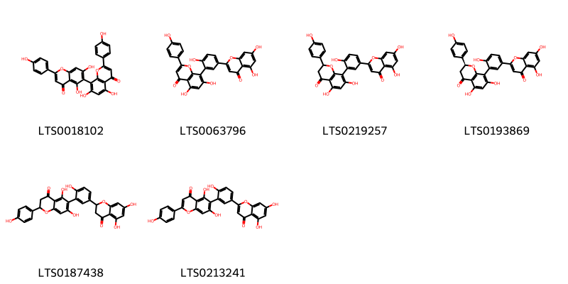{ width=100% }
    <figcaption>Hình ảnh cấu trúc hóa học của 6 hoạt chất thuộc nhóm Flavonoids gồm ['agathisflavone (LTS0018102)', 'amentoflavone (LTS0063796)', '2-{3-[5,7-dihydroxy-2-(4-hydroxyphenyl)-4-oxo-2,3-dihydro-1-benzopyran-8-yl]-4-hydroxyphenyl}-5,7-dihydroxychromen-4-one (LTS0219257)', '2-{3-[(2s)-5,7-dihydroxy-2-(4-hydroxyphenyl)-4-oxo-2,3-dihydro-1-benzopyran-8-yl]-4-hydroxyphenyl}-5,7-dihydroxychromen-4-one (LTS0193869)', '6-[5-(5,7-dihydroxy-4-oxo-2,3-dihydro-1-benzopyran-2-yl)-2-hydroxyphenyl]-5,7-dihydroxy-2-(4-hydroxyphenyl)-2,3-dihydro-1-benzopyran-4-one (LTS0187438)', 'robustaflavone (LTS0213241)'].</figcaption>
</figure>
#### Nhóm Phenols
<figure markdown="span">
    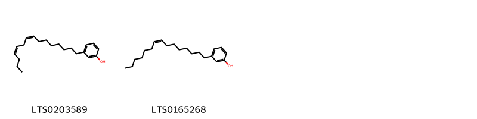{ width=100% }
    <figcaption>Hình ảnh cấu trúc hóa học của 2 hoạt chất thuộc nhóm Phenols gồm ['cardanol diene (LTS0203589)', 'cardanol monoene (LTS0165268)'].</figcaption>
</figure>
#### Nhóm Prenol lipids
<figure markdown="span">
    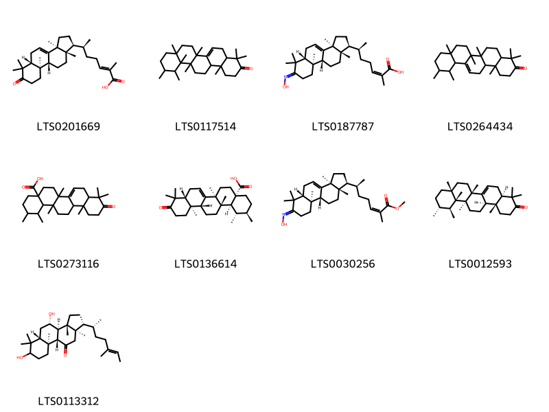{ width=100% }
    <figcaption>Hình ảnh cấu trúc hóa học của 9 hoạt chất thuộc nhóm Prenol lipids gồm ['(2e,6s)-6-[(1s,3as,5ar,9ar,9br,11as)-3a,6,6,9a,11a-pentamethyl-7-oxo-1h,2h,3h,5h,5ah,8h,9h,9bh,10h,11h-cyclopenta[a]phenanthren-1-yl]-2-methylhept-2-enoic acid (LTS0201669)', '4,4,6b,8a,11,12,12a,12b,14b-nonamethyl-2,4a,5,7,8,9,10,11,12,13,14,14a-dodecahydro-1h-picen-3-one (LTS0117514)', '(2z,6s)-6-[(1s,3as,5ar,7e,9ar,9br,11as)-7-(hydroxyimino)-3a,6,6,9a,11a-pentamethyl-1h,2h,3h,5h,5ah,8h,9h,9bh,10h,11h-cyclopenta[a]phenanthren-1-yl]-2-methylhept-2-enoic acid (LTS0187787)', '4,4,6a,6b,8a,11,12,14b-octamethyl-1,2,4a,5,6,7,8,9,10,11,12,12a,14,14a-tetradecahydropicen-3-one (LTS0264434)', '1,2,6a,9,9,12a,14a-heptamethyl-10-oxo-1,2,3,4,5,6,8,8a,11,12,12b,13,14,14b-tetradecahydropicene-4a-carboxylic acid (LTS0273116)', '(1s,2r,4as,6as,8ar,12ar,12br,14as,14bs)-1,2,6a,9,9,12a,14a-heptamethyl-10-oxo-1,2,3,4,5,6,8,8a,11,12,12b,13,14,14b-tetradecahydropicene-4a-carboxylic acid (LTS0136614)', 'methyl (2z,6s)-6-[(1s,3as,5ar,7e,9ar,9br,11as)-7-(hydroxyimino)-3a,6,6,9a,11a-pentamethyl-1h,2h,3h,5h,5ah,8h,9h,9bh,10h,11h-cyclopenta[a]phenanthren-1-yl]-2-methylhept-2-enoate (LTS0030256)', '(4ar,6br,8ar,11r,12s,12ar,12br,14ar,14br)-4,4,6b,8a,11,12,12a,12b,14b-nonamethyl-2,4a,5,7,8,9,10,11,12,13,14,14a-dodecahydro-1h-picen-3-one (LTS0012593)', '(1r,3as,3br,4s,5ar,9as,9bs,11ar)-4,7-dihydroxy-3a,6,6,9a,11a-pentamethyl-1-[(2r,5e)-5-methylhept-5-en-2-yl]-dodecahydrocyclopenta[a]phenanthren-10-one (LTS0113312)'].</figcaption>
</figure>
#### Nhóm Steroids and steroid derivatives
<figure markdown="span">
    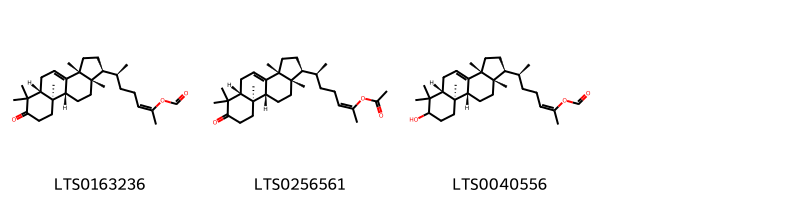{ width=100% }
    <figcaption>Hình ảnh cấu trúc hóa học của 3 hoạt chất thuộc nhóm Steroids and steroid derivatives gồm ['(2z,6s)-6-[(1s,3ar,5ar,9ar,9br,11as)-3a,6,6,9a,11a-pentamethyl-7-oxo-1h,2h,3h,5h,5ah,8h,9h,9bh,10h,11h-cyclopenta[a]phenanthren-1-yl]hept-2-en-2-yl formate (LTS0163236)', '(2z,6s)-6-[(1s,3ar,5ar,9ar,9br,11as)-3a,6,6,9a,11a-pentamethyl-7-oxo-1h,2h,3h,5h,5ah,8h,9h,9bh,10h,11h-cyclopenta[a]phenanthren-1-yl]hept-2-en-2-yl acetate (LTS0256561)', '(2z,6s)-6-[(1s,3ar,5ar,9ar,9br,11as)-7-hydroxy-3a,6,6,9a,11a-pentamethyl-1h,2h,3h,5h,5ah,7h,8h,9h,9bh,10h,11h-cyclopenta[a]phenanthren-1-yl]hept-2-en-2-yl formate (LTS0040556)'].</figcaption>
</figure>
#### Nhóm Unsaturated hydrocarbons
<figure markdown="span">
    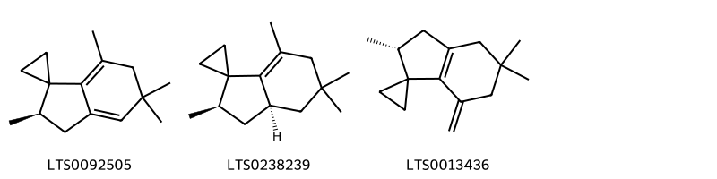{ width=100% }
    <figcaption>Hình ảnh cấu trúc hóa học của 3 hoạt chất thuộc nhóm Unsaturated hydrocarbons gồm ["(2'r)-2',5',5',7'-tetramethyl-3',6'-dihydro-2'h-spiro[cyclopropane-1,1'-indene] (LTS0092505)", "(2'r,3'ar)-2',5',5',7'-tetramethyl-3',3'a,4',6'-tetrahydro-2'h-spiro[cyclopropane-1,1'-indene] (LTS0238239)", "(2'r)-2',5',5'-trimethyl-7'-methylidene-2',3',4',6'-tetrahydrospiro[cyclopropane-1,1'-indene] (LTS0013436)"].</figcaption>
</figure>

---

### Dược dân tộc học

Danh sách các quốc gia có sử dụng *Schinus terebinthifolia* trong điều trị các bệnh. 

| Country       | Disease                         | Bệnh                            |
|:--------------|:--------------------------------|:--------------------------------|
| Brazil        | Antiseptic                      | Khử trùng                       |
| Elsewhere     | Dentifrice, Aphrodisiac, Poison | Dentifrice, Aphrodisiac, Poison |
| Latin America | Astringent, Tonic               | Chất làm se, Thuốc bổ           |

---

---
## Schinus weinmanniaefolius
### Thông tin về thực vật

!!! info "Phân loại thực vật của *Schinus weinmanniifolia* từ GIBF:"
    - **Kingdom:** Plantae
    - **Phylum:** Tracheophyta
    - **Order:** Sapindales
    - **Family:** Anacardiaceae
    - **Genus:** Schinus
    - **Species:** *Schinus weinmanniifolia*

 

| Label (VI)   | Label (EN)   | Scientific Name   | Descriptions (VI)   | Descriptions (EN)   | Also Known As (VI)   | Also Known As (EN)                                                                                                                                                         |
|:-------------|:-------------|:------------------|:--------------------|:--------------------|:---------------------|:---------------------------------------------------------------------------------------------------------------------------------------------------------------------------|
| N/A          | N/A          | Schinus molle     | loài thực vật       | species of plant    | ['']                 | ['pepper tree', 'American pepper', 'California pepper tree', 'false pepper', 'peppercorn tree', 'pepperina', 'Peruvian mastica', 'Peruvian pepper', 'Peruvian peppertree'] |

#### Phân bố trên thế giới

**Từ CSDL GIBF** nan, Brazil, Argentina, Uruguay, Paraguay

#### Phân bố tại Việt Nam

**Từ CSDL GIBF**: Không có ghi nhận ở Việt Nam

---
### Thành phần hóa học
        
- Theo cơ sở dữ liệu lotus: Từ loài *Schinus weinmanniifolia* đã phân lập và xác định được Chưa có hoạt chất nào được phân lập. hoạt chất thuộc về các nhóm Không có hoạt chất nào được phân lập. 

Không có hình ảnh nào được tạo ra

---

### Dược dân tộc học

Danh sách các quốc gia có sử dụng *Schinus weinmanniifolia* trong điều trị các bệnh. 

| Country   | Disease       | Bệnh          |
|:----------|:--------------|:--------------|
| Paraguay  | Antifertility | Chống lão hóa |

---

# Chi Metopium

??? note "Danh sách các dược liệu thuộc chi"
    
	 - *Metopium brownei*
	 - *Metopium toxiferum*

---
## Metopium brownei
### Thông tin về thực vật

!!! info "Phân loại thực vật của *Metopium brownei* từ GIBF:"
    - **Kingdom:** Plantae
    - **Phylum:** Tracheophyta
    - **Order:** Sapindales
    - **Family:** Anacardiaceae
    - **Genus:** Metopium
    - **Species:** *Metopium brownei*

 

| Label (VI)   | Label (EN)   | Scientific Name   | Descriptions (VI)   | Descriptions (EN)   | Also Known As (VI)   | Also Known As (EN)   |
|:-------------|:-------------|:------------------|:--------------------|:--------------------|:---------------------|:---------------------|
| N/A          | N/A          | Metopium brownei  | loài thực vật       | species of plant    | ['']                 | ['']                 |

#### Phân bố trên thế giới

**Từ CSDL GIBF** Belize, Curaçao, Colombia, Guatemala, Honduras, Cuba, Mexico, Bonaire, Sint Eustatius and Saba

#### Phân bố tại Việt Nam

**Từ CSDL GIBF**: Không có ghi nhận ở Việt Nam

---
### Thành phần hóa học
        
- Theo cơ sở dữ liệu lotus: Từ loài *Metopium brownei* đã phân lập và xác định được 3 hoạt chất thuộc về các nhóm Phenols. 

|    | chemicalTaxonomyClassyfireClass   |   smiles_count |
|---:|:----------------------------------|---------------:|
|  0 | Phenols                           |              3 |

#### Nhóm Phenols
<figure markdown="span">
    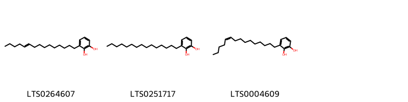{ width=100% }
    <figcaption>Hình ảnh cấu trúc hóa học của 3 hoạt chất thuộc nhóm Phenols gồm ['3-(pentadec-10-enyl)catechol (LTS0264607)', '3-pentadecylcatechol (LTS0251717)', 'litreol (LTS0004609)'].</figcaption>
</figure>

---

### Dược dân tộc học

Danh sách các quốc gia có sử dụng *Metopium brownei* trong điều trị các bệnh. 

| Country            | Disease                                 | Bệnh                           |
|:-------------------|:----------------------------------------|:-------------------------------|
| Dominican Republic | Poison                                  | Chất độc                       |
| Guatemala          | Poison                                  | Chất độc                       |
| Mexico             | Allergenic, Sedative, Sudorific, Poison | Dị ứng, An thần, Ngạt, Ngộ độc |

---

---
## Metopium toxiferum
### Thông tin về thực vật

!!! info "Phân loại thực vật của *Metopium toxiferum* từ GIBF:"
    - **Kingdom:** Plantae
    - **Phylum:** Tracheophyta
    - **Order:** Sapindales
    - **Family:** Anacardiaceae
    - **Genus:** Metopium
    - **Species:** *Metopium toxiferum*

 

| Label (VI)   | Label (EN)   | Scientific Name    | Descriptions (VI)   | Descriptions (EN)   | Also Known As (VI)   | Also Known As (EN)                   |
|:-------------|:-------------|:-------------------|:--------------------|:--------------------|:---------------------|:-------------------------------------|
| N/A          | N/A          | Metopium toxiferum | loài thực vật       | species of plant    | ['']                 | ['Florida poisontree', 'poisonwood'] |

#### Phân bố trên thế giới

**Từ CSDL GIBF** Puerto Rico, Turks and Caicos Islands, Bahamas, Cuba, United States of America, Dominican Republic

#### Phân bố tại Việt Nam

**Từ CSDL GIBF**: Không có ghi nhận ở Việt Nam

---
### Thành phần hóa học
        
- Theo cơ sở dữ liệu lotus: Từ loài *Metopium toxiferum* đã phân lập và xác định được Chưa có hoạt chất nào được phân lập. hoạt chất thuộc về các nhóm Không có hoạt chất nào được phân lập. 

Không có hình ảnh nào được tạo ra

---

### Dược dân tộc học

Danh sách các quốc gia có sử dụng *Metopium toxiferum* trong điều trị các bệnh. 

| Country   | Disease   | Bệnh     |
|:----------|:----------|:---------|
| Haiti     | Poison    | Chất độc |
| US        | Poison    | Chất độc |

---

# Chi Lannea

??? note "Danh sách các dược liệu thuộc chi"
    
	 - *Lannea coromandelica*
	 - *Lannea grandis*
	 - *Lannea welwitschii*

---
## Lannea coromandelica
### Thông tin về thực vật

!!! info "Phân loại thực vật của *Lannea coromandelica* từ GIBF:"
    - **Kingdom:** Plantae
    - **Phylum:** Tracheophyta
    - **Order:** Sapindales
    - **Family:** Anacardiaceae
    - **Genus:** Lannea
    - **Species:** *Lannea coromandelica*

 

| Label (VI)   | Label (EN)   | Scientific Name      | Descriptions (VI)   | Descriptions (EN)   | Also Known As (VI)   | Also Known As (EN)   |
|:-------------|:-------------|:---------------------|:--------------------|:--------------------|:---------------------|:---------------------|
| N/A          | N/A          | Lannea coromandelica | loài thực vật       | species of plant    | ['']                 | ['']                 |

#### Phân bố trên thế giới

**Từ CSDL GIBF** India, Indonesia, Singapore, Sri Lanka

#### Phân bố tại Việt Nam

**Từ CSDL GIBF**: Không có ghi nhận ở Việt Nam

---
### Thành phần hóa học
        
- Theo cơ sở dữ liệu lotus: Từ loài *Lannea coromandelica* đã phân lập và xác định được 2 hoạt chất thuộc về các nhóm Flavonoids. 

|    | chemicalTaxonomyClassyfireClass   |   smiles_count |
|---:|:----------------------------------|---------------:|
|  0 | Flavonoids                        |              2 |

#### Nhóm Flavonoids
<figure markdown="span">
    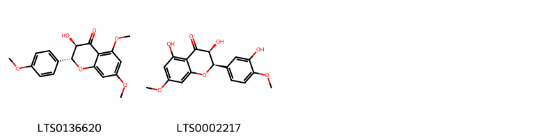{ width=100% }
    <figcaption>Hình ảnh cấu trúc hóa học của 2 hoạt chất thuộc nhóm Flavonoids gồm ['(2r,3r)-3-hydroxy-5,7-dimethoxy-2-(4-methoxyphenyl)-2,3-dihydro-1-benzopyran-4-one (LTS0136620)', '(2r,3s)-3,5-dihydroxy-2-(3-hydroxy-4-methoxyphenyl)-7-methoxy-2,3-dihydro-1-benzopyran-4-one (LTS0002217)'].</figcaption>
</figure>

---

### Dược dân tộc học

Danh sách các quốc gia có sử dụng *Lannea coromandelica* trong điều trị các bệnh. 

| Country       | Disease    | Bệnh          |
|:--------------|:-----------|:--------------|
| Elsewhere     | Astringent | Lam se da     |
| India(Bengal) | Antidote   | Chất giải độc |

---

---
## Lannea grandis
### Thông tin về thực vật

!!! info "Phân loại thực vật của *Lannea coromandelica* từ GIBF:"
    - **Kingdom:** Plantae
    - **Phylum:** Tracheophyta
    - **Order:** Sapindales
    - **Family:** Anacardiaceae
    - **Genus:** Lannea
    - **Species:** *Lannea coromandelica*

 

| Label (VI)   | Label (EN)   | Scientific Name      | Descriptions (VI)   | Descriptions (EN)   | Also Known As (VI)   | Also Known As (EN)   |
|:-------------|:-------------|:---------------------|:--------------------|:--------------------|:---------------------|:---------------------|
| N/A          | N/A          | Lannea coromandelica | loài thực vật       | species of plant    | ['']                 | ['']                 |

#### Phân bố trên thế giới

**Từ CSDL GIBF** nan, Sri Lanka, Thailand, Myanmar, India, Bangladesh, China

#### Phân bố tại Việt Nam

**Từ CSDL GIBF**: Không có ghi nhận ở Việt Nam

---
### Thành phần hóa học
        
- Theo cơ sở dữ liệu lotus: Từ loài *Lannea coromandelica* đã phân lập và xác định được Chưa có hoạt chất nào được phân lập. hoạt chất thuộc về các nhóm Không có hoạt chất nào được phân lập. 

Không có hình ảnh nào được tạo ra

---

### Dược dân tộc học

Danh sách các quốc gia có sử dụng *Lannea coromandelica* trong điều trị các bệnh. 

| Country   | Disease    | Bệnh          |
|:----------|:-----------|:--------------|
| Elsewhere | Dentifrice | Kem đánh răng |

---

---
## Lannea welwitschii
### Thông tin về thực vật

!!! info "Phân loại thực vật của *Lannea welwitschii* từ GIBF:"
    - **Kingdom:** Plantae
    - **Phylum:** Tracheophyta
    - **Order:** Sapindales
    - **Family:** Anacardiaceae
    - **Genus:** Lannea
    - **Species:** *Lannea welwitschii*

 

| Label (VI)   | Label (EN)   | Scientific Name    | Descriptions (VI)   | Descriptions (EN)   | Also Known As (VI)   | Also Known As (EN)   |
|:-------------|:-------------|:-------------------|:--------------------|:--------------------|:---------------------|:---------------------|
| N/A          | N/A          | Lannea welwitschii | loài thực vật       | species of plant    | ['']                 | ['']                 |

#### Phân bố trên thế giới

**Từ CSDL GIBF** Ghana, Liberia, Sao Tome and Principe, Nigeria, Gabon, Belgium, Angola, Côte d’Ivoire, Benin, Congo, Congo, Democratic Republic of the, Guinea, Cameroon, Tanzania, United Republic of

#### Phân bố tại Việt Nam

**Từ CSDL GIBF**: Không có ghi nhận ở Việt Nam

---
### Thành phần hóa học
        
- Theo cơ sở dữ liệu lotus: Từ loài *Lannea welwitschii* đã phân lập và xác định được 2 hoạt chất thuộc về các nhóm Fatty Acyls, Phenols. 

|    | chemicalTaxonomyClassyfireClass   |   smiles_count |
|---:|:----------------------------------|---------------:|
|  0 | Fatty Acyls                       |              1 |
|  1 | Phenols                           |              1 |

#### Nhóm Fatty Acyls
<figure markdown="span">
    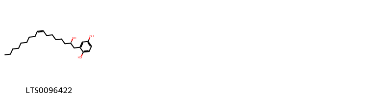{ width=100% }
    <figcaption>Hình ảnh cấu trúc hóa học của 1 hoạt chất thuộc nhóm Fatty Acyls gồm ['2-[(2r,8z)-2-hydroxyheptadec-8-en-1-yl]benzene-1,4-diol (LTS0096422)'].</figcaption>
</figure>
#### Nhóm Phenols
<figure markdown="span">
    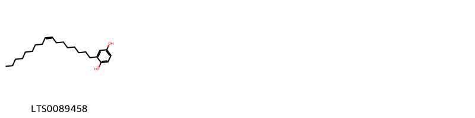{ width=100% }
    <figcaption>Hình ảnh cấu trúc hóa học của 1 hoạt chất thuộc nhóm Phenols gồm ['2-[(8z)-heptadec-8-en-1-yl]benzene-1,4-diol (LTS0089458)'].</figcaption>
</figure>

---

### Dược dân tộc học

Danh sách các quốc gia có sử dụng *Lannea welwitschii* trong điều trị các bệnh. 

| Country   | Disease   | Bệnh     |
|:----------|:----------|:---------|
| Nigeria   | Purgative | Thuốc xổ |

---

# Chi Sorindeia

??? note "Danh sách các dược liệu thuộc chi"
    
	 - *Sorindeia werneckei*

---
## Sorindeia werneckei
### Thông tin về thực vật

!!! info "Phân loại thực vật của *Sorindeia grandifolia* từ GIBF:"
    - **Kingdom:** Plantae
    - **Phylum:** Tracheophyta
    - **Order:** Sapindales
    - **Family:** Anacardiaceae
    - **Genus:** Sorindeia
    - **Species:** *Sorindeia grandifolia*

 

| Label (VI)   | Label (EN)   | Scientific Name    | Descriptions (VI)   | Descriptions (EN)   | Also Known As (VI)   | Also Known As (EN)   |
|:-------------|:-------------|:-------------------|:--------------------|:--------------------|:---------------------|:---------------------|
| N/A          | N/A          | Lannea welwitschii | loài thực vật       | species of plant    | ['']                 | ['']                 |

#### Phân bố trên thế giới

**Từ CSDL GIBF** Benin

#### Phân bố tại Việt Nam

**Từ CSDL GIBF**: Không có ghi nhận ở Việt Nam

---
### Thành phần hóa học
        
- Theo cơ sở dữ liệu lotus: Từ loài *Sorindeia grandifolia* đã phân lập và xác định được Chưa có hoạt chất nào được phân lập. hoạt chất thuộc về các nhóm Không có hoạt chất nào được phân lập. 

Không có hình ảnh nào được tạo ra

---

### Dược dân tộc học

Danh sách các quốc gia có sử dụng *Sorindeia grandifolia* trong điều trị các bệnh. 

| Country   | Disease   | Bệnh     |
|:----------|:----------|:---------|
| Africa    | Cosmetic  | Cosmetic |

---

# Chi Toxicodendron

??? note "Danh sách các dược liệu thuộc chi"
    
	 - *Toxicodendron capense*
	 - *Toxicodendron radicans*
	 - *Toxicodendron succedaneum*
	 - *Toxicodendron vernix*

---
## Toxicodendron capense
### Thông tin về thực vật

!!! info "Phân loại thực vật của *N/A* từ GIBF:"
    - **Kingdom:** Plantae
    - **Phylum:** Tracheophyta
    - **Order:** Sapindales
    - **Family:** Anacardiaceae
    - **Genus:** Toxicodendron
    - **Species:** *N/A*

 

| Label (VI)   | Label (EN)   | Scientific Name    | Descriptions (VI)   | Descriptions (EN)   | Also Known As (VI)   | Also Known As (EN)   |
|:-------------|:-------------|:-------------------|:--------------------|:--------------------|:---------------------|:---------------------|
| N/A          | N/A          | Lannea welwitschii | loài thực vật       | species of plant    | ['']                 | ['']                 |

#### Phân bố trên thế giới

**Từ CSDL GIBF** Hong Kong, Japan, Chinese Taipei, United States of America, Mexico, Canada

#### Phân bố tại Việt Nam

**Từ CSDL GIBF**: Không có ghi nhận ở Việt Nam

---
### Thành phần hóa học
        
- Theo cơ sở dữ liệu lotus: Từ loài *N/A* đã phân lập và xác định được Chưa có hoạt chất nào được phân lập. hoạt chất thuộc về các nhóm Không có hoạt chất nào được phân lập. 

Không có hình ảnh nào được tạo ra

---

### Dược dân tộc học

Danh sách các quốc gia có sử dụng *N/A* trong điều trị các bệnh. 

| Country      | Disease   | Bệnh                 |
|:-------------|:----------|:---------------------|
| South Africa | Canicide  | Thuốc diệt côn trùng |

---

---
## Toxicodendron radicans
### Thông tin về thực vật

!!! info "Phân loại thực vật của *Toxicodendron radicans* từ GIBF:"
    - **Kingdom:** Plantae
    - **Phylum:** Tracheophyta
    - **Order:** Sapindales
    - **Family:** Anacardiaceae
    - **Genus:** Toxicodendron
    - **Species:** *Toxicodendron radicans*

 

| Label (VI)   | Label (EN)   | Scientific Name        | Descriptions (VI)   | Descriptions (EN)   | Also Known As (VI)   | Also Known As (EN)                   |
|:-------------|:-------------|:-----------------------|:--------------------|:--------------------|:---------------------|:-------------------------------------|
| N/A          | N/A          | Toxicodendron radicans | loài thực vật       | species of plant    | ['']                 | ['eastern poison ivy', 'poison ivy'] |

#### Phân bố trên thế giới

**Từ CSDL GIBF** Bahamas, United States of America, Canada, Mexico

#### Phân bố tại Việt Nam

**Từ CSDL GIBF**: Không có ghi nhận ở Việt Nam

---
### Thành phần hóa học
        
- Theo cơ sở dữ liệu lotus: Từ loài *Toxicodendron radicans* đã phân lập và xác định được 1 hoạt chất thuộc về các nhóm . 

| chemicalTaxonomyClassyfireClass   | smiles_count   |
|-----------------------------------|----------------|

---

### Dược dân tộc học

Danh sách các quốc gia có sử dụng *Toxicodendron radicans* trong điều trị các bệnh. 

| Country   | Disease                                                      | Bệnh                                                                                    |
|:----------|:-------------------------------------------------------------|:----------------------------------------------------------------------------------------|
| Mexico    | Narcotic, Stimulant                                          | Chất gây nghiện, Chất kích thích                                                        |
| Turkey    | Narcotic, Poison, Stimulant, Vesicant, Rubefacient, Sedative | Chất gây nghiện, Chất độc, Chất kích thích, Chất tạo bọng, Chất làm sạch, Thuốc an thần |
| US        | Poison                                                       | Chất độc                                                                                |

---

---
## Toxicodendron succedaneum
### Thông tin về thực vật

!!! info "Phân loại thực vật của *Toxicodendron succedaneum* từ GIBF:"
    - **Kingdom:** Plantae
    - **Phylum:** Tracheophyta
    - **Order:** Sapindales
    - **Family:** Anacardiaceae
    - **Genus:** Toxicodendron
    - **Species:** *Toxicodendron succedaneum*

 

| Label (VI)   | Label (EN)   | Scientific Name           | Descriptions (VI)   | Descriptions (EN)   | Also Known As (VI)   | Also Known As (EN)    |
|:-------------|:-------------|:--------------------------|:--------------------|:--------------------|:---------------------|:----------------------|
| N/A          | N/A          | Toxicodendron succedaneum | loài thực vật       | species of plant    | ['']                 | ['Japanese wax tree'] |

#### Phân bố trên thế giới

**Từ CSDL GIBF** South Africa, Hong Kong, Australia, Japan, Chinese Taipei, Macao, China, New Zealand

#### Phân bố tại Việt Nam

**Từ CSDL GIBF**: Không có ghi nhận ở Việt Nam

---
### Thành phần hóa học
        
- Theo cơ sở dữ liệu lotus: Từ loài *Toxicodendron succedaneum* đã phân lập và xác định được 21 hoạt chất thuộc về các nhóm Flavonoids, Benzene and substituted derivatives, Organooxygen compounds, Phenols, Tannins. 

|    | chemicalTaxonomyClassyfireClass     |   smiles_count |
|---:|:------------------------------------|---------------:|
|  0 | Benzene and substituted derivatives |              2 |
|  1 | Flavonoids                          |              9 |
|  2 | Organooxygen compounds              |              2 |
|  3 | Phenols                             |              6 |
|  4 | Tannins                             |              2 |

#### Nhóm Benzene and substituted derivatives
<figure markdown="span">
    { width=100% }
    <figcaption>Hình ảnh cấu trúc hóa học của 2 hoạt chất thuộc nhóm Benzene and substituted derivatives gồm ['galop (LTS0222857)', 'methyl gallate (LTS0043810)'].</figcaption>
</figure>
#### Nhóm Flavonoids
<figure markdown="span">
    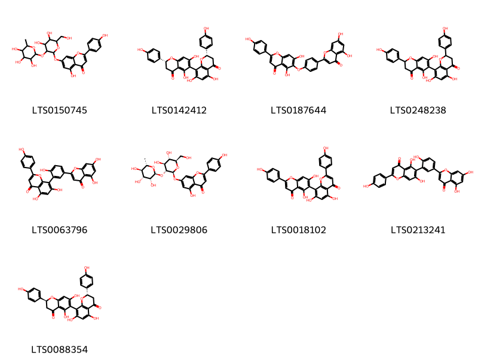{ width=100% }
    <figcaption>Hình ảnh cấu trúc hóa học của 9 hoạt chất thuộc nhóm Flavonoids gồm ['rhoifolin (LTS0150745)', '(2r)-6-[(2s)-5,7-dihydroxy-2-(4-hydroxyphenyl)-4-oxo-2,3-dihydro-1-benzopyran-8-yl]-5,7-dihydroxy-2-(4-hydroxyphenyl)-2,3-dihydro-1-benzopyran-4-one (LTS0142412)', 'hinokiflavone (LTS0187644)', '6-[5,7-dihydroxy-2-(4-hydroxyphenyl)-4-oxo-2,3-dihydro-1-benzopyran-8-yl]-5,7-dihydroxy-2-(4-hydroxyphenyl)-2,3-dihydro-1-benzopyran-4-one (LTS0248238)', 'amentoflavone (LTS0063796)', 'rhoifolin (LTS0029806)', 'agathisflavone (LTS0018102)', 'robustaflavone (LTS0213241)', '(2s)-6-[(2s)-5,7-dihydroxy-2-(4-hydroxyphenyl)-4-oxo-2,3-dihydro-1-benzopyran-8-yl]-5,7-dihydroxy-2-(4-hydroxyphenyl)-2,3-dihydro-1-benzopyran-4-one (LTS0088354)'].</figcaption>
</figure>
#### Nhóm Organooxygen compounds
<figure markdown="span">
    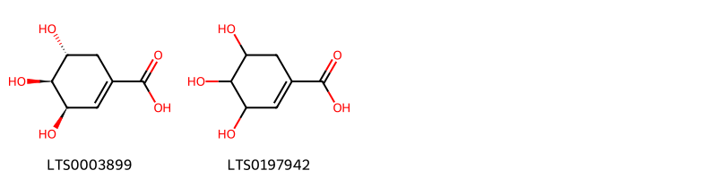{ width=100% }
    <figcaption>Hình ảnh cấu trúc hóa học của 2 hoạt chất thuộc nhóm Organooxygen compounds gồm ['(-)-shikimate (LTS0003899)', 'shikimate (LTS0197942)'].</figcaption>
</figure>
#### Nhóm Phenols
<figure markdown="span">
    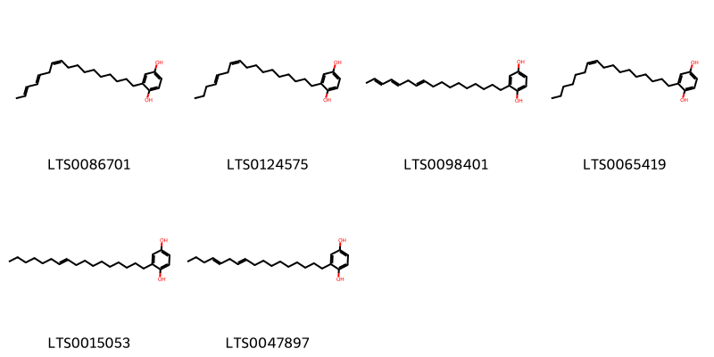{ width=100% }
    <figcaption>Hình ảnh cấu trúc hóa học của 6 hoạt chất thuộc nhóm Phenols gồm ['2-[(10z,13e,15e)-heptadeca-10,13,15-trien-1-yl]benzene-1,4-diol (LTS0086701)', '2-[(10z,13e)-heptadeca-10,13-dien-1-yl]benzene-1,4-diol (LTS0124575)', '2-(heptadeca-10,13,15-trien-1-yl)benzene-1,4-diol (LTS0098401)', '2-[(10z)-heptadec-10-en-1-yl]benzene-1,4-diol (LTS0065419)', '2-(heptadec-10-en-1-yl)benzene-1,4-diol (LTS0015053)', '2-(heptadeca-10,13-dien-1-yl)benzene-1,4-diol (LTS0047897)'].</figcaption>
</figure>
#### Nhóm Tannins
<figure markdown="span">
    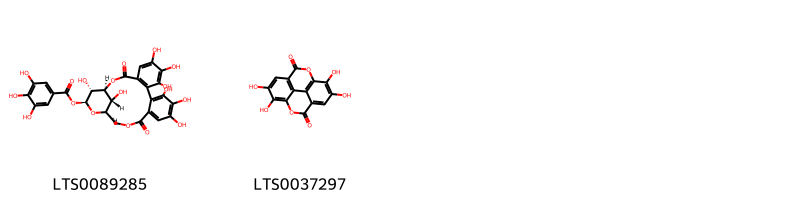{ width=100% }
    <figcaption>Hình ảnh cấu trúc hóa học của 2 hoạt chất thuộc nhóm Tannins gồm ['(1s,19r,21s,22r,23r)-6,7,8,11,12,13,22,23-octahydroxy-3,16-dioxo-2,17,20-trioxatetracyclo[17.3.1.0⁴,⁹.0¹⁰,¹⁵]tricosa-4(9),5,7,10,12,14-hexaen-21-yl 3,4,5-trihydroxybenzoate (LTS0089285)', 'ellagic acid (LTS0037297)'].</figcaption>
</figure>

---

### Dược dân tộc học

Danh sách các quốc gia có sử dụng *Toxicodendron succedaneum* trong điều trị các bệnh. 

| Country   | Disease                 | Bệnh                  |
|:----------|:------------------------|:----------------------|
| Turkey    | Expectorant, Astringent | Chất đờm, Chất làm se |

---

---
## Toxicodendron vernix
### Thông tin về thực vật

!!! info "Phân loại thực vật của *Toxicodendron vernix* từ GIBF:"
    - **Kingdom:** Plantae
    - **Phylum:** Tracheophyta
    - **Order:** Sapindales
    - **Family:** Anacardiaceae
    - **Genus:** Toxicodendron
    - **Species:** *Toxicodendron vernix*

 

| Label (VI)   | Label (EN)   | Scientific Name      | Descriptions (VI)   | Descriptions (EN)                                   | Also Known As (VI)   | Also Known As (EN)   |
|:-------------|:-------------|:---------------------|:--------------------|:----------------------------------------------------|:---------------------|:---------------------|
| N/A          | N/A          | Toxicodendron vernix |                     | species of poisonous plant of eastern North America | ['']                 | ['poison sumac']     |

#### Phân bố trên thế giới

**Từ CSDL GIBF** nan, United States of America, Canada

#### Phân bố tại Việt Nam

**Từ CSDL GIBF**: Không có ghi nhận ở Việt Nam

---
### Thành phần hóa học
        
- Theo cơ sở dữ liệu lotus: Từ loài *Toxicodendron vernix* đã phân lập và xác định được Chưa có hoạt chất nào được phân lập. hoạt chất thuộc về các nhóm Không có hoạt chất nào được phân lập. 

Không có hình ảnh nào được tạo ra

---

### Dược dân tộc học

Danh sách các quốc gia có sử dụng *Toxicodendron vernix* trong điều trị các bệnh. 

| Country   | Disease   | Bệnh              |
|:----------|:----------|:------------------|
| Turkey    | Vesicant  | Chất gây bọng mắt |

---

# Chi Juliania

??? note "Danh sách các dược liệu thuộc chi"
    
	 - *Juliania adstringens*

---
## Juliania adstringens
### Thông tin về thực vật

!!! info "Phân loại thực vật của *Amphipterygium adstringens* từ GIBF:"
    - **Kingdom:** Plantae
    - **Phylum:** Tracheophyta
    - **Order:** Sapindales
    - **Family:** Anacardiaceae
    - **Genus:** Amphipterygium
    - **Species:** *Amphipterygium adstringens*

 

| Label (VI)   | Label (EN)   | Scientific Name      | Descriptions (VI)   | Descriptions (EN)   | Also Known As (VI)   | Also Known As (EN)   |
|:-------------|:-------------|:---------------------|:--------------------|:--------------------|:---------------------|:---------------------|
| N/A          | N/A          | Juliania adstringens |                     |                     | ['']                 | ['']                 |

#### Phân bố trên thế giới

**Từ CSDL GIBF** nan, unknown or invalid, Guatemala, Mexico

#### Phân bố tại Việt Nam

**Từ CSDL GIBF**: Không có ghi nhận ở Việt Nam

---
### Thành phần hóa học
        
- Theo cơ sở dữ liệu lotus: Từ loài *Amphipterygium adstringens* đã phân lập và xác định được Chưa có hoạt chất nào được phân lập. hoạt chất thuộc về các nhóm Không có hoạt chất nào được phân lập. 

Không có hình ảnh nào được tạo ra

---

### Dược dân tộc học

Danh sách các quốc gia có sử dụng *Amphipterygium adstringens* trong điều trị các bệnh. 

| Country   | Disease    | Bệnh      |
|:----------|:-----------|:----------|
| Mexico    | Astringent | Lam se da |

---

# Chi Semecarpus

??? note "Danh sách các dược liệu thuộc chi"
    
	 - *Semecarpus anacardium*
	 - *Semecarpus heterophylla*
	 - *Semecarpus kurzii*
	 - *Semecarpus travancorica*

---
## Semecarpus anacardium
### Thông tin về thực vật

!!! info "Phân loại thực vật của *Semecarpus anacardium* từ GIBF:"
    - **Kingdom:** Plantae
    - **Phylum:** Tracheophyta
    - **Order:** Sapindales
    - **Family:** Anacardiaceae
    - **Genus:** Semecarpus
    - **Species:** *Semecarpus anacardium*

 

| Label (VI)   | Label (EN)   | Scientific Name       | Descriptions (VI)   | Descriptions (EN)   | Also Known As (VI)   | Also Known As (EN)        |
|:-------------|:-------------|:----------------------|:--------------------|:--------------------|:---------------------|:--------------------------|
| N/A          | N/A          | Semecarpus anacardium | loài thực vật       | species of plant    | ['']                 | ['Anacardium semecarpus'] |

#### Phân bố trên thế giới

**Từ CSDL GIBF** India, Brazil

#### Phân bố tại Việt Nam

**Từ CSDL GIBF**: Không có ghi nhận ở Việt Nam

---
### Thành phần hóa học
        
- Theo cơ sở dữ liệu lotus: Từ loài *Semecarpus anacardium* đã phân lập và xác định được 27 hoạt chất thuộc về các nhóm Flavonoids, Steroids and steroid derivatives, Isoflavonoids, Benzene and substituted derivatives, Organooxygen compounds, Phenols. 

|    | chemicalTaxonomyClassyfireClass     |   smiles_count |
|---:|:------------------------------------|---------------:|
|  0 | Benzene and substituted derivatives |              4 |
|  1 | Flavonoids                          |             13 |
|  2 | Isoflavonoids                       |              2 |
|  3 | Organooxygen compounds              |              2 |
|  4 | Phenols                             |              4 |
|  5 | Steroids and steroid derivatives    |              2 |

#### Nhóm Benzene and substituted derivatives
<figure markdown="span">
    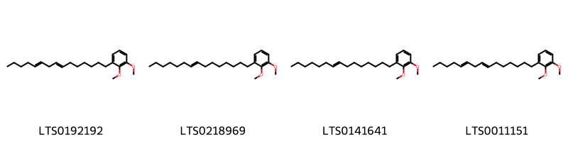{ width=100% }
    <figcaption>Hình ảnh cấu trúc hóa học của 4 hoạt chất thuộc nhóm Benzene and substituted derivatives gồm ['1,2-dimethoxy-3-[(7e,10e)-pentadeca-7,10-dien-1-yl]benzene (LTS0192192)', '1,2-dimethoxy-3-(pentadec-8-en-1-yl)benzene (LTS0218969)', '1,2-dimethoxy-3-[(8e)-pentadec-8-en-1-yl]benzene (LTS0141641)', '1,2-dimethoxy-3-(pentadeca-7,10-dien-1-yl)benzene (LTS0011151)'].</figcaption>
</figure>
#### Nhóm Flavonoids
<figure markdown="span">
    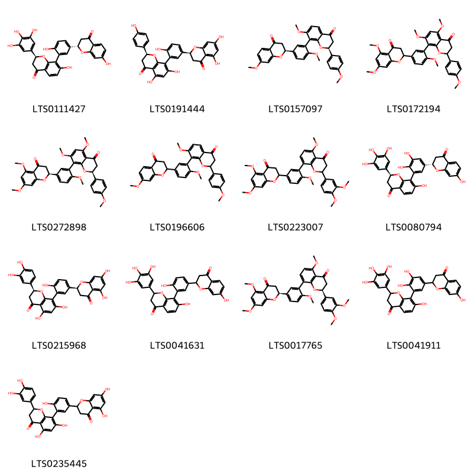{ width=100% }
    <figcaption>Hình ảnh cấu trúc hóa học của 13 hoạt chất thuộc nhóm Flavonoids gồm ['(2s)-7-hydroxy-8-{2-hydroxy-5-[(2s)-7-hydroxy-4-oxo-2,3-dihydro-1-benzopyran-2-yl]phenyl}-2-(3,4,5-trihydroxyphenyl)-2,3-dihydro-1-benzopyran-4-one (LTS0111427)', '(2s)-8-{5-[(2s)-5,7-dihydroxy-4-oxo-2,3-dihydro-1-benzopyran-2-yl]-2-hydroxyphenyl}-5,7-dihydroxy-2-(4-hydroxyphenyl)-2,3-dihydro-1-benzopyran-4-one (LTS0191444)', '(2s)-7-methoxy-8-{2-methoxy-5-[(2s)-7-methoxy-4-oxo-2,3-dihydro-1-benzopyran-2-yl]phenyl}-2-(4-methoxyphenyl)-2,3-dihydro-1-benzopyran-4-one (LTS0157097)', '8-[5-(5,7-dimethoxy-4-oxo-2,3-dihydro-1-benzopyran-2-yl)-2-methoxyphenyl]-5,7-dimethoxy-2-(4-methoxyphenyl)-2,3-dihydro-1-benzopyran-4-one (LTS0172194)', '(2s)-8-{5-[(2s)-5,7-dimethoxy-4-oxo-2,3-dihydro-1-benzopyran-2-yl]-2-methoxyphenyl}-5,7-dimethoxy-2-(4-methoxyphenyl)-2,3-dihydro-1-benzopyran-4-one (LTS0272898)', '7-methoxy-8-[2-methoxy-5-(7-methoxy-4-oxo-2,3-dihydro-1-benzopyran-2-yl)phenyl]-2-(4-methoxyphenyl)-2,3-dihydro-1-benzopyran-4-one (LTS0196606)', '8-[5-(5,7-dimethoxy-4-oxo-2,3-dihydro-1-benzopyran-2-yl)-2-methoxyphenyl]-2-(3,4-dimethoxyphenyl)-5-methoxy-2,3-dihydro-1-benzopyran-4-one (LTS0223007)', '(2s)-8-{2,3-dihydroxy-5-[(2s)-7-hydroxy-4-oxo-2,3-dihydro-1-benzopyran-2-yl]phenyl}-7-hydroxy-2-(3,4,5-trihydroxyphenyl)-2,3-dihydro-1-benzopyran-4-one (LTS0080794)', '(2s)-8-{5-[(2s)-5,7-dihydroxy-4-oxo-2,3-dihydro-1-benzopyran-2-yl]-2-hydroxyphenyl}-2-(3,4-dihydroxyphenyl)-5,7-dihydroxy-2,3-dihydro-1-benzopyran-4-one (LTS0215968)', '7-hydroxy-8-[2-hydroxy-5-(7-hydroxy-4-oxo-2,3-dihydro-1-benzopyran-2-yl)phenyl]-2-(3,4,5-trihydroxyphenyl)-2,3-dihydro-1-benzopyran-4-one (LTS0041631)', '(2s)-8-{5-[(2s)-5,7-dimethoxy-4-oxo-2,3-dihydro-1-benzopyran-2-yl]-2-methoxyphenyl}-2-(3,4-dimethoxyphenyl)-5-methoxy-2,3-dihydro-1-benzopyran-4-one (LTS0017765)', '8-[2,3-dihydroxy-5-(7-hydroxy-4-oxo-2,3-dihydro-1-benzopyran-2-yl)phenyl]-7-hydroxy-2-(3,4,5-trihydroxyphenyl)-2,3-dihydro-1-benzopyran-4-one (LTS0041911)', '8-[5-(5,7-dihydroxy-4-oxo-2,3-dihydro-1-benzopyran-2-yl)-2-hydroxyphenyl]-2-(3,4-dihydroxyphenyl)-5,7-dihydroxy-2,3-dihydro-1-benzopyran-4-one (LTS0235445)'].</figcaption>
</figure>
#### Nhóm Isoflavonoids
<figure markdown="span">
    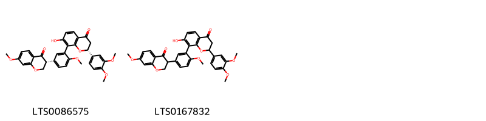{ width=100% }
    <figcaption>Hình ảnh cấu trúc hóa học của 2 hoạt chất thuộc nhóm Isoflavonoids gồm ['(2r)-2-(3,4-dimethoxyphenyl)-7-hydroxy-8-{2-methoxy-5-[(3r)-7-methoxy-4-oxo-2,3-dihydro-1-benzopyran-3-yl]phenyl}-2,3-dihydro-1-benzopyran-4-one (LTS0086575)', '2-(3,4-dimethoxyphenyl)-7-hydroxy-8-[2-methoxy-5-(7-methoxy-4-oxo-2,3-dihydro-1-benzopyran-3-yl)phenyl]-2,3-dihydro-1-benzopyran-4-one (LTS0167832)'].</figcaption>
</figure>
#### Nhóm Organooxygen compounds
<figure markdown="span">
    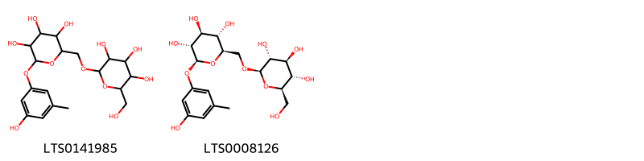{ width=100% }
    <figcaption>Hình ảnh cấu trúc hóa học của 2 hoạt chất thuộc nhóm Organooxygen compounds gồm ['2-(3-hydroxy-5-methylphenoxy)-6-({[3,4,5-trihydroxy-6-(hydroxymethyl)oxan-2-yl]oxy}methyl)oxane-3,4,5-triol (LTS0141985)', '(2s,3r,4s,5s,6r)-2-(3-hydroxy-5-methylphenoxy)-6-({[(2r,3r,4s,5s,6r)-3,4,5-trihydroxy-6-(hydroxymethyl)oxan-2-yl]oxy}methyl)oxane-3,4,5-triol (LTS0008126)'].</figcaption>
</figure>
#### Nhóm Phenols
<figure markdown="span">
    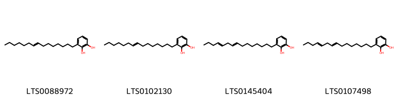{ width=100% }
    <figcaption>Hình ảnh cấu trúc hóa học của 4 hoạt chất thuộc nhóm Phenols gồm ['3-(pentadec-8-en-1-yl)benzene-1,2-diol (LTS0088972)', '3-[(8e)-pentadec-8-en-1-yl]benzene-1,2-diol (LTS0102130)', 'urushiol iii (LTS0145404)', '3-(pentadeca-8,11-dien-1-yl)benzene-1,2-diol (LTS0107498)'].</figcaption>
</figure>
#### Nhóm Steroids and steroid derivatives
<figure markdown="span">
    { width=100% }
    <figcaption>Hình ảnh cấu trúc hóa học của 2 hoạt chất thuộc nhóm Steroids and steroid derivatives gồm ['stigmast-5-en-3-ol, (3β)- (LTS0204616)', 'sitosterol (LTS0168132)'].</figcaption>
</figure>

---

### Dược dân tộc học

Danh sách các quốc gia có sử dụng *Semecarpus anacardium* trong điều trị các bệnh. 

| Country   | Disease                  | Bệnh                     |
|:----------|:-------------------------|:-------------------------|
| Elsewhere | Vermifuge, nan, Vesicant | Vermifuge, nan, Vesicant |
| English   | Vermifuge                | Thuốc diệt sán           |
| Iran      | Poison                   | Chất độc                 |

---

---
## Semecarpus heterophylla
### Thông tin về thực vật

!!! info "Phân loại thực vật của *Semecarpus heterophyllus* từ GIBF:"
    - **Kingdom:** Plantae
    - **Phylum:** Tracheophyta
    - **Order:** Sapindales
    - **Family:** Anacardiaceae
    - **Genus:** Semecarpus
    - **Species:** *Semecarpus heterophyllus*

 

| Label (VI)   | Label (EN)   | Scientific Name         | Descriptions (VI)   | Descriptions (EN)   | Also Known As (VI)   | Also Known As (EN)   |
|:-------------|:-------------|:------------------------|:--------------------|:--------------------|:---------------------|:---------------------|
| N/A          | N/A          | Semecarpus heterophylla | loài thực vật       | species of plant    | ['']                 | ['']                 |

#### Phân bố trên thế giới

**Từ CSDL GIBF** nan, Sri Lanka, Brunei Darussalam, Papua New Guinea, Indonesia, United States of America, Singapore, Malaysia, China

#### Phân bố tại Việt Nam

**Từ CSDL GIBF**: Không có ghi nhận ở Việt Nam

---
### Thành phần hóa học
        
- Theo cơ sở dữ liệu lotus: Từ loài *Semecarpus heterophyllus* đã phân lập và xác định được Chưa có hoạt chất nào được phân lập. hoạt chất thuộc về các nhóm Không có hoạt chất nào được phân lập. 

Không có hình ảnh nào được tạo ra

---

### Dược dân tộc học

Danh sách các quốc gia có sử dụng *Semecarpus heterophyllus* trong điều trị các bệnh. 

| Country   | Disease   | Bệnh     |
|:----------|:----------|:---------|
| Elsewhere | Poison    | Chất độc |
| Java      | Poison    | Chất độc |

---

---
## Semecarpus kurzii
### Thông tin về thực vật

!!! info "Phân loại thực vật của *Semecarpus kurzii* từ GIBF:"
    - **Kingdom:** Plantae
    - **Phylum:** Tracheophyta
    - **Order:** Sapindales
    - **Family:** Anacardiaceae
    - **Genus:** Semecarpus
    - **Species:** *Semecarpus kurzii*

 

| Label (VI)   | Label (EN)   | Scientific Name   | Descriptions (VI)   | Descriptions (EN)   | Also Known As (VI)   | Also Known As (EN)   |
|:-------------|:-------------|:------------------|:--------------------|:--------------------|:---------------------|:---------------------|
| N/A          | N/A          | Semecarpus kurzii | loài thực vật       | species of plant    | ['']                 | ['']                 |

#### Phân bố trên thế giới

**Từ CSDL GIBF** Thailand, India, Myanmar

#### Phân bố tại Việt Nam

**Từ CSDL GIBF**: Không có ghi nhận ở Việt Nam

---
### Thành phần hóa học
        
- Theo cơ sở dữ liệu lotus: Từ loài *Semecarpus kurzii* đã phân lập và xác định được 1 hoạt chất thuộc về các nhóm Fatty Acyls. 

|    | chemicalTaxonomyClassyfireClass   |   smiles_count |
|---:|:----------------------------------|---------------:|
|  0 | Fatty Acyls                       |              1 |

#### Nhóm Fatty Acyls
<figure markdown="span">
    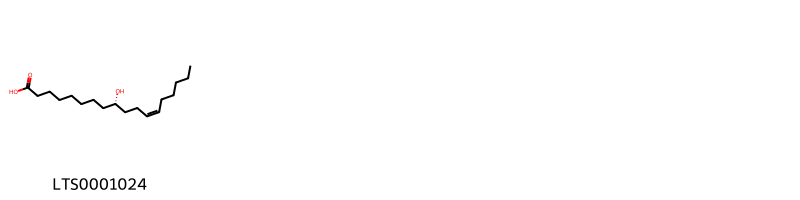{ width=100% }
    <figcaption>Hình ảnh cấu trúc hóa học của 1 hoạt chất thuộc nhóm Fatty Acyls gồm ['(9s,12z)-9-hydroxyoctadec-12-enoic acid (LTS0001024)'].</figcaption>
</figure>

---

### Dược dân tộc học

Danh sách các quốc gia có sử dụng *Semecarpus kurzii* trong điều trị các bệnh. 

| Country   | Disease   | Bệnh              |
|:----------|:----------|:------------------|
| Elsewhere | Vesicant  | Chất gây bọng mắt |

---

---
## Semecarpus travancorica
### Thông tin về thực vật

!!! info "Phân loại thực vật của *Semecarpus travancoricus* từ GIBF:"
    - **Kingdom:** Plantae
    - **Phylum:** Tracheophyta
    - **Order:** Sapindales
    - **Family:** Anacardiaceae
    - **Genus:** Semecarpus
    - **Species:** *Semecarpus travancoricus*

 

| Label (VI)   | Label (EN)   | Scientific Name   | Descriptions (VI)   | Descriptions (EN)   | Also Known As (VI)   | Also Known As (EN)   |
|:-------------|:-------------|:------------------|:--------------------|:--------------------|:---------------------|:---------------------|
| N/A          | N/A          | Semecarpus kurzii | loài thực vật       | species of plant    | ['']                 | ['']                 |

#### Phân bố trên thế giới

**Từ CSDL GIBF** nan, India

#### Phân bố tại Việt Nam

**Từ CSDL GIBF**: Không có ghi nhận ở Việt Nam

---
### Thành phần hóa học
        
- Theo cơ sở dữ liệu lotus: Từ loài *Semecarpus travancoricus* đã phân lập và xác định được Chưa có hoạt chất nào được phân lập. hoạt chất thuộc về các nhóm Không có hoạt chất nào được phân lập. 

Không có hình ảnh nào được tạo ra

---

### Dược dân tộc học

Danh sách các quốc gia có sử dụng *Semecarpus travancoricus* trong điều trị các bệnh. 

| Country   | Disease   | Bệnh              |
|:----------|:----------|:------------------|
| Elsewhere | Vesicant  | Chất gây bọng mắt |

---

# Chi ondias

??? note "Danh sách các dược liệu thuộc chi"
    
	 - *ondias amara*
	 - *ondias dulcis*
	 - *ondias lutea*
	 - *ondias mombin*
	 - *ondias pinnata*
	 - *ondias purpurea*

---
## ondias amara
### Thông tin về thực vật

!!! info "Phân loại thực vật của *N/A* từ GIBF:"
    - **Kingdom:** N/A
    - **Phylum:** N/A
    - **Order:** N/A
    - **Family:** N/A
    - **Genus:** N/A
    - **Species:** *N/A*

 

| Label (VI)   | Label (EN)   | Scientific Name   | Descriptions (VI)   | Descriptions (EN)   | Also Known As (VI)   | Also Known As (EN)   |
|:-------------|:-------------|:------------------|:--------------------|:--------------------|:---------------------|:---------------------|
| N/A          | N/A          | Semecarpus kurzii | loài thực vật       | species of plant    | ['']                 | ['']                 |

#### Phân bố trên thế giới

**Từ CSDL GIBF** Không có kết quả phù hợp

#### Phân bố tại Việt Nam

**Từ CSDL GIBF**: Không có ghi nhận ở Việt Nam

---
### Thành phần hóa học
        
- Theo cơ sở dữ liệu lotus: Từ loài *N/A* đã phân lập và xác định được Chưa có hoạt chất nào được phân lập. hoạt chất thuộc về các nhóm Không có hoạt chất nào được phân lập. 

Không có hình ảnh nào được tạo ra

---

### Dược dân tộc học

Danh sách các quốc gia có sử dụng *N/A* trong điều trị các bệnh. 

| Country   | Disease   | Bệnh               |
|:----------|:----------|:-------------------|
| China     | Tonic     | (thuộc) trương lực |

---

---
## ondias dulcis
### Thông tin về thực vật

!!! info "Phân loại thực vật của *N/A* từ GIBF:"
    - **Kingdom:** N/A
    - **Phylum:** N/A
    - **Order:** N/A
    - **Family:** N/A
    - **Genus:** N/A
    - **Species:** *N/A*

 

| Label (VI)   | Label (EN)   | Scientific Name   | Descriptions (VI)   | Descriptions (EN)   | Also Known As (VI)   | Also Known As (EN)   |
|:-------------|:-------------|:------------------|:--------------------|:--------------------|:---------------------|:---------------------|
| N/A          | N/A          | Semecarpus kurzii | loài thực vật       | species of plant    | ['']                 | ['']                 |

#### Phân bố trên thế giới

**Từ CSDL GIBF** Không có kết quả phù hợp

#### Phân bố tại Việt Nam

**Từ CSDL GIBF**: Không có ghi nhận ở Việt Nam

---
### Thành phần hóa học
        
- Theo cơ sở dữ liệu lotus: Từ loài *N/A* đã phân lập và xác định được Chưa có hoạt chất nào được phân lập. hoạt chất thuộc về các nhóm Không có hoạt chất nào được phân lập. 

Không có hình ảnh nào được tạo ra

---

### Dược dân tộc học

Danh sách các quốc gia có sử dụng *N/A* trong điều trị các bệnh. 

| Country   | Disease               | Bệnh                          |
|:----------|:----------------------|:------------------------------|
| China     | Antidote, Refrigerant | Thuốc giải độc, chất làm lạnh |
| Tahiti    | Intoxicant            | chất gây độc                  |

---

---
## ondias lutea
### Thông tin về thực vật

!!! info "Phân loại thực vật của *N/A* từ GIBF:"
    - **Kingdom:** N/A
    - **Phylum:** N/A
    - **Order:** N/A
    - **Family:** N/A
    - **Genus:** N/A
    - **Species:** *N/A*

 

| Label (VI)   | Label (EN)   | Scientific Name   | Descriptions (VI)   | Descriptions (EN)   | Also Known As (VI)   | Also Known As (EN)   |
|:-------------|:-------------|:------------------|:--------------------|:--------------------|:---------------------|:---------------------|
| N/A          | N/A          | Semecarpus kurzii | loài thực vật       | species of plant    | ['']                 | ['']                 |

#### Phân bố trên thế giới

**Từ CSDL GIBF** Không có kết quả phù hợp

#### Phân bố tại Việt Nam

**Từ CSDL GIBF**: Không có ghi nhận ở Việt Nam

---
### Thành phần hóa học
        
- Theo cơ sở dữ liệu lotus: Từ loài *N/A* đã phân lập và xác định được Chưa có hoạt chất nào được phân lập. hoạt chất thuộc về các nhóm Không có hoạt chất nào được phân lập. 

Không có hình ảnh nào được tạo ra

---

### Dược dân tộc học

Danh sách các quốc gia có sử dụng *N/A* trong điều trị các bệnh. 

| Country   | Disease                 | Bệnh                     |
|:----------|:------------------------|:-------------------------|
| Mexico    | Astringent              | Lam se da                |
| Venezuela | Astringent, Cicatrizant | Chất làm se, Cicatrizant |

---

---
## ondias mombin
### Thông tin về thực vật

!!! info "Phân loại thực vật của *N/A* từ GIBF:"
    - **Kingdom:** N/A
    - **Phylum:** N/A
    - **Order:** N/A
    - **Family:** N/A
    - **Genus:** N/A
    - **Species:** *N/A*

 

| Label (VI)   | Label (EN)   | Scientific Name   | Descriptions (VI)   | Descriptions (EN)   | Also Known As (VI)   | Also Known As (EN)   |
|:-------------|:-------------|:------------------|:--------------------|:--------------------|:---------------------|:---------------------|
| N/A          | N/A          | Semecarpus kurzii | loài thực vật       | species of plant    | ['']                 | ['']                 |

#### Phân bố trên thế giới

**Từ CSDL GIBF** Không có kết quả phù hợp

#### Phân bố tại Việt Nam

**Từ CSDL GIBF**: Không có ghi nhận ở Việt Nam

---
### Thành phần hóa học
        
- Theo cơ sở dữ liệu lotus: Từ loài *N/A* đã phân lập và xác định được 100 hoạt chất thuộc về các nhóm Fatty Acyls, Prenol lipids, Benzene and substituted derivatives, Hydroxy acids and derivatives, Dihydrofurans, Organooxygen compounds, Tannins, Carboxylic acids and derivatives. 

|    | chemicalTaxonomyClassyfireClass     |   smiles_count |
|---:|:------------------------------------|---------------:|
|  0 | Benzene and substituted derivatives |             20 |
|  1 | Carboxylic acids and derivatives    |              7 |
|  2 | Dihydrofurans                       |              1 |
|  3 | Fatty Acyls                         |             16 |
|  4 | Hydroxy acids and derivatives       |              2 |
|  5 | Organooxygen compounds              |             15 |
|  6 | Prenol lipids                       |             33 |
|  7 | Tannins                             |              6 |

#### Nhóm Benzene and substituted derivatives
<figure markdown="span">
    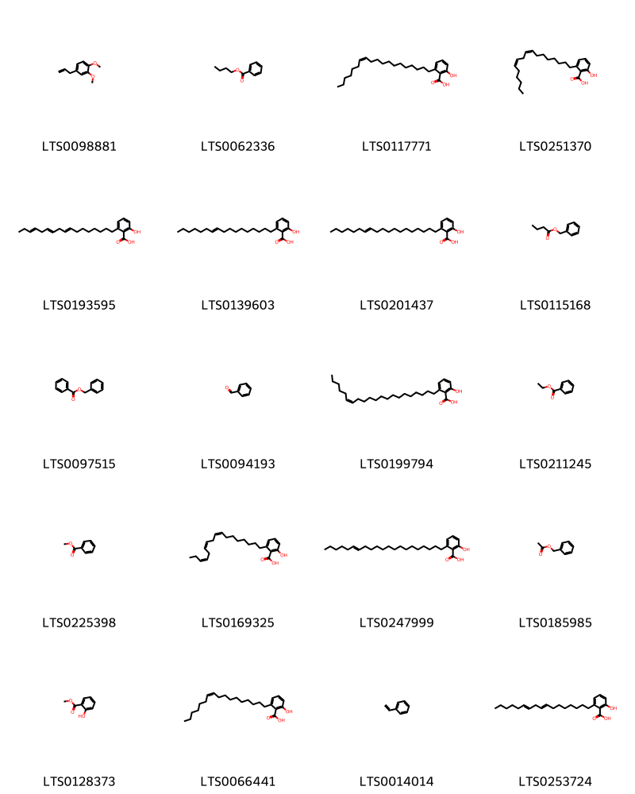{ width=100% }
    <figcaption>Hình ảnh cấu trúc hóa học của 20 hoạt chất thuộc nhóm Benzene and substituted derivatives gồm ['methyl eugenol (LTS0098881)', 'butyl benzoate (LTS0062336)', '2-hydroxy-6-[(12z)-nonadec-12-en-1-yl]benzoic acid (LTS0117771)', '2-[(8z,11z)-heptadeca-8,11-dien-1-yl]-6-hydroxybenzoic acid (LTS0251370)', '2-(heptadeca-8,11,14-trien-1-yl)-6-hydroxybenzoic acid (LTS0193595)', '2-(heptadec-10-en-1-yl)-6-hydroxybenzoic acid (LTS0139603)', '2-hydroxy-6-(nonadec-12-en-1-yl)benzoic acid (LTS0201437)', 'benzyl butyrate (LTS0115168)', 'benzyl benzoate (LTS0097515)', 'benzaldehyde (LTS0094193)', '2-[(15z)-henicos-15-en-1-yl]-6-hydroxybenzoic acid (LTS0199794)', 'ethyl benzoate (LTS0211245)', 'methyl benzoate (LTS0225398)', '2-[(8z,11z,14z)-heptadeca-8,11,14-trien-1-yl]-6-hydroxybenzoic acid (LTS0169325)', '2-(henicos-15-en-1-yl)-6-hydroxybenzoic acid (LTS0247999)', 'benzyl acetate (LTS0185985)', 'methyl salicylate (LTS0128373)', '2-[(10z)-heptadec-10-en-1-yl]-6-hydroxybenzoic acid (LTS0066441)', 'styrene (LTS0014014)', '2-(heptadeca-8,11-dien-1-yl)-6-hydroxybenzoic acid (LTS0253724)'].</figcaption>
</figure>
#### Nhóm Carboxylic acids and derivatives
<figure markdown="span">
    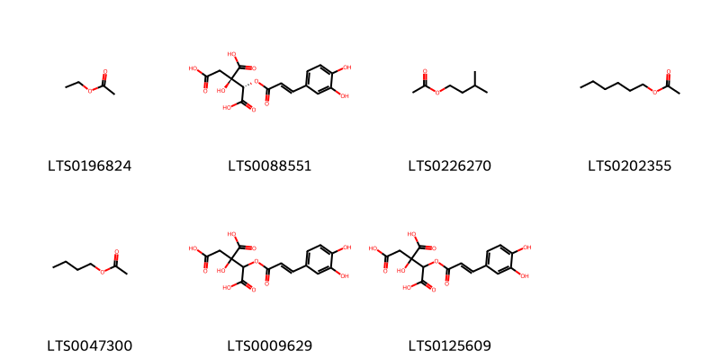{ width=100% }
    <figcaption>Hình ảnh cấu trúc hóa học của 7 hoạt chất thuộc nhóm Carboxylic acids and derivatives gồm ['ethyl acetate (LTS0196824)', '(1s,2r)-1-{[(2e)-3-(3,4-dihydroxyphenyl)prop-2-enoyl]oxy}-2-hydroxypropane-1,2,3-tricarboxylic acid (LTS0088551)', 'banana oil (LTS0226270)', 'hexyl acetate (LTS0202355)', 'butyl acetate (LTS0047300)', '1-{[(2e)-3-(3,4-dihydroxyphenyl)prop-2-enoyl]oxy}-2-hydroxypropane-1,2,3-tricarboxylic acid (LTS0009629)', '1-{[3-(3,4-dihydroxyphenyl)prop-2-enoyl]oxy}-2-hydroxypropane-1,2,3-tricarboxylic acid (LTS0125609)'].</figcaption>
</figure>
#### Nhóm Dihydrofurans
<figure markdown="span">
    { width=100% }
    <figcaption>Hình ảnh cấu trúc hóa học của 1 hoạt chất thuộc nhóm Dihydrofurans gồm ['2-methyl-3h-furan-2-carbaldehyde (LTS0245708)'].</figcaption>
</figure>
#### Nhóm Fatty Acyls
<figure markdown="span">
    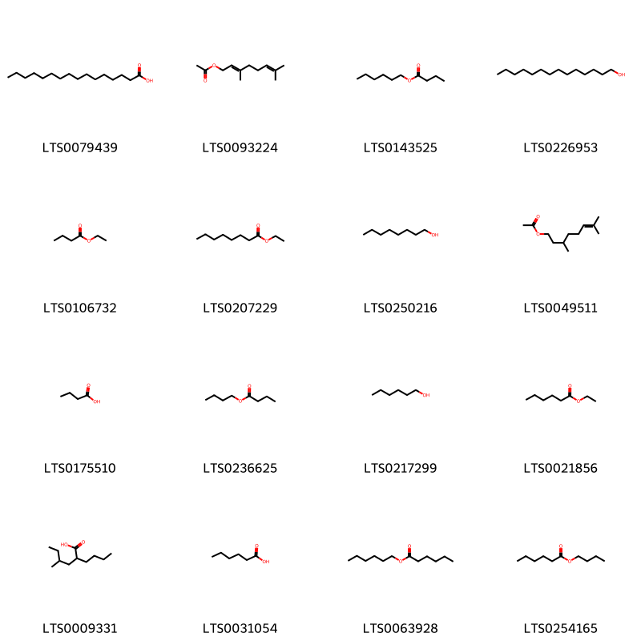{ width=100% }
    <figcaption>Hình ảnh cấu trúc hóa học của 16 hoạt chất thuộc nhóm Fatty Acyls gồm ['palmitic acid (LTS0079439)', 'geranyl acetate (LTS0093224)', 'hexyl butyrate (LTS0143525)', 'myristyl alcohol (LTS0226953)', 'ethyl butyrate (LTS0106732)', 'ethyl octanoate (LTS0207229)', 'octanol (LTS0250216)', 'citronellyl acetate (LTS0049511)', 'butanoic acid (LTS0175510)', 'butyl butyrate (LTS0236625)', 'hexanol (LTS0217299)', 'ethyl hexanoate (LTS0021856)', '2-butyl-4-methylhexanoic acid (LTS0009331)', 'hexanoic acid (LTS0031054)', 'hexyl hexanoate (LTS0063928)', 'butyl hexanoate (LTS0254165)'].</figcaption>
</figure>
#### Nhóm Hydroxy acids and derivatives
<figure markdown="span">
    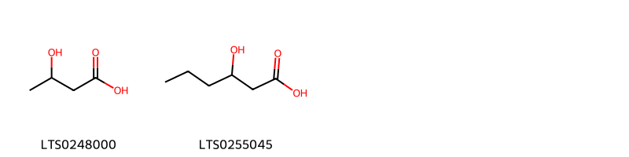{ width=100% }
    <figcaption>Hình ảnh cấu trúc hóa học của 2 hoạt chất thuộc nhóm Hydroxy acids and derivatives gồm ['3 hydroxybutyrate (LTS0248000)', '3-hydroxyhexanoic acid (LTS0255045)'].</figcaption>
</figure>
#### Nhóm Organooxygen compounds
<figure markdown="span">
    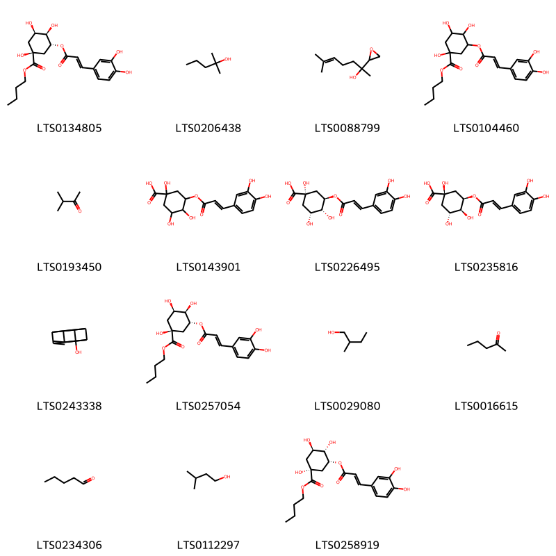{ width=100% }
    <figcaption>Hình ảnh cấu trúc hóa học của 15 hoạt chất thuộc nhóm Organooxygen compounds gồm ['butyl (1s,3r,4r,5r)-3-{[(2e)-3-(3,4-dihydroxyphenyl)prop-2-enoyl]oxy}-1,4,5-trihydroxycyclohexane-1-carboxylate (LTS0134805)', '2-methyl-2-pentanol (LTS0206438)', 'linalool dihydroepoxide (LTS0088799)', 'butyl 3-{[3-(3,4-dihydroxyphenyl)prop-2-enoyl]oxy}-1,4,5-trihydroxycyclohexane-1-carboxylate (LTS0104460)', 'methyl isopropyl ketone (LTS0193450)', '3-{[3-(3,4-dihydroxyphenyl)prop-2-enoyl]oxy}-1,4,5-trihydroxycyclohexane-1-carboxylic acid (LTS0143901)', 'chlorogenic acid (LTS0226495)', 'neochlorogenic acid (LTS0235816)', '3,4,5,8-tetrahydro-2h-cuban-1-ol (LTS0243338)', 'butyl (1s,3r,4r,5r)-3-{[3-(3,4-dihydroxyphenyl)prop-2-enoyl]oxy}-1,4,5-trihydroxycyclohexane-1-carboxylate (LTS0257054)', '2-methyl-1-butanol (LTS0029080)', '2-pentanone (LTS0016615)', 'pentanal (LTS0234306)', 'isoamyl alcohol (LTS0112297)', 'butyl (1r,3r,4s,5r)-3-{[(2e)-3-(3,4-dihydroxyphenyl)prop-2-enoyl]oxy}-1,4,5-trihydroxycyclohexane-1-carboxylate (LTS0258919)'].</figcaption>
</figure>
#### Nhóm Prenol lipids
<figure markdown="span">
    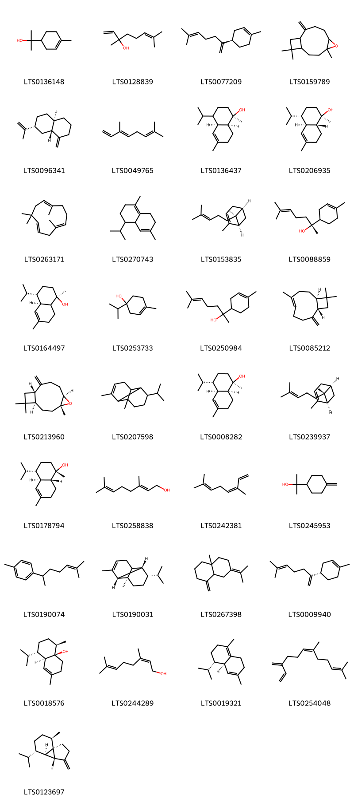{ width=100% }
    <figcaption>Hình ảnh cấu trúc hóa học của 33 hoạt chất thuộc nhóm Prenol lipids gồm ['terpineol (LTS0136148)', 'linalool, (+-)- (LTS0128839)', '(r)-β-bisabolene (LTS0077209)', 'caryophyllene oxide (LTS0159789)', 'β-selinene (LTS0096341)', 'trans-β-ocimene (LTS0049765)', '(1r,4ar,8as)-4-isopropyl-1,6-dimethyl-3,4,4a,7,8,8a-hexahydro-2h-naphthalen-1-ol (LTS0136437)', 'α-cadinol (LTS0206935)', 'humulene (LTS0263171)', '4-isopropyl-1,6-dimethyl-2,3,4,4a,7,8-hexahydronaphthalene (LTS0270743)', '(-)-endo-α-bergamotene (LTS0153835)', '(2r)-6-methyl-2-(4-methylcyclohex-3-en-1-yl)hept-5-en-2-ol (LTS0088859)', '(1r,4s,4ar)-4-isopropyl-1,6-dimethyl-3,4,4a,7,8,8a-hexahydro-2h-naphthalen-1-ol (LTS0164497)', '4-terpineol (LTS0253733)', 'α-bisabolol (LTS0250984)', 'caryophyllene (LTS0085212)', 'β-caryophyllene oxide (LTS0213960)', 'α-copaene (LTS0207598)', 'delta-cadinol (LTS0008282)', '(-)-trans-α-bergamotene (LTS0239937)', 'α-cadinol (LTS0178794)', 'geraniol (LTS0258838)', 'β-ocimene (LTS0242381)', '2-(4-methylidenecyclohexyl)propan-2-ol (LTS0245953)', 'curcumene (LTS0190074)', '(1r,2s,7s,8s)-8-isopropyl-1,3-dimethyltricyclo[4.4.0.0²,⁷]dec-3-ene (LTS0190031)', '4a-methyl-1-methylidene-7-(propan-2-ylidene)-hexahydro-2h-naphthalene (LTS0267398)', '(-)-β-bisabolene (LTS0009940)', '(1s,4r,4ar,8ar)-1-isopropyl-4,7-dimethyl-2,3,4,5,6,8a-hexahydro-1h-naphthalen-4a-ol (LTS0018576)', 'nerol (LTS0244289)', 'delta-cadinene (LTS0019321)', '(z)-β-farnesene (LTS0254048)', '(-)-β-cubebene (LTS0123697)'].</figcaption>
</figure>
#### Nhóm Tannins
<figure markdown="span">
    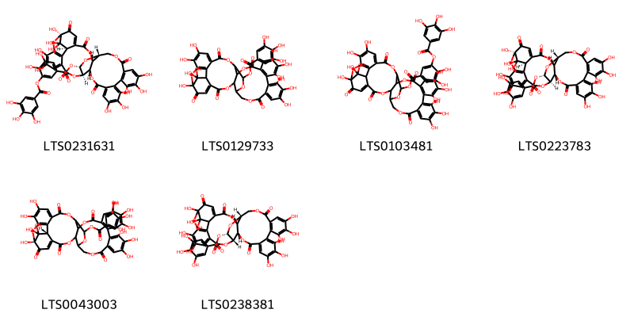{ width=100% }
    <figcaption>Hình ảnh cấu trúc hóa học của 6 hoạt chất thuộc nhóm Tannins gồm ['(1r,7r,8s,26r,28s,29r,38r)-1,13,14,15,18,19,20,34,35,39,39-undecahydroxy-2,5,10,23,31-pentaoxo-6,9,24,27,30,40-hexaoxaoctacyclo[34.3.1.0⁴,³⁸.0⁷,²⁶.0⁸,²⁹.0¹¹,¹⁶.0¹⁷,²².0³²,³⁷]tetraconta-3,11,13,15,17(22),18,20,32,34,36-decaen-28-yl 3,4-dihydroxy-5-(3,4,5-trihydroxybenzoyloxy)benzoate (LTS0231631)', '1,13,14,15,18,19,20,34,35,39,39-undecahydroxy-2,5,10,23,31-pentaoxo-6,9,24,27,30,40-hexaoxaoctacyclo[34.3.1.0⁴,³⁸.0⁷,²⁶.0⁸,²⁹.0¹¹,¹⁶.0¹⁷,²².0³²,³⁷]tetraconta-3,11(16),12,14,17,19,21,32,34,36-decaen-28-yl 3,4,5-trihydroxybenzoate (LTS0129733)', '1,13,14,15,18,19,20,34,35,39,39-undecahydroxy-2,5,10,23,31-pentaoxo-6,9,24,27,30,40-hexaoxaoctacyclo[34.3.1.0⁴,³⁸.0⁷,²⁶.0⁸,²⁹.0¹¹,¹⁶.0¹⁷,²².0³²,³⁷]tetraconta-3,11(16),12,14,17,19,21,32,34,36-decaen-28-yl 3,4-dihydroxy-5-(3,4,5-trihydroxybenzoyloxy)benzoate (LTS0103481)', '(1r,7r,8s,26r,28s,29r,38r)-1,13,14,15,18,19,20,34,35,39,39-undecahydroxy-2,5,10,23,31-pentaoxo-6,9,24,27,30,40-hexaoxaoctacyclo[34.3.1.0⁴,³⁸.0⁷,²⁶.0⁸,²⁹.0¹¹,¹⁶.0¹⁷,²².0³²,³⁷]tetraconta-3,11,13,15,17(22),18,20,32,34,36-decaen-28-yl 3,4,5-trihydroxybenzoate (LTS0223783)', '(1r,38r)-1,13,14,15,18,19,20,34,35,39,39-undecahydroxy-2,5,10,23,31-pentaoxo-6,9,24,27,30,40-hexaoxaoctacyclo[34.3.1.0⁴,³⁸.0⁷,²⁶.0⁸,²⁹.0¹¹,¹⁶.0¹⁷,²².0³²,³⁷]tetraconta-3,11(16),12,14,17,19,21,32,34,36-decaen-28-yl 3,4,5-trihydroxybenzoate (LTS0043003)', '(7r,8s,26r,28s,29s)-1,13,14,15,18,19,20,34,35,39,39-undecahydroxy-2,5,10,23,31-pentaoxo-6,9,24,27,30,40-hexaoxaoctacyclo[34.3.1.0⁴,³⁸.0⁷,²⁶.0⁸,²⁹.0¹¹,¹⁶.0¹⁷,²².0³²,³⁷]tetraconta-3,11,13,15,17(22),18,20,32,34,36-decaen-28-yl 3,4,5-trihydroxybenzoate (LTS0238381)'].</figcaption>
</figure>

---

### Dược dân tộc học

Danh sách các quốc gia có sử dụng *N/A* trong điều trị các bệnh. 

| Country            | Disease                                                                                                     | Bệnh                                                                                              |
|:-------------------|:------------------------------------------------------------------------------------------------------------|:--------------------------------------------------------------------------------------------------|
| Dominican Republic | Poison                                                                                                      | Chất độc                                                                                          |
| Elsewhere          | Antiseptic, Expectorant, Vermifuge, Vulnerary, Soap, Astringent, Astringent, Laxative, Purgative, Taenifuge | Sát trùng, đờm, Vermifuge, Vulnerary, xà phòng, làm se, làm se, nhuận tràng, Purgative, Taenifuge |
| Haiti              | Laxative                                                                                                    | Nhuận trường                                                                                      |
| Mexico             | Diuretic                                                                                                    | Thuốc lợi tiêu                                                                                    |
| Trinidad           | Astringent                                                                                                  | Lam se da                                                                                         |
| Upper Volta        | Vermifuge                                                                                                   | Thuốc diệt sán                                                                                    |

---

---
## ondias pinnata
### Thông tin về thực vật

!!! info "Phân loại thực vật của *N/A* từ GIBF:"
    - **Kingdom:** N/A
    - **Phylum:** N/A
    - **Order:** N/A
    - **Family:** N/A
    - **Genus:** N/A
    - **Species:** *N/A*

 

| Label (VI)   | Label (EN)   | Scientific Name   | Descriptions (VI)   | Descriptions (EN)   | Also Known As (VI)   | Also Known As (EN)   |
|:-------------|:-------------|:------------------|:--------------------|:--------------------|:---------------------|:---------------------|
| N/A          | N/A          | Semecarpus kurzii | loài thực vật       | species of plant    | ['']                 | ['']                 |

#### Phân bố trên thế giới

**Từ CSDL GIBF** Không có kết quả phù hợp

#### Phân bố tại Việt Nam

**Từ CSDL GIBF**: Không có ghi nhận ở Việt Nam

---
### Thành phần hóa học
        
- Theo cơ sở dữ liệu lotus: Từ loài *N/A* đã phân lập và xác định được Chưa có hoạt chất nào được phân lập. hoạt chất thuộc về các nhóm Không có hoạt chất nào được phân lập. 

Không có hình ảnh nào được tạo ra

---

### Dược dân tộc học

Danh sách các quốc gia có sử dụng *N/A* trong điều trị các bệnh. 

| Country   | Disease                         | Bệnh                                      |
|:----------|:--------------------------------|:------------------------------------------|
| Elsewhere | Antidote, Astringent, Demulcent | Thuốc giải độc, Chất làm se, Chất khử mùi |

---

---
## ondias purpurea
### Thông tin về thực vật

!!! info "Phân loại thực vật của *N/A* từ GIBF:"
    - **Kingdom:** N/A
    - **Phylum:** N/A
    - **Order:** N/A
    - **Family:** N/A
    - **Genus:** N/A
    - **Species:** *N/A*

 

| Label (VI)   | Label (EN)   | Scientific Name   | Descriptions (VI)   | Descriptions (EN)   | Also Known As (VI)   | Also Known As (EN)   |
|:-------------|:-------------|:------------------|:--------------------|:--------------------|:---------------------|:---------------------|
| N/A          | N/A          | Semecarpus kurzii | loài thực vật       | species of plant    | ['']                 | ['']                 |

#### Phân bố trên thế giới

**Từ CSDL GIBF** Không có kết quả phù hợp

#### Phân bố tại Việt Nam

**Từ CSDL GIBF**: Không có ghi nhận ở Việt Nam

---
### Thành phần hóa học
        
- Theo cơ sở dữ liệu lotus: Từ loài *N/A* đã phân lập và xác định được Chưa có hoạt chất nào được phân lập. hoạt chất thuộc về các nhóm Không có hoạt chất nào được phân lập. 

Không có hình ảnh nào được tạo ra

---

### Dược dân tộc học

Danh sách các quốc gia có sử dụng *N/A* trong điều trị các bệnh. 

| Country            | Disease                         | Bệnh                                     |
|:-------------------|:--------------------------------|:-----------------------------------------|
| Dominican Republic | Laxative, Vulnerary, Intoxicant | Laxative, Vulnerary, Intoxicant          |
| Guatemala          | Soap                            | Xà phòng                                 |
| Haiti              | Refrigerant, Soap, Stimulant    | Môi chất lạnh, Xà phòng, Chất kích thích |

---

# Chi Comocladia

??? note "Danh sách các dược liệu thuộc chi"
    
	 - *Comocladia guatemalensis*

---
## Comocladia guatemalensis
### Thông tin về thực vật

!!! info "Phân loại thực vật của *Comocladia guatemalensis* từ GIBF:"
    - **Kingdom:** Plantae
    - **Phylum:** Tracheophyta
    - **Order:** Sapindales
    - **Family:** Anacardiaceae
    - **Genus:** Comocladia
    - **Species:** *Comocladia guatemalensis*

 

| Label (VI)   | Label (EN)   | Scientific Name          | Descriptions (VI)   | Descriptions (EN)   | Also Known As (VI)   | Also Known As (EN)   |
|:-------------|:-------------|:-------------------------|:--------------------|:--------------------|:---------------------|:---------------------|
| N/A          | N/A          | Comocladia guatemalensis | loài thực vật       | species of plant    | ['']                 | ['']                 |

#### Phân bố trên thế giới

**Từ CSDL GIBF** nan, Guatemala, Mexico

#### Phân bố tại Việt Nam

**Từ CSDL GIBF**: Không có ghi nhận ở Việt Nam

---
### Thành phần hóa học
        
- Theo cơ sở dữ liệu lotus: Từ loài *Comocladia guatemalensis* đã phân lập và xác định được Chưa có hoạt chất nào được phân lập. hoạt chất thuộc về các nhóm Không có hoạt chất nào được phân lập. 

Không có hình ảnh nào được tạo ra

---

### Dược dân tộc học

Danh sách các quốc gia có sử dụng *Comocladia guatemalensis* trong điều trị các bệnh. 

| Country   | Disease   | Bệnh     |
|:----------|:----------|:---------|
| Guatemala | Poison    | Chất độc |

---

# Chi Pegia

??? note "Danh sách các dược liệu thuộc chi"
    
	 - *Pegia nitida*

---
## Pegia nitida
### Thông tin về thực vật

!!! info "Phân loại thực vật của *Pegia nitida* từ GIBF:"
    - **Kingdom:** Plantae
    - **Phylum:** Tracheophyta
    - **Order:** Sapindales
    - **Family:** Anacardiaceae
    - **Genus:** Pegia
    - **Species:** *Pegia nitida*

 

| Label (VI)   | Label (EN)   | Scientific Name   | Descriptions (VI)   | Descriptions (EN)   | Also Known As (VI)   | Also Known As (EN)   |
|:-------------|:-------------|:------------------|:--------------------|:--------------------|:---------------------|:---------------------|
| N/A          | N/A          | Pegia nitida      | loài thực vật       | species of plant    | ['']                 | ['']                 |

#### Phân bố trên thế giới

**Từ CSDL GIBF** nan, Thailand, Lao People’s Democratic Republic, Myanmar, Bhutan, India, unknown or invalid, Bangladesh, China, Nepal

#### Phân bố tại Việt Nam

**Từ CSDL GIBF**: Không có ghi nhận ở Việt Nam

---
### Thành phần hóa học
        
- Theo cơ sở dữ liệu lotus: Từ loài *Pegia nitida* đã phân lập và xác định được Chưa có hoạt chất nào được phân lập. hoạt chất thuộc về các nhóm Không có hoạt chất nào được phân lập. 

Không có hình ảnh nào được tạo ra

---

### Dược dân tộc học

Danh sách các quốc gia có sử dụng *Pegia nitida* trong điều trị các bệnh. 

| Country   | Disease    | Bệnh      |
|:----------|:-----------|:----------|
| Elsewhere | Antiseptic | Khử trùng |

---

# Chi Heeria

??? note "Danh sách các dược liệu thuộc chi"
    
	 - *Heeria reticulata*

---
## Heeria reticulata
### Thông tin về thực vật

!!! info "Phân loại thực vật của *Ozoroa insignis* từ GIBF:"
    - **Kingdom:** Plantae
    - **Phylum:** Tracheophyta
    - **Order:** Sapindales
    - **Family:** Anacardiaceae
    - **Genus:** Ozoroa
    - **Species:** *Ozoroa insignis*

 

| Label (VI)   | Label (EN)   | Scientific Name   | Descriptions (VI)   | Descriptions (EN)   | Also Known As (VI)   | Also Known As (EN)   |
|:-------------|:-------------|:------------------|:--------------------|:--------------------|:---------------------|:---------------------|
| N/A          | N/A          | Pegia nitida      | loài thực vật       | species of plant    | ['']                 | ['']                 |

#### Phân bố trên thế giới

**Từ CSDL GIBF** nan, South Africa, Zimbabwe, Congo, Democratic Republic of the, Kenya, Tanzania, United Republic of

#### Phân bố tại Việt Nam

**Từ CSDL GIBF**: Không có ghi nhận ở Việt Nam

---
### Thành phần hóa học
        
- Theo cơ sở dữ liệu lotus: Từ loài *Ozoroa insignis* đã phân lập và xác định được Chưa có hoạt chất nào được phân lập. hoạt chất thuộc về các nhóm Không có hoạt chất nào được phân lập. 

Không có hình ảnh nào được tạo ra

---

### Dược dân tộc học

Danh sách các quốc gia có sử dụng *Ozoroa insignis* trong điều trị các bệnh. 

| Country   | Disease     | Bệnh           |
|:----------|:------------|:---------------|
| Elsewhere | Aphrodisiac | Thuốc kích dục |

---

# Chi Pistacia

??? note "Danh sách các dược liệu thuộc chi"
    
	 - *Pistacia integerrima*
	 - *Pistacia lentiscus*

---
## Pistacia integerrima
### Thông tin về thực vật

!!! info "Phân loại thực vật của *Pistacia chinensis* từ GIBF:"
    - **Kingdom:** Plantae
    - **Phylum:** Tracheophyta
    - **Order:** Sapindales
    - **Family:** Anacardiaceae
    - **Genus:** Pistacia
    - **Species:** *Pistacia chinensis*

 

| Label (VI)   | Label (EN)   | Scientific Name      | Descriptions (VI)   | Descriptions (EN)   | Also Known As (VI)   | Also Known As (EN)   |
|:-------------|:-------------|:---------------------|:--------------------|:--------------------|:---------------------|:---------------------|
| N/A          | N/A          | Pistacia integerrima | loài thực vật       | species of plant    | ['']                 | ['zebrawood']        |

#### Phân bố trên thế giới

**Từ CSDL GIBF** nan, Pakistan, Afghanistan, Iraq, Spain, India, United States of America, United Kingdom of Great Britain and Northern Ireland

#### Phân bố tại Việt Nam

**Từ CSDL GIBF**: Không có ghi nhận ở Việt Nam

---
### Thành phần hóa học
        
- Theo cơ sở dữ liệu lotus: Từ loài *Pistacia chinensis* đã phân lập và xác định được 22 hoạt chất thuộc về các nhóm Unsaturated hydrocarbons, Fatty Acyls, Prenol lipids, Steroids and steroid derivatives. 

|    | chemicalTaxonomyClassyfireClass   |   smiles_count |
|---:|:----------------------------------|---------------:|
|  0 | Fatty Acyls                       |              1 |
|  1 | Prenol lipids                     |             19 |
|  2 | Steroids and steroid derivatives  |              1 |
|  3 | Unsaturated hydrocarbons          |              1 |

#### Nhóm Fatty Acyls
<figure markdown="span">
    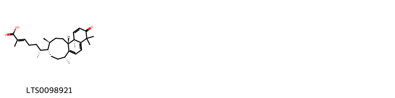{ width=100% }
    <figcaption>Hình ảnh cấu trúc hóa học của 1 hoạt chất thuộc nhóm Fatty Acyls gồm ['(2e,6r)-6-[(7r,10r,11s,13as,13br)-4,4,7,11,13b-pentamethyl-3-oxo-7h,8h,9h,10h,11h,12h,13h,13ah-cyclonona[a]naphthalen-10-yl]-2-methylhept-2-enoic acid (LTS0098921)'].</figcaption>
</figure>
#### Nhóm Prenol lipids
<figure markdown="span">
    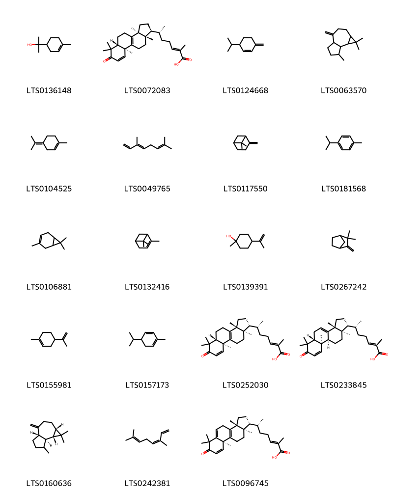{ width=100% }
    <figcaption>Hình ảnh cấu trúc hóa học của 19 hoạt chất thuộc nhóm Prenol lipids gồm ['terpineol (LTS0136148)', '(2e,6r)-6-[(1s,3as,5ar,9as,11as)-3a,6,6,9a,11a-pentamethyl-7-oxo-1h,2h,3h,4h,5h,5ah,10h,11h-cyclopenta[a]phenanthren-1-yl]-2-methylhept-2-enoic acid (LTS0072083)', 'β phellandrene (LTS0124668)', '1,1,7-trimethyl-4-methylidene-octahydro-1ah-cyclopropa[e]azulene (LTS0063570)', 'terpinolene (LTS0104525)', 'trans-β-ocimene (LTS0049765)', 'β-pinene (LTS0117550)', 'cymene (LTS0181568)', 'monoterpenes (LTS0106881)', 'α pinene (LTS0132416)', 'terpineols (LTS0139391)', 'camphene (LTS0267242)', 'limonene,  (LTS0155981)', 'phellandrene (LTS0157173)', '(2e,6r)-6-[(1r,3ar,5ar,9as,11ar)-3a,6,6,9a,11a-pentamethyl-7-oxo-1h,2h,3h,4h,5h,5ah,10h,11h-cyclopenta[a]phenanthren-1-yl]-2-methylhept-2-enoic acid (LTS0252030)', '(2e,6r)-6-[(1r,3ar,5ar,9ar,9bs,11ar)-3a,6,6,9a,11a-pentamethyl-7-oxo-1h,2h,3h,5h,5ah,9bh,10h,11h-cyclopenta[a]phenanthren-1-yl]-2-methylhept-2-enoic acid (LTS0233845)', '(1as,4as,7as,7br)-1,1,7-trimethyl-4-methylidene-octahydro-1ah-cyclopropa[e]azulene (LTS0160636)', 'β-ocimene (LTS0242381)', '(2e,6r)-6-[(1r,3ar,9ar,11ar)-3a,6,6,9a,11a-pentamethyl-7-oxo-1h,2h,3h,4h,10h,11h-cyclopenta[a]phenanthren-1-yl]-2-methylhept-2-enoic acid (LTS0096745)'].</figcaption>
</figure>
#### Nhóm Steroids and steroid derivatives
<figure markdown="span">
    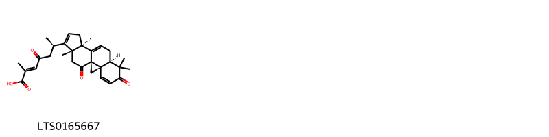{ width=100% }
    <figcaption>Hình ảnh cấu trúc hóa học của 1 hoạt chất thuộc nhóm Steroids and steroid derivatives gồm ['(2e,6r)-2-methyl-4-oxo-6-[(1s,3s,8r,12r,16r)-7,7,12,16-tetramethyl-6,18-dioxopentacyclo[9.7.0.0¹,³.0³,⁸.0¹²,¹⁶]octadeca-4,10,14-trien-15-yl]hept-2-enoic acid (LTS0165667)'].</figcaption>
</figure>
#### Nhóm Unsaturated hydrocarbons
<figure markdown="span">
    { width=100% }
    <figcaption>Hình ảnh cấu trúc hóa học của 1 hoạt chất thuộc nhóm Unsaturated hydrocarbons gồm ['α terpinene (LTS0232891)'].</figcaption>
</figure>

---

### Dược dân tộc học

Danh sách các quốc gia có sử dụng *Pistacia chinensis* trong điều trị các bệnh. 

| Country   | Disease                              | Bệnh                               |
|:----------|:-------------------------------------|:-----------------------------------|
| Elsewhere | Astringent, Expectorant, Carminative | Chất làm se, Chất đờm, Carminative |

---

---
## Pistacia lentiscus
### Thông tin về thực vật

!!! info "Phân loại thực vật của *Pistacia lentiscus* từ GIBF:"
    - **Kingdom:** Plantae
    - **Phylum:** Tracheophyta
    - **Order:** Sapindales
    - **Family:** Anacardiaceae
    - **Genus:** Pistacia
    - **Species:** *Pistacia lentiscus*

 

| Label (VI)   | Label (EN)   | Scientific Name    | Descriptions (VI)   | Descriptions (EN)   | Also Known As (VI)   | Also Known As (EN)   |
|:-------------|:-------------|:-------------------|:--------------------|:--------------------|:---------------------|:---------------------|
| N/A          | N/A          | Pistacia lentiscus | loài thực vật       | species of plant    | ['Nhũ hương']        | ['']                 |

#### Phân bố trên thế giới

**Từ CSDL GIBF** Italy, Cyprus, Malta, Spain, Palestine, State of, Türkiye, Portugal, Albania, Morocco, United States of America, France, Croatia, Greece, Israel

#### Phân bố tại Việt Nam

**Từ CSDL GIBF**: Không có ghi nhận ở Việt Nam

---
### Thành phần hóa học
        
- Theo cơ sở dữ liệu lotus: Từ loài *Pistacia lentiscus* đã phân lập và xác định được 61 hoạt chất thuộc về các nhóm Flavonoids, Prenol lipids, Benzene and substituted derivatives, Organooxygen compounds, Tannins, Depsides and depsidones. 

|    | chemicalTaxonomyClassyfireClass     |   smiles_count |
|---:|:------------------------------------|---------------:|
|  0 | Benzene and substituted derivatives |              1 |
|  1 | Depsides and depsidones             |              1 |
|  2 | Flavonoids                          |              7 |
|  3 | Organooxygen compounds              |              3 |
|  4 | Prenol lipids                       |             46 |
|  5 | Tannins                             |              2 |

#### Nhóm Benzene and substituted derivatives
<figure markdown="span">
    { width=100% }
    <figcaption>Hình ảnh cấu trúc hóa học của 1 hoạt chất thuộc nhóm Benzene and substituted derivatives gồm ['galop (LTS0222857)'].</figcaption>
</figure>
#### Nhóm Depsides and depsidones
<figure markdown="span">
    { width=100% }
    <figcaption>Hình ảnh cấu trúc hóa học của 1 hoạt chất thuộc nhóm Depsides and depsidones gồm ['digallic acid (LTS0019534)'].</figcaption>
</figure>
#### Nhóm Flavonoids
<figure markdown="span">
    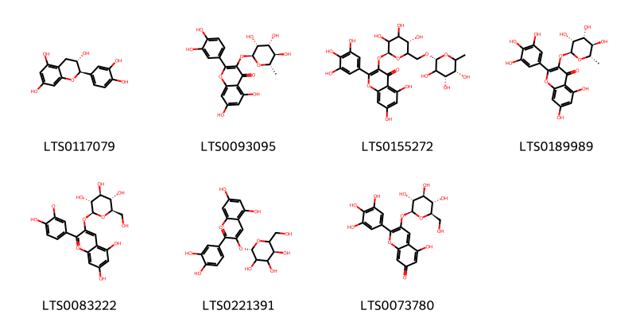{ width=100% }
    <figcaption>Hình ảnh cấu trúc hóa học của 7 hoạt chất thuộc nhóm Flavonoids gồm ['(+)-catechol (LTS0117079)', 'quercitrin (LTS0093095)', 'myricetin 3-rutinoside (LTS0155272)', 'myricitrin (LTS0189989)', '5,7-dihydroxy-2-(4-hydroxy-3-oxidophenyl)-3-{[(2s,3r,4s,5s,6r)-3,4,5-trihydroxy-6-(hydroxymethyl)oxan-2-yl]oxy}-1λ⁴-chromen-1-ylium (LTS0083222)', 'chrysanthemin (LTS0221391)', '5-hydroxy-3-{[(2s,3r,4s,5s,6r)-3,4,5-trihydroxy-6-(hydroxymethyl)oxan-2-yl]oxy}-2-(3,4,5-trihydroxyphenyl)chromen-7-one (LTS0073780)'].</figcaption>
</figure>
#### Nhóm Organooxygen compounds
<figure markdown="span">
    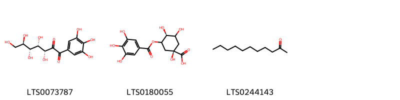{ width=100% }
    <figcaption>Hình ảnh cấu trúc hóa học của 3 hoạt chất thuộc nhóm Organooxygen compounds gồm ['(3r,4s,5r,6r)-3,4,5,6,7-pentahydroxy-1-(3,4,5-trihydroxyphenyl)heptane-1,2-dione (LTS0073787)', '(1r,4s)-1,3,4-trihydroxy-5-(3,4,5-trihydroxybenzoyloxy)cyclohexane-1-carboxylic acid (LTS0180055)', 'undecan-2-one (LTS0244143)'].</figcaption>
</figure>
#### Nhóm Prenol lipids
<figure markdown="span">
    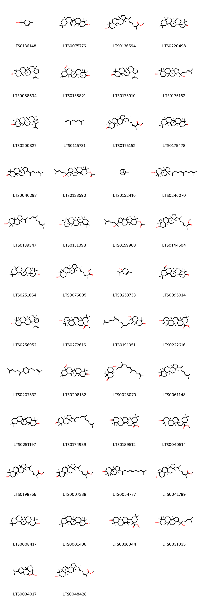{ width=100% }
    <figcaption>Hình ảnh cấu trúc hóa học của 46 hoạt chất thuộc nhóm Prenol lipids gồm ['terpineol (LTS0136148)', 'β-amyrin (LTS0075776)', 'methyl 6-{7-hydroxy-3a,6,6,9a,11a-pentamethyl-1h,2h,3h,5h,5ah,7h,8h,9h,9bh,10h,11h-cyclopenta[a]phenanthren-1-yl}-2-methylhept-2-enoate (LTS0136594)', '(4ar,6ar,6bs,8ar,12ar,14ar,14br)-4,4,6a,6b,11,11,14b-heptamethyl-1,2,4a,5,6,7,8,8a,9,10,12,12a,14,14a-tetradecahydropicen-3-one (LTS0220498)', 'lupeol (LTS0088634)', '(4ar,6ar,6bs,8as,12as,14ar,14br)-8a-(hydroxymethyl)-4,4,6a,6b,11,11,14b-heptamethyl-2,4a,5,6,7,8,9,10,12,12a,14,14a-dodecahydro-1h-picen-3-one (LTS0138821)', '5a,5b,8,8,11a-pentamethyl-1-(prop-1-en-2-yl)-hexadecahydrocyclopenta[a]chrysen-9-one (LTS0175910)', 'dammarenediol (LTS0175162)', '(1r,3ar,5ar,5br,7ar,11ar,11br,13ar,13br)-5a,5b,8,8,11a-pentamethyl-1-(prop-1-en-2-yl)-hexadecahydrocyclopenta[a]chrysen-9-one (LTS0200827)', 'α-myrcene (LTS0115731)', 'methyl (2z,6r)-6-[(1s,3as,5ar,9ar,9br,11as)-3a,6,6,9a,11a-pentamethyl-7-oxo-1h,2h,3h,5h,5ah,8h,9h,9bh,10h,11h-cyclopenta[a]phenanthren-1-yl]-2-methylhept-2-enoate (LTS0175152)', '(4ar,6ar,6bs,8ar,12ar,14ar,14br)-4,4,6a,6b,8a,11,11,14b-octamethyl-2,4a,5,6,7,8,9,10,12,12a,14,14a-dodecahydro-1h-picen-3-one (LTS0175478)', '3a,3b,6,6,9a-pentamethyl-1-(6-methylhepta-1,5-dien-2-yl)-dodecahydrocyclopenta[a]phenanthren-7-one (LTS0040293)', '(1s,3ar,3br,5ar,7s,9ar,9br,11as)-1-[(2s)-2-hydroxy-6-methylhept-5-en-2-yl]-3a,3b,6,6,9a-pentamethyl-dodecahydro-1h-cyclopenta[a]phenanthren-7-yl acetate (LTS0133590)', 'α pinene (LTS0132416)', '(3r,3as,5ar,7s,9ar,9br)-3-[(5e)-6,10-dimethylundeca-1,5,9-trien-2-yl]-3a,6,6,9a-tetramethyl-decahydrocyclopenta[a]naphthalen-7-ol (LTS0246070)', '3-(6,10-dimethylundeca-1,5,9-trien-2-yl)-3a,6,6,9a-tetramethyl-decahydrocyclopenta[a]naphthalen-7-ol (LTS0139347)', 'germanicol (LTS0151098)', '1-(2-hydroxy-6-methylhept-5-en-2-yl)-3a,3b,6,6,9a-pentamethyl-dodecahydro-1h-cyclopenta[a]phenanthren-7-yl acetate (LTS0159968)', 'methyl (2r,6r)-6-[(1s,3as,5ar,7r,9ar,9bs,11as)-7-hydroxy-3a,6,6,9a,11a-pentamethyl-1h,2h,3h,5h,5ah,7h,8h,9h,9bh,10h,11h-cyclopenta[a]phenanthren-1-yl]-2-methylheptanoate (LTS0144504)', 'β-amyrin (LTS0251864)', 'methyl (2r,6r)-6-[(1s,3as,5ar,7s,9ar,9bs,11as)-7-hydroxy-3a,6,6,9a,11a-pentamethyl-1h,2h,3h,5h,5ah,7h,8h,9h,9bh,10h,11h-cyclopenta[a]phenanthren-1-yl]-2-methylheptanoate (LTS0076005)', '4-terpineol (LTS0253733)', '(4as,6as,6br,8ar,12ar,12br,14bs)-2,2,6a,6b,9,9,12a-heptamethyl-10-oxo-3,4,5,6,7,8,8a,11,12,12b,13,14b-dodecahydro-1h-picene-4a-carbaldehyde (LTS0095014)', 'lupeol (LTS0256952)', 'methyl (4as,6as,6br,8ar,10r,12ar,12bs,14bs)-10-hydroxy-2,2,6a,6b,9,9,12a-heptamethyl-1,3,4,5,6,7,8,8a,10,11,12,12b,13,14b-tetradecahydropicene-4a-carboxylate (LTS0272616)', '6-hydroxy-1,1,4a,6-tetramethyl-5-(4,8,12-trimethyltrideca-3,7,11-trien-1-yl)-hexahydronaphthalen-2-one (LTS0191951)', 'methyl (4as,6as,6br,8as,10s,12ar,12bs,14bs)-10-hydroxy-2,2,6a,6b,9,9,12a-heptamethyl-1,3,4,5,6,7,8,8a,10,11,12,12b,13,14b-tetradecahydropicene-4a-carboxylate (LTS0222616)', 'α-camphorene (LTS0207532)', '8a-(hydroxymethyl)-4,4,6a,6b,11,11,14b-heptamethyl-2,4a,5,6,7,8,9,10,12,12a,14,14a-dodecahydro-1h-picen-3-one (LTS0208132)', '(4as,5r,6r,8as)-6-hydroxy-1,1,4a,6-tetramethyl-5-[(3e,7e)-4,8,12-trimethyltrideca-3,7,11-trien-1-yl]-hexahydronaphthalen-2-one (LTS0023070)', '(1s,3ar,3br,5ar,9ar,9bs,11ar)-3a,3b,6,6,9a-pentamethyl-1-(6-methylhepta-1,5-dien-2-yl)-dodecahydrocyclopenta[a]phenanthren-7-one (LTS0061148)', '4,4,6a,6b,11,11,14b-heptamethyl-1,2,4a,5,6,7,8,8a,9,10,12,12a,14,14a-tetradecahydropicen-3-one (LTS0251197)', '3-(6,10-dimethylundeca-1,5,9-trien-2-yl)-3a,6,6,9a-tetramethyl-octahydro-1h-cyclopenta[a]naphthalen-7-one (LTS0174939)', 'methyl (4as,6as,6br,8as,12ar,12bs,14bs)-2,2,6a,6b,9,9,12a-heptamethyl-10-oxo-3,4,5,6,7,8,8a,11,12,12b,13,14b-dodecahydro-1h-picene-4a-carboxylate (LTS0189512)', 'methyl 10-hydroxy-2,2,6a,6b,9,9,12a-heptamethyl-1,3,4,5,6,7,8,8a,10,11,12,12b,13,14b-tetradecahydropicene-4a-carboxylate (LTS0040514)', 'methyl 6-{7-hydroxy-3a,6,6,9a,11a-pentamethyl-1h,2h,3h,5h,5ah,7h,8h,9h,9bh,10h,11h-cyclopenta[a]phenanthren-1-yl}-2-methylheptanoate (LTS0198766)', 'methyl 6-{3a,6,6,9a,11a-pentamethyl-7-oxo-1h,2h,3h,5h,5ah,8h,9h,9bh,10h,11h-cyclopenta[a]phenanthren-1-yl}-2-methylhept-2-enoate (LTS0007388)', '(3r,3as,5as,9ar,9br)-3-[(5e)-6,10-dimethylundeca-1,5,9-trien-2-yl]-3a,6,6,9a-tetramethyl-octahydro-1h-cyclopenta[a]naphthalen-7-one (LTS0054777)', 'methyl (2z,6r)-6-[(1s,3as,5ar,7s,9ar,9bs,11as)-7-hydroxy-3a,6,6,9a,11a-pentamethyl-1h,2h,3h,5h,5ah,7h,8h,9h,9bh,10h,11h-cyclopenta[a]phenanthren-1-yl]-2-methylhept-2-enoate (LTS0041789)', '4,4,6a,6b,11,11,14b-heptamethyl-2,3,4a,5,6,7,8,8a,9,10,12,12a,14,14a-tetradecahydro-1h-picen-3-ol (LTS0008417)', '(3s,4ar,6ar,6bs,8ar,12ar,14ar,14br)-4,4,6a,6b,11,11,14b-heptamethyl-2,3,4a,5,6,7,8,8a,9,10,12,12a,14,14a-tetradecahydro-1h-picen-3-ol (LTS0001406)', 'methyl 2,2,6a,6b,9,9,12a-heptamethyl-10-oxo-3,4,5,6,7,8,8a,11,12,12b,13,14b-dodecahydro-1h-picene-4a-carboxylate (LTS0016044)', '(3ar,3br,5ar,7s,9ar,9br)-1-[(2s)-2-hydroxy-6-methylhept-5-en-2-yl]-3a,3b,6,6,9a-pentamethyl-dodecahydro-1h-cyclopenta[a]phenanthren-7-ol (LTS0031035)', 'dehydroabietic acid (LTS0034017)', 'methyl (2z,6r)-6-[(1s,3as,5ar,7r,9ar,9bs,11as)-7-hydroxy-3a,6,6,9a,11a-pentamethyl-1h,2h,3h,5h,5ah,7h,8h,9h,9bh,10h,11h-cyclopenta[a]phenanthren-1-yl]-2-methylhept-2-enoate (LTS0048428)'].</figcaption>
</figure>
#### Nhóm Tannins
<figure markdown="span">
    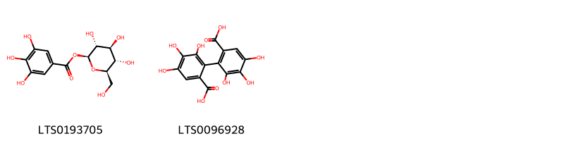{ width=100% }
    <figcaption>Hình ảnh cấu trúc hóa học của 2 hoạt chất thuộc nhóm Tannins gồm ['β-glucogallin (LTS0193705)', 'hexahydroxydiphenic acid (LTS0096928)'].</figcaption>
</figure>

---

### Dược dân tộc học

Danh sách các quốc gia có sử dụng *Pistacia lentiscus* trong điều trị các bệnh. 

| Country   | Disease                                                                        | Bệnh                                                                        |
|:----------|:-------------------------------------------------------------------------------|:----------------------------------------------------------------------------|
| China     | Analgesic, Antitussive, Expectorant                                            | Thuốc giảm đau, chống ho, đờm                                               |
| Elsewhere | Carminative, Diuretic, Stimulant                                               | Sáng tạo, lợi tiểu, kích thích                                              |
| Malaya    | Aphrodisiac                                                                    | Thuốc kích dục                                                              |
| Turkey    | Aphrodisiac, Expectorant, Hemostat, Stomachic, Astringent, Diuretic, Sudorific | Thuốc kích thích tình dục, đờm, cầm máu, dạ dày, làm se, lợi tiểu, gây ngạt |
| ain       | Apertif                                                                        | Apertif                                                                     |

---

# Chi Mangifera

??? note "Danh sách các dược liệu thuộc chi"
    
	 - *Mangifera indica*

---
## Mangifera indica
### Thông tin về thực vật

!!! info "Phân loại thực vật của *Mangifera indica* từ GIBF:"
    - **Kingdom:** Plantae
    - **Phylum:** Tracheophyta
    - **Order:** Sapindales
    - **Family:** Anacardiaceae
    - **Genus:** Mangifera
    - **Species:** *Mangifera indica*

 

| Label (VI)   | Label (EN)   | Scientific Name   | Descriptions (VI)   | Descriptions (EN)   | Also Known As (VI)   | Also Known As (EN)                             |
|:-------------|:-------------|:------------------|:--------------------|:--------------------|:---------------------|:-----------------------------------------------|
| N/A          | N/A          | Mangifera indica  | loài thực vật       | species of plant    | ['xoài']             | ['common mango', 'Indian mango', 'mango tree'] |

#### Phân bố trên thế giới

**Từ CSDL GIBF** Australia, Guadeloupe, Benin, Panama, Puerto Rico, Honduras, Jamaica, United States of America, South Africa, Fiji, Thailand, Brazil, Bahamas, Dominican Republic, Mexico, Saint Kitts and Nevis, Colombia, Costa Rica, India, Antigua and Barbuda, Malaysia

#### Phân bố tại Việt Nam

**Từ CSDL GIBF**: Không có ghi nhận ở Việt Nam

---
### Thành phần hóa học
        
- Theo cơ sở dữ liệu lotus: Từ loài *Mangifera indica* đã phân lập và xác định được 292 hoạt chất thuộc về các nhóm Hydroxy acids and derivatives, Phenols, Carboxylic acids and derivatives, Fatty Acyls, Dibenzylbutane lignans, Saturated hydrocarbons, Tannins, Prenol lipids, Benzene and substituted derivatives, Dihydrofurans, Organooxygen compounds, Furanoid lignans, Flavonoids, Steroids and steroid derivatives, Isoflavonoids, Unsaturated hydrocarbons, Lactones, Benzopyrans. 

|    | chemicalTaxonomyClassyfireClass     |   smiles_count |
|---:|:------------------------------------|---------------:|
|  0 | Benzene and substituted derivatives |             12 |
|  1 | Benzopyrans                         |             11 |
|  2 | Carboxylic acids and derivatives    |              6 |
|  3 | Dibenzylbutane lignans              |              2 |
|  4 | Dihydrofurans                       |              2 |
|  5 | Fatty Acyls                         |             36 |
|  6 | Flavonoids                          |             27 |
|  7 | Furanoid lignans                    |              1 |
|  8 | Hydroxy acids and derivatives       |              1 |
|  9 | Isoflavonoids                       |              1 |
| 10 | Lactones                            |             12 |
| 11 | Organooxygen compounds              |             19 |
| 12 | Phenols                             |              5 |
| 13 | Prenol lipids                       |             71 |
| 14 | Saturated hydrocarbons              |              5 |
| 15 | Steroids and steroid derivatives    |             75 |
| 16 | Tannins                             |              2 |
| 17 | Unsaturated hydrocarbons            |              1 |

#### Nhóm Benzene and substituted derivatives
<figure markdown="span">
    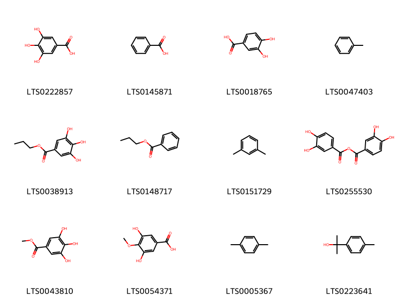{ width=100% }
    <figcaption>Hình ảnh cấu trúc hóa học của 12 hoạt chất thuộc nhóm Benzene and substituted derivatives gồm ['galop (LTS0222857)', 'benzoic acid (LTS0145871)', '3,4-dihydroxybenzoic acid (LTS0018765)', 'toluene (LTS0047403)', 'propyl gallate (LTS0038913)', 'propyl benzoate (LTS0148717)', 'm-xylene (LTS0151729)', '3,4-dihydroxybenzoyl 3,4-dihydroxybenzoate (LTS0255530)', 'methyl gallate (LTS0043810)', '3,5-dihydroxy-4-methoxybenzoic acid (LTS0054371)', 'para-xylene (LTS0005367)', 'p-cymen-8-ol (LTS0223641)'].</figcaption>
</figure>
#### Nhóm Benzopyrans
<figure markdown="span">
    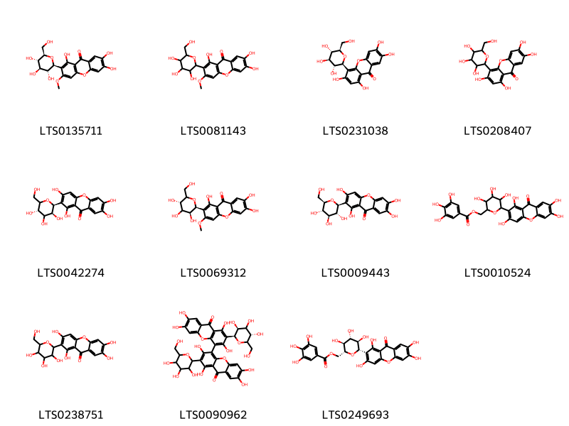{ width=100% }
    <figcaption>Hình ảnh cấu trúc hóa học của 11 hoạt chất thuộc nhóm Benzopyrans gồm ['1,6,7-trihydroxy-3-methoxy-2-[(2s,3r,4r,5s,6r)-3,4,5-trihydroxy-6-(hydroxymethyl)oxan-2-yl]xanthen-9-one (LTS0135711)', '1,6,7-trihydroxy-3-methoxy-2-[3,4,5-trihydroxy-6-(hydroxymethyl)oxan-2-yl]xanthen-9-one (LTS0081143)', 'isomangiferin (LTS0231038)', '1,3,6,7-tetrahydroxy-4-[3,4,5-trihydroxy-6-(hydroxymethyl)oxan-2-yl]xanthen-9-one (LTS0208407)', '1,3,6,7-tetrahydroxy-2-[(2s,3s,5s)-3,4,5-trihydroxy-6-(hydroxymethyl)oxan-2-yl]xanthen-9-one (LTS0042274)', '1,6,7-trihydroxy-3-methoxy-2-[(2s,3s,5s)-3,4,5-trihydroxy-6-(hydroxymethyl)oxan-2-yl]xanthen-9-one (LTS0069312)', 'mangiferin (LTS0009443)', '[3,4,5-trihydroxy-6-(1,3,6,7-tetrahydroxy-9-oxoxanthen-2-yl)oxan-2-yl]methyl 3,4,5-trihydroxybenzoate (LTS0010524)', 'mangiferin (LTS0238751)', "1,1',3,3',6,6',7,7'-octahydroxy-2-[(2s,3s,5s)-3,4,5-trihydroxy-6-(hydroxymethyl)oxan-2-yl]-2'-[3,4,5-trihydroxy-6-(hydroxymethyl)oxan-2-yl]-[4,4'-bixanthene]-9,9'-dione (LTS0090962)", '[(2r,3s,4r,5r,6s)-3,4,5-trihydroxy-6-(1,3,6,7-tetrahydroxy-9-oxoxanthen-2-yl)oxan-2-yl]methyl 3,4,5-trihydroxybenzoate (LTS0249693)'].</figcaption>
</figure>
#### Nhóm Carboxylic acids and derivatives
<figure markdown="span">
    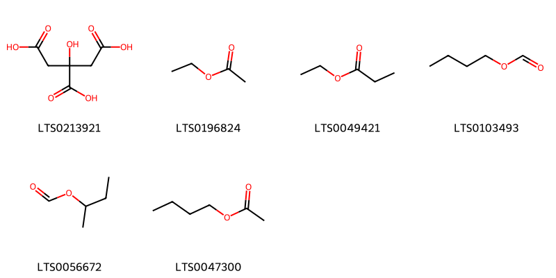{ width=100% }
    <figcaption>Hình ảnh cấu trúc hóa học của 6 hoạt chất thuộc nhóm Carboxylic acids and derivatives gồm ['citric acid (LTS0213921)', 'ethyl acetate (LTS0196824)', 'ethyl propionate (LTS0049421)', 'butyl formate (LTS0103493)', 'sec-butyl formate (LTS0056672)', 'butyl acetate (LTS0047300)'].</figcaption>
</figure>
#### Nhóm Dibenzylbutane lignans
<figure markdown="span">
    { width=100% }
    <figcaption>Hình ảnh cấu trúc hóa học của 2 hoạt chất thuộc nhóm Dibenzylbutane lignans gồm ['(2s,3r)-2,3-bis[(4-hydroxy-3-methoxyphenyl)(¹³c)methyl](1-¹³c)butane-1,4-diol (LTS0268699)', 'secoisolariciresinol (LTS0086727)'].</figcaption>
</figure>
#### Nhóm Dihydrofurans
<figure markdown="span">
    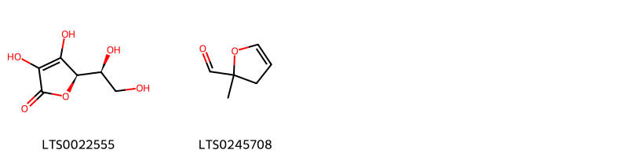{ width=100% }
    <figcaption>Hình ảnh cấu trúc hóa học của 2 hoạt chất thuộc nhóm Dihydrofurans gồm ['vitamin c (LTS0022555)', '2-methyl-3h-furan-2-carbaldehyde (LTS0245708)'].</figcaption>
</figure>
#### Nhóm Fatty Acyls
<figure markdown="span">
    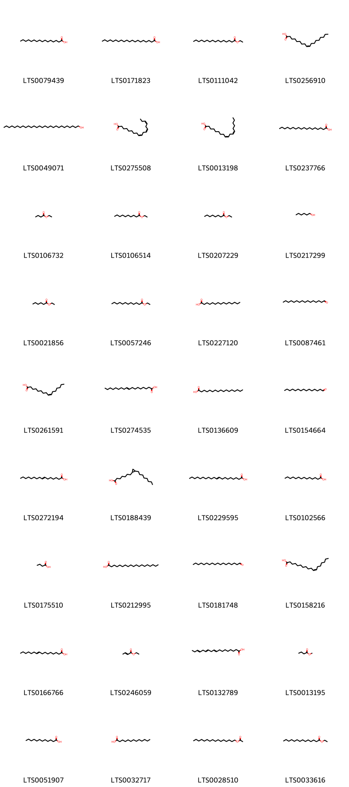{ width=100% }
    <figcaption>Hình ảnh cấu trúc hóa học của 36 hoạt chất thuộc nhóm Fatty Acyls gồm ['palmitic acid (LTS0079439)', 'arachidic acid (LTS0171823)', 'ethyl palmitate (LTS0111042)', 'oleic acid (LTS0256910)', 'octacosanol (LTS0049071)', 'α-linolenic acid (LTS0275508)', 'linoleic (LTS0013198)', 'stearic acid (LTS0237766)', 'ethyl butyrate (LTS0106732)', 'ethyl caprate (LTS0106514)', 'ethyl octanoate (LTS0207229)', 'hexanol (LTS0217299)', 'ethyl hexanoate (LTS0021856)', 'ethyl laurate (LTS0057246)', 'pentadecanoic acid (LTS0227120)', 'hexadecanal (LTS0087461)', 'palmitoleic acid (LTS0261591)', '(+-)-propylene glycol (LTS0274535)', 'heptadecanoic acid (LTS0136609)', 'pentadecanal (LTS0154664)', '7-hexadecenoic acid (LTS0272194)', '7-(2-octylcyclopropyl)heptanoic acid (LTS0188439)', '9-eicosenoic acid (LTS0229595)', 'myristic acid (LTS0102566)', 'butanoic acid (LTS0175510)', 'nonadecanoic acid (LTS0212995)', 'octadecanal (LTS0181748)', 'cis-vaccenic acid (LTS0158216)', '9-hexadecenoic acid (LTS0166766)', '2-butenoic acid, ethyl ester (LTS0246059)', 'α linolenic acid (LTS0132789)', 'methyl butyrate (LTS0013195)', 'lauric acid (LTS0051907)', 'n-tridecanoic acid (LTS0032717)', 'cetyl acetate (LTS0028510)', 'ethylmyristate (LTS0033616)'].</figcaption>
</figure>
#### Nhóm Flavonoids
<figure markdown="span">
    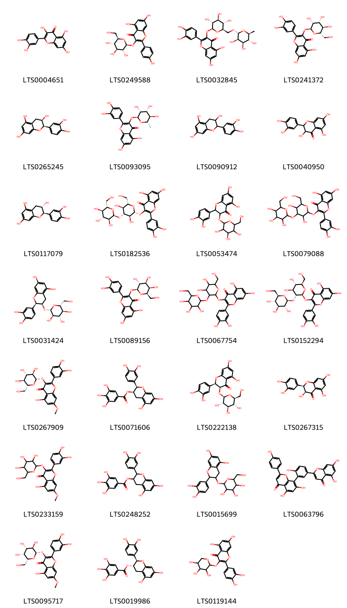{ width=100% }
    <figcaption>Hình ảnh cấu trúc hóa học của 27 hoạt chất thuộc nhóm Flavonoids gồm ['quercetin (LTS0004651)', 'astragalin (LTS0249588)', '3-rutinosyl quercetin (LTS0032845)', '2-(3,4-dihydroxyphenyl)-5,7-dihydroxy-3-{[(2s,3r,4r,5r,6s)-3,4,5-trihydroxy-6-(hydroxymethyl)oxan-2-yl]oxy}chromen-4-one (LTS0241372)', 'ent-epicatechin (LTS0265245)', 'quercitrin (LTS0093095)', 'catechol (LTS0090912)', '2,3-dihydroquercetin (LTS0040950)', '(+)-catechol (LTS0117079)', '3-{[(2r,3s,4r,5s,6s)-3,5-dihydroxy-6-(hydroxymethyl)-4-{[(2s,3s,4r,5r,6s)-3,4,5-trihydroxy-6-(hydroxymethyl)oxan-2-yl]oxy}oxan-2-yl]oxy}-2-(3,4-dihydroxyphenyl)-5,7-dihydroxychromen-4-one (LTS0182536)', '2-(3,4-dihydroxyphenyl)-5,7-dihydroxy-3-{[3,4,5-trihydroxy-6-(hydroxymethyl)oxan-2-yl]oxy}-2,3-dihydro-1-benzopyran-4-one (LTS0053474)', '3-{[3,5-dihydroxy-6-(hydroxymethyl)-4-{[3,4,5-trihydroxy-6-(hydroxymethyl)oxan-2-yl]oxy}oxan-2-yl]oxy}-2-(3,4-dihydroxyphenyl)-5,7-dihydroxychromen-4-one (LTS0079088)', '(2r,3r,4s,5s,6r)-2-{[(2r,3r)-2-(3,4-dihydroxyphenyl)-5,7-dihydroxy-3,4-dihydro-2h-1-benzopyran-3-yl]oxy}-6-(hydroxymethyl)oxane-3,4,5-triol (LTS0031424)', 'hyperoside (LTS0089156)', '3-{[4,5-dihydroxy-6-(hydroxymethyl)-3-{[3,4,5-trihydroxy-6-(hydroxymethyl)oxan-2-yl]oxy}oxan-2-yl]oxy}-2-(3,4-dihydroxyphenyl)-5,7-dihydroxychromen-4-one (LTS0067754)', 'quosp (LTS0152294)', '2-(3,4-dihydroxyphenyl)-5-hydroxy-7-methoxy-3-{[(2s,3r,4s,5s,6r)-3,4,5-trihydroxy-6-(hydroxymethyl)oxan-2-yl]oxy}chromen-4-one (LTS0267909)', 'epicatechin gallate (LTS0071606)', '(2r,3s)-2-(3,4-dihydroxyphenyl)-5,7-dihydroxy-3-{[(2r,3s,4r,5r,6s)-3,4,5-trihydroxy-6-(hydroxymethyl)oxan-2-yl]oxy}-2,3-dihydro-1-benzopyran-4-one (LTS0222138)', '(-)-epitaxifolin (LTS0267315)', '2-(3,4-dihydroxyphenyl)-5-hydroxy-7-methoxy-3-{[3,4,5-trihydroxy-6-(hydroxymethyl)oxan-2-yl]oxy}chromen-4-one (LTS0233159)', '2-(3,4-dihydroxyphenyl)-5,7-dihydroxy-3,4-dihydro-2h-1-benzopyran-3-yl 3,4,5-trihydroxybenzoate (LTS0248252)', '2-{[2-(3,4-dihydroxyphenyl)-5,7-dihydroxy-3,4-dihydro-2h-1-benzopyran-3-yl]oxy}-6-(hydroxymethyl)oxane-3,4,5-triol (LTS0015699)', 'amentoflavone (LTS0063796)', '2-(3,4-dihydroxyphenyl)-5-hydroxy-7-methoxy-3-{[(2s,3r,4s,5r,6r)-3,4,5-trihydroxy-6-(hydroxymethyl)oxan-2-yl]oxy}chromen-4-one (LTS0095717)', 'catechin 3-o-gallate (LTS0019986)', 'guaijaverin (LTS0119144)'].</figcaption>
</figure>
#### Nhóm Furanoid lignans
<figure markdown="span">
    { width=100% }
    <figcaption>Hình ảnh cấu trúc hóa học của 1 hoạt chất thuộc nhóm Furanoid lignans gồm ['matairesinol (LTS0193475)'].</figcaption>
</figure>
#### Nhóm Hydroxy acids and derivatives
<figure markdown="span">
    { width=100% }
    <figcaption>Hình ảnh cấu trúc hóa học của 1 hoạt chất thuộc nhóm Hydroxy acids and derivatives gồm ['malic acid (LTS0216520)'].</figcaption>
</figure>
#### Nhóm Isoflavonoids
<figure markdown="span">
    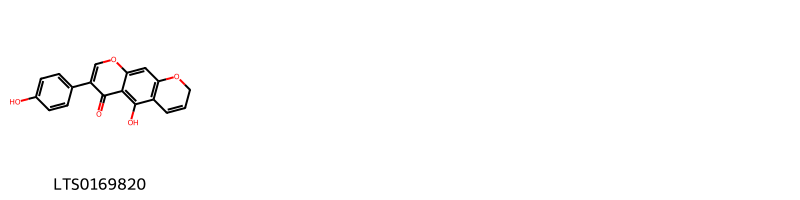{ width=100% }
    <figcaption>Hình ảnh cấu trúc hóa học của 1 hoạt chất thuộc nhóm Isoflavonoids gồm ['5-hydroxy-3-(4-hydroxyphenyl)-8h-pyrano[3,2-g]chromen-4-one (LTS0169820)'].</figcaption>
</figure>
#### Nhóm Lactones
<figure markdown="span">
    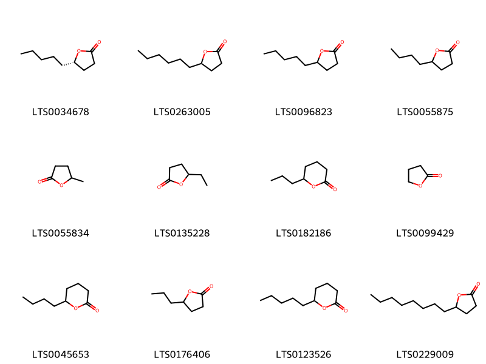{ width=100% }
    <figcaption>Hình ảnh cấu trúc hóa học của 12 hoạt chất thuộc nhóm Lactones gồm ['aldehyde c-18 (LTS0034678)', 'γ-decalactone (LTS0263005)', 'gamma-nonalactone (LTS0096823)', 'γ-octalactone (LTS0055875)', 'gamma-valerolactone (LTS0055834)', 'gamma-hexalactone (LTS0135228)', 'δ-octalactone (LTS0182186)', '4-butyrolactone (LTS0099429)', 'delta-nonalactone (LTS0045653)', 'γ-heptalactone (LTS0176406)', 'δ-decalactone (LTS0123526)', 'γ-dodecalactone (LTS0229009)'].</figcaption>
</figure>
#### Nhóm Organooxygen compounds
<figure markdown="span">
    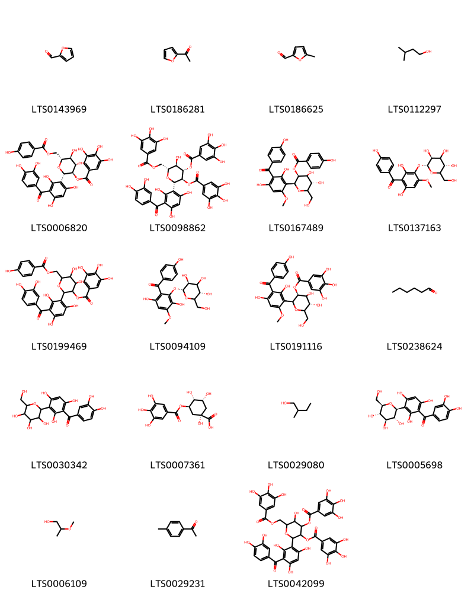{ width=100% }
    <figcaption>Hình ảnh cấu trúc hóa học của 19 hoạt chất thuộc nhóm Organooxygen compounds gồm ['bran oil (LTS0143969)', 'acetylfuran (LTS0186281)', '5-methylfurfural (LTS0186625)', 'isoamyl alcohol (LTS0112297)', '(2s,3r,4s,5s,6r)-2-[3-(3,4-dihydroxybenzoyl)-2,4,6-trihydroxyphenyl]-4,5-dihydroxy-6-[(4-hydroxybenzoyloxy)methyl]oxan-3-yl 3,4,5-trihydroxybenzoate (LTS0006820)', '(2s,3s,4s,5r,6r)-2-[3-(3,4-dihydroxybenzoyl)-2,4,6-trihydroxyphenyl]-5-hydroxy-4-(3,4,5-trihydroxybenzoyloxy)-6-[(3,4,5-trihydroxybenzoyloxy)methyl]oxan-3-yl 3,4,5-trihydroxybenzoate (LTS0098862)', '(2s,3s,5s)-2-[2,4-dihydroxy-3-(4-hydroxybenzoyl)-6-methoxyphenyl]-4,5-dihydroxy-6-(hydroxymethyl)oxan-3-yl 4-hydroxybenzoate (LTS0167489)', '(2r,3s,5s)-2-[2,4-dihydroxy-3-(4-hydroxybenzoyl)-6-methoxyphenoxy]-6-(hydroxymethyl)oxane-3,4,5-triol (LTS0137163)', '2-[3-(3,4-dihydroxybenzoyl)-2,4,6-trihydroxyphenyl]-4,5-dihydroxy-6-[(4-hydroxybenzoyloxy)methyl]oxan-3-yl 3,4,5-trihydroxybenzoate (LTS0199469)', '(2r,3s,5s)-2-[2,5-dihydroxy-6-(4-hydroxybenzoyl)-3-methoxyphenoxy]-6-(hydroxymethyl)oxane-3,4,5-triol (LTS0094109)', '(2s,3s,5s)-2-[2,4-dihydroxy-3-(4-hydroxybenzoyl)-6-methoxyphenyl]-4,5-dihydroxy-6-(hydroxymethyl)oxan-3-yl 3,4,5-trihydroxybenzoate (LTS0191116)', 'hexanal (LTS0238624)', '2-[3-(3,4-dihydroxybenzoyl)-2,4,6-trihydroxyphenyl]-6-(hydroxymethyl)oxane-3,4,5-triol (LTS0030342)', 'theogallin (LTS0007361)', '2-methyl-1-butanol (LTS0029080)', '(2s,3r,4r,5s,6r)-2-[3-(3,4-dihydroxybenzoyl)-2,4,6-trihydroxyphenyl]-6-(hydroxymethyl)oxane-3,4,5-triol (LTS0005698)', '2-methoxypropanol (LTS0006109)', 'p-methylacetophenone (LTS0029231)', '2-[3-(3,4-dihydroxybenzoyl)-2,4,6-trihydroxyphenyl]-5-hydroxy-4-(3,4,5-trihydroxybenzoyloxy)-6-[(3,4,5-trihydroxybenzoyloxy)methyl]oxan-3-yl 3,4,5-trihydroxybenzoate (LTS0042099)'].</figcaption>
</figure>
#### Nhóm Phenols
<figure markdown="span">
    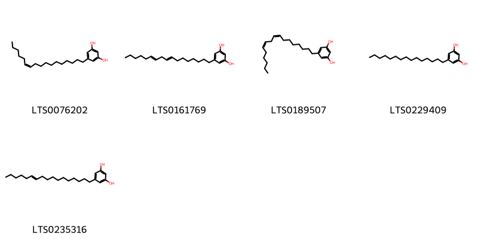{ width=100% }
    <figcaption>Hình ảnh cấu trúc hóa học của 5 hoạt chất thuộc nhóm Phenols gồm ['5-[(11z)-heptadec-11-en-1-yl]benzene-1,3-diol (LTS0076202)', '5-(heptadeca-8,11-dien-1-yl)benzene-1,3-diol (LTS0161769)', '5-[(8z,11z)-heptadeca-8,11-dien-1-yl]benzene-1,3-diol (LTS0189507)', 'cardol (LTS0229409)', '5-(heptadec-11-en-1-yl)benzene-1,3-diol (LTS0235316)'].</figcaption>
</figure>
#### Nhóm Prenol lipids
<figure markdown="span">
    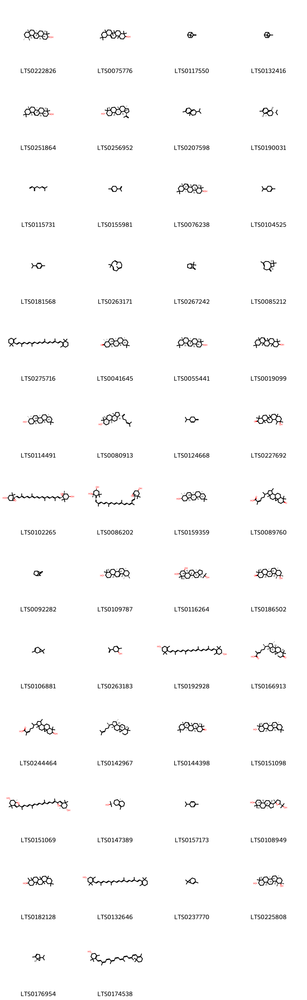{ width=100% }
    <figcaption>Hình ảnh cấu trúc hóa học của 71 hoạt chất thuộc nhóm Prenol lipids gồm ['amyrin (LTS0222826)', 'β-amyrin (LTS0075776)', 'β-pinene (LTS0117550)', 'α pinene (LTS0132416)', 'β-amyrin (LTS0251864)', 'lupeol (LTS0256952)', 'α-copaene (LTS0207598)', '(1r,2s,7s,8s)-8-isopropyl-1,3-dimethyltricyclo[4.4.0.0²,⁷]dec-3-ene (LTS0190031)', 'α-myrcene (LTS0115731)', 'limonene,  (LTS0155981)', 'alnulin (LTS0076238)', 'terpinolene (LTS0104525)', 'cymene (LTS0181568)', 'humulene (LTS0263171)', 'camphene (LTS0267242)', 'caryophyllene (LTS0085212)', 'β-carotene (LTS0275716)', '(-)-friedelin (LTS0041645)', '(3s,4ar,6ar,6bs,8ar,12as,14ar,14br)-4,4,6a,6b,8a,11,11,14b-octamethyl-1,2,3,4a,5,6,7,8,9,10,12,12a,14,14a-tetradecahydropicen-3-ol (LTS0055441)', 'taraxerol (LTS0019099)', 'epi-friedelanol (LTS0114491)', 'dammaradienol (LTS0080913)', 'β phellandrene (LTS0124668)', '11-hydroxy-4,4,6a,6b,8a,11,12,14b-octamethyl-tetradecahydro-1h-picen-3-one (LTS0227692)', 'violaxanthin (LTS0102265)', "9'-cis-neoxanthin (LTS0086202)", '(3r,4r,4as,6as,6br,8ar,12ar,12bs,14as,14bs)-4,4a,6b,8a,11,11,12b,14a-octamethyl-hexadecahydropicen-3-ol (LTS0159359)', '2-methyl-6-{7,7,13,16-tetramethyl-6-oxopentacyclo[9.7.0.0¹,³.0³,⁸.0¹²,¹⁶]octadecan-15-yl}hept-2-enoic acid (LTS0089760)', '7,7-dimethyl-2-methylidenebicyclo[2.2.1]heptane (LTS0092282)', '(3s,4ar,6ar,6bs,8ar,11r,12s,12as,14ar,14br)-4,4,6a,6b,8a,11,12,14b-octamethyl-2,3,4a,5,6,7,8,9,10,11,12,12a,14,14a-tetradecahydro-1h-picen-3-ol (LTS0109787)', '(3s,3as,5ar,5br,7as,9s,11r,11ar,11bs,13ar,13bs)-3-(2-hydroxypropan-2-yl)-5a,5b,8,8,11a,13b-hexamethyl-hexadecahydrocyclopenta[a]chrysene-9,11-diol (LTS0116264)', '(4ar,6ar,6br,8as,11s,12s,12as,12br,14ar,14br)-11-hydroxy-4,4,6a,6b,8a,11,12,14b-octamethyl-tetradecahydro-1h-picen-3-one (LTS0186502)', 'monoterpenes (LTS0106881)', 'carveol (LTS0263183)', 'zeaxanthin (LTS0192928)', '(2e,6r)-2-methyl-6-[(1s,3r,8r,11s,12s,13s,15r,16r)-7,7,13,16-tetramethyl-6-oxopentacyclo[9.7.0.0¹,³.0³,⁸.0¹²,¹⁶]octadecan-15-yl]hept-2-enoic acid (LTS0166913)', '6-{6-hydroxy-7,7,13,16-tetramethylpentacyclo[9.7.0.0¹,³.0³,⁸.0¹²,¹⁶]octadecan-15-yl}-2-methylhept-2-enoic acid (LTS0244464)', '(1s,3r,8s,11s,12s,13s,15r,16r)-7,7,13,16-tetramethyl-15-[(2r)-6-methylhept-5-en-2-yl]pentacyclo[9.7.0.0¹,³.0³,⁸.0¹²,¹⁶]octadecane (LTS0142967)', '(4ar,6ar,8ar,12as,12bs,14ar,14br)-4,4,6a,8a,11,11,12b,14b-octamethyl-2,4a,5,6,8,9,10,12,12a,13,14,14a-dodecahydro-1h-picen-3-one (LTS0144398)', 'germanicol (LTS0151098)', '(6s,7ar)-2-[(2e,4e,6e,8e,10e,12e,14e)-15-[(6s,7ar)-6-hydroxy-4,4,7a-trimethyl-2,5,6,7-tetrahydro-1-benzofuran-2-yl]-6,11-dimethylhexadeca-2,4,6,8,10,12,14-heptaen-2-yl]-4,4,7a-trimethyl-2,5,6,7-tetrahydro-1-benzofuran-6-ol (LTS0151069)', 'gamma-eudesmol (LTS0147389)', 'phellandrene (LTS0157173)', '(1s,3ar,3br,5ar,7s,9ar,9br,11ar)-1-[(2s,5s)-5-(2-hydroxypropan-2-yl)-2-methyloxolan-2-yl]-3a,3b,6,6,9a-pentamethyl-dodecahydro-1h-cyclopenta[a]phenanthren-7-ol (LTS0108949)', '4,4a,6b,8a,11,11,12b,14a-octamethyl-hexadecahydropicen-3-ol (LTS0182128)', 'cryptoxanthin (LTS0132646)', '3,7,7-trimethylbicyclo[4.1.0]hept-2-ene (LTS0237770)', '(1s,2s,4as,6ar,6br,8ar,10s,12ar,12br,14ar,14bs)-1,2,4a,6a,6b,9,9,12a-octamethyl-hexadecahydropicene-2,10-diol (LTS0225808)', 'α-thujene (LTS0176954)', '(1r)-3,5,5-trimethyl-4-[(1e,3z,5z,7z,9z,11z,13z,15z,17z)-3,7,12,16-tetramethyl-18-(2,6,6-trimethylcyclohex-1-en-1-yl)octadeca-1,3,5,7,9,11,13,15,17-nonaen-1-yl]cyclohex-3-en-1-ol (LTS0174538)', '1,2,4a,6a,6b,9,9,12a-octamethyl-hexadecahydropicene-2,10-diol (LTS0073974)', 'taraxerone (LTS0266976)', 'sabinene (LTS0224133)', '4,4,6a,8a,11,11,12b,14b-octamethyl-2,4a,5,6,8,9,10,12,12a,13,14,14a-dodecahydro-1h-picen-3-one (LTS0024442)', 'α-thujene (LTS0185078)', '(1r,3s,6s)-6-[(1e,3e,5e,7e,9e,11e,13e,15z,17e)-18-[(1s,4s,6r)-4-hydroxy-2,2,6-trimethyl-7-oxabicyclo[4.1.0]heptan-1-yl]-3,7,12,16-tetramethyloctadeca-1,3,5,7,9,11,13,15,17-nonaen-1-yl]-1,5,5-trimethyl-7-oxabicyclo[4.1.0]heptan-3-ol (LTS0174691)', '(2e,6r)-6-[(1s,3r,6s,8r,11s,12s,13s,15r,16r)-6-hydroxy-7,7,13,16-tetramethylpentacyclo[9.7.0.0¹,³.0³,⁸.0¹²,¹⁶]octadecan-15-yl]-2-methylhept-2-enoic acid (LTS0196692)', '2-[(2z,4e,6e,8e,10e,12e,14e,16e)-17-{4-hydroxy-2,2,6-trimethyl-7-oxabicyclo[4.1.0]heptan-1-yl}-6,11,15-trimethylheptadeca-2,4,6,8,10,12,14,16-octaen-2-yl]-4,4,7a-trimethyl-2,5,6,7-tetrahydro-1-benzofuran-6-ol (LTS0193507)', 'β-ocimene (LTS0242381)', '6-[(1e,3e,5e,7e,9e,11e,13e,15z,17e)-18-{4-hydroxy-2,2,6-trimethyl-7-oxabicyclo[4.1.0]heptan-1-yl}-3,7,12,16-tetramethyloctadeca-1,3,5,7,9,11,13,15,17-nonaen-1-yl]-1,5,5-trimethyl-7-oxabicyclo[4.1.0]heptan-3-ol (LTS0133514)', 'terpinene (LTS0136858)', '3-(2-hydroxypropan-2-yl)-5a,5b,8,8,11a,13b-hexamethyl-hexadecahydrocyclopenta[a]chrysene-9,11-diol (LTS0030055)', 'neoxanthin (LTS0000701)', '(1r,3s)-6-[(3e,5e,7e,9e,11e,13e,15z)-16-[(6s,7ar)-6-hydroxy-4,4,7a-trimethyl-2,5,6,7-tetrahydro-1-benzofuran-2-yl]-3,7,12-trimethylheptadeca-1,3,5,7,9,11,13,15-octaen-1-ylidene]-1,5,5-trimethylcyclohexane-1,3-diol (LTS0017844)', '(1s,3ar,3br,5ar,7s,9ar,9br,11ar)-1-[(2s)-5-(2-hydroxypropan-2-yl)-2-methyloxolan-2-yl]-3a,3b,6,6,9a-pentamethyl-dodecahydro-1h-cyclopenta[a]phenanthren-7-ol (LTS0014474)', '1-[5-(1,2-dihydroxypropan-2-yl)-2-methyloxolan-2-yl]-3a,3b,6,6,9a-pentamethyl-dodecahydrocyclopenta[a]phenanthren-7-one (LTS0025192)', 'α-amyrin (LTS0088267)', '7,7,13,16-tetramethyl-15-(6-methylhept-5-en-2-yl)pentacyclo[9.7.0.0¹,³.0³,⁸.0¹²,¹⁶]octadecane (LTS0087672)', '(1s,3ar,3br,5ar,9ar,9br,11ar)-1-[(2s,5r)-5-[(2s)-1,2-dihydroxypropan-2-yl]-2-methyloxolan-2-yl]-3a,3b,6,6,9a-pentamethyl-dodecahydrocyclopenta[a]phenanthren-7-one (LTS0033897)', 'friedelin (LTS0213494)', 'α-citral (LTS0246122)'].</figcaption>
</figure>
#### Nhóm Saturated hydrocarbons
<figure markdown="span">
    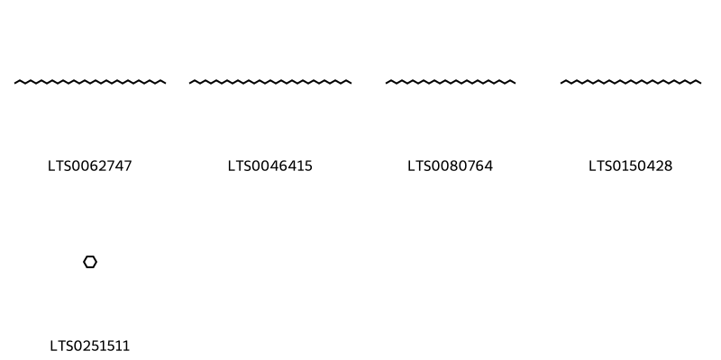{ width=100% }
    <figcaption>Hình ảnh cấu trúc hóa học của 5 hoạt chất thuộc nhóm Saturated hydrocarbons gồm ['nonacosane (LTS0062747)', 'hentriacontane (LTS0046415)', 'pentacosane (LTS0080764)', 'heptacosane (LTS0150428)', 'cyclohexane (LTS0251511)'].</figcaption>
</figure>
#### Nhóm Steroids and steroid derivatives
<figure markdown="span">
    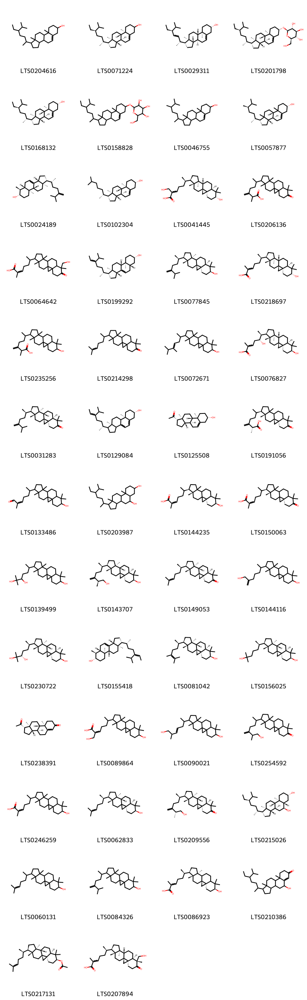{ width=100% }
    <figcaption>Hình ảnh cấu trúc hóa học của 75 hoạt chất thuộc nhóm Steroids and steroid derivatives gồm ['stigmast-5-en-3-ol, (3β)- (LTS0204616)', 'stigmast-5-en-3-ol (LTS0071224)', 'phytosterol (LTS0029311)', 'sitogluside (LTS0201798)', 'sitosterol (LTS0168132)', '2-{[1-(5-ethyl-6-methylheptan-2-yl)-9a,11a-dimethyl-1h,2h,3h,3ah,3bh,4h,6h,7h,8h,9h,9bh,10h,11h-cyclopenta[a]phenanthren-7-yl]oxy}-6-(hydroxymethyl)oxane-3,4,5-triol (LTS0158828)', 'campesterol (LTS0046755)', '(1r,3as,3bs,7s,9bs)-1-[(2r,5r)-5,6-dimethylheptan-2-yl]-9a,11a-dimethyl-1h,2h,3h,3ah,3bh,4h,6h,7h,8h,9h,9bh,10h,11h-cyclopenta[a]phenanthren-7-ol (LTS0057877)', '24-methylidenelophenol (LTS0024189)', 'cholesterol (LTS0102304)', '(2e,6r)-6-[(1s,3r,6r,8r,11s,12s,15r,16r)-6-hydroxy-7,7,12,16-tetramethylpentacyclo[9.7.0.0¹,³.0³,⁸.0¹²,¹⁶]octadecan-15-yl]-2-(hydroxymethyl)hept-2-enoic acid (LTS0041445)', '2-methyl-3-methylidene-6-{7,7,12,16-tetramethyl-6-oxopentacyclo[9.7.0.0¹,³.0³,⁸.0¹²,¹⁶]octadecan-15-yl}heptanoic acid (LTS0206136)', '6-[7-(hydroxymethyl)-7,12,16-trimethyl-6-oxopentacyclo[9.7.0.0¹,³.0³,⁸.0¹²,¹⁶]octadecan-15-yl]-2-methylhept-2-enoic acid (LTS0064642)', 'delta7-avenasterol (LTS0199292)', '24-methylene-cycloartanol (LTS0077845)', '(2e,6r)-6-[(1s,3r,6r,8r,11s,12s,15r,16r)-6-hydroxy-7,7,12,16-tetramethylpentacyclo[9.7.0.0¹,³.0³,⁸.0¹²,¹⁶]octadecan-15-yl]-2-methylhept-2-enoic acid (LTS0218697)', '6-{6-hydroxy-7,7,12,16-tetramethylpentacyclo[9.7.0.0¹,³.0³,⁸.0¹²,¹⁶]octadecan-15-yl}-2-methyl-3-methylideneheptanoic acid (LTS0235256)', '7,7,12,16-tetramethyl-15-(6-methylhept-5-en-2-yl)pentacyclo[9.7.0.0¹,³.0³,⁸.0¹²,¹⁶]octadecan-6-one (LTS0214298)', '15-[(4e)-5,6-dimethylhept-4-en-2-yl]-7,7,12,16-tetramethylpentacyclo[9.7.0.0¹,³.0³,⁸.0¹²,¹⁶]octadecan-6-ol (LTS0072671)', '(2e,5r,6s)-5-hydroxy-6-[(1s,3r,6s,8r,11s,12s,15r,16r)-6-hydroxy-7,7,12,16-tetramethylpentacyclo[9.7.0.0¹,³.0³,⁸.0¹²,¹⁶]octadecan-15-yl]-2-methylhept-2-enoic acid (LTS0076827)', '(1s,3r,8r,11s,12s,15r,16r)-7,7,12,16-tetramethyl-15-[(2r)-6-methyl-5-methylideneheptan-2-yl]pentacyclo[9.7.0.0¹,³.0³,⁸.0¹²,¹⁶]octadecan-6-one (LTS0031283)', '5-dehydroavenasterol (LTS0129084)', 'pregnenolone (LTS0125508)', '(2r)-2-methyl-3-methylidene-6-[(1s,3r,15r,16r)-7,7,12,16-tetramethyl-6-oxopentacyclo[9.7.0.0¹,³.0³,⁸.0¹²,¹⁶]octadecan-15-yl]heptanoic acid (LTS0191056)', '6-{6-hydroxy-7,7,12,16-tetramethylpentacyclo[9.7.0.0¹,³.0³,⁸.0¹²,¹⁶]octadecan-15-yl}-2-methylhept-2-enal (LTS0133486)', '1-(5-ethyl-6-methylheptan-2-yl)-9a,11a-dimethyl-tetradecahydro-1h-cyclopenta[a]phenanthrene-5,7-diol (LTS0203987)', '(2z)-6-[(3r,6s,15r,16r)-6-hydroxy-7,7,12,16-tetramethylpentacyclo[9.7.0.0¹,³.0³,⁸.0¹²,¹⁶]octadecan-15-yl]-2-methylhept-2-enoic acid (LTS0144235)', '(2z)-2-methyl-6-[(3r,15r,16r)-7,7,12,16-tetramethyl-6-oxopentacyclo[9.7.0.0¹,³.0³,⁸.0¹²,¹⁶]octadecan-15-yl]hept-2-enoic acid (LTS0150063)', '6-{6-hydroxy-7,7,12,16-tetramethylpentacyclo[9.7.0.0¹,³.0³,⁸.0¹²,¹⁶]octadecan-15-yl}-2-methylheptane-2,3-diol (LTS0139499)', '(1s,3r,6s,8r,11s,12s,15r,16r)-15-[(2r,6s)-7-hydroxy-6-methyl-5-methylideneheptan-2-yl]-7,7,12,16-tetramethylpentacyclo[9.7.0.0¹,³.0³,⁸.0¹²,¹⁶]octadecan-6-ol (LTS0143707)', '(1s,3r,8r,11s,12s,15r,16r)-7,7,12,16-tetramethyl-15-[(2r)-6-methylhept-5-en-2-yl]pentacyclo[9.7.0.0¹,³.0³,⁸.0¹²,¹⁶]octadecan-6-one (LTS0149053)', '15-(7-hydroxy-6-methylideneheptan-2-yl)-7,7,12,16-tetramethylpentacyclo[9.7.0.0¹,³.0³,⁸.0¹²,¹⁶]octadecan-6-ol (LTS0144116)', '(3s,6r)-6-[(1s,3r,6s,8r,11s,12s,15r,16r)-6-hydroxy-7,7,12,16-tetramethylpentacyclo[9.7.0.0¹,³.0³,⁸.0¹²,¹⁶]octadecan-15-yl]-2-methylheptane-2,3-diol (LTS0230722)', '(z)-24-ethylidenelophenol (LTS0155418)', '(1s,3r,6s,8r,11s,12s,15r,16r)-15-[(2r)-5,6-dimethylhept-5-en-2-yl]-7,7,12,16-tetramethylpentacyclo[9.7.0.0¹,³.0³,⁸.0¹²,¹⁶]octadecan-6-ol (LTS0081042)', '(1s,3r,6s,8r,11s,12s,15r,16r)-15-[(2r)-6-hydroxy-6-methylheptan-2-yl]-7,7,12,16-tetramethylpentacyclo[9.7.0.0¹,³.0³,⁸.0¹²,¹⁶]octadecan-6-ol (LTS0156025)', 'progesterone (LTS0238391)', '6-{6-hydroxy-7,7,12,16-tetramethylpentacyclo[9.7.0.0¹,³.0³,⁸.0¹²,¹⁶]octadecan-15-yl}-2-(hydroxymethyl)hept-2-enoic acid (LTS0089864)', '15-(7-hydroxy-6-methylhept-4-en-2-yl)-7,7,12,16-tetramethylpentacyclo[9.7.0.0¹,³.0³,⁸.0¹²,¹⁶]octadecan-6-ol (LTS0090021)', '15-(7-hydroxy-6-methyl-5-methylideneheptan-2-yl)-7,7,12,16-tetramethylpentacyclo[9.7.0.0¹,³.0³,⁸.0¹²,¹⁶]octadecan-6-one (LTS0254592)', '6-{6-hydroxy-7,7,12,16-tetramethylpentacyclo[9.7.0.0¹,³.0³,⁸.0¹²,¹⁶]octadecan-15-yl}-2-methylhept-2-enoic acid (LTS0246259)', '(3r,6s,8r,11s,12s,15r,16r)-7,7,12,16-tetramethyl-15-[(2r)-6-methylhept-5-en-2-yl]pentacyclo[9.7.0.0¹,³.0³,⁸.0¹²,¹⁶]octadecan-6-ol (LTS0062833)', '(1s,3r,8r,11s,12s,15r,16r)-15-[(2r,6r)-7-hydroxy-6-methyl-5-methylideneheptan-2-yl]-7,7,12,16-tetramethylpentacyclo[9.7.0.0¹,³.0³,⁸.0¹²,¹⁶]octadecan-6-one (LTS0209556)', '(1r,3as,3bs,5s,5as,7s,9ar,9bs,11ar)-1-[(2r,5r)-5-ethyl-6-methylheptan-2-yl]-9a,11a-dimethyl-tetradecahydro-1h-cyclopenta[a]phenanthrene-5,7-diol (LTS0215026)', 'cycloartenol (LTS0060131)', '7,7,12,16-tetramethyl-15-(6-methyl-5-methylideneheptan-2-yl)pentacyclo[9.7.0.0¹,³.0³,⁸.0¹²,¹⁶]octadecan-6-ol (LTS0084326)', '(2e,6r)-6-[(1s,3r,6s,12s,15r,16r)-6-hydroxy-7,7,12,16-tetramethylpentacyclo[9.7.0.0¹,³.0³,⁸.0¹²,¹⁶]octadecan-15-yl]-2-methylhept-2-enoic acid (LTS0086923)', '1-(5-ethyl-6-methylheptan-2-yl)-5-hydroxy-9a,11a-dimethyl-1h,2h,3h,3ah,3bh,4h,5h,8h,9h,9bh,10h,11h-cyclopenta[a]phenanthren-7-one (LTS0210386)', '(1s,3r,6s,8r,11s,12s,15r,16r)-7,7,12,16-tetramethyl-15-[(2r)-6-methylhept-5-en-2-yl]pentacyclo[9.7.0.0¹,³.0³,⁸.0¹²,¹⁶]octadecan-6-yl acetate (LTS0217131)', '(2e,6r)-6-[(1s,3r,7r,8r,11s,12s,15r,16r)-7-(hydroxymethyl)-7,12,16-trimethyl-6-oxopentacyclo[9.7.0.0¹,³.0³,⁸.0¹²,¹⁶]octadecan-15-yl]-2-methylhept-2-enoic acid (LTS0207894)', '(1s,3r,8r,11r,12s,15r,16r)-7,7,12,16-tetramethyl-15-[(2r)-6-methylhept-5-en-2-yl]pentacyclo[9.7.0.0¹,³.0³,⁸.0¹²,¹⁶]octadecan-6-one (LTS0234854)', '6-[(1s,3r,8r,11r,12s,16r)-6-hydroxy-7,7,12,16-tetramethylpentacyclo[9.7.0.0¹,³.0³,⁸.0¹²,¹⁶]octadecan-15-yl]-2-methylhept-2-enoic acid (LTS0213060)', '5-hydroxy-6-{6-hydroxy-7,7,12,16-tetramethylpentacyclo[9.7.0.0¹,³.0³,⁸.0¹²,¹⁶]octadecan-15-yl}-2-methylhept-2-enoic acid (LTS0030962)', '(2r,6r)-2-methyl-3-methylidene-6-[(1s,3r,8r,11s,12s,15r,16r)-7,7,12,16-tetramethyl-6-oxopentacyclo[9.7.0.0¹,³.0³,⁸.0¹²,¹⁶]octadecan-15-yl]heptanoic acid (LTS0226091)', '(2e,6r)-2-methyl-6-[(1s,3r,8r,11s,12s,15r,16r)-7,7,12,16-tetramethyl-6-oxopentacyclo[9.7.0.0¹,³.0³,⁸.0¹²,¹⁶]octadecan-15-yl]hept-2-enoic acid (LTS0023016)', '(1s,3r,6s,8r,11s,12s,15r,16r)-15-[(2r,5e)-7-hydroxy-6-methylhept-5-en-2-yl]-7,7,12,16-tetramethylpentacyclo[9.7.0.0¹,³.0³,⁸.0¹²,¹⁶]octadecan-6-ol (LTS0237208)', '4-hydroxy-6-{6-hydroxy-7,7,12,16-tetramethylpentacyclo[9.7.0.0¹,³.0³,⁸.0¹²,¹⁶]octadecan-15-yl}-2-methylhept-2-enoic acid (LTS0215935)', '(1r,3as,3bs,5r,9ar,9bs,11ar)-1-[(2r,5r)-5-ethyl-6-methylheptan-2-yl]-5-hydroxy-9a,11a-dimethyl-1h,2h,3h,3ah,3bh,4h,5h,8h,9h,9bh,10h,11h-cyclopenta[a]phenanthren-7-one (LTS0044529)', '(2e,4r,6r)-4-hydroxy-6-[(1s,3r,6s,8r,11s,12s,15r,16r)-6-hydroxy-7,7,12,16-tetramethylpentacyclo[9.7.0.0¹,³.0³,⁸.0¹²,¹⁶]octadecan-15-yl]-2-methylhept-2-enoic acid (LTS0057337)', '(2e,5r,6s)-5-hydroxy-6-[(1s,3r,6r,8r,11s,12s,15r,16r)-6-hydroxy-7,7,12,16-tetramethylpentacyclo[9.7.0.0¹,³.0³,⁸.0¹²,¹⁶]octadecan-15-yl]-2-methylhept-2-enoic acid (LTS0015463)', '(1s,3r,6s,8r,11s,12s,15r,16r)-15-[(2r,4e,6r)-7-hydroxy-6-methylhept-4-en-2-yl]-7,7,12,16-tetramethylpentacyclo[9.7.0.0¹,³.0³,⁸.0¹²,¹⁶]octadecan-6-ol (LTS0258667)', '(2e,6r)-6-[(1s,3r,6s,8r,11s,12s,15r,16r)-6-hydroxy-7,7,12,16-tetramethylpentacyclo[9.7.0.0¹,³.0³,⁸.0¹²,¹⁶]octadecan-15-yl]-2-methylhept-2-enal (LTS0067250)', 'cycloartenol (LTS0269561)', '15-(7-hydroxy-6-methyl-5-methylideneheptan-2-yl)-7,7,12,16-tetramethylpentacyclo[9.7.0.0¹,³.0³,⁸.0¹²,¹⁶]octadecan-6-ol (LTS0133819)', '15-(7-hydroxy-6-methylhept-5-en-2-yl)-7,7,12,16-tetramethylpentacyclo[9.7.0.0¹,³.0³,⁸.0¹²,¹⁶]octadecan-6-ol (LTS0012760)', '7,7,12,16-tetramethyl-15-(6-methyl-5-methylideneheptan-2-yl)pentacyclo[9.7.0.0¹,³.0³,⁸.0¹²,¹⁶]octadecan-6-one (LTS0031552)', '(1s,3r,6s,8r,11s,12s,15r,16r)-15-[(2r)-7-hydroxy-6-methylideneheptan-2-yl]-7,7,12,16-tetramethylpentacyclo[9.7.0.0¹,³.0³,⁸.0¹²,¹⁶]octadecan-6-ol (LTS0229961)', '24-methylenecycloartanol (LTS0018584)', '7,7,12,16-tetramethyl-15-(6-methylhept-5-en-2-yl)pentacyclo[9.7.0.0¹,³.0³,⁸.0¹²,¹⁶]octadecan-6-yl acetate (LTS0026455)', 'lophenol (LTS0271727)', '(2s,6r)-6-[(1s,3r,6s,8r,11s,12s,15r,16r)-6-hydroxy-7,7,12,16-tetramethylpentacyclo[9.7.0.0¹,³.0³,⁸.0¹²,¹⁶]octadecan-15-yl]-2-methyl-3-methylideneheptanoic acid (LTS0259166)', '15-(6-hydroxy-6-methylheptan-2-yl)-7,7,12,16-tetramethylpentacyclo[9.7.0.0¹,³.0³,⁸.0¹²,¹⁶]octadecan-6-ol (LTS0243017)', '(1r,3ar,5as,6s,7s,9as,11ar)-3a,6,9a,11a-tetramethyl-1-[(2r)-6-methyl-5-methylideneheptan-2-yl]-1h,2h,3h,4h,5h,5ah,6h,7h,8h,9h,10h,11h-cyclopenta[a]phenanthren-7-ol (LTS0243203)', '(2e,6r)-6-[(1s,3r,6s,8r,11s,12s,15r,16r)-6-hydroxy-7,7,12,16-tetramethylpentacyclo[9.7.0.0¹,³.0³,⁸.0¹²,¹⁶]octadecan-15-yl]-2-methylhept-2-enoic acid (LTS0045434)', '2-methyl-6-{7,7,12,16-tetramethyl-6-oxopentacyclo[9.7.0.0¹,³.0³,⁸.0¹²,¹⁶]octadecan-15-yl}hept-2-enoic acid (LTS0242075)'].</figcaption>
</figure>
#### Nhóm Tannins
<figure markdown="span">
    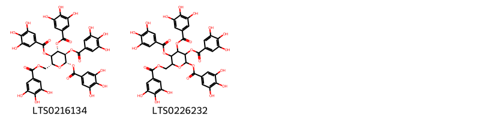{ width=100% }
    <figcaption>Hình ảnh cấu trúc hóa học của 2 hoạt chất thuộc nhóm Tannins gồm ['(2s,3r,4s,5r,6r)-3,4,5-tris(3,4,5-trihydroxybenzoyloxy)-6-[(3,4,5-trihydroxybenzoyloxy)methyl]oxan-2-yl 3,4,5-trihydroxybenzoate (LTS0216134)', '3,4,5-tris(3,4,5-trihydroxybenzoyloxy)-6-[(3,4,5-trihydroxybenzoyloxy)methyl]oxan-2-yl 3,4,5-trihydroxybenzoate (LTS0226232)'].</figcaption>
</figure>
#### Nhóm Unsaturated hydrocarbons
<figure markdown="span">
    { width=100% }
    <figcaption>Hình ảnh cấu trúc hóa học của 1 hoạt chất thuộc nhóm Unsaturated hydrocarbons gồm ['α terpinene (LTS0232891)'].</figcaption>
</figure>

---

### Dược dân tộc học

Danh sách các quốc gia có sử dụng *Mangifera indica* trong điều trị các bệnh. 

| Country   | Disease                                                                                                          | Bệnh                                                                                                                                    |
|:----------|:-----------------------------------------------------------------------------------------------------------------|:----------------------------------------------------------------------------------------------------------------------------------------|
| Asia      | Poison                                                                                                           | Chất độc                                                                                                                                |
| China     | Vermifuge                                                                                                        | Thuốc diệt sán                                                                                                                          |
| Elsewhere | Astringent, Dentifrice, Diaphoretic, Diuretic, Hemostat, Laxative, Antitussive, Astringent, Fungicide, Stomachic | Chất làm se, Kem đánh răng, Thuốc lợi tiểu, Thuốc cầm máu, Thuốc nhuận tràng, Thuốc chống ho, Chất làm se, Thuốc diệt nấm, Thuốc dạ dày |
| Guatemala | Vermifuge, Taenifuge                                                                                             | Vermifuge, Taenifuge                                                                                                                    |
| Haiti     | Astringent, Parasiticide, Stomachic, Vermifuge                                                                   | Chất làm se, Thuốc diệt ký sinh trùng, Dạ dày, Máy làm sạch                                                                             |
| Iraq      | Stomachic                                                                                                        | Sững sờ                                                                                                                                 |
| Malaya    | Ascaricide                                                                                                       | Thuốc diệt Ascaricide                                                                                                                   |
| Mexico    | Astringent, Vermifuge, Dentifrice                                                                                | Chất làm se, Vermifuge, Dentifrice                                                                                                      |
| Panama    | Antiseptic, Laxative                                                                                             | Khử trùng, nhuận tràng                                                                                                                  |
| Samoa     | Vermifuge                                                                                                        | Thuốc diệt sán                                                                                                                          |
| Sumatra   | Vermifuge                                                                                                        | Thuốc diệt sán                                                                                                                          |
| Turkey    | Astringent, Diuretic, Sudorific, Tonic, Vermifuge, Apertif, Laxative, Refrigerant                                | Chất làm se, Thuốc lợi tiểu, Nước giải khát, Thuốc bổ, Máy tạo bọt, Apertif, Thuốc nhuận tràng, Chất làm lạnh                           |

---

# Chi Pleiogynium

??? note "Danh sách các dược liệu thuộc chi"
    
	 - *Pleiogynium timoriense*

---
## Pleiogynium timoriense
### Thông tin về thực vật

!!! info "Phân loại thực vật của *Pleiogynium timoriense* từ GIBF:"
    - **Kingdom:** Plantae
    - **Phylum:** Tracheophyta
    - **Order:** Sapindales
    - **Family:** Anacardiaceae
    - **Genus:** Pleiogynium
    - **Species:** *Pleiogynium timoriense*

 

| Label (VI)   | Label (EN)   | Scientific Name        | Descriptions (VI)   | Descriptions (EN)                           | Also Known As (VI)   | Also Known As (EN)                                        |
|:-------------|:-------------|:-----------------------|:--------------------|:--------------------------------------------|:---------------------|:----------------------------------------------------------|
| N/A          | N/A          | Pleiogynium timoriense |                     | species of tree in the family Anacardiaceae | ['']                 | ['Burdekin plum', 'Guybalum', 'Sweet plum', 'Tulip plum'] |

#### Phân bố trên thế giới

**Từ CSDL GIBF** Fiji, Australia, Japan, Belgium, Vanuatu, Tonga, United States of America, Timor-Leste

#### Phân bố tại Việt Nam

**Từ CSDL GIBF**: Không có ghi nhận ở Việt Nam

---
### Thành phần hóa học
        
- Theo cơ sở dữ liệu lotus: Từ loài *Pleiogynium timoriense* đã phân lập và xác định được 17 hoạt chất thuộc về các nhóm Flavonoids, Organooxygen compounds, Tannins, Benzene and substituted derivatives. 

|    | chemicalTaxonomyClassyfireClass     |   smiles_count |
|---:|:------------------------------------|---------------:|
|  0 | Benzene and substituted derivatives |              2 |
|  1 | Flavonoids                          |              2 |
|  2 | Organooxygen compounds              |             12 |
|  3 | Tannins                             |              1 |

#### Nhóm Benzene and substituted derivatives
<figure markdown="span">
    { width=100% }
    <figcaption>Hình ảnh cấu trúc hóa học của 2 hoạt chất thuộc nhóm Benzene and substituted derivatives gồm ['galop (LTS0222857)', '3,4-dihydroxybenzoic acid (LTS0018765)'].</figcaption>
</figure>
#### Nhóm Flavonoids
<figure markdown="span">
    { width=100% }
    <figcaption>Hình ảnh cấu trúc hóa học của 2 hoạt chất thuộc nhóm Flavonoids gồm ['kaempherol (LTS0155822)', 'quercetin (LTS0004651)'].</figcaption>
</figure>
#### Nhóm Organooxygen compounds
<figure markdown="span">
    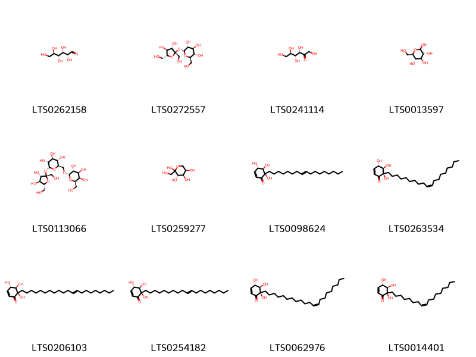{ width=100% }
    <figcaption>Hình ảnh cấu trúc hóa học của 12 hoạt chất thuộc nhóm Organooxygen compounds gồm ['(+)-glucose (LTS0262158)', 'sucrose (LTS0272557)', 'keto-d-fructose (LTS0241114)', 'glucose (LTS0013597)', 'raffinose (LTS0113066)', 'd-fructopyranose (LTS0259277)', '(4s,5r,6r)-6-(heptadec-8-en-1-yl)-4,5,6-trihydroxycyclohex-2-en-1-one (LTS0098624)', '(4s,5r,6r)-4,5,6-trihydroxy-6-[(10z)-nonadec-10-en-1-yl]cyclohex-2-en-1-one (LTS0263534)', '(4s,5r,6r)-6-(henicos-12-en-1-yl)-4,5,6-trihydroxycyclohex-2-en-1-one (LTS0206103)', '(4s,5r,6r)-4,5,6-trihydroxy-6-(nonadec-10-en-1-yl)cyclohex-2-en-1-one (LTS0254182)', '(4s,5r,6r)-6-[(12z)-henicos-12-en-1-yl]-4,5,6-trihydroxycyclohex-2-en-1-one (LTS0062976)', '(4s,5r,6r)-6-[(8z)-heptadec-8-en-1-yl]-4,5,6-trihydroxycyclohex-2-en-1-one (LTS0014401)'].</figcaption>
</figure>
#### Nhóm Tannins
<figure markdown="span">
    { width=100% }
    <figcaption>Hình ảnh cấu trúc hóa học của 1 hoạt chất thuộc nhóm Tannins gồm ['ellagic acid (LTS0037297)'].</figcaption>
</figure>

---

### Dược dân tộc học

Danh sách các quốc gia có sử dụng *Pleiogynium timoriense* trong điều trị các bệnh. 

| Country   | Disease   | Bệnh          |
|:----------|:----------|:--------------|
| Elsewhere | Piscicide | Thuốc diệt cá |

---

# Chi Harpephyllum

??? note "Danh sách các dược liệu thuộc chi"
    
	 - *Harpephyllum caffrum*

---
## Harpephyllum caffrum
### Thông tin về thực vật

!!! info "Phân loại thực vật của *Harpephyllum caffrum* từ GIBF:"
    - **Kingdom:** Plantae
    - **Phylum:** Tracheophyta
    - **Order:** Sapindales
    - **Family:** Anacardiaceae
    - **Genus:** Harpephyllum
    - **Species:** *Harpephyllum caffrum*

 

| Label (VI)   | Label (EN)   | Scientific Name      | Descriptions (VI)   | Descriptions (EN)    | Also Known As (VI)   | Also Known As (EN)                          |
|:-------------|:-------------|:---------------------|:--------------------|:---------------------|:---------------------|:--------------------------------------------|
| N/A          | N/A          | Harpephyllum caffrum |                     | African tree species | ['']                 | ['wild plum', 'Kaffir date', 'Kaffir plum'] |

#### Phân bố trên thế giới

**Từ CSDL GIBF** South Africa

#### Phân bố tại Việt Nam

**Từ CSDL GIBF**: Không có ghi nhận ở Việt Nam

---
### Thành phần hóa học
        
- Theo cơ sở dữ liệu lotus: Từ loài *Harpephyllum caffrum* đã phân lập và xác định được 26 hoạt chất thuộc về các nhóm Fatty Acyls, Flavonoids, Benzene and substituted derivatives, Organooxygen compounds, Tannins. 

|    | chemicalTaxonomyClassyfireClass     |   smiles_count |
|---:|:------------------------------------|---------------:|
|  0 | Benzene and substituted derivatives |              7 |
|  1 | Fatty Acyls                         |              1 |
|  2 | Flavonoids                          |              7 |
|  3 | Organooxygen compounds              |              8 |
|  4 | Tannins                             |              3 |

#### Nhóm Benzene and substituted derivatives
<figure markdown="span">
    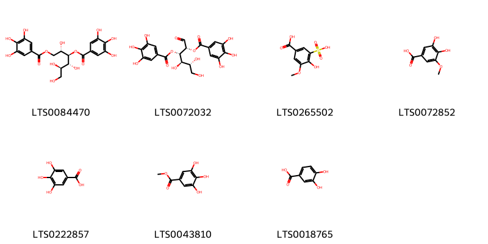{ width=100% }
    <figcaption>Hình ảnh cấu trúc hóa học của 7 hoạt chất thuộc nhóm Benzene and substituted derivatives gồm ['(2s,3r,4r,5r)-2,4,5,6-tetrahydroxy-1-(3,4,5-trihydroxybenzoyloxy)hexan-3-yl 3,4,5-trihydroxybenzoate (LTS0084470)', '(2r,3s,4r,5r)-4,5,6-trihydroxy-1-oxo-2-(3,4,5-trihydroxybenzoyloxy)hexan-3-yl 3,4,5-trihydroxybenzoate (LTS0072032)', '4-hydroxy-3-methoxy-5-sulfobenzoic acid (LTS0265502)', '3-o-methylgallic acid (LTS0072852)', 'galop (LTS0222857)', 'methyl gallate (LTS0043810)', '3,4-dihydroxybenzoic acid (LTS0018765)'].</figcaption>
</figure>
#### Nhóm Fatty Acyls
<figure markdown="span">
    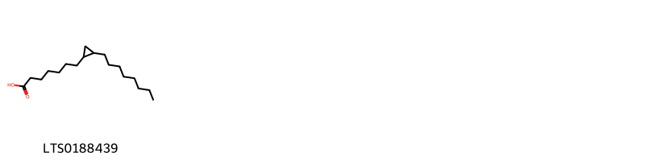{ width=100% }
    <figcaption>Hình ảnh cấu trúc hóa học của 1 hoạt chất thuộc nhóm Fatty Acyls gồm ['7-(2-octylcyclopropyl)heptanoic acid (LTS0188439)'].</figcaption>
</figure>
#### Nhóm Flavonoids
<figure markdown="span">
    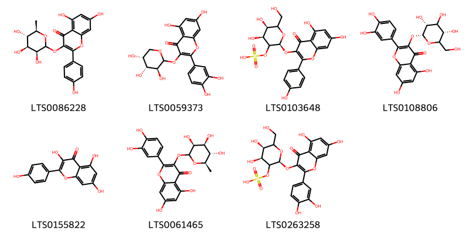{ width=100% }
    <figcaption>Hình ảnh cấu trúc hóa học của 7 hoạt chất thuộc nhóm Flavonoids gồm ['5,7-dihydroxy-2-(4-hydroxyphenyl)-3-{[(3s,4s,5s,6r)-3,4,5-trihydroxy-6-methyloxan-2-yl]oxy}chromen-4-one (LTS0086228)', '2-(3,4-dihydroxyphenyl)-5,7-dihydroxy-3-{[(3s,4r,5r)-3,4,5-trihydroxyoxan-2-yl]oxy}chromen-4-one (LTS0059373)', '[(2s,4s,5r)-2-{[5,7-dihydroxy-2-(4-hydroxyphenyl)-4-oxochromen-3-yl]oxy}-4,5-dihydroxy-6-(hydroxymethyl)oxan-3-yl]oxidanesulfonic acid (LTS0103648)', '2-(3,4-dihydroxyphenyl)-5,7-dihydroxy-3-{[(2r,3r,5s)-3,4,5-trihydroxy-6-(hydroxymethyl)oxan-2-yl]oxy}chromen-4-one (LTS0108806)', 'kaempherol (LTS0155822)', '2-(3,4-dihydroxyphenyl)-5,7-dihydroxy-3-{[(3s,4s,5s,6r)-3,4,5-trihydroxy-6-methyloxan-2-yl]oxy}chromen-4-one (LTS0061465)', '[(2s,4s,5r)-2-{[2-(3,4-dihydroxyphenyl)-5,7-dihydroxy-4-oxochromen-3-yl]oxy}-4,5-dihydroxy-6-(hydroxymethyl)oxan-3-yl]oxidanesulfonic acid (LTS0263258)'].</figcaption>
</figure>
#### Nhóm Organooxygen compounds
<figure markdown="span">
    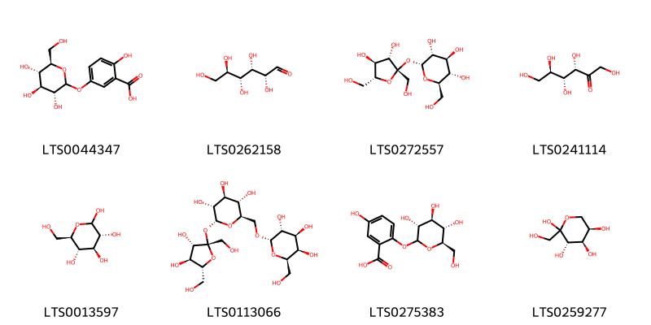{ width=100% }
    <figcaption>Hình ảnh cấu trúc hóa học của 8 hoạt chất thuộc nhóm Organooxygen compounds gồm ['2-hydroxy-5-{[(3r,4s,5s,6r)-3,4,5-trihydroxy-6-(hydroxymethyl)oxan-2-yl]oxy}benzoic acid (LTS0044347)', '(+)-glucose (LTS0262158)', 'sucrose (LTS0272557)', 'keto-d-fructose (LTS0241114)', 'glucose (LTS0013597)', 'raffinose (LTS0113066)', '5-hydroxy-2-{[(3r,4s,5s,6r)-3,4,5-trihydroxy-6-(hydroxymethyl)oxan-2-yl]oxy}benzoic acid (LTS0275383)', 'd-fructopyranose (LTS0259277)'].</figcaption>
</figure>
#### Nhóm Tannins
<figure markdown="span">
    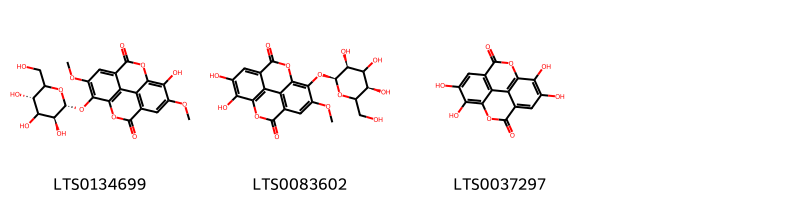{ width=100% }
    <figcaption>Hình ảnh cấu trúc hóa học của 3 hoạt chất thuộc nhóm Tannins gồm ['7-hydroxy-6,13-dimethoxy-14-{[(2r,3s,5s)-3,4,5-trihydroxy-6-(hydroxymethyl)oxan-2-yl]oxy}-2,9-dioxatetracyclo[6.6.2.0⁴,¹⁶.0¹¹,¹⁵]hexadeca-1(15),4(16),5,7,11,13-hexaene-3,10-dione (LTS0134699)', '13,14-dihydroxy-6-methoxy-7-{[(2s,3s,5r)-3,4,5-trihydroxy-6-(hydroxymethyl)oxan-2-yl]oxy}-2,9-dioxatetracyclo[6.6.2.0⁴,¹⁶.0¹¹,¹⁵]hexadeca-1(15),4(16),5,7,11,13-hexaene-3,10-dione (LTS0083602)', 'ellagic acid (LTS0037297)'].</figcaption>
</figure>

---

### Dược dân tộc học

Danh sách các quốc gia có sử dụng *Harpephyllum caffrum* trong điều trị các bệnh. 

| Country      | Disease   | Bệnh   |
|:-------------|:----------|:-------|
| Africa       | Emetic    | Phôi   |
| Africa(Zulu) | Emetic    | Phôi   |

---

# Chi Mauria

??? note "Danh sách các dược liệu thuộc chi"
    
	 - *Mauria birringo*

---
## Mauria birringo
### Thông tin về thực vật

!!! info "Phân loại thực vật của *Mauria heterophylla* từ GIBF:"
    - **Kingdom:** Plantae
    - **Phylum:** Tracheophyta
    - **Order:** Sapindales
    - **Family:** Anacardiaceae
    - **Genus:** Mauria
    - **Species:** *Mauria heterophylla*

 

| Label (VI)   | Label (EN)   | Scientific Name      | Descriptions (VI)   | Descriptions (EN)    | Also Known As (VI)   | Also Known As (EN)                          |
|:-------------|:-------------|:---------------------|:--------------------|:---------------------|:---------------------|:--------------------------------------------|
| N/A          | N/A          | Harpephyllum caffrum |                     | African tree species | ['']                 | ['wild plum', 'Kaffir date', 'Kaffir plum'] |

#### Phân bố trên thế giới

**Từ CSDL GIBF** nan, Ecuador, Colombia, Costa Rica, Peru, Panama

#### Phân bố tại Việt Nam

**Từ CSDL GIBF**: Không có ghi nhận ở Việt Nam

---
### Thành phần hóa học
        
- Theo cơ sở dữ liệu lotus: Từ loài *Mauria heterophylla* đã phân lập và xác định được Chưa có hoạt chất nào được phân lập. hoạt chất thuộc về các nhóm Không có hoạt chất nào được phân lập. 

Không có hình ảnh nào được tạo ra

---

### Dược dân tộc học

Danh sách các quốc gia có sử dụng *Mauria heterophylla* trong điều trị các bệnh. 

| Country   | Disease   | Bệnh     |
|:----------|:----------|:---------|
| Panama    | Poison    | Chất độc |

---

# Chi Rhus

??? note "Danh sách các dược liệu thuộc chi"
    
	 - *Rhus aromatica*
	 - *Rhus coriaria*
	 - *Rhus cotinus*
	 - *Rhus glabra*
	 - *Rhus integrifolia*
	 - *Rhus javanica*
	 - *Rhus juglandsifolium*
	 - *Rhus parviflora*
	 - *Rhus punjabensis*
	 - *Rhus radicans*
	 - *Rhus semialata*
	 - *Rhus striata*
	 - *Rhus succedanea*
	 - *Rhus typhina*
	 - *Rhus vernicifera*
	 - *Rhus verniciflua*
	 - *Rhus vestita*
	 - *Rhus wallichii*

---
## Rhus aromatica
### Thông tin về thực vật

!!! info "Phân loại thực vật của *Rhus aromatica* từ GIBF:"
    - **Kingdom:** Plantae
    - **Phylum:** Tracheophyta
    - **Order:** Sapindales
    - **Family:** Anacardiaceae
    - **Genus:** Rhus
    - **Species:** *Rhus aromatica*

 

| Label (VI)   | Label (EN)   | Scientific Name   | Descriptions (VI)   | Descriptions (EN)   | Also Known As (VI)   | Also Known As (EN)   |
|:-------------|:-------------|:------------------|:--------------------|:--------------------|:---------------------|:---------------------|
| N/A          | N/A          | Rhus aromatica    | loài thực vật       | species of plant    | ['']                 | ['']                 |

#### Phân bố trên thế giới

**Từ CSDL GIBF** United States of America, Canada, Mexico

#### Phân bố tại Việt Nam

**Từ CSDL GIBF**: Không có ghi nhận ở Việt Nam

---
### Thành phần hóa học
        
- Theo cơ sở dữ liệu lotus: Từ loài *Rhus aromatica* đã phân lập và xác định được 2 hoạt chất thuộc về các nhóm Benzene and substituted derivatives. 

|    | chemicalTaxonomyClassyfireClass     |   smiles_count |
|---:|:------------------------------------|---------------:|
|  0 | Benzene and substituted derivatives |              2 |

#### Nhóm Benzene and substituted derivatives
<figure markdown="span">
    { width=100% }
    <figcaption>Hình ảnh cấu trúc hóa học của 2 hoạt chất thuộc nhóm Benzene and substituted derivatives gồm ['galop (LTS0222857)', 'ethyl gallate (LTS0270645)'].</figcaption>
</figure>

---

### Dược dân tộc học

Danh sách các quốc gia có sử dụng *Rhus aromatica* trong điều trị các bệnh. 

| Country   | Disease                                 | Bệnh                                             |
|:----------|:----------------------------------------|:-------------------------------------------------|
| Turkey    | Antiseptic, Astringent, Diuretic, Tonic | Khử trùng, Chất làm se, Thuốc lợi tiểu, Thuốc bổ |
| US        | Astringent, Diuretic                    | Chất làm se, lợi tiểu                            |

---

---
## Rhus coriaria
### Thông tin về thực vật

!!! info "Phân loại thực vật của *Rhus coriaria* từ GIBF:"
    - **Kingdom:** Plantae
    - **Phylum:** Tracheophyta
    - **Order:** Sapindales
    - **Family:** Anacardiaceae
    - **Genus:** Rhus
    - **Species:** *Rhus coriaria*

 

| Label (VI)   | Label (EN)   | Scientific Name   | Descriptions (VI)   | Descriptions (EN)   | Also Known As (VI)   | Also Known As (EN)                            |
|:-------------|:-------------|:------------------|:--------------------|:--------------------|:---------------------|:----------------------------------------------|
| N/A          | N/A          | Rhus coriaria     | loài thực vật       | species of plant    | ['']                 | ['Sicilian sumac', 'Sumac', "tanner's sumac"] |

#### Phân bố trên thế giới

**Từ CSDL GIBF** Ukraine, nan, Israel, Italy, Montenegro, Syrian Arab Republic, Cyprus, Iraq, Georgia, Spain, Azerbaijan, Türkiye, Portugal, Russian Federation, France, Croatia, Greece

#### Phân bố tại Việt Nam

**Từ CSDL GIBF**: Không có ghi nhận ở Việt Nam

---
### Thành phần hóa học
        
- Theo cơ sở dữ liệu lotus: Từ loài *Rhus coriaria* đã phân lập và xác định được 22 hoạt chất thuộc về các nhóm Flavonoids, Depsides and depsidones, Benzene and substituted derivatives. 

|    | chemicalTaxonomyClassyfireClass     |   smiles_count |
|---:|:------------------------------------|---------------:|
|  0 | Benzene and substituted derivatives |              3 |
|  1 | Depsides and depsidones             |              2 |
|  2 | Flavonoids                          |             16 |

#### Nhóm Benzene and substituted derivatives
<figure markdown="span">
    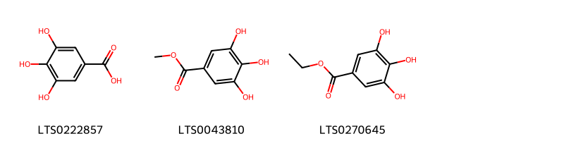{ width=100% }
    <figcaption>Hình ảnh cấu trúc hóa học của 3 hoạt chất thuộc nhóm Benzene and substituted derivatives gồm ['galop (LTS0222857)', 'methyl gallate (LTS0043810)', 'ethyl gallate (LTS0270645)'].</figcaption>
</figure>
#### Nhóm Depsides and depsidones
<figure markdown="span">
    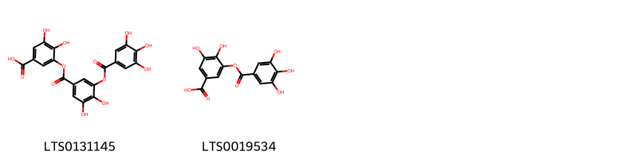{ width=100% }
    <figcaption>Hình ảnh cấu trúc hóa học của 2 hoạt chất thuộc nhóm Depsides and depsidones gồm ['3-[3,4-dihydroxy-5-(3,4,5-trihydroxybenzoyloxy)benzoyloxy]-4,5-dihydroxybenzoic acid (LTS0131145)', 'digallic acid (LTS0019534)'].</figcaption>
</figure>
#### Nhóm Flavonoids
<figure markdown="span">
    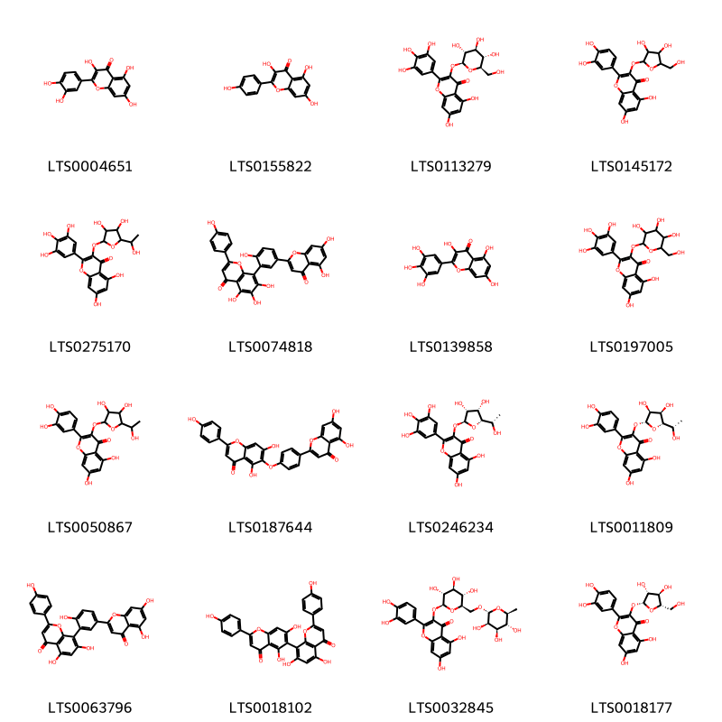{ width=100% }
    <figcaption>Hình ảnh cấu trúc hóa học của 16 hoạt chất thuộc nhóm Flavonoids gồm ['quercetin (LTS0004651)', 'kaempherol (LTS0155822)', '5,7-dihydroxy-3-{[(2s,3r,4s,5s,6r)-3,4,5-trihydroxy-6-(hydroxymethyl)oxan-2-yl]oxy}-2-(3,4,5-trihydroxyphenyl)chromen-4-one (LTS0113279)', '3-{[3,4-dihydroxy-5-(hydroxymethyl)oxolan-2-yl]oxy}-2-(3,4-dihydroxyphenyl)-5,7-dihydroxychromen-4-one (LTS0145172)', '3-{[3,4-dihydroxy-5-(1-hydroxyethyl)oxolan-2-yl]oxy}-5,7-dihydroxy-2-(3,4,5-trihydroxyphenyl)chromen-4-one (LTS0275170)', '8-[5-(5,7-dihydroxy-4-oxochromen-2-yl)-2-hydroxyphenyl]-5,6,7-trihydroxy-2-(4-hydroxyphenyl)chromen-4-one (LTS0074818)', 'myricetin (LTS0139858)', '5,7-dihydroxy-3-{[3,4,5-trihydroxy-6-(hydroxymethyl)oxan-2-yl]oxy}-2-(3,4,5-trihydroxyphenyl)chromen-4-one (LTS0197005)', '3-{[3,4-dihydroxy-5-(1-hydroxyethyl)oxolan-2-yl]oxy}-2-(3,4-dihydroxyphenyl)-5,7-dihydroxychromen-4-one (LTS0050867)', 'hinokiflavone (LTS0187644)', '3-{[(2s,3r,4s,5s)-3,4-dihydroxy-5-[(1s)-1-hydroxyethyl]oxolan-2-yl]oxy}-5,7-dihydroxy-2-(3,4,5-trihydroxyphenyl)chromen-4-one (LTS0246234)', '3-{[(2r,3s,4r,5s)-3,4-dihydroxy-5-[(1s)-1-hydroxyethyl]oxolan-2-yl]oxy}-2-(3,4-dihydroxyphenyl)-5,7-dihydroxychromen-4-one (LTS0011809)', 'amentoflavone (LTS0063796)', 'agathisflavone (LTS0018102)', '3-rutinosyl quercetin (LTS0032845)', '3-{[(2r,3r,4r,5s)-3,4-dihydroxy-5-(hydroxymethyl)oxolan-2-yl]oxy}-2-(3,4-dihydroxyphenyl)-5,7-dihydroxychromen-4-one (LTS0018177)'].</figcaption>
</figure>

---

### Dược dân tộc học

Danh sách các quốc gia có sử dụng *Rhus coriaria* trong điều trị các bệnh. 

| Country   | Disease                      | Bệnh                          |
|:----------|:-----------------------------|:------------------------------|
| Turkey    | Astringent, Hemostat, Poison | Chất làm se, Hemostat, Poison |

---

---
## Rhus cotinus
### Thông tin về thực vật

!!! info "Phân loại thực vật của *N/A* từ GIBF:"
    - **Kingdom:** Plantae
    - **Phylum:** Tracheophyta
    - **Order:** Sapindales
    - **Family:** Anacardiaceae
    - **Genus:** Cotinus
    - **Species:** *N/A*

 

| Label (VI)   | Label (EN)   | Scientific Name   | Descriptions (VI)   | Descriptions (EN)   | Also Known As (VI)   | Also Known As (EN)   |
|:-------------|:-------------|:------------------|:--------------------|:--------------------|:---------------------|:---------------------|
| N/A          | N/A          | Rhus cotinus      | loài thực vật       | species of plant    | ['']                 | ['']                 |

#### Phân bố trên thế giới

**Từ CSDL GIBF** Italy, Bulgaria, Australia, Belgium, Georgia, Canada, Ukraine, Hungary, Türkiye, Albania, Russian Federation, United States of America, Slovenia, Croatia, Bosnia and Herzegovina, Germany, Romania, Switzerland, Armenia, Austria, France, China, United Kingdom of Great Britain and Northern Ireland, Serbia, New Zealand

#### Phân bố tại Việt Nam

**Từ CSDL GIBF**: Không có ghi nhận ở Việt Nam

---
### Thành phần hóa học
        
- Theo cơ sở dữ liệu lotus: Từ loài *N/A* đã phân lập và xác định được Chưa có hoạt chất nào được phân lập. hoạt chất thuộc về các nhóm Không có hoạt chất nào được phân lập. 

Không có hình ảnh nào được tạo ra

---

### Dược dân tộc học

Danh sách các quốc gia có sử dụng *N/A* trong điều trị các bệnh. 

| Country   | Disease                                 | Bệnh                               |
|:----------|:----------------------------------------|:-----------------------------------|
| Turkey    | Antiseptic, Astringent, Tonic, Hemostat | Khử trùng, Làm se, Tonic, Hemostat |

---

---
## Rhus glabra
### Thông tin về thực vật

!!! info "Phân loại thực vật của *Rhus glabra* từ GIBF:"
    - **Kingdom:** Plantae
    - **Phylum:** Tracheophyta
    - **Order:** Sapindales
    - **Family:** Anacardiaceae
    - **Genus:** Rhus
    - **Species:** *Rhus glabra*

 

| Label (VI)   | Label (EN)   | Scientific Name   | Descriptions (VI)   | Descriptions (EN)   | Also Known As (VI)   | Also Known As (EN)                                                                       |
|:-------------|:-------------|:------------------|:--------------------|:--------------------|:---------------------|:-----------------------------------------------------------------------------------------|
| N/A          | N/A          | Rhus glabra       | loài thực vật       | species of plant    | ['']                 | ['scarlet sumac', 'smooth sumac', 'upland sumac', 'white sumac', 'Rocky Mountain sumac'] |

#### Phân bố trên thế giới

**Từ CSDL GIBF** United States of America, Canada

#### Phân bố tại Việt Nam

**Từ CSDL GIBF**: Không có ghi nhận ở Việt Nam

---
### Thành phần hóa học
        
- Theo cơ sở dữ liệu lotus: Từ loài *Rhus glabra* đã phân lập và xác định được 9 hoạt chất thuộc về các nhóm Flavonoids, Organooxygen compounds, Benzene and substituted derivatives. 

|    | chemicalTaxonomyClassyfireClass     |   smiles_count |
|---:|:------------------------------------|---------------:|
|  0 | Benzene and substituted derivatives |              3 |
|  1 | Flavonoids                          |              5 |
|  2 | Organooxygen compounds              |              1 |

#### Nhóm Benzene and substituted derivatives
<figure markdown="span">
    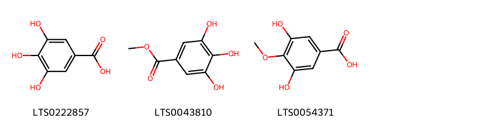{ width=100% }
    <figcaption>Hình ảnh cấu trúc hóa học của 3 hoạt chất thuộc nhóm Benzene and substituted derivatives gồm ['galop (LTS0222857)', 'methyl gallate (LTS0043810)', '3,5-dihydroxy-4-methoxybenzoic acid (LTS0054371)'].</figcaption>
</figure>
#### Nhóm Flavonoids
<figure markdown="span">
    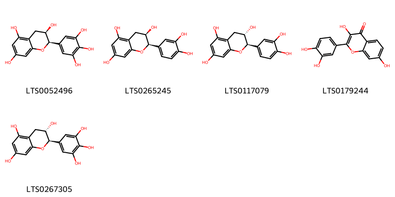{ width=100% }
    <figcaption>Hình ảnh cấu trúc hóa học của 5 hoạt chất thuộc nhóm Flavonoids gồm ['epigallocatechin (LTS0052496)', 'ent-epicatechin (LTS0265245)', '(+)-catechol (LTS0117079)', "3,7,3',4'-tetrahydroxyflavone (LTS0179244)", 'gallocatechol (LTS0267305)'].</figcaption>
</figure>
#### Nhóm Organooxygen compounds
<figure markdown="span">
    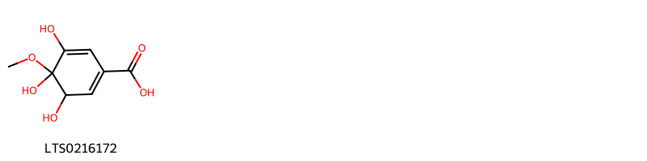{ width=100% }
    <figcaption>Hình ảnh cấu trúc hóa học của 1 hoạt chất thuộc nhóm Organooxygen compounds gồm ['3,4,5-trihydroxy-4-methoxycyclohexa-1,5-diene-1-carboxylic acid (LTS0216172)'].</figcaption>
</figure>

---

### Dược dân tộc học

Danh sách các quốc gia có sử dụng *Rhus glabra* trong điều trị các bệnh. 

| Country        | Disease                                  | Bệnh                                           |
|:---------------|:-----------------------------------------|:-----------------------------------------------|
| Mexico         | Astringent, Refrigerant                  | Chất làm se, Chất làm lạnh                     |
| Turkey         | Astringent, Diuretic, Refrigerant, Tonic | Chất làm se, lợi tiểu, chất làm lạnh, thuốc bổ |
| US             | Astringent, Tonic                        | Chất làm se, Thuốc bổ                          |
| US(Amerindian) | Hemostat                                 | Máy cầm máu                                    |
| US(Flathead)   | Laxative                                 | Nhuận trường                                   |
| US(Ojibwe)     | Refrigerant                              | Chất làm lạnh                                  |

---

---
## Rhus integrifolia
### Thông tin về thực vật

!!! info "Phân loại thực vật của *Rhus integrifolia* từ GIBF:"
    - **Kingdom:** Plantae
    - **Phylum:** Tracheophyta
    - **Order:** Sapindales
    - **Family:** Anacardiaceae
    - **Genus:** Rhus
    - **Species:** *Rhus integrifolia*

 

| Label (VI)   | Label (EN)   | Scientific Name   | Descriptions (VI)   | Descriptions (EN)   | Also Known As (VI)   | Also Known As (EN)   |
|:-------------|:-------------|:------------------|:--------------------|:--------------------|:---------------------|:---------------------|
| N/A          | N/A          | Rhus integrifolia | loài thực vật       | species of plant    | ['']                 | ['']                 |

#### Phân bố trên thế giới

**Từ CSDL GIBF** United States of America, Mexico

#### Phân bố tại Việt Nam

**Từ CSDL GIBF**: Không có ghi nhận ở Việt Nam

---
### Thành phần hóa học
        
- Theo cơ sở dữ liệu lotus: Từ loài *Rhus integrifolia* đã phân lập và xác định được Chưa có hoạt chất nào được phân lập. hoạt chất thuộc về các nhóm Không có hoạt chất nào được phân lập. 

Không có hình ảnh nào được tạo ra

---

### Dược dân tộc học

Danh sách các quốc gia có sử dụng *Rhus integrifolia* trong điều trị các bệnh. 

| Country   | Disease     | Bệnh          |
|:----------|:------------|:--------------|
| US(CA)    | Refrigerant | Chất làm lạnh |

---

---
## Rhus javanica
### Thông tin về thực vật

!!! info "Phân loại thực vật của *Brucea javanica* từ GIBF:"
    - **Kingdom:** Plantae
    - **Phylum:** Tracheophyta
    - **Order:** Sapindales
    - **Family:** Simaroubaceae
    - **Genus:** Brucea
    - **Species:** *Brucea javanica*

 

| Label (VI)   | Label (EN)   | Scientific Name   | Descriptions (VI)   | Descriptions (EN)   | Also Known As (VI)   | Also Known As (EN)   |
|:-------------|:-------------|:------------------|:--------------------|:--------------------|:---------------------|:---------------------|
| N/A          | N/A          | Rhus javanica     | loài thực vật       | species of plant    | ['']                 | ['']                 |

#### Phân bố trên thế giới

**Từ CSDL GIBF** Korea, Republic of, Chinese Taipei, Japan

#### Phân bố tại Việt Nam

**Từ CSDL GIBF**: Không có ghi nhận ở Việt Nam

---
### Thành phần hóa học
        
- Theo cơ sở dữ liệu lotus: Từ loài *Brucea javanica* đã phân lập và xác định được Chưa có hoạt chất nào được phân lập. hoạt chất thuộc về các nhóm Không có hoạt chất nào được phân lập. 

Không có hình ảnh nào được tạo ra

---

### Dược dân tộc học

Danh sách các quốc gia có sử dụng *Brucea javanica* trong điều trị các bệnh. 

| Country   | Disease                                        | Bệnh                                         |
|:----------|:-----------------------------------------------|:---------------------------------------------|
| Elsewhere | Antidiarrheic, Astringent, Rubefacient, Rennet | Chống tiêu chảy, Làm se, Rubefacient, Rennet |

---

---
## Rhus juglandsifolium
### Thông tin về thực vật

!!! info "Phân loại thực vật của *N/A* từ GIBF:"
    - **Kingdom:** Plantae
    - **Phylum:** Tracheophyta
    - **Order:** Sapindales
    - **Family:** Anacardiaceae
    - **Genus:** Toxicodendron
    - **Species:** *N/A*

 

| Label (VI)   | Label (EN)   | Scientific Name   | Descriptions (VI)   | Descriptions (EN)   | Also Known As (VI)   | Also Known As (EN)   |
|:-------------|:-------------|:------------------|:--------------------|:--------------------|:---------------------|:---------------------|
| N/A          | N/A          | Rhus javanica     | loài thực vật       | species of plant    | ['']                 | ['']                 |

#### Phân bố trên thế giới

**Từ CSDL GIBF** Hong Kong, Japan, Chinese Taipei, United States of America, Mexico, Canada

#### Phân bố tại Việt Nam

**Từ CSDL GIBF**: Không có ghi nhận ở Việt Nam

---
### Thành phần hóa học
        
- Theo cơ sở dữ liệu lotus: Từ loài *N/A* đã phân lập và xác định được Chưa có hoạt chất nào được phân lập. hoạt chất thuộc về các nhóm Không có hoạt chất nào được phân lập. 

Không có hình ảnh nào được tạo ra

---

### Dược dân tộc học

Danh sách các quốc gia có sử dụng *N/A* trong điều trị các bệnh. 

| Country   | Disease   | Bệnh     |
|:----------|:----------|:---------|
| Venezuela | Poison    | Chất độc |

---

---
## Rhus parviflora
### Thông tin về thực vật

!!! info "Phân loại thực vật của *Searsia parviflora* từ GIBF:"
    - **Kingdom:** Plantae
    - **Phylum:** Tracheophyta
    - **Order:** Sapindales
    - **Family:** Anacardiaceae
    - **Genus:** Searsia
    - **Species:** *Searsia parviflora*

 

| Label (VI)   | Label (EN)   | Scientific Name   | Descriptions (VI)   | Descriptions (EN)   | Also Known As (VI)   | Also Known As (EN)   |
|:-------------|:-------------|:------------------|:--------------------|:--------------------|:---------------------|:---------------------|
| N/A          | N/A          | Rhus parviflora   | loài thực vật       | species of plant    | ['']                 | ['']                 |

#### Phân bố trên thế giới

**Từ CSDL GIBF** nan, South Africa, Bhutan, India, unknown or invalid, Nepal

#### Phân bố tại Việt Nam

**Từ CSDL GIBF**: Không có ghi nhận ở Việt Nam

---
### Thành phần hóa học
        
- Theo cơ sở dữ liệu lotus: Từ loài *Searsia parviflora* đã phân lập và xác định được 1 hoạt chất thuộc về các nhóm Carboxylic acids and derivatives. 

|    | chemicalTaxonomyClassyfireClass   |   smiles_count |
|---:|:----------------------------------|---------------:|
|  0 | Carboxylic acids and derivatives  |              1 |

#### Nhóm Carboxylic acids and derivatives
<figure markdown="span">
    { width=100% }
    <figcaption>Hình ảnh cấu trúc hóa học của 1 hoạt chất thuộc nhóm Carboxylic acids and derivatives gồm ['(3s,6s)-3-{[5,7-bis(3-methylbut-2-en-1-yl)-2-(2-methylbut-3-en-2-yl)-1h-indol-3-yl]methyl}-6-methyl-3,6-dihydropyrazine-2,5-diol (LTS0256362)'].</figcaption>
</figure>

---

### Dược dân tộc học

Danh sách các quốc gia có sử dụng *Searsia parviflora* trong điều trị các bệnh. 

| Country   | Disease   | Bệnh           |
|:----------|:----------|:---------------|
| Elsewhere | Vermifuge | Thuốc diệt sán |

---

---
## Rhus punjabensis
### Thông tin về thực vật

!!! info "Phân loại thực vật của *Rhus punjabensis* từ GIBF:"
    - **Kingdom:** Plantae
    - **Phylum:** Tracheophyta
    - **Order:** Sapindales
    - **Family:** Anacardiaceae
    - **Genus:** Rhus
    - **Species:** *Rhus punjabensis*

 

| Label (VI)   | Label (EN)   | Scientific Name   | Descriptions (VI)   | Descriptions (EN)   | Also Known As (VI)   | Also Known As (EN)   |
|:-------------|:-------------|:------------------|:--------------------|:--------------------|:---------------------|:---------------------|
| N/A          | N/A          | Rhus punjabensis  | loài thực vật       | species of plant    | ['']                 | ['']                 |

#### Phân bố trên thế giới

**Từ CSDL GIBF** Pakistan, Germany, Myanmar, unknown or invalid, United States of America, China, New Zealand, Nepal

#### Phân bố tại Việt Nam

**Từ CSDL GIBF**: Không có ghi nhận ở Việt Nam

---
### Thành phần hóa học
        
- Theo cơ sở dữ liệu lotus: Từ loài *Rhus punjabensis* đã phân lập và xác định được 3 hoạt chất thuộc về các nhóm Flavonoids. 

|    | chemicalTaxonomyClassyfireClass   |   smiles_count |
|---:|:----------------------------------|---------------:|
|  0 | Flavonoids                        |              3 |

#### Nhóm Flavonoids
<figure markdown="span">
    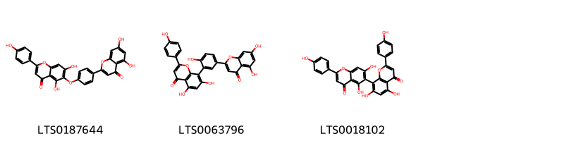{ width=100% }
    <figcaption>Hình ảnh cấu trúc hóa học của 3 hoạt chất thuộc nhóm Flavonoids gồm ['hinokiflavone (LTS0187644)', 'amentoflavone (LTS0063796)', 'agathisflavone (LTS0018102)'].</figcaption>
</figure>

---

### Dược dân tộc học

Danh sách các quốc gia có sử dụng *Rhus punjabensis* trong điều trị các bệnh. 

| Country   | Disease   | Bệnh              |
|:----------|:----------|:------------------|
| Elsewhere | Vesicant  | Chất gây bọng mắt |

---

---
## Rhus radicans
### Thông tin về thực vật

!!! info "Phân loại thực vật của *Toxicodendron radicans* từ GIBF:"
    - **Kingdom:** Plantae
    - **Phylum:** Tracheophyta
    - **Order:** Sapindales
    - **Family:** Anacardiaceae
    - **Genus:** Toxicodendron
    - **Species:** *Toxicodendron radicans*

 

| Label (VI)   | Label (EN)   | Scientific Name   | Descriptions (VI)   | Descriptions (EN)   | Also Known As (VI)   | Also Known As (EN)   |
|:-------------|:-------------|:------------------|:--------------------|:--------------------|:---------------------|:---------------------|
| N/A          | N/A          | Rhus radicans     | loài thực vật       | species of plant    | ['']                 | ['']                 |

#### Phân bố trên thế giới

**Từ CSDL GIBF** Netherlands, Germany, Belgium, Guatemala, unknown or invalid, Russian Federation, United States of America, Mexico, France, Canada

#### Phân bố tại Việt Nam

**Từ CSDL GIBF**: Không có ghi nhận ở Việt Nam

---
### Thành phần hóa học
        
- Theo cơ sở dữ liệu lotus: Từ loài *Toxicodendron radicans* đã phân lập và xác định được Chưa có hoạt chất nào được phân lập. hoạt chất thuộc về các nhóm Không có hoạt chất nào được phân lập. 

Không có hình ảnh nào được tạo ra

---

### Dược dân tộc học

Danh sách các quốc gia có sử dụng *Toxicodendron radicans* trong điều trị các bệnh. 

| Country       | Disease   | Bệnh     |
|:--------------|:----------|:---------|
| Guatemala     | Poison    | Chất độc |
| US(Blackfoot) | Poison    | Chất độc |

---

---
## Rhus semialata
### Thông tin về thực vật

!!! info "Phân loại thực vật của *Rhus chinensis* từ GIBF:"
    - **Kingdom:** Plantae
    - **Phylum:** Tracheophyta
    - **Order:** Sapindales
    - **Family:** Anacardiaceae
    - **Genus:** Rhus
    - **Species:** *Rhus chinensis*

 

| Label (VI)   | Label (EN)   | Scientific Name   | Descriptions (VI)   | Descriptions (EN)   | Also Known As (VI)   | Also Known As (EN)   |
|:-------------|:-------------|:------------------|:--------------------|:--------------------|:---------------------|:---------------------|
| N/A          | N/A          | Rhus semialata    |                     | species of plant    | ['']                 | ['']                 |

#### Phân bố trên thế giới

**Từ CSDL GIBF** nan, Italy, Japan, Korea, Republic of, Chinese Taipei, Myanmar, India, unknown or invalid, Korea (Democratic People’s Republic of), United States of America, France, China

#### Phân bố tại Việt Nam

**Từ CSDL GIBF**: Không có ghi nhận ở Việt Nam

---
### Thành phần hóa học
        
- Theo cơ sở dữ liệu lotus: Từ loài *Rhus chinensis* đã phân lập và xác định được Chưa có hoạt chất nào được phân lập. hoạt chất thuộc về các nhóm Không có hoạt chất nào được phân lập. 

Không có hình ảnh nào được tạo ra

---

### Dược dân tộc học

Danh sách các quốc gia có sử dụng *Rhus chinensis* trong điều trị các bệnh. 

| Country   | Disease                                                                         | Bệnh                                                                              |
|:----------|:--------------------------------------------------------------------------------|:----------------------------------------------------------------------------------|
| China     | Astringent, Astringent, Cholagogue, Styptic, Vermifuge, Alexiteric, Refrigerant | Chất làm se, Chất làm se, Cholagogue, Styptic, Vermifuge, Alexiteric, Refrigerant |

---

---
## Rhus striata
### Thông tin về thực vật

!!! info "Phân loại thực vật của *Toxicodendron striatum* từ GIBF:"
    - **Kingdom:** Plantae
    - **Phylum:** Tracheophyta
    - **Order:** Sapindales
    - **Family:** Anacardiaceae
    - **Genus:** Toxicodendron
    - **Species:** *Toxicodendron striatum*

 

| Label (VI)   | Label (EN)   | Scientific Name   | Descriptions (VI)   | Descriptions (EN)   | Also Known As (VI)   | Also Known As (EN)   |
|:-------------|:-------------|:------------------|:--------------------|:--------------------|:---------------------|:---------------------|
| N/A          | N/A          | Rhus striata      | loài thực vật       | species of plant    | ['']                 | ['']                 |

#### Phân bố trên thế giới

**Từ CSDL GIBF** nan, Ecuador, Belize, Colombia, Guatemala, Brazil, Costa Rica, Honduras, Peru, Mexico, Venezuela (Bolivarian Republic of), Canada

#### Phân bố tại Việt Nam

**Từ CSDL GIBF**: Không có ghi nhận ở Việt Nam

---
### Thành phần hóa học
        
- Theo cơ sở dữ liệu lotus: Từ loài *Toxicodendron striatum* đã phân lập và xác định được Chưa có hoạt chất nào được phân lập. hoạt chất thuộc về các nhóm Không có hoạt chất nào được phân lập. 

Không có hình ảnh nào được tạo ra

---

### Dược dân tộc học

Danh sách các quốc gia có sử dụng *Toxicodendron striatum* trong điều trị các bệnh. 

| Country   | Disease   | Bệnh     |
|:----------|:----------|:---------|
| Guatemala | Poison    | Chất độc |

---

---
## Rhus succedanea
### Thông tin về thực vật

!!! info "Phân loại thực vật của *Toxicodendron succedaneum* từ GIBF:"
    - **Kingdom:** Plantae
    - **Phylum:** Tracheophyta
    - **Order:** Sapindales
    - **Family:** Anacardiaceae
    - **Genus:** Toxicodendron
    - **Species:** *Toxicodendron succedaneum*

 

| Label (VI)   | Label (EN)   | Scientific Name   | Descriptions (VI)   | Descriptions (EN)   | Also Known As (VI)   | Also Known As (EN)   |
|:-------------|:-------------|:------------------|:--------------------|:--------------------|:---------------------|:---------------------|
| N/A          | N/A          | Rhus succedanea   | loài thực vật       | species of plant    | ['']                 | ['']                 |

#### Phân bố trên thế giới

**Từ CSDL GIBF** nan, South Africa, Japan, Belgium, Korea, Republic of, Brazil, Chinese Taipei, Viet Nam, China, Nepal

#### Phân bố tại Việt Nam

**Từ CSDL GIBF**: Vinh Phuc

---
### Thành phần hóa học
        
- Theo cơ sở dữ liệu lotus: Từ loài *Toxicodendron succedaneum* đã phân lập và xác định được Chưa có hoạt chất nào được phân lập. hoạt chất thuộc về các nhóm Không có hoạt chất nào được phân lập. 

Không có hình ảnh nào được tạo ra

---

### Dược dân tộc học

Danh sách các quốc gia có sử dụng *Toxicodendron succedaneum* trong điều trị các bệnh. 

| Country   | Disease                                                                         | Bệnh                                                                                                           |
|:----------|:--------------------------------------------------------------------------------|:---------------------------------------------------------------------------------------------------------------|
| China     | Antivinous, Poison, Cholagogue                                                  | Kháng tĩnh mạch, Độc tố, Cholagogue                                                                            |
| Elsewhere | Astringent, Expectorant, Poison, Sympathomimetic, Tonic, Stimulant, Cardiotonic | Chất làm se, chất đờm, chất độc, chất kích thích giao cảm, thuốc bổ, chất kích thích, chất kích thích tim mạch |

---

---
## Rhus typhina
### Thông tin về thực vật

!!! info "Phân loại thực vật của *Rhus typhina* từ GIBF:"
    - **Kingdom:** Plantae
    - **Phylum:** Tracheophyta
    - **Order:** Sapindales
    - **Family:** Anacardiaceae
    - **Genus:** Rhus
    - **Species:** *Rhus typhina*

 

| Label (VI)   | Label (EN)   | Scientific Name   | Descriptions (VI)   | Descriptions (EN)   | Also Known As (VI)   | Also Known As (EN)   |
|:-------------|:-------------|:------------------|:--------------------|:--------------------|:---------------------|:---------------------|
| N/A          | N/A          | Rhus typhina      | loài thực vật       | species of plant    | ['']                 | ['staghorn sumac']   |

#### Phân bố trên thế giới

**Từ CSDL GIBF** Denmark, Netherlands, Italy, Luxembourg, Germany, Slovakia, Belgium, Poland, Serbia, Switzerland, United States of America, China, Sweden, France, Austria, United Kingdom of Great Britain and Northern Ireland, Canada

#### Phân bố tại Việt Nam

**Từ CSDL GIBF**: Không có ghi nhận ở Việt Nam

---
### Thành phần hóa học
        
- Theo cơ sở dữ liệu lotus: Từ loài *Rhus typhina* đã phân lập và xác định được 22 hoạt chất thuộc về các nhóm Flavonoids, Prenol lipids, Diarylheptanoids, Benzene and substituted derivatives, Tannins. 

|    | chemicalTaxonomyClassyfireClass     |   smiles_count |
|---:|:------------------------------------|---------------:|
|  0 | Benzene and substituted derivatives |              2 |
|  1 | Diarylheptanoids                    |              3 |
|  2 | Flavonoids                          |              7 |
|  3 | Prenol lipids                       |              7 |
|  4 | Tannins                             |              3 |

#### Nhóm Benzene and substituted derivatives
<figure markdown="span">
    { width=100% }
    <figcaption>Hình ảnh cấu trúc hóa học của 2 hoạt chất thuộc nhóm Benzene and substituted derivatives gồm ['galop (LTS0222857)', 'methyl gallate (LTS0043810)'].</figcaption>
</figure>
#### Nhóm Diarylheptanoids
<figure markdown="span">
    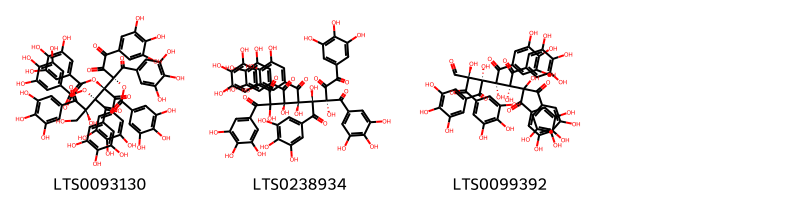{ width=100% }
    <figcaption>Hình ảnh cấu trúc hóa học của 3 hoạt chất thuộc nhóm Diarylheptanoids gồm ['(2r,3r,4s,5s)-2-hydroxy-2-(hydroxymethyl)-1,6,7-trioxo-3,4,5-tris(3,4,5-trihydroxybenzoyl)-3,5-bis(3,4,5-trihydroxybenzoyloxy)-1,7-bis(3,4,5-trihydroxyphenyl)heptan-4-yl 3,4,5-trihydroxybenzoate (LTS0093130)', '(3s,4s,5r,6s)-3,4,5,6,7-pentahydroxy-3,4,5,6,7-pentakis(3,4,5-trihydroxybenzoyl)-1,8-bis(3,4,5-trihydroxyphenyl)octane-1,2,8-trione (LTS0238934)', '(2r,3s,4s,5s)-2,3,4,5,6-pentahydroxy-7-oxo-2,3,4,5,6-pentakis(3,4,5-trihydroxybenzoyl)-7-(3,4,5-trihydroxyphenyl)heptanal (LTS0099392)'].</figcaption>
</figure>
#### Nhóm Flavonoids
<figure markdown="span">
    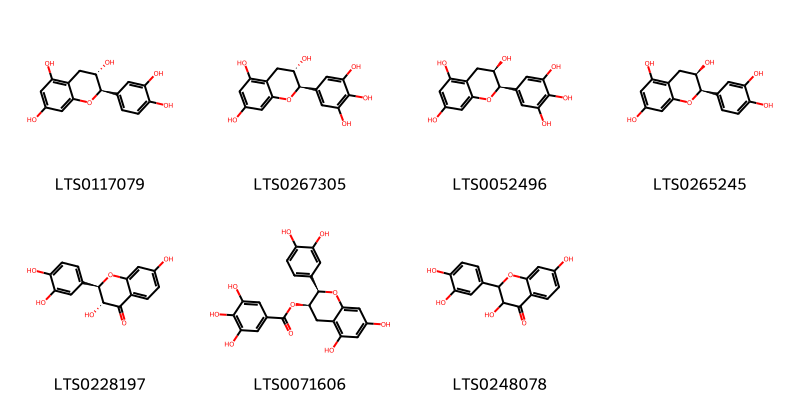{ width=100% }
    <figcaption>Hình ảnh cấu trúc hóa học của 7 hoạt chất thuộc nhóm Flavonoids gồm ['(+)-catechol (LTS0117079)', 'gallocatechol (LTS0267305)', 'epigallocatechin (LTS0052496)', 'ent-epicatechin (LTS0265245)', 'fustin (LTS0228197)', 'epicatechin gallate (LTS0071606)', 'fustin (LTS0248078)'].</figcaption>
</figure>
#### Nhóm Prenol lipids
<figure markdown="span">
    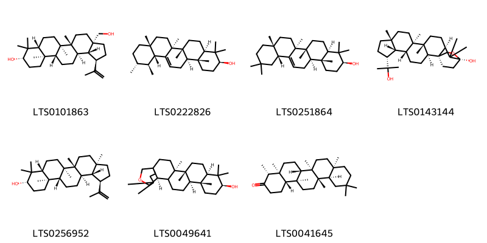{ width=100% }
    <figcaption>Hình ảnh cấu trúc hóa học của 7 hoạt chất thuộc nhóm Prenol lipids gồm ['betulin (LTS0101863)', 'amyrin (LTS0222826)', 'β-amyrin (LTS0251864)', '(1s,2s,5r,6r,7r,10r,13r,14r,17r,19s)-7-(2-hydroxypropan-2-yl)-10,13,14,18,18-pentamethyl-20-oxahexacyclo[17.2.2.0¹,¹⁷.0²,¹⁴.0⁵,¹³.0⁶,¹⁰]tricosan-19-ol (LTS0143144)', 'lupeol (LTS0256952)', '(1r,4r,5r,8r,10s,13r,14r,18r)-4,5,9,9,13,20,20-heptamethyl-24-oxahexacyclo[17.3.2.0¹,¹⁸.0⁴,¹⁷.0⁵,¹⁴.0⁸,¹³]tetracosan-10-ol (LTS0049641)', '(-)-friedelin (LTS0041645)'].</figcaption>
</figure>
#### Nhóm Tannins
<figure markdown="span">
    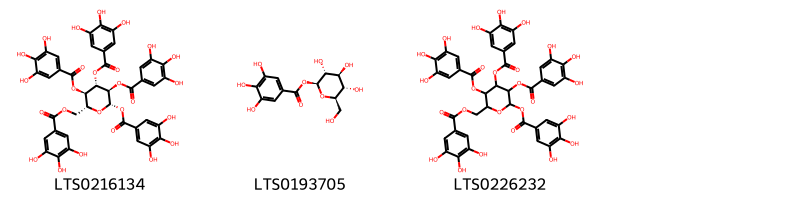{ width=100% }
    <figcaption>Hình ảnh cấu trúc hóa học của 3 hoạt chất thuộc nhóm Tannins gồm ['(2s,3r,4s,5r,6r)-3,4,5-tris(3,4,5-trihydroxybenzoyloxy)-6-[(3,4,5-trihydroxybenzoyloxy)methyl]oxan-2-yl 3,4,5-trihydroxybenzoate (LTS0216134)', 'β-glucogallin (LTS0193705)', '3,4,5-tris(3,4,5-trihydroxybenzoyloxy)-6-[(3,4,5-trihydroxybenzoyloxy)methyl]oxan-2-yl 3,4,5-trihydroxybenzoate (LTS0226232)'].</figcaption>
</figure>

---

### Dược dân tộc học

Danh sách các quốc gia có sử dụng *Rhus typhina* trong điều trị các bệnh. 

| Country        | Disease   | Bệnh        |
|:---------------|:----------|:------------|
| US(Amerindian) | Hemostat  | Máy cầm máu |

---

---
## Rhus vernicifera
### Thông tin về thực vật

!!! info "Phân loại thực vật của *Toxicodendron vernicifluum* từ GIBF:"
    - **Kingdom:** Plantae
    - **Phylum:** Tracheophyta
    - **Order:** Sapindales
    - **Family:** Anacardiaceae
    - **Genus:** Toxicodendron
    - **Species:** *Toxicodendron vernicifluum*

 

| Label (VI)   | Label (EN)   | Scientific Name   | Descriptions (VI)   | Descriptions (EN)   | Also Known As (VI)   | Also Known As (EN)   |
|:-------------|:-------------|:------------------|:--------------------|:--------------------|:---------------------|:---------------------|
| N/A          | N/A          | Rhus vernicifera  | loài thực vật       | species of plant    | ['']                 | ['']                 |

#### Phân bố trên thế giới

**Từ CSDL GIBF** nan, Japan, Belgium, Brazil, unknown or invalid, United States of America, France, China

#### Phân bố tại Việt Nam

**Từ CSDL GIBF**: Không có ghi nhận ở Việt Nam

---
### Thành phần hóa học
        
- Theo cơ sở dữ liệu lotus: Từ loài *Toxicodendron vernicifluum* đã phân lập và xác định được Chưa có hoạt chất nào được phân lập. hoạt chất thuộc về các nhóm Không có hoạt chất nào được phân lập. 

Không có hình ảnh nào được tạo ra

---

### Dược dân tộc học

Danh sách các quốc gia có sử dụng *Toxicodendron vernicifluum* trong điều trị các bệnh. 

| Country   | Disease                                                                      | Bệnh                                                                         |
|:----------|:-----------------------------------------------------------------------------|:-----------------------------------------------------------------------------|
| China     | Emmenagogue, Hemolytic, Parasiticide, Stimulant, Tonic, Vermifuge, Vermifuge | Emmenagogue, Hemolytic, Parasiticide, Stimulant, Tonic, Vermifuge, Vermifuge |

---

---
## Rhus verniciflua
### Thông tin về thực vật

!!! info "Phân loại thực vật của *Toxicodendron vernicifluum* từ GIBF:"
    - **Kingdom:** Plantae
    - **Phylum:** Tracheophyta
    - **Order:** Sapindales
    - **Family:** Anacardiaceae
    - **Genus:** Toxicodendron
    - **Species:** *Toxicodendron vernicifluum*

 

| Label (VI)   | Label (EN)   | Scientific Name   | Descriptions (VI)   | Descriptions (EN)   | Also Known As (VI)   | Also Known As (EN)   |
|:-------------|:-------------|:------------------|:--------------------|:--------------------|:---------------------|:---------------------|
| N/A          | N/A          | Rhus verniciflua  | loài thực vật       | species of plant    | ['']                 | ['']                 |

#### Phân bố trên thế giới

**Từ CSDL GIBF** nan, Japan, Korea, Republic of, Chinese Taipei, Brazil, unknown or invalid, Zimbabwe, Viet Nam, China, Canada

#### Phân bố tại Việt Nam

**Từ CSDL GIBF**: Hoa Binh, Ninh Binh

---
### Thành phần hóa học
        
- Theo cơ sở dữ liệu lotus: Từ loài *Toxicodendron vernicifluum* đã phân lập và xác định được Chưa có hoạt chất nào được phân lập. hoạt chất thuộc về các nhóm Không có hoạt chất nào được phân lập. 

Không có hình ảnh nào được tạo ra

---

### Dược dân tộc học

Danh sách các quốc gia có sử dụng *Toxicodendron vernicifluum* trong điều trị các bệnh. 

| Country   | Disease                                       | Bệnh                                       |
|:----------|:----------------------------------------------|:-------------------------------------------|
| China     | Poison                                        | Chất độc                                   |
| Elsewhere | Emmenagogue, Vermifuge, Vesicant, Antitussive | Emmenagogue, Vermifuge, Vesicant, Chống ho |

---

---
## Rhus vestita
### Thông tin về thực vật

!!! info "Phân loại thực vật của *Rhus vestita* từ GIBF:"
    - **Kingdom:** Plantae
    - **Phylum:** Tracheophyta
    - **Order:** Sapindales
    - **Family:** Anacardiaceae
    - **Genus:** Rhus
    - **Species:** *Rhus vestita*

 

| Label (VI)   | Label (EN)   | Scientific Name   | Descriptions (VI)   | Descriptions (EN)   | Also Known As (VI)   | Also Known As (EN)   |
|:-------------|:-------------|:------------------|:--------------------|:--------------------|:---------------------|:---------------------|
| N/A          | N/A          | Rhus vestita      | loài thực vật       | species of plant    | ['']                 | ['']                 |

#### Phân bố trên thế giới

**Từ CSDL GIBF** nan, Guatemala, Mexico

#### Phân bố tại Việt Nam

**Từ CSDL GIBF**: Không có ghi nhận ở Việt Nam

---
### Thành phần hóa học
        
- Theo cơ sở dữ liệu lotus: Từ loài *Rhus vestita* đã phân lập và xác định được Chưa có hoạt chất nào được phân lập. hoạt chất thuộc về các nhóm Không có hoạt chất nào được phân lập. 

Không có hình ảnh nào được tạo ra

---

### Dược dân tộc học

Danh sách các quốc gia có sử dụng *Rhus vestita* trong điều trị các bệnh. 

| Country   | Disease   | Bệnh     |
|:----------|:----------|:---------|
| Guatemala | Purgative | Thuốc xổ |

---

---
## Rhus wallichii
### Thông tin về thực vật

!!! info "Phân loại thực vật của *Rhus wallichii* từ GIBF:"
    - **Kingdom:** Plantae
    - **Phylum:** Tracheophyta
    - **Order:** Sapindales
    - **Family:** Anacardiaceae
    - **Genus:** Rhus
    - **Species:** *Rhus wallichii*

 

| Label (VI)   | Label (EN)   | Scientific Name   | Descriptions (VI)   | Descriptions (EN)   | Also Known As (VI)   | Also Known As (EN)   |
|:-------------|:-------------|:------------------|:--------------------|:--------------------|:---------------------|:---------------------|
| N/A          | N/A          | Rhus wallichii    | loài thực vật       | species of plant    | ['']                 | ['']                 |

#### Phân bố trên thế giới

**Từ CSDL GIBF** nan, Guatemala, Mexico

#### Phân bố tại Việt Nam

**Từ CSDL GIBF**: Không có ghi nhận ở Việt Nam

---
### Thành phần hóa học
        
- Theo cơ sở dữ liệu lotus: Từ loài *Rhus wallichii* đã phân lập và xác định được 13 hoạt chất thuộc về các nhóm Flavonoids, Steroids and steroid derivatives, Benzene and substituted derivatives. 

|    | chemicalTaxonomyClassyfireClass     |   smiles_count |
|---:|:------------------------------------|---------------:|
|  0 | Benzene and substituted derivatives |              1 |
|  1 | Flavonoids                          |              8 |
|  2 | Steroids and steroid derivatives    |              4 |

#### Nhóm Benzene and substituted derivatives
<figure markdown="span">
    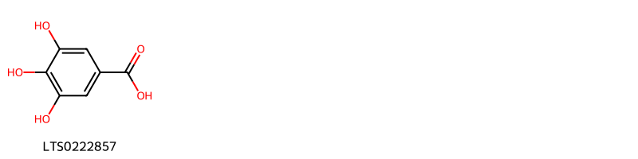{ width=100% }
    <figcaption>Hình ảnh cấu trúc hóa học của 1 hoạt chất thuộc nhóm Benzene and substituted derivatives gồm ['galop (LTS0222857)'].</figcaption>
</figure>
#### Nhóm Flavonoids
<figure markdown="span">
    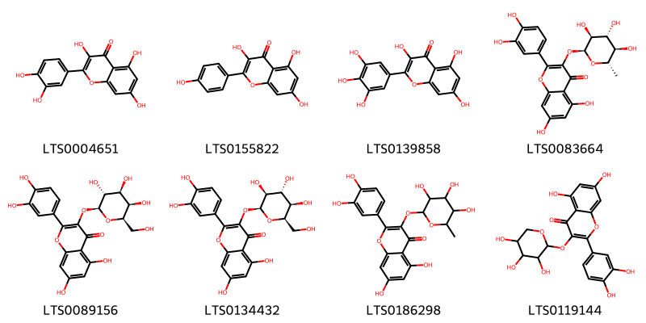{ width=100% }
    <figcaption>Hình ảnh cấu trúc hóa học của 8 hoạt chất thuộc nhóm Flavonoids gồm ['quercetin (LTS0004651)', 'kaempherol (LTS0155822)', 'myricetin (LTS0139858)', '2-(3,4-dihydroxyphenyl)-5,7-dihydroxy-3-{[(2s,3s,4r,5r,6s)-3,4,5-trihydroxy-6-methyloxan-2-yl]oxy}chromen-4-one (LTS0083664)', 'hyperoside (LTS0089156)', '2-(3,4-dihydroxyphenyl)-5,7-dihydroxy-3-{[(2s,3s,4r,5r,6r)-3,4,5-trihydroxy-6-(hydroxymethyl)oxan-2-yl]oxy}chromen-4-one (LTS0134432)', 'quercitrin (LTS0186298)', 'guaijaverin (LTS0119144)'].</figcaption>
</figure>
#### Nhóm Steroids and steroid derivatives
<figure markdown="span">
    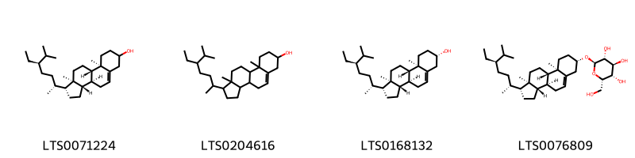{ width=100% }
    <figcaption>Hình ảnh cấu trúc hóa học của 4 hoạt chất thuộc nhóm Steroids and steroid derivatives gồm ['stigmast-5-en-3-ol (LTS0071224)', 'stigmast-5-en-3-ol, (3β)- (LTS0204616)', 'sitosterol (LTS0168132)', '(2r,3r,4s,5s,6s)-2-{[(1r,3as,3bs,7s,9ar,9bs,11ar)-1-[(2r,5r)-5-ethyl-6-methylheptan-2-yl]-9a,11a-dimethyl-1h,2h,3h,3ah,3bh,4h,6h,7h,8h,9h,9bh,10h,11h-cyclopenta[a]phenanthren-7-yl]oxy}-6-(hydroxymethyl)oxane-3,4,5-triol (LTS0076809)'].</figcaption>
</figure>

---

### Dược dân tộc học

Danh sách các quốc gia có sử dụng *Rhus wallichii* trong điều trị các bệnh. 

| Country   | Disease   | Bệnh              |
|:----------|:----------|:------------------|
| Elsewhere | Vesicant  | Chất gây bọng mắt |

---

