!!! abstract "Tóm tắt"

    Họ Annonaceae gồm khoảng 17 chi và 35 loài được một số cộng đồng tại các quốc gia như Dutch, Panama, Brazil, Indochina, Ghana, Philippines, Venezuela, Java, Arabic, Mexico, China, Malaya, Guatemala, Haiti, Iran, Elsewhere, Sierra Leone, Dominican Republic, Curacao, German, Africa, Latin America, Malaysia, India, Samoa, US, Liberia, Asia, Africa(Swahili), Cuba, Turkey sử dụng trong một số trường hợp QUERY LENGTH LIMIT EXCEEDED. MAX ALLOWED QUERY : 500 CHARS MYMEMORY WARNING: YOU USED ALL AVAILABLE FREE TRANSLATIONS FOR TODAY. NEXT AVAILABLE IN  10 HOURS 42 MINUTES 37 SECONDS VISIT HTTPS://MYMEMORY.TRANSLATED.NET/DOC/USAGELIMITS.PHP TO TRANSLATE MORE.

!!! info "DrDuke"

    James A. Duke sinh năm 1929-2017 là một nhà thực vật học người Mỹ. Đây là một trong những tác giả hàng đầu trong lĩnh vực dược dân tộc học với cuốn *CRC Handbook of Medicinal Herbs* và chính là người xây dựng lên cơ sở dữ liệu về hợp chất tự nhiên và dược dân tộc học tại Bộ nông nghiệp Hoa Kỳ. Các thông tin được đăng tải tại website [Dr. Duke's Phytochemical and Ethnobotanical Databases](https://phytochem.nal.usda.gov/). 
    Trong suốt thập niên 1970, ông lãnh đạo the Plant Taxonomy Laboratory, Plant Genetics and Germplasm Institute of the Agricultural Research Service, U.S. Department of Agriculture.
    Trong tài liệu này, các thông tin về dược dân tộc của các dược liệu được trích dẫn từ tài liệu của James A. Ducke với sự trợ giúp của phần mềm dịch thuật từ tiếng Anh sang tiếng Việt.
   

# Chi Miliusa

??? note "Danh sách các dược liệu thuộc chi"
    
	 - *Miliusa velutina*

---
## Miliusa velutina
### Thông tin về thực vật

!!! info "Phân loại thực vật của *Miliusa velutina* từ GIBF:"
    - **Kingdom:** Plantae
    - **Phylum:** Tracheophyta
    - **Order:** Magnoliales
    - **Family:** Annonaceae
    - **Genus:** Miliusa
    - **Species:** *Miliusa velutina*

 

| Label (VI)   | Label (EN)   | Scientific Name   | Descriptions (VI)   | Descriptions (EN)   | Also Known As (VI)   | Also Known As (EN)   |
|:-------------|:-------------|:------------------|:--------------------|:--------------------|:---------------------|:---------------------|
| N/A          | N/A          | Miliusa velutina  | loài thực vật       | species of plant    | ['']                 | ['']                 |

#### Phân bố trên thế giới

**Từ CSDL GIBF** Viet Nam, nan, unknown or invalid, Thailand, Myanmar, Bhutan, Philippines, Malaysia, India, Lao People’s Democratic Republic, Bangladesh, Nepal, Cambodia

#### Phân bố tại Việt Nam

**Từ CSDL GIBF**: Ba Ria Vung Tau, Tay Ninh

---
### Thành phần hóa học
        
- Theo cơ sở dữ liệu lotus: Từ loài *Miliusa velutina* đã phân lập và xác định được 7 hoạt chất thuộc về các nhóm Aporphines, Isoquinolines and derivatives. 

|    | chemicalTaxonomyClassyfireClass   |   smiles_count |
|---:|:----------------------------------|---------------:|
|  0 | Aporphines                        |              5 |
|  1 | Isoquinolines and derivatives     |              2 |

#### Nhóm Aporphines
<figure markdown="span">
    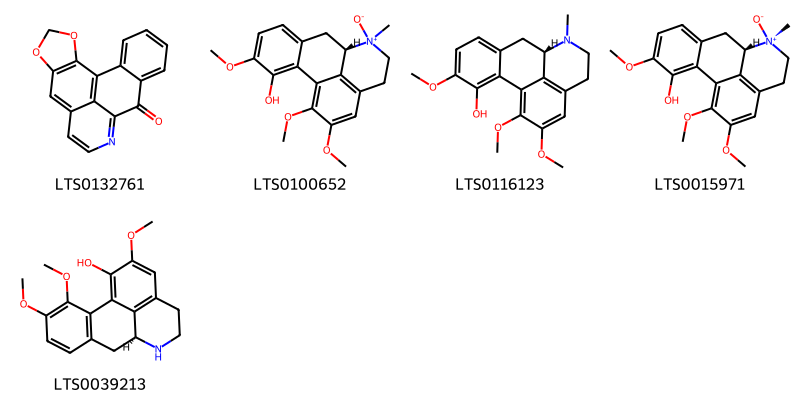{ width=100% }
    <figcaption>Hình ảnh cấu trúc hóa học của 5 hoạt chất thuộc nhóm Aporphines gồm ['liriodenine (LTS0132761)', 'isocorydine n-oxide (LTS0100652)', '(9s)-4,15,16-trimethoxy-10-methyl-10-azatetracyclo[7.7.1.0²,⁷.0¹³,¹⁷]heptadeca-1(16),2,4,6,13(17),14-hexaen-3-ol (LTS0116123)', '(9s,10r)-3-hydroxy-4,15,16-trimethoxy-10-methyl-10-azatetracyclo[7.7.1.0²,⁷.0¹³,¹⁷]heptadeca-1(16),2,4,6,13(17),14-hexaen-10-ium-10-olate (LTS0015971)', '(9s)-3,4,15-trimethoxy-10-azatetracyclo[7.7.1.0²,⁷.0¹³,¹⁷]heptadeca-1(16),2(7),3,5,13(17),14-hexaen-16-ol (LTS0039213)'].</figcaption>
</figure>
#### Nhóm Isoquinolines and derivatives
<figure markdown="span">
    { width=100% }
    <figcaption>Hình ảnh cấu trúc hóa học của 2 hoạt chất thuộc nhóm Isoquinolines and derivatives gồm ['reticuline (LTS0204392)', '(+,-)-reticuline (LTS0181650)'].</figcaption>
</figure>

---

### Dược dân tộc học

Danh sách các quốc gia có sử dụng *Miliusa velutina* trong điều trị các bệnh. 

| Country   | Disease   | Bệnh                                                                                                                                                                                                |
|:----------|:----------|:----------------------------------------------------------------------------------------------------------------------------------------------------------------------------------------------------|
| Elsewhere | Purgative | MYMEMORY WARNING: YOU USED ALL AVAILABLE FREE TRANSLATIONS FOR TODAY. NEXT AVAILABLE IN  10 HOURS 42 MINUTES 35 SECONDS VISIT HTTPS://MYMEMORY.TRANSLATED.NET/DOC/USAGELIMITS.PHP TO TRANSLATE MORE |

---

# Chi Cleistopholis

??? note "Danh sách các dược liệu thuộc chi"
    
	 - *Cleistopholis patens*

---
## Cleistopholis patens
### Thông tin về thực vật

!!! info "Phân loại thực vật của *Cleistopholis patens* từ GIBF:"
    - **Kingdom:** Plantae
    - **Phylum:** Tracheophyta
    - **Order:** Magnoliales
    - **Family:** Annonaceae
    - **Genus:** Cleistopholis
    - **Species:** *Cleistopholis patens*

 

| Label (VI)   | Label (EN)   | Scientific Name      | Descriptions (VI)   | Descriptions (EN)   | Also Known As (VI)   | Also Known As (EN)   |
|:-------------|:-------------|:---------------------|:--------------------|:--------------------|:---------------------|:---------------------|
| N/A          | N/A          | Cleistopholis patens | loài thực vật       | species of plant    | ['']                 | ['']                 |

#### Phân bố trên thế giới

**Từ CSDL GIBF** Sierra Leone, Côte d’Ivoire, Ghana, Liberia, Cameroon, Gabon, Nigeria, Guinea, Benin, Belgium

#### Phân bố tại Việt Nam

**Từ CSDL GIBF**: Không có ghi nhận ở Việt Nam

---
### Thành phần hóa học
        
- Theo cơ sở dữ liệu lotus: Từ loài *Cleistopholis patens* đã phân lập và xác định được 126 hoạt chất thuộc về các nhóm Diazanaphthalenes, Quinolines and derivatives, Organooxygen compounds, Aporphines, Unsaturated hydrocarbons, Prenol lipids, Fatty Acyls, 1-azaoxoaporphines, Steroids and steroid derivatives. 

|    | chemicalTaxonomyClassyfireClass   |   smiles_count |
|---:|:----------------------------------|---------------:|
|  0 | 1-azaoxoaporphines                |              1 |
|  1 | Aporphines                        |              2 |
|  2 | Diazanaphthalenes                 |              2 |
|  3 | Fatty Acyls                       |              3 |
|  4 | Organooxygen compounds            |             34 |
|  5 | Prenol lipids                     |             80 |
|  6 | Quinolines and derivatives        |              1 |
|  7 | Steroids and steroid derivatives  |              2 |
|  8 | Unsaturated hydrocarbons          |              1 |

#### Nhóm 1-azaoxoaporphines
<figure markdown="span">
    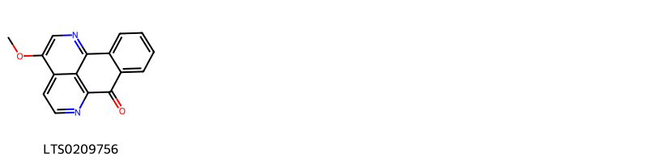{ width=100% }
    <figcaption>Hình ảnh cấu trúc hóa học của 1 hoạt chất thuộc nhóm 1-azaoxoaporphines gồm ['14-methoxy-10,16-diazatetracyclo[7.7.1.0²,⁷.0¹³,¹⁷]heptadeca-1(16),2,4,6,9(17),10,12,14-octaen-8-one (LTS0209756)'].</figcaption>
</figure>
#### Nhóm Aporphines
<figure markdown="span">
    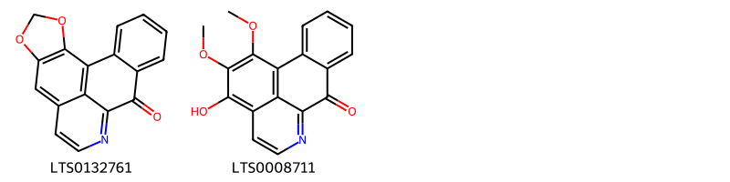{ width=100% }
    <figcaption>Hình ảnh cấu trúc hóa học của 2 hoạt chất thuộc nhóm Aporphines gồm ['liriodenine (LTS0132761)', '14-hydroxy-15,16-dimethoxy-10-azatetracyclo[7.7.1.0²,⁷.0¹³,¹⁷]heptadeca-1(16),2,4,6,9(17),10,12,14-octaen-8-one (LTS0008711)'].</figcaption>
</figure>
#### Nhóm Diazanaphthalenes
<figure markdown="span">
    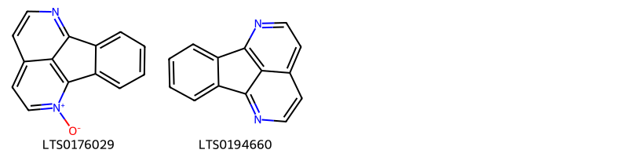{ width=100% }
    <figcaption>Hình ảnh cấu trúc hóa học của 2 hoạt chất thuộc nhóm Diazanaphthalenes gồm ['eupolauridine n-oxide (LTS0176029)', 'eupolauridine (LTS0194660)'].</figcaption>
</figure>
#### Nhóm Fatty Acyls
<figure markdown="span">
    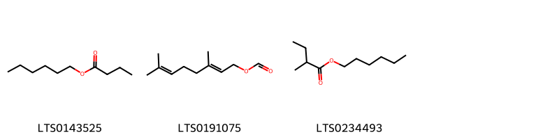{ width=100% }
    <figcaption>Hình ảnh cấu trúc hóa học của 3 hoạt chất thuộc nhóm Fatty Acyls gồm ['hexyl butyrate (LTS0143525)', 'geranyl formate (LTS0191075)', 'hexyl 2-methylbutyrate (LTS0234493)'].</figcaption>
</figure>
#### Nhóm Organooxygen compounds
<figure markdown="span">
    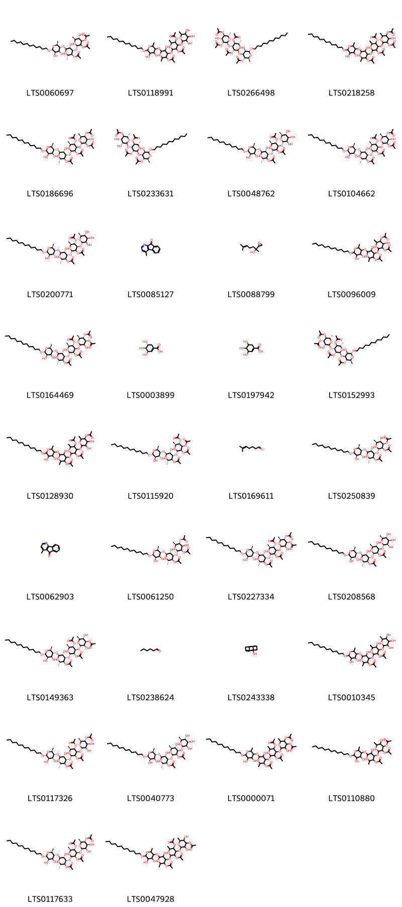{ width=100% }
    <figcaption>Hình ảnh cấu trúc hóa học của 34 hoạt chất thuộc nhóm Organooxygen compounds gồm ['(2s,3s,4s,5r,6s)-4-{[(2s,3r,4r,5s,6s)-3,4-bis(acetyloxy)-5-hydroxy-6-methyloxan-2-yl]oxy}-6-{[(2s,3r,4s,5r,6r)-6-(dodecyloxy)-4,5-dihydroxy-2-methyloxan-3-yl]oxy}-5-hydroxy-2-methyloxan-3-yl acetate (LTS0060697)', '4-{[3,5-bis(acetyloxy)-6-methyl-4-[(3,4,5-trihydroxy-6-methyloxan-2-yl)oxy]oxan-2-yl]oxy}-6-{[6-(dodecyloxy)-4,5-dihydroxy-2-methyloxan-3-yl]oxy}-5-hydroxy-2-methyloxan-3-yl acetate (LTS0118991)', '(2s,3s,4s,5r,6r)-4-{[(2s,3r,4r,5s,6s)-3,5-bis(acetyloxy)-4-{[(2s,3r,4r,5r,6s)-3,5-bis(acetyloxy)-4-hydroxy-6-methyloxan-2-yl]oxy}-6-methyloxan-2-yl]oxy}-6-(dodecyloxy)-5-hydroxy-2-methyloxan-3-yl acetate (LTS0266498)', '4-{[3,5-bis(acetyloxy)-4-{[3,5-bis(acetyloxy)-4-hydroxy-6-methyloxan-2-yl]oxy}-6-methyloxan-2-yl]oxy}-6-{[6-(dodecyloxy)-4,5-dihydroxy-2-methyloxan-3-yl]oxy}-5-hydroxy-2-methyloxan-3-yl acetate (LTS0218258)', '(2s,3s,4s,5r,6s)-4-{[(2s,3r,4r,5s,6s)-3,5-bis(acetyloxy)-4-{[(2s,3r,4r,5r,6s)-3,5-bis(acetyloxy)-4-hydroxy-6-methyloxan-2-yl]oxy}-6-methyloxan-2-yl]oxy}-6-{[(2s,3r,4s,5r,6r)-6-(dodecyloxy)-4,5-dihydroxy-2-methyloxan-3-yl]oxy}-5-hydroxy-2-methyloxan-3-yl acetate (LTS0186696)', '(2s,3s,4s,5r,6r)-4-{[(2s,3r,4r,5s,6s)-3,5-bis(acetyloxy)-4-{[(2s,3r,4s,5r,6s)-5-(acetyloxy)-3,4-dihydroxy-6-methyloxan-2-yl]oxy}-6-methyloxan-2-yl]oxy}-6-(dodecyloxy)-5-hydroxy-2-methyloxan-3-yl acetate (LTS0233631)', '(2s,3s,4s,5r,6s)-4-{[(2s,3r,4r,5s,6s)-3,5-bis(acetyloxy)-6-methyl-4-{[(2s,3r,4r,5r,6s)-3,4,5-trihydroxy-6-methyloxan-2-yl]oxy}oxan-2-yl]oxy}-6-{[(2s,3r,4s,5r,6r)-6-(dodecyloxy)-4,5-dihydroxy-2-methyloxan-3-yl]oxy}-5-hydroxy-2-methyloxan-3-yl acetate (LTS0048762)', '(2s,3s,4s,5r,6s)-4-{[(2s,3r,4r,5s,6s)-3,5-bis(acetyloxy)-4-{[(2s,3r,4r,5r,6s)-3,5-bis(acetyloxy)-4-hydroxy-6-methyloxan-2-yl]oxy}-6-methyloxan-2-yl]oxy}-6-{[(2s,3r,4r,5r,6r)-6-(dodecyloxy)-4,5-dihydroxy-2-methyloxan-3-yl]oxy}-5-hydroxy-2-methyloxan-3-yl acetate (LTS0104662)', '(2s,3s,4s,5r,6s)-4-{[(2s,3r,4r,5s,6s)-3,5-bis(acetyloxy)-6-methyl-4-{[(2s,3r,4r,5r,6s)-3,4,5-trihydroxy-6-methyloxan-2-yl]oxy}oxan-2-yl]oxy}-6-{[(2s,3r,4r,5r,6r)-6-(dodecyloxy)-4,5-dihydroxy-2-methyloxan-3-yl]oxy}-5-hydroxy-2-methyloxan-3-yl acetate (LTS0200771)', '4-methylindeno[2,1-b]pyridin-9-one (LTS0085127)', 'linalool dihydroepoxide (LTS0088799)', '4-{[3,5-bis(acetyloxy)-4-hydroxy-6-methyloxan-2-yl]oxy}-6-{[6-(dodecyloxy)-4,5-dihydroxy-2-methyloxan-3-yl]oxy}-5-hydroxy-2-methyloxan-3-yl acetate (LTS0096009)', '(2s,3s,4s,5r,6s)-4-{[(2s,3r,4r,5s,6s)-3,5-bis(acetyloxy)-4-{[(2s,3r,4s,5s,6s)-4,5-bis(acetyloxy)-3-hydroxy-6-methyloxan-2-yl]oxy}-6-methyloxan-2-yl]oxy}-6-{[(2s,3r,4s,5r,6r)-6-(dodecyloxy)-4,5-dihydroxy-2-methyloxan-3-yl]oxy}-5-hydroxy-2-methyloxan-3-yl acetate (LTS0164469)', '(-)-shikimate (LTS0003899)', 'shikimate (LTS0197942)', '(2s,3s,4s,5r,6r)-4-{[(2s,3r,4r,5s,6s)-3,5-bis(acetyloxy)-4-{[(2s,3r,4s,5s,6s)-4,5-bis(acetyloxy)-3-hydroxy-6-methyloxan-2-yl]oxy}-6-methyloxan-2-yl]oxy}-6-(dodecyloxy)-5-hydroxy-2-methyloxan-3-yl acetate (LTS0152993)', '4-{[3,5-bis(acetyloxy)-4-{[5-(acetyloxy)-3,4-dihydroxy-6-methyloxan-2-yl]oxy}-6-methyloxan-2-yl]oxy}-6-{[6-(dodecyloxy)-4,5-dihydroxy-2-methyloxan-3-yl]oxy}-5-hydroxy-2-methyloxan-3-yl acetate (LTS0128930)', '(2s,3s,4s,5r,6s)-6-{[(2s,3r,4r,5r,6r)-6-(dodecyloxy)-4,5-dihydroxy-2-methyloxan-3-yl]oxy}-5-hydroxy-2-methyl-4-{[(2s,3r,4r,5s,6s)-3,4,5-tris(acetyloxy)-6-methyloxan-2-yl]oxy}oxan-3-yl acetate (LTS0115920)', '6-methylhept-5-enal (LTS0169611)', '(2s,3s,4s,5r,6s)-4-{[(2s,3r,4r,5s,6s)-3,4-bis(acetyloxy)-5-hydroxy-6-methyloxan-2-yl]oxy}-6-{[(2s,3r,4r,5r,6r)-6-(dodecyloxy)-4,5-dihydroxy-2-methyloxan-3-yl]oxy}-5-hydroxy-2-methyloxan-3-yl acetate (LTS0250839)', '4-methylindeno[1,2-b]pyridin-5-one (LTS0062903)', '(2s,3s,4s,5r,6s)-4-{[(2s,3r,4r,5r,6s)-3,5-bis(acetyloxy)-4-hydroxy-6-methyloxan-2-yl]oxy}-6-{[(2s,3r,4s,5r,6r)-6-(dodecyloxy)-4,5-dihydroxy-2-methyloxan-3-yl]oxy}-5-hydroxy-2-methyloxan-3-yl acetate (LTS0061250)', '(2s,3s,4s,5r,6s)-4-{[(2s,3r,4r,5s,6s)-3,5-bis(acetyloxy)-4-{[(2s,3r,4s,5s,6s)-4,5-bis(acetyloxy)-3-hydroxy-6-methyloxan-2-yl]oxy}-6-methyloxan-2-yl]oxy}-6-{[(2s,3r,4r,5r,6r)-6-(dodecyloxy)-4,5-dihydroxy-2-methyloxan-3-yl]oxy}-5-hydroxy-2-methyloxan-3-yl acetate (LTS0227334)', '(2s,3s,4s,5r,6s)-4-{[(2s,3r,4r,5s,6s)-3-(acetyloxy)-5-hydroxy-6-methyl-4-{[(2s,3r,4r,5r,6s)-3,4,5-trihydroxy-6-methyloxan-2-yl]oxy}oxan-2-yl]oxy}-6-{[(2s,3r,4r,5r,6r)-6-(dodecyloxy)-4,5-dihydroxy-2-methyloxan-3-yl]oxy}-5-hydroxy-2-methyloxan-3-yl acetate (LTS0208568)', '(2s,3s,4s,5r,6s)-4-{[(2s,3r,4r,5s,6s)-3,5-bis(acetyloxy)-4-{[(2s,3r,4r,5s,6s)-4-(acetyloxy)-3,5-dihydroxy-6-methyloxan-2-yl]oxy}-6-methyloxan-2-yl]oxy}-6-{[(2s,3r,4s,5r,6r)-6-(dodecyloxy)-4,5-dihydroxy-2-methyloxan-3-yl]oxy}-5-hydroxy-2-methyloxan-3-yl acetate (LTS0149363)', 'hexanal (LTS0238624)', '3,4,5,8-tetrahydro-2h-cuban-1-ol (LTS0243338)', '4-{[3-(acetyloxy)-5-hydroxy-6-methyl-4-[(3,4,5-trihydroxy-6-methyloxan-2-yl)oxy]oxan-2-yl]oxy}-6-{[6-(dodecyloxy)-4,5-dihydroxy-2-methyloxan-3-yl]oxy}-5-hydroxy-2-methyloxan-3-yl acetate (LTS0010345)', '(2s,3s,4s,5r,6s)-4-{[(2s,3r,4r,5s,6s)-3,5-bis(acetyloxy)-4-{[(2s,3r,4s,5r,6s)-5-(acetyloxy)-3,4-dihydroxy-6-methyloxan-2-yl]oxy}-6-methyloxan-2-yl]oxy}-6-{[(2s,3r,4r,5r,6r)-6-(dodecyloxy)-4,5-dihydroxy-2-methyloxan-3-yl]oxy}-5-hydroxy-2-methyloxan-3-yl acetate (LTS0117326)', '(2s,3s,4s,5r,6s)-4-{[(2s,3r,4r,5s,6s)-3-(acetyloxy)-5-hydroxy-6-methyl-4-{[(2s,3r,4r,5r,6s)-3,4,5-trihydroxy-6-methyloxan-2-yl]oxy}oxan-2-yl]oxy}-6-{[(2s,3r,4s,5r,6r)-6-(dodecyloxy)-4,5-dihydroxy-2-methyloxan-3-yl]oxy}-5-hydroxy-2-methyloxan-3-yl acetate (LTS0040773)', '4-{[3,5-bis(acetyloxy)-4-{[4,5-bis(acetyloxy)-3-hydroxy-6-methyloxan-2-yl]oxy}-6-methyloxan-2-yl]oxy}-6-{[6-(dodecyloxy)-4,5-dihydroxy-2-methyloxan-3-yl]oxy}-5-hydroxy-2-methyloxan-3-yl acetate (LTS0000071)', '4-{[3,4-bis(acetyloxy)-5-hydroxy-6-methyloxan-2-yl]oxy}-6-{[6-(dodecyloxy)-4,5-dihydroxy-2-methyloxan-3-yl]oxy}-5-hydroxy-2-methyloxan-3-yl acetate (LTS0110880)', '(2s,3s,4s,5r,6s)-4-{[(2s,3r,4r,5s,6s)-3,5-bis(acetyloxy)-4-{[(2s,3r,4s,5r,6s)-5-(acetyloxy)-3,4-dihydroxy-6-methyloxan-2-yl]oxy}-6-methyloxan-2-yl]oxy}-6-{[(2s,3r,4s,5r,6r)-6-(dodecyloxy)-4,5-dihydroxy-2-methyloxan-3-yl]oxy}-5-hydroxy-2-methyloxan-3-yl acetate (LTS0117633)', '4-{[3,5-bis(acetyloxy)-4-{[4-(acetyloxy)-3,5-dihydroxy-6-methyloxan-2-yl]oxy}-6-methyloxan-2-yl]oxy}-6-{[6-(dodecyloxy)-4,5-dihydroxy-2-methyloxan-3-yl]oxy}-5-hydroxy-2-methyloxan-3-yl acetate (LTS0047928)'].</figcaption>
</figure>
#### Nhóm Prenol lipids
<figure markdown="span">
    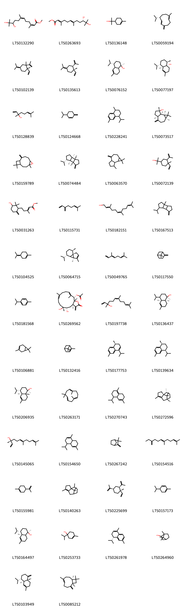{ width=100% }
    <figcaption>Hình ảnh cấu trúc hóa học của 80 hoạt chất thuộc nhóm Prenol lipids gồm ['methyl 10,11-dihydroxy-3,7,11-trimethyldodeca-2,6-dienoate (LTS0132290)', 'methyl (2e,6e,10s)-10,11-dihydroxy-3,7,11-trimethyldodeca-2,6-dienoate (LTS0263693)', 'terpineol (LTS0136148)', '(-)-germacrene d (LTS0059194)', '1-ethenyl-1,2-dimethyl-2-(prop-1-en-2-yl)-4-(propan-2-ylidene)cyclohexane (LTS0102139)', '(1s,2s)-1-ethenyl-1-methyl-2-(prop-1-en-2-yl)-4-(propan-2-ylidene)cyclohexane (LTS0135613)', '(1r,4s)-4-isopropyl-1,6-dimethyl-3,4,4a,7,8,8a-hexahydro-2h-naphthalen-1-ol (LTS0076152)', '(1s,4r,4as,8ar)-1-isopropyl-4,7-dimethyl-2,3,4,5,6,8a-hexahydro-1h-naphthalen-4a-ol (LTS0077197)', 'linalool, (+-)- (LTS0128839)', 'β phellandrene (LTS0124668)', '(e)-calamene (LTS0228241)', '(1as,4as,7s,7ar,7bs)-1,1,7-trimethyl-4-methylidene-octahydrocyclopropa[e]azulen-7-ol (LTS0073517)', 'caryophyllene oxide (LTS0159789)', 'β-bourbonene (LTS0074484)', '1,1,7-trimethyl-4-methylidene-octahydro-1ah-cyclopropa[e]azulene (LTS0063570)', '2-[4-ethenyl-4-methyl-3-(prop-1-en-2-yl)cyclohexyl]propan-2-ol (LTS0072139)', 'methyl 5-(3-hydroxy-2,2-dimethyl-6-methylidenecyclohexyl)-3-methylpent-2-enoate (LTS0031263)', 'α-myrcene (LTS0115731)', '(e,z)-farnesol (LTS0182151)', 'β-bourbonene (LTS0167513)', 'terpinolene (LTS0104525)', '(1s,5r,7s,10r)-7-isopropyl-4,10-dimethyltricyclo[4.4.0.0¹,⁵]dec-3-ene (LTS0064715)', 'trans-β-ocimene (LTS0049765)', 'β-pinene (LTS0117550)', 'cymene (LTS0181568)', '(3ar,5s,6r,15s,15ar)-5,6-dihydroxy-6,10,14-trimethyl-3-methylidene-2-oxo-3ah,4h,5h,7h,8h,11h,12h,15h,15ah-cyclotetradeca[b]furan-15-yl acetate (LTS0269562)', 'nerolidol (LTS0197738)', '(1r,4ar,8as)-4-isopropyl-1,6-dimethyl-3,4,4a,7,8,8a-hexahydro-2h-naphthalen-1-ol (LTS0136437)', 'monoterpenes (LTS0106881)', 'α pinene (LTS0132416)', '(1s)-4-isopropyl-1,6-dimethyl-1,2-dihydronaphthalene (LTS0177753)', '(1s,4s)-4-isopropyl-1,6-dimethyl-1,2,3,4-tetrahydronaphthalene (LTS0139634)', 'α-cadinol (LTS0206935)', 'humulene (LTS0263171)', '4-isopropyl-1,6-dimethyl-2,3,4,4a,7,8-hexahydronaphthalene (LTS0270743)', 'cyperene (LTS0272596)', '(3r,6e)-nerolidol (LTS0145065)', '4-isopropyl-1,6-dimethyl-3,4,4a,7,8,8a-hexahydronaphthalene (LTS0154650)', 'camphene (LTS0267242)', '(6e)-2,6-dimethyl-10-methylidenedodeca-2,6-diene (LTS0154516)', 'limonene,  (LTS0155981)', 'cyperene (LTS0140263)', 'β-elemene (LTS0225699)', 'phellandrene (LTS0157173)', '(1r,4s,4ar)-4-isopropyl-1,6-dimethyl-3,4,4a,7,8,8a-hexahydro-2h-naphthalen-1-ol (LTS0164497)', '4-terpineol (LTS0253733)', '(4s)-4-isopropyl-1,6-dimethyl-3,4-dihydronaphthalene (LTS0261978)', 'borneol (LTS0264960)', '(+)-gamma-cadinene (LTS0103949)', 'caryophyllene (LTS0085212)', 'β-farnesene (LTS0067925)', 'methyl (2e)-5-[(1r,3s)-3-hydroxy-2,2-dimethyl-6-methylidenecyclohexyl]-3-methylpent-2-enoate (LTS0231394)', 'bornyl acetate (LTS0060565)', '(1z,6z,8s)-8-isopropyl-1-methyl-5-methylidenecyclodeca-1,6-diene (LTS0065195)', 'α-eudesmol (LTS0222498)', 'β-caryophyllene oxide (LTS0213960)', 'α-copaene (LTS0207598)', 'delta-cadinol (LTS0008282)', '(1as,4as,7as,7br)-1,1,7-trimethyl-4-methylidene-octahydro-1ah-cyclopropa[e]azulene (LTS0160636)', 'elemol (LTS0208556)', '(1r,4r,4as,8as)-4-isopropyl-1,6-dimethyl-3,4,4a,7,8,8a-hexahydro-2h-naphthalen-1-ol (LTS0251900)', 'neral (LTS0165243)', 'α-cadinol (LTS0178794)', 'geraniol (LTS0258838)', 'β-ocimene (LTS0242381)', '(1r,2s,7s,8s)-8-isopropyl-1,3-dimethyltricyclo[4.4.0.0²,⁷]dec-3-ene (LTS0190031)', 'farnesol (LTS0059667)', 'gamma-muurolene (LTS0052920)', 'terpinene (LTS0136858)', 'α-muurolene (LTS0022607)', '4-isopropyl-1,6-dimethyl-1,2-dihydronaphthalene (LTS0004459)', '3,4-dihydrocadalene (LTS0015523)', 'delta-cadinol (LTS0013807)', '(1s,4r,4ar,8ar)-1-isopropyl-4,7-dimethyl-2,3,4,5,6,8a-hexahydro-1h-naphthalen-4a-ol (LTS0018576)', 'nerol (LTS0244289)', 'delta-cadinene (LTS0019321)', '(7ar)-1,1,7-trimethyl-4-methylidene-octahydrocyclopropa[e]azulen-7-ol (LTS0091612)', '(-)-α-cubebene (LTS0042045)', '4-isopropyl-6-methyl-1-methylidene-3,4,4a,7,8,8a-hexahydro-2h-naphthalene (LTS0111070)', '(-)-β-cubebene (LTS0123697)'].</figcaption>
</figure>
#### Nhóm Quinolines and derivatives
<figure markdown="span">
    { width=100% }
    <figcaption>Hình ảnh cấu trúc hóa học của 1 hoạt chất thuộc nhóm Quinolines and derivatives gồm ['cleistopholine (LTS0130229)'].</figcaption>
</figure>
#### Nhóm Steroids and steroid derivatives
<figure markdown="span">
    { width=100% }
    <figcaption>Hình ảnh cấu trúc hóa học của 2 hoạt chất thuộc nhóm Steroids and steroid derivatives gồm ['stigmast-5-en-3-ol (LTS0071224)', 'stigmast-5-en-3-ol, (3β)- (LTS0204616)'].</figcaption>
</figure>
#### Nhóm Unsaturated hydrocarbons
<figure markdown="span">
    { width=100% }
    <figcaption>Hình ảnh cấu trúc hóa học của 1 hoạt chất thuộc nhóm Unsaturated hydrocarbons gồm ['α terpinene (LTS0232891)'].</figcaption>
</figure>

---

### Dược dân tộc học

Danh sách các quốc gia có sử dụng *Cleistopholis patens* trong điều trị các bệnh. 

| Country   | Disease   | Bệnh                                                                                                                                                                                                |
|:----------|:----------|:----------------------------------------------------------------------------------------------------------------------------------------------------------------------------------------------------|
| Elsewhere | Vermifuge | MYMEMORY WARNING: YOU USED ALL AVAILABLE FREE TRANSLATIONS FOR TODAY. NEXT AVAILABLE IN  10 HOURS 41 MINUTES 59 SECONDS VISIT HTTPS://MYMEMORY.TRANSLATED.NET/DOC/USAGELIMITS.PHP TO TRANSLATE MORE |

---

# Chi Pachypodanthium

??? note "Danh sách các dược liệu thuộc chi"
    
	 - *Pachypodanthium staudtii*

---
## Pachypodanthium staudtii
### Thông tin về thực vật

!!! info "Phân loại thực vật của *Duguetia staudtii* từ GIBF:"
    - **Kingdom:** Plantae
    - **Phylum:** Tracheophyta
    - **Order:** Magnoliales
    - **Family:** Annonaceae
    - **Genus:** Duguetia
    - **Species:** *Duguetia staudtii*

 

| Label (VI)   | Label (EN)   | Scientific Name          | Descriptions (VI)   | Descriptions (EN)   | Also Known As (VI)   | Also Known As (EN)   |
|:-------------|:-------------|:-------------------------|:--------------------|:--------------------|:---------------------|:---------------------|
| N/A          | N/A          | Pachypodanthium staudtii |                     | species of plant    | ['']                 | ['']                 |

#### Phân bố trên thế giới

**Từ CSDL GIBF** nan, Sierra Leone, unknown or invalid, Côte d’Ivoire, Ghana, Central African Republic, Liberia, Cameroon, Gabon, Equatorial Guinea, Nigeria, Congo, Guinea, Netherlands

#### Phân bố tại Việt Nam

**Từ CSDL GIBF**: Không có ghi nhận ở Việt Nam

---
### Thành phần hóa học
        
- Theo cơ sở dữ liệu lotus: Từ loài *Duguetia staudtii* đã phân lập và xác định được Chưa có hoạt chất nào được phân lập. hoạt chất thuộc về các nhóm Không có hoạt chất nào được phân lập. 

Không có hình ảnh nào được tạo ra

---

### Dược dân tộc học

Danh sách các quốc gia có sử dụng *Duguetia staudtii* trong điều trị các bệnh. 

| Country   | Disease      | Bệnh                                                                                                                                                                                                |
|:----------|:-------------|:----------------------------------------------------------------------------------------------------------------------------------------------------------------------------------------------------|
| Ghana     | Pediculicide | MYMEMORY WARNING: YOU USED ALL AVAILABLE FREE TRANSLATIONS FOR TODAY. NEXT AVAILABLE IN  10 HOURS 41 MINUTES 04 SECONDS VISIT HTTPS://MYMEMORY.TRANSLATED.NET/DOC/USAGELIMITS.PHP TO TRANSLATE MORE |
| Liberia   | Vermifuge    | MYMEMORY WARNING: YOU USED ALL AVAILABLE FREE TRANSLATIONS FOR TODAY. NEXT AVAILABLE IN  10 HOURS 41 MINUTES 00 SECONDS VISIT HTTPS://MYMEMORY.TRANSLATED.NET/DOC/USAGELIMITS.PHP TO TRANSLATE MORE |

---

# Chi Polyalthia

??? note "Danh sách các dược liệu thuộc chi"
    
	 - *Polyalthia bullata*
	 - *Polyalthia longifolia*
	 - *Polyalthia oliveri*
	 - *Polyalthia suberosa*

---
## Polyalthia bullata
### Thông tin về thực vật

!!! info "Phân loại thực vật của *Polyalthia bullata* từ GIBF:"
    - **Kingdom:** Plantae
    - **Phylum:** Tracheophyta
    - **Order:** Magnoliales
    - **Family:** Annonaceae
    - **Genus:** Polyalthia
    - **Species:** *Polyalthia bullata*

 

| Label (VI)   | Label (EN)   | Scientific Name    | Descriptions (VI)   | Descriptions (EN)   | Also Known As (VI)   | Also Known As (EN)   |
|:-------------|:-------------|:-------------------|:--------------------|:--------------------|:---------------------|:---------------------|
| N/A          | N/A          | Polyalthia bullata | loài thực vật       | species of plant    | ['']                 | ['']                 |

#### Phân bố trên thế giới

**Từ CSDL GIBF** nan, Thailand, Brunei Darussalam, Malaysia, Indonesia

#### Phân bố tại Việt Nam

**Từ CSDL GIBF**: Không có ghi nhận ở Việt Nam

---
### Thành phần hóa học
        
- Theo cơ sở dữ liệu lotus: Từ loài *Polyalthia bullata* đã phân lập và xác định được 3 hoạt chất thuộc về các nhóm Quinolines and derivatives. 

|    | chemicalTaxonomyClassyfireClass   |   smiles_count |
|---:|:----------------------------------|---------------:|
|  0 | Quinolines and derivatives        |              3 |

#### Nhóm Quinolines and derivatives
<figure markdown="span">
    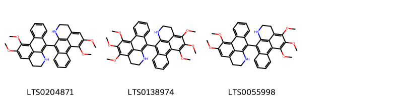{ width=100% }
    <figcaption>Hình ảnh cấu trúc hóa học của 3 hoạt chất thuộc nhóm Quinolines and derivatives gồm ['8-{15,16-dimethoxy-10-azatetracyclo[7.7.1.0²,⁷.0¹³,¹⁷]heptadeca-1(17),2(7),3,5,8,13,15-heptaen-8-yl}-15,16-dimethoxy-10-azatetracyclo[7.7.1.0²,⁷.0¹³,¹⁷]heptadeca-1(17),2(7),3,5,8,13,15-heptaene (LTS0204871)', '14,15,16-trimethoxy-8-{14,15,16-trimethoxy-10-azatetracyclo[7.7.1.0²,⁷.0¹³,¹⁷]heptadeca-1(17),2(7),3,5,8,13,15-heptaen-8-yl}-10-azatetracyclo[7.7.1.0²,⁷.0¹³,¹⁷]heptadeca-1(17),2(7),3,5,8,13,15-heptaene (LTS0138974)', '8-{15,16-dimethoxy-10-azatetracyclo[7.7.1.0²,⁷.0¹³,¹⁷]heptadeca-1(17),2(7),3,5,8,13,15-heptaen-8-yl}-14,15,16-trimethoxy-10-azatetracyclo[7.7.1.0²,⁷.0¹³,¹⁷]heptadeca-1(17),2(7),3,5,8,13,15-heptaene (LTS0055998)'].</figcaption>
</figure>

---

### Dược dân tộc học

Danh sách các quốc gia có sử dụng *Polyalthia bullata* trong điều trị các bệnh. 

| Country   | Disease   | Bệnh                                                                                                                                                                                                |
|:----------|:----------|:----------------------------------------------------------------------------------------------------------------------------------------------------------------------------------------------------|
| Malaya    | Tonic     | MYMEMORY WARNING: YOU USED ALL AVAILABLE FREE TRANSLATIONS FOR TODAY. NEXT AVAILABLE IN  10 HOURS 40 MINUTES 34 SECONDS VISIT HTTPS://MYMEMORY.TRANSLATED.NET/DOC/USAGELIMITS.PHP TO TRANSLATE MORE |

---

---
## Polyalthia longifolia
### Thông tin về thực vật

!!! info "Phân loại thực vật của *Polyalthia longifolia* từ GIBF:"
    - **Kingdom:** Plantae
    - **Phylum:** Tracheophyta
    - **Order:** Magnoliales
    - **Family:** Annonaceae
    - **Genus:** Polyalthia
    - **Species:** *Polyalthia longifolia*

 

| Label (VI)   | Label (EN)   | Scientific Name       | Descriptions (VI)   | Descriptions (EN)   | Also Known As (VI)   | Also Known As (EN)                    |
|:-------------|:-------------|:----------------------|:--------------------|:--------------------|:---------------------|:--------------------------------------|
| N/A          | N/A          | Polyalthia longifolia | loài thực vật       | species of plant    | ['']                 | ['Ashok', 'False Ashok', 'Mast Tree'] |

#### Phân bố trên thế giới

**Từ CSDL GIBF** Honduras, Panama, Philippines, Puerto Rico, India, Trinidad and Tobago, Kenya, Nigeria, United States of America, Indonesia

#### Phân bố tại Việt Nam

**Từ CSDL GIBF**: Không có ghi nhận ở Việt Nam

---
### Thành phần hóa học
        
- Theo cơ sở dữ liệu lotus: Từ loài *Polyalthia longifolia* đã phân lập và xác định được 134 hoạt chất thuộc về các nhóm Quinolines and derivatives, Furanoid lignans, Aporphines, Flavonoids, Azoles, Isoquinolines and derivatives, Phenanthrenes and derivatives, Proaporphines, Steroids and steroid derivatives, Prenol lipids, Fatty Acyls, Protoberberine alkaloids and derivatives, Azolidines, Phenols, Phenol ethers, Cinnamic acids and derivatives. 

|    | chemicalTaxonomyClassyfireClass          |   smiles_count |
|---:|:-----------------------------------------|---------------:|
|  0 | Aporphines                               |              7 |
|  1 | Azoles                                   |              1 |
|  2 | Azolidines                               |              1 |
|  3 | Cinnamic acids and derivatives           |             10 |
|  4 | Fatty Acyls                              |             10 |
|  5 | Flavonoids                               |              3 |
|  6 | Furanoid lignans                         |              2 |
|  7 | Isoquinolines and derivatives            |              1 |
|  8 | Phenanthrenes and derivatives            |              4 |
|  9 | Phenol ethers                            |              8 |
| 10 | Phenols                                  |              1 |
| 11 | Prenol lipids                            |             58 |
| 12 | Proaporphines                            |              2 |
| 13 | Protoberberine alkaloids and derivatives |             18 |
| 14 | Quinolines and derivatives               |              1 |
| 15 | Steroids and steroid derivatives         |              6 |

#### Nhóm Aporphines
<figure markdown="span">
    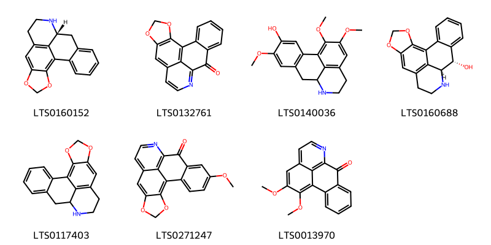{ width=100% }
    <figcaption>Hình ảnh cấu trúc hóa học của 7 hoạt chất thuộc nhóm Aporphines gồm ['anonaine (LTS0160152)', 'liriodenine (LTS0132761)', '5,15,16-trimethoxy-10-azatetracyclo[7.7.1.0²,⁷.0¹³,¹⁷]heptadeca-1(16),2(7),3,5,13(17),14-hexaen-4-ol (LTS0140036)', '(12s,13s)-3,5-dioxa-11-azapentacyclo[10.7.1.0²,⁶.0⁸,²⁰.0¹⁴,¹⁹]icosa-1,6,8(20),14,16,18-hexaen-13-ol (LTS0160688)', '3,5-dioxa-11-azapentacyclo[10.7.1.0²,⁶.0⁸,²⁰.0¹⁴,¹⁹]icosa-1(20),2(6),7,14,16,18-hexaene (LTS0117403)', 'lanuginosine (LTS0271247)', 'lysicamine (LTS0013970)'].</figcaption>
</figure>
#### Nhóm Azoles
<figure markdown="span">
    { width=100% }
    <figcaption>Hình ảnh cấu trúc hóa học của 1 hoạt chất thuộc nhóm Azoles gồm ['allantoin (LTS0106609)'].</figcaption>
</figure>
#### Nhóm Azolidines
<figure markdown="span">
    { width=100% }
    <figcaption>Hình ảnh cấu trúc hóa học của 1 hoạt chất thuộc nhóm Azolidines gồm ['n-[(4s)-2,5-dihydroxy-4h-imidazol-4-yl]carbamimidic acid (LTS0174328)'].</figcaption>
</figure>
#### Nhóm Cinnamic acids and derivatives
<figure markdown="span">
    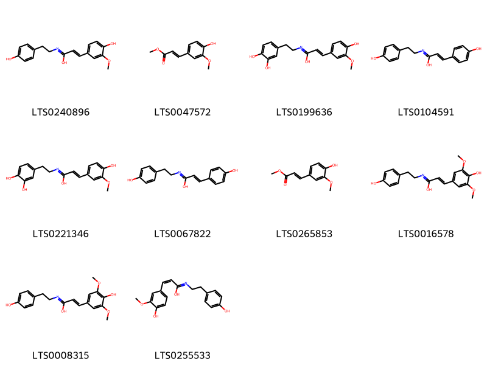{ width=100% }
    <figcaption>Hình ảnh cấu trúc hóa học của 10 hoạt chất thuộc nhóm Cinnamic acids and derivatives gồm ['3-(4-hydroxy-3-methoxyphenyl)-n-[2-(4-hydroxyphenyl)ethyl]prop-2-enimidic acid (LTS0240896)', 'methyl ferulate (LTS0047572)', '(2e)-n-[2-(3,4-dihydroxyphenyl)ethyl]-3-(4-hydroxy-3-methoxyphenyl)prop-2-enimidic acid (LTS0199636)', '3-(4-hydroxyphenyl)-n-[2-(4-hydroxyphenyl)ethyl]prop-2-enimidic acid (LTS0104591)', 'n-[2-(3,4-dihydroxyphenyl)ethyl]-3-(4-hydroxy-3-methoxyphenyl)prop-2-enimidic acid (LTS0221346)', '(2e)-3-(4-hydroxyphenyl)-n-[2-(4-hydroxyphenyl)ethyl]prop-2-enimidic acid (LTS0067822)', 'methyl ferulate (LTS0265853)', '(2e)-3-(4-hydroxy-3,5-dimethoxyphenyl)-n-[2-(4-hydroxyphenyl)ethyl]prop-2-enimidic acid (LTS0016578)', '3-(4-hydroxy-3,5-dimethoxyphenyl)-n-[2-(4-hydroxyphenyl)ethyl]prop-2-enimidic acid (LTS0008315)', '(2z)-3-(4-hydroxy-3-methoxyphenyl)-n-[2-(4-hydroxyphenyl)ethyl]prop-2-enimidic acid (LTS0255533)'].</figcaption>
</figure>
#### Nhóm Fatty Acyls
<figure markdown="span">
    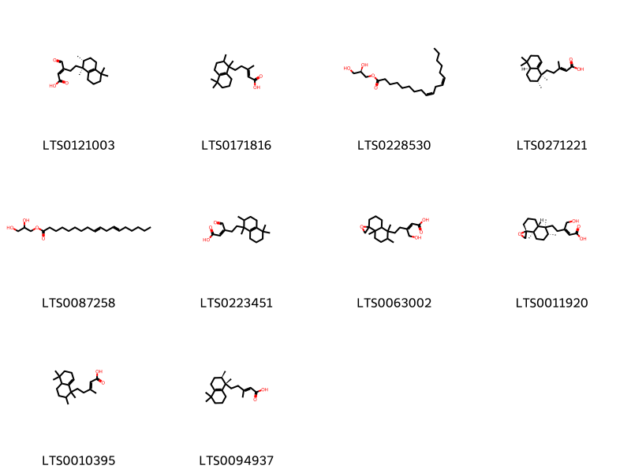{ width=100% }
    <figcaption>Hình ảnh cấu trúc hóa học của 10 hoạt chất thuộc nhóm Fatty Acyls gồm ['(2e)-3-formyl-5-[(1s,2r)-1,2,5,5-tetramethyl-2,3,4,6,7,8-hexahydronaphthalen-1-yl]pent-2-enoic acid (LTS0121003)', '3-methyl-5-(1,2,5,5-tetramethyl-2,3,4,6,7,8-hexahydronaphthalen-1-yl)pent-2-enoic acid (LTS0171816)', '3-linoleoyl-sn-glycerol (LTS0228530)', '(2e)-5-[(1s,2r,4as)-1,2,5,5-tetramethyl-2,3,4,4a,6,7-hexahydronaphthalen-1-yl]-3-methylpent-2-enoic acid (LTS0271221)', '2,3-dihydroxypropyl octadeca-9,12-dienoate (LTS0087258)', '3-formyl-5-(1,2,5,5-tetramethyl-2,3,4,6,7,8-hexahydronaphthalen-1-yl)pent-2-enoic acid (LTS0223451)', "5-{5,6,8a-trimethyl-hexahydro-2h-spiro[naphthalene-1,2'-oxiran]-5-yl}-3-(hydroxymethyl)pent-2-enoic acid (LTS0063002)", "(2z)-5-[(1r,4ar,5s,6r,8ar)-5,6,8a-trimethyl-hexahydro-2h-spiro[naphthalene-1,2'-oxiran]-5-yl]-3-(hydroxymethyl)pent-2-enoic acid (LTS0011920)", '3-methyl-5-(1,2,5,5-tetramethyl-2,3,4,4a,6,7-hexahydronaphthalen-1-yl)pent-2-enoic acid (LTS0010395)', '(2e)-3-methyl-5-[(1s,2r)-1,2,5,5-tetramethyl-2,3,4,6,7,8-hexahydronaphthalen-1-yl]pent-2-enoic acid (LTS0094937)'].</figcaption>
</figure>
#### Nhóm Flavonoids
<figure markdown="span">
    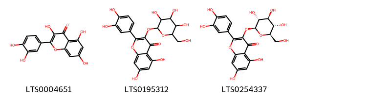{ width=100% }
    <figcaption>Hình ảnh cấu trúc hóa học của 3 hoạt chất thuộc nhóm Flavonoids gồm ['quercetin (LTS0004651)', '2-(3,4-dihydroxyphenyl)-5,7-dihydroxy-3-{[3,4,5-trihydroxy-6-(hydroxymethyl)oxan-2-yl]oxy}chromen-4-one (LTS0195312)', 'isoquercetin (LTS0254337)'].</figcaption>
</figure>
#### Nhóm Furanoid lignans
<figure markdown="span">
    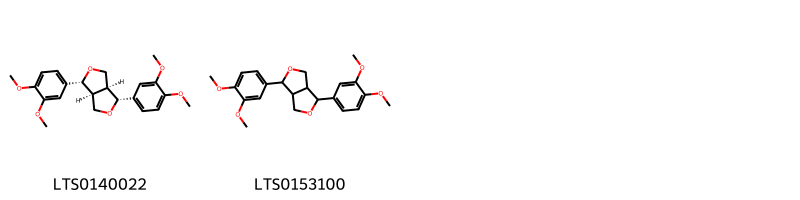{ width=100% }
    <figcaption>Hình ảnh cấu trúc hóa học của 2 hoạt chất thuộc nhóm Furanoid lignans gồm ['(1r,3as,4r,6as)-1,4-bis(3,4-dimethoxyphenyl)-hexahydrofuro[3,4-c]furan (LTS0140022)', '1,4-bis(3,4-dimethoxyphenyl)-hexahydrofuro[3,4-c]furan (LTS0153100)'].</figcaption>
</figure>
#### Nhóm Isoquinolines and derivatives
<figure markdown="span">
    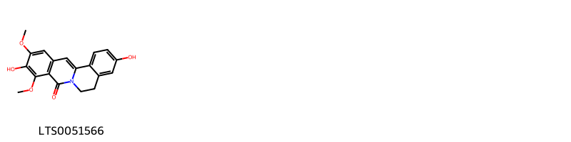{ width=100% }
    <figcaption>Hình ảnh cấu trúc hóa học của 1 hoạt chất thuộc nhóm Isoquinolines and derivatives gồm ['3,10-dihydroxy-2,4-dimethoxy-7,8-dihydro-6-azatetraphen-5-one (LTS0051566)'].</figcaption>
</figure>
#### Nhóm Phenanthrenes and derivatives
<figure markdown="span">
    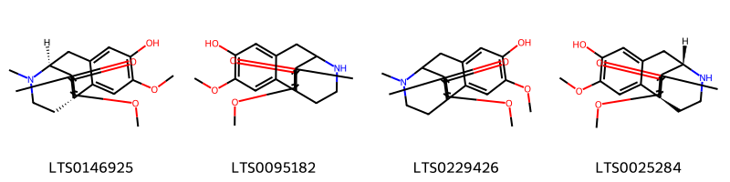{ width=100% }
    <figcaption>Hình ảnh cấu trúc hóa học của 4 hoạt chất thuộc nhóm Phenanthrenes and derivatives gồm ['(1s,9s)-5-hydroxy-4,13-dimethoxy-17-methyl-17-azatetracyclo[7.5.3.0¹,¹⁰.0²,⁷]heptadeca-2,4,6,10,13-pentaen-12-one (LTS0146925)', '5-hydroxy-4,13-dimethoxy-17-azatetracyclo[7.5.3.0¹,¹⁰.0²,⁷]heptadeca-2,4,6,10,13-pentaen-12-one (LTS0095182)', '5-hydroxy-4,13-dimethoxy-17-methyl-17-azatetracyclo[7.5.3.0¹,¹⁰.0²,⁷]heptadeca-2,4,6,10,13-pentaen-12-one (LTS0229426)', '(1s,9s)-5-hydroxy-4,13-dimethoxy-17-azatetracyclo[7.5.3.0¹,¹⁰.0²,⁷]heptadeca-2,4,6,10,13-pentaen-12-one (LTS0025284)'].</figcaption>
</figure>
#### Nhóm Phenol ethers
<figure markdown="span">
    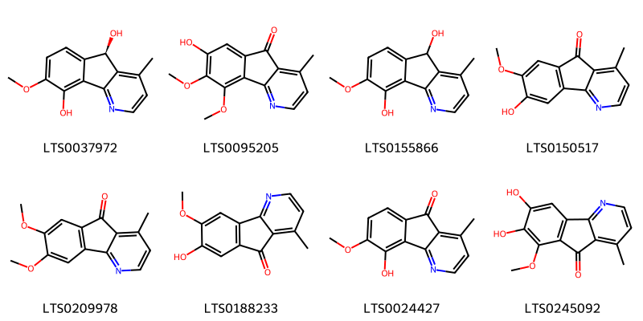{ width=100% }
    <figcaption>Hình ảnh cấu trúc hóa học của 8 hoạt chất thuộc nhóm Phenol ethers gồm ['(5r)-8-methoxy-4-methyl-5h-indeno[1,2-b]pyridine-5,9-diol (LTS0037972)', 'darienine (LTS0095205)', '8-methoxy-4-methyl-5h-indeno[1,2-b]pyridine-5,9-diol (LTS0155866)', '8-hydroxy-7-methoxy-4-methylindeno[1,2-b]pyridin-5-one (LTS0150517)', 'polyfothine (LTS0209978)', 'isooncodine (LTS0188233)', '9-hydroxy-8-methoxy-4-methylindeno[1,2-b]pyridin-5-one (LTS0024427)', '7,8-dihydroxy-6-methoxy-4-methylindeno[1,2-b]pyridin-5-one (LTS0245092)'].</figcaption>
</figure>
#### Nhóm Phenols
<figure markdown="span">
    { width=100% }
    <figcaption>Hình ảnh cấu trúc hóa học của 1 hoạt chất thuộc nhóm Phenols gồm ['(2e)-3-(4-hydroxy-3-methoxyphenyl)-n-[2-(4-hydroxyphenyl)ethyl]prop-2-enimidic acid (LTS0187051)'].</figcaption>
</figure>
#### Nhóm Prenol lipids
<figure markdown="span">
    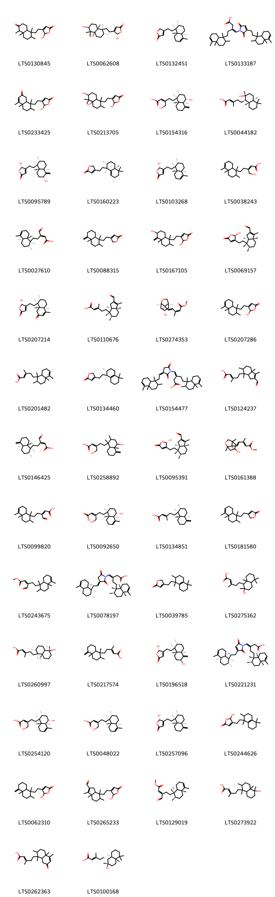{ width=100% }
    <figcaption>Hình ảnh cấu trúc hóa học của 58 hoạt chất thuộc nhóm Prenol lipids gồm ['4-[2-(1,2,4a,5-tetramethyl-6-oxo-hexahydro-2h-naphthalen-1-yl)ethyl]-5-hydroxy-5h-furan-2-one (LTS0130845)', '(5s)-4-{2-[(1s,2r,4ar,6s,8ar)-4a,6-dihydroxy-1,2,5,5-tetramethyl-hexahydro-2h-naphthalen-1-yl]ethyl}-5-hydroxy-5h-furan-2-one (LTS0062608)', '4-{2-[(1s,2r,4ar,8ar)-1,2,4a,5-tetramethyl-2,3,4,7,8,8a-hexahydronaphthalen-1-yl]ethyl}-5h-furan-2-one (LTS0132451)', '5-(1,2,4a,5-tetramethyl-2,3,4,7,8,8a-hexahydronaphthalen-1-yl)-3-({3-[2-(1,2,4a,5-tetramethyl-2,3,4,7,8,8a-hexahydronaphthalen-1-yl)ethyl]-2,5-dioxopyrrol-1-yl}methylidene)pentanoic acid (LTS0133187)', '4-[2-(1,2,4a,5-tetramethyl-7-oxo-3,4,8,8a-tetrahydro-2h-naphthalen-1-yl)ethyl]-5-hydroxy-5h-furan-2-one (LTS0233425)', '4-[2-(4a,6-dihydroxy-1,2,5,5-tetramethyl-hexahydro-2h-naphthalen-1-yl)ethyl]-5-hydroxy-5h-furan-2-one (LTS0213705)', '(2z)-5-[(1s,2r,4s,4ar,8ar)-4-hydroxy-1,2,4a-trimethyl-5-methylidene-hexahydro-2h-naphthalen-1-yl]-3-(hydroxymethyl)pent-2-enoic acid (LTS0154316)', '(2e)-5-[(1r,2r,4as,8as)-2-hydroxy-2,5,5,8a-tetramethyl-hexahydro-1h-naphthalen-1-yl]-3-methylpent-2-enoic acid (LTS0044182)', '(5s)-4-{2-[(1s,2r,4ar,6r,8ar)-6-hydroxy-1,2,4a-trimethyl-5-methylidene-hexahydro-2h-naphthalen-1-yl]ethyl}-5-hydroxy-5h-furan-2-one (LTS0095789)', '4-{2-[(1s,2r,4as)-1,2,5,5-tetramethyl-2,3,4,4a,6,7-hexahydronaphthalen-1-yl]ethyl}-5h-furan-2-one (LTS0160223)', '(5s)-4-{2-[(1s,2r,4ar,8ar)-1,2,4a,5-tetramethyl-2,3,4,7,8,8a-hexahydronaphthalen-1-yl]ethyl}-5-hydroxy-5h-furan-2-one (LTS0103268)', '5-(1,2,4a,5-tetramethyl-2,3,4,7,8,8a-hexahydronaphthalen-1-yl)-3-(hydroxymethyl)pent-2-enoic acid (LTS0038243)', '(2e)-5-[(1s,2r,4ar,8ar)-1,2,4a,5-tetramethyl-2,3,4,7,8,8a-hexahydronaphthalen-1-yl]-3-formylpent-2-enoic acid (LTS0027610)', '4-[2-(1,2,4a-trimethyl-5-methylidene-hexahydro-2h-naphthalen-1-yl)ethyl]-5h-furan-2-one (LTS0088315)', '5-hydroxy-4-[2-(6-hydroxy-1,2,4a-trimethyl-5-methylidene-hexahydro-2h-naphthalen-1-yl)ethyl]-5h-furan-2-one (LTS0167105)', '(3ar,4s,5r,7ar)-4-{2-[(2r)-2-hydroxy-5-oxo-2h-furan-3-yl]ethyl}-1,4,5,7a-tetramethyl-3a,5,6,7-tetrahydro-3h-indene-2-carbaldehyde (LTS0069157)', '(5s)-4-{2-[(1s,2r,4ar,8ar)-1,2,4a,5-tetramethyl-7-oxo-3,4,8,8a-tetrahydro-2h-naphthalen-1-yl]ethyl}-5-hydroxy-5h-furan-2-one (LTS0207214)', '(2e)-5-[(3ar,4s,5r,7ar)-2-formyl-1,4,5,7a-tetramethyl-3a,5,6,7-tetrahydro-3h-inden-4-yl]-3-methylpent-2-enoic acid (LTS0110676)', 'methyl (2z,4e)-5-[(1r,3s,5r,8s)-3,8-dihydroxy-1,5-dimethyl-6-oxabicyclo[3.2.1]octan-8-yl]-3-methylpenta-2,4-dienoate (LTS0274353)', '4-[2-(1,2,4a,5-tetramethyl-2,3,4,7,8,8a-hexahydronaphthalen-1-yl)ethyl]-5-hydroxy-5h-furan-2-one (LTS0207286)', '5-(1,2,4a,5-tetramethyl-2,3,4,7,8,8a-hexahydronaphthalen-1-yl)-3-methylpent-2-enoic acid (LTS0201482)', '4-{2-[(1s,2r)-1,2,5,5-tetramethyl-2,3,4,6,7,8-hexahydronaphthalen-1-yl]ethyl}-5h-furan-2-one (LTS0134460)', '5-(1,2,4a,5-tetramethyl-2,3,4,7,8,8a-hexahydronaphthalen-1-yl)-3-({3-[2-(1,2,4a,5-tetramethyl-2,3,4,7,8,8a-hexahydronaphthalen-1-yl)ethylidene]-2,5-dioxopyrrolidin-1-yl}methylidene)pentanoic acid (LTS0154477)', '5-(2-formyl-1,4,5,7a-tetramethyl-3a,5,6,7-tetrahydro-3h-inden-4-yl)-3-methylpent-2-enoic acid (LTS0124237)', '(2e)-5-[(1s,2r,4ar,8ar)-1,2,4a-trimethyl-5-methylidene-hexahydro-2h-naphthalen-1-yl]-3-formylpent-2-enoic acid (LTS0146425)', '5-(4-hydroxy-1,2,4a-trimethyl-5-methylidene-hexahydro-2h-naphthalen-1-yl)-3-(hydroxymethyl)pent-2-enoic acid (LTS0258892)', '(3ar,4s,5r,7ar)-4-{2-[(2s)-2-hydroxy-5-oxo-2h-furan-3-yl]ethyl}-1,4,5,7a-tetramethyl-3a,5,6,7-tetrahydro-3h-indene-2-carbaldehyde (LTS0095391)', 'methyl (4e)-5-{3,8-dihydroxy-1,5-dimethyl-6-oxabicyclo[3.2.1]octan-8-yl}-3-methylpenta-2,4-dienoate (LTS0161388)', '5-(1,2,4a,5-tetramethyl-2,3,4,7,8,8a-hexahydronaphthalen-1-yl)-3-formylpent-2-enoic acid (LTS0099820)', '5-[(1s,2r,4s,4ar,8ar)-4-hydroxy-1,2,4a,5-tetramethyl-2,3,4,7,8,8a-hexahydronaphthalen-1-yl]-3-(hydroxymethyl)pent-2-enoic acid (LTS0092650)', '(2e)-5-[(1s,2r,4ar,8ar)-1,2,4a-trimethyl-5-methylidene-hexahydro-2h-naphthalen-1-yl]-3-methylpent-2-enoic acid (LTS0134851)', '4-[2-(1,2,4a,5-tetramethyl-2,3,4,7,8,8a-hexahydronaphthalen-1-yl)ethyl]-5h-furan-2-one (LTS0181580)', 'methyl 5-(1,2,4a,5-tetramethyl-2,3,4,7,8,8a-hexahydronaphthalen-1-yl)-3-formylpent-2-enoate (LTS0243675)', '(3e)-5-[(1s,2r,4ar,8as)-1,2,4a,5-tetramethyl-2,3,4,7,8,8a-hexahydronaphthalen-1-yl]-3-{[(3e)-3-{2-[(1s,2r,4ar,8as)-1,2,4a,5-tetramethyl-2,3,4,7,8,8a-hexahydronaphthalen-1-yl]ethylidene}-2,5-dioxopyrrolidin-1-yl]methylidene}pentanoic acid (LTS0078197)', '4-[2-(1,2,5,5-tetramethyl-2,3,4,6,7,8-hexahydronaphthalen-1-yl)ethyl]-5h-furan-2-one (LTS0039785)', '5-(2-hydroxy-2,5,5,8a-tetramethyl-hexahydro-1h-naphthalen-1-yl)-3-methylpent-2-enoic acid (LTS0275162)', '(2e)-5-[(1s,2r,4ar,5r,8ar)-5-hydroxy-1,2,4a,5-tetramethyl-hexahydro-2h-naphthalen-1-yl]-3-methylpent-2-enoic acid (LTS0260997)', '5-(1,2,4a-trimethyl-5-methylidene-hexahydro-2h-naphthalen-1-yl)-3-methylpent-2-enoic acid (LTS0217574)', '(5s)-4-{2-[(1s,2r,4ar,6s,8ar)-6-hydroxy-1,2,4a-trimethyl-5-methylidene-hexahydro-2h-naphthalen-1-yl]ethyl}-5-hydroxy-5h-furan-2-one (LTS0196518)', '(3e)-5-[(1s,2r,4ar,8as)-1,2,4a,5-tetramethyl-2,3,4,7,8,8a-hexahydronaphthalen-1-yl]-3-[(3-{2-[(1s,2r,4ar,8as)-1,2,4a,5-tetramethyl-2,3,4,7,8,8a-hexahydronaphthalen-1-yl]ethyl}-2,5-dioxopyrrol-1-yl)methylidene]pentanoic acid (LTS0221231)', '(2z)-5-[(1s,2r,4s,4ar,8ar)-4-hydroxy-1,2,4a,5-tetramethyl-2,3,4,7,8,8a-hexahydronaphthalen-1-yl]-3-(hydroxymethyl)pent-2-enoic acid (LTS0254120)', '(2z)-5-[(1s,2r,4ar,8ar)-1,2,4a,5-tetramethyl-2,3,4,7,8,8a-hexahydronaphthalen-1-yl]-3-(hydroxymethyl)pent-2-enoic acid (LTS0048022)', '(5s)-4-{2-[(1s,2r,4ar,8ar)-1,2,4a-trimethyl-5-methylidene-hexahydro-2h-naphthalen-1-yl]ethyl}-5-hydroxy-5h-furan-2-one (LTS0257096)', '5-hydroxy-4-[2-(1,2,5,5-tetramethyl-2,3,4,6,7,8-hexahydronaphthalen-1-yl)ethyl]-5h-furan-2-one (LTS0244626)', '4-[2-(1,2,4a-trimethyl-5-methylidene-hexahydro-2h-naphthalen-1-yl)ethyl]-5-hydroxy-5h-furan-2-one (LTS0062310)', '4-[2-(2-hydroxy-5-oxo-2h-furan-3-yl)ethyl]-1,4,5,7a-tetramethyl-3a,5,6,7-tetrahydro-3h-indene-2-carbaldehyde (LTS0265233)', 'methyl (2e)-5-[(1s,2r,4ar,8ar)-1,2,4a,5-tetramethyl-2,3,4,7,8,8a-hexahydronaphthalen-1-yl]-3-formylpent-2-enoate (LTS0129019)', '5-(5-hydroxy-1,2,4a,5-tetramethyl-hexahydro-2h-naphthalen-1-yl)-3-methylpent-2-enoic acid (LTS0273922)', '5-(1,2,4a,5-tetramethyl-7-oxo-3,4,8,8a-tetrahydro-2h-naphthalen-1-yl)-3-methylpent-2-enoic acid (LTS0262363)', '(2e)-5-[(1r,2s,4as,8as)-2-hydroxy-2,5,5,8a-tetramethyl-hexahydro-1h-naphthalen-1-yl]-3-methylpent-2-enoic acid (LTS0100168)', '4-[2-(1,2,5,5-tetramethyl-2,3,4,4a,6,7-hexahydronaphthalen-1-yl)ethyl]-5h-furan-2-one (LTS0248488)', '5-(1,2,4a-trimethyl-5-methylidene-hexahydro-2h-naphthalen-1-yl)-3-formylpent-2-enoic acid (LTS0073788)', '4-{2-[(1s,2r,4ar,8ar)-1,2,4a-trimethyl-5-methylidene-hexahydro-2h-naphthalen-1-yl]ethyl}-5h-furan-2-one (LTS0095288)', '(2z)-5-[(1s,2r,4ar,8ar)-1,2,4a,5-tetramethyl-2,3,4,7,8,8a-hexahydronaphthalen-1-yl]-3-formylpent-2-enoic acid (LTS0137305)', '(5r)-4-{2-[(1s,2r,4ar,5s,8ar)-1,2,4a,5-tetramethyl-6-oxo-hexahydro-2h-naphthalen-1-yl]ethyl}-5-hydroxy-5h-furan-2-one (LTS0126547)', '(5s)-5-hydroxy-4-{2-[(1s,2r)-1,2,5,5-tetramethyl-2,3,4,6,7,8-hexahydronaphthalen-1-yl]ethyl}-5h-furan-2-one (LTS0051580)', '(2e)-5-[(1s,2r,4ar,8ar)-1,2,4a,5-tetramethyl-7-oxo-3,4,8,8a-tetrahydro-2h-naphthalen-1-yl]-3-methylpent-2-enoic acid (LTS0040524)', '(2e)-5-[(1s,2r,4ar,8ar)-1,2,4a,5-tetramethyl-2,3,4,7,8,8a-hexahydronaphthalen-1-yl]-3-methylpent-2-enoic acid (LTS0253107)'].</figcaption>
</figure>
#### Nhóm Proaporphines
<figure markdown="span">
    { width=100% }
    <figcaption>Hình ảnh cấu trúc hóa học của 2 hoạt chất thuộc nhóm Proaporphines gồm ["(4'r)-10',11'-dimethoxy-5'-azaspiro[cyclohexane-1,2'-tricyclo[6.3.1.0⁴,¹²]dodecane]-1'(11'),2,5,8'(12'),9'-pentaen-4-one (LTS0202745)", "10',11'-dimethoxy-5'-azaspiro[cyclohexane-1,2'-tricyclo[6.3.1.0⁴,¹²]dodecane]-1'(11'),2,5,8'(12'),9'-pentaen-4-one (LTS0014482)"].</figcaption>
</figure>
#### Nhóm Protoberberine alkaloids and derivatives
<figure markdown="span">
    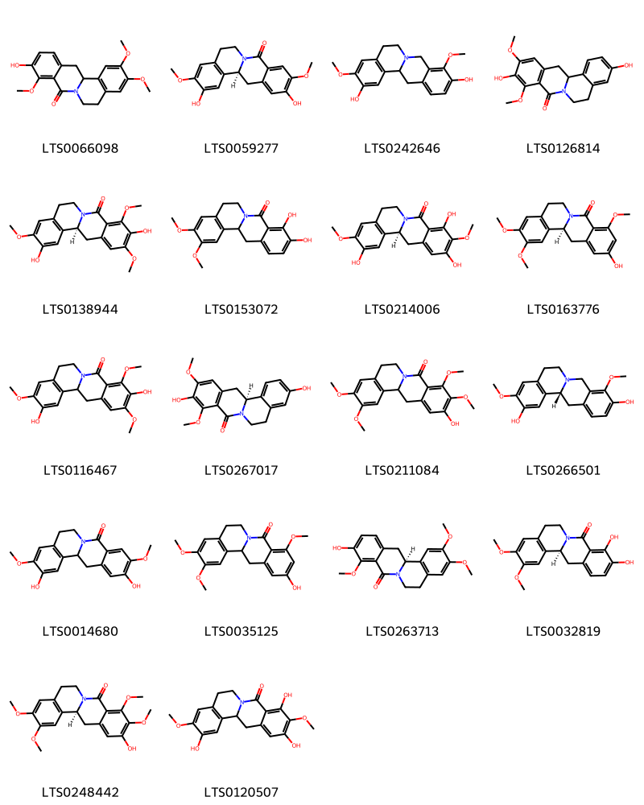{ width=100% }
    <figcaption>Hình ảnh cấu trúc hóa học của 18 hoạt chất thuộc nhóm Protoberberine alkaloids and derivatives gồm ['3-hydroxy-4,10,11-trimethoxy-7,8,12b,13-tetrahydro-6-azatetraphen-5-one (LTS0066098)', '(12bs)-2,11-dihydroxy-3,10-dimethoxy-7,8,12b,13-tetrahydro-6-azatetraphen-5-one (LTS0059277)', 'coreximine (LTS0242646)', '3,10-dihydroxy-2,4-dimethoxy-7,8,12b,13-tetrahydro-6-azatetraphen-5-one (LTS0126814)', '(12bs)-3,11-dihydroxy-2,4,10-trimethoxy-7,8,12b,13-tetrahydro-6-azatetraphen-5-one (LTS0138944)', '3,4-dihydroxy-10,11-dimethoxy-7,8,12b,13-tetrahydro-6-azatetraphen-5-one (LTS0153072)', '(12bs)-2,4,11-trihydroxy-3,10-dimethoxy-7,8,12b,13-tetrahydro-6-azatetraphen-5-one (LTS0214006)', '(12bs)-2-hydroxy-4,10,11-trimethoxy-7,8,12b,13-tetrahydro-6-azatetraphen-5-one (LTS0163776)', '3,11-dihydroxy-2,4,10-trimethoxy-7,8,12b,13-tetrahydro-6-azatetraphen-5-one (LTS0116467)', '(12bs)-3,10-dihydroxy-2,4-dimethoxy-7,8,12b,13-tetrahydro-6-azatetraphen-5-one (LTS0267017)', '2-hydroxy-3,4,10,11-tetramethoxy-7,8,12b,13-tetrahydro-6-azatetraphen-5-one (LTS0211084)', '(12br)-4,10-dimethoxy-7,8,12b,13-tetrahydro-5h-6-azatetraphene-3,11-diol (LTS0266501)', '2,11-dihydroxy-3,10-dimethoxy-7,8,12b,13-tetrahydro-6-azatetraphen-5-one (LTS0014680)', '2-hydroxy-4,10,11-trimethoxy-7,8,12b,13-tetrahydro-6-azatetraphen-5-one (LTS0035125)', '(12bs)-3-hydroxy-4,10,11-trimethoxy-7,8,12b,13-tetrahydro-6-azatetraphen-5-one (LTS0263713)', '(12bs)-3,4-dihydroxy-10,11-dimethoxy-7,8,12b,13-tetrahydro-6-azatetraphen-5-one (LTS0032819)', '(12bs)-2-hydroxy-3,4,10,11-tetramethoxy-7,8,12b,13-tetrahydro-6-azatetraphen-5-one (LTS0248442)', '2,4,11-trihydroxy-3,10-dimethoxy-7,8,12b,13-tetrahydro-6-azatetraphen-5-one (LTS0120507)'].</figcaption>
</figure>
#### Nhóm Quinolines and derivatives
<figure markdown="span">
    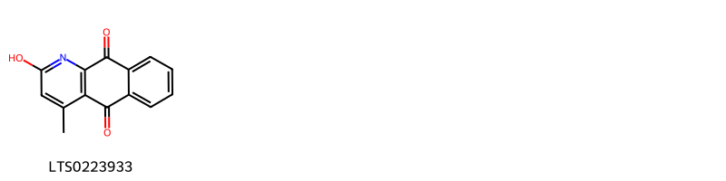{ width=100% }
    <figcaption>Hình ảnh cấu trúc hóa học của 1 hoạt chất thuộc nhóm Quinolines and derivatives gồm ['2-hydroxy-4-methylbenzo[g]quinoline-5,10-dione (LTS0223933)'].</figcaption>
</figure>
#### Nhóm Steroids and steroid derivatives
<figure markdown="span">
    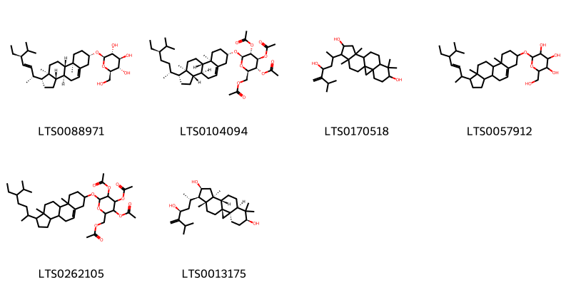{ width=100% }
    <figcaption>Hình ảnh cấu trúc hóa học của 6 hoạt chất thuộc nhóm Steroids and steroid derivatives gồm ['(2r,3r,4s,5s,6r)-2-{[(1r,3as,3bs,7s,9ar,9bs,11ar)-1-[(2r,3e,5s)-5-ethyl-6-methylhept-3-en-2-yl]-9a,11a-dimethyl-1h,2h,3h,3ah,3bh,4h,6h,7h,8h,9h,9bh,10h,11h-cyclopenta[a]phenanthren-7-yl]oxy}-6-(hydroxymethyl)oxane-3,4,5-triol (LTS0088971)', '[(2r,3r,4s,5r,6r)-6-{[(1r,3as,3bs,7s,9ar,9bs,11ar)-1-[(2r,5r)-5-ethyl-6-methylheptan-2-yl]-9a,11a-dimethyl-1h,2h,3h,3ah,3bh,4h,6h,7h,8h,9h,9bh,10h,11h-cyclopenta[a]phenanthren-7-yl]oxy}-3,4,5-tris(acetyloxy)oxan-2-yl]methyl acetate (LTS0104094)', '15-(4-hydroxy-6-methyl-5-methylideneheptan-2-yl)-7,7,12,16-tetramethylpentacyclo[9.7.0.0¹,³.0³,⁸.0¹²,¹⁶]octadecane-6,14-diol (LTS0170518)', '2-{[1-(5-ethyl-6-methylhept-3-en-2-yl)-9a,11a-dimethyl-1h,2h,3h,3ah,3bh,4h,6h,7h,8h,9h,9bh,10h,11h-cyclopenta[a]phenanthren-7-yl]oxy}-6-(hydroxymethyl)oxane-3,4,5-triol (LTS0057912)', '[3,4,5-tris(acetyloxy)-6-{[1-(5-ethyl-6-methylheptan-2-yl)-9a,11a-dimethyl-1h,2h,3h,3ah,3bh,4h,6h,7h,8h,9h,9bh,10h,11h-cyclopenta[a]phenanthren-7-yl]oxy}oxan-2-yl]methyl acetate (LTS0262105)', '(1s,3r,6s,8r,11s,12s,14s,15r,16r)-15-[(2s,4s)-4-hydroxy-6-methyl-5-methylideneheptan-2-yl]-7,7,12,16-tetramethylpentacyclo[9.7.0.0¹,³.0³,⁸.0¹²,¹⁶]octadecane-6,14-diol (LTS0013175)'].</figcaption>
</figure>

---

### Dược dân tộc học

Danh sách các quốc gia có sử dụng *Polyalthia longifolia* trong điều trị các bệnh. 

| Country   | Disease    | Bệnh                                                                                                                                                                                                |
|:----------|:-----------|:----------------------------------------------------------------------------------------------------------------------------------------------------------------------------------------------------|
| Elsewhere | Uterotonic | MYMEMORY WARNING: YOU USED ALL AVAILABLE FREE TRANSLATIONS FOR TODAY. NEXT AVAILABLE IN  10 HOURS 40 MINUTES 14 SECONDS VISIT HTTPS://MYMEMORY.TRANSLATED.NET/DOC/USAGELIMITS.PHP TO TRANSLATE MORE |

---

---
## Polyalthia oliveri
### Thông tin về thực vật

!!! info "Phân loại thực vật của *Greenwayodendron oliveri* từ GIBF:"
    - **Kingdom:** Plantae
    - **Phylum:** Tracheophyta
    - **Order:** Magnoliales
    - **Family:** Annonaceae
    - **Genus:** Greenwayodendron
    - **Species:** *Greenwayodendron oliveri*

 

| Label (VI)   | Label (EN)   | Scientific Name    | Descriptions (VI)   | Descriptions (EN)   | Also Known As (VI)   | Also Known As (EN)   |
|:-------------|:-------------|:-------------------|:--------------------|:--------------------|:---------------------|:---------------------|
| N/A          | N/A          | Polyalthia oliveri | loài thực vật       | species of plant    | ['']                 | ['']                 |

#### Phân bố trên thế giới

**Từ CSDL GIBF** nan, Sierra Leone, Côte d’Ivoire, Ghana, Liberia, Cameroon

#### Phân bố tại Việt Nam

**Từ CSDL GIBF**: Không có ghi nhận ở Việt Nam

---
### Thành phần hóa học
        
- Theo cơ sở dữ liệu lotus: Từ loài *Greenwayodendron oliveri* đã phân lập và xác định được Chưa có hoạt chất nào được phân lập. hoạt chất thuộc về các nhóm Không có hoạt chất nào được phân lập. 

Không có hình ảnh nào được tạo ra

---

### Dược dân tộc học

Danh sách các quốc gia có sử dụng *Greenwayodendron oliveri* trong điều trị các bệnh. 

| Country   | Disease   | Bệnh                                                                                                                                                                                                |
|:----------|:----------|:----------------------------------------------------------------------------------------------------------------------------------------------------------------------------------------------------|
| Liberia   | Vermifuge | MYMEMORY WARNING: YOU USED ALL AVAILABLE FREE TRANSLATIONS FOR TODAY. NEXT AVAILABLE IN  10 HOURS 39 MINUTES 40 SECONDS VISIT HTTPS://MYMEMORY.TRANSLATED.NET/DOC/USAGELIMITS.PHP TO TRANSLATE MORE |

---

---
## Polyalthia suberosa
### Thông tin về thực vật

!!! info "Phân loại thực vật của *Polyalthia suberosa* từ GIBF:"
    - **Kingdom:** Plantae
    - **Phylum:** Tracheophyta
    - **Order:** Magnoliales
    - **Family:** Annonaceae
    - **Genus:** Polyalthia
    - **Species:** *Polyalthia suberosa*

 

| Label (VI)   | Label (EN)   | Scientific Name     | Descriptions (VI)   | Descriptions (EN)   | Also Known As (VI)   | Also Known As (EN)    |
|:-------------|:-------------|:--------------------|:--------------------|:--------------------|:---------------------|:----------------------|
| N/A          | N/A          | Polyalthia suberosa | loài thực vật       | species of plant    | ['']                 | ['Corky Debbar Tree'] |

#### Phân bố trên thế giới

**Từ CSDL GIBF** Viet Nam, nan, unknown or invalid, Thailand, Philippines, Lao People’s Democratic Republic, Austria, Indonesia, Colombia, Sri Lanka, Malaysia, Puerto Rico, India, Bangladesh, Belgium, Cambodia, China, Nepal, Chinese Taipei, South Africa, United States of America

#### Phân bố tại Việt Nam

**Từ CSDL GIBF**: Không có ghi nhận ở Việt Nam

---
### Thành phần hóa học
        
- Theo cơ sở dữ liệu lotus: Từ loài *Polyalthia suberosa* đã phân lập và xác định được 14 hoạt chất thuộc về các nhóm Quinolines and derivatives, Coumarins and derivatives, Fatty Acyls, Phenols, Cinnamic acids and derivatives, Heteroaromatic compounds, Steroids and steroid derivatives. 

|    | chemicalTaxonomyClassyfireClass   |   smiles_count |
|---:|:----------------------------------|---------------:|
|  0 | Cinnamic acids and derivatives    |              3 |
|  1 | Coumarins and derivatives         |              1 |
|  2 | Fatty Acyls                       |              1 |
|  3 | Heteroaromatic compounds          |              1 |
|  4 | Phenols                           |              1 |
|  5 | Quinolines and derivatives        |              1 |
|  6 | Steroids and steroid derivatives  |              5 |

#### Nhóm Cinnamic acids and derivatives
<figure markdown="span">
    { width=100% }
    <figcaption>Hình ảnh cấu trúc hóa học của 3 hoạt chất thuộc nhóm Cinnamic acids and derivatives gồm ['3-(4-hydroxy-3-methoxyphenyl)-n-[2-(4-hydroxyphenyl)ethyl]prop-2-enimidic acid (LTS0240896)', '3-(4-hydroxyphenyl)-n-[2-(4-hydroxyphenyl)ethyl]prop-2-enimidic acid (LTS0104591)', '(2e)-3-(4-hydroxyphenyl)-n-[2-(4-hydroxyphenyl)ethyl]prop-2-enimidic acid (LTS0067822)'].</figcaption>
</figure>
#### Nhóm Coumarins and derivatives
<figure markdown="span">
    { width=100% }
    <figcaption>Hình ảnh cấu trúc hóa học của 1 hoạt chất thuộc nhóm Coumarins and derivatives gồm ['scopoletin (LTS0193112)'].</figcaption>
</figure>
#### Nhóm Fatty Acyls
<figure markdown="span">
    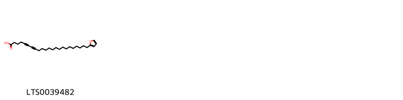{ width=100% }
    <figcaption>Hình ảnh cấu trúc hóa học của 1 hoạt chất thuộc nhóm Fatty Acyls gồm ['23-(furan-2-yl)tricosa-5,7-diynoic acid (LTS0039482)'].</figcaption>
</figure>
#### Nhóm Heteroaromatic compounds
<figure markdown="span">
    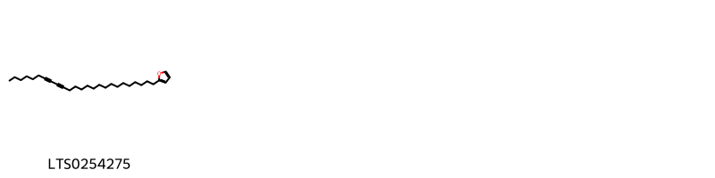{ width=100% }
    <figcaption>Hình ảnh cấu trúc hóa học của 1 hoạt chất thuộc nhóm Heteroaromatic compounds gồm ['2-(pentacosa-16,18-diyn-1-yl)furan (LTS0254275)'].</figcaption>
</figure>
#### Nhóm Phenols
<figure markdown="span">
    { width=100% }
    <figcaption>Hình ảnh cấu trúc hóa học của 1 hoạt chất thuộc nhóm Phenols gồm ['(2e)-3-(4-hydroxy-3-methoxyphenyl)-n-[2-(4-hydroxyphenyl)ethyl]prop-2-enimidic acid (LTS0187051)'].</figcaption>
</figure>
#### Nhóm Quinolines and derivatives
<figure markdown="span">
    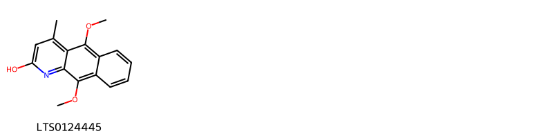{ width=100% }
    <figcaption>Hình ảnh cấu trúc hóa học của 1 hoạt chất thuộc nhóm Quinolines and derivatives gồm ['kalasinamide (LTS0124445)'].</figcaption>
</figure>
#### Nhóm Steroids and steroid derivatives
<figure markdown="span">
    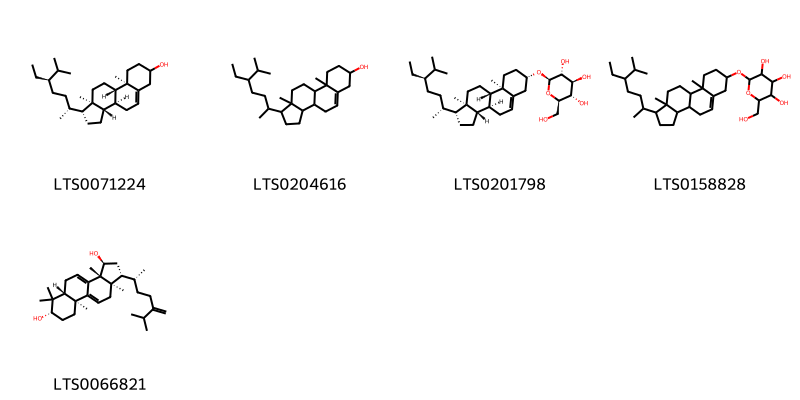{ width=100% }
    <figcaption>Hình ảnh cấu trúc hóa học của 5 hoạt chất thuộc nhóm Steroids and steroid derivatives gồm ['stigmast-5-en-3-ol (LTS0071224)', 'stigmast-5-en-3-ol, (3β)- (LTS0204616)', 'sitogluside (LTS0201798)', '2-{[1-(5-ethyl-6-methylheptan-2-yl)-9a,11a-dimethyl-1h,2h,3h,3ah,3bh,4h,6h,7h,8h,9h,9bh,10h,11h-cyclopenta[a]phenanthren-7-yl]oxy}-6-(hydroxymethyl)oxane-3,4,5-triol (LTS0158828)', 'suberosol (LTS0066821)'].</figcaption>
</figure>

---

### Dược dân tộc học

Danh sách các quốc gia có sử dụng *Polyalthia suberosa* trong điều trị các bệnh. 

| Country     | Disease                      | Bệnh                                                                                                                                                                                                |
|:------------|:-----------------------------|:----------------------------------------------------------------------------------------------------------------------------------------------------------------------------------------------------|
| Philippines | Abortifacient, Abortifacient | MYMEMORY WARNING: YOU USED ALL AVAILABLE FREE TRANSLATIONS FOR TODAY. NEXT AVAILABLE IN  10 HOURS 39 MINUTES 06 SECONDS VISIT HTTPS://MYMEMORY.TRANSLATED.NET/DOC/USAGELIMITS.PHP TO TRANSLATE MORE |

---

# Chi Cananga

??? note "Danh sách các dược liệu thuộc chi"
    
	 - *Cananga odorata*
	 - *Cananga odoratum*

---
## Cananga odorata
### Thông tin về thực vật

!!! info "Phân loại thực vật của *Cananga odorata* từ GIBF:"
    - **Kingdom:** Plantae
    - **Phylum:** Tracheophyta
    - **Order:** Magnoliales
    - **Family:** Annonaceae
    - **Genus:** Cananga
    - **Species:** *Cananga odorata*

 

| Label (VI)   | Label (EN)   | Scientific Name   | Descriptions (VI)   | Descriptions (EN)   | Also Known As (VI)                                                               | Also Known As (EN)   |
|:-------------|:-------------|:------------------|:--------------------|:--------------------|:---------------------------------------------------------------------------------|:---------------------|
| N/A          | N/A          | Cananga odorata   |                     | species of plant    | ['Ylang-ylang', 'Ylang công chúa', 'Ngọc lan tây', 'Hoa giẻ', 'Cananga odorata'] | ['Ylang-ylang tree'] |

#### Phân bố trên thế giới

**Từ CSDL GIBF** Honduras, Cayman Islands, Viet Nam, Thailand, Guinea, Philippines, Dominica, French Polynesia, Guadeloupe, Trinidad and Tobago, French Guiana, Northern Mariana Islands, Singapore, Martinique, Australia, Indonesia, Haiti, Guatemala, Colombia, Suriname, Dominican Republic, American Samoa, Sri Lanka, Maldives, Malaysia, Puerto Rico, India, Samoa, Réunion, Sao Tome and Principe, Seychelles, Guam, Virgin Islands (U.S.), Barbados, Belize, Nicaragua, Panama, Brazil, Palau, Comoros, Mexico, China, Tonga, Hong Kong, South Africa, Micronesia (Federated States of), Tanzania, United Republic of, Fiji, Costa Rica, New Caledonia, United States of America, Madagascar, Wallis and Futuna

#### Phân bố tại Việt Nam

**Từ CSDL GIBF**: Không có ghi nhận ở Việt Nam

---
### Thành phần hóa học
        
- Theo cơ sở dữ liệu lotus: Từ loài *Cananga odorata* đã phân lập và xác định được 139 hoạt chất thuộc về các nhóm Quinolines and derivatives, Organooxygen compounds, Aporphines, Lactones, Prenol lipids, Lignan glycosides, Fatty Acyls, Pyridines and derivatives, 1-azaoxoaporphines, Phenol ethers, Heteroaromatic compounds, Phenols, Dihydrofurans, Benzodioxoles, Tetrahydrofurans, Cinnamic acids and derivatives, Benzene and substituted derivatives. 

|    | chemicalTaxonomyClassyfireClass     |   smiles_count |
|---:|:------------------------------------|---------------:|
|  0 |                                     |              6 |
|  1 | 1-azaoxoaporphines                  |              1 |
|  2 | Aporphines                          |             19 |
|  3 | Benzene and substituted derivatives |             10 |
|  4 | Benzodioxoles                       |              1 |
|  5 | Cinnamic acids and derivatives      |              5 |
|  6 | Dihydrofurans                       |              1 |
|  7 | Fatty Acyls                         |             12 |
|  8 | Heteroaromatic compounds            |              1 |
|  9 | Lactones                            |              3 |
| 10 | Lignan glycosides                   |             14 |
| 11 | Organooxygen compounds              |              4 |
| 12 | Phenol ethers                       |              1 |
| 13 | Phenols                             |              3 |
| 14 | Prenol lipids                       |             54 |
| 15 | Pyridines and derivatives           |              2 |
| 16 | Quinolines and derivatives          |              1 |
| 17 | Tetrahydrofurans                    |              1 |

#### Nhóm 
<figure markdown="span">
    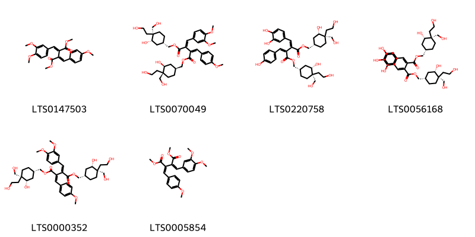{ width=100% }
    <figcaption>Hình ảnh cấu trúc hóa học của 6 hoạt chất thuộc nhóm  gồm ['1,4-dimethyl (2e,3e)-2-[(3,4-dimethoxyphenyl)methylidene]-3-[(4-methoxyphenyl)methylidene]butanedioate (LTS0147503)', '1,4-bis{[(1s,3s,4r)-3-hydroxy-4-(2-hydroxyethyl)-4-(hydroxymethyl)cyclohexyl]methyl} (2e)-2-[(3,4-dimethoxyphenyl)methylidene]-3-[(4-methoxyphenyl)methylidene]butanedioate (LTS0070049)', '1,4-bis{[(1s,3s,4r)-3-hydroxy-4-(2-hydroxyethyl)-4-(hydroxymethyl)cyclohexyl]methyl} (2e)-2-[(3,4-dihydroxyphenyl)methylidene]-3-[(4-hydroxyphenyl)methylidene]butanedioate (LTS0220758)', '1,4-bis{[(1s,3s,4r)-3-hydroxy-4-(2-hydroxyethyl)-4-(hydroxymethyl)cyclohexyl]methyl} (2e,3e)-2-[(3,4-dihydroxyphenyl)methylidene]-3-[(4-hydroxyphenyl)methylidene]butanedioate (LTS0056168)', '1,4-bis{[(1s,3s,4r)-3-hydroxy-4-(2-hydroxyethyl)-4-(hydroxymethyl)cyclohexyl]methyl} (2e,3e)-2-[(3,4-dimethoxyphenyl)methylidene]-3-[(4-methoxyphenyl)methylidene]butanedioate (LTS0000352)', '1,4-dimethyl (3e)-2-[(3,4-dimethoxyphenyl)methylidene]-3-[(4-methoxyphenyl)methylidene]butanedioate (LTS0005854)'].</figcaption>
</figure>
#### Nhóm 1-azaoxoaporphines
<figure markdown="span">
    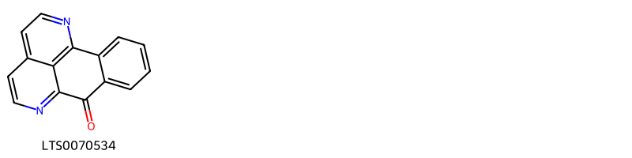{ width=100% }
    <figcaption>Hình ảnh cấu trúc hóa học của 1 hoạt chất thuộc nhóm 1-azaoxoaporphines gồm ['sampangine (LTS0070534)'].</figcaption>
</figure>
#### Nhóm Aporphines
<figure markdown="span">
    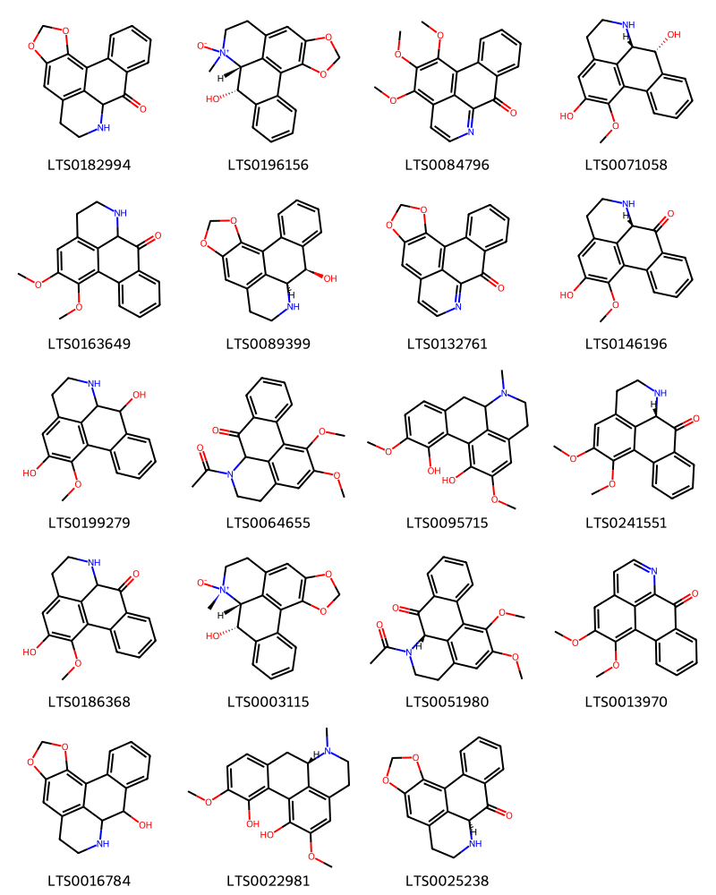{ width=100% }
    <figcaption>Hình ảnh cấu trúc hóa học của 19 hoạt chất thuộc nhóm Aporphines gồm ['3,5-dioxa-11-azapentacyclo[10.7.1.0²,⁶.0⁸,²⁰.0¹⁴,¹⁹]icosa-1,6,8(20),14,16,18-hexaen-13-one (LTS0182994)', '(12r,13s)-13-hydroxy-11-methyl-3,5-dioxa-11-azapentacyclo[10.7.1.0²,⁶.0⁸,²⁰.0¹⁴,¹⁹]icosa-1(20),2(6),7,14,16,18-hexaen-11-ium-11-olate (LTS0196156)', 'o-methylmoschatoline (LTS0084796)', '(8r,9s)-16-methoxy-10-azatetracyclo[7.7.1.0²,⁷.0¹³,¹⁷]heptadeca-1(17),2,4,6,13,15-hexaene-8,15-diol (LTS0071058)', '15,16-dimethoxy-10-azatetracyclo[7.7.1.0²,⁷.0¹³,¹⁷]heptadeca-1(16),2,4,6,13(17),14-hexaen-8-one (LTS0163649)', '(12s,13r)-3,5-dioxa-11-azapentacyclo[10.7.1.0²,⁶.0⁸,²⁰.0¹⁴,¹⁹]icosa-1,6,8(20),14,16,18-hexaen-13-ol (LTS0089399)', 'liriodenine (LTS0132761)', '(9s)-15-hydroxy-16-methoxy-10-azatetracyclo[7.7.1.0²,⁷.0¹³,¹⁷]heptadeca-1(17),2,4,6,13,15-hexaen-8-one (LTS0146196)', '16-methoxy-10-azatetracyclo[7.7.1.0²,⁷.0¹³,¹⁷]heptadeca-1(17),2,4,6,13,15-hexaene-8,15-diol (LTS0199279)', '10-acetyl-15,16-dimethoxy-10-azatetracyclo[7.7.1.0²,⁷.0¹³,¹⁷]heptadeca-1(16),2,4,6,13(17),14-hexaen-8-one (LTS0064655)', '4,15-dimethoxy-10-methyl-10-azatetracyclo[7.7.1.0²,⁷.0¹³,¹⁷]heptadeca-1(16),2,4,6,13(17),14-hexaene-3,16-diol (LTS0095715)', '(9s)-15,16-dimethoxy-10-azatetracyclo[7.7.1.0²,⁷.0¹³,¹⁷]heptadeca-1(16),2,4,6,13(17),14-hexaen-8-one (LTS0241551)', '15-hydroxy-16-methoxy-10-azatetracyclo[7.7.1.0²,⁷.0¹³,¹⁷]heptadeca-1(17),2,4,6,13,15-hexaen-8-one (LTS0186368)', '(11r,12r,13s)-13-hydroxy-11-methyl-3,5-dioxa-11-azapentacyclo[10.7.1.0²,⁶.0⁸,²⁰.0¹⁴,¹⁹]icosa-1(20),2(6),7,14,16,18-hexaen-11-ium-11-olate (LTS0003115)', '(9s)-10-acetyl-15,16-dimethoxy-10-azatetracyclo[7.7.1.0²,⁷.0¹³,¹⁷]heptadeca-1(16),2,4,6,13(17),14-hexaen-8-one (LTS0051980)', 'lysicamine (LTS0013970)', '3,5-dioxa-11-azapentacyclo[10.7.1.0²,⁶.0⁸,²⁰.0¹⁴,¹⁹]icosa-1,6,8(20),14,16,18-hexaen-13-ol (LTS0016784)', '(9s)-4,15-dimethoxy-10-methyl-10-azatetracyclo[7.7.1.0²,⁷.0¹³,¹⁷]heptadeca-1(16),2,4,6,13(17),14-hexaene-3,16-diol (LTS0022981)', '(12s)-3,5-dioxa-11-azapentacyclo[10.7.1.0²,⁶.0⁸,²⁰.0¹⁴,¹⁹]icosa-1,6,8(20),14,16,18-hexaen-13-one (LTS0025238)'].</figcaption>
</figure>
#### Nhóm Benzene and substituted derivatives
<figure markdown="span">
    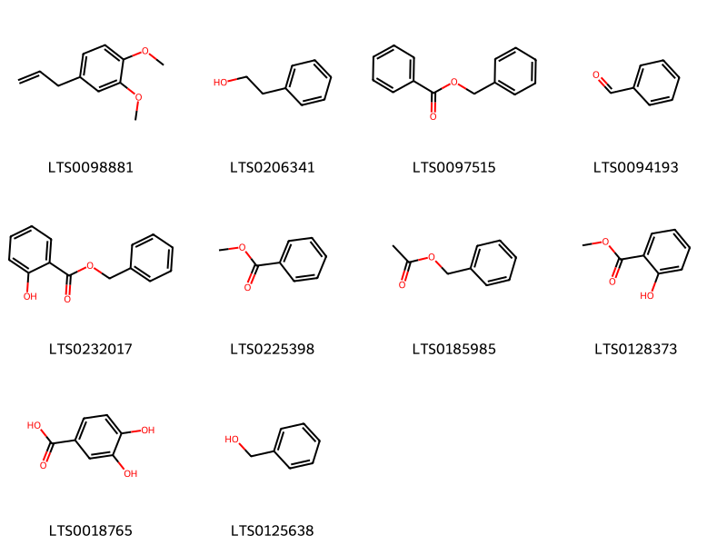{ width=100% }
    <figcaption>Hình ảnh cấu trúc hóa học của 10 hoạt chất thuộc nhóm Benzene and substituted derivatives gồm ['methyl eugenol (LTS0098881)', '2-phenyl-ethanol (LTS0206341)', 'benzyl benzoate (LTS0097515)', 'benzaldehyde (LTS0094193)', 'benzyl salicylate (LTS0232017)', 'methyl benzoate (LTS0225398)', 'benzyl acetate (LTS0185985)', 'methyl salicylate (LTS0128373)', '3,4-dihydroxybenzoic acid (LTS0018765)', 'benzyl alcohol (LTS0125638)'].</figcaption>
</figure>
#### Nhóm Benzodioxoles
<figure markdown="span">
    { width=100% }
    <figcaption>Hình ảnh cấu trúc hóa học của 1 hoạt chất thuộc nhóm Benzodioxoles gồm ['sassafras (LTS0136093)'].</figcaption>
</figure>
#### Nhóm Cinnamic acids and derivatives
<figure markdown="span">
    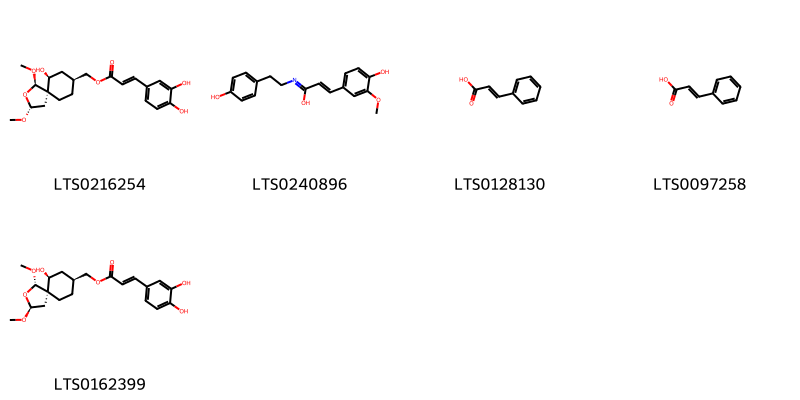{ width=100% }
    <figcaption>Hình ảnh cấu trúc hóa học của 5 hoạt chất thuộc nhóm Cinnamic acids and derivatives gồm ['[(1r,3r,5s,6s,8s)-6-hydroxy-1,3-dimethoxy-2-oxaspiro[4.5]decan-8-yl]methyl (2e)-3-(3,4-dihydroxyphenyl)prop-2-enoate (LTS0216254)', '3-(4-hydroxy-3-methoxyphenyl)-n-[2-(4-hydroxyphenyl)ethyl]prop-2-enimidic acid (LTS0240896)', 'cinnamic acid (LTS0128130)', 'phenylacrylic acid (LTS0097258)', '[(1s,3s,5s,6s,8s)-6-hydroxy-1,3-dimethoxy-2-oxaspiro[4.5]decan-8-yl]methyl (2e)-3-(3,4-dihydroxyphenyl)prop-2-enoate (LTS0162399)'].</figcaption>
</figure>
#### Nhóm Dihydrofurans
<figure markdown="span">
    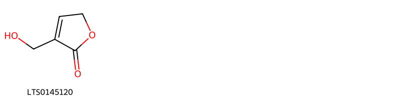{ width=100% }
    <figcaption>Hình ảnh cấu trúc hóa học của 1 hoạt chất thuộc nhóm Dihydrofurans gồm ['3-(hydroxymethyl)-5h-furan-2-one (LTS0145120)'].</figcaption>
</figure>
#### Nhóm Fatty Acyls
<figure markdown="span">
    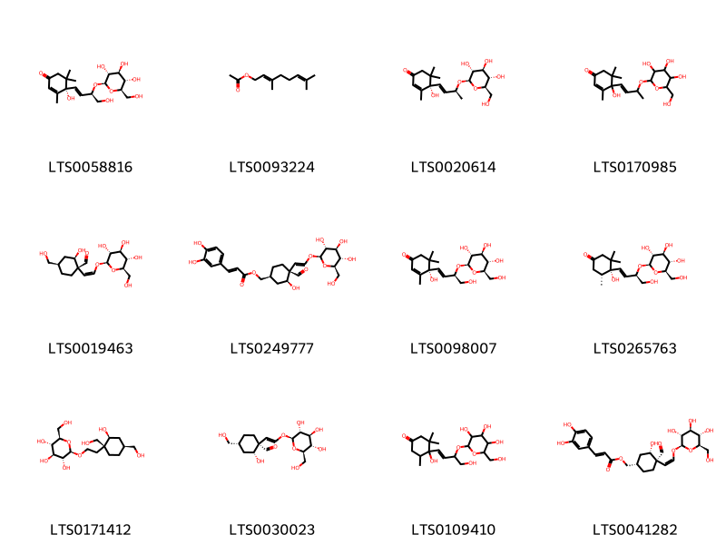{ width=100% }
    <figcaption>Hình ảnh cấu trúc hóa học của 12 hoạt chất thuộc nhóm Fatty Acyls gồm ['(4s)-4-hydroxy-4-[(3r)-4-hydroxy-3-{[(2r,3r,4s,5s,6r)-3,4,5-trihydroxy-6-(hydroxymethyl)oxan-2-yl]oxy}but-1-en-1-yl]-3,5,5-trimethylcyclohex-2-en-1-one (LTS0058816)', 'geranyl acetate (LTS0093224)', '(4s)-4-hydroxy-3,5,5-trimethyl-4-[(1e,3s)-3-{[(2r,3r,4s,5s,6r)-3,4,5-trihydroxy-6-(hydroxymethyl)oxan-2-yl]oxy}but-1-en-1-yl]cyclohex-2-en-1-one (LTS0020614)', '4-hydroxy-3,5,5-trimethyl-4-(3-{[3,4,5-trihydroxy-6-(hydroxymethyl)oxan-2-yl]oxy}but-1-en-1-yl)cyclohex-2-en-1-one (LTS0170985)', '(1r,2r,4r)-2-hydroxy-4-(hydroxymethyl)-1-[(1z)-2-{[(2r,3r,4s,5s,6r)-3,4,5-trihydroxy-6-(hydroxymethyl)oxan-2-yl]oxy}ethenyl]cyclohexane-1-carbaldehyde (LTS0019463)', '[(1s,3s,4s)-4-formyl-3-hydroxy-4-(2-{[(2r,3r,4s,5s,6r)-3,4,5-trihydroxy-6-(hydroxymethyl)oxan-2-yl]oxy}ethenyl)cyclohexyl]methyl (2e)-3-(3,4-dihydroxyphenyl)prop-2-enoate (LTS0249777)', '(4s)-4-hydroxy-4-[(1e,3r)-4-hydroxy-3-{[(2r,3r,4s,5s,6r)-3,4,5-trihydroxy-6-(hydroxymethyl)oxan-2-yl]oxy}but-1-en-1-yl]-3,5,5-trimethylcyclohex-2-en-1-one (LTS0098007)', '(4s,5r)-4-hydroxy-4-[(1e,3r)-4-hydroxy-3-{[(2r,3r,4s,5s,6r)-3,4,5-trihydroxy-6-(hydroxymethyl)oxan-2-yl]oxy}but-1-en-1-yl]-3,3,5-trimethylcyclohexan-1-one (LTS0265763)', '(2r,3r,4s,5s,6r)-2-{2-[(1r,2s,4s)-2-hydroxy-1,4-bis(hydroxymethyl)cyclohexyl]ethoxy}-6-(hydroxymethyl)oxane-3,4,5-triol (LTS0171412)', '(1r,2r,4r)-2-hydroxy-4-(hydroxymethyl)-1-(2-{[(2r,3r,4s,5s,6r)-3,4,5-trihydroxy-6-(hydroxymethyl)oxan-2-yl]oxy}ethenyl)cyclohexane-1-carbaldehyde (LTS0030023)', '4-hydroxy-4-(4-hydroxy-3-{[3,4,5-trihydroxy-6-(hydroxymethyl)oxan-2-yl]oxy}but-1-en-1-yl)-3,3,5-trimethylcyclohexan-1-one (LTS0109410)', '[(1s,3s,4s)-4-formyl-3-hydroxy-4-[(1z)-2-{[(2r,3r,4s,5s,6r)-3,4,5-trihydroxy-6-(hydroxymethyl)oxan-2-yl]oxy}ethenyl]cyclohexyl]methyl (2e)-3-(3,4-dihydroxyphenyl)prop-2-enoate (LTS0041282)'].</figcaption>
</figure>
#### Nhóm Heteroaromatic compounds
<figure markdown="span">
    { width=100% }
    <figcaption>Hình ảnh cấu trúc hóa học của 1 hoạt chất thuộc nhóm Heteroaromatic compounds gồm ['furfuryl alcohol (LTS0110403)'].</figcaption>
</figure>
#### Nhóm Lactones
<figure markdown="span">
    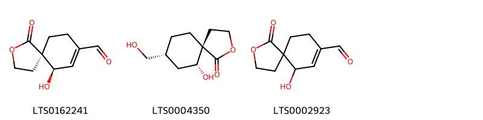{ width=100% }
    <figcaption>Hình ảnh cấu trúc hóa học của 3 hoạt chất thuộc nhóm Lactones gồm ['(5r,6r)-6-hydroxy-1-oxo-2-oxaspiro[4.5]dec-7-ene-8-carbaldehyde (LTS0162241)', '(5r,6r,8r)-6-hydroxy-8-(hydroxymethyl)-2-oxaspiro[4.5]decan-1-one (LTS0004350)', '6-hydroxy-1-oxo-2-oxaspiro[4.5]dec-7-ene-8-carbaldehyde (LTS0002923)'].</figcaption>
</figure>
#### Nhóm Lignan glycosides
<figure markdown="span">
    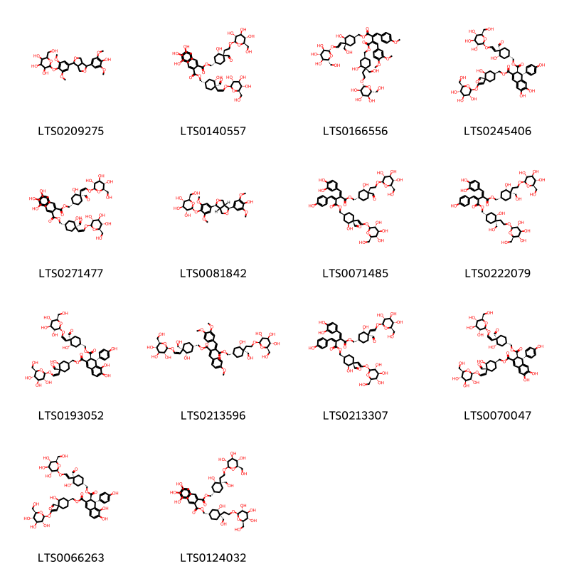{ width=100% }
    <figcaption>Hình ảnh cấu trúc hóa học của 14 hoạt chất thuộc nhóm Lignan glycosides gồm ['2-{4-[4-(4-hydroxy-3,5-dimethoxyphenyl)-hexahydrofuro[3,4-c]furan-1-yl]-2,6-dimethoxyphenoxy}-6-(hydroxymethyl)oxane-3,4,5-triol (LTS0209275)', '1-[(1s,3s,4s)-4-formyl-3-hydroxy-4-(2-{[(2r,3r,4s,5s,6r)-3,4,5-trihydroxy-6-(hydroxymethyl)oxan-2-yl]oxy}ethyl)cyclohexyl]methyl 4-[(1s,3s,4s)-4-formyl-3-hydroxy-4-[(1z)-2-{[(2r,3r,4s,5s,6r)-3,4,5-trihydroxy-6-(hydroxymethyl)oxan-2-yl]oxy}ethenyl]cyclohexyl]methyl (2e,3e)-2-[(3,4-dihydroxyphenyl)methylidene]-3-[(4-hydroxyphenyl)methylidene]butanedioate (LTS0140557)', '1-[(1s,3s,4r)-3-hydroxy-4-(hydroxymethyl)-4-(2-{[(2r,3r,4s,5s,6r)-3,4,5-trihydroxy-6-(hydroxymethyl)oxan-2-yl]oxy}ethenyl)cyclohexyl]methyl 4-[(1s,3s,4r)-3-hydroxy-4-(hydroxymethyl)-4-(2-{[(2r,3r,4s,5s,6r)-3,4,5-trihydroxy-6-(hydroxymethyl)oxan-2-yl]oxy}ethyl)cyclohexyl]methyl (2e)-3-[(3,4-dimethoxyphenyl)methylidene]-2-[(4-methoxyphenyl)methylidene]butanedioate (LTS0166556)', '2,3-bis{[(1s,3s,4s)-4-formyl-3-hydroxy-4-(2-{[(2r,3r,4s,5s,6r)-3,4,5-trihydroxy-6-(hydroxymethyl)oxan-2-yl]oxy}ethenyl)cyclohexyl]methyl} (1r,2s)-6,7-dihydroxy-1-(4-hydroxyphenyl)-1,2-dihydronaphthalene-2,3-dicarboxylate (LTS0245406)', '1,4-bis{[(1s,3s,4s)-4-formyl-3-hydroxy-4-[(1z)-2-{[(2r,3r,4s,5s,6r)-3,4,5-trihydroxy-6-(hydroxymethyl)oxan-2-yl]oxy}ethenyl]cyclohexyl]methyl} (2e,3e)-2-[(3,4-dihydroxyphenyl)methylidene]-3-[(4-hydroxyphenyl)methylidene]butanedioate (LTS0271477)', 'acanthoside b (LTS0081842)', '1-[(1s,3s,4s)-4-formyl-3-hydroxy-4-(2-{[(2r,3r,4s,5s,6r)-3,4,5-trihydroxy-6-(hydroxymethyl)oxan-2-yl]oxy}ethenyl)cyclohexyl]methyl 4-[(1s,3s,4s)-4-formyl-3-hydroxy-4-(2-{[(2r,3r,4s,5s,6r)-3,4,5-trihydroxy-6-(hydroxymethyl)oxan-2-yl]oxy}ethyl)cyclohexyl]methyl (3e)-3-[(3,4-dihydroxyphenyl)methylidene]-2-[(4-hydroxyphenyl)methylidene]butanedioate (LTS0071485)', '1,4-bis{[(1s,3s,4r)-3-hydroxy-4-(hydroxymethyl)-4-(2-{[(2r,3r,4s,5s,6r)-3,4,5-trihydroxy-6-(hydroxymethyl)oxan-2-yl]oxy}ethyl)cyclohexyl]methyl} (2e)-2-[(3,4-dihydroxyphenyl)methylidene]-3-[(4-hydroxyphenyl)methylidene]butanedioate (LTS0222079)', '2,3-bis{[(1s,3s,4s)-4-formyl-3-hydroxy-4-[(1z)-2-{[(2r,3r,4s,5s,6r)-3,4,5-trihydroxy-6-(hydroxymethyl)oxan-2-yl]oxy}ethenyl]cyclohexyl]methyl} (1r,2s)-7,8-dihydroxy-1-(4-hydroxyphenyl)-1,2-dihydronaphthalene-2,3-dicarboxylate (LTS0193052)', '1-[(1s,3s,4r)-3-hydroxy-4-(hydroxymethyl)-4-(2-{[(2r,3r,4s,5s,6r)-3,4,5-trihydroxy-6-(hydroxymethyl)oxan-2-yl]oxy}ethyl)cyclohexyl]methyl 4-[(1s,3s,4r)-3-hydroxy-4-(hydroxymethyl)-4-[(1z)-2-{[(2r,3r,4s,5s,6r)-3,4,5-trihydroxy-6-(hydroxymethyl)oxan-2-yl]oxy}ethenyl]cyclohexyl]methyl (2e,3e)-2-[(3,4-dimethoxyphenyl)methylidene]-3-[(4-methoxyphenyl)methylidene]butanedioate (LTS0213596)', '1,4-bis{[(1s,3s,4s)-4-formyl-3-hydroxy-4-(2-{[(2r,3r,4s,5s,6r)-3,4,5-trihydroxy-6-(hydroxymethyl)oxan-2-yl]oxy}ethenyl)cyclohexyl]methyl} (2e)-2-[(3,4-dihydroxyphenyl)methylidene]-3-[(4-hydroxyphenyl)methylidene]butanedioate (LTS0213307)', '2,3-bis{[(1s,3s,4s)-4-formyl-3-hydroxy-4-[(1z)-2-{[(2r,3r,4s,5s,6r)-3,4,5-trihydroxy-6-(hydroxymethyl)oxan-2-yl]oxy}ethenyl]cyclohexyl]methyl} (1r,2s)-6,7-dihydroxy-1-(4-hydroxyphenyl)-1,2-dihydronaphthalene-2,3-dicarboxylate (LTS0070047)', '2,3-bis{[(1s,3s,4s)-4-formyl-3-hydroxy-4-(2-{[(2r,3r,4s,5s,6r)-3,4,5-trihydroxy-6-(hydroxymethyl)oxan-2-yl]oxy}ethenyl)cyclohexyl]methyl} (1r,2s)-7,8-dihydroxy-1-(4-hydroxyphenyl)-1,2-dihydronaphthalene-2,3-dicarboxylate (LTS0066263)', '1,4-bis{[(1s,3s,4r)-3-hydroxy-4-(hydroxymethyl)-4-(2-{[(2r,3r,4s,5s,6r)-3,4,5-trihydroxy-6-(hydroxymethyl)oxan-2-yl]oxy}ethyl)cyclohexyl]methyl} (2e,3e)-2-[(3,4-dihydroxyphenyl)methylidene]-3-[(4-hydroxyphenyl)methylidene]butanedioate (LTS0124032)'].</figcaption>
</figure>
#### Nhóm Organooxygen compounds
<figure markdown="span">
    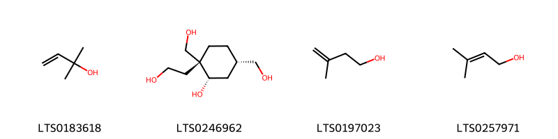{ width=100% }
    <figcaption>Hình ảnh cấu trúc hóa học của 4 hoạt chất thuộc nhóm Organooxygen compounds gồm ['2-methyl-3-buten-2-ol (LTS0183618)', '(1s,2r,5s)-2-(2-hydroxyethyl)-2,5-bis(hydroxymethyl)cyclohexan-1-ol (LTS0246962)', '3-methyl-3-buten-1-ol (LTS0197023)', 'prenol (LTS0257971)'].</figcaption>
</figure>
#### Nhóm Phenol ethers
<figure markdown="span">
    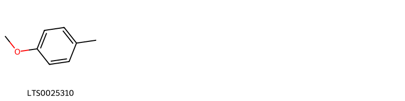{ width=100% }
    <figcaption>Hình ảnh cấu trúc hóa học của 1 hoạt chất thuộc nhóm Phenol ethers gồm ['p-methylanisole (LTS0025310)'].</figcaption>
</figure>
#### Nhóm Phenols
<figure markdown="span">
    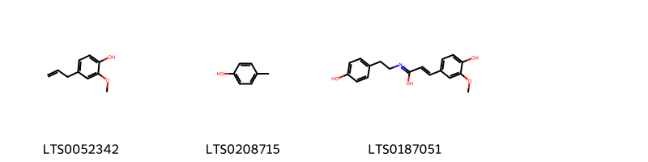{ width=100% }
    <figcaption>Hình ảnh cấu trúc hóa học của 3 hoạt chất thuộc nhóm Phenols gồm ['eugenol (LTS0052342)', 'p-cresol (LTS0208715)', '(2e)-3-(4-hydroxy-3-methoxyphenyl)-n-[2-(4-hydroxyphenyl)ethyl]prop-2-enimidic acid (LTS0187051)'].</figcaption>
</figure>
#### Nhóm Prenol lipids
<figure markdown="span">
    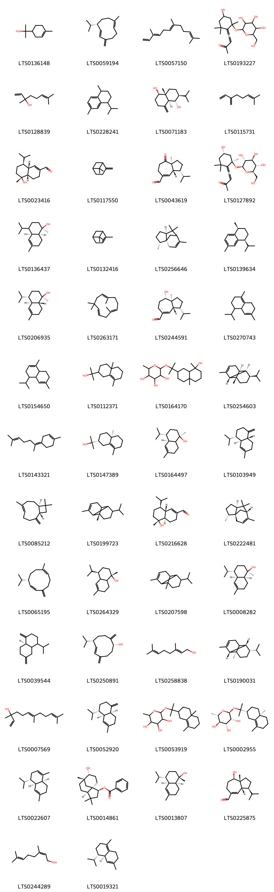{ width=100% }
    <figcaption>Hình ảnh cấu trúc hóa học của 54 hoạt chất thuộc nhóm Prenol lipids gồm ['terpineol (LTS0136148)', '(-)-germacrene d (LTS0059194)', 'farnesene (LTS0057150)', '4-(4-hydroxy-2,2,6-trimethyl-6-{[3,4,5-trihydroxy-6-(hydroxymethyl)oxan-2-yl]oxy}cyclohexylidene)but-3-en-2-one (LTS0193227)', 'linalool, (+-)- (LTS0128839)', '(e)-calamene (LTS0228241)', '(1s,2s,4ar,5r,8as)-2-isopropyl-4a-methyl-8-methylidene-octahydronaphthalene-1,5-diol (LTS0071183)', 'α-myrcene (LTS0115731)', '(4as,5r,8s,8ar)-5-hydroxy-8-isopropyl-5-methyl-4,4a,6,7,8,8a-hexahydro-3h-naphthalene-2-carbaldehyde (LTS0023416)', 'β-pinene (LTS0117550)', '(3r,3ar,8as)-3-isopropyl-8a-methyl-8-oxo-1,2,3,3a,6,7-hexahydroazulene-5-carbaldehyde (LTS0043619)', 'citroside b (LTS0127892)', '(1r,4ar,8as)-4-isopropyl-1,6-dimethyl-3,4,4a,7,8,8a-hexahydro-2h-naphthalen-1-ol (LTS0136437)', 'α pinene (LTS0132416)', 'cedrene (LTS0256646)', '(1s,4s)-4-isopropyl-1,6-dimethyl-1,2,3,4-tetrahydronaphthalene (LTS0139634)', 'α-cadinol (LTS0206935)', 'humulene (LTS0263171)', '(3r,3ar,8s,8as)-8-hydroxy-3-isopropyl-8a-methyl-2,3,3a,6,7,8-hexahydro-1h-azulene-5-carbaldehyde (LTS0244591)', '4-isopropyl-1,6-dimethyl-2,3,4,4a,7,8-hexahydronaphthalene (LTS0270743)', '4-isopropyl-1,6-dimethyl-3,4,4a,7,8,8a-hexahydronaphthalene (LTS0154650)', '2-(4a,8-dimethyl-2,3,4,5,6,7-hexahydro-1h-naphthalen-2-yl)propan-2-ol (LTS0112371)', '2-{[2-(8-hydroxy-4a,8-dimethyl-octahydronaphthalen-2-yl)propan-2-yl]oxy}-6-methyloxane-3,4,5-triol (LTS0164170)', 'α-ylangene (LTS0254603)', '(z)-γ-bisabolene (LTS0143321)', 'gamma-eudesmol (LTS0147389)', '(1r,4s,4ar)-4-isopropyl-1,6-dimethyl-3,4,4a,7,8,8a-hexahydro-2h-naphthalen-1-ol (LTS0164497)', '(+)-gamma-cadinene (LTS0103949)', 'caryophyllene (LTS0085212)', '(1s)-8-isopropyl-1,3-dimethyltricyclo[4.4.0.0²,⁷]dec-3-ene (LTS0199723)', '(4ar,5r,8s,8ar)-5-hydroxy-8-isopropyl-5-methyl-4,4a,6,7,8,8a-hexahydro-3h-naphthalene-2-carbaldehyde (LTS0216628)', 'levo-α-cedrene (LTS0222481)', '(1z,6z,8s)-8-isopropyl-1-methyl-5-methylidenecyclodeca-1,6-diene (LTS0065195)', '(1s,4r)-4-isopropyl-1,6-dimethyl-3,4,4a,7,8,8a-hexahydro-2h-naphthalen-1-ol (LTS0264329)', 'α-copaene (LTS0207598)', 'delta-cadinol (LTS0008282)', '(8ar)-4-isopropyl-1,6-dimethylidene-octahydronaphthalene (LTS0039544)', '(1r,5e,7s)-7-isopropyl-4,10-dimethylidenecyclodec-5-en-1-ol (LTS0250891)', 'geraniol (LTS0258838)', '(1r,2s,7s,8s)-8-isopropyl-1,3-dimethyltricyclo[4.4.0.0²,⁷]dec-3-ene (LTS0190031)', 'nerolidol isomers (LTS0007569)', 'gamma-muurolene (LTS0052920)', '2-{[2-(4a,8-dimethyl-2,3,4,5,6,7-hexahydro-1h-naphthalen-2-yl)propan-2-yl]oxy}-6-methyloxane-3,4,5-triol (LTS0053919)', '(2s,3r,4r,5r,6s)-2-({2-[(2r,4ar)-4a,8-dimethyl-2,3,4,5,6,7-hexahydro-1h-naphthalen-2-yl]propan-2-yl}oxy)-6-methyloxane-3,4,5-triol (LTS0002955)', 'α-muurolene (LTS0022607)', '(1r,2s,5r,8s,9r)-9-hydroxy-4,4,8-trimethyltricyclo[6.3.1.0¹,⁵]dodecan-2-yl benzoate (LTS0014861)', 'delta-cadinol (LTS0013807)', '(3s,3ar,8r,8ar)-8-hydroxy-3-isopropyl-8a-methyl-2,3,3a,6,7,8-hexahydro-1h-azulene-5-carbaldehyde (LTS0225875)', 'nerol (LTS0244289)', 'delta-cadinene (LTS0019321)', '(2s,3r,4r,5r,6s)-2-({2-[(2r,4ar,8r,8ar)-8-hydroxy-4a,8-dimethyl-octahydronaphthalen-2-yl]propan-2-yl}oxy)-6-methyloxane-3,4,5-triol (LTS0041549)', '4-isopropyl-6-methyl-1-methylidene-3,4,4a,7,8,8a-hexahydro-2h-naphthalene (LTS0111070)', '(-)-β-cubebene (LTS0123697)', '(4s,4as,8ar)-4-isopropyl-1,6-dimethylidene-octahydronaphthalene (LTS0046258)'].</figcaption>
</figure>
#### Nhóm Pyridines and derivatives
<figure markdown="span">
    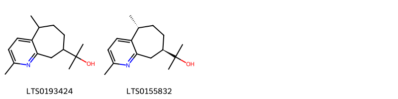{ width=100% }
    <figcaption>Hình ảnh cấu trúc hóa học của 2 hoạt chất thuộc nhóm Pyridines and derivatives gồm ['2-{2,5-dimethyl-5h,6h,7h,8h,9h-cyclohepta[b]pyridin-8-yl}propan-2-ol (LTS0193424)', '2-[(5r,8r)-2,5-dimethyl-5h,6h,7h,8h,9h-cyclohepta[b]pyridin-8-yl]propan-2-ol (LTS0155832)'].</figcaption>
</figure>
#### Nhóm Quinolines and derivatives
<figure markdown="span">
    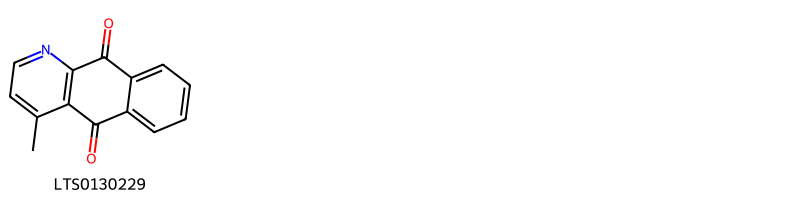{ width=100% }
    <figcaption>Hình ảnh cấu trúc hóa học của 1 hoạt chất thuộc nhóm Quinolines and derivatives gồm ['cleistopholine (LTS0130229)'].</figcaption>
</figure>
#### Nhóm Tetrahydrofurans
<figure markdown="span">
    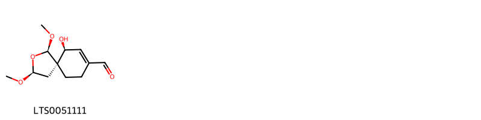{ width=100% }
    <figcaption>Hình ảnh cấu trúc hóa học của 1 hoạt chất thuộc nhóm Tetrahydrofurans gồm ['(1r,3s,5s,6s)-6-hydroxy-1,3-dimethoxy-2-oxaspiro[4.5]dec-7-ene-8-carbaldehyde (LTS0051111)'].</figcaption>
</figure>

---

### Dược dân tộc học

Danh sách các quốc gia có sử dụng *Cananga odorata* trong điều trị các bệnh. 

| Country   | Disease     | Bệnh                                                                                                                                                                                                |
|:----------|:------------|:----------------------------------------------------------------------------------------------------------------------------------------------------------------------------------------------------|
| Haiti     | Emmenagogue | MYMEMORY WARNING: YOU USED ALL AVAILABLE FREE TRANSLATIONS FOR TODAY. NEXT AVAILABLE IN  10 HOURS 38 MINUTES 31 SECONDS VISIT HTTPS://MYMEMORY.TRANSLATED.NET/DOC/USAGELIMITS.PHP TO TRANSLATE MORE |
| Samoa     | Carminative | MYMEMORY WARNING: YOU USED ALL AVAILABLE FREE TRANSLATIONS FOR TODAY. NEXT AVAILABLE IN  10 HOURS 38 MINUTES 28 SECONDS VISIT HTTPS://MYMEMORY.TRANSLATED.NET/DOC/USAGELIMITS.PHP TO TRANSLATE MORE |
| Turkey    | Perfume     | MYMEMORY WARNING: YOU USED ALL AVAILABLE FREE TRANSLATIONS FOR TODAY. NEXT AVAILABLE IN  10 HOURS 38 MINUTES 25 SECONDS VISIT HTTPS://MYMEMORY.TRANSLATED.NET/DOC/USAGELIMITS.PHP TO TRANSLATE MORE |

---

---
## Cananga odoratum
### Thông tin về thực vật

!!! info "Phân loại thực vật của *Cananga odorata* từ GIBF:"
    - **Kingdom:** Plantae
    - **Phylum:** Tracheophyta
    - **Order:** Magnoliales
    - **Family:** Annonaceae
    - **Genus:** Cananga
    - **Species:** *Cananga odorata*

 

| Label (VI)   | Label (EN)   | Scientific Name   | Descriptions (VI)   | Descriptions (EN)   | Also Known As (VI)                                                               | Also Known As (EN)   |
|:-------------|:-------------|:------------------|:--------------------|:--------------------|:---------------------------------------------------------------------------------|:---------------------|
| N/A          | N/A          | Cananga odorata   |                     | species of plant    | ['Ylang-ylang', 'Ylang công chúa', 'Ngọc lan tây', 'Hoa giẻ', 'Cananga odorata'] | ['Ylang-ylang tree'] |

#### Phân bố trên thế giới

**Từ CSDL GIBF** Malaysia, Belize, Panama, Costa Rica

#### Phân bố tại Việt Nam

**Từ CSDL GIBF**: Không có ghi nhận ở Việt Nam

---
### Thành phần hóa học
        
- Theo cơ sở dữ liệu lotus: Từ loài *Cananga odorata* đã phân lập và xác định được Chưa có hoạt chất nào được phân lập. hoạt chất thuộc về các nhóm Không có hoạt chất nào được phân lập. 

Không có hình ảnh nào được tạo ra

---

### Dược dân tộc học

Danh sách các quốc gia có sử dụng *Cananga odorata* trong điều trị các bệnh. 

| Country   | Disease   | Bệnh                                                                                                                                                                                                |
|:----------|:----------|:----------------------------------------------------------------------------------------------------------------------------------------------------------------------------------------------------|
| Elsewhere | Soap      | MYMEMORY WARNING: YOU USED ALL AVAILABLE FREE TRANSLATIONS FOR TODAY. NEXT AVAILABLE IN  10 HOURS 37 MINUTES 44 SECONDS VISIT HTTPS://MYMEMORY.TRANSLATED.NET/DOC/USAGELIMITS.PHP TO TRANSLATE MORE |

---

# Chi Enantia

??? note "Danh sách các dược liệu thuộc chi"
    
	 - *Enantia polycarpa*

---
## Enantia polycarpa
### Thông tin về thực vật

!!! info "Phân loại thực vật của *Annickia polycarpa* từ GIBF:"
    - **Kingdom:** Plantae
    - **Phylum:** Tracheophyta
    - **Order:** Magnoliales
    - **Family:** Annonaceae
    - **Genus:** Annickia
    - **Species:** *Annickia polycarpa*

 

| Label (VI)   | Label (EN)   | Scientific Name   | Descriptions (VI)   | Descriptions (EN)   | Also Known As (VI)                                                               | Also Known As (EN)   |
|:-------------|:-------------|:------------------|:--------------------|:--------------------|:---------------------------------------------------------------------------------|:---------------------|
| N/A          | N/A          | Cananga odorata   |                     | species of plant    | ['Ylang-ylang', 'Ylang công chúa', 'Ngọc lan tây', 'Hoa giẻ', 'Cananga odorata'] | ['Ylang-ylang tree'] |

#### Phân bố trên thế giới

**Từ CSDL GIBF** nan, Sierra Leone, Côte d’Ivoire, Philippines, Ghana, Guinea

#### Phân bố tại Việt Nam

**Từ CSDL GIBF**: Không có ghi nhận ở Việt Nam

---
### Thành phần hóa học
        
- Theo cơ sở dữ liệu lotus: Từ loài *Annickia polycarpa* đã phân lập và xác định được Chưa có hoạt chất nào được phân lập. hoạt chất thuộc về các nhóm Không có hoạt chất nào được phân lập. 

Không có hình ảnh nào được tạo ra

---

### Dược dân tộc học

Danh sách các quốc gia có sử dụng *Annickia polycarpa* trong điều trị các bệnh. 

| Country   | Disease    | Bệnh                                                                                                                                                                                                |
|:----------|:-----------|:----------------------------------------------------------------------------------------------------------------------------------------------------------------------------------------------------|
| Ghana     | Antiseptic | MYMEMORY WARNING: YOU USED ALL AVAILABLE FREE TRANSLATIONS FOR TODAY. NEXT AVAILABLE IN  10 HOURS 37 MINUTES 23 SECONDS VISIT HTTPS://MYMEMORY.TRANSLATED.NET/DOC/USAGELIMITS.PHP TO TRANSLATE MORE |

---

# Chi Fissistigma

??? note "Danh sách các dược liệu thuộc chi"
    
	 - *Fissistigma glaucescens*

---
## Fissistigma glaucescens
### Thông tin về thực vật

!!! info "Phân loại thực vật của *Fissistigma glaucescens* từ GIBF:"
    - **Kingdom:** Plantae
    - **Phylum:** Tracheophyta
    - **Order:** Magnoliales
    - **Family:** Annonaceae
    - **Genus:** Fissistigma
    - **Species:** *Fissistigma glaucescens*

 

| Label (VI)   | Label (EN)   | Scientific Name         | Descriptions (VI)   | Descriptions (EN)   | Also Known As (VI)    | Also Known As (EN)   |
|:-------------|:-------------|:------------------------|:--------------------|:--------------------|:----------------------|:---------------------|
| N/A          | N/A          | Fissistigma glaucescens | loài thực vật       | species of plant    | ['cách thư lá trắng'] | ['']                 |

#### Phân bố trên thế giới

**Từ CSDL GIBF** Viet Nam, Chinese Taipei, Japan, Philippines, China, Hong Kong

#### Phân bố tại Việt Nam

**Từ CSDL GIBF**: 玉乐, Quang Nam, Quang Ninh

---
### Thành phần hóa học
        
- Theo cơ sở dữ liệu lotus: Từ loài *Fissistigma glaucescens* đã phân lập và xác định được 40 hoạt chất thuộc về các nhóm Organooxygen compounds, Aporphines, Protoberberine alkaloids and derivatives, Aristolactams, Phenols, Cinnamic acids and derivatives, 6,6a-secoaporphines. 

|    | chemicalTaxonomyClassyfireClass          |   smiles_count |
|---:|:-----------------------------------------|---------------:|
|  0 | 6,6a-secoaporphines                      |              4 |
|  1 | Aporphines                               |             21 |
|  2 | Aristolactams                            |              5 |
|  3 | Cinnamic acids and derivatives           |              2 |
|  4 | Organooxygen compounds                   |              3 |
|  5 | Phenols                                  |              1 |
|  6 | Protoberberine alkaloids and derivatives |              4 |

#### Nhóm 6_6a-secoaporphines
<figure markdown="span">
    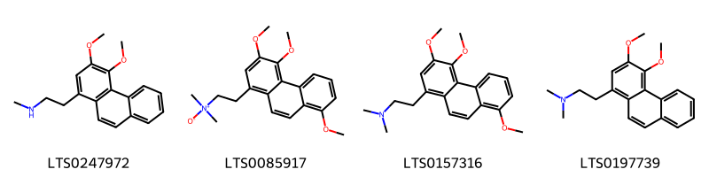{ width=100% }
    <figcaption>Hình ảnh cấu trúc hóa học của Không tìm thấy chú thích hoạt chất thuộc nhóm 6_6a-secoaporphines gồm Không tìm thấy chú thích.</figcaption>
</figure>
#### Nhóm Aporphines
<figure markdown="span">
    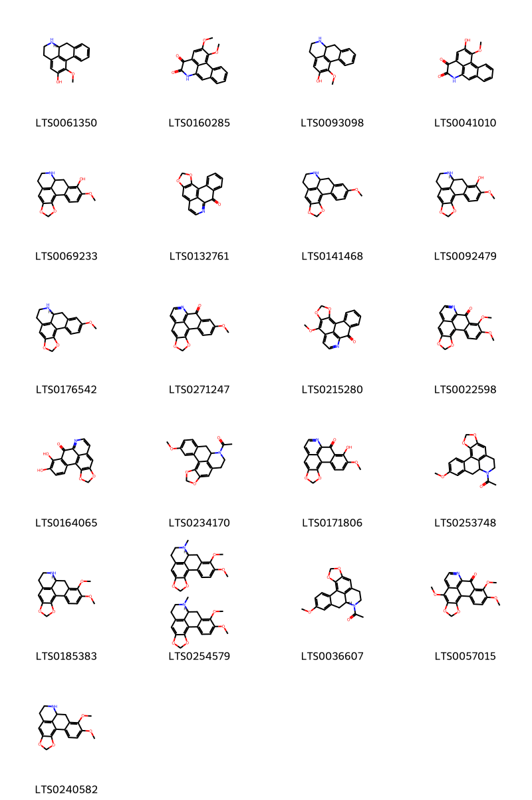{ width=100% }
    <figcaption>Hình ảnh cấu trúc hóa học của 21 hoạt chất thuộc nhóm Aporphines gồm ['r-(-)-asimilobine (LTS0061350)', '15,16-dimethoxy-10-azatetracyclo[7.7.1.0²,⁷.0¹³,¹⁷]heptadeca-1(17),2(7),3,5,8,13,15-heptaene-11,12-dione (LTS0160285)', '16-methoxy-10-azatetracyclo[7.7.1.0²,⁷.0¹³,¹⁷]heptadeca-1(17),2,4,6,13,15-hexaen-15-ol (LTS0093098)', '15-hydroxy-16-methoxy-10-azatetracyclo[7.7.1.0²,⁷.0¹³,¹⁷]heptadeca-1(17),2(7),3,5,8,13,15-heptaene-11,12-dione (LTS0041010)', '16-methoxy-3,5-dioxa-11-azapentacyclo[10.7.1.0²,⁶.0⁸,²⁰.0¹⁴,¹⁹]icosa-1(20),2(6),7,14,16,18-hexaen-15-ol (LTS0069233)', 'liriodenine (LTS0132761)', '16-methoxy-3,5-dioxa-11-azapentacyclo[10.7.1.0²,⁶.0⁸,²⁰.0¹⁴,¹⁹]icosa-1(20),2(6),7,14,16,18-hexaene (LTS0141468)', '(12r)-16-methoxy-3,5-dioxa-11-azapentacyclo[10.7.1.0²,⁶.0⁸,²⁰.0¹⁴,¹⁹]icosa-1(20),2(6),7,14,16,18-hexaen-15-ol (LTS0092479)', 'xylopine (LTS0176542)', 'lanuginosine (LTS0271247)', 'atherospermidine (LTS0215280)', '15,16-dimethoxy-3,5-dioxa-11-azapentacyclo[10.7.1.0²,⁶.0⁸,²⁰.0¹⁴,¹⁹]icosa-1(20),2(6),7,9,11,14,16,18-octaen-13-one (LTS0022598)', '15,16-dihydroxy-3,5-dioxa-11-azapentacyclo[10.7.1.0²,⁶.0⁸,²⁰.0¹⁴,¹⁹]icosa-1,6,8,10,12(20),14(19),15,17-octaen-13-one (LTS0164065)', '1-{17-methoxy-3,5-dioxa-11-azapentacyclo[10.7.1.0²,⁶.0⁸,²⁰.0¹⁴,¹⁹]icosa-1,6,8(20),14,16,18-hexaen-11-yl}ethanone (LTS0234170)', '15-hydroxy-16-methoxy-3,5-dioxa-11-azapentacyclo[10.7.1.0²,⁶.0⁸,²⁰.0¹⁴,¹⁹]icosa-1(20),2(6),7,9,11,14,16,18-octaen-13-one (LTS0171806)', '1-{16-methoxy-3,5-dioxa-11-azapentacyclo[10.7.1.0²,⁶.0⁸,²⁰.0¹⁴,¹⁹]icosa-1,6,8(20),14,16,18-hexaen-11-yl}ethanone (LTS0253748)', '(12r)-15,16-dimethoxy-3,5-dioxa-11-azapentacyclo[10.7.1.0²,⁶.0⁸,²⁰.0¹⁴,¹⁹]icosa-1(20),2(6),7,14,16,18-hexaene (LTS0185383)', 'bis((12r)-15,16-dimethoxy-11-methyl-3,5-dioxa-11-azapentacyclo[10.7.1.0²,⁶.0⁸,²⁰.0¹⁴,¹⁹]icosa-1,6,8(20),14,16,18-hexaene) (LTS0254579)', '1-[(12r)-16-methoxy-3,5-dioxa-11-azapentacyclo[10.7.1.0²,⁶.0⁸,²⁰.0¹⁴,¹⁹]icosa-1,6,8(20),14,16,18-hexaen-11-yl]ethanone (LTS0036607)', '7,15,16-trimethoxy-3,5-dioxa-11-azapentacyclo[10.7.1.0²,⁶.0⁸,²⁰.0¹⁴,¹⁹]icosa-1(20),2(6),7,9,11,14,16,18-octaen-13-one (LTS0057015)', '15,16-dimethoxy-3,5-dioxa-11-azapentacyclo[10.7.1.0²,⁶.0⁸,²⁰.0¹⁴,¹⁹]icosa-1(20),2(6),7,14,16,18-hexaene (LTS0240582)'].</figcaption>
</figure>
#### Nhóm Aristolactams
<figure markdown="span">
    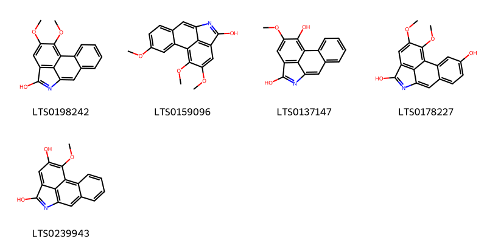{ width=100% }
    <figcaption>Hình ảnh cấu trúc hóa học của 5 hoạt chất thuộc nhóm Aristolactams gồm ['14,15-dimethoxy-10-azatetracyclo[7.6.1.0²,⁷.0¹²,¹⁶]hexadeca-1(16),2(7),3,5,8,10,12,14-octaen-11-ol (LTS0198242)', '4,14,15-trimethoxy-10-azatetracyclo[7.6.1.0²,⁷.0¹²,¹⁶]hexadeca-1(16),2(7),3,5,8,10,12,14-octaen-11-ol (LTS0159096)', '14-methoxy-10-azatetracyclo[7.6.1.0²,⁷.0¹²,¹⁶]hexadeca-1(16),2(7),3,5,8,10,12,14-octaene-11,15-diol (LTS0137147)', '14,15-dimethoxy-10-azatetracyclo[7.6.1.0²,⁷.0¹²,¹⁶]hexadeca-1(16),2(7),3,5,8,10,12,14-octaene-4,11-diol (LTS0178227)', '15-methoxy-10-azatetracyclo[7.6.1.0²,⁷.0¹²,¹⁶]hexadeca-1(16),2(7),3,5,8,10,12,14-octaene-11,14-diol (LTS0239943)'].</figcaption>
</figure>
#### Nhóm Cinnamic acids and derivatives
<figure markdown="span">
    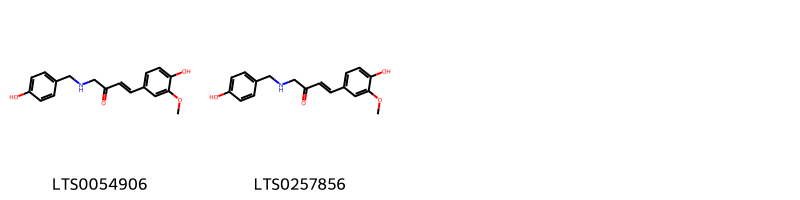{ width=100% }
    <figcaption>Hình ảnh cấu trúc hóa học của 2 hoạt chất thuộc nhóm Cinnamic acids and derivatives gồm ['(3e)-4-(4-hydroxy-3-methoxyphenyl)-1-{[(4-hydroxyphenyl)methyl]amino}but-3-en-2-one (LTS0054906)', '4-(4-hydroxy-3-methoxyphenyl)-1-{[(4-hydroxyphenyl)methyl]amino}but-3-en-2-one (LTS0257856)'].</figcaption>
</figure>
#### Nhóm Organooxygen compounds
<figure markdown="span">
    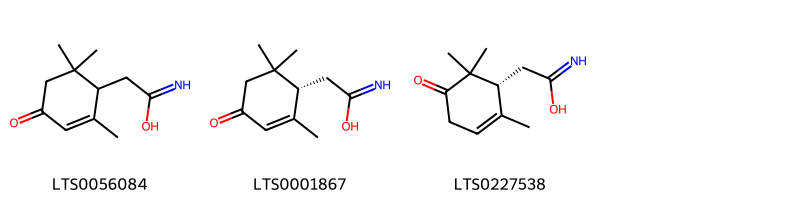{ width=100% }
    <figcaption>Hình ảnh cấu trúc hóa học của 3 hoạt chất thuộc nhóm Organooxygen compounds gồm ['2-(2,6,6-trimethyl-4-oxocyclohex-2-en-1-yl)ethanimidic acid (LTS0056084)', '2-[(1s)-2,6,6-trimethyl-4-oxocyclohex-2-en-1-yl]ethanimidic acid (LTS0001867)', '2-[(1r)-2,6,6-trimethyl-5-oxocyclohex-2-en-1-yl]ethanimidic acid (LTS0227538)'].</figcaption>
</figure>
#### Nhóm Phenols
<figure markdown="span">
    { width=100% }
    <figcaption>Hình ảnh cấu trúc hóa học của 1 hoạt chất thuộc nhóm Phenols gồm ['(2e)-3-(4-hydroxy-3-methoxyphenyl)-n-[2-(4-hydroxyphenyl)ethyl]prop-2-enimidic acid (LTS0187051)'].</figcaption>
</figure>
#### Nhóm Protoberberine alkaloids and derivatives
<figure markdown="span">
    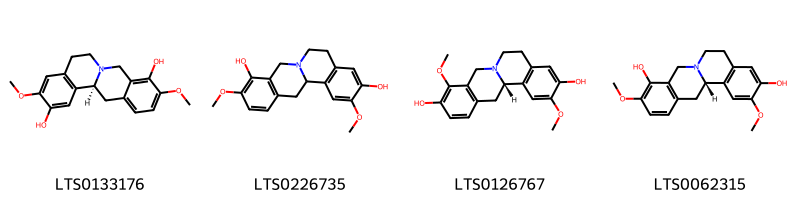{ width=100% }
    <figcaption>Hình ảnh cấu trúc hóa học của 4 hoạt chất thuộc nhóm Protoberberine alkaloids and derivatives gồm ['scoulerine (LTS0133176)', '3,11-dimethoxy-7,8,12b,13-tetrahydro-5h-6-azatetraphene-4,10-diol (LTS0226735)', '(12bs)-4,11-dimethoxy-7,8,12b,13-tetrahydro-5h-6-azatetraphene-3,10-diol (LTS0126767)', '(12bs)-3,11-dimethoxy-7,8,12b,13-tetrahydro-5h-6-azatetraphene-4,10-diol (LTS0062315)'].</figcaption>
</figure>

---

### Dược dân tộc học

Danh sách các quốc gia có sử dụng *Fissistigma glaucescens* trong điều trị các bệnh. 

| Country   | Disease   | Bệnh                                                                                                                                                                                                |
|:----------|:----------|:----------------------------------------------------------------------------------------------------------------------------------------------------------------------------------------------------|
| China     | Piscicide | MYMEMORY WARNING: YOU USED ALL AVAILABLE FREE TRANSLATIONS FOR TODAY. NEXT AVAILABLE IN  10 HOURS 37 MINUTES 00 SECONDS VISIT HTTPS://MYMEMORY.TRANSLATED.NET/DOC/USAGELIMITS.PHP TO TRANSLATE MORE |

---

# Chi Unona

??? note "Danh sách các dược liệu thuộc chi"
    
	 - *Unona discolor*

---
## Unona discolor
### Thông tin về thực vật

!!! info "Phân loại thực vật của *N/A* từ GIBF:"
    - **Kingdom:** Plantae
    - **Phylum:** Tracheophyta
    - **Order:** Magnoliales
    - **Family:** Annonaceae
    - **Genus:** N/A
    - **Species:** *N/A*

 

| Label (VI)   | Label (EN)   | Scientific Name   | Descriptions (VI)   | Descriptions (EN)   | Also Known As (VI)   | Also Known As (EN)   |
|:-------------|:-------------|:------------------|:--------------------|:--------------------|:---------------------|:---------------------|
| N/A          | N/A          | Unona discolor    |                     |                     | ['']                 | ['']                 |

#### Phân bố trên thế giới

**Từ CSDL GIBF** Viet Nam, nan, Thailand, Philippines, French Guiana, Trinidad and Tobago, Singapore, Australia, Indonesia, Haiti, Colombia, Dominican Republic, Puerto Rico, India, Réunion, Nigeria, Uganda, Belize, Antigua and Barbuda, Brazil, Peru, Comoros, Mexico, Hong Kong, Chinese Taipei, Uruguay, Argentina, South Africa, Tanzania, United Republic of, Costa Rica, United States of America

#### Phân bố tại Việt Nam

**Từ CSDL GIBF**: Đồng Nai

---
### Thành phần hóa học
        
- Theo cơ sở dữ liệu lotus: Từ loài *N/A* đã phân lập và xác định được Chưa có hoạt chất nào được phân lập. hoạt chất thuộc về các nhóm Không có hoạt chất nào được phân lập. 

Không có hình ảnh nào được tạo ra

---

### Dược dân tộc học

Danh sách các quốc gia có sử dụng *N/A* trong điều trị các bệnh. 

| Country   | Disease   | Bệnh                                                                                                                                                                                                |
|:----------|:----------|:----------------------------------------------------------------------------------------------------------------------------------------------------------------------------------------------------|
| Asia      | Perfume   | MYMEMORY WARNING: YOU USED ALL AVAILABLE FREE TRANSLATIONS FOR TODAY. NEXT AVAILABLE IN  10 HOURS 36 MINUTES 29 SECONDS VISIT HTTPS://MYMEMORY.TRANSLATED.NET/DOC/USAGELIMITS.PHP TO TRANSLATE MORE |

---

# Chi Cymbopetalum

??? note "Danh sách các dược liệu thuộc chi"
    
	 - *Cymbopetalum penduliflorum*

---
## Cymbopetalum penduliflorum
### Thông tin về thực vật

!!! info "Phân loại thực vật của *Cymbopetalum penduliflorum* từ GIBF:"
    - **Kingdom:** Plantae
    - **Phylum:** Tracheophyta
    - **Order:** Magnoliales
    - **Family:** Annonaceae
    - **Genus:** Cymbopetalum
    - **Species:** *Cymbopetalum penduliflorum*

 

| Label (VI)   | Label (EN)   | Scientific Name            | Descriptions (VI)   | Descriptions (EN)   | Also Known As (VI)   | Also Known As (EN)   |
|:-------------|:-------------|:---------------------------|:--------------------|:--------------------|:---------------------|:---------------------|
| N/A          | N/A          | Cymbopetalum penduliflorum | loài thực vật       | species of plant    | ['']                 | ['']                 |

#### Phân bố trên thế giới

**Từ CSDL GIBF** nan, Honduras, Belize, El Salvador, Peru, Mexico, Guatemala

#### Phân bố tại Việt Nam

**Từ CSDL GIBF**: Không có ghi nhận ở Việt Nam

---
### Thành phần hóa học
        
- Theo cơ sở dữ liệu lotus: Từ loài *Cymbopetalum penduliflorum* đã phân lập và xác định được Chưa có hoạt chất nào được phân lập. hoạt chất thuộc về các nhóm Không có hoạt chất nào được phân lập. 

Không có hình ảnh nào được tạo ra

---

### Dược dân tộc học

Danh sách các quốc gia có sử dụng *Cymbopetalum penduliflorum* trong điều trị các bệnh. 

| Country   | Disease                             | Bệnh                                                                                                                                                                                                |
|:----------|:------------------------------------|:----------------------------------------------------------------------------------------------------------------------------------------------------------------------------------------------------|
| Mexico    | Carminative, Expectorant, Stomachic | MYMEMORY WARNING: YOU USED ALL AVAILABLE FREE TRANSLATIONS FOR TODAY. NEXT AVAILABLE IN  10 HOURS 36 MINUTES 04 SECONDS VISIT HTTPS://MYMEMORY.TRANSLATED.NET/DOC/USAGELIMITS.PHP TO TRANSLATE MORE |

---

# Chi Xylopia

??? note "Danh sách các dược liệu thuộc chi"
    
	 - *Xylopia aethiopica*
	 - *Xylopia carminativa*
	 - *Xylopia grandiflora*
	 - *Xylopia macrantha*
	 - *Xylopia villosa*

---
## Xylopia aethiopica
### Thông tin về thực vật

!!! info "Phân loại thực vật của *Xylopia aethiopica* từ GIBF:"
    - **Kingdom:** Plantae
    - **Phylum:** Tracheophyta
    - **Order:** Magnoliales
    - **Family:** Annonaceae
    - **Genus:** Xylopia
    - **Species:** *Xylopia aethiopica*

 

| Label (VI)   | Label (EN)   | Scientific Name    | Descriptions (VI)   | Descriptions (EN)   | Also Known As (VI)   | Also Known As (EN)   |
|:-------------|:-------------|:-------------------|:--------------------|:--------------------|:---------------------|:---------------------|
| N/A          | N/A          | Xylopia aethiopica | loài thực vật       | species of plant    | ['']                 | ['']                 |

#### Phân bố trên thế giới

**Từ CSDL GIBF** Sierra Leone, Côte d’Ivoire, Ghana, Liberia, Cameroon, Gabon, Guinea

#### Phân bố tại Việt Nam

**Từ CSDL GIBF**: Không có ghi nhận ở Việt Nam

---
### Thành phần hóa học
        
- Theo cơ sở dữ liệu lotus: Từ loài *Xylopia aethiopica* đã phân lập và xác định được 108 hoạt chất thuộc về các nhóm Aporphines, Flavonoids, 2-arylbenzofuran flavonoids, Prenol lipids, Aryltetralin lignans, Phenols, Cinnamic acids and derivatives, Steroids and steroid derivatives. 

|    | chemicalTaxonomyClassyfireClass   |   smiles_count |
|---:|:----------------------------------|---------------:|
|  0 |                                   |              1 |
|  1 | 2-arylbenzofuran flavonoids       |              5 |
|  2 | Aporphines                        |             12 |
|  3 | Aryltetralin lignans              |              7 |
|  4 | Cinnamic acids and derivatives    |              3 |
|  5 | Flavonoids                        |              1 |
|  6 | Phenols                           |              1 |
|  7 | Prenol lipids                     |             74 |
|  8 | Steroids and steroid derivatives  |              4 |

#### Nhóm 
<figure markdown="span">
    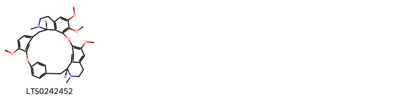{ width=100% }
    <figcaption>Hình ảnh cấu trúc hóa học của 1 hoạt chất thuộc nhóm  gồm ['(1r,14s)-9,20,21,25-tetramethoxy-15,30-dimethyl-7,23-dioxa-15,30-diazaheptacyclo[22.6.2.2³,⁶.1⁸,¹².1¹⁴,¹⁸.0²⁷,³¹.0²²,³³]hexatriaconta-3,5,8(34),9,11,18(33),19,21,24,26,31,35-dodecaene (LTS0242452)'].</figcaption>
</figure>
#### Nhóm 2-arylbenzofuran flavonoids
<figure markdown="span">
    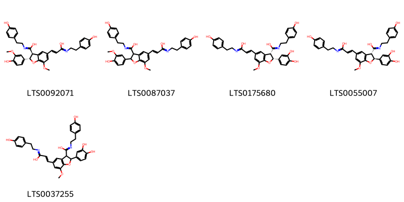{ width=100% }
    <figcaption>Hình ảnh cấu trúc hóa học của 5 hoạt chất thuộc nhóm 2-arylbenzofuran flavonoids gồm ['(2s,3s)-2-(4-hydroxy-3-methoxyphenyl)-n-[2-(4-hydroxyphenyl)ethyl]-5-[(1e)-2-{[2-(4-hydroxyphenyl)ethyl]-c-hydroxycarbonimidoyl}eth-1-en-1-yl]-7-methoxy-2,3-dihydro-1-benzofuran-3-carboximidic acid (LTS0092071)', '2-(4-hydroxy-3-methoxyphenyl)-n-[2-(4-hydroxyphenyl)ethyl]-5-(2-{[2-(4-hydroxyphenyl)ethyl]-c-hydroxycarbonimidoyl}eth-1-en-1-yl)-7-methoxy-2,3-dihydro-1-benzofuran-3-carboximidic acid (LTS0087037)', '(2r,3s)-2-(3,4-dihydroxyphenyl)-n-[2-(4-hydroxyphenyl)ethyl]-5-[(1e)-2-{[2-(4-hydroxyphenyl)ethyl]-c-hydroxycarbonimidoyl}eth-1-en-1-yl]-7-methoxy-2,3-dihydro-1-benzofuran-3-carboximidic acid (LTS0175680)', '(2s,3s)-2-(3,4-dihydroxyphenyl)-n-[2-(4-hydroxyphenyl)ethyl]-5-[(1e)-2-{[2-(4-hydroxyphenyl)ethyl]-c-hydroxycarbonimidoyl}eth-1-en-1-yl]-7-methoxy-2,3-dihydro-1-benzofuran-3-carboximidic acid (LTS0055007)', '2-(3,4-dihydroxyphenyl)-n-[2-(4-hydroxyphenyl)ethyl]-5-(2-{[2-(4-hydroxyphenyl)ethyl]-c-hydroxycarbonimidoyl}eth-1-en-1-yl)-7-methoxy-2,3-dihydro-1-benzofuran-3-carboximidic acid (LTS0037255)'].</figcaption>
</figure>
#### Nhóm Aporphines
<figure markdown="span">
    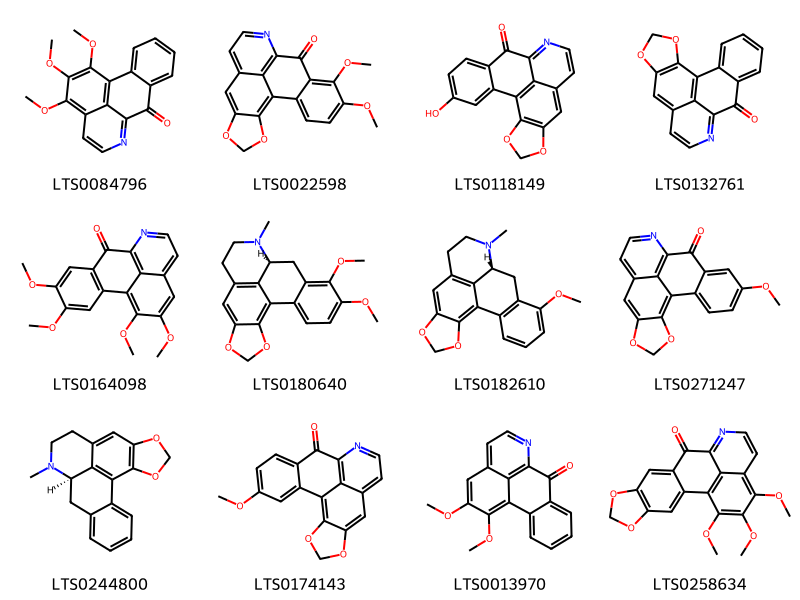{ width=100% }
    <figcaption>Hình ảnh cấu trúc hóa học của 12 hoạt chất thuộc nhóm Aporphines gồm ['o-methylmoschatoline (LTS0084796)', '15,16-dimethoxy-3,5-dioxa-11-azapentacyclo[10.7.1.0²,⁶.0⁸,²⁰.0¹⁴,¹⁹]icosa-1(20),2(6),7,9,11,14,16,18-octaen-13-one (LTS0022598)', '17-hydroxy-3,5-dioxa-11-azapentacyclo[10.7.1.0²,⁶.0⁸,²⁰.0¹⁴,¹⁹]icosa-1,6,8,10,12(20),14,16,18-octaen-13-one (LTS0118149)', 'liriodenine (LTS0132761)', '4,5,15,16-tetramethoxy-10-azatetracyclo[7.7.1.0²,⁷.0¹³,¹⁷]heptadeca-1(16),2(7),3,5,9(17),10,12,14-octaen-8-one (LTS0164098)', '(12s)-15,16-dimethoxy-11-methyl-3,5-dioxa-11-azapentacyclo[10.7.1.0²,⁶.0⁸,²⁰.0¹⁴,¹⁹]icosa-1,6,8(20),14,16,18-hexaene (LTS0180640)', '(12r)-15-methoxy-11-methyl-3,5-dioxa-11-azapentacyclo[10.7.1.0²,⁶.0⁸,²⁰.0¹⁴,¹⁹]icosa-1,6,8(20),14(19),15,17-hexaene (LTS0182610)', 'lanuginosine (LTS0271247)', '(12r)-11-methyl-3,5-dioxa-11-azapentacyclo[10.7.1.0²,⁶.0⁸,²⁰.0¹⁴,¹⁹]icosa-1(20),2(6),7,14,16,18-hexaene (LTS0244800)', '17-methoxy-3,5-dioxa-11-azapentacyclo[10.7.1.0²,⁶.0⁸,²⁰.0¹⁴,¹⁹]icosa-1,6,8,10,12(20),14,16,18-octaen-13-one (LTS0174143)', 'lysicamine (LTS0013970)', '17,18,19-trimethoxy-5,7-dioxa-13-azapentacyclo[10.7.1.0²,¹⁰.0⁴,⁸.0¹⁶,²⁰]icosa-1(19),2,4(8),9,12(20),13,15,17-octaen-11-one (LTS0258634)'].</figcaption>
</figure>
#### Nhóm Aryltetralin lignans
<figure markdown="span">
    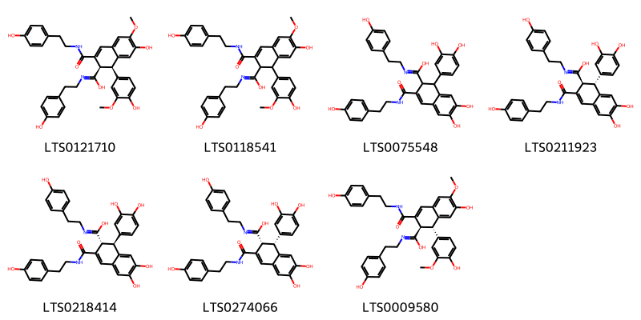{ width=100% }
    <figcaption>Hình ảnh cấu trúc hóa học của 7 hoạt chất thuộc nhóm Aryltetralin lignans gồm ['(1r,2r)-7-hydroxy-1-(4-hydroxy-3-methoxyphenyl)-n-[2-(4-hydroxyphenyl)ethyl]-3-{[2-(4-hydroxyphenyl)ethyl]carbamoyl}-6-methoxy-1,2-dihydronaphthalene-2-carboximidic acid (LTS0121710)', '7-hydroxy-1-(4-hydroxy-3-methoxyphenyl)-n-[2-(4-hydroxyphenyl)ethyl]-3-{[2-(4-hydroxyphenyl)ethyl]carbamoyl}-6-methoxy-1,2-dihydronaphthalene-2-carboximidic acid (LTS0118541)', '1-(3,4-dihydroxyphenyl)-6,7-dihydroxy-n-[2-(4-hydroxyphenyl)ethyl]-3-{[2-(4-hydroxyphenyl)ethyl]carbamoyl}-1,2-dihydronaphthalene-2-carboximidic acid (LTS0075548)', '(1r,2s)-1-(3,4-dihydroxyphenyl)-6,7-dihydroxy-n-[2-(4-hydroxyphenyl)ethyl]-3-{[2-(4-hydroxyphenyl)ethyl]carbamoyl}-1,2-dihydronaphthalene-2-carboximidic acid (LTS0211923)', '(1s,2r)-1-(3,4-dihydroxyphenyl)-6,7-dihydroxy-n-[2-(4-hydroxyphenyl)ethyl]-3-{[2-(4-hydroxyphenyl)ethyl]carbamoyl}-1,2-dihydronaphthalene-2-carboximidic acid (LTS0218414)', '(1r,2r)-1-(3,4-dihydroxyphenyl)-6,7-dihydroxy-n-[2-(4-hydroxyphenyl)ethyl]-3-{[2-(4-hydroxyphenyl)ethyl]carbamoyl}-1,2-dihydronaphthalene-2-carboximidic acid (LTS0274066)', '(1s,2r)-7-hydroxy-1-(4-hydroxy-3-methoxyphenyl)-n-[2-(4-hydroxyphenyl)ethyl]-3-{[2-(4-hydroxyphenyl)ethyl]carbamoyl}-6-methoxy-1,2-dihydronaphthalene-2-carboximidic acid (LTS0009580)'].</figcaption>
</figure>
#### Nhóm Cinnamic acids and derivatives
<figure markdown="span">
    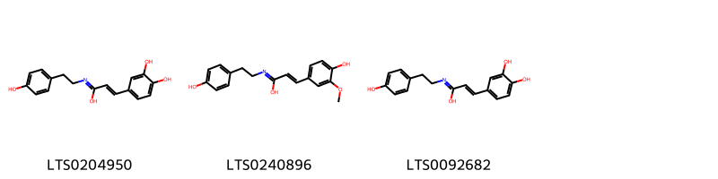{ width=100% }
    <figcaption>Hình ảnh cấu trúc hóa học của 3 hoạt chất thuộc nhóm Cinnamic acids and derivatives gồm ['3-(3,4-dihydroxyphenyl)-n-[2-(4-hydroxyphenyl)ethyl]prop-2-enimidic acid (LTS0204950)', '3-(4-hydroxy-3-methoxyphenyl)-n-[2-(4-hydroxyphenyl)ethyl]prop-2-enimidic acid (LTS0240896)', '(2e)-3-(3,4-dihydroxyphenyl)-n-[2-(4-hydroxyphenyl)ethyl]prop-2-enimidic acid (LTS0092682)'].</figcaption>
</figure>
#### Nhóm Flavonoids
<figure markdown="span">
    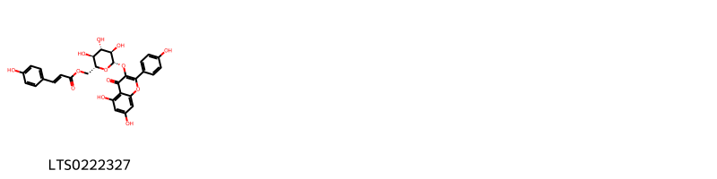{ width=100% }
    <figcaption>Hình ảnh cấu trúc hóa học của 1 hoạt chất thuộc nhóm Flavonoids gồm ['tiliroside (LTS0222327)'].</figcaption>
</figure>
#### Nhóm Phenols
<figure markdown="span">
    { width=100% }
    <figcaption>Hình ảnh cấu trúc hóa học của 1 hoạt chất thuộc nhóm Phenols gồm ['(2e)-3-(4-hydroxy-3-methoxyphenyl)-n-[2-(4-hydroxyphenyl)ethyl]prop-2-enimidic acid (LTS0187051)'].</figcaption>
</figure>
#### Nhóm Prenol lipids
<figure markdown="span">
    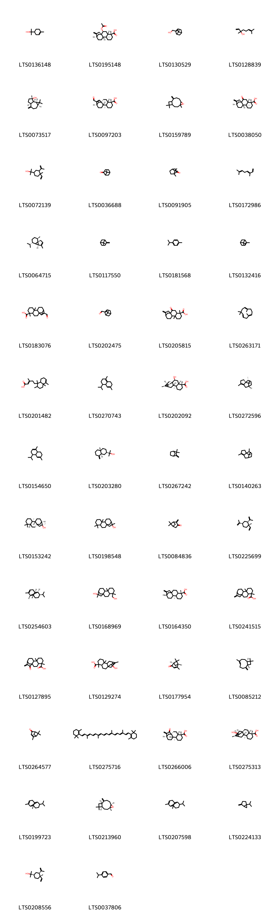{ width=100% }
    <figcaption>Hình ảnh cấu trúc hóa học của 74 hoạt chất thuộc nhóm Prenol lipids gồm ['terpineol (LTS0136148)', '(1r,2s,4s,5r,9s,10s,13r)-2-(acetyloxy)-5,9-dimethyl-14-methylidenetetracyclo[11.2.1.0¹,¹⁰.0⁴,⁹]hexadecane-5-carboxylic acid (LTS0195148)', 'myrtenol (LTS0130529)', 'linalool, (+-)- (LTS0128839)', '(1as,4as,7s,7ar,7bs)-1,1,7-trimethyl-4-methylidene-octahydrocyclopropa[e]azulen-7-ol (LTS0073517)', '(1s,4s,5r,9s,10s,13r)-14-formyl-5,9-dimethyltetracyclo[11.2.1.0¹,¹⁰.0⁴,⁹]hexadec-14-ene-5-carboxylic acid (LTS0097203)', 'caryophyllene oxide (LTS0159789)', '(1r,4s,5r,9s,10s,13r)-5,9-dimethyl-14-methylidene-2-oxotetracyclo[11.2.1.0¹,¹⁰.0⁴,⁹]hexadecane-5-carboxylic acid (LTS0038050)', '2-[4-ethenyl-4-methyl-3-(prop-1-en-2-yl)cyclohexyl]propan-2-ol (LTS0072139)', 'nopinone (LTS0036688)', 'camphor (LTS0091905)', '3,7-dimethyl-1,3,6-octatriene (LTS0172986)', '(1s,5r,7s,10r)-7-isopropyl-4,10-dimethyltricyclo[4.4.0.0¹,⁵]dec-3-ene (LTS0064715)', 'β-pinene (LTS0117550)', 'cymene (LTS0181568)', 'α pinene (LTS0132416)', '14-formyl-5,9-dimethyltetracyclo[11.2.1.0¹,¹⁰.0⁴,⁹]hexadec-14-ene-5-carboxylic acid (LTS0183076)', 'myrtenal (LTS0202475)', '5,9-dimethyl-14-methylidene-2-oxotetracyclo[11.2.1.0¹,¹⁰.0⁴,⁹]hexadecane-5-carboxylic acid (LTS0205815)', 'humulene (LTS0263171)', '5-(1,2,4a,5-tetramethyl-2,3,4,7,8,8a-hexahydronaphthalen-1-yl)-3-methylpent-2-enoic acid (LTS0201482)', '4-isopropyl-1,6-dimethyl-2,3,4,4a,7,8-hexahydronaphthalene (LTS0270743)', '(1r,2s,4s,5r,9s,10s,12r,13r,14s)-2-hydroxy-5,9,13-trimethylpentacyclo[11.2.1.0¹,¹⁰.0⁴,⁹.0¹²,¹⁴]hexadecane-5-carboxylic acid (LTS0202092)', 'cyperene (LTS0272596)', '4-isopropyl-1,6-dimethyl-3,4,4a,7,8,8a-hexahydronaphthalene (LTS0154650)', 'β-eudesmol (LTS0203280)', 'camphene (LTS0267242)', 'cyperene (LTS0140263)', '(1s,4r,9r,10r,13r,14s)-5,5,9,14-tetramethyltetracyclo[11.2.1.0¹,¹⁰.0⁴,⁹]hexadecan-14-ol (LTS0153242)', '5,5,9,14-tetramethyltetracyclo[11.2.1.0¹,¹⁰.0⁴,⁹]hexadecan-14-ol (LTS0198548)', 'pinocarvone (LTS0084836)', 'β-elemene (LTS0225699)', 'α-ylangene (LTS0254603)', '5-(hydroxymethyl)-5,9,14-trimethyltetracyclo[11.2.1.0¹,¹⁰.0⁴,⁹]hexadecan-14-ol (LTS0168969)', '(5r,9s,13s)-5,9-dimethyl-14-methylidenetetracyclo[11.2.1.0¹,¹⁰.0⁴,⁹]hexadecane-5-carboxylic acid (LTS0164350)', '5,9-dimethyl-14-methylidenetetracyclo[11.2.1.0¹,¹⁰.0⁴,⁹]hexadecane-5-carboxylic acid (LTS0241515)', '5,9-dimethyl-14-methylidene-15-oxotetracyclo[11.2.1.0¹,¹⁰.0⁴,⁹]hexadecane-5-carboxylic acid (LTS0127895)', '16-hydroxy-5,9,13-trimethylpentacyclo[11.2.1.0¹,¹⁰.0⁴,⁹.0¹²,¹⁴]hexadecane-5-carboxylic acid (LTS0129274)', '(1r,5s)-4,6,6-trimethylbicyclo[3.1.1]hept-3-en-2-one (LTS0177954)', 'caryophyllene (LTS0085212)', 'verbenone (LTS0264577)', 'β-carotene (LTS0275716)', '(1r,4s,5r,9s,10s,13r)-5,9-dimethyl-14-methylidene-15-oxotetracyclo[11.2.1.0¹,¹⁰.0⁴,⁹]hexadecane-5-carboxylic acid (LTS0266006)', '(1r,4s,5r,9s,10s,12r,13r,14s,16s)-16-hydroxy-5,9,13-trimethylpentacyclo[11.2.1.0¹,¹⁰.0⁴,⁹.0¹²,¹⁴]hexadecane-5-carboxylic acid (LTS0275313)', '(1s)-8-isopropyl-1,3-dimethyltricyclo[4.4.0.0²,⁷]dec-3-ene (LTS0199723)', 'β-caryophyllene oxide (LTS0213960)', 'α-copaene (LTS0207598)', 'sabinene (LTS0224133)', 'elemol (LTS0208556)', 'cuminaldehyde (LTS0037806)', '2-hydroxy-5,9-dimethyl-14-methylidenetetracyclo[11.2.1.0¹,¹⁰.0⁴,⁹]hexadecane-5-carboxylic acid (LTS0167040)', '(1s,4s,5s,9s,10r,12r,13r,14s)-5,9,13-trimethylpentacyclo[11.2.1.0¹,¹⁰.0⁴,⁹.0¹²,¹⁴]hexadecane-5-carboxylic acid (LTS0177604)', 'α-cadinol (LTS0178794)', 'β-ocimene (LTS0242381)', '(1r,2s,7s,8s)-8-isopropyl-1,3-dimethyltricyclo[4.4.0.0²,⁷]dec-3-ene (LTS0190031)', '(1r,4s,5r,9s,10s,13r,15r)-15-(acetyloxy)-5,9-dimethyl-14-methylidenetetracyclo[11.2.1.0¹,¹⁰.0⁴,⁹]hexadecane-5-carboxylic acid (LTS0118206)', 'gamma-muurolene (LTS0052920)', '15-(acetyloxy)-5,9-dimethyl-14-methylidenetetracyclo[11.2.1.0¹,¹⁰.0⁴,⁹]hexadecane-5-carboxylic acid (LTS0000172)', '5-(1,2,4a,5-tetramethyl-7-oxo-3,4,8,8a-tetrahydro-2h-naphthalen-1-yl)-3-methylpent-2-enoic acid (LTS0262363)', '2-(acetyloxy)-5,9-dimethyl-14-methylidenetetracyclo[11.2.1.0¹,¹⁰.0⁴,⁹]hexadecane-5-carboxylic acid (LTS0034333)', '(3r)-6,6-dimethyl-2-methylidenebicyclo[3.1.1]heptan-3-ol (LTS0009265)', 'α-muurolene (LTS0022607)', '(1s,4s,5r,9s,10r,13r,14s)-5-(hydroxymethyl)-5,9,14-trimethyltetracyclo[11.2.1.0¹,¹⁰.0⁴,⁹]hexadecan-14-ol (LTS0000921)', 'ent-kaur-16-en-19-oic acid (LTS0016353)', '2-hydroxy-5,9,13-trimethylpentacyclo[11.2.1.0¹,¹⁰.0⁴,⁹.0¹²,¹⁴]hexadecane-5-carboxylic acid (LTS0010138)', 'delta-cadinene (LTS0019321)', 'pinocarveol (LTS0090950)', '(7ar)-1,1,7-trimethyl-4-methylidene-octahydrocyclopropa[e]azulen-7-ol (LTS0091612)', '(1r,2s,4s,5r,9s,10s,13r)-2-hydroxy-5,9-dimethyl-14-methylidenetetracyclo[11.2.1.0¹,¹⁰.0⁴,⁹]hexadecane-5-carboxylic acid (LTS0029115)', '5,9,13-trimethyl-16-oxopentacyclo[11.2.1.0¹,¹⁰.0⁴,⁹.0¹²,¹⁴]hexadecane-5-carboxylic acid (LTS0130929)', '(1r,4s,5r,9s,10r,12r,13r,14s)-5,9,13-trimethyl-16-oxopentacyclo[11.2.1.0¹,¹⁰.0⁴,⁹.0¹²,¹⁴]hexadecane-5-carboxylic acid (LTS0227635)', '(-)-α-cubebene (LTS0042045)', '(2e)-5-[(1s,2r,4ar,8ar)-1,2,4a,5-tetramethyl-7-oxo-3,4,8,8a-tetrahydro-2h-naphthalen-1-yl]-3-methylpent-2-enoic acid (LTS0040524)', '(2e)-5-[(1s,2r,4ar,8ar)-1,2,4a,5-tetramethyl-2,3,4,7,8,8a-hexahydronaphthalen-1-yl]-3-methylpent-2-enoic acid (LTS0253107)'].</figcaption>
</figure>
#### Nhóm Steroids and steroid derivatives
<figure markdown="span">
    { width=100% }
    <figcaption>Hình ảnh cấu trúc hóa học của 4 hoạt chất thuộc nhóm Steroids and steroid derivatives gồm ['sitosterol (LTS0168132)', 'stigmast-5-en-3-ol, (3β)- (LTS0204616)', 'sitogluside (LTS0201798)', '2-{[1-(5-ethyl-6-methylheptan-2-yl)-9a,11a-dimethyl-1h,2h,3h,3ah,3bh,4h,6h,7h,8h,9h,9bh,10h,11h-cyclopenta[a]phenanthren-7-yl]oxy}-6-(hydroxymethyl)oxane-3,4,5-triol (LTS0158828)'].</figcaption>
</figure>

---

### Dược dân tộc học

Danh sách các quốc gia có sử dụng *Xylopia aethiopica* trong điều trị các bệnh. 

| Country   | Disease                                                | Bệnh                                                                                                                                                                                                |
|:----------|:-------------------------------------------------------|:----------------------------------------------------------------------------------------------------------------------------------------------------------------------------------------------------|
| Africa    | Vermifuge                                              | MYMEMORY WARNING: YOU USED ALL AVAILABLE FREE TRANSLATIONS FOR TODAY. NEXT AVAILABLE IN  10 HOURS 35 MINUTES 36 SECONDS VISIT HTTPS://MYMEMORY.TRANSLATED.NET/DOC/USAGELIMITS.PHP TO TRANSLATE MORE |
| Ghana     | Purgative, Emetic, Carminative, Emmenagogue, Stimulant | MYMEMORY WARNING: YOU USED ALL AVAILABLE FREE TRANSLATIONS FOR TODAY. NEXT AVAILABLE IN  10 HOURS 35 MINUTES 32 SECONDS VISIT HTTPS://MYMEMORY.TRANSLATED.NET/DOC/USAGELIMITS.PHP TO TRANSLATE MORE |

---

---
## Xylopia carminativa
### Thông tin về thực vật

!!! info "Phân loại thực vật của *Xylopia sericea* từ GIBF:"
    - **Kingdom:** Plantae
    - **Phylum:** Tracheophyta
    - **Order:** Magnoliales
    - **Family:** Annonaceae
    - **Genus:** Xylopia
    - **Species:** *Xylopia sericea*

 

| Label (VI)   | Label (EN)   | Scientific Name     | Descriptions (VI)   | Descriptions (EN)   | Also Known As (VI)   | Also Known As (EN)   |
|:-------------|:-------------|:--------------------|:--------------------|:--------------------|:---------------------|:---------------------|
| N/A          | N/A          | Xylopia carminativa |                     |                     | ['']                 | ['']                 |

#### Phân bố trên thế giới

**Từ CSDL GIBF** Sierra Leone, Côte d’Ivoire, Ghana, Liberia, Cameroon, Gabon, Guinea

#### Phân bố tại Việt Nam

**Từ CSDL GIBF**: Không có ghi nhận ở Việt Nam

---
### Thành phần hóa học
        
- Theo cơ sở dữ liệu lotus: Từ loài *Xylopia sericea* đã phân lập và xác định được Chưa có hoạt chất nào được phân lập. hoạt chất thuộc về các nhóm Không có hoạt chất nào được phân lập. 

Không có hình ảnh nào được tạo ra

---

### Dược dân tộc học

Danh sách các quốc gia có sử dụng *Xylopia sericea* trong điều trị các bệnh. 

| Country   | Disease     | Bệnh                                                                                                                                                                                                |
|:----------|:------------|:----------------------------------------------------------------------------------------------------------------------------------------------------------------------------------------------------|
| Brazil    | Carminative | MYMEMORY WARNING: YOU USED ALL AVAILABLE FREE TRANSLATIONS FOR TODAY. NEXT AVAILABLE IN  10 HOURS 34 MINUTES 49 SECONDS VISIT HTTPS://MYMEMORY.TRANSLATED.NET/DOC/USAGELIMITS.PHP TO TRANSLATE MORE |

---

---
## Xylopia grandiflora
### Thông tin về thực vật

!!! info "Phân loại thực vật của *N/A* từ GIBF:"
    - **Kingdom:** Plantae
    - **Phylum:** Tracheophyta
    - **Order:** Magnoliales
    - **Family:** Annonaceae
    - **Genus:** Xylopia
    - **Species:** *N/A*

 

| Label (VI)   | Label (EN)   | Scientific Name     | Descriptions (VI)   | Descriptions (EN)   | Also Known As (VI)   | Also Known As (EN)   |
|:-------------|:-------------|:--------------------|:--------------------|:--------------------|:---------------------|:---------------------|
| N/A          | N/A          | Xylopia grandiflora | loài thực vật       | species of plant    | ['']                 | ['']                 |

#### Phân bố trên thế giới

**Từ CSDL GIBF** Colombia, Belize, Nicaragua, Brazil, Peru, French Guiana, Liberia, Cameroon, New Caledonia, Gabon, Singapore, Madagascar, Australia

#### Phân bố tại Việt Nam

**Từ CSDL GIBF**: Không có ghi nhận ở Việt Nam

---
### Thành phần hóa học
        
- Theo cơ sở dữ liệu lotus: Từ loài *N/A* đã phân lập và xác định được Chưa có hoạt chất nào được phân lập. hoạt chất thuộc về các nhóm Không có hoạt chất nào được phân lập. 

Không có hình ảnh nào được tạo ra

---

### Dược dân tộc học

Danh sách các quốc gia có sử dụng *N/A* trong điều trị các bệnh. 

| Country   | Disease              | Bệnh                                                                                                                                                                                                |
|:----------|:---------------------|:----------------------------------------------------------------------------------------------------------------------------------------------------------------------------------------------------|
| Brazil    | Carminative, Tonic   | MYMEMORY WARNING: YOU USED ALL AVAILABLE FREE TRANSLATIONS FOR TODAY. NEXT AVAILABLE IN  10 HOURS 34 MINUTES 27 SECONDS VISIT HTTPS://MYMEMORY.TRANSLATED.NET/DOC/USAGELIMITS.PHP TO TRANSLATE MORE |
| Venezuela | Vermifuge, Stomachic | MYMEMORY WARNING: YOU USED ALL AVAILABLE FREE TRANSLATIONS FOR TODAY. NEXT AVAILABLE IN  10 HOURS 34 MINUTES 24 SECONDS VISIT HTTPS://MYMEMORY.TRANSLATED.NET/DOC/USAGELIMITS.PHP TO TRANSLATE MORE |

---

---
## Xylopia macrantha
### Thông tin về thực vật

!!! info "Phân loại thực vật của *Xylopia macrantha* từ GIBF:"
    - **Kingdom:** Plantae
    - **Phylum:** Tracheophyta
    - **Order:** Magnoliales
    - **Family:** Annonaceae
    - **Genus:** Xylopia
    - **Species:** *Xylopia macrantha*

 

| Label (VI)   | Label (EN)   | Scientific Name   | Descriptions (VI)   | Descriptions (EN)   | Also Known As (VI)   | Also Known As (EN)   |
|:-------------|:-------------|:------------------|:--------------------|:--------------------|:---------------------|:---------------------|
| N/A          | N/A          | Xylopia macrantha | loài thực vật       | species of plant    | ['']                 | ['']                 |

#### Phân bố trên thế giới

**Từ CSDL GIBF** nan, Colombia, Venezuela (Bolivarian Republic of), Panama, Peru, Costa Rica

#### Phân bố tại Việt Nam

**Từ CSDL GIBF**: Không có ghi nhận ở Việt Nam

---
### Thành phần hóa học
        
- Theo cơ sở dữ liệu lotus: Từ loài *Xylopia macrantha* đã phân lập và xác định được Chưa có hoạt chất nào được phân lập. hoạt chất thuộc về các nhóm Không có hoạt chất nào được phân lập. 

Không có hình ảnh nào được tạo ra

---

### Dược dân tộc học

Danh sách các quốc gia có sử dụng *Xylopia macrantha* trong điều trị các bệnh. 

| Country   | Disease             | Bệnh                                                                                                                                                                                                |
|:----------|:--------------------|:----------------------------------------------------------------------------------------------------------------------------------------------------------------------------------------------------|
| Elsewhere | Antidote, Stimulant | MYMEMORY WARNING: YOU USED ALL AVAILABLE FREE TRANSLATIONS FOR TODAY. NEXT AVAILABLE IN  10 HOURS 33 MINUTES 56 SECONDS VISIT HTTPS://MYMEMORY.TRANSLATED.NET/DOC/USAGELIMITS.PHP TO TRANSLATE MORE |

---

---
## Xylopia villosa
### Thông tin về thực vật

!!! info "Phân loại thực vật của *Xylopia villosa* từ GIBF:"
    - **Kingdom:** Plantae
    - **Phylum:** Tracheophyta
    - **Order:** Magnoliales
    - **Family:** Annonaceae
    - **Genus:** Xylopia
    - **Species:** *Xylopia villosa*

 

| Label (VI)   | Label (EN)   | Scientific Name   | Descriptions (VI)   | Descriptions (EN)   | Also Known As (VI)   | Also Known As (EN)   |
|:-------------|:-------------|:------------------|:--------------------|:--------------------|:---------------------|:---------------------|
| N/A          | N/A          | Xylopia villosa   | loài thực vật       | species of plant    | ['']                 | ['']                 |

#### Phân bố trên thế giới

**Từ CSDL GIBF** nan, Sierra Leone, Viet Nam, Côte d’Ivoire, Ghana, Liberia, Cameroon, Congo, Democratic Republic of the, Gabon, Nigeria, Equatorial Guinea, Congo, Iceland, Guinea, Benin

#### Phân bố tại Việt Nam

**Từ CSDL GIBF**: Không có ghi nhận ở Việt Nam

---
### Thành phần hóa học
        
- Theo cơ sở dữ liệu lotus: Từ loài *Xylopia villosa* đã phân lập và xác định được Chưa có hoạt chất nào được phân lập. hoạt chất thuộc về các nhóm Không có hoạt chất nào được phân lập. 

Không có hình ảnh nào được tạo ra

---

### Dược dân tộc học

Danh sách các quốc gia có sử dụng *Xylopia villosa* trong điều trị các bệnh. 

| Country   | Disease                    | Bệnh                                                                                                                                                                                                |
|:----------|:---------------------------|:----------------------------------------------------------------------------------------------------------------------------------------------------------------------------------------------------|
| Africa    | Abortifacient, Emmenagogue | MYMEMORY WARNING: YOU USED ALL AVAILABLE FREE TRANSLATIONS FOR TODAY. NEXT AVAILABLE IN  10 HOURS 33 MINUTES 32 SECONDS VISIT HTTPS://MYMEMORY.TRANSLATED.NET/DOC/USAGELIMITS.PHP TO TRANSLATE MORE |

---

# Chi Popowia

??? note "Danh sách các dược liệu thuộc chi"
    
	 - *Popowia aberrans*

---
## Popowia aberrans
### Thông tin về thực vật

!!! info "Phân loại thực vật của *Sphaerocoryne affinis* từ GIBF:"
    - **Kingdom:** Plantae
    - **Phylum:** Tracheophyta
    - **Order:** Magnoliales
    - **Family:** Annonaceae
    - **Genus:** Sphaerocoryne
    - **Species:** *Sphaerocoryne affinis*

 

| Label (VI)   | Label (EN)   | Scientific Name   | Descriptions (VI)   | Descriptions (EN)   | Also Known As (VI)   | Also Known As (EN)   |
|:-------------|:-------------|:------------------|:--------------------|:--------------------|:---------------------|:---------------------|
| N/A          | N/A          | Popowia aberrans  | loài thực vật       | species of plant    | ['']                 | ['']                 |

#### Phân bố trên thế giới

**Từ CSDL GIBF** nan, Sierra Leone, Viet Nam, Côte d’Ivoire, Ghana, Liberia, Cameroon, Congo, Democratic Republic of the, Gabon, Nigeria, Equatorial Guinea, Congo, Iceland, Guinea, Benin

#### Phân bố tại Việt Nam

**Từ CSDL GIBF**: Không có ghi nhận ở Việt Nam

---
### Thành phần hóa học
        
- Theo cơ sở dữ liệu lotus: Từ loài *Sphaerocoryne affinis* đã phân lập và xác định được Chưa có hoạt chất nào được phân lập. hoạt chất thuộc về các nhóm Không có hoạt chất nào được phân lập. 

Không có hình ảnh nào được tạo ra

---

### Dược dân tộc học

Danh sách các quốc gia có sử dụng *Sphaerocoryne affinis* trong điều trị các bệnh. 

| Country   | Disease           | Bệnh                                                                                                                                                                                                |
|:----------|:------------------|:----------------------------------------------------------------------------------------------------------------------------------------------------------------------------------------------------|
| Indochina | Cosmetic, Perfume | MYMEMORY WARNING: YOU USED ALL AVAILABLE FREE TRANSLATIONS FOR TODAY. NEXT AVAILABLE IN  10 HOURS 32 MINUTES 58 SECONDS VISIT HTTPS://MYMEMORY.TRANSLATED.NET/DOC/USAGELIMITS.PHP TO TRANSLATE MORE |

---

# Chi Orophea

??? note "Danh sách các dược liệu thuộc chi"
    
	 - *Orophea polycarpa*

---
## Orophea polycarpa
### Thông tin về thực vật

!!! info "Phân loại thực vật của *Orophea polycarpa* từ GIBF:"
    - **Kingdom:** Plantae
    - **Phylum:** Tracheophyta
    - **Order:** Magnoliales
    - **Family:** Annonaceae
    - **Genus:** Orophea
    - **Species:** *Orophea polycarpa*

 

| Label (VI)   | Label (EN)   | Scientific Name   | Descriptions (VI)   | Descriptions (EN)   | Also Known As (VI)   | Also Known As (EN)   |
|:-------------|:-------------|:------------------|:--------------------|:--------------------|:---------------------|:---------------------|
| N/A          | N/A          | Orophea polycarpa | loài thực vật       | species of plant    | ['']                 | ['']                 |

#### Phân bố trên thế giới

**Từ CSDL GIBF** Viet Nam, nan, Thailand, Sri Lanka, Myanmar, Malaysia, India, Congo, Democratic Republic of the, Lao People’s Democratic Republic, China, Singapore, Cambodia, Indonesia

#### Phân bố tại Việt Nam

**Từ CSDL GIBF**: Khanh Hoa, 安南南部, Hoa Binh

---
### Thành phần hóa học
        
- Theo cơ sở dữ liệu lotus: Từ loài *Orophea polycarpa* đã phân lập và xác định được Chưa có hoạt chất nào được phân lập. hoạt chất thuộc về các nhóm Không có hoạt chất nào được phân lập. 

Không có hình ảnh nào được tạo ra

---

### Dược dân tộc học

Danh sách các quốc gia có sử dụng *Orophea polycarpa* trong điều trị các bệnh. 

| Country   | Disease   | Bệnh                                                                                                                                                                                                |
|:----------|:----------|:----------------------------------------------------------------------------------------------------------------------------------------------------------------------------------------------------|
| Malaya    | Sudorific | MYMEMORY WARNING: YOU USED ALL AVAILABLE FREE TRANSLATIONS FOR TODAY. NEXT AVAILABLE IN  10 HOURS 32 MINUTES 37 SECONDS VISIT HTTPS://MYMEMORY.TRANSLATED.NET/DOC/USAGELIMITS.PHP TO TRANSLATE MORE |

---

# Chi Monodora

??? note "Danh sách các dược liệu thuộc chi"
    
	 - *Monodora grandidiera*

---
## Monodora grandidiera
### Thông tin về thực vật

!!! info "Phân loại thực vật của *Monodora grandidieri* từ GIBF:"
    - **Kingdom:** Plantae
    - **Phylum:** Tracheophyta
    - **Order:** Magnoliales
    - **Family:** Annonaceae
    - **Genus:** Monodora
    - **Species:** *Monodora grandidieri*

 

| Label (VI)   | Label (EN)   | Scientific Name   | Descriptions (VI)   | Descriptions (EN)   | Also Known As (VI)   | Also Known As (EN)   |
|:-------------|:-------------|:------------------|:--------------------|:--------------------|:---------------------|:---------------------|
| N/A          | N/A          | Orophea polycarpa | loài thực vật       | species of plant    | ['']                 | ['']                 |

#### Phân bố trên thế giới

**Từ CSDL GIBF** nan, Malawi, Somalia, Mozambique, Tanzania, United Republic of, Congo, Democratic Republic of the, Kenya

#### Phân bố tại Việt Nam

**Từ CSDL GIBF**: Không có ghi nhận ở Việt Nam

---
### Thành phần hóa học
        
- Theo cơ sở dữ liệu lotus: Từ loài *Monodora grandidieri* đã phân lập và xác định được Chưa có hoạt chất nào được phân lập. hoạt chất thuộc về các nhóm Không có hoạt chất nào được phân lập. 

Không có hình ảnh nào được tạo ra

---

### Dược dân tộc học

Danh sách các quốc gia có sử dụng *Monodora grandidieri* trong điều trị các bệnh. 

| Country         | Disease   | Bệnh                                                                                                                                                                                                |
|:----------------|:----------|:----------------------------------------------------------------------------------------------------------------------------------------------------------------------------------------------------|
| Africa(Swahili) | Vermifuge | MYMEMORY WARNING: YOU USED ALL AVAILABLE FREE TRANSLATIONS FOR TODAY. NEXT AVAILABLE IN  10 HOURS 32 MINUTES 14 SECONDS VISIT HTTPS://MYMEMORY.TRANSLATED.NET/DOC/USAGELIMITS.PHP TO TRANSLATE MORE |

---

# Chi Asimina

??? note "Danh sách các dược liệu thuộc chi"
    
	 - *Asimina triloba*

---
## Asimina triloba
### Thông tin về thực vật

!!! info "Phân loại thực vật của *Asimina triloba* từ GIBF:"
    - **Kingdom:** Plantae
    - **Phylum:** Tracheophyta
    - **Order:** Magnoliales
    - **Family:** Annonaceae
    - **Genus:** Asimina
    - **Species:** *Asimina triloba*

 

| Label (VI)   | Label (EN)   | Scientific Name   | Descriptions (VI)   | Descriptions (EN)   | Also Known As (VI)   | Also Known As (EN)                                                     |
|:-------------|:-------------|:------------------|:--------------------|:--------------------|:---------------------|:-----------------------------------------------------------------------|
| N/A          | N/A          | Asimina triloba   | loài thực vật       | species of plant    | ['']                 | ['American papaw', 'dog-banana', 'Indian-banana', 'paw paw', 'pawpaw'] |

#### Phân bố trên thế giới

**Từ CSDL GIBF** nan, United States of America

#### Phân bố tại Việt Nam

**Từ CSDL GIBF**: Không có ghi nhận ở Việt Nam

---
### Thành phần hóa học
        
- Theo cơ sở dữ liệu lotus: Từ loài *Asimina triloba* đã phân lập và xác định được 92 hoạt chất thuộc về các nhóm Organooxygen compounds, Furanoid lignans, Aporphines, Carboxylic acids and derivatives, Pyrrolidines, Fatty Acyls, Protoberberine alkaloids and derivatives, Phenols, Cinnamic acids and derivatives. 

|    | chemicalTaxonomyClassyfireClass          |   smiles_count |
|---:|:-----------------------------------------|---------------:|
|  0 | Aporphines                               |             12 |
|  1 | Carboxylic acids and derivatives         |              1 |
|  2 | Cinnamic acids and derivatives           |              1 |
|  3 | Fatty Acyls                              |             69 |
|  4 | Furanoid lignans                         |              1 |
|  5 | Organooxygen compounds                   |              2 |
|  6 | Phenols                                  |              1 |
|  7 | Protoberberine alkaloids and derivatives |              3 |
|  8 | Pyrrolidines                             |              1 |

#### Nhóm Aporphines
<figure markdown="span">
    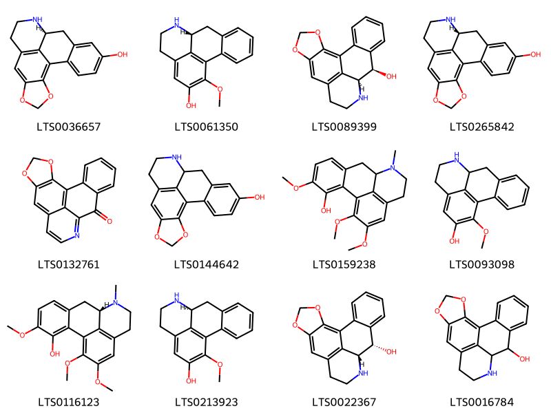{ width=100% }
    <figcaption>Hình ảnh cấu trúc hóa học của 12 hoạt chất thuộc nhóm Aporphines gồm ['(12s)-3,5-dioxa-11-azapentacyclo[10.7.1.0²,⁶.0⁸,²⁰.0¹⁴,¹⁹]icosa-1(20),2(6),7,14,16,18-hexaen-16-ol (LTS0036657)', 'r-(-)-asimilobine (LTS0061350)', '(12s,13r)-3,5-dioxa-11-azapentacyclo[10.7.1.0²,⁶.0⁸,²⁰.0¹⁴,¹⁹]icosa-1,6,8(20),14,16,18-hexaen-13-ol (LTS0089399)', 'anolobine (LTS0265842)', 'liriodenine (LTS0132761)', '3,5-dioxa-11-azapentacyclo[10.7.1.0²,⁶.0⁸,²⁰.0¹⁴,¹⁹]icosa-1(20),2(6),7,14,16,18-hexaen-16-ol (LTS0144642)', '4,15,16-trimethoxy-10-methyl-10-azatetracyclo[7.7.1.0²,⁷.0¹³,¹⁷]heptadeca-1(16),2,4,6,13(17),14-hexaen-3-ol (LTS0159238)', '16-methoxy-10-azatetracyclo[7.7.1.0²,⁷.0¹³,¹⁷]heptadeca-1(17),2,4,6,13,15-hexaen-15-ol (LTS0093098)', '(9s)-4,15,16-trimethoxy-10-methyl-10-azatetracyclo[7.7.1.0²,⁷.0¹³,¹⁷]heptadeca-1(16),2,4,6,13(17),14-hexaen-3-ol (LTS0116123)', 'asimilobine (LTS0213923)', '(12r,13s)-3,5-dioxa-11-azapentacyclo[10.7.1.0²,⁶.0⁸,²⁰.0¹⁴,¹⁹]icosa-1,6,8(20),14,16,18-hexaen-13-ol (LTS0022367)', '3,5-dioxa-11-azapentacyclo[10.7.1.0²,⁶.0⁸,²⁰.0¹⁴,¹⁹]icosa-1,6,8(20),14,16,18-hexaen-13-ol (LTS0016784)'].</figcaption>
</figure>
#### Nhóm Carboxylic acids and derivatives
<figure markdown="span">
    { width=100% }
    <figcaption>Hình ảnh cấu trúc hóa học của 1 hoạt chất thuộc nhóm Carboxylic acids and derivatives gồm ['triformin (LTS0070293)'].</figcaption>
</figure>
#### Nhóm Cinnamic acids and derivatives
<figure markdown="span">
    { width=100% }
    <figcaption>Hình ảnh cấu trúc hóa học của 1 hoạt chất thuộc nhóm Cinnamic acids and derivatives gồm ['(2e)-3-(4-hydroxyphenyl)-n-[2-(4-hydroxyphenyl)ethyl]prop-2-enimidic acid (LTS0067822)'].</figcaption>
</figure>
#### Nhóm Fatty Acyls
<figure markdown="span">
    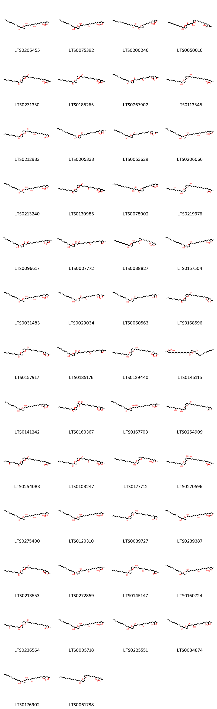{ width=100% }
    <figcaption>Hình ảnh cấu trúc hóa học của 69 hoạt chất thuộc nhóm Fatty Acyls gồm ['annonacin (LTS0205455)', 'annonacin (LTS0075392)', 'gigantetrocin a (LTS0200246)', '3-[7-(5-{1,4-dihydroxy-4-[5-(1-hydroxyundecyl)oxolan-2-yl]butyl}oxolan-2-yl)-2-hydroxyheptyl]-5-methyl-5h-furan-2-one (LTS0050016)', "3-{2,13-dihydroxy-13-[5'-(1-hydroxyundecyl)-[2,2'-bioxolan]-5-yl]tridecyl}-5-methyl-5h-furan-2-one (LTS0231330)", "(5r)-3-[(2s,13r)-2,13-dihydroxy-13-[(2s,2'r,5r,5's)-5'-[(1s)-1-hydroxyundecyl]-[2,2'-bioxolan]-5-yl]tridecyl]-5-methyl-5h-furan-2-one (LTS0185265)", 'isoannonacin (LTS0267902)', "(5s)-3-[(2r,13r)-2,13-dihydroxy-13-[(2r,2's,5r,5'r)-5'-[(1r)-1-hydroxyundecyl]-[2,2'-bioxolan]-5-yl]tridecyl]-5-methyl-5h-furan-2-one (LTS0113345)", "(5s)-3-[(8s,13r)-8,13-dihydroxy-13-[(2r,2'r,5r,5'r)-5'-[(1r)-1-hydroxyundecyl]-[2,2'-bioxolan]-5-yl]tridecyl]-5-methyl-5h-furan-2-one (LTS0212982)", '(5s)-3-[(2r,13r)-2,13-dihydroxy-13-[(2r,5r)-5-[(4e)-1-hydroxypentadec-4-en-1-yl]oxolan-2-yl]tridecyl]-5-methyl-5h-furan-2-one (LTS0205333)', '(3r,5r)-5-[(11r)-11-hydroxy-11-[(2r,5r)-5-[(1r)-1-hydroxydodecyl]oxolan-2-yl]undecyl]-3-(2-oxopropyl)oxolan-2-one (LTS0053629)', '(5s)-5-methyl-3-[(2r,8r,15r)-2,8,15-trihydroxy-15-[(2r,5s)-5-[(1r)-1-hydroxytridecyl]oxolan-2-yl]pentadecyl]-5h-furan-2-one (LTS0206066)', '(5s)-5-methyl-3-[(2r,10r,13s)-2,10,13-trihydroxy-13-[(2r,5r)-5-[(1r)-1-hydroxytridecyl]oxolan-2-yl]tridecyl]-5h-furan-2-one (LTS0213240)', "5-methyl-3-{2,8,13-trihydroxy-13-[5'-(1-hydroxyundecyl)-[2,2'-bioxolan]-5-yl]tridecyl}-5h-furan-2-one (LTS0130985)", '3-(2-oxopropyl)-5-{5-[5-(1,4,5-trihydroxynonadecyl)oxolan-2-yl]pentyl}oxolan-2-one (LTS0078002)', "(5s)-3-[(13r)-13-[(2r,2'r,5r,5'r)-5'-[(1r,6s)-1,6-dihydroxyundecyl]-[2,2'-bioxolan]-5-yl]-13-hydroxytridecyl]-5-methyl-5h-furan-2-one (LTS0219976)", '5-methyl-3-{2,13,15-trihydroxy-15-[5-(1-hydroxytridecyl)oxolan-2-yl]pentadecyl}-5h-furan-2-one (LTS0096617)', '(5s)-5-methyl-3-[(8r,15s,17r)-8,15,17-trihydroxy-17-[(2r,5r)-5-[(1r)-1-hydroxyundecyl]oxolan-2-yl]heptadecyl]-5h-furan-2-one (LTS0007772)', '(5s)-3-[(2r)-7-[(2s,5r)-5-[(1r,4r)-1,4-dihydroxy-4-[(2r,5r)-5-[(1s)-1-hydroxyundecyl]oxolan-2-yl]butyl]oxolan-2-yl]-2-hydroxyheptyl]-5-methyl-5h-furan-2-one (LTS0088827)', '3-{2,13-dihydroxy-13-[5-(1-hydroxypentadec-4-en-1-yl)oxolan-2-yl]tridecyl}-5-methyl-5h-furan-2-one (LTS0157504)', '(5s)-5-methyl-3-[(2r,8r,13r)-2,8,13-trihydroxy-13-[(2r,5r)-5-[(1s)-1-hydroxytridecyl]oxolan-2-yl]tridecyl]-5h-furan-2-one (LTS0031483)', '(3r,5r)-5-[(8r,11s)-8,11-dihydroxy-11-[(2r,5r)-5-[(1r)-1-hydroxytridecyl]oxolan-2-yl]undecyl]-3-(2-oxopropyl)oxolan-2-one (LTS0029034)', '(5s)-3-[(2r,13r)-2,13-dihydroxy-13-[(2r,5r)-5-[(1r)-1-hydroxytridecyl]oxolan-2-yl]tridecyl]-5-methyl-5h-furan-2-one (LTS0060563)', "5-{11-hydroxy-11-[5'-(1-hydroxyundecyl)-[2,2'-bioxolan]-5-yl]undecyl}-3-(2-oxopropyl)oxolan-2-one (LTS0168596)", "(3r,5r)-5-[(11r)-11-hydroxy-11-[(2r,2's,5r,5'r)-5'-[(1r)-1-hydroxyundecyl]-[2,2'-bioxolan]-5-yl]undecyl]-3-(2-oxopropyl)oxolan-2-one (LTS0157917)", '5-methyl-3-{8,15,17-trihydroxy-17-[5-(1-hydroxyundecyl)oxolan-2-yl]heptadecyl}-5h-furan-2-one (LTS0185176)', "(3s,5r)-5-[(11r)-11-hydroxy-11-[(2r,2's,5r,5'r)-5'-[(1r)-1-hydroxyundecyl]-[2,2'-bioxolan]-5-yl]undecyl]-3-(2-oxopropyl)oxolan-2-one (LTS0129440)", '(5s)-3-[(2r,13r)-2,13-dihydroxy-13-[(2r,5r)-5-[(1s,4z)-1-hydroxypentadec-4-en-1-yl]oxolan-2-yl]tridecyl]-5-methyl-5h-furan-2-one (LTS0145115)', '(3r,5s)-5-[(11r)-11-hydroxy-11-[(2r,5r)-5-[(1r)-1-hydroxydodecyl]oxolan-2-yl]undecyl]-3-(2-oxopropyl)oxolan-2-one (LTS0141242)', "3-{2,13-dihydroxy-13-[4-hydroxy-5'-(1-hydroxyundecyl)-[2,2'-bioxolan]-5-yl]tridecyl}-5-methyl-5h-furan-2-one (LTS0160367)", '(5s)-5-methyl-3-[(2r,13s,15r)-2,13,15-trihydroxy-15-[(2r,5r)-5-[(1r)-1-hydroxytridecyl]oxolan-2-yl]pentadecyl]-5h-furan-2-one (LTS0167703)', "3-{13-[5'-(1,5-dihydroxyundecyl)-[2,2'-bioxolan]-5-yl]-13-hydroxytridecyl}-5-methyl-5h-furan-2-one (LTS0254909)", "3-{13-[5'-(1,7-dihydroxyundecyl)-[2,2'-bioxolan]-5-yl]-13-hydroxytridecyl}-5-methyl-5h-furan-2-one (LTS0254083)", "(5s)-5-methyl-3-[(2r,8r,13r)-2,8,13-trihydroxy-13-[(2r,2's,5r,5'r)-5'-[(1r)-1-hydroxyundecyl]-[2,2'-bioxolan]-5-yl]tridecyl]-5h-furan-2-one (LTS0108247)", "(5s)-3-[(2r)-2-hydroxy-7-[(2s,2's,5r,5's)-5'-[(1s)-1-hydroxypentadecyl]-[2,2'-bioxolan]-5-yl]heptyl]-5-methyl-5h-furan-2-one (LTS0177712)", "(5s)-3-[(2r,13r)-2,13-dihydroxy-13-[(2r,2'r,4r,5s,5'r)-4-hydroxy-5'-[(1r)-1-hydroxyundecyl]-[2,2'-bioxolan]-5-yl]tridecyl]-5-methyl-5h-furan-2-one (LTS0270596)", '(5s)-5-methyl-3-[(2r,8s,13s)-2,8,13-trihydroxy-13-[(2r,5s)-5-[(1s)-1-hydroxytridecyl]oxolan-2-yl]tridecyl]-5h-furan-2-one (LTS0275400)', '3-[(13r)-2,13-dihydroxy-13-[(2r,5r)-5-[(1r)-1-hydroxytridecyl]oxolan-2-yl]tridecyl]-5-methyl-5h-furan-2-one (LTS0120310)', "(5s)-3-[(13r)-13-hydroxy-13-[(2r,2'r,5r,5'r)-5'-[(1s)-1-hydroxyundecyl]-[2,2'-bioxolan]-5-yl]tridecyl]-5-methyl-5h-furan-2-one (LTS0039727)", '(5s)-5-methyl-3-{2,8,15-trihydroxy-15-[(2r,5s)-5-(1-hydroxytridecyl)oxolan-2-yl]pentadecyl}-5h-furan-2-one (LTS0239387)', "(5s)-5-[(11r)-11-hydroxy-11-[(2r,2'r,5s,5's)-5'-[(1r)-1-hydroxyundecyl]-[2,2'-bioxolan]-5-yl]undecyl]-3-(2-oxopropyl)oxolan-2-one (LTS0213553)", '(5s)-5-methyl-3-{2,8,13-trihydroxy-13-[(2r,5s)-5-(1-hydroxytridecyl)oxolan-2-yl]tridecyl}-5h-furan-2-one (LTS0272859)', "(5s)-3-[(8r,13r)-8,13-dihydroxy-13-[(2r,2's,5r,5'r)-5'-[(1r)-1-hydroxyundecyl]-[2,2'-bioxolan]-5-yl]tridecyl]-5-methyl-5h-furan-2-one (LTS0145147)", '5-methyl-3-{2,8,15-trihydroxy-15-[5-(1-hydroxytridecyl)oxolan-2-yl]pentadecyl}-5h-furan-2-one (LTS0160724)', "(5s)-3-[(13r)-13-[(2r,2'r,5r,5'r)-5'-[(1r,7s)-1,7-dihydroxyundecyl]-[2,2'-bioxolan]-5-yl]-13-hydroxytridecyl]-5-methyl-5h-furan-2-one (LTS0236564)", '5-methyl-3-[(2r,8r,13r)-2,8,13-trihydroxy-13-[(2r,5r)-5-[(1r)-1-hydroxytridecyl]oxolan-2-yl]tridecyl]-5h-furan-2-one (LTS0005718)', '(5s)-5-methyl-3-[(2r,8s,13r)-2,8,13-trihydroxy-13-[(2r,5s)-5-[(1s)-1-hydroxytridecyl]oxolan-2-yl]tridecyl]-5h-furan-2-one (LTS0225551)', '(5r)-5-methyl-3-[(2r,10r,13s)-2,10,13-trihydroxy-13-[(2r,5r)-5-[(1r)-1-hydroxytridecyl]oxolan-2-yl]tridecyl]-5h-furan-2-one (LTS0034874)', '(3s,5r)-5-[(8r,11s)-8,11-dihydroxy-11-[(2r,5r)-5-[(1r)-1-hydroxytridecyl]oxolan-2-yl]undecyl]-3-(2-oxopropyl)oxolan-2-one (LTS0176902)', "3-{2-hydroxy-7-[5'-(1-hydroxypentadecyl)-[2,2'-bioxolan]-5-yl]heptyl}-5-methyl-5h-furan-2-one (LTS0061788)", '(3s,5r)-3-(2-oxopropyl)-5-{5-[(2r,5r)-5-[(1s,4s,5s)-1,4,5-trihydroxynonadecyl]oxolan-2-yl]pentyl}oxolan-2-one (LTS0248314)', "(5s)-3-[(2r,13r)-2,13-dihydroxy-13-[(2r,2'r,4r,5r,5'r)-4-hydroxy-5'-[(1r)-1-hydroxyundecyl]-[2,2'-bioxolan]-5-yl]tridecyl]-5-methyl-5h-furan-2-one (LTS0044499)", "(5s)-3-[(13r)-13-[(2r,2'r,5r,5'r)-5'-[(1r,5s)-1,5-dihydroxyundecyl]-[2,2'-bioxolan]-5-yl]-13-hydroxytridecyl]-5-methyl-5h-furan-2-one (LTS0255686)", '(5s)-3-[(2r,13r)-2,13-dihydroxy-13-[(2r,5s)-5-[(1r,4z)-1-hydroxypentadec-4-en-1-yl]oxolan-2-yl]tridecyl]-5-methyl-5h-furan-2-one (LTS0190044)', '(5s)-5-methyl-3-[(2r,8r,15r)-2,8,15-trihydroxy-15-[(2r,5s)-5-[(1s)-1-hydroxytridecyl]oxolan-2-yl]pentadecyl]-5h-furan-2-one (LTS0064910)', 'motrilin (LTS0040422)', "3-{13-[5'-(1,6-dihydroxyundecyl)-[2,2'-bioxolan]-5-yl]-13-hydroxytridecyl}-5-methyl-5h-furan-2-one (LTS0121747)", "(5s)-5-[(11s)-11-hydroxy-11-[(2r,2'r,5s,5's)-5'-[(1r)-1-hydroxyundecyl]-[2,2'-bioxolan]-5-yl]undecyl]-3-(2-oxopropyl)oxolan-2-one (LTS0126493)", "(5s)-3-[(13r)-13-hydroxy-13-[(2r,2'r,5r,5'r)-5'-[(1s,8r,9s)-1,8,9-trihydroxyundecyl]-[2,2'-bioxolan]-5-yl]tridecyl]-5-methyl-5h-furan-2-one (LTS0275664)", "(5s)-3-{8,13-dihydroxy-13-[5'-(1-hydroxyundecyl)-[2,2'-bioxolan]-5-yl]tridecyl}-5-methyl-5h-furan-2-one (LTS0012681)", '(5s)-3-[(2r)-7-(5-{1,4-dihydroxy-4-[5-(1-hydroxyundecyl)oxolan-2-yl]butyl}oxolan-2-yl)-2-hydroxyheptyl]-5-methyl-5h-furan-2-one (LTS0051797)', "(5s)-5-methyl-3-[(2r,8r,13r)-2,8,13-trihydroxy-13-[(2r,2'r,5r,5'r)-5'-[(1r)-1-hydroxyundecyl]-[2,2'-bioxolan]-5-yl]tridecyl]-5h-furan-2-one (LTS0014856)", "3-{8,13-dihydroxy-13-[5'-(1-hydroxyundecyl)-[2,2'-bioxolan]-5-yl]tridecyl}-5-methyl-5h-furan-2-one (LTS0004302)", 'annonin i (LTS0092106)', "(5s)-3-[(13r)-13-[(2r,2's,5r,5'r)-5'-[(1r,5s)-1,5-dihydroxyundecyl]-[2,2'-bioxolan]-5-yl]-13-hydroxytridecyl]-5-methyl-5h-furan-2-one (LTS0023896)", '3-(2,13-dihydroxy-13-{5-[(4z)-1-hydroxypentadec-4-en-1-yl]oxolan-2-yl}tridecyl)-5-methyl-5h-furan-2-one (LTS0047891)', '(3s,5r)-5-[(6r,11r)-6,11-dihydroxy-11-[(2r,5r)-5-[(1r)-1-hydroxytridecyl]oxolan-2-yl]undecyl]-3-(2-oxopropyl)oxolan-2-one (LTS0027262)', "(5s)-3-[(13r)-13-[(2r,2'r,5'r)-5'-[(1r,5s)-1,5-dihydroxyundecyl]-[2,2'-bioxolan]-5-yl]-13-hydroxytridecyl]-5-methyl-5h-furan-2-one (LTS0135388)", "(5s)-5-methyl-3-[(2r,13r)-2,8,13-trihydroxy-13-[(2r,2's,5r,5'r)-5'-[(1r)-1-hydroxyundecyl]-[2,2'-bioxolan]-5-yl]tridecyl]-5h-furan-2-one (LTS0119906)"].</figcaption>
</figure>
#### Nhóm Furanoid lignans
<figure markdown="span">
    { width=100% }
    <figcaption>Hình ảnh cấu trúc hóa học của 1 hoạt chất thuộc nhóm Furanoid lignans gồm ['(+)-syringaresinol (LTS0158868)'].</figcaption>
</figure>
#### Nhóm Organooxygen compounds
<figure markdown="span">
    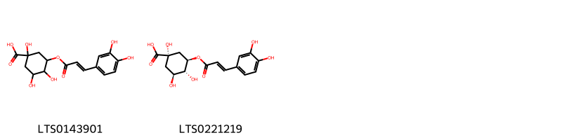{ width=100% }
    <figcaption>Hình ảnh cấu trúc hóa học của 2 hoạt chất thuộc nhóm Organooxygen compounds gồm ['3-{[3-(3,4-dihydroxyphenyl)prop-2-enoyl]oxy}-1,4,5-trihydroxycyclohexane-1-carboxylic acid (LTS0143901)', '(1s,3r,4r,5s)-3-{[(2e)-3-(3,4-dihydroxyphenyl)prop-2-enoyl]oxy}-1,4,5-trihydroxycyclohexane-1-carboxylic acid (LTS0221219)'].</figcaption>
</figure>
#### Nhóm Phenols
<figure markdown="span">
    { width=100% }
    <figcaption>Hình ảnh cấu trúc hóa học của 1 hoạt chất thuộc nhóm Phenols gồm ['(2e)-3-(4-hydroxy-3-methoxyphenyl)-n-[2-(4-hydroxyphenyl)ethyl]prop-2-enimidic acid (LTS0187051)'].</figcaption>
</figure>
#### Nhóm Protoberberine alkaloids and derivatives
<figure markdown="span">
    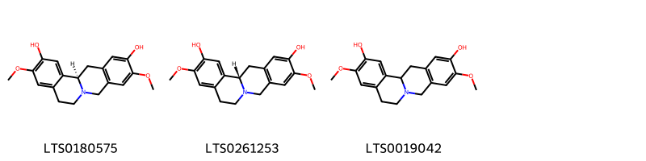{ width=100% }
    <figcaption>Hình ảnh cấu trúc hóa học của 3 hoạt chất thuộc nhóm Protoberberine alkaloids and derivatives gồm ['(12br)-3,10-dimethoxy-7,8,12b,13-tetrahydro-5h-6-azatetraphene-2,11-diol (LTS0180575)', 'coreximine (LTS0261253)', 'coreximine (LTS0019042)'].</figcaption>
</figure>
#### Nhóm Pyrrolidines
<figure markdown="span">
    { width=100% }
    <figcaption>Hình ảnh cấu trúc hóa học của 1 hoạt chất thuộc nhóm Pyrrolidines gồm ['2-oxopyrrolidine-1-carboximidic acid (LTS0107936)'].</figcaption>
</figure>

---

### Dược dân tộc học

Danh sách các quốc gia có sử dụng *Asimina triloba* trong điều trị các bệnh. 

| Country   | Disease                 | Bệnh                                                                                                                                                                                                |
|:----------|:------------------------|:----------------------------------------------------------------------------------------------------------------------------------------------------------------------------------------------------|
| US        | Vermifuge, Pediculicide | MYMEMORY WARNING: YOU USED ALL AVAILABLE FREE TRANSLATIONS FOR TODAY. NEXT AVAILABLE IN  10 HOURS 31 MINUTES 46 SECONDS VISIT HTTPS://MYMEMORY.TRANSLATED.NET/DOC/USAGELIMITS.PHP TO TRANSLATE MORE |

---

# Chi Hexalobus

??? note "Danh sách các dược liệu thuộc chi"
    
	 - *Hexalobus senegalensis*

---
## Hexalobus senegalensis
### Thông tin về thực vật

!!! info "Phân loại thực vật của *Hexalobus monopetalus* từ GIBF:"
    - **Kingdom:** Plantae
    - **Phylum:** Tracheophyta
    - **Order:** Magnoliales
    - **Family:** Annonaceae
    - **Genus:** Hexalobus
    - **Species:** *Hexalobus monopetalus*

 

| Label (VI)   | Label (EN)   | Scientific Name   | Descriptions (VI)   | Descriptions (EN)   | Also Known As (VI)   | Also Known As (EN)                                                     |
|:-------------|:-------------|:------------------|:--------------------|:--------------------|:---------------------|:-----------------------------------------------------------------------|
| N/A          | N/A          | Asimina triloba   | loài thực vật       | species of plant    | ['']                 | ['American papaw', 'dog-banana', 'Indian-banana', 'paw paw', 'pawpaw'] |

#### Phân bố trên thế giới

**Từ CSDL GIBF** nan, United States of America

#### Phân bố tại Việt Nam

**Từ CSDL GIBF**: Không có ghi nhận ở Việt Nam

---
### Thành phần hóa học
        
- Theo cơ sở dữ liệu lotus: Từ loài *Hexalobus monopetalus* đã phân lập và xác định được Chưa có hoạt chất nào được phân lập. hoạt chất thuộc về các nhóm Không có hoạt chất nào được phân lập. 

Không có hình ảnh nào được tạo ra

---

### Dược dân tộc học

Danh sách các quốc gia có sử dụng *Hexalobus monopetalus* trong điều trị các bệnh. 

| Country   | Disease     | Bệnh                                                                                                                                                                                                |
|:----------|:------------|:----------------------------------------------------------------------------------------------------------------------------------------------------------------------------------------------------|
| Elsewhere | Expectorant | MYMEMORY WARNING: YOU USED ALL AVAILABLE FREE TRANSLATIONS FOR TODAY. NEXT AVAILABLE IN  10 HOURS 31 MINUTES 15 SECONDS VISIT HTTPS://MYMEMORY.TRANSLATED.NET/DOC/USAGELIMITS.PHP TO TRANSLATE MORE |

---

# Chi Annona

??? note "Danh sách các dược liệu thuộc chi"
    
	 - *Annona cherimola*
	 - *Annona cherimolia*
	 - *Annona cherimoya*
	 - *Annona dioica*
	 - *Annona glabra*
	 - *Annona marcgravii*
	 - *Annona muricata*
	 - *Annona raguei*
	 - *Annona reticulata*
	 - *Annona squamosa*

---
## Annona cherimola
### Thông tin về thực vật

!!! info "Phân loại thực vật của *Annona cherimola* từ GIBF:"
    - **Kingdom:** Plantae
    - **Phylum:** Tracheophyta
    - **Order:** Magnoliales
    - **Family:** Annonaceae
    - **Genus:** Annona
    - **Species:** *Annona cherimola*

 

| Label (VI)   | Label (EN)   | Scientific Name   | Descriptions (VI)   | Descriptions (EN)           | Also Known As (VI)   | Also Known As (EN)   |
|:-------------|:-------------|:------------------|:--------------------|:----------------------------|:---------------------|:---------------------|
| N/A          | N/A          | Annona cherimola  | loài thực vật       | species of plant, Cherimoya | ['']                 | ['']                 |

#### Phân bố trên thế giới

**Từ CSDL GIBF** nan, El Salvador, Spain, Germany, Kenya, Chile, Guatemala, Colombia, Dominican Republic, India, Réunion, Seychelles, Cuba, Bonaire, Sint Eustatius and Saba, Türkiye, Nicaragua, Panama, Brazil, Myanmar, Peru, Ethiopia, Mexico, Argentina, Portugal, South Africa, Tanzania, United Republic of, New Zealand, Bolivia (Plurinational State of), Costa Rica, Ecuador, United States of America

#### Phân bố tại Việt Nam

**Từ CSDL GIBF**: Không có ghi nhận ở Việt Nam

---
### Thành phần hóa học
        
- Theo cơ sở dữ liệu lotus: Từ loài *Annona cherimola* đã phân lập và xác định được 220 hoạt chất thuộc về các nhóm Quinolines and derivatives, Furanoid lignans, Aporphines, Proaporphines, Carboxylic acids and derivatives, Phenylpropanoic acids, Pyridines and derivatives, Pyrimidine nucleosides, Pyrrolidines, Phenols, Cinnamic acids and derivatives, Organooxygen compounds, Lignan glycosides, Fatty Acyls, Flavonoids, Indoles and derivatives, Isoquinolines and derivatives, Prenol lipids, Protoberberine alkaloids and derivatives, Purine nucleosides, Steroids and steroid derivatives, Benzene and substituted derivatives. 

|    | chemicalTaxonomyClassyfireClass          |   smiles_count |
|---:|:-----------------------------------------|---------------:|
|  0 | Aporphines                               |             44 |
|  1 | Benzene and substituted derivatives      |             10 |
|  2 | Carboxylic acids and derivatives         |             22 |
|  3 | Cinnamic acids and derivatives           |             19 |
|  4 | Fatty Acyls                              |             27 |
|  5 | Flavonoids                               |              1 |
|  6 | Furanoid lignans                         |              4 |
|  7 | Indoles and derivatives                  |              2 |
|  8 | Isoquinolines and derivatives            |             11 |
|  9 | Lignan glycosides                        |              3 |
| 10 | Organooxygen compounds                   |              9 |
| 11 | Phenols                                  |              8 |
| 12 | Phenylpropanoic acids                    |              1 |
| 13 | Prenol lipids                            |             25 |
| 14 | Proaporphines                            |              7 |
| 15 | Protoberberine alkaloids and derivatives |              6 |
| 16 | Purine nucleosides                       |              2 |
| 17 | Pyridines and derivatives                |              1 |
| 18 | Pyrimidine nucleosides                   |              2 |
| 19 | Pyrrolidines                             |              1 |
| 20 | Quinolines and derivatives               |              2 |
| 21 | Steroids and steroid derivatives         |             11 |

#### Nhóm Aporphines
<figure markdown="span">
    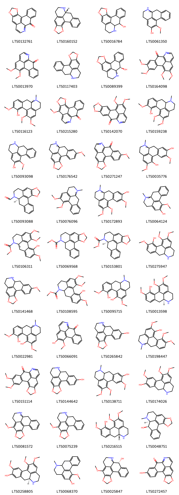{ width=100% }
    <figcaption>Hình ảnh cấu trúc hóa học của 44 hoạt chất thuộc nhóm Aporphines gồm ['liriodenine (LTS0132761)', 'anonaine (LTS0160152)', '3,5-dioxa-11-azapentacyclo[10.7.1.0²,⁶.0⁸,²⁰.0¹⁴,¹⁹]icosa-1,6,8(20),14,16,18-hexaen-13-ol (LTS0016784)', 'r-(-)-asimilobine (LTS0061350)', 'lysicamine (LTS0013970)', '3,5-dioxa-11-azapentacyclo[10.7.1.0²,⁶.0⁸,²⁰.0¹⁴,¹⁹]icosa-1(20),2(6),7,14,16,18-hexaene (LTS0117403)', '(12s,13r)-3,5-dioxa-11-azapentacyclo[10.7.1.0²,⁶.0⁸,²⁰.0¹⁴,¹⁹]icosa-1,6,8(20),14,16,18-hexaen-13-ol (LTS0089399)', '4,5,15,16-tetramethoxy-10-azatetracyclo[7.7.1.0²,⁷.0¹³,¹⁷]heptadeca-1(16),2(7),3,5,9(17),10,12,14-octaen-8-one (LTS0164098)', '(9s)-4,15,16-trimethoxy-10-methyl-10-azatetracyclo[7.7.1.0²,⁷.0¹³,¹⁷]heptadeca-1(16),2,4,6,13(17),14-hexaen-3-ol (LTS0116123)', 'atherospermidine (LTS0215280)', 'oxonantenine (LTS0142070)', '4,15,16-trimethoxy-10-methyl-10-azatetracyclo[7.7.1.0²,⁷.0¹³,¹⁷]heptadeca-1(16),2,4,6,13(17),14-hexaen-3-ol (LTS0159238)', '16-methoxy-10-azatetracyclo[7.7.1.0²,⁷.0¹³,¹⁷]heptadeca-1(17),2,4,6,13,15-hexaen-15-ol (LTS0093098)', 'xylopine (LTS0176542)', 'lanuginosine (LTS0271247)', '(9s)-4,15-dimethoxy-10-methyl-10-azatetracyclo[7.7.1.0²,⁷.0¹³,¹⁷]heptadeca-1(16),2(7),3,5,13(17),14-hexaene-5,16-diol (LTS0035776)', '(12r)-3,5-dioxa-11-azapentacyclo[10.7.1.0²,⁶.0⁸,²⁰.0¹⁴,¹⁹]icosa-1(20),2(6),7,14,16,18-hexaene-11-carbaldehyde (LTS0093088)', 'nuciferine (LTS0076096)', '(9s)-4,15,16-trimethoxy-10-methyl-10-azatetracyclo[7.7.1.0²,⁷.0¹³,¹⁷]heptadeca-1(16),2(7),3,5,13(17),14-hexaen-5-ol (LTS0172893)', '(9r)-16-methoxy-10-methyl-10-azatetracyclo[7.7.1.0²,⁷.0¹³,¹⁷]heptadeca-1(17),2,4,6,13,15-hexaen-15-ol (LTS0064124)', 'methyl (9r)-3-hydroxy-4,15,16-trimethoxy-10-azatetracyclo[7.7.1.0²,⁷.0¹³,¹⁷]heptadeca-1(17),2,4,6,13,15-hexaene-10-carboxylate (LTS0106311)', 'methyl 3,5-dioxa-11-azapentacyclo[10.7.1.0²,⁶.0⁸,²⁰.0¹⁴,¹⁹]icosa-1(20),2(6),7,14,16,18-hexaene-11-carboxylate (LTS0069568)', 'methyl (12r)-3,5-dioxa-11-azapentacyclo[10.7.1.0²,⁶.0⁸,²⁰.0¹⁴,¹⁹]icosa-1(20),2(6),7,14,16,18-hexaene-11-carboxylate (LTS0153801)', '4,15,16-trimethoxy-10-azatetracyclo[7.7.1.0²,⁷.0¹³,¹⁷]heptadeca-1(16),2,4,6,13(17),14-hexaen-3-ol (LTS0275947)', '16-methoxy-3,5-dioxa-11-azapentacyclo[10.7.1.0²,⁶.0⁸,²⁰.0¹⁴,¹⁹]icosa-1(20),2(6),7,14,16,18-hexaene (LTS0141468)', 'methyl 3-hydroxy-4,15,16-trimethoxy-10-azatetracyclo[7.7.1.0²,⁷.0¹³,¹⁷]heptadeca-1(17),2,4,6,13,15-hexaene-10-carboxylate (LTS0108595)', '4,15-dimethoxy-10-methyl-10-azatetracyclo[7.7.1.0²,⁷.0¹³,¹⁷]heptadeca-1(16),2,4,6,13(17),14-hexaene-3,16-diol (LTS0095715)', '(9s)-4,15,16-trimethoxy-10-azatetracyclo[7.7.1.0²,⁷.0¹³,¹⁷]heptadeca-1(16),2,4,6,13(17),14-hexaen-3-ol (LTS0013598)', '(9s)-4,15-dimethoxy-10-methyl-10-azatetracyclo[7.7.1.0²,⁷.0¹³,¹⁷]heptadeca-1(16),2,4,6,13(17),14-hexaene-3,16-diol (LTS0022981)', '15-hydroxy-16-methoxy-10-azatetracyclo[7.7.1.0²,⁷.0¹³,¹⁷]heptadeca-1(16),2,4,6,9(17),10,12,14-octaen-8-one (LTS0066091)', 'anolobine (LTS0265842)', '(9r)-3,4,15-trimethoxy-10-methyl-10-azatetracyclo[7.7.1.0²,⁷.0¹³,¹⁷]heptadeca-1(16),2(7),3,5,13(17),14-hexaen-16-ol (LTS0198447)', '16,17-dimethoxy-3,5-dioxa-11-azapentacyclo[10.7.1.0²,⁶.0⁸,²⁰.0¹⁴,¹⁹]icosa-1,6,8,10,12(20),14(19),15,17-octaen-13-one (LTS0151114)', '3,5-dioxa-11-azapentacyclo[10.7.1.0²,⁶.0⁸,²⁰.0¹⁴,¹⁹]icosa-1(20),2(6),7,14,16,18-hexaen-16-ol (LTS0144642)', '4,15,16-trimethoxy-10-methyl-10-azatetracyclo[7.7.1.0²,⁷.0¹³,¹⁷]heptadeca-1(16),2(7),3,5,13(17),14-hexaen-5-ol (LTS0138711)', '4,15,16-trimethoxy-10-azatetracyclo[7.7.1.0²,⁷.0¹³,¹⁷]heptadeca-1(17),2(7),3,5,13,15-hexaen-5-ol (LTS0174026)', '(12r)-7-methoxy-3,5-dioxa-11-azapentacyclo[10.7.1.0²,⁶.0⁸,²⁰.0¹⁴,¹⁹]icosa-1(20),2(6),7,14,16,18-hexaene (LTS0081572)', '7-methoxy-3,5-dioxa-11-azapentacyclo[10.7.1.0²,⁶.0⁸,²⁰.0¹⁴,¹⁹]icosa-1(20),2(6),7,14,16,18-hexaene (LTS0075239)', '(9r)-4,15,16-trimethoxy-10-azatetracyclo[7.7.1.0²,⁷.0¹³,¹⁷]heptadeca-1(16),2,4,6,13(17),14-hexaen-3-ol (LTS0216515)', '(12s,13r)-11-methyl-3,5-dioxa-11-azapentacyclo[10.7.1.0²,⁶.0⁸,²⁰.0¹⁴,¹⁹]icosa-1(20),2(6),7,14,16,18-hexaen-13-ol (LTS0048751)', 'laurotetanine (LTS0258805)', '16-methoxy-10-methyl-10-azatetracyclo[7.7.1.0²,⁷.0¹³,¹⁷]heptadeca-1(17),2,4,6,13,15-hexaen-15-ol (LTS0068370)', '(12s,13r)-7-methoxy-3,5-dioxa-11-azapentacyclo[10.7.1.0²,⁶.0⁸,²⁰.0¹⁴,¹⁹]icosa-1(20),2(6),7,14,16,18-hexaen-13-ol (LTS0025847)', '16-hydroxy-3,5-dioxa-11-azapentacyclo[10.7.1.0²,⁶.0⁸,²⁰.0¹⁴,¹⁹]icosa-1,6,8,10,12(20),14,16,18-octaen-13-one (LTS0272457)'].</figcaption>
</figure>
#### Nhóm Benzene and substituted derivatives
<figure markdown="span">
    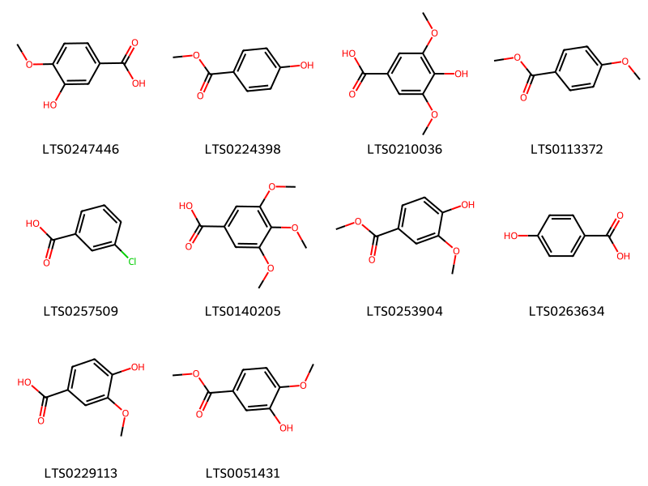{ width=100% }
    <figcaption>Hình ảnh cấu trúc hóa học của 10 hoạt chất thuộc nhóm Benzene and substituted derivatives gồm ['isovanillic acid (LTS0247446)', 'paraben (LTS0224398)', 'syringic acid (LTS0210036)', 'methyl anisate (LTS0113372)', '3-chlorobenzoic acid (LTS0257509)', '3,4,5-trimethoxybenzoic acid (LTS0140205)', 'vanillate (LTS0253904)', 'p-hydroxybenzoic acid (LTS0263634)', 'vanillic acid (LTS0229113)', 'methyl 3-hydroxy-4-methoxybenzoate (LTS0051431)'].</figcaption>
</figure>
#### Nhóm Carboxylic acids and derivatives
<figure markdown="span">
    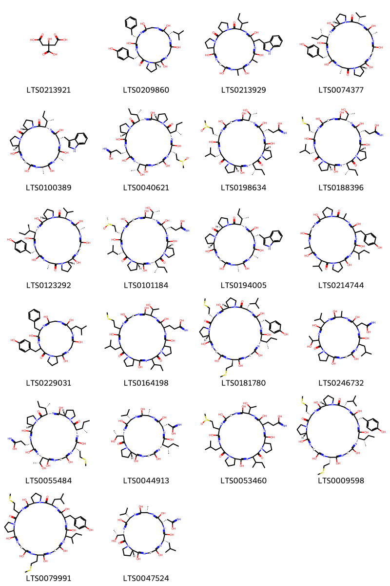{ width=100% }
    <figcaption>Hình ảnh cấu trúc hóa học của 22 hoạt chất thuộc nhóm Carboxylic acids and derivatives gồm ['citric acid (LTS0213921)', '(6s,12s,15s,20as)-12-benzyl-1,4,7,10,13-pentahydroxy-15-[(4-hydroxyphenyl)methyl]-6-(2-methylpropyl)-3h,6h,9h,12h,15h,18h,19h,20h,20ah-pyrrolo[1,2-a]1,4,7,10,13,16-hexaazacyclooctadecan-16-one (LTS0209860)', '11,14,17,20,23-pentahydroxy-12-(1h-indol-3-ylmethyl)-15,18-dimethyl-9-(sec-butyl)-1,7,10,13,16,19,22-heptaazatricyclo[22.3.0.0³,⁷]heptacosa-10,13,16,19,22-pentaene-2,8-dione (LTS0213929)', '(3s,6s,9s,12s,18s,21s,27s)-9-[(2s)-butan-2-yl]-5,8,11,20,23,26-hexahydroxy-6-[(4-hydroxyphenyl)methyl]-18-isopropyl-3,21-dimethyl-1,4,7,10,16,19,22,25-octaazatricyclo[25.3.0.0¹²,¹⁶]triaconta-4,7,10,19,22,25-hexaene-2,17-dione (LTS0074377)', '(3s,9s,12s,15s,18s,24s)-9-[(2s)-butan-2-yl]-11,14,17,20,23-pentahydroxy-12-(1h-indol-3-ylmethyl)-15,18-dimethyl-1,7,10,13,16,19,22-heptaazatricyclo[22.3.0.0³,⁷]heptacosa-10,13,16,19,22-pentaene-2,8-dione (LTS0100389)', '3-[(3s,6s,12s,15s,21s,24s,27s)-3,12-bis[(2s)-butan-2-yl]-5,14,17,20,23,26-hexahydroxy-21-[(1r)-1-hydroxyethyl]-15-{2-[(s)-methanesulfinyl]ethyl}-2,11-dioxo-1,4,10,13,16,19,22,25-octaazatricyclo[25.3.0.0⁶,¹⁰]triaconta-4,13,16,19,22,25-hexaen-24-yl]propanimidic acid (LTS0040621)', '3-[(3s,6s,12s,15s,21s,24s,27s)-3-[(2s)-butan-2-yl]-5,14,17,20,23,26-hexahydroxy-21-[(1r)-1-hydroxyethyl]-15-(2-methanesulfinylethyl)-12-(2-methylpropyl)-2,11-dioxo-1,4,10,13,16,19,22,25-octaazatricyclo[25.3.0.0⁶,¹⁰]triaconta-4,13,16,19,22,25-hexaen-24-yl]propanimidic acid (LTS0198634)', '3-[(3s,6s,12s,15s,21s,24s,27s)-3-[(2s)-butan-2-yl]-5,14,17,20,23,26-hexahydroxy-21-[(1r)-1-hydroxyethyl]-12-(2-methylpropyl)-15-[2-(methylsulfanyl)ethyl]-2,11-dioxo-1,4,10,13,16,19,22,25-octaazatricyclo[25.3.0.0⁶,¹⁰]triaconta-4,13,16,19,22,25-hexaen-24-yl]propanimidic acid (LTS0188396)', '(3s,6s,9s,12s,18r,21s,27s)-9-[(2r)-butan-2-yl]-5,8,11,20,23,26-hexahydroxy-6-[(4-hydroxyphenyl)methyl]-18-isopropyl-3,21-dimethyl-1,4,7,10,16,19,22,25-octaazatricyclo[25.3.0.0¹²,¹⁶]triaconta-4,7,10,19,22,25-hexaene-2,17-dione (LTS0123292)', '3-[(3s,6s,12s,15s,21s,24s,27s)-3-[(2s)-butan-2-yl]-5,14,17,20,23,26-hexahydroxy-21-[(1r)-1-hydroxyethyl]-15-{2-[(r)-methanesulfinyl]ethyl}-12-(2-methylpropyl)-2,11-dioxo-1,4,10,13,16,19,22,25-octaazatricyclo[25.3.0.0⁶,¹⁰]triaconta-4,13,16,19,22,25-hexaen-24-yl]propanimidic acid (LTS0101184)', '(3r,9s,12s,15s,18s,24s)-9-[(2s)-butan-2-yl]-11,14,17,20,23-pentahydroxy-12-(1h-indol-3-ylmethyl)-15,18-dimethyl-1,7,10,13,16,19,22-heptaazatricyclo[22.3.0.0³,⁷]heptacosa-10,13,16,19,22-pentaene-2,8-dione (LTS0194005)', '5,8,11,20,23,26-hexahydroxy-6-[(4-hydroxyphenyl)methyl]-18-isopropyl-3,21-dimethyl-9-(sec-butyl)-1,4,7,10,16,19,22,25-octaazatricyclo[25.3.0.0¹²,¹⁶]triaconta-4,7,10,19,22,25-hexaene-2,17-dione (LTS0214744)', '12-benzyl-1,4,7,10,13-pentahydroxy-15-[(4-hydroxyphenyl)methyl]-6-(2-methylpropyl)-3h,6h,9h,12h,15h,18h,19h,20h,20ah-pyrrolo[1,2-a]1,4,7,10,13,16-hexaazacyclooctadecan-16-one (LTS0229031)', '3-[5,14,17,20,23,26-hexahydroxy-21-(1-hydroxyethyl)-12-(2-methylpropyl)-15-[2-(methylsulfanyl)ethyl]-2,11-dioxo-3-(sec-butyl)-1,4,10,13,16,19,22,25-octaazatricyclo[25.3.0.0⁶,¹⁰]triaconta-4,13,16,19,22,25-hexaen-24-yl]propanimidic acid (LTS0164198)', '(3s,6s,12s,15s,18s,24r,30s)-18-[(2s)-butan-2-yl]-5,14,17,20,23,26,29-heptahydroxy-15-[(4-hydroxyphenyl)methyl]-12-(2-methylpropyl)-3,24-bis[2-(methylsulfanyl)ethyl]-1,4,10,13,16,19,22,25,28-nonaazatricyclo[28.3.0.0⁶,¹⁰]tritriaconta-4,13,16,19,22,25,28-heptaene-2,11-dione (LTS0181780)', '2-[1,4,7,10,13,16-hexahydroxy-18-(1-hydroxyethyl)-15-isopropyl-12-methyl-6-(2-methylpropyl)-19-oxo-3h,6h,9h,12h,15h,18h,21h,22h,23h,23ah-pyrrolo[1,2-a]1,4,7,10,13,16,19-heptaazacyclohenicosan-9-yl]ethanimidic acid (LTS0246732)', '3-[(3s,6s,12s,15s,21s,24s,27s)-3,12-bis[(2s)-butan-2-yl]-5,14,17,20,23,26-hexahydroxy-21-[(1r)-1-hydroxyethyl]-15-[2-(methylsulfanyl)ethyl]-2,11-dioxo-1,4,10,13,16,19,22,25-octaazatricyclo[25.3.0.0⁶,¹⁰]triaconta-4,13,16,19,22,25-hexaen-24-yl]propanimidic acid (LTS0055484)', '2-[(6s,9s,12s,15s,18s,23as)-6-[(2s)-butan-2-yl]-1,4,7,10,13,16-hexahydroxy-18-[(1r)-1-hydroxyethyl]-15-isopropyl-12-methyl-19-oxo-3h,6h,9h,12h,15h,18h,21h,22h,23h,23ah-pyrrolo[1,2-a]1,4,7,10,13,16,19-heptaazacyclohenicosan-9-yl]ethanimidic acid (LTS0044913)', '3-[5,14,17,20,23,26-hexahydroxy-21-(1-hydroxyethyl)-15-(2-methanesulfinylethyl)-12-(2-methylpropyl)-2,11-dioxo-3-(sec-butyl)-1,4,10,13,16,19,22,25-octaazatricyclo[25.3.0.0⁶,¹⁰]triaconta-4,13,16,19,22,25-hexaen-24-yl]propanimidic acid (LTS0053460)', '(3s,6s,12s,15s,18s,24s,30s)-18-[(2s)-butan-2-yl]-5,14,17,20,23,26,29-heptahydroxy-15-[(4-hydroxyphenyl)methyl]-12-(2-methylpropyl)-3,24-bis[2-(methylsulfanyl)ethyl]-1,4,10,13,16,19,22,25,28-nonaazatricyclo[28.3.0.0⁶,¹⁰]tritriaconta-4,13,16,19,22,25,28-heptaene-2,11-dione (LTS0009598)', '5,14,17,20,23,26,29-heptahydroxy-15-[(4-hydroxyphenyl)methyl]-12-(2-methylpropyl)-3,24-bis[2-(methylsulfanyl)ethyl]-18-(sec-butyl)-1,4,10,13,16,19,22,25,28-nonaazatricyclo[28.3.0.0⁶,¹⁰]tritriaconta-4,13,16,19,22,25,28-heptaene-2,11-dione (LTS0079991)', '2-[(6s,9s,12s,15s,18s,23as)-1,4,7,10,13,16-hexahydroxy-18-[(1r)-1-hydroxyethyl]-15-isopropyl-12-methyl-6-(2-methylpropyl)-19-oxo-3h,6h,9h,12h,15h,18h,21h,22h,23h,23ah-pyrrolo[1,2-a]1,4,7,10,13,16,19-heptaazacyclohenicosan-9-yl]ethanimidic acid (LTS0047524)'].</figcaption>
</figure>
#### Nhóm Cinnamic acids and derivatives
<figure markdown="span">
    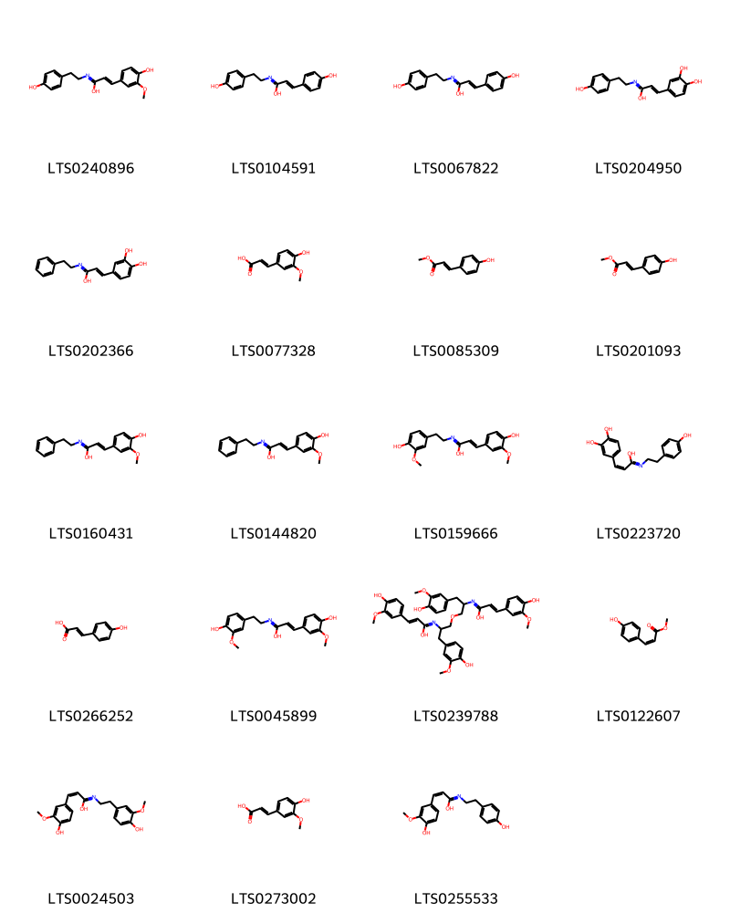{ width=100% }
    <figcaption>Hình ảnh cấu trúc hóa học của 19 hoạt chất thuộc nhóm Cinnamic acids and derivatives gồm ['3-(4-hydroxy-3-methoxyphenyl)-n-[2-(4-hydroxyphenyl)ethyl]prop-2-enimidic acid (LTS0240896)', '3-(4-hydroxyphenyl)-n-[2-(4-hydroxyphenyl)ethyl]prop-2-enimidic acid (LTS0104591)', '(2e)-3-(4-hydroxyphenyl)-n-[2-(4-hydroxyphenyl)ethyl]prop-2-enimidic acid (LTS0067822)', '3-(3,4-dihydroxyphenyl)-n-[2-(4-hydroxyphenyl)ethyl]prop-2-enimidic acid (LTS0204950)', '(2e)-3-(3,4-dihydroxyphenyl)-n-(2-phenylethyl)prop-2-enimidic acid (LTS0202366)', 'ferulic acid (LTS0077328)', 'methyl (2e)-3-(4-hydroxyphenyl)prop-2-enoate (LTS0085309)', 'methyl hydroxycinnamate (LTS0201093)', '(2e)-3-(4-hydroxy-3-methoxyphenyl)-n-(2-phenylethyl)prop-2-enimidic acid (LTS0160431)', '3-(4-hydroxy-3-methoxyphenyl)-n-(2-phenylethyl)prop-2-enimidic acid (LTS0144820)', '3-(4-hydroxy-3-methoxyphenyl)-n-[2-(4-hydroxy-3-methoxyphenyl)ethyl]prop-2-enimidic acid (LTS0159666)', '(2z)-3-(3,4-dihydroxyphenyl)-n-[2-(4-hydroxyphenyl)ethyl]prop-2-enimidic acid (LTS0223720)', 'para-coumaric acid (LTS0266252)', '(2e)-3-(4-hydroxy-3-methoxyphenyl)-n-[2-(4-hydroxy-3-methoxyphenyl)ethyl]prop-2-enimidic acid (LTS0045899)', '(2e)-n-[1-(2-{[(2e)-1-hydroxy-3-(4-hydroxy-3-methoxyphenyl)prop-2-en-1-ylidene]amino}-3-(4-hydroxy-3-methoxyphenyl)propoxy)-3-(4-hydroxy-3-methoxyphenyl)propan-2-yl]-3-(4-hydroxy-3-methoxyphenyl)prop-2-enimidic acid (LTS0239788)', 'methyl (2z)-3-(4-hydroxyphenyl)prop-2-enoate (LTS0122607)', '(2z)-3-(4-hydroxy-3-methoxyphenyl)-n-[2-(4-hydroxy-3-methoxyphenyl)ethyl]prop-2-enimidic acid (LTS0024503)', 'ferulic acid (LTS0273002)', '(2z)-3-(4-hydroxy-3-methoxyphenyl)-n-[2-(4-hydroxyphenyl)ethyl]prop-2-enimidic acid (LTS0255533)'].</figcaption>
</figure>
#### Nhóm Fatty Acyls
<figure markdown="span">
    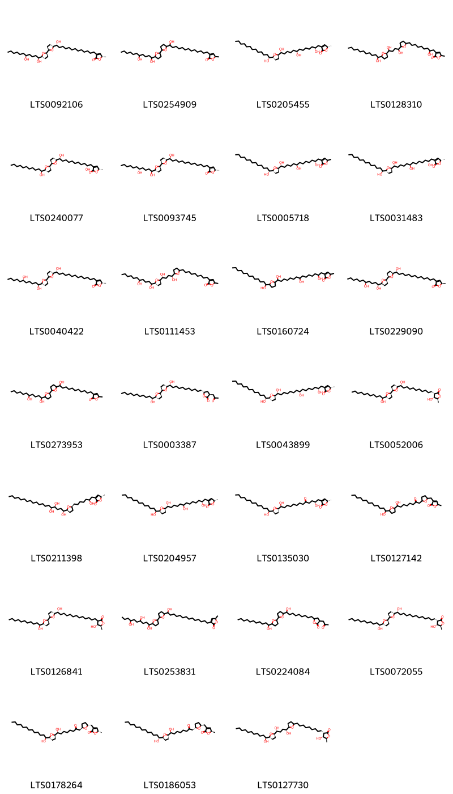{ width=100% }
    <figcaption>Hình ảnh cấu trúc hóa học của 27 hoạt chất thuộc nhóm Fatty Acyls gồm ['annonin i (LTS0092106)', "3-{13-[5'-(1,5-dihydroxyundecyl)-[2,2'-bioxolan]-5-yl]-13-hydroxytridecyl}-5-methyl-5h-furan-2-one (LTS0254909)", 'annonacin (LTS0205455)', 'purpureacin-1 (LTS0128310)', "(5s)-3-[(2r,11r)-2,11-dihydroxy-11-[(2r,2'r,5r,5'r)-5'-[(1s)-1-hydroxyundecyl]-[2,2'-bioxolan]-5-yl]undecyl]-5-methyl-5h-furan-2-one (LTS0240077)", "(5s)-3-[(13s)-13-[(2r,2'r,5r,5'r)-5'-[(1s,5r)-1,5-dihydroxyundecyl]-[2,2'-bioxolan]-5-yl]-13-hydroxytridecyl]-5-methyl-5h-furan-2-one (LTS0093745)", '5-methyl-3-[(2r,8r,13r)-2,8,13-trihydroxy-13-[(2r,5r)-5-[(1r)-1-hydroxytridecyl]oxolan-2-yl]tridecyl]-5h-furan-2-one (LTS0005718)', '(5s)-5-methyl-3-[(2r,8r,13r)-2,8,13-trihydroxy-13-[(2r,5r)-5-[(1s)-1-hydroxytridecyl]oxolan-2-yl]tridecyl]-5h-furan-2-one (LTS0031483)', 'motrilin (LTS0040422)', '3-(9-{5-[(1r,4r)-4-[(2r,5r)-5-[(1s)-1,5-dihydroxyundecyl]oxolan-2-yl]-1,4-dihydroxybutyl]oxolan-2-yl}nonyl)-5-methyl-5h-furan-2-one (LTS0111453)', '5-methyl-3-{2,8,15-trihydroxy-15-[5-(1-hydroxytridecyl)oxolan-2-yl]pentadecyl}-5h-furan-2-one (LTS0160724)', "(5r)-3-[(13r)-13-[(2r,2'r,5s,5's)-5'-[(1s,5s)-1,5-dihydroxyundecyl]-[2,2'-bioxolan]-5-yl]-13-hydroxytridecyl]-5-methyl-5h-furan-2-one (LTS0229090)", "3-{11-[5'-(1,5-dihydroxyundecyl)-[2,2'-bioxolan]-5-yl]-11-hydroxyundecyl}-5-methyl-5h-furan-2-one (LTS0273953)", 'bullatacinone (LTS0003387)', '(5s)-5-methyl-3-[(2r,8r,15r)-2,8,15-trihydroxy-15-[(2r,5r)-5-[(1r)-1-hydroxytridecyl]oxolan-2-yl]pentadecyl]-5h-furan-2-one (LTS0043899)', "(3s,4r,5s)-4-hydroxy-3-[(11r)-11-hydroxy-11-[(2r,2'r,5r,5'r)-5'-[(1s)-1-hydroxyundecyl]-[2,2'-bioxolan]-5-yl]undecyl]-5-methyloxolan-2-one (LTS0052006)", '(5s)-3-[(2s)-2-hydroxy-7-[(2s,5s)-5-[(1s,4s,5s)-1,4,5-trihydroxynonadecyl]oxolan-2-yl]heptyl]-5-methyl-5h-furan-2-one (LTS0211398)', '(5s)-5-methyl-3-[(2r,8r,13r)-2,8,13-trihydroxy-13-[(2r,5s)-5-[(1s)-1-hydroxytridecyl]oxolan-2-yl]tridecyl]-5h-furan-2-one (LTS0204957)', '(5s)-3-[(2r,13s)-2,13-dihydroxy-13-[(2s,5s)-5-[(1s)-1-hydroxytridecyl]oxolan-2-yl]-5-oxotridecyl]-5-methyl-5h-furan-2-one (LTS0135030)', '3-[(5-{8-hydroxy-8-[5-(1-hydroxytridecyl)oxolan-2-yl]-2-oxooctyl}oxolan-2-yl)methyl]-5-methyl-5h-furan-2-one (LTS0127142)', "(4r,5s)-4-hydroxy-3-[(13r)-13-hydroxy-13-[(2r,2'r,5r,5'r)-5'-[(1s)-1-hydroxyundecyl]-[2,2'-bioxolan]-5-yl]tridecyl]-5-methyloxolan-2-one (LTS0126841)", "3-{14-hydroxy-14-[5'-(1,4,7-trihydroxydecyl)-[2,2'-bioxolan]-5-yl]tetradecyl}-5-methyl-5h-furan-2-one (LTS0253831)", "5-{9-hydroxy-9-[5'-(1-hydroxyundecyl)-[2,2'-bioxolan]-5-yl]nonyl}-3-(2-oxopropyl)oxolan-2-one (LTS0224084)", "(3s,4r,5s)-4-hydroxy-3-[(13r)-13-hydroxy-13-[(2r,2'r,5r,5'r)-5'-[(1r)-1-hydroxyundecyl]-[2,2'-bioxolan]-5-yl]tridecyl]-5-methyloxolan-2-one (LTS0072055)", '(5s)-3-{[(2r,5r)-5-[(8r)-8-hydroxy-8-[(2r,5r)-5-[(1s)-1-hydroxytridecyl]oxolan-2-yl]-2-oxooctyl]oxolan-2-yl]methyl}-5-methyl-5h-furan-2-one (LTS0178264)', '(5r)-3-{[(2s,5s)-5-[(8s)-8-hydroxy-8-[(2s,5s)-5-[(1r)-1-hydroxytridecyl]oxolan-2-yl]-2-oxooctyl]oxolan-2-yl]methyl}-5-methyl-5h-furan-2-one (LTS0186053)', '(3s,4r,5s)-3-{9-[(5r)-5-[(1r,4r)-1,4-dihydroxy-4-[(2r,5r)-5-[(1s)-1-hydroxyundecyl]oxolan-2-yl]butyl]oxolan-2-yl]nonyl}-4-hydroxy-5-methyloxolan-2-one (LTS0127730)'].</figcaption>
</figure>
#### Nhóm Flavonoids
<figure markdown="span">
    { width=100% }
    <figcaption>Hình ảnh cấu trúc hóa học của 1 hoạt chất thuộc nhóm Flavonoids gồm ['quercetin (LTS0004651)'].</figcaption>
</figure>
#### Nhóm Furanoid lignans
<figure markdown="span">
    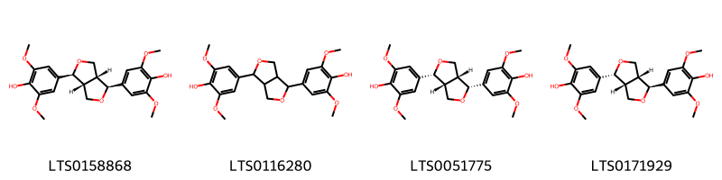{ width=100% }
    <figcaption>Hình ảnh cấu trúc hóa học của 4 hoạt chất thuộc nhóm Furanoid lignans gồm ['(+)-syringaresinol (LTS0158868)', 'syringaresinol (LTS0116280)', '4-[(1r,3ar,4r,6ar)-4-(4-hydroxy-3,5-dimethoxyphenyl)-hexahydrofuro[3,4-c]furan-1-yl]-2,6-dimethoxyphenol (LTS0051775)', '4-[(1s,3ar,4r,6ar)-4-(4-hydroxy-3,5-dimethoxyphenyl)-hexahydrofuro[3,4-c]furan-1-yl]-2,6-dimethoxyphenol (LTS0171929)'].</figcaption>
</figure>
#### Nhóm Indoles and derivatives
<figure markdown="span">
    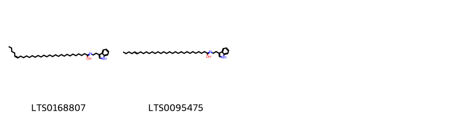{ width=100% }
    <figcaption>Hình ảnh cấu trúc hóa học của 2 hoạt chất thuộc nhóm Indoles and derivatives gồm ['(25z)-n-[2-(1h-indol-3-yl)ethyl]triacont-25-enimidic acid (LTS0168807)', 'n-[2-(1h-indol-3-yl)ethyl]triacont-25-enimidic acid (LTS0095475)'].</figcaption>
</figure>
#### Nhóm Isoquinolines and derivatives
<figure markdown="span">
    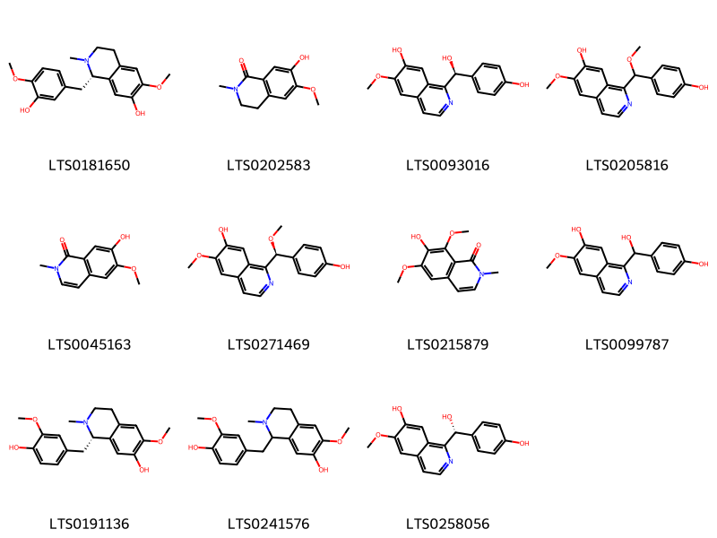{ width=100% }
    <figcaption>Hình ảnh cấu trúc hóa học của 11 hoạt chất thuộc nhóm Isoquinolines and derivatives gồm ['(+,-)-reticuline (LTS0181650)', 'thalifolin (LTS0202583)', '1-[(s)-hydroxy(4-hydroxyphenyl)methyl]-6-methoxyisoquinolin-7-ol (LTS0093016)', '1-[(4-hydroxyphenyl)(methoxy)methyl]-6-methoxyisoquinolin-7-ol (LTS0205816)', '7-hydroxy-6-methoxy-2-methylisoquinolin-1-one (LTS0045163)', '1-[(s)-(4-hydroxyphenyl)(methoxy)methyl]-6-methoxyisoquinolin-7-ol (LTS0271469)', '7-hydroxy-6,8-dimethoxy-2-methylisoquinolin-1-one (LTS0215879)', '1-[hydroxy(4-hydroxyphenyl)methyl]-6-methoxyisoquinolin-7-ol (LTS0099787)', '(1s)-1-[(4-hydroxy-3-methoxyphenyl)methyl]-6-methoxy-2-methyl-3,4-dihydro-1h-isoquinolin-7-ol (LTS0191136)', '1-[(4-hydroxy-3-methoxyphenyl)methyl]-6-methoxy-2-methyl-3,4-dihydro-1h-isoquinolin-7-ol (LTS0241576)', '1-[(r)-hydroxy(4-hydroxyphenyl)methyl]-6-methoxyisoquinolin-7-ol (LTS0258056)'].</figcaption>
</figure>
#### Nhóm Lignan glycosides
<figure markdown="span">
    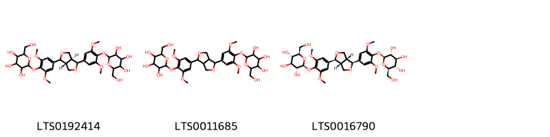{ width=100% }
    <figcaption>Hình ảnh cấu trúc hóa học của 3 hoạt chất thuộc nhóm Lignan glycosides gồm ['2-{4-[(3as,6ar)-4-(3,5-dimethoxy-4-{[3,4,5-trihydroxy-6-(hydroxymethyl)oxan-2-yl]oxy}phenyl)-hexahydrofuro[3,4-c]furan-1-yl]-2,6-dimethoxyphenoxy}-6-(hydroxymethyl)oxane-3,4,5-triol (LTS0192414)', '2-{4-[4-(3,5-dimethoxy-4-{[3,4,5-trihydroxy-6-(hydroxymethyl)oxan-2-yl]oxy}phenyl)-hexahydrofuro[3,4-c]furan-1-yl]-2,6-dimethoxyphenoxy}-6-(hydroxymethyl)oxane-3,4,5-triol (LTS0011685)', 'liriodendrin (LTS0016790)'].</figcaption>
</figure>
#### Nhóm Organooxygen compounds
<figure markdown="span">
    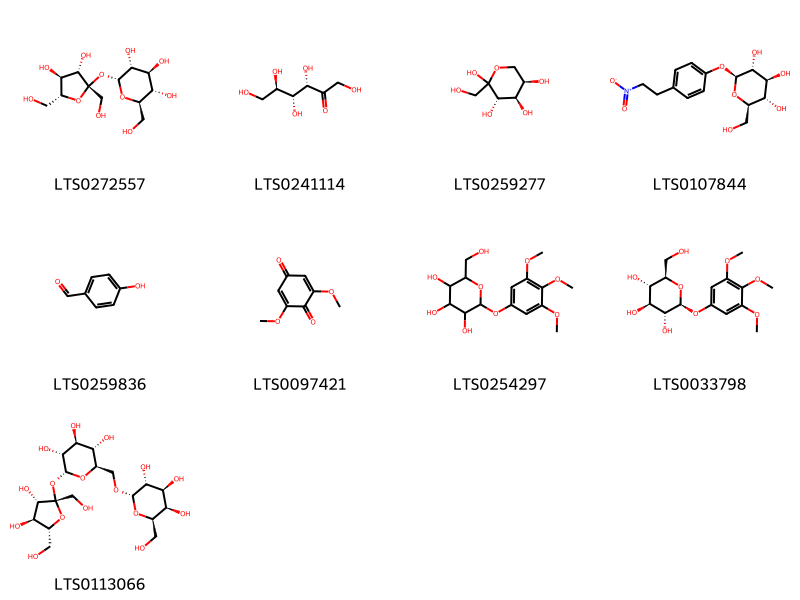{ width=100% }
    <figcaption>Hình ảnh cấu trúc hóa học của 9 hoạt chất thuộc nhóm Organooxygen compounds gồm ['sucrose (LTS0272557)', 'keto-d-fructose (LTS0241114)', 'd-fructopyranose (LTS0259277)', '(2r,3s,4s,5r,6s)-2-(hydroxymethyl)-6-[4-(2-nitroethyl)phenoxy]oxane-3,4,5-triol (LTS0107844)', 'p-hydroxybenzaldehyde (LTS0259836)', '2,6-dimethoxy-1,4-benzoquinone (LTS0097421)', '2-(hydroxymethyl)-6-(3,4,5-trimethoxyphenoxy)oxane-3,4,5-triol (LTS0254297)', 'koaburside (LTS0033798)', 'raffinose (LTS0113066)'].</figcaption>
</figure>
#### Nhóm Phenols
<figure markdown="span">
    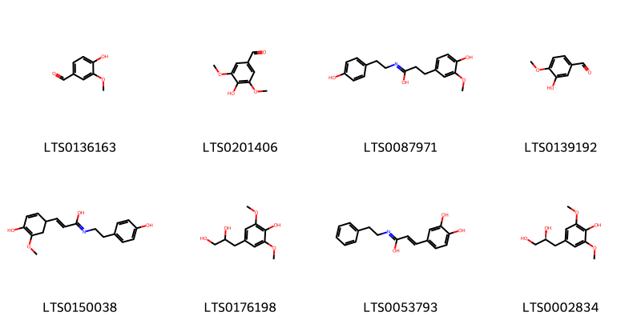{ width=100% }
    <figcaption>Hình ảnh cấu trúc hóa học của 8 hoạt chất thuộc nhóm Phenols gồm ['vanillin (LTS0136163)', 'syringaldehyde (LTS0201406)', '3-(4-hydroxy-3-methoxyphenyl)-n-[2-(4-hydroxyphenyl)ethyl]propanimidic acid (LTS0087971)', 'isovanillin (LTS0139192)', '(2e)-3-(4-hydroxy-5-methoxycyclohexa-2,4-dien-1-yl)-n-[2-(4-hydroxyphenyl)ethyl]prop-2-enimidic acid (LTS0150038)', '3-(4-hydroxy-3,5-dimethoxyphenyl)propane-1,2-diol (LTS0176198)', '3-(3,4-dihydroxyphenyl)-n-(2-phenylethyl)prop-2-enimidic acid (LTS0053793)', '(2s)-3-(4-hydroxy-3,5-dimethoxyphenyl)propane-1,2-diol (LTS0002834)'].</figcaption>
</figure>
#### Nhóm Phenylpropanoic acids
<figure markdown="span">
    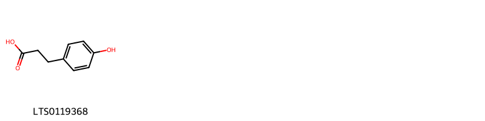{ width=100% }
    <figcaption>Hình ảnh cấu trúc hóa học của 1 hoạt chất thuộc nhóm Phenylpropanoic acids gồm ['hydroxyphenyl propionic acid (LTS0119368)'].</figcaption>
</figure>
#### Nhóm Prenol lipids
<figure markdown="span">
    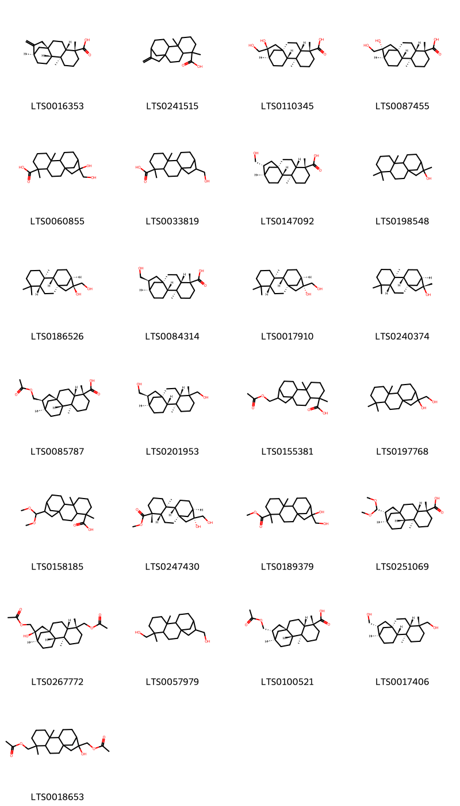{ width=100% }
    <figcaption>Hình ảnh cấu trúc hóa học của 25 hoạt chất thuộc nhóm Prenol lipids gồm ['ent-kaur-16-en-19-oic acid (LTS0016353)', '5,9-dimethyl-14-methylidenetetracyclo[11.2.1.0¹,¹⁰.0⁴,⁹]hexadecane-5-carboxylic acid (LTS0241515)', '(1s,4s,5r,9s,10r,13r,14s)-14-hydroxy-14-(hydroxymethyl)-5,9-dimethyltetracyclo[11.2.1.0¹,¹⁰.0⁴,⁹]hexadecane-5-carboxylic acid (LTS0110345)', 'diterpenoid sp-ii (LTS0087455)', '14-hydroxy-14-(hydroxymethyl)-5,9-dimethyltetracyclo[11.2.1.0¹,¹⁰.0⁴,⁹]hexadecane-5-carboxylic acid (LTS0060855)', '14-(hydroxymethyl)-5,9-dimethyltetracyclo[11.2.1.0¹,¹⁰.0⁴,⁹]hexadecane-5-carboxylic acid (LTS0033819)', '(1s,4s,5r,9s,10r,13r,14r)-14-(hydroxymethyl)-5,9-dimethyltetracyclo[11.2.1.0¹,¹⁰.0⁴,⁹]hexadecane-5-carboxylic acid (LTS0147092)', '5,5,9,14-tetramethyltetracyclo[11.2.1.0¹,¹⁰.0⁴,⁹]hexadecan-14-ol (LTS0198548)', '(1s,4r,9r,10r,13r,14s)-14-(hydroxymethyl)-5,5,9-trimethyltetracyclo[11.2.1.0¹,¹⁰.0⁴,⁹]hexadecan-14-ol (LTS0186526)', '(1s,4s,5r,9s,10r,13r,14s)-14-(hydroxymethyl)-5,9-dimethyltetracyclo[11.2.1.0¹,¹⁰.0⁴,⁹]hexadecane-5-carboxylic acid (LTS0084314)', '(1s,4r,9r,10r,13r,14r)-14-(hydroxymethyl)-5,5,9-trimethyltetracyclo[11.2.1.0¹,¹⁰.0⁴,⁹]hexadecan-14-ol (LTS0017910)', '(1s,4r,9r,10r,13r,14r)-5,5,9,14-tetramethyltetracyclo[11.2.1.0¹,¹⁰.0⁴,⁹]hexadecan-14-ol (LTS0240374)', '(1s,4s,5r,9s,10r,13r,14s)-14-[(acetyloxy)methyl]-5,9-dimethyltetracyclo[11.2.1.0¹,¹⁰.0⁴,⁹]hexadecane-5-carboxylic acid (LTS0085787)', '[(1s,4s,5r,9s,10r,13r,14s)-5-(hydroxymethyl)-5,9-dimethyltetracyclo[11.2.1.0¹,¹⁰.0⁴,⁹]hexadecan-14-yl]methanol (LTS0201953)', '14-[(acetyloxy)methyl]-5,9-dimethyltetracyclo[11.2.1.0¹,¹⁰.0⁴,⁹]hexadecane-5-carboxylic acid (LTS0155381)', '14-(hydroxymethyl)-5,5,9-trimethyltetracyclo[11.2.1.0¹,¹⁰.0⁴,⁹]hexadecan-14-ol (LTS0197768)', '14-(dimethoxymethyl)-5,9-dimethyltetracyclo[11.2.1.0¹,¹⁰.0⁴,⁹]hexadecane-5-carboxylic acid (LTS0158185)', 'methyl (1s,4s,5r,9s,10r,13r,14r)-14-hydroxy-14-(hydroxymethyl)-5,9-dimethyltetracyclo[11.2.1.0¹,¹⁰.0⁴,⁹]hexadecane-5-carboxylate (LTS0247430)', 'methyl 14-hydroxy-14-(hydroxymethyl)-5,9-dimethyltetracyclo[11.2.1.0¹,¹⁰.0⁴,⁹]hexadecane-5-carboxylate (LTS0189379)', '(1s,4s,5r,9s,10r,13r,14r)-14-(dimethoxymethyl)-5,9-dimethyltetracyclo[11.2.1.0¹,¹⁰.0⁴,⁹]hexadecane-5-carboxylic acid (LTS0251069)', '[(1s,4s,5r,9s,10r,13r,14s)-5-[(acetyloxy)methyl]-14-hydroxy-5,9-dimethyltetracyclo[11.2.1.0¹,¹⁰.0⁴,⁹]hexadecan-14-yl]methyl acetate (LTS0267772)', '[5-(hydroxymethyl)-5,9-dimethyltetracyclo[11.2.1.0¹,¹⁰.0⁴,⁹]hexadecan-14-yl]methanol (LTS0057979)', '(1s,4s,5r,9s,10r,13r,14r)-14-[(acetyloxy)methyl]-5,9-dimethyltetracyclo[11.2.1.0¹,¹⁰.0⁴,⁹]hexadecane-5-carboxylic acid (LTS0100521)', '[(1s,4s,5r,9s,10r,13r,14r)-5-(hydroxymethyl)-5,9-dimethyltetracyclo[11.2.1.0¹,¹⁰.0⁴,⁹]hexadecan-14-yl]methanol (LTS0017406)', '{5-[(acetyloxy)methyl]-14-hydroxy-5,9-dimethyltetracyclo[11.2.1.0¹,¹⁰.0⁴,⁹]hexadecan-14-yl}methyl acetate (LTS0018653)'].</figcaption>
</figure>
#### Nhóm Proaporphines
<figure markdown="span">
    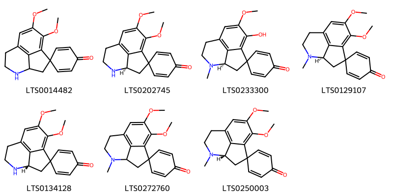{ width=100% }
    <figcaption>Hình ảnh cấu trúc hóa học của 7 hoạt chất thuộc nhóm Proaporphines gồm ["10',11'-dimethoxy-5'-azaspiro[cyclohexane-1,2'-tricyclo[6.3.1.0⁴,¹²]dodecane]-1'(11'),2,5,8'(12'),9'-pentaen-4-one (LTS0014482)", "(4'r)-10',11'-dimethoxy-5'-azaspiro[cyclohexane-1,2'-tricyclo[6.3.1.0⁴,¹²]dodecane]-1'(11'),2,5,8'(12'),9'-pentaen-4-one (LTS0202745)", 'glaziovine (LTS0233300)', 'pronuciferine (LTS0129107)', "(4's)-10',11'-dimethoxy-5'-azaspiro[cyclohexane-1,2'-tricyclo[6.3.1.0⁴,¹²]dodecane]-1'(11'),2,5,8'(12'),9'-pentaen-4-one (LTS0134128)", "10',11'-dimethoxy-5'-methyl-5'-azaspiro[cyclohexane-1,2'-tricyclo[6.3.1.0⁴,¹²]dodecane]-1'(11'),2,5,8'(12'),9'-pentaen-4-one (LTS0272760)", '(-)-pronuciferine (LTS0250003)'].</figcaption>
</figure>
#### Nhóm Protoberberine alkaloids and derivatives
<figure markdown="span">
    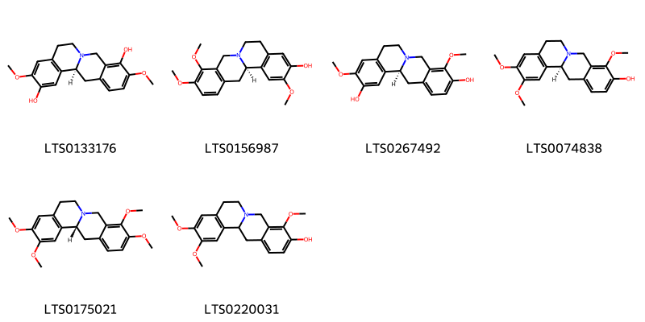{ width=100% }
    <figcaption>Hình ảnh cấu trúc hóa học của 6 hoạt chất thuộc nhóm Protoberberine alkaloids and derivatives gồm ['scoulerine (LTS0133176)', '(+)-corypalmine (LTS0156987)', 'stepholidine (LTS0267492)', '(12bs)-4,10,11-trimethoxy-7,8,12b,13-tetrahydro-5h-6-azatetraphen-3-ol (LTS0074838)', '(+)-tetrahydropalmatine (LTS0175021)', '4,10,11-trimethoxy-7,8,12b,13-tetrahydro-5h-6-azatetraphen-3-ol (LTS0220031)'].</figcaption>
</figure>
#### Nhóm Purine nucleosides
<figure markdown="span">
    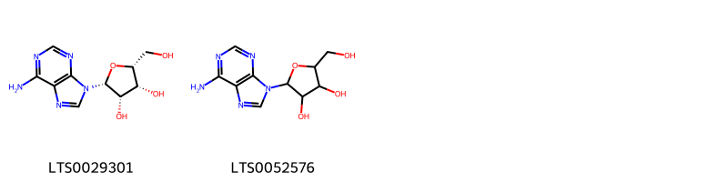{ width=100% }
    <figcaption>Hình ảnh cấu trúc hóa học của 2 hoạt chất thuộc nhóm Purine nucleosides gồm ['(2r,3s,4r,5r)-2-(6-aminopurin-9-yl)-5-(hydroxymethyl)oxolane-3,4-diol (LTS0029301)', 'adenosine (LTS0052576)'].</figcaption>
</figure>
#### Nhóm Pyridines and derivatives
<figure markdown="span">
    { width=100% }
    <figcaption>Hình ảnh cấu trúc hóa học của 1 hoạt chất thuộc nhóm Pyridines and derivatives gồm ['niacin (LTS0216673)'].</figcaption>
</figure>
#### Nhóm Pyrimidine nucleosides
<figure markdown="span">
    { width=100% }
    <figcaption>Hình ảnh cấu trúc hóa học của 2 hoạt chất thuộc nhóm Pyrimidine nucleosides gồm ['1-[3,4-dihydroxy-5-(hydroxymethyl)oxolan-2-yl]-4-hydroxypyrimidin-2-one (LTS0075646)', 'uridine (LTS0220125)'].</figcaption>
</figure>
#### Nhóm Pyrrolidines
<figure markdown="span">
    { width=100% }
    <figcaption>Hình ảnh cấu trúc hóa học của 1 hoạt chất thuộc nhóm Pyrrolidines gồm ['2-oxopyrrolidine-1-carboximidic acid (LTS0107936)'].</figcaption>
</figure>
#### Nhóm Quinolines and derivatives
<figure markdown="span">
    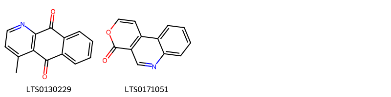{ width=100% }
    <figcaption>Hình ảnh cấu trúc hóa học của 2 hoạt chất thuộc nhóm Quinolines and derivatives gồm ['cleistopholine (LTS0130229)', 'pyrano[3,4-c]quinolin-4-one (LTS0171051)'].</figcaption>
</figure>
#### Nhóm Steroids and steroid derivatives
<figure markdown="span">
    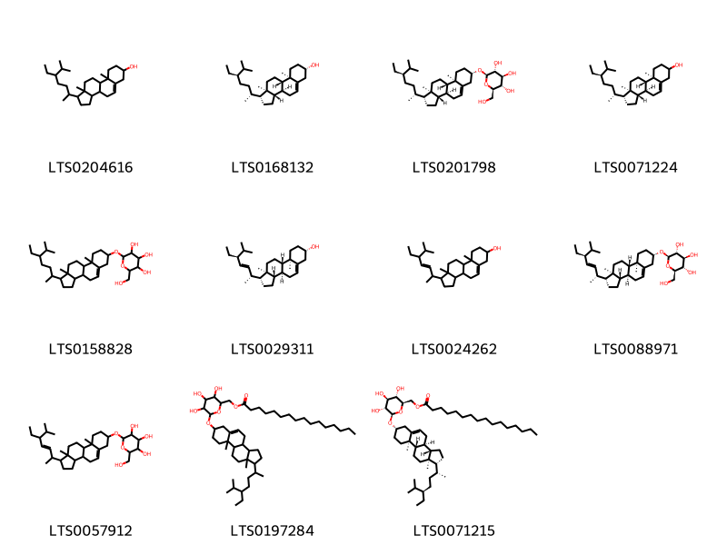{ width=100% }
    <figcaption>Hình ảnh cấu trúc hóa học của 11 hoạt chất thuộc nhóm Steroids and steroid derivatives gồm ['stigmast-5-en-3-ol, (3β)- (LTS0204616)', 'sitosterol (LTS0168132)', 'sitogluside (LTS0201798)', 'stigmast-5-en-3-ol (LTS0071224)', '2-{[1-(5-ethyl-6-methylheptan-2-yl)-9a,11a-dimethyl-1h,2h,3h,3ah,3bh,4h,6h,7h,8h,9h,9bh,10h,11h-cyclopenta[a]phenanthren-7-yl]oxy}-6-(hydroxymethyl)oxane-3,4,5-triol (LTS0158828)', 'phytosterol (LTS0029311)', 'stigmasterol (LTS0024262)', '(2r,3r,4s,5s,6r)-2-{[(1r,3as,3bs,7s,9ar,9bs,11ar)-1-[(2r,3e,5s)-5-ethyl-6-methylhept-3-en-2-yl]-9a,11a-dimethyl-1h,2h,3h,3ah,3bh,4h,6h,7h,8h,9h,9bh,10h,11h-cyclopenta[a]phenanthren-7-yl]oxy}-6-(hydroxymethyl)oxane-3,4,5-triol (LTS0088971)', '2-{[1-(5-ethyl-6-methylhept-3-en-2-yl)-9a,11a-dimethyl-1h,2h,3h,3ah,3bh,4h,6h,7h,8h,9h,9bh,10h,11h-cyclopenta[a]phenanthren-7-yl]oxy}-6-(hydroxymethyl)oxane-3,4,5-triol (LTS0057912)', '(6-{[1-(5-ethyl-6-methylheptan-2-yl)-9a,11a-dimethyl-1h,2h,3h,3ah,3bh,4h,6h,7h,8h,9h,9bh,10h,11h-cyclopenta[a]phenanthren-7-yl]oxy}-3,4,5-trihydroxyoxan-2-yl)methyl hexadecanoate (LTS0197284)', 'sitoindoside i (LTS0071215)'].</figcaption>
</figure>

---

### Dược dân tộc học

Danh sách các quốc gia có sử dụng *Annona cherimola* trong điều trị các bệnh. 

| Country            | Disease                                      | Bệnh                                                                                                                                                                                                |
|:-------------------|:---------------------------------------------|:----------------------------------------------------------------------------------------------------------------------------------------------------------------------------------------------------|
| Dominican Republic | Pediculicide                                 | MYMEMORY WARNING: YOU USED ALL AVAILABLE FREE TRANSLATIONS FOR TODAY. NEXT AVAILABLE IN  10 HOURS 30 MINUTES 55 SECONDS VISIT HTTPS://MYMEMORY.TRANSLATED.NET/DOC/USAGELIMITS.PHP TO TRANSLATE MORE |
| Latin America      | Insecticide, Piscicide                       | MYMEMORY WARNING: YOU USED ALL AVAILABLE FREE TRANSLATIONS FOR TODAY. NEXT AVAILABLE IN  10 HOURS 30 MINUTES 52 SECONDS VISIT HTTPS://MYMEMORY.TRANSLATED.NET/DOC/USAGELIMITS.PHP TO TRANSLATE MORE |
| Mexico             | Cathartic, Pediculicide, Insecticide, Emetic | MYMEMORY WARNING: YOU USED ALL AVAILABLE FREE TRANSLATIONS FOR TODAY. NEXT AVAILABLE IN  10 HOURS 30 MINUTES 48 SECONDS VISIT HTTPS://MYMEMORY.TRANSLATED.NET/DOC/USAGELIMITS.PHP TO TRANSLATE MORE |

---

---
## Annona cherimolia
### Thông tin về thực vật

!!! info "Phân loại thực vật của *Annona cherimolia* từ GIBF:"
    - **Kingdom:** Plantae
    - **Phylum:** Tracheophyta
    - **Order:** Magnoliales
    - **Family:** Annonaceae
    - **Genus:** Annona
    - **Species:** *Annona cherimolia*

 

| Label (VI)   | Label (EN)   | Scientific Name   | Descriptions (VI)   | Descriptions (EN)   | Also Known As (VI)   | Also Known As (EN)   |
|:-------------|:-------------|:------------------|:--------------------|:--------------------|:---------------------|:---------------------|
| N/A          | N/A          | Annona cherimolia | loài thực vật       | species of plant    | ['']                 | ['']                 |

#### Phân bố trên thế giới

**Từ CSDL GIBF** nan, Spain, Germany, Chile, Colombia, India, Brazil, Peru, Ethiopia, Mexico, China, Chinese Taipei, Portugal, South Africa, Morocco, Costa Rica, United States of America, Italy, Cabo Verde

#### Phân bố tại Việt Nam

**Từ CSDL GIBF**: Không có ghi nhận ở Việt Nam

---
### Thành phần hóa học
        
- Theo cơ sở dữ liệu lotus: Từ loài *Annona cherimolia* đã phân lập và xác định được 96 hoạt chất thuộc về các nhóm Organooxygen compounds, Aporphines, Isoquinolines and derivatives, Fatty Acyls, Protoberberine alkaloids and derivatives, Steroids and steroid derivatives. 

|    | chemicalTaxonomyClassyfireClass          |   smiles_count |
|---:|:-----------------------------------------|---------------:|
|  0 | Aporphines                               |             10 |
|  1 | Fatty Acyls                              |             73 |
|  2 | Isoquinolines and derivatives            |              5 |
|  3 | Organooxygen compounds                   |              1 |
|  4 | Protoberberine alkaloids and derivatives |              4 |
|  5 | Steroids and steroid derivatives         |              2 |

#### Nhóm Aporphines
<figure markdown="span">
    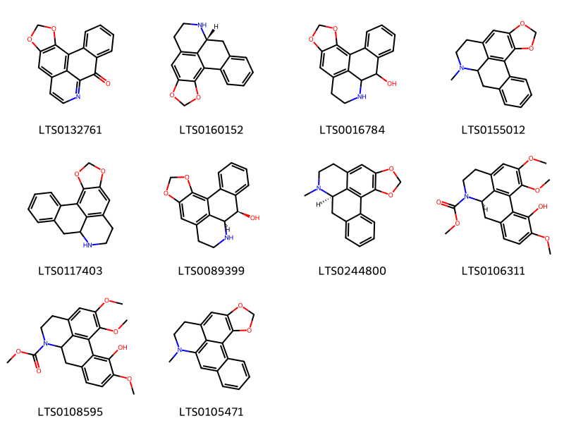{ width=100% }
    <figcaption>Hình ảnh cấu trúc hóa học của 10 hoạt chất thuộc nhóm Aporphines gồm ['liriodenine (LTS0132761)', 'anonaine (LTS0160152)', '3,5-dioxa-11-azapentacyclo[10.7.1.0²,⁶.0⁸,²⁰.0¹⁴,¹⁹]icosa-1,6,8(20),14,16,18-hexaen-13-ol (LTS0016784)', '11-methyl-3,5-dioxa-11-azapentacyclo[10.7.1.0²,⁶.0⁸,²⁰.0¹⁴,¹⁹]icosa-1(20),2(6),7,14,16,18-hexaene (LTS0155012)', '3,5-dioxa-11-azapentacyclo[10.7.1.0²,⁶.0⁸,²⁰.0¹⁴,¹⁹]icosa-1(20),2(6),7,14,16,18-hexaene (LTS0117403)', '(12s,13r)-3,5-dioxa-11-azapentacyclo[10.7.1.0²,⁶.0⁸,²⁰.0¹⁴,¹⁹]icosa-1,6,8(20),14,16,18-hexaen-13-ol (LTS0089399)', '(12r)-11-methyl-3,5-dioxa-11-azapentacyclo[10.7.1.0²,⁶.0⁸,²⁰.0¹⁴,¹⁹]icosa-1(20),2(6),7,14,16,18-hexaene (LTS0244800)', 'methyl (9r)-3-hydroxy-4,15,16-trimethoxy-10-azatetracyclo[7.7.1.0²,⁷.0¹³,¹⁷]heptadeca-1(17),2,4,6,13,15-hexaene-10-carboxylate (LTS0106311)', 'methyl 3-hydroxy-4,15,16-trimethoxy-10-azatetracyclo[7.7.1.0²,⁷.0¹³,¹⁷]heptadeca-1(17),2,4,6,13,15-hexaene-10-carboxylate (LTS0108595)', '11-methyl-3,5-dioxa-11-azapentacyclo[10.7.1.0²,⁶.0⁸,²⁰.0¹⁴,¹⁹]icosa-1(20),2(6),7,12,14(19),15,17-heptaene (LTS0105471)'].</figcaption>
</figure>
#### Nhóm Fatty Acyls
<figure markdown="span">
    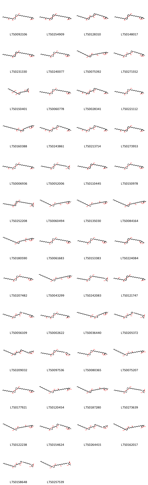{ width=100% }
    <figcaption>Hình ảnh cấu trúc hóa học của 73 hoạt chất thuộc nhóm Fatty Acyls gồm ['annonin i (LTS0092106)', "3-{13-[5'-(1,5-dihydroxyundecyl)-[2,2'-bioxolan]-5-yl]-13-hydroxytridecyl}-5-methyl-5h-furan-2-one (LTS0254909)", 'purpureacin-1 (LTS0128310)', "3-{2,11-dihydroxy-11-[5'-(1-hydroxyundecyl)-[2,2'-bioxolan]-5-yl]undecyl}-5-methyl-5h-furan-2-one (LTS0148017)", "3-{2,13-dihydroxy-13-[5'-(1-hydroxyundecyl)-[2,2'-bioxolan]-5-yl]tridecyl}-5-methyl-5h-furan-2-one (LTS0231330)", "(5s)-3-[(2r,11r)-2,11-dihydroxy-11-[(2r,2'r,5r,5'r)-5'-[(1s)-1-hydroxyundecyl]-[2,2'-bioxolan]-5-yl]undecyl]-5-methyl-5h-furan-2-one (LTS0240077)", 'annonacin (LTS0075392)', '(5s)-3-[(2r)-9-[(2r,5s)-5-[(1s,4r)-1,4-dihydroxy-4-[(2r,5r)-5-[(1s)-1-hydroxyundecyl]oxolan-2-yl]butyl]oxolan-2-yl]-2-hydroxynonyl]-5-methyl-5h-furan-2-one (LTS0271552)', '3-{2-hydroxy-6-[5-(1,4,5-trihydroxyundecyl)oxolan-2-yl]hexyl}-5-methyl-5h-furan-2-one (LTS0150401)', 'bullatacin (LTS0060778)', '3-[9-(5-{4-[5-(1,5-dihydroxyundecyl)oxolan-2-yl]-1,4-dihydroxybutyl}oxolan-2-yl)nonyl]-5-methyl-5h-furan-2-one (LTS0028341)', "(5s)-3-[(11r)-11-hydroxy-11-[(2r,2'r,5r,5'r)-5'-[(1s)-1-hydroxyundecyl]-[2,2'-bioxolan]-5-yl]undecyl]-5-methyl-5h-furan-2-one (LTS0221112)", '3-{2-hydroxy-7-[5-(1,4,5-trihydroxynonadecyl)oxolan-2-yl]heptyl}-5-methyl-5h-furan-2-one (LTS0160388)', '(5r)-3-{9-[(2r,5r)-5-[(1s,4r)-4-[(2r,5s)-5-[(1s,5s)-1,5-dihydroxyundecyl]oxolan-2-yl]-1,4-dihydroxybutyl]oxolan-2-yl]nonyl}-5-methyl-5h-furan-2-one (LTS0243861)', '(5s)-3-{9-[(2r,5r)-5-[(1s,4r)-4-[(2r,5r)-5-[(1s,5s)-1,5-dihydroxyundecyl]oxolan-2-yl]-1,4-dihydroxybutyl]oxolan-2-yl]nonyl}-5-methyl-5h-furan-2-one (LTS0213714)', "3-{11-[5'-(1,5-dihydroxyundecyl)-[2,2'-bioxolan]-5-yl]-11-hydroxyundecyl}-5-methyl-5h-furan-2-one (LTS0273953)", "(5r)-3-[(13s)-13-[(2s,2's,5s,5's)-5'-[(1r,5s)-1,5-dihydroxyundecyl]-[2,2'-bioxolan]-5-yl]-13-hydroxytridecyl]-5-methyl-5h-furan-2-one (LTS0006936)", "(3s,4r,5s)-4-hydroxy-3-[(11r)-11-hydroxy-11-[(2r,2'r,5r,5'r)-5'-[(1s)-1-hydroxyundecyl]-[2,2'-bioxolan]-5-yl]undecyl]-5-methyloxolan-2-one (LTS0052006)", "3-{11-hydroxy-11-[5'-(1-hydroxyundecyl)-[2,2'-bioxolan]-5-yl]undecyl}-5-methyl-5h-furan-2-one (LTS0110445)", "(5s)-3-[(2r,11s)-2,11-dihydroxy-11-[(2s,2's,5s,5's)-5'-[(1r)-1-hydroxyundecyl]-[2,2'-bioxolan]-5-yl]undecyl]-5-methyl-5h-furan-2-one (LTS0150978)", "4-hydroxy-3-{13-hydroxy-13-[5'-(1-hydroxyundecyl)-[2,2'-bioxolan]-5-yl]tridecyl}-5-methyloxolan-2-one (LTS0252208)", '(5r)-5-methyl-3-[(2s,8r,13r)-2,8,13-trihydroxy-13-[(2r,5r)-5-[(1s)-1-hydroxytridecyl]oxolan-2-yl]tridecyl]-5h-furan-2-one (LTS0060494)', '(5s)-3-[(2r,13s)-2,13-dihydroxy-13-[(2s,5s)-5-[(1s)-1-hydroxytridecyl]oxolan-2-yl]-5-oxotridecyl]-5-methyl-5h-furan-2-one (LTS0135030)', '5-methyl-3-{2,8,13-trihydroxy-13-[5-(1-hydroxypentadecyl)oxolan-2-yl]tridecyl}-5h-furan-2-one (LTS0084164)', '5-methyl-3-{2,5,6-trihydroxy-11-[5-(1-hydroxypentadecyl)oxolan-2-yl]undecyl}-5h-furan-2-one (LTS0180590)', "(5s)-3-[(2r,13r)-2,13-dihydroxy-13-[(2r,2'r,5r,5'r)-5'-[(1r)-1-hydroxyundecyl]-[2,2'-bioxolan]-5-yl]tridecyl]-5-methyl-5h-furan-2-one (LTS0061683)", "(5s)-3-[(2s,11r)-2,11-dihydroxy-11-[(2r,2'r,5r,5'r)-5'-[(1s)-1-hydroxyundecyl]-[2,2'-bioxolan]-5-yl]undecyl]-5-methyl-5h-furan-2-one (LTS0153383)", "5-{9-hydroxy-9-[5'-(1-hydroxyundecyl)-[2,2'-bioxolan]-5-yl]nonyl}-3-(2-oxopropyl)oxolan-2-one (LTS0224084)", "(5r)-3-[(2s,11r)-2,11-dihydroxy-11-[(2r,2'r,5r,5'r)-5'-[(1s)-1-hydroxyundecyl]-[2,2'-bioxolan]-5-yl]undecyl]-5-methyl-5h-furan-2-one (LTS0207482)", '(5r)-5-methyl-3-[(2s,8r,13r)-2,8,13-trihydroxy-13-[(2r,5r)-5-[(1s)-1-hydroxypentadecyl]oxolan-2-yl]tridecyl]-5h-furan-2-one (LTS0043299)', "(3s,4r,5s)-4-hydroxy-3-[(13r)-13-hydroxy-13-[(2r,2'r,5r,5'r)-5'-[(1s)-1-hydroxyundecyl]-[2,2'-bioxolan]-5-yl]tridecyl]-5-methyloxolan-2-one (LTS0242083)", "3-{13-[5'-(1,6-dihydroxyundecyl)-[2,2'-bioxolan]-5-yl]-13-hydroxytridecyl}-5-methyl-5h-furan-2-one (LTS0121747)", '(5r)-3-[(2r)-9-[(2s,5s)-5-[(1r,4s)-1,4-dihydroxy-4-[(2s,5s)-5-[(1r)-1-hydroxyundecyl]oxolan-2-yl]butyl]oxolan-2-yl]-2-hydroxynonyl]-5-methyl-5h-furan-2-one (LTS0056109)', "(5s)-3-[(11r)-11-[(2r,2'r,5r,5'r)-5'-[(1s,5s)-1,5-dihydroxyundecyl]-[2,2'-bioxolan]-5-yl]-11-hydroxyundecyl]-5-methyl-5h-furan-2-one (LTS0002622)", '(5r)-3-[(2s)-2-hydroxy-7-[(2s,5r)-5-[(1r,4s,5s)-1,4,5-trihydroxynonadecyl]oxolan-2-yl]heptyl]-5-methyl-5h-furan-2-one (LTS0036440)', '(3r,4r,5s)-3-{9-[(2s,5r)-5-[(1r,4r)-1,4-dihydroxy-4-[(2r,5r)-5-[(1s)-1-hydroxyundecyl]oxolan-2-yl]butyl]oxolan-2-yl]nonyl}-4-hydroxy-5-methyloxolan-2-one (LTS0205372)', '5-[6-(5-{1,4-dihydroxy-4-[5-(1-hydroxyundecyl)oxolan-2-yl]butyl}oxolan-2-yl)hexyl]-3-(2-oxopropyl)oxolan-2-one (LTS0209032)', "(3r,5r)-5-[(9r)-9-hydroxy-9-[(2r,2'r,5s,5'r)-5'-[(1s)-1-hydroxyundecyl]-[2,2'-bioxolan]-5-yl]nonyl]-3-(2-oxopropyl)oxolan-2-one (LTS0097536)", "(5r)-3-[(2s,11s)-2,11-dihydroxy-11-[(2s,2's,5s,5's)-5'-[(1r)-1-hydroxyundecyl]-[2,2'-bioxolan]-5-yl]undecyl]-5-methyl-5h-furan-2-one (LTS0080365)", '(5r)-5-hydroxy-3-[(13r)-13-hydroxy-13-[(2r,5r)-5-[(1r)-1-hydroxytridecyl]oxolan-2-yl]-9-oxotridecyl]-5-methylfuran-2-one (LTS0075207)', "(5r)-3-[(2s,13s)-2,13-dihydroxy-13-[(2s,2's,5s,5's)-5'-[(1r)-1-hydroxyundecyl]-[2,2'-bioxolan]-5-yl]tridecyl]-5-methyl-5h-furan-2-one (LTS0177921)", '(5r)-5-hydroxy-3-[(13s)-13-hydroxy-13-[(2r,5r)-5-[(1r)-1-hydroxytridecyl]oxolan-2-yl]-9-oxotridecyl]-5-methylfuran-2-one (LTS0120454)', '5-{11-hydroxy-11-[5-(1-hydroxytridecyl)oxolan-2-yl]-3-oxoundecyl}-3-(2-oxopropyl)oxolan-2-one (LTS0187280)', "(3s,4r,5r)-4-hydroxy-3-[(13s)-13-hydroxy-13-[(2s,2's,5s,5's)-5'-[(1r)-1-hydroxyundecyl]-[2,2'-bioxolan]-5-yl]tridecyl]-5-methyloxolan-2-one (LTS0273639)", '(5s)-3-[(2s,13s)-2,13-dihydroxy-13-[(2s,5s)-5-[(1s)-1-hydroxytridecyl]oxolan-2-yl]-5-oxotridecyl]-5-methyl-5h-furan-2-one (LTS0122238)', '(5r)-3-[(2r)-9-[(2s,5r)-5-[(1r,4r)-1,4-dihydroxy-4-[(2r,5r)-5-[(1s)-1-hydroxyundecyl]oxolan-2-yl]butyl]oxolan-2-yl]-2-hydroxynonyl]-5-methyl-5h-furan-2-one (LTS0154624)', '(3s,5r)-5-{6-[(2r,5r)-5-[(1s,4r)-1,4-dihydroxy-4-[(2r,5s)-5-[(1s)-1-hydroxyundecyl]oxolan-2-yl]butyl]oxolan-2-yl]hexyl}-3-(2-oxopropyl)oxolan-2-one (LTS0264415)', '5-hydroxy-3-{13-hydroxy-13-[5-(1-hydroxytridecyl)oxolan-2-yl]-9-oxotridecyl}-5-methylfuran-2-one (LTS0162017)', '(3s,4r,5r)-3-{9-[(2s,5s)-5-[(1s,4s)-1,4-dihydroxy-4-[(2s,5s)-5-[(1r)-1-hydroxyundecyl]oxolan-2-yl]butyl]oxolan-2-yl]nonyl}-4-hydroxy-5-methyloxolan-2-one (LTS0158648)', '(3s,4r,5s)-3-[(8s,13s)-8,13-dihydroxy-13-[(2r,5r)-5-[(1s)-1-hydroxytridecyl]oxolan-2-yl]tridecyl]-4-hydroxy-5-methyloxolan-2-one (LTS0257539)', '(5s)-5-methyl-3-[(2r,5r,6r)-2,5,6-trihydroxy-11-[(2r,5s)-5-[(1s)-1-hydroxypentadecyl]oxolan-2-yl]undecyl]-5h-furan-2-one (LTS0254002)', "(5r)-3-[(13s)-13-[(2s,2's,5s,5's)-5'-[(1r,6s)-1,6-dihydroxyundecyl]-[2,2'-bioxolan]-5-yl]-13-hydroxytridecyl]-5-methyl-5h-furan-2-one (LTS0238812)", '3-{2,13-dihydroxy-13-[5-(1-hydroxytridecyl)oxolan-2-yl]-5-oxotridecyl}-5-methyl-5h-furan-2-one (LTS0186140)', '(5r)-3-{9-[(2s,5r)-5-[(1r,4r)-4-[(2r,5r)-5-[(1s,5s)-1,5-dihydroxyundecyl]oxolan-2-yl]-1,4-dihydroxybutyl]oxolan-2-yl]nonyl}-5-methyl-5h-furan-2-one (LTS0080466)', '3-{8,13-dihydroxy-13-[5-(1-hydroxytridecyl)oxolan-2-yl]tridecyl}-4-hydroxy-5-methyloxolan-2-one (LTS0178788)', '(5s)-5-methyl-3-[(2r,5r,6r)-2,5,6-trihydroxy-11-[(2r,5r)-5-[(1s)-1-hydroxypentadecyl]oxolan-2-yl]undecyl]-5h-furan-2-one (LTS0221888)', "4-hydroxy-3-{11-hydroxy-11-[5'-(1-hydroxyundecyl)-[2,2'-bioxolan]-5-yl]undecyl}-5-methyloxolan-2-one (LTS0270252)", "(3s,4r,5r)-4-hydroxy-3-[(11s)-11-hydroxy-11-[(2s,2's,5s,5's)-5'-[(1r)-1-hydroxyundecyl]-[2,2'-bioxolan]-5-yl]undecyl]-5-methyloxolan-2-one (LTS0216783)", "(3r,5r)-5-[(9r)-9-hydroxy-9-[(2r,2's,5r,5'r)-5'-[(1r)-1-hydroxyundecyl]-[2,2'-bioxolan]-5-yl]nonyl]-3-(2-oxopropyl)oxolan-2-one (LTS0089576)", "(3s,4r,5s)-4-hydroxy-3-[(13s)-13-hydroxy-13-[(2s,2's,5s,5's)-5'-[(1s)-1-hydroxyundecyl]-[2,2'-bioxolan]-5-yl]tridecyl]-5-methyloxolan-2-one (LTS0225358)", '(3s,4r,5r)-3-[(8r,13s)-8,13-dihydroxy-13-[(2s,5r)-5-[(1r)-1-hydroxytridecyl]oxolan-2-yl]tridecyl]-4-hydroxy-5-methyloxolan-2-one (LTS0221929)', "(3s,5r)-5-[(9r)-9-hydroxy-9-[(2r,2'r,5s,5's)-5'-[(1s)-1-hydroxyundecyl]-[2,2'-bioxolan]-5-yl]nonyl]-3-(2-oxopropyl)oxolan-2-one (LTS0234408)", '(5r)-3-[(2r,13r)-2,13-dihydroxy-13-[(2r,5r)-5-[(1r)-1-hydroxytridecyl]oxolan-2-yl]-9-oxotridecyl]-5-hydroxy-5-methylfuran-2-one (LTS0026407)', '3-{2,13-dihydroxy-13-[5-(1-hydroxytridecyl)oxolan-2-yl]-9-oxotridecyl}-5-hydroxy-5-methylfuran-2-one (LTS0197286)', '(5r)-3-[(2s)-9-[(2s,5r)-5-[(1r,4r)-1,4-dihydroxy-4-[(2r,5r)-5-[(1s)-1-hydroxyundecyl]oxolan-2-yl]butyl]oxolan-2-yl]-2-hydroxynonyl]-5-methyl-5h-furan-2-one (LTS0129422)', '(3s,4r,5s)-3-{9-[(2r,5r)-5-[(1r,4r)-1,4-dihydroxy-4-[(2r,5r)-5-[(1s)-1-hydroxyundecyl]oxolan-2-yl]butyl]oxolan-2-yl]nonyl}-4-hydroxy-5-methyloxolan-2-one (LTS0038015)', '(5s)-5-methyl-3-[(2r,7r,11r)-2,7,11-trihydroxy-11-[(2r,5r)-5-[(1r,4z)-1-hydroxyheptadec-4-en-1-yl]oxolan-2-yl]undecyl]-5h-furan-2-one (LTS0261446)', '(5r)-3-[(2s)-9-[(2s,5r)-5-[(1r,4r)-1,4-dihydroxy-4-[(2r,5r)-5-[(1r)-1-hydroxyundecyl]oxolan-2-yl]butyl]oxolan-2-yl]-2-hydroxynonyl]-5-methyl-5h-furan-2-one (LTS0006719)', '5-methyl-3-{2,7,11-trihydroxy-11-[5-(1-hydroxyheptadec-4-en-1-yl)oxolan-2-yl]undecyl}-5h-furan-2-one (LTS0010096)', '(5s)-3-[(2r,13r)-2,13-dihydroxy-13-[(2r,5r)-5-[(1r)-1-hydroxytridecyl]oxolan-2-yl]-9-oxotridecyl]-5-hydroxy-5-methylfuran-2-one (LTS0125822)', '3-[9-(5-{1,4-dihydroxy-4-[5-(1-hydroxyundecyl)oxolan-2-yl]butyl}oxolan-2-yl)nonyl]-4-hydroxy-5-methyloxolan-2-one (LTS0003567)', "(5r)-3-[(13r)-13-[(2r,2'r,5r,5'r)-5'-[(1s,6s)-1,6-dihydroxyundecyl]-[2,2'-bioxolan]-5-yl]-13-hydroxytridecyl]-5-methyl-5h-furan-2-one (LTS0093929)", '(3s,5r)-5-[(11s)-11-hydroxy-11-[(2s,5s)-5-[(1s)-1-hydroxytridecyl]oxolan-2-yl]-3-oxoundecyl]-3-(2-oxopropyl)oxolan-2-one (LTS0104067)'].</figcaption>
</figure>
#### Nhóm Isoquinolines and derivatives
<figure markdown="span">
    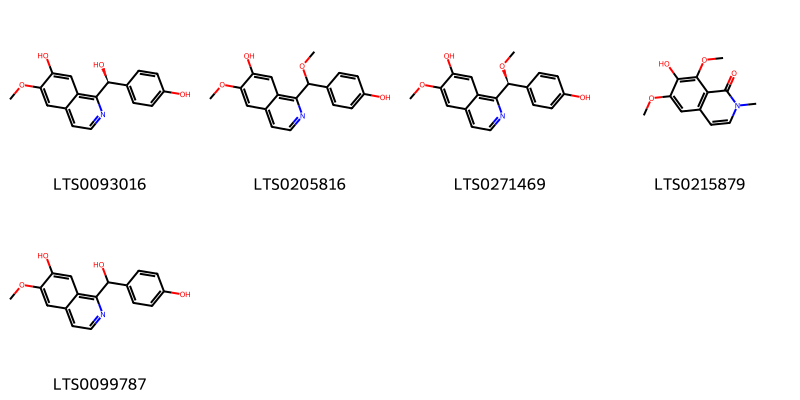{ width=100% }
    <figcaption>Hình ảnh cấu trúc hóa học của 5 hoạt chất thuộc nhóm Isoquinolines and derivatives gồm ['1-[(s)-hydroxy(4-hydroxyphenyl)methyl]-6-methoxyisoquinolin-7-ol (LTS0093016)', '1-[(4-hydroxyphenyl)(methoxy)methyl]-6-methoxyisoquinolin-7-ol (LTS0205816)', '1-[(s)-(4-hydroxyphenyl)(methoxy)methyl]-6-methoxyisoquinolin-7-ol (LTS0271469)', '7-hydroxy-6,8-dimethoxy-2-methylisoquinolin-1-one (LTS0215879)', '1-[hydroxy(4-hydroxyphenyl)methyl]-6-methoxyisoquinolin-7-ol (LTS0099787)'].</figcaption>
</figure>
#### Nhóm Organooxygen compounds
<figure markdown="span">
    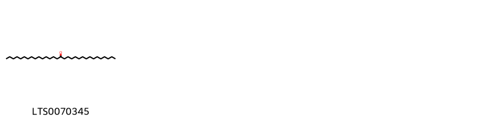{ width=100% }
    <figcaption>Hình ảnh cấu trúc hóa học của 1 hoạt chất thuộc nhóm Organooxygen compounds gồm ['palmitone (LTS0070345)'].</figcaption>
</figure>
#### Nhóm Protoberberine alkaloids and derivatives
<figure markdown="span">
    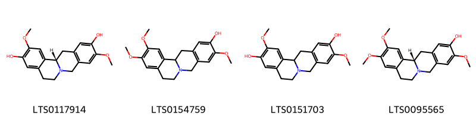{ width=100% }
    <figcaption>Hình ảnh cấu trúc hóa học của 4 hoạt chất thuộc nhóm Protoberberine alkaloids and derivatives gồm ['(12bs)-3,11-dimethoxy-7,8,12b,13-tetrahydro-5h-6-azatetraphene-2,10-diol (LTS0117914)', '3,10,11-trimethoxy-7,8,12b,13-tetrahydro-5h-6-azatetraphen-2-ol (LTS0154759)', 'isocoreximine (LTS0151703)', '(12bs)-3,10,11-trimethoxy-7,8,12b,13-tetrahydro-5h-6-azatetraphen-2-ol (LTS0095565)'].</figcaption>
</figure>
#### Nhóm Steroids and steroid derivatives
<figure markdown="span">
    { width=100% }
    <figcaption>Hình ảnh cấu trúc hóa học của 2 hoạt chất thuộc nhóm Steroids and steroid derivatives gồm ['stigmast-5-en-3-ol, (3β)- (LTS0204616)', 'sitosterol (LTS0168132)'].</figcaption>
</figure>

---

### Dược dân tộc học

Danh sách các quốc gia có sử dụng *Annona cherimolia* trong điều trị các bệnh. 

| Country   | Disease             | Bệnh                                                                                                                                                                                                |
|:----------|:--------------------|:----------------------------------------------------------------------------------------------------------------------------------------------------------------------------------------------------|
| Guatemala | Pediculicide        | MYMEMORY WARNING: YOU USED ALL AVAILABLE FREE TRANSLATIONS FOR TODAY. NEXT AVAILABLE IN  10 HOURS 30 MINUTES 05 SECONDS VISIT HTTPS://MYMEMORY.TRANSLATED.NET/DOC/USAGELIMITS.PHP TO TRANSLATE MORE |
| Haiti     | Stomachic           | MYMEMORY WARNING: YOU USED ALL AVAILABLE FREE TRANSLATIONS FOR TODAY. NEXT AVAILABLE IN  10 HOURS 30 MINUTES 02 SECONDS VISIT HTTPS://MYMEMORY.TRANSLATED.NET/DOC/USAGELIMITS.PHP TO TRANSLATE MORE |
| Mexico    | Insecticide, Poison | MYMEMORY WARNING: YOU USED ALL AVAILABLE FREE TRANSLATIONS FOR TODAY. NEXT AVAILABLE IN  10 HOURS 29 MINUTES 59 SECONDS VISIT HTTPS://MYMEMORY.TRANSLATED.NET/DOC/USAGELIMITS.PHP TO TRANSLATE MORE |

---

---
## Annona cherimoya
### Thông tin về thực vật

!!! info "Phân loại thực vật của *N/A* từ GIBF:"
    - **Kingdom:** Plantae
    - **Phylum:** Tracheophyta
    - **Order:** Magnoliales
    - **Family:** Annonaceae
    - **Genus:** Annona
    - **Species:** *N/A*

 

| Label (VI)   | Label (EN)   | Scientific Name   | Descriptions (VI)   | Descriptions (EN)   | Also Known As (VI)   | Also Known As (EN)   |
|:-------------|:-------------|:------------------|:--------------------|:--------------------|:---------------------|:---------------------|
| N/A          | N/A          | Annona cherimolia | loài thực vật       | species of plant    | ['']                 | ['']                 |

#### Phân bố trên thế giới

**Từ CSDL GIBF** Thailand, Dominica, French Guiana, Senegal, Northern Mariana Islands, Martinique, Jamaica, Indonesia, Haiti, Colombia, Sri Lanka, Dominican Republic, Puerto Rico, India, Réunion, Nigeria, Antigua and Barbuda, Belize, Panama, Brazil, Peru, Mexico, Nepal, Benin, Uruguay, Argentina, South Africa, Tanzania, United Republic of, Costa Rica, Paraguay, United States of America

#### Phân bố tại Việt Nam

**Từ CSDL GIBF**: Không có ghi nhận ở Việt Nam

---
### Thành phần hóa học
        
- Theo cơ sở dữ liệu lotus: Từ loài *N/A* đã phân lập và xác định được Chưa có hoạt chất nào được phân lập. hoạt chất thuộc về các nhóm Không có hoạt chất nào được phân lập. 

Không có hình ảnh nào được tạo ra

---

### Dược dân tộc học

Danh sách các quốc gia có sử dụng *N/A* trong điều trị các bệnh. 

| Country   | Disease      | Bệnh                                                                                                                                                                                                |
|:----------|:-------------|:----------------------------------------------------------------------------------------------------------------------------------------------------------------------------------------------------|
| Haiti     | Parasiticide | MYMEMORY WARNING: YOU USED ALL AVAILABLE FREE TRANSLATIONS FOR TODAY. NEXT AVAILABLE IN  10 HOURS 29 MINUTES 30 SECONDS VISIT HTTPS://MYMEMORY.TRANSLATED.NET/DOC/USAGELIMITS.PHP TO TRANSLATE MORE |

---

---
## Annona dioica
### Thông tin về thực vật

!!! info "Phân loại thực vật của *Annona dioica* từ GIBF:"
    - **Kingdom:** Plantae
    - **Phylum:** Tracheophyta
    - **Order:** Magnoliales
    - **Family:** Annonaceae
    - **Genus:** Annona
    - **Species:** *Annona dioica*

 

| Label (VI)   | Label (EN)   | Scientific Name   | Descriptions (VI)   | Descriptions (EN)   | Also Known As (VI)   | Also Known As (EN)   |
|:-------------|:-------------|:------------------|:--------------------|:--------------------|:---------------------|:---------------------|
| N/A          | N/A          | Annona dioica     | loài thực vật       | species of plant    | ['']                 | ['']                 |

#### Phân bố trên thế giới

**Từ CSDL GIBF** Paraguay, Bolivia (Plurinational State of), Brazil

#### Phân bố tại Việt Nam

**Từ CSDL GIBF**: Không có ghi nhận ở Việt Nam

---
### Thành phần hóa học
        
- Theo cơ sở dữ liệu lotus: Từ loài *Annona dioica* đã phân lập và xác định được 4 hoạt chất thuộc về các nhóm Macrolides and analogues, Quinolines and derivatives, Aporphines. 

|    | chemicalTaxonomyClassyfireClass   |   smiles_count |
|---:|:----------------------------------|---------------:|
|  0 | Aporphines                        |              1 |
|  1 | Macrolides and analogues          |              1 |
|  2 | Quinolines and derivatives        |              2 |

#### Nhóm Aporphines
<figure markdown="span">
    { width=100% }
    <figcaption>Hình ảnh cấu trúc hóa học của 1 hoạt chất thuộc nhóm Aporphines gồm ['liriodenine (LTS0132761)'].</figcaption>
</figure>
#### Nhóm Macrolides and analogues
<figure markdown="span">
    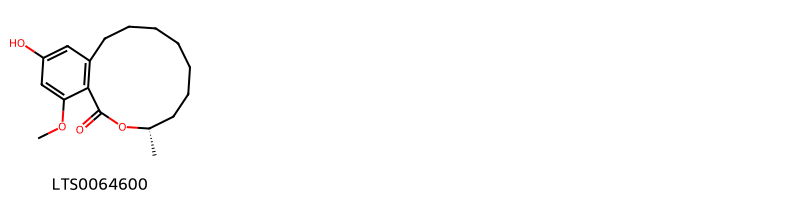{ width=100% }
    <figcaption>Hình ảnh cấu trúc hóa học của 1 hoạt chất thuộc nhóm Macrolides and analogues gồm ['lasiodiplodin (LTS0064600)'].</figcaption>
</figure>
#### Nhóm Quinolines and derivatives
<figure markdown="span">
    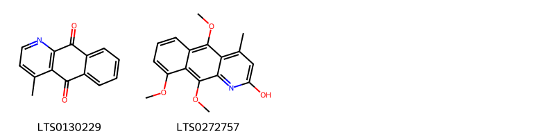{ width=100% }
    <figcaption>Hình ảnh cấu trúc hóa học của 2 hoạt chất thuộc nhóm Quinolines and derivatives gồm ['cleistopholine (LTS0130229)', '5,9,10-trimethoxy-4-methylbenzo[g]quinolin-2-ol (LTS0272757)'].</figcaption>
</figure>

---

### Dược dân tộc học

Danh sách các quốc gia có sử dụng *Annona dioica* trong điều trị các bệnh. 

| Country   | Disease   | Bệnh                                                                                                                                                                                                |
|:----------|:----------|:----------------------------------------------------------------------------------------------------------------------------------------------------------------------------------------------------|
| Brazil    | Emollient | MYMEMORY WARNING: YOU USED ALL AVAILABLE FREE TRANSLATIONS FOR TODAY. NEXT AVAILABLE IN  10 HOURS 29 MINUTES 05 SECONDS VISIT HTTPS://MYMEMORY.TRANSLATED.NET/DOC/USAGELIMITS.PHP TO TRANSLATE MORE |

---

---
## Annona glabra
### Thông tin về thực vật

!!! info "Phân loại thực vật của *Annona glabra* từ GIBF:"
    - **Kingdom:** Plantae
    - **Phylum:** Tracheophyta
    - **Order:** Magnoliales
    - **Family:** Annonaceae
    - **Genus:** Annona
    - **Species:** *Annona glabra*

 

| Label (VI)   | Label (EN)   | Scientific Name   | Descriptions (VI)   | Descriptions (EN)   | Also Known As (VI)   | Also Known As (EN)                                                                                                                                           |
|:-------------|:-------------|:------------------|:--------------------|:--------------------|:---------------------|:-------------------------------------------------------------------------------------------------------------------------------------------------------------|
| N/A          | N/A          | Annona glabra     | loài thực vật       | species of plant    | ['Nê']               | ['corkwood', 'alligator apple', 'bobwood', "bullock's heart", 'kaitambo', 'kaitambu', 'monkey-apple', 'pond apple', 'uto ni bulumakau', 'uto ni mbulumakau'] |

#### Phân bố trên thế giới

**Từ CSDL GIBF** Haiti, Sri Lanka, Antigua and Barbuda, Dominican Republic, Grenada, Brazil, Maldives, Puerto Rico, Dominica, India, French Guiana, United States of America, Virgin Islands (U.S.)

#### Phân bố tại Việt Nam

**Từ CSDL GIBF**: Không có ghi nhận ở Việt Nam

---
### Thành phần hóa học
        
- Theo cơ sở dữ liệu lotus: Từ loài *Annona glabra* đã phân lập và xác định được 218 hoạt chất thuộc về các nhóm Quinolines and derivatives, Organooxygen compounds, Aporphines, Flavonoids, Dihydroisoquinolines, Isoquinolines and derivatives, Proaporphines, Prenol lipids, Carboxylic acids and derivatives, Fatty Acyls, Protoberberine alkaloids and derivatives, Phenols, Cinnamic acids and derivatives, Tetrahydroisoquinolines, Steroids and steroid derivatives, Benzene and substituted derivatives. 

|    | chemicalTaxonomyClassyfireClass          |   smiles_count |
|---:|:-----------------------------------------|---------------:|
|  0 | Aporphines                               |             26 |
|  1 | Benzene and substituted derivatives      |              1 |
|  2 | Carboxylic acids and derivatives         |             14 |
|  3 | Cinnamic acids and derivatives           |              3 |
|  4 | Dihydroisoquinolines                     |              1 |
|  5 | Fatty Acyls                              |             58 |
|  6 | Flavonoids                               |              1 |
|  7 | Isoquinolines and derivatives            |              4 |
|  8 | Organooxygen compounds                   |              2 |
|  9 | Phenols                                  |              1 |
| 10 | Prenol lipids                            |             79 |
| 11 | Proaporphines                            |              2 |
| 12 | Protoberberine alkaloids and derivatives |              8 |
| 13 | Quinolines and derivatives               |              2 |
| 14 | Steroids and steroid derivatives         |             11 |
| 15 | Tetrahydroisoquinolines                  |              2 |

#### Nhóm Aporphines
<figure markdown="span">
    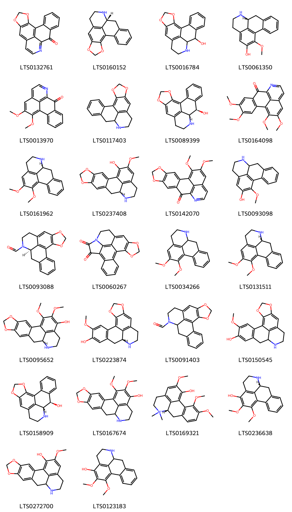{ width=100% }
    <figcaption>Hình ảnh cấu trúc hóa học của 26 hoạt chất thuộc nhóm Aporphines gồm ['liriodenine (LTS0132761)', 'anonaine (LTS0160152)', '3,5-dioxa-11-azapentacyclo[10.7.1.0²,⁶.0⁸,²⁰.0¹⁴,¹⁹]icosa-1,6,8(20),14,16,18-hexaen-13-ol (LTS0016784)', 'r-(-)-asimilobine (LTS0061350)', 'lysicamine (LTS0013970)', '3,5-dioxa-11-azapentacyclo[10.7.1.0²,⁶.0⁸,²⁰.0¹⁴,¹⁹]icosa-1(20),2(6),7,14,16,18-hexaene (LTS0117403)', '(12s,13r)-3,5-dioxa-11-azapentacyclo[10.7.1.0²,⁶.0⁸,²⁰.0¹⁴,¹⁹]icosa-1,6,8(20),14,16,18-hexaen-13-ol (LTS0089399)', '4,5,15,16-tetramethoxy-10-azatetracyclo[7.7.1.0²,⁷.0¹³,¹⁷]heptadeca-1(16),2(7),3,5,9(17),10,12,14-octaen-8-one (LTS0164098)', '(9s)-15,16-dimethoxy-10-azatetracyclo[7.7.1.0²,⁷.0¹³,¹⁷]heptadeca-1(16),2,4,6,13(17),14-hexaene (LTS0161962)', '(12s)-18-methoxy-5,7-dioxa-13-azapentacyclo[10.7.1.0²,¹⁰.0⁴,⁸.0¹⁶,²⁰]icosa-1(19),2,4(8),9,16(20),17-hexaen-19-ol (LTS0237408)', 'oxonantenine (LTS0142070)', '16-methoxy-10-azatetracyclo[7.7.1.0²,⁷.0¹³,¹⁷]heptadeca-1(17),2,4,6,13,15-hexaen-15-ol (LTS0093098)', '(12r)-3,5-dioxa-11-azapentacyclo[10.7.1.0²,⁶.0⁸,²⁰.0¹⁴,¹⁹]icosa-1(20),2(6),7,14,16,18-hexaene-11-carbaldehyde (LTS0093088)', '3,5-dioxa-11-azahexacyclo[9.9.2.0²,⁶.0⁸,²¹.0¹⁴,²².0¹⁵,²⁰]docosa-1(21),2(6),7,14(22),15(20),16,18-heptaene-12,13-dione (LTS0060267)', 'nornuciferine (LTS0034266)', '(9r)-15,16-dimethoxy-10-azatetracyclo[7.7.1.0²,⁷.0¹³,¹⁷]heptadeca-1(16),2,4,6,13(17),14-hexaene (LTS0131511)', 's-(+)-3-hydroxynornantenine (LTS0095652)', 'r-(-)-actinodaphnine (LTS0223874)', '3,5-dioxa-11-azapentacyclo[10.7.1.0²,⁶.0⁸,²⁰.0¹⁴,¹⁹]icosa-1(20),2(6),7,14,16,18-hexaene-11-carbaldehyde (LTS0091403)', '17-methoxy-3,5-dioxa-11-azapentacyclo[10.7.1.0²,⁶.0⁸,²⁰.0¹⁴,¹⁹]icosa-1(20),2(6),7,14(19),15,17-hexaen-16-ol (LTS0150545)', '(12r,13r)-3,5-dioxa-11-azapentacyclo[10.7.1.0²,⁶.0⁸,²⁰.0¹⁴,¹⁹]icosa-1,6,8(20),14,16,18-hexaen-13-ol (LTS0158909)', '18,19-dimethoxy-5,7-dioxa-13-azapentacyclo[10.7.1.0²,¹⁰.0⁴,⁸.0¹⁶,²⁰]icosa-1(19),2,4(8),9,16(20),17-hexaen-17-ol (LTS0167674)', '(9s)-16-hydroxy-3,4,15-trimethoxy-10,10-dimethyl-10-azatetracyclo[7.7.1.0²,⁷.0¹³,¹⁷]heptadeca-1(16),2(7),3,5,13(17),14-hexaen-10-ium (LTS0169321)', 'r-(-)-3-hydroxynornuciferine (LTS0236638)', '18-methoxy-5,7-dioxa-13-azapentacyclo[10.7.1.0²,¹⁰.0⁴,⁸.0¹⁶,²⁰]icosa-1(19),2,4(8),9,16(20),17-hexaen-19-ol (LTS0272700)', '15,16-dimethoxy-10-azatetracyclo[7.7.1.0²,⁷.0¹³,¹⁷]heptadeca-1(16),2,4,6,13(17),14-hexaen-14-ol (LTS0123183)'].</figcaption>
</figure>
#### Nhóm Benzene and substituted derivatives
<figure markdown="span">
    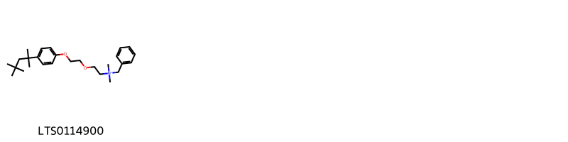{ width=100% }
    <figcaption>Hình ảnh cấu trúc hóa học của 1 hoạt chất thuộc nhóm Benzene and substituted derivatives gồm ['benzethonium (LTS0114900)'].</figcaption>
</figure>
#### Nhóm Carboxylic acids and derivatives
<figure markdown="span">
    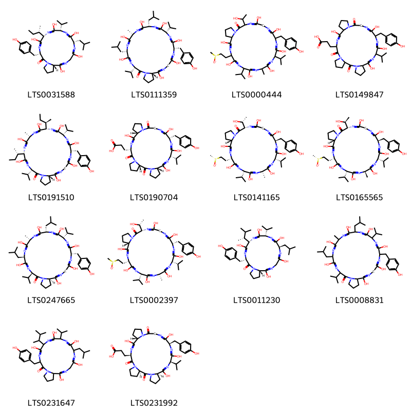{ width=100% }
    <figcaption>Hình ảnh cấu trúc hóa học của 14 hoạt chất thuộc nhóm Carboxylic acids and derivatives gồm ['(6s,9s,12s,15s,20as)-12-[(2s)-butan-2-yl]-1,4,7,10,13-pentahydroxy-15-[(4-hydroxyphenyl)methyl]-9-isopropyl-6-(2-methylpropyl)-3h,6h,9h,12h,15h,18h,19h,20h,20ah-pyrrolo[1,2-a]1,4,7,10,13,16-hexaazacyclooctadecan-16-one (LTS0031588)', '(6s,9s,12s,15s,18s,21s,26as)-1,4,7,10,13,16,19-heptahydroxy-6-[(4-hydroxyphenyl)methyl]-9,21-diisopropyl-15-methyl-12,18-bis(2-methylpropyl)-3h,6h,9h,12h,15h,18h,21h,24h,25h,26h,26ah-pyrrolo[1,2-a]1,4,7,10,13,16,19,22-octaazacyclotetracosan-22-one (LTS0111359)', '1,4,7,10,13,16,19-heptahydroxy-21-(1-hydroxyethyl)-15-[(4-hydroxyphenyl)methyl]-6,12-diisopropyl-3-(2-methanesulfinylethyl)-9-methyl-3h,6h,9h,12h,15h,18h,21h,24h,25h,26h,26ah-pyrrolo[1,2-a]1,4,7,10,13,16,19,22-octaazacyclotetracosan-22-one (LTS0000444)', '3-{11,20,23,26-tetrahydroxy-21-[(4-hydroxyphenyl)methyl]-24-isopropyl-2,8,17-trioxo-1,7,10,16,19,22,25-heptaazatetracyclo[25.3.0.0³,⁷.0¹²,¹⁶]triaconta-10,19,22,25-tetraen-9-yl}propanoic acid (LTS0149847)', '(6s,9s,12s,15s,18s,21s,26as)-12-[(2r)-butan-2-yl]-18-[(2s)-butan-2-yl]-1,4,7,10,13,16,19-heptahydroxy-6-[(4-hydroxyphenyl)methyl]-9,21-diisopropyl-15-methyl-3h,6h,9h,12h,15h,18h,21h,24h,25h,26h,26ah-pyrrolo[1,2-a]1,4,7,10,13,16,19,22-octaazacyclotetracosan-22-one (LTS0191510)', '3-[(3s,9s,12s,21s,24s,27s)-11,20,23,26-tetrahydroxy-21-[(4-hydroxyphenyl)methyl]-24-isopropyl-2,8,17-trioxo-1,7,10,16,19,22,25-heptaazatetracyclo[25.3.0.0³,⁷.0¹²,¹⁶]triaconta-10,19,22,25-tetraen-9-yl]propanoic acid (LTS0190704)', '(3s,6s,9s,12s,15r,21s,26as)-1,4,7,10,13,16,19-heptahydroxy-21-[(1r)-1-hydroxyethyl]-15-[(4-hydroxyphenyl)methyl]-6,12-diisopropyl-3-{2-[(r)-methanesulfinyl]ethyl}-9-methyl-3h,6h,9h,12h,15h,18h,21h,24h,25h,26h,26ah-pyrrolo[1,2-a]1,4,7,10,13,16,19,22-octaazacyclotetracosan-22-one (LTS0141165)', '(3s,6s,9r,12s,15r,21s,26as)-1,4,7,10,13,16,19-heptahydroxy-21-[(1s)-1-hydroxyethyl]-15-[(4-hydroxyphenyl)methyl]-6,12-diisopropyl-3-{2-[(r)-methanesulfinyl]ethyl}-9-methyl-3h,6h,9h,12h,15h,18h,21h,24h,25h,26h,26ah-pyrrolo[1,2-a]1,4,7,10,13,16,19,22-octaazacyclotetracosan-22-one (LTS0165565)', '(6s,9s,12s,15s,18r,21r,26ar)-1,4,7,10,13,16,19-heptahydroxy-6-[(4-hydroxyphenyl)methyl]-9,21-diisopropyl-15-methyl-12,18-bis(2-methylpropyl)-3h,6h,9h,12h,15h,18h,21h,24h,25h,26h,26ah-pyrrolo[1,2-a]1,4,7,10,13,16,19,22-octaazacyclotetracosan-22-one (LTS0247665)', '(3s,6s,9s,12s,15s,21s,26as)-1,4,7,10,13,16,19-heptahydroxy-21-[(1r)-1-hydroxyethyl]-15-[(4-hydroxyphenyl)methyl]-6,12-diisopropyl-3-(2-methanesulfinylethyl)-9-methyl-3h,6h,9h,12h,15h,18h,21h,24h,25h,26h,26ah-pyrrolo[1,2-a]1,4,7,10,13,16,19,22-octaazacyclotetracosan-22-one (LTS0002397)', '(6r,9s,12s,15s,20as)-1,4,7,10,13-pentahydroxy-15-[(4-hydroxyphenyl)methyl]-9-isopropyl-12-[(2r)-3-methylbutan-2-yl]-6-(2-methylpropyl)-3h,6h,9h,12h,15h,18h,19h,20h,20ah-pyrrolo[1,2-a]1,4,7,10,13,16-hexaazacyclooctadecan-16-one (LTS0011230)', '1,4,7,10,13,16,19-heptahydroxy-6-[(4-hydroxyphenyl)methyl]-9,21-diisopropyl-15-methyl-12,18-bis(2-methylpropyl)-3h,6h,9h,12h,15h,18h,21h,24h,25h,26h,26ah-pyrrolo[1,2-a]1,4,7,10,13,16,19,22-octaazacyclotetracosan-22-one (LTS0008831)', '1,4,7,10,13-pentahydroxy-15-[(4-hydroxyphenyl)methyl]-9-isopropyl-12-(3-methylbutan-2-yl)-6-(2-methylpropyl)-3h,6h,9h,12h,15h,18h,19h,20h,20ah-pyrrolo[1,2-a]1,4,7,10,13,16-hexaazacyclooctadecan-16-one (LTS0231647)', '3-[(3r,9r,12s,21r,24r,27r)-11,20,23,26-tetrahydroxy-21-[(4-hydroxyphenyl)methyl]-24-isopropyl-2,8,17-trioxo-1,7,10,16,19,22,25-heptaazatetracyclo[25.3.0.0³,⁷.0¹²,¹⁶]triaconta-10,19,22,25-tetraen-9-yl]propanoic acid (LTS0231992)'].</figcaption>
</figure>
#### Nhóm Cinnamic acids and derivatives
<figure markdown="span">
    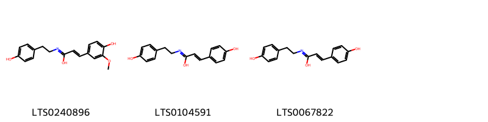{ width=100% }
    <figcaption>Hình ảnh cấu trúc hóa học của 3 hoạt chất thuộc nhóm Cinnamic acids and derivatives gồm ['3-(4-hydroxy-3-methoxyphenyl)-n-[2-(4-hydroxyphenyl)ethyl]prop-2-enimidic acid (LTS0240896)', '3-(4-hydroxyphenyl)-n-[2-(4-hydroxyphenyl)ethyl]prop-2-enimidic acid (LTS0104591)', '(2e)-3-(4-hydroxyphenyl)-n-[2-(4-hydroxyphenyl)ethyl]prop-2-enimidic acid (LTS0067822)'].</figcaption>
</figure>
#### Nhóm Dihydroisoquinolines
<figure markdown="span">
    { width=100% }
    <figcaption>Hình ảnh cấu trúc hóa học của 1 hoạt chất thuộc nhóm Dihydroisoquinolines gồm ['pycnarrhine (LTS0238338)'].</figcaption>
</figure>
#### Nhóm Fatty Acyls
<figure markdown="span">
    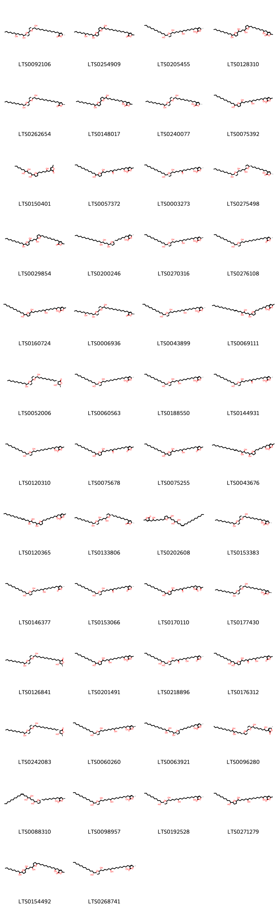{ width=100% }
    <figcaption>Hình ảnh cấu trúc hóa học của 58 hoạt chất thuộc nhóm Fatty Acyls gồm ['annonin i (LTS0092106)', "3-{13-[5'-(1,5-dihydroxyundecyl)-[2,2'-bioxolan]-5-yl]-13-hydroxytridecyl}-5-methyl-5h-furan-2-one (LTS0254909)", 'annonacin (LTS0205455)', 'purpureacin-1 (LTS0128310)', "(5r)-3-[(13r)-13-hydroxy-13-[(2r,2'r,5r,5'r)-5'-[(1r)-1-hydroxyundecyl]-[2,2'-bioxolan]-5-yl]tridecyl]-5-methyl-5h-furan-2-one (LTS0262654)", "3-{2,11-dihydroxy-11-[5'-(1-hydroxyundecyl)-[2,2'-bioxolan]-5-yl]undecyl}-5-methyl-5h-furan-2-one (LTS0148017)", "(5s)-3-[(2r,11r)-2,11-dihydroxy-11-[(2r,2'r,5r,5'r)-5'-[(1s)-1-hydroxyundecyl]-[2,2'-bioxolan]-5-yl]undecyl]-5-methyl-5h-furan-2-one (LTS0240077)", 'annonacin (LTS0075392)', '3-{2-hydroxy-6-[5-(1,4,5-trihydroxyundecyl)oxolan-2-yl]hexyl}-5-methyl-5h-furan-2-one (LTS0150401)', '3-{2,13-dihydroxy-13-[5-(1-hydroxytridecyl)oxolan-2-yl]-8-oxotridecyl}-5-methyl-5h-furan-2-one (LTS0057372)', '(5s)-3-[(2r,13r)-2,13-dihydroxy-13-[(2r,5r)-5-[(1r)-1-hydroxytridecyl]oxolan-2-yl]-8-oxotridecyl]-5-methyl-5h-furan-2-one (LTS0003273)', '(5s)-3-[(2r)-9-[(2r,5s)-5-[(1s,4r)-1,4-dihydroxy-4-[(2r,5r)-5-[(1r)-1-hydroxyundecyl]oxolan-2-yl]butyl]oxolan-2-yl]-2-hydroxynonyl]-5-methyl-5h-furan-2-one (LTS0275498)', '3-[9-(5-{1,4-dihydroxy-4-[5-(1-hydroxyundecyl)oxolan-2-yl]butyl}oxolan-2-yl)nonyl]-5-methyl-5h-furan-2-one (LTS0029854)', 'gigantetrocin a (LTS0200246)', '(5r)-5-methyl-3-[(2s,8r,13r)-2,8,13-trihydroxy-13-[(2r,5r)-5-[(1r)-1-hydroxytridecyl]oxolan-2-yl]tridecyl]-5h-furan-2-one (LTS0270316)', '(5s)-3-[(13r)-13-hydroxy-13-[(2r,5r)-5-[(1r)-1-hydroxytridecyl]oxolan-2-yl]tridecyl]-5-methyl-5h-furan-2-one (LTS0276108)', '5-methyl-3-{2,8,15-trihydroxy-15-[5-(1-hydroxytridecyl)oxolan-2-yl]pentadecyl}-5h-furan-2-one (LTS0160724)', "(5r)-3-[(13s)-13-[(2s,2's,5s,5's)-5'-[(1r,5s)-1,5-dihydroxyundecyl]-[2,2'-bioxolan]-5-yl]-13-hydroxytridecyl]-5-methyl-5h-furan-2-one (LTS0006936)", '(5s)-5-methyl-3-[(2r,8r,15r)-2,8,15-trihydroxy-15-[(2r,5r)-5-[(1r)-1-hydroxytridecyl]oxolan-2-yl]pentadecyl]-5h-furan-2-one (LTS0043899)', '3-{2-hydroxy-7-[5-(1,4,5-trihydroxyhenicos-8-en-1-yl)oxolan-2-yl]heptyl}-5-methyl-5h-furan-2-one (LTS0069111)', "(3s,4r,5s)-4-hydroxy-3-[(11r)-11-hydroxy-11-[(2r,2'r,5r,5'r)-5'-[(1s)-1-hydroxyundecyl]-[2,2'-bioxolan]-5-yl]undecyl]-5-methyloxolan-2-one (LTS0052006)", '(5s)-3-[(2r,13r)-2,13-dihydroxy-13-[(2r,5r)-5-[(1r)-1-hydroxytridecyl]oxolan-2-yl]tridecyl]-5-methyl-5h-furan-2-one (LTS0060563)', '(5s)-5-methyl-3-[(2r,10r,13r)-2,10,13-trihydroxy-13-[(2r,5r)-5-[(1r)-1-hydroxytridecyl]oxolan-2-yl]tridecyl]-5h-furan-2-one (LTS0188550)', '(5s)-3-[(2r,13s)-2,13-dihydroxy-13-[(2r,5r)-5-[(1r)-1-hydroxytridecyl]oxolan-2-yl]-8-oxotridecyl]-5-methyl-5h-furan-2-one (LTS0144931)', '3-[(13r)-2,13-dihydroxy-13-[(2r,5r)-5-[(1r)-1-hydroxytridecyl]oxolan-2-yl]tridecyl]-5-methyl-5h-furan-2-one (LTS0120310)', '3-{13-hydroxy-13-[5-(1-hydroxytridecyl)oxolan-2-yl]-8-oxotridecyl}-5-methyl-5h-furan-2-one (LTS0075678)', '3-{8,13-dihydroxy-13-[5-(1-hydroxytridecyl)oxolan-2-yl]tridecyl}-5-methyl-5h-furan-2-one (LTS0075255)', '3-(2-hydroxy-7-{5-[(8e)-1,4,5-trihydroxyhenicos-8-en-1-yl]oxolan-2-yl}heptyl)-5-methyl-5h-furan-2-one (LTS0043676)', '3-{2-hydroxy-9-[5-(1,4,5-trihydroxynonadec-8-en-1-yl)oxolan-2-yl]nonyl}-5-methyl-5h-furan-2-one (LTS0120365)', 'squamostatin d (LTS0133806)', 'gigantetronenin (LTS0202608)', "(5s)-3-[(2s,11r)-2,11-dihydroxy-11-[(2r,2'r,5r,5'r)-5'-[(1s)-1-hydroxyundecyl]-[2,2'-bioxolan]-5-yl]undecyl]-5-methyl-5h-furan-2-one (LTS0153383)", '(5s)-3-[(8r,13r)-8,13-dihydroxy-13-[(2r,5s)-5-[(1r)-1-hydroxytridecyl]oxolan-2-yl]tridecyl]-5-methyl-5h-furan-2-one (LTS0146377)', '(5s)-3-[(13r)-13-hydroxy-13-[(2r,5r)-5-[(1r)-1-hydroxytridecyl]oxolan-2-yl]-8-oxotridecyl]-5-methyl-5h-furan-2-one (LTS0153066)', '5-{11-hydroxy-11-[5-(1-hydroxytridecyl)oxolan-2-yl]-6-oxoundecyl}-3-(2-oxopropyl)oxolan-2-one (LTS0170110)', "(5r)-3-[(2r,11r)-2,11-dihydroxy-11-[(2r,2'r,5r,5'r)-5'-[(1r)-1-hydroxyundecyl]-[2,2'-bioxolan]-5-yl]undecyl]-5-methyl-5h-furan-2-one (LTS0177430)", "(4r,5s)-4-hydroxy-3-[(13r)-13-hydroxy-13-[(2r,2'r,5r,5'r)-5'-[(1s)-1-hydroxyundecyl]-[2,2'-bioxolan]-5-yl]tridecyl]-5-methyloxolan-2-one (LTS0126841)", '5-methyl-3-{2,10,13-trihydroxy-13-[5-(1-hydroxytridecyl)oxolan-2-yl]tridecyl}-5h-furan-2-one (LTS0201491)', '(5s)-3-[(6r,13r)-13-[(2r,5r)-5-[(1r,3s)-1,3-dihydroxytridecyl]oxolan-2-yl]-6,13-dihydroxy-10-oxotridecyl]-5-methyl-5h-furan-2-one (LTS0218896)', '3-{13-[5-(1,3-dihydroxytridecyl)oxolan-2-yl]-6,13-dihydroxy-10-oxotridecyl}-5-methyl-5h-furan-2-one (LTS0176312)', "(3s,4r,5s)-4-hydroxy-3-[(13r)-13-hydroxy-13-[(2r,2'r,5r,5'r)-5'-[(1s)-1-hydroxyundecyl]-[2,2'-bioxolan]-5-yl]tridecyl]-5-methyloxolan-2-one (LTS0242083)", '(5r)-5-methyl-3-[(2s,8s,15r)-2,8,15-trihydroxy-15-[(2r,5r)-5-[(1r)-1-hydroxytridecyl]oxolan-2-yl]pentadecyl]-5h-furan-2-one (LTS0060260)', '(5s)-3-[(2r)-2-hydroxy-9-[(2s,5s)-5-[(1s,4s,5s)-1,4,5-trihydroxyheptadecyl]oxolan-2-yl]nonyl]-5-methyl-5h-furan-2-one (LTS0063921)', "(5s)-3-[(2r,8s)-8-[(2s,2's,5s,5'r)-5'-(5,6-dihydroxyhexadecyl)-[2,2'-bioxolan]-5-yl]-2,8-dihydroxyoctyl]-5-methyl-5h-furan-2-one (LTS0096280)", '(5r)-3-[(2r)-2-hydroxy-9-[(2r,5s)-5-[(1s,4s,5s,8z)-1,4,5-trihydroxynonadec-8-en-1-yl]oxolan-2-yl]nonyl]-5-methyl-5h-furan-2-one (LTS0088310)', '(5s)-5-methyl-3-[(2r,10r,15r)-2,10,15-trihydroxy-15-[(2r,5r)-5-[(1s)-1-hydroxytridecyl]oxolan-2-yl]pentadecyl]-5h-furan-2-one (LTS0098957)', '(5s)-5-methyl-3-[(2r,10r,15r)-2,10,15-trihydroxy-15-[(2r,5r)-5-[(1r)-1-hydroxyundecyl]oxolan-2-yl]pentadecyl]-5h-furan-2-one (LTS0192528)', '5-methyl-3-{2,10,15-trihydroxy-15-[5-(1-hydroxyundecyl)oxolan-2-yl]pentadecyl}-5h-furan-2-one (LTS0271279)', '3-[11-(5-{1,4-dihydroxy-4-[5-(1-hydroxynonyl)oxolan-2-yl]butyl}oxolan-2-yl)-2-hydroxyundecyl]-5-methyl-5h-furan-2-one (LTS0154492)', '(5s)-5-methyl-3-[(2r,10r,15r)-2,10,15-trihydroxy-15-[(2r,5r)-5-[(1r)-1-hydroxytridecyl]oxolan-2-yl]pentadecyl]-5h-furan-2-one (LTS0268741)', "(5s)-3-[(2r,13r)-13-[(2r,2'r,5r,5'r)-5'-[(1s,4s)-1,4-dihydroxyundecyl]-[2,2'-bioxolan]-5-yl]-2,13-dihydroxytridecyl]-5-methyl-5h-furan-2-one (LTS0153845)", "(5s)-3-[(2r,8r)-8-[(2r,2'r,5r,5's)-5'-[(5s,6s)-5,6-dihydroxyhexadecyl]-[2,2'-bioxolan]-5-yl]-2,8-dihydroxyoctyl]-5-methyl-5h-furan-2-one (LTS0139026)", '5-methyl-3-{2,10,15-trihydroxy-15-[5-(1-hydroxytridecyl)oxolan-2-yl]pentadecyl}-5h-furan-2-one (LTS0100552)', '(5s)-3-[(2r)-11-[(2s,5s)-5-[(1s,4r)-1,4-dihydroxy-4-[(2r,5r)-5-[(1r)-1-hydroxynonyl]oxolan-2-yl]butyl]oxolan-2-yl]-2-hydroxyundecyl]-5-methyl-5h-furan-2-one (LTS0189149)', '(5s)-3-[(2r)-2-hydroxy-7-[(2s,5s)-5-[(1s,4s,5s,8e)-1,4,5-trihydroxyhenicos-8-en-1-yl]oxolan-2-yl]heptyl]-5-methyl-5h-furan-2-one (LTS0225561)', '(3s,5r)-5-[(11r)-11-hydroxy-11-[(2r,5r)-5-[(1r)-1-hydroxytridecyl]oxolan-2-yl]-6-oxoundecyl]-3-(2-oxopropyl)oxolan-2-one (LTS0051330)', "3-{13-[5'-(1,4-dihydroxyundecyl)-[2,2'-bioxolan]-5-yl]-2,13-dihydroxytridecyl}-5-methyl-5h-furan-2-one (LTS0215339)", "(5r)-3-[(2r,11r)-2,11-dihydroxy-11-[(2r,2'r,5r,5'r)-5'-[(1s)-1-hydroxyundecyl]-[2,2'-bioxolan]-5-yl]undecyl]-5-methyl-5h-furan-2-one (LTS0056847)"].</figcaption>
</figure>
#### Nhóm Flavonoids
<figure markdown="span">
    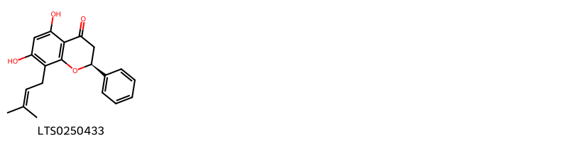{ width=100% }
    <figcaption>Hình ảnh cấu trúc hóa học của 1 hoạt chất thuộc nhóm Flavonoids gồm ['glabranin (LTS0250433)'].</figcaption>
</figure>
#### Nhóm Isoquinolines and derivatives
<figure markdown="span">
    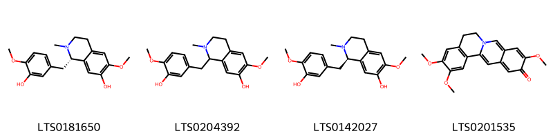{ width=100% }
    <figcaption>Hình ảnh cấu trúc hóa học của 4 hoạt chất thuộc nhóm Isoquinolines and derivatives gồm ['(+,-)-reticuline (LTS0181650)', 'reticuline (LTS0204392)', '(-)-reticuline (LTS0142027)', '3,10,11-trimethoxy-7,8-dihydro-6-azatetraphen-2-one (LTS0201535)'].</figcaption>
</figure>
#### Nhóm Organooxygen compounds
<figure markdown="span">
    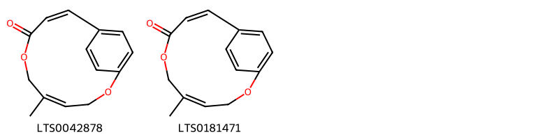{ width=100% }
    <figcaption>Hình ảnh cấu trúc hóa học của 2 hoạt chất thuộc nhóm Organooxygen compounds gồm ['(4z,9z)-5-methyl-2,7-dioxabicyclo[9.2.2]pentadeca-1(13),4,9,11,14-pentaen-8-one (LTS0042878)', '5-methyl-2,7-dioxabicyclo[9.2.2]pentadeca-1(13),4,9,11,14-pentaen-8-one (LTS0181471)'].</figcaption>
</figure>
#### Nhóm Phenols
<figure markdown="span">
    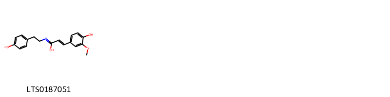{ width=100% }
    <figcaption>Hình ảnh cấu trúc hóa học của 1 hoạt chất thuộc nhóm Phenols gồm ['(2e)-3-(4-hydroxy-3-methoxyphenyl)-n-[2-(4-hydroxyphenyl)ethyl]prop-2-enimidic acid (LTS0187051)'].</figcaption>
</figure>
#### Nhóm Prenol lipids
<figure markdown="span">
    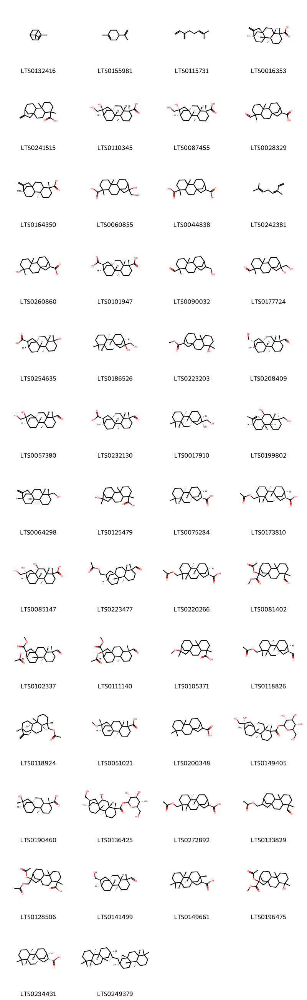{ width=100% }
    <figcaption>Hình ảnh cấu trúc hóa học của 79 hoạt chất thuộc nhóm Prenol lipids gồm ['α pinene (LTS0132416)', 'limonene,  (LTS0155981)', 'α-myrcene (LTS0115731)', 'ent-kaur-16-en-19-oic acid (LTS0016353)', '5,9-dimethyl-14-methylidenetetracyclo[11.2.1.0¹,¹⁰.0⁴,⁹]hexadecane-5-carboxylic acid (LTS0241515)', '(1s,4s,5r,9s,10r,13r,14s)-14-hydroxy-14-(hydroxymethyl)-5,9-dimethyltetracyclo[11.2.1.0¹,¹⁰.0⁴,⁹]hexadecane-5-carboxylic acid (LTS0110345)', 'diterpenoid sp-ii (LTS0087455)', '5-formyl-5,9-dimethyltetracyclo[11.2.1.0¹,¹⁰.0⁴,⁹]hexadecane-14-carboxylic acid (LTS0028329)', '(5r,9s,13s)-5,9-dimethyl-14-methylidenetetracyclo[11.2.1.0¹,¹⁰.0⁴,⁹]hexadecane-5-carboxylic acid (LTS0164350)', '14-hydroxy-14-(hydroxymethyl)-5,9-dimethyltetracyclo[11.2.1.0¹,¹⁰.0⁴,⁹]hexadecane-5-carboxylic acid (LTS0060855)', '5,9-dimethyltetracyclo[11.2.1.0¹,¹⁰.0⁴,⁹]hexadecane-5,14-dicarboxylic acid (LTS0044838)', 'β-ocimene (LTS0242381)', '5-hydroxy-5,9-dimethyltetracyclo[11.2.1.0¹,¹⁰.0⁴,⁹]hexadecane-14-carboxylic acid (LTS0260860)', '(1s,4s,5r,9s,10r,13r,14s)-5,9-dimethyltetracyclo[11.2.1.0¹,¹⁰.0⁴,⁹]hexadecane-5,14-dicarboxylic acid (LTS0101947)', '14-(hydroxymethyl)-5,9-dimethyltetracyclo[11.2.1.0¹,¹⁰.0⁴,⁹]hexadecane-5-carbaldehyde (LTS0090032)', '14-hydroxy-14-(hydroxymethyl)-5,9-dimethyltetracyclo[11.2.1.0¹,¹⁰.0⁴,⁹]hexadecane-5-carbaldehyde (LTS0177724)', '(1s,4s,5r,9s,10r,13r,14s)-5-hydroxy-5,9-dimethyltetracyclo[11.2.1.0¹,¹⁰.0⁴,⁹]hexadecane-14-carboxylic acid (LTS0254635)', '(1s,4r,9r,10r,13r,14s)-14-(hydroxymethyl)-5,5,9-trimethyltetracyclo[11.2.1.0¹,¹⁰.0⁴,⁹]hexadecan-14-ol (LTS0186526)', 'methyl 5-hydroxy-5,9-dimethyltetracyclo[11.2.1.0¹,¹⁰.0⁴,⁹]hexadecane-14-carboxylate (LTS0223203)', '(1s,4s,5r,9s,10r,13r,14r)-14-(hydroxymethyl)-5,9-dimethyltetracyclo[11.2.1.0¹,¹⁰.0⁴,⁹]hexadecane-5-carbaldehyde (LTS0208409)', '(1s,4s,5r,9s,10r,13r,14s)-14-hydroxy-14-(hydroxymethyl)-5,9-dimethyltetracyclo[11.2.1.0¹,¹⁰.0⁴,⁹]hexadecane-5-carbaldehyde (LTS0057380)', '(1s,4s,5r,9s,10r,13r,14s)-5-formyl-5,9-dimethyltetracyclo[11.2.1.0¹,¹⁰.0⁴,⁹]hexadecane-14-carboxylic acid (LTS0232130)', '(1s,4r,9r,10r,13r,14r)-14-(hydroxymethyl)-5,5,9-trimethyltetracyclo[11.2.1.0¹,¹⁰.0⁴,⁹]hexadecan-14-ol (LTS0017910)', '(1s,2s,4s,5s,9r,10s,13r)-5-(hydroxymethyl)-5,9,14-trimethyltetracyclo[11.2.1.0¹,¹⁰.0⁴,⁹]hexadec-14-en-2-ol (LTS0199802)', 'ent-kaurenol (LTS0064298)', '14-hydroxy-5,9,14-trimethyltetracyclo[11.2.1.0¹,¹⁰.0⁴,⁹]hexadecane-5-carboxylic acid (LTS0125479)', '(1s,4r,9r,10r,13r,14s)-5,5,9-trimethyltetracyclo[11.2.1.0¹,¹⁰.0⁴,⁹]hexadecane-14-carboxylic acid (LTS0075284)', '(1s,4s,5r,9s,10r,13r,14s)-5-[(acetyloxy)methyl]-5,9-dimethyltetracyclo[11.2.1.0¹,¹⁰.0⁴,⁹]hexadecane-14-carboxylic acid (LTS0173810)', '(1r,2s,4s,5r,9s,10s,13r,14r)-2,14-dihydroxy-14-(hydroxymethyl)-5,9-dimethyltetracyclo[11.2.1.0¹,¹⁰.0⁴,⁹]hexadecane-5-carboxylic acid (LTS0085147)', '[(1s,4s,5r,9s,10r,13r,14s)-5-formyl-5,9-dimethyltetracyclo[11.2.1.0¹,¹⁰.0⁴,⁹]hexadecan-14-yl]methyl acetate (LTS0223477)', '(1r,4s,5r,9s,10r,13r,14s)-5-[(acetyloxy)methyl]-5,9-dimethyltetracyclo[11.2.1.0¹,¹⁰.0⁴,⁹]hexadecane-14-carboxylic acid (LTS0220266)', 'methyl 14-(acetyloxy)-5-formyl-5,9-dimethyltetracyclo[11.2.1.0¹,¹⁰.0⁴,⁹]hexadecane-14-carboxylate (LTS0081402)', 'methyl (1s,4s,5r,9s,10r,13r,14r)-14-(acetyloxy)-5-formyl-5,9-dimethyltetracyclo[11.2.1.0¹,¹⁰.0⁴,⁹]hexadecane-14-carboxylate (LTS0102337)', 'methyl (1s,5r,9s,13r,14s)-14-(acetyloxy)-5-formyl-5,9-dimethyltetracyclo[11.2.1.0¹,¹⁰.0⁴,⁹]hexadecane-14-carboxylate (LTS0111140)', '14-methoxy-5,9,14-trimethyltetracyclo[11.2.1.0¹,¹⁰.0⁴,⁹]hexadecane-5-carboxylic acid (LTS0105371)', '[(1s,4s,5r,9s,10r,13r,14s)-14-formyl-5,9-dimethyltetracyclo[11.2.1.0¹,¹⁰.0⁴,⁹]hexadecan-5-yl]methyl acetate (LTS0118826)', '[(1s,4s,5s,9s,10r,13r)-5,9-dimethyl-14-methylidenetetracyclo[11.2.1.0¹,¹⁰.0⁴,⁹]hexadecan-5-yl]methyl acetate (LTS0118924)', '(1s,4s,5r,9s,10r,13r,14r)-14-methoxy-5,9,14-trimethyltetracyclo[11.2.1.0¹,¹⁰.0⁴,⁹]hexadecane-5-carboxylic acid (LTS0051021)', '5,5,9-trimethyltetracyclo[11.2.1.0¹,¹⁰.0⁴,⁹]hexadecane-14-carboxylic acid (LTS0200348)', '(2s,3r,4s,5s,6r)-3,4,5-trihydroxy-6-(hydroxymethyl)oxan-2-yl (1s,4s,5r,9s,10r,13r,14r)-14-hydroxy-14-(hydroxymethyl)-5,9-dimethyltetracyclo[11.2.1.0¹,¹⁰.0⁴,⁹]hexadecane-5-carboxylate (LTS0149405)', '(1s,5r,9s,13r,14r)-14-hydroxy-5,9,14-trimethyltetracyclo[11.2.1.0¹,¹⁰.0⁴,⁹]hexadecane-5-carboxylic acid (LTS0190460)', '(2s,3r,4s,5s,6r)-3,4,5-trihydroxy-6-(hydroxymethyl)oxan-2-yl (1r,2s,4s,5r,9s,10s,13r,14s)-2-hydroxy-14-(hydroxymethyl)-5,9-dimethyltetracyclo[11.2.1.0¹,¹⁰.0⁴,⁹]hexadecane-5-carboxylate (LTS0136425)', '(1r,4s,5r,9s,10r,14s)-5-[(acetyloxy)methyl]-5,9-dimethyltetracyclo[11.2.1.0¹,¹⁰.0⁴,⁹]hexadecane-14-carboxylic acid (LTS0272892)', '{5-formyl-5,9-dimethyltetracyclo[11.2.1.0¹,¹⁰.0⁴,⁹]hexadecan-14-yl}methyl acetate (LTS0133829)', '14-(acetyloxy)-14-[(acetyloxy)methyl]-5,9-dimethyltetracyclo[11.2.1.0¹,¹⁰.0⁴,⁹]hexadecane-5-carboxylic acid (LTS0128506)', '(1s,4s,5r,9s,10r,13r,14s)-14-(hydroxymethyl)-5,9-dimethyltetracyclo[11.2.1.0¹,¹⁰.0⁴,⁹]hexadecane-5-carbaldehyde (LTS0141499)', '(1r,4r,9s,10r,13s,14s)-5,5,9-trimethyltetracyclo[11.2.1.0¹,¹⁰.0⁴,⁹]hexadecane-14-carboxylic acid (LTS0149661)', 'methyl 14-(acetyloxy)-5-hydroxy-5,9-dimethyltetracyclo[11.2.1.0¹,¹⁰.0⁴,⁹]hexadecane-14-carboxylate (LTS0196475)', '(1s,4r,9r,10r,13r,14r)-5,5,9-trimethyltetracyclo[11.2.1.0¹,¹⁰.0⁴,⁹]hexadecane-14-carboxylic acid (LTS0234431)', '(4r,9r,10r,13r,14r)-5,5,9-trimethyl-14-[(1s,4r,9r,10r,13r,14r)-5,5,9-trimethyltetracyclo[11.2.1.0¹,¹⁰.0⁴,⁹]hexadecan-14-yl]tetracyclo[11.2.1.0¹,¹⁰.0⁴,⁹]hexadecane (LTS0249379)', '5,14-dimethyl 5,9-dimethyltetracyclo[11.2.1.0¹,¹⁰.0⁴,⁹]hexadecane-5,14-dicarboxylate (LTS0172332)', '(1s,4s,5r,9s,10s,13r,14r)-14-(acetyloxy)-14-(methoxycarbonyl)-5,9-dimethyltetracyclo[11.2.1.0¹,¹⁰.0⁴,⁹]hexadecane-5-carboxylic acid (LTS0114860)', '{14-formyl-5,9-dimethyltetracyclo[11.2.1.0¹,¹⁰.0⁴,⁹]hexadecan-5-yl}methyl acetate (LTS0158302)', '4-hydroxy-4-(3-hydroxybut-1-en-1-yl)-3,5,5-trimethylcyclohex-2-en-1-one (LTS0183737)', '(1s,4r,9r,10r,13r,14r)-5,5,9-trimethyl-14-[(1s,4r,9r,10r,13r,14r)-5,5,9-trimethyltetracyclo[11.2.1.0¹,¹⁰.0⁴,⁹]hexadecan-14-yl]tetracyclo[11.2.1.0¹,¹⁰.0⁴,⁹]hexadecane (LTS0120019)', '(1s,4s,5r,9s,10r,13r,14r)-14-(acetyloxy)-14-(methoxycarbonyl)-5,9-dimethyltetracyclo[11.2.1.0¹,¹⁰.0⁴,⁹]hexadecane-5-carboxylic acid (LTS0125720)', 'methyl (1s,4s,5r,9s,10r,13r,14s)-14-(acetyloxy)-5-formyl-5,9-dimethyltetracyclo[11.2.1.0¹,¹⁰.0⁴,⁹]hexadecane-14-carboxylate (LTS0274577)', '(1s,4s,5r,9s,10r,13r,14s)-5-(hydroxymethyl)-5,9-dimethyltetracyclo[11.2.1.0¹,¹⁰.0⁴,⁹]hexadecane-14-carboxylic acid (LTS0079048)', '(1s,4s,5r,9s,10s,13r)-14-(hydroxymethyl)-5,9-dimethyltetracyclo[11.2.1.0¹,¹⁰.0⁴,⁹]hexadec-14-ene-5-carboxylic acid (LTS0197678)', '5,9,14-trimethyltetracyclo[11.2.1.0¹,¹⁰.0⁴,⁹]hexadec-14-ene-5-carboxylic acid (LTS0034221)', '(4s)-4-hydroxy-4-(3-hydroxybut-1-en-1-yl)-3,5,5-trimethylcyclohex-2-en-1-one (LTS0225700)', '[(1s,4s,5r,9s,10r,13r)-5,9-dimethyl-14-methylidenetetracyclo[11.2.1.0¹,¹⁰.0⁴,⁹]hexadecan-5-yl]methanol (LTS0237645)', '(1s,4s,5r,9s,10r,13r,14r)-14-(acetyloxy)-14-[(acetyloxy)methyl]-5,9-dimethyltetracyclo[11.2.1.0¹,¹⁰.0⁴,⁹]hexadecane-5-carboxylic acid (LTS0158746)', '5,14-dimethyl (1s,4s,5r,9s,10r,13r,14s)-5,9-dimethyltetracyclo[11.2.1.0¹,¹⁰.0⁴,⁹]hexadecane-5,14-dicarboxylate (LTS0033235)', '(2s,3r,4s,5s,6r)-3,4,5-trihydroxy-6-(hydroxymethyl)oxan-2-yl (1r,2s,4s,5r,9s,10s,13r)-2-hydroxy-14-(hydroxymethyl)-5,9-dimethyltetracyclo[11.2.1.0¹,¹⁰.0⁴,⁹]hexadec-14-ene-5-carboxylate (LTS0044201)', 'methyl (1s,4s,5r,9s,10r,13r,14s)-5-hydroxy-5,9-dimethyltetracyclo[11.2.1.0¹,¹⁰.0⁴,⁹]hexadecane-14-carboxylate (LTS0265073)', '(1s,5r,9s,13r,14s)-5-[(acetyloxy)methyl]-5,9-dimethyltetracyclo[11.2.1.0¹,¹⁰.0⁴,⁹]hexadecane-14-carboxylic acid (LTS0014741)', '5-(hydroxymethyl)-5,9-dimethyltetracyclo[11.2.1.0¹,¹⁰.0⁴,⁹]hexadecane-14-carboxylic acid (LTS0275024)', '(1s,2s,4s,5s,9r,10s)-5-(hydroxymethyl)-5,9,14-trimethyltetracyclo[11.2.1.0¹,¹⁰.0⁴,⁹]hexadec-14-en-2-ol (LTS0068132)', '(6s,9r)-vomifoliol (LTS0052786)', '(1s,4s,5r,9s,10r,13r,14r)-14-hydroxy-5,9,14-trimethyltetracyclo[11.2.1.0¹,¹⁰.0⁴,⁹]hexadecane-5-carboxylic acid (LTS0267641)', '(1s,4s,5r,9s,10s,13r)-5,9,14-trimethyltetracyclo[11.2.1.0¹,¹⁰.0⁴,⁹]hexadec-14-ene-5-carboxylic acid (LTS0010882)', '[5-(hydroxymethyl)-5,9-dimethyltetracyclo[11.2.1.0¹,¹⁰.0⁴,⁹]hexadec-14-en-14-yl]methanol (LTS0004799)', '(1s,4s,5r,10r,13r,14s)-5-(hydroxymethyl)-5,9-dimethyltetracyclo[11.2.1.0¹,¹⁰.0⁴,⁹]hexadecane-14-carboxylic acid (LTS0016905)', '14-(acetyloxy)-14-(methoxycarbonyl)-5,9-dimethyltetracyclo[11.2.1.0¹,¹⁰.0⁴,⁹]hexadecane-5-carboxylic acid (LTS0011045)', '{5,9-dimethyl-14-methylidenetetracyclo[11.2.1.0¹,¹⁰.0⁴,⁹]hexadecan-5-yl}methanol (LTS0026759)', '[(1s,4s,5r,9s,10s,13r)-5-(hydroxymethyl)-5,9-dimethyltetracyclo[11.2.1.0¹,¹⁰.0⁴,⁹]hexadec-14-en-14-yl]methanol (LTS0022953)', '5-[(acetyloxy)methyl]-5,9-dimethyltetracyclo[11.2.1.0¹,¹⁰.0⁴,⁹]hexadecane-14-carboxylic acid (LTS0214978)', '14-(hydroxymethyl)-5,9-dimethyltetracyclo[11.2.1.0¹,¹⁰.0⁴,⁹]hexadec-14-ene-5-carboxylic acid (LTS0264299)'].</figcaption>
</figure>
#### Nhóm Proaporphines
<figure markdown="span">
    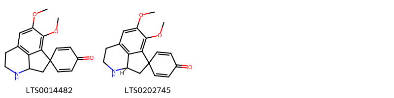{ width=100% }
    <figcaption>Hình ảnh cấu trúc hóa học của 2 hoạt chất thuộc nhóm Proaporphines gồm ["10',11'-dimethoxy-5'-azaspiro[cyclohexane-1,2'-tricyclo[6.3.1.0⁴,¹²]dodecane]-1'(11'),2,5,8'(12'),9'-pentaen-4-one (LTS0014482)", "(4'r)-10',11'-dimethoxy-5'-azaspiro[cyclohexane-1,2'-tricyclo[6.3.1.0⁴,¹²]dodecane]-1'(11'),2,5,8'(12'),9'-pentaen-4-one (LTS0202745)"].</figcaption>
</figure>
#### Nhóm Protoberberine alkaloids and derivatives
<figure markdown="span">
    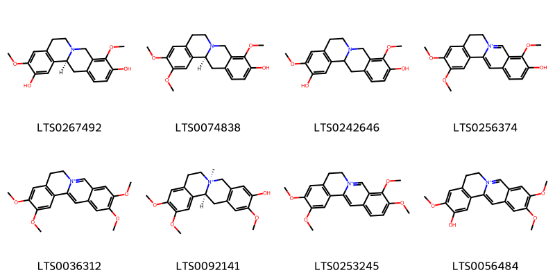{ width=100% }
    <figcaption>Hình ảnh cấu trúc hóa học của 8 hoạt chất thuộc nhóm Protoberberine alkaloids and derivatives gồm ['stepholidine (LTS0267492)', '(12bs)-4,10,11-trimethoxy-7,8,12b,13-tetrahydro-5h-6-azatetraphen-3-ol (LTS0074838)', 'coreximine (LTS0242646)', 'dehydrocorydalmine (LTS0256374)', 'pseudopalmatine (LTS0036312)', '(6s,12bs)-3-hydroxy-2,10,11-trimethoxy-6-methyl-7,8,12b,13-tetrahydro-5h-6-azatetraphen-6-ium (LTS0092141)', 'palmatine (LTS0253245)', 'pseudocolumbamine (LTS0056484)'].</figcaption>
</figure>
#### Nhóm Quinolines and derivatives
<figure markdown="span">
    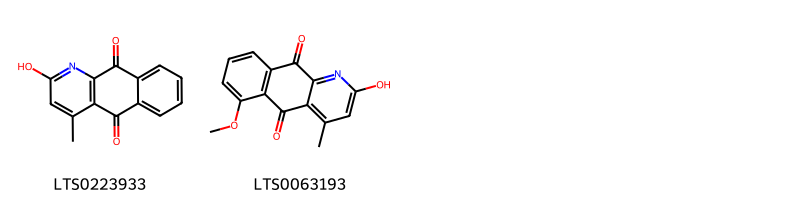{ width=100% }
    <figcaption>Hình ảnh cấu trúc hóa học của 2 hoạt chất thuộc nhóm Quinolines and derivatives gồm ['2-hydroxy-4-methylbenzo[g]quinoline-5,10-dione (LTS0223933)', '2-hydroxy-6-methoxy-4-methylbenzo[g]quinoline-5,10-dione (LTS0063193)'].</figcaption>
</figure>
#### Nhóm Steroids and steroid derivatives
<figure markdown="span">
    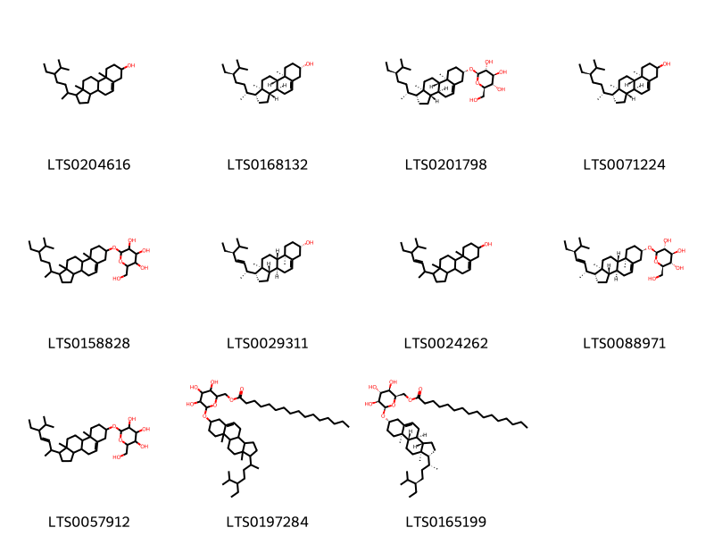{ width=100% }
    <figcaption>Hình ảnh cấu trúc hóa học của 11 hoạt chất thuộc nhóm Steroids and steroid derivatives gồm ['stigmast-5-en-3-ol, (3β)- (LTS0204616)', 'sitosterol (LTS0168132)', 'sitogluside (LTS0201798)', 'stigmast-5-en-3-ol (LTS0071224)', '2-{[1-(5-ethyl-6-methylheptan-2-yl)-9a,11a-dimethyl-1h,2h,3h,3ah,3bh,4h,6h,7h,8h,9h,9bh,10h,11h-cyclopenta[a]phenanthren-7-yl]oxy}-6-(hydroxymethyl)oxane-3,4,5-triol (LTS0158828)', 'phytosterol (LTS0029311)', 'stigmasterol (LTS0024262)', '(2r,3r,4s,5s,6r)-2-{[(1r,3as,3bs,7s,9ar,9bs,11ar)-1-[(2r,3e,5s)-5-ethyl-6-methylhept-3-en-2-yl]-9a,11a-dimethyl-1h,2h,3h,3ah,3bh,4h,6h,7h,8h,9h,9bh,10h,11h-cyclopenta[a]phenanthren-7-yl]oxy}-6-(hydroxymethyl)oxane-3,4,5-triol (LTS0088971)', '2-{[1-(5-ethyl-6-methylhept-3-en-2-yl)-9a,11a-dimethyl-1h,2h,3h,3ah,3bh,4h,6h,7h,8h,9h,9bh,10h,11h-cyclopenta[a]phenanthren-7-yl]oxy}-6-(hydroxymethyl)oxane-3,4,5-triol (LTS0057912)', '(6-{[1-(5-ethyl-6-methylheptan-2-yl)-9a,11a-dimethyl-1h,2h,3h,3ah,3bh,4h,6h,7h,8h,9h,9bh,10h,11h-cyclopenta[a]phenanthren-7-yl]oxy}-3,4,5-trihydroxyoxan-2-yl)methyl hexadecanoate (LTS0197284)', '[(2r,3r,4r,5s,6r)-6-{[(1r,3as,3bs,7s,9ar,9bs,11ar)-1-[(2r,5r)-5-ethyl-6-methylheptan-2-yl]-9a,11a-dimethyl-1h,2h,3h,3ah,3bh,4h,6h,7h,8h,9h,9bh,10h,11h-cyclopenta[a]phenanthren-7-yl]oxy}-3,4,5-trihydroxyoxan-2-yl]methyl hexadecanoate (LTS0165199)'].</figcaption>
</figure>
#### Nhóm Tetrahydroisoquinolines
<figure markdown="span">
    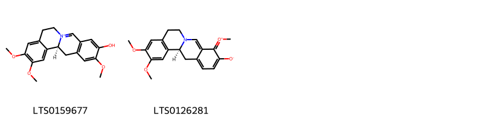{ width=100% }
    <figcaption>Hình ảnh cấu trúc hóa học của 2 hoạt chất thuộc nhóm Tetrahydroisoquinolines gồm ['(12bs)-3-hydroxy-2,10,11-trimethoxy-7,8,12b,13-tetrahydro-6λ⁵-azatetraphen-6-ylium (LTS0159677)', '[(12bs)-10,11-dimethoxy-3-oxido-7,8,12b,13-tetrahydro-6-azatetraphen-4-ylidene](methyl)oxidanium (LTS0126281)'].</figcaption>
</figure>

---

### Dược dân tộc học

Danh sách các quốc gia có sử dụng *Annona glabra* trong điều trị các bệnh. 

| Country   | Disease             | Bệnh                                                                                                                                                                                                |
|:----------|:--------------------|:----------------------------------------------------------------------------------------------------------------------------------------------------------------------------------------------------|
| Brazil    | Narcotic, Piscicide | MYMEMORY WARNING: YOU USED ALL AVAILABLE FREE TRANSLATIONS FOR TODAY. NEXT AVAILABLE IN  10 HOURS 28 MINUTES 38 SECONDS VISIT HTTPS://MYMEMORY.TRANSLATED.NET/DOC/USAGELIMITS.PHP TO TRANSLATE MORE |
| Cuba      | Vermifuge           | MYMEMORY WARNING: YOU USED ALL AVAILABLE FREE TRANSLATIONS FOR TODAY. NEXT AVAILABLE IN  10 HOURS 28 MINUTES 35 SECONDS VISIT HTTPS://MYMEMORY.TRANSLATED.NET/DOC/USAGELIMITS.PHP TO TRANSLATE MORE |
| Mexico    | Poison              | MYMEMORY WARNING: YOU USED ALL AVAILABLE FREE TRANSLATIONS FOR TODAY. NEXT AVAILABLE IN  10 HOURS 28 MINUTES 32 SECONDS VISIT HTTPS://MYMEMORY.TRANSLATED.NET/DOC/USAGELIMITS.PHP TO TRANSLATE MORE |

---

---
## Annona marcgravii
### Thông tin về thực vật

!!! info "Phân loại thực vật của *Annona montana* từ GIBF:"
    - **Kingdom:** Plantae
    - **Phylum:** Tracheophyta
    - **Order:** Magnoliales
    - **Family:** Annonaceae
    - **Genus:** Annona
    - **Species:** *Annona montana*

 

| Label (VI)   | Label (EN)   | Scientific Name   | Descriptions (VI)   | Descriptions (EN)   | Also Known As (VI)   | Also Known As (EN)   |
|:-------------|:-------------|:------------------|:--------------------|:--------------------|:---------------------|:---------------------|
| N/A          | N/A          | Annona marcgravii |                     | species of plant    | ['']                 | ['']                 |

#### Phân bố trên thế giới

**Từ CSDL GIBF** Honduras, nan, Venezuela (Bolivarian Republic of), Sri Lanka, Panama, Brazil

#### Phân bố tại Việt Nam

**Từ CSDL GIBF**: Không có ghi nhận ở Việt Nam

---
### Thành phần hóa học
        
- Theo cơ sở dữ liệu lotus: Từ loài *Annona montana* đã phân lập và xác định được Chưa có hoạt chất nào được phân lập. hoạt chất thuộc về các nhóm Không có hoạt chất nào được phân lập. 

Không có hình ảnh nào được tạo ra

---

### Dược dân tộc học

Danh sách các quốc gia có sử dụng *Annona montana* trong điều trị các bệnh. 

| Country   | Disease     | Bệnh                                                                                                                                                                                                |
|:----------|:------------|:----------------------------------------------------------------------------------------------------------------------------------------------------------------------------------------------------|
| Venezuela | Suppurative | MYMEMORY WARNING: YOU USED ALL AVAILABLE FREE TRANSLATIONS FOR TODAY. NEXT AVAILABLE IN  10 HOURS 27 MINUTES 49 SECONDS VISIT HTTPS://MYMEMORY.TRANSLATED.NET/DOC/USAGELIMITS.PHP TO TRANSLATE MORE |

---

---
## Annona muricata
### Thông tin về thực vật

!!! info "Phân loại thực vật của *Annona muricata* từ GIBF:"
    - **Kingdom:** Plantae
    - **Phylum:** Tracheophyta
    - **Order:** Magnoliales
    - **Family:** Annonaceae
    - **Genus:** Annona
    - **Species:** *Annona muricata*

 

| Label (VI)   | Label (EN)   | Scientific Name   | Descriptions (VI)   | Descriptions (EN)   | Also Known As (VI)   | Also Known As (EN)                                                               |
|:-------------|:-------------|:------------------|:--------------------|:--------------------|:---------------------|:---------------------------------------------------------------------------------|
| N/A          | N/A          | Annona muricata   | loài thực vật       | species of plant    | ['']                 | ['Brazilian pawpaw', 'graviola', 'guyabano', 'Prickly custard apple', 'soursop'] |

#### Phân bố trên thế giới

**Từ CSDL GIBF** Viet Nam, El Salvador, Philippines, Dominica, Guadeloupe, French Polynesia, French Guiana, Trinidad and Tobago, Senegal, Northern Mariana Islands, Jamaica, Indonesia, Haiti, Colombia, Sri Lanka, Dominican Republic, Saint Vincent and the Grenadines, Puerto Rico, Malaysia, India, Sao Tome and Principe, Bahamas, Saint Kitts and Nevis, Cuba, Guam, Bonaire, Sint Eustatius and Saba, Virgin Islands (U.S.), Barbados, Belize, Nicaragua, Panama, Brazil, Peru, Saint Lucia, Montserrat, Mexico, Tonga, Benin, Chinese Taipei, Grenada, South Africa, Tanzania, United Republic of, Fiji, Costa Rica, Bolivia (Plurinational State of), Ecuador, United States of America, Madagascar

#### Phân bố tại Việt Nam

**Từ CSDL GIBF**: Ninh Bình

---
### Thành phần hóa học
        
- Theo cơ sở dữ liệu lotus: Từ loài *Annona muricata* đã phân lập và xác định được 285 hoạt chất thuộc về các nhóm Organooxygen compounds, Aporphines, Benzopyrans, Isoquinolines and derivatives, Prenol lipids, Carboxylic acids and derivatives, Fatty Acyls, Protoberberine alkaloids and derivatives, Benzene and substituted derivatives. 

|    | chemicalTaxonomyClassyfireClass          |   smiles_count |
|---:|:-----------------------------------------|---------------:|
|  0 | Aporphines                               |             14 |
|  1 | Benzene and substituted derivatives      |              2 |
|  2 | Benzopyrans                              |              1 |
|  3 | Carboxylic acids and derivatives         |              6 |
|  4 | Fatty Acyls                              |            240 |
|  5 | Isoquinolines and derivatives            |              5 |
|  6 | Organooxygen compounds                   |              2 |
|  7 | Prenol lipids                            |             10 |
|  8 | Protoberberine alkaloids and derivatives |              1 |

#### Nhóm Aporphines
<figure markdown="span">
    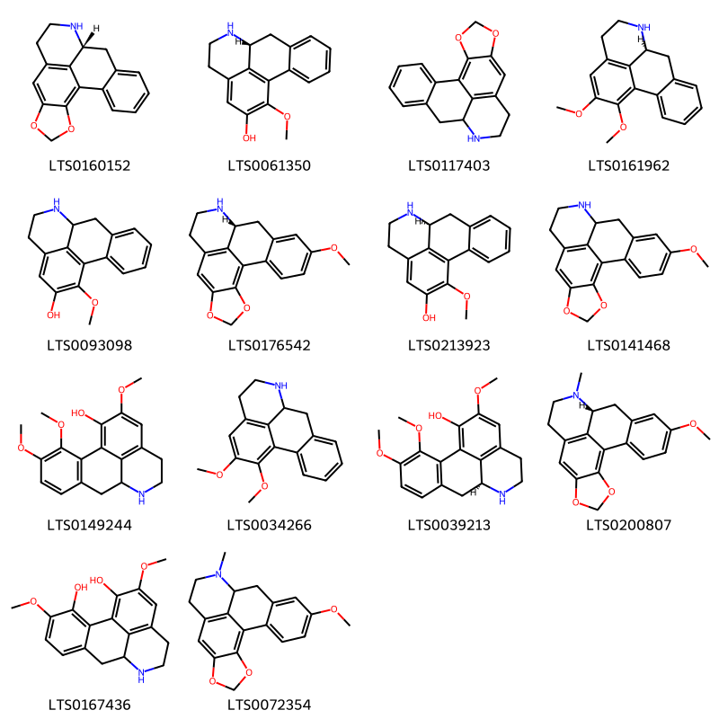{ width=100% }
    <figcaption>Hình ảnh cấu trúc hóa học của 14 hoạt chất thuộc nhóm Aporphines gồm ['anonaine (LTS0160152)', 'r-(-)-asimilobine (LTS0061350)', '3,5-dioxa-11-azapentacyclo[10.7.1.0²,⁶.0⁸,²⁰.0¹⁴,¹⁹]icosa-1(20),2(6),7,14,16,18-hexaene (LTS0117403)', '(9s)-15,16-dimethoxy-10-azatetracyclo[7.7.1.0²,⁷.0¹³,¹⁷]heptadeca-1(16),2,4,6,13(17),14-hexaene (LTS0161962)', '16-methoxy-10-azatetracyclo[7.7.1.0²,⁷.0¹³,¹⁷]heptadeca-1(17),2,4,6,13,15-hexaen-15-ol (LTS0093098)', 'xylopine (LTS0176542)', 'asimilobine (LTS0213923)', '16-methoxy-3,5-dioxa-11-azapentacyclo[10.7.1.0²,⁶.0⁸,²⁰.0¹⁴,¹⁹]icosa-1(20),2(6),7,14,16,18-hexaene (LTS0141468)', '3,4,15-trimethoxy-10-azatetracyclo[7.7.1.0²,⁷.0¹³,¹⁷]heptadeca-1(16),2(7),3,5,13(17),14-hexaen-16-ol (LTS0149244)', 'nornuciferine (LTS0034266)', '(9s)-3,4,15-trimethoxy-10-azatetracyclo[7.7.1.0²,⁷.0¹³,¹⁷]heptadeca-1(16),2(7),3,5,13(17),14-hexaen-16-ol (LTS0039213)', '(12r)-16-methoxy-11-methyl-3,5-dioxa-11-azapentacyclo[10.7.1.0²,⁶.0⁸,²⁰.0¹⁴,¹⁹]icosa-1,6,8(20),14,16,18-hexaene (LTS0200807)', '4,15-dimethoxy-10-azatetracyclo[7.7.1.0²,⁷.0¹³,¹⁷]heptadeca-1(16),2,4,6,13(17),14-hexaene-3,16-diol (LTS0167436)', '16-methoxy-11-methyl-3,5-dioxa-11-azapentacyclo[10.7.1.0²,⁶.0⁸,²⁰.0¹⁴,¹⁹]icosa-1,6,8(20),14,16,18-hexaene (LTS0072354)'].</figcaption>
</figure>
#### Nhóm Benzene and substituted derivatives
<figure markdown="span">
    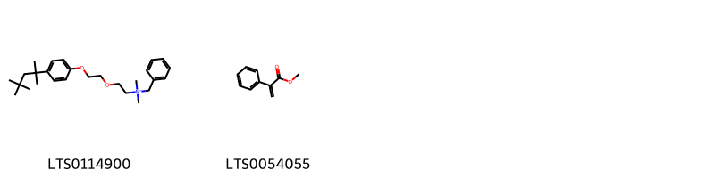{ width=100% }
    <figcaption>Hình ảnh cấu trúc hóa học của 2 hoạt chất thuộc nhóm Benzene and substituted derivatives gồm ['benzethonium (LTS0114900)', 'methyl 2-phenylprop-2-enoate (LTS0054055)'].</figcaption>
</figure>
#### Nhóm Benzopyrans
<figure markdown="span">
    { width=100% }
    <figcaption>Hình ảnh cấu trúc hóa học của 1 hoạt chất thuộc nhóm Benzopyrans gồm ['kelamin (LTS0166864)'].</figcaption>
</figure>
#### Nhóm Carboxylic acids and derivatives
<figure markdown="span">
    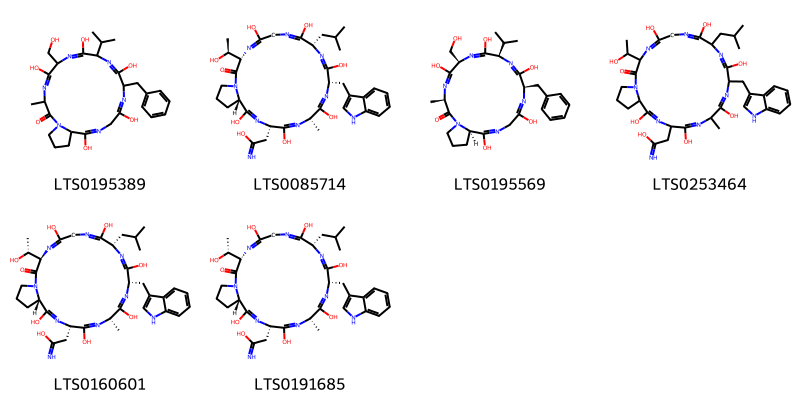{ width=100% }
    <figcaption>Hình ảnh cấu trúc hóa học của 6 hoạt chất thuộc nhóm Carboxylic acids and derivatives gồm ['6-benzyl-1,4,7,10,13-pentahydroxy-12-(hydroxymethyl)-9-isopropyl-15-methyl-3h,6h,9h,12h,15h,18h,19h,20h,20ah-pyrrolo[1,2-a]1,4,7,10,13,16-hexaazacyclooctadecan-16-one (LTS0195389)', '2-[(3s,6s,9s,12s,18s,23as)-1,4,7,10,13,16-hexahydroxy-18-[(1s)-1-hydroxyethyl]-9-(1h-indol-3-ylmethyl)-6-methyl-12-(2-methylpropyl)-19-oxo-3h,6h,9h,12h,15h,18h,21h,22h,23h,23ah-pyrrolo[1,2-a]1,4,7,10,13,16,19-heptaazacyclohenicosan-3-yl]ethanimidic acid (LTS0085714)', '(6r,9r,12r,15r,20ar)-6-benzyl-1,4,7,10,13-pentahydroxy-12-(hydroxymethyl)-9-isopropyl-15-methyl-3h,6h,9h,12h,15h,18h,19h,20h,20ah-pyrrolo[1,2-a]1,4,7,10,13,16-hexaazacyclooctadecan-16-one (LTS0195569)', '2-[1,4,7,10,13,16-hexahydroxy-18-(1-hydroxyethyl)-9-(1h-indol-3-ylmethyl)-6-methyl-12-(2-methylpropyl)-19-oxo-3h,6h,9h,12h,15h,18h,21h,22h,23h,23ah-pyrrolo[1,2-a]1,4,7,10,13,16,19-heptaazacyclohenicosan-3-yl]ethanimidic acid (LTS0253464)', '2-[(3s,6s,9s,12s,18r,23as)-1,4,7,10,13,16-hexahydroxy-18-[(1r)-1-hydroxyethyl]-9-(1h-indol-3-ylmethyl)-6-methyl-12-(2-methylpropyl)-19-oxo-3h,6h,9h,12h,15h,18h,21h,22h,23h,23ah-pyrrolo[1,2-a]1,4,7,10,13,16,19-heptaazacyclohenicosan-3-yl]ethanimidic acid (LTS0160601)', '2-[(3s,6s,9s,12s,18s,23as)-1,4,7,10,13,16-hexahydroxy-18-[(1r)-1-hydroxyethyl]-9-(1h-indol-3-ylmethyl)-6-methyl-12-(2-methylpropyl)-19-oxo-3h,6h,9h,12h,15h,18h,21h,22h,23h,23ah-pyrrolo[1,2-a]1,4,7,10,13,16,19-heptaazacyclohenicosan-3-yl]ethanimidic acid (LTS0191685)'].</figcaption>
</figure>
#### Nhóm Fatty Acyls
<figure markdown="span">
    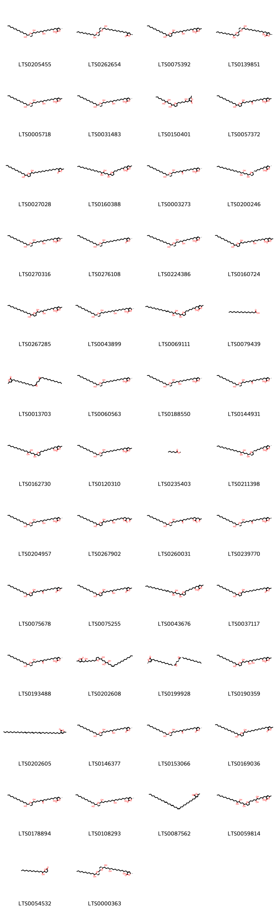{ width=100% }
    <figcaption>Hình ảnh cấu trúc hóa học của 240 hoạt chất thuộc nhóm Fatty Acyls gồm ['annonacin (LTS0205455)', "(5r)-3-[(13r)-13-hydroxy-13-[(2r,2'r,5r,5'r)-5'-[(1r)-1-hydroxyundecyl]-[2,2'-bioxolan]-5-yl]tridecyl]-5-methyl-5h-furan-2-one (LTS0262654)", 'annonacin (LTS0075392)', "(5r)-3-[(2s,13s)-2,13-dihydroxy-13-[(2s,2'r,5r,5's)-5'-[(1s)-1-hydroxyundecyl]-[2,2'-bioxolan]-5-yl]tridecyl]-5-methyl-5h-furan-2-one (LTS0139851)", '5-methyl-3-[(2r,8r,13r)-2,8,13-trihydroxy-13-[(2r,5r)-5-[(1r)-1-hydroxytridecyl]oxolan-2-yl]tridecyl]-5h-furan-2-one (LTS0005718)', '(5s)-5-methyl-3-[(2r,8r,13r)-2,8,13-trihydroxy-13-[(2r,5r)-5-[(1s)-1-hydroxytridecyl]oxolan-2-yl]tridecyl]-5h-furan-2-one (LTS0031483)', '3-{2-hydroxy-6-[5-(1,4,5-trihydroxyundecyl)oxolan-2-yl]hexyl}-5-methyl-5h-furan-2-one (LTS0150401)', '3-{2,13-dihydroxy-13-[5-(1-hydroxytridecyl)oxolan-2-yl]-8-oxotridecyl}-5-methyl-5h-furan-2-one (LTS0057372)', '3-{15-hydroxy-15-[5-(1-hydroxytridecyl)oxolan-2-yl]pentadecyl}-5-methyl-5h-furan-2-one (LTS0027028)', '3-{2-hydroxy-7-[5-(1,4,5-trihydroxynonadecyl)oxolan-2-yl]heptyl}-5-methyl-5h-furan-2-one (LTS0160388)', '(5s)-3-[(2r,13r)-2,13-dihydroxy-13-[(2r,5r)-5-[(1r)-1-hydroxytridecyl]oxolan-2-yl]-8-oxotridecyl]-5-methyl-5h-furan-2-one (LTS0003273)', 'gigantetrocin a (LTS0200246)', '(5r)-5-methyl-3-[(2s,8r,13r)-2,8,13-trihydroxy-13-[(2r,5r)-5-[(1r)-1-hydroxytridecyl]oxolan-2-yl]tridecyl]-5h-furan-2-one (LTS0270316)', '(5s)-3-[(13r)-13-hydroxy-13-[(2r,5r)-5-[(1r)-1-hydroxytridecyl]oxolan-2-yl]tridecyl]-5-methyl-5h-furan-2-one (LTS0276108)', '(5s)-5-methyl-3-[(2r,8r,11r)-2,8,11-trihydroxy-11-[(2r,5r)-5-[(1r)-1-hydroxypentadecyl]oxolan-2-yl]undecyl]-5h-furan-2-one (LTS0224386)', '5-methyl-3-{2,8,15-trihydroxy-15-[5-(1-hydroxytridecyl)oxolan-2-yl]pentadecyl}-5h-furan-2-one (LTS0160724)', 'goniothalamicin (LTS0267285)', '(5s)-5-methyl-3-[(2r,8r,15r)-2,8,15-trihydroxy-15-[(2r,5r)-5-[(1r)-1-hydroxytridecyl]oxolan-2-yl]pentadecyl]-5h-furan-2-one (LTS0043899)', '3-{2-hydroxy-7-[5-(1,4,5-trihydroxyhenicos-8-en-1-yl)oxolan-2-yl]heptyl}-5-methyl-5h-furan-2-one (LTS0069111)', 'palmitic acid (LTS0079439)', '3-(12-{3-[2-(3-dodecyloxiran-2-yl)ethyl]oxiran-2-yl}dodecyl)-5-methyl-5h-furan-2-one (LTS0013703)', '(5s)-3-[(2r,13r)-2,13-dihydroxy-13-[(2r,5r)-5-[(1r)-1-hydroxytridecyl]oxolan-2-yl]tridecyl]-5-methyl-5h-furan-2-one (LTS0060563)', '(5s)-5-methyl-3-[(2r,10r,13r)-2,10,13-trihydroxy-13-[(2r,5r)-5-[(1r)-1-hydroxytridecyl]oxolan-2-yl]tridecyl]-5h-furan-2-one (LTS0188550)', '(5s)-3-[(2r,13s)-2,13-dihydroxy-13-[(2r,5r)-5-[(1r)-1-hydroxytridecyl]oxolan-2-yl]-8-oxotridecyl]-5-methyl-5h-furan-2-one (LTS0144931)', '3-{2-hydroxy-9-[5-(1,4,5-trihydroxyheptadecyl)oxolan-2-yl]nonyl}-5-methyl-5h-furan-2-one (LTS0162730)', '3-[(13r)-2,13-dihydroxy-13-[(2r,5r)-5-[(1r)-1-hydroxytridecyl]oxolan-2-yl]tridecyl]-5-methyl-5h-furan-2-one (LTS0120310)', 'methyl caproate (LTS0235403)', '(5s)-3-[(2s)-2-hydroxy-7-[(2s,5s)-5-[(1s,4s,5s)-1,4,5-trihydroxynonadecyl]oxolan-2-yl]heptyl]-5-methyl-5h-furan-2-one (LTS0211398)', '(5s)-5-methyl-3-[(2r,8r,13r)-2,8,13-trihydroxy-13-[(2r,5s)-5-[(1s)-1-hydroxytridecyl]oxolan-2-yl]tridecyl]-5h-furan-2-one (LTS0204957)', 'isoannonacin (LTS0267902)', '5-[(11s)-11-hydroxy-11-[(2s,5s)-5-[(1s)-1-hydroxytridecyl]oxolan-2-yl]-6-oxoundecyl]-3-(2-oxopropyl)oxolan-2-one (LTS0260031)', '(5r)-3-[(2s,13r)-2,13-dihydroxy-13-[(2s,5r)-5-[(1s)-1-hydroxytridecyl]oxolan-2-yl]-8-oxotridecyl]-5-methyl-5h-furan-2-one (LTS0239770)', '3-{13-hydroxy-13-[5-(1-hydroxytridecyl)oxolan-2-yl]-8-oxotridecyl}-5-methyl-5h-furan-2-one (LTS0075678)', '3-{8,13-dihydroxy-13-[5-(1-hydroxytridecyl)oxolan-2-yl]tridecyl}-5-methyl-5h-furan-2-one (LTS0075255)', '3-(2-hydroxy-7-{5-[(8e)-1,4,5-trihydroxyhenicos-8-en-1-yl]oxolan-2-yl}heptyl)-5-methyl-5h-furan-2-one (LTS0043676)', '3-{13-hydroxy-13-[5-(1-hydroxytridecyl)oxolan-2-yl]tridecyl}-5-methyl-5h-furan-2-one (LTS0037117)', '(5s)-3-[(2r,13r)-2,13-dihydroxy-13-[(2r,5s)-5-[(1s)-1-hydroxytridecyl]oxolan-2-yl]-8-oxotridecyl]-5-methyl-5h-furan-2-one (LTS0193488)', 'gigantetronenin (LTS0202608)', '(5r)-3-{12-[(2r,3r)-3-{2-[(2r,3r)-3-dodecyloxiran-2-yl]ethyl}oxiran-2-yl]dodecyl}-5-methyl-5h-furan-2-one (LTS0199928)', '5-methyl-3-{2,8,10,13-tetrahydroxy-13-[5-(1-hydroxytridecyl)oxolan-2-yl]tridecyl}-5h-furan-2-one (LTS0190359)', '3-[(11e,15e,19e)-dotriaconta-11,15,19-trien-1-yl]-5-methyl-5h-furan-2-one (LTS0202605)', '(5s)-3-[(8r,13r)-8,13-dihydroxy-13-[(2r,5s)-5-[(1r)-1-hydroxytridecyl]oxolan-2-yl]tridecyl]-5-methyl-5h-furan-2-one (LTS0146377)', '(5s)-3-[(13r)-13-hydroxy-13-[(2r,5r)-5-[(1r)-1-hydroxytridecyl]oxolan-2-yl]-8-oxotridecyl]-5-methyl-5h-furan-2-one (LTS0153066)', '3-{13-hydroxy-13-[5-(1-hydroxypentadecyl)oxolan-2-yl]tridecyl}-5-methyl-5h-furan-2-one (LTS0169036)', '(5s)-3-[(2r,13r)-2,13-dihydroxy-13-[(5r)-5-[(1r)-1-hydroxytridecyl]oxolan-2-yl]-8-oxotridecyl]-5-methyl-5h-furan-2-one (LTS0178894)', '(5s)-5-methyl-3-[(2r,8s,15s)-2,8,15-trihydroxy-15-[(2s,5s)-5-[(1r)-1-hydroxytridecyl]oxolan-2-yl]pentadecyl]-5h-furan-2-one (LTS0108293)', '5-methyl-3-[(11z,15e,19e)-triaconta-11,15,19-trien-1-yl]-5h-furan-2-one (LTS0087562)', '5-methyl-3-{2,5,6-trihydroxy-9-[5-(1,4,5-trihydroxyheptadecyl)oxolan-2-yl]nonyl}-5h-furan-2-one (LTS0059814)', '5-(1-hydroxytridecyl)oxolan-2-one (LTS0054532)', "(5s)-5-methyl-3-[(2r,10s,13r)-2,10,13-trihydroxy-13-[(2s,2's,5s,5's)-5'-[(1s)-1-hydroxyundecyl]-[2,2'-bioxolan]-5-yl]tridecyl]-5h-furan-2-one (LTS0000363)", '(5s)-3-[(2r)-2-hydroxy-9-[(2s,5s)-5-[(1s,4s,5s)-1,4,5-trihydroxyheptadecyl]oxolan-2-yl]nonyl]-5-methyl-5h-furan-2-one (LTS0063921)', 'methyl butyrate (LTS0013195)', '(5r)-5-methyl-3-[(2s,8r,13r)-2,8,13-trihydroxy-13-[(2s,5r)-5-[(1s)-1-hydroxytridecyl]oxolan-2-yl]tridecyl]-5h-furan-2-one (LTS0014018)', '3-{2,13-dihydroxy-13-[5-(1-hydroxytridecyl)oxolan-2-yl]tridecyl}-5-methyl-5h-furan-2-one (LTS0257439)', '5-methyl-3-[(9z,13z,17z)-triaconta-9,13,17-trien-1-yl]-5h-furan-2-one (LTS0242708)', '(5r)-3-[(2s,13r)-2,13-dihydroxy-13-[(2s,5r)-5-[(1s)-1-hydroxytridecyl]oxolan-2-yl]tridecyl]-5-methyl-5h-furan-2-one (LTS0035670)', '(5r)-3-[(2s,8r,13s,14s,17s,18s)-2,8,13,14,17,18-hexahydroxytriacontyl]-5-methyl-5h-furan-2-one (LTS0050542)', "(5s)-3-[(2s)-2-hydroxy-12-[(2s,2's,5r,5's)-5'-[(1s)-1-hydroxydecyl]-[2,2'-bioxolan]-5-yl]dodecyl]-5-methyl-5h-furan-2-one (LTS0119407)", '(5s)-3-[(2r)-2-hydroxy-14-[(2r,5s)-5-[(1s)-1,7,8-trihydroxydodec-4-en-1-yl]oxolan-2-yl]tetradecyl]-5-methyl-5h-furan-2-one (LTS0054887)', '(5s)-3-[(11z,15z,19z)-dotriaconta-11,15,19-trien-1-yl]-5-methyl-5h-furan-2-one (LTS0056392)', '5-methyl-3-[(11z)-14-(3-tetradecyloxiran-2-yl)tetradec-11-en-1-yl]-5h-furan-2-one (LTS0041183)', '(5s)-5-methyl-3-[(2r,8s,9s,13r)-2,8,9,13-tetrahydroxy-13-[(2r,5r)-5-[(1r)-1-hydroxytridecyl]oxolan-2-yl]tridecyl]-5h-furan-2-one (LTS0121733)', '(5s)-3-[(2r)-2-hydroxy-14-[(2r,5s)-5-[(1s,4s,5r)-1,4,5-trihydroxydodecyl]oxolan-2-yl]tetradecyl]-5-methyl-5h-furan-2-one (LTS0070988)', '(5r)-5-methyl-3-[(2s,8r,10r,13r)-2,8,10,13-tetrahydroxy-13-[(2s,5r)-5-[(1s)-1-hydroxytridecyl]oxolan-2-yl]tridecyl]-5h-furan-2-one (LTS0193467)', '5-methyl-3-{12-[5-(1,6,7-trihydroxyhexadec-10-en-1-yl)oxolan-2-yl]dodecyl}-5h-furan-2-one (LTS0130928)', '3-(dotriaconta-13,17-dien-1-yl)-5-methyl-5h-furan-2-one (LTS0238043)', '(5s)-3-[(2r)-2-hydroxy-12-[(2s,5s)-5-[(1s,4s,5r)-1,4,5-trihydroxydodecyl]oxolan-2-yl]dodecyl]-5-methyl-5h-furan-2-one (LTS0202370)', '(1s)-1-[(2r,5s)-5-[(1s)-1-(acetyloxy)tridecyl]oxolan-2-yl]-13-[(5r)-5-methyl-2-oxo-5h-furan-3-yl]tridecyl acetate (LTS0080705)', '(5s)-3-[(2r,8r)-2,8-dihydroxy-9-[(2s,5s)-5-[(1s,4s,5s)-1,4,5-trihydroxyheptadecyl]oxolan-2-yl]nonyl]-5-methyl-5h-furan-2-one (LTS0088106)', '(5s)-5-methyl-3-{12-[(2s,5r)-5-[(1r,8s,9r)-1,8,9-trihydroxytetradecyl]oxolan-2-yl]dodecyl}-5h-furan-2-one (LTS0082921)', '(5r)-3-[(13r)-13-hydroxy-13-[(2s,5r)-5-[(1s)-1-hydroxytridecyl]oxolan-2-yl]tridecyl]-5-methyl-5h-furan-2-one (LTS0084855)', '3-(12-{3-[2-(3-dodecyloxiran-2-yl)ethyl]oxiran-2-yl}-8-oxododecyl)-5-methyl-5h-furan-2-one (LTS0084207)', '(5s)-3-[(2r)-2-hydroxy-9-[(4r,7r)-7-[(2r,5r)-5-[(1r)-1-hydroxytridecyl]oxolan-2-yl]-1,3-dioxepan-4-yl]nonyl]-5-methyl-5h-furan-2-one (LTS0052539)', '(5s)-3-[(2r)-2-hydroxy-12-[(2r,5s)-5-[(1s)-1,4,5-trihydroxydodecyl]oxolan-2-yl]dodecyl]-5-methyl-5h-furan-2-one (LTS0225260)', '(5r)-5-methyl-3-[(2s,8r,13s)-2,8,13-trihydroxy-13-[(2s,5s)-5-[(1r)-1-hydroxytridecyl]oxolan-2-yl]tridecyl]-5h-furan-2-one (LTS0087776)', 'methyl hex-2-enoate (LTS0123156)', '(5s)-3-[(2s)-2-hydroxy-12-[(2s,5s)-5-[(1s)-1,8,9-trihydroxytetradecyl]oxolan-2-yl]dodecyl]-5-methyl-5h-furan-2-one (LTS0072815)', '(5s)-3-[(2r)-2-hydroxy-7-[(2r,5r)-5-[(1r,2r,4s,5r)-1,2,4,5-tetrahydroxynonadecyl]oxolan-2-yl]heptyl]-5-methyl-5h-furan-2-one (LTS0220272)', '(5s)-3-[(2r)-2-hydroxy-12-[(2s,5r)-5-[(1r,10r,11s)-1,10,11-trihydroxytetradecyl]oxolan-2-yl]dodecyl]-5-methyl-5h-furan-2-one (LTS0015831)', '(5s)-3-[(2r,8r)-2,8-dihydroxy-9-[(2r,5s)-5-[(1s,4s,5s)-1,4,5-trihydroxyheptadecyl]oxolan-2-yl]nonyl]-5-methyl-5h-furan-2-one (LTS0016303)', 'methyl oct-2-enoate (LTS0184626)', '3-{11-hydroxy-11-[5-(1-hydroxyheptadecyl)oxolan-2-yl]undecyl}-5-methyl-5h-furan-2-one (LTS0159837)', '(5s)-3-[(2r,8r)-2,8-dihydroxy-9-[(2s,5s)-5-[(1s,4r,5s)-1,4,5-trihydroxyheptadecyl]oxolan-2-yl]nonyl]-5-methyl-5h-furan-2-one (LTS0098643)', '(5s)-3-[(2r)-2-hydroxy-12-[(2r,5s)-5-[(1s,4r,5s)-1,4,5-trihydroxydodecyl]oxolan-2-yl]dodecyl]-5-methyl-5h-furan-2-one (LTS0146608)', '(5s)-5-methyl-3-[(2r,13r)-2,8,9,13-tetrahydroxy-13-[(2r,5r)-5-[(1r)-1-hydroxytridecyl]oxolan-2-yl]tridecyl]-5h-furan-2-one (LTS0067062)', '(5s)-5-methyl-3-[(2r,13r)-2,8,9,13-tetrahydroxy-13-{5-[(1r)-1-hydroxytridecyl]oxolan-2-yl}tridecyl]-5h-furan-2-one (LTS0090766)', '(5s)-5-methyl-3-[(11z)-14-[(2s,3r)-3-tetradecyloxiran-2-yl]tetradec-11-en-1-yl]-5h-furan-2-one (LTS0204608)', '(5s)-5-methyl-3-[(2r,8r,10r,13r)-2,8,10,13-tetrahydroxy-13-[(2r,5r)-5-[(1r)-1-hydroxytridecyl]oxolan-2-yl]tridecyl]-5h-furan-2-one (LTS0073862)', '(5s)-5-methyl-3-[(2r,8r,10s,13s)-2,8,10,13-tetrahydroxy-13-[(2s,5s)-5-[(1s)-1-hydroxytridecyl]oxolan-2-yl]tridecyl]-5h-furan-2-one (LTS0157178)', '3-[(13z)-16-(3-dodecyloxiran-2-yl)hexadec-13-en-1-yl]-5-methyl-5h-furan-2-one (LTS0068459)', '(5s)-3-[(2r)-2-hydroxy-9-[(4s,7r)-7-[(2r,5r)-5-[(1r)-1-hydroxytridecyl]oxolan-2-yl]-1,3-dioxepan-4-yl]nonyl]-5-methyl-5h-furan-2-one (LTS0120007)', '(5s)-5-methyl-3-{12-[(2s,5r)-5-[(1r,6r,7s,10z)-1,6,7-trihydroxyhexadec-10-en-1-yl]oxolan-2-yl]dodecyl}-5h-furan-2-one (LTS0060614)', '(5r)-3-[(2s,13r)-2,13-dihydroxy-13-[(2r,5r)-5-[(1r)-1-hydroxytridecyl]oxolan-2-yl]tridecyl]-5-methyl-5h-furan-2-one (LTS0185860)', '(5s)-5-methyl-3-[(2r,13r)-2,8,10,13-tetrahydroxy-13-[(2r,5r)-5-[(1s)-1-hydroxytridecyl]oxolan-2-yl]tridecyl]-5h-furan-2-one (LTS0117695)', '(5s)-3-[(2r)-2-hydroxy-9-[(2r,5s)-5-[(1s,7r,8s)-1,7,8-trihydroxypentadecyl]oxolan-2-yl]nonyl]-5-methyl-5h-furan-2-one (LTS0042119)', '3-[10-(3-{2-[3-(hexadec-3-en-1-yl)oxiran-2-yl]ethyl}oxiran-2-yl)decyl]-5-methyl-5h-furan-2-one (LTS0169706)', '(5s)-5-methyl-3-[(2r,11r)-2,8,11-trihydroxy-11-[5-(1-hydroxypentadecyl)oxolan-2-yl]undecyl]-5h-furan-2-one (LTS0092047)', '(5s)-5-methyl-3-[(2r,8r,13r)-2,8,13-trihydroxy-13-[(2s,5s)-5-[(1s,4z)-1-hydroxytridec-4-en-1-yl]oxolan-2-yl]tridecyl]-5h-furan-2-one (LTS0178384)', '(5s)-3-[(2r)-2-hydroxy-14-[(2r,5s)-5-[(1s,4z,7r,8s)-1,7,8-trihydroxydodec-4-en-1-yl]oxolan-2-yl]tetradecyl]-5-methyl-5h-furan-2-one (LTS0091167)', '(5s)-3-[(13s)-13-hydroxy-13-[(2s,5r)-5-[(1r)-1-hydroxytridecyl]oxolan-2-yl]-8-oxotridecyl]-5-methyl-5h-furan-2-one (LTS0022292)', '(5r)-3-[(11s,12s,15z)-11,12-dihydroxytriacont-15-en-1-yl]-5-methyl-5h-furan-2-one (LTS0059941)', 'methyl but-2-enoate (LTS0190774)', '(5r)-5-methyl-3-[(2s,8r,10s,13s)-2,8,10,13-tetrahydroxy-13-[(2s,5s)-5-[(1s)-1-hydroxytridecyl]oxolan-2-yl]tridecyl]-5h-furan-2-one (LTS0195841)', '(5s)-5-methyl-3-[(2r,6s,10r,13s)-2,6,10,13-tetrahydroxy-13-[(2s,5s)-5-[(1s)-1-hydroxytridecyl]oxolan-2-yl]tridecyl]-5h-furan-2-one (LTS0259196)', 'leucate (LTS0146974)', '(5r)-3-[(13s,14s,17z)-13,14-dihydroxytriacont-17-en-1-yl]-5-methyl-5h-furan-2-one (LTS0267913)', '(5s)-5-methyl-3-[(2r,13r)-2,8,13-trihydroxy-13-[(2r,5r)-5-[(1r)-1-hydroxypentadecyl]oxolan-2-yl]tridecyl]-5h-furan-2-one (LTS0261875)', '(5r)-5-methyl-3-[(2s,5r,11s,13s)-2,5,11,13-tetrahydroxy-13-[(2s,5s)-5-[(1s)-1-hydroxytridecyl]oxolan-2-yl]tridecyl]-5h-furan-2-one (LTS0155261)', '(5s)-3-[(2s)-2-hydroxy-12-[(2r,5s)-5-[(1s,8r,9s)-1,8,9-trihydroxytetradecyl]oxolan-2-yl]dodecyl]-5-methyl-5h-furan-2-one (LTS0170779)', '5-methyl-3-{2,6,10,13-tetrahydroxy-13-[5-(1-hydroxytridecyl)oxolan-2-yl]tridecyl}-5h-furan-2-one (LTS0190785)', '5-methyl-3-[(13z,17z)-triaconta-13,17-dien-1-yl]-5h-furan-2-one (LTS0202422)', '5-methyl-3-{10-[3-(octadec-3-en-1-yl)oxiran-2-yl]decyl}-5h-furan-2-one (LTS0193062)', '(5s)-5-methyl-3-[(2r,5r,6s)-2,5,6-trihydroxy-9-[(2r,5r)-5-[(1s,4s,5s)-1,4,5-trihydroxyheptadecyl]oxolan-2-yl]nonyl]-5h-furan-2-one (LTS0126048)', '(5s)-5-methyl-3-[(2r,13r)-2,8,10,13-tetrahydroxy-13-[(2r,5r)-5-[(1r)-1-hydroxytridecyl]oxolan-2-yl]tridecyl]-5h-furan-2-one (LTS0142213)', '(5s)-5-methyl-3-[(2s,8s,9r,13s)-2,8,9,13-tetrahydroxy-13-[(2s,5s)-5-[(1s)-1-hydroxytridecyl]oxolan-2-yl]tridecyl]-5h-furan-2-one (LTS0272108)', '(5r)-5-methyl-3-[(2r,6r,8s,10r,13r)-2,6,8,10,13-pentahydroxy-13-[(2r,5r)-5-[(1r)-1-hydroxytridecyl]oxolan-2-yl]tridecyl]-5h-furan-2-one (LTS0146759)', '(5s)-5-methyl-3-[(2s,8s,9r,13s)-2,8,9,13-tetrahydroxy-13-[(2r,5s)-5-[(1r)-1-hydroxytridecyl]oxolan-2-yl]tridecyl]-5h-furan-2-one (LTS0146995)', '(5r)-5-methyl-3-[(11z)-14-[(2r,3r)-3-tetradecyloxiran-2-yl]tetradec-11-en-1-yl]-5h-furan-2-one (LTS0143519)', '(5s)-3-[(2r)-2-hydroxy-12-[(2s,5r)-5-[(1r,10s,11s)-1,10,11-trihydroxytetradecyl]oxolan-2-yl]dodecyl]-5-methyl-5h-furan-2-one (LTS0151833)', '(5s)-3-[(15s)-15-hydroxy-15-[(2s,5r)-5-[(1r)-1-hydroxytridecyl]oxolan-2-yl]-8-oxopentadecyl]-5-methyl-5h-furan-2-one (LTS0164212)', '(5s)-3-[(2r,8r)-11-[(1s,2r,6s,7s)-6-dodecyl-3,5,10-trioxabicyclo[5.2.1]decan-2-yl]-2,8-dihydroxyundecyl]-5-methyl-5h-furan-2-one (LTS0151937)', '(5s)-3-[(15r,16r,19z)-15,16-dihydroxydotriacont-19-en-1-yl]-5-methyl-5h-furan-2-one (LTS0150050)', '(5s)-5-methyl-3-{12-[(2s,5r)-5-[(1r,6s,7s,10z)-1,6,7-trihydroxyhexadec-10-en-1-yl]oxolan-2-yl]dodecyl}-5h-furan-2-one (LTS0151957)', '(5s)-3-[(2r,8r)-2,8-dihydroxy-9-[(2r,5s)-5-[(1s,4r,5s)-1,4,5-trihydroxyheptadecyl]oxolan-2-yl]nonyl]-5-methyl-5h-furan-2-one (LTS0139024)', '(5s)-3-[(2r)-2-hydroxy-7-[(4r,7r)-7-[(2r,5s)-5-[(1s)-1-hydroxypentadecyl]oxolan-2-yl]-1,3-dioxepan-4-yl]heptyl]-5-methyl-5h-furan-2-one (LTS0147170)', "(5s)-3-[(2s)-2-hydroxy-12-[(2r,2'r,5r,5's)-5'-[(1s)-1-hydroxydecyl]-[2,2'-bioxolan]-5-yl]dodecyl]-5-methyl-5h-furan-2-one (LTS0252784)", '(5r)-3-[(11r)-11-hydroxy-11-[(2r,5s)-5-[(1s)-1-hydroxypentadecyl]oxolan-2-yl]undecyl]-5-methyl-5h-furan-2-one (LTS0152166)', 'annomontacin (LTS0240651)', '(5r)-5-methyl-3-{10-[(2r,3r)-3-[(3z)-octadec-3-en-1-yl]oxiran-2-yl]decyl}-5h-furan-2-one (LTS0087112)', '(5r)-3-{12-[(2r,3s)-3-{2-[(2r,3s)-3-dodecyloxiran-2-yl]ethyl}oxiran-2-yl]-8-oxododecyl}-5-methyl-5h-furan-2-one (LTS0087632)', '(5s)-5-methyl-3-[(2s,8r,9s,13s)-2,8,9,13-tetrahydroxy-13-[(2r,5s)-5-[(1r)-1-hydroxytridecyl]oxolan-2-yl]tridecyl]-5h-furan-2-one (LTS0099238)', '3-{8,11-dihydroxy-11-[5-(1-hydroxypentadecyl)oxolan-2-yl]undecyl}-5-methyl-5h-furan-2-one (LTS0093552)', '(5s)-3-[(2s)-2-hydroxy-7-[(2r,5s)-5-[(1r,4s,5r,6s)-1,4,5,6-tetrahydroxynonadecyl]oxolan-2-yl]heptyl]-5-methyl-5h-furan-2-one (LTS0179343)', '(5s)-5-methyl-3-[(2r,5r,6s)-2,5,6-trihydroxy-9-[(2r,5r)-5-[(1s,4r,5r)-1,4,5-trihydroxyheptadecyl]oxolan-2-yl]nonyl]-5h-furan-2-one (LTS0180553)', '(5s)-3-[(2r,8r)-2,8-dihydroxy-9-[(2r,5s)-5-[(1s,4r,5r)-1,4,5-trihydroxyheptadecyl]oxolan-2-yl]nonyl]-5-methyl-5h-furan-2-one (LTS0129744)', '(5s)-3-[(2s)-2-hydroxy-12-[(2s,5s)-5-[(1s,8s,9r)-1,8,9-trihydroxytetradecyl]oxolan-2-yl]dodecyl]-5-methyl-5h-furan-2-one (LTS0168945)', '(5s)-3-[(2r)-2-hydroxy-12-[(2r,5s)-5-[(1s,8r,9s)-1,8,9-trihydroxytetradecyl]oxolan-2-yl]dodecyl]-5-methyl-5h-furan-2-one (LTS0137959)', '(5r)-3-{10-[(2r,3r)-3-{2-[(2r,3r)-3-[(3z)-hexadec-3-en-1-yl]oxiran-2-yl]ethyl}oxiran-2-yl]decyl}-5-methyl-5h-furan-2-one (LTS0232580)', '(5s)-5-methyl-3-{12-[(2s,5r)-5-[(1r,6r,7s)-1,6,7-trihydroxytetradecyl]oxolan-2-yl]dodecyl}-5h-furan-2-one (LTS0093650)', '(5s)-3-[(2r)-2-hydroxy-14-[(2s,5s)-5-[(1s)-1,4,5-trihydroxydodecyl]oxolan-2-yl]tetradecyl]-5-methyl-5h-furan-2-one (LTS0126272)', '(5s)-3-[(8r,13r)-8,13-dihydroxy-13-[(2r,5r)-5-[(1r)-1-hydroxytridecyl]oxolan-2-yl]tridecyl]-5-methyl-5h-furan-2-one (LTS0121689)', '(5s)-3-[(2r)-2-hydroxy-9-[(2s,5s)-5-[(1s,7s,8r)-1,7,8-trihydroxypentadecyl]oxolan-2-yl]nonyl]-5-methyl-5h-furan-2-one (LTS0118317)', '5-methyl-3-[14-(3-tetradecyloxiran-2-yl)tetradec-11-en-1-yl]-5h-furan-2-one (LTS0176859)', '(5s)-3-[(11r,12r,15z,19z)-11,12-dihydroxydotriaconta-15,19-dien-1-yl]-5-methyl-5h-furan-2-one (LTS0156971)', '(5r)-3-[(13r)-13-hydroxy-13-[(2s,5r)-5-[(1s)-1-hydroxytridecyl]oxolan-2-yl]-8-oxotridecyl]-5-methyl-5h-furan-2-one (LTS0180982)', '3-(2,8,13,14,17,18-hexahydroxytriacontyl)-5-methyl-5h-furan-2-one (LTS0105623)', '3-[(15z)-11,12-dihydroxytriacont-15-en-1-yl]-5-methyl-5h-furan-2-one (LTS0175314)', '3-{2-hydroxy-12-[5-(1,4,5-trihydroxydodecyl)oxolan-2-yl]dodecyl}-5-methyl-5h-furan-2-one (LTS0125004)', '3-[(13r,14r,17z)-13,14-dihydroxytriacont-17-en-1-yl]-5-methyl-5h-furan-2-one (LTS0103752)', '(5r)-3-[(13r)-13-hydroxy-13-[(2r,5s)-5-[(1s)-1-hydroxytridecyl]oxolan-2-yl]tridecyl]-5-methyl-5h-furan-2-one (LTS0116930)', '3-[(15z,19z)-11,12-dihydroxydotriaconta-15,19-dien-1-yl]-5-methyl-5h-furan-2-one (LTS0258786)', '(5s)-3-[(13r)-13-hydroxy-13-[(2r,5s)-5-[(1s)-1-hydroxytridecyl]oxolan-2-yl]tridecyl]-5-methyl-5h-furan-2-one (LTS0266048)', '3-{11-hydroxy-11-[5-(1-hydroxypentadecyl)oxolan-2-yl]undecyl}-5-methyl-5h-furan-2-one (LTS0273084)', '(5s)-5-methyl-3-[(2r,8s,9r,13r)-2,8,9,13-tetrahydroxy-13-[(2r,5r)-5-[(1r)-1-hydroxytridecyl]oxolan-2-yl]tridecyl]-5h-furan-2-one (LTS0190791)', '(5s)-5-[(1s)-1-hydroxytridecyl]oxolan-2-one (LTS0197785)', '3-[(15e,19e)-dotriaconta-15,19-dien-1-yl]-5-methyl-5h-furan-2-one (LTS0250500)', '(5r)-5-methyl-3-[(2r,8s,15r)-2,8,15-trihydroxy-15-[(2s,5r)-5-[(1s)-1-hydroxytridecyl]oxolan-2-yl]pentadecyl]-5h-furan-2-one (LTS0073336)', '(5s)-3-[(15s)-15-hydroxy-15-[(2s,5r)-5-[(1r)-1-hydroxytridecyl]oxolan-2-yl]pentadecyl]-5-methyl-5h-furan-2-one (LTS0067589)', '5-methyl-3-{2,8,9,13-tetrahydroxy-13-[5-(1-hydroxytridecyl)oxolan-2-yl]tridecyl}-5h-furan-2-one (LTS0213799)', '(5r)-3-[(13r)-13-hydroxy-13-[(2r,5s)-5-[(1s)-1-hydroxypentadecyl]oxolan-2-yl]tridecyl]-5-methyl-5h-furan-2-one (LTS0241676)', '(5s)-3-[(2r)-2-hydroxy-9-[5-(1,4,5-trihydroxyheptadecyl)oxolan-2-yl]nonyl]-5-methyl-5h-furan-2-one (LTS0271480)', '(5r)-3-[(15r)-15-hydroxy-15-[(2r,5s)-5-[(1s)-1-hydroxytridecyl]oxolan-2-yl]pentadecyl]-5-methyl-5h-furan-2-one (LTS0071226)', '(5s)-3-[(13r)-13-hydroxy-13-[(2s,5r)-5-[(1s)-1-hydroxytridecyl]oxolan-2-yl]-8-oxotridecyl]-5-methyl-5h-furan-2-one (LTS0236091)', '3-{2-hydroxy-9-[5-(1,7,8-trihydroxypentadecyl)oxolan-2-yl]nonyl}-5-methyl-5h-furan-2-one (LTS0195556)', '(5r)-3-[(11r,12r,15z)-11,12-dihydroxytriacont-15-en-1-yl]-5-methyl-5h-furan-2-one (LTS0263816)', '3-{2-hydroxy-12-[5-(1,10,11-trihydroxytetradecyl)oxolan-2-yl]dodecyl}-5-methyl-5h-furan-2-one (LTS0213622)', '(5s)-3-[(2r)-2-hydroxy-12-[(2s,5s)-5-[(1s,8r,9r)-1,8,9-trihydroxytetradecyl]oxolan-2-yl]dodecyl]-5-methyl-5h-furan-2-one (LTS0058756)', '3-[(17z)-13,14-dihydroxytriacont-17-en-1-yl]-5-methyl-5h-furan-2-one (LTS0207628)', '(5s)-3-[(8r,13r)-8,13-dihydroxy-13-[(2s,5r)-5-[(1s)-1-hydroxytridecyl]oxolan-2-yl]tridecyl]-5-methyl-5h-furan-2-one (LTS0210715)', '3-{15-hydroxy-15-[5-(1-hydroxytridecyl)oxolan-2-yl]-8-oxopentadecyl}-5-methyl-5h-furan-2-one (LTS0230362)', '(5s)-5-methyl-3-[(11z,15z)-triaconta-11,15-dien-1-yl]-5h-furan-2-one (LTS0219071)', 'epoxymurin-a (LTS0261536)', 'ethyl 2-hexenoate (LTS0222078)', '3-(11,12-dihydroxydotriaconta-15,19-dien-1-yl)-5-methyl-5h-furan-2-one (LTS0172669)', '3-{12-[3-(hexadec-3-en-1-yl)oxiran-2-yl]dodecyl}-5-methyl-5h-furan-2-one (LTS0235389)', "3-{2-hydroxy-12-[5'-(1-hydroxydecyl)-[2,2'-bioxolan]-5-yl]dodecyl}-5-methyl-5h-furan-2-one (LTS0030058)", '(5s)-5-methyl-3-[(2r,8r,9s,13r)-2,8,9,13-tetrahydroxy-13-[(2r,5r)-5-[(1s)-1-hydroxytridecyl]oxolan-2-yl]tridecyl]-5h-furan-2-one (LTS0029247)', '(5r)-3-[(2s,8r,13s,14s,17s,18r)-2,8,13,14,17,18-hexahydroxytriacontyl]-5-methyl-5h-furan-2-one (LTS0241115)', "3-{7-[5'-(1-hydroxypentadecyl)-[2,2'-bioxolan]-5-yl]heptyl}-5-methyl-5h-furan-2-one (LTS0173003)", '(5s)-3-[(11s)-11-hydroxy-11-[(2s,5r)-5-[(1r)-1-hydroxypentadecyl]oxolan-2-yl]undecyl]-5-methyl-5h-furan-2-one (LTS0020359)', '(5s)-3-[(2r)-2-hydroxy-9-[(2r,5s)-5-[(1s,4s,5s)-1,4,5-trihydroxyheptadecyl]oxolan-2-yl]nonyl]-5-methyl-5h-furan-2-one (LTS0140814)', '3-{2-hydroxy-14-[5-(1,4,5-trihydroxydodecyl)oxolan-2-yl]tetradecyl}-5-methyl-5h-furan-2-one (LTS0252772)', '(5s)-5-methyl-3-[(2r,15s)-2,8,15-trihydroxy-15-[(2s,5r)-5-[(1r)-1-hydroxytridecyl]oxolan-2-yl]pentadecyl]-5h-furan-2-one (LTS0232412)', '(5s)-5-methyl-3-[(11z,15z,19z)-triaconta-11,15,19-trien-1-yl]-5h-furan-2-one (LTS0180838)', '(5s)-3-[(2r)-2-hydroxy-9-[(2r,5r)-5-[(1s,4s,5s)-1,4,5-trihydroxyheptadecyl]oxolan-2-yl]nonyl]-5-methyl-5h-furan-2-one (LTS0188480)', '3-[(11e,15e)-dotriaconta-11,15-dien-1-yl]-5-methyl-5h-furan-2-one (LTS0060715)', '(5s)-3-[(2r)-2-hydroxy-7-[(2s,5s)-5-[(1s,4r,5r)-1,4,5-trihydroxynonadecyl]oxolan-2-yl]heptyl]-5-methyl-5h-furan-2-one (LTS0181134)', '(5s)-3-[(2r)-2-hydroxy-7-[(4r,7r)-7-[(2r,5r)-5-[(1r)-1-hydroxypentadecyl]oxolan-2-yl]-1,3-dioxepan-4-yl]heptyl]-5-methyl-5h-furan-2-one (LTS0250512)', '(5s)-5-methyl-3-[(2r,8r,13r)-2,8,13-trihydroxy-13-[(2r,5r)-5-[(1r)-1-hydroxypentadecyl]oxolan-2-yl]tridecyl]-5h-furan-2-one (LTS0175585)', '4-methyl-3-{2,8,13-trihydroxy-13-[5-(1-hydroxytridecyl)oxolan-2-yl]tridecyl}-5h-furan-2-one (LTS0187585)', '(5s)-3-[(2r)-2-hydroxy-14-[(2r,5s)-5-[(1s,4r,5s)-1,4,5-trihydroxydodecyl]oxolan-2-yl]tetradecyl]-5-methyl-5h-furan-2-one (LTS0256541)', '(5s)-3-[(11s)-11-hydroxy-11-[(2s,5r)-5-[(1r)-1-hydroxyheptadecyl]oxolan-2-yl]undecyl]-5-methyl-5h-furan-2-one (LTS0231178)', '5-methyl-3-(10-{3-[(3e)-octadec-3-en-1-yl]oxiran-2-yl}decyl)-5h-furan-2-one (LTS0052658)', '(5s)-5-methyl-3-[(2r,8r,11r)-2,8,11-trihydroxy-11-[(2r,5s)-5-[(1s)-1-hydroxypentadecyl]oxolan-2-yl]undecyl]-5h-furan-2-one (LTS0046031)', '5-methyl-3-(triaconta-11,15-dien-1-yl)-5h-furan-2-one (LTS0064900)', '(5r)-3-[(2s,13s)-13-[(2s,5s)-5-[(1r,6s)-1,6-dihydroxypentadecyl]oxolan-2-yl]-2,13-dihydroxy-8-oxotridecyl]-5-methyl-5h-furan-2-one (LTS0127921)', '(5s)-3-[(2r)-2-hydroxy-14-[(2r,5s)-5-[(1s,4z)-1,7,8-trihydroxydodec-4-en-1-yl]oxolan-2-yl]tetradecyl]-5-methyl-5h-furan-2-one (LTS0068480)', '(5r)-3-[(13r)-13-hydroxy-13-[(2r,5r)-5-[(1r)-1-hydroxytridecyl]oxolan-2-yl]tridecyl]-5-methyl-5h-furan-2-one (LTS0112518)', '3-[(11r,12r,15z)-11,12-dihydroxytriacont-15-en-1-yl]-5-methyl-5h-furan-2-one (LTS0063012)', '(5s)-3-[(13s)-13-hydroxy-13-[(2s,5r)-5-[(1r)-1-hydroxypentadecyl]oxolan-2-yl]tridecyl]-5-methyl-5h-furan-2-one (LTS0265214)', '(5r)-3-{12-[(2r,3r)-3-[(3z)-hexadec-3-en-1-yl]oxiran-2-yl]dodecyl}-5-methyl-5h-furan-2-one (LTS0057031)', '(5s)-3-[(2r)-2-hydroxy-12-[(2s,5r)-5-[(1r)-1,8,9-trihydroxytetradecyl]oxolan-2-yl]dodecyl]-5-methyl-5h-furan-2-one (LTS0125657)', '(5s)-3-[(13z,17z)-dotriaconta-13,17-dien-1-yl]-5-methyl-5h-furan-2-one (LTS0007357)', '(5s)-3-[(2r,8r)-2,8-dihydroxy-9-[(2s,5s)-5-[(1s,4r,5r)-1,4,5-trihydroxyheptadecyl]oxolan-2-yl]nonyl]-5-methyl-5h-furan-2-one (LTS0125170)', '3-{2-hydroxy-12-[5-(1,8,9-trihydroxytetradecyl)oxolan-2-yl]dodecyl}-5-methyl-5h-furan-2-one (LTS0034785)', '(5r)-5-methyl-3-[(2s,8r,13s)-2,8,13-trihydroxy-13-[(2s,5s)-5-[(1s)-1-hydroxytridecyl]oxolan-2-yl]tridecyl]-5h-furan-2-one (LTS0034655)', '(5r)-3-[(11r)-11-hydroxy-11-[(2r,5s)-5-[(1s)-1-hydroxyheptadecyl]oxolan-2-yl]undecyl]-5-methyl-5h-furan-2-one (LTS0243866)', '5-methyl-3-[(2r,13r)-2,6,10,13-tetrahydroxy-13-{5-[(1r)-1-hydroxytridecyl]oxolan-2-yl}tridecyl]-5h-furan-2-one (LTS0065797)', '(5s)-3-[(2r,8r)-2,8-dihydroxy-9-[(2s,5s)-5-[(1s)-1,4,5-trihydroxyheptadecyl]oxolan-2-yl]nonyl]-5-methyl-5h-furan-2-one (LTS0064438)', '(5s)-3-[(2r)-2-hydroxy-9-[(2r,5r)-5-[(1s,4r,5s)-1,4,5-trihydroxyheptadecyl]oxolan-2-yl]nonyl]-5-methyl-5h-furan-2-one (LTS0134190)', '3-(15,16-dihydroxydotriacont-19-en-1-yl)-5-methyl-5h-furan-2-one (LTS0061483)', '(5r)-3-[(11s,12s,15z,19z)-11,12-dihydroxydotriaconta-15,19-dien-1-yl]-5-methyl-5h-furan-2-one (LTS0010040)', '(5r)-3-[(15r)-15-hydroxy-15-[(2r,5s)-5-[(1s)-1-hydroxytridecyl]oxolan-2-yl]-8-oxopentadecyl]-5-methyl-5h-furan-2-one (LTS0022508)', '3-(11,12-dihydroxytriacont-15-en-1-yl)-5-methyl-5h-furan-2-one (LTS0016135)', '(5r)-3-[(8r,13r)-8,13-dihydroxy-13-[(2s,5r)-5-[(1s)-1-hydroxytridecyl]oxolan-2-yl]tridecyl]-5-methyl-5h-furan-2-one (LTS0013097)', '(5s)-5-methyl-3-[(2r,5s,6s)-2,5,6-trihydroxy-9-[(2r,5s)-5-[(1s,4r,5r)-1,4,5-trihydroxyheptadecyl]oxolan-2-yl]nonyl]-5h-furan-2-one (LTS0263199)', '(5s)-5-methyl-3-[(2r,5s,6s)-2,5,6-trihydroxy-9-[(2r,5s)-5-[(1s,4s,5s)-1,4,5-trihydroxyheptadecyl]oxolan-2-yl]nonyl]-5h-furan-2-one (LTS0005458)', '(5s)-3-[(8r,11r)-8,11-dihydroxy-11-[(2s,5r)-5-[(1s)-1-hydroxypentadecyl]oxolan-2-yl]undecyl]-5-methyl-5h-furan-2-one (LTS0002597)', '3-(13,14-dihydroxytriacont-17-en-1-yl)-5-methyl-5h-furan-2-one (LTS0011871)', '5-methyl-3-[(12z)-2,8,16,17-tetrahydroxydotriacont-12-en-1-yl]-5h-furan-2-one (LTS0007747)', '(5s)-3-[(2r)-2-hydroxy-7-[(2s,5s)-5-[(1s,4s,5s)-1,4,5-trihydroxynonadecyl]oxolan-2-yl]heptyl]-5-methyl-5h-furan-2-one (LTS0023491)', '1-{5-[1-(acetyloxy)tridecyl]oxolan-2-yl}-13-(5-methyl-2-oxo-5h-furan-3-yl)tridecyl acetate (LTS0222052)', '3-(13,14-dihydroxydotriacont-17-en-1-yl)-5-methyl-5h-furan-2-one (LTS0240775)', '5-methyl-3-{2,6,8,10,13-pentahydroxy-13-[5-(1-hydroxytridecyl)oxolan-2-yl]tridecyl}-5h-furan-2-one (LTS0022018)', '(5s)-3-[(13e)-16-[(2s,3s)-3-dodecyloxiran-2-yl]hexadec-13-en-1-yl]-5-methyl-5h-furan-2-one (LTS0071935)', '(5s)-5-methyl-3-[(2r,10s,13r)-2,10,13-trihydroxy-13-[(2r,5r)-5-[(1r)-1-hydroxytridecyl]oxolan-2-yl]tridecyl]-5h-furan-2-one (LTS0100767)', '(5s)-3-[(2r)-2-hydroxy-9-{5-[(1s,4s,5s)-1,4,5-trihydroxyheptadecyl]oxolan-2-yl}nonyl]-5-methyl-5h-furan-2-one (LTS0228289)', '5-methyl-3-{2,8,13-trihydroxy-13-[5-(1-hydroxytridec-4-en-1-yl)oxolan-2-yl]tridecyl}-5h-furan-2-one (LTS0002416)', '5-methyl-3-(2,8,13,14,17-pentahydroxyhentriacontyl)-5h-furan-2-one (LTS0103457)', '(5s)-3-[(13r,14r,17z)-13,14-dihydroxytriacont-17-en-1-yl]-5-methyl-5h-furan-2-one (LTS0042061)', '5-methyl-3-{12-[5-(1,6,7-trihydroxytetradecyl)oxolan-2-yl]dodecyl}-5h-furan-2-one (LTS0119959)', '(5r)-3-[(2s)-2-hydroxy-7-[(2s,5s)-5-[(1r,4s,5r,10r)-1,4,5,10-tetrahydroxynonadecyl]oxolan-2-yl]heptyl]-5-methyl-5h-furan-2-one (LTS0046544)', '(5s)-3-[(8r,11r)-8,11-dihydroxy-11-[(2r,5r)-5-[(1r)-1-hydroxypentadecyl]oxolan-2-yl]undecyl]-5-methyl-5h-furan-2-one (LTS0129585)', '(5s)-5-methyl-3-[(9z,13z,17z)-triaconta-9,13,17-trien-1-yl]-5h-furan-2-one (LTS0253213)', '3-{2-hydroxy-14-[5-(1,7,8-trihydroxydodec-4-en-1-yl)oxolan-2-yl]tetradecyl}-5-methyl-5h-furan-2-one (LTS0046128)', '1-[5-(1-hydroxytridecyl)oxolan-2-yl]-13-(5-methyl-2-oxo-5h-furan-3-yl)tridecyl hexadecanoate (LTS0244176)', '5-methyl-3-{2,6,8-trihydroxy-9-[5-(1,4,5-trihydroxyheptadecyl)oxolan-2-yl]nonyl}-5h-furan-2-one (LTS0035734)', '(5r)-3-{12-[(2s,3r)-3-{2-[(2s,3r)-3-dodecyloxiran-2-yl]ethyl}oxiran-2-yl]dodecyl}-5-methyl-5h-furan-2-one (LTS0088379)', '(5s)-3-[(13r,14r,17z)-13,14-dihydroxydotriacont-17-en-1-yl]-5-methyl-5h-furan-2-one (LTS0244038)', '(5s)-3-[(13z,17z,21z)-dotriaconta-13,17,21-trien-1-yl]-5-methyl-5h-furan-2-one (LTS0043295)'].</figcaption>
</figure>
#### Nhóm Isoquinolines and derivatives
<figure markdown="span">
    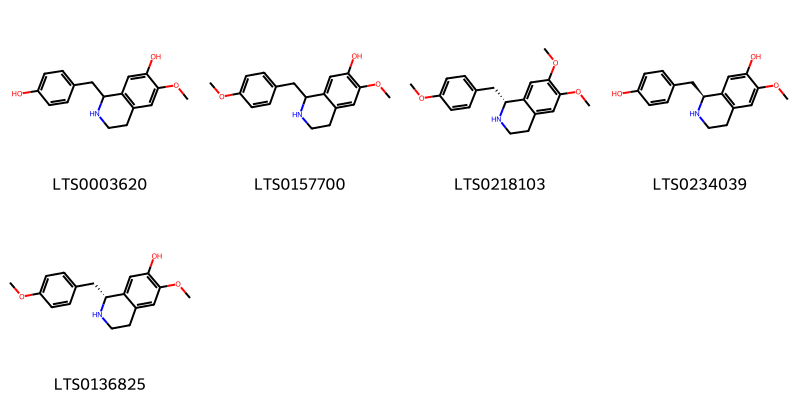{ width=100% }
    <figcaption>Hình ảnh cấu trúc hóa học của 5 hoạt chất thuộc nhóm Isoquinolines and derivatives gồm ['(rs)-coclaurine (LTS0003620)', '6-methoxy-1-[(4-methoxyphenyl)methyl]-1,2,3,4-tetrahydroisoquinolin-7-ol (LTS0157700)', '(1r)-6,7-dimethoxy-1-[(4-methoxyphenyl)methyl]-1,2,3,4-tetrahydroisoquinoline (LTS0218103)', '(+-)-coclaurine (LTS0234039)', '(1r)-6-methoxy-1-[(4-methoxyphenyl)methyl]-1,2,3,4-tetrahydroisoquinolin-7-ol (LTS0136825)'].</figcaption>
</figure>
#### Nhóm Organooxygen compounds
<figure markdown="span">
    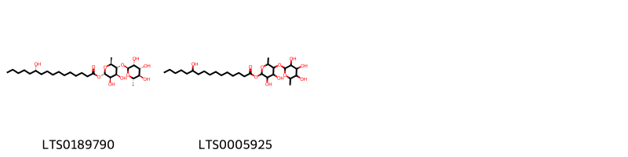{ width=100% }
    <figcaption>Hình ảnh cấu trúc hóa học của 2 hoạt chất thuộc nhóm Organooxygen compounds gồm ['(2s,3r,4s,5r,6s)-3,4-dihydroxy-6-methyl-5-{[(2s,3r,4r,5r,6s)-3,4,5-trihydroxy-6-methyloxan-2-yl]oxy}oxan-2-yl (11s)-11-hydroxyhexadecanoate (LTS0189790)', '3,4-dihydroxy-6-methyl-5-[(3,4,5-trihydroxy-6-methyloxan-2-yl)oxy]oxan-2-yl 11-hydroxyhexadecanoate (LTS0005925)'].</figcaption>
</figure>
#### Nhóm Prenol lipids
<figure markdown="span">
    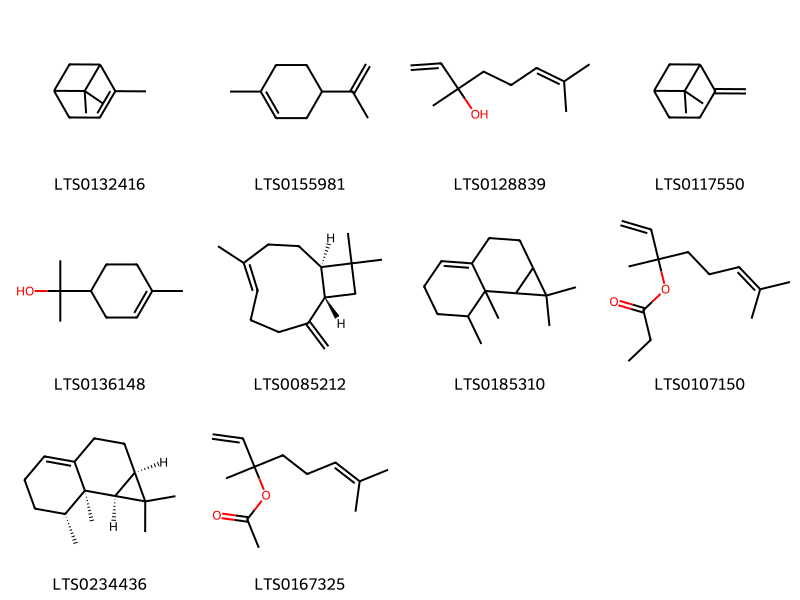{ width=100% }
    <figcaption>Hình ảnh cấu trúc hóa học của 10 hoạt chất thuộc nhóm Prenol lipids gồm ['α pinene (LTS0132416)', 'limonene,  (LTS0155981)', 'linalool, (+-)- (LTS0128839)', 'β-pinene (LTS0117550)', 'terpineol (LTS0136148)', 'caryophyllene (LTS0085212)', '1,1,7,7a-tetramethyl-1ah,2h,3h,5h,6h,7h,7bh-cyclopropa[a]naphthalene (LTS0185310)', 'linalyl propionate (LTS0107150)', '(1ar,7r,7ar,7bs)-1,1,7,7a-tetramethyl-1ah,2h,3h,5h,6h,7h,7bh-cyclopropa[a]naphthalene (LTS0234436)', 'linalyl acetate (LTS0167325)'].</figcaption>
</figure>
#### Nhóm Protoberberine alkaloids and derivatives
<figure markdown="span">
    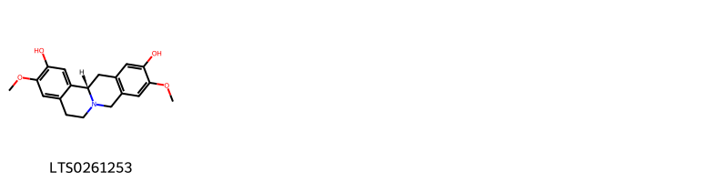{ width=100% }
    <figcaption>Hình ảnh cấu trúc hóa học của 1 hoạt chất thuộc nhóm Protoberberine alkaloids and derivatives gồm ['coreximine (LTS0261253)'].</figcaption>
</figure>

---

### Dược dân tộc học

Danh sách các quốc gia có sử dụng *Annona muricata* trong điều trị các bệnh. 

| Country   | Disease                                                           | Bệnh                                                                                                                                                                                                |
|:----------|:------------------------------------------------------------------|:----------------------------------------------------------------------------------------------------------------------------------------------------------------------------------------------------|
| Curacao   | Sedative, Tranquilizer, Tranquilizer                              | MYMEMORY WARNING: YOU USED ALL AVAILABLE FREE TRANSLATIONS FOR TODAY. NEXT AVAILABLE IN  10 HOURS 27 MINUTES 26 SECONDS VISIT HTTPS://MYMEMORY.TRANSLATED.NET/DOC/USAGELIMITS.PHP TO TRANSLATE MORE |
| Elsewhere | nan, Insecticide, Pediculicide, Piscicide, Insecticide, Piscicide | MYMEMORY WARNING: YOU USED ALL AVAILABLE FREE TRANSLATIONS FOR TODAY. NEXT AVAILABLE IN  10 HOURS 27 MINUTES 23 SECONDS VISIT HTTPS://MYMEMORY.TRANSLATED.NET/DOC/USAGELIMITS.PHP TO TRANSLATE MORE |
| Guatemala | Pediculicide                                                      | MYMEMORY WARNING: YOU USED ALL AVAILABLE FREE TRANSLATIONS FOR TODAY. NEXT AVAILABLE IN  10 HOURS 27 MINUTES 20 SECONDS VISIT HTTPS://MYMEMORY.TRANSLATED.NET/DOC/USAGELIMITS.PHP TO TRANSLATE MORE |
| Haiti     | Cicatrizant, Emetic, Pediculicide, Soporific, Stomachic           | MYMEMORY WARNING: YOU USED ALL AVAILABLE FREE TRANSLATIONS FOR TODAY. NEXT AVAILABLE IN  10 HOURS 27 MINUTES 17 SECONDS VISIT HTTPS://MYMEMORY.TRANSLATED.NET/DOC/USAGELIMITS.PHP TO TRANSLATE MORE |
| Mexico    | Astringent                                                        | MYMEMORY WARNING: YOU USED ALL AVAILABLE FREE TRANSLATIONS FOR TODAY. NEXT AVAILABLE IN  10 HOURS 27 MINUTES 14 SECONDS VISIT HTTPS://MYMEMORY.TRANSLATED.NET/DOC/USAGELIMITS.PHP TO TRANSLATE MORE |
| Panama    | Piscicide, Vermifuge                                              | MYMEMORY WARNING: YOU USED ALL AVAILABLE FREE TRANSLATIONS FOR TODAY. NEXT AVAILABLE IN  10 HOURS 27 MINUTES 11 SECONDS VISIT HTTPS://MYMEMORY.TRANSLATED.NET/DOC/USAGELIMITS.PHP TO TRANSLATE MORE |

---

---
## Annona raguei
### Thông tin về thực vật

!!! info "Phân loại thực vật của *N/A* từ GIBF:"
    - **Kingdom:** N/A
    - **Phylum:** N/A
    - **Order:** N/A
    - **Family:** N/A
    - **Genus:** N/A
    - **Species:** *N/A*

 

| Label (VI)   | Label (EN)   | Scientific Name   | Descriptions (VI)   | Descriptions (EN)   | Also Known As (VI)   | Also Known As (EN)                                                               |
|:-------------|:-------------|:------------------|:--------------------|:--------------------|:---------------------|:---------------------------------------------------------------------------------|
| N/A          | N/A          | Annona muricata   | loài thực vật       | species of plant    | ['']                 | ['Brazilian pawpaw', 'graviola', 'guyabano', 'Prickly custard apple', 'soursop'] |

#### Phân bố trên thế giới

**Từ CSDL GIBF** Không có kết quả phù hợp

#### Phân bố tại Việt Nam

**Từ CSDL GIBF**: Không có ghi nhận ở Việt Nam

---
### Thành phần hóa học
        
- Theo cơ sở dữ liệu lotus: Từ loài *N/A* đã phân lập và xác định được Chưa có hoạt chất nào được phân lập. hoạt chất thuộc về các nhóm Không có hoạt chất nào được phân lập. 

Không có hình ảnh nào được tạo ra

---

### Dược dân tộc học

Danh sách các quốc gia có sử dụng *N/A* trong điều trị các bệnh. 

| Country   | Disease                              | Bệnh                                                                                                                                                                                                |
|:----------|:-------------------------------------|:----------------------------------------------------------------------------------------------------------------------------------------------------------------------------------------------------|
| Panama    | Pediculicide, Insecticide, Piscicide | MYMEMORY WARNING: YOU USED ALL AVAILABLE FREE TRANSLATIONS FOR TODAY. NEXT AVAILABLE IN  10 HOURS 26 MINUTES 28 SECONDS VISIT HTTPS://MYMEMORY.TRANSLATED.NET/DOC/USAGELIMITS.PHP TO TRANSLATE MORE |

---

---
## Annona reticulata
### Thông tin về thực vật

!!! info "Phân loại thực vật của *Annona reticulata* từ GIBF:"
    - **Kingdom:** Plantae
    - **Phylum:** Tracheophyta
    - **Order:** Magnoliales
    - **Family:** Annonaceae
    - **Genus:** Annona
    - **Species:** *Annona reticulata*

 

| Label (VI)   | Label (EN)   | Scientific Name   | Descriptions (VI)   | Descriptions (EN)   | Also Known As (VI)                                   | Also Known As (EN)                                                                                                                |
|:-------------|:-------------|:------------------|:--------------------|:--------------------|:-----------------------------------------------------|:----------------------------------------------------------------------------------------------------------------------------------|
| N/A          | N/A          | Annona reticulata | loài thực vật       | species of plant    | ['Trái lục bát', 'Cây lục bát', 'Annona reticulata'] | ['Custard apple', "Bull's heart", "Bullock's heart", 'Common custard apple', 'Jamaica apple', 'Netted custard apple', 'Sweetsop'] |

#### Phân bố trên thế giới

**Từ CSDL GIBF** Honduras, Cayman Islands, Viet Nam, Thailand, El Salvador, Guadeloupe, French Polynesia, Trinidad and Tobago, Lao People’s Democratic Republic, Martinique, Guatemala, Haiti, Colombia, Sri Lanka, Dominican Republic, Bhutan, Puerto Rico, Mauritius, India, Réunion, Mayotte, Seychelles, Bangladesh, Anguilla, Belize, Vanuatu, Panama, Brazil, Nicaragua, Mexico, Nepal, Bolivia (Plurinational State of), Costa Rica, New Caledonia, Ecuador, Madagascar

#### Phân bố tại Việt Nam

**Từ CSDL GIBF**: Không có ghi nhận ở Việt Nam

---
### Thành phần hóa học
        
- Theo cơ sở dữ liệu lotus: Từ loài *Annona reticulata* đã phân lập và xác định được 155 hoạt chất thuộc về các nhóm Aporphines, Indoles and derivatives, Flavonoids, Isoquinolines and derivatives, Prenol lipids, Carboxylic acids and derivatives, Fatty Acyls, Protoberberine alkaloids and derivatives, Dihydrofurans, Benzene and substituted derivatives. 

|    | chemicalTaxonomyClassyfireClass          |   smiles_count |
|---:|:-----------------------------------------|---------------:|
|  0 | Aporphines                               |              9 |
|  1 | Benzene and substituted derivatives      |              1 |
|  2 | Carboxylic acids and derivatives         |              7 |
|  3 | Dihydrofurans                            |              1 |
|  4 | Fatty Acyls                              |             75 |
|  5 | Flavonoids                               |             15 |
|  6 | Indoles and derivatives                  |              8 |
|  7 | Isoquinolines and derivatives            |              2 |
|  8 | Prenol lipids                            |             31 |
|  9 | Protoberberine alkaloids and derivatives |              1 |

#### Nhóm Aporphines
<figure markdown="span">
    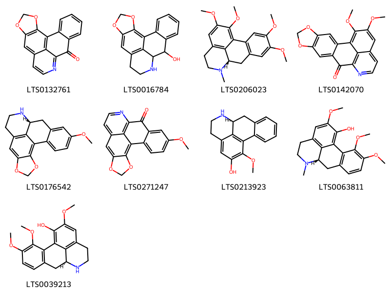{ width=100% }
    <figcaption>Hình ảnh cấu trúc hóa học của 9 hoạt chất thuộc nhóm Aporphines gồm ['liriodenine (LTS0132761)', '3,5-dioxa-11-azapentacyclo[10.7.1.0²,⁶.0⁸,²⁰.0¹⁴,¹⁹]icosa-1,6,8(20),14,16,18-hexaen-13-ol (LTS0016784)', '(9s)-4,5,15,16-tetramethoxy-10-methyl-10-azatetracyclo[7.7.1.0²,⁷.0¹³,¹⁷]heptadeca-1(16),2(7),3,5,13(17),14-hexaene (LTS0206023)', 'oxonantenine (LTS0142070)', 'xylopine (LTS0176542)', 'lanuginosine (LTS0271247)', 'asimilobine (LTS0213923)', '(9s)-3,4,15-trimethoxy-10-methyl-10-azatetracyclo[7.7.1.0²,⁷.0¹³,¹⁷]heptadeca-1(16),2(7),3,5,13(17),14-hexaen-16-ol (LTS0063811)', '(9s)-3,4,15-trimethoxy-10-azatetracyclo[7.7.1.0²,⁷.0¹³,¹⁷]heptadeca-1(16),2(7),3,5,13(17),14-hexaen-16-ol (LTS0039213)'].</figcaption>
</figure>
#### Nhóm Benzene and substituted derivatives
<figure markdown="span">
    { width=100% }
    <figcaption>Hình ảnh cấu trúc hóa học của 1 hoạt chất thuộc nhóm Benzene and substituted derivatives gồm ['benzethonium (LTS0114900)'].</figcaption>
</figure>
#### Nhóm Carboxylic acids and derivatives
<figure markdown="span">
    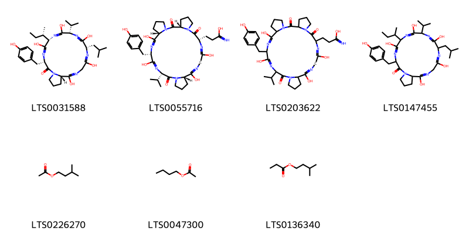{ width=100% }
    <figcaption>Hình ảnh cấu trúc hóa học của 7 hoạt chất thuộc nhóm Carboxylic acids and derivatives gồm ['(6s,9s,12s,15s,20as)-12-[(2s)-butan-2-yl]-1,4,7,10,13-pentahydroxy-15-[(4-hydroxyphenyl)methyl]-9-isopropyl-6-(2-methylpropyl)-3h,6h,9h,12h,15h,18h,19h,20h,20ah-pyrrolo[1,2-a]1,4,7,10,13,16-hexaazacyclooctadecan-16-one (LTS0031588)', '3-[(3s,9s,15s,21s,24s,27s)-11,14,23,26-tetrahydroxy-24-[(4-hydroxyphenyl)methyl]-21-isopropyl-2,8,20-trioxo-1,7,10,13,19,22,25-heptaazatetracyclo[25.3.0.0³,⁷.0¹⁵,¹⁹]triaconta-10,13,22,25-tetraen-9-yl]propanimidic acid (LTS0055716)', '3-{11,14,23,26-tetrahydroxy-24-[(4-hydroxyphenyl)methyl]-21-isopropyl-2,8,20-trioxo-1,7,10,13,19,22,25-heptaazatetracyclo[25.3.0.0³,⁷.0¹⁵,¹⁹]triaconta-10,13,22,25-tetraen-9-yl}propanimidic acid (LTS0203622)', '1,4,7,10,13-pentahydroxy-15-[(4-hydroxyphenyl)methyl]-9-isopropyl-6-(2-methylpropyl)-12-(sec-butyl)-3h,6h,9h,12h,15h,18h,19h,20h,20ah-pyrrolo[1,2-a]1,4,7,10,13,16-hexaazacyclooctadecan-16-one (LTS0147455)', 'banana oil (LTS0226270)', 'butyl acetate (LTS0047300)', 'isoamyl propionate (LTS0136340)'].</figcaption>
</figure>
#### Nhóm Dihydrofurans
<figure markdown="span">
    { width=100% }
    <figcaption>Hình ảnh cấu trúc hóa học của 1 hoạt chất thuộc nhóm Dihydrofurans gồm ['(5s)-5-methyl-4-(12-oxononacosyl)-5h-furan-2-one (LTS0078203)'].</figcaption>
</figure>
#### Nhóm Fatty Acyls
<figure markdown="span">
    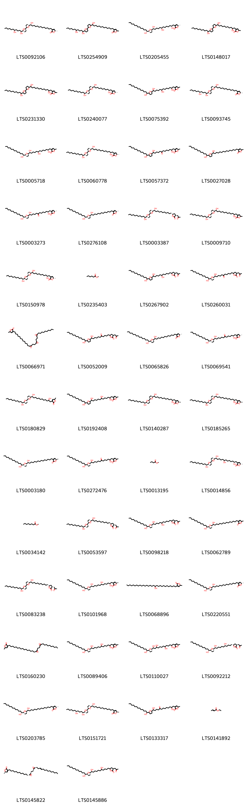{ width=100% }
    <figcaption>Hình ảnh cấu trúc hóa học của 75 hoạt chất thuộc nhóm Fatty Acyls gồm ['annonin i (LTS0092106)', "3-{13-[5'-(1,5-dihydroxyundecyl)-[2,2'-bioxolan]-5-yl]-13-hydroxytridecyl}-5-methyl-5h-furan-2-one (LTS0254909)", 'annonacin (LTS0205455)', "3-{2,11-dihydroxy-11-[5'-(1-hydroxyundecyl)-[2,2'-bioxolan]-5-yl]undecyl}-5-methyl-5h-furan-2-one (LTS0148017)", "3-{2,13-dihydroxy-13-[5'-(1-hydroxyundecyl)-[2,2'-bioxolan]-5-yl]tridecyl}-5-methyl-5h-furan-2-one (LTS0231330)", "(5s)-3-[(2r,11r)-2,11-dihydroxy-11-[(2r,2'r,5r,5'r)-5'-[(1s)-1-hydroxyundecyl]-[2,2'-bioxolan]-5-yl]undecyl]-5-methyl-5h-furan-2-one (LTS0240077)", 'annonacin (LTS0075392)', "(5s)-3-[(13s)-13-[(2r,2'r,5r,5'r)-5'-[(1s,5r)-1,5-dihydroxyundecyl]-[2,2'-bioxolan]-5-yl]-13-hydroxytridecyl]-5-methyl-5h-furan-2-one (LTS0093745)", '5-methyl-3-[(2r,8r,13r)-2,8,13-trihydroxy-13-[(2r,5r)-5-[(1r)-1-hydroxytridecyl]oxolan-2-yl]tridecyl]-5h-furan-2-one (LTS0005718)', 'bullatacin (LTS0060778)', '3-{2,13-dihydroxy-13-[5-(1-hydroxytridecyl)oxolan-2-yl]-8-oxotridecyl}-5-methyl-5h-furan-2-one (LTS0057372)', '3-{15-hydroxy-15-[5-(1-hydroxytridecyl)oxolan-2-yl]pentadecyl}-5-methyl-5h-furan-2-one (LTS0027028)', '(5s)-3-[(2r,13r)-2,13-dihydroxy-13-[(2r,5r)-5-[(1r)-1-hydroxytridecyl]oxolan-2-yl]-8-oxotridecyl]-5-methyl-5h-furan-2-one (LTS0003273)', '(5s)-3-[(13r)-13-hydroxy-13-[(2r,5r)-5-[(1r)-1-hydroxytridecyl]oxolan-2-yl]tridecyl]-5-methyl-5h-furan-2-one (LTS0276108)', 'bullatacinone (LTS0003387)', 'bullatacin (LTS0009710)', "(5s)-3-[(2r,11s)-2,11-dihydroxy-11-[(2s,2's,5s,5's)-5'-[(1r)-1-hydroxyundecyl]-[2,2'-bioxolan]-5-yl]undecyl]-5-methyl-5h-furan-2-one (LTS0150978)", 'methyl caproate (LTS0235403)', 'isoannonacin (LTS0267902)', '5-[(11s)-11-hydroxy-11-[(2s,5s)-5-[(1s)-1-hydroxytridecyl]oxolan-2-yl]-6-oxoundecyl]-3-(2-oxopropyl)oxolan-2-one (LTS0260031)', '3-{12-[3-(2-{3-[2-(3-decyloxiran-2-yl)ethyl]oxiran-2-yl}ethyl)oxiran-2-yl]dodecyl}-5-methyl-5h-furan-2-one (LTS0066971)', '5-{11-hydroxy-11-[5-(1-hydroxytridecyl)oxolan-2-yl]-5-oxoundecyl}-3-(2-oxopropyl)oxolan-2-one (LTS0052009)', '(5s)-3-[(13s)-13-hydroxy-13-[(2r,5s)-5-[(1r)-1-hydroxypentadecyl]oxolan-2-yl]tridecyl]-5-methyl-5h-furan-2-one (LTS0065826)', '(5s)-3-[(2r,13r)-2,13-dihydroxy-13-[(2r,5r)-5-[(1r)-1-hydroxytridecyl]oxolan-2-yl]-7-oxotridecyl]-5-methyl-5h-furan-2-one (LTS0069541)', "3-[(12r)-2,12-dihydroxy-12-[(2s,2's,5s,5's)-5'-[(1r)-1-hydroxyundecyl]-[2,2'-bioxolan]-5-yl]dodecyl]-5-methyl-5h-furan-2-one (LTS0180829)", '5-methyl-3-{2,7,13-trihydroxy-13-[5-(1-hydroxytridecyl)oxolan-2-yl]tridecyl}-5h-furan-2-one (LTS0192408)', "(5r)-3-[(2s,13s)-2,13-dihydroxy-13-[(2r,2'r,5s,5's)-5'-[(1r)-1-hydroxyundecyl]-[2,2'-bioxolan]-5-yl]tridecyl]-5-methyl-5h-furan-2-one (LTS0140287)", "(5r)-3-[(2s,13r)-2,13-dihydroxy-13-[(2s,2'r,5r,5's)-5'-[(1s)-1-hydroxyundecyl]-[2,2'-bioxolan]-5-yl]tridecyl]-5-methyl-5h-furan-2-one (LTS0185265)", '(5r)-3-[(15r)-15-hydroxy-15-[(2s,5r)-5-[(1s)-1-hydroxytridecyl]oxolan-2-yl]pentadecyl]-5-methyl-5h-furan-2-one (LTS0003180)', '3-[(13s)-2,13-dihydroxy-13-[(2s,5s)-5-[(1s)-1-hydroxytridecyl]oxolan-2-yl]-7-oxotridecyl]-5-methyl-5h-furan-2-one (LTS0272476)', 'methyl butyrate (LTS0013195)', "(5s)-5-methyl-3-[(2r,8r,13r)-2,8,13-trihydroxy-13-[(2r,2'r,5r,5'r)-5'-[(1r)-1-hydroxyundecyl]-[2,2'-bioxolan]-5-yl]tridecyl]-5h-furan-2-one (LTS0014856)", 'methyl caprylate (LTS0034142)', "(3s,5s)-5-[(11s)-11-hydroxy-11-[(2r,2'r,5r,5'r)-5'-[(1s)-1-hydroxyundecyl]-[2,2'-bioxolan]-5-yl]undecyl]-3-(2-oxopropyl)oxolan-2-one (LTS0053597)", '5-[(11s)-6,11-dihydroxy-11-[(2s,5s)-5-[(1s)-1-hydroxytridecyl]oxolan-2-yl]undecyl]-3-(2-oxopropyl)oxolan-2-one (LTS0098218)', '3-[(15s)-15-hydroxy-15-[(2s,5s)-5-[(1s)-1-hydroxytridecyl]oxolan-2-yl]pentadecyl]-5-methyl-5h-furan-2-one (LTS0062789)', "(3r,5r)-5-[(11r)-11-hydroxy-11-[(2r,2'r,5r,5'r)-5'-[(1s)-1-hydroxyundecyl]-[2,2'-bioxolan]-5-yl]undecyl]-3-(2-oxopropyl)oxolan-2-one (LTS0083238)", '(5r)-5-methyl-3-[(2s,7s,13r)-2,7,13-trihydroxy-13-[(2s,5s)-5-[(1r)-1-hydroxytridecyl]oxolan-2-yl]tridecyl]-5h-furan-2-one (LTS0101968)', '3-(13-hydroxytriacontyl)-5-methyl-5h-furan-2-one (LTS0068896)', '(5s)-3-[(15r)-15-hydroxy-15-[(2r,5r)-5-[(1s)-1-hydroxytridecyl]oxolan-2-yl]pentadecyl]-5-methyl-5h-furan-2-one (LTS0220551)', '3-(16-{3-[2-(3-decyloxiran-2-yl)ethyl]oxiran-2-yl}hexadecyl)-5-methyl-5h-furan-2-one (LTS0160230)', '5-methyl-3-[(13s)-2,7,13-trihydroxy-13-[(2s,5s)-5-[(1s)-1-hydroxytridecyl]oxolan-2-yl]tridecyl]-5h-furan-2-one (LTS0089406)', '5-methyl-3-[(13s)-2,6,11,13-tetrahydroxy-13-[(2s,5s)-5-[(1s)-1-hydroxytridecyl]oxolan-2-yl]tridecyl]-5h-furan-2-one (LTS0110027)', '(3s,5r)-5-[(5s,11r)-5,11-dihydroxy-11-[(2s,5s)-5-[(1r)-1-hydroxytridecyl]oxolan-2-yl]undecyl]-3-(2-oxopropyl)oxolan-2-one (LTS0092212)', '(5s)-3-[(15r)-15-hydroxy-15-[(2r,5r)-5-[(1r)-1-hydroxytridecyl]oxolan-2-yl]pentadecyl]-5-methyl-5h-furan-2-one (LTS0203785)', "(5r)-3-[(13r)-13-[(2r,2'r,5r,5'r)-5'-[(1r,5r)-1,5-dihydroxyundecyl]-[2,2'-bioxolan]-5-yl]-13-hydroxytridecyl]-5-methyl-5h-furan-2-one (LTS0151721)", '3-{2,13-dihydroxy-13-[5-(1-hydroxytridecyl)oxolan-2-yl]-9-oxotridecyl}-5-methyl-5h-furan-2-one (LTS0133317)', 'ethyl crotonate (LTS0141892)', '(5r)-5-methyl-3-{12-[(2r,3r)-3-{2-[(2r,3s)-3-[(3e)-tetradec-3-en-1-yl]oxiran-2-yl]ethyl}oxiran-2-yl]dodecyl}-5h-furan-2-one (LTS0145822)', '5-[(11s)-5,11-dihydroxy-11-[(2s,5s)-5-[(1s)-1-hydroxytridecyl]oxolan-2-yl]undecyl]-3-(2-oxopropyl)oxolan-2-one (LTS0145886)', '5-{5,11-dihydroxy-11-[5-(1-hydroxytridecyl)oxolan-2-yl]undecyl}-3-(2-oxopropyl)oxolan-2-one (LTS0090749)', '(5r)-3-{16-[(2r,3r)-3-{2-[(2r,3r)-3-decyloxiran-2-yl]ethyl}oxiran-2-yl]hexadecyl}-5-methyl-5h-furan-2-one (LTS0224561)', 'ethyl butyrate (LTS0106732)', '3-(14-{3-[2-(3-dodecyloxiran-2-yl)ethyl]oxiran-2-yl}tetradecyl)-5-methyl-5h-furan-2-one (LTS0120503)', '(3r,5s)-5-[(11r)-11-hydroxy-11-[(2r,5r)-5-[(1r)-1-hydroxytridecyl]oxolan-2-yl]undecyl]-3-(2-oxopropyl)oxolan-2-one (LTS0271632)', '(3s,5s)-5-[(7e,11r)-11-hydroxy-11-[(2r,5r)-5-[(1s)-1-hydroxydodecyl]oxolan-2-yl]undec-7-en-1-yl]-3-(2-oxopropyl)oxolan-2-one (LTS0107216)', '(3s,5s)-5-[(11r)-11-hydroxy-11-[(2r,5r)-5-[(1r)-1-hydroxytridecyl]oxolan-2-yl]undecyl]-3-(2-oxopropyl)oxolan-2-one (LTS0230011)', '(3r,5r)-5-[(7z,11r)-11-hydroxy-11-[(2r,5s)-5-[(1s)-1-hydroxydodecyl]oxolan-2-yl]undec-7-en-1-yl]-3-(2-oxopropyl)oxolan-2-one (LTS0121520)', '(5r)-3-[(2s,13r)-2,13-dihydroxy-13-[(2s,5r)-5-[(1s)-1-hydroxytridecyl]oxolan-2-yl]-9-oxotridecyl]-5-methyl-5h-furan-2-one (LTS0118370)', '(5s)-3-[(17s)-17-hydroxy-17-[(2r,5r)-5-[(1s)-1-hydroxyundecyl]oxolan-2-yl]heptadecyl]-5-methyl-5h-furan-2-one (LTS0118363)', '(5s)-3-{12-[(2s,3r)-3-{2-[(2s,3r)-3-dodecyloxiran-2-yl]ethyl}oxiran-2-yl]dodecyl}-5-methyl-5h-furan-2-one (LTS0212903)', '(3r,5r)-5-[(7e,11r)-11-hydroxy-11-[(2r,5s)-5-[(1s)-1-hydroxydodecyl]oxolan-2-yl]undec-7-en-1-yl]-3-(2-oxopropyl)oxolan-2-one (LTS0068523)', '2-butyl butyrate (LTS0214058)', 'butyl butyrate (LTS0236625)', '2-methylbutanoic acid (LTS0213858)', '(5s)-5-methyl-3-[(2s,7s,13r)-2,7,13-trihydroxy-13-[(2s,5s)-5-[(1r)-1-hydroxytridecyl]oxolan-2-yl]tridecyl]-5h-furan-2-one (LTS0218419)', "(5r)-3-[(2s,11r)-2,11-dihydroxy-11-[(2s,2'r,5r,5's)-5'-[(1s)-1-hydroxyundecyl]-[2,2'-bioxolan]-5-yl]undecyl]-5-methyl-5h-furan-2-one (LTS0262817)", '3-methyl valeric acid (LTS0232242)', '(3s,5s)-5-[(5r,11r)-5,11-dihydroxy-11-[(2s,5s)-5-[(1r)-1-hydroxytridecyl]oxolan-2-yl]undecyl]-3-(2-oxopropyl)oxolan-2-one (LTS0049397)', '5-[(11s)-11-hydroxy-11-[(2s,5s)-5-[(1s)-1-hydroxytridecyl]oxolan-2-yl]-5-oxoundecyl]-3-(2-oxopropyl)oxolan-2-one (LTS0248091)', '5-methyl-3-{12-[3-(2-{3-[(3z)-tetradec-3-en-1-yl]oxiran-2-yl}ethyl)oxiran-2-yl]dodecyl}-5h-furan-2-one (LTS0006293)', '(5s)-3-[(2r,13r)-2,13-dihydroxy-13-[(2s,5s)-5-[(1s)-1-hydroxytridecyl]oxolan-2-yl]-9-oxotridecyl]-5-methyl-5h-furan-2-one (LTS0010800)', '(5r)-3-{14-[(2s,3s)-3-{2-[(2s,3s)-3-dodecyloxiran-2-yl]ethyl}oxiran-2-yl]tetradecyl}-5-methyl-5h-furan-2-one (LTS0012957)', 'amyl butyrate (LTS0030398)', 'propyl butyrate (LTS0257652)'].</figcaption>
</figure>
#### Nhóm Flavonoids
<figure markdown="span">
    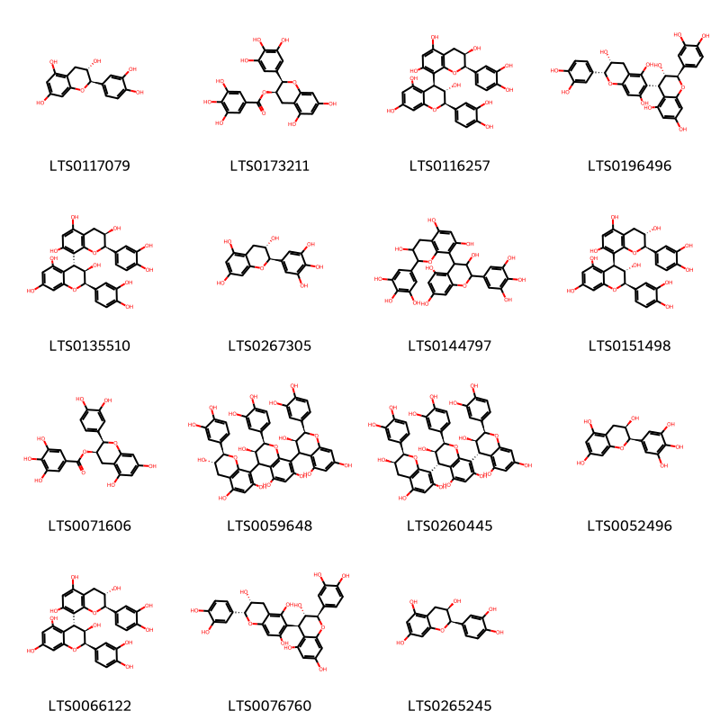{ width=100% }
    <figcaption>Hình ảnh cấu trúc hóa học của 15 hoạt chất thuộc nhóm Flavonoids gồm ['(+)-catechol (LTS0117079)', '(-)-epigallocatechin gallate (LTS0173211)', '(2r,3s,4s)-2-(3,4-dihydroxyphenyl)-4-[(2r,3r)-2-(3,4-dihydroxyphenyl)-3,5,7-trihydroxy-3,4-dihydro-2h-1-benzopyran-8-yl]-3,4-dihydro-2h-1-benzopyran-3,5,7-triol (LTS0116257)', '(2r,3s,4s)-2-(3,4-dihydroxyphenyl)-4-[(2r,3r)-2-(3,4-dihydroxyphenyl)-3,5,7-trihydroxy-3,4-dihydro-2h-1-benzopyran-6-yl]-3,4-dihydro-2h-1-benzopyran-3,5,7-triol (LTS0196496)', '(2r,3r,4r)-2-(3,4-dihydroxyphenyl)-4-[(2r,3r)-2-(3,4-dihydroxyphenyl)-3,5,7-trihydroxy-3,4-dihydro-2h-1-benzopyran-8-yl]-3,4-dihydro-2h-1-benzopyran-3,5,7-triol (LTS0135510)', 'gallocatechol (LTS0267305)', '4-[3,5,7-trihydroxy-2-(3,4,5-trihydroxyphenyl)-3,4-dihydro-2h-1-benzopyran-8-yl]-2-(3,4,5-trihydroxyphenyl)-3,4-dihydro-2h-1-benzopyran-3,5,7-triol (LTS0144797)', '(2r,3s,4s)-2-(3,4-dihydroxyphenyl)-4-[(2r,3s)-2-(3,4-dihydroxyphenyl)-3,5,7-trihydroxy-3,4-dihydro-2h-1-benzopyran-8-yl]-3,4-dihydro-2h-1-benzopyran-3,5,7-triol (LTS0151498)', 'epicatechin gallate (LTS0071606)', '(2r,3r)-2-(3,4-dihydroxyphenyl)-8-[(2r,3r)-2-(3,4-dihydroxyphenyl)-3,5,7-trihydroxy-3,4-dihydro-2h-1-benzopyran-4-yl]-4-[(2r,3s)-2-(3,4-dihydroxyphenyl)-3,5,7-trihydroxy-3,4-dihydro-2h-1-benzopyran-8-yl]-3,4-dihydro-2h-1-benzopyran-3,5,7-triol (LTS0059648)', 'procyanidin c1 (LTS0260445)', 'epigallocatechin (LTS0052496)', '(2r,3r,4r)-2-(3,4-dihydroxyphenyl)-4-[(2r,3s)-2-(3,4-dihydroxyphenyl)-3,5,7-trihydroxy-3,4-dihydro-2h-1-benzopyran-8-yl]-3,4-dihydro-2h-1-benzopyran-3,5,7-triol (LTS0066122)', '(2r,3s,4r)-2-(3,4-dihydroxyphenyl)-4-[(2r,3r)-2-(3,4-dihydroxyphenyl)-3,5,7-trihydroxy-3,4-dihydro-2h-1-benzopyran-6-yl]-3,4-dihydro-2h-1-benzopyran-3,5,7-triol (LTS0076760)', 'ent-epicatechin (LTS0265245)'].</figcaption>
</figure>
#### Nhóm Indoles and derivatives
<figure markdown="span">
    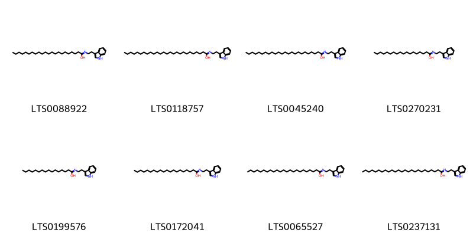{ width=100% }
    <figcaption>Hình ảnh cấu trúc hóa học của 8 hoạt chất thuộc nhóm Indoles and derivatives gồm ['n-[2-(1h-indol-3-yl)ethyl]docosanimidic acid (LTS0088922)', 'n-[2-(1h-indol-3-yl)ethyl]hexacosanimidic acid (LTS0118757)', 'n-[2-(1h-indol-3-yl)ethyl]tetracosanimidic acid (LTS0045240)', 'n-[2-(1h-indol-3-yl)ethyl]octadecanimidic acid (LTS0270231)', 'n-[2-(1h-indol-3-yl)ethyl]hexadecanimidic acid (LTS0199576)', 'n-[2-(1h-indol-3-yl)ethyl]icosanimidic acid (LTS0172041)', 'n-[2-(1h-indol-3-yl)ethyl]tricosanimidic acid (LTS0065527)', 'n-[2-(1h-indol-3-yl)ethyl]pentacosanimidic acid (LTS0237131)'].</figcaption>
</figure>
#### Nhóm Isoquinolines and derivatives
<figure markdown="span">
    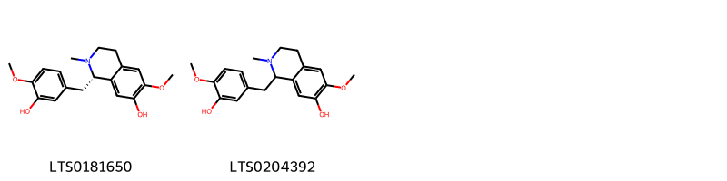{ width=100% }
    <figcaption>Hình ảnh cấu trúc hóa học của 2 hoạt chất thuộc nhóm Isoquinolines and derivatives gồm ['(+,-)-reticuline (LTS0181650)', 'reticuline (LTS0204392)'].</figcaption>
</figure>
#### Nhóm Prenol lipids
<figure markdown="span">
    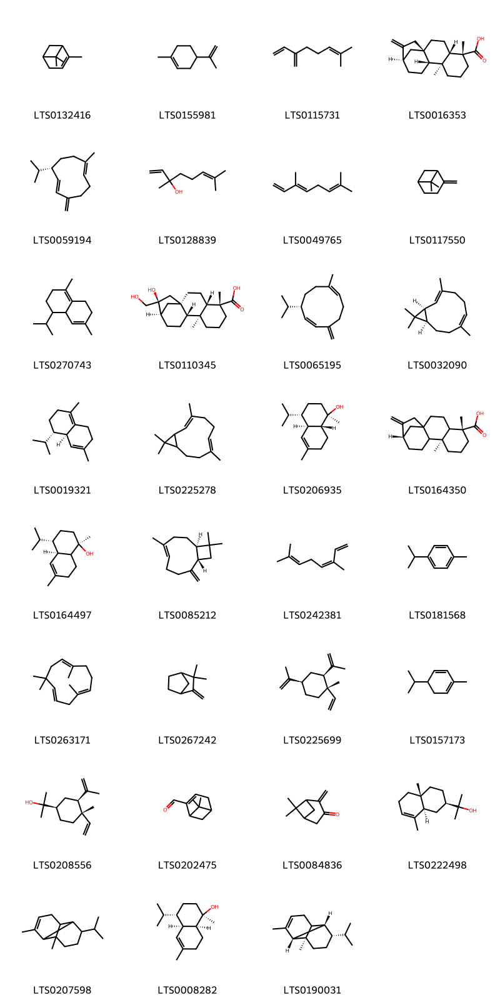{ width=100% }
    <figcaption>Hình ảnh cấu trúc hóa học của 31 hoạt chất thuộc nhóm Prenol lipids gồm ['α pinene (LTS0132416)', 'limonene,  (LTS0155981)', 'α-myrcene (LTS0115731)', 'ent-kaur-16-en-19-oic acid (LTS0016353)', '(-)-germacrene d (LTS0059194)', 'linalool, (+-)- (LTS0128839)', 'trans-β-ocimene (LTS0049765)', 'β-pinene (LTS0117550)', '4-isopropyl-1,6-dimethyl-2,3,4,4a,7,8-hexahydronaphthalene (LTS0270743)', '(1s,4s,5r,9s,10r,13r,14s)-14-hydroxy-14-(hydroxymethyl)-5,9-dimethyltetracyclo[11.2.1.0¹,¹⁰.0⁴,⁹]hexadecane-5-carboxylic acid (LTS0110345)', '(1z,6z,8s)-8-isopropyl-1-methyl-5-methylidenecyclodeca-1,6-diene (LTS0065195)', '(1s,2e,10r)-3,7,11,11-tetramethylbicyclo[8.1.0]undeca-2,6-diene (LTS0032090)', 'delta-cadinene (LTS0019321)', '(2e,6e)-3,7,11,11-tetramethylbicyclo[8.1.0]undeca-2,6-diene (LTS0225278)', 'α-cadinol (LTS0206935)', '(5r,9s,13s)-5,9-dimethyl-14-methylidenetetracyclo[11.2.1.0¹,¹⁰.0⁴,⁹]hexadecane-5-carboxylic acid (LTS0164350)', '(1r,4s,4ar)-4-isopropyl-1,6-dimethyl-3,4,4a,7,8,8a-hexahydro-2h-naphthalen-1-ol (LTS0164497)', 'caryophyllene (LTS0085212)', 'β-ocimene (LTS0242381)', 'cymene (LTS0181568)', 'humulene (LTS0263171)', 'camphene (LTS0267242)', 'β-elemene (LTS0225699)', 'phellandrene (LTS0157173)', 'elemol (LTS0208556)', 'myrtenal (LTS0202475)', 'pinocarvone (LTS0084836)', 'α-eudesmol (LTS0222498)', 'α-copaene (LTS0207598)', 'delta-cadinol (LTS0008282)', '(1r,2s,7s,8s)-8-isopropyl-1,3-dimethyltricyclo[4.4.0.0²,⁷]dec-3-ene (LTS0190031)'].</figcaption>
</figure>
#### Nhóm Protoberberine alkaloids and derivatives
<figure markdown="span">
    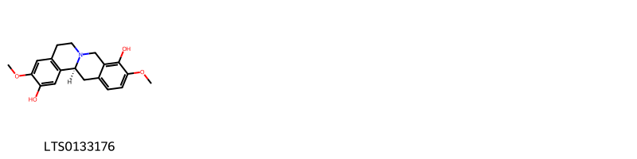{ width=100% }
    <figcaption>Hình ảnh cấu trúc hóa học của 1 hoạt chất thuộc nhóm Protoberberine alkaloids and derivatives gồm ['scoulerine (LTS0133176)'].</figcaption>
</figure>

---

### Dược dân tộc học

Danh sách các quốc gia có sử dụng *Annona reticulata* trong điều trị các bệnh. 

| Country   | Disease                                               | Bệnh                                                                                                                                                                                                |
|:----------|:------------------------------------------------------|:----------------------------------------------------------------------------------------------------------------------------------------------------------------------------------------------------|
| Elsewhere | Astringent, Insecticide, Tonic, Astringent, Vermifuge | MYMEMORY WARNING: YOU USED ALL AVAILABLE FREE TRANSLATIONS FOR TODAY. NEXT AVAILABLE IN  10 HOURS 26 MINUTES 15 SECONDS VISIT HTTPS://MYMEMORY.TRANSLATED.NET/DOC/USAGELIMITS.PHP TO TRANSLATE MORE |
| German    | Vermifuge                                             | MYMEMORY WARNING: YOU USED ALL AVAILABLE FREE TRANSLATIONS FOR TODAY. NEXT AVAILABLE IN  10 HOURS 26 MINUTES 11 SECONDS VISIT HTTPS://MYMEMORY.TRANSLATED.NET/DOC/USAGELIMITS.PHP TO TRANSLATE MORE |
| Haiti     | Diuretic                                              | MYMEMORY WARNING: YOU USED ALL AVAILABLE FREE TRANSLATIONS FOR TODAY. NEXT AVAILABLE IN  10 HOURS 26 MINUTES 07 SECONDS VISIT HTTPS://MYMEMORY.TRANSLATED.NET/DOC/USAGELIMITS.PHP TO TRANSLATE MORE |
| India     | Tonic                                                 | MYMEMORY WARNING: YOU USED ALL AVAILABLE FREE TRANSLATIONS FOR TODAY. NEXT AVAILABLE IN  10 HOURS 26 MINUTES 03 SECONDS VISIT HTTPS://MYMEMORY.TRANSLATED.NET/DOC/USAGELIMITS.PHP TO TRANSLATE MORE |
| Java      | Pediculicide                                          | MYMEMORY WARNING: YOU USED ALL AVAILABLE FREE TRANSLATIONS FOR TODAY. NEXT AVAILABLE IN  10 HOURS 26 MINUTES 00 SECONDS VISIT HTTPS://MYMEMORY.TRANSLATED.NET/DOC/USAGELIMITS.PHP TO TRANSLATE MORE |
| Malaya    | Tonic                                                 | MYMEMORY WARNING: YOU USED ALL AVAILABLE FREE TRANSLATIONS FOR TODAY. NEXT AVAILABLE IN  10 HOURS 25 MINUTES 56 SECONDS VISIT HTTPS://MYMEMORY.TRANSLATED.NET/DOC/USAGELIMITS.PHP TO TRANSLATE MORE |
| Malaysia  | Astringent                                            | MYMEMORY WARNING: YOU USED ALL AVAILABLE FREE TRANSLATIONS FOR TODAY. NEXT AVAILABLE IN  10 HOURS 25 MINUTES 52 SECONDS VISIT HTTPS://MYMEMORY.TRANSLATED.NET/DOC/USAGELIMITS.PHP TO TRANSLATE MORE |
| US        | Poison                                                | MYMEMORY WARNING: YOU USED ALL AVAILABLE FREE TRANSLATIONS FOR TODAY. NEXT AVAILABLE IN  10 HOURS 25 MINUTES 48 SECONDS VISIT HTTPS://MYMEMORY.TRANSLATED.NET/DOC/USAGELIMITS.PHP TO TRANSLATE MORE |

---

---
## Annona squamosa
### Thông tin về thực vật

!!! info "Phân loại thực vật của *Annona squamosa* từ GIBF:"
    - **Kingdom:** Plantae
    - **Phylum:** Tracheophyta
    - **Order:** Magnoliales
    - **Family:** Annonaceae
    - **Genus:** Annona
    - **Species:** *Annona squamosa*

 

| Label (VI)   | Label (EN)   | Scientific Name   | Descriptions (VI)   | Descriptions (EN)   | Also Known As (VI)                                                                                  | Also Known As (EN)                           |
|:-------------|:-------------|:------------------|:--------------------|:--------------------|:----------------------------------------------------------------------------------------------------|:---------------------------------------------|
| N/A          | N/A          | Annona squamosa   | loài thực vật       | species of plant    | ['Na dai', 'Mãng cầu ta', 'Mãng cầu giai', 'Mãng cầu dai', 'Annona squamosa', 'Xylopia frutescens'] | ['Sweetsop', 'Custard-apple', 'Sugar-apple'] |

#### Phân bố trên thế giới

**Từ CSDL GIBF** Thailand, Antigua and Barbuda, Belize, Brazil, Maldives, Puerto Rico, Guadeloupe, India, Réunion, Bolivia (Plurinational State of), Nigeria, Mexico, Martinique, Nepal, Indonesia

#### Phân bố tại Việt Nam

**Từ CSDL GIBF**: Không có ghi nhận ở Việt Nam

---
### Thành phần hóa học
        
- Theo cơ sở dữ liệu lotus: Từ loài *Annona squamosa* đã phân lập và xác định được 373 hoạt chất thuộc về các nhóm Stilbenes, Furanoid lignans, Aporphines, Proaporphines, 2-arylbenzofuran flavonoids, Carboxylic acids and derivatives, Organonitrogen compounds, Dibenzylbutane lignans, Tetrahydroisoquinolines, Pyrrolidines, Phenols, Organooxygen compounds, Saturated hydrocarbons, Lignan glycosides, Fatty Acyls, Diazanaphthalenes, Flavonoids, Isoquinolines and derivatives, Prenol lipids, Aryltetralin lignans, Steroids and steroid derivatives. 

|    | chemicalTaxonomyClassyfireClass   |   smiles_count |
|---:|:----------------------------------|---------------:|
|  0 |                                   |              2 |
|  1 | 2-arylbenzofuran flavonoids       |              6 |
|  2 | Aporphines                        |             22 |
|  3 | Aryltetralin lignans              |              4 |
|  4 | Carboxylic acids and derivatives  |             19 |
|  5 | Diazanaphthalenes                 |              1 |
|  6 | Dibenzylbutane lignans            |              2 |
|  7 | Fatty Acyls                       |            173 |
|  8 | Flavonoids                        |              2 |
|  9 | Furanoid lignans                  |              2 |
| 10 | Isoquinolines and derivatives     |              2 |
| 11 | Lignan glycosides                 |             11 |
| 12 | Organonitrogen compounds          |              1 |
| 13 | Organooxygen compounds            |             12 |
| 14 | Phenols                           |              5 |
| 15 | Prenol lipids                     |             77 |
| 16 | Proaporphines                     |              2 |
| 17 | Pyrrolidines                      |              1 |
| 18 | Saturated hydrocarbons            |              9 |
| 19 | Steroids and steroid derivatives  |             13 |
| 20 | Stilbenes                         |              1 |
| 21 | Tetrahydroisoquinolines           |              2 |

#### Nhóm 
<figure markdown="span">
    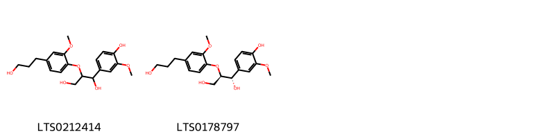{ width=100% }
    <figcaption>Hình ảnh cấu trúc hóa học của 2 hoạt chất thuộc nhóm  gồm ['1-(4-hydroxy-3-methoxyphenyl)-2-[4-(3-hydroxypropyl)-2-methoxyphenoxy]propane-1,3-diol (LTS0212414)', '(1s,2r)-1-(4-hydroxy-3-methoxyphenyl)-2-[4-(3-hydroxypropyl)-2-methoxyphenoxy]propane-1,3-diol (LTS0178797)'].</figcaption>
</figure>
#### Nhóm 2-arylbenzofuran flavonoids
<figure markdown="span">
    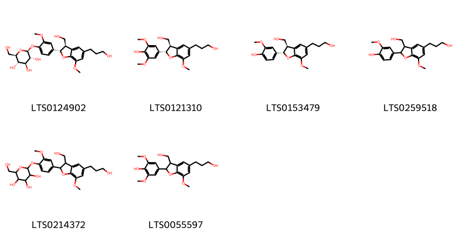{ width=100% }
    <figcaption>Hình ảnh cấu trúc hóa học của 6 hoạt chất thuộc nhóm 2-arylbenzofuran flavonoids gồm ['(2r,3s,4s,5r,6s)-2-(hydroxymethyl)-6-{4-[(2s,3r)-3-(hydroxymethyl)-5-(3-hydroxypropyl)-7-methoxy-2,3-dihydro-1-benzofuran-2-yl]-2-methoxyphenoxy}oxane-3,4,5-triol (LTS0124902)', '4-[(2s,3r)-3-(hydroxymethyl)-5-(3-hydroxypropyl)-7-methoxy-2,3-dihydro-1-benzofuran-2-yl]-2,6-dimethoxyphenol (LTS0121310)', '4-[(2s,3r)-3-(hydroxymethyl)-5-(3-hydroxypropyl)-7-methoxy-2,3-dihydro-1-benzofuran-2-yl]-2-methoxyphenol (LTS0153479)', '4-[3-(hydroxymethyl)-5-(3-hydroxypropyl)-7-methoxy-2,3-dihydro-1-benzofuran-2-yl]-2-methoxyphenol (LTS0259518)', '2-(hydroxymethyl)-6-{4-[3-(hydroxymethyl)-5-(3-hydroxypropyl)-7-methoxy-2,3-dihydro-1-benzofuran-2-yl]-2-methoxyphenoxy}oxane-3,4,5-triol (LTS0214372)', '4-[3-(hydroxymethyl)-5-(3-hydroxypropyl)-7-methoxy-2,3-dihydro-1-benzofuran-2-yl]-2,6-dimethoxyphenol (LTS0055597)'].</figcaption>
</figure>
#### Nhóm Aporphines
<figure markdown="span">
    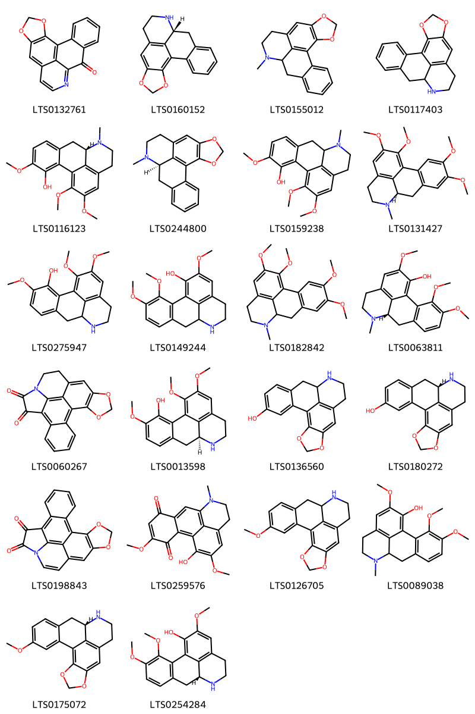{ width=100% }
    <figcaption>Hình ảnh cấu trúc hóa học của 22 hoạt chất thuộc nhóm Aporphines gồm ['liriodenine (LTS0132761)', 'anonaine (LTS0160152)', '11-methyl-3,5-dioxa-11-azapentacyclo[10.7.1.0²,⁶.0⁸,²⁰.0¹⁴,¹⁹]icosa-1(20),2(6),7,14,16,18-hexaene (LTS0155012)', '3,5-dioxa-11-azapentacyclo[10.7.1.0²,⁶.0⁸,²⁰.0¹⁴,¹⁹]icosa-1(20),2(6),7,14,16,18-hexaene (LTS0117403)', '(9s)-4,15,16-trimethoxy-10-methyl-10-azatetracyclo[7.7.1.0²,⁷.0¹³,¹⁷]heptadeca-1(16),2,4,6,13(17),14-hexaen-3-ol (LTS0116123)', '(12r)-11-methyl-3,5-dioxa-11-azapentacyclo[10.7.1.0²,⁶.0⁸,²⁰.0¹⁴,¹⁹]icosa-1(20),2(6),7,14,16,18-hexaene (LTS0244800)', '4,15,16-trimethoxy-10-methyl-10-azatetracyclo[7.7.1.0²,⁷.0¹³,¹⁷]heptadeca-1(16),2,4,6,13(17),14-hexaen-3-ol (LTS0159238)', '(9r)-4,5,15,16-tetramethoxy-10-methyl-10-azatetracyclo[7.7.1.0²,⁷.0¹³,¹⁷]heptadeca-1(16),2(7),3,5,13(17),14-hexaene (LTS0131427)', '4,15,16-trimethoxy-10-azatetracyclo[7.7.1.0²,⁷.0¹³,¹⁷]heptadeca-1(16),2,4,6,13(17),14-hexaen-3-ol (LTS0275947)', '3,4,15-trimethoxy-10-azatetracyclo[7.7.1.0²,⁷.0¹³,¹⁷]heptadeca-1(16),2(7),3,5,13(17),14-hexaen-16-ol (LTS0149244)', '4,5,15,16-tetramethoxy-10-methyl-10-azatetracyclo[7.7.1.0²,⁷.0¹³,¹⁷]heptadeca-1(16),2(7),3,5,13(17),14-hexaene (LTS0182842)', '(9s)-3,4,15-trimethoxy-10-methyl-10-azatetracyclo[7.7.1.0²,⁷.0¹³,¹⁷]heptadeca-1(16),2(7),3,5,13(17),14-hexaen-16-ol (LTS0063811)', '3,5-dioxa-11-azahexacyclo[9.9.2.0²,⁶.0⁸,²¹.0¹⁴,²².0¹⁵,²⁰]docosa-1(21),2(6),7,14(22),15(20),16,18-heptaene-12,13-dione (LTS0060267)', '(9s)-4,15,16-trimethoxy-10-azatetracyclo[7.7.1.0²,⁷.0¹³,¹⁷]heptadeca-1(16),2,4,6,13(17),14-hexaen-3-ol (LTS0013598)', '3,5-dioxa-11-azapentacyclo[10.7.1.0²,⁶.0⁸,²⁰.0¹⁴,¹⁹]icosa-1,6,8(20),14,16,18-hexaen-17-ol (LTS0136560)', '(12s)-3,5-dioxa-11-azapentacyclo[10.7.1.0²,⁶.0⁸,²⁰.0¹⁴,¹⁹]icosa-1,6,8(20),14,16,18-hexaen-17-ol (LTS0180272)', '3,5-dioxa-11-azahexacyclo[9.9.2.0²,⁶.0⁸,²¹.0¹⁴,²².0¹⁵,²⁰]docosa-1,6,8(21),9,14(22),15(20),16,18-octaene-12,13-dione (LTS0198843)', '16-hydroxy-4,15-dimethoxy-10-methyl-10-azatetracyclo[7.7.1.0²,⁷.0¹³,¹⁷]heptadeca-1(16),2(7),4,8,13(17),14-hexaene-3,6-dione (LTS0259576)', '17-methoxy-3,5-dioxa-11-azapentacyclo[10.7.1.0²,⁶.0⁸,²⁰.0¹⁴,¹⁹]icosa-1,6,8(20),14,16,18-hexaene (LTS0126705)', '3,4,15-trimethoxy-10-methyl-10-azatetracyclo[7.7.1.0²,⁷.0¹³,¹⁷]heptadeca-1(16),2(7),3,5,13(17),14-hexaen-16-ol (LTS0089038)', '(12s)-17-methoxy-3,5-dioxa-11-azapentacyclo[10.7.1.0²,⁶.0⁸,²⁰.0¹⁴,¹⁹]icosa-1,6,8(20),14,16,18-hexaene (LTS0175072)', '(9r)-3,4,15-trimethoxy-10-azatetracyclo[7.7.1.0²,⁷.0¹³,¹⁷]heptadeca-1(16),2(7),3,5,13(17),14-hexaen-16-ol (LTS0254284)'].</figcaption>
</figure>
#### Nhóm Aryltetralin lignans
<figure markdown="span">
    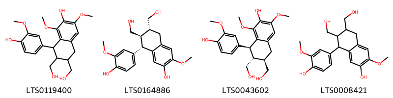{ width=100% }
    <figcaption>Hình ảnh cấu trúc hóa học của 4 hoạt chất thuộc nhóm Aryltetralin lignans gồm ['8-(4-hydroxy-3-methoxyphenyl)-6,7-bis(hydroxymethyl)-1,3-dimethoxy-5,6,7,8-tetrahydronaphthalen-2-ol (LTS0119400)', '(+)-isolariciresinol (LTS0164886)', '(6r,7r,8s)-8-(4-hydroxy-3-methoxyphenyl)-6,7-bis(hydroxymethyl)-1,3-dimethoxy-5,6,7,8-tetrahydronaphthalen-2-ol (LTS0043602)', '8-(4-hydroxy-3-methoxyphenyl)-6,7-bis(hydroxymethyl)-3-methoxy-5,6,7,8-tetrahydronaphthalen-2-ol (LTS0008421)'].</figcaption>
</figure>
#### Nhóm Carboxylic acids and derivatives
<figure markdown="span">
    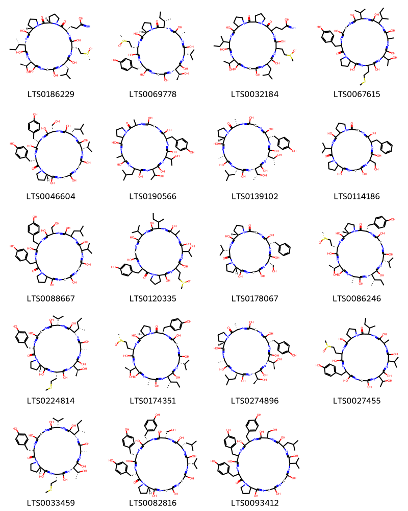{ width=100% }
    <figcaption>Hình ảnh cấu trúc hóa học của 19 hoạt chất thuộc nhóm Carboxylic acids and derivatives gồm ['3-[(3s,9s,12s,15s,21r,24s,27s)-24-[(2s)-butan-2-yl]-11,14,17,20,23,26-hexahydroxy-21-[(1s)-1-hydroxyethyl]-12-{2-[(r)-methanesulfinyl]ethyl}-15-(2-methylpropyl)-2,8-dioxo-1,7,10,13,16,19,22,25-octaazatricyclo[25.3.0.0³,⁷]triaconta-10,13,16,19,22,25-hexaen-9-yl]propanimidic acid (LTS0186229)', '(3s,6s,12s,15s,18s,21s,26as)-21-[(2s)-butan-2-yl]-1,4,7,10,13,16,19-heptahydroxy-12-[(1s)-1-hydroxyethyl]-6-[(4-hydroxyphenyl)methyl]-15-isopropyl-3-{2-[(r)-methanesulfinyl]ethyl}-18-methyl-3h,6h,9h,12h,15h,18h,21h,24h,25h,26h,26ah-pyrrolo[1,2-a]1,4,7,10,13,16,19,22-octaazacyclotetracosan-22-one (LTS0069778)', '3-[11,14,17,20,23,26-hexahydroxy-21-(1-hydroxyethyl)-12-(2-methanesulfinylethyl)-15-(2-methylpropyl)-2,8-dioxo-24-(sec-butyl)-1,7,10,13,16,19,22,25-octaazatricyclo[25.3.0.0³,⁷]triaconta-10,13,16,19,22,25-hexaen-9-yl]propanimidic acid (LTS0032184)', '1,4,7,10,13,16,19-heptahydroxy-6-(1-hydroxyethyl)-21-[(4-hydroxyphenyl)methyl]-15-isopropyl-9-methyl-3-[2-(methylsulfanyl)ethyl]-12-(sec-butyl)-3h,6h,9h,12h,15h,18h,21h,24h,25h,26h,26ah-pyrrolo[1,2-a]1,4,7,10,13,16,19,22-octaazacyclotetracosan-22-one (LTS0067615)', '(9s,12s,15s,18s,21s,26as)-1,4,7,10,13,16,19-heptahydroxy-15-(hydroxymethyl)-18,21-bis[(4-hydroxyphenyl)methyl]-9-isopropyl-12-(2-methylpropyl)-3h,6h,9h,12h,15h,18h,21h,24h,25h,26h,26ah-pyrrolo[1,2-a]1,4,7,10,13,16,19,22-octaazacyclotetracosan-22-one (LTS0046604)', '1,4,7,10,13,16,19-heptahydroxy-9,12-bis(1-hydroxyethyl)-15-[(4-hydroxyphenyl)methyl]-3,21-dimethyl-6-(2-methylpropyl)-3h,6h,9h,12h,15h,18h,21h,24h,25h,26h,26ah-pyrrolo[1,2-a]1,4,7,10,13,16,19,22-octaazacyclotetracosan-22-one (LTS0190566)', '(3s,6s,9s,12s,15s,21s,26as)-1,4,7,10,13,16,19-heptahydroxy-9,12-bis[(1r)-1-hydroxyethyl]-15-[(4-hydroxyphenyl)methyl]-3,21-dimethyl-6-(2-methylpropyl)-3h,6h,9h,12h,15h,18h,21h,24h,25h,26h,26ah-pyrrolo[1,2-a]1,4,7,10,13,16,19,22-octaazacyclotetracosan-22-one (LTS0139102)', '15-benzyl-5,14,17,20,23-pentahydroxy-18-(hydroxymethyl)-3-isopropyl-1,4,10,13,16,19,22-heptaazatricyclo[22.3.0.0⁶,¹⁰]heptacosa-4,13,16,19,22-pentaene-2,11-dione (LTS0114186)', '1,4,7,10,13,16,19-heptahydroxy-15-(hydroxymethyl)-18,21-bis[(4-hydroxyphenyl)methyl]-9-isopropyl-12-(2-methylpropyl)-3h,6h,9h,12h,15h,18h,21h,24h,25h,26h,26ah-pyrrolo[1,2-a]1,4,7,10,13,16,19,22-octaazacyclotetracosan-22-one (LTS0088667)', '1,4,7,10,13,16,19-heptahydroxy-6-(1-hydroxyethyl)-21-[(4-hydroxyphenyl)methyl]-15-isopropyl-3-(2-methanesulfinylethyl)-9-methyl-12-(sec-butyl)-3h,6h,9h,12h,15h,18h,21h,24h,25h,26h,26ah-pyrrolo[1,2-a]1,4,7,10,13,16,19,22-octaazacyclotetracosan-22-one (LTS0120335)', '(3s,6s,15s,18s,24s)-15-benzyl-5,14,17,20,23-pentahydroxy-18-(hydroxymethyl)-3-isopropyl-1,4,10,13,16,19,22-heptaazatricyclo[22.3.0.0⁶,¹⁰]heptacosa-4,13,16,19,22-pentaene-2,11-dione (LTS0178067)', '(3s,6r,9s,12s,15s,21s,26as)-12-[(2s)-butan-2-yl]-1,4,7,10,13,16,19-heptahydroxy-6-[(1s)-1-hydroxyethyl]-21-[(4-hydroxyphenyl)methyl]-15-isopropyl-3-{2-[(r)-methanesulfinyl]ethyl}-9-methyl-3h,6h,9h,12h,15h,18h,21h,24h,25h,26h,26ah-pyrrolo[1,2-a]1,4,7,10,13,16,19,22-octaazacyclotetracosan-22-one (LTS0086246)', '(3s,6r,9s,12s,15s,21s,26as)-12-[(2s)-butan-2-yl]-1,4,7,10,13,16,19-heptahydroxy-6-[(1s)-1-hydroxyethyl]-21-[(4-hydroxyphenyl)methyl]-15-isopropyl-9-methyl-3-[2-(methylsulfanyl)ethyl]-3h,6h,9h,12h,15h,18h,21h,24h,25h,26h,26ah-pyrrolo[1,2-a]1,4,7,10,13,16,19,22-octaazacyclotetracosan-22-one (LTS0224814)', '(3r,6r,9s,12r,15s,21r,26ar)-12-[(2s)-butan-2-yl]-1,4,7,10,13,16,19-heptahydroxy-6-[(1s)-1-hydroxyethyl]-21-[(4-hydroxyphenyl)methyl]-15-isopropyl-3-{2-[(r)-methanesulfinyl]ethyl}-9-methyl-3h,6h,9h,12h,15h,18h,21h,24h,25h,26h,26ah-pyrrolo[1,2-a]1,4,7,10,13,16,19,22-octaazacyclotetracosan-22-one (LTS0174351)', '(3s,6r,9s,12s,15s,21s,26as)-1,4,7,10,13,16,19-heptahydroxy-9,12-bis[(1s)-1-hydroxyethyl]-15-[(4-hydroxyphenyl)methyl]-3,21-dimethyl-6-(2-methylpropyl)-3h,6h,9h,12h,15h,18h,21h,24h,25h,26h,26ah-pyrrolo[1,2-a]1,4,7,10,13,16,19,22-octaazacyclotetracosan-22-one (LTS0274896)', '1,4,7,10,13,16,19-heptahydroxy-12-(1-hydroxyethyl)-6-[(4-hydroxyphenyl)methyl]-15-isopropyl-3-(2-methanesulfinylethyl)-18-methyl-21-(sec-butyl)-3h,6h,9h,12h,15h,18h,21h,24h,25h,26h,26ah-pyrrolo[1,2-a]1,4,7,10,13,16,19,22-octaazacyclotetracosan-22-one (LTS0027455)', '(3s,6s,9s,12s,15s,21s,26as)-12-[(2s)-butan-2-yl]-1,4,7,10,13,16,19-heptahydroxy-6-[(1r)-1-hydroxyethyl]-21-[(4-hydroxyphenyl)methyl]-15-isopropyl-9-methyl-3-[2-(methylsulfanyl)ethyl]-3h,6h,9h,12h,15h,18h,21h,24h,25h,26h,26ah-pyrrolo[1,2-a]1,4,7,10,13,16,19,22-octaazacyclotetracosan-22-one (LTS0033459)', '(9s,12s,15s,18s,21s,24s,29as)-1,4,7,10,13,16,19,22-octahydroxy-15-(hydroxymethyl)-18,21,24-tris[(4-hydroxyphenyl)methyl]-9-isopropyl-12-(2-methylpropyl)-3h,6h,9h,12h,15h,18h,21h,24h,27h,28h,29h,29ah-pyrrolo[1,2-a]1,4,7,10,13,16,19,22,25-nonaazacycloheptacosan-25-one (LTS0082816)', '1,4,7,10,13,16,19,22-octahydroxy-15-(hydroxymethyl)-18,21,24-tris[(4-hydroxyphenyl)methyl]-9-isopropyl-12-(2-methylpropyl)-3h,6h,9h,12h,15h,18h,21h,24h,27h,28h,29h,29ah-pyrrolo[1,2-a]1,4,7,10,13,16,19,22,25-nonaazacycloheptacosan-25-one (LTS0093412)'].</figcaption>
</figure>
#### Nhóm Diazanaphthalenes
<figure markdown="span">
    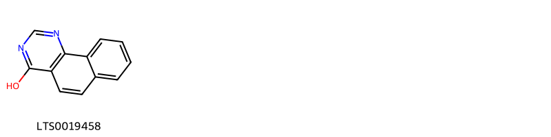{ width=100% }
    <figcaption>Hình ảnh cấu trúc hóa học của 1 hoạt chất thuộc nhóm Diazanaphthalenes gồm ['benzo[h]quinazolin-4-ol (LTS0019458)'].</figcaption>
</figure>
#### Nhóm Dibenzylbutane lignans
<figure markdown="span">
    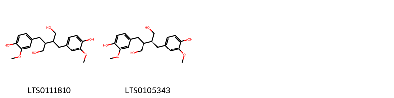{ width=100% }
    <figcaption>Hình ảnh cấu trúc hóa học của 2 hoạt chất thuộc nhóm Dibenzylbutane lignans gồm ['secoisolariciresinol (LTS0111810)', '(+)-secoisolariciresinol (LTS0105343)'].</figcaption>
</figure>
#### Nhóm Fatty Acyls
<figure markdown="span">
    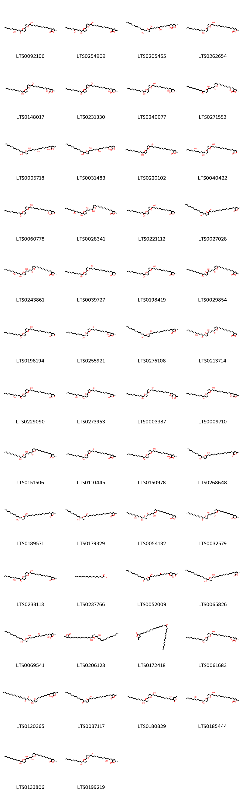{ width=100% }
    <figcaption>Hình ảnh cấu trúc hóa học của 173 hoạt chất thuộc nhóm Fatty Acyls gồm ['annonin i (LTS0092106)', "3-{13-[5'-(1,5-dihydroxyundecyl)-[2,2'-bioxolan]-5-yl]-13-hydroxytridecyl}-5-methyl-5h-furan-2-one (LTS0254909)", 'annonacin (LTS0205455)', "(5r)-3-[(13r)-13-hydroxy-13-[(2r,2'r,5r,5'r)-5'-[(1r)-1-hydroxyundecyl]-[2,2'-bioxolan]-5-yl]tridecyl]-5-methyl-5h-furan-2-one (LTS0262654)", "3-{2,11-dihydroxy-11-[5'-(1-hydroxyundecyl)-[2,2'-bioxolan]-5-yl]undecyl}-5-methyl-5h-furan-2-one (LTS0148017)", "3-{2,13-dihydroxy-13-[5'-(1-hydroxyundecyl)-[2,2'-bioxolan]-5-yl]tridecyl}-5-methyl-5h-furan-2-one (LTS0231330)", "(5s)-3-[(2r,11r)-2,11-dihydroxy-11-[(2r,2'r,5r,5'r)-5'-[(1s)-1-hydroxyundecyl]-[2,2'-bioxolan]-5-yl]undecyl]-5-methyl-5h-furan-2-one (LTS0240077)", '(5s)-3-[(2r)-9-[(2r,5s)-5-[(1s,4r)-1,4-dihydroxy-4-[(2r,5r)-5-[(1s)-1-hydroxyundecyl]oxolan-2-yl]butyl]oxolan-2-yl]-2-hydroxynonyl]-5-methyl-5h-furan-2-one (LTS0271552)', '5-methyl-3-[(2r,8r,13r)-2,8,13-trihydroxy-13-[(2r,5r)-5-[(1r)-1-hydroxytridecyl]oxolan-2-yl]tridecyl]-5h-furan-2-one (LTS0005718)', '(5s)-5-methyl-3-[(2r,8r,13r)-2,8,13-trihydroxy-13-[(2r,5r)-5-[(1s)-1-hydroxytridecyl]oxolan-2-yl]tridecyl]-5h-furan-2-one (LTS0031483)', "3-{13-hydroxy-13-[5'-(1-hydroxyundecyl)-[2,2'-bioxolan]-5-yl]tridecyl}-5-methyl-5h-furan-2-one (LTS0220102)", 'motrilin (LTS0040422)', 'bullatacin (LTS0060778)', '3-[9-(5-{4-[5-(1,5-dihydroxyundecyl)oxolan-2-yl]-1,4-dihydroxybutyl}oxolan-2-yl)nonyl]-5-methyl-5h-furan-2-one (LTS0028341)', "(5s)-3-[(11r)-11-hydroxy-11-[(2r,2'r,5r,5'r)-5'-[(1s)-1-hydroxyundecyl]-[2,2'-bioxolan]-5-yl]undecyl]-5-methyl-5h-furan-2-one (LTS0221112)", '3-{15-hydroxy-15-[5-(1-hydroxytridecyl)oxolan-2-yl]pentadecyl}-5-methyl-5h-furan-2-one (LTS0027028)', '(5r)-3-{9-[(2r,5r)-5-[(1s,4r)-4-[(2r,5s)-5-[(1s,5s)-1,5-dihydroxyundecyl]oxolan-2-yl]-1,4-dihydroxybutyl]oxolan-2-yl]nonyl}-5-methyl-5h-furan-2-one (LTS0243861)', "(5s)-3-[(13r)-13-hydroxy-13-[(2r,2'r,5r,5'r)-5'-[(1s)-1-hydroxyundecyl]-[2,2'-bioxolan]-5-yl]tridecyl]-5-methyl-5h-furan-2-one (LTS0039727)", "(5s)-3-[(11r)-11-hydroxy-11-[(2r,2'r,5r,5'r)-5'-[(1r)-1-hydroxyundecyl]-[2,2'-bioxolan]-5-yl]undecyl]-5-methyl-5h-furan-2-one (LTS0198419)", '3-[9-(5-{1,4-dihydroxy-4-[5-(1-hydroxyundecyl)oxolan-2-yl]butyl}oxolan-2-yl)nonyl]-5-methyl-5h-furan-2-one (LTS0029854)', 'isodesacetyluvaricin (LTS0198194)', "(5s)-3-[(2r,11r)-2,11-dihydroxy-11-[(2r,2'r,5r,5'r)-5'-[(1r)-1-hydroxyundecyl]-[2,2'-bioxolan]-5-yl]undecyl]-5-methyl-5h-furan-2-one (LTS0255921)", '(5s)-3-[(13r)-13-hydroxy-13-[(2r,5r)-5-[(1r)-1-hydroxytridecyl]oxolan-2-yl]tridecyl]-5-methyl-5h-furan-2-one (LTS0276108)', '(5s)-3-{9-[(2r,5r)-5-[(1s,4r)-4-[(2r,5r)-5-[(1s,5s)-1,5-dihydroxyundecyl]oxolan-2-yl]-1,4-dihydroxybutyl]oxolan-2-yl]nonyl}-5-methyl-5h-furan-2-one (LTS0213714)', "(5r)-3-[(13r)-13-[(2r,2'r,5s,5's)-5'-[(1s,5s)-1,5-dihydroxyundecyl]-[2,2'-bioxolan]-5-yl]-13-hydroxytridecyl]-5-methyl-5h-furan-2-one (LTS0229090)", "3-{11-[5'-(1,5-dihydroxyundecyl)-[2,2'-bioxolan]-5-yl]-11-hydroxyundecyl}-5-methyl-5h-furan-2-one (LTS0273953)", 'bullatacinone (LTS0003387)', 'bullatacin (LTS0009710)', '(5s)-3-{9-[(2r,5r)-5-[(1s,4r)-1,4-dihydroxy-4-[(2r,5r)-5-[(1s)-1-hydroxyundecyl]oxolan-2-yl]butyl]oxolan-2-yl]nonyl}-5-methyl-5h-furan-2-one (LTS0151506)', "3-{11-hydroxy-11-[5'-(1-hydroxyundecyl)-[2,2'-bioxolan]-5-yl]undecyl}-5-methyl-5h-furan-2-one (LTS0110445)", "(5s)-3-[(2r,11s)-2,11-dihydroxy-11-[(2s,2's,5s,5's)-5'-[(1r)-1-hydroxyundecyl]-[2,2'-bioxolan]-5-yl]undecyl]-5-methyl-5h-furan-2-one (LTS0150978)", '3-{15-hydroxy-15-[5-(1-hydroxyundecyl)oxolan-2-yl]pentadecyl}-5-methyl-5h-furan-2-one (LTS0268648)', '(5s)-3-[(15r)-15-hydroxy-15-[(2r,5r)-5-[(1r)-1-hydroxyundecyl]oxolan-2-yl]pentadecyl]-5-methyl-5h-furan-2-one (LTS0189571)', '(5r)-3-[(15r)-15-hydroxy-15-[(2r,5r)-5-[(1s)-1-hydroxyundecyl]oxolan-2-yl]pentadecyl]-5-methyl-5h-furan-2-one (LTS0179329)', 'squamostatin-a (LTS0054132)', 'squamostatin-d (LTS0032579)', "(5r)-3-[(13r)-13-[(2r,2'r,5r,5'r)-5'-[(1s,5s)-1,5-dihydroxyundecyl]-[2,2'-bioxolan]-5-yl]-13-hydroxytridecyl]-5-methyl-5h-furan-2-one (LTS0233113)", 'stearic acid (LTS0237766)', '5-{11-hydroxy-11-[5-(1-hydroxytridecyl)oxolan-2-yl]-5-oxoundecyl}-3-(2-oxopropyl)oxolan-2-one (LTS0052009)', '(5s)-3-[(13s)-13-hydroxy-13-[(2r,5s)-5-[(1r)-1-hydroxypentadecyl]oxolan-2-yl]tridecyl]-5-methyl-5h-furan-2-one (LTS0065826)', '(5s)-3-[(2r,13r)-2,13-dihydroxy-13-[(2r,5r)-5-[(1r)-1-hydroxytridecyl]oxolan-2-yl]-7-oxotridecyl]-5-methyl-5h-furan-2-one (LTS0069541)', '(5r)-3-[(13r)-13-hydroxy-13-[(2r,5s)-5-[(1r,4z)-1-hydroxypentadec-4-en-1-yl]oxolan-2-yl]tridecyl]-5-methyl-5h-furan-2-one (LTS0206123)', '5-methyl-3-[15-(3-tetradecyloxiran-2-yl)pentadecyl]-5h-furan-2-one (LTS0172418)', "(5s)-3-[(2r,13r)-2,13-dihydroxy-13-[(2r,2'r,5r,5'r)-5'-[(1r)-1-hydroxyundecyl]-[2,2'-bioxolan]-5-yl]tridecyl]-5-methyl-5h-furan-2-one (LTS0061683)", '3-{2-hydroxy-9-[5-(1,4,5-trihydroxynonadec-8-en-1-yl)oxolan-2-yl]nonyl}-5-methyl-5h-furan-2-one (LTS0120365)', '3-{13-hydroxy-13-[5-(1-hydroxytridecyl)oxolan-2-yl]tridecyl}-5-methyl-5h-furan-2-one (LTS0037117)', "3-[(12r)-2,12-dihydroxy-12-[(2s,2's,5s,5's)-5'-[(1r)-1-hydroxyundecyl]-[2,2'-bioxolan]-5-yl]dodecyl]-5-methyl-5h-furan-2-one (LTS0180829)", "(5r)-3-[(13r)-13-[(2r,2'r,5r,5'r)-5'-[(1s,6r)-1,6-dihydroxyundecyl]-[2,2'-bioxolan]-5-yl]-13-hydroxytridecyl]-5-methyl-5h-furan-2-one (LTS0185444)", 'squamostatin d (LTS0133806)', "(5s)-3-[(4r,13r)-4,13-dihydroxy-13-[(2r,2'r,5r,5'r)-5'-[(1r)-1-hydroxyundecyl]-[2,2'-bioxolan]-5-yl]tridecyl]-5-methyl-5h-furan-2-one (LTS0199219)", "(5r)-3-[(2s,11s)-2,11-dihydroxy-11-[(2r,2'r,5r,5'r)-5'-[(1r)-1-hydroxytridecyl]-[2,2'-bioxolan]-5-yl]undecyl]-5-methyl-5h-furan-2-one (LTS0149400)", '3-{13-hydroxy-13-[5-(1-hydroxypentadecyl)oxolan-2-yl]tridecyl}-5-methyl-5h-furan-2-one (LTS0169036)', '(5r)-5-methyl-3-{15-[(2r,3r)-3-tetradecyloxiran-2-yl]pentadecyl}-5h-furan-2-one (LTS0274559)', "3-{2,11-dihydroxy-11-[5'-(1-hydroxytridecyl)-[2,2'-bioxolan]-5-yl]undecyl}-5-methyl-5h-furan-2-one (LTS0160887)", '(5s)-3-[(6r,13r)-13-[(2r,5r)-5-[(1r,3s)-1,3-dihydroxytridecyl]oxolan-2-yl]-6,13-dihydroxy-10-oxotridecyl]-5-methyl-5h-furan-2-one (LTS0218896)', '3-{13-[5-(1,3-dihydroxytridecyl)oxolan-2-yl]-6,13-dihydroxy-10-oxotridecyl}-5-methyl-5h-furan-2-one (LTS0176312)', "(5r)-3-[(2s,13r)-2,13-dihydroxy-13-[(2r,2'r,5r,5'r)-5'-[(1s)-1-hydroxyundecyl]-[2,2'-bioxolan]-5-yl]tridecyl]-5-methyl-5h-furan-2-one (LTS0050132)", "3-{13-[5'-(1,6-dihydroxyundecyl)-[2,2'-bioxolan]-5-yl]-13-hydroxytridecyl}-5-methyl-5h-furan-2-one (LTS0121747)", '(5r)-3-[(15r)-15-hydroxy-15-[(2s,5r)-5-[(1s)-1-hydroxytridecyl]oxolan-2-yl]pentadecyl]-5-methyl-5h-furan-2-one (LTS0003180)', '3-[(13s)-2,13-dihydroxy-13-[(2s,5s)-5-[(1s)-1-hydroxytridecyl]oxolan-2-yl]-7-oxotridecyl]-5-methyl-5h-furan-2-one (LTS0272476)', "(5s)-3-[(11r)-11-[(2r,2'r,5r,5'r)-5'-[(1s,5s)-1,5-dihydroxyundecyl]-[2,2'-bioxolan]-5-yl]-11-hydroxyundecyl]-5-methyl-5h-furan-2-one (LTS0002622)", 'bullatencin (LTS0262982)', "(5s)-3-[(13r)-13-[(2r,2'r,5r,5'r)-5'-[(1s,6r)-1,6-dihydroxyundecyl]-[2,2'-bioxolan]-5-yl]-13-hydroxytridecyl]-5-methyl-5h-furan-2-one (LTS0261738)", '3-{2-hydroxy-9-[5-(1,6,7-trihydroxyheptadecyl)oxolan-2-yl]nonyl}-5-methyl-5h-furan-2-one (LTS0128736)', '(5s)-3-[(7r)-7-hydroxy-7-[(2r,5r)-5-[(1r)-1-hydroxynonadecyl]oxolan-2-yl]heptyl]-5-methyl-5h-furan-2-one (LTS0060161)', '(3r,5r)-5-[(7s,13r)-7,13-dihydroxy-13-[(2r,5r)-5-[(1r)-1-hydroxytridecyl]oxolan-2-yl]tridecyl]-3-(2-oxopropyl)oxolan-2-one (LTS0204051)', '5-{7,13-dihydroxy-13-[5-(1-hydroxytridecyl)oxolan-2-yl]tridecyl}-3-(2-oxopropyl)oxolan-2-one (LTS0208897)', '2-carboxy-d-arabinitol (LTS0056947)', '13-[(5s)-5-methyl-2-oxo-5h-furan-3-yl]tridecanal (LTS0137404)', 'annosquatin-i, (rel)- (LTS0124780)', '(3r,5r)-5-[(11s)-11-hydroxy-11-[(2r,5s)-5-[(1s)-1-hydroxytridecyl]oxolan-2-yl]-5-oxoundecyl]-3-(2-oxopropyl)oxolan-2-one (LTS0078982)', "3-{13-[5'-(1,5-dihydroxyundecyl)-[2,2'-bioxolan]-5-yl]-10,13-dihydroxytridecyl}-5-methyl-5h-furan-2-one (LTS0215890)", '(5s)-3-[(17r)-17-hydroxy-17-[(2r,5r)-5-[(1r)-1-hydroxyundecyl]oxolan-2-yl]heptadecyl]-5-methyl-5h-furan-2-one (LTS0064796)', '(5s)-3-[(7r)-7-hydroxy-7-[(2r,5r)-5-[(1s)-1-hydroxynonadecyl]oxolan-2-yl]heptyl]-5-methyl-5h-furan-2-one (LTS0125538)', '(5r)-5-methyl-3-[(2r,10r,13r)-2,10,13-trihydroxy-13-[(2r,5r)-5-[(1r,4z)-1-hydroxypentadec-4-en-1-yl]oxolan-2-yl]tridecyl]-5h-furan-2-one (LTS0209913)', "3-[(3r,13r)-3,13-dihydroxy-13-[(5'r)-5'-(1-hydroxyundecyl)-[2,2'-bioxolan]-5-yl]tridecyl]-5-methyl-5h-furan-2-one (LTS0069424)", '(5r)-3-{9-[(2r,5s)-5-[(1r,4r)-1,4-dihydroxy-4-[(2s,5s)-5-[(1s)-1-hydroxyundecyl]oxolan-2-yl]butyl]oxolan-2-yl]nonyl}-5-methyl-5h-furan-2-one (LTS0223131)', '(5s)-3-[(13r)-13-hydroxy-13-[(2r,5r)-5-[(1r,8r,9s)-1,8,9-trihydroxypentadecyl]oxolan-2-yl]tridecyl]-5-methyl-5h-furan-2-one (LTS0221776)', 'annosquatin-ii, (rel)- (LTS0050682)', '3-{13-hydroxy-13-[5-(1,8,9-trihydroxypentadecyl)oxolan-2-yl]tridecyl}-5-methyl-5h-furan-2-one (LTS0101057)', "3-{12-hydroxy-12-[5'-(1-hydroxydodecyl)-[2,2'-bioxolan]-5-yl]dodecyl}-5-methyl-5h-furan-2-one (LTS0164784)", "3-{13-[5'-(1,5-dihydroxyundecyl)-4-hydroxy-[2,2'-bioxolan]-5-yl]-13-hydroxytridecyl}-5-methyl-5h-furan-2-one (LTS0087362)", '(5s)-3-[(9r,15r)-9,15-dihydroxy-15-[(2r,5r)-5-[(1r)-1-hydroxyundecyl]oxolan-2-yl]pentadecyl]-5-methyl-5h-furan-2-one (LTS0025786)', '(5r)-3-[(3s)-9-[(2s,5r)-5-[(1s,4r)-1,4-dihydroxy-4-[(2s,5s)-5-[(1r)-1-hydroxyundecyl]oxolan-2-yl]butyl]oxolan-2-yl]-3-hydroxynonyl]-5-methyl-5h-furan-2-one (LTS0099257)', '(5s)-3-[(2s)-2-hydroxy-9-[(2r,5r)-5-[(1s,6r,7s)-1,6,7-trihydroxyheptadecyl]oxolan-2-yl]nonyl]-5-methyl-5h-furan-2-one (LTS0036017)', '(5s)-3-[(16s)-16-hydroxy-16-[(2s,5r)-5-[(1r)-1-hydroxydecyl]oxolan-2-yl]hexadecyl]-5-methyl-5h-furan-2-one (LTS0040093)', '(5s)-3-[(13r)-13-hydroxy-13-[(2r,5r)-5-[(1r,8r,9r)-1,8,9-trihydroxypentadecyl]oxolan-2-yl]tridecyl]-5-methyl-5h-furan-2-one (LTS0103196)', '(5r)-3-[(3s)-9-[(2s,5r)-5-[(1s,4r)-1,4-dihydroxy-4-[(2s,5s)-5-[(1s)-1-hydroxyundecyl]oxolan-2-yl]butyl]oxolan-2-yl]-3-hydroxynonyl]-5-methyl-5h-furan-2-one (LTS0027510)', '3-[9-(5-{1,4-dihydroxy-4-[5-(1-hydroxyundecyl)oxolan-2-yl]butyl}oxolan-2-yl)-3-hydroxynonyl]-5-methyl-5h-furan-2-one (LTS0044641)', '3-{16-hydroxy-16-[5-(1-hydroxydecyl)oxolan-2-yl]hexadecyl}-5-methyl-5h-furan-2-one (LTS0031945)', "3-{10,13-dihydroxy-13-[5'-(1-hydroxyundecyl)-[2,2'-bioxolan]-5-yl]tridecyl}-5-methyl-5h-furan-2-one (LTS0196842)", '3-{7,13-dihydroxy-13-[5-(1-hydroxytridecyl)oxolan-2-yl]tridecyl}-5-methyl-5h-furan-2-one (LTS0179470)', 'uvarigrandin a (LTS0024128)', "(5s)-3-[(13r)-13-[(2r,2'r,5s,5'r)-5'-[(1r,5s)-1,5-dihydroxyundecyl]-[2,2'-bioxolan]-5-yl]-13-hydroxytridecyl]-5-methyl-5h-furan-2-one (LTS0178444)", '(5s)-3-[(13r,14r,17r)-17-[(2r,5r)-5-[(1s)-1,5-dihydroxyundecyl]oxolan-2-yl]-13,14,17-trihydroxyheptadecyl]-5-methyl-5h-furan-2-one (LTS0201720)', "(5s)-3-[(13r)-13-[(2r,2'r,4r,5s,5'r)-5'-[(1s,5s)-1,5-dihydroxyundecyl]-4-hydroxy-[2,2'-bioxolan]-5-yl]-13-hydroxytridecyl]-5-methyl-5h-furan-2-one (LTS0056799)", '(5s)-3-[(15s)-15-hydroxy-15-[(2s,5s)-5-[(1r)-1-hydroxyundecyl]oxolan-2-yl]pentadecyl]-5-methyl-5h-furan-2-one (LTS0105406)', "(3s,5r)-5-[(11r)-11-hydroxy-11-[(2r,2'r,5r,5'r)-5'-[(1s)-1-hydroxyundecyl]-[2,2'-bioxolan]-5-yl]-5-oxoundecyl]-3-(2-oxopropyl)oxolan-2-one (LTS0106420)", 'annosquacin-i, (rel)- (LTS0186176)', "(5r)-3-[(3s,13r)-3,13-dihydroxy-13-[(2r,2'r,5r,5'r)-5'-[(1r)-1-hydroxynonyl]-[2,2'-bioxolan]-5-yl]tridecyl]-5-methyl-5h-furan-2-one (LTS0114390)", '3-[(15s)-15-hydroxy-15-[(2s,5s)-5-[(1s)-1-hydroxytetradecyl]oxolan-2-yl]pentadecyl]-5-methyl-5h-furan-2-one (LTS0249314)', '3-{13-hydroxy-13-[5-(1-hydroxypentadec-4-en-1-yl)oxolan-2-yl]tridecyl}-5-methyl-5h-furan-2-one (LTS0197757)', '3-(9-{5-[(1r,4r)-4-{5-[(1r)-1,5-dihydroxyundecyl]oxolan-2-yl}-1,4-dihydroxybutyl]oxolan-2-yl}nonyl)-5-methyl-5h-furan-2-one (LTS0196747)', '(5s)-5-methyl-3-{9-[(2s,5r)-5-[(1r,4r,5r,8r,9r)-1,4,5,8,9-pentahydroxynonadecyl]oxolan-2-yl]nonyl}-5h-furan-2-one (LTS0204131)', '(5s)-3-[(13r)-13-hydroxy-13-[(2r,5r)-5-[(1r)-1-hydroxypentadecyl]oxolan-2-yl]tridecyl]-5-methyl-5h-furan-2-one (LTS0200611)', '(5s)-5-methyl-3-[(2r,10r,13r)-2,10,13-trihydroxy-13-[(2s,5r)-5-[(1s,4z)-1-hydroxypentadec-4-en-1-yl]oxolan-2-yl]tridecyl]-5h-furan-2-one (LTS0148870)', 'heptadecanoic acid (LTS0136609)', '(5r)-3-[(15r)-15-hydroxy-15-[(2r,5r)-5-[(1s)-1-hydroxytridecyl]oxolan-2-yl]pentadecyl]-5-methyl-5h-furan-2-one (LTS0158489)', '5-methyl-3-(2,10,13-trihydroxy-13-{5-[(4z)-1-hydroxypentadec-4-en-1-yl]oxolan-2-yl}tridecyl)-5h-furan-2-one (LTS0163780)', "(5r)-3-[(11r)-11-hydroxy-11-[(2r,2'r,5s,5's)-5'-[(1s)-1-hydroxyundecyl]-[2,2'-bioxolan]-5-yl]undecyl]-5-methyl-5h-furan-2-one (LTS0145688)", 'ceryl alcohol (LTS0140051)', '3-{9,15-dihydroxy-15-[5-(1-hydroxyundecyl)oxolan-2-yl]pentadecyl}-5-methyl-5h-furan-2-one (LTS0146359)', "(5s)-3-[(2s,13r)-2,13-dihydroxy-13-[(2r,2'r,4r,5s,5'r)-4-hydroxy-5'-[(1r)-1-hydroxyundecyl]-[2,2'-bioxolan]-5-yl]tridecyl]-5-methyl-5h-furan-2-one (LTS0155432)", '(5s)-3-[(2r)-9-[(5s)-5-[(4r)-1,4-dihydroxy-4-[(2r,5r)-5-[(1s)-1-hydroxyundecyl]oxolan-2-yl]butyl]oxolan-2-yl]-2-hydroxynonyl]-5-methyl-5h-furan-2-one (LTS0141967)', "(5s)-3-[(10r,13r)-10,13-dihydroxy-13-[(2r,2'r,5r,5'r)-5'-[(1r)-1-hydroxyundecyl]-[2,2'-bioxolan]-5-yl]tridecyl]-5-methyl-5h-furan-2-one (LTS0138265)", "(5s)-3-[(13r)-13-[(2r,2'r,5r,5'r)-3,3'-dihydroxy-5'-[(1s)-1-hydroxyundecyl]-[2,2'-bioxolan]-5-yl]-13-hydroxytridecyl]-5-methyl-5h-furan-2-one (LTS0150958)", "3-{2,13-dihydroxy-13-[4-hydroxy-5'-(1-hydroxyundecyl)-[2,2'-bioxolan]-5-yl]tridecyl}-5-methyl-5h-furan-2-one (LTS0160367)", "3-{3,13-dihydroxy-13-[5'-(1-hydroxynonyl)-[2,2'-bioxolan]-5-yl]tridecyl}-5-methyl-5h-furan-2-one (LTS0142662)", "(5s)-3-[(13r)-13-[(2r,2'r,3r,3'r,5r,5'r)-3,3'-dihydroxy-5'-[(1s)-1-hydroxyundecyl]-[2,2'-bioxolan]-5-yl]-13-hydroxytridecyl]-5-methyl-5h-furan-2-one (LTS0163670)", '(3s,5r)-5-[(7s,13r)-7,13-dihydroxy-13-[(2r,5r)-5-[(1r)-1-hydroxytridecyl]oxolan-2-yl]tridecyl]-3-(2-oxopropyl)oxolan-2-one (LTS0117651)', '13-(5-methyl-2-oxo-5h-furan-3-yl)tridecanal (LTS0160337)', "(5s)-3-[(2s,13r)-2,13-dihydroxy-13-[(2r,2'r,4r,5s,5'r)-4-hydroxy-5'-[(1s)-1-hydroxyundecyl]-[2,2'-bioxolan]-5-yl]tridecyl]-5-methyl-5h-furan-2-one (LTS0142980)", "3-{4,13-dihydroxy-13-[5'-(1-hydroxyundecyl)-[2,2'-bioxolan]-5-yl]tridecyl}-5-methyl-5h-furan-2-one (LTS0179487)", '(5s)-5-methyl-3-{9-[(2r,5r)-5-[(1s,4r,5s,8r,9s)-1,4,5,8,9-pentahydroxynonadecyl]oxolan-2-yl]nonyl}-5h-furan-2-one (LTS0124221)', 'squafosacin b (LTS0161638)', '(5s)-3-[(17s)-17-hydroxy-17-[(2s,5r)-5-[(1s)-1-hydroxyundecyl]oxolan-2-yl]heptadecyl]-5-methyl-5h-furan-2-one (LTS0222526)', '(5s)-3-[(2r,13r)-2,13-dihydroxy-13-[(2r,5r)-5-[(1s)-1-hydroxytridecyl]oxolan-2-yl]-7-oxotridecyl]-5-methyl-5h-furan-2-one (LTS0204579)', '3-[(13s)-13-hydroxy-13-[(2s,5s)-5-[(1s)-1-hydroxyhexadecyl]oxolan-2-yl]tridecyl]-5-methyl-5h-furan-2-one (LTS0053175)', '(5s)-3-{2-hydroxy-9-[(2s,5r)-5-[(1r,6s,7s)-1,6,7-trihydroxynonadecyl]oxolan-2-yl]nonyl}-5-methyl-5h-furan-2-one (LTS0266312)', "(5s)-3-[(11r)-11-[(2r,2'r,5s,5'r)-5'-[(1s,5s)-1,5-dihydroxyundecyl]-[2,2'-bioxolan]-5-yl]-11-hydroxyundecyl]-5-methyl-5h-furan-2-one (LTS0273709)", '(5s)-3-[(9r)-9-hydroxy-9-[(2r,5r)-5-[(1s)-1-hydroxyheptadecyl]oxolan-2-yl]nonyl]-5-methyl-5h-furan-2-one (LTS0078034)', "(3s,5r)-5-[(11r)-11-hydroxy-11-[(2r,2'r,5r,5'r)-5'-[(1s)-1-hydroxynonyl]-[2,2'-bioxolan]-5-yl]undecyl]-3-(2-oxopropyl)oxolan-2-one (LTS0225419)", 'nonadecanoic acid (LTS0212995)', '(5s)-5-methyl-3-[(2r,8s,13s)-2,8,13-trihydroxy-13-[(2s,5s)-5-[(1r)-1-hydroxytridecyl]oxolan-2-yl]tridecyl]-5h-furan-2-one (LTS0218302)', '(5s)-3-[(2s)-2-hydroxy-9-[(2s,5r)-5-[(1s,6s,7r)-1,6,7-trihydroxyheptadecyl]oxolan-2-yl]nonyl]-5-methyl-5h-furan-2-one (LTS0219943)', '(5s)-3-[(2s)-2-hydroxy-9-[(2r,5r)-5-[(1s,4r,5s,8z)-1,4,5-trihydroxynonadec-8-en-1-yl]oxolan-2-yl]nonyl]-5-methyl-5h-furan-2-one (LTS0163868)', "3-{13-[3,3'-dihydroxy-5'-(1-hydroxyundecyl)-[2,2'-bioxolan]-5-yl]-13-hydroxytridecyl}-5-methyl-5h-furan-2-one (LTS0164557)", "(5r)-3-[(13r)-13-[(2s,2's,5s,5's)-5'-[(1r,6s)-1,6-dihydroxydodecyl]-[2,2'-bioxolan]-5-yl]-13-hydroxytridecyl]-5-methyl-5h-furan-2-one (LTS0022562)", '(5r)-5-[(11r)-11-hydroxy-11-[(2r,5r)-5-[(1r)-1-hydroxytetradec-4-en-1-yl]oxolan-2-yl]-5-oxoundecyl]-3-(2-oxopropyl)oxolan-2-one (LTS0172276)', '5-methyl-3-{9-[5-(1,4,5,8,9-pentahydroxynonadecyl)oxolan-2-yl]nonyl}-5h-furan-2-one (LTS0031881)', "(5s)-3-[(11s)-11-hydroxy-11-[(2r,2'r,5r,5'r)-5'-[(1r)-1-hydroxyundecyl]-[2,2'-bioxolan]-5-yl]undecyl]-5-methyl-5h-furan-2-one (LTS0208767)", "(5s)-3-[(10s,13r)-13-[(2r,2'r,5r,5'r)-5'-[(1s,5s)-1,5-dihydroxyundecyl]-[2,2'-bioxolan]-5-yl]-10,13-dihydroxytridecyl]-5-methyl-5h-furan-2-one (LTS0066156)", 'asimicin (LTS0233319)', '1-tricosanol (LTS0173093)', 'octacosanol (LTS0049071)', "(5s)-3-[(13r)-13-[(2r,2'r,5r,5'r)-5'-[(1r,5s)-1,5-dihydroxyundecyl]-[2,2'-bioxolan]-5-yl]-13-hydroxytridecyl]-5-methyl-5h-furan-2-one (LTS0255686)", "(5s)-3-[(10r,13r)-13-[(2r,2'r,5r,5'r)-5'-[(1s,5s)-1,5-dihydroxyundecyl]-[2,2'-bioxolan]-5-yl]-10,13-dihydroxytridecyl]-5-methyl-5h-furan-2-one (LTS0181666)", "(5s)-3-[(13r)-13-hydroxy-13-[(2s,2's,5r,5'r)-5'-[(1r)-1-hydroxyundecyl]-[2,2'-bioxolan]-5-yl]tridecyl]-5-methyl-5h-furan-2-one (LTS0189453)", '(5r)-5-[(11r)-11-hydroxy-11-[(2r,5r)-5-[(1r,4z)-1-hydroxytetradec-4-en-1-yl]oxolan-2-yl]-5-oxoundecyl]-3-(2-oxopropyl)oxolan-2-one (LTS0060003)', '(5s)-5-methyl-3-{9-[(2r,5r)-5-[(1r,4s,5r,8s,9r)-1,4,5,8,9-pentahydroxynonadecyl]oxolan-2-yl]nonyl}-5h-furan-2-one (LTS0064409)', '(5s)-3-[(13s)-13-hydroxy-13-[(2s,5r)-5-[(1s)-1-hydroxytridecyl]oxolan-2-yl]tridecyl]-5-methyl-5h-furan-2-one (LTS0244298)', '3-{17-hydroxy-17-[5-(1-hydroxyundecyl)oxolan-2-yl]heptadecyl}-5-methyl-5h-furan-2-one (LTS0008328)', '(5s)-5-methyl-3-{9-[(2s,5r)-5-[(1r,4s,5s,8s,9s)-1,4,5,8,9-pentahydroxynonadecyl]oxolan-2-yl]nonyl}-5h-furan-2-one (LTS0250137)', '(5s)-3-[(15r)-9,15-dihydroxy-15-[(2r,5r)-5-[(1r)-1-hydroxyundecyl]oxolan-2-yl]pentadecyl]-5-methyl-5h-furan-2-one (LTS0037503)', '(9s,12z)-9-hydroxyoctadec-12-enoic acid (LTS0001024)', "(5r)-3-[(13r)-13-hydroxy-13-[(2r,2'r,5r,5'r)-5'-[(1s)-1-hydroxyundecyl]-[2,2'-bioxolan]-5-yl]tridecyl]-5-methyl-5h-furan-2-one (LTS0053467)", "5-{11-hydroxy-11-[5'-(1-hydroxynonyl)-[2,2'-bioxolan]-5-yl]undecyl}-3-(2-oxopropyl)oxolan-2-one (LTS0104755)", '(3r,5r)-5-[(11r)-11-hydroxy-11-[(2r,5r)-5-[(1r,4z)-1-hydroxypentadec-4-en-1-yl]oxolan-2-yl]-5-oxoundecyl]-3-(2-oxopropyl)oxolan-2-one (LTS0244126)', '(5s)-3-[(2r,13r)-2,13-dihydroxy-13-[(2r,5s)-5-[(1s)-1-hydroxytridecyl]oxolan-2-yl]-7-oxotridecyl]-5-methyl-5h-furan-2-one (LTS0033635)', '5-methyl-3-{2,10,13-trihydroxy-13-[5-(1-hydroxypentadec-4-en-1-yl)oxolan-2-yl]tridecyl}-5h-furan-2-one (LTS0027018)', '(5s)-3-[(15s)-15-hydroxy-15-[(2s,5r)-5-[(1r)-1-hydroxyundecyl]oxolan-2-yl]pentadecyl]-5-methyl-5h-furan-2-one (LTS0003665)', "(5s)-3-[(10r,13r)-10,13-dihydroxy-13-[(2r,2'r,5r,5'r)-5'-[(1s)-1-hydroxyundecyl]-[2,2'-bioxolan]-5-yl]tridecyl]-5-methyl-5h-furan-2-one (LTS0019750)", '3-{17-[5-(1,5-dihydroxyundecyl)oxolan-2-yl]-13,14,17-trihydroxyheptadecyl}-5-methyl-5h-furan-2-one (LTS0127076)', "(5s)-3-[(10s,13r)-10,13-dihydroxy-13-[(2s,2's,5s,5's)-5'-[(1r)-1-hydroxyundecyl]-[2,2'-bioxolan]-5-yl]tridecyl]-5-methyl-5h-furan-2-one (LTS0021799)", '5-(11-hydroxy-11-{5-[(4z)-1-hydroxypentadec-4-en-1-yl]oxolan-2-yl}-5-oxoundecyl)-3-(2-oxopropyl)oxolan-2-one (LTS0027999)', "3-{13-[5'-(1,6-dihydroxydodecyl)-[2,2'-bioxolan]-5-yl]-13-hydroxytridecyl}-5-methyl-5h-furan-2-one (LTS0018930)", '(5s)-3-{2-hydroxy-9-[(2s,5r)-5-[(1r,6r,7r)-1,6,7-trihydroxynonadecyl]oxolan-2-yl]nonyl}-5-methyl-5h-furan-2-one (LTS0075560)', '3-{2,13-dihydroxy-13-[5-(1-hydroxytridecyl)oxolan-2-yl]-7-oxotridecyl}-5-methyl-5h-furan-2-one (LTS0018225)', '(5r)-3-{9-[(2r,5s)-5-[(1r,4r)-4-[(2s,5s)-5-[(1s,5r)-1,5-dihydroxyundecyl]oxolan-2-yl]-1,4-dihydroxybutyl]oxolan-2-yl]nonyl}-5-methyl-5h-furan-2-one (LTS0209959)', "5-{11-hydroxy-11-[5'-(1-hydroxyundecyl)-[2,2'-bioxolan]-5-yl]-5-oxoundecyl}-3-(2-oxopropyl)oxolan-2-one (LTS0236942)", '(5s)-3-[(13r,14r,17r)-17-[(2r,5r)-5-[(1s,5s)-1,5-dihydroxyundecyl]oxolan-2-yl]-13,14,17-trihydroxyheptadecyl]-5-methyl-5h-furan-2-one (LTS0136023)', '(5s)-3-[(13r)-13-hydroxy-13-[(2r,5s)-5-[(1s,4z)-1-hydroxypentadec-4-en-1-yl]oxolan-2-yl]tridecyl]-5-methyl-5h-furan-2-one (LTS0048696)', "(5r)-3-[(12r)-12-hydroxy-12-[(2r,2'r,5r,5'r)-5'-[(1s)-1-hydroxydodecyl]-[2,2'-bioxolan]-5-yl]dodecyl]-5-methyl-5h-furan-2-one (LTS0050897)"].</figcaption>
</figure>
#### Nhóm Flavonoids
<figure markdown="span">
    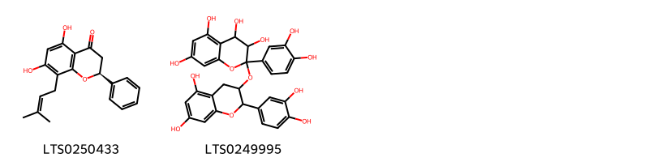{ width=100% }
    <figcaption>Hình ảnh cấu trúc hóa học của 2 hoạt chất thuộc nhóm Flavonoids gồm ['glabranin (LTS0250433)', '2-(3,4-dihydroxyphenyl)-2-{[2-(3,4-dihydroxyphenyl)-5,7-dihydroxy-3,4-dihydro-2h-1-benzopyran-3-yl]oxy}-3,4-dihydro-1-benzopyran-3,4,5,7-tetrol (LTS0249995)'].</figcaption>
</figure>
#### Nhóm Furanoid lignans
<figure markdown="span">
    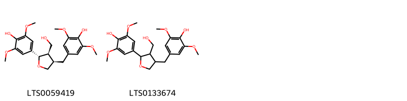{ width=100% }
    <figcaption>Hình ảnh cấu trúc hóa học của 2 hoạt chất thuộc nhóm Furanoid lignans gồm ['4-[(2s,3r,4r)-4-[(4-hydroxy-3,5-dimethoxyphenyl)methyl]-3-(hydroxymethyl)oxolan-2-yl]-2,6-dimethoxyphenol (LTS0059419)', '4-{4-[(4-hydroxy-3,5-dimethoxyphenyl)methyl]-3-(hydroxymethyl)oxolan-2-yl}-2,6-dimethoxyphenol (LTS0133674)'].</figcaption>
</figure>
#### Nhóm Isoquinolines and derivatives
<figure markdown="span">
    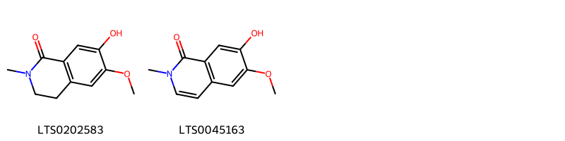{ width=100% }
    <figcaption>Hình ảnh cấu trúc hóa học của 2 hoạt chất thuộc nhóm Isoquinolines and derivatives gồm ['thalifolin (LTS0202583)', '7-hydroxy-6-methoxy-2-methylisoquinolin-1-one (LTS0045163)'].</figcaption>
</figure>
#### Nhóm Lignan glycosides
<figure markdown="span">
    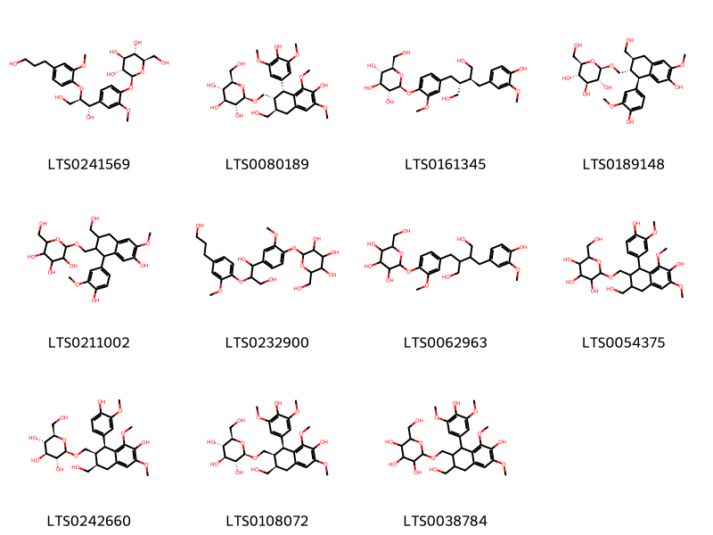{ width=100% }
    <figcaption>Hình ảnh cấu trúc hóa học của 11 hoạt chất thuộc nhóm Lignan glycosides gồm ['(2s,3r,4s,5s,6r)-2-{4-[(1s,2r)-1,3-dihydroxy-2-[4-(3-hydroxypropyl)-2-methoxyphenoxy]propyl]-2-methoxyphenoxy}-6-(hydroxymethyl)oxane-3,4,5-triol (LTS0241569)', '(2r,3r,4s,5s,6r)-2-{[(1r,2r,3r)-7-hydroxy-1-(4-hydroxy-3,5-dimethoxyphenyl)-3-(hydroxymethyl)-6,8-dimethoxy-1,2,3,4-tetrahydronaphthalen-2-yl]methoxy}-6-(hydroxymethyl)oxane-3,4,5-triol (LTS0080189)', '(2s,3r,4s,5s,6r)-2-{4-[(2r,3s)-4-hydroxy-3-[(4-hydroxy-3-methoxyphenyl)methyl]-2-(hydroxymethyl)butyl]-2-methoxyphenoxy}-6-(hydroxymethyl)oxane-3,4,5-triol (LTS0161345)', '(2r,3r,4s,5s,6r)-2-{[(1r,2s,3s)-7-hydroxy-1-(4-hydroxy-3-methoxyphenyl)-3-(hydroxymethyl)-6-methoxy-1,2,3,4-tetrahydronaphthalen-2-yl]methoxy}-6-(hydroxymethyl)oxane-3,4,5-triol (LTS0189148)', '2-{[7-hydroxy-1-(4-hydroxy-3-methoxyphenyl)-3-(hydroxymethyl)-6-methoxy-1,2,3,4-tetrahydronaphthalen-2-yl]methoxy}-6-(hydroxymethyl)oxane-3,4,5-triol (LTS0211002)', '2-(4-{1,3-dihydroxy-2-[4-(3-hydroxypropyl)-2-methoxyphenoxy]propyl}-2-methoxyphenoxy)-6-(hydroxymethyl)oxane-3,4,5-triol (LTS0232900)', '2-(4-{4-hydroxy-3-[(4-hydroxy-3-methoxyphenyl)methyl]-2-(hydroxymethyl)butyl}-2-methoxyphenoxy)-6-(hydroxymethyl)oxane-3,4,5-triol (LTS0062963)', '2-{[7-hydroxy-1-(4-hydroxy-3-methoxyphenyl)-3-(hydroxymethyl)-6,8-dimethoxy-1,2,3,4-tetrahydronaphthalen-2-yl]methoxy}-6-(hydroxymethyl)oxane-3,4,5-triol (LTS0054375)', '(2r,3r,4s,5s,6r)-2-{[(1s,2s,3r)-7-hydroxy-1-(4-hydroxy-3-methoxyphenyl)-3-(hydroxymethyl)-6,8-dimethoxy-1,2,3,4-tetrahydronaphthalen-2-yl]methoxy}-6-(hydroxymethyl)oxane-3,4,5-triol (LTS0242660)', '(2r,3r,4s,5s,6r)-2-{[(1s,2s,3r)-7-hydroxy-1-(4-hydroxy-3,5-dimethoxyphenyl)-3-(hydroxymethyl)-6,8-dimethoxy-1,2,3,4-tetrahydronaphthalen-2-yl]methoxy}-6-(hydroxymethyl)oxane-3,4,5-triol (LTS0108072)', '2-{[7-hydroxy-1-(4-hydroxy-3,5-dimethoxyphenyl)-3-(hydroxymethyl)-6,8-dimethoxy-1,2,3,4-tetrahydronaphthalen-2-yl]methoxy}-6-(hydroxymethyl)oxane-3,4,5-triol (LTS0038784)'].</figcaption>
</figure>
#### Nhóm Organonitrogen compounds
<figure markdown="span">
    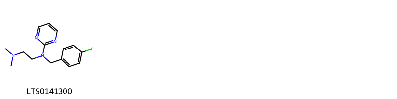{ width=100% }
    <figcaption>Hình ảnh cấu trúc hóa học của 1 hoạt chất thuộc nhóm Organonitrogen compounds gồm ['n-[(4-chlorophenyl)methyl]-n-[2-(dimethylamino)ethyl]pyrimidin-2-amine (LTS0141300)'].</figcaption>
</figure>
#### Nhóm Organooxygen compounds
<figure markdown="span">
    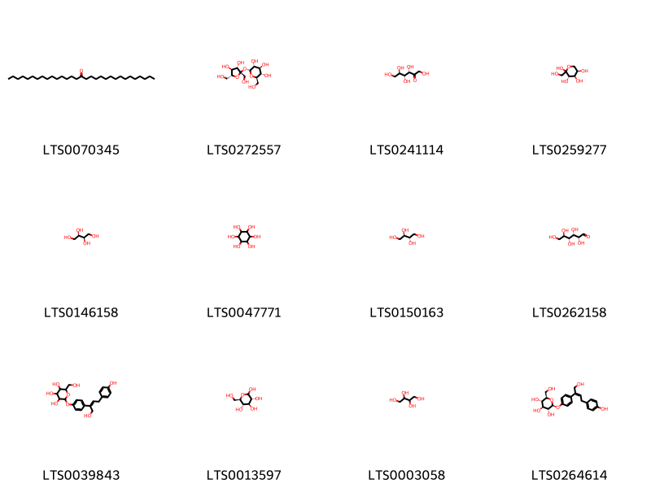{ width=100% }
    <figcaption>Hình ảnh cấu trúc hóa học của 12 hoạt chất thuộc nhóm Organooxygen compounds gồm ['palmitone (LTS0070345)', 'sucrose (LTS0272557)', 'keto-d-fructose (LTS0241114)', 'd-fructopyranose (LTS0259277)', '(-)-threitol (LTS0146158)', '(-)-inositol (LTS0047771)', 'meso-erythritol (LTS0150163)', '(+)-glucose (LTS0262158)', '2-{4-[1-hydroxy-4-(4-hydroxyphenyl)but-2-en-2-yl]phenoxy}-6-(hydroxymethyl)oxane-3,4,5-triol (LTS0039843)', 'glucose (LTS0013597)', 'erythrite (LTS0003058)', '(2s,3r,4s,5s,6r)-2-{4-[(2e)-1-hydroxy-4-(4-hydroxyphenyl)but-2-en-2-yl]phenoxy}-6-(hydroxymethyl)oxane-3,4,5-triol (LTS0264614)'].</figcaption>
</figure>
#### Nhóm Phenols
<figure markdown="span">
    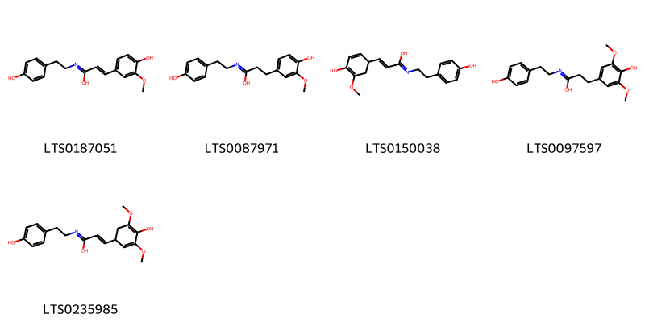{ width=100% }
    <figcaption>Hình ảnh cấu trúc hóa học của 5 hoạt chất thuộc nhóm Phenols gồm ['(2e)-3-(4-hydroxy-3-methoxyphenyl)-n-[2-(4-hydroxyphenyl)ethyl]prop-2-enimidic acid (LTS0187051)', '3-(4-hydroxy-3-methoxyphenyl)-n-[2-(4-hydroxyphenyl)ethyl]propanimidic acid (LTS0087971)', '(2e)-3-(4-hydroxy-5-methoxycyclohexa-2,4-dien-1-yl)-n-[2-(4-hydroxyphenyl)ethyl]prop-2-enimidic acid (LTS0150038)', '3-(4-hydroxy-3,5-dimethoxyphenyl)-n-[2-(4-hydroxyphenyl)ethyl]propanimidic acid (LTS0097597)', '(2e)-3-(4-hydroxy-3,5-dimethoxycyclohexa-2,4-dien-1-yl)-n-[2-(4-hydroxyphenyl)ethyl]prop-2-enimidic acid (LTS0235985)'].</figcaption>
</figure>
#### Nhóm Prenol lipids
<figure markdown="span">
    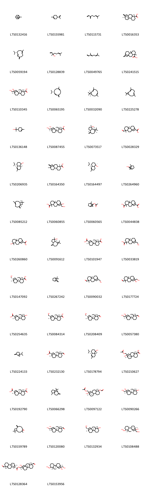{ width=100% }
    <figcaption>Hình ảnh cấu trúc hóa học của 77 hoạt chất thuộc nhóm Prenol lipids gồm ['α pinene (LTS0132416)', 'limonene,  (LTS0155981)', 'α-myrcene (LTS0115731)', 'ent-kaur-16-en-19-oic acid (LTS0016353)', '(-)-germacrene d (LTS0059194)', 'linalool, (+-)- (LTS0128839)', 'trans-β-ocimene (LTS0049765)', '5,9-dimethyl-14-methylidenetetracyclo[11.2.1.0¹,¹⁰.0⁴,⁹]hexadecane-5-carboxylic acid (LTS0241515)', '(1s,4s,5r,9s,10r,13r,14s)-14-hydroxy-14-(hydroxymethyl)-5,9-dimethyltetracyclo[11.2.1.0¹,¹⁰.0⁴,⁹]hexadecane-5-carboxylic acid (LTS0110345)', '(1z,6z,8s)-8-isopropyl-1-methyl-5-methylidenecyclodeca-1,6-diene (LTS0065195)', '(1s,2e,10r)-3,7,11,11-tetramethylbicyclo[8.1.0]undeca-2,6-diene (LTS0032090)', '(2e,6e)-3,7,11,11-tetramethylbicyclo[8.1.0]undeca-2,6-diene (LTS0225278)', 'terpineol (LTS0136148)', 'diterpenoid sp-ii (LTS0087455)', '(1as,4as,7s,7ar,7bs)-1,1,7-trimethyl-4-methylidene-octahydrocyclopropa[e]azulen-7-ol (LTS0073517)', '5-formyl-5,9-dimethyltetracyclo[11.2.1.0¹,¹⁰.0⁴,⁹]hexadecane-14-carboxylic acid (LTS0028329)', 'α-cadinol (LTS0206935)', '(5r,9s,13s)-5,9-dimethyl-14-methylidenetetracyclo[11.2.1.0¹,¹⁰.0⁴,⁹]hexadecane-5-carboxylic acid (LTS0164350)', '(1r,4s,4ar)-4-isopropyl-1,6-dimethyl-3,4,4a,7,8,8a-hexahydro-2h-naphthalen-1-ol (LTS0164497)', 'borneol (LTS0264960)', 'caryophyllene (LTS0085212)', '14-hydroxy-14-(hydroxymethyl)-5,9-dimethyltetracyclo[11.2.1.0¹,¹⁰.0⁴,⁹]hexadecane-5-carboxylic acid (LTS0060855)', 'bornyl acetate (LTS0060565)', '5,9-dimethyltetracyclo[11.2.1.0¹,¹⁰.0⁴,⁹]hexadecane-5,14-dicarboxylic acid (LTS0044838)', '5-hydroxy-5,9-dimethyltetracyclo[11.2.1.0¹,¹⁰.0⁴,⁹]hexadecane-14-carboxylic acid (LTS0260860)', '(7ar)-1,1,7-trimethyl-4-methylidene-octahydrocyclopropa[e]azulen-7-ol (LTS0091612)', '(1s,4s,5r,9s,10r,13r,14s)-5,9-dimethyltetracyclo[11.2.1.0¹,¹⁰.0⁴,⁹]hexadecane-5,14-dicarboxylic acid (LTS0101947)', '14-(hydroxymethyl)-5,9-dimethyltetracyclo[11.2.1.0¹,¹⁰.0⁴,⁹]hexadecane-5-carboxylic acid (LTS0033819)', '(1s,4s,5r,9s,10r,13r,14r)-14-(hydroxymethyl)-5,9-dimethyltetracyclo[11.2.1.0¹,¹⁰.0⁴,⁹]hexadecane-5-carboxylic acid (LTS0147092)', 'camphene (LTS0267242)', '14-(hydroxymethyl)-5,9-dimethyltetracyclo[11.2.1.0¹,¹⁰.0⁴,⁹]hexadecane-5-carbaldehyde (LTS0090032)', '14-hydroxy-14-(hydroxymethyl)-5,9-dimethyltetracyclo[11.2.1.0¹,¹⁰.0⁴,⁹]hexadecane-5-carbaldehyde (LTS0177724)', '(1s,4s,5r,9s,10r,13r,14s)-5-hydroxy-5,9-dimethyltetracyclo[11.2.1.0¹,¹⁰.0⁴,⁹]hexadecane-14-carboxylic acid (LTS0254635)', '(1s,4s,5r,9s,10r,13r,14s)-14-(hydroxymethyl)-5,9-dimethyltetracyclo[11.2.1.0¹,¹⁰.0⁴,⁹]hexadecane-5-carboxylic acid (LTS0084314)', '(1s,4s,5r,9s,10r,13r,14r)-14-(hydroxymethyl)-5,9-dimethyltetracyclo[11.2.1.0¹,¹⁰.0⁴,⁹]hexadecane-5-carbaldehyde (LTS0208409)', '(1s,4s,5r,9s,10r,13r,14s)-14-hydroxy-14-(hydroxymethyl)-5,9-dimethyltetracyclo[11.2.1.0¹,¹⁰.0⁴,⁹]hexadecane-5-carbaldehyde (LTS0057380)', 'sabinene (LTS0224133)', '(1s,4s,5r,9s,10r,13r,14s)-5-formyl-5,9-dimethyltetracyclo[11.2.1.0¹,¹⁰.0⁴,⁹]hexadecane-14-carboxylic acid (LTS0232130)', 'α-cadinol (LTS0178794)', '(1s,4s,5r,9s,10r,13r,14s)-14-[(acetyloxy)methyl]-14-hydroxy-5,9-dimethyltetracyclo[11.2.1.0¹,¹⁰.0⁴,⁹]hexadecane-5-carboxylic acid (LTS0210627)', '(1s,4s,5r,9s,10r,13r,14r)-5,9-dimethyltetracyclo[11.2.1.0¹,¹⁰.0⁴,⁹]hexadecane-5,14-dicarboxylic acid (LTS0192790)', '2,6,6-trimethyl-8-methylidenetricyclo[5.3.1.0¹,⁵]undecane (LTS0066298)', '[(1s,4s,5r,9s,10s,13r,14s)-5-(formyloxy)-14-hydroxy-5,9-dimethyltetracyclo[11.2.1.0¹,¹⁰.0⁴,⁹]hexadecan-14-yl]methyl acetate (LTS0097122)', '(1s,4s,5r,9s,10r,13r,14s)-14-(hydroxymethyl)-5,9-dimethyltetracyclo[11.2.1.0¹,¹⁰.0⁴,⁹]hexadecane-5,14-diol (LTS0090266)', 'caryophyllene oxide (LTS0159789)', '(1s,4s,5r,9s,10r,13r,14r)-14-hydroxy-14-(hydroxymethyl)-5,9-dimethyltetracyclo[11.2.1.0¹,¹⁰.0⁴,⁹]hexadecane-5-carbaldehyde (LTS0120080)', '(1r,4s,5r,9s,10r,13r,14s)-14-(hydroxymethyl)-5,9-dimethyltetracyclo[11.2.1.0¹,¹⁰.0⁴,⁹]hexadecan-5-ol (LTS0132934)', '(1s,4s,5s,9s,10s,13r,14s)-5-hydroperoxy-14-(hydroxymethyl)-5,9-dimethyltetracyclo[11.2.1.0¹,¹⁰.0⁴,⁹]hexadecan-14-ol (LTS0108488)', '[(4s,5r,9s,10r,13r,14s)-5-formyl-14-hydroxy-5,9-dimethyltetracyclo[11.2.1.0¹,¹⁰.0⁴,⁹]hexadecan-14-yl]methyl (1r,4s,5r,9s,10r,13r,14r)-5-formyl-5,9-dimethyltetracyclo[11.2.1.0¹,¹⁰.0⁴,⁹]hexadecane-14-carboxylate (LTS0128364)', '(1s,4s,5s,9s,10r,13r,14s)-5-hydroperoxy-14-(hydroxymethyl)-5,9-dimethyltetracyclo[11.2.1.0¹,¹⁰.0⁴,⁹]hexadecan-14-ol (LTS0153956)', '14-[(acetyloxy)methyl]-14-hydroxy-5,9-dimethyltetracyclo[11.2.1.0¹,¹⁰.0⁴,⁹]hexadecane-5-carboxylic acid (LTS0167112)', '[(5r,9s,13s,14s)-5-formyl-14-hydroxy-5,9-dimethyltetracyclo[11.2.1.0¹,¹⁰.0⁴,⁹]hexadecan-14-yl]methyl acetate (LTS0108361)', '[(1s,4s,5s,9s,10s,13r,14s)-5-hydroperoxy-14-hydroxy-5,9-dimethyltetracyclo[11.2.1.0¹,¹⁰.0⁴,⁹]hexadecan-14-yl]methyl acetate (LTS0258468)', '5-hydroxy-14-(hydroxymethyl)-5,9-dimethyltetracyclo[11.2.1.0¹,¹⁰.0⁴,⁹]hexadecan-14-yl acetate (LTS0263427)', '(1r,5s)-4,6,6-trimethylbicyclo[3.1.1]hept-3-en-2-one (LTS0177954)', '14-(hydroxymethyl)-5,9-dimethyltetracyclo[11.2.1.0¹,¹⁰.0⁴,⁹]hexadecane-5,14-diol (LTS0264262)', 'verbenone (LTS0264577)', '(1r,4r,6r,10s)-4,12,12-trimethyl-9-methylidenetricyclo[8.2.0.0⁴,⁶]dodecan-5-one (LTS0063024)', '(5r,9s,13s,14s)-14-(hydroxymethyl)-5,9-dimethyltetracyclo[11.2.1.0¹,¹⁰.0⁴,⁹]hexadecane-5,14-diol (LTS0219985)', 'β-caryophyllene oxide (LTS0213960)', '(1r,4s,5s,9r,10r,13s,14r)-14-hydroxy-14-(hydroxymethyl)-5,9-dimethyltetracyclo[11.2.1.0¹,¹⁰.0⁴,⁹]hexadecane-5-carboxylic acid (LTS0140145)', '14-(hydroxymethyl)-5,9-dimethyltetracyclo[11.2.1.0¹,¹⁰.0⁴,⁹]hexadecan-5-ol (LTS0167365)', '(1s,4s,5r,9s,10r,13r,14s)-14-(hydroxymethyl)-5,9-dimethyltetracyclo[11.2.1.0¹,¹⁰.0⁴,⁹]hexadecan-5-ol (LTS0174088)', '[(1s,4s,5r,9s,10r,13r,14s)-5-(formyloxy)-14-hydroxy-5,9-dimethyltetracyclo[11.2.1.0¹,¹⁰.0⁴,⁹]hexadecan-14-yl]methyl acetate (LTS0187281)', '(+)-β-cedrene (LTS0009064)', '(1r,4s,5r,9r,10s,13s)-5,9-dimethyl-14-methylidenetetracyclo[11.2.1.0¹,¹⁰.0⁴,⁹]hexadecane-5-carboxylic acid (LTS0251848)', '(1r,4s,5r,9s,10r,14s)-14-(hydroxymethyl)-5,9-dimethyltetracyclo[11.2.1.0¹,¹⁰.0⁴,⁹]hexadecan-5-ol (LTS0004328)', '[(1s,4s,5s,9s,10r,13r)-5,9-dimethyl-14-methylidenetetracyclo[11.2.1.0¹,¹⁰.0⁴,⁹]hexadecan-5-yl]methanol (LTS0078414)', '5-hydroperoxy-14-(hydroxymethyl)-5,9-dimethyltetracyclo[11.2.1.0¹,¹⁰.0⁴,⁹]hexadecan-14-ol (LTS0026396)', '(1s,4s,5r,9s,10r,13r,14s)-5-hydroxy-14-(hydroxymethyl)-5,9-dimethyltetracyclo[11.2.1.0¹,¹⁰.0⁴,⁹]hexadecan-14-yl acetate (LTS0217671)', '[(1s,4s,5r,9s,10r,13r,14s)-5-formyl-14-hydroxy-5,9-dimethyltetracyclo[11.2.1.0¹,¹⁰.0⁴,⁹]hexadecan-14-yl]methyl (1s,4s,5r,9s,10r,13r,14r)-5-formyl-5,9-dimethyltetracyclo[11.2.1.0¹,¹⁰.0⁴,⁹]hexadecane-14-carboxylate (LTS0008870)', '(1s,4s,5r,9s,10s,13r,14s)-5-hydroxy-14-(hydroxymethyl)-5,9-dimethyltetracyclo[11.2.1.0¹,¹⁰.0⁴,⁹]hexadecan-14-yl acetate (LTS0108861)', '{5-formyl-14-hydroxy-5,9-dimethyltetracyclo[11.2.1.0¹,¹⁰.0⁴,⁹]hexadecan-14-yl}methyl 5-formyl-5,9-dimethyltetracyclo[11.2.1.0¹,¹⁰.0⁴,⁹]hexadecane-14-carboxylate (LTS0235436)', '(1s,4s,5r,9s,10s,13r,14s)-14-(hydroxymethyl)-5,9-dimethyltetracyclo[11.2.1.0¹,¹⁰.0⁴,⁹]hexadecane-5,14-diol (LTS0031083)', '[(1s,4s,5r,9s,10r,13r,14s)-5-formyl-14-hydroxy-5,9-dimethyltetracyclo[11.2.1.0¹,¹⁰.0⁴,⁹]hexadecan-14-yl]methyl (1r,4s,5r,9s,10r,13r,14r)-5-formyl-5,9-dimethyltetracyclo[11.2.1.0¹,¹⁰.0⁴,⁹]hexadecane-14-carboxylate (LTS0047537)', '[5-(formyloxy)-14-hydroxy-5,9-dimethyltetracyclo[11.2.1.0¹,¹⁰.0⁴,⁹]hexadecan-14-yl]methyl acetate (LTS0250399)', '[(1s,4s,5r,9s,10r,13s,14s)-5-formyl-14-hydroxy-5,9-dimethyltetracyclo[11.2.1.0¹,¹⁰.0⁴,⁹]hexadecan-14-yl]methyl acetate (LTS0264325)'].</figcaption>
</figure>
#### Nhóm Proaporphines
<figure markdown="span">
    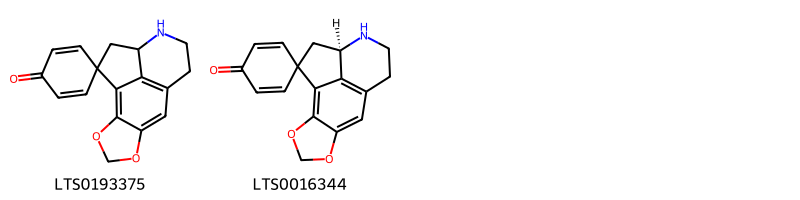{ width=100% }
    <figcaption>Hình ảnh cấu trúc hóa học của 2 hoạt chất thuộc nhóm Proaporphines gồm ["3',5'-dioxa-11'-azaspiro[cyclohexane-1,14'-tetracyclo[6.6.1.0²,⁶.0¹²,¹⁵]pentadecane]-1'(15'),2,2'(6'),5,7'-pentaen-4-one (LTS0193375)", "(12'r)-3',5'-dioxa-11'-azaspiro[cyclohexane-1,14'-tetracyclo[6.6.1.0²,⁶.0¹²,¹⁵]pentadecane]-1'(15'),2,2'(6'),5,7'-pentaen-4-one (LTS0016344)"].</figcaption>
</figure>
#### Nhóm Pyrrolidines
<figure markdown="span">
    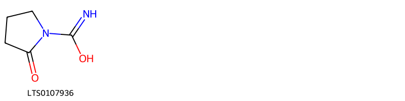{ width=100% }
    <figcaption>Hình ảnh cấu trúc hóa học của 1 hoạt chất thuộc nhóm Pyrrolidines gồm ['2-oxopyrrolidine-1-carboximidic acid (LTS0107936)'].</figcaption>
</figure>
#### Nhóm Saturated hydrocarbons
<figure markdown="span">
    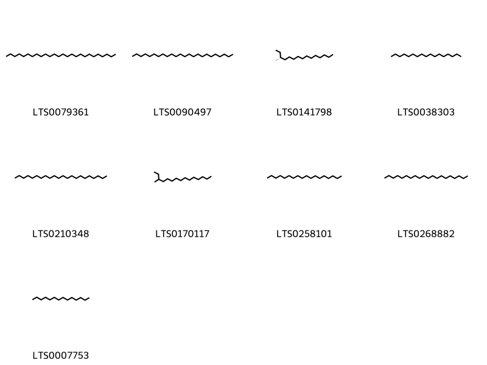{ width=100% }
    <figcaption>Hình ảnh cấu trúc hóa học của 9 hoạt chất thuộc nhóm Saturated hydrocarbons gồm ['hexacosane (LTS0079361)', 'tetracosane (LTS0090497)', '(3r)-3-methylpentadecane (LTS0141798)', 'heptadecane (LTS0038303)', 'docosane (LTS0210348)', '3-methylpentadecane (LTS0170117)', 'octadecane (LTS0258101)', 'eicosane (LTS0268882)', 'tetradecane (LTS0007753)'].</figcaption>
</figure>
#### Nhóm Steroids and steroid derivatives
<figure markdown="span">
    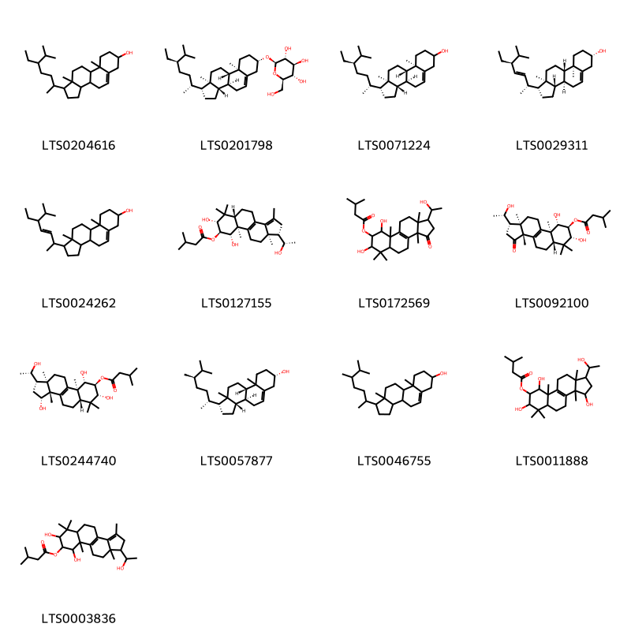{ width=100% }
    <figcaption>Hình ảnh cấu trúc hóa học của 13 hoạt chất thuộc nhóm Steroids and steroid derivatives gồm ['stigmast-5-en-3-ol, (3β)- (LTS0204616)', 'sitogluside (LTS0201798)', 'stigmast-5-en-3-ol (LTS0071224)', 'phytosterol (LTS0029311)', 'stigmasterol (LTS0024262)', '(1s,5as,7r,8s,9s,9as,11ar)-7,9-dihydroxy-1-[(1s)-1-hydroxyethyl]-3,6,6,9a,11a-pentamethyl-1h,2h,4h,5h,5ah,7h,8h,9h,10h,11h-cyclopenta[a]phenanthren-8-yl 3-methylbutanoate (LTS0127155)', '7,9-dihydroxy-1-(1-hydroxyethyl)-3a,6,6,9a,11a-pentamethyl-3-oxo-1h,2h,4h,5h,5ah,7h,8h,9h,10h,11h-cyclopenta[a]phenanthren-8-yl 3-methylbutanoate (LTS0172569)', '(1s,3ar,5as,7r,8s,9s,9as,11ar)-7,9-dihydroxy-1-[(1s)-1-hydroxyethyl]-3a,6,6,9a,11a-pentamethyl-3-oxo-1h,2h,4h,5h,5ah,7h,8h,9h,10h,11h-cyclopenta[a]phenanthren-8-yl 3-methylbutanoate (LTS0092100)', '(1s,3r,3ar,5as,7r,8s,9s,9as,11ar)-3,7,9-trihydroxy-1-[(1s)-1-hydroxyethyl]-3a,6,6,9a,11a-pentamethyl-1h,2h,3h,4h,5h,5ah,7h,8h,9h,10h,11h-cyclopenta[a]phenanthren-8-yl 3-methylbutanoate (LTS0244740)', '(1r,3as,3bs,7s,9bs)-1-[(2r,5r)-5,6-dimethylheptan-2-yl]-9a,11a-dimethyl-1h,2h,3h,3ah,3bh,4h,6h,7h,8h,9h,9bh,10h,11h-cyclopenta[a]phenanthren-7-ol (LTS0057877)', 'campesterol (LTS0046755)', '3,7,9-trihydroxy-1-(1-hydroxyethyl)-3a,6,6,9a,11a-pentamethyl-1h,2h,3h,4h,5h,5ah,7h,8h,9h,10h,11h-cyclopenta[a]phenanthren-8-yl 3-methylbutanoate (LTS0011888)', '7,9-dihydroxy-1-(1-hydroxyethyl)-3,6,6,9a,11a-pentamethyl-1h,2h,4h,5h,5ah,7h,8h,9h,10h,11h-cyclopenta[a]phenanthren-8-yl 3-methylbutanoate (LTS0003836)'].</figcaption>
</figure>
#### Nhóm Stilbenes
<figure markdown="span">
    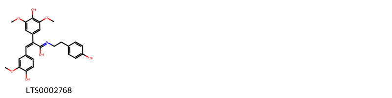{ width=100% }
    <figcaption>Hình ảnh cấu trúc hóa học của 1 hoạt chất thuộc nhóm Stilbenes gồm ['(2z)-2-(4-hydroxy-3,5-dimethoxyphenyl)-3-(4-hydroxy-3-methoxyphenyl)-n-[2-(4-hydroxyphenyl)ethyl]prop-2-enimidic acid (LTS0002768)'].</figcaption>
</figure>
#### Nhóm Tetrahydroisoquinolines
<figure markdown="span">
    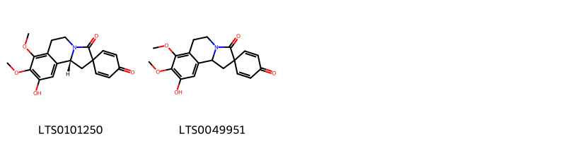{ width=100% }
    <figcaption>Hình ảnh cấu trúc hóa học của 2 hoạt chất thuộc nhóm Tetrahydroisoquinolines gồm ["(10'br)-9'-hydroxy-7',8'-dimethoxy-1',5',6',10'b-tetrahydrospiro[cyclohexane-1,2'-pyrrolo[2,1-a]isoquinoline]-2,5-diene-3',4-dione (LTS0101250)", "9'-hydroxy-7',8'-dimethoxy-1',5',6',10'b-tetrahydrospiro[cyclohexane-1,2'-pyrrolo[2,1-a]isoquinoline]-2,5-diene-3',4-dione (LTS0049951)"].</figcaption>
</figure>

---

### Dược dân tộc học

Danh sách các quốc gia có sử dụng *Annona squamosa* trong điều trị các bệnh. 

| Country   | Disease                                                                                                | Bệnh                                                                                                                                                                                                |
|:----------|:-------------------------------------------------------------------------------------------------------|:----------------------------------------------------------------------------------------------------------------------------------------------------------------------------------------------------|
| Arabic    | Tonic                                                                                                  | MYMEMORY WARNING: YOU USED ALL AVAILABLE FREE TRANSLATIONS FOR TODAY. NEXT AVAILABLE IN  10 HOURS 25 MINUTES 10 SECONDS VISIT HTTPS://MYMEMORY.TRANSLATED.NET/DOC/USAGELIMITS.PHP TO TRANSLATE MORE |
| Dutch     | Vermifuge                                                                                              | MYMEMORY WARNING: YOU USED ALL AVAILABLE FREE TRANSLATIONS FOR TODAY. NEXT AVAILABLE IN  10 HOURS 25 MINUTES 06 SECONDS VISIT HTTPS://MYMEMORY.TRANSLATED.NET/DOC/USAGELIMITS.PHP TO TRANSLATE MORE |
| Elsewhere | Abortifacient, Insecticide, Pediculicide, Suppurative, Purgative, Insecticide, Pediculicide, Soporific | MYMEMORY WARNING: YOU USED ALL AVAILABLE FREE TRANSLATIONS FOR TODAY. NEXT AVAILABLE IN  10 HOURS 25 MINUTES 00 SECONDS VISIT HTTPS://MYMEMORY.TRANSLATED.NET/DOC/USAGELIMITS.PHP TO TRANSLATE MORE |
| German    | Insecticide                                                                                            | MYMEMORY WARNING: YOU USED ALL AVAILABLE FREE TRANSLATIONS FOR TODAY. NEXT AVAILABLE IN  10 HOURS 24 MINUTES 57 SECONDS VISIT HTTPS://MYMEMORY.TRANSLATED.NET/DOC/USAGELIMITS.PHP TO TRANSLATE MORE |
| Guatemala | Insecticide                                                                                            | MYMEMORY WARNING: YOU USED ALL AVAILABLE FREE TRANSLATIONS FOR TODAY. NEXT AVAILABLE IN  10 HOURS 24 MINUTES 53 SECONDS VISIT HTTPS://MYMEMORY.TRANSLATED.NET/DOC/USAGELIMITS.PHP TO TRANSLATE MORE |
| Haiti     | Diuretic, Stomachic, Diuretic                                                                          | MYMEMORY WARNING: YOU USED ALL AVAILABLE FREE TRANSLATIONS FOR TODAY. NEXT AVAILABLE IN  10 HOURS 24 MINUTES 51 SECONDS VISIT HTTPS://MYMEMORY.TRANSLATED.NET/DOC/USAGELIMITS.PHP TO TRANSLATE MORE |
| Iran      | Astringent                                                                                             | MYMEMORY WARNING: YOU USED ALL AVAILABLE FREE TRANSLATIONS FOR TODAY. NEXT AVAILABLE IN  10 HOURS 24 MINUTES 49 SECONDS VISIT HTTPS://MYMEMORY.TRANSLATED.NET/DOC/USAGELIMITS.PHP TO TRANSLATE MORE |
| Java      | Pediculicide                                                                                           | MYMEMORY WARNING: YOU USED ALL AVAILABLE FREE TRANSLATIONS FOR TODAY. NEXT AVAILABLE IN  10 HOURS 24 MINUTES 45 SECONDS VISIT HTTPS://MYMEMORY.TRANSLATED.NET/DOC/USAGELIMITS.PHP TO TRANSLATE MORE |
| Panama    | Vermifuge                                                                                              | MYMEMORY WARNING: YOU USED ALL AVAILABLE FREE TRANSLATIONS FOR TODAY. NEXT AVAILABLE IN  10 HOURS 24 MINUTES 42 SECONDS VISIT HTTPS://MYMEMORY.TRANSLATED.NET/DOC/USAGELIMITS.PHP TO TRANSLATE MORE |
| Venezuela | Purgative, Insecticide                                                                                 | MYMEMORY WARNING: YOU USED ALL AVAILABLE FREE TRANSLATIONS FOR TODAY. NEXT AVAILABLE IN  10 HOURS 24 MINUTES 39 SECONDS VISIT HTTPS://MYMEMORY.TRANSLATED.NET/DOC/USAGELIMITS.PHP TO TRANSLATE MORE |

---

# Chi Uvaria

??? note "Danh sách các dược liệu thuộc chi"
    
	 - *Uvaria chamae*
	 - *Uvaria crinita*
	 - *Uvaria grandiflora*
	 - *Uvaria microcarpa*

---
## Uvaria chamae
### Thông tin về thực vật

!!! info "Phân loại thực vật của *Uvaria chamae* từ GIBF:"
    - **Kingdom:** Plantae
    - **Phylum:** Tracheophyta
    - **Order:** Magnoliales
    - **Family:** Annonaceae
    - **Genus:** Uvaria
    - **Species:** *Uvaria chamae*

 

| Label (VI)   | Label (EN)   | Scientific Name   | Descriptions (VI)   | Descriptions (EN)   | Also Known As (VI)   | Also Known As (EN)   |
|:-------------|:-------------|:------------------|:--------------------|:--------------------|:---------------------|:---------------------|
| N/A          | N/A          | Uvaria chamae     | loài thực vật       | species of plant    | ['']                 | ['']                 |

#### Phân bố trên thế giới

**Từ CSDL GIBF** Cameroon, Guinea, Benin, Nigeria

#### Phân bố tại Việt Nam

**Từ CSDL GIBF**: Không có ghi nhận ở Việt Nam

---
### Thành phần hóa học
        
- Theo cơ sở dữ liệu lotus: Từ loài *Uvaria chamae* đã phân lập và xác định được 102 hoạt chất thuộc về các nhóm Organooxygen compounds, Flavonoids, Prenol lipids, Carboxylic acids and derivatives, Fatty Acyls, Diarylheptanoids, Benzene and substituted derivatives. 

|    | chemicalTaxonomyClassyfireClass     |   smiles_count |
|---:|:------------------------------------|---------------:|
|  0 | Benzene and substituted derivatives |              9 |
|  1 | Carboxylic acids and derivatives    |              1 |
|  2 | Diarylheptanoids                    |             11 |
|  3 | Fatty Acyls                         |             24 |
|  4 | Flavonoids                          |              5 |
|  5 | Organooxygen compounds              |              3 |
|  6 | Prenol lipids                       |             49 |

#### Nhóm Benzene and substituted derivatives
<figure markdown="span">
    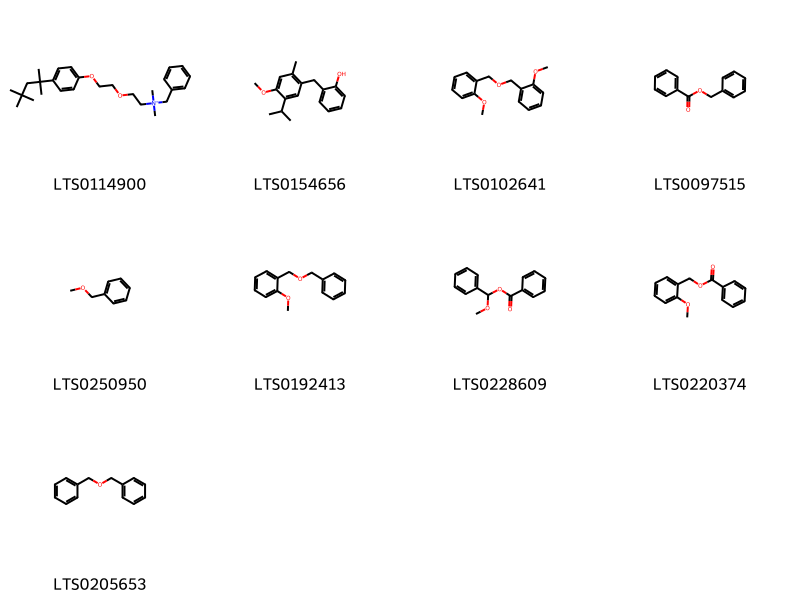{ width=100% }
    <figcaption>Hình ảnh cấu trúc hóa học của 9 hoạt chất thuộc nhóm Benzene and substituted derivatives gồm ['benzethonium (LTS0114900)', '2-[(5-isopropyl-4-methoxy-2-methylphenyl)methyl]phenol (LTS0154656)', '1-methoxy-2-{[(2-methoxyphenyl)methoxy]methyl}benzene (LTS0102641)', 'benzyl benzoate (LTS0097515)', 'benzyl methyl ether (LTS0250950)', '1-[(benzyloxy)methyl]-2-methoxybenzene (LTS0192413)', 'methoxy(phenyl)methyl benzoate (LTS0228609)', '(2-methoxyphenyl)methyl benzoate (LTS0220374)', 'dibenzyl ether (LTS0205653)'].</figcaption>
</figure>
#### Nhóm Carboxylic acids and derivatives
<figure markdown="span">
    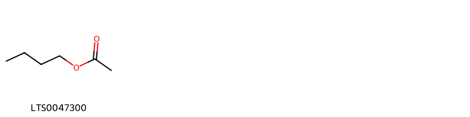{ width=100% }
    <figcaption>Hình ảnh cấu trúc hóa học của 1 hoạt chất thuộc nhóm Carboxylic acids and derivatives gồm ['butyl acetate (LTS0047300)'].</figcaption>
</figure>
#### Nhóm Diarylheptanoids
<figure markdown="span">
    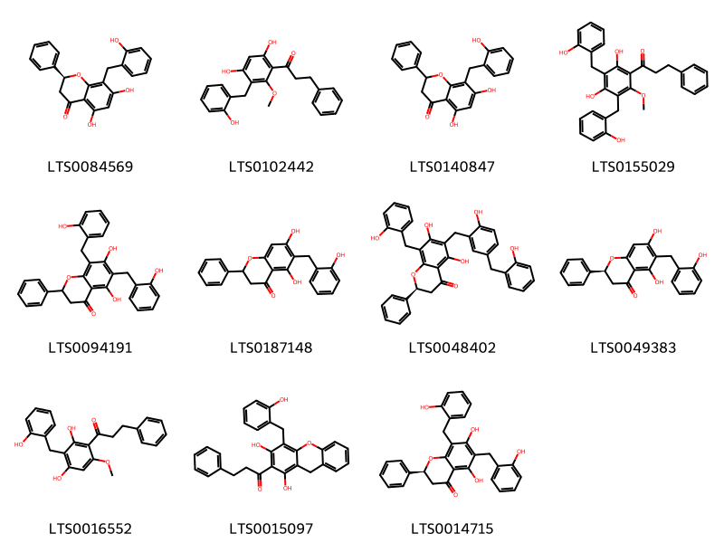{ width=100% }
    <figcaption>Hình ảnh cấu trúc hóa học của 11 hoạt chất thuộc nhóm Diarylheptanoids gồm ['(2s)-5,7-dihydroxy-8-[(2-hydroxyphenyl)methyl]-2-phenyl-2,3-dihydro-1-benzopyran-4-one (LTS0084569)', 'isouvaretin (LTS0102442)', 'chamanetin (LTS0140847)', 'diuvaretin (LTS0155029)', 'dichamanetin (LTS0094191)', 'isochamanetin (LTS0187148)', '(2s)-5,7-dihydroxy-6-({2-hydroxy-5-[(2-hydroxyphenyl)methyl]phenyl}methyl)-8-[(2-hydroxyphenyl)methyl]-2-phenyl-2,3-dihydro-1-benzopyran-4-one (LTS0048402)', 'isochamanetin (LTS0049383)', 'uvaretin (LTS0016552)', 'chamuvaritin (LTS0015097)', 'dichamanetin (LTS0014715)'].</figcaption>
</figure>
#### Nhóm Fatty Acyls
<figure markdown="span">
    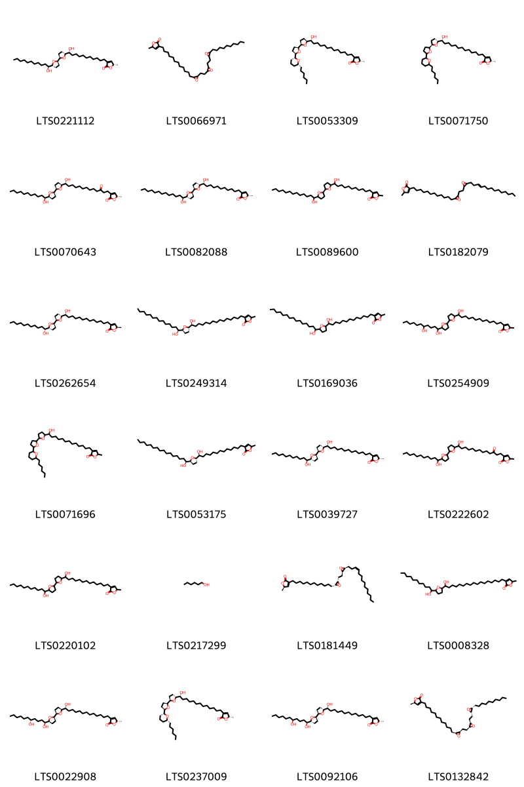{ width=100% }
    <figcaption>Hình ảnh cấu trúc hóa học của 24 hoạt chất thuộc nhóm Fatty Acyls gồm ["(5s)-3-[(11r)-11-hydroxy-11-[(2r,2'r,5r,5'r)-5'-[(1s)-1-hydroxyundecyl]-[2,2'-bioxolan]-5-yl]undecyl]-5-methyl-5h-furan-2-one (LTS0221112)", '3-{12-[3-(2-{3-[2-(3-decyloxiran-2-yl)ethyl]oxiran-2-yl}ethyl)oxiran-2-yl]dodecyl}-5-methyl-5h-furan-2-one (LTS0066971)', "(5s)-3-[(13r)-13-[(2r,2's,5s,5'r)-5'-[(2r,6r)-6-hexyloxan-2-yl]-[2,2'-bioxolan]-5-yl]-13-hydroxytridecyl]-5-methyl-5h-furan-2-one (LTS0053309)", 'chamuvarinin (LTS0071750)', "(5s)-3-[(13r)-13-hydroxy-13-[(2r,2'r,5s,5's)-5'-[(1s)-1-hydroxyundecyl]-[2,2'-bioxolan]-5-yl]-3-oxotridecyl]-5-methyl-5h-furan-2-one (LTS0070643)", "(5s)-3-[(11r)-11-hydroxy-11-[(2r,2'r,5r,5'r)-5'-[(1s)-1-hydroxytridecyl]-[2,2'-bioxolan]-5-yl]undecyl]-5-methyl-5h-furan-2-one (LTS0082088)", "3-{11-hydroxy-11-[5'-(1-hydroxytridecyl)-[2,2'-bioxolan]-5-yl]undecyl}-5-methyl-5h-furan-2-one (LTS0089600)", '5-methyl-3-[12-(3-{2-[3-(tetradec-3-en-1-yl)oxiran-2-yl]ethyl}oxiran-2-yl)dodecyl]-5h-furan-2-one (LTS0182079)', "(5r)-3-[(13r)-13-hydroxy-13-[(2r,2'r,5r,5'r)-5'-[(1r)-1-hydroxyundecyl]-[2,2'-bioxolan]-5-yl]tridecyl]-5-methyl-5h-furan-2-one (LTS0262654)", '3-[(15s)-15-hydroxy-15-[(2s,5s)-5-[(1s)-1-hydroxytetradecyl]oxolan-2-yl]pentadecyl]-5-methyl-5h-furan-2-one (LTS0249314)', '3-{13-hydroxy-13-[5-(1-hydroxypentadecyl)oxolan-2-yl]tridecyl}-5-methyl-5h-furan-2-one (LTS0169036)', "3-{13-[5'-(1,5-dihydroxyundecyl)-[2,2'-bioxolan]-5-yl]-13-hydroxytridecyl}-5-methyl-5h-furan-2-one (LTS0254909)", "3-{13-[5'-(6-hexyloxan-2-yl)-[2,2'-bioxolan]-5-yl]-13-hydroxytridecyl}-5-methyl-5h-furan-2-one (LTS0071696)", '3-[(13s)-13-hydroxy-13-[(2s,5s)-5-[(1s)-1-hydroxyhexadecyl]oxolan-2-yl]tridecyl]-5-methyl-5h-furan-2-one (LTS0053175)', "(5s)-3-[(13r)-13-hydroxy-13-[(2r,2'r,5r,5'r)-5'-[(1s)-1-hydroxyundecyl]-[2,2'-bioxolan]-5-yl]tridecyl]-5-methyl-5h-furan-2-one (LTS0039727)", "3-{13-hydroxy-13-[5'-(1-hydroxyundecyl)-[2,2'-bioxolan]-5-yl]-3-oxotridecyl}-5-methyl-5h-furan-2-one (LTS0222602)", "3-{13-hydroxy-13-[5'-(1-hydroxyundecyl)-[2,2'-bioxolan]-5-yl]tridecyl}-5-methyl-5h-furan-2-one (LTS0220102)", 'hexanol (LTS0217299)', '(5r)-5-methyl-3-{12-[(2r,3s)-3-{2-[(2r,3s)-3-[(3z)-tetradec-3-en-1-yl]oxiran-2-yl]ethyl}oxiran-2-yl]dodecyl}-5h-furan-2-one (LTS0181449)', '3-{17-hydroxy-17-[5-(1-hydroxyundecyl)oxolan-2-yl]heptadecyl}-5-methyl-5h-furan-2-one (LTS0008328)', "(5s)-3-[(13r)-13-[(2r,2'r,5s,5's)-5'-[(1s,5r)-1,5-dihydroxyundecyl]-[2,2'-bioxolan]-5-yl]-13-hydroxytridecyl]-5-methyl-5h-furan-2-one (LTS0022908)", "(5s)-3-[(13r)-13-[(2r,2's,5r,5'r)-5'-[(2r,6r)-6-hexyloxan-2-yl]-[2,2'-bioxolan]-5-yl]-13-hydroxytridecyl]-5-methyl-5h-furan-2-one (LTS0237009)", 'annonin i (LTS0092106)', '(5r)-3-{12-[(2s,3r)-3-{2-[(2s,3r)-3-{2-[(2s,3r)-3-decyloxiran-2-yl]ethyl}oxiran-2-yl]ethyl}oxiran-2-yl]dodecyl}-5-methyl-5h-furan-2-one (LTS0132842)'].</figcaption>
</figure>
#### Nhóm Flavonoids
<figure markdown="span">
    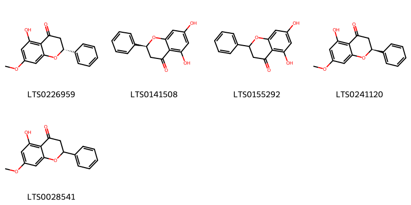{ width=100% }
    <figcaption>Hình ảnh cấu trúc hóa học của 5 hoạt chất thuộc nhóm Flavonoids gồm ['(2r)-5-hydroxy-7-methoxy-2-phenyl-2,3-dihydro-1-benzopyran-4-one (LTS0226959)', 'pinocembrine (LTS0141508)', 'pinocembrin (LTS0155292)', 'pinostrobin (LTS0241120)', 'pinostrobin (LTS0028541)'].</figcaption>
</figure>
#### Nhóm Organooxygen compounds
<figure markdown="span">
    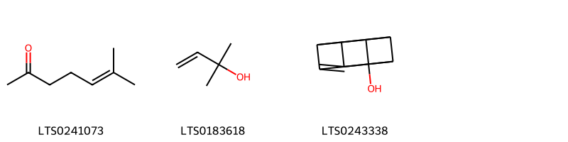{ width=100% }
    <figcaption>Hình ảnh cấu trúc hóa học của 3 hoạt chất thuộc nhóm Organooxygen compounds gồm ['6-methyl-5-hepten-2-one (LTS0241073)', '2-methyl-3-buten-2-ol (LTS0183618)', '3,4,5,8-tetrahydro-2h-cuban-1-ol (LTS0243338)'].</figcaption>
</figure>
#### Nhóm Prenol lipids
<figure markdown="span">
    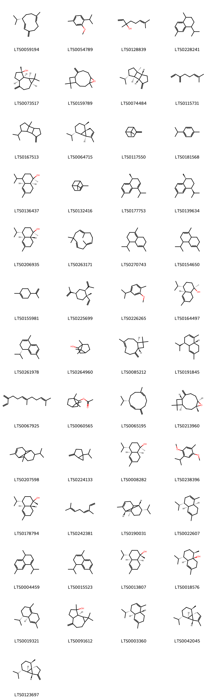{ width=100% }
    <figcaption>Hình ảnh cấu trúc hóa học của 49 hoạt chất thuộc nhóm Prenol lipids gồm ['(-)-germacrene d (LTS0059194)', '2-isopropyl-5-methylanisole (LTS0054789)', 'linalool, (+-)- (LTS0128839)', '(e)-calamene (LTS0228241)', '(1as,4as,7s,7ar,7bs)-1,1,7-trimethyl-4-methylidene-octahydrocyclopropa[e]azulen-7-ol (LTS0073517)', 'caryophyllene oxide (LTS0159789)', 'β-bourbonene (LTS0074484)', 'α-myrcene (LTS0115731)', 'β-bourbonene (LTS0167513)', '(1s,5r,7s,10r)-7-isopropyl-4,10-dimethyltricyclo[4.4.0.0¹,⁵]dec-3-ene (LTS0064715)', 'β-pinene (LTS0117550)', 'cymene (LTS0181568)', '(1r,4ar,8as)-4-isopropyl-1,6-dimethyl-3,4,4a,7,8,8a-hexahydro-2h-naphthalen-1-ol (LTS0136437)', 'α pinene (LTS0132416)', '(1s)-4-isopropyl-1,6-dimethyl-1,2-dihydronaphthalene (LTS0177753)', '(1s,4s)-4-isopropyl-1,6-dimethyl-1,2,3,4-tetrahydronaphthalene (LTS0139634)', 'α-cadinol (LTS0206935)', 'humulene (LTS0263171)', '4-isopropyl-1,6-dimethyl-2,3,4,4a,7,8-hexahydronaphthalene (LTS0270743)', '4-isopropyl-1,6-dimethyl-3,4,4a,7,8,8a-hexahydronaphthalene (LTS0154650)', 'limonene,  (LTS0155981)', 'β-elemene (LTS0225699)', 'carvacrol methyl ether (LTS0226265)', '(1r,4s,4ar)-4-isopropyl-1,6-dimethyl-3,4,4a,7,8,8a-hexahydro-2h-naphthalen-1-ol (LTS0164497)', '(4s)-4-isopropyl-1,6-dimethyl-3,4-dihydronaphthalene (LTS0261978)', 'borneol (LTS0264960)', 'caryophyllene (LTS0085212)', '(4r,8ar)-4-isopropyl-1,6-dimethyl-3,4,4a,7,8,8a-hexahydronaphthalene (LTS0191845)', 'β-farnesene (LTS0067925)', 'bornyl acetate (LTS0060565)', '(1z,6z,8s)-8-isopropyl-1-methyl-5-methylidenecyclodeca-1,6-diene (LTS0065195)', 'β-caryophyllene oxide (LTS0213960)', 'α-copaene (LTS0207598)', 'sabinene (LTS0224133)', 'delta-cadinol (LTS0008282)', '2,5-dimethoxy-p-cymene (LTS0238396)', 'α-cadinol (LTS0178794)', 'β-ocimene (LTS0242381)', '(1r,2s,7s,8s)-8-isopropyl-1,3-dimethyltricyclo[4.4.0.0²,⁷]dec-3-ene (LTS0190031)', 'α-muurolene (LTS0022607)', '4-isopropyl-1,6-dimethyl-1,2-dihydronaphthalene (LTS0004459)', '3,4-dihydrocadalene (LTS0015523)', 'delta-cadinol (LTS0013807)', '(1s,4r,4ar,8ar)-1-isopropyl-4,7-dimethyl-2,3,4,5,6,8a-hexahydro-1h-naphthalen-4a-ol (LTS0018576)', 'delta-cadinene (LTS0019321)', '(7ar)-1,1,7-trimethyl-4-methylidene-octahydrocyclopropa[e]azulen-7-ol (LTS0091612)', 'cadinene (LTS0003360)', '(-)-α-cubebene (LTS0042045)', '(-)-β-cubebene (LTS0123697)'].</figcaption>
</figure>

---

### Dược dân tộc học

Danh sách các quốc gia có sử dụng *Uvaria chamae* trong điều trị các bệnh. 

| Country      | Disease                              | Bệnh                                                                                                                                                                                                |
|:-------------|:-------------------------------------|:----------------------------------------------------------------------------------------------------------------------------------------------------------------------------------------------------|
| Africa       | Astringent, Styptic, Counterirritant | MYMEMORY WARNING: YOU USED ALL AVAILABLE FREE TRANSLATIONS FOR TODAY. NEXT AVAILABLE IN  10 HOURS 23 MINUTES 53 SECONDS VISIT HTTPS://MYMEMORY.TRANSLATED.NET/DOC/USAGELIMITS.PHP TO TRANSLATE MORE |
| Sierra Leone | Purgative                            | MYMEMORY WARNING: YOU USED ALL AVAILABLE FREE TRANSLATIONS FOR TODAY. NEXT AVAILABLE IN  10 HOURS 23 MINUTES 51 SECONDS VISIT HTTPS://MYMEMORY.TRANSLATED.NET/DOC/USAGELIMITS.PHP TO TRANSLATE MORE |

---

---
## Uvaria crinita
### Thông tin về thực vật

!!! info "Phân loại thực vật của *Uraria crinita* từ GIBF:"
    - **Kingdom:** Plantae
    - **Phylum:** Tracheophyta
    - **Order:** Fabales
    - **Family:** Fabaceae
    - **Genus:** Uraria
    - **Species:** *Uraria crinita*

 

| Label (VI)   | Label (EN)   | Scientific Name   | Descriptions (VI)   | Descriptions (EN)   | Also Known As (VI)   | Also Known As (EN)   |
|:-------------|:-------------|:------------------|:--------------------|:--------------------|:---------------------|:---------------------|
| N/A          | N/A          | Uvaria chamae     | loài thực vật       | species of plant    | ['']                 | ['']                 |

#### Phân bố trên thế giới

**Từ CSDL GIBF** Chinese Taipei, Thailand, Myanmar, Philippines, Malaysia, India, Macao, Indonesia, China, Singapore, Cambodia, Hong Kong

#### Phân bố tại Việt Nam

**Từ CSDL GIBF**: Không có ghi nhận ở Việt Nam

---
### Thành phần hóa học
        
- Theo cơ sở dữ liệu lotus: Từ loài *Uraria crinita* đã phân lập và xác định được Chưa có hoạt chất nào được phân lập. hoạt chất thuộc về các nhóm Không có hoạt chất nào được phân lập. 

Không có hình ảnh nào được tạo ra

---

### Dược dân tộc học

Danh sách các quốc gia có sử dụng *Uraria crinita* trong điều trị các bệnh. 

| Country   | Disease   | Bệnh                                                                                                                                                                                                |
|:----------|:----------|:----------------------------------------------------------------------------------------------------------------------------------------------------------------------------------------------------|
| India     | Piscicide | MYMEMORY WARNING: YOU USED ALL AVAILABLE FREE TRANSLATIONS FOR TODAY. NEXT AVAILABLE IN  10 HOURS 23 MINUTES 15 SECONDS VISIT HTTPS://MYMEMORY.TRANSLATED.NET/DOC/USAGELIMITS.PHP TO TRANSLATE MORE |

---

---
## Uvaria grandiflora
### Thông tin về thực vật

!!! info "Phân loại thực vật của *Uvaria grandiflora* từ GIBF:"
    - **Kingdom:** Plantae
    - **Phylum:** Tracheophyta
    - **Order:** Magnoliales
    - **Family:** Annonaceae
    - **Genus:** Uvaria
    - **Species:** *Uvaria grandiflora*

 

| Label (VI)   | Label (EN)   | Scientific Name    | Descriptions (VI)   | Descriptions (EN)   | Also Known As (VI)   | Also Known As (EN)   |
|:-------------|:-------------|:-------------------|:--------------------|:--------------------|:---------------------|:---------------------|
| N/A          | N/A          | Uvaria grandiflora | loài thực vật       | species of plant    | ['']                 | ['']                 |

#### Phân bố trên thế giới

**Từ CSDL GIBF** Viet Nam, nan, unknown or invalid, Thailand, Sri Lanka, Philippines, Malaysia, Papua New Guinea, United States of America, China, Singapore, Hong Kong, Indonesia

#### Phân bố tại Việt Nam

**Từ CSDL GIBF**: Quang Binh Province, Đồng Nai, Thua Thien-Hue

---
### Thành phần hóa học
        
- Theo cơ sở dữ liệu lotus: Từ loài *Uvaria grandiflora* đã phân lập và xác định được 63 hoạt chất thuộc về các nhóm Organooxygen compounds, Carboxylic acids and derivatives, Benzene and substituted derivatives, Fatty Acyls. 

|    | chemicalTaxonomyClassyfireClass     |   smiles_count |
|---:|:------------------------------------|---------------:|
|  0 | Benzene and substituted derivatives |             56 |
|  1 | Carboxylic acids and derivatives    |              4 |
|  2 | Fatty Acyls                         |              2 |
|  3 | Organooxygen compounds              |              1 |

#### Nhóm Benzene and substituted derivatives
<figure markdown="span">
    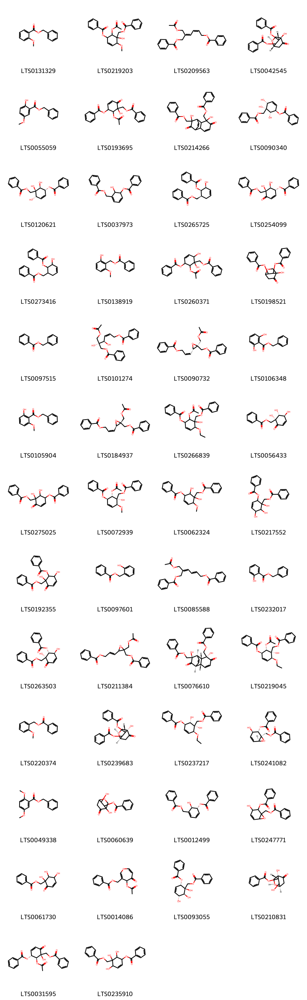{ width=100% }
    <figcaption>Hình ảnh cấu trúc hóa học của 56 hoạt chất thuộc nhóm Benzene and substituted derivatives gồm ['benzyl 2-methoxybenzoate (LTS0131329)', '6-(acetyloxy)-5-[(benzoyloxy)methyl]-5-hydroxy-4-methoxycyclohex-2-en-1-yl benzoate (LTS0219203)', '(2e,4z)-6-[(e,z)-benzoyloxy]-2-{[(e,z)-benzoyloxy]methyl}hexa-2,4-dien-1-yl acetate (LTS0209563)', '(1s,4r,5s,6r)-5-(benzoyloxy)-4-hydroxy-8-oxo-2-oxabicyclo[2.2.2]octan-6-yl benzoate (LTS0042545)', 'benzyl 2-hydroxy-5-methoxybenzoate (LTS0055059)', '6-(acetyloxy)-5-[(benzoyloxy)methyl]-5-hydroxy-4-oxocyclohex-2-en-1-yl benzoate (LTS0193695)', '{11-[(benzoyloxy)methyl]-3,11-dihydroxy-4,12-dioxotricyclo[6.2.2.0²,⁷]dodeca-5,9-dien-3-yl}methyl benzoate (LTS0214266)', '(1r,4r,5r,6s)-5-[(benzoyloxy)methyl]-4,5,6-trihydroxycyclohex-2-en-1-yl benzoate (LTS0090340)', '(1r,4s,5r,6s)-5-[(benzoyloxy)methyl]-4,5,6-trihydroxycyclohex-2-en-1-yl benzoate (LTS0120621)', '5-[(benzoyloxy)methyl]-6-hydroxycyclohexa-2,4-dien-1-yl benzoate (LTS0037973)', '(1r,2s,6s)-6-[(benzoyloxy)methyl]-2-hydroxycyclohex-3-en-1-yl benzoate (LTS0265725)', '(1r,5s,6s)-5-[(benzoyloxy)methyl]-5,6-dihydroxy-4-oxocyclohex-2-en-1-yl benzoate (LTS0254099)', '6-[(benzoyloxy)methyl]-2-hydroxycyclohex-3-en-1-yl benzoate (LTS0273416)', '(2-hydroxy-6-methoxyphenyl)methyl benzoate (LTS0138919)', '6-(acetyloxy)-5-[(benzoyloxy)methyl]-4,5-dihydroxycyclohex-2-en-1-yl benzoate (LTS0260371)', '6-(benzoyloxy)-4-hydroxy-8-oxo-2-oxabicyclo[2.2.2]octan-5-yl benzoate (LTS0198521)', 'benzyl benzoate (LTS0097515)', '(2s,3r,4z)-6-[(z)-benzoyloxy]-2-{[(z)-benzoyloxy]methyl}-2,3-dihydroxyhex-4-en-1-yl acetate (LTS0101274)', '[(2s,3s)-2-[(acetyloxy)methyl]-3-[(1z)-3-[(z)-benzoyloxy]prop-1-en-1-yl]oxiran-2-yl]methyl benzoate (LTS0090732)', 'benzyl 2,6-dihydroxybenzoate (LTS0106348)', 'benzyl 2-hydroxy-6-methoxybenzoate (LTS0105904)', '[(2r,3r)-2-[(acetyloxy)methyl]-3-[(1z)-3-[(z)-benzoyloxy]prop-1-en-1-yl]oxiran-2-yl]methyl benzoate (LTS0184937)', '6-(acetyloxy)-5-[(benzoyloxy)methyl]-4-ethoxy-5-hydroxycyclohex-2-en-1-yl benzoate (LTS0266839)', '[(1r,5s,6r)-1,5,6-trihydroxy-2-oxocyclohex-3-en-1-yl]methyl benzoate (LTS0056433)', '5-[(benzoyloxy)methyl]-5,6-dihydroxy-4-oxocyclohex-2-en-1-yl benzoate (LTS0275025)', '(1r,4s,5r,6s)-6-(acetyloxy)-5-[(benzoyloxy)methyl]-5-hydroxy-4-methoxycyclohex-2-en-1-yl benzoate (LTS0072939)', '5-[(benzoyloxy)methyl]-5,6-dihydroxy-4-methoxycyclohex-2-en-1-yl benzoate (LTS0062324)', '6-[(benzoyloxy)methyl]-4,5,6-trihydroxycyclohex-2-en-1-yl benzoate (LTS0217552)', '6-[(benzoyloxy)methyl]-2,6-dihydroxy-5-oxocyclohex-3-en-1-yl benzoate (LTS0192355)', '(2-hydroxyphenyl)methyl benzoate (LTS0097601)', '6-(benzoyloxy)-2-[(benzoyloxy)methyl]hexa-2,4-dien-1-yl acetate (LTS0085588)', 'benzyl salicylate (LTS0232017)', '(1r,2s,6r)-6-[(benzoyloxy)methyl]-2,6-dihydroxy-5-oxocyclohex-3-en-1-yl benzoate (LTS0263503)', '{2-[(acetyloxy)methyl]-3-[3-(benzoyloxy)prop-1-en-1-yl]oxiran-2-yl}methyl benzoate (LTS0211384)', '[(1r,2r,3r,7s,8s,11r)-11-[(benzoyloxy)methyl]-3,11-dihydroxy-4,12-dioxotricyclo[6.2.2.0²,⁷]dodeca-5,9-dien-3-yl]methyl benzoate (LTS0076610)', '(1r,4s,5r,6s)-6-(acetyloxy)-5-[(benzoyloxy)methyl]-4-ethoxy-5-hydroxycyclohex-2-en-1-yl benzoate (LTS0219045)', '(2-methoxyphenyl)methyl benzoate (LTS0220374)', '(1r,4s,5s,6r)-5-(benzoyloxy)-4-hydroxy-8-oxo-2-oxabicyclo[2.2.2]octan-6-yl benzoate (LTS0239683)', '(1r,4s,5s,6s)-5-[(benzoyloxy)methyl]-4-ethoxy-5,6-dihydroxycyclohex-2-en-1-yl benzoate (LTS0237217)', '(1s,2s,3r,6s)-1-[(benzoyloxy)methyl]-3-hydroxy-7-oxabicyclo[4.1.0]hept-4-en-2-yl benzoate (LTS0241082)', 'benzyl 2,5-dimethoxybenzoate (LTS0049338)', '4,6-dihydroxy-8-oxo-2-oxabicyclo[2.2.2]octan-5-yl benzoate (LTS0060639)', '(1r,6r)-5-[(benzoyloxy)methyl]-6-hydroxycyclohexa-2,4-dien-1-yl benzoate (LTS0012499)', '1-[(benzoyloxy)methyl]-3-hydroxy-7-oxabicyclo[4.1.0]hept-4-en-2-yl benzoate (LTS0247771)', '(1,5,6-trihydroxy-2-oxocyclohex-3-en-1-yl)methyl benzoate (LTS0061730)', '[4-(acetyloxy)-5-oxo-4h-oxepin-3-yl]methyl benzoate (LTS0014086)', '(1s,4r,5s,6s)-6-[(benzoyloxy)methyl]-4,5,6-trihydroxycyclohex-2-en-1-yl benzoate (LTS0093055)', '(1r,4s,5s,6r)-4,6-dihydroxy-8-oxo-2-oxabicyclo[2.2.2]octan-5-yl benzoate (LTS0210831)', '(1r,5s,6s)-6-(acetyloxy)-5-[(benzoyloxy)methyl]-5-hydroxy-4-oxocyclohex-2-en-1-yl benzoate (LTS0031595)', '5-[(benzoyloxy)methyl]-4,5,6-trihydroxycyclohex-2-en-1-yl benzoate (LTS0235910)', '5-[(benzoyloxy)methyl]-4-ethoxy-5,6-dihydroxycyclohex-2-en-1-yl benzoate (LTS0032210)', '6-(benzoyloxy)-2-[(benzoyloxy)methyl]-2,3-dihydroxyhex-4-en-1-yl acetate (LTS0230649)', '(1r,4s,5s,6s)-5-[(benzoyloxy)methyl]-5,6-dihydroxy-4-methoxycyclohex-2-en-1-yl benzoate (LTS0264673)', '(1r,4s,5r,6s)-6-(acetyloxy)-5-[(benzoyloxy)methyl]-4,5-dihydroxycyclohex-2-en-1-yl benzoate (LTS0037495)', 'benzyl 2,6-dimethoxybenzoate (LTS0051574)', '[(4r)-4-(acetyloxy)-5-oxo-4h-oxepin-3-yl]methyl benzoate (LTS0034675)'].</figcaption>
</figure>
#### Nhóm Carboxylic acids and derivatives
<figure markdown="span">
    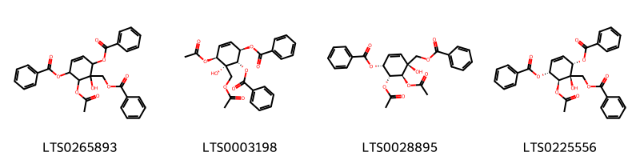{ width=100% }
    <figcaption>Hình ảnh cấu trúc hóa học của 4 hoạt chất thuộc nhóm Carboxylic acids and derivatives gồm ['6-(acetyloxy)-4-(benzoyloxy)-5-[(benzoyloxy)methyl]-5-hydroxycyclohex-2-en-1-yl benzoate (LTS0265893)', '(1r,4s,5r,6s)-4-(acetyloxy)-5-[(acetyloxy)methyl]-6-(benzoyloxy)-5-hydroxycyclohex-2-en-1-yl benzoate (LTS0003198)', '(1r,4s,5s,6r)-5,6-bis(acetyloxy)-4-[(benzoyloxy)methyl]-4-hydroxycyclohex-2-en-1-yl benzoate (LTS0028895)', '(1r,4s,5r,6s)-6-(acetyloxy)-4-(benzoyloxy)-5-[(benzoyloxy)methyl]-5-hydroxycyclohex-2-en-1-yl benzoate (LTS0225556)'].</figcaption>
</figure>
#### Nhóm Fatty Acyls
<figure markdown="span">
    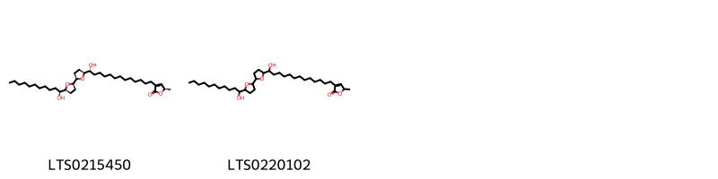{ width=100% }
    <figcaption>Hình ảnh cấu trúc hóa học của 2 hoạt chất thuộc nhóm Fatty Acyls gồm ["(5r)-3-[(13r)-13-hydroxy-13-[(2r,2'r,5s,5's)-5'-[(1s)-1-hydroxyundecyl]-[2,2'-bioxolan]-5-yl]tridecyl]-5-methyl-5h-furan-2-one (LTS0215450)", "3-{13-hydroxy-13-[5'-(1-hydroxyundecyl)-[2,2'-bioxolan]-5-yl]tridecyl}-5-methyl-5h-furan-2-one (LTS0220102)"].</figcaption>
</figure>
#### Nhóm Organooxygen compounds
<figure markdown="span">
    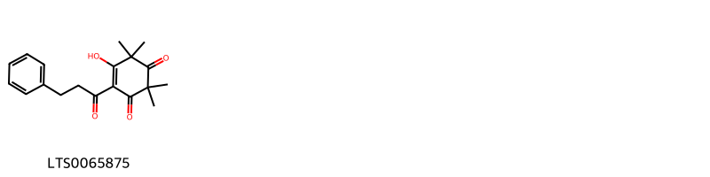{ width=100% }
    <figcaption>Hình ảnh cấu trúc hóa học của 1 hoạt chất thuộc nhóm Organooxygen compounds gồm ['grandiflorone (LTS0065875)'].</figcaption>
</figure>

---

### Dược dân tộc học

Danh sách các quốc gia có sử dụng *Uvaria grandiflora* trong điều trị các bệnh. 

| Country   | Disease   | Bệnh                                                                                                                                                                                                |
|:----------|:----------|:----------------------------------------------------------------------------------------------------------------------------------------------------------------------------------------------------|
| Malaya    | Sudorific | MYMEMORY WARNING: YOU USED ALL AVAILABLE FREE TRANSLATIONS FOR TODAY. NEXT AVAILABLE IN  10 HOURS 22 MINUTES 35 SECONDS VISIT HTTPS://MYMEMORY.TRANSLATED.NET/DOC/USAGELIMITS.PHP TO TRANSLATE MORE |

---

---
## Uvaria microcarpa
### Thông tin về thực vật

!!! info "Phân loại thực vật của *Uvaria microcarpa* từ GIBF:"
    - **Kingdom:** Plantae
    - **Phylum:** Tracheophyta
    - **Order:** Magnoliales
    - **Family:** Annonaceae
    - **Genus:** Uvaria
    - **Species:** *Uvaria microcarpa*

 

| Label (VI)   | Label (EN)   | Scientific Name   | Descriptions (VI)   | Descriptions (EN)   | Also Known As (VI)   | Also Known As (EN)   |
|:-------------|:-------------|:------------------|:--------------------|:--------------------|:---------------------|:---------------------|
| N/A          | N/A          | Uvaria microcarpa | loài thực vật       | species of plant    | ['']                 | ['']                 |

#### Phân bố trên thế giới

**Từ CSDL GIBF** Viet Nam, nan, Thailand, Japan, Lao People’s Democratic Republic, China, Hong Kong

#### Phân bố tại Việt Nam

**Từ CSDL GIBF**: Tonkin, Hoa Binh

---
### Thành phần hóa học
        
- Theo cơ sở dữ liệu lotus: Từ loài *Uvaria microcarpa* đã phân lập và xác định được 11 hoạt chất thuộc về các nhóm Aristolactams, Benzene and substituted derivatives, Fatty Acyls. 

|    | chemicalTaxonomyClassyfireClass     |   smiles_count |
|---:|:------------------------------------|---------------:|
|  0 | Aristolactams                       |              9 |
|  1 | Benzene and substituted derivatives |              1 |
|  2 | Fatty Acyls                         |              1 |

#### Nhóm Aristolactams
<figure markdown="span">
    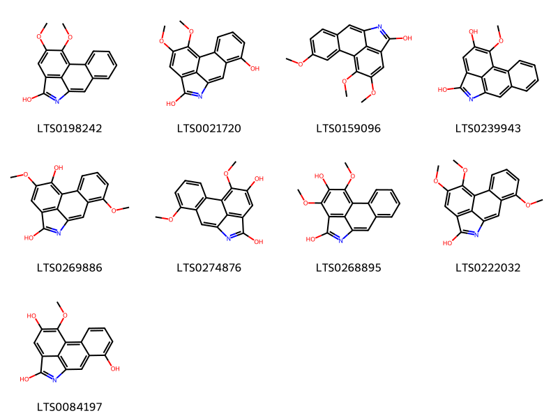{ width=100% }
    <figcaption>Hình ảnh cấu trúc hóa học của 9 hoạt chất thuộc nhóm Aristolactams gồm ['14,15-dimethoxy-10-azatetracyclo[7.6.1.0²,⁷.0¹²,¹⁶]hexadeca-1(16),2(7),3,5,8,10,12,14-octaen-11-ol (LTS0198242)', '14,15-dimethoxy-10-azatetracyclo[7.6.1.0²,⁷.0¹²,¹⁶]hexadeca-1(16),2(7),3,5,8,10,12,14-octaene-6,11-diol (LTS0021720)', '4,14,15-trimethoxy-10-azatetracyclo[7.6.1.0²,⁷.0¹²,¹⁶]hexadeca-1(16),2(7),3,5,8,10,12,14-octaen-11-ol (LTS0159096)', '15-methoxy-10-azatetracyclo[7.6.1.0²,⁷.0¹²,¹⁶]hexadeca-1(16),2(7),3,5,8,10,12,14-octaene-11,14-diol (LTS0239943)', '6,14-dimethoxy-10-azatetracyclo[7.6.1.0²,⁷.0¹²,¹⁶]hexadeca-1(16),2(7),3,5,8,10,12,14-octaene-11,15-diol (LTS0269886)', '6,15-dimethoxy-10-azatetracyclo[7.6.1.0²,⁷.0¹²,¹⁶]hexadeca-1(16),2(7),3,5,8,10,12,14-octaene-11,14-diol (LTS0274876)', '13,15-dimethoxy-10-azatetracyclo[7.6.1.0²,⁷.0¹²,¹⁶]hexadeca-1(16),2(7),3,5,8,10,12,14-octaene-11,14-diol (LTS0268895)', '6,14,15-trimethoxy-10-azatetracyclo[7.6.1.0²,⁷.0¹²,¹⁶]hexadeca-1(16),2(7),3,5,8,10,12,14-octaen-11-ol (LTS0222032)', '15-methoxy-10-azatetracyclo[7.6.1.0²,⁷.0¹²,¹⁶]hexadeca-1(16),2(7),3,5,8,10,12,14-octaene-6,11,14-triol (LTS0084197)'].</figcaption>
</figure>
#### Nhóm Benzene and substituted derivatives
<figure markdown="span">
    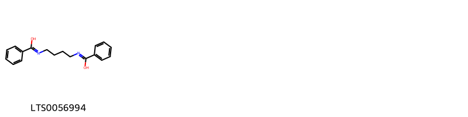{ width=100% }
    <figcaption>Hình ảnh cấu trúc hóa học của 1 hoạt chất thuộc nhóm Benzene and substituted derivatives gồm ['n-(4-{[hydroxy(phenyl)methylidene]amino}butyl)benzenecarboximidic acid (LTS0056994)'].</figcaption>
</figure>
#### Nhóm Fatty Acyls
<figure markdown="span">
    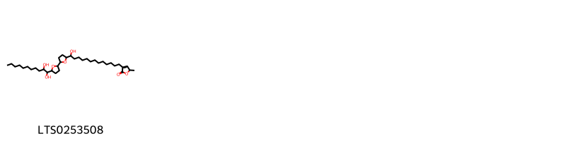{ width=100% }
    <figcaption>Hình ảnh cấu trúc hóa học của 1 hoạt chất thuộc nhóm Fatty Acyls gồm ["3-{13-[5'-(1,2-dihydroxyundecyl)-[2,2'-bioxolan]-5-yl]-13-hydroxytridecyl}-5-methyl-5h-furan-2-one (LTS0253508)"].</figcaption>
</figure>

---

### Dược dân tộc học

Danh sách các quốc gia có sử dụng *Uvaria microcarpa* trong điều trị các bệnh. 

| Country   | Disease    | Bệnh                                                                                                                                                                                                |
|:----------|:-----------|:----------------------------------------------------------------------------------------------------------------------------------------------------------------------------------------------------|
| China     | Intoxicant | MYMEMORY WARNING: YOU USED ALL AVAILABLE FREE TRANSLATIONS FOR TODAY. NEXT AVAILABLE IN  10 HOURS 21 MINUTES 56 SECONDS VISIT HTTPS://MYMEMORY.TRANSLATED.NET/DOC/USAGELIMITS.PHP TO TRANSLATE MORE |

---

