!!! abstract "Tóm tắt"

    Họ Apiaceae gồm khoảng 66 chi và 150 loài được một số cộng đồng tại các quốc gia như Africa, Sa(Aymara), Arabia, Japan, Solomon I, US(Flathead), US(Appalachia), Dutch, Kashmir, South Africa(Kaffir), Sierra Leone, Italian, Mexico(Kickapoo), Swedish, Sardinia, Sa(Quechua), English, US(Amerindian), Sumatra, Portugal, Lesotho, ain, Asia, Paraguay, US(Koasati), Crete, Turkey, Portuguese, UK, US(Blackfoot), Bahamas, Arabic, India(Santal), French, US(NM), US, Tonga, Dominican Republic, Mexico, Canada(Kwakiutl), France, Malaya, Eurasia, China, Africa(Kaffir), Canada(Salish), Iran, Sunda I., anish, Trinidad, Europe, Iraq, US(Cherokee), Haiti, German, Chinese, Colombia, Elsewhere, India, Kurdistan, Venezuela, Japan*, Java, Sanscrit, New Zealand, Nepal sử dụng trong một số trường hợp QUERY LENGTH LIMIT EXCEEDED. MAX ALLOWED QUERY : 500 CHARS QUERY LENGTH LIMIT EXCEEDED. MAX ALLOWED QUERY : 500 CHARS QUERY LENGTH LIMIT EXCEEDED. MAX ALLOWED QUERY : 500 CHARS QUERY LENGTH LIMIT EXCEEDED. MAX ALLOWED QUERY : 500 CHARS QUERY LENGTH LIMIT EXCEEDED. MAX ALLOWED QUERY : 500 CHARS QUERY LENGTH LIMIT EXCEEDED. MAX ALLOWED QUERY : 500 CHARS QUERY LENGTH LIMIT EXCEEDED. MAX ALLOWED QUERY : 500 CHARS MYMEMORY WARNING: YOU USED ALL AVAILABLE FREE TRANSLATIONS FOR TODAY. NEXT AVAILABLE IN  08 HOURS 27 MINUTES 48 SECONDS VISIT HTTPS://MYMEMORY.TRANSLATED.NET/DOC/USAGELIMITS.PHP TO TRANSLATE MORE.

!!! info "DrDuke"

    James A. Duke sinh năm 1929-2017 là một nhà thực vật học người Mỹ. Đây là một trong những tác giả hàng đầu trong lĩnh vực dược dân tộc học với cuốn *CRC Handbook of Medicinal Herbs* và chính là người xây dựng lên cơ sở dữ liệu về hợp chất tự nhiên và dược dân tộc học tại Bộ nông nghiệp Hoa Kỳ. Các thông tin được đăng tải tại website [Dr. Duke's Phytochemical and Ethnobotanical Databases](https://phytochem.nal.usda.gov/). 
    Trong suốt thập niên 1970, ông lãnh đạo the Plant Taxonomy Laboratory, Plant Genetics and Germplasm Institute of the Agricultural Research Service, U.S. Department of Agriculture.
    Trong tài liệu này, các thông tin về dược dân tộc của các dược liệu được trích dẫn từ tài liệu của James A. Ducke với sự trợ giúp của phần mềm dịch thuật từ tiếng Anh sang tiếng Việt.
   

# Chi Aethusa

??? note "Danh sách các dược liệu thuộc chi"
    
	 - *Aethusa cynapium*

---
## Aethusa cynapium
### Thông tin về thực vật

!!! info "Phân loại thực vật của *Aethusa cynapium* từ GIBF:"
    - **Kingdom:** Plantae
    - **Phylum:** Tracheophyta
    - **Order:** Apiales
    - **Family:** Apiaceae
    - **Genus:** Aethusa
    - **Species:** *Aethusa cynapium*

 

| Label (VI)   | Label (EN)   | Scientific Name   | Descriptions (VI)   | Descriptions (EN)   | Also Known As (VI)   | Also Known As (EN)   |
|:-------------|:-------------|:------------------|:--------------------|:--------------------|:---------------------|:---------------------|
| N/A          | N/A          | Aethusa cynapium  | loài thực vật       | species of plant    | ['']                 | ["fool's parsley"]   |

#### Phân bố trên thế giới

**Từ CSDL GIBF** Denmark, Finland, Netherlands, Czechia, Germany, Belgium, Luxembourg, Ireland, Hungary, Switzerland, Russian Federation, Sweden, Austria, France, Norway, United Kingdom of Great Britain and Northern Ireland

#### Phân bố tại Việt Nam

**Từ CSDL GIBF**: Không có ghi nhận ở Việt Nam

---
### Thành phần hóa học
        
- Theo cơ sở dữ liệu lotus: Từ loài *Aethusa cynapium* đã phân lập và xác định được 15 hoạt chất thuộc về các nhóm Unsaturated hydrocarbons, Fatty Acyls, Saturated hydrocarbons, Benzene and substituted derivatives. 

|    | chemicalTaxonomyClassyfireClass     |   smiles_count |
|---:|:------------------------------------|---------------:|
|  0 | Benzene and substituted derivatives |              1 |
|  1 | Fatty Acyls                         |             11 |
|  2 | Saturated hydrocarbons              |              1 |
|  3 | Unsaturated hydrocarbons            |              2 |

#### Nhóm Benzene and substituted derivatives
<figure markdown="span">
    { width=100% }
    <figcaption>Hình ảnh cấu trúc hóa học của 1 hoạt chất thuộc nhóm Benzene and substituted derivatives gồm ['3,4-dihydroxybenzoic acid (LTS0018765)'].</figcaption>
</figure>
#### Nhóm Fatty Acyls
<figure markdown="span">
    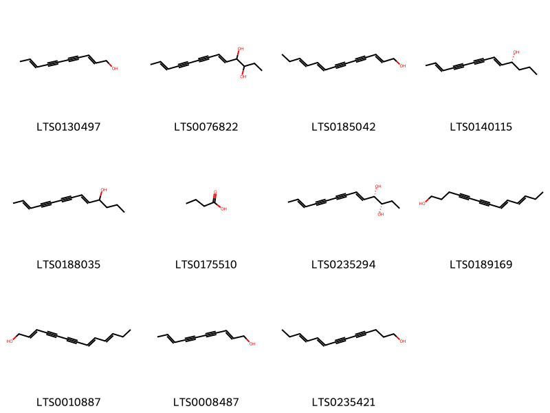{ width=100% }
    <figcaption>Hình ảnh cấu trúc hóa học của 11 hoạt chất thuộc nhóm Fatty Acyls gồm ['(2e,8e)-deca-2,8-dien-4,6-diyn-1-ol (LTS0130497)', 'trideca-5,11-dien-7,9-diyne-3,4-diol (LTS0076822)', '(2e,8e,10e)-trideca-2,8,10-trien-4,6-diyn-1-ol (LTS0185042)', '(4r,5e,11e)-trideca-5,11-dien-7,9-diyn-4-ol (LTS0140115)', 'trideca-5,11-dien-7,9-diyn-4-ol (LTS0188035)', 'butanoic acid (LTS0175510)', '(3s,4s,5e,11e)-trideca-5,11-dien-7,9-diyne-3,4-diol (LTS0235294)', 'trideca-8,10-dien-4,6-diyn-1-ol (LTS0189169)', 'trideca-2,8,10-trien-4,6-diyn-1-ol (LTS0010887)', 'deca-2,8-dien-4,6-diyn-1-ol (LTS0008487)', '(8e,10e)-trideca-8,10-dien-4,6-diyn-1-ol (LTS0235421)'].</figcaption>
</figure>
#### Nhóm Saturated hydrocarbons
<figure markdown="span">
    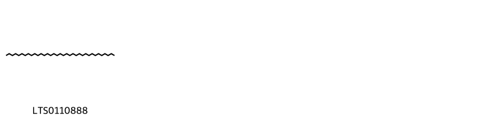{ width=100% }
    <figcaption>Hình ảnh cấu trúc hóa học của 1 hoạt chất thuộc nhóm Saturated hydrocarbons gồm ['pentatriacontane (LTS0110888)'].</figcaption>
</figure>
#### Nhóm Unsaturated hydrocarbons
<figure markdown="span">
    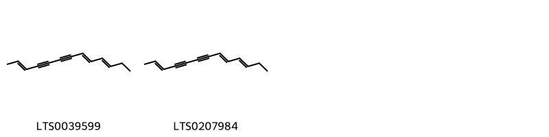{ width=100% }
    <figcaption>Hình ảnh cấu trúc hóa học của 2 hoạt chất thuộc nhóm Unsaturated hydrocarbons gồm ['aethusin (LTS0039599)', 'trideca-2,8,10-trien-4,6-diyne (LTS0207984)'].</figcaption>
</figure>

---

### Dược dân tộc học

Danh sách các quốc gia có sử dụng *Aethusa cynapium* trong điều trị các bệnh. 

| Country        | Disease   | Bệnh                                                                                                                                                                                                |
|:---------------|:----------|:----------------------------------------------------------------------------------------------------------------------------------------------------------------------------------------------------|
| English        | Stomachic | MYMEMORY WARNING: YOU USED ALL AVAILABLE FREE TRANSLATIONS FOR TODAY. NEXT AVAILABLE IN  08 HOURS 27 MINUTES 45 SECONDS VISIT HTTPS://MYMEMORY.TRANSLATED.NET/DOC/USAGELIMITS.PHP TO TRANSLATE MORE |
| French         | Sedative  | MYMEMORY WARNING: YOU USED ALL AVAILABLE FREE TRANSLATIONS FOR TODAY. NEXT AVAILABLE IN  08 HOURS 27 MINUTES 43 SECONDS VISIT HTTPS://MYMEMORY.TRANSLATED.NET/DOC/USAGELIMITS.PHP TO TRANSLATE MORE |
| German         | Poison    | MYMEMORY WARNING: YOU USED ALL AVAILABLE FREE TRANSLATIONS FOR TODAY. NEXT AVAILABLE IN  08 HOURS 27 MINUTES 40 SECONDS VISIT HTTPS://MYMEMORY.TRANSLATED.NET/DOC/USAGELIMITS.PHP TO TRANSLATE MORE |
| US             | Poison    | MYMEMORY WARNING: YOU USED ALL AVAILABLE FREE TRANSLATIONS FOR TODAY. NEXT AVAILABLE IN  08 HOURS 27 MINUTES 38 SECONDS VISIT HTTPS://MYMEMORY.TRANSLATED.NET/DOC/USAGELIMITS.PHP TO TRANSLATE MORE |
| US(Amerindian) | Poison    | MYMEMORY WARNING: YOU USED ALL AVAILABLE FREE TRANSLATIONS FOR TODAY. NEXT AVAILABLE IN  08 HOURS 27 MINUTES 35 SECONDS VISIT HTTPS://MYMEMORY.TRANSLATED.NET/DOC/USAGELIMITS.PHP TO TRANSLATE MORE |

---

# Chi Meum

??? note "Danh sách các dược liệu thuộc chi"
    
	 - *Meum athamanticum*

---
## Meum athamanticum
### Thông tin về thực vật

!!! info "Phân loại thực vật của *Meum athamanticum* từ GIBF:"
    - **Kingdom:** Plantae
    - **Phylum:** Tracheophyta
    - **Order:** Apiales
    - **Family:** Apiaceae
    - **Genus:** Meum
    - **Species:** *Meum athamanticum*

 

| Label (VI)   | Label (EN)   | Scientific Name   | Descriptions (VI)   | Descriptions (EN)   | Also Known As (VI)   | Also Known As (EN)   |
|:-------------|:-------------|:------------------|:--------------------|:--------------------|:---------------------|:---------------------|
| N/A          | N/A          | Meum athamanticum | loài thực vật       | species of plant    | ['']                 | ['']                 |

#### Phân bố trên thế giới

**Từ CSDL GIBF** Andorra, Denmark, Italy, Czechia, Germany, Belgium, Spain, Poland, Switzerland, Sweden, Austria, France, Slovenia, Norway, United Kingdom of Great Britain and Northern Ireland

#### Phân bố tại Việt Nam

**Từ CSDL GIBF**: Không có ghi nhận ở Việt Nam

---
### Thành phần hóa học
        
- Theo cơ sở dữ liệu lotus: Từ loài *Meum athamanticum* đã phân lập và xác định được 15 hoạt chất thuộc về các nhóm Cinnamic acids and derivatives, Unsaturated hydrocarbons, Polycyclic hydrocarbons, Organooxygen compounds, Isobenzofurans, Carboxylic acids and derivatives. 

|    | chemicalTaxonomyClassyfireClass   |   smiles_count |
|---:|:----------------------------------|---------------:|
|  0 | Carboxylic acids and derivatives  |              1 |
|  1 | Cinnamic acids and derivatives    |              2 |
|  2 | Isobenzofurans                    |              3 |
|  3 | Organooxygen compounds            |              1 |
|  4 | Polycyclic hydrocarbons           |              2 |
|  5 | Unsaturated hydrocarbons          |              6 |

#### Nhóm Carboxylic acids and derivatives
<figure markdown="span">
    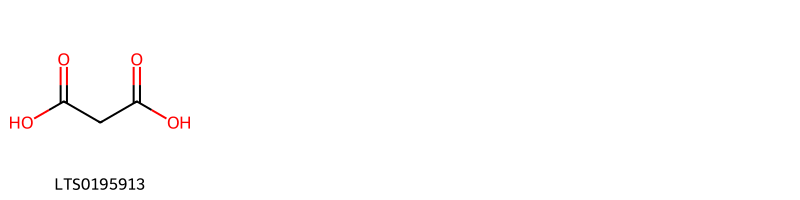{ width=100% }
    <figcaption>Hình ảnh cấu trúc hóa học của 1 hoạt chất thuộc nhóm Carboxylic acids and derivatives gồm ['malonic acid (LTS0195913)'].</figcaption>
</figure>
#### Nhóm Cinnamic acids and derivatives
<figure markdown="span">
    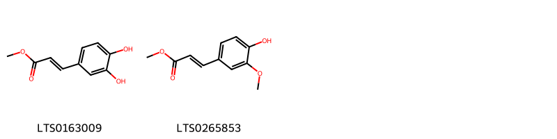{ width=100% }
    <figcaption>Hình ảnh cấu trúc hóa học của 2 hoạt chất thuộc nhóm Cinnamic acids and derivatives gồm ['methyl caffeate (LTS0163009)', 'methyl ferulate (LTS0265853)'].</figcaption>
</figure>
#### Nhóm Isobenzofurans
<figure markdown="span">
    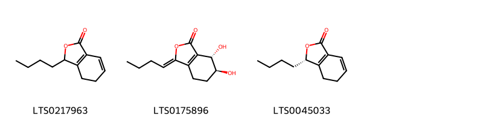{ width=100% }
    <figcaption>Hình ảnh cấu trúc hóa học của 3 hoạt chất thuộc nhóm Isobenzofurans gồm ['3-butyl-4,5-dihydro-3h-2-benzofuran-1-one (LTS0217963)', 'senkyunolide i (LTS0175896)', 'senkyunolide a (LTS0045033)'].</figcaption>
</figure>
#### Nhóm Organooxygen compounds
<figure markdown="span">
    { width=100% }
    <figcaption>Hình ảnh cấu trúc hóa học của 1 hoạt chất thuộc nhóm Organooxygen compounds gồm ['chlorogenic acid (LTS0226495)'].</figcaption>
</figure>
#### Nhóm Polycyclic hydrocarbons
<figure markdown="span">
    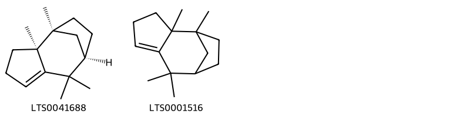{ width=100% }
    <figcaption>Hình ảnh cấu trúc hóa học của 2 hoạt chất thuộc nhóm Polycyclic hydrocarbons gồm ['(1s,2s,8r)-1,2,7,7-tetramethyltricyclo[6.2.1.0²,⁶]undec-5-ene (LTS0041688)', '1,2,7,7-tetramethyltricyclo[6.2.1.0²,⁶]undec-5-ene (LTS0001516)'].</figcaption>
</figure>
#### Nhóm Unsaturated hydrocarbons
<figure markdown="span">
    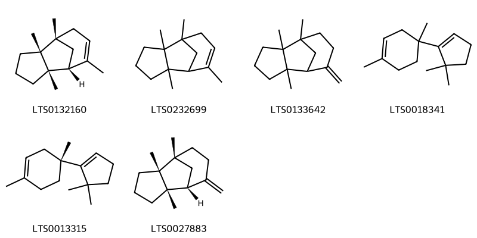{ width=100% }
    <figcaption>Hình ảnh cấu trúc hóa học của 6 hoạt chất thuộc nhóm Unsaturated hydrocarbons gồm ['(+)-α-barbatene (LTS0132160)', '1,2,6,8-tetramethyltricyclo[5.3.1.0²,⁶]undec-8-ene (LTS0232699)', '1,2,6-trimethyl-8-methylidenetricyclo[5.3.1.0²,⁶]undecane (LTS0133642)', '4-(5,5-dimethylcyclopent-1-en-1-yl)-1,4-dimethylcyclohex-1-ene (LTS0018341)', '(4r)-4-(5,5-dimethylcyclopent-1-en-1-yl)-1,4-dimethylcyclohex-1-ene (LTS0013315)', '(1r,2r,6s,7r)-1,2,6-trimethyl-8-methylidenetricyclo[5.3.1.0²,⁶]undecane (LTS0027883)'].</figcaption>
</figure>

---

### Dược dân tộc học

Danh sách các quốc gia có sử dụng *Meum athamanticum* trong điều trị các bệnh. 

| Country   | Disease                                                                               | Bệnh                                                                                                                                                                                                |
|:----------|:--------------------------------------------------------------------------------------|:----------------------------------------------------------------------------------------------------------------------------------------------------------------------------------------------------|
| Europe    | Stimulant, Tonic, Carminative, Diuretic, Emmenagogue, Stomachic                       | MYMEMORY WARNING: YOU USED ALL AVAILABLE FREE TRANSLATIONS FOR TODAY. NEXT AVAILABLE IN  08 HOURS 27 MINUTES 13 SECONDS VISIT HTTPS://MYMEMORY.TRANSLATED.NET/DOC/USAGELIMITS.PHP TO TRANSLATE MORE |
| Turkey    | Cardiotonic, Carminative, Diuretic, Emmenagogue, Nervine, Stomachic, Tonic, Vermifuge | MYMEMORY WARNING: YOU USED ALL AVAILABLE FREE TRANSLATIONS FOR TODAY. NEXT AVAILABLE IN  08 HOURS 27 MINUTES 10 SECONDS VISIT HTTPS://MYMEMORY.TRANSLATED.NET/DOC/USAGELIMITS.PHP TO TRANSLATE MORE |
| ain       | Tonic                                                                                 | MYMEMORY WARNING: YOU USED ALL AVAILABLE FREE TRANSLATIONS FOR TODAY. NEXT AVAILABLE IN  08 HOURS 27 MINUTES 08 SECONDS VISIT HTTPS://MYMEMORY.TRANSLATED.NET/DOC/USAGELIMITS.PHP TO TRANSLATE MORE |

---

# Chi Heracleum

??? note "Danh sách các dược liệu thuộc chi"
    
	 - *Heracleum lanatum*
	 - *Heracleum maximum*
	 - *Heracleum wallichii*

---
## Heracleum lanatum
### Thông tin về thực vật

!!! info "Phân loại thực vật của *Heracleum maximum* từ GIBF:"
    - **Kingdom:** Plantae
    - **Phylum:** Tracheophyta
    - **Order:** Apiales
    - **Family:** Apiaceae
    - **Genus:** Heracleum
    - **Species:** *Heracleum maximum*

 

| Label (VI)   | Label (EN)   | Scientific Name   | Descriptions (VI)   | Descriptions (EN)   | Also Known As (VI)   | Also Known As (EN)   |
|:-------------|:-------------|:------------------|:--------------------|:--------------------|:---------------------|:---------------------|
| N/A          | N/A          | Heracleum lanatum | loài thực vật       | species of plant    | ['']                 | ['']                 |

#### Phân bố trên thế giới

**Từ CSDL GIBF** Japan, Russian Federation, United States of America, Norway, China, Canada

#### Phân bố tại Việt Nam

**Từ CSDL GIBF**: Không có ghi nhận ở Việt Nam

---
### Thành phần hóa học
        
- Theo cơ sở dữ liệu lotus: Từ loài *Heracleum maximum* đã phân lập và xác định được Chưa có hoạt chất nào được phân lập. hoạt chất thuộc về các nhóm Không có hoạt chất nào được phân lập. 

Không có hình ảnh nào được tạo ra

---

### Dược dân tộc học

Danh sách các quốc gia có sử dụng *Heracleum maximum* trong điều trị các bệnh. 

| Country       | Disease            | Bệnh                                                                                                                                                                                                |
|:--------------|:-------------------|:----------------------------------------------------------------------------------------------------------------------------------------------------------------------------------------------------|
| US(Blackfoot) | Poultice, Laxative | MYMEMORY WARNING: YOU USED ALL AVAILABLE FREE TRANSLATIONS FOR TODAY. NEXT AVAILABLE IN  08 HOURS 26 MINUTES 44 SECONDS VISIT HTTPS://MYMEMORY.TRANSLATED.NET/DOC/USAGELIMITS.PHP TO TRANSLATE MORE |
| US(Flathead)  | Poultice           | MYMEMORY WARNING: YOU USED ALL AVAILABLE FREE TRANSLATIONS FOR TODAY. NEXT AVAILABLE IN  08 HOURS 26 MINUTES 41 SECONDS VISIT HTTPS://MYMEMORY.TRANSLATED.NET/DOC/USAGELIMITS.PHP TO TRANSLATE MORE |

---

---
## Heracleum maximum
### Thông tin về thực vật

!!! info "Phân loại thực vật của *Heracleum maximum* từ GIBF:"
    - **Kingdom:** Plantae
    - **Phylum:** Tracheophyta
    - **Order:** Apiales
    - **Family:** Apiaceae
    - **Genus:** Heracleum
    - **Species:** *Heracleum maximum*

 

| Label (VI)   | Label (EN)   | Scientific Name   | Descriptions (VI)   | Descriptions (EN)   | Also Known As (VI)   | Also Known As (EN)                                                                   |
|:-------------|:-------------|:------------------|:--------------------|:--------------------|:---------------------|:-------------------------------------------------------------------------------------|
| N/A          | N/A          | Heracleum maximum |                     | species of plant    | ['']                 | ['cow parsnip', 'American cow-parsnip', 'Indian celery', 'Indian rhubarb', 'pushki'] |

#### Phân bố trên thế giới

**Từ CSDL GIBF** Russian Federation, United States of America, Canada

#### Phân bố tại Việt Nam

**Từ CSDL GIBF**: Không có ghi nhận ở Việt Nam

---
### Thành phần hóa học
        
- Theo cơ sở dữ liệu lotus: Từ loài *Heracleum maximum* đã phân lập và xác định được 19 hoạt chất thuộc về các nhóm Cinnamic acids and derivatives, Coumarins and derivatives. 

|    | chemicalTaxonomyClassyfireClass   |   smiles_count |
|---:|:----------------------------------|---------------:|
|  0 | Cinnamic acids and derivatives    |              6 |
|  1 | Coumarins and derivatives         |             13 |

#### Nhóm Cinnamic acids and derivatives
<figure markdown="span">
    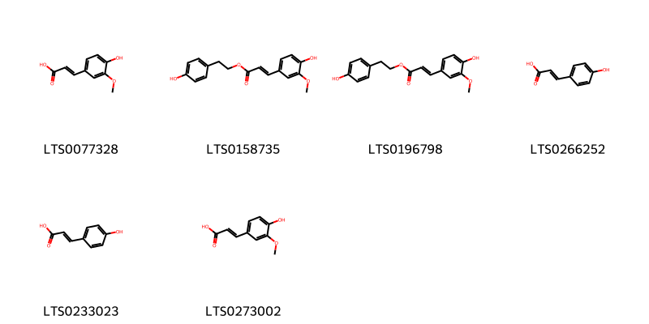{ width=100% }
    <figcaption>Hình ảnh cấu trúc hóa học của 6 hoạt chất thuộc nhóm Cinnamic acids and derivatives gồm ['ferulic acid (LTS0077328)', '2-(4-hydroxyphenyl)ethyl (2e)-3-(4-hydroxy-3-methoxyphenyl)prop-2-enoate (LTS0158735)', '2-(4-hydroxyphenyl)ethyl 3-(4-hydroxy-3-methoxyphenyl)prop-2-enoate (LTS0196798)', 'para-coumaric acid (LTS0266252)', 'hydroxycinnamic acid (LTS0233023)', 'ferulic acid (LTS0273002)'].</figcaption>
</figure>
#### Nhóm Coumarins and derivatives
<figure markdown="span">
    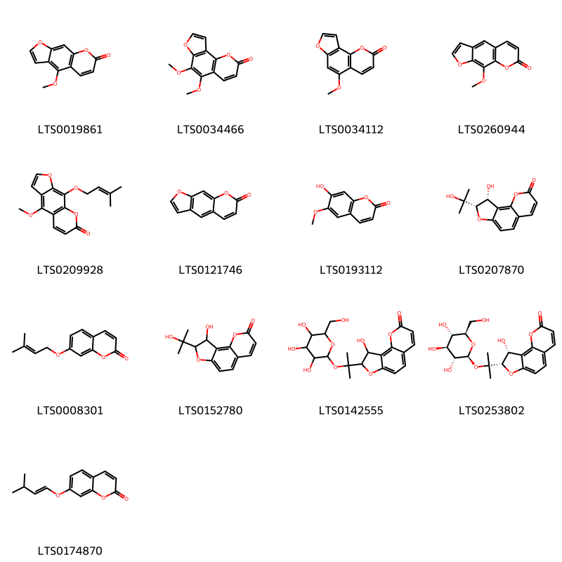{ width=100% }
    <figcaption>Hình ảnh cấu trúc hóa học của 13 hoạt chất thuộc nhóm Coumarins and derivatives gồm ['bergapten (LTS0019861)', 'pimpinellin (LTS0034466)', 'isobergapten (LTS0034112)', 'methoxsalen (LTS0260944)', 'phellopterin (LTS0209928)', 'psoralen (LTS0121746)', 'scopoletin (LTS0193112)', 'vaginol (LTS0207870)', '7-[(3-methylbut-2-en-1-yl)oxy]chromen-2-one (LTS0008301)', '9-hydroxy-8-(2-hydroxypropan-2-yl)-8h,9h-furo[2,3-h]chromen-2-one (LTS0152780)', 'apterin (LTS0142555)', 'apterin (LTS0253802)', '7-[(3-methylbut-1-en-1-yl)oxy]chromen-2-one (LTS0174870)'].</figcaption>
</figure>

---

### Dược dân tộc học

Danh sách các quốc gia có sử dụng *Heracleum maximum* trong điều trị các bệnh. 

| Country   | Disease     | Bệnh                                                                                                                                                                                                |
|:----------|:------------|:----------------------------------------------------------------------------------------------------------------------------------------------------------------------------------------------------|
| US        | Carminative | MYMEMORY WARNING: YOU USED ALL AVAILABLE FREE TRANSLATIONS FOR TODAY. NEXT AVAILABLE IN  08 HOURS 26 MINUTES 20 SECONDS VISIT HTTPS://MYMEMORY.TRANSLATED.NET/DOC/USAGELIMITS.PHP TO TRANSLATE MORE |
| US(NM)    | Poison      | MYMEMORY WARNING: YOU USED ALL AVAILABLE FREE TRANSLATIONS FOR TODAY. NEXT AVAILABLE IN  08 HOURS 26 MINUTES 17 SECONDS VISIT HTTPS://MYMEMORY.TRANSLATED.NET/DOC/USAGELIMITS.PHP TO TRANSLATE MORE |

---

---
## Heracleum wallichii
### Thông tin về thực vật

!!! info "Phân loại thực vật của *Tetrataenium wallichii* từ GIBF:"
    - **Kingdom:** Plantae
    - **Phylum:** Tracheophyta
    - **Order:** Apiales
    - **Family:** Apiaceae
    - **Genus:** Tetrataenium
    - **Species:** *Tetrataenium wallichii*

 

| Label (VI)   | Label (EN)   | Scientific Name     | Descriptions (VI)   | Descriptions (EN)   | Also Known As (VI)   | Also Known As (EN)   |
|:-------------|:-------------|:--------------------|:--------------------|:--------------------|:---------------------|:---------------------|
| N/A          | N/A          | Heracleum wallichii | loài thực vật       | species of plant    | ['']                 | ['']                 |

#### Phân bố trên thế giới

**Từ CSDL GIBF** nan, Bhutan, unknown or invalid, India, Nepal

#### Phân bố tại Việt Nam

**Từ CSDL GIBF**: Không có ghi nhận ở Việt Nam

---
### Thành phần hóa học
        
- Theo cơ sở dữ liệu lotus: Từ loài *Tetrataenium wallichii* đã phân lập và xác định được 6 hoạt chất thuộc về các nhóm Organooxygen compounds, Steroids and steroid derivatives, Coumarins and derivatives. 

|    | chemicalTaxonomyClassyfireClass   |   smiles_count |
|---:|:----------------------------------|---------------:|
|  0 | Coumarins and derivatives         |              4 |
|  1 | Organooxygen compounds            |              1 |
|  2 | Steroids and steroid derivatives  |              1 |

#### Nhóm Coumarins and derivatives
<figure markdown="span">
    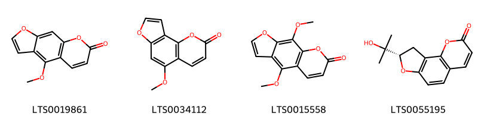{ width=100% }
    <figcaption>Hình ảnh cấu trúc hóa học của 4 hoạt chất thuộc nhóm Coumarins and derivatives gồm ['bergapten (LTS0019861)', 'isobergapten (LTS0034112)', 'isopimpinellin (LTS0015558)', '(+)-columbianetin (LTS0055195)'].</figcaption>
</figure>
#### Nhóm Organooxygen compounds
<figure markdown="span">
    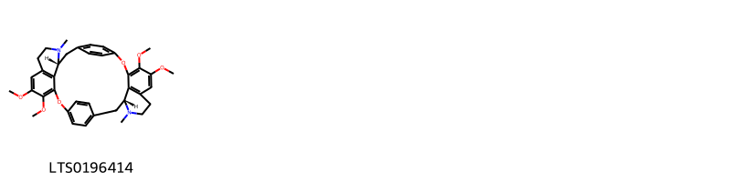{ width=100% }
    <figcaption>Hình ảnh cấu trúc hóa học của 1 hoạt chất thuộc nhóm Organooxygen compounds gồm ['cycleanine (LTS0196414)'].</figcaption>
</figure>
#### Nhóm Steroids and steroid derivatives
<figure markdown="span">
    { width=100% }
    <figcaption>Hình ảnh cấu trúc hóa học của 1 hoạt chất thuộc nhóm Steroids and steroid derivatives gồm ['(1r,3as,3bs,7s,9ar,9bs,11ar)-1-[(2s,3e,5s)-5-ethyl-6-methylhept-3-en-2-yl]-9a,11a-dimethyl-1h,2h,3h,3ah,3bh,4h,6h,7h,8h,9h,9bh,10h,11h-cyclopenta[a]phenanthren-7-ol (LTS0169213)'].</figcaption>
</figure>

---

### Dược dân tộc học

Danh sách các quốc gia có sử dụng *Tetrataenium wallichii* trong điều trị các bệnh. 

| Country   | Disease            | Bệnh                                                                                                                                                                                                |
|:----------|:-------------------|:----------------------------------------------------------------------------------------------------------------------------------------------------------------------------------------------------|
| India     | Aphrodisiac, Tonic | MYMEMORY WARNING: YOU USED ALL AVAILABLE FREE TRANSLATIONS FOR TODAY. NEXT AVAILABLE IN  08 HOURS 25 MINUTES 53 SECONDS VISIT HTTPS://MYMEMORY.TRANSLATED.NET/DOC/USAGELIMITS.PHP TO TRANSLATE MORE |
| Nepal     | Aphrodisiac, Tonic | MYMEMORY WARNING: YOU USED ALL AVAILABLE FREE TRANSLATIONS FOR TODAY. NEXT AVAILABLE IN  08 HOURS 25 MINUTES 50 SECONDS VISIT HTTPS://MYMEMORY.TRANSLATED.NET/DOC/USAGELIMITS.PHP TO TRANSLATE MORE |

---

# Chi Sium

??? note "Danh sách các dược liệu thuộc chi"
    
	 - *Sium amomum*
	 - *Sium sisarum*
	 - *Sium suave*

---
## Sium amomum
### Thông tin về thực vật

!!! info "Phân loại thực vật của *Sison amomum* từ GIBF:"
    - **Kingdom:** Plantae
    - **Phylum:** Tracheophyta
    - **Order:** Apiales
    - **Family:** Apiaceae
    - **Genus:** Sison
    - **Species:** *Sison amomum*

 

| Label (VI)   | Label (EN)   | Scientific Name   | Descriptions (VI)   | Descriptions (EN)   | Also Known As (VI)   | Also Known As (EN)   |
|:-------------|:-------------|:------------------|:--------------------|:--------------------|:---------------------|:---------------------|
| N/A          | N/A          | Sium amomum       | loài thực vật       | species of plant    | ['']                 | ['']                 |

#### Phân bố trên thế giới

**Từ CSDL GIBF** nan, Bhutan, unknown or invalid, India, Nepal

#### Phân bố tại Việt Nam

**Từ CSDL GIBF**: Không có ghi nhận ở Việt Nam

---
### Thành phần hóa học
        
- Theo cơ sở dữ liệu lotus: Từ loài *Sison amomum* đã phân lập và xác định được Chưa có hoạt chất nào được phân lập. hoạt chất thuộc về các nhóm Không có hoạt chất nào được phân lập. 

Không có hình ảnh nào được tạo ra

---

### Dược dân tộc học

Danh sách các quốc gia có sử dụng *Sison amomum* trong điều trị các bệnh. 

| Country   | Disease             | Bệnh                                                                                                                                                                                                |
|:----------|:--------------------|:----------------------------------------------------------------------------------------------------------------------------------------------------------------------------------------------------|
| Eurasia   | Stomachic, Diuretic | MYMEMORY WARNING: YOU USED ALL AVAILABLE FREE TRANSLATIONS FOR TODAY. NEXT AVAILABLE IN  08 HOURS 25 MINUTES 29 SECONDS VISIT HTTPS://MYMEMORY.TRANSLATED.NET/DOC/USAGELIMITS.PHP TO TRANSLATE MORE |

---

---
## Sium sisarum
### Thông tin về thực vật

!!! info "Phân loại thực vật của *Sium sisarum* từ GIBF:"
    - **Kingdom:** Plantae
    - **Phylum:** Tracheophyta
    - **Order:** Apiales
    - **Family:** Apiaceae
    - **Genus:** Sium
    - **Species:** *Sium sisarum*

 

| Label (VI)   | Label (EN)   | Scientific Name   | Descriptions (VI)   | Descriptions (EN)   | Also Known As (VI)   | Also Known As (EN)   |
|:-------------|:-------------|:------------------|:--------------------|:--------------------|:---------------------|:---------------------|
| N/A          | N/A          | Sium sisarum      | loài thực vật       | species of plant    | ['']                 | ['Skirret']          |

#### Phân bố trên thế giới

**Từ CSDL GIBF** nan, Japan, Turkmenistan, Norway, Ukraine, Tajikistan, Netherlands, Korea, Republic of, Azerbaijan, Hungary, Russian Federation, United States of America, Slovenia, Kazakhstan, Germany, Iran (Islamic Republic of), Austria, France, Iraq, Poland, New Zealand

#### Phân bố tại Việt Nam

**Từ CSDL GIBF**: Không có ghi nhận ở Việt Nam

---
### Thành phần hóa học
        
- Theo cơ sở dữ liệu lotus: Từ loài *Sium sisarum* đã phân lập và xác định được Chưa có hoạt chất nào được phân lập. hoạt chất thuộc về các nhóm Không có hoạt chất nào được phân lập. 

Không có hình ảnh nào được tạo ra

---

### Dược dân tộc học

Danh sách các quốc gia có sử dụng *Sium sisarum* trong điều trị các bệnh. 

| Country   | Disease     | Bệnh                                                                                                                                                                                                |
|:----------|:------------|:----------------------------------------------------------------------------------------------------------------------------------------------------------------------------------------------------|
| UK        | Aphrodisiac | MYMEMORY WARNING: YOU USED ALL AVAILABLE FREE TRANSLATIONS FOR TODAY. NEXT AVAILABLE IN  08 HOURS 25 MINUTES 09 SECONDS VISIT HTTPS://MYMEMORY.TRANSLATED.NET/DOC/USAGELIMITS.PHP TO TRANSLATE MORE |

---

---
## Sium suave
### Thông tin về thực vật

!!! info "Phân loại thực vật của *Sium suave* từ GIBF:"
    - **Kingdom:** Plantae
    - **Phylum:** Tracheophyta
    - **Order:** Apiales
    - **Family:** Apiaceae
    - **Genus:** Sium
    - **Species:** *Sium suave*

 

| Label (VI)   | Label (EN)   | Scientific Name   | Descriptions (VI)   | Descriptions (EN)   | Also Known As (VI)   | Also Known As (EN)                                                                          |
|:-------------|:-------------|:------------------|:--------------------|:--------------------|:---------------------|:--------------------------------------------------------------------------------------------|
| N/A          | N/A          | Sium suave        | loài thực vật       | species of plant    | ['']                 | ['hemlock water parsnip', 'hemlock waterparsnip', 'water parsnip', 'hemlock water-parsnip'] |

#### Phân bố trên thế giới

**Từ CSDL GIBF** Chinese Taipei, Russian Federation, United States of America, Mongolia, Canada

#### Phân bố tại Việt Nam

**Từ CSDL GIBF**: Không có ghi nhận ở Việt Nam

---
### Thành phần hóa học
        
- Theo cơ sở dữ liệu lotus: Từ loài *Sium suave* đã phân lập và xác định được 4 hoạt chất thuộc về các nhóm Flavonoids. 

|    | chemicalTaxonomyClassyfireClass   |   smiles_count |
|---:|:----------------------------------|---------------:|
|  0 | Flavonoids                        |              4 |

#### Nhóm Flavonoids
<figure markdown="span">
    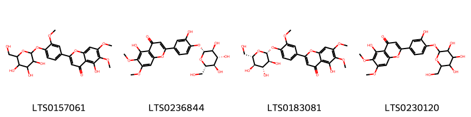{ width=100% }
    <figcaption>Hình ảnh cấu trúc hóa học của 4 hoạt chất thuộc nhóm Flavonoids gồm ['5-hydroxy-6,7-dimethoxy-2-(3-methoxy-4-{[3,4,5-trihydroxy-6-(hydroxymethyl)oxan-2-yl]oxy}phenyl)chromen-4-one (LTS0157061)', '5-hydroxy-2-(3-hydroxy-4-{[(2r,3s,4r,5r,6s)-3,4,5-trihydroxy-6-(hydroxymethyl)oxan-2-yl]oxy}phenyl)-6,7-dimethoxychromen-4-one (LTS0236844)', '5-hydroxy-6,7-dimethoxy-2-(3-methoxy-4-{[(2r,3s,4r,5r,6s)-3,4,5-trihydroxy-6-(hydroxymethyl)oxan-2-yl]oxy}phenyl)chromen-4-one (LTS0183081)', '5-hydroxy-2-(3-hydroxy-4-{[3,4,5-trihydroxy-6-(hydroxymethyl)oxan-2-yl]oxy}phenyl)-6,7-dimethoxychromen-4-one (LTS0230120)'].</figcaption>
</figure>

---

### Dược dân tộc học

Danh sách các quốc gia có sử dụng *Sium suave* trong điều trị các bệnh. 

| Country   | Disease   | Bệnh                                                                                                                                                                                                |
|:----------|:----------|:----------------------------------------------------------------------------------------------------------------------------------------------------------------------------------------------------|
| Elsewhere | Poison    | MYMEMORY WARNING: YOU USED ALL AVAILABLE FREE TRANSLATIONS FOR TODAY. NEXT AVAILABLE IN  08 HOURS 24 MINUTES 47 SECONDS VISIT HTTPS://MYMEMORY.TRANSLATED.NET/DOC/USAGELIMITS.PHP TO TRANSLATE MORE |
| US        | Poison    | MYMEMORY WARNING: YOU USED ALL AVAILABLE FREE TRANSLATIONS FOR TODAY. NEXT AVAILABLE IN  08 HOURS 24 MINUTES 45 SECONDS VISIT HTTPS://MYMEMORY.TRANSLATED.NET/DOC/USAGELIMITS.PHP TO TRANSLATE MORE |

---

# Chi Pimpinella

??? note "Danh sách các dược liệu thuộc chi"
    
	 - *Pimpinella alpina*
	 - *Pimpinella anisum*
	 - *Pimpinella caffra*
	 - *Pimpinella diversifolia*
	 - *Pimpinella magna*
	 - *Pimpinella saxifraga*

---
## Pimpinella alpina
### Thông tin về thực vật

!!! info "Phân loại thực vật của *Pimpinella alpina* từ GIBF:"
    - **Kingdom:** Plantae
    - **Phylum:** Tracheophyta
    - **Order:** Apiales
    - **Family:** Apiaceae
    - **Genus:** Pimpinella
    - **Species:** *Pimpinella alpina*

 

| Label (VI)   | Label (EN)   | Scientific Name   | Descriptions (VI)   | Descriptions (EN)   | Also Known As (VI)   | Also Known As (EN)   |
|:-------------|:-------------|:------------------|:--------------------|:--------------------|:---------------------|:---------------------|
| N/A          | N/A          | Pimpinella alpina | loài thực vật       | species of plant    | ['']                 | ['']                 |

#### Phân bố trên thế giới

**Từ CSDL GIBF** Ukraine, nan, Italy, Germany, Romania, Iran (Islamic Republic of), Poland, Switzerland, unknown or invalid, Austria, France, Slovenia

#### Phân bố tại Việt Nam

**Từ CSDL GIBF**: Không có ghi nhận ở Việt Nam

---
### Thành phần hóa học
        
- Theo cơ sở dữ liệu lotus: Từ loài *Pimpinella alpina* đã phân lập và xác định được Chưa có hoạt chất nào được phân lập. hoạt chất thuộc về các nhóm Không có hoạt chất nào được phân lập. 

Không có hình ảnh nào được tạo ra

---

### Dược dân tộc học

Danh sách các quốc gia có sử dụng *Pimpinella alpina* trong điều trị các bệnh. 

| Country   | Disease               | Bệnh                                                                                                                                                                                                |
|:----------|:----------------------|:----------------------------------------------------------------------------------------------------------------------------------------------------------------------------------------------------|
| Java      | Aphrodisiac, Diuretic | MYMEMORY WARNING: YOU USED ALL AVAILABLE FREE TRANSLATIONS FOR TODAY. NEXT AVAILABLE IN  08 HOURS 24 MINUTES 20 SECONDS VISIT HTTPS://MYMEMORY.TRANSLATED.NET/DOC/USAGELIMITS.PHP TO TRANSLATE MORE |

---

---
## Pimpinella anisum
### Thông tin về thực vật

!!! info "Phân loại thực vật của *Pimpinella anisum* từ GIBF:"
    - **Kingdom:** Plantae
    - **Phylum:** Tracheophyta
    - **Order:** Apiales
    - **Family:** Apiaceae
    - **Genus:** Pimpinella
    - **Species:** *Pimpinella anisum*

 

| Label (VI)   | Label (EN)   | Scientific Name   | Descriptions (VI)   | Descriptions (EN)   | Also Known As (VI)                                  | Also Known As (EN)           |
|:-------------|:-------------|:------------------|:--------------------|:--------------------|:----------------------------------------------------|:-----------------------------|
| N/A          | N/A          | Pimpinella anisum | loài thực vật       | species of plant    | ['Tiểu hồi hương', 'Tiểu hồi', 'Pimpinella anisum'] | ['anise', 'the anise plant'] |

#### Phân bố trên thế giới

**Từ CSDL GIBF** nan, United Arab Emirates, Italy, Bulgaria, Belgium, Estonia, Guatemala, unknown or invalid, Benin, Nicaragua, Norway, Tanzania, United Republic of, Israel, Denmark, Netherlands, Mali, Belarus, Sudan, Spain, Bolivia (Plurinational State of), Malta, Portugal, Russian Federation, Morocco, United States of America, Sweden, Chile, El Salvador, Greece, Czechia, Germany, Oman, Brazil, Egypt, Austria, France, Peru, Mexico, China, Ecuador, Colombia, India, Poland, New Zealand, Nepal

#### Phân bố tại Việt Nam

**Từ CSDL GIBF**: Không có ghi nhận ở Việt Nam

---
### Thành phần hóa học
        
- Theo cơ sở dữ liệu lotus: Từ loài *Pimpinella anisum* đã phân lập và xác định được 105 hoạt chất thuộc về các nhóm Phenol ethers, Fatty Acyls, Flavonoids, Prenol lipids, Cinnamic acids and derivatives, Benzodioxoles, Organonitrogen compounds, Benzene and substituted derivatives, Unsaturated hydrocarbons, Organooxygen compounds, Saturated hydrocarbons, Phenols, Coumarins and derivatives, Phenol esters, Imidazopyrimidines. 

|    | chemicalTaxonomyClassyfireClass     |   smiles_count |
|---:|:------------------------------------|---------------:|
|  0 | Benzene and substituted derivatives |             12 |
|  1 | Benzodioxoles                       |              1 |
|  2 | Cinnamic acids and derivatives      |              5 |
|  3 | Coumarins and derivatives           |              7 |
|  4 | Fatty Acyls                         |              2 |
|  5 | Flavonoids                          |              6 |
|  6 | Imidazopyrimidines                  |              2 |
|  7 | Organonitrogen compounds            |              2 |
|  8 | Organooxygen compounds              |             13 |
|  9 | Phenol esters                       |              5 |
| 10 | Phenol ethers                       |              4 |
| 11 | Phenols                             |              4 |
| 12 | Prenol lipids                       |             37 |
| 13 | Saturated hydrocarbons              |              2 |
| 14 | Unsaturated hydrocarbons            |              3 |

#### Nhóm Benzene and substituted derivatives
<figure markdown="span">
    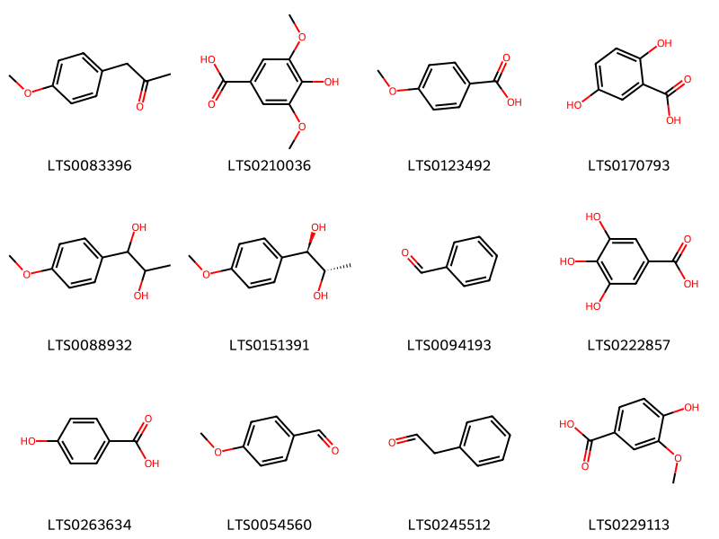{ width=100% }
    <figcaption>Hình ảnh cấu trúc hóa học của 12 hoạt chất thuộc nhóm Benzene and substituted derivatives gồm ['p-anisyl methyl ketone (LTS0083396)', 'syringic acid (LTS0210036)', 'p-anisic acid (LTS0123492)', '2,5-dihydroxybenzoic acid (LTS0170793)', '1-(4-methoxyphenyl)propane-1,2-diol (LTS0088932)', '(1r,2s)-1-(4-methoxyphenyl)propane-1,2-diol (LTS0151391)', 'benzaldehyde (LTS0094193)', 'galop (LTS0222857)', 'p-hydroxybenzoic acid (LTS0263634)', 'anisaldehyde (LTS0054560)', 'phenylacetaldehyde (LTS0245512)', 'vanillic acid (LTS0229113)'].</figcaption>
</figure>
#### Nhóm Benzodioxoles
<figure markdown="span">
    { width=100% }
    <figcaption>Hình ảnh cấu trúc hóa học của 1 hoạt chất thuộc nhóm Benzodioxoles gồm ['myristicin (LTS0180101)'].</figcaption>
</figure>
#### Nhóm Cinnamic acids and derivatives
<figure markdown="span">
    { width=100% }
    <figcaption>Hình ảnh cấu trúc hóa học của 5 hoạt chất thuộc nhóm Cinnamic acids and derivatives gồm ['ferulic acid (LTS0077328)', '3,4-dihydroxycinnamic acid (LTS0128050)', 'para-coumaric acid (LTS0266252)', 'hydroxycinnamic acid (LTS0233023)', 'ferulic acid (LTS0273002)'].</figcaption>
</figure>
#### Nhóm Coumarins and derivatives
<figure markdown="span">
    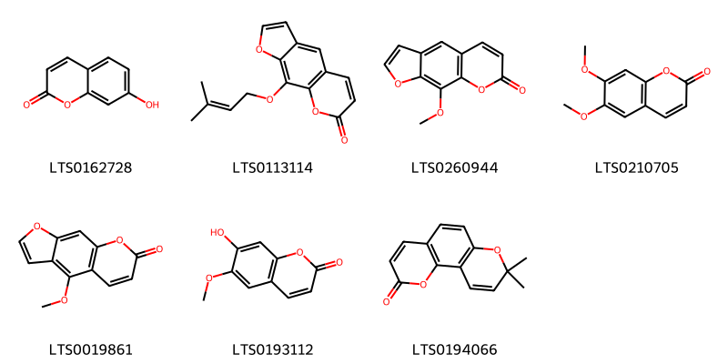{ width=100% }
    <figcaption>Hình ảnh cấu trúc hóa học của 7 hoạt chất thuộc nhóm Coumarins and derivatives gồm ['umbelliferone (LTS0162728)', 'imperatorin (LTS0113114)', 'methoxsalen (LTS0260944)', 'scoparone (LTS0210705)', 'bergapten (LTS0019861)', 'scopoletin (LTS0193112)', 'seselin (LTS0194066)'].</figcaption>
</figure>
#### Nhóm Fatty Acyls
<figure markdown="span">
    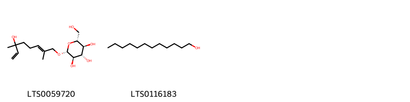{ width=100% }
    <figcaption>Hình ảnh cấu trúc hóa học của 2 hoạt chất thuộc nhóm Fatty Acyls gồm ['(2r,3r,4s,5s,6r)-2-{[(2e)-6-hydroxy-2,6-dimethylocta-2,7-dien-1-yl]oxy}-6-(hydroxymethyl)oxane-3,4,5-triol (LTS0059720)', '1-dodecanol (LTS0116183)'].</figcaption>
</figure>
#### Nhóm Flavonoids
<figure markdown="span">
    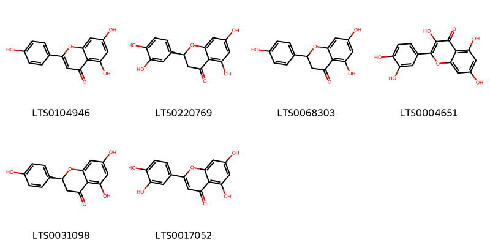{ width=100% }
    <figcaption>Hình ảnh cấu trúc hóa học của 6 hoạt chất thuộc nhóm Flavonoids gồm ['chamomile (LTS0104946)', 'eriodictyol (LTS0220769)', 'asahina (LTS0068303)', 'quercetin (LTS0004651)', 'naringenin (LTS0031098)', 'luteolin (LTS0017052)'].</figcaption>
</figure>
#### Nhóm Imidazopyrimidines
<figure markdown="span">
    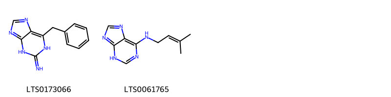{ width=100% }
    <figcaption>Hình ảnh cấu trúc hóa học của 2 hoạt chất thuộc nhóm Imidazopyrimidines gồm ['6-benzyl-1,3-dihydropurin-2-imine (LTS0173066)', '2ip (LTS0061765)'].</figcaption>
</figure>
#### Nhóm Organonitrogen compounds
<figure markdown="span">
    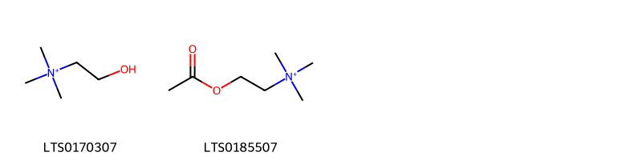{ width=100% }
    <figcaption>Hình ảnh cấu trúc hóa học của 2 hoạt chất thuộc nhóm Organonitrogen compounds gồm ['choline (LTS0170307)', 'acetylcholine (LTS0185507)'].</figcaption>
</figure>
#### Nhóm Organooxygen compounds
<figure markdown="span">
    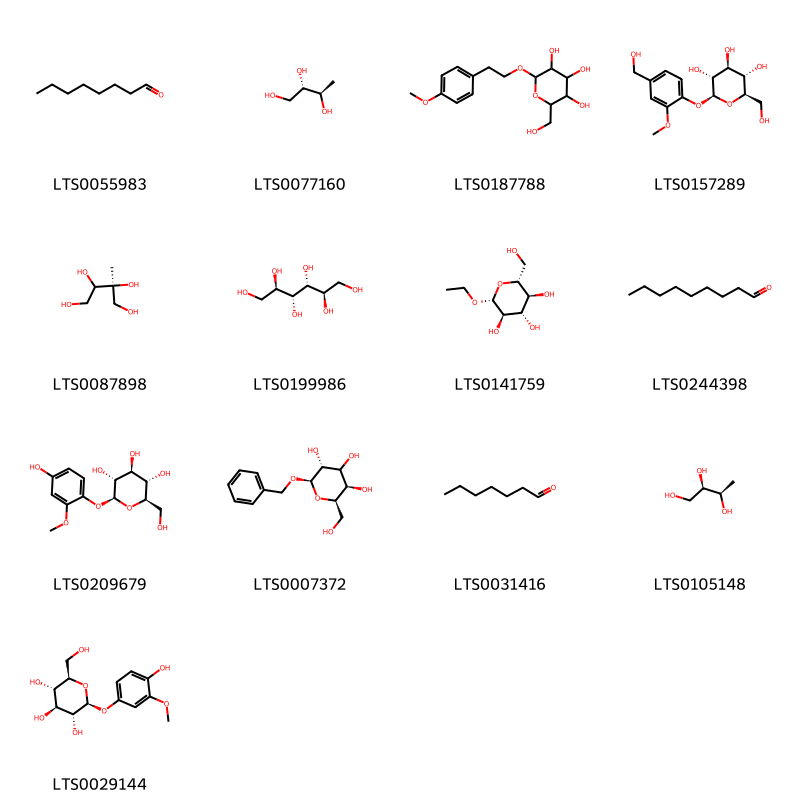{ width=100% }
    <figcaption>Hình ảnh cấu trúc hóa học của 13 hoạt chất thuộc nhóm Organooxygen compounds gồm ['octanal (LTS0055983)', '(2s,3r)-butane-1,2,3-triol (LTS0077160)', '2-(hydroxymethyl)-6-[2-(4-methoxyphenyl)ethoxy]oxane-3,4,5-triol (LTS0187788)', 'vanilloloside (LTS0157289)', '(2s)-2-methylbutane-1,2,3,4-tetrol (LTS0087898)', 'mannitol (LTS0199986)', 'ethyl glucoside (LTS0141759)', 'nonanal (LTS0244398)', '(2s,3r,4s,5s,6r)-2-(4-hydroxy-2-methoxyphenoxy)-6-(hydroxymethyl)oxane-3,4,5-triol (LTS0209679)', '(2r,3r,5r,6r)-2-(benzyloxy)-6-(hydroxymethyl)oxane-3,4,5-triol (LTS0007372)', 'heptanal (LTS0031416)', '(2r,3r)-butane-1,2,3-triol (LTS0105148)', '(2s,3r,4s,5s,6r)-2-(4-hydroxy-3-methoxyphenoxy)-6-(hydroxymethyl)oxane-3,4,5-triol (LTS0029144)'].</figcaption>
</figure>
#### Nhóm Phenol esters
<figure markdown="span">
    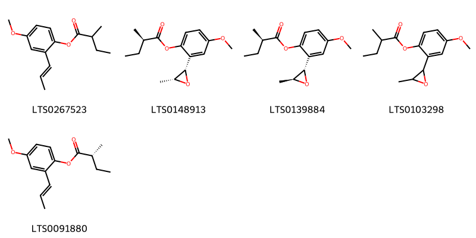{ width=100% }
    <figcaption>Hình ảnh cấu trúc hóa học của 5 hoạt chất thuộc nhóm Phenol esters gồm ['4-methoxy-2-(prop-1-en-1-yl)phenyl 2-methylbutanoate (LTS0267523)', '4-methoxy-2-[(2s,3r)-3-methyloxiran-2-yl]phenyl (2r)-2-methylbutanoate (LTS0148913)', '4-methoxy-2-[(2s,3s)-3-methyloxiran-2-yl]phenyl (2r)-2-methylbutanoate (LTS0139884)', '4-methoxy-2-(3-methyloxiran-2-yl)phenyl 2-methylbutanoate (LTS0103298)', '4-methoxy-2-[(1e)-prop-1-en-1-yl]phenyl (2r)-2-methylbutanoate (LTS0091880)'].</figcaption>
</figure>
#### Nhóm Phenol ethers
<figure markdown="span">
    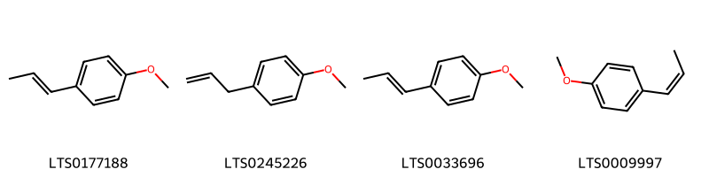{ width=100% }
    <figcaption>Hình ảnh cấu trúc hóa học của 4 hoạt chất thuộc nhóm Phenol ethers gồm ['p-propenylanisole (LTS0177188)', 'tarragon (LTS0245226)', 'anethole (LTS0033696)', '(e)-anethole (LTS0009997)'].</figcaption>
</figure>
#### Nhóm Phenols
<figure markdown="span">
    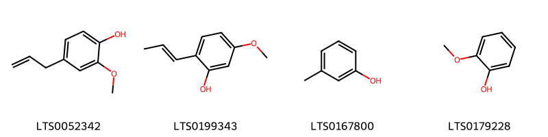{ width=100% }
    <figcaption>Hình ảnh cấu trúc hóa học của 4 hoạt chất thuộc nhóm Phenols gồm ['eugenol (LTS0052342)', '5-methoxy-2-[(1e)-prop-1-en-1-yl]phenol (LTS0199343)', 'm-cresol (LTS0167800)', 'guaiacol (LTS0179228)'].</figcaption>
</figure>
#### Nhóm Prenol lipids
<figure markdown="span">
    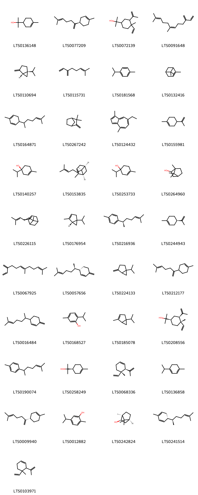{ width=100% }
    <figcaption>Hình ảnh cấu trúc hóa học của 37 hoạt chất thuộc nhóm Prenol lipids gồm ['terpineol (LTS0136148)', '(r)-β-bisabolene (LTS0077209)', '2-[4-ethenyl-4-methyl-3-(prop-1-en-2-yl)cyclohexyl]propan-2-ol (LTS0072139)', 'β-farnesene (LTS0091648)', '(+)-sabinene (LTS0110694)', 'α-myrcene (LTS0115731)', 'cymene (LTS0181568)', 'α pinene (LTS0132416)', '2-methyl-5-(6-methylhept-5-en-2-yl)cyclohexa-1,3-diene (LTS0164871)', 'camphene (LTS0267242)', 'chamazulene (LTS0124432)', 'limonene,  (LTS0155981)', '(+)-4-terpineol (LTS0140257)', '(-)-endo-α-bergamotene (LTS0153835)', '4-terpineol (LTS0253733)', 'borneol (LTS0264960)', 'α-bergamotene (LTS0226115)', 'α-thujene (LTS0176954)', '(-)-α-curcumene (LTS0216936)', 'α-limonene (LTS0244943)', 'β-farnesene (LTS0067925)', '(3s)-3-[(2r)-6-methylhept-5-en-2-yl]-6-methylidenecyclohex-1-ene (LTS0057656)', 'sabinene (LTS0224133)', 'β-bisabolene (LTS0212177)', '3-(6-methylhept-5-en-2-yl)-6-methylidenecyclohex-1-ene (LTS0016484)', 'thymol (LTS0168527)', 'α-thujene (LTS0185078)', 'elemol (LTS0208556)', 'curcumene (LTS0190074)', '(+)-α-terpineol (LTS0258249)', '(3s,4s)-4-ethenyl-4-methyl-3-(prop-1-en-2-yl)cyclohex-1-ene (LTS0068336)', 'terpinene (LTS0136858)', '(-)-β-bisabolene (LTS0009940)', 'carvacrol (LTS0012882)', '(-)-borneol (LTS0242824)', '7-epi-zingiberene (LTS0241514)', '4-ethenyl-4-methyl-3-(prop-1-en-2-yl)cyclohex-1-ene (LTS0103971)'].</figcaption>
</figure>
#### Nhóm Saturated hydrocarbons
<figure markdown="span">
    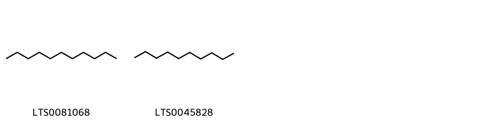{ width=100% }
    <figcaption>Hình ảnh cấu trúc hóa học của 2 hoạt chất thuộc nhóm Saturated hydrocarbons gồm ['undecane (LTS0081068)', 'decane (LTS0045828)'].</figcaption>
</figure>
#### Nhóm Unsaturated hydrocarbons
<figure markdown="span">
    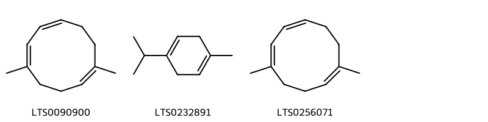{ width=100% }
    <figcaption>Hình ảnh cấu trúc hóa học của 3 hoạt chất thuộc nhóm Unsaturated hydrocarbons gồm ['1,7-dimethylcyclodeca-1,3,7-triene (LTS0090900)', 'α terpinene (LTS0232891)', '(1z,3z,7z)-1,7-dimethylcyclodeca-1,3,7-triene (LTS0256071)'].</figcaption>
</figure>

---

### Dược dân tộc học

Danh sách các quốc gia có sử dụng *Pimpinella anisum* trong điều trị các bệnh. 

| Country   | Disease                                                                              | Bệnh                                                                                                                                                                                                |
|:----------|:-------------------------------------------------------------------------------------|:----------------------------------------------------------------------------------------------------------------------------------------------------------------------------------------------------|
| China     | Carminative, Stimulant                                                               | MYMEMORY WARNING: YOU USED ALL AVAILABLE FREE TRANSLATIONS FOR TODAY. NEXT AVAILABLE IN  08 HOURS 24 MINUTES 01 SECONDS VISIT HTTPS://MYMEMORY.TRANSLATED.NET/DOC/USAGELIMITS.PHP TO TRANSLATE MORE |
| Elsewhere | Carminative, Diaphoretic, Diuretic, Expectorant, Fungicide, Stomachic, Abortifacient | MYMEMORY WARNING: YOU USED ALL AVAILABLE FREE TRANSLATIONS FOR TODAY. NEXT AVAILABLE IN  08 HOURS 23 MINUTES 59 SECONDS VISIT HTTPS://MYMEMORY.TRANSLATED.NET/DOC/USAGELIMITS.PHP TO TRANSLATE MORE |
| Iraq      | Diuretic                                                                             | MYMEMORY WARNING: YOU USED ALL AVAILABLE FREE TRANSLATIONS FOR TODAY. NEXT AVAILABLE IN  08 HOURS 23 MINUTES 56 SECONDS VISIT HTTPS://MYMEMORY.TRANSLATED.NET/DOC/USAGELIMITS.PHP TO TRANSLATE MORE |
| Kurdistan | Diaphoretic                                                                          | MYMEMORY WARNING: YOU USED ALL AVAILABLE FREE TRANSLATIONS FOR TODAY. NEXT AVAILABLE IN  08 HOURS 23 MINUTES 54 SECONDS VISIT HTTPS://MYMEMORY.TRANSLATED.NET/DOC/USAGELIMITS.PHP TO TRANSLATE MORE |
| Mexico    | Carminative                                                                          | MYMEMORY WARNING: YOU USED ALL AVAILABLE FREE TRANSLATIONS FOR TODAY. NEXT AVAILABLE IN  08 HOURS 23 MINUTES 51 SECONDS VISIT HTTPS://MYMEMORY.TRANSLATED.NET/DOC/USAGELIMITS.PHP TO TRANSLATE MORE |
| Turkey    | Carminative, Expectorant, Stimulant, Stomachic, Sudorific                            | MYMEMORY WARNING: YOU USED ALL AVAILABLE FREE TRANSLATIONS FOR TODAY. NEXT AVAILABLE IN  08 HOURS 23 MINUTES 49 SECONDS VISIT HTTPS://MYMEMORY.TRANSLATED.NET/DOC/USAGELIMITS.PHP TO TRANSLATE MORE |
| ain       | Expectorant                                                                          | MYMEMORY WARNING: YOU USED ALL AVAILABLE FREE TRANSLATIONS FOR TODAY. NEXT AVAILABLE IN  08 HOURS 23 MINUTES 47 SECONDS VISIT HTTPS://MYMEMORY.TRANSLATED.NET/DOC/USAGELIMITS.PHP TO TRANSLATE MORE |

---

---
## Pimpinella caffra
### Thông tin về thực vật

!!! info "Phân loại thực vật của *Pimpinella caffra* từ GIBF:"
    - **Kingdom:** Plantae
    - **Phylum:** Tracheophyta
    - **Order:** Apiales
    - **Family:** Apiaceae
    - **Genus:** Pimpinella
    - **Species:** *Pimpinella caffra*

 

| Label (VI)   | Label (EN)   | Scientific Name   | Descriptions (VI)   | Descriptions (EN)   | Also Known As (VI)   | Also Known As (EN)   |
|:-------------|:-------------|:------------------|:--------------------|:--------------------|:---------------------|:---------------------|
| N/A          | N/A          | Pimpinella caffra | loài thực vật       | species of plant    | ['']                 | ['']                 |

#### Phân bố trên thế giới

**Từ CSDL GIBF** Malawi, Zambia, South Africa, nan, Eritrea, Mozambique, Lesotho, unknown or invalid, Zimbabwe, Tanzania, United Republic of, Eswatini, Ethiopia

#### Phân bố tại Việt Nam

**Từ CSDL GIBF**: Không có ghi nhận ở Việt Nam

---
### Thành phần hóa học
        
- Theo cơ sở dữ liệu lotus: Từ loài *Pimpinella caffra* đã phân lập và xác định được Chưa có hoạt chất nào được phân lập. hoạt chất thuộc về các nhóm Không có hoạt chất nào được phân lập. 

Không có hình ảnh nào được tạo ra

---

### Dược dân tộc học

Danh sách các quốc gia có sử dụng *Pimpinella caffra* trong điều trị các bệnh. 

| Country   | Disease   | Bệnh                                                                                                                                                                                                |
|:----------|:----------|:----------------------------------------------------------------------------------------------------------------------------------------------------------------------------------------------------|
| Lesotho   | Fumigant  | MYMEMORY WARNING: YOU USED ALL AVAILABLE FREE TRANSLATIONS FOR TODAY. NEXT AVAILABLE IN  08 HOURS 23 MINUTES 07 SECONDS VISIT HTTPS://MYMEMORY.TRANSLATED.NET/DOC/USAGELIMITS.PHP TO TRANSLATE MORE |

---

---
## Pimpinella diversifolia
### Thông tin về thực vật

!!! info "Phân loại thực vật của *Pimpinella diversifolia* từ GIBF:"
    - **Kingdom:** Plantae
    - **Phylum:** Tracheophyta
    - **Order:** Apiales
    - **Family:** Apiaceae
    - **Genus:** Pimpinella
    - **Species:** *Pimpinella diversifolia*

 

| Label (VI)   | Label (EN)   | Scientific Name         | Descriptions (VI)   | Descriptions (EN)   | Also Known As (VI)   | Also Known As (EN)   |
|:-------------|:-------------|:------------------------|:--------------------|:--------------------|:---------------------|:---------------------|
| N/A          | N/A          | Pimpinella diversifolia | loài thực vật       | species of plant    | ['']                 | ['']                 |

#### Phân bố trên thế giới

**Từ CSDL GIBF** nan, Pakistan, Netherlands, Japan, Thailand, Kyrgyzstan, Chinese Taipei, India, Russian Federation, unknown or invalid, Viet Nam, China, Nepal

#### Phân bố tại Việt Nam

**Từ CSDL GIBF**: Lâm Đồng

---
### Thành phần hóa học
        
- Theo cơ sở dữ liệu lotus: Từ loài *Pimpinella diversifolia* đã phân lập và xác định được 6 hoạt chất thuộc về các nhóm Phenol esters. 

|    | chemicalTaxonomyClassyfireClass   |   smiles_count |
|---:|:----------------------------------|---------------:|
|  0 | Phenol esters                     |              6 |

#### Nhóm Phenol esters
<figure markdown="span">
    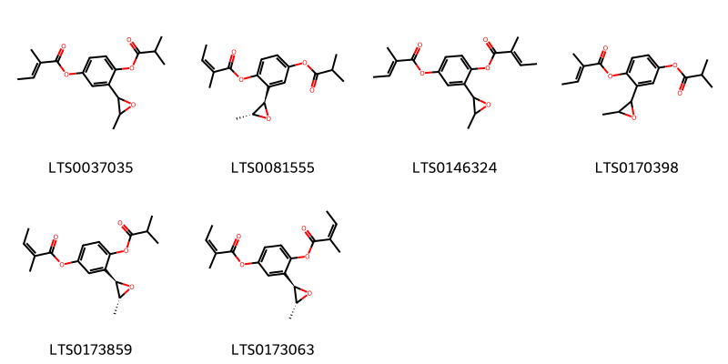{ width=100% }
    <figcaption>Hình ảnh cấu trúc hóa học của 6 hoạt chất thuộc nhóm Phenol esters gồm ['3-(3-methyloxiran-2-yl)-4-[(2-methylpropanoyl)oxy]phenyl 2-methylbut-2-enoate (LTS0037035)', '2-[(2r,3r)-3-methyloxiran-2-yl]-4-[(2-methylpropanoyl)oxy]phenyl (2z)-2-methylbut-2-enoate (LTS0081555)', '4-[(2-methylbut-2-enoyl)oxy]-2-(3-methyloxiran-2-yl)phenyl 2-methylbut-2-enoate (LTS0146324)', '2-(3-methyloxiran-2-yl)-4-[(2-methylpropanoyl)oxy]phenyl 2-methylbut-2-enoate (LTS0170398)', '3-[(2r,3r)-3-methyloxiran-2-yl]-4-[(2-methylpropanoyl)oxy]phenyl (2z)-2-methylbut-2-enoate (LTS0173859)', '4-{[(2z)-2-methylbut-2-enoyl]oxy}-2-[(2r,3r)-3-methyloxiran-2-yl]phenyl (2z)-2-methylbut-2-enoate (LTS0173063)'].</figcaption>
</figure>

---

### Dược dân tộc học

Danh sách các quốc gia có sử dụng *Pimpinella diversifolia* trong điều trị các bệnh. 

| Country   | Disease     | Bệnh                                                                                                                                                                                                |
|:----------|:------------|:----------------------------------------------------------------------------------------------------------------------------------------------------------------------------------------------------|
| India     | Carminative | MYMEMORY WARNING: YOU USED ALL AVAILABLE FREE TRANSLATIONS FOR TODAY. NEXT AVAILABLE IN  08 HOURS 22 MINUTES 47 SECONDS VISIT HTTPS://MYMEMORY.TRANSLATED.NET/DOC/USAGELIMITS.PHP TO TRANSLATE MORE |

---

---
## Pimpinella magna
### Thông tin về thực vật

!!! info "Phân loại thực vật của *N/A* từ GIBF:"
    - **Kingdom:** Plantae
    - **Phylum:** Tracheophyta
    - **Order:** Apiales
    - **Family:** Apiaceae
    - **Genus:** Pimpinella
    - **Species:** *N/A*

 

| Label (VI)   | Label (EN)   | Scientific Name         | Descriptions (VI)   | Descriptions (EN)   | Also Known As (VI)   | Also Known As (EN)   |
|:-------------|:-------------|:------------------------|:--------------------|:--------------------|:---------------------|:---------------------|
| N/A          | N/A          | Pimpinella diversifolia | loài thực vật       | species of plant    | ['']                 | ['']                 |

#### Phân bố trên thế giới

**Từ CSDL GIBF** Italy, Belgium, Slovakia, Norway, Israel, Ukraine, Denmark, Netherlands, Belarus, Luxembourg, Spain, Hungary, Portugal, Russian Federation, United States of America, Sweden, South Africa, Czechia, Germany, Switzerland, Austria, France, Eswatini, United Kingdom of Great Britain and Northern Ireland, India, Poland

#### Phân bố tại Việt Nam

**Từ CSDL GIBF**: Không có ghi nhận ở Việt Nam

---
### Thành phần hóa học
        
- Theo cơ sở dữ liệu lotus: Từ loài *N/A* đã phân lập và xác định được Chưa có hoạt chất nào được phân lập. hoạt chất thuộc về các nhóm Không có hoạt chất nào được phân lập. 

Không có hình ảnh nào được tạo ra

---

### Dược dân tộc học

Danh sách các quốc gia có sử dụng *N/A* trong điều trị các bệnh. 

| Country   | Disease   | Bệnh                                                                                                                                                                                                |
|:----------|:----------|:----------------------------------------------------------------------------------------------------------------------------------------------------------------------------------------------------|
| ain       | Tonic     | MYMEMORY WARNING: YOU USED ALL AVAILABLE FREE TRANSLATIONS FOR TODAY. NEXT AVAILABLE IN  08 HOURS 22 MINUTES 25 SECONDS VISIT HTTPS://MYMEMORY.TRANSLATED.NET/DOC/USAGELIMITS.PHP TO TRANSLATE MORE |

---

---
## Pimpinella saxifraga
### Thông tin về thực vật

!!! info "Phân loại thực vật của *Pimpinella saxifraga* từ GIBF:"
    - **Kingdom:** Plantae
    - **Phylum:** Tracheophyta
    - **Order:** Apiales
    - **Family:** Apiaceae
    - **Genus:** Pimpinella
    - **Species:** *Pimpinella saxifraga*

 

| Label (VI)   | Label (EN)   | Scientific Name      | Descriptions (VI)   | Descriptions (EN)   | Also Known As (VI)   | Also Known As (EN)   |
|:-------------|:-------------|:---------------------|:--------------------|:--------------------|:---------------------|:---------------------|
| N/A          | N/A          | Pimpinella saxifraga | loài thực vật       | species of plant    | ['']                 | ['']                 |

#### Phân bố trên thế giới

**Từ CSDL GIBF** Italy, Belgium, Estonia, Norway, Ukraine, Denmark, Netherlands, Belarus, Luxembourg, Hungary, Russian Federation, United States of America, Sweden, Czechia, Germany, Switzerland, Austria, France, United Kingdom of Great Britain and Northern Ireland, Poland

#### Phân bố tại Việt Nam

**Từ CSDL GIBF**: Không có ghi nhận ở Việt Nam

---
### Thành phần hóa học
        
- Theo cơ sở dữ liệu lotus: Từ loài *Pimpinella saxifraga* đã phân lập và xác định được 8 hoạt chất thuộc về các nhóm Prenol lipids, Steroids and steroid derivatives, Coumarins and derivatives. 

|    | chemicalTaxonomyClassyfireClass   |   smiles_count |
|---:|:----------------------------------|---------------:|
|  0 | Coumarins and derivatives         |              3 |
|  1 | Prenol lipids                     |              4 |
|  2 | Steroids and steroid derivatives  |              1 |

#### Nhóm Coumarins and derivatives
<figure markdown="span">
    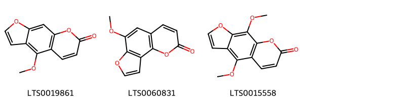{ width=100% }
    <figcaption>Hình ảnh cấu trúc hóa học của 3 hoạt chất thuộc nhóm Coumarins and derivatives gồm ['bergapten (LTS0019861)', 'sphondin (LTS0060831)', 'isopimpinellin (LTS0015558)'].</figcaption>
</figure>
#### Nhóm Prenol lipids
<figure markdown="span">
    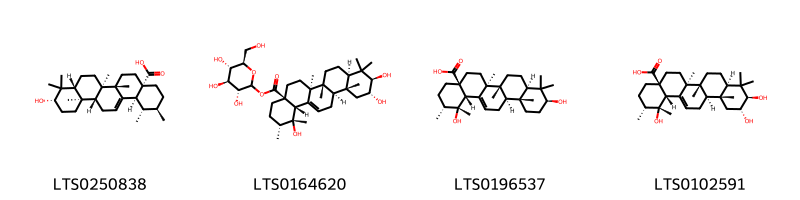{ width=100% }
    <figcaption>Hình ảnh cấu trúc hóa học của 4 hoạt chất thuộc nhóm Prenol lipids gồm ['ursolic acid (LTS0250838)', '(3r,4s,5s,6r)-3,4,5-trihydroxy-6-(hydroxymethyl)oxan-2-yl (1r,2r,4as,6as,6br,8ar,10r,11r,12ar,12br,14bs)-1,10,11-trihydroxy-1,2,6a,6b,9,9,12a-heptamethyl-2,3,4,5,6,7,8,8a,10,11,12,12b,13,14b-tetradecahydropicene-4a-carboxylate (LTS0164620)', 'pomolic acid (LTS0196537)', 'tormentic acid (LTS0102591)'].</figcaption>
</figure>
#### Nhóm Steroids and steroid derivatives
<figure markdown="span">
    { width=100% }
    <figcaption>Hình ảnh cấu trúc hóa học của 1 hoạt chất thuộc nhóm Steroids and steroid derivatives gồm ['stigmast-5-en-3-ol, (3β)- (LTS0204616)'].</figcaption>
</figure>

---

### Dược dân tộc học

Danh sách các quốc gia có sử dụng *Pimpinella saxifraga* trong điều trị các bệnh. 

| Country   | Disease                                                                                            | Bệnh                                                                                                                                                                                                |
|:----------|:---------------------------------------------------------------------------------------------------|:----------------------------------------------------------------------------------------------------------------------------------------------------------------------------------------------------|
| Elsewhere | Antiphlogistic, Diuretic                                                                           | MYMEMORY WARNING: YOU USED ALL AVAILABLE FREE TRANSLATIONS FOR TODAY. NEXT AVAILABLE IN  08 HOURS 22 MINUTES 02 SECONDS VISIT HTTPS://MYMEMORY.TRANSLATED.NET/DOC/USAGELIMITS.PHP TO TRANSLATE MORE |
| Turkey    | Carminative, Digestive, Expectorant, Nervine, Sudorific, Apertif, Diuretic, Emmenagogue, Stomachic | MYMEMORY WARNING: YOU USED ALL AVAILABLE FREE TRANSLATIONS FOR TODAY. NEXT AVAILABLE IN  08 HOURS 22 MINUTES 00 SECONDS VISIT HTTPS://MYMEMORY.TRANSLATED.NET/DOC/USAGELIMITS.PHP TO TRANSLATE MORE |
| ain       | Apertif                                                                                            | MYMEMORY WARNING: YOU USED ALL AVAILABLE FREE TRANSLATIONS FOR TODAY. NEXT AVAILABLE IN  08 HOURS 21 MINUTES 57 SECONDS VISIT HTTPS://MYMEMORY.TRANSLATED.NET/DOC/USAGELIMITS.PHP TO TRANSLATE MORE |

---

# Chi Seseli

??? note "Danh sách các dược liệu thuộc chi"
    
	 - *Seseli diffusum*
	 - *Seseli indicum*
	 - *Seseli libanotis*
	 - *Seseli sibiricum*

---
## Seseli diffusum
### Thông tin về thực vật

!!! info "Phân loại thực vật của *Psammogeton diffusum* từ GIBF:"
    - **Kingdom:** Plantae
    - **Phylum:** Tracheophyta
    - **Order:** Apiales
    - **Family:** Apiaceae
    - **Genus:** Psammogeton
    - **Species:** *Psammogeton diffusum*

 

| Label (VI)   | Label (EN)   | Scientific Name   | Descriptions (VI)   | Descriptions (EN)   | Also Known As (VI)   | Also Known As (EN)   |
|:-------------|:-------------|:------------------|:--------------------|:--------------------|:---------------------|:---------------------|
| N/A          | N/A          | Seseli diffusum   | loài thực vật       | species of plant    | ['']                 | ['']                 |

#### Phân bố trên thế giới

**Từ CSDL GIBF** nan, Pakistan, India, unknown or invalid, Bangladesh, Nepal

#### Phân bố tại Việt Nam

**Từ CSDL GIBF**: Không có ghi nhận ở Việt Nam

---
### Thành phần hóa học
        
- Theo cơ sở dữ liệu lotus: Từ loài *Psammogeton diffusum* đã phân lập và xác định được Chưa có hoạt chất nào được phân lập. hoạt chất thuộc về các nhóm Không có hoạt chất nào được phân lập. 

Không có hình ảnh nào được tạo ra

---

### Dược dân tộc học

Danh sách các quốc gia có sử dụng *Psammogeton diffusum* trong điều trị các bệnh. 

| Country   | Disease                                      | Bệnh                                                                                                                                                                                                |
|:----------|:---------------------------------------------|:----------------------------------------------------------------------------------------------------------------------------------------------------------------------------------------------------|
| Elsewhere | Stimulant, Vermifuge, Carminative            | MYMEMORY WARNING: YOU USED ALL AVAILABLE FREE TRANSLATIONS FOR TODAY. NEXT AVAILABLE IN  08 HOURS 21 MINUTES 29 SECONDS VISIT HTTPS://MYMEMORY.TRANSLATED.NET/DOC/USAGELIMITS.PHP TO TRANSLATE MORE |
| India     | Carminative, Stomachic, Vermifuge, Stimulant | MYMEMORY WARNING: YOU USED ALL AVAILABLE FREE TRANSLATIONS FOR TODAY. NEXT AVAILABLE IN  08 HOURS 21 MINUTES 26 SECONDS VISIT HTTPS://MYMEMORY.TRANSLATED.NET/DOC/USAGELIMITS.PHP TO TRANSLATE MORE |

---

---
## Seseli indicum
### Thông tin về thực vật

!!! info "Phân loại thực vật của *Psammogeton diffusum* từ GIBF:"
    - **Kingdom:** Plantae
    - **Phylum:** Tracheophyta
    - **Order:** Apiales
    - **Family:** Apiaceae
    - **Genus:** Psammogeton
    - **Species:** *Psammogeton diffusum*

 

| Label (VI)   | Label (EN)   | Scientific Name   | Descriptions (VI)   | Descriptions (EN)   | Also Known As (VI)   | Also Known As (EN)   |
|:-------------|:-------------|:------------------|:--------------------|:--------------------|:---------------------|:---------------------|
| N/A          | N/A          | Seseli indicum    |                     |                     | ['']                 | ['']                 |

#### Phân bố trên thế giới

**Từ CSDL GIBF** nan, Pakistan, India, unknown or invalid, Bangladesh, Nepal

#### Phân bố tại Việt Nam

**Từ CSDL GIBF**: Không có ghi nhận ở Việt Nam

---
### Thành phần hóa học
        
- Theo cơ sở dữ liệu lotus: Từ loài *Psammogeton diffusum* đã phân lập và xác định được Chưa có hoạt chất nào được phân lập. hoạt chất thuộc về các nhóm Không có hoạt chất nào được phân lập. 

Không có hình ảnh nào được tạo ra

---

### Dược dân tộc học

Danh sách các quốc gia có sử dụng *Psammogeton diffusum* trong điều trị các bệnh. 

| Country   | Disease   | Bệnh                                                                                                                                                                                                |
|:----------|:----------|:----------------------------------------------------------------------------------------------------------------------------------------------------------------------------------------------------|
| India     | Fungicide | MYMEMORY WARNING: YOU USED ALL AVAILABLE FREE TRANSLATIONS FOR TODAY. NEXT AVAILABLE IN  08 HOURS 21 MINUTES 09 SECONDS VISIT HTTPS://MYMEMORY.TRANSLATED.NET/DOC/USAGELIMITS.PHP TO TRANSLATE MORE |

---

---
## Seseli libanotis
### Thông tin về thực vật

!!! info "Phân loại thực vật của *Seseli libanotis* từ GIBF:"
    - **Kingdom:** Plantae
    - **Phylum:** Tracheophyta
    - **Order:** Apiales
    - **Family:** Apiaceae
    - **Genus:** Seseli
    - **Species:** *Seseli libanotis*

 

| Label (VI)   | Label (EN)   | Scientific Name   | Descriptions (VI)   | Descriptions (EN)   | Also Known As (VI)   | Also Known As (EN)   |
|:-------------|:-------------|:------------------|:--------------------|:--------------------|:---------------------|:---------------------|
| N/A          | N/A          | Seseli libanotis  | loài thực vật       | species of plant    | ['']                 | ['moon carrot']      |

#### Phân bố trên thế giới

**Từ CSDL GIBF** Ukraine, Denmark, Czechia, Germany, Belgium, Estonia, Spain, Hungary, Switzerland, Russian Federation, Sweden, Austria, France, Norway

#### Phân bố tại Việt Nam

**Từ CSDL GIBF**: Không có ghi nhận ở Việt Nam

---
### Thành phần hóa học
        
- Theo cơ sở dữ liệu lotus: Từ loài *Seseli libanotis* đã phân lập và xác định được 9 hoạt chất thuộc về các nhóm Prenol lipids, Steroids and steroid derivatives, Coumarins and derivatives. 

|    | chemicalTaxonomyClassyfireClass   |   smiles_count |
|---:|:----------------------------------|---------------:|
|  0 | Coumarins and derivatives         |              2 |
|  1 | Prenol lipids                     |              2 |
|  2 | Steroids and steroid derivatives  |              3 |

#### Nhóm Coumarins and derivatives
<figure markdown="span">
    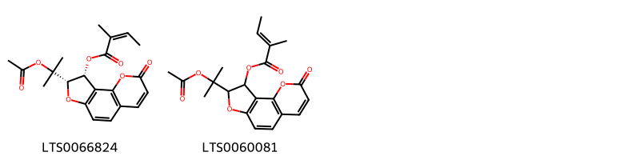{ width=100% }
    <figcaption>Hình ảnh cấu trúc hóa học của 2 hoạt chất thuộc nhóm Coumarins and derivatives gồm ['(8s,9r)-8-[2-(acetyloxy)propan-2-yl]-2-oxo-8h,9h-furo[2,3-h]chromen-9-yl (2z)-2-methylbut-2-enoate (LTS0066824)', '8-[2-(acetyloxy)propan-2-yl]-2-oxo-8h,9h-furo[2,3-h]chromen-9-yl 2-methylbut-2-enoate (LTS0060081)'].</figcaption>
</figure>
#### Nhóm Prenol lipids
<figure markdown="span">
    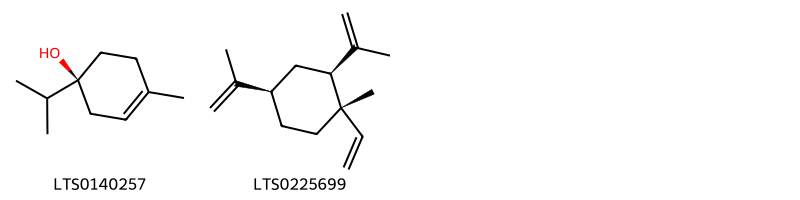{ width=100% }
    <figcaption>Hình ảnh cấu trúc hóa học của 2 hoạt chất thuộc nhóm Prenol lipids gồm ['(+)-4-terpineol (LTS0140257)', 'β-elemene (LTS0225699)'].</figcaption>
</figure>
#### Nhóm Steroids and steroid derivatives
<figure markdown="span">
    { width=100% }
    <figcaption>Hình ảnh cấu trúc hóa học của 3 hoạt chất thuộc nhóm Steroids and steroid derivatives gồm ['sitosterol (LTS0168132)', '(1r,3as,3bs,7s,9ar,9bs,11ar)-1-[(2s,3e,5s)-5-ethyl-6-methylhept-3-en-2-yl]-9a,11a-dimethyl-1h,2h,3h,3ah,3bh,4h,6h,7h,8h,9h,9bh,10h,11h-cyclopenta[a]phenanthren-7-ol (LTS0169213)', 'campesterol (LTS0029429)'].</figcaption>
</figure>

---

### Dược dân tộc học

Danh sách các quốc gia có sử dụng *Seseli libanotis* trong điều trị các bệnh. 

| Country   | Disease          | Bệnh                                                                                                                                                                                                |
|:----------|:-----------------|:----------------------------------------------------------------------------------------------------------------------------------------------------------------------------------------------------|
| China     | Carminative      | MYMEMORY WARNING: YOU USED ALL AVAILABLE FREE TRANSLATIONS FOR TODAY. NEXT AVAILABLE IN  08 HOURS 20 MINUTES 53 SECONDS VISIT HTTPS://MYMEMORY.TRANSLATED.NET/DOC/USAGELIMITS.PHP TO TRANSLATE MORE |
| Elsewhere | Diaphoretic, nan | MYMEMORY WARNING: YOU USED ALL AVAILABLE FREE TRANSLATIONS FOR TODAY. NEXT AVAILABLE IN  08 HOURS 20 MINUTES 51 SECONDS VISIT HTTPS://MYMEMORY.TRANSLATED.NET/DOC/USAGELIMITS.PHP TO TRANSLATE MORE |

---

---
## Seseli sibiricum
### Thông tin về thực vật

!!! info "Phân loại thực vật của *Seseli sibiricum* từ GIBF:"
    - **Kingdom:** Plantae
    - **Phylum:** Tracheophyta
    - **Order:** Apiales
    - **Family:** Apiaceae
    - **Genus:** Seseli
    - **Species:** *Seseli sibiricum*

 

| Label (VI)   | Label (EN)   | Scientific Name   | Descriptions (VI)   | Descriptions (EN)   | Also Known As (VI)   | Also Known As (EN)   |
|:-------------|:-------------|:------------------|:--------------------|:--------------------|:---------------------|:---------------------|
| N/A          | N/A          | Seseli sibiricum  |                     | species of plant    | ['']                 | ['']                 |

#### Phân bố trên thế giới

**Từ CSDL GIBF** Ukraine, nan, Estonia, unknown or invalid, India, Poland

#### Phân bố tại Việt Nam

**Từ CSDL GIBF**: Không có ghi nhận ở Việt Nam

---
### Thành phần hóa học
        
- Theo cơ sở dữ liệu lotus: Từ loài *Seseli sibiricum* đã phân lập và xác định được 7 hoạt chất thuộc về các nhóm Coumarans, Coumarins and derivatives. 

|    | chemicalTaxonomyClassyfireClass   |   smiles_count |
|---:|:----------------------------------|---------------:|
|  0 | Coumarans                         |              1 |
|  1 | Coumarins and derivatives         |              6 |

#### Nhóm Coumarans
<figure markdown="span">
    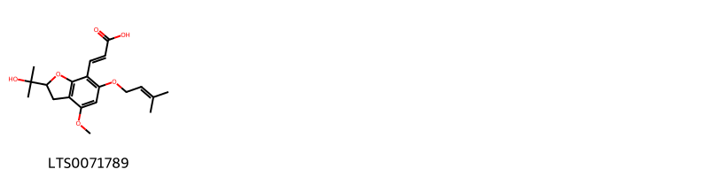{ width=100% }
    <figcaption>Hình ảnh cấu trúc hóa học của 1 hoạt chất thuộc nhóm Coumarans gồm ['(2e)-3-[2-(2-hydroxypropan-2-yl)-4-methoxy-6-[(3-methylbut-2-en-1-yl)oxy]-2,3-dihydro-1-benzofuran-7-yl]prop-2-enoic acid (LTS0071789)'].</figcaption>
</figure>
#### Nhóm Coumarins and derivatives
<figure markdown="span">
    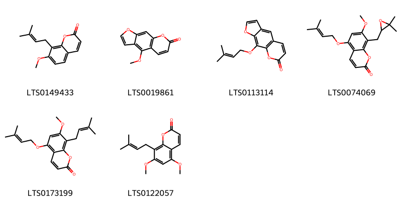{ width=100% }
    <figcaption>Hình ảnh cấu trúc hóa học của 6 hoạt chất thuộc nhóm Coumarins and derivatives gồm ['osthole (LTS0149433)', 'bergapten (LTS0019861)', 'imperatorin (LTS0113114)', '8-[(3,3-dimethyloxiran-2-yl)methyl]-7-methoxy-5-[(3-methylbut-2-en-1-yl)oxy]chromen-2-one (LTS0074069)', '7-methoxy-8-(3-methylbut-2-en-1-yl)-5-[(3-methylbut-2-en-1-yl)oxy]chromen-2-one (LTS0173199)', '5,7-dimethoxy-8-(3-methylbut-2-en-1-yl)chromen-2-one (LTS0122057)'].</figcaption>
</figure>

---

### Dược dân tộc học

Danh sách các quốc gia có sử dụng *Seseli sibiricum* trong điều trị các bệnh. 

| Country   | Disease         | Bệnh                                                                                                                                                                                                |
|:----------|:----------------|:----------------------------------------------------------------------------------------------------------------------------------------------------------------------------------------------------|
| India     | Vasoconstrictor | MYMEMORY WARNING: YOU USED ALL AVAILABLE FREE TRANSLATIONS FOR TODAY. NEXT AVAILABLE IN  08 HOURS 20 MINUTES 26 SECONDS VISIT HTTPS://MYMEMORY.TRANSLATED.NET/DOC/USAGELIMITS.PHP TO TRANSLATE MORE |

---

# Chi Athamanta

??? note "Danh sách các dược liệu thuộc chi"
    
	 - *Athamanta oreoselinum*

---
## Athamanta oreoselinum
### Thông tin về thực vật

!!! info "Phân loại thực vật của *N/A* từ GIBF:"
    - **Kingdom:** Plantae
    - **Phylum:** Tracheophyta
    - **Order:** Apiales
    - **Family:** Apiaceae
    - **Genus:** N/A
    - **Species:** *N/A*

 

| Label (VI)   | Label (EN)   | Scientific Name       | Descriptions (VI)   | Descriptions (EN)   | Also Known As (VI)   | Also Known As (EN)   |
|:-------------|:-------------|:----------------------|:--------------------|:--------------------|:---------------------|:---------------------|
| N/A          | N/A          | Athamanta oreoselinum | loài thực vật       | species of plant    | ['']                 | ['']                 |

#### Phân bố trên thế giới

**Từ CSDL GIBF** nan, Italy, Australia, Belgium, Argentina, Canada, Ukraine, Netherlands, Chinese Taipei, Spain, Portugal, Russian Federation, United States of America, Chile, Uruguay, Greece, South Africa, Montenegro, Czechia, Germany, Thailand, Isle of Man, Austria, France, Mexico, United Kingdom of Great Britain and Northern Ireland, Jersey, Ecuador, Niue, Ireland, New Zealand

#### Phân bố tại Việt Nam

**Từ CSDL GIBF**: Không có ghi nhận ở Việt Nam

---
### Thành phần hóa học
        
- Theo cơ sở dữ liệu lotus: Từ loài *N/A* đã phân lập và xác định được Chưa có hoạt chất nào được phân lập. hoạt chất thuộc về các nhóm Không có hoạt chất nào được phân lập. 

Không có hình ảnh nào được tạo ra

---

### Dược dân tộc học

Danh sách các quốc gia có sử dụng *N/A* trong điều trị các bệnh. 

| Country   | Disease    | Bệnh                                                                                                                                                                                                |
|:----------|:-----------|:----------------------------------------------------------------------------------------------------------------------------------------------------------------------------------------------------|
| French    | Antiseptic | MYMEMORY WARNING: YOU USED ALL AVAILABLE FREE TRANSLATIONS FOR TODAY. NEXT AVAILABLE IN  08 HOURS 20 MINUTES 07 SECONDS VISIT HTTPS://MYMEMORY.TRANSLATED.NET/DOC/USAGELIMITS.PHP TO TRANSLATE MORE |
| German    | Diuretic   | MYMEMORY WARNING: YOU USED ALL AVAILABLE FREE TRANSLATIONS FOR TODAY. NEXT AVAILABLE IN  08 HOURS 20 MINUTES 05 SECONDS VISIT HTTPS://MYMEMORY.TRANSLATED.NET/DOC/USAGELIMITS.PHP TO TRANSLATE MORE |

---

# Chi Cnidium

??? note "Danh sách các dược liệu thuộc chi"
    
	 - *Cnidium formosanum*
	 - *Cnidium monnieri*
	 - *Cnidium officinale*

---
## Cnidium formosanum
### Thông tin về thực vật

!!! info "Phân loại thực vật của *Cnidium monnieri* từ GIBF:"
    - **Kingdom:** Plantae
    - **Phylum:** Tracheophyta
    - **Order:** Apiales
    - **Family:** Apiaceae
    - **Genus:** Cnidium
    - **Species:** *Cnidium monnieri*

 

| Label (VI)   | Label (EN)   | Scientific Name    | Descriptions (VI)   | Descriptions (EN)   | Also Known As (VI)   | Also Known As (EN)   |
|:-------------|:-------------|:-------------------|:--------------------|:--------------------|:---------------------|:---------------------|
| N/A          | N/A          | Cnidium formosanum | loài thực vật       | species of plant    | ['']                 | ['']                 |

#### Phân bố trên thế giới

**Từ CSDL GIBF** China, Chinese Taipei

#### Phân bố tại Việt Nam

**Từ CSDL GIBF**: Không có ghi nhận ở Việt Nam

---
### Thành phần hóa học
        
- Theo cơ sở dữ liệu lotus: Từ loài *Cnidium monnieri* đã phân lập và xác định được Chưa có hoạt chất nào được phân lập. hoạt chất thuộc về các nhóm Không có hoạt chất nào được phân lập. 

Không có hình ảnh nào được tạo ra

---

### Dược dân tộc học

Danh sách các quốc gia có sử dụng *Cnidium monnieri* trong điều trị các bệnh. 

| Country   | Disease                    | Bệnh                                                                                                                                                                                                |
|:----------|:---------------------------|:----------------------------------------------------------------------------------------------------------------------------------------------------------------------------------------------------|
| Elsewhere | Antiphlogistic, Astringent | MYMEMORY WARNING: YOU USED ALL AVAILABLE FREE TRANSLATIONS FOR TODAY. NEXT AVAILABLE IN  08 HOURS 19 MINUTES 43 SECONDS VISIT HTTPS://MYMEMORY.TRANSLATED.NET/DOC/USAGELIMITS.PHP TO TRANSLATE MORE |

---

---
## Cnidium monnieri
### Thông tin về thực vật

!!! info "Phân loại thực vật của *Cnidium monnieri* từ GIBF:"
    - **Kingdom:** Plantae
    - **Phylum:** Tracheophyta
    - **Order:** Apiales
    - **Family:** Apiaceae
    - **Genus:** Cnidium
    - **Species:** *Cnidium monnieri*

 

| Label (VI)   | Label (EN)   | Scientific Name   | Descriptions (VI)   | Descriptions (EN)   | Also Known As (VI)   | Also Known As (EN)   |
|:-------------|:-------------|:------------------|:--------------------|:--------------------|:---------------------|:---------------------|
| N/A          | N/A          | Cnidium monnieri  | loài thực vật       | species of plant    | ['']                 | ['']                 |

#### Phân bố trên thế giới

**Từ CSDL GIBF** nan, Korea, Republic of, Chinese Taipei, Russian Federation, United States of America, Mongolia, China

#### Phân bố tại Việt Nam

**Từ CSDL GIBF**: Không có ghi nhận ở Việt Nam

---
### Thành phần hóa học
        
- Theo cơ sở dữ liệu lotus: Từ loài *Cnidium monnieri* đã phân lập và xác định được 80 hoạt chất thuộc về các nhóm Fatty Acyls, Flavonoids, Prenol lipids, Cinnamic acids and derivatives, Quinolines and derivatives, Stilbenes, Organooxygen compounds, Lactones, Coumarins and derivatives, Benzoxepines, Benzopyrans. 

|    | chemicalTaxonomyClassyfireClass   |   smiles_count |
|---:|:----------------------------------|---------------:|
|  0 | Benzopyrans                       |              8 |
|  1 | Benzoxepines                      |              3 |
|  2 | Cinnamic acids and derivatives    |              1 |
|  3 | Coumarins and derivatives         |             26 |
|  4 | Fatty Acyls                       |             12 |
|  5 | Flavonoids                        |              1 |
|  6 | Lactones                          |              2 |
|  7 | Organooxygen compounds            |             12 |
|  8 | Prenol lipids                     |             12 |
|  9 | Quinolines and derivatives        |              1 |
| 10 | Stilbenes                         |              2 |

#### Nhóm Benzopyrans
<figure markdown="span">
    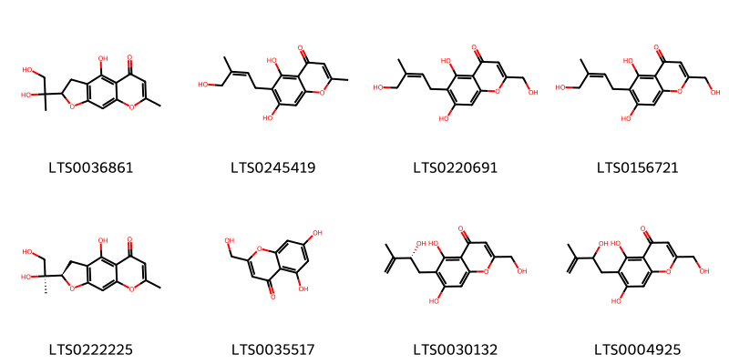{ width=100% }
    <figcaption>Hình ảnh cấu trúc hóa học của 8 hoạt chất thuộc nhóm Benzopyrans gồm ['2-(1,2-dihydroxypropan-2-yl)-4-hydroxy-7-methyl-2h,3h-furo[3,2-g]chromen-5-one (LTS0036861)', '5,7-dihydroxy-6-[(2z)-4-hydroxy-3-methylbut-2-en-1-yl]-2-methylchromen-4-one (LTS0245419)', '5,7-dihydroxy-6-[(2z)-4-hydroxy-3-methylbut-2-en-1-yl]-2-(hydroxymethyl)chromen-4-one (LTS0220691)', '5,7-dihydroxy-6-(4-hydroxy-3-methylbut-2-en-1-yl)-2-(hydroxymethyl)chromen-4-one (LTS0156721)', '(2r)-2-[(2s)-1,2-dihydroxypropan-2-yl]-4-hydroxy-7-methyl-2h,3h-furo[3,2-g]chromen-5-one (LTS0222225)', '5,7-dihydroxy-2-(hydroxymethyl)chromen-4-one (LTS0035517)', '5,7-dihydroxy-6-[(2r)-2-hydroxy-3-methylbut-3-en-1-yl]-2-(hydroxymethyl)chromen-4-one (LTS0030132)', '5,7-dihydroxy-6-(2-hydroxy-3-methylbut-3-en-1-yl)-2-(hydroxymethyl)chromen-4-one (LTS0004925)'].</figcaption>
</figure>
#### Nhóm Benzoxepines
<figure markdown="span">
    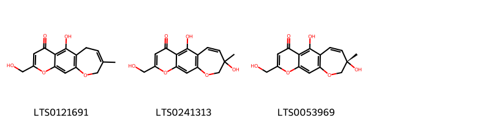{ width=100% }
    <figcaption>Hình ảnh cấu trúc hóa học của 3 hoạt chất thuộc nhóm Benzoxepines gồm ['5-hydroxy-2-(hydroxymethyl)-8-methyl-6h,9h-oxepino[3,2-g]chromen-4-one (LTS0121691)', '5,8-dihydroxy-2-(hydroxymethyl)-8-methyl-9h-oxepino[3,2-g]chromen-4-one (LTS0241313)', '(8s)-5,8-dihydroxy-2-(hydroxymethyl)-8-methyl-9h-oxepino[3,2-g]chromen-4-one (LTS0053969)'].</figcaption>
</figure>
#### Nhóm Cinnamic acids and derivatives
<figure markdown="span">
    { width=100% }
    <figcaption>Hình ảnh cấu trúc hóa học của 1 hoạt chất thuộc nhóm Cinnamic acids and derivatives gồm ['ferulic acid (LTS0077328)'].</figcaption>
</figure>
#### Nhóm Coumarins and derivatives
<figure markdown="span">
    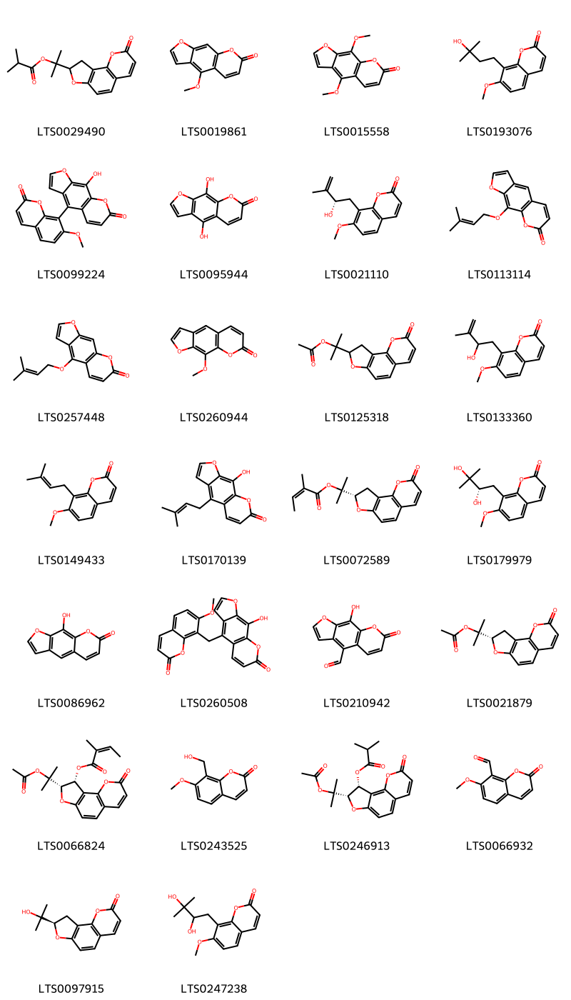{ width=100% }
    <figcaption>Hình ảnh cấu trúc hóa học của 26 hoạt chất thuộc nhóm Coumarins and derivatives gồm ['cnidiadin (LTS0029490)', 'bergapten (LTS0019861)', 'isopimpinellin (LTS0015558)', '8-(3-hydroxy-3-methylbutyl)-7-methoxychromen-2-one (LTS0193076)', '8-{9-hydroxy-7-oxofuro[3,2-g]chromen-4-yl}-7-methoxychromen-2-one (LTS0099224)', '4,9-dihydroxyfuro[3,2-g]chromen-7-one (LTS0095944)', '8-[(2s)-2-hydroxy-3-methylbut-3-en-1-yl]-7-methoxychromen-2-one (LTS0021110)', 'imperatorin (LTS0113114)', 'isoimperatorin (LTS0257448)', 'methoxsalen (LTS0260944)', '2-{2-oxo-8h,9h-furo[2,3-h]chromen-8-yl}propan-2-yl acetate (LTS0125318)', '8-(2-hydroxy-3-methylbut-3-en-1-yl)-7-methoxychromen-2-one (LTS0133360)', 'osthole (LTS0149433)', 'alloimperatorin (LTS0170139)', '2-[(8s)-2-oxo-8h,9h-furo[2,3-h]chromen-8-yl]propan-2-yl (2z)-2-methylbut-2-enoate (LTS0072589)', '8-[(2s)-2,3-dihydroxy-3-methylbutyl]-7-methoxychromen-2-one (LTS0179979)', 'xanthotoxol (LTS0086962)', '8-({9-hydroxy-7-oxofuro[3,2-g]chromen-4-yl}methyl)-7-methoxychromen-2-one (LTS0260508)', '9-hydroxy-7-oxofuro[3,2-g]chromene-4-carbaldehyde (LTS0210942)', '2-[(8s)-2-oxo-8h,9h-furo[2,3-h]chromen-8-yl]propan-2-yl acetate (LTS0021879)', '(8s,9r)-8-[2-(acetyloxy)propan-2-yl]-2-oxo-8h,9h-furo[2,3-h]chromen-9-yl (2z)-2-methylbut-2-enoate (LTS0066824)', '8-(hydroxymethyl)-7-methoxychromen-2-one (LTS0243525)', '(8s,9r)-8-[2-(acetyloxy)propan-2-yl]-2-oxo-8h,9h-furo[2,3-h]chromen-9-yl 2-methylpropanoate (LTS0246913)', '7-methoxy-2-oxochromene-8-carbaldehyde (LTS0066932)', '(-)-columbianetin (LTS0097915)', '8-(2,3-dihydroxy-3-methylbutyl)-7-methoxychromen-2-one (LTS0247238)'].</figcaption>
</figure>
#### Nhóm Fatty Acyls
<figure markdown="span">
    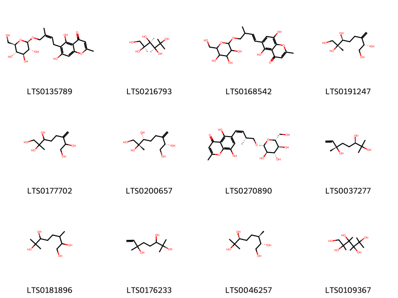{ width=100% }
    <figcaption>Hình ảnh cấu trúc hóa học của 12 hoạt chất thuộc nhóm Fatty Acyls gồm ['5,7-dihydroxy-2-methyl-6-[(2z)-3-methyl-4-{[(2r,3r,4s,5s,6r)-3,4,5-trihydroxy-6-(hydroxymethyl)oxan-2-yl]oxy}but-2-en-1-yl]chromen-4-one (LTS0135789)', '(2s,3r,4r)-2,3,4,5-tetramethylhexane-1,2,3,4,5-pentol (LTS0216793)', '5,8-dihydroxy-2-methyl-6-(3-methyl-4-{[3,4,5-trihydroxy-6-(hydroxymethyl)oxan-2-yl]oxy}but-1-en-1-yl)chromen-4-one (LTS0168542)', '(2r,3s,7s)-2-methyl-6-methylideneoctane-1,2,3,7,8-pentol (LTS0191247)', '2-methyl-6-methylideneoctane-1,2,3,7,8-pentol (LTS0177702)', '(2r,3r,7s)-2-methyl-6-methylideneoctane-1,2,3,7,8-pentol (LTS0200657)', '5,8-dihydroxy-2-methyl-6-[(1z,3r)-3-methyl-4-{[(2r,3r,4s,5s,6r)-3,4,5-trihydroxy-6-(hydroxymethyl)oxan-2-yl]oxy}but-1-en-1-yl]chromen-4-one (LTS0270890)', '(3r,6s)-2,6-dimethyloct-7-ene-2,3,6-triol (LTS0037277)', '3,7-dimethyloctane-1,2,6,7-tetrol (LTS0181896)', '2,6-dimethyloct-7-ene-2,3,6-triol (LTS0176233)', '(2s,3r,6s)-3,7-dimethyloctane-1,2,6,7-tetrol (LTS0046257)', '2,3,4,5-tetramethylhexane-1,2,3,4,5-pentol (LTS0109367)'].</figcaption>
</figure>
#### Nhóm Flavonoids
<figure markdown="span">
    { width=100% }
    <figcaption>Hình ảnh cấu trúc hóa học của 1 hoạt chất thuộc nhóm Flavonoids gồm ['diosmetin (LTS0252065)'].</figcaption>
</figure>
#### Nhóm Lactones
<figure markdown="span">
    { width=100% }
    <figcaption>Hình ảnh cấu trúc hóa học của 2 hoạt chất thuộc nhóm Lactones gồm ['deoxyribonolactone (LTS0075306)', '4-hydroxy-5-(hydroxymethyl)oxolan-2-one (LTS0167629)'].</figcaption>
</figure>
#### Nhóm Organooxygen compounds
<figure markdown="span">
    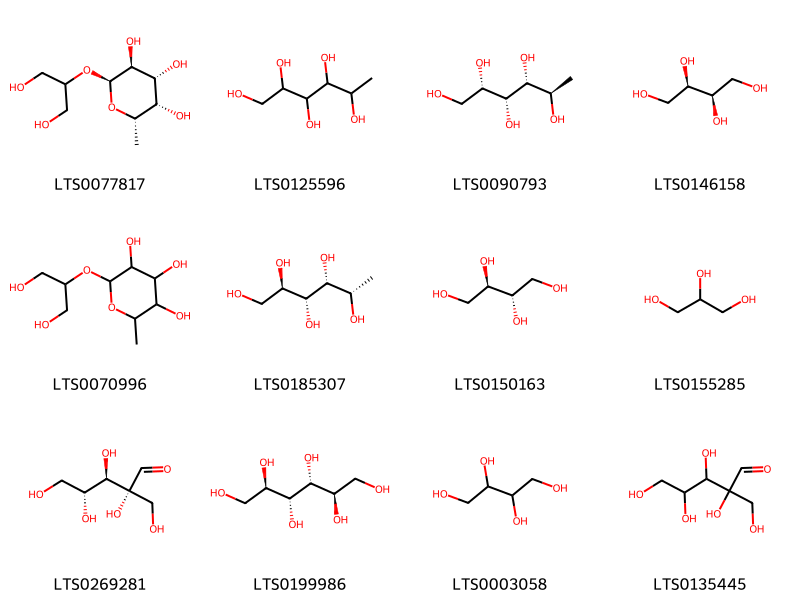{ width=100% }
    <figcaption>Hình ảnh cấu trúc hóa học của 12 hoạt chất thuộc nhóm Organooxygen compounds gồm ['(2r,3s,4r,5s,6s)-2-[(1,3-dihydroxypropan-2-yl)oxy]-6-methyloxane-3,4,5-triol (LTS0077817)', 'fucitol (LTS0125596)', '(2s,3r,4r,5r)-hexane-1,2,3,4,5-pentol (LTS0090793)', '(-)-threitol (LTS0146158)', '2-[(1,3-dihydroxypropan-2-yl)oxy]-6-methyloxane-3,4,5-triol (LTS0070996)', '(2r,3r,4r,5s)-hexane-1,2,3,4,5-pentol (LTS0185307)', 'meso-erythritol (LTS0150163)', 'glycerol (LTS0155285)', 'hamamelose (LTS0269281)', 'mannitol (LTS0199986)', 'erythrite (LTS0003058)', '2,3,4,5-tetrahydroxy-2-(hydroxymethyl)pentanal (LTS0135445)'].</figcaption>
</figure>
#### Nhóm Prenol lipids
<figure markdown="span">
    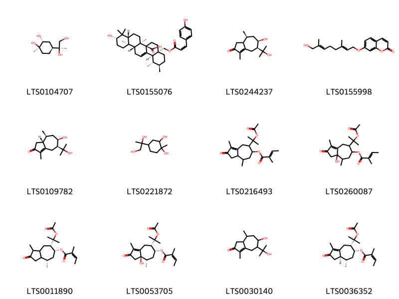{ width=100% }
    <figcaption>Hình ảnh cấu trúc hóa học của 12 hoạt chất thuộc nhóm Prenol lipids gồm ['(1r,2r,4s)-4-[(2s)-1,2-dihydroxypropan-2-yl]-1-methylcyclohexane-1,2-diol (LTS0104707)', '(1s,2r,4as,6ar,6br,8ar,10s,12ar,12br,14bs)-10-hydroxy-4a-({[(2z)-3-(4-hydroxyphenyl)prop-2-enoyl]oxy}methyl)-1,2,6b,9,9,12a-hexamethyl-2,3,4,5,6,7,8,8a,10,11,12,12b,13,14b-tetradecahydro-1h-picene-6a-carboxylic acid (LTS0155076)', '(4s,6r,7s)-6-hydroxy-7-(2-hydroxypropan-2-yl)-1,4-dimethyl-3a,4,5,6,7,8-hexahydro-3h-azulen-2-one (LTS0244237)', '7-{[(2e,6e)-8-hydroxy-3,7-dimethylocta-2,6-dien-1-yl]oxy}chromen-2-one (LTS0155998)', '(3ar,4s,6r,7s)-6-hydroxy-7-(2-hydroxypropan-2-yl)-1,4-dimethyl-3a,4,5,6,7,8-hexahydro-3h-azulen-2-one (LTS0109782)', '4-(1,2-dihydroxypropan-2-yl)-1-methylcyclohexane-1,2-diol (LTS0221872)', '7-[2-(acetyloxy)propan-2-yl]-1,4-dimethyl-2-oxo-3a,4,5,6,7,8-hexahydro-3h-azulen-6-yl 2-methylbut-2-enoate (LTS0216493)', '7-[2-(acetyloxy)propan-2-yl]-3a-hydroxy-1,4-dimethyl-2-oxo-3,4,5,6,7,8-hexahydroazulen-6-yl 2-methylbut-2-enoate (LTS0260087)', '(4s,6r,7s)-7-[2-(acetyloxy)propan-2-yl]-1,4-dimethyl-2-oxo-octahydro-1h-azulen-6-yl (2z)-2-methylbut-2-enoate (LTS0011890)', '(3ar,4s,6r,7s)-7-[2-(acetyloxy)propan-2-yl]-3a-hydroxy-1,4-dimethyl-2-oxo-3,4,5,6,7,8-hexahydroazulen-6-yl (2z)-2-methylbut-2-enoate (LTS0053705)', '6-hydroxy-7-(2-hydroxypropan-2-yl)-1,4-dimethyl-3a,4,5,6,7,8-hexahydro-3h-azulen-2-one (LTS0030140)', 'torilin (LTS0036352)'].</figcaption>
</figure>
#### Nhóm Quinolines and derivatives
<figure markdown="span">
    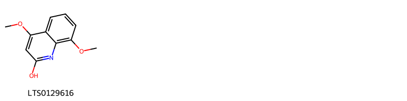{ width=100% }
    <figcaption>Hình ảnh cấu trúc hóa học của 1 hoạt chất thuộc nhóm Quinolines and derivatives gồm ['4,8-dimethoxyquinolin-2-ol (LTS0129616)'].</figcaption>
</figure>
#### Nhóm Stilbenes
<figure markdown="span">
    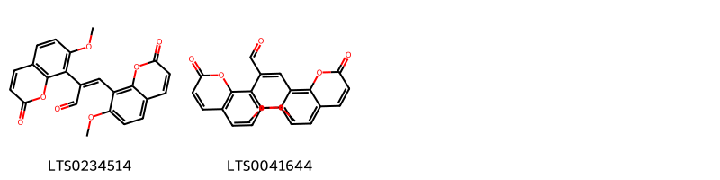{ width=100% }
    <figcaption>Hình ảnh cấu trúc hóa học của 2 hoạt chất thuộc nhóm Stilbenes gồm ['2,3-bis(7-methoxy-2-oxochromen-8-yl)prop-2-enal (LTS0234514)', '(2e)-2,3-bis(7-methoxy-2-oxochromen-8-yl)prop-2-enal (LTS0041644)'].</figcaption>
</figure>

---

### Dược dân tộc học

Danh sách các quốc gia có sử dụng *Cnidium monnieri* trong điều trị các bệnh. 

| Country   | Disease                                                                                  | Bệnh                                                                                                                                                                                                |
|:----------|:-----------------------------------------------------------------------------------------|:----------------------------------------------------------------------------------------------------------------------------------------------------------------------------------------------------|
| China     | Aphrodisiac, Astringent, Discutient, Poison, Sedative, Vermifuge, Vulnerary, Carminative | MYMEMORY WARNING: YOU USED ALL AVAILABLE FREE TRANSLATIONS FOR TODAY. NEXT AVAILABLE IN  08 HOURS 19 MINUTES 26 SECONDS VISIT HTTPS://MYMEMORY.TRANSLATED.NET/DOC/USAGELIMITS.PHP TO TRANSLATE MORE |

---

---
## Cnidium officinale
### Thông tin về thực vật

!!! info "Phân loại thực vật của *Conioselinum officinale* từ GIBF:"
    - **Kingdom:** Plantae
    - **Phylum:** Tracheophyta
    - **Order:** Apiales
    - **Family:** Apiaceae
    - **Genus:** Conioselinum
    - **Species:** *Conioselinum officinale*

 

| Label (VI)   | Label (EN)   | Scientific Name    | Descriptions (VI)   | Descriptions (EN)   | Also Known As (VI)   | Also Known As (EN)   |
|:-------------|:-------------|:-------------------|:--------------------|:--------------------|:---------------------|:---------------------|
| N/A          | N/A          | Cnidium officinale | loài thực vật       | species of plant    | ['']                 | ['']                 |

#### Phân bố trên thế giới

**Từ CSDL GIBF** nan, Japan, Korea, Republic of, Korea (Democratic People’s Republic of), France, China

#### Phân bố tại Việt Nam

**Từ CSDL GIBF**: Không có ghi nhận ở Việt Nam

---
### Thành phần hóa học
        
- Theo cơ sở dữ liệu lotus: Từ loài *Conioselinum officinale* đã phân lập và xác định được 35 hoạt chất thuộc về các nhóm Fatty Acyls, Steroids and steroid derivatives, Cinnamic acids and derivatives, Isocoumarans, Benzofurans, Purine nucleosides, Organooxygen compounds, Phenols, Isobenzofurans. 

|    | chemicalTaxonomyClassyfireClass   |   smiles_count |
|---:|:----------------------------------|---------------:|
|  0 | Benzofurans                       |              1 |
|  1 | Cinnamic acids and derivatives    |              2 |
|  2 | Fatty Acyls                       |              2 |
|  3 | Isobenzofurans                    |             13 |
|  4 | Isocoumarans                      |              5 |
|  5 | Organooxygen compounds            |              8 |
|  6 | Phenols                           |              1 |
|  7 | Purine nucleosides                |              1 |
|  8 | Steroids and steroid derivatives  |              1 |

#### Nhóm Benzofurans
<figure markdown="span">
    { width=100% }
    <figcaption>Hình ảnh cấu trúc hóa học của 1 hoạt chất thuộc nhóm Benzofurans gồm ['butylphthalide (LTS0150205)'].</figcaption>
</figure>
#### Nhóm Cinnamic acids and derivatives
<figure markdown="span">
    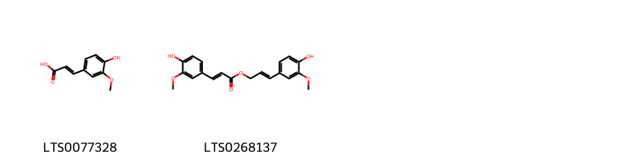{ width=100% }
    <figcaption>Hình ảnh cấu trúc hóa học của 2 hoạt chất thuộc nhóm Cinnamic acids and derivatives gồm ['ferulic acid (LTS0077328)', 'coniferyl ferulate (LTS0268137)'].</figcaption>
</figure>
#### Nhóm Fatty Acyls
<figure markdown="span">
    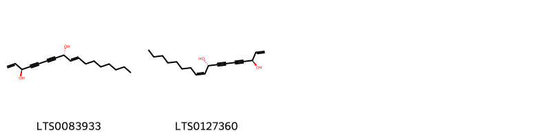{ width=100% }
    <figcaption>Hình ảnh cấu trúc hóa học của 2 hoạt chất thuộc nhóm Fatty Acyls gồm ['(3s,8r)-heptadeca-1,9-dien-4,6-diyne-3,8-diol (LTS0083933)', 'falcarindiol (LTS0127360)'].</figcaption>
</figure>
#### Nhóm Isobenzofurans
<figure markdown="span">
    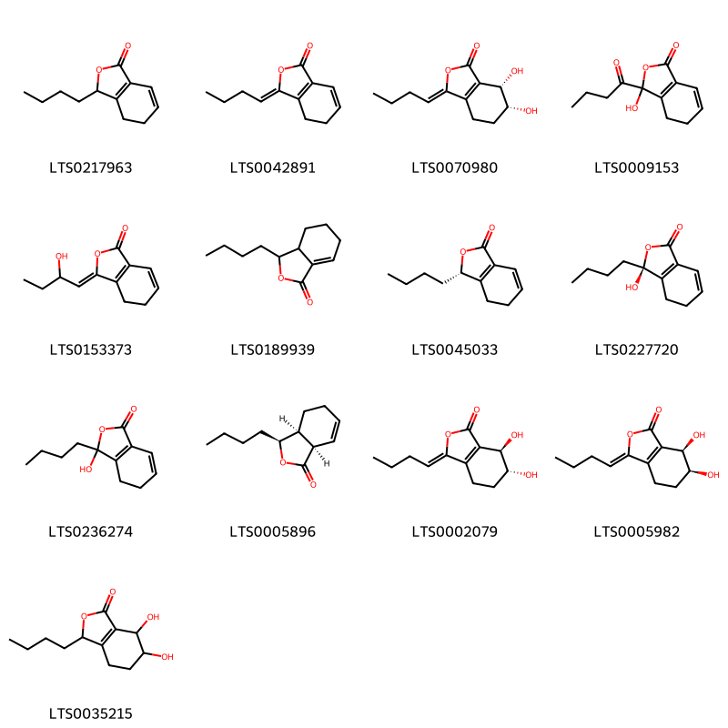{ width=100% }
    <figcaption>Hình ảnh cấu trúc hóa học của 13 hoạt chất thuộc nhóm Isobenzofurans gồm ['3-butyl-4,5-dihydro-3h-2-benzofuran-1-one (LTS0217963)', '(z)-ligustilide (LTS0042891)', '(6r,7s)-3-butylidene-6,7-dihydroxy-4,5,6,7-tetrahydro-2-benzofuran-1-one (LTS0070980)', '3-butanoyl-3-hydroxy-4,5-dihydro-2-benzofuran-1-one (LTS0009153)', '(3z)-3-(2-hydroxybutylidene)-4,5-dihydro-2-benzofuran-1-one (LTS0153373)', 'sedanolide (LTS0189939)', 'senkyunolide a (LTS0045033)', '(3s)-3-butyl-3-hydroxy-4,5-dihydro-2-benzofuran-1-one (LTS0227720)', '3-butyl-3-hydroxy-4,5-dihydro-2-benzofuran-1-one (LTS0236274)', 'cnidilide (LTS0005896)', '(6r,7r)-3-butylidene-6,7-dihydroxy-4,5,6,7-tetrahydro-2-benzofuran-1-one (LTS0002079)', '(3z,6s,7r)-3-butylidene-6,7-dihydroxy-4,5,6,7-tetrahydro-2-benzofuran-1-one (LTS0005982)', '3-butyl-6,7-dihydroxy-4,5,6,7-tetrahydro-3h-2-benzofuran-1-one (LTS0035215)'].</figcaption>
</figure>
#### Nhóm Isocoumarans
<figure markdown="span">
    { width=100% }
    <figcaption>Hình ảnh cấu trúc hóa học của 5 hoạt chất thuộc nhóm Isocoumarans gồm ['(3z)-3-butylidene-5-hydroxy-2-benzofuran-1-one (LTS0055084)', 'senkyunolide b (LTS0230911)', '(3z)-3-(2-hydroxybutylidene)-2-benzofuran-1-one (LTS0173938)', 'butylidenephthalide (LTS0147414)', 'butylidenephthalide (LTS0259092)'].</figcaption>
</figure>
#### Nhóm Organooxygen compounds
<figure markdown="span">
    { width=100% }
    <figcaption>Hình ảnh cấu trúc hóa học của 8 hoạt chất thuộc nhóm Organooxygen compounds gồm ['(+)-glucose (LTS0262158)', 'sucrose (LTS0272557)', 'galactose (LTS0171628)', '(2r,3r,4s,5r,6r)-2-{[(2s,3r,4s,5s,6r)-2-{[(2s,3s,4s,5r)-3,4-dihydroxy-2,5-bis(hydroxymethyl)oxolan-2-yl]oxy}-4,5-dihydroxy-6-(hydroxymethyl)oxan-3-yl]oxy}-6-(hydroxymethyl)oxane-3,4,5-triol (LTS0207928)', 'keto-d-fructose (LTS0241114)', 'glucose (LTS0013597)', 'aldehydo-d-galactose (LTS0128031)', 'd-fructopyranose (LTS0259277)'].</figcaption>
</figure>
#### Nhóm Phenols
<figure markdown="span">
    { width=100% }
    <figcaption>Hình ảnh cấu trúc hóa học của 1 hoạt chất thuộc nhóm Phenols gồm ['vanillin (LTS0136163)'].</figcaption>
</figure>
#### Nhóm Purine nucleosides
<figure markdown="span">
    { width=100% }
    <figcaption>Hình ảnh cấu trúc hóa học của 1 hoạt chất thuộc nhóm Purine nucleosides gồm ['adenosine (LTS0014061)'].</figcaption>
</figure>
#### Nhóm Steroids and steroid derivatives
<figure markdown="span">
    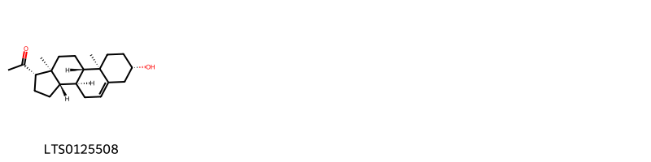{ width=100% }
    <figcaption>Hình ảnh cấu trúc hóa học của 1 hoạt chất thuộc nhóm Steroids and steroid derivatives gồm ['pregnenolone (LTS0125508)'].</figcaption>
</figure>

---

### Dược dân tộc học

Danh sách các quốc gia có sử dụng *Conioselinum officinale* trong điều trị các bệnh. 

| Country   | Disease         | Bệnh                                                                                                                                                                                                |
|:----------|:----------------|:----------------------------------------------------------------------------------------------------------------------------------------------------------------------------------------------------|
| Japan*    | Tonic, Sedative | MYMEMORY WARNING: YOU USED ALL AVAILABLE FREE TRANSLATIONS FOR TODAY. NEXT AVAILABLE IN  08 HOURS 19 MINUTES 00 SECONDS VISIT HTTPS://MYMEMORY.TRANSLATED.NET/DOC/USAGELIMITS.PHP TO TRANSLATE MORE |

---

# Chi Foeniculum

??? note "Danh sách các dược liệu thuộc chi"
    
	 - *Foeniculum vulgare*

---
## Foeniculum vulgare
### Thông tin về thực vật

!!! info "Phân loại thực vật của *Foeniculum vulgare* từ GIBF:"
    - **Kingdom:** Plantae
    - **Phylum:** Tracheophyta
    - **Order:** Apiales
    - **Family:** Apiaceae
    - **Genus:** Foeniculum
    - **Species:** *Foeniculum vulgare*

 

| Label (VI)   | Label (EN)   | Scientific Name    | Descriptions (VI)   | Descriptions (EN)                                      | Also Known As (VI)   | Also Known As (EN)   |
|:-------------|:-------------|:-------------------|:--------------------|:-------------------------------------------------------|:---------------------|:---------------------|
| N/A          | N/A          | Foeniculum vulgare | loài thực vật       | species of plant, fennel (for the herb use Q104005460) | ['']                 | ['Fennel']           |

#### Phân bố trên thế giới

**Từ CSDL GIBF** Italy, Australia, Belgium, Guatemala, Argentina, Israel, Canada, Malta, Spain, Portugal, Albania, Lesotho, United States of America, Chile, South Africa, Thailand, Brazil, Mexico, France, Dominican Republic, United Kingdom of Great Britain and Northern Ireland, Jersey, Lebanon, New Zealand

#### Phân bố tại Việt Nam

**Từ CSDL GIBF**: Không có ghi nhận ở Việt Nam

---
### Thành phần hóa học
        
- Theo cơ sở dữ liệu lotus: Từ loài *Foeniculum vulgare* đã phân lập và xác định được 289 hoạt chất thuộc về các nhóm Azoles, Benzofurans, Hydroxy acids and derivatives, Stilbenes, Polycyclic hydrocarbons, Phenols, Fatty Acyls, Pyrimidine nucleosides, Cinnamic acids and derivatives, Oxanes, Cinnamaldehydes, Tannins, Diazines, Prenol lipids, Purine nucleosides, Benzene and substituted derivatives, Organooxygen compounds, Phenol esters, Phenol ethers, Flavonoids, Steroids and steroid derivatives, Benzodioxoles, Oxepanes, Organonitrogen compounds, 2-arylbenzofuran flavonoids, Unsaturated hydrocarbons, Coumarins and derivatives, Epoxides. 

|    | chemicalTaxonomyClassyfireClass     |   smiles_count |
|---:|:------------------------------------|---------------:|
|  0 | 2-arylbenzofuran flavonoids         |             19 |
|  1 | Azoles                              |              1 |
|  2 | Benzene and substituted derivatives |             12 |
|  3 | Benzodioxoles                       |              1 |
|  4 | Benzofurans                         |              5 |
|  5 | Cinnamaldehydes                     |              1 |
|  6 | Cinnamic acids and derivatives      |              2 |
|  7 | Coumarins and derivatives           |              7 |
|  8 | Diazines                            |              1 |
|  9 | Epoxides                            |              1 |
| 10 | Fatty Acyls                         |             18 |
| 11 | Flavonoids                          |             26 |
| 12 | Hydroxy acids and derivatives       |              1 |
| 13 | Organonitrogen compounds            |              2 |
| 14 | Organooxygen compounds              |             81 |
| 15 | Oxanes                              |              5 |
| 16 | Oxepanes                            |              3 |
| 17 | Phenol esters                       |              1 |
| 18 | Phenol ethers                       |              5 |
| 19 | Phenols                             |              2 |
| 20 | Polycyclic hydrocarbons             |              1 |
| 21 | Prenol lipids                       |             73 |
| 22 | Purine nucleosides                  |              2 |
| 23 | Pyrimidine nucleosides              |              2 |
| 24 | Steroids and steroid derivatives    |             11 |
| 25 | Stilbenes                           |              2 |
| 26 | Tannins                             |              1 |
| 27 | Unsaturated hydrocarbons            |              3 |

#### Nhóm 2-arylbenzofuran flavonoids
<figure markdown="span">
    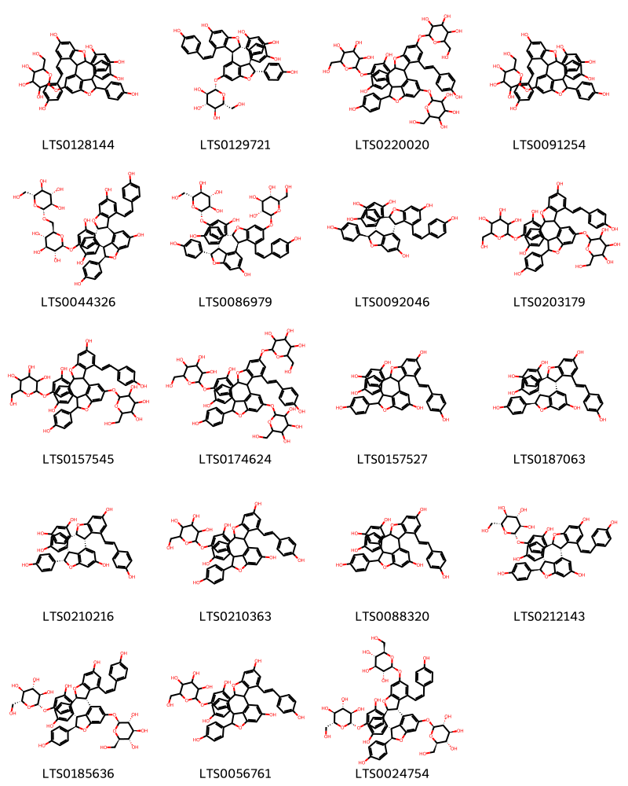{ width=100% }
    <figcaption>Hình ảnh cấu trúc hóa học của 19 hoạt chất thuộc nhóm 2-arylbenzofuran flavonoids gồm ['2-{[3-(3,5-dihydroxyphenyl)-4-[6-hydroxy-2-(4-hydroxyphenyl)-4-[2-(4-hydroxyphenyl)ethenyl]-2,3-dihydro-1-benzofuran-3-yl]-2-(4-hydroxyphenyl)-2,3-dihydro-1-benzofuran-6-yl]oxy}-6-(hydroxymethyl)oxane-3,4,5-triol (LTS0128144)', '(2s,3r,4s,5s,6r)-2-{[(2r,3r)-3-(3,5-dihydroxyphenyl)-4-[(2s,3s)-6-hydroxy-2-(4-hydroxyphenyl)-4-[(1z)-2-(4-hydroxyphenyl)ethenyl]-2,3-dihydro-1-benzofuran-3-yl]-2-(4-hydroxyphenyl)-2,3-dihydro-1-benzofuran-6-yl]oxy}-6-(hydroxymethyl)oxane-3,4,5-triol (LTS0129721)', '2-{3-hydroxy-5-[2-(4-hydroxyphenyl)-4-[2-(4-hydroxyphenyl)-4-[2-(4-hydroxyphenyl)ethenyl]-6-{[3,4,5-trihydroxy-6-(hydroxymethyl)oxan-2-yl]oxy}-2,3-dihydro-1-benzofuran-3-yl]-6-{[3,4,5-trihydroxy-6-(hydroxymethyl)oxan-2-yl]oxy}-2,3-dihydro-1-benzofuran-3-yl]phenoxy}-6-(hydroxymethyl)oxane-3,4,5-triol (LTS0220020)', '2-{[3-(3,5-dihydroxyphenyl)-4-[6-hydroxy-2-(4-hydroxyphenyl)-4-[(1e)-2-(4-hydroxyphenyl)ethenyl]-2,3-dihydro-1-benzofuran-3-yl]-2-(4-hydroxyphenyl)-2,3-dihydro-1-benzofuran-6-yl]oxy}-6-(hydroxymethyl)oxane-3,4,5-triol (LTS0091254)', '(2r,3s,4s,5r,6r)-2-(hydroxymethyl)-6-{[(2r,3s,4s,5r,6s)-3,4,5-trihydroxy-6-{3-hydroxy-5-[(2r,3s)-6-hydroxy-4-[(2r,3r)-6-hydroxy-2-(4-hydroxyphenyl)-4-[(1z)-2-(4-hydroxyphenyl)ethenyl]-2,3-dihydro-1-benzofuran-3-yl]-2-(4-hydroxyphenyl)-2,3-dihydro-1-benzofuran-3-yl]phenoxy}oxan-2-yl]methoxy}oxane-3,4,5-triol (LTS0044326)', '(2s,3r,4s,5s,6r)-2-{3-hydroxy-5-[(2s,3r)-6-hydroxy-2-(4-hydroxyphenyl)-4-[(2r,3r)-2-(4-hydroxyphenyl)-4-[(1z)-2-(4-hydroxyphenyl)ethenyl]-6-{[(2s,3r,4s,5s,6r)-3,4,5-trihydroxy-6-(hydroxymethyl)oxan-2-yl]oxy}-2,3-dihydro-1-benzofuran-3-yl]-2,3-dihydro-1-benzofuran-3-yl]phenoxy}-6-(hydroxymethyl)oxane-3,4,5-triol (LTS0086979)', '5-[(2r,3r)-6-hydroxy-4-[(2s,3s)-6-hydroxy-2-(4-hydroxyphenyl)-4-[(1z)-2-(4-hydroxyphenyl)ethenyl]-2,3-dihydro-1-benzofuran-3-yl]-2-(4-hydroxyphenyl)-2,3-dihydro-1-benzofuran-3-yl]benzene-1,3-diol (LTS0092046)', '2-(3-hydroxy-5-{4-[6-hydroxy-2-(4-hydroxyphenyl)-4-[(1e)-2-(4-hydroxyphenyl)ethenyl]-2,3-dihydro-1-benzofuran-3-yl]-2-(4-hydroxyphenyl)-6-{[3,4,5-trihydroxy-6-(hydroxymethyl)oxan-2-yl]oxy}-2,3-dihydro-1-benzofuran-3-yl}phenoxy)-6-(hydroxymethyl)oxane-3,4,5-triol (LTS0203179)', '2-(3-hydroxy-5-{4-[6-hydroxy-2-(4-hydroxyphenyl)-4-[2-(4-hydroxyphenyl)ethenyl]-2,3-dihydro-1-benzofuran-3-yl]-2-(4-hydroxyphenyl)-6-{[3,4,5-trihydroxy-6-(hydroxymethyl)oxan-2-yl]oxy}-2,3-dihydro-1-benzofuran-3-yl}phenoxy)-6-(hydroxymethyl)oxane-3,4,5-triol (LTS0157545)', '2-{3-hydroxy-5-[2-(4-hydroxyphenyl)-4-[2-(4-hydroxyphenyl)-4-[(1e)-2-(4-hydroxyphenyl)ethenyl]-6-{[3,4,5-trihydroxy-6-(hydroxymethyl)oxan-2-yl]oxy}-2,3-dihydro-1-benzofuran-3-yl]-6-{[3,4,5-trihydroxy-6-(hydroxymethyl)oxan-2-yl]oxy}-2,3-dihydro-1-benzofuran-3-yl]phenoxy}-6-(hydroxymethyl)oxane-3,4,5-triol (LTS0174624)', '5-{6-hydroxy-4-[6-hydroxy-2-(4-hydroxyphenyl)-4-[2-(4-hydroxyphenyl)ethenyl]-2,3-dihydro-1-benzofuran-3-yl]-2-(4-hydroxyphenyl)-2,3-dihydro-1-benzofuran-3-yl}benzene-1,3-diol (LTS0157527)', 'miyabenol c (LTS0187063)', '5-[(2s,3r)-6-hydroxy-4-[(2r,3s)-6-hydroxy-2-(4-hydroxyphenyl)-4-[(1e)-2-(4-hydroxyphenyl)ethenyl]-2,3-dihydro-1-benzofuran-3-yl]-2-(4-hydroxyphenyl)-2,3-dihydro-1-benzofuran-3-yl]benzene-1,3-diol (LTS0210216)', 'foeniculoside i (LTS0210363)', '5-{6-hydroxy-4-[6-hydroxy-2-(4-hydroxyphenyl)-4-[(1e)-2-(4-hydroxyphenyl)ethenyl]-2,3-dihydro-1-benzofuran-3-yl]-2-(4-hydroxyphenyl)-2,3-dihydro-1-benzofuran-3-yl}benzene-1,3-diol (LTS0088320)', '(2s,3r,4s,5s,6r)-2-{3-hydroxy-5-[(2r,3r)-6-hydroxy-4-[(2s,3s)-6-hydroxy-2-(4-hydroxyphenyl)-4-[(1z)-2-(4-hydroxyphenyl)ethenyl]-2,3-dihydro-1-benzofuran-3-yl]-2-(4-hydroxyphenyl)-2,3-dihydro-1-benzofuran-3-yl]phenoxy}-6-(hydroxymethyl)oxane-3,4,5-triol (LTS0212143)', '(2s,3r,4s,5s,6r)-2-{3-hydroxy-5-[(2r,3r)-4-[(2s,3s)-6-hydroxy-2-(4-hydroxyphenyl)-4-[(1z)-2-(4-hydroxyphenyl)ethenyl]-2,3-dihydro-1-benzofuran-3-yl]-2-(4-hydroxyphenyl)-6-{[(2s,3r,4s,5s,6r)-3,4,5-trihydroxy-6-(hydroxymethyl)oxan-2-yl]oxy}-2,3-dihydro-1-benzofuran-3-yl]phenoxy}-6-(hydroxymethyl)oxane-3,4,5-triol (LTS0185636)', 'foeniculoside i (LTS0056761)', '(2s,3r,4s,5s,6r)-2-{3-hydroxy-5-[(2r,3r)-2-(4-hydroxyphenyl)-4-[(2s,3s)-2-(4-hydroxyphenyl)-4-[(1z)-2-(4-hydroxyphenyl)ethenyl]-6-{[(2s,3r,4s,5s,6r)-3,4,5-trihydroxy-6-(hydroxymethyl)oxan-2-yl]oxy}-2,3-dihydro-1-benzofuran-3-yl]-6-{[(2s,3r,4s,5s,6r)-3,4,5-trihydroxy-6-(hydroxymethyl)oxan-2-yl]oxy}-2,3-dihydro-1-benzofuran-3-yl]phenoxy}-6-(hydroxymethyl)oxane-3,4,5-triol (LTS0024754)'].</figcaption>
</figure>
#### Nhóm Azoles
<figure markdown="span">
    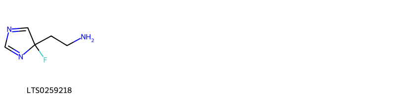{ width=100% }
    <figcaption>Hình ảnh cấu trúc hóa học của 1 hoạt chất thuộc nhóm Azoles gồm ['2-(4-fluoroimidazol-4-yl)ethanamine (LTS0259218)'].</figcaption>
</figure>
#### Nhóm Benzene and substituted derivatives
<figure markdown="span">
    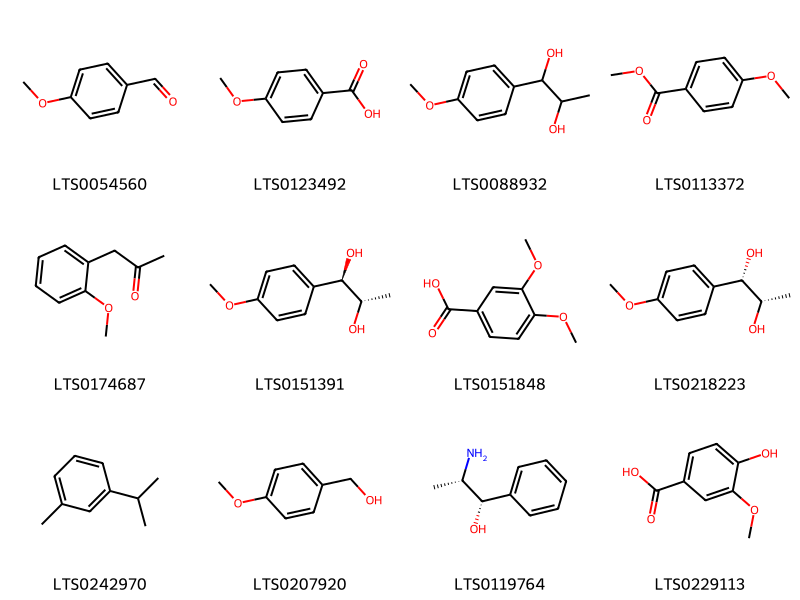{ width=100% }
    <figcaption>Hình ảnh cấu trúc hóa học của 12 hoạt chất thuộc nhóm Benzene and substituted derivatives gồm ['anisaldehyde (LTS0054560)', 'p-anisic acid (LTS0123492)', '1-(4-methoxyphenyl)propane-1,2-diol (LTS0088932)', 'methyl anisate (LTS0113372)', '2-methoxyphenylacetone (LTS0174687)', '(1r,2s)-1-(4-methoxyphenyl)propane-1,2-diol (LTS0151391)', 'veratric acid (LTS0151848)', '(1s,2s)-1-(4-methoxyphenyl)propane-1,2-diol (LTS0218223)', 'm-cymene (LTS0242970)', 'anise alcohol (LTS0207920)', 'cathine (LTS0119764)', 'vanillic acid (LTS0229113)'].</figcaption>
</figure>
#### Nhóm Benzodioxoles
<figure markdown="span">
    { width=100% }
    <figcaption>Hình ảnh cấu trúc hóa học của 1 hoạt chất thuộc nhóm Benzodioxoles gồm ['dillapiol (LTS0226542)'].</figcaption>
</figure>
#### Nhóm Benzofurans
<figure markdown="span">
    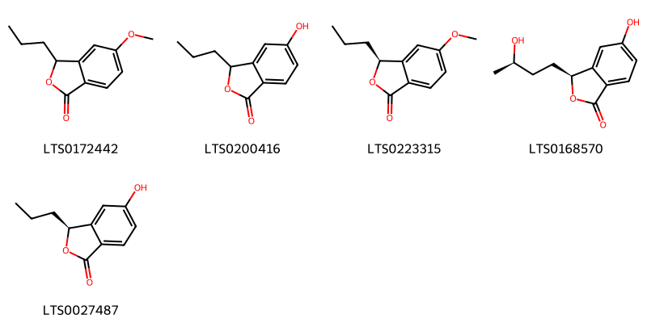{ width=100% }
    <figcaption>Hình ảnh cấu trúc hóa học của 5 hoạt chất thuộc nhóm Benzofurans gồm ['5-methoxy-3-propyl-3h-2-benzofuran-1-one (LTS0172442)', '5-hydroxy-3-propyl-3h-2-benzofuran-1-one (LTS0200416)', '(3s)-5-methoxy-3-propyl-3h-2-benzofuran-1-one (LTS0223315)', '(3s)-5-hydroxy-3-[(3r)-3-hydroxybutyl]-3h-2-benzofuran-1-one (LTS0168570)', '(3s)-5-hydroxy-3-propyl-3h-2-benzofuran-1-one (LTS0027487)'].</figcaption>
</figure>
#### Nhóm Cinnamaldehydes
<figure markdown="span">
    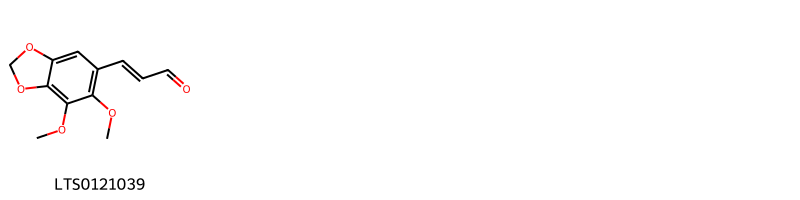{ width=100% }
    <figcaption>Hình ảnh cấu trúc hóa học của 1 hoạt chất thuộc nhóm Cinnamaldehydes gồm ['(2e)-3-(6,7-dimethoxy-2h-1,3-benzodioxol-5-yl)prop-2-enal (LTS0121039)'].</figcaption>
</figure>
#### Nhóm Cinnamic acids and derivatives
<figure markdown="span">
    { width=100% }
    <figcaption>Hình ảnh cấu trúc hóa học của 2 hoạt chất thuộc nhóm Cinnamic acids and derivatives gồm ['3,4-dihydroxycinnamic acid (LTS0128050)', 'caffeic acid (LTS0027481)'].</figcaption>
</figure>
#### Nhóm Coumarins and derivatives
<figure markdown="span">
    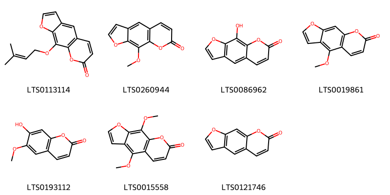{ width=100% }
    <figcaption>Hình ảnh cấu trúc hóa học của 7 hoạt chất thuộc nhóm Coumarins and derivatives gồm ['imperatorin (LTS0113114)', 'methoxsalen (LTS0260944)', 'xanthotoxol (LTS0086962)', 'bergapten (LTS0019861)', 'scopoletin (LTS0193112)', 'isopimpinellin (LTS0015558)', 'psoralen (LTS0121746)'].</figcaption>
</figure>
#### Nhóm Diazines
<figure markdown="span">
    { width=100% }
    <figcaption>Hình ảnh cấu trúc hóa học của 1 hoạt chất thuộc nhóm Diazines gồm ['pirod (LTS0008205)'].</figcaption>
</figure>
#### Nhóm Epoxides
<figure markdown="span">
    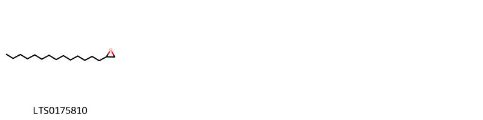{ width=100% }
    <figcaption>Hình ảnh cấu trúc hóa học của 1 hoạt chất thuộc nhóm Epoxides gồm ['1,2-epoxyhexadecane (LTS0175810)'].</figcaption>
</figure>
#### Nhóm Fatty Acyls
<figure markdown="span">
    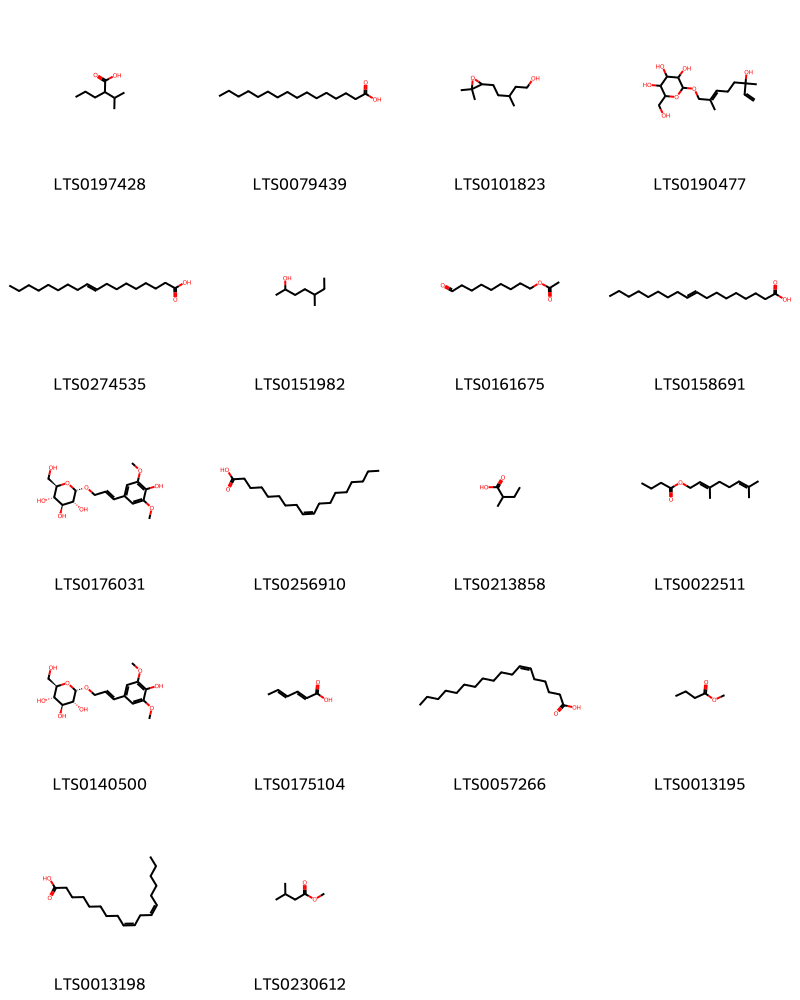{ width=100% }
    <figcaption>Hình ảnh cấu trúc hóa học của 18 hoạt chất thuộc nhóm Fatty Acyls gồm ['2-isopropylpentanoic acid (LTS0197428)', 'palmitic acid (LTS0079439)', '5-(3,3-dimethyloxiran-2-yl)-3-methylpentan-1-ol (LTS0101823)', '2-[(6-hydroxy-2,6-dimethylocta-2,7-dien-1-yl)oxy]-6-(hydroxymethyl)oxane-3,4,5-triol (LTS0190477)', '(+-)-propylene glycol (LTS0274535)', '2-heptanol, 5-methyl- (LTS0151982)', '9-oxononyl acetate (LTS0161675)', '9 octadecenoic acid (LTS0158691)', '(2s,3r,4s,5s,6r)-2-{[3-(4-hydroxy-3,5-dimethoxyphenyl)prop-2-en-1-yl]oxy}-6-(hydroxymethyl)oxane-3,4,5-triol (LTS0176031)', 'oleic acid (LTS0256910)', '2-methylbutanoic acid (LTS0213858)', 'geranyl butyrate (LTS0022511)', '(2s,3r,4s,5s,6r)-2-{[(2e)-3-(4-hydroxy-3,5-dimethoxyphenyl)prop-2-en-1-yl]oxy}-6-(hydroxymethyl)oxane-3,4,5-triol (LTS0140500)', 'sorbic acid (LTS0175104)', 'petroselinic acid (LTS0057266)', 'methyl butyrate (LTS0013195)', 'linoleic (LTS0013198)', 'methyl isovalerate (LTS0230612)'].</figcaption>
</figure>
#### Nhóm Flavonoids
<figure markdown="span">
    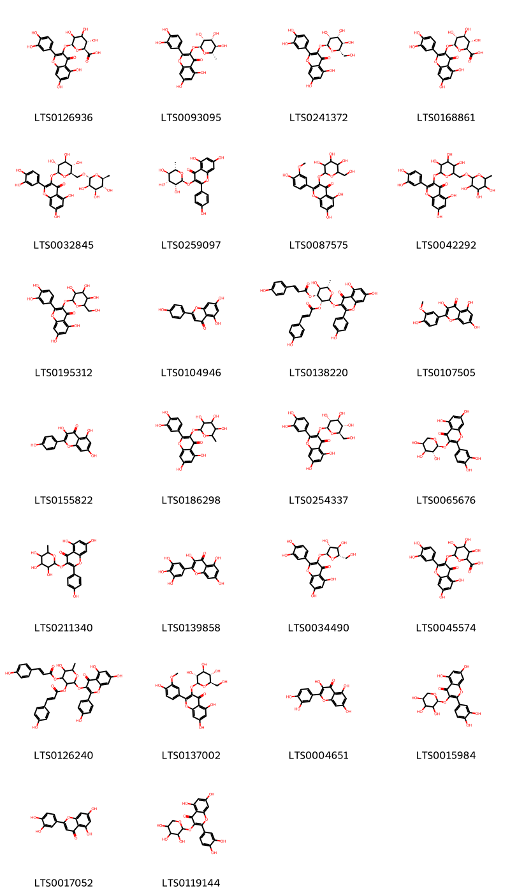{ width=100% }
    <figcaption>Hình ảnh cấu trúc hóa học của 26 hoạt chất thuộc nhóm Flavonoids gồm ['miquelianin (LTS0126936)', 'quercitrin (LTS0093095)', '2-(3,4-dihydroxyphenyl)-5,7-dihydroxy-3-{[(2s,3r,4r,5r,6s)-3,4,5-trihydroxy-6-(hydroxymethyl)oxan-2-yl]oxy}chromen-4-one (LTS0241372)', 'querciturone (LTS0168861)', '3-rutinosyl quercetin (LTS0032845)', 'afzelin (LTS0259097)', 'isorhamnetin 3-galactoside (LTS0087575)', 'rutin (LTS0042292)', '2-(3,4-dihydroxyphenyl)-5,7-dihydroxy-3-{[3,4,5-trihydroxy-6-(hydroxymethyl)oxan-2-yl]oxy}chromen-4-one (LTS0195312)', 'chamomile (LTS0104946)', '(2s,3r,4r,5s,6s)-2-{[5,7-dihydroxy-2-(4-hydroxyphenyl)-4-oxochromen-3-yl]oxy}-5-hydroxy-4-{[(2e)-3-(4-hydroxyphenyl)prop-2-enoyl]oxy}-6-methyloxan-3-yl (2e)-3-(4-hydroxyphenyl)prop-2-enoate (LTS0138220)', 'isorhamnetin (LTS0107505)', 'kaempherol (LTS0155822)', 'quercitrin (LTS0186298)', 'isoquercetin (LTS0254337)', 'guaijaverin (LTS0065676)', '5,7-dihydroxy-2-(4-hydroxyphenyl)-3-[(3,4,5-trihydroxy-6-methyloxan-2-yl)oxy]chromen-4-one (LTS0211340)', 'myricetin (LTS0139858)', 'avicularin (LTS0034490)', 'miquelianin (LTS0045574)', '2-{[5,7-dihydroxy-2-(4-hydroxyphenyl)-4-oxochromen-3-yl]oxy}-5-hydroxy-4-{[3-(4-hydroxyphenyl)prop-2-enoyl]oxy}-6-methyloxan-3-yl 3-(4-hydroxyphenyl)prop-2-enoate (LTS0126240)', 'isorhamnetin 3-o-glucoside (LTS0137002)', 'quercetin (LTS0004651)', 'guaijaverin (LTS0015984)', 'luteolin (LTS0017052)', 'guaijaverin (LTS0119144)'].</figcaption>
</figure>
#### Nhóm Hydroxy acids and derivatives
<figure markdown="span">
    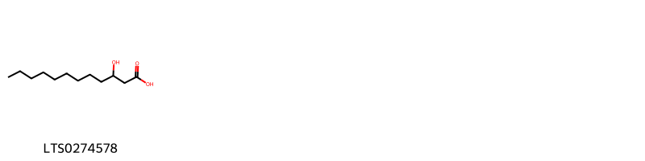{ width=100% }
    <figcaption>Hình ảnh cấu trúc hóa học của 1 hoạt chất thuộc nhóm Hydroxy acids and derivatives gồm ['3-hydroxydodecanoic acid (LTS0274578)'].</figcaption>
</figure>
#### Nhóm Organonitrogen compounds
<figure markdown="span">
    { width=100% }
    <figcaption>Hình ảnh cấu trúc hóa học của 2 hoạt chất thuộc nhóm Organonitrogen compounds gồm ['choline (LTS0170307)', 'acetylcholine (LTS0185507)'].</figcaption>
</figure>
#### Nhóm Organooxygen compounds
<figure markdown="span">
    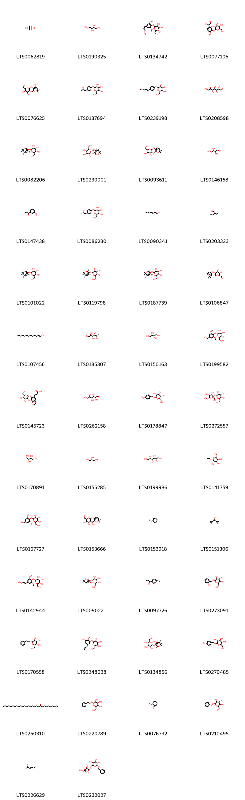{ width=100% }
    <figcaption>Hình ảnh cấu trúc hóa học của 81 hoạt chất thuộc nhóm Organooxygen compounds gồm ['pinacol (LTS0062819)', '(2r,3s)-pentane-1,2,3,5-tetrol (LTS0190325)', '2-{2,6-dimethoxy-4-[(1z)-3-methoxyprop-1-en-1-yl]phenoxy}-6-(hydroxymethyl)oxane-3,4,5-triol (LTS0134742)', '2-[5-(1,2-dihydroxyethyl)-2-methoxyphenoxy]-6-(hydroxymethyl)oxane-3,4,5-triol (LTS0077105)', '2-({8-hydroxy-1,3,3-trimethyl-2-oxabicyclo[2.2.2]octan-6-yl}oxy)-6-(hydroxymethyl)oxane-3,4,5-triol (LTS0076625)', '2-(hydroxymethyl)-6-[4-(2-hydroxypropyl)phenoxy]oxane-3,4,5-triol (LTS0137694)', '2-(hydroxymethyl)-6-[4-(3-methoxyprop-1-en-1-yl)phenoxy]oxane-3,4,5-triol (LTS0239198)', 'mannoheptulose (LTS0208598)', '(2s,3r,4s,5s,6r)-2-{[(1s,4r,6r,7s)-7-hydroxy-1,3,3-trimethyl-2-oxabicyclo[2.2.2]octan-6-yl]oxy}-6-(hydroxymethyl)oxane-3,4,5-triol (LTS0082206)', '(2s,3r,4s,5s,6r)-2-{[(1s,4s,6s,8r)-8-hydroxy-1,3,3-trimethyl-2-oxabicyclo[2.2.2]octan-6-yl]oxy}-6-(hydroxymethyl)oxane-3,4,5-triol (LTS0230001)', '2-(hydroxymethyl)-6-({1,3,3-trimethyl-2-oxabicyclo[2.2.2]octan-6-yl}oxy)oxane-3,4,5-triol (LTS0093611)', '(-)-threitol (LTS0146158)', '1-(3-methoxyphenyl)propan-1-one (LTS0147438)', '(2r,3s,4s,5r,6s)-2-(hydroxymethyl)-6-{4-[(2s)-2-hydroxypropyl]phenoxy}oxane-3,4,5-triol (LTS0086280)', 'hepta-1,3-dien-1-ol (LTS0090341)', '2-butenal, 2-ethyl- (LTS0203323)', '(2r,3s,4s,5r,6s)-2-(hydroxymethyl)-6-{[(1s,4r,6r)-1,3,3-trimethyl-2-oxabicyclo[2.2.2]octan-6-yl]oxy}oxane-3,4,5-triol (LTS0101022)', '(2r,3s,4s,5r,6s)-2-(hydroxymethyl)-6-{[(1r,4s,6r)-1,3,3-trimethyl-2-oxabicyclo[2.2.2]octan-6-yl]oxy}oxane-3,4,5-triol (LTS0119798)', '(2r,3s,4s,5r,6s)-2-(hydroxymethyl)-6-{[(1s,4r,6s)-1,3,3-trimethyl-2-oxabicyclo[2.2.2]octan-6-yl]oxy}oxane-3,4,5-triol (LTS0187739)', '(2r,3s,4s,5r,6s)-2-(hydroxymethyl)-6-{[(1r,4r)-1,3,3-trimethyl-2-oxabicyclo[2.2.2]octan-4-yl]oxy}oxane-3,4,5-triol (LTS0106847)', '(1e)-tridec-1-en-1-ol (LTS0107456)', '(2r,3r,4r,5s)-hexane-1,2,3,4,5-pentol (LTS0185307)', 'meso-erythritol (LTS0150163)', '(2r,3s,4s,5r,6s)-2-(hydroxymethyl)-6-[4-(hydroxymethyl)-2,6-dimethoxyphenoxy]oxane-3,4,5-triol (LTS0199582)', '3-(6-{[(2s,3r,4s,5s,6r)-3,4,5-trihydroxy-6-(hydroxymethyl)oxan-2-yl]oxy}-1-benzofuran-5-yl)propanoic acid (LTS0145723)', '(+)-glucose (LTS0262158)', '(2r,3s,4s,5r,6r)-2-(hydroxymethyl)-6-[(4-methoxyphenyl)methoxy]oxane-3,4,5-triol (LTS0178847)', 'sucrose (LTS0272557)', '(2r,3r,4s)-pentane-1,2,3,4-tetrol (LTS0170891)', 'glycerol (LTS0155285)', 'mannitol (LTS0199986)', 'ethyl glucoside (LTS0141759)', '2-(hydroxymethyl)-6-[4-(hydroxymethyl)-2,6-dimethoxyphenoxy]oxane-3,4,5-triol (LTS0167727)', '2-(hydroxymethyl)-6-{[1-(hydroxymethyl)-3,3-dimethyl-2-oxabicyclo[2.2.2]octan-6-yl]oxy}oxane-3,4,5-triol (LTS0153666)', '1-methoxycyclohex-1-ene (LTS0153918)', 'dicyclopropyl carbinol (LTS0151306)', '(2s,3r,4s,5s,6r)-2-{2,6-dimethoxy-4-[(1e)-3-methoxyprop-1-en-1-yl]phenoxy}-6-(hydroxymethyl)oxane-3,4,5-triol (LTS0142944)', '(2s,3r,4s,5s,6r)-2-{[(1r,4s,6s,7r)-7-hydroxy-1,3,3-trimethyl-2-oxabicyclo[2.2.2]octan-6-yl]oxy}-6-(hydroxymethyl)oxane-3,4,5-triol (LTS0090221)', 'p-methoxypropiophenone (LTS0097726)', '2-(hydroxymethyl)-6-[(2-hydroxyphenyl)methoxy]oxane-3,4,5-triol (LTS0273091)', '(2r,3s,4s,5r,6r)-2-(hydroxymethyl)-6-(2-phenylethoxy)oxane-3,4,5-triol (LTS0170558)', '2-[3-hydroxy-2-methoxy-5-(prop-2-en-1-yl)phenoxy]-6-(hydroxymethyl)oxane-3,4,5-triol (LTS0248038)', '(2s,3r,4s,5s,6r)-2-{[(1s,4s,6r,8r)-8-hydroxy-1,3,3-trimethyl-2-oxabicyclo[2.2.2]octan-6-yl]oxy}-6-(hydroxymethyl)oxane-3,4,5-triol (LTS0134856)', '2-(hydroxymethyl)-6-[(4-methoxyphenyl)methoxy]oxane-3,4,5-triol (LTS0270485)', 'ginnone (LTS0250310)', '2-(hydroxymethyl)-6-(2-phenylethoxy)oxane-3,4,5-triol (LTS0220789)', '2-methoxycyclohexan-1-one (LTS0076732)', 'benzyl glucopyranoside (LTS0210495)', '3-hexen-2-one (LTS0226629)', '2-(benzyloxy)-6-({[3,4-dihydroxy-4-(hydroxymethyl)oxolan-2-yl]oxy}methyl)oxane-3,4,5-triol (LTS0232027)', '2-(hydroxymethyl)-6-[4-(3-hydroxyprop-1-en-1-yl)-2,6-dimethoxyphenoxy]oxane-3,4,5-triol (LTS0188912)', '2-pentenal, 2-methyl- (LTS0184149)', 'keto-d-fructose (LTS0241114)', 'chlorogenic acid (LTS0226495)', 'p-methoxyacetophenone (LTS0040648)', 'benzyl β-d-glucoside (LTS0184698)', '(2s,3r,4s,5s,6r)-2-[3-hydroxy-2-methoxy-5-(prop-2-en-1-yl)phenoxy]-6-(hydroxymethyl)oxane-3,4,5-triol (LTS0202484)', '2-{[2-(benzyloxy)-4,5-dihydroxy-6-(hydroxymethyl)oxan-3-yl]oxy}-6-(hydroxymethyl)oxane-3,4,5-triol (LTS0164574)', 'pentane-1,2,3,4-tetrol (LTS0255838)', '3-methyl-2-cyclopenten-1-one (LTS0242576)', '3-methylcyclohexanol (LTS0058950)', '(2r,3s,4s,5r,6s)-2-(hydroxymethyl)-6-{4-[(1e)-3-methoxyprop-1-en-1-yl]phenoxy}oxane-3,4,5-triol (LTS0010495)', 'glucose (LTS0013597)', '(s)-(-)-2-methyl-1-butanol (LTS0028766)', '(2r,3s,4s,5r,6r)-2-(hydroxymethyl)-6-[(2-hydroxyphenyl)methoxy]oxane-3,4,5-triol (LTS0275578)', 'methional (LTS0054613)', '(2r,3s,4s,5r,6s)-2-(hydroxymethyl)-6-{[(1s,4s,6s)-1-(hydroxymethyl)-3,3-dimethyl-2-oxabicyclo[2.2.2]octan-6-yl]oxy}oxane-3,4,5-triol (LTS0028421)', '(2r,3r,5r,6r)-2-(benzyloxy)-6-(hydroxymethyl)oxane-3,4,5-triol (LTS0007372)', '2-({7-hydroxy-1,3,3-trimethyl-2-oxabicyclo[2.2.2]octan-6-yl}oxy)-6-(hydroxymethyl)oxane-3,4,5-triol (LTS0233400)', '(2r,3r)-butane-1,2,3-triol (LTS0105148)', '(2s,3r,4s,5r,6s)-2-(hydroxymethyl)-6-{4-[(1e)-3-hydroxyprop-1-en-1-yl]-2,6-dimethoxyphenoxy}oxane-3,4,5-triol (LTS0208391)', 'prenol (LTS0257971)', 'zizybeoside i (LTS0023739)', '2-[2,6-dimethoxy-4-(3-methoxyprop-1-en-1-yl)phenoxy]-6-(hydroxymethyl)oxane-3,4,5-triol (LTS0268947)', '(2r,3s,4s,5r,6s)-2-(hydroxymethyl)-6-{[(1r,4s,6s)-1,3,3-trimethyl-2-oxabicyclo[2.2.2]octan-6-yl]oxy}oxane-3,4,5-triol (LTS0112986)', '(2s,3r,4s,5s,6r)-2-{5-[(1r)-1,2-dihydroxyethyl]-2-methoxyphenoxy}-6-(hydroxymethyl)oxane-3,4,5-triol (LTS0049458)', '4-methylbicyclo[3.1.1]hept-3-en-2-ol (LTS0120009)', 'isoamyl alcohol (LTS0112297)', '(2r,3r,4s,5s,6r)-2-(benzyloxy)-6-({[(2r,3r,4r)-3,4-dihydroxy-4-(hydroxymethyl)oxolan-2-yl]oxy}methyl)oxane-3,4,5-triol (LTS0041825)', 'd-fructopyranose (LTS0259277)', 'syringin (LTS0046227)'].</figcaption>
</figure>
#### Nhóm Oxanes
<figure markdown="span">
    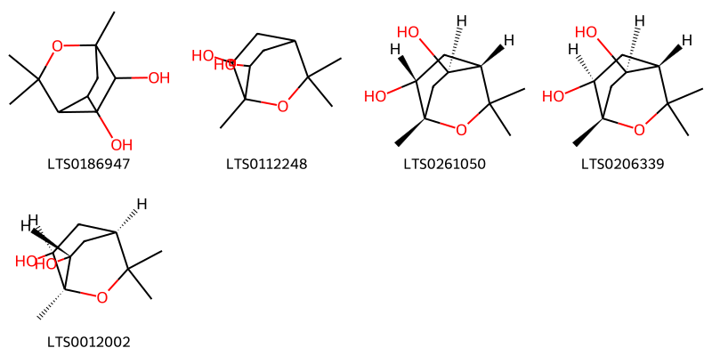{ width=100% }
    <figcaption>Hình ảnh cấu trúc hóa học của 5 hoạt chất thuộc nhóm Oxanes gồm ['1,3,3-trimethyl-2-oxabicyclo[2.2.2]octane-5,7-diol (LTS0186947)', 'epomediol (LTS0112248)', '(1s,4s,5r,7r)-1,3,3-trimethyl-2-oxabicyclo[2.2.2]octane-5,7-diol (LTS0261050)', '(1s,4s,5r,7s)-1,3,3-trimethyl-2-oxabicyclo[2.2.2]octane-5,7-diol (LTS0206339)', '(1s,4r,6r,7s)-1,3,3-trimethyl-2-oxabicyclo[2.2.2]octane-6,7-diol (LTS0012002)'].</figcaption>
</figure>
#### Nhóm Oxepanes
<figure markdown="span">
    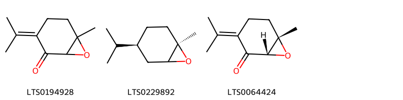{ width=100% }
    <figcaption>Hình ảnh cấu trúc hóa học của 3 hoạt chất thuộc nhóm Oxepanes gồm ['6-methyl-3-(propan-2-ylidene)-7-oxabicyclo[4.1.0]heptan-2-one (LTS0194928)', '(1r,4s)-4-isopropyl-1-methyl-7-oxabicyclo[4.1.0]heptane (LTS0229892)', 'piperitenone oxide (LTS0064424)'].</figcaption>
</figure>
#### Nhóm Phenol esters
<figure markdown="span">
    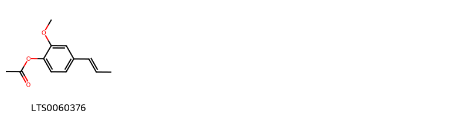{ width=100% }
    <figcaption>Hình ảnh cấu trúc hóa học của 1 hoạt chất thuộc nhóm Phenol esters gồm ['2-methoxy-4-(prop-1-en-1-yl)phenyl acetate (LTS0060376)'].</figcaption>
</figure>
#### Nhóm Phenol ethers
<figure markdown="span">
    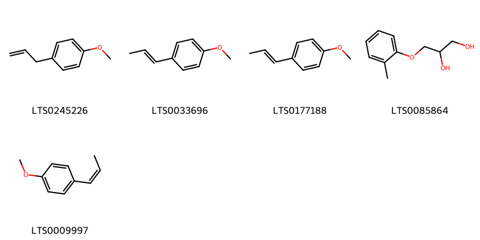{ width=100% }
    <figcaption>Hình ảnh cấu trúc hóa học của 5 hoạt chất thuộc nhóm Phenol ethers gồm ['tarragon (LTS0245226)', 'anethole (LTS0033696)', 'p-propenylanisole (LTS0177188)', 'mephenesin (LTS0085864)', '(e)-anethole (LTS0009997)'].</figcaption>
</figure>
#### Nhóm Phenols
<figure markdown="span">
    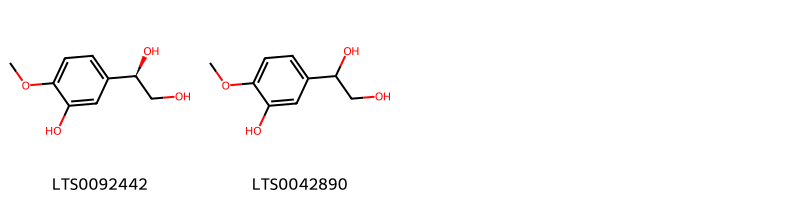{ width=100% }
    <figcaption>Hình ảnh cấu trúc hóa học của 2 hoạt chất thuộc nhóm Phenols gồm ['(1r)-1-(3-hydroxy-4-methoxyphenyl)ethane-1,2-diol (LTS0092442)', '1-(3-hydroxy-4-methoxyphenyl)ethane-1,2-diol (LTS0042890)'].</figcaption>
</figure>
#### Nhóm Polycyclic hydrocarbons
<figure markdown="span">
    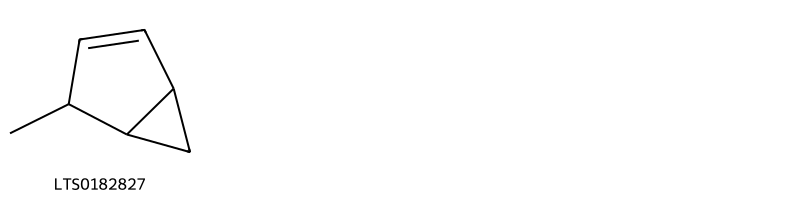{ width=100% }
    <figcaption>Hình ảnh cấu trúc hóa học của 1 hoạt chất thuộc nhóm Polycyclic hydrocarbons gồm ['4-methylbicyclo[3.1.0]hex-2-ene (LTS0182827)'].</figcaption>
</figure>
#### Nhóm Prenol lipids
<figure markdown="span">
    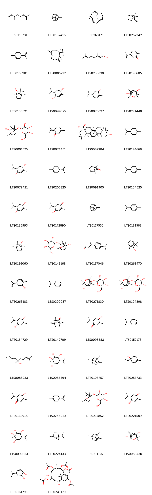{ width=100% }
    <figcaption>Hình ảnh cấu trúc hóa học của 73 hoạt chất thuộc nhóm Prenol lipids gồm ['α-myrcene (LTS0115731)', 'α pinene (LTS0132416)', 'humulene (LTS0263171)', 'camphene (LTS0267242)', 'limonene,  (LTS0155981)', 'caryophyllene (LTS0085212)', 'geraniol (LTS0258838)', 'carvone (LTS0196605)', '(1r,2r,4s)-1,3,3-trimethylbicyclo[2.2.1]heptan-2-ol (LTS0130521)', '(1r,4r,5r)-5-isopropyl-2-methylcyclohex-2-ene-1,4-diol (LTS0044375)', '5-isopropyl-2-methylcyclohex-2-en-1-one (LTS0076097)', '(1r,4r,6r)-1,3,3-trimethyl-2-oxabicyclo[2.2.2]octane-4,6-diol (LTS0221448)', '2-({6-hydroxy-1,3,3-trimethyl-2-oxabicyclo[2.2.2]octan-4-yl}oxy)-6-(hydroxymethyl)oxane-3,4,5-triol (LTS0091675)', 'piperitenone (LTS0074451)', '(4as,6as,6br,8as,10s,12ar,12bs,14br)-10-hydroxy-2,2,6a,6b,9,9,12a-heptamethyl-1,3,4,5,6,7,8,8a,10,11,12,12b,13,14b-tetradecahydropicene-4a-carboxylic acid (LTS0087204)', 'β phellandrene (LTS0124668)', '(4s,6r)-4-hydroxy-6-isopropyl-3-methylcyclohex-2-en-1-one (LTS0079421)', '(-)-limonene (LTS0205325)', 'camphor (LTS0091905)', 'terpinolene (LTS0104525)', '(4r,6r)-4-hydroxy-6-isopropyl-3-methylcyclohex-2-en-1-one (LTS0185993)', '(4s,5r)-4-hydroxy-5-isopropyl-2-methylcyclohex-2-en-1-one (LTS0172890)', 'β-pinene (LTS0117550)', 'cymene (LTS0181568)', 'fenchyl alcohol (LTS0136060)', '2-({4-hydroxy-1,3,3-trimethyl-2-oxabicyclo[2.2.2]octan-6-yl}oxy)-6-(hydroxymethyl)oxane-3,4,5-triol (LTS0143168)', 'cyclamen aldehyde (LTS0117046)', 'fenchol (LTS0261470)', 'carveol (LTS0263183)', 'carvomethene (LTS0200037)', '(2s,3r,4s,5s,6r)-2-{[(1s,4s,6r)-4-hydroxy-1,3,3-trimethyl-2-oxabicyclo[2.2.2]octan-6-yl]oxy}-6-(hydroxymethyl)oxane-3,4,5-triol (LTS0271830)', '(2s,3r,4s,5s,6r)-2-{[(1s,4s,6s)-4-hydroxy-1,3,3-trimethyl-2-oxabicyclo[2.2.2]octan-6-yl]oxy}-6-(hydroxymethyl)oxane-3,4,5-triol (LTS0124898)', '(4r,5r)-4-hydroxy-5-isopropyl-2-methylcyclohex-2-en-1-one (LTS0154729)', '(-)-fenchone (LTS0149709)', '(4r,6s)-4-hydroxy-6-isopropyl-3-methylcyclohex-2-en-1-one (LTS0098583)', 'phellandrene (LTS0157173)', '5,9-dimethyldeca-3,8-dien-5-ol (LTS0088233)', '(1s,2r,3s,4r,5r)-5-isopropyl-2-methylcyclohexane-1,2,3,4-tetrol (LTS0086394)', '(-)-β-pinene (LTS0108757)', '4-terpineol (LTS0253733)', '4-hydroxy-6-isopropyl-3-methylcyclohex-2-en-1-one (LTS0163918)', 'α-limonene (LTS0244943)', '2-(hydroxymethyl)-6-({1,3,3-trimethyl-2-oxabicyclo[2.2.2]octan-4-yl}oxy)oxane-3,4,5-triol (LTS0217852)', '(4s,5s)-4-hydroxy-5-isopropyl-2-methylcyclohex-2-en-1-one (LTS0221589)', '5-isopropyl-2-methylcyclohexane-1,2,3,4-tetrol (LTS0090353)', 'sabinene (LTS0224133)', '(+)-α-pinene (LTS0211102)', '(1s,4s,6r)-1,3,3-trimethyl-2-oxabicyclo[2.2.2]octane-4,6-diol (LTS0083430)', '(1r,2r,5s)-5-isopropyl-2-methylcyclohex-3-ene-1,2-diol (LTS0161796)', '[(1r,2r,3z,5s,7s,8e,10r,13s)-7,9,10,13-tetrakis(acetyloxy)-2,5-dihydroxy-8,12,15,15-tetramethylbicyclo[9.3.1]pentadeca-3,8,11-trien-4-yl]methyl acetate (LTS0241170)', '(4r,5s)-4-hydroxy-5-isopropyl-2-methylcyclohex-2-en-1-one (LTS0010038)', '(4s,6s)-4-hydroxy-6-isopropyl-3-methylcyclohex-2-en-1-one (LTS0234203)', '5-isopropyl-2-methylcyclohex-2-en-1-ol (LTS0178482)', '2-isopropyl-5-methylbenzene-1,4-diol (LTS0159739)', '(2s,3r,4s,5s,6r)-2-{[(1r,4r,6r)-6-hydroxy-1,3,3-trimethyl-2-oxabicyclo[2.2.2]octan-4-yl]oxy}-6-(hydroxymethyl)oxane-3,4,5-triol (LTS0035117)', 'oleanolic acid (LTS0141130)', '(1s,4r,5r)-5-isopropyl-2-methylcyclohex-2-ene-1,4-diol (LTS0031219)', 'γ-tocotrienol (LTS0240143)', '4-hydroxy-5-isopropyl-2-methylcyclohex-2-en-1-one (LTS0052817)', 'β-ocimene (LTS0242381)', '(+)-fenchone (LTS0191800)', '(-)-trans-carveol (LTS0156471)', '5-isopropyl-2-methylcyclohex-3-ene-1,2-diol (LTS0180952)', '(1s,2s,4s,5r)-5-isopropyl-2-methylcyclohexane-1,2,4-triol (LTS0045973)', '1,3,3-trimethyl-2-oxabicyclo[2.2.2]octane-4,6-diol (LTS0000771)', '(z)-α-ocimene (LTS0067708)', '5-isopropyl-2-methylcyclohex-2-ene-1,4-diol (LTS0065297)', 'fenchone (LTS0126716)', 'fenchyl acetate (LTS0020694)', '(2s,3r,4s,5s,6r)-2-{[(1r,4r,6r)-4-hydroxy-1,3,3-trimethyl-2-oxabicyclo[2.2.2]octan-6-yl]oxy}-6-(hydroxymethyl)oxane-3,4,5-triol (LTS0089480)', 'citronellol, (+-)- (LTS0090925)', 'carvone, (+)- (LTS0027671)', 'oleanolic acid (LTS0117717)'].</figcaption>
</figure>
#### Nhóm Purine nucleosides
<figure markdown="span">
    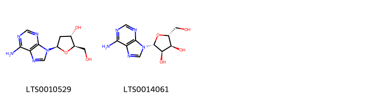{ width=100% }
    <figcaption>Hình ảnh cấu trúc hóa học của 2 hoạt chất thuộc nhóm Purine nucleosides gồm ['2-deoxyadenosine (LTS0010529)', 'adenosine (LTS0014061)'].</figcaption>
</figure>
#### Nhóm Pyrimidine nucleosides
<figure markdown="span">
    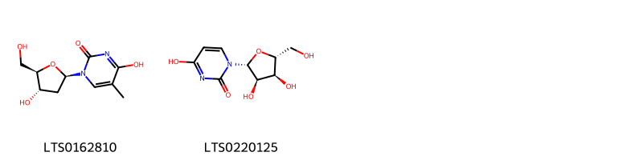{ width=100% }
    <figcaption>Hình ảnh cấu trúc hóa học của 2 hoạt chất thuộc nhóm Pyrimidine nucleosides gồm ['thymidine (LTS0162810)', 'uridine (LTS0220125)'].</figcaption>
</figure>
#### Nhóm Steroids and steroid derivatives
<figure markdown="span">
    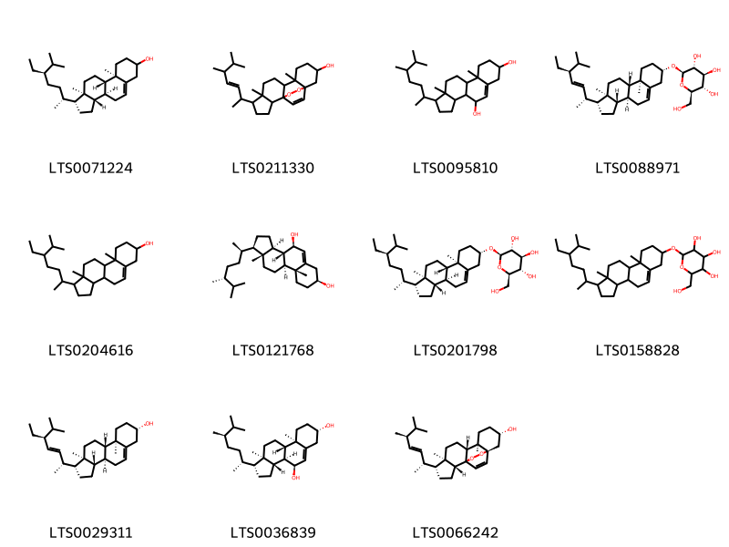{ width=100% }
    <figcaption>Hình ảnh cấu trúc hóa học của 11 hoạt chất thuộc nhóm Steroids and steroid derivatives gồm ['stigmast-5-en-3-ol (LTS0071224)', '5-(5,6-dimethylhept-3-en-2-yl)-6,10-dimethyl-16,17-dioxapentacyclo[13.2.2.0¹,⁹.0²,⁶.0¹⁰,¹⁵]nonadec-18-en-13-ol (LTS0211330)', '1-(5,6-dimethylheptan-2-yl)-9a,11a-dimethyl-1h,2h,3h,3ah,3bh,4h,6h,7h,8h,9h,9bh,10h,11h-cyclopenta[a]phenanthrene-4,7-diol (LTS0095810)', '(2r,3r,4s,5s,6r)-2-{[(1r,3as,3bs,7s,9ar,9bs,11ar)-1-[(2r,3e,5s)-5-ethyl-6-methylhept-3-en-2-yl]-9a,11a-dimethyl-1h,2h,3h,3ah,3bh,4h,6h,7h,8h,9h,9bh,10h,11h-cyclopenta[a]phenanthren-7-yl]oxy}-6-(hydroxymethyl)oxane-3,4,5-triol (LTS0088971)', 'stigmast-5-en-3-ol, (3β)- (LTS0204616)', '(1r,3as,3bs,4r,7s,9ar,9bs,11ar)-1-[(2r,5r)-5,6-dimethylheptan-2-yl]-9a,11a-dimethyl-1h,2h,3h,3ah,3bh,4h,6h,7h,8h,9h,9bh,10h,11h-cyclopenta[a]phenanthrene-4,7-diol (LTS0121768)', 'sitogluside (LTS0201798)', '2-{[1-(5-ethyl-6-methylheptan-2-yl)-9a,11a-dimethyl-1h,2h,3h,3ah,3bh,4h,6h,7h,8h,9h,9bh,10h,11h-cyclopenta[a]phenanthren-7-yl]oxy}-6-(hydroxymethyl)oxane-3,4,5-triol (LTS0158828)', 'phytosterol (LTS0029311)', '7α-hydroxycampesterol (LTS0036839)', '(1s,2r,5r,6r,9r,10r,13s,15s)-5-[(2r,3e,5s)-5,6-dimethylhept-3-en-2-yl]-6,10-dimethyl-16,17-dioxapentacyclo[13.2.2.0¹,⁹.0²,⁶.0¹⁰,¹⁵]nonadec-18-en-13-ol (LTS0066242)'].</figcaption>
</figure>
#### Nhóm Stilbenes
<figure markdown="span">
    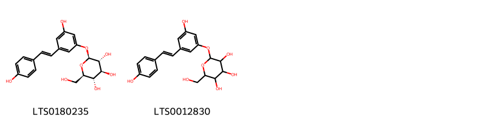{ width=100% }
    <figcaption>Hình ảnh cấu trúc hóa học của 2 hoạt chất thuộc nhóm Stilbenes gồm ['piceid (LTS0180235)', '2-{3-hydroxy-5-[2-(4-hydroxyphenyl)ethenyl]phenoxy}-6-(hydroxymethyl)oxane-3,4,5-triol (LTS0012830)'].</figcaption>
</figure>
#### Nhóm Tannins
<figure markdown="span">
    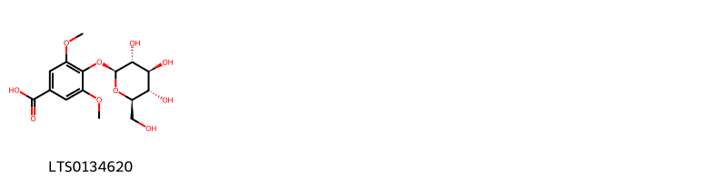{ width=100% }
    <figcaption>Hình ảnh cấu trúc hóa học của 1 hoạt chất thuộc nhóm Tannins gồm ['3,5-dimethoxy-4-{[(2s,3r,4s,5s,6r)-3,4,5-trihydroxy-6-(hydroxymethyl)oxan-2-yl]oxy}benzoic acid (LTS0134620)'].</figcaption>
</figure>
#### Nhóm Unsaturated hydrocarbons
<figure markdown="span">
    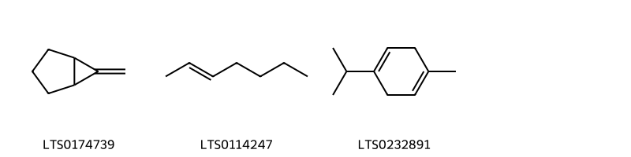{ width=100% }
    <figcaption>Hình ảnh cấu trúc hóa học của 3 hoạt chất thuộc nhóm Unsaturated hydrocarbons gồm ['6-methylidenebicyclo[3.1.0]hexane (LTS0174739)', '2-heptene (LTS0114247)', 'α terpinene (LTS0232891)'].</figcaption>
</figure>

---

### Dược dân tộc học

Danh sách các quốc gia có sử dụng *Foeniculum vulgare* trong điều trị các bệnh. 

| Country            | Disease                                                                                                                            | Bệnh                                                                                                                                                                                                |
|:-------------------|:-----------------------------------------------------------------------------------------------------------------------------------|:----------------------------------------------------------------------------------------------------------------------------------------------------------------------------------------------------|
| China              | Carminative, Expectorant, Aphrodisiac, Carminative, Carminative, Digestive, Stomachic, Tonic, Tonic                                | MYMEMORY WARNING: YOU USED ALL AVAILABLE FREE TRANSLATIONS FOR TODAY. NEXT AVAILABLE IN  08 HOURS 18 MINUTES 38 SECONDS VISIT HTTPS://MYMEMORY.TRANSLATED.NET/DOC/USAGELIMITS.PHP TO TRANSLATE MORE |
| Dominican Republic | Diuretic, Stimulant, Stomachic, Cardiotonic                                                                                        | MYMEMORY WARNING: YOU USED ALL AVAILABLE FREE TRANSLATIONS FOR TODAY. NEXT AVAILABLE IN  08 HOURS 18 MINUTES 36 SECONDS VISIT HTTPS://MYMEMORY.TRANSLATED.NET/DOC/USAGELIMITS.PHP TO TRANSLATE MORE |
| Elsewhere          | Abortifacient, Carminative, Carminative, Lactagogue, Stimulant, Stimulant, Stomachic, Stomachic, Vermicide, Diaphoretic, Stomachic | MYMEMORY WARNING: YOU USED ALL AVAILABLE FREE TRANSLATIONS FOR TODAY. NEXT AVAILABLE IN  08 HOURS 18 MINUTES 33 SECONDS VISIT HTTPS://MYMEMORY.TRANSLATED.NET/DOC/USAGELIMITS.PHP TO TRANSLATE MORE |
| France             | Diuretic                                                                                                                           | MYMEMORY WARNING: YOU USED ALL AVAILABLE FREE TRANSLATIONS FOR TODAY. NEXT AVAILABLE IN  08 HOURS 18 MINUTES 31 SECONDS VISIT HTTPS://MYMEMORY.TRANSLATED.NET/DOC/USAGELIMITS.PHP TO TRANSLATE MORE |
| Haiti              | Carminative, Diuretic, Emmenagogue                                                                                                 | MYMEMORY WARNING: YOU USED ALL AVAILABLE FREE TRANSLATIONS FOR TODAY. NEXT AVAILABLE IN  08 HOURS 18 MINUTES 28 SECONDS VISIT HTTPS://MYMEMORY.TRANSLATED.NET/DOC/USAGELIMITS.PHP TO TRANSLATE MORE |
| Iraq               | Carminative, Stimulant                                                                                                             | MYMEMORY WARNING: YOU USED ALL AVAILABLE FREE TRANSLATIONS FOR TODAY. NEXT AVAILABLE IN  08 HOURS 18 MINUTES 26 SECONDS VISIT HTTPS://MYMEMORY.TRANSLATED.NET/DOC/USAGELIMITS.PHP TO TRANSLATE MORE |
| Japan*             | Expectorant, Stomachic                                                                                                             | MYMEMORY WARNING: YOU USED ALL AVAILABLE FREE TRANSLATIONS FOR TODAY. NEXT AVAILABLE IN  08 HOURS 18 MINUTES 24 SECONDS VISIT HTTPS://MYMEMORY.TRANSLATED.NET/DOC/USAGELIMITS.PHP TO TRANSLATE MORE |
| Kurdistan          | Tonic                                                                                                                              | MYMEMORY WARNING: YOU USED ALL AVAILABLE FREE TRANSLATIONS FOR TODAY. NEXT AVAILABLE IN  08 HOURS 18 MINUTES 21 SECONDS VISIT HTTPS://MYMEMORY.TRANSLATED.NET/DOC/USAGELIMITS.PHP TO TRANSLATE MORE |
| Mexico             | Carminative                                                                                                                        | MYMEMORY WARNING: YOU USED ALL AVAILABLE FREE TRANSLATIONS FOR TODAY. NEXT AVAILABLE IN  08 HOURS 18 MINUTES 19 SECONDS VISIT HTTPS://MYMEMORY.TRANSLATED.NET/DOC/USAGELIMITS.PHP TO TRANSLATE MORE |
| Turkey             | Carminative, Digestive, Expectorant, Parasiticide, Stimulant, Stomachic, Diuretic, Emmenagogue                                     | MYMEMORY WARNING: YOU USED ALL AVAILABLE FREE TRANSLATIONS FOR TODAY. NEXT AVAILABLE IN  08 HOURS 18 MINUTES 17 SECONDS VISIT HTTPS://MYMEMORY.TRANSLATED.NET/DOC/USAGELIMITS.PHP TO TRANSLATE MORE |
| Venezuela          | Tonic, Stomachic                                                                                                                   | MYMEMORY WARNING: YOU USED ALL AVAILABLE FREE TRANSLATIONS FOR TODAY. NEXT AVAILABLE IN  08 HOURS 18 MINUTES 14 SECONDS VISIT HTTPS://MYMEMORY.TRANSLATED.NET/DOC/USAGELIMITS.PHP TO TRANSLATE MORE |
| ain                | Digestive                                                                                                                          | MYMEMORY WARNING: YOU USED ALL AVAILABLE FREE TRANSLATIONS FOR TODAY. NEXT AVAILABLE IN  08 HOURS 18 MINUTES 12 SECONDS VISIT HTTPS://MYMEMORY.TRANSLATED.NET/DOC/USAGELIMITS.PHP TO TRANSLATE MORE |

---

# Chi Prangos

??? note "Danh sách các dược liệu thuộc chi"
    
	 - *Prangos pabularia*

---
## Prangos pabularia
### Thông tin về thực vật

!!! info "Phân loại thực vật của *Prangos pabularia* từ GIBF:"
    - **Kingdom:** Plantae
    - **Phylum:** Tracheophyta
    - **Order:** Apiales
    - **Family:** Apiaceae
    - **Genus:** Prangos
    - **Species:** *Prangos pabularia*

 

| Label (VI)   | Label (EN)   | Scientific Name   | Descriptions (VI)   | Descriptions (EN)   | Also Known As (VI)   | Also Known As (EN)   |
|:-------------|:-------------|:------------------|:--------------------|:--------------------|:---------------------|:---------------------|
| N/A          | N/A          | Prangos pabularia | loài thực vật       | species of plant    | ['']                 | ['']                 |

#### Phân bố trên thế giới

**Từ CSDL GIBF** Tajikistan, Pakistan, nan, Afghanistan, Iraq, Kyrgyzstan, Iran (Islamic Republic of), Turkmenistan, Azerbaijan, Türkiye, unknown or invalid, India, Russian Federation, Armenia, Timor-Leste, Kazakhstan, Uzbekistan

#### Phân bố tại Việt Nam

**Từ CSDL GIBF**: Không có ghi nhận ở Việt Nam

---
### Thành phần hóa học
        
- Theo cơ sở dữ liệu lotus: Từ loài *Prangos pabularia* đã phân lập và xác định được 80 hoạt chất thuộc về các nhóm Prenol lipids, Steroids and steroid derivatives, Benzofurans, Organooxygen compounds, Saturated hydrocarbons, Coumarins and derivatives. 

|    | chemicalTaxonomyClassyfireClass   |   smiles_count |
|---:|:----------------------------------|---------------:|
|  0 | Benzofurans                       |              2 |
|  1 | Coumarins and derivatives         |             57 |
|  2 | Organooxygen compounds            |             10 |
|  3 | Prenol lipids                     |              8 |
|  4 | Saturated hydrocarbons            |              1 |
|  5 | Steroids and steroid derivatives  |              2 |

#### Nhóm Benzofurans
<figure markdown="span">
    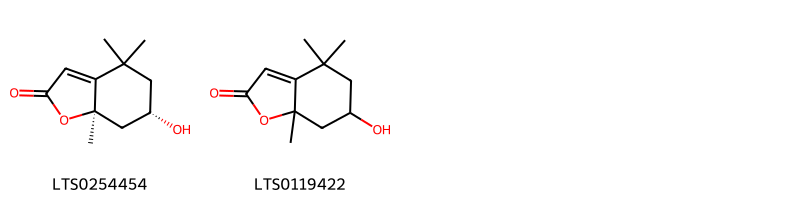{ width=100% }
    <figcaption>Hình ảnh cấu trúc hóa học của 2 hoạt chất thuộc nhóm Benzofurans gồm ['loliolide (LTS0254454)', 'loliolide (LTS0119422)'].</figcaption>
</figure>
#### Nhóm Coumarins and derivatives
<figure markdown="span">
    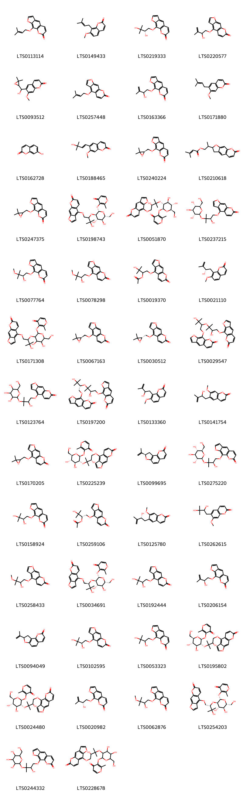{ width=100% }
    <figcaption>Hình ảnh cấu trúc hóa học của 57 hoạt chất thuộc nhóm Coumarins and derivatives gồm ['imperatorin (LTS0113114)', 'osthole (LTS0149433)', '9-[(2s)-2,3-dihydroxy-3-methylbutoxy]furo[3,2-g]chromen-7-one (LTS0219333)', '4-[(2-hydroxy-3-methylbut-3-en-1-yl)oxy]furo[3,2-g]chromen-7-one (LTS0220577)', '6-[(3,3-dimethyloxiran-2-yl)(hydroxy)methyl]-7-methoxychromen-2-one (LTS0093512)', 'isoimperatorin (LTS0257448)', '9-[(2-hydroxy-3-methylbut-3-en-1-yl)oxy]furo[3,2-g]chromen-7-one (LTS0163366)', 'suberosin (LTS0171880)', 'umbelliferone (LTS0162728)', '6-[(1e)-3-hydroxy-3-methylbut-1-en-1-yl]-7-methoxychromen-2-one (LTS0188465)', 'heraclenin (LTS0240224)', '2-{7-oxo-2h,3h-furo[3,2-g]chromen-2-yl}propyl 3-methylbut-2-enoate (LTS0210618)', 'prangenin (LTS0247375)', '3-{[(2s,3r,4s,5s,6r)-4,5-dihydroxy-3-{[3-hydroxy-3-methyl-1-({7-oxofuro[3,2-g]chromen-4-yl}oxy)butan-2-yl]oxy}-6-(hydroxymethyl)oxan-2-yl]oxy}-2-methylpyran-4-one (LTS0198743)', '3-{[(2s,3r,4s,5s,6r)-4,5-dihydroxy-3-{[(3r)-3-hydroxy-2-methyl-4-({6-oxofuro[2,3-g]chromen-9-yl}oxy)butan-2-yl]oxy}-6-(hydroxymethyl)oxan-2-yl]oxy}-2-methylpyran-4-one (LTS0051870)', '4-[(2r)-2-hydroxy-3-methyl-3-{[(2s,3r,4s,5s,6r)-3,4,5-trihydroxy-6-(hydroxymethyl)oxan-2-yl]oxy}butoxy]furo[3,2-g]chromen-7-one (LTS0237215)', '9-[(2r)-2-hydroxy-3-methoxy-3-methylbutoxy]furo[3,2-g]chromen-7-one (LTS0077764)', '4-[(2r)-2-hydroxy-3-methoxy-3-methylbutoxy]furo[3,2-g]chromen-7-one (LTS0078298)', '3-hydroxy-3-methyl-1-({7-oxofuro[3,2-g]chromen-4-yl}oxy)butan-2-yl acetate (LTS0019370)', '8-[(2s)-2-hydroxy-3-methylbut-3-en-1-yl]-7-methoxychromen-2-one (LTS0021110)', '3-[(4,5-dihydroxy-3-{[3-hydroxy-3-methyl-1-({7-oxofuro[3,2-g]chromen-4-yl}oxy)butan-2-yl]oxy}-6-(hydroxymethyl)oxan-2-yl)oxy]-2-methylpyran-4-one (LTS0171308)', '(+)-oxypeucedanin (LTS0067163)', 'oxypeucedanin (LTS0030512)', '9-(3-hydroxy-2-{[3-hydroxy-2-methyl-4-({7-oxofuro[3,2-g]chromen-9-yl}oxy)butan-2-yl]oxy}-3-methylbutoxy)furo[3,2-g]chromen-7-one (LTS0029547)', '4-(2-hydroxy-3-methyl-3-{[3,4,5-trihydroxy-6-(hydroxymethyl)oxan-2-yl]oxy}butoxy)furo[3,2-g]chromen-7-one (LTS0123764)', '9-[(2r)-3-hydroxy-2-{[(3r)-3-hydroxy-2-methyl-4-({7-oxofuro[3,2-g]chromen-9-yl}oxy)butan-2-yl]oxy}-3-methylbutoxy]furo[3,2-g]chromen-7-one (LTS0197200)', '8-(2-hydroxy-3-methylbut-3-en-1-yl)-7-methoxychromen-2-one (LTS0133360)', '6-(2-hydroxy-3-methylbut-3-en-1-yl)-7-methoxychromen-2-one (LTS0141754)', '4-[(3,3-dimethyloxiran-2-yl)methoxy]furo[3,2-g]chromen-7-one (LTS0170205)', '3-{[(2s,3r,4s,5s,6r)-4,5-dihydroxy-3-{[(3s)-3-hydroxy-2-methyl-4-({7-oxofuro[3,2-g]chromen-4-yl}oxy)butan-2-yl]oxy}-6-(hydroxymethyl)oxan-2-yl]oxy}-2-methylpyran-4-one (LTS0225239)', '(8r)-8-(prop-1-en-2-yl)-8h,9h-furo[2,3-h]chromen-2-one (LTS0099695)', '9-[(2r)-2-hydroxy-3-methyl-3-{[(2s,3r,4s,5s,6r)-3,4,5-trihydroxy-6-(hydroxymethyl)oxan-2-yl]oxy}butoxy]furo[3,2-g]chromen-7-one (LTS0275220)', 'heraclenol (LTS0158924)', '(2s)-3-hydroxy-3-methyl-1-({7-oxofuro[3,2-g]chromen-4-yl}oxy)butan-2-yl acetate (LTS0259106)', '6-[(2r)-2-hydroxy-3-methylbut-3-en-1-yl]-7-methoxychromen-2-one (LTS0125780)', '6-(2,3-dihydroxy-3-methylbutyl)-7-methoxychromen-2-one (LTS0262615)', '4-(2-hydroxy-3-methoxy-3-methylbutoxy)furo[3,2-g]chromen-7-one (LTS0258433)', '3-{[(2s,3r,4s,5s,6r)-4,5-dihydroxy-3-{[(2r)-3-hydroxy-3-methyl-1-({7-oxofuro[3,2-g]chromen-4-yl}oxy)butan-2-yl]oxy}-6-(hydroxymethyl)oxan-2-yl]oxy}-2-methylpyran-4-one (LTS0034691)', '4-(2,3-dihydroxy-3-methylbutoxy)furo[3,2-g]chromen-7-one (LTS0192444)', '9-{[(2s)-2-hydroxy-3-methylbut-3-en-1-yl]oxy}furo[3,2-g]chromen-7-one (LTS0206154)', '8-(prop-1-en-2-yl)-8h,9h-furo[2,3-h]chromen-2-one (LTS0094049)', '(r)-oxypeucedanin hydrate (LTS0102595)', '9-(2,3-dihydroxy-3-methylbutoxy)furo[3,2-g]chromen-7-one (LTS0053323)', '3-{[(2s,3r,4s,5s,6r)-4,5-dihydroxy-3-{[3-hydroxy-2-methyl-4-({7-oxofuro[3,2-g]chromen-4-yl}oxy)butan-2-yl]oxy}-6-(hydroxymethyl)oxan-2-yl]oxy}-2-methylpyran-4-one (LTS0195802)', '3-{[(2s,3r,4s,5s,6r)-4,5-dihydroxy-3-{[(3r)-3-hydroxy-2-methyl-4-({6-oxofuro[2,3-g]chromen-4-yl}oxy)butan-2-yl]oxy}-6-(hydroxymethyl)oxan-2-yl]oxy}-2-methylpyran-4-one (LTS0024480)', '9-{[(2r)-2-hydroxy-3-methylbut-3-en-1-yl]oxy}furo[3,2-g]chromen-7-one (LTS0020982)', '9-(2-hydroxy-3-methoxy-3-methylbutoxy)furo[3,2-g]chromen-7-one (LTS0062876)', '3-{[(2s,3r,4s,5s,6r)-4,5-dihydroxy-3-{[(2s)-3-hydroxy-3-methyl-1-({7-oxofuro[3,2-g]chromen-4-yl}oxy)butan-2-yl]oxy}-6-(hydroxymethyl)oxan-2-yl]oxy}-2-methylpyran-4-one (LTS0254203)', '9-(2-hydroxy-3-methyl-3-{[3,4,5-trihydroxy-6-(hydroxymethyl)oxan-2-yl]oxy}butoxy)furo[3,2-g]chromen-7-one (LTS0244332)', '3-[(4,5-dihydroxy-3-{[3-hydroxy-2-methyl-4-({6-oxofuro[2,3-g]chromen-9-yl}oxy)butan-2-yl]oxy}-6-(hydroxymethyl)oxan-2-yl)oxy]-2-methylpyran-4-one (LTS0228678)', '3-{[(2s,3r,4s,5s,6r)-4,5-dihydroxy-3-{[3-hydroxy-2-methyl-4-({7-oxofuro[3,2-g]chromen-9-yl}oxy)butan-2-yl]oxy}-6-(hydroxymethyl)oxan-2-yl]oxy}-2-methylpyran-4-one (LTS0068758)', '7-methoxy-2-oxochromene-8-carbaldehyde (LTS0066932)', '3-{[(2s,3r,4s,5s,6r)-4,5-dihydroxy-3-{[(3r)-3-hydroxy-2-methyl-4-({7-oxofuro[3,2-g]chromen-4-yl}oxy)butan-2-yl]oxy}-6-(hydroxymethyl)oxan-2-yl]oxy}-2-methylpyran-4-one (LTS0034403)', '6-[(2r)-2,3-dihydroxy-3-methylbutyl]-7-methoxychromen-2-one (LTS0068882)', '3-[(4,5-dihydroxy-3-{[3-hydroxy-2-methyl-4-({7-oxofuro[3,2-g]chromen-4-yl}oxy)butan-2-yl]oxy}-6-(hydroxymethyl)oxan-2-yl)oxy]-2-methylpyran-4-one (LTS0126022)', '8-[(2r)-2-hydroxy-3-methylbut-3-en-1-yl]-7-methoxychromen-2-one (LTS0103000)', '(8s)-8-(prop-1-en-2-yl)-8h,9h-furo[2,3-h]chromen-2-one (LTS0260614)'].</figcaption>
</figure>
#### Nhóm Organooxygen compounds
<figure markdown="span">
    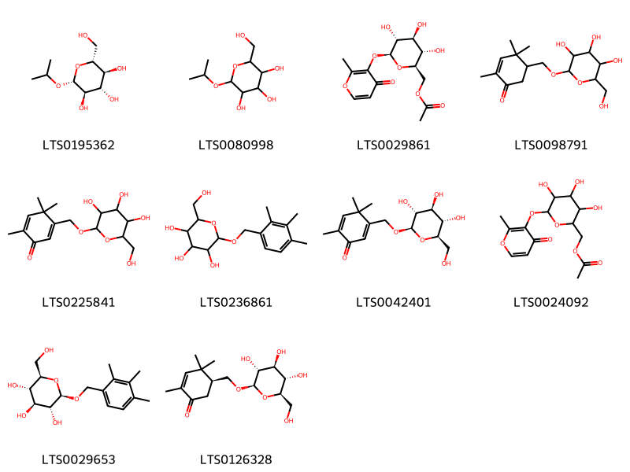{ width=100% }
    <figcaption>Hình ảnh cấu trúc hóa học của 10 hoạt chất thuộc nhóm Organooxygen compounds gồm ['(2r,3s,4s,5r,6r)-2-(hydroxymethyl)-6-isopropoxyoxane-3,4,5-triol (LTS0195362)', '2-(hydroxymethyl)-6-isopropoxyoxane-3,4,5-triol (LTS0080998)', '[(2r,3s,4s,5r,6s)-3,4,5-trihydroxy-6-[(2-methyl-4-oxopyran-3-yl)oxy]oxan-2-yl]methyl acetate (LTS0029861)', '2,4,4-trimethyl-5-({[3,4,5-trihydroxy-6-(hydroxymethyl)oxan-2-yl]oxy}methyl)cyclohex-2-en-1-one (LTS0098791)', '2,4,4-trimethyl-5-({[3,4,5-trihydroxy-6-(hydroxymethyl)oxan-2-yl]oxy}methyl)cyclohexa-2,5-dien-1-one (LTS0225841)', '2-(hydroxymethyl)-6-[(2,3,4-trimethylphenyl)methoxy]oxane-3,4,5-triol (LTS0236861)', '2,4,4-trimethyl-5-({[(2r,3r,4s,5s,6r)-3,4,5-trihydroxy-6-(hydroxymethyl)oxan-2-yl]oxy}methyl)cyclohexa-2,5-dien-1-one (LTS0042401)', '{3,4,5-trihydroxy-6-[(2-methyl-4-oxopyran-3-yl)oxy]oxan-2-yl}methyl acetate (LTS0024092)', '(2r,3s,4s,5r,6r)-2-(hydroxymethyl)-6-[(2,3,4-trimethylphenyl)methoxy]oxane-3,4,5-triol (LTS0029653)', '(5s)-2,4,4-trimethyl-5-({[(2r,3r,4s,5s,6r)-3,4,5-trihydroxy-6-(hydroxymethyl)oxan-2-yl]oxy}methyl)cyclohex-2-en-1-one (LTS0126328)'].</figcaption>
</figure>
#### Nhóm Prenol lipids
<figure markdown="span">
    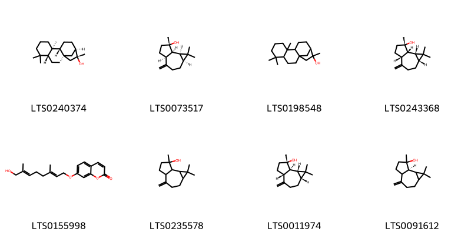{ width=100% }
    <figcaption>Hình ảnh cấu trúc hóa học của 8 hoạt chất thuộc nhóm Prenol lipids gồm ['(1s,4r,9r,10r,13r,14r)-5,5,9,14-tetramethyltetracyclo[11.2.1.0¹,¹⁰.0⁴,⁹]hexadecan-14-ol (LTS0240374)', '(1as,4as,7s,7ar,7bs)-1,1,7-trimethyl-4-methylidene-octahydrocyclopropa[e]azulen-7-ol (LTS0073517)', '5,5,9,14-tetramethyltetracyclo[11.2.1.0¹,¹⁰.0⁴,⁹]hexadecan-14-ol (LTS0198548)', '(1ar,4ar,7s,7as,7br)-1,1,7-trimethyl-4-methylidene-octahydrocyclopropa[e]azulen-7-ol (LTS0243368)', '7-{[(2e,6e)-8-hydroxy-3,7-dimethylocta-2,6-dien-1-yl]oxy}chromen-2-one (LTS0155998)', 'spathulenol (LTS0235578)', 'spathulenol (LTS0011974)', '(7ar)-1,1,7-trimethyl-4-methylidene-octahydrocyclopropa[e]azulen-7-ol (LTS0091612)'].</figcaption>
</figure>
#### Nhóm Saturated hydrocarbons
<figure markdown="span">
    { width=100% }
    <figcaption>Hình ảnh cấu trúc hóa học của 1 hoạt chất thuộc nhóm Saturated hydrocarbons gồm ['nonacosane (LTS0062747)'].</figcaption>
</figure>
#### Nhóm Steroids and steroid derivatives
<figure markdown="span">
    { width=100% }
    <figcaption>Hình ảnh cấu trúc hóa học của 2 hoạt chất thuộc nhóm Steroids and steroid derivatives gồm ['sitogluside (LTS0201798)', '2-{[1-(5-ethyl-6-methylheptan-2-yl)-9a,11a-dimethyl-1h,2h,3h,3ah,3bh,4h,6h,7h,8h,9h,9bh,10h,11h-cyclopenta[a]phenanthren-7-yl]oxy}-6-(hydroxymethyl)oxane-3,4,5-triol (LTS0158828)'].</figcaption>
</figure>

---

### Dược dân tộc học

Danh sách các quốc gia có sử dụng *Prangos pabularia* trong điều trị các bệnh. 

| Country   | Disease                                                                          | Bệnh                                                                                                                                                                                                |
|:----------|:---------------------------------------------------------------------------------|:----------------------------------------------------------------------------------------------------------------------------------------------------------------------------------------------------|
| Asia      | Diuretic, Emmenagogue, Stimulant, Stomachic, Carminative                         | MYMEMORY WARNING: YOU USED ALL AVAILABLE FREE TRANSLATIONS FOR TODAY. NEXT AVAILABLE IN  08 HOURS 17 MINUTES 26 SECONDS VISIT HTTPS://MYMEMORY.TRANSLATED.NET/DOC/USAGELIMITS.PHP TO TRANSLATE MORE |
| Elsewhere | Aphrodisiac, Carminative, Diuretic, Laxative, Molluscicide, Stimulant, Stomachic | MYMEMORY WARNING: YOU USED ALL AVAILABLE FREE TRANSLATIONS FOR TODAY. NEXT AVAILABLE IN  08 HOURS 17 MINUTES 24 SECONDS VISIT HTTPS://MYMEMORY.TRANSLATED.NET/DOC/USAGELIMITS.PHP TO TRANSLATE MORE |
| English   | Nervine                                                                          | MYMEMORY WARNING: YOU USED ALL AVAILABLE FREE TRANSLATIONS FOR TODAY. NEXT AVAILABLE IN  08 HOURS 17 MINUTES 21 SECONDS VISIT HTTPS://MYMEMORY.TRANSLATED.NET/DOC/USAGELIMITS.PHP TO TRANSLATE MORE |
| French    | Carminative                                                                      | MYMEMORY WARNING: YOU USED ALL AVAILABLE FREE TRANSLATIONS FOR TODAY. NEXT AVAILABLE IN  08 HOURS 17 MINUTES 19 SECONDS VISIT HTTPS://MYMEMORY.TRANSLATED.NET/DOC/USAGELIMITS.PHP TO TRANSLATE MORE |
| German    | Stimulant                                                                        | MYMEMORY WARNING: YOU USED ALL AVAILABLE FREE TRANSLATIONS FOR TODAY. NEXT AVAILABLE IN  08 HOURS 17 MINUTES 16 SECONDS VISIT HTTPS://MYMEMORY.TRANSLATED.NET/DOC/USAGELIMITS.PHP TO TRANSLATE MORE |
| India     | Tonic                                                                            | MYMEMORY WARNING: YOU USED ALL AVAILABLE FREE TRANSLATIONS FOR TODAY. NEXT AVAILABLE IN  08 HOURS 17 MINUTES 14 SECONDS VISIT HTTPS://MYMEMORY.TRANSLATED.NET/DOC/USAGELIMITS.PHP TO TRANSLATE MORE |
| Kashmir   | Antiseptic                                                                       | MYMEMORY WARNING: YOU USED ALL AVAILABLE FREE TRANSLATIONS FOR TODAY. NEXT AVAILABLE IN  08 HOURS 17 MINUTES 12 SECONDS VISIT HTTPS://MYMEMORY.TRANSLATED.NET/DOC/USAGELIMITS.PHP TO TRANSLATE MORE |
| Sanscrit  | Digestive, Diuretic                                                              | MYMEMORY WARNING: YOU USED ALL AVAILABLE FREE TRANSLATIONS FOR TODAY. NEXT AVAILABLE IN  08 HOURS 17 MINUTES 09 SECONDS VISIT HTTPS://MYMEMORY.TRANSLATED.NET/DOC/USAGELIMITS.PHP TO TRANSLATE MORE |

---

# Chi Ferula

??? note "Danh sách các dược liệu thuộc chi"
    
	 - *Ferula alliacea*
	 - *Ferula assa-foetida*
	 - *Ferula assafoetida*
	 - *Ferula foetida*
	 - *Ferula galbaniflua*
	 - *Ferula gummosa*
	 - *Ferula persica*
	 - *Ferula suaveolens*
	 - *Ferula sumbul*

---
## Ferula alliacea
### Thông tin về thực vật

!!! info "Phân loại thực vật của *Ferula alliacea* từ GIBF:"
    - **Kingdom:** Plantae
    - **Phylum:** Tracheophyta
    - **Order:** Apiales
    - **Family:** Apiaceae
    - **Genus:** Ferula
    - **Species:** *Ferula alliacea*

 

| Label (VI)   | Label (EN)   | Scientific Name   | Descriptions (VI)   | Descriptions (EN)   | Also Known As (VI)   | Also Known As (EN)   |
|:-------------|:-------------|:------------------|:--------------------|:--------------------|:---------------------|:---------------------|
| N/A          | N/A          | Ferula alliacea   | loài thực vật       | species of plant    | ['']                 | ['']                 |

#### Phân bố trên thế giới

**Từ CSDL GIBF** nan, India, Iran (Islamic Republic of), Afghanistan

#### Phân bố tại Việt Nam

**Từ CSDL GIBF**: Không có ghi nhận ở Việt Nam

---
### Thành phần hóa học
        
- Theo cơ sở dữ liệu lotus: Từ loài *Ferula alliacea* đã phân lập và xác định được Chưa có hoạt chất nào được phân lập. hoạt chất thuộc về các nhóm Không có hoạt chất nào được phân lập. 

Không có hình ảnh nào được tạo ra

---

### Dược dân tộc học

Danh sách các quốc gia có sử dụng *Ferula alliacea* trong điều trị các bệnh. 

| Country   | Disease                 | Bệnh                                                                                                                                                                                                |
|:----------|:------------------------|:----------------------------------------------------------------------------------------------------------------------------------------------------------------------------------------------------|
| Elsewhere | Antiseptic, Carminative | MYMEMORY WARNING: YOU USED ALL AVAILABLE FREE TRANSLATIONS FOR TODAY. NEXT AVAILABLE IN  08 HOURS 16 MINUTES 43 SECONDS VISIT HTTPS://MYMEMORY.TRANSLATED.NET/DOC/USAGELIMITS.PHP TO TRANSLATE MORE |

---

---
## Ferula assafoetida
### Thông tin về thực vật

!!! info "Phân loại thực vật của *N/A* từ GIBF:"
    - **Kingdom:** Plantae
    - **Phylum:** Tracheophyta
    - **Order:** Apiales
    - **Family:** Apiaceae
    - **Genus:** Ferula
    - **Species:** *N/A*

 

| Label (VI)   | Label (EN)   | Scientific Name   | Descriptions (VI)   | Descriptions (EN)   | Also Known As (VI)   | Also Known As (EN)   |
|:-------------|:-------------|:------------------|:--------------------|:--------------------|:---------------------|:---------------------|
| N/A          | N/A          | Ferula alliacea   | loài thực vật       | species of plant    | ['']                 | ['']                 |

#### Phân bố trên thế giới

**Từ CSDL GIBF** Italy, United Kingdom of Great Britain and Northern Ireland, Cyprus, Malta, Spain, Palestine, State of, Türkiye, Portugal, Gibraltar, Algeria, France, Kazakhstan, Croatia, Greece, Israel, Canada, Uzbekistan

#### Phân bố tại Việt Nam

**Từ CSDL GIBF**: Không có ghi nhận ở Việt Nam

---
### Thành phần hóa học
        
- Theo cơ sở dữ liệu lotus: Từ loài *N/A* đã phân lập và xác định được Chưa có hoạt chất nào được phân lập. hoạt chất thuộc về các nhóm Không có hoạt chất nào được phân lập. 

Không có hình ảnh nào được tạo ra

---

### Dược dân tộc học

Danh sách các quốc gia có sử dụng *N/A* trong điều trị các bệnh. 

| Country   | Disease                                                                                                         | Bệnh                                                                                                                                                                                                |
|:----------|:----------------------------------------------------------------------------------------------------------------|:----------------------------------------------------------------------------------------------------------------------------------------------------------------------------------------------------|
| China     | Carminative, Expectorant, Stimulant, Laxative, Nervine                                                          | MYMEMORY WARNING: YOU USED ALL AVAILABLE FREE TRANSLATIONS FOR TODAY. NEXT AVAILABLE IN  08 HOURS 16 MINUTES 26 SECONDS VISIT HTTPS://MYMEMORY.TRANSLATED.NET/DOC/USAGELIMITS.PHP TO TRANSLATE MORE |
| Elsewhere | Expectorant, Laxative                                                                                           | MYMEMORY WARNING: YOU USED ALL AVAILABLE FREE TRANSLATIONS FOR TODAY. NEXT AVAILABLE IN  08 HOURS 16 MINUTES 24 SECONDS VISIT HTTPS://MYMEMORY.TRANSLATED.NET/DOC/USAGELIMITS.PHP TO TRANSLATE MORE |
| Turkey    | Carminative, Diuretic, Emmenagogue, Expectorant, Nervine, Sedative, Vermifuge, Stimulant, Aperient, Aphrodisiac | MYMEMORY WARNING: YOU USED ALL AVAILABLE FREE TRANSLATIONS FOR TODAY. NEXT AVAILABLE IN  08 HOURS 16 MINUTES 21 SECONDS VISIT HTTPS://MYMEMORY.TRANSLATED.NET/DOC/USAGELIMITS.PHP TO TRANSLATE MORE |

---

---
## Ferula assafoetida
### Thông tin về thực vật

!!! info "Phân loại thực vật của *N/A* từ GIBF:"
    - **Kingdom:** Plantae
    - **Phylum:** Tracheophyta
    - **Order:** Apiales
    - **Family:** Apiaceae
    - **Genus:** Ferula
    - **Species:** *N/A*

 

| Label (VI)   | Label (EN)   | Scientific Name   | Descriptions (VI)   | Descriptions (EN)   | Also Known As (VI)   | Also Known As (EN)   |
|:-------------|:-------------|:------------------|:--------------------|:--------------------|:---------------------|:---------------------|
| N/A          | N/A          | Ferula alliacea   | loài thực vật       | species of plant    | ['']                 | ['']                 |

#### Phân bố trên thế giới

**Từ CSDL GIBF** Italy, United Kingdom of Great Britain and Northern Ireland, Cyprus, Malta, Spain, Palestine, State of, Türkiye, Portugal, Gibraltar, Algeria, France, Kazakhstan, Croatia, Greece, Israel, Canada, Uzbekistan

#### Phân bố tại Việt Nam

**Từ CSDL GIBF**: Không có ghi nhận ở Việt Nam

---
### Thành phần hóa học
        
- Theo cơ sở dữ liệu lotus: Từ loài *N/A* đã phân lập và xác định được Chưa có hoạt chất nào được phân lập. hoạt chất thuộc về các nhóm Không có hoạt chất nào được phân lập. 

Không có hình ảnh nào được tạo ra

---

### Dược dân tộc học

Danh sách các quốc gia có sử dụng *N/A* trong điều trị các bệnh. 

| Country   | Disease                        | Bệnh                                                                                                                                                                                                |
|:----------|:-------------------------------|:----------------------------------------------------------------------------------------------------------------------------------------------------------------------------------------------------|
| China     | Digestive, Sedative, Vermifuge | MYMEMORY WARNING: YOU USED ALL AVAILABLE FREE TRANSLATIONS FOR TODAY. NEXT AVAILABLE IN  08 HOURS 16 MINUTES 00 SECONDS VISIT HTTPS://MYMEMORY.TRANSLATED.NET/DOC/USAGELIMITS.PHP TO TRANSLATE MORE |
| India     | Nervine                        | MYMEMORY WARNING: YOU USED ALL AVAILABLE FREE TRANSLATIONS FOR TODAY. NEXT AVAILABLE IN  08 HOURS 15 MINUTES 57 SECONDS VISIT HTTPS://MYMEMORY.TRANSLATED.NET/DOC/USAGELIMITS.PHP TO TRANSLATE MORE |

---

---
## Ferula foetida
### Thông tin về thực vật

!!! info "Phân loại thực vật của *Ferula foetida* từ GIBF:"
    - **Kingdom:** Plantae
    - **Phylum:** Tracheophyta
    - **Order:** Apiales
    - **Family:** Apiaceae
    - **Genus:** Ferula
    - **Species:** *Ferula foetida*

 

| Label (VI)   | Label (EN)   | Scientific Name   | Descriptions (VI)   | Descriptions (EN)   | Also Known As (VI)   | Also Known As (EN)          |
|:-------------|:-------------|:------------------|:--------------------|:--------------------|:---------------------|:----------------------------|
| N/A          | N/A          | Ferula foetida    | loài thực vật       | species of plant    | ['']                 | ['asafetida', 'asafoetida'] |

#### Phân bố trên thế giới

**Từ CSDL GIBF** Tajikistan, nan, Pakistan, Iran (Islamic Republic of), Afghanistan, Kyrgyzstan, Turkmenistan, India, Russian Federation, United States of America, Austria, Kazakhstan, United Kingdom of Great Britain and Northern Ireland, Uzbekistan

#### Phân bố tại Việt Nam

**Từ CSDL GIBF**: Không có ghi nhận ở Việt Nam

---
### Thành phần hóa học
        
- Theo cơ sở dữ liệu lotus: Từ loài *Ferula foetida* đã phân lập và xác định được 23 hoạt chất thuộc về các nhóm Flavonoids, Prenol lipids, Sulfoxides, Cinnamic acids and derivatives, Thiophenes, Organic disulfides, Heteroaromatic compounds, Coumarins and derivatives. 

|    | chemicalTaxonomyClassyfireClass   |   smiles_count |
|---:|:----------------------------------|---------------:|
|  0 | Cinnamic acids and derivatives    |              2 |
|  1 | Coumarins and derivatives         |              4 |
|  2 | Flavonoids                        |              1 |
|  3 | Heteroaromatic compounds          |              2 |
|  4 | Organic disulfides                |              5 |
|  5 | Prenol lipids                     |              6 |
|  6 | Sulfoxides                        |              2 |
|  7 | Thiophenes                        |              1 |

#### Nhóm Cinnamic acids and derivatives
<figure markdown="span">
    { width=100% }
    <figcaption>Hình ảnh cấu trúc hóa học của 2 hoạt chất thuộc nhóm Cinnamic acids and derivatives gồm ['ferulic acid (LTS0077328)', 'ferulic acid (LTS0273002)'].</figcaption>
</figure>
#### Nhóm Coumarins and derivatives
<figure markdown="span">
    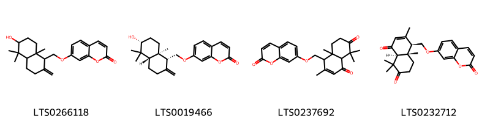{ width=100% }
    <figcaption>Hình ảnh cấu trúc hóa học của 4 hoạt chất thuộc nhóm Coumarins and derivatives gồm ['7-[(6-hydroxy-5,5,8a-trimethyl-2-methylidene-hexahydro-1h-naphthalen-1-yl)methoxy]chromen-2-one (LTS0266118)', '7-{[(1r,4as,6r,8ar)-6-hydroxy-5,5,8a-trimethyl-2-methylidene-hexahydro-1h-naphthalen-1-yl]methoxy}chromen-2-one (LTS0019466)', '3,4a,8,8-tetramethyl-4-{[(2-oxochromen-7-yl)oxy]methyl}-4,5,6,8a-tetrahydronaphthalene-1,7-dione (LTS0237692)', '(4r,4as,8as)-3,4a,8,8-tetramethyl-4-{[(2-oxochromen-7-yl)oxy]methyl}-4,5,6,8a-tetrahydronaphthalene-1,7-dione (LTS0232712)'].</figcaption>
</figure>
#### Nhóm Flavonoids
<figure markdown="span">
    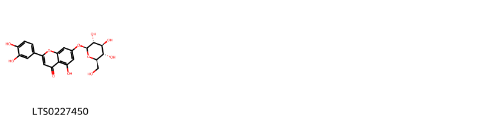{ width=100% }
    <figcaption>Hình ảnh cấu trúc hóa học của 1 hoạt chất thuộc nhóm Flavonoids gồm ['luteolin 7-o-glucoside (LTS0227450)'].</figcaption>
</figure>
#### Nhóm Heteroaromatic compounds
<figure markdown="span">
    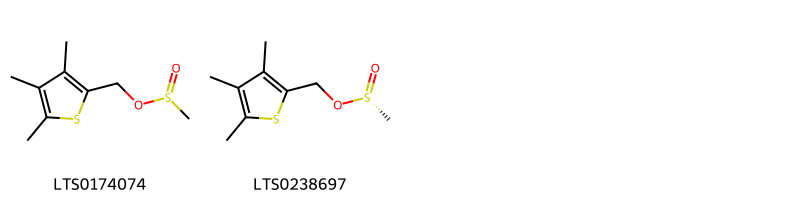{ width=100% }
    <figcaption>Hình ảnh cấu trúc hóa học của 2 hoạt chất thuộc nhóm Heteroaromatic compounds gồm ['(3,4,5-trimethylthiophen-2-yl)methyl methanesulfinate (LTS0174074)', '(s)-((3,4,5-trimethylthiophen-2-yl)methyl methanesulfinate) (LTS0238697)'].</figcaption>
</figure>
#### Nhóm Organic disulfides
<figure markdown="span">
    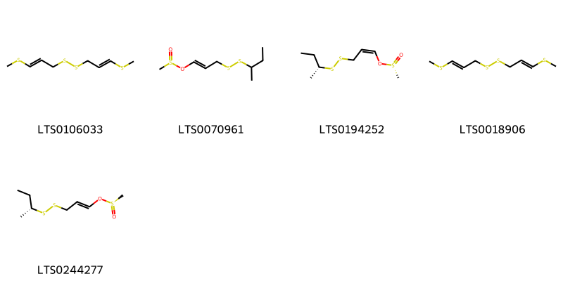{ width=100% }
    <figcaption>Hình ảnh cấu trúc hóa học của 5 hoạt chất thuộc nhóm Organic disulfides gồm ['1-(methylsulfanyl)-3-{[3-(methylsulfanyl)prop-2-en-1-yl]disulfanyl}prop-1-ene (LTS0106033)', '3-(sec-butyldisulfanyl)prop-1-en-1-yl methanesulfinate (LTS0070961)', '(s)-((1z)-3-[(2r)-butan-2-yldisulfanyl]prop-1-en-1-yl methanesulfinate) (LTS0194252)', '(1e)-1-(methylsulfanyl)-3-{[(2e)-3-(methylsulfanyl)prop-2-en-1-yl]disulfanyl}prop-1-ene (LTS0018906)', '(s)-((1e)-3-[(2r)-butan-2-yldisulfanyl]prop-1-en-1-yl methanesulfinate) (LTS0244277)'].</figcaption>
</figure>
#### Nhóm Prenol lipids
<figure markdown="span">
    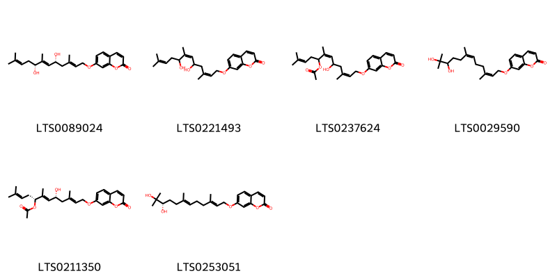{ width=100% }
    <figcaption>Hình ảnh cấu trúc hóa học của 6 hoạt chất thuộc nhóm Prenol lipids gồm ['7-{[(2e,5r,6e,8r)-5,8-dihydroxy-3,7,11-trimethyldodeca-2,6,10-trien-1-yl]oxy}chromen-2-one (LTS0089024)', '7-[(5,8-dihydroxy-3,7,11-trimethyldodeca-2,6,10-trien-1-yl)oxy]chromen-2-one (LTS0221493)', '8-hydroxy-2,6,10-trimethyl-12-[(2-oxochromen-7-yl)oxy]dodeca-2,6,10-trien-5-yl acetate (LTS0237624)', '7-[(10,11-dihydroxy-3,7,11-trimethyldodeca-2,6-dien-1-yl)oxy]chromen-2-one (LTS0029590)', '(5r,6e,8r,10e)-8-hydroxy-2,6,10-trimethyl-12-[(2-oxochromen-7-yl)oxy]dodeca-2,6,10-trien-5-yl acetate (LTS0211350)', '7-{[(2e,6e,10s)-10,11-dihydroxy-3,7,11-trimethyldodeca-2,6-dien-1-yl]oxy}chromen-2-one (LTS0253051)'].</figcaption>
</figure>
#### Nhóm Sulfoxides
<figure markdown="span">
    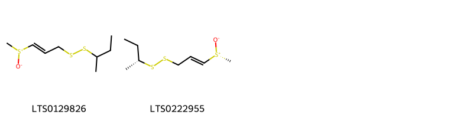{ width=100% }
    <figcaption>Hình ảnh cấu trúc hóa học của 2 hoạt chất thuộc nhóm Sulfoxides gồm ['2-[(3-methanesulfinylprop-2-en-1-yl)disulfanyl]butane (LTS0129826)', '(2r)-2-{[(2e)-3-[(r)-methanesulfinyl]prop-2-en-1-yl]disulfanyl}butane (LTS0222955)'].</figcaption>
</figure>
#### Nhóm Thiophenes
<figure markdown="span">
    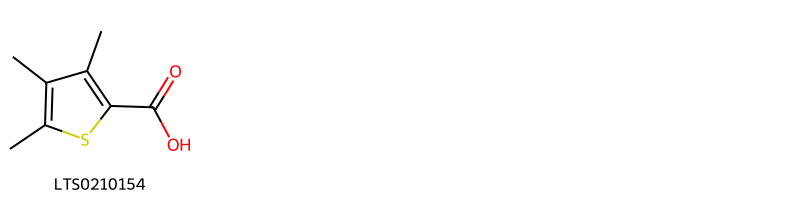{ width=100% }
    <figcaption>Hình ảnh cấu trúc hóa học của 1 hoạt chất thuộc nhóm Thiophenes gồm ['trimethylthiophene-2-carboxylic acid (LTS0210154)'].</figcaption>
</figure>

---

### Dược dân tộc học

Danh sách các quốc gia có sử dụng *Ferula foetida* trong điều trị các bệnh. 

| Country   | Disease               | Bệnh                                                                                                                                                                                                |
|:----------|:----------------------|:----------------------------------------------------------------------------------------------------------------------------------------------------------------------------------------------------|
| Elsewhere | Expectorant, Laxative | MYMEMORY WARNING: YOU USED ALL AVAILABLE FREE TRANSLATIONS FOR TODAY. NEXT AVAILABLE IN  08 HOURS 15 MINUTES 37 SECONDS VISIT HTTPS://MYMEMORY.TRANSLATED.NET/DOC/USAGELIMITS.PHP TO TRANSLATE MORE |

---

---
## Ferula galbaniflua
### Thông tin về thực vật

!!! info "Phân loại thực vật của *Ferula gummosa* từ GIBF:"
    - **Kingdom:** Plantae
    - **Phylum:** Tracheophyta
    - **Order:** Apiales
    - **Family:** Apiaceae
    - **Genus:** Ferula
    - **Species:** *Ferula gummosa*

 

| Label (VI)   | Label (EN)   | Scientific Name    | Descriptions (VI)   | Descriptions (EN)   | Also Known As (VI)   | Also Known As (EN)   |
|:-------------|:-------------|:-------------------|:--------------------|:--------------------|:---------------------|:---------------------|
| N/A          | N/A          | Ferula galbaniflua | loài thực vật       | species of plant    | ['']                 | ['']                 |

#### Phân bố trên thế giới

**Từ CSDL GIBF** Tajikistan, nan, Pakistan, Iran (Islamic Republic of), Afghanistan, Kyrgyzstan, Turkmenistan, India, Russian Federation, United States of America, Austria, Kazakhstan, United Kingdom of Great Britain and Northern Ireland, Uzbekistan

#### Phân bố tại Việt Nam

**Từ CSDL GIBF**: Không có ghi nhận ở Việt Nam

---
### Thành phần hóa học
        
- Theo cơ sở dữ liệu lotus: Từ loài *Ferula gummosa* đã phân lập và xác định được Chưa có hoạt chất nào được phân lập. hoạt chất thuộc về các nhóm Không có hoạt chất nào được phân lập. 

Không có hình ảnh nào được tạo ra

---

### Dược dân tộc học

Danh sách các quốc gia có sử dụng *Ferula gummosa* trong điều trị các bệnh. 

| Country   | Disease                                         | Bệnh                                                                                                                                                                                                |
|:----------|:------------------------------------------------|:----------------------------------------------------------------------------------------------------------------------------------------------------------------------------------------------------|
| Elsewhere | Expectorant, Carminative                        | MYMEMORY WARNING: YOU USED ALL AVAILABLE FREE TRANSLATIONS FOR TODAY. NEXT AVAILABLE IN  08 HOURS 15 MINUTES 13 SECONDS VISIT HTTPS://MYMEMORY.TRANSLATED.NET/DOC/USAGELIMITS.PHP TO TRANSLATE MORE |
| India     | Expectorant, Stimulant, Uterotonic, Carminative | MYMEMORY WARNING: YOU USED ALL AVAILABLE FREE TRANSLATIONS FOR TODAY. NEXT AVAILABLE IN  08 HOURS 15 MINUTES 11 SECONDS VISIT HTTPS://MYMEMORY.TRANSLATED.NET/DOC/USAGELIMITS.PHP TO TRANSLATE MORE |

---

---
## Ferula gummosa
### Thông tin về thực vật

!!! info "Phân loại thực vật của *Ferula gummosa* từ GIBF:"
    - **Kingdom:** Plantae
    - **Phylum:** Tracheophyta
    - **Order:** Apiales
    - **Family:** Apiaceae
    - **Genus:** Ferula
    - **Species:** *Ferula gummosa*

 

| Label (VI)   | Label (EN)   | Scientific Name   | Descriptions (VI)   | Descriptions (EN)   | Also Known As (VI)   | Also Known As (EN)   |
|:-------------|:-------------|:------------------|:--------------------|:--------------------|:---------------------|:---------------------|
| N/A          | N/A          | Ferula gummosa    | loài thực vật       | species of plant    | ['']                 | ['']                 |

#### Phân bố trên thế giới

**Từ CSDL GIBF** nan, Italy, Germany, Iran (Islamic Republic of), Afghanistan, Turkmenistan, Spain, India, Norway

#### Phân bố tại Việt Nam

**Từ CSDL GIBF**: Không có ghi nhận ở Việt Nam

---
### Thành phần hóa học
        
- Theo cơ sở dữ liệu lotus: Từ loài *Ferula gummosa* đã phân lập và xác định được 12 hoạt chất thuộc về các nhóm Prenol lipids, Coumarins and derivatives. 

|    | chemicalTaxonomyClassyfireClass   |   smiles_count |
|---:|:----------------------------------|---------------:|
|  0 | Coumarins and derivatives         |              3 |
|  1 | Prenol lipids                     |              9 |

#### Nhóm Coumarins and derivatives
<figure markdown="span">
    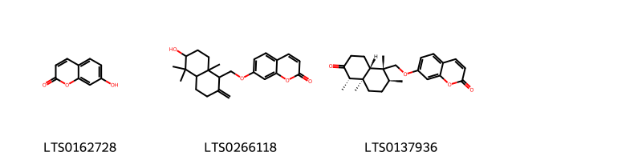{ width=100% }
    <figcaption>Hình ảnh cấu trúc hóa học của 3 hoạt chất thuộc nhóm Coumarins and derivatives gồm ['umbelliferone (LTS0162728)', '7-[(6-hydroxy-5,5,8a-trimethyl-2-methylidene-hexahydro-1h-naphthalen-1-yl)methoxy]chromen-2-one (LTS0266118)', '7-{[(1r,2s,4ar,5s,8as)-1,2,4a,5-tetramethyl-6-oxo-hexahydro-2h-naphthalen-1-yl]methoxy}chromen-2-one (LTS0137936)'].</figcaption>
</figure>
#### Nhóm Prenol lipids
<figure markdown="span">
    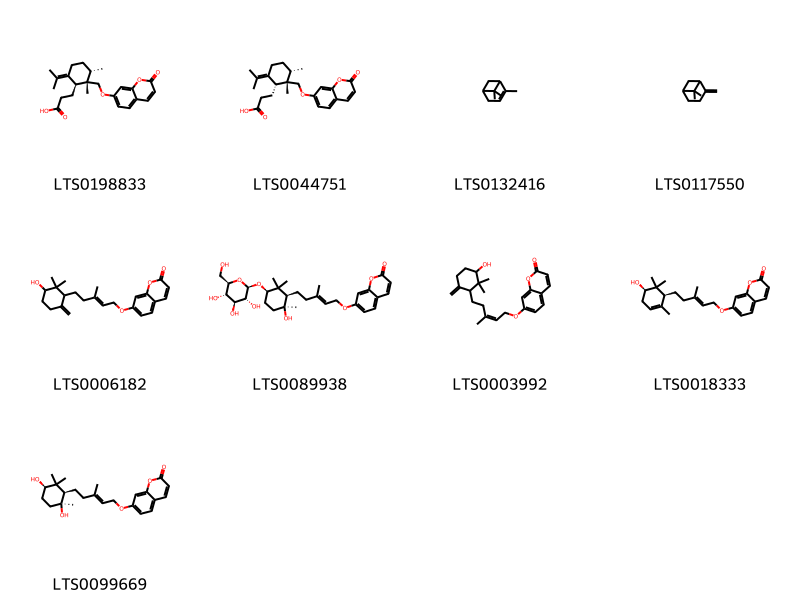{ width=100% }
    <figcaption>Hình ảnh cấu trúc hóa học của 9 hoạt chất thuộc nhóm Prenol lipids gồm ['galbanic acid (LTS0198833)', '3-[(1r,2s,3s)-2,3-dimethyl-2-{[(2-oxochromen-7-yl)oxy]methyl}-6-(propan-2-ylidene)cyclohexyl]propanoic acid (LTS0044751)', 'α pinene (LTS0132416)', 'β-pinene (LTS0117550)', '7-{[(2e)-5-(3-hydroxy-2,2-dimethyl-6-methylidenecyclohexyl)-3-methylpent-2-en-1-yl]oxy}chromen-2-one (LTS0006182)', '7-{[(2e)-5-[(1r,3r,6s)-6-hydroxy-2,2,6-trimethyl-3-{[(2r,3r,4s,5s,6r)-3,4,5-trihydroxy-6-(hydroxymethyl)oxan-2-yl]oxy}cyclohexyl]-3-methylpent-2-en-1-yl]oxy}chromen-2-one (LTS0089938)', '7-{[(2z)-5-(3-hydroxy-2,2-dimethyl-6-methylidenecyclohexyl)-3-methylpent-2-en-1-yl]oxy}chromen-2-one (LTS0003992)', '7-{[(2e)-5-[(1s,5r)-5-hydroxy-2,6,6-trimethylcyclohex-2-en-1-yl]-3-methylpent-2-en-1-yl]oxy}chromen-2-one (LTS0018333)', '7-{[(2e)-5-[(1r,3r,6s)-3,6-dihydroxy-2,2,6-trimethylcyclohexyl]-3-methylpent-2-en-1-yl]oxy}chromen-2-one (LTS0099669)'].</figcaption>
</figure>

---

### Dược dân tộc học

Danh sách các quốc gia có sử dụng *Ferula gummosa* trong điều trị các bệnh. 

| Country   | Disease                             | Bệnh                                                                                                                                                                                                |
|:----------|:------------------------------------|:----------------------------------------------------------------------------------------------------------------------------------------------------------------------------------------------------|
| Turkey    | Emmenagogue, Expectorant, Stimulant | MYMEMORY WARNING: YOU USED ALL AVAILABLE FREE TRANSLATIONS FOR TODAY. NEXT AVAILABLE IN  08 HOURS 14 MINUTES 54 SECONDS VISIT HTTPS://MYMEMORY.TRANSLATED.NET/DOC/USAGELIMITS.PHP TO TRANSLATE MORE |

---

---
## Ferula persica
### Thông tin về thực vật

!!! info "Phân loại thực vật của *Ferula persica* từ GIBF:"
    - **Kingdom:** Plantae
    - **Phylum:** Tracheophyta
    - **Order:** Apiales
    - **Family:** Apiaceae
    - **Genus:** Ferula
    - **Species:** *Ferula persica*

 

| Label (VI)   | Label (EN)   | Scientific Name   | Descriptions (VI)   | Descriptions (EN)   | Also Known As (VI)   | Also Known As (EN)     |
|:-------------|:-------------|:------------------|:--------------------|:--------------------|:---------------------|:-----------------------|
| N/A          | N/A          | Ferula persica    | loài thực vật       | species of plant    | ['']                 | ['Persian asafoetida'] |

#### Phân bố trên thế giới

**Từ CSDL GIBF** nan, Iran (Islamic Republic of), unknown or invalid, Azerbaijan

#### Phân bố tại Việt Nam

**Từ CSDL GIBF**: Không có ghi nhận ở Việt Nam

---
### Thành phần hóa học
        
- Theo cơ sở dữ liệu lotus: Từ loài *Ferula persica* đã phân lập và xác định được 38 hoạt chất thuộc về các nhóm Fatty Acyls, Prenol lipids, Steroids and steroid derivatives, Benzene and substituted derivatives, Organooxygen compounds, Coumarins and derivatives, Carboxylic acids and derivatives. 

|    | chemicalTaxonomyClassyfireClass     |   smiles_count |
|---:|:------------------------------------|---------------:|
|  0 | Benzene and substituted derivatives |              1 |
|  1 | Carboxylic acids and derivatives    |              4 |
|  2 | Coumarins and derivatives           |             14 |
|  3 | Fatty Acyls                         |              2 |
|  4 | Organooxygen compounds              |              1 |
|  5 | Prenol lipids                       |              7 |
|  6 | Steroids and steroid derivatives    |              6 |

#### Nhóm Benzene and substituted derivatives
<figure markdown="span">
    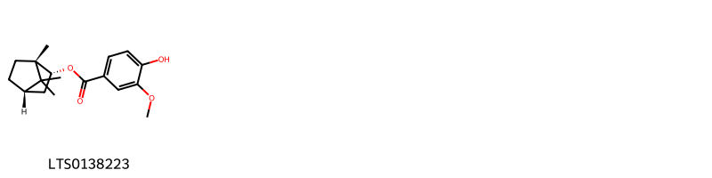{ width=100% }
    <figcaption>Hình ảnh cấu trúc hóa học của 1 hoạt chất thuộc nhóm Benzene and substituted derivatives gồm ['(1s,2r,4s)-1,7,7-trimethylbicyclo[2.2.1]heptan-2-yl 4-hydroxy-3-methoxybenzoate (LTS0138223)'].</figcaption>
</figure>
#### Nhóm Carboxylic acids and derivatives
<figure markdown="span">
    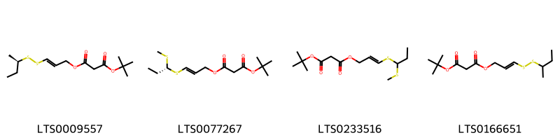{ width=100% }
    <figcaption>Hình ảnh cấu trúc hóa học của 4 hoạt chất thuộc nhóm Carboxylic acids and derivatives gồm ['1-(2e)-3-[(2r)-butan-2-yldisulfanyl]prop-2-en-1-yl 3-tert-butyl propanedioate (LTS0009557)', '1-tert-butyl 3-(2e)-3-{[(1r)-1-(methylsulfanyl)propyl]sulfanyl}prop-2-en-1-yl propanedioate (LTS0077267)', '1-tert-butyl 3-(3-{[1-(methylsulfanyl)propyl]sulfanyl}prop-2-en-1-yl) propanedioate (LTS0233516)', '1-tert-butyl 3-[3-(sec-butyldisulfanyl)prop-2-en-1-yl] propanedioate (LTS0166651)'].</figcaption>
</figure>
#### Nhóm Coumarins and derivatives
<figure markdown="span">
    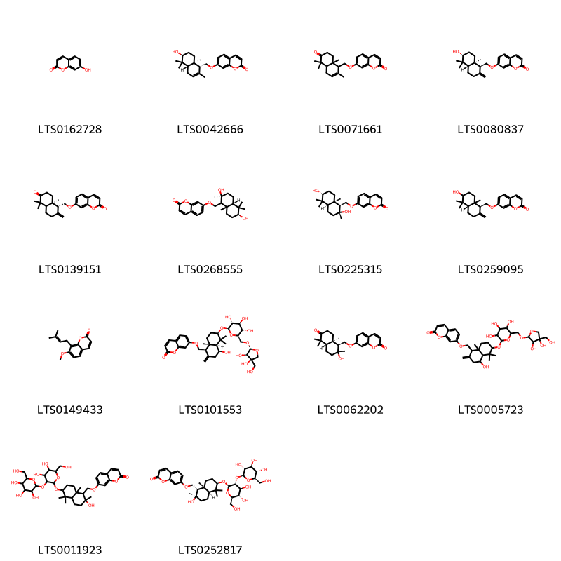{ width=100% }
    <figcaption>Hình ảnh cấu trúc hóa học của 14 hoạt chất thuộc nhóm Coumarins and derivatives gồm ['umbelliferone (LTS0162728)', '7-{[(1r,4as,6s,8ar)-6-hydroxy-2,5,5,8a-tetramethyl-1,4,4a,6,7,8-hexahydronaphthalen-1-yl]methoxy}chromen-2-one (LTS0042666)', '7-[(2,5,5,8a-tetramethyl-6-oxo-4,4a,7,8-tetrahydro-1h-naphthalen-1-yl)methoxy]chromen-2-one (LTS0071661)', 'farnesiferol a (LTS0080837)', '7-{[(1r,8ar)-5,5,8a-trimethyl-2-methylidene-6-oxo-hexahydronaphthalen-1-yl]methoxy}chromen-2-one (LTS0139151)', '7-{[(2s,4as,6s)-2,6-dihydroxy-2,5,5,8a-tetramethyl-hexahydro-1h-naphthalen-1-yl]methoxy}chromen-2-one (LTS0268555)', 'samarcandin (LTS0225315)', '7-{[(1s,4as)-6-hydroxy-5,5,8a-trimethyl-2-methylidene-hexahydro-1h-naphthalen-1-yl]methoxy}chromen-2-one (LTS0259095)', 'osthole (LTS0149433)', '7-{[(1r,4s,4as,6r,8as)-6-{[(2r,3r,4s,5s,6r)-6-({[(2r,3r,4r)-3,4-dihydroxy-4-(hydroxymethyl)oxolan-2-yl]oxy}methyl)-3,4,5-trihydroxyoxan-2-yl]oxy}-4-hydroxy-5,5,8a-trimethyl-2-methylidene-hexahydro-1h-naphthalen-1-yl]methoxy}chromen-2-one (LTS0101553)', '7-{[(1s,2r,4as,8ar)-2-hydroxy-2,5,5,8a-tetramethyl-6-oxo-hexahydronaphthalen-1-yl]methoxy}chromen-2-one (LTS0062202)', '7-[(6-{[6-({[3,4-dihydroxy-4-(hydroxymethyl)oxolan-2-yl]oxy}methyl)-3,4,5-trihydroxyoxan-2-yl]oxy}-4-hydroxy-5,5,8a-trimethyl-2-methylidene-hexahydro-1h-naphthalen-1-yl)methoxy]chromen-2-one (LTS0005723)', '7-[(6-{[4,5-dihydroxy-6-(hydroxymethyl)-3-{[3,4,5-trihydroxy-6-(hydroxymethyl)oxan-2-yl]oxy}oxan-2-yl]oxy}-2-hydroxy-2,5,5,8a-tetramethyl-hexahydro-1h-naphthalen-1-yl)methoxy]chromen-2-one (LTS0011923)', '7-{[(1s,2r,4as,6r,8ar)-6-{[(2r,3r,4s,5s,6r)-4,5-dihydroxy-6-(hydroxymethyl)-3-{[(2s,3r,4s,5s,6r)-3,4,5-trihydroxy-6-(hydroxymethyl)oxan-2-yl]oxy}oxan-2-yl]oxy}-2-hydroxy-2,5,5,8a-tetramethyl-hexahydro-1h-naphthalen-1-yl]methoxy}chromen-2-one (LTS0252817)'].</figcaption>
</figure>
#### Nhóm Fatty Acyls
<figure markdown="span">
    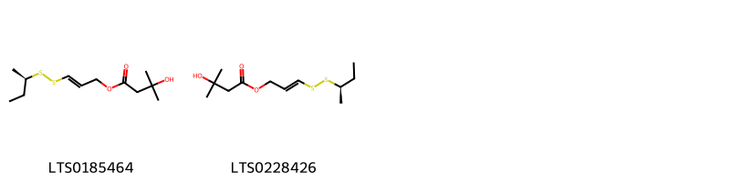{ width=100% }
    <figcaption>Hình ảnh cấu trúc hóa học của 2 hoạt chất thuộc nhóm Fatty Acyls gồm ['(2e)-3-[(2r)-butan-2-yldisulfanyl]prop-2-en-1-yl 3-hydroxy-3-methylbutanoate (LTS0185464)', '3-[(2r)-butan-2-yldisulfanyl]prop-2-en-1-yl 3-hydroxy-3-methylbutanoate (LTS0228426)'].</figcaption>
</figure>
#### Nhóm Organooxygen compounds
<figure markdown="span">
    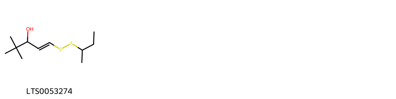{ width=100% }
    <figcaption>Hình ảnh cấu trúc hóa học của 1 hoạt chất thuộc nhóm Organooxygen compounds gồm ['4,4-dimethyl-1-(sec-butyldisulfanyl)pent-1-en-3-ol (LTS0053274)'].</figcaption>
</figure>
#### Nhóm Prenol lipids
<figure markdown="span">
    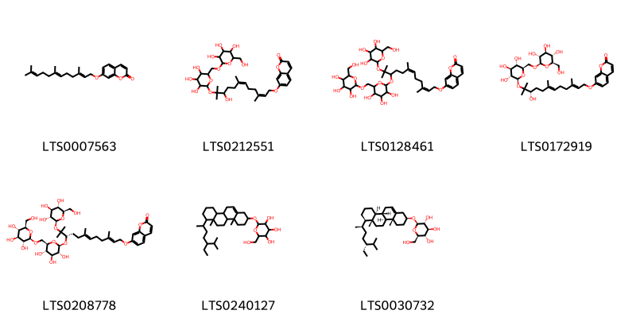{ width=100% }
    <figcaption>Hình ảnh cấu trúc hóa học của 7 hoạt chất thuộc nhóm Prenol lipids gồm ['umbelliprenin (LTS0007563)', '7-[(10-hydroxy-3,7,11-trimethyl-11-{[3,4,5-trihydroxy-6-({[3,4,5-trihydroxy-6-(hydroxymethyl)oxan-2-yl]oxy}methyl)oxan-2-yl]oxy}dodeca-2,6-dien-1-yl)oxy]chromen-2-one (LTS0212551)', '7-[(3,7,11-trimethyl-11-{[3,4,5-trihydroxy-6-(hydroxymethyl)oxan-2-yl]oxy}-10-{[3,4,5-trihydroxy-6-({[3,4,5-trihydroxy-6-(hydroxymethyl)oxan-2-yl]oxy}methyl)oxan-2-yl]oxy}dodeca-2,6-dien-1-yl)oxy]chromen-2-one (LTS0128461)', '7-{[(2e,6e,10s)-10-hydroxy-3,7,11-trimethyl-11-{[(2s,3r,4s,5s,6r)-3,4,5-trihydroxy-6-({[(2r,3r,4s,5s,6r)-3,4,5-trihydroxy-6-(hydroxymethyl)oxan-2-yl]oxy}methyl)oxan-2-yl]oxy}dodeca-2,6-dien-1-yl]oxy}chromen-2-one (LTS0172919)', '7-{[(2e,6e,10s)-3,7,11-trimethyl-11-{[(2s,3r,4s,5s,6r)-3,4,5-trihydroxy-6-(hydroxymethyl)oxan-2-yl]oxy}-10-{[(2s,3r,4s,5s,6r)-3,4,5-trihydroxy-6-({[(2r,3r,4s,5s,6r)-3,4,5-trihydroxy-6-(hydroxymethyl)oxan-2-yl]oxy}methyl)oxan-2-yl]oxy}dodeca-2,6-dien-1-yl]oxy}chromen-2-one (LTS0208778)', '2-{[7-(5-ethyl-6-methylheptan-2-yl)-4a,6a-dimethyl-1,2,3,4,4b,5,6,7,8,9,10,10a,10b,11-tetradecahydrochrysen-2-yl]oxy}-6-(hydroxymethyl)oxane-3,4,5-triol (LTS0240127)', '(2r,3r,4s,5s,6r)-2-{[(2s,4ar,4bs,6ar,7r,10as,10bs)-7-[(2r,5r)-5-ethyl-6-methylheptan-2-yl]-4a,6a-dimethyl-1,2,3,4,4b,5,6,7,8,9,10,10a,10b,11-tetradecahydrochrysen-2-yl]oxy}-6-(hydroxymethyl)oxane-3,4,5-triol (LTS0030732)'].</figcaption>
</figure>
#### Nhóm Steroids and steroid derivatives
<figure markdown="span">
    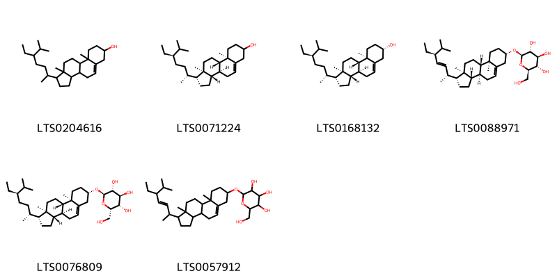{ width=100% }
    <figcaption>Hình ảnh cấu trúc hóa học của 6 hoạt chất thuộc nhóm Steroids and steroid derivatives gồm ['stigmast-5-en-3-ol, (3β)- (LTS0204616)', 'stigmast-5-en-3-ol (LTS0071224)', 'sitosterol (LTS0168132)', '(2r,3r,4s,5s,6r)-2-{[(1r,3as,3bs,7s,9ar,9bs,11ar)-1-[(2r,3e,5s)-5-ethyl-6-methylhept-3-en-2-yl]-9a,11a-dimethyl-1h,2h,3h,3ah,3bh,4h,6h,7h,8h,9h,9bh,10h,11h-cyclopenta[a]phenanthren-7-yl]oxy}-6-(hydroxymethyl)oxane-3,4,5-triol (LTS0088971)', '(2r,3r,4s,5s,6s)-2-{[(1r,3as,3bs,7s,9ar,9bs,11ar)-1-[(2r,5r)-5-ethyl-6-methylheptan-2-yl]-9a,11a-dimethyl-1h,2h,3h,3ah,3bh,4h,6h,7h,8h,9h,9bh,10h,11h-cyclopenta[a]phenanthren-7-yl]oxy}-6-(hydroxymethyl)oxane-3,4,5-triol (LTS0076809)', '2-{[1-(5-ethyl-6-methylhept-3-en-2-yl)-9a,11a-dimethyl-1h,2h,3h,3ah,3bh,4h,6h,7h,8h,9h,9bh,10h,11h-cyclopenta[a]phenanthren-7-yl]oxy}-6-(hydroxymethyl)oxane-3,4,5-triol (LTS0057912)'].</figcaption>
</figure>

---

### Dược dân tộc học

Danh sách các quốc gia có sử dụng *Ferula persica* trong điều trị các bệnh. 

| Country   | Disease                                         | Bệnh                                                                                                                                                                                                |
|:----------|:------------------------------------------------|:----------------------------------------------------------------------------------------------------------------------------------------------------------------------------------------------------|
| India     | Carminative, Stimulant, Uterotonic, Expectorant | MYMEMORY WARNING: YOU USED ALL AVAILABLE FREE TRANSLATIONS FOR TODAY. NEXT AVAILABLE IN  08 HOURS 14 MINUTES 33 SECONDS VISIT HTTPS://MYMEMORY.TRANSLATED.NET/DOC/USAGELIMITS.PHP TO TRANSLATE MORE |

---

---
## Ferula suaveolens
### Thông tin về thực vật

!!! info "Phân loại thực vật của *Ferula diversivittata* từ GIBF:"
    - **Kingdom:** Plantae
    - **Phylum:** Tracheophyta
    - **Order:** Apiales
    - **Family:** Apiaceae
    - **Genus:** Ferula
    - **Species:** *Ferula diversivittata*

 

| Label (VI)   | Label (EN)   | Scientific Name   | Descriptions (VI)   | Descriptions (EN)   | Also Known As (VI)   | Also Known As (EN)   |
|:-------------|:-------------|:------------------|:--------------------|:--------------------|:---------------------|:---------------------|
| N/A          | N/A          | Ferula suaveolens | loài thực vật       | species of plant    | ['']                 | ['']                 |

#### Phân bố trên thế giới

**Từ CSDL GIBF** nan, Iran (Islamic Republic of), unknown or invalid, Azerbaijan

#### Phân bố tại Việt Nam

**Từ CSDL GIBF**: Không có ghi nhận ở Việt Nam

---
### Thành phần hóa học
        
- Theo cơ sở dữ liệu lotus: Từ loài *Ferula diversivittata* đã phân lập và xác định được Chưa có hoạt chất nào được phân lập. hoạt chất thuộc về các nhóm Không có hoạt chất nào được phân lập. 

Không có hình ảnh nào được tạo ra

---

### Dược dân tộc học

Danh sách các quốc gia có sử dụng *Ferula diversivittata* trong điều trị các bệnh. 

| Country   | Disease   | Bệnh                                                                                                                                                                                                |
|:----------|:----------|:----------------------------------------------------------------------------------------------------------------------------------------------------------------------------------------------------|
| India     | Nervine   | MYMEMORY WARNING: YOU USED ALL AVAILABLE FREE TRANSLATIONS FOR TODAY. NEXT AVAILABLE IN  08 HOURS 14 MINUTES 11 SECONDS VISIT HTTPS://MYMEMORY.TRANSLATED.NET/DOC/USAGELIMITS.PHP TO TRANSLATE MORE |

---

---
## Ferula sumbul
### Thông tin về thực vật

!!! info "Phân loại thực vật của *Ferula moschata* từ GIBF:"
    - **Kingdom:** Plantae
    - **Phylum:** Tracheophyta
    - **Order:** Apiales
    - **Family:** Apiaceae
    - **Genus:** Ferula
    - **Species:** *Ferula moschata*

 

| Label (VI)   | Label (EN)   | Scientific Name   | Descriptions (VI)   | Descriptions (EN)   | Also Known As (VI)   | Also Known As (EN)   |
|:-------------|:-------------|:------------------|:--------------------|:--------------------|:---------------------|:---------------------|
| N/A          | N/A          | Ferula sumbul     | loài thực vật       | species of plant    | ['']                 | ['']                 |

#### Phân bố trên thế giới

**Từ CSDL GIBF** Tajikistan, nan, India, unknown or invalid, United States of America, China, Uzbekistan

#### Phân bố tại Việt Nam

**Từ CSDL GIBF**: Không có ghi nhận ở Việt Nam

---
### Thành phần hóa học
        
- Theo cơ sở dữ liệu lotus: Từ loài *Ferula moschata* đã phân lập và xác định được 30 hoạt chất thuộc về các nhóm Coumarins and derivatives. 

|    | chemicalTaxonomyClassyfireClass   |   smiles_count |
|---:|:----------------------------------|---------------:|
|  0 | Coumarins and derivatives         |             28 |

#### Nhóm Coumarins and derivatives
<figure markdown="span">
    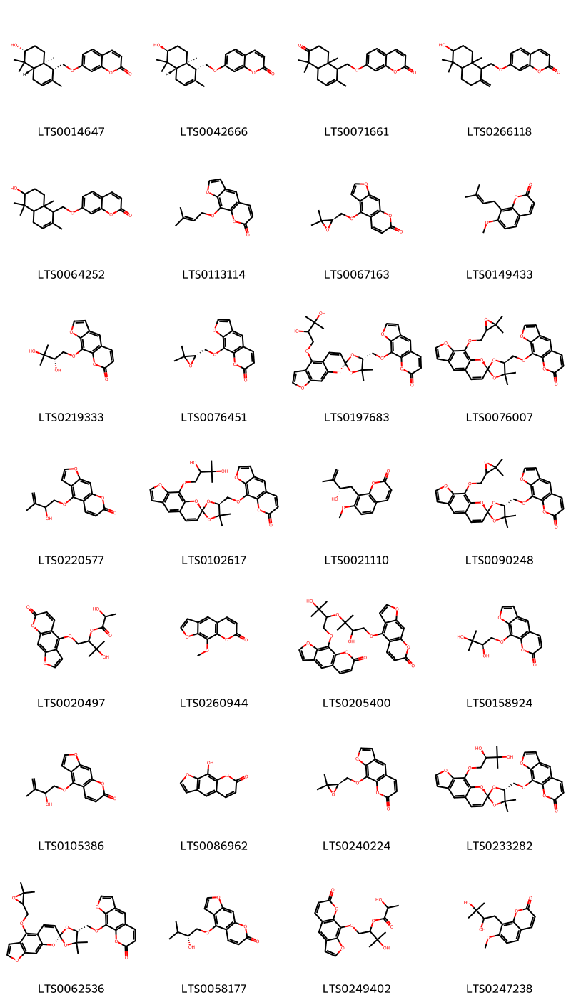{ width=100% }
    <figcaption>Hình ảnh cấu trúc hóa học của 28 hoạt chất thuộc nhóm Coumarins and derivatives gồm ['feselol (LTS0014647)', '7-{[(1r,4as,6s,8ar)-6-hydroxy-2,5,5,8a-tetramethyl-1,4,4a,6,7,8-hexahydronaphthalen-1-yl]methoxy}chromen-2-one (LTS0042666)', '7-[(2,5,5,8a-tetramethyl-6-oxo-4,4a,7,8-tetrahydro-1h-naphthalen-1-yl)methoxy]chromen-2-one (LTS0071661)', '7-[(6-hydroxy-5,5,8a-trimethyl-2-methylidene-hexahydro-1h-naphthalen-1-yl)methoxy]chromen-2-one (LTS0266118)', '7-[(6-hydroxy-2,5,5,8a-tetramethyl-1,4,4a,6,7,8-hexahydronaphthalen-1-yl)methoxy]chromen-2-one (LTS0064252)', 'imperatorin (LTS0113114)', '(+)-oxypeucedanin (LTS0067163)', 'osthole (LTS0149433)', '9-[(2s)-2,3-dihydroxy-3-methylbutoxy]furo[3,2-g]chromen-7-one (LTS0219333)', '9-{[(2s)-3,3-dimethyloxiran-2-yl]methoxy}furo[3,2-g]chromen-7-one (LTS0076451)', "9-[(2s,5r)-4'-(2,3-dihydroxy-3-methylbutoxy)-4,4-dimethylspiro[1,3-dioxolane-2,7'-furo[3,2-g]chromen]-5-ylmethoxy]furo[3,2-g]chromen-7-one (LTS0197683)", "9-[(2s,5s)-9'-[(3,3-dimethyloxiran-2-yl)methoxy]-4,4-dimethylspiro[1,3-dioxolane-2,7'-furo[3,2-g]chromen]-5-ylmethoxy]furo[3,2-g]chromen-7-one (LTS0076007)", '4-[(2-hydroxy-3-methylbut-3-en-1-yl)oxy]furo[3,2-g]chromen-7-one (LTS0220577)', "9-[(2s,5s)-9'-(2,3-dihydroxy-3-methylbutoxy)-4,4-dimethylspiro[1,3-dioxolane-2,7'-furo[3,2-g]chromen]-5-ylmethoxy]furo[3,2-g]chromen-7-one (LTS0102617)", '8-[(2s)-2-hydroxy-3-methylbut-3-en-1-yl]-7-methoxychromen-2-one (LTS0021110)', "9-[(2s,5r)-9'-[(3,3-dimethyloxiran-2-yl)methoxy]-4,4-dimethylspiro[1,3-dioxolane-2,7'-furo[3,2-g]chromen]-5-ylmethoxy]furo[3,2-g]chromen-7-one (LTS0090248)", '3-hydroxy-3-methyl-1-({7-oxofuro[3,2-g]chromen-4-yl}oxy)butan-2-yl 2-hydroxypropanoate (LTS0020497)', 'methoxsalen (LTS0260944)', '9-(3-hydroxy-2-{[3-hydroxy-2-methyl-4-({7-oxofuro[3,2-g]chromen-4-yl}oxy)butan-2-yl]oxy}-3-methylbutoxy)furo[3,2-g]chromen-7-one (LTS0205400)', 'heraclenol (LTS0158924)', 'pabulenol (LTS0105386)', 'xanthotoxol (LTS0086962)', 'heraclenin (LTS0240224)', "9-[(2s,5r)-9'-[(2r)-2,3-dihydroxy-3-methylbutoxy]-4,4-dimethylspiro[1,3-dioxolane-2,7'-furo[3,2-g]chromen]-5-ylmethoxy]furo[3,2-g]chromen-7-one (LTS0233282)", "9-[(2s,5r)-4'-[(3,3-dimethyloxiran-2-yl)methoxy]-4,4-dimethylspiro[1,3-dioxolane-2,7'-furo[3,2-g]chromen]-5-ylmethoxy]furo[3,2-g]chromen-7-one (LTS0062536)", '4-[(2r)-2-hydroxy-3-methylbutoxy]furo[3,2-g]chromen-7-one (LTS0058177)', '3-hydroxy-3-methyl-1-({7-oxofuro[3,2-g]chromen-9-yl}oxy)butan-2-yl 2-hydroxypropanoate (LTS0249402)', '8-(2,3-dihydroxy-3-methylbutyl)-7-methoxychromen-2-one (LTS0247238)'].</figcaption>
</figure>

---

### Dược dân tộc học

Danh sách các quốc gia có sử dụng *Ferula moschata* trong điều trị các bệnh. 

| Country   | Disease                               | Bệnh                                                                                                                                                                                                |
|:----------|:--------------------------------------|:----------------------------------------------------------------------------------------------------------------------------------------------------------------------------------------------------|
| Elsewhere | Nervine, Stimulant                    | MYMEMORY WARNING: YOU USED ALL AVAILABLE FREE TRANSLATIONS FOR TODAY. NEXT AVAILABLE IN  08 HOURS 13 MINUTES 54 SECONDS VISIT HTTPS://MYMEMORY.TRANSLATED.NET/DOC/USAGELIMITS.PHP TO TRANSLATE MORE |
| India     | Apertif, Sedative, Stimulant, Nervine | MYMEMORY WARNING: YOU USED ALL AVAILABLE FREE TRANSLATIONS FOR TODAY. NEXT AVAILABLE IN  08 HOURS 13 MINUTES 52 SECONDS VISIT HTTPS://MYMEMORY.TRANSLATED.NET/DOC/USAGELIMITS.PHP TO TRANSLATE MORE |
| Turkey    | Nervine, Sedative, Stimulant, Tonic   | MYMEMORY WARNING: YOU USED ALL AVAILABLE FREE TRANSLATIONS FOR TODAY. NEXT AVAILABLE IN  08 HOURS 13 MINUTES 49 SECONDS VISIT HTTPS://MYMEMORY.TRANSLATED.NET/DOC/USAGELIMITS.PHP TO TRANSLATE MORE |

---

# Chi Nothosmyrnium

??? note "Danh sách các dược liệu thuộc chi"
    
	 - *Nothosmyrnium japonicum*

---
## Nothosmyrnium japonicum
### Thông tin về thực vật

!!! info "Phân loại thực vật của *Nothosmyrnium japonicum* từ GIBF:"
    - **Kingdom:** Plantae
    - **Phylum:** Tracheophyta
    - **Order:** Apiales
    - **Family:** Apiaceae
    - **Genus:** Nothosmyrnium
    - **Species:** *Nothosmyrnium japonicum*

 

| Label (VI)   | Label (EN)   | Scientific Name         | Descriptions (VI)   | Descriptions (EN)   | Also Known As (VI)   | Also Known As (EN)   |
|:-------------|:-------------|:------------------------|:--------------------|:--------------------|:---------------------|:---------------------|
| N/A          | N/A          | Nothosmyrnium japonicum | loài thực vật       | species of plant    | ['']                 | ['']                 |

#### Phân bố trên thế giới

**Từ CSDL GIBF** China, Japan

#### Phân bố tại Việt Nam

**Từ CSDL GIBF**: Không có ghi nhận ở Việt Nam

---
### Thành phần hóa học
        
- Theo cơ sở dữ liệu lotus: Từ loài *Nothosmyrnium japonicum* đã phân lập và xác định được Chưa có hoạt chất nào được phân lập. hoạt chất thuộc về các nhóm Không có hoạt chất nào được phân lập. 

Không có hình ảnh nào được tạo ra

---

### Dược dân tộc học

Danh sách các quốc gia có sử dụng *Nothosmyrnium japonicum* trong điều trị các bệnh. 

| Country   | Disease                                             | Bệnh                                                                                                                                                                                                |
|:----------|:----------------------------------------------------|:----------------------------------------------------------------------------------------------------------------------------------------------------------------------------------------------------|
| China     | Analgesic, Cosmetic, Sedative, Stimulant, Fungicide | MYMEMORY WARNING: YOU USED ALL AVAILABLE FREE TRANSLATIONS FOR TODAY. NEXT AVAILABLE IN  08 HOURS 13 MINUTES 30 SECONDS VISIT HTTPS://MYMEMORY.TRANSLATED.NET/DOC/USAGELIMITS.PHP TO TRANSLATE MORE |

---

# Chi Lomatium

??? note "Danh sách các dược liệu thuộc chi"
    
	 - *Lomatium dissectum*
	 - *Lomatium nudicaule*

---
## Lomatium dissectum
### Thông tin về thực vật

!!! info "Phân loại thực vật của *Lomatium dissectum* từ GIBF:"
    - **Kingdom:** Plantae
    - **Phylum:** Tracheophyta
    - **Order:** Apiales
    - **Family:** Apiaceae
    - **Genus:** Lomatium
    - **Species:** *Lomatium dissectum*

 

| Label (VI)   | Label (EN)   | Scientific Name    | Descriptions (VI)   | Descriptions (EN)   | Also Known As (VI)   | Also Known As (EN)   |
|:-------------|:-------------|:-------------------|:--------------------|:--------------------|:---------------------|:---------------------|
| N/A          | N/A          | Lomatium dissectum | loài thực vật       | species of plant    | ['']                 | ['']                 |

#### Phân bố trên thế giới

**Từ CSDL GIBF** United States of America, Canada

#### Phân bố tại Việt Nam

**Từ CSDL GIBF**: Không có ghi nhận ở Việt Nam

---
### Thành phần hóa học
        
- Theo cơ sở dữ liệu lotus: Từ loài *Lomatium dissectum* đã phân lập và xác định được 8 hoạt chất thuộc về các nhóm Flavonoids, Dihydrofurans, Prenol lipids, Coumarins and derivatives. 

|    | chemicalTaxonomyClassyfireClass   |   smiles_count |
|---:|:----------------------------------|---------------:|
|  0 | Coumarins and derivatives         |              2 |
|  1 | Dihydrofurans                     |              4 |
|  2 | Flavonoids                        |              1 |
|  3 | Prenol lipids                     |              1 |

#### Nhóm Coumarins and derivatives
<figure markdown="span">
    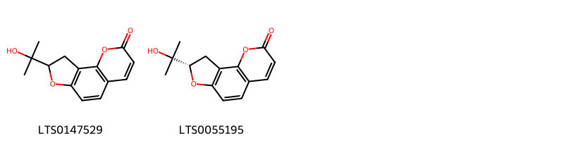{ width=100% }
    <figcaption>Hình ảnh cấu trúc hóa học của 2 hoạt chất thuộc nhóm Coumarins and derivatives gồm ['(+-)-columbianetin (LTS0147529)', '(+)-columbianetin (LTS0055195)'].</figcaption>
</figure>
#### Nhóm Dihydrofurans
<figure markdown="span">
    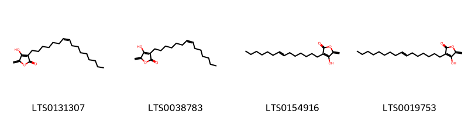{ width=100% }
    <figcaption>Hình ảnh cấu trúc hóa học của 4 hoạt chất thuộc nhóm Dihydrofurans gồm ['3-[(7z)-hexadec-7-en-1-yl]-4-hydroxy-5-methylidenefuran-2-one (LTS0131307)', '4-hydroxy-5-methylidene-3-[(7z)-tetradec-7-en-1-yl]furan-2-one (LTS0038783)', '4-hydroxy-5-methylidene-3-(tetradec-7-en-1-yl)furan-2-one (LTS0154916)', '3-(hexadec-7-en-1-yl)-4-hydroxy-5-methylidenefuran-2-one (LTS0019753)'].</figcaption>
</figure>
#### Nhóm Flavonoids
<figure markdown="span">
    { width=100% }
    <figcaption>Hình ảnh cấu trúc hóa học của 1 hoạt chất thuộc nhóm Flavonoids gồm ['luteolin 7-o-glucoside (LTS0227450)'].</figcaption>
</figure>
#### Nhóm Prenol lipids
<figure markdown="span">
    { width=100% }
    <figcaption>Hình ảnh cấu trúc hóa học của 1 hoạt chất thuộc nhóm Prenol lipids gồm ['(1s,2r,3r,4s,5s,6s,8s,9s,10r,13s,16s,17r)-11-ethyl-13-(hydroxymethyl)-6-methoxy-11-azahexacyclo[7.7.2.1²,⁵.0¹,¹⁰.0³,⁸.0¹³,¹⁷]nonadecane-4,8,16-triol (LTS0169226)'].</figcaption>
</figure>

---

### Dược dân tộc học

Danh sách các quốc gia có sử dụng *Lomatium dissectum* trong điều trị các bệnh. 

| Country       | Disease   | Bệnh                                                                                                                                                                                                |
|:--------------|:----------|:----------------------------------------------------------------------------------------------------------------------------------------------------------------------------------------------------|
| US(Blackfoot) | Tonic     | MYMEMORY WARNING: YOU USED ALL AVAILABLE FREE TRANSLATIONS FOR TODAY. NEXT AVAILABLE IN  08 HOURS 13 MINUTES 10 SECONDS VISIT HTTPS://MYMEMORY.TRANSLATED.NET/DOC/USAGELIMITS.PHP TO TRANSLATE MORE |

---

---
## Lomatium nudicaule
### Thông tin về thực vật

!!! info "Phân loại thực vật của *Lomatium nudicaule* từ GIBF:"
    - **Kingdom:** Plantae
    - **Phylum:** Tracheophyta
    - **Order:** Apiales
    - **Family:** Apiaceae
    - **Genus:** Lomatium
    - **Species:** *Lomatium nudicaule*

 

| Label (VI)   | Label (EN)   | Scientific Name    | Descriptions (VI)   | Descriptions (EN)   | Also Known As (VI)   | Also Known As (EN)   |
|:-------------|:-------------|:-------------------|:--------------------|:--------------------|:---------------------|:---------------------|
| N/A          | N/A          | Lomatium nudicaule | loài thực vật       | species of plant    | ['']                 | ['']                 |

#### Phân bố trên thế giới

**Từ CSDL GIBF** United States of America, Canada

#### Phân bố tại Việt Nam

**Từ CSDL GIBF**: Không có ghi nhận ở Việt Nam

---
### Thành phần hóa học
        
- Theo cơ sở dữ liệu lotus: Từ loài *Lomatium nudicaule* đã phân lập và xác định được Chưa có hoạt chất nào được phân lập. hoạt chất thuộc về các nhóm Không có hoạt chất nào được phân lập. 

Không có hình ảnh nào được tạo ra

---

### Dược dân tộc học

Danh sách các quốc gia có sử dụng *Lomatium nudicaule* trong điều trị các bệnh. 

| Country          | Disease   | Bệnh                                                                                                                                                                                                |
|:-----------------|:----------|:----------------------------------------------------------------------------------------------------------------------------------------------------------------------------------------------------|
| Canada(Kwakiutl) | Laxative  | MYMEMORY WARNING: YOU USED ALL AVAILABLE FREE TRANSLATIONS FOR TODAY. NEXT AVAILABLE IN  08 HOURS 12 MINUTES 45 SECONDS VISIT HTTPS://MYMEMORY.TRANSLATED.NET/DOC/USAGELIMITS.PHP TO TRANSLATE MORE |
| Canada(Salish)   | Fumigant  | MYMEMORY WARNING: YOU USED ALL AVAILABLE FREE TRANSLATIONS FOR TODAY. NEXT AVAILABLE IN  08 HOURS 12 MINUTES 43 SECONDS VISIT HTTPS://MYMEMORY.TRANSLATED.NET/DOC/USAGELIMITS.PHP TO TRANSLATE MORE |

---

# Chi Ledebouriella

??? note "Danh sách các dược liệu thuộc chi"
    
	 - *Ledebouriella sesseroides*

---
## Ledebouriella sesseroides
### Thông tin về thực vật

!!! info "Phân loại thực vật của *Saposhnikovia divaricata* từ GIBF:"
    - **Kingdom:** Plantae
    - **Phylum:** Tracheophyta
    - **Order:** Apiales
    - **Family:** Apiaceae
    - **Genus:** Saposhnikovia
    - **Species:** *Saposhnikovia divaricata*

 

| Label (VI)   | Label (EN)   | Scientific Name    | Descriptions (VI)   | Descriptions (EN)   | Also Known As (VI)   | Also Known As (EN)   |
|:-------------|:-------------|:-------------------|:--------------------|:--------------------|:---------------------|:---------------------|
| N/A          | N/A          | Lomatium nudicaule | loài thực vật       | species of plant    | ['']                 | ['']                 |

#### Phân bố trên thế giới

**Từ CSDL GIBF** nan, Korea, Republic of, China

#### Phân bố tại Việt Nam

**Từ CSDL GIBF**: Không có ghi nhận ở Việt Nam

---
### Thành phần hóa học
        
- Theo cơ sở dữ liệu lotus: Từ loài *Saposhnikovia divaricata* đã phân lập và xác định được Chưa có hoạt chất nào được phân lập. hoạt chất thuộc về các nhóm Không có hoạt chất nào được phân lập. 

Không có hình ảnh nào được tạo ra

---

### Dược dân tộc học

Danh sách các quốc gia có sử dụng *Saposhnikovia divaricata* trong điều trị các bệnh. 

| Country   | Disease                  | Bệnh                                                                                                                                                                                                |
|:----------|:-------------------------|:----------------------------------------------------------------------------------------------------------------------------------------------------------------------------------------------------|
| China     | Expectorant, Diaphoretic | MYMEMORY WARNING: YOU USED ALL AVAILABLE FREE TRANSLATIONS FOR TODAY. NEXT AVAILABLE IN  08 HOURS 12 MINUTES 21 SECONDS VISIT HTTPS://MYMEMORY.TRANSLATED.NET/DOC/USAGELIMITS.PHP TO TRANSLATE MORE |

---

# Chi Heteromorpha

??? note "Danh sách các dược liệu thuộc chi"
    
	 - *Heteromorpha trifoliata*

---
## Heteromorpha trifoliata
### Thông tin về thực vật

!!! info "Phân loại thực vật của *Heteromorpha arborescens* từ GIBF:"
    - **Kingdom:** Plantae
    - **Phylum:** Tracheophyta
    - **Order:** Apiales
    - **Family:** Apiaceae
    - **Genus:** Heteromorpha
    - **Species:** *Heteromorpha arborescens*

 

| Label (VI)   | Label (EN)   | Scientific Name         | Descriptions (VI)   | Descriptions (EN)   | Also Known As (VI)   | Also Known As (EN)   |
|:-------------|:-------------|:------------------------|:--------------------|:--------------------|:---------------------|:---------------------|
| N/A          | N/A          | Heteromorpha trifoliata | loài thực vật       | species of plant    | ['']                 | ['']                 |

#### Phân bố trên thế giới

**Từ CSDL GIBF** nan, Angola, Mozambique, Rwanda, unknown or invalid, Tanzania, United Republic of, Norway, Malawi, Zambia, Namibia, Portugal, Lesotho, United States of America, Congo, Democratic Republic of the, Zimbabwe, South Africa, Uganda, Botswana, Burundi, Kenya, Malaysia, Ethiopia

#### Phân bố tại Việt Nam

**Từ CSDL GIBF**: Không có ghi nhận ở Việt Nam

---
### Thành phần hóa học
        
- Theo cơ sở dữ liệu lotus: Từ loài *Heteromorpha arborescens* đã phân lập và xác định được Chưa có hoạt chất nào được phân lập. hoạt chất thuộc về các nhóm Không có hoạt chất nào được phân lập. 

Không có hình ảnh nào được tạo ra

---

### Dược dân tộc học

Danh sách các quốc gia có sử dụng *Heteromorpha arborescens* trong điều trị các bệnh. 

| Country   | Disease   | Bệnh                                                                                                                                                                                                |
|:----------|:----------|:----------------------------------------------------------------------------------------------------------------------------------------------------------------------------------------------------|
| Lesotho   | Vermifuge | MYMEMORY WARNING: YOU USED ALL AVAILABLE FREE TRANSLATIONS FOR TODAY. NEXT AVAILABLE IN  08 HOURS 12 MINUTES 04 SECONDS VISIT HTTPS://MYMEMORY.TRANSLATED.NET/DOC/USAGELIMITS.PHP TO TRANSLATE MORE |

---

# Chi Daucus

??? note "Danh sách các dược liệu thuộc chi"
    
	 - *Daucus carota*

---
## Daucus carota
### Thông tin về thực vật

!!! info "Phân loại thực vật của *Daucus carota* từ GIBF:"
    - **Kingdom:** Plantae
    - **Phylum:** Tracheophyta
    - **Order:** Apiales
    - **Family:** Apiaceae
    - **Genus:** Daucus
    - **Species:** *Daucus carota*

 

| Label (VI)   | Label (EN)   | Scientific Name   | Descriptions (VI)   | Descriptions (EN)   | Also Known As (VI)   | Also Known As (EN)                                                                     |
|:-------------|:-------------|:------------------|:--------------------|:--------------------|:---------------------|:---------------------------------------------------------------------------------------|
| N/A          | N/A          | Daucus carota     | loài thực vật       | species of plant    | ['']                 | ["Bird's nest", "bishop's lace", "Queen Anne's lace", 'wild carrot', 'Devil’s Plague'] |

#### Phân bố trên thế giới

**Từ CSDL GIBF** nan, Italy, Australia, Georgia, Argentina, Israel, Canada, Ukraine, Netherlands, Spain, Portugal, Russian Federation, United States of America, Chile, Greece, South Africa, Montenegro, Germany, Austria, France, China, United Kingdom of Great Britain and Northern Ireland, Poland, New Zealand

#### Phân bố tại Việt Nam

**Từ CSDL GIBF**: Không có ghi nhận ở Việt Nam

---
### Thành phần hóa học
        
- Theo cơ sở dữ liệu lotus: Từ loài *Daucus carota* đã phân lập và xác định được 334 hoạt chất thuộc về các nhóm Tetralins, Phenols, Carboxylic acids and derivatives, Fatty Acyls, Oxanes, Cinnamic acids and derivatives, Dibenzylbutane lignans, Isocoumarans, Tetrapyrroles and derivatives, Prenol lipids, Organic phosphoric acids and derivatives, Benzene and substituted derivatives, Purine nucleosides, Dihydrofurans, Organooxygen compounds, Furanoid lignans, Phenol ethers, Flavonoids, Steroids and steroid derivatives, Benzodioxoles, Oxepanes, Unsaturated hydrocarbons, Coumarins and derivatives, Epoxides, Benzopyrans, Imidazopyrimidines. 

|    | chemicalTaxonomyClassyfireClass          |   smiles_count |
|---:|:-----------------------------------------|---------------:|
|  0 | Benzene and substituted derivatives      |             12 |
|  1 | Benzodioxoles                            |              7 |
|  2 | Benzopyrans                              |              4 |
|  3 | Carboxylic acids and derivatives         |             28 |
|  4 | Cinnamic acids and derivatives           |              2 |
|  5 | Coumarins and derivatives                |             13 |
|  6 | Dibenzylbutane lignans                   |              2 |
|  7 | Dihydrofurans                            |              1 |
|  8 | Epoxides                                 |              1 |
|  9 | Fatty Acyls                              |             24 |
| 10 | Flavonoids                               |             37 |
| 11 | Furanoid lignans                         |              3 |
| 12 | Imidazopyrimidines                       |              1 |
| 13 | Isocoumarans                             |              2 |
| 14 | Organic phosphoric acids and derivatives |              1 |
| 15 | Organooxygen compounds                   |             36 |
| 16 | Oxanes                                   |              3 |
| 17 | Oxepanes                                 |              2 |
| 18 | Phenol ethers                            |              4 |
| 19 | Phenols                                  |              4 |
| 20 | Prenol lipids                            |            124 |
| 21 | Purine nucleosides                       |              1 |
| 22 | Steroids and steroid derivatives         |             12 |
| 23 | Tetralins                                |              1 |
| 24 | Tetrapyrroles and derivatives            |              2 |
| 25 | Unsaturated hydrocarbons                 |              1 |

#### Nhóm Benzene and substituted derivatives
<figure markdown="span">
    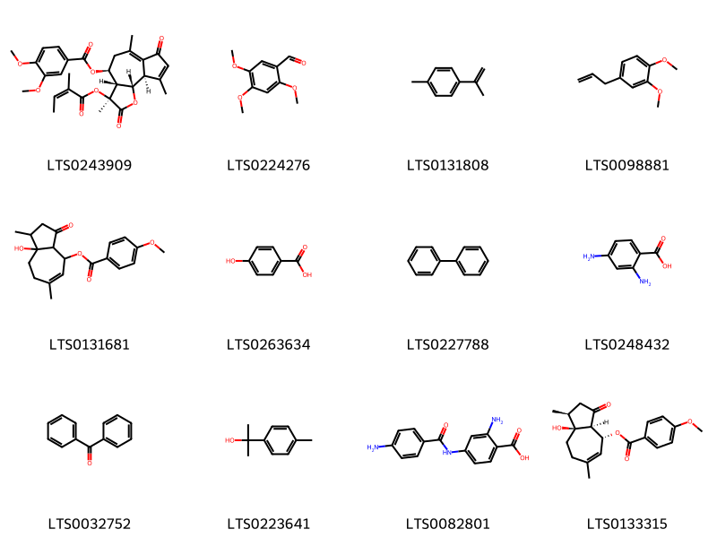{ width=100% }
    <figcaption>Hình ảnh cấu trúc hóa học của 12 hoạt chất thuộc nhóm Benzene and substituted derivatives gồm ['(3s,3ar,4s,9ar,9bs)-3,6,9-trimethyl-3-{[(2z)-2-methylbut-2-enoyl]oxy}-2,7-dioxo-3ah,4h,5h,9ah,9bh-azuleno[4,5-b]furan-4-yl 3,4-dimethoxybenzoate (LTS0243909)', '2,4,5-trimethoxybenzaldehyde (LTS0224276)', 'p,α-dimethylstyrene (LTS0131808)', 'methyl eugenol (LTS0098881)', '8a-hydroxy-1,6-dimethyl-3-oxo-1,2,3a,4,7,8-hexahydroazulen-4-yl 4-methoxybenzoate (LTS0131681)', 'p-hydroxybenzoic acid (LTS0263634)', 'diphenyl (LTS0227788)', 'benzoic acid, 2,4-diamino- (LTS0248432)', 'benzophenone (LTS0032752)', 'p-cymen-8-ol (LTS0223641)', '2-amino-4-(4-aminobenzamido)benzoic acid (LTS0082801)', '(1s,3as,4r,8as)-8a-hydroxy-1,6-dimethyl-3-oxo-1,2,3a,4,7,8-hexahydroazulen-4-yl 4-methoxybenzoate (LTS0133315)'].</figcaption>
</figure>
#### Nhóm Benzodioxoles
<figure markdown="span">
    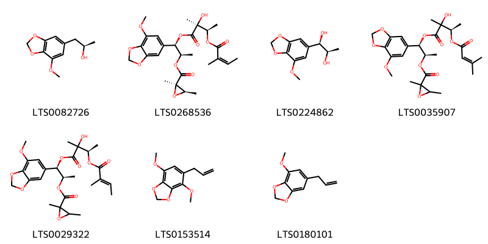{ width=100% }
    <figcaption>Hình ảnh cấu trúc hóa học của 7 hoạt chất thuộc nhóm Benzodioxoles gồm ['(2r)-1-(7-methoxy-2h-1,3-benzodioxol-5-yl)propan-2-ol (LTS0082726)', '(2r,3s)-4-[(1r,2r)-2-[(z)-(2r,3r)-2,3-dimethyloxirane-2-carbonyloxy]-1-(7-methoxy-2h-1,3-benzodioxol-5-yl)propoxy]-3-hydroxy-3-methyl-4-oxobutan-2-yl (2z)-2-methylbut-2-enoate (LTS0268536)', '(1r,2r)-1-(7-methoxy-2h-1,3-benzodioxol-5-yl)propane-1,2-diol (LTS0224862)', '(2r)-4-[(1r,2r)-2-(2,3-dimethyloxirane-2-carbonyloxy)-1-(7-methoxy-2h-1,3-benzodioxol-5-yl)propoxy]-3-hydroxy-3-methyl-4-oxobutan-2-yl 3-methylbut-2-enoate (LTS0035907)', '(2r)-4-[(1r,2r)-2-[(e)-2,3-dimethyloxirane-2-carbonyloxy]-1-(7-methoxy-2h-1,3-benzodioxol-5-yl)propoxy]-3-hydroxy-3-methyl-4-oxobutan-2-yl (2e)-2-methylbut-2-enoate (LTS0029322)', 'apiol (LTS0153514)', 'myristicin (LTS0180101)'].</figcaption>
</figure>
#### Nhóm Benzopyrans
<figure markdown="span">
    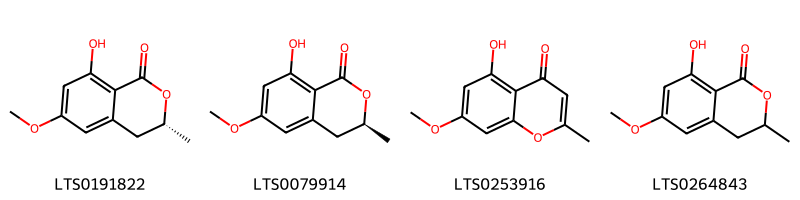{ width=100% }
    <figcaption>Hình ảnh cấu trúc hóa học của 4 hoạt chất thuộc nhóm Benzopyrans gồm ['6-methoxymellein (LTS0191822)', '(3s)-8-hydroxy-6-methoxy-3-methyl-3,4-dihydro-2-benzopyran-1-one (LTS0079914)', 'eugenin (LTS0253916)', '6-methoxymellein (LTS0264843)'].</figcaption>
</figure>
#### Nhóm Carboxylic acids and derivatives
<figure markdown="span">
    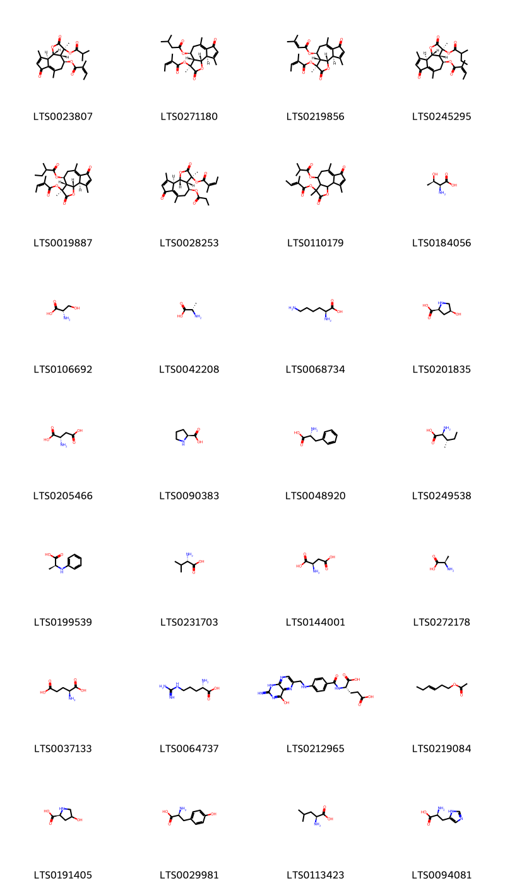{ width=100% }
    <figcaption>Hình ảnh cấu trúc hóa học của 28 hoạt chất thuộc nhóm Carboxylic acids and derivatives gồm ['(3s,3ar,4s,9ar,9bs)-3,6,9-trimethyl-3-[(2-methylpropanoyl)oxy]-2,7-dioxo-3ah,4h,5h,9ah,9bh-azuleno[4,5-b]furan-4-yl (2z)-2-methylbut-2-enoate (LTS0023807)', '(3s,3ar,4s,9ar,9bs)-3,6,9-trimethyl-4-[(3-methylbutanoyl)oxy]-2,7-dioxo-3ah,4h,5h,9ah,9bh-azuleno[4,5-b]furan-3-yl (2z)-2-methylbut-2-enoate (LTS0271180)', '(3s,3ar,4s,9ar,9bs)-3,6,9-trimethyl-4-[(3-methylbut-2-enoyl)oxy]-2,7-dioxo-3ah,4h,5h,9ah,9bh-azuleno[4,5-b]furan-3-yl (2z)-2-methylbut-2-enoate (LTS0219856)', '(3s,3ar,4s,9ar,9bs)-3,6,9-trimethyl-3-[(2-methylbutanoyl)oxy]-2,7-dioxo-3ah,4h,5h,9ah,9bh-azuleno[4,5-b]furan-4-yl (2z)-2-methylbut-2-enoate (LTS0245295)', '(3s,3ar,4s,9ar,9bs)-3,6,9-trimethyl-4-[(2-methylbutanoyl)oxy]-2,7-dioxo-3ah,4h,5h,9ah,9bh-azuleno[4,5-b]furan-3-yl (2z)-2-methylbut-2-enoate (LTS0019887)', '(3s,3ar,4s,9ar,9bs)-3,6,9-trimethyl-2,7-dioxo-4-(propanoyloxy)-3ah,4h,5h,9ah,9bh-azuleno[4,5-b]furan-3-yl (2z)-2-methylbut-2-enoate (LTS0028253)', '3,6,9-trimethyl-4-[(2-methylpropanoyl)oxy]-2,7-dioxo-3ah,4h,5h,9ah,9bh-azuleno[4,5-b]furan-3-yl (2e)-2-methylbut-2-enoate (LTS0110179)', 'l-threonine (LTS0184056)', 'l-serine (LTS0106692)', 'l-alanine (LTS0042208)', 'l-lysine (LTS0068734)', '4 hydroxyproline (LTS0201835)', 'l-aspartic acid (LTS0205466)', 'l-proline (LTS0090383)', 'd-phenylalanine (LTS0048920)', 'l-isoleucine (LTS0249538)', '(2s)-2-(phenylamino)propanoic acid (LTS0199539)', 'l-valine (LTS0231703)', 'd-aspartic acid (LTS0144001)', 'd-alanine (LTS0272178)', 'l-glutamic acid (LTS0037133)', 'l-arginine (LTS0064737)', 'acid, folic (LTS0212965)', '(3e)-3-hexenyl acetate (LTS0219084)', '4-hydroxy-l-proline (LTS0191405)', 'l-tyrosine (LTS0029981)', 'l-leucine (LTS0113423)', 'l-histidine (LTS0094081)'].</figcaption>
</figure>
#### Nhóm Cinnamic acids and derivatives
<figure markdown="span">
    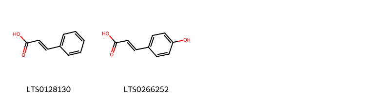{ width=100% }
    <figcaption>Hình ảnh cấu trúc hóa học của 2 hoạt chất thuộc nhóm Cinnamic acids and derivatives gồm ['cinnamic acid (LTS0128130)', 'para-coumaric acid (LTS0266252)'].</figcaption>
</figure>
#### Nhóm Coumarins and derivatives
<figure markdown="span">
    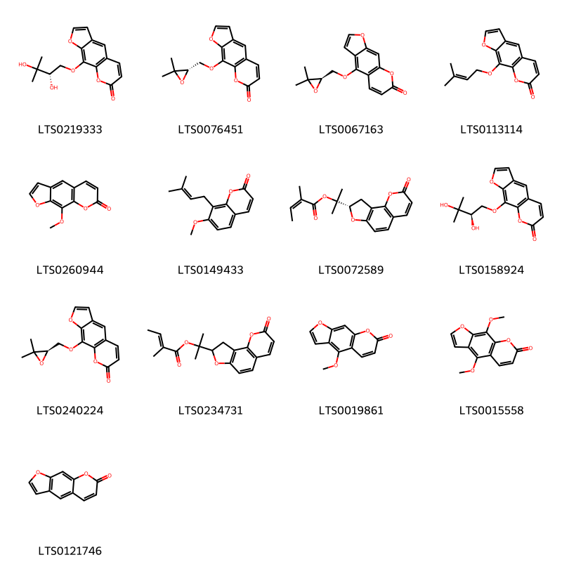{ width=100% }
    <figcaption>Hình ảnh cấu trúc hóa học của 13 hoạt chất thuộc nhóm Coumarins and derivatives gồm ['9-[(2s)-2,3-dihydroxy-3-methylbutoxy]furo[3,2-g]chromen-7-one (LTS0219333)', '9-{[(2s)-3,3-dimethyloxiran-2-yl]methoxy}furo[3,2-g]chromen-7-one (LTS0076451)', '(+)-oxypeucedanin (LTS0067163)', 'imperatorin (LTS0113114)', 'methoxsalen (LTS0260944)', 'osthole (LTS0149433)', '2-[(8s)-2-oxo-8h,9h-furo[2,3-h]chromen-8-yl]propan-2-yl (2z)-2-methylbut-2-enoate (LTS0072589)', 'heraclenol (LTS0158924)', 'heraclenin (LTS0240224)', '2-{2-oxo-8h,9h-furo[2,3-h]chromen-8-yl}propan-2-yl 2-methylbut-2-enoate (LTS0234731)', 'bergapten (LTS0019861)', 'isopimpinellin (LTS0015558)', 'psoralen (LTS0121746)'].</figcaption>
</figure>
#### Nhóm Dibenzylbutane lignans
<figure markdown="span">
    { width=100% }
    <figcaption>Hình ảnh cấu trúc hóa học của 2 hoạt chất thuộc nhóm Dibenzylbutane lignans gồm ['(2s,3r)-2,3-bis[(4-hydroxy-3-methoxyphenyl)(¹³c)methyl](1-¹³c)butane-1,4-diol (LTS0268699)', 'secoisolariciresinol (LTS0086727)'].</figcaption>
</figure>
#### Nhóm Dihydrofurans
<figure markdown="span">
    { width=100% }
    <figcaption>Hình ảnh cấu trúc hóa học của 1 hoạt chất thuộc nhóm Dihydrofurans gồm ['vitamin c (LTS0022555)'].</figcaption>
</figure>
#### Nhóm Epoxides
<figure markdown="span">
    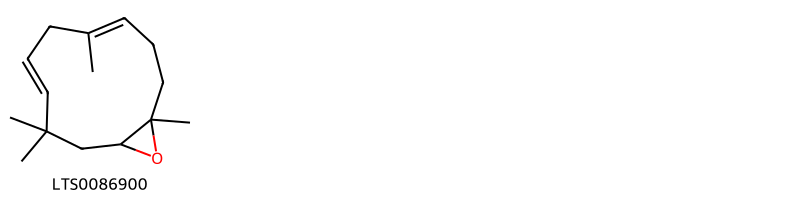{ width=100% }
    <figcaption>Hình ảnh cấu trúc hóa học của 1 hoạt chất thuộc nhóm Epoxides gồm ['(4e,7e)-1,5,9,9-tetramethyl-12-oxabicyclo[9.1.0]dodeca-4,7-diene (LTS0086900)'].</figcaption>
</figure>
#### Nhóm Fatty Acyls
<figure markdown="span">
    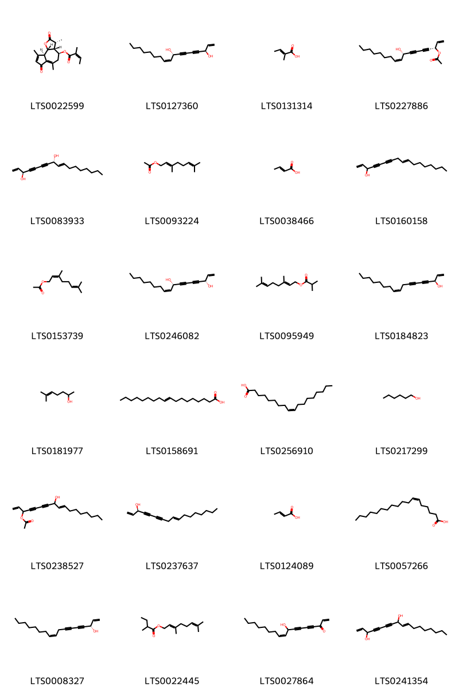{ width=100% }
    <figcaption>Hình ảnh cấu trúc hóa học của 24 hoạt chất thuộc nhóm Fatty Acyls gồm ['(3r,3ar,4s,9ar,9bs)-3,6,9-trimethyl-2,7-dioxo-3h,3ah,4h,5h,9ah,9bh-azuleno[4,5-b]furan-4-yl (2z)-2-methylbut-2-enoate (LTS0022599)', 'falcarindiol (LTS0127360)', 'tiglic acid (LTS0131314)', '(3s,8s,9z)-8-hydroxyheptadeca-1,9-dien-4,6-diyn-3-yl acetate (LTS0227886)', '(3s,8r)-heptadeca-1,9-dien-4,6-diyne-3,8-diol (LTS0083933)', 'geranyl acetate (LTS0093224)', '2-butenoic acid (LTS0038466)', 'heptadeca-1,9-dien-4,6-diyn-3-ol (LTS0160158)', 'neryl acetate (LTS0153739)', '(3s,8s,9z)-heptadeca-1,9-dien-4,6-diyne-3,8-diol (LTS0246082)', 'geranyl isobutyrate (LTS0095949)', 'falcarinol (LTS0184823)', '6-methyl-5-hepten-2-ol (LTS0181977)', '9 octadecenoic acid (LTS0158691)', 'oleic acid (LTS0256910)', 'hexanol (LTS0217299)', '8-hydroxyheptadeca-1,9-dien-4,6-diyn-3-yl acetate (LTS0238527)', '(z)-falcarinol (LTS0237637)', 'butenoic acid (LTS0124089)', 'petroselinic acid (LTS0057266)', 'falcarinol (LTS0008327)', 'geranyl 2-methylbutyrate (LTS0022445)', '(9z)-8-hydroxyheptadeca-1,9-dien-4,6-diyn-3-one (LTS0027864)', 'heptadeca-1,9-dien-4,6-diyne-3,8-diol (LTS0241354)'].</figcaption>
</figure>
#### Nhóm Flavonoids
<figure markdown="span">
    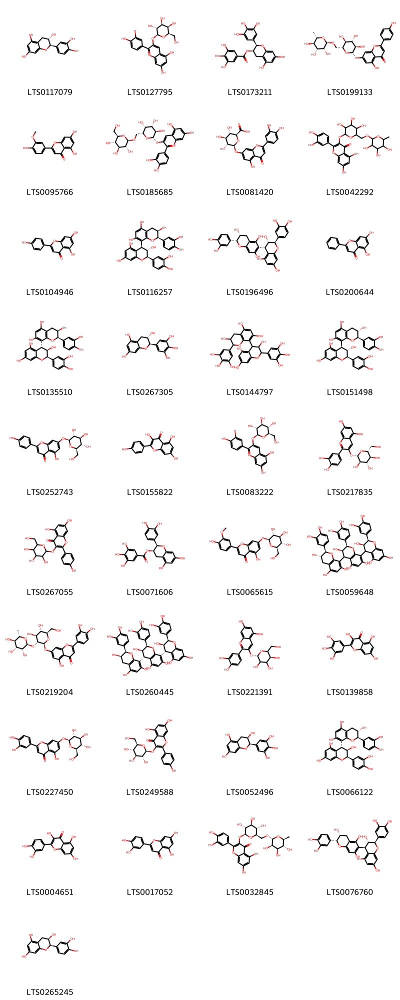{ width=100% }
    <figcaption>Hình ảnh cấu trúc hóa học của 37 hoạt chất thuộc nhóm Flavonoids gồm ['(+)-catechol (LTS0117079)', '5,7-dihydroxy-2-(4-hydroxy-3-oxidophenyl)-3-{[(2s,3r,4s,5r,6r)-3,4,5-trihydroxy-6-(hydroxymethyl)oxan-2-yl]oxy}-1λ⁴-chromen-1-ylium (LTS0127795)', '(-)-epigallocatechin gallate (LTS0173211)', 'isorhoifolin (LTS0199133)', 'chrysoeriol (LTS0095766)', '2-(3,4-dihydroxyphenyl)-5,7-dihydroxy-3-{[(2s,3r,4s,5r,6r)-3,4,5-trihydroxy-6-({[(2r,3r,4s,5s,6r)-3,4,5-trihydroxy-6-(hydroxymethyl)oxan-2-yl]oxy}methyl)oxan-2-yl]oxy}-1λ⁴-chromen-1-ylium (LTS0185685)', 'luteolin 7-o-glucuronide (LTS0081420)', 'rutin (LTS0042292)', 'chamomile (LTS0104946)', '(2r,3s,4s)-2-(3,4-dihydroxyphenyl)-4-[(2r,3r)-2-(3,4-dihydroxyphenyl)-3,5,7-trihydroxy-3,4-dihydro-2h-1-benzopyran-8-yl]-3,4-dihydro-2h-1-benzopyran-3,5,7-triol (LTS0116257)', '(2r,3s,4s)-2-(3,4-dihydroxyphenyl)-4-[(2r,3r)-2-(3,4-dihydroxyphenyl)-3,5,7-trihydroxy-3,4-dihydro-2h-1-benzopyran-6-yl]-3,4-dihydro-2h-1-benzopyran-3,5,7-triol (LTS0196496)', 'chrysin (LTS0200644)', '(2r,3r,4r)-2-(3,4-dihydroxyphenyl)-4-[(2r,3r)-2-(3,4-dihydroxyphenyl)-3,5,7-trihydroxy-3,4-dihydro-2h-1-benzopyran-8-yl]-3,4-dihydro-2h-1-benzopyran-3,5,7-triol (LTS0135510)', 'gallocatechol (LTS0267305)', '4-[3,5,7-trihydroxy-2-(3,4,5-trihydroxyphenyl)-3,4-dihydro-2h-1-benzopyran-8-yl]-2-(3,4,5-trihydroxyphenyl)-3,4-dihydro-2h-1-benzopyran-3,5,7-triol (LTS0144797)', '(2r,3s,4s)-2-(3,4-dihydroxyphenyl)-4-[(2r,3s)-2-(3,4-dihydroxyphenyl)-3,5,7-trihydroxy-3,4-dihydro-2h-1-benzopyran-8-yl]-3,4-dihydro-2h-1-benzopyran-3,5,7-triol (LTS0151498)', 'apigenin 7-o-β-glucoside (LTS0252743)', 'kaempherol (LTS0155822)', '5,7-dihydroxy-2-(4-hydroxy-3-oxidophenyl)-3-{[(2s,3r,4s,5s,6r)-3,4,5-trihydroxy-6-(hydroxymethyl)oxan-2-yl]oxy}-1λ⁴-chromen-1-ylium (LTS0083222)', 'cyanidin 3-glucoside (LTS0217835)', 'trifolin (LTS0267055)', 'epicatechin gallate (LTS0071606)', '5-hydroxy-2-(4-hydroxy-3-methoxyphenyl)-7-{[(2s,3r,4s,5s,6r)-3,4,5-trihydroxy-6-(hydroxymethyl)oxan-2-yl]oxy}chromen-4-one (LTS0065615)', '(2r,3r)-2-(3,4-dihydroxyphenyl)-8-[(2r,3r)-2-(3,4-dihydroxyphenyl)-3,5,7-trihydroxy-3,4-dihydro-2h-1-benzopyran-4-yl]-4-[(2r,3s)-2-(3,4-dihydroxyphenyl)-3,5,7-trihydroxy-3,4-dihydro-2h-1-benzopyran-8-yl]-3,4-dihydro-2h-1-benzopyran-3,5,7-triol (LTS0059648)', 'lonicerin (LTS0219204)', 'procyanidin c1 (LTS0260445)', 'chrysanthemin (LTS0221391)', 'myricetin (LTS0139858)', 'luteolin 7-o-glucoside (LTS0227450)', 'astragalin (LTS0249588)', 'epigallocatechin (LTS0052496)', '(2r,3r,4r)-2-(3,4-dihydroxyphenyl)-4-[(2r,3s)-2-(3,4-dihydroxyphenyl)-3,5,7-trihydroxy-3,4-dihydro-2h-1-benzopyran-8-yl]-3,4-dihydro-2h-1-benzopyran-3,5,7-triol (LTS0066122)', 'quercetin (LTS0004651)', 'luteolin (LTS0017052)', '3-rutinosyl quercetin (LTS0032845)', '(2r,3s,4r)-2-(3,4-dihydroxyphenyl)-4-[(2r,3r)-2-(3,4-dihydroxyphenyl)-3,5,7-trihydroxy-3,4-dihydro-2h-1-benzopyran-6-yl]-3,4-dihydro-2h-1-benzopyran-3,5,7-triol (LTS0076760)', 'ent-epicatechin (LTS0265245)'].</figcaption>
</figure>
#### Nhóm Furanoid lignans
<figure markdown="span">
    { width=100% }
    <figcaption>Hình ảnh cấu trúc hóa học của 3 hoạt chất thuộc nhóm Furanoid lignans gồm ['pinoresinol (LTS0057431)', 'matairesinol (LTS0193475)', 'lariciresinol (LTS0010950)'].</figcaption>
</figure>
#### Nhóm Imidazopyrimidines
<figure markdown="span">
    { width=100% }
    <figcaption>Hình ảnh cấu trúc hóa học của 1 hoạt chất thuộc nhóm Imidazopyrimidines gồm ['2ip (LTS0061765)'].</figcaption>
</figure>
#### Nhóm Isocoumarans
<figure markdown="span">
    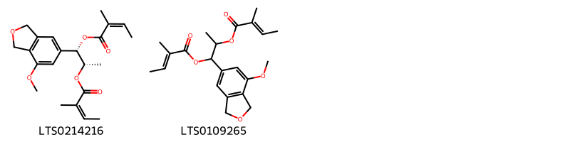{ width=100% }
    <figcaption>Hình ảnh cấu trúc hóa học của 2 hoạt chất thuộc nhóm Isocoumarans gồm ['(1s,2s)-1-(7-methoxy-1,3-dihydro-2-benzofuran-5-yl)-1-{[(2z)-2-methylbut-2-enoyl]oxy}propan-2-yl (2z)-2-methylbut-2-enoate (LTS0214216)', '1-(7-methoxy-1,3-dihydro-2-benzofuran-5-yl)-1-[(2-methylbut-2-enoyl)oxy]propan-2-yl 2-methylbut-2-enoate (LTS0109265)'].</figcaption>
</figure>
#### Nhóm Organic phosphoric acids and derivatives
<figure markdown="span">
    { width=100% }
    <figcaption>Hình ảnh cấu trúc hóa học của 1 hoạt chất thuộc nhóm Organic phosphoric acids and derivatives gồm ['o-phosphoethanolamine; bis(nonane) (LTS0249963)'].</figcaption>
</figure>
#### Nhóm Organooxygen compounds
<figure markdown="span">
    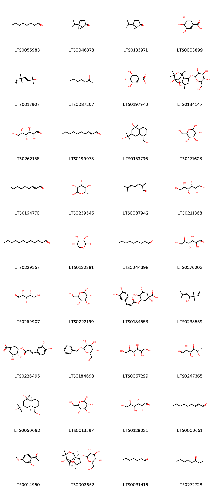{ width=100% }
    <figcaption>Hình ảnh cấu trúc hóa học của 36 hoạt chất thuộc nhóm Organooxygen compounds gồm ['octanal (LTS0055983)', '5-isopropylbicyclo[3.1.0]hex-3-en-2-one (LTS0046378)', 'sabinaketone (LTS0133971)', '(-)-shikimate (LTS0003899)', '(3e)-2,5,5-trimethylhepta-3,6-dien-2-ol (LTS0017907)', '2-heptanone (LTS0087207)', 'shikimate (LTS0197942)', '2-({8,12-dihydroxy-1,5,9,9-tetramethyl-10-oxatricyclo[6.2.2.0²,⁶]dodecan-3-yl}oxy)-6-(hydroxymethyl)oxane-3,4,5-triol (LTS0184147)', '(+)-glucose (LTS0262158)', '2-decenal (LTS0199073)', '5-(hydroxymethyl)-3-(2-hydroxypropan-2-yl)-1-methyl-octahydro-2h-naphthalen-1-ol (LTS0153796)', 'galactose (LTS0171628)', '(2e)-2-nonenal (LTS0164770)', 'l-rhamnose (LTS0239546)', 'dimethylheptenal (LTS0087942)', 'l-iditol (LTS0211368)', 'dodecanal (LTS0229257)', 'd-xylose (LTS0132381)', 'nonanal (LTS0244398)', '(+-)-mannose (LTS0276202)', '(d)-xylose (LTS0269907)', 'β-glucose (LTS0222199)', '3-{[(2z)-3-(3,4-dihydroxyphenyl)prop-2-enoyl]oxy}-1,4,5-trihydroxycyclohexane-1-carboxylic acid (LTS0184553)', '3,3,6-trimethylhepta-1,5-dien-4-ol (LTS0238559)', 'chlorogenic acid (LTS0226495)', 'benzyl β-d-glucoside (LTS0184698)', 'sorbo (LTS0067299)', 'rhamnose (LTS0247365)', '(1s,3s,4as,5s,8as)-5-(hydroxymethyl)-3-(2-hydroxypropan-2-yl)-1-methyl-octahydro-2h-naphthalen-1-ol (LTS0050092)', 'glucose (LTS0013597)', 'aldehydo-d-galactose (LTS0128031)', '2-nonenal (LTS0000651)', 'paeonol (LTS0014950)', '(2r,3r,4s,5s,6r)-2-{[(1r,2r,3r,5r,6r,8s,12s)-8,12-dihydroxy-1,5,9,9-tetramethyl-10-oxatricyclo[6.2.2.0²,⁶]dodecan-3-yl]oxy}-6-(hydroxymethyl)oxane-3,4,5-triol (LTS0003652)', 'heptanal (LTS0031416)', '3-octanone (LTS0272728)'].</figcaption>
</figure>
#### Nhóm Oxanes
<figure markdown="span">
    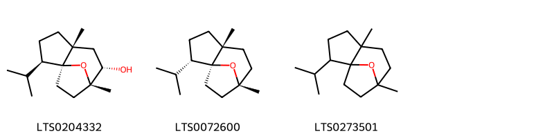{ width=100% }
    <figcaption>Hình ảnh cấu trúc hóa học của 3 hoạt chất thuộc nhóm Oxanes gồm ['daucol (LTS0204332)', '(1s,2s,5r,8r)-2-isopropyl-5,8-dimethyl-11-oxatricyclo[6.2.1.0¹,⁵]undecane (LTS0072600)', '2-isopropyl-5,8-dimethyl-11-oxatricyclo[6.2.1.0¹,⁵]undecane (LTS0273501)'].</figcaption>
</figure>
#### Nhóm Oxepanes
<figure markdown="span">
    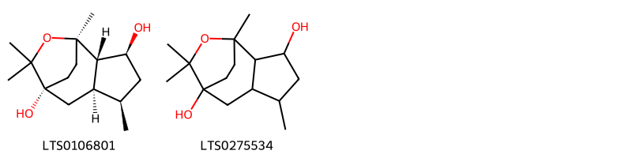{ width=100% }
    <figcaption>Hình ảnh cấu trúc hóa học của 2 hoạt chất thuộc nhóm Oxepanes gồm ['(1r,2s,3s,5r,6r,8r)-1,5,9,9-tetramethyl-10-oxatricyclo[6.2.2.0²,⁶]dodecane-3,8-diol (LTS0106801)', '1,5,9,9-tetramethyl-10-oxatricyclo[6.2.2.0²,⁶]dodecane-3,8-diol (LTS0275534)'].</figcaption>
</figure>
#### Nhóm Phenol ethers
<figure markdown="span">
    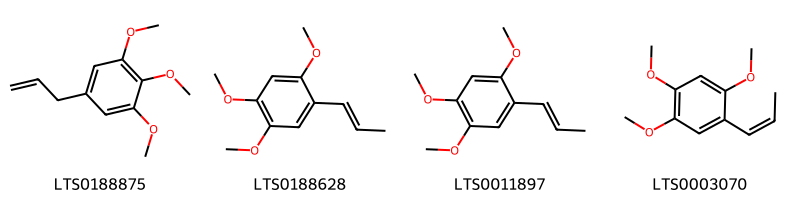{ width=100% }
    <figcaption>Hình ảnh cấu trúc hóa học của 4 hoạt chất thuộc nhóm Phenol ethers gồm ['elemicin (LTS0188875)', 'cis-asarone (LTS0188628)', '1,2,4-trimethoxy-5-(prop-1-en-1-yl)benzene (LTS0011897)', 'β-asarone (LTS0003070)'].</figcaption>
</figure>
#### Nhóm Phenols
<figure markdown="span">
    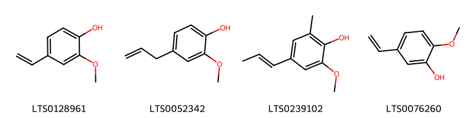{ width=100% }
    <figcaption>Hình ảnh cấu trúc hóa học của 4 hoạt chất thuộc nhóm Phenols gồm ['2-methoxy-4-vinyl-phenol (LTS0128961)', 'eugenol (LTS0052342)', '6-methylisoeugenol (LTS0239102)', '5-ethenyl-2-methoxyphenol (LTS0076260)'].</figcaption>
</figure>
#### Nhóm Prenol lipids
<figure markdown="span">
    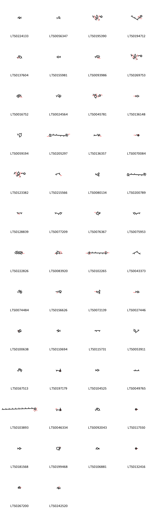{ width=100% }
    <figcaption>Hình ảnh cấu trúc hóa học của 124 hoạt chất thuộc nhóm Prenol lipids gồm ['sabinene (LTS0224133)', '(5r)-1-methyl-5-(prop-1-en-2-yl)cyclohex-1-ene (LTS0056347)', '(1r,3s,3ar,4s,8s,8as)-3-(acetyloxy)-1-hydroxy-1-isopropyl-3a,6-dimethyl-8-{[(2z)-2-methylbut-2-enoyl]oxy}-2,3,4,7,8,8a-hexahydroazulen-4-yl benzoate (LTS0195390)', '4-hydroxy-3-[(2e,6e)-3,7,11-trimethyldodeca-2,6,10-trien-1-yl]chromen-2-one (LTS0194712)', 'carotol (LTS0137604)', 'limonene,  (LTS0155981)', '(1r,4ar,8ar)-1,4a-dimethyl-7-(propan-2-ylidene)-hexahydro-2h-naphthalen-1-ol (LTS0093986)', '(1s,3r,3as,4s,8s,8ar)-1-(acetyloxy)-3-hydroxy-3-isopropyl-6,8a-dimethyl-8-{[(2e)-3-phenylprop-2-enoyl]oxy}-1,2,3a,4,5,8-hexahydroazulen-4-yl (2z)-2-methylbut-2-enoate (LTS0269753)', '(3s,3ar,5as,9as,9bs)-3,5a,9-trimethyl-3h,3ah,4h,5h,9ah,9bh-naphtho[1,2-b]furan-2-one (LTS0016752)', 'α-selinene (LTS0024564)', '(1r,3ar,4r,8as)-8a-hydroxy-1-isopropyl-3a,6-dimethyl-3-oxo-2,4,7,8-tetrahydro-1h-azulen-4-yl 4-methoxybenzoate (LTS0045781)', 'terpineol (LTS0136148)', '(-)-germacrene d (LTS0059194)', 'carotenoid (LTS0205297)', '(2r,5s)-2-methyl-5-(6-methylhept-5-en-2-yl)bicyclo[3.1.0]hexan-2-ol (LTS0136357)', 'nopol (LTS0070084)', '1-(acetyloxy)-3-hydroxy-3-isopropyl-6,8a-dimethyl-8-[(3-phenylprop-2-enoyl)oxy]-1,2,3a,4,5,8-hexahydroazulen-4-yl 2-methylbut-2-enoate (LTS0123382)', '3,7-dimethyl-2,6-octadien-1-ol (LTS0215566)', '4-ethenyl-1-isopropyl-4-methyl-3-(prop-1-en-2-yl)cyclohex-1-ene (LTS0080134)', '(+)-α-carotene (LTS0200789)', 'linalool, (+-)- (LTS0128839)', '(r)-β-bisabolene (LTS0077209)', '(3e)-4,8,11,11-tetramethylbicyclo[7.2.0]undec-3-en-5-ol (LTS0076367)', '1-methyl-4-(6-methylhepta-3,5-dien-2-yl)cyclohex-1-ene (LTS0075953)', 'amyrin (LTS0222826)', '2-(6-hydroxy-3,8-dimethyl-2-oxo-4,5,6,7,8,8a-hexahydro-1h-azulen-5-yl)propan-2-yl acetate (LTS0083920)', 'violaxanthin (LTS0102265)', '(6z)-2,6-dimethyl-10-methylidenedodeca-2,6-diene (LTS0043373)', 'β-bourbonene (LTS0074484)', '(1e)-2-methyl-1-(2,6,6-trimethylcyclohex-1-en-1-yl)pent-1-en-3-one (LTS0156626)', '2-[4-ethenyl-4-methyl-3-(prop-1-en-2-yl)cyclohexyl]propan-2-ol (LTS0072139)', '2-(4-methylphenyl)propan-1-ol (LTS0027446)', '2,2,7,7-tetramethyltricyclo[6.2.1.0¹,⁶]undec-5-ene (LTS0100638)', '(+)-sabinene (LTS0110694)', 'α-myrcene (LTS0115731)', '(z)-α-bisabolene (LTS0053911)', 'β-bourbonene (LTS0167513)', '1,7-dimethyl-7-(4-methylpent-3-en-1-yl)tricyclo[2.2.1.0²,⁶]heptane (LTS0197179)', 'terpinolene (LTS0104525)', 'trans-β-ocimene (LTS0049765)', 'coenzyme q10 (LTS0103893)', 'α-santalol (LTS0046334)', '1-isopropyl-3a,6-dimethyl-3,4,7,8-tetrahydro-2h-azulene (LTS0092043)', 'β-pinene (LTS0117550)', 'cymene (LTS0181568)', '(1s,6r,9r)-6,10,10-trimethyl-2-methylidenebicyclo[7.2.0]undecane (LTS0199468)', 'monoterpenes (LTS0106881)', 'α pinene (LTS0132416)', 'α-pinene oxide (LTS0267200)', 'umbellulone (LTS0242520)', 'humulene (LTS0263171)', '1-(acetyloxy)-8-(benzoyloxy)-3-hydroxy-3-isopropyl-6,8a-dimethyl-1,2,3a,4,5,8-hexahydroazulen-4-yl 4-methylbenzoate (LTS0201264)', 'camphene (LTS0267242)', '(6e)-2,6-dimethyl-10-methylidenedodeca-2,6-diene (LTS0154516)', '(3as,4s,6r,7s)-3a,6-dihydroxy-7-(2-hydroxypropan-2-yl)-1,4-dimethyl-3,4,5,6,7,8-hexahydroazulen-2-one (LTS0121281)', '6,10,10-trimethyl-2-methylidenebicyclo[7.2.0]undecane (LTS0155683)', 'β-ionone (LTS0155301)', 'β-amyrin (LTS0251864)', '3a,6-dihydroxy-7-(2-hydroxypropan-2-yl)-1,4-dimethyl-3,4,5,6,7,8-hexahydroazulen-2-one (LTS0153988)', 'elemene (LTS0090837)', '1-isopropyl-4,7-dimethyl-2,3,4,5,6,8a-hexahydro-1h-naphthalen-4a-ol (LTS0237685)', '(z)-γ-bisabolene (LTS0143321)', 'phellandrene (LTS0157173)', '(1s,3r)-1-isopropyl-4-methylidenebicyclo[3.1.0]hexan-3-ol (LTS0111134)', '(2r,3s)-3-ethenyl-6-isopropyl-3-methyl-2-(prop-1-en-2-yl)cyclohexan-1-one (LTS0228342)', 'β,β-carotene (LTS0168447)', '(-)-β-pinene (LTS0108757)', '4-terpineol (LTS0253733)', 'bisabolene (LTS0109697)', 'cryptoxanthin (LTS0132646)', 'borneol (LTS0264960)', '(4s)-1-methyl-4-[(2s,3z)-6-methylhepta-3,5-dien-2-yl]cyclohex-1-ene (LTS0187468)', 'α-bergamotene (LTS0226115)', 'lupeol (LTS0256952)', 'crocetin (LTS0129423)', 'caryophyllene (LTS0085212)', 'phellandral (LTS0209940)', '2-hydroxy-3-[(2e,6e)-3,7,11-trimethyldodeca-2,6,10-trien-1-yl]chromen-4-one (LTS0272695)', '(6ar,6br,8ar,14br)-4,4,6a,6b,8a,12,14b-heptamethyl-11-methylidene-hexadecahydropicen-3-ol (LTS0274865)', 'β-carotene (LTS0275716)', '(5z)-2,6-dimethylocta-2,5,7-trien-4-one (LTS0060931)', 'α-limonene (LTS0244943)', 'β-farnesene (LTS0067925)', '(+)-α-phellandrene (LTS0234318)', 'bornyl acetate (LTS0060565)', 'antheraxanthin (LTS0210072)', '(1z,6z,8s)-8-isopropyl-1-methyl-5-methylidenecyclodeca-1,6-diene (LTS0065195)', '(1s,2r,5s)-4,6,6-trimethylbicyclo[3.1.1]hept-3-en-2-yl acetate (LTS0072456)', 'aristolone (LTS0230263)', 'taraxasterol (LTS0006950)', 'neoxanthin (LTS0227522)', '4-hydroxy-3-(3,7,11-trimethyldodeca-2,6,10-trien-1-yl)chromen-2-one (LTS0155752)', 'cuminaldehyde (LTS0037806)', '(+)-trans-piperitenol (LTS0141152)', 'ionone (LTS0252546)', '(2s,5s)-2-methyl-5-(6-methylhept-5-en-2-yl)bicyclo[3.1.0]hexan-2-ol (LTS0186311)', '(e)-2-epi-β-caryophyllene (LTS0230740)', 'linalyl acetate (LTS0167325)', '(9z)-β-carotene (LTS0252839)', 'geraniol (LTS0258838)', '2-[(5s,6r,8s,8ar)-6-hydroxy-3,8-dimethyl-2-oxo-4,5,6,7,8,8a-hexahydro-1h-azulen-5-yl]propan-2-yl acetate (LTS0022171)', 'β-ocimene (LTS0242381)', '(s)-trans-verbenol (LTS0175186)', '2-(4-methylidenecyclohexyl)propan-2-ol (LTS0245953)', '(1s,3r,3as,4s,8s,8ar)-1-(acetyloxy)-8-(benzoyloxy)-3-hydroxy-3-isopropyl-6,8a-dimethyl-1,2,3a,4,5,8-hexahydroazulen-4-yl 4-methylbenzoate (LTS0256492)', '(2s,4r)-1,7,7-trimethylbicyclo[2.2.1]heptan-2-ol (LTS0010050)', '3-(acetyloxy)-1-hydroxy-1-isopropyl-3a,6-dimethyl-8-[(2-methylbut-2-enoyl)oxy]-2,3,4,7,8,8a-hexahydroazulen-4-yl benzoate (LTS0043081)', 'gamma-muurolene (LTS0052920)', 'terpinene (LTS0136858)', '(4s)-1-methyl-4-[(2s,3e)-6-methylhepta-3,5-dien-2-yl]cyclohex-1-ene (LTS0004889)', '(-)-β-bisabolene (LTS0009940)', '[(5z)-6,10-dimethyl-2-methylidenebicyclo[7.2.0]undec-5-en-10-yl]methanol (LTS0005304)', 'caryophyllene (LTS0131870)', 'neoxanthin (LTS0000701)', 'isobornyl acetate (LTS0024491)', 'dihydrocarvyl acetate (LTS0126582)', 'α-carotene (LTS0224243)', 'delta-cadinene (LTS0019321)', 'pinocarveol (LTS0090950)', '4,11,11-trimethyl-8-methylidenebicyclo[7.2.0]undec-4-ene (LTS0256716)', '(+)-shyobunone (LTS0097992)', '(1r,3s)-1-isopropyl-4-methylidenebicyclo[3.1.0]hexan-3-yl acetate (LTS0049732)', 'geranylacetone (LTS0231623)', '(1ar,7s,7as,7bs)-1,1,7,7a-tetramethyl-1ah,2h,4h,5h,6h,7h,7bh-cyclopropa[a]naphthalen-6-ol (LTS0023348)'].</figcaption>
</figure>
#### Nhóm Purine nucleosides
<figure markdown="span">
    { width=100% }
    <figcaption>Hình ảnh cấu trúc hóa học của 1 hoạt chất thuộc nhóm Purine nucleosides gồm ['vidarabine (LTS0058806)'].</figcaption>
</figure>
#### Nhóm Steroids and steroid derivatives
<figure markdown="span">
    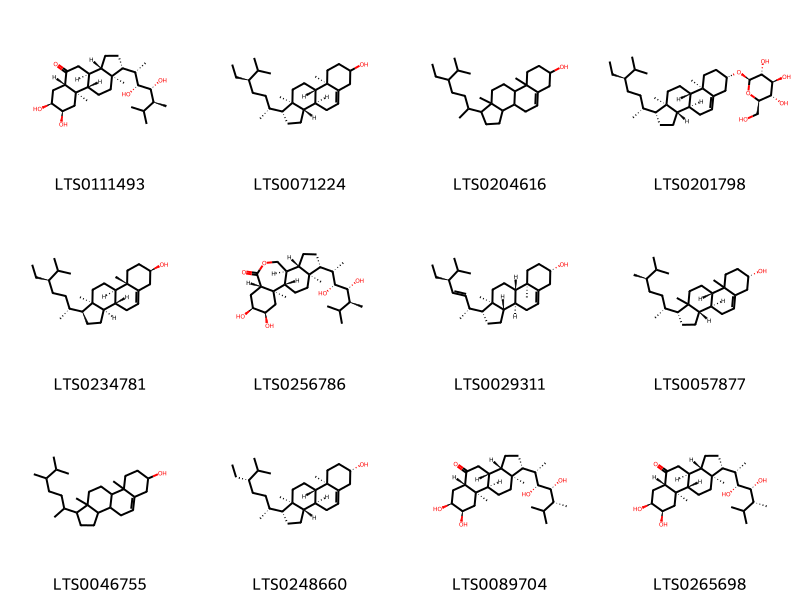{ width=100% }
    <figcaption>Hình ảnh cấu trúc hóa học của 12 hoạt chất thuộc nhóm Steroids and steroid derivatives gồm ['castasterone (LTS0111493)', 'stigmast-5-en-3-ol (LTS0071224)', 'stigmast-5-en-3-ol, (3β)- (LTS0204616)', 'sitogluside (LTS0201798)', '(1s,3ar,3br,7r,9as,9br,11ar)-1-[(2r,5r)-5-ethyl-6-methylheptan-2-yl]-9a,11a-dimethyl-1h,2h,3h,3ah,3bh,4h,6h,7h,8h,9h,9bh,10h,11h-cyclopenta[a]phenanthren-7-ol (LTS0234781)', 'brassinolide (LTS0256786)', 'phytosterol (LTS0029311)', '(1r,3as,3bs,7s,9bs)-1-[(2r,5r)-5,6-dimethylheptan-2-yl]-9a,11a-dimethyl-1h,2h,3h,3ah,3bh,4h,6h,7h,8h,9h,9bh,10h,11h-cyclopenta[a]phenanthren-7-ol (LTS0057877)', 'campesterol (LTS0046755)', 'clionasterol (LTS0248660)', '(1r,3as,3br,5as,7s,8r,9ar,9br,11as)-1-[(2s,3r,4r,5r)-3,4-dihydroxy-5,6-dimethylheptan-2-yl]-7,8-dihydroxy-9a,11a-dimethyl-tetradecahydrocyclopenta[a]phenanthren-5-one (LTS0089704)', '(1r,3as,3bs,5as,7s,8r,9ar,9bs,11as)-1-[(2s,3r,4r,5r)-3,4-dihydroxy-5,6-dimethylheptan-2-yl]-7,8-dihydroxy-9a,11a-dimethyl-tetradecahydrocyclopenta[a]phenanthren-5-one (LTS0265698)'].</figcaption>
</figure>
#### Nhóm Tetralins
<figure markdown="span">
    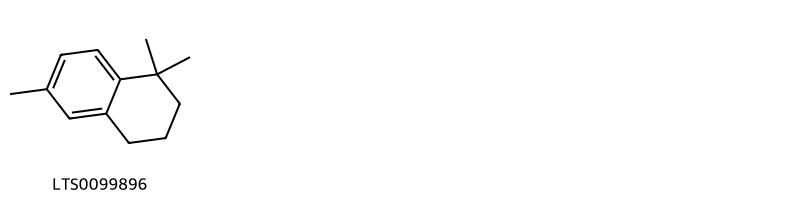{ width=100% }
    <figcaption>Hình ảnh cấu trúc hóa học của 1 hoạt chất thuộc nhóm Tetralins gồm ['α-ionene (LTS0099896)'].</figcaption>
</figure>
#### Nhóm Tetrapyrroles and derivatives
<figure markdown="span">
    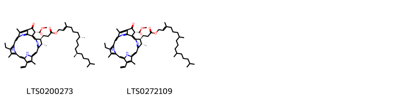{ width=100% }
    <figcaption>Hình ảnh cấu trúc hóa học của 2 hoạt chất thuộc nhóm Tetrapyrroles and derivatives gồm ['methyl (3r,21s,22s)-16-ethenyl-11-ethyl-12,17,21,26-tetramethyl-4-oxo-22-(3-oxo-3-{[(2e,7r,11r)-3,7,11,15-tetramethylhexadec-2-en-1-yl]oxy}propyl)-7,23,24,25-tetraazahexacyclo[18.2.1.1⁵,⁸.1¹⁰,¹³.1¹⁵,¹⁸.0²,⁶]hexacosa-1(23),2(6),5(26),7,9,11,13,15,17,19-decaene-3-carboxylate (LTS0200273)', 'methyl (3r,21s,22s)-16-ethenyl-11-ethyl-12,17,21,26-tetramethyl-4-oxo-22-(3-oxo-3-{[(2e)-3,7,11,15-tetramethylhexadec-2-en-1-yl]oxy}propyl)-7,23,24,25-tetraazahexacyclo[18.2.1.1⁵,⁸.1¹⁰,¹³.1¹⁵,¹⁸.0²,⁶]hexacosa-1(23),2(6),5(26),7,9,11,13,15,17,19-decaene-3-carboxylate (LTS0272109)'].</figcaption>
</figure>
#### Nhóm Unsaturated hydrocarbons
<figure markdown="span">
    { width=100% }
    <figcaption>Hình ảnh cấu trúc hóa học của 1 hoạt chất thuộc nhóm Unsaturated hydrocarbons gồm ['α terpinene (LTS0232891)'].</figcaption>
</figure>

---

### Dược dân tộc học

Danh sách các quốc gia có sử dụng *Daucus carota* trong điều trị các bệnh. 

| Country   | Disease                                                                              | Bệnh                                                                                                                                                                                                |
|:----------|:-------------------------------------------------------------------------------------|:----------------------------------------------------------------------------------------------------------------------------------------------------------------------------------------------------|
| China     | Apertif, Carminative, Vermifuge                                                      | MYMEMORY WARNING: YOU USED ALL AVAILABLE FREE TRANSLATIONS FOR TODAY. NEXT AVAILABLE IN  08 HOURS 11 MINUTES 44 SECONDS VISIT HTTPS://MYMEMORY.TRANSLATED.NET/DOC/USAGELIMITS.PHP TO TRANSLATE MORE |
| Elsewhere | Carminative, Diuretic, Aphrodisiac, Nervine, Stimulant, Vermifuge                    | MYMEMORY WARNING: YOU USED ALL AVAILABLE FREE TRANSLATIONS FOR TODAY. NEXT AVAILABLE IN  08 HOURS 11 MINUTES 42 SECONDS VISIT HTTPS://MYMEMORY.TRANSLATED.NET/DOC/USAGELIMITS.PHP TO TRANSLATE MORE |
| Haiti     | Stomachic, Tonic                                                                     | MYMEMORY WARNING: YOU USED ALL AVAILABLE FREE TRANSLATIONS FOR TODAY. NEXT AVAILABLE IN  08 HOURS 11 MINUTES 40 SECONDS VISIT HTTPS://MYMEMORY.TRANSLATED.NET/DOC/USAGELIMITS.PHP TO TRANSLATE MORE |
| Kurdistan | Vermifuge                                                                            | MYMEMORY WARNING: YOU USED ALL AVAILABLE FREE TRANSLATIONS FOR TODAY. NEXT AVAILABLE IN  08 HOURS 11 MINUTES 38 SECONDS VISIT HTTPS://MYMEMORY.TRANSLATED.NET/DOC/USAGELIMITS.PHP TO TRANSLATE MORE |
| Turkey    | Abortifacient, Aperient, Aphrodisiac, Diuretic, Nervine, Vermifuge, Stomachic, Tonic | MYMEMORY WARNING: YOU USED ALL AVAILABLE FREE TRANSLATIONS FOR TODAY. NEXT AVAILABLE IN  08 HOURS 11 MINUTES 35 SECONDS VISIT HTTPS://MYMEMORY.TRANSLATED.NET/DOC/USAGELIMITS.PHP TO TRANSLATE MORE |
| UK        | Aphrodisiac, Carminative, Antiseptic                                                 | MYMEMORY WARNING: YOU USED ALL AVAILABLE FREE TRANSLATIONS FOR TODAY. NEXT AVAILABLE IN  08 HOURS 11 MINUTES 33 SECONDS VISIT HTTPS://MYMEMORY.TRANSLATED.NET/DOC/USAGELIMITS.PHP TO TRANSLATE MORE |
| US        | Diuretic                                                                             | MYMEMORY WARNING: YOU USED ALL AVAILABLE FREE TRANSLATIONS FOR TODAY. NEXT AVAILABLE IN  08 HOURS 11 MINUTES 30 SECONDS VISIT HTTPS://MYMEMORY.TRANSLATED.NET/DOC/USAGELIMITS.PHP TO TRANSLATE MORE |
| ain       | Diuretic                                                                             | MYMEMORY WARNING: YOU USED ALL AVAILABLE FREE TRANSLATIONS FOR TODAY. NEXT AVAILABLE IN  08 HOURS 11 MINUTES 28 SECONDS VISIT HTTPS://MYMEMORY.TRANSLATED.NET/DOC/USAGELIMITS.PHP TO TRANSLATE MORE |

---

# Chi Pastinaca

??? note "Danh sách các dược liệu thuộc chi"
    
	 - *Pastinaca sativa*

---
## Pastinaca sativa
### Thông tin về thực vật

!!! info "Phân loại thực vật của *Pastinaca sativa* từ GIBF:"
    - **Kingdom:** Plantae
    - **Phylum:** Tracheophyta
    - **Order:** Apiales
    - **Family:** Apiaceae
    - **Genus:** Pastinaca
    - **Species:** *Pastinaca sativa*

 

| Label (VI)   | Label (EN)   | Scientific Name   | Descriptions (VI)   | Descriptions (EN)                                  | Also Known As (VI)   | Also Known As (EN)   |
|:-------------|:-------------|:------------------|:--------------------|:---------------------------------------------------|:---------------------|:---------------------|
| N/A          | N/A          | Pastinaca sativa  | loài thực vật       | species of plant, source of parsnip root vegetable | ['']                 | ['parsnip']          |

#### Phân bố trên thế giới

**Từ CSDL GIBF** Italy, Belgium, Argentina, Norway, Canada, Ukraine, Denmark, Netherlands, Hungary, Russian Federation, United States of America, Sweden, Czechia, Germany, Switzerland, Austria, France, Dominican Republic, United Kingdom of Great Britain and Northern Ireland, Poland, New Zealand

#### Phân bố tại Việt Nam

**Từ CSDL GIBF**: Không có ghi nhận ở Việt Nam

---
### Thành phần hóa học
        
- Theo cơ sở dữ liệu lotus: Từ loài *Pastinaca sativa* đã phân lập và xác định được 21 hoạt chất thuộc về các nhóm Flavonoids, Prenol lipids, Benzodioxoles, Dibenzylbutane lignans, Coumarins and derivatives, Furanoid lignans. 

|    | chemicalTaxonomyClassyfireClass   |   smiles_count |
|---:|:----------------------------------|---------------:|
|  0 | Benzodioxoles                     |              1 |
|  1 | Coumarins and derivatives         |              9 |
|  2 | Dibenzylbutane lignans            |              2 |
|  3 | Flavonoids                        |              5 |
|  4 | Furanoid lignans                  |              3 |
|  5 | Prenol lipids                     |              1 |

#### Nhóm Benzodioxoles
<figure markdown="span">
    { width=100% }
    <figcaption>Hình ảnh cấu trúc hóa học của 1 hoạt chất thuộc nhóm Benzodioxoles gồm ['myristicin (LTS0180101)'].</figcaption>
</figure>
#### Nhóm Coumarins and derivatives
<figure markdown="span">
    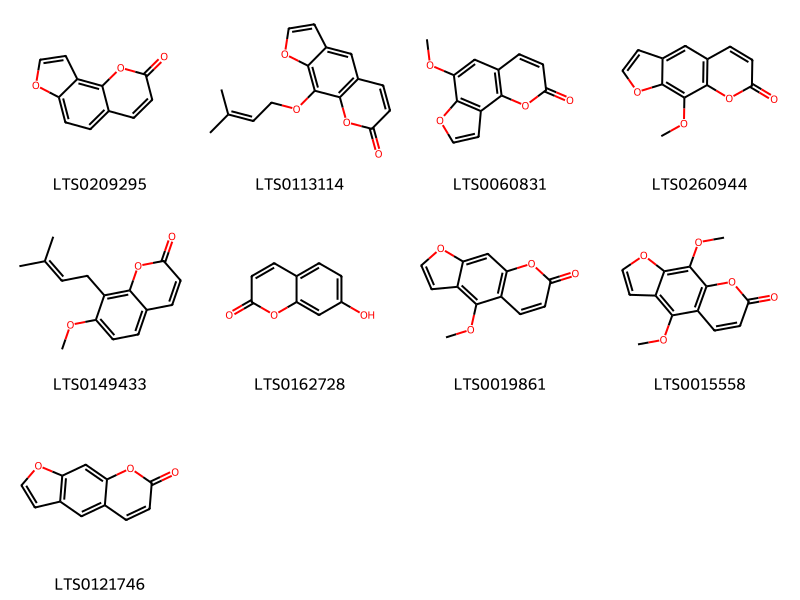{ width=100% }
    <figcaption>Hình ảnh cấu trúc hóa học của 9 hoạt chất thuộc nhóm Coumarins and derivatives gồm ['angelicin (LTS0209295)', 'imperatorin (LTS0113114)', 'sphondin (LTS0060831)', 'methoxsalen (LTS0260944)', 'osthole (LTS0149433)', 'umbelliferone (LTS0162728)', 'bergapten (LTS0019861)', 'isopimpinellin (LTS0015558)', 'psoralen (LTS0121746)'].</figcaption>
</figure>
#### Nhóm Dibenzylbutane lignans
<figure markdown="span">
    { width=100% }
    <figcaption>Hình ảnh cấu trúc hóa học của 2 hoạt chất thuộc nhóm Dibenzylbutane lignans gồm ['(2s,3r)-2,3-bis[(4-hydroxy-3-methoxyphenyl)(¹³c)methyl](1-¹³c)butane-1,4-diol (LTS0268699)', 'secoisolariciresinol (LTS0086727)'].</figcaption>
</figure>
#### Nhóm Flavonoids
<figure markdown="span">
    { width=100% }
    <figcaption>Hình ảnh cấu trúc hóa học của 5 hoạt chất thuộc nhóm Flavonoids gồm ['chamomile (LTS0104946)', 'kaempherol (LTS0155822)', 'myricetin (LTS0139858)', 'quercetin (LTS0004651)', 'luteolin (LTS0017052)'].</figcaption>
</figure>
#### Nhóm Furanoid lignans
<figure markdown="span">
    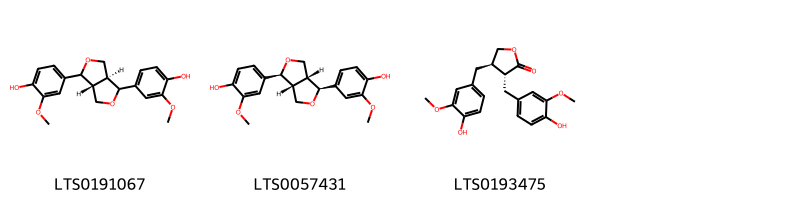{ width=100% }
    <figcaption>Hình ảnh cấu trúc hóa học của 3 hoạt chất thuộc nhóm Furanoid lignans gồm ['4-[(3ar,6as)-4-(4-hydroxy-3-methoxyphenyl)-hexahydrofuro[3,4-c]furan-1-yl]-2-methoxyphenol (LTS0191067)', 'pinoresinol (LTS0057431)', 'matairesinol (LTS0193475)'].</figcaption>
</figure>
#### Nhóm Prenol lipids
<figure markdown="span">
    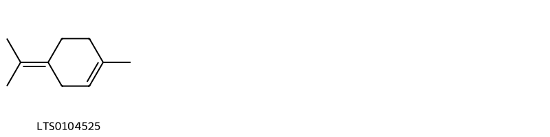{ width=100% }
    <figcaption>Hình ảnh cấu trúc hóa học của 1 hoạt chất thuộc nhóm Prenol lipids gồm ['terpinolene (LTS0104525)'].</figcaption>
</figure>

---

### Dược dân tộc học

Danh sách các quốc gia có sử dụng *Pastinaca sativa* trong điều trị các bệnh. 

| Country    | Disease                                      | Bệnh                                                                                                                                                                                                |
|:-----------|:---------------------------------------------|:----------------------------------------------------------------------------------------------------------------------------------------------------------------------------------------------------|
| Elsewhere  | Carminative, Diuretic                        | MYMEMORY WARNING: YOU USED ALL AVAILABLE FREE TRANSLATIONS FOR TODAY. NEXT AVAILABLE IN  08 HOURS 10 MINUTES 44 SECONDS VISIT HTTPS://MYMEMORY.TRANSLATED.NET/DOC/USAGELIMITS.PHP TO TRANSLATE MORE |
| English    | Emmenagogue                                  | MYMEMORY WARNING: YOU USED ALL AVAILABLE FREE TRANSLATIONS FOR TODAY. NEXT AVAILABLE IN  08 HOURS 10 MINUTES 42 SECONDS VISIT HTTPS://MYMEMORY.TRANSLATED.NET/DOC/USAGELIMITS.PHP TO TRANSLATE MORE |
| Haiti      | Apertif, Carminative, Emmenagogue, Stomachic | MYMEMORY WARNING: YOU USED ALL AVAILABLE FREE TRANSLATIONS FOR TODAY. NEXT AVAILABLE IN  08 HOURS 10 MINUTES 40 SECONDS VISIT HTTPS://MYMEMORY.TRANSLATED.NET/DOC/USAGELIMITS.PHP TO TRANSLATE MORE |
| Portuguese | Diuretic                                     | MYMEMORY WARNING: YOU USED ALL AVAILABLE FREE TRANSLATIONS FOR TODAY. NEXT AVAILABLE IN  08 HOURS 10 MINUTES 37 SECONDS VISIT HTTPS://MYMEMORY.TRANSLATED.NET/DOC/USAGELIMITS.PHP TO TRANSLATE MORE |

---

# Chi Aegopodium

??? note "Danh sách các dược liệu thuộc chi"
    
	 - *Aegopodium podagraria*

---
## Aegopodium podagraria
### Thông tin về thực vật

!!! info "Phân loại thực vật của *Aegopodium podagraria* từ GIBF:"
    - **Kingdom:** Plantae
    - **Phylum:** Tracheophyta
    - **Order:** Apiales
    - **Family:** Apiaceae
    - **Genus:** Aegopodium
    - **Species:** *Aegopodium podagraria*

 

| Label (VI)   | Label (EN)   | Scientific Name       | Descriptions (VI)   | Descriptions (EN)   | Also Known As (VI)   | Also Known As (EN)                                                                                                                         |
|:-------------|:-------------|:----------------------|:--------------------|:--------------------|:---------------------|:-------------------------------------------------------------------------------------------------------------------------------------------|
| N/A          | N/A          | Aegopodium podagraria | loài thực vật       | species of plant    | ['']                 | ["bishop's weed", 'English masterwort', 'gout wort', 'goutweed', 'ground elder', 'herb gerard', 'snow-in-the-mountain', 'wild masterwort'] |

#### Phân bố trên thế giới

**Từ CSDL GIBF** Ukraine, Denmark, Netherlands, Italy, Germany, Poland, Türkiye, Serbia, Switzerland, Russian Federation, United States of America, Sweden, Austria, France, United Kingdom of Great Britain and Northern Ireland

#### Phân bố tại Việt Nam

**Từ CSDL GIBF**: Không có ghi nhận ở Việt Nam

---
### Thành phần hóa học
        
- Theo cơ sở dữ liệu lotus: Từ loài *Aegopodium podagraria* đã phân lập và xác định được 18 hoạt chất thuộc về các nhóm Fatty Acyls, Organooxygen compounds. 

|    | chemicalTaxonomyClassyfireClass   |   smiles_count |
|---:|:----------------------------------|---------------:|
|  0 | Fatty Acyls                       |             16 |
|  1 | Organooxygen compounds            |              2 |

#### Nhóm Fatty Acyls
<figure markdown="span">
    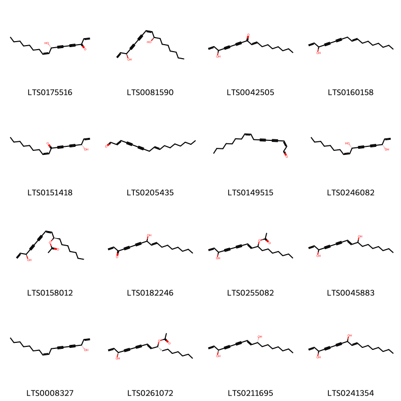{ width=100% }
    <figcaption>Hình ảnh cấu trúc hóa học của 16 hoạt chất thuộc nhóm Fatty Acyls gồm ['(8s,9z)-8-hydroxyheptadeca-1,9-dien-4,6-diyn-3-one (LTS0175516)', '(3s,8z,10r)-heptadeca-1,8-dien-4,6-diyne-3,10-diol (LTS0081590)', '3-hydroxyheptadeca-1,9-dien-4,6-diyn-8-one (LTS0042505)', 'heptadeca-1,9-dien-4,6-diyn-3-ol (LTS0160158)', '(3s,9z)-3-hydroxyheptadeca-1,9-dien-4,6-diyn-8-one (LTS0151418)', 'heptadeca-2,9-dien-4,6-diynal (LTS0205435)', '(2z,9z)-heptadeca-2,9-dien-4,6-diynal (LTS0149515)', '(3s,8s,9z)-heptadeca-1,9-dien-4,6-diyne-3,8-diol (LTS0246082)', '(8r,9z,15s)-15-hydroxyheptadeca-9,16-dien-11,13-diyn-8-yl acetate (LTS0158012)', '8-hydroxyheptadeca-1,9-dien-4,6-diyn-3-one (LTS0182246)', '15-hydroxyheptadeca-9,16-dien-11,13-diyn-8-yl acetate (LTS0255082)', 'heptadeca-1,8-dien-4,6-diyne-3,10-diol (LTS0045883)', 'falcarinol (LTS0008327)', '(8r,9e,15s)-15-hydroxyheptadeca-9,16-dien-11,13-diyn-8-yl acetate (LTS0261072)', '(3s,8e,10r)-heptadeca-1,8-dien-4,6-diyne-3,10-diol (LTS0211695)', 'heptadeca-1,9-dien-4,6-diyne-3,8-diol (LTS0241354)'].</figcaption>
</figure>
#### Nhóm Organooxygen compounds
<figure markdown="span">
    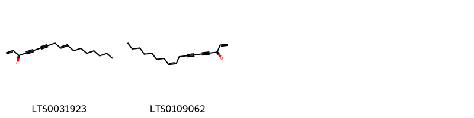{ width=100% }
    <figcaption>Hình ảnh cấu trúc hóa học của 2 hoạt chất thuộc nhóm Organooxygen compounds gồm ['heptadeca-1,9-dien-4,6-diyn-3-one (LTS0031923)', 'falcarinone (LTS0109062)'].</figcaption>
</figure>

---

### Dược dân tộc học

Danh sách các quốc gia có sử dụng *Aegopodium podagraria* trong điều trị các bệnh. 

| Country   | Disease   | Bệnh                                                                                                                                                                                                |
|:----------|:----------|:----------------------------------------------------------------------------------------------------------------------------------------------------------------------------------------------------|
| English   | Diuretic  | MYMEMORY WARNING: YOU USED ALL AVAILABLE FREE TRANSLATIONS FOR TODAY. NEXT AVAILABLE IN  08 HOURS 10 MINUTES 09 SECONDS VISIT HTTPS://MYMEMORY.TRANSLATED.NET/DOC/USAGELIMITS.PHP TO TRANSLATE MORE |
| German    | Stimulant | MYMEMORY WARNING: YOU USED ALL AVAILABLE FREE TRANSLATIONS FOR TODAY. NEXT AVAILABLE IN  08 HOURS 10 MINUTES 07 SECONDS VISIT HTTPS://MYMEMORY.TRANSLATED.NET/DOC/USAGELIMITS.PHP TO TRANSLATE MORE |
| Turkey    | Sedative  | MYMEMORY WARNING: YOU USED ALL AVAILABLE FREE TRANSLATIONS FOR TODAY. NEXT AVAILABLE IN  08 HOURS 10 MINUTES 04 SECONDS VISIT HTTPS://MYMEMORY.TRANSLATED.NET/DOC/USAGELIMITS.PHP TO TRANSLATE MORE |
| anish     | Vulnerary | MYMEMORY WARNING: YOU USED ALL AVAILABLE FREE TRANSLATIONS FOR TODAY. NEXT AVAILABLE IN  08 HOURS 10 MINUTES 02 SECONDS VISIT HTTPS://MYMEMORY.TRANSLATED.NET/DOC/USAGELIMITS.PHP TO TRANSLATE MORE |

---

# Chi Cryptotaenia

??? note "Danh sách các dược liệu thuộc chi"
    
	 - *Cryptotaenia canadensis*

---
## Cryptotaenia canadensis
### Thông tin về thực vật

!!! info "Phân loại thực vật của *Cryptotaenia canadensis* từ GIBF:"
    - **Kingdom:** Plantae
    - **Phylum:** Tracheophyta
    - **Order:** Apiales
    - **Family:** Apiaceae
    - **Genus:** Cryptotaenia
    - **Species:** *Cryptotaenia canadensis*

 

| Label (VI)   | Label (EN)   | Scientific Name         | Descriptions (VI)   | Descriptions (EN)   | Also Known As (VI)   | Also Known As (EN)   |
|:-------------|:-------------|:------------------------|:--------------------|:--------------------|:---------------------|:---------------------|
| N/A          | N/A          | Cryptotaenia canadensis | loài thực vật       | species of plant    | ['']                 | ['']                 |

#### Phân bố trên thế giới

**Từ CSDL GIBF** United States of America, Canada

#### Phân bố tại Việt Nam

**Từ CSDL GIBF**: Không có ghi nhận ở Việt Nam

---
### Thành phần hóa học
        
- Theo cơ sở dữ liệu lotus: Từ loài *Cryptotaenia canadensis* đã phân lập và xác định được 9 hoạt chất thuộc về các nhóm Benzene and substituted derivatives. 

|    | chemicalTaxonomyClassyfireClass     |   smiles_count |
|---:|:------------------------------------|---------------:|
|  0 | Benzene and substituted derivatives |              9 |

#### Nhóm Benzene and substituted derivatives
<figure markdown="span">
    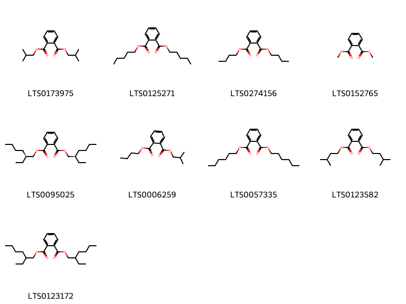{ width=100% }
    <figcaption>Hình ảnh cấu trúc hóa học của 9 hoạt chất thuộc nhóm Benzene and substituted derivatives gồm ['diisobutyl phthalate (LTS0173975)', 'amoil (LTS0125271)', 'dibutyl-phthalate (LTS0274156)', 'dimethyl phthalate (LTS0152765)', '1-(2r)-2-ethylhexyl 2-(2s)-2-ethylhexyl phthalate (LTS0095025)', '1-butyl 2-(2-methylpropyl) phthalate (LTS0006259)', 'di-n-hexyl phthalate (LTS0057335)', 'isoamyl phthalate (LTS0123582)', 'etalon (LTS0123172)'].</figcaption>
</figure>

---

### Dược dân tộc học

Danh sách các quốc gia có sử dụng *Cryptotaenia canadensis* trong điều trị các bệnh. 

| Country   | Disease            | Bệnh                                                                                                                                                                                                |
|:----------|:-------------------|:----------------------------------------------------------------------------------------------------------------------------------------------------------------------------------------------------|
| China     | Tonic, Emmenagogue | MYMEMORY WARNING: YOU USED ALL AVAILABLE FREE TRANSLATIONS FOR TODAY. NEXT AVAILABLE IN  08 HOURS 09 MINUTES 40 SECONDS VISIT HTTPS://MYMEMORY.TRANSLATED.NET/DOC/USAGELIMITS.PHP TO TRANSLATE MORE |

---

# Chi Conioselinum

??? note "Danh sách các dược liệu thuộc chi"
    
	 - *Conioselinum univittatum*

---
## Conioselinum univittatum
### Thông tin về thực vật

!!! info "Phân loại thực vật của *N/A* từ GIBF:"
    - **Kingdom:** Plantae
    - **Phylum:** Tracheophyta
    - **Order:** Apiales
    - **Family:** Apiaceae
    - **Genus:** N/A
    - **Species:** *N/A*

 

| Label (VI)   | Label (EN)   | Scientific Name         | Descriptions (VI)   | Descriptions (EN)   | Also Known As (VI)   | Also Known As (EN)   |
|:-------------|:-------------|:------------------------|:--------------------|:--------------------|:---------------------|:---------------------|
| N/A          | N/A          | Cryptotaenia canadensis | loài thực vật       | species of plant    | ['']                 | ['']                 |

#### Phân bố trên thế giới

**Từ CSDL GIBF** nan, Italy, Australia, Belgium, Argentina, Canada, Ukraine, Netherlands, Chinese Taipei, Spain, Portugal, Russian Federation, United States of America, Chile, Uruguay, Greece, South Africa, Montenegro, Czechia, Germany, Thailand, Isle of Man, Austria, France, Mexico, United Kingdom of Great Britain and Northern Ireland, Jersey, Ecuador, Niue, Ireland, New Zealand

#### Phân bố tại Việt Nam

**Từ CSDL GIBF**: Không có ghi nhận ở Việt Nam

---
### Thành phần hóa học
        
- Theo cơ sở dữ liệu lotus: Từ loài *N/A* đã phân lập và xác định được Chưa có hoạt chất nào được phân lập. hoạt chất thuộc về các nhóm Không có hoạt chất nào được phân lập. 

Không có hình ảnh nào được tạo ra

---

### Dược dân tộc học

Danh sách các quốc gia có sử dụng *N/A* trong điều trị các bệnh. 

| Country   | Disease                                                            | Bệnh                                                                                                                                                                                                |
|:----------|:-------------------------------------------------------------------|:----------------------------------------------------------------------------------------------------------------------------------------------------------------------------------------------------|
| China     | Analgesic, Cosmetic, Emmenagogue, Sedative, Vermifuge, Carminative | MYMEMORY WARNING: YOU USED ALL AVAILABLE FREE TRANSLATIONS FOR TODAY. NEXT AVAILABLE IN  08 HOURS 09 MINUTES 17 SECONDS VISIT HTTPS://MYMEMORY.TRANSLATED.NET/DOC/USAGELIMITS.PHP TO TRANSLATE MORE |

---

# Chi Conium

??? note "Danh sách các dược liệu thuộc chi"
    
	 - *Conium maculatum*

---
## Conium maculatum
### Thông tin về thực vật

!!! info "Phân loại thực vật của *Conium maculatum* từ GIBF:"
    - **Kingdom:** Plantae
    - **Phylum:** Tracheophyta
    - **Order:** Apiales
    - **Family:** Apiaceae
    - **Genus:** Conium
    - **Species:** *Conium maculatum*

 

| Label (VI)   | Label (EN)   | Scientific Name   | Descriptions (VI)   | Descriptions (EN)   | Also Known As (VI)   | Also Known As (EN)            |
|:-------------|:-------------|:------------------|:--------------------|:--------------------|:---------------------|:------------------------------|
| N/A          | N/A          | Conium maculatum  | loài thực vật       | species of plant    | ['']                 | ['hemlock', 'poison hemlock'] |

#### Phân bố trên thế giới

**Từ CSDL GIBF** Australia, Belgium, Argentina, Israel, Canada, Ukraine, Netherlands, Spain, Bolivia (Plurinational State of), Portugal, United States of America, Sweden, Chile, Peru, France, Mexico, United Kingdom of Great Britain and Northern Ireland, Colombia, New Zealand

#### Phân bố tại Việt Nam

**Từ CSDL GIBF**: Không có ghi nhận ở Việt Nam

---
### Thành phần hóa học
        
- Theo cơ sở dữ liệu lotus: Từ loài *Conium maculatum* đã phân lập và xác định được 59 hoạt chất thuộc về các nhóm Prenol lipids, Steroids and steroid derivatives, Piperidines, Pyridines and derivatives. 

|    | chemicalTaxonomyClassyfireClass   |   smiles_count |
|---:|:----------------------------------|---------------:|
|  0 |                                   |              7 |
|  1 | Piperidines                       |              2 |
|  2 | Prenol lipids                     |              2 |
|  3 | Pyridines and derivatives         |              1 |
|  4 | Steroids and steroid derivatives  |             47 |

#### Nhóm 
<figure markdown="span">
    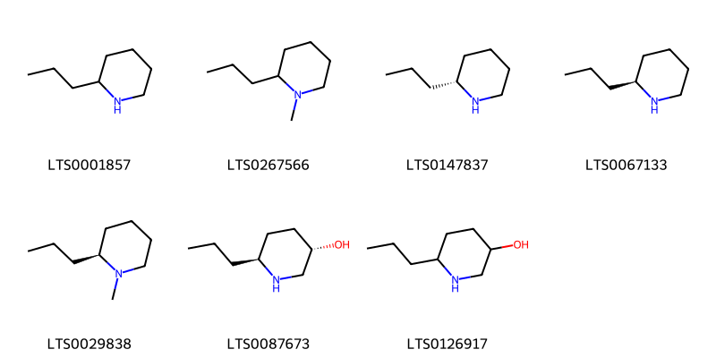{ width=100% }
    <figcaption>Hình ảnh cấu trúc hóa học của 7 hoạt chất thuộc nhóm  gồm ['2-propylpiperidine (LTS0001857)', '1-methyl-2-propylpiperidine (LTS0267566)', '(-)-coniine (LTS0147837)', '(+)-coniine (LTS0067133)', 'methylconiine (LTS0029838)', 'pseudoconhydrine (LTS0087673)', '6-propylpiperidin-3-ol (LTS0126917)'].</figcaption>
</figure>
#### Nhóm Piperidines
<figure markdown="span">
    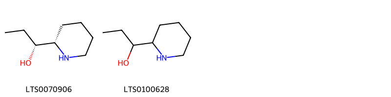{ width=100% }
    <figcaption>Hình ảnh cấu trúc hóa học của 2 hoạt chất thuộc nhóm Piperidines gồm ['conhydrine (LTS0070906)', 'conhydrine (LTS0100628)'].</figcaption>
</figure>
#### Nhóm Prenol lipids
<figure markdown="span">
    { width=100% }
    <figcaption>Hình ảnh cấu trúc hóa học của 2 hoạt chất thuộc nhóm Prenol lipids gồm ['(2r)-2,5,7,8-tetramethyl-2-[(4s,8s)-4,8,12-trimethyltridecyl]-3,4-dihydro-1-benzopyran-6-ol (LTS0130040)', 'vitamin e (LTS0263269)'].</figcaption>
</figure>
#### Nhóm Pyridines and derivatives
<figure markdown="span">
    { width=100% }
    <figcaption>Hình ảnh cấu trúc hóa học của 1 hoạt chất thuộc nhóm Pyridines and derivatives gồm ['gamma-coniceine (LTS0026381)'].</figcaption>
</figure>
#### Nhóm Steroids and steroid derivatives
<figure markdown="span">
    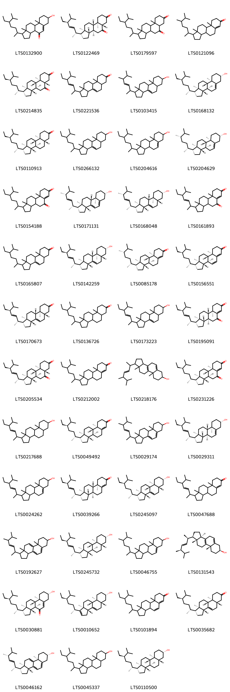{ width=100% }
    <figcaption>Hình ảnh cấu trúc hóa học của 47 hoạt chất thuộc nhóm Steroids and steroid derivatives gồm ['1-(5-ethyl-6-methylheptan-2-yl)-7-hydroxy-9a,11a-dimethyl-1h,2h,3h,3ah,3bh,6h,7h,8h,9h,9bh,10h,11h-cyclopenta[a]phenanthren-4-one (LTS0132900)', '(1r,3as,3bs,5as,9ar,9bs,11ar)-1-[(2r,3e,5s)-5-ethyl-6-methylhept-3-en-2-yl]-9a,11a-dimethyl-dodecahydro-1h-cyclopenta[a]phenanthrene-5,7-dione (LTS0122469)', '1-(5-ethyl-6-methylheptan-2-yl)-9a,11a-dimethyl-dodecahydro-1h-cyclopenta[a]phenanthrene-5,7-dione (LTS0179597)', '1-(5,6-dimethylheptan-2-yl)-9a,11a-dimethyl-1h,2h,3h,3ah,3bh,4h,5h,8h,9h,9bh,10h,11h-cyclopenta[a]phenanthren-7-one (LTS0121096)', '(1r,3as,3bs,5as,9ar,9bs,11ar)-1-[(2r,5r)-5-ethyl-6-methylheptan-2-yl]-9a,11a-dimethyl-dodecahydro-1h-cyclopenta[a]phenanthrene-5,7-dione (LTS0214835)', '1-(5-ethyl-6-methylhept-3-en-2-yl)-9a,11a-dimethyl-1h,2h,3h,3ah,5h,5ah,6h,8h,9h,9bh,10h,11h-cyclopenta[a]phenanthren-7-one (LTS0221536)', '1-(5,6-dimethylhept-3-en-2-yl)-9a,11a-dimethyl-1h,2h,3h,3ah,5h,5ah,6h,7h,8h,9h,9bh,10h,11h-cyclopenta[a]phenanthren-7-ol (LTS0103415)', 'sitosterol (LTS0168132)', '(1r,3as,3br,5as,9as,9bs,11ar)-1-[(2r,5r)-5-ethyl-6-methylheptan-2-yl]-9a,11a-dimethyl-tetradecahydrocyclopenta[a]phenanthren-7-one (LTS0110913)', '1-(5-ethyl-6-methylheptan-2-yl)-9a,11a-dimethyl-1h,2h,3h,3ah,5h,5ah,6h,7h,8h,9h,9bh,10h,11h-cyclopenta[a]phenanthren-7-ol (LTS0266132)', 'stigmast-5-en-3-ol, (3β)- (LTS0204616)', '22,23-dihydrobrassicasterol (LTS0204629)', '1-(5-ethyl-6-methylheptan-2-yl)-9a,11a-dimethyl-1h,2h,3h,3ah,3bh,4h,8h,9h,9bh,10h,11h-cyclopenta[a]phenanthrene-5,7-dione (LTS0154188)', 'ergosterol (LTS0171131)', '5α-ergosta-7,22-dien-3β-ol (LTS0168048)', '1-(5-ethyl-6-methylhept-3-en-2-yl)-9a,11a-dimethyl-1h,2h,3h,3ah,3bh,4h,8h,9h,9bh,10h,11h-cyclopenta[a]phenanthrene-5,7-dione (LTS0161893)', '1-(5-ethyl-6-methylheptan-2-yl)-9a,11a-dimethyl-1h,2h,3h,3ah,5h,5ah,6h,8h,9h,9bh,10h,11h-cyclopenta[a]phenanthren-7-one (LTS0165807)', 'chondrillasterol (LTS0142259)', '(1r,3as,3bs,9ar,9bs,11ar)-1-[(2r,5s)-5,6-dimethylheptan-2-yl]-9a,11a-dimethyl-1h,2h,3h,3ah,3bh,4h,5h,8h,9h,9bh,10h,11h-cyclopenta[a]phenanthren-7-one (LTS0085178)', '(1r,3as,3bs,9ar,9bs,11ar)-1-[(2r,5r)-5-ethyl-6-methylheptan-2-yl]-9a,11a-dimethyl-1h,2h,3h,3ah,3bh,8h,9h,9bh,10h,11h-cyclopenta[a]phenanthren-7-one (LTS0156551)', '(1r,3ar,5as,9as,9br,11ar)-1-[(2r,3e,5s)-5-ethyl-6-methylhept-3-en-2-yl]-9a,11a-dimethyl-1h,2h,3h,3ah,5h,5ah,6h,8h,9h,9bh,10h,11h-cyclopenta[a]phenanthren-7-one (LTS0170673)', '1-(5-ethyl-6-methylheptan-2-yl)-9a,11a-dimethyl-tetradecahydrocyclopenta[a]phenanthren-7-one (LTS0136726)', '1-(5-ethyl-6-methylhept-3-en-2-yl)-9a,11a-dimethyl-1h,2h,3h,3ah,5h,5ah,6h,7h,8h,9h,9bh,10h,11h-cyclopenta[a]phenanthren-7-ol (LTS0173223)', '(1r,3as,3bs,9ar,9bs,11ar)-1-[(2r,3e,5s)-5-ethyl-6-methylhept-3-en-2-yl]-9a,11a-dimethyl-1h,2h,3h,3ah,3bh,4h,8h,9h,9bh,10h,11h-cyclopenta[a]phenanthrene-5,7-dione (LTS0195091)', '(1r,3as,3bs,5as,9ar,9bs,11ar)-1-[(2r,5s)-5-ethyl-6-methylhept-3-en-2-yl]-9a,11a-dimethyl-dodecahydro-1h-cyclopenta[a]phenanthrene-5,7-dione (LTS0205534)', '1-(5-ethyl-6-methylheptan-2-yl)-9a,11a-dimethyl-1h,2h,3h,3ah,3bh,4h,5h,8h,9h,9bh,10h,11h-cyclopenta[a]phenanthren-7-one (LTS0212002)', '1-(5,6-dimethylhept-3-en-2-yl)-9a,11a-dimethyl-1h,2h,3h,3ah,4h,6h,7h,8h,9h,10h,11h-cyclopenta[a]phenanthren-7-ol (LTS0218176)', '(1r,3as,3bs,9ar,9bs,11ar)-1-[(2r,5r)-5-ethyl-6-methylheptan-2-yl]-9a,11a-dimethyl-1h,2h,3h,3ah,3bh,4h,8h,9h,9bh,10h,11h-cyclopenta[a]phenanthrene-5,7-dione (LTS0231226)', '1-(5-ethyl-6-methylhept-3-en-2-yl)-9a,11a-dimethyl-tetradecahydro-1h-cyclopenta[a]phenanthren-7-ol (LTS0217688)', 'β-sitostenone (LTS0049492)', '1-(5,6-dimethylhept-3-en-2-yl)-9a,11a-dimethyl-1h,2h,3h,3ah,6h,7h,8h,9h,9bh,10h,11h-cyclopenta[a]phenanthren-7-ol (LTS0029174)', 'phytosterol (LTS0029311)', 'stigmasterol (LTS0024262)', '(1r,3as,3bs,9ar,9bs,11ar)-1-[(2r,3e,5s)-5-ethyl-6-methylhept-3-en-2-yl]-9a,11a-dimethyl-1h,2h,3h,3ah,3bh,4h,5h,8h,9h,9bh,10h,11h-cyclopenta[a]phenanthren-7-one (LTS0039266)', '(3β,5α)-stigmast-7-en-3-ol (LTS0245097)', '1-(5-ethyl-6-methylhept-3-en-2-yl)-9a,11a-dimethyl-1h,2h,3h,3ah,3bh,4h,5h,8h,9h,9bh,10h,11h-cyclopenta[a]phenanthren-7-one (LTS0047688)', '1-(5,6-dimethylhept-3-en-2-yl)-9a,11a-dimethyl-1h,2h,3h,3ah,6h,7h,8h,9h,11h-cyclopenta[a]phenanthren-7-ol (LTS0192627)', '(1r,3as,3br,5as,7s,9as,9bs,11ar)-1-[(2r,3e,5s)-5-ethyl-6-methylhept-3-en-2-yl]-9a,11a-dimethyl-tetradecahydro-1h-cyclopenta[a]phenanthren-7-ol (LTS0245732)', 'campesterol (LTS0046755)', 'lichesterol (LTS0131543)', '(1r,3as,3bs,7s,9ar,9bs,11ar)-1-[(2r,5r)-5-ethyl-6-methylheptan-2-yl]-7-hydroxy-9a,11a-dimethyl-1h,2h,3h,3ah,3bh,6h,7h,8h,9h,9bh,10h,11h-cyclopenta[a]phenanthren-4-one (LTS0030881)', '(3as,5as,7s,9as,9br,11as)-1-[(2r,5r)-5-ethyl-6-methylheptan-2-yl]-9a,11a-dimethyl-3h,3ah,5h,5ah,6h,7h,8h,9h,9bh,10h,11h-cyclopenta[a]phenanthren-7-ol (LTS0010652)', '1-(5-ethyl-6-methylheptan-2-yl)-9a,11a-dimethyl-1h,2h,3h,3ah,3bh,8h,9h,9bh,10h,11h-cyclopenta[a]phenanthren-7-one (LTS0101894)', '(1r,3ar,5as,9as,9br,11ar)-1-[(2r,5r)-5-ethyl-6-methylheptan-2-yl]-9a,11a-dimethyl-1h,2h,3h,3ah,5h,5ah,6h,8h,9h,9bh,10h,11h-cyclopenta[a]phenanthren-7-one (LTS0035682)', 'dehydroergosterol (LTS0046162)', '24-ethyl coprostanol (LTS0045337)', 'stigmastanol (LTS0110500)'].</figcaption>
</figure>

---

### Dược dân tộc học

Danh sách các quốc gia có sử dụng *Conium maculatum* trong điều trị các bệnh. 

| Country            | Disease                                | Bệnh                                                                                                                                                                                                |
|:-------------------|:---------------------------------------|:----------------------------------------------------------------------------------------------------------------------------------------------------------------------------------------------------|
| Dominican Republic | Poison                                 | MYMEMORY WARNING: YOU USED ALL AVAILABLE FREE TRANSLATIONS FOR TODAY. NEXT AVAILABLE IN  08 HOURS 08 MINUTES 55 SECONDS VISIT HTTPS://MYMEMORY.TRANSLATED.NET/DOC/USAGELIMITS.PHP TO TRANSLATE MORE |
| Elsewhere          | Poison, Poison, Poison, Poison         | MYMEMORY WARNING: YOU USED ALL AVAILABLE FREE TRANSLATIONS FOR TODAY. NEXT AVAILABLE IN  08 HOURS 08 MINUTES 53 SECONDS VISIT HTTPS://MYMEMORY.TRANSLATED.NET/DOC/USAGELIMITS.PHP TO TRANSLATE MORE |
| Haiti              | Poison                                 | MYMEMORY WARNING: YOU USED ALL AVAILABLE FREE TRANSLATIONS FOR TODAY. NEXT AVAILABLE IN  08 HOURS 08 MINUTES 51 SECONDS VISIT HTTPS://MYMEMORY.TRANSLATED.NET/DOC/USAGELIMITS.PHP TO TRANSLATE MORE |
| Turkey             | Aphrodisiac, Nervine, Poison, Sedative | MYMEMORY WARNING: YOU USED ALL AVAILABLE FREE TRANSLATIONS FOR TODAY. NEXT AVAILABLE IN  08 HOURS 08 MINUTES 48 SECONDS VISIT HTTPS://MYMEMORY.TRANSLATED.NET/DOC/USAGELIMITS.PHP TO TRANSLATE MORE |
| UK                 | Poison                                 | MYMEMORY WARNING: YOU USED ALL AVAILABLE FREE TRANSLATIONS FOR TODAY. NEXT AVAILABLE IN  08 HOURS 08 MINUTES 46 SECONDS VISIT HTTPS://MYMEMORY.TRANSLATED.NET/DOC/USAGELIMITS.PHP TO TRANSLATE MORE |
| US                 | Poison                                 | MYMEMORY WARNING: YOU USED ALL AVAILABLE FREE TRANSLATIONS FOR TODAY. NEXT AVAILABLE IN  08 HOURS 08 MINUTES 43 SECONDS VISIT HTTPS://MYMEMORY.TRANSLATED.NET/DOC/USAGELIMITS.PHP TO TRANSLATE MORE |
| Venezuela          | Poison                                 | MYMEMORY WARNING: YOU USED ALL AVAILABLE FREE TRANSLATIONS FOR TODAY. NEXT AVAILABLE IN  08 HOURS 08 MINUTES 41 SECONDS VISIT HTTPS://MYMEMORY.TRANSLATED.NET/DOC/USAGELIMITS.PHP TO TRANSLATE MORE |

---

# Chi Glehnia

??? note "Danh sách các dược liệu thuộc chi"
    
	 - *Glehnia littoralis*

---
## Glehnia littoralis
### Thông tin về thực vật

!!! info "Phân loại thực vật của *Glehnia littoralis* từ GIBF:"
    - **Kingdom:** Plantae
    - **Phylum:** Tracheophyta
    - **Order:** Apiales
    - **Family:** Apiaceae
    - **Genus:** Glehnia
    - **Species:** *Glehnia littoralis*

 

| Label (VI)   | Label (EN)   | Scientific Name    | Descriptions (VI)   | Descriptions (EN)   | Also Known As (VI)   | Also Known As (EN)   |
|:-------------|:-------------|:-------------------|:--------------------|:--------------------|:---------------------|:---------------------|
| N/A          | N/A          | Glehnia littoralis |                     | species of plant    | ['']                 | ['']                 |

#### Phân bố trên thế giới

**Từ CSDL GIBF** Japan, Korea, Republic of, Chinese Taipei, Russian Federation, United States of America, China, Canada

#### Phân bố tại Việt Nam

**Từ CSDL GIBF**: Không có ghi nhận ở Việt Nam

---
### Thành phần hóa học
        
- Theo cơ sở dữ liệu lotus: Từ loài *Glehnia littoralis* đã phân lập và xác định được 224 hoạt chất thuộc về các nhóm Naphthalenes, Phenols, Carboxylic acids and derivatives, Fatty Acyls, Indoles and derivatives, Pyrimidine nucleosides, Cinnamic acids and derivatives, Dibenzylbutane lignans, Saturated hydrocarbons, Prenol lipids, Purine nucleosides, Benzene and substituted derivatives, Organooxygen compounds, Lignan glycosides, Flavonoids, Unsaturated hydrocarbons, Lactones, Coumarins and derivatives. 

|    | chemicalTaxonomyClassyfireClass     |   smiles_count |
|---:|:------------------------------------|---------------:|
|  0 | Benzene and substituted derivatives |              3 |
|  1 | Carboxylic acids and derivatives    |              1 |
|  2 | Cinnamic acids and derivatives      |              9 |
|  3 | Coumarins and derivatives           |             54 |
|  4 | Dibenzylbutane lignans              |              2 |
|  5 | Fatty Acyls                         |             36 |
|  6 | Flavonoids                          |              6 |
|  7 | Indoles and derivatives             |              1 |
|  8 | Lactones                            |              1 |
|  9 | Lignan glycosides                   |             11 |
| 10 | Naphthalenes                        |              2 |
| 11 | Organooxygen compounds              |             61 |
| 12 | Phenols                             |              1 |
| 13 | Prenol lipids                       |             29 |
| 14 | Purine nucleosides                  |              2 |
| 15 | Pyrimidine nucleosides              |              2 |
| 16 | Saturated hydrocarbons              |              1 |
| 17 | Unsaturated hydrocarbons            |              1 |

#### Nhóm Benzene and substituted derivatives
<figure markdown="span">
    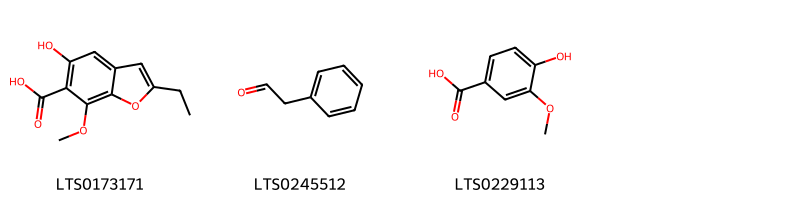{ width=100% }
    <figcaption>Hình ảnh cấu trúc hóa học của 3 hoạt chất thuộc nhóm Benzene and substituted derivatives gồm ['2-ethyl-5-hydroxy-7-methoxy-1-benzofuran-6-carboxylic acid (LTS0173171)', 'phenylacetaldehyde (LTS0245512)', 'vanillic acid (LTS0229113)'].</figcaption>
</figure>
#### Nhóm Carboxylic acids and derivatives
<figure markdown="span">
    { width=100% }
    <figcaption>Hình ảnh cấu trúc hóa học của 1 hoạt chất thuộc nhóm Carboxylic acids and derivatives gồm ['oxalic acid (LTS0217707)'].</figcaption>
</figure>
#### Nhóm Cinnamic acids and derivatives
<figure markdown="span">
    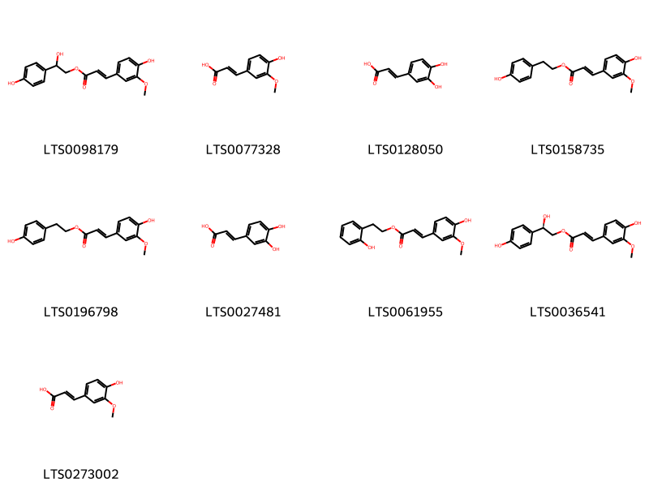{ width=100% }
    <figcaption>Hình ảnh cấu trúc hóa học của 9 hoạt chất thuộc nhóm Cinnamic acids and derivatives gồm ['2-hydroxy-2-(4-hydroxyphenyl)ethyl 3-(4-hydroxy-3-methoxyphenyl)prop-2-enoate (LTS0098179)', 'ferulic acid (LTS0077328)', '3,4-dihydroxycinnamic acid (LTS0128050)', '2-(4-hydroxyphenyl)ethyl (2e)-3-(4-hydroxy-3-methoxyphenyl)prop-2-enoate (LTS0158735)', '2-(4-hydroxyphenyl)ethyl 3-(4-hydroxy-3-methoxyphenyl)prop-2-enoate (LTS0196798)', 'caffeic acid (LTS0027481)', '2-(2-hydroxyphenyl)ethyl (2e)-3-(4-hydroxy-3-methoxyphenyl)prop-2-enoate (LTS0061955)', '(2r)-2-hydroxy-2-(4-hydroxyphenyl)ethyl (2e)-3-(4-hydroxy-3-methoxyphenyl)prop-2-enoate (LTS0036541)', 'ferulic acid (LTS0273002)'].</figcaption>
</figure>
#### Nhóm Coumarins and derivatives
<figure markdown="span">
    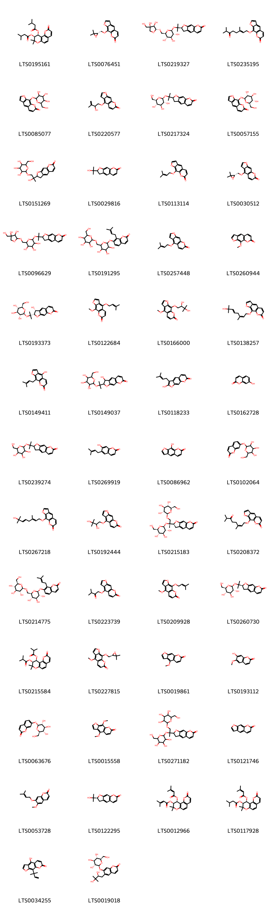{ width=100% }
    <figcaption>Hình ảnh cấu trúc hóa học của 54 hoạt chất thuộc nhóm Coumarins and derivatives gồm ['(9s,10s)-8,8-dimethyl-10-[(3-methylbutanoyl)oxy]-2-oxo-9h,10h-pyrano[2,3-h]chromen-9-yl 3-methylbutanoate (LTS0195161)', '9-{[(2s)-3,3-dimethyloxiran-2-yl]methoxy}furo[3,2-g]chromen-7-one (LTS0076451)', '(2s)-2-(2-{[(2s,3r,4s,5s,6r)-6-({[(2r,3r,4r)-3,4-dihydroxy-4-(hydroxymethyl)oxolan-2-yl]oxy}methyl)-3,4,5-trihydroxyoxan-2-yl]oxy}propan-2-yl)-2h,3h-furo[3,2-g]chromen-7-one (LTS0219327)', '9-{[(2e)-3,7-dimethyl-6-oxooct-2-en-1-yl]oxy}furo[3,2-g]chromen-7-one (LTS0235195)', '9-{[3,4,5-trihydroxy-6-(hydroxymethyl)oxan-2-yl]oxy}furo[3,2-g]chromen-7-one (LTS0085077)', '4-[(2-hydroxy-3-methylbut-3-en-1-yl)oxy]furo[3,2-g]chromen-7-one (LTS0220577)', '2-(2-{[(2s,3r,4s,5s,6r)-3,4,5-trihydroxy-6-(hydroxymethyl)oxan-2-yl]oxy}propan-2-yl)-2h,3h-furo[3,2-g]chromen-7-one (LTS0217324)', '9-{[(2s,3r,4s,5s,6r)-3,4,5-trihydroxy-6-(hydroxymethyl)oxan-2-yl]oxy}furo[3,2-g]chromen-7-one (LTS0057155)', '2-(2-hydroxy-1-{[3,4,5-trihydroxy-6-(hydroxymethyl)oxan-2-yl]oxy}propan-2-yl)-2h,3h-furo[3,2-g]chromen-7-one (LTS0151269)', 'marmesin (LTS0029816)', 'imperatorin (LTS0113114)', 'oxypeucedanin (LTS0030512)', '2-(2-{[6-({[3,4-dihydroxy-4-(hydroxymethyl)oxolan-2-yl]oxy}methyl)-3,4,5-trihydroxyoxan-2-yl]oxy}propan-2-yl)-2h,3h-furo[3,2-g]chromen-7-one (LTS0096629)', '8-(3-methylbut-2-en-1-yl)-7-{[3,4,5-trihydroxy-6-({[3,4,5-trihydroxy-6-(hydroxymethyl)oxan-2-yl]oxy}methyl)oxan-2-yl]oxy}chromen-2-one (LTS0191295)', 'isoimperatorin (LTS0257448)', 'methoxsalen (LTS0260944)', '(2s,3r)-3-hydroxy-2-(2-{[(2s,3r,4s,5s,6r)-3,4,5-trihydroxy-6-(hydroxymethyl)oxan-2-yl]oxy}propan-2-yl)-2h,3h-furo[3,2-g]chromen-7-one (LTS0193373)', 'cnidilin (LTS0122684)', 'byakangelicin (LTS0166000)', '9-[(7-hydroxy-3,7-dimethylocta-2,5-dien-1-yl)oxy]furo[3,2-g]chromen-7-one (LTS0138257)', '4-hydroxy-9-(3-methylbut-2-en-1-yl)furo[3,2-g]chromen-7-one (LTS0149411)', '3-hydroxy-2-(2-{[3,4,5-trihydroxy-6-(hydroxymethyl)oxan-2-yl]oxy}propan-2-yl)-2h,3h-furo[3,2-g]chromen-7-one (LTS0149037)', '2-hydroxy-3-(3-methylbut-2-en-1-yl)furo[3,2-g]chromen-7-one (LTS0118233)', 'umbelliferone (LTS0162728)', '2-(2-{[3,4,5-trihydroxy-6-(hydroxymethyl)oxan-2-yl]oxy}propan-2-yl)-2h,3h-furo[3,2-g]chromen-7-one (LTS0239274)', 'demethylsuberosin (LTS0269919)', 'xanthotoxol (LTS0086962)', 'skimmin (LTS0102064)', '9-{[(2e,5e)-7-hydroxy-3,7-dimethylocta-2,5-dien-1-yl]oxy}furo[3,2-g]chromen-7-one (LTS0267218)', '4-(2,3-dihydroxy-3-methylbutoxy)furo[3,2-g]chromen-7-one (LTS0192444)', '(2s)-2-[(2r)-1-{[(2r,3r,4s,5s,6r)-3,4,5-trihydroxy-6-(hydroxymethyl)oxan-2-yl]oxy}-2-{[(2s,3r,4s,5s,6r)-3,4,5-trihydroxy-6-(hydroxymethyl)oxan-2-yl]oxy}propan-2-yl]-2h,3h-furo[3,2-g]chromen-7-one (LTS0215183)', '9-[(3,7-dimethyl-6-oxooct-2-en-1-yl)oxy]furo[3,2-g]chromen-7-one (LTS0208372)', '8-(3-methylbut-2-en-1-yl)-7-{[(2s,3r,4s,5s,6r)-3,4,5-trihydroxy-6-({[(2r,3r,4s,5s,6r)-3,4,5-trihydroxy-6-(hydroxymethyl)oxan-2-yl]oxy}methyl)oxan-2-yl]oxy}chromen-2-one (LTS0214775)', '4-(3-methyl-2-oxobutoxy)furo[3,2-g]chromen-7-one (LTS0223739)', 'phellopterin (LTS0209928)', 'ammijin (LTS0260730)', '(9s,10s)-8,8-dimethyl-10-[(2-methylpropanoyl)oxy]-2-oxo-9h,10h-pyrano[2,3-h]chromen-9-yl 2-methylpropanoate (LTS0215584)', 'byakangelicol (LTS0227815)', 'bergapten (LTS0019861)', 'scopoletin (LTS0193112)', 'skimmin (LTS0063676)', 'isopimpinellin (LTS0015558)', '2-[1,2-bis({[3,4,5-trihydroxy-6-(hydroxymethyl)oxan-2-yl]oxy})propan-2-yl]-2h,3h-furo[3,2-g]chromen-7-one (LTS0271182)', 'psoralen (LTS0121746)', '6-methoxy-7-[(3-methylbut-2-en-1-yl)oxy]chromen-2-one (LTS0053728)', 'marmesin (LTS0122295)', '(9s,10s)-8,8-dimethyl-10-[(3-methylbut-2-enoyl)oxy]-2-oxo-9h,10h-pyrano[2,3-h]chromen-9-yl 3-methylbut-2-enoate (LTS0012966)', '(9s,10s)-8,8-dimethyl-9-[(3-methylbutanoyl)oxy]-2-oxo-9h,10h-pyrano[2,3-h]chromen-10-yl 3-methylbut-2-enoate (LTS0117928)', '4-hydroxy-9-(2-methylbut-3-en-2-yl)furo[3,2-g]chromen-7-one (LTS0034255)', '6-[(2s)-2,3-dihydroxy-3-methylbutyl]-7-{[(2s,3r,4s,5s,6r)-3,4,5-trihydroxy-6-(hydroxymethyl)oxan-2-yl]oxy}chromen-2-one (LTS0019018)', '(2s)-2-[(2r)-2-hydroxy-1-{[(2r,3r,4s,5s,6r)-3,4,5-trihydroxy-6-(hydroxymethyl)oxan-2-yl]oxy}propan-2-yl]-2h,3h-furo[3,2-g]chromen-7-one (LTS0268439)', '(9s,10s)-10-(acetyloxy)-8,8-dimethyl-2-oxo-9h,10h-pyrano[2,3-h]chromen-9-yl 3-methylbut-2-enoate (LTS0244940)', '6-(2,3-dihydroxy-3-methylbutyl)-7-{[3,4,5-trihydroxy-6-(hydroxymethyl)oxan-2-yl]oxy}chromen-2-one (LTS0257122)', '(9s,10s)-10-(acetyloxy)-8,8-dimethyl-2-oxo-9h,10h-pyrano[2,3-h]chromen-9-yl 3-methylbutanoate (LTS0118705)'].</figcaption>
</figure>
#### Nhóm Dibenzylbutane lignans
<figure markdown="span">
    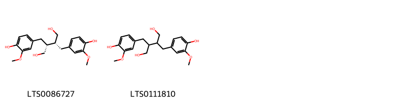{ width=100% }
    <figcaption>Hình ảnh cấu trúc hóa học của 2 hoạt chất thuộc nhóm Dibenzylbutane lignans gồm ['secoisolariciresinol (LTS0086727)', 'secoisolariciresinol (LTS0111810)'].</figcaption>
</figure>
#### Nhóm Fatty Acyls
<figure markdown="span">
    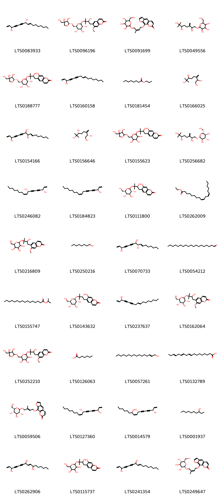{ width=100% }
    <figcaption>Hình ảnh cấu trúc hóa học của 36 hoạt chất thuộc nhóm Fatty Acyls gồm ['(3s,8r)-heptadeca-1,9-dien-4,6-diyne-3,8-diol (LTS0083933)', '6-[(2s)-3-{[(2s,3r,4s,5s,6r)-6-({[(2r,3r,4r)-3,4-dihydroxy-4-(hydroxymethyl)oxolan-2-yl]oxy}methyl)-3,4,5-trihydroxyoxan-2-yl]oxy}-2-hydroxy-3-methylbutyl]-7-methoxychromen-2-one (LTS0096196)', '9-[(3-methyl-4-{[3,4,5-trihydroxy-6-(hydroxymethyl)oxan-2-yl]oxy}but-2-en-1-yl)oxy]furo[3,2-g]chromen-7-one (LTS0091699)', '2-(hydroxymethyl)-6-[(2,6,7-trihydroxy-7-methyl-3-methylideneoctyl)oxy]oxane-3,4,5-triol (LTS0049556)', '6-[(2s)-3-{[(2s,3r,4s,5s,6r)-6-({[(2r,3r,4r)-3,4-dihydroxy-4-(hydroxymethyl)oxolan-2-yl]oxy}methyl)-3,4,5-trihydroxyoxan-2-yl]oxy}-2-hydroxy-3-methylbutyl]-7-hydroxychromen-2-one (LTS0188777)', 'heptadeca-1,9-dien-4,6-diyn-3-ol (LTS0160158)', 'propyl octanoate (LTS0181454)', '7-methyl-3-methylideneoctane-1,2,6,7-tetrol (LTS0166025)', 'heptadeca-1,10-dien-4,6-diyne-3,8,9-triol (LTS0154166)', '(2s,6r)-7-methyl-3-methylideneoctane-1,2,6,7-tetrol (LTS0156646)', '6-(3-{[6-({[3,4-dihydroxy-4-(hydroxymethyl)oxolan-2-yl]oxy}methyl)-3,4,5-trihydroxyoxan-2-yl]oxy}-2-hydroxy-3-methylbutyl)-7-hydroxychromen-2-one (LTS0155623)', '(2r,3s,4s,5r,6r)-2-(hydroxymethyl)-6-{[(2s,6r)-2,6,7-trihydroxy-7-methyl-3-methylideneoctyl]oxy}oxane-3,4,5-triol (LTS0256682)', '(3s,8s,9z)-heptadeca-1,9-dien-4,6-diyne-3,8-diol (LTS0246082)', 'falcarinol (LTS0184823)', '7-hydroxy-6-[(2s)-2-hydroxy-3-methyl-3-{[(2s,3r,4s,5s,6r)-3,4,5-trihydroxy-6-(hydroxymethyl)oxan-2-yl]oxy}butyl]chromen-2-one (LTS0111800)', 'ethyl linoleate (LTS0262009)', '6-(2-hydroxy-3-methyl-3-{[3,4,5-trihydroxy-6-(hydroxymethyl)oxan-2-yl]oxy}butyl)-7-methoxychromen-2-one (LTS0216809)', 'octanol (LTS0250216)', '(3s,8r,9s,10e)-heptadeca-1,10-dien-4,6-diyne-3,8,9-triol (LTS0070733)', 'nonadecanal (LTS0054212)', 'isopropyl palmitate (LTS0155747)', '7-hydroxy-6-[(2r)-2-hydroxy-3-methyl-3-{[(2s,3r,4s,5s,6r)-3,4,5-trihydroxy-6-(hydroxymethyl)oxan-2-yl]oxy}butyl]chromen-2-one (LTS0143632)', '(z)-falcarinol (LTS0237637)', '6-[(2s)-2-hydroxy-3-methyl-3-{[(2s,3r,4s,5s,6r)-3,4,5-trihydroxy-6-(hydroxymethyl)oxan-2-yl]oxy}butyl]-7-methoxychromen-2-one (LTS0162064)', '6-(3-{[6-({[3,4-dihydroxy-4-(hydroxymethyl)oxolan-2-yl]oxy}methyl)-3,4,5-trihydroxyoxan-2-yl]oxy}-2-hydroxy-3-methylbutyl)-7-methoxychromen-2-one (LTS0252210)', 'heptanoic acid (LTS0126063)', 'hexadec-2-en-1-ol (LTS0057261)', 'α linolenic acid (LTS0132789)', '9-{[(2e)-3-methyl-4-{[(2r,3r,4s,5s,6r)-3,4,5-trihydroxy-6-(hydroxymethyl)oxan-2-yl]oxy}but-2-en-1-yl]oxy}furo[3,2-g]chromen-7-one (LTS0059506)', 'falcarindiol (LTS0127360)', '(3s,8s,9z,11r)-heptadeca-1,9-dien-4,6-diyne-3,8,11-triol (LTS0014579)', '3-decanol (LTS0001937)', 'heptadeca-1,9-dien-4,6-diyne-3,8,11-triol (LTS0262906)', '7-hydroxy-6-(2-hydroxy-3-methyl-3-{[3,4,5-trihydroxy-6-(hydroxymethyl)oxan-2-yl]oxy}butyl)chromen-2-one (LTS0115737)', 'heptadeca-1,9-dien-4,6-diyne-3,8-diol (LTS0241354)', '9-{[(2z)-3-methyl-4-{[(2r,3r,4s,5s,6r)-3,4,5-trihydroxy-6-(hydroxymethyl)oxan-2-yl]oxy}but-2-en-1-yl]oxy}furo[3,2-g]chromen-7-one (LTS0249647)'].</figcaption>
</figure>
#### Nhóm Flavonoids
<figure markdown="span">
    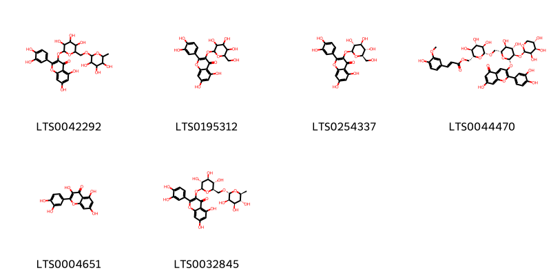{ width=100% }
    <figcaption>Hình ảnh cấu trúc hóa học của 6 hoạt chất thuộc nhóm Flavonoids gồm ['rutin (LTS0042292)', '2-(3,4-dihydroxyphenyl)-5,7-dihydroxy-3-{[3,4,5-trihydroxy-6-(hydroxymethyl)oxan-2-yl]oxy}chromen-4-one (LTS0195312)', 'isoquercetin (LTS0254337)', '[(2r,3s,4s,5r,6r)-6-{[(2r,3s,4s,5r,6s)-6-{[2-(3,4-dihydroxyphenyl)-7-hydroxy-5-oxochromen-3-yl]oxy}-3,4-dihydroxy-5-{[(2r,3r,4r,5s)-3,4,5-trihydroxyoxan-2-yl]oxy}oxan-2-yl]methoxy}-3,4,5-trihydroxyoxan-2-yl]methyl 3-(4-hydroxy-3-methoxyphenyl)prop-2-enoate (LTS0044470)', 'quercetin (LTS0004651)', '3-rutinosyl quercetin (LTS0032845)'].</figcaption>
</figure>
#### Nhóm Indoles and derivatives
<figure markdown="span">
    { width=100% }
    <figcaption>Hình ảnh cấu trúc hóa học của 1 hoạt chất thuộc nhóm Indoles and derivatives gồm ['l-tryptophan (LTS0263809)'].</figcaption>
</figure>
#### Nhóm Lactones
<figure markdown="span">
    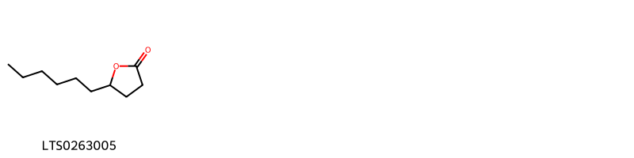{ width=100% }
    <figcaption>Hình ảnh cấu trúc hóa học của 1 hoạt chất thuộc nhóm Lactones gồm ['γ-decalactone (LTS0263005)'].</figcaption>
</figure>
#### Nhóm Lignan glycosides
<figure markdown="span">
    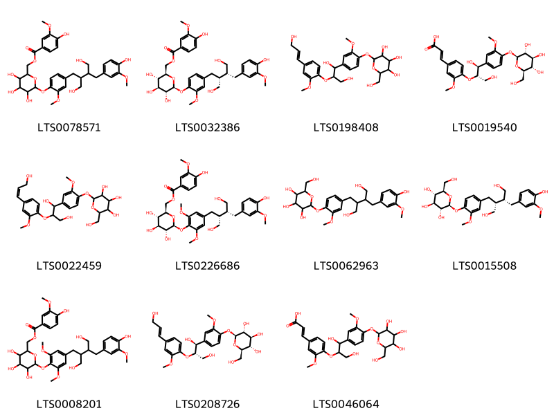{ width=100% }
    <figcaption>Hình ảnh cấu trúc hóa học của 11 hoạt chất thuộc nhóm Lignan glycosides gồm ['[3,4,5-trihydroxy-6-(4-{4-hydroxy-3-[(4-hydroxy-3-methoxyphenyl)methyl]-2-(hydroxymethyl)butyl}-2-methoxyphenoxy)oxan-2-yl]methyl 4-hydroxy-3-methoxybenzoate (LTS0078571)', '[(2r,3s,4s,5r,6s)-3,4,5-trihydroxy-6-{4-[(2r,3r)-4-hydroxy-3-[(4-hydroxy-3-methoxyphenyl)methyl]-2-(hydroxymethyl)butyl]-2-methoxyphenoxy}oxan-2-yl]methyl 4-hydroxy-3-methoxybenzoate (LTS0032386)', '2-(4-{1,3-dihydroxy-2-[4-(3-hydroxyprop-1-en-1-yl)-2-methoxyphenoxy]propyl}-2-methoxyphenoxy)-6-(hydroxymethyl)oxane-3,4,5-triol (LTS0198408)', '(2e)-3-(4-{[(1s,2s)-1,3-dihydroxy-1-(3-methoxy-4-{[(2s,3r,4s,5s,6r)-3,4,5-trihydroxy-6-(hydroxymethyl)oxan-2-yl]oxy}phenyl)propan-2-yl]oxy}-3-methoxyphenyl)prop-2-enoic acid (LTS0019540)', '2-[4-(1,3-dihydroxy-2-{4-[(1z)-3-hydroxyprop-1-en-1-yl]-2-methoxyphenoxy}propyl)-2-methoxyphenoxy]-6-(hydroxymethyl)oxane-3,4,5-triol (LTS0022459)', '[(2r,3s,4s,5r,6s)-3,4,5-trihydroxy-6-{4-[(2r,3r)-4-hydroxy-3-[(4-hydroxy-3-methoxyphenyl)methyl]-2-(hydroxymethyl)butyl]-2,6-dimethoxyphenoxy}oxan-2-yl]methyl 4-hydroxy-3-methoxybenzoate (LTS0226686)', '2-(4-{4-hydroxy-3-[(4-hydroxy-3-methoxyphenyl)methyl]-2-(hydroxymethyl)butyl}-2-methoxyphenoxy)-6-(hydroxymethyl)oxane-3,4,5-triol (LTS0062963)', '(2s,3r,4s,5s,6r)-2-{4-[(2r,3r)-4-hydroxy-3-[(4-hydroxy-3-methoxyphenyl)methyl]-2-(hydroxymethyl)butyl]-2-methoxyphenoxy}-6-(hydroxymethyl)oxane-3,4,5-triol (LTS0015508)', '[3,4,5-trihydroxy-6-(4-{4-hydroxy-3-[(4-hydroxy-3-methoxyphenyl)methyl]-2-(hydroxymethyl)butyl}-2,6-dimethoxyphenoxy)oxan-2-yl]methyl 4-hydroxy-3-methoxybenzoate (LTS0008201)', '(2s,3r,4s,5s,6r)-2-{4-[(1s,2s)-1,3-dihydroxy-2-{4-[(1e)-3-hydroxyprop-1-en-1-yl]-2-methoxyphenoxy}propyl]-2-methoxyphenoxy}-6-(hydroxymethyl)oxane-3,4,5-triol (LTS0208726)', '3-(4-{[1,3-dihydroxy-1-(3-methoxy-4-{[3,4,5-trihydroxy-6-(hydroxymethyl)oxan-2-yl]oxy}phenyl)propan-2-yl]oxy}-3-methoxyphenyl)prop-2-enoic acid (LTS0046064)'].</figcaption>
</figure>
#### Nhóm Naphthalenes
<figure markdown="span">
    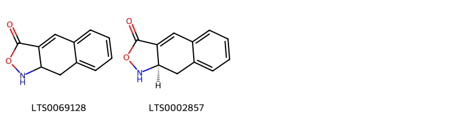{ width=100% }
    <figcaption>Hình ảnh cấu trúc hóa học của 2 hoạt chất thuộc nhóm Naphthalenes gồm ['1h,9h,9ah-naphtho[2,3-c][1,2]oxazol-3-one (LTS0069128)', '(9ar)-1h,9h,9ah-naphtho[2,3-c][1,2]oxazol-3-one (LTS0002857)'].</figcaption>
</figure>
#### Nhóm Organooxygen compounds
<figure markdown="span">
    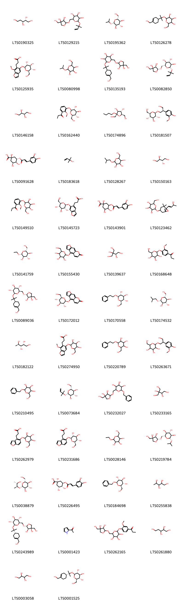{ width=100% }
    <figcaption>Hình ảnh cấu trúc hóa học của 61 hoạt chất thuộc nhóm Organooxygen compounds gồm ['(2r,3s)-pentane-1,2,3,5-tetrol (LTS0190325)', '2-({[3,4-dihydroxy-4-(hydroxymethyl)oxolan-2-yl]oxy}methyl)-6-[(2-methylbut-3-en-2-yl)oxy]oxane-3,4,5-triol (LTS0129215)', '(2r,3s,4s,5r,6r)-2-(hydroxymethyl)-6-isopropoxyoxane-3,4,5-triol (LTS0195362)', '2-(hydroxymethyl)-6-({2-[4-(hydroxymethyl)cyclohex-3-en-1-yl]propan-2-yl}oxy)oxane-3,4,5-triol (LTS0126278)', '3-(7-methoxy-5-{[(2s,3r,4s,5s,6r)-3,4,5-trihydroxy-6-(hydroxymethyl)oxan-2-yl]oxy}-1-benzofuran-6-yl)propanoic acid (LTS0125935)', '2-(hydroxymethyl)-6-isopropoxyoxane-3,4,5-triol (LTS0080998)', '2-({[3,4-dihydroxy-4-(hydroxymethyl)oxolan-2-yl]oxy}methyl)-6-({2-[4-(hydroxymethyl)cyclohex-3-en-1-yl]propan-2-yl}oxy)oxane-3,4,5-triol (LTS0135193)', '(2r,3s,4s,5r,6s)-2-({[(2r,3r,4r)-3,4-dihydroxy-4-(hydroxymethyl)oxolan-2-yl]oxy}methyl)-6-[(2-methylbut-3-en-2-yl)oxy]oxane-3,4,5-triol (LTS0082850)', '(-)-threitol (LTS0146158)', '1-(2-methoxy-3-{[(2s,3r,4s,5s,6r)-3,4,5-trihydroxy-6-(hydroxymethyl)oxan-2-yl]oxy}phenyl)propan-1-one (LTS0162440)', '(2s,3s,4s,5r)-2-butoxy-2,5-bis(hydroxymethyl)oxolane-3,4-diol (LTS0174896)', '(2r,3r,4s,5s,6r)-2-[(2r)-3-hydroxy-2-(4-hydroxy-3-methoxyphenyl)propoxy]-6-(hydroxymethyl)oxane-3,4,5-triol (LTS0181507)', '(1r,3s,4s,5s)-3-{[(2e)-3-(3,4-dihydroxyphenyl)prop-2-enoyl]oxy}-1,4,5-trihydroxycyclohexane-1-carboxylic acid (LTS0091628)', '2-methyl-3-buten-2-ol (LTS0183618)', '2-(hydroxymethyl)-6-(2-methylpropoxy)oxane-3,4,5-triol (LTS0128267)', 'meso-erythritol (LTS0150163)', '1-(2-methoxy-3-{[3,4,5-trihydroxy-6-(hydroxymethyl)oxan-2-yl]oxy}phenyl)propan-1-one (LTS0149510)', '3-(6-{[(2s,3r,4s,5s,6r)-3,4,5-trihydroxy-6-(hydroxymethyl)oxan-2-yl]oxy}-1-benzofuran-5-yl)propanoic acid (LTS0145723)', '3-{[3-(3,4-dihydroxyphenyl)prop-2-enoyl]oxy}-1,4,5-trihydroxycyclohexane-1-carboxylic acid (LTS0143901)', '2-{[6-(3-hydroxybut-1-en-1-yl)-1,5,5-trimethyl-7-oxabicyclo[4.1.0]heptan-3-yl]oxy}-6-(hydroxymethyl)oxane-3,4,5-triol (LTS0123462)', 'ethyl glucoside (LTS0141759)', '4-{[3,4,5-trihydroxy-6-(hydroxymethyl)oxan-2-yl]oxy}furo[3,2-g]chromen-7-one (LTS0155430)', 'l-apiitol (LTS0139637)', '1-(3-methoxy-4-{[3,4,5-trihydroxy-6-(hydroxymethyl)oxan-2-yl]oxy}phenyl)propan-1-one (LTS0168648)', '(2r,3s,4s,5r,6s)-2-({[(2r,3r,4r)-3,4-dihydroxy-4-(hydroxymethyl)oxolan-2-yl]oxy}methyl)-6-({2-[(1s)-4-(hydroxymethyl)cyclohex-3-en-1-yl]propan-2-yl}oxy)oxane-3,4,5-triol (LTS0089036)', '4-{[(2s,3r,4s,5s,6r)-3,4,5-trihydroxy-6-(hydroxymethyl)oxan-2-yl]oxy}furo[3,2-g]chromen-7-one (LTS0172012)', '(2r,3s,4s,5r,6r)-2-(hydroxymethyl)-6-(2-phenylethoxy)oxane-3,4,5-triol (LTS0170558)', '(2r,3s,4s,5r,6r)-2-(hydroxymethyl)-6-(2-methylpropoxy)oxane-3,4,5-triol (LTS0174532)', '(2r,3r,4r)-pentane-1,2,3,4-tetrol (LTS0182122)', '3-(7-methoxy-5-{[3,4,5-trihydroxy-6-(hydroxymethyl)oxan-2-yl]oxy}-1-benzofuran-6-yl)propanoic acid (LTS0274950)', '2-(hydroxymethyl)-6-(2-phenylethoxy)oxane-3,4,5-triol (LTS0220789)', '2-[3-hydroxy-2-(4-hydroxy-3-methoxyphenyl)propoxy]-6-(hydroxymethyl)oxane-3,4,5-triol (LTS0263671)', 'benzyl glucopyranoside (LTS0210495)', '(2r,3s,4s,5r,6s)-2-(hydroxymethyl)-6-[(2-methylbut-3-en-2-yl)oxy]oxane-3,4,5-triol (LTS0073684)', '2-(benzyloxy)-6-({[3,4-dihydroxy-4-(hydroxymethyl)oxolan-2-yl]oxy}methyl)oxane-3,4,5-triol (LTS0232027)', 'apiitol (LTS0233165)', '3-(5-{[3,4,5-trihydroxy-6-(hydroxymethyl)oxan-2-yl]oxy}-1-benzofuran-4-yl)propanoic acid (LTS0262979)', '3-(5-{[(2s,3r,4s,5s,6r)-3,4,5-trihydroxy-6-(hydroxymethyl)oxan-2-yl]oxy}-1-benzofuran-4-yl)propanoic acid (LTS0231686)', '�-d-galactopyranoside, ethyl (LTS0028146)', '(2r,3s,4s,5r,6r)-2-({[(2r,3r,4r)-3,4-dihydroxy-4-(hydroxymethyl)oxolan-2-yl]oxy}methyl)-6-isopropoxyoxane-3,4,5-triol (LTS0219784)', '(2r,3r,4s,5s,6r)-2-{[(2s,3s)-3-hydroxybutan-2-yl]oxy}-6-(hydroxymethyl)oxane-3,4,5-triol (LTS0038879)', 'chlorogenic acid (LTS0226495)', 'benzyl β-d-glucoside (LTS0184698)', 'pentane-1,2,3,4-tetrol (LTS0255838)', '(2r,3s,4s,5r,6s)-2-({[(2r,3r,4r)-3,4-dihydroxy-4-(hydroxymethyl)oxolan-2-yl]oxy}methyl)-6-({2-[(1r)-4-(hydroxymethyl)cyclohex-3-en-1-yl]propan-2-yl}oxy)oxane-3,4,5-triol (LTS0243989)', '2-acetylpyrrole (LTS0001423)', '1-(4-{[6-({[3,4-dihydroxy-4-(hydroxymethyl)oxolan-2-yl]oxy}methyl)-3,4,5-trihydroxyoxan-2-yl]oxy}-3-methoxyphenyl)propan-1-one (LTS0262165)', 'pentane-1,2,3,5-tetrol (LTS0261880)', 'erythrite (LTS0003058)', '(2r,3s,4s,5r,6s)-2-(hydroxymethyl)-6-({2-[(1r)-4-(hydroxymethyl)cyclohex-3-en-1-yl]propan-2-yl}oxy)oxane-3,4,5-triol (LTS0001525)', '(2r,3r,5r,6r)-2-(benzyloxy)-6-(hydroxymethyl)oxane-3,4,5-triol (LTS0007372)', '1-(3-methoxy-4-{[(2s,3r,4s,5s,6r)-3,4,5-trihydroxy-6-(hydroxymethyl)oxan-2-yl]oxy}phenyl)propan-1-one (LTS0004226)', '2-(hydroxymethyl)-6-[(2-methylbut-3-en-2-yl)oxy]oxane-3,4,5-triol (LTS0002833)', '1-(4-{[(2s,3r,4s,5s,6r)-6-({[(2r,3r,4r)-3,4-dihydroxy-4-(hydroxymethyl)oxolan-2-yl]oxy}methyl)-3,4,5-trihydroxyoxan-2-yl]oxy}-3-methoxyphenyl)propan-1-one (LTS0095700)', '2-nonanone (LTS0245014)', '2-[(3-hydroxybutan-2-yl)oxy]-6-(hydroxymethyl)oxane-3,4,5-triol (LTS0013479)', '2-({6-[(1e)-3-hydroxybut-1-en-1-yl]-1,5,5-trimethyl-7-oxabicyclo[4.1.0]heptan-3-yl}oxy)-6-(hydroxymethyl)oxane-3,4,5-triol (LTS0214859)', '(2r,3r,4s,5s,6r)-2-(benzyloxy)-6-({[(2r,3r,4r)-3,4-dihydroxy-4-(hydroxymethyl)oxolan-2-yl]oxy}methyl)oxane-3,4,5-triol (LTS0041825)', 'syringin (LTS0046227)', '2-({[3,4-dihydroxy-4-(hydroxymethyl)oxolan-2-yl]oxy}methyl)-6-isopropoxyoxane-3,4,5-triol (LTS0247501)', '(2r,3r,4s,5s,6r)-2-{[(1r,3s,6s)-6-[(1e,3s)-3-hydroxybut-1-en-1-yl]-1,5,5-trimethyl-7-oxabicyclo[4.1.0]heptan-3-yl]oxy}-6-(hydroxymethyl)oxane-3,4,5-triol (LTS0035337)'].</figcaption>
</figure>
#### Nhóm Phenols
<figure markdown="span">
    { width=100% }
    <figcaption>Hình ảnh cấu trúc hóa học của 1 hoạt chất thuộc nhóm Phenols gồm ['2-methoxy-4-vinyl-phenol (LTS0128961)'].</figcaption>
</figure>
#### Nhóm Prenol lipids
<figure markdown="span">
    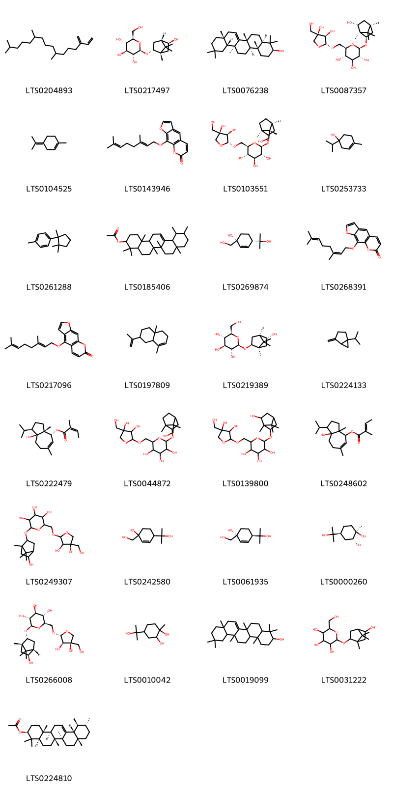{ width=100% }
    <figcaption>Hình ảnh cấu trúc hóa học của 29 hoạt chất thuộc nhóm Prenol lipids gồm ['7,11,15-trimethyl-3-methylidenehexadec-1-ene (LTS0204893)', '(2r,3r,4s,5s,6r)-2-{[(1s,2r,4s,5s)-5-hydroxy-1,7,7-trimethylbicyclo[2.2.1]heptan-2-yl]oxy}-6-(hydroxymethyl)oxane-3,4,5-triol (LTS0217497)', 'alnulin (LTS0076238)', '(2r,3s,4s,5r,6r)-2-({[(2r,3r,4r)-3,4-dihydroxy-4-(hydroxymethyl)oxolan-2-yl]oxy}methyl)-6-{[(1r,2r,4s,6r)-6-hydroxy-1,7,7-trimethylbicyclo[2.2.1]heptan-2-yl]oxy}oxane-3,4,5-triol (LTS0087357)', 'terpinolene (LTS0104525)', '8-geranyloxypsoralen (LTS0143946)', '(2r,3s,4s,5r,6r)-2-({[(2r,3r,4r)-3,4-dihydroxy-4-(hydroxymethyl)oxolan-2-yl]oxy}methyl)-6-{[(1s,2r,4s,7s)-7-(hydroxymethyl)-1,7-dimethylbicyclo[2.2.1]heptan-2-yl]oxy}oxane-3,4,5-triol (LTS0103551)', '4-terpineol (LTS0253733)', '1-methyl-4-(1,2,2-trimethylcyclopentyl)benzene (LTS0261288)', '4,4,6a,6b,8a,11,12,14b-octamethyl-2,3,4a,5,6,7,8,9,10,11,12,12a,14,14a-tetradecahydro-1h-picen-3-yl acetate (LTS0185406)', '(1r,4s)-1-(hydroxymethyl)-4-(2-hydroxypropan-2-yl)cyclohex-2-en-1-ol (LTS0269874)', '9-[(3,7-dimethylocta-2,6-dien-1-yl)oxy]furo[3,2-g]chromen-7-one (LTS0268391)', 'bergamottin (LTS0217096)', 'selinene (LTS0197809)', '(2r,3r,4s,5s,6r)-2-{[(1r,2s,4r,5r)-5-hydroxy-1,7,7-trimethylbicyclo[2.2.1]heptan-2-yl]oxy}-6-(hydroxymethyl)oxane-3,4,5-triol (LTS0219389)', 'sabinene (LTS0224133)', '(1r,3ar,4r,8as)-8a-hydroxy-1-isopropyl-3a,6-dimethyl-1,2,3,4,7,8-hexahydroazulen-4-yl (2z)-2-methylbut-2-enoate (LTS0222479)', '2-({[3,4-dihydroxy-4-(hydroxymethyl)oxolan-2-yl]oxy}methyl)-6-{[7-(hydroxymethyl)-1,7-dimethylbicyclo[2.2.1]heptan-2-yl]oxy}oxane-3,4,5-triol (LTS0044872)', '2-({[3,4-dihydroxy-4-(hydroxymethyl)oxolan-2-yl]oxy}methyl)-6-({6-hydroxy-1,7,7-trimethylbicyclo[2.2.1]heptan-2-yl}oxy)oxane-3,4,5-triol (LTS0139800)', '8a-hydroxy-1-isopropyl-3a,6-dimethyl-1,2,3,4,7,8-hexahydroazulen-4-yl 2-methylbut-2-enoate (LTS0248602)', '2-({[3,4-dihydroxy-4-(hydroxymethyl)oxolan-2-yl]oxy}methyl)-6-({5-hydroxy-1,7,7-trimethylbicyclo[2.2.1]heptan-2-yl}oxy)oxane-3,4,5-triol (LTS0249307)', '1-(hydroxymethyl)-4-(2-hydroxypropan-2-yl)cyclohex-2-en-1-ol (LTS0242580)', '(1r,4r)-1-(hydroxymethyl)-4-(2-hydroxypropan-2-yl)cyclohex-2-en-1-ol (LTS0061935)', '(1r,2r,4s)-4-(2-hydroxypropan-2-yl)-1-methylcyclohexane-1,2-diol (LTS0000260)', '(2r,3s,4s,5r,6r)-2-({[(2r,3r,4r)-3,4-dihydroxy-4-(hydroxymethyl)oxolan-2-yl]oxy}methyl)-6-{[(1s,2r,4s,5s)-5-hydroxy-1,7,7-trimethylbicyclo[2.2.1]heptan-2-yl]oxy}oxane-3,4,5-triol (LTS0266008)', '4-(2-hydroxypropan-2-yl)-1-methylcyclohexane-1,2-diol (LTS0010042)', 'taraxerol (LTS0019099)', '2-({5-hydroxy-1,7,7-trimethylbicyclo[2.2.1]heptan-2-yl}oxy)-6-(hydroxymethyl)oxane-3,4,5-triol (LTS0031222)', 'α-amyrin acetate (LTS0224810)'].</figcaption>
</figure>
#### Nhóm Purine nucleosides
<figure markdown="span">
    { width=100% }
    <figcaption>Hình ảnh cấu trúc hóa học của 2 hoạt chất thuộc nhóm Purine nucleosides gồm ['adenosine (LTS0052576)', 'adenosine (LTS0014061)'].</figcaption>
</figure>
#### Nhóm Pyrimidine nucleosides
<figure markdown="span">
    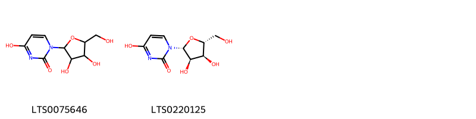{ width=100% }
    <figcaption>Hình ảnh cấu trúc hóa học của 2 hoạt chất thuộc nhóm Pyrimidine nucleosides gồm ['1-[3,4-dihydroxy-5-(hydroxymethyl)oxolan-2-yl]-4-hydroxypyrimidin-2-one (LTS0075646)', 'uridine (LTS0220125)'].</figcaption>
</figure>
#### Nhóm Saturated hydrocarbons
<figure markdown="span">
    { width=100% }
    <figcaption>Hình ảnh cấu trúc hóa học của 1 hoạt chất thuộc nhóm Saturated hydrocarbons gồm ['heptacosane (LTS0150428)'].</figcaption>
</figure>
#### Nhóm Unsaturated hydrocarbons
<figure markdown="span">
    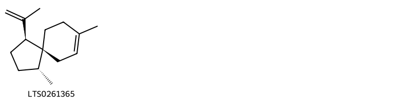{ width=100% }
    <figcaption>Hình ảnh cấu trúc hóa học của 1 hoạt chất thuộc nhóm Unsaturated hydrocarbons gồm ['(1r,4s,5s)-1,8-dimethyl-4-(prop-1-en-2-yl)spiro[4.5]dec-7-ene (LTS0261365)'].</figcaption>
</figure>

---

### Dược dân tộc học

Danh sách các quốc gia có sử dụng *Glehnia littoralis* trong điều trị các bệnh. 

| Country   | Disease          | Bệnh                                                                                                                                                                                                |
|:----------|:-----------------|:----------------------------------------------------------------------------------------------------------------------------------------------------------------------------------------------------|
| Japan*    | Diaphoretic, nan | MYMEMORY WARNING: YOU USED ALL AVAILABLE FREE TRANSLATIONS FOR TODAY. NEXT AVAILABLE IN  08 HOURS 08 MINUTES 13 SECONDS VISIT HTTPS://MYMEMORY.TRANSLATED.NET/DOC/USAGELIMITS.PHP TO TRANSLATE MORE |

---

# Chi Arctopus

??? note "Danh sách các dược liệu thuộc chi"
    
	 - *Arctopus echinatus*

---
## Arctopus echinatus
### Thông tin về thực vật

!!! info "Phân loại thực vật của *Arctopus echinatus* từ GIBF:"
    - **Kingdom:** Plantae
    - **Phylum:** Tracheophyta
    - **Order:** Apiales
    - **Family:** Apiaceae
    - **Genus:** Arctopus
    - **Species:** *Arctopus echinatus*

 

| Label (VI)   | Label (EN)   | Scientific Name    | Descriptions (VI)   | Descriptions (EN)   | Also Known As (VI)   | Also Known As (EN)   |
|:-------------|:-------------|:-------------------|:--------------------|:--------------------|:---------------------|:---------------------|
| N/A          | N/A          | Arctopus echinatus |                     | species of plant    | ['']                 | ['']                 |

#### Phân bố trên thế giới

**Từ CSDL GIBF** South Africa

#### Phân bố tại Việt Nam

**Từ CSDL GIBF**: Không có ghi nhận ở Việt Nam

---
### Thành phần hóa học
        
- Theo cơ sở dữ liệu lotus: Từ loài *Arctopus echinatus* đã phân lập và xác định được Chưa có hoạt chất nào được phân lập. hoạt chất thuộc về các nhóm Không có hoạt chất nào được phân lập. 

Không có hình ảnh nào được tạo ra

---

### Dược dân tộc học

Danh sách các quốc gia có sử dụng *Arctopus echinatus* trong điều trị các bệnh. 

| Country        | Disease   | Bệnh                                                                                                                                                                                                |
|:---------------|:----------|:----------------------------------------------------------------------------------------------------------------------------------------------------------------------------------------------------|
| Africa(Kaffir) | Diuretic  | MYMEMORY WARNING: YOU USED ALL AVAILABLE FREE TRANSLATIONS FOR TODAY. NEXT AVAILABLE IN  08 HOURS 07 MINUTES 41 SECONDS VISIT HTTPS://MYMEMORY.TRANSLATED.NET/DOC/USAGELIMITS.PHP TO TRANSLATE MORE |

---

# Chi Smyrnium

??? note "Danh sách các dược liệu thuộc chi"
    
	 - *Smyrnium oulcastrum*

---
## Smyrnium oulcastrum
### Thông tin về thực vật

!!! info "Phân loại thực vật của *N/A* từ GIBF:"
    - **Kingdom:** Plantae
    - **Phylum:** Tracheophyta
    - **Order:** Apiales
    - **Family:** Apiaceae
    - **Genus:** Smyrnium
    - **Species:** *N/A*

 

| Label (VI)   | Label (EN)   | Scientific Name    | Descriptions (VI)   | Descriptions (EN)   | Also Known As (VI)   | Also Known As (EN)   |
|:-------------|:-------------|:-------------------|:--------------------|:--------------------|:---------------------|:---------------------|
| N/A          | N/A          | Arctopus echinatus |                     | species of plant    | ['']                 | ['']                 |

#### Phân bố trên thế giới

**Từ CSDL GIBF** nan, Italy, Gibraltar, Israel, Netherlands, Cyprus, Malta, Spain, Portugal, Algeria, United States of America, Monaco, Germany, Isle of Man, France, United Kingdom of Great Britain and Northern Ireland, Jersey, Syrian Arab Republic, Ireland

#### Phân bố tại Việt Nam

**Từ CSDL GIBF**: Không có ghi nhận ở Việt Nam

---
### Thành phần hóa học
        
- Theo cơ sở dữ liệu lotus: Từ loài *N/A* đã phân lập và xác định được Chưa có hoạt chất nào được phân lập. hoạt chất thuộc về các nhóm Không có hoạt chất nào được phân lập. 

Không có hình ảnh nào được tạo ra

---

### Dược dân tộc học

Danh sách các quốc gia có sử dụng *N/A* trong điều trị các bệnh. 

| Country   | Disease   | Bệnh                                                                                                                                                                                                |
|:----------|:----------|:----------------------------------------------------------------------------------------------------------------------------------------------------------------------------------------------------|
| ain       | Diuretic  | MYMEMORY WARNING: YOU USED ALL AVAILABLE FREE TRANSLATIONS FOR TODAY. NEXT AVAILABLE IN  08 HOURS 07 MINUTES 19 SECONDS VISIT HTTPS://MYMEMORY.TRANSLATED.NET/DOC/USAGELIMITS.PHP TO TRANSLATE MORE |

---

# Chi Anthriscus

??? note "Danh sách các dược liệu thuộc chi"
    
	 - *Anthriscus cerefolium*
	 - *Anthriscus silvestris*
	 - *Anthriscus sylvestris*

---
## Anthriscus cerefolium
### Thông tin về thực vật

!!! info "Phân loại thực vật của *Anthriscus cerefolium* từ GIBF:"
    - **Kingdom:** Plantae
    - **Phylum:** Tracheophyta
    - **Order:** Apiales
    - **Family:** Apiaceae
    - **Genus:** Anthriscus
    - **Species:** *Anthriscus cerefolium*

 

| Label (VI)   | Label (EN)   | Scientific Name       | Descriptions (VI)   | Descriptions (EN)         | Also Known As (VI)   | Also Known As (EN)                                     |
|:-------------|:-------------|:----------------------|:--------------------|:--------------------------|:---------------------|:-------------------------------------------------------|
| N/A          | N/A          | Anthriscus cerefolium | loài thực vật       | species of plant, chervil | ['']                 | ['chervil', 'Anthriscus cerefolium', 'French parsley'] |

#### Phân bố trên thế giới

**Từ CSDL GIBF** nan, Italy, Australia, Belgium, Slovakia, Norway, Canada, Ukraine, Denmark, Netherlands, Spain, Hungary, Türkiye, Russian Federation, United States of America, Sweden, Czechia, Germany, Romania, Switzerland, Armenia, Austria, France, Serbia

#### Phân bố tại Việt Nam

**Từ CSDL GIBF**: Không có ghi nhận ở Việt Nam

---
### Thành phần hóa học
        
- Theo cơ sở dữ liệu lotus: Từ loài *Anthriscus cerefolium* đã phân lập và xác định được 10 hoạt chất thuộc về các nhóm Phenol ethers, Fatty Acyls, Prenol lipids, Saturated hydrocarbons, Coumarins and derivatives. 

|    | chemicalTaxonomyClassyfireClass   |   smiles_count |
|---:|:----------------------------------|---------------:|
|  0 | Coumarins and derivatives         |              3 |
|  1 | Fatty Acyls                       |              2 |
|  2 | Phenol ethers                     |              3 |
|  3 | Prenol lipids                     |              1 |
|  4 | Saturated hydrocarbons            |              1 |

#### Nhóm Coumarins and derivatives
<figure markdown="span">
    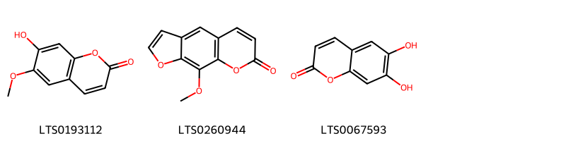{ width=100% }
    <figcaption>Hình ảnh cấu trúc hóa học của 3 hoạt chất thuộc nhóm Coumarins and derivatives gồm ['scopoletin (LTS0193112)', 'methoxsalen (LTS0260944)', 'esculetin (LTS0067593)'].</figcaption>
</figure>
#### Nhóm Fatty Acyls
<figure markdown="span">
    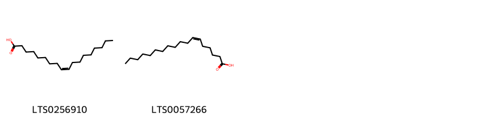{ width=100% }
    <figcaption>Hình ảnh cấu trúc hóa học của 2 hoạt chất thuộc nhóm Fatty Acyls gồm ['oleic acid (LTS0256910)', 'petroselinic acid (LTS0057266)'].</figcaption>
</figure>
#### Nhóm Phenol ethers
<figure markdown="span">
    { width=100% }
    <figcaption>Hình ảnh cấu trúc hóa học của 3 hoạt chất thuộc nhóm Phenol ethers gồm ['p-propenylanisole (LTS0177188)', 'tarragon (LTS0245226)', 'anethole (LTS0033696)'].</figcaption>
</figure>
#### Nhóm Prenol lipids
<figure markdown="span">
    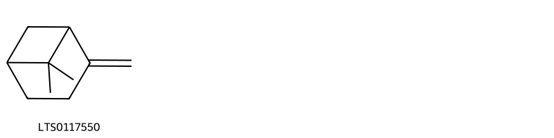{ width=100% }
    <figcaption>Hình ảnh cấu trúc hóa học của 1 hoạt chất thuộc nhóm Prenol lipids gồm ['β-pinene (LTS0117550)'].</figcaption>
</figure>
#### Nhóm Saturated hydrocarbons
<figure markdown="span">
    { width=100% }
    <figcaption>Hình ảnh cấu trúc hóa học của 1 hoạt chất thuộc nhóm Saturated hydrocarbons gồm ['undecane (LTS0081068)'].</figcaption>
</figure>

---

### Dược dân tộc học

Danh sách các quốc gia có sử dụng *Anthriscus cerefolium* trong điều trị các bệnh. 

| Country   | Disease                                                                  | Bệnh                                                                                                                                                                                                |
|:----------|:-------------------------------------------------------------------------|:----------------------------------------------------------------------------------------------------------------------------------------------------------------------------------------------------|
| Turkey    | Carminative, Diuretic, Stimulant, Tonic, Apertif, Stomachic, Expectorant | MYMEMORY WARNING: YOU USED ALL AVAILABLE FREE TRANSLATIONS FOR TODAY. NEXT AVAILABLE IN  08 HOURS 06 MINUTES 59 SECONDS VISIT HTTPS://MYMEMORY.TRANSLATED.NET/DOC/USAGELIMITS.PHP TO TRANSLATE MORE |
| ain       | Apertif                                                                  | MYMEMORY WARNING: YOU USED ALL AVAILABLE FREE TRANSLATIONS FOR TODAY. NEXT AVAILABLE IN  08 HOURS 06 MINUTES 56 SECONDS VISIT HTTPS://MYMEMORY.TRANSLATED.NET/DOC/USAGELIMITS.PHP TO TRANSLATE MORE |

---

---
## Anthriscus silvestris
### Thông tin về thực vật

!!! info "Phân loại thực vật của *Anthriscus sylvestris* từ GIBF:"
    - **Kingdom:** Plantae
    - **Phylum:** Tracheophyta
    - **Order:** Apiales
    - **Family:** Apiaceae
    - **Genus:** Anthriscus
    - **Species:** *Anthriscus sylvestris*

 

| Label (VI)   | Label (EN)   | Scientific Name       | Descriptions (VI)   | Descriptions (EN)         | Also Known As (VI)   | Also Known As (EN)                                     |
|:-------------|:-------------|:----------------------|:--------------------|:--------------------------|:---------------------|:-------------------------------------------------------|
| N/A          | N/A          | Anthriscus cerefolium | loài thực vật       | species of plant, chervil | ['']                 | ['chervil', 'Anthriscus cerefolium', 'French parsley'] |

#### Phân bố trên thế giới

**Từ CSDL GIBF** Denmark, Netherlands, Czechia, Germany, Poland, Ireland, Russian Federation, Austria, China, France, United Kingdom of Great Britain and Northern Ireland, Canada

#### Phân bố tại Việt Nam

**Từ CSDL GIBF**: Không có ghi nhận ở Việt Nam

---
### Thành phần hóa học
        
- Theo cơ sở dữ liệu lotus: Từ loài *Anthriscus sylvestris* đã phân lập và xác định được Chưa có hoạt chất nào được phân lập. hoạt chất thuộc về các nhóm Không có hoạt chất nào được phân lập. 

Không có hình ảnh nào được tạo ra

---

### Dược dân tộc học

Danh sách các quốc gia có sử dụng *Anthriscus sylvestris* trong điều trị các bệnh. 

| Country   | Disease                             | Bệnh                                                                                                                                                                                                |
|:----------|:------------------------------------|:----------------------------------------------------------------------------------------------------------------------------------------------------------------------------------------------------|
| Turkey    | Expectorant, Stomachic, Carminative | MYMEMORY WARNING: YOU USED ALL AVAILABLE FREE TRANSLATIONS FOR TODAY. NEXT AVAILABLE IN  08 HOURS 06 MINUTES 32 SECONDS VISIT HTTPS://MYMEMORY.TRANSLATED.NET/DOC/USAGELIMITS.PHP TO TRANSLATE MORE |

---

---
## Anthriscus sylvestris
### Thông tin về thực vật

!!! info "Phân loại thực vật của *Anthriscus sylvestris* từ GIBF:"
    - **Kingdom:** Plantae
    - **Phylum:** Tracheophyta
    - **Order:** Apiales
    - **Family:** Apiaceae
    - **Genus:** Anthriscus
    - **Species:** *Anthriscus sylvestris*

 

| Label (VI)   | Label (EN)   | Scientific Name       | Descriptions (VI)   | Descriptions (EN)   | Also Known As (VI)   | Also Known As (EN)                               |
|:-------------|:-------------|:----------------------|:--------------------|:--------------------|:---------------------|:-------------------------------------------------|
| N/A          | N/A          | Anthriscus sylvestris | loài thực vật       | species of plant    | ['']                 | ['Cow Parsley', 'wild chervil (rare / archaic)'] |

#### Phân bố trên thế giới

**Từ CSDL GIBF** Denmark, Netherlands, Czechia, Germany, Poland, Ireland, Russian Federation, Austria, China, France, United Kingdom of Great Britain and Northern Ireland, Canada

#### Phân bố tại Việt Nam

**Từ CSDL GIBF**: Không có ghi nhận ở Việt Nam

---
### Thành phần hóa học
        
- Theo cơ sở dữ liệu lotus: Từ loài *Anthriscus sylvestris* đã phân lập và xác định được 56 hoạt chất thuộc về các nhóm Phenol ethers, Fatty Acyls, Flavonoids, Prenol lipids, Steroids and steroid derivatives, Benzodioxoles, Lignan lactones, Benzene and substituted derivatives, Phenols, Coumarins and derivatives, Furanoid lignans. 

|    | chemicalTaxonomyClassyfireClass     |   smiles_count |
|---:|:------------------------------------|---------------:|
|  0 | Benzene and substituted derivatives |              8 |
|  1 | Benzodioxoles                       |              6 |
|  2 | Coumarins and derivatives           |              3 |
|  3 | Fatty Acyls                         |              8 |
|  4 | Flavonoids                          |              4 |
|  5 | Furanoid lignans                    |              7 |
|  6 | Lignan lactones                     |             10 |
|  7 | Phenol ethers                       |              1 |
|  8 | Phenols                             |              1 |
|  9 | Prenol lipids                       |              6 |
| 10 | Steroids and steroid derivatives    |              2 |

#### Nhóm Benzene and substituted derivatives
<figure markdown="span">
    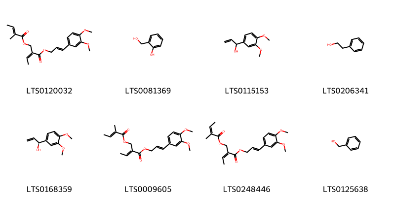{ width=100% }
    <figcaption>Hình ảnh cấu trúc hóa học của 8 hoạt chất thuộc nhóm Benzene and substituted derivatives gồm ['(2e)-3-(3,4-dimethoxyphenyl)prop-2-en-1-yl (2z)-2-({[(2e)-2-methylbut-2-enoyl]oxy}methyl)but-2-enoate (LTS0120032)', 'saligenin (LTS0081369)', "1'-hydroxymethyleugenol (LTS0115153)", '2-phenyl-ethanol (LTS0206341)', '(1s)-1-(3,4-dimethoxyphenyl)prop-2-en-1-ol (LTS0168359)', '3-{[3-(3,4-dimethoxyphenyl)prop-2-en-1-yl]oxy}-2-ethylidene-3-oxopropyl 2-methylbut-2-enoate (LTS0009605)', '(2e)-3-(3,4-dimethoxyphenyl)prop-2-en-1-yl (2z)-2-({[(2z)-2-methylbut-2-enoyl]oxy}methyl)but-2-enoate (LTS0248446)', 'benzyl alcohol (LTS0125638)'].</figcaption>
</figure>
#### Nhóm Benzodioxoles
<figure markdown="span">
    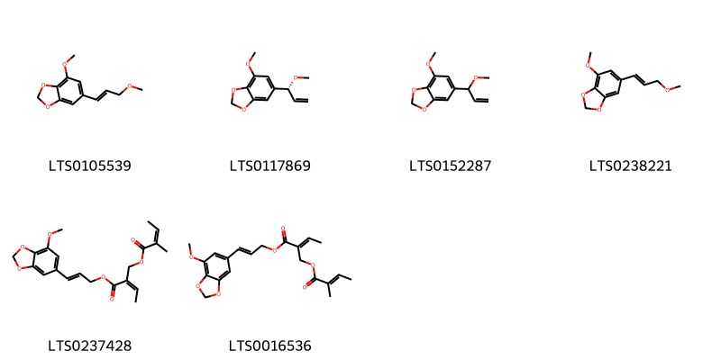{ width=100% }
    <figcaption>Hình ảnh cấu trúc hóa học của 6 hoạt chất thuộc nhóm Benzodioxoles gồm ['4-methoxy-6-[(1e)-3-methoxyprop-1-en-1-yl]-2h-1,3-benzodioxole (LTS0105539)', '4-methoxy-6-[(1r)-1-methoxyprop-2-en-1-yl]-2h-1,3-benzodioxole (LTS0117869)', '4-methoxy-6-(1-methoxyprop-2-en-1-yl)-2h-1,3-benzodioxole (LTS0152287)', '4-methoxy-6-(3-methoxyprop-1-en-1-yl)-2h-1,3-benzodioxole (LTS0238221)', '(2e)-3-(7-methoxy-2h-1,3-benzodioxol-5-yl)prop-2-en-1-yl (2z)-2-({[(2z)-2-methylbut-2-enoyl]oxy}methyl)but-2-enoate (LTS0237428)', '2-ethylidene-3-{[3-(7-methoxy-2h-1,3-benzodioxol-5-yl)prop-2-en-1-yl]oxy}-3-oxopropyl 2-methylbut-2-enoate (LTS0016536)'].</figcaption>
</figure>
#### Nhóm Coumarins and derivatives
<figure markdown="span">
    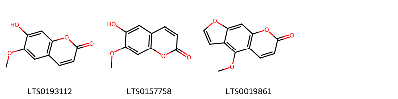{ width=100% }
    <figcaption>Hình ảnh cấu trúc hóa học của 3 hoạt chất thuộc nhóm Coumarins and derivatives gồm ['scopoletin (LTS0193112)', 'isoscopoletin (LTS0157758)', 'bergapten (LTS0019861)'].</figcaption>
</figure>
#### Nhóm Fatty Acyls
<figure markdown="span">
    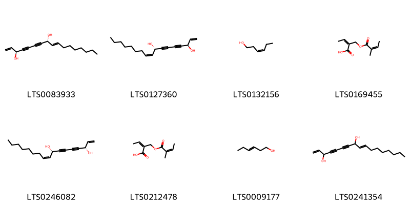{ width=100% }
    <figcaption>Hình ảnh cấu trúc hóa học của 8 hoạt chất thuộc nhóm Fatty Acyls gồm ['(3s,8r)-heptadeca-1,9-dien-4,6-diyne-3,8-diol (LTS0083933)', 'falcarindiol (LTS0127360)', 'cis-3-hexenol (LTS0132156)', '(2z)-2-({[(2z)-2-methylbut-2-enoyl]oxy}methyl)but-2-enoic acid (LTS0169455)', '(3s,8s,9z)-heptadeca-1,9-dien-4,6-diyne-3,8-diol (LTS0246082)', '2-{[(2-methylbut-2-enoyl)oxy]methyl}but-2-enoic acid (LTS0212478)', '3-hexenol (LTS0009177)', 'heptadeca-1,9-dien-4,6-diyne-3,8-diol (LTS0241354)'].</figcaption>
</figure>
#### Nhóm Flavonoids
<figure markdown="span">
    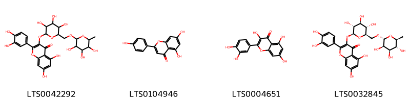{ width=100% }
    <figcaption>Hình ảnh cấu trúc hóa học của 4 hoạt chất thuộc nhóm Flavonoids gồm ['rutin (LTS0042292)', 'chamomile (LTS0104946)', 'quercetin (LTS0004651)', '3-rutinosyl quercetin (LTS0032845)'].</figcaption>
</figure>
#### Nhóm Furanoid lignans
<figure markdown="span">
    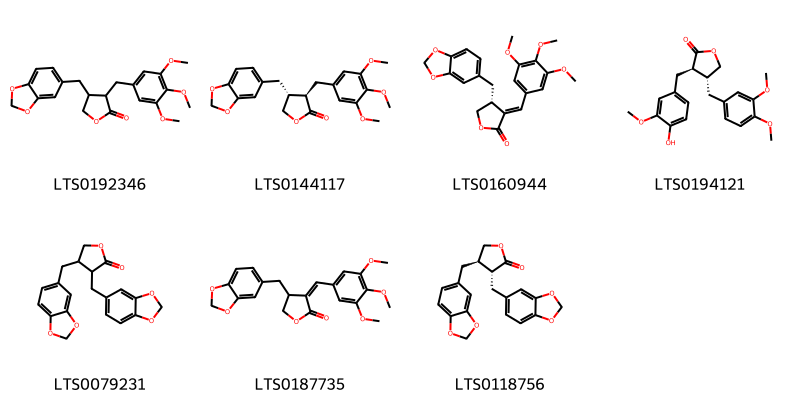{ width=100% }
    <figcaption>Hình ảnh cấu trúc hóa học của 7 hoạt chất thuộc nhóm Furanoid lignans gồm ['4-(2h-1,3-benzodioxol-5-ylmethyl)-3-[(3,4,5-trimethoxyphenyl)methyl]oxolan-2-one (LTS0192346)', 'yatein (LTS0144117)', '(3e,4r)-4-(2h-1,3-benzodioxol-5-ylmethyl)-3-[(3,4,5-trimethoxyphenyl)methylidene]oxolan-2-one (LTS0160944)', '(-)-arctigenin (LTS0194121)', '3,4-bis(2h-1,3-benzodioxol-5-ylmethyl)oxolan-2-one (LTS0079231)', '4-(2h-1,3-benzodioxol-5-ylmethyl)-3-[(3,4,5-trimethoxyphenyl)methylidene]oxolan-2-one (LTS0187735)', 'hinokinin (LTS0118756)'].</figcaption>
</figure>
#### Nhóm Lignan lactones
<figure markdown="span">
    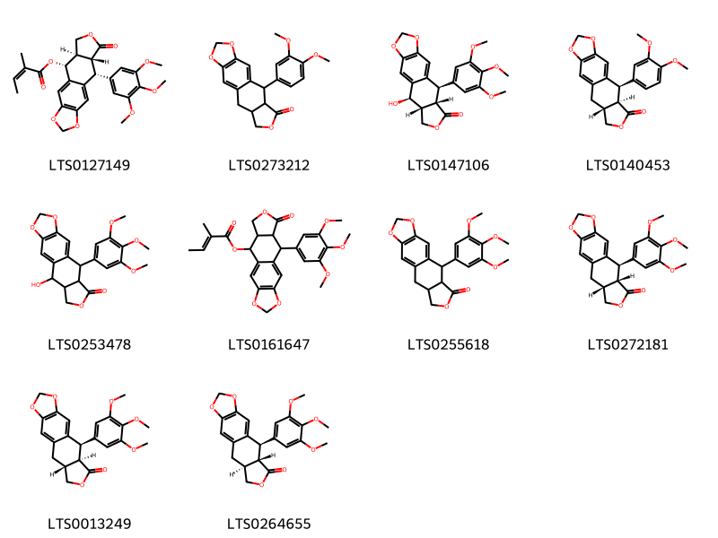{ width=100% }
    <figcaption>Hình ảnh cấu trúc hóa học của 10 hoạt chất thuộc nhóm Lignan lactones gồm ['(10r,11r,15r,16r)-14-oxo-16-(3,4,5-trimethoxyphenyl)-4,6,13-trioxatetracyclo[7.7.0.0³,⁷.0¹¹,¹⁵]hexadeca-1,3(7),8-trien-10-yl (2z)-2-methylbut-2-enoate (LTS0127149)', '10-(3,4-dimethoxyphenyl)-4,6,13-trioxatetracyclo[7.7.0.0³,⁷.0¹¹,¹⁵]hexadeca-1,3(7),8-trien-12-one (LTS0273212)', 'epipodophyllotoxins (LTS0147106)', '(10r,11r,15r)-10-(3,4-dimethoxyphenyl)-4,6,13-trioxatetracyclo[7.7.0.0³,⁷.0¹¹,¹⁵]hexadeca-1,3(7),8-trien-12-one (LTS0140453)', 'podophyllum resin (LTS0253478)', '14-oxo-16-(3,4,5-trimethoxyphenyl)-4,6,13-trioxatetracyclo[7.7.0.0³,⁷.0¹¹,¹⁵]hexadeca-1,3(7),8-trien-10-yl 2-methylbut-2-enoate (LTS0161647)', '10-(3,4,5-trimethoxyphenyl)-4,6,13-trioxatetracyclo[7.7.0.0³,⁷.0¹¹,¹⁵]hexadeca-1,3(7),8-trien-12-one (LTS0255618)', '(10r,11s,15r)-10-(3,4,5-trimethoxyphenyl)-4,6,13-trioxatetracyclo[7.7.0.0³,⁷.0¹¹,¹⁵]hexadeca-1,3(7),8-trien-12-one (LTS0272181)', '(-)-deoxypodophyllotoxin (LTS0013249)', '(10r,11s,15s)-10-(3,4,5-trimethoxyphenyl)-4,6,13-trioxatetracyclo[7.7.0.0³,⁷.0¹¹,¹⁵]hexadeca-1,3(7),8-trien-12-one (LTS0264655)'].</figcaption>
</figure>
#### Nhóm Phenol ethers
<figure markdown="span">
    { width=100% }
    <figcaption>Hình ảnh cấu trúc hóa học của 1 hoạt chất thuộc nhóm Phenol ethers gồm ['elemicin (LTS0188875)'].</figcaption>
</figure>
#### Nhóm Phenols
<figure markdown="span">
    { width=100% }
    <figcaption>Hình ảnh cấu trúc hóa học của 1 hoạt chất thuộc nhóm Phenols gồm ['eugenol (LTS0052342)'].</figcaption>
</figure>
#### Nhóm Prenol lipids
<figure markdown="span">
    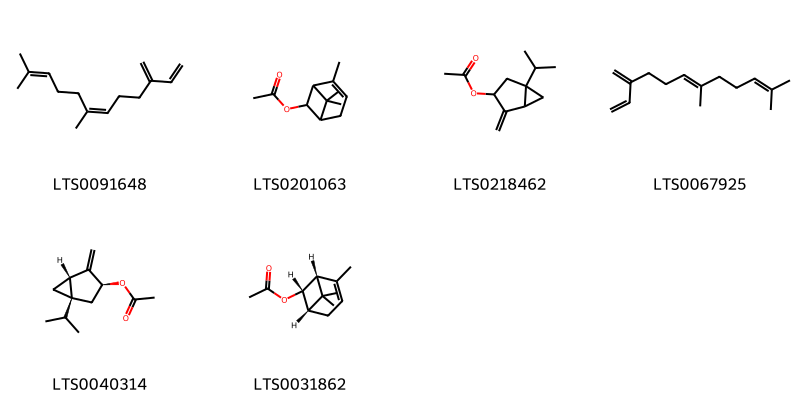{ width=100% }
    <figcaption>Hình ảnh cấu trúc hóa học của 6 hoạt chất thuộc nhóm Prenol lipids gồm ['β-farnesene (LTS0091648)', '2,7,7-trimethylbicyclo[3.1.1]hept-2-en-6-yl acetate (LTS0201063)', '1-isopropyl-4-methylidenebicyclo[3.1.0]hexan-3-yl acetate (LTS0218462)', 'β-farnesene (LTS0067925)', '(1s,3s,5s)-1-isopropyl-4-methylidenebicyclo[3.1.0]hexan-3-yl acetate (LTS0040314)', '(1r,5s,6s)-2,7,7-trimethylbicyclo[3.1.1]hept-2-en-6-yl acetate (LTS0031862)'].</figcaption>
</figure>
#### Nhóm Steroids and steroid derivatives
<figure markdown="span">
    { width=100% }
    <figcaption>Hình ảnh cấu trúc hóa học của 2 hoạt chất thuộc nhóm Steroids and steroid derivatives gồm ['stigmast-5-en-3-ol (LTS0071224)', 'stigmast-5-en-3-ol, (3β)- (LTS0204616)'].</figcaption>
</figure>

---

### Dược dân tộc học

Danh sách các quốc gia có sử dụng *Anthriscus sylvestris* trong điều trị các bệnh. 

| Country   |   Disease | Bệnh                                                                                                                                                                                                |
|:----------|----------:|:----------------------------------------------------------------------------------------------------------------------------------------------------------------------------------------------------|
| Elsewhere |       nan | MYMEMORY WARNING: YOU USED ALL AVAILABLE FREE TRANSLATIONS FOR TODAY. NEXT AVAILABLE IN  08 HOURS 06 MINUTES 12 SECONDS VISIT HTTPS://MYMEMORY.TRANSLATED.NET/DOC/USAGELIMITS.PHP TO TRANSLATE MORE |

---

# Chi Anethum

??? note "Danh sách các dược liệu thuộc chi"
    
	 - *Anethum graveloens*
	 - *Anethum graveolens*
	 - *Anethum sowa*

---
## Anethum graveloens
### Thông tin về thực vật

!!! info "Phân loại thực vật của *Anethum graveolens* từ GIBF:"
    - **Kingdom:** Plantae
    - **Phylum:** Tracheophyta
    - **Order:** Apiales
    - **Family:** Apiaceae
    - **Genus:** Anethum
    - **Species:** *Anethum graveolens*

 

| Label (VI)   | Label (EN)   | Scientific Name       | Descriptions (VI)   | Descriptions (EN)   | Also Known As (VI)   | Also Known As (EN)                               |
|:-------------|:-------------|:----------------------|:--------------------|:--------------------|:---------------------|:-------------------------------------------------|
| N/A          | N/A          | Anthriscus sylvestris | loài thực vật       | species of plant    | ['']                 | ['Cow Parsley', 'wild chervil (rare / archaic)'] |

#### Phân bố trên thế giới

**Từ CSDL GIBF** United Arab Emirates, Australia, Belgium, Estonia, Nicaragua, Latvia, Norway, Canada, Ukraine, Denmark, Netherlands, Lithuania, Belarus, Chinese Taipei, Hungary, Russian Federation, United States of America, Sweden, Finland, Kazakhstan, Czechia, Germany, Brazil, Switzerland, Armenia, Austria, France, United Kingdom of Great Britain and Northern Ireland, Iraq, India, Poland

#### Phân bố tại Việt Nam

**Từ CSDL GIBF**: Không có ghi nhận ở Việt Nam

---
### Thành phần hóa học
        
- Theo cơ sở dữ liệu lotus: Từ loài *Anethum graveolens* đã phân lập và xác định được Chưa có hoạt chất nào được phân lập. hoạt chất thuộc về các nhóm Không có hoạt chất nào được phân lập. 

Không có hình ảnh nào được tạo ra

---

### Dược dân tộc học

Danh sách các quốc gia có sử dụng *Anethum graveolens* trong điều trị các bệnh. 

| Country   | Disease     | Bệnh                                                                                                                                                                                                |
|:----------|:------------|:----------------------------------------------------------------------------------------------------------------------------------------------------------------------------------------------------|
| Elsewhere | Carminative | MYMEMORY WARNING: YOU USED ALL AVAILABLE FREE TRANSLATIONS FOR TODAY. NEXT AVAILABLE IN  08 HOURS 05 MINUTES 45 SECONDS VISIT HTTPS://MYMEMORY.TRANSLATED.NET/DOC/USAGELIMITS.PHP TO TRANSLATE MORE |

---

---
## Anethum graveolens
### Thông tin về thực vật

!!! info "Phân loại thực vật của *Anethum graveolens* từ GIBF:"
    - **Kingdom:** Plantae
    - **Phylum:** Tracheophyta
    - **Order:** Apiales
    - **Family:** Apiaceae
    - **Genus:** Anethum
    - **Species:** *Anethum graveolens*

 

| Label (VI)   | Label (EN)   | Scientific Name    | Descriptions (VI)   | Descriptions (EN)   | Also Known As (VI)                   | Also Known As (EN)   |
|:-------------|:-------------|:-------------------|:--------------------|:--------------------|:-------------------------------------|:---------------------|
| N/A          | N/A          | Anethum graveolens | loài thực vật       | species of plant    | ['Rau thì là', 'Anethum graveolens'] | ['Dill', 'dill']     |

#### Phân bố trên thế giới

**Từ CSDL GIBF** United Arab Emirates, Australia, Belgium, Estonia, Nicaragua, Latvia, Norway, Canada, Ukraine, Denmark, Netherlands, Lithuania, Belarus, Chinese Taipei, Hungary, Russian Federation, United States of America, Sweden, Finland, Kazakhstan, Czechia, Germany, Brazil, Switzerland, Armenia, Austria, France, United Kingdom of Great Britain and Northern Ireland, Iraq, India, Poland

#### Phân bố tại Việt Nam

**Từ CSDL GIBF**: Không có ghi nhận ở Việt Nam

---
### Thành phần hóa học
        
- Theo cơ sở dữ liệu lotus: Từ loài *Anethum graveolens* đã phân lập và xác định được 127 hoạt chất thuộc về các nhóm Phenol ethers, Fatty Acyls, Flavonoids, Prenol lipids, Pyrimidine nucleosides, Cinnamic acids and derivatives, Benzodioxoles, Benzofurans, Benzene and substituted derivatives, Unsaturated hydrocarbons, Organooxygen compounds, Phenols, Coumarins and derivatives. 

|    | chemicalTaxonomyClassyfireClass     |   smiles_count |
|---:|:------------------------------------|---------------:|
|  0 | Benzene and substituted derivatives |              8 |
|  1 | Benzodioxoles                       |              2 |
|  2 | Benzofurans                         |              1 |
|  3 | Cinnamic acids and derivatives      |              5 |
|  4 | Coumarins and derivatives           |              5 |
|  5 | Fatty Acyls                         |              7 |
|  6 | Flavonoids                          |             15 |
|  7 | Organooxygen compounds              |             18 |
|  8 | Phenol ethers                       |              1 |
|  9 | Phenols                             |              1 |
| 10 | Prenol lipids                       |             58 |
| 11 | Pyrimidine nucleosides              |              2 |
| 12 | Unsaturated hydrocarbons            |              2 |

#### Nhóm Benzene and substituted derivatives
<figure markdown="span">
    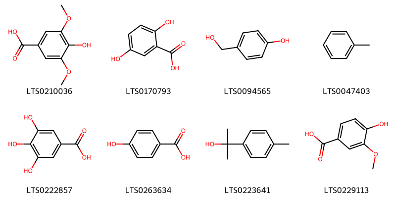{ width=100% }
    <figcaption>Hình ảnh cấu trúc hóa học của 8 hoạt chất thuộc nhóm Benzene and substituted derivatives gồm ['syringic acid (LTS0210036)', '2,5-dihydroxybenzoic acid (LTS0170793)', 'gastrodigenin (LTS0094565)', 'toluene (LTS0047403)', 'galop (LTS0222857)', 'p-hydroxybenzoic acid (LTS0263634)', 'p-cymen-8-ol (LTS0223641)', 'vanillic acid (LTS0229113)'].</figcaption>
</figure>
#### Nhóm Benzodioxoles
<figure markdown="span">
    { width=100% }
    <figcaption>Hình ảnh cấu trúc hóa học của 2 hoạt chất thuộc nhóm Benzodioxoles gồm ['dillapiol (LTS0226542)', 'myristicin (LTS0180101)'].</figcaption>
</figure>
#### Nhóm Benzofurans
<figure markdown="span">
    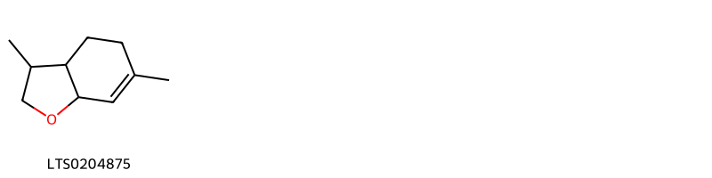{ width=100% }
    <figcaption>Hình ảnh cấu trúc hóa học của 1 hoạt chất thuộc nhóm Benzofurans gồm ['3,6-dimethyl-2,3,3a,4,5,7a-hexahydro-1-benzofuran (LTS0204875)'].</figcaption>
</figure>
#### Nhóm Cinnamic acids and derivatives
<figure markdown="span">
    { width=100% }
    <figcaption>Hình ảnh cấu trúc hóa học của 5 hoạt chất thuộc nhóm Cinnamic acids and derivatives gồm ['ferulic acid (LTS0077328)', '3,4-dihydroxycinnamic acid (LTS0128050)', 'para-coumaric acid (LTS0266252)', 'hydroxycinnamic acid (LTS0233023)', 'ferulic acid (LTS0273002)'].</figcaption>
</figure>
#### Nhóm Coumarins and derivatives
<figure markdown="span">
    { width=100% }
    <figcaption>Hình ảnh cấu trúc hóa học của 5 hoạt chất thuộc nhóm Coumarins and derivatives gồm ['methoxsalen (LTS0260944)', 'umbelliferone (LTS0162728)', 'bergapten (LTS0019861)', 'scopoletin (LTS0193112)', 'esculetin (LTS0067593)'].</figcaption>
</figure>
#### Nhóm Fatty Acyls
<figure markdown="span">
    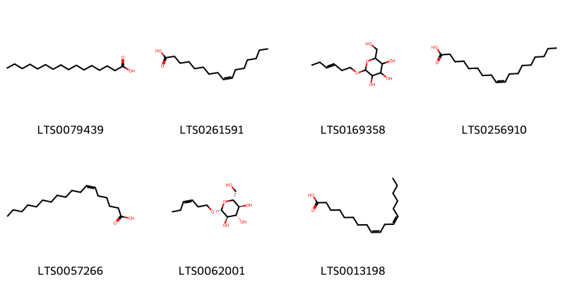{ width=100% }
    <figcaption>Hình ảnh cấu trúc hóa học của 7 hoạt chất thuộc nhóm Fatty Acyls gồm ['palmitic acid (LTS0079439)', 'palmitoleic acid (LTS0261591)', '2-(hex-3-en-1-yloxy)-6-(hydroxymethyl)oxane-3,4,5-triol (LTS0169358)', 'oleic acid (LTS0256910)', 'petroselinic acid (LTS0057266)', '(2r,3r,4s,5s,6r)-2-[(3z)-hex-3-en-1-yloxy]-6-(hydroxymethyl)oxane-3,4,5-triol (LTS0062001)', 'linoleic (LTS0013198)'].</figcaption>
</figure>
#### Nhóm Flavonoids
<figure markdown="span">
    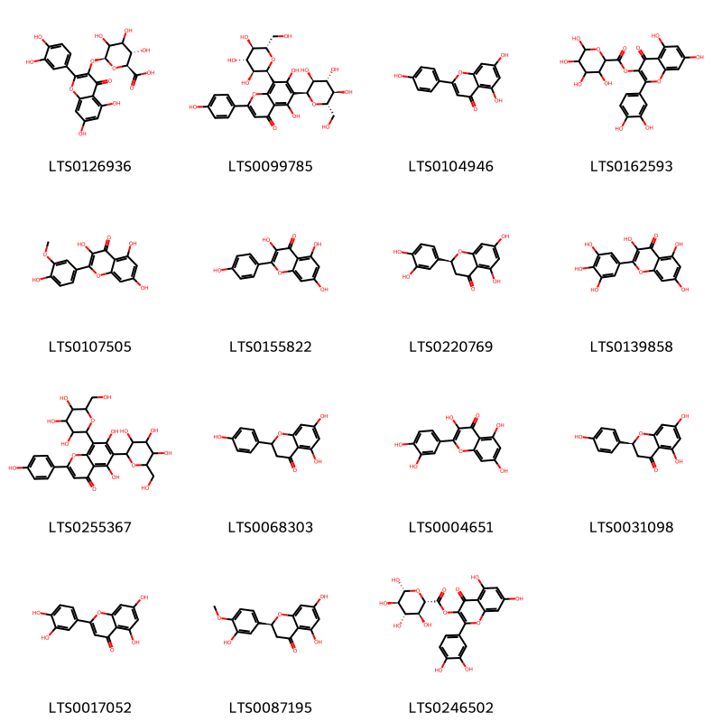{ width=100% }
    <figcaption>Hình ảnh cấu trúc hóa học của 15 hoạt chất thuộc nhóm Flavonoids gồm ['miquelianin (LTS0126936)', '5,7-dihydroxy-2-(4-hydroxyphenyl)-6,8-bis[(2s,3s,4s,5r,6s)-3,4,5-trihydroxy-6-(hydroxymethyl)oxan-2-yl]chromen-4-one (LTS0099785)', 'chamomile (LTS0104946)', '2-(3,4-dihydroxyphenyl)-5,7-dihydroxy-4-oxochromen-3-yl 3,4,5,6-tetrahydroxyoxane-2-carboxylate (LTS0162593)', 'isorhamnetin (LTS0107505)', 'kaempherol (LTS0155822)', 'eriodictyol (LTS0220769)', 'myricetin (LTS0139858)', '5,7-dihydroxy-2-(4-hydroxyphenyl)-6,8-bis[3,4,5-trihydroxy-6-(hydroxymethyl)oxan-2-yl]chromen-4-one (LTS0255367)', 'asahina (LTS0068303)', 'quercetin (LTS0004651)', 'naringenin (LTS0031098)', 'luteolin (LTS0017052)', 'hesperetin (LTS0087195)', '2-(3,4-dihydroxyphenyl)-5,7-dihydroxy-4-oxochromen-3-yl (2s,3s,4s,5r,6r)-3,4,5,6-tetrahydroxyoxane-2-carboxylate (LTS0246502)'].</figcaption>
</figure>
#### Nhóm Organooxygen compounds
<figure markdown="span">
    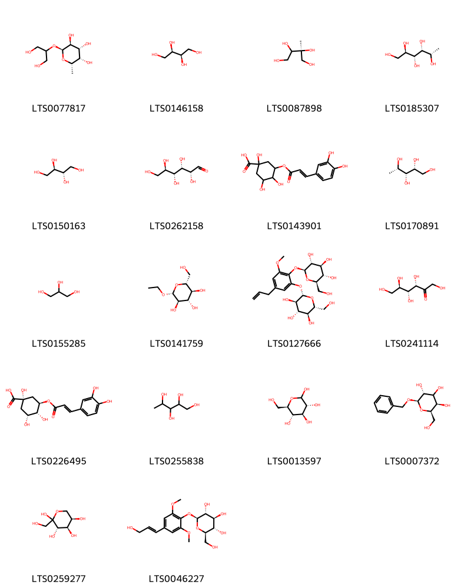{ width=100% }
    <figcaption>Hình ảnh cấu trúc hóa học của 18 hoạt chất thuộc nhóm Organooxygen compounds gồm ['(2r,3s,4r,5s,6s)-2-[(1,3-dihydroxypropan-2-yl)oxy]-6-methyloxane-3,4,5-triol (LTS0077817)', '(-)-threitol (LTS0146158)', '(2s)-2-methylbutane-1,2,3,4-tetrol (LTS0087898)', '(2r,3r,4r,5s)-hexane-1,2,3,4,5-pentol (LTS0185307)', 'meso-erythritol (LTS0150163)', '(+)-glucose (LTS0262158)', '3-{[3-(3,4-dihydroxyphenyl)prop-2-enoyl]oxy}-1,4,5-trihydroxycyclohexane-1-carboxylic acid (LTS0143901)', '(2r,3r,4s)-pentane-1,2,3,4-tetrol (LTS0170891)', 'glycerol (LTS0155285)', 'ethyl glucoside (LTS0141759)', '(2r,3s,4s,5r,6s)-2-(hydroxymethyl)-6-[2-methoxy-4-(prop-2-en-1-yl)-6-{[(2s,3r,4s,5s,6r)-3,4,5-trihydroxy-6-(hydroxymethyl)oxan-2-yl]oxy}phenoxy]oxane-3,4,5-triol (LTS0127666)', 'keto-d-fructose (LTS0241114)', 'chlorogenic acid (LTS0226495)', 'pentane-1,2,3,4-tetrol (LTS0255838)', 'glucose (LTS0013597)', '(2r,3r,5r,6r)-2-(benzyloxy)-6-(hydroxymethyl)oxane-3,4,5-triol (LTS0007372)', 'd-fructopyranose (LTS0259277)', 'syringin (LTS0046227)'].</figcaption>
</figure>
#### Nhóm Phenol ethers
<figure markdown="span">
    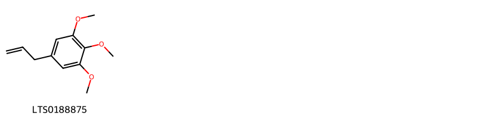{ width=100% }
    <figcaption>Hình ảnh cấu trúc hóa học của 1 hoạt chất thuộc nhóm Phenol ethers gồm ['elemicin (LTS0188875)'].</figcaption>
</figure>
#### Nhóm Phenols
<figure markdown="span">
    { width=100% }
    <figcaption>Hình ảnh cấu trúc hóa học của 1 hoạt chất thuộc nhóm Phenols gồm ['eugenol (LTS0052342)'].</figcaption>
</figure>
#### Nhóm Prenol lipids
<figure markdown="span">
    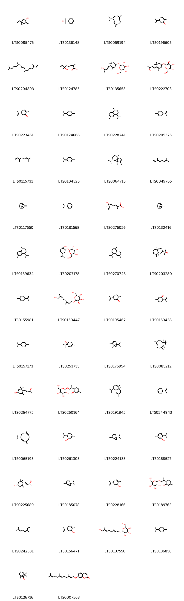{ width=100% }
    <figcaption>Hình ảnh cấu trúc hóa học của 58 hoạt chất thuộc nhóm Prenol lipids gồm ['sabinol (LTS0085475)', 'terpineol (LTS0136148)', '(-)-germacrene d (LTS0059194)', 'carvone (LTS0196605)', '7,11,15-trimethyl-3-methylidenehexadec-1-ene (LTS0204893)', '6-hydroxy-2,6-dimethylocta-2,7-dienoic acid (LTS0124785)', '(2r,3r,4s,5s,6r)-2-{[(1s)-4-[(1e,3r)-3-hydroxybut-1-en-1-yl]-3,5,5-trimethylcyclohex-3-en-1-yl]oxy}-6-(hydroxymethyl)oxane-3,4,5-triol (LTS0135653)', '2-{[4-(3-hydroxybut-1-en-1-yl)-3,5,5-trimethylcyclohex-3-en-1-yl]oxy}-6-(hydroxymethyl)oxane-3,4,5-triol (LTS0222703)', '(-)-carvone (LTS0223461)', 'β phellandrene (LTS0124668)', '(e)-calamene (LTS0228241)', '(-)-limonene (LTS0205325)', 'α-myrcene (LTS0115731)', 'terpinolene (LTS0104525)', '(1s,5r,7s,10r)-7-isopropyl-4,10-dimethyltricyclo[4.4.0.0¹,⁵]dec-3-ene (LTS0064715)', 'trans-β-ocimene (LTS0049765)', 'β-pinene (LTS0117550)', 'cymene (LTS0181568)', '(2e,6s)-6-hydroxy-2,6-dimethylocta-2,7-dienoic acid (LTS0276026)', 'α pinene (LTS0132416)', '(1s,4s)-4-isopropyl-1,6-dimethyl-1,2,3,4-tetrahydronaphthalene (LTS0139634)', '(2s,3r,4s,5s,6r)-2-{[(1r,2r,5r)-2-hydroxy-5-isopropyl-2-methylcyclohex-3-en-1-yl]oxy}-6-(hydroxymethyl)oxane-3,4,5-triol (LTS0207178)', '4-isopropyl-1,6-dimethyl-2,3,4,4a,7,8-hexahydronaphthalene (LTS0270743)', 'β-eudesmol (LTS0203280)', 'limonene,  (LTS0155981)', '2-[(8-hydroxy-3,7-dimethylocta-2,6-dien-1-yl)oxy]-6-(hydroxymethyl)oxane-3,4,5-triol (LTS0150447)', 'dihydrocarvone (LTS0195462)', 'isopiperitenone (LTS0159438)', 'phellandrene (LTS0157173)', '4-terpineol (LTS0253733)', 'α-thujene (LTS0176954)', 'caryophyllene (LTS0085212)', '4-(3-hydroxybut-1-en-1-yl)-3,5,5-trimethylcyclohex-2-en-1-ol (LTS0264775)', '3-methyl-6-(1-{[3,4,5-trihydroxy-6-(hydroxymethyl)oxan-2-yl]oxy}propan-2-yl)cyclohex-2-en-1-one (LTS0260164)', '(4r,8ar)-4-isopropyl-1,6-dimethyl-3,4,4a,7,8,8a-hexahydronaphthalene (LTS0191845)', 'α-limonene (LTS0244943)', '(1z,6z,8s)-8-isopropyl-1-methyl-5-methylidenecyclodeca-1,6-diene (LTS0065195)', '6-isopropyl-3-methylcyclohex-2-en-1-ol (LTS0261305)', 'sabinene (LTS0224133)', 'thymol (LTS0168527)', '(1s,4r)-4-[(1e,3r)-3-hydroxybut-1-en-1-yl]-3,5,5-trimethylcyclohex-2-en-1-ol (LTS0225689)', 'α-thujene (LTS0185078)', '(+)-trans-carveol (LTS0228166)', '(6r)-3-methyl-6-[(2s)-1-{[(2r,3r,4s,5s,6r)-3,4,5-trihydroxy-6-(hydroxymethyl)oxan-2-yl]oxy}propan-2-yl]cyclohex-2-en-1-one (LTS0189763)', 'β-ocimene (LTS0242381)', '(-)-trans-carveol (LTS0156471)', '(2r,3r,4s,5s,6r)-2-{[(2e,6e)-8-hydroxy-3,7-dimethylocta-2,6-dien-1-yl]oxy}-6-(hydroxymethyl)oxane-3,4,5-triol (LTS0137550)', 'terpinene (LTS0136858)', 'fenchone (LTS0126716)', 'umbelliprenin (LTS0007563)', 'delta-cadinene (LTS0019321)', 'cadinene (LTS0003360)', 'carvone, (+)- (LTS0027671)', 'dihydrocarveol (LTS0111467)', '(-)-α-cubebene (LTS0042045)', '(+)-cis-carveol (LTS0108406)', '2-[(2-hydroxy-5-isopropyl-2-methylcyclohex-3-en-1-yl)oxy]-6-(hydroxymethyl)oxane-3,4,5-triol (LTS0024545)', '(-)-cis-carveol (LTS0048903)'].</figcaption>
</figure>
#### Nhóm Pyrimidine nucleosides
<figure markdown="span">
    { width=100% }
    <figcaption>Hình ảnh cấu trúc hóa học của 2 hoạt chất thuộc nhóm Pyrimidine nucleosides gồm ['thymidine (LTS0162810)', 'uridine (LTS0220125)'].</figcaption>
</figure>
#### Nhóm Unsaturated hydrocarbons
<figure markdown="span">
    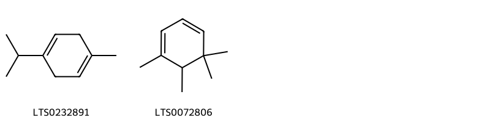{ width=100% }
    <figcaption>Hình ảnh cấu trúc hóa học của 2 hoạt chất thuộc nhóm Unsaturated hydrocarbons gồm ['α terpinene (LTS0232891)', '1,5,5,6-tetramethylcyclohexa-1,3-diene (LTS0072806)'].</figcaption>
</figure>

---

### Dược dân tộc học

Danh sách các quốc gia có sử dụng *Anethum graveolens* trong điều trị các bệnh. 

| Country            | Disease                                                                    | Bệnh                                                                                                                                                                                                |
|:-------------------|:---------------------------------------------------------------------------|:----------------------------------------------------------------------------------------------------------------------------------------------------------------------------------------------------|
| Bahamas            | Laxative                                                                   | MYMEMORY WARNING: YOU USED ALL AVAILABLE FREE TRANSLATIONS FOR TODAY. NEXT AVAILABLE IN  08 HOURS 05 MINUTES 24 SECONDS VISIT HTTPS://MYMEMORY.TRANSLATED.NET/DOC/USAGELIMITS.PHP TO TRANSLATE MORE |
| China              | Carminative                                                                | MYMEMORY WARNING: YOU USED ALL AVAILABLE FREE TRANSLATIONS FOR TODAY. NEXT AVAILABLE IN  08 HOURS 05 MINUTES 21 SECONDS VISIT HTTPS://MYMEMORY.TRANSLATED.NET/DOC/USAGELIMITS.PHP TO TRANSLATE MORE |
| Dominican Republic | Carminative, Diuretic, Stimulant                                           | MYMEMORY WARNING: YOU USED ALL AVAILABLE FREE TRANSLATIONS FOR TODAY. NEXT AVAILABLE IN  08 HOURS 05 MINUTES 19 SECONDS VISIT HTTPS://MYMEMORY.TRANSLATED.NET/DOC/USAGELIMITS.PHP TO TRANSLATE MORE |
| Elsewhere          | Carminative, Carminative, Carminative, Stimulant                           | MYMEMORY WARNING: YOU USED ALL AVAILABLE FREE TRANSLATIONS FOR TODAY. NEXT AVAILABLE IN  08 HOURS 05 MINUTES 16 SECONDS VISIT HTTPS://MYMEMORY.TRANSLATED.NET/DOC/USAGELIMITS.PHP TO TRANSLATE MORE |
| Iraq               | Carminative                                                                | MYMEMORY WARNING: YOU USED ALL AVAILABLE FREE TRANSLATIONS FOR TODAY. NEXT AVAILABLE IN  08 HOURS 05 MINUTES 14 SECONDS VISIT HTTPS://MYMEMORY.TRANSLATED.NET/DOC/USAGELIMITS.PHP TO TRANSLATE MORE |
| Turkey             | Carminative, Digestive, Narcotic, Sedative, Stimulant, Stomachic, Diuretic | MYMEMORY WARNING: YOU USED ALL AVAILABLE FREE TRANSLATIONS FOR TODAY. NEXT AVAILABLE IN  08 HOURS 05 MINUTES 11 SECONDS VISIT HTTPS://MYMEMORY.TRANSLATED.NET/DOC/USAGELIMITS.PHP TO TRANSLATE MORE |
| UK                 | Sedative                                                                   | MYMEMORY WARNING: YOU USED ALL AVAILABLE FREE TRANSLATIONS FOR TODAY. NEXT AVAILABLE IN  08 HOURS 05 MINUTES 09 SECONDS VISIT HTTPS://MYMEMORY.TRANSLATED.NET/DOC/USAGELIMITS.PHP TO TRANSLATE MORE |
| ain                | Stomachic                                                                  | MYMEMORY WARNING: YOU USED ALL AVAILABLE FREE TRANSLATIONS FOR TODAY. NEXT AVAILABLE IN  08 HOURS 05 MINUTES 06 SECONDS VISIT HTTPS://MYMEMORY.TRANSLATED.NET/DOC/USAGELIMITS.PHP TO TRANSLATE MORE |

---

---
## Anethum sowa
### Thông tin về thực vật

!!! info "Phân loại thực vật của *Anethum sowa* từ GIBF:"
    - **Kingdom:** Plantae
    - **Phylum:** Tracheophyta
    - **Order:** Apiales
    - **Family:** Apiaceae
    - **Genus:** Anethum
    - **Species:** *Anethum sowa*

 

| Label (VI)   | Label (EN)   | Scientific Name   | Descriptions (VI)   | Descriptions (EN)   | Also Known As (VI)   | Also Known As (EN)   |
|:-------------|:-------------|:------------------|:--------------------|:--------------------|:---------------------|:---------------------|
| N/A          | N/A          | Anethum sowa      | loài thực vật       | species of plant    | ['']                 | ['']                 |

#### Phân bố trên thế giới

**Từ CSDL GIBF** United Arab Emirates, Australia, Belgium, Estonia, Nicaragua, Latvia, Norway, Canada, Ukraine, Denmark, Netherlands, Lithuania, Belarus, Chinese Taipei, Hungary, Russian Federation, United States of America, Sweden, Finland, Kazakhstan, Czechia, Germany, Brazil, Switzerland, Armenia, Austria, France, United Kingdom of Great Britain and Northern Ireland, Iraq, India, Poland

#### Phân bố tại Việt Nam

**Từ CSDL GIBF**: Không có ghi nhận ở Việt Nam

---
### Thành phần hóa học
        
- Theo cơ sở dữ liệu lotus: Từ loài *Anethum sowa* đã phân lập và xác định được Chưa có hoạt chất nào được phân lập. hoạt chất thuộc về các nhóm Không có hoạt chất nào được phân lập. 

Không có hình ảnh nào được tạo ra

---

### Dược dân tộc học

Danh sách các quốc gia có sử dụng *Anethum sowa* trong điều trị các bệnh. 

| Country   | Disease                             | Bệnh                                                                                                                                                                                                |
|:----------|:------------------------------------|:----------------------------------------------------------------------------------------------------------------------------------------------------------------------------------------------------|
| India     | Carminative, Carminative, Stomachic | MYMEMORY WARNING: YOU USED ALL AVAILABLE FREE TRANSLATIONS FOR TODAY. NEXT AVAILABLE IN  08 HOURS 04 MINUTES 33 SECONDS VISIT HTTPS://MYMEMORY.TRANSLATED.NET/DOC/USAGELIMITS.PHP TO TRANSLATE MORE |
| US        | Carminative                         | MYMEMORY WARNING: YOU USED ALL AVAILABLE FREE TRANSLATIONS FOR TODAY. NEXT AVAILABLE IN  08 HOURS 04 MINUTES 31 SECONDS VISIT HTTPS://MYMEMORY.TRANSLATED.NET/DOC/USAGELIMITS.PHP TO TRANSLATE MORE |

---

# Chi Trachyermum

??? note "Danh sách các dược liệu thuộc chi"
    
	 - *Trachyermum ammi*
	 - *Trachyermum roxburghianum*

---
## Trachyermum ammi
### Thông tin về thực vật

!!! info "Phân loại thực vật của *N/A* từ GIBF:"
    - **Kingdom:** N/A
    - **Phylum:** N/A
    - **Order:** N/A
    - **Family:** N/A
    - **Genus:** N/A
    - **Species:** *N/A*

 

| Label (VI)   | Label (EN)   | Scientific Name   | Descriptions (VI)   | Descriptions (EN)   | Also Known As (VI)   | Also Known As (EN)   |
|:-------------|:-------------|:------------------|:--------------------|:--------------------|:---------------------|:---------------------|
| N/A          | N/A          | Anethum sowa      | loài thực vật       | species of plant    | ['']                 | ['']                 |

#### Phân bố trên thế giới

**Từ CSDL GIBF** Không có kết quả phù hợp

#### Phân bố tại Việt Nam

**Từ CSDL GIBF**: Không có ghi nhận ở Việt Nam

---
### Thành phần hóa học
        
- Theo cơ sở dữ liệu lotus: Từ loài *N/A* đã phân lập và xác định được Chưa có hoạt chất nào được phân lập. hoạt chất thuộc về các nhóm Không có hoạt chất nào được phân lập. 

Không có hình ảnh nào được tạo ra

---

### Dược dân tộc học

Danh sách các quốc gia có sử dụng *N/A* trong điều trị các bệnh. 

| Country       | Disease                                                                | Bệnh                                                                                                                                                                                                |
|:--------------|:-----------------------------------------------------------------------|:----------------------------------------------------------------------------------------------------------------------------------------------------------------------------------------------------|
| Arabic        | Antiseptic                                                             | MYMEMORY WARNING: YOU USED ALL AVAILABLE FREE TRANSLATIONS FOR TODAY. NEXT AVAILABLE IN  08 HOURS 04 MINUTES 15 SECONDS VISIT HTTPS://MYMEMORY.TRANSLATED.NET/DOC/USAGELIMITS.PHP TO TRANSLATE MORE |
| Elsewhere     | nan, Expectorant, Insecticide, Stimulant, Tonic, Carminative, Diuretic | MYMEMORY WARNING: YOU USED ALL AVAILABLE FREE TRANSLATIONS FOR TODAY. NEXT AVAILABLE IN  08 HOURS 04 MINUTES 13 SECONDS VISIT HTTPS://MYMEMORY.TRANSLATED.NET/DOC/USAGELIMITS.PHP TO TRANSLATE MORE |
| French        | Tonic                                                                  | MYMEMORY WARNING: YOU USED ALL AVAILABLE FREE TRANSLATIONS FOR TODAY. NEXT AVAILABLE IN  08 HOURS 04 MINUTES 11 SECONDS VISIT HTTPS://MYMEMORY.TRANSLATED.NET/DOC/USAGELIMITS.PHP TO TRANSLATE MORE |
| German        | Stomachic                                                              | MYMEMORY WARNING: YOU USED ALL AVAILABLE FREE TRANSLATIONS FOR TODAY. NEXT AVAILABLE IN  08 HOURS 04 MINUTES 08 SECONDS VISIT HTTPS://MYMEMORY.TRANSLATED.NET/DOC/USAGELIMITS.PHP TO TRANSLATE MORE |
| India(Santal) | Laxative                                                               | MYMEMORY WARNING: YOU USED ALL AVAILABLE FREE TRANSLATIONS FOR TODAY. NEXT AVAILABLE IN  08 HOURS 04 MINUTES 06 SECONDS VISIT HTTPS://MYMEMORY.TRANSLATED.NET/DOC/USAGELIMITS.PHP TO TRANSLATE MORE |
| Iran          | Vermifuge                                                              | MYMEMORY WARNING: YOU USED ALL AVAILABLE FREE TRANSLATIONS FOR TODAY. NEXT AVAILABLE IN  08 HOURS 04 MINUTES 04 SECONDS VISIT HTTPS://MYMEMORY.TRANSLATED.NET/DOC/USAGELIMITS.PHP TO TRANSLATE MORE |
| Java          | Apertif                                                                | MYMEMORY WARNING: YOU USED ALL AVAILABLE FREE TRANSLATIONS FOR TODAY. NEXT AVAILABLE IN  08 HOURS 04 MINUTES 01 SECONDS VISIT HTTPS://MYMEMORY.TRANSLATED.NET/DOC/USAGELIMITS.PHP TO TRANSLATE MORE |

---

---
## Trachyermum roxburghianum
### Thông tin về thực vật

!!! info "Phân loại thực vật của *N/A* từ GIBF:"
    - **Kingdom:** N/A
    - **Phylum:** N/A
    - **Order:** N/A
    - **Family:** N/A
    - **Genus:** N/A
    - **Species:** *N/A*

 

| Label (VI)   | Label (EN)   | Scientific Name   | Descriptions (VI)   | Descriptions (EN)   | Also Known As (VI)   | Also Known As (EN)   |
|:-------------|:-------------|:------------------|:--------------------|:--------------------|:---------------------|:---------------------|
| N/A          | N/A          | Anethum sowa      | loài thực vật       | species of plant    | ['']                 | ['']                 |

#### Phân bố trên thế giới

**Từ CSDL GIBF** Không có kết quả phù hợp

#### Phân bố tại Việt Nam

**Từ CSDL GIBF**: Không có ghi nhận ở Việt Nam

---
### Thành phần hóa học
        
- Theo cơ sở dữ liệu lotus: Từ loài *N/A* đã phân lập và xác định được Chưa có hoạt chất nào được phân lập. hoạt chất thuộc về các nhóm Không có hoạt chất nào được phân lập. 

Không có hình ảnh nào được tạo ra

---

### Dược dân tộc học

Danh sách các quốc gia có sử dụng *N/A* trong điều trị các bệnh. 

| Country   | Disease                | Bệnh                                                                                                                                                                                                |
|:----------|:-----------------------|:----------------------------------------------------------------------------------------------------------------------------------------------------------------------------------------------------|
| Elsewhere | Carminative            | MYMEMORY WARNING: YOU USED ALL AVAILABLE FREE TRANSLATIONS FOR TODAY. NEXT AVAILABLE IN  08 HOURS 03 MINUTES 51 SECONDS VISIT HTTPS://MYMEMORY.TRANSLATED.NET/DOC/USAGELIMITS.PHP TO TRANSLATE MORE |
| India     | Stimulant, Cardiotonic | MYMEMORY WARNING: YOU USED ALL AVAILABLE FREE TRANSLATIONS FOR TODAY. NEXT AVAILABLE IN  08 HOURS 03 MINUTES 48 SECONDS VISIT HTTPS://MYMEMORY.TRANSLATED.NET/DOC/USAGELIMITS.PHP TO TRANSLATE MORE |

---

# Chi Berula

??? note "Danh sách các dược liệu thuộc chi"
    
	 - *Berula erecta*

---
## Berula erecta
### Thông tin về thực vật

!!! info "Phân loại thực vật của *Berula erecta* từ GIBF:"
    - **Kingdom:** Plantae
    - **Phylum:** Tracheophyta
    - **Order:** Apiales
    - **Family:** Apiaceae
    - **Genus:** Berula
    - **Species:** *Berula erecta*

 

| Label (VI)   | Label (EN)   | Scientific Name   | Descriptions (VI)   | Descriptions (EN)   | Also Known As (VI)   | Also Known As (EN)   |
|:-------------|:-------------|:------------------|:--------------------|:--------------------|:---------------------|:---------------------|
| N/A          | N/A          | Berula erecta     | loài thực vật       | species of plant    | ['']                 | ['']                 |

#### Phân bố trên thế giới

**Từ CSDL GIBF** Bulgaria, Italy, Australia, Slovakia, Ukraine, Denmark, Netherlands, Lithuania, Luxembourg, Hungary, Russian Federation, United States of America, Sweden, Slovenia, Croatia, Greece, Czechia, Germany, Switzerland, Austria, France, Mexico, United Kingdom of Great Britain and Northern Ireland, Serbia, Poland

#### Phân bố tại Việt Nam

**Từ CSDL GIBF**: Không có ghi nhận ở Việt Nam

---
### Thành phần hóa học
        
- Theo cơ sở dữ liệu lotus: Từ loài *Berula erecta* đã phân lập và xác định được 1 hoạt chất thuộc về các nhóm Flavonoids. 

|    | chemicalTaxonomyClassyfireClass   |   smiles_count |
|---:|:----------------------------------|---------------:|
|  0 | Flavonoids                        |              1 |

#### Nhóm Flavonoids
<figure markdown="span">
    { width=100% }
    <figcaption>Hình ảnh cấu trúc hóa học của 1 hoạt chất thuộc nhóm Flavonoids gồm ['2-(3,4-dihydroxyphenyl)-5,7-dihydroxy-3-{[(2s,3r,4r,5r,6s)-3,4,5-trihydroxy-6-(hydroxymethyl)oxan-2-yl]oxy}chromen-4-one (LTS0241372)'].</figcaption>
</figure>

---

### Dược dân tộc học

Danh sách các quốc gia có sử dụng *Berula erecta* trong điều trị các bệnh. 

| Country   | Disease   | Bệnh                                                                                                                                                                                                |
|:----------|:----------|:----------------------------------------------------------------------------------------------------------------------------------------------------------------------------------------------------|
| Africa    | Poison    | MYMEMORY WARNING: YOU USED ALL AVAILABLE FREE TRANSLATIONS FOR TODAY. NEXT AVAILABLE IN  08 HOURS 03 MINUTES 38 SECONDS VISIT HTTPS://MYMEMORY.TRANSLATED.NET/DOC/USAGELIMITS.PHP TO TRANSLATE MORE |

---

# Chi Thaium

??? note "Danh sách các dược liệu thuộc chi"
    
	 - *Thaium aureum*

---
## Thaium aureum
### Thông tin về thực vật

!!! info "Phân loại thực vật của *N/A* từ GIBF:"
    - **Kingdom:** N/A
    - **Phylum:** N/A
    - **Order:** N/A
    - **Family:** N/A
    - **Genus:** N/A
    - **Species:** *N/A*

 

| Label (VI)   | Label (EN)   | Scientific Name   | Descriptions (VI)   | Descriptions (EN)   | Also Known As (VI)   | Also Known As (EN)   |
|:-------------|:-------------|:------------------|:--------------------|:--------------------|:---------------------|:---------------------|
| N/A          | N/A          | Berula erecta     | loài thực vật       | species of plant    | ['']                 | ['']                 |

#### Phân bố trên thế giới

**Từ CSDL GIBF** Không có kết quả phù hợp

#### Phân bố tại Việt Nam

**Từ CSDL GIBF**: Không có ghi nhận ở Việt Nam

---
### Thành phần hóa học
        
- Theo cơ sở dữ liệu lotus: Từ loài *N/A* đã phân lập và xác định được Chưa có hoạt chất nào được phân lập. hoạt chất thuộc về các nhóm Không có hoạt chất nào được phân lập. 

Không có hình ảnh nào được tạo ra

---

### Dược dân tộc học

Danh sách các quốc gia có sử dụng *N/A* trong điều trị các bệnh. 

| Country   | Disease   | Bệnh                                                                                                                                                                                                |
|:----------|:----------|:----------------------------------------------------------------------------------------------------------------------------------------------------------------------------------------------------|
| Turkey    | Nervine   | MYMEMORY WARNING: YOU USED ALL AVAILABLE FREE TRANSLATIONS FOR TODAY. NEXT AVAILABLE IN  08 HOURS 03 MINUTES 13 SECONDS VISIT HTTPS://MYMEMORY.TRANSLATED.NET/DOC/USAGELIMITS.PHP TO TRANSLATE MORE |

---

# Chi Archangelica

??? note "Danh sách các dược liệu thuộc chi"
    
	 - *Archangelica actaeifolium*

---
## Archangelica actaeifolium
### Thông tin về thực vật

!!! info "Phân loại thực vật của *N/A* từ GIBF:"
    - **Kingdom:** Plantae
    - **Phylum:** Tracheophyta
    - **Order:** Apiales
    - **Family:** Apiaceae
    - **Genus:** Angelica
    - **Species:** *N/A*

 

| Label (VI)   | Label (EN)   | Scientific Name   | Descriptions (VI)   | Descriptions (EN)   | Also Known As (VI)   | Also Known As (EN)   |
|:-------------|:-------------|:------------------|:--------------------|:--------------------|:---------------------|:---------------------|
| N/A          | N/A          | Berula erecta     | loài thực vật       | species of plant    | ['']                 | ['']                 |

#### Phân bố trên thế giới

**Từ CSDL GIBF** nan, Greenland, Germany, Estonia, Papua New Guinea, unknown or invalid, Philippines, Norway

#### Phân bố tại Việt Nam

**Từ CSDL GIBF**: Không có ghi nhận ở Việt Nam

---
### Thành phần hóa học
        
- Theo cơ sở dữ liệu lotus: Từ loài *N/A* đã phân lập và xác định được Chưa có hoạt chất nào được phân lập. hoạt chất thuộc về các nhóm Không có hoạt chất nào được phân lập. 

Không có hình ảnh nào được tạo ra

---

### Dược dân tộc học

Danh sách các quốc gia có sử dụng *N/A* trong điều trị các bệnh. 

| Country   | Disease   | Bệnh                                                                                                                                                                                                |
|:----------|:----------|:----------------------------------------------------------------------------------------------------------------------------------------------------------------------------------------------------|
| Elsewhere | Tonic     | MYMEMORY WARNING: YOU USED ALL AVAILABLE FREE TRANSLATIONS FOR TODAY. NEXT AVAILABLE IN  08 HOURS 03 MINUTES 03 SECONDS VISIT HTTPS://MYMEMORY.TRANSLATED.NET/DOC/USAGELIMITS.PHP TO TRANSLATE MORE |

---

# Chi Astrantia

??? note "Danh sách các dược liệu thuộc chi"
    
	 - *Astrantia major*

---
## Astrantia major
### Thông tin về thực vật

!!! info "Phân loại thực vật của *Astrantia major* từ GIBF:"
    - **Kingdom:** Plantae
    - **Phylum:** Tracheophyta
    - **Order:** Apiales
    - **Family:** Apiaceae
    - **Genus:** Astrantia
    - **Species:** *Astrantia major*

 

| Label (VI)   | Label (EN)   | Scientific Name   | Descriptions (VI)   | Descriptions (EN)   | Also Known As (VI)   | Also Known As (EN)   |
|:-------------|:-------------|:------------------|:--------------------|:--------------------|:---------------------|:---------------------|
| N/A          | N/A          | Astrantia major   |                     | species of plant    | ['']                 | ['great masterwort'] |

#### Phân bố trên thế giới

**Từ CSDL GIBF** Italy, Slovakia, Belgium, Norway, Ukraine, Spain, Hungary, Russian Federation, United States of America, Sweden, Slovenia, Croatia, Czechia, Germany, Romania, Switzerland, Austria, France, United Kingdom of Great Britain and Northern Ireland, Poland, New Zealand

#### Phân bố tại Việt Nam

**Từ CSDL GIBF**: Không có ghi nhận ở Việt Nam

---
### Thành phần hóa học
        
- Theo cơ sở dữ liệu lotus: Từ loài *Astrantia major* đã phân lập và xác định được 6 hoạt chất thuộc về các nhóm Prenol lipids. 

|    | chemicalTaxonomyClassyfireClass   |   smiles_count |
|---:|:----------------------------------|---------------:|
|  0 | Prenol lipids                     |              6 |

#### Nhóm Prenol lipids
<figure markdown="span">
    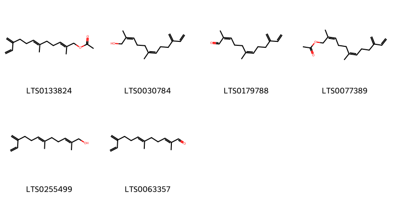{ width=100% }
    <figcaption>Hình ảnh cấu trúc hóa học của 6 hoạt chất thuộc nhóm Prenol lipids gồm ['(2e,6e)-2,6-dimethyl-10-methylidenedodeca-2,6,11-trien-1-yl acetate (LTS0133824)', '2,6-dimethyl-10-methylidenedodeca-2,6,11-trien-1-ol (LTS0030784)', 'citrus sinensis fruit extract (LTS0179788)', '2,6-dimethyl-10-methylidenedodeca-2,6,11-trien-1-yl acetate (LTS0077389)', '(2e,6e)-2,6-dimethyl-10-methylidenedodeca-2,6,11-trien-1-ol (LTS0255499)', '(2e,6e)-β-sinensal (LTS0063357)'].</figcaption>
</figure>

---

### Dược dân tộc học

Danh sách các quốc gia có sử dụng *Astrantia major* trong điều trị các bệnh. 

| Country   | Disease   | Bệnh                                                                                                                                                                                                |
|:----------|:----------|:----------------------------------------------------------------------------------------------------------------------------------------------------------------------------------------------------|
| ain       | Purgative | MYMEMORY WARNING: YOU USED ALL AVAILABLE FREE TRANSLATIONS FOR TODAY. NEXT AVAILABLE IN  08 HOURS 02 MINUTES 46 SECONDS VISIT HTTPS://MYMEMORY.TRANSLATED.NET/DOC/USAGELIMITS.PHP TO TRANSLATE MORE |

---

# Chi Ligusticum

??? note "Danh sách các dược liệu thuộc chi"
    
	 - *Ligusticum canbyi*
	 - *Ligusticum mutellina*
	 - *Ligusticum wallichii*

---
## Ligusticum canbyi
### Thông tin về thực vật

!!! info "Phân loại thực vật của *Ligusticum canbyi* từ GIBF:"
    - **Kingdom:** Plantae
    - **Phylum:** Tracheophyta
    - **Order:** Apiales
    - **Family:** Apiaceae
    - **Genus:** Ligusticum
    - **Species:** *Ligusticum canbyi*

 

| Label (VI)   | Label (EN)   | Scientific Name   | Descriptions (VI)   | Descriptions (EN)   | Also Known As (VI)   | Also Known As (EN)   |
|:-------------|:-------------|:------------------|:--------------------|:--------------------|:---------------------|:---------------------|
| N/A          | N/A          | Ligusticum canbyi | loài thực vật       | species of plant    | ['']                 | ['']                 |

#### Phân bố trên thế giới

**Từ CSDL GIBF** nan, United States of America, Canada

#### Phân bố tại Việt Nam

**Từ CSDL GIBF**: Không có ghi nhận ở Việt Nam

---
### Thành phần hóa học
        
- Theo cơ sở dữ liệu lotus: Từ loài *Ligusticum canbyi* đã phân lập và xác định được Chưa có hoạt chất nào được phân lập. hoạt chất thuộc về các nhóm Không có hoạt chất nào được phân lập. 

Không có hình ảnh nào được tạo ra

---

### Dược dân tộc học

Danh sách các quốc gia có sử dụng *Ligusticum canbyi* trong điều trị các bệnh. 

| Country      | Disease   | Bệnh                                                                                                                                                                                                |
|:-------------|:----------|:----------------------------------------------------------------------------------------------------------------------------------------------------------------------------------------------------|
| US(Flathead) | Sedative  | MYMEMORY WARNING: YOU USED ALL AVAILABLE FREE TRANSLATIONS FOR TODAY. NEXT AVAILABLE IN  08 HOURS 02 MINUTES 24 SECONDS VISIT HTTPS://MYMEMORY.TRANSLATED.NET/DOC/USAGELIMITS.PHP TO TRANSLATE MORE |

---

---
## Ligusticum mutellina
### Thông tin về thực vật

!!! info "Phân loại thực vật của *Mutellina adonidifolia* từ GIBF:"
    - **Kingdom:** Plantae
    - **Phylum:** Tracheophyta
    - **Order:** Apiales
    - **Family:** Apiaceae
    - **Genus:** Mutellina
    - **Species:** *Mutellina adonidifolia*

 

| Label (VI)   | Label (EN)   | Scientific Name      | Descriptions (VI)   | Descriptions (EN)   | Also Known As (VI)   | Also Known As (EN)   |
|:-------------|:-------------|:---------------------|:--------------------|:--------------------|:---------------------|:---------------------|
| N/A          | N/A          | Ligusticum mutellina |                     | species of plant    | ['']                 | ['Alpine lovage']    |

#### Phân bố trên thế giới

**Từ CSDL GIBF** Italy, Montenegro, Germany, Slovakia, Switzerland, Austria

#### Phân bố tại Việt Nam

**Từ CSDL GIBF**: Không có ghi nhận ở Việt Nam

---
### Thành phần hóa học
        
- Theo cơ sở dữ liệu lotus: Từ loài *Mutellina adonidifolia* đã phân lập và xác định được Chưa có hoạt chất nào được phân lập. hoạt chất thuộc về các nhóm Không có hoạt chất nào được phân lập. 

Không có hình ảnh nào được tạo ra

---

### Dược dân tộc học

Danh sách các quốc gia có sử dụng *Mutellina adonidifolia* trong điều trị các bệnh. 

| Country   | Disease   | Bệnh                                                                                                                                                                                                |
|:----------|:----------|:----------------------------------------------------------------------------------------------------------------------------------------------------------------------------------------------------|
| Europe    | Stomachic | MYMEMORY WARNING: YOU USED ALL AVAILABLE FREE TRANSLATIONS FOR TODAY. NEXT AVAILABLE IN  08 HOURS 02 MINUTES 03 SECONDS VISIT HTTPS://MYMEMORY.TRANSLATED.NET/DOC/USAGELIMITS.PHP TO TRANSLATE MORE |

---

---
## Ligusticum wallichii
### Thông tin về thực vật

!!! info "Phân loại thực vật của *Oreocome striata* từ GIBF:"
    - **Kingdom:** Plantae
    - **Phylum:** Tracheophyta
    - **Order:** Apiales
    - **Family:** Apiaceae
    - **Genus:** Oreocome
    - **Species:** *Oreocome striata*

 

| Label (VI)   | Label (EN)   | Scientific Name      | Descriptions (VI)   | Descriptions (EN)   | Also Known As (VI)   | Also Known As (EN)   |
|:-------------|:-------------|:---------------------|:--------------------|:--------------------|:---------------------|:---------------------|
| N/A          | N/A          | Ligusticum mutellina |                     | species of plant    | ['']                 | ['Alpine lovage']    |

#### Phân bố trên thế giới

**Từ CSDL GIBF** China, United States of America

#### Phân bố tại Việt Nam

**Từ CSDL GIBF**: Không có ghi nhận ở Việt Nam

---
### Thành phần hóa học
        
- Theo cơ sở dữ liệu lotus: Từ loài *Oreocome striata* đã phân lập và xác định được Chưa có hoạt chất nào được phân lập. hoạt chất thuộc về các nhóm Không có hoạt chất nào được phân lập. 

Không có hình ảnh nào được tạo ra

---

### Dược dân tộc học

Danh sách các quốc gia có sử dụng *Oreocome striata* trong điều trị các bệnh. 

| Country   | Disease       | Bệnh                                                                                                                                                                                                |
|:----------|:--------------|:----------------------------------------------------------------------------------------------------------------------------------------------------------------------------------------------------|
| China     | Hemostat, nan | MYMEMORY WARNING: YOU USED ALL AVAILABLE FREE TRANSLATIONS FOR TODAY. NEXT AVAILABLE IN  08 HOURS 01 MINUTES 39 SECONDS VISIT HTTPS://MYMEMORY.TRANSLATED.NET/DOC/USAGELIMITS.PHP TO TRANSLATE MORE |

---

# Chi Osmorhiza

??? note "Danh sách các dược liệu thuộc chi"
    
	 - *Osmorhiza chilensis*
	 - *Osmorhiza claytoni*
	 - *Osmorhiza longistylis*

---
## Osmorhiza chilensis
### Thông tin về thực vật

!!! info "Phân loại thực vật của *Osmorhiza berteroi* từ GIBF:"
    - **Kingdom:** Plantae
    - **Phylum:** Tracheophyta
    - **Order:** Apiales
    - **Family:** Apiaceae
    - **Genus:** Osmorhiza
    - **Species:** *Osmorhiza berteroi*

 

| Label (VI)   | Label (EN)   | Scientific Name     | Descriptions (VI)   | Descriptions (EN)           | Also Known As (VI)   | Also Known As (EN)   |
|:-------------|:-------------|:--------------------|:--------------------|:----------------------------|:---------------------|:---------------------|
| N/A          | N/A          | Osmorhiza chilensis |                     | species of flowering plants | ['']                 | ['']                 |

#### Phân bố trên thế giới

**Từ CSDL GIBF** Argentina, Uruguay, United States of America, Chile, Canada

#### Phân bố tại Việt Nam

**Từ CSDL GIBF**: Không có ghi nhận ở Việt Nam

---
### Thành phần hóa học
        
- Theo cơ sở dữ liệu lotus: Từ loài *Osmorhiza berteroi* đã phân lập và xác định được Chưa có hoạt chất nào được phân lập. hoạt chất thuộc về các nhóm Không có hoạt chất nào được phân lập. 

Không có hình ảnh nào được tạo ra

---

### Dược dân tộc học

Danh sách các quốc gia có sử dụng *Osmorhiza berteroi* trong điều trị các bệnh. 

| Country          | Disease        | Bệnh                                                                                                                                                                                                |
|:-----------------|:---------------|:----------------------------------------------------------------------------------------------------------------------------------------------------------------------------------------------------|
| Canada(Kwakiutl) | Emetic, Poison | MYMEMORY WARNING: YOU USED ALL AVAILABLE FREE TRANSLATIONS FOR TODAY. NEXT AVAILABLE IN  08 HOURS 01 MINUTES 23 SECONDS VISIT HTTPS://MYMEMORY.TRANSLATED.NET/DOC/USAGELIMITS.PHP TO TRANSLATE MORE |

---

---
## Osmorhiza claytoni
### Thông tin về thực vật

!!! info "Phân loại thực vật của *Osmorhiza claytonii* từ GIBF:"
    - **Kingdom:** Plantae
    - **Phylum:** Tracheophyta
    - **Order:** Apiales
    - **Family:** Apiaceae
    - **Genus:** Osmorhiza
    - **Species:** *Osmorhiza claytonii*

 

| Label (VI)   | Label (EN)   | Scientific Name     | Descriptions (VI)   | Descriptions (EN)           | Also Known As (VI)   | Also Known As (EN)   |
|:-------------|:-------------|:--------------------|:--------------------|:----------------------------|:---------------------|:---------------------|
| N/A          | N/A          | Osmorhiza chilensis |                     | species of flowering plants | ['']                 | ['']                 |

#### Phân bố trên thế giới

**Từ CSDL GIBF** United States of America, Canada

#### Phân bố tại Việt Nam

**Từ CSDL GIBF**: Không có ghi nhận ở Việt Nam

---
### Thành phần hóa học
        
- Theo cơ sở dữ liệu lotus: Từ loài *Osmorhiza claytonii* đã phân lập và xác định được Chưa có hoạt chất nào được phân lập. hoạt chất thuộc về các nhóm Không có hoạt chất nào được phân lập. 

Không có hình ảnh nào được tạo ra

---

### Dược dân tộc học

Danh sách các quốc gia có sử dụng *Osmorhiza claytonii* trong điều trị các bệnh. 

| Country   | Disease                                        | Bệnh                                                                                                                                                                                                |
|:----------|:-----------------------------------------------|:----------------------------------------------------------------------------------------------------------------------------------------------------------------------------------------------------|
| US        | Demulcent, Expectorant, Stomachic, Carminative | MYMEMORY WARNING: YOU USED ALL AVAILABLE FREE TRANSLATIONS FOR TODAY. NEXT AVAILABLE IN  08 HOURS 01 MINUTES 02 SECONDS VISIT HTTPS://MYMEMORY.TRANSLATED.NET/DOC/USAGELIMITS.PHP TO TRANSLATE MORE |

---

---
## Osmorhiza longistylis
### Thông tin về thực vật

!!! info "Phân loại thực vật của *Osmorhiza longistylis* từ GIBF:"
    - **Kingdom:** Plantae
    - **Phylum:** Tracheophyta
    - **Order:** Apiales
    - **Family:** Apiaceae
    - **Genus:** Osmorhiza
    - **Species:** *Osmorhiza longistylis*

 

| Label (VI)   | Label (EN)   | Scientific Name       | Descriptions (VI)   | Descriptions (EN)   | Also Known As (VI)   | Also Known As (EN)   |
|:-------------|:-------------|:----------------------|:--------------------|:--------------------|:---------------------|:---------------------|
| N/A          | N/A          | Osmorhiza longistylis | loài thực vật       | species of plant    | ['']                 | ['']                 |

#### Phân bố trên thế giới

**Từ CSDL GIBF** United States of America

#### Phân bố tại Việt Nam

**Từ CSDL GIBF**: Không có ghi nhận ở Việt Nam

---
### Thành phần hóa học
        
- Theo cơ sở dữ liệu lotus: Từ loài *Osmorhiza longistylis* đã phân lập và xác định được 9 hoạt chất thuộc về các nhóm Phenol ethers, Prenol lipids, Benzene and substituted derivatives. 

|    | chemicalTaxonomyClassyfireClass     |   smiles_count |
|---:|:------------------------------------|---------------:|
|  0 | Benzene and substituted derivatives |              2 |
|  1 | Phenol ethers                       |              1 |
|  2 | Prenol lipids                       |              6 |

#### Nhóm Benzene and substituted derivatives
<figure markdown="span">
    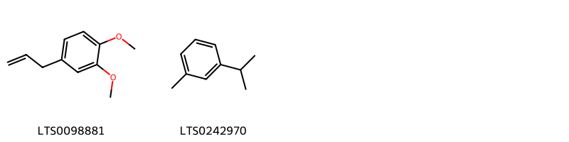{ width=100% }
    <figcaption>Hình ảnh cấu trúc hóa học của 2 hoạt chất thuộc nhóm Benzene and substituted derivatives gồm ['methyl eugenol (LTS0098881)', 'm-cymene (LTS0242970)'].</figcaption>
</figure>
#### Nhóm Phenol ethers
<figure markdown="span">
    { width=100% }
    <figcaption>Hình ảnh cấu trúc hóa học của 1 hoạt chất thuộc nhóm Phenol ethers gồm ['anethole (LTS0033696)'].</figcaption>
</figure>
#### Nhóm Prenol lipids
<figure markdown="span">
    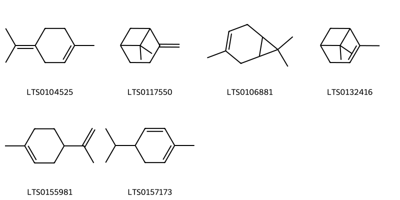{ width=100% }
    <figcaption>Hình ảnh cấu trúc hóa học của 6 hoạt chất thuộc nhóm Prenol lipids gồm ['terpinolene (LTS0104525)', 'β-pinene (LTS0117550)', 'monoterpenes (LTS0106881)', 'α pinene (LTS0132416)', 'limonene,  (LTS0155981)', 'phellandrene (LTS0157173)'].</figcaption>
</figure>

---

### Dược dân tộc học

Danh sách các quốc gia có sử dụng *Osmorhiza longistylis* trong điều trị các bệnh. 

| Country   | Disease                             | Bệnh                                                                                                                                                                                                |
|:----------|:------------------------------------|:----------------------------------------------------------------------------------------------------------------------------------------------------------------------------------------------------|
| US        | Carminative, Demulcent, Expectorant | MYMEMORY WARNING: YOU USED ALL AVAILABLE FREE TRANSLATIONS FOR TODAY. NEXT AVAILABLE IN  08 HOURS 00 MINUTES 39 SECONDS VISIT HTTPS://MYMEMORY.TRANSLATED.NET/DOC/USAGELIMITS.PHP TO TRANSLATE MORE |

---

# Chi Carum

??? note "Danh sách các dược liệu thuộc chi"
    
	 - *Carum bulbocastanum*
	 - *Carum carvi*
	 - *Carum copticum*
	 - *Carum petroselinum*

---
## Carum bulbocastanum
### Thông tin về thực vật

!!! info "Phân loại thực vật của *Bunium bulbocastanum* từ GIBF:"
    - **Kingdom:** Plantae
    - **Phylum:** Tracheophyta
    - **Order:** Apiales
    - **Family:** Apiaceae
    - **Genus:** Bunium
    - **Species:** *Bunium bulbocastanum*

 

| Label (VI)   | Label (EN)   | Scientific Name     | Descriptions (VI)   | Descriptions (EN)   | Also Known As (VI)   | Also Known As (EN)   |
|:-------------|:-------------|:--------------------|:--------------------|:--------------------|:---------------------|:---------------------|
| N/A          | N/A          | Carum bulbocastanum | loài thực vật       | species of plant    | ['']                 | ['']                 |

#### Phân bố trên thế giới

**Từ CSDL GIBF** nan, Pakistan, Netherlands, Germany, Belgium, Iran (Islamic Republic of), Afghanistan, Switzerland, India, unknown or invalid, United States of America, Sweden, France, United Kingdom of Great Britain and Northern Ireland

#### Phân bố tại Việt Nam

**Từ CSDL GIBF**: Không có ghi nhận ở Việt Nam

---
### Thành phần hóa học
        
- Theo cơ sở dữ liệu lotus: Từ loài *Bunium bulbocastanum* đã phân lập và xác định được Chưa có hoạt chất nào được phân lập. hoạt chất thuộc về các nhóm Không có hoạt chất nào được phân lập. 

Không có hình ảnh nào được tạo ra

---

### Dược dân tộc học

Danh sách các quốc gia có sử dụng *Bunium bulbocastanum* trong điều trị các bệnh. 

| Country   | Disease     | Bệnh                                                                                                                                                                                                |
|:----------|:------------|:----------------------------------------------------------------------------------------------------------------------------------------------------------------------------------------------------|
| India     | Carminative | MYMEMORY WARNING: YOU USED ALL AVAILABLE FREE TRANSLATIONS FOR TODAY. NEXT AVAILABLE IN  08 HOURS 00 MINUTES 13 SECONDS VISIT HTTPS://MYMEMORY.TRANSLATED.NET/DOC/USAGELIMITS.PHP TO TRANSLATE MORE |

---

---
## Carum carvi
### Thông tin về thực vật

!!! info "Phân loại thực vật của *Carum carvi* từ GIBF:"
    - **Kingdom:** Plantae
    - **Phylum:** Tracheophyta
    - **Order:** Apiales
    - **Family:** Apiaceae
    - **Genus:** Carum
    - **Species:** *Carum carvi*

 

| Label (VI)   | Label (EN)   | Scientific Name   | Descriptions (VI)   | Descriptions (EN)   | Also Known As (VI)   | Also Known As (EN)                                                               |
|:-------------|:-------------|:------------------|:--------------------|:--------------------|:---------------------|:---------------------------------------------------------------------------------|
| N/A          | N/A          | Carum carvi       |                     | herb                | ['']                 | ['wild caraway', 'meridian fennel', 'Persian cumin', 'caraway', 'caraway plant'] |

#### Phân bố trên thế giới

**Từ CSDL GIBF** Italy, Slovakia, Norway, Ukraine, Netherlands, Lithuania, Belarus, Hungary, Albania, Russian Federation, Sweden, Slovenia, Kazakhstan, Czechia, Germany, Romania, Switzerland, Austria, Poland

#### Phân bố tại Việt Nam

**Từ CSDL GIBF**: Không có ghi nhận ở Việt Nam

---
### Thành phần hóa học
        
- Theo cơ sở dữ liệu lotus: Từ loài *Carum carvi* đã phân lập và xác định được 88 hoạt chất thuộc về các nhóm Phenol ethers, Fatty Acyls, Flavonoids, Prenol lipids, Pyrimidine nucleosides, Cinnamic acids and derivatives, Benzofurans, Benzene and substituted derivatives, Organooxygen compounds, Phenols, Coumarins and derivatives, Phenol esters. 

|    | chemicalTaxonomyClassyfireClass     |   smiles_count |
|---:|:------------------------------------|---------------:|
|  0 | Benzene and substituted derivatives |              5 |
|  1 | Benzofurans                         |              1 |
|  2 | Cinnamic acids and derivatives      |              4 |
|  3 | Coumarins and derivatives           |              2 |
|  4 | Fatty Acyls                         |             10 |
|  5 | Flavonoids                          |              4 |
|  6 | Organooxygen compounds              |             26 |
|  7 | Phenol esters                       |              1 |
|  8 | Phenol ethers                       |              3 |
|  9 | Phenols                             |              2 |
| 10 | Prenol lipids                       |             28 |
| 11 | Pyrimidine nucleosides              |              1 |

#### Nhóm Benzene and substituted derivatives
<figure markdown="span">
    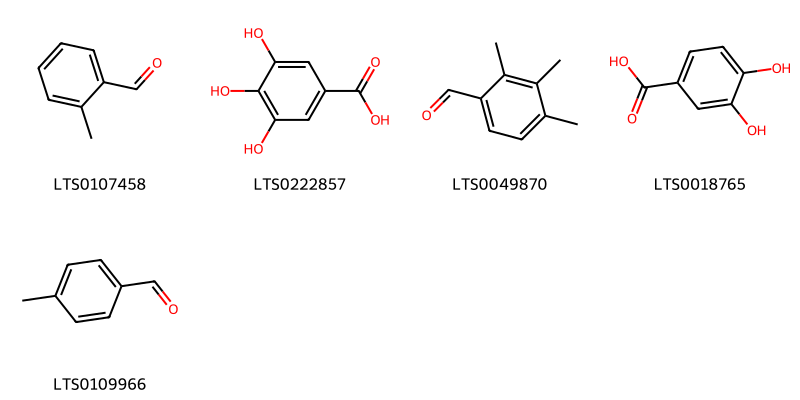{ width=100% }
    <figcaption>Hình ảnh cấu trúc hóa học của 5 hoạt chất thuộc nhóm Benzene and substituted derivatives gồm ['2-methylbenzaldehyde (LTS0107458)', 'galop (LTS0222857)', '2,3,4-trimethylbenzaldehyde (LTS0049870)', '3,4-dihydroxybenzoic acid (LTS0018765)', 'p-tolualdehyde (LTS0109966)'].</figcaption>
</figure>
#### Nhóm Benzofurans
<figure markdown="span">
    { width=100% }
    <figcaption>Hình ảnh cấu trúc hóa học của 1 hoạt chất thuộc nhóm Benzofurans gồm ["7-hydroxy-6-isopropyl-3',3'-dimethyl-2-oxospiro[1-benzofuran-3,1'-cyclohexane]-2',4-dicarbaldehyde (LTS0255026)"].</figcaption>
</figure>
#### Nhóm Cinnamic acids and derivatives
<figure markdown="span">
    { width=100% }
    <figcaption>Hình ảnh cấu trúc hóa học của 4 hoạt chất thuộc nhóm Cinnamic acids and derivatives gồm ['3,4-dihydroxycinnamic acid (LTS0128050)', 'para-coumaric acid (LTS0266252)', 'rosemary acid (LTS0207820)', 'hydroxycinnamic acid (LTS0233023)'].</figcaption>
</figure>
#### Nhóm Coumarins and derivatives
<figure markdown="span">
    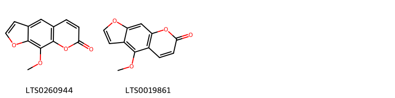{ width=100% }
    <figcaption>Hình ảnh cấu trúc hóa học của 2 hoạt chất thuộc nhóm Coumarins and derivatives gồm ['methoxsalen (LTS0260944)', 'bergapten (LTS0019861)'].</figcaption>
</figure>
#### Nhóm Fatty Acyls
<figure markdown="span">
    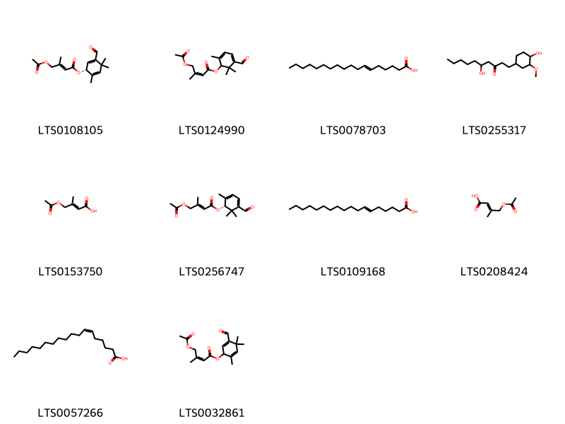{ width=100% }
    <figcaption>Hình ảnh cấu trúc hóa học của 10 hoạt chất thuộc nhóm Fatty Acyls gồm ['(1r)-5-formyl-2,4,4-trimethylcyclohexa-2,5-dien-1-yl (2e)-4-(acetyloxy)-3-methylbut-2-enoate (LTS0108105)', '5-formyl-2,6,6-trimethylcyclohexa-2,4-dien-1-yl 4-(acetyloxy)-3-methylbut-2-enoate (LTS0124990)', 'petroselaidic acid (LTS0078703)', '5-hydroxy-1-(4-hydroxy-3-methoxycyclohexyl)decan-3-one (LTS0255317)', '(2e)-4-(acetyloxy)-3-methylbut-2-enoic acid (LTS0153750)', '(1r)-5-formyl-2,6,6-trimethylcyclohexa-2,4-dien-1-yl (2e)-4-(acetyloxy)-3-methylbut-2-enoate (LTS0256747)', '6-octadecenoic acid (LTS0109168)', '4-(acetyloxy)-3-methylbut-2-enoic acid (LTS0208424)', 'petroselinic acid (LTS0057266)', '5-formyl-2,4,4-trimethylcyclohexa-2,5-dien-1-yl 4-(acetyloxy)-3-methylbut-2-enoate (LTS0032861)'].</figcaption>
</figure>
#### Nhóm Flavonoids
<figure markdown="span">
    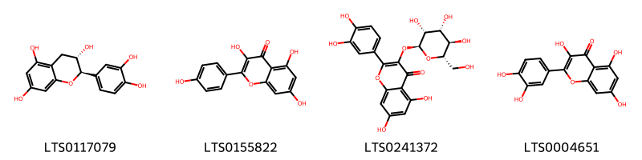{ width=100% }
    <figcaption>Hình ảnh cấu trúc hóa học của 4 hoạt chất thuộc nhóm Flavonoids gồm ['(+)-catechol (LTS0117079)', 'kaempherol (LTS0155822)', '2-(3,4-dihydroxyphenyl)-5,7-dihydroxy-3-{[(2s,3r,4r,5r,6s)-3,4,5-trihydroxy-6-(hydroxymethyl)oxan-2-yl]oxy}chromen-4-one (LTS0241372)', 'quercetin (LTS0004651)'].</figcaption>
</figure>
#### Nhóm Organooxygen compounds
<figure markdown="span">
    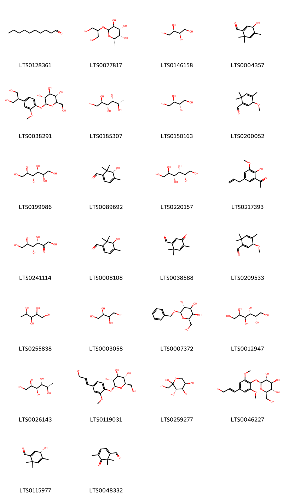{ width=100% }
    <figcaption>Hình ảnh cấu trúc hóa học của 26 hoạt chất thuộc nhóm Organooxygen compounds gồm ['decanal (LTS0128361)', '(2r,3s,4r,5s,6s)-2-[(1,3-dihydroxypropan-2-yl)oxy]-6-methyloxane-3,4,5-triol (LTS0077817)', '(-)-threitol (LTS0146158)', '3-hydroxy-4,6,6-trimethylcyclohexa-1,4-diene-1-carbaldehyde (LTS0004357)', '(2s,3r,4s,5s,6r)-2-[4-(1,3-dihydroxypropan-2-yl)-2-methoxyphenoxy]-6-(hydroxymethyl)oxane-3,4,5-triol (LTS0038291)', '(2r,3r,4r,5s)-hexane-1,2,3,4,5-pentol (LTS0185307)', 'meso-erythritol (LTS0150163)', '3-methoxy-4,6,6-trimethylcyclohexa-1,4-diene-1-carbaldehyde (LTS0200052)', 'mannitol (LTS0199986)', '(5r)-5-hydroxy-4,6,6-trimethylcyclohexa-1,3-diene-1-carbaldehyde (LTS0089692)', 'd-sorbitol (LTS0220157)', '1-[2-hydroxy-3-methoxy-5-(prop-2-en-1-yl)phenyl]ethanone (LTS0217393)', 'keto-d-fructose (LTS0241114)', '5-hydroxy-4,6,6-trimethylcyclohexa-1,3-diene-1-carbaldehyde (LTS0008108)', '4,6,6-trimethyl-3-oxocyclohexa-1,4-diene-1-carbaldehyde (LTS0038588)', '(3s)-3-methoxy-4,6,6-trimethylcyclohexa-1,4-diene-1-carbaldehyde (LTS0209533)', 'pentane-1,2,3,4-tetrol (LTS0255838)', 'erythrite (LTS0003058)', '(2r,3r,5r,6r)-2-(benzyloxy)-6-(hydroxymethyl)oxane-3,4,5-triol (LTS0007372)', 'galactitol (LTS0012947)', 'l-fucitol (LTS0026143)', 'coniferin (LTS0119031)', 'd-fructopyranose (LTS0259277)', 'syringin (LTS0046227)', '(3s)-3-hydroxy-4,6,6-trimethylcyclohexa-1,4-diene-1-carbaldehyde (LTS0115977)', '4,6,6-trimethyl-5-oxocyclohexa-1,3-diene-1-carbaldehyde (LTS0048332)'].</figcaption>
</figure>
#### Nhóm Phenol esters
<figure markdown="span">
    { width=100% }
    <figcaption>Hình ảnh cấu trúc hóa học của 1 hoạt chất thuộc nhóm Phenol esters gồm ['eugenyl acetate (LTS0165886)'].</figcaption>
</figure>
#### Nhóm Phenol ethers
<figure markdown="span">
    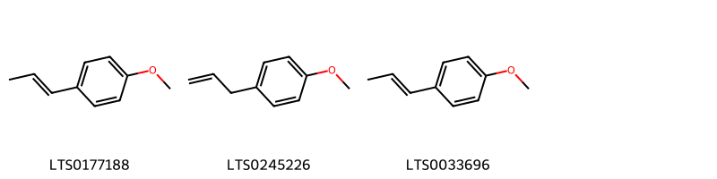{ width=100% }
    <figcaption>Hình ảnh cấu trúc hóa học của 3 hoạt chất thuộc nhóm Phenol ethers gồm ['p-propenylanisole (LTS0177188)', 'tarragon (LTS0245226)', 'anethole (LTS0033696)'].</figcaption>
</figure>
#### Nhóm Phenols
<figure markdown="span">
    { width=100% }
    <figcaption>Hình ảnh cấu trúc hóa học của 2 hoạt chất thuộc nhóm Phenols gồm ['eugenol (LTS0052342)', 'gingerol (LTS0171573)'].</figcaption>
</figure>
#### Nhóm Prenol lipids
<figure markdown="span">
    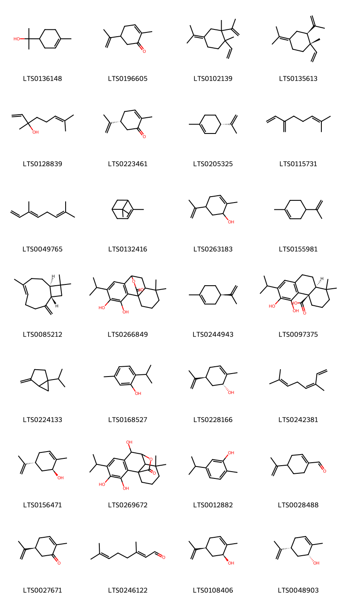{ width=100% }
    <figcaption>Hình ảnh cấu trúc hóa học của 28 hoạt chất thuộc nhóm Prenol lipids gồm ['terpineol (LTS0136148)', 'carvone (LTS0196605)', '1-ethenyl-1,2-dimethyl-2-(prop-1-en-2-yl)-4-(propan-2-ylidene)cyclohexane (LTS0102139)', '(1s,2s)-1-ethenyl-1-methyl-2-(prop-1-en-2-yl)-4-(propan-2-ylidene)cyclohexane (LTS0135613)', 'linalool, (+-)- (LTS0128839)', '(-)-carvone (LTS0223461)', '(-)-limonene (LTS0205325)', 'α-myrcene (LTS0115731)', 'trans-β-ocimene (LTS0049765)', 'α pinene (LTS0132416)', 'carveol (LTS0263183)', 'limonene,  (LTS0155981)', 'caryophyllene (LTS0085212)', '3,4-dihydroxy-5-isopropyl-11,11-dimethyl-16-oxatetracyclo[6.6.2.0¹,¹⁰.0²,⁷]hexadeca-2(7),3,5-trien-15-one (LTS0266849)', 'α-limonene (LTS0244943)', 'carnosic acid (LTS0097375)', 'sabinene (LTS0224133)', 'thymol (LTS0168527)', '(+)-trans-carveol (LTS0228166)', 'β-ocimene (LTS0242381)', '(-)-trans-carveol (LTS0156471)', '3,4,8-trihydroxy-5-isopropyl-11,11-dimethyl-16-oxatetracyclo[7.5.2.0¹,¹⁰.0²,⁷]hexadeca-2(7),3,5-trien-15-one (LTS0269672)', 'carvacrol (LTS0012882)', 'perillaldehyde,  (LTS0028488)', 'carvone, (+)- (LTS0027671)', 'α-citral (LTS0246122)', '(+)-cis-carveol (LTS0108406)', '(-)-cis-carveol (LTS0048903)'].</figcaption>
</figure>
#### Nhóm Pyrimidine nucleosides
<figure markdown="span">
    { width=100% }
    <figcaption>Hình ảnh cấu trúc hóa học của 1 hoạt chất thuộc nhóm Pyrimidine nucleosides gồm ['uridine (LTS0220125)'].</figcaption>
</figure>

---

### Dược dân tộc học

Danh sách các quốc gia có sử dụng *Carum carvi* trong điều trị các bệnh. 

| Country       | Disease                                                                            | Bệnh                                                                                                                                                                                                |
|:--------------|:-----------------------------------------------------------------------------------|:----------------------------------------------------------------------------------------------------------------------------------------------------------------------------------------------------|
| Elsewhere     | Carminative, Carminative, Carminative, Diaphoretic, Diuretic, Stimulant, Stomachic | MYMEMORY WARNING: YOU USED ALL AVAILABLE FREE TRANSLATIONS FOR TODAY. NEXT AVAILABLE IN  07 HOURS 59 MINUTES 53 SECONDS VISIT HTTPS://MYMEMORY.TRANSLATED.NET/DOC/USAGELIMITS.PHP TO TRANSLATE MORE |
| India         | nan, Fungicide                                                                     | MYMEMORY WARNING: YOU USED ALL AVAILABLE FREE TRANSLATIONS FOR TODAY. NEXT AVAILABLE IN  07 HOURS 59 MINUTES 50 SECONDS VISIT HTTPS://MYMEMORY.TRANSLATED.NET/DOC/USAGELIMITS.PHP TO TRANSLATE MORE |
| India(Santal) | Laxative                                                                           | MYMEMORY WARNING: YOU USED ALL AVAILABLE FREE TRANSLATIONS FOR TODAY. NEXT AVAILABLE IN  07 HOURS 59 MINUTES 48 SECONDS VISIT HTTPS://MYMEMORY.TRANSLATED.NET/DOC/USAGELIMITS.PHP TO TRANSLATE MORE |
| Turkey        | Carminative, Digestive, Diuretic, Stimulant, Stomachic, Vermifuge, Emmenagogue     | MYMEMORY WARNING: YOU USED ALL AVAILABLE FREE TRANSLATIONS FOR TODAY. NEXT AVAILABLE IN  07 HOURS 59 MINUTES 46 SECONDS VISIT HTTPS://MYMEMORY.TRANSLATED.NET/DOC/USAGELIMITS.PHP TO TRANSLATE MORE |
| ain           | Tonic                                                                              | MYMEMORY WARNING: YOU USED ALL AVAILABLE FREE TRANSLATIONS FOR TODAY. NEXT AVAILABLE IN  07 HOURS 59 MINUTES 44 SECONDS VISIT HTTPS://MYMEMORY.TRANSLATED.NET/DOC/USAGELIMITS.PHP TO TRANSLATE MORE |

---

---
## Carum copticum
### Thông tin về thực vật

!!! info "Phân loại thực vật của *Carum copticum* từ GIBF:"
    - **Kingdom:** Plantae
    - **Phylum:** Tracheophyta
    - **Order:** Apiales
    - **Family:** Apiaceae
    - **Genus:** Carum
    - **Species:** *Carum copticum*

 

| Label (VI)   | Label (EN)   | Scientific Name   | Descriptions (VI)   | Descriptions (EN)   | Also Known As (VI)   | Also Known As (EN)   |
|:-------------|:-------------|:------------------|:--------------------|:--------------------|:---------------------|:---------------------|
| N/A          | N/A          | Carum copticum    | loài thực vật       | species of plant    | ['']                 | ['']                 |

#### Phân bố trên thế giới

**Từ CSDL GIBF** India

#### Phân bố tại Việt Nam

**Từ CSDL GIBF**: Không có ghi nhận ở Việt Nam

---
### Thành phần hóa học
        
- Theo cơ sở dữ liệu lotus: Từ loài *Carum copticum* đã phân lập và xác định được Chưa có hoạt chất nào được phân lập. hoạt chất thuộc về các nhóm Không có hoạt chất nào được phân lập. 

Không có hình ảnh nào được tạo ra

---

### Dược dân tộc học

Danh sách các quốc gia có sử dụng *Carum copticum* trong điều trị các bệnh. 

| Country   | Disease        | Bệnh                                                                                                                                                                                                |
|:----------|:---------------|:----------------------------------------------------------------------------------------------------------------------------------------------------------------------------------------------------|
| Dutch     | Stimulant      | MYMEMORY WARNING: YOU USED ALL AVAILABLE FREE TRANSLATIONS FOR TODAY. NEXT AVAILABLE IN  07 HOURS 59 MINUTES 13 SECONDS VISIT HTTPS://MYMEMORY.TRANSLATED.NET/DOC/USAGELIMITS.PHP TO TRANSLATE MORE |
| India     | Fungicide, nan | MYMEMORY WARNING: YOU USED ALL AVAILABLE FREE TRANSLATIONS FOR TODAY. NEXT AVAILABLE IN  07 HOURS 59 MINUTES 11 SECONDS VISIT HTTPS://MYMEMORY.TRANSLATED.NET/DOC/USAGELIMITS.PHP TO TRANSLATE MORE |
| US        | Carminative    | MYMEMORY WARNING: YOU USED ALL AVAILABLE FREE TRANSLATIONS FOR TODAY. NEXT AVAILABLE IN  07 HOURS 59 MINUTES 08 SECONDS VISIT HTTPS://MYMEMORY.TRANSLATED.NET/DOC/USAGELIMITS.PHP TO TRANSLATE MORE |

---

---
## Carum petroselinum
### Thông tin về thực vật

!!! info "Phân loại thực vật của *Petroselinum crispum* từ GIBF:"
    - **Kingdom:** Plantae
    - **Phylum:** Tracheophyta
    - **Order:** Apiales
    - **Family:** Apiaceae
    - **Genus:** Petroselinum
    - **Species:** *Petroselinum crispum*

 

| Label (VI)   | Label (EN)   | Scientific Name    | Descriptions (VI)   | Descriptions (EN)   | Also Known As (VI)   | Also Known As (EN)   |
|:-------------|:-------------|:-------------------|:--------------------|:--------------------|:---------------------|:---------------------|
| N/A          | N/A          | Carum petroselinum |                     | species of plant    | ['']                 | ['']                 |

#### Phân bố trên thế giới

**Từ CSDL GIBF** nan, Italy, Japan, Belgium, Colombia, Brazil, Palestine, State of, Ireland, unknown or invalid, United States of America, Mexico, France, United Kingdom of Great Britain and Northern Ireland

#### Phân bố tại Việt Nam

**Từ CSDL GIBF**: Không có ghi nhận ở Việt Nam

---
### Thành phần hóa học
        
- Theo cơ sở dữ liệu lotus: Từ loài *Petroselinum crispum* đã phân lập và xác định được Chưa có hoạt chất nào được phân lập. hoạt chất thuộc về các nhóm Không có hoạt chất nào được phân lập. 

Không có hình ảnh nào được tạo ra

---

### Dược dân tộc học

Danh sách các quốc gia có sử dụng *Petroselinum crispum* trong điều trị các bệnh. 

| Country   | Disease         | Bệnh                                                                                                                                                                                                |
|:----------|:----------------|:----------------------------------------------------------------------------------------------------------------------------------------------------------------------------------------------------|
| Venezuela | Diuretic, Tonic | MYMEMORY WARNING: YOU USED ALL AVAILABLE FREE TRANSLATIONS FOR TODAY. NEXT AVAILABLE IN  07 HOURS 58 MINUTES 53 SECONDS VISIT HTTPS://MYMEMORY.TRANSLATED.NET/DOC/USAGELIMITS.PHP TO TRANSLATE MORE |

---

# Chi Siler

??? note "Danh sách các dược liệu thuộc chi"
    
	 - *Siler divaricatum*
	 - *Siler trilobum*

---
## Siler divaricatum
### Thông tin về thực vật

!!! info "Phân loại thực vật của *Saposhnikovia divaricata* từ GIBF:"
    - **Kingdom:** Plantae
    - **Phylum:** Tracheophyta
    - **Order:** Apiales
    - **Family:** Apiaceae
    - **Genus:** Saposhnikovia
    - **Species:** *Saposhnikovia divaricata*

 

| Label (VI)   | Label (EN)   | Scientific Name    | Descriptions (VI)   | Descriptions (EN)   | Also Known As (VI)   | Also Known As (EN)   |
|:-------------|:-------------|:-------------------|:--------------------|:--------------------|:---------------------|:---------------------|
| N/A          | N/A          | Carum petroselinum |                     | species of plant    | ['']                 | ['']                 |

#### Phân bố trên thế giới

**Từ CSDL GIBF** nan, Japan, Korea, Republic of, unknown or invalid, Russian Federation, Korea (Democratic People’s Republic of), China

#### Phân bố tại Việt Nam

**Từ CSDL GIBF**: Không có ghi nhận ở Việt Nam

---
### Thành phần hóa học
        
- Theo cơ sở dữ liệu lotus: Từ loài *Saposhnikovia divaricata* đã phân lập và xác định được Chưa có hoạt chất nào được phân lập. hoạt chất thuộc về các nhóm Không có hoạt chất nào được phân lập. 

Không có hình ảnh nào được tạo ra

---

### Dược dân tộc học

Danh sách các quốc gia có sử dụng *Saposhnikovia divaricata* trong điều trị các bệnh. 

| Country   | Disease                             | Bệnh                                                                                                                                                                                                |
|:----------|:------------------------------------|:----------------------------------------------------------------------------------------------------------------------------------------------------------------------------------------------------|
| China     | Carminative, Analgesic, Diaphoretic | MYMEMORY WARNING: YOU USED ALL AVAILABLE FREE TRANSLATIONS FOR TODAY. NEXT AVAILABLE IN  07 HOURS 58 MINUTES 36 SECONDS VISIT HTTPS://MYMEMORY.TRANSLATED.NET/DOC/USAGELIMITS.PHP TO TRANSLATE MORE |

---

---
## Siler trilobum
### Thông tin về thực vật

!!! info "Phân loại thực vật của *Laser trilobum* từ GIBF:"
    - **Kingdom:** Plantae
    - **Phylum:** Tracheophyta
    - **Order:** Apiales
    - **Family:** Apiaceae
    - **Genus:** Laser
    - **Species:** *Laser trilobum*

 

| Label (VI)   | Label (EN)   | Scientific Name    | Descriptions (VI)   | Descriptions (EN)   | Also Known As (VI)   | Also Known As (EN)   |
|:-------------|:-------------|:-------------------|:--------------------|:--------------------|:---------------------|:---------------------|
| N/A          | N/A          | Carum petroselinum |                     | species of plant    | ['']                 | ['']                 |

#### Phân bố trên thế giới

**Từ CSDL GIBF** nan, Bulgaria, Luxembourg, Germany, Romania, Spain, Türkiye, unknown or invalid, Russian Federation, Austria, France, Croatia

#### Phân bố tại Việt Nam

**Từ CSDL GIBF**: Không có ghi nhận ở Việt Nam

---
### Thành phần hóa học
        
- Theo cơ sở dữ liệu lotus: Từ loài *Laser trilobum* đã phân lập và xác định được Chưa có hoạt chất nào được phân lập. hoạt chất thuộc về các nhóm Không có hoạt chất nào được phân lập. 

Không có hình ảnh nào được tạo ra

---

### Dược dân tộc học

Danh sách các quốc gia có sử dụng *Laser trilobum* trong điều trị các bệnh. 

| Country   | Disease     | Bệnh                                                                                                                                                                                                |
|:----------|:------------|:----------------------------------------------------------------------------------------------------------------------------------------------------------------------------------------------------|
| Europe    | Carminative | MYMEMORY WARNING: YOU USED ALL AVAILABLE FREE TRANSLATIONS FOR TODAY. NEXT AVAILABLE IN  07 HOURS 58 MINUTES 19 SECONDS VISIT HTTPS://MYMEMORY.TRANSLATED.NET/DOC/USAGELIMITS.PHP TO TRANSLATE MORE |

---

# Chi Coriandrum

??? note "Danh sách các dược liệu thuộc chi"
    
	 - *Coriandrum sativum*

---
## Coriandrum sativum
### Thông tin về thực vật

!!! info "Phân loại thực vật của *Coriandrum sativum* từ GIBF:"
    - **Kingdom:** Plantae
    - **Phylum:** Tracheophyta
    - **Order:** Apiales
    - **Family:** Apiaceae
    - **Genus:** Coriandrum
    - **Species:** *Coriandrum sativum*

 

| Label (VI)   | Label (EN)   | Scientific Name    | Descriptions (VI)   | Descriptions (EN)   | Also Known As (VI)                      | Also Known As (EN)        |
|:-------------|:-------------|:-------------------|:--------------------|:--------------------|:----------------------------------------|:--------------------------|
| N/A          | N/A          | Coriandrum sativum | loài thực vật       | species of plant    | ['Ngò rí', 'Ngò', 'Coriandrum sativum'] | ['cilantro', 'coriander'] |

#### Phân bố trên thế giới

**Từ CSDL GIBF** nan, Italy, Australia, Japan, Belgium, Slovakia, Guatemala, Georgia, Argentina, Norway, Israel, Canada, Ukraine, Pakistan, Denmark, Netherlands, Korea, Republic of, Spain, Bolivia (Plurinational State of), Portugal, Russian Federation, United States of America, Sweden, South Africa, Hong Kong, Thailand, Germany, Iran (Islamic Republic of), Brazil, Switzerland, Mexico, Austria, France, Qatar, China, United Kingdom of Great Britain and Northern Ireland, Ecuador, Syrian Arab Republic, Colombia, Ireland, India, Lebanon, New Zealand, Nepal

#### Phân bố tại Việt Nam

**Từ CSDL GIBF**: Không có ghi nhận ở Việt Nam

---
### Thành phần hóa học
        
- Theo cơ sở dữ liệu lotus: Từ loài *Coriandrum sativum* đã phân lập và xác định được 161 hoạt chất thuộc về các nhóm Fatty Acyls, Flavonoids, Prenol lipids, Pyrimidine nucleosides, Cinnamic acids and derivatives, Benzodioxoles, Organonitrogen compounds, Isocoumarins and derivatives, Benzene and substituted derivatives, Unsaturated hydrocarbons, Purine nucleosides, Organooxygen compounds, Phenols, Saturated hydrocarbons, Coumarins and derivatives, Tannins, Diazines, Benzopyrans. 

|    | chemicalTaxonomyClassyfireClass     |   smiles_count |
|---:|:------------------------------------|---------------:|
|  0 | Benzene and substituted derivatives |             10 |
|  1 | Benzodioxoles                       |              1 |
|  2 | Benzopyrans                         |             11 |
|  3 | Cinnamic acids and derivatives      |             12 |
|  4 | Coumarins and derivatives           |              8 |
|  5 | Diazines                            |              1 |
|  6 | Fatty Acyls                         |             16 |
|  7 | Flavonoids                          |             21 |
|  8 | Isocoumarins and derivatives        |              2 |
|  9 | Organonitrogen compounds            |              2 |
| 10 | Organooxygen compounds              |             23 |
| 11 | Phenols                             |              5 |
| 12 | Prenol lipids                       |             42 |
| 13 | Purine nucleosides                  |              1 |
| 14 | Pyrimidine nucleosides              |              1 |
| 15 | Saturated hydrocarbons              |              3 |
| 16 | Tannins                             |              1 |
| 17 | Unsaturated hydrocarbons            |              1 |

#### Nhóm Benzene and substituted derivatives
<figure markdown="span">
    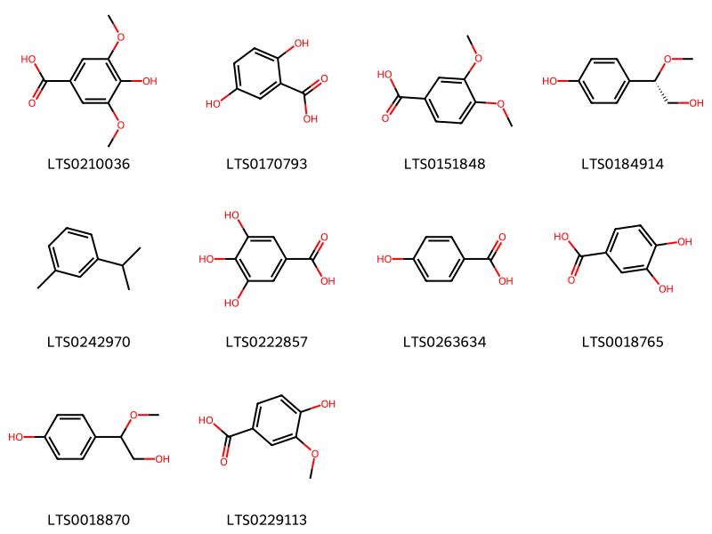{ width=100% }
    <figcaption>Hình ảnh cấu trúc hóa học của 10 hoạt chất thuộc nhóm Benzene and substituted derivatives gồm ['syringic acid (LTS0210036)', '2,5-dihydroxybenzoic acid (LTS0170793)', 'veratric acid (LTS0151848)', '4-[(1s)-2-hydroxy-1-methoxyethyl]phenol (LTS0184914)', 'm-cymene (LTS0242970)', 'galop (LTS0222857)', 'p-hydroxybenzoic acid (LTS0263634)', '3,4-dihydroxybenzoic acid (LTS0018765)', '4-(2-hydroxy-1-methoxyethyl)phenol (LTS0018870)', 'vanillic acid (LTS0229113)'].</figcaption>
</figure>
#### Nhóm Benzodioxoles
<figure markdown="span">
    { width=100% }
    <figcaption>Hình ảnh cấu trúc hóa học của 1 hoạt chất thuộc nhóm Benzodioxoles gồm ['dillapiol (LTS0226542)'].</figcaption>
</figure>
#### Nhóm Benzopyrans
<figure markdown="span">
    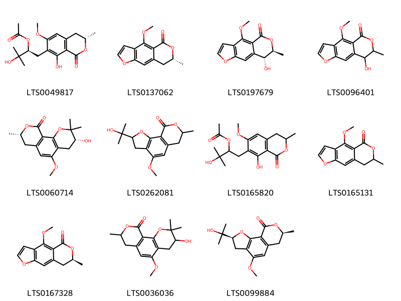{ width=100% }
    <figcaption>Hình ảnh cấu trúc hóa học của 11 hoạt chất thuộc nhóm Benzopyrans gồm ['(2s)-3-hydroxy-1-[(3s)-8-hydroxy-6-methoxy-3-methyl-1-oxo-3,4-dihydro-2-benzopyran-7-yl]-3-methylbutan-2-yl acetate (LTS0049817)', '(12r)-8-methoxy-12-methyl-4,11-dioxatricyclo[7.4.0.0³,⁷]trideca-1(9),2,5,7-tetraen-10-one (LTS0137062)', '(12s,13r)-13-hydroxy-8-methoxy-12-methyl-4,11-dioxatricyclo[7.4.0.0³,⁷]trideca-1(9),2,5,7-tetraen-10-one (LTS0197679)', '13-hydroxy-8-methoxy-12-methyl-4,11-dioxatricyclo[7.4.0.0³,⁷]trideca-1(9),2,5,7-tetraen-10-one (LTS0096401)', '(5r,12s)-5-hydroxy-8-methoxy-4,4,12-trimethyl-3,13-dioxatricyclo[8.4.0.0²,⁷]tetradeca-1(10),2(7),8-trien-14-one (LTS0060714)', '4-(2-hydroxypropan-2-yl)-7-methoxy-11-methyl-3,12-dioxatricyclo[7.4.0.0²,⁶]trideca-1(9),2(6),7-trien-13-one (LTS0262081)', '3-hydroxy-1-(8-hydroxy-6-methoxy-3-methyl-1-oxo-3,4-dihydro-2-benzopyran-7-yl)-3-methylbutan-2-yl acetate (LTS0165820)', '8-methoxy-12-methyl-4,11-dioxatricyclo[7.4.0.0³,⁷]trideca-1(9),2,5,7-tetraen-10-one (LTS0165131)', '(12s)-8-methoxy-12-methyl-4,11-dioxatricyclo[7.4.0.0³,⁷]trideca-1(9),2,5,7-tetraen-10-one (LTS0167328)', '5-hydroxy-8-methoxy-4,4,12-trimethyl-3,13-dioxatricyclo[8.4.0.0²,⁷]tetradeca-1(10),2(7),8-trien-14-one (LTS0036036)', '(4s,11s)-4-(2-hydroxypropan-2-yl)-7-methoxy-11-methyl-3,12-dioxatricyclo[7.4.0.0²,⁶]trideca-1(9),2(6),7-trien-13-one (LTS0099884)'].</figcaption>
</figure>
#### Nhóm Cinnamic acids and derivatives
<figure markdown="span">
    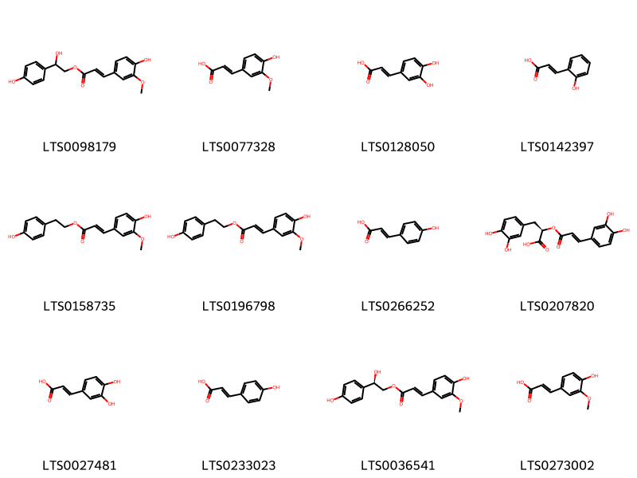{ width=100% }
    <figcaption>Hình ảnh cấu trúc hóa học của 12 hoạt chất thuộc nhóm Cinnamic acids and derivatives gồm ['2-hydroxy-2-(4-hydroxyphenyl)ethyl 3-(4-hydroxy-3-methoxyphenyl)prop-2-enoate (LTS0098179)', 'ferulic acid (LTS0077328)', '3,4-dihydroxycinnamic acid (LTS0128050)', 'trans-2-hydroxycinnamic acid (LTS0142397)', '2-(4-hydroxyphenyl)ethyl (2e)-3-(4-hydroxy-3-methoxyphenyl)prop-2-enoate (LTS0158735)', '2-(4-hydroxyphenyl)ethyl 3-(4-hydroxy-3-methoxyphenyl)prop-2-enoate (LTS0196798)', 'para-coumaric acid (LTS0266252)', 'rosemary acid (LTS0207820)', 'caffeic acid (LTS0027481)', 'hydroxycinnamic acid (LTS0233023)', '(2r)-2-hydroxy-2-(4-hydroxyphenyl)ethyl (2e)-3-(4-hydroxy-3-methoxyphenyl)prop-2-enoate (LTS0036541)', 'ferulic acid (LTS0273002)'].</figcaption>
</figure>
#### Nhóm Coumarins and derivatives
<figure markdown="span">
    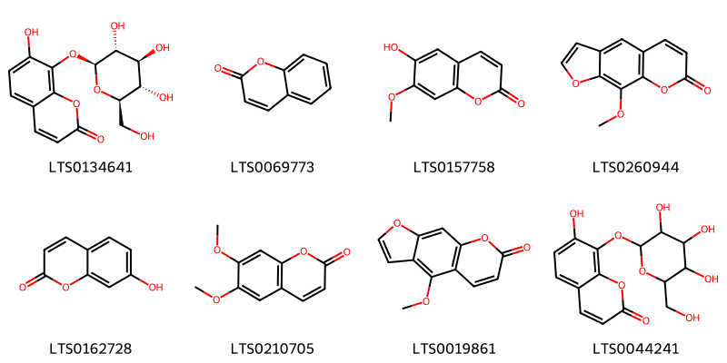{ width=100% }
    <figcaption>Hình ảnh cấu trúc hóa học của 8 hoạt chất thuộc nhóm Coumarins and derivatives gồm ['7-hydroxy-8-{[(2s,3r,4s,5s,6r)-3,4,5-trihydroxy-6-(hydroxymethyl)oxan-2-yl]oxy}chromen-2-one (LTS0134641)', '2h-1-benzopyran-2-one (LTS0069773)', 'isoscopoletin (LTS0157758)', 'methoxsalen (LTS0260944)', 'umbelliferone (LTS0162728)', 'scoparone (LTS0210705)', 'bergapten (LTS0019861)', '7-hydroxy-8-{[3,4,5-trihydroxy-6-(hydroxymethyl)oxan-2-yl]oxy}chromen-2-one (LTS0044241)'].</figcaption>
</figure>
#### Nhóm Diazines
<figure markdown="span">
    { width=100% }
    <figcaption>Hình ảnh cấu trúc hóa học của 1 hoạt chất thuộc nhóm Diazines gồm ['pirod (LTS0008205)'].</figcaption>
</figure>
#### Nhóm Fatty Acyls
<figure markdown="span">
    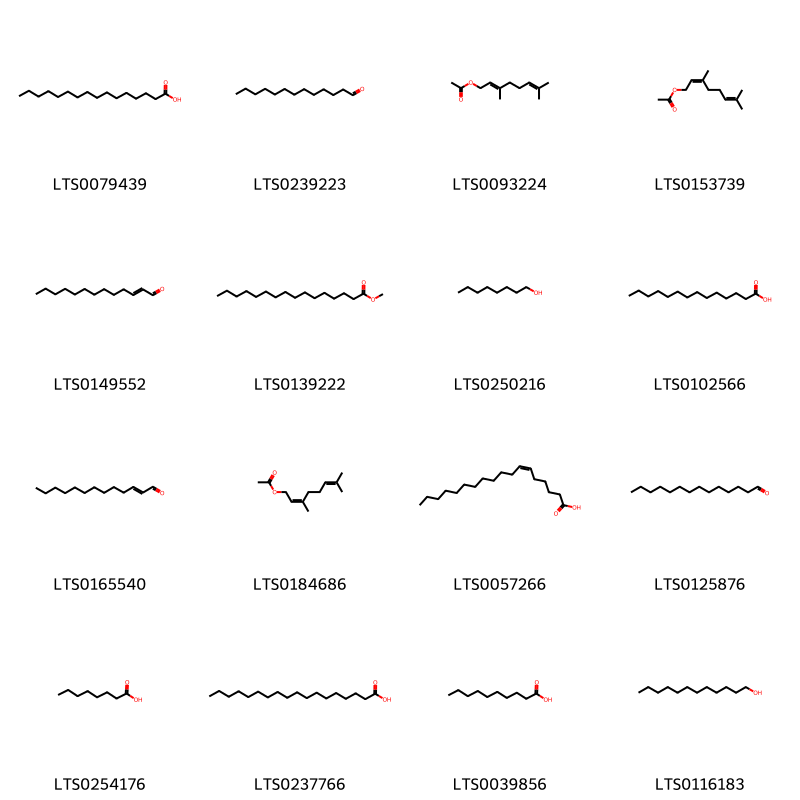{ width=100% }
    <figcaption>Hình ảnh cấu trúc hóa học của 16 hoạt chất thuộc nhóm Fatty Acyls gồm ['palmitic acid (LTS0079439)', 'tridecanal (LTS0239223)', 'geranyl acetate (LTS0093224)', 'neryl acetate (LTS0153739)', 'tridecenal (LTS0149552)', 'methyl palmitate (LTS0139222)', 'octanol (LTS0250216)', 'myristic acid (LTS0102566)', '2-tridecenal (LTS0165540)', '3,7-dimethylocta-2,6-dien-1-yl acetate (LTS0184686)', 'petroselinic acid (LTS0057266)', 'tetradecanal (LTS0125876)', 'caprylic acid (LTS0254176)', 'stearic acid (LTS0237766)', 'capric acid (LTS0039856)', '1-dodecanol (LTS0116183)'].</figcaption>
</figure>
#### Nhóm Flavonoids
<figure markdown="span">
    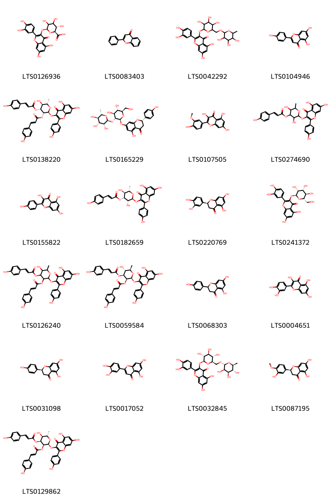{ width=100% }
    <figcaption>Hình ảnh cấu trúc hóa học của 21 hoạt chất thuộc nhóm Flavonoids gồm ['miquelianin (LTS0126936)', 'flavone (LTS0083403)', 'rutin (LTS0042292)', 'chamomile (LTS0104946)', '(2s,3r,4r,5s,6s)-2-{[5,7-dihydroxy-2-(4-hydroxyphenyl)-4-oxochromen-3-yl]oxy}-5-hydroxy-4-{[(2e)-3-(4-hydroxyphenyl)prop-2-enoyl]oxy}-6-methyloxan-3-yl (2e)-3-(4-hydroxyphenyl)prop-2-enoate (LTS0138220)', 'naringin (LTS0165229)', 'isorhamnetin (LTS0107505)', '2-{[5,7-dihydroxy-2-(4-hydroxyphenyl)-4-oxochromen-3-yl]oxy}-3,5-dihydroxy-6-methyloxan-4-yl 3-(4-hydroxyphenyl)prop-2-enoate (LTS0274690)', 'kaempherol (LTS0155822)', '(2s,3r,4r,5s,6s)-2-{[5,7-dihydroxy-2-(4-hydroxyphenyl)-4-oxochromen-3-yl]oxy}-3,5-dihydroxy-6-methyloxan-4-yl (2e)-3-(4-hydroxyphenyl)prop-2-enoate (LTS0182659)', 'eriodictyol (LTS0220769)', '2-(3,4-dihydroxyphenyl)-5,7-dihydroxy-3-{[(2s,3r,4r,5r,6s)-3,4,5-trihydroxy-6-(hydroxymethyl)oxan-2-yl]oxy}chromen-4-one (LTS0241372)', '2-{[5,7-dihydroxy-2-(4-hydroxyphenyl)-4-oxochromen-3-yl]oxy}-5-hydroxy-4-{[3-(4-hydroxyphenyl)prop-2-enoyl]oxy}-6-methyloxan-3-yl 3-(4-hydroxyphenyl)prop-2-enoate (LTS0126240)', '(2s,3s,4s,5r,6r)-2-{[5,7-dihydroxy-2-(4-hydroxyphenyl)-4-oxochromen-3-yl]oxy}-5-hydroxy-4-{[(2e)-3-(4-hydroxyphenyl)prop-2-enoyl]oxy}-6-methyloxan-3-yl (2e)-3-(4-hydroxyphenyl)prop-2-enoate (LTS0059584)', 'asahina (LTS0068303)', 'quercetin (LTS0004651)', 'naringenin (LTS0031098)', 'luteolin (LTS0017052)', '3-rutinosyl quercetin (LTS0032845)', 'hesperetin (LTS0087195)', '(2s,3s,4s,5s,6s)-2-{[5,7-dihydroxy-2-(4-hydroxyphenyl)-4-oxochromen-3-yl]oxy}-5-hydroxy-4-{[(2e)-3-(4-hydroxyphenyl)prop-2-enoyl]oxy}-6-methyloxan-3-yl (2e)-3-(4-hydroxyphenyl)prop-2-enoate (LTS0129862)'].</figcaption>
</figure>
#### Nhóm Isocoumarins and derivatives
<figure markdown="span">
    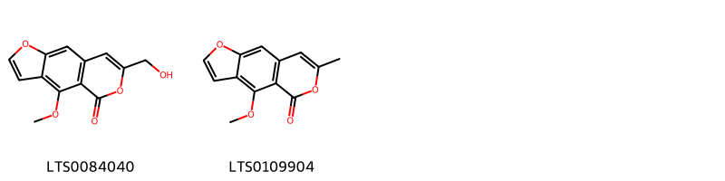{ width=100% }
    <figcaption>Hình ảnh cấu trúc hóa học của 2 hoạt chất thuộc nhóm Isocoumarins and derivatives gồm ['7-(hydroxymethyl)-4-methoxyfuro[2,3-g]isochromen-5-one (LTS0084040)', 'coriandrin (LTS0109904)'].</figcaption>
</figure>
#### Nhóm Organonitrogen compounds
<figure markdown="span">
    { width=100% }
    <figcaption>Hình ảnh cấu trúc hóa học của 2 hoạt chất thuộc nhóm Organonitrogen compounds gồm ['choline (LTS0170307)', 'acetylcholine (LTS0185507)'].</figcaption>
</figure>
#### Nhóm Organooxygen compounds
<figure markdown="span">
    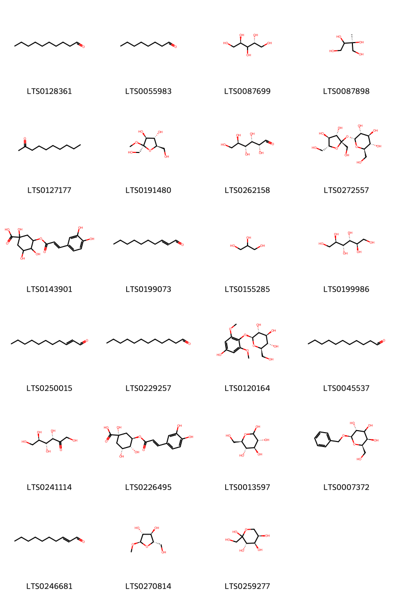{ width=100% }
    <figcaption>Hình ảnh cấu trúc hóa học của 23 hoạt chất thuộc nhóm Organooxygen compounds gồm ['decanal (LTS0128361)', 'octanal (LTS0055983)', 'arabitol (LTS0087699)', '(2s)-2-methylbutane-1,2,3,4-tetrol (LTS0087898)', '2-decanone (LTS0127177)', '(2r,3s,4s,5r)-2,5-bis(hydroxymethyl)-2-methoxyoxolane-3,4-diol (LTS0191480)', '(+)-glucose (LTS0262158)', 'sucrose (LTS0272557)', '3-{[3-(3,4-dihydroxyphenyl)prop-2-enoyl]oxy}-1,4,5-trihydroxycyclohexane-1-carboxylic acid (LTS0143901)', '2-decenal (LTS0199073)', 'glycerol (LTS0155285)', 'mannitol (LTS0199986)', 'undecenal (LTS0250015)', 'dodecanal (LTS0229257)', '(2s,3r,4s,5s,6r)-2-(4-hydroxy-2,6-dimethoxyphenoxy)-6-(hydroxymethyl)oxane-3,4,5-triol (LTS0120164)', 'aldehyde c11 (LTS0045537)', 'keto-d-fructose (LTS0241114)', 'chlorogenic acid (LTS0226495)', 'glucose (LTS0013597)', '(2r,3r,5r,6r)-2-(benzyloxy)-6-(hydroxymethyl)oxane-3,4,5-triol (LTS0007372)', '(2e)-2-decenal (LTS0246681)', '(2s,3r,4r,5r)-2-(hydroxymethyl)-5-methoxyoxolane-3,4-diol (LTS0270814)', 'd-fructopyranose (LTS0259277)'].</figcaption>
</figure>
#### Nhóm Phenols
<figure markdown="span">
    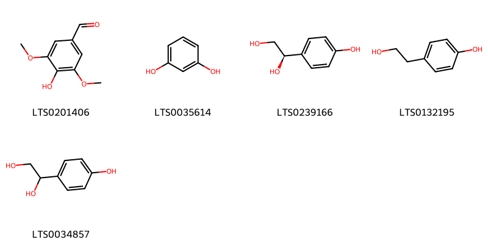{ width=100% }
    <figcaption>Hình ảnh cấu trúc hóa học của 5 hoạt chất thuộc nhóm Phenols gồm ['syringaldehyde (LTS0201406)', 'resorcinol (LTS0035614)', '(1r)-1-(4-hydroxyphenyl)ethane-1,2-diol (LTS0239166)', 'tyrosol (LTS0132195)', '1-(4-hydroxyphenyl)ethane-1,2-diol (LTS0034857)'].</figcaption>
</figure>
#### Nhóm Prenol lipids
<figure markdown="span">
    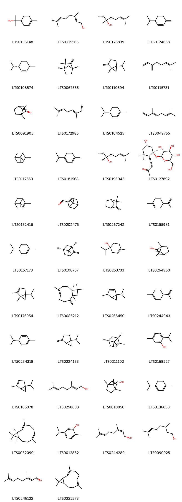{ width=100% }
    <figcaption>Hình ảnh cấu trúc hóa học của 42 hoạt chất thuộc nhóm Prenol lipids gồm ['terpineol (LTS0136148)', '3,7-dimethyl-2,6-octadien-1-ol (LTS0215566)', 'linalool, (+-)- (LTS0128839)', 'β phellandrene (LTS0124668)', '(+)-β-phellandrene (LTS0108574)', '(-)-camphene (LTS0067556)', '(+)-sabinene (LTS0110694)', 'α-myrcene (LTS0115731)', 'camphor (LTS0091905)', '3,7-dimethyl-1,3,6-octatriene (LTS0172986)', 'terpinolene (LTS0104525)', 'trans-β-ocimene (LTS0049765)', 'β-pinene (LTS0117550)', 'cymene (LTS0181568)', '(+)-linalool (LTS0196043)', 'citroside b (LTS0127892)', 'α pinene (LTS0132416)', 'myrtenal (LTS0202475)', 'camphene (LTS0267242)', 'limonene,  (LTS0155981)', 'phellandrene (LTS0157173)', '(-)-β-pinene (LTS0108757)', '4-terpineol (LTS0253733)', 'borneol (LTS0264960)', 'α-thujene (LTS0176954)', 'caryophyllene (LTS0085212)', 'thujene (LTS0268450)', 'α-limonene (LTS0244943)', '(+)-α-phellandrene (LTS0234318)', 'sabinene (LTS0224133)', '(+)-α-pinene (LTS0211102)', 'thymol (LTS0168527)', 'α-thujene (LTS0185078)', 'geraniol (LTS0258838)', '(2s,4r)-1,7,7-trimethylbicyclo[2.2.1]heptan-2-ol (LTS0010050)', 'terpinene (LTS0136858)', '(1s,2e,10r)-3,7,11,11-tetramethylbicyclo[8.1.0]undeca-2,6-diene (LTS0032090)', 'carvacrol (LTS0012882)', 'nerol (LTS0244289)', 'citronellol, (+-)- (LTS0090925)', 'α-citral (LTS0246122)', '(2e,6e)-3,7,11,11-tetramethylbicyclo[8.1.0]undeca-2,6-diene (LTS0225278)'].</figcaption>
</figure>
#### Nhóm Purine nucleosides
<figure markdown="span">
    { width=100% }
    <figcaption>Hình ảnh cấu trúc hóa học của 1 hoạt chất thuộc nhóm Purine nucleosides gồm ['adenosine (LTS0014061)'].</figcaption>
</figure>
#### Nhóm Pyrimidine nucleosides
<figure markdown="span">
    { width=100% }
    <figcaption>Hình ảnh cấu trúc hóa học của 1 hoạt chất thuộc nhóm Pyrimidine nucleosides gồm ['uridine (LTS0220125)'].</figcaption>
</figure>
#### Nhóm Saturated hydrocarbons
<figure markdown="span">
    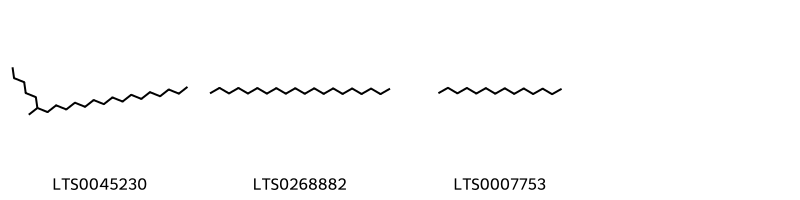{ width=100% }
    <figcaption>Hình ảnh cấu trúc hóa học của 3 hoạt chất thuộc nhóm Saturated hydrocarbons gồm ['6-methyldocosane (LTS0045230)', 'eicosane (LTS0268882)', 'tetradecane (LTS0007753)'].</figcaption>
</figure>
#### Nhóm Tannins
<figure markdown="span">
    { width=100% }
    <figcaption>Hình ảnh cấu trúc hóa học của 1 hoạt chất thuộc nhóm Tannins gồm ['ellagic acid (LTS0037297)'].</figcaption>
</figure>
#### Nhóm Unsaturated hydrocarbons
<figure markdown="span">
    { width=100% }
    <figcaption>Hình ảnh cấu trúc hóa học của 1 hoạt chất thuộc nhóm Unsaturated hydrocarbons gồm ['α terpinene (LTS0232891)'].</figcaption>
</figure>

---

### Dược dân tộc học

Danh sách các quốc gia có sử dụng *Coriandrum sativum* trong điều trị các bệnh. 

| Country   | Disease                                                                                                                             | Bệnh                                                                                                                                                                                                |
|:----------|:------------------------------------------------------------------------------------------------------------------------------------|:----------------------------------------------------------------------------------------------------------------------------------------------------------------------------------------------------|
| China     | Alexiteric, Antidote, Carminative, Carminative, Carminative, Sedative, Stimulant, Stomachic, Tonic, Stomachic                       | MYMEMORY WARNING: YOU USED ALL AVAILABLE FREE TRANSLATIONS FOR TODAY. NEXT AVAILABLE IN  07 HOURS 57 MINUTES 58 SECONDS VISIT HTTPS://MYMEMORY.TRANSLATED.NET/DOC/USAGELIMITS.PHP TO TRANSLATE MORE |
| Elsewhere | Aphrodisiac, Carminative, Carminative, Diuretic, Refrigerant, Soap, Stomachic, Stomachic, Sedative, Carminative, Carminative, Tonic | MYMEMORY WARNING: YOU USED ALL AVAILABLE FREE TRANSLATIONS FOR TODAY. NEXT AVAILABLE IN  07 HOURS 57 MINUTES 56 SECONDS VISIT HTTPS://MYMEMORY.TRANSLATED.NET/DOC/USAGELIMITS.PHP TO TRANSLATE MORE |
| Iraq      | Aphrodisiac                                                                                                                         | MYMEMORY WARNING: YOU USED ALL AVAILABLE FREE TRANSLATIONS FOR TODAY. NEXT AVAILABLE IN  07 HOURS 57 MINUTES 53 SECONDS VISIT HTTPS://MYMEMORY.TRANSLATED.NET/DOC/USAGELIMITS.PHP TO TRANSLATE MORE |
| Japan     | Stomachic, Carminative                                                                                                              | MYMEMORY WARNING: YOU USED ALL AVAILABLE FREE TRANSLATIONS FOR TODAY. NEXT AVAILABLE IN  07 HOURS 57 MINUTES 51 SECONDS VISIT HTTPS://MYMEMORY.TRANSLATED.NET/DOC/USAGELIMITS.PHP TO TRANSLATE MORE |
| Kurdistan | Emmenagogue                                                                                                                         | MYMEMORY WARNING: YOU USED ALL AVAILABLE FREE TRANSLATIONS FOR TODAY. NEXT AVAILABLE IN  07 HOURS 57 MINUTES 49 SECONDS VISIT HTTPS://MYMEMORY.TRANSLATED.NET/DOC/USAGELIMITS.PHP TO TRANSLATE MORE |
| Mexico    | Stimulant, Carminative                                                                                                              | MYMEMORY WARNING: YOU USED ALL AVAILABLE FREE TRANSLATIONS FOR TODAY. NEXT AVAILABLE IN  07 HOURS 57 MINUTES 46 SECONDS VISIT HTTPS://MYMEMORY.TRANSLATED.NET/DOC/USAGELIMITS.PHP TO TRANSLATE MORE |
| Turkey    | Apertif, Diuretic, Emmenagogue, Stomachic, Digestive, Aphrodisiac                                                                   | MYMEMORY WARNING: YOU USED ALL AVAILABLE FREE TRANSLATIONS FOR TODAY. NEXT AVAILABLE IN  07 HOURS 57 MINUTES 44 SECONDS VISIT HTTPS://MYMEMORY.TRANSLATED.NET/DOC/USAGELIMITS.PHP TO TRANSLATE MORE |
| ain       | Carminative                                                                                                                         | MYMEMORY WARNING: YOU USED ALL AVAILABLE FREE TRANSLATIONS FOR TODAY. NEXT AVAILABLE IN  07 HOURS 57 MINUTES 42 SECONDS VISIT HTTPS://MYMEMORY.TRANSLATED.NET/DOC/USAGELIMITS.PHP TO TRANSLATE MORE |

---

# Chi Thapsia

??? note "Danh sách các dược liệu thuộc chi"
    
	 - *Thapsia garganica*
	 - *Thapsia villosa*

---
## Thapsia garganica
### Thông tin về thực vật

!!! info "Phân loại thực vật của *Thapsia garganica* từ GIBF:"
    - **Kingdom:** Plantae
    - **Phylum:** Tracheophyta
    - **Order:** Apiales
    - **Family:** Apiaceae
    - **Genus:** Thapsia
    - **Species:** *Thapsia garganica*

 

| Label (VI)   | Label (EN)   | Scientific Name   | Descriptions (VI)   | Descriptions (EN)   | Also Known As (VI)   | Also Known As (EN)   |
|:-------------|:-------------|:------------------|:--------------------|:--------------------|:---------------------|:---------------------|
| N/A          | N/A          | Thapsia garganica | loài thực vật       | species of plant    | ['']                 | ['']                 |

#### Phân bố trên thế giới

**Từ CSDL GIBF** Italy, Thailand, Spain, Türkiye, Portugal, Algeria, Tunisia, France, Greece

#### Phân bố tại Việt Nam

**Từ CSDL GIBF**: Không có ghi nhận ở Việt Nam

---
### Thành phần hóa học
        
- Theo cơ sở dữ liệu lotus: Từ loài *Thapsia garganica* đã phân lập và xác định được 62 hoạt chất thuộc về các nhóm Phenol ethers, Fatty Acyls, Prenol lipids, Benzodioxoles, Pyrans, Benzene and substituted derivatives, Unsaturated hydrocarbons, Phenols, Macrolides and analogues, Coumarins and derivatives, Carboxylic acids and derivatives. 

|    | chemicalTaxonomyClassyfireClass     |   smiles_count |
|---:|:------------------------------------|---------------:|
|  0 | Benzene and substituted derivatives |              2 |
|  1 | Benzodioxoles                       |              8 |
|  2 | Carboxylic acids and derivatives    |             26 |
|  3 | Coumarins and derivatives           |              2 |
|  4 | Fatty Acyls                         |              1 |
|  5 | Macrolides and analogues            |              3 |
|  6 | Phenol ethers                       |              2 |
|  7 | Phenols                             |              3 |
|  8 | Prenol lipids                       |             11 |
|  9 | Pyrans                              |              2 |
| 10 | Unsaturated hydrocarbons            |              1 |

#### Nhóm Benzene and substituted derivatives
<figure markdown="span">
    { width=100% }
    <figcaption>Hình ảnh cấu trúc hóa học của 2 hoạt chất thuộc nhóm Benzene and substituted derivatives gồm ['benzaldehyde (LTS0094193)', 'phenylacetaldehyde (LTS0245512)'].</figcaption>
</figure>
#### Nhóm Benzodioxoles
<figure markdown="span">
    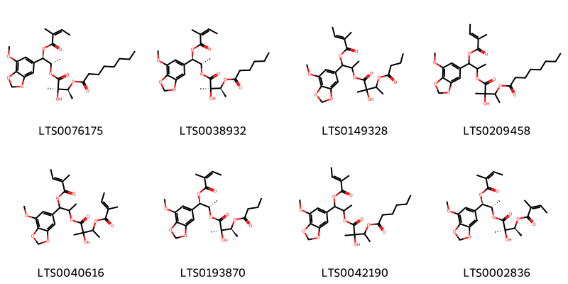{ width=100% }
    <figcaption>Hình ảnh cấu trúc hóa học của 8 hoạt chất thuộc nhóm Benzodioxoles gồm ['(2s,3r)-3-hydroxy-4-{[(1r,2s)-1-(7-methoxy-2h-1,3-benzodioxol-5-yl)-1-{[(2z)-2-methylbut-2-enoyl]oxy}propan-2-yl]oxy}-3-methyl-4-oxobutan-2-yl octanoate (LTS0076175)', '(2s,3r)-3-hydroxy-4-{[(1r,2s)-1-(7-methoxy-2h-1,3-benzodioxol-5-yl)-1-{[(2z)-2-methylbut-2-enoyl]oxy}propan-2-yl]oxy}-3-methyl-4-oxobutan-2-yl hexanoate (LTS0038932)', '2-{[3-(butanoyloxy)-2-hydroxy-2-methylbutanoyl]oxy}-1-(7-methoxy-2h-1,3-benzodioxol-5-yl)propyl 2-methylbut-2-enoate (LTS0149328)', '3-hydroxy-4-{[1-(7-methoxy-2h-1,3-benzodioxol-5-yl)-1-[(2-methylbut-2-enoyl)oxy]propan-2-yl]oxy}-3-methyl-4-oxobutan-2-yl octanoate (LTS0209458)', '2-({2-hydroxy-2-methyl-3-[(2-methylbut-2-enoyl)oxy]butanoyl}oxy)-1-(7-methoxy-2h-1,3-benzodioxol-5-yl)propyl 2-methylbut-2-enoate (LTS0040616)', '(1r,2s)-2-{[(2r,3s)-3-(butanoyloxy)-2-hydroxy-2-methylbutanoyl]oxy}-1-(7-methoxy-2h-1,3-benzodioxol-5-yl)propyl (2z)-2-methylbut-2-enoate (LTS0193870)', '3-hydroxy-4-{[1-(7-methoxy-2h-1,3-benzodioxol-5-yl)-1-[(2-methylbut-2-enoyl)oxy]propan-2-yl]oxy}-3-methyl-4-oxobutan-2-yl hexanoate (LTS0042190)', '(1r,2s)-2-{[(2r,3s)-2-hydroxy-2-methyl-3-{[(2z)-2-methylbut-2-enoyl]oxy}butanoyl]oxy}-1-(7-methoxy-2h-1,3-benzodioxol-5-yl)propyl (2z)-2-methylbut-2-enoate (LTS0002836)'].</figcaption>
</figure>
#### Nhóm Carboxylic acids and derivatives
<figure markdown="span">
    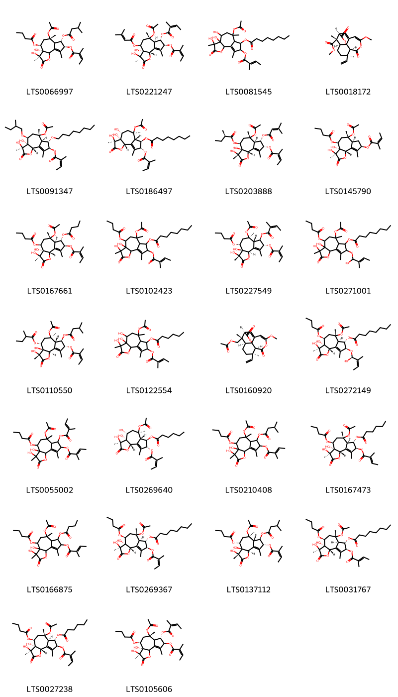{ width=100% }
    <figcaption>Hình ảnh cấu trúc hóa học của 26 hoạt chất thuộc nhóm Carboxylic acids and derivatives gồm ['(3s,3ar,4s,6s,7s,8s)-6-(acetyloxy)-4-(butanoyloxy)-3,3a-dihydroxy-3,6,9-trimethyl-7-[(3-methylbutanoyl)oxy]-2-oxo-4h,5h,6ah,7h,8h,9bh-azuleno[4,5-b]furan-8-yl (2z)-2-methylbut-2-enoate (LTS0066997)', '(3s,3ar,4s,6s,6ar,7s,8s,9bs)-6-(acetyloxy)-3,3a-dihydroxy-3,6,9-trimethyl-4-[(3-methylbut-2-enoyl)oxy]-8-{[(2z)-2-methylbut-2-enoyl]oxy}-2-oxo-4h,5h,6ah,7h,8h,9bh-azuleno[4,5-b]furan-7-yl (2z)-2-methylbut-2-enoate (LTS0221247)', '6-(acetyloxy)-3,3a,4-trihydroxy-3,6,9-trimethyl-8-[(2-methylbut-2-enoyl)oxy]-2-oxo-4h,5h,6ah,7h,8h,9bh-azuleno[4,5-b]furan-7-yl octanoate (LTS0081545)', 'methyl (1r,2s,3s,6r,7s,13r)-6-ethenyl-10-methoxy-2,6-dimethyl-8,15-dioxo-9,14-dioxatetracyclo[10.3.1.0³,¹³.0⁷,¹³]hexadeca-10,12(16)-diene-2-carboxylate (LTS0018172)', '(3s,3ar,4s,6s,6ar,7s,8s,9bs)-6-(acetyloxy)-3,3a-dihydroxy-3,6,9-trimethyl-4-(2-methylbutoxy)-7-(octyloxy)-2-oxo-4h,5h,6ah,7h,8h,9bh-azuleno[4,5-b]furan-8-yl (2z)-2-methylbut-2-enoate (LTS0091347)', '(3s,3ar,4r,6r,6as,7r,8r,9bs)-6-(acetyloxy)-3,3a,4-trihydroxy-3,6,9-trimethyl-8-{[(2z)-2-methylbut-2-enoyl]oxy}-2-oxo-4h,5h,6ah,7h,8h,9bh-azuleno[4,5-b]furan-7-yl octanoate (LTS0186497)', '(3r,3as,4s,6s,6ar,7s,8r,9bs)-6-(acetyloxy)-3,3a-dihydroxy-3,6,9-trimethyl-8-{[(2z)-2-methylbut-2-enoyl]oxy}-4-{[(2r)-2-methylbutanoyl]oxy}-2-oxo-4h,5h,6ah,7h,8h,9bh-azuleno[4,5-b]furan-7-yl 3-methylbut-2-enoate (LTS0203888)', '(3s,3ar,4s,6s,6as,8r,9bs)-6-(acetyloxy)-4-(butanoyloxy)-3,3a-dihydroxy-3,6,9-trimethyl-2-oxo-4h,5h,6ah,7h,8h,9bh-azuleno[4,5-b]furan-8-yl (2z)-2-methylbut-2-enoate (LTS0145790)', '(3s,3ar,4s,6s,6ar,7s,8s,9bs)-6-(acetyloxy)-4,7-bis(butanoyloxy)-3,3a-dihydroxy-3,6,9-trimethyl-2-oxo-4h,5h,6ah,7h,8h,9bh-azuleno[4,5-b]furan-8-yl (2z)-2-methylbut-2-enoate (LTS0167661)', '6-(acetyloxy)-4-(butanoyloxy)-3,3a-dihydroxy-3,6,9-trimethyl-8-[(2-methylbut-2-enoyl)oxy]-2-oxo-4h,5h,6ah,7h,8h,9bh-azuleno[4,5-b]furan-7-yl octanoate (LTS0102423)', '(3r,3as,4r,6r,6as,7r,8r,9br)-6-(acetyloxy)-4-(butanoyloxy)-3,3a-dihydroxy-3,6,9-trimethyl-8-{[(2z)-2-methylbut-2-enoyl]oxy}-2-oxo-4h,5h,6ah,7h,8h,9bh-azuleno[4,5-b]furan-7-yl (2z)-2-methylbut-2-enoate (LTS0227549)', '6-(acetyloxy)-4-(butanoyloxy)-3,3a-dihydroxy-8-[(1-hydroxy-2-methylbut-2-en-1-yl)oxy]-3,6,9-trimethyl-2-oxo-4h,5h,6ah,7h,8h,9bh-azuleno[4,5-b]furan-7-yl octanoate (LTS0271001)', '(3r,3as,4r,6r,6as,7r,8r,9br)-6-(acetyloxy)-3,3a-dihydroxy-3,6,9-trimethyl-4-[(2-methylbutanoyl)oxy]-7-[(3-methylbutanoyl)oxy]-2-oxo-4h,5h,6ah,7h,8h,9bh-azuleno[4,5-b]furan-8-yl (2z)-2-methylbut-2-enoate (LTS0110550)', '6-(acetyloxy)-3,3a,4-trihydroxy-3,6,9-trimethyl-8-[(2-methylbut-2-enoyl)oxy]-2-oxo-4h,5h,6ah,7h,8h,9bh-azuleno[4,5-b]furan-7-yl hexanoate (LTS0122554)', '[(1r,2s,3s,6r,7s,13r)-6-ethenyl-10-methoxy-2,6-dimethyl-8,15-dioxo-9,14-dioxatetracyclo[10.3.1.0³,¹³.0⁷,¹³]hexadeca-10,12(16)-dien-2-yl]methyl acetate (LTS0160920)', '(3s,3ar,4s,6s,6ar,7s,8s,9bs)-6-(acetyloxy)-4-(butanoyloxy)-3,3a-dihydroxy-8-{[(1s,2z)-1-hydroxy-2-methylbut-2-en-1-yl]oxy}-3,6,9-trimethyl-2-oxo-4h,5h,6ah,7h,8h,9bh-azuleno[4,5-b]furan-7-yl octanoate (LTS0272149)', '6-(acetyloxy)-4-(butanoyloxy)-3,3a-dihydroxy-3,6,9-trimethyl-8-[(2-methylbut-2-enoyl)oxy]-2-oxo-4h,5h,6ah,7h,8h,9bh-azuleno[4,5-b]furan-7-yl 2-methylbut-2-enoate (LTS0055002)', '(3s,3ar,4r,6r,6as,7r,8r,9bs)-6-(acetyloxy)-3,3a,4-trihydroxy-3,6,9-trimethyl-8-{[(2z)-2-methylbut-2-enoyl]oxy}-2-oxo-4h,5h,6ah,7h,8h,9bh-azuleno[4,5-b]furan-7-yl hexanoate (LTS0269640)', '6-(acetyloxy)-4-(butanoyloxy)-3,3a-dihydroxy-3,6,9-trimethyl-7-[(3-methylbutanoyl)oxy]-2-oxo-4h,5h,6ah,7h,8h,9bh-azuleno[4,5-b]furan-8-yl 2-methylbut-2-enoate (LTS0210408)', '(3s,3ar,4s,6s,6ar,7s,8s,9bs)-6-(acetyloxy)-4-(butanoyloxy)-3,3a-dihydroxy-3,6,9-trimethyl-8-{[(2e)-2-methylbut-2-enoyl]oxy}-2-oxo-4h,5h,6ah,7h,8h,9bh-azuleno[4,5-b]furan-7-yl hexanoate (LTS0167473)', '6-(acetyloxy)-4,7-bis(butanoyloxy)-3,3a-dihydroxy-3,6,9-trimethyl-2-oxo-4h,5h,6ah,7h,8h,9bh-azuleno[4,5-b]furan-8-yl 2-methylbut-2-enoate (LTS0166875)', 'thapsigargin (LTS0269367)', '(3r,3as,4r,6r,6as,7r,8r,9br)-6-(acetyloxy)-4-(butanoyloxy)-3,3a-dihydroxy-3,6,9-trimethyl-7-[(3-methylbutanoyl)oxy]-2-oxo-4h,5h,6ah,7h,8h,9bh-azuleno[4,5-b]furan-8-yl (2z)-2-methylbut-2-enoate (LTS0137112)', '(3s,3ar,4s,6s,6ar,7s,8s,9bs)-6-(acetyloxy)-4-(butanoyloxy)-3,3a-dihydroxy-3,6,9-trimethyl-8-[(2-methylbut-2-enoyl)oxy]-2-oxo-4h,5h,6ah,7h,8h,9bh-azuleno[4,5-b]furan-7-yl octanoate (LTS0031767)', '(3s,3ar,4s,6s,6ar,7s,8s,9bs)-6-(acetyloxy)-4-(butanoyloxy)-3,3a-dihydroxy-3,6,9-trimethyl-8-{[(2z)-2-methylbut-2-enoyl]oxy}-2-oxo-4h,5h,6ah,7h,8h,9bh-azuleno[4,5-b]furan-7-yl hexanoate (LTS0027238)', '(3s,3ar,4s,6s,7s,8s)-6-(acetyloxy)-4-(butanoyloxy)-3,3a-dihydroxy-3,6,9-trimethyl-8-{[(2z)-2-methylbut-2-enoyl]oxy}-2-oxo-4h,5h,6ah,7h,8h,9bh-azuleno[4,5-b]furan-7-yl (2z)-2-methylbut-2-enoate (LTS0105606)'].</figcaption>
</figure>
#### Nhóm Coumarins and derivatives
<figure markdown="span">
    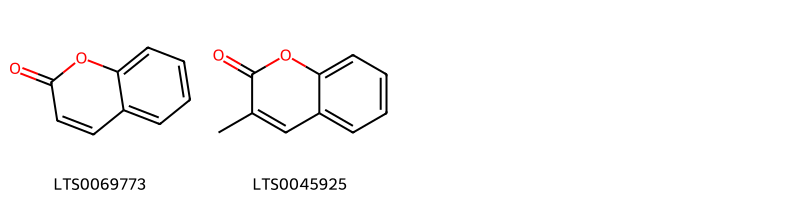{ width=100% }
    <figcaption>Hình ảnh cấu trúc hóa học của 2 hoạt chất thuộc nhóm Coumarins and derivatives gồm ['2h-1-benzopyran-2-one (LTS0069773)', '3-methylcoumarin (LTS0045925)'].</figcaption>
</figure>
#### Nhóm Fatty Acyls
<figure markdown="span">
    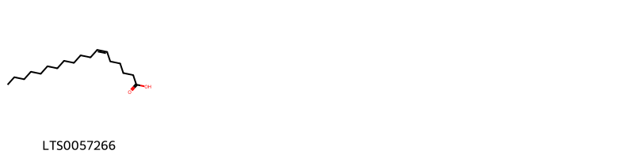{ width=100% }
    <figcaption>Hình ảnh cấu trúc hóa học của 1 hoạt chất thuộc nhóm Fatty Acyls gồm ['petroselinic acid (LTS0057266)'].</figcaption>
</figure>
#### Nhóm Macrolides and analogues
<figure markdown="span">
    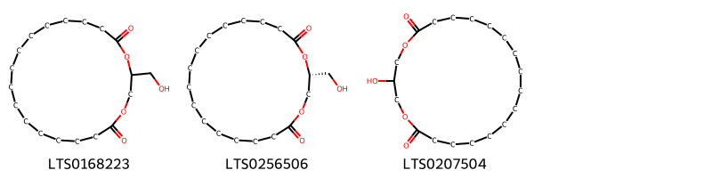{ width=100% }
    <figcaption>Hình ảnh cấu trúc hóa học của 3 hoạt chất thuộc nhóm Macrolides and analogues gồm ['2-(hydroxymethyl)-1,4-dioxacycloicosane-5,20-dione (LTS0168223)', '(2r)-2-(hydroxymethyl)-1,4-dioxacycloicosane-5,20-dione (LTS0256506)', '3-hydroxy-1,5-dioxacyclohenicosane-6,21-dione (LTS0207504)'].</figcaption>
</figure>
#### Nhóm Phenol ethers
<figure markdown="span">
    { width=100% }
    <figcaption>Hình ảnh cấu trúc hóa học của 2 hoạt chất thuộc nhóm Phenol ethers gồm ['p-propenylanisole (LTS0177188)', 'anethole (LTS0033696)'].</figcaption>
</figure>
#### Nhóm Phenols
<figure markdown="span">
    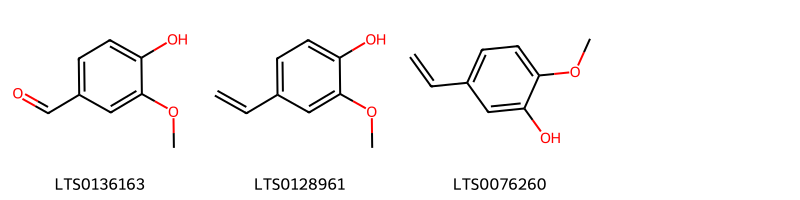{ width=100% }
    <figcaption>Hình ảnh cấu trúc hóa học của 3 hoạt chất thuộc nhóm Phenols gồm ['vanillin (LTS0136163)', '2-methoxy-4-vinyl-phenol (LTS0128961)', '5-ethenyl-2-methoxyphenol (LTS0076260)'].</figcaption>
</figure>
#### Nhóm Prenol lipids
<figure markdown="span">
    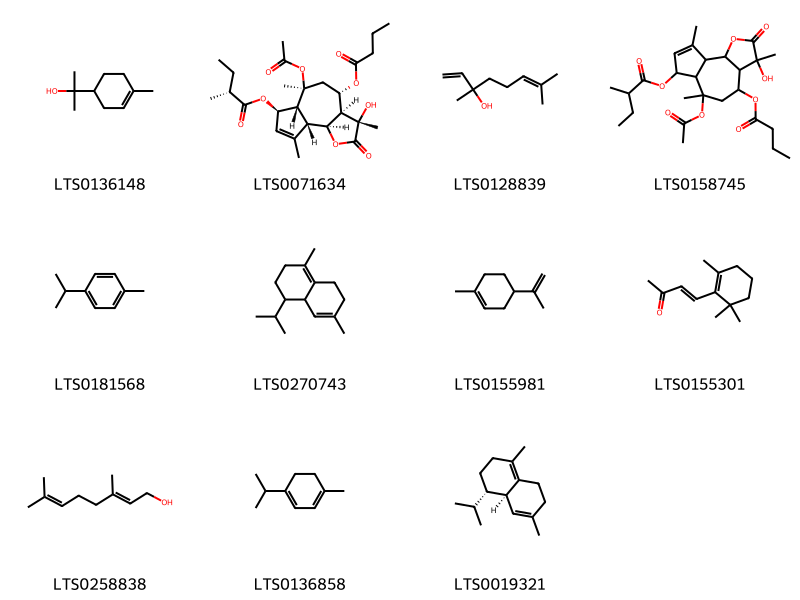{ width=100% }
    <figcaption>Hình ảnh cấu trúc hóa học của 11 hoạt chất thuộc nhóm Prenol lipids gồm ['terpineol (LTS0136148)', '(3s,3ar,4s,6s,6ar,7r,9as,9bs)-6-(acetyloxy)-4-(butanoyloxy)-3-hydroxy-3,6,9-trimethyl-2-oxo-3ah,4h,5h,6ah,7h,9ah,9bh-azuleno[4,5-b]furan-7-yl (2r)-2-methylbutanoate (LTS0071634)', 'linalool, (+-)- (LTS0128839)', '6-(acetyloxy)-4-(butanoyloxy)-3-hydroxy-3,6,9-trimethyl-2-oxo-3ah,4h,5h,6ah,7h,9ah,9bh-azuleno[4,5-b]furan-7-yl 2-methylbutanoate (LTS0158745)', 'cymene (LTS0181568)', '4-isopropyl-1,6-dimethyl-2,3,4,4a,7,8-hexahydronaphthalene (LTS0270743)', 'limonene,  (LTS0155981)', 'β-ionone (LTS0155301)', 'geraniol (LTS0258838)', 'terpinene (LTS0136858)', 'delta-cadinene (LTS0019321)'].</figcaption>
</figure>
#### Nhóm Pyrans
<figure markdown="span">
    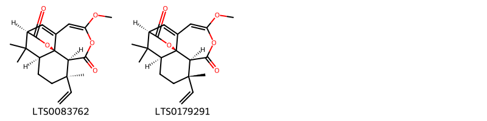{ width=100% }
    <figcaption>Hình ảnh cấu trúc hóa học của 2 hoạt chất thuộc nhóm Pyrans gồm ['(1r,3s,6r,7s,13r)-6-ethenyl-10-methoxy-2,2,6-trimethyl-9,14-dioxatetracyclo[10.3.1.0³,¹³.0⁷,¹³]hexadeca-10,12(16)-diene-8,15-dione (LTS0083762)', '(1r,3s,6s,7s,13r)-6-ethenyl-10-methoxy-2,2,6-trimethyl-9,14-dioxatetracyclo[10.3.1.0³,¹³.0⁷,¹³]hexadeca-10,12(16)-diene-8,15-dione (LTS0179291)'].</figcaption>
</figure>
#### Nhóm Unsaturated hydrocarbons
<figure markdown="span">
    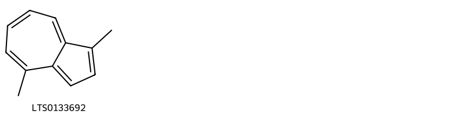{ width=100% }
    <figcaption>Hình ảnh cấu trúc hóa học của 1 hoạt chất thuộc nhóm Unsaturated hydrocarbons gồm ['1,4-dimethylazulene (LTS0133692)'].</figcaption>
</figure>

---

### Dược dân tộc học

Danh sách các quốc gia có sử dụng *Thapsia garganica* trong điều trị các bệnh. 

| Country    | Disease   | Bệnh                                                                                                                                                                                                |
|:-----------|:----------|:----------------------------------------------------------------------------------------------------------------------------------------------------------------------------------------------------|
| French     | Poison    | MYMEMORY WARNING: YOU USED ALL AVAILABLE FREE TRANSLATIONS FOR TODAY. NEXT AVAILABLE IN  07 HOURS 56 MINUTES 50 SECONDS VISIT HTTPS://MYMEMORY.TRANSLATED.NET/DOC/USAGELIMITS.PHP TO TRANSLATE MORE |
| Italian    | Purgative | MYMEMORY WARNING: YOU USED ALL AVAILABLE FREE TRANSLATIONS FOR TODAY. NEXT AVAILABLE IN  07 HOURS 56 MINUTES 48 SECONDS VISIT HTTPS://MYMEMORY.TRANSLATED.NET/DOC/USAGELIMITS.PHP TO TRANSLATE MORE |
| Portuguese | Stimulant | MYMEMORY WARNING: YOU USED ALL AVAILABLE FREE TRANSLATIONS FOR TODAY. NEXT AVAILABLE IN  07 HOURS 56 MINUTES 46 SECONDS VISIT HTTPS://MYMEMORY.TRANSLATED.NET/DOC/USAGELIMITS.PHP TO TRANSLATE MORE |

---

---
## Thapsia villosa
### Thông tin về thực vật

!!! info "Phân loại thực vật của *Thapsia villosa* từ GIBF:"
    - **Kingdom:** Plantae
    - **Phylum:** Tracheophyta
    - **Order:** Apiales
    - **Family:** Apiaceae
    - **Genus:** Thapsia
    - **Species:** *Thapsia villosa*

 

| Label (VI)   | Label (EN)   | Scientific Name   | Descriptions (VI)   | Descriptions (EN)   | Also Known As (VI)   | Also Known As (EN)        |
|:-------------|:-------------|:------------------|:--------------------|:--------------------|:---------------------|:--------------------------|
| N/A          | N/A          | Thapsia villosa   | loài thực vật       | species of plant    | ['']                 | ['villous deadly carrot'] |

#### Phân bố trên thế giới

**Từ CSDL GIBF** Spain, Portugal, Gibraltar, Algeria, France

#### Phân bố tại Việt Nam

**Từ CSDL GIBF**: Không có ghi nhận ở Việt Nam

---
### Thành phần hóa học
        
- Theo cơ sở dữ liệu lotus: Từ loài *Thapsia villosa* đã phân lập và xác định được 146 hoạt chất thuộc về các nhóm Phenol ethers, Fatty Acyls, Prenol lipids, Steroids and steroid derivatives, Cinnamic acids and derivatives, Benzodioxoles, Tetrahydrofurans, Benzene and substituted derivatives, Unsaturated hydrocarbons, Oxolanes, Organooxygen compounds, Carboxylic acids and derivatives. 

|    | chemicalTaxonomyClassyfireClass     |   smiles_count |
|---:|:------------------------------------|---------------:|
|  0 | Benzene and substituted derivatives |              1 |
|  1 | Benzodioxoles                       |             13 |
|  2 | Carboxylic acids and derivatives    |             19 |
|  3 | Cinnamic acids and derivatives      |              8 |
|  4 | Fatty Acyls                         |             25 |
|  5 | Organooxygen compounds              |              3 |
|  6 | Oxolanes                            |              1 |
|  7 | Phenol ethers                       |              1 |
|  8 | Prenol lipids                       |             70 |
|  9 | Steroids and steroid derivatives    |              3 |
| 10 | Tetrahydrofurans                    |              1 |
| 11 | Unsaturated hydrocarbons            |              1 |

#### Nhóm Benzene and substituted derivatives
<figure markdown="span">
    { width=100% }
    <figcaption>Hình ảnh cấu trúc hóa học của 1 hoạt chất thuộc nhóm Benzene and substituted derivatives gồm ['methyl eugenol (LTS0098881)'].</figcaption>
</figure>
#### Nhóm Benzodioxoles
<figure markdown="span">
    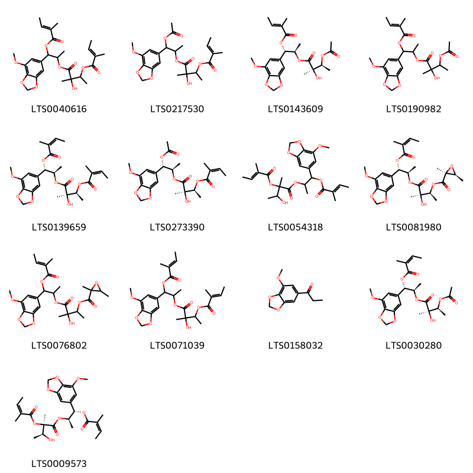{ width=100% }
    <figcaption>Hình ảnh cấu trúc hóa học của 13 hoạt chất thuộc nhóm Benzodioxoles gồm ['2-({2-hydroxy-2-methyl-3-[(2-methylbut-2-enoyl)oxy]butanoyl}oxy)-1-(7-methoxy-2h-1,3-benzodioxol-5-yl)propyl 2-methylbut-2-enoate (LTS0040616)', '4-{[1-(acetyloxy)-1-(7-methoxy-2h-1,3-benzodioxol-5-yl)propan-2-yl]oxy}-3-hydroxy-3-methyl-4-oxobutan-2-yl 2-methylbut-2-enoate (LTS0217530)', '(1s,2r)-2-{[(2r,3s)-3-(acetyloxy)-2-hydroxy-2-methylbutanoyl]oxy}-1-(7-methoxy-2h-1,3-benzodioxol-5-yl)propyl 2-methylbut-2-enoate (LTS0143609)', '2-{[3-(acetyloxy)-2-hydroxy-2-methylbutanoyl]oxy}-1-(7-methoxy-2h-1,3-benzodioxol-5-yl)propyl 2-methylbut-2-enoate (LTS0190982)', '(1s,2r)-2-{[(2r,3s)-2-hydroxy-2-methyl-3-{[(2z)-2-methylbut-2-enoyl]oxy}butanoyl]oxy}-1-(7-methoxy-2h-1,3-benzodioxol-5-yl)propyl (2z)-2-methylbut-2-enoate (LTS0139659)', '(2s,3r)-4-{[(1s,2r)-1-(acetyloxy)-1-(7-methoxy-2h-1,3-benzodioxol-5-yl)propan-2-yl]oxy}-3-hydroxy-3-methyl-4-oxobutan-2-yl (2z)-2-methylbut-2-enoate (LTS0273390)', '2-({3-hydroxy-2-methyl-2-[(2-methylbut-2-enoyl)oxy]butanoyl}oxy)-1-(7-methoxy-2h-1,3-benzodioxol-5-yl)propyl 2-methylbut-2-enoate (LTS0054318)', '(1s,2r)-2-{[(2r,3s)-3-[(z)-(2s,3s)-2,3-dimethyloxirane-2-carbonyloxy]-2-hydroxy-2-methylbutanoyl]oxy}-1-(7-methoxy-2h-1,3-benzodioxol-5-yl)propyl (2z)-2-methylbut-2-enoate (LTS0081980)', '2-{[3-(2,3-dimethyloxirane-2-carbonyloxy)-2-hydroxy-2-methylbutanoyl]oxy}-1-(7-methoxy-2h-1,3-benzodioxol-5-yl)propyl 2-methylbut-2-enoate (LTS0076802)', '2-[(2-hydroxy-2-methyl-3-{[(2e)-2-methylbut-2-enoyl]oxy}butanoyl)oxy]-1-(7-methoxy-2h-1,3-benzodioxol-5-yl)propyl (2e)-2-methylbut-2-enoate (LTS0071039)', '1-(7-methoxy-2h-1,3-benzodioxol-5-yl)propan-1-one (LTS0158032)', '(1s,2r)-2-{[(2r,3s)-3-(acetyloxy)-2-hydroxy-2-methylbutanoyl]oxy}-1-(7-methoxy-2h-1,3-benzodioxol-5-yl)propyl (2z)-2-methylbut-2-enoate (LTS0030280)', '(2r,3s)-3-hydroxy-1-{[(1s,2r)-1-(7-methoxy-2h-1,3-benzodioxol-5-yl)-1-{[(2z)-2-methylbut-2-enoyl]oxy}propan-2-yl]oxy}-2-methyl-1-oxobutan-2-yl (2z)-2-methylbut-2-enoate (LTS0009573)'].</figcaption>
</figure>
#### Nhóm Carboxylic acids and derivatives
<figure markdown="span">
    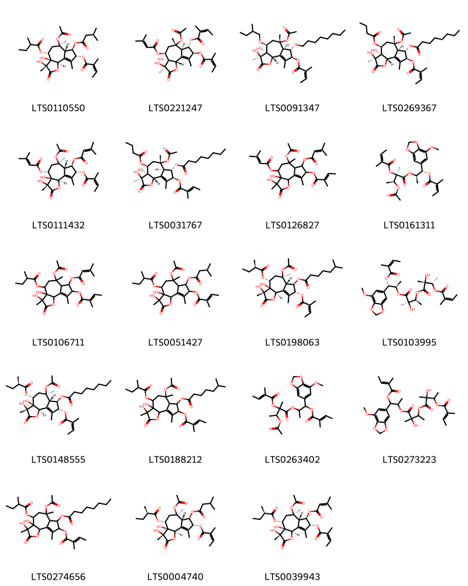{ width=100% }
    <figcaption>Hình ảnh cấu trúc hóa học của 19 hoạt chất thuộc nhóm Carboxylic acids and derivatives gồm ['(3r,3as,4r,6r,6as,7r,8r,9br)-6-(acetyloxy)-3,3a-dihydroxy-3,6,9-trimethyl-4-[(2-methylbutanoyl)oxy]-7-[(3-methylbutanoyl)oxy]-2-oxo-4h,5h,6ah,7h,8h,9bh-azuleno[4,5-b]furan-8-yl (2z)-2-methylbut-2-enoate (LTS0110550)', '(3s,3ar,4s,6s,6ar,7s,8s,9bs)-6-(acetyloxy)-3,3a-dihydroxy-3,6,9-trimethyl-4-[(3-methylbut-2-enoyl)oxy]-8-{[(2z)-2-methylbut-2-enoyl]oxy}-2-oxo-4h,5h,6ah,7h,8h,9bh-azuleno[4,5-b]furan-7-yl (2z)-2-methylbut-2-enoate (LTS0221247)', '(3s,3ar,4s,6s,6ar,7s,8s,9bs)-6-(acetyloxy)-3,3a-dihydroxy-3,6,9-trimethyl-4-(2-methylbutoxy)-7-(octyloxy)-2-oxo-4h,5h,6ah,7h,8h,9bh-azuleno[4,5-b]furan-8-yl (2z)-2-methylbut-2-enoate (LTS0091347)', 'thapsigargin (LTS0269367)', '(3r,3as,4r,6r,6as,7r,8r,9br)-6-(acetyloxy)-3,3a-dihydroxy-3,6,9-trimethyl-4-[(3-methylbut-2-enoyl)oxy]-8-{[(2z)-2-methylbut-2-enoyl]oxy}-2-oxo-4h,5h,6ah,7h,8h,9bh-azuleno[4,5-b]furan-7-yl 3-methylbut-2-enoate (LTS0111432)', '(3s,3ar,4s,6s,6ar,7s,8s,9bs)-6-(acetyloxy)-4-(butanoyloxy)-3,3a-dihydroxy-3,6,9-trimethyl-8-[(2-methylbut-2-enoyl)oxy]-2-oxo-4h,5h,6ah,7h,8h,9bh-azuleno[4,5-b]furan-7-yl octanoate (LTS0031767)', '6-(acetyloxy)-3,3a-dihydroxy-3,6,9-trimethyl-8-[(2-methylbut-2-enoyl)oxy]-4-[(3-methylbut-2-enoyl)oxy]-2-oxo-4h,5h,6ah,7h,8h,9bh-azuleno[4,5-b]furan-7-yl 3-methylbut-2-enoate (LTS0126827)', '(2r,3s)-3-(acetyloxy)-1-{[(1s,2r)-1-(7-methoxy-2h-1,3-benzodioxol-5-yl)-1-{[(2z)-2-methylbut-2-enoyl]oxy}propan-2-yl]oxy}-2-methyl-1-oxobutan-2-yl (2z)-2-methylbut-2-enoate (LTS0161311)', '6-(acetyloxy)-3,3a-dihydroxy-3,6,9-trimethyl-8-[(2-methylbut-2-enoyl)oxy]-4-[(2-methylbutanoyl)oxy]-2-oxo-4h,5h,6ah,7h,8h,9bh-azuleno[4,5-b]furan-7-yl 3-methylbut-2-enoate (LTS0106711)', '6-(acetyloxy)-3,3a-dihydroxy-3,6,9-trimethyl-4-[(2-methylbutanoyl)oxy]-7-[(3-methylbutanoyl)oxy]-2-oxo-4h,5h,6ah,7h,8h,9bh-azuleno[4,5-b]furan-8-yl 2-methylbut-2-enoate (LTS0051427)', '(3r,3as,4r,6r,6as,7r,8r,9br)-6-(acetyloxy)-3,3a-dihydroxy-3,6,9-trimethyl-8-{[(2z)-2-methylbut-2-enoyl]oxy}-4-{[(2r)-2-methylbutanoyl]oxy}-2-oxo-4h,5h,6ah,7h,8h,9bh-azuleno[4,5-b]furan-7-yl 6-methylheptanoate (LTS0198063)', '(1s,2r)-2-{[(2r,3s)-2-hydroxy-3-{[(2r,3s)-2-hydroxy-2-methyl-3-{[(2z)-2-methylbut-2-enoyl]oxy}butanoyl]oxy}-2-methylbutanoyl]oxy}-1-(7-methoxy-2h-1,3-benzodioxol-5-yl)propyl (2z)-2-methylbut-2-enoate (LTS0103995)', '(3r,3as,4r,6r,6as,7r,8r,9br)-6-(acetyloxy)-3,3a-dihydroxy-3,6,9-trimethyl-8-{[(2z)-2-methylbut-2-enoyl]oxy}-4-{[(2r)-2-methylbutanoyl]oxy}-2-oxo-4h,5h,6ah,7h,8h,9bh-azuleno[4,5-b]furan-7-yl octanoate (LTS0148555)', '6-(acetyloxy)-3,3a-dihydroxy-3,6,9-trimethyl-8-[(2-methylbut-2-enoyl)oxy]-4-[(2-methylbutanoyl)oxy]-2-oxo-4h,5h,6ah,7h,8h,9bh-azuleno[4,5-b]furan-7-yl 6-methylheptanoate (LTS0188212)', '2-{[3-(acetyloxy)-2-methyl-2-[(2-methylbut-2-enoyl)oxy]butanoyl]oxy}-1-(7-methoxy-2h-1,3-benzodioxol-5-yl)propyl 2-methylbut-2-enoate (LTS0263402)', '2-{[2-hydroxy-3-({2-hydroxy-2-methyl-3-[(2-methylbut-2-enoyl)oxy]butanoyl}oxy)-2-methylbutanoyl]oxy}-1-(7-methoxy-2h-1,3-benzodioxol-5-yl)propyl 2-methylbut-2-enoate (LTS0273223)', '6-(acetyloxy)-3,3a-dihydroxy-3,6,9-trimethyl-8-[(2-methylbut-2-enoyl)oxy]-4-[(2-methylbutanoyl)oxy]-2-oxo-4h,5h,6ah,7h,8h,9bh-azuleno[4,5-b]furan-7-yl octanoate (LTS0274656)', '(3r,3as,4r,6r,6as,7r,8r,9br)-6-(acetyloxy)-3,3a-dihydroxy-3,6,9-trimethyl-7-[(3-methylbutanoyl)oxy]-4-{[(2r)-2-methylbutanoyl]oxy}-2-oxo-4h,5h,6ah,7h,8h,9bh-azuleno[4,5-b]furan-8-yl (2z)-2-methylbut-2-enoate (LTS0004740)', '(3r,3as,4r,6r,6as,7r,8r,9br)-6-(acetyloxy)-3,3a-dihydroxy-3,6,9-trimethyl-8-{[(2z)-2-methylbut-2-enoyl]oxy}-4-{[(2r)-2-methylbutanoyl]oxy}-2-oxo-4h,5h,6ah,7h,8h,9bh-azuleno[4,5-b]furan-7-yl 3-methylbut-2-enoate (LTS0039943)'].</figcaption>
</figure>
#### Nhóm Cinnamic acids and derivatives
<figure markdown="span">
    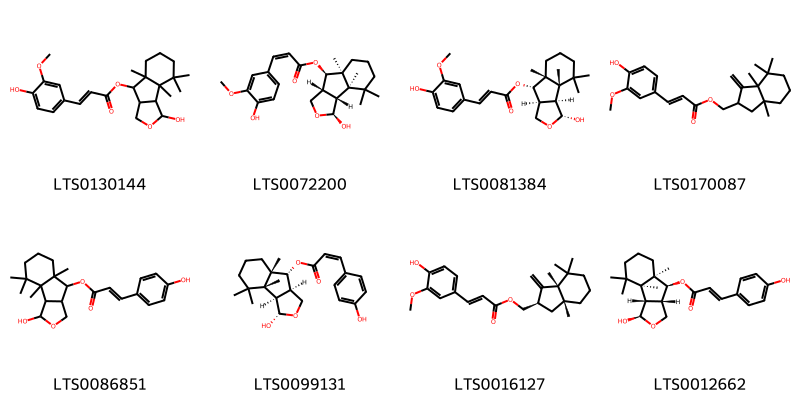{ width=100% }
    <figcaption>Hình ảnh cấu trúc hóa học của 8 hoạt chất thuộc nhóm Cinnamic acids and derivatives gồm ['3-hydroxy-3b,4,4,7a-tetramethyl-octahydroindeno[1,2-c]furan-8-yl 3-(4-hydroxy-3-methoxyphenyl)prop-2-enoate (LTS0130144)', '(3s,3ar,3br,7as,8r,8ar)-3-hydroxy-3b,4,4,7a-tetramethyl-octahydroindeno[1,2-c]furan-8-yl (2z)-3-(4-hydroxy-3-methoxyphenyl)prop-2-enoate (LTS0072200)', '(3r,3as,3bs,7ar,8s,8as)-3-hydroxy-3b,4,4,7a-tetramethyl-octahydroindeno[1,2-c]furan-8-yl (2e)-3-(4-hydroxy-3-methoxyphenyl)prop-2-enoate (LTS0081384)', '(3a,7,7,7a-tetramethyl-1-methylidene-tetrahydro-2h-inden-2-yl)methyl 3-(4-hydroxy-3-methoxyphenyl)prop-2-enoate (LTS0170087)', '3-hydroxy-3b,4,4,7a-tetramethyl-octahydroindeno[1,2-c]furan-8-yl 3-(4-hydroxyphenyl)prop-2-enoate (LTS0086851)', '(3s,3ar,3br,7as,8r,8ar)-3-hydroxy-3b,4,4,7a-tetramethyl-octahydroindeno[1,2-c]furan-8-yl (2z)-3-(4-hydroxyphenyl)prop-2-enoate (LTS0099131)', '[(2r,3ar,7ar)-3a,7,7,7a-tetramethyl-1-methylidene-tetrahydro-2h-inden-2-yl]methyl (2e)-3-(4-hydroxy-3-methoxyphenyl)prop-2-enoate (LTS0016127)', '(3r,3as,3bs,7ar,8s,8as)-3-hydroxy-3b,4,4,7a-tetramethyl-octahydroindeno[1,2-c]furan-8-yl (2e)-3-(4-hydroxyphenyl)prop-2-enoate (LTS0012662)'].</figcaption>
</figure>
#### Nhóm Fatty Acyls
<figure markdown="span">
    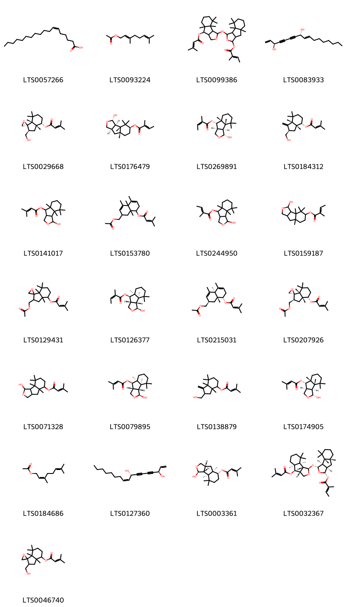{ width=100% }
    <figcaption>Hình ảnh cấu trúc hóa học của 25 hoạt chất thuộc nhóm Fatty Acyls gồm ['petroselinic acid (LTS0057266)', 'geranyl acetate (LTS0093224)', '3-({3b,4,4,7a-tetramethyl-8-[(3-methylbut-2-enoyl)oxy]-octahydroindeno[1,2-c]furan-3-yl}oxy)-3b,4,4,7a-tetramethyl-octahydroindeno[1,2-c]furan-1-yl 2-methylbut-2-enoate (LTS0099386)', '(3s,8r)-heptadeca-1,9-dien-4,6-diyne-3,8-diol (LTS0083933)', "(1r,2s,3ar,4s,7ar)-2-(hydroxymethyl)-3a,7,7,7a-tetramethyl-tetrahydro-2h-spiro[indene-1,2'-oxiran]-4-yl 3-methylbut-2-enoate (LTS0029668)", '(3s,3ar,3bs,5s,7ar,8ar)-3-hydroxy-3b,4,4,7a-tetramethyl-octahydroindeno[1,2-c]furan-5-yl (2e)-2-methylbut-2-enoate (LTS0176479)', '(3r,3as,3bs,7ar,8s,8as)-3-hydroxy-3b,4,4,7a-tetramethyl-octahydroindeno[1,2-c]furan-8-yl (2z)-2-methylbut-2-enoate (LTS0269891)', '(2r,3ar,4s,7as)-2-(hydroxymethyl)-3a,7,7,7a-tetramethyl-1-methylidene-tetrahydro-2h-inden-4-yl 3-methylbut-2-enoate (LTS0184312)', '3-hydroxy-3b,4,4,7a-tetramethyl-octahydroindeno[1,2-c]furan-8-yl 3-methylbut-2-enoate (LTS0141017)', '7-[(acetyloxy)methyl]-4,4a,5,8a-tetramethyl-1,2,7,8-tetrahydronaphthalen-1-yl 3-methylbut-2-enoate (LTS0153780)', '3-hydroxy-3b,4,4,7a-tetramethyl-octahydroindeno[1,2-c]furan-8-yl 2-methylbut-2-enoate (LTS0244950)', '3-hydroxy-3b,4,4,7a-tetramethyl-octahydroindeno[1,2-c]furan-5-yl 2-methylbut-2-enoate (LTS0159187)', "2-[(acetyloxy)methyl]-3a,7,7,7a-tetramethyl-tetrahydro-2h-spiro[indene-1,2'-oxiran]-4-yl 3-methylbut-2-enoate (LTS0129431)", '(3s,3ar,3br,7as,8r,8ar)-3-hydroxy-3b,4,4,7a-tetramethyl-octahydroindeno[1,2-c]furan-8-yl (2z)-2-methylbut-2-enoate (LTS0126377)', '(1s,4ar,7r,8ar)-7-[(acetyloxy)methyl]-4,4a,5,8a-tetramethyl-1,2,7,8-tetrahydronaphthalen-1-yl 3-methylbut-2-enoate (LTS0215031)', "(1r,2s,3ar,4s,7ar)-2-[(acetyloxy)methyl]-3a,7,7,7a-tetramethyl-tetrahydro-2h-spiro[indene-1,2'-oxiran]-4-yl 3-methylbut-2-enoate (LTS0207926)", '3-hydroxy-3b,4,4,7a-tetramethyl-octahydroindeno[1,2-c]furan-7-yl 3-methylbut-2-enoate (LTS0071328)', '(3s,3ar,3br,7as,8r,8ar)-3-hydroxy-3b,4,4,7a-tetramethyl-octahydroindeno[1,2-c]furan-8-yl 3-methylbut-2-enoate (LTS0079895)', '2-(hydroxymethyl)-3a,7,7,7a-tetramethyl-1-methylidene-tetrahydro-2h-inden-4-yl 3-methylbut-2-enoate (LTS0138879)', '(3r,3as,3bs,7ar,8s,8as)-3-hydroxy-3b,4,4,7a-tetramethyl-octahydroindeno[1,2-c]furan-8-yl 3-methylbut-2-enoate (LTS0174905)', '3,7-dimethylocta-2,6-dien-1-yl acetate (LTS0184686)', 'falcarindiol (LTS0127360)', '(3s,3ar,3br,7r,7ar,8ar)-3-hydroxy-3b,4,4,7a-tetramethyl-octahydroindeno[1,2-c]furan-7-yl 3-methylbut-2-enoate (LTS0003361)', '(1s,3s,3ar,3br,7ar,8ar)-3-{[(3r,3ar,3br,7as,8r,8ar)-3b,4,4,7a-tetramethyl-8-[(3-methylbut-2-enoyl)oxy]-octahydroindeno[1,2-c]furan-3-yl]oxy}-3b,4,4,7a-tetramethyl-octahydroindeno[1,2-c]furan-1-yl (2e)-2-methylbut-2-enoate (LTS0032367)', "2-(hydroxymethyl)-3a,7,7,7a-tetramethyl-tetrahydro-2h-spiro[indene-1,2'-oxiran]-4-yl 3-methylbut-2-enoate (LTS0046740)"].</figcaption>
</figure>
#### Nhóm Organooxygen compounds
<figure markdown="span">
    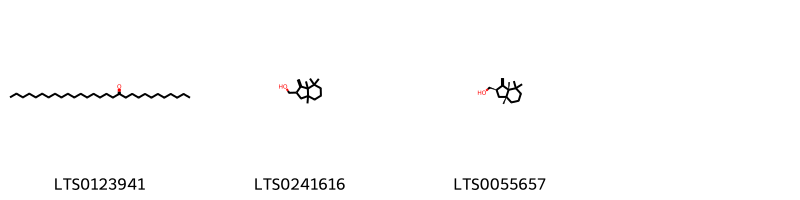{ width=100% }
    <figcaption>Hình ảnh cấu trúc hóa học của 3 hoạt chất thuộc nhóm Organooxygen compounds gồm ['nonacosan-12-one (LTS0123941)', '(3a,7,7,7a-tetramethyl-1-methylidene-tetrahydro-2h-inden-2-yl)methanol (LTS0241616)', '[(2r,3ar,7ar)-3a,7,7,7a-tetramethyl-1-methylidene-tetrahydro-2h-inden-2-yl]methanol (LTS0055657)'].</figcaption>
</figure>
#### Nhóm Oxolanes
<figure markdown="span">
    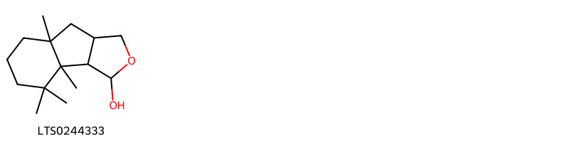{ width=100% }
    <figcaption>Hình ảnh cấu trúc hóa học của 1 hoạt chất thuộc nhóm Oxolanes gồm ['3b,4,4,7a-tetramethyl-octahydroindeno[1,2-c]furan-3-ol (LTS0244333)'].</figcaption>
</figure>
#### Nhóm Phenol ethers
<figure markdown="span">
    { width=100% }
    <figcaption>Hình ảnh cấu trúc hóa học của 1 hoạt chất thuộc nhóm Phenol ethers gồm ['elemicin (LTS0188875)'].</figcaption>
</figure>
#### Nhóm Prenol lipids
<figure markdown="span">
    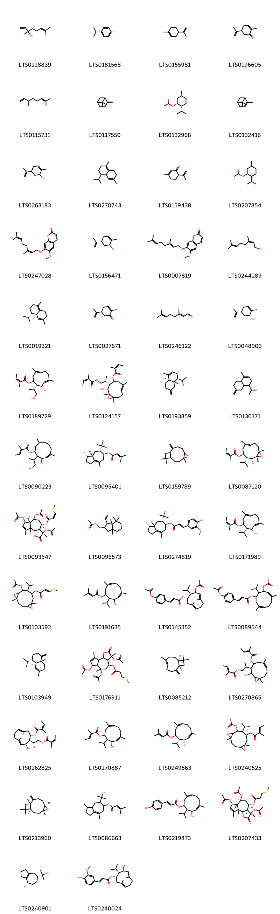{ width=100% }
    <figcaption>Hình ảnh cấu trúc hóa học của 70 hoạt chất thuộc nhóm Prenol lipids gồm ['linalool, (+-)- (LTS0128839)', 'cymene (LTS0181568)', 'limonene,  (LTS0155981)', 'carvone (LTS0196605)', 'α-myrcene (LTS0115731)', 'β-pinene (LTS0117550)', 'menthyl acetate (LTS0132968)', 'α pinene (LTS0132416)', 'carveol (LTS0263183)', '4-isopropyl-1,6-dimethyl-2,3,4,4a,7,8-hexahydronaphthalene (LTS0270743)', 'isopiperitenone (LTS0159438)', 'l-menthyl acetate (LTS0207854)', '7-[(3,7-dimethylocta-2,6-dien-1-yl)oxy]-6-methoxychromen-2-one (LTS0247028)', '(-)-trans-carveol (LTS0156471)', '7-{[(2e)-3,7-dimethylocta-2,6-dien-1-yl]oxy}-6-methoxychromen-2-one (LTS0007819)', 'nerol (LTS0244289)', 'delta-cadinene (LTS0019321)', 'carvone, (+)- (LTS0027671)', 'α-citral (LTS0246122)', '(-)-cis-carveol (LTS0048903)', '(1s,3e,7e,9s,10s)-9-hydroxy-10-[(2s)-1-hydroxypropan-2-yl]-3,7-dimethylcyclodeca-3,7-dien-1-yl (2z)-2-methylbut-2-enoate (LTS0189729)', '(2s)-2-[(1r,2r,3s,4s,6e,10s)-2-hydroxy-6,10-dimethyl-4-{[(2z)-2-methylbut-2-enoyl]oxy}-11-oxabicyclo[8.1.0]undec-6-en-3-yl]propyl (2z)-2-methylbut-2-enoate (LTS0124157)', '(4s,4as,8ar)-4-isopropyl-1-methyl-6-methylidene-4,4a,5,7,8,8a-hexahydro-3h-naphthalene (LTS0193859)', '4-isopropyl-1-methyl-6-methylidene-4,4a,5,7,8,8a-hexahydro-3h-naphthalene (LTS0130171)', '9-hydroxy-10-(1-hydroxypropan-2-yl)-3,7-dimethylcyclodeca-3,7-dien-1-yl 2-methylbut-2-enoate (LTS0090223)', '(1s,6s,7s,8as)-7-(2-hydroxypropan-2-yl)-1,4-dimethyl-1,2,3,5,6,7,8,8a-octahydroazulen-6-yl 3-methylbut-2-enoate (LTS0095401)', 'caryophyllene oxide (LTS0159789)', '(1r,2r,3s,4s,6e,10s)-2-hydroxy-3-isopropyl-6,10-dimethyl-11-oxabicyclo[8.1.0]undec-6-en-4-yl (2z)-2-methylbut-2-enoate (LTS0087120)', '(3s,3ar,4s,6s,6ar,7r,9as,9bs)-3,6,7-tris(acetyloxy)-3,6,9-trimethyl-2-oxo-3ah,4h,5h,6ah,7h,9ah,9bh-azuleno[4,5-b]furan-4-yl (2z)-3-(methylsulfanyl)prop-2-enoate (LTS0093547)', '(1-formyl-3a,7,7,7a-tetramethyl-hexahydroinden-2-yl)methyl acetate (LTS0096573)', '(1s,6s,7s,8as)-7-(2-hydroxypropan-2-yl)-1,4-dimethyl-1,2,3,5,6,7,8,8a-octahydroazulen-6-yl (2e)-3-(4-hydroxy-3-methoxyphenyl)prop-2-enoate (LTS0274819)', '(1s,3e,7e,9s,10s)-9-hydroxy-10-isopropyl-3,7-dimethylcyclodeca-3,7-dien-1-yl (2z)-2-methylbut-2-enoate (LTS0171989)', '10-(acetyloxy)-9-isopropyl-1,6-dimethyl-5,12-dioxatricyclo[9.1.0.0⁴,⁶]dodecan-8-yl 3-(methylsulfanyl)prop-2-enoate (LTS0103592)', '9-hydroxy-10-isopropyl-3,7-dimethylcyclodeca-3,7-dien-1-yl 3-methylbut-2-enoate (LTS0191635)', '(1s,3e,7e,9s,10r)-9-(acetyloxy)-10-isopropyl-3,7-dimethylcyclodeca-3,7-dien-1-yl (2e)-3-[4-(acetyloxy)phenyl]prop-2-enoate (LTS0145352)', '9-(acetyloxy)-10-isopropyl-3,7-dimethylcyclodeca-3,7-dien-1-yl 3-[4-(acetyloxy)phenyl]prop-2-enoate (LTS0089544)', '(+)-gamma-cadinene (LTS0103949)', '3,6,7-tris(acetyloxy)-3,6,9-trimethyl-2-oxo-3ah,4h,5h,6ah,7h,9ah,9bh-azuleno[4,5-b]furan-4-yl 3-(methylsulfanyl)propanoate (LTS0176911)', 'caryophyllene (LTS0085212)', '2-{2-hydroxy-6,10-dimethyl-4-[(2-methylbut-2-enoyl)oxy]-11-oxabicyclo[8.1.0]undec-6-en-3-yl}propyl 2-methylbut-2-enoate (LTS0270865)', '(2s)-2-[(1s,2s,3e,7e,10s)-2-hydroxy-4,8-dimethyl-10-{[(2z)-2-methylbut-2-enoyl]oxy}cyclodeca-3,7-dien-1-yl]propyl (2z)-2-methylbut-2-enoate (LTS0262825)', '9-hydroxy-10-isopropyl-3,7-dimethylcyclodeca-3,7-dien-1-yl 2-methylbut-2-enoate (LTS0270887)', '(1s,3z,7z,9s,10s)-9-hydroxy-10-isopropyl-3,7-dimethylcyclodeca-3,7-dien-1-yl 3-methylbut-2-enoate (LTS0249563)', '10-(acetyloxy)-9-isopropyl-1,6-dimethyl-5,12-dioxatricyclo[9.1.0.0⁴,⁶]dodecan-8-yl 2-methylbut-2-enoate (LTS0240525)', 'β-caryophyllene oxide (LTS0213960)', '7-(2-hydroxypropan-2-yl)-1,4-dimethyl-1,2,3,5,6,7,8,8a-octahydroazulen-6-yl 3-methylbut-2-enoate (LTS0086663)', '9-hydroxy-10-isopropyl-3,7-dimethylcyclodeca-3,7-dien-1-yl 3-(4-hydroxyphenyl)prop-2-enoate (LTS0219873)', '(3s,3ar,4s,6s,6ar,7r,9as,9bs)-3,6,7-tris(acetyloxy)-3,6,9-trimethyl-2-oxo-3ah,4h,5h,6ah,7h,9ah,9bh-azuleno[4,5-b]furan-4-yl 3-(methylsulfanyl)propanoate (LTS0207433)', 'guaiol (LTS0240901)', '(1s,3e,7e,9s,10s)-9-hydroxy-10-isopropyl-3,7-dimethylcyclodeca-3,7-dien-1-yl (2e)-3-(4-hydroxy-3-methoxyphenyl)prop-2-enoate (LTS0240024)', '3,6,7-tris(acetyloxy)-3,6,9-trimethyl-2-oxo-3ah,4h,5h,6ah,7h,9ah,9bh-azuleno[4,5-b]furan-4-yl 3-(methylsulfanyl)prop-2-enoate (LTS0172578)', '7-(2-hydroxypropan-2-yl)-1,4-dimethyl-1,2,3,5,6,7,8,8a-octahydroazulen-6-yl 3-(4-hydroxyphenyl)prop-2-enoate (LTS0005203)', '(1s,4s,6r,8s,9r,10r,11r)-10-(acetyloxy)-9-isopropyl-1,6-dimethyl-5,12-dioxatricyclo[9.1.0.0⁴,⁶]dodecan-8-yl (2z)-3-(methylsulfanyl)prop-2-enoate (LTS0050559)', '(1r,2r,3r,4s,6e,10s)-2-(acetyloxy)-3-isopropyl-6,10-dimethyl-11-oxabicyclo[8.1.0]undec-6-en-4-yl (2z)-2-methylbut-2-enoate (LTS0009101)', '(1s,4r,6s,8s,9r,10r,11s)-10-(acetyloxy)-9-isopropyl-1,6-dimethyl-5,12-dioxatricyclo[9.1.0.0⁴,⁶]dodecan-8-yl (2z)-2-methylbut-2-enoate (LTS0004557)', '(1s,3e,7e,9s,10s)-9-hydroxy-10-isopropyl-3,7-dimethylcyclodeca-3,7-dien-1-yl (2e)-3-(4-hydroxyphenyl)prop-2-enoate (LTS0059479)', 'gamma-muurolene (LTS0052920)', '(1s,6s,7s,8as)-7-(2-hydroxypropan-2-yl)-1,4-dimethyl-1,2,3,5,6,7,8,8a-octahydroazulen-6-yl (2e)-3-(4-hydroxyphenyl)prop-2-enoate (LTS0245517)', '2-hydroxy-3-isopropyl-6,10-dimethyl-11-oxabicyclo[8.1.0]undec-6-en-4-yl 2-methylbut-2-enoate (LTS0065089)', '9-hydroxy-10-isopropyl-3,7-dimethylcyclodeca-3,7-dien-1-yl 3-(4-hydroxy-3-methoxyphenyl)prop-2-enoate (LTS0005969)', '(1s,3e,7e,9s,10r)-9-(acetyloxy)-10-isopropyl-3,7-dimethylcyclodeca-3,7-dien-1-yl (2e)-3-[4-(acetyloxy)-3-methoxyphenyl]prop-2-enoate (LTS0032561)', '2-{2-hydroxy-4,8-dimethyl-10-[(2-methylbut-2-enoyl)oxy]cyclodeca-3,7-dien-1-yl}propyl 2-methylbut-2-enoate (LTS0132740)', '2-(acetyloxy)-3-isopropyl-6,10-dimethyl-11-oxabicyclo[8.1.0]undec-6-en-4-yl 2-methylbut-2-enoate (LTS0033132)', '[(1r,2r,3ar,7ar)-1-formyl-3a,7,7,7a-tetramethyl-hexahydroinden-2-yl]methyl acetate (LTS0005200)', '4,11,11-trimethyl-8-methylidenebicyclo[7.2.0]undec-4-ene (LTS0256716)', '9-(acetyloxy)-10-isopropyl-3,7-dimethylcyclodeca-3,7-dien-1-yl 3-[4-(acetyloxy)-3-methoxyphenyl]prop-2-enoate (LTS0031773)', '2-(3,8-dimethyl-1,2,3,4,5,6,7,8-octahydroazulen-5-yl)propan-2-ol (LTS0099886)', '4-isopropyl-6-methyl-1-methylidene-3,4,4a,7,8,8a-hexahydro-2h-naphthalene (LTS0111070)', '7-(2-hydroxypropan-2-yl)-1,4-dimethyl-1,2,3,5,6,7,8,8a-octahydroazulen-6-yl 3-(4-hydroxy-3-methoxyphenyl)prop-2-enoate (LTS0035324)', '(1s,3e,7e,9s,10s)-9-hydroxy-10-isopropyl-3,7-dimethylcyclodeca-3,7-dien-1-yl 3-methylbut-2-enoate (LTS0259772)'].</figcaption>
</figure>
#### Nhóm Steroids and steroid derivatives
<figure markdown="span">
    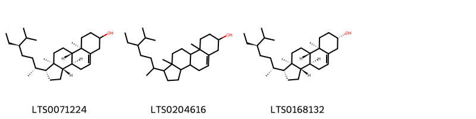{ width=100% }
    <figcaption>Hình ảnh cấu trúc hóa học của 3 hoạt chất thuộc nhóm Steroids and steroid derivatives gồm ['stigmast-5-en-3-ol (LTS0071224)', 'stigmast-5-en-3-ol, (3β)- (LTS0204616)', 'sitosterol (LTS0168132)'].</figcaption>
</figure>
#### Nhóm Tetrahydrofurans
<figure markdown="span">
    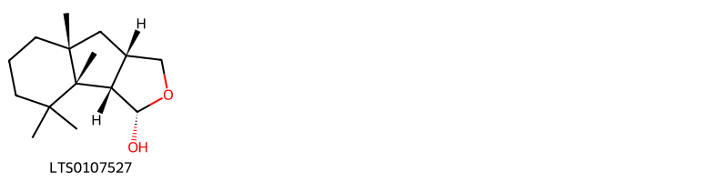{ width=100% }
    <figcaption>Hình ảnh cấu trúc hóa học của 1 hoạt chất thuộc nhóm Tetrahydrofurans gồm ['(3s,3as,3br,7ar,8as)-3b,4,4,7a-tetramethyl-octahydroindeno[1,2-c]furan-3-ol (LTS0107527)'].</figcaption>
</figure>
#### Nhóm Unsaturated hydrocarbons
<figure markdown="span">
    { width=100% }
    <figcaption>Hình ảnh cấu trúc hóa học của 1 hoạt chất thuộc nhóm Unsaturated hydrocarbons gồm ['α terpinene (LTS0232891)'].</figcaption>
</figure>

---

### Dược dân tộc học

Danh sách các quốc gia có sử dụng *Thapsia villosa* trong điều trị các bệnh. 

| Country   | Disease   | Bệnh                                                                                                                                                                                                |
|:----------|:----------|:----------------------------------------------------------------------------------------------------------------------------------------------------------------------------------------------------|
| ain       | Purgative | MYMEMORY WARNING: YOU USED ALL AVAILABLE FREE TRANSLATIONS FOR TODAY. NEXT AVAILABLE IN  07 HOURS 56 MINUTES 16 SECONDS VISIT HTTPS://MYMEMORY.TRANSLATED.NET/DOC/USAGELIMITS.PHP TO TRANSLATE MORE |

---

# Chi Dorema

??? note "Danh sách các dược liệu thuộc chi"
    
	 - *Dorema ammoniacum*

---
## Dorema ammoniacum
### Thông tin về thực vật

!!! info "Phân loại thực vật của *Ferula ammoniacum* từ GIBF:"
    - **Kingdom:** Plantae
    - **Phylum:** Tracheophyta
    - **Order:** Apiales
    - **Family:** Apiaceae
    - **Genus:** Ferula
    - **Species:** *Ferula ammoniacum*

 

| Label (VI)   | Label (EN)   | Scientific Name   | Descriptions (VI)   | Descriptions (EN)   | Also Known As (VI)   | Also Known As (EN)   |
|:-------------|:-------------|:------------------|:--------------------|:--------------------|:---------------------|:---------------------|
| N/A          | N/A          | Dorema ammoniacum | loài thực vật       | species of plant    | ['']                 | ['']                 |

#### Phân bố trên thế giới

**Từ CSDL GIBF** nan, Pakistan, Belgium, Iran (Islamic Republic of), Afghanistan, Turkmenistan, India, Algeria, unknown or invalid

#### Phân bố tại Việt Nam

**Từ CSDL GIBF**: Không có ghi nhận ở Việt Nam

---
### Thành phần hóa học
        
- Theo cơ sở dữ liệu lotus: Từ loài *Ferula ammoniacum* đã phân lập và xác định được 3 hoạt chất thuộc về các nhóm Prenol lipids. 

|    | chemicalTaxonomyClassyfireClass   |   smiles_count |
|---:|:----------------------------------|---------------:|
|  0 | Prenol lipids                     |              2 |

#### Nhóm Prenol lipids
<figure markdown="span">
    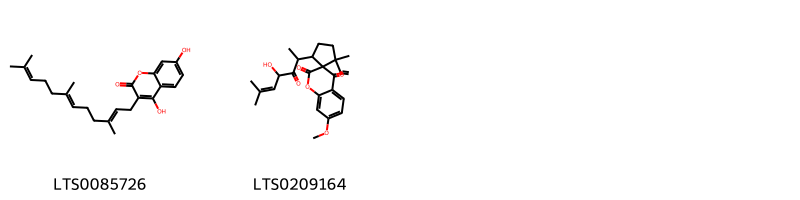{ width=100% }
    <figcaption>Hình ảnh cấu trúc hóa học của 2 hoạt chất thuộc nhóm Prenol lipids gồm ['ammoresinol (LTS0085726)', "5'-ethenyl-2'-(4-hydroxy-6-methyl-3-oxohept-5-en-2-yl)-7-methoxy-5'-methylspiro[1-benzopyran-3,1'-cyclopentane]-2,4-dione (LTS0209164)"].</figcaption>
</figure>

---

### Dược dân tộc học

Danh sách các quốc gia có sử dụng *Ferula ammoniacum* trong điều trị các bệnh. 

| Country   | Disease                                                      | Bệnh                                                                                                                                                                                                |
|:----------|:-------------------------------------------------------------|:----------------------------------------------------------------------------------------------------------------------------------------------------------------------------------------------------|
| Elsewhere | Expectorant, Stimulant, Antiseptic, Carminative, Expectorant | MYMEMORY WARNING: YOU USED ALL AVAILABLE FREE TRANSLATIONS FOR TODAY. NEXT AVAILABLE IN  07 HOURS 55 MINUTES 42 SECONDS VISIT HTTPS://MYMEMORY.TRANSLATED.NET/DOC/USAGELIMITS.PHP TO TRANSLATE MORE |
| France    | Expectorant                                                  | MYMEMORY WARNING: YOU USED ALL AVAILABLE FREE TRANSLATIONS FOR TODAY. NEXT AVAILABLE IN  07 HOURS 55 MINUTES 40 SECONDS VISIT HTTPS://MYMEMORY.TRANSLATED.NET/DOC/USAGELIMITS.PHP TO TRANSLATE MORE |
| Turkey    | Diuretic, Stimulant, Expectorant                             | MYMEMORY WARNING: YOU USED ALL AVAILABLE FREE TRANSLATIONS FOR TODAY. NEXT AVAILABLE IN  07 HOURS 55 MINUTES 37 SECONDS VISIT HTTPS://MYMEMORY.TRANSLATED.NET/DOC/USAGELIMITS.PHP TO TRANSLATE MORE |

---

# Chi Malabaila

??? note "Danh sách các dược liệu thuộc chi"
    
	 - *Malabaila sekakul*

---
## Malabaila sekakul
### Thông tin về thực vật

!!! info "Phân loại thực vật của *Malabaila sekakul* từ GIBF:"
    - **Kingdom:** Plantae
    - **Phylum:** Tracheophyta
    - **Order:** Apiales
    - **Family:** Apiaceae
    - **Genus:** Pastinaca
    - **Species:** *Malabaila sekakul*

 

| Label (VI)   | Label (EN)   | Scientific Name   | Descriptions (VI)   | Descriptions (EN)   | Also Known As (VI)   | Also Known As (EN)   |
|:-------------|:-------------|:------------------|:--------------------|:--------------------|:---------------------|:---------------------|
| N/A          | N/A          | Dorema ammoniacum | loài thực vật       | species of plant    | ['']                 | ['']                 |

#### Phân bố trên thế giới

**Từ CSDL GIBF** nan, Syrian Arab Republic, Iraq, Egypt, Türkiye, Jordan, Israel

#### Phân bố tại Việt Nam

**Từ CSDL GIBF**: Không có ghi nhận ở Việt Nam

---
### Thành phần hóa học
        
- Theo cơ sở dữ liệu lotus: Từ loài *Malabaila sekakul* đã phân lập và xác định được Chưa có hoạt chất nào được phân lập. hoạt chất thuộc về các nhóm Không có hoạt chất nào được phân lập. 

Không có hình ảnh nào được tạo ra

---

### Dược dân tộc học

Danh sách các quốc gia có sử dụng *Malabaila sekakul* trong điều trị các bệnh. 

| Country   | Disease     | Bệnh                                                                                                                                                                                                |
|:----------|:------------|:----------------------------------------------------------------------------------------------------------------------------------------------------------------------------------------------------|
| Arabia    | Aphrodisiac | MYMEMORY WARNING: YOU USED ALL AVAILABLE FREE TRANSLATIONS FOR TODAY. NEXT AVAILABLE IN  07 HOURS 55 MINUTES 19 SECONDS VISIT HTTPS://MYMEMORY.TRANSLATED.NET/DOC/USAGELIMITS.PHP TO TRANSLATE MORE |

---

# Chi Cicuta

??? note "Danh sách các dược liệu thuộc chi"
    
	 - *Cicuta douglasii*
	 - *Cicuta maculata*
	 - *Cicuta virosa*

---
## Cicuta douglasii
### Thông tin về thực vật

!!! info "Phân loại thực vật của *Cicuta douglasii* từ GIBF:"
    - **Kingdom:** Plantae
    - **Phylum:** Tracheophyta
    - **Order:** Apiales
    - **Family:** Apiaceae
    - **Genus:** Cicuta
    - **Species:** *Cicuta douglasii*

 

| Label (VI)   | Label (EN)   | Scientific Name   | Descriptions (VI)   | Descriptions (EN)   | Also Known As (VI)   | Also Known As (EN)   |
|:-------------|:-------------|:------------------|:--------------------|:--------------------|:---------------------|:---------------------|
| N/A          | N/A          | Cicuta douglasii  |                     | species of plant    | ['']                 | ['']                 |

#### Phân bố trên thế giới

**Từ CSDL GIBF** United States of America, Canada

#### Phân bố tại Việt Nam

**Từ CSDL GIBF**: Không có ghi nhận ở Việt Nam

---
### Thành phần hóa học
        
- Theo cơ sở dữ liệu lotus: Từ loài *Cicuta douglasii* đã phân lập và xác định được Chưa có hoạt chất nào được phân lập. hoạt chất thuộc về các nhóm Không có hoạt chất nào được phân lập. 

Không có hình ảnh nào được tạo ra

---

### Dược dân tộc học

Danh sách các quốc gia có sử dụng *Cicuta douglasii* trong điều trị các bệnh. 

| Country          | Disease                  | Bệnh                                                                                                                                                                                                |
|:-----------------|:-------------------------|:----------------------------------------------------------------------------------------------------------------------------------------------------------------------------------------------------|
| Canada(Kwakiutl) | Emetic, Poultice, Poison | MYMEMORY WARNING: YOU USED ALL AVAILABLE FREE TRANSLATIONS FOR TODAY. NEXT AVAILABLE IN  07 HOURS 55 MINUTES 01 SECONDS VISIT HTTPS://MYMEMORY.TRANSLATED.NET/DOC/USAGELIMITS.PHP TO TRANSLATE MORE |
| Canada(Salish)   | Purgative, Emetic        | MYMEMORY WARNING: YOU USED ALL AVAILABLE FREE TRANSLATIONS FOR TODAY. NEXT AVAILABLE IN  07 HOURS 54 MINUTES 59 SECONDS VISIT HTTPS://MYMEMORY.TRANSLATED.NET/DOC/USAGELIMITS.PHP TO TRANSLATE MORE |
| US(Flathead)     | Poison                   | MYMEMORY WARNING: YOU USED ALL AVAILABLE FREE TRANSLATIONS FOR TODAY. NEXT AVAILABLE IN  07 HOURS 54 MINUTES 56 SECONDS VISIT HTTPS://MYMEMORY.TRANSLATED.NET/DOC/USAGELIMITS.PHP TO TRANSLATE MORE |

---

---
## Cicuta maculata
### Thông tin về thực vật

!!! info "Phân loại thực vật của *Cicuta maculata* từ GIBF:"
    - **Kingdom:** Plantae
    - **Phylum:** Tracheophyta
    - **Order:** Apiales
    - **Family:** Apiaceae
    - **Genus:** Cicuta
    - **Species:** *Cicuta maculata*

 

| Label (VI)   | Label (EN)   | Scientific Name   | Descriptions (VI)   | Descriptions (EN)   | Also Known As (VI)   | Also Known As (EN)                                                              |
|:-------------|:-------------|:------------------|:--------------------|:--------------------|:---------------------|:--------------------------------------------------------------------------------|
| N/A          | N/A          | Cicuta maculata   | loài thực vật       | species of plant    | ['']                 | ['spotted water hemlock', 'spotted parsley', 'spotted cowbane', 'suicide root'] |

#### Phân bố trên thế giới

**Từ CSDL GIBF** United States of America, Canada

#### Phân bố tại Việt Nam

**Từ CSDL GIBF**: Không có ghi nhận ở Việt Nam

---
### Thành phần hóa học
        
- Theo cơ sở dữ liệu lotus: Từ loài *Cicuta maculata* đã phân lập và xác định được 2 hoạt chất thuộc về các nhóm Lignan lactones. 

|    | chemicalTaxonomyClassyfireClass   |   smiles_count |
|---:|:----------------------------------|---------------:|
|  0 | Lignan lactones                   |              2 |

#### Nhóm Lignan lactones
<figure markdown="span">
    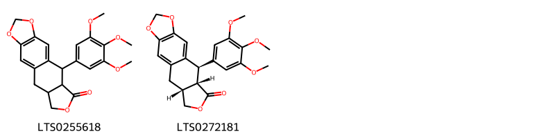{ width=100% }
    <figcaption>Hình ảnh cấu trúc hóa học của 2 hoạt chất thuộc nhóm Lignan lactones gồm ['10-(3,4,5-trimethoxyphenyl)-4,6,13-trioxatetracyclo[7.7.0.0³,⁷.0¹¹,¹⁵]hexadeca-1,3(7),8-trien-12-one (LTS0255618)', '(10r,11s,15r)-10-(3,4,5-trimethoxyphenyl)-4,6,13-trioxatetracyclo[7.7.0.0³,⁷.0¹¹,¹⁵]hexadeca-1,3(7),8-trien-12-one (LTS0272181)'].</figcaption>
</figure>

---

### Dược dân tộc học

Danh sách các quốc gia có sử dụng *Cicuta maculata* trong điều trị các bệnh. 

| Country      | Disease       | Bệnh                                                                                                                                                                                                |
|:-------------|:--------------|:----------------------------------------------------------------------------------------------------------------------------------------------------------------------------------------------------|
| US(Cherokee) | Contraceptive | MYMEMORY WARNING: YOU USED ALL AVAILABLE FREE TRANSLATIONS FOR TODAY. NEXT AVAILABLE IN  07 HOURS 54 MINUTES 33 SECONDS VISIT HTTPS://MYMEMORY.TRANSLATED.NET/DOC/USAGELIMITS.PHP TO TRANSLATE MORE |

---

---
## Cicuta virosa
### Thông tin về thực vật

!!! info "Phân loại thực vật của *Cicuta virosa* từ GIBF:"
    - **Kingdom:** Plantae
    - **Phylum:** Tracheophyta
    - **Order:** Apiales
    - **Family:** Apiaceae
    - **Genus:** Cicuta
    - **Species:** *Cicuta virosa*

 

| Label (VI)   | Label (EN)   | Scientific Name   | Descriptions (VI)   | Descriptions (EN)   | Also Known As (VI)   | Also Known As (EN)         |
|:-------------|:-------------|:------------------|:--------------------|:--------------------|:---------------------|:---------------------------|
| N/A          | N/A          | Cicuta virosa     |                     | species of plant    | ['']                 | ['northern water hemlock'] |

#### Phân bố trên thế giới

**Từ CSDL GIBF** Ukraine, Denmark, Finland, Netherlands, Lithuania, Belarus, United Kingdom of Great Britain and Northern Ireland, Germany, Hungary, Ireland, Switzerland, Russian Federation, Sweden, Poland, Norway, China, Austria

#### Phân bố tại Việt Nam

**Từ CSDL GIBF**: Không có ghi nhận ở Việt Nam

---
### Thành phần hóa học
        
- Theo cơ sở dữ liệu lotus: Từ loài *Cicuta virosa* đã phân lập và xác định được 52 hoạt chất thuộc về các nhóm Fatty Acyls, Prenol lipids, Coumarins and derivatives. 

|    | chemicalTaxonomyClassyfireClass   |   smiles_count |
|---:|:----------------------------------|---------------:|
|  0 | Coumarins and derivatives         |             22 |
|  1 | Fatty Acyls                       |             25 |
|  2 | Prenol lipids                     |              4 |

#### Nhóm Coumarins and derivatives
<figure markdown="span">
    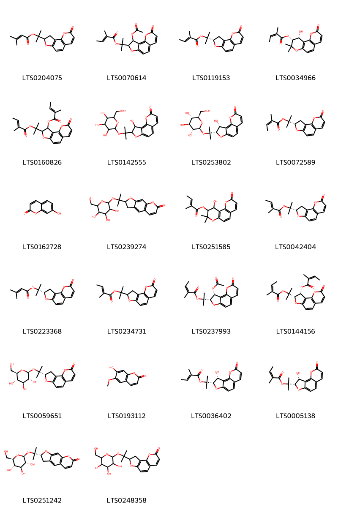{ width=100% }
    <figcaption>Hình ảnh cấu trúc hóa học của 22 hoạt chất thuộc nhóm Coumarins and derivatives gồm ['2-{2-oxo-8h,9h-furo[2,3-h]chromen-8-yl}propan-2-yl 3-methylbut-2-enoate (LTS0204075)', '2-[9-(acetyloxy)-2-oxo-8h,9h-furo[2,3-h]chromen-8-yl]propan-2-yl 2-methylbut-2-enoate (LTS0070614)', '2-[(8s)-2-oxo-8h,9h-furo[2,3-h]chromen-8-yl]propan-2-yl (2e)-2-methylbut-2-enoate (LTS0119153)', '(9r,10r)-10-hydroxy-8,8-dimethyl-2-oxo-9h,10h-pyrano[2,3-h]chromen-9-yl (2z)-2-methylbut-2-enoate (LTS0034966)', '2-{9-[(2-methylbut-2-enoyl)oxy]-2-oxo-8h,9h-furo[2,3-h]chromen-8-yl}propan-2-yl 2-methylbut-2-enoate (LTS0160826)', 'apterin (LTS0142555)', 'apterin (LTS0253802)', '2-[(8s)-2-oxo-8h,9h-furo[2,3-h]chromen-8-yl]propan-2-yl (2z)-2-methylbut-2-enoate (LTS0072589)', 'umbelliferone (LTS0162728)', '2-(2-{[3,4,5-trihydroxy-6-(hydroxymethyl)oxan-2-yl]oxy}propan-2-yl)-2h,3h-furo[3,2-g]chromen-7-one (LTS0239274)', '10-hydroxy-8,8-dimethyl-2-oxo-9h,10h-pyrano[2,3-h]chromen-9-yl 2-methylbut-2-enoate (LTS0251585)', '2-[(8s)-2-oxo-8h,9h-furo[2,3-h]chromen-8-yl]propan-2-yl 2-methylbut-2-enoate (LTS0042404)', 'libanorin (LTS0223368)', '2-{2-oxo-8h,9h-furo[2,3-h]chromen-8-yl}propan-2-yl 2-methylbut-2-enoate (LTS0234731)', '2-[(8s,9r)-9-(acetyloxy)-2-oxo-8h,9h-furo[2,3-h]chromen-8-yl]propan-2-yl (2z)-2-methylbut-2-enoate (LTS0237993)', 'archangelicine (LTS0144156)', '(8s)-8-(2-{[(2s,3r,4s,5s,6r)-3,4,5-trihydroxy-6-(hydroxymethyl)oxan-2-yl]oxy}propan-2-yl)-8h,9h-furo[2,3-h]chromen-2-one (LTS0059651)', 'scopoletin (LTS0193112)', '2-[(8s,9r)-9-hydroxy-2-oxo-8h,9h-furo[2,3-h]chromen-8-yl]propan-2-yl 2-methylbut-2-enoate (LTS0036402)', '2-[(8s,9r)-9-hydroxy-2-oxo-8h,9h-furo[2,3-h]chromen-8-yl]propan-2-yl (2z)-2-methylbut-2-enoate (LTS0005138)', 'nodakenin (LTS0251242)', '8-(2-{[3,4,5-trihydroxy-6-(hydroxymethyl)oxan-2-yl]oxy}propan-2-yl)-8h,9h-furo[2,3-h]chromen-2-one (LTS0248358)'].</figcaption>
</figure>
#### Nhóm Fatty Acyls
<figure markdown="span">
    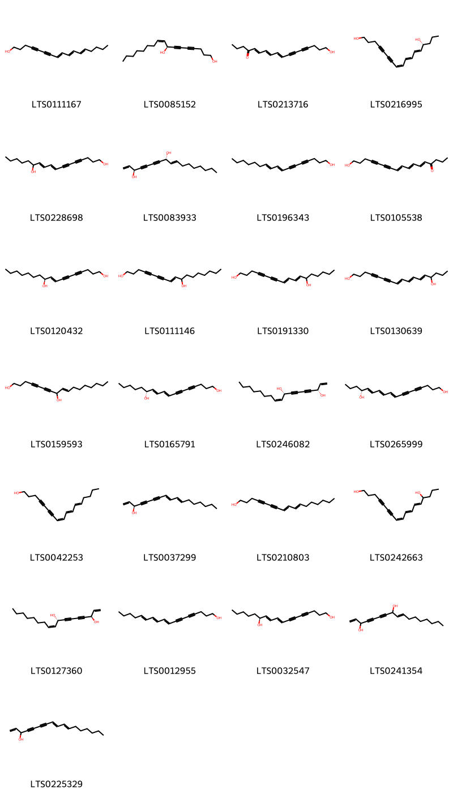{ width=100% }
    <figcaption>Hình ảnh cấu trúc hóa học của 25 hoạt chất thuộc nhóm Fatty Acyls gồm ['heptadeca-8,10,12-trien-4,6-diyn-1-ol (LTS0111167)', '(8s,9z)-heptadec-9-en-4,6-diyne-1,8-diol (LTS0085152)', '(5e,7e,9e)-17-hydroxyheptadeca-5,7,9-trien-11,13-diyn-4-one (LTS0213716)', '(8z,10e,12e,14r)-heptadeca-8,10,12-trien-4,6-diyne-1,14-diol (LTS0216995)', '(8e,10e)-heptadeca-8,10-dien-4,6-diyne-1,12-diol (LTS0228698)', '(3s,8r)-heptadeca-1,9-dien-4,6-diyne-3,8-diol (LTS0083933)', '(8e,10e)-heptadeca-8,10-dien-4,6-diyn-1-ol (LTS0196343)', '17-hydroxyheptadeca-5,7,9-trien-11,13-diyn-4-one (LTS0105538)', '(8e,10s)-heptadec-8-en-4,6-diyne-1,10-diol (LTS0120432)', 'heptadec-8-en-4,6-diyne-1,10-diol (LTS0111146)', 'heptadeca-8,10-dien-4,6-diyne-1,12-diol (LTS0191330)', 'heptadeca-8,10,12-trien-4,6-diyne-1,14-diol (LTS0130639)', 'heptadec-9-en-4,6-diyne-1,8-diol (LTS0159593)', '(8e,10e,12r)-heptadeca-8,10-dien-4,6-diyne-1,12-diol (LTS0165791)', '(3s,8s,9z)-heptadeca-1,9-dien-4,6-diyne-3,8-diol (LTS0246082)', 'cicutoxin (LTS0265999)', '(8z,10e,12e)-heptadeca-8,10,12-trien-4,6-diyn-1-ol (LTS0042253)', '(3s,8e,10e)-heptadeca-1,8,10-trien-4,6-diyn-3-ol (LTS0037299)', 'heptadeca-8,10-dien-4,6-diyn-1-ol (LTS0210803)', '(8z,10e,12e)-heptadeca-8,10,12-trien-4,6-diyne-1,14-diol (LTS0242663)', 'falcarindiol (LTS0127360)', '(8e,10e,12e)-heptadeca-8,10,12-trien-4,6-diyn-1-ol (LTS0012955)', '(8e,10e,12s)-heptadeca-8,10-dien-4,6-diyne-1,12-diol (LTS0032547)', 'heptadeca-1,9-dien-4,6-diyne-3,8-diol (LTS0241354)', 'heptadeca-1,8,10-trien-4,6-diyn-3-ol (LTS0225329)'].</figcaption>
</figure>
#### Nhóm Prenol lipids
<figure markdown="span">
    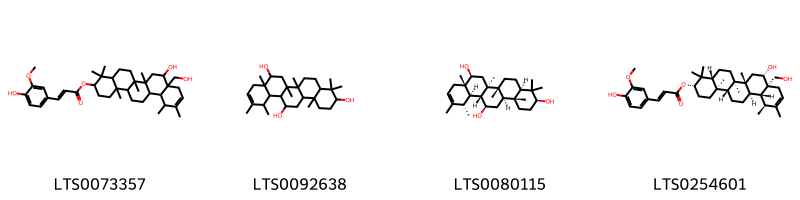{ width=100% }
    <figcaption>Hình ảnh cấu trúc hóa học của 4 hoạt chất thuộc nhóm Prenol lipids gồm ['8-hydroxy-8a-(hydroxymethyl)-4,4,6a,6b,11,12,14b-heptamethyl-2,3,4a,5,6,7,8,9,12,12a,12b,13,14,14a-tetradecahydro-1h-picen-3-yl 3-(4-hydroxy-3-methoxyphenyl)prop-2-enoate (LTS0073357)', '4,4,6a,6b,8a,11,12,14b-octamethyl-2,3,4a,5,6,7,8,9,12,12a,12b,13,14,14a-tetradecahydro-1h-picene-3,8,13-triol (LTS0092638)', '(3s,4ar,6ar,6br,8s,8as,12s,12ar,12br,13r,14ar,14br)-4,4,6a,6b,8a,11,12,14b-octamethyl-2,3,4a,5,6,7,8,9,12,12a,12b,13,14,14a-tetradecahydro-1h-picene-3,8,13-triol (LTS0080115)', '(3s,4ar,6ar,6br,8s,8as,12s,12ar,12br,14ar,14br)-8-hydroxy-8a-(hydroxymethyl)-4,4,6a,6b,11,12,14b-heptamethyl-2,3,4a,5,6,7,8,9,12,12a,12b,13,14,14a-tetradecahydro-1h-picen-3-yl (2e)-3-(4-hydroxy-3-methoxyphenyl)prop-2-enoate (LTS0254601)'].</figcaption>
</figure>

---

### Dược dân tộc học

Danh sách các quốc gia có sử dụng *Cicuta virosa* trong điều trị các bệnh. 

| Country   | Disease        | Bệnh                                                                                                                                                                                                |
|:----------|:---------------|:----------------------------------------------------------------------------------------------------------------------------------------------------------------------------------------------------|
| Elsewhere | Poison, Poison | MYMEMORY WARNING: YOU USED ALL AVAILABLE FREE TRANSLATIONS FOR TODAY. NEXT AVAILABLE IN  07 HOURS 54 MINUTES 10 SECONDS VISIT HTTPS://MYMEMORY.TRANSLATED.NET/DOC/USAGELIMITS.PHP TO TRANSLATE MORE |
| Turkey    | Poison         | MYMEMORY WARNING: YOU USED ALL AVAILABLE FREE TRANSLATIONS FOR TODAY. NEXT AVAILABLE IN  07 HOURS 54 MINUTES 08 SECONDS VISIT HTTPS://MYMEMORY.TRANSLATED.NET/DOC/USAGELIMITS.PHP TO TRANSLATE MORE |
| UK        | Poison         | MYMEMORY WARNING: YOU USED ALL AVAILABLE FREE TRANSLATIONS FOR TODAY. NEXT AVAILABLE IN  07 HOURS 54 MINUTES 05 SECONDS VISIT HTTPS://MYMEMORY.TRANSLATED.NET/DOC/USAGELIMITS.PHP TO TRANSLATE MORE |

---

# Chi Azorella

??? note "Danh sách các dược liệu thuộc chi"
    
	 - *Azorella hareta*
	 - *Azorella yareta*

---
## Azorella hareta
### Thông tin về thực vật

!!! info "Phân loại thực vật của *N/A* từ GIBF:"
    - **Kingdom:** Plantae
    - **Phylum:** Tracheophyta
    - **Order:** Apiales
    - **Family:** Apiaceae
    - **Genus:** Azorella
    - **Species:** *N/A*

 

| Label (VI)   | Label (EN)   | Scientific Name   | Descriptions (VI)   | Descriptions (EN)   | Also Known As (VI)   | Also Known As (EN)         |
|:-------------|:-------------|:------------------|:--------------------|:--------------------|:---------------------|:---------------------------|
| N/A          | N/A          | Cicuta virosa     |                     | species of plant    | ['']                 | ['northern water hemlock'] |

#### Phân bố trên thế giới

**Từ CSDL GIBF** Ecuador, Australia, Bolivia (Plurinational State of), Argentina, Peru, Falkland Islands (Malvinas), Chile, Sweden, New Zealand

#### Phân bố tại Việt Nam

**Từ CSDL GIBF**: Không có ghi nhận ở Việt Nam

---
### Thành phần hóa học
        
- Theo cơ sở dữ liệu lotus: Từ loài *N/A* đã phân lập và xác định được Chưa có hoạt chất nào được phân lập. hoạt chất thuộc về các nhóm Không có hoạt chất nào được phân lập. 

Không có hình ảnh nào được tạo ra

---

### Dược dân tộc học

Danh sách các quốc gia có sử dụng *N/A* trong điều trị các bệnh. 

| Country     | Disease               | Bệnh                                                                                                                                                                                                |
|:------------|:----------------------|:----------------------------------------------------------------------------------------------------------------------------------------------------------------------------------------------------|
| Sa(Quechua) | Absorbent, Astringent | MYMEMORY WARNING: YOU USED ALL AVAILABLE FREE TRANSLATIONS FOR TODAY. NEXT AVAILABLE IN  07 HOURS 53 MINUTES 40 SECONDS VISIT HTTPS://MYMEMORY.TRANSLATED.NET/DOC/USAGELIMITS.PHP TO TRANSLATE MORE |

---

---
## Azorella yareta
### Thông tin về thực vật

!!! info "Phân loại thực vật của *Azorella compacta* từ GIBF:"
    - **Kingdom:** Plantae
    - **Phylum:** Tracheophyta
    - **Order:** Apiales
    - **Family:** Apiaceae
    - **Genus:** Azorella
    - **Species:** *Azorella compacta*

 

| Label (VI)   | Label (EN)   | Scientific Name   | Descriptions (VI)   | Descriptions (EN)   | Also Known As (VI)   | Also Known As (EN)   |
|:-------------|:-------------|:------------------|:--------------------|:--------------------|:---------------------|:---------------------|
| N/A          | N/A          | Azorella yareta   |                     |                     | ['']                 | ['']                 |

#### Phân bố trên thế giới

**Từ CSDL GIBF** unknown or invalid, Peru, Argentina

#### Phân bố tại Việt Nam

**Từ CSDL GIBF**: Không có ghi nhận ở Việt Nam

---
### Thành phần hóa học
        
- Theo cơ sở dữ liệu lotus: Từ loài *Azorella compacta* đã phân lập và xác định được Chưa có hoạt chất nào được phân lập. hoạt chất thuộc về các nhóm Không có hoạt chất nào được phân lập. 

Không có hình ảnh nào được tạo ra

---

### Dược dân tộc học

Danh sách các quốc gia có sử dụng *Azorella compacta* trong điều trị các bệnh. 

| Country    | Disease               | Bệnh                                                                                                                                                                                                |
|:-----------|:----------------------|:----------------------------------------------------------------------------------------------------------------------------------------------------------------------------------------------------|
| Sa(Aymara) | Absorbent, Astringent | MYMEMORY WARNING: YOU USED ALL AVAILABLE FREE TRANSLATIONS FOR TODAY. NEXT AVAILABLE IN  07 HOURS 53 MINUTES 17 SECONDS VISIT HTTPS://MYMEMORY.TRANSLATED.NET/DOC/USAGELIMITS.PHP TO TRANSLATE MORE |

---

# Chi Angelica

??? note "Danh sách các dược liệu thuộc chi"
    
	 - *Angelica acutiloba*
	 - *Angelica anomala*
	 - *Angelica archangelica*
	 - *Angelica atropurpurea*
	 - *Angelica dahurica*
	 - *Angelica decursiva*
	 - *Angelica glauca*
	 - *Angelica grosserrata*
	 - *Angelica polymorpha*
	 - *Angelica pubescens*
	 - *Angelica rosaefolia*
	 - *Angelica silvestris*
	 - *Angelica sinensis*
	 - *Angelica sylvestris*
	 - *Angelica tenuisima*

---
## Angelica acutiloba
### Thông tin về thực vật

!!! info "Phân loại thực vật của *Angelica acutiloba* từ GIBF:"
    - **Kingdom:** Plantae
    - **Phylum:** Tracheophyta
    - **Order:** Apiales
    - **Family:** Apiaceae
    - **Genus:** Angelica
    - **Species:** *Angelica acutiloba*

 

| Label (VI)   | Label (EN)   | Scientific Name    | Descriptions (VI)   | Descriptions (EN)   | Also Known As (VI)   | Also Known As (EN)   |
|:-------------|:-------------|:-------------------|:--------------------|:--------------------|:---------------------|:---------------------|
| N/A          | N/A          | Angelica acutiloba | loài thực vật       | species of plant    | ['']                 | ['']                 |

#### Phân bố trên thế giới

**Từ CSDL GIBF** nan, Japan, Korea, Republic of, Chinese Taipei, United States of America, Norway, China

#### Phân bố tại Việt Nam

**Từ CSDL GIBF**: Không có ghi nhận ở Việt Nam

---
### Thành phần hóa học
        
- Theo cơ sở dữ liệu lotus: Từ loài *Angelica acutiloba* đã phân lập và xác định được 33 hoạt chất thuộc về các nhóm Cinnamic acids and derivatives, Organonitrogen compounds, Isocoumarans, Benzofurans, Purine nucleosides, Dihydrofurans, Organooxygen compounds, Coumarins and derivatives, Isobenzofurans, Pyridines and derivatives. 

|    | chemicalTaxonomyClassyfireClass   |   smiles_count |
|---:|:----------------------------------|---------------:|
|  0 | Benzofurans                       |              1 |
|  1 | Cinnamic acids and derivatives    |              1 |
|  2 | Coumarins and derivatives         |              2 |
|  3 | Dihydrofurans                     |              4 |
|  4 | Isobenzofurans                    |             15 |
|  5 | Isocoumarans                      |              6 |
|  6 | Organonitrogen compounds          |              1 |
|  7 | Organooxygen compounds            |              1 |
|  8 | Purine nucleosides                |              1 |
|  9 | Pyridines and derivatives         |              1 |

#### Nhóm Benzofurans
<figure markdown="span">
    { width=100% }
    <figcaption>Hình ảnh cấu trúc hóa học của 1 hoạt chất thuộc nhóm Benzofurans gồm ['butylphthalide (LTS0150205)'].</figcaption>
</figure>
#### Nhóm Cinnamic acids and derivatives
<figure markdown="span">
    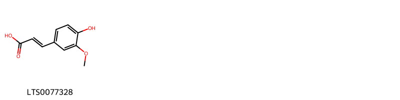{ width=100% }
    <figcaption>Hình ảnh cấu trúc hóa học của 1 hoạt chất thuộc nhóm Cinnamic acids and derivatives gồm ['ferulic acid (LTS0077328)'].</figcaption>
</figure>
#### Nhóm Coumarins and derivatives
<figure markdown="span">
    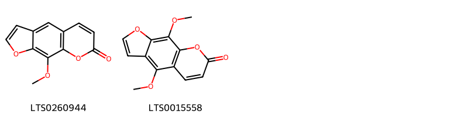{ width=100% }
    <figcaption>Hình ảnh cấu trúc hóa học của 2 hoạt chất thuộc nhóm Coumarins and derivatives gồm ['methoxsalen (LTS0260944)', 'isopimpinellin (LTS0015558)'].</figcaption>
</figure>
#### Nhóm Dihydrofurans
<figure markdown="span">
    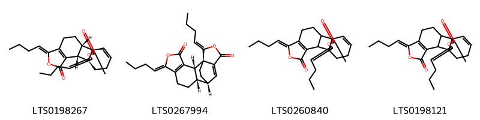{ width=100% }
    <figcaption>Hình ảnh cấu trúc hóa học của 4 hoạt chất thuộc nhóm Dihydrofurans gồm ['(1r,2r,6z,10s,11s,16z)-6,16-dibutylidene-5,17-dioxapentacyclo[9.4.3.0¹,¹¹.0²,¹⁰.0³,⁷]octadeca-3(7),12-diene-4,18-dione (LTS0198267)', 'levistolide a (LTS0267994)', '6,16-dibutylidene-5,17-dioxapentacyclo[9.4.3.0¹,¹¹.0²,¹⁰.0³,⁷]octadeca-3(7),12-diene-4,18-dione (LTS0260840)', '(6z,16e)-6,16-dibutylidene-5,17-dioxapentacyclo[9.4.3.0¹,¹¹.0²,¹⁰.0³,⁷]octadeca-3(7),12-diene-4,18-dione (LTS0198121)'].</figcaption>
</figure>
#### Nhóm Isobenzofurans
<figure markdown="span">
    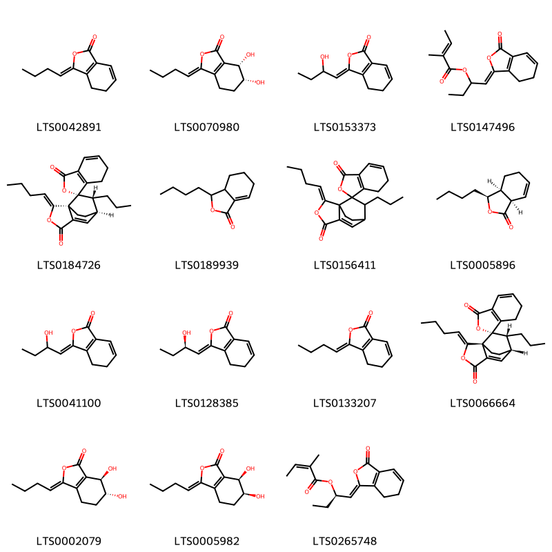{ width=100% }
    <figcaption>Hình ảnh cấu trúc hóa học của 15 hoạt chất thuộc nhóm Isobenzofurans gồm ['(z)-ligustilide (LTS0042891)', '(6r,7s)-3-butylidene-6,7-dihydroxy-4,5,6,7-tetrahydro-2-benzofuran-1-one (LTS0070980)', '(3z)-3-(2-hydroxybutylidene)-4,5-dihydro-2-benzofuran-1-one (LTS0153373)', '1-(3-oxo-6,7-dihydro-2-benzofuran-1-ylidene)butan-2-yl 2-methylbut-2-enoate (LTS0147496)', "(1s,1's,2'z,7'r,8'r)-2'-butylidene-8'-propyl-6,7-dihydro-3'-oxaspiro[2-benzofuran-1,9'-tricyclo[5.2.2.0¹,⁵]undecan]-5'-ene-3,4'-dione (LTS0184726)", 'sedanolide (LTS0189939)', "2'-butylidene-8'-propyl-6,7-dihydro-3'-oxaspiro[2-benzofuran-1,9'-tricyclo[5.2.2.0¹,⁵]undecan]-5'-ene-3,4'-dione (LTS0156411)", 'cnidilide (LTS0005896)', '3-(2-hydroxybutylidene)-4,5-dihydro-2-benzofuran-1-one (LTS0041100)', '(3z)-3-[(2r)-2-hydroxybutylidene]-4,5-dihydro-2-benzofuran-1-one (LTS0128385)', '3-butylidene-4,5-dihydro-2-benzofuran-1-one (LTS0133207)', "(1s,1'r,2'z,7's,8'r)-2'-butylidene-8'-propyl-6,7-dihydro-3'-oxaspiro[2-benzofuran-1,9'-tricyclo[5.2.2.0¹,⁵]undecan]-5'-ene-3,4'-dione (LTS0066664)", '(6r,7r)-3-butylidene-6,7-dihydroxy-4,5,6,7-tetrahydro-2-benzofuran-1-one (LTS0002079)', '(3z,6s,7r)-3-butylidene-6,7-dihydroxy-4,5,6,7-tetrahydro-2-benzofuran-1-one (LTS0005982)', '(2r)-1-[(1z)-3-oxo-6,7-dihydro-2-benzofuran-1-ylidene]butan-2-yl (2z)-2-methylbut-2-enoate (LTS0265748)'].</figcaption>
</figure>
#### Nhóm Isocoumarans
<figure markdown="span">
    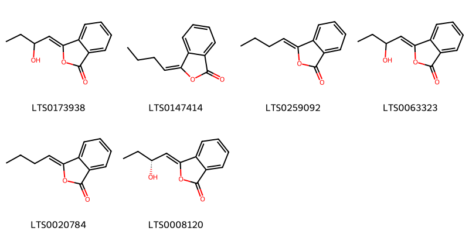{ width=100% }
    <figcaption>Hình ảnh cấu trúc hóa học của 6 hoạt chất thuộc nhóm Isocoumarans gồm ['(3z)-3-(2-hydroxybutylidene)-2-benzofuran-1-one (LTS0173938)', 'butylidenephthalide (LTS0147414)', 'butylidenephthalide (LTS0259092)', '3-(2-hydroxybutylidene)-2-benzofuran-1-one (LTS0063323)', 'z-butylidenephthalide (LTS0020784)', '(3z)-3-[(2r)-2-hydroxybutylidene]-2-benzofuran-1-one (LTS0008120)'].</figcaption>
</figure>
#### Nhóm Organonitrogen compounds
<figure markdown="span">
    { width=100% }
    <figcaption>Hình ảnh cấu trúc hóa học của 1 hoạt chất thuộc nhóm Organonitrogen compounds gồm ['choline (LTS0170307)'].</figcaption>
</figure>
#### Nhóm Organooxygen compounds
<figure markdown="span">
    { width=100% }
    <figcaption>Hình ảnh cấu trúc hóa học của 1 hoạt chất thuộc nhóm Organooxygen compounds gồm ['(-)-inositol (LTS0047771)'].</figcaption>
</figure>
#### Nhóm Purine nucleosides
<figure markdown="span">
    { width=100% }
    <figcaption>Hình ảnh cấu trúc hóa học của 1 hoạt chất thuộc nhóm Purine nucleosides gồm ['adenosine (LTS0014061)'].</figcaption>
</figure>
#### Nhóm Pyridines and derivatives
<figure markdown="span">
    { width=100% }
    <figcaption>Hình ảnh cấu trúc hóa học của 1 hoạt chất thuộc nhóm Pyridines and derivatives gồm ['niacin (LTS0216673)'].</figcaption>
</figure>

---

### Dược dân tộc học

Danh sách các quốc gia có sử dụng *Angelica acutiloba* trong điều trị các bệnh. 

| Country   | Disease                          | Bệnh                                                                                                                                                                                                |
|:----------|:---------------------------------|:----------------------------------------------------------------------------------------------------------------------------------------------------------------------------------------------------|
| Japan*    | Aperient, Aperient, Tonic, Tonic | MYMEMORY WARNING: YOU USED ALL AVAILABLE FREE TRANSLATIONS FOR TODAY. NEXT AVAILABLE IN  07 HOURS 53 MINUTES 01 SECONDS VISIT HTTPS://MYMEMORY.TRANSLATED.NET/DOC/USAGELIMITS.PHP TO TRANSLATE MORE |

---

---
## Angelica anomala
### Thông tin về thực vật

!!! info "Phân loại thực vật của *Angelica anomala* từ GIBF:"
    - **Kingdom:** Plantae
    - **Phylum:** Tracheophyta
    - **Order:** Apiales
    - **Family:** Apiaceae
    - **Genus:** Angelica
    - **Species:** *Angelica anomala*

 

| Label (VI)   | Label (EN)   | Scientific Name   | Descriptions (VI)   | Descriptions (EN)   | Also Known As (VI)   | Also Known As (EN)   |
|:-------------|:-------------|:------------------|:--------------------|:--------------------|:---------------------|:---------------------|
| N/A          | N/A          | Angelica anomala  | loài thực vật       | species of plant    | ['']                 | ['eumenol angelica'] |

#### Phân bố trên thế giới

**Từ CSDL GIBF** nan, Japan, Korea, Republic of, Russian Federation, China

#### Phân bố tại Việt Nam

**Từ CSDL GIBF**: Không có ghi nhận ở Việt Nam

---
### Thành phần hóa học
        
- Theo cơ sở dữ liệu lotus: Từ loài *Angelica anomala* đã phân lập và xác định được 9 hoạt chất thuộc về các nhóm Coumarins and derivatives. 

|    | chemicalTaxonomyClassyfireClass   |   smiles_count |
|---:|:----------------------------------|---------------:|
|  0 | Coumarins and derivatives         |              9 |

#### Nhóm Coumarins and derivatives
<figure markdown="span">
    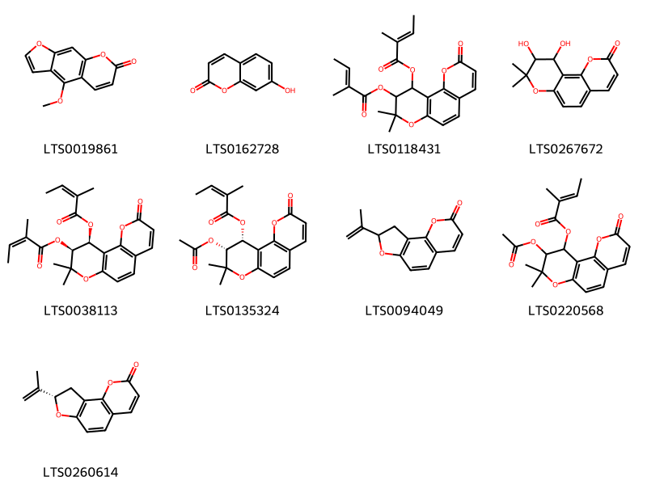{ width=100% }
    <figcaption>Hình ảnh cấu trúc hóa học của 9 hoạt chất thuộc nhóm Coumarins and derivatives gồm ['bergapten (LTS0019861)', 'umbelliferone (LTS0162728)', '8,8-dimethyl-10-[(2-methylbut-2-enoyl)oxy]-2-oxo-9h,10h-pyrano[2,3-h]chromen-9-yl 2-methylbut-2-enoate (LTS0118431)', '9,10-dihydroxy-8,8-dimethyl-9h,10h-pyrano[2,3-h]chromen-2-one (LTS0267672)', '(9s,10s)-8,8-dimethyl-10-{[(2z)-2-methylbut-2-enoyl]oxy}-2-oxo-9h,10h-pyrano[2,3-h]chromen-9-yl (2z)-2-methylbut-2-enoate (LTS0038113)', 'pteryxin (LTS0135324)', '8-(prop-1-en-2-yl)-8h,9h-furo[2,3-h]chromen-2-one (LTS0094049)', '9-(acetyloxy)-8,8-dimethyl-2-oxo-9h,10h-pyrano[2,3-h]chromen-10-yl 2-methylbut-2-enoate (LTS0220568)', '(8s)-8-(prop-1-en-2-yl)-8h,9h-furo[2,3-h]chromen-2-one (LTS0260614)'].</figcaption>
</figure>

---

### Dược dân tộc học

Danh sách các quốc gia có sử dụng *Angelica anomala* trong điều trị các bệnh. 

| Country   | Disease                                       | Bệnh                                                                                                                                                                                                |
|:----------|:----------------------------------------------|:----------------------------------------------------------------------------------------------------------------------------------------------------------------------------------------------------|
| China     | Analgesic, Carminative, Cosmetic, Suppurative | MYMEMORY WARNING: YOU USED ALL AVAILABLE FREE TRANSLATIONS FOR TODAY. NEXT AVAILABLE IN  07 HOURS 52 MINUTES 38 SECONDS VISIT HTTPS://MYMEMORY.TRANSLATED.NET/DOC/USAGELIMITS.PHP TO TRANSLATE MORE |

---

---
## Angelica archangelica
### Thông tin về thực vật

!!! info "Phân loại thực vật của *Angelica archangelica* từ GIBF:"
    - **Kingdom:** Plantae
    - **Phylum:** Tracheophyta
    - **Order:** Apiales
    - **Family:** Apiaceae
    - **Genus:** Angelica
    - **Species:** *Angelica archangelica*

 

| Label (VI)   | Label (EN)   | Scientific Name       | Descriptions (VI)   | Descriptions (EN)   | Also Known As (VI)   | Also Known As (EN)                                                     |
|:-------------|:-------------|:----------------------|:--------------------|:--------------------|:---------------------|:-----------------------------------------------------------------------|
| N/A          | N/A          | Angelica archangelica | loài thực vật       | species of plant    | ['']                 | ['Holy Ghost', 'garden angelica', 'Norwegian angelica', 'Wild Celery'] |

#### Phân bố trên thế giới

**Từ CSDL GIBF** Ukraine, Denmark, Netherlands, Lithuania, Australia, Belarus, Germany, Belgium, Greenland, Iceland, Poland, Russian Federation, Sweden, Finland, France, Norway, United Kingdom of Great Britain and Northern Ireland

#### Phân bố tại Việt Nam

**Từ CSDL GIBF**: Không có ghi nhận ở Việt Nam

---
### Thành phần hóa học
        
- Theo cơ sở dữ liệu lotus: Từ loài *Angelica archangelica* đã phân lập và xác định được 162 hoạt chất thuộc về các nhóm Fatty Acyls, Prenol lipids, Steroids and steroid derivatives, Purine nucleosides, Benzene and substituted derivatives, Unsaturated hydrocarbons, Organooxygen compounds, Coumarins and derivatives, Macrolides and analogues, Benzopyrans. 

|    | chemicalTaxonomyClassyfireClass     |   smiles_count |
|---:|:------------------------------------|---------------:|
|  0 | Benzene and substituted derivatives |              1 |
|  1 | Benzopyrans                         |              2 |
|  2 | Coumarins and derivatives           |             51 |
|  3 | Fatty Acyls                         |             14 |
|  4 | Macrolides and analogues            |              6 |
|  5 | Organooxygen compounds              |              3 |
|  6 | Prenol lipids                       |             75 |
|  7 | Purine nucleosides                  |              1 |
|  8 | Steroids and steroid derivatives    |              5 |
|  9 | Unsaturated hydrocarbons            |              1 |

#### Nhóm Benzene and substituted derivatives
<figure markdown="span">
    { width=100% }
    <figcaption>Hình ảnh cấu trúc hóa học của 1 hoạt chất thuộc nhóm Benzene and substituted derivatives gồm ['p-cymen-8-ol (LTS0223641)'].</figcaption>
</figure>
#### Nhóm Benzopyrans
<figure markdown="span">
    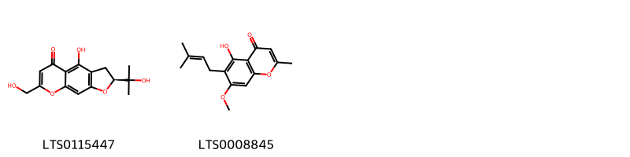{ width=100% }
    <figcaption>Hình ảnh cấu trúc hóa học của 2 hoạt chất thuộc nhóm Benzopyrans gồm ['(2s)-4-hydroxy-7-(hydroxymethyl)-2-(2-hydroxypropan-2-yl)-2h,3h-furo[3,2-g]chromen-5-one (LTS0115447)', '5-hydroxy-7-methoxy-2-methyl-6-(3-methylbut-2-en-1-yl)chromen-4-one (LTS0008845)'].</figcaption>
</figure>
#### Nhóm Coumarins and derivatives
<figure markdown="span">
    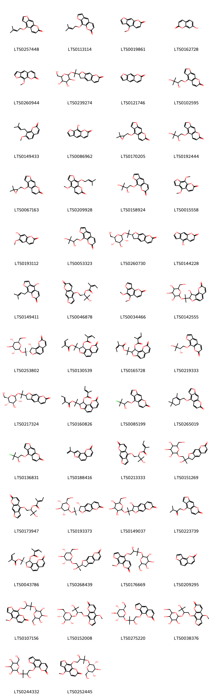{ width=100% }
    <figcaption>Hình ảnh cấu trúc hóa học của 51 hoạt chất thuộc nhóm Coumarins and derivatives gồm ['isoimperatorin (LTS0257448)', 'imperatorin (LTS0113114)', 'bergapten (LTS0019861)', 'umbelliferone (LTS0162728)', 'methoxsalen (LTS0260944)', '2-(2-{[3,4,5-trihydroxy-6-(hydroxymethyl)oxan-2-yl]oxy}propan-2-yl)-2h,3h-furo[3,2-g]chromen-7-one (LTS0239274)', 'psoralen (LTS0121746)', '(r)-oxypeucedanin hydrate (LTS0102595)', 'osthole (LTS0149433)', 'xanthotoxol (LTS0086962)', '4-[(3,3-dimethyloxiran-2-yl)methoxy]furo[3,2-g]chromen-7-one (LTS0170205)', '4-(2,3-dihydroxy-3-methylbutoxy)furo[3,2-g]chromen-7-one (LTS0192444)', '(+)-oxypeucedanin (LTS0067163)', 'phellopterin (LTS0209928)', 'heraclenol (LTS0158924)', 'isopimpinellin (LTS0015558)', 'scopoletin (LTS0193112)', '9-(2,3-dihydroxy-3-methylbutoxy)furo[3,2-g]chromen-7-one (LTS0053323)', 'ammijin (LTS0260730)', 'bergaptol (LTS0144228)', '4-hydroxy-9-(3-methylbut-2-en-1-yl)furo[3,2-g]chromen-7-one (LTS0149411)', 'ostruthol (LTS0046878)', 'pimpinellin (LTS0034466)', 'apterin (LTS0142555)', 'apterin (LTS0253802)', '2-[(8r,9s)-9-{[(2z)-2-methylbut-2-enoyl]oxy}-2-oxo-8h,9h-furo[2,3-h]chromen-8-yl]propan-2-yl (2z)-2-methylbut-2-enoate (LTS0130539)', '2-(9-{[(2e)-2-methylbut-2-enoyl]oxy}-2-oxo-8h,9h-furo[2,3-h]chromen-8-yl)propan-2-yl (2z)-2-methylbut-2-enoate (LTS0165728)', '9-[(2s)-2,3-dihydroxy-3-methylbutoxy]furo[3,2-g]chromen-7-one (LTS0219333)', '2-(2-{[(2s,3r,4s,5s,6r)-3,4,5-trihydroxy-6-(hydroxymethyl)oxan-2-yl]oxy}propan-2-yl)-2h,3h-furo[3,2-g]chromen-7-one (LTS0217324)', '2-{9-[(2-methylbut-2-enoyl)oxy]-2-oxo-8h,9h-furo[2,3-h]chromen-8-yl}propan-2-yl 2-methylbut-2-enoate (LTS0160826)', '4-(3-chloro-2-hydroxy-3-methylbutoxy)furo[3,2-g]chromen-7-one (LTS0085199)', '4-[(2,4,4-trimethylcyclohex-1-en-1-yl)methoxy]furo[3,2-g]chromen-7-one (LTS0265019)', '4-[(2r)-3-chloro-2-hydroxy-3-methylbutoxy]furo[3,2-g]chromen-7-one (LTS0136831)', '8-(prop-1-en-2-yl)furo[2,3-h]chromen-2-one (LTS0188416)', '(2r)-3-hydroxy-3-methyl-1-({7-oxofuro[3,2-g]chromen-4-yl}oxy)butan-2-yl 2-methylbut-2-enoate (LTS0213333)', '2-(2-hydroxy-1-{[3,4,5-trihydroxy-6-(hydroxymethyl)oxan-2-yl]oxy}propan-2-yl)-2h,3h-furo[3,2-g]chromen-7-one (LTS0151269)', '(2r)-3-hydroxy-3-methyl-1-({7-oxofuro[3,2-g]chromen-4-yl}oxy)butan-2-yl (2e)-2-methylbut-2-enoate (LTS0173947)', '(2s,3r)-3-hydroxy-2-(2-{[(2s,3r,4s,5s,6r)-3,4,5-trihydroxy-6-(hydroxymethyl)oxan-2-yl]oxy}propan-2-yl)-2h,3h-furo[3,2-g]chromen-7-one (LTS0193373)', '3-hydroxy-2-(2-{[3,4,5-trihydroxy-6-(hydroxymethyl)oxan-2-yl]oxy}propan-2-yl)-2h,3h-furo[3,2-g]chromen-7-one (LTS0149037)', '4-(3-methyl-2-oxobutoxy)furo[3,2-g]chromen-7-one (LTS0223739)', '2-[(8s,9s)-9-{[(2z)-2-methylbut-2-enoyl]oxy}-2-oxo-8h,9h-furo[2,3-h]chromen-8-yl]propan-2-yl (2z)-2-methylbut-2-enoate (LTS0043786)', '(2s)-2-[(2r)-2-hydroxy-1-{[(2r,3r,4s,5s,6r)-3,4,5-trihydroxy-6-(hydroxymethyl)oxan-2-yl]oxy}propan-2-yl]-2h,3h-furo[3,2-g]chromen-7-one (LTS0268439)', '4-(2-hydroxy-3-methyl-3-{[3,4,5-trihydroxy-6-(hydroxymethyl)oxan-2-yl]oxy}butoxy)-9-methoxyfuro[3,2-g]chromen-7-one (LTS0176669)', 'angelicin (LTS0209295)', '9-(2-hydroxy-3-methyl-3-{[3,4,5-trihydroxy-6-(hydroxymethyl)oxan-2-yl]oxy}butoxy)-4-methoxyfuro[3,2-g]chromen-7-one (LTS0107156)', '9-[(2r)-3-hydroxy-3-methyl-2-{[(2s,3r,4s,5s,6r)-3,4,5-trihydroxy-6-(hydroxymethyl)oxan-2-yl]oxy}butoxy]-4-methoxyfuro[3,2-g]chromen-7-one (LTS0152008)', '9-[(2r)-2-hydroxy-3-methyl-3-{[(2s,3r,4s,5s,6r)-3,4,5-trihydroxy-6-(hydroxymethyl)oxan-2-yl]oxy}butoxy]furo[3,2-g]chromen-7-one (LTS0275220)', '9-(3-hydroxy-3-methyl-2-{[3,4,5-trihydroxy-6-(hydroxymethyl)oxan-2-yl]oxy}butoxy)-4-methoxyfuro[3,2-g]chromen-7-one (LTS0038376)', '9-(2-hydroxy-3-methyl-3-{[3,4,5-trihydroxy-6-(hydroxymethyl)oxan-2-yl]oxy}butoxy)furo[3,2-g]chromen-7-one (LTS0244332)', '9-[(2r)-2-hydroxy-3-methyl-3-{[(2s,3r,4s,5s,6r)-3,4,5-trihydroxy-6-(hydroxymethyl)oxan-2-yl]oxy}butoxy]-4-methoxyfuro[3,2-g]chromen-7-one (LTS0252445)', '4-[(2r)-2-hydroxy-3-methyl-3-{[(2s,3r,4s,5s,6r)-3,4,5-trihydroxy-6-(hydroxymethyl)oxan-2-yl]oxy}butoxy]-9-methoxyfuro[3,2-g]chromen-7-one (LTS0238412)'].</figcaption>
</figure>
#### Nhóm Fatty Acyls
<figure markdown="span">
    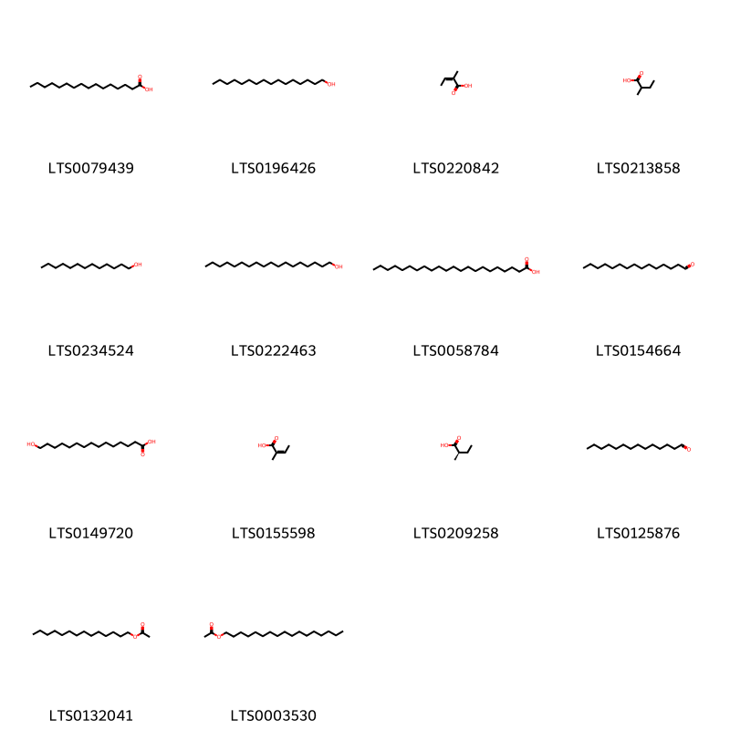{ width=100% }
    <figcaption>Hình ảnh cấu trúc hóa học của 14 hoạt chất thuộc nhóm Fatty Acyls gồm ['palmitic acid (LTS0079439)', 'cetyl alcohol (LTS0196426)', 'angelic acid (LTS0220842)', '2-methylbutanoic acid (LTS0213858)', 'tridecanol (LTS0234524)', 'stearyl alcohol (LTS0222463)', 'behenic acid (LTS0058784)', 'pentadecanal (LTS0154664)', '15-hydroxypentadecanoic acid (LTS0149720)', '2-methyl-2-butenoic acid (LTS0155598)', '(r)-2-methylbutyric acid (LTS0209258)', 'tetradecanal (LTS0125876)', 'myristyl acetate (LTS0132041)', 'heptadecyl acetate (LTS0003530)'].</figcaption>
</figure>
#### Nhóm Macrolides and analogues
<figure markdown="span">
    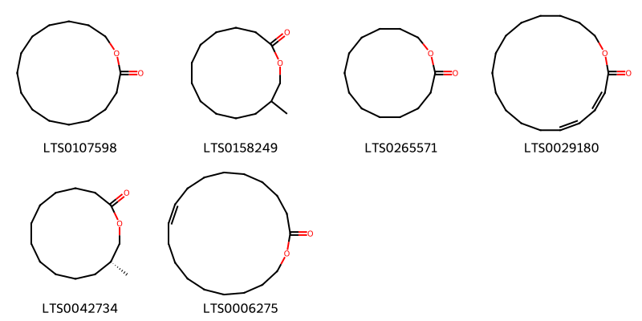{ width=100% }
    <figcaption>Hình ảnh cấu trúc hóa học của 6 hoạt chất thuộc nhóm Macrolides and analogues gồm ['exaltolide (LTS0107598)', '13-methyl-1-oxacyclotetradecan-2-one (LTS0158249)', 'cyclotridecanolide (LTS0265571)', '1-oxacyclooctadeca-3,5-dien-2-one (LTS0029180)', '(13r)-13-methyl-1-oxacyclotetradecan-2-one (LTS0042734)', 'oxacyclononadec-10-en-2-one (LTS0006275)'].</figcaption>
</figure>
#### Nhóm Organooxygen compounds
<figure markdown="span">
    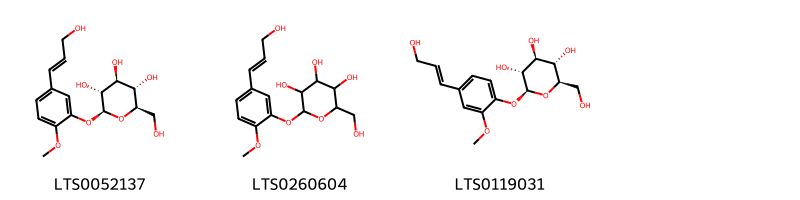{ width=100% }
    <figcaption>Hình ảnh cấu trúc hóa học của 3 hoạt chất thuộc nhóm Organooxygen compounds gồm ['(2r,3s,4s,5r,6s)-2-(hydroxymethyl)-6-{5-[(1e)-3-hydroxyprop-1-en-1-yl]-2-methoxyphenoxy}oxane-3,4,5-triol (LTS0052137)', '2-(hydroxymethyl)-6-[5-(3-hydroxyprop-1-en-1-yl)-2-methoxyphenoxy]oxane-3,4,5-triol (LTS0260604)', 'coniferin (LTS0119031)'].</figcaption>
</figure>
#### Nhóm Prenol lipids
<figure markdown="span">
    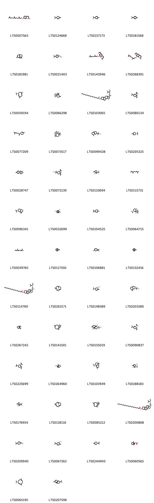{ width=100% }
    <figcaption>Hình ảnh cấu trúc hóa học của 75 hoạt chất thuộc nhóm Prenol lipids gồm ['umbelliprenin (LTS0007563)', 'β phellandrene (LTS0124668)', 'phellandrene (LTS0157173)', 'cymene (LTS0181568)', 'thujopsene (LTS0181981)', 'cuminol (LTS0021403)', '8-geranyloxypsoralen (LTS0143946)', '9-[(3,7-dimethylocta-2,6-dien-1-yl)oxy]furo[3,2-g]chromen-7-one (LTS0268391)', '(-)-germacrene d (LTS0059194)', '2,6,6-trimethyl-8-methylidenetricyclo[5.3.1.0¹,⁵]undecane (LTS0066298)', '1-(5-ethyl-6-methylheptan-2-yl)-9a,11a-dimethyl-1h,2h,3h,3ah,3bh,4h,6h,7h,8h,9h,9bh,10h,11h-cyclopenta[a]phenanthren-7-yl hexadecanoate (LTS0103065)', '4-ethenyl-1-isopropyl-4-methyl-3-(prop-1-en-2-yl)cyclohex-1-ene (LTS0080134)', '(r)-β-bisabolene (LTS0077209)', '(1as,4as,7s,7ar,7bs)-1,1,7-trimethyl-4-methylidene-octahydrocyclopropa[e]azulen-7-ol (LTS0073517)', '2-(4a,8-dimethyl-3,4,5,6,7,8-hexahydro-2h-naphthalen-2-yl)propan-2-ol (LTS0099428)', '(-)-limonene (LTS0205325)', 'cuparene (LTS0028747)', '2-[4-ethenyl-4-methyl-3-(prop-1-en-2-yl)cyclohexyl]propan-2-ol (LTS0072139)', '(+)-sabinene (LTS0110694)', 'α-myrcene (LTS0115731)', 'β-selinene (LTS0096341)', '(-)-α-pinene (LTS0032699)', 'terpinolene (LTS0104525)', '(1s,5r,7s,10r)-7-isopropyl-4,10-dimethyltricyclo[4.4.0.0¹,⁵]dec-3-ene (LTS0064715)', 'trans-β-ocimene (LTS0049765)', 'β-pinene (LTS0117550)', 'monoterpenes (LTS0106881)', 'α pinene (LTS0132416)', 'β-sitosteryl palmitate (LTS0114760)', 'humulene (LTS0263171)', '(1r,5r)-5-isopropyl-2-methylidenecyclohex-3-en-1-ol (LTS0148589)', 'β-eudesmol (LTS0203280)', 'camphene (LTS0267242)', 'β-caryophyllen (LTS0141501)', '2-[(1s,2s,3r,7s)-6,8-dimethyltricyclo[4.4.0.0²,⁷]dec-8-en-3-yl]propan-2-ol (LTS0155019)', 'elemene (LTS0090837)', 'β-elemene (LTS0225699)', 'borneol (LTS0264960)', '(+)-gamma-cadinene (LTS0103949)', '(1r,2s,5s)-1-isopropyl-4-methylbicyclo[3.1.0]hex-3-en-2-ol (LTS0188183)', 'α-thujene (LTS0176954)', '(4e,8e)-4,8,11,11-tetramethylcycloundeca-1,4,8-triene (LTS0118116)', 'caryophyllene (LTS0085212)', '(1r,3as,3bs,7s,9ar,9bs,11ar)-1-[(2r,5r)-5-ethyl-6-methylheptan-2-yl]-9a,11a-dimethyl-1h,2h,3h,3ah,3bh,4h,6h,7h,8h,9h,9bh,10h,11h-cyclopenta[a]phenanthren-7-yl icosanoate (LTS0200868)', 'phellandral (LTS0209940)', '5-isopropyl-2-methylidenecyclohex-3-en-1-ol (LTS0067262)', 'α-limonene (LTS0244943)', 'bornyl acetate (LTS0060565)', '(1z,6z,8s)-8-isopropyl-1-methyl-5-methylidenecyclodeca-1,6-diene (LTS0065195)', 'α-copaene (LTS0207598)', 'sabinene (LTS0224133)', '(+)-α-pinene (LTS0211102)', 'α-thujene (LTS0185078)', 'elemol (LTS0208556)', '1-(5-ethyl-6-methylheptan-2-yl)-9a,11a-dimethyl-1h,2h,3h,3ah,3bh,4h,6h,7h,8h,9h,9bh,10h,11h-cyclopenta[a]phenanthren-7-yl icosanoate (LTS0239864)', 'cedrol (LTS0251071)', '(-)-α-phellandrene (LTS0226766)', 'γ-terpineol (LTS0175059)', '(1r,2s,7s,8s)-8-isopropyl-1,3-dimethyltricyclo[4.4.0.0²,⁷]dec-3-ene (LTS0190031)', '(+)-β-cedrene (LTS0009064)', '(1s,2r,6r,7r,8r)-8-isopropyl-1,3-dimethyltricyclo[4.4.0.0²,⁷]dec-3-ene (LTS0043253)', 'gamma-muurolene (LTS0052920)', '(1s,5r)-5-isopropyl-2-methylidenecyclohex-3-en-1-ol (LTS0126121)', '(-)-β-bisabolene (LTS0009940)', '(1s,2e,10r)-3,7,11,11-tetramethylbicyclo[8.1.0]undeca-2,6-diene (LTS0032090)', '5-isopropyl-2,8-dimethyltricyclo[4.4.0.0²,⁷]dec-8-en-4-ol (LTS0010742)', '(-)-thujopsene (LTS0021824)', '(2s,4r,5s,6r,7r)-5-isopropyl-2,8-dimethyltricyclo[4.4.0.0²,⁷]dec-8-en-4-ol (LTS0244546)', '(7ar)-1,1,7-trimethyl-4-methylidene-octahydrocyclopropa[e]azulen-7-ol (LTS0091612)', '(z)-β-farnesene (LTS0254048)', '2-[(2r,4ar,8s,8ar)-4a,8-dimethyl-octahydro-1h-naphthalen-2-yl]propan-2-ol (LTS0131262)', '(-)-α-cubebene (LTS0042045)', '4-isopropyl-6-methyl-1-methylidene-3,4,4a,7,8,8a-hexahydro-2h-naphthalene (LTS0111070)', '(1s,2s,4r,5s,6r,7r)-5-isopropyl-2,8-dimethyltricyclo[4.4.0.0²,⁷]dec-8-en-4-ol (LTS0246054)', '(2e,6e)-3,7,11,11-tetramethylbicyclo[8.1.0]undeca-2,6-diene (LTS0225278)'].</figcaption>
</figure>
#### Nhóm Purine nucleosides
<figure markdown="span">
    { width=100% }
    <figcaption>Hình ảnh cấu trúc hóa học của 1 hoạt chất thuộc nhóm Purine nucleosides gồm ['adenosine (LTS0014061)'].</figcaption>
</figure>
#### Nhóm Steroids and steroid derivatives
<figure markdown="span">
    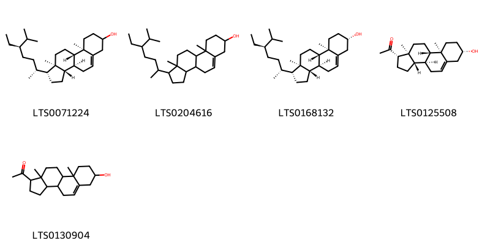{ width=100% }
    <figcaption>Hình ảnh cấu trúc hóa học của 5 hoạt chất thuộc nhóm Steroids and steroid derivatives gồm ['stigmast-5-en-3-ol (LTS0071224)', 'stigmast-5-en-3-ol, (3β)- (LTS0204616)', 'sitosterol (LTS0168132)', 'pregnenolone (LTS0125508)', 'pregnenolone (LTS0130904)'].</figcaption>
</figure>
#### Nhóm Unsaturated hydrocarbons
<figure markdown="span">
    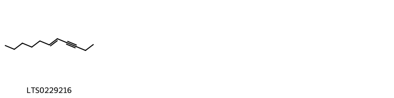{ width=100% }
    <figcaption>Hình ảnh cấu trúc hóa học của 1 hoạt chất thuộc nhóm Unsaturated hydrocarbons gồm ['undec-5-en-3-yne (LTS0229216)'].</figcaption>
</figure>

---

### Dược dân tộc học

Danh sách các quốc gia có sử dụng *Angelica archangelica* trong điều trị các bệnh. 

| Country   | Disease                                                                                        | Bệnh                                                                                                                                                                                                |
|:----------|:-----------------------------------------------------------------------------------------------|:----------------------------------------------------------------------------------------------------------------------------------------------------------------------------------------------------|
| Elsewhere | Carminative, Diaphoretic, Expectorant, Sedative, Stimulant, Stomachic, Tonic, Tonic, Stomachic | MYMEMORY WARNING: YOU USED ALL AVAILABLE FREE TRANSLATIONS FOR TODAY. NEXT AVAILABLE IN  07 HOURS 52 MINUTES 14 SECONDS VISIT HTTPS://MYMEMORY.TRANSLATED.NET/DOC/USAGELIMITS.PHP TO TRANSLATE MORE |
| Turkey    | Carminative, Emmenagogue, Nervine, Tonic, Stomachic, Sudorific                                 | MYMEMORY WARNING: YOU USED ALL AVAILABLE FREE TRANSLATIONS FOR TODAY. NEXT AVAILABLE IN  07 HOURS 52 MINUTES 11 SECONDS VISIT HTTPS://MYMEMORY.TRANSLATED.NET/DOC/USAGELIMITS.PHP TO TRANSLATE MORE |
| ain       | Stomachic                                                                                      | MYMEMORY WARNING: YOU USED ALL AVAILABLE FREE TRANSLATIONS FOR TODAY. NEXT AVAILABLE IN  07 HOURS 52 MINUTES 09 SECONDS VISIT HTTPS://MYMEMORY.TRANSLATED.NET/DOC/USAGELIMITS.PHP TO TRANSLATE MORE |

---

---
## Angelica atropurpurea
### Thông tin về thực vật

!!! info "Phân loại thực vật của *Angelica atropurpurea* từ GIBF:"
    - **Kingdom:** Plantae
    - **Phylum:** Tracheophyta
    - **Order:** Apiales
    - **Family:** Apiaceae
    - **Genus:** Angelica
    - **Species:** *Angelica atropurpurea*

 

| Label (VI)   | Label (EN)   | Scientific Name       | Descriptions (VI)   | Descriptions (EN)   | Also Known As (VI)   | Also Known As (EN)                        |
|:-------------|:-------------|:----------------------|:--------------------|:--------------------|:---------------------|:------------------------------------------|
| N/A          | N/A          | Angelica atropurpurea | loài thực vật       | species of plant    | ['']                 | ['purplestem angelica', 'great angelica'] |

#### Phân bố trên thế giới

**Từ CSDL GIBF** United States of America, Canada

#### Phân bố tại Việt Nam

**Từ CSDL GIBF**: Không có ghi nhận ở Việt Nam

---
### Thành phần hóa học
        
- Theo cơ sở dữ liệu lotus: Từ loài *Angelica atropurpurea* đã phân lập và xác định được Chưa có hoạt chất nào được phân lập. hoạt chất thuộc về các nhóm Không có hoạt chất nào được phân lập. 

Không có hình ảnh nào được tạo ra

---

### Dược dân tộc học

Danh sách các quốc gia có sử dụng *Angelica atropurpurea* trong điều trị các bệnh. 

| Country        | Disease                                     | Bệnh                                                                                                                                                                                                |
|:---------------|:--------------------------------------------|:----------------------------------------------------------------------------------------------------------------------------------------------------------------------------------------------------|
| US             | Carminative, Emetic, Emmenagogue, Sudorific | MYMEMORY WARNING: YOU USED ALL AVAILABLE FREE TRANSLATIONS FOR TODAY. NEXT AVAILABLE IN  07 HOURS 51 MINUTES 31 SECONDS VISIT HTTPS://MYMEMORY.TRANSLATED.NET/DOC/USAGELIMITS.PHP TO TRANSLATE MORE |
| US(Appalachia) | Poison                                      | MYMEMORY WARNING: YOU USED ALL AVAILABLE FREE TRANSLATIONS FOR TODAY. NEXT AVAILABLE IN  07 HOURS 51 MINUTES 28 SECONDS VISIT HTTPS://MYMEMORY.TRANSLATED.NET/DOC/USAGELIMITS.PHP TO TRANSLATE MORE |

---

---
## Angelica dahurica
### Thông tin về thực vật

!!! info "Phân loại thực vật của *Angelica dahurica* từ GIBF:"
    - **Kingdom:** Plantae
    - **Phylum:** Tracheophyta
    - **Order:** Apiales
    - **Family:** Apiaceae
    - **Genus:** Angelica
    - **Species:** *Angelica dahurica*

 

| Label (VI)   | Label (EN)   | Scientific Name   | Descriptions (VI)   | Descriptions (EN)   | Also Known As (VI)    | Also Known As (EN)   |
|:-------------|:-------------|:------------------|:--------------------|:--------------------|:----------------------|:---------------------|
| N/A          | N/A          | Angelica dahurica | loài thực vật       | species of plant    | ['Angelica dahurica'] | ['']                 |

#### Phân bố trên thế giới

**Từ CSDL GIBF** nan, Japan, Korea, Republic of, Chinese Taipei, Russian Federation, United States of America, Mongolia, China

#### Phân bố tại Việt Nam

**Từ CSDL GIBF**: Không có ghi nhận ở Việt Nam

---
### Thành phần hóa học
        
- Theo cơ sở dữ liệu lotus: Từ loài *Angelica dahurica* đã phân lập và xác định được 82 hoạt chất thuộc về các nhóm Fatty Acyls, Prenol lipids, Steroids and steroid derivatives, Cinnamic acids and derivatives, Purine nucleosides, Lactones, Saturated hydrocarbons, Coumarins and derivatives. 

|    | chemicalTaxonomyClassyfireClass   |   smiles_count |
|---:|:----------------------------------|---------------:|
|  0 | Cinnamic acids and derivatives    |              2 |
|  1 | Coumarins and derivatives         |             66 |
|  2 | Fatty Acyls                       |              4 |
|  3 | Lactones                          |              2 |
|  4 | Prenol lipids                     |              3 |
|  5 | Purine nucleosides                |              1 |
|  6 | Saturated hydrocarbons            |              1 |
|  7 | Steroids and steroid derivatives  |              1 |

#### Nhóm Cinnamic acids and derivatives
<figure markdown="span">
    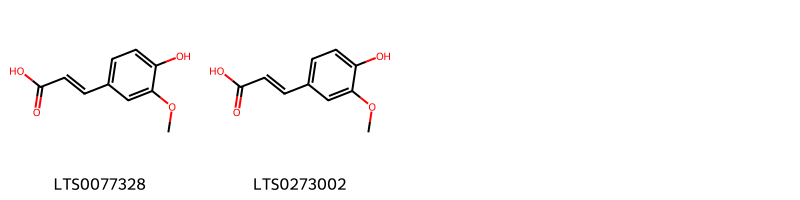{ width=100% }
    <figcaption>Hình ảnh cấu trúc hóa học của 2 hoạt chất thuộc nhóm Cinnamic acids and derivatives gồm ['ferulic acid (LTS0077328)', 'ferulic acid (LTS0273002)'].</figcaption>
</figure>
#### Nhóm Coumarins and derivatives
<figure markdown="span">
    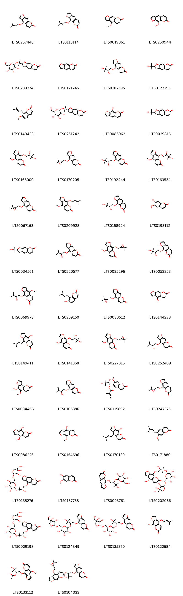{ width=100% }
    <figcaption>Hình ảnh cấu trúc hóa học của 66 hoạt chất thuộc nhóm Coumarins and derivatives gồm ['isoimperatorin (LTS0257448)', 'imperatorin (LTS0113114)', 'bergapten (LTS0019861)', 'methoxsalen (LTS0260944)', '2-(2-{[3,4,5-trihydroxy-6-(hydroxymethyl)oxan-2-yl]oxy}propan-2-yl)-2h,3h-furo[3,2-g]chromen-7-one (LTS0239274)', 'psoralen (LTS0121746)', '(r)-oxypeucedanin hydrate (LTS0102595)', 'marmesin (LTS0122295)', 'osthole (LTS0149433)', 'nodakenin (LTS0251242)', 'xanthotoxol (LTS0086962)', 'marmesin (LTS0029816)', 'byakangelicin (LTS0166000)', '4-[(3,3-dimethyloxiran-2-yl)methoxy]furo[3,2-g]chromen-7-one (LTS0170205)', '4-(2,3-dihydroxy-3-methylbutoxy)furo[3,2-g]chromen-7-one (LTS0192444)', '9-(2,3-dihydroxy-3-methylbutoxy)-4-methoxyfuro[3,2-g]chromen-7-one (LTS0163534)', '(+)-oxypeucedanin (LTS0067163)', 'phellopterin (LTS0209928)', 'heraclenol (LTS0158924)', 'scopoletin (LTS0193112)', '(-)-marmesin (LTS0034561)', '4-[(2-hydroxy-3-methylbut-3-en-1-yl)oxy]furo[3,2-g]chromen-7-one (LTS0220577)', '9-[(3,3-dimethyloxiran-2-yl)methoxy]-4-methoxyfuro[3,2-g]chromen-7-one (LTS0032296)', '9-(2,3-dihydroxy-3-methylbutoxy)furo[3,2-g]chromen-7-one (LTS0053323)', 'neobyakangelicol (LTS0069973)', 'osthenol (LTS0259150)', 'oxypeucedanin (LTS0030512)', 'bergaptol (LTS0144228)', '4-hydroxy-9-(3-methylbut-2-en-1-yl)furo[3,2-g]chromen-7-one (LTS0149411)', '9-[(2s)-2,3-dihydroxy-3-methylbutoxy]-4-methoxyfuro[3,2-g]chromen-7-one (LTS0141368)', 'byakangelicol (LTS0227815)', '4-{[(2r)-2-hydroxy-3-methylbut-3-en-1-yl]oxy}furo[3,2-g]chromen-7-one (LTS0252409)', 'pimpinellin (LTS0034466)', 'pabulenol (LTS0105386)', '(1r,2r)-2,3-dihydroxy-1-(7-methoxy-2-oxochromen-6-yl)-3-methylbutyl (2e)-2-methylbut-2-enoate (LTS0115892)', 'prangenin (LTS0247375)', '9-hydroxy-4-methoxyfuro[3,2-g]chromen-7-one (LTS0086226)', '5-hydroxyxanthotoxin (LTS0154696)', 'alloimperatorin (LTS0170139)', 'suberosin (LTS0171880)', '4-(3-{[6-({[3,4-dihydroxy-4-(hydroxymethyl)oxolan-2-yl]oxy}methyl)-3,4,5-trihydroxyoxan-2-yl]oxy}-2-hydroxy-3-methylbutoxy)furo[3,2-g]chromen-7-one (LTS0135276)', 'isoscopoletin (LTS0157758)', '9-(3-hydroxy-3-methyl-2-{[3,4,5-trihydroxy-6-(hydroxymethyl)oxan-2-yl]oxy}butoxy)furo[3,2-g]chromen-7-one (LTS0093761)', '9-[(2r)-3-{[(2s,3r,4s,5s,6r)-6-({[(2r,3r,4r)-3,4-dihydroxy-4-(hydroxymethyl)oxolan-2-yl]oxy}methyl)-3,4,5-trihydroxyoxan-2-yl]oxy}-2-hydroxy-3-methylbutoxy]-4-methoxyfuro[3,2-g]chromen-7-one (LTS0202066)', '4-[(2r)-3-{[(2s,3r,4s,5s,6r)-6-({[(2r,3r,4r)-3,4-dihydroxy-4-(hydroxymethyl)oxolan-2-yl]oxy}methyl)-3,4,5-trihydroxyoxan-2-yl]oxy}-2-hydroxy-3-methylbutoxy]furo[3,2-g]chromen-7-one (LTS0029198)', '4-(2-{[6-({[3,4-dihydroxy-4-(hydroxymethyl)oxolan-2-yl]oxy}methyl)-3,4,5-trihydroxyoxan-2-yl]oxy}-3-hydroxy-3-methylbutoxy)furo[3,2-g]chromen-7-one (LTS0124849)', '4-[(2r)-2-{[(2s,3r,4s,5s,6r)-6-({[(2r,3r,4r)-3,4-dihydroxy-4-(hydroxymethyl)oxolan-2-yl]oxy}methyl)-3,4,5-trihydroxyoxan-2-yl]oxy}-3-hydroxy-3-methylbutoxy]furo[3,2-g]chromen-7-one (LTS0135370)', 'cnidilin (LTS0122684)', '(2r)-3-hydroxy-1-({4-methoxy-7-oxofuro[3,2-g]chromen-9-yl}oxy)-3-methylbutan-2-yl acetate (LTS0133112)', "4-[(2s,5r)-4'-[(3,3-dimethyloxiran-2-yl)methoxy]-4,4-dimethylspiro[1,3-dioxolane-2,7'-furo[3,2-g]chromen]-5-ylmethoxy]furo[3,2-g]chromen-7-one (LTS0104033)", '9-[(2r)-2,3-dihydroxy-3-methylbutoxy]-4-[(2s)-2,3-dihydroxy-3-methylbutoxy]furo[3,2-g]chromen-7-one (LTS0134730)', '9-(3-{[6-({[3,4-dihydroxy-4-(hydroxymethyl)oxolan-2-yl]oxy}methyl)-3,4,5-trihydroxyoxan-2-yl]oxy}-2-hydroxy-3-methylbutoxy)-4-methoxyfuro[3,2-g]chromen-7-one (LTS0231712)', '4,9-bis(2,3-dihydroxy-3-methylbutoxy)furo[3,2-g]chromen-7-one (LTS0143425)', '9-(3-hydroxy-2-{[3-hydroxy-4-({4-methoxy-7-oxofuro[3,2-g]chromen-9-yl}oxy)-2-methylbutan-2-yl]oxy}-3-methylbutoxy)-4-methoxyfuro[3,2-g]chromen-7-one (LTS0099223)', "4-[(2s,5r)-9'-[(3,3-dimethyloxiran-2-yl)methoxy]-4'-methoxy-4,4-dimethylspiro[1,3-dioxolane-2,7'-furo[3,2-g]chromen]-5-ylmethoxy]furo[3,2-g]chromen-7-one (LTS0247916)", 'scopolin (LTS0061811)', 'skimmin (LTS0102064)', '9-[(2-{[3-hydroxy-4-({4-methoxy-7-oxofuro[3,2-g]chromen-9-yl}oxy)-2-methylbutan-2-yl]oxy}-3-methylbut-3-en-1-yl)oxy]-4-methoxyfuro[3,2-g]chromen-7-one (LTS0231422)', "9-[(2s,5r)-4,4-dimethyl-9'-[(3-methylbut-2-en-1-yl)oxy]spiro[1,3-dioxolane-2,7'-furo[3,2-g]chromen]-5-ylmethoxy]-4-methoxyfuro[3,2-g]chromen-7-one (LTS0061888)", "4-[(2s,5r)-4'-[(2r)-2,3-dihydroxy-3-methylbutoxy]-4,4-dimethylspiro[1,3-dioxolane-2,7'-furo[3,2-g]chromen]-5-ylmethoxy]furo[3,2-g]chromen-7-one (LTS0228299)", 'skimmin (LTS0063676)', "9-[(2s,5r)-9'-[(2r)-2,3-dihydroxy-3-methylbutoxy]-4'-methoxy-4,4-dimethylspiro[1,3-dioxolane-2,7'-furo[3,2-g]chromen]-5-ylmethoxy]-4-methoxyfuro[3,2-g]chromen-7-one (LTS0270497)", '9-[(2r)-3-hydroxy-3-methyl-2-{[(2s,3r,4s,5s,6r)-3,4,5-trihydroxy-6-(hydroxymethyl)oxan-2-yl]oxy}butoxy]furo[3,2-g]chromen-7-one (LTS0028714)', '6-(2-{[6-({[3,4-dihydroxy-4-(hydroxymethyl)oxolan-2-yl]oxy}methyl)-3,4,5-trihydroxyoxan-2-yl]oxy}-3-hydroxy-3-methylbutyl)-7-hydroxychromen-2-one (LTS0224717)', '6-[(2r)-2-{[(2s,3r,4s,5s,6r)-6-({[(2r,3r,4r)-3,4-dihydroxy-4-(hydroxymethyl)oxolan-2-yl]oxy}methyl)-3,4,5-trihydroxyoxan-2-yl]oxy}-3-hydroxy-3-methylbutyl]-7-hydroxychromen-2-one (LTS0119499)', '4-{[(2s)-2,4-dihydroxy-4-methylpentyl]oxy}furo[3,2-g]chromen-7-one (LTS0258119)'].</figcaption>
</figure>
#### Nhóm Fatty Acyls
<figure markdown="span">
    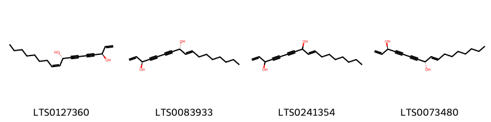{ width=100% }
    <figcaption>Hình ảnh cấu trúc hóa học của 4 hoạt chất thuộc nhóm Fatty Acyls gồm ['falcarindiol (LTS0127360)', '(3s,8r)-heptadeca-1,9-dien-4,6-diyne-3,8-diol (LTS0083933)', 'heptadeca-1,9-dien-4,6-diyne-3,8-diol (LTS0241354)', 'falcalindiol (LTS0073480)'].</figcaption>
</figure>
#### Nhóm Lactones
<figure markdown="span">
    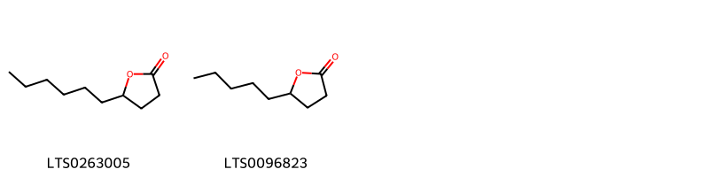{ width=100% }
    <figcaption>Hình ảnh cấu trúc hóa học của 2 hoạt chất thuộc nhóm Lactones gồm ['γ-decalactone (LTS0263005)', 'gamma-nonalactone (LTS0096823)'].</figcaption>
</figure>
#### Nhóm Prenol lipids
<figure markdown="span">
    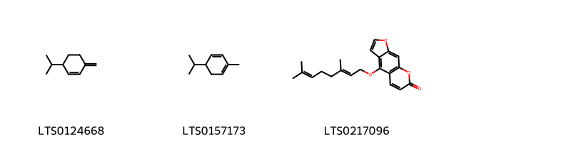{ width=100% }
    <figcaption>Hình ảnh cấu trúc hóa học của 3 hoạt chất thuộc nhóm Prenol lipids gồm ['β phellandrene (LTS0124668)', 'phellandrene (LTS0157173)', 'bergamottin (LTS0217096)'].</figcaption>
</figure>
#### Nhóm Purine nucleosides
<figure markdown="span">
    { width=100% }
    <figcaption>Hình ảnh cấu trúc hóa học của 1 hoạt chất thuộc nhóm Purine nucleosides gồm ['adenosine (LTS0014061)'].</figcaption>
</figure>
#### Nhóm Saturated hydrocarbons
<figure markdown="span">
    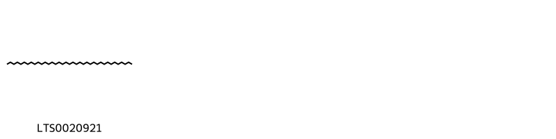{ width=100% }
    <figcaption>Hình ảnh cấu trúc hóa học của 1 hoạt chất thuộc nhóm Saturated hydrocarbons gồm ['heptatriacontane (LTS0020921)'].</figcaption>
</figure>
#### Nhóm Steroids and steroid derivatives
<figure markdown="span">
    { width=100% }
    <figcaption>Hình ảnh cấu trúc hóa học của 1 hoạt chất thuộc nhóm Steroids and steroid derivatives gồm ['sitogluside (LTS0201798)'].</figcaption>
</figure>

---

### Dược dân tộc học

Danh sách các quốc gia có sử dụng *Angelica dahurica* trong điều trị các bệnh. 

| Country   | Disease   | Bệnh                                                                                                                                                                                                |
|:----------|:----------|:----------------------------------------------------------------------------------------------------------------------------------------------------------------------------------------------------|
| Japan*    | Antidote  | MYMEMORY WARNING: YOU USED ALL AVAILABLE FREE TRANSLATIONS FOR TODAY. NEXT AVAILABLE IN  07 HOURS 51 MINUTES 06 SECONDS VISIT HTTPS://MYMEMORY.TRANSLATED.NET/DOC/USAGELIMITS.PHP TO TRANSLATE MORE |

---

---
## Angelica decursiva
### Thông tin về thực vật

!!! info "Phân loại thực vật của *Halosciastrum melanotilingia* từ GIBF:"
    - **Kingdom:** Plantae
    - **Phylum:** Tracheophyta
    - **Order:** Apiales
    - **Family:** Apiaceae
    - **Genus:** Halosciastrum
    - **Species:** *Halosciastrum melanotilingia*

 

| Label (VI)   | Label (EN)   | Scientific Name    | Descriptions (VI)   | Descriptions (EN)   | Also Known As (VI)   | Also Known As (EN)   |
|:-------------|:-------------|:-------------------|:--------------------|:--------------------|:---------------------|:---------------------|
| N/A          | N/A          | Angelica decursiva | loài thực vật       | species of plant    | ['']                 | ['']                 |

#### Phân bố trên thế giới

**Từ CSDL GIBF** Korea, Republic of, Russian Federation, China, Japan

#### Phân bố tại Việt Nam

**Từ CSDL GIBF**: Không có ghi nhận ở Việt Nam

---
### Thành phần hóa học
        
- Theo cơ sở dữ liệu lotus: Từ loài *Halosciastrum melanotilingia* đã phân lập và xác định được 28 hoạt chất thuộc về các nhóm Cinnamic acids and derivatives, Prenol lipids, Coumarins and derivatives. 

|    | chemicalTaxonomyClassyfireClass   |   smiles_count |
|---:|:----------------------------------|---------------:|
|  0 | Cinnamic acids and derivatives    |              1 |
|  1 | Coumarins and derivatives         |             26 |
|  2 | Prenol lipids                     |              1 |

#### Nhóm Cinnamic acids and derivatives
<figure markdown="span">
    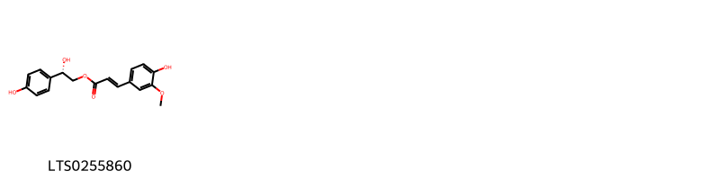{ width=100% }
    <figcaption>Hình ảnh cấu trúc hóa học của 1 hoạt chất thuộc nhóm Cinnamic acids and derivatives gồm ['(2s)-2-hydroxy-2-(4-hydroxyphenyl)ethyl (2e)-3-(4-hydroxy-3-methoxyphenyl)prop-2-enoate (LTS0255860)'].</figcaption>
</figure>
#### Nhóm Coumarins and derivatives
<figure markdown="span">
    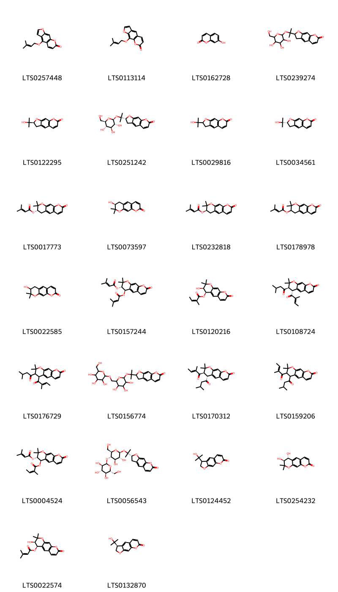{ width=100% }
    <figcaption>Hình ảnh cấu trúc hóa học của 26 hoạt chất thuộc nhóm Coumarins and derivatives gồm ['isoimperatorin (LTS0257448)', 'imperatorin (LTS0113114)', 'umbelliferone (LTS0162728)', '2-(2-{[3,4,5-trihydroxy-6-(hydroxymethyl)oxan-2-yl]oxy}propan-2-yl)-2h,3h-furo[3,2-g]chromen-7-one (LTS0239274)', 'marmesin (LTS0122295)', 'nodakenin (LTS0251242)', 'marmesin (LTS0029816)', '(-)-marmesin (LTS0034561)', 'decursin (LTS0017773)', 'decursinol (LTS0073597)', '(3r)-2,2-dimethyl-8-oxo-3h,4h-pyrano[3,2-g]chromen-3-yl 3-methylbut-2-enoate (LTS0232818)', '2,2-dimethyl-8-oxo-3h,4h-pyrano[3,2-g]chromen-3-yl 3-methylbut-2-enoate (LTS0178978)', '7-hydroxy-8,8-dimethyl-6h,7h-pyrano[3,2-g]chromen-2-one (LTS0022585)', '(3s,4r)-2,2-dimethyl-3-[(3-methylbut-2-enoyl)oxy]-8-oxo-3h,4h-pyrano[3,2-g]chromen-4-yl 3-methylbut-2-enoate (LTS0157244)', '(3r,4r)-3-hydroxy-2,2-dimethyl-8-oxo-3h,4h-pyrano[3,2-g]chromen-4-yl (2z)-2-methylbut-2-enoate (LTS0120216)', '(6r,7r)-8,8-dimethyl-6-[(2e)-2-methylbut-2-enoyl]-7-(3-methylbutanoyl)-6h,7h-pyrano[3,2-g]chromen-2-one (LTS0108724)', '8,8-dimethyl-6-(2-methylbut-2-enoyl)-7-(3-methylbutanoyl)-6h,7h-pyrano[3,2-g]chromen-2-one (LTS0176729)', '2-(2-{[3,4,5-trihydroxy-6-({[3,4,5-trihydroxy-6-(hydroxymethyl)oxan-2-yl]oxy}methyl)oxan-2-yl]oxy}propan-2-yl)-2h,3h-furo[3,2-g]chromen-7-one (LTS0156774)', '(6r,7r)-8,8-dimethyl-7-[(2e)-2-methylbut-2-enoyl]-6-(3-methylbutanoyl)-6h,7h-pyrano[3,2-g]chromen-2-one (LTS0170312)', '8,8-dimethyl-7-(2-methylbut-2-enoyl)-6-(3-methylbutanoyl)-6h,7h-pyrano[3,2-g]chromen-2-one (LTS0159206)', '(3s,4r)-2,2-dimethyl-4-{[(2z)-2-methylbut-2-enoyl]oxy}-8-oxo-3h,4h-pyrano[3,2-g]chromen-3-yl 3-methylbut-2-enoate (LTS0004524)', 'decuroside iii (LTS0056543)', '3-(2-hydroxypropan-2-yl)-2h,3h-furo[3,2-g]chromen-7-one (LTS0124452)', '(6r,7s)-6,7-dihydroxy-8,8-dimethyl-6h,7h-pyrano[3,2-g]chromen-2-one (LTS0254232)', '(3r,4r)-3-hydroxy-2,2-dimethyl-8-oxo-3h,4h-pyrano[3,2-g]chromen-4-yl 3-methylbut-2-enoate (LTS0022574)', '(3s)-3-(2-hydroxypropan-2-yl)-2h,3h-furo[3,2-g]chromen-7-one (LTS0132870)'].</figcaption>
</figure>
#### Nhóm Prenol lipids
<figure markdown="span">
    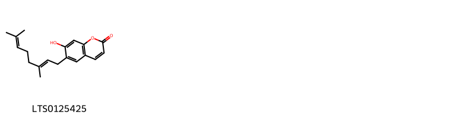{ width=100% }
    <figcaption>Hình ảnh cấu trúc hóa học của 1 hoạt chất thuộc nhóm Prenol lipids gồm ['ostruthin (LTS0125425)'].</figcaption>
</figure>

---

### Dược dân tộc học

Danh sách các quốc gia có sử dụng *Halosciastrum melanotilingia* trong điều trị các bệnh. 

| Country   | Disease                                    | Bệnh                                                                                                                                                                                                |
|:----------|:-------------------------------------------|:----------------------------------------------------------------------------------------------------------------------------------------------------------------------------------------------------|
| China     | Carminative, Expectorant, Stomachic, Tonic | MYMEMORY WARNING: YOU USED ALL AVAILABLE FREE TRANSLATIONS FOR TODAY. NEXT AVAILABLE IN  07 HOURS 50 MINUTES 39 SECONDS VISIT HTTPS://MYMEMORY.TRANSLATED.NET/DOC/USAGELIMITS.PHP TO TRANSLATE MORE |
| Japan*    | Antitussive, nan, Expectorant              | MYMEMORY WARNING: YOU USED ALL AVAILABLE FREE TRANSLATIONS FOR TODAY. NEXT AVAILABLE IN  07 HOURS 50 MINUTES 36 SECONDS VISIT HTTPS://MYMEMORY.TRANSLATED.NET/DOC/USAGELIMITS.PHP TO TRANSLATE MORE |

---

---
## Angelica glauca
### Thông tin về thực vật

!!! info "Phân loại thực vật của *Angelica glauca* từ GIBF:"
    - **Kingdom:** Plantae
    - **Phylum:** Tracheophyta
    - **Order:** Apiales
    - **Family:** Apiaceae
    - **Genus:** Angelica
    - **Species:** *Angelica glauca*

 

| Label (VI)   | Label (EN)   | Scientific Name   | Descriptions (VI)   | Descriptions (EN)   | Also Known As (VI)   | Also Known As (EN)   |
|:-------------|:-------------|:------------------|:--------------------|:--------------------|:---------------------|:---------------------|
| N/A          | N/A          | Angelica glauca   | loài thực vật       | species of plant    | ['']                 | ['']                 |

#### Phân bố trên thế giới

**Từ CSDL GIBF** nan, Pakistan, Afghanistan, India, China

#### Phân bố tại Việt Nam

**Từ CSDL GIBF**: Không có ghi nhận ở Việt Nam

---
### Thành phần hóa học
        
- Theo cơ sở dữ liệu lotus: Từ loài *Angelica glauca* đã phân lập và xác định được 12 hoạt chất thuộc về các nhóm Isobenzofurans, Coumarins and derivatives. 

|    | chemicalTaxonomyClassyfireClass   |   smiles_count |
|---:|:----------------------------------|---------------:|
|  0 | Coumarins and derivatives         |              5 |
|  1 | Isobenzofurans                    |              7 |

#### Nhóm Coumarins and derivatives
<figure markdown="span">
    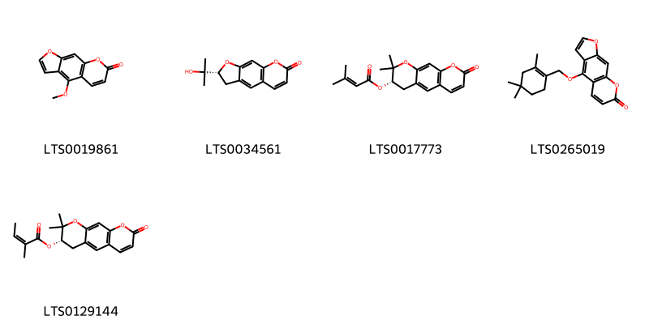{ width=100% }
    <figcaption>Hình ảnh cấu trúc hóa học của 5 hoạt chất thuộc nhóm Coumarins and derivatives gồm ['bergapten (LTS0019861)', '(-)-marmesin (LTS0034561)', 'decursin (LTS0017773)', '4-[(2,4,4-trimethylcyclohex-1-en-1-yl)methoxy]furo[3,2-g]chromen-7-one (LTS0265019)', '(3s)-2,2-dimethyl-8-oxo-3h,4h-pyrano[3,2-g]chromen-3-yl (2z)-2-methylbut-2-enoate (LTS0129144)'].</figcaption>
</figure>
#### Nhóm Isobenzofurans
<figure markdown="span">
    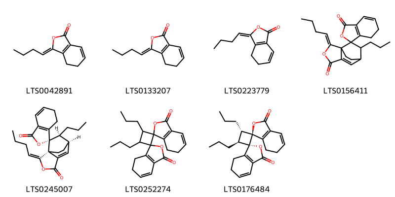{ width=100% }
    <figcaption>Hình ảnh cấu trúc hóa học của 7 hoạt chất thuộc nhóm Isobenzofurans gồm ['(z)-ligustilide (LTS0042891)', '3-butylidene-4,5-dihydro-2-benzofuran-1-one (LTS0133207)', 'z-ligustilide (LTS0223779)', "2'-butylidene-8'-propyl-6,7-dihydro-3'-oxaspiro[2-benzofuran-1,9'-tricyclo[5.2.2.0¹,⁵]undecan]-5'-ene-3,4'-dione (LTS0156411)", "(1s,1's,2'e,7'r,8's)-2'-butylidene-8'-propyl-6,7-dihydro-3'-oxaspiro[2-benzofuran-1,9'-tricyclo[5.2.2.0¹,⁵]undecan]-5'-ene-3,4'-dione (LTS0245007)", "3',4'-dipropyl-6,6'',7,7''-tetrahydrodispiro[2-benzofuran-1,1'-cyclobutane-2',1''-[2]benzofuran]-3,3''-dione (LTS0252274)", "(1s,1's,3's,4's)-3',4'-dipropyl-6,6'',7,7''-tetrahydrodispiro[2-benzofuran-1,2'-cyclobutane-1',1''-[2]benzofuran]-3,3''-dione (LTS0176484)"].</figcaption>
</figure>

---

### Dược dân tộc học

Danh sách các quốc gia có sử dụng *Angelica glauca* trong điều trị các bệnh. 

| Country   | Disease                | Bệnh                                                                                                                                                                                                |
|:----------|:-----------------------|:----------------------------------------------------------------------------------------------------------------------------------------------------------------------------------------------------|
| Elsewhere | Carminative, Stimulant | MYMEMORY WARNING: YOU USED ALL AVAILABLE FREE TRANSLATIONS FOR TODAY. NEXT AVAILABLE IN  07 HOURS 50 MINUTES 12 SECONDS VISIT HTTPS://MYMEMORY.TRANSLATED.NET/DOC/USAGELIMITS.PHP TO TRANSLATE MORE |

---

---
## Angelica grosserrata
### Thông tin về thực vật

!!! info "Phân loại thực vật của *Ostericum grosseserratum* từ GIBF:"
    - **Kingdom:** Plantae
    - **Phylum:** Tracheophyta
    - **Order:** Apiales
    - **Family:** Apiaceae
    - **Genus:** Ostericum
    - **Species:** *Ostericum grosseserratum*

 

| Label (VI)   | Label (EN)   | Scientific Name   | Descriptions (VI)   | Descriptions (EN)   | Also Known As (VI)   | Also Known As (EN)   |
|:-------------|:-------------|:------------------|:--------------------|:--------------------|:---------------------|:---------------------|
| N/A          | N/A          | Angelica glauca   | loài thực vật       | species of plant    | ['']                 | ['']                 |

#### Phân bố trên thế giới

**Từ CSDL GIBF** nan, Korea, Republic of, China

#### Phân bố tại Việt Nam

**Từ CSDL GIBF**: Không có ghi nhận ở Việt Nam

---
### Thành phần hóa học
        
- Theo cơ sở dữ liệu lotus: Từ loài *Ostericum grosseserratum* đã phân lập và xác định được Chưa có hoạt chất nào được phân lập. hoạt chất thuộc về các nhóm Không có hoạt chất nào được phân lập. 

Không có hình ảnh nào được tạo ra

---

### Dược dân tộc học

Danh sách các quốc gia có sử dụng *Ostericum grosseserratum* trong điều trị các bệnh. 

| Country   | Disease                          | Bệnh                                                                                                                                                                                                |
|:----------|:---------------------------------|:----------------------------------------------------------------------------------------------------------------------------------------------------------------------------------------------------|
| China     | Analgesic, Diuretic, Diaphoretic | MYMEMORY WARNING: YOU USED ALL AVAILABLE FREE TRANSLATIONS FOR TODAY. NEXT AVAILABLE IN  07 HOURS 49 MINUTES 51 SECONDS VISIT HTTPS://MYMEMORY.TRANSLATED.NET/DOC/USAGELIMITS.PHP TO TRANSLATE MORE |

---

---
## Angelica polymorpha
### Thông tin về thực vật

!!! info "Phân loại thực vật của *Angelica polymorpha* từ GIBF:"
    - **Kingdom:** Plantae
    - **Phylum:** Tracheophyta
    - **Order:** Apiales
    - **Family:** Apiaceae
    - **Genus:** Angelica
    - **Species:** *Angelica polymorpha*

 

| Label (VI)   | Label (EN)   | Scientific Name     | Descriptions (VI)   | Descriptions (EN)   | Also Known As (VI)   | Also Known As (EN)   |
|:-------------|:-------------|:--------------------|:--------------------|:--------------------|:---------------------|:---------------------|
| N/A          | N/A          | Angelica polymorpha | loài thực vật       | species of plant    | ['']                 | ['']                 |

#### Phân bố trên thế giới

**Từ CSDL GIBF** nan, Japan, Korea, Republic of, United States of America, China

#### Phân bố tại Việt Nam

**Từ CSDL GIBF**: Không có ghi nhận ở Việt Nam

---
### Thành phần hóa học
        
- Theo cơ sở dữ liệu lotus: Từ loài *Angelica polymorpha* đã phân lập và xác định được 2 hoạt chất thuộc về các nhóm Benzopyrans. 

|    | chemicalTaxonomyClassyfireClass   |   smiles_count |
|---:|:----------------------------------|---------------:|
|  0 | Benzopyrans                       |              2 |

#### Nhóm Benzopyrans
<figure markdown="span">
    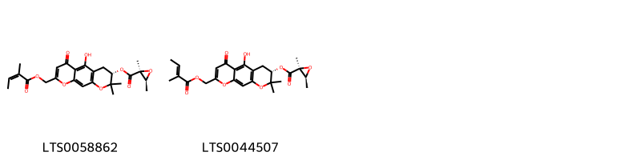{ width=100% }
    <figcaption>Hình ảnh cấu trúc hóa học của 2 hoạt chất thuộc nhóm Benzopyrans gồm ['(3s)-5-hydroxy-2,2-dimethyl-8-({[(2z)-2-methylbut-2-enoyl]oxy}methyl)-6-oxo-3h,4h-pyrano[3,2-g]chromen-3-yl (2s,3s)-2,3-dimethyloxirane-2-carboxylate (LTS0058862)', '(3s)-5-hydroxy-2,2-dimethyl-8-{[(2-methylbut-2-enoyl)oxy]methyl}-6-oxo-3h,4h-pyrano[3,2-g]chromen-3-yl (2s,3s)-2,3-dimethyloxirane-2-carboxylate (LTS0044507)'].</figcaption>
</figure>

---

### Dược dân tộc học

Danh sách các quốc gia có sử dụng *Angelica polymorpha* trong điều trị các bệnh. 

| Country   | Disease                                    | Bệnh                                                                                                                                                                                                |
|:----------|:-------------------------------------------|:----------------------------------------------------------------------------------------------------------------------------------------------------------------------------------------------------|
| China     | Sedative, Analgesic, Emmenagogue, Laxative | MYMEMORY WARNING: YOU USED ALL AVAILABLE FREE TRANSLATIONS FOR TODAY. NEXT AVAILABLE IN  07 HOURS 49 MINUTES 31 SECONDS VISIT HTTPS://MYMEMORY.TRANSLATED.NET/DOC/USAGELIMITS.PHP TO TRANSLATE MORE |
| Chinese   | Stimulant, Diuretic                        | MYMEMORY WARNING: YOU USED ALL AVAILABLE FREE TRANSLATIONS FOR TODAY. NEXT AVAILABLE IN  07 HOURS 49 MINUTES 29 SECONDS VISIT HTTPS://MYMEMORY.TRANSLATED.NET/DOC/USAGELIMITS.PHP TO TRANSLATE MORE |
| Elsewhere | Diuretic, Uterotonic                       | MYMEMORY WARNING: YOU USED ALL AVAILABLE FREE TRANSLATIONS FOR TODAY. NEXT AVAILABLE IN  07 HOURS 49 MINUTES 26 SECONDS VISIT HTTPS://MYMEMORY.TRANSLATED.NET/DOC/USAGELIMITS.PHP TO TRANSLATE MORE |

---

---
## Angelica pubescens
### Thông tin về thực vật

!!! info "Phân loại thực vật của *Angelica pubescens* từ GIBF:"
    - **Kingdom:** Plantae
    - **Phylum:** Tracheophyta
    - **Order:** Apiales
    - **Family:** Apiaceae
    - **Genus:** Angelica
    - **Species:** *Angelica pubescens*

 

| Label (VI)   | Label (EN)   | Scientific Name    | Descriptions (VI)   | Descriptions (EN)   | Also Known As (VI)   | Also Known As (EN)   |
|:-------------|:-------------|:-------------------|:--------------------|:--------------------|:---------------------|:---------------------|
| N/A          | N/A          | Angelica pubescens | loài thực vật       | species of plant    | ['']                 | ['']                 |

#### Phân bố trên thế giới

**Từ CSDL GIBF** nan, Korea, Republic of, Chinese Taipei, Japan

#### Phân bố tại Việt Nam

**Từ CSDL GIBF**: Không có ghi nhận ở Việt Nam

---
### Thành phần hóa học
        
- Theo cơ sở dữ liệu lotus: Từ loài *Angelica pubescens* đã phân lập và xác định được 76 hoạt chất thuộc về các nhóm Fatty Acyls, Prenol lipids, Steroids and steroid derivatives, Cinnamic acids and derivatives, Benzofurans, Organooxygen compounds, Coumarins and derivatives. 

|    | chemicalTaxonomyClassyfireClass   |   smiles_count |
|---:|:----------------------------------|---------------:|
|  0 | Benzofurans                       |              3 |
|  1 | Cinnamic acids and derivatives    |              4 |
|  2 | Coumarins and derivatives         |             54 |
|  3 | Fatty Acyls                       |             10 |
|  4 | Organooxygen compounds            |              1 |
|  5 | Prenol lipids                     |              1 |
|  6 | Steroids and steroid derivatives  |              3 |

#### Nhóm Benzofurans
<figure markdown="span">
    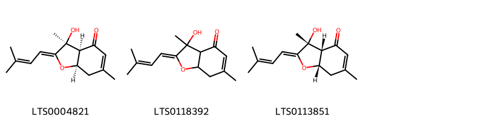{ width=100% }
    <figcaption>Hình ảnh cấu trúc hóa học của 3 hoạt chất thuộc nhóm Benzofurans gồm ['(2z,3s,3as,7ar)-3-hydroxy-3,6-dimethyl-2-(3-methylbut-2-en-1-ylidene)-7,7a-dihydro-3ah-1-benzofuran-4-one (LTS0004821)', '3-hydroxy-3,6-dimethyl-2-(3-methylbut-2-en-1-ylidene)-7,7a-dihydro-3ah-1-benzofuran-4-one (LTS0118392)', '(2z,3r,3ar,7as)-3-hydroxy-3,6-dimethyl-2-(3-methylbut-2-en-1-ylidene)-7,7a-dihydro-3ah-1-benzofuran-4-one (LTS0113851)'].</figcaption>
</figure>
#### Nhóm Cinnamic acids and derivatives
<figure markdown="span">
    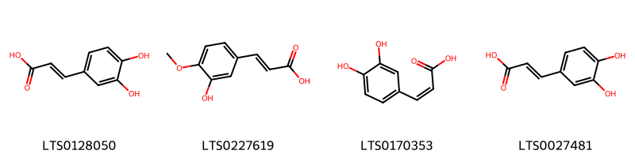{ width=100% }
    <figcaption>Hình ảnh cấu trúc hóa học của 4 hoạt chất thuộc nhóm Cinnamic acids and derivatives gồm ['3,4-dihydroxycinnamic acid (LTS0128050)', 'isoferulic acid (LTS0227619)', 'caffeicacid (LTS0170353)', 'caffeic acid (LTS0027481)'].</figcaption>
</figure>
#### Nhóm Coumarins and derivatives
<figure markdown="span">
    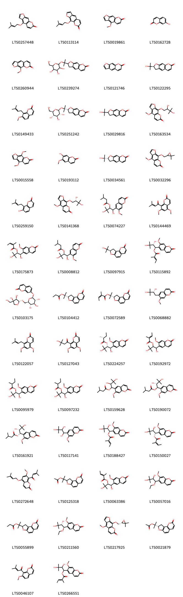{ width=100% }
    <figcaption>Hình ảnh cấu trúc hóa học của 54 hoạt chất thuộc nhóm Coumarins and derivatives gồm ['isoimperatorin (LTS0257448)', 'imperatorin (LTS0113114)', 'bergapten (LTS0019861)', 'umbelliferone (LTS0162728)', 'methoxsalen (LTS0260944)', '2-(2-{[3,4,5-trihydroxy-6-(hydroxymethyl)oxan-2-yl]oxy}propan-2-yl)-2h,3h-furo[3,2-g]chromen-7-one (LTS0239274)', 'psoralen (LTS0121746)', 'marmesin (LTS0122295)', 'osthole (LTS0149433)', 'nodakenin (LTS0251242)', 'marmesin (LTS0029816)', '9-(2,3-dihydroxy-3-methylbutoxy)-4-methoxyfuro[3,2-g]chromen-7-one (LTS0163534)', 'isopimpinellin (LTS0015558)', 'scopoletin (LTS0193112)', '(-)-marmesin (LTS0034561)', '9-[(3,3-dimethyloxiran-2-yl)methoxy]-4-methoxyfuro[3,2-g]chromen-7-one (LTS0032296)', 'osthenol (LTS0259150)', '9-[(2s)-2,3-dihydroxy-3-methylbutoxy]-4-methoxyfuro[3,2-g]chromen-7-one (LTS0141368)', '1,3-dihydroxy-1-(7-methoxy-2-oxochromen-6-yl)-3-methylbutan-2-yl 3-methylbutanoate (LTS0074227)', 'glaucalactone (LTS0144469)', '(1r,2s)-1,3-dihydroxy-1-(7-methoxy-2-oxochromen-6-yl)-3-methylbutan-2-yl (2z)-2-methylbut-2-enoate (LTS0175873)', '(1r,2s)-1,3-dihydroxy-1-(7-methoxy-2-oxochromen-6-yl)-3-methylbutan-2-yl 3-methylbutanoate (LTS0008812)', '(-)-columbianetin (LTS0097915)', '(1r,2r)-2,3-dihydroxy-1-(7-methoxy-2-oxochromen-6-yl)-3-methylbutyl (2e)-2-methylbut-2-enoate (LTS0115892)', '7-{[(2s,3r,4s,5s,6r)-6-({[(2r,3r,4r)-3,4-dihydroxy-4-(hydroxymethyl)oxolan-2-yl]oxy}methyl)-3,4,5-trihydroxyoxan-2-yl]oxy}chromen-2-one (LTS0103175)', '2-[(8s)-2-oxo-8h,9h-furo[2,3-h]chromen-8-yl]propan-2-yl propanoate (LTS0104412)', '2-[(8s)-2-oxo-8h,9h-furo[2,3-h]chromen-8-yl]propan-2-yl (2z)-2-methylbut-2-enoate (LTS0072589)', '6-[(2r)-2,3-dihydroxy-3-methylbutyl]-7-methoxychromen-2-one (LTS0068882)', '5,7-dimethoxy-8-(3-methylbut-2-en-1-yl)chromen-2-one (LTS0122057)', '8-(3-hydroxy-3-methylbutanoyl)-5,7-dimethoxychromen-2-one (LTS0127043)', '(1r,2r)-1,3-dihydroxy-1-(7-methoxy-2-oxochromen-6-yl)-3-methylbutan-2-yl (2r)-2-methylbutanoate (LTS0224257)', '1,3-dihydroxy-1-(7-methoxy-2-oxochromen-6-yl)-3-methylbutan-2-yl 2-methylbut-2-enoate (LTS0192972)', '(1r,2s)-1,3-dihydroxy-1-(7-methoxy-2-oxochromen-6-yl)-3-methylbutan-2-yl 2-methylbutanoate (LTS0095979)', '1,3-dihydroxy-1-(7-methoxy-2-oxochromen-6-yl)-3-methylbutan-2-yl 2-methylbutanoate (LTS0097232)', '2,3-dihydroxy-1-(7-methoxy-2-oxochromen-6-yl)-3-methylbutyl 3-methylbutanoate (LTS0159628)', '(1r,2s)-2,3-dihydroxy-1-(7-methoxy-2-oxochromen-6-yl)-3-methylbutyl 3-methylbutanoate (LTS0190072)', '(1s,2s)-2,3-dihydroxy-1-(7-methoxy-2-oxochromen-6-yl)-3-methylbutyl 3-methylbutanoate (LTS0161921)', '7-methoxy-6-(1,2,3-trihydroxy-3-methylbutyl)chromen-2-one (LTS0117141)', '(1r,2s)-2,3-dihydroxy-1-(7-methoxy-2-oxochromen-6-yl)-3-methylbutyl (2e)-2-methylbut-2-enoate (LTS0188427)', '(1s,2s)-2,3-dihydroxy-1-(7-methoxy-2-oxochromen-6-yl)-3-methylbutyl (2z)-2-methylbut-2-enoate (LTS0150027)', '7-methoxy-5-[(3-methylbut-2-en-1-yl)oxy]-8-(3-methylbut-2-enoyl)chromen-2-one (LTS0272648)', '2-{2-oxo-8h,9h-furo[2,3-h]chromen-8-yl}propan-2-yl acetate (LTS0125318)', '(1r,2s)-1,3-dihydroxy-1-(7-methoxy-2-oxochromen-6-yl)-3-methylbutan-2-yl (2e)-2-methylbut-2-enoate (LTS0063386)', '6-(1-ethoxy-2,3-dihydroxy-3-methylbutyl)-7-methoxychromen-2-one (LTS0057016)', '2-{2-oxo-8h,9h-furo[2,3-h]chromen-8-yl}propan-2-yl propanoate (LTS0055899)', 'angelol-j (LTS0211560)', '9-{[(2s)-3,3-dimethyloxiran-2-yl]methoxy}-4-methoxyfuro[3,2-g]chromen-7-one (LTS0217925)', '2-[(8s)-2-oxo-8h,9h-furo[2,3-h]chromen-8-yl]propan-2-yl acetate (LTS0021879)', '7-methoxy-8-(3-methylbut-2-enoyl)chromen-2-one (LTS0046107)', '2,3-dihydroxy-1-(7-methoxy-2-oxochromen-6-yl)-3-methylbutyl 2-methylbut-2-enoate (LTS0266551)', '(1s,2s)-2,3-dihydroxy-1-(7-methoxy-2-oxochromen-6-yl)-3-methylbutyl (2e)-2-methylbut-2-enoate (LTS0113301)', 'angelitriol (LTS0242228)', '(1r,2s)-2,3-dihydroxy-1-(7-methoxy-2-oxochromen-6-yl)-3-methylbutyl (2z)-2-methylbut-2-enoate (LTS0002112)', '(1r,2r)-2,3-dihydroxy-1-(7-methoxy-2-oxochromen-6-yl)-3-methylbutyl (2z)-2-methylbut-2-enoate (LTS0231459)'].</figcaption>
</figure>
#### Nhóm Fatty Acyls
<figure markdown="span">
    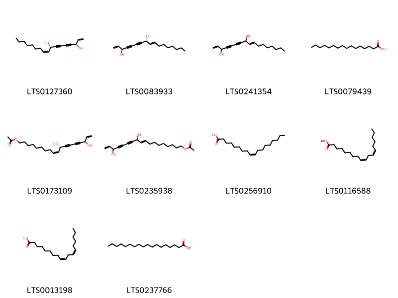{ width=100% }
    <figcaption>Hình ảnh cấu trúc hóa học của 10 hoạt chất thuộc nhóm Fatty Acyls gồm ['falcarindiol (LTS0127360)', '(3s,8r)-heptadeca-1,9-dien-4,6-diyne-3,8-diol (LTS0083933)', 'heptadeca-1,9-dien-4,6-diyne-3,8-diol (LTS0241354)', 'palmitic acid (LTS0079439)', '(9z,11s,16r)-11,16-dihydroxyoctadeca-9,17-dien-12,14-diyn-1-yl acetate (LTS0173109)', '11,16-dihydroxyoctadeca-9,17-dien-12,14-diyn-1-yl acetate (LTS0235938)', 'oleic acid (LTS0256910)', 'methyl linoleate (LTS0116588)', 'linoleic (LTS0013198)', 'stearic acid (LTS0237766)'].</figcaption>
</figure>
#### Nhóm Organooxygen compounds
<figure markdown="span">
    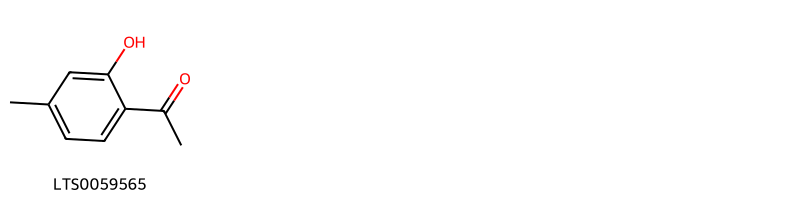{ width=100% }
    <figcaption>Hình ảnh cấu trúc hóa học của 1 hoạt chất thuộc nhóm Organooxygen compounds gồm ['1-(2-hydroxy-4-methylphenyl)ethanone (LTS0059565)'].</figcaption>
</figure>
#### Nhóm Prenol lipids
<figure markdown="span">
    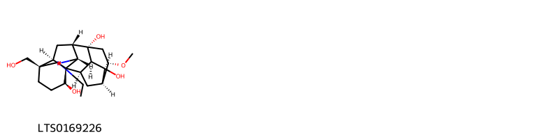{ width=100% }
    <figcaption>Hình ảnh cấu trúc hóa học của 1 hoạt chất thuộc nhóm Prenol lipids gồm ['(1s,2r,3r,4s,5s,6s,8s,9s,10r,13s,16s,17r)-11-ethyl-13-(hydroxymethyl)-6-methoxy-11-azahexacyclo[7.7.2.1²,⁵.0¹,¹⁰.0³,⁸.0¹³,¹⁷]nonadecane-4,8,16-triol (LTS0169226)'].</figcaption>
</figure>
#### Nhóm Steroids and steroid derivatives
<figure markdown="span">
    { width=100% }
    <figcaption>Hình ảnh cấu trúc hóa học của 3 hoạt chất thuộc nhóm Steroids and steroid derivatives gồm ['stigmast-5-en-3-ol (LTS0071224)', 'stigmast-5-en-3-ol, (3β)- (LTS0204616)', 'phytosterol (LTS0029311)'].</figcaption>
</figure>

---

### Dược dân tộc học

Danh sách các quốc gia có sử dụng *Angelica pubescens* trong điều trị các bệnh. 

| Country   | Disease     | Bệnh                                                                                                                                                                                                |
|:----------|:------------|:----------------------------------------------------------------------------------------------------------------------------------------------------------------------------------------------------|
| China     | Carminative | MYMEMORY WARNING: YOU USED ALL AVAILABLE FREE TRANSLATIONS FOR TODAY. NEXT AVAILABLE IN  07 HOURS 49 MINUTES 04 SECONDS VISIT HTTPS://MYMEMORY.TRANSLATED.NET/DOC/USAGELIMITS.PHP TO TRANSLATE MORE |

---

---
## Angelica rosaefolia
### Thông tin về thực vật

!!! info "Phân loại thực vật của *Scandia rosifolia* từ GIBF:"
    - **Kingdom:** Plantae
    - **Phylum:** Tracheophyta
    - **Order:** Apiales
    - **Family:** Apiaceae
    - **Genus:** Scandia
    - **Species:** *Scandia rosifolia*

 

| Label (VI)   | Label (EN)   | Scientific Name     | Descriptions (VI)   | Descriptions (EN)   | Also Known As (VI)   | Also Known As (EN)   |
|:-------------|:-------------|:--------------------|:--------------------|:--------------------|:---------------------|:---------------------|
| N/A          | N/A          | Angelica rosaefolia | loài thực vật       | species of plant    | ['']                 | ['']                 |

#### Phân bố trên thế giới

**Từ CSDL GIBF** nan, Korea, Republic of, Chinese Taipei, Japan

#### Phân bố tại Việt Nam

**Từ CSDL GIBF**: Không có ghi nhận ở Việt Nam

---
### Thành phần hóa học
        
- Theo cơ sở dữ liệu lotus: Từ loài *Scandia rosifolia* đã phân lập và xác định được Chưa có hoạt chất nào được phân lập. hoạt chất thuộc về các nhóm Không có hoạt chất nào được phân lập. 

Không có hình ảnh nào được tạo ra

---

### Dược dân tộc học

Danh sách các quốc gia có sử dụng *Scandia rosifolia* trong điều trị các bệnh. 

| Country     | Disease   | Bệnh                                                                                                                                                                                                |
|:------------|:----------|:----------------------------------------------------------------------------------------------------------------------------------------------------------------------------------------------------|
| New Zealand | Diuretic  | MYMEMORY WARNING: YOU USED ALL AVAILABLE FREE TRANSLATIONS FOR TODAY. NEXT AVAILABLE IN  07 HOURS 48 MINUTES 33 SECONDS VISIT HTTPS://MYMEMORY.TRANSLATED.NET/DOC/USAGELIMITS.PHP TO TRANSLATE MORE |

---

---
## Angelica silvestris
### Thông tin về thực vật

!!! info "Phân loại thực vật của *Angelica sylvestris* từ GIBF:"
    - **Kingdom:** Plantae
    - **Phylum:** Tracheophyta
    - **Order:** Apiales
    - **Family:** Apiaceae
    - **Genus:** Angelica
    - **Species:** *Angelica sylvestris*

 

| Label (VI)   | Label (EN)   | Scientific Name     | Descriptions (VI)   | Descriptions (EN)   | Also Known As (VI)   | Also Known As (EN)   |
|:-------------|:-------------|:--------------------|:--------------------|:--------------------|:---------------------|:---------------------|
| N/A          | N/A          | Angelica rosaefolia | loài thực vật       | species of plant    | ['']                 | ['']                 |

#### Phân bố trên thế giới

**Từ CSDL GIBF** Denmark, Finland, Netherlands, Czechia, Germany, Belgium, Spain, Poland, Ireland, Hungary, Switzerland, Russian Federation, Sweden, Austria, France, Norway, United Kingdom of Great Britain and Northern Ireland

#### Phân bố tại Việt Nam

**Từ CSDL GIBF**: Không có ghi nhận ở Việt Nam

---
### Thành phần hóa học
        
- Theo cơ sở dữ liệu lotus: Từ loài *Angelica sylvestris* đã phân lập và xác định được Chưa có hoạt chất nào được phân lập. hoạt chất thuộc về các nhóm Không có hoạt chất nào được phân lập. 

Không có hình ảnh nào được tạo ra

---

### Dược dân tộc học

Danh sách các quốc gia có sử dụng *Angelica sylvestris* trong điều trị các bệnh. 

| Country   | Disease   | Bệnh                                                                                                                                                                                                |
|:----------|:----------|:----------------------------------------------------------------------------------------------------------------------------------------------------------------------------------------------------|
| French    | Nervine   | MYMEMORY WARNING: YOU USED ALL AVAILABLE FREE TRANSLATIONS FOR TODAY. NEXT AVAILABLE IN  07 HOURS 48 MINUTES 17 SECONDS VISIT HTTPS://MYMEMORY.TRANSLATED.NET/DOC/USAGELIMITS.PHP TO TRANSLATE MORE |
| Italian   | Tonic     | MYMEMORY WARNING: YOU USED ALL AVAILABLE FREE TRANSLATIONS FOR TODAY. NEXT AVAILABLE IN  07 HOURS 48 MINUTES 15 SECONDS VISIT HTTPS://MYMEMORY.TRANSLATED.NET/DOC/USAGELIMITS.PHP TO TRANSLATE MORE |

---

---
## Angelica sinensis
### Thông tin về thực vật

!!! info "Phân loại thực vật của *Angelica sinensis* từ GIBF:"
    - **Kingdom:** Plantae
    - **Phylum:** Tracheophyta
    - **Order:** Apiales
    - **Family:** Apiaceae
    - **Genus:** Angelica
    - **Species:** *Angelica sinensis*

 

| Label (VI)   | Label (EN)   | Scientific Name   | Descriptions (VI)   | Descriptions (EN)   | Also Known As (VI)   | Also Known As (EN)   |
|:-------------|:-------------|:------------------|:--------------------|:--------------------|:---------------------|:---------------------|
| N/A          | N/A          | Angelica sinensis | loài thực vật       | species of plant    | ['']                 | ['']                 |

#### Phân bố trên thế giới

**Từ CSDL GIBF** Japan, United States of America, Viet Nam, Norway, China

#### Phân bố tại Việt Nam

**Từ CSDL GIBF**: Không có ghi nhận ở Việt Nam

---
### Thành phần hóa học
        
- Theo cơ sở dữ liệu lotus: Từ loài *Angelica sinensis* đã phân lập và xác định được 110 hoạt chất thuộc về các nhóm Benzofurans, Hydroxy acids and derivatives, Phenols, Carboxylic acids and derivatives, Fatty Acyls, Indoles and derivatives, Cinnamic acids and derivatives, Isocoumarans, Tetrapyrroles and derivatives, Isobenzofurans, Diazines, Prenol lipids, Benzene and substituted derivatives, Dihydrofurans, Organooxygen compounds, Pyridines and derivatives, Pyrenes, Steroids and steroid derivatives, Benzodioxoles, Macrolides and analogues, Coumarins and derivatives, Imidazopyrimidines. 

|    | chemicalTaxonomyClassyfireClass     |   smiles_count |
|---:|:------------------------------------|---------------:|
|  0 | Benzene and substituted derivatives |              4 |
|  1 | Benzodioxoles                       |              2 |
|  2 | Benzofurans                         |             10 |
|  3 | Carboxylic acids and derivatives    |              2 |
|  4 | Cinnamic acids and derivatives      |             10 |
|  5 | Coumarins and derivatives           |              3 |
|  6 | Diazines                            |              1 |
|  7 | Dihydrofurans                       |              1 |
|  8 | Fatty Acyls                         |             23 |
|  9 | Hydroxy acids and derivatives       |              1 |
| 10 | Imidazopyrimidines                  |              1 |
| 11 | Indoles and derivatives             |              1 |
| 12 | Isobenzofurans                      |             22 |
| 13 | Isocoumarans                        |              7 |
| 14 | Macrolides and analogues            |              2 |
| 15 | Organooxygen compounds              |              4 |
| 16 | Phenols                             |              1 |
| 17 | Prenol lipids                       |              7 |
| 18 | Pyrenes                             |              1 |
| 19 | Pyridines and derivatives           |              1 |
| 20 | Steroids and steroid derivatives    |              5 |
| 21 | Tetrapyrroles and derivatives       |              1 |

#### Nhóm Benzene and substituted derivatives
<figure markdown="span">
    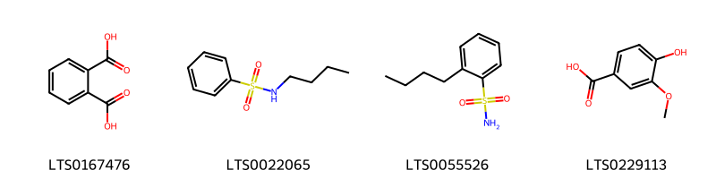{ width=100% }
    <figcaption>Hình ảnh cấu trúc hóa học của 4 hoạt chất thuộc nhóm Benzene and substituted derivatives gồm ['phthalic acid (LTS0167476)', 'n-butyl-benzenesulfonamide (LTS0022065)', '2-butylbenzenesulfonamide (LTS0055526)', 'vanillic acid (LTS0229113)'].</figcaption>
</figure>
#### Nhóm Benzodioxoles
<figure markdown="span">
    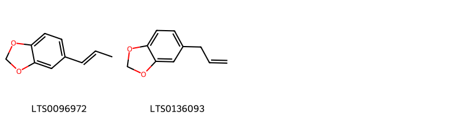{ width=100% }
    <figcaption>Hình ảnh cấu trúc hóa học của 2 hoạt chất thuộc nhóm Benzodioxoles gồm ['isosafrole (LTS0096972)', 'sassafras (LTS0136093)'].</figcaption>
</figure>
#### Nhóm Benzofurans
<figure markdown="span">
    { width=100% }
    <figcaption>Hình ảnh cấu trúc hóa học của 10 hoạt chất thuộc nhóm Benzofurans gồm ['butylphthalide (LTS0150205)', '(2r)-4-[(1s)-3-oxo-1h-2-benzofuran-1-yl]butan-2-yl (2z)-2-methylbut-2-enoate (LTS0063768)', "(1r,1's,6'r,9'z,11'r)-9'-butylidene-11'-propyl-8'-oxaspiro[2-benzofuran-1,10'-tricyclo[4.3.2.0¹,⁶]undecan]-4'-ene-3,7'-dione (LTS0165013)", '4-(3-oxo-1h-2-benzofuran-1-yl)butan-2-yl 2-methylbut-2-enoate (LTS0141103)', "(9'z)-9'-butylidene-11'-propyl-8'-oxaspiro[2-benzofuran-1,10'-tricyclo[4.3.2.0¹,⁶]undecan]-4'-ene-3,7'-dione (LTS0145627)", '(2s)-4-[(1s)-3-oxo-1h-2-benzofuran-1-yl]butan-2-yl (2z)-2-methylbut-2-enoate (LTS0165410)', "9'-butylidene-11'-propyl-8'-oxaspiro[2-benzofuran-1,10'-tricyclo[4.3.2.0¹,⁶]undecan]-4'-ene-3,7'-dione (LTS0238205)", "(1r,1'r,6's,9'z,11's)-9'-butylidene-11'-propyl-8'-oxaspiro[2-benzofuran-1,10'-tricyclo[4.3.2.0¹,⁶]undecan]-4'-ene-3,7'-dione (LTS0235189)", "(2'z,8'r)-2'-butylidene-8'-propyl-3'-oxaspiro[2-benzofuran-1,9'-tricyclo[5.2.2.0¹,⁵]undecan]-5'-ene-3,4'-dione (LTS0041769)", "(1s,1'r,2'z,7's,8'r)-2'-butylidene-8'-propyl-3'-oxaspiro[2-benzofuran-1,9'-tricyclo[5.2.2.0¹,⁵]undecan]-5'-ene-3,4'-dione (LTS0056284)"].</figcaption>
</figure>
#### Nhóm Carboxylic acids and derivatives
<figure markdown="span">
    { width=100% }
    <figcaption>Hình ảnh cấu trúc hóa học của 2 hoạt chất thuộc nhóm Carboxylic acids and derivatives gồm ['succinic acid (LTS0237204)', 'acid, folic (LTS0212965)'].</figcaption>
</figure>
#### Nhóm Cinnamic acids and derivatives
<figure markdown="span">
    { width=100% }
    <figcaption>Hình ảnh cấu trúc hóa học của 10 hoạt chất thuộc nhóm Cinnamic acids and derivatives gồm ['ferulic acid (LTS0077328)', 'ferulic acid (LTS0273002)', '2-hydroxy-3-(4-hydroxy-3-methoxyphenyl)-3-methoxypropyl (2z)-3-(4-hydroxy-3-methoxyphenyl)prop-2-enoate (LTS0206553)', '2-(4-hydroxyphenyl)ethyl (2e)-3-(4-hydroxy-3-methoxyphenyl)prop-2-enoate (LTS0158735)', '(2r,3s)-2-hydroxy-3-(4-hydroxy-3-methoxyphenyl)-3-methoxypropyl (2e)-3-(4-hydroxy-3-methoxyphenyl)prop-2-enoate (LTS0241093)', 'coniferyl alcohol; ferulic acid (LTS0116969)', '3-(4-hydroxy-3-methoxyphenyl)prop-2-en-1-yl 3-(4-hydroxy-3-methoxyphenyl)prop-2-enoate (LTS0246654)', '2-(4-hydroxyphenyl)ethyl 3-(4-hydroxy-3-methoxyphenyl)prop-2-enoate (LTS0196798)', '2-hydroxy-3-(4-hydroxy-3-methoxyphenyl)-3-methoxypropyl 3-(4-hydroxy-3-methoxyphenyl)prop-2-enoate (LTS0207331)', 'coniferyl ferulate (LTS0268137)'].</figcaption>
</figure>
#### Nhóm Coumarins and derivatives
<figure markdown="span">
    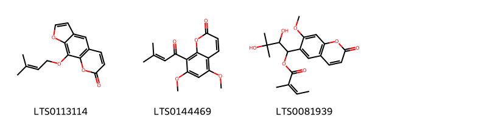{ width=100% }
    <figcaption>Hình ảnh cấu trúc hóa học của 3 hoạt chất thuộc nhóm Coumarins and derivatives gồm ['imperatorin (LTS0113114)', 'glaucalactone (LTS0144469)', '2,3-dihydroxy-1-(7-methoxy-2-oxochromen-6-yl)-3-methylbutyl (2z)-2-methylbut-2-enoate (LTS0081939)'].</figcaption>
</figure>
#### Nhóm Diazines
<figure markdown="span">
    { width=100% }
    <figcaption>Hình ảnh cấu trúc hóa học của 1 hoạt chất thuộc nhóm Diazines gồm ['pirod (LTS0008205)'].</figcaption>
</figure>
#### Nhóm Dihydrofurans
<figure markdown="span">
    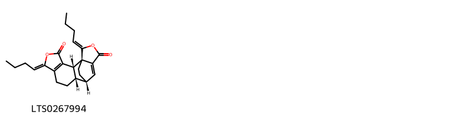{ width=100% }
    <figcaption>Hình ảnh cấu trúc hóa học của 1 hoạt chất thuộc nhóm Dihydrofurans gồm ['levistolide a (LTS0267994)'].</figcaption>
</figure>
#### Nhóm Fatty Acyls
<figure markdown="span">
    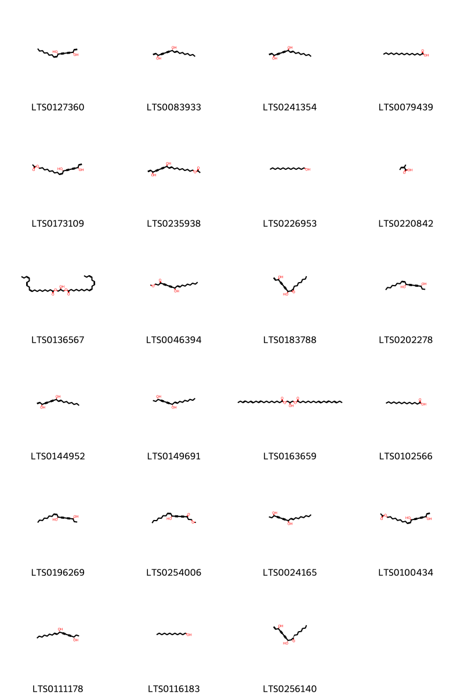{ width=100% }
    <figcaption>Hình ảnh cấu trúc hóa học của 23 hoạt chất thuộc nhóm Fatty Acyls gồm ['falcarindiol (LTS0127360)', '(3s,8r)-heptadeca-1,9-dien-4,6-diyne-3,8-diol (LTS0083933)', 'heptadeca-1,9-dien-4,6-diyne-3,8-diol (LTS0241354)', 'palmitic acid (LTS0079439)', '(9z,11s,16r)-11,16-dihydroxyoctadeca-9,17-dien-12,14-diyn-1-yl acetate (LTS0173109)', '11,16-dihydroxyoctadeca-9,17-dien-12,14-diyn-1-yl acetate (LTS0235938)', 'myristyl alcohol (LTS0226953)', 'angelic acid (LTS0220842)', '1,3-dilinolenoylglycerol (LTS0136567)', '8-hydroxy-1-methoxyheptadec-9-en-4,6-diyn-3-one (LTS0046394)', '1-(3-heptyloxiran-2-yl)oct-7-en-2,4-diyne-1,6-diol (LTS0183788)', '(3r,8s,9z)-heptadec-9-en-4,6-diyne-3,8-diol (LTS0202278)', '(3s,8s)-heptadeca-1,9-dien-4,6-diyne-3,8-diol (LTS0144952)', '(3s,8s)-heptadec-9-en-4,6-diyne-3,8-diol (LTS0149691)', '2-hydroxy-3-(octadeca-9,12,15-trienoyloxy)propyl octadeca-9,12,15-trienoate (LTS0163659)', 'myristic acid (LTS0102566)', 'oplopandiol (LTS0196269)', '(8s,9z)-8-hydroxy-1-methoxyheptadec-9-en-4,6-diyn-3-one (LTS0254006)', 'heptadec-9-en-4,6-diyne-3,8-diol (LTS0024165)', '(9z)-11,16-dihydroxyoctadeca-9,17-dien-12,14-diyn-1-yl acetate (LTS0100434)', '(3s,8s,9e)-heptadec-9-en-4,6-diyne-3,8-diol (LTS0111178)', '1-dodecanol (LTS0116183)', '(1r,6r)-1-[(2r,3r)-3-heptyloxiran-2-yl]oct-7-en-2,4-diyne-1,6-diol (LTS0256140)'].</figcaption>
</figure>
#### Nhóm Hydroxy acids and derivatives
<figure markdown="span">
    { width=100% }
    <figcaption>Hình ảnh cấu trúc hóa học của 1 hoạt chất thuộc nhóm Hydroxy acids and derivatives gồm ['(-)-malic acid (LTS0128885)'].</figcaption>
</figure>
#### Nhóm Imidazopyrimidines
<figure markdown="span">
    { width=100% }
    <figcaption>Hình ảnh cấu trúc hóa học của 1 hoạt chất thuộc nhóm Imidazopyrimidines gồm ['leucon (LTS0114351)'].</figcaption>
</figure>
#### Nhóm Indoles and derivatives
<figure markdown="span">
    { width=100% }
    <figcaption>Hình ảnh cấu trúc hóa học của 1 hoạt chất thuộc nhóm Indoles and derivatives gồm ['n-[2-(5-methoxy-1h-indol-3-yl)ethyl]ethanimidic acid (LTS0219322)'].</figcaption>
</figure>
#### Nhóm Isobenzofurans
<figure markdown="span">
    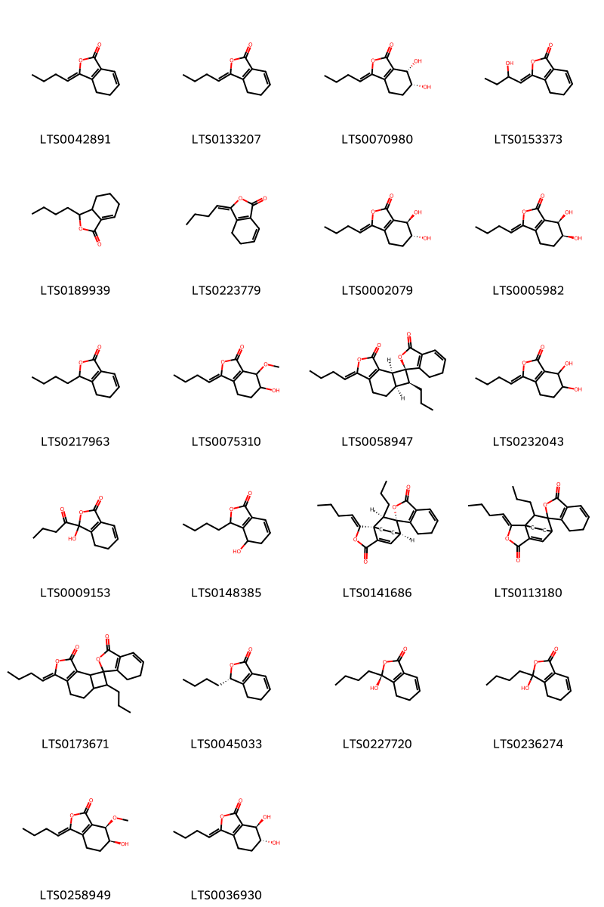{ width=100% }
    <figcaption>Hình ảnh cấu trúc hóa học của 22 hoạt chất thuộc nhóm Isobenzofurans gồm ['(z)-ligustilide (LTS0042891)', '3-butylidene-4,5-dihydro-2-benzofuran-1-one (LTS0133207)', '(6r,7s)-3-butylidene-6,7-dihydroxy-4,5,6,7-tetrahydro-2-benzofuran-1-one (LTS0070980)', '(3z)-3-(2-hydroxybutylidene)-4,5-dihydro-2-benzofuran-1-one (LTS0153373)', 'sedanolide (LTS0189939)', 'z-ligustilide (LTS0223779)', '(6r,7r)-3-butylidene-6,7-dihydroxy-4,5,6,7-tetrahydro-2-benzofuran-1-one (LTS0002079)', '(3z,6s,7r)-3-butylidene-6,7-dihydroxy-4,5,6,7-tetrahydro-2-benzofuran-1-one (LTS0005982)', '3-butyl-4,5-dihydro-3h-2-benzofuran-1-one (LTS0217963)', '3-butylidene-6-hydroxy-7-methoxy-4,5,6,7-tetrahydro-2-benzofuran-1-one (LTS0075310)', 'riligustilide (LTS0058947)', '3-butylidene-6,7-dihydroxy-4,5,6,7-tetrahydro-2-benzofuran-1-one (LTS0232043)', '3-butanoyl-3-hydroxy-4,5-dihydro-2-benzofuran-1-one (LTS0009153)', '3-butyl-4-hydroxy-4,5-dihydro-3h-2-benzofuran-1-one (LTS0148385)', "(1r,1's,2'z,7'r,9'r)-2'-butylidene-9'-propyl-6,7-dihydro-3'-oxaspiro[2-benzofuran-1,8'-tricyclo[5.2.2.0¹,⁵]undecan]-5'-ene-3,4'-dione (LTS0141686)", "2'-butylidene-9'-propyl-6,7-dihydro-3'-oxaspiro[2-benzofuran-1,8'-tricyclo[5.2.2.0¹,⁵]undecan]-5'-ene-3,4'-dione (LTS0113180)", "(9'z)-9'-butylidene-4'-propyl-6,7-dihydro-10'-oxaspiro[2-benzofuran-1,3'-tricyclo[6.3.0.0²,⁵]undecan]-1'(8')-ene-3,11'-dione (LTS0173671)", 'senkyunolide a (LTS0045033)', '(3s)-3-butyl-3-hydroxy-4,5-dihydro-2-benzofuran-1-one (LTS0227720)', '3-butyl-3-hydroxy-4,5-dihydro-2-benzofuran-1-one (LTS0236274)', '(3z,6s,7r)-3-butylidene-6-hydroxy-7-methoxy-4,5,6,7-tetrahydro-2-benzofuran-1-one (LTS0258949)', '(3z,6r,7r)-3-butylidene-6,7-dihydroxy-4,5,6,7-tetrahydro-2-benzofuran-1-one (LTS0036930)'].</figcaption>
</figure>
#### Nhóm Isocoumarans
<figure markdown="span">
    { width=100% }
    <figcaption>Hình ảnh cấu trúc hóa học của 7 hoạt chất thuộc nhóm Isocoumarans gồm ['butylidenephthalide (LTS0147414)', 'butylidenephthalide (LTS0259092)', 'z-butylidenephthalide (LTS0020784)', '(3z)-3-(2-hydroxybutylidene)-2-benzofuran-1-one (LTS0173938)', '(3z)-3-butylidene-5-hydroxy-2-benzofuran-1-one (LTS0055084)', 'senkyunolide b (LTS0230911)', '3-butylidene-7-hydroxy-2-benzofuran-1-one (LTS0050884)'].</figcaption>
</figure>
#### Nhóm Macrolides and analogues
<figure markdown="span">
    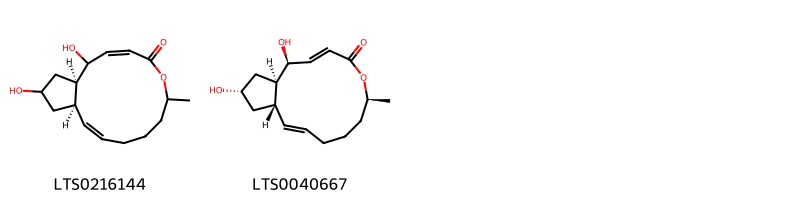{ width=100% }
    <figcaption>Hình ảnh cấu trúc hóa học của 2 hoạt chất thuộc nhóm Macrolides and analogues gồm ['(11ar,14ar)-1,13-dihydroxy-6-methyl-1h,6h,7h,8h,9h,11ah,12h,13h,14h,14ah-cyclopenta[f]oxacyclotridecan-4-one (LTS0216144)', 'brefeldin a (LTS0040667)'].</figcaption>
</figure>
#### Nhóm Organooxygen compounds
<figure markdown="span">
    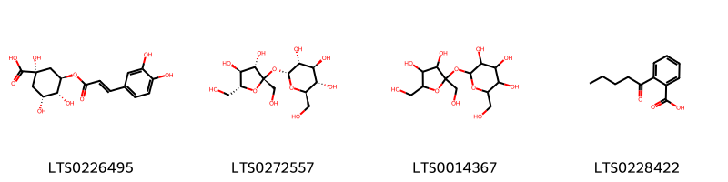{ width=100% }
    <figcaption>Hình ảnh cấu trúc hóa học của 4 hoạt chất thuộc nhóm Organooxygen compounds gồm ['chlorogenic acid (LTS0226495)', 'sucrose (LTS0272557)', 'granulated sugar (LTS0014367)', '2-pentanoylbenzoic acid (LTS0228422)'].</figcaption>
</figure>
#### Nhóm Phenols
<figure markdown="span">
    { width=100% }
    <figcaption>Hình ảnh cấu trúc hóa học của 1 hoạt chất thuộc nhóm Phenols gồm ['vanillin (LTS0136163)'].</figcaption>
</figure>
#### Nhóm Prenol lipids
<figure markdown="span">
    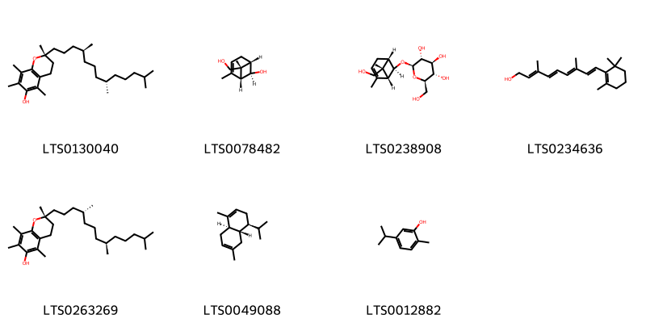{ width=100% }
    <figcaption>Hình ảnh cấu trúc hóa học của 7 hoạt chất thuộc nhóm Prenol lipids gồm ['(2r)-2,5,7,8-tetramethyl-2-[(4s,8s)-4,8,12-trimethyltridecyl]-3,4-dihydro-1-benzopyran-6-ol (LTS0130040)', '(1r,5s,6r,7r)-7-(hydroxymethyl)-2,7-dimethylbicyclo[3.1.1]hept-2-en-6-ol (LTS0078482)', '(2r,3s,4s,5r,6r)-2-(hydroxymethyl)-6-{[(1r,5s,6r,7r)-7-(hydroxymethyl)-2,7-dimethylbicyclo[3.1.1]hept-2-en-6-yl]oxy}oxane-3,4,5-triol (LTS0238908)', 'vitamin a (LTS0234636)', 'vitamin e (LTS0263269)', 'β-cadinene (LTS0049088)', 'carvacrol (LTS0012882)'].</figcaption>
</figure>
#### Nhóm Pyrenes
<figure markdown="span">
    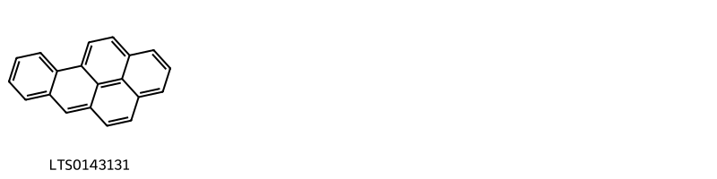{ width=100% }
    <figcaption>Hình ảnh cấu trúc hóa học của 1 hoạt chất thuộc nhóm Pyrenes gồm ['benzopyrene (LTS0143131)'].</figcaption>
</figure>
#### Nhóm Pyridines and derivatives
<figure markdown="span">
    { width=100% }
    <figcaption>Hình ảnh cấu trúc hóa học của 1 hoạt chất thuộc nhóm Pyridines and derivatives gồm ['niacin (LTS0216673)'].</figcaption>
</figure>
#### Nhóm Steroids and steroid derivatives
<figure markdown="span">
    { width=100% }
    <figcaption>Hình ảnh cấu trúc hóa học của 5 hoạt chất thuộc nhóm Steroids and steroid derivatives gồm ['stigmast-5-en-3-ol (LTS0071224)', 'stigmast-5-en-3-ol, (3β)- (LTS0204616)', 'phytosterol (LTS0029311)', 'stigmasterol (LTS0024262)', 'poriferasterol (LTS0229106)'].</figcaption>
</figure>
#### Nhóm Tetrapyrroles and derivatives
<figure markdown="span">
    { width=100% }
    <figcaption>Hình ảnh cấu trúc hóa học của 1 hoạt chất thuộc nhóm Tetrapyrroles and derivatives gồm ['1-[(2s,3r,4s,5r)-3-hydroxy-4-{[hydroxy([(2r)-1-({1-hydroxy-3-[(1r,2r,3r,4r,8s,13s,14s,18s,19s)-8,13,18-tris(2-carboximidatoethyl)-3,14,19-tris(c-hydroxycarbonimidoylmethyl)-1,4,6,9,9,14,16,19-octamethyl-20,21,22,23-tetraazapentacyclo[15.2.1.1²,⁵.1⁷,¹⁰.1¹²,¹⁵]tricosa-5(23),6,10(22),11,15(21),16-hexaen-4-yl]propylidene}amino)propan-2-yl]oxy)phosphoryl]oxy}-5-(hydroxymethyl)oxolan-2-yl]-5,6-dimethyl-3h-1λ⁵,3-benzodiazol-1-ylium; cyano radical (LTS0264990)'].</figcaption>
</figure>

---

### Dược dân tộc học

Danh sách các quốc gia có sử dụng *Angelica sinensis* trong điều trị các bệnh. 

| Country   | Disease                  | Bệnh                                                                                                                                                                                                |
|:----------|:-------------------------|:----------------------------------------------------------------------------------------------------------------------------------------------------------------------------------------------------|
| China     | Tranquilizer, Uterotonic | MYMEMORY WARNING: YOU USED ALL AVAILABLE FREE TRANSLATIONS FOR TODAY. NEXT AVAILABLE IN  07 HOURS 47 MINUTES 54 SECONDS VISIT HTTPS://MYMEMORY.TRANSLATED.NET/DOC/USAGELIMITS.PHP TO TRANSLATE MORE |
| Elsewhere | nan                      | MYMEMORY WARNING: YOU USED ALL AVAILABLE FREE TRANSLATIONS FOR TODAY. NEXT AVAILABLE IN  07 HOURS 47 MINUTES 51 SECONDS VISIT HTTPS://MYMEMORY.TRANSLATED.NET/DOC/USAGELIMITS.PHP TO TRANSLATE MORE |

---

---
## Angelica sylvestris
### Thông tin về thực vật

!!! info "Phân loại thực vật của *Angelica sylvestris* từ GIBF:"
    - **Kingdom:** Plantae
    - **Phylum:** Tracheophyta
    - **Order:** Apiales
    - **Family:** Apiaceae
    - **Genus:** Angelica
    - **Species:** *Angelica sylvestris*

 

| Label (VI)   | Label (EN)   | Scientific Name     | Descriptions (VI)   | Descriptions (EN)   | Also Known As (VI)   | Also Known As (EN)   |
|:-------------|:-------------|:--------------------|:--------------------|:--------------------|:---------------------|:---------------------|
| N/A          | N/A          | Angelica sylvestris | loài thực vật       | species of plant    | ['']                 | ['Wild angelica']    |

#### Phân bố trên thế giới

**Từ CSDL GIBF** Denmark, Finland, Netherlands, Czechia, Germany, Belgium, Spain, Poland, Ireland, Hungary, Switzerland, Russian Federation, Sweden, Austria, France, Norway, United Kingdom of Great Britain and Northern Ireland

#### Phân bố tại Việt Nam

**Từ CSDL GIBF**: Không có ghi nhận ở Việt Nam

---
### Thành phần hóa học
        
- Theo cơ sở dữ liệu lotus: Từ loài *Angelica sylvestris* đã phân lập và xác định được 2 hoạt chất thuộc về các nhóm Prenol lipids. 

|    | chemicalTaxonomyClassyfireClass   |   smiles_count |
|---:|:----------------------------------|---------------:|
|  0 | Prenol lipids                     |              2 |

#### Nhóm Prenol lipids
<figure markdown="span">
    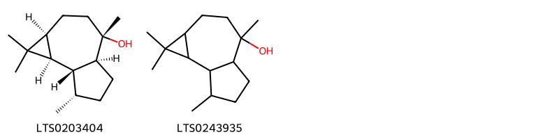{ width=100% }
    <figcaption>Hình ảnh cấu trúc hóa học của 2 hoạt chất thuộc nhóm Prenol lipids gồm ['(1as,4s,4as,7s,7ar,7br)-1,1,4,7-tetramethyl-octahydro-1ah-cyclopropa[e]azulen-4-ol (LTS0203404)', 'ledol (LTS0243935)'].</figcaption>
</figure>

---

### Dược dân tộc học

Danh sách các quốc gia có sử dụng *Angelica sylvestris* trong điều trị các bệnh. 

| Country   | Disease                  | Bệnh                                                                                                                                                                                                |
|:----------|:-------------------------|:----------------------------------------------------------------------------------------------------------------------------------------------------------------------------------------------------|
| China     | Diaphoretic, Carminative | MYMEMORY WARNING: YOU USED ALL AVAILABLE FREE TRANSLATIONS FOR TODAY. NEXT AVAILABLE IN  07 HOURS 47 MINUTES 22 SECONDS VISIT HTTPS://MYMEMORY.TRANSLATED.NET/DOC/USAGELIMITS.PHP TO TRANSLATE MORE |
| Elsewhere | Parasiticide             | MYMEMORY WARNING: YOU USED ALL AVAILABLE FREE TRANSLATIONS FOR TODAY. NEXT AVAILABLE IN  07 HOURS 47 MINUTES 19 SECONDS VISIT HTTPS://MYMEMORY.TRANSLATED.NET/DOC/USAGELIMITS.PHP TO TRANSLATE MORE |

---

---
## Angelica tenuisima
### Thông tin về thực vật

!!! info "Phân loại thực vật của *Conioselinum tenuissimum* từ GIBF:"
    - **Kingdom:** Plantae
    - **Phylum:** Tracheophyta
    - **Order:** Apiales
    - **Family:** Apiaceae
    - **Genus:** Conioselinum
    - **Species:** *Conioselinum tenuissimum*

 

| Label (VI)   | Label (EN)   | Scientific Name     | Descriptions (VI)   | Descriptions (EN)   | Also Known As (VI)   | Also Known As (EN)   |
|:-------------|:-------------|:--------------------|:--------------------|:--------------------|:---------------------|:---------------------|
| N/A          | N/A          | Angelica sylvestris | loài thực vật       | species of plant    | ['']                 | ['Wild angelica']    |

#### Phân bố trên thế giới

**Từ CSDL GIBF** nan, Korea, Republic of, Korea (Democratic People’s Republic of)

#### Phân bố tại Việt Nam

**Từ CSDL GIBF**: Không có ghi nhận ở Việt Nam

---
### Thành phần hóa học
        
- Theo cơ sở dữ liệu lotus: Từ loài *Conioselinum tenuissimum* đã phân lập và xác định được Chưa có hoạt chất nào được phân lập. hoạt chất thuộc về các nhóm Không có hoạt chất nào được phân lập. 

Không có hình ảnh nào được tạo ra

---

### Dược dân tộc học

Danh sách các quốc gia có sử dụng *Conioselinum tenuissimum* trong điều trị các bệnh. 

| Country   | Disease     | Bệnh                                                                                                                                                                                                |
|:----------|:------------|:----------------------------------------------------------------------------------------------------------------------------------------------------------------------------------------------------|
| Elsewhere | Carminative | MYMEMORY WARNING: YOU USED ALL AVAILABLE FREE TRANSLATIONS FOR TODAY. NEXT AVAILABLE IN  07 HOURS 46 MINUTES 57 SECONDS VISIT HTTPS://MYMEMORY.TRANSLATED.NET/DOC/USAGELIMITS.PHP TO TRANSLATE MORE |

---

# Chi Oenanthe

??? note "Danh sách các dược liệu thuộc chi"
    
	 - *Oenanthe aquatica*
	 - *Oenanthe crocata*
	 - *Oenanthe phellandrium*
	 - *Oenanthe sarmentosa*
	 - *Oenanthe stolonifera*

---
## Oenanthe aquatica
### Thông tin về thực vật

!!! info "Phân loại thực vật của *Oenanthe aquatica* từ GIBF:"
    - **Kingdom:** Plantae
    - **Phylum:** Tracheophyta
    - **Order:** Apiales
    - **Family:** Apiaceae
    - **Genus:** Oenanthe
    - **Species:** *Oenanthe aquatica*

 

| Label (VI)   | Label (EN)   | Scientific Name   | Descriptions (VI)   | Descriptions (EN)   | Also Known As (VI)   | Also Known As (EN)                                        |
|:-------------|:-------------|:------------------|:--------------------|:--------------------|:---------------------|:----------------------------------------------------------|
| N/A          | N/A          | Oenanthe aquatica | loài thực vật       | species of plant    | ['']                 | ['fine-leaved water dropwort', 'fineleaf water dropwort'] |

#### Phân bố trên thế giới

**Từ CSDL GIBF** Ukraine, Denmark, Netherlands, Belarus, Czechia, Germany, Romania, Belgium, Spain, Poland, Ireland, Hungary, Russian Federation, Austria, United Kingdom of Great Britain and Northern Ireland

#### Phân bố tại Việt Nam

**Từ CSDL GIBF**: Không có ghi nhận ở Việt Nam

---
### Thành phần hóa học
        
- Theo cơ sở dữ liệu lotus: Từ loài *Oenanthe aquatica* đã phân lập và xác định được 61 hoạt chất thuộc về các nhóm Fatty Acyls, Prenol lipids, Unsaturated hydrocarbons, Saturated hydrocarbons, Organooxygen compounds, Furanoid lignans, Carboxylic acids and derivatives. 

|    | chemicalTaxonomyClassyfireClass   |   smiles_count |
|---:|:----------------------------------|---------------:|
|  0 | Carboxylic acids and derivatives  |              2 |
|  1 | Fatty Acyls                       |              5 |
|  2 | Furanoid lignans                  |              3 |
|  3 | Organooxygen compounds            |             14 |
|  4 | Prenol lipids                     |             27 |
|  5 | Saturated hydrocarbons            |              2 |
|  6 | Unsaturated hydrocarbons          |              8 |

#### Nhóm Carboxylic acids and derivatives
<figure markdown="span">
    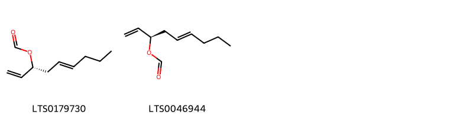{ width=100% }
    <figcaption>Hình ảnh cấu trúc hóa học của 2 hoạt chất thuộc nhóm Carboxylic acids and derivatives gồm ['(3r,5e)-nona-1,5-dien-3-yl formate (LTS0179730)', '(3r)-nona-1,5-dien-3-yl formate (LTS0046944)'].</figcaption>
</figure>
#### Nhóm Fatty Acyls
<figure markdown="span">
    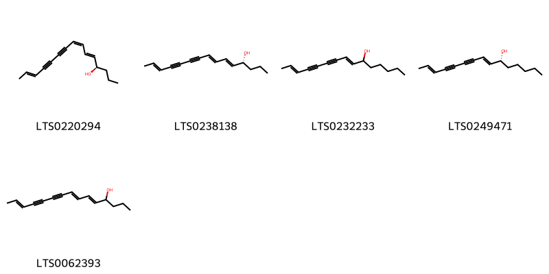{ width=100% }
    <figcaption>Hình ảnh cấu trúc hóa học của 5 hoạt chất thuộc nhóm Fatty Acyls gồm ['(4r,5e,7z,13e)-pentadeca-5,7,13-trien-9,11-diyn-4-ol (LTS0220294)', '(4r,5e,7e,13e)-pentadeca-5,7,13-trien-9,11-diyn-4-ol (LTS0238138)', 'pentadeca-7,13-dien-9,11-diyn-6-ol (LTS0232233)', '(6r,7e,13e)-pentadeca-7,13-dien-9,11-diyn-6-ol (LTS0249471)', 'pentadeca-5,7,13-trien-9,11-diyn-4-ol (LTS0062393)'].</figcaption>
</figure>
#### Nhóm Furanoid lignans
<figure markdown="span">
    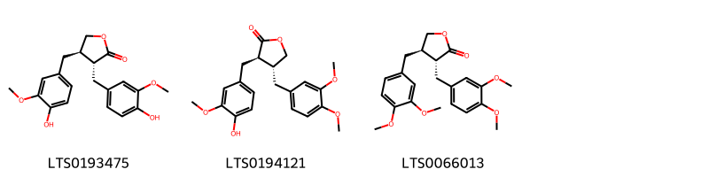{ width=100% }
    <figcaption>Hình ảnh cấu trúc hóa học của 3 hoạt chất thuộc nhóm Furanoid lignans gồm ['matairesinol (LTS0193475)', '(-)-arctigenin (LTS0194121)', 'arctigenin methyl ether (LTS0066013)'].</figcaption>
</figure>
#### Nhóm Organooxygen compounds
<figure markdown="span">
    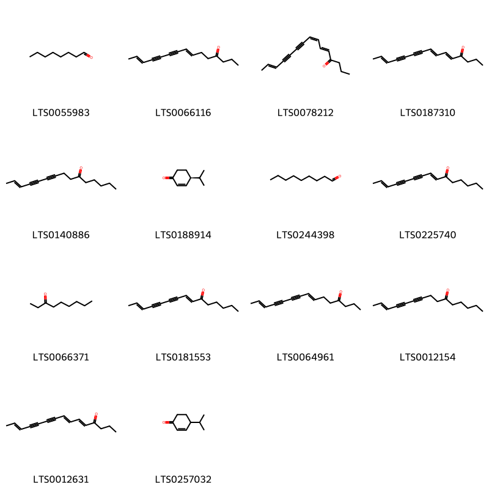{ width=100% }
    <figcaption>Hình ảnh cấu trúc hóa học của 14 hoạt chất thuộc nhóm Organooxygen compounds gồm ['octanal (LTS0055983)', '(7e,13e)-pentadeca-7,13-dien-9,11-diyn-4-one (LTS0066116)', '(5e,7z,13e)-pentadeca-5,7,13-trien-9,11-diyn-4-one (LTS0078212)', 'pentadeca-5,7,13-trien-9,11-diyn-4-one (LTS0187310)', '(13e)-pentadec-13-en-9,11-diyn-6-one (LTS0140886)', '(4s)-4-isopropylcyclohex-2-en-1-one (LTS0188914)', 'nonanal (LTS0244398)', '(7e,13e)-pentadeca-7,13-dien-9,11-diyn-6-one (LTS0225740)', '3-nonanone (LTS0066371)', 'pentadeca-7,13-dien-9,11-diyn-6-one (LTS0181553)', 'pentadeca-7,13-dien-9,11-diyn-4-one (LTS0064961)', 'pentadec-13-en-9,11-diyn-6-one (LTS0012154)', '(5e,7e,13e)-pentadeca-5,7,13-trien-9,11-diyn-4-one (LTS0012631)', '4-isopropyl-2-cyclohexenone (LTS0257032)'].</figcaption>
</figure>
#### Nhóm Prenol lipids
<figure markdown="span">
    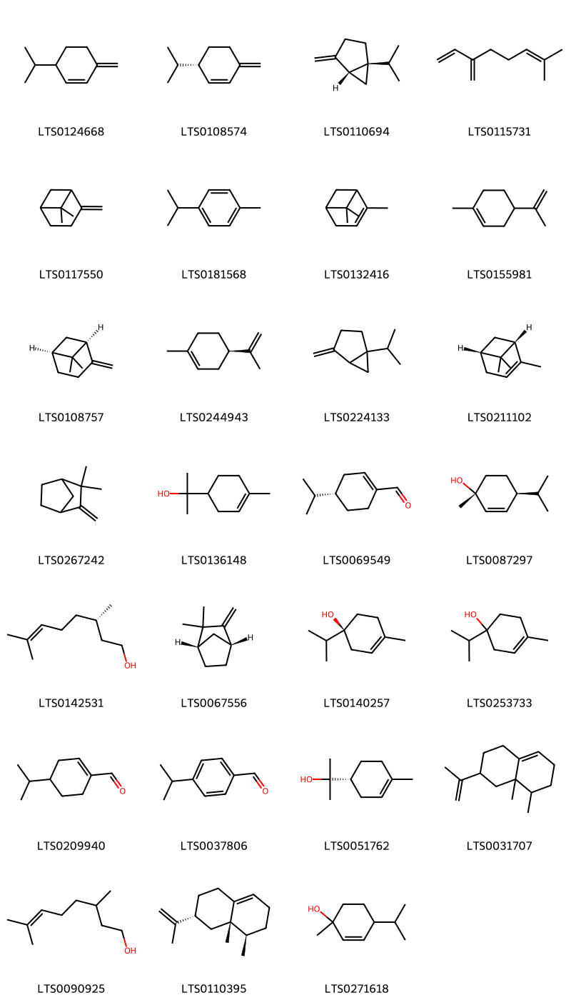{ width=100% }
    <figcaption>Hình ảnh cấu trúc hóa học của 27 hoạt chất thuộc nhóm Prenol lipids gồm ['β phellandrene (LTS0124668)', '(+)-β-phellandrene (LTS0108574)', '(+)-sabinene (LTS0110694)', 'α-myrcene (LTS0115731)', 'β-pinene (LTS0117550)', 'cymene (LTS0181568)', 'α pinene (LTS0132416)', 'limonene,  (LTS0155981)', '(-)-β-pinene (LTS0108757)', 'α-limonene (LTS0244943)', 'sabinene (LTS0224133)', '(+)-α-pinene (LTS0211102)', 'camphene (LTS0267242)', 'terpineol (LTS0136148)', '(s)-phellandral (LTS0069549)', '(1r,4s)-4-isopropyl-1-methylcyclohex-2-en-1-ol (LTS0087297)', '(-)-citronellol (LTS0142531)', '(-)-camphene (LTS0067556)', '(+)-4-terpineol (LTS0140257)', '4-terpineol (LTS0253733)', 'phellandral (LTS0209940)', 'cuminaldehyde (LTS0037806)', 'lily of valley (LTS0051762)', 'valencene (LTS0031707)', 'citronellol, (+-)- (LTS0090925)', 'valencene (LTS0110395)', '4-isopropyl-1-methylcyclohex-2-en-1-ol (LTS0271618)'].</figcaption>
</figure>
#### Nhóm Saturated hydrocarbons
<figure markdown="span">
    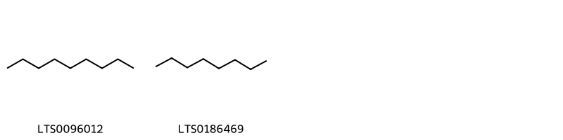{ width=100% }
    <figcaption>Hình ảnh cấu trúc hóa học của 2 hoạt chất thuộc nhóm Saturated hydrocarbons gồm ['nonane (LTS0096012)', 'octane (LTS0186469)'].</figcaption>
</figure>
#### Nhóm Unsaturated hydrocarbons
<figure markdown="span">
    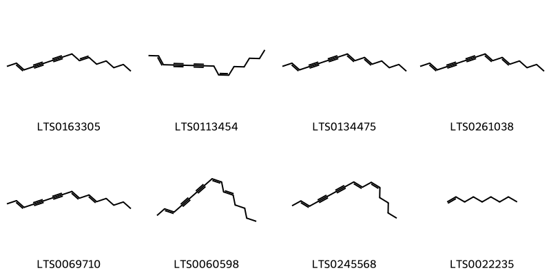{ width=100% }
    <figcaption>Hình ảnh cấu trúc hóa học của 8 hoạt chất thuộc nhóm Unsaturated hydrocarbons gồm ['pentadeca-2,9-dien-4,6-diyne (LTS0163305)', '(2e,9z)-pentadeca-2,9-dien-4,6-diyne (LTS0113454)', '(2e,8e,10e)-pentadeca-2,8,10-trien-4,6-diyne (LTS0134475)', '(8e)-pentadeca-2,8,10-trien-4,6-diyne (LTS0261038)', 'pentadeca-2,8,10-trien-4,6-diyne (LTS0069710)', '(2e,8z,10e)-pentadeca-2,8,10-trien-4,6-diyne (LTS0060598)', '(2e,8e,10z)-pentadeca-2,8,10-trien-4,6-diyne (LTS0245568)', 'nonene (LTS0022235)'].</figcaption>
</figure>

---

### Dược dân tộc học

Danh sách các quốc gia có sử dụng *Oenanthe aquatica* trong điều trị các bệnh. 

| Country   | Disease               | Bệnh                                                                                                                                                                                                |
|:----------|:----------------------|:----------------------------------------------------------------------------------------------------------------------------------------------------------------------------------------------------|
| Europe    | Diuretic, Expectorant | MYMEMORY WARNING: YOU USED ALL AVAILABLE FREE TRANSLATIONS FOR TODAY. NEXT AVAILABLE IN  07 HOURS 46 MINUTES 38 SECONDS VISIT HTTPS://MYMEMORY.TRANSLATED.NET/DOC/USAGELIMITS.PHP TO TRANSLATE MORE |

---

---
## Oenanthe crocata
### Thông tin về thực vật

!!! info "Phân loại thực vật của *Oenanthe crocata* từ GIBF:"
    - **Kingdom:** Plantae
    - **Phylum:** Tracheophyta
    - **Order:** Apiales
    - **Family:** Apiaceae
    - **Genus:** Oenanthe
    - **Species:** *Oenanthe crocata*

 

| Label (VI)   | Label (EN)   | Scientific Name   | Descriptions (VI)   | Descriptions (EN)   | Also Known As (VI)   | Also Known As (EN)         |
|:-------------|:-------------|:------------------|:--------------------|:--------------------|:---------------------|:---------------------------|
| N/A          | N/A          | Oenanthe crocata  | loài thực vật       | species of plant    | ['']                 | ['hemlock water-dropwort'] |

#### Phân bố trên thế giới

**Từ CSDL GIBF** Jersey, Netherlands, Spain, Ireland, Portugal, Isle of Man, France, Greece, United Kingdom of Great Britain and Northern Ireland

#### Phân bố tại Việt Nam

**Từ CSDL GIBF**: Không có ghi nhận ở Việt Nam

---
### Thành phần hóa học
        
- Theo cơ sở dữ liệu lotus: Từ loài *Oenanthe crocata* đã phân lập và xác định được 56 hoạt chất thuộc về các nhóm Fatty Acyls, Flavonoids, Unsaturated hydrocarbons, Organooxygen compounds. 

|    | chemicalTaxonomyClassyfireClass   |   smiles_count |
|---:|:----------------------------------|---------------:|
|  0 | Fatty Acyls                       |             41 |
|  1 | Flavonoids                        |              2 |
|  2 | Organooxygen compounds            |              6 |
|  3 | Unsaturated hydrocarbons          |              6 |

#### Nhóm Fatty Acyls
<figure markdown="span">
    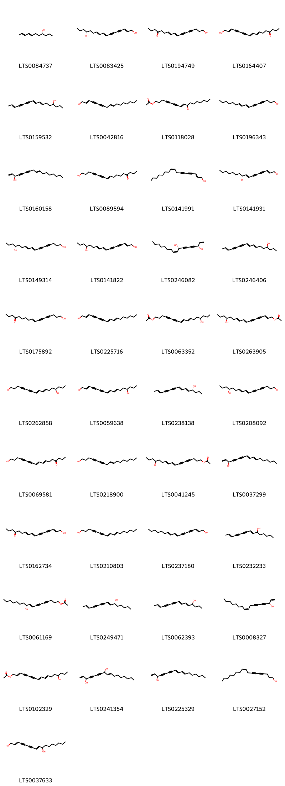{ width=100% }
    <figcaption>Hình ảnh cấu trúc hóa học của 41 hoạt chất thuộc nhóm Fatty Acyls gồm ['(4r,7e,9e)-undeca-7,9-dien-4-ol (LTS0084737)', 'oenanthotoxin (LTS0083425)', '(7e,9e)-17-hydroxyheptadeca-7,9-dien-11,13-diyn-4-one (LTS0194749)', '17-hydroxyheptadeca-7,9,15-trien-11,13-diyn-4-one (LTS0164407)', '(4s,7e,9e,15e)-heptadeca-7,9,15-trien-11,13-diyn-4-ol (LTS0159532)', 'heptadeca-2,9-dien-4,6-diyn-1-ol (LTS0042816)', '10-hydroxyheptadec-8-en-4,6-diyn-1-yl acetate (LTS0118028)', '(8e,10e)-heptadeca-8,10-dien-4,6-diyn-1-ol (LTS0196343)', 'heptadeca-1,9-dien-4,6-diyn-3-ol (LTS0160158)', '17-hydroxyheptadec-9-en-11,13-diyn-4-one (LTS0089594)', '(2e,9z)-heptadeca-2,9-dien-4,6-diyn-1-ol (LTS0141991)', '(2e,8e,10r)-heptadeca-2,8-dien-4,6-diyne-1,10-diol (LTS0141931)', '(8e,10e,14r)-heptadeca-8,10-dien-4,6-diyne-1,14-diol (LTS0149314)', '(s)-enanthotoxin (LTS0141822)', '(3s,8s,9z)-heptadeca-1,9-dien-4,6-diyne-3,8-diol (LTS0246082)', 'heptadeca-7,9,15-trien-11,13-diyn-4-ol (LTS0246406)', '(9e)-17-hydroxyheptadec-9-en-11,13-diyn-4-one (LTS0175892)', 'heptadeca-2,8,10-trien-4,6-diyn-1-ol (LTS0225716)', '14-hydroxyheptadeca-8,10-dien-4,6-diyn-1-yl acetate (LTS0063352)', '(2e,8e,10e,14s)-14-hydroxyheptadeca-2,8,10-trien-4,6-diyn-1-yl acetate (LTS0263905)', 'heptadeca-8,10-dien-4,6-diyne-1,14-diol (LTS0262858)', 'heptadeca-2,8,10-trien-4,6-diyne-1,14-diol (LTS0059638)', '(4r,5e,7e,13e)-pentadeca-5,7,13-trien-9,11-diyn-4-ol (LTS0238138)', '(8e,10e,14s)-heptadeca-8,10-dien-4,6-diyne-1,14-diol (LTS0208092)', '17-hydroxyheptadeca-7,9-dien-11,13-diyn-4-one (LTS0069581)', 'heptadec-9-en-4,6-diyn-1-ol (LTS0218900)', '(8e,10e,14s)-14-hydroxyheptadeca-8,10-dien-4,6-diyn-1-yl acetate (LTS0041245)', '(3s,8e,10e)-heptadeca-1,8,10-trien-4,6-diyn-3-ol (LTS0037299)', '(7e,9e,15e)-17-hydroxyheptadeca-7,9,15-trien-11,13-diyn-4-one (LTS0162734)', 'heptadeca-8,10-dien-4,6-diyn-1-ol (LTS0210803)', '(2e,8e,10e)-heptadeca-2,8,10-trien-4,6-diyn-1-ol (LTS0237180)', 'pentadeca-7,13-dien-9,11-diyn-6-ol (LTS0232233)', '(8e,10r)-10-hydroxyheptadec-8-en-4,6-diyn-1-yl acetate (LTS0061169)', '(6r,7e,13e)-pentadeca-7,13-dien-9,11-diyn-6-ol (LTS0249471)', 'pentadeca-5,7,13-trien-9,11-diyn-4-ol (LTS0062393)', 'falcarinol (LTS0008327)', '14-hydroxyheptadeca-2,8,10-trien-4,6-diyn-1-yl acetate (LTS0102329)', 'heptadeca-1,9-dien-4,6-diyne-3,8-diol (LTS0241354)', 'heptadeca-1,8,10-trien-4,6-diyn-3-ol (LTS0225329)', '(9z)-heptadec-9-en-4,6-diyn-1-ol (LTS0027152)', 'heptadeca-2,8-dien-4,6-diyne-1,10-diol (LTS0037633)'].</figcaption>
</figure>
#### Nhóm Flavonoids
<figure markdown="span">
    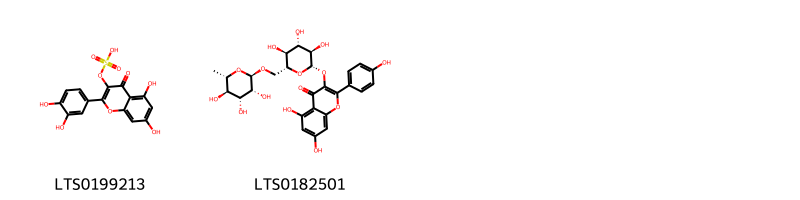{ width=100% }
    <figcaption>Hình ảnh cấu trúc hóa học của 2 hoạt chất thuộc nhóm Flavonoids gồm ['quercetin 3-sulfate (LTS0199213)', 'nictoflorin (LTS0182501)'].</figcaption>
</figure>
#### Nhóm Organooxygen compounds
<figure markdown="span">
    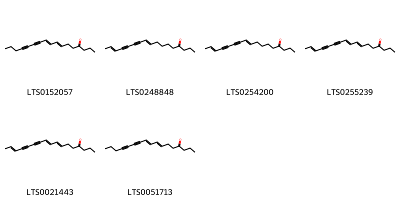{ width=100% }
    <figcaption>Hình ảnh cấu trúc hóa học của 6 hoạt chất thuộc nhóm Organooxygen compounds gồm ['heptadeca-7,9-dien-11,13-diyn-4-one (LTS0152057)', 'heptadeca-9,15-dien-11,13-diyn-4-one (LTS0248848)', '(9e,15e)-heptadeca-9,15-dien-11,13-diyn-4-one (LTS0254200)', '(7e,9e,15e)-heptadeca-7,9,15-trien-11,13-diyn-4-one (LTS0255239)', 'heptadeca-7,9,15-trien-11,13-diyn-4-one (LTS0021443)', '(7e,9e)-heptadeca-7,9-dien-11,13-diyn-4-one (LTS0051713)'].</figcaption>
</figure>
#### Nhóm Unsaturated hydrocarbons
<figure markdown="span">
    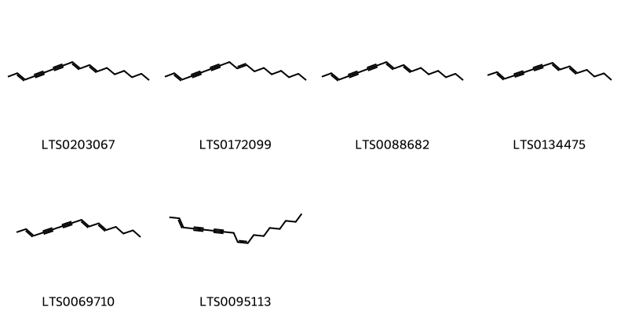{ width=100% }
    <figcaption>Hình ảnh cấu trúc hóa học của 6 hoạt chất thuộc nhóm Unsaturated hydrocarbons gồm ['(2e,8e,10e)-heptadeca-2,8,10-trien-4,6-diyne (LTS0203067)', 'heptadeca-2,9-dien-4,6-diyne (LTS0172099)', 'heptadeca-2,8,10-trien-4,6-diyne (LTS0088682)', '(2e,8e,10e)-pentadeca-2,8,10-trien-4,6-diyne (LTS0134475)', 'pentadeca-2,8,10-trien-4,6-diyne (LTS0069710)', '(2e,9z)-heptadeca-2,9-dien-4,6-diyne (LTS0095113)'].</figcaption>
</figure>

---

### Dược dân tộc học

Danh sách các quốc gia có sử dụng *Oenanthe crocata* trong điều trị các bệnh. 

| Country   | Disease   | Bệnh                                                                                                                                                                                                |
|:----------|:----------|:----------------------------------------------------------------------------------------------------------------------------------------------------------------------------------------------------|
| English   | Narcotic  | MYMEMORY WARNING: YOU USED ALL AVAILABLE FREE TRANSLATIONS FOR TODAY. NEXT AVAILABLE IN  07 HOURS 46 MINUTES 07 SECONDS VISIT HTTPS://MYMEMORY.TRANSLATED.NET/DOC/USAGELIMITS.PHP TO TRANSLATE MORE |
| French    | Poison    | MYMEMORY WARNING: YOU USED ALL AVAILABLE FREE TRANSLATIONS FOR TODAY. NEXT AVAILABLE IN  07 HOURS 46 MINUTES 05 SECONDS VISIT HTTPS://MYMEMORY.TRANSLATED.NET/DOC/USAGELIMITS.PHP TO TRANSLATE MORE |
| Sardinia  | Piscicide | MYMEMORY WARNING: YOU USED ALL AVAILABLE FREE TRANSLATIONS FOR TODAY. NEXT AVAILABLE IN  07 HOURS 46 MINUTES 02 SECONDS VISIT HTTPS://MYMEMORY.TRANSLATED.NET/DOC/USAGELIMITS.PHP TO TRANSLATE MORE |

---

---
## Oenanthe phellandrium
### Thông tin về thực vật

!!! info "Phân loại thực vật của *N/A* từ GIBF:"
    - **Kingdom:** Plantae
    - **Phylum:** Tracheophyta
    - **Order:** Apiales
    - **Family:** Apiaceae
    - **Genus:** Oenanthe
    - **Species:** *N/A*

 

| Label (VI)   | Label (EN)   | Scientific Name   | Descriptions (VI)   | Descriptions (EN)   | Also Known As (VI)   | Also Known As (EN)         |
|:-------------|:-------------|:------------------|:--------------------|:--------------------|:---------------------|:---------------------------|
| N/A          | N/A          | Oenanthe crocata  | loài thực vật       | species of plant    | ['']                 | ['hemlock water-dropwort'] |

#### Phân bố trên thế giới

**Từ CSDL GIBF** Australia, Japan, Belgium, Canada, Ukraine, Netherlands, Chinese Taipei, Spain, Portugal, Russian Federation, United States of America, Sweden, Switzerland, Austria, France, China, United Kingdom of Great Britain and Northern Ireland, Poland, New Zealand

#### Phân bố tại Việt Nam

**Từ CSDL GIBF**: Không có ghi nhận ở Việt Nam

---
### Thành phần hóa học
        
- Theo cơ sở dữ liệu lotus: Từ loài *N/A* đã phân lập và xác định được Chưa có hoạt chất nào được phân lập. hoạt chất thuộc về các nhóm Không có hoạt chất nào được phân lập. 

Không có hình ảnh nào được tạo ra

---

### Dược dân tộc học

Danh sách các quốc gia có sử dụng *N/A* trong điều trị các bệnh. 

| Country   | Disease                                                            | Bệnh                                                                                                                                                                                                |
|:----------|:-------------------------------------------------------------------|:----------------------------------------------------------------------------------------------------------------------------------------------------------------------------------------------------|
| Turkey    | Diuretic, Emmenagogue, Expectorant, Poison, Sudorific, Carminative | MYMEMORY WARNING: YOU USED ALL AVAILABLE FREE TRANSLATIONS FOR TODAY. NEXT AVAILABLE IN  07 HOURS 45 MINUTES 37 SECONDS VISIT HTTPS://MYMEMORY.TRANSLATED.NET/DOC/USAGELIMITS.PHP TO TRANSLATE MORE |

---

---
## Oenanthe sarmentosa
### Thông tin về thực vật

!!! info "Phân loại thực vật của *Oenanthe sarmentosa* từ GIBF:"
    - **Kingdom:** Plantae
    - **Phylum:** Tracheophyta
    - **Order:** Apiales
    - **Family:** Apiaceae
    - **Genus:** Oenanthe
    - **Species:** *Oenanthe sarmentosa*

 

| Label (VI)   | Label (EN)   | Scientific Name     | Descriptions (VI)   | Descriptions (EN)   | Also Known As (VI)   | Also Known As (EN)   |
|:-------------|:-------------|:--------------------|:--------------------|:--------------------|:---------------------|:---------------------|
| N/A          | N/A          | Oenanthe sarmentosa | loài thực vật       | species of plant    | ['']                 | ['']                 |

#### Phân bố trên thế giới

**Từ CSDL GIBF** Malaysia, United States of America, Canada

#### Phân bố tại Việt Nam

**Từ CSDL GIBF**: Không có ghi nhận ở Việt Nam

---
### Thành phần hóa học
        
- Theo cơ sở dữ liệu lotus: Từ loài *Oenanthe sarmentosa* đã phân lập và xác định được Chưa có hoạt chất nào được phân lập. hoạt chất thuộc về các nhóm Không có hoạt chất nào được phân lập. 

Không có hình ảnh nào được tạo ra

---

### Dược dân tộc học

Danh sách các quốc gia có sử dụng *Oenanthe sarmentosa* trong điều trị các bệnh. 

| Country          | Disease   | Bệnh                                                                                                                                                                                                |
|:-----------------|:----------|:----------------------------------------------------------------------------------------------------------------------------------------------------------------------------------------------------|
| Canada(Kwakiutl) | Emetic    | MYMEMORY WARNING: YOU USED ALL AVAILABLE FREE TRANSLATIONS FOR TODAY. NEXT AVAILABLE IN  07 HOURS 45 MINUTES 13 SECONDS VISIT HTTPS://MYMEMORY.TRANSLATED.NET/DOC/USAGELIMITS.PHP TO TRANSLATE MORE |

---

---
## Oenanthe stolonifera
### Thông tin về thực vật

!!! info "Phân loại thực vật của *N/A* từ GIBF:"
    - **Kingdom:** Plantae
    - **Phylum:** Tracheophyta
    - **Order:** Apiales
    - **Family:** Apiaceae
    - **Genus:** Oenanthe
    - **Species:** *N/A*

 

| Label (VI)   | Label (EN)   | Scientific Name      | Descriptions (VI)   | Descriptions (EN)   | Also Known As (VI)   | Also Known As (EN)   |
|:-------------|:-------------|:---------------------|:--------------------|:--------------------|:---------------------|:---------------------|
| N/A          | N/A          | Oenanthe stolonifera |                     |                     | ['']                 | ['']                 |

#### Phân bố trên thế giới

**Từ CSDL GIBF** Australia, Japan, Belgium, Canada, Ukraine, Netherlands, Chinese Taipei, Spain, Portugal, Russian Federation, United States of America, Sweden, Switzerland, Austria, France, China, United Kingdom of Great Britain and Northern Ireland, Poland, New Zealand

#### Phân bố tại Việt Nam

**Từ CSDL GIBF**: Không có ghi nhận ở Việt Nam

---
### Thành phần hóa học
        
- Theo cơ sở dữ liệu lotus: Từ loài *N/A* đã phân lập và xác định được Chưa có hoạt chất nào được phân lập. hoạt chất thuộc về các nhóm Không có hoạt chất nào được phân lập. 

Không có hình ảnh nào được tạo ra

---

### Dược dân tộc học

Danh sách các quốc gia có sử dụng *N/A* trong điều trị các bệnh. 

| Country   | Disease                                                          | Bệnh                                                                                                                                                                                                |
|:----------|:-----------------------------------------------------------------|:----------------------------------------------------------------------------------------------------------------------------------------------------------------------------------------------------|
| China     | Alexiteric, Hemostat, Hemostatic, Refrigerant, Tonic, Antivinous | MYMEMORY WARNING: YOU USED ALL AVAILABLE FREE TRANSLATIONS FOR TODAY. NEXT AVAILABLE IN  07 HOURS 44 MINUTES 50 SECONDS VISIT HTTPS://MYMEMORY.TRANSLATED.NET/DOC/USAGELIMITS.PHP TO TRANSLATE MORE |

---

# Chi Sanicula

??? note "Danh sách các dược liệu thuộc chi"
    
	 - *Sanicula europaea*
	 - *Sanicula marilandica*

---
## Sanicula europaea
### Thông tin về thực vật

!!! info "Phân loại thực vật của *Sanicula europaea* từ GIBF:"
    - **Kingdom:** Plantae
    - **Phylum:** Tracheophyta
    - **Order:** Apiales
    - **Family:** Apiaceae
    - **Genus:** Sanicula
    - **Species:** *Sanicula europaea*

 

| Label (VI)   | Label (EN)   | Scientific Name   | Descriptions (VI)   | Descriptions (EN)   | Also Known As (VI)   | Also Known As (EN)   |
|:-------------|:-------------|:------------------|:--------------------|:--------------------|:---------------------|:---------------------|
| N/A          | N/A          | Sanicula europaea | loài thực vật       | species of plant    | ['']                 | ['sanicle']          |

#### Phân bố trên thế giới

**Từ CSDL GIBF** Italy, Bulgaria, Norway, Ukraine, Denmark, Netherlands, Luxembourg, Spain, Hungary, Türkiye, Russian Federation, Sweden, Slovenia, Czechia, Germany, Romania, Switzerland, Austria, France, United Kingdom of Great Britain and Northern Ireland, Ireland, Serbia, Poland

#### Phân bố tại Việt Nam

**Từ CSDL GIBF**: Không có ghi nhận ở Việt Nam

---
### Thành phần hóa học
        
- Theo cơ sở dữ liệu lotus: Từ loài *Sanicula europaea* đã phân lập và xác định được 9 hoạt chất thuộc về các nhóm Cinnamic acids and derivatives, Prenol lipids. 

|    | chemicalTaxonomyClassyfireClass   |   smiles_count |
|---:|:----------------------------------|---------------:|
|  0 | Cinnamic acids and derivatives    |              5 |
|  1 | Prenol lipids                     |              4 |

#### Nhóm Cinnamic acids and derivatives
<figure markdown="span">
    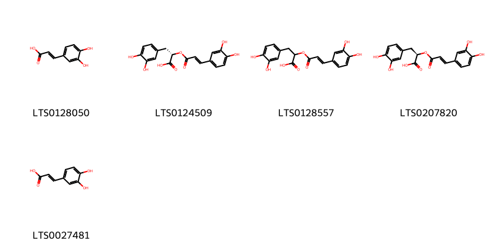{ width=100% }
    <figcaption>Hình ảnh cấu trúc hóa học của 5 hoạt chất thuộc nhóm Cinnamic acids and derivatives gồm ['3,4-dihydroxycinnamic acid (LTS0128050)', '(s)-rosmarinic acid (LTS0124509)', '3-(3,4-dihydroxyphenyl)-2-{[3-(3,4-dihydroxyphenyl)prop-2-enoyl]oxy}propanoic acid (LTS0128557)', 'rosemary acid (LTS0207820)', 'caffeic acid (LTS0027481)'].</figcaption>
</figure>
#### Nhóm Prenol lipids
<figure markdown="span">
    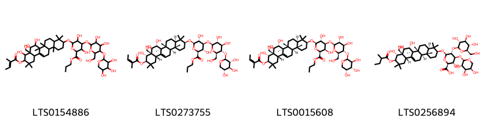{ width=100% }
    <figcaption>Hình ảnh cấu trúc hóa học của 4 hoạt chất thuộc nhóm Prenol lipids gồm ['propyl 4-{[3,4-dihydroxy-6-(hydroxymethyl)-5-[(3,4,5-trihydroxyoxan-2-yl)oxy]oxan-2-yl]oxy}-3,5-dihydroxy-6-{[7,8,9-trihydroxy-8a-(hydroxymethyl)-4,4,6a,6b,11,11,14b-heptamethyl-10-[(2-methylbut-2-enoyl)oxy]-1,2,3,4a,5,6,7,8,9,10,12,12a,14,14a-tetradecahydropicen-3-yl]oxy}oxane-2-carboxylate (LTS0154886)', 'propyl (2s,3s,4s,5r,6r)-6-{[(3s,4ar,6ar,6bs,7r,8s,8ar,9r,10r,12as,14ar,14br)-7,8,9-trihydroxy-8a-(hydroxymethyl)-4,4,6a,6b,11,11,14b-heptamethyl-10-{[(2z)-2-methylbut-2-enoyl]oxy}-1,2,3,4a,5,6,7,8,9,10,12,12a,14,14a-tetradecahydropicen-3-yl]oxy}-4-{[(2s,3r,4r,5s,6r)-3,4-dihydroxy-6-(hydroxymethyl)-5-{[(2s,3r,4s,5r)-3,4,5-trihydroxyoxan-2-yl]oxy}oxan-2-yl]oxy}-3,5-dihydroxyoxane-2-carboxylate (LTS0273755)', 'propyl (2s,3r,4s,5r,6r)-6-{[(3s,4ar,6ar,6bs,7r,8s,8ar,9r,10r,12as,14ar,14br)-7,8,9-trihydroxy-8a-(hydroxymethyl)-4,4,6a,6b,11,11,14b-heptamethyl-10-{[(2z)-2-methylbut-2-enoyl]oxy}-1,2,3,4a,5,6,7,8,9,10,12,12a,14,14a-tetradecahydropicen-3-yl]oxy}-4-{[(2s,3r,4r,5s,6r)-3,4-dihydroxy-6-(hydroxymethyl)-5-{[(2s,3s,4r,5r)-3,4,5-trihydroxyoxan-2-yl]oxy}oxan-2-yl]oxy}-3,5-dihydroxyoxane-2-carboxylate (LTS0015608)', '(2s,3s,4s,5r,6r)-6-{[(3s,4ar,6ar,6bs,7r,8s,8ar,9r,10r,12as,14ar,14br)-7,8,9-trihydroxy-8a-(hydroxymethyl)-4,4,6a,6b,11,11,14b-heptamethyl-10-[(2-methylbutanoyl)oxy]-1,2,3,4a,5,6,7,8,9,10,12,12a,14,14a-tetradecahydropicen-3-yl]oxy}-3-hydroxy-5-{[(2s,3r,4s,5s,6r)-3,4,5-trihydroxy-6-(hydroxymethyl)oxan-2-yl]oxy}-4-{[(2r,3s,4r,5r)-3,4,5-trihydroxyoxan-2-yl]oxy}oxane-2-carboxylic acid (LTS0256894)'].</figcaption>
</figure>

---

### Dược dân tộc học

Danh sách các quốc gia có sử dụng *Sanicula europaea* trong điều trị các bệnh. 

| Country   | Disease                                    | Bệnh                                                                                                                                                                                                |
|:----------|:-------------------------------------------|:----------------------------------------------------------------------------------------------------------------------------------------------------------------------------------------------------|
| Elsewhere | Antiseptic, Styptic                        | MYMEMORY WARNING: YOU USED ALL AVAILABLE FREE TRANSLATIONS FOR TODAY. NEXT AVAILABLE IN  07 HOURS 44 MINUTES 28 SECONDS VISIT HTTPS://MYMEMORY.TRANSLATED.NET/DOC/USAGELIMITS.PHP TO TRANSLATE MORE |
| Europe    | Stomachic, Astringent                      | MYMEMORY WARNING: YOU USED ALL AVAILABLE FREE TRANSLATIONS FOR TODAY. NEXT AVAILABLE IN  07 HOURS 44 MINUTES 26 SECONDS VISIT HTTPS://MYMEMORY.TRANSLATED.NET/DOC/USAGELIMITS.PHP TO TRANSLATE MORE |
| Turkey    | Astringent, Hemostat, Stomachic, Vulnerary | MYMEMORY WARNING: YOU USED ALL AVAILABLE FREE TRANSLATIONS FOR TODAY. NEXT AVAILABLE IN  07 HOURS 44 MINUTES 23 SECONDS VISIT HTTPS://MYMEMORY.TRANSLATED.NET/DOC/USAGELIMITS.PHP TO TRANSLATE MORE |

---

---
## Sanicula marilandica
### Thông tin về thực vật

!!! info "Phân loại thực vật của *Sanicula marilandica* từ GIBF:"
    - **Kingdom:** Plantae
    - **Phylum:** Tracheophyta
    - **Order:** Apiales
    - **Family:** Apiaceae
    - **Genus:** Sanicula
    - **Species:** *Sanicula marilandica*

 

| Label (VI)   | Label (EN)   | Scientific Name      | Descriptions (VI)   | Descriptions (EN)   | Also Known As (VI)   | Also Known As (EN)   |
|:-------------|:-------------|:---------------------|:--------------------|:--------------------|:---------------------|:---------------------|
| N/A          | N/A          | Sanicula marilandica | loài thực vật       | species of plant    | ['']                 | ['']                 |

#### Phân bố trên thế giới

**Từ CSDL GIBF** United States of America, Canada

#### Phân bố tại Việt Nam

**Từ CSDL GIBF**: Không có ghi nhận ở Việt Nam

---
### Thành phần hóa học
        
- Theo cơ sở dữ liệu lotus: Từ loài *Sanicula marilandica* đã phân lập và xác định được Chưa có hoạt chất nào được phân lập. hoạt chất thuộc về các nhóm Không có hoạt chất nào được phân lập. 

Không có hình ảnh nào được tạo ra

---

### Dược dân tộc học

Danh sách các quốc gia có sử dụng *Sanicula marilandica* trong điều trị các bệnh. 

| Country   | Disease    | Bệnh                                                                                                                                                                                                |
|:----------|:-----------|:----------------------------------------------------------------------------------------------------------------------------------------------------------------------------------------------------|
| US        | Astringent | MYMEMORY WARNING: YOU USED ALL AVAILABLE FREE TRANSLATIONS FOR TODAY. NEXT AVAILABLE IN  07 HOURS 43 MINUTES 59 SECONDS VISIT HTTPS://MYMEMORY.TRANSLATED.NET/DOC/USAGELIMITS.PHP TO TRANSLATE MORE |

---

# Chi Torilis

??? note "Danh sách các dược liệu thuộc chi"
    
	 - *Torilis japonica*

---
## Torilis japonica
### Thông tin về thực vật

!!! info "Phân loại thực vật của *Torilis japonica* từ GIBF:"
    - **Kingdom:** Plantae
    - **Phylum:** Tracheophyta
    - **Order:** Apiales
    - **Family:** Apiaceae
    - **Genus:** Torilis
    - **Species:** *Torilis japonica*

 

| Label (VI)   | Label (EN)   | Scientific Name   | Descriptions (VI)   | Descriptions (EN)   | Also Known As (VI)   | Also Known As (EN)   |
|:-------------|:-------------|:------------------|:--------------------|:--------------------|:---------------------|:---------------------|
| N/A          | N/A          | Torilis japonica  | loài thực vật       | species of plant    | ['']                 | ['']                 |

#### Phân bố trên thế giới

**Từ CSDL GIBF** nan, Italy, Japan, Belgium, Norway, Canada, Ukraine, Denmark, Netherlands, Chinese Taipei, Hungary, Russian Federation, United States of America, Sweden, Czechia, Germany, Switzerland, Austria, France, China, United Kingdom of Great Britain and Northern Ireland, Ireland, Poland, New Zealand

#### Phân bố tại Việt Nam

**Từ CSDL GIBF**: Không có ghi nhận ở Việt Nam

---
### Thành phần hóa học
        
- Theo cơ sở dữ liệu lotus: Từ loài *Torilis japonica* đã phân lập và xác định được 64 hoạt chất thuộc về các nhóm Prenol lipids, Oxepanes, Purine nucleosides, Organooxygen compounds, Carboxylic acids and derivatives. 

|    | chemicalTaxonomyClassyfireClass   |   smiles_count |
|---:|:----------------------------------|---------------:|
|  0 | Carboxylic acids and derivatives  |              1 |
|  1 | Organooxygen compounds            |              4 |
|  2 | Oxepanes                          |              4 |
|  3 | Prenol lipids                     |             54 |
|  4 | Purine nucleosides                |              1 |

#### Nhóm Carboxylic acids and derivatives
<figure markdown="span">
    { width=100% }
    <figcaption>Hình ảnh cấu trúc hóa học của 1 hoạt chất thuộc nhóm Carboxylic acids and derivatives gồm ['bet (LTS0164067)'].</figcaption>
</figure>
#### Nhóm Organooxygen compounds
<figure markdown="span">
    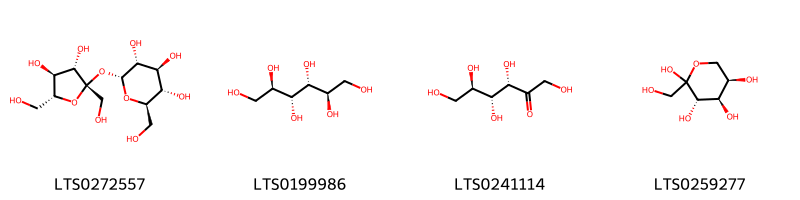{ width=100% }
    <figcaption>Hình ảnh cấu trúc hóa học của 4 hoạt chất thuộc nhóm Organooxygen compounds gồm ['sucrose (LTS0272557)', 'mannitol (LTS0199986)', 'keto-d-fructose (LTS0241114)', 'd-fructopyranose (LTS0259277)'].</figcaption>
</figure>
#### Nhóm Oxepanes
<figure markdown="span">
    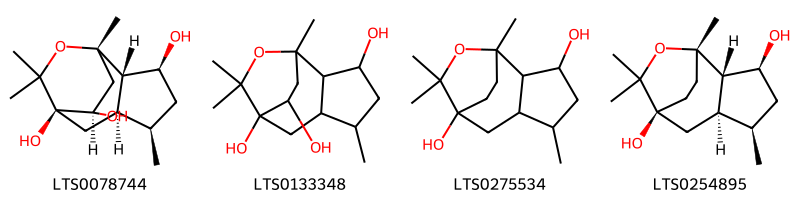{ width=100% }
    <figcaption>Hình ảnh cấu trúc hóa học của 4 hoạt chất thuộc nhóm Oxepanes gồm ['(1s,2s,3s,5r,6r,8r,12r)-1,5,9,9-tetramethyl-10-oxatricyclo[6.2.2.0²,⁶]dodecane-3,8,12-triol (LTS0078744)', '1,5,9,9-tetramethyl-10-oxatricyclo[6.2.2.0²,⁶]dodecane-3,8,12-triol (LTS0133348)', '1,5,9,9-tetramethyl-10-oxatricyclo[6.2.2.0²,⁶]dodecane-3,8-diol (LTS0275534)', '(1s,2s,3s,5r,6r,8s)-1,5,9,9-tetramethyl-10-oxatricyclo[6.2.2.0²,⁶]dodecane-3,8-diol (LTS0254895)'].</figcaption>
</figure>
#### Nhóm Prenol lipids
<figure markdown="span">
    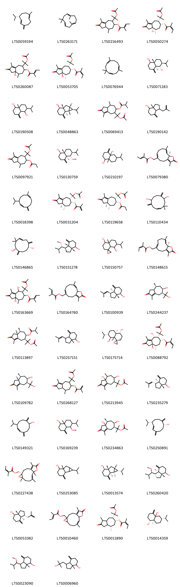{ width=100% }
    <figcaption>Hình ảnh cấu trúc hóa học của 54 hoạt chất thuộc nhóm Prenol lipids gồm ['(-)-germacrene d (LTS0059194)', 'humulene (LTS0263171)', '7-[2-(acetyloxy)propan-2-yl]-1,4-dimethyl-2-oxo-3a,4,5,6,7,8-hexahydro-3h-azulen-6-yl 2-methylbut-2-enoate (LTS0216493)', '(3as,4s,6r,7s)-7-[2-(acetyloxy)propan-2-yl]-3a-hydroxy-1,4-dimethyl-2-oxo-3,4,5,6,7,8-hexahydroazulen-6-yl (2z)-2-methylbut-2-enoate (LTS0050274)', '7-[2-(acetyloxy)propan-2-yl]-3a-hydroxy-1,4-dimethyl-2-oxo-3,4,5,6,7,8-hexahydroazulen-6-yl 2-methylbut-2-enoate (LTS0260087)', '(3ar,4s,6r,7s)-7-[2-(acetyloxy)propan-2-yl]-3a-hydroxy-1,4-dimethyl-2-oxo-3,4,5,6,7,8-hexahydroazulen-6-yl (2z)-2-methylbut-2-enoate (LTS0053705)', 'α-humulene (LTS0076944)', '(1s,2s,4ar,5r,8as)-2-isopropyl-4a-methyl-8-methylidene-octahydronaphthalene-1,5-diol (LTS0071183)', '2-isopropyl-4a-methyl-8-methylidene-octahydronaphthalene-1,5-diol (LTS0190508)', '(1r,1ar,1bs,5r,5ar,6ar)-1-isopropyl-5a-methyl-2-methylidene-octahydrocyclopropa[a]inden-5-ol (LTS0048863)', '7-[2-(acetyloxy)propan-2-yl]-1,4-dimethyl-2-oxo-3a,4,5,6,7,8-hexahydro-3h-azulen-6-yl 2-methylpropanoate (LTS0069413)', '3a-methyl-7-methylidene-1-(2-methylprop-2-en-1-yl)-hexahydro-1h-inden-4-ol (LTS0190142)', '7-[2-(acetyloxy)propan-2-yl]-1,4-dimethyl-2-oxo-3a,4,5,6,7,8-hexahydro-3h-azulen-6-yl propanoate (LTS0097921)', '(1r,4as,5s,6s,8ar)-6-isopropyl-5-methoxy-8a-methyl-4-methylidene-octahydronaphthalen-1-ol (LTS0130759)', '6-isopropyl-8a-methyl-4-methylidene-hexahydro-1h-naphthalene-1,4a-diol (LTS0210197)', '[(11ar)-3,10-dimethyl-2-oxo-4h,5h,8h,9h,11ah-cyclodeca[b]furan-6-yl]methyl (2e)-2-methylbut-2-enoate (LTS0079380)', '8-isopropyl-1-methyl-5-methylidenecyclodeca-1,6-diene (LTS0018398)', '(3ar,4s,6r,7s)-7-[2-(acetyloxy)propan-2-yl]-1,4-dimethyl-2-oxo-3a,4,5,6,7,8-hexahydro-3h-azulen-6-yl 2-methylprop-2-enoate (LTS0031204)', '(3ar,4s,6r,7s)-7-[2-(acetyloxy)propan-2-yl]-1,4-dimethyl-2-oxo-3a,4,5,6,7,8-hexahydro-3h-azulen-6-yl propanoate (LTS0119658)', '10,10-dimethyl-2,6-dimethylidenecycloundec-8-ene-1,5-diol (LTS0110434)', '(1s,5r,8e)-10,10-dimethyl-2,6-dimethylidenecycloundec-8-ene-1,5-diol (LTS0146865)', '(1r,3ar,4r,7ar)-1-[(1s)-1-methoxy-2-methylpropyl]-3a-methyl-7-methylidene-hexahydro-1h-inden-4-ol (LTS0151278)', "7-isopropyl-4a-methyl-octahydrospiro[naphthalene-1,2'-oxirane]-4,8-diol (LTS0150757)", '[(11ar)-3,10-dimethyl-2-oxo-4h,5h,8h,9h,11ah-cyclodeca[b]furan-6-yl]methyl (2z)-2-methylbut-2-enoate (LTS0148615)', '7-[2-(acetyloxy)propan-2-yl]-3a,8-dihydroxy-1,4-dimethyl-2-oxo-3,4,5,6,7,8-hexahydroazulen-6-yl 2-methylbut-2-enoate (LTS0163669)', '{3,10-dimethyl-2-oxo-4h,5h,8h,9h,11ah-cyclodeca[b]furan-6-yl}methyl 2-methylbut-2-enoate (LTS0164760)', '(1s,3ar,4r,7as)-3a-methyl-7-methylidene-1-(2-methylprop-1-en-1-yl)-hexahydro-1h-inden-4-ol (LTS0100939)', '(4s,6r,7s)-6-hydroxy-7-(2-hydroxypropan-2-yl)-1,4-dimethyl-3a,4,5,6,7,8-hexahydro-3h-azulen-2-one (LTS0244237)', '(3ar,4s,6r,7s)-7-[2-(acetyloxy)propan-2-yl]-1,4-dimethyl-2-oxo-3a,4,5,6,7,8-hexahydro-3h-azulen-6-yl 2-methylpropanoate (LTS0113897)', '3a-methyl-7-methylidene-1-(2-methylprop-1-en-1-yl)-hexahydro-1h-inden-4-ol (LTS0257151)', "(1r,4r,4ar,7s,8s,8as)-7-isopropyl-4a-methyl-octahydrospiro[naphthalene-1,2'-oxirane]-4,8-diol (LTS0175714)", '(3ar,4s,6r,7s,8r)-7-[2-(acetyloxy)propan-2-yl]-3a,8-dihydroxy-1,4-dimethyl-2-oxo-3,4,5,6,7,8-hexahydroazulen-6-yl (2z)-2-methylbut-2-enoate (LTS0088792)', '(3ar,4s,6r,7s)-6-hydroxy-7-(2-hydroxypropan-2-yl)-1,4-dimethyl-3a,4,5,6,7,8-hexahydro-3h-azulen-2-one (LTS0109782)', '7-[2-(acetyloxy)propan-2-yl]-1,4-dimethyl-2-oxo-3a,4,5,6,7,8-hexahydro-3h-azulen-6-yl 2-methylprop-2-enoate (LTS0268127)', '2-(6,8a-dihydroxy-3,8-dimethyl-2-oxo-1,4,5,6,7,8-hexahydroazulen-5-yl)propan-2-yl acetate (LTS0213945)', '(1r,3ar,4r,7as)-3a-methyl-7-methylidene-1-(2-methylprop-1-en-1-yl)-hexahydro-1h-inden-4-ol (LTS0235279)', '7-isopropyl-4,10-dimethylidenecyclodec-5-en-1-ol (LTS0149321)', '6-isopropyl-5-methoxy-8a-methyl-4-methylidene-octahydronaphthalen-1-ol (LTS0169239)', '2-[(5s,6r,8s,8as)-6,8a-dihydroxy-3,8-dimethyl-2-oxo-1,4,5,6,7,8-hexahydroazulen-5-yl]propan-2-yl acetate (LTS0234863)', '(1r,5e,7s)-7-isopropyl-4,10-dimethylidenecyclodec-5-en-1-ol (LTS0250891)', '[(4r,6s,9e,11r)-9,14-dimethyl-13-oxo-5,12-dioxatricyclo[9.3.0.0⁴,⁶]tetradeca-1(14),9-dien-4-yl]methyl (2z)-2-methylbut-2-enoate (LTS0227438)', '1-isopropyl-5a-methyl-2-methylidene-octahydrocyclopropa[a]inden-5-ol (LTS0253085)', '(1s,1as,1bs,5r,5ar,6ar)-1-isopropyl-5a-methyl-2-methylidene-octahydrocyclopropa[a]inden-5-ol (LTS0013574)', '(1s,3ar,4r,7as)-1-[(1r)-1-methoxy-2-methylpropyl]-3a-methyl-7-methylidene-hexahydro-1h-inden-4-ol (LTS0260420)', '(1r,3ar,4r,7as)-3a-methyl-7-methylidene-1-(2-methylprop-2-en-1-yl)-hexahydro-1h-inden-4-ol (LTS0053382)', '{9,14-dimethyl-13-oxo-5,12-dioxatricyclo[9.3.0.0⁴,⁶]tetradeca-1(14),9-dien-4-yl}methyl 2-methylbut-2-enoate (LTS0010460)', '(4s,6r,7s)-7-[2-(acetyloxy)propan-2-yl]-1,4-dimethyl-2-oxo-octahydro-1h-azulen-6-yl (2z)-2-methylbut-2-enoate (LTS0011890)', '(1r,4ar,6r,8as)-6-isopropyl-8a-methyl-4-methylidene-hexahydro-1h-naphthalene-1,4a-diol (LTS0014359)', '1-(1-methoxy-2-methylpropyl)-3a-methyl-7-methylidene-hexahydro-1h-inden-4-ol (LTS0023090)', '1-(2-hydroxy-2-methylpropyl)-3a-methyl-7-methylidene-hexahydro-1h-inden-4-ol (LTS0006960)', 'oppsit-4(15)-ene-1β,11-diol (LTS0027841)', '(1s,1as,1bs,5r,5ar)-1-isopropyl-5a-methyl-2-methylidene-octahydrocyclopropa[a]inden-5-ol (LTS0091451)', '6-hydroxy-7-(2-hydroxypropan-2-yl)-1,4-dimethyl-3a,4,5,6,7,8-hexahydro-3h-azulen-2-one (LTS0030140)', 'torilin (LTS0036352)'].</figcaption>
</figure>
#### Nhóm Purine nucleosides
<figure markdown="span">
    { width=100% }
    <figcaption>Hình ảnh cấu trúc hóa học của 1 hoạt chất thuộc nhóm Purine nucleosides gồm ['adenosine (LTS0014061)'].</figcaption>
</figure>

---

### Dược dân tộc học

Danh sách các quốc gia có sử dụng *Torilis japonica* trong điều trị các bệnh. 

| Country   | Disease                    | Bệnh                                                                                                                                                                                                |
|:----------|:---------------------------|:----------------------------------------------------------------------------------------------------------------------------------------------------------------------------------------------------|
| Elsewhere | Astringent, Antiphlogistic | MYMEMORY WARNING: YOU USED ALL AVAILABLE FREE TRANSLATIONS FOR TODAY. NEXT AVAILABLE IN  07 HOURS 43 MINUTES 35 SECONDS VISIT HTTPS://MYMEMORY.TRANSLATED.NET/DOC/USAGELIMITS.PHP TO TRANSLATE MORE |

---

# Chi Ammi

??? note "Danh sách các dược liệu thuộc chi"
    
	 - *Ammi majus*
	 - *Ammi visnaga*

---
## Ammi majus
### Thông tin về thực vật

!!! info "Phân loại thực vật của *Ammi majus* từ GIBF:"
    - **Kingdom:** Plantae
    - **Phylum:** Tracheophyta
    - **Order:** Apiales
    - **Family:** Apiaceae
    - **Genus:** Ammi
    - **Species:** *Ammi majus*

 

| Label (VI)   | Label (EN)   | Scientific Name   | Descriptions (VI)   | Descriptions (EN)   | Also Known As (VI)   | Also Known As (EN)   |
|:-------------|:-------------|:------------------|:--------------------|:--------------------|:---------------------|:---------------------|
| N/A          | N/A          | Ammi majus        | loài thực vật       | species of plant    | ['']                 | ["Bishop's weed"]    |

#### Phân bố trên thế giới

**Từ CSDL GIBF** United Arab Emirates, Libya, Italy, Australia, Belgium, Argentina, Israel, Netherlands, Spain, Portugal, Algeria, Russian Federation, United States of America, Greece, South Africa, Hong Kong, Germany, Mexico, France, Austria, United Kingdom of Great Britain and Northern Ireland, Ecuador, Ireland, New Zealand

#### Phân bố tại Việt Nam

**Từ CSDL GIBF**: Không có ghi nhận ở Việt Nam

---
### Thành phần hóa học
        
- Theo cơ sở dữ liệu lotus: Từ loài *Ammi majus* đã phân lập và xác định được 59 hoạt chất thuộc về các nhóm Fatty Acyls, Flavonoids, Prenol lipids, Organooxygen compounds, Coumarins and derivatives, Benzopyrans. 

|    | chemicalTaxonomyClassyfireClass   |   smiles_count |
|---:|:----------------------------------|---------------:|
|  0 | Benzopyrans                       |              1 |
|  1 | Coumarins and derivatives         |             43 |
|  2 | Fatty Acyls                       |              3 |
|  3 | Flavonoids                        |              8 |
|  4 | Organooxygen compounds            |              2 |
|  5 | Prenol lipids                     |              2 |

#### Nhóm Benzopyrans
<figure markdown="span">
    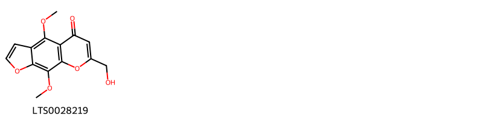{ width=100% }
    <figcaption>Hình ảnh cấu trúc hóa học của 1 hoạt chất thuộc nhóm Benzopyrans gồm ['ammiol (LTS0028219)'].</figcaption>
</figure>
#### Nhóm Coumarins and derivatives
<figure markdown="span">
    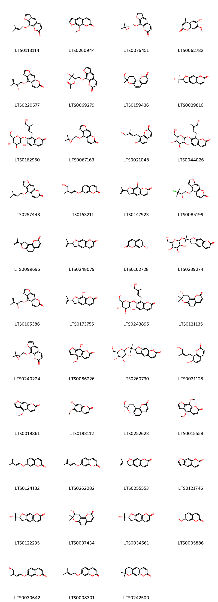{ width=100% }
    <figcaption>Hình ảnh cấu trúc hóa học của 43 hoạt chất thuộc nhóm Coumarins and derivatives gồm ['imperatorin (LTS0113114)', 'methoxsalen (LTS0260944)', '9-{[(2s)-3,3-dimethyloxiran-2-yl]methoxy}furo[3,2-g]chromen-7-one (LTS0076451)', '6-hydroxy-7-methoxy-4-methylchromen-2-one (LTS0062782)', '4-[(2-hydroxy-3-methylbut-3-en-1-yl)oxy]furo[3,2-g]chromen-7-one (LTS0220577)', '3-hydroxy-3-methyl-1-({7-oxofuro[3,2-g]chromen-9-yl}oxy)butan-2-yl acetate (LTS0069279)', '8-(hydroxymethyl)-8-methyl-9h,10h-pyrano[2,3-h]chromen-2-one (LTS0159436)', 'marmesin (LTS0029816)', '8-[(2e)-4-hydroxy-3-methylbut-2-en-1-yl]-7-{[(3r,4s,5s,6r)-3,4,5-trihydroxy-6-(hydroxymethyl)oxan-2-yl]oxy}chromen-2-one (LTS0162950)', '(+)-oxypeucedanin (LTS0067163)', '7-hydroxy-8-[(2e)-4-hydroxy-3-methylbut-2-en-1-yl]chromen-2-one (LTS0021048)', '8-(4-hydroxy-3-methylbut-2-en-1-yl)-7-{[3,4,5-trihydroxy-6-(hydroxymethyl)oxan-2-yl]oxy}chromen-2-one (LTS0044026)', 'isoimperatorin (LTS0257448)', '7-{[(1e,3r)-4-hydroxy-3-methylbut-1-en-1-yl]oxy}chromen-2-one (LTS0153211)', '(2s)-9-hydroxy-2-(prop-1-en-2-yl)-2h,3h-furo[3,2-g]chromen-7-one (LTS0147923)', '4-(3-chloro-2-hydroxy-3-methylbutoxy)furo[3,2-g]chromen-7-one (LTS0085199)', '(8r)-8-(prop-1-en-2-yl)-8h,9h-furo[2,3-h]chromen-2-one (LTS0099695)', '2-(prop-1-en-2-yl)-2h,3h-furo[3,2-g]chromen-7-one (LTS0248079)', 'umbelliferone (LTS0162728)', '2-(2-{[3,4,5-trihydroxy-6-(hydroxymethyl)oxan-2-yl]oxy}propan-2-yl)-2h,3h-furo[3,2-g]chromen-7-one (LTS0239274)', 'pabulenol (LTS0105386)', '9-hydroxy-2-(prop-1-en-2-yl)-2h,3h-furo[3,2-g]chromen-7-one (LTS0173755)', '8-[(2e)-4-hydroxy-3-methylbut-2-en-1-yl]-7-{[(2s,3r,4s,5s,6r)-3,4,5-trihydroxy-6-(hydroxymethyl)oxan-2-yl]oxy}chromen-2-one (LTS0243895)', '(9r)-9-hydroxy-8,8-dimethyl-9h,10h-pyrano[2,3-h]chromen-2-one (LTS0121135)', 'heraclenin (LTS0240224)', '9-hydroxy-4-methoxyfuro[3,2-g]chromen-7-one (LTS0086226)', 'ammijin (LTS0260730)', '7-hydroxy-8-(4-hydroxy-3-methylbut-2-en-1-yl)chromen-2-one (LTS0031128)', 'bergapten (LTS0019861)', 'scopoletin (LTS0193112)', '(8r)-8-(hydroxymethyl)-8-methyl-9h,10h-pyrano[2,3-h]chromen-2-one (LTS0252623)', 'isopimpinellin (LTS0015558)', '7-{[(1e)-3-methylbuta-1,3-dien-1-yl]oxy}chromen-2-one (LTS0124132)', '7-[(3-methylbuta-1,3-dien-1-yl)oxy]chromen-2-one (LTS0262082)', '(2r)-2-(prop-1-en-2-yl)-2h,3h-furo[3,2-g]chromen-7-one (LTS0255553)', 'psoralen (LTS0121746)', 'marmesin (LTS0122295)', '9-hydroxy-8,8-dimethyl-9h,10h-pyrano[2,3-h]chromen-2-one (LTS0037434)', '(-)-marmesin (LTS0034561)', 'methylumbelliferone (LTS0005886)', '7-[(4-hydroxy-3-methylbut-1-en-1-yl)oxy]chromen-2-one (LTS0030642)', '7-[(3-methylbut-2-en-1-yl)oxy]chromen-2-one (LTS0008301)', '8,8-dimethyl-6h,7h-pyrano[3,2-g]chromen-2-one (LTS0242500)'].</figcaption>
</figure>
#### Nhóm Fatty Acyls
<figure markdown="span">
    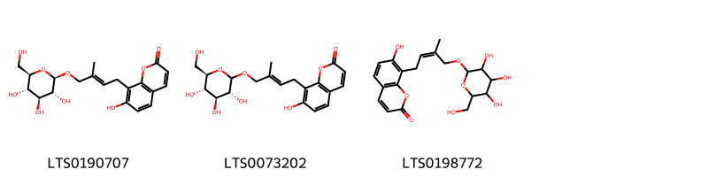{ width=100% }
    <figcaption>Hình ảnh cấu trúc hóa học của 3 hoạt chất thuộc nhóm Fatty Acyls gồm ['7-hydroxy-8-[(2e)-3-methyl-4-{[(2r,3r,4s,5s,6r)-3,4,5-trihydroxy-6-(hydroxymethyl)oxan-2-yl]oxy}but-2-en-1-yl]chromen-2-one (LTS0190707)', '7-hydroxy-8-[(2e)-3-methyl-4-{[(3r,4s,5s,6r)-3,4,5-trihydroxy-6-(hydroxymethyl)oxan-2-yl]oxy}but-2-en-1-yl]chromen-2-one (LTS0073202)', '7-hydroxy-8-(3-methyl-4-{[3,4,5-trihydroxy-6-(hydroxymethyl)oxan-2-yl]oxy}but-2-en-1-yl)chromen-2-one (LTS0198772)'].</figcaption>
</figure>
#### Nhóm Flavonoids
<figure markdown="span">
    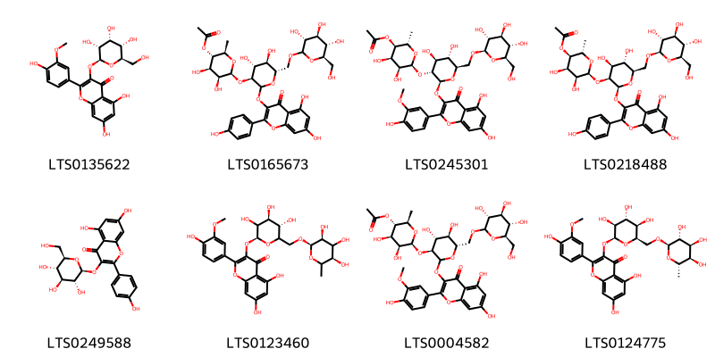{ width=100% }
    <figcaption>Hình ảnh cấu trúc hóa học của 8 hoạt chất thuộc nhóm Flavonoids gồm ['isorhamnetin 3-glucoside (LTS0135622)', '(2r,3s,4r,5s,6s)-6-{[(3s,4r,5r,6s)-2-{[5,7-dihydroxy-2-(4-hydroxyphenyl)-4-oxochromen-3-yl]oxy}-4,5-dihydroxy-6-({[(3r,4s,5s,6r)-3,4,5-trihydroxy-6-(hydroxymethyl)oxan-2-yl]oxy}methyl)oxan-3-yl]oxy}-4,5-dihydroxy-2-methyloxan-3-yl acetate (LTS0165673)', '(2s,3r,4r,5s,6s)-6-{[(2s,3r,4s,5s,6r)-2-{[5,7-dihydroxy-2-(4-hydroxy-3-methoxyphenyl)-4-oxochromen-3-yl]oxy}-4,5-dihydroxy-6-({[(2r,3r,4s,5s,6r)-3,4,5-trihydroxy-6-(hydroxymethyl)oxan-2-yl]oxy}methyl)oxan-3-yl]oxy}-4,5-dihydroxy-2-methyloxan-3-yl acetate (LTS0245301)', '(2s,3r,4r,5s,6s)-6-{[(2s,3s,4s,5s,6r)-2-{[5,7-dihydroxy-2-(4-hydroxyphenyl)-4-oxochromen-3-yl]oxy}-4,5-dihydroxy-6-({[(2r,3r,4s,5s,6r)-3,4,5-trihydroxy-6-(hydroxymethyl)oxan-2-yl]oxy}methyl)oxan-3-yl]oxy}-4,5-dihydroxy-2-methyloxan-3-yl acetate (LTS0218488)', 'astragalin (LTS0249588)', '5,7-dihydroxy-2-(4-hydroxy-3-methoxyphenyl)-3-{[(2s,4s,5s)-3,4,5-trihydroxy-6-({[(2r,3s,5r)-3,4,5-trihydroxy-6-methyloxan-2-yl]oxy}methyl)oxan-2-yl]oxy}chromen-4-one (LTS0123460)', '(2r,3s,4r,5s,6s)-6-{[(3s,4r,5r,6s)-2-{[5,7-dihydroxy-2-(4-hydroxy-3-methoxyphenyl)-4-oxochromen-3-yl]oxy}-4,5-dihydroxy-6-({[(3r,4s,5s,6r)-3,4,5-trihydroxy-6-(hydroxymethyl)oxan-2-yl]oxy}methyl)oxan-3-yl]oxy}-4,5-dihydroxy-2-methyloxan-3-yl acetate (LTS0004582)', '5,7-dihydroxy-2-(4-hydroxy-3-methoxyphenyl)-3-{[(2s,3s,4r,5r,6r)-3,4,5-trihydroxy-6-({[(2r,3r,4s,5r,6s)-3,4,5-trihydroxy-6-methyloxan-2-yl]oxy}methyl)oxan-2-yl]oxy}chromen-4-one (LTS0124775)'].</figcaption>
</figure>
#### Nhóm Organooxygen compounds
<figure markdown="span">
    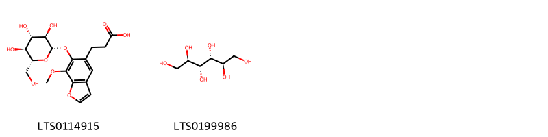{ width=100% }
    <figcaption>Hình ảnh cấu trúc hóa học của 2 hoạt chất thuộc nhóm Organooxygen compounds gồm ['3-(7-methoxy-6-{[(2s,3r,4s,5s,6r)-3,4,5-trihydroxy-6-(hydroxymethyl)oxan-2-yl]oxy}-1-benzofuran-5-yl)propanoic acid (LTS0114915)', 'mannitol (LTS0199986)'].</figcaption>
</figure>
#### Nhóm Prenol lipids
<figure markdown="span">
    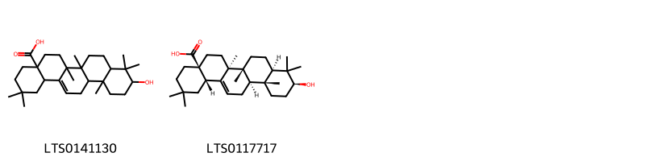{ width=100% }
    <figcaption>Hình ảnh cấu trúc hóa học của 2 hoạt chất thuộc nhóm Prenol lipids gồm ['oleanolic acid (LTS0141130)', 'oleanolic acid (LTS0117717)'].</figcaption>
</figure>

---

### Dược dân tộc học

Danh sách các quốc gia có sử dụng *Ammi majus* trong điều trị các bệnh. 

| Country   | Disease                                           | Bệnh                                                                                                                                                                                                |
|:----------|:--------------------------------------------------|:----------------------------------------------------------------------------------------------------------------------------------------------------------------------------------------------------|
| Dutch     | Digestive, Tonic                                  | MYMEMORY WARNING: YOU USED ALL AVAILABLE FREE TRANSLATIONS FOR TODAY. NEXT AVAILABLE IN  07 HOURS 43 MINUTES 08 SECONDS VISIT HTTPS://MYMEMORY.TRANSLATED.NET/DOC/USAGELIMITS.PHP TO TRANSLATE MORE |
| Elsewhere | Diuretic, Tonic, Carminative, Diuretic, Stomachic | MYMEMORY WARNING: YOU USED ALL AVAILABLE FREE TRANSLATIONS FOR TODAY. NEXT AVAILABLE IN  07 HOURS 43 MINUTES 06 SECONDS VISIT HTTPS://MYMEMORY.TRANSLATED.NET/DOC/USAGELIMITS.PHP TO TRANSLATE MORE |
| French    | Diuretic                                          | MYMEMORY WARNING: YOU USED ALL AVAILABLE FREE TRANSLATIONS FOR TODAY. NEXT AVAILABLE IN  07 HOURS 43 MINUTES 03 SECONDS VISIT HTTPS://MYMEMORY.TRANSLATED.NET/DOC/USAGELIMITS.PHP TO TRANSLATE MORE |
| Iraq      | Poison                                            | MYMEMORY WARNING: YOU USED ALL AVAILABLE FREE TRANSLATIONS FOR TODAY. NEXT AVAILABLE IN  07 HOURS 43 MINUTES 01 SECONDS VISIT HTTPS://MYMEMORY.TRANSLATED.NET/DOC/USAGELIMITS.PHP TO TRANSLATE MORE |
| Italian   | Carminative                                       | MYMEMORY WARNING: YOU USED ALL AVAILABLE FREE TRANSLATIONS FOR TODAY. NEXT AVAILABLE IN  07 HOURS 42 MINUTES 59 SECONDS VISIT HTTPS://MYMEMORY.TRANSLATED.NET/DOC/USAGELIMITS.PHP TO TRANSLATE MORE |
| anish     | Diuretic                                          | MYMEMORY WARNING: YOU USED ALL AVAILABLE FREE TRANSLATIONS FOR TODAY. NEXT AVAILABLE IN  07 HOURS 42 MINUTES 56 SECONDS VISIT HTTPS://MYMEMORY.TRANSLATED.NET/DOC/USAGELIMITS.PHP TO TRANSLATE MORE |

---

---
## Ammi visnaga
### Thông tin về thực vật

!!! info "Phân loại thực vật của *Visnaga daucoides* từ GIBF:"
    - **Kingdom:** Plantae
    - **Phylum:** Tracheophyta
    - **Order:** Apiales
    - **Family:** Apiaceae
    - **Genus:** Visnaga
    - **Species:** *Visnaga daucoides*

 

| Label (VI)   | Label (EN)   | Scientific Name   | Descriptions (VI)   | Descriptions (EN)   | Also Known As (VI)   | Also Known As (EN)   |
|:-------------|:-------------|:------------------|:--------------------|:--------------------|:---------------------|:---------------------|
| N/A          | N/A          | Ammi visnaga      | loài thực vật       | species of plant    | ['']                 | ['']                 |

#### Phân bố trên thế giới

**Từ CSDL GIBF** nan, Belgium, Argentina, Palestine, State of, Norway, Israel, Netherlands, Spain, Türkiye, Portugal, Morocco, United States of America, Sweden, Chile, Greece, Germany, Brazil, Egypt, Switzerland, Austria, France, Peru, United Kingdom of Great Britain and Northern Ireland, Colombia, New Zealand, Ethiopia

#### Phân bố tại Việt Nam

**Từ CSDL GIBF**: Không có ghi nhận ở Việt Nam

---
### Thành phần hóa học
        
- Theo cơ sở dữ liệu lotus: Từ loài *Visnaga daucoides* đã phân lập và xác định được 26 hoạt chất thuộc về các nhóm Flavonoids, Benzopyrans, Coumarins and derivatives. 

|    | chemicalTaxonomyClassyfireClass   |   smiles_count |
|---:|:----------------------------------|---------------:|
|  0 | Benzopyrans                       |             13 |
|  1 | Coumarins and derivatives         |             11 |
|  2 | Flavonoids                        |              2 |

#### Nhóm Benzopyrans
<figure markdown="span">
    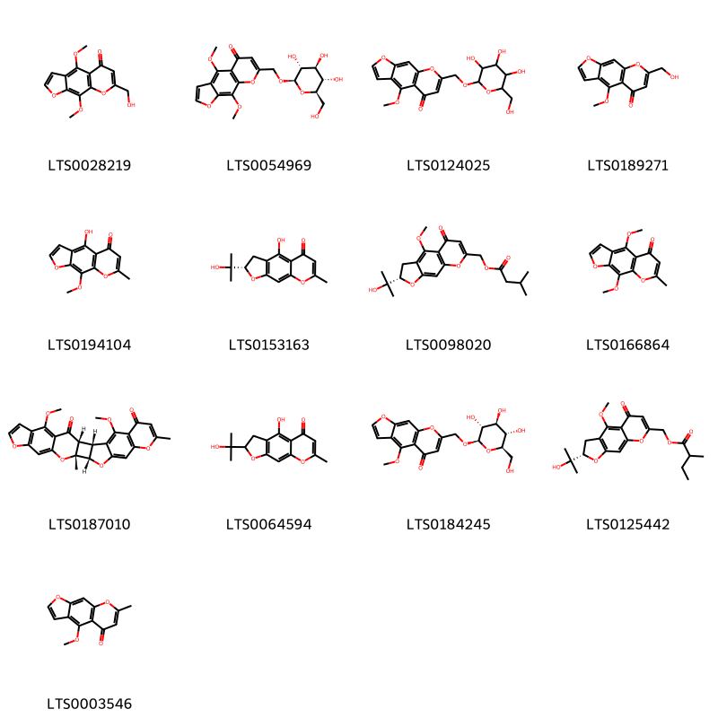{ width=100% }
    <figcaption>Hình ảnh cấu trúc hóa học của 13 hoạt chất thuộc nhóm Benzopyrans gồm ['ammiol (LTS0028219)', '4,9-dimethoxy-7-({[(2r,3r,4s,5s,6r)-3,4,5-trihydroxy-6-(hydroxymethyl)oxan-2-yl]oxy}methyl)furo[3,2-g]chromen-5-one (LTS0054969)', 'khellol glucoside (LTS0124025)', '7-(hydroxymethyl)-4-methoxyfuro[3,2-g]chromen-5-one (LTS0189271)', '4-hydroxy-9-methoxy-7-methylfuro[3,2-g]chromen-5-one (LTS0194104)', '(2s)-4-hydroxy-2-(2-hydroxypropan-2-yl)-7-methyl-2h,3h-furo[3,2-g]chromen-5-one (LTS0153163)', '[(2s)-2-(2-hydroxypropan-2-yl)-4-methoxy-5-oxo-2h,3h-furo[3,2-g]chromen-7-yl]methyl 3-methylbutanoate (LTS0098020)', 'kelamin (LTS0166864)', '(1r,2r,14s,15r)-4,24-dimethoxy-8,15-dimethyl-9,13,16,20-tetraoxaheptacyclo[13.11.0.0²,¹⁴.0³,¹².0⁵,¹⁰.0¹⁷,²⁵.0¹⁹,²³]hexacosa-3(12),4,7,10,17(25),18,21,23-octaene-6,26-dione (LTS0187010)', '4-hydroxy-2-(2-hydroxypropan-2-yl)-7-methyl-2h,3h-furo[3,2-g]chromen-5-one (LTS0064594)', 'khellol glucoside (LTS0184245)', '[(2s)-2-(2-hydroxypropan-2-yl)-4-methoxy-5-oxo-2h,3h-furo[3,2-g]chromen-7-yl]methyl 2-methylbutanoate (LTS0125442)', 'visnagin (LTS0003546)'].</figcaption>
</figure>
#### Nhóm Coumarins and derivatives
<figure markdown="span">
    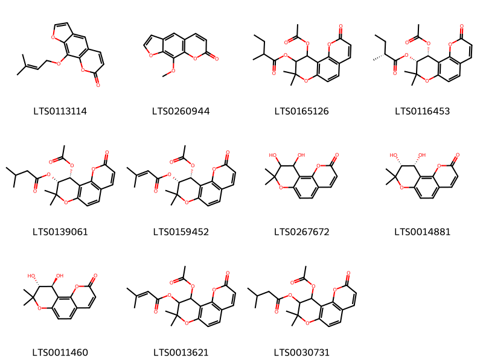{ width=100% }
    <figcaption>Hình ảnh cấu trúc hóa học của 11 hoạt chất thuộc nhóm Coumarins and derivatives gồm ['imperatorin (LTS0113114)', 'methoxsalen (LTS0260944)', 'visnadine (LTS0165126)', 'selva (LTS0116453)', 'dihydrosamidin (LTS0139061)', 'samidin (LTS0159452)', '9,10-dihydroxy-8,8-dimethyl-9h,10h-pyrano[2,3-h]chromen-2-one (LTS0267672)', '(9r,10r)-9,10-dihydroxy-8,8-dimethyl-9h,10h-pyrano[2,3-h]chromen-2-one (LTS0014881)', '(9r,10s)-9,10-dihydroxy-8,8-dimethyl-9h,10h-pyrano[2,3-h]chromen-2-one (LTS0011460)', '10-(acetyloxy)-8,8-dimethyl-2-oxo-9h,10h-pyrano[2,3-h]chromen-9-yl 3-methylbut-2-enoate (LTS0013621)', '10-(acetyloxy)-8,8-dimethyl-2-oxo-9h,10h-pyrano[2,3-h]chromen-9-yl 3-methylbutanoate (LTS0030731)'].</figcaption>
</figure>
#### Nhóm Flavonoids
<figure markdown="span">
    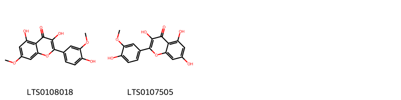{ width=100% }
    <figcaption>Hình ảnh cấu trúc hóa học của 2 hoạt chất thuộc nhóm Flavonoids gồm ['rhamnazin (LTS0108018)', 'isorhamnetin (LTS0107505)'].</figcaption>
</figure>

---

### Dược dân tộc học

Danh sách các quốc gia có sử dụng *Visnaga daucoides* trong điều trị các bệnh. 

| Country   | Disease          | Bệnh                                                                                                                                                                                                |
|:----------|:-----------------|:----------------------------------------------------------------------------------------------------------------------------------------------------------------------------------------------------|
| Elsewhere | Diuretic         | MYMEMORY WARNING: YOU USED ALL AVAILABLE FREE TRANSLATIONS FOR TODAY. NEXT AVAILABLE IN  07 HOURS 42 MINUTES 29 SECONDS VISIT HTTPS://MYMEMORY.TRANSLATED.NET/DOC/USAGELIMITS.PHP TO TRANSLATE MORE |
| German    | Vasodilator      | MYMEMORY WARNING: YOU USED ALL AVAILABLE FREE TRANSLATIONS FOR TODAY. NEXT AVAILABLE IN  07 HOURS 42 MINUTES 27 SECONDS VISIT HTTPS://MYMEMORY.TRANSLATED.NET/DOC/USAGELIMITS.PHP TO TRANSLATE MORE |
| Iraq      | Diuretic, Emetic | MYMEMORY WARNING: YOU USED ALL AVAILABLE FREE TRANSLATIONS FOR TODAY. NEXT AVAILABLE IN  07 HOURS 42 MINUTES 23 SECONDS VISIT HTTPS://MYMEMORY.TRANSLATED.NET/DOC/USAGELIMITS.PHP TO TRANSLATE MORE |
| Italian   | Apertif          | MYMEMORY WARNING: YOU USED ALL AVAILABLE FREE TRANSLATIONS FOR TODAY. NEXT AVAILABLE IN  07 HOURS 42 MINUTES 20 SECONDS VISIT HTTPS://MYMEMORY.TRANSLATED.NET/DOC/USAGELIMITS.PHP TO TRANSLATE MORE |
| Portugal  | Stimulant        | MYMEMORY WARNING: YOU USED ALL AVAILABLE FREE TRANSLATIONS FOR TODAY. NEXT AVAILABLE IN  07 HOURS 42 MINUTES 18 SECONDS VISIT HTTPS://MYMEMORY.TRANSLATED.NET/DOC/USAGELIMITS.PHP TO TRANSLATE MORE |
| Venezuela | Stomachic        | MYMEMORY WARNING: YOU USED ALL AVAILABLE FREE TRANSLATIONS FOR TODAY. NEXT AVAILABLE IN  07 HOURS 42 MINUTES 16 SECONDS VISIT HTTPS://MYMEMORY.TRANSLATED.NET/DOC/USAGELIMITS.PHP TO TRANSLATE MORE |
| anish     | Carminative      | MYMEMORY WARNING: YOU USED ALL AVAILABLE FREE TRANSLATIONS FOR TODAY. NEXT AVAILABLE IN  07 HOURS 42 MINUTES 13 SECONDS VISIT HTTPS://MYMEMORY.TRANSLATED.NET/DOC/USAGELIMITS.PHP TO TRANSLATE MORE |

---

# Chi Levisticum

??? note "Danh sách các dược liệu thuộc chi"
    
	 - *Levisticum officinale*

---
## Levisticum officinale
### Thông tin về thực vật

!!! info "Phân loại thực vật của *Levisticum officinale* từ GIBF:"
    - **Kingdom:** Plantae
    - **Phylum:** Tracheophyta
    - **Order:** Apiales
    - **Family:** Apiaceae
    - **Genus:** Levisticum
    - **Species:** *Levisticum officinale*

 

| Label (VI)   | Label (EN)   | Scientific Name       | Descriptions (VI)   | Descriptions (EN)   | Also Known As (VI)   | Also Known As (EN)        |
|:-------------|:-------------|:----------------------|:--------------------|:--------------------|:---------------------|:--------------------------|
| N/A          | N/A          | Levisticum officinale |                     | species of plant    | ['']                 | ['lovage', 'wild celery'] |

#### Phân bố trên thế giới

**Từ CSDL GIBF** Italy, Japan, Belgium, Estonia, Norway, Canada, Ukraine, Denmark, Netherlands, Belarus, Luxembourg, Hungary, Russian Federation, United States of America, Sweden, Finland, Slovenia, Croatia, Czechia, Germany, Romania, Brazil, Switzerland, Austria, France, United Kingdom of Great Britain and Northern Ireland, Costa Rica

#### Phân bố tại Việt Nam

**Từ CSDL GIBF**: Không có ghi nhận ở Việt Nam

---
### Thành phần hóa học
        
- Theo cơ sở dữ liệu lotus: Từ loài *Levisticum officinale* đã phân lập và xác định được 78 hoạt chất thuộc về các nhóm Fatty Acyls, Flavonoids, Prenol lipids, Steroids and steroid derivatives, Cinnamic acids and derivatives, Isocoumarans, Benzofurans, Purine nucleosides, Unsaturated hydrocarbons, Dihydrofurans, Organooxygen compounds, Phenols, Coumarins and derivatives, Isobenzofurans. 

|    | chemicalTaxonomyClassyfireClass   |   smiles_count |
|---:|:----------------------------------|---------------:|
|  0 | Benzofurans                       |              1 |
|  1 | Cinnamic acids and derivatives    |              3 |
|  2 | Coumarins and derivatives         |              4 |
|  3 | Dihydrofurans                     |              3 |
|  4 | Fatty Acyls                       |              7 |
|  5 | Flavonoids                        |              6 |
|  6 | Isobenzofurans                    |             17 |
|  7 | Isocoumarans                      |              5 |
|  8 | Organooxygen compounds            |              8 |
|  9 | Phenols                           |              1 |
| 10 | Prenol lipids                     |             17 |
| 11 | Purine nucleosides                |              1 |
| 12 | Steroids and steroid derivatives  |              3 |
| 13 | Unsaturated hydrocarbons          |              1 |

#### Nhóm Benzofurans
<figure markdown="span">
    { width=100% }
    <figcaption>Hình ảnh cấu trúc hóa học của 1 hoạt chất thuộc nhóm Benzofurans gồm ['butylphthalide (LTS0150205)'].</figcaption>
</figure>
#### Nhóm Cinnamic acids and derivatives
<figure markdown="span">
    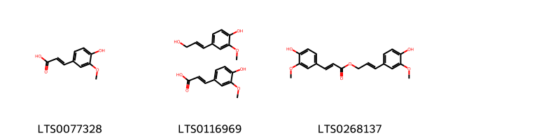{ width=100% }
    <figcaption>Hình ảnh cấu trúc hóa học của 3 hoạt chất thuộc nhóm Cinnamic acids and derivatives gồm ['ferulic acid (LTS0077328)', 'coniferyl alcohol; ferulic acid (LTS0116969)', 'coniferyl ferulate (LTS0268137)'].</figcaption>
</figure>
#### Nhóm Coumarins and derivatives
<figure markdown="span">
    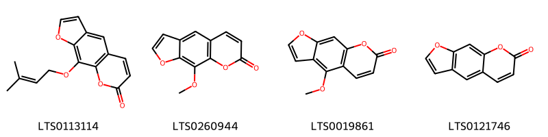{ width=100% }
    <figcaption>Hình ảnh cấu trúc hóa học của 4 hoạt chất thuộc nhóm Coumarins and derivatives gồm ['imperatorin (LTS0113114)', 'methoxsalen (LTS0260944)', 'bergapten (LTS0019861)', 'psoralen (LTS0121746)'].</figcaption>
</figure>
#### Nhóm Dihydrofurans
<figure markdown="span">
    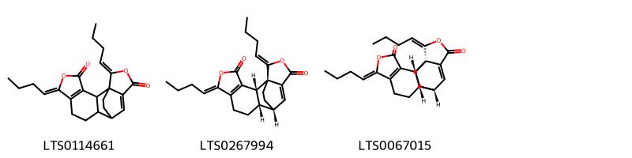{ width=100% }
    <figcaption>Hình ảnh cấu trúc hóa học của 3 hoạt chất thuộc nhóm Dihydrofurans gồm ['levistolide a (LTS0114661)', 'levistolide a (LTS0267994)', '(1s,2s,6z,10s,11s,16e)-6,16-dibutylidene-5,15-dioxapentacyclo[9.5.2.0¹,¹³.0²,¹⁰.0³,⁷]octadeca-3(7),12-diene-4,14-dione (LTS0067015)'].</figcaption>
</figure>
#### Nhóm Fatty Acyls
<figure markdown="span">
    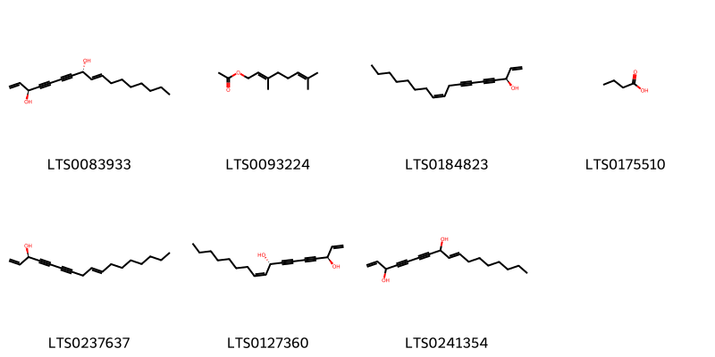{ width=100% }
    <figcaption>Hình ảnh cấu trúc hóa học của 7 hoạt chất thuộc nhóm Fatty Acyls gồm ['(3s,8r)-heptadeca-1,9-dien-4,6-diyne-3,8-diol (LTS0083933)', 'geranyl acetate (LTS0093224)', 'falcarinol (LTS0184823)', 'butanoic acid (LTS0175510)', '(z)-falcarinol (LTS0237637)', 'falcarindiol (LTS0127360)', 'heptadeca-1,9-dien-4,6-diyne-3,8-diol (LTS0241354)'].</figcaption>
</figure>
#### Nhóm Flavonoids
<figure markdown="span">
    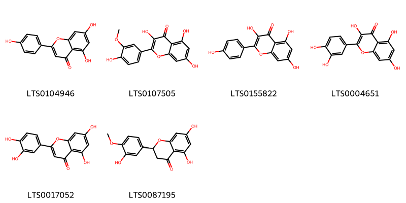{ width=100% }
    <figcaption>Hình ảnh cấu trúc hóa học của 6 hoạt chất thuộc nhóm Flavonoids gồm ['chamomile (LTS0104946)', 'isorhamnetin (LTS0107505)', 'kaempherol (LTS0155822)', 'quercetin (LTS0004651)', 'luteolin (LTS0017052)', 'hesperetin (LTS0087195)'].</figcaption>
</figure>
#### Nhóm Isobenzofurans
<figure markdown="span">
    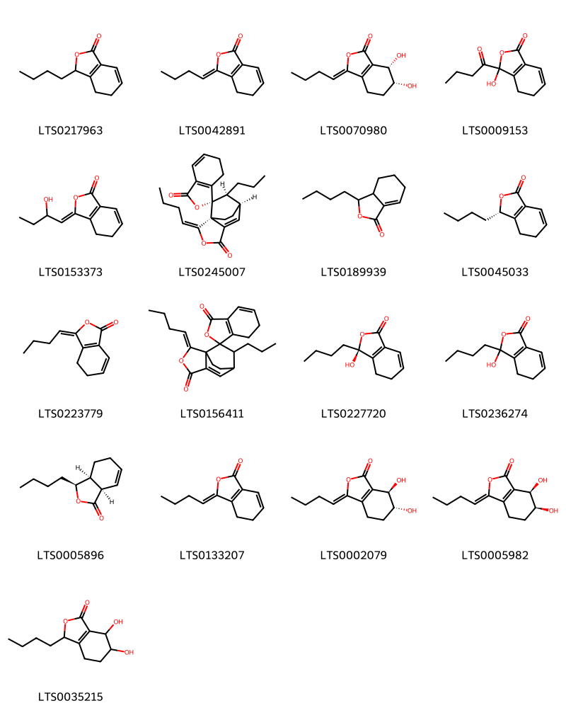{ width=100% }
    <figcaption>Hình ảnh cấu trúc hóa học của 17 hoạt chất thuộc nhóm Isobenzofurans gồm ['3-butyl-4,5-dihydro-3h-2-benzofuran-1-one (LTS0217963)', '(z)-ligustilide (LTS0042891)', '(6r,7s)-3-butylidene-6,7-dihydroxy-4,5,6,7-tetrahydro-2-benzofuran-1-one (LTS0070980)', '3-butanoyl-3-hydroxy-4,5-dihydro-2-benzofuran-1-one (LTS0009153)', '(3z)-3-(2-hydroxybutylidene)-4,5-dihydro-2-benzofuran-1-one (LTS0153373)', "(1s,1's,2'e,7'r,8's)-2'-butylidene-8'-propyl-6,7-dihydro-3'-oxaspiro[2-benzofuran-1,9'-tricyclo[5.2.2.0¹,⁵]undecan]-5'-ene-3,4'-dione (LTS0245007)", 'sedanolide (LTS0189939)', 'senkyunolide a (LTS0045033)', 'z-ligustilide (LTS0223779)', "2'-butylidene-8'-propyl-6,7-dihydro-3'-oxaspiro[2-benzofuran-1,9'-tricyclo[5.2.2.0¹,⁵]undecan]-5'-ene-3,4'-dione (LTS0156411)", '(3s)-3-butyl-3-hydroxy-4,5-dihydro-2-benzofuran-1-one (LTS0227720)', '3-butyl-3-hydroxy-4,5-dihydro-2-benzofuran-1-one (LTS0236274)', 'cnidilide (LTS0005896)', '3-butylidene-4,5-dihydro-2-benzofuran-1-one (LTS0133207)', '(6r,7r)-3-butylidene-6,7-dihydroxy-4,5,6,7-tetrahydro-2-benzofuran-1-one (LTS0002079)', '(3z,6s,7r)-3-butylidene-6,7-dihydroxy-4,5,6,7-tetrahydro-2-benzofuran-1-one (LTS0005982)', '3-butyl-6,7-dihydroxy-4,5,6,7-tetrahydro-3h-2-benzofuran-1-one (LTS0035215)'].</figcaption>
</figure>
#### Nhóm Isocoumarans
<figure markdown="span">
    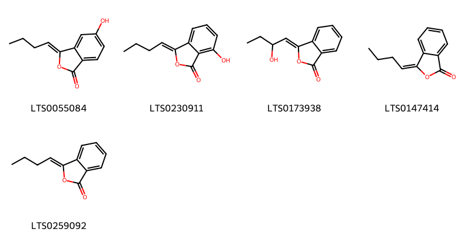{ width=100% }
    <figcaption>Hình ảnh cấu trúc hóa học của 5 hoạt chất thuộc nhóm Isocoumarans gồm ['(3z)-3-butylidene-5-hydroxy-2-benzofuran-1-one (LTS0055084)', 'senkyunolide b (LTS0230911)', '(3z)-3-(2-hydroxybutylidene)-2-benzofuran-1-one (LTS0173938)', 'butylidenephthalide (LTS0147414)', 'butylidenephthalide (LTS0259092)'].</figcaption>
</figure>
#### Nhóm Organooxygen compounds
<figure markdown="span">
    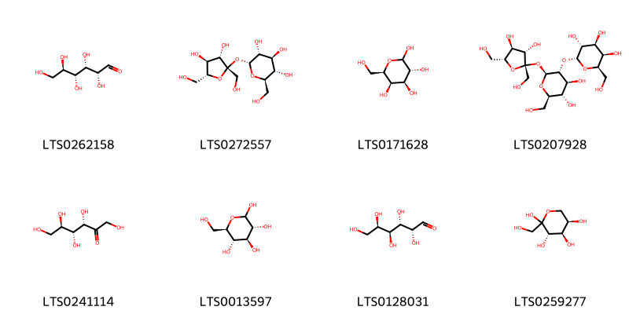{ width=100% }
    <figcaption>Hình ảnh cấu trúc hóa học của 8 hoạt chất thuộc nhóm Organooxygen compounds gồm ['(+)-glucose (LTS0262158)', 'sucrose (LTS0272557)', 'galactose (LTS0171628)', '(2r,3r,4s,5r,6r)-2-{[(2s,3r,4s,5s,6r)-2-{[(2s,3s,4s,5r)-3,4-dihydroxy-2,5-bis(hydroxymethyl)oxolan-2-yl]oxy}-4,5-dihydroxy-6-(hydroxymethyl)oxan-3-yl]oxy}-6-(hydroxymethyl)oxane-3,4,5-triol (LTS0207928)', 'keto-d-fructose (LTS0241114)', 'glucose (LTS0013597)', 'aldehydo-d-galactose (LTS0128031)', 'd-fructopyranose (LTS0259277)'].</figcaption>
</figure>
#### Nhóm Phenols
<figure markdown="span">
    { width=100% }
    <figcaption>Hình ảnh cấu trúc hóa học của 1 hoạt chất thuộc nhóm Phenols gồm ['vanillin (LTS0136163)'].</figcaption>
</figure>
#### Nhóm Prenol lipids
<figure markdown="span">
    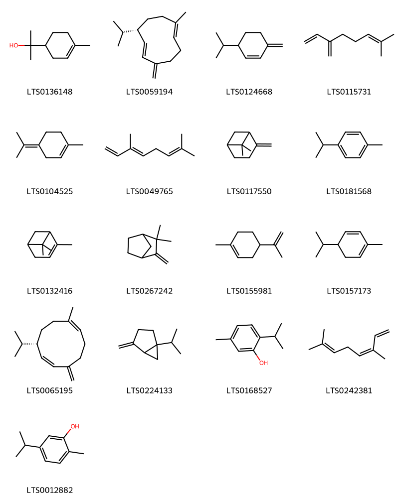{ width=100% }
    <figcaption>Hình ảnh cấu trúc hóa học của 17 hoạt chất thuộc nhóm Prenol lipids gồm ['terpineol (LTS0136148)', '(-)-germacrene d (LTS0059194)', 'β phellandrene (LTS0124668)', 'α-myrcene (LTS0115731)', 'terpinolene (LTS0104525)', 'trans-β-ocimene (LTS0049765)', 'β-pinene (LTS0117550)', 'cymene (LTS0181568)', 'α pinene (LTS0132416)', 'camphene (LTS0267242)', 'limonene,  (LTS0155981)', 'phellandrene (LTS0157173)', '(1z,6z,8s)-8-isopropyl-1-methyl-5-methylidenecyclodeca-1,6-diene (LTS0065195)', 'sabinene (LTS0224133)', 'thymol (LTS0168527)', 'β-ocimene (LTS0242381)', 'carvacrol (LTS0012882)'].</figcaption>
</figure>
#### Nhóm Purine nucleosides
<figure markdown="span">
    { width=100% }
    <figcaption>Hình ảnh cấu trúc hóa học của 1 hoạt chất thuộc nhóm Purine nucleosides gồm ['adenosine (LTS0014061)'].</figcaption>
</figure>
#### Nhóm Steroids and steroid derivatives
<figure markdown="span">
    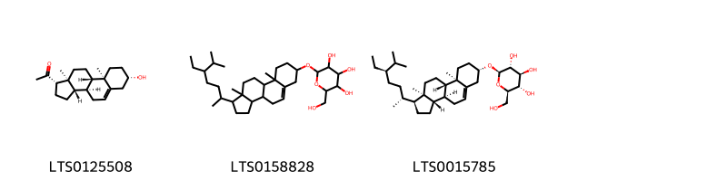{ width=100% }
    <figcaption>Hình ảnh cấu trúc hóa học của 3 hoạt chất thuộc nhóm Steroids and steroid derivatives gồm ['pregnenolone (LTS0125508)', '2-{[1-(5-ethyl-6-methylheptan-2-yl)-9a,11a-dimethyl-1h,2h,3h,3ah,3bh,4h,6h,7h,8h,9h,9bh,10h,11h-cyclopenta[a]phenanthren-7-yl]oxy}-6-(hydroxymethyl)oxane-3,4,5-triol (LTS0158828)', '(2r,3r,4s,5s,6r)-2-{[(1s,3as,3bs,7s,9ar,9bs,11ar)-1-[(2r,5r)-5-ethyl-6-methylheptan-2-yl]-9a,11a-dimethyl-1h,2h,3h,3ah,3bh,4h,6h,7h,8h,9h,9bh,10h,11h-cyclopenta[a]phenanthren-7-yl]oxy}-6-(hydroxymethyl)oxane-3,4,5-triol (LTS0015785)'].</figcaption>
</figure>
#### Nhóm Unsaturated hydrocarbons
<figure markdown="span">
    { width=100% }
    <figcaption>Hình ảnh cấu trúc hóa học của 1 hoạt chất thuộc nhóm Unsaturated hydrocarbons gồm ['α terpinene (LTS0232891)'].</figcaption>
</figure>

---

### Dược dân tộc học

Danh sách các quốc gia có sử dụng *Levisticum officinale* trong điều trị các bệnh. 

| Country   | Disease                                                                                                          | Bệnh                                                                                                                                                                                                |
|:----------|:-----------------------------------------------------------------------------------------------------------------|:----------------------------------------------------------------------------------------------------------------------------------------------------------------------------------------------------|
| Turkey    | Abortifacient, Carminative, Expectorant, Nervine, Stomachic, Tonic, Antiseptic, Diuretic, Emmenagogue, Sudorific | MYMEMORY WARNING: YOU USED ALL AVAILABLE FREE TRANSLATIONS FOR TODAY. NEXT AVAILABLE IN  07 HOURS 41 MINUTES 51 SECONDS VISIT HTTPS://MYMEMORY.TRANSLATED.NET/DOC/USAGELIMITS.PHP TO TRANSLATE MORE |

---

# Chi Crithmum

??? note "Danh sách các dược liệu thuộc chi"
    
	 - *Crithmum maritimum*

---
## Crithmum maritimum
### Thông tin về thực vật

!!! info "Phân loại thực vật của *Crithmum maritimum* từ GIBF:"
    - **Kingdom:** Plantae
    - **Phylum:** Tracheophyta
    - **Order:** Apiales
    - **Family:** Apiaceae
    - **Genus:** Crithmum
    - **Species:** *Crithmum maritimum*

 

| Label (VI)   | Label (EN)   | Scientific Name    | Descriptions (VI)   | Descriptions (EN)              | Also Known As (VI)   | Also Known As (EN)   |
|:-------------|:-------------|:-------------------|:--------------------|:-------------------------------|:---------------------|:---------------------|
| N/A          | N/A          | Crithmum maritimum |                     | species of the family Apiaceae | ['']                 | ['rock samphire']    |

#### Phân bố trên thế giới

**Từ CSDL GIBF** Israel, Netherlands, Bulgaria, Italy, Australia, Monaco, Cyprus, Malta, Spain, Ireland, Portugal, Algeria, Lebanon, France, Croatia, Greece, United Kingdom of Great Britain and Northern Ireland

#### Phân bố tại Việt Nam

**Từ CSDL GIBF**: Không có ghi nhận ở Việt Nam

---
### Thành phần hóa học
        
- Theo cơ sở dữ liệu lotus: Từ loài *Crithmum maritimum* đã phân lập và xác định được 19 hoạt chất thuộc về các nhóm Fatty Acyls, Flavonoids, Prenol lipids, Benzodioxoles, Unsaturated hydrocarbons. 

|    | chemicalTaxonomyClassyfireClass   |   smiles_count |
|---:|:----------------------------------|---------------:|
|  0 | Benzodioxoles                     |              1 |
|  1 | Fatty Acyls                       |              5 |
|  2 | Flavonoids                        |              2 |
|  3 | Prenol lipids                     |             10 |
|  4 | Unsaturated hydrocarbons          |              1 |

#### Nhóm Benzodioxoles
<figure markdown="span">
    { width=100% }
    <figcaption>Hình ảnh cấu trúc hóa học của 1 hoạt chất thuộc nhóm Benzodioxoles gồm ['dillapiol (LTS0226542)'].</figcaption>
</figure>
#### Nhóm Fatty Acyls
<figure markdown="span">
    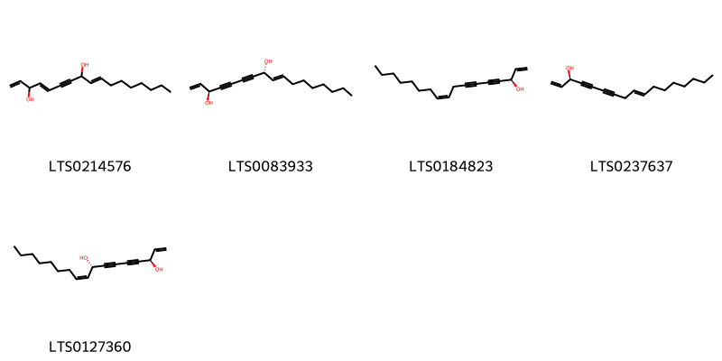{ width=100% }
    <figcaption>Hình ảnh cấu trúc hóa học của 5 hoạt chất thuộc nhóm Fatty Acyls gồm ['(4e,9e)-heptadeca-1,4,9-trien-6-yne-3,8-diol (LTS0214576)', '(3s,8r)-heptadeca-1,9-dien-4,6-diyne-3,8-diol (LTS0083933)', 'falcarinol (LTS0184823)', '(z)-falcarinol (LTS0237637)', 'falcarindiol (LTS0127360)'].</figcaption>
</figure>
#### Nhóm Flavonoids
<figure markdown="span">
    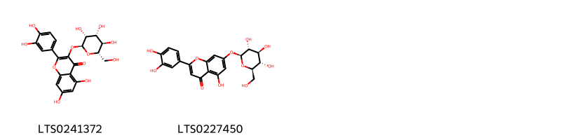{ width=100% }
    <figcaption>Hình ảnh cấu trúc hóa học của 2 hoạt chất thuộc nhóm Flavonoids gồm ['2-(3,4-dihydroxyphenyl)-5,7-dihydroxy-3-{[(2s,3r,4r,5r,6s)-3,4,5-trihydroxy-6-(hydroxymethyl)oxan-2-yl]oxy}chromen-4-one (LTS0241372)', 'luteolin 7-o-glucoside (LTS0227450)'].</figcaption>
</figure>
#### Nhóm Prenol lipids
<figure markdown="span">
    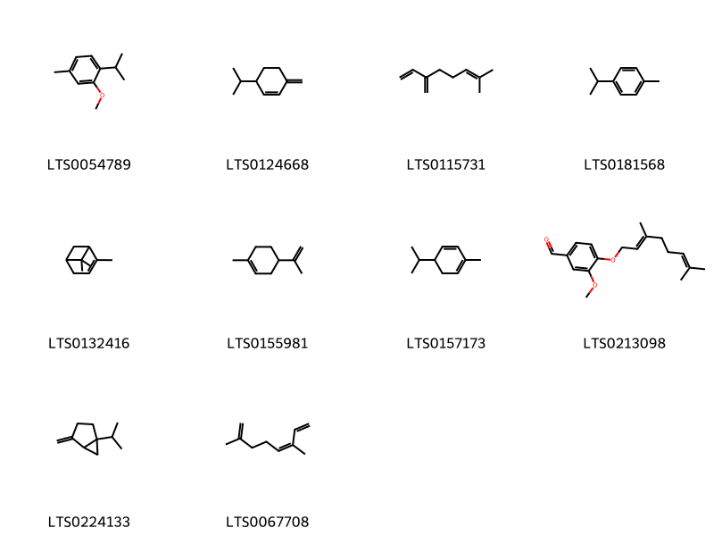{ width=100% }
    <figcaption>Hình ảnh cấu trúc hóa học của 10 hoạt chất thuộc nhóm Prenol lipids gồm ['2-isopropyl-5-methylanisole (LTS0054789)', 'β phellandrene (LTS0124668)', 'α-myrcene (LTS0115731)', 'cymene (LTS0181568)', 'α pinene (LTS0132416)', 'limonene,  (LTS0155981)', 'phellandrene (LTS0157173)', '4-{[(2e)-3,7-dimethylocta-2,6-dien-1-yl]oxy}-3-methoxybenzaldehyde (LTS0213098)', 'sabinene (LTS0224133)', '(z)-α-ocimene (LTS0067708)'].</figcaption>
</figure>
#### Nhóm Unsaturated hydrocarbons
<figure markdown="span">
    { width=100% }
    <figcaption>Hình ảnh cấu trúc hóa học của 1 hoạt chất thuộc nhóm Unsaturated hydrocarbons gồm ['α terpinene (LTS0232891)'].</figcaption>
</figure>

---

### Dược dân tộc học

Danh sách các quốc gia có sử dụng *Crithmum maritimum* trong điều trị các bệnh. 

| Country   | Disease   | Bệnh                                                                                                                                                                                                |
|:----------|:----------|:----------------------------------------------------------------------------------------------------------------------------------------------------------------------------------------------------|
| German    | Apertif   | MYMEMORY WARNING: YOU USED ALL AVAILABLE FREE TRANSLATIONS FOR TODAY. NEXT AVAILABLE IN  07 HOURS 41 MINUTES 18 SECONDS VISIT HTTPS://MYMEMORY.TRANSLATED.NET/DOC/USAGELIMITS.PHP TO TRANSLATE MORE |
| Italian   | Stimulant | MYMEMORY WARNING: YOU USED ALL AVAILABLE FREE TRANSLATIONS FOR TODAY. NEXT AVAILABLE IN  07 HOURS 41 MINUTES 16 SECONDS VISIT HTTPS://MYMEMORY.TRANSLATED.NET/DOC/USAGELIMITS.PHP TO TRANSLATE MORE |
| US        | Diuretic  | MYMEMORY WARNING: YOU USED ALL AVAILABLE FREE TRANSLATIONS FOR TODAY. NEXT AVAILABLE IN  07 HOURS 41 MINUTES 13 SECONDS VISIT HTTPS://MYMEMORY.TRANSLATED.NET/DOC/USAGELIMITS.PHP TO TRANSLATE MORE |
| anish     | Digestive | MYMEMORY WARNING: YOU USED ALL AVAILABLE FREE TRANSLATIONS FOR TODAY. NEXT AVAILABLE IN  07 HOURS 41 MINUTES 11 SECONDS VISIT HTTPS://MYMEMORY.TRANSLATED.NET/DOC/USAGELIMITS.PHP TO TRANSLATE MORE |

---

# Chi Laserpitium

??? note "Danh sách các dược liệu thuộc chi"
    
	 - *Laserpitium latifolium*
	 - *Laserpitium siler*

---
## Laserpitium latifolium
### Thông tin về thực vật

!!! info "Phân loại thực vật của *Laserpitium latifolium* từ GIBF:"
    - **Kingdom:** Plantae
    - **Phylum:** Tracheophyta
    - **Order:** Apiales
    - **Family:** Apiaceae
    - **Genus:** Laserpitium
    - **Species:** *Laserpitium latifolium*

 

| Label (VI)   | Label (EN)   | Scientific Name        | Descriptions (VI)   | Descriptions (EN)   | Also Known As (VI)   | Also Known As (EN)           |
|:-------------|:-------------|:-----------------------|:--------------------|:--------------------|:---------------------|:-----------------------------|
| N/A          | N/A          | Laserpitium latifolium | loài thực vật       | species of plant    | ['']                 | ['broad-leaved sermountain'] |

#### Phân bố trên thế giới

**Từ CSDL GIBF** Italy, Slovakia, Estonia, Norway, Ukraine, Denmark, Belarus, Spain, Hungary, Russian Federation, Sweden, Åland Islands, Slovenia, Croatia, Czechia, Germany, Romania, Switzerland, Austria, France, Poland

#### Phân bố tại Việt Nam

**Từ CSDL GIBF**: Không có ghi nhận ở Việt Nam

---
### Thành phần hóa học
        
- Theo cơ sở dữ liệu lotus: Từ loài *Laserpitium latifolium* đã phân lập và xác định được 15 hoạt chất thuộc về các nhóm Flavonoids, Organooxygen compounds, Prenol lipids. 

|    | chemicalTaxonomyClassyfireClass   |   smiles_count |
|---:|:----------------------------------|---------------:|
|  0 | Flavonoids                        |             11 |
|  1 | Organooxygen compounds            |              3 |
|  2 | Prenol lipids                     |              1 |

#### Nhóm Flavonoids
<figure markdown="span">
    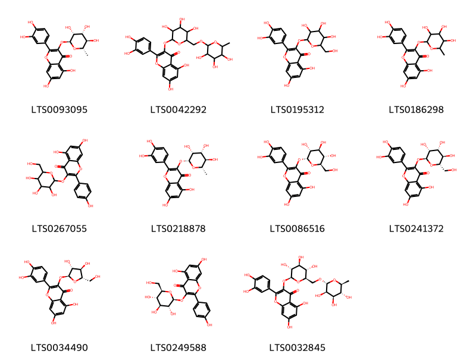{ width=100% }
    <figcaption>Hình ảnh cấu trúc hóa học của 11 hoạt chất thuộc nhóm Flavonoids gồm ['quercitrin (LTS0093095)', 'rutin (LTS0042292)', '2-(3,4-dihydroxyphenyl)-5,7-dihydroxy-3-{[3,4,5-trihydroxy-6-(hydroxymethyl)oxan-2-yl]oxy}chromen-4-one (LTS0195312)', 'quercitrin (LTS0186298)', 'trifolin (LTS0267055)', '2-(3,4-dihydroxyphenyl)-5,7-dihydroxy-3-{[(2r,3r,4r,5r,6s)-3,4,5-trihydroxy-6-methyloxan-2-yl]oxy}chromen-4-one (LTS0218878)', '2-(3,4-dihydroxyphenyl)-5,7-dihydroxy-3-{[(2r,3r,4s,5s,6r)-3,4,5-trihydroxy-6-(hydroxymethyl)oxan-2-yl]oxy}chromen-4-one (LTS0086516)', '2-(3,4-dihydroxyphenyl)-5,7-dihydroxy-3-{[(2s,3r,4r,5r,6s)-3,4,5-trihydroxy-6-(hydroxymethyl)oxan-2-yl]oxy}chromen-4-one (LTS0241372)', 'avicularin (LTS0034490)', 'astragalin (LTS0249588)', '3-rutinosyl quercetin (LTS0032845)'].</figcaption>
</figure>
#### Nhóm Organooxygen compounds
<figure markdown="span">
    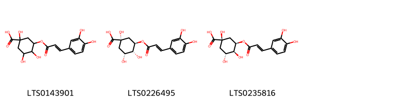{ width=100% }
    <figcaption>Hình ảnh cấu trúc hóa học của 3 hoạt chất thuộc nhóm Organooxygen compounds gồm ['3-{[3-(3,4-dihydroxyphenyl)prop-2-enoyl]oxy}-1,4,5-trihydroxycyclohexane-1-carboxylic acid (LTS0143901)', 'chlorogenic acid (LTS0226495)', 'neochlorogenic acid (LTS0235816)'].</figcaption>
</figure>
#### Nhóm Prenol lipids
<figure markdown="span">
    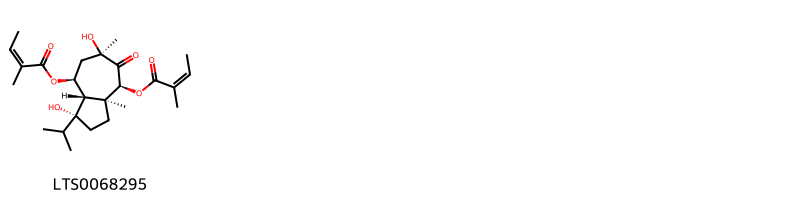{ width=100% }
    <figcaption>Hình ảnh cấu trúc hóa học của 1 hoạt chất thuộc nhóm Prenol lipids gồm ['laserpitin (LTS0068295)'].</figcaption>
</figure>

---

### Dược dân tộc học

Danh sách các quốc gia có sử dụng *Laserpitium latifolium* trong điều trị các bệnh. 

| Country   | Disease                                                       | Bệnh                                                                                                                                                                                                |
|:----------|:--------------------------------------------------------------|:----------------------------------------------------------------------------------------------------------------------------------------------------------------------------------------------------|
| Europe    | Stomachic                                                     | MYMEMORY WARNING: YOU USED ALL AVAILABLE FREE TRANSLATIONS FOR TODAY. NEXT AVAILABLE IN  07 HOURS 40 MINUTES 44 SECONDS VISIT HTTPS://MYMEMORY.TRANSLATED.NET/DOC/USAGELIMITS.PHP TO TRANSLATE MORE |
| Turkey    | Diuretic, Emmenagogue, Stomachic, Tonic, Purgative, Stimulant | MYMEMORY WARNING: YOU USED ALL AVAILABLE FREE TRANSLATIONS FOR TODAY. NEXT AVAILABLE IN  07 HOURS 40 MINUTES 42 SECONDS VISIT HTTPS://MYMEMORY.TRANSLATED.NET/DOC/USAGELIMITS.PHP TO TRANSLATE MORE |

---

---
## Laserpitium siler
### Thông tin về thực vật

!!! info "Phân loại thực vật của *Siler montanum* từ GIBF:"
    - **Kingdom:** Plantae
    - **Phylum:** Tracheophyta
    - **Order:** Apiales
    - **Family:** Apiaceae
    - **Genus:** Siler
    - **Species:** *Siler montanum*

 

| Label (VI)   | Label (EN)   | Scientific Name   | Descriptions (VI)   | Descriptions (EN)   | Also Known As (VI)   | Also Known As (EN)   |
|:-------------|:-------------|:------------------|:--------------------|:--------------------|:---------------------|:---------------------|
| N/A          | N/A          | Laserpitium siler | loài thực vật       | species of plant    | ['']                 | ['']                 |

#### Phân bố trên thế giới

**Từ CSDL GIBF** Italy, Spain, Switzerland, Liechtenstein, Austria, France, Slovenia, Croatia

#### Phân bố tại Việt Nam

**Từ CSDL GIBF**: Không có ghi nhận ở Việt Nam

---
### Thành phần hóa học
        
- Theo cơ sở dữ liệu lotus: Từ loài *Siler montanum* đã phân lập và xác định được 43 hoạt chất thuộc về các nhóm Fatty Acyls, Prenol lipids, Steroids and steroid derivatives, Benzodioxoles, Carboxylic acids and derivatives. 

|    | chemicalTaxonomyClassyfireClass   |   smiles_count |
|---:|:----------------------------------|---------------:|
|  0 | Benzodioxoles                     |              2 |
|  1 | Carboxylic acids and derivatives  |              3 |
|  2 | Fatty Acyls                       |              2 |
|  3 | Prenol lipids                     |             31 |
|  4 | Steroids and steroid derivatives  |              5 |

#### Nhóm Benzodioxoles
<figure markdown="span">
    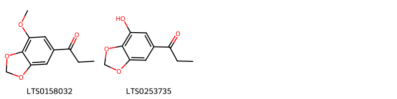{ width=100% }
    <figcaption>Hình ảnh cấu trúc hóa học của 2 hoạt chất thuộc nhóm Benzodioxoles gồm ['1-(7-methoxy-2h-1,3-benzodioxol-5-yl)propan-1-one (LTS0158032)', '1-(7-hydroxy-2h-1,3-benzodioxol-5-yl)propan-1-one (LTS0253735)'].</figcaption>
</figure>
#### Nhóm Carboxylic acids and derivatives
<figure markdown="span">
    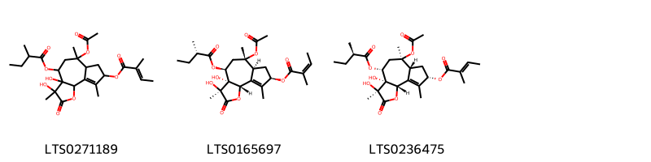{ width=100% }
    <figcaption>Hình ảnh cấu trúc hóa học của 3 hoạt chất thuộc nhóm Carboxylic acids and derivatives gồm ['6-(acetyloxy)-3,3a-dihydroxy-3,6,9-trimethyl-4-[(2-methylbutanoyl)oxy]-2-oxo-4h,5h,6ah,7h,8h,9bh-azuleno[4,5-b]furan-8-yl 2-methylbut-2-enoate (LTS0271189)', 'trilobolide (LTS0165697)', '(3s,3ar,4r,6r,6ar,8s,9bs)-6-(acetyloxy)-3,3a-dihydroxy-3,6,9-trimethyl-4-{[(2r)-2-methylbutanoyl]oxy}-2-oxo-4h,5h,6ah,7h,8h,9bh-azuleno[4,5-b]furan-8-yl (2e)-2-methylbut-2-enoate (LTS0236475)'].</figcaption>
</figure>
#### Nhóm Fatty Acyls
<figure markdown="span">
    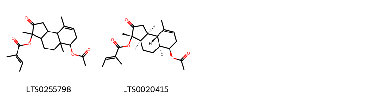{ width=100% }
    <figcaption>Hình ảnh cấu trúc hóa học của 2 hoạt chất thuộc nhóm Fatty Acyls gồm ['6-(acetyloxy)-3,5a,9-trimethyl-2-oxo-1h,3ah,4h,5h,6h,7h,9ah,9bh-cyclopenta[a]naphthalen-3-yl 2-methylbut-2-enoate (LTS0255798)', '(3s,3ar,5as,6r,9ar,9bs)-6-(acetyloxy)-3,5a,9-trimethyl-2-oxo-1h,3ah,4h,5h,6h,7h,9ah,9bh-cyclopenta[a]naphthalen-3-yl (2e)-2-methylbut-2-enoate (LTS0020415)'].</figcaption>
</figure>
#### Nhóm Prenol lipids
<figure markdown="span">
    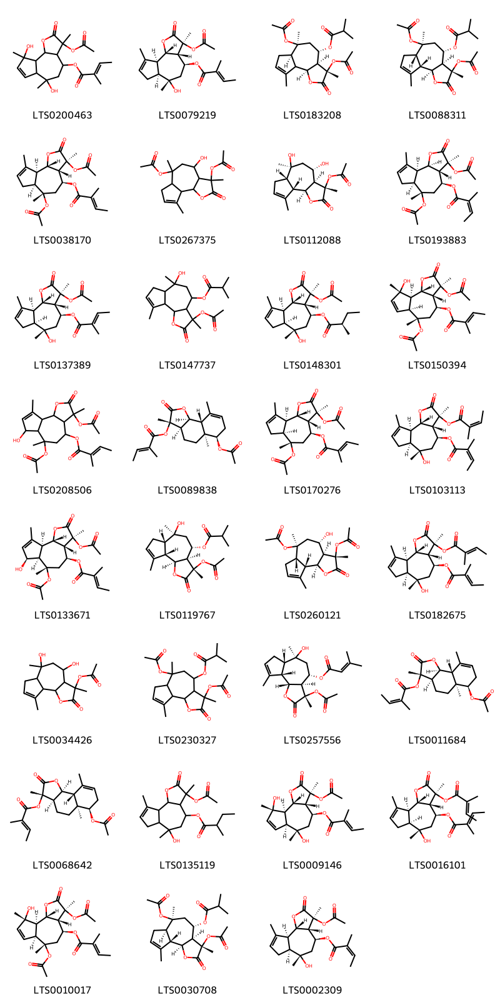{ width=100% }
    <figcaption>Hình ảnh cấu trúc hóa học của 31 hoạt chất thuộc nhóm Prenol lipids gồm ['3-(acetyloxy)-6,9-dihydroxy-3,6,9-trimethyl-2-oxo-3ah,4h,5h,6ah,9ah,9bh-azuleno[4,5-b]furan-4-yl 2-methylbut-2-enoate (LTS0200463)', '(3s,3ar,4s,6s,6as,9as,9bs)-3-(acetyloxy)-6-hydroxy-3,6,9-trimethyl-2-oxo-3ah,4h,5h,6ah,7h,9ah,9bh-azuleno[4,5-b]furan-4-yl (2e)-2-methylbut-2-enoate (LTS0079219)', '(3s,3ar,4s,6s,6ar,9bs)-3,6-bis(acetyloxy)-3,6,9-trimethyl-2-oxo-3ah,4h,5h,6ah,7h,9ah,9bh-azuleno[4,5-b]furan-4-yl 2-methylpropanoate (LTS0183208)', '(3s,3ar,4s,6s,6as,9as,9bs)-3,6-bis(acetyloxy)-3,6,9-trimethyl-2-oxo-3ah,4h,5h,6ah,7h,9ah,9bh-azuleno[4,5-b]furan-4-yl 2-methylpropanoate (LTS0088311)', '(3s,3ar,4s,6s,6as,9as,9bs)-3,6-bis(acetyloxy)-3,6,9-trimethyl-2-oxo-3ah,4h,5h,6ah,7h,9ah,9bh-azuleno[4,5-b]furan-4-yl (2e)-2-methylbut-2-enoate (LTS0038170)', '6-(acetyloxy)-4-hydroxy-3,6,9-trimethyl-2-oxo-3ah,4h,5h,6ah,7h,9ah,9bh-azuleno[4,5-b]furan-3-yl acetate (LTS0267375)', '(3s,3ar,4s,6s,6as,9as,9bs)-4,6-dihydroxy-3,6,9-trimethyl-2-oxo-3ah,4h,5h,6ah,7h,9ah,9bh-azuleno[4,5-b]furan-3-yl acetate (LTS0112088)', '(3s,3ar,4s,6s,6as,9as,9br)-3,6-bis(acetyloxy)-3,6,9-trimethyl-2-oxo-3ah,4h,5h,6ah,7h,9ah,9bh-azuleno[4,5-b]furan-4-yl (2z)-2-methylbut-2-enoate (LTS0193883)', '(3s,3ar,4s,6s,6as,9as,9bs)-3-(acetyloxy)-6-hydroxy-3,6,9-trimethyl-2-oxo-3ah,4h,5h,6ah,7h,9ah,9bh-azuleno[4,5-b]furan-4-yl 2-methylbut-2-enoate (LTS0137389)', '3-(acetyloxy)-6-hydroxy-3,6,9-trimethyl-2-oxo-3ah,4h,5h,6ah,7h,9ah,9bh-azuleno[4,5-b]furan-4-yl 2-methylpropanoate (LTS0147737)', '(3s,3ar,4s,6s,6as,9as,9bs)-3-(acetyloxy)-6-hydroxy-3,6,9-trimethyl-2-oxo-3ah,4h,5h,6ah,7h,9ah,9bh-azuleno[4,5-b]furan-4-yl (2r)-2-methylbutanoate (LTS0148301)', '(3s,3ar,4s,6s,6as,9s,9ar,9bs)-3,6-bis(acetyloxy)-9-hydroxy-3,6,9-trimethyl-2-oxo-3ah,4h,5h,6ah,9ah,9bh-azuleno[4,5-b]furan-4-yl 2-methylbut-2-enoate (LTS0150394)', '3,6-bis(acetyloxy)-7-hydroxy-3,6,9-trimethyl-2-oxo-3ah,4h,5h,6ah,7h,9ah,9bh-azuleno[4,5-b]furan-4-yl 2-methylbut-2-enoate (LTS0208506)', '(3s,3ar,5as,6r,9ar,9bs)-6-(acetyloxy)-3,5a,9-trimethyl-2-oxo-3ah,4h,5h,6h,7h,9ah,9bh-naphtho[1,2-b]furan-3-yl (2e)-2-methylbut-2-enoate (LTS0089838)', '(3s,3ar,4s,6s,6as,9as,9bs)-3,6-bis(acetyloxy)-3,6,9-trimethyl-2-oxo-3ah,4h,5h,6ah,7h,9ah,9bh-azuleno[4,5-b]furan-4-yl 2-methylbut-2-enoate (LTS0170276)', 'gradolide (LTS0103113)', '(3s,3ar,4s,6s,6ar,7s,9as,9bs)-3,6-bis(acetyloxy)-7-hydroxy-3,6,9-trimethyl-2-oxo-3ah,4h,5h,6ah,7h,9ah,9bh-azuleno[4,5-b]furan-4-yl (2e)-2-methylbut-2-enoate (LTS0133671)', '(3s,3ar,4s,6s,6as,9as,9bs)-3-(acetyloxy)-6-hydroxy-3,6,9-trimethyl-2-oxo-3ah,4h,5h,6ah,7h,9ah,9bh-azuleno[4,5-b]furan-4-yl 2-methylpropanoate (LTS0119767)', '(3s,3ar,4s,6s,6as,9as,9bs)-6-(acetyloxy)-4-hydroxy-3,6,9-trimethyl-2-oxo-3ah,4h,5h,6ah,7h,9ah,9bh-azuleno[4,5-b]furan-3-yl acetate (LTS0260121)', '(3s,3ar,4s,6s,6as,9as,9bs)-6-hydroxy-3,6,9-trimethyl-3-{[(2e)-2-methylbut-2-enoyl]oxy}-2-oxo-3ah,4h,5h,6ah,7h,9ah,9bh-azuleno[4,5-b]furan-4-yl (2e)-2-methylbut-2-enoate (LTS0182675)', '4,6-dihydroxy-3,6,9-trimethyl-2-oxo-3ah,4h,5h,6ah,7h,9ah,9bh-azuleno[4,5-b]furan-3-yl acetate (LTS0034426)', '3,6-bis(acetyloxy)-3,6,9-trimethyl-2-oxo-3ah,4h,5h,6ah,7h,9ah,9bh-azuleno[4,5-b]furan-4-yl 2-methylpropanoate (LTS0230327)', '(3s,3ar,4s,6s,6as,9as,9br)-3-(acetyloxy)-6-hydroxy-3,6,9-trimethyl-2-oxo-3ah,4h,5h,6ah,7h,9ah,9bh-azuleno[4,5-b]furan-4-yl 3-methylbut-2-enoate (LTS0257556)', '(3s,3ar,5as,6r,9ar,9bs)-6-(acetyloxy)-3,5a,9-trimethyl-2-oxo-3ah,4h,5h,6h,7h,9ah,9bh-naphtho[1,2-b]furan-3-yl (2z)-2-methylbut-2-enoate (LTS0011684)', '(3s,3ar,5as,6r,9ar,9bs)-6-(acetyloxy)-3,5a,9-trimethyl-2-oxo-3ah,4h,5h,6h,7h,9ah,9bh-naphtho[1,2-b]furan-3-yl 2-methylbut-2-enoate (LTS0068642)', '3-(acetyloxy)-6-hydroxy-3,6,9-trimethyl-2-oxo-3ah,4h,5h,6ah,7h,9ah,9bh-azuleno[4,5-b]furan-4-yl 2-methylbutanoate (LTS0135119)', '(3s,3ar,4s,6s,6as,9s,9ar,9bs)-3-(acetyloxy)-6,9-dihydroxy-3,6,9-trimethyl-2-oxo-3ah,4h,5h,6ah,9ah,9bh-azuleno[4,5-b]furan-4-yl (2e)-2-methylbut-2-enoate (LTS0009146)', '(3s,3ar,4s,6s,6as,9as,9bs)-6-hydroxy-3,6,9-trimethyl-3-[(2-methylbut-2-enoyl)oxy]-2-oxo-3ah,4h,5h,6ah,7h,9ah,9bh-azuleno[4,5-b]furan-4-yl 2-methylbut-2-enoate (LTS0016101)', '(3s,3ar,4s,6s,6as,9s,9ar,9bs)-3,6-bis(acetyloxy)-9-hydroxy-3,6,9-trimethyl-2-oxo-3ah,4h,5h,6ah,9ah,9bh-azuleno[4,5-b]furan-4-yl (2e)-2-methylbut-2-enoate (LTS0010017)', 'polhovolide (LTS0030708)', 'isomontanolide (LTS0002309)'].</figcaption>
</figure>
#### Nhóm Steroids and steroid derivatives
<figure markdown="span">
    { width=100% }
    <figcaption>Hình ảnh cấu trúc hóa học của 5 hoạt chất thuộc nhóm Steroids and steroid derivatives gồm ['stigmast-5-en-3-ol (LTS0071224)', 'stigmast-5-en-3-ol, (3β)- (LTS0204616)', 'phytosterol (LTS0029311)', '(1r,3as,3bs,7s,9bs)-1-[(2r,5r)-5,6-dimethylheptan-2-yl]-9a,11a-dimethyl-1h,2h,3h,3ah,3bh,4h,6h,7h,8h,9h,9bh,10h,11h-cyclopenta[a]phenanthren-7-ol (LTS0057877)', 'campesterol (LTS0046755)'].</figcaption>
</figure>

---

### Dược dân tộc học

Danh sách các quốc gia có sử dụng *Siler montanum* trong điều trị các bệnh. 

| Country   | Disease   | Bệnh                                                                                                                                                                                                |
|:----------|:----------|:----------------------------------------------------------------------------------------------------------------------------------------------------------------------------------------------------|
| ain       | Stomachic | MYMEMORY WARNING: YOU USED ALL AVAILABLE FREE TRANSLATIONS FOR TODAY. NEXT AVAILABLE IN  07 HOURS 40 MINUTES 15 SECONDS VISIT HTTPS://MYMEMORY.TRANSLATED.NET/DOC/USAGELIMITS.PHP TO TRANSLATE MORE |

---

# Chi Tordylium

??? note "Danh sách các dược liệu thuộc chi"
    
	 - *Tordylium maximum*

---
## Tordylium maximum
### Thông tin về thực vật

!!! info "Phân loại thực vật của *Tordylium maximum* từ GIBF:"
    - **Kingdom:** Plantae
    - **Phylum:** Tracheophyta
    - **Order:** Apiales
    - **Family:** Apiaceae
    - **Genus:** Tordylium
    - **Species:** *Tordylium maximum*

 

| Label (VI)   | Label (EN)   | Scientific Name   | Descriptions (VI)   | Descriptions (EN)   | Also Known As (VI)   | Also Known As (EN)   |
|:-------------|:-------------|:------------------|:--------------------|:--------------------|:---------------------|:---------------------|
| N/A          | N/A          | Tordylium maximum | loài thực vật       | species of plant    | ['']                 | ['']                 |

#### Phân bố trên thế giới

**Từ CSDL GIBF** Ukraine, Italy, Germany, Slovakia, Belgium, Spain, Argentina, Hungary, Serbia, Portugal, Russian Federation, Switzerland, Austria, France, Croatia

#### Phân bố tại Việt Nam

**Từ CSDL GIBF**: Không có ghi nhận ở Việt Nam

---
### Thành phần hóa học
        
- Theo cơ sở dữ liệu lotus: Từ loài *Tordylium maximum* đã phân lập và xác định được Chưa có hoạt chất nào được phân lập. hoạt chất thuộc về các nhóm Không có hoạt chất nào được phân lập. 

Không có hình ảnh nào được tạo ra

---

### Dược dân tộc học

Danh sách các quốc gia có sử dụng *Tordylium maximum* trong điều trị các bệnh. 

| Country   | Disease     | Bệnh                                                                                                                                                                                                |
|:----------|:------------|:----------------------------------------------------------------------------------------------------------------------------------------------------------------------------------------------------|
| ain       | Carminative | MYMEMORY WARNING: YOU USED ALL AVAILABLE FREE TRANSLATIONS FOR TODAY. NEXT AVAILABLE IN  07 HOURS 39 MINUTES 51 SECONDS VISIT HTTPS://MYMEMORY.TRANSLATED.NET/DOC/USAGELIMITS.PHP TO TRANSLATE MORE |

---

# Chi Hydrocotyle

??? note "Danh sách các dược liệu thuộc chi"
    
	 - *Hydrocotyle asiatica*
	 - *Hydrocotyle bonariense*
	 - *Hydrocotyle javanica*
	 - *Hydrocotyle rotundifolia*
	 - *Hydrocotyle sibthorpioides*
	 - *Hydrocotyle vulgaris*

---
## Hydrocotyle asiatica
### Thông tin về thực vật

!!! info "Phân loại thực vật của *Hydrocotyle asiatica* từ GIBF:"
    - **Kingdom:** Plantae
    - **Phylum:** Tracheophyta
    - **Order:** Apiales
    - **Family:** Araliaceae
    - **Genus:** Hydrocotyle
    - **Species:** *Hydrocotyle asiatica*

 

| Label (VI)   | Label (EN)   | Scientific Name      | Descriptions (VI)   | Descriptions (EN)   | Also Known As (VI)   | Also Known As (EN)   |
|:-------------|:-------------|:---------------------|:--------------------|:--------------------|:---------------------|:---------------------|
| N/A          | N/A          | Hydrocotyle asiatica | loài thực vật       | species of plant    | ['']                 | ['']                 |

#### Phân bố trên thế giới

**Từ CSDL GIBF** nan, Uganda, South Africa, Australia, Philippines

#### Phân bố tại Việt Nam

**Từ CSDL GIBF**: Không có ghi nhận ở Việt Nam

---
### Thành phần hóa học
        
- Theo cơ sở dữ liệu lotus: Từ loài *Hydrocotyle asiatica* đã phân lập và xác định được 10 hoạt chất thuộc về các nhóm Fatty Acyls. 

|    | chemicalTaxonomyClassyfireClass   |   smiles_count |
|---:|:----------------------------------|---------------:|
|  0 | Fatty Acyls                       |             10 |

#### Nhóm Fatty Acyls
<figure markdown="span">
    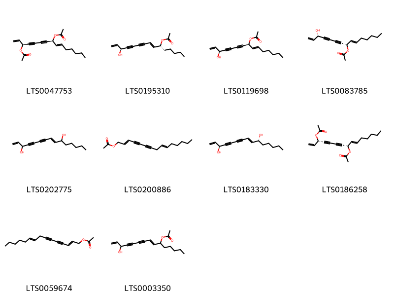{ width=100% }
    <figcaption>Hình ảnh cấu trúc hóa học của 10 hoạt chất thuộc nhóm Fatty Acyls gồm ['(3s,8s)-3-(acetyloxy)pentadeca-1,9-dien-4,6-diyn-8-yl acetate (LTS0047753)', '(6r,7e,13s)-13-hydroxypentadeca-7,14-dien-9,11-diyn-6-yl acetate (LTS0195310)', '(3s,8s)-3-hydroxypentadeca-1,9-dien-4,6-diyn-8-yl acetate (LTS0119698)', '(3s,8s,9e)-3-hydroxypentadeca-1,9-dien-4,6-diyn-8-yl acetate (LTS0083785)', 'pentadeca-1,8-dien-4,6-diyne-3,10-diol (LTS0202775)', 'pentadeca-2,9-dien-4,6-diyn-1-yl acetate (LTS0200886)', '(3s,8e,10r)-pentadeca-1,8-dien-4,6-diyne-3,10-diol (LTS0183330)', '(3s,8s,9e)-3-(acetyloxy)pentadeca-1,9-dien-4,6-diyn-8-yl acetate (LTS0186258)', '(2e,9e)-pentadeca-2,9-dien-4,6-diyn-1-yl acetate (LTS0059674)', '13-hydroxypentadeca-7,14-dien-9,11-diyn-6-yl acetate (LTS0003350)'].</figcaption>
</figure>

---

### Dược dân tộc học

Danh sách các quốc gia có sử dụng *Hydrocotyle asiatica* trong điều trị các bệnh. 

| Country   | Disease        | Bệnh                                                                                                                                                                                                |
|:----------|:---------------|:----------------------------------------------------------------------------------------------------------------------------------------------------------------------------------------------------|
| India     | Fungicide, nan | MYMEMORY WARNING: YOU USED ALL AVAILABLE FREE TRANSLATIONS FOR TODAY. NEXT AVAILABLE IN  07 HOURS 39 MINUTES 30 SECONDS VISIT HTTPS://MYMEMORY.TRANSLATED.NET/DOC/USAGELIMITS.PHP TO TRANSLATE MORE |
| Java      | Diuretic       | MYMEMORY WARNING: YOU USED ALL AVAILABLE FREE TRANSLATIONS FOR TODAY. NEXT AVAILABLE IN  07 HOURS 39 MINUTES 27 SECONDS VISIT HTTPS://MYMEMORY.TRANSLATED.NET/DOC/USAGELIMITS.PHP TO TRANSLATE MORE |

---

---
## Hydrocotyle bonariense
### Thông tin về thực vật

!!! info "Phân loại thực vật của *Hydrocotyle bonariensis* từ GIBF:"
    - **Kingdom:** Plantae
    - **Phylum:** Tracheophyta
    - **Order:** Apiales
    - **Family:** Araliaceae
    - **Genus:** Hydrocotyle
    - **Species:** *Hydrocotyle bonariensis*

 

| Label (VI)   | Label (EN)   | Scientific Name      | Descriptions (VI)   | Descriptions (EN)   | Also Known As (VI)   | Also Known As (EN)   |
|:-------------|:-------------|:---------------------|:--------------------|:--------------------|:---------------------|:---------------------|
| N/A          | N/A          | Hydrocotyle asiatica | loài thực vật       | species of plant    | ['']                 | ['']                 |

#### Phân bố trên thế giới

**Từ CSDL GIBF** nan, South Africa, Australia, Sao Tome and Principe, Thailand, Brazil, Spain, Argentina, Portugal, United States of America, Peru, Mexico, Uruguay, Chile

#### Phân bố tại Việt Nam

**Từ CSDL GIBF**: Không có ghi nhận ở Việt Nam

---
### Thành phần hóa học
        
- Theo cơ sở dữ liệu lotus: Từ loài *Hydrocotyle bonariensis* đã phân lập và xác định được Chưa có hoạt chất nào được phân lập. hoạt chất thuộc về các nhóm Không có hoạt chất nào được phân lập. 

Không có hình ảnh nào được tạo ra

---

### Dược dân tộc học

Danh sách các quốc gia có sử dụng *Hydrocotyle bonariensis* trong điều trị các bệnh. 

| Country          | Disease   | Bệnh                                                                                                                                                                                                |
|:-----------------|:----------|:----------------------------------------------------------------------------------------------------------------------------------------------------------------------------------------------------|
| Mexico(Kickapoo) | Hemostat  | MYMEMORY WARNING: YOU USED ALL AVAILABLE FREE TRANSLATIONS FOR TODAY. NEXT AVAILABLE IN  07 HOURS 39 MINUTES 11 SECONDS VISIT HTTPS://MYMEMORY.TRANSLATED.NET/DOC/USAGELIMITS.PHP TO TRANSLATE MORE |

---

---
## Hydrocotyle javanica
### Thông tin về thực vật

!!! info "Phân loại thực vật của *Hydrocotyle javanica* từ GIBF:"
    - **Kingdom:** Plantae
    - **Phylum:** Tracheophyta
    - **Order:** Apiales
    - **Family:** Araliaceae
    - **Genus:** Hydrocotyle
    - **Species:** *Hydrocotyle javanica*

 

| Label (VI)   | Label (EN)   | Scientific Name      | Descriptions (VI)   | Descriptions (EN)   | Also Known As (VI)   | Also Known As (EN)   |
|:-------------|:-------------|:---------------------|:--------------------|:--------------------|:---------------------|:---------------------|
| N/A          | N/A          | Hydrocotyle javanica | loài thực vật       | species of plant    | ['']                 | ['']                 |

#### Phân bố trên thế giới

**Từ CSDL GIBF** nan, Malaysia, Japan, Thailand, Lao People’s Democratic Republic, Korea, Republic of, Chinese Taipei, Myanmar, Papua New Guinea, India, Indonesia, Solomon Islands, Viet Nam, Nepal

#### Phân bố tại Việt Nam

**Từ CSDL GIBF**: Kon Tum

---
### Thành phần hóa học
        
- Theo cơ sở dữ liệu lotus: Từ loài *Hydrocotyle javanica* đã phân lập và xác định được Chưa có hoạt chất nào được phân lập. hoạt chất thuộc về các nhóm Không có hoạt chất nào được phân lập. 

Không có hình ảnh nào được tạo ra

---

### Dược dân tộc học

Danh sách các quốc gia có sử dụng *Hydrocotyle javanica* trong điều trị các bệnh. 

| Country   | Disease                                            | Bệnh                                                                                                                                                                                                |
|:----------|:---------------------------------------------------|:----------------------------------------------------------------------------------------------------------------------------------------------------------------------------------------------------|
| India     | Piscicide, Stimulant, Diuretic, Insecticide, Tonic | MYMEMORY WARNING: YOU USED ALL AVAILABLE FREE TRANSLATIONS FOR TODAY. NEXT AVAILABLE IN  07 HOURS 38 MINUTES 49 SECONDS VISIT HTTPS://MYMEMORY.TRANSLATED.NET/DOC/USAGELIMITS.PHP TO TRANSLATE MORE |
| Solomon I | Piscicide                                          | MYMEMORY WARNING: YOU USED ALL AVAILABLE FREE TRANSLATIONS FOR TODAY. NEXT AVAILABLE IN  07 HOURS 38 MINUTES 47 SECONDS VISIT HTTPS://MYMEMORY.TRANSLATED.NET/DOC/USAGELIMITS.PHP TO TRANSLATE MORE |
| Sunda I.  | Piscicide                                          | MYMEMORY WARNING: YOU USED ALL AVAILABLE FREE TRANSLATIONS FOR TODAY. NEXT AVAILABLE IN  07 HOURS 38 MINUTES 45 SECONDS VISIT HTTPS://MYMEMORY.TRANSLATED.NET/DOC/USAGELIMITS.PHP TO TRANSLATE MORE |

---

---
## Hydrocotyle rotundifolia
### Thông tin về thực vật

!!! info "Phân loại thực vật của *N/A* từ GIBF:"
    - **Kingdom:** Plantae
    - **Phylum:** Tracheophyta
    - **Order:** Apiales
    - **Family:** N/A
    - **Genus:** N/A
    - **Species:** *N/A*

 

| Label (VI)   | Label (EN)   | Scientific Name          | Descriptions (VI)   | Descriptions (EN)   | Also Known As (VI)   | Also Known As (EN)   |
|:-------------|:-------------|:-------------------------|:--------------------|:--------------------|:---------------------|:---------------------|
| N/A          | N/A          | Hydrocotyle rotundifolia |                     | species of plant    | ['']                 | ['']                 |

#### Phân bố trên thế giới

**Từ CSDL GIBF** Italy, Australia, Japan, Argentina, Canada, Denmark, Netherlands, Lithuania, Luxembourg, Chinese Taipei, Spain, Portugal, Russian Federation, United States of America, Chile, Uruguay, South Africa, Czechia, Germany, Switzerland, Isle of Man, Austria, France, Mexico, United Kingdom of Great Britain and Northern Ireland, Jersey, Niue, Ireland, Costa Rica, New Zealand

#### Phân bố tại Việt Nam

**Từ CSDL GIBF**: Không có ghi nhận ở Việt Nam

---
### Thành phần hóa học
        
- Theo cơ sở dữ liệu lotus: Từ loài *N/A* đã phân lập và xác định được Chưa có hoạt chất nào được phân lập. hoạt chất thuộc về các nhóm Không có hoạt chất nào được phân lập. 

Không có hình ảnh nào được tạo ra

---

### Dược dân tộc học

Danh sách các quốc gia có sử dụng *N/A* trong điều trị các bệnh. 

| Country   | Disease                 | Bệnh                                                                                                                                                                                                |
|:----------|:------------------------|:----------------------------------------------------------------------------------------------------------------------------------------------------------------------------------------------------|
| China     | Detoxicant, Refrigerant | MYMEMORY WARNING: YOU USED ALL AVAILABLE FREE TRANSLATIONS FOR TODAY. NEXT AVAILABLE IN  07 HOURS 38 MINUTES 24 SECONDS VISIT HTTPS://MYMEMORY.TRANSLATED.NET/DOC/USAGELIMITS.PHP TO TRANSLATE MORE |

---

---
## Hydrocotyle sibthorpioides
### Thông tin về thực vật

!!! info "Phân loại thực vật của *Hydrocotyle sibthorpioides* từ GIBF:"
    - **Kingdom:** Plantae
    - **Phylum:** Tracheophyta
    - **Order:** Apiales
    - **Family:** Araliaceae
    - **Genus:** Hydrocotyle
    - **Species:** *Hydrocotyle sibthorpioides*

 

| Label (VI)   | Label (EN)   | Scientific Name            | Descriptions (VI)   | Descriptions (EN)   | Also Known As (VI)   | Also Known As (EN)   |
|:-------------|:-------------|:---------------------------|:--------------------|:--------------------|:---------------------|:---------------------|
| N/A          | N/A          | Hydrocotyle sibthorpioides | loài thực vật       | species of plant    | ['']                 | ['']                 |

#### Phân bố trên thế giới

**Từ CSDL GIBF** Italy, Australia, Japan, Belgium, Rwanda, Pakistan, Puerto Rico, Netherlands, Korea, Republic of, Chinese Taipei, United States of America, South Africa, Hong Kong, Brazil, Switzerland, France, Singapore, China, India, Indonesia

#### Phân bố tại Việt Nam

**Từ CSDL GIBF**: Không có ghi nhận ở Việt Nam

---
### Thành phần hóa học
        
- Theo cơ sở dữ liệu lotus: Từ loài *Hydrocotyle sibthorpioides* đã phân lập và xác định được 55 hoạt chất thuộc về các nhóm Unsaturated hydrocarbons, Furanoid lignans, Flavonoids, Prenol lipids. 

|    | chemicalTaxonomyClassyfireClass   |   smiles_count |
|---:|:----------------------------------|---------------:|
|  0 | Flavonoids                        |              5 |
|  1 | Furanoid lignans                  |              1 |
|  2 | Prenol lipids                     |             47 |
|  3 | Unsaturated hydrocarbons          |              2 |

#### Nhóm Flavonoids
<figure markdown="span">
    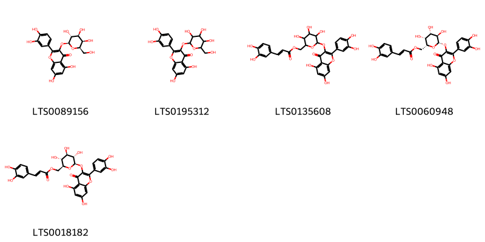{ width=100% }
    <figcaption>Hình ảnh cấu trúc hóa học của 5 hoạt chất thuộc nhóm Flavonoids gồm ['hyperoside (LTS0089156)', '2-(3,4-dihydroxyphenyl)-5,7-dihydroxy-3-{[3,4,5-trihydroxy-6-(hydroxymethyl)oxan-2-yl]oxy}chromen-4-one (LTS0195312)', '(6-{[2-(3,4-dihydroxyphenyl)-5,7-dihydroxy-4-oxochromen-3-yl]oxy}-3,4,5-trihydroxyoxan-2-yl)methyl 3-(3,4-dihydroxyphenyl)prop-2-enoate (LTS0135608)', '[(2r,3r,4s,5r,6s)-6-{[2-(3,4-dihydroxyphenyl)-5,7-dihydroxy-4-oxochromen-3-yl]oxy}-3,4,5-trihydroxyoxan-2-yl]methyl (2e)-3-(3,4-dihydroxyphenyl)prop-2-enoate (LTS0060948)', '[(2s,3r,4r,5s,6r)-6-{[2-(3,4-dihydroxyphenyl)-5,7-dihydroxy-4-oxochromen-3-yl]oxy}-3,4,5-trihydroxyoxan-2-yl]methyl (2e)-3-(3,4-dihydroxyphenyl)prop-2-enoate (LTS0018182)'].</figcaption>
</figure>
#### Nhóm Furanoid lignans
<figure markdown="span">
    { width=100% }
    <figcaption>Hình ảnh cấu trúc hóa học của 1 hoạt chất thuộc nhóm Furanoid lignans gồm ['(-)-sesamin (LTS0203187)'].</figcaption>
</figure>
#### Nhóm Prenol lipids
<figure markdown="span">
    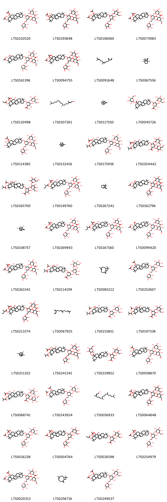{ width=100% }
    <figcaption>Hình ảnh cấu trúc hóa học của 47 hoạt chất thuộc nhóm Prenol lipids gồm ['[(3r,4r,4ar,5r,6as,6br,8ar,10s,12ar,12br,14bs)-3-(acetyloxy)-4,5-dihydroxy-10-{[(2r,3r,4s,5s,6r)-4-hydroxy-3,5-bis({[(2s,3r,4s,5s,6r)-3,4,5-trihydroxy-6-(hydroxymethyl)oxan-2-yl]oxy})-6-({[(2s,3r,4s,5s)-3,4,5-trihydroxyoxan-2-yl]oxy}methyl)oxan-2-yl]oxy}-2,2,6a,6b,9,9,12a-heptamethyl-1,3,4,5,6,7,8,8a,10,11,12,12b,13,14b-tetradecahydropicen-4a-yl]methyl acetate (LTS0210520)', '(3,4,5-trihydroxy-10-{[4-hydroxy-3,5-bis({[3,4,5-trihydroxy-6-(hydroxymethyl)oxan-2-yl]oxy})-6-{[(3,4,5-trihydroxyoxan-2-yl)oxy]methyl}oxan-2-yl]oxy}-2,2,6a,6b,9,9,12a-heptamethyl-1,3,4,5,6,7,8,8a,10,11,12,12b,13,14b-tetradecahydropicen-4a-yl)methyl acetate (LTS0195848)', '[3-(acetyloxy)-10-[(4,5-dihydroxy-3-{[3,4,5-trihydroxy-6-(hydroxymethyl)oxan-2-yl]oxy}-6-{[(3,4,5-trihydroxyoxan-2-yl)oxy]methyl}oxan-2-yl)oxy]-4,5-dihydroxy-2,2,6a,6b,9,9,12a-heptamethyl-1,3,4,5,6,7,8,8a,10,11,12,12b,13,14b-tetradecahydropicen-4a-yl]methyl acetate (LTS0106060)', '(3r,4r,4ar,5r,6as,6br,8ar,10s,12ar,12br,14bs)-3-(acetyloxy)-5-hydroxy-10-{[(2r,3r,4s,5s,6r)-4-hydroxy-3,5-bis({[(2s,3r,4s,5s,6r)-3,4,5-trihydroxy-6-(hydroxymethyl)oxan-2-yl]oxy})-6-({[(2s,3r,4s,5s)-3,4,5-trihydroxyoxan-2-yl]oxy}methyl)oxan-2-yl]oxy}-4a-(hydroxymethyl)-2,2,6a,6b,9,9,12a-heptamethyl-1,3,4,5,6,7,8,8a,10,11,12,12b,13,14b-tetradecahydropicen-4-yl acetate (LTS0073983)', '(3r,4r,4ar,5r,6as,6br,8ar,10s,12ar,12br,14br)-4,5-dihydroxy-10-{[(2r,3r,4s,5s,6r)-4-hydroxy-3,5-bis({[(2s,3r,4s,5s,6r)-3,4,5-trihydroxy-6-(hydroxymethyl)oxan-2-yl]oxy})-6-({[(2r,3s,4s,5r)-3,4,5-trihydroxyoxan-2-yl]oxy}methyl)oxan-2-yl]oxy}-4a-(hydroxymethyl)-2,2,6a,6b,9,9,12a-heptamethyl-1,3,4,5,6,7,8,8a,10,11,12,12b,13,14b-tetradecahydropicen-3-yl acetate (LTS0161396)', '3-(acetyloxy)-5-hydroxy-10-{[4-hydroxy-3,5-bis({[3,4,5-trihydroxy-6-(hydroxymethyl)oxan-2-yl]oxy})-6-{[(3,4,5-trihydroxyoxan-2-yl)oxy]methyl}oxan-2-yl]oxy}-4a-(hydroxymethyl)-2,2,6a,6b,9,9,12a-heptamethyl-1,3,4,5,6,7,8,8a,10,11,12,12b,13,14b-tetradecahydropicen-4-yl acetate (LTS0094755)', 'β-farnesene (LTS0091648)', '(-)-camphene (LTS0067556)', '(2s,3s,4s,5r,6r)-6-{[(3s,4ar,6ar,6bs,7r,8s,8ar,9r,10r,12as,14ar,14br)-9-(acetyloxy)-7,8-dihydroxy-8a-(hydroxymethyl)-4,4,6a,6b,11,11,14b-heptamethyl-10-(propanoyloxy)-1,2,3,4a,5,6,7,8,9,10,12,12a,14,14a-tetradecahydropicen-3-yl]oxy}-3,4-dihydroxy-5-{[(2s,3r,4s,5s,6r)-3,4,5-trihydroxy-6-(hydroxymethyl)oxan-2-yl]oxy}oxane-2-carboxylic acid (LTS0110498)', '(2e,7s,11s)-3,7,11,15-tetramethylhexadec-2-en-1-ol (LTS0207261)', 'β-pinene (LTS0117550)', '(2s,3s,4s,5r,6r)-6-{[(3s,4ar,6ar,6bs,8as,12as,14ar,14br)-4,4,6a,6b,11,11,14b-heptamethyl-8a-({[(2s,3r,4s,5s,6r)-3,4,5-trihydroxy-6-(hydroxymethyl)oxan-2-yl]oxy}carbonyl)-1,2,3,4a,5,6,7,8,9,10,12,12a,14,14a-tetradecahydropicen-3-yl]oxy}-3,4-dihydroxy-5-{[(2s,3r,4s,5r,6r)-3,4,5-trihydroxy-6-(hydroxymethyl)oxan-2-yl]oxy}oxane-2-carboxylic acid (LTS0045726)', '[(3r,4r,4ar,5r,6as,6br,8ar,10s,12ar,12br,14bs)-3,4,5-trihydroxy-10-{[(2r,3r,4s,5s,6r)-4-hydroxy-3,5-bis({[(2s,3r,4s,5s,6r)-3,4,5-trihydroxy-6-(hydroxymethyl)oxan-2-yl]oxy})-6-({[(2s,3s,4s,5s)-3,4,5-trihydroxyoxan-2-yl]oxy}methyl)oxan-2-yl]oxy}-2,2,6a,6b,9,9,12a-heptamethyl-1,3,4,5,6,7,8,8a,10,11,12,12b,13,14b-tetradecahydropicen-4a-yl]methyl acetate (LTS0114385)', 'α pinene (LTS0132416)', '(3r,4r,4ar,5s,6r,6as,6br,8ar,10s,12ar,12br,14bs)-4-(acetyloxy)-5,6-dihydroxy-10-{[(2r,3r,4s,5s,6r)-4-hydroxy-3,5-bis({[(2s,3r,4s,5s,6r)-3,4,5-trihydroxy-6-(hydroxymethyl)oxan-2-yl]oxy})-6-({[(2s,3r,4s,5s)-3,4,5-trihydroxyoxan-2-yl]oxy}methyl)oxan-2-yl]oxy}-4a-(hydroxymethyl)-2,2,6a,6b,9,9,12a-heptamethyl-1,3,4,5,6,7,8,8a,10,11,12,12b,13,14b-tetradecahydropicen-3-yl 2-methylpropanoate (LTS0175936)', '6-{[9-(acetyloxy)-7,8-dihydroxy-8a-(hydroxymethyl)-4,4,6a,6b,11,11,14b-heptamethyl-10-[(2-methylpropanoyl)oxy]-1,2,3,4a,5,6,7,8,9,10,12,12a,14,14a-tetradecahydropicen-3-yl]oxy}-3-hydroxy-4,5-bis({[3,4,5-trihydroxy-6-(hydroxymethyl)oxan-2-yl]oxy})oxane-2-carboxylic acid (LTS0204442)', '6-{[9-(acetyloxy)-7,8-dihydroxy-8a-(hydroxymethyl)-4,4,6a,6b,11,11,14b-heptamethyl-10-[(2-methylpropanoyl)oxy]-1,2,3,4a,5,6,7,8,9,10,12,12a,14,14a-tetradecahydropicen-3-yl]oxy}-5-{[4,5-dihydroxy-6-(hydroxymethyl)-3-{[3,4,5-trihydroxy-6-(hydroxymethyl)oxan-2-yl]oxy}oxan-2-yl]oxy}-3,4-dihydroxyoxane-2-carboxylic acid (LTS0165700)', '(3r,4r,4ar,5s,6r,6as,6br,8ar,10s,12ar,12br,14bs)-4-(acetyloxy)-5,6-dihydroxy-10-{[(2r,3r,4s,5s,6r)-4-hydroxy-3,5-bis({[(2s,3r,4s,5s,6r)-3,4,5-trihydroxy-6-(hydroxymethyl)oxan-2-yl]oxy})-6-({[(2s,3r,4s,5s)-3,4,5-trihydroxyoxan-2-yl]oxy}methyl)oxan-2-yl]oxy}-4a-(hydroxymethyl)-2,2,6a,6b,9,9,12a-heptamethyl-1,3,4,5,6,7,8,8a,10,11,12,12b,13,14b-tetradecahydropicen-3-yl (2r)-2-methylbutanoate (LTS0149760)', 'camphene (LTS0267242)', '4,5-dihydroxy-10-{[4-hydroxy-3,5-bis({[3,4,5-trihydroxy-6-(hydroxymethyl)oxan-2-yl]oxy})-6-{[(3,4,5-trihydroxyoxan-2-yl)oxy]methyl}oxan-2-yl]oxy}-4a-(hydroxymethyl)-2,2,6a,6b,9,9,12a-heptamethyl-1,3,4,5,6,7,8,8a,10,11,12,12b,13,14b-tetradecahydropicen-3-yl acetate (LTS0162796)', '(-)-β-pinene (LTS0108757)', '(3r,4r,4ar,5r,6as,6br,8ar,10s,12ar,12br,14br)-3-(acetyloxy)-5-hydroxy-10-{[(2r,3r,4s,5s,6r)-4-hydroxy-3,5-bis({[(2s,3r,4s,5s,6r)-3,4,5-trihydroxy-6-(hydroxymethyl)oxan-2-yl]oxy})-6-({[(2r,3s,4r,5r)-3,4,5-trihydroxyoxan-2-yl]oxy}methyl)oxan-2-yl]oxy}-4a-(hydroxymethyl)-2,2,6a,6b,9,9,12a-heptamethyl-1,3,4,5,6,7,8,8a,10,11,12,12b,13,14b-tetradecahydropicen-4-yl acetate (LTS0269943)', '(3r,4r,4ar,5s,6r,6as,6br,8ar,10s,12ar,12br,14bs)-4-(acetyloxy)-5,6-dihydroxy-10-{[(2r,3r,4s,5s,6r)-4-hydroxy-3,5-bis({[(2s,3r,4s,5s,6r)-3,4,5-trihydroxy-6-(hydroxymethyl)oxan-2-yl]oxy})-6-({[(2s,3r,4s,5s)-3,4,5-trihydroxyoxan-2-yl]oxy}methyl)oxan-2-yl]oxy}-4a-(hydroxymethyl)-2,2,6a,6b,9,9,12a-heptamethyl-1,3,4,5,6,7,8,8a,10,11,12,12b,13,14b-tetradecahydropicen-3-yl 2-methylbutanoate (LTS0167160)', '(3r,4r,4ar,5r,6as,6br,8ar,10s,12ar,12br,14bs)-4,5-dihydroxy-10-{[(2r,3r,4s,5s,6r)-4-hydroxy-3,5-bis({[(2s,3r,4s,5s,6r)-3,4,5-trihydroxy-6-(hydroxymethyl)oxan-2-yl]oxy})-6-({[(2s,3r,4s,5s)-3,4,5-trihydroxyoxan-2-yl]oxy}methyl)oxan-2-yl]oxy}-4a-(hydroxymethyl)-2,2,6a,6b,9,9,12a-heptamethyl-1,3,4,5,6,7,8,8a,10,11,12,12b,13,14b-tetradecahydropicen-3-yl acetate (LTS0099420)', '(3r,4r,4ar,5s,6r,6as,6br,8ar,10s,12ar,12br,14bs)-3-(acetyloxy)-5,6-dihydroxy-10-{[(2r,3r,4s,5s,6r)-4-hydroxy-3,5-bis({[(2s,3r,4s,5s,6r)-3,4,5-trihydroxy-6-(hydroxymethyl)oxan-2-yl]oxy})-6-({[(2s,3r,4s,5s)-3,4,5-trihydroxyoxan-2-yl]oxy}methyl)oxan-2-yl]oxy}-4a-(hydroxymethyl)-2,2,6a,6b,9,9,12a-heptamethyl-1,3,4,5,6,7,8,8a,10,11,12,12b,13,14b-tetradecahydropicen-4-yl acetate (LTS0261541)', '(2s,3s,4s,5r,6r)-6-{[(3s,4ar,6ar,6bs,7r,8s,8ar,9r,10r,12as,14ar,14br)-9-(acetyloxy)-7,8-dihydroxy-8a-(hydroxymethyl)-4,4,6a,6b,11,11,14b-heptamethyl-10-[(2-methylpropanoyl)oxy]-1,2,3,4a,5,6,7,8,9,10,12,12a,14,14a-tetradecahydropicen-3-yl]oxy}-5-{[(2s,3r,4s,5s,6r)-4,5-dihydroxy-6-(hydroxymethyl)-3-{[(2s,3r,4s,5s,6r)-3,4,5-trihydroxy-6-(hydroxymethyl)oxan-2-yl]oxy}oxan-2-yl]oxy}-3,4-dihydroxyoxane-2-carboxylic acid (LTS0114199)', 'caryophyllene (LTS0085212)', '[(3r,4r,4ar,5r,6as,6br,8ar,10s,12ar,12br,14br)-3-(acetyloxy)-10-{[(2r,3r,4s,5s,6r)-4,5-dihydroxy-3-{[(2s,3r,4s,5s,6r)-3,4,5-trihydroxy-6-(hydroxymethyl)oxan-2-yl]oxy}-6-({[(2r,3r,4r,5r)-3,4,5-trihydroxyoxan-2-yl]oxy}methyl)oxan-2-yl]oxy}-4,5-dihydroxy-2,2,6a,6b,9,9,12a-heptamethyl-1,3,4,5,6,7,8,8a,10,11,12,12b,13,14b-tetradecahydropicen-4a-yl]methyl acetate (LTS0252607)', '4-(acetyloxy)-5,6-dihydroxy-10-{[4-hydroxy-3,5-bis({[3,4,5-trihydroxy-6-(hydroxymethyl)oxan-2-yl]oxy})-6-{[(3,4,5-trihydroxyoxan-2-yl)oxy]methyl}oxan-2-yl]oxy}-4a-(hydroxymethyl)-2,2,6a,6b,9,9,12a-heptamethyl-1,3,4,5,6,7,8,8a,10,11,12,12b,13,14b-tetradecahydropicen-3-yl 2-methylbutanoate (LTS0213374)', 'β-farnesene (LTS0067925)', '(2s,3s,4s,5r,6r)-6-{[(3s,4ar,6ar,6bs,7r,8s,8ar,9r,10r,12as,14ar,14br)-9-(acetyloxy)-7,8-dihydroxy-8a-(hydroxymethyl)-4,4,6a,6b,11,11,14b-heptamethyl-10-[(2-methylpropanoyl)oxy]-1,2,3,4a,5,6,7,8,9,10,12,12a,14,14a-tetradecahydropicen-3-yl]oxy}-3,4-dihydroxy-5-{[(2s,3r,4s,5s,6r)-3,4,5-trihydroxy-6-(hydroxymethyl)oxan-2-yl]oxy}oxane-2-carboxylic acid (LTS0215851)', '6-{[9-(acetyloxy)-7,8-dihydroxy-8a-(hydroxymethyl)-4,4,6a,6b,11,11,14b-heptamethyl-10-[(2-methylpropanoyl)oxy]-1,2,3,4a,5,6,7,8,9,10,12,12a,14,14a-tetradecahydropicen-3-yl]oxy}-3,4-dihydroxy-5-{[3,4,5-trihydroxy-6-(hydroxymethyl)oxan-2-yl]oxy}oxane-2-carboxylic acid (LTS0197338)', '(+)-α-pinene (LTS0211102)', '4-(acetyloxy)-5,6-dihydroxy-10-{[4-hydroxy-3,5-bis({[3,4,5-trihydroxy-6-(hydroxymethyl)oxan-2-yl]oxy})-6-{[(3,4,5-trihydroxyoxan-2-yl)oxy]methyl}oxan-2-yl]oxy}-4a-(hydroxymethyl)-2,2,6a,6b,9,9,12a-heptamethyl-1,3,4,5,6,7,8,8a,10,11,12,12b,13,14b-tetradecahydropicen-3-yl 2-methylpropanoate (LTS0241341)', '6-{[4,4,6a,6b,11,11,14b-heptamethyl-8a-({[3,4,5-trihydroxy-6-(hydroxymethyl)oxan-2-yl]oxy}carbonyl)-1,2,3,4a,5,6,7,8,9,10,12,12a,14,14a-tetradecahydropicen-3-yl]oxy}-3,4-dihydroxy-5-{[3,4,5-trihydroxy-6-(hydroxymethyl)oxan-2-yl]oxy}oxane-2-carboxylic acid (LTS0229852)', '[(3r,4r,4ar,5r,6as,6br,8ar,10s,12ar,12br,14bs)-3,4,5-trihydroxy-10-{[(2r,3r,4s,5s,6r)-4-hydroxy-3,5-bis({[(2s,3r,4s,5s,6r)-3,4,5-trihydroxy-6-(hydroxymethyl)oxan-2-yl]oxy})-6-({[(2s,3r,4s,5s)-3,4,5-trihydroxyoxan-2-yl]oxy}methyl)oxan-2-yl]oxy}-2,2,6a,6b,9,9,12a-heptamethyl-1,3,4,5,6,7,8,8a,10,11,12,12b,13,14b-tetradecahydropicen-4a-yl]methyl acetate (LTS0058870)', '(2s,3s,4s,5r,6r)-6-{[(3s,4ar,6ar,6bs,7r,8s,8ar,9r,10r,12as,14ar,14br)-9-(acetyloxy)-7,8-dihydroxy-8a-(hydroxymethyl)-4,4,6a,6b,11,11,14b-heptamethyl-10-[(2-methylpropanoyl)oxy]-1,2,3,4a,5,6,7,8,9,10,12,12a,14,14a-tetradecahydropicen-3-yl]oxy}-3-hydroxy-4,5-bis({[(2s,3r,4s,5s,6r)-3,4,5-trihydroxy-6-(hydroxymethyl)oxan-2-yl]oxy})oxane-2-carboxylic acid (LTS0068741)', '[(3r,4r,4ar,5r,6as,6br,8ar,10s,12ar,12br,14br)-4-(acetyloxy)-10-{[(2r,3r,4s,5s,6r)-4,5-dihydroxy-3-{[(2s,3r,4s,5s,6r)-3,4,5-trihydroxy-6-(hydroxymethyl)oxan-2-yl]oxy}-6-({[(2s,3r,4s,5s)-3,4,5-trihydroxyoxan-2-yl]oxy}methyl)oxan-2-yl]oxy}-3,5-dihydroxy-2,2,6a,6b,9,9,12a-heptamethyl-1,3,4,5,6,7,8,8a,10,11,12,12b,13,14b-tetradecahydropicen-4a-yl]methyl acetate (LTS0243924)', '3,7,11,15-tetramethylhexadec-2-en-1-ol (LTS0056933)', '[3-(acetyloxy)-4,5-dihydroxy-10-{[4-hydroxy-3,5-bis({[3,4,5-trihydroxy-6-(hydroxymethyl)oxan-2-yl]oxy})-6-{[(3,4,5-trihydroxyoxan-2-yl)oxy]methyl}oxan-2-yl]oxy}-2,2,6a,6b,9,9,12a-heptamethyl-1,3,4,5,6,7,8,8a,10,11,12,12b,13,14b-tetradecahydropicen-4a-yl]methyl acetate (LTS0064848)', '(3r,4r,4ar,5r,6as,6br,8ar,10s,12ar,12br,14bs)-3-(acetyloxy)-10-{[(2r,3r,4s,5s,6r)-4,5-dihydroxy-3-{[(2s,3r,4s,5s,6r)-3,4,5-trihydroxy-6-(hydroxymethyl)oxan-2-yl]oxy}-6-({[(2s,3r,4s,5s)-3,4,5-trihydroxyoxan-2-yl]oxy}methyl)oxan-2-yl]oxy}-5-hydroxy-4a-(hydroxymethyl)-2,2,6a,6b,9,9,12a-heptamethyl-1,3,4,5,6,7,8,8a,10,11,12,12b,13,14b-tetradecahydropicen-4-yl acetate (LTS0016238)', '3-(acetyloxy)-10-[(4,5-dihydroxy-3-{[3,4,5-trihydroxy-6-(hydroxymethyl)oxan-2-yl]oxy}-6-{[(3,4,5-trihydroxyoxan-2-yl)oxy]methyl}oxan-2-yl)oxy]-5-hydroxy-4a-(hydroxymethyl)-2,2,6a,6b,9,9,12a-heptamethyl-1,3,4,5,6,7,8,8a,10,11,12,12b,13,14b-tetradecahydropicen-4-yl acetate (LTS0004764)', '6-{[9-(acetyloxy)-7,8-dihydroxy-8a-(hydroxymethyl)-4,4,6a,6b,11,11,14b-heptamethyl-10-(propanoyloxy)-1,2,3,4a,5,6,7,8,9,10,12,12a,14,14a-tetradecahydropicen-3-yl]oxy}-3,4-dihydroxy-5-{[3,4,5-trihydroxy-6-(hydroxymethyl)oxan-2-yl]oxy}oxane-2-carboxylic acid (LTS0026598)', '(3r,4r,4ar,5r,6as,6br,8ar,10s,12ar,12br,14br)-3-(acetyloxy)-10-{[(2r,3r,4s,5s,6r)-4,5-dihydroxy-3-{[(2s,3r,4s,5s,6r)-3,4,5-trihydroxy-6-(hydroxymethyl)oxan-2-yl]oxy}-6-({[(2r,3r,4s,5s)-3,4,5-trihydroxyoxan-2-yl]oxy}methyl)oxan-2-yl]oxy}-5-hydroxy-4a-(hydroxymethyl)-2,2,6a,6b,9,9,12a-heptamethyl-1,3,4,5,6,7,8,8a,10,11,12,12b,13,14b-tetradecahydropicen-4-yl acetate (LTS0254979)', '[(3r,4r,4ar,5r,6as,6br,8ar,10s,12ar,12br,14br)-3-(acetyloxy)-4,5-dihydroxy-10-{[(2r,3r,4s,5s,6r)-4-hydroxy-3,5-bis({[(2s,3r,4s,5s,6r)-3,4,5-trihydroxy-6-(hydroxymethyl)oxan-2-yl]oxy})-6-({[(2r,3r,4r,5r)-3,4,5-trihydroxyoxan-2-yl]oxy}methyl)oxan-2-yl]oxy}-2,2,6a,6b,9,9,12a-heptamethyl-1,3,4,5,6,7,8,8a,10,11,12,12b,13,14b-tetradecahydropicen-4a-yl]methyl acetate (LTS0020313)', '4,11,11-trimethyl-8-methylidenebicyclo[7.2.0]undec-4-ene (LTS0256716)', '[(3r,4r,4ar,5r,6as,6br,8ar,10s,12ar,12br,14bs)-3-(acetyloxy)-10-{[(2r,3r,4s,5s,6r)-4,5-dihydroxy-3-{[(2s,3r,4s,5s,6r)-3,4,5-trihydroxy-6-(hydroxymethyl)oxan-2-yl]oxy}-6-({[(2s,3r,4s,5s)-3,4,5-trihydroxyoxan-2-yl]oxy}methyl)oxan-2-yl]oxy}-4,5-dihydroxy-2,2,6a,6b,9,9,12a-heptamethyl-1,3,4,5,6,7,8,8a,10,11,12,12b,13,14b-tetradecahydropicen-4a-yl]methyl acetate (LTS0249037)'].</figcaption>
</figure>
#### Nhóm Unsaturated hydrocarbons
<figure markdown="span">
    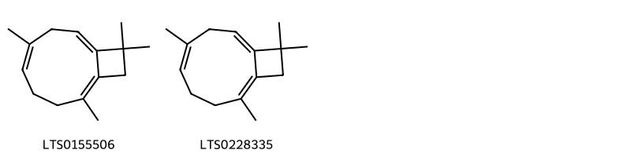{ width=100% }
    <figcaption>Hình ảnh cấu trúc hóa học của 2 hoạt chất thuộc nhóm Unsaturated hydrocarbons gồm ['4,8,11,11-tetramethylbicyclo[7.2.0]undeca-1,4,8-triene (LTS0155506)', '(1z,8z)-4,8,11,11-tetramethylbicyclo[7.2.0]undeca-1,4,8-triene (LTS0228335)'].</figcaption>
</figure>

---

### Dược dân tộc học

Danh sách các quốc gia có sử dụng *Hydrocotyle sibthorpioides* trong điều trị các bệnh. 

| Country   | Disease             | Bệnh                                                                                                                                                                                                |
|:----------|:--------------------|:----------------------------------------------------------------------------------------------------------------------------------------------------------------------------------------------------|
| India     | Diuretic, Vermifuge | MYMEMORY WARNING: YOU USED ALL AVAILABLE FREE TRANSLATIONS FOR TODAY. NEXT AVAILABLE IN  07 HOURS 38 MINUTES 00 SECONDS VISIT HTTPS://MYMEMORY.TRANSLATED.NET/DOC/USAGELIMITS.PHP TO TRANSLATE MORE |

---

---
## Hydrocotyle vulgaris
### Thông tin về thực vật

!!! info "Phân loại thực vật của *Hydrocotyle vulgaris* từ GIBF:"
    - **Kingdom:** Plantae
    - **Phylum:** Tracheophyta
    - **Order:** Apiales
    - **Family:** Araliaceae
    - **Genus:** Hydrocotyle
    - **Species:** *Hydrocotyle vulgaris*

 

| Label (VI)   | Label (EN)   | Scientific Name      | Descriptions (VI)   | Descriptions (EN)   | Also Known As (VI)   | Also Known As (EN)                                                                                  |
|:-------------|:-------------|:---------------------|:--------------------|:--------------------|:---------------------|:----------------------------------------------------------------------------------------------------|
| N/A          | N/A          | Hydrocotyle vulgaris |                     | species of plant    | ['']                 | ['common pennywort', 'copper coin', 'lucky plant', 'marsh pennywort', 'money plant', 'water naval'] |

#### Phân bố trên thế giới

**Từ CSDL GIBF** Denmark, Netherlands, Italy, Guernsey, Germany, Belgium, Spain, Ireland, Portugal, Hungary, Switzerland, Isle of Man, United States of America, Sweden, Poland, France, Slovenia, United Kingdom of Great Britain and Northern Ireland

#### Phân bố tại Việt Nam

**Từ CSDL GIBF**: Không có ghi nhận ở Việt Nam

---
### Thành phần hóa học
        
- Theo cơ sở dữ liệu lotus: Từ loài *Hydrocotyle vulgaris* đã phân lập và xác định được Chưa có hoạt chất nào được phân lập. hoạt chất thuộc về các nhóm Không có hoạt chất nào được phân lập. 

Không có hình ảnh nào được tạo ra

---

### Dược dân tộc học

Danh sách các quốc gia có sử dụng *Hydrocotyle vulgaris* trong điều trị các bệnh. 

| Country   | Disease   | Bệnh                                                                                                                                                                                                |
|:----------|:----------|:----------------------------------------------------------------------------------------------------------------------------------------------------------------------------------------------------|
| Dutch     | Diuretic  | MYMEMORY WARNING: YOU USED ALL AVAILABLE FREE TRANSLATIONS FOR TODAY. NEXT AVAILABLE IN  07 HOURS 37 MINUTES 31 SECONDS VISIT HTTPS://MYMEMORY.TRANSLATED.NET/DOC/USAGELIMITS.PHP TO TRANSLATE MORE |
| English   | Sudorific | MYMEMORY WARNING: YOU USED ALL AVAILABLE FREE TRANSLATIONS FOR TODAY. NEXT AVAILABLE IN  07 HOURS 37 MINUTES 29 SECONDS VISIT HTTPS://MYMEMORY.TRANSLATED.NET/DOC/USAGELIMITS.PHP TO TRANSLATE MORE |
| French    | Purgative | MYMEMORY WARNING: YOU USED ALL AVAILABLE FREE TRANSLATIONS FOR TODAY. NEXT AVAILABLE IN  07 HOURS 37 MINUTES 27 SECONDS VISIT HTTPS://MYMEMORY.TRANSLATED.NET/DOC/USAGELIMITS.PHP TO TRANSLATE MORE |
| Italian   | Vulnerary | MYMEMORY WARNING: YOU USED ALL AVAILABLE FREE TRANSLATIONS FOR TODAY. NEXT AVAILABLE IN  07 HOURS 37 MINUTES 24 SECONDS VISIT HTTPS://MYMEMORY.TRANSLATED.NET/DOC/USAGELIMITS.PHP TO TRANSLATE MORE |
| ain       | Vulnerary | MYMEMORY WARNING: YOU USED ALL AVAILABLE FREE TRANSLATIONS FOR TODAY. NEXT AVAILABLE IN  07 HOURS 37 MINUTES 22 SECONDS VISIT HTTPS://MYMEMORY.TRANSLATED.NET/DOC/USAGELIMITS.PHP TO TRANSLATE MORE |
| anish     | Poison    | MYMEMORY WARNING: YOU USED ALL AVAILABLE FREE TRANSLATIONS FOR TODAY. NEXT AVAILABLE IN  07 HOURS 37 MINUTES 20 SECONDS VISIT HTTPS://MYMEMORY.TRANSLATED.NET/DOC/USAGELIMITS.PHP TO TRANSLATE MORE |

---

# Chi Psammogeton

??? note "Danh sách các dược liệu thuộc chi"
    
	 - *Psammogeton canescens*

---
## Psammogeton canescens
### Thông tin về thực vật

!!! info "Phân loại thực vật của *Psammogeton canescens* từ GIBF:"
    - **Kingdom:** Plantae
    - **Phylum:** Tracheophyta
    - **Order:** Apiales
    - **Family:** Apiaceae
    - **Genus:** Psammogeton
    - **Species:** *Psammogeton canescens*

 

| Label (VI)   | Label (EN)   | Scientific Name       | Descriptions (VI)   | Descriptions (EN)   | Also Known As (VI)   | Also Known As (EN)   |
|:-------------|:-------------|:----------------------|:--------------------|:--------------------|:---------------------|:---------------------|
| N/A          | N/A          | Psammogeton canescens | loài thực vật       | species of plant    | ['']                 | ['']                 |

#### Phân bố trên thế giới

**Từ CSDL GIBF** nan, Pakistan, Korea, Republic of, Iran (Islamic Republic of), Afghanistan, Turkmenistan, Iraq, Myanmar, India, unknown or invalid

#### Phân bố tại Việt Nam

**Từ CSDL GIBF**: Không có ghi nhận ở Việt Nam

---
### Thành phần hóa học
        
- Theo cơ sở dữ liệu lotus: Từ loài *Psammogeton canescens* đã phân lập và xác định được Chưa có hoạt chất nào được phân lập. hoạt chất thuộc về các nhóm Không có hoạt chất nào được phân lập. 

Không có hình ảnh nào được tạo ra

---

### Dược dân tộc học

Danh sách các quốc gia có sử dụng *Psammogeton canescens* trong điều trị các bệnh. 

| Country   | Disease   | Bệnh                                                                                                                                                                                                |
|:----------|:----------|:----------------------------------------------------------------------------------------------------------------------------------------------------------------------------------------------------|
| Elsewhere | Stomachic | MYMEMORY WARNING: YOU USED ALL AVAILABLE FREE TRANSLATIONS FOR TODAY. NEXT AVAILABLE IN  07 HOURS 37 MINUTES 00 SECONDS VISIT HTTPS://MYMEMORY.TRANSLATED.NET/DOC/USAGELIMITS.PHP TO TRANSLATE MORE |

---

# Chi Bunium

??? note "Danh sách các dược liệu thuộc chi"
    
	 - *Bunium bulbocstanum*
	 - *Bunium incrassatum*

---
## Bunium bulbocstanum
### Thông tin về thực vật

!!! info "Phân loại thực vật của *Bunium bulbocastanum* từ GIBF:"
    - **Kingdom:** Plantae
    - **Phylum:** Tracheophyta
    - **Order:** Apiales
    - **Family:** Apiaceae
    - **Genus:** Bunium
    - **Species:** *Bunium bulbocastanum*

 

| Label (VI)   | Label (EN)   | Scientific Name       | Descriptions (VI)   | Descriptions (EN)   | Also Known As (VI)   | Also Known As (EN)   |
|:-------------|:-------------|:----------------------|:--------------------|:--------------------|:---------------------|:---------------------|
| N/A          | N/A          | Psammogeton canescens | loài thực vật       | species of plant    | ['']                 | ['']                 |

#### Phân bố trên thế giới

**Từ CSDL GIBF** Denmark, Netherlands, Germany, Belgium, Switzerland, Sweden, France, United Kingdom of Great Britain and Northern Ireland

#### Phân bố tại Việt Nam

**Từ CSDL GIBF**: Không có ghi nhận ở Việt Nam

---
### Thành phần hóa học
        
- Theo cơ sở dữ liệu lotus: Từ loài *Bunium bulbocastanum* đã phân lập và xác định được Chưa có hoạt chất nào được phân lập. hoạt chất thuộc về các nhóm Không có hoạt chất nào được phân lập. 

Không có hình ảnh nào được tạo ra

---

### Dược dân tộc học

Danh sách các quốc gia có sử dụng *Bunium bulbocastanum* trong điều trị các bệnh. 

| Country   | Disease    | Bệnh                                                                                                                                                                                                |
|:----------|:-----------|:----------------------------------------------------------------------------------------------------------------------------------------------------------------------------------------------------|
| Elsewhere | Astringent | MYMEMORY WARNING: YOU USED ALL AVAILABLE FREE TRANSLATIONS FOR TODAY. NEXT AVAILABLE IN  07 HOURS 36 MINUTES 40 SECONDS VISIT HTTPS://MYMEMORY.TRANSLATED.NET/DOC/USAGELIMITS.PHP TO TRANSLATE MORE |

---

---
## Bunium incrassatum
### Thông tin về thực vật

!!! info "Phân loại thực vật của *Bunium pachypodum* từ GIBF:"
    - **Kingdom:** Plantae
    - **Phylum:** Tracheophyta
    - **Order:** Apiales
    - **Family:** Apiaceae
    - **Genus:** Bunium
    - **Species:** *Bunium pachypodum*

 

| Label (VI)   | Label (EN)   | Scientific Name    | Descriptions (VI)   | Descriptions (EN)   | Also Known As (VI)   | Also Known As (EN)   |
|:-------------|:-------------|:-------------------|:--------------------|:--------------------|:---------------------|:---------------------|
| N/A          | N/A          | Bunium incrassatum | loài thực vật       | species of plant    | ['']                 | ['']                 |

#### Phân bố trên thế giới

**Từ CSDL GIBF** nan, Spain, Portugal, Algeria, Morocco, Tunisia, France

#### Phân bố tại Việt Nam

**Từ CSDL GIBF**: Không có ghi nhận ở Việt Nam

---
### Thành phần hóa học
        
- Theo cơ sở dữ liệu lotus: Từ loài *Bunium pachypodum* đã phân lập và xác định được 3 hoạt chất thuộc về các nhóm Fatty Acyls, Organooxygen compounds, Coumarins and derivatives. 

|    | chemicalTaxonomyClassyfireClass   |   smiles_count |
|---:|:----------------------------------|---------------:|
|  0 | Coumarins and derivatives         |              1 |
|  1 | Fatty Acyls                       |              1 |
|  2 | Organooxygen compounds            |              1 |

#### Nhóm Coumarins and derivatives
<figure markdown="span">
    { width=100% }
    <figcaption>Hình ảnh cấu trúc hóa học của 1 hoạt chất thuộc nhóm Coumarins and derivatives gồm ['scopoletin (LTS0193112)'].</figcaption>
</figure>
#### Nhóm Fatty Acyls
<figure markdown="span">
    { width=100% }
    <figcaption>Hình ảnh cấu trúc hóa học của 1 hoạt chất thuộc nhóm Fatty Acyls gồm ['oleic acid (LTS0256910)'].</figcaption>
</figure>
#### Nhóm Organooxygen compounds
<figure markdown="span">
    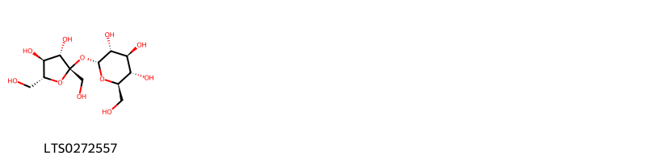{ width=100% }
    <figcaption>Hình ảnh cấu trúc hóa học của 1 hoạt chất thuộc nhóm Organooxygen compounds gồm ['sucrose (LTS0272557)'].</figcaption>
</figure>

---

### Dược dân tộc học

Danh sách các quốc gia có sử dụng *Bunium pachypodum* trong điều trị các bệnh. 

| Country   | Disease    | Bệnh                                                                                                                                                                                                |
|:----------|:-----------|:----------------------------------------------------------------------------------------------------------------------------------------------------------------------------------------------------|
| ain       | Astringent | MYMEMORY WARNING: YOU USED ALL AVAILABLE FREE TRANSLATIONS FOR TODAY. NEXT AVAILABLE IN  07 HOURS 36 MINUTES 19 SECONDS VISIT HTTPS://MYMEMORY.TRANSLATED.NET/DOC/USAGELIMITS.PHP TO TRANSLATE MORE |

---

# Chi Eryngium

??? note "Danh sách các dược liệu thuộc chi"
    
	 - *Eryngium aquaticum*
	 - *Eryngium caeruleum*
	 - *Eryngium campestre*
	 - *Eryngium coeruleum*
	 - *Eryngium comosum*
	 - *Eryngium foetidum*
	 - *Eryngium fortidum*
	 - *Eryngium maritimum*
	 - *Eryngium planum*
	 - *Eryngium ternatum*
	 - *Eryngium yuccifolium*

---
## Eryngium aquaticum
### Thông tin về thực vật

!!! info "Phân loại thực vật của *Eryngium aquaticum* từ GIBF:"
    - **Kingdom:** Plantae
    - **Phylum:** Tracheophyta
    - **Order:** Apiales
    - **Family:** Apiaceae
    - **Genus:** Eryngium
    - **Species:** *Eryngium aquaticum*

 

| Label (VI)   | Label (EN)   | Scientific Name    | Descriptions (VI)   | Descriptions (EN)   | Also Known As (VI)   | Also Known As (EN)   |
|:-------------|:-------------|:-------------------|:--------------------|:--------------------|:---------------------|:---------------------|
| N/A          | N/A          | Eryngium aquaticum | loài thực vật       | species of plant    | ['']                 | ['']                 |

#### Phân bố trên thế giới

**Từ CSDL GIBF** nan, Korea, Republic of, United States of America

#### Phân bố tại Việt Nam

**Từ CSDL GIBF**: Không có ghi nhận ở Việt Nam

---
### Thành phần hóa học
        
- Theo cơ sở dữ liệu lotus: Từ loài *Eryngium aquaticum* đã phân lập và xác định được Chưa có hoạt chất nào được phân lập. hoạt chất thuộc về các nhóm Không có hoạt chất nào được phân lập. 

Không có hình ảnh nào được tạo ra

---

### Dược dân tộc học

Danh sách các quốc gia có sử dụng *Eryngium aquaticum* trong điều trị các bệnh. 

| Country        | Disease                          | Bệnh                                                                                                                                                                                                |
|:---------------|:---------------------------------|:----------------------------------------------------------------------------------------------------------------------------------------------------------------------------------------------------|
| Elsewhere      | Emetic, Expectorant, Diaphoretic | MYMEMORY WARNING: YOU USED ALL AVAILABLE FREE TRANSLATIONS FOR TODAY. NEXT AVAILABLE IN  07 HOURS 35 MINUTES 59 SECONDS VISIT HTTPS://MYMEMORY.TRANSLATED.NET/DOC/USAGELIMITS.PHP TO TRANSLATE MORE |
| US(Amerindian) | Diuretic, Emetic                 | MYMEMORY WARNING: YOU USED ALL AVAILABLE FREE TRANSLATIONS FOR TODAY. NEXT AVAILABLE IN  07 HOURS 35 MINUTES 57 SECONDS VISIT HTTPS://MYMEMORY.TRANSLATED.NET/DOC/USAGELIMITS.PHP TO TRANSLATE MORE |
| US(Koasati)    | Emetic                           | MYMEMORY WARNING: YOU USED ALL AVAILABLE FREE TRANSLATIONS FOR TODAY. NEXT AVAILABLE IN  07 HOURS 35 MINUTES 55 SECONDS VISIT HTTPS://MYMEMORY.TRANSLATED.NET/DOC/USAGELIMITS.PHP TO TRANSLATE MORE |

---

---
## Eryngium caeruleum
### Thông tin về thực vật

!!! info "Phân loại thực vật của *Eryngium caeruleum* từ GIBF:"
    - **Kingdom:** Plantae
    - **Phylum:** Tracheophyta
    - **Order:** Apiales
    - **Family:** Apiaceae
    - **Genus:** Eryngium
    - **Species:** *Eryngium caeruleum*

 

| Label (VI)   | Label (EN)   | Scientific Name    | Descriptions (VI)   | Descriptions (EN)   | Also Known As (VI)   | Also Known As (EN)   |
|:-------------|:-------------|:-------------------|:--------------------|:--------------------|:---------------------|:---------------------|
| N/A          | N/A          | Eryngium caeruleum | loài thực vật       | species of plant    | ['']                 | ['']                 |

#### Phân bố trên thế giới

**Từ CSDL GIBF** nan, Georgia, Turkmenistan, unknown or invalid, Norway, Canada, Tajikistan, Pakistan, Afghanistan, Kyrgyzstan, Azerbaijan, Türkiye, Russian Federation, United States of America, Uzbekistan, Iran (Islamic Republic of), Armenia, United Kingdom of Great Britain and Northern Ireland, India

#### Phân bố tại Việt Nam

**Từ CSDL GIBF**: Không có ghi nhận ở Việt Nam

---
### Thành phần hóa học
        
- Theo cơ sở dữ liệu lotus: Từ loài *Eryngium caeruleum* đã phân lập và xác định được Chưa có hoạt chất nào được phân lập. hoạt chất thuộc về các nhóm Không có hoạt chất nào được phân lập. 

Không có hình ảnh nào được tạo ra

---

### Dược dân tộc học

Danh sách các quốc gia có sử dụng *Eryngium caeruleum* trong điều trị các bệnh. 

| Country   | Disease            | Bệnh                                                                                                                                                                                                |
|:----------|:-------------------|:----------------------------------------------------------------------------------------------------------------------------------------------------------------------------------------------------|
| India     | Aphrodisiac, Tonic | MYMEMORY WARNING: YOU USED ALL AVAILABLE FREE TRANSLATIONS FOR TODAY. NEXT AVAILABLE IN  07 HOURS 35 MINUTES 33 SECONDS VISIT HTTPS://MYMEMORY.TRANSLATED.NET/DOC/USAGELIMITS.PHP TO TRANSLATE MORE |

---

---
## Eryngium campestre
### Thông tin về thực vật

!!! info "Phân loại thực vật của *Eryngium campestre* từ GIBF:"
    - **Kingdom:** Plantae
    - **Phylum:** Tracheophyta
    - **Order:** Apiales
    - **Family:** Apiaceae
    - **Genus:** Eryngium
    - **Species:** *Eryngium campestre*

 

| Label (VI)   | Label (EN)   | Scientific Name    | Descriptions (VI)   | Descriptions (EN)   | Also Known As (VI)   | Also Known As (EN)   |
|:-------------|:-------------|:-------------------|:--------------------|:--------------------|:---------------------|:---------------------|
| N/A          | N/A          | Eryngium campestre | loài thực vật       | species of plant    | ['']                 | ['field holly']      |

#### Phân bố trên thế giới

**Từ CSDL GIBF** nan, Italy, Ukraine, Netherlands, Spain, Hungary, Portugal, Algeria, Russian Federation, Türkiye, Croatia, Greece, Czechia, Germany, Romania, Brazil, Switzerland, Armenia, Austria, France

#### Phân bố tại Việt Nam

**Từ CSDL GIBF**: Không có ghi nhận ở Việt Nam

---
### Thành phần hóa học
        
- Theo cơ sở dữ liệu lotus: Từ loài *Eryngium campestre* đã phân lập và xác định được 41 hoạt chất thuộc về các nhóm Fatty Acyls, Flavonoids, Prenol lipids, Cinnamic acids and derivatives, Organooxygen compounds, Coumarins and derivatives. 

|    | chemicalTaxonomyClassyfireClass   |   smiles_count |
|---:|:----------------------------------|---------------:|
|  0 | Cinnamic acids and derivatives    |              1 |
|  1 | Coumarins and derivatives         |              1 |
|  2 | Fatty Acyls                       |              2 |
|  3 | Flavonoids                        |             13 |
|  4 | Organooxygen compounds            |              5 |
|  5 | Prenol lipids                     |             19 |

#### Nhóm Cinnamic acids and derivatives
<figure markdown="span">
    { width=100% }
    <figcaption>Hình ảnh cấu trúc hóa học của 1 hoạt chất thuộc nhóm Cinnamic acids and derivatives gồm ['3,4-dihydroxycinnamic acid (LTS0128050)'].</figcaption>
</figure>
#### Nhóm Coumarins and derivatives
<figure markdown="span">
    { width=100% }
    <figcaption>Hình ảnh cấu trúc hóa học của 1 hoạt chất thuộc nhóm Coumarins and derivatives gồm ['umbelliferone (LTS0162728)'].</figcaption>
</figure>
#### Nhóm Fatty Acyls
<figure markdown="span">
    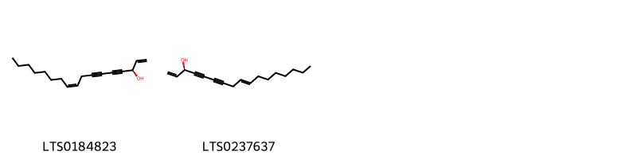{ width=100% }
    <figcaption>Hình ảnh cấu trúc hóa học của 2 hoạt chất thuộc nhóm Fatty Acyls gồm ['falcarinol (LTS0184823)', '(z)-falcarinol (LTS0237637)'].</figcaption>
</figure>
#### Nhóm Flavonoids
<figure markdown="span">
    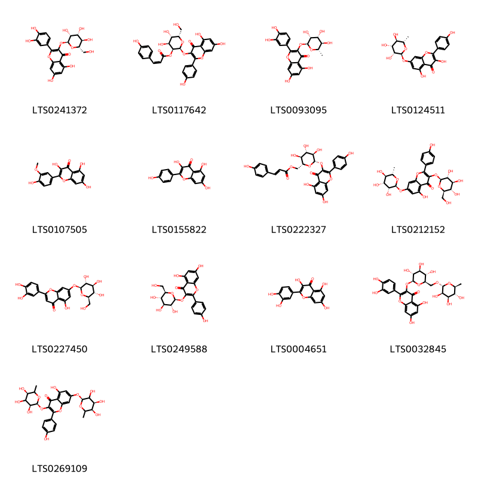{ width=100% }
    <figcaption>Hình ảnh cấu trúc hóa học của 13 hoạt chất thuộc nhóm Flavonoids gồm ['2-(3,4-dihydroxyphenyl)-5,7-dihydroxy-3-{[(2s,3r,4r,5r,6s)-3,4,5-trihydroxy-6-(hydroxymethyl)oxan-2-yl]oxy}chromen-4-one (LTS0241372)', '(2s,3s,4s,5s,6s)-2-{[5,7-dihydroxy-2-(4-hydroxyphenyl)-4-oxochromen-3-yl]oxy}-4,5-dihydroxy-6-(hydroxymethyl)oxan-3-yl (2z)-3-(4-hydroxyphenyl)prop-2-enoate (LTS0117642)', 'quercitrin (LTS0093095)', 'kaempferol-7-rhamnoside (LTS0124511)', 'isorhamnetin (LTS0107505)', 'kaempherol (LTS0155822)', 'tiliroside (LTS0222327)', '5-hydroxy-2-(4-hydroxyphenyl)-3-{[(2s,3r,4s,5s,6r)-3,4,5-trihydroxy-6-(hydroxymethyl)oxan-2-yl]oxy}-7-{[(2s,3r,4r,5r,6s)-3,4,5-trihydroxy-6-methyloxan-2-yl]oxy}chromen-4-one (LTS0212152)', 'luteolin 7-o-glucoside (LTS0227450)', 'astragalin (LTS0249588)', 'quercetin (LTS0004651)', '3-rutinosyl quercetin (LTS0032845)', 'kaempferitrin (LTS0269109)'].</figcaption>
</figure>
#### Nhóm Organooxygen compounds
<figure markdown="span">
    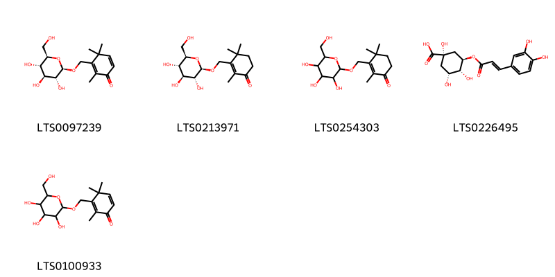{ width=100% }
    <figcaption>Hình ảnh cấu trúc hóa học của 5 hoạt chất thuộc nhóm Organooxygen compounds gồm ['2,4,4-trimethyl-3-({[(2r,3r,4s,5s,6r)-3,4,5-trihydroxy-6-(hydroxymethyl)oxan-2-yl]oxy}methyl)cyclohexa-2,5-dien-1-one (LTS0097239)', '2,4,4-trimethyl-3-({[(2r,3r,4s,5s,6r)-3,4,5-trihydroxy-6-(hydroxymethyl)oxan-2-yl]oxy}methyl)cyclohex-2-en-1-one (LTS0213971)', '2,4,4-trimethyl-3-({[3,4,5-trihydroxy-6-(hydroxymethyl)oxan-2-yl]oxy}methyl)cyclohex-2-en-1-one (LTS0254303)', 'chlorogenic acid (LTS0226495)', '2,4,4-trimethyl-3-({[3,4,5-trihydroxy-6-(hydroxymethyl)oxan-2-yl]oxy}methyl)cyclohexa-2,5-dien-1-one (LTS0100933)'].</figcaption>
</figure>
#### Nhóm Prenol lipids
<figure markdown="span">
    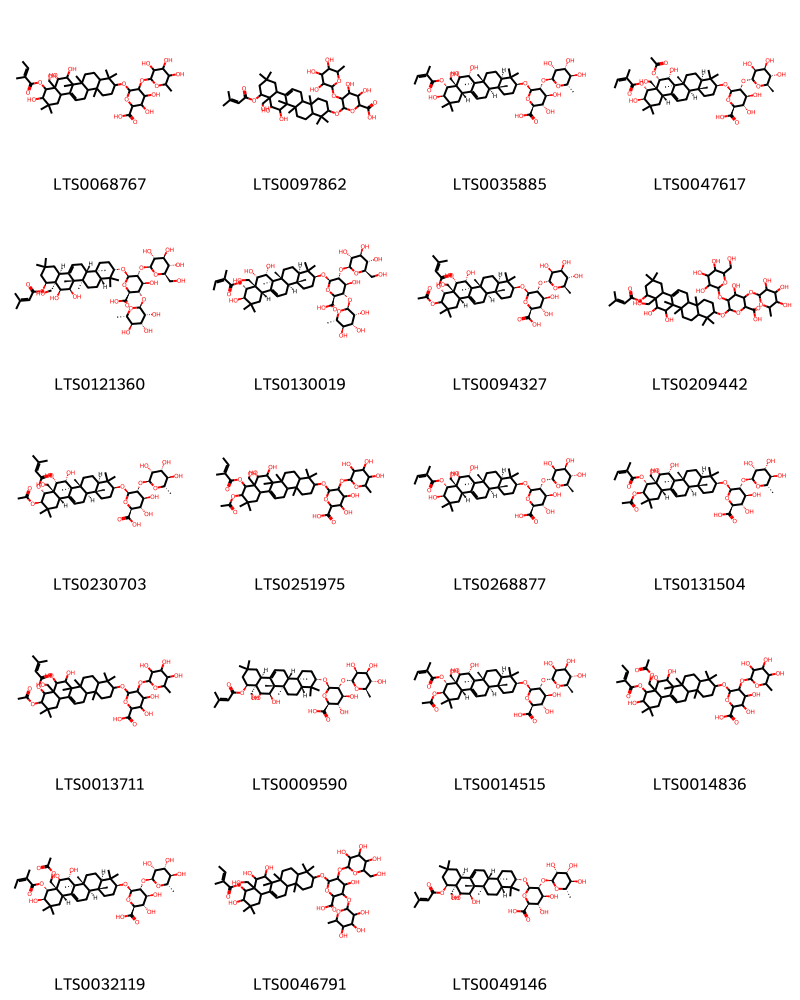{ width=100% }
    <figcaption>Hình ảnh cấu trúc hóa học của 19 hoạt chất thuộc nhóm Prenol lipids gồm ['3,4-dihydroxy-5-[(3,4,5-trihydroxy-6-methyloxan-2-yl)oxy]-6-{[7,8,10-trihydroxy-8a-(hydroxymethyl)-4,4,6a,6b,11,11,14b-heptamethyl-9-[(2-methylbut-2-enoyl)oxy]-1,2,3,4a,5,6,7,8,9,10,12,12a,14,14a-tetradecahydropicen-3-yl]oxy}oxane-2-carboxylic acid (LTS0068767)', '6-{[7,8-dihydroxy-8a-(hydroxymethyl)-4,4,6a,6b,11,11,14b-heptamethyl-9-[(3-methylbut-2-enoyl)oxy]-1,2,3,4a,5,6,7,8,9,10,12,12a,14,14a-tetradecahydropicen-3-yl]oxy}-3,4-dihydroxy-5-[(3,4,5-trihydroxy-6-methyloxan-2-yl)oxy]oxane-2-carboxylic acid (LTS0097862)', '(2s,3s,4s,5r,6r)-6-{[(3s,4ar,6ar,6bs,7r,8s,8ar,9r,10r,12as,14ar,14br)-7,8,10-trihydroxy-8a-(hydroxymethyl)-4,4,6a,6b,11,11,14b-heptamethyl-9-{[(2z)-2-methylbut-2-enoyl]oxy}-1,2,3,4a,5,6,7,8,9,10,12,12a,14,14a-tetradecahydropicen-3-yl]oxy}-3,4-dihydroxy-5-{[(2s,3r,4r,5r,6s)-3,4,5-trihydroxy-6-methyloxan-2-yl]oxy}oxane-2-carboxylic acid (LTS0035885)', '(2s,3s,4s,5r,6r)-6-{[(3s,4ar,6ar,6bs,7r,8s,8ar,9r,10r,12as,14ar,14br)-8-(acetyloxy)-7,10-dihydroxy-8a-(hydroxymethyl)-4,4,6a,6b,11,11,14b-heptamethyl-9-{[(2z)-2-methylbut-2-enoyl]oxy}-1,2,3,4a,5,6,7,8,9,10,12,12a,14,14a-tetradecahydropicen-3-yl]oxy}-3,4-dihydroxy-5-{[(2r,3s,4s,5s,6r)-3,4,5-trihydroxy-6-methyloxan-2-yl]oxy}oxane-2-carboxylic acid (LTS0047617)', '(2s,3s,4s,5r,6r)-6-{[(3s,4ar,6ar,6bs,7r,8s,8ar,9s,12as,14ar,14br)-7,8-dihydroxy-8a-(hydroxymethyl)-4,4,6a,6b,11,11,14b-heptamethyl-9-[(3-methylbut-2-enoyl)oxy]-1,2,3,4a,5,6,7,8,9,10,12,12a,14,14a-tetradecahydropicen-3-yl]oxy}-4-hydroxy-5-{[(2s,3r,4s,5s,6r)-3,4,5-trihydroxy-6-(hydroxymethyl)oxan-2-yl]oxy}-3-{[(2s,3r,4r,5r,6s)-3,4,5-trihydroxy-6-methyloxan-2-yl]oxy}oxane-2-carboxylic acid (LTS0121360)', '(2s,3s,4s,5r,6r)-6-{[(3s,4ar,6ar,6bs,7r,8s,8ar,9r,10r,12as,14ar,14br)-7,8,10-trihydroxy-8a-(hydroxymethyl)-4,4,6a,6b,11,11,14b-heptamethyl-9-{[(2z)-2-methylbut-2-enoyl]oxy}-1,2,3,4a,5,6,7,8,9,10,12,12a,14,14a-tetradecahydropicen-3-yl]oxy}-4-hydroxy-5-{[(2s,3r,4s,5s,6r)-3,4,5-trihydroxy-6-(hydroxymethyl)oxan-2-yl]oxy}-3-{[(2s,3r,4r,5r,6s)-3,4,5-trihydroxy-6-methyloxan-2-yl]oxy}oxane-2-carboxylic acid (LTS0130019)', '(2s,3s,4s,5r,6r)-6-{[(3s,4ar,6ar,6bs,7r,8s,8ar,9r,12as,14ar,14br)-10-(acetyloxy)-7,8-dihydroxy-8a-(hydroxymethyl)-4,4,6a,6b,11,11,14b-heptamethyl-9-[(3-methylbut-2-enoyl)oxy]-1,2,3,4a,5,6,7,8,9,10,12,12a,14,14a-tetradecahydropicen-3-yl]oxy}-3,4-dihydroxy-5-{[(2r,3s,4s,5s,6r)-3,4,5-trihydroxy-6-methyloxan-2-yl]oxy}oxane-2-carboxylic acid (LTS0094327)', '6-{[7,8-dihydroxy-8a-(hydroxymethyl)-4,4,6a,6b,11,11,14b-heptamethyl-9-[(3-methylbut-2-enoyl)oxy]-1,2,3,4a,5,6,7,8,9,10,12,12a,14,14a-tetradecahydropicen-3-yl]oxy}-4-hydroxy-5-{[3,4,5-trihydroxy-6-(hydroxymethyl)oxan-2-yl]oxy}-3-[(3,4,5-trihydroxy-6-methyloxan-2-yl)oxy]oxane-2-carboxylic acid (LTS0209442)', '(2s,3s,4s,5r,6r)-6-{[(3s,4ar,6ar,6bs,7r,8s,8ar,9r,10r,12as,14ar,14br)-10-(acetyloxy)-7,8-dihydroxy-8a-(hydroxymethyl)-4,4,6a,6b,11,11,14b-heptamethyl-9-[(3-methylbut-2-enoyl)oxy]-1,2,3,4a,5,6,7,8,9,10,12,12a,14,14a-tetradecahydropicen-3-yl]oxy}-3,4-dihydroxy-5-{[(2s,3r,4r,5r,6s)-3,4,5-trihydroxy-6-methyloxan-2-yl]oxy}oxane-2-carboxylic acid (LTS0230703)', '6-{[10-(acetyloxy)-7,8-dihydroxy-8a-(hydroxymethyl)-4,4,6a,6b,11,11,14b-heptamethyl-9-[(2-methylbut-2-enoyl)oxy]-1,2,3,4a,5,6,7,8,9,10,12,12a,14,14a-tetradecahydropicen-3-yl]oxy}-3,4-dihydroxy-5-[(3,4,5-trihydroxy-6-methyloxan-2-yl)oxy]oxane-2-carboxylic acid (LTS0251975)', '(2s,3s,4s,5r,6r)-6-{[(3s,4ar,6ar,6bs,7r,8s,8ar,9r,10r,12as,14ar,14br)-7,8,10-trihydroxy-8a-(hydroxymethyl)-4,4,6a,6b,11,11,14b-heptamethyl-9-{[(2z)-2-methylbut-2-enoyl]oxy}-1,2,3,4a,5,6,7,8,9,10,12,12a,14,14a-tetradecahydropicen-3-yl]oxy}-3,4-dihydroxy-5-{[(2r,3s,4s,5s,6r)-3,4,5-trihydroxy-6-methyloxan-2-yl]oxy}oxane-2-carboxylic acid (LTS0268877)', '(2s,3s,4s,5r,6r)-6-{[(3s,4ar,6ar,6bs,7r,8s,8ar,9r,10r,12as,14ar,14br)-10-(acetyloxy)-7,8-dihydroxy-8a-(hydroxymethyl)-4,4,6a,6b,11,11,14b-heptamethyl-9-{[(2z)-2-methylbut-2-enoyl]oxy}-1,2,3,4a,5,6,7,8,9,10,12,12a,14,14a-tetradecahydropicen-3-yl]oxy}-3,4-dihydroxy-5-{[(2s,3r,4r,5r,6s)-3,4,5-trihydroxy-6-methyloxan-2-yl]oxy}oxane-2-carboxylic acid (LTS0131504)', '6-{[10-(acetyloxy)-7,8-dihydroxy-8a-(hydroxymethyl)-4,4,6a,6b,11,11,14b-heptamethyl-9-[(3-methylbut-2-enoyl)oxy]-1,2,3,4a,5,6,7,8,9,10,12,12a,14,14a-tetradecahydropicen-3-yl]oxy}-3,4-dihydroxy-5-[(3,4,5-trihydroxy-6-methyloxan-2-yl)oxy]oxane-2-carboxylic acid (LTS0013711)', '(2s,3s,4s,5r,6r)-6-{[(3s,4ar,6ar,6bs,7r,8s,8ar,9s,12as,14ar,14br)-7,8-dihydroxy-8a-(hydroxymethyl)-4,4,6a,6b,11,11,14b-heptamethyl-9-[(3-methylbut-2-enoyl)oxy]-1,2,3,4a,5,6,7,8,9,10,12,12a,14,14a-tetradecahydropicen-3-yl]oxy}-3,4-dihydroxy-5-{[(2r,3s,4s,5s,6r)-3,4,5-trihydroxy-6-methyloxan-2-yl]oxy}oxane-2-carboxylic acid (LTS0009590)', '(2s,3s,4s,5r,6r)-6-{[(3s,4ar,6ar,6bs,7r,8s,8ar,9r,10r,12as,14ar,14br)-10-(acetyloxy)-7,8-dihydroxy-8a-(hydroxymethyl)-4,4,6a,6b,11,11,14b-heptamethyl-9-{[(2z)-2-methylbut-2-enoyl]oxy}-1,2,3,4a,5,6,7,8,9,10,12,12a,14,14a-tetradecahydropicen-3-yl]oxy}-3,4-dihydroxy-5-{[(2r,3s,4s,5s,6r)-3,4,5-trihydroxy-6-methyloxan-2-yl]oxy}oxane-2-carboxylic acid (LTS0014515)', '6-({8a-[(acetyloxy)methyl]-7,8,10-trihydroxy-4,4,6a,6b,11,11,14b-heptamethyl-9-[(2-methylbut-2-enoyl)oxy]-1,2,3,4a,5,6,7,8,9,10,12,12a,14,14a-tetradecahydropicen-3-yl}oxy)-3,4-dihydroxy-5-[(3,4,5-trihydroxy-6-methyloxan-2-yl)oxy]oxane-2-carboxylic acid (LTS0014836)', '(2s,3s,4s,5r,6r)-6-{[(3s,4ar,6ar,6bs,7r,8s,8ar,9r,10r,12as,14ar,14br)-8a-[(acetyloxy)methyl]-7,8,10-trihydroxy-4,4,6a,6b,11,11,14b-heptamethyl-9-{[(2z)-2-methylbut-2-enoyl]oxy}-1,2,3,4a,5,6,7,8,9,10,12,12a,14,14a-tetradecahydropicen-3-yl]oxy}-3,4-dihydroxy-5-{[(2s,3r,4r,5r,6s)-3,4,5-trihydroxy-6-methyloxan-2-yl]oxy}oxane-2-carboxylic acid (LTS0032119)', '4-hydroxy-5-{[3,4,5-trihydroxy-6-(hydroxymethyl)oxan-2-yl]oxy}-3-[(3,4,5-trihydroxy-6-methyloxan-2-yl)oxy]-6-{[7,8,10-trihydroxy-8a-(hydroxymethyl)-4,4,6a,6b,11,11,14b-heptamethyl-9-[(2-methylbut-2-enoyl)oxy]-1,2,3,4a,5,6,7,8,9,10,12,12a,14,14a-tetradecahydropicen-3-yl]oxy}oxane-2-carboxylic acid (LTS0046791)', '(2s,3s,4s,5r,6r)-6-{[(3s,4ar,6ar,6bs,7r,8s,8ar,9s,12as,14ar,14br)-7,8-dihydroxy-8a-(hydroxymethyl)-4,4,6a,6b,11,11,14b-heptamethyl-9-[(3-methylbut-2-enoyl)oxy]-1,2,3,4a,5,6,7,8,9,10,12,12a,14,14a-tetradecahydropicen-3-yl]oxy}-3,4-dihydroxy-5-{[(2s,3r,4r,5r,6s)-3,4,5-trihydroxy-6-methyloxan-2-yl]oxy}oxane-2-carboxylic acid (LTS0049146)'].</figcaption>
</figure>

---

### Dược dân tộc học

Danh sách các quốc gia có sử dụng *Eryngium campestre* trong điều trị các bệnh. 

| Country   | Disease                            | Bệnh                                                                                                                                                                                                |
|:----------|:-----------------------------------|:----------------------------------------------------------------------------------------------------------------------------------------------------------------------------------------------------|
| Elsewhere | Diaphoretic, Diuretic, Expectorant | MYMEMORY WARNING: YOU USED ALL AVAILABLE FREE TRANSLATIONS FOR TODAY. NEXT AVAILABLE IN  07 HOURS 35 MINUTES 11 SECONDS VISIT HTTPS://MYMEMORY.TRANSLATED.NET/DOC/USAGELIMITS.PHP TO TRANSLATE MORE |
| ain       | Diuretic                           | MYMEMORY WARNING: YOU USED ALL AVAILABLE FREE TRANSLATIONS FOR TODAY. NEXT AVAILABLE IN  07 HOURS 35 MINUTES 08 SECONDS VISIT HTTPS://MYMEMORY.TRANSLATED.NET/DOC/USAGELIMITS.PHP TO TRANSLATE MORE |

---

---
## Eryngium coeruleum
### Thông tin về thực vật

!!! info "Phân loại thực vật của *Eryngium caeruleum* từ GIBF:"
    - **Kingdom:** Plantae
    - **Phylum:** Tracheophyta
    - **Order:** Apiales
    - **Family:** Apiaceae
    - **Genus:** Eryngium
    - **Species:** *Eryngium caeruleum*

 

| Label (VI)   | Label (EN)   | Scientific Name    | Descriptions (VI)   | Descriptions (EN)   | Also Known As (VI)   | Also Known As (EN)   |
|:-------------|:-------------|:-------------------|:--------------------|:--------------------|:---------------------|:---------------------|
| N/A          | N/A          | Eryngium coeruleum |                     | species of plant    | ['']                 | ['']                 |

#### Phân bố trên thế giới

**Từ CSDL GIBF** nan, Georgia, Turkmenistan, unknown or invalid, Norway, Canada, Tajikistan, Pakistan, Afghanistan, Kyrgyzstan, Azerbaijan, Türkiye, Russian Federation, United States of America, Uzbekistan, Iran (Islamic Republic of), Armenia, United Kingdom of Great Britain and Northern Ireland, India

#### Phân bố tại Việt Nam

**Từ CSDL GIBF**: Không có ghi nhận ở Việt Nam

---
### Thành phần hóa học
        
- Theo cơ sở dữ liệu lotus: Từ loài *Eryngium caeruleum* đã phân lập và xác định được Chưa có hoạt chất nào được phân lập. hoạt chất thuộc về các nhóm Không có hoạt chất nào được phân lập. 

Không có hình ảnh nào được tạo ra

---

### Dược dân tộc học

Danh sách các quốc gia có sử dụng *Eryngium caeruleum* trong điều trị các bệnh. 

| Country   | Disease              | Bệnh                                                                                                                                                                                                |
|:----------|:---------------------|:----------------------------------------------------------------------------------------------------------------------------------------------------------------------------------------------------|
| India     | Aphrodisiac, Nervine | MYMEMORY WARNING: YOU USED ALL AVAILABLE FREE TRANSLATIONS FOR TODAY. NEXT AVAILABLE IN  07 HOURS 34 MINUTES 41 SECONDS VISIT HTTPS://MYMEMORY.TRANSLATED.NET/DOC/USAGELIMITS.PHP TO TRANSLATE MORE |

---

---
## Eryngium comosum
### Thông tin về thực vật

!!! info "Phân loại thực vật của *Eryngium comosum* từ GIBF:"
    - **Kingdom:** Plantae
    - **Phylum:** Tracheophyta
    - **Order:** Apiales
    - **Family:** Apiaceae
    - **Genus:** Eryngium
    - **Species:** *Eryngium comosum*

 

| Label (VI)   | Label (EN)   | Scientific Name   | Descriptions (VI)   | Descriptions (EN)   | Also Known As (VI)   | Also Known As (EN)   |
|:-------------|:-------------|:------------------|:--------------------|:--------------------|:---------------------|:---------------------|
| N/A          | N/A          | Eryngium comosum  | loài thực vật       | species of plant    | ['']                 | ['']                 |

#### Phân bố trên thế giới

**Từ CSDL GIBF** nan, Mexico

#### Phân bố tại Việt Nam

**Từ CSDL GIBF**: Không có ghi nhận ở Việt Nam

---
### Thành phần hóa học
        
- Theo cơ sở dữ liệu lotus: Từ loài *Eryngium comosum* đã phân lập và xác định được Chưa có hoạt chất nào được phân lập. hoạt chất thuộc về các nhóm Không có hoạt chất nào được phân lập. 

Không có hình ảnh nào được tạo ra

---

### Dược dân tộc học

Danh sách các quốc gia có sử dụng *Eryngium comosum* trong điều trị các bệnh. 

| Country   | Disease               | Bệnh                                                                                                                                                                                                |
|:----------|:----------------------|:----------------------------------------------------------------------------------------------------------------------------------------------------------------------------------------------------|
| Mexico    | Diuretic, Aphrodisiac | MYMEMORY WARNING: YOU USED ALL AVAILABLE FREE TRANSLATIONS FOR TODAY. NEXT AVAILABLE IN  07 HOURS 34 MINUTES 20 SECONDS VISIT HTTPS://MYMEMORY.TRANSLATED.NET/DOC/USAGELIMITS.PHP TO TRANSLATE MORE |

---

---
## Eryngium foetidum
### Thông tin về thực vật

!!! info "Phân loại thực vật của *Eryngium foetidum* từ GIBF:"
    - **Kingdom:** Plantae
    - **Phylum:** Tracheophyta
    - **Order:** Apiales
    - **Family:** Apiaceae
    - **Genus:** Eryngium
    - **Species:** *Eryngium foetidum*

 

| Label (VI)   | Label (EN)   | Scientific Name   | Descriptions (VI)   | Descriptions (EN)   | Also Known As (VI)                | Also Known As (EN)                                                                                                         |
|:-------------|:-------------|:------------------|:--------------------|:--------------------|:----------------------------------|:---------------------------------------------------------------------------------------------------------------------------|
| N/A          | N/A          | Eryngium foetidum | loài thực vật       | species of plant    | ['Ngò tây', 'Ngò gai', 'Mùi tầu'] | ['bhandhania', 'culantro', 'long coriander', 'Mexican coriander', 'ngò gai', 'recao', 'sawtooth coriander', 'shadow beni'] |

#### Phân bố trên thế giới

**Từ CSDL GIBF** Australia, Guadeloupe, Guatemala, Saint Lucia, Nicaragua, Venezuela (Bolivarian Republic of), French Guiana, Panama, Puerto Rico, Chinese Taipei, Honduras, United States of America, Sweden, El Salvador, Belize, Trinidad and Tobago, Hong Kong, Sao Tome and Principe, Thailand, Martinique, Brazil, Peru, Dominican Republic, Mexico, Singapore, Viet Nam, China, Ecuador, Colombia, Montserrat, Costa Rica, India, Indonesia, Malaysia

#### Phân bố tại Việt Nam

**Từ CSDL GIBF**: Sơn La, Kiên Giang, Gia Lai, Lâm Đồng

---
### Thành phần hóa học
        
- Theo cơ sở dữ liệu lotus: Từ loài *Eryngium foetidum* đã phân lập và xác định được 33 hoạt chất thuộc về các nhóm Phenol ethers, Fatty Acyls, Organic oxides, Prenol lipids, Steroids and steroid derivatives, Unsaturated hydrocarbons, Organooxygen compounds. 

|    | chemicalTaxonomyClassyfireClass   |   smiles_count |
|---:|:----------------------------------|---------------:|
|  0 | Fatty Acyls                       |              4 |
|  1 | Organic oxides                    |              1 |
|  2 | Organooxygen compounds            |              2 |
|  3 | Phenol ethers                     |              1 |
|  4 | Prenol lipids                     |             12 |
|  5 | Steroids and steroid derivatives  |             11 |
|  6 | Unsaturated hydrocarbons          |              1 |

#### Nhóm Fatty Acyls
<figure markdown="span">
    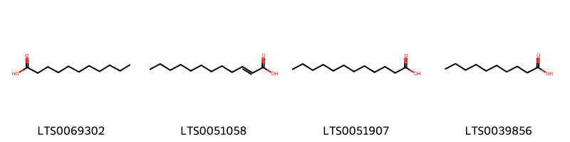{ width=100% }
    <figcaption>Hình ảnh cấu trúc hóa học của 4 hoạt chất thuộc nhóm Fatty Acyls gồm ['undecanoic acid (LTS0069302)', '2-dodecenoic acid (LTS0051058)', 'lauric acid (LTS0051907)', 'capric acid (LTS0039856)'].</figcaption>
</figure>
#### Nhóm Organic oxides
<figure markdown="span">
    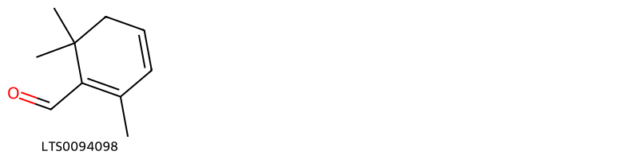{ width=100% }
    <figcaption>Hình ảnh cấu trúc hóa học của 1 hoạt chất thuộc nhóm Organic oxides gồm ['safranal (LTS0094098)'].</figcaption>
</figure>
#### Nhóm Organooxygen compounds
<figure markdown="span">
    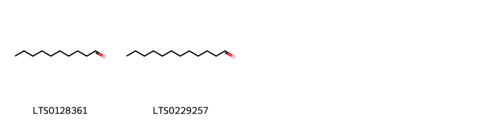{ width=100% }
    <figcaption>Hình ảnh cấu trúc hóa học của 2 hoạt chất thuộc nhóm Organooxygen compounds gồm ['decanal (LTS0128361)', 'dodecanal (LTS0229257)'].</figcaption>
</figure>
#### Nhóm Phenol ethers
<figure markdown="span">
    { width=100% }
    <figcaption>Hình ảnh cấu trúc hóa học của 1 hoạt chất thuộc nhóm Phenol ethers gồm ['anethole (LTS0033696)'].</figcaption>
</figure>
#### Nhóm Prenol lipids
<figure markdown="span">
    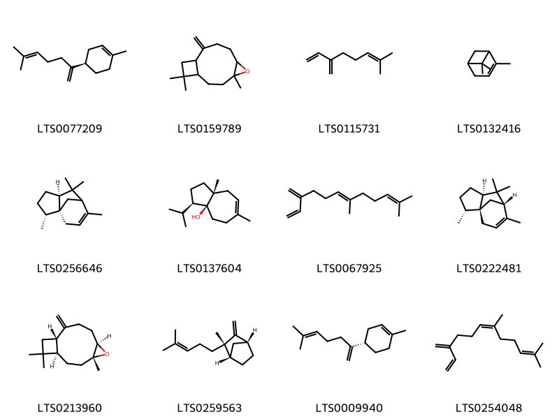{ width=100% }
    <figcaption>Hình ảnh cấu trúc hóa học của 12 hoạt chất thuộc nhóm Prenol lipids gồm ['(r)-β-bisabolene (LTS0077209)', 'caryophyllene oxide (LTS0159789)', 'α-myrcene (LTS0115731)', 'α pinene (LTS0132416)', 'cedrene (LTS0256646)', 'carotol (LTS0137604)', 'β-farnesene (LTS0067925)', 'levo-α-cedrene (LTS0222481)', 'β-caryophyllene oxide (LTS0213960)', '(1s,2s,4r)-2-methyl-3-methylidene-2-(4-methylpent-3-en-1-yl)bicyclo[2.2.1]heptane (LTS0259563)', '(-)-β-bisabolene (LTS0009940)', '(z)-β-farnesene (LTS0254048)'].</figcaption>
</figure>
#### Nhóm Steroids and steroid derivatives
<figure markdown="span">
    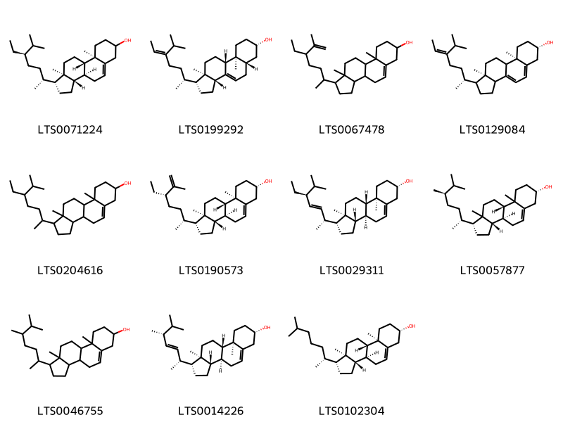{ width=100% }
    <figcaption>Hình ảnh cấu trúc hóa học của 11 hoạt chất thuộc nhóm Steroids and steroid derivatives gồm ['stigmast-5-en-3-ol (LTS0071224)', 'delta7-avenasterol (LTS0199292)', '1-(5-ethyl-6-methylhept-6-en-2-yl)-9a,11a-dimethyl-1h,2h,3h,3ah,3bh,4h,6h,7h,8h,9h,9bh,10h,11h-cyclopenta[a]phenanthren-7-ol (LTS0067478)', '5-dehydroavenasterol (LTS0129084)', 'stigmast-5-en-3-ol, (3β)- (LTS0204616)', '(1r,3as,3bs,7s,9ar,9bs,11ar)-1-[(2r,5s)-5-ethyl-6-methylhept-6-en-2-yl]-9a,11a-dimethyl-1h,2h,3h,3ah,3bh,4h,6h,7h,8h,9h,9bh,10h,11h-cyclopenta[a]phenanthren-7-ol (LTS0190573)', 'phytosterol (LTS0029311)', '(1r,3as,3bs,7s,9bs)-1-[(2r,5r)-5,6-dimethylheptan-2-yl]-9a,11a-dimethyl-1h,2h,3h,3ah,3bh,4h,6h,7h,8h,9h,9bh,10h,11h-cyclopenta[a]phenanthren-7-ol (LTS0057877)', 'campesterol (LTS0046755)', 'brassicasterol (LTS0014226)', 'cholesterol (LTS0102304)'].</figcaption>
</figure>
#### Nhóm Unsaturated hydrocarbons
<figure markdown="span">
    { width=100% }
    <figcaption>Hình ảnh cấu trúc hóa học của 1 hoạt chất thuộc nhóm Unsaturated hydrocarbons gồm ['α terpinene (LTS0232891)'].</figcaption>
</figure>

---

### Dược dân tộc học

Danh sách các quốc gia có sử dụng *Eryngium foetidum* trong điều trị các bệnh. 

| Country            | Disease                                        | Bệnh                                                                                                                                                                                                |
|:-------------------|:-----------------------------------------------|:----------------------------------------------------------------------------------------------------------------------------------------------------------------------------------------------------|
| Dominican Republic | Diaphoretic                                    | MYMEMORY WARNING: YOU USED ALL AVAILABLE FREE TRANSLATIONS FOR TODAY. NEXT AVAILABLE IN  07 HOURS 34 MINUTES 00 SECONDS VISIT HTTPS://MYMEMORY.TRANSLATED.NET/DOC/USAGELIMITS.PHP TO TRANSLATE MORE |
| Elsewhere          | Carminative, Carminative                       | MYMEMORY WARNING: YOU USED ALL AVAILABLE FREE TRANSLATIONS FOR TODAY. NEXT AVAILABLE IN  07 HOURS 33 MINUTES 58 SECONDS VISIT HTTPS://MYMEMORY.TRANSLATED.NET/DOC/USAGELIMITS.PHP TO TRANSLATE MORE |
| Haiti              | Emmenagogue, Sudorific, Emmenagogue, Sudorific | MYMEMORY WARNING: YOU USED ALL AVAILABLE FREE TRANSLATIONS FOR TODAY. NEXT AVAILABLE IN  07 HOURS 33 MINUTES 55 SECONDS VISIT HTTPS://MYMEMORY.TRANSLATED.NET/DOC/USAGELIMITS.PHP TO TRANSLATE MORE |
| India              | Stomachic                                      | MYMEMORY WARNING: YOU USED ALL AVAILABLE FREE TRANSLATIONS FOR TODAY. NEXT AVAILABLE IN  07 HOURS 33 MINUTES 52 SECONDS VISIT HTTPS://MYMEMORY.TRANSLATED.NET/DOC/USAGELIMITS.PHP TO TRANSLATE MORE |
| Malaya             | Stomachic                                      | MYMEMORY WARNING: YOU USED ALL AVAILABLE FREE TRANSLATIONS FOR TODAY. NEXT AVAILABLE IN  07 HOURS 33 MINUTES 50 SECONDS VISIT HTTPS://MYMEMORY.TRANSLATED.NET/DOC/USAGELIMITS.PHP TO TRANSLATE MORE |
| Trinidad           | Carminative, Vermifuge, Vermifuge              | MYMEMORY WARNING: YOU USED ALL AVAILABLE FREE TRANSLATIONS FOR TODAY. NEXT AVAILABLE IN  07 HOURS 33 MINUTES 48 SECONDS VISIT HTTPS://MYMEMORY.TRANSLATED.NET/DOC/USAGELIMITS.PHP TO TRANSLATE MORE |
| Venezuela          | Stimulant                                      | MYMEMORY WARNING: YOU USED ALL AVAILABLE FREE TRANSLATIONS FOR TODAY. NEXT AVAILABLE IN  07 HOURS 33 MINUTES 45 SECONDS VISIT HTTPS://MYMEMORY.TRANSLATED.NET/DOC/USAGELIMITS.PHP TO TRANSLATE MORE |

---

---
## Eryngium fortidum
### Thông tin về thực vật

!!! info "Phân loại thực vật của *Eryngium foetidum* từ GIBF:"
    - **Kingdom:** Plantae
    - **Phylum:** Tracheophyta
    - **Order:** Apiales
    - **Family:** Apiaceae
    - **Genus:** Eryngium
    - **Species:** *Eryngium foetidum*

 

| Label (VI)   | Label (EN)   | Scientific Name   | Descriptions (VI)   | Descriptions (EN)   | Also Known As (VI)                | Also Known As (EN)                                                                                                         |
|:-------------|:-------------|:------------------|:--------------------|:--------------------|:----------------------------------|:---------------------------------------------------------------------------------------------------------------------------|
| N/A          | N/A          | Eryngium foetidum | loài thực vật       | species of plant    | ['Ngò tây', 'Ngò gai', 'Mùi tầu'] | ['bhandhania', 'culantro', 'long coriander', 'Mexican coriander', 'ngò gai', 'recao', 'sawtooth coriander', 'shadow beni'] |

#### Phân bố trên thế giới

**Từ CSDL GIBF** Australia, Guadeloupe, Guatemala, Saint Lucia, Nicaragua, Venezuela (Bolivarian Republic of), French Guiana, Panama, Puerto Rico, Chinese Taipei, Honduras, United States of America, Sweden, El Salvador, Belize, Trinidad and Tobago, Hong Kong, Sao Tome and Principe, Thailand, Martinique, Brazil, Peru, Dominican Republic, Mexico, Singapore, Viet Nam, China, Ecuador, Colombia, Montserrat, Costa Rica, India, Indonesia, Malaysia

#### Phân bố tại Việt Nam

**Từ CSDL GIBF**: Sơn La, Kiên Giang, Gia Lai, Lâm Đồng

---
### Thành phần hóa học
        
- Theo cơ sở dữ liệu lotus: Từ loài *Eryngium foetidum* đã phân lập và xác định được Chưa có hoạt chất nào được phân lập. hoạt chất thuộc về các nhóm Không có hoạt chất nào được phân lập. 

Không có hình ảnh nào được tạo ra

---

### Dược dân tộc học

Danh sách các quốc gia có sử dụng *Eryngium foetidum* trong điều trị các bệnh. 

| Country   | Disease   | Bệnh                                                                                                                                                                                                |
|:----------|:----------|:----------------------------------------------------------------------------------------------------------------------------------------------------------------------------------------------------|
| Colombia  | Poison    | MYMEMORY WARNING: YOU USED ALL AVAILABLE FREE TRANSLATIONS FOR TODAY. NEXT AVAILABLE IN  07 HOURS 33 MINUTES 16 SECONDS VISIT HTTPS://MYMEMORY.TRANSLATED.NET/DOC/USAGELIMITS.PHP TO TRANSLATE MORE |

---

---
## Eryngium maritimum
### Thông tin về thực vật

!!! info "Phân loại thực vật của *Eryngium maritimum* từ GIBF:"
    - **Kingdom:** Plantae
    - **Phylum:** Tracheophyta
    - **Order:** Apiales
    - **Family:** Apiaceae
    - **Genus:** Eryngium
    - **Species:** *Eryngium maritimum*

 

| Label (VI)   | Label (EN)   | Scientific Name    | Descriptions (VI)   | Descriptions (EN)   | Also Known As (VI)   | Also Known As (EN)                     |
|:-------------|:-------------|:-------------------|:--------------------|:--------------------|:---------------------|:---------------------------------------|
| N/A          | N/A          | Eryngium maritimum | loài thực vật       | species of plant    | ['']                 | ['Eringoes', 'Sea holly', 'Sea-holly'] |

#### Phân bố trên thế giới

**Từ CSDL GIBF** Italy, Bulgaria, Belgium, Israel, Ukraine, Denmark, Netherlands, Malta, Spain, Türkiye, Portugal, Albania, Sweden, Greece, Montenegro, Germany, France, United Kingdom of Great Britain and Northern Ireland, Syrian Arab Republic, Ireland, Poland

#### Phân bố tại Việt Nam

**Từ CSDL GIBF**: Không có ghi nhận ở Việt Nam

---
### Thành phần hóa học
        
- Theo cơ sở dữ liệu lotus: Từ loài *Eryngium maritimum* đã phân lập và xác định được Chưa có hoạt chất nào được phân lập. hoạt chất thuộc về các nhóm Không có hoạt chất nào được phân lập. 

Không có hình ảnh nào được tạo ra

---

### Dược dân tộc học

Danh sách các quốc gia có sử dụng *Eryngium maritimum* trong điều trị các bệnh. 

| Country   | Disease   | Bệnh                                                                                                                                                                                                |
|:----------|:----------|:----------------------------------------------------------------------------------------------------------------------------------------------------------------------------------------------------|
| ain       | Diuretic  | MYMEMORY WARNING: YOU USED ALL AVAILABLE FREE TRANSLATIONS FOR TODAY. NEXT AVAILABLE IN  07 HOURS 32 MINUTES 55 SECONDS VISIT HTTPS://MYMEMORY.TRANSLATED.NET/DOC/USAGELIMITS.PHP TO TRANSLATE MORE |

---

---
## Eryngium planum
### Thông tin về thực vật

!!! info "Phân loại thực vật của *Eryngium planum* từ GIBF:"
    - **Kingdom:** Plantae
    - **Phylum:** Tracheophyta
    - **Order:** Apiales
    - **Family:** Apiaceae
    - **Genus:** Eryngium
    - **Species:** *Eryngium planum*

 

| Label (VI)   | Label (EN)   | Scientific Name   | Descriptions (VI)   | Descriptions (EN)   | Also Known As (VI)   | Also Known As (EN)   |
|:-------------|:-------------|:------------------|:--------------------|:--------------------|:---------------------|:---------------------|
| N/A          | N/A          | Eryngium planum   | loài thực vật       | species of plant    | ['']                 | ['blue eryngo']      |

#### Phân bố trên thế giới

**Từ CSDL GIBF** nan, Belgium, Slovakia, Canada, Ukraine, Denmark, Netherlands, Belarus, Russian Federation, United States of America, Sweden, Kazakhstan, Czechia, Germany, Romania, Austria, United Kingdom of Great Britain and Northern Ireland, Poland, New Zealand

#### Phân bố tại Việt Nam

**Từ CSDL GIBF**: Không có ghi nhận ở Việt Nam

---
### Thành phần hóa học
        
- Theo cơ sở dữ liệu lotus: Từ loài *Eryngium planum* đã phân lập và xác định được 3 hoạt chất thuộc về các nhóm Flavonoids, Prenol lipids. 

|    | chemicalTaxonomyClassyfireClass   |   smiles_count |
|---:|:----------------------------------|---------------:|
|  0 | Flavonoids                        |              1 |
|  1 | Prenol lipids                     |              2 |

#### Nhóm Flavonoids
<figure markdown="span">
    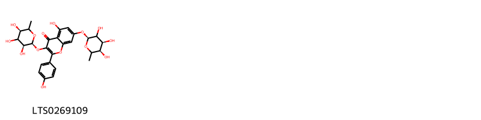{ width=100% }
    <figcaption>Hình ảnh cấu trúc hóa học của 1 hoạt chất thuộc nhóm Flavonoids gồm ['kaempferitrin (LTS0269109)'].</figcaption>
</figure>
#### Nhóm Prenol lipids
<figure markdown="span">
    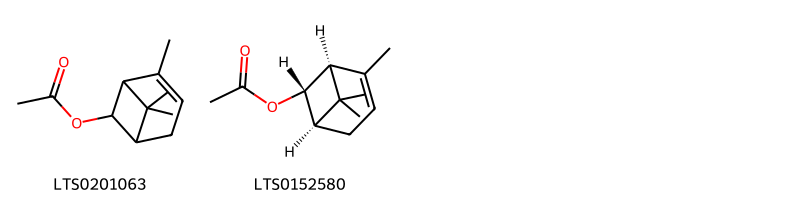{ width=100% }
    <figcaption>Hình ảnh cấu trúc hóa học của 2 hoạt chất thuộc nhóm Prenol lipids gồm ['2,7,7-trimethylbicyclo[3.1.1]hept-2-en-6-yl acetate (LTS0201063)', '(1s,5r,6s)-2,7,7-trimethylbicyclo[3.1.1]hept-2-en-6-yl acetate (LTS0152580)'].</figcaption>
</figure>

---

### Dược dân tộc học

Danh sách các quốc gia có sử dụng *Eryngium planum* trong điều trị các bệnh. 

| Country   | Disease                                                            | Bệnh                                                                                                                                                                                                |
|:----------|:-------------------------------------------------------------------|:----------------------------------------------------------------------------------------------------------------------------------------------------------------------------------------------------|
| Europe    | Diuretic                                                           | MYMEMORY WARNING: YOU USED ALL AVAILABLE FREE TRANSLATIONS FOR TODAY. NEXT AVAILABLE IN  07 HOURS 32 MINUTES 34 SECONDS VISIT HTTPS://MYMEMORY.TRANSLATED.NET/DOC/USAGELIMITS.PHP TO TRANSLATE MORE |
| Turkey    | Diuretic, Expectorant, Stimulant, Sudorific, Aperient, Aphrodisiac | MYMEMORY WARNING: YOU USED ALL AVAILABLE FREE TRANSLATIONS FOR TODAY. NEXT AVAILABLE IN  07 HOURS 32 MINUTES 32 SECONDS VISIT HTTPS://MYMEMORY.TRANSLATED.NET/DOC/USAGELIMITS.PHP TO TRANSLATE MORE |

---

---
## Eryngium ternatum
### Thông tin về thực vật

!!! info "Phân loại thực vật của *Eryngium ternatum* từ GIBF:"
    - **Kingdom:** Plantae
    - **Phylum:** Tracheophyta
    - **Order:** Apiales
    - **Family:** Apiaceae
    - **Genus:** Eryngium
    - **Species:** *Eryngium ternatum*

 

| Label (VI)   | Label (EN)   | Scientific Name   | Descriptions (VI)   | Descriptions (EN)   | Also Known As (VI)   | Also Known As (EN)   |
|:-------------|:-------------|:------------------|:--------------------|:--------------------|:---------------------|:---------------------|
| N/A          | N/A          | Eryngium ternatum | loài thực vật       | species of plant    | ['']                 | ['']                 |

#### Phân bố trên thế giới

**Từ CSDL GIBF** nan, Netherlands, Estonia, Croatia, Greece

#### Phân bố tại Việt Nam

**Từ CSDL GIBF**: Không có ghi nhận ở Việt Nam

---
### Thành phần hóa học
        
- Theo cơ sở dữ liệu lotus: Từ loài *Eryngium ternatum* đã phân lập và xác định được Chưa có hoạt chất nào được phân lập. hoạt chất thuộc về các nhóm Không có hoạt chất nào được phân lập. 

Không có hình ảnh nào được tạo ra

---

### Dược dân tộc học

Danh sách các quốc gia có sử dụng *Eryngium ternatum* trong điều trị các bệnh. 

| Country   | Disease     | Bệnh                                                                                                                                                                                                |
|:----------|:------------|:----------------------------------------------------------------------------------------------------------------------------------------------------------------------------------------------------|
| Crete     | Aphrodisiac | MYMEMORY WARNING: YOU USED ALL AVAILABLE FREE TRANSLATIONS FOR TODAY. NEXT AVAILABLE IN  07 HOURS 32 MINUTES 09 SECONDS VISIT HTTPS://MYMEMORY.TRANSLATED.NET/DOC/USAGELIMITS.PHP TO TRANSLATE MORE |

---

---
## Eryngium yuccifolium
### Thông tin về thực vật

!!! info "Phân loại thực vật của *Eryngium yuccifolium* từ GIBF:"
    - **Kingdom:** Plantae
    - **Phylum:** Tracheophyta
    - **Order:** Apiales
    - **Family:** Apiaceae
    - **Genus:** Eryngium
    - **Species:** *Eryngium yuccifolium*

 

| Label (VI)   | Label (EN)   | Scientific Name      | Descriptions (VI)   | Descriptions (EN)   | Also Known As (VI)   | Also Known As (EN)                                           |
|:-------------|:-------------|:---------------------|:--------------------|:--------------------|:---------------------|:-------------------------------------------------------------|
| N/A          | N/A          | Eryngium yuccifolium | loài thực vật       | species of plant    | ['']                 | ['button eryngo', 'button snake-root', 'rattlesnake master'] |

#### Phân bố trên thế giới

**Từ CSDL GIBF** nan, United States of America

#### Phân bố tại Việt Nam

**Từ CSDL GIBF**: Không có ghi nhận ở Việt Nam

---
### Thành phần hóa học
        
- Theo cơ sở dữ liệu lotus: Từ loài *Eryngium yuccifolium* đã phân lập và xác định được 13 hoạt chất thuộc về các nhóm Cinnamic acids and derivatives, Flavonoids, Prenol lipids. 

|    | chemicalTaxonomyClassyfireClass   |   smiles_count |
|---:|:----------------------------------|---------------:|
|  0 | Cinnamic acids and derivatives    |              1 |
|  1 | Flavonoids                        |              1 |
|  2 | Prenol lipids                     |             11 |

#### Nhóm Cinnamic acids and derivatives
<figure markdown="span">
    { width=100% }
    <figcaption>Hình ảnh cấu trúc hóa học của 1 hoạt chất thuộc nhóm Cinnamic acids and derivatives gồm ['3,4-dihydroxycinnamic acid (LTS0128050)'].</figcaption>
</figure>
#### Nhóm Flavonoids
<figure markdown="span">
    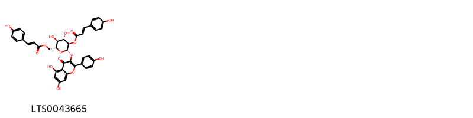{ width=100% }
    <figcaption>Hình ảnh cấu trúc hóa học của 1 hoạt chất thuộc nhóm Flavonoids gồm ['[(2r,3s,4s,5r,6s)-6-{[5,7-dihydroxy-2-(4-hydroxyphenyl)-4-oxochromen-3-yl]oxy}-3,4-dihydroxy-5-{[(2e)-3-(4-hydroxyphenyl)prop-2-enoyl]oxy}oxan-2-yl]methyl (2e)-3-(4-hydroxyphenyl)prop-2-enoate (LTS0043665)'].</figcaption>
</figure>
#### Nhóm Prenol lipids
<figure markdown="span">
    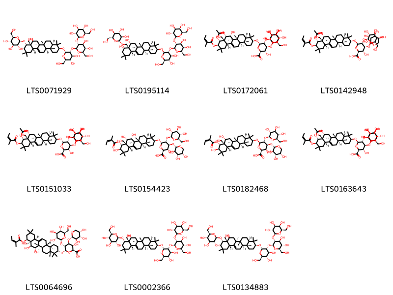{ width=100% }
    <figcaption>Hình ảnh cấu trúc hóa học của 11 hoạt chất thuộc nhóm Prenol lipids gồm ['(2r,3r,4s,5s,6r)-2-{[(4s,4ar,5r,6as,6br,8ar,10s,12ar,12br,14bs)-10-{[(2s,3r,4s,5s,6r)-3-{[(2s,3r,4s,5s,6r)-4,5-dihydroxy-6-(hydroxymethyl)-3-{[(2s,3r,4s,5s,6r)-3,4,5-trihydroxy-6-(hydroxymethyl)oxan-2-yl]oxy}oxan-2-yl]oxy}-4,5-dihydroxy-6-(hydroxymethyl)oxan-2-yl]oxy}-5-hydroxy-4a-(hydroxymethyl)-2,2,6a,6b,9,9,12a-heptamethyl-1,3,4,5,6,7,8,8a,10,11,12,12b,13,14b-tetradecahydropicen-4-yl]oxy}-6-(hydroxymethyl)oxane-3,4,5-triol (LTS0071929)', '(2r,3r,4s,5s,6r)-2-{[(4s,4as,5r,6as,6br,8ar,10s,12ar,12br,14bs)-10-{[(2r,3r,4s,5s,6r)-3-{[(2s,3r,4s,5s,6r)-4,5-dihydroxy-6-(hydroxymethyl)-3-{[(2s,3r,4s,5r,6r)-3,4,5-trihydroxy-6-(hydroxymethyl)oxan-2-yl]oxy}oxan-2-yl]oxy}-4,5-dihydroxy-6-(hydroxymethyl)oxan-2-yl]oxy}-4,5-dihydroxy-2,2,6a,6b,9,9,12a-heptamethyl-1,3,4,5,6,7,8,8a,10,11,12,12b,13,14b-tetradecahydropicen-4a-yl]methoxy}-6-(hydroxymethyl)oxane-3,4,5-triol (LTS0195114)', '(2s,3s,4s,5r,6s)-6-{[(3s,4ar,6ar,6bs,7r,8s,8ar,9r,10r,12as,14ar,14br)-9-(acetyloxy)-7,8-dihydroxy-8a-(hydroxymethyl)-4,4,6a,6b,11,11,14b-heptamethyl-10-{[(2z)-2-methylbut-2-enoyl]oxy}-1,2,3,4a,5,6,7,8,9,10,12,12a,14,14a-tetradecahydropicen-3-yl]oxy}-3-hydroxy-5-{[(2s,3r,4s,5s,6r)-3,4,5-trihydroxy-6-(hydroxymethyl)oxan-2-yl]oxy}-4-{[(2s,3r,4s,5s)-3,4,5-trihydroxyoxan-2-yl]oxy}oxane-2-carboxylic acid (LTS0172061)', '(2s,3s,4s,5r,6r)-6-{[(3s,4ar,6ar,6bs,8r,8ar,9r,10r,12as,14ar,14br)-9-(acetyloxy)-8-hydroxy-8a-(hydroxymethyl)-4,4,6a,6b,11,11,14b-heptamethyl-10-{[(2z)-2-methylbut-2-enoyl]oxy}-1,2,3,4a,5,6,7,8,9,10,12,12a,14,14a-tetradecahydropicen-3-yl]oxy}-3-hydroxy-4-{[(2r,3r,4s,5s)-2,3,4,5-tetrahydroxyoxan-2-yl]oxy}-5-{[(2s,3r,4s,5s,6r)-3,4,5-trihydroxy-6-(hydroxymethyl)oxan-2-yl]oxy}oxane-2-carboxylic acid (LTS0142948)', '(2s,3s,4s,5r,6s)-6-{[(3s,4ar,6ar,6bs,8r,8ar,9r,10r,12as,14ar,14br)-9-(acetyloxy)-8-hydroxy-8a-(hydroxymethyl)-4,4,6a,6b,11,11,14b-heptamethyl-10-{[(2z)-2-methylbut-2-enoyl]oxy}-1,2,3,4a,5,6,7,8,9,10,12,12a,14,14a-tetradecahydropicen-3-yl]oxy}-3-hydroxy-5-{[(2s,3r,4s,5s,6r)-3,4,5-trihydroxy-6-(hydroxymethyl)oxan-2-yl]oxy}-4-{[(2s,3r,4s,5r)-3,4,5-trihydroxyoxan-2-yl]oxy}oxane-2-carboxylic acid (LTS0151033)', '(2s,3s,4s,5r,6s)-6-{[(3s,4ar,6ar,6bs,7r,8s,8ar,9r,10r,12as,14ar,14br)-7,8,10-trihydroxy-8a-(hydroxymethyl)-4,4,6a,6b,11,11,14b-heptamethyl-9-{[(2z)-2-methylbut-2-enoyl]oxy}-1,2,3,4a,5,6,7,8,9,10,12,12a,14,14a-tetradecahydropicen-3-yl]oxy}-3-hydroxy-5-{[(2s,3r,4s,5s,6r)-3,4,5-trihydroxy-6-(hydroxymethyl)oxan-2-yl]oxy}-4-{[(2s,3r,4s,5s)-3,4,5-trihydroxyoxan-2-yl]oxy}oxane-2-carboxylic acid (LTS0154423)', '(2s,3s,4s,5r,6r)-6-{[(3s,4ar,6ar,6bs,8r,8ar,9r,10r,12as,14ar,14br)-8,10-dihydroxy-8a-(hydroxymethyl)-4,4,6a,6b,11,11,14b-heptamethyl-9-{[(2z)-2-methylbut-2-enoyl]oxy}-1,2,3,4a,5,6,7,8,9,10,12,12a,14,14a-tetradecahydropicen-3-yl]oxy}-3-hydroxy-5-{[(2s,3r,4s,5s,6r)-3,4,5-trihydroxy-6-(hydroxymethyl)oxan-2-yl]oxy}-4-{[(2s,3r,4s,5s)-3,4,5-trihydroxyoxan-2-yl]oxy}oxane-2-carboxylic acid (LTS0182468)', '(2s,3s,4s,5r,6r)-6-{[(3s,4ar,6ar,6bs,8r,8ar,9r,10r,12as,14ar,14br)-9-(acetyloxy)-8-hydroxy-8a-(hydroxymethyl)-4,4,6a,6b,11,11,14b-heptamethyl-10-{[(2z)-2-methylbut-2-enoyl]oxy}-1,2,3,4a,5,6,7,8,9,10,12,12a,14,14a-tetradecahydropicen-3-yl]oxy}-3-hydroxy-5-{[(2s,3r,4s,5s,6r)-3,4,5-trihydroxy-6-(hydroxymethyl)oxan-2-yl]oxy}-4-{[(2s,3r,4s,5s)-3,4,5-trihydroxyoxan-2-yl]oxy}oxane-2-carboxylic acid (LTS0163643)', '(2s,3s,4s,5r,6s)-6-{[(3s,4ar,6ar,6bs,7r,8s,8ar,9s,12as,14ar,14br)-7,8-dihydroxy-8a-(hydroxymethyl)-4,4,6a,6b,11,11,14b-heptamethyl-9-{[(2z)-2-methylbut-2-enoyl]oxy}-1,2,3,4a,5,6,7,8,9,10,12,12a,14,14a-tetradecahydropicen-3-yl]oxy}-3-hydroxy-5-{[(2s,3r,4s,5s,6r)-3,4,5-trihydroxy-6-(hydroxymethyl)oxan-2-yl]oxy}-4-{[(2s,3r,4s,5s)-3,4,5-trihydroxyoxan-2-yl]oxy}oxane-2-carboxylic acid (LTS0064696)', '(2r,3r,4s,5s,6r)-2-{[(4s,4ar,5r,6as,6br,8ar,10s,12ar,12br,14bs)-10-{[(2s,3r,4s,5s,6r)-3-{[(2s,3r,4s,5s,6r)-4,5-dihydroxy-6-(hydroxymethyl)-3-{[(2s,3r,4s,5r,6r)-3,4,5-trihydroxy-6-(hydroxymethyl)oxan-2-yl]oxy}oxan-2-yl]oxy}-4,5-dihydroxy-6-(hydroxymethyl)oxan-2-yl]oxy}-5-hydroxy-4a-(hydroxymethyl)-2,2,6a,6b,9,9,12a-heptamethyl-1,3,4,5,6,7,8,8a,10,11,12,12b,13,14b-tetradecahydropicen-4-yl]oxy}-6-(hydroxymethyl)oxane-3,4,5-triol (LTS0002366)', '(4s,4as,6as,6br,8ar,10s,12ar,12br,14bs)-10-{[(2s,3r,4s,5s,6r)-3-{[(2s,3r,4s,5s,6r)-4,5-dihydroxy-6-(hydroxymethyl)-3-{[(2s,3r,4s,5r,6r)-3,4,5-trihydroxy-6-(hydroxymethyl)oxan-2-yl]oxy}oxan-2-yl]oxy}-4,5-dihydroxy-6-(hydroxymethyl)oxan-2-yl]oxy}-4a-(hydroxymethyl)-2,2,6a,6b,9,9,12a-heptamethyl-4-{[(2r,3r,4s,5s,6r)-3,4,5-trihydroxy-6-(hydroxymethyl)oxan-2-yl]oxy}-3,4,6,7,8,8a,10,11,12,12b,13,14b-dodecahydro-1h-picen-5-one (LTS0134883)'].</figcaption>
</figure>

---

### Dược dân tộc học

Danh sách các quốc gia có sử dụng *Eryngium yuccifolium* trong điều trị các bệnh. 

| Country        | Disease                                    | Bệnh                                                                                                                                                                                                |
|:---------------|:-------------------------------------------|:----------------------------------------------------------------------------------------------------------------------------------------------------------------------------------------------------|
| Elsewhere      | Diaphoretic, Expectorant, Emetic, Diuretic | MYMEMORY WARNING: YOU USED ALL AVAILABLE FREE TRANSLATIONS FOR TODAY. NEXT AVAILABLE IN  07 HOURS 31 MINUTES 50 SECONDS VISIT HTTPS://MYMEMORY.TRANSLATED.NET/DOC/USAGELIMITS.PHP TO TRANSLATE MORE |
| US             | Diuretic, Emetic, Sialogogue               | MYMEMORY WARNING: YOU USED ALL AVAILABLE FREE TRANSLATIONS FOR TODAY. NEXT AVAILABLE IN  07 HOURS 31 MINUTES 48 SECONDS VISIT HTTPS://MYMEMORY.TRANSLATED.NET/DOC/USAGELIMITS.PHP TO TRANSLATE MORE |
| US(Appalachia) | Antidote                                   | MYMEMORY WARNING: YOU USED ALL AVAILABLE FREE TRANSLATIONS FOR TODAY. NEXT AVAILABLE IN  07 HOURS 31 MINUTES 46 SECONDS VISIT HTTPS://MYMEMORY.TRANSLATED.NET/DOC/USAGELIMITS.PHP TO TRANSLATE MORE |

---

# Chi Bupleurum

??? note "Danh sách các dược liệu thuộc chi"
    
	 - *Bupleurum chinense*
	 - *Bupleurum falcatum*
	 - *Bupleurum octoradiatum*
	 - *Bupleurum rotundifolium*
	 - *Bupleurum scorzoneraefolium*

---
## Bupleurum chinense
### Thông tin về thực vật

!!! info "Phân loại thực vật của *Bupleurum chinense* từ GIBF:"
    - **Kingdom:** Plantae
    - **Phylum:** Tracheophyta
    - **Order:** Apiales
    - **Family:** Apiaceae
    - **Genus:** Bupleurum
    - **Species:** *Bupleurum chinense*

 

| Label (VI)   | Label (EN)   | Scientific Name    | Descriptions (VI)   | Descriptions (EN)   | Also Known As (VI)   | Also Known As (EN)   |
|:-------------|:-------------|:-------------------|:--------------------|:--------------------|:---------------------|:---------------------|
| N/A          | N/A          | Bupleurum chinense | loài thực vật       | species of plant    | ['']                 | ['']                 |

#### Phân bố trên thế giới

**Từ CSDL GIBF** nan, Japan, unknown or invalid, United States of America, China

#### Phân bố tại Việt Nam

**Từ CSDL GIBF**: Không có ghi nhận ở Việt Nam

---
### Thành phần hóa học
        
- Theo cơ sở dữ liệu lotus: Từ loài *Bupleurum chinense* đã phân lập và xác định được 51 hoạt chất thuộc về các nhóm Fatty Acyls, Flavonoids, Prenol lipids, Steroids and steroid derivatives, Isoflavonoids, Indoles and derivatives, Lactones, Organooxygen compounds. 

|    | chemicalTaxonomyClassyfireClass   |   smiles_count |
|---:|:----------------------------------|---------------:|
|  0 | Fatty Acyls                       |              4 |
|  1 | Flavonoids                        |              6 |
|  2 | Indoles and derivatives           |              1 |
|  3 | Isoflavonoids                     |              2 |
|  4 | Lactones                          |              2 |
|  5 | Organooxygen compounds            |              1 |
|  6 | Prenol lipids                     |             32 |
|  7 | Steroids and steroid derivatives  |              2 |

#### Nhóm Fatty Acyls
<figure markdown="span">
    { width=100% }
    <figcaption>Hình ảnh cấu trúc hóa học của 4 hoạt chất thuộc nhóm Fatty Acyls gồm ['(7e,9e,15z)-17-hydroxyheptadeca-7,9,15-trien-11,13-diyn-4-yl acetate (LTS0136182)', '11-hexadecenoic acid (LTS0076259)', 'octadec-13-enoic acid (LTS0150497)', 'ethyl palmitate (LTS0111042)'].</figcaption>
</figure>
#### Nhóm Flavonoids
<figure markdown="span">
    { width=100% }
    <figcaption>Hình ảnh cấu trúc hóa học của 6 hoạt chất thuộc nhóm Flavonoids gồm ['3-rutinosyl quercetin (LTS0032845)', 'isorhamnetin (LTS0107505)', 'quercetin (LTS0004651)', 'kaempferol-7-rhamnoside (LTS0124511)', 'kaempherol (LTS0155822)', 'kaempferitrin (LTS0269109)'].</figcaption>
</figure>
#### Nhóm Indoles and derivatives
<figure markdown="span">
    { width=100% }
    <figcaption>Hình ảnh cấu trúc hóa học của 1 hoạt chất thuộc nhóm Indoles and derivatives gồm ['l-tryptophan (LTS0263809)'].</figcaption>
</figure>
#### Nhóm Isoflavonoids
<figure markdown="span">
    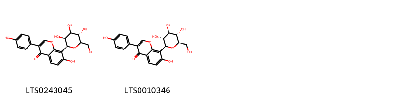{ width=100% }
    <figcaption>Hình ảnh cấu trúc hóa học của 2 hoạt chất thuộc nhóm Isoflavonoids gồm ['7-hydroxy-3-(4-hydroxyphenyl)-8-[(2s,3s,5s)-3,4,5-trihydroxy-6-(hydroxymethyl)oxan-2-yl]chromen-4-one (LTS0243045)', 'puerarin (LTS0010346)'].</figcaption>
</figure>
#### Nhóm Lactones
<figure markdown="span">
    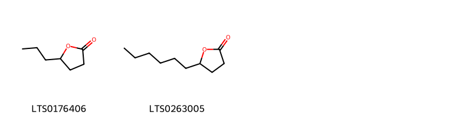{ width=100% }
    <figcaption>Hình ảnh cấu trúc hóa học của 2 hoạt chất thuộc nhóm Lactones gồm ['γ-heptalactone (LTS0176406)', 'γ-decalactone (LTS0263005)'].</figcaption>
</figure>
#### Nhóm Organooxygen compounds
<figure markdown="span">
    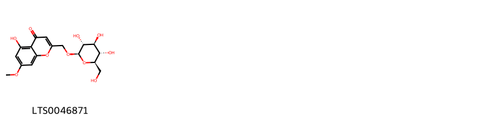{ width=100% }
    <figcaption>Hình ảnh cấu trúc hóa học của 1 hoạt chất thuộc nhóm Organooxygen compounds gồm ['5-hydroxy-7-methoxy-2-({[(2r,3r,4s,5s,6r)-3,4,5-trihydroxy-6-(hydroxymethyl)oxan-2-yl]oxy}methyl)chromen-4-one (LTS0046871)'].</figcaption>
</figure>
#### Nhóm Prenol lipids
<figure markdown="span">
    { width=100% }
    <figcaption>Hình ảnh cấu trúc hóa học của 32 hoạt chất thuộc nhóm Prenol lipids gồm ['saikosaponin a (LTS0211551)', 'saikosaponin d (LTS0233747)', '(2s)-2-{[(2r)-3,5-dihydroxy-2-{[(1s,4s,5r,8r,9r,13s,14r,17s,18r)-2-hydroxy-9-(hydroxymethyl)-4,5,9,13,20,20-hexamethyl-24-oxahexacyclo[15.5.2.0¹,¹⁸.0⁴,¹⁷.0⁵,¹⁴.0⁸,¹³]tetracos-15-en-10-yl]oxy}-6-methyloxan-4-yl]oxy}-6-(hydroxymethyl)oxane-3,4,5-triol (LTS0238261)', '(2s)-2-{[(2s)-3,5-dihydroxy-2-{[(1s,4s,5r,8s,9r,13s,14r,17s,18s)-2-hydroxy-9-(hydroxymethyl)-4,5,9,13,20,20-hexamethyl-24-oxahexacyclo[15.5.2.0¹,¹⁸.0⁴,¹⁷.0⁵,¹⁴.0⁸,¹³]tetracos-15-en-10-yl]oxy}-6-methyloxan-4-yl]oxy}-6-(hydroxymethyl)oxane-3,4,5-triol (LTS0090674)', '2-{[4,5-dihydroxy-6-({2-hydroxy-4,5,9,9,13,20,20-heptamethyl-24-oxahexacyclo[15.5.2.0¹,¹⁸.0⁴,¹⁷.0⁵,¹⁴.0⁸,¹³]tetracos-15-en-10-yl}oxy)-2-({[3,4,5-trihydroxy-6-(hydroxymethyl)oxan-2-yl]oxy}methyl)oxan-3-yl]oxy}-6-methyloxane-3,4,5-triol (LTS0103466)', '[(2r,3s,4s,5r,6s)-6-{[(2r,3r,4s,5s,6r)-3,5-dihydroxy-2-{[(1s,2r,4s,5r,8r,9r,10s,13s,14r,17s,18r)-2-hydroxy-9-(hydroxymethyl)-4,5,9,13,20,20-hexamethyl-24-oxahexacyclo[15.5.2.0¹,¹⁸.0⁴,¹⁷.0⁵,¹⁴.0⁸,¹³]tetracos-15-en-10-yl]oxy}-6-methyloxan-4-yl]oxy}-3,4,5-trihydroxyoxan-2-yl]methyl acetate (LTS0147344)', '(2s,3r,4s,5r,6r)-2-{[(2r,3r,4s,5s,6r)-3,5-dihydroxy-2-{[(1s,2r,4s,5r,8r,9r,10s,13s,14r,17s,18r)-2-hydroxy-9-(hydroxymethyl)-4,5,9,13,20,20-hexamethyl-24-oxahexacyclo[15.5.2.0¹,¹⁸.0⁴,¹⁷.0⁵,¹⁴.0⁸,¹³]tetracos-15-en-10-yl]oxy}-6-methyloxan-4-yl]oxy}-3,5-dihydroxy-6-(hydroxymethyl)oxan-4-yl acetate (LTS0215679)', '(2s,3r,4s,5r,6r)-2-{[(2r,3r,4s,5s,6r)-3,5-dihydroxy-2-{[(1s,2s,4s,5r,8r,9r,10s,13s,14r,17s,18r)-2-hydroxy-9-(hydroxymethyl)-4,5,9,13,20,20-hexamethyl-24-oxahexacyclo[15.5.2.0¹,¹⁸.0⁴,¹⁷.0⁵,¹⁴.0⁸,¹³]tetracos-15-en-10-yl]oxy}-6-methyloxan-4-yl]oxy}-3,5-dihydroxy-6-(hydroxymethyl)oxan-4-yl acetate (LTS0031889)', '(2s,3r,4r,5r,6s)-2-{[(2r,3s,4r,5r,6r)-4,5-dihydroxy-6-{[(2s,5r,10s,13s,18r)-2-hydroxy-4,5,9,9,13,20,20-heptamethyl-24-oxahexacyclo[15.5.2.0¹,¹⁸.0⁴,¹⁷.0⁵,¹⁴.0⁸,¹³]tetracos-15-en-10-yl]oxy}-2-({[(2r,3r,4s,5s,6r)-3,4,5-trihydroxy-6-(hydroxymethyl)oxan-2-yl]oxy}methyl)oxan-3-yl]oxy}-6-methyloxane-3,4,5-triol (LTS0223242)', '(2s,3r,4s,5s,6r)-2-{[(2r,3r,4s,5s,6r)-3,5-dihydroxy-2-{[(1s,2s,4s,5r,8r,9r,10s,13s,14r,17s,18r)-2-hydroxy-9-(hydroxymethyl)-4,5,9,13,20,20-hexamethyl-24-oxahexacyclo[15.5.2.0¹,¹⁸.0⁴,¹⁷.0⁵,¹⁴.0⁸,¹³]tetracos-15-en-10-yl]oxy}-6-methyloxan-4-yl]oxy}-4,5-dihydroxy-6-(hydroxymethyl)oxan-3-yl acetate (LTS0006191)', '(2s,3r,4s,5s,6r)-2-{[(2r,3r,4s,5s,6r)-3,5-dihydroxy-2-{[(1s,2s,4s,5r,8r,10s,13s,14r,17s,18r)-2-hydroxy-4,5,9,9,13,20,20-heptamethyl-24-oxahexacyclo[15.5.2.0¹,¹⁸.0⁴,¹⁷.0⁵,¹⁴.0⁸,¹³]tetracos-15-en-10-yl]oxy}-6-methyloxan-4-yl]oxy}-6-(hydroxymethyl)oxane-3,4,5-triol (LTS0127917)', '(2s,3r,4r,5r,6s)-2-{[(2r,3s,4r,5r,6r)-4,5-dihydroxy-6-{[(1s,2s,4s,5r,8r,10s,13s,14r,17s,18r)-2-hydroxy-4,5,9,9,13,20,20-heptamethyl-24-oxahexacyclo[15.5.2.0¹,¹⁸.0⁴,¹⁷.0⁵,¹⁴.0⁸,¹³]tetracos-15-en-10-yl]oxy}-2-({[(2r,3r,4s,5s,6r)-3,4,5-trihydroxy-6-(hydroxymethyl)oxan-2-yl]oxy}methyl)oxan-3-yl]oxy}-6-methyloxane-3,4,5-triol (LTS0144521)', '(2s,3r,4s,5s,6r)-2-{[(2r,3r,4s,5s,6r)-2-{[(3s,4r,4ar,6ar,6bs,8s,8as,14ar,14bs)-8-hydroxy-4,8a-bis(hydroxymethyl)-4,6a,6b,11,11,14b-hexamethyl-1,2,3,4a,5,6,7,8,9,10,12,14a-dodecahydropicen-3-yl]oxy}-3,5-dihydroxy-6-methyloxan-4-yl]oxy}-6-(hydroxymethyl)oxane-3,4,5-triol (LTS0260314)', '[(2r,3s,4s,5r,6s)-6-{[(2r,3r,4s,5s,6r)-3,5-dihydroxy-2-{[(1s,2s,4s,5r,8r,9r,10s,13s,14r,17s,18r)-2-hydroxy-9-(hydroxymethyl)-4,5,9,13,20,20-hexamethyl-24-oxahexacyclo[15.5.2.0¹,¹⁸.0⁴,¹⁷.0⁵,¹⁴.0⁸,¹³]tetracos-15-en-10-yl]oxy}-6-methyloxan-4-yl]oxy}-3,4,5-trihydroxyoxan-2-yl]methyl acetate (LTS0191998)', '(2r,3r,4s,5r,6r)-2-{[(3s,4r,4ar,6ar,6bs,8s,8as,14ar,14bs)-8-hydroxy-4,8a-bis(hydroxymethyl)-4,6a,6b,11,11,14b-hexamethyl-1,2,3,4a,5,6,7,8,9,10,12,14a-dodecahydropicen-3-yl]oxy}-6-methyloxane-3,4,5-triol (LTS0274651)', '(2r,3r,4s,5r,6r)-2-{[(1s,2s,4s,5r,8r,9r,10s,13s,14r,17s,18r)-2-hydroxy-9-(hydroxymethyl)-4,5,9,13,20,20-hexamethyl-24-oxahexacyclo[15.5.2.0¹,¹⁸.0⁴,¹⁷.0⁵,¹⁴.0⁸,¹³]tetracos-15-en-10-yl]oxy}-6-methyloxane-3,4,5-triol (LTS0109352)', '(2s,3r,4r,5r,6s)-2-{[(2r,3s,4r,5r,6r)-4,5-dihydroxy-6-{[8-hydroxy-4,8a-bis(hydroxymethyl)-4,6a,6b,11,11,14b-hexamethyl-1,2,3,4a,5,6,7,8,9,10,12,14a-dodecahydropicen-3-yl]oxy}-2-({[(2r,3r,4s,5s,6r)-3,4,5-trihydroxy-6-(hydroxymethyl)oxan-2-yl]oxy}methyl)oxan-3-yl]oxy}-6-methyloxane-3,4,5-triol (LTS0114340)', '{3,4,5-trihydroxy-6-[(2,3,4,5-tetrahydroxypentyl)oxy]oxan-2-yl}methyl 10-[(3,5-dihydroxy-6-methyl-4-{[3,4,5-trihydroxy-6-(hydroxymethyl)oxan-2-yl]oxy}oxan-2-yl)oxy]-5-hydroxy-4a,9-bis(hydroxymethyl)-2,6a,6b,9,12a-pentamethyl-1,3,4,5,6,7,8,8a,10,11,12,12b-dodecahydropicene-2-carboxylate (LTS0200244)', '[(2r,3r,4s,5r,6r)-3,4,5-trihydroxy-6-{[(2s,3r,4r)-2,3,4,5-tetrahydroxypentyl]oxy}oxan-2-yl]methyl (2s,4ar,5r,6ar,6bs,8as,9s,10s,12ar,12br)-10-{[(2r,3r,4s,5r,6s)-3,5-dihydroxy-6-methyl-4-{[(2s,3s,4s,5r,6r)-3,4,5-trihydroxy-6-(hydroxymethyl)oxan-2-yl]oxy}oxan-2-yl]oxy}-5-hydroxy-4a,9-bis(hydroxymethyl)-2,6a,6b,9,12a-pentamethyl-1,3,4,5,6,7,8,8a,10,11,12,12b-dodecahydropicene-2-carboxylate (LTS0013706)', '(2s,3s,4s,5r,6r)-6-{[(3s,4ar,6ar,6bs,8as,12as,14ar,14br)-4,4,6a,6b,11,11,14b-heptamethyl-8a-({[(2s,3r,4s,5s,6r)-3,4,5-trihydroxy-6-(hydroxymethyl)oxan-2-yl]oxy}carbonyl)-1,2,3,4a,5,6,7,8,9,10,12,12a,14,14a-tetradecahydropicen-3-yl]oxy}-3,5-dihydroxy-4-{[(2s,3r,4s,5s)-3,4,5-trihydroxyoxan-2-yl]oxy}oxane-2-carboxylic acid (LTS0197225)', '(2r,3r,4s,5r,6r)-2-{[(3s,4r,4ar,6ar,6bs,8s,8as,12as,14r,14ar,14bs)-8-hydroxy-4,8a-bis(hydroxymethyl)-14-methoxy-4,6a,6b,11,11,14b-hexamethyl-1,2,3,4a,5,6,7,8,9,10,12,12a,14,14a-tetradecahydropicen-3-yl]oxy}-6-methyloxane-3,4,5-triol (LTS0081987)', '(1s,4s,5r,8r,9r,10s,13s,14r,17s,18r)-10-{[(2r,3r,4s,5s,6r)-3,5-dihydroxy-6-methyl-4-{[(2s,3r,4s,5s,6r)-3,4,5-trihydroxy-6-(hydroxymethyl)oxan-2-yl]oxy}oxan-2-yl]oxy}-9-(hydroxymethyl)-4,5,9,13,20,20-hexamethyl-24-oxahexacyclo[15.5.2.0¹,¹⁸.0⁴,¹⁷.0⁵,¹⁴.0⁸,¹³]tetracos-15-en-2-one (LTS0024744)', '(2r,3r,4s,5r,6r)-2-{[(1s,2r,4s,5r,8r,9r,10s,13s,14r,17s,18r)-2-hydroxy-9-(hydroxymethyl)-4,5,9,13,20,20-hexamethyl-24-oxahexacyclo[15.5.2.0¹,¹⁸.0⁴,¹⁷.0⁵,¹⁴.0⁸,¹³]tetracos-15-en-10-yl]oxy}-6-methyloxane-3,4,5-triol (LTS0178707)', '(2s,3r,4s,5s,6r)-2-{[(2r,3r,4s,5s,6r)-3,5-dihydroxy-2-{[8-hydroxy-4,8a,11-tris(hydroxymethyl)-4,6a,6b,11,14b-pentamethyl-1,2,3,4a,5,6,7,8,9,10,12,14a-dodecahydropicen-3-yl]oxy}-6-methyloxan-4-yl]oxy}-6-(hydroxymethyl)oxane-3,4,5-triol (LTS0162666)', 'saikosaponin bk1 (LTS0165734)', '3-{[(2r,3s,4s,5r,6s)-6-{[(2r,3r,4s,5s,6r)-3,5-dihydroxy-2-{[(2r,4s,5r,9r,10s,13s,18r)-2-hydroxy-9-(hydroxymethyl)-4,5,9,13,20,20-hexamethyl-24-oxahexacyclo[15.5.2.0¹,¹⁸.0⁴,¹⁷.0⁵,¹⁴.0⁸,¹³]tetracos-15-en-10-yl]oxy}-6-methyloxan-4-yl]oxy}-3,4,5-trihydroxyoxan-2-yl]methoxy}-3-oxopropanoic acid (LTS0194897)', '(2r,3r,4s,5r,6r)-2-{[(3s,4ar,6ar,6bs,8s,8as,12as,14r,14ar,14bs)-8-hydroxy-8a-(hydroxymethyl)-14-methoxy-4,4,6a,6b,11,11,14b-heptamethyl-1,2,3,4a,5,6,7,8,9,10,12,12a,14,14a-tetradecahydropicen-3-yl]oxy}-6-methyloxane-3,4,5-triol (LTS0095246)', '[(1s,2s,4s,5r,8r,9r,10s,13s,14r,17s,18r)-2-hydroxy-4,5,9,13,20,20-hexamethyl-10-{[(2r,3r,4s,5r,6r)-3,4,5-trihydroxy-6-methyloxan-2-yl]oxy}-24-oxahexacyclo[15.5.2.0¹,¹⁸.0⁴,¹⁷.0⁵,¹⁴.0⁸,¹³]tetracos-15-en-9-yl]methyl acetate (LTS0264777)', '6-{[4,4,6a,6b,11,11,14b-heptamethyl-8a-({[3,4,5-trihydroxy-6-(hydroxymethyl)oxan-2-yl]oxy}carbonyl)-1,2,3,4a,5,6,7,8,9,10,12,12a,14,14a-tetradecahydropicen-3-yl]oxy}-3,5-dihydroxy-4-[(3,4,5-trihydroxyoxan-2-yl)oxy]oxane-2-carboxylic acid (LTS0237067)', '(2s,3r,4s,5s,6r)-2-{[(2r,3r,4s,5s,6r)-2-{[(3s,4r,4ar,6ar,6bs,8r,8as,14r,14ar,14bs)-8-hydroxy-4,8a-bis(hydroxymethyl)-14-methoxy-4,6a,6b,11,11,14b-hexamethyl-1,2,3,4a,5,6,7,8,9,10,12,12a,14,14a-tetradecahydropicen-3-yl]oxy}-3,5-dihydroxy-6-methyloxan-4-yl]oxy}-6-(hydroxymethyl)oxane-3,4,5-triol (LTS0170359)', '(2r,3r,4s,5r,6r)-2-{[(3s,4r,4ar,6ar,6bs,8r,8as,14ar,14bs)-8-hydroxy-4,8a-bis(hydroxymethyl)-4,6a,6b,11,11,14b-hexamethyl-1,2,3,4a,5,6,7,8,9,10,12,14a-dodecahydropicen-3-yl]oxy}-6-methyloxane-3,4,5-triol (LTS0050901)', '[(1s,2s,4s,5r,8r,9r,10s,13s,14r,17s,18r)-10-{[(2r,3r,4s,5s,6r)-3,5-dihydroxy-6-methyl-4-{[(2s,3r,4s,5s,6r)-3,4,5-trihydroxy-6-(hydroxymethyl)oxan-2-yl]oxy}oxan-2-yl]oxy}-2-hydroxy-4,5,9,13,20,20-hexamethyl-24-oxahexacyclo[15.5.2.0¹,¹⁸.0⁴,¹⁷.0⁵,¹⁴.0⁸,¹³]tetracos-15-en-9-yl]methyl acetate (LTS0246064)'].</figcaption>
</figure>
#### Nhóm Steroids and steroid derivatives
<figure markdown="span">
    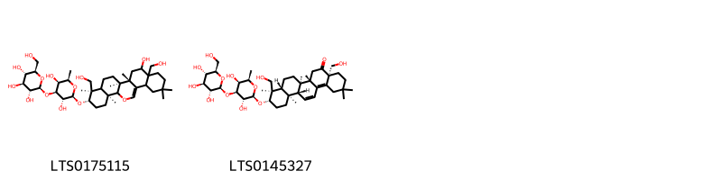{ width=100% }
    <figcaption>Hình ảnh cấu trúc hóa học của 2 hoạt chất thuộc nhóm Steroids and steroid derivatives gồm ['(2s,3r,4s,5s,6r)-2-{[(2r,3r,4s,5s,6r)-3,5-dihydroxy-2-{[(1s,2s,6r,7s,10s)-21-hydroxy-6,20-bis(hydroxymethyl)-1,2,6,10,17,17-hexamethyl-12-oxapentacyclo[12.8.0.0²,¹¹.0⁵,¹⁰.0¹⁵,²⁰]docos-13-en-7-yl]oxy}-6-methyloxan-4-yl]oxy}-6-(hydroxymethyl)oxane-3,4,5-triol (LTS0175115)', '(4as,6as,6br,8ar,9r,10s,12as,12br)-10-{[(2r,3r,4s,5s,6r)-3,5-dihydroxy-6-methyl-4-{[(2s,3r,4s,5s,6r)-3,4,5-trihydroxy-6-(hydroxymethyl)oxan-2-yl]oxy}oxan-2-yl]oxy}-4a,9-bis(hydroxymethyl)-2,2,6a,6b,9,12a-hexamethyl-3,4,6,7,8,8a,10,11,12,12b-decahydro-1h-picen-5-one (LTS0145327)'].</figcaption>
</figure>

---

### Dược dân tộc học

Danh sách các quốc gia có sử dụng *Bupleurum chinense* trong điều trị các bệnh. 

| Country   | Disease     | Bệnh                                                                                                                                                                                                |
|:----------|:------------|:----------------------------------------------------------------------------------------------------------------------------------------------------------------------------------------------------|
| China     | Diaphoretic | MYMEMORY WARNING: YOU USED ALL AVAILABLE FREE TRANSLATIONS FOR TODAY. NEXT AVAILABLE IN  07 HOURS 31 MINUTES 21 SECONDS VISIT HTTPS://MYMEMORY.TRANSLATED.NET/DOC/USAGELIMITS.PHP TO TRANSLATE MORE |

---

---
## Bupleurum falcatum
### Thông tin về thực vật

!!! info "Phân loại thực vật của *Bupleurum falcatum* từ GIBF:"
    - **Kingdom:** Plantae
    - **Phylum:** Tracheophyta
    - **Order:** Apiales
    - **Family:** Apiaceae
    - **Genus:** Bupleurum
    - **Species:** *Bupleurum falcatum*

 

| Label (VI)   | Label (EN)   | Scientific Name    | Descriptions (VI)   | Descriptions (EN)   | Also Known As (VI)   | Also Known As (EN)   |
|:-------------|:-------------|:-------------------|:--------------------|:--------------------|:---------------------|:---------------------|
| N/A          | N/A          | Bupleurum falcatum | loài thực vật       | species of plant    | ['']                 | ['']                 |

#### Phân bố trên thế giới

**Từ CSDL GIBF** Ukraine, nan, Italy, Luxembourg, Germany, Slovakia, Czechia, Romania, Belgium, Spain, Hungary, Switzerland, Russian Federation, Sweden, Austria, France

#### Phân bố tại Việt Nam

**Từ CSDL GIBF**: Không có ghi nhận ở Việt Nam

---
### Thành phần hóa học
        
- Theo cơ sở dữ liệu lotus: Từ loài *Bupleurum falcatum* đã phân lập và xác định được 121 hoạt chất thuộc về các nhóm Fatty Acyls, Flavonoids, Prenol lipids, Steroids and steroid derivatives, Indoles and derivatives, Harmala alkaloids, Organooxygen compounds, Furanoid lignans, Benzopyrans. 

|    | chemicalTaxonomyClassyfireClass   |   smiles_count |
|---:|:----------------------------------|---------------:|
|  0 | Benzopyrans                       |              1 |
|  1 | Fatty Acyls                       |             15 |
|  2 | Flavonoids                        |              9 |
|  3 | Furanoid lignans                  |              2 |
|  4 | Harmala alkaloids                 |              1 |
|  5 | Indoles and derivatives           |              1 |
|  6 | Organooxygen compounds            |             11 |
|  7 | Prenol lipids                     |             77 |
|  8 | Steroids and steroid derivatives  |              4 |

#### Nhóm Benzopyrans
<figure markdown="span">
    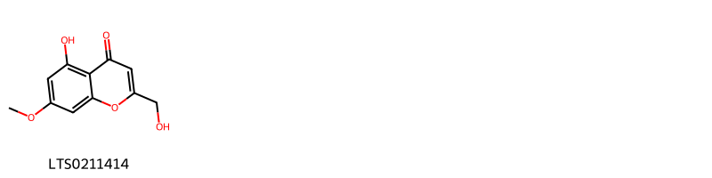{ width=100% }
    <figcaption>Hình ảnh cấu trúc hóa học của 1 hoạt chất thuộc nhóm Benzopyrans gồm ['5-hydroxy-2-(hydroxymethyl)-7-methoxychromen-4-one (LTS0211414)'].</figcaption>
</figure>
#### Nhóm Fatty Acyls
<figure markdown="span">
    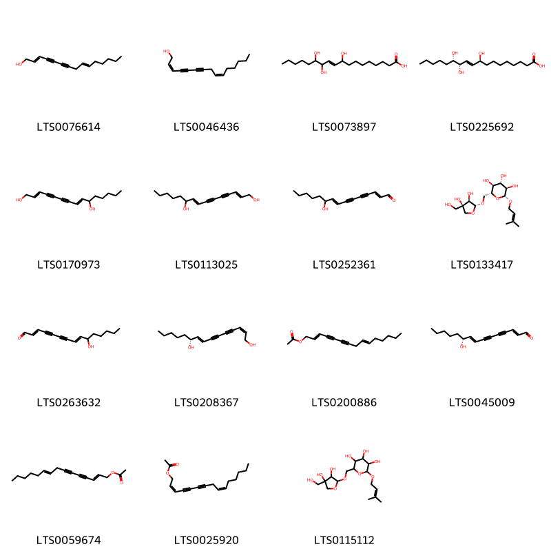{ width=100% }
    <figcaption>Hình ảnh cấu trúc hóa học của 15 hoạt chất thuộc nhóm Fatty Acyls gồm ['pentadeca-2,9-dien-4,6-diyn-1-ol (LTS0076614)', '(2z,9z)-pentadeca-2,9-dien-4,6-diyn-1-ol (LTS0046436)', '9,12,13-trihydroxyoctadec-10-enoic acid (LTS0073897)', 'pinellic acid (LTS0225692)', 'pentadeca-2,8-dien-4,6-diyne-1,10-diol (LTS0170973)', '(2e,8e)-pentadeca-2,8-dien-4,6-diyne-1,10-diol (LTS0113025)', '(2e,8e)-10-hydroxypentadeca-2,8-dien-4,6-diynal (LTS0252361)', '(2r,3s,4s,5r,6r)-2-({[(2r,3r,4r)-3,4-dihydroxy-4-(hydroxymethyl)oxolan-2-yl]oxy}methyl)-6-[(3-methylbut-2-en-1-yl)oxy]oxane-3,4,5-triol (LTS0133417)', '10-hydroxypentadeca-2,8-dien-4,6-diynal (LTS0263632)', '(2z,8e,10r)-pentadeca-2,8-dien-4,6-diyne-1,10-diol (LTS0208367)', 'pentadeca-2,9-dien-4,6-diyn-1-yl acetate (LTS0200886)', '(2e,8e,10r)-10-hydroxypentadeca-2,8-dien-4,6-diynal (LTS0045009)', '(2e,9e)-pentadeca-2,9-dien-4,6-diyn-1-yl acetate (LTS0059674)', '(2z,9z)-pentadeca-2,9-dien-4,6-diyn-1-yl acetate (LTS0025920)', '2-({[3,4-dihydroxy-4-(hydroxymethyl)oxolan-2-yl]oxy}methyl)-6-[(3-methylbut-2-en-1-yl)oxy]oxane-3,4,5-triol (LTS0115112)'].</figcaption>
</figure>
#### Nhóm Flavonoids
<figure markdown="span">
    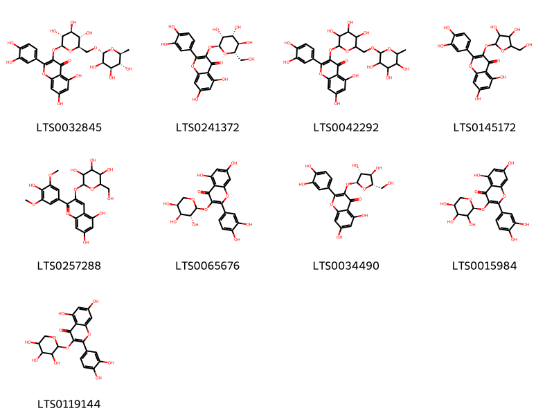{ width=100% }
    <figcaption>Hình ảnh cấu trúc hóa học của 9 hoạt chất thuộc nhóm Flavonoids gồm ['3-rutinosyl quercetin (LTS0032845)', '2-(3,4-dihydroxyphenyl)-5,7-dihydroxy-3-{[(2s,3r,4r,5r,6s)-3,4,5-trihydroxy-6-(hydroxymethyl)oxan-2-yl]oxy}chromen-4-one (LTS0241372)', 'rutin (LTS0042292)', '3-{[3,4-dihydroxy-5-(hydroxymethyl)oxolan-2-yl]oxy}-2-(3,4-dihydroxyphenyl)-5,7-dihydroxychromen-4-one (LTS0145172)', 'oenin (LTS0257288)', 'guaijaverin (LTS0065676)', 'avicularin (LTS0034490)', 'guaijaverin (LTS0015984)', 'guaijaverin (LTS0119144)'].</figcaption>
</figure>
#### Nhóm Furanoid lignans
<figure markdown="span">
    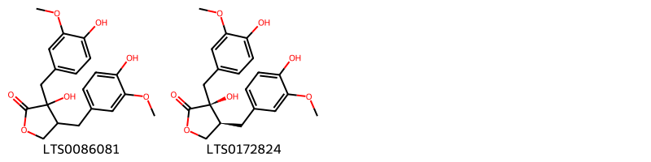{ width=100% }
    <figcaption>Hình ảnh cấu trúc hóa học của 2 hoạt chất thuộc nhóm Furanoid lignans gồm ['3-hydroxy-3,4-bis[(4-hydroxy-3-methoxyphenyl)methyl]oxolan-2-one (LTS0086081)', 'nortrachelogenin (LTS0172824)'].</figcaption>
</figure>
#### Nhóm Harmala alkaloids
<figure markdown="span">
    { width=100% }
    <figcaption>Hình ảnh cấu trúc hóa học của 1 hoạt chất thuộc nhóm Harmala alkaloids gồm ['harmane (LTS0068205)'].</figcaption>
</figure>
#### Nhóm Indoles and derivatives
<figure markdown="span">
    { width=100% }
    <figcaption>Hình ảnh cấu trúc hóa học của 1 hoạt chất thuộc nhóm Indoles and derivatives gồm ['β-carboline (LTS0263207)'].</figcaption>
</figure>
#### Nhóm Organooxygen compounds
<figure markdown="span">
    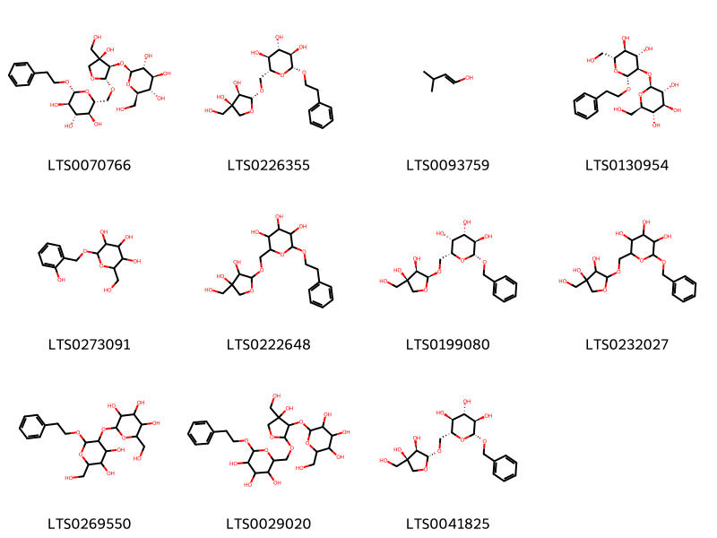{ width=100% }
    <figcaption>Hình ảnh cấu trúc hóa học của 11 hoạt chất thuộc nhóm Organooxygen compounds gồm ['(2s,3r,4s,5s,6r)-2-{[(2r,3r,4r)-4-hydroxy-4-(hydroxymethyl)-2-{[(2r,3s,4s,5r,6r)-3,4,5-trihydroxy-6-(2-phenylethoxy)oxan-2-yl]methoxy}oxolan-3-yl]oxy}-6-(hydroxymethyl)oxane-3,4,5-triol (LTS0070766)', '(2r,3s,4s,5r,6r)-2-({[(2r,3r,4r)-3,4-dihydroxy-4-(hydroxymethyl)oxolan-2-yl]oxy}methyl)-6-(2-phenylethoxy)oxane-3,4,5-triol (LTS0226355)', '3-methylbut-1-en-1-ol (LTS0093759)', '(2s,3r,4s,5s,6r)-2-{[(2r,3r,4s,5s,6r)-4,5-dihydroxy-6-(hydroxymethyl)-2-(2-phenylethoxy)oxan-3-yl]oxy}-6-(hydroxymethyl)oxane-3,4,5-triol (LTS0130954)', '2-(hydroxymethyl)-6-[(2-hydroxyphenyl)methoxy]oxane-3,4,5-triol (LTS0273091)', '2-({[3,4-dihydroxy-4-(hydroxymethyl)oxolan-2-yl]oxy}methyl)-6-(2-phenylethoxy)oxane-3,4,5-triol (LTS0222648)', '(2r,3r,4s,5r,6r)-2-(benzyloxy)-6-({[(2s,3r,4r)-3,4-dihydroxy-4-(hydroxymethyl)oxolan-2-yl]oxy}methyl)oxane-3,4,5-triol (LTS0199080)', '2-(benzyloxy)-6-({[3,4-dihydroxy-4-(hydroxymethyl)oxolan-2-yl]oxy}methyl)oxane-3,4,5-triol (LTS0232027)', '2-{[4,5-dihydroxy-6-(hydroxymethyl)-2-(2-phenylethoxy)oxan-3-yl]oxy}-6-(hydroxymethyl)oxane-3,4,5-triol (LTS0269550)', '2-{[4-hydroxy-4-(hydroxymethyl)-2-{[3,4,5-trihydroxy-6-(2-phenylethoxy)oxan-2-yl]methoxy}oxolan-3-yl]oxy}-6-(hydroxymethyl)oxane-3,4,5-triol (LTS0029020)', '(2r,3r,4s,5s,6r)-2-(benzyloxy)-6-({[(2r,3r,4r)-3,4-dihydroxy-4-(hydroxymethyl)oxolan-2-yl]oxy}methyl)oxane-3,4,5-triol (LTS0041825)'].</figcaption>
</figure>
#### Nhóm Prenol lipids
<figure markdown="span">
    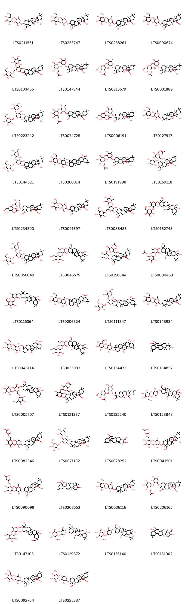{ width=100% }
    <figcaption>Hình ảnh cấu trúc hóa học của 77 hoạt chất thuộc nhóm Prenol lipids gồm ['saikosaponin a (LTS0211551)', 'saikosaponin d (LTS0233747)', '(2s)-2-{[(2r)-3,5-dihydroxy-2-{[(1s,4s,5r,8r,9r,13s,14r,17s,18r)-2-hydroxy-9-(hydroxymethyl)-4,5,9,13,20,20-hexamethyl-24-oxahexacyclo[15.5.2.0¹,¹⁸.0⁴,¹⁷.0⁵,¹⁴.0⁸,¹³]tetracos-15-en-10-yl]oxy}-6-methyloxan-4-yl]oxy}-6-(hydroxymethyl)oxane-3,4,5-triol (LTS0238261)', '(2s)-2-{[(2s)-3,5-dihydroxy-2-{[(1s,4s,5r,8s,9r,13s,14r,17s,18s)-2-hydroxy-9-(hydroxymethyl)-4,5,9,13,20,20-hexamethyl-24-oxahexacyclo[15.5.2.0¹,¹⁸.0⁴,¹⁷.0⁵,¹⁴.0⁸,¹³]tetracos-15-en-10-yl]oxy}-6-methyloxan-4-yl]oxy}-6-(hydroxymethyl)oxane-3,4,5-triol (LTS0090674)', '2-{[4,5-dihydroxy-6-({2-hydroxy-4,5,9,9,13,20,20-heptamethyl-24-oxahexacyclo[15.5.2.0¹,¹⁸.0⁴,¹⁷.0⁵,¹⁴.0⁸,¹³]tetracos-15-en-10-yl}oxy)-2-({[3,4,5-trihydroxy-6-(hydroxymethyl)oxan-2-yl]oxy}methyl)oxan-3-yl]oxy}-6-methyloxane-3,4,5-triol (LTS0103466)', '[(2r,3s,4s,5r,6s)-6-{[(2r,3r,4s,5s,6r)-3,5-dihydroxy-2-{[(1s,2r,4s,5r,8r,9r,10s,13s,14r,17s,18r)-2-hydroxy-9-(hydroxymethyl)-4,5,9,13,20,20-hexamethyl-24-oxahexacyclo[15.5.2.0¹,¹⁸.0⁴,¹⁷.0⁵,¹⁴.0⁸,¹³]tetracos-15-en-10-yl]oxy}-6-methyloxan-4-yl]oxy}-3,4,5-trihydroxyoxan-2-yl]methyl acetate (LTS0147344)', '(2s,3r,4s,5r,6r)-2-{[(2r,3r,4s,5s,6r)-3,5-dihydroxy-2-{[(1s,2r,4s,5r,8r,9r,10s,13s,14r,17s,18r)-2-hydroxy-9-(hydroxymethyl)-4,5,9,13,20,20-hexamethyl-24-oxahexacyclo[15.5.2.0¹,¹⁸.0⁴,¹⁷.0⁵,¹⁴.0⁸,¹³]tetracos-15-en-10-yl]oxy}-6-methyloxan-4-yl]oxy}-3,5-dihydroxy-6-(hydroxymethyl)oxan-4-yl acetate (LTS0215679)', '(2s,3r,4s,5r,6r)-2-{[(2r,3r,4s,5s,6r)-3,5-dihydroxy-2-{[(1s,2s,4s,5r,8r,9r,10s,13s,14r,17s,18r)-2-hydroxy-9-(hydroxymethyl)-4,5,9,13,20,20-hexamethyl-24-oxahexacyclo[15.5.2.0¹,¹⁸.0⁴,¹⁷.0⁵,¹⁴.0⁸,¹³]tetracos-15-en-10-yl]oxy}-6-methyloxan-4-yl]oxy}-3,5-dihydroxy-6-(hydroxymethyl)oxan-4-yl acetate (LTS0031889)', '(2s,3r,4r,5r,6s)-2-{[(2r,3s,4r,5r,6r)-4,5-dihydroxy-6-{[(2s,5r,10s,13s,18r)-2-hydroxy-4,5,9,9,13,20,20-heptamethyl-24-oxahexacyclo[15.5.2.0¹,¹⁸.0⁴,¹⁷.0⁵,¹⁴.0⁸,¹³]tetracos-15-en-10-yl]oxy}-2-({[(2r,3r,4s,5s,6r)-3,4,5-trihydroxy-6-(hydroxymethyl)oxan-2-yl]oxy}methyl)oxan-3-yl]oxy}-6-methyloxane-3,4,5-triol (LTS0223242)', '{6-[(3,5-dihydroxy-2-{[2-hydroxy-9-(hydroxymethyl)-4,5,9,13,20,20-hexamethyl-24-oxahexacyclo[15.5.2.0¹,¹⁸.0⁴,¹⁷.0⁵,¹⁴.0⁸,¹³]tetracos-15-en-10-yl]oxy}-6-methyloxan-4-yl)oxy]-3,4,5-trihydroxyoxan-2-yl}methyl acetate (LTS0074728)', '(2s,3r,4s,5s,6r)-2-{[(2r,3r,4s,5s,6r)-3,5-dihydroxy-2-{[(1s,2s,4s,5r,8r,9r,10s,13s,14r,17s,18r)-2-hydroxy-9-(hydroxymethyl)-4,5,9,13,20,20-hexamethyl-24-oxahexacyclo[15.5.2.0¹,¹⁸.0⁴,¹⁷.0⁵,¹⁴.0⁸,¹³]tetracos-15-en-10-yl]oxy}-6-methyloxan-4-yl]oxy}-4,5-dihydroxy-6-(hydroxymethyl)oxan-3-yl acetate (LTS0006191)', '(2s,3r,4s,5s,6r)-2-{[(2r,3r,4s,5s,6r)-3,5-dihydroxy-2-{[(1s,2s,4s,5r,8r,10s,13s,14r,17s,18r)-2-hydroxy-4,5,9,9,13,20,20-heptamethyl-24-oxahexacyclo[15.5.2.0¹,¹⁸.0⁴,¹⁷.0⁵,¹⁴.0⁸,¹³]tetracos-15-en-10-yl]oxy}-6-methyloxan-4-yl]oxy}-6-(hydroxymethyl)oxane-3,4,5-triol (LTS0127917)', '(2s,3r,4r,5r,6s)-2-{[(2r,3s,4r,5r,6r)-4,5-dihydroxy-6-{[(1s,2s,4s,5r,8r,10s,13s,14r,17s,18r)-2-hydroxy-4,5,9,9,13,20,20-heptamethyl-24-oxahexacyclo[15.5.2.0¹,¹⁸.0⁴,¹⁷.0⁵,¹⁴.0⁸,¹³]tetracos-15-en-10-yl]oxy}-2-({[(2r,3r,4s,5s,6r)-3,4,5-trihydroxy-6-(hydroxymethyl)oxan-2-yl]oxy}methyl)oxan-3-yl]oxy}-6-methyloxane-3,4,5-triol (LTS0144521)', '(2s,3r,4s,5s,6r)-2-{[(2r,3r,4s,5s,6r)-2-{[(3s,4r,4ar,6ar,6bs,8s,8as,14ar,14bs)-8-hydroxy-4,8a-bis(hydroxymethyl)-4,6a,6b,11,11,14b-hexamethyl-1,2,3,4a,5,6,7,8,9,10,12,14a-dodecahydropicen-3-yl]oxy}-3,5-dihydroxy-6-methyloxan-4-yl]oxy}-6-(hydroxymethyl)oxane-3,4,5-triol (LTS0260314)', '[(2r,3s,4s,5r,6s)-6-{[(2r,3r,4s,5s,6r)-3,5-dihydroxy-2-{[(1s,2s,4s,5r,8r,9r,10s,13s,14r,17s,18r)-2-hydroxy-9-(hydroxymethyl)-4,5,9,13,20,20-hexamethyl-24-oxahexacyclo[15.5.2.0¹,¹⁸.0⁴,¹⁷.0⁵,¹⁴.0⁸,¹³]tetracos-15-en-10-yl]oxy}-6-methyloxan-4-yl]oxy}-3,4,5-trihydroxyoxan-2-yl]methyl acetate (LTS0191998)', '(2r,3s,4r,5r,6s)-6-{[(2r,3r,4s,5s,6r)-3,5-dihydroxy-2-{[(1s,2s,4s,5r,8r,9r,10s,13s,14r,17s,18r)-2-hydroxy-9-(hydroxymethyl)-4,5,9,13,20,20-hexamethyl-24-oxahexacyclo[15.5.2.0¹,¹⁸.0⁴,¹⁷.0⁵,¹⁴.0⁸,¹³]tetracos-15-en-10-yl]oxy}-6-methyloxan-4-yl]oxy}-4,5-dihydroxy-2-(hydroxymethyl)oxan-3-yl acetate (LTS0159118)', '(2s,3r,4s,5s,6r)-2-{[(2r,3r,4s,5s,6r)-3,5-dihydroxy-2-{[(1s,2r,4s,5r,8r,9r,10s,13s,14r,17s,18r)-2-hydroxy-9-(hydroxymethyl)-4,5,9,13,20,20-hexamethyl-24-oxahexacyclo[15.5.2.0¹,¹⁸.0⁴,¹⁷.0⁵,¹⁴.0⁸,¹³]tetracos-15-en-10-yl]oxy}-6-methyloxan-4-yl]oxy}-4,5-dihydroxy-6-(hydroxymethyl)oxan-3-yl acetate (LTS0234300)', '2-[(3,5-dihydroxy-2-{[2-hydroxy-9-(hydroxymethyl)-4,5,9,13,20,20-hexamethyl-24-oxahexacyclo[15.5.2.0¹,¹⁸.0⁴,¹⁷.0⁵,¹⁴.0⁸,¹³]tetracos-15-en-10-yl]oxy}-6-methyloxan-4-yl)oxy]-6-(hydroxymethyl)oxane-3,4,5-triol (LTS0091697)', '2-[(4,5-dihydroxy-6-{[2-hydroxy-9-(hydroxymethyl)-4,5,9,13,20,20-hexamethyl-24-oxahexacyclo[15.5.2.0¹,¹⁸.0⁴,¹⁷.0⁵,¹⁴.0⁸,¹³]tetracos-15-en-10-yl]oxy}-2-({[3,4,5-trihydroxy-6-(hydroxymethyl)oxan-2-yl]oxy}methyl)oxan-3-yl)oxy]-6-methyloxane-3,4,5-triol (LTS0086486)', '2-[(3,5-dihydroxy-2-{[8-hydroxy-4,8a-bis(hydroxymethyl)-14-methoxy-4,6a,6b,11,11,14b-hexamethyl-1,2,3,4a,5,6,7,8,9,10,12,12a,14,14a-tetradecahydropicen-3-yl]oxy}-6-methyloxan-4-yl)oxy]-6-(hydroxymethyl)oxane-3,4,5-triol (LTS0162745)', '(2s,3r,4r,5r,6s)-2-{[(2r,3s,4r,5r,6r)-4,5-dihydroxy-6-{[(1s,2s,4s,5r,8r,9r,10s,13s,14r,17s,18r)-2-hydroxy-9-(hydroxymethyl)-4,5,9,13,20,20-hexamethyl-24-oxahexacyclo[15.5.2.0¹,¹⁸.0⁴,¹⁷.0⁵,¹⁴.0⁸,¹³]tetracos-15-en-10-yl]oxy}-2-({[(2r,3r,4s,5s,6r)-3,4,5-trihydroxy-6-(hydroxymethyl)oxan-2-yl]oxy}methyl)oxan-3-yl]oxy}-6-methyloxane-3,4,5-triol (LTS0056049)', '2-[(3,5-dihydroxy-2-{[8-hydroxy-4,8a-bis(hydroxymethyl)-4,6a,6b,11,11,14b-hexamethyl-1,2,3,4a,5,6,7,8,9,10,12,14a-dodecahydropicen-3-yl]oxy}-6-methyloxan-4-yl)oxy]-6-(hydroxymethyl)oxane-3,4,5-triol (LTS0045575)', '2-[(3,5-dihydroxy-2-{[2-hydroxy-9-(hydroxymethyl)-4,5,9,13,20,20-hexamethyl-24-oxahexacyclo[15.5.2.0¹,¹⁸.0⁴,¹⁷.0⁵,¹⁴.0⁸,¹³]tetracos-15-en-10-yl]oxy}-6-methyloxan-4-yl)oxy]-3,5-dihydroxy-6-(hydroxymethyl)oxan-4-yl acetate (LTS0156844)', '{6-[(3,5-dihydroxy-2-{[8-hydroxy-4,8a-bis(hydroxymethyl)-14-methoxy-4,6a,6b,11,11,14b-hexamethyl-1,2,3,4a,5,6,7,8,9,10,12,12a,14,14a-tetradecahydropicen-3-yl]oxy}-6-methyloxan-4-yl)oxy]-3,4,5-trihydroxyoxan-2-yl}methyl acetate (LTS0000459)', '2-[(3,5-dihydroxy-2-{[8-hydroxy-8a-(hydroxymethyl)-14-methoxy-4,4,6a,6b,11,11,14b-heptamethyl-1,2,3,4a,5,6,7,8,9,10,12,12a,14,14a-tetradecahydropicen-3-yl]oxy}-6-methyloxan-4-yl)oxy]-6-(hydroxymethyl)oxane-3,4,5-triol (LTS0115364)', '(2s,3r,4s,5s,6r)-2-{[(2r,3r,4s,5s,6r)-2-{[(3s,4r,4ar,6ar,6bs,8s,8as,12as,14r,14ar,14bs)-8,14-dihydroxy-4,8a-bis(hydroxymethyl)-4,6a,6b,11,11,14b-hexamethyl-1,2,3,4a,5,6,7,8,9,10,12,12a,14,14a-tetradecahydropicen-3-yl]oxy}-3,5-dihydroxy-6-methyloxan-4-yl]oxy}-6-(hydroxymethyl)oxane-3,4,5-triol (LTS0206324)', '(2s,3r,4r,5r,6s)-2-{[(2r,3s,4r,5r,6r)-6-{[(3s,4r,4ar,6ar,6bs,8r,8as,14ar,14bs)-8-hydroxy-4,8a-bis(hydroxymethyl)-4,6a,6b,11,11,14b-hexamethyl-1,2,3,4a,5,6,7,8,9,10,12,14a-dodecahydropicen-3-yl]oxy}-4,5-dihydroxy-2-({[(2r,3r,4s,5s,6r)-3,4,5-trihydroxy-6-(hydroxymethyl)oxan-2-yl]oxy}methyl)oxan-3-yl]oxy}-6-methyloxane-3,4,5-triol (LTS0111347)', '2-{[3,5-dihydroxy-2-({2-hydroxy-4,5,9,9,13,20,20-heptamethyl-24-oxahexacyclo[15.5.2.0¹,¹⁸.0⁴,¹⁷.0⁵,¹⁴.0⁸,¹³]tetracos-15-en-10-yl}oxy)-6-methyloxan-4-yl]oxy}-6-(hydroxymethyl)oxane-3,4,5-triol (LTS0148934)', '(2s,3r,4s,5s,6r)-2-{[(2r,3r,4s,5s,6r)-2-{[(3s,4r,4ar,6ar,6bs,8r,8as,12as,14r,14ar,14bs)-8,14-dihydroxy-4,8a-bis(hydroxymethyl)-4,6a,6b,11,11,14b-hexamethyl-1,2,3,4a,5,6,7,8,9,10,12,12a,14,14a-tetradecahydropicen-3-yl]oxy}-3,5-dihydroxy-6-methyloxan-4-yl]oxy}-6-(hydroxymethyl)oxane-3,4,5-triol (LTS0046114)', '2-[(2-{[8,14-dihydroxy-4,8a-bis(hydroxymethyl)-4,6a,6b,11,11,14b-hexamethyl-1,2,3,4a,5,6,7,8,9,10,12,12a,14,14a-tetradecahydropicen-3-yl]oxy}-3,5-dihydroxy-6-methyloxan-4-yl)oxy]-6-(hydroxymethyl)oxane-3,4,5-triol (LTS0035993)', '(2s,3r,4s,5s,6r)-2-{[(2r,3r,4s,5s,6r)-2-{[(3s,4ar,6ar,6bs,8s,8as,12as,14r,14ar,14bs)-8-hydroxy-8a-(hydroxymethyl)-14-methoxy-4,4,6a,6b,11,11,14b-heptamethyl-1,2,3,4a,5,6,7,8,9,10,12,12a,14,14a-tetradecahydropicen-3-yl]oxy}-3,5-dihydroxy-6-methyloxan-4-yl]oxy}-6-(hydroxymethyl)oxane-3,4,5-triol (LTS0134473)', '8a-(hydroxymethyl)-4,4,6a,6b,11,11,14b-heptamethyl-1,2,3,4a,5,6,7,8,9,10,12,14a-dodecahydropicene-3,8-diol (LTS0134852)', '2-[(4,5-dihydroxy-6-{[8-hydroxy-4,8a-bis(hydroxymethyl)-4,6a,6b,11,11,14b-hexamethyl-1,2,3,4a,5,6,7,8,9,10,12,14a-dodecahydropicen-3-yl]oxy}-2-({[3,4,5-trihydroxy-6-(hydroxymethyl)oxan-2-yl]oxy}methyl)oxan-3-yl)oxy]-6-methyloxane-3,4,5-triol (LTS0002707)', '6-[(3,5-dihydroxy-2-{[2-hydroxy-9-(hydroxymethyl)-4,5,9,13,20,20-hexamethyl-24-oxahexacyclo[15.5.2.0¹,¹⁸.0⁴,¹⁷.0⁵,¹⁴.0⁸,¹³]tetracos-15-en-10-yl]oxy}-6-methyloxan-4-yl)oxy]-4,5-dihydroxy-2-(hydroxymethyl)oxan-3-yl acetate (LTS0121387)', '(2s,3r,4r,5r,6r)-2-{[(2r,3r,4r,5s,6r)-3,5-dihydroxy-2-{[(1s,2r,4s,5r,8r,9r,10s,13s,14r,17s,18s)-2-hydroxy-9-(hydroxymethyl)-4,5,9,13,20,20-hexamethyl-24-oxahexacyclo[15.5.2.0¹,¹⁸.0⁴,¹⁷.0⁵,¹⁴.0⁸,¹³]tetracos-15-en-10-yl]oxy}-6-methyloxan-4-yl]oxy}-3,5-dihydroxy-6-(hydroxymethyl)oxan-4-yl acetate (LTS0132240)', '(2s,3r,4s,5s,6r)-2-{[(2r,3r,4s,5s,6r)-2-{[(3s,4r,4ar,6ar,6bs,8r,8as,12as,14r,14ar,14bs)-8-hydroxy-4,8a-bis(hydroxymethyl)-14-methoxy-4,6a,6b,11,11,14b-hexamethyl-1,2,3,4a,5,6,7,8,9,10,12,12a,14,14a-tetradecahydropicen-3-yl]oxy}-3,5-dihydroxy-6-methyloxan-4-yl]oxy}-6-(hydroxymethyl)oxane-3,4,5-triol (LTS0128843)', '3-({6-[(3,5-dihydroxy-2-{[2-hydroxy-9-(hydroxymethyl)-4,5,9,13,20,20-hexamethyl-24-oxahexacyclo[15.5.2.0¹,¹⁸.0⁴,¹⁷.0⁵,¹⁴.0⁸,¹³]tetracos-15-en-10-yl]oxy}-6-methyloxan-4-yl)oxy]-3,4,5-trihydroxyoxan-2-yl}methoxy)-3-oxopropanoic acid (LTS0082346)', '(2s,3r,4r,5r,6s)-2-{[(2r,3s,4r,5r,6r)-4,5-dihydroxy-6-{[(2s,4s,5r,8r,10s,13s,14r,17r,18r)-2-hydroxy-4,5,9,9,13,20,20-heptamethyl-24-oxahexacyclo[15.5.2.0¹,¹⁸.0⁴,¹⁷.0⁵,¹⁴.0⁸,¹³]tetracos-15-en-10-yl]oxy}-2-({[(2r,3r,4s,5s,6r)-3,4,5-trihydroxy-6-(hydroxymethyl)oxan-2-yl]oxy}methyl)oxan-3-yl]oxy}-6-methyloxane-3,4,5-triol (LTS0071192)', '(1s,2s,5r,10s,13s,18r)-9-(hydroxymethyl)-4,5,9,13,20,20-hexamethyl-24-oxahexacyclo[15.5.2.0¹,¹⁸.0⁴,¹⁷.0⁵,¹⁴.0⁸,¹³]tetracos-15-ene-2,10-diol (LTS0078252)', '3-{[(2r,3s,4s,5r,6s)-6-{[(2r,3r,4s,5s,6r)-3,5-dihydroxy-2-{[(1s,2s,4s,5r,8r,9r,10s,13s,14r,17s,18r)-2-hydroxy-9-(hydroxymethyl)-4,5,9,13,20,20-hexamethyl-24-oxahexacyclo[15.5.2.0¹,¹⁸.0⁴,¹⁷.0⁵,¹⁴.0⁸,¹³]tetracos-15-en-10-yl]oxy}-6-methyloxan-4-yl]oxy}-3,4,5-trihydroxyoxan-2-yl]methoxy}-3-oxopropanoic acid (LTS0041501)', '3-{[(2r,3s,4s,5r,6s)-6-{[(2r,3r,4s,5s,6r)-3,5-dihydroxy-2-{[(1s,2r,4s,5r,8r,9r,10s,13s,14r,17s,18s)-2-hydroxy-9-(hydroxymethyl)-4,5,9,13,20,20-hexamethyl-24-oxahexacyclo[15.5.2.0¹,¹⁸.0⁴,¹⁷.0⁵,¹⁴.0⁸,¹³]tetracos-15-en-10-yl]oxy}-6-methyloxan-4-yl]oxy}-3,4,5-trihydroxyoxan-2-yl]methoxy}-3-oxopropanoic acid (LTS0090099)', '(3s,4ar,6ar,6bs,8s,8as,14ar,14bs)-8a-(hydroxymethyl)-4,4,6a,6b,11,11,14b-heptamethyl-1,2,3,4a,5,6,7,8,9,10,12,14a-dodecahydropicene-3,8-diol (LTS0203553)', '(2s,3r,4r,5s,6r)-2-{[(2r,3r,4r,5s,6r)-3,5-dihydroxy-2-{[(1s,2s,4s,5r,8s,10s,13s,14r,17s,18s)-2-hydroxy-4,5,9,9,13,20,20-heptamethyl-24-oxahexacyclo[15.5.2.0¹,¹⁸.0⁴,¹⁷.0⁵,¹⁴.0⁸,¹³]tetracos-15-en-10-yl]oxy}-6-methyloxan-4-yl]oxy}-6-(hydroxymethyl)oxane-3,4,5-triol (LTS0036116)', '[(2r,3s,4r,5r,6s)-6-{[(2r,3r,4r,5s,6r)-3,5-dihydroxy-2-{[(1s,2r,4s,5r,8r,9r,10s,13s,14r,17s,18s)-2-hydroxy-9-(hydroxymethyl)-4,5,9,13,20,20-hexamethyl-24-oxahexacyclo[15.5.2.0¹,¹⁸.0⁴,¹⁷.0⁵,¹⁴.0⁸,¹³]tetracos-15-en-10-yl]oxy}-6-methyloxan-4-yl]oxy}-3,4,5-trihydroxyoxan-2-yl]methyl acetate (LTS0206165)', '2-[(3,5-dihydroxy-2-{[8-hydroxy-4,8a,11-tris(hydroxymethyl)-4,6a,6b,11,14b-pentamethyl-1,2,3,4a,5,6,7,8,9,10,12,14a-dodecahydropicen-3-yl]oxy}-6-methyloxan-4-yl)oxy]-6-(hydroxymethyl)oxane-3,4,5-triol (LTS0147105)', '(2s,3r,4s,5r,6r)-2-{[(2r,3r,4s,5r,6r)-2-{[(3s,4r,4ar,6ar,6bs,8s,8as,12as,14r,14ar,14bs)-8-hydroxy-4,8a-bis(hydroxymethyl)-14-methoxy-4,6a,6b,11,11,14b-hexamethyl-1,2,3,4a,5,6,7,8,9,10,12,12a,14,14a-tetradecahydropicen-3-yl]oxy}-3,5-dihydroxy-6-methyloxan-4-yl]oxy}-6-(hydroxymethyl)oxane-3,4,5-triol (LTS0129872)', '(2s,3r,4s,5r,6r)-2-{[(2r,3r,4s,5r,6r)-2-{[(3s,4r,4ar,6ar,6bs,8r,8as,12as,14r,14ar,14bs)-8-hydroxy-4,8a-bis(hydroxymethyl)-14-methoxy-4,6a,6b,11,11,14b-hexamethyl-1,2,3,4a,5,6,7,8,9,10,12,12a,14,14a-tetradecahydropicen-3-yl]oxy}-3,5-dihydroxy-6-methyloxan-4-yl]oxy}-6-(hydroxymethyl)oxane-3,4,5-triol (LTS0156140)', '(3s,4r,4ar,6ar,6bs,8s,8as,14ar,14bs)-4,8a-bis(hydroxymethyl)-4,6a,6b,11,11,14b-hexamethyl-1,2,3,4a,5,6,7,8,9,10,12,14a-dodecahydropicene-3,8-diol (LTS0151002)', '(2s,3r,4s,5r,6r)-2-{[(2r,3r,4s,5r,6r)-3,5-dihydroxy-2-{[(1s,2r,4s,5r,8r,9r,10s,13s,14r,17s,18r)-2-hydroxy-9-(hydroxymethyl)-4,5,9,13,20,20-hexamethyl-24-oxahexacyclo[15.5.2.0¹,¹⁸.0⁴,¹⁷.0⁵,¹⁴.0⁸,¹³]tetracos-15-en-10-yl]oxy}-6-methyloxan-4-yl]oxy}-6-(hydroxymethyl)oxane-3,4,5-triol (LTS0092764)', '(2r,3r,4s,5s,6r)-2-{[(2r,3r,4s,5s,6r)-3,5-dihydroxy-2-{[(1s,2r,4s,5r,8r,9r,10s,13s,14r,17s,18r)-2-hydroxy-9-(hydroxymethyl)-4,5,9,13,20,20-hexamethyl-24-oxahexacyclo[15.5.2.0¹,¹⁸.0⁴,¹⁷.0⁵,¹⁴.0⁸,¹³]tetracos-15-en-10-yl]oxy}-6-methyloxan-4-yl]oxy}-6-(hydroxymethyl)oxane-3,4,5-triol (LTS0225387)', '(2s,3r,4r,5r,6s)-2-{[(2r,3s,4r,5r,6r)-6-{[(3s,4ar,6ar,6bs,8s,8as,14ar,14bs)-8-hydroxy-8a-(hydroxymethyl)-4,4,6a,6b,11,11,14b-heptamethyl-1,2,3,4a,5,6,7,8,9,10,12,14a-dodecahydropicen-3-yl]oxy}-4,5-dihydroxy-2-({[(2r,3r,4s,5s,6r)-3,4,5-trihydroxy-6-(hydroxymethyl)oxan-2-yl]oxy}methyl)oxan-3-yl]oxy}-6-methyloxane-3,4,5-triol (LTS0118109)', '(2s,3r,4s,5s,6r)-2-{[(2r,3r,4s,5s,6r)-2-{[(3s,4r,4ar,6ar,6bs,8r,8as,11s,14ar,14bs)-8-hydroxy-4,8a,11-tris(hydroxymethyl)-4,6a,6b,11,14b-pentamethyl-1,2,3,4a,5,6,7,8,9,10,12,14a-dodecahydropicen-3-yl]oxy}-3,5-dihydroxy-6-methyloxan-4-yl]oxy}-6-(hydroxymethyl)oxane-3,4,5-triol (LTS0179017)', '(2r,3s,4r,5r,6s)-6-{[(2r,3r,4s,5s,6r)-3,5-dihydroxy-2-{[(1s,2r,4s,5r,8r,9r,10s,13s,14r,17s,18r)-2-hydroxy-9-(hydroxymethyl)-4,5,9,13,20,20-hexamethyl-24-oxahexacyclo[15.5.2.0¹,¹⁸.0⁴,¹⁷.0⁵,¹⁴.0⁸,¹³]tetracos-15-en-10-yl]oxy}-6-methyloxan-4-yl]oxy}-4,5-dihydroxy-2-(hydroxymethyl)oxan-3-yl acetate (LTS0178245)', '9-(hydroxymethyl)-4,5,9,13,20,20-hexamethyl-24-oxahexacyclo[15.5.2.0¹,¹⁸.0⁴,¹⁷.0⁵,¹⁴.0⁸,¹³]tetracos-15-ene-2,10-diol (LTS0222596)', '(1s,2s,4s,5r,8s,10s,13s,14r,17s,18s)-4,5,9,9,13,20,20-heptamethyl-24-oxahexacyclo[15.5.2.0¹,¹⁸.0⁴,¹⁷.0⁵,¹⁴.0⁸,¹³]tetracos-15-ene-2,10-diol (LTS0215519)', '(1s,2s,4s,5r,8r,9r,10s,13s,14r,17s,18s)-9-(hydroxymethyl)-4,5,9,13,20,20-hexamethyl-24-oxahexacyclo[15.5.2.0¹,¹⁸.0⁴,¹⁷.0⁵,¹⁴.0⁸,¹³]tetracos-15-ene-2,10-diol (LTS0075461)', '(1s,2r,4s,5r,8s,9r,10s,13s,14r,17s,18s)-9-(hydroxymethyl)-4,5,9,13,20,20-hexamethyl-24-oxahexacyclo[15.5.2.0¹,¹⁸.0⁴,¹⁷.0⁵,¹⁴.0⁸,¹³]tetracos-15-ene-2,10-diol (LTS0002805)', '(3s,4r,6ar,6bs,8r,14bs)-4,8a-bis(hydroxymethyl)-4,6a,6b,11,11,14b-hexamethyl-1,2,3,4a,5,6,7,8,9,10,12,14a-dodecahydropicene-3,8-diol (LTS0226653)', '(2s,3r,4r,5r,6s)-2-{[(2r,3s,4r,5r,6r)-4,5-dihydroxy-6-{[(1s,2s,4s,5r,8r,10s,13s,14r,17r,18r)-2-hydroxy-4,5,9,9,13,20,20-heptamethyl-24-oxahexacyclo[15.5.2.0¹,¹⁸.0⁴,¹⁷.0⁵,¹⁴.0⁸,¹³]tetracos-15-en-10-yl]oxy}-2-({[(2r,3r,4s,5s,6r)-3,4,5-trihydroxy-6-(hydroxymethyl)oxan-2-yl]oxy}methyl)oxan-3-yl]oxy}-6-methyloxane-3,4,5-triol (LTS0211383)', '(1s,2s,5r,10s,13s,18r)-4,5,9,9,13,20,20-heptamethyl-24-oxahexacyclo[15.5.2.0¹,¹⁸.0⁴,¹⁷.0⁵,¹⁴.0⁸,¹³]tetracos-15-ene-2,10-diol (LTS0230482)', '4,5,9,9,13,20,20-heptamethyl-24-oxahexacyclo[15.5.2.0¹,¹⁸.0⁴,¹⁷.0⁵,¹⁴.0⁸,¹³]tetracos-15-ene-2,10-diol (LTS0020182)', '{10-[(3,5-dihydroxy-6-methyl-4-{[3,4,5-trihydroxy-6-(hydroxymethyl)oxan-2-yl]oxy}oxan-2-yl)oxy]-2-hydroxy-4,5,9,13,20,20-hexamethyl-24-oxahexacyclo[15.5.2.0¹,¹⁸.0⁴,¹⁷.0⁵,¹⁴.0⁸,¹³]tetracos-15-en-9-yl}methyl acetate (LTS0041379)', '(2s,3r,4s,5s,6r)-2-{[(2r,3r,4s,5s,6r)-2-{[(3s,4r,4ar,6ar,6bs,8r,8as,14ar,14bs)-8-hydroxy-4,8a-bis(hydroxymethyl)-4,6a,6b,11,11,14b-hexamethyl-1,2,3,4a,5,6,7,8,9,10,12,14a-dodecahydropicen-3-yl]oxy}-3,5-dihydroxy-6-methyloxan-4-yl]oxy}-6-(hydroxymethyl)oxane-3,4,5-triol (LTS0201114)', '3-{[(2r,3s,4s,5r,6s)-6-{[(2r,3r,4s,5s,6r)-3,5-dihydroxy-2-{[(1s,2r,4s,5r,8r,9r,10s,13s,14r,17s,18r)-2-hydroxy-9-(hydroxymethyl)-4,5,9,13,20,20-hexamethyl-24-oxahexacyclo[15.5.2.0¹,¹⁸.0⁴,¹⁷.0⁵,¹⁴.0⁸,¹³]tetracos-15-en-10-yl]oxy}-6-methyloxan-4-yl]oxy}-3,4,5-trihydroxyoxan-2-yl]methoxy}-3-oxopropanoic acid (LTS0033378)', '[(2r,3s,4s,5r,6s)-6-{[(2r,3r,4s,5s,6r)-2-{[(3s,4r,4ar,6ar,6bs,8r,8as,12as,14r,14ar,14bs)-8-hydroxy-4,8a-bis(hydroxymethyl)-14-methoxy-4,6a,6b,11,11,14b-hexamethyl-1,2,3,4a,5,6,7,8,9,10,12,12a,14,14a-tetradecahydropicen-3-yl]oxy}-3,5-dihydroxy-6-methyloxan-4-yl]oxy}-3,4,5-trihydroxyoxan-2-yl]methyl acetate (LTS0035413)', '2-[(6-{[8,14-dihydroxy-8a-(hydroxymethyl)-4,4,6a,6b,11,11,14b-heptamethyl-1,2,3,4a,5,6,7,8,9,10,12,12a,14,14a-tetradecahydropicen-3-yl]oxy}-4,5-dihydroxy-2-({[3,4,5-trihydroxy-6-(hydroxymethyl)oxan-2-yl]oxy}methyl)oxan-3-yl)oxy]-6-methyloxane-3,4,5-triol (LTS0042601)', '2-[(3,5-dihydroxy-2-{[2-hydroxy-9-(hydroxymethyl)-4,5,9,13,20,20-hexamethyl-24-oxahexacyclo[15.5.2.0¹,¹⁸.0⁴,¹⁷.0⁵,¹⁴.0⁸,¹³]tetracos-15-en-10-yl]oxy}-6-methyloxan-4-yl)oxy]-4,5-dihydroxy-6-(hydroxymethyl)oxan-3-yl acetate (LTS0065766)', '(3s,4r,4ar,6ar,6bs,8r,8as,14ar,14bs)-4,8a-bis(hydroxymethyl)-4,6a,6b,11,11,14b-hexamethyl-1,2,3,4a,5,6,7,8,9,10,12,14a-dodecahydropicene-3,8-diol (LTS0056477)', '(1s,2s,4s,5r,8r,10s,13s,14r,17s,18r)-4,5,9,9,13,20,20-heptamethyl-24-oxahexacyclo[15.5.2.0¹,¹⁸.0⁴,¹⁷.0⁵,¹⁴.0⁸,¹³]tetracos-15-ene-2,10-diol (LTS0007997)', '(1s,2r,4s,5r,8r,9r,10s,13s,14r,17s,18r)-9-(hydroxymethyl)-4,5,9,13,20,20-hexamethyl-24-oxahexacyclo[15.5.2.0¹,¹⁸.0⁴,¹⁷.0⁵,¹⁴.0⁸,¹³]tetracos-15-ene-2,10-diol (LTS0127942)', '4,8a-bis(hydroxymethyl)-4,6a,6b,11,11,14b-hexamethyl-1,2,3,4a,5,6,7,8,9,10,12,14a-dodecahydropicene-3,8-diol (LTS0010522)', '[(2r,3s,4r,5r,6s)-6-{[(2r,3r,4r,5s,6r)-3,5-dihydroxy-2-{[(1s,2s,4s,5r,8r,9r,10s,13s,14r,17s,18s)-2-hydroxy-9-(hydroxymethyl)-4,5,9,13,20,20-hexamethyl-24-oxahexacyclo[15.5.2.0¹,¹⁸.0⁴,¹⁷.0⁵,¹⁴.0⁸,¹³]tetracos-15-en-10-yl]oxy}-6-methyloxan-4-yl]oxy}-3,4,5-trihydroxyoxan-2-yl]methyl acetate (LTS0024380)', '[(1s,2s,4s,5r,8r,9r,10s,13s,14r,17s,18s)-10-{[(2r,3r,4r,5s,6r)-3,5-dihydroxy-6-methyl-4-{[(2s,3r,4r,5s,6r)-3,4,5-trihydroxy-6-(hydroxymethyl)oxan-2-yl]oxy}oxan-2-yl]oxy}-2-hydroxy-4,5,9,13,20,20-hexamethyl-24-oxahexacyclo[15.5.2.0¹,¹⁸.0⁴,¹⁷.0⁵,¹⁴.0⁸,¹³]tetracos-15-en-9-yl]methyl acetate (LTS0033351)', '3-{[(2r,3s,4s,5r,6s)-6-{[(2r,3r,4s,5s,6r)-3,5-dihydroxy-2-{[(1s,2s,4s,5r,8r,9r,10s,13s,14r,17s,18s)-2-hydroxy-9-(hydroxymethyl)-4,5,9,13,20,20-hexamethyl-24-oxahexacyclo[15.5.2.0¹,¹⁸.0⁴,¹⁷.0⁵,¹⁴.0⁸,¹³]tetracos-15-en-10-yl]oxy}-6-methyloxan-4-yl]oxy}-3,4,5-trihydroxyoxan-2-yl]methoxy}-3-oxopropanoic acid (LTS0020940)', '(2s,3r,4r,5r,6s)-2-{[(2r,3s,4r,5r,6r)-6-{[(3s,4ar,6ar,6bs,8s,8as,12as,14r,14ar,14bs)-8,14-dihydroxy-8a-(hydroxymethyl)-4,4,6a,6b,11,11,14b-heptamethyl-1,2,3,4a,5,6,7,8,9,10,12,12a,14,14a-tetradecahydropicen-3-yl]oxy}-4,5-dihydroxy-2-({[(2r,3r,4s,5s,6r)-3,4,5-trihydroxy-6-(hydroxymethyl)oxan-2-yl]oxy}methyl)oxan-3-yl]oxy}-6-methyloxane-3,4,5-triol (LTS0237953)', '(1s,2s,4s,5r,8r,9r,10s,13s,14r,17s,18r)-9-(hydroxymethyl)-4,5,9,13,20,20-hexamethyl-24-oxahexacyclo[15.5.2.0¹,¹⁸.0⁴,¹⁷.0⁵,¹⁴.0⁸,¹³]tetracos-15-ene-2,10-diol (LTS0001925)', '(2s,3r,4s,5r,6r)-2-{[(2r,3r,4s,5r,6r)-3,5-dihydroxy-2-{[(1s,2s,4s,5r,8r,9r,10s,13s,14r,17s,18r)-2-hydroxy-9-(hydroxymethyl)-4,5,9,13,20,20-hexamethyl-24-oxahexacyclo[15.5.2.0¹,¹⁸.0⁴,¹⁷.0⁵,¹⁴.0⁸,¹³]tetracos-15-en-10-yl]oxy}-6-methyloxan-4-yl]oxy}-6-(hydroxymethyl)oxane-3,4,5-triol (LTS0034704)'].</figcaption>
</figure>
#### Nhóm Steroids and steroid derivatives
<figure markdown="span">
    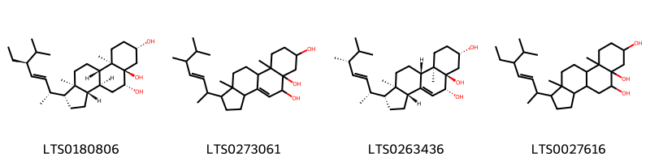{ width=100% }
    <figcaption>Hình ảnh cấu trúc hóa học của 4 hoạt chất thuộc nhóm Steroids and steroid derivatives gồm ['(1r,3as,3bs,5r,5ar,7s,9ar,9bs,11ar)-1-[(2r,3e,5s)-5-ethyl-6-methylhept-3-en-2-yl]-9a,11a-dimethyl-tetradecahydrocyclopenta[a]phenanthrene-5,5a,7-triol (LTS0180806)', '1-(5,6-dimethylhept-3-en-2-yl)-9a,11a-dimethyl-1h,2h,3h,3ah,5h,6h,7h,8h,9h,9bh,10h,11h-cyclopenta[a]phenanthrene-5,5a,7-triol (LTS0273061)', 'cerevisterol (LTS0263436)', '1-(5-ethyl-6-methylhept-3-en-2-yl)-9a,11a-dimethyl-tetradecahydrocyclopenta[a]phenanthrene-5,5a,7-triol (LTS0027616)'].</figcaption>
</figure>

---

### Dược dân tộc học

Danh sách các quốc gia có sử dụng *Bupleurum falcatum* trong điều trị các bệnh. 

| Country   | Disease                       | Bệnh                                                                                                                                                                                                |
|:----------|:------------------------------|:----------------------------------------------------------------------------------------------------------------------------------------------------------------------------------------------------|
| China     | Hemostat, Vermifuge, Antidote | MYMEMORY WARNING: YOU USED ALL AVAILABLE FREE TRANSLATIONS FOR TODAY. NEXT AVAILABLE IN  07 HOURS 30 MINUTES 55 SECONDS VISIT HTTPS://MYMEMORY.TRANSLATED.NET/DOC/USAGELIMITS.PHP TO TRANSLATE MORE |
| Chinese   | Diaphoretic                   | MYMEMORY WARNING: YOU USED ALL AVAILABLE FREE TRANSLATIONS FOR TODAY. NEXT AVAILABLE IN  07 HOURS 30 MINUTES 53 SECONDS VISIT HTTPS://MYMEMORY.TRANSLATED.NET/DOC/USAGELIMITS.PHP TO TRANSLATE MORE |
| Japan*    | nan, nan, Sedative, Sedative  | MYMEMORY WARNING: YOU USED ALL AVAILABLE FREE TRANSLATIONS FOR TODAY. NEXT AVAILABLE IN  07 HOURS 30 MINUTES 50 SECONDS VISIT HTTPS://MYMEMORY.TRANSLATED.NET/DOC/USAGELIMITS.PHP TO TRANSLATE MORE |

---

---
## Bupleurum octoradiatum
### Thông tin về thực vật

!!! info "Phân loại thực vật của *Bupleurum chinense* từ GIBF:"
    - **Kingdom:** Plantae
    - **Phylum:** Tracheophyta
    - **Order:** Apiales
    - **Family:** Apiaceae
    - **Genus:** Bupleurum
    - **Species:** *Bupleurum chinense*

 

| Label (VI)   | Label (EN)   | Scientific Name        | Descriptions (VI)   | Descriptions (EN)   | Also Known As (VI)   | Also Known As (EN)   |
|:-------------|:-------------|:-----------------------|:--------------------|:--------------------|:---------------------|:---------------------|
| N/A          | N/A          | Bupleurum octoradiatum |                     |                     | ['']                 | ['']                 |

#### Phân bố trên thế giới

**Từ CSDL GIBF** nan, China

#### Phân bố tại Việt Nam

**Từ CSDL GIBF**: Không có ghi nhận ở Việt Nam

---
### Thành phần hóa học
        
- Theo cơ sở dữ liệu lotus: Từ loài *Bupleurum chinense* đã phân lập và xác định được Chưa có hoạt chất nào được phân lập. hoạt chất thuộc về các nhóm Không có hoạt chất nào được phân lập. 

Không có hình ảnh nào được tạo ra

---

### Dược dân tộc học

Danh sách các quốc gia có sử dụng *Bupleurum chinense* trong điều trị các bệnh. 

| Country   | Disease     | Bệnh                                                                                                                                                                                                |
|:----------|:------------|:----------------------------------------------------------------------------------------------------------------------------------------------------------------------------------------------------|
| China     | Carminative | MYMEMORY WARNING: YOU USED ALL AVAILABLE FREE TRANSLATIONS FOR TODAY. NEXT AVAILABLE IN  07 HOURS 30 MINUTES 24 SECONDS VISIT HTTPS://MYMEMORY.TRANSLATED.NET/DOC/USAGELIMITS.PHP TO TRANSLATE MORE |

---

---
## Bupleurum rotundifolium
### Thông tin về thực vật

!!! info "Phân loại thực vật của *Bupleurum rotundifolium* từ GIBF:"
    - **Kingdom:** Plantae
    - **Phylum:** Tracheophyta
    - **Order:** Apiales
    - **Family:** Apiaceae
    - **Genus:** Bupleurum
    - **Species:** *Bupleurum rotundifolium*

 

| Label (VI)   | Label (EN)   | Scientific Name         | Descriptions (VI)   | Descriptions (EN)   | Also Known As (VI)   | Also Known As (EN)   |
|:-------------|:-------------|:------------------------|:--------------------|:--------------------|:---------------------|:---------------------|
| N/A          | N/A          | Bupleurum rotundifolium | loài thực vật       | species of plant    | ['']                 | ['']                 |

#### Phân bố trên thế giới

**Từ CSDL GIBF** Italy, Moldova, Republic of, Slovakia, Belgium, Georgia, Norway, Ukraine, Denmark, Netherlands, Luxembourg, Spain, Hungary, Russian Federation, United States of America, Sweden, Czechia, Germany, Romania, Switzerland, Armenia, Austria, France, United Kingdom of Great Britain and Northern Ireland, Ireland

#### Phân bố tại Việt Nam

**Từ CSDL GIBF**: Không có ghi nhận ở Việt Nam

---
### Thành phần hóa học
        
- Theo cơ sở dữ liệu lotus: Từ loài *Bupleurum rotundifolium* đã phân lập và xác định được 110 hoạt chất thuộc về các nhóm Flavonoids, Prenol lipids. 

|    | chemicalTaxonomyClassyfireClass   |   smiles_count |
|---:|:----------------------------------|---------------:|
|  0 | Flavonoids                        |             16 |
|  1 | Prenol lipids                     |             94 |

#### Nhóm Flavonoids
<figure markdown="span">
    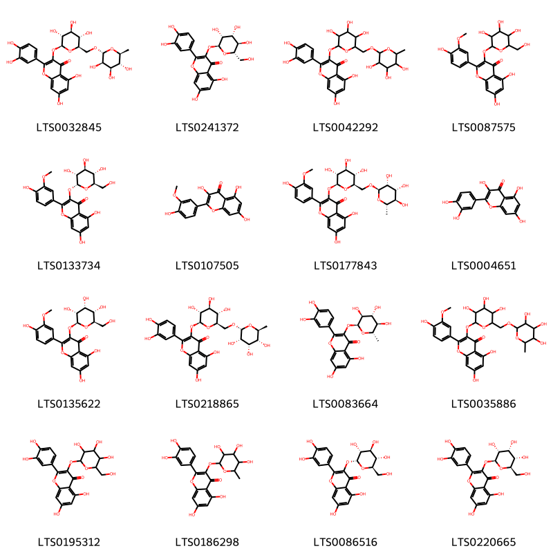{ width=100% }
    <figcaption>Hình ảnh cấu trúc hóa học của 16 hoạt chất thuộc nhóm Flavonoids gồm ['3-rutinosyl quercetin (LTS0032845)', '2-(3,4-dihydroxyphenyl)-5,7-dihydroxy-3-{[(2s,3r,4r,5r,6s)-3,4,5-trihydroxy-6-(hydroxymethyl)oxan-2-yl]oxy}chromen-4-one (LTS0241372)', 'rutin (LTS0042292)', 'isorhamnetin 3-galactoside (LTS0087575)', '5,7-dihydroxy-2-(4-hydroxy-3-methoxyphenyl)-3-{[(2r,3r,4s,5s,6r)-3,4,5-trihydroxy-6-(hydroxymethyl)oxan-2-yl]oxy}chromen-4-one (LTS0133734)', 'isorhamnetin (LTS0107505)', 'narcissin (LTS0177843)', 'quercetin (LTS0004651)', 'isorhamnetin 3-glucoside (LTS0135622)', '2-(3,4-dihydroxyphenyl)-5,7-dihydroxy-3-{[(2s,3r,4s,5s,6r)-3,4,5-trihydroxy-6-({[(2r,3s,4s,5r,6s)-3,4,5-trihydroxy-6-methyloxan-2-yl]oxy}methyl)oxan-2-yl]oxy}chromen-4-one (LTS0218865)', '2-(3,4-dihydroxyphenyl)-5,7-dihydroxy-3-{[(2s,3s,4r,5r,6s)-3,4,5-trihydroxy-6-methyloxan-2-yl]oxy}chromen-4-one (LTS0083664)', '5,7-dihydroxy-2-(4-hydroxy-3-methoxyphenyl)-3-[(3,4,5-trihydroxy-6-{[(3,4,5-trihydroxy-6-methyloxan-2-yl)oxy]methyl}oxan-2-yl)oxy]chromen-4-one (LTS0035886)', '2-(3,4-dihydroxyphenyl)-5,7-dihydroxy-3-{[3,4,5-trihydroxy-6-(hydroxymethyl)oxan-2-yl]oxy}chromen-4-one (LTS0195312)', 'quercitrin (LTS0186298)', '2-(3,4-dihydroxyphenyl)-5,7-dihydroxy-3-{[(2r,3r,4s,5s,6r)-3,4,5-trihydroxy-6-(hydroxymethyl)oxan-2-yl]oxy}chromen-4-one (LTS0086516)', '2-(3,4-dihydroxyphenyl)-5,7-dihydroxy-3-{[(2s,3r,4r,5s,6r)-3,4,5-trihydroxy-6-(hydroxymethyl)oxan-2-yl]oxy}chromen-4-one (LTS0220665)'].</figcaption>
</figure>
#### Nhóm Prenol lipids
<figure markdown="span">
    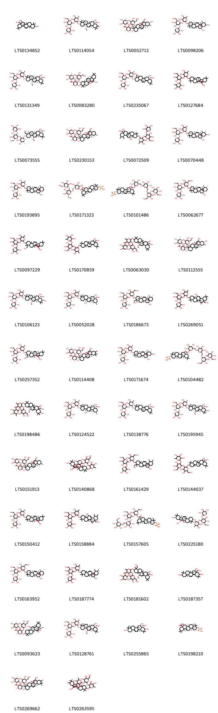{ width=100% }
    <figcaption>Hình ảnh cấu trúc hóa học của 94 hoạt chất thuộc nhóm Prenol lipids gồm ['8a-(hydroxymethyl)-4,4,6a,6b,11,11,14b-heptamethyl-1,2,3,4a,5,6,7,8,9,10,12,14a-dodecahydropicene-3,8-diol (LTS0134852)', '(4as,5r,6as,6br,8ar,10s,12as,12br,13s,14bs)-10-{[(2r,3r,4s,5r,6r)-3-{[(2s,3r,4s,5r,6r)-4,5-dihydroxy-6-(hydroxymethyl)-3-{[(2s,3r,4s,5r)-3,4,5-trihydroxyoxan-2-yl]oxy}oxan-2-yl]oxy}-4,5-dihydroxy-6-methyloxan-2-yl]oxy}-5-hydroxy-4a-(hydroxymethyl)-13-methoxy-2,2,6a,6b,9,9,12a-heptamethyl-4,5,6,7,8,8a,10,11,12,12b,13,14b-dodecahydro-1h-picen-3-one (LTS0114054)', '(2s,3r,4s,5s,6s)-2-{[(2s,3r,4s,5s,6r)-2-{[(2r,3r,4s,5r,6r)-2-{[(1s,2r,4s,5r,8r,10s,13s,14r,18r,19s,20s,21s)-2,21-dihydroxy-4,5,9,9,13,19,20-heptamethyl-24-oxahexacyclo[15.5.2.0¹,¹⁸.0⁴,¹⁷.0⁵,¹⁴.0⁸,¹³]tetracos-15-en-10-yl]oxy}-4,5-dihydroxy-6-methyloxan-3-yl]oxy}-4,5-dihydroxy-6-(hydroxymethyl)oxan-3-yl]oxy}-6-methyloxane-3,4,5-triol (LTS0052713)', '(2s,3r,4s,5r)-2-{[(2s,3r,4s,5s,6r)-2-{[(2r,3r,4s,5r,6r)-2-{[(1s,2r,4s,5r,8r,10s,13s,14r,17s,18r,19s,20s,21s)-2,21-dihydroxy-4,5,9,9,13,19,20-heptamethyl-24-oxahexacyclo[15.5.2.0¹,¹⁸.0⁴,¹⁷.0⁵,¹⁴.0⁸,¹³]tetracos-15-en-10-yl]oxy}-4,5-dihydroxy-6-methyloxan-3-yl]oxy}-4,5-dihydroxy-6-(hydroxymethyl)oxan-3-yl]oxy}oxane-3,4,5-triol (LTS0098206)', '(2s,3r,4s,5r)-2-{[(2s,3r,4s,5s,6r)-2-{[(2r,3r,4s,5r,6r)-2-{[(3s,4ar,6ar,6bs,8r,8as,12as,14s,14ar,14bs)-8-hydroxy-8a-(hydroxymethyl)-14-methoxy-4,4,6a,6b,11,11,14b-heptamethyl-1,2,3,4a,5,6,7,8,9,10,12,12a,14,14a-tetradecahydropicen-3-yl]oxy}-4,5-dihydroxy-6-methyloxan-3-yl]oxy}-4,5-dihydroxy-6-(hydroxymethyl)oxan-3-yl]oxy}oxane-3,4,5-triol (LTS0131349)', '(2s,3r,4r,5r,6s)-2-{[(2s,3r,4s,5s,6r)-2-{[(2r,3r,4s,5r,6r)-4,5-dihydroxy-2-{[(1s,2r,4s,5r,8r,10s,13s,14r,17s,18r)-2-hydroxy-4,5,9,9,13,20,20-heptamethyl-24-oxahexacyclo[15.5.2.0¹,¹⁸.0⁴,¹⁷.0⁵,¹⁴.0⁸,¹³]tetracos-15-en-10-yl]oxy}-6-methyloxan-3-yl]oxy}-4,5-dihydroxy-6-(hydroxymethyl)oxan-3-yl]oxy}-6-methyloxane-3,4,5-triol (LTS0083280)', '(2s,3r,4s,5r)-2-{[(2s,3r,4s,5s,6r)-2-{[(2r,3r,4s,5r,6r)-2-{[(3s,4r,4ar,6ar,6bs,8r,8as,14ar,14bs)-8-hydroxy-4,8a-bis(hydroxymethyl)-4,6a,6b,11,11,14b-hexamethyl-1,2,3,4a,5,6,7,8,9,10,12,14a-dodecahydropicen-3-yl]oxy}-4,5-dihydroxy-6-methyloxan-3-yl]oxy}-4,5-dihydroxy-6-(hydroxymethyl)oxan-3-yl]oxy}oxane-3,4,5-triol (LTS0235067)', '2-[(2-{[4,5-dihydroxy-2-({2-hydroxy-4,5,9,9,13,20,20-heptamethyl-24-oxahexacyclo[15.5.2.0¹,¹⁸.0⁴,¹⁷.0⁵,¹⁴.0⁸,¹³]tetracos-15-en-10-yl}oxy)-6-methyloxan-3-yl]oxy}-4,5-dihydroxy-6-(hydroxymethyl)oxan-3-yl)oxy]-6-methyloxane-3,4,5-triol (LTS0127684)', '(2s,3r,4s,5r)-2-{[(2s,3r,4s,5s,6r)-2-{[(2r,3r,4s,5r,6r)-2-{[(3s,4r,4ar,6ar,6bs,8r,8as,12as,14r,14ar,14bs)-8-hydroxy-4,8a-bis(hydroxymethyl)-14-methoxy-4,6a,6b,11,11,14b-hexamethyl-1,2,3,4a,5,6,7,8,9,10,12,12a,14,14a-tetradecahydropicen-3-yl]oxy}-4,5-dihydroxy-6-methyloxan-3-yl]oxy}-4,5-dihydroxy-6-(hydroxymethyl)oxan-3-yl]oxy}oxane-3,4,5-triol (LTS0073555)', '(2s,3r,4s,5s,6s)-2-{[(2s,3r,4s,5s,6r)-2-{[(2r,3r,4s,5r,6r)-4,5-dihydroxy-2-{[(1s,2r,4s,5r,8r,10s,13s,14r,18r,19s,20r)-2-hydroxy-4,5,9,9,13,19,20-heptamethyl-24-oxahexacyclo[15.5.2.0¹,¹⁸.0⁴,¹⁷.0⁵,¹⁴.0⁸,¹³]tetracos-15-en-10-yl]oxy}-6-methyloxan-3-yl]oxy}-4,5-dihydroxy-6-(hydroxymethyl)oxan-3-yl]oxy}-6-methyloxane-3,4,5-triol (LTS0230153)', '2-({2-[(2-{[8,14-dihydroxy-8a-(hydroxymethyl)-4,4,6a,6b,11,12,14b-heptamethyl-2,3,4a,5,6,7,8,9,10,11,12,12a,14,14a-tetradecahydro-1h-picen-3-yl]oxy}-4,5-dihydroxy-6-methyloxan-3-yl)oxy]-4,5-dihydroxy-6-(hydroxymethyl)oxan-3-yl}oxy)oxane-3,4,5-triol (LTS0072509)', '(2s,3r,4s,5r)-2-{[(2s,3r,4s,5s,6r)-2-{[(2r,3r,4s,5r,6r)-2-{[(1s,2r,4s,5r,8r,10s,13s,14r,17r,18r,19s,20s,21s)-2,21-dihydroxy-4,5,9,9,13,19,20-heptamethyl-24-oxahexacyclo[15.5.2.0¹,¹⁸.0⁴,¹⁷.0⁵,¹⁴.0⁸,¹³]tetracos-15-en-10-yl]oxy}-4,5-dihydroxy-6-methyloxan-3-yl]oxy}-4,5-dihydroxy-6-(hydroxymethyl)oxan-3-yl]oxy}oxane-3,4,5-triol (LTS0070448)', '(2s,3r,4s,5r)-2-{[(2s,3r,4s,5s,6r)-2-{[(2r,3r,4s,5r,6r)-4,5-dihydroxy-2-{[(1s,2r,4s,5r,8r,10s,13s,14r,18r,19s,20r)-2-hydroxy-4,5,9,9,13,19,20-heptamethyl-24-oxahexacyclo[15.5.2.0¹,¹⁸.0⁴,¹⁷.0⁵,¹⁴.0⁸,¹³]tetracos-15-en-10-yl]oxy}-6-methyloxan-3-yl]oxy}-4,5-dihydroxy-6-(hydroxymethyl)oxan-3-yl]oxy}oxane-3,4,5-triol (LTS0193895)', '[(3s,4ar,6ar,6bs,8r,8ar,12as,14ar,14br)-8a-({[(2s,3r,4s,5s,6r)-6-({[(2r,3r,4s,5s,6r)-4,5-dihydroxy-6-(hydroxymethyl)-3-{[(2s,3r,4s,5s,6r)-3,4,5-trihydroxy-6-(hydroxymethyl)oxan-2-yl]oxy}oxan-2-yl]oxy}methyl)-3,4,5-trihydroxyoxan-2-yl]oxy}carbonyl)-8-hydroxy-4,4,6a,6b,11,11,14b-heptamethyl-1,2,3,4a,5,6,7,8,9,10,12,12a,14,14a-tetradecahydropicen-3-yl]oxidanesulfonic acid (LTS0171323)', '[(3s,4ar,6ar,6br,8r,8ar,12as,12bs,14ar,14bs)-8a-({[(2s,3r,4s,5s,6r)-6-({[(2r,3r,4s,5s,6r)-6-({[(2r,3r,4s,5s,6r)-4,5-dihydroxy-6-(hydroxymethyl)-3-{[(2s,3r,4s,5s,6r)-3,4,5-trihydroxy-6-(hydroxymethyl)oxan-2-yl]oxy}oxan-2-yl]oxy}methyl)-3,4,5-trihydroxyoxan-2-yl]oxy}methyl)-3,4,5-trihydroxyoxan-2-yl]oxy}carbonyl)-8-hydroxy-4,4,6a,6b,11,11,14b-heptamethyl-1,2,3,4a,5,6,7,8,9,10,12,12a,12b,14a-tetradecahydropicen-3-yl]oxidanesulfonic acid (LTS0101486)', '(2s,3r,4s,5r)-2-{[(2s,3r,4s,5s,6r)-2-{[(2r,3r,4s,5r,6r)-4,5-dihydroxy-2-{[(1s,2r,4s,5r,8r,10s,13s,14r,18r,19s,20r)-2-hydroxy-4,5,9,9,13,19,20-heptamethyl-24-oxahexacyclo[15.5.2.0¹,¹⁸.0⁴,¹⁷.0⁵,¹⁴.0⁸,¹³]tetracos-15-en-10-yl]oxy}-6-(hydroxymethyl)oxan-3-yl]oxy}-4,5-dihydroxy-6-(hydroxymethyl)oxan-3-yl]oxy}oxane-3,4,5-triol (LTS0062677)', '2-({2-[(4,5-dihydroxy-2-{[2-hydroxy-9-(hydroxymethyl)-4,5,9,13,20,20-hexamethyl-24-oxahexacyclo[15.5.2.0¹,¹⁸.0⁴,¹⁷.0⁵,¹⁴.0⁸,¹³]tetracos-15-en-10-yl]oxy}-6-methyloxan-3-yl)oxy]-4,5-dihydroxy-6-(hydroxymethyl)oxan-3-yl}oxy)oxane-3,4,5-triol (LTS0097229)', '2-({2-[(4,5-dihydroxy-2-{[8-hydroxy-8a-(hydroxymethyl)-4,4,6a,6b,11,11,14b-heptamethyl-1,2,3,4a,5,6,7,8,9,10,12,14a-dodecahydropicen-3-yl]oxy}-6-methyloxan-3-yl)oxy]-4,5-dihydroxy-6-(hydroxymethyl)oxan-3-yl}oxy)-6-methyloxane-3,4,5-triol (LTS0170859)', '2-({2-[(4,5-dihydroxy-2-{[8-hydroxy-8a-(hydroxymethyl)-14-methoxy-4,4,6a,6b,11,11,14b-heptamethyl-1,2,3,4a,5,6,7,8,9,10,12,12a,14,14a-tetradecahydropicen-3-yl]oxy}-6-methyloxan-3-yl)oxy]-4,5-dihydroxy-6-(hydroxymethyl)oxan-3-yl}oxy)oxane-3,4,5-triol (LTS0063030)', '(2s,3r,4s,5s,6s)-2-{[(2s,3r,4s,5s,6r)-2-{[(2r,3r,4s,5r,6r)-2-{[(1s,2r,4s,5r,8r,10s,13s,14r,17r,18r,19s,20s,21s)-2,21-dihydroxy-4,5,9,9,13,19,20-heptamethyl-24-oxahexacyclo[15.5.2.0¹,¹⁸.0⁴,¹⁷.0⁵,¹⁴.0⁸,¹³]tetracos-15-en-10-yl]oxy}-4,5-dihydroxy-6-methyloxan-3-yl]oxy}-4,5-dihydroxy-6-(hydroxymethyl)oxan-3-yl]oxy}-6-methyloxane-3,4,5-triol (LTS0112555)', '(2s,3r,4s,5r)-2-{[(2s,3r,4s,5s,6r)-2-{[(2r,3r,4s,5r,6r)-2-{[(3s,4ar,6ar,6bs,8r,8as,10r,12as,14s,14ar,14bs)-8,10-dihydroxy-8a-(hydroxymethyl)-14-methoxy-4,4,6a,6b,11,11,14b-heptamethyl-1,2,3,4a,5,6,7,8,9,10,12,12a,14,14a-tetradecahydropicen-3-yl]oxy}-4,5-dihydroxy-6-methyloxan-3-yl]oxy}-4,5-dihydroxy-6-(hydroxymethyl)oxan-3-yl]oxy}oxane-3,4,5-triol (LTS0106123)', '(2s,3r,4r,5r,6s)-2-{[(2s,3r,4s,5s,6r)-2-{[(2r,3r,4s,5r,6r)-2-{[(3s,4ar,6ar,6bs,8r,8as,11r,12s,12as,14s,14ar,14bs)-8,14-dihydroxy-8a-(hydroxymethyl)-4,4,6a,6b,11,12,14b-heptamethyl-2,3,4a,5,6,7,8,9,10,11,12,12a,14,14a-tetradecahydro-1h-picen-3-yl]oxy}-4,5-dihydroxy-6-methyloxan-3-yl]oxy}-4,5-dihydroxy-6-(hydroxymethyl)oxan-3-yl]oxy}-6-methyloxane-3,4,5-triol (LTS0052028)', '(2s,3r,4s,5r)-2-{[(2s,3r,4s,5s,6r)-2-{[(2r,3r,4s,5r,6r)-4,5-dihydroxy-2-{[(2r,4s,5r,8r,9r,10s,13s,14r,17r,18r,19s,20r)-2-hydroxy-9-(hydroxymethyl)-4,5,9,13,19,20-hexamethyl-24-oxahexacyclo[15.5.2.0¹,¹⁸.0⁴,¹⁷.0⁵,¹⁴.0⁸,¹³]tetracos-15-en-10-yl]oxy}-6-(hydroxymethyl)oxan-3-yl]oxy}-4,5-dihydroxy-6-(hydroxymethyl)oxan-3-yl]oxy}oxane-3,4,5-triol (LTS0186673)', '2-({2-[(4,5-dihydroxy-2-{[12-hydroxy-4a-(hydroxymethyl)-2,2,5b,5c,8,8,11a-heptamethyl-1h,3h,4h,4bh,5ah,6h,7h,7ah,9h,10h,11h,11bh,12h,13bh-piceno[5,6-b]oxiren-9-yl]oxy}-6-methyloxan-3-yl)oxy]-4,5-dihydroxy-6-(hydroxymethyl)oxan-3-yl}oxy)oxane-3,4,5-triol (LTS0269051)', '(2s,3r,4s,5r)-2-{[(2s,3r,4s,5s,6r)-2-{[(2r,3r,4s,5r,6r)-4,5-dihydroxy-2-{[(1s,2r,4s,5r,8r,9r,10s,13s,14r,17s,18r)-2-hydroxy-9-(hydroxymethyl)-4,5,9,13,20,20-hexamethyl-24-oxahexacyclo[15.5.2.0¹,¹⁸.0⁴,¹⁷.0⁵,¹⁴.0⁸,¹³]tetracos-15-en-10-yl]oxy}-6-methyloxan-3-yl]oxy}-4,5-dihydroxy-6-(hydroxymethyl)oxan-3-yl]oxy}oxane-3,4,5-triol (LTS0257352)', '(1s,2r,4s,5r,8r,10s,13s,14r,17r,18r)-10-{[(2r,3r,4s,5r,6r)-3-{[(2s,3r,4s,5s,6r)-4,5-dihydroxy-6-(hydroxymethyl)-3-{[(2s,3r,4s,5s,6s)-3,4,5-trihydroxy-6-methyloxan-2-yl]oxy}oxan-2-yl]oxy}-4,5-dihydroxy-6-methyloxan-2-yl]oxy}-2-hydroxy-4,5,9,9,13,20,20-heptamethyl-24-oxahexacyclo[15.5.2.0¹,¹⁸.0⁴,¹⁷.0⁵,¹⁴.0⁸,¹³]tetracos-15-en-21-one (LTS0114408)', '(2s,3r,4s,5r)-2-{[(2s,3r,4s,5s,6r)-2-{[(2r,3r,4s,5r,6r)-2-{[(1s,2r,4s,5r,8r,10s,13s,14r,18r,19s,20s,21s)-2,21-dihydroxy-4,5,9,9,13,19,20-heptamethyl-24-oxahexacyclo[15.5.2.0¹,¹⁸.0⁴,¹⁷.0⁵,¹⁴.0⁸,¹³]tetracos-15-en-10-yl]oxy}-4,5-dihydroxy-6-methyloxan-3-yl]oxy}-4,5-dihydroxy-6-(hydroxymethyl)oxan-3-yl]oxy}oxane-3,4,5-triol (LTS0171674)', '[(3s,4ar,6ar,6bs,8r,8ar,12as,14ar,14br)-8a-({[(2s,3r,4s,5s,6r)-6-({[(2r,3r,4s,5s,6r)-6-({[(2r,3r,4s,5s,6r)-4,5-dihydroxy-6-(hydroxymethyl)-3-{[(2s,3r,4s,5s,6r)-3,4,5-trihydroxy-6-(hydroxymethyl)oxan-2-yl]oxy}oxan-2-yl]oxy}methyl)-3,4,5-trihydroxyoxan-2-yl]oxy}methyl)-3,4,5-trihydroxyoxan-2-yl]oxy}carbonyl)-8-hydroxy-4,4,6a,6b,11,11,14b-heptamethyl-1,2,3,4a,5,6,7,8,9,10,12,12a,14,14a-tetradecahydropicen-3-yl]oxidanesulfonic acid (LTS0104482)', '2-({2-[(2-{[8,10-dihydroxy-8a-(hydroxymethyl)-14-methoxy-4,4,6a,6b,11,11,14b-heptamethyl-1,2,3,4a,5,6,7,8,9,10,12,12a,14,14a-tetradecahydropicen-3-yl]oxy}-4,5-dihydroxy-6-methyloxan-3-yl)oxy]-4,5-dihydroxy-6-(hydroxymethyl)oxan-3-yl}oxy)-6-methyloxane-3,4,5-triol (LTS0198486)', '(2s,3r,4s,5r)-2-{[(2s,3r,4s,5s,6r)-2-{[(2r,3r,4s,5r,6r)-2-{[(3s,4ar,6ar,6bs,8r,8as,11r,12s,12as,14s,14ar,14bs)-8,14-dihydroxy-8a-(hydroxymethyl)-4,4,6a,6b,11,12,14b-heptamethyl-2,3,4a,5,6,7,8,9,10,11,12,12a,14,14a-tetradecahydro-1h-picen-3-yl]oxy}-4,5-dihydroxy-6-methyloxan-3-yl]oxy}-4,5-dihydroxy-6-(hydroxymethyl)oxan-3-yl]oxy}oxane-3,4,5-triol (LTS0124522)', '(2s,3r,4s,5r)-2-{[(2s,3r,4s,5s,6r)-2-{[(2r,3r,4s,5r,6r)-2-{[(3s,4ar,6ar,6bs,8r,8as,14ar,14bs)-8-hydroxy-8a-(hydroxymethyl)-4,4,6a,6b,11,11,14b-heptamethyl-1,2,3,4a,5,6,7,8,9,10,12,14a-dodecahydropicen-3-yl]oxy}-4,5-dihydroxy-6-methyloxan-3-yl]oxy}-4,5-dihydroxy-6-(hydroxymethyl)oxan-3-yl]oxy}oxane-3,4,5-triol (LTS0138776)', '(2s,3r,4r,5r,6s)-2-{[(2s,3r,4s,5s,6r)-2-{[(2r,3r,4s,5r,6r)-2-{[(3s,4ar,6ar,6bs,8r,8as,10r,12as,14r,14ar,14bs)-8,10-dihydroxy-8a-(hydroxymethyl)-14-methoxy-4,4,6a,6b,11,11,14b-heptamethyl-1,2,3,4a,5,6,7,8,9,10,12,12a,14,14a-tetradecahydropicen-3-yl]oxy}-4,5-dihydroxy-6-methyloxan-3-yl]oxy}-4,5-dihydroxy-6-(hydroxymethyl)oxan-3-yl]oxy}-6-methyloxane-3,4,5-triol (LTS0195945)', '(2s,3r,4s,5s,6s)-2-{[(2s,3r,4s,5s,6r)-2-{[(2r,3r,4s,5r,6r)-4,5-dihydroxy-2-{[(1s,2r,4s,5r,8r,10s,13s,14r,17r,18r,19s,20r)-2-hydroxy-4,5,9,9,13,19,20-heptamethyl-24-oxahexacyclo[15.5.2.0¹,¹⁸.0⁴,¹⁷.0⁵,¹⁴.0⁸,¹³]tetracos-15-en-10-yl]oxy}-6-methyloxan-3-yl]oxy}-4,5-dihydroxy-6-(hydroxymethyl)oxan-3-yl]oxy}-6-methyloxane-3,4,5-triol (LTS0151913)', '2-[(2-{[2-({2,21-dihydroxy-4,5,9,9,13,20,20-heptamethyl-24-oxahexacyclo[15.5.2.0¹,¹⁸.0⁴,¹⁷.0⁵,¹⁴.0⁸,¹³]tetracos-15-en-10-yl}oxy)-4,5-dihydroxy-6-methyloxan-3-yl]oxy}-4,5-dihydroxy-6-(hydroxymethyl)oxan-3-yl)oxy]oxane-3,4,5-triol (LTS0140868)', '2-({2-[(4,5-dihydroxy-2-{[2-hydroxy-9-(hydroxymethyl)-4,5,9,13,19,20-hexamethyl-24-oxahexacyclo[15.5.2.0¹,¹⁸.0⁴,¹⁷.0⁵,¹⁴.0⁸,¹³]tetracos-15-en-10-yl]oxy}-6-(hydroxymethyl)oxan-3-yl)oxy]-4,5-dihydroxy-6-(hydroxymethyl)oxan-3-yl}oxy)oxane-3,4,5-triol (LTS0161429)', '2-({2-[(4,5-dihydroxy-2-{[8-hydroxy-8a-(hydroxymethyl)-4,4,6a,6b,11,11,14b-heptamethyl-1,2,3,4a,5,6,7,8,9,10,12,12a,14,14a-tetradecahydropicen-3-yl]oxy}-6-(hydroxymethyl)oxan-3-yl)oxy]-4,5-dihydroxy-6-(hydroxymethyl)oxan-3-yl}oxy)-6-methyloxane-3,4,5-triol (LTS0144037)', '(2s,3r,4s,5r)-2-{[(2s,3r,4s,5s,6r)-2-{[(2r,3r,4s,5r,6r)-4,5-dihydroxy-2-{[(1s,2r,4s,5r,8r,10s,13s,14r,17s,18r)-2-hydroxy-4,5,9,9,13,20,20-heptamethyl-24-oxahexacyclo[15.5.2.0¹,¹⁸.0⁴,¹⁷.0⁵,¹⁴.0⁸,¹³]tetracos-15-en-10-yl]oxy}-6-methyloxan-3-yl]oxy}-4,5-dihydroxy-6-(hydroxymethyl)oxan-3-yl]oxy}oxane-3,4,5-triol (LTS0150412)', '2-({2-[(4,5-dihydroxy-2-{[12-hydroxy-4a-(hydroxymethyl)-1,2,5b,5c,8,8,11a-heptamethyl-1h,2h,3h,4h,4bh,5ah,6h,7h,7ah,9h,10h,11h,11bh,12h,13bh-piceno[5,6-b]oxiren-9-yl]oxy}-6-methyloxan-3-yl)oxy]-4,5-dihydroxy-6-(hydroxymethyl)oxan-3-yl}oxy)oxane-3,4,5-triol (LTS0158884)', '[(3s,4ar,6ar,6bs,8as,12as,14ar,14br)-8a-({[(2s,3r,4s,5s,6r)-3-{[(2s,3r,4s,5s,6r)-4,5-dihydroxy-6-(hydroxymethyl)-3-{[(2s,3r,4s,5s,6r)-3,4,5-trihydroxy-6-({[(2r,3r,4s,5s,6r)-3,4,5-trihydroxy-6-(hydroxymethyl)oxan-2-yl]oxy}methyl)oxan-2-yl]oxy}oxan-2-yl]oxy}-4,5-dihydroxy-6-(hydroxymethyl)oxan-2-yl]oxy}carbonyl)-4,4,6a,6b,11,11,14b-heptamethyl-1,2,3,4a,5,6,7,8,9,10,12,12a,14,14a-tetradecahydropicen-3-yl]oxidanesulfonic acid (LTS0157605)', '(2s,3r,4s,5r)-2-{[(2s,3r,4s,5s,6r)-2-{[(2r,3r,4s,5r,6r)-2-{[(1s,2r,4s,5r,8r,10s,13s,14r,17s,18r,21r)-2,21-dihydroxy-4,5,9,9,13,20,20-heptamethyl-24-oxahexacyclo[15.5.2.0¹,¹⁸.0⁴,¹⁷.0⁵,¹⁴.0⁸,¹³]tetracos-15-en-10-yl]oxy}-4,5-dihydroxy-6-methyloxan-3-yl]oxy}-4,5-dihydroxy-6-(hydroxymethyl)oxan-3-yl]oxy}oxane-3,4,5-triol (LTS0225180)', 'rotundifolioside a (LTS0163952)', '2-[(2-{[4,5-dihydroxy-2-({2-hydroxy-4,5,9,9,13,19,20-heptamethyl-24-oxahexacyclo[15.5.2.0¹,¹⁸.0⁴,¹⁷.0⁵,¹⁴.0⁸,¹³]tetracos-15-en-10-yl}oxy)-6-methyloxan-3-yl]oxy}-4,5-dihydroxy-6-(hydroxymethyl)oxan-3-yl)oxy]oxane-3,4,5-triol (LTS0187774)', '2-({2-[(4,5-dihydroxy-2-{[8-hydroxy-4,8a-bis(hydroxymethyl)-14-methoxy-4,6a,6b,11,11,14b-hexamethyl-1,2,3,4a,5,6,7,8,9,10,12,12a,14,14a-tetradecahydropicen-3-yl]oxy}-6-methyloxan-3-yl)oxy]-4,5-dihydroxy-6-(hydroxymethyl)oxan-3-yl}oxy)oxane-3,4,5-triol (LTS0181602)', '4a-(hydroxymethyl)-2,2,6a,6b,9,9,12a-heptamethyl-1,3,4,5,6,7,8,8a,10,11,12,12b-dodecahydropicene-3,5,10-triol (LTS0187357)', '(2s,3r,4s,5s,6s)-2-{[(2s,3r,4s,5s,6r)-2-{[(2r,3r,4s,5r,6r)-2-{[(4as,4bs,5ar,5bs,5cr,7ar,9s,11as,11br,12s,13bs)-12-hydroxy-4a-(hydroxymethyl)-2,2,5b,5c,8,8,11a-heptamethyl-1h,3h,4h,4bh,5ah,6h,7h,7ah,9h,10h,11h,11bh,12h,13bh-piceno[5,6-b]oxiren-9-yl]oxy}-4,5-dihydroxy-6-methyloxan-3-yl]oxy}-4,5-dihydroxy-6-(hydroxymethyl)oxan-3-yl]oxy}-6-methyloxane-3,4,5-triol (LTS0093623)', '(2s,3r,4s,5r)-2-{[(2s,3r,4s,5s,6r)-2-{[(2r,3r,4s,5r,6r)-2-{[(3s,4ar,6ar,6bs,8r,8as,12as,14r,14ar,14bs)-8-hydroxy-8a-(hydroxymethyl)-14-methoxy-4,4,6a,6b,11,11,14b-heptamethyl-1,2,3,4a,5,6,7,8,9,10,12,12a,14,14a-tetradecahydropicen-3-yl]oxy}-4,5-dihydroxy-6-methyloxan-3-yl]oxy}-4,5-dihydroxy-6-(hydroxymethyl)oxan-3-yl]oxy}oxane-3,4,5-triol (LTS0128761)', '(3r,4as,5r,6ar,6bs,8ar,10s,12as,14bs)-4a-(hydroxymethyl)-2,2,6a,6b,9,9,12a-heptamethyl-1,3,4,5,6,7,8,8a,10,11,12,14b-dodecahydropicene-3,5,10-triol (LTS0255865)', '(4ar,5r,6as,6br,8ar,10s,12ar,12br,14bs)-5-hydroxy-2,2,6a,6b,9,9,12a-heptamethyl-10-(sulfooxy)-1,3,4,5,6,7,8,8a,10,11,12,12b,13,14b-tetradecahydropicene-4a-carboxylic acid (LTS0198210)', '(1s,2r,4s,5r,8r,10s,13s,14r,17s,18r)-10-{[(2r,3r,4s,5r,6r)-3-{[(2s,3r,4s,5s,6r)-4,5-dihydroxy-6-(hydroxymethyl)-3-{[(2s,3r,4r,5r,6s)-3,4,5-trihydroxy-6-methyloxan-2-yl]oxy}oxan-2-yl]oxy}-4,5-dihydroxy-6-methyloxan-2-yl]oxy}-2-hydroxy-4,5,9,9,13,20,20-heptamethyl-24-oxahexacyclo[15.5.2.0¹,¹⁸.0⁴,¹⁷.0⁵,¹⁴.0⁸,¹³]tetracos-15-en-21-one (LTS0269662)', '10-[(3-{[4,5-dihydroxy-6-(hydroxymethyl)-3-[(3,4,5-trihydroxy-6-methyloxan-2-yl)oxy]oxan-2-yl]oxy}-4,5-dihydroxy-6-methyloxan-2-yl)oxy]-2-hydroxy-4,5,9,9,13,20,20-heptamethyl-24-oxahexacyclo[15.5.2.0¹,¹⁸.0⁴,¹⁷.0⁵,¹⁴.0⁸,¹³]tetracos-15-en-21-one (LTS0263595)', '(2s,3r,4s,5s,6s)-2-{[(2s,3r,4s,5s,6r)-2-{[(2r,3r,4s,5r,6r)-2-{[(3s,4ar,6ar,6bs,8r,8as,10r,12as,14s,14ar,14bs)-8,10-dihydroxy-8a-(hydroxymethyl)-14-methoxy-4,4,6a,6b,11,11,14b-heptamethyl-1,2,3,4a,5,6,7,8,9,10,12,12a,14,14a-tetradecahydropicen-3-yl]oxy}-4,5-dihydroxy-6-methyloxan-3-yl]oxy}-4,5-dihydroxy-6-(hydroxymethyl)oxan-3-yl]oxy}-6-methyloxane-3,4,5-triol (LTS0265201)', '(2s,3r,4s,5r)-2-{[(2s,3r,4s,5s,6r)-2-{[(2r,3r,4s,5r,6r)-2-{[(1s,2r,4as,4bs,5ar,5bs,5cr,7ar,9s,11as,11br,12s,13bs)-12-hydroxy-4a-(hydroxymethyl)-1,2,5b,5c,8,8,11a-heptamethyl-1h,2h,3h,4h,4bh,5ah,6h,7h,7ah,9h,10h,11h,11bh,12h,13bh-piceno[5,6-b]oxiren-9-yl]oxy}-4,5-dihydroxy-6-methyloxan-3-yl]oxy}-4,5-dihydroxy-6-(hydroxymethyl)oxan-3-yl]oxy}oxane-3,4,5-triol (LTS0270327)', '(2s,3r,4s,5s,6s)-2-{[(2s,3r,4s,5r,6r)-2-{[(2r,3r,4s,5r,6r)-2-{[(1s,2r,4s,5r,8r,10s,13s,14r,17r,18r,21r)-2,21-dihydroxy-4,5,9,9,13,20,20-heptamethyl-24-oxahexacyclo[15.5.2.0¹,¹⁸.0⁴,¹⁷.0⁵,¹⁴.0⁸,¹³]tetracos-15-en-10-yl]oxy}-4,5-dihydroxy-6-methyloxan-3-yl]oxy}-4,5-dihydroxy-6-(hydroxymethyl)oxan-3-yl]oxy}-6-methyloxane-3,4,5-triol (LTS0057967)', '2-[(2-{[4,5-dihydroxy-2-({2-hydroxy-4,5,9,9,13,20,20-heptamethyl-24-oxahexacyclo[15.5.2.0¹,¹⁸.0⁴,¹⁷.0⁵,¹⁴.0⁸,¹³]tetracos-15-en-10-yl}oxy)-6-methyloxan-3-yl]oxy}-4,5-dihydroxy-6-(hydroxymethyl)oxan-3-yl)oxy]oxane-3,4,5-triol (LTS0222920)', '2-({2-[(4,5-dihydroxy-2-{[8-hydroxy-8a-(hydroxymethyl)-14-methoxy-4,4,6a,6b,11,11,14b-heptamethyl-1,2,3,4a,5,6,7,8,9,10,12,12a,14,14a-tetradecahydropicen-3-yl]oxy}-6-methyloxan-3-yl)oxy]-4,5-dihydroxy-6-(hydroxymethyl)oxan-3-yl}oxy)-6-methyloxane-3,4,5-triol (LTS0237025)', '(2s,3r,4r,5r,6s)-2-{[(2s,3r,4s,5s,6r)-2-{[(2r,3r,4s,5r,6r)-2-{[(4as,4bs,5ar,5bs,5cr,7ar,9s,11as,11br,12r,13bs)-12-hydroxy-4a-(hydroxymethyl)-2,2,5b,5c,8,8,11a-heptamethyl-1h,3h,4h,4bh,5ah,6h,7h,7ah,9h,10h,11h,11bh,12h,13bh-piceno[5,6-b]oxiren-9-yl]oxy}-4,5-dihydroxy-6-methyloxan-3-yl]oxy}-4,5-dihydroxy-6-(hydroxymethyl)oxan-3-yl]oxy}-6-methyloxane-3,4,5-triol (LTS0203279)', '2-[(2-{[2-({2,21-dihydroxy-4,5,9,9,13,20,20-heptamethyl-24-oxahexacyclo[15.5.2.0¹,¹⁸.0⁴,¹⁷.0⁵,¹⁴.0⁸,¹³]tetracos-15-en-10-yl}oxy)-4,5-dihydroxy-6-methyloxan-3-yl]oxy}-4,5-dihydroxy-6-(hydroxymethyl)oxan-3-yl)oxy]-6-methyloxane-3,4,5-triol (LTS0209961)', '2-({2-[(4,5-dihydroxy-2-{[8-hydroxy-4,8a-bis(hydroxymethyl)-4,6a,6b,11,11,14b-hexamethyl-1,2,3,4a,5,6,7,8,9,10,12,14a-dodecahydropicen-3-yl]oxy}-6-methyloxan-3-yl)oxy]-4,5-dihydroxy-6-(hydroxymethyl)oxan-3-yl}oxy)oxane-3,4,5-triol (LTS0262213)', 'rotundifolioside h (LTS0056722)', '(2s,3r,4s,5r)-2-{[(2s,3r,4s,5s,6r)-2-{[(2r,3r,4s,5r,6r)-4,5-dihydroxy-2-{[(1s,2r,4s,5r,8r,9r,10s,13s,14r,17r,18r,19s,20r)-2-hydroxy-9-(hydroxymethyl)-4,5,9,13,19,20-hexamethyl-24-oxahexacyclo[15.5.2.0¹,¹⁸.0⁴,¹⁷.0⁵,¹⁴.0⁸,¹³]tetracos-15-en-10-yl]oxy}-6-methyloxan-3-yl]oxy}-4,5-dihydroxy-6-(hydroxymethyl)oxan-3-yl]oxy}oxane-3,4,5-triol (LTS0083935)', '(1s,2r,4s,5r,8r,10s,13s,14r,18r)-10-{[(2r,3r,4s,5r,6r)-3-{[(2s,3r,4s,5s,6r)-4,5-dihydroxy-6-(hydroxymethyl)-3-{[(2s,3r,4s,5s,6s)-3,4,5-trihydroxy-6-methyloxan-2-yl]oxy}oxan-2-yl]oxy}-4,5-dihydroxy-6-methyloxan-2-yl]oxy}-2-hydroxy-4,5,9,9,13,20,20-heptamethyl-24-oxahexacyclo[15.5.2.0¹,¹⁸.0⁴,¹⁷.0⁵,¹⁴.0⁸,¹³]tetracos-15-en-21-one (LTS0227928)', '(2s,3r,4s,5r)-2-{[(2s,3r,4s,5s,6r)-2-{[(2r,3r,4s,5r,6r)-4,5-dihydroxy-2-{[(2r,4s,5r,8r,9r,10s,13s,14r,17r,18r,19s,20r)-2-hydroxy-9-(hydroxymethyl)-4,5,9,13,19,20-hexamethyl-24-oxahexacyclo[15.5.2.0¹,¹⁸.0⁴,¹⁷.0⁵,¹⁴.0⁸,¹³]tetracos-15-en-10-yl]oxy}-6-methyloxan-3-yl]oxy}-4,5-dihydroxy-6-(hydroxymethyl)oxan-3-yl]oxy}oxane-3,4,5-triol (LTS0044989)', '[(3s,4ar,6ar,6bs,8as,12as,14ar,14br)-8a-({[(2s,3r,4s,5s,6r)-6-({[(2r,3r,4s,5s,6r)-4,5-dihydroxy-6-(hydroxymethyl)-3-{[(2s,3r,4s,5s,6r)-3,4,5-trihydroxy-6-({[(2r,3r,4s,5s,6r)-3,4,5-trihydroxy-6-(hydroxymethyl)oxan-2-yl]oxy}methyl)oxan-2-yl]oxy}oxan-2-yl]oxy}methyl)-3,4,5-trihydroxyoxan-2-yl]oxy}carbonyl)-4,4,6a,6b,11,11,14b-heptamethyl-1,2,3,4a,5,6,7,8,9,10,12,12a,14,14a-tetradecahydropicen-3-yl]oxidanesulfonic acid (LTS0243029)', '[(3s,4ar,6ar,6br,8r,8ar,12as,12bs,14ar,14bs)-8-hydroxy-4,4,6a,6b,11,11,14b-heptamethyl-8a-({[(2s,3r,4s,5r,6r)-3,4,5-trihydroxy-6-({[(2r,3r,4s,5r,6r)-3,4,5-trihydroxy-6-({[(2r,3r,4s,5r,6r)-3,4,5-trihydroxy-6-(hydroxymethyl)oxan-2-yl]oxy}methyl)oxan-2-yl]oxy}methyl)oxan-2-yl]oxy}carbonyl)-1,2,3,4a,5,6,7,8,9,10,12,12a,12b,14a-tetradecahydropicen-3-yl]oxidanesulfonic acid (LTS0203626)', '(2s,3r,4s,5r)-2-{[(2s,3r,4s,5s,6r)-2-{[(2r,3r,4s,5r,6r)-2-{[(3s,4r,4ar,6ar,6bs,8r,8as,12as,14s,14ar,14bs)-8-hydroxy-4,8a-bis(hydroxymethyl)-14-methoxy-4,6a,6b,11,11,14b-hexamethyl-1,2,3,4a,5,6,7,8,9,10,12,12a,14,14a-tetradecahydropicen-3-yl]oxy}-4,5-dihydroxy-6-methyloxan-3-yl]oxy}-4,5-dihydroxy-6-(hydroxymethyl)oxan-3-yl]oxy}oxane-3,4,5-triol (LTS0050687)', '(3r,4as,5r,6as,6br,8ar,10s,12as,12br)-4a-(hydroxymethyl)-2,2,6a,6b,9,9,12a-heptamethyl-1,3,4,5,6,7,8,8a,10,11,12,12b-dodecahydropicene-3,5,10-triol (LTS0055408)', '(2s,3r,4s,5r)-2-{[(2s,3r,4s,5s,6r)-2-{[(2r,3r,4s,5r,6r)-2-{[(4as,4bs,5ar,5bs,5cr,7ar,9s,11as,11br,12s,13bs)-12-hydroxy-4a-(hydroxymethyl)-2,2,5b,5c,8,8,11a-heptamethyl-1h,3h,4h,4bh,5ah,6h,7h,7ah,9h,10h,11h,11bh,12h,13bh-piceno[5,6-b]oxiren-9-yl]oxy}-4,5-dihydroxy-6-methyloxan-3-yl]oxy}-4,5-dihydroxy-6-(hydroxymethyl)oxan-3-yl]oxy}oxane-3,4,5-triol (LTS0256744)', '(2s,3r,4s,5s,6s)-2-{[(2s,3r,4s,5s,6r)-2-{[(2r,3r,4s,5r,6r)-2-{[(3s,4ar,6ar,6bs,8r,8as,12as,14s,14ar,14bs)-8-hydroxy-8a-(hydroxymethyl)-14-methoxy-4,4,6a,6b,11,11,14b-heptamethyl-1,2,3,4a,5,6,7,8,9,10,12,12a,14,14a-tetradecahydropicen-3-yl]oxy}-4,5-dihydroxy-6-methyloxan-3-yl]oxy}-4,5-dihydroxy-6-(hydroxymethyl)oxan-3-yl]oxy}-6-methyloxane-3,4,5-triol (LTS0011395)', '(2s,3r,4s,5r)-2-{[(2s,3r,4s,5s,6r)-2-{[(2r,3r,4s,5r,6r)-4,5-dihydroxy-2-{[(1s,2r,4s,5r,8r,10s,13s,14r,17r,18r,19s,20r)-2-hydroxy-4,5,9,9,13,19,20-heptamethyl-24-oxahexacyclo[15.5.2.0¹,¹⁸.0⁴,¹⁷.0⁵,¹⁴.0⁸,¹³]tetracos-15-en-10-yl]oxy}-6-methyloxan-3-yl]oxy}-4,5-dihydroxy-6-(hydroxymethyl)oxan-3-yl]oxy}oxane-3,4,5-triol (LTS0039238)', '(2s,3r,4r,5r,6s)-2-{[(2s,3r,4s,5s,6r)-2-{[(2r,3r,4s,5r,6r)-2-{[(3s,4ar,6ar,6bs,8r,8as,11r,12s,12as,14r,14ar,14bs)-8,14-dihydroxy-8a-(hydroxymethyl)-4,4,6a,6b,11,12,14b-heptamethyl-2,3,4a,5,6,7,8,9,10,11,12,12a,14,14a-tetradecahydro-1h-picen-3-yl]oxy}-4,5-dihydroxy-6-methyloxan-3-yl]oxy}-4,5-dihydroxy-6-(hydroxymethyl)oxan-3-yl]oxy}-6-methyloxane-3,4,5-triol (LTS0246807)', 'rotundifolioside j (LTS0033611)', '(2s,3r,4s,5r)-2-{[(2s,3r,4s,5s,6r)-2-{[(2r,3r,4s,5r,6r)-4,5-dihydroxy-2-{[(1s,2r,4s,5r,8r,9r,10s,13s,14r,17r,18r,19s,20r)-2-hydroxy-9-(hydroxymethyl)-4,5,9,13,19,20-hexamethyl-24-oxahexacyclo[15.5.2.0¹,¹⁸.0⁴,¹⁷.0⁵,¹⁴.0⁸,¹³]tetracos-15-en-10-yl]oxy}-6-(hydroxymethyl)oxan-3-yl]oxy}-4,5-dihydroxy-6-(hydroxymethyl)oxan-3-yl]oxy}oxane-3,4,5-triol (LTS0002845)', '(2s,3r,4r,5r,6s)-2-{[(2s,3r,4s,5s,6r)-2-{[(2r,3r,4s,5r,6r)-2-{[(3s,4ar,6ar,6bs,8r,8as,12as,14r,14ar,14bs)-8-hydroxy-8a-(hydroxymethyl)-14-methoxy-4,4,6a,6b,11,11,14b-heptamethyl-1,2,3,4a,5,6,7,8,9,10,12,12a,14,14a-tetradecahydropicen-3-yl]oxy}-4,5-dihydroxy-6-methyloxan-3-yl]oxy}-4,5-dihydroxy-6-(hydroxymethyl)oxan-3-yl]oxy}-6-methyloxane-3,4,5-triol (LTS0003618)', '2-[(2-{[4,5-dihydroxy-2-({2-hydroxy-4,5,9,9,13,19,20-heptamethyl-24-oxahexacyclo[15.5.2.0¹,¹⁸.0⁴,¹⁷.0⁵,¹⁴.0⁸,¹³]tetracos-15-en-10-yl}oxy)-6-methyloxan-3-yl]oxy}-4,5-dihydroxy-6-(hydroxymethyl)oxan-3-yl)oxy]-6-methyloxane-3,4,5-triol (LTS0014603)', '(2s,3r,4r,5r,6s)-2-{[(2s,3r,4s,5s,6r)-2-{[(2r,3r,4s,5s,6r)-2-{[(3s,4ar,6ar,6bs,8r,8as,12as,14ar,14br)-8-hydroxy-8a-(hydroxymethyl)-4,4,6a,6b,11,11,14b-heptamethyl-1,2,3,4a,5,6,7,8,9,10,12,12a,14,14a-tetradecahydropicen-3-yl]oxy}-4,5-dihydroxy-6-(hydroxymethyl)oxan-3-yl]oxy}-4,5-dihydroxy-6-(hydroxymethyl)oxan-3-yl]oxy}-6-methyloxane-3,4,5-triol (LTS0259419)', '(2s,3r,4s,5r)-2-{[(2s,3r,4s,5s,6r)-2-{[(2r,3r,4s,5r,6r)-2-{[(1s,2r,4as,4bs,5ar,5bs,5cr,7ar,9s,11as,11br,12r,13bs)-12-hydroxy-4a-(hydroxymethyl)-1,2,5b,5c,8,8,11a-heptamethyl-1h,2h,3h,4h,4bh,5ah,6h,7h,7ah,9h,10h,11h,11bh,12h,13bh-piceno[5,6-b]oxiren-9-yl]oxy}-4,5-dihydroxy-6-methyloxan-3-yl]oxy}-4,5-dihydroxy-6-(hydroxymethyl)oxan-3-yl]oxy}oxane-3,4,5-triol (LTS0008384)', 'rotundifolioside i (LTS0013023)', '2-({2-[(4,5-dihydroxy-2-{[12-hydroxy-4a-(hydroxymethyl)-2,2,5b,5c,8,8,11a-heptamethyl-1h,3h,4h,4bh,5ah,6h,7h,7ah,9h,10h,11h,11bh,12h,13bh-piceno[5,6-b]oxiren-9-yl]oxy}-6-methyloxan-3-yl)oxy]-4,5-dihydroxy-6-(hydroxymethyl)oxan-3-yl}oxy)-6-methyloxane-3,4,5-triol (LTS0120018)', '2-({2-[(4,5-dihydroxy-2-{[8-hydroxy-8a-(hydroxymethyl)-4,4,6a,6b,11,11,14b-heptamethyl-1,2,3,4a,5,6,7,8,9,10,12,14a-dodecahydropicen-3-yl]oxy}-6-methyloxan-3-yl)oxy]-4,5-dihydroxy-6-(hydroxymethyl)oxan-3-yl}oxy)oxane-3,4,5-triol (LTS0027712)', '4a-(hydroxymethyl)-2,2,6a,6b,9,9,12a-heptamethyl-1,3,4,5,6,7,8,8a,10,11,12,14b-dodecahydropicene-3,5,10-triol (LTS0232275)', '[(3s,4ar,6ar,6bs,8r,8ar,12as,14ar,14br)-8a-({[(2s,3r,4s,5s,6r)-6-({[(2r,3r,4s,5s,6r)-4,5-dihydroxy-6-(hydroxymethyl)-3-{[(2s,3r,4s,5s,6r)-3,4,5-trihydroxy-6-({[(2r,3r,4s,5s,6r)-3,4,5-trihydroxy-6-(hydroxymethyl)oxan-2-yl]oxy}methyl)oxan-2-yl]oxy}oxan-2-yl]oxy}methyl)-3,4,5-trihydroxyoxan-2-yl]oxy}carbonyl)-8-hydroxy-4,4,6a,6b,11,11,14b-heptamethyl-1,2,3,4a,5,6,7,8,9,10,12,12a,14,14a-tetradecahydropicen-3-yl]oxidanesulfonic acid (LTS0237308)', '(2s,3r,4r,5s)-2-{[(2s,3s,4r,5r,6r)-2-{[(2r,3r,4r,5s,6r)-4,5-dihydroxy-2-{[(1r,2r,4s,5r,8r,10r,13s,14s,17r,18r)-2-hydroxy-4,5,9,9,13,20,20-heptamethyl-24-oxahexacyclo[15.5.2.0¹,¹⁸.0⁴,¹⁷.0⁵,¹⁴.0⁸,¹³]tetracos-15-en-10-yl]oxy}-6-methyloxan-3-yl]oxy}-4,5-dihydroxy-6-(hydroxymethyl)oxan-3-yl]oxy}oxane-3,4,5-triol (LTS0086535)', '(2s,3r,4s,5r)-2-{[(2s,3r,4s,5s,6r)-2-{[(2r,3r,4s,5r,6r)-2-{[(4as,4bs,5ar,5bs,5cr,7ar,9s,11as,11br,12r,13bs)-12-hydroxy-4a-(hydroxymethyl)-2,2,5b,5c,8,8,11a-heptamethyl-1h,3h,4h,4bh,5ah,6h,7h,7ah,9h,10h,11h,11bh,12h,13bh-piceno[5,6-b]oxiren-9-yl]oxy}-4,5-dihydroxy-6-methyloxan-3-yl]oxy}-4,5-dihydroxy-6-(hydroxymethyl)oxan-3-yl]oxy}oxane-3,4,5-triol (LTS0229471)', '(2s,3r,4s,5r)-2-{[(2s,3r,4s,5s,6r)-2-{[(2r,3r,4s,5r,6r)-4,5-dihydroxy-2-{[(1s,2r,4s,5r,8r,10s,13s,14r,17r,18r,19s,20r)-2-hydroxy-4,5,9,9,13,19,20-heptamethyl-24-oxahexacyclo[15.5.2.0¹,¹⁸.0⁴,¹⁷.0⁵,¹⁴.0⁸,¹³]tetracos-15-en-10-yl]oxy}-6-(hydroxymethyl)oxan-3-yl]oxy}-4,5-dihydroxy-6-(hydroxymethyl)oxan-3-yl]oxy}oxane-3,4,5-triol (LTS0114715)', '(2s,3r,4r,5r,6s)-2-{[(2s,3r,4s,5s,6r)-2-{[(2r,3r,4s,5r,6r)-2-{[(3s,4ar,6ar,6bs,8r,8as,14ar,14bs)-8-hydroxy-8a-(hydroxymethyl)-4,4,6a,6b,11,11,14b-heptamethyl-1,2,3,4a,5,6,7,8,9,10,12,14a-dodecahydropicen-3-yl]oxy}-4,5-dihydroxy-6-methyloxan-3-yl]oxy}-4,5-dihydroxy-6-(hydroxymethyl)oxan-3-yl]oxy}-6-methyloxane-3,4,5-triol (LTS0226655)', '(4ar,5r,6as,6br,8ar,12ar,12br,14bs)-5-hydroxy-2,2,6a,6b,9,9,12a-heptamethyl-10-(sulfooxy)-1,3,4,5,6,7,8,8a,10,11,12,12b,13,14b-tetradecahydropicene-4a-carboxylic acid (LTS0022051)', '(2s,3r,4r,5r,6s)-2-{[(2s,3r,4s,5s,6r)-2-{[(2r,3r,4s,5r,6r)-2-{[(1s,2r,4s,5r,8r,10s,13s,14r,17s,18r,21r)-2,21-dihydroxy-4,5,9,9,13,20,20-heptamethyl-24-oxahexacyclo[15.5.2.0¹,¹⁸.0⁴,¹⁷.0⁵,¹⁴.0⁸,¹³]tetracos-15-en-10-yl]oxy}-4,5-dihydroxy-6-methyloxan-3-yl]oxy}-4,5-dihydroxy-6-(hydroxymethyl)oxan-3-yl]oxy}-6-methyloxane-3,4,5-triol (LTS0017446)', '2-({2-[(2-{[8,10-dihydroxy-8a-(hydroxymethyl)-14-methoxy-4,4,6a,6b,11,11,14b-heptamethyl-1,2,3,4a,5,6,7,8,9,10,12,12a,14,14a-tetradecahydropicen-3-yl]oxy}-4,5-dihydroxy-6-methyloxan-3-yl)oxy]-4,5-dihydroxy-6-(hydroxymethyl)oxan-3-yl}oxy)oxane-3,4,5-triol (LTS0133779)', '[(3r,4as,6as,6bs,8s,8as,12ar,14as,14bs)-8a-({[(2r,3r,4s,5r,6r)-6-({[(2s,3r,4s,5s,6s)-4,5-dihydroxy-6-(hydroxymethyl)-3-{[(2r,3s,4r,5s,6s)-3,4,5-trihydroxy-6-({[(2r,3s,4s,5r,6r)-3,4,5-trihydroxy-6-(hydroxymethyl)oxan-2-yl]oxy}methyl)oxan-2-yl]oxy}oxan-2-yl]oxy}methyl)-3,4,5-trihydroxyoxan-2-yl]oxy}carbonyl)-8-hydroxy-4,4,6a,6b,11,11,14b-heptamethyl-1,2,3,4a,5,6,7,8,9,10,12,12a,14,14a-tetradecahydropicen-3-yl]oxidanesulfonic acid (LTS0102786)', '(2s,3r,4s,5s,6s)-2-{[(2s,3r,4s,5r,6r)-2-{[(2r,3r,4s,5r,6r)-2-{[(1s,2r,4s,5r,8r,10s,13s,14r,18r,21r)-2,21-dihydroxy-4,5,9,9,13,20,20-heptamethyl-24-oxahexacyclo[15.5.2.0¹,¹⁸.0⁴,¹⁷.0⁵,¹⁴.0⁸,¹³]tetracos-15-en-10-yl]oxy}-4,5-dihydroxy-6-methyloxan-3-yl]oxy}-4,5-dihydroxy-6-(hydroxymethyl)oxan-3-yl]oxy}-6-methyloxane-3,4,5-triol (LTS0043046)', '(2s,3r,4r,5r,6s)-2-{[(2s,3r,4s,5s,6r)-2-{[(2r,3r,4s,5r,6r)-2-{[(1s,2r,4s,5r,8r,10s,13s,14r,17s,18r,19s,20s,21s)-2,21-dihydroxy-4,5,9,9,13,19,20-heptamethyl-24-oxahexacyclo[15.5.2.0¹,¹⁸.0⁴,¹⁷.0⁵,¹⁴.0⁸,¹³]tetracos-15-en-10-yl]oxy}-4,5-dihydroxy-6-methyloxan-3-yl]oxy}-4,5-dihydroxy-6-(hydroxymethyl)oxan-3-yl]oxy}-6-methyloxane-3,4,5-triol (LTS0258430)', '(2s,3r,4s,5r)-2-{[(2s,3r,4s,5s,6r)-2-{[(2r,3r,4s,5r,6r)-2-{[(3s,4ar,6ar,6bs,8r,8as,10r,12as,14r,14ar,14bs)-8,10-dihydroxy-8a-(hydroxymethyl)-14-methoxy-4,4,6a,6b,11,11,14b-heptamethyl-1,2,3,4a,5,6,7,8,9,10,12,12a,14,14a-tetradecahydropicen-3-yl]oxy}-4,5-dihydroxy-6-methyloxan-3-yl]oxy}-4,5-dihydroxy-6-(hydroxymethyl)oxan-3-yl]oxy}oxane-3,4,5-triol (LTS0103890)', '(3s,4ar,6ar,6bs,8r,8as,14ar,14bs)-8a-(hydroxymethyl)-4,4,6a,6b,11,11,14b-heptamethyl-1,2,3,4a,5,6,7,8,9,10,12,14a-dodecahydropicene-3,8-diol (LTS0086840)', '(2r,3r,4r,5r,6s)-2-{[(2s,3r,4s,5r,6s)-2-{[(2s,3r,4s,5s,6s)-4,5-dihydroxy-2-{[(1s,2r,4s,5r,8s,10s,13s,14r,17s,18s)-2-hydroxy-4,5,9,9,13,20,20-heptamethyl-24-oxahexacyclo[15.5.2.0¹,¹⁸.0⁴,¹⁷.0⁵,¹⁴.0⁸,¹³]tetracos-15-en-10-yl]oxy}-6-methyloxan-3-yl]oxy}-4,5-dihydroxy-6-(hydroxymethyl)oxan-3-yl]oxy}-6-methyloxane-3,4,5-triol (LTS0117139)'].</figcaption>
</figure>

---

### Dược dân tộc học

Danh sách các quốc gia có sử dụng *Bupleurum rotundifolium* trong điều trị các bệnh. 

| Country   | Disease   | Bệnh                                                                                                                                                                                                |
|:----------|:----------|:----------------------------------------------------------------------------------------------------------------------------------------------------------------------------------------------------|
| Italian   | Laxative  | MYMEMORY WARNING: YOU USED ALL AVAILABLE FREE TRANSLATIONS FOR TODAY. NEXT AVAILABLE IN  07 HOURS 30 MINUTES 09 SECONDS VISIT HTTPS://MYMEMORY.TRANSLATED.NET/DOC/USAGELIMITS.PHP TO TRANSLATE MORE |
| anish     | Vulnerary | MYMEMORY WARNING: YOU USED ALL AVAILABLE FREE TRANSLATIONS FOR TODAY. NEXT AVAILABLE IN  07 HOURS 30 MINUTES 07 SECONDS VISIT HTTPS://MYMEMORY.TRANSLATED.NET/DOC/USAGELIMITS.PHP TO TRANSLATE MORE |

---

---
## Bupleurum scorzoneraefolium
### Thông tin về thực vật

!!! info "Phân loại thực vật của *Bupleurum scorzonerifolium* từ GIBF:"
    - **Kingdom:** Plantae
    - **Phylum:** Tracheophyta
    - **Order:** Apiales
    - **Family:** Apiaceae
    - **Genus:** Bupleurum
    - **Species:** *Bupleurum scorzonerifolium*

 

| Label (VI)   | Label (EN)   | Scientific Name         | Descriptions (VI)   | Descriptions (EN)   | Also Known As (VI)   | Also Known As (EN)   |
|:-------------|:-------------|:------------------------|:--------------------|:--------------------|:---------------------|:---------------------|
| N/A          | N/A          | Bupleurum rotundifolium | loài thực vật       | species of plant    | ['']                 | ['']                 |

#### Phân bố trên thế giới

**Từ CSDL GIBF** China, Kazakhstan, Russian Federation, Mongolia

#### Phân bố tại Việt Nam

**Từ CSDL GIBF**: Không có ghi nhận ở Việt Nam

---
### Thành phần hóa học
        
- Theo cơ sở dữ liệu lotus: Từ loài *Bupleurum scorzonerifolium* đã phân lập và xác định được Chưa có hoạt chất nào được phân lập. hoạt chất thuộc về các nhóm Không có hoạt chất nào được phân lập. 

Không có hình ảnh nào được tạo ra

---

### Dược dân tộc học

Danh sách các quốc gia có sử dụng *Bupleurum scorzonerifolium* trong điều trị các bệnh. 

| Country   | Disease                         | Bệnh                                                                                                                                                                                                |
|:----------|:--------------------------------|:----------------------------------------------------------------------------------------------------------------------------------------------------------------------------------------------------|
| Elsewhere | nan, Sedative, nan, Antitussive | MYMEMORY WARNING: YOU USED ALL AVAILABLE FREE TRANSLATIONS FOR TODAY. NEXT AVAILABLE IN  07 HOURS 29 MINUTES 39 SECONDS VISIT HTTPS://MYMEMORY.TRANSLATED.NET/DOC/USAGELIMITS.PHP TO TRANSLATE MORE |

---

# Chi Myrrhis

??? note "Danh sách các dược liệu thuộc chi"
    
	 - *Myrrhis odorata*

---
## Myrrhis odorata
### Thông tin về thực vật

!!! info "Phân loại thực vật của *Myrrhis odorata* từ GIBF:"
    - **Kingdom:** Plantae
    - **Phylum:** Tracheophyta
    - **Order:** Apiales
    - **Family:** Apiaceae
    - **Genus:** Myrrhis
    - **Species:** *Myrrhis odorata*

 

| Label (VI)   | Label (EN)   | Scientific Name   | Descriptions (VI)   | Descriptions (EN)   | Also Known As (VI)   | Also Known As (EN)   |
|:-------------|:-------------|:------------------|:--------------------|:--------------------|:---------------------|:---------------------|
| N/A          | N/A          | Myrrhis odorata   | loài thực vật       | species of plant    | ['']                 | ['Myrrhis odorata']  |

#### Phân bố trên thế giới

**Từ CSDL GIBF** Ukraine, Denmark, Netherlands, Italy, Belarus, Germany, Belgium, Iceland, Switzerland, Russian Federation, United States of America, Sweden, Austria, Slovenia, Norway, United Kingdom of Great Britain and Northern Ireland, Canada

#### Phân bố tại Việt Nam

**Từ CSDL GIBF**: Không có ghi nhận ở Việt Nam

---
### Thành phần hóa học
        
- Theo cơ sở dữ liệu lotus: Từ loài *Myrrhis odorata* đã phân lập và xác định được 28 hoạt chất thuộc về các nhóm Phenol ethers, Fatty Acyls, Prenol lipids, Benzene and substituted derivatives, Unsaturated hydrocarbons. 

|    | chemicalTaxonomyClassyfireClass     |   smiles_count |
|---:|:------------------------------------|---------------:|
|  0 | Benzene and substituted derivatives |              2 |
|  1 | Fatty Acyls                         |              2 |
|  2 | Phenol ethers                       |              2 |
|  3 | Prenol lipids                       |             21 |
|  4 | Unsaturated hydrocarbons            |              1 |

#### Nhóm Benzene and substituted derivatives
<figure markdown="span">
    { width=100% }
    <figcaption>Hình ảnh cấu trúc hóa học của 2 hoạt chất thuộc nhóm Benzene and substituted derivatives gồm ['methyl eugenol (LTS0098881)', 'm-cymene (LTS0242970)'].</figcaption>
</figure>
#### Nhóm Fatty Acyls
<figure markdown="span">
    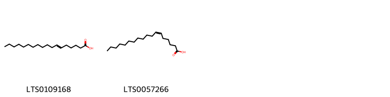{ width=100% }
    <figcaption>Hình ảnh cấu trúc hóa học của 2 hoạt chất thuộc nhóm Fatty Acyls gồm ['6-octadecenoic acid (LTS0109168)', 'petroselinic acid (LTS0057266)'].</figcaption>
</figure>
#### Nhóm Phenol ethers
<figure markdown="span">
    { width=100% }
    <figcaption>Hình ảnh cấu trúc hóa học của 2 hoạt chất thuộc nhóm Phenol ethers gồm ['tarragon (LTS0245226)', 'anethole (LTS0033696)'].</figcaption>
</figure>
#### Nhóm Prenol lipids
<figure markdown="span">
    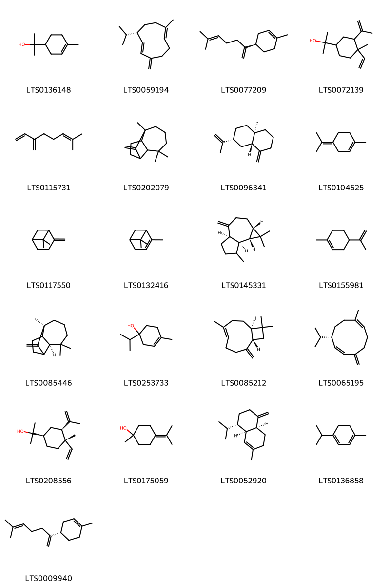{ width=100% }
    <figcaption>Hình ảnh cấu trúc hóa học của 21 hoạt chất thuộc nhóm Prenol lipids gồm ['terpineol (LTS0136148)', '(-)-germacrene d (LTS0059194)', '(r)-β-bisabolene (LTS0077209)', '2-[4-ethenyl-4-methyl-3-(prop-1-en-2-yl)cyclohexyl]propan-2-ol (LTS0072139)', 'α-myrcene (LTS0115731)', 'longifolene (LTS0202079)', 'β-selinene (LTS0096341)', 'terpinolene (LTS0104525)', 'β-pinene (LTS0117550)', 'α pinene (LTS0132416)', '(1as,4ar,7as,7br)-1,1,7-trimethyl-4-methylidene-octahydro-1ah-cyclopropa[e]azulene (LTS0145331)', 'limonene,  (LTS0155981)', '(2s,7s)-3,3,7-trimethyl-8-methylidenetricyclo[5.4.0.0²,⁹]undecane (LTS0085446)', '4-terpineol (LTS0253733)', 'caryophyllene (LTS0085212)', '(1z,6z,8s)-8-isopropyl-1-methyl-5-methylidenecyclodeca-1,6-diene (LTS0065195)', 'elemol (LTS0208556)', 'γ-terpineol (LTS0175059)', 'gamma-muurolene (LTS0052920)', 'terpinene (LTS0136858)', '(-)-β-bisabolene (LTS0009940)'].</figcaption>
</figure>
#### Nhóm Unsaturated hydrocarbons
<figure markdown="span">
    { width=100% }
    <figcaption>Hình ảnh cấu trúc hóa học của 1 hoạt chất thuộc nhóm Unsaturated hydrocarbons gồm ['α terpinene (LTS0232891)'].</figcaption>
</figure>

---

### Dược dân tộc học

Danh sách các quốc gia có sử dụng *Myrrhis odorata* trong điều trị các bệnh. 

| Country   | Disease     | Bệnh                                                                                                                                                                                                |
|:----------|:------------|:----------------------------------------------------------------------------------------------------------------------------------------------------------------------------------------------------|
| Dutch     | Expectorant | MYMEMORY WARNING: YOU USED ALL AVAILABLE FREE TRANSLATIONS FOR TODAY. NEXT AVAILABLE IN  07 HOURS 29 MINUTES 17 SECONDS VISIT HTTPS://MYMEMORY.TRANSLATED.NET/DOC/USAGELIMITS.PHP TO TRANSLATE MORE |
| Europe    | Expectorant | MYMEMORY WARNING: YOU USED ALL AVAILABLE FREE TRANSLATIONS FOR TODAY. NEXT AVAILABLE IN  07 HOURS 29 MINUTES 14 SECONDS VISIT HTTPS://MYMEMORY.TRANSLATED.NET/DOC/USAGELIMITS.PHP TO TRANSLATE MORE |
| French    | Carminative | MYMEMORY WARNING: YOU USED ALL AVAILABLE FREE TRANSLATIONS FOR TODAY. NEXT AVAILABLE IN  07 HOURS 29 MINUTES 12 SECONDS VISIT HTTPS://MYMEMORY.TRANSLATED.NET/DOC/USAGELIMITS.PHP TO TRANSLATE MORE |
| German    | Vulnerary   | MYMEMORY WARNING: YOU USED ALL AVAILABLE FREE TRANSLATIONS FOR TODAY. NEXT AVAILABLE IN  07 HOURS 29 MINUTES 10 SECONDS VISIT HTTPS://MYMEMORY.TRANSLATED.NET/DOC/USAGELIMITS.PHP TO TRANSLATE MORE |
| Italian   | Diuretic    | MYMEMORY WARNING: YOU USED ALL AVAILABLE FREE TRANSLATIONS FOR TODAY. NEXT AVAILABLE IN  07 HOURS 29 MINUTES 07 SECONDS VISIT HTTPS://MYMEMORY.TRANSLATED.NET/DOC/USAGELIMITS.PHP TO TRANSLATE MORE |
| Swedish   | Tonic       | MYMEMORY WARNING: YOU USED ALL AVAILABLE FREE TRANSLATIONS FOR TODAY. NEXT AVAILABLE IN  07 HOURS 29 MINUTES 05 SECONDS VISIT HTTPS://MYMEMORY.TRANSLATED.NET/DOC/USAGELIMITS.PHP TO TRANSLATE MORE |
| anish     | Emmenagogue | MYMEMORY WARNING: YOU USED ALL AVAILABLE FREE TRANSLATIONS FOR TODAY. NEXT AVAILABLE IN  07 HOURS 29 MINUTES 03 SECONDS VISIT HTTPS://MYMEMORY.TRANSLATED.NET/DOC/USAGELIMITS.PHP TO TRANSLATE MORE |

---

# Chi Opopanax

??? note "Danh sách các dược liệu thuộc chi"
    
	 - *Opopanax chironium*

---
## Opopanax chironium
### Thông tin về thực vật

!!! info "Phân loại thực vật của *Opopanax chironium* từ GIBF:"
    - **Kingdom:** Plantae
    - **Phylum:** Tracheophyta
    - **Order:** Apiales
    - **Family:** Apiaceae
    - **Genus:** Opopanax
    - **Species:** *Opopanax chironium*

 

| Label (VI)   | Label (EN)   | Scientific Name    | Descriptions (VI)   | Descriptions (EN)   | Also Known As (VI)   | Also Known As (EN)     |
|:-------------|:-------------|:-------------------|:--------------------|:--------------------|:---------------------|:-----------------------|
| N/A          | N/A          | Opopanax chironium | loài thực vật       | species of plant    | ['']                 | ['Opopanax chironium'] |

#### Phân bố trên thế giới

**Từ CSDL GIBF** Netherlands, Italy, Montenegro, Belgium, Spain, Croatia, France, Slovenia, Bosnia and Herzegovina, Greece

#### Phân bố tại Việt Nam

**Từ CSDL GIBF**: Không có ghi nhận ở Việt Nam

---
### Thành phần hóa học
        
- Theo cơ sở dữ liệu lotus: Từ loài *Opopanax chironium* đã phân lập và xác định được 57 hoạt chất thuộc về các nhóm Fatty Acyls, Prenol lipids, Organooxygen compounds, Phenols, Coumarins and derivatives. 

|    | chemicalTaxonomyClassyfireClass   |   smiles_count |
|---:|:----------------------------------|---------------:|
|  0 | Coumarins and derivatives         |             24 |
|  1 | Fatty Acyls                       |             20 |
|  2 | Organooxygen compounds            |              6 |
|  3 | Phenols                           |              2 |
|  4 | Prenol lipids                     |              5 |

#### Nhóm Coumarins and derivatives
<figure markdown="span">
    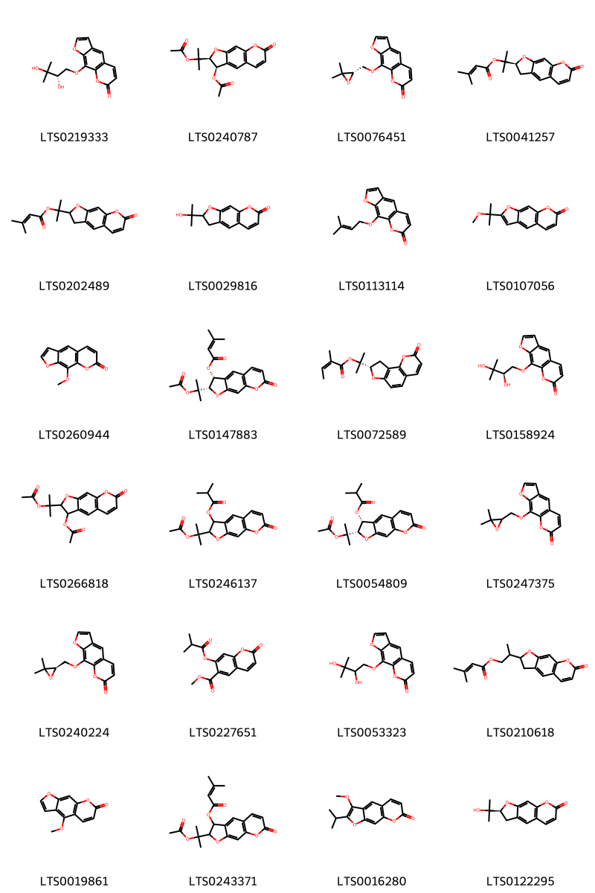{ width=100% }
    <figcaption>Hình ảnh cấu trúc hóa học của 24 hoạt chất thuộc nhóm Coumarins and derivatives gồm ['9-[(2s)-2,3-dihydroxy-3-methylbutoxy]furo[3,2-g]chromen-7-one (LTS0219333)', '2-[(2s,3r)-3-(acetyloxy)-7-oxo-2h,3h-furo[3,2-g]chromen-2-yl]propan-2-yl acetate (LTS0240787)', '9-{[(2s)-3,3-dimethyloxiran-2-yl]methoxy}furo[3,2-g]chromen-7-one (LTS0076451)', '2-[(2s)-7-oxo-2h,3h-furo[3,2-g]chromen-2-yl]propan-2-yl 3-methylbut-2-enoate (LTS0041257)', '2-{7-oxo-2h,3h-furo[3,2-g]chromen-2-yl}propan-2-yl 3-methylbut-2-enoate (LTS0202489)', 'marmesin (LTS0029816)', 'imperatorin (LTS0113114)', '2-(2-methoxypropan-2-yl)furo[3,2-g]chromen-7-one (LTS0107056)', 'methoxsalen (LTS0260944)', '(2s,3r)-2-[2-(acetyloxy)propan-2-yl]-7-oxo-2h,3h-furo[3,2-g]chromen-3-yl 3-methylbut-2-enoate (LTS0147883)', '2-[(8s)-2-oxo-8h,9h-furo[2,3-h]chromen-8-yl]propan-2-yl (2z)-2-methylbut-2-enoate (LTS0072589)', 'heraclenol (LTS0158924)', '2-[3-(acetyloxy)-7-oxo-2h,3h-furo[3,2-g]chromen-2-yl]propan-2-yl acetate (LTS0266818)', '2-[2-(acetyloxy)propan-2-yl]-7-oxo-2h,3h-furo[3,2-g]chromen-3-yl 2-methylpropanoate (LTS0246137)', '(2s,3r)-2-[2-(acetyloxy)propan-2-yl]-7-oxo-2h,3h-furo[3,2-g]chromen-3-yl 2-methylpropanoate (LTS0054809)', 'prangenin (LTS0247375)', 'heraclenin (LTS0240224)', 'methyl 7-[(2-methylpropanoyl)oxy]-2-oxochromene-6-carboxylate (LTS0227651)', '9-(2,3-dihydroxy-3-methylbutoxy)furo[3,2-g]chromen-7-one (LTS0053323)', '2-{7-oxo-2h,3h-furo[3,2-g]chromen-2-yl}propyl 3-methylbut-2-enoate (LTS0210618)', 'bergapten (LTS0019861)', '2-[2-(acetyloxy)propan-2-yl]-7-oxo-2h,3h-furo[3,2-g]chromen-3-yl 3-methylbut-2-enoate (LTS0243371)', 'peucedanin (LTS0016280)', 'marmesin (LTS0122295)'].</figcaption>
</figure>
#### Nhóm Fatty Acyls
<figure markdown="span">
    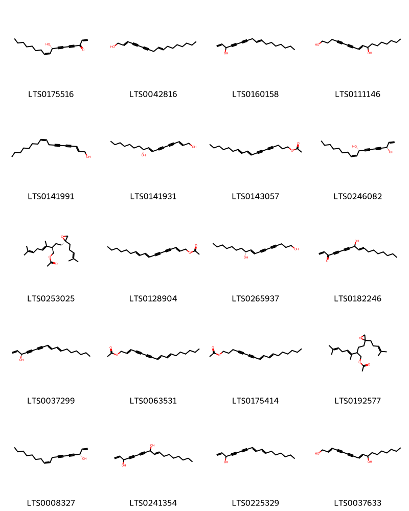{ width=100% }
    <figcaption>Hình ảnh cấu trúc hóa học của 20 hoạt chất thuộc nhóm Fatty Acyls gồm ['(8s,9z)-8-hydroxyheptadeca-1,9-dien-4,6-diyn-3-one (LTS0175516)', 'heptadeca-2,9-dien-4,6-diyn-1-ol (LTS0042816)', 'heptadeca-1,9-dien-4,6-diyn-3-ol (LTS0160158)', 'heptadec-8-en-4,6-diyne-1,10-diol (LTS0111146)', '(2e,9z)-heptadeca-2,9-dien-4,6-diyn-1-ol (LTS0141991)', '(2e,8e,10r)-heptadeca-2,8-dien-4,6-diyne-1,10-diol (LTS0141931)', '(8e,10e)-heptadeca-8,10-dien-4,6-diyn-1-yl acetate (LTS0143057)', '(3s,8s,9z)-heptadeca-1,9-dien-4,6-diyne-3,8-diol (LTS0246082)', '(2r,3e)-3,7-dimethyl-2-{2-[(2s)-2-(4-methylpent-3-en-1-yl)oxiran-2-yl]ethyl}octa-3,6-dien-1-yl acetate (LTS0253025)', '(2e,8e,10e)-heptadeca-2,8,10-trien-4,6-diyn-1-yl acetate (LTS0128904)', '(8e,10r)-heptadec-8-en-4,6-diyne-1,10-diol (LTS0265937)', '8-hydroxyheptadeca-1,9-dien-4,6-diyn-3-one (LTS0182246)', '(3s,8e,10e)-heptadeca-1,8,10-trien-4,6-diyn-3-ol (LTS0037299)', 'heptadeca-2,8,10-trien-4,6-diyn-1-yl acetate (LTS0063531)', 'heptadeca-8,10-dien-4,6-diyn-1-yl acetate (LTS0175414)', '3,7-dimethyl-2-{2-[2-(4-methylpent-3-en-1-yl)oxiran-2-yl]ethyl}octa-3,6-dien-1-yl acetate (LTS0192577)', 'falcarinol (LTS0008327)', 'heptadeca-1,9-dien-4,6-diyne-3,8-diol (LTS0241354)', 'heptadeca-1,8,10-trien-4,6-diyn-3-ol (LTS0225329)', 'heptadeca-2,8-dien-4,6-diyne-1,10-diol (LTS0037633)'].</figcaption>
</figure>
#### Nhóm Organooxygen compounds
<figure markdown="span">
    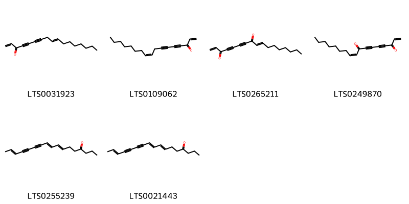{ width=100% }
    <figcaption>Hình ảnh cấu trúc hóa học của 6 hoạt chất thuộc nhóm Organooxygen compounds gồm ['heptadeca-1,9-dien-4,6-diyn-3-one (LTS0031923)', 'falcarinone (LTS0109062)', 'heptadeca-1,9-dien-4,6-diyne-3,8-dione (LTS0265211)', '(9z)-heptadeca-1,9-dien-4,6-diyne-3,8-dione (LTS0249870)', '(7e,9e,15e)-heptadeca-7,9,15-trien-11,13-diyn-4-one (LTS0255239)', 'heptadeca-7,9,15-trien-11,13-diyn-4-one (LTS0021443)'].</figcaption>
</figure>
#### Nhóm Phenols
<figure markdown="span">
    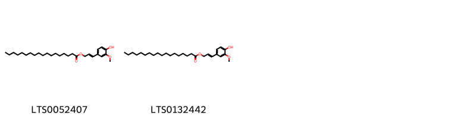{ width=100% }
    <figcaption>Hình ảnh cấu trúc hóa học của 2 hoạt chất thuộc nhóm Phenols gồm ['(2e)-3-(4-hydroxy-3-methoxyphenyl)prop-2-en-1-yl octadecanoate (LTS0052407)', '3-(4-hydroxy-3-methoxyphenyl)prop-2-en-1-yl octadecanoate (LTS0132442)'].</figcaption>
</figure>
#### Nhóm Prenol lipids
<figure markdown="span">
    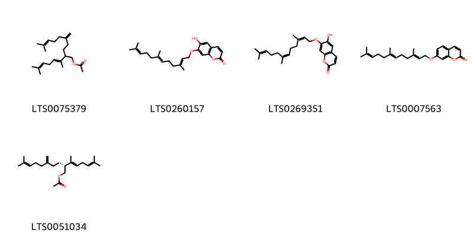{ width=100% }
    <figcaption>Hình ảnh cấu trúc hóa học của 5 hoạt chất thuộc nhóm Prenol lipids gồm ['9-methyl-2-(6-methylhepta-2,5-dien-2-yl)-5-methylidenedec-8-en-1-yl acetate (LTS0075379)', '6-hydroxy-7-{[(2e,6e)-3,7,11-trimethyldodeca-2,6,10-trien-1-yl]oxy}chromen-2-one (LTS0260157)', '6-hydroxy-7-[(3,7,11-trimethyldodeca-2,6,10-trien-1-yl)oxy]chromen-2-one (LTS0269351)', 'umbelliprenin (LTS0007563)', '(2r)-9-methyl-2-[(2e)-6-methylhepta-2,5-dien-2-yl]-5-methylidenedec-8-en-1-yl acetate (LTS0051034)'].</figcaption>
</figure>

---

### Dược dân tộc học

Danh sách các quốc gia có sử dụng *Opopanax chironium* trong điều trị các bệnh. 

| Country   | Disease               | Bệnh                                                                                                                                                                                                |
|:----------|:----------------------|:----------------------------------------------------------------------------------------------------------------------------------------------------------------------------------------------------|
| Elsewhere | Antiseptic, Stimulant | MYMEMORY WARNING: YOU USED ALL AVAILABLE FREE TRANSLATIONS FOR TODAY. NEXT AVAILABLE IN  07 HOURS 28 MINUTES 34 SECONDS VISIT HTTPS://MYMEMORY.TRANSLATED.NET/DOC/USAGELIMITS.PHP TO TRANSLATE MORE |

---

# Chi Petroselinum

??? note "Danh sách các dược liệu thuộc chi"
    
	 - *Petroselinum crium*
	 - *Petroselinum hortense*
	 - *Petroselinum sativum*

---
## Petroselinum crium
### Thông tin về thực vật

!!! info "Phân loại thực vật của *Petroselinum crispum* từ GIBF:"
    - **Kingdom:** Plantae
    - **Phylum:** Tracheophyta
    - **Order:** Apiales
    - **Family:** Apiaceae
    - **Genus:** Petroselinum
    - **Species:** *Petroselinum crispum*

 

| Label (VI)   | Label (EN)   | Scientific Name    | Descriptions (VI)   | Descriptions (EN)   | Also Known As (VI)   | Also Known As (EN)     |
|:-------------|:-------------|:-------------------|:--------------------|:--------------------|:---------------------|:-----------------------|
| N/A          | N/A          | Opopanax chironium | loài thực vật       | species of plant    | ['']                 | ['Opopanax chironium'] |

#### Phân bố trên thế giới

**Từ CSDL GIBF** United Arab Emirates, Italy, Australia, Belgium, Norway, Canada, Ukraine, Denmark, Netherlands, Belarus, Spain, Portugal, Russian Federation, United States of America, Sweden, South Africa, Czechia, Thailand, Germany, Brazil, Switzerland, Mexico, France, Austria, Norfolk Island, United Kingdom of Great Britain and Northern Ireland, Ecuador, Colombia, Ireland, New Zealand

#### Phân bố tại Việt Nam

**Từ CSDL GIBF**: Không có ghi nhận ở Việt Nam

---
### Thành phần hóa học
        
- Theo cơ sở dữ liệu lotus: Từ loài *Petroselinum crispum* đã phân lập và xác định được Chưa có hoạt chất nào được phân lập. hoạt chất thuộc về các nhóm Không có hoạt chất nào được phân lập. 

Không có hình ảnh nào được tạo ra

---

### Dược dân tộc học

Danh sách các quốc gia có sử dụng *Petroselinum crispum* trong điều trị các bệnh. 

| Country            | Disease                                                                                                                     | Bệnh                                                                                                                                                                                                |
|:-------------------|:----------------------------------------------------------------------------------------------------------------------------|:----------------------------------------------------------------------------------------------------------------------------------------------------------------------------------------------------|
| Dominican Republic | Diuretic                                                                                                                    | MYMEMORY WARNING: YOU USED ALL AVAILABLE FREE TRANSLATIONS FOR TODAY. NEXT AVAILABLE IN  07 HOURS 28 MINUTES 11 SECONDS VISIT HTTPS://MYMEMORY.TRANSLATED.NET/DOC/USAGELIMITS.PHP TO TRANSLATE MORE |
| Elsewhere          | Carminative, Diuretic, Ecbolic, Emmenagogue, Pediculicide                                                                   | MYMEMORY WARNING: YOU USED ALL AVAILABLE FREE TRANSLATIONS FOR TODAY. NEXT AVAILABLE IN  07 HOURS 28 MINUTES 08 SECONDS VISIT HTTPS://MYMEMORY.TRANSLATED.NET/DOC/USAGELIMITS.PHP TO TRANSLATE MORE |
| France             | Diuretic                                                                                                                    | MYMEMORY WARNING: YOU USED ALL AVAILABLE FREE TRANSLATIONS FOR TODAY. NEXT AVAILABLE IN  07 HOURS 28 MINUTES 06 SECONDS VISIT HTTPS://MYMEMORY.TRANSLATED.NET/DOC/USAGELIMITS.PHP TO TRANSLATE MORE |
| Haiti              | Apertif, Carminative, Emmenagogue, Stimulant, Antibiotic                                                                    | MYMEMORY WARNING: YOU USED ALL AVAILABLE FREE TRANSLATIONS FOR TODAY. NEXT AVAILABLE IN  07 HOURS 28 MINUTES 04 SECONDS VISIT HTTPS://MYMEMORY.TRANSLATED.NET/DOC/USAGELIMITS.PHP TO TRANSLATE MORE |
| Paraguay           | Antifertility                                                                                                               | MYMEMORY WARNING: YOU USED ALL AVAILABLE FREE TRANSLATIONS FOR TODAY. NEXT AVAILABLE IN  07 HOURS 28 MINUTES 01 SECONDS VISIT HTTPS://MYMEMORY.TRANSLATED.NET/DOC/USAGELIMITS.PHP TO TRANSLATE MORE |
| Turkey             | Abortifacient, Aperient, Carminative, Diuretic, Emmenagogue, Parasiticide, Stimulant, Stomachic, Apertif, Poison, Sudorific | MYMEMORY WARNING: YOU USED ALL AVAILABLE FREE TRANSLATIONS FOR TODAY. NEXT AVAILABLE IN  07 HOURS 27 MINUTES 59 SECONDS VISIT HTTPS://MYMEMORY.TRANSLATED.NET/DOC/USAGELIMITS.PHP TO TRANSLATE MORE |

---

---
## Petroselinum hortense
### Thông tin về thực vật

!!! info "Phân loại thực vật của *Petroselinum crispum* từ GIBF:"
    - **Kingdom:** Plantae
    - **Phylum:** Tracheophyta
    - **Order:** Apiales
    - **Family:** Apiaceae
    - **Genus:** Petroselinum
    - **Species:** *Petroselinum crispum*

 

| Label (VI)   | Label (EN)   | Scientific Name       | Descriptions (VI)   | Descriptions (EN)   | Also Known As (VI)   | Also Known As (EN)   |
|:-------------|:-------------|:----------------------|:--------------------|:--------------------|:---------------------|:---------------------|
| N/A          | N/A          | Petroselinum hortense |                     | species of plant    | ['']                 | ['']                 |

#### Phân bố trên thế giới

**Từ CSDL GIBF** nan, Italy, Bulgaria, Japan, Moldova, Republic of, Belgium, unknown or invalid, Bermuda, Canada, Ukraine, Denmark, Netherlands, Bolivia (Plurinational State of), Hungary, Azerbaijan, Türkiye, Russian Federation, United States of America, Sweden, Finland, Greece, Uzbekistan, Czechia, Germany, Eritrea, Romania, Brazil, Bhutan, France, United Kingdom of Great Britain and Northern Ireland, Colombia, Poland

#### Phân bố tại Việt Nam

**Từ CSDL GIBF**: Không có ghi nhận ở Việt Nam

---
### Thành phần hóa học
        
- Theo cơ sở dữ liệu lotus: Từ loài *Petroselinum crispum* đã phân lập và xác định được Chưa có hoạt chất nào được phân lập. hoạt chất thuộc về các nhóm Không có hoạt chất nào được phân lập. 

Không có hình ảnh nào được tạo ra

---

### Dược dân tộc học

Danh sách các quốc gia có sử dụng *Petroselinum crispum* trong điều trị các bệnh. 

| Country   | Disease   | Bệnh                                                                                                                                                                                                |
|:----------|:----------|:----------------------------------------------------------------------------------------------------------------------------------------------------------------------------------------------------|
| ain       | Stimulant | MYMEMORY WARNING: YOU USED ALL AVAILABLE FREE TRANSLATIONS FOR TODAY. NEXT AVAILABLE IN  07 HOURS 27 MINUTES 38 SECONDS VISIT HTTPS://MYMEMORY.TRANSLATED.NET/DOC/USAGELIMITS.PHP TO TRANSLATE MORE |

---

---
## Petroselinum sativum
### Thông tin về thực vật

!!! info "Phân loại thực vật của *N/A* từ GIBF:"
    - **Kingdom:** Plantae
    - **Phylum:** Tracheophyta
    - **Order:** Apiales
    - **Family:** Apiaceae
    - **Genus:** N/A
    - **Species:** *N/A*

 

| Label (VI)   | Label (EN)   | Scientific Name      | Descriptions (VI)   | Descriptions (EN)   | Also Known As (VI)   | Also Known As (EN)   |
|:-------------|:-------------|:---------------------|:--------------------|:--------------------|:---------------------|:---------------------|
| N/A          | N/A          | Petroselinum sativum |                     |                     | ['']                 | ['']                 |

#### Phân bố trên thế giới

**Từ CSDL GIBF** nan, Italy, Australia, Belgium, Argentina, Canada, Ukraine, Netherlands, Chinese Taipei, Spain, Portugal, Russian Federation, United States of America, Chile, Uruguay, Greece, South Africa, Montenegro, Czechia, Germany, Thailand, Isle of Man, Austria, France, Mexico, United Kingdom of Great Britain and Northern Ireland, Jersey, Ecuador, Niue, Ireland, New Zealand

#### Phân bố tại Việt Nam

**Từ CSDL GIBF**: Không có ghi nhận ở Việt Nam

---
### Thành phần hóa học
        
- Theo cơ sở dữ liệu lotus: Từ loài *N/A* đã phân lập và xác định được Chưa có hoạt chất nào được phân lập. hoạt chất thuộc về các nhóm Không có hoạt chất nào được phân lập. 

Không có hình ảnh nào được tạo ra

---

### Dược dân tộc học

Danh sách các quốc gia có sử dụng *N/A* trong điều trị các bệnh. 

| Country   | Disease                                      | Bệnh                                                                                                                                                                                                |
|:----------|:---------------------------------------------|:----------------------------------------------------------------------------------------------------------------------------------------------------------------------------------------------------|
| Mexico    | Aphrodisiac, Diuretic, Emmenagogue, Hemostat | MYMEMORY WARNING: YOU USED ALL AVAILABLE FREE TRANSLATIONS FOR TODAY. NEXT AVAILABLE IN  07 HOURS 27 MINUTES 20 SECONDS VISIT HTTPS://MYMEMORY.TRANSLATED.NET/DOC/USAGELIMITS.PHP TO TRANSLATE MORE |

---

# Chi Peucedanum

??? note "Danh sách các dược liệu thuộc chi"
    
	 - *Peucedanum cervaria*
	 - *Peucedanum decursivum*
	 - *Peucedanum dhana*
	 - *Peucedanum fraxinifolium*
	 - *Peucedanum galbanum*
	 - *Peucedanum grande*
	 - *Peucedanum japonicum*
	 - *Peucedanum nagpurense*
	 - *Peucedanum officinale*
	 - *Peucedanum oreoselinum*
	 - *Peucedanum ostruthium*
	 - *Peucedanum pracruptorum*
	 - *Peucedanum praeruptorum*

---
## Peucedanum cervaria
### Thông tin về thực vật

!!! info "Phân loại thực vật của *Cervaria rivini* từ GIBF:"
    - **Kingdom:** Plantae
    - **Phylum:** Tracheophyta
    - **Order:** Apiales
    - **Family:** Apiaceae
    - **Genus:** Cervaria
    - **Species:** *Cervaria rivini*

 

| Label (VI)   | Label (EN)   | Scientific Name     | Descriptions (VI)   | Descriptions (EN)   | Also Known As (VI)   | Also Known As (EN)   |
|:-------------|:-------------|:--------------------|:--------------------|:--------------------|:---------------------|:---------------------|
| N/A          | N/A          | Peucedanum cervaria | loài thực vật       | species of plant    | ['']                 | ['']                 |

#### Phân bố trên thế giới

**Từ CSDL GIBF** Ukraine, Italy, Luxembourg, Germany, Slovakia, Czechia, Romania, Spain, Poland, Hungary, Switzerland, Russian Federation, Austria, France, Slovenia, Croatia

#### Phân bố tại Việt Nam

**Từ CSDL GIBF**: Không có ghi nhận ở Việt Nam

---
### Thành phần hóa học
        
- Theo cơ sở dữ liệu lotus: Từ loài *Cervaria rivini* đã phân lập và xác định được Chưa có hoạt chất nào được phân lập. hoạt chất thuộc về các nhóm Không có hoạt chất nào được phân lập. 

Không có hình ảnh nào được tạo ra

---

### Dược dân tộc học

Danh sách các quốc gia có sử dụng *Cervaria rivini* trong điều trị các bệnh. 

| Country   | Disease               | Bệnh                                                                                                                                                                                                |
|:----------|:----------------------|:----------------------------------------------------------------------------------------------------------------------------------------------------------------------------------------------------|
| Europe    | Diuretic, Emmenagogue | MYMEMORY WARNING: YOU USED ALL AVAILABLE FREE TRANSLATIONS FOR TODAY. NEXT AVAILABLE IN  07 HOURS 26 MINUTES 59 SECONDS VISIT HTTPS://MYMEMORY.TRANSLATED.NET/DOC/USAGELIMITS.PHP TO TRANSLATE MORE |

---

---
## Peucedanum decursivum
### Thông tin về thực vật

!!! info "Phân loại thực vật của *Halosciastrum melanotilingia* từ GIBF:"
    - **Kingdom:** Plantae
    - **Phylum:** Tracheophyta
    - **Order:** Apiales
    - **Family:** Apiaceae
    - **Genus:** Halosciastrum
    - **Species:** *Halosciastrum melanotilingia*

 

| Label (VI)   | Label (EN)   | Scientific Name       | Descriptions (VI)   | Descriptions (EN)   | Also Known As (VI)   | Also Known As (EN)   |
|:-------------|:-------------|:----------------------|:--------------------|:--------------------|:---------------------|:---------------------|
| N/A          | N/A          | Peucedanum decursivum | loài thực vật       | species of plant    | ['']                 | ['']                 |

#### Phân bố trên thế giới

**Từ CSDL GIBF** nan, China

#### Phân bố tại Việt Nam

**Từ CSDL GIBF**: Không có ghi nhận ở Việt Nam

---
### Thành phần hóa học
        
- Theo cơ sở dữ liệu lotus: Từ loài *Halosciastrum melanotilingia* đã phân lập và xác định được Chưa có hoạt chất nào được phân lập. hoạt chất thuộc về các nhóm Không có hoạt chất nào được phân lập. 

Không có hình ảnh nào được tạo ra

---

### Dược dân tộc học

Danh sách các quốc gia có sử dụng *Halosciastrum melanotilingia* trong điều trị các bệnh. 

| Country   | Disease                                                                  | Bệnh                                                                                                                                                                                                |
|:----------|:-------------------------------------------------------------------------|:----------------------------------------------------------------------------------------------------------------------------------------------------------------------------------------------------|
| China     | Analgesic, Antitussive, Carminative, Expectorant, Stimulant, Antitussive | MYMEMORY WARNING: YOU USED ALL AVAILABLE FREE TRANSLATIONS FOR TODAY. NEXT AVAILABLE IN  07 HOURS 26 MINUTES 37 SECONDS VISIT HTTPS://MYMEMORY.TRANSLATED.NET/DOC/USAGELIMITS.PHP TO TRANSLATE MORE |

---

---
## Peucedanum dhana
### Thông tin về thực vật

!!! info "Phân loại thực vật của *Peucedanum dhana* từ GIBF:"
    - **Kingdom:** Plantae
    - **Phylum:** Tracheophyta
    - **Order:** Apiales
    - **Family:** Apiaceae
    - **Genus:** Peucedanum
    - **Species:** *Peucedanum dhana*

 

| Label (VI)   | Label (EN)   | Scientific Name   | Descriptions (VI)   | Descriptions (EN)   | Also Known As (VI)   | Also Known As (EN)   |
|:-------------|:-------------|:------------------|:--------------------|:--------------------|:---------------------|:---------------------|
| N/A          | N/A          | Peucedanum dhana  | loài thực vật       | species of plant    | ['']                 | ['']                 |

#### Phân bố trên thế giới

**Từ CSDL GIBF** nan, Thailand, Myanmar, India, Bangladesh, Nepal

#### Phân bố tại Việt Nam

**Từ CSDL GIBF**: Không có ghi nhận ở Việt Nam

---
### Thành phần hóa học
        
- Theo cơ sở dữ liệu lotus: Từ loài *Peucedanum dhana* đã phân lập và xác định được 2 hoạt chất thuộc về các nhóm Coumarins and derivatives. 

|    | chemicalTaxonomyClassyfireClass   |   smiles_count |
|---:|:----------------------------------|---------------:|
|  0 | Coumarins and derivatives         |              2 |

#### Nhóm Coumarins and derivatives
<figure markdown="span">
    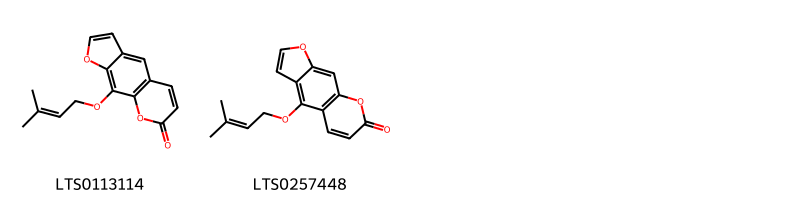{ width=100% }
    <figcaption>Hình ảnh cấu trúc hóa học của 2 hoạt chất thuộc nhóm Coumarins and derivatives gồm ['imperatorin (LTS0113114)', 'isoimperatorin (LTS0257448)'].</figcaption>
</figure>

---

### Dược dân tộc học

Danh sách các quốc gia có sử dụng *Peucedanum dhana* trong điều trị các bệnh. 

| Country   | Disease      | Bệnh                                                                                                                                                                                                |
|:----------|:-------------|:----------------------------------------------------------------------------------------------------------------------------------------------------------------------------------------------------|
| India     | Tonic, Tonic | MYMEMORY WARNING: YOU USED ALL AVAILABLE FREE TRANSLATIONS FOR TODAY. NEXT AVAILABLE IN  07 HOURS 26 MINUTES 18 SECONDS VISIT HTTPS://MYMEMORY.TRANSLATED.NET/DOC/USAGELIMITS.PHP TO TRANSLATE MORE |

---

---
## Peucedanum fraxinifolium
### Thông tin về thực vật

!!! info "Phân loại thực vật của *Steganotaenia araliacea* từ GIBF:"
    - **Kingdom:** Plantae
    - **Phylum:** Tracheophyta
    - **Order:** Apiales
    - **Family:** Apiaceae
    - **Genus:** Steganotaenia
    - **Species:** *Steganotaenia araliacea*

 

| Label (VI)   | Label (EN)   | Scientific Name          | Descriptions (VI)   | Descriptions (EN)   | Also Known As (VI)   | Also Known As (EN)   |
|:-------------|:-------------|:-------------------------|:--------------------|:--------------------|:---------------------|:---------------------|
| N/A          | N/A          | Peucedanum fraxinifolium |                     | species of plant    | ['']                 | ['']                 |

#### Phân bố trên thế giới

**Từ CSDL GIBF** nan, Thailand, Myanmar, India, Bangladesh, Nepal

#### Phân bố tại Việt Nam

**Từ CSDL GIBF**: Không có ghi nhận ở Việt Nam

---
### Thành phần hóa học
        
- Theo cơ sở dữ liệu lotus: Từ loài *Steganotaenia araliacea* đã phân lập và xác định được Chưa có hoạt chất nào được phân lập. hoạt chất thuộc về các nhóm Không có hoạt chất nào được phân lập. 

Không có hình ảnh nào được tạo ra

---

### Dược dân tộc học

Danh sách các quốc gia có sử dụng *Steganotaenia araliacea* trong điều trị các bệnh. 

| Country      | Disease   | Bệnh                                                                                                                                                                                                |
|:-------------|:----------|:----------------------------------------------------------------------------------------------------------------------------------------------------------------------------------------------------|
| Africa       | Diuretic  | MYMEMORY WARNING: YOU USED ALL AVAILABLE FREE TRANSLATIONS FOR TODAY. NEXT AVAILABLE IN  07 HOURS 25 MINUTES 59 SECONDS VISIT HTTPS://MYMEMORY.TRANSLATED.NET/DOC/USAGELIMITS.PHP TO TRANSLATE MORE |
| Sierra Leone | Vermifuge | MYMEMORY WARNING: YOU USED ALL AVAILABLE FREE TRANSLATIONS FOR TODAY. NEXT AVAILABLE IN  07 HOURS 25 MINUTES 56 SECONDS VISIT HTTPS://MYMEMORY.TRANSLATED.NET/DOC/USAGELIMITS.PHP TO TRANSLATE MORE |

---

---
## Peucedanum galbanum
### Thông tin về thực vật

!!! info "Phân loại thực vật của *Notobubon galbanum* từ GIBF:"
    - **Kingdom:** Plantae
    - **Phylum:** Tracheophyta
    - **Order:** Apiales
    - **Family:** Apiaceae
    - **Genus:** Notobubon
    - **Species:** *Notobubon galbanum*

 

| Label (VI)   | Label (EN)   | Scientific Name     | Descriptions (VI)   | Descriptions (EN)   | Also Known As (VI)   | Also Known As (EN)   |
|:-------------|:-------------|:--------------------|:--------------------|:--------------------|:---------------------|:---------------------|
| N/A          | N/A          | Peucedanum galbanum | loài thực vật       | species of plant    | ['']                 | ['']                 |

#### Phân bố trên thế giới

**Từ CSDL GIBF** nan, Ukraine, South Africa, Germany, unknown or invalid

#### Phân bố tại Việt Nam

**Từ CSDL GIBF**: Không có ghi nhận ở Việt Nam

---
### Thành phần hóa học
        
- Theo cơ sở dữ liệu lotus: Từ loài *Notobubon galbanum* đã phân lập và xác định được Chưa có hoạt chất nào được phân lập. hoạt chất thuộc về các nhóm Không có hoạt chất nào được phân lập. 

Không có hình ảnh nào được tạo ra

---

### Dược dân tộc học

Danh sách các quốc gia có sử dụng *Notobubon galbanum* trong điều trị các bệnh. 

| Country              | Disease   | Bệnh                                                                                                                                                                                                |
|:---------------------|:----------|:----------------------------------------------------------------------------------------------------------------------------------------------------------------------------------------------------|
| South Africa(Kaffir) | Diuretic  | MYMEMORY WARNING: YOU USED ALL AVAILABLE FREE TRANSLATIONS FOR TODAY. NEXT AVAILABLE IN  07 HOURS 25 MINUTES 40 SECONDS VISIT HTTPS://MYMEMORY.TRANSLATED.NET/DOC/USAGELIMITS.PHP TO TRANSLATE MORE |

---

---
## Peucedanum grande
### Thông tin về thực vật

!!! info "Phân loại thực vật của *Tetrataenium grande* từ GIBF:"
    - **Kingdom:** Plantae
    - **Phylum:** Tracheophyta
    - **Order:** Apiales
    - **Family:** Apiaceae
    - **Genus:** Tetrataenium
    - **Species:** *Tetrataenium grande*

 

| Label (VI)   | Label (EN)   | Scientific Name   | Descriptions (VI)   | Descriptions (EN)   | Also Known As (VI)   | Also Known As (EN)   |
|:-------------|:-------------|:------------------|:--------------------|:--------------------|:---------------------|:---------------------|
| N/A          | N/A          | Peucedanum grande |                     |                     | ['']                 | ['']                 |

#### Phân bố trên thế giới

**Từ CSDL GIBF** nan, Ukraine, South Africa, Germany, unknown or invalid

#### Phân bố tại Việt Nam

**Từ CSDL GIBF**: Không có ghi nhận ở Việt Nam

---
### Thành phần hóa học
        
- Theo cơ sở dữ liệu lotus: Từ loài *Tetrataenium grande* đã phân lập và xác định được Chưa có hoạt chất nào được phân lập. hoạt chất thuộc về các nhóm Không có hoạt chất nào được phân lập. 

Không có hình ảnh nào được tạo ra

---

### Dược dân tộc học

Danh sách các quốc gia có sử dụng *Tetrataenium grande* trong điều trị các bệnh. 

| Country   | Disease                                 | Bệnh                                                                                                                                                                                                |
|:----------|:----------------------------------------|:----------------------------------------------------------------------------------------------------------------------------------------------------------------------------------------------------|
| Elsewhere | Carminative, Diuretic, Tonic, Stimulant | MYMEMORY WARNING: YOU USED ALL AVAILABLE FREE TRANSLATIONS FOR TODAY. NEXT AVAILABLE IN  07 HOURS 25 MINUTES 22 SECONDS VISIT HTTPS://MYMEMORY.TRANSLATED.NET/DOC/USAGELIMITS.PHP TO TRANSLATE MORE |

---

---
## Peucedanum japonicum
### Thông tin về thực vật

!!! info "Phân loại thực vật của *Peucedanum japonicum* từ GIBF:"
    - **Kingdom:** Plantae
    - **Phylum:** Tracheophyta
    - **Order:** Apiales
    - **Family:** Apiaceae
    - **Genus:** Peucedanum
    - **Species:** *Peucedanum japonicum*

 

| Label (VI)   | Label (EN)   | Scientific Name      | Descriptions (VI)   | Descriptions (EN)   | Also Known As (VI)   | Also Known As (EN)   |
|:-------------|:-------------|:---------------------|:--------------------|:--------------------|:---------------------|:---------------------|
| N/A          | N/A          | Peucedanum japonicum |                     | species of plant    | ['']                 | ['']                 |

#### Phân bố trên thế giới

**Từ CSDL GIBF** Japan, Korea, Republic of, Chinese Taipei, United States of America, China

#### Phân bố tại Việt Nam

**Từ CSDL GIBF**: Không có ghi nhận ở Việt Nam

---
### Thành phần hóa học
        
- Theo cơ sở dữ liệu lotus: Từ loài *Peucedanum japonicum* đã phân lập và xác định được 100 hoạt chất thuộc về các nhóm Fatty Acyls, Flavonoids, Prenol lipids, Pyrimidine nucleosides, Indoles and derivatives, Azolidines, Purine nucleosides, Organooxygen compounds, Phenols, Coumarins and derivatives, Diazines, Benzopyrans. 

|    | chemicalTaxonomyClassyfireClass   |   smiles_count |
|---:|:----------------------------------|---------------:|
|  0 | Azolidines                        |              2 |
|  1 | Benzopyrans                       |              3 |
|  2 | Coumarins and derivatives         |             60 |
|  3 | Diazines                          |              1 |
|  4 | Fatty Acyls                       |              1 |
|  5 | Flavonoids                        |              4 |
|  6 | Indoles and derivatives           |              2 |
|  7 | Organooxygen compounds            |             16 |
|  8 | Phenols                           |              3 |
|  9 | Prenol lipids                     |              2 |
| 10 | Purine nucleosides                |              2 |
| 11 | Pyrimidine nucleosides            |              4 |

#### Nhóm Azolidines
<figure markdown="span">
    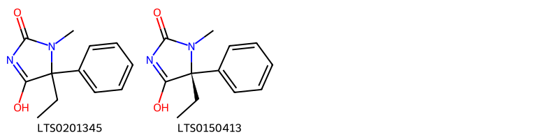{ width=100% }
    <figcaption>Hình ảnh cấu trúc hóa học của 2 hoạt chất thuộc nhóm Azolidines gồm ['methetoin (LTS0201345)', '(5r)-5-ethyl-4-hydroxy-1-methyl-5-phenylimidazol-2-one (LTS0150413)'].</figcaption>
</figure>
#### Nhóm Benzopyrans
<figure markdown="span">
    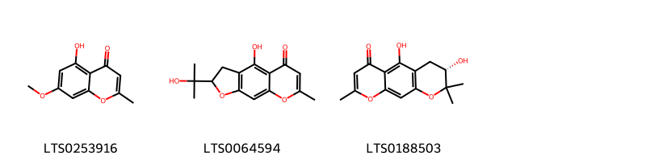{ width=100% }
    <figcaption>Hình ảnh cấu trúc hóa học của 3 hoạt chất thuộc nhóm Benzopyrans gồm ['eugenin (LTS0253916)', '4-hydroxy-2-(2-hydroxypropan-2-yl)-7-methyl-2h,3h-furo[3,2-g]chromen-5-one (LTS0064594)', 'hamaudol (LTS0188503)'].</figcaption>
</figure>
#### Nhóm Coumarins and derivatives
<figure markdown="span">
    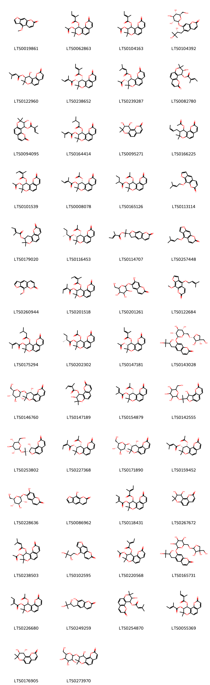{ width=100% }
    <figcaption>Hình ảnh cấu trúc hóa học của 60 hoạt chất thuộc nhóm Coumarins and derivatives gồm ['bergapten (LTS0019861)', '(9s,10s)-9-(acetyloxy)-8,8-dimethyl-2-oxo-9h,10h-pyrano[2,3-h]chromen-10-yl (2e)-2-methylbut-2-enoate (LTS0062863)', '9-(acetyloxy)-8,8-dimethyl-2-oxo-9h,10h-pyrano[2,3-h]chromen-10-yl (2e)-2-methylbut-2-enoate (LTS0104163)', '6-[(2r)-2,3-dihydroxy-3-methylbutyl]-7-{[(2s,3r,4s,5s,6r)-3,4,5-trihydroxy-6-(hydroxymethyl)oxan-2-yl]oxy}chromen-2-one (LTS0104392)', '(9s,10s)-10-hydroxy-8,8-dimethyl-2-oxo-9h,10h-pyrano[2,3-h]chromen-9-yl 3-methylbut-2-enoate (LTS0122960)', '(9r,10r)-8,8-dimethyl-10-{[(2e)-2-methylbut-2-enoyl]oxy}-2-oxo-9h,10h-pyrano[2,3-h]chromen-9-yl (2e)-2-methylbut-2-enoate (LTS0238652)', '(9r,10s)-9-(acetyloxy)-8,8-dimethyl-2-oxo-9h,10h-pyrano[2,3-h]chromen-10-yl 3-methylbut-2-enoate (LTS0239287)', '(9s,10s)-9-hydroxy-8,8-dimethyl-2-oxo-9h,10h-pyrano[2,3-h]chromen-10-yl (2e)-2-methylbut-2-enoate (LTS0082780)', '9-hydroxy-8,8-dimethyl-2-oxo-9h,10h-pyrano[2,3-h]chromen-10-yl 2-methylbut-2-enoate (LTS0094095)', '(9s,10s)-8,8-dimethyl-10-[(3-methylbutanoyl)oxy]-2-oxo-9h,10h-pyrano[2,3-h]chromen-9-yl 3-methylbut-2-enoate (LTS0164414)', '(9s,10s)-9,10-dihydroxy-8,8-dimethyl-9h,10h-pyrano[2,3-h]chromen-2-one (LTS0095271)', '9-[(2z)-but-2-en-1-yl]-8,8-dimethyl-2-oxo-9h,10h-pyrano[2,3-h]chromen-10-yl acetate (LTS0166225)', '(9s,10s)-9-(acetyloxy)-8,8-dimethyl-2-oxo-9h,10h-pyrano[2,3-h]chromen-10-yl (2z)-2-methylbut-2-enoate (LTS0101539)', '(9s,10r)-10-(acetyloxy)-8,8-dimethyl-2-oxo-9h,10h-pyrano[2,3-h]chromen-9-yl (2e)-2-methylbut-2-enoate (LTS0008078)', 'visnadine (LTS0165126)', 'imperatorin (LTS0113114)', '8,8-dimethyl-2-oxo-9h,10h-pyrano[2,3-h]chromen-9-yl (2e)-2-methylbut-2-enoate (LTS0179020)', 'selva (LTS0116453)', 'deltoin (LTS0114707)', 'isoimperatorin (LTS0257448)', 'methoxsalen (LTS0260944)', '8,8-dimethyl-10-{[(2z)-2-methylbut-2-enoyl]oxy}-2-oxo-9h,10h-pyrano[2,3-h]chromen-9-yl (2z)-2-methylbut-2-enoate (LTS0201518)', 'esculin (LTS0201261)', 'cnidilin (LTS0122684)', '8,8-dimethyl-10-[(3-methylbutanoyl)oxy]-2-oxo-9h,10h-pyrano[2,3-h]chromen-9-yl 3-methylbut-2-enoate (LTS0175294)', '(9s,10s)-10-(acetyloxy)-8,8-dimethyl-2-oxo-9h,10h-pyrano[2,3-h]chromen-9-yl (2r)-2-methylbutanoate (LTS0202302)', '(9r,10s)-9-(acetyloxy)-8,8-dimethyl-2-oxo-9h,10h-pyrano[2,3-h]chromen-10-yl (2e)-2-methylbut-2-enoate (LTS0147181)', '6-[(2s)-2,3-dihydroxy-3-methylbutyl]-7-{[(2s,3r,4s,5s,6r)-6-({[(2r,3r,4s)-3,4-dihydroxy-4-(hydroxymethyl)oxolan-2-yl]oxy}methyl)-3,4,5-trihydroxyoxan-2-yl]oxy}chromen-2-one (LTS0143028)', '(9s,10r)-10-hydroxy-8,8-dimethyl-9-{[(2s,3r,4s,5s,6r)-3,4,5-trihydroxy-6-(hydroxymethyl)oxan-2-yl]oxy}-9h,10h-pyrano[2,3-h]chromen-2-one (LTS0146760)', '(9s,10s)-9-hydroxy-8,8-dimethyl-2-oxo-9h,10h-pyrano[2,3-h]chromen-10-yl (2z)-2-methylbut-2-enoate (LTS0147189)', '(9s,10r)-10-(acetyloxy)-8,8-dimethyl-2-oxo-9h,10h-pyrano[2,3-h]chromen-9-yl 2-methylbut-2-enoate (LTS0154879)', 'apterin (LTS0142555)', 'apterin (LTS0253802)', '(9r,10r)-10-(acetyloxy)-8,8-dimethyl-2-oxo-9h,10h-pyrano[2,3-h]chromen-9-yl (2z)-2-methylbut-2-enoate (LTS0227368)', '(9r,10r)-10-hydroxy-8,8-dimethyl-9-{[(2s,3r,4s,5s,6r)-3,4,5-trihydroxy-6-(hydroxymethyl)oxan-2-yl]oxy}-9h,10h-pyrano[2,3-h]chromen-2-one (LTS0171890)', 'samidin (LTS0159452)', 'esculin (LTS0228636)', 'xanthotoxol (LTS0086962)', '8,8-dimethyl-10-[(2-methylbut-2-enoyl)oxy]-2-oxo-9h,10h-pyrano[2,3-h]chromen-9-yl 2-methylbut-2-enoate (LTS0118431)', '9,10-dihydroxy-8,8-dimethyl-9h,10h-pyrano[2,3-h]chromen-2-one (LTS0267672)', '9-(acetyloxy)-8,8-dimethyl-2-oxo-9h,10h-pyrano[2,3-h]chromen-10-yl 3-methylbut-2-enoate (LTS0238503)', '(r)-oxypeucedanin hydrate (LTS0102595)', '9-(acetyloxy)-8,8-dimethyl-2-oxo-9h,10h-pyrano[2,3-h]chromen-10-yl 2-methylbut-2-enoate (LTS0220568)', '6-(2,3-dihydroxy-3-methylbutyl)-7-{[6-({[3,4-dihydroxy-4-(hydroxymethyl)oxolan-2-yl]oxy}methyl)-3,4,5-trihydroxyoxan-2-yl]oxy}chromen-2-one (LTS0165731)', '10-(acetyloxy)-8,8-dimethyl-2-oxo-9h,10h-pyrano[2,3-h]chromen-9-yl 2-methylbut-2-enoate (LTS0226680)', '6-(2,3-dihydroxy-3-methylbutyl)-7-hydroxychromen-2-one (LTS0249259)', '9-hydroxy-8,8-dimethyl-2-oxo-9h,10h-pyrano[2,3-h]chromen-10-yl 3-methylbut-2-enoate (LTS0254870)', '(9s,10s)-8,8-dimethyl-10-{[(2e)-2-methylbut-2-enoyl]oxy}-2-oxo-9h,10h-pyrano[2,3-h]chromen-9-yl (2e)-2-methylbut-2-enoate (LTS0055369)', '(9s,10r)-9,10-dihydroxy-8,8-dimethyl-9h,10h-pyrano[2,3-h]chromen-2-one (LTS0176905)', '10-hydroxy-8,8-dimethyl-9-{[3,4,5-trihydroxy-6-(hydroxymethyl)oxan-2-yl]oxy}-9h,10h-pyrano[2,3-h]chromen-2-one (LTS0273970)', 'psoralen (LTS0121746)', 'marmesin (LTS0122295)', '(9s,10s)-10-(acetyloxy)-8,8-dimethyl-2-oxo-9h,10h-pyrano[2,3-h]chromen-9-yl (2z)-2-methylbut-2-enoate (LTS0063729)', '(9s,10s)-9-hydroxy-8,8-dimethyl-2-oxo-9h,10h-pyrano[2,3-h]chromen-10-yl 3-methylbut-2-enoate (LTS0009882)', '6-[(2r)-2,3-dihydroxy-3-methylbutyl]-7-hydroxychromen-2-one (LTS0081935)', '10-hydroxy-8,8-dimethyl-2-oxo-9h,10h-pyrano[2,3-h]chromen-9-yl 3-methylbut-2-enoate (LTS0022982)', '(9s,10s)-8,8-dimethyl-10-{[(2z)-2-methylbut-2-enoyl]oxy}-2-oxo-9h,10h-pyrano[2,3-h]chromen-9-yl (2z)-2-methylbut-2-enoate (LTS0038113)', '6-(2,3-dihydroxy-3-methylbutyl)-7-{[3,4,5-trihydroxy-6-(hydroxymethyl)oxan-2-yl]oxy}chromen-2-one (LTS0257122)', '(9s)-8,8-dimethyl-2-oxo-9h,10h-pyrano[2,3-h]chromen-9-yl 3-methylbut-2-enoate (LTS0122135)', '6-[(2r)-2,3-dihydroxy-3-methylbutyl]-7-{[(2s,3r,4s,5s,6r)-6-({[(2r,3r,4r)-3,4-dihydroxy-4-(hydroxymethyl)oxolan-2-yl]oxy}methyl)-3,4,5-trihydroxyoxan-2-yl]oxy}chromen-2-one (LTS0118232)'].</figcaption>
</figure>
#### Nhóm Diazines
<figure markdown="span">
    { width=100% }
    <figcaption>Hình ảnh cấu trúc hóa học của 1 hoạt chất thuộc nhóm Diazines gồm ['pirod (LTS0008205)'].</figcaption>
</figure>
#### Nhóm Fatty Acyls
<figure markdown="span">
    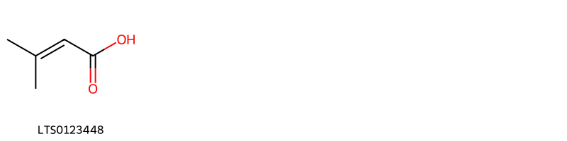{ width=100% }
    <figcaption>Hình ảnh cấu trúc hóa học của 1 hoạt chất thuộc nhóm Fatty Acyls gồm ['β,β-dimethacrylate (LTS0123448)'].</figcaption>
</figure>
#### Nhóm Flavonoids
<figure markdown="span">
    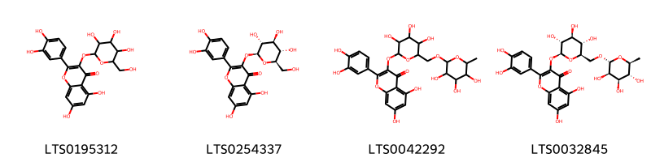{ width=100% }
    <figcaption>Hình ảnh cấu trúc hóa học của 4 hoạt chất thuộc nhóm Flavonoids gồm ['2-(3,4-dihydroxyphenyl)-5,7-dihydroxy-3-{[3,4,5-trihydroxy-6-(hydroxymethyl)oxan-2-yl]oxy}chromen-4-one (LTS0195312)', 'isoquercetin (LTS0254337)', 'rutin (LTS0042292)', '3-rutinosyl quercetin (LTS0032845)'].</figcaption>
</figure>
#### Nhóm Indoles and derivatives
<figure markdown="span">
    { width=100% }
    <figcaption>Hình ảnh cấu trúc hóa học của 2 hoạt chất thuộc nhóm Indoles and derivatives gồm ['l-tryptophan (LTS0263809)', 'optimax (LTS0014343)'].</figcaption>
</figure>
#### Nhóm Organooxygen compounds
<figure markdown="span">
    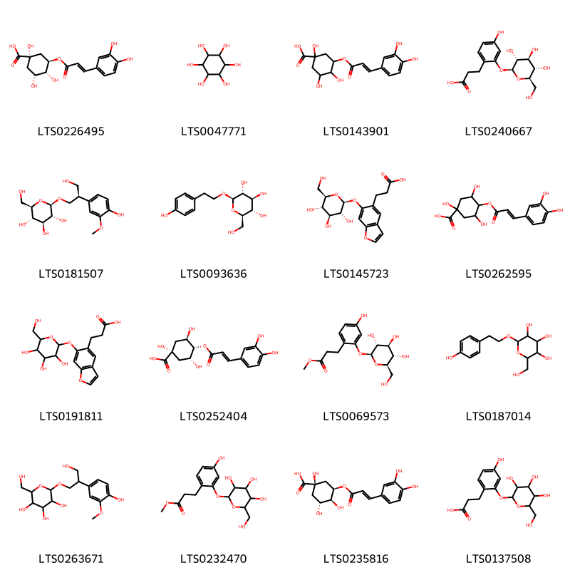{ width=100% }
    <figcaption>Hình ảnh cấu trúc hóa học của 16 hoạt chất thuộc nhóm Organooxygen compounds gồm ['chlorogenic acid (LTS0226495)', '(-)-inositol (LTS0047771)', '3-{[3-(3,4-dihydroxyphenyl)prop-2-enoyl]oxy}-1,4,5-trihydroxycyclohexane-1-carboxylic acid (LTS0143901)', '3-(4-hydroxy-2-{[(2s,3r,4s,5s,6r)-3,4,5-trihydroxy-6-(hydroxymethyl)oxan-2-yl]oxy}phenyl)propanoic acid (LTS0240667)', '(2r,3r,4s,5s,6r)-2-[(2r)-3-hydroxy-2-(4-hydroxy-3-methoxyphenyl)propoxy]-6-(hydroxymethyl)oxane-3,4,5-triol (LTS0181507)', 'salidroside (LTS0093636)', '3-(6-{[(2s,3r,4s,5s,6r)-3,4,5-trihydroxy-6-(hydroxymethyl)oxan-2-yl]oxy}-1-benzofuran-5-yl)propanoic acid (LTS0145723)', '4-{[3-(3,4-dihydroxyphenyl)prop-2-enoyl]oxy}-1,3,5-trihydroxycyclohexane-1-carboxylic acid (LTS0262595)', '3-(6-{[3,4,5-trihydroxy-6-(hydroxymethyl)oxan-2-yl]oxy}-1-benzofuran-5-yl)propanoic acid (LTS0191811)', 'cryptochlorogenic acid (LTS0252404)', 'methyl 3-(4-hydroxy-2-{[(2s,3r,4s,5s,6r)-3,4,5-trihydroxy-6-(hydroxymethyl)oxan-2-yl]oxy}phenyl)propanoate (LTS0069573)', '2-(hydroxymethyl)-6-[2-(4-hydroxyphenyl)ethoxy]oxane-3,4,5-triol (LTS0187014)', '2-[3-hydroxy-2-(4-hydroxy-3-methoxyphenyl)propoxy]-6-(hydroxymethyl)oxane-3,4,5-triol (LTS0263671)', 'methyl 3-(4-hydroxy-2-{[3,4,5-trihydroxy-6-(hydroxymethyl)oxan-2-yl]oxy}phenyl)propanoate (LTS0232470)', 'neochlorogenic acid (LTS0235816)', '3-(4-hydroxy-2-{[3,4,5-trihydroxy-6-(hydroxymethyl)oxan-2-yl]oxy}phenyl)propanoic acid (LTS0137508)'].</figcaption>
</figure>
#### Nhóm Phenols
<figure markdown="span">
    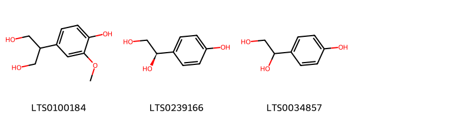{ width=100% }
    <figcaption>Hình ảnh cấu trúc hóa học của 3 hoạt chất thuộc nhóm Phenols gồm ['2-(4-hydroxy-3-methoxyphenyl)propane-1,3-diol (LTS0100184)', '(1r)-1-(4-hydroxyphenyl)ethane-1,2-diol (LTS0239166)', '1-(4-hydroxyphenyl)ethane-1,2-diol (LTS0034857)'].</figcaption>
</figure>
#### Nhóm Prenol lipids
<figure markdown="span">
    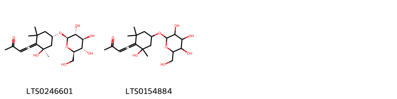{ width=100% }
    <figcaption>Hình ảnh cấu trúc hóa học của 2 hoạt chất thuộc nhóm Prenol lipids gồm ['4-[(2r,4s)-2-hydroxy-2,6,6-trimethyl-4-{[(2r,3r,4s,5s,6r)-3,4,5-trihydroxy-6-(hydroxymethyl)oxan-2-yl]oxy}cyclohexylidene]but-3-en-2-one (LTS0246601)', '4-(2-hydroxy-2,6,6-trimethyl-4-{[3,4,5-trihydroxy-6-(hydroxymethyl)oxan-2-yl]oxy}cyclohexylidene)but-3-en-2-one (LTS0154884)'].</figcaption>
</figure>
#### Nhóm Purine nucleosides
<figure markdown="span">
    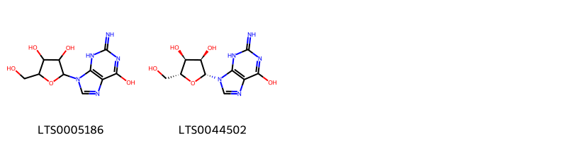{ width=100% }
    <figcaption>Hình ảnh cấu trúc hóa học của 2 hoạt chất thuộc nhóm Purine nucleosides gồm ['2-(6-hydroxy-2-imino-3h-purin-9-yl)-5-(hydroxymethyl)oxolane-3,4-diol (LTS0005186)', 'ribonucleoside (LTS0044502)'].</figcaption>
</figure>
#### Nhóm Pyrimidine nucleosides
<figure markdown="span">
    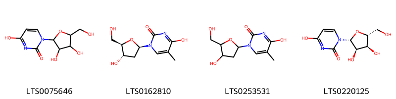{ width=100% }
    <figcaption>Hình ảnh cấu trúc hóa học của 4 hoạt chất thuộc nhóm Pyrimidine nucleosides gồm ['1-[3,4-dihydroxy-5-(hydroxymethyl)oxolan-2-yl]-4-hydroxypyrimidin-2-one (LTS0075646)', 'thymidine (LTS0162810)', '4-hydroxy-1-[4-hydroxy-5-(hydroxymethyl)oxolan-2-yl]-5-methylpyrimidin-2-one (LTS0253531)', 'uridine (LTS0220125)'].</figcaption>
</figure>

---

### Dược dân tộc học

Danh sách các quốc gia có sử dụng *Peucedanum japonicum* trong điều trị các bệnh. 

| Country   | Disease                               | Bệnh                                                                                                                                                                                                |
|:----------|:--------------------------------------|:----------------------------------------------------------------------------------------------------------------------------------------------------------------------------------------------------|
| China     | Laxative, Sedative, Diuretic, Nervine | MYMEMORY WARNING: YOU USED ALL AVAILABLE FREE TRANSLATIONS FOR TODAY. NEXT AVAILABLE IN  07 HOURS 25 MINUTES 07 SECONDS VISIT HTTPS://MYMEMORY.TRANSLATED.NET/DOC/USAGELIMITS.PHP TO TRANSLATE MORE |

---

---
## Peucedanum nagpurense
### Thông tin về thực vật

!!! info "Phân loại thực vật của *Peucedanum nagpurense* từ GIBF:"
    - **Kingdom:** Plantae
    - **Phylum:** Tracheophyta
    - **Order:** Apiales
    - **Family:** Apiaceae
    - **Genus:** Peucedanum
    - **Species:** *Peucedanum nagpurense*

 

| Label (VI)   | Label (EN)   | Scientific Name       | Descriptions (VI)   | Descriptions (EN)   | Also Known As (VI)   | Also Known As (EN)   |
|:-------------|:-------------|:----------------------|:--------------------|:--------------------|:---------------------|:---------------------|
| N/A          | N/A          | Peucedanum nagpurense |                     | species of plant    | ['']                 | ['']                 |

#### Phân bố trên thế giới

**Từ CSDL GIBF** Japan, Korea, Republic of, Chinese Taipei, United States of America, China

#### Phân bố tại Việt Nam

**Từ CSDL GIBF**: Không có ghi nhận ở Việt Nam

---
### Thành phần hóa học
        
- Theo cơ sở dữ liệu lotus: Từ loài *Peucedanum nagpurense* đã phân lập và xác định được Chưa có hoạt chất nào được phân lập. hoạt chất thuộc về các nhóm Không có hoạt chất nào được phân lập. 

Không có hình ảnh nào được tạo ra

---

### Dược dân tộc học

Danh sách các quốc gia có sử dụng *Peucedanum nagpurense* trong điều trị các bệnh. 

| Country   | Disease              | Bệnh                                                                                                                                                                                                |
|:----------|:---------------------|:----------------------------------------------------------------------------------------------------------------------------------------------------------------------------------------------------|
| India     | Stomachic, Stomachic | MYMEMORY WARNING: YOU USED ALL AVAILABLE FREE TRANSLATIONS FOR TODAY. NEXT AVAILABLE IN  07 HOURS 24 MINUTES 38 SECONDS VISIT HTTPS://MYMEMORY.TRANSLATED.NET/DOC/USAGELIMITS.PHP TO TRANSLATE MORE |

---

---
## Peucedanum officinale
### Thông tin về thực vật

!!! info "Phân loại thực vật của *Peucedanum officinale* từ GIBF:"
    - **Kingdom:** Plantae
    - **Phylum:** Tracheophyta
    - **Order:** Apiales
    - **Family:** Apiaceae
    - **Genus:** Peucedanum
    - **Species:** *Peucedanum officinale*

 

| Label (VI)   | Label (EN)   | Scientific Name       | Descriptions (VI)   | Descriptions (EN)   | Also Known As (VI)   | Also Known As (EN)   |
|:-------------|:-------------|:----------------------|:--------------------|:--------------------|:---------------------|:---------------------|
| N/A          | N/A          | Peucedanum officinale | loài thực vật       | species of plant    | ['']                 | ['']                 |

#### Phân bố trên thế giới

**Từ CSDL GIBF** Netherlands, Italy, Germany, Spain, Hungary, Serbia, Portugal, Austria, France, Croatia, United Kingdom of Great Britain and Northern Ireland

#### Phân bố tại Việt Nam

**Từ CSDL GIBF**: Không có ghi nhận ở Việt Nam

---
### Thành phần hóa học
        
- Theo cơ sở dữ liệu lotus: Từ loài *Peucedanum officinale* đã phân lập và xác định được 5 hoạt chất thuộc về các nhóm Coumarins and derivatives. 

|    | chemicalTaxonomyClassyfireClass   |   smiles_count |
|---:|:----------------------------------|---------------:|
|  0 | Coumarins and derivatives         |              5 |

#### Nhóm Coumarins and derivatives
<figure markdown="span">
    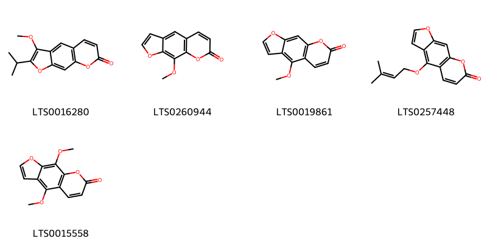{ width=100% }
    <figcaption>Hình ảnh cấu trúc hóa học của 5 hoạt chất thuộc nhóm Coumarins and derivatives gồm ['peucedanin (LTS0016280)', 'methoxsalen (LTS0260944)', 'bergapten (LTS0019861)', 'isoimperatorin (LTS0257448)', 'isopimpinellin (LTS0015558)'].</figcaption>
</figure>

---

### Dược dân tộc học

Danh sách các quốc gia có sử dụng *Peucedanum officinale* trong điều trị các bệnh. 

| Country   | Disease                                     | Bệnh                                                                                                                                                                                                |
|:----------|:--------------------------------------------|:----------------------------------------------------------------------------------------------------------------------------------------------------------------------------------------------------|
| Eurasia   | Diuretic, Emmenagogue, Sudorific            | MYMEMORY WARNING: YOU USED ALL AVAILABLE FREE TRANSLATIONS FOR TODAY. NEXT AVAILABLE IN  07 HOURS 24 MINUTES 23 SECONDS VISIT HTTPS://MYMEMORY.TRANSLATED.NET/DOC/USAGELIMITS.PHP TO TRANSLATE MORE |
| Turkey    | Diuretic, Emmenagogue, Stomachic, Sudorific | MYMEMORY WARNING: YOU USED ALL AVAILABLE FREE TRANSLATIONS FOR TODAY. NEXT AVAILABLE IN  07 HOURS 24 MINUTES 21 SECONDS VISIT HTTPS://MYMEMORY.TRANSLATED.NET/DOC/USAGELIMITS.PHP TO TRANSLATE MORE |

---

---
## Peucedanum oreoselinum
### Thông tin về thực vật

!!! info "Phân loại thực vật của *Oreoselinum nigrum* từ GIBF:"
    - **Kingdom:** Plantae
    - **Phylum:** Tracheophyta
    - **Order:** Apiales
    - **Family:** Apiaceae
    - **Genus:** Oreoselinum
    - **Species:** *Oreoselinum nigrum*

 

| Label (VI)   | Label (EN)   | Scientific Name        | Descriptions (VI)   | Descriptions (EN)   | Also Known As (VI)   | Also Known As (EN)   |
|:-------------|:-------------|:-----------------------|:--------------------|:--------------------|:---------------------|:---------------------|
| N/A          | N/A          | Peucedanum oreoselinum | loài thực vật       | species of plant    | ['']                 | ['mountain parsley'] |

#### Phân bố trên thế giới

**Từ CSDL GIBF** Italy, Slovakia, Estonia, Ukraine, Denmark, Lithuania, Belarus, Hungary, Russian Federation, Sweden, Slovenia, Croatia, Czechia, Germany, Romania, Switzerland, Austria, France, Poland

#### Phân bố tại Việt Nam

**Từ CSDL GIBF**: Không có ghi nhận ở Việt Nam

---
### Thành phần hóa học
        
- Theo cơ sở dữ liệu lotus: Từ loài *Oreoselinum nigrum* đã phân lập và xác định được 15 hoạt chất thuộc về các nhóm Unsaturated hydrocarbons, Fatty Acyls, Prenol lipids, Coumarins and derivatives. 

|    | chemicalTaxonomyClassyfireClass   |   smiles_count |
|---:|:----------------------------------|---------------:|
|  0 | Coumarins and derivatives         |              5 |
|  1 | Fatty Acyls                       |              2 |
|  2 | Prenol lipids                     |              7 |
|  3 | Unsaturated hydrocarbons          |              1 |

#### Nhóm Coumarins and derivatives
<figure markdown="span">
    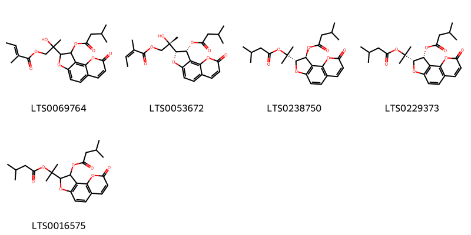{ width=100% }
    <figcaption>Hình ảnh cấu trúc hóa học của 5 hoạt chất thuộc nhóm Coumarins and derivatives gồm ['2-hydroxy-2-{9-[(3-methylbutanoyl)oxy]-2-oxo-8h,9h-furo[2,3-h]chromen-8-yl}propyl 2-methylbut-2-enoate (LTS0069764)', '(2s)-2-hydroxy-2-[(8s,9r)-9-[(3-methylbutanoyl)oxy]-2-oxo-8h,9h-furo[2,3-h]chromen-8-yl]propyl (2z)-2-methylbut-2-enoate (LTS0053672)', '2-[(8s,9s)-9-[(3-methylbutanoyl)oxy]-2-oxo-8h,9h-furo[2,3-h]chromen-8-yl]propan-2-yl 3-methylbutanoate (LTS0238750)', 'athamantin (LTS0229373)', '2-{9-[(3-methylbutanoyl)oxy]-2-oxo-8h,9h-furo[2,3-h]chromen-8-yl}propan-2-yl 3-methylbutanoate (LTS0016575)'].</figcaption>
</figure>
#### Nhóm Fatty Acyls
<figure markdown="span">
    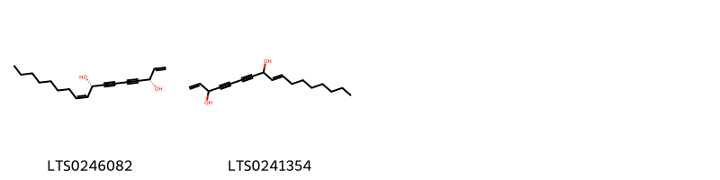{ width=100% }
    <figcaption>Hình ảnh cấu trúc hóa học của 2 hoạt chất thuộc nhóm Fatty Acyls gồm ['(3s,8s,9z)-heptadeca-1,9-dien-4,6-diyne-3,8-diol (LTS0246082)', 'heptadeca-1,9-dien-4,6-diyne-3,8-diol (LTS0241354)'].</figcaption>
</figure>
#### Nhóm Prenol lipids
<figure markdown="span">
    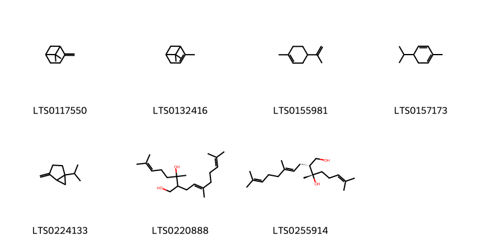{ width=100% }
    <figcaption>Hình ảnh cấu trúc hóa học của 7 hoạt chất thuộc nhóm Prenol lipids gồm ['β-pinene (LTS0117550)', 'α pinene (LTS0132416)', 'limonene,  (LTS0155981)', 'phellandrene (LTS0157173)', 'sabinene (LTS0224133)', '2-(3,7-dimethylocta-2,6-dien-1-yl)-3,7-dimethyloct-6-ene-1,3-diol (LTS0220888)', '(2r,3s)-2-[(2e)-3,7-dimethylocta-2,6-dien-1-yl]-3,7-dimethyloct-6-ene-1,3-diol (LTS0255914)'].</figcaption>
</figure>
#### Nhóm Unsaturated hydrocarbons
<figure markdown="span">
    { width=100% }
    <figcaption>Hình ảnh cấu trúc hóa học của 1 hoạt chất thuộc nhóm Unsaturated hydrocarbons gồm ['α terpinene (LTS0232891)'].</figcaption>
</figure>

---

### Dược dân tộc học

Danh sách các quốc gia có sử dụng *Oreoselinum nigrum* trong điều trị các bệnh. 

| Country   | Disease   | Bệnh                                                                                                                                                                                                |
|:----------|:----------|:----------------------------------------------------------------------------------------------------------------------------------------------------------------------------------------------------|
| Eurasia   | Diuretic  | MYMEMORY WARNING: YOU USED ALL AVAILABLE FREE TRANSLATIONS FOR TODAY. NEXT AVAILABLE IN  07 HOURS 23 MINUTES 56 SECONDS VISIT HTTPS://MYMEMORY.TRANSLATED.NET/DOC/USAGELIMITS.PHP TO TRANSLATE MORE |

---

---
## Peucedanum ostruthium
### Thông tin về thực vật

!!! info "Phân loại thực vật của *Imperatoria ostruthium* từ GIBF:"
    - **Kingdom:** Plantae
    - **Phylum:** Tracheophyta
    - **Order:** Apiales
    - **Family:** Apiaceae
    - **Genus:** Imperatoria
    - **Species:** *Imperatoria ostruthium*

 

| Label (VI)   | Label (EN)   | Scientific Name       | Descriptions (VI)   | Descriptions (EN)   | Also Known As (VI)   | Also Known As (EN)   |
|:-------------|:-------------|:----------------------|:--------------------|:--------------------|:---------------------|:---------------------|
| N/A          | N/A          | Peucedanum ostruthium | loài thực vật       | species of plant    | ['']                 | ['masterwort']       |

#### Phân bố trên thế giới

**Từ CSDL GIBF** Andorra, Italy, Czechia, Germany, Belgium, Spain, Switzerland, Sweden, Austria, France, Slovenia, Norway, United Kingdom of Great Britain and Northern Ireland

#### Phân bố tại Việt Nam

**Từ CSDL GIBF**: Không có ghi nhận ở Việt Nam

---
### Thành phần hóa học
        
- Theo cơ sở dữ liệu lotus: Từ loài *Imperatoria ostruthium* đã phân lập và xác định được 28 hoạt chất thuộc về các nhóm Isobenzofurans, Prenol lipids, Benzopyrans, Coumarins and derivatives. 

|    | chemicalTaxonomyClassyfireClass   |   smiles_count |
|---:|:----------------------------------|---------------:|
|  0 | Benzopyrans                       |              1 |
|  1 | Coumarins and derivatives         |             19 |
|  2 | Isobenzofurans                    |              5 |
|  3 | Prenol lipids                     |              3 |

#### Nhóm Benzopyrans
<figure markdown="span">
    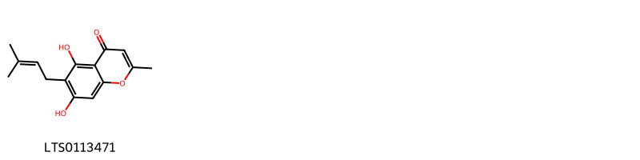{ width=100% }
    <figcaption>Hình ảnh cấu trúc hóa học của 1 hoạt chất thuộc nhóm Benzopyrans gồm ['5,7-dihydroxy-2-methyl-6-(3-methylbut-2-en-1-yl)chromen-4-one (LTS0113471)'].</figcaption>
</figure>
#### Nhóm Coumarins and derivatives
<figure markdown="span">
    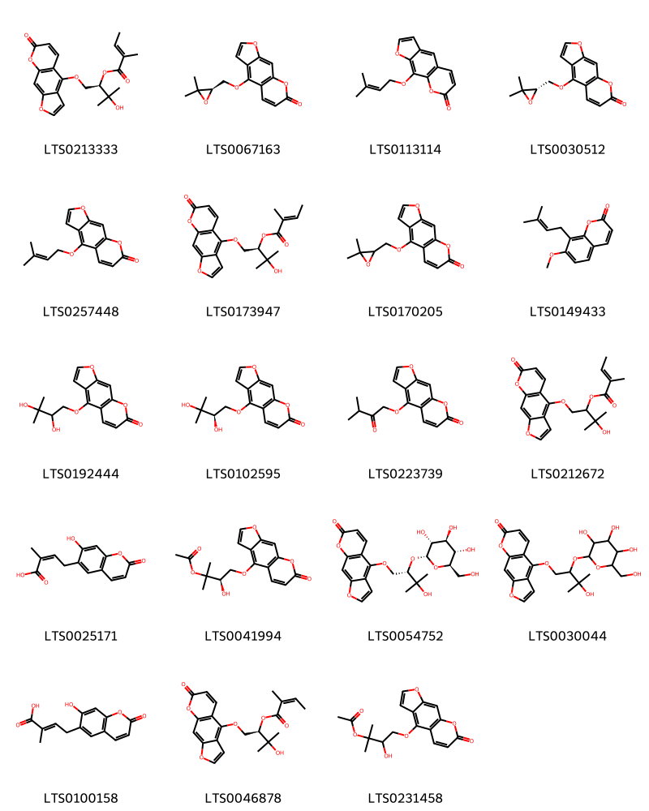{ width=100% }
    <figcaption>Hình ảnh cấu trúc hóa học của 19 hoạt chất thuộc nhóm Coumarins and derivatives gồm ['(2r)-3-hydroxy-3-methyl-1-({7-oxofuro[3,2-g]chromen-4-yl}oxy)butan-2-yl 2-methylbut-2-enoate (LTS0213333)', '(+)-oxypeucedanin (LTS0067163)', 'imperatorin (LTS0113114)', 'oxypeucedanin (LTS0030512)', 'isoimperatorin (LTS0257448)', '(2r)-3-hydroxy-3-methyl-1-({7-oxofuro[3,2-g]chromen-4-yl}oxy)butan-2-yl (2e)-2-methylbut-2-enoate (LTS0173947)', '4-[(3,3-dimethyloxiran-2-yl)methoxy]furo[3,2-g]chromen-7-one (LTS0170205)', 'osthole (LTS0149433)', '4-(2,3-dihydroxy-3-methylbutoxy)furo[3,2-g]chromen-7-one (LTS0192444)', '(r)-oxypeucedanin hydrate (LTS0102595)', '4-(3-methyl-2-oxobutoxy)furo[3,2-g]chromen-7-one (LTS0223739)', '3-hydroxy-3-methyl-1-({7-oxofuro[3,2-g]chromen-4-yl}oxy)butan-2-yl 2-methylbut-2-enoate (LTS0212672)', '4-(7-hydroxy-2-oxochromen-6-yl)-2-methylbut-2-enoic acid (LTS0025171)', '(3r)-3-hydroxy-2-methyl-4-({7-oxofuro[3,2-g]chromen-4-yl}oxy)butan-2-yl acetate (LTS0041994)', '4-[(2s)-3-hydroxy-3-methyl-2-{[(2r,3r,4s,5s,6r)-3,4,5-trihydroxy-6-(hydroxymethyl)oxan-2-yl]oxy}butoxy]furo[3,2-g]chromen-7-one (LTS0054752)', '4-(3-hydroxy-3-methyl-2-{[3,4,5-trihydroxy-6-(hydroxymethyl)oxan-2-yl]oxy}butoxy)furo[3,2-g]chromen-7-one (LTS0030044)', '(2e)-4-(7-hydroxy-2-oxochromen-6-yl)-2-methylbut-2-enoic acid (LTS0100158)', 'ostruthol (LTS0046878)', '3-hydroxy-2-methyl-4-({7-oxofuro[3,2-g]chromen-4-yl}oxy)butan-2-yl acetate (LTS0231458)'].</figcaption>
</figure>
#### Nhóm Isobenzofurans
<figure markdown="span">
    { width=100% }
    <figcaption>Hình ảnh cấu trúc hóa học của 5 hoạt chất thuộc nhóm Isobenzofurans gồm ['3-butyl-4,5-dihydro-3h-2-benzofuran-1-one (LTS0217963)', '(z)-ligustilide (LTS0042891)', 'senkyunolide a (LTS0045033)', 'z-ligustilide (LTS0223779)', 'cnidilide (LTS0005896)'].</figcaption>
</figure>
#### Nhóm Prenol lipids
<figure markdown="span">
    { width=100% }
    <figcaption>Hình ảnh cấu trúc hóa học của 3 hoạt chất thuộc nhóm Prenol lipids gồm ['ostruthin (LTS0125425)', '6-(3,7-dimethylocta-2,6-dien-1-yl)-7-hydroxychromen-2-one (LTS0220064)', '(1s,2s,4s,5s,6s,7s,8s,9r,12r)-6-(hydroxymethyl)-2,10,10-trimethyl-11-oxatricyclo[7.2.1.0¹,⁶]dodecane-4,5,7,8,12-pentol (LTS0175463)'].</figcaption>
</figure>

---

### Dược dân tộc học

Danh sách các quốc gia có sử dụng *Imperatoria ostruthium* trong điều trị các bệnh. 

| Country   | Disease   | Bệnh                                                                                                                                                                                                |
|:----------|:----------|:----------------------------------------------------------------------------------------------------------------------------------------------------------------------------------------------------|
| Eurasia   | Stomachic | MYMEMORY WARNING: YOU USED ALL AVAILABLE FREE TRANSLATIONS FOR TODAY. NEXT AVAILABLE IN  07 HOURS 23 MINUTES 26 SECONDS VISIT HTTPS://MYMEMORY.TRANSLATED.NET/DOC/USAGELIMITS.PHP TO TRANSLATE MORE |
| ain       | Diuretic  | MYMEMORY WARNING: YOU USED ALL AVAILABLE FREE TRANSLATIONS FOR TODAY. NEXT AVAILABLE IN  07 HOURS 23 MINUTES 24 SECONDS VISIT HTTPS://MYMEMORY.TRANSLATED.NET/DOC/USAGELIMITS.PHP TO TRANSLATE MORE |

---

---
## Peucedanum pracruptorum
### Thông tin về thực vật

!!! info "Phân loại thực vật của *Kitagawia praeruptora* từ GIBF:"
    - **Kingdom:** Plantae
    - **Phylum:** Tracheophyta
    - **Order:** Apiales
    - **Family:** Apiaceae
    - **Genus:** Kitagawia
    - **Species:** *Kitagawia praeruptora*

 

| Label (VI)   | Label (EN)   | Scientific Name       | Descriptions (VI)   | Descriptions (EN)   | Also Known As (VI)   | Also Known As (EN)   |
|:-------------|:-------------|:----------------------|:--------------------|:--------------------|:---------------------|:---------------------|
| N/A          | N/A          | Peucedanum ostruthium | loài thực vật       | species of plant    | ['']                 | ['masterwort']       |

#### Phân bố trên thế giới

**Từ CSDL GIBF** nan, unknown or invalid, China, United States of America

#### Phân bố tại Việt Nam

**Từ CSDL GIBF**: Không có ghi nhận ở Việt Nam

---
### Thành phần hóa học
        
- Theo cơ sở dữ liệu lotus: Từ loài *Kitagawia praeruptora* đã phân lập và xác định được Chưa có hoạt chất nào được phân lập. hoạt chất thuộc về các nhóm Không có hoạt chất nào được phân lập. 

Không có hình ảnh nào được tạo ra

---

### Dược dân tộc học

Danh sách các quốc gia có sử dụng *Kitagawia praeruptora* trong điều trị các bệnh. 

| Country   | Disease     | Bệnh                                                                                                                                                                                                |
|:----------|:------------|:----------------------------------------------------------------------------------------------------------------------------------------------------------------------------------------------------|
| China     | Carminative | MYMEMORY WARNING: YOU USED ALL AVAILABLE FREE TRANSLATIONS FOR TODAY. NEXT AVAILABLE IN  07 HOURS 23 MINUTES 00 SECONDS VISIT HTTPS://MYMEMORY.TRANSLATED.NET/DOC/USAGELIMITS.PHP TO TRANSLATE MORE |

---

---
## Peucedanum praeruptorum
### Thông tin về thực vật

!!! info "Phân loại thực vật của *Kitagawia praeruptora* từ GIBF:"
    - **Kingdom:** Plantae
    - **Phylum:** Tracheophyta
    - **Order:** Apiales
    - **Family:** Apiaceae
    - **Genus:** Kitagawia
    - **Species:** *Kitagawia praeruptora*

 

| Label (VI)   | Label (EN)   | Scientific Name         | Descriptions (VI)   | Descriptions (EN)   | Also Known As (VI)   | Also Known As (EN)   |
|:-------------|:-------------|:------------------------|:--------------------|:--------------------|:---------------------|:---------------------|
| N/A          | N/A          | Peucedanum praeruptorum | loài thực vật       | species of plant    | ['']                 | ['']                 |

#### Phân bố trên thế giới

**Từ CSDL GIBF** nan, unknown or invalid, China, United States of America

#### Phân bố tại Việt Nam

**Từ CSDL GIBF**: Không có ghi nhận ở Việt Nam

---
### Thành phần hóa học
        
- Theo cơ sở dữ liệu lotus: Từ loài *Kitagawia praeruptora* đã phân lập và xác định được 79 hoạt chất thuộc về các nhóm Fatty Acyls, Steroids and steroid derivatives, Phenanthrenes and derivatives, Organooxygen compounds, Tannins, Coumarins and derivatives. 

|    | chemicalTaxonomyClassyfireClass   |   smiles_count |
|---:|:----------------------------------|---------------:|
|  0 | Coumarins and derivatives         |             69 |
|  1 | Fatty Acyls                       |              4 |
|  2 | Organooxygen compounds            |              1 |
|  3 | Phenanthrenes and derivatives     |              1 |
|  4 | Steroids and steroid derivatives  |              2 |
|  5 | Tannins                           |              1 |

#### Nhóm Coumarins and derivatives
<figure markdown="span">
    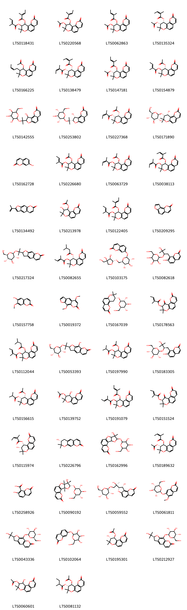{ width=100% }
    <figcaption>Hình ảnh cấu trúc hóa học của 69 hoạt chất thuộc nhóm Coumarins and derivatives gồm ['8,8-dimethyl-10-[(2-methylbut-2-enoyl)oxy]-2-oxo-9h,10h-pyrano[2,3-h]chromen-9-yl 2-methylbut-2-enoate (LTS0118431)', '9-(acetyloxy)-8,8-dimethyl-2-oxo-9h,10h-pyrano[2,3-h]chromen-10-yl 2-methylbut-2-enoate (LTS0220568)', '(9s,10s)-9-(acetyloxy)-8,8-dimethyl-2-oxo-9h,10h-pyrano[2,3-h]chromen-10-yl (2e)-2-methylbut-2-enoate (LTS0062863)', 'pteryxin (LTS0135324)', '9-[(2z)-but-2-en-1-yl]-8,8-dimethyl-2-oxo-9h,10h-pyrano[2,3-h]chromen-10-yl acetate (LTS0166225)', '(9r,10r)-8,8-dimethyl-10-{[(2z)-2-methylbut-2-enoyl]oxy}-2-oxo-9h,10h-pyrano[2,3-h]chromen-9-yl (2z)-2-methylbut-2-enoate (LTS0138479)', '(9r,10s)-9-(acetyloxy)-8,8-dimethyl-2-oxo-9h,10h-pyrano[2,3-h]chromen-10-yl (2e)-2-methylbut-2-enoate (LTS0147181)', '(9s,10r)-10-(acetyloxy)-8,8-dimethyl-2-oxo-9h,10h-pyrano[2,3-h]chromen-9-yl 2-methylbut-2-enoate (LTS0154879)', 'apterin (LTS0142555)', 'apterin (LTS0253802)', '(9r,10r)-10-(acetyloxy)-8,8-dimethyl-2-oxo-9h,10h-pyrano[2,3-h]chromen-9-yl (2z)-2-methylbut-2-enoate (LTS0227368)', '(9r,10r)-10-hydroxy-8,8-dimethyl-9-{[(2s,3r,4s,5s,6r)-3,4,5-trihydroxy-6-(hydroxymethyl)oxan-2-yl]oxy}-9h,10h-pyrano[2,3-h]chromen-2-one (LTS0171890)', 'umbelliferone (LTS0162728)', '10-(acetyloxy)-8,8-dimethyl-2-oxo-9h,10h-pyrano[2,3-h]chromen-9-yl 2-methylbut-2-enoate (LTS0226680)', '(9s,10s)-10-(acetyloxy)-8,8-dimethyl-2-oxo-9h,10h-pyrano[2,3-h]chromen-9-yl (2z)-2-methylbut-2-enoate (LTS0063729)', '(9s,10s)-8,8-dimethyl-10-{[(2z)-2-methylbut-2-enoyl]oxy}-2-oxo-9h,10h-pyrano[2,3-h]chromen-9-yl (2z)-2-methylbut-2-enoate (LTS0038113)', '2-(prop-1-en-2-yl)furo[3,2-g]chromen-7-one (LTS0134492)', '9-hydroxy-8,8-dimethyl-2-oxo-9h,10h-pyrano[2,3-h]chromen-10-yl acetate (LTS0213978)', '(9s,10s)-8,8-dimethyl-10-[(2-methylbut-2-enoyl)oxy]-2-oxo-9h,10h-pyrano[2,3-h]chromen-9-yl 2-methylbut-2-enoate (LTS0122405)', 'angelicin (LTS0209295)', '2-(2-{[(2s,3r,4s,5s,6r)-3,4,5-trihydroxy-6-(hydroxymethyl)oxan-2-yl]oxy}propan-2-yl)-2h,3h-furo[3,2-g]chromen-7-one (LTS0217324)', '(9s,10r)-8,8-dimethyl-10-[(3-methylbutanoyl)oxy]-2-oxo-9h,10h-pyrano[2,3-h]chromen-9-yl (2e)-2-methylbut-2-enoate (LTS0082655)', '7-{[(2s,3r,4s,5s,6r)-6-({[(2r,3r,4r)-3,4-dihydroxy-4-(hydroxymethyl)oxolan-2-yl]oxy}methyl)-3,4,5-trihydroxyoxan-2-yl]oxy}chromen-2-one (LTS0103175)', '7-hydroxy-8-(3-hydroxy-3-methyl-2-{[3,4,5-trihydroxy-6-(hydroxymethyl)oxan-2-yl]oxy}butyl)chromen-2-one (LTS0082618)', 'isoscopoletin (LTS0157758)', '5,9-dimethoxyfuro[3,2-g]chromen-7-one (LTS0019372)', '(9r)-8,8-dimethyl-9-{[(2s,3r,4s,5s,6r)-3,4,5-trihydroxy-6-(hydroxymethyl)oxan-2-yl]oxy}-9h,10h-pyrano[2,3-h]chromen-2-one (LTS0167039)', '8,8-dimethyl-2,10-dioxo-9h-pyrano[2,3-h]chromen-9-yl (2e)-2-methylbut-2-enoate (LTS0178563)', '8,8-dimethyl-10-[(3-methylbutanoyl)oxy]-2-oxo-9h,10h-pyrano[2,3-h]chromen-9-yl 2-methylbut-2-enoate (LTS0112044)', '9-hydroxy-2-(2-{[(2s,3r,4s,5s,6r)-3,4,5-trihydroxy-6-(hydroxymethyl)oxan-2-yl]oxy}propan-2-yl)-2h,3h-furo[3,2-g]chromen-7-one (LTS0053393)', '10-(acetyloxy)-8,8-dimethyl-2-oxo-9h,10h-pyrano[2,3-h]chromen-9-yl 2-methylpropanoate (LTS0197990)', '7-hydroxy-8-[(2r)-3-hydroxy-3-methyl-2-{[(2s,3r,4s,5s,6r)-3,4,5-trihydroxy-6-(hydroxymethyl)oxan-2-yl]oxy}butyl]chromen-2-one (LTS0183305)', '(9r,10r)-10-(acetyloxy)-8,8-dimethyl-2-oxo-9h,10h-pyrano[2,3-h]chromen-9-yl 2-methylpropanoate (LTS0156615)', '(9s,10s)-10-hydroxy-8,8-dimethyl-2-oxo-9h,10h-pyrano[2,3-h]chromen-9-yl acetate (LTS0139752)', '8,8-dimethyl-10-{[(2e)-2-methylbut-2-enoyl]oxy}-2-oxo-9h,10h-pyrano[2,3-h]chromen-9-yl (2e)-2-methylbut-2-enoate (LTS0191079)', '(9r)-8,8-dimethyl-2,10-dioxo-9h-pyrano[2,3-h]chromen-9-yl (2e)-2-methylbut-2-enoate (LTS0151524)', '(9r,10r)-9-hydroxy-8,8-dimethyl-2-oxo-9h,10h-pyrano[2,3-h]chromen-10-yl (2z)-2-methylbut-2-enoate (LTS0115974)', '(-)-decursinol (LTS0226796)', '13-hydroxy-13-methyl-14-{[3,4,5-trihydroxy-6-(hydroxymethyl)oxan-2-yl]oxy}-3,11,15-trioxatetracyclo[8.6.0.0²,⁷.0¹²,¹⁶]hexadeca-1,5,7,9-tetraen-4-one (LTS0162996)', '(9r,10s)-9-(acetyloxy)-8,8-dimethyl-2-oxo-9h,10h-pyrano[2,3-h]chromen-10-yl (2z)-2-methylbut-2-enoate (LTS0189632)', '7-hydroxy-2-oxochromene-8-carboxylic acid (LTS0258926)', '(12s,13s,14s,16r)-13-hydroxy-13-methyl-14-{[(2s,3r,4s,5s,6r)-3,4,5-trihydroxy-6-(hydroxymethyl)oxan-2-yl]oxy}-3,11,15-trioxatetracyclo[8.6.0.0²,⁷.0¹²,¹⁶]hexadeca-1,5,7,9-tetraen-4-one (LTS0090192)', '(8s,9r)-9-hydroxy-8-[(2r)-2-hydroxy-1-{[(2r,3r,4s,5s,6r)-3,4,5-trihydroxy-6-(hydroxymethyl)oxan-2-yl]oxy}propan-2-yl]-8h,9h-furo[2,3-h]chromen-2-one (LTS0059552)', 'scopolin (LTS0061811)', '2-(2-hydroxypropan-2-yl)-9-{[(2s,3r,4s,5s,6r)-3,4,5-trihydroxy-6-(hydroxymethyl)oxan-2-yl]oxy}-2h,3h-furo[3,2-g]chromen-7-one (LTS0043336)', 'skimmin (LTS0102064)', '(9r,10s)-9-hydroxy-8,8-dimethyl-2-oxo-9h,10h-pyrano[2,3-h]chromen-10-yl acetate (LTS0195301)', 'rutarin (LTS0212927)', '10-hydroxy-8,8-dimethyl-2-oxo-9h,10h-pyrano[2,3-h]chromen-9-yl acetate (LTS0060601)', '(9r,10s)-10-(acetyloxy)-8,8-dimethyl-2-oxo-9h,10h-pyrano[2,3-h]chromen-9-yl 2-methylbutanoate (LTS0081132)', '(9s,10r)-9-(acetyloxy)-8,8-dimethyl-2-oxo-9h,10h-pyrano[2,3-h]chromen-10-yl (2z)-2-methylbut-2-enoate (LTS0218800)', '7-{[6-({[3,4-dihydroxy-4-(hydroxymethyl)oxolan-2-yl]oxy}methyl)-3,4,5-trihydroxyoxan-2-yl]oxy}-6-methoxychromen-2-one (LTS0097824)', 'isofraxidin (LTS0073081)', 'ammijin (LTS0260730)', '7-{[6-({[3,4-dihydroxy-4-(hydroxymethyl)oxolan-2-yl]oxy}methyl)-3,4,5-trihydroxyoxan-2-yl]oxy}chromen-2-one (LTS0004387)', '(9s,10r)-9-(acetyloxy)-8,8-dimethyl-2-oxo-9h,10h-pyrano[2,3-h]chromen-10-yl (2e)-2-methylbut-2-enoate (LTS0221071)', '9-hydroxy-8-(2-hydroxy-1-{[3,4,5-trihydroxy-6-(hydroxymethyl)oxan-2-yl]oxy}propan-2-yl)-8h,9h-furo[2,3-h]chromen-2-one (LTS0226422)', 'scopoletin (LTS0193112)', 'skimmin (LTS0063676)', '10-(acetyloxy)-8,8-dimethyl-2-oxo-9h,10h-pyrano[2,3-h]chromen-9-yl acetate (LTS0001996)', '(9s,10r)-8,8-dimethyl-10-[(3-methylbutanoyl)oxy]-2-oxo-9h,10h-pyrano[2,3-h]chromen-9-yl (2z)-2-methylbut-2-enoate (LTS0011714)', '8,8-dimethyl-10-{[3,4,5-trihydroxy-6-(hydroxymethyl)oxan-2-yl]oxy}-9h,10h-pyrano[2,3-h]chromen-2-one (LTS0008550)', '(9r,10s)-9,10-dihydroxy-8,8-dimethyl-9h,10h-pyrano[2,3-h]chromen-2-one (LTS0011460)', 'nodakenin (LTS0251242)', 'pteryxin (LTS0242444)', '7-{[(2s,3r,4s,5s,6r)-6-({[(2r,3r,4r)-3,4-dihydroxy-4-(hydroxymethyl)oxolan-2-yl]oxy}methyl)-3,4,5-trihydroxyoxan-2-yl]oxy}-6-methoxychromen-2-one (LTS0035587)', '(9r,10r)-9-hydroxy-8,8-dimethyl-2-oxo-9h,10h-pyrano[2,3-h]chromen-10-yl (2e)-2-methylbut-2-enoate (LTS0254507)', '(2r)-9-hydroxy-2-(2-hydroxypropan-2-yl)-2h,3h-furo[3,2-g]chromen-7-one (LTS0104526)', '(9s,10r)-10-(acetyloxy)-8,8-dimethyl-2-oxo-9h,10h-pyrano[2,3-h]chromen-9-yl (2s)-2-methylbutanoate (LTS0116808)'].</figcaption>
</figure>
#### Nhóm Fatty Acyls
<figure markdown="span">
    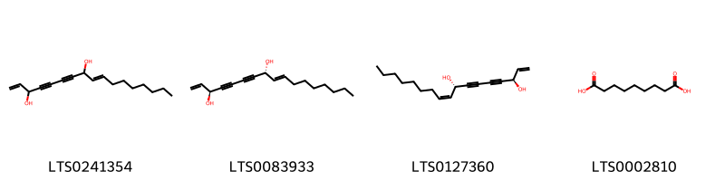{ width=100% }
    <figcaption>Hình ảnh cấu trúc hóa học của 4 hoạt chất thuộc nhóm Fatty Acyls gồm ['heptadeca-1,9-dien-4,6-diyne-3,8-diol (LTS0241354)', '(3s,8r)-heptadeca-1,9-dien-4,6-diyne-3,8-diol (LTS0083933)', 'falcarindiol (LTS0127360)', 'azelaic acid (LTS0002810)'].</figcaption>
</figure>
#### Nhóm Organooxygen compounds
<figure markdown="span">
    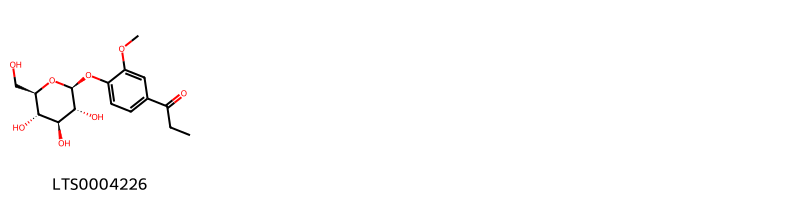{ width=100% }
    <figcaption>Hình ảnh cấu trúc hóa học của 1 hoạt chất thuộc nhóm Organooxygen compounds gồm ['1-(3-methoxy-4-{[(2s,3r,4s,5s,6r)-3,4,5-trihydroxy-6-(hydroxymethyl)oxan-2-yl]oxy}phenyl)propan-1-one (LTS0004226)'].</figcaption>
</figure>
#### Nhóm Phenanthrenes and derivatives
<figure markdown="span">
    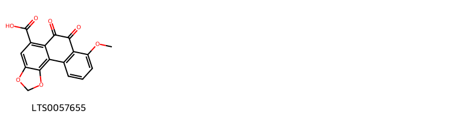{ width=100% }
    <figcaption>Hình ảnh cấu trúc hóa học của 1 hoạt chất thuộc nhóm Phenanthrenes and derivatives gồm ['8-methoxy-6,7-dioxo-2h-phenanthro[3,4-d][1,3]dioxole-5-carboxylic acid (LTS0057655)'].</figcaption>
</figure>
#### Nhóm Steroids and steroid derivatives
<figure markdown="span">
    { width=100% }
    <figcaption>Hình ảnh cấu trúc hóa học của 2 hoạt chất thuộc nhóm Steroids and steroid derivatives gồm ['sitogluside (LTS0201798)', '2-{[1-(5-ethyl-6-methylheptan-2-yl)-9a,11a-dimethyl-1h,2h,3h,3ah,3bh,4h,6h,7h,8h,9h,9bh,10h,11h-cyclopenta[a]phenanthren-7-yl]oxy}-6-(hydroxymethyl)oxane-3,4,5-triol (LTS0158828)'].</figcaption>
</figure>
#### Nhóm Tannins
<figure markdown="span">
    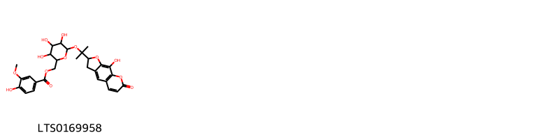{ width=100% }
    <figcaption>Hình ảnh cấu trúc hóa học của 1 hoạt chất thuộc nhóm Tannins gồm ['{3,4,5-trihydroxy-6-[(2-{9-hydroxy-7-oxo-2h,3h-furo[3,2-g]chromen-2-yl}propan-2-yl)oxy]oxan-2-yl}methyl 4-hydroxy-3-methoxybenzoate (LTS0169958)'].</figcaption>
</figure>

---

### Dược dân tộc học

Danh sách các quốc gia có sử dụng *Kitagawia praeruptora* trong điều trị các bệnh. 

| Country   | Disease                  | Bệnh                                                                                                                                                                                                |
|:----------|:-------------------------|:----------------------------------------------------------------------------------------------------------------------------------------------------------------------------------------------------|
| China     | Antitussive, Expectorant | MYMEMORY WARNING: YOU USED ALL AVAILABLE FREE TRANSLATIONS FOR TODAY. NEXT AVAILABLE IN  07 HOURS 22 MINUTES 40 SECONDS VISIT HTTPS://MYMEMORY.TRANSLATED.NET/DOC/USAGELIMITS.PHP TO TRANSLATE MORE |

---

# Chi Prionosciadium

??? note "Danh sách các dược liệu thuộc chi"
    
	 - *Prionosciadium mexicanum*
	 - *Prionosciadium thapsioides*

---
## Prionosciadium mexicanum
### Thông tin về thực vật

!!! info "Phân loại thực vật của *Prionosciadium thapsoides* từ GIBF:"
    - **Kingdom:** Plantae
    - **Phylum:** Tracheophyta
    - **Order:** Apiales
    - **Family:** Apiaceae
    - **Genus:** Prionosciadium
    - **Species:** *Prionosciadium thapsoides*

 

| Label (VI)   | Label (EN)   | Scientific Name          | Descriptions (VI)   | Descriptions (EN)   | Also Known As (VI)   | Also Known As (EN)   |
|:-------------|:-------------|:-------------------------|:--------------------|:--------------------|:---------------------|:---------------------|
| N/A          | N/A          | Prionosciadium mexicanum |                     |                     | ['']                 | ['']                 |

#### Phân bố trên thế giới

**Từ CSDL GIBF** nan, Mexico

#### Phân bố tại Việt Nam

**Từ CSDL GIBF**: Không có ghi nhận ở Việt Nam

---
### Thành phần hóa học
        
- Theo cơ sở dữ liệu lotus: Từ loài *Prionosciadium thapsoides* đã phân lập và xác định được Chưa có hoạt chất nào được phân lập. hoạt chất thuộc về các nhóm Không có hoạt chất nào được phân lập. 

Không có hình ảnh nào được tạo ra

---

### Dược dân tộc học

Danh sách các quốc gia có sử dụng *Prionosciadium thapsoides* trong điều trị các bệnh. 

| Country   | Disease                | Bệnh                                                                                                                                                                                                |
|:----------|:-----------------------|:----------------------------------------------------------------------------------------------------------------------------------------------------------------------------------------------------|
| Mexico    | Carminative, Stimulant | MYMEMORY WARNING: YOU USED ALL AVAILABLE FREE TRANSLATIONS FOR TODAY. NEXT AVAILABLE IN  07 HOURS 22 MINUTES 14 SECONDS VISIT HTTPS://MYMEMORY.TRANSLATED.NET/DOC/USAGELIMITS.PHP TO TRANSLATE MORE |

---

---
## Prionosciadium thapsioides
### Thông tin về thực vật

!!! info "Phân loại thực vật của *Prionosciadium thapsoides* từ GIBF:"
    - **Kingdom:** Plantae
    - **Phylum:** Tracheophyta
    - **Order:** Apiales
    - **Family:** Apiaceae
    - **Genus:** Prionosciadium
    - **Species:** *Prionosciadium thapsoides*

 

| Label (VI)   | Label (EN)   | Scientific Name          | Descriptions (VI)   | Descriptions (EN)   | Also Known As (VI)   | Also Known As (EN)   |
|:-------------|:-------------|:-------------------------|:--------------------|:--------------------|:---------------------|:---------------------|
| N/A          | N/A          | Prionosciadium mexicanum |                     |                     | ['']                 | ['']                 |

#### Phân bố trên thế giới

**Từ CSDL GIBF** Guatemala, Mexico

#### Phân bố tại Việt Nam

**Từ CSDL GIBF**: Không có ghi nhận ở Việt Nam

---
### Thành phần hóa học
        
- Theo cơ sở dữ liệu lotus: Từ loài *Prionosciadium thapsoides* đã phân lập và xác định được Chưa có hoạt chất nào được phân lập. hoạt chất thuộc về các nhóm Không có hoạt chất nào được phân lập. 

Không có hình ảnh nào được tạo ra

---

### Dược dân tộc học

Danh sách các quốc gia có sử dụng *Prionosciadium thapsoides* trong điều trị các bệnh. 

| Country   | Disease              | Bệnh                                                                                                                                                                                                |
|:----------|:---------------------|:----------------------------------------------------------------------------------------------------------------------------------------------------------------------------------------------------|
| Mexico    | Stimulant, Digestive | MYMEMORY WARNING: YOU USED ALL AVAILABLE FREE TRANSLATIONS FOR TODAY. NEXT AVAILABLE IN  07 HOURS 21 MINUTES 58 SECONDS VISIT HTTPS://MYMEMORY.TRANSLATED.NET/DOC/USAGELIMITS.PHP TO TRANSLATE MORE |

---

# Chi Selinum

??? note "Danh sách các dược liệu thuộc chi"
    
	 - *Selinum monnieri*
	 - *Selinum vaginatum*

---
## Selinum monnieri
### Thông tin về thực vật

!!! info "Phân loại thực vật của *Cnidium monnieri* từ GIBF:"
    - **Kingdom:** Plantae
    - **Phylum:** Tracheophyta
    - **Order:** Apiales
    - **Family:** Apiaceae
    - **Genus:** Cnidium
    - **Species:** *Cnidium monnieri*

 

| Label (VI)   | Label (EN)   | Scientific Name   | Descriptions (VI)   | Descriptions (EN)   | Also Known As (VI)   | Also Known As (EN)   |
|:-------------|:-------------|:------------------|:--------------------|:--------------------|:---------------------|:---------------------|
| N/A          | N/A          | Selinum monnieri  | loài thực vật       | species of plant    | ['']                 | ['']                 |

#### Phân bố trên thế giới

**Từ CSDL GIBF** nan, unknown or invalid, Russian Federation, United States of America, France, Viet Nam, China

#### Phân bố tại Việt Nam

**Từ CSDL GIBF**: Không có ghi nhận ở Việt Nam

---
### Thành phần hóa học
        
- Theo cơ sở dữ liệu lotus: Từ loài *Cnidium monnieri* đã phân lập và xác định được Chưa có hoạt chất nào được phân lập. hoạt chất thuộc về các nhóm Không có hoạt chất nào được phân lập. 

Không có hình ảnh nào được tạo ra

---

### Dược dân tộc học

Danh sách các quốc gia có sử dụng *Cnidium monnieri* trong điều trị các bệnh. 

| Country   | Disease                                                              | Bệnh                                                                                                                                                                                                |
|:----------|:---------------------------------------------------------------------|:----------------------------------------------------------------------------------------------------------------------------------------------------------------------------------------------------|
| China     | Aphrodisiac, Sedative, Stimulant, Aphrodisiac, Astringent, Vulnerary | MYMEMORY WARNING: YOU USED ALL AVAILABLE FREE TRANSLATIONS FOR TODAY. NEXT AVAILABLE IN  07 HOURS 21 MINUTES 35 SECONDS VISIT HTTPS://MYMEMORY.TRANSLATED.NET/DOC/USAGELIMITS.PHP TO TRANSLATE MORE |

---

---
## Selinum vaginatum
### Thông tin về thực vật

!!! info "Phân loại thực vật của *Selinum vaginatum* từ GIBF:"
    - **Kingdom:** Plantae
    - **Phylum:** Tracheophyta
    - **Order:** Apiales
    - **Family:** Apiaceae
    - **Genus:** Selinum
    - **Species:** *Selinum vaginatum*

 

| Label (VI)   | Label (EN)   | Scientific Name   | Descriptions (VI)   | Descriptions (EN)   | Also Known As (VI)   | Also Known As (EN)   |
|:-------------|:-------------|:------------------|:--------------------|:--------------------|:---------------------|:---------------------|
| N/A          | N/A          | Selinum vaginatum | loài thực vật       | species of plant    | ['']                 | ['']                 |

#### Phân bố trên thế giới

**Từ CSDL GIBF** nan, Pakistan, United Kingdom of Great Britain and Northern Ireland, India, unknown or invalid, China, Nepal

#### Phân bố tại Việt Nam

**Từ CSDL GIBF**: Không có ghi nhận ở Việt Nam

---
### Thành phần hóa học
        
- Theo cơ sở dữ liệu lotus: Từ loài *Selinum vaginatum* đã phân lập và xác định được Chưa có hoạt chất nào được phân lập. hoạt chất thuộc về các nhóm Không có hoạt chất nào được phân lập. 

Không có hình ảnh nào được tạo ra

---

### Dược dân tộc học

Danh sách các quốc gia có sử dụng *Selinum vaginatum* trong điều trị các bệnh. 

| Country   | Disease                      | Bệnh                                                                                                                                                                                                |
|:----------|:-----------------------------|:----------------------------------------------------------------------------------------------------------------------------------------------------------------------------------------------------|
| Elsewhere | Analgesic, Sedative, Nervine | MYMEMORY WARNING: YOU USED ALL AVAILABLE FREE TRANSLATIONS FOR TODAY. NEXT AVAILABLE IN  07 HOURS 21 MINUTES 18 SECONDS VISIT HTTPS://MYMEMORY.TRANSLATED.NET/DOC/USAGELIMITS.PHP TO TRANSLATE MORE |

---

# Chi Arracacia

??? note "Danh sách các dược liệu thuộc chi"
    
	 - *Arracacia atropurpurea*
	 - *Arracacia xanthorrhiza*

---
## Arracacia atropurpurea
### Thông tin về thực vật

!!! info "Phân loại thực vật của *Arracacia atropurpurea* từ GIBF:"
    - **Kingdom:** Plantae
    - **Phylum:** Tracheophyta
    - **Order:** Apiales
    - **Family:** Apiaceae
    - **Genus:** Arracacia
    - **Species:** *Arracacia atropurpurea*

 

| Label (VI)   | Label (EN)   | Scientific Name        | Descriptions (VI)   | Descriptions (EN)   | Also Known As (VI)   | Also Known As (EN)   |
|:-------------|:-------------|:-----------------------|:--------------------|:--------------------|:---------------------|:---------------------|
| N/A          | N/A          | Arracacia atropurpurea | loài thực vật       | species of plant    | ['']                 | ['']                 |

#### Phân bố trên thế giới

**Từ CSDL GIBF** Guatemala, Mexico

#### Phân bố tại Việt Nam

**Từ CSDL GIBF**: Không có ghi nhận ở Việt Nam

---
### Thành phần hóa học
        
- Theo cơ sở dữ liệu lotus: Từ loài *Arracacia atropurpurea* đã phân lập và xác định được Chưa có hoạt chất nào được phân lập. hoạt chất thuộc về các nhóm Không có hoạt chất nào được phân lập. 

Không có hình ảnh nào được tạo ra

---

### Dược dân tộc học

Danh sách các quốc gia có sử dụng *Arracacia atropurpurea* trong điều trị các bệnh. 

| Country   | Disease                | Bệnh                                                                                                                                                                                                |
|:----------|:-----------------------|:----------------------------------------------------------------------------------------------------------------------------------------------------------------------------------------------------|
| Mexico    | Carminative, Stimulant | MYMEMORY WARNING: YOU USED ALL AVAILABLE FREE TRANSLATIONS FOR TODAY. NEXT AVAILABLE IN  07 HOURS 21 MINUTES 00 SECONDS VISIT HTTPS://MYMEMORY.TRANSLATED.NET/DOC/USAGELIMITS.PHP TO TRANSLATE MORE |

---

---
## Arracacia xanthorrhiza
### Thông tin về thực vật

!!! info "Phân loại thực vật của *Arracacia xanthorrhiza* từ GIBF:"
    - **Kingdom:** Plantae
    - **Phylum:** Tracheophyta
    - **Order:** Apiales
    - **Family:** Apiaceae
    - **Genus:** Arracacia
    - **Species:** *Arracacia xanthorrhiza*

 

| Label (VI)   | Label (EN)   | Scientific Name        | Descriptions (VI)   | Descriptions (EN)   | Also Known As (VI)   | Also Known As (EN)   |
|:-------------|:-------------|:-----------------------|:--------------------|:--------------------|:---------------------|:---------------------|
| N/A          | N/A          | Arracacia xanthorrhiza | loài thực vật       | species of plant    | ['']                 | ['Arracachas']       |

#### Phân bố trên thế giới

**Từ CSDL GIBF** nan, Ecuador, Puerto Rico, Haiti, Colombia, Brazil, Paraguay, Bolivia (Plurinational State of), Costa Rica, Martinique, Jamaica, United States of America, Cuba, Peru, Dominican Republic, El Salvador, Venezuela (Bolivarian Republic of)

#### Phân bố tại Việt Nam

**Từ CSDL GIBF**: Không có ghi nhận ở Việt Nam

---
### Thành phần hóa học
        
- Theo cơ sở dữ liệu lotus: Từ loài *Arracacia xanthorrhiza* đã phân lập và xác định được Chưa có hoạt chất nào được phân lập. hoạt chất thuộc về các nhóm Không có hoạt chất nào được phân lập. 

Không có hình ảnh nào được tạo ra

---

### Dược dân tộc học

Danh sách các quốc gia có sử dụng *Arracacia xanthorrhiza* trong điều trị các bệnh. 

| Country   | Disease    | Bệnh                                                                                                                                                                                                |
|:----------|:-----------|:----------------------------------------------------------------------------------------------------------------------------------------------------------------------------------------------------|
| Elsewhere | Antiseptic | MYMEMORY WARNING: YOU USED ALL AVAILABLE FREE TRANSLATIONS FOR TODAY. NEXT AVAILABLE IN  07 HOURS 20 MINUTES 38 SECONDS VISIT HTTPS://MYMEMORY.TRANSLATED.NET/DOC/USAGELIMITS.PHP TO TRANSLATE MORE |
| Venezuela | Purgative  | MYMEMORY WARNING: YOU USED ALL AVAILABLE FREE TRANSLATIONS FOR TODAY. NEXT AVAILABLE IN  07 HOURS 20 MINUTES 36 SECONDS VISIT HTTPS://MYMEMORY.TRANSLATED.NET/DOC/USAGELIMITS.PHP TO TRANSLATE MORE |

---

# Chi Cuminum

??? note "Danh sách các dược liệu thuộc chi"
    
	 - *Cuminum cyminum*

---
## Cuminum cyminum
### Thông tin về thực vật

!!! info "Phân loại thực vật của *Cuminum cyminum* từ GIBF:"
    - **Kingdom:** Plantae
    - **Phylum:** Tracheophyta
    - **Order:** Apiales
    - **Family:** Apiaceae
    - **Genus:** Cuminum
    - **Species:** *Cuminum cyminum*

 

| Label (VI)   | Label (EN)   | Scientific Name   | Descriptions (VI)   | Descriptions (EN)   | Also Known As (VI)   | Also Known As (EN)                                                                                       |
|:-------------|:-------------|:------------------|:--------------------|:--------------------|:---------------------|:---------------------------------------------------------------------------------------------------------|
| N/A          | N/A          | Cuminum cyminum   | loài thực vật       | species of plant    | ['Cuminum cyminum']  | ['cheese cumin', 'Roman caraway', 'Roman cumin', 'spice caraway', 'spice cumin', 'cumin', 'cumin plant'] |

#### Phân bố trên thế giới

**Từ CSDL GIBF** nan, Libya, Italy, Japan, Belgium, Palestine, State of, unknown or invalid, Tunisia, Norway, Yemen, Denmark, Pakistan, Netherlands, Cyprus, Afghanistan, Kyrgyzstan, Malta, Spain, Bolivia (Plurinational State of), Türkiye, Portugal, Azerbaijan, Morocco, United States of America, Sweden, Greece, Saudi Arabia, Oman, Germany, Iran (Islamic Republic of), Brazil, Egypt, Cuba, Mexico, France, China, United Kingdom of Great Britain and Northern Ireland, Syrian Arab Republic, Iraq, Colombia, India, Poland, New Zealand, Ethiopia

#### Phân bố tại Việt Nam

**Từ CSDL GIBF**: Không có ghi nhận ở Việt Nam

---
### Thành phần hóa học
        
- Theo cơ sở dữ liệu lotus: Từ loài *Cuminum cyminum* đã phân lập và xác định được 64 hoạt chất thuộc về các nhóm Phenol ethers, Fatty Acyls, Flavonoids, Prenol lipids, Cinnamic acids and derivatives, Organonitrogen compounds, Benzofurans, Benzene and substituted derivatives, Unsaturated hydrocarbons, Organooxygen compounds, Phenols, Coumarins and derivatives, Phenol esters, Diazines. 

|    | chemicalTaxonomyClassyfireClass     |   smiles_count |
|---:|:------------------------------------|---------------:|
|  0 | Benzene and substituted derivatives |              3 |
|  1 | Benzofurans                         |              1 |
|  2 | Cinnamic acids and derivatives      |              4 |
|  3 | Coumarins and derivatives           |              1 |
|  4 | Diazines                            |              1 |
|  5 | Fatty Acyls                         |              3 |
|  6 | Flavonoids                          |              5 |
|  7 | Organonitrogen compounds            |              2 |
|  8 | Organooxygen compounds              |              5 |
|  9 | Phenol esters                       |              1 |
| 10 | Phenol ethers                       |              3 |
| 11 | Phenols                             |              2 |
| 12 | Prenol lipids                       |             31 |
| 13 | Unsaturated hydrocarbons            |              1 |

#### Nhóm Benzene and substituted derivatives
<figure markdown="span">
    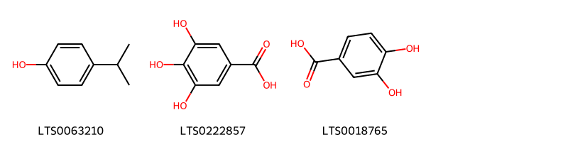{ width=100% }
    <figcaption>Hình ảnh cấu trúc hóa học của 3 hoạt chất thuộc nhóm Benzene and substituted derivatives gồm ['p-isopropylphenol (LTS0063210)', 'galop (LTS0222857)', '3,4-dihydroxybenzoic acid (LTS0018765)'].</figcaption>
</figure>
#### Nhóm Benzofurans
<figure markdown="span">
    { width=100% }
    <figcaption>Hình ảnh cấu trúc hóa học của 1 hoạt chất thuộc nhóm Benzofurans gồm ["7-hydroxy-6-isopropyl-3',3'-dimethyl-2-oxospiro[1-benzofuran-3,1'-cyclohexane]-2',4-dicarbaldehyde (LTS0255026)"].</figcaption>
</figure>
#### Nhóm Cinnamic acids and derivatives
<figure markdown="span">
    { width=100% }
    <figcaption>Hình ảnh cấu trúc hóa học của 4 hoạt chất thuộc nhóm Cinnamic acids and derivatives gồm ['3,4-dihydroxycinnamic acid (LTS0128050)', 'para-coumaric acid (LTS0266252)', 'rosemary acid (LTS0207820)', 'hydroxycinnamic acid (LTS0233023)'].</figcaption>
</figure>
#### Nhóm Coumarins and derivatives
<figure markdown="span">
    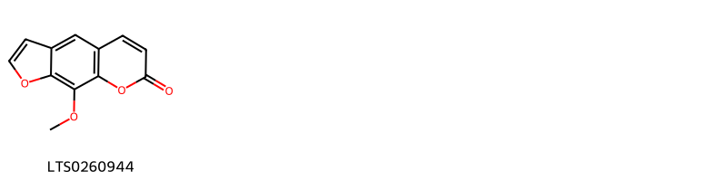{ width=100% }
    <figcaption>Hình ảnh cấu trúc hóa học của 1 hoạt chất thuộc nhóm Coumarins and derivatives gồm ['methoxsalen (LTS0260944)'].</figcaption>
</figure>
#### Nhóm Diazines
<figure markdown="span">
    { width=100% }
    <figcaption>Hình ảnh cấu trúc hóa học của 1 hoạt chất thuộc nhóm Diazines gồm ['pirod (LTS0008205)'].</figcaption>
</figure>
#### Nhóm Fatty Acyls
<figure markdown="span">
    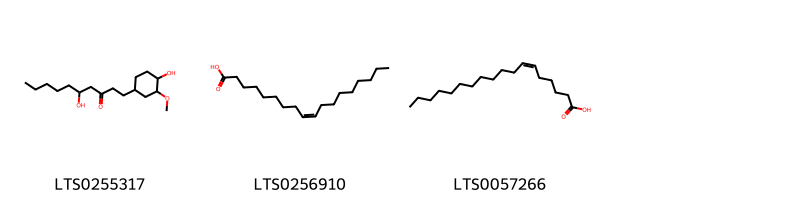{ width=100% }
    <figcaption>Hình ảnh cấu trúc hóa học của 3 hoạt chất thuộc nhóm Fatty Acyls gồm ['5-hydroxy-1-(4-hydroxy-3-methoxycyclohexyl)decan-3-one (LTS0255317)', 'oleic acid (LTS0256910)', 'petroselinic acid (LTS0057266)'].</figcaption>
</figure>
#### Nhóm Flavonoids
<figure markdown="span">
    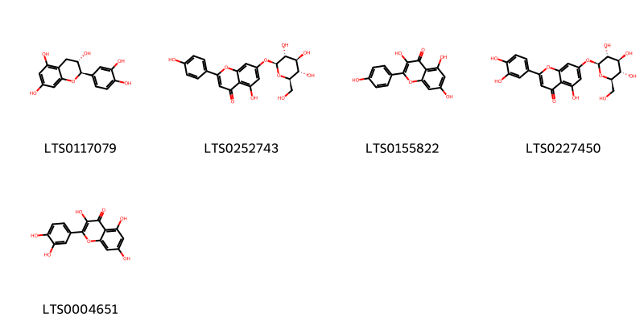{ width=100% }
    <figcaption>Hình ảnh cấu trúc hóa học của 5 hoạt chất thuộc nhóm Flavonoids gồm ['(+)-catechol (LTS0117079)', 'apigenin 7-o-β-glucoside (LTS0252743)', 'kaempherol (LTS0155822)', 'luteolin 7-o-glucoside (LTS0227450)', 'quercetin (LTS0004651)'].</figcaption>
</figure>
#### Nhóm Organonitrogen compounds
<figure markdown="span">
    { width=100% }
    <figcaption>Hình ảnh cấu trúc hóa học của 2 hoạt chất thuộc nhóm Organonitrogen compounds gồm ['choline (LTS0170307)', 'acetylcholine (LTS0185507)'].</figcaption>
</figure>
#### Nhóm Organooxygen compounds
<figure markdown="span">
    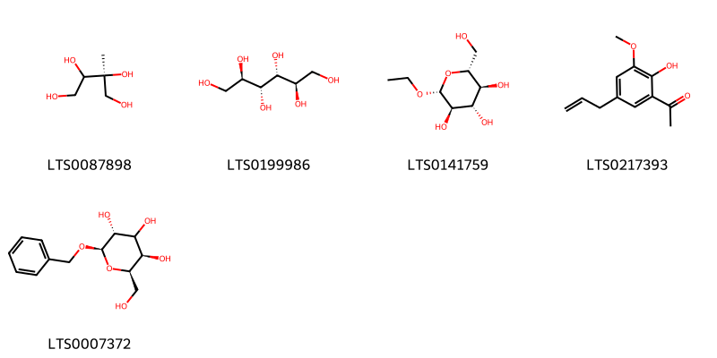{ width=100% }
    <figcaption>Hình ảnh cấu trúc hóa học của 5 hoạt chất thuộc nhóm Organooxygen compounds gồm ['(2s)-2-methylbutane-1,2,3,4-tetrol (LTS0087898)', 'mannitol (LTS0199986)', 'ethyl glucoside (LTS0141759)', '1-[2-hydroxy-3-methoxy-5-(prop-2-en-1-yl)phenyl]ethanone (LTS0217393)', '(2r,3r,5r,6r)-2-(benzyloxy)-6-(hydroxymethyl)oxane-3,4,5-triol (LTS0007372)'].</figcaption>
</figure>
#### Nhóm Phenol esters
<figure markdown="span">
    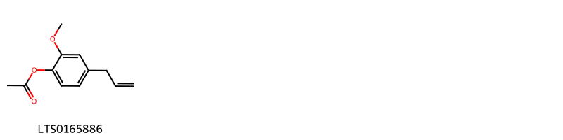{ width=100% }
    <figcaption>Hình ảnh cấu trúc hóa học của 1 hoạt chất thuộc nhóm Phenol esters gồm ['eugenyl acetate (LTS0165886)'].</figcaption>
</figure>
#### Nhóm Phenol ethers
<figure markdown="span">
    { width=100% }
    <figcaption>Hình ảnh cấu trúc hóa học của 3 hoạt chất thuộc nhóm Phenol ethers gồm ['p-propenylanisole (LTS0177188)', 'tarragon (LTS0245226)', 'anethole (LTS0033696)'].</figcaption>
</figure>
#### Nhóm Phenols
<figure markdown="span">
    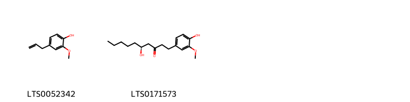{ width=100% }
    <figcaption>Hình ảnh cấu trúc hóa học của 2 hoạt chất thuộc nhóm Phenols gồm ['eugenol (LTS0052342)', 'gingerol (LTS0171573)'].</figcaption>
</figure>
#### Nhóm Prenol lipids
<figure markdown="span">
    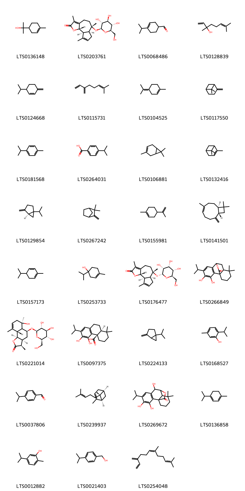{ width=100% }
    <figcaption>Hình ảnh cấu trúc hóa học của 31 hoạt chất thuộc nhóm Prenol lipids gồm ['terpineol (LTS0136148)', '(6s,6as,9as,9bs)-3,6,9-trimethyl-6-{[(2s,3r,4s,5s,6r)-3,4,5-trihydroxy-6-(hydroxymethyl)oxan-2-yl]oxy}-4h,5h,6ah,7h,9ah,9bh-azuleno[4,5-b]furan-2-one (LTS0203761)', '4-isopropylcyclohex-3-ene-1-carbaldehyde (LTS0068486)', 'linalool, (+-)- (LTS0128839)', 'β phellandrene (LTS0124668)', 'α-myrcene (LTS0115731)', 'terpinolene (LTS0104525)', 'β-pinene (LTS0117550)', 'cymene (LTS0181568)', '4-isopropylbenzoic acid (LTS0264031)', 'monoterpenes (LTS0106881)', 'α pinene (LTS0132416)', '(5s)-1-isopropyl-4-methylidenebicyclo[3.1.0]hexane (LTS0129854)', 'camphene (LTS0267242)', 'limonene,  (LTS0155981)', 'β-caryophyllen (LTS0141501)', 'phellandrene (LTS0157173)', '4-terpineol (LTS0253733)', '(6s,6as,9as,9bs)-3,6,9-trimethyl-6-{[(2r,3r,4r,5s,6r)-3,4,5-trihydroxy-6-(hydroxymethyl)oxan-2-yl]oxy}-4h,5h,6ah,7h,9ah,9bh-azuleno[4,5-b]furan-2-one (LTS0176477)', '3,4-dihydroxy-5-isopropyl-11,11-dimethyl-16-oxatetracyclo[6.6.2.0¹,¹⁰.0²,⁷]hexadeca-2(7),3,5-trien-15-one (LTS0266849)', '(3r,3as,5s,6r,9as,9br)-6-hydroxy-3,6,9-trimethyl-5-{[(2r,3r,4s,5s,6r)-3,4,5-trihydroxy-6-(hydroxymethyl)oxan-2-yl]oxy}-3h,3ah,4h,5h,5ah,7h,9ah,9bh-naphtho[1,2-b]furan-2-one (LTS0221014)', 'carnosic acid (LTS0097375)', 'sabinene (LTS0224133)', 'thymol (LTS0168527)', 'cuminaldehyde (LTS0037806)', '(-)-trans-α-bergamotene (LTS0239937)', '3,4,8-trihydroxy-5-isopropyl-11,11-dimethyl-16-oxatetracyclo[7.5.2.0¹,¹⁰.0²,⁷]hexadeca-2(7),3,5-trien-15-one (LTS0269672)', 'terpinene (LTS0136858)', 'carvacrol (LTS0012882)', 'cuminol (LTS0021403)', '(z)-β-farnesene (LTS0254048)'].</figcaption>
</figure>
#### Nhóm Unsaturated hydrocarbons
<figure markdown="span">
    { width=100% }
    <figcaption>Hình ảnh cấu trúc hóa học của 1 hoạt chất thuộc nhóm Unsaturated hydrocarbons gồm ['α terpinene (LTS0232891)'].</figcaption>
</figure>

---

### Dược dân tộc học

Danh sách các quốc gia có sử dụng *Cuminum cyminum* trong điều trị các bệnh. 

| Country   | Disease                                                              | Bệnh                                                                                                                                                                                                |
|:----------|:---------------------------------------------------------------------|:----------------------------------------------------------------------------------------------------------------------------------------------------------------------------------------------------|
| Elsewhere | Carminative, Astringent, Stimulant, Stomachic                        | MYMEMORY WARNING: YOU USED ALL AVAILABLE FREE TRANSLATIONS FOR TODAY. NEXT AVAILABLE IN  07 HOURS 20 MINUTES 16 SECONDS VISIT HTTPS://MYMEMORY.TRANSLATED.NET/DOC/USAGELIMITS.PHP TO TRANSLATE MORE |
| Iraq      | Tonic                                                                | MYMEMORY WARNING: YOU USED ALL AVAILABLE FREE TRANSLATIONS FOR TODAY. NEXT AVAILABLE IN  07 HOURS 20 MINUTES 13 SECONDS VISIT HTTPS://MYMEMORY.TRANSLATED.NET/DOC/USAGELIMITS.PHP TO TRANSLATE MORE |
| Turkey    | Carminative, Emmenagogue, Stimulant, Stomachic, Sudorific, Digestive | MYMEMORY WARNING: YOU USED ALL AVAILABLE FREE TRANSLATIONS FOR TODAY. NEXT AVAILABLE IN  07 HOURS 20 MINUTES 11 SECONDS VISIT HTTPS://MYMEMORY.TRANSLATED.NET/DOC/USAGELIMITS.PHP TO TRANSLATE MORE |
| ain       | Stomachic                                                            | MYMEMORY WARNING: YOU USED ALL AVAILABLE FREE TRANSLATIONS FOR TODAY. NEXT AVAILABLE IN  07 HOURS 20 MINUTES 08 SECONDS VISIT HTTPS://MYMEMORY.TRANSLATED.NET/DOC/USAGELIMITS.PHP TO TRANSLATE MORE |

---

# Chi Imperatoria

??? note "Danh sách các dược liệu thuộc chi"
    
	 - *Imperatoria ostruthium*

---
## Imperatoria ostruthium
### Thông tin về thực vật

!!! info "Phân loại thực vật của *Imperatoria ostruthium* từ GIBF:"
    - **Kingdom:** Plantae
    - **Phylum:** Tracheophyta
    - **Order:** Apiales
    - **Family:** Apiaceae
    - **Genus:** Imperatoria
    - **Species:** *Imperatoria ostruthium*

 

| Label (VI)   | Label (EN)   | Scientific Name        | Descriptions (VI)   | Descriptions (EN)   | Also Known As (VI)   | Also Known As (EN)   |
|:-------------|:-------------|:-----------------------|:--------------------|:--------------------|:---------------------|:---------------------|
| N/A          | N/A          | Imperatoria ostruthium | loài thực vật       | species of plant    | ['']                 | ['']                 |

#### Phân bố trên thế giới

**Từ CSDL GIBF** Andorra, Italy, Czechia, Germany, Belgium, Spain, Switzerland, Sweden, Austria, France, Slovenia, Norway, United Kingdom of Great Britain and Northern Ireland

#### Phân bố tại Việt Nam

**Từ CSDL GIBF**: Không có ghi nhận ở Việt Nam

---
### Thành phần hóa học
        
- Theo cơ sở dữ liệu lotus: Từ loài *Imperatoria ostruthium* đã phân lập và xác định được 28 hoạt chất thuộc về các nhóm Isobenzofurans, Prenol lipids, Benzopyrans, Coumarins and derivatives. 

|    | chemicalTaxonomyClassyfireClass   |   smiles_count |
|---:|:----------------------------------|---------------:|
|  0 | Benzopyrans                       |              1 |
|  1 | Coumarins and derivatives         |             19 |
|  2 | Isobenzofurans                    |              5 |
|  3 | Prenol lipids                     |              3 |

#### Nhóm Benzopyrans
<figure markdown="span">
    { width=100% }
    <figcaption>Hình ảnh cấu trúc hóa học của 1 hoạt chất thuộc nhóm Benzopyrans gồm ['5,7-dihydroxy-2-methyl-6-(3-methylbut-2-en-1-yl)chromen-4-one (LTS0113471)'].</figcaption>
</figure>
#### Nhóm Coumarins and derivatives
<figure markdown="span">
    { width=100% }
    <figcaption>Hình ảnh cấu trúc hóa học của 19 hoạt chất thuộc nhóm Coumarins and derivatives gồm ['(2r)-3-hydroxy-3-methyl-1-({7-oxofuro[3,2-g]chromen-4-yl}oxy)butan-2-yl 2-methylbut-2-enoate (LTS0213333)', '(+)-oxypeucedanin (LTS0067163)', 'imperatorin (LTS0113114)', 'oxypeucedanin (LTS0030512)', 'isoimperatorin (LTS0257448)', '(2r)-3-hydroxy-3-methyl-1-({7-oxofuro[3,2-g]chromen-4-yl}oxy)butan-2-yl (2e)-2-methylbut-2-enoate (LTS0173947)', '4-[(3,3-dimethyloxiran-2-yl)methoxy]furo[3,2-g]chromen-7-one (LTS0170205)', 'osthole (LTS0149433)', '4-(2,3-dihydroxy-3-methylbutoxy)furo[3,2-g]chromen-7-one (LTS0192444)', '(r)-oxypeucedanin hydrate (LTS0102595)', '4-(3-methyl-2-oxobutoxy)furo[3,2-g]chromen-7-one (LTS0223739)', '3-hydroxy-3-methyl-1-({7-oxofuro[3,2-g]chromen-4-yl}oxy)butan-2-yl 2-methylbut-2-enoate (LTS0212672)', '4-(7-hydroxy-2-oxochromen-6-yl)-2-methylbut-2-enoic acid (LTS0025171)', '(3r)-3-hydroxy-2-methyl-4-({7-oxofuro[3,2-g]chromen-4-yl}oxy)butan-2-yl acetate (LTS0041994)', '4-[(2s)-3-hydroxy-3-methyl-2-{[(2r,3r,4s,5s,6r)-3,4,5-trihydroxy-6-(hydroxymethyl)oxan-2-yl]oxy}butoxy]furo[3,2-g]chromen-7-one (LTS0054752)', '4-(3-hydroxy-3-methyl-2-{[3,4,5-trihydroxy-6-(hydroxymethyl)oxan-2-yl]oxy}butoxy)furo[3,2-g]chromen-7-one (LTS0030044)', '(2e)-4-(7-hydroxy-2-oxochromen-6-yl)-2-methylbut-2-enoic acid (LTS0100158)', 'ostruthol (LTS0046878)', '3-hydroxy-2-methyl-4-({7-oxofuro[3,2-g]chromen-4-yl}oxy)butan-2-yl acetate (LTS0231458)'].</figcaption>
</figure>
#### Nhóm Isobenzofurans
<figure markdown="span">
    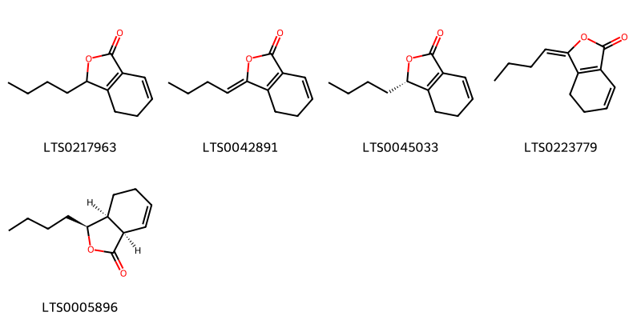{ width=100% }
    <figcaption>Hình ảnh cấu trúc hóa học của 5 hoạt chất thuộc nhóm Isobenzofurans gồm ['3-butyl-4,5-dihydro-3h-2-benzofuran-1-one (LTS0217963)', '(z)-ligustilide (LTS0042891)', 'senkyunolide a (LTS0045033)', 'z-ligustilide (LTS0223779)', 'cnidilide (LTS0005896)'].</figcaption>
</figure>
#### Nhóm Prenol lipids
<figure markdown="span">
    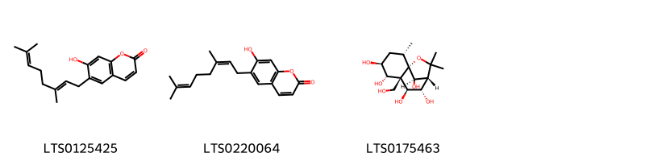{ width=100% }
    <figcaption>Hình ảnh cấu trúc hóa học của 3 hoạt chất thuộc nhóm Prenol lipids gồm ['ostruthin (LTS0125425)', '6-(3,7-dimethylocta-2,6-dien-1-yl)-7-hydroxychromen-2-one (LTS0220064)', '(1s,2s,4s,5s,6s,7s,8s,9r,12r)-6-(hydroxymethyl)-2,10,10-trimethyl-11-oxatricyclo[7.2.1.0¹,⁶]dodecane-4,5,7,8,12-pentol (LTS0175463)'].</figcaption>
</figure>

---

### Dược dân tộc học

Danh sách các quốc gia có sử dụng *Imperatoria ostruthium* trong điều trị các bệnh. 

| Country   | Disease                                                               | Bệnh                                                                                                                                                                                                |
|:----------|:----------------------------------------------------------------------|:----------------------------------------------------------------------------------------------------------------------------------------------------------------------------------------------------|
| Turkey    | Carminative, Poison, Stimulant, Stomachic, Tonic, Diuretic, Sudorific | MYMEMORY WARNING: YOU USED ALL AVAILABLE FREE TRANSLATIONS FOR TODAY. NEXT AVAILABLE IN  07 HOURS 19 MINUTES 29 SECONDS VISIT HTTPS://MYMEMORY.TRANSLATED.NET/DOC/USAGELIMITS.PHP TO TRANSLATE MORE |

---

# Chi Centella

??? note "Danh sách các dược liệu thuộc chi"
    
	 - *Centella asiatica*

---
## Centella asiatica
### Thông tin về thực vật

!!! info "Phân loại thực vật của *Centella asiatica* từ GIBF:"
    - **Kingdom:** Plantae
    - **Phylum:** Tracheophyta
    - **Order:** Apiales
    - **Family:** Apiaceae
    - **Genus:** Centella
    - **Species:** *Centella asiatica*

 

| Label (VI)   | Label (EN)   | Scientific Name   | Descriptions (VI)   | Descriptions (EN)   | Also Known As (VI)    | Also Known As (EN)                                                                                                  |
|:-------------|:-------------|:------------------|:--------------------|:--------------------|:----------------------|:--------------------------------------------------------------------------------------------------------------------|
| N/A          | N/A          | Centella asiatica | loài thực vật       | species of plant    | ['Centella asiatica'] | ['Indian pennywort', 'tiger grass', 'cica', 'pennywort', 'centella', 'Asiatic pennywort', 'spadeleaf', 'goyu kola'] |

#### Phân bố trên thế giới

**Từ CSDL GIBF** nan, Australia, Chinese Taipei, United States of America, Uruguay, Chile, South Africa, Hong Kong, Thailand, Brazil, New Caledonia, China, Ecuador, Niue, Macao, India, Indonesia, Malaysia, New Zealand, Nepal

#### Phân bố tại Việt Nam

**Từ CSDL GIBF**: Không có ghi nhận ở Việt Nam

---
### Thành phần hóa học
        
- Theo cơ sở dữ liệu lotus: Từ loài *Centella asiatica* đã phân lập và xác định được 219 hoạt chất thuộc về các nhóm Fatty Acyls, Flavonoids, Prenol lipids, Steroids and steroid derivatives, Cinnamic acids and derivatives, Benzene and substituted derivatives, Unsaturated hydrocarbons, Hydroxy acids and derivatives, Organooxygen compounds, Phenols, Glycerolipids, Carboxylic acids and derivatives, Pyridines and derivatives. 

|    | chemicalTaxonomyClassyfireClass     |   smiles_count |
|---:|:------------------------------------|---------------:|
|  0 | Benzene and substituted derivatives |              5 |
|  1 | Carboxylic acids and derivatives    |              2 |
|  2 | Cinnamic acids and derivatives      |              3 |
|  3 | Fatty Acyls                         |             20 |
|  4 | Flavonoids                          |             15 |
|  5 | Glycerolipids                       |              2 |
|  6 | Hydroxy acids and derivatives       |              1 |
|  7 | Organooxygen compounds              |             20 |
|  8 | Phenols                             |              2 |
|  9 | Prenol lipids                       |            140 |
| 10 | Pyridines and derivatives           |              1 |
| 11 | Steroids and steroid derivatives    |              4 |
| 12 | Unsaturated hydrocarbons            |              3 |

#### Nhóm Benzene and substituted derivatives
<figure markdown="span">
    { width=100% }
    <figcaption>Hình ảnh cấu trúc hóa học của 5 hoạt chất thuộc nhóm Benzene and substituted derivatives gồm ['2,5-dihydroxybenzoic acid (LTS0170793)', '(2z)-2-{4-[(1z)-2-carboxy-2-{4-[(1e)-2-carboxyeth-1-en-1-yl]-2-methoxyphenoxy}eth-1-en-1-yl]-2-methoxyphenoxy}-3-(4-hydroxy-3-methoxyphenyl)prop-2-enoic acid (LTS0109573)', 'toluene (LTS0047403)', 'm-xylene (LTS0151729)', '2-(4-{2-carboxy-2-[4-(2-carboxyeth-1-en-1-yl)-2-methoxyphenoxy]eth-1-en-1-yl}-2-methoxyphenoxy)-3-(4-hydroxy-3-methoxyphenyl)prop-2-enoic acid (LTS0147174)'].</figcaption>
</figure>
#### Nhóm Carboxylic acids and derivatives
<figure markdown="span">
    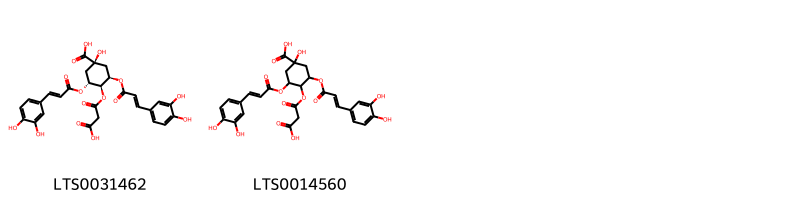{ width=100% }
    <figcaption>Hình ảnh cấu trúc hóa học của 2 hoạt chất thuộc nhóm Carboxylic acids and derivatives gồm ['(1s,3r,4s,5r)-4-[(2-carboxyacetyl)oxy]-3,5-bis({[(2e)-3-(3,4-dihydroxyphenyl)prop-2-enoyl]oxy})-1-hydroxycyclohexane-1-carboxylic acid (LTS0031462)', '4-[(2-carboxyacetyl)oxy]-3,5-bis({[3-(3,4-dihydroxyphenyl)prop-2-enoyl]oxy})-1-hydroxycyclohexane-1-carboxylic acid (LTS0014560)'].</figcaption>
</figure>
#### Nhóm Cinnamic acids and derivatives
<figure markdown="span">
    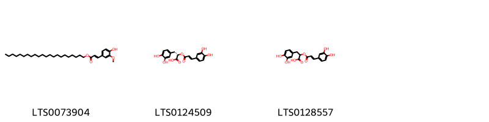{ width=100% }
    <figcaption>Hình ảnh cấu trúc hóa học của 3 hoạt chất thuộc nhóm Cinnamic acids and derivatives gồm ['docosyl trans-ferulate (LTS0073904)', '(s)-rosmarinic acid (LTS0124509)', '3-(3,4-dihydroxyphenyl)-2-{[3-(3,4-dihydroxyphenyl)prop-2-enoyl]oxy}propanoic acid (LTS0128557)'].</figcaption>
</figure>
#### Nhóm Fatty Acyls
<figure markdown="span">
    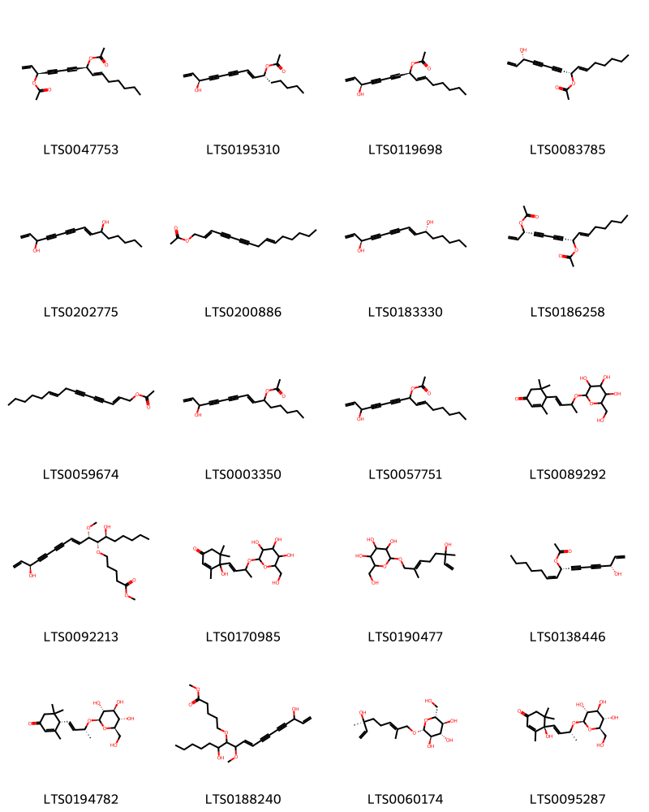{ width=100% }
    <figcaption>Hình ảnh cấu trúc hóa học của 20 hoạt chất thuộc nhóm Fatty Acyls gồm ['(3s,8s)-3-(acetyloxy)pentadeca-1,9-dien-4,6-diyn-8-yl acetate (LTS0047753)', '(6r,7e,13s)-13-hydroxypentadeca-7,14-dien-9,11-diyn-6-yl acetate (LTS0195310)', '(3s,8s)-3-hydroxypentadeca-1,9-dien-4,6-diyn-8-yl acetate (LTS0119698)', '(3s,8s,9e)-3-hydroxypentadeca-1,9-dien-4,6-diyn-8-yl acetate (LTS0083785)', 'pentadeca-1,8-dien-4,6-diyne-3,10-diol (LTS0202775)', 'pentadeca-2,9-dien-4,6-diyn-1-yl acetate (LTS0200886)', '(3s,8e,10r)-pentadeca-1,8-dien-4,6-diyne-3,10-diol (LTS0183330)', '(3s,8s,9e)-3-(acetyloxy)pentadeca-1,9-dien-4,6-diyn-8-yl acetate (LTS0186258)', '(2e,9e)-pentadeca-2,9-dien-4,6-diyn-1-yl acetate (LTS0059674)', '13-hydroxypentadeca-7,14-dien-9,11-diyn-6-yl acetate (LTS0003350)', '3-hydroxypentadeca-1,9-dien-4,6-diyn-8-yl acetate (LTS0057751)', '3,5,5-trimethyl-4-(3-{[3,4,5-trihydroxy-6-(hydroxymethyl)oxan-2-yl]oxy}but-1-en-1-yl)cyclohex-2-en-1-one (LTS0089292)', 'methyl 5-{[(6s,7s,8s,9e,15s)-6,15-dihydroxy-8-methoxyheptadeca-9,16-dien-11,13-diyn-7-yl]oxy}pentanoate (LTS0092213)', '4-hydroxy-3,5,5-trimethyl-4-(3-{[3,4,5-trihydroxy-6-(hydroxymethyl)oxan-2-yl]oxy}but-1-en-1-yl)cyclohex-2-en-1-one (LTS0170985)', '2-[(6-hydroxy-2,6-dimethylocta-2,7-dien-1-yl)oxy]-6-(hydroxymethyl)oxane-3,4,5-triol (LTS0190477)', '(3s,8s,9z)-3-hydroxypentadeca-1,9-dien-4,6-diyn-8-yl acetate (LTS0138446)', '(4s)-3,5,5-trimethyl-4-[(1e,3r)-3-{[(2r,3r,4s,5s,6r)-3,4,5-trihydroxy-6-(hydroxymethyl)oxan-2-yl]oxy}but-1-en-1-yl]cyclohex-2-en-1-one (LTS0194782)', 'methyl 5-[(6,15-dihydroxy-8-methoxyheptadeca-9,16-dien-11,13-diyn-7-yl)oxy]pentanoate (LTS0188240)', '(2r,3r,4s,5s,6r)-2-{[(2e,6s)-6-hydroxy-2,6-dimethylocta-2,7-dien-1-yl]oxy}-6-(hydroxymethyl)oxane-3,4,5-triol (LTS0060174)', '(4r)-4-hydroxy-3,5,5-trimethyl-4-[(1e,3r)-3-{[(2r,3r,4s,5s,6r)-3,4,5-trihydroxy-6-(hydroxymethyl)oxan-2-yl]oxy}but-1-en-1-yl]cyclohex-2-en-1-one (LTS0095287)'].</figcaption>
</figure>
#### Nhóm Flavonoids
<figure markdown="span">
    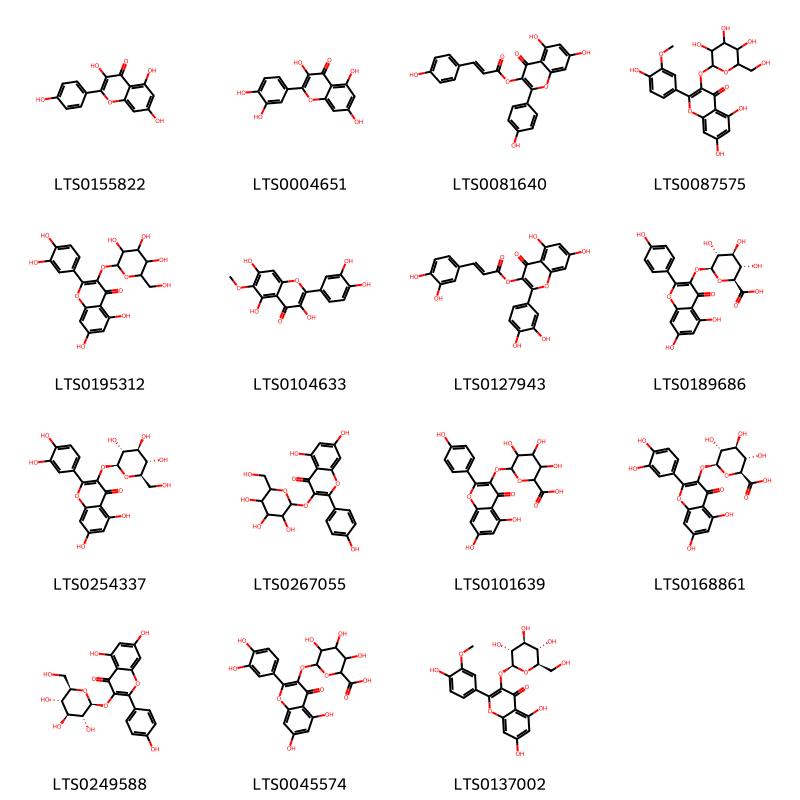{ width=100% }
    <figcaption>Hình ảnh cấu trúc hóa học của 15 hoạt chất thuộc nhóm Flavonoids gồm ['kaempherol (LTS0155822)', 'quercetin (LTS0004651)', 'kaempferol 3-p-coumarate (LTS0081640)', 'isorhamnetin 3-galactoside (LTS0087575)', '2-(3,4-dihydroxyphenyl)-5,7-dihydroxy-3-{[3,4,5-trihydroxy-6-(hydroxymethyl)oxan-2-yl]oxy}chromen-4-one (LTS0195312)', 'patuletin (LTS0104633)', '2-(3,4-dihydroxyphenyl)-5,7-dihydroxy-4-oxochromen-3-yl (2e)-3-(3,4-dihydroxyphenyl)prop-2-enoate (LTS0127943)', 'kaempferol 3-o-glucuronide (LTS0189686)', 'isoquercetin (LTS0254337)', 'trifolin (LTS0267055)', '6-{[5,7-dihydroxy-2-(4-hydroxyphenyl)-4-oxochromen-3-yl]oxy}-3,4,5-trihydroxyoxane-2-carboxylic acid (LTS0101639)', 'querciturone (LTS0168861)', 'astragalin (LTS0249588)', 'miquelianin (LTS0045574)', 'isorhamnetin 3-o-glucoside (LTS0137002)'].</figcaption>
</figure>
#### Nhóm Glycerolipids
<figure markdown="span">
    { width=100% }
    <figcaption>Hình ảnh cấu trúc hóa học của 2 hoạt chất thuộc nhóm Glycerolipids gồm ['dgdg (LTS0129048)', '(2s)-1-(octadecanoyloxy)-3-{[(2r,3r,4s,5r,6r)-3,4,5-trihydroxy-6-({[(2s,3r,4s,5r,6r)-3,4,5-trihydroxy-6-(hydroxymethyl)oxan-2-yl]oxy}methyl)oxan-2-yl]oxy}propan-2-yl octadecanoate (LTS0156612)'].</figcaption>
</figure>
#### Nhóm Hydroxy acids and derivatives
<figure markdown="span">
    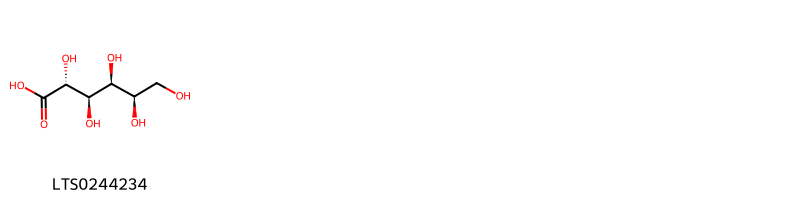{ width=100% }
    <figcaption>Hình ảnh cấu trúc hóa học của 1 hoạt chất thuộc nhóm Hydroxy acids and derivatives gồm ['gulonic acid (LTS0244234)'].</figcaption>
</figure>
#### Nhóm Organooxygen compounds
<figure markdown="span">
    { width=100% }
    <figcaption>Hình ảnh cấu trúc hóa học của 20 hoạt chất thuộc nhóm Organooxygen compounds gồm ['3,4-dicaffeoylquinic acid (LTS0134972)', '4,5-dicaffeoylquinic acid (LTS0046605)', 'cynarine (LTS0039940)', '3,5-bis({[3-(3,4-dihydroxyphenyl)prop-2-enoyl]oxy})-1,4-dihydroxycyclohexane-1-carboxylic acid (LTS0076864)', '(-)-inositol (LTS0047771)', 'bran oil (LTS0143969)', '3-{[3-(3,4-dihydroxyphenyl)prop-2-enoyl]oxy}-1,4,5-trihydroxycyclohexane-1-carboxylic acid (LTS0143901)', '1,3-bis({[3-(3,4-dihydroxyphenyl)prop-2-enoyl]oxy})-4,5-dihydroxycyclohexane-1-carboxylic acid (LTS0171981)', '3,5-dicaffeoylquinic acid (LTS0177751)', 'non-3-en-2-one (LTS0251532)', 'benzyl glucopyranoside (LTS0210495)', '3-hexen-2-one (LTS0226629)', 'chlorogenic acid (LTS0226495)', 'hexanal (LTS0238624)', '3,4-bis({[3-(3,4-dihydroxyphenyl)prop-2-enoyl]oxy})-1,5-dihydroxycyclohexane-1-carboxylic acid (LTS0233490)', 'benzyl β-d-glucoside (LTS0184698)', '3-hexen-2-one (LTS0133323)', 'heptanal (LTS0031416)', '2-methyl-2-butanol (LTS0207423)', '(1r,2r,3s,4r,5s,6s)-cyclohexane-1,2,3,4,5,6-hexol (LTS0123108)'].</figcaption>
</figure>
#### Nhóm Phenols
<figure markdown="span">
    { width=100% }
    <figcaption>Hình ảnh cấu trúc hóa học của 2 hoạt chất thuộc nhóm Phenols gồm ['2-methoxy-4-vinyl-phenol (LTS0128961)', '5-ethenyl-2-methoxyphenol (LTS0076260)'].</figcaption>
</figure>
#### Nhóm Prenol lipids
<figure markdown="span">
    { width=100% }
    <figcaption>Hình ảnh cấu trúc hóa học của 140 hoạt chất thuộc nhóm Prenol lipids gồm ['camphene (LTS0267242)', 'caryophyllene (LTS0085212)', 'β-pinene (LTS0117550)', 'α pinene (LTS0132416)', 'terpineol (LTS0136148)', '(-)-germacrene d (LTS0059194)', '10-hydroxy-1,2,6a,6b,9,9,12a-heptamethyl-2,3,4,5,6,7,8,8a,10,11,12,12b,13,14b-tetradecahydro-1h-picene-4a-carboxylic acid (LTS0166564)', '(1z,6z,8s)-8-isopropyl-1-methyl-5-methylidenecyclodeca-1,6-diene (LTS0065195)', 'linalool, (+-)- (LTS0128839)', 'α-myrcene (LTS0115731)', '(2s,3r,4s,5s,6r)-6-({[(2r,3r,4r,5s,6r)-3,4-dihydroxy-6-(hydroxymethyl)-5-{[(2s,3r,4r,5r,6s)-3,4,5-trihydroxy-6-methyloxan-2-yl]oxy}oxan-2-yl]oxy}methyl)-3,4,5-trihydroxyoxan-2-yl (1s,2r,4as,6as,6br,8r,8ar,9r,10r,11r,12ar,12br,14bs)-8,10,11-trihydroxy-9-(hydroxymethyl)-1,2,6a,6b,9,12a-hexamethyl-2,3,4,5,6,7,8,8a,10,11,12,12b,13,14b-tetradecahydro-1h-picene-4a-carboxylate (LTS0276487)', 'humulene (LTS0263171)', 'terminoloside (LTS0166167)', '10,11-dihydroxy-2,2,6a,6b,9,9,12a-heptamethyl-1,3,4,5,6,7,8,8a,10,11,12,12b,13,14b-tetradecahydropicene-4a-carboxylic acid (LTS0167090)', 'limonene,  (LTS0155981)', 'bornyl acetate (LTS0060565)', '(1s,2r,4as,6as,6br,8r,8ar,9r,10s,12ar,12br,14bs)-8,10-dihydroxy-9-(hydroxymethyl)-1,2,6a,6b,9,12a-hexamethyl-2,3,4,5,6,7,8,8a,10,11,12,12b,13,14b-tetradecahydro-1h-picene-4a-carboxylic acid (LTS0132814)', '(2s,3r,4s,5s,6r)-6-({[(2r,3r,4r,5s,6r)-3,4-dihydroxy-6-(hydroxymethyl)-5-{[(2s,3r,4r,5r,6s)-3,4,5-trihydroxy-6-methyloxan-2-yl]oxy}oxan-2-yl]oxy}methyl)-3,4,5-trihydroxyoxan-2-yl (1s,2r,4as,6as,6br,8r,8as,9r,10r,11r,12ar,12br,14bs)-8,10,11-trihydroxy-9-(hydroxymethyl)-1,2,6a,6b,9,12a-hexamethyl-2,3,4,5,6,7,8,8a,10,11,12,12b,13,14b-tetradecahydro-1h-picene-4a-carboxylate (LTS0044893)', '(1s,4s,5r,8r,10s,13s,14r,17s,18r,19s,20r)-10-hydroxy-4,5,9,9,13,19,20-heptamethyl-24-oxahexacyclo[15.5.2.0¹,¹⁸.0⁴,¹⁷.0⁵,¹⁴.0⁸,¹³]tetracos-15-en-23-one (LTS0126962)', '2-[(2-{7,11-dihydroxy-3a,3b,6,6,9a-pentamethyl-dodecahydro-1h-cyclopenta[a]phenanthren-1-yl}-6-methylhept-5-en-2-yl)oxy]-6-{[(3,4,5-trihydroxyoxan-2-yl)oxy]methyl}oxane-3,4,5-triol (LTS0217594)', 'methyl (1s,2r,4as,6as,6br,8r,8ar,9r,10r,11r,12ar,12br,14bs)-8,11-dihydroxy-9-(hydroxymethyl)-10-methoxy-1,2,6a,6b,9,12a-hexamethyl-2,3,4,5,6,7,8,8a,10,11,12,12b,13,14b-tetradecahydro-1h-picene-4a-carboxylate (LTS0190903)', 'euscaphic acid (LTS0205657)', '6-({[3,4-dihydroxy-6-(hydroxymethyl)-5-[(3,4,5-trihydroxy-6-methyloxan-2-yl)oxy]oxan-2-yl]oxy}methyl)-3,4,5-trihydroxyoxan-2-yl 8,10,11-trihydroxy-2,2,6a,6b,9,9,12a-heptamethyl-1,3,4,5,6,7,8,8a,10,11,12,12b,13,14b-tetradecahydropicene-4a-carboxylate (LTS0210828)', 'ginsenoside mc (LTS0206570)', '(2s,3r,4s,5s,6r)-6-({[(2r,3r,4r,5s,6r)-3,4-dihydroxy-6-(hydroxymethyl)-5-{[(2s,3r,4r,5r,6s)-3,4,5-trihydroxy-6-methyloxan-2-yl]oxy}oxan-2-yl]oxy}methyl)-3,4,5-trihydroxyoxan-2-yl (1s,2r,4as,6ar,6br,8r,8as,9r,10r,11r,12ar,12br,14bs)-8,10,11-trihydroxy-9-(hydroxymethyl)-1,2,6a,6b,9,12a-hexamethyl-2,3,4,5,6,7,8,8a,10,11,12,12b,13,14b-tetradecahydro-1h-picene-4a-carboxylate (LTS0093183)', '1,2,6a,6b,9,12a-hexamethyl-8,10,11-tris({[3,4,5-trihydroxy-6-(hydroxymethyl)oxan-2-yl]oxy})-9-({[3,4,5-trihydroxy-6-(hydroxymethyl)oxan-2-yl]oxy}methyl)-2,3,4,5,6,7,8,8a,10,11,12,12b,13,14b-tetradecahydro-1h-picene-4a-carboxylic acid (LTS0131104)', '8,10,11-trihydroxy-9-(hydroxymethyl)-2,2,6a,6b,9,12a-hexamethyl-1,3,4,5,6,7,8,8a,10,11,12,12b,13,14b-tetradecahydropicene-4a-carboxylic acid (LTS0099810)', '(2s,3r,4s,5s,6r)-6-({[(2r,3r,4r,5s,6r)-3,4-dihydroxy-6-(hydroxymethyl)-5-{[(2s,3r,4r,5r,6s)-3,4,5-trihydroxy-6-methyloxan-2-yl]oxy}oxan-2-yl]oxy}methyl)-3,4,5-trihydroxyoxan-2-yl (1s,2r,4as,6as,6br,8ar,9s,10r,11r,12ar,12br,14bs)-10,11-dihydroxy-9-(hydroxymethyl)-1,2,6a,6b,9,12a-hexamethyl-2,3,4,5,6,7,8,8a,10,11,12,12b,13,14b-tetradecahydro-1h-picene-4a-carboxylate (LTS0213440)', '(r)-β-bisabolene (LTS0077209)', '8,10,11-trihydroxy-9-(hydroxymethyl)-1,2,6a,6b,9,12a-hexamethyl-2,3,4,5,6,7,8,8a,10,11,12,12b,13,14b-tetradecahydro-1h-picene-4a-carboxylic acid (LTS0070073)', '(2s,3r,4s,5s,6r)-6-({[(2r,3r,4r,5s,6r)-3,4-dihydroxy-6-(hydroxymethyl)-5-{[(2s,3r,4r,5r,6s)-3,4,5-trihydroxy-6-methyloxan-2-yl]oxy}oxan-2-yl]oxy}methyl)-3,4,5-trihydroxyoxan-2-yl (1s,2r,4as,6as,6br,8ar,10r,11r,12ar,12br,14bs)-10,11-dihydroxy-1,2,6a,6b,9,9,12a-heptamethyl-2,3,4,5,6,7,8,8a,10,11,12,12b,13,14b-tetradecahydro-1h-picene-4a-carboxylate (LTS0069570)', '(2s,3r,4s,5s,6r)-3,4,5-trihydroxy-6-({[(2r,3r,4s,5s,6r)-3,4,5-trihydroxy-6-(hydroxymethyl)oxan-2-yl]oxy}methyl)oxan-2-yl (1s,2r,4as,6as,6br,8r,8ar,9r,10r,11r,12ar,12br,14bs)-8,10,11-trihydroxy-9-(hydroxymethyl)-1,2,6a,6b,9,12a-hexamethyl-2,3,4,5,6,7,8,8a,10,11,12,12b,13,14b-tetradecahydro-1h-picene-4a-carboxylate (LTS0233090)', '8,10-dihydroxy-9-(hydroxymethyl)-2,2,6a,6b,9,12a-hexamethyl-1,3,4,5,6,7,8,8a,10,11,12,12b,13,14b-tetradecahydropicene-4a-carboxylic acid (LTS0086952)', '1,10,11-trihydroxy-1,2,6a,6b,9,9,12a-heptamethyl-2,3,4,5,6,7,8,8a,10,11,12,12b,13,14b-tetradecahydropicene-4a-carboxylic acid (LTS0013744)', 'caryophyllene oxide (LTS0159789)', '2-[(2-{7,11-dihydroxy-3a,3b,6,6,9a-pentamethyl-dodecahydro-1h-cyclopenta[a]phenanthren-1-yl}-6-methylhept-5-en-2-yl)oxy]-6-({[3,4-dihydroxy-5-(hydroxymethyl)oxolan-2-yl]oxy}methyl)oxane-3,4,5-triol (LTS0018482)', '(2s,3r,4s,5s,6r)-6-({[(2r,3r,4r,5s,6r)-3,4-dihydroxy-6-(hydroxymethyl)-5-{[(2s,3r,4r,5r,6s)-3,4,5-trihydroxy-6-methyloxan-2-yl]oxy}oxan-2-yl]oxy}methyl)-3,4,5-trihydroxyoxan-2-yl (1s,2r,4as,6as,6br,8r,8ar,9r,10s,12ar,12br,14bs)-8,10-dihydroxy-9-(hydroxymethyl)-1,2,6a,6b,9,12a-hexamethyl-2,3,4,5,6,7,8,8a,10,11,12,12b,13,14b-tetradecahydro-1h-picene-4a-carboxylate (LTS0174261)', 'methyl (1s,2r,4as,6as,6br,8ar,9r,10r,11r,12ar,12br,14bs)-11-hydroxy-9-(hydroxymethyl)-10-methoxy-1,2,6a,6b,9,12a-hexamethyl-2,3,4,5,6,7,8,8a,10,11,12,12b,13,14b-tetradecahydro-1h-picene-4a-carboxylate (LTS0087533)', '(2s,3r,4s,5s,6r)-6-({[(2r,3r,4r,5s,6r)-3,4-dihydroxy-6-(hydroxymethyl)-5-{[(2r,3r,4r,5r,6s)-3,4,5-trihydroxy-6-methyloxan-2-yl]oxy}oxan-2-yl]oxy}methyl)-3,4,5-trihydroxyoxan-2-yl (4as,6as,6br,8r,8ar,9r,10r,11r,12ar,12br,14br)-8,10,11-trihydroxy-9-(hydroxymethyl)-2,2,6a,6b,9,12a-hexamethyl-1,3,4,5,6,7,8,8a,10,11,12,12b,13,14b-tetradecahydropicene-4a-carboxylate (LTS0088497)', 'β-farnesene (LTS0091648)', '(e,z)-farnesol (LTS0182151)', 'β-sesquiphellandrene (LTS0106193)', '(2r,3s,4s,5r,6r)-2-({[(2r,3r,4r)-3,4-dihydroxy-4-(hydroxymethyl)oxolan-2-yl]oxy}methyl)-6-{[(1r,2s,4r)-1,7,7-trimethylbicyclo[2.2.1]heptan-2-yl]oxy}oxane-3,4,5-triol (LTS0038221)', 'ginsenoside mx (LTS0164245)', '(2s,3r,4s,5s,6r)-2-{[(2s)-2-[(1s,3ar,3br,5ar,7s,9ar,9br,11r,11ar)-11-hydroxy-3a,3b,6,6,9a-pentamethyl-7-{[(2r,3r,4s,5s,6r)-3,4,5-trihydroxy-6-(hydroxymethyl)oxan-2-yl]oxy}-dodecahydro-1h-cyclopenta[a]phenanthren-1-yl]-6-methylhept-5-en-2-yl]oxy}-6-({[(2s,3r,4s,5r)-3,4,5-trihydroxyoxan-2-yl]oxy}methyl)oxane-3,4,5-triol (LTS0087374)', '(20r)-ginsenoside rg3 (LTS0115294)', '3-[(2s)-6-methylhept-5-en-2-yl]-6-methylidenecyclohex-1-ene (LTS0195839)', '(2s,3r,4s,5s,6r)-6-({[(2r,3r,4r,5s,6r)-3,4-dihydroxy-6-(hydroxymethyl)-5-{[(2s,3r,4r,5r,6s)-3,4,5-trihydroxy-6-methyloxan-2-yl]oxy}oxan-2-yl]oxy}methyl)-3,4,5-trihydroxyoxan-2-yl (1s,2r,4as,6as,6br,8r,8ar,10r,11r,12ar,12br,14bs)-8,10,11-trihydroxy-1,2,6a,6b,9,9,12a-heptamethyl-2,3,4,5,6,7,8,8a,10,11,12,12b,13,14b-tetradecahydro-1h-picene-4a-carboxylate (LTS0148378)', 'nerolidol (LTS0197738)', '(2s,3r,4s,5s,6r)-6-({[(2r,3r,4r,5s,6r)-3,4-dihydroxy-6-(hydroxymethyl)-5-{[(2s,3r,4r,5r,6s)-3,4,5-trihydroxy-6-methyloxan-2-yl]oxy}oxan-2-yl]oxy}methyl)-3,4,5-trihydroxyoxan-2-yl (1s,2r,4as,6as,6br,8ar,9r,10s,12ar,12br,14bs)-10-hydroxy-9-(hydroxymethyl)-1,2,6a,6b,9,12a-hexamethyl-2,3,4,5,6,7,8,8a,10,11,12,12b,13,14b-tetradecahydro-1h-picene-4a-carboxylate (LTS0188311)', '(4as,6as,6br,8as,9r,10r,11r,12ar,12br,14bs)-10,11-dihydroxy-9-(hydroxymethyl)-2,2,6a,6b,9,12a-hexamethyl-1,3,4,5,6,7,8,8a,10,11,12,12b,13,14b-tetradecahydropicene-4a-carboxylic acid (LTS0206611)', '(1s,2r,4as,6as,6br,8r,8ar,9r,10r,11r,12ar,12br,14bs)-8-hydroxy-1,2,6a,6b,9,12a-hexamethyl-10,11-bis({[(2r,3r,4s,5s,6r)-3,4,5-trihydroxy-6-(hydroxymethyl)oxan-2-yl]oxy})-9-({[(2r,3r,4s,5s,6r)-3,4,5-trihydroxy-6-(hydroxymethyl)oxan-2-yl]oxy}methyl)-2,3,4,5,6,7,8,8a,10,11,12,12b,13,14b-tetradecahydro-1h-picene-4a-carboxylic acid (LTS0136230)', 'asiatic acid (LTS0198395)', '4-isopropyl-1,6-dimethyl-2,3,4,4a,7,8-hexahydronaphthalene (LTS0270743)', '2-({2-[(4,5-dihydroxy-2-{[11-hydroxy-1-(2-hydroxy-6-methylhept-5-en-2-yl)-3a,3b,6,6,9a-pentamethyl-dodecahydro-1h-cyclopenta[a]phenanthren-7-yl]oxy}-6-(hydroxymethyl)oxan-3-yl)oxy]-4,5-dihydroxy-6-(hydroxymethyl)oxan-3-yl}oxy)oxane-3,4,5-triol (LTS0153122)', 'madecassic acid (LTS0164623)', '(3r,6e)-nerolidol (LTS0145065)', 'madecassoside (LTS0168015)', '1,10-dihydroxy-1,2,6a,6b,9,9,12a-heptamethyl-2,3,4,5,6,7,8,8a,10,11,12,12b,13,14b-tetradecahydropicene-4a-carboxylic acid (LTS0147544)', '(4as,6as,6br,8r,8ar,9r,10r,11r,12ar,12br,14br)-8,10,11-trihydroxy-9-(hydroxymethyl)-2,2,6a,6b,9,12a-hexamethyl-1,3,4,5,6,7,8,8a,10,11,12,12b,13,14b-tetradecahydropicene-4a-carboxylic acid (LTS0204560)', '(2s,3r,4s,5s,6r)-6-({[(2r,3r,4r,5s,6r)-3,4-dihydroxy-6-(hydroxymethyl)-5-{[(2s,3r,4r,5r,6s)-3,4,5-trihydroxy-6-methyloxan-2-yl]oxy}oxan-2-yl]oxy}methyl)-3,4,5-trihydroxyoxan-2-yl (1s,2r,4as,6as,6br,8as,9r,10r,11r,12ar,12br,14bs)-10,11-dihydroxy-9-(hydroxymethyl)-1,2,6a,6b,9,12a-hexamethyl-2,3,4,5,6,7,8,8a,10,11,12,12b,13,14b-tetradecahydro-1h-picene-4a-carboxylate (LTS0163174)', '(2s,3r,4s,5s,6r)-6-({[(2r,3r,4r,5s,6r)-3,4-dihydroxy-6-(hydroxymethyl)-5-{[(2s,3r,4r,5r,6s)-3,4,5-trihydroxy-6-methyloxan-2-yl]oxy}oxan-2-yl]oxy}methyl)-3,4,5-trihydroxyoxan-2-yl (4as,6as,6br,8r,8ar,9r,10s,12ar,12br,14bs)-8,10-dihydroxy-9-(hydroxymethyl)-2,2,6a,6b,9,12a-hexamethyl-1,3,4,5,6,7,8,8a,10,11,12,12b,13,14b-tetradecahydropicene-4a-carboxylate (LTS0147460)', '(2s,3r,4s,5s,6r)-6-({[(2r,3r,4r,5s,6r)-3,4-dihydroxy-6-(hydroxymethyl)-5-{[(2s,3r,4r,5r,6s)-3,4,5-trihydroxy-6-methyloxan-2-yl]oxy}oxan-2-yl]oxy}methyl)-3,4,5-trihydroxyoxan-2-yl (4as,6as,6br,8ar,9r,10r,11r,12ar,12br)-10,11-dihydroxy-9-(hydroxymethyl)-2,2,6a,6b,9,12a-hexamethyl-1,3,4,5,6,7,8,8a,10,11,12,12b,13,14-tetradecahydropicene-4a-carboxylate (LTS0154768)', '[(2r,3r,4r,4ar,6ar,6bs,8as,11r,12s,12as,14ar,14br)-8a-({[(2s,3r,4s,5s,6r)-6-({[(2r,3r,4r,5s,6r)-3,4-dihydroxy-6-(hydroxymethyl)-5-{[(2s,3r,4r,5r,6s)-3,4,5-trihydroxy-6-methyloxan-2-yl]oxy}oxan-2-yl]oxy}methyl)-3,4,5-trihydroxyoxan-2-yl]oxy}carbonyl)-2,3-dihydroxy-4,6a,6b,11,12,14b-hexamethyl-2,3,4a,5,6,7,8,9,10,11,12,12a,14,14a-tetradecahydro-1h-picen-4-yl]methoxysulfonic acid (LTS0155161)', '10,11-dihydroxy-1,2,6a,6b,9,9,12a-heptamethyl-2,3,4,5,6,7,8,8a,10,11,12,12b,13,14b-tetradecahydro-1h-picene-4a-carboxylic acid (LTS0122037)', 'bayogenin (LTS0140065)', '6-({[3,4-dihydroxy-6-(hydroxymethyl)-5-[(3,4,5-trihydroxy-6-methyloxan-2-yl)oxy]oxan-2-yl]oxy}methyl)-3,4,5-trihydroxyoxan-2-yl 10,11-dihydroxy-9-(hydroxymethyl)-1,2,6a,6b,9,12a-hexamethyl-2,3,4,5,6,7,8,8a,10,11,12,12b,13,14b-tetradecahydro-1h-picene-4a-carboxylate (LTS0145928)', '(2s,3r,4s,5s,6r)-6-({[(2r,3r,4r,5s,6r)-3,4-dihydroxy-6-(hydroxymethyl)-5-{[(2s,3r,4r,5r,6s)-3,4,5-trihydroxy-6-methyloxan-2-yl]oxy}oxan-2-yl]oxy}methyl)-3,4,5-trihydroxyoxan-2-yl (4as,6as,6br,8r,8ar,10r,11r,12ar,12br,14bs)-8,10,11-trihydroxy-2,2,6a,6b,9,9,12a-heptamethyl-1,3,4,5,6,7,8,8a,10,11,12,12b,13,14b-tetradecahydropicene-4a-carboxylate (LTS0155150)', '8-hydroxy-1,2,6a,6b,9,12a-hexamethyl-10,11-bis({[3,4,5-trihydroxy-6-(hydroxymethyl)oxan-2-yl]oxy})-9-({[3,4,5-trihydroxy-6-(hydroxymethyl)oxan-2-yl]oxy}methyl)-2,3,4,5,6,7,8,8a,10,11,12,12b,13,14b-tetradecahydro-1h-picene-4a-carboxylic acid (LTS0138176)', '(1s,2r,4as,6as,6br,8r,8as,9r,10r,11r,12ar,12br,14bs)-8,10,11-trihydroxy-9-(hydroxymethyl)-1,2,6a,6b,9,12a-hexamethyl-2,3,4,5,6,7,8,8a,10,11,12,12b,13,14b-tetradecahydro-1h-picene-4a-carboxylic acid (LTS0077681)', '(2s,3r,4s,5r)-2-{[(2s,3r,4s,5s,6r)-2-{[(2r,3r,4s,5s,6r)-2-{[(1s,3ar,3br,5ar,7s,9ar,9br,11r,11ar)-11-hydroxy-1-[(2r)-2-hydroxy-6-methylhept-5-en-2-yl]-3a,3b,6,6,9a-pentamethyl-dodecahydro-1h-cyclopenta[a]phenanthren-7-yl]oxy}-4,5-dihydroxy-6-(hydroxymethyl)oxan-3-yl]oxy}-4,5-dihydroxy-6-(hydroxymethyl)oxan-3-yl]oxy}oxane-3,4,5-triol (LTS0252523)', 'ursolic acid (LTS0250838)', '(2s,3r,4s,5s,6r)-6-({[(2r,3r,4r,5s,6r)-3,4-dihydroxy-6-(hydroxymethyl)-5-{[(2s,3r,4r,5r,6s)-3,4,5-trihydroxy-6-methyloxan-2-yl]oxy}oxan-2-yl]oxy}methyl)-3,4,5-trihydroxyoxan-2-yl (1s,2r,4as,6as,6br,8ar,9s,10r,11r,12ar,12br,14bs)-10,11-dihydroxy-1,2,6a,6b,9,12a-hexamethyl-9-(2-oxoethyl)-2,3,4,5,6,7,8,8a,10,11,12,12b,13,14b-tetradecahydro-1h-picene-4a-carboxylate (LTS0088160)', '[8a-({[6-({[3,4-dihydroxy-6-(hydroxymethyl)-5-[(3,4,5-trihydroxy-6-methyloxan-2-yl)oxy]oxan-2-yl]oxy}methyl)-3,4,5-trihydroxyoxan-2-yl]oxy}carbonyl)-2,3-dihydroxy-4,6a,6b,11,12,14b-hexamethyl-2,3,4a,5,6,7,8,9,10,11,12,12a,14,14a-tetradecahydro-1h-picen-4-yl]methoxysulfonic acid (LTS0157401)', '10,11-dihydroxy-9-(hydroxymethyl)-2,2,6a,6b,9,12a-hexamethyl-1,3,4,5,6,7,8,8a,10,11,12,12b,13,14-tetradecahydropicene-4a-carboxylic acid (LTS0245571)', '6-({[3,4-dihydroxy-6-(hydroxymethyl)-5-[(3,4,5-trihydroxy-6-methyloxan-2-yl)oxy]oxan-2-yl]oxy}methyl)-3,4,5-trihydroxyoxan-2-yl 9-[(acetyloxy)methyl]-10,11-dihydroxy-1,2,6a,6b,9,12a-hexamethyl-2,3,4,5,6,7,8,8a,10,11,12,12b,13,14b-tetradecahydro-1h-picene-4a-carboxylate (LTS0225511)', '(-)-β-pinene (LTS0108757)', '6-({[3,4-dihydroxy-6-(hydroxymethyl)-5-[(3,4,5-trihydroxy-6-methyloxan-2-yl)oxy]oxan-2-yl]oxy}methyl)-3,4,5-trihydroxyoxan-2-yl 8,10,11-trihydroxy-9-(hydroxymethyl)-2,2,6a,6b,9,12a-hexamethyl-1,3,4,5,6,7,8,8a,10,11,12,12b,13,14b-tetradecahydropicene-4a-carboxylate (LTS0093104)', 'asiaticoside (LTS0212563)', '(2s,3r,4s,5s,6r)-6-({[(2r,3r,4r,5s,6r)-3,4-dihydroxy-6-(hydroxymethyl)-5-{[(2r,3r,4r,5r,6s)-3,4,5-trihydroxy-6-methyloxan-2-yl]oxy}oxan-2-yl]oxy}methyl)-3,4,5-trihydroxyoxan-2-yl (1s,2s,4as,6as,6br,8r,8ar,9r,10r,11r,12ar,12br,14br)-8,10,11-trihydroxy-9-(hydroxymethyl)-1,2,6a,6b,9,12a-hexamethyl-2,3,4,5,6,7,8,8a,10,11,12,12b,13,14b-tetradecahydro-1h-picene-4a-carboxylate (LTS0144305)', 'ginsenoside rg5 (LTS0094839)', '(4as,6as,6br,8ar,9r,10r,11r,12ar,12br)-10,11-dihydroxy-9-(hydroxymethyl)-2,2,6a,6b,9,12a-hexamethyl-1,3,4,5,6,7,8,8a,10,11,12,12b,13,14-tetradecahydropicene-4a-carboxylic acid (LTS0179576)', '(2s,3r,4s,5s,6r)-2-{[(2s)-2-[(1s,3ar,3br,5ar,7s,9ar,9br,11r,11ar)-11-hydroxy-3a,3b,6,6,9a-pentamethyl-7-{[(2r,3r,4s,5s,6r)-3,4,5-trihydroxy-6-(hydroxymethyl)oxan-2-yl]oxy}-dodecahydro-1h-cyclopenta[a]phenanthren-1-yl]-6-methylhept-5-en-2-yl]oxy}-6-({[(2s,3r,4s,5s)-3,4,5-trihydroxyoxan-2-yl]oxy}methyl)oxane-3,4,5-triol (LTS0181598)', 'thujopsene (LTS0181981)', '(-)-bornyl acetate (LTS0267397)', '2-{[2-(11-hydroxy-3a,3b,6,6,9a-pentamethyl-7-{[3,4,5-trihydroxy-6-(hydroxymethyl)oxan-2-yl]oxy}-dodecahydro-1h-cyclopenta[a]phenanthren-1-yl)-6-methylhept-5-en-2-yl]oxy}-6-{[(3,4,5-trihydroxyoxan-2-yl)oxy]methyl}oxane-3,4,5-triol (LTS0059330)', '6-({[3,4-dihydroxy-6-(hydroxymethyl)-5-[(3,4,5-trihydroxy-6-methyloxan-2-yl)oxy]oxan-2-yl]oxy}methyl)-3,4,5-trihydroxyoxan-2-yl 10,11-dihydroxy-9-(hydroxymethyl)-2,2,6a,6b,9,12a-hexamethyl-1,3,4,5,6,7,8,8a,10,11,12,12b,13,14b-tetradecahydropicene-4a-carboxylate (LTS0254973)', '(4as,6as,6br,8r,8ar,9r,10s,12ar,12br,14bs)-8,10-dihydroxy-9-(hydroxymethyl)-2,2,6a,6b,9,12a-hexamethyl-1,3,4,5,6,7,8,8a,10,11,12,12b,13,14b-tetradecahydropicene-4a-carboxylic acid (LTS0254345)', 'pomolic acid (LTS0196537)', 'methyl 11-hydroxy-9-(hydroxymethyl)-10-methoxy-1,2,6a,6b,9,12a-hexamethyl-2,3,4,5,6,7,8,8a,10,11,12,12b,13,14b-tetradecahydro-1h-picene-4a-carboxylate (LTS0103060)', 'β-farnesene (LTS0067925)', '10-hydroxy-4,5,9,9,13,19,20-heptamethyl-24-oxahexacyclo[15.5.2.0¹,¹⁸.0⁴,¹⁷.0⁵,¹⁴.0⁸,¹³]tetracos-15-en-23-one (LTS0227705)', '3,4,5-trihydroxy-6-({[3,4,5-trihydroxy-6-(hydroxymethyl)oxan-2-yl]oxy}methyl)oxan-2-yl 8,10,11-trihydroxy-9-(hydroxymethyl)-1,2,6a,6b,9,12a-hexamethyl-2,3,4,5,6,7,8,8a,10,11,12,12b,13,14b-tetradecahydro-1h-picene-4a-carboxylate (LTS0233311)', 'β-caryophyllene oxide (LTS0213960)', '(+)-α-pinene (LTS0211102)', 'epi-maslinic acid (LTS0044982)', '(1s,2r,4as,6as,6br,8ar,10s,11r,12ar,12br,14bs)-10,11-dihydroxy-1,2,6a,6b,9,9,12a-heptamethyl-2,3,4,5,6,7,8,8a,10,11,12,12b,13,14b-tetradecahydro-1h-picene-4a-carboxylic acid (LTS0234764)', '6-({[3,4-dihydroxy-6-(hydroxymethyl)-5-[(3,4,5-trihydroxy-6-methyloxan-2-yl)oxy]oxan-2-yl]oxy}methyl)-3,4,5-trihydroxyoxan-2-yl 10,11-dihydroxy-9-(hydroxymethyl)-2,2,6a,6b,9,12a-hexamethyl-1,3,4,5,6,7,8,8a,10,11,12,12b,13,14-tetradecahydropicene-4a-carboxylate (LTS0037510)', '(1s,2r,4as,6as,6br,8r,8ar,9r,10r,11r,12ar,12br,14br)-8,10,11-trihydroxy-9-(hydroxymethyl)-1,2,6a,6b,9,12a-hexamethyl-2,3,4,5,6,7,8,8a,10,11,12,12b,13,14b-tetradecahydro-1h-picene-4a-carboxylic acid (LTS0232880)', '(2s,3r,4s,5s,6r)-6-({[(2r,3r,4r,5s,6r)-3,4-dihydroxy-6-(hydroxymethyl)-5-{[(2r,3r,4r,5r,6s)-3,4,5-trihydroxy-6-methyloxan-2-yl]oxy}oxan-2-yl]oxy}methyl)-3,4,5-trihydroxyoxan-2-yl (1s,2r,4as,6as,6br,8r,8ar,9r,10r,11r,12ar,12br,14br)-8,10,11-trihydroxy-9-(hydroxymethyl)-1,2,6a,6b,9,12a-hexamethyl-2,3,4,5,6,7,8,8a,10,11,12,12b,13,14b-tetradecahydro-1h-picene-4a-carboxylate (LTS0214164)', 'corosolic acid (LTS0231285)', '2-({[3,4-dihydroxy-4-(hydroxymethyl)oxolan-2-yl]oxy}methyl)-6-({1,7,7-trimethylbicyclo[2.2.1]heptan-2-yl}oxy)oxane-3,4,5-triol (LTS0226358)', '(2s,3r,4s,5s,6r)-3,4,5-trihydroxy-6-(hydroxymethyl)oxan-2-yl (1s,2r,4as,6as,6br,8ar,9r,10r,11r,12ar,12br,14bs)-10,11-dihydroxy-9-(hydroxymethyl)-1,2,6a,6b,9,12a-hexamethyl-2,3,4,5,6,7,8,8a,10,11,12,12b,13,14b-tetradecahydro-1h-picene-4a-carboxylate (LTS0176769)', '(2s,3r,4s,5s,6r)-6-({[(2r,3r,4r,5s,6r)-3,4-dihydroxy-6-(hydroxymethyl)-5-{[(2s,3r,4r,5r,6s)-3,4,5-trihydroxy-6-methyloxan-2-yl]oxy}oxan-2-yl]oxy}methyl)-3,4,5-trihydroxyoxan-2-yl (4as,6as,6br,8as,9r,10r,11r,12ar,12br,14bs)-10,11-dihydroxy-9-(hydroxymethyl)-2,2,6a,6b,9,12a-hexamethyl-1,3,4,5,6,7,8,8a,10,11,12,12b,13,14b-tetradecahydropicene-4a-carboxylate (LTS0029972)', '3,4,5-trihydroxy-6-({[3,4,5-trihydroxy-6-(hydroxymethyl)oxan-2-yl]oxy}methyl)oxan-2-yl 10,11-dihydroxy-9-(hydroxymethyl)-1,2,6a,6b,9,12a-hexamethyl-2,3,4,5,6,7,8,8a,10,11,12,12b,13,14b-tetradecahydro-1h-picene-4a-carboxylate (LTS0042765)', '2-[(4,5-dihydroxy-2-{[11-hydroxy-3a,3b,6,6,9a-pentamethyl-1-(6-methylhepta-1,5-dien-2-yl)-dodecahydro-1h-cyclopenta[a]phenanthren-7-yl]oxy}-6-(hydroxymethyl)oxan-3-yl)oxy]-6-(hydroxymethyl)oxane-3,4,5-triol (LTS0252633)', 'ginsenoside rg3 (LTS0174795)', 'geraniol (LTS0258838)', '10,11-dihydroxy-9-(hydroxymethyl)-2,2,6a,6b,9,12a-hexamethyl-1,3,4,5,6,7,8,8a,10,11,12,12b,13,14b-tetradecahydropicene-4a-carboxylic acid (LTS0258848)', 'asiatic acid (LTS0249826)', '(2s,3r,4s,5s,6r)-3,4,5-trihydroxy-6-({[(2r,3r,4s,5s,6r)-3,4,5-trihydroxy-6-(hydroxymethyl)oxan-2-yl]oxy}methyl)oxan-2-yl (1s,2r,4as,6as,6br,8ar,9r,10r,11r,12ar,12br,14bs)-10,11-dihydroxy-9-(hydroxymethyl)-1,2,6a,6b,9,12a-hexamethyl-2,3,4,5,6,7,8,8a,10,11,12,12b,13,14b-tetradecahydro-1h-picene-4a-carboxylate (LTS0045058)', '2,10,11-trihydroxy-9-(hydroxymethyl)-1,2,6a,6b,9,12a-hexamethyl-hexadecahydropicene-4a-carboxylic acid (LTS0119793)', '2-[(4,5-dihydroxy-2-{[11-hydroxy-3a,3b,6,6,9a-pentamethyl-1-(6-methylhepta-2,5-dien-2-yl)-dodecahydro-1h-cyclopenta[a]phenanthren-7-yl]oxy}-6-(hydroxymethyl)oxan-3-yl)oxy]-6-(hydroxymethyl)oxane-3,4,5-triol (LTS0006660)', 'terminolic acid (LTS0274412)', '(1ar,4s,4ar,7as,7br)-1,1,4,7-tetramethyl-octahydro-1ah-cyclopropa[e]azulen-4-ol (LTS0050572)', 'farnesol (LTS0059667)', '6-({[3,4-dihydroxy-6-(hydroxymethyl)-5-[(3,4,5-trihydroxy-6-methyloxan-2-yl)oxy]oxan-2-yl]oxy}methyl)-3,4,5-trihydroxyoxan-2-yl 10-hydroxy-9-(hydroxymethyl)-1,2,6a,6b,9,12a-hexamethyl-2,3,4,5,6,7,8,8a,10,11,12,12b,13,14b-tetradecahydro-1h-picene-4a-carboxylate (LTS0059853)', '(-)-chamigrene (LTS0274399)', 'methyl 8,11-dihydroxy-9-(hydroxymethyl)-10-methoxy-1,2,6a,6b,9,12a-hexamethyl-2,3,4,5,6,7,8,8a,10,11,12,12b,13,14b-tetradecahydro-1h-picene-4a-carboxylate (LTS0031192)', '6-({[3,4-dihydroxy-6-(hydroxymethyl)-5-[(3,4,5-trihydroxy-6-methyloxan-2-yl)oxy]oxan-2-yl]oxy}methyl)-3,4,5-trihydroxyoxan-2-yl 10,11-dihydroxy-1,2,6a,6b,9,12a-hexamethyl-9-(2-oxoethyl)-2,3,4,5,6,7,8,8a,10,11,12,12b,13,14b-tetradecahydro-1h-picene-4a-carboxylate (LTS0013787)', '(-)-β-bisabolene (LTS0009940)', '(1s,2r,4as,6as,6br,8as,9r,10r,11r,12ar,12br,14bs)-10,11-dihydroxy-9-(hydroxymethyl)-1,2,6a,6b,9,12a-hexamethyl-2,3,4,5,6,7,8,8a,10,11,12,12b,13,14b-tetradecahydro-1h-picene-4a-carboxylic acid (LTS0066543)', 'α-chamigrene (LTS0068662)', '(2s,3r,4s,5s,6r)-2-{[(2r,3r,4s,5s,6r)-2-{[(1s,3ar,3br,5ar,7s,9ar,9br,11r,11ar)-11-hydroxy-3a,3b,6,6,9a-pentamethyl-1-(6-methylhepta-1,5-dien-2-yl)-dodecahydro-1h-cyclopenta[a]phenanthren-7-yl]oxy}-4,5-dihydroxy-6-(hydroxymethyl)oxan-3-yl]oxy}-6-(hydroxymethyl)oxane-3,4,5-triol (LTS0122208)', '2-[(4,5-dihydroxy-2-{[11-hydroxy-1-(2-hydroxy-6-methylhept-5-en-2-yl)-3a,3b,6,6,9a-pentamethyl-dodecahydro-1h-cyclopenta[a]phenanthren-7-yl]oxy}-6-(hydroxymethyl)oxan-3-yl)oxy]-6-(hydroxymethyl)oxane-3,4,5-triol (LTS0020316)', '6-({[3,4-dihydroxy-6-(hydroxymethyl)-5-[(3,4,5-trihydroxy-6-methyloxan-2-yl)oxy]oxan-2-yl]oxy}methyl)-3,4,5-trihydroxyoxan-2-yl 8,10,11-trihydroxy-1,2,6a,6b,9,9,12a-heptamethyl-2,3,4,5,6,7,8,8a,10,11,12,12b,13,14b-tetradecahydro-1h-picene-4a-carboxylate (LTS0002074)', '6-({[3,4-dihydroxy-6-(hydroxymethyl)-5-[(3,4,5-trihydroxy-6-methyloxan-2-yl)oxy]oxan-2-yl]oxy}methyl)-3,4,5-trihydroxyoxan-2-yl 10,11-dihydroxy-1,2,6a,6b,9,9,12a-heptamethyl-2,3,4,5,6,7,8,8a,10,11,12,12b,13,14b-tetradecahydro-1h-picene-4a-carboxylate (LTS0003131)', '8,10-dihydroxy-9-(hydroxymethyl)-1,2,6a,6b,9,12a-hexamethyl-2,3,4,5,6,7,8,8a,10,11,12,12b,13,14b-tetradecahydro-1h-picene-4a-carboxylic acid (LTS0021600)', '3,4,5-trihydroxy-6-(hydroxymethyl)oxan-2-yl 10,11-dihydroxy-9-(hydroxymethyl)-1,2,6a,6b,9,12a-hexamethyl-2,3,4,5,6,7,8,8a,10,11,12,12b,13,14b-tetradecahydro-1h-picene-4a-carboxylate (LTS0030527)', '(-)-thujopsene (LTS0021824)', 'nerol (LTS0244289)', 'delta-cadinene (LTS0019321)', '4,11,11-trimethyl-8-methylidenebicyclo[7.2.0]undec-4-ene (LTS0256716)', '(2s,3r,4s,5s,6r)-6-({[(2r,3r,4r,5s,6r)-3,4-dihydroxy-6-(hydroxymethyl)-5-{[(2s,3r,4r,5r,6s)-3,4,5-trihydroxy-6-methyloxan-2-yl]oxy}oxan-2-yl]oxy}methyl)-3,4,5-trihydroxyoxan-2-yl (1s,2r,4as,6as,6br,8ar,9r,10r,11r,12ar,12br,14bs)-9-[(acetyloxy)methyl]-10,11-dihydroxy-1,2,6a,6b,9,12a-hexamethyl-2,3,4,5,6,7,8,8a,10,11,12,12b,13,14b-tetradecahydro-1h-picene-4a-carboxylate (LTS0224809)', '(4as,6as,6br,8ar,9r,12ar,12br,14bs)-8,10,11-trihydroxy-9-(hydroxymethyl)-1,2,6a,6b,9,12a-hexamethyl-2,3,4,5,6,7,8,8a,10,11,12,12b,13,14b-tetradecahydro-1h-picene-4a-carboxylic acid (LTS0209729)', '6-({[3,4-dihydroxy-6-(hydroxymethyl)-5-[(3,4,5-trihydroxy-6-methyloxan-2-yl)oxy]oxan-2-yl]oxy}methyl)-3,4,5-trihydroxyoxan-2-yl 8,10-dihydroxy-9-(hydroxymethyl)-2,2,6a,6b,9,12a-hexamethyl-1,3,4,5,6,7,8,8a,10,11,12,12b,13,14b-tetradecahydropicene-4a-carboxylate (LTS0005164)', '(1r,2s,4ar,6ar,6br,8ar,9r,10r,11r,12ar,12br,14ar,14br)-2,10,11-trihydroxy-9-(hydroxymethyl)-1,2,6a,6b,9,12a-hexamethyl-hexadecahydropicene-4a-carboxylic acid (LTS0095221)', '(1s,2r,4as,6as,6br,8r,8ar,9r,10r,11r,12ar,12br,14bs)-1,2,6a,6b,9,12a-hexamethyl-8,10,11-tris({[(2r,3r,4s,5s,6r)-3,4,5-trihydroxy-6-(hydroxymethyl)oxan-2-yl]oxy})-9-({[(2r,3r,4s,5s,6r)-3,4,5-trihydroxy-6-(hydroxymethyl)oxan-2-yl]oxy}methyl)-2,3,4,5,6,7,8,8a,10,11,12,12b,13,14b-tetradecahydro-1h-picene-4a-carboxylic acid (LTS0038085)', '6-({[3,4-dihydroxy-6-(hydroxymethyl)-5-{[(2s)-3,4,5-trihydroxy-6-methyloxan-2-yl]oxy}oxan-2-yl]oxy}methyl)-3,4,5-trihydroxyoxan-2-yl (4as,6as,6br,8as,9r,12ar,12bs,14br)-10,11-dihydroxy-9-(hydroxymethyl)-1,2,6a,6b,9,12a-hexamethyl-2,3,4,5,6,7,8,8a,10,11,12,12b,13,14b-tetradecahydro-1h-picene-4a-carboxylate (LTS0044998)', '(2s,3r,4s,5s,6r)-6-({[(2r,3r,4r,5s,6r)-3,4-dihydroxy-6-(hydroxymethyl)-5-{[(2s,3r,4r,5r,6s)-3,4,5-trihydroxy-6-methyloxan-2-yl]oxy}oxan-2-yl]oxy}methyl)-3,4,5-trihydroxyoxan-2-yl (4as,6as,6br,8ar,9r,10r,11r,12ar,12br,14bs)-10,11-dihydroxy-9-(hydroxymethyl)-2,2,6a,6b,9,12a-hexamethyl-1,3,4,5,6,7,8,8a,10,11,12,12b,13,14b-tetradecahydropicene-4a-carboxylate (LTS0088575)'].</figcaption>
</figure>
#### Nhóm Pyridines and derivatives
<figure markdown="span">
    { width=100% }
    <figcaption>Hình ảnh cấu trúc hóa học của 1 hoạt chất thuộc nhóm Pyridines and derivatives gồm ['pyridine (LTS0108275)'].</figcaption>
</figure>
#### Nhóm Steroids and steroid derivatives
<figure markdown="span">
    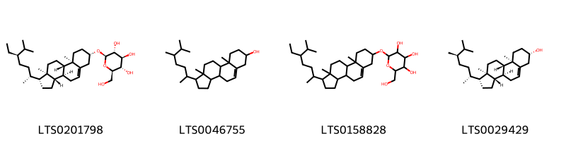{ width=100% }
    <figcaption>Hình ảnh cấu trúc hóa học của 4 hoạt chất thuộc nhóm Steroids and steroid derivatives gồm ['sitogluside (LTS0201798)', 'campesterol (LTS0046755)', '2-{[1-(5-ethyl-6-methylheptan-2-yl)-9a,11a-dimethyl-1h,2h,3h,3ah,3bh,4h,6h,7h,8h,9h,9bh,10h,11h-cyclopenta[a]phenanthren-7-yl]oxy}-6-(hydroxymethyl)oxane-3,4,5-triol (LTS0158828)', 'campesterol (LTS0029429)'].</figcaption>
</figure>
#### Nhóm Unsaturated hydrocarbons
<figure markdown="span">
    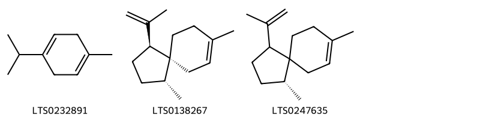{ width=100% }
    <figcaption>Hình ảnh cấu trúc hóa học của 3 hoạt chất thuộc nhóm Unsaturated hydrocarbons gồm ['α terpinene (LTS0232891)', '(1r,4s,5r)-1,8-dimethyl-4-(prop-1-en-2-yl)spiro[4.5]dec-7-ene (LTS0138267)', '(1r)-1,8-dimethyl-4-(prop-1-en-2-yl)spiro[4.5]dec-7-ene (LTS0247635)'].</figcaption>
</figure>

---

### Dược dân tộc học

Danh sách các quốc gia có sử dụng *Centella asiatica* trong điều trị các bệnh. 

| Country   | Disease                                                                | Bệnh                                                                                                                                                                                                |
|:----------|:-----------------------------------------------------------------------|:----------------------------------------------------------------------------------------------------------------------------------------------------------------------------------------------------|
| China     | Alexiteric, Refrigerant                                                | MYMEMORY WARNING: YOU USED ALL AVAILABLE FREE TRANSLATIONS FOR TODAY. NEXT AVAILABLE IN  07 HOURS 19 MINUTES 06 SECONDS VISIT HTTPS://MYMEMORY.TRANSLATED.NET/DOC/USAGELIMITS.PHP TO TRANSLATE MORE |
| Elsewhere | Aphrodisiac, Narcotic, Stimulant, Tonic, Tonic, Tonic                  | MYMEMORY WARNING: YOU USED ALL AVAILABLE FREE TRANSLATIONS FOR TODAY. NEXT AVAILABLE IN  07 HOURS 19 MINUTES 04 SECONDS VISIT HTTPS://MYMEMORY.TRANSLATED.NET/DOC/USAGELIMITS.PHP TO TRANSLATE MORE |
| India     | Diuretic, Diuretic, Insecticide, Tonic, Tonic                          | MYMEMORY WARNING: YOU USED ALL AVAILABLE FREE TRANSLATIONS FOR TODAY. NEXT AVAILABLE IN  07 HOURS 19 MINUTES 02 SECONDS VISIT HTTPS://MYMEMORY.TRANSLATED.NET/DOC/USAGELIMITS.PHP TO TRANSLATE MORE |
| Sumatra   | Diuretic                                                               | MYMEMORY WARNING: YOU USED ALL AVAILABLE FREE TRANSLATIONS FOR TODAY. NEXT AVAILABLE IN  07 HOURS 18 MINUTES 59 SECONDS VISIT HTTPS://MYMEMORY.TRANSLATED.NET/DOC/USAGELIMITS.PHP TO TRANSLATE MORE |
| Tonga     | Poultice, Tonic                                                        | MYMEMORY WARNING: YOU USED ALL AVAILABLE FREE TRANSLATIONS FOR TODAY. NEXT AVAILABLE IN  07 HOURS 18 MINUTES 56 SECONDS VISIT HTTPS://MYMEMORY.TRANSLATED.NET/DOC/USAGELIMITS.PHP TO TRANSLATE MORE |
| Turkey    | Narcotic, Refrigerant, Tonic, Astringent, Diuretic, Nervine, Stimulant | MYMEMORY WARNING: YOU USED ALL AVAILABLE FREE TRANSLATIONS FOR TODAY. NEXT AVAILABLE IN  07 HOURS 18 MINUTES 54 SECONDS VISIT HTTPS://MYMEMORY.TRANSLATED.NET/DOC/USAGELIMITS.PHP TO TRANSLATE MORE |

---

# Chi Apium

??? note "Danh sách các dược liệu thuộc chi"
    
	 - *Apium graveolens*
	 - *Apium nodiflorum*

---
## Apium graveolens
### Thông tin về thực vật

!!! info "Phân loại thực vật của *Apium graveolens* từ GIBF:"
    - **Kingdom:** Plantae
    - **Phylum:** Tracheophyta
    - **Order:** Apiales
    - **Family:** Apiaceae
    - **Genus:** Apium
    - **Species:** *Apium graveolens*

 

| Label (VI)   | Label (EN)   | Scientific Name   | Descriptions (VI)   | Descriptions (EN)                                              | Also Known As (VI)   | Also Known As (EN)   |
|:-------------|:-------------|:------------------|:--------------------|:---------------------------------------------------------------|:---------------------|:---------------------|
| N/A          | N/A          | Apium graveolens  |                     | species of edible plant, wild ancestor of the vegetable celery | ['']                 | ['wild celery']      |

#### Phân bố trên thế giới

**Từ CSDL GIBF** United Arab Emirates, Australia, Belgium, Argentina, Panama, Denmark, Netherlands, Chinese Taipei, Spain, Portugal, Russian Federation, United States of America, Sweden, South Africa, Germany, Mexico, Austria, United Kingdom of Great Britain and Northern Ireland, Ecuador, Costa Rica, Ireland, India, Mongolia, New Zealand

#### Phân bố tại Việt Nam

**Từ CSDL GIBF**: Không có ghi nhận ở Việt Nam

---
### Thành phần hóa học
        
- Theo cơ sở dữ liệu lotus: Từ loài *Apium graveolens* đã phân lập và xác định được 163 hoạt chất thuộc về các nhóm Benzofurans, Phenols, Fatty Acyls, Indoles and derivatives, Dibenzylbutane lignans, Isocoumarans, Cinnamaldehydes, Isobenzofurans, Glycerolipids, Prenol lipids, Benzene and substituted derivatives, Dihydrofurans, Organooxygen compounds, Furanoid lignans, Flavonoids, Steroids and steroid derivatives, Benzodioxoles, Organonitrogen compounds, Unsaturated hydrocarbons, Coumarins and derivatives. 

|    | chemicalTaxonomyClassyfireClass     |   smiles_count |
|---:|:------------------------------------|---------------:|
|  0 | Benzene and substituted derivatives |              1 |
|  1 | Benzodioxoles                       |              1 |
|  2 | Benzofurans                         |              1 |
|  3 | Cinnamaldehydes                     |              2 |
|  4 | Coumarins and derivatives           |             24 |
|  5 | Dibenzylbutane lignans              |              2 |
|  6 | Dihydrofurans                       |              1 |
|  7 | Fatty Acyls                         |              8 |
|  8 | Flavonoids                          |             37 |
|  9 | Furanoid lignans                    |              1 |
| 10 | Glycerolipids                       |              2 |
| 11 | Indoles and derivatives             |              1 |
| 12 | Isobenzofurans                      |             11 |
| 13 | Isocoumarans                        |              2 |
| 14 | Organonitrogen compounds            |              1 |
| 15 | Organooxygen compounds              |              3 |
| 16 | Phenols                             |              1 |
| 17 | Prenol lipids                       |             53 |
| 18 | Steroids and steroid derivatives    |              8 |
| 19 | Unsaturated hydrocarbons            |              1 |

#### Nhóm Benzene and substituted derivatives
<figure markdown="span">
    { width=100% }
    <figcaption>Hình ảnh cấu trúc hóa học của 1 hoạt chất thuộc nhóm Benzene and substituted derivatives gồm ['pentylbenzene (LTS0255583)'].</figcaption>
</figure>
#### Nhóm Benzodioxoles
<figure markdown="span">
    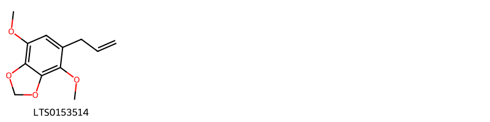{ width=100% }
    <figcaption>Hình ảnh cấu trúc hóa học của 1 hoạt chất thuộc nhóm Benzodioxoles gồm ['apiol (LTS0153514)'].</figcaption>
</figure>
#### Nhóm Benzofurans
<figure markdown="span">
    { width=100% }
    <figcaption>Hình ảnh cấu trúc hóa học của 1 hoạt chất thuộc nhóm Benzofurans gồm ['butylphthalide (LTS0150205)'].</figcaption>
</figure>
#### Nhóm Cinnamaldehydes
<figure markdown="span">
    { width=100% }
    <figcaption>Hình ảnh cấu trúc hóa học của 2 hoạt chất thuộc nhóm Cinnamaldehydes gồm ['3-phenyl-2-propenal (LTS0204346)', 'cinnamal (LTS0271313)'].</figcaption>
</figure>
#### Nhóm Coumarins and derivatives
<figure markdown="span">
    { width=100% }
    <figcaption>Hình ảnh cấu trúc hóa học của 24 hoạt chất thuộc nhóm Coumarins and derivatives gồm ['methoxsalen (LTS0260944)', 'bergapten (LTS0019861)', 'isopimpinellin (LTS0015558)', 'psoralen (LTS0121746)', 'trioxsalen (LTS0132749)', '(2r)-2-(prop-1-en-2-yl)-9-{[(2s,3r,4s,5s,6r)-3,4,5-trihydroxy-6-(hydroxymethyl)oxan-2-yl]oxy}-2h,3h-furo[3,2-g]chromen-7-one (LTS0099776)', 'angelicin (LTS0209295)', 'imperatorin (LTS0113114)', '[(2r,3s,4s,5r,6s)-3,4,5-trihydroxy-6-({2-[(2r)-9-hydroxy-7-oxo-2h,3h-furo[3,2-g]chromen-2-yl]propan-2-yl}oxy)oxan-2-yl]methyl (2e)-3-(4-hydroxy-3,5-dimethoxyphenyl)prop-2-enoate (LTS0204178)', '4-hydroxy-2-(2-{[3,4,5-trihydroxy-6-(hydroxymethyl)oxan-2-yl]oxy}propan-2-yl)-2h,3h-furo[3,2-g]chromen-7-one (LTS0142764)', 'osthole (LTS0149433)', 'umbelliferone (LTS0162728)', '4-hydroxy-2-(2-hydroxypropan-2-yl)-2h,3h-furo[3,2-g]chromen-7-one (LTS0111032)', 'scoparone (LTS0210705)', '4-methoxy-9-{[(2s,3r,4s,5s,6r)-3,4,5-trihydroxy-6-(hydroxymethyl)oxan-2-yl]oxy}furo[3,2-g]chromen-7-one (LTS0056584)', 'phellopterin (LTS0209928)', 'scopoletin (LTS0193112)', '2-(prop-1-en-2-yl)-9-{[3,4,5-trihydroxy-6-(hydroxymethyl)oxan-2-yl]oxy}-2h,3h-furo[3,2-g]chromen-7-one (LTS0191421)', '(2r)-2-(prop-1-en-2-yl)-9-{[(2s,3s,4s,5s,6r)-3,4,5-trihydroxy-6-(hydroxymethyl)oxan-2-yl]oxy}-2h,3h-furo[3,2-g]chromen-7-one (LTS0058074)', '{3,4,5-trihydroxy-6-[(2-{9-hydroxy-7-oxo-2h,3h-furo[3,2-g]chromen-2-yl}propan-2-yl)oxy]oxan-2-yl}methyl 3-(4-hydroxy-3,5-dimethoxyphenyl)prop-2-enoate (LTS0036842)', '4-methoxy-9-{[3,4,5-trihydroxy-6-(hydroxymethyl)oxan-2-yl]oxy}furo[3,2-g]chromen-7-one (LTS0062441)', '(-)-columbianetin (LTS0097915)', 'nodakenin (LTS0251242)', '[(2s,3s,4s,5r,6s)-3,4,5-trihydroxy-6-({2-[(2r)-9-hydroxy-7-oxo-2h,3h-furo[3,2-g]chromen-2-yl]propan-2-yl}oxy)oxan-2-yl]methyl (2e)-3-(4-hydroxy-3,5-dimethoxyphenyl)prop-2-enoate (LTS0118955)'].</figcaption>
</figure>
#### Nhóm Dibenzylbutane lignans
<figure markdown="span">
    { width=100% }
    <figcaption>Hình ảnh cấu trúc hóa học của 2 hoạt chất thuộc nhóm Dibenzylbutane lignans gồm ['(2s,3r)-2,3-bis[(4-hydroxy-3-methoxyphenyl)(¹³c)methyl](1-¹³c)butane-1,4-diol (LTS0268699)', 'secoisolariciresinol (LTS0086727)'].</figcaption>
</figure>
#### Nhóm Dihydrofurans
<figure markdown="span">
    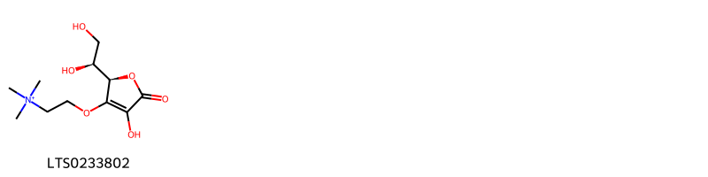{ width=100% }
    <figcaption>Hình ảnh cấu trúc hóa học của 1 hoạt chất thuộc nhóm Dihydrofurans gồm ['(2-{[(2r)-2-[(1s)-1,2-dihydroxyethyl]-4-hydroxy-5-oxo-2h-furan-3-yl]oxy}ethyl)trimethylazanium (LTS0233802)'].</figcaption>
</figure>
#### Nhóm Fatty Acyls
<figure markdown="span">
    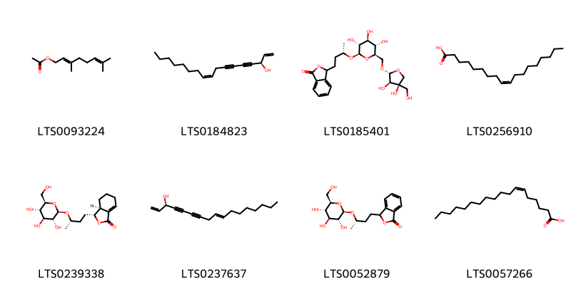{ width=100% }
    <figcaption>Hình ảnh cấu trúc hóa học của 8 hoạt chất thuộc nhóm Fatty Acyls gồm ['geranyl acetate (LTS0093224)', 'falcarinol (LTS0184823)', '3-[(3s)-3-{[(2r,3r,4s,5s,6r)-6-({[(2r,3r,4r)-3,4-dihydroxy-4-(hydroxymethyl)oxolan-2-yl]oxy}methyl)-3,4,5-trihydroxyoxan-2-yl]oxy}butyl]-3h-2-benzofuran-1-one (LTS0185401)', 'oleic acid (LTS0256910)', '(3r,3as)-3-[(3s)-3-{[(2r,3r,4s,5s,6r)-3,4,5-trihydroxy-6-(hydroxymethyl)oxan-2-yl]oxy}butyl]-3a,4,5,6-tetrahydro-3h-2-benzofuran-1-one (LTS0239338)', '(z)-falcarinol (LTS0237637)', '3-[(3s)-3-{[(2r,3r,4s,5s,6r)-3,4,5-trihydroxy-6-(hydroxymethyl)oxan-2-yl]oxy}butyl]-3h-2-benzofuran-1-one (LTS0052879)', 'petroselinic acid (LTS0057266)'].</figcaption>
</figure>
#### Nhóm Flavonoids
<figure markdown="span">
    { width=100% }
    <figcaption>Hình ảnh cấu trúc hóa học của 37 hoạt chất thuộc nhóm Flavonoids gồm ['chamomile (LTS0104946)', 'kaempherol (LTS0155822)', 'myricetin (LTS0139858)', 'quercetin (LTS0004651)', 'luteolin (LTS0017052)', 'asahina (LTS0068303)', 'naringenin (LTS0031098)', 'hesperetin (LTS0087195)', 'isorhamnetin (LTS0107505)', '2-(3,4-dihydroxyphenyl)-5,7-dihydroxy-3-{[(2s,3r,4r,5r,6s)-3,4,5-trihydroxy-6-(hydroxymethyl)oxan-2-yl]oxy}chromen-4-one (LTS0241372)', '5-hydroxy-2-(4-hydroxy-3-methoxyphenyl)-7-{[3,4,5-trihydroxy-6-(hydroxymethyl)oxan-2-yl]oxy}chromen-4-one (LTS0085390)', 'chrysoeriol (LTS0095766)', '{5-[(4,5-dihydroxy-2-{[5-hydroxy-2-(4-hydroxyphenyl)-4-oxochromen-7-yl]oxy}-6-(hydroxymethyl)oxan-3-yl)oxy]-3,4-dihydroxyoxolan-3-yl}methyl 3-(4-hydroxy-3-methoxyphenyl)prop-2-enoate (LTS0220752)', '2-(3,4-dihydroxyphenyl)-5,7-dihydroxy-3-{[(2s,3s,4r,5r,6s)-3,4,5-trihydroxy-6-methyloxan-2-yl]oxy}chromen-4-one (LTS0083664)', '7-[(3-{[3,4-dihydroxy-4-(hydroxymethyl)oxolan-2-yl]oxy}-4,5-dihydroxy-6-(hydroxymethyl)oxan-2-yl)oxy]-5-hydroxy-2-(4-hydroxyphenyl)-2,3-dihydro-1-benzopyran-4-one (LTS0027438)', '{5-[(4,5-dihydroxy-2-{[5-hydroxy-2-(4-hydroxy-3-methoxyphenyl)-4-oxochromen-7-yl]oxy}-6-(hydroxymethyl)oxan-3-yl)oxy]-3,4-dihydroxyoxolan-3-yl}methyl 3-(4-hydroxy-3-methoxyphenyl)prop-2-enoate (LTS0156968)', 'apigetrin (LTS0157591)', 'hyperoside (LTS0089156)', '7-[(3-{[(4r)-3,4-dihydroxy-4-(hydroxymethyl)oxolan-2-yl]oxy}-4,5-dihydroxy-6-(hydroxymethyl)oxan-2-yl)oxy]-5-hydroxy-2-(4-hydroxyphenyl)chromen-4-one (LTS0118961)', '[(3s,4r,5s)-5-{[(2s,3r,4s,5s,6r)-4,5-dihydroxy-2-{[5-hydroxy-2-(4-hydroxyphenyl)-4-oxochromen-7-yl]oxy}-6-(hydroxymethyl)oxan-3-yl]oxy}-3,4-dihydroxyoxolan-3-yl]methyl (2e)-3-(4-hydroxy-3-methoxyphenyl)prop-2-enoate (LTS0117576)', '7-[(5-{[3,4-dihydroxy-4-(hydroxymethyl)oxolan-2-yl]oxy}-3,4-dihydroxy-6-(hydroxymethyl)oxan-2-yl)oxy]-5-hydroxy-2-(4-hydroxyphenyl)chromen-4-one (LTS0126335)', '7-{[(2s,3r,4r,5s,6r)-5-{[(2s,3r,4r)-3,4-dihydroxy-4-(hydroxymethyl)oxolan-2-yl]oxy}-3,4-dihydroxy-6-(hydroxymethyl)oxan-2-yl]oxy}-5-hydroxy-2-(4-hydroxyphenyl)chromen-4-one (LTS0147994)', '2-(3,4-dihydroxyphenyl)-5-hydroxy-7-{[3,4,5-trihydroxy-6-(hydroxymethyl)oxan-2-yl]oxy}chromen-4-one (LTS0158292)', 'apigenin 7-o-β-glucoside (LTS0252743)', '5-hydroxy-2-(4-hydroxyphenyl)-7-{[(2s,3r,4r,5r,6r)-3,4,5-trihydroxy-6-(hydroxymethyl)oxan-2-yl]oxy}chromen-4-one (LTS0180546)', 'quercitrin (LTS0186298)', 'apiin (LTS0178138)', '5-hydroxy-2-(4-hydroxy-3-methoxyphenyl)-7-{[(2s,3r,4s,5s,6s)-3,4,5-trihydroxy-6-(hydroxymethyl)oxan-2-yl]oxy}chromen-4-one (LTS0269750)', '2-(3,4-dihydroxyphenyl)-5-hydroxy-7-{[(2s,3r,4r,5r,6r)-3,4,5-trihydroxy-6-(hydroxymethyl)oxan-2-yl]oxy}chromen-4-one (LTS0063860)', '5-hydroxy-2-(4-hydroxy-3-methoxyphenyl)-7-{[(2s,3r,4s,5s,6r)-3,4,5-trihydroxy-6-(hydroxymethyl)oxan-2-yl]oxy}chromen-4-one (LTS0065615)', '[(3s,4r,5s)-5-{[(2s,3r,4s,5s,6r)-4,5-dihydroxy-2-{[5-hydroxy-2-(4-hydroxy-3-methoxyphenyl)-4-oxochromen-7-yl]oxy}-6-(hydroxymethyl)oxan-3-yl]oxy}-3,4-dihydroxyoxolan-3-yl]methyl (2e)-3-(4-hydroxy-3-methoxyphenyl)prop-2-enoate (LTS0225091)', '[(3s,4r,5s)-5-{[(2s,3r,4s,5s,6r)-2-{[2-(3,4-dihydroxyphenyl)-5-hydroxy-4-oxochromen-7-yl]oxy}-4,5-dihydroxy-6-(hydroxymethyl)oxan-3-yl]oxy}-3,4-dihydroxyoxolan-3-yl]methyl (2e)-3-(4-hydroxy-3-methoxyphenyl)prop-2-enoate (LTS0003973)', 'luteolin 7-o-glucoside (LTS0227450)', '7-[(3-{[3,4-dihydroxy-4-(hydroxymethyl)oxolan-2-yl]oxy}-4,5-dihydroxy-6-(hydroxymethyl)oxan-2-yl)oxy]-5-hydroxy-2-(4-hydroxyphenyl)chromen-4-one (LTS0003714)', '{5-[(2-{[2-(3,4-dihydroxyphenyl)-5-hydroxy-4-oxochromen-7-yl]oxy}-4,5-dihydroxy-6-(hydroxymethyl)oxan-3-yl)oxy]-3,4-dihydroxyoxolan-3-yl}methyl 3-(4-hydroxy-3-methoxyphenyl)prop-2-enoate (LTS0235250)', '(2s)-7-{[(2s,3r,4s,5s,6r)-3-{[(2s,3r,4r)-3,4-dihydroxy-4-(hydroxymethyl)oxolan-2-yl]oxy}-4,5-dihydroxy-6-(hydroxymethyl)oxan-2-yl]oxy}-5-hydroxy-2-(4-hydroxyphenyl)-2,3-dihydro-1-benzopyran-4-one (LTS0116558)', '7-{[(2s,3r,4s,5s,6r)-3-{[(2s,3s,4r)-3,4-dihydroxy-4-(hydroxymethyl)oxolan-2-yl]oxy}-4,5-dihydroxy-6-(hydroxymethyl)oxan-2-yl]oxy}-5-hydroxy-2-(4-hydroxy-3-methoxyphenyl)chromen-4-one (LTS0049349)'].</figcaption>
</figure>
#### Nhóm Furanoid lignans
<figure markdown="span">
    { width=100% }
    <figcaption>Hình ảnh cấu trúc hóa học của 1 hoạt chất thuộc nhóm Furanoid lignans gồm ['matairesinol (LTS0193475)'].</figcaption>
</figure>
#### Nhóm Glycerolipids
<figure markdown="span">
    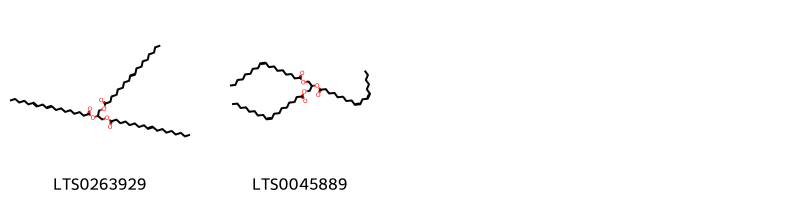{ width=100% }
    <figcaption>Hình ảnh cấu trúc hóa học của 2 hoạt chất thuộc nhóm Glycerolipids gồm ['1,3-bis(octadec-9-enoyloxy)propan-2-yl octadeca-9,12-dienoate (LTS0263929)', '1,3-bis[(9z)-octadec-9-enoyloxy]propan-2-yl (9z,12z)-octadeca-9,12-dienoate (LTS0045889)'].</figcaption>
</figure>
#### Nhóm Indoles and derivatives
<figure markdown="span">
    { width=100% }
    <figcaption>Hình ảnh cấu trúc hóa học của 1 hoạt chất thuộc nhóm Indoles and derivatives gồm ['l-tryptophan (LTS0263809)'].</figcaption>
</figure>
#### Nhóm Isobenzofurans
<figure markdown="span">
    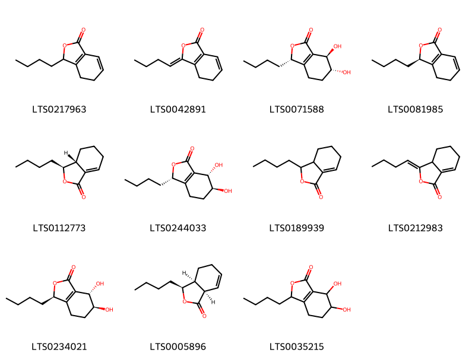{ width=100% }
    <figcaption>Hình ảnh cấu trúc hóa học của 11 hoạt chất thuộc nhóm Isobenzofurans gồm ['3-butyl-4,5-dihydro-3h-2-benzofuran-1-one (LTS0217963)', '(z)-ligustilide (LTS0042891)', '(3s,6r,7r)-3-butyl-6,7-dihydroxy-4,5,6,7-tetrahydro-3h-2-benzofuran-1-one (LTS0071588)', '(3r)-3-butyl-4,5-dihydro-3h-2-benzofuran-1-one (LTS0081985)', '(3s,3ar)-(-)-sedanolide (LTS0112773)', '(3s,6s,7s)-3-butyl-6,7-dihydroxy-4,5,6,7-tetrahydro-3h-2-benzofuran-1-one (LTS0244033)', 'sedanolide (LTS0189939)', '(3z)-3-butylidene-3a,4,5,6-tetrahydro-2-benzofuran-1-one (LTS0212983)', '(3r,6s,7s)-3-butyl-6,7-dihydroxy-4,5,6,7-tetrahydro-3h-2-benzofuran-1-one (LTS0234021)', 'cnidilide (LTS0005896)', '3-butyl-6,7-dihydroxy-4,5,6,7-tetrahydro-3h-2-benzofuran-1-one (LTS0035215)'].</figcaption>
</figure>
#### Nhóm Isocoumarans
<figure markdown="span">
    { width=100% }
    <figcaption>Hình ảnh cấu trúc hóa học của 2 hoạt chất thuộc nhóm Isocoumarans gồm ['butylidenephthalide (LTS0147414)', 'butylidenephthalide (LTS0259092)'].</figcaption>
</figure>
#### Nhóm Organonitrogen compounds
<figure markdown="span">
    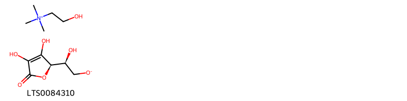{ width=100% }
    <figcaption>Hình ảnh cấu trúc hóa học của 1 hoạt chất thuộc nhóm Organonitrogen compounds gồm ['choline ascorbate (LTS0084310)'].</figcaption>
</figure>
#### Nhóm Organooxygen compounds
<figure markdown="span">
    { width=100% }
    <figcaption>Hình ảnh cấu trúc hóa học của 3 hoạt chất thuộc nhóm Organooxygen compounds gồm ['(2s,3r,4s,5s,6r)-2-[4-(1,3-dihydroxypropan-2-yl)-2-methoxyphenoxy]-6-(hydroxymethyl)oxane-3,4,5-triol (LTS0038291)', '(2s,3r,4s,5s,6r)-2-(4-hydroxy-2,6-dimethoxyphenoxy)-6-(hydroxymethyl)oxane-3,4,5-triol (LTS0120164)', 'syringin (LTS0046227)'].</figcaption>
</figure>
#### Nhóm Phenols
<figure markdown="span">
    { width=100% }
    <figcaption>Hình ảnh cấu trúc hóa học của 1 hoạt chất thuộc nhóm Phenols gồm ['chavibetol (LTS0244260)'].</figcaption>
</figure>
#### Nhóm Prenol lipids
<figure markdown="span">
    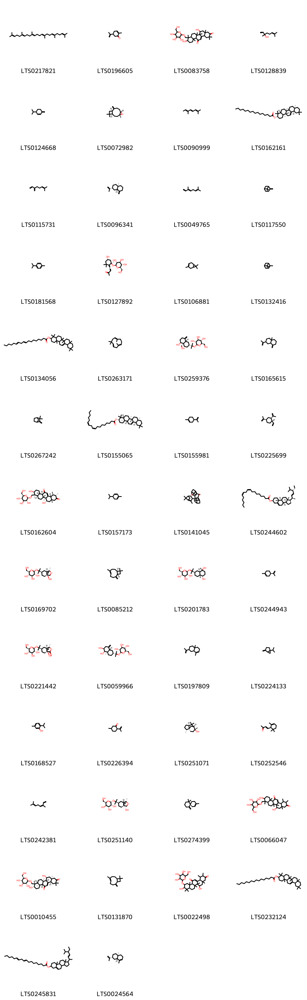{ width=100% }
    <figcaption>Hình ảnh cấu trúc hóa học của 53 hoạt chất thuộc nhóm Prenol lipids gồm ['squalene (LTS0217821)', 'carvone (LTS0196605)', '6,10-dihydroxy-2,2,4a,6a,6b,9,12a-heptamethyl-9-({[3,4,5-trihydroxy-6-(hydroxymethyl)oxan-2-yl]oxy}methyl)-1,4,5,6,7,8,8a,10,11,12,12b,14b-dodecahydropicene-3,13-dione (LTS0083758)', 'linalool, (+-)- (LTS0128839)', 'β phellandrene (LTS0124668)', '(1r,4r,6s,10r)-4,12,12-trimethyl-9-methylidene-5-oxatricyclo[8.2.0.0⁴,⁶]dodecane (LTS0072982)', 'allo-ocimene (LTS0090999)', '(3s,4ar,6ar,6bs,8ar,12ar,14ar,14br)-4,4,6a,6b,8a,11,11,14b-octamethyl-1,2,3,4a,5,6,7,8,9,10,12,12a,14,14a-tetradecahydropicen-3-yl hexadecanoate (LTS0162161)', 'α-myrcene (LTS0115731)', 'β-selinene (LTS0096341)', 'trans-β-ocimene (LTS0049765)', 'β-pinene (LTS0117550)', 'cymene (LTS0181568)', 'citroside b (LTS0127892)', 'monoterpenes (LTS0106881)', 'α pinene (LTS0132416)', '4,4,6a,6b,8a,11,11,14b-octamethyl-1,2,3,4a,5,6,7,8,9,10,12,12a,14,14a-tetradecahydropicen-3-yl octadeca-9,12-dienoate (LTS0134056)', 'humulene (LTS0263171)', '(2s,3r,4s,5s,6r)-2-({2-[(2r,4ar,5s,8as)-5-hydroxy-4a-(hydroxymethyl)-8-methylidene-octahydronaphthalen-2-yl]propan-2-yl}oxy)-6-(hydroxymethyl)oxane-3,4,5-triol (LTS0259376)', '4a-methyl-1-methylidene-7-(prop-1-en-2-yl)-octahydronaphthalene (LTS0165615)', 'camphene (LTS0267242)', '(3s,4ar,6ar,6bs,8ar,12ar,14ar,14br)-4,4,6a,6b,8a,11,11,14b-octamethyl-1,2,3,4a,5,6,7,8,9,10,12,12a,14,14a-tetradecahydropicen-3-yl (9z,12z)-octadeca-9,12-dienoate (LTS0155065)', 'limonene,  (LTS0155981)', 'β-elemene (LTS0225699)', '(1r,2s,4as,6s,6as,6br,8ar,9s,10s,12as,12br,14br)-6,10-dihydroxy-1,2,4a,6a,6b,9,12a-heptamethyl-9-({[(2r,3r,4s,5s,6r)-3,4,5-trihydroxy-6-(hydroxymethyl)oxan-2-yl]oxy}methyl)-2,4,5,6,7,8,8a,10,11,12,12b,14b-dodecahydro-1h-picene-3,13-dione (LTS0162604)', 'phellandrene (LTS0157173)', '2,6,6-trimethyl-3,3-bis({2,6,6-trimethylbicyclo[3.1.1]hept-1-en-3-yl})bicyclo[3.1.1]hept-1-ene (LTS0141045)', '(1r,3as,3bs,7s,9ar,9bs,11ar)-1-[(2r,3e,5s)-5-ethyl-6-methylhept-3-en-2-yl]-9a,11a-dimethyl-1h,2h,3h,3ah,3bh,4h,6h,7h,8h,9h,9bh,10h,11h-cyclopenta[a]phenanthren-7-yl (9z,12z)-octadeca-9,12-dienoate (LTS0244602)', '(2s,3r,4s,5s,6r)-2-({2-[(1r,4r,6r,7s,10s)-10-hydroxy-7-methyl-12-oxatricyclo[5.3.2.0¹,⁶]dodecan-4-yl]propan-2-yl}oxy)-6-(hydroxymethyl)oxane-3,4,5-triol (LTS0169702)', 'caryophyllene (LTS0085212)', '(2s,3r,4s,5s,6r)-2-({2-[(2r,4ar,5s,8r,8ar)-5,8-dihydroxy-4a,8-dimethyl-octahydronaphthalen-2-yl]propan-2-yl}oxy)-6-(hydroxymethyl)oxane-3,4,5-triol (LTS0201783)', 'α-limonene (LTS0244943)', '(1s,4r,6r,7s,10s)-10-hydroxy-7-methyl-4-(2-{[(2s,3r,4s,5s,6r)-3,4,5-trihydroxy-6-(hydroxymethyl)oxan-2-yl]oxy}propan-2-yl)-12-oxatricyclo[5.3.2.0¹,⁶]dodecan-11-one (LTS0221442)', '(2s,3r,4s,5s,6r)-2-({2-[(2r,4ar,5r,6s,8as)-5,6-dihydroxy-4a-methyl-8-methylidene-octahydronaphthalen-2-yl]propan-2-yl}oxy)-6-(hydroxymethyl)oxane-3,4,5-triol (LTS0059966)', 'selinene (LTS0197809)', 'sabinene (LTS0224133)', 'thymol (LTS0168527)', 'isopulegone (LTS0226394)', 'cedrol (LTS0251071)', 'ionone (LTS0252546)', 'β-ocimene (LTS0242381)', '(2r,3r,4r,5r,6r)-2-({2-[(1r,4r,6s,7s,10r)-10-hydroxy-7-methyl-12-oxatricyclo[5.3.2.0¹,⁶]dodecan-4-yl]propan-2-yl}oxy)-6-(hydroxymethyl)oxane-3,4,5-triol (LTS0251140)', '(-)-chamigrene (LTS0274399)', '6,10-dihydroxy-1,2,4a,6a,6b,9,12a-heptamethyl-9-({[3,4,5-trihydroxy-6-(hydroxymethyl)oxan-2-yl]oxy}methyl)-2,4,5,6,7,8,8a,10,11,12,12b,14b-dodecahydro-1h-picene-3,13-dione (LTS0066047)', '(4as,6s,6as,6br,8ar,9s,10s,12as,12br,14br)-6,10-dihydroxy-2,2,4a,6a,6b,9,12a-heptamethyl-9-({[(2r,3r,4s,5s,6r)-3,4,5-trihydroxy-6-(hydroxymethyl)oxan-2-yl]oxy}methyl)-1,4,5,6,7,8,8a,10,11,12,12b,14b-dodecahydropicene-3,13-dione (LTS0010455)', 'caryophyllene (LTS0131870)', '6,10-dihydroxy-1,2,4a,6a,6b,9,9,12a-octamethyl-11-{[3,4,5-trihydroxy-6-(hydroxymethyl)oxan-2-yl]oxy}-2,4,5,6,7,8,8a,10,11,12,12b,14b-dodecahydro-1h-picene-3,13-dione (LTS0022498)', '4,4,6a,6b,8a,11,11,14b-octamethyl-1,2,3,4a,5,6,7,8,9,10,12,12a,14,14a-tetradecahydropicen-3-yl hexadecanoate (LTS0232124)', '1-(5-ethyl-6-methylhept-3-en-2-yl)-9a,11a-dimethyl-1h,2h,3h,3ah,3bh,4h,6h,7h,8h,9h,9bh,10h,11h-cyclopenta[a]phenanthren-7-yl octadeca-9,12-dienoate (LTS0245831)', 'α-selinene (LTS0024564)', 'carvone, (+)- (LTS0027671)', '(4as,7s,8as)-4a-methyl-1-methylidene-7-(prop-1-en-2-yl)-octahydronaphthalene (LTS0244362)', '(1r,2s,4as,6s,6as,6br,8ar,10r,11s,12as,12br,14br)-6,10-dihydroxy-1,2,4a,6a,6b,9,9,12a-octamethyl-11-{[(2r,3r,4s,5s,6r)-3,4,5-trihydroxy-6-(hydroxymethyl)oxan-2-yl]oxy}-2,4,5,6,7,8,8a,10,11,12,12b,14b-dodecahydro-1h-picene-3,13-dione (LTS0046183)'].</figcaption>
</figure>
#### Nhóm Steroids and steroid derivatives
<figure markdown="span">
    { width=100% }
    <figcaption>Hình ảnh cấu trúc hóa học của 8 hoạt chất thuộc nhóm Steroids and steroid derivatives gồm ['1-(5,6-dimethylheptan-2-yl)-9a,11a-dimethyl-1h,2h,3h,3ah,3bh,4h,6h,7h,8h,9h,9bh,10h,11h-cyclopenta[a]phenanthren-7-yl octadeca-9,12-dienoate (LTS0241519)', '(1s,2r,5r,7s,11s,12s,15r,16s)-15-[(2s,3r,4r,5s)-3,4-dihydroxy-5,6-dimethylheptan-2-yl]-5-hydroxy-2,16-dimethyl-9-oxatetracyclo[9.7.0.0²,⁷.0¹²,¹⁶]octadecan-8-one (LTS0097986)', 'campesterol (LTS0029429)', 'phytosterol (LTS0029311)', 'stigmasterol (LTS0024262)', 'campesterol (LTS0046755)', '15-(3,4-dihydroxy-5,6-dimethylheptan-2-yl)-5-hydroxy-2,16-dimethyl-9-oxatetracyclo[9.7.0.0²,⁷.0¹²,¹⁶]octadecan-8-one (LTS0009072)', '(1r,3as,3bs,7s,9ar,9bs,11ar)-1-[(2r,5r)-5,6-dimethylheptan-2-yl]-9a,11a-dimethyl-1h,2h,3h,3ah,3bh,4h,6h,7h,8h,9h,9bh,10h,11h-cyclopenta[a]phenanthren-7-yl (9z,12z)-octadeca-9,12-dienoate (LTS0022174)'].</figcaption>
</figure>
#### Nhóm Unsaturated hydrocarbons
<figure markdown="span">
    { width=100% }
    <figcaption>Hình ảnh cấu trúc hóa học của 1 hoạt chất thuộc nhóm Unsaturated hydrocarbons gồm ['α terpinene (LTS0232891)'].</figcaption>
</figure>

---

### Dược dân tộc học

Danh sách các quốc gia có sử dụng *Apium graveolens* trong điều trị các bệnh. 

| Country            | Disease                                                                                                                       | Bệnh                                                                                                                                                                                                |
|:-------------------|:------------------------------------------------------------------------------------------------------------------------------|:----------------------------------------------------------------------------------------------------------------------------------------------------------------------------------------------------|
| China              | Digestive, Refrigerant, Tonic                                                                                                 | MYMEMORY WARNING: YOU USED ALL AVAILABLE FREE TRANSLATIONS FOR TODAY. NEXT AVAILABLE IN  07 HOURS 18 MINUTES 19 SECONDS VISIT HTTPS://MYMEMORY.TRANSLATED.NET/DOC/USAGELIMITS.PHP TO TRANSLATE MORE |
| Dominican Republic | Diuretic                                                                                                                      | MYMEMORY WARNING: YOU USED ALL AVAILABLE FREE TRANSLATIONS FOR TODAY. NEXT AVAILABLE IN  07 HOURS 18 MINUTES 16 SECONDS VISIT HTTPS://MYMEMORY.TRANSLATED.NET/DOC/USAGELIMITS.PHP TO TRANSLATE MORE |
| Elsewhere          | Carminative, Diuretic, Nervine, Poultice, Sedative, Stimulant, Carminative, Emmenagogue, Nervine, Stimulant, Stomachic, Tonic | MYMEMORY WARNING: YOU USED ALL AVAILABLE FREE TRANSLATIONS FOR TODAY. NEXT AVAILABLE IN  07 HOURS 18 MINUTES 14 SECONDS VISIT HTTPS://MYMEMORY.TRANSLATED.NET/DOC/USAGELIMITS.PHP TO TRANSLATE MORE |
| Haiti              | Carminative, Stimulant                                                                                                        | MYMEMORY WARNING: YOU USED ALL AVAILABLE FREE TRANSLATIONS FOR TODAY. NEXT AVAILABLE IN  07 HOURS 18 MINUTES 11 SECONDS VISIT HTTPS://MYMEMORY.TRANSLATED.NET/DOC/USAGELIMITS.PHP TO TRANSLATE MORE |
| India              | Antiseptic                                                                                                                    | MYMEMORY WARNING: YOU USED ALL AVAILABLE FREE TRANSLATIONS FOR TODAY. NEXT AVAILABLE IN  07 HOURS 18 MINUTES 09 SECONDS VISIT HTTPS://MYMEMORY.TRANSLATED.NET/DOC/USAGELIMITS.PHP TO TRANSLATE MORE |
| Iraq               | Antiseptic, Carminative, Diuretic, Nervine, Sedative, Stimulant, Tonic, Aphrodisiac                                           | MYMEMORY WARNING: YOU USED ALL AVAILABLE FREE TRANSLATIONS FOR TODAY. NEXT AVAILABLE IN  07 HOURS 18 MINUTES 06 SECONDS VISIT HTTPS://MYMEMORY.TRANSLATED.NET/DOC/USAGELIMITS.PHP TO TRANSLATE MORE |
| Turkey             | Apertif, Carminative, Emmenagogue, Stomachic, Diuretic, Nervine                                                               | MYMEMORY WARNING: YOU USED ALL AVAILABLE FREE TRANSLATIONS FOR TODAY. NEXT AVAILABLE IN  07 HOURS 18 MINUTES 04 SECONDS VISIT HTTPS://MYMEMORY.TRANSLATED.NET/DOC/USAGELIMITS.PHP TO TRANSLATE MORE |

---

---
## Apium nodiflorum
### Thông tin về thực vật

!!! info "Phân loại thực vật của *Helosciadium nodiflorum* từ GIBF:"
    - **Kingdom:** Plantae
    - **Phylum:** Tracheophyta
    - **Order:** Apiales
    - **Family:** Apiaceae
    - **Genus:** Helosciadium
    - **Species:** *Helosciadium nodiflorum*

 

| Label (VI)   | Label (EN)   | Scientific Name   | Descriptions (VI)   | Descriptions (EN)   | Also Known As (VI)   | Also Known As (EN)   |
|:-------------|:-------------|:------------------|:--------------------|:--------------------|:---------------------|:---------------------|
| N/A          | N/A          | Apium nodiflorum  | loài thực vật       | species of plant    | ['']                 | ['']                 |

#### Phân bố trên thế giới

**Từ CSDL GIBF** Germany, Belgium, Spain, Portugal, France

#### Phân bố tại Việt Nam

**Từ CSDL GIBF**: Không có ghi nhận ở Việt Nam

---
### Thành phần hóa học
        
- Theo cơ sở dữ liệu lotus: Từ loài *Helosciadium nodiflorum* đã phân lập và xác định được 1 hoạt chất thuộc về các nhóm Flavonoids. 

|    | chemicalTaxonomyClassyfireClass   |   smiles_count |
|---:|:----------------------------------|---------------:|
|  0 | Flavonoids                        |              1 |

#### Nhóm Flavonoids
<figure markdown="span">
    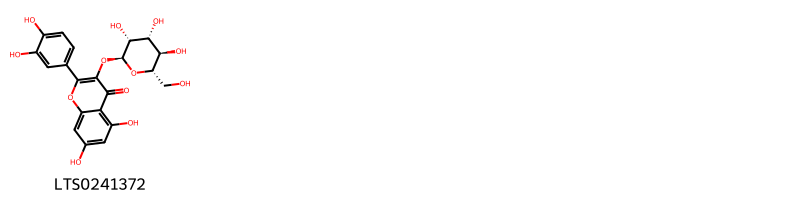{ width=100% }
    <figcaption>Hình ảnh cấu trúc hóa học của 1 hoạt chất thuộc nhóm Flavonoids gồm ['2-(3,4-dihydroxyphenyl)-5,7-dihydroxy-3-{[(2s,3r,4r,5r,6s)-3,4,5-trihydroxy-6-(hydroxymethyl)oxan-2-yl]oxy}chromen-4-one (LTS0241372)'].</figcaption>
</figure>

---

### Dược dân tộc học

Danh sách các quốc gia có sử dụng *Helosciadium nodiflorum* trong điều trị các bệnh. 

| Country   | Disease     | Bệnh                                                                                                                                                                                                |
|:----------|:------------|:----------------------------------------------------------------------------------------------------------------------------------------------------------------------------------------------------|
| English   | Diuretic    | MYMEMORY WARNING: YOU USED ALL AVAILABLE FREE TRANSLATIONS FOR TODAY. NEXT AVAILABLE IN  07 HOURS 17 MINUTES 12 SECONDS VISIT HTTPS://MYMEMORY.TRANSLATED.NET/DOC/USAGELIMITS.PHP TO TRANSLATE MORE |
| French    | Emmenagogue | MYMEMORY WARNING: YOU USED ALL AVAILABLE FREE TRANSLATIONS FOR TODAY. NEXT AVAILABLE IN  07 HOURS 17 MINUTES 10 SECONDS VISIT HTTPS://MYMEMORY.TRANSLATED.NET/DOC/USAGELIMITS.PHP TO TRANSLATE MORE |
| German    | Stimulant   | MYMEMORY WARNING: YOU USED ALL AVAILABLE FREE TRANSLATIONS FOR TODAY. NEXT AVAILABLE IN  07 HOURS 17 MINUTES 07 SECONDS VISIT HTTPS://MYMEMORY.TRANSLATED.NET/DOC/USAGELIMITS.PHP TO TRANSLATE MORE |
| Italian   | Tonic       | MYMEMORY WARNING: YOU USED ALL AVAILABLE FREE TRANSLATIONS FOR TODAY. NEXT AVAILABLE IN  07 HOURS 17 MINUTES 05 SECONDS VISIT HTTPS://MYMEMORY.TRANSLATED.NET/DOC/USAGELIMITS.PHP TO TRANSLATE MORE |

---

