!!! abstract "Tóm tắt"

    Họ Apocynaceae gồm khoảng 48 chi và 87 loài được một số cộng đồng tại các quốc gia như Trinidad, Brazil, Asia, French, Zaire, E Africa, Nepal, China, Honduras, Java, Dutch, Africa(Swahili), Turkey, Madagascar, Thailand, Ghana, Eurasia, Borneo, Jamaica, English, Tonga, Hanf, Marquesas I, anish, Dominican Republic, Colombia, Nigeria, Africa, Sierra Leone, Tanzania, India(Santal), Malawi, Arabic, Europe, Mexico, Latin America, Chinese, Reunion, Sanscrit, West Indies, Malaysia, Haiti, Philippines, Gabon, South America, Iraq, Upper Volta, Hindu, India(Gujarat), Sudan, Kurdistan, Singapore, Venezuela, Solomon I, US(Blackfoot), Paraguay, Elsewhere, Malaya, India, US, France, Samoa sử dụng trong một số trường hợp QUERY LENGTH LIMIT EXCEEDED. MAX ALLOWED QUERY : 500 CHARS QUERY LENGTH LIMIT EXCEEDED. MAX ALLOWED QUERY : 500 CHARS QUERY LENGTH LIMIT EXCEEDED. MAX ALLOWED QUERY : 500 CHARS.

!!! info "DrDuke"

    James A. Duke sinh năm 1929-2017 là một nhà thực vật học người Mỹ. Đây là một trong những tác giả hàng đầu trong lĩnh vực dược dân tộc học với cuốn *CRC Handbook of Medicinal Herbs* và chính là người xây dựng lên cơ sở dữ liệu về hợp chất tự nhiên và dược dân tộc học tại Bộ nông nghiệp Hoa Kỳ. Các thông tin được đăng tải tại website [Dr. Duke's Phytochemical and Ethnobotanical Databases](https://phytochem.nal.usda.gov/). 
    Trong suốt thập niên 1970, ông lãnh đạo the Plant Taxonomy Laboratory, Plant Genetics and Germplasm Institute of the Agricultural Research Service, U.S. Department of Agriculture.
    Trong tài liệu này, các thông tin về dược dân tộc của các dược liệu được trích dẫn từ tài liệu của James A. Ducke với sự trợ giúp của phần mềm dịch thuật từ tiếng Anh sang tiếng Việt.
   

# Chi Adenium

??? note "Danh sách các dược liệu thuộc chi"
    
	 - *Adenium obesum*

---
## Adenium obesum
### Thông tin về thực vật

!!! info "Phân loại thực vật của *Adenium obesum* từ GIBF:"
    - **Kingdom:** Plantae
    - **Phylum:** Tracheophyta
    - **Order:** Gentianales
    - **Family:** Apocynaceae
    - **Genus:** Adenium
    - **Species:** *Adenium obesum*

 

| Label (VI)   | Label (EN)   | Scientific Name   | Descriptions (VI)   | Descriptions (EN)   | Also Known As (VI)   | Also Known As (EN)             |
|:-------------|:-------------|:------------------|:--------------------|:--------------------|:---------------------|:-------------------------------|
| N/A          | N/A          | Adenium obesum    | loài thực vật       | species of plant    | ['']                 | ['desert rose', 'mock azalea'] |

#### Phân bố trên thế giới

**Từ CSDL GIBF** nan, Brazil, Saint Kitts and Nevis, Virgin Islands (British), Viet Nam, Senegal, Guadeloupe, Barbados, Zimbabwe, Qatar, Mozambique, Honduras, Tanzania, United Republic of, Yemen, Madagascar, Turks and Caicos Islands, Thailand, Spain, Cayman Islands, Puerto Rico, United States of America, Chad, Indonesia, Colombia, French Guiana, Benin, Kenya, Saudi Arabia, Philippines, Malaysia, Panama, Namibia, Bonaire, Sint Eustatius and Saba, Martinique, Cook Islands, Bahamas, South Africa, Oman, Saint Vincent and the Grenadines, Australia, India, Angola, Bolivia (Plurinational State of), Belize

#### Phân bố tại Việt Nam

**Từ CSDL GIBF**: Hồ Chí Minh city, Quảng Nam

---
### Thành phần hóa học
        
- Theo cơ sở dữ liệu lotus: Từ loài *Adenium obesum* đã phân lập và xác định được 76 hoạt chất thuộc về các nhóm Fatty Acyls, Steroids and steroid derivatives. 

|    | chemicalTaxonomyClassyfireClass   |   smiles_count |
|---:|:----------------------------------|---------------:|
|  0 | Fatty Acyls                       |              2 |
|  1 | Steroids and steroid derivatives  |             74 |

#### Nhóm Fatty Acyls
<figure markdown="span">
    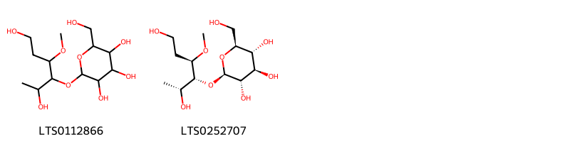{ width=100% }
    <figcaption>Hình ảnh cấu trúc hóa học của 2 hoạt chất thuộc nhóm Fatty Acyls gồm ['2-[(2,6-dihydroxy-4-methoxyhexan-3-yl)oxy]-6-(hydroxymethyl)oxane-3,4,5-triol (LTS0112866)', '(2r,3s,4r,5r,6s)-2-{[(2r,3r,4r)-2,6-dihydroxy-4-methoxyhexan-3-yl]oxy}-6-(hydroxymethyl)oxane-3,4,5-triol (LTS0252707)'].</figcaption>
</figure>
#### Nhóm Steroids and steroid derivatives
<figure markdown="span">
    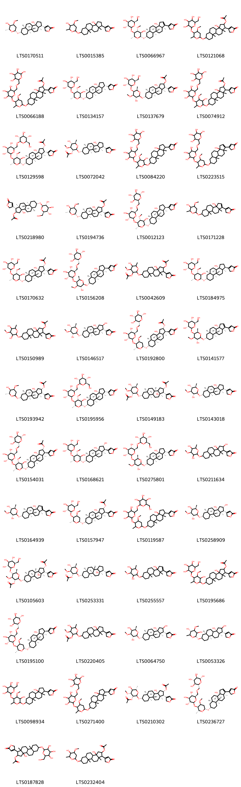{ width=100% }
    <figcaption>Hình ảnh cấu trúc hóa học của 74 hoạt chất thuộc nhóm Steroids and steroid derivatives gồm ['4-[(1r,3as,3br,5ar,7s,9as,9bs,11ar)-3a-hydroxy-7-{[(2r,4s,5r,6r)-5-hydroxy-4-methoxy-6-methyloxan-2-yl]oxy}-9a,11a-dimethyl-tetradecahydrocyclopenta[a]phenanthren-1-yl]-5h-furan-2-one (LTS0170511)', '4-{3a-hydroxy-7-[(5-hydroxy-4-methoxy-6-methyloxan-2-yl)oxy]-9a,11a-dimethyl-tetradecahydrocyclopenta[a]phenanthren-1-yl}-5h-furan-2-one (LTS0015385)', '4-[(3as,3br,5ar,7s,9as,9bs,11ar)-3a-hydroxy-7-{[(2r,3r,4r,5r,6r)-3-hydroxy-4-methoxy-6-methyl-5-{[(2s,3r,4s,5s,6r)-3,4,5-trihydroxy-6-(hydroxymethyl)oxan-2-yl]oxy}oxan-2-yl]oxy}-9a,11a-dimethyl-3h,3bh,4h,5h,5ah,6h,7h,8h,9h,9bh,10h,11h-cyclopenta[a]phenanthren-1-yl]-5h-furan-2-one (LTS0066967)', '3a-hydroxy-7-[(4-methoxy-6-methyl-5-{[3,4,5-trihydroxy-6-(hydroxymethyl)oxan-2-yl]oxy}oxan-2-yl)oxy]-9a,11a-dimethyl-1-(5-oxo-2h-furan-3-yl)-tetradecahydrocyclopenta[a]phenanthren-2-yl acetate (LTS0121068)', '3a-hydroxy-7-({4-methoxy-6-methyl-5-[(3,4,5-trihydroxy-6-{[(3,4,5,6-tetrahydroxyoxan-2-yl)methoxy]methyl}oxan-2-yl)oxy]oxan-2-yl}oxy)-9a,11a-dimethyl-1-(5-oxo-2h-furan-3-yl)-tetradecahydrocyclopenta[a]phenanthren-2-yl acetate (LTS0066188)', '4-[(1r,3as,3br,5ar,7s,9as,9bs,11ar)-3a-hydroxy-7-{[(2r,3r,4r,5r,6r)-3-hydroxy-4-methoxy-6-methyl-5-{[(2s,3r,4s,5s,6r)-3,4,5-trihydroxy-6-(hydroxymethyl)oxan-2-yl]oxy}oxan-2-yl]oxy}-9a,11a-dimethyl-tetradecahydrocyclopenta[a]phenanthren-1-yl]-5h-furan-2-one (LTS0134157)', '(1r,2r,3as,3br,5ar,7s,9as,9bs,11ar)-3a-hydroxy-7-{[(2r,3r,4r,5s,6r)-3-hydroxy-4-methoxy-6-methyl-5-{[(2s,3r,4s,5s,6r)-3,4,5-trihydroxy-6-(hydroxymethyl)oxan-2-yl]oxy}oxan-2-yl]oxy}-9a,11a-dimethyl-1-(5-oxo-2h-furan-3-yl)-tetradecahydrocyclopenta[a]phenanthren-2-yl acetate (LTS0137679)', '3a-hydroxy-7-({3-hydroxy-4-methoxy-6-methyl-5-[(3,4,5-trihydroxy-6-{[(3,4,5,6-tetrahydroxyoxan-2-yl)methoxy]methyl}oxan-2-yl)oxy]oxan-2-yl}oxy)-9a,11a-dimethyl-1-(5-oxo-2h-furan-3-yl)-tetradecahydrocyclopenta[a]phenanthren-2-yl acetate (LTS0074912)', '(1r,2s,3as,3br,5ar,7s,9as,9bs,11ar)-3a-hydroxy-7-{[(2r,3r,4r,5r,6r)-3-hydroxy-4-methoxy-6-methyl-5-{[(2s,3r,4s,5s,6r)-3,4,5-trihydroxy-6-({[(2r,3r,4s,5s,6r)-3,4,5-trihydroxy-6-(hydroxymethyl)oxan-2-yl]oxy}methyl)oxan-2-yl]oxy}oxan-2-yl]oxy}-9a,11a-dimethyl-1-(5-oxo-2h-furan-3-yl)-tetradecahydrocyclopenta[a]phenanthren-2-yl acetate (LTS0129598)', '(2r,3r,4s,5r,6r)-2-{[(1r,3as,3br,5ar,7s,9as,9bs,11ar)-3a-hydroxy-9a,11a-dimethyl-1-(5-oxo-2h-furan-3-yl)-tetradecahydrocyclopenta[a]phenanthren-7-yl]oxy}-5-hydroxy-4-methoxy-6-methyloxan-3-yl acetate (LTS0072042)', '4-[3a-hydroxy-7-({3-hydroxy-4-methoxy-6-methyl-5-[(3,4,5-trihydroxy-6-{[(3,4,5,6-tetrahydroxyoxan-2-yl)methoxy]methyl}oxan-2-yl)oxy]oxan-2-yl}oxy)-9a,11a-dimethyl-tetradecahydrocyclopenta[a]phenanthren-1-yl]-5h-furan-2-one (LTS0084220)', '4-[3a-hydroxy-7-({4-methoxy-6-methyl-5-[(3,4,5-trihydroxy-6-{[(3,4,5,6-tetrahydroxyoxan-2-yl)methoxy]methyl}oxan-2-yl)oxy]oxan-2-yl}oxy)-9a,11a-dimethyl-3h,3bh,4h,5h,5ah,6h,7h,8h,9h,9bh,10h,11h-cyclopenta[a]phenanthren-1-yl]-5h-furan-2-one (LTS0223515)', '(1r,2r,3as,3br,5ar,7s,9as,9bs,11ar)-3a-hydroxy-9a,11a-dimethyl-1-(5-oxo-2h-furan-3-yl)-7-{[(2r,3r,4s,5s,6r)-3,4,5-trihydroxy-6-(hydroxymethyl)oxan-2-yl]oxy}-tetradecahydrocyclopenta[a]phenanthren-2-yl acetate (LTS0218980)', '(1r,2r,3as,3br,5ar,7s,9as,9bs,11ar)-3a-hydroxy-7-{[(2r,4s,5r,6r)-5-hydroxy-4-methoxy-6-methyloxan-2-yl]oxy}-9a,11a-dimethyl-1-(5-oxo-2h-furan-3-yl)-tetradecahydrocyclopenta[a]phenanthren-2-yl acetate (LTS0194736)', '4-[(1s,3as,3br,5ar,7s,9as,9bs,11ar)-3a-hydroxy-7-{[(2r,3r,4r,5r,6r)-3-hydroxy-4-methoxy-6-methyl-5-{[(2s,3r,4s,5s,6r)-3,4,5-trihydroxy-6-({[(2s,3s,4s,5r,6r)-3,4,5,6-tetrahydroxyoxan-2-yl]methoxy}methyl)oxan-2-yl]oxy}oxan-2-yl]oxy}-9a,11a-dimethyl-tetradecahydrocyclopenta[a]phenanthren-1-yl]-5h-furan-2-one (LTS0012123)', '4-{3a-hydroxy-7-[(5-hydroxy-4-methoxy-6-methyloxan-2-yl)oxy]-9a,11a-dimethyl-3h,3bh,4h,5h,5ah,6h,7h,8h,9h,9bh,10h,11h-cyclopenta[a]phenanthren-1-yl}-5h-furan-2-one (LTS0171228)', '(1r,2s,3as,3br,5ar,7s,9as,9bs,11ar)-3a-hydroxy-7-{[(2r,3r,4r,5r,6r)-3-hydroxy-4-methoxy-6-methyl-5-{[(2s,3r,4s,5s,6r)-3,4,5-trihydroxy-6-(hydroxymethyl)oxan-2-yl]oxy}oxan-2-yl]oxy}-9a,11a-dimethyl-1-(5-oxo-2h-furan-3-yl)-tetradecahydrocyclopenta[a]phenanthren-2-yl acetate (LTS0170632)', '4-[(1s,3as,3br,5ar,7s,9as,9bs,11ar)-3a-hydroxy-7-{[(2r,3r,4r,5s,6r)-3-hydroxy-4-methoxy-6-methyl-5-{[(2s,3r,4s,5s,6r)-3,4,5-trihydroxy-6-({[(2r,3s,4s,5r,6r)-3,4,5,6-tetrahydroxyoxan-2-yl]methoxy}methyl)oxan-2-yl]oxy}oxan-2-yl]oxy}-9a,11a-dimethyl-tetradecahydrocyclopenta[a]phenanthren-1-yl]-5h-furan-2-one (LTS0156208)', '7-{[3-(acetyloxy)-5-hydroxy-4-methoxy-6-methyloxan-2-yl]oxy}-3a-hydroxy-9a,11a-dimethyl-1-(5-oxo-2h-furan-3-yl)-tetradecahydrocyclopenta[a]phenanthren-2-yl acetate (LTS0042609)', '4-[(1s,3as,3br,5ar,7s,9as,9bs,11ar)-3a-hydroxy-7-{[(2r,3r,4r,5r,6r)-3-hydroxy-4-methoxy-6-methyl-5-{[(2s,3r,4s,5s,6r)-3,4,5-trihydroxy-6-(hydroxymethyl)oxan-2-yl]oxy}oxan-2-yl]oxy}-9a,11a-dimethyl-tetradecahydrocyclopenta[a]phenanthren-1-yl]-5h-furan-2-one (LTS0184975)', '7-[(3,5-dihydroxy-4-methoxy-6-methyloxan-2-yl)oxy]-3a-hydroxy-9a,11a-dimethyl-1-(5-oxo-2h-furan-3-yl)-tetradecahydrocyclopenta[a]phenanthren-2-yl acetate (LTS0150989)', '4-[(1r,2r,3as,3br,5ar,7s,9as,9bs,11ar)-7-{[(2r,3r,4s,5r,6r)-3,5-dihydroxy-4-methoxy-6-methyloxan-2-yl]oxy}-2,3a-dihydroxy-9a,11a-dimethyl-tetradecahydrocyclopenta[a]phenanthren-1-yl]-5h-furan-2-one (LTS0146517)', '(1s,2s,3as,3br,5ar,7s,9as,9bs,11ar)-3a-hydroxy-7-{[(2r,4s,5r,6r)-4-methoxy-6-methyl-5-{[(2s,3r,4s,5s,6r)-3,4,5-trihydroxy-6-({[(2r,3s,4s,5r,6r)-3,4,5,6-tetrahydroxyoxan-2-yl]methoxy}methyl)oxan-2-yl]oxy}oxan-2-yl]oxy}-9a,11a-dimethyl-1-(5-oxo-2h-furan-3-yl)-tetradecahydrocyclopenta[a]phenanthren-2-yl acetate (LTS0192800)', '4-[(3as,3br,5ar,7s,9as,9bs,11ar)-3a-hydroxy-7-{[(2r,3r,4r,5s,6r)-3-hydroxy-4-methoxy-6-methyl-5-{[(2s,3r,4s,5s,6r)-3,4,5-trihydroxy-6-(hydroxymethyl)oxan-2-yl]oxy}oxan-2-yl]oxy}-9a,11a-dimethyl-3h,3bh,4h,5h,5ah,6h,7h,8h,9h,9bh,10h,11h-cyclopenta[a]phenanthren-1-yl]-5h-furan-2-one (LTS0141577)', '(1r,2s,3as,3br,5ar,7s,9as,9bs,11ar)-3a-hydroxy-7-{[(4s,5r,6r)-5-hydroxy-4-methoxy-6-methyloxan-2-yl]oxy}-9a,11a-dimethyl-1-(5-oxo-2h-furan-3-yl)-tetradecahydrocyclopenta[a]phenanthren-2-yl acetate (LTS0193942)', '4-[(1r,3as,3br,5ar,7s,9as,9bs,11ar)-3a-hydroxy-7-{[(2r,3r,4r,5r,6r)-3-hydroxy-4-methoxy-6-methyl-5-{[(2s,3r,4s,5s,6r)-3,4,5-trihydroxy-6-({[(2r,3r,4s,5s,6r)-3,4,5-trihydroxy-6-(hydroxymethyl)oxan-2-yl]oxy}methyl)oxan-2-yl]oxy}oxan-2-yl]oxy}-9a,11a-dimethyl-tetradecahydrocyclopenta[a]phenanthren-1-yl]-5h-furan-2-one (LTS0195956)', '(1r,2s,3as,3br,5ar,7s,9as,9br,11ar)-7-{[(2r,3r,4s,5r,6r)-3-(acetyloxy)-5-hydroxy-4-methoxy-6-methyloxan-2-yl]oxy}-3a-hydroxy-9a,11a-dimethyl-1-(5-oxo-2h-furan-3-yl)-tetradecahydrocyclopenta[a]phenanthren-2-yl acetate (LTS0149183)', '4-[(1r,3as,3br,5ar,7s,9as,9bs,11ar)-7-{[(2r,3r,4s,5r,6r)-3,5-dihydroxy-4-methoxy-6-methyloxan-2-yl]oxy}-3a-hydroxy-9a,11a-dimethyl-tetradecahydrocyclopenta[a]phenanthren-1-yl]-5h-furan-2-one (LTS0143018)', '(1s,2s,3as,3br,5ar,7s,9as,9bs,11ar)-3a-hydroxy-7-{[(2r,3r,4r,5r,6r)-3-hydroxy-4-methoxy-6-methyl-5-{[(2s,3r,4s,5s,6r)-3,4,5-trihydroxy-6-({[(2r,3s,4s,5r,6r)-3,4,5,6-tetrahydroxyoxan-2-yl]methoxy}methyl)oxan-2-yl]oxy}oxan-2-yl]oxy}-9a,11a-dimethyl-1-(5-oxo-2h-furan-3-yl)-tetradecahydrocyclopenta[a]phenanthren-2-yl acetate (LTS0154031)', '4-[(1s,2s,3as,3br,5ar,7s,9as,9bs,11ar)-2,3a-dihydroxy-7-{[(2r,3r,4r,5r,6r)-3-hydroxy-4-methoxy-6-methyl-5-{[(2s,3r,4s,5s,6r)-3,4,5-trihydroxy-6-(hydroxymethyl)oxan-2-yl]oxy}oxan-2-yl]oxy}-9a,11a-dimethyl-tetradecahydrocyclopenta[a]phenanthren-1-yl]-5h-furan-2-one (LTS0168621)', '4-[(1r,3as,3br,5ar,7s,9as,9bs,11ar)-3a-hydroxy-7-{[(2r,3r,4r,5s,6r)-3-hydroxy-4-methoxy-6-methyl-5-{[(2s,3r,4s,5s,6r)-3,4,5-trihydroxy-6-({[(2r,3r,4s,5s,6r)-3,4,5-trihydroxy-6-(hydroxymethyl)oxan-2-yl]oxy}methyl)oxan-2-yl]oxy}oxan-2-yl]oxy}-9a,11a-dimethyl-tetradecahydrocyclopenta[a]phenanthren-1-yl]-5h-furan-2-one (LTS0275801)', '4-{7-[(3,5-dihydroxy-4-methoxy-6-methyloxan-2-yl)oxy]-2,3a-dihydroxy-9a,11a-dimethyl-tetradecahydrocyclopenta[a]phenanthren-1-yl}-5h-furan-2-one (LTS0211634)', '4-[(3as,3br,5ar,7s,9as,9bs,11ar)-7-{[(2r,3r,4s,5r,6r)-3,5-dihydroxy-4-methoxy-6-methyloxan-2-yl]oxy}-3a-hydroxy-9a,11a-dimethyl-3h,3bh,4h,5h,5ah,6h,7h,8h,9h,9bh,10h,11h-cyclopenta[a]phenanthren-1-yl]-5h-furan-2-one (LTS0164939)', '(1s,2s,3as,3br,5ar,7s,9as,9bs,11ar)-3a-hydroxy-7-{[(2r,4s,5r,6r)-4-methoxy-6-methyl-5-{[(2s,3r,4s,5s,6r)-3,4,5-trihydroxy-6-(hydroxymethyl)oxan-2-yl]oxy}oxan-2-yl]oxy}-9a,11a-dimethyl-1-(5-oxo-2h-furan-3-yl)-tetradecahydrocyclopenta[a]phenanthren-2-yl acetate (LTS0157947)', '4-{3a-hydroxy-7-[(4-methoxy-6-methyl-5-{[3,4,5-trihydroxy-6-({[3,4,5-trihydroxy-6-(hydroxymethyl)oxan-2-yl]oxy}methyl)oxan-2-yl]oxy}oxan-2-yl)oxy]-9a,11a-dimethyl-tetradecahydrocyclopenta[a]phenanthren-1-yl}-5h-furan-2-one (LTS0119587)', 'strospeside (LTS0258909)', '(1r,2s,3as,3br,5ar,7s,9as,9br,11ar)-7-{[(2r,3r,4s,5r,6r)-3-(acetyloxy)-4-methoxy-6-methyl-5-{[(2s,3r,4s,5s,6r)-3,4,5-trihydroxy-6-(hydroxymethyl)oxan-2-yl]oxy}oxan-2-yl]oxy}-3a-hydroxy-9a,11a-dimethyl-1-(5-oxo-2h-furan-3-yl)-tetradecahydrocyclopenta[a]phenanthren-2-yl acetate (LTS0105603)', '(2r,3r,4s,5r,6r)-2-{[(1r,3as,3bs,5ar,7s,9as,9br,11ar)-3a-hydroxy-9a,11a-dimethyl-1-(5-oxo-2h-furan-3-yl)-tetradecahydrocyclopenta[a]phenanthren-7-yl]oxy}-5-hydroxy-4-methoxy-6-methyloxan-3-yl acetate (LTS0253331)', '4-{7-[(3,5-dihydroxy-4-methoxy-6-methyloxan-2-yl)oxy]-3a-hydroxy-9a,11a-dimethyl-3h,3bh,4h,5h,5ah,6h,7h,8h,9h,9bh,10h,11h-cyclopenta[a]phenanthren-1-yl}-5h-furan-2-one (LTS0255557)', '3a-hydroxy-7-[(3-hydroxy-4-methoxy-6-methyl-5-{[3,4,5-trihydroxy-6-(hydroxymethyl)oxan-2-yl]oxy}oxan-2-yl)oxy]-9a,11a-dimethyl-1-(5-oxo-2h-furan-3-yl)-tetradecahydrocyclopenta[a]phenanthren-2-yl acetate (LTS0195686)', '4-[(1s,3as,3br,5ar,7s,9as,9bs,11ar)-3a-hydroxy-7-{[(2r,4s,5r,6r)-4-methoxy-6-methyl-5-{[(2s,3r,4s,5s,6r)-3,4,5-trihydroxy-6-({[(2r,3s,4s,5r,6r)-3,4,5,6-tetrahydroxyoxan-2-yl]methoxy}methyl)oxan-2-yl]oxy}oxan-2-yl]oxy}-9a,11a-dimethyl-tetradecahydrocyclopenta[a]phenanthren-1-yl]-5h-furan-2-one (LTS0195100)', 'cerberin (LTS0220405)', '4-[(1r,2r,3as,3br,5ar,7s,9as,9bs,11ar)-7-{[(2r,3r,4s,5s,6r)-3,5-dihydroxy-4-methoxy-6-methyloxan-2-yl]oxy}-2,3a-dihydroxy-9a,11a-dimethyl-tetradecahydrocyclopenta[a]phenanthren-1-yl]-5h-furan-2-one (LTS0064750)', '4-[(1r,3as,5ar,7r,9as,11ar)-7-{[(2r,5s)-3,5-dihydroxy-4-methoxy-6-methyloxan-2-yl]oxy}-2,3a-dihydroxy-9a,11a-dimethyl-tetradecahydrocyclopenta[a]phenanthren-1-yl]-5h-furan-2-one (LTS0053326)', '4-{3a-hydroxy-7-[(3-hydroxy-4-methoxy-6-methyl-5-{[3,4,5-trihydroxy-6-(hydroxymethyl)oxan-2-yl]oxy}oxan-2-yl)oxy]-9a,11a-dimethyl-tetradecahydrocyclopenta[a]phenanthren-1-yl}-5h-furan-2-one (LTS0098934)', '4-[3a-hydroxy-7-({4-methoxy-6-methyl-5-[(3,4,5-trihydroxy-6-{[(3,4,5,6-tetrahydroxyoxan-2-yl)methoxy]methyl}oxan-2-yl)oxy]oxan-2-yl}oxy)-9a,11a-dimethyl-tetradecahydrocyclopenta[a]phenanthren-1-yl]-5h-furan-2-one (LTS0271400)', '(1r,2s,3as,3br,5ar,7s,9as,9bs,11ar)-7-{[(2r,3r,4r,5s,6s)-3-(acetyloxy)-5-hydroxy-4-methoxy-6-methyloxan-2-yl]oxy}-3a-hydroxy-9a,11a-dimethyl-1-(5-oxo-2h-furan-3-yl)-tetradecahydrocyclopenta[a]phenanthren-2-yl acetate (LTS0210302)', '4-[(3as,3br,5ar,7s,9as,9bs,11ar)-3a-hydroxy-7-{[(2r,4s,5r,6r)-4-methoxy-6-methyl-5-{[(2s,3r,4s,5s,6r)-3,4,5-trihydroxy-6-({[(2r,3s,4s,5r,6r)-3,4,5,6-tetrahydroxyoxan-2-yl]methoxy}methyl)oxan-2-yl]oxy}oxan-2-yl]oxy}-9a,11a-dimethyl-3h,3bh,4h,5h,5ah,6h,7h,8h,9h,9bh,10h,11h-cyclopenta[a]phenanthren-1-yl]-5h-furan-2-one (LTS0236727)', '3a-hydroxy-9a,11a-dimethyl-1-(5-oxo-2h-furan-3-yl)-7-{[3,4,5-trihydroxy-6-(hydroxymethyl)oxan-2-yl]oxy}-tetradecahydrocyclopenta[a]phenanthren-2-yl acetate (LTS0187828)', "4'-epioleandrin (LTS0232404)", '(1r,2s,3as,3br,5ar,7s,9as,9bs,11ar)-7-{[(2r,3r,4s,5r,6r)-3-(acetyloxy)-4-methoxy-6-methyl-5-{[(2s,3r,4s,5s,6r)-3,4,5-trihydroxy-6-(hydroxymethyl)oxan-2-yl]oxy}oxan-2-yl]oxy}-3a-hydroxy-9a,11a-dimethyl-1-(5-oxo-2h-furan-3-yl)-tetradecahydrocyclopenta[a]phenanthren-2-yl acetate (LTS0031181)', '4-[(1r,3as,3br,5ar,7s,9as,9bs,11ar)-3a-hydroxy-7-{[(2r,3r,4r,5s,6r)-3-hydroxy-4-methoxy-6-methyl-5-{[(2s,3r,4s,5s,6r)-3,4,5-trihydroxy-6-(hydroxymethyl)oxan-2-yl]oxy}oxan-2-yl]oxy}-9a,11a-dimethyl-tetradecahydrocyclopenta[a]phenanthren-1-yl]-5h-furan-2-one (LTS0235240)', '(1r,2s,3as,3br,5ar,7s,9as,9bs,11ar)-3a-hydroxy-7-{[(2r,3s,5s)-3-hydroxy-4-methoxy-6-methyl-5-{[(2s,3s,5s)-3,4,5-trihydroxy-6-(hydroxymethyl)oxan-2-yl]oxy}oxan-2-yl]oxy}-9a,11a-dimethyl-1-(5-oxo-2h-furan-3-yl)-tetradecahydrocyclopenta[a]phenanthren-2-yl acetate (LTS0181797)', '(2r,3r,4s,5r,6r)-2-{[(1r,3as,3bs,5ar,7s,9as,9br,11ar)-3a-hydroxy-9a,11a-dimethyl-1-(5-oxo-2h-furan-3-yl)-tetradecahydrocyclopenta[a]phenanthren-7-yl]oxy}-4-methoxy-6-methyl-5-{[(2s,3r,4s,5s,6r)-3,4,5-trihydroxy-6-(hydroxymethyl)oxan-2-yl]oxy}oxan-3-yl acetate (LTS0044057)', '2-{[3a-hydroxy-9a,11a-dimethyl-1-(5-oxo-2h-furan-3-yl)-tetradecahydrocyclopenta[a]phenanthren-7-yl]oxy}-4-methoxy-6-methyl-5-{[3,4,5-trihydroxy-6-(hydroxymethyl)oxan-2-yl]oxy}oxan-3-yl acetate (LTS0198562)', '(1s,2s,3as,3br,5ar,7s,9as,9bs,11ar)-3a-hydroxy-7-{[(2r,3r,4r,5s,6r)-3-hydroxy-4-methoxy-6-methyl-5-{[(2s,3r,4s,5s,6r)-3,4,5-trihydroxy-6-({[(2r,3s,4s,5r,6r)-3,4,5,6-tetrahydroxyoxan-2-yl]methoxy}methyl)oxan-2-yl]oxy}oxan-2-yl]oxy}-9a,11a-dimethyl-1-(5-oxo-2h-furan-3-yl)-tetradecahydrocyclopenta[a]phenanthren-2-yl acetate (LTS0191367)', 'digitoxin (LTS0258825)', '4-[(1r,3as,3br,5ar,7s,9as,9bs,11ar)-3a-hydroxy-7-{[(2r,4r,5r,6r)-4-methoxy-6-methyl-5-{[(2s,3r,4s,5s,6r)-3,4,5-trihydroxy-6-({[(2r,3r,4s,5s,6r)-3,4,5-trihydroxy-6-(hydroxymethyl)oxan-2-yl]oxy}methyl)oxan-2-yl]oxy}oxan-2-yl]oxy}-9a,11a-dimethyl-tetradecahydrocyclopenta[a]phenanthren-1-yl]-5h-furan-2-one (LTS0255224)', '4-{3a-hydroxy-7-[(3-hydroxy-4-methoxy-6-methyl-5-{[3,4,5-trihydroxy-6-(hydroxymethyl)oxan-2-yl]oxy}oxan-2-yl)oxy]-9a,11a-dimethyl-3h,3bh,4h,5h,5ah,6h,7h,8h,9h,9bh,10h,11h-cyclopenta[a]phenanthren-1-yl}-5h-furan-2-one (LTS0186514)', 'neriifolin (LTS0229598)', '7-{[3-(acetyloxy)-4-methoxy-6-methyl-5-{[3,4,5-trihydroxy-6-(hydroxymethyl)oxan-2-yl]oxy}oxan-2-yl]oxy}-3a-hydroxy-9a,11a-dimethyl-1-(5-oxo-2h-furan-3-yl)-tetradecahydrocyclopenta[a]phenanthren-2-yl acetate (LTS0129789)', '4-[(1r,2s,3as,3br,5ar,7s,9as,9bs,11ar)-7-{[(2r,3r,4s,5r,6r)-3,5-dihydroxy-4-methoxy-6-methyloxan-2-yl]oxy}-2,3a-dihydroxy-9a,11a-dimethyl-tetradecahydrocyclopenta[a]phenanthren-1-yl]-5h-furan-2-one (LTS0269758)', '(3as,3br,9ar,9bs,11r,11as)-1-acetyl-11-hydroxy-9a,11a-dimethyl-3h,3ah,3bh,8h,9h,9bh,10h,11h-cyclopenta[a]phenanthren-7-one (LTS0266083)', '4-[(3as,3br,5ar,7s,9as,9bs,11ar)-3a-hydroxy-7-{[(2r,4s,5r,6r)-5-hydroxy-4-methoxy-6-methyloxan-2-yl]oxy}-9a,11a-dimethyl-3h,3bh,4h,5h,5ah,6h,7h,8h,9h,9bh,10h,11h-cyclopenta[a]phenanthren-1-yl]-5h-furan-2-one (LTS0272775)', '4-[(1r,2s,3as,3br,5ar,7s,9as,9bs,11ar)-2,3a-dihydroxy-7-{[(2r,3r,4r,5r,6r)-3-hydroxy-4-methoxy-6-methyl-5-{[(2s,3r,4s,5s,6r)-3,4,5-trihydroxy-6-(hydroxymethyl)oxan-2-yl]oxy}oxan-2-yl]oxy}-9a,11a-dimethyl-tetradecahydrocyclopenta[a]phenanthren-1-yl]-5h-furan-2-one (LTS0044335)', '(1r,2r,3as,3br,5ar,7s,9as,9bs,11ar)-7-{[(2r,3r,4s,5r,6r)-3,5-dihydroxy-4-methoxy-6-methyloxan-2-yl]oxy}-3a-hydroxy-9a,11a-dimethyl-1-(5-oxo-2h-furan-3-yl)-tetradecahydrocyclopenta[a]phenanthren-2-yl acetate (LTS0127762)', '(1r,2s,3as,3br,5ar,7s,9as,9bs,11ar)-7-{[(2r,3r,4s,5r,6r)-3,5-dihydroxy-4-methoxy-6-methyloxan-2-yl]oxy}-3a-hydroxy-9a,11a-dimethyl-1-(5-oxo-2h-furan-3-yl)-tetradecahydrocyclopenta[a]phenanthren-2-yl acetate (LTS0000141)', '4-[(1s,3as,3br,5ar,7s,9as,9bs,11ar)-3a-hydroxy-7-{[(2r,3r,4r,5s,6r)-3-hydroxy-4-methoxy-6-methyl-5-{[(2s,3r,4s,5s,6r)-3,4,5-trihydroxy-6-(hydroxymethyl)oxan-2-yl]oxy}oxan-2-yl]oxy}-9a,11a-dimethyl-tetradecahydrocyclopenta[a]phenanthren-1-yl]-5h-furan-2-one (LTS0006679)', '(1r,2r,3as,3br,5ar,7s,9as,9bs,11ar)-3a-hydroxy-7-{[(2r,3r,4r,5r,6r)-3-hydroxy-4-methoxy-6-methyl-5-{[(2s,3r,4s,5s,6r)-3,4,5-trihydroxy-6-(hydroxymethyl)oxan-2-yl]oxy}oxan-2-yl]oxy}-9a,11a-dimethyl-1-(5-oxo-2h-furan-3-yl)-tetradecahydrocyclopenta[a]phenanthren-2-yl acetate (LTS0010617)', '(1r,2s,3as,3br,5ar,7s,9as,9bs,11ar)-3a-hydroxy-7-{[(2r,4s,5r,6r)-4-methoxy-6-methyl-5-{[(2s,3r,4s,5s,6r)-3,4,5-trihydroxy-6-({[(2r,3r,4s,5s,6r)-3,4,5-trihydroxy-6-(hydroxymethyl)oxan-2-yl]oxy}methyl)oxan-2-yl]oxy}oxan-2-yl]oxy}-9a,11a-dimethyl-1-(5-oxo-2h-furan-3-yl)-tetradecahydrocyclopenta[a]phenanthren-2-yl acetate (LTS0233749)', '4-[(1s,2s,3as,3br,5ar,7s,9as,9bs,11ar)-2,3a-dihydroxy-7-{[(2r,3r,4r,5s,6r)-3-hydroxy-4-methoxy-6-methyl-5-{[(2s,3r,4s,5s,6r)-3,4,5-trihydroxy-6-(hydroxymethyl)oxan-2-yl]oxy}oxan-2-yl]oxy}-9a,11a-dimethyl-tetradecahydrocyclopenta[a]phenanthren-1-yl]-5h-furan-2-one (LTS0000871)', '(1r,2r,3as,3br,5ar,7s,9as,9bs,11ar)-7-{[(2r,3r,4s,5s,6r)-3,5-dihydroxy-4-methoxy-6-methyloxan-2-yl]oxy}-3a-hydroxy-9a,11a-dimethyl-1-(5-oxo-2h-furan-3-yl)-tetradecahydrocyclopenta[a]phenanthren-2-yl acetate (LTS0248371)', '(3as,3br,5ar,7s,9as,9bs,11ar)-3a-hydroxy-7-{[(2r,4s,5r,6r)-4-methoxy-6-methyl-5-{[(2s,3r,4s,5s,6r)-3,4,5-trihydroxy-6-(hydroxymethyl)oxan-2-yl]oxy}oxan-2-yl]oxy}-9a,11a-dimethyl-1-(5-oxo-2h-furan-3-yl)-tetradecahydrocyclopenta[a]phenanthren-2-yl acetate (LTS0236971)', '4-{2,3a-dihydroxy-7-[(3-hydroxy-4-methoxy-6-methyl-5-{[3,4,5-trihydroxy-6-(hydroxymethyl)oxan-2-yl]oxy}oxan-2-yl)oxy]-9a,11a-dimethyl-tetradecahydrocyclopenta[a]phenanthren-1-yl}-5h-furan-2-one (LTS0051425)'].</figcaption>
</figure>

---

### Dược dân tộc học

Danh sách các quốc gia có sử dụng *Adenium obesum* trong điều trị các bệnh. 

| Country         | Disease           | Bệnh                                                                                                                                                                                                |
|:----------------|:------------------|:----------------------------------------------------------------------------------------------------------------------------------------------------------------------------------------------------|
| Africa          | Piscicide, Poison | MYMEMORY WARNING: YOU USED ALL AVAILABLE FREE TRANSLATIONS FOR TODAY. NEXT AVAILABLE IN  12 HOURS 20 MINUTES 48 SECONDS VISIT HTTPS://MYMEMORY.TRANSLATED.NET/DOC/USAGELIMITS.PHP TO TRANSLATE MORE |
| Africa(Swahili) | Piscicide, Poison | MYMEMORY WARNING: YOU USED ALL AVAILABLE FREE TRANSLATIONS FOR TODAY. NEXT AVAILABLE IN  12 HOURS 20 MINUTES 43 SECONDS VISIT HTTPS://MYMEMORY.TRANSLATED.NET/DOC/USAGELIMITS.PHP TO TRANSLATE MORE |
| Tanzania        | Piscicide         | MYMEMORY WARNING: YOU USED ALL AVAILABLE FREE TRANSLATIONS FOR TODAY. NEXT AVAILABLE IN  12 HOURS 20 MINUTES 40 SECONDS VISIT HTTPS://MYMEMORY.TRANSLATED.NET/DOC/USAGELIMITS.PHP TO TRANSLATE MORE |

---

# Chi Geissoermum

??? note "Danh sách các dược liệu thuộc chi"
    
	 - *Geissoermum vellosii*

---
## Geissoermum vellosii
### Thông tin về thực vật

!!! info "Phân loại thực vật của *N/A* từ GIBF:"
    - **Kingdom:** N/A
    - **Phylum:** N/A
    - **Order:** N/A
    - **Family:** N/A
    - **Genus:** N/A
    - **Species:** *N/A*

 

| Label (VI)   | Label (EN)   | Scientific Name   | Descriptions (VI)   | Descriptions (EN)   | Also Known As (VI)   | Also Known As (EN)             |
|:-------------|:-------------|:------------------|:--------------------|:--------------------|:---------------------|:-------------------------------|
| N/A          | N/A          | Adenium obesum    | loài thực vật       | species of plant    | ['']                 | ['desert rose', 'mock azalea'] |

#### Phân bố trên thế giới

**Từ CSDL GIBF** Không có kết quả phù hợp

#### Phân bố tại Việt Nam

**Từ CSDL GIBF**: Không có ghi nhận ở Việt Nam

---
### Thành phần hóa học
        
- Theo cơ sở dữ liệu lotus: Từ loài *N/A* đã phân lập và xác định được Chưa có hoạt chất nào được phân lập. hoạt chất thuộc về các nhóm Không có hoạt chất nào được phân lập. 

Không có hình ảnh nào được tạo ra

---

### Dược dân tộc học

Danh sách các quốc gia có sử dụng *N/A* trong điều trị các bệnh. 

| Country   | Disease    | Bệnh                                                                                                                                                                                                |
|:----------|:-----------|:----------------------------------------------------------------------------------------------------------------------------------------------------------------------------------------------------|
| Brazil    | Tonic, nan | MYMEMORY WARNING: YOU USED ALL AVAILABLE FREE TRANSLATIONS FOR TODAY. NEXT AVAILABLE IN  12 HOURS 19 MINUTES 51 SECONDS VISIT HTTPS://MYMEMORY.TRANSLATED.NET/DOC/USAGELIMITS.PHP TO TRANSLATE MORE |

---

# Chi Kibatalia

??? note "Danh sách các dược liệu thuộc chi"
    
	 - *Kibatalia blancoi*

---
## Kibatalia blancoi
### Thông tin về thực vật

!!! info "Phân loại thực vật của *Kibatalia blancoi* từ GIBF:"
    - **Kingdom:** Plantae
    - **Phylum:** Tracheophyta
    - **Order:** Gentianales
    - **Family:** Apocynaceae
    - **Genus:** Kibatalia
    - **Species:** *Kibatalia blancoi*

 

| Label (VI)   | Label (EN)   | Scientific Name   | Descriptions (VI)   | Descriptions (EN)   | Also Known As (VI)   | Also Known As (EN)   |
|:-------------|:-------------|:------------------|:--------------------|:--------------------|:---------------------|:---------------------|
| N/A          | N/A          | Kibatalia blancoi | loài thực vật       | species of plant    | ['']                 | ['']                 |

#### Phân bố trên thế giới

**Từ CSDL GIBF** nan, Philippines

#### Phân bố tại Việt Nam

**Từ CSDL GIBF**: Không có ghi nhận ở Việt Nam

---
### Thành phần hóa học
        
- Theo cơ sở dữ liệu lotus: Từ loài *Kibatalia blancoi* đã phân lập và xác định được Chưa có hoạt chất nào được phân lập. hoạt chất thuộc về các nhóm Không có hoạt chất nào được phân lập. 

Không có hình ảnh nào được tạo ra

---

### Dược dân tộc học

Danh sách các quốc gia có sử dụng *Kibatalia blancoi* trong điều trị các bệnh. 

| Country     | Disease       | Bệnh                                                                                                                                                                                                |
|:------------|:--------------|:----------------------------------------------------------------------------------------------------------------------------------------------------------------------------------------------------|
| Philippines | Abortifacient | MYMEMORY WARNING: YOU USED ALL AVAILABLE FREE TRANSLATIONS FOR TODAY. NEXT AVAILABLE IN  12 HOURS 19 MINUTES 24 SECONDS VISIT HTTPS://MYMEMORY.TRANSLATED.NET/DOC/USAGELIMITS.PHP TO TRANSLATE MORE |

---

# Chi Allamanda

??? note "Danh sách các dược liệu thuộc chi"
    
	 - *Allamanda cathartica*

---
## Allamanda cathartica
### Thông tin về thực vật

!!! info "Phân loại thực vật của *Allamanda cathartica* từ GIBF:"
    - **Kingdom:** Plantae
    - **Phylum:** Tracheophyta
    - **Order:** Gentianales
    - **Family:** Apocynaceae
    - **Genus:** Allamanda
    - **Species:** *Allamanda cathartica*

 

| Label (VI)   | Label (EN)   | Scientific Name      | Descriptions (VI)   | Descriptions (EN)   | Also Known As (VI)                                                      | Also Known As (EN)   |
|:-------------|:-------------|:---------------------|:--------------------|:--------------------|:------------------------------------------------------------------------|:---------------------|
| N/A          | N/A          | Allamanda cathartica | loài thực vật       | species of plant    | ['Hoa huỳnh anh', 'Dây huỳnh', 'Dây công chúa', 'Allamanda cathartica'] | ['Golden trumpet']   |

#### Phân bố trên thế giới

**Từ CSDL GIBF** Brazil, United Arab Emirates, Viet Nam, Saint Kitts and Nevis, Virgin Islands (British), Guatemala, Japan, Senegal, Guadeloupe, Barbados, China, Antigua and Barbuda, Suriname, Saint Lucia, Honduras, Ecuador, Papua New Guinea, Trinidad and Tobago, Anguilla, Thailand, Madagascar, Spain, Puerto Rico, Sri Lanka, United States of America, Jamaica, Virgin Islands (U.S.), Indonesia, Costa Rica, Dominican Republic, Colombia, Cuba, French Guiana, Grenada, Sint Maarten (Dutch part), Dominica, Mexico, Hong Kong, Benin, El Salvador, Haiti, Philippines, Malaysia, Curaçao, Mauritius, Panama, Belize, Singapore, Bermuda, Martinique, Bahamas, Australia, Saint Vincent and the Grenadines, Micronesia (Federated States of), India, Peru, Bolivia (Plurinational State of), Guyana

#### Phân bố tại Việt Nam

**Từ CSDL GIBF**: Hồ Chí Minh city, Ninh Bình

---
### Thành phần hóa học
        
- Theo cơ sở dữ liệu lotus: Từ loài *Allamanda cathartica* đã phân lập và xác định được 44 hoạt chất thuộc về các nhóm Fatty Acyls, Prenol lipids. 

|    | chemicalTaxonomyClassyfireClass   |   smiles_count |
|---:|:----------------------------------|---------------:|
|  0 | Fatty Acyls                       |             29 |
|  1 | Prenol lipids                     |             15 |

#### Nhóm Fatty Acyls
<figure markdown="span">
    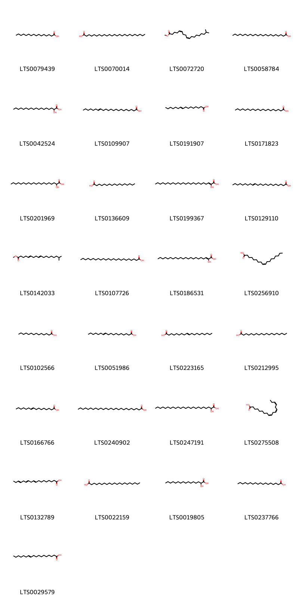{ width=100% }
    <figcaption>Hình ảnh cấu trúc hóa học của 29 hoạt chất thuộc nhóm Fatty Acyls gồm ['palmitic acid (LTS0079439)', 'pentacosanoic acid (LTS0070014)', 'methyl (5z,9z)-17-methyloctadeca-5,9-dienoate (LTS0072720)', 'behenic acid (LTS0058784)', 'α-hydroxystearic acid (LTS0042524)', 'docos-15-enoic acid (LTS0109907)', 'hexadecenoate (LTS0191907)', 'arachidic acid (LTS0171823)', '2-hydroxyarachidic acid (LTS0201969)', 'heptadecanoic acid (LTS0136609)', '2-hydroxytetracos-2-enoic acid (LTS0199367)', '13-docosenoic acid (LTS0129110)', 'methyl 17-methyloctadeca-5,9-dienoate (LTS0142033)', 'lignoceric acid (LTS0107726)', '2-hydroxydocos-2-enoic acid (LTS0186531)', 'oleic acid (LTS0256910)', 'myristic acid (LTS0102566)', 'vaccenic acid (LTS0051986)', 'nonadec-9-enoic acid (LTS0223165)', 'nonadecanoic acid (LTS0212995)', '9-hexadecenoic acid (LTS0166766)', 'hexacosanoic acid (LTS0240902)', 'cerebronic acid (LTS0247191)', 'α-linolenic acid (LTS0275508)', 'α linolenic acid (LTS0132789)', 'heneicosanoic acid (LTS0022159)', '2-hydroxypalmitic acid (LTS0019805)', 'stearic acid (LTS0237766)', 'trans-vaccenic acid (LTS0029579)'].</figcaption>
</figure>
#### Nhóm Prenol lipids
<figure markdown="span">
    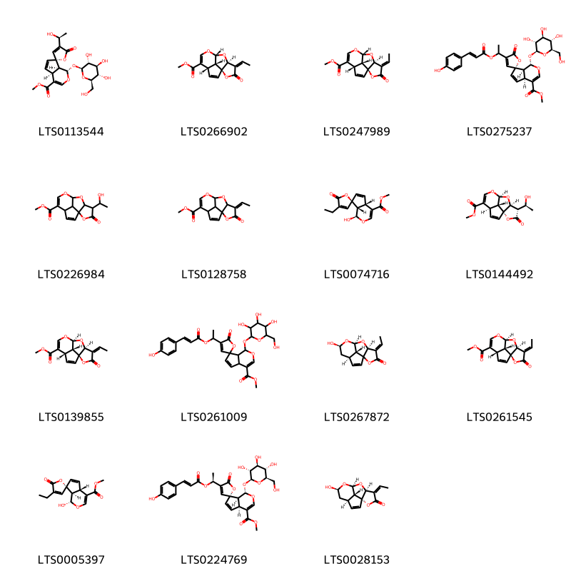{ width=100% }
    <figcaption>Hình ảnh cấu trúc hóa học của 15 hoạt chất thuộc nhóm Prenol lipids gồm ['plumieride (LTS0113544)', 'isoplumericin (LTS0266902)', 'plumericin (LTS0247989)', "methyl (1s,4as,7r,7as)-4'-(1-{[(2e)-3-(4-hydroxyphenyl)prop-2-enoyl]oxy}ethyl)-5'-oxo-1-{[(2s,3r,4s,5s,6r)-3,4,5-trihydroxy-6-(hydroxymethyl)oxan-2-yl]oxy}-4a,7a-dihydro-1h-spiro[cyclopenta[c]pyran-7,2'-furan]-4-carboxylate (LTS0275237)", 'methyl 11-(1-hydroxyethyl)-12-oxo-7,9,13-trioxatetracyclo[6.5.1.0¹,¹⁰.0⁴,¹⁴]tetradeca-2,5-diene-5-carboxylate (LTS0226984)', 'methyl 11-ethylidene-12-oxo-7,9,13-trioxatetracyclo[6.5.1.0¹,¹⁰.0⁴,¹⁴]tetradeca-2,5-diene-5-carboxylate (LTS0128758)', "methyl (1r,4as,7r,7as)-4'-ethyl-1-hydroxy-5'-oxo-4a,7a-dihydro-1h-spiro[cyclopenta[c]pyran-7,2'-furan]-4-carboxylate (LTS0074716)", 'methyl (1r,4r,8s,10s,11s,14s)-11-[(1s)-1-hydroxyethyl]-12-oxo-7,9,13-trioxatetracyclo[6.5.1.0¹,¹⁰.0⁴,¹⁴]tetradeca-2,5-diene-5-carboxylate (LTS0144492)', 'methyl (1s,4s,8s,10s,11z,14s)-11-ethylidene-12-oxo-7,9,13-trioxatetracyclo[6.5.1.0¹,¹⁰.0⁴,¹⁴]tetradeca-2,5-diene-5-carboxylate (LTS0139855)', "methyl 4'-(1-{[3-(4-hydroxyphenyl)prop-2-enoyl]oxy}ethyl)-5'-oxo-1-{[3,4,5-trihydroxy-6-(hydroxymethyl)oxan-2-yl]oxy}-4a,7a-dihydro-1h-spiro[cyclopenta[c]pyran-7,2'-furan]-4-carboxylate (LTS0261009)", '(4r,6s,8r,10s,11e,14s)-11-ethylidene-6-hydroxy-7,9,13-trioxatetracyclo[6.5.1.0¹,¹⁰.0⁴,¹⁴]tetradec-2-en-12-one (LTS0267872)', 'methyl (1s,4s,8s,10s,11e,14s)-11-ethylidene-12-oxo-7,9,13-trioxatetracyclo[6.5.1.0¹,¹⁰.0⁴,¹⁴]tetradeca-2,5-diene-5-carboxylate (LTS0261545)', "methyl (1s,4as,7s,7ar)-4'-ethyl-1-hydroxy-5'-oxo-4a,7a-dihydro-1h-spiro[cyclopenta[c]pyran-7,2'-furan]-4-carboxylate (LTS0005397)", "methyl (1s,4as,7r,7as)-4'-[(1s)-1-{[(2e)-3-(4-hydroxyphenyl)prop-2-enoyl]oxy}ethyl]-5'-oxo-1-{[(2s,3r,4s,5s,6r)-3,4,5-trihydroxy-6-(hydroxymethyl)oxan-2-yl]oxy}-4a,7a-dihydro-1h-spiro[cyclopenta[c]pyran-7,2'-furan]-4-carboxylate (LTS0224769)", '(1r,4r,6s,8r,10s,11z,14s)-11-ethylidene-6-hydroxy-7,9,13-trioxatetracyclo[6.5.1.0¹,¹⁰.0⁴,¹⁴]tetradec-2-en-12-one (LTS0028153)'].</figcaption>
</figure>

---

### Dược dân tộc học

Danh sách các quốc gia có sử dụng *Allamanda cathartica* trong điều trị các bệnh. 

| Country   | Disease                     | Bệnh                                                                                                                                                                                                |
|:----------|:----------------------------|:----------------------------------------------------------------------------------------------------------------------------------------------------------------------------------------------------|
| Brazil    | Poison                      | MYMEMORY WARNING: YOU USED ALL AVAILABLE FREE TRANSLATIONS FOR TODAY. NEXT AVAILABLE IN  12 HOURS 19 MINUTES 04 SECONDS VISIT HTTPS://MYMEMORY.TRANSLATED.NET/DOC/USAGELIMITS.PHP TO TRANSLATE MORE |
| Samoa     | Poison                      | MYMEMORY WARNING: YOU USED ALL AVAILABLE FREE TRANSLATIONS FOR TODAY. NEXT AVAILABLE IN  12 HOURS 19 MINUTES 01 SECONDS VISIT HTTPS://MYMEMORY.TRANSLATED.NET/DOC/USAGELIMITS.PHP TO TRANSLATE MORE |
| Venezuela | Emetic, Laxative, Purgative | MYMEMORY WARNING: YOU USED ALL AVAILABLE FREE TRANSLATIONS FOR TODAY. NEXT AVAILABLE IN  12 HOURS 18 MINUTES 57 SECONDS VISIT HTTPS://MYMEMORY.TRANSLATED.NET/DOC/USAGELIMITS.PHP TO TRANSLATE MORE |

---

# Chi Kopsia

??? note "Danh sách các dược liệu thuộc chi"
    
	 - *Kopsia fruticosa*

---
## Kopsia fruticosa
### Thông tin về thực vật

!!! info "Phân loại thực vật của *Kopsia fruticosa* từ GIBF:"
    - **Kingdom:** Plantae
    - **Phylum:** Tracheophyta
    - **Order:** Gentianales
    - **Family:** Apocynaceae
    - **Genus:** Kopsia
    - **Species:** *Kopsia fruticosa*

 

| Label (VI)   | Label (EN)   | Scientific Name   | Descriptions (VI)   | Descriptions (EN)   | Also Known As (VI)   | Also Known As (EN)   |
|:-------------|:-------------|:------------------|:--------------------|:--------------------|:---------------------|:---------------------|
| N/A          | N/A          | Kopsia fruticosa  | loài thực vật       | species of plant    | ['']                 | ['']                 |

#### Phân bố trên thế giới

**Từ CSDL GIBF** nan, Brazil, Viet Nam, Guadeloupe, Bangladesh, China, French Polynesia, Trinidad and Tobago, Thailand, Puerto Rico, Sri Lanka, United States of America, Virgin Islands (U.S.), Seychelles, Indonesia, Nigeria, unknown or invalid, Belgium, Malaysia, Philippines, Curaçao, Brunei Darussalam, Singapore, Cambodia, Martinique, South Africa, Côte d’Ivoire, Saint Vincent and the Grenadines, Myanmar, India

#### Phân bố tại Việt Nam

**Từ CSDL GIBF**: Hồ Chí Minh city

---
### Thành phần hóa học
        
- Theo cơ sở dữ liệu lotus: Từ loài *Kopsia fruticosa* đã phân lập và xác định được 47 hoạt chất thuộc về các nhóm Aspidofractine alkaloids, Aspidospermatan-type alkaloids, Pleiocarpaman alkaloids, Strychnos alkaloids, Indoles and derivatives. 

|    | chemicalTaxonomyClassyfireClass   |   smiles_count |
|---:|:----------------------------------|---------------:|
|  0 | Aspidofractine alkaloids          |             18 |
|  1 | Aspidospermatan-type alkaloids    |              4 |
|  2 | Indoles and derivatives           |             17 |
|  3 | Pleiocarpaman alkaloids           |              5 |
|  4 | Strychnos alkaloids               |              2 |

#### Nhóm Aspidofractine alkaloids
<figure markdown="span">
    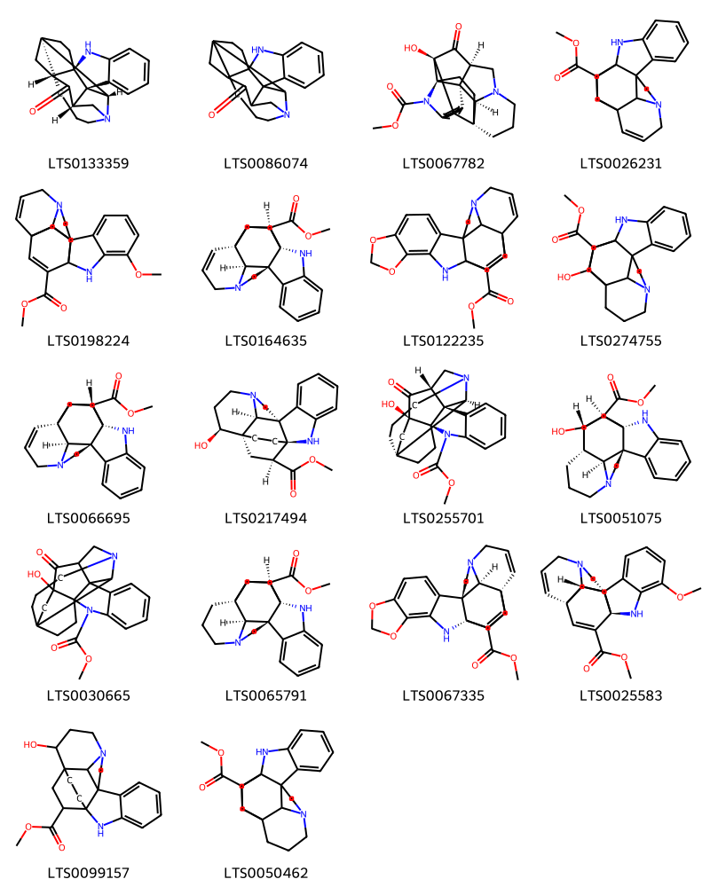{ width=100% }
    <figcaption>Hình ảnh cấu trúc hóa học của 18 hoạt chất thuộc nhóm Aspidofractine alkaloids gồm ['(1r,2s,3r,11r,12r,14r)-10,16-diazaheptacyclo[9.8.2.1¹,¹².0²,¹⁶.0³,¹¹.0³,¹⁴.0⁴,⁹]docosa-4,6,8-trien-13-one (LTS0133359)', 'kopsanone (LTS0086074)', 'kopsine (LTS0067782)', 'methyl 2,12-diazahexacyclo[14.2.2.1⁹,¹².0¹,⁹.0³,⁸.0¹⁶,²¹]henicosa-3,5,7,14-tetraene-18-carboxylate (LTS0026231)', 'methyl 4-methoxy-2,12-diazahexacyclo[14.2.2.1⁹,¹².0¹,⁹.0³,⁸.0¹⁶,²¹]henicosa-3,5,7,14,17-pentaene-18-carboxylate (LTS0198224)', 'methyl (1r,9r,16r,18r,21s)-2,12-diazahexacyclo[14.2.2.1⁹,¹².0¹,⁹.0³,⁸.0¹⁶,²¹]henicosa-3,5,7,14-tetraene-18-carboxylate (LTS0164635)', 'methyl 5,7-dioxa-2,15-diazaheptacyclo[17.2.2.1¹²,¹⁵.0¹,¹².0³,¹¹.0⁴,⁸.0¹⁹,²⁴]tetracosa-3,8,10,17,20-pentaene-21-carboxylate (LTS0122235)', 'methyl 20-hydroxy-2,12-diazahexacyclo[14.2.2.1⁹,¹².0¹,⁹.0³,⁸.0¹⁶,²¹]henicosa-3,5,7-triene-18-carboxylate (LTS0274755)', 'methyl (1r,9r,16r,18s,21s)-2,12-diazahexacyclo[14.2.2.1⁹,¹².0¹,⁹.0³,⁸.0¹⁶,²¹]henicosa-3,5,7,14-tetraene-18-carboxylate (LTS0066695)', 'methyl (1r,9r,15s,16s,18s,21s)-15-hydroxy-2,12-diazahexacyclo[14.2.2.1⁹,¹².0¹,⁹.0³,⁸.0¹⁶,²¹]henicosa-3,5,7-triene-18-carboxylate (LTS0217494)', 'methyl (1s,2s,3s,11r,12r,14s)-12-hydroxy-13-oxo-10,16-diazaheptacyclo[9.8.2.1¹,¹².0²,¹⁶.0³,¹¹.0³,¹⁴.0⁴,⁹]docosa-4,6,8-triene-10-carboxylate (LTS0255701)', 'methyl (1r,9r,16r,18r,20r,21r)-20-hydroxy-2,12-diazahexacyclo[14.2.2.1⁹,¹².0¹,⁹.0³,⁸.0¹⁶,²¹]henicosa-3,5,7-triene-18-carboxylate (LTS0051075)', 'methyl 12-hydroxy-13-oxo-10,16-diazaheptacyclo[9.8.2.1¹,¹².0²,¹⁶.0³,¹¹.0³,¹⁴.0⁴,⁹]docosa-4,6,8-triene-10-carboxylate (LTS0030665)', 'methyl (1r,9r,16r,18r,21s)-2,12-diazahexacyclo[14.2.2.1⁹,¹².0¹,⁹.0³,⁸.0¹⁶,²¹]henicosa-3,5,7-triene-18-carboxylate (LTS0065791)', 'methyl (1s,12r,19s,24s)-5,7-dioxa-2,15-diazaheptacyclo[17.2.2.1¹²,¹⁵.0¹,¹².0³,¹¹.0⁴,⁸.0¹⁹,²⁴]tetracosa-3,8,10,17,20-pentaene-21-carboxylate (LTS0067335)', 'methyl (1s,9r,16s,21s)-4-methoxy-2,12-diazahexacyclo[14.2.2.1⁹,¹².0¹,⁹.0³,⁸.0¹⁶,²¹]henicosa-3,5,7,14,17-pentaene-18-carboxylate (LTS0025583)', 'methyl 15-hydroxy-2,12-diazahexacyclo[14.2.2.1⁹,¹².0¹,⁹.0³,⁸.0¹⁶,²¹]henicosa-3,5,7-triene-18-carboxylate (LTS0099157)', 'kopsinine (LTS0050462)'].</figcaption>
</figure>
#### Nhóm Aspidospermatan-type alkaloids
<figure markdown="span">
    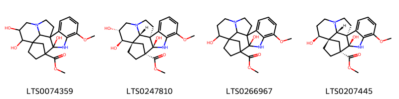{ width=100% }
    <figcaption>Hình ảnh cấu trúc hóa học của 4 hoạt chất thuộc nhóm Aspidospermatan-type alkaloids gồm ['methyl 9,14,15-trihydroxy-6-methoxy-8,17-diazahexacyclo[11.6.1.1¹⁰,¹³.0¹,⁹.0²,⁷.0¹⁷,²⁰]henicosa-2,4,6-triene-10-carboxylate (LTS0074359)', 'methyl (1r,9r,10r,13s,14r,15r,20s)-9,14,15-trihydroxy-6-methoxy-8,17-diazahexacyclo[11.6.1.1¹⁰,¹³.0¹,⁹.0²,⁷.0¹⁷,²⁰]henicosa-2,4,6-triene-10-carboxylate (LTS0247810)', 'methyl 9,14-dihydroxy-6-methoxy-8,17-diazahexacyclo[11.6.1.1¹⁰,¹³.0¹,⁹.0²,⁷.0¹⁷,²⁰]henicosa-2,4,6-triene-10-carboxylate (LTS0266967)', 'methyl (1r,9r,10r,13s,14s,20s)-9,14-dihydroxy-6-methoxy-8,17-diazahexacyclo[11.6.1.1¹⁰,¹³.0¹,⁹.0²,⁷.0¹⁷,²⁰]henicosa-2,4,6-triene-10-carboxylate (LTS0207445)'].</figcaption>
</figure>
#### Nhóm Indoles and derivatives
<figure markdown="span">
    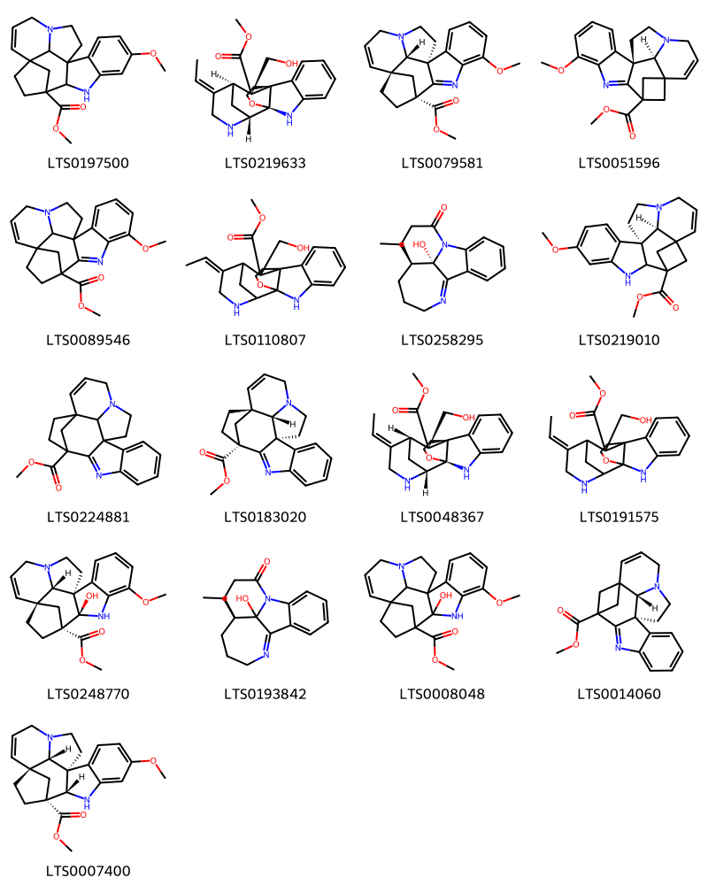{ width=100% }
    <figcaption>Hình ảnh cấu trúc hóa học của 17 hoạt chất thuộc nhóm Indoles and derivatives gồm ['methyl 5-methoxy-8,17-diazahexacyclo[11.6.1.1¹⁰,¹³.0¹,⁹.0²,⁷.0¹⁷,²⁰]henicosa-2,4,6,14-tetraene-10-carboxylate (LTS0197500)', 'methyl (1s,9r,10r,13e,14s,15s)-13-ethylidene-15-(hydroxymethyl)-18-oxa-8,11-diazapentacyclo[7.6.3.1¹⁰,¹⁴.0¹,⁹.0²,⁷]nonadeca-2,4,6-triene-15-carboxylate (LTS0219633)', 'methyl (1r,10r,13r,20s)-6-methoxy-8,17-diazahexacyclo[11.6.1.1¹⁰,¹³.0¹,⁹.0²,⁷.0¹⁷,²⁰]henicosa-2,4,6,8,14-pentaene-10-carboxylate (LTS0079581)', 'methyl (1r,19s)-6-methoxy-8,16-diazahexacyclo[10.6.1.1¹⁰,¹².0¹,⁹.0²,⁷.0¹⁶,¹⁹]icosa-2,4,6,8,13-pentaene-10-carboxylate (LTS0051596)', 'methyl 6-methoxy-8,17-diazahexacyclo[11.6.1.1¹⁰,¹³.0¹,⁹.0²,⁷.0¹⁷,²⁰]henicosa-2,4,6,8,14-pentaene-10-carboxylate (LTS0089546)', 'methyl (13z)-13-ethylidene-15-(hydroxymethyl)-18-oxa-8,11-diazapentacyclo[7.6.3.1¹⁰,¹⁴.0¹,⁹.0²,⁷]nonadeca-2,4,6-triene-15-carboxylate (LTS0110807)', '(5r,17s)-5-ethyl-17-hydroxy-1,9-diazatetracyclo[8.6.1.0⁵,¹⁷.0¹¹,¹⁶]heptadeca-9,11,13,15-tetraen-2-one (LTS0258295)', 'methyl (1r,19s)-5-methoxy-8,16-diazahexacyclo[10.6.1.1¹⁰,¹².0¹,⁹.0²,⁷.0¹⁶,¹⁹]icosa-2,4,6,13-tetraene-10-carboxylate (LTS0219010)', 'methyl 8,17-diazahexacyclo[11.6.1.1¹⁰,¹³.0¹,⁹.0²,⁷.0¹⁷,²⁰]henicosa-2,4,6,8,14-pentaene-10-carboxylate (LTS0224881)', 'methyl (1r,10r,13r,20s)-8,17-diazahexacyclo[11.6.1.1¹⁰,¹³.0¹,⁹.0²,⁷.0¹⁷,²⁰]henicosa-2,4,6,8,14-pentaene-10-carboxylate (LTS0183020)', 'methyl (1s,9r,10r,13e,14r,15s)-13-ethylidene-15-(hydroxymethyl)-18-oxa-8,11-diazapentacyclo[7.6.3.1¹⁰,¹⁴.0¹,⁹.0²,⁷]nonadeca-2,4,6-triene-15-carboxylate (LTS0048367)', 'methyl (13e)-13-ethylidene-15-(hydroxymethyl)-18-oxa-8,11-diazapentacyclo[7.6.3.1¹⁰,¹⁴.0¹,⁹.0²,⁷]nonadeca-2,4,6-triene-15-carboxylate (LTS0191575)', 'methyl (1r,9r,10r,13r,20s)-9-hydroxy-6-methoxy-8,17-diazahexacyclo[11.6.1.1¹⁰,¹³.0¹,⁹.0²,⁷.0¹⁷,²⁰]henicosa-2,4,6,14-tetraene-10-carboxylate (LTS0248770)', '5-ethyl-17-hydroxy-1,9-diazatetracyclo[8.6.1.0⁵,¹⁷.0¹¹,¹⁶]heptadeca-9,11,13,15-tetraen-2-one (LTS0193842)', 'methyl 9-hydroxy-6-methoxy-8,17-diazahexacyclo[11.6.1.1¹⁰,¹³.0¹,⁹.0²,⁷.0¹⁷,²⁰]henicosa-2,4,6,14-tetraene-10-carboxylate (LTS0008048)', 'methyl (1r,19s)-8,16-diazahexacyclo[10.6.1.1¹⁰,¹².0¹,⁹.0²,⁷.0¹⁶,¹⁹]icosa-2,4,6,8,13-pentaene-10-carboxylate (LTS0014060)', 'methyl (1s,9s,10r,13r,20s)-5-methoxy-8,17-diazahexacyclo[11.6.1.1¹⁰,¹³.0¹,⁹.0²,⁷.0¹⁷,²⁰]henicosa-2,4,6,14-tetraene-10-carboxylate (LTS0007400)'].</figcaption>
</figure>
#### Nhóm Pleiocarpaman alkaloids
<figure markdown="span">
    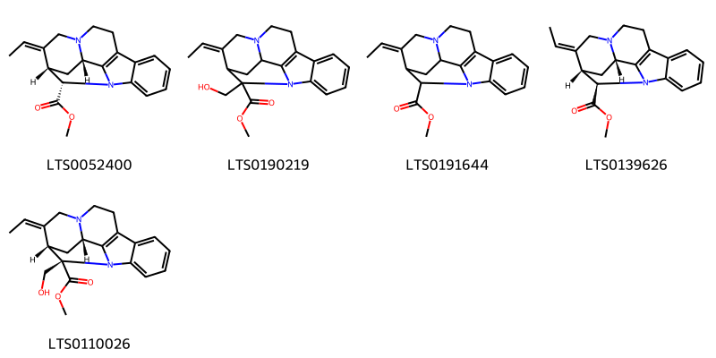{ width=100% }
    <figcaption>Hình ảnh cấu trúc hóa học của 5 hoạt chất thuộc nhóm Pleiocarpaman alkaloids gồm ['pleiocarpamine (LTS0052400)', 'methyl (13e)-13-ethylidene-18-(hydroxymethyl)-1,11-diazapentacyclo[12.3.1.0²,⁷.0⁸,¹⁷.0¹¹,¹⁶]octadeca-2,4,6,8(17)-tetraene-18-carboxylate (LTS0190219)', 'methyl (13e)-13-ethylidene-1,11-diazapentacyclo[12.3.1.0²,⁷.0⁸,¹⁷.0¹¹,¹⁶]octadeca-2,4,6,8(17)-tetraene-18-carboxylate (LTS0191644)', 'methyl (13z,14s,16s,18r)-13-ethylidene-1,11-diazapentacyclo[12.3.1.0²,⁷.0⁸,¹⁷.0¹¹,¹⁶]octadeca-2,4,6,8(17)-tetraene-18-carboxylate (LTS0139626)', 'methyl (13e,14s,16s,18r)-13-ethylidene-18-(hydroxymethyl)-1,11-diazapentacyclo[12.3.1.0²,⁷.0⁸,¹⁷.0¹¹,¹⁶]octadeca-2,4,6,8(17)-tetraene-18-carboxylate (LTS0110026)'].</figcaption>
</figure>
#### Nhóm Strychnos alkaloids
<figure markdown="span">
    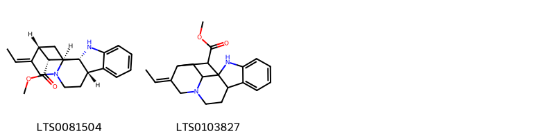{ width=100% }
    <figcaption>Hình ảnh cấu trúc hóa học của 2 hoạt chất thuộc nhóm Strychnos alkaloids gồm ['methyl (1s,9s,14e,15r,17s,18r)-14-ethylidene-2,12-diazapentacyclo[13.2.1.0¹,⁹.0³,⁸.0¹²,¹⁷]octadeca-3,5,7-triene-18-carboxylate (LTS0081504)', 'methyl (14e)-14-ethylidene-2,12-diazapentacyclo[13.2.1.0¹,⁹.0³,⁸.0¹²,¹⁷]octadeca-3,5,7-triene-18-carboxylate (LTS0103827)'].</figcaption>
</figure>

---

### Dược dân tộc học

Danh sách các quốc gia có sử dụng *Kopsia fruticosa* trong điều trị các bệnh. 

| Country   | Disease     | Bệnh                                                                                                                                                                                                |
|:----------|:------------|:----------------------------------------------------------------------------------------------------------------------------------------------------------------------------------------------------|
| India     | Cholinergic | MYMEMORY WARNING: YOU USED ALL AVAILABLE FREE TRANSLATIONS FOR TODAY. NEXT AVAILABLE IN  12 HOURS 18 MINUTES 03 SECONDS VISIT HTTPS://MYMEMORY.TRANSLATED.NET/DOC/USAGELIMITS.PHP TO TRANSLATE MORE |

---

# Chi Rauvolfia

??? note "Danh sách các dược liệu thuộc chi"
    
	 - *Rauvolfia canescens*
	 - *Rauvolfia ectabilis*
	 - *Rauvolfia heterophylla*
	 - *Rauvolfia hirsuta*
	 - *Rauvolfia mombasiana*
	 - *Rauvolfia serpentina*
	 - *Rauvolfia tetraphylla*
	 - *Rauvolfia vomitoria*

---
## Rauvolfia canescens
### Thông tin về thực vật

!!! info "Phân loại thực vật của *Rauvolfia tetraphylla* từ GIBF:"
    - **Kingdom:** Plantae
    - **Phylum:** Tracheophyta
    - **Order:** Gentianales
    - **Family:** Apocynaceae
    - **Genus:** Rauvolfia
    - **Species:** *Rauvolfia tetraphylla*

 

| Label (VI)   | Label (EN)   | Scientific Name     | Descriptions (VI)   | Descriptions (EN)   | Also Known As (VI)   | Also Known As (EN)   |
|:-------------|:-------------|:--------------------|:--------------------|:--------------------|:---------------------|:---------------------|
| N/A          | N/A          | Rauvolfia canescens | loài thực vật       | species of plant    | ['']                 | ['']                 |

#### Phân bố trên thế giới

**Từ CSDL GIBF** nan, Mexico, Guatemala, United States of America, Jamaica, Guadeloupe, Nepal, Haiti, Costa Rica, Australia, Dominican Republic, Colombia, India, Cuba, Ecuador, Ghana, Venezuela (Bolivarian Republic of)

#### Phân bố tại Việt Nam

**Từ CSDL GIBF**: Không có ghi nhận ở Việt Nam

---
### Thành phần hóa học
        
- Theo cơ sở dữ liệu lotus: Từ loài *Rauvolfia tetraphylla* đã phân lập và xác định được Chưa có hoạt chất nào được phân lập. hoạt chất thuộc về các nhóm Không có hoạt chất nào được phân lập. 

Không có hình ảnh nào được tạo ra

---

### Dược dân tộc học

Danh sách các quốc gia có sử dụng *Rauvolfia tetraphylla* trong điều trị các bệnh. 

| Country     | Disease      | Bệnh                                                                                                                                                                                                |
|:------------|:-------------|:----------------------------------------------------------------------------------------------------------------------------------------------------------------------------------------------------|
| Elsewhere   | Hypotensive  | MYMEMORY WARNING: YOU USED ALL AVAILABLE FREE TRANSLATIONS FOR TODAY. NEXT AVAILABLE IN  12 HOURS 17 MINUTES 25 SECONDS VISIT HTTPS://MYMEMORY.TRANSLATED.NET/DOC/USAGELIMITS.PHP TO TRANSLATE MORE |
| Mexico      | Parasiticide | MYMEMORY WARNING: YOU USED ALL AVAILABLE FREE TRANSLATIONS FOR TODAY. NEXT AVAILABLE IN  12 HOURS 17 MINUTES 16 SECONDS VISIT HTTPS://MYMEMORY.TRANSLATED.NET/DOC/USAGELIMITS.PHP TO TRANSLATE MORE |
| West Indies | Parasiticide | MYMEMORY WARNING: YOU USED ALL AVAILABLE FREE TRANSLATIONS FOR TODAY. NEXT AVAILABLE IN  12 HOURS 17 MINUTES 09 SECONDS VISIT HTTPS://MYMEMORY.TRANSLATED.NET/DOC/USAGELIMITS.PHP TO TRANSLATE MORE |

---

---
## Rauvolfia ectabilis
### Thông tin về thực vật

!!! info "Phân loại thực vật của *N/A* từ GIBF:"
    - **Kingdom:** Plantae
    - **Phylum:** Tracheophyta
    - **Order:** Gentianales
    - **Family:** Apocynaceae
    - **Genus:** Rauvolfia
    - **Species:** *N/A*

 

| Label (VI)   | Label (EN)   | Scientific Name     | Descriptions (VI)   | Descriptions (EN)   | Also Known As (VI)   | Also Known As (EN)   |
|:-------------|:-------------|:--------------------|:--------------------|:--------------------|:---------------------|:---------------------|
| N/A          | N/A          | Rauvolfia canescens | loài thực vật       | species of plant    | ['']                 | ['']                 |

#### Phân bố trên thế giới

**Từ CSDL GIBF** Brazil, Nepal, New Caledonia, China, Zimbabwe, Honduras, Thailand, Puerto Rico, Sri Lanka, United States of America, Zambia, Virgin Islands (U.S.), Costa Rica, Dominican Republic, Colombia, Cuba, Hong Kong, Mexico, Kenya, El Salvador, Chinese Taipei, Gabon, Nicaragua, Martinique, South Africa, Australia, India

#### Phân bố tại Việt Nam

**Từ CSDL GIBF**: Không có ghi nhận ở Việt Nam

---
### Thành phần hóa học
        
- Theo cơ sở dữ liệu lotus: Từ loài *N/A* đã phân lập và xác định được Chưa có hoạt chất nào được phân lập. hoạt chất thuộc về các nhóm Không có hoạt chất nào được phân lập. 

Không có hình ảnh nào được tạo ra

---

### Dược dân tộc học

Danh sách các quốc gia có sử dụng *N/A* trong điều trị các bệnh. 

| Country   | Disease   | Bệnh                                                                                                                                                                                                |
|:----------|:----------|:----------------------------------------------------------------------------------------------------------------------------------------------------------------------------------------------------|
| Borneo    | Poison    | MYMEMORY WARNING: YOU USED ALL AVAILABLE FREE TRANSLATIONS FOR TODAY. NEXT AVAILABLE IN  12 HOURS 16 MINUTES 36 SECONDS VISIT HTTPS://MYMEMORY.TRANSLATED.NET/DOC/USAGELIMITS.PHP TO TRANSLATE MORE |

---

---
## Rauvolfia heterophylla
### Thông tin về thực vật

!!! info "Phân loại thực vật của *Rauvolfia tetraphylla* từ GIBF:"
    - **Kingdom:** Plantae
    - **Phylum:** Tracheophyta
    - **Order:** Gentianales
    - **Family:** Apocynaceae
    - **Genus:** Rauvolfia
    - **Species:** *Rauvolfia tetraphylla*

 

| Label (VI)   | Label (EN)   | Scientific Name        | Descriptions (VI)   | Descriptions (EN)   | Also Known As (VI)   | Also Known As (EN)   |
|:-------------|:-------------|:-----------------------|:--------------------|:--------------------|:---------------------|:---------------------|
| N/A          | N/A          | Rauvolfia heterophylla |                     | species of plant    | ['']                 | ['']                 |

#### Phân bố trên thế giới

**Từ CSDL GIBF** nan, Mexico, Guatemala, Nicaragua, El Salvador, Costa Rica, Colombia, Cuba, Ecuador, Panama, Belize, Venezuela (Bolivarian Republic of)

#### Phân bố tại Việt Nam

**Từ CSDL GIBF**: Không có ghi nhận ở Việt Nam

---
### Thành phần hóa học
        
- Theo cơ sở dữ liệu lotus: Từ loài *Rauvolfia tetraphylla* đã phân lập và xác định được Chưa có hoạt chất nào được phân lập. hoạt chất thuộc về các nhóm Không có hoạt chất nào được phân lập. 

Không có hình ảnh nào được tạo ra

---

### Dược dân tộc học

Danh sách các quốc gia có sử dụng *Rauvolfia tetraphylla* trong điều trị các bệnh. 

| Country   | Disease   | Bệnh                                                                                                                                                                                                |
|:----------|:----------|:----------------------------------------------------------------------------------------------------------------------------------------------------------------------------------------------------|
| Mexico    | Poison    | MYMEMORY WARNING: YOU USED ALL AVAILABLE FREE TRANSLATIONS FOR TODAY. NEXT AVAILABLE IN  12 HOURS 16 MINUTES 08 SECONDS VISIT HTTPS://MYMEMORY.TRANSLATED.NET/DOC/USAGELIMITS.PHP TO TRANSLATE MORE |

---

---
## Rauvolfia hirsuta
### Thông tin về thực vật

!!! info "Phân loại thực vật của *Rauvolfia tetraphylla* từ GIBF:"
    - **Kingdom:** Plantae
    - **Phylum:** Tracheophyta
    - **Order:** Gentianales
    - **Family:** Apocynaceae
    - **Genus:** Rauvolfia
    - **Species:** *Rauvolfia tetraphylla*

 

| Label (VI)   | Label (EN)   | Scientific Name   | Descriptions (VI)   | Descriptions (EN)   | Also Known As (VI)   | Also Known As (EN)   |
|:-------------|:-------------|:------------------|:--------------------|:--------------------|:---------------------|:---------------------|
| N/A          | N/A          | Rauvolfia hirsuta | loài thực vật       | species of plant    | ['']                 | ['']                 |

#### Phân bố trên thế giới

**Từ CSDL GIBF** nan, Mexico, Nicaragua, Guatemala, El Salvador, Colombia, Honduras, unknown or invalid, Peru, Trinidad and Tobago

#### Phân bố tại Việt Nam

**Từ CSDL GIBF**: Không có ghi nhận ở Việt Nam

---
### Thành phần hóa học
        
- Theo cơ sở dữ liệu lotus: Từ loài *Rauvolfia tetraphylla* đã phân lập và xác định được Chưa có hoạt chất nào được phân lập. hoạt chất thuộc về các nhóm Không có hoạt chất nào được phân lập. 

Không có hình ảnh nào được tạo ra

---

### Dược dân tộc học

Danh sách các quốc gia có sử dụng *Rauvolfia tetraphylla* trong điều trị các bệnh. 

| Country   | Disease   | Bệnh                                                                                                                                                                                                |
|:----------|:----------|:----------------------------------------------------------------------------------------------------------------------------------------------------------------------------------------------------|
| Mexico    | Poison    | MYMEMORY WARNING: YOU USED ALL AVAILABLE FREE TRANSLATIONS FOR TODAY. NEXT AVAILABLE IN  12 HOURS 15 MINUTES 43 SECONDS VISIT HTTPS://MYMEMORY.TRANSLATED.NET/DOC/USAGELIMITS.PHP TO TRANSLATE MORE |

---

---
## Rauvolfia mombasiana
### Thông tin về thực vật

!!! info "Phân loại thực vật của *Rauvolfia mombasiana* từ GIBF:"
    - **Kingdom:** Plantae
    - **Phylum:** Tracheophyta
    - **Order:** Gentianales
    - **Family:** Apocynaceae
    - **Genus:** Rauvolfia
    - **Species:** *Rauvolfia mombasiana*

 

| Label (VI)   | Label (EN)   | Scientific Name      | Descriptions (VI)   | Descriptions (EN)   | Also Known As (VI)   | Also Known As (EN)   |
|:-------------|:-------------|:---------------------|:--------------------|:--------------------|:---------------------|:---------------------|
| N/A          | N/A          | Rauvolfia mombasiana | loài thực vật       | species of plant    | ['']                 | ['']                 |

#### Phân bố trên thế giới

**Từ CSDL GIBF** nan, Kenya, South Africa, Mozambique, Tanzania, United Republic of, unknown or invalid, Spain, Netherlands

#### Phân bố tại Việt Nam

**Từ CSDL GIBF**: Không có ghi nhận ở Việt Nam

---
### Thành phần hóa học
        
- Theo cơ sở dữ liệu lotus: Từ loài *Rauvolfia mombasiana* đã phân lập và xác định được 5 hoạt chất thuộc về các nhóm Macroline alkaloids, Corynanthean-type alkaloids. 

|    | chemicalTaxonomyClassyfireClass   |   smiles_count |
|---:|:----------------------------------|---------------:|
|  0 | Corynanthean-type alkaloids       |              2 |
|  1 | Macroline alkaloids               |              3 |

#### Nhóm Corynanthean-type alkaloids
<figure markdown="span">
    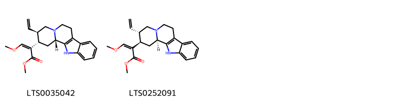{ width=100% }
    <figcaption>Hình ảnh cấu trúc hóa học của 2 hoạt chất thuộc nhóm Corynanthean-type alkaloids gồm ['methyl (2z)-2-[(2s,3r,12bs)-3-ethenyl-1h,2h,3h,4h,6h,7h,12h,12bh-indolo[2,3-a]quinolizin-2-yl]-3-methoxyprop-2-enoate (LTS0035042)', 'methyl (2z)-2-[(2r,3s,12br)-3-ethenyl-1h,2h,3h,4h,6h,7h,12h,12bh-indolo[2,3-a]quinolizin-2-yl]-3-methoxyprop-2-enoate (LTS0252091)'].</figcaption>
</figure>
#### Nhóm Macroline alkaloids
<figure markdown="span">
    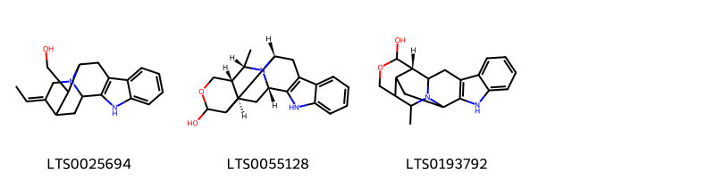{ width=100% }
    <figcaption>Hình ảnh cấu trúc hóa học của 3 hoạt chất thuộc nhóm Macroline alkaloids gồm ['normacusine b (LTS0025694)', '(2s,13s,15r,20s,21s)-21-methyl-18-oxa-1,11-diazahexacyclo[11.8.0.0²,¹⁶.0⁴,¹².0⁵,¹⁰.0¹⁵,²⁰]henicosa-4(12),5,7,9-tetraen-17-ol (LTS0055128)', '(16s)-21-methyl-18-oxa-1,11-diazahexacyclo[11.8.0.0²,¹⁶.0⁴,¹².0⁵,¹⁰.0¹⁵,²⁰]henicosa-4(12),5,7,9-tetraen-17-ol (LTS0193792)'].</figcaption>
</figure>

---

### Dược dân tộc học

Danh sách các quốc gia có sử dụng *Rauvolfia mombasiana* trong điều trị các bệnh. 

| Country         | Disease          | Bệnh                                                                                                                                                                                                |
|:----------------|:-----------------|:----------------------------------------------------------------------------------------------------------------------------------------------------------------------------------------------------|
| Africa(Swahili) | Poison, Poultice | MYMEMORY WARNING: YOU USED ALL AVAILABLE FREE TRANSLATIONS FOR TODAY. NEXT AVAILABLE IN  12 HOURS 15 MINUTES 03 SECONDS VISIT HTTPS://MYMEMORY.TRANSLATED.NET/DOC/USAGELIMITS.PHP TO TRANSLATE MORE |

---

---
## Rauvolfia serpentina
### Thông tin về thực vật

!!! info "Phân loại thực vật của *Rauvolfia serpentina* từ GIBF:"
    - **Kingdom:** Plantae
    - **Phylum:** Tracheophyta
    - **Order:** Gentianales
    - **Family:** Apocynaceae
    - **Genus:** Rauvolfia
    - **Species:** *Rauvolfia serpentina*

 

| Label (VI)   | Label (EN)   | Scientific Name      | Descriptions (VI)   | Descriptions (EN)   | Also Known As (VI)   | Also Known As (EN)   |
|:-------------|:-------------|:---------------------|:--------------------|:--------------------|:---------------------|:---------------------|
| N/A          | N/A          | Rauvolfia serpentina | loài thực vật       | species of plant    | ['']                 | ['']                 |

#### Phân bố trên thế giới

**Từ CSDL GIBF** nan, Brazil, Japan, Bangladesh, Nepal, China, New Zealand, Thailand, Sri Lanka, United States of America, Bhutan, Indonesia, Pakistan, Dominican Republic, unknown or invalid, Lao People’s Democratic Republic, Chinese Taipei, Malaysia, Philippines, Myanmar, Italy, India

#### Phân bố tại Việt Nam

**Từ CSDL GIBF**: Không có ghi nhận ở Việt Nam

---
### Thành phần hóa học
        
- Theo cơ sở dữ liệu lotus: Từ loài *Rauvolfia serpentina* đã phân lập và xác định được 131 hoạt chất thuộc về các nhóm Aporphines, Ajmaline-sarpagine alkaloids, Yohimbine alkaloids, Carboxylic acids and derivatives, Macroline alkaloids, Steroids and steroid derivatives, Plumeran-type alkaloids, Eburnan-type alkaloids, Organooxygen compounds, Strychnos alkaloids, Prenol lipids, Harmala alkaloids, Indoles and derivatives. 

|    | chemicalTaxonomyClassyfireClass   |   smiles_count |
|---:|:----------------------------------|---------------:|
|  0 |                                   |              2 |
|  1 | Ajmaline-sarpagine alkaloids      |             30 |
|  2 | Aporphines                        |              1 |
|  3 | Carboxylic acids and derivatives  |              1 |
|  4 | Eburnan-type alkaloids            |              2 |
|  5 | Harmala alkaloids                 |              1 |
|  6 | Indoles and derivatives           |             27 |
|  7 | Macroline alkaloids               |             16 |
|  8 | Organooxygen compounds            |              5 |
|  9 | Plumeran-type alkaloids           |              2 |
| 10 | Prenol lipids                     |              6 |
| 11 | Steroids and steroid derivatives  |              5 |
| 12 | Strychnos alkaloids               |              6 |
| 13 | Yohimbine alkaloids               |             25 |

#### Nhóm 
<figure markdown="span">
    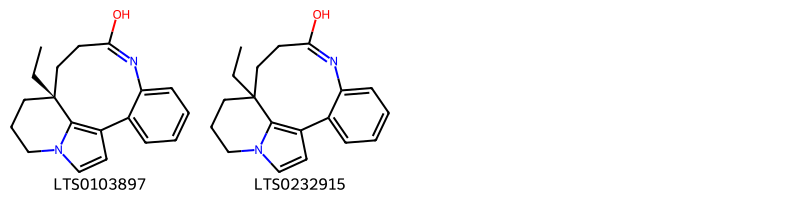{ width=100% }
    <figcaption>Hình ảnh cấu trúc hóa học của 2 hoạt chất thuộc nhóm  gồm ['(12r)-12-ethyl-8,16-diazatetracyclo[10.6.1.0²,⁷.0¹⁶,¹⁹]nonadeca-1(19),2,4,6,8,17-hexaen-9-ol (LTS0103897)', '12-ethyl-8,16-diazatetracyclo[10.6.1.0²,⁷.0¹⁶,¹⁹]nonadeca-1(19),2,4,6,8,17-hexaen-9-ol (LTS0232915)'].</figcaption>
</figure>
#### Nhóm Ajmaline-sarpagine alkaloids
<figure markdown="span">
    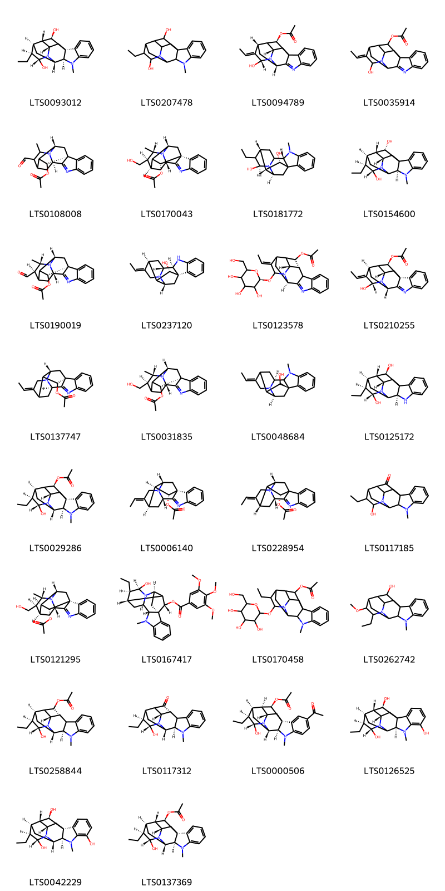{ width=100% }
    <figcaption>Hình ảnh cấu trúc hóa học của 30 hoạt chất thuộc nhóm Ajmaline-sarpagine alkaloids gồm ['(1r,9r,10s,12r,13s,14r,16s,17s,18r)-13-ethyl-8-methyl-8,15-diazahexacyclo[14.2.1.0¹,⁹.0²,⁷.0¹⁰,¹⁵.0¹²,¹⁷]nonadeca-2,4,6-triene-14,18-diol (LTS0093012)', 'siddiqui (LTS0207478)', '(10s,12s,13e,14r,16s,18r)-13-ethylidene-14-hydroxy-8,15-diazahexacyclo[14.2.1.0¹,⁹.0²,⁷.0¹⁰,¹⁵.0¹²,¹⁷]nonadeca-2,4,6,8-tetraen-18-yl acetate (LTS0094789)', '13-ethylidene-14-hydroxy-8,15-diazahexacyclo[14.2.1.0¹,⁹.0²,⁷.0¹⁰,¹⁵.0¹²,¹⁷]nonadeca-2,4,6,8-tetraen-18-yl acetate (LTS0035914)', '(1r,10r,16s)-13-formyl-14-methyl-8,15-diazahexacyclo[14.2.1.0¹,⁹.0²,⁷.0¹⁰,¹⁵.0¹²,¹⁷]nonadeca-2,4,6,8-tetraen-18-yl acetate (LTS0108008)', 'raucaffrinoline (LTS0170043)', '(9r,12r,14s,16s,17s,18s)-13-ethyl-8-methyl-8,15-diazahexacyclo[14.2.1.0¹,⁹.0²,⁷.0¹⁰,¹⁵.0¹²,¹⁷]nonadeca-2,4,6-triene-14,18-diol (LTS0181772)', '(9r,12r,13s,14r,16s,17s,18s)-13-ethyl-8-methyl-8,15-diazahexacyclo[14.2.1.0¹,⁹.0²,⁷.0¹⁰,¹⁵.0¹²,¹⁷]nonadeca-2,4,6-triene-14,18-diol (LTS0154600)', '(1r,10s,13r,14s,16s)-13-formyl-14-methyl-8,15-diazahexacyclo[14.2.1.0¹,⁹.0²,⁷.0¹⁰,¹⁵.0¹²,¹⁷]nonadeca-2,4,6,8-tetraen-18-yl acetate (LTS0190019)', '(1s,9s,10r,12s,13e,16r,18s)-13-ethylidene-8,15-diazahexacyclo[14.2.1.0¹,⁹.0²,⁷.0¹⁰,¹⁵.0¹²,¹⁷]nonadeca-2,4,6-trien-18-ol (LTS0237120)', '(1r,10r,16s)-13-ethylidene-14-{[(2s)-3,4,5-trihydroxy-6-(hydroxymethyl)oxan-2-yl]oxy}-8,15-diazahexacyclo[14.2.1.0¹,⁹.0²,⁷.0¹⁰,¹⁵.0¹²,¹⁷]nonadeca-2,4,6,8-tetraen-18-yl acetate (LTS0123578)', 'vomilenine (LTS0210255)', '(1r,10r,16s)-13-ethylidene-8,15-diazahexacyclo[14.2.1.0¹,⁹.0²,⁷.0¹⁰,¹⁵.0¹²,¹⁷]nonadeca-2,4,6,8-tetraen-18-yl acetate (LTS0137747)', '(1r,10s,13r,14s,16s)-13-(hydroxymethyl)-14-methyl-8,15-diazahexacyclo[14.2.1.0¹,⁹.0²,⁷.0¹⁰,¹⁵.0¹²,¹⁷]nonadeca-2,4,6,8-tetraen-18-yl acetate (LTS0031835)', '(1r,10s,13e,16s)-13-ethylidene-8-methyl-8,15-diazahexacyclo[14.2.1.0¹,⁹.0²,⁷.0¹⁰,¹⁵.0¹²,¹⁷]nonadeca-2,4,6-trien-18-ol (LTS0048684)', '(9r,12r,13s,14r,16s,17s,18r)-13-ethyl-8,15-diazahexacyclo[14.2.1.0¹,⁹.0²,⁷.0¹⁰,¹⁵.0¹²,¹⁷]nonadeca-2,4,6-triene-14,18-diol (LTS0125172)', '17-o-acetylajmaline (LTS0029286)', '(1r,10s,12r,13e,16s,17s,18r)-13-ethylidene-8,15-diazahexacyclo[14.2.1.0¹,⁹.0²,⁷.0¹⁰,¹⁵.0¹²,¹⁷]nonadeca-2,4,6,8-tetraen-18-yl acetate (LTS0006140)', '(10s,12s,13e,16s,18r)-13-ethylidene-8,15-diazahexacyclo[14.2.1.0¹,⁹.0²,⁷.0¹⁰,¹⁵.0¹²,¹⁷]nonadeca-2,4,6,8-tetraen-18-yl acetate (LTS0228954)', '13-ethyl-14-hydroxy-8-methyl-8,15-diazahexacyclo[14.2.1.0¹,⁹.0²,⁷.0¹⁰,¹⁵.0¹²,¹⁷]nonadeca-2,4,6-trien-18-one (LTS0117185)', '(1r,10s,12s,13r,14s,16s,17s,18r)-13-(hydroxymethyl)-14-methyl-8,15-diazahexacyclo[14.2.1.0¹,⁹.0²,⁷.0¹⁰,¹⁵.0¹²,¹⁷]nonadeca-2,4,6,8-tetraen-18-yl acetate (LTS0121295)', '(1s,9s,10r,12s,13r,14r,16r,18s)-13-ethyl-14-hydroxy-8-methyl-8,15-diazahexacyclo[14.2.1.0¹,⁹.0²,⁷.0¹⁰,¹⁵.0¹²,¹⁷]nonadeca-2,4,6-trien-18-yl 3,4,5-trimethoxybenzoate (LTS0167417)', '13-ethyl-8-methyl-14-{[3,4,5-trihydroxy-6-(hydroxymethyl)oxan-2-yl]oxy}-8,15-diazahexacyclo[14.2.1.0¹,⁹.0²,⁷.0¹⁰,¹⁵.0¹²,¹⁷]nonadeca-2,4,6-trien-18-yl acetate (LTS0170458)', '14-ethyl-13-methoxy-8-methyl-8,15-diazahexacyclo[14.2.1.0¹,⁹.0²,⁷.0¹⁰,¹⁵.0¹²,¹⁷]nonadeca-2,4,6-trien-18-ol (LTS0262742)', '(1r,9r,10s,12r,13s,14r,16s)-13-ethyl-14-hydroxy-8-methyl-8,15-diazahexacyclo[14.2.1.0¹,⁹.0²,⁷.0¹⁰,¹⁵.0¹²,¹⁷]nonadeca-2,4,6-trien-18-yl acetate (LTS0258844)', '(1r,9r,10s,13s,14r,16s)-13-ethyl-14-hydroxy-8-methyl-8,15-diazahexacyclo[14.2.1.0¹,⁹.0²,⁷.0¹⁰,¹⁵.0¹²,¹⁷]nonadeca-2,4,6-trien-18-one (LTS0117312)', '(1r,9r,10s,12r,13s,14r,16s,17r,18r)-4-acetyl-13-ethyl-14-hydroxy-8-methyl-8,15-diazahexacyclo[14.2.1.0¹,⁹.0²,⁷.0¹⁰,¹⁵.0¹²,¹⁷]nonadeca-2,4,6-trien-18-yl acetate (LTS0000506)', '(9r,12r,13s,14r,16s,17s,18r)-13-ethyl-8-methyl-8,15-diazahexacyclo[14.2.1.0¹,⁹.0²,⁷.0¹⁰,¹⁵.0¹²,¹⁷]nonadeca-2,4,6-triene-6,14,18-triol (LTS0126525)', '(1r,9r,10s,12r,13s,14r,16s,17s,18r)-13-ethyl-8-methyl-8,15-diazahexacyclo[14.2.1.0¹,⁹.0²,⁷.0¹⁰,¹⁵.0¹²,¹⁷]nonadeca-2,4,6-triene-6,14,18-triol (LTS0042229)', '(1r,9r,10s,12r,13s,14r,16s,17s,18r)-13-ethyl-14-hydroxy-8-methyl-8,15-diazahexacyclo[14.2.1.0¹,⁹.0²,⁷.0¹⁰,¹⁵.0¹²,¹⁷]nonadeca-2,4,6-trien-18-yl acetate (LTS0137369)'].</figcaption>
</figure>
#### Nhóm Aporphines
<figure markdown="span">
    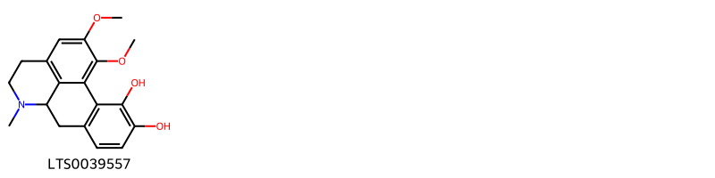{ width=100% }
    <figcaption>Hình ảnh cấu trúc hóa học của 1 hoạt chất thuộc nhóm Aporphines gồm ['15,16-dimethoxy-10-methyl-10-azatetracyclo[7.7.1.0²,⁷.0¹³,¹⁷]heptadeca-1(16),2(7),3,5,13(17),14-hexaene-3,4-diol (LTS0039557)'].</figcaption>
</figure>
#### Nhóm Carboxylic acids and derivatives
<figure markdown="span">
    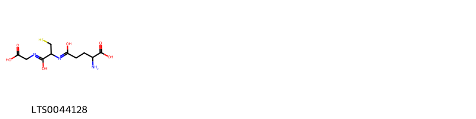{ width=100% }
    <figcaption>Hình ảnh cấu trúc hóa học của 1 hoạt chất thuộc nhóm Carboxylic acids and derivatives gồm ['2-amino-4-{[1-(carboxymethyl-c-hydroxycarbonimidoyl)-2-sulfanylethyl]-c-hydroxycarbonimidoyl}butanoic acid (LTS0044128)'].</figcaption>
</figure>
#### Nhóm Eburnan-type alkaloids
<figure markdown="span">
    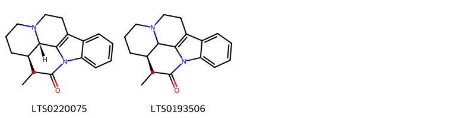{ width=100% }
    <figcaption>Hình ảnh cấu trúc hóa học của 2 hoạt chất thuộc nhóm Eburnan-type alkaloids gồm ['vinburnine (LTS0220075)', '(15s)-15-ethyl-1,11-diazapentacyclo[9.6.2.0²,⁷.0⁸,¹⁸.0¹⁵,¹⁹]nonadeca-2,4,6,8(18)-tetraen-17-one (LTS0193506)'].</figcaption>
</figure>
#### Nhóm Harmala alkaloids
<figure markdown="span">
    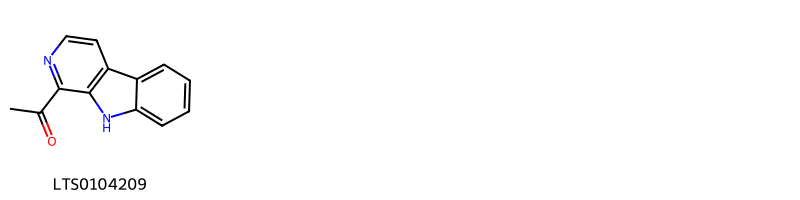{ width=100% }
    <figcaption>Hình ảnh cấu trúc hóa học của 1 hoạt chất thuộc nhóm Harmala alkaloids gồm ['1-acetyl-β-carboline (LTS0104209)'].</figcaption>
</figure>
#### Nhóm Indoles and derivatives
<figure markdown="span">
    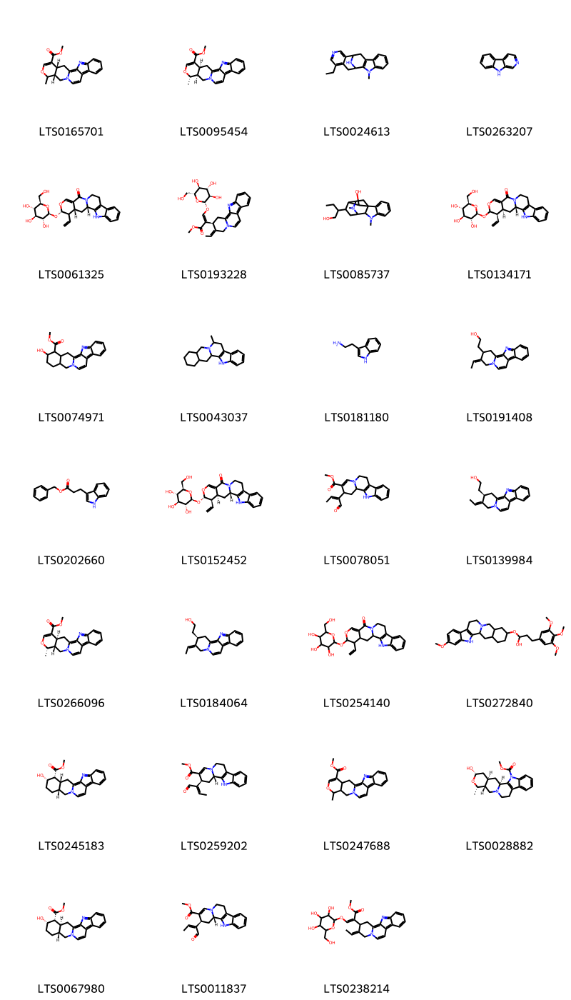{ width=100% }
    <figcaption>Hình ảnh cấu trúc hóa học của 27 hoạt chất thuộc nhóm Indoles and derivatives gồm ['methyl (15r,20r)-16-methyl-17-oxa-3,13-diazapentacyclo[11.8.0.0²,¹⁰.0⁴,⁹.0¹⁵,²⁰]henicosa-1,3,5,7,9,11,18-heptaene-19-carboxylate (LTS0165701)', 'alstonine (LTS0095454)', '17-ethyl-3-methyl-3,15,20-triazapentacyclo[10.7.1.0²,¹⁰.0⁴,⁹.0¹³,¹⁸]icosa-2(10),4,6,8,13(18),14,16-heptaene (LTS0024613)', 'β-carboline (LTS0263207)', '(1s,18s,20r)-19-ethenyl-18-{[(2s,3r,4s,5s,6r)-3,4,5-trihydroxy-6-(hydroxymethyl)oxan-2-yl]oxy}-17-oxa-3,13-diazapentacyclo[11.8.0.0²,¹⁰.0⁴,⁹.0¹⁵,²⁰]henicosa-2(10),4,6,8,15-pentaen-14-one (LTS0061325)', 'methyl (2e)-2-[(2s,3e)-3-ethylidene-1h,2h,4h-indolo[2,3-a]quinolizin-2-yl]-3-{[(2r,3r,4s,5s,6r)-3,4,5-trihydroxy-6-(hydroxymethyl)oxan-2-yl]oxy}prop-2-enoate (LTS0193228)', '14-(1-hydroxybutan-2-yl)-3,16-dimethyl-3,16-diazapentacyclo[10.3.1.1¹⁰,¹³.0²,¹⁰.0⁴,⁹]heptadeca-4,6,8-trien-17-ol (LTS0085737)', '(1s,19r,20s)-19-ethenyl-18-{[(2s,3r,4s,5s,6r)-3,4,5-trihydroxy-6-(hydroxymethyl)oxan-2-yl]oxy}-17-oxa-3,13-diazapentacyclo[11.8.0.0²,¹⁰.0⁴,⁹.0¹⁵,²⁰]henicosa-2(10),4,6,8,15-pentaen-14-one (LTS0134171)', 'methyl 18-hydroxy-3,13-diazapentacyclo[11.8.0.0²,¹⁰.0⁴,⁹.0¹⁵,²⁰]henicosa-1,3,5,7,9,11-hexaene-19-carboxylate (LTS0074971)', '12-methyl-3,13-diazapentacyclo[11.8.0.0²,¹⁰.0⁴,⁹.0¹⁵,²⁰]henicosa-2(10),4,6,8-tetraene (LTS0043037)', 'tryptamine (LTS0181180)', '2-{3-ethylidene-1h,2h,4h-indolo[2,3-a]quinolizin-2-yl}ethanol (LTS0191408)', 'benzyl 3-(1h-indol-3-yl)propanoate (LTS0202660)', 'strictosamide (LTS0152452)', 'methyl 2-(1-oxobut-2-en-2-yl)-1h,2h,6h,7h,12h,12bh-indolo[2,3-a]quinolizine-3-carboxylate (LTS0078051)', '2-[(2r,3e)-3-ethylidene-1h,2h,4h-indolo[2,3-a]quinolizin-2-yl]ethanol (LTS0139984)', '3,4,5,6-tetradehydroajmalicine (LTS0266096)', '2-[(2r,3z)-3-ethylidene-1h,2h,4h-indolo[2,3-a]quinolizin-2-yl]ethanol (LTS0184064)', '19-ethenyl-18-{[3,4,5-trihydroxy-6-(hydroxymethyl)oxan-2-yl]oxy}-17-oxa-3,13-diazapentacyclo[11.8.0.0²,¹⁰.0⁴,⁹.0¹⁵,²⁰]henicosa-2(10),4,6,8,15-pentaen-14-one (LTS0254140)', '1-({6-methoxy-3,13-diazapentacyclo[11.8.0.0²,¹⁰.0⁴,⁹.0¹⁵,²⁰]henicosa-2(10),4,6,8-tetraen-17-yl}oxy)-3-(3,4,5-trimethoxyphenyl)propan-1-ol (LTS0272840)', 'methyl (15r,18s,19r,20r)-18-hydroxy-3,13-diazapentacyclo[11.8.0.0²,¹⁰.0⁴,⁹.0¹⁵,²⁰]henicosa-1,3,5,7,9,11-hexaene-19-carboxylate (LTS0245183)', 'methyl (2s,12bs)-2-[(2e)-1-oxobut-2-en-2-yl]-1h,2h,6h,7h,12h,12bh-indolo[2,3-a]quinolizine-3-carboxylate (LTS0259202)', 'methyl 16-methyl-17-oxa-3,13-diazapentacyclo[11.8.0.0²,¹⁰.0⁴,⁹.0¹⁵,²⁰]henicosa-1,3,5,7,9,11,18-heptaene-19-carboxylate (LTS0247688)', 'methyl (1s,15r,16s,18s,20r)-18-hydroxy-16-methyl-17-oxa-3,13-diazapentacyclo[11.8.0.0²,¹⁰.0⁴,⁹.0¹⁵,²⁰]henicosa-2(10),4,6,8-tetraene-3-carboxylate (LTS0028882)', 'methyl (15r,18s,19r,20s)-18-hydroxy-3,13-diazapentacyclo[11.8.0.0²,¹⁰.0⁴,⁹.0¹⁵,²⁰]henicosa-1,3,5,7,9,11-hexaene-19-carboxylate (LTS0067980)', 'methyl (2s,12bs)-2-[(2z)-1-oxobut-2-en-2-yl]-1h,2h,6h,7h,12h,12bh-indolo[2,3-a]quinolizine-3-carboxylate (LTS0011837)', 'methyl 2-[(3e)-3-ethylidene-1h,2h,4h-indolo[2,3-a]quinolizin-2-yl]-3-{[3,4,5-trihydroxy-6-(hydroxymethyl)oxan-2-yl]oxy}prop-2-enoate (LTS0238214)'].</figcaption>
</figure>
#### Nhóm Macroline alkaloids
<figure markdown="span">
    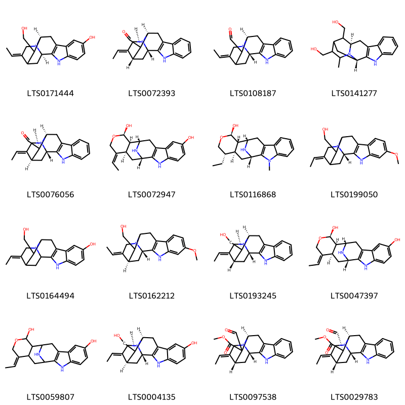{ width=100% }
    <figcaption>Hình ảnh cấu trúc hóa học của 16 hoạt chất thuộc nhóm Macroline alkaloids gồm ['(1r,12s)-15-ethylidene-13-(hydroxymethyl)-3,17-diazapentacyclo[12.3.1.0²,¹⁰.0⁴,⁹.0¹²,¹⁷]octadeca-2(10),4,6,8-tetraen-7-ol (LTS0171444)', '(1s,12s,13r,14s,15e)-15-ethylidene-3,17-diazapentacyclo[12.3.1.0²,¹⁰.0⁴,⁹.0¹²,¹⁷]octadeca-2(10),4,6,8-tetraene-13-carbaldehyde (LTS0072393)', '(1s,12s)-15-ethylidene-3,17-diazapentacyclo[12.3.1.0²,¹⁰.0⁴,⁹.0¹²,¹⁷]octadeca-2(10),4,6,8-tetraene-13-carbaldehyde (LTS0108187)', '[(1s,12r)-13-(hydroxymethyl)-16-methyl-3,17-diazapentacyclo[12.3.1.0²,¹⁰.0⁴,⁹.0¹²,¹⁷]octadeca-2(10),4,6,8-tetraen-15-yl]methanol (LTS0141277)', 'vellosimine (LTS0076056)', '(1s,12s,13r,14r,17e,18r)-17-ethylidene-15-oxa-3,20-diazapentacyclo[10.7.1.0²,¹⁰.0⁴,⁹.0¹³,¹⁸]icosa-2(10),4,6,8-tetraene-7,14-diol (LTS0072947)', '(1s,12s,13s,14r,17s,18s)-17-ethyl-3-methyl-15-oxa-3,20-diazapentacyclo[10.7.1.0²,¹⁰.0⁴,⁹.0¹³,¹⁸]icosa-2(10),4,6,8-tetraen-14-ol (LTS0116868)', '[(1s,15e)-15-ethylidene-6-methoxy-3,17-diazapentacyclo[12.3.1.0²,¹⁰.0⁴,⁹.0¹²,¹⁷]octadeca-2(10),4,6,8-tetraen-13-yl]methanol (LTS0199050)', '15-ethylidene-13-(hydroxymethyl)-3,17-diazapentacyclo[12.3.1.0²,¹⁰.0⁴,⁹.0¹²,¹⁷]octadeca-2(10),4,6,8-tetraen-7-ol (LTS0164494)', '[(1s,14r,15z)-15-ethylidene-6-methoxy-3,17-diazapentacyclo[12.3.1.0²,¹⁰.0⁴,⁹.0¹²,¹⁷]octadeca-2(10),4,6,8-tetraen-13-yl]methanol (LTS0162212)', '[(1s,12s,13r,14s,15e)-15-ethylidene-3,17-diazapentacyclo[12.3.1.0²,¹⁰.0⁴,⁹.0¹²,¹⁷]octadeca-2(10),4,6,8-tetraen-13-yl]methanol (LTS0193245)', '(1s,12s,13r,14r,17z,18r)-17-ethylidene-15-oxa-3,20-diazapentacyclo[10.7.1.0²,¹⁰.0⁴,⁹.0¹³,¹⁸]icosa-2(10),4,6,8-tetraene-7,14-diol (LTS0047397)', '17-ethylidene-15-oxa-3,20-diazapentacyclo[10.7.1.0²,¹⁰.0⁴,⁹.0¹³,¹⁸]icosa-2(10),4,6,8-tetraene-7,14-diol (LTS0059807)', 'sarpagine (LTS0004135)', 'methyl (1s,12s,14r,15e)-15-ethylidene-13-formyl-3,17-diazapentacyclo[12.3.1.0²,¹⁰.0⁴,⁹.0¹²,¹⁷]octadeca-2(10),4,6,8-tetraene-13-carboxylate (LTS0097538)', 'methyl (1s,12s,13r,14r,15e)-15-ethylidene-13-formyl-3,17-diazapentacyclo[12.3.1.0²,¹⁰.0⁴,⁹.0¹²,¹⁷]octadeca-2(10),4,6,8-tetraene-13-carboxylate (LTS0029783)'].</figcaption>
</figure>
#### Nhóm Organooxygen compounds
<figure markdown="span">
    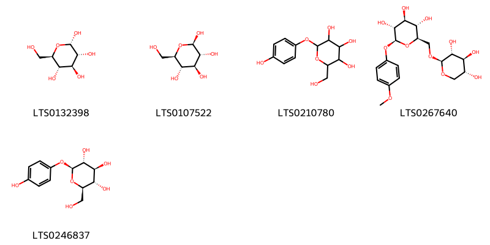{ width=100% }
    <figcaption>Hình ảnh cấu trúc hóa học của 5 hoạt chất thuộc nhóm Organooxygen compounds gồm ['α-glucose (LTS0132398)', 'β-d-glucose (LTS0107522)', 'arbutin (LTS0210780)', '(2s,3r,4s,5s,6r)-2-(4-methoxyphenoxy)-6-({[(2s,3r,4s,5r)-3,4,5-trihydroxyoxan-2-yl]oxy}methyl)oxane-3,4,5-triol (LTS0267640)', 'β-arbutin (LTS0246837)'].</figcaption>
</figure>
#### Nhóm Plumeran-type alkaloids
<figure markdown="span">
    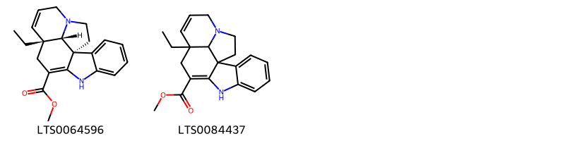{ width=100% }
    <figcaption>Hình ảnh cấu trúc hóa học của 2 hoạt chất thuộc nhóm Plumeran-type alkaloids gồm ['tabersonine (LTS0064596)', 'methyl 12-ethyl-8,16-diazapentacyclo[10.6.1.0¹,⁹.0²,⁷.0¹⁶,¹⁹]nonadeca-2,4,6,9,13-pentaene-10-carboxylate (LTS0084437)'].</figcaption>
</figure>
#### Nhóm Prenol lipids
<figure markdown="span">
    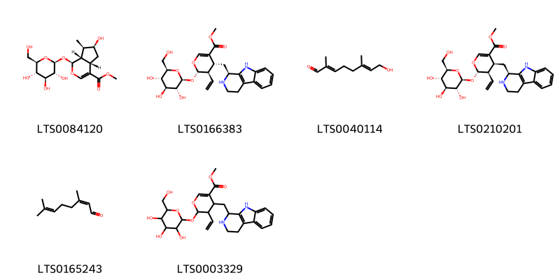{ width=100% }
    <figcaption>Hình ảnh cấu trúc hóa học của 6 hoạt chất thuộc nhóm Prenol lipids gồm ['loganin (LTS0084120)', 'methyl (4r,5r,6s)-5-ethenyl-4-[(1s)-1h,2h,3h,4h,9h-pyrido[3,4-b]indol-1-ylmethyl]-6-{[(2s,3r,4s,5s,6r)-3,4,5-trihydroxy-6-(hydroxymethyl)oxan-2-yl]oxy}-5,6-dihydro-4h-pyran-3-carboxylate (LTS0166383)', '(6e)-8-oxogeraniol (LTS0040114)', 'strictosidine (LTS0210201)', 'neral (LTS0165243)', 'methyl 5-ethenyl-4-{1h,2h,3h,4h,9h-pyrido[3,4-b]indol-1-ylmethyl}-6-{[3,4,5-trihydroxy-6-(hydroxymethyl)oxan-2-yl]oxy}-5,6-dihydro-4h-pyran-3-carboxylate (LTS0003329)'].</figcaption>
</figure>
#### Nhóm Steroids and steroid derivatives
<figure markdown="span">
    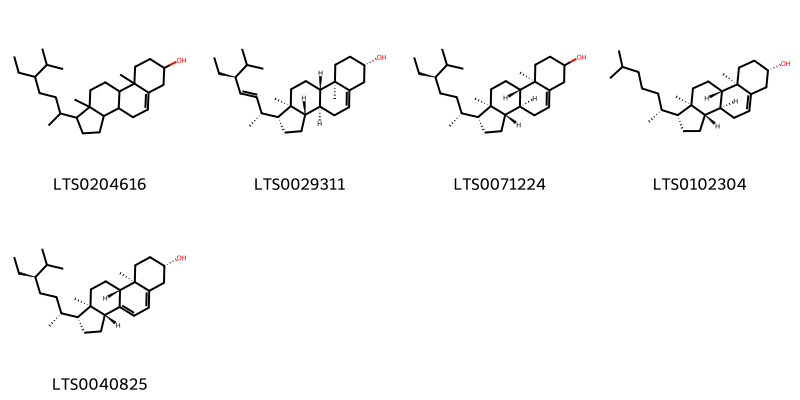{ width=100% }
    <figcaption>Hình ảnh cấu trúc hóa học của 5 hoạt chất thuộc nhóm Steroids and steroid derivatives gồm ['stigmast-5-en-3-ol, (3β)- (LTS0204616)', 'phytosterol (LTS0029311)', 'stigmast-5-en-3-ol (LTS0071224)', 'cholesterol (LTS0102304)', '7-dehydrositosterol (LTS0040825)'].</figcaption>
</figure>
#### Nhóm Strychnos alkaloids
<figure markdown="span">
    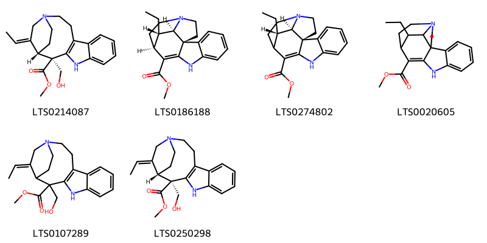{ width=100% }
    <figcaption>Hình ảnh cấu trúc hóa học của 6 hoạt chất thuộc nhóm Strychnos alkaloids gồm ['methyl (1s,2s,16z)-16-ethylidene-2-(hydroxymethyl)-4,14-diazatetracyclo[12.2.2.0³,¹¹.0⁵,¹⁰]octadeca-3(11),5,7,9-tetraene-2-carboxylate (LTS0214087)', '20(s)-tubotaiwine (LTS0186188)', 'methyl (1s,17r,18s)-18-ethyl-8,14-diazapentacyclo[9.5.2.0¹,⁹.0²,⁷.0¹⁴,¹⁷]octadeca-2,4,6,9-tetraene-10-carboxylate (LTS0274802)', 'methyl 18-ethyl-8,14-diazapentacyclo[9.5.2.0¹,⁹.0²,⁷.0¹⁴,¹⁷]octadeca-2,4,6,9-tetraene-10-carboxylate (LTS0020605)', 'methyl (16e)-16-ethylidene-2-(hydroxymethyl)-4,14-diazatetracyclo[12.2.2.0³,¹¹.0⁵,¹⁰]octadeca-3(11),5,7,9-tetraene-2-carboxylate (LTS0107289)', 'stemmadenine (LTS0250298)'].</figcaption>
</figure>
#### Nhóm Yohimbine alkaloids
<figure markdown="span">
    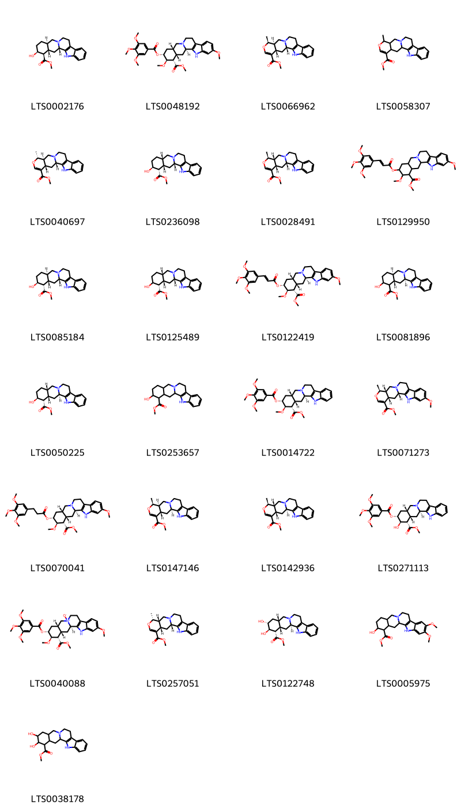{ width=100% }
    <figcaption>Hình ảnh cấu trúc hóa học của 25 hoạt chất thuộc nhóm Yohimbine alkaloids gồm ['yohimbine (LTS0002176)', 'reserpine (LTS0048192)', 'substance ii (LTS0066962)', 'ajmalicine (LTS0058307)', '19-epi-ajmalicine (LTS0040697)', 'rauwolscine (LTS0236098)', 'tetrahydroalstonine (LTS0028491)', 'methyl 6,18-dimethoxy-17-{[(2e)-3-(3,4,5-trimethoxyphenyl)prop-2-enoyl]oxy}-3,13-diazapentacyclo[11.8.0.0²,¹⁰.0⁴,⁹.0¹⁵,²⁰]henicosa-2(10),4,6,8-tetraene-19-carboxylate (LTS0129950)', 'corynanthine (LTS0085184)', 'rauwolscine (LTS0125489)', 'rescinnamine (LTS0122419)', 'methyl (1r,15r,20s)-18-hydroxy-3,13-diazapentacyclo[11.8.0.0²,¹⁰.0⁴,⁹.0¹⁵,²⁰]henicosa-2(10),4,6,8-tetraene-19-carboxylate (LTS0081896)', 'methyl (1r,15s,18s,19s,20s)-18-hydroxy-3,13-diazapentacyclo[11.8.0.0²,¹⁰.0⁴,⁹.0¹⁵,²⁰]henicosa-2(10),4,6,8-tetraene-19-carboxylate (LTS0050225)', 'yohimbine,α- (LTS0253657)', 'deserpidine (LTS0014722)', 'methyl (1s,15s,16s,20s)-6-methoxy-16-methyl-17-oxa-3,13-diazapentacyclo[11.8.0.0²,¹⁰.0⁴,⁹.0¹⁵,²⁰]henicosa-2(10),4,6,8,18-pentaene-19-carboxylate (LTS0071273)', 'methyl (1r,15s,17r,18r,19s,20s)-6,18-dimethoxy-17-{[3-(3,4,5-trimethoxyphenyl)propanoyl]oxy}-3,13-diazapentacyclo[11.8.0.0²,¹⁰.0⁴,⁹.0¹⁵,²⁰]henicosa-2(10),4,6,8-tetraene-19-carboxylate (LTS0070041)', 'methyl (1r,15r,16s,20s)-16-methyl-17-oxa-3,13-diazapentacyclo[11.8.0.0²,¹⁰.0⁴,⁹.0¹⁵,²⁰]henicosa-2(10),4,6,8,18-pentaene-19-carboxylate (LTS0147146)', 'akuammigine (LTS0142936)', 'raunescine (LTS0271113)', '(1r,15s,17r,18r,19s,20s)-6,18-dimethoxy-19-(methoxycarbonyl)-17-(3,4,5-trimethoxybenzoyloxy)-3,13-diazapentacyclo[11.8.0.0²,¹⁰.0⁴,⁹.0¹⁵,²⁰]henicosa-2(10),4,6,8-tetraen-13-ium-13-olate (LTS0040088)', 'methyl (1s,15s,16r,20s)-16-methyl-17-oxa-3,13-diazapentacyclo[11.8.0.0²,¹⁰.0⁴,⁹.0¹⁵,²⁰]henicosa-2(10),4,6,8,18-pentaene-19-carboxylate (LTS0257051)', 'methyl (1r,15s,17r,18r,19s,20s)-17,18-dihydroxy-3,13-diazapentacyclo[11.8.0.0²,¹⁰.0⁴,⁹.0¹⁵,²⁰]henicosa-2(10),4,6,8-tetraene-19-carboxylate (LTS0122748)', 'methyl 18-hydroxy-6,7-dimethoxy-3,13-diazapentacyclo[11.8.0.0²,¹⁰.0⁴,⁹.0¹⁵,²⁰]henicosa-2(10),4,6,8-tetraene-19-carboxylate (LTS0005975)', 'methyl 17,18-dihydroxy-3,13-diazapentacyclo[11.8.0.0²,¹⁰.0⁴,⁹.0¹⁵,²⁰]henicosa-2(10),4,6,8-tetraene-19-carboxylate (LTS0038178)'].</figcaption>
</figure>

---

### Dược dân tộc học

Danh sách các quốc gia có sử dụng *Rauvolfia serpentina* trong điều trị các bệnh. 

| Country   | Disease                                  | Bệnh                                                                                                                                                                                                |
|:----------|:-----------------------------------------|:----------------------------------------------------------------------------------------------------------------------------------------------------------------------------------------------------|
| Asia      | Poison                                   | MYMEMORY WARNING: YOU USED ALL AVAILABLE FREE TRANSLATIONS FOR TODAY. NEXT AVAILABLE IN  12 HOURS 14 MINUTES 30 SECONDS VISIT HTTPS://MYMEMORY.TRANSLATED.NET/DOC/USAGELIMITS.PHP TO TRANSLATE MORE |
| Chinese   | Sedative                                 | MYMEMORY WARNING: YOU USED ALL AVAILABLE FREE TRANSLATIONS FOR TODAY. NEXT AVAILABLE IN  12 HOURS 14 MINUTES 27 SECONDS VISIT HTTPS://MYMEMORY.TRANSLATED.NET/DOC/USAGELIMITS.PHP TO TRANSLATE MORE |
| India     | Poison, Sedative, Sedative, Tranquilizer | MYMEMORY WARNING: YOU USED ALL AVAILABLE FREE TRANSLATIONS FOR TODAY. NEXT AVAILABLE IN  12 HOURS 14 MINUTES 24 SECONDS VISIT HTTPS://MYMEMORY.TRANSLATED.NET/DOC/USAGELIMITS.PHP TO TRANSLATE MORE |
| Malaysia  | Uterotonic                               | MYMEMORY WARNING: YOU USED ALL AVAILABLE FREE TRANSLATIONS FOR TODAY. NEXT AVAILABLE IN  12 HOURS 14 MINUTES 21 SECONDS VISIT HTTPS://MYMEMORY.TRANSLATED.NET/DOC/USAGELIMITS.PHP TO TRANSLATE MORE |
| Nepal     | Hypnotic, Hypotensive                    | MYMEMORY WARNING: YOU USED ALL AVAILABLE FREE TRANSLATIONS FOR TODAY. NEXT AVAILABLE IN  12 HOURS 14 MINUTES 18 SECONDS VISIT HTTPS://MYMEMORY.TRANSLATED.NET/DOC/USAGELIMITS.PHP TO TRANSLATE MORE |
| Sanscrit  | Hypnotic, Tonic                          | MYMEMORY WARNING: YOU USED ALL AVAILABLE FREE TRANSLATIONS FOR TODAY. NEXT AVAILABLE IN  12 HOURS 14 MINUTES 15 SECONDS VISIT HTTPS://MYMEMORY.TRANSLATED.NET/DOC/USAGELIMITS.PHP TO TRANSLATE MORE |
| Turkey    | Hypnotic, Poison, Sedative, Uterotonic   | MYMEMORY WARNING: YOU USED ALL AVAILABLE FREE TRANSLATIONS FOR TODAY. NEXT AVAILABLE IN  12 HOURS 14 MINUTES 12 SECONDS VISIT HTTPS://MYMEMORY.TRANSLATED.NET/DOC/USAGELIMITS.PHP TO TRANSLATE MORE |

---

---
## Rauvolfia tetraphylla
### Thông tin về thực vật

!!! info "Phân loại thực vật của *Rauvolfia tetraphylla* từ GIBF:"
    - **Kingdom:** Plantae
    - **Phylum:** Tracheophyta
    - **Order:** Gentianales
    - **Family:** Apocynaceae
    - **Genus:** Rauvolfia
    - **Species:** *Rauvolfia tetraphylla*

 

| Label (VI)   | Label (EN)   | Scientific Name       | Descriptions (VI)   | Descriptions (EN)   | Also Known As (VI)   | Also Known As (EN)   |
|:-------------|:-------------|:----------------------|:--------------------|:--------------------|:---------------------|:---------------------|
| N/A          | N/A          | Rauvolfia tetraphylla | loài thực vật       | species of plant    | ['']                 | ['']                 |

#### Phân bố trên thế giới

**Từ CSDL GIBF** Sri Lanka, Mexico, Nicaragua, Guatemala, El Salvador, Chinese Taipei, Costa Rica, Nepal, Australia, Colombia, Honduras, India, Ecuador, Belize

#### Phân bố tại Việt Nam

**Từ CSDL GIBF**: Không có ghi nhận ở Việt Nam

---
### Thành phần hóa học
        
- Theo cơ sở dữ liệu lotus: Từ loài *Rauvolfia tetraphylla* đã phân lập và xác định được 17 hoạt chất thuộc về các nhóm Ajmaline-sarpagine alkaloids, Prenol lipids, Yohimbine alkaloids, Indoles and derivatives. 

|    | chemicalTaxonomyClassyfireClass   |   smiles_count |
|---:|:----------------------------------|---------------:|
|  0 | Ajmaline-sarpagine alkaloids      |              2 |
|  1 | Indoles and derivatives           |              1 |
|  2 | Prenol lipids                     |              3 |
|  3 | Yohimbine alkaloids               |             11 |

#### Nhóm Ajmaline-sarpagine alkaloids
<figure markdown="span">
    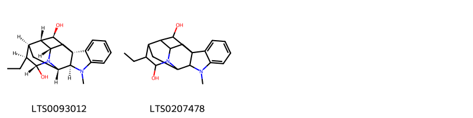{ width=100% }
    <figcaption>Hình ảnh cấu trúc hóa học của 2 hoạt chất thuộc nhóm Ajmaline-sarpagine alkaloids gồm ['(1r,9r,10s,12r,13s,14r,16s,17s,18r)-13-ethyl-8-methyl-8,15-diazahexacyclo[14.2.1.0¹,⁹.0²,⁷.0¹⁰,¹⁵.0¹²,¹⁷]nonadeca-2,4,6-triene-14,18-diol (LTS0093012)', 'siddiqui (LTS0207478)'].</figcaption>
</figure>
#### Nhóm Indoles and derivatives
<figure markdown="span">
    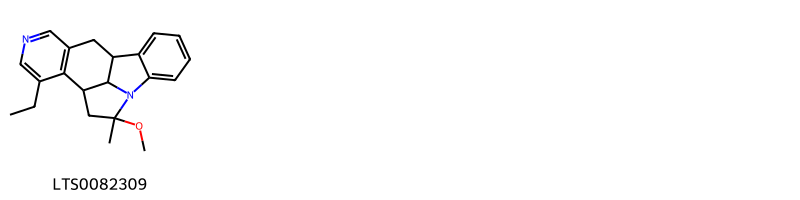{ width=100% }
    <figcaption>Hình ảnh cấu trúc hóa học của 1 hoạt chất thuộc nhóm Indoles and derivatives gồm ['13-ethyl-9-methoxy-9-methyl-8,15-diazapentacyclo[9.7.1.0²,⁷.0⁸,¹⁹.0¹²,¹⁷]nonadeca-2,4,6,12(17),13,15-hexaene (LTS0082309)'].</figcaption>
</figure>
#### Nhóm Prenol lipids
<figure markdown="span">
    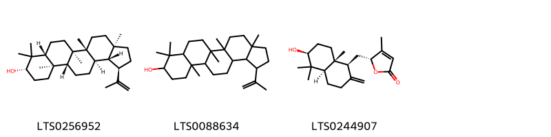{ width=100% }
    <figcaption>Hình ảnh cấu trúc hóa học của 3 hoạt chất thuộc nhóm Prenol lipids gồm ['lupeol (LTS0256952)', 'lupeol (LTS0088634)', '(5r)-5-{[(1s,4ar,6s,8ar)-6-hydroxy-5,5,8a-trimethyl-2-methylidene-hexahydro-1h-naphthalen-1-yl]methyl}-4-methyl-5h-furan-2-one (LTS0244907)'].</figcaption>
</figure>
#### Nhóm Yohimbine alkaloids
<figure markdown="span">
    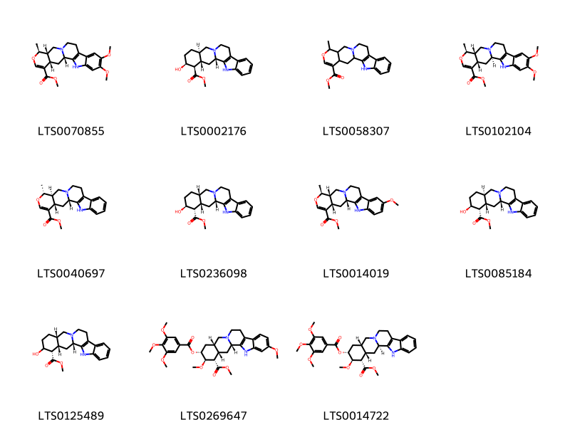{ width=100% }
    <figcaption>Hình ảnh cấu trúc hóa học của 11 hoạt chất thuộc nhóm Yohimbine alkaloids gồm ['3-isoreserpiline (LTS0070855)', 'yohimbine (LTS0002176)', 'ajmalicine (LTS0058307)', 'reserpiline (LTS0102104)', '19-epi-ajmalicine (LTS0040697)', 'rauwolscine (LTS0236098)', 'aricin (LTS0014019)', 'corynanthine (LTS0085184)', 'rauwolscine (LTS0125489)', 'methyl (1s,15s,17r,18r,19s,20s)-6,18-dimethoxy-17-(3,4,5-trimethoxybenzoyloxy)-3,13-diazapentacyclo[11.8.0.0²,¹⁰.0⁴,⁹.0¹⁵,²⁰]henicosa-2(10),4,6,8-tetraene-19-carboxylate (LTS0269647)', 'deserpidine (LTS0014722)'].</figcaption>
</figure>

---

### Dược dân tộc học

Danh sách các quốc gia có sử dụng *Rauvolfia tetraphylla* trong điều trị các bệnh. 

| Country   | Disease      | Bệnh                                                                                                                                                                                                |
|:----------|:-------------|:----------------------------------------------------------------------------------------------------------------------------------------------------------------------------------------------------|
| Elsewhere | Parasiticide | MYMEMORY WARNING: YOU USED ALL AVAILABLE FREE TRANSLATIONS FOR TODAY. NEXT AVAILABLE IN  12 HOURS 13 MINUTES 16 SECONDS VISIT HTTPS://MYMEMORY.TRANSLATED.NET/DOC/USAGELIMITS.PHP TO TRANSLATE MORE |

---

---
## Rauvolfia vomitoria
### Thông tin về thực vật

!!! info "Phân loại thực vật của *Rauvolfia vomitoria* từ GIBF:"
    - **Kingdom:** Plantae
    - **Phylum:** Tracheophyta
    - **Order:** Gentianales
    - **Family:** Apocynaceae
    - **Genus:** Rauvolfia
    - **Species:** *Rauvolfia vomitoria*

 

| Label (VI)   | Label (EN)   | Scientific Name     | Descriptions (VI)   | Descriptions (EN)   | Also Known As (VI)   | Also Known As (EN)   |
|:-------------|:-------------|:--------------------|:--------------------|:--------------------|:---------------------|:---------------------|
| N/A          | N/A          | Rauvolfia vomitoria | loài thực vật       | species of plant    | ['']                 | ['']                 |

#### Phân bố trên thế giới

**Từ CSDL GIBF** Brazil, Benin, Uganda, United States of America, Gabon, China, Liberia, Côte d’Ivoire, Nigeria, Sao Tome and Principe, Togo, Sierra Leone, Cameroon, Guinea, Ghana

#### Phân bố tại Việt Nam

**Từ CSDL GIBF**: Không có ghi nhận ở Việt Nam

---
### Thành phần hóa học
        
- Theo cơ sở dữ liệu lotus: Từ loài *Rauvolfia vomitoria* đã phân lập và xác định được 32 hoạt chất thuộc về các nhóm Fatty Acyls, Ajmaline-sarpagine alkaloids, Benzene and substituted derivatives, Yohimbine alkaloids, Flavonoids, Macroline alkaloids, Steroids and steroid derivatives, Corynanthean-type alkaloids, Prenol lipids, Indoles and derivatives. 

|    | chemicalTaxonomyClassyfireClass     |   smiles_count |
|---:|:------------------------------------|---------------:|
|  0 | Ajmaline-sarpagine alkaloids        |              4 |
|  1 | Benzene and substituted derivatives |              1 |
|  2 | Corynanthean-type alkaloids         |              3 |
|  3 | Fatty Acyls                         |              1 |
|  4 | Flavonoids                          |              2 |
|  5 | Indoles and derivatives             |              2 |
|  6 | Macroline alkaloids                 |              1 |
|  7 | Prenol lipids                       |              6 |
|  8 | Steroids and steroid derivatives    |              6 |
|  9 | Yohimbine alkaloids                 |              5 |

#### Nhóm Ajmaline-sarpagine alkaloids
<figure markdown="span">
    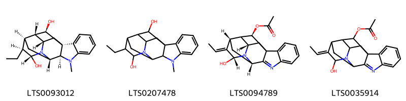{ width=100% }
    <figcaption>Hình ảnh cấu trúc hóa học của 4 hoạt chất thuộc nhóm Ajmaline-sarpagine alkaloids gồm ['(1r,9r,10s,12r,13s,14r,16s,17s,18r)-13-ethyl-8-methyl-8,15-diazahexacyclo[14.2.1.0¹,⁹.0²,⁷.0¹⁰,¹⁵.0¹²,¹⁷]nonadeca-2,4,6-triene-14,18-diol (LTS0093012)', 'siddiqui (LTS0207478)', '(10s,12s,13e,14r,16s,18r)-13-ethylidene-14-hydroxy-8,15-diazahexacyclo[14.2.1.0¹,⁹.0²,⁷.0¹⁰,¹⁵.0¹²,¹⁷]nonadeca-2,4,6,8-tetraen-18-yl acetate (LTS0094789)', '13-ethylidene-14-hydroxy-8,15-diazahexacyclo[14.2.1.0¹,⁹.0²,⁷.0¹⁰,¹⁵.0¹²,¹⁷]nonadeca-2,4,6,8-tetraen-18-yl acetate (LTS0035914)'].</figcaption>
</figure>
#### Nhóm Benzene and substituted derivatives
<figure markdown="span">
    { width=100% }
    <figcaption>Hình ảnh cấu trúc hóa học của 1 hoạt chất thuộc nhóm Benzene and substituted derivatives gồm ['galop (LTS0222857)'].</figcaption>
</figure>
#### Nhóm Corynanthean-type alkaloids
<figure markdown="span">
    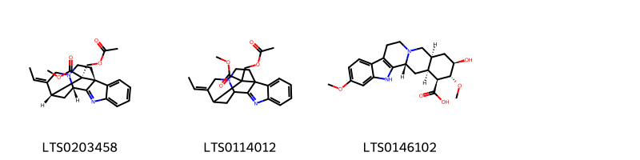{ width=100% }
    <figcaption>Hình ảnh cấu trúc hóa học của 3 hoạt chất thuộc nhóm Corynanthean-type alkaloids gồm ['methyl (1s,10s,12r,18r)-18-[(acetyloxy)methyl]-13-ethylidene-8,15-diazapentacyclo[10.5.1.0¹,⁹.0²,⁷.0¹⁰,¹⁵]octadeca-2,4,6,8-tetraene-18-carboxylate (LTS0203458)', 'methyl (13z)-18-[(acetyloxy)methyl]-13-ethylidene-8,15-diazapentacyclo[10.5.1.0¹,⁹.0²,⁷.0¹⁰,¹⁵]octadeca-2,4,6,8-tetraene-18-carboxylate (LTS0114012)', 'reserpic acid (LTS0146102)'].</figcaption>
</figure>
#### Nhóm Fatty Acyls
<figure markdown="span">
    { width=100% }
    <figcaption>Hình ảnh cấu trúc hóa học của 1 hoạt chất thuộc nhóm Fatty Acyls gồm ['palmitic acid (LTS0079439)'].</figcaption>
</figure>
#### Nhóm Flavonoids
<figure markdown="span">
    { width=100% }
    <figcaption>Hình ảnh cấu trúc hóa học của 2 hoạt chất thuộc nhóm Flavonoids gồm ['kaempherol (LTS0155822)', 'quercetin (LTS0004651)'].</figcaption>
</figure>
#### Nhóm Indoles and derivatives
<figure markdown="span">
    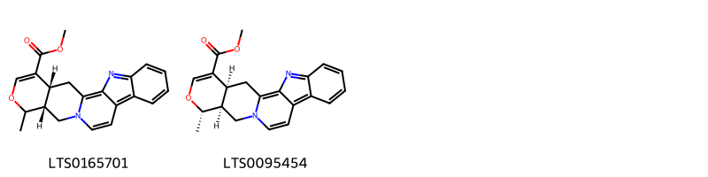{ width=100% }
    <figcaption>Hình ảnh cấu trúc hóa học của 2 hoạt chất thuộc nhóm Indoles and derivatives gồm ['methyl (15r,20r)-16-methyl-17-oxa-3,13-diazapentacyclo[11.8.0.0²,¹⁰.0⁴,⁹.0¹⁵,²⁰]henicosa-1,3,5,7,9,11,18-heptaene-19-carboxylate (LTS0165701)', 'alstonine (LTS0095454)'].</figcaption>
</figure>
#### Nhóm Macroline alkaloids
<figure markdown="span">
    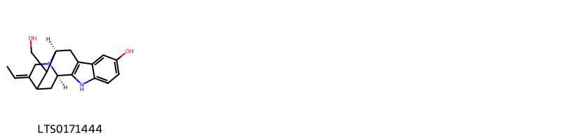{ width=100% }
    <figcaption>Hình ảnh cấu trúc hóa học của 1 hoạt chất thuộc nhóm Macroline alkaloids gồm ['(1r,12s)-15-ethylidene-13-(hydroxymethyl)-3,17-diazapentacyclo[12.3.1.0²,¹⁰.0⁴,⁹.0¹²,¹⁷]octadeca-2(10),4,6,8-tetraen-7-ol (LTS0171444)'].</figcaption>
</figure>
#### Nhóm Prenol lipids
<figure markdown="span">
    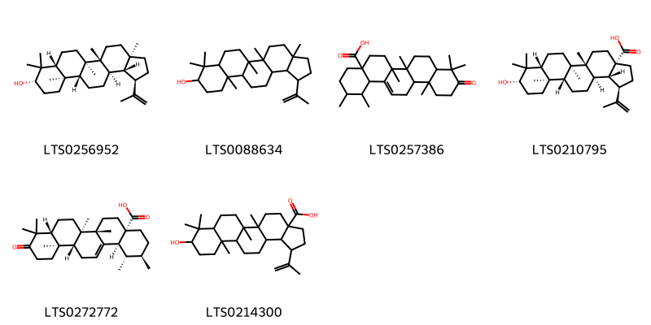{ width=100% }
    <figcaption>Hình ảnh cấu trúc hóa học của 6 hoạt chất thuộc nhóm Prenol lipids gồm ['lupeol (LTS0256952)', 'lupeol (LTS0088634)', '1,2,6a,6b,9,9,12a-heptamethyl-10-oxo-1,2,3,4,5,6,7,8,8a,11,12,12b,13,14b-tetradecahydropicene-4a-carboxylic acid (LTS0257386)', 'betulinic acid (LTS0210795)', '(1s,2r,4as,6as,6br,8ar,12ar,12br,14bs)-1,2,6a,6b,9,9,12a-heptamethyl-10-oxo-1,2,3,4,5,6,7,8,8a,11,12,12b,13,14b-tetradecahydropicene-4a-carboxylic acid (LTS0272772)', '9-hydroxy-5a,5b,8,8,11a-pentamethyl-1-(prop-1-en-2-yl)-hexadecahydrocyclopenta[a]chrysene-3a-carboxylic acid (LTS0214300)'].</figcaption>
</figure>
#### Nhóm Steroids and steroid derivatives
<figure markdown="span">
    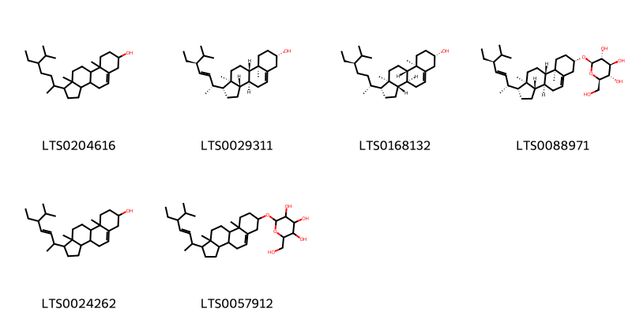{ width=100% }
    <figcaption>Hình ảnh cấu trúc hóa học của 6 hoạt chất thuộc nhóm Steroids and steroid derivatives gồm ['stigmast-5-en-3-ol, (3β)- (LTS0204616)', 'phytosterol (LTS0029311)', 'sitosterol (LTS0168132)', '(2r,3r,4s,5s,6r)-2-{[(1r,3as,3bs,7s,9ar,9bs,11ar)-1-[(2r,3e,5s)-5-ethyl-6-methylhept-3-en-2-yl]-9a,11a-dimethyl-1h,2h,3h,3ah,3bh,4h,6h,7h,8h,9h,9bh,10h,11h-cyclopenta[a]phenanthren-7-yl]oxy}-6-(hydroxymethyl)oxane-3,4,5-triol (LTS0088971)', 'stigmasterol (LTS0024262)', '2-{[1-(5-ethyl-6-methylhept-3-en-2-yl)-9a,11a-dimethyl-1h,2h,3h,3ah,3bh,4h,6h,7h,8h,9h,9bh,10h,11h-cyclopenta[a]phenanthren-7-yl]oxy}-6-(hydroxymethyl)oxane-3,4,5-triol (LTS0057912)'].</figcaption>
</figure>
#### Nhóm Yohimbine alkaloids
<figure markdown="span">
    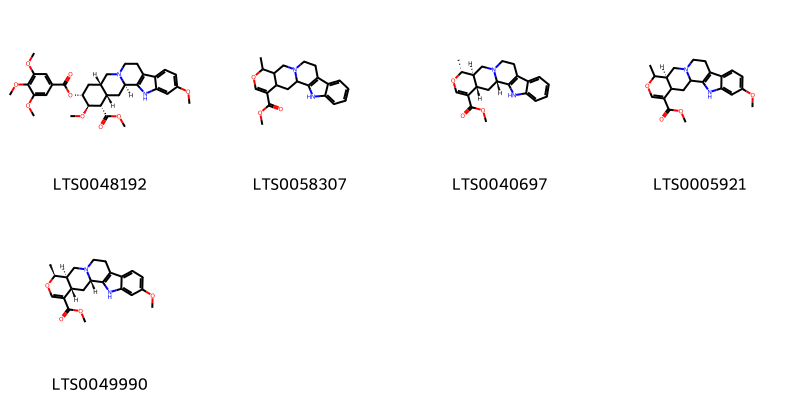{ width=100% }
    <figcaption>Hình ảnh cấu trúc hóa học của 5 hoạt chất thuộc nhóm Yohimbine alkaloids gồm ['reserpine (LTS0048192)', 'ajmalicine (LTS0058307)', '19-epi-ajmalicine (LTS0040697)', 'methyl (15r)-6-methoxy-16-methyl-17-oxa-3,13-diazapentacyclo[11.8.0.0²,¹⁰.0⁴,⁹.0¹⁵,²⁰]henicosa-2(10),4,6,8,18-pentaene-19-carboxylate (LTS0005921)', 'methyl (1s,15r,16s,20s)-6-methoxy-16-methyl-17-oxa-3,13-diazapentacyclo[11.8.0.0²,¹⁰.0⁴,⁹.0¹⁵,²⁰]henicosa-2(10),4,6,8,18-pentaene-19-carboxylate (LTS0049990)'].</figcaption>
</figure>

---

### Dược dân tộc học

Danh sách các quốc gia có sử dụng *Rauvolfia vomitoria* trong điều trị các bệnh. 

| Country     | Disease                                  | Bệnh                                                                                                                                                                                                |
|:------------|:-----------------------------------------|:----------------------------------------------------------------------------------------------------------------------------------------------------------------------------------------------------|
| Africa      | Purgative, Sedative, Aphrodisiac, Emetic | MYMEMORY WARNING: YOU USED ALL AVAILABLE FREE TRANSLATIONS FOR TODAY. NEXT AVAILABLE IN  12 HOURS 12 MINUTES 38 SECONDS VISIT HTTPS://MYMEMORY.TRANSLATED.NET/DOC/USAGELIMITS.PHP TO TRANSLATE MORE |
| E Africa    | Pediculicide                             | MYMEMORY WARNING: YOU USED ALL AVAILABLE FREE TRANSLATIONS FOR TODAY. NEXT AVAILABLE IN  12 HOURS 12 MINUTES 34 SECONDS VISIT HTTPS://MYMEMORY.TRANSLATED.NET/DOC/USAGELIMITS.PHP TO TRANSLATE MORE |
| Ghana       | Purgative                                | MYMEMORY WARNING: YOU USED ALL AVAILABLE FREE TRANSLATIONS FOR TODAY. NEXT AVAILABLE IN  12 HOURS 12 MINUTES 29 SECONDS VISIT HTTPS://MYMEMORY.TRANSLATED.NET/DOC/USAGELIMITS.PHP TO TRANSLATE MORE |
| Nigeria     | Sedative                                 | MYMEMORY WARNING: YOU USED ALL AVAILABLE FREE TRANSLATIONS FOR TODAY. NEXT AVAILABLE IN  12 HOURS 12 MINUTES 21 SECONDS VISIT HTTPS://MYMEMORY.TRANSLATED.NET/DOC/USAGELIMITS.PHP TO TRANSLATE MORE |
| Upper Volta | Aphrodisiac, Emetic                      | MYMEMORY WARNING: YOU USED ALL AVAILABLE FREE TRANSLATIONS FOR TODAY. NEXT AVAILABLE IN  12 HOURS 12 MINUTES 15 SECONDS VISIT HTTPS://MYMEMORY.TRANSLATED.NET/DOC/USAGELIMITS.PHP TO TRANSLATE MORE |

---

# Chi Leuconotis

??? note "Danh sách các dược liệu thuộc chi"
    
	 - *Leuconotis eugeniifolius*

---
## Leuconotis eugeniifolius
### Thông tin về thực vật

!!! info "Phân loại thực vật của *Leuconotis eugeniifolia* từ GIBF:"
    - **Kingdom:** Plantae
    - **Phylum:** Tracheophyta
    - **Order:** Gentianales
    - **Family:** Apocynaceae
    - **Genus:** Leuconotis
    - **Species:** *Leuconotis eugeniifolia*

 

| Label (VI)   | Label (EN)   | Scientific Name     | Descriptions (VI)   | Descriptions (EN)   | Also Known As (VI)   | Also Known As (EN)   |
|:-------------|:-------------|:--------------------|:--------------------|:--------------------|:---------------------|:---------------------|
| N/A          | N/A          | Rauvolfia vomitoria | loài thực vật       | species of plant    | ['']                 | ['']                 |

#### Phân bố trên thế giới

**Từ CSDL GIBF** nan, Singapore, Indonesia, Malaysia, Tanzania, United Republic of, unknown or invalid, Brunei Darussalam

#### Phân bố tại Việt Nam

**Từ CSDL GIBF**: Không có ghi nhận ở Việt Nam

---
### Thành phần hóa học
        
- Theo cơ sở dữ liệu lotus: Từ loài *Leuconotis eugeniifolia* đã phân lập và xác định được Chưa có hoạt chất nào được phân lập. hoạt chất thuộc về các nhóm Không có hoạt chất nào được phân lập. 

Không có hình ảnh nào được tạo ra

---

### Dược dân tộc học

Danh sách các quốc gia có sử dụng *Leuconotis eugeniifolia* trong điều trị các bệnh. 

| Country   | Disease   | Bệnh                                                                                                                                                                                                |
|:----------|:----------|:----------------------------------------------------------------------------------------------------------------------------------------------------------------------------------------------------|
| Malaya    | Vermifuge | MYMEMORY WARNING: YOU USED ALL AVAILABLE FREE TRANSLATIONS FOR TODAY. NEXT AVAILABLE IN  12 HOURS 11 MINUTES 23 SECONDS VISIT HTTPS://MYMEMORY.TRANSLATED.NET/DOC/USAGELIMITS.PHP TO TRANSLATE MORE |

---

# Chi Malouetia

??? note "Danh sách các dược liệu thuộc chi"
    
	 - *Malouetia nitida*
	 - *Malouetia tamaquarina*

---
## Malouetia nitida
### Thông tin về thực vật

!!! info "Phân loại thực vật của *Malouetia nitida* từ GIBF:"
    - **Kingdom:** Plantae
    - **Phylum:** Tracheophyta
    - **Order:** Gentianales
    - **Family:** Apocynaceae
    - **Genus:** Malouetia
    - **Species:** *Malouetia nitida*

 

| Label (VI)   | Label (EN)   | Scientific Name   | Descriptions (VI)   | Descriptions (EN)   | Also Known As (VI)   | Also Known As (EN)   |
|:-------------|:-------------|:------------------|:--------------------|:--------------------|:---------------------|:---------------------|
| N/A          | N/A          | Malouetia nitida  |                     | species of plant    | ['']                 | ['']                 |

#### Phân bố trên thế giới

**Từ CSDL GIBF** nan, Colombia, Brazil

#### Phân bố tại Việt Nam

**Từ CSDL GIBF**: Không có ghi nhận ở Việt Nam

---
### Thành phần hóa học
        
- Theo cơ sở dữ liệu lotus: Từ loài *Malouetia nitida* đã phân lập và xác định được Chưa có hoạt chất nào được phân lập. hoạt chất thuộc về các nhóm Không có hoạt chất nào được phân lập. 

Không có hình ảnh nào được tạo ra

---

### Dược dân tộc học

Danh sách các quốc gia có sử dụng *Malouetia nitida* trong điều trị các bệnh. 

| Country   | Disease   | Bệnh                                                                                                                                                                                                |
|:----------|:----------|:----------------------------------------------------------------------------------------------------------------------------------------------------------------------------------------------------|
| Venezuela | Poison    | MYMEMORY WARNING: YOU USED ALL AVAILABLE FREE TRANSLATIONS FOR TODAY. NEXT AVAILABLE IN  12 HOURS 10 MINUTES 54 SECONDS VISIT HTTPS://MYMEMORY.TRANSLATED.NET/DOC/USAGELIMITS.PHP TO TRANSLATE MORE |

---

---
## Malouetia tamaquarina
### Thông tin về thực vật

!!! info "Phân loại thực vật của *Malouetia tamaquarina* từ GIBF:"
    - **Kingdom:** Plantae
    - **Phylum:** Tracheophyta
    - **Order:** Gentianales
    - **Family:** Apocynaceae
    - **Genus:** Malouetia
    - **Species:** *Malouetia tamaquarina*

 

| Label (VI)   | Label (EN)   | Scientific Name       | Descriptions (VI)   | Descriptions (EN)   | Also Known As (VI)   | Also Known As (EN)   |
|:-------------|:-------------|:----------------------|:--------------------|:--------------------|:---------------------|:---------------------|
| N/A          | N/A          | Malouetia tamaquarina | loài thực vật       | species of plant    | ['']                 | ['']                 |

#### Phân bố trên thế giới

**Từ CSDL GIBF** nan, Brazil, Suriname, Colombia, Peru, French Guiana, Bolivia (Plurinational State of), Guyana, Venezuela (Bolivarian Republic of)

#### Phân bố tại Việt Nam

**Từ CSDL GIBF**: Không có ghi nhận ở Việt Nam

---
### Thành phần hóa học
        
- Theo cơ sở dữ liệu lotus: Từ loài *Malouetia tamaquarina* đã phân lập và xác định được 6 hoạt chất thuộc về các nhóm Steroids and steroid derivatives. 

|    | chemicalTaxonomyClassyfireClass   |   smiles_count |
|---:|:----------------------------------|---------------:|
|  0 | Steroids and steroid derivatives  |              6 |

#### Nhóm Steroids and steroid derivatives
<figure markdown="span">
    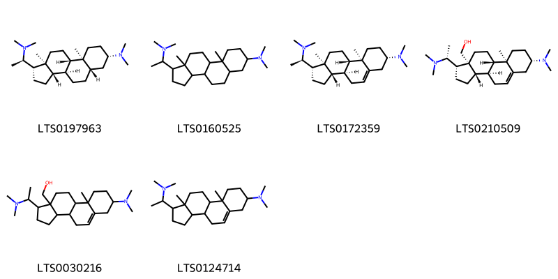{ width=100% }
    <figcaption>Hình ảnh cấu trúc hóa học của 6 hoạt chất thuộc nhóm Steroids and steroid derivatives gồm ['(1s,3as,3br,5as,7s,9as,9bs,11as)-1-[(1r)-1-(dimethylamino)ethyl]-n,n,9a,11a-tetramethyl-tetradecahydro-1h-cyclopenta[a]phenanthren-7-amine (LTS0197963)', '1-[1-(dimethylamino)ethyl]-n,n,9a,11a-tetramethyl-tetradecahydro-1h-cyclopenta[a]phenanthren-7-amine (LTS0160525)', '(1s,3as,3bs,7s,9ar,9bs,11as)-1-[(1r)-1-(dimethylamino)ethyl]-n,n,9a,11a-tetramethyl-1h,2h,3h,3ah,3bh,4h,6h,7h,8h,9h,9bh,10h,11h-cyclopenta[a]phenanthren-7-amine (LTS0172359)', '[(1s,3as,3br,7s,9ar,9bs,11ar)-7-(dimethylamino)-1-[(1r)-1-(dimethylamino)ethyl]-9a-methyl-1h,2h,3h,3ah,3bh,4h,6h,7h,8h,9h,9bh,10h,11h-cyclopenta[a]phenanthren-11a-yl]methanol (LTS0210509)', '[7-(dimethylamino)-1-[1-(dimethylamino)ethyl]-9a-methyl-1h,2h,3h,3ah,3bh,4h,6h,7h,8h,9h,9bh,10h,11h-cyclopenta[a]phenanthren-11a-yl]methanol (LTS0030216)', '1-[1-(dimethylamino)ethyl]-n,n,9a,11a-tetramethyl-1h,2h,3h,3ah,3bh,4h,6h,7h,8h,9h,9bh,10h,11h-cyclopenta[a]phenanthren-7-amine (LTS0124714)'].</figcaption>
</figure>

---

### Dược dân tộc học

Danh sách các quốc gia có sử dụng *Malouetia tamaquarina* trong điều trị các bệnh. 

| Country   | Disease   | Bệnh                                                                                                                                                                                                |
|:----------|:----------|:----------------------------------------------------------------------------------------------------------------------------------------------------------------------------------------------------|
| Colombia  | Narcotic  | MYMEMORY WARNING: YOU USED ALL AVAILABLE FREE TRANSLATIONS FOR TODAY. NEXT AVAILABLE IN  12 HOURS 10 MINUTES 14 SECONDS VISIT HTTPS://MYMEMORY.TRANSLATED.NET/DOC/USAGELIMITS.PHP TO TRANSLATE MORE |

---

# Chi Rhabdadenia

??? note "Danh sách các dược liệu thuộc chi"
    
	 - *Rhabdadenia biflora*
	 - *Rhabdadenia paludosa*

---
## Rhabdadenia biflora
### Thông tin về thực vật

!!! info "Phân loại thực vật của *Rhabdadenia biflora* từ GIBF:"
    - **Kingdom:** Plantae
    - **Phylum:** Tracheophyta
    - **Order:** Gentianales
    - **Family:** Apocynaceae
    - **Genus:** Rhabdadenia
    - **Species:** *Rhabdadenia biflora*

 

| Label (VI)   | Label (EN)   | Scientific Name     | Descriptions (VI)   | Descriptions (EN)   | Also Known As (VI)   | Also Known As (EN)                   |
|:-------------|:-------------|:--------------------|:--------------------|:--------------------|:---------------------|:-------------------------------------|
| N/A          | N/A          | Rhabdadenia biflora | loài thực vật       | species of plant    | ['']                 | ['Echites biflorus', 'Mangrovevine'] |

#### Phân bố trên thế giới

**Từ CSDL GIBF** Mexico, Nicaragua, Brazil, United States of America, Puerto Rico, Guadeloupe, Haiti, Dominican Republic, Cuba, French Guiana, Belize, Cayman Islands

#### Phân bố tại Việt Nam

**Từ CSDL GIBF**: Không có ghi nhận ở Việt Nam

---
### Thành phần hóa học
        
- Theo cơ sở dữ liệu lotus: Từ loài *Rhabdadenia biflora* đã phân lập và xác định được Chưa có hoạt chất nào được phân lập. hoạt chất thuộc về các nhóm Không có hoạt chất nào được phân lập. 

Không có hình ảnh nào được tạo ra

---

### Dược dân tộc học

Danh sách các quốc gia có sử dụng *Rhabdadenia biflora* trong điều trị các bệnh. 

| Country   | Disease   | Bệnh                                                                                                                                                                                                |
|:----------|:----------|:----------------------------------------------------------------------------------------------------------------------------------------------------------------------------------------------------|
| Elsewhere | Vesicant  | MYMEMORY WARNING: YOU USED ALL AVAILABLE FREE TRANSLATIONS FOR TODAY. NEXT AVAILABLE IN  12 HOURS 09 MINUTES 36 SECONDS VISIT HTTPS://MYMEMORY.TRANSLATED.NET/DOC/USAGELIMITS.PHP TO TRANSLATE MORE |

---

---
## Rhabdadenia paludosa
### Thông tin về thực vật

!!! info "Phân loại thực vật của *Rhabdadenia biflora* từ GIBF:"
    - **Kingdom:** Plantae
    - **Phylum:** Tracheophyta
    - **Order:** Gentianales
    - **Family:** Apocynaceae
    - **Genus:** Rhabdadenia
    - **Species:** *Rhabdadenia biflora*

 

| Label (VI)   | Label (EN)   | Scientific Name      | Descriptions (VI)   | Descriptions (EN)   | Also Known As (VI)   | Also Known As (EN)   |
|:-------------|:-------------|:---------------------|:--------------------|:--------------------|:---------------------|:---------------------|
| N/A          | N/A          | Rhabdadenia paludosa |                     |                     | ['']                 | ['']                 |

#### Phân bố trên thế giới

**Từ CSDL GIBF** nan, Mexico, Guatemala, Haiti, Bahamas, Costa Rica, Dominican Republic, Colombia, Cuba, Panama, Belize

#### Phân bố tại Việt Nam

**Từ CSDL GIBF**: Không có ghi nhận ở Việt Nam

---
### Thành phần hóa học
        
- Theo cơ sở dữ liệu lotus: Từ loài *Rhabdadenia biflora* đã phân lập và xác định được Chưa có hoạt chất nào được phân lập. hoạt chất thuộc về các nhóm Không có hoạt chất nào được phân lập. 

Không có hình ảnh nào được tạo ra

---

### Dược dân tộc học

Danh sách các quốc gia có sử dụng *Rhabdadenia biflora* trong điều trị các bệnh. 

| Country   | Disease                     | Bệnh                                                                                                                                                                                                |
|:----------|:----------------------------|:----------------------------------------------------------------------------------------------------------------------------------------------------------------------------------------------------|
| Honduras  | Poison, Purgative           | MYMEMORY WARNING: YOU USED ALL AVAILABLE FREE TRANSLATIONS FOR TODAY. NEXT AVAILABLE IN  12 HOURS 08 MINUTES 58 SECONDS VISIT HTTPS://MYMEMORY.TRANSLATED.NET/DOC/USAGELIMITS.PHP TO TRANSLATE MORE |
| Mexico    | Purgative, Vesicant, Poison | MYMEMORY WARNING: YOU USED ALL AVAILABLE FREE TRANSLATIONS FOR TODAY. NEXT AVAILABLE IN  12 HOURS 08 MINUTES 54 SECONDS VISIT HTTPS://MYMEMORY.TRANSLATED.NET/DOC/USAGELIMITS.PHP TO TRANSLATE MORE |

---

# Chi Alstonia

??? note "Danh sách các dược liệu thuộc chi"
    
	 - *Alstonia congensis*
	 - *Alstonia constricta*
	 - *Alstonia scholaris*

---
## Alstonia congensis
### Thông tin về thực vật

!!! info "Phân loại thực vật của *Alstonia congensis* từ GIBF:"
    - **Kingdom:** Plantae
    - **Phylum:** Tracheophyta
    - **Order:** Gentianales
    - **Family:** Apocynaceae
    - **Genus:** Alstonia
    - **Species:** *Alstonia congensis*

 

| Label (VI)   | Label (EN)   | Scientific Name    | Descriptions (VI)   | Descriptions (EN)   | Also Known As (VI)   | Also Known As (EN)   |
|:-------------|:-------------|:-------------------|:--------------------|:--------------------|:---------------------|:---------------------|
| N/A          | N/A          | Alstonia congensis | loài thực vật       | species of plant    | ['']                 | ['']                 |

#### Phân bố trên thế giới

**Từ CSDL GIBF** Benin, Congo, Democratic Republic of the, Gabon, Liberia, Nigeria, Congo, Togo, Cameroon, Guinea

#### Phân bố tại Việt Nam

**Từ CSDL GIBF**: Không có ghi nhận ở Việt Nam

---
### Thành phần hóa học
        
- Theo cơ sở dữ liệu lotus: Từ loài *Alstonia congensis* đã phân lập và xác định được 18 hoạt chất thuộc về các nhóm Strychnos alkaloids, Macroline alkaloids, Vallesaman alkaloids, Indoles and derivatives. 

|    | chemicalTaxonomyClassyfireClass   |   smiles_count |
|---:|:----------------------------------|---------------:|
|  0 | Indoles and derivatives           |              5 |
|  1 | Macroline alkaloids               |              2 |
|  2 | Strychnos alkaloids               |              9 |
|  3 | Vallesaman alkaloids              |              2 |

#### Nhóm Indoles and derivatives
<figure markdown="span">
    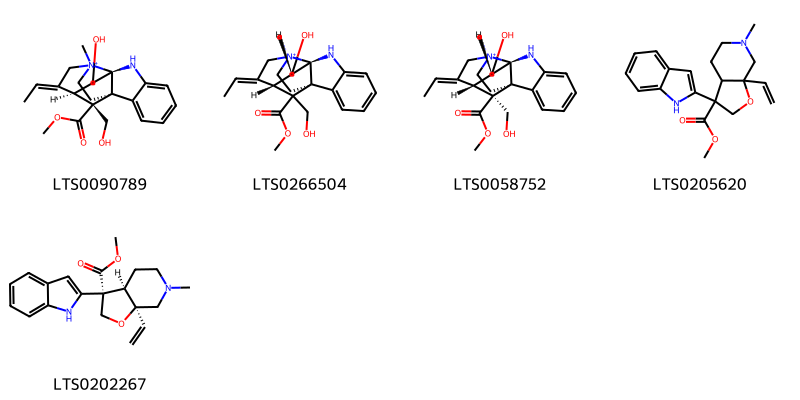{ width=100% }
    <figcaption>Hình ảnh cấu trúc hóa học của 5 hoạt chất thuộc nhóm Indoles and derivatives gồm ['(1s,9r,12r,18r)-13-ethylidene-10-hydroxy-18-(hydroxymethyl)-18-(methoxycarbonyl)-15-methyl-8,15-diazapentacyclo[10.5.1.0¹,⁹.0²,⁷.0⁹,¹⁵]octadeca-2,4,6-trien-15-ium (LTS0090789)', 'echitamine (LTS0266504)', '(1s,9r,10s,12s,13e,15s,18s)-13-ethylidene-10-hydroxy-18-(hydroxymethyl)-18-(methoxycarbonyl)-15-methyl-8,15-diazapentacyclo[10.5.1.0¹,⁹.0²,⁷.0⁹,¹⁵]octadeca-2,4,6-trien-15-ium (LTS0058752)', 'methyl 7a-ethenyl-3-(1h-indol-2-yl)-6-methyl-tetrahydro-2h-furo[2,3-c]pyridine-3-carboxylate (LTS0205620)', 'methyl (3s,3ar,7as)-7a-ethenyl-3-(1h-indol-2-yl)-6-methyl-tetrahydro-2h-furo[2,3-c]pyridine-3-carboxylate (LTS0202267)'].</figcaption>
</figure>
#### Nhóm Macroline alkaloids
<figure markdown="span">
    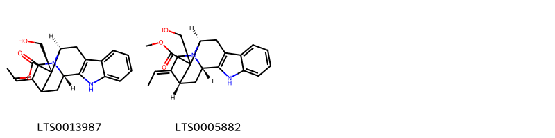{ width=100% }
    <figcaption>Hình ảnh cấu trúc hóa học của 2 hoạt chất thuộc nhóm Macroline alkaloids gồm ['methyl (1s,12s,13s)-15-ethylidene-13-(hydroxymethyl)-3,17-diazapentacyclo[12.3.1.0²,¹⁰.0⁴,⁹.0¹²,¹⁷]octadeca-2(10),4,6,8-tetraene-13-carboxylate (LTS0013987)', 'methyl (1s,12s,14r,15e)-15-ethylidene-13-(hydroxymethyl)-3,17-diazapentacyclo[12.3.1.0²,¹⁰.0⁴,⁹.0¹²,¹⁷]octadeca-2(10),4,6,8-tetraene-13-carboxylate (LTS0005882)'].</figcaption>
</figure>
#### Nhóm Strychnos alkaloids
<figure markdown="span">
    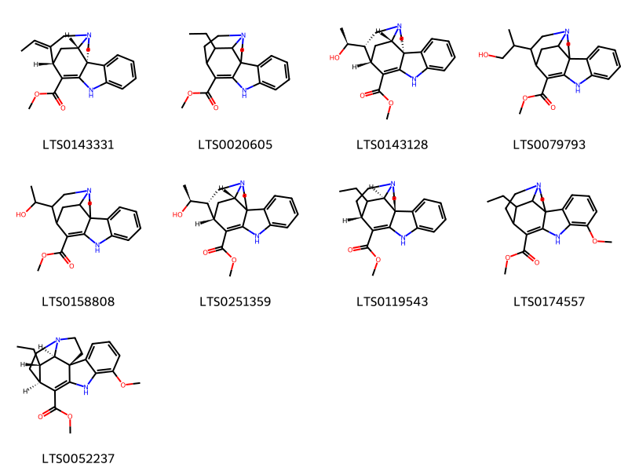{ width=100% }
    <figcaption>Hình ảnh cấu trúc hóa học của 9 hoạt chất thuộc nhóm Strychnos alkaloids gồm ['akuammicine (LTS0143331)', 'methyl 18-ethyl-8,14-diazapentacyclo[9.5.2.0¹,⁹.0²,⁷.0¹⁴,¹⁷]octadeca-2,4,6,9-tetraene-10-carboxylate (LTS0020605)', 'methyl (1r,11s,12s,17s)-12-[(1s)-1-hydroxyethyl]-8,14-diazapentacyclo[9.5.2.0¹,⁹.0²,⁷.0¹⁴,¹⁷]octadeca-2,4,6,9-tetraene-10-carboxylate (LTS0143128)', 'methyl 12-(1-hydroxypropan-2-yl)-8,14-diazapentacyclo[9.5.2.0¹,⁹.0²,⁷.0¹⁴,¹⁷]octadeca-2,4,6,9-tetraene-10-carboxylate (LTS0079793)', 'echitamidine (LTS0158808)', 'methyl (11s,12s,17s)-12-[(1s)-1-hydroxyethyl]-8,14-diazapentacyclo[9.5.2.0¹,⁹.0²,⁷.0¹⁴,¹⁷]octadeca-2,4,6,9-tetraene-10-carboxylate (LTS0251359)', 'methyl (1s,11r,17r)-18-ethyl-8,14-diazapentacyclo[9.5.2.0¹,⁹.0²,⁷.0¹⁴,¹⁷]octadeca-2,4,6,9-tetraene-10-carboxylate (LTS0119543)', 'methyl 18-ethyl-6-methoxy-8,14-diazapentacyclo[9.5.2.0¹,⁹.0²,⁷.0¹⁴,¹⁷]octadeca-2,4,6,9-tetraene-10-carboxylate (LTS0174557)', 'methyl (1s,11s,17r,18s)-18-ethyl-6-methoxy-8,14-diazapentacyclo[9.5.2.0¹,⁹.0²,⁷.0¹⁴,¹⁷]octadeca-2,4,6,9-tetraene-10-carboxylate (LTS0052237)'].</figcaption>
</figure>
#### Nhóm Vallesaman alkaloids
<figure markdown="span">
    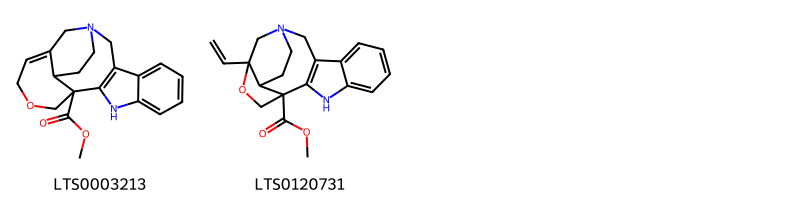{ width=100% }
    <figcaption>Hình ảnh cấu trúc hóa học của 2 hoạt chất thuộc nhóm Vallesaman alkaloids gồm ['angustilobine b, (rac)- (LTS0003213)', 'methyl 15-ethenyl-14-oxa-1,10-diazapentacyclo[13.3.1.0³,¹¹.0⁴,⁹.0¹²,¹⁶]nonadeca-3(11),4,6,8-tetraene-12-carboxylate (LTS0120731)'].</figcaption>
</figure>

---

### Dược dân tộc học

Danh sách các quốc gia có sử dụng *Alstonia congensis* trong điều trị các bệnh. 

| Country   | Disease   | Bệnh                                                                                                                                                                                                |
|:----------|:----------|:----------------------------------------------------------------------------------------------------------------------------------------------------------------------------------------------------|
| Sudan     | Poison    | MYMEMORY WARNING: YOU USED ALL AVAILABLE FREE TRANSLATIONS FOR TODAY. NEXT AVAILABLE IN  12 HOURS 08 MINUTES 21 SECONDS VISIT HTTPS://MYMEMORY.TRANSLATED.NET/DOC/USAGELIMITS.PHP TO TRANSLATE MORE |

---

---
## Alstonia constricta
### Thông tin về thực vật

!!! info "Phân loại thực vật của *Alstonia mollis* từ GIBF:"
    - **Kingdom:** Plantae
    - **Phylum:** Tracheophyta
    - **Order:** Gentianales
    - **Family:** Apocynaceae
    - **Genus:** Alstonia
    - **Species:** *Alstonia mollis*

 

| Label (VI)   | Label (EN)   | Scientific Name     | Descriptions (VI)   | Descriptions (EN)   | Also Known As (VI)   | Also Known As (EN)   |
|:-------------|:-------------|:--------------------|:--------------------|:--------------------|:---------------------|:---------------------|
| N/A          | N/A          | Alstonia constricta | loài thực vật       | species of plant    | ['']                 | ['']                 |

#### Phân bố trên thế giới

**Từ CSDL GIBF** Australia

#### Phân bố tại Việt Nam

**Từ CSDL GIBF**: Không có ghi nhận ở Việt Nam

---
### Thành phần hóa học
        
- Theo cơ sở dữ liệu lotus: Từ loài *Alstonia mollis* đã phân lập và xác định được 21 hoạt chất thuộc về các nhóm Yohimbine alkaloids, Corynanthean-type alkaloids, Dihydroisoquinolines, Harmala alkaloids, Indoles and derivatives. 

|    | chemicalTaxonomyClassyfireClass   |   smiles_count |
|---:|:----------------------------------|---------------:|
|  0 | Corynanthean-type alkaloids       |              8 |
|  1 | Dihydroisoquinolines              |              1 |
|  2 | Harmala alkaloids                 |              4 |
|  3 | Indoles and derivatives           |              2 |
|  4 | Yohimbine alkaloids               |              6 |

#### Nhóm Corynanthean-type alkaloids
<figure markdown="span">
    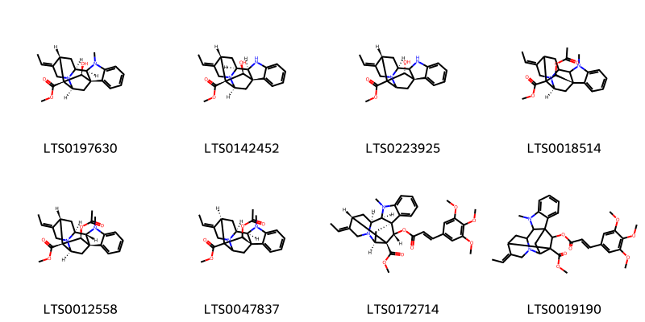{ width=100% }
    <figcaption>Hình ảnh cấu trúc hóa học của 8 hoạt chất thuộc nhóm Corynanthean-type alkaloids gồm ['methyl (1r,9s,10s,12s,13e,16s,17r,18s)-13-ethylidene-18-hydroxy-8-methyl-8,15-diazahexacyclo[14.2.1.0¹,⁹.0²,⁷.0¹⁰,¹⁵.0¹²,¹⁷]nonadeca-2,4,6-triene-17-carboxylate (LTS0197630)', 'methyl (1r,9s,10s,12s,13e,16s,17r,18s)-13-ethylidene-18-hydroxy-8,15-diazahexacyclo[14.2.1.0¹,⁹.0²,⁷.0¹⁰,¹⁵.0¹²,¹⁷]nonadeca-2,4,6-triene-17-carboxylate (LTS0142452)', 'methyl (1r,10s,12s,13e,18r)-13-ethylidene-18-hydroxy-8,15-diazahexacyclo[14.2.1.0¹,⁹.0²,⁷.0¹⁰,¹⁵.0¹²,¹⁷]nonadeca-2,4,6-triene-17-carboxylate (LTS0223925)', 'methyl (1r,13e,16s)-18-(acetyloxy)-13-ethylidene-8-methyl-8,15-diazahexacyclo[14.2.1.0¹,⁹.0²,⁷.0¹⁰,¹⁵.0¹²,¹⁷]nonadeca-2,4,6-triene-17-carboxylate (LTS0018514)', 'methyl (1r,9r,10s,12s,13e,16s,17r,18s)-18-(acetyloxy)-13-ethylidene-8-methyl-8,15-diazahexacyclo[14.2.1.0¹,⁹.0²,⁷.0¹⁰,¹⁵.0¹²,¹⁷]nonadeca-2,4,6-triene-17-carboxylate (LTS0012558)', 'methyl (1r,9s,10s,12r,13e)-18-(acetyloxy)-13-ethylidene-8-methyl-8,15-diazahexacyclo[14.2.1.0¹,⁹.0²,⁷.0¹⁰,¹⁵.0¹²,¹⁷]nonadeca-2,4,6-triene-17-carboxylate (LTS0047837)', 'methyl (1r,9s,10s,12s,13e,16s,17r,18s)-13-ethylidene-8-methyl-18-{[(2e)-3-(3,4,5-trimethoxyphenyl)prop-2-enoyl]oxy}-8,15-diazahexacyclo[14.2.1.0¹,⁹.0²,⁷.0¹⁰,¹⁵.0¹²,¹⁷]nonadeca-2,4,6-triene-17-carboxylate (LTS0172714)', 'methyl 13-ethylidene-8-methyl-18-{[3-(3,4,5-trimethoxyphenyl)prop-2-enoyl]oxy}-8,15-diazahexacyclo[14.2.1.0¹,⁹.0²,⁷.0¹⁰,¹⁵.0¹²,¹⁷]nonadeca-2,4,6-triene-17-carboxylate (LTS0019190)'].</figcaption>
</figure>
#### Nhóm Dihydroisoquinolines
<figure markdown="span">
    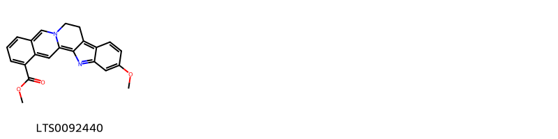{ width=100% }
    <figcaption>Hình ảnh cấu trúc hóa học của 1 hoạt chất thuộc nhóm Dihydroisoquinolines gồm ['methyl 6-methoxy-3,13-diazapentacyclo[11.8.0.0²,¹⁰.0⁴,⁹.0¹⁵,²⁰]henicosa-1,3,5,7,9,14,16,18,20-nonaene-19-carboxylate (LTS0092440)'].</figcaption>
</figure>
#### Nhóm Harmala alkaloids
<figure markdown="span">
    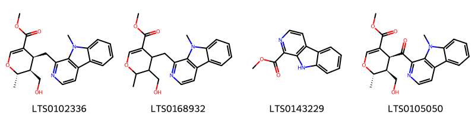{ width=100% }
    <figcaption>Hình ảnh cấu trúc hóa học của 4 hoạt chất thuộc nhóm Harmala alkaloids gồm ['alstonidine (LTS0102336)', 'methyl 5-(hydroxymethyl)-6-methyl-4-({9-methylpyrido[3,4-b]indol-1-yl}methyl)-5,6-dihydro-4h-pyran-3-carboxylate (LTS0168932)', 'methyl 9h-pyrido[3,4-b]indole-1-carboxylate (LTS0143229)', 'methyl (4s,5s,6s)-5-(hydroxymethyl)-6-methyl-4-{9-methylpyrido[3,4-b]indole-1-carbonyl}-5,6-dihydro-4h-pyran-3-carboxylate (LTS0105050)'].</figcaption>
</figure>
#### Nhóm Indoles and derivatives
<figure markdown="span">
    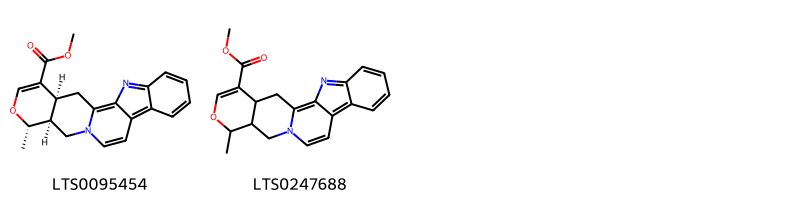{ width=100% }
    <figcaption>Hình ảnh cấu trúc hóa học của 2 hoạt chất thuộc nhóm Indoles and derivatives gồm ['alstonine (LTS0095454)', 'methyl 16-methyl-17-oxa-3,13-diazapentacyclo[11.8.0.0²,¹⁰.0⁴,⁹.0¹⁵,²⁰]henicosa-1,3,5,7,9,11,18-heptaene-19-carboxylate (LTS0247688)'].</figcaption>
</figure>
#### Nhóm Yohimbine alkaloids
<figure markdown="span">
    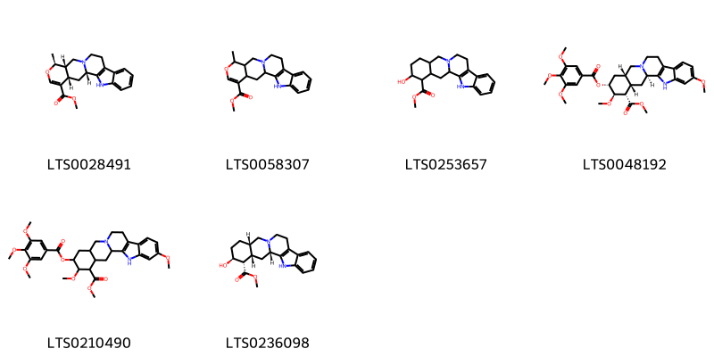{ width=100% }
    <figcaption>Hình ảnh cấu trúc hóa học của 6 hoạt chất thuộc nhóm Yohimbine alkaloids gồm ['tetrahydroalstonine (LTS0028491)', 'ajmalicine (LTS0058307)', 'yohimbine,α- (LTS0253657)', 'reserpine (LTS0048192)', 'methyl 6,18-dimethoxy-17-(3,4,5-trimethoxybenzoyloxy)-3,13-diazapentacyclo[11.8.0.0²,¹⁰.0⁴,⁹.0¹⁵,²⁰]henicosa-2(10),4,6,8-tetraene-19-carboxylate (LTS0210490)', 'rauwolscine (LTS0236098)'].</figcaption>
</figure>

---

### Dược dân tộc học

Danh sách các quốc gia có sử dụng *Alstonia mollis* trong điều trị các bệnh. 

| Country   | Disease   | Bệnh                                                                                                                                                                                                |
|:----------|:----------|:----------------------------------------------------------------------------------------------------------------------------------------------------------------------------------------------------|
| Elsewhere | Tonic     | MYMEMORY WARNING: YOU USED ALL AVAILABLE FREE TRANSLATIONS FOR TODAY. NEXT AVAILABLE IN  12 HOURS 07 MINUTES 54 SECONDS VISIT HTTPS://MYMEMORY.TRANSLATED.NET/DOC/USAGELIMITS.PHP TO TRANSLATE MORE |
| US        | Tonic     | MYMEMORY WARNING: YOU USED ALL AVAILABLE FREE TRANSLATIONS FOR TODAY. NEXT AVAILABLE IN  12 HOURS 07 MINUTES 49 SECONDS VISIT HTTPS://MYMEMORY.TRANSLATED.NET/DOC/USAGELIMITS.PHP TO TRANSLATE MORE |

---

---
## Alstonia scholaris
### Thông tin về thực vật

!!! info "Phân loại thực vật của *Alstonia scholaris* từ GIBF:"
    - **Kingdom:** Plantae
    - **Phylum:** Tracheophyta
    - **Order:** Gentianales
    - **Family:** Apocynaceae
    - **Genus:** Alstonia
    - **Species:** *Alstonia scholaris*

 

| Label (VI)   | Label (EN)   | Scientific Name    | Descriptions (VI)   | Descriptions (EN)   | Also Known As (VI)   | Also Known As (EN)                                                                                                                                                |
|:-------------|:-------------|:-------------------|:--------------------|:--------------------|:---------------------|:------------------------------------------------------------------------------------------------------------------------------------------------------------------|
| N/A          | N/A          | Alstonia scholaris | loài thực vật       | species of plant    | ['']                 | ['white cheesewood', 'blackboard tree', 'Blackboard tree', 'devil tree', 'Devil tree', 'ditabark', 'milkwood pine', 'Milkwood-pine', 'saptparni', 'shaitan tree'] |

#### Phân bố trên thế giới

**Từ CSDL GIBF** Singapore, Indonesia, Malaysia, Chinese Taipei, China, Australia, Colombia, India

#### Phân bố tại Việt Nam

**Từ CSDL GIBF**: Không có ghi nhận ở Việt Nam

---
### Thành phần hóa học
        
- Theo cơ sở dữ liệu lotus: Từ loài *Alstonia scholaris* đã phân lập và xác định được 164 hoạt chất thuộc về các nhóm Fatty Acyls, Vallesaman alkaloids, Yohimbine alkaloids, Flavonoids, Carboxylic acids and derivatives, Macroline alkaloids, Corynanthean-type alkaloids, Steroids and steroid derivatives, Cinnamic acids and derivatives, Rhazinilam alkaloids, Prenol lipids, Organooxygen compounds, Isoflavonoids, Akuammilan and related alkaloids, Pleiocarpaman alkaloids, Strychnos alkaloids, Saturated hydrocarbons, Indoles and derivatives. 

|    | chemicalTaxonomyClassyfireClass   |   smiles_count |
|---:|:----------------------------------|---------------:|
|  0 | Akuammilan and related alkaloids  |              4 |
|  1 | Carboxylic acids and derivatives  |              2 |
|  2 | Cinnamic acids and derivatives    |              1 |
|  3 | Corynanthean-type alkaloids       |             17 |
|  4 | Fatty Acyls                       |              1 |
|  5 | Flavonoids                        |              3 |
|  6 | Indoles and derivatives           |             32 |
|  7 | Isoflavonoids                     |              4 |
|  8 | Macroline alkaloids               |             10 |
|  9 | Organooxygen compounds            |              1 |
| 10 | Pleiocarpaman alkaloids           |              2 |
| 11 | Prenol lipids                     |             36 |
| 12 | Rhazinilam alkaloids              |              4 |
| 13 | Saturated hydrocarbons            |              1 |
| 14 | Steroids and steroid derivatives  |              3 |
| 15 | Strychnos alkaloids               |             32 |
| 16 | Vallesaman alkaloids              |              9 |
| 17 | Yohimbine alkaloids               |              2 |

#### Nhóm Akuammilan and related alkaloids
<figure markdown="span">
    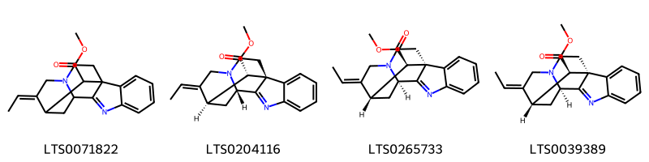{ width=100% }
    <figcaption>Hình ảnh cấu trúc hóa học của 4 hoạt chất thuộc nhóm Akuammilan and related alkaloids gồm ['methyl (13e)-13-ethylidene-8,15-diazapentacyclo[10.5.1.0¹,⁹.0²,⁷.0¹⁰,¹⁵]octadeca-2,4,6,8-tetraene-18-carboxylate (LTS0071822)', 'methyl (1r,10s,12r,13e,18s)-13-ethylidene-8,15-diazapentacyclo[10.5.1.0¹,⁹.0²,⁷.0¹⁰,¹⁵]octadeca-2,4,6,8-tetraene-18-carboxylate (LTS0204116)', 'methyl (1s,10r,12s,18r)-13-ethylidene-8,15-diazapentacyclo[10.5.1.0¹,⁹.0²,⁷.0¹⁰,¹⁵]octadeca-2,4,6,8-tetraene-18-carboxylate (LTS0265733)', 'methyl (1s,10r,12s,13z,18r)-13-ethylidene-8,15-diazapentacyclo[10.5.1.0¹,⁹.0²,⁷.0¹⁰,¹⁵]octadeca-2,4,6,8-tetraene-18-carboxylate (LTS0039389)'].</figcaption>
</figure>
#### Nhóm Carboxylic acids and derivatives
<figure markdown="span">
    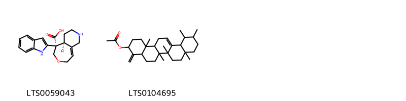{ width=100% }
    <figcaption>Hình ảnh cấu trúc hóa học của 2 hoạt chất thuộc nhóm Carboxylic acids and derivatives gồm ['(4as,5s)-5-(1h-indol-2-yl)-1h,2h,3h,4h,4ah,6h,8h-oxepino[4,5-c]pyridine-5-carboxylic acid (LTS0059043)', '6a,6b,8a,11,12,14b-hexamethyl-4-methylidene-2,3,4a,5,6,7,8,9,10,11,12,12a,14,14a-tetradecahydro-1h-picen-3-yl acetate (LTS0104695)'].</figcaption>
</figure>
#### Nhóm Cinnamic acids and derivatives
<figure markdown="span">
    { width=100% }
    <figcaption>Hình ảnh cấu trúc hóa học của 1 hoạt chất thuộc nhóm Cinnamic acids and derivatives gồm ['3,4-dihydroxycinnamic acid (LTS0128050)'].</figcaption>
</figure>
#### Nhóm Corynanthean-type alkaloids
<figure markdown="span">
    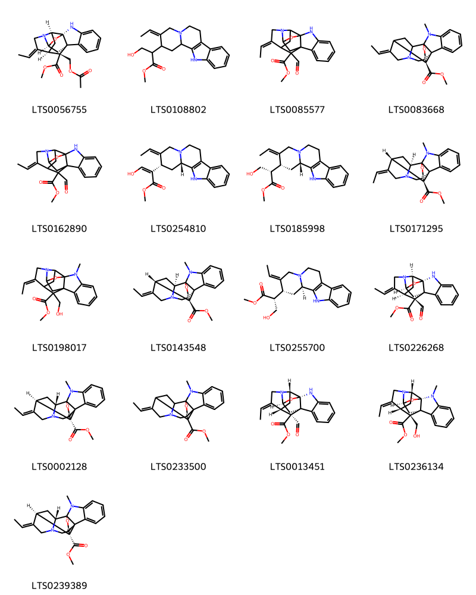{ width=100% }
    <figcaption>Hình ảnh cấu trúc hóa học của 17 hoạt chất thuộc nhóm Corynanthean-type alkaloids gồm ['methyl (1r,9s,11s,15r,17r,19r)-19-[(acetyloxy)methyl]-14-ethylidene-18-oxa-2,12-diazahexacyclo[9.6.1.1⁹,¹⁵.0¹,⁹.0³,⁸.0¹²,¹⁷]nonadeca-3,5,7-triene-19-carboxylate (LTS0056755)', 'methyl 2-[(3e)-3-ethylidene-1h,2h,4h,6h,7h,12h,12bh-indolo[2,3-a]quinolizin-2-yl]-3-hydroxypropanoate (LTS0108802)', 'picralinal (LTS0085577)', 'methyl (1s,9s,14e,16r)-14-ethylidene-2-methyl-18-oxa-2,12-diazahexacyclo[13.3.2.0¹,⁹.0³,⁸.0⁹,¹⁶.0¹²,¹⁹]icosa-3,5,7-triene-16-carboxylate (LTS0083668)', 'methyl (14z)-14-ethylidene-19-formyl-18-oxa-2,12-diazahexacyclo[9.6.1.1⁹,¹⁵.0¹,⁹.0³,⁸.0¹²,¹⁷]nonadeca-3,5,7-triene-19-carboxylate (LTS0162890)', 'methyl (2z)-2-[(2s,3e,12bs)-3-ethylidene-1h,2h,4h,6h,7h,12h,12bh-indolo[2,3-a]quinolizin-2-yl]-3-hydroxyprop-2-enoate (LTS0254810)', 'methyl (2s)-2-[(2r,3e,12bs)-3-ethylidene-1h,2h,4h,6h,7h,12h,12bh-indolo[2,3-a]quinolizin-2-yl]-3-hydroxypropanoate (LTS0185998)', 'methyl (1s,9s,14z,15s,16r,19s)-14-ethylidene-2-methyl-18-oxa-2,12-diazahexacyclo[13.3.2.0¹,⁹.0³,⁸.0⁹,¹⁶.0¹²,¹⁹]icosa-3,5,7-triene-16-carboxylate (LTS0171295)', 'methyl (14e)-14-ethylidene-19-(hydroxymethyl)-2-methyl-18-oxa-2,12-diazahexacyclo[9.6.1.1⁹,¹⁵.0¹,⁹.0³,⁸.0¹²,¹⁷]nonadeca-3,5,7-triene-19-carboxylate (LTS0198017)', 'methyl (1s,9s,14e,15s,16r,19s)-14-ethylidene-2-methyl-18-oxa-2,12-diazahexacyclo[13.3.2.0¹,⁹.0³,⁸.0⁹,¹⁶.0¹²,¹⁹]icosa-3,5,7-triene-16-carboxylate (LTS0143548)', 'methyl (2r)-2-[(2r,3z,12br)-3-ethylidene-1h,2h,4h,6h,7h,12h,12bh-indolo[2,3-a]quinolizin-2-yl]-3-hydroxypropanoate (LTS0255700)', 'methyl (1r,9s,11s,15r,17r,19r)-14-ethylidene-19-formyl-18-oxa-2,12-diazahexacyclo[9.6.1.1⁹,¹⁵.0¹,⁹.0³,⁸.0¹²,¹⁷]nonadeca-3,5,7-triene-19-carboxylate (LTS0226268)', 'methyl (1r,9r,14e,15r,16s,19r)-14-ethylidene-2-methyl-18-oxa-2,12-diazahexacyclo[13.3.2.0¹,⁹.0³,⁸.0⁹,¹⁶.0¹²,¹⁹]icosa-3,5,7-triene-16-carboxylate (LTS0002128)', 'methyl 14-ethylidene-2-methyl-18-oxa-2,12-diazahexacyclo[13.3.2.0¹,⁹.0³,⁸.0⁹,¹⁶.0¹²,¹⁹]icosa-3,5,7-triene-16-carboxylate (LTS0233500)', 'methyl (1r,9s,11s,14e,15s,17s,19s)-14-ethylidene-19-formyl-18-oxa-2,12-diazahexacyclo[9.6.1.1⁹,¹⁵.0¹,⁹.0³,⁸.0¹²,¹⁷]nonadeca-3,5,7-triene-19-carboxylate (LTS0013451)', 'methyl (1r,9s,11s,14e,15s,17s,19r)-14-ethylidene-19-(hydroxymethyl)-2-methyl-18-oxa-2,12-diazahexacyclo[9.6.1.1⁹,¹⁵.0¹,⁹.0³,⁸.0¹²,¹⁷]nonadeca-3,5,7-triene-19-carboxylate (LTS0236134)', 'methyl (1r,9r,15r,16s,19r)-14-ethylidene-2-methyl-18-oxa-2,12-diazahexacyclo[13.3.2.0¹,⁹.0³,⁸.0⁹,¹⁶.0¹²,¹⁹]icosa-3,5,7-triene-16-carboxylate (LTS0239389)'].</figcaption>
</figure>
#### Nhóm Fatty Acyls
<figure markdown="span">
    { width=100% }
    <figcaption>Hình ảnh cấu trúc hóa học của 1 hoạt chất thuộc nhóm Fatty Acyls gồm ['palmitic acid (LTS0079439)'].</figcaption>
</figure>
#### Nhóm Flavonoids
<figure markdown="span">
    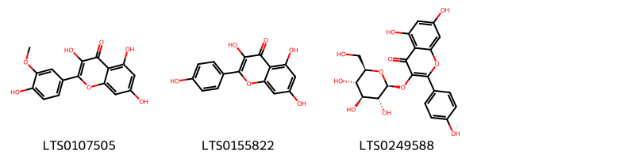{ width=100% }
    <figcaption>Hình ảnh cấu trúc hóa học của 3 hoạt chất thuộc nhóm Flavonoids gồm ['isorhamnetin (LTS0107505)', 'kaempherol (LTS0155822)', 'astragalin (LTS0249588)'].</figcaption>
</figure>
#### Nhóm Indoles and derivatives
<figure markdown="span">
    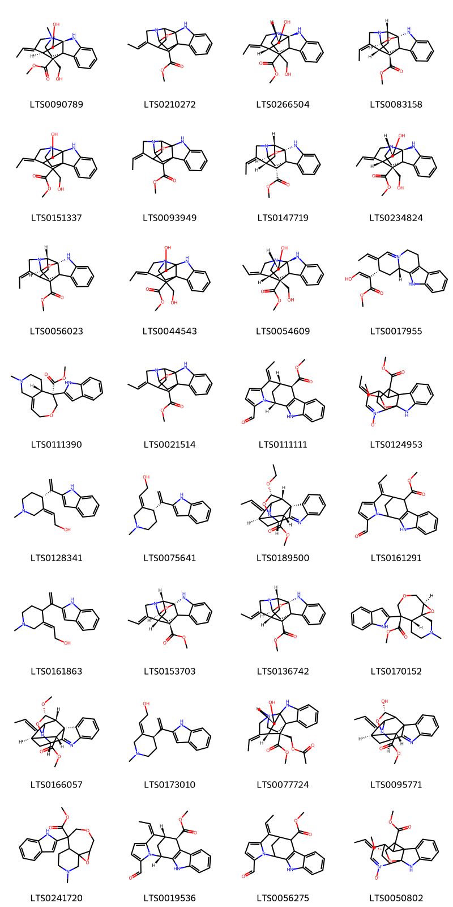{ width=100% }
    <figcaption>Hình ảnh cấu trúc hóa học của 32 hoạt chất thuộc nhóm Indoles and derivatives gồm ['(1s,9r,12r,18r)-13-ethylidene-10-hydroxy-18-(hydroxymethyl)-18-(methoxycarbonyl)-15-methyl-8,15-diazapentacyclo[10.5.1.0¹,⁹.0²,⁷.0⁹,¹⁵]octadeca-2,4,6-trien-15-ium (LTS0090789)', 'methyl (14z)-14-ethylidene-18-oxa-2,12-diazahexacyclo[9.6.1.1⁹,¹⁵.0¹,⁹.0³,⁸.0¹²,¹⁷]nonadeca-3,5,7-triene-19-carboxylate (LTS0210272)', 'echitamine (LTS0266504)', 'methyl (1r,9r,11s,14e,15r,17s,19s)-14-ethylidene-18-oxa-2,12-diazahexacyclo[9.6.1.1⁹,¹⁵.0¹,⁹.0³,⁸.0¹²,¹⁷]nonadeca-3,5,7-triene-19-carboxylate (LTS0083158)', 'methyl (13e)-13-ethylidene-10-hydroxy-18-(hydroxymethyl)-8,15-diazapentacyclo[10.5.1.0¹,⁹.0²,⁷.0⁹,¹⁵]octadeca-2,4,6-triene-18-carboxylate (LTS0151337)', 'picrinine (LTS0093949)', 'methyl (1r,9r,11s,14e,15r,17s,19r)-14-ethylidene-18-oxa-2,12-diazahexacyclo[9.6.1.1⁹,¹⁵.0¹,⁹.0³,⁸.0¹²,¹⁷]nonadeca-3,5,7-triene-19-carboxylate (LTS0147719)', 'n(4)-demethylechitamine (LTS0234824)', 'methyl (1r,9r,11s,14e,17s)-14-ethylidene-18-oxa-2,12-diazahexacyclo[9.6.1.1⁹,¹⁵.0¹,⁹.0³,⁸.0¹²,¹⁷]nonadeca-3,5,7-triene-19-carboxylate (LTS0056023)', 'methyl 13-ethylidene-10-hydroxy-18-(hydroxymethyl)-8,15-diazapentacyclo[10.5.1.0¹,⁹.0²,⁷.0⁹,¹⁵]octadeca-2,4,6-triene-18-carboxylate (LTS0044543)', 'methyl (1s,9r,10s,12s,13z,18r)-13-ethylidene-10-hydroxy-18-(hydroxymethyl)-8,15-diazapentacyclo[10.5.1.0¹,⁹.0²,⁷.0⁹,¹⁵]octadeca-2,4,6-triene-18-carboxylate (LTS0054609)', '(2s,3e,12bs)-3-ethylidene-2-(1-hydroxy-3-methoxy-3-oxoprop-1-en-2-yl)-1h,2h,6h,7h,12h,12bh-5λ⁵-indolo[2,3-a]quinolizin-5-ylium (LTS0017955)', 'methyl (4as,5r)-5-(1h-indol-2-yl)-2-methyl-1h,3h,4h,4ah,6h,8h-oxepino[4,5-c]pyridine-5-carboxylate (LTS0111390)', 'methyl 14-ethylidene-18-oxa-2,12-diazahexacyclo[9.6.1.1⁹,¹⁵.0¹,⁹.0³,⁸.0¹²,¹⁷]nonadeca-3,5,7-triene-19-carboxylate (LTS0021514)', 'methyl (1r,11r,12s,13e)-13-ethylidene-17-formyl-3,18-diazapentacyclo[10.6.1.0²,¹⁰.0⁴,⁹.0¹⁴,¹⁸]nonadeca-2(10),4,6,8,14,16-hexaene-11-carboxylate (LTS0111111)', '13-ethylidene-17-methoxy-15-(methoxycarbonyl)-18-oxa-8,11-diazapentacyclo[7.6.3.1¹⁰,¹⁴.0¹,⁹.0²,⁷]nonadeca-2,4,6,11-tetraen-11-ium-11-olate (LTS0124953)', '2-[(3z,4s)-4-[1-(1h-indol-2-yl)ethenyl]-1-methylpiperidin-3-ylidene]ethanol (LTS0128341)', '2-[(3e,4r)-4-[1-(1h-indol-2-yl)ethenyl]-1-methylpiperidin-3-ylidene]ethanol (LTS0075641)', 'methyl (1r,10s,12r,13e,17s,18r,19r)-17-ethoxy-13-ethylidene-16-oxa-8,15-diazahexacyclo[10.6.1.0¹,⁹.0²,⁷.0¹⁰,¹⁵.0¹⁴,¹⁸]nonadeca-2,4,6,8-tetraene-19-carboxylate (LTS0189500)', 'methyl 13-ethylidene-17-formyl-3,18-diazapentacyclo[10.6.1.0²,¹⁰.0⁴,⁹.0¹⁴,¹⁸]nonadeca-2(10),4,6,8,14,16-hexaene-11-carboxylate (LTS0161291)', '2-{4-[1-(1h-indol-2-yl)ethenyl]-1-methylpiperidin-3-ylidene}ethanol (LTS0161863)', 'methyl (1r,9r,11s,15r,17s,19s)-14-ethylidene-18-oxa-2,12-diazahexacyclo[9.6.1.1⁹,¹⁵.0¹,⁹.0³,⁸.0¹²,¹⁷]nonadeca-3,5,7-triene-19-carboxylate (LTS0153703)', 'methyl (1r,9r,11s,14z,15r,17s,19s)-14-ethylidene-18-oxa-2,12-diazahexacyclo[9.6.1.1⁹,¹⁵.0¹,⁹.0³,⁸.0¹²,¹⁷]nonadeca-3,5,7-triene-19-carboxylate (LTS0136742)', 'methyl (1s,3r,7s,8r)-7-(1h-indol-2-yl)-11-methyl-2,5-dioxa-11-azatricyclo[6.4.0.0¹,³]dodecane-7-carboxylate (LTS0170152)', 'methyl (1r,10s,12r,13e,17s,18r,19r)-13-ethylidene-17-methoxy-16-oxa-8,15-diazahexacyclo[10.6.1.0¹,⁹.0²,⁷.0¹⁰,¹⁵.0¹⁴,¹⁸]nonadeca-2,4,6,8-tetraene-19-carboxylate (LTS0166057)', '2-[(3e,4s)-4-[1-(1h-indol-2-yl)ethenyl]-1-methylpiperidin-3-ylidene]ethanol (LTS0173010)', '(1s,10s,12s,13e,18r)-18-[(acetyloxy)methyl]-13-ethylidene-10-hydroxy-18-(methoxycarbonyl)-15-methyl-8,15-diazapentacyclo[10.5.1.0¹,⁹.0²,⁷.0⁹,¹⁵]octadeca-2,4,6-trien-15-ium (LTS0077724)', 'nareline (LTS0095771)', 'methyl 7-(1h-indol-2-yl)-11-methyl-2,5-dioxa-11-azatricyclo[6.4.0.0¹,³]dodecane-7-carboxylate (LTS0241720)', 'methyl (1r,11r,12s,13z)-13-ethylidene-17-formyl-3,18-diazapentacyclo[10.6.1.0²,¹⁰.0⁴,⁹.0¹⁴,¹⁸]nonadeca-2(10),4,6,8,14,16-hexaene-11-carboxylate (LTS0019536)', 'methyl (13e)-13-ethylidene-17-formyl-3,18-diazapentacyclo[10.6.1.0²,¹⁰.0⁴,⁹.0¹⁴,¹⁸]nonadeca-2(10),4,6,8,14,16-hexaene-11-carboxylate (LTS0056275)', 'alschomine (LTS0050802)'].</figcaption>
</figure>
#### Nhóm Isoflavonoids
<figure markdown="span">
    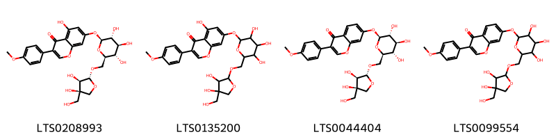{ width=100% }
    <figcaption>Hình ảnh cấu trúc hóa học của 4 hoạt chất thuộc nhóm Isoflavonoids gồm ['lanceolarin (LTS0208993)', '7-{[6-({[3,4-dihydroxy-4-(hydroxymethyl)oxolan-2-yl]oxy}methyl)-3,4,5-trihydroxyoxan-2-yl]oxy}-5-hydroxy-3-(4-methoxyphenyl)chromen-4-one (LTS0135200)', '7-{[(2s,3r,4s,5s,6r)-6-({[(2r,3r,4r)-3,4-dihydroxy-4-(hydroxymethyl)oxolan-2-yl]oxy}methyl)-3,4,5-trihydroxyoxan-2-yl]oxy}-3-(4-methoxyphenyl)chromen-4-one (LTS0044404)', '7-{[6-({[3,4-dihydroxy-4-(hydroxymethyl)oxolan-2-yl]oxy}methyl)-3,4,5-trihydroxyoxan-2-yl]oxy}-3-(4-methoxyphenyl)chromen-4-one (LTS0099554)'].</figcaption>
</figure>
#### Nhóm Macroline alkaloids
<figure markdown="span">
    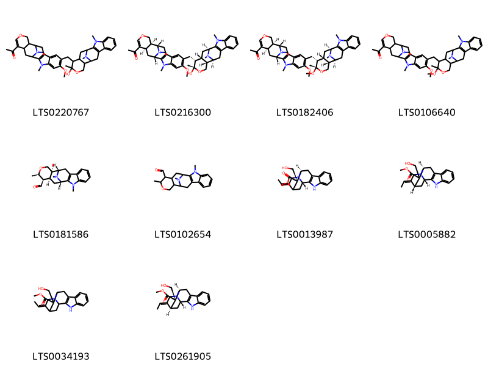{ width=100% }
    <figcaption>Hình ảnh cấu trúc hóa học của 10 hoạt chất thuộc nhóm Macroline alkaloids gồm ['1-[7-({16-hydroxy-3,16,20-trimethyl-15-oxa-3,20-diazapentacyclo[10.7.1.0²,¹⁰.0⁴,⁹.0¹³,¹⁸]icosa-2(10),4,6,8-tetraen-17-yl}methyl)-6-methoxy-3,20-dimethyl-15-oxa-3,20-diazapentacyclo[10.7.1.0²,¹⁰.0⁴,⁹.0¹³,¹⁸]icosa-2(10),4,6,8,16-pentaen-17-yl]ethanone (LTS0220767)', '1-[(1s,12s,13r,18r)-7-{[(1s,12s,13r,16s,17r,18r)-16-hydroxy-3,16,20-trimethyl-15-oxa-3,20-diazapentacyclo[10.7.1.0²,¹⁰.0⁴,⁹.0¹³,¹⁸]icosa-2(10),4,6,8-tetraen-17-yl]methyl}-6-methoxy-3,20-dimethyl-15-oxa-3,20-diazapentacyclo[10.7.1.0²,¹⁰.0⁴,⁹.0¹³,¹⁸]icosa-2(10),4,6,8,16-pentaen-17-yl]ethanone (LTS0216300)', '1-[(1s,12s,13r,18r)-6-methoxy-7-{[(1s,12s,13r,16s,17r,18r)-16-methoxy-3,16,20-trimethyl-15-oxa-3,20-diazapentacyclo[10.7.1.0²,¹⁰.0⁴,⁹.0¹³,¹⁸]icosa-2(10),4,6,8-tetraen-17-yl]methyl}-3,20-dimethyl-15-oxa-3,20-diazapentacyclo[10.7.1.0²,¹⁰.0⁴,⁹.0¹³,¹⁸]icosa-2(10),4,6,8,16-pentaen-17-yl]ethanone (LTS0182406)', '1-[6-methoxy-7-({16-methoxy-3,16,20-trimethyl-15-oxa-3,20-diazapentacyclo[10.7.1.0²,¹⁰.0⁴,⁹.0¹³,¹⁸]icosa-2(10),4,6,8-tetraen-17-yl}methyl)-3,20-dimethyl-15-oxa-3,20-diazapentacyclo[10.7.1.0²,¹⁰.0⁴,⁹.0¹³,¹⁸]icosa-2(10),4,6,8,16-pentaen-17-yl]ethanone (LTS0106640)', '(1s,12s,13r,16r,17r,18r)-3,16,20-trimethyl-15-oxa-3,20-diazapentacyclo[10.7.1.0²,¹⁰.0⁴,⁹.0¹³,¹⁸]icosa-2(10),4,6,8-tetraene-17-carbaldehyde (LTS0181586)', '3,16,20-trimethyl-15-oxa-3,20-diazapentacyclo[10.7.1.0²,¹⁰.0⁴,⁹.0¹³,¹⁸]icosa-2(10),4,6,8-tetraene-17-carbaldehyde (LTS0102654)', 'methyl (1s,12s,13s)-15-ethylidene-13-(hydroxymethyl)-3,17-diazapentacyclo[12.3.1.0²,¹⁰.0⁴,⁹.0¹²,¹⁷]octadeca-2(10),4,6,8-tetraene-13-carboxylate (LTS0013987)', 'methyl (1s,12s,14r,15e)-15-ethylidene-13-(hydroxymethyl)-3,17-diazapentacyclo[12.3.1.0²,¹⁰.0⁴,⁹.0¹²,¹⁷]octadeca-2(10),4,6,8-tetraene-13-carboxylate (LTS0005882)', 'methyl 15-ethylidene-13-(hydroxymethyl)-3,17-diazapentacyclo[12.3.1.0²,¹⁰.0⁴,⁹.0¹²,¹⁷]octadeca-2(10),4,6,8-tetraene-13-carboxylate (LTS0034193)', 'methyl (1s,12s,13s,14s,15e)-15-ethylidene-13-(hydroxymethyl)-3,17-diazapentacyclo[12.3.1.0²,¹⁰.0⁴,⁹.0¹²,¹⁷]octadeca-2(10),4,6,8-tetraene-13-carboxylate (LTS0261905)'].</figcaption>
</figure>
#### Nhóm Organooxygen compounds
<figure markdown="span">
    { width=100% }
    <figcaption>Hình ảnh cấu trúc hóa học của 1 hoạt chất thuộc nhóm Organooxygen compounds gồm ['sucrose (LTS0272557)'].</figcaption>
</figure>
#### Nhóm Pleiocarpaman alkaloids
<figure markdown="span">
    { width=100% }
    <figcaption>Hình ảnh cấu trúc hóa học của 2 hoạt chất thuộc nhóm Pleiocarpaman alkaloids gồm ['pleiocarpamine (LTS0052400)', 'methyl (13e)-13-ethylidene-1,11-diazapentacyclo[12.3.1.0²,⁷.0⁸,¹⁷.0¹¹,¹⁶]octadeca-2,4,6,8(17)-tetraene-18-carboxylate (LTS0191644)'].</figcaption>
</figure>
#### Nhóm Prenol lipids
<figure markdown="span">
    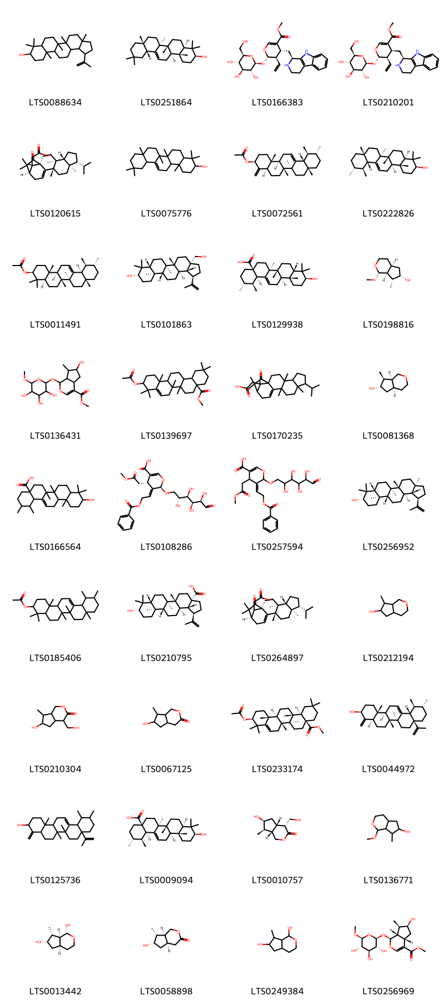{ width=100% }
    <figcaption>Hình ảnh cấu trúc hóa học của 36 hoạt chất thuộc nhóm Prenol lipids gồm ['lupeol (LTS0088634)', 'β-amyrin (LTS0251864)', 'methyl (4r,5r,6s)-5-ethenyl-4-[(1s)-1h,2h,3h,4h,9h-pyrido[3,4-b]indol-1-ylmethyl]-6-{[(2s,3r,4s,5s,6r)-3,4,5-trihydroxy-6-(hydroxymethyl)oxan-2-yl]oxy}-5,6-dihydro-4h-pyran-3-carboxylate (LTS0166383)', 'strictosidine (LTS0210201)', '[(1r,4s,5r,8r,9r,12s,16r,19s)-8-isopropyl-4,9,12,17,17,19-hexamethyl-18-oxopentacyclo[14.2.1.0¹,¹³.0⁴,¹².0⁵,⁹]nonadec-13-en-19-yl]acetic acid (LTS0120615)', 'β-amyrin (LTS0075776)', '(3s,4ar,6ar,6bs,8ar,11r,12s,12ar,14ar,14br)-6a,6b,8a,11,12,14b-hexamethyl-4-methylidene-2,3,4a,5,6,7,8,9,10,11,12,12a,14,14a-tetradecahydro-1h-picen-3-yl acetate (LTS0072561)', 'amyrin (LTS0222826)', '(3s,4ar,6ar,6bs,8ar,11r,12s,12as,14ar,14br)-4,4,6a,6b,8a,11,12,14b-octamethyl-2,3,4a,5,6,7,8,9,10,11,12,12a,14,14a-tetradecahydro-1h-picen-3-yl acetate (LTS0011491)', 'betulin (LTS0101863)', '(1s,2r,4as,6as,6br,8as,10s,12ar,12br,14br)-10-hydroxy-1,2,6a,6b,9,9,12a-heptamethyl-2,3,4,5,6,7,8,8a,10,11,12,12b,13,14b-tetradecahydro-1h-picene-4a-carboxylic acid (LTS0129938)', '(1r,4as,6s,7r,7as)-1-methoxy-7-methyl-octahydrocyclopenta[c]pyran-6-ol (LTS0198816)', 'methyl 6-hydroxy-7-methyl-1-[(3,4,5-trihydroxy-6-methoxyoxan-2-yl)oxy]-1h,4ah,5h,6h,7h,7ah-cyclopenta[c]pyran-4-carboxylate (LTS0136431)', 'methyl 10-(acetyloxy)-2,2,6a,6b,9,9,12a-heptamethyl-1,3,4,5,6,7,10,11,12,12b,13,14,14a,14b-tetradecahydropicene-4a-carboxylate (LTS0139697)', '{8-isopropyl-4,9,12,17,17,19-hexamethyl-18-oxopentacyclo[14.2.1.0¹,¹³.0⁴,¹².0⁵,⁹]nonadec-13-en-19-yl}acetic acid (LTS0170235)', '(4as,6s,7s,7as)-7-methyl-octahydrocyclopenta[c]pyran-6-ol (LTS0081368)', '10-hydroxy-1,2,6a,6b,9,9,12a-heptamethyl-2,3,4,5,6,7,8,8a,10,11,12,12b,13,14b-tetradecahydro-1h-picene-4a-carboxylic acid (LTS0166564)', '(4s,5e,6r)-5-[2-(benzoyloxy)ethylidene]-4-(2-methoxy-2-oxoethyl)-6-{[(2r,3r,4s,5r)-2,3,4,5-tetrahydroxy-6-oxohexyl]oxy}-4,6-dihydropyran-3-carboxylic acid (LTS0108286)', '5-[2-(benzoyloxy)ethylidene]-4-(2-methoxy-2-oxoethyl)-6-[(2,3,4,5-tetrahydroxy-6-oxohexyl)oxy]-4,6-dihydropyran-3-carboxylic acid (LTS0257594)', 'lupeol (LTS0256952)', '4,4,6a,6b,8a,11,12,14b-octamethyl-2,3,4a,5,6,7,8,9,10,11,12,12a,14,14a-tetradecahydro-1h-picen-3-yl acetate (LTS0185406)', 'betulinic acid (LTS0210795)', '[(1r,4s,5r,8r,9r,12s,16r,19r)-8-isopropyl-4,9,12,17,17,19-hexamethyl-18-oxopentacyclo[14.2.1.0¹,¹³.0⁴,¹².0⁵,⁹]nonadec-13-en-19-yl]acetic acid (LTS0264897)', '7-methyl-octahydrocyclopenta[c]pyran-6-ol (LTS0212194)', '6-hydroxy-4-(hydroxymethyl)-7-methyl-hexahydro-1h-cyclopenta[c]pyran-3-one (LTS0210304)', '6-hydroxy-7-methyl-hexahydro-1h-cyclopenta[c]pyran-3-one (LTS0067125)', 'methyl (4as,6ar,6br,10s,12ar,12bs,14ar,14br)-10-(acetyloxy)-2,2,6a,6b,9,9,12a-heptamethyl-1,3,4,5,6,7,10,11,12,12b,13,14,14a,14b-tetradecahydropicene-4a-carboxylate (LTS0233174)', '(3s,4ar,6ar,6bs,8as,11r,12s,12ar,14ar,14br)-6a,6b,11,12,14b-pentamethyl-4-methylidene-8a-(prop-1-en-2-yl)-2,3,4a,5,6,7,8,9,10,11,12,12a,14,14a-tetradecahydro-1h-picen-3-ol (LTS0044972)', '6a,6b,11,12,14b-pentamethyl-4-methylidene-8a-(prop-1-en-2-yl)-2,3,4a,5,6,7,8,9,10,11,12,12a,14,14a-tetradecahydro-1h-picen-3-ol (LTS0125736)', '(1s,2r,4as,6as,6br,8ar,10s,12ar,12br,14br)-10-hydroxy-1,2,6a,6b,9,9,12a-heptamethyl-2,3,4,5,6,7,8,8a,10,11,12,12b,13,14b-tetradecahydro-1h-picene-4a-carboxylic acid (LTS0009094)', '(4r,4as,6s,7r,7as)-6-hydroxy-4-(hydroxymethyl)-7-methyl-hexahydro-1h-cyclopenta[c]pyran-3-one (LTS0010757)', '1-methoxy-7-methyl-octahydrocyclopenta[c]pyran-6-ol (LTS0136771)', '(1r,4as,6s,7r,7as)-7-methyl-octahydrocyclopenta[c]pyran-1,6-diol (LTS0013442)', '(4ar,6s,7r,7as)-6-hydroxy-7-methyl-hexahydro-1h-cyclopenta[c]pyran-3-one (LTS0058898)', '7-methyl-octahydrocyclopenta[c]pyran-1,6-diol (LTS0249384)', 'methyl (1s,4as,6s,7r,7as)-6-hydroxy-7-methyl-1-{[(2r,3r,4s,5s,6s)-3,4,5-trihydroxy-6-methoxyoxan-2-yl]oxy}-1h,4ah,5h,6h,7h,7ah-cyclopenta[c]pyran-4-carboxylate (LTS0256969)'].</figcaption>
</figure>
#### Nhóm Rhazinilam alkaloids
<figure markdown="span">
    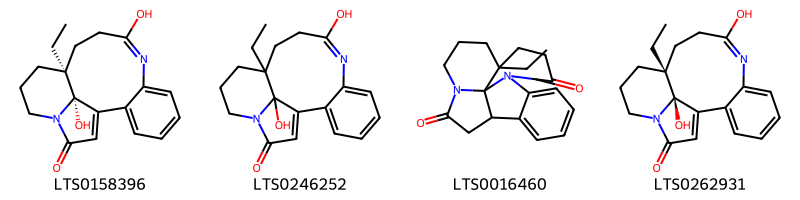{ width=100% }
    <figcaption>Hình ảnh cấu trúc hóa học của 4 hoạt chất thuộc nhóm Rhazinilam alkaloids gồm ['(12s,19r)-12-ethyl-9,19-dihydroxy-8,16-diazatetracyclo[10.6.1.0²,⁷.0¹⁶,¹⁹]nonadeca-1(18),2,4,6,8-pentaen-17-one (LTS0158396)', '12-ethyl-9,19-dihydroxy-8,16-diazatetracyclo[10.6.1.0²,⁷.0¹⁶,¹⁹]nonadeca-1(18),2,4,6,8-pentaen-17-one (LTS0246252)', '15-ethyl-1,11-diazapentacyclo[9.7.1.0²,⁷.0⁸,¹⁹.0¹⁵,¹⁹]nonadeca-2,4,6-triene-10,18-dione (LTS0016460)', '(12r,19s)-12-ethyl-9,19-dihydroxy-8,16-diazatetracyclo[10.6.1.0²,⁷.0¹⁶,¹⁹]nonadeca-1(18),2,4,6,8-pentaen-17-one (LTS0262931)'].</figcaption>
</figure>
#### Nhóm Saturated hydrocarbons
<figure markdown="span">
    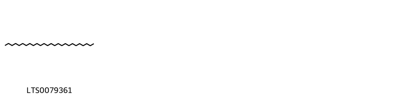{ width=100% }
    <figcaption>Hình ảnh cấu trúc hóa học của 1 hoạt chất thuộc nhóm Saturated hydrocarbons gồm ['hexacosane (LTS0079361)'].</figcaption>
</figure>
#### Nhóm Steroids and steroid derivatives
<figure markdown="span">
    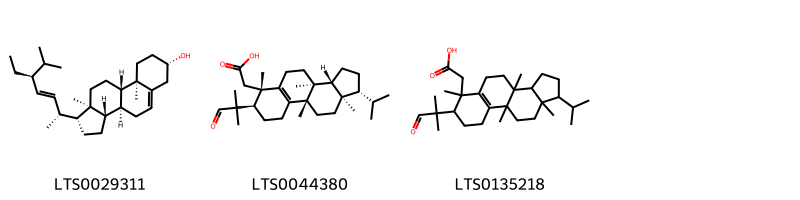{ width=100% }
    <figcaption>Hình ảnh cấu trúc hóa học của 3 hoạt chất thuộc nhóm Steroids and steroid derivatives gồm ['phytosterol (LTS0029311)', '[(1r,3ar,3bs,6s,7r,9bs,11ar)-1-isopropyl-3b,6,9b,11a-tetramethyl-7-(2-methyl-1-oxopropan-2-yl)-1h,2h,3h,3ah,4h,5h,7h,8h,9h,10h,11h-cyclopenta[a]phenanthren-6-yl]acetic acid (LTS0044380)', '[1-isopropyl-3b,6,9b,11a-tetramethyl-7-(2-methyl-1-oxopropan-2-yl)-1h,2h,3h,3ah,4h,5h,7h,8h,9h,10h,11h-cyclopenta[a]phenanthren-6-yl]acetic acid (LTS0135218)'].</figcaption>
</figure>
#### Nhóm Strychnos alkaloids
<figure markdown="span">
    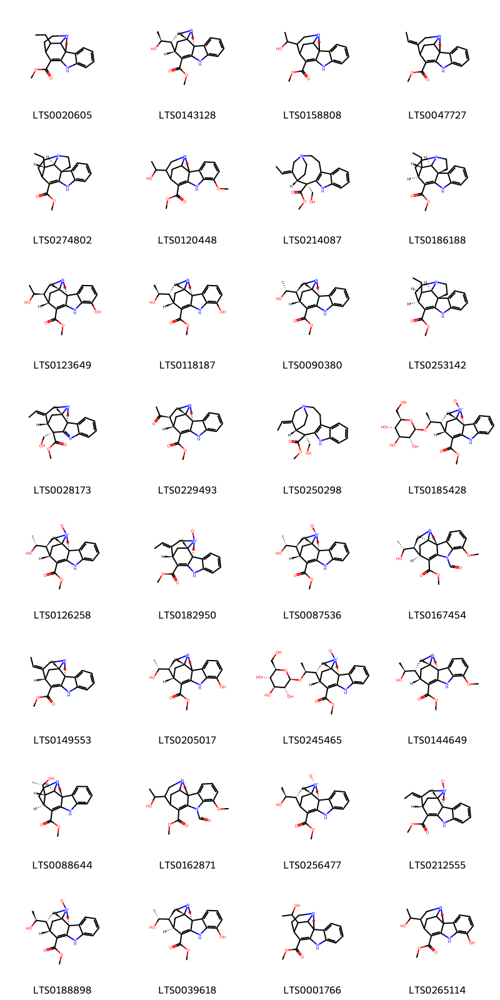{ width=100% }
    <figcaption>Hình ảnh cấu trúc hóa học của 32 hoạt chất thuộc nhóm Strychnos alkaloids gồm ['methyl 18-ethyl-8,14-diazapentacyclo[9.5.2.0¹,⁹.0²,⁷.0¹⁴,¹⁷]octadeca-2,4,6,9-tetraene-10-carboxylate (LTS0020605)', 'methyl (1r,11s,12s,17s)-12-[(1s)-1-hydroxyethyl]-8,14-diazapentacyclo[9.5.2.0¹,⁹.0²,⁷.0¹⁴,¹⁷]octadeca-2,4,6,9-tetraene-10-carboxylate (LTS0143128)', 'echitamidine (LTS0158808)', 'akuammicine (LTS0047727)', 'methyl (1s,17r,18s)-18-ethyl-8,14-diazapentacyclo[9.5.2.0¹,⁹.0²,⁷.0¹⁴,¹⁷]octadeca-2,4,6,9-tetraene-10-carboxylate (LTS0274802)', 'methyl 12-(1-hydroxyethyl)-6-methoxy-8,14-diazapentacyclo[9.5.2.0¹,⁹.0²,⁷.0¹⁴,¹⁷]octadeca-2,4,6,9-tetraene-10-carboxylate (LTS0120448)', 'methyl (1s,2s,16z)-16-ethylidene-2-(hydroxymethyl)-4,14-diazatetracyclo[12.2.2.0³,¹¹.0⁵,¹⁰]octadeca-3(11),5,7,9-tetraene-2-carboxylate (LTS0214087)', '20(s)-tubotaiwine (LTS0186188)', 'methyl (1r,11s,12r,17s)-6-hydroxy-12-(1-hydroxyethyl)-8,14-diazapentacyclo[9.5.2.0¹,⁹.0²,⁷.0¹⁴,¹⁷]octadeca-2,4,6,9-tetraene-10-carboxylate (LTS0123649)', 'methyl (1r,11s,12s,17s)-6-hydroxy-12-[(1s)-1-hydroxyethyl]-8,14-diazapentacyclo[9.5.2.0¹,⁹.0²,⁷.0¹⁴,¹⁷]octadeca-2,4,6,9-tetraene-10-carboxylate (LTS0118187)', 'methyl (1r,11s,12r,17s)-12-[(1r)-1-hydroxyethyl]-8,14-diazapentacyclo[9.5.2.0¹,⁹.0²,⁷.0¹⁴,¹⁷]octadeca-2,4,6,9-tetraene-10-carboxylate (LTS0090380)', '20(r)-tubotaiwine (LTS0253142)', 'preakuammicine (LTS0028173)', '(-)-alstolucine f (LTS0229493)', 'stemmadenine (LTS0250298)', '(1r,11s,12s,14r,17s)-10-(methoxycarbonyl)-12-[(1s)-1-{[(2r,3r,4s,5s,6r)-3,4,5-trihydroxy-6-(hydroxymethyl)oxan-2-yl]oxy}ethyl]-8,14-diazapentacyclo[9.5.2.0¹,⁹.0²,⁷.0¹⁴,¹⁷]octadeca-2,4,6,9-tetraen-14-ium-14-olate (LTS0185428)', '(1r,11s,12r,17s)-12-[(1r)-1-hydroxyethyl]-10-(methoxycarbonyl)-8,14-diazapentacyclo[9.5.2.0¹,⁹.0²,⁷.0¹⁴,¹⁷]octadeca-2,4,6,9-tetraen-14-ium-14-olate (LTS0126258)', '(1r,11s,12e,17s)-12-ethylidene-10-(methoxycarbonyl)-8,14-diazapentacyclo[9.5.2.0¹,⁹.0²,⁷.0¹⁴,¹⁷]octadeca-2,4,6,9-tetraen-14-ium-14-olate (LTS0182950)', '(1r,11s,12r,14r,17s)-12-[(1r)-1-hydroxyethyl]-10-(methoxycarbonyl)-8,14-diazapentacyclo[9.5.2.0¹,⁹.0²,⁷.0¹⁴,¹⁷]octadeca-2,4,6,9-tetraen-14-ium-14-olate (LTS0087536)', 'methyl (1s,11r,12r,17r)-8-formyl-12-[(1r)-1-hydroxyethyl]-6-methoxy-8,14-diazapentacyclo[9.5.2.0¹,⁹.0²,⁷.0¹⁴,¹⁷]octadeca-2,4,6,9-tetraene-10-carboxylate (LTS0167454)', 'methyl (1r,11s,12z,17s)-12-ethylidene-8,14-diazapentacyclo[9.5.2.0¹,⁹.0²,⁷.0¹⁴,¹⁷]octadeca-2,4,6,9-tetraene-10-carboxylate (LTS0149553)', 'methyl (11s,12r,17s)-6-hydroxy-12-[(1r)-1-hydroxyethyl]-8,14-diazapentacyclo[9.5.2.0¹,⁹.0²,⁷.0¹⁴,¹⁷]octadeca-2,4,6,9-tetraene-10-carboxylate (LTS0205017)', '(1r,11s,12s,17s)-10-(methoxycarbonyl)-12-[(1s)-1-{[(2r,3r,4s,5s,6r)-3,4,5-trihydroxy-6-(hydroxymethyl)oxan-2-yl]oxy}ethyl]-8,14-diazapentacyclo[9.5.2.0¹,⁹.0²,⁷.0¹⁴,¹⁷]octadeca-2,4,6,9-tetraen-14-ium-14-olate (LTS0245465)', 'methyl (1r,11s,12s,17s)-12-[(1s)-1-hydroxyethyl]-6-methoxy-8,14-diazapentacyclo[9.5.2.0¹,⁹.0²,⁷.0¹⁴,¹⁷]octadeca-2,4,6,9-tetraene-10-carboxylate (LTS0144649)', 'methyl (1s,11s,17r,18s)-18-[(1s)-1-hydroxyethyl]-8,14-diazapentacyclo[9.5.2.0¹,⁹.0²,⁷.0¹⁴,¹⁷]octadeca-2,4,6,9-tetraene-10-carboxylate (LTS0088644)', 'methyl 8-formyl-12-(1-hydroxyethyl)-6-methoxy-8,14-diazapentacyclo[9.5.2.0¹,⁹.0²,⁷.0¹⁴,¹⁷]octadeca-2,4,6,9-tetraene-10-carboxylate (LTS0162871)', '(1r,12s,14s,17s)-12-[(1s)-1-hydroxyethyl]-10-(methoxycarbonyl)-8,14-diazapentacyclo[9.5.2.0¹,⁹.0²,⁷.0¹⁴,¹⁷]octadeca-2,4,6,9-tetraen-14-ium-14-olate (LTS0256477)', '(1r,11s,12e,14r,17s)-12-ethylidene-10-(methoxycarbonyl)-8,14-diazapentacyclo[9.5.2.0¹,⁹.0²,⁷.0¹⁴,¹⁷]octadeca-2,4,6,9-tetraen-14-ium-14-olate (LTS0212555)', '(1r,11s,12s,17s)-12-[(1s)-1-hydroxyethyl]-10-(methoxycarbonyl)-8,14-diazapentacyclo[9.5.2.0¹,⁹.0²,⁷.0¹⁴,¹⁷]octadeca-2,4,6,9-tetraen-14-ium-14-olate (LTS0188898)', 'methyl (1r,11r,12r,17s)-6-hydroxy-12-[(1r)-1-hydroxyethyl]-8,14-diazapentacyclo[9.5.2.0¹,⁹.0²,⁷.0¹⁴,¹⁷]octadeca-2,4,6,9-tetraene-10-carboxylate (LTS0039618)', 'methyl 18-(1-hydroxyethyl)-8,14-diazapentacyclo[9.5.2.0¹,⁹.0²,⁷.0¹⁴,¹⁷]octadeca-2,4,6,9-tetraene-10-carboxylate (LTS0001766)', 'methyl 6-hydroxy-12-(1-hydroxyethyl)-8,14-diazapentacyclo[9.5.2.0¹,⁹.0²,⁷.0¹⁴,¹⁷]octadeca-2,4,6,9-tetraene-10-carboxylate (LTS0265114)'].</figcaption>
</figure>
#### Nhóm Vallesaman alkaloids
<figure markdown="span">
    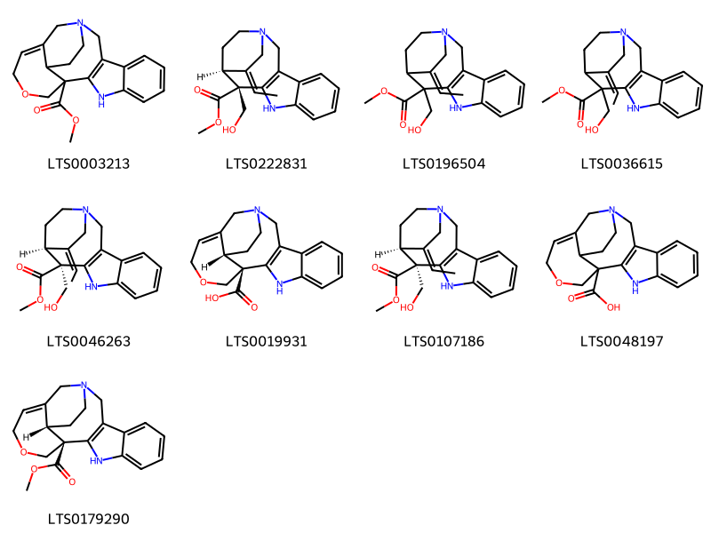{ width=100% }
    <figcaption>Hình ảnh cấu trúc hóa học của 9 hoạt chất thuộc nhóm Vallesaman alkaloids gồm ['angustilobine b, (rac)- (LTS0003213)', 'methyl (12r,13s,14z)-14-ethylidene-12-(hydroxymethyl)-1,10-diazatetracyclo[11.2.2.0³,¹¹.0⁴,⁹]heptadeca-3(11),4,6,8-tetraene-12-carboxylate (LTS0222831)', 'methyl 14-ethylidene-12-(hydroxymethyl)-1,10-diazatetracyclo[11.2.2.0³,¹¹.0⁴,⁹]heptadeca-3(11),4,6,8-tetraene-12-carboxylate (LTS0196504)', 'methyl (14e)-14-ethylidene-12-(hydroxymethyl)-1,10-diazatetracyclo[11.2.2.0³,¹¹.0⁴,⁹]heptadeca-3(11),4,6,8-tetraene-12-carboxylate (LTS0036615)', 'methyl (12s,13s,14e)-14-ethylidene-12-(hydroxymethyl)-1,10-diazatetracyclo[11.2.2.0³,¹¹.0⁴,⁹]heptadeca-3(11),4,6,8-tetraene-12-carboxylate (LTS0046263)', '(12s,18s)-14-oxa-1,10-diazapentacyclo[15.3.1.0³,¹¹.0⁴,⁹.0¹²,¹⁸]henicosa-3(11),4,6,8,16-pentaene-12-carboxylic acid (LTS0019931)', 'methyl (12s,13s,14z)-14-ethylidene-12-(hydroxymethyl)-1,10-diazatetracyclo[11.2.2.0³,¹¹.0⁴,⁹]heptadeca-3(11),4,6,8-tetraene-12-carboxylate (LTS0107186)', '14-oxa-1,10-diazapentacyclo[15.3.1.0³,¹¹.0⁴,⁹.0¹²,¹⁸]henicosa-3(11),4,6,8,16-pentaene-12-carboxylic acid (LTS0048197)', 'methyl (12s,18s)-14-oxa-1,10-diazapentacyclo[15.3.1.0³,¹¹.0⁴,⁹.0¹²,¹⁸]henicosa-3(11),4,6,8,16-pentaene-12-carboxylate (LTS0179290)'].</figcaption>
</figure>
#### Nhóm Yohimbine alkaloids
<figure markdown="span">
    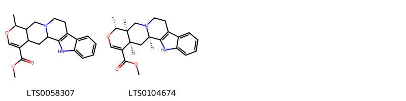{ width=100% }
    <figcaption>Hình ảnh cấu trúc hóa học của 2 hoạt chất thuộc nhóm Yohimbine alkaloids gồm ['ajmalicine (LTS0058307)', 'methyl (1r,15r,16r,20r)-16-methyl-17-oxa-3,13-diazapentacyclo[11.8.0.0²,¹⁰.0⁴,⁹.0¹⁵,²⁰]henicosa-2(10),4,6,8,18-pentaene-19-carboxylate (LTS0104674)'].</figcaption>
</figure>

---

### Dược dân tộc học

Danh sách các quốc gia có sử dụng *Alstonia scholaris* trong điều trị các bệnh. 

| Country   | Disease                                                | Bệnh                                                                                                                                                                                                |
|:----------|:-------------------------------------------------------|:----------------------------------------------------------------------------------------------------------------------------------------------------------------------------------------------------|
| India     | Tonic                                                  | MYMEMORY WARNING: YOU USED ALL AVAILABLE FREE TRANSLATIONS FOR TODAY. NEXT AVAILABLE IN  12 HOURS 07 MINUTES 17 SECONDS VISIT HTTPS://MYMEMORY.TRANSLATED.NET/DOC/USAGELIMITS.PHP TO TRANSLATE MORE |
| Java      | Vermifuge                                              | MYMEMORY WARNING: YOU USED ALL AVAILABLE FREE TRANSLATIONS FOR TODAY. NEXT AVAILABLE IN  12 HOURS 07 MINUTES 11 SECONDS VISIT HTTPS://MYMEMORY.TRANSLATED.NET/DOC/USAGELIMITS.PHP TO TRANSLATE MORE |
| Malaya    | Tonic                                                  | MYMEMORY WARNING: YOU USED ALL AVAILABLE FREE TRANSLATIONS FOR TODAY. NEXT AVAILABLE IN  12 HOURS 07 MINUTES 05 SECONDS VISIT HTTPS://MYMEMORY.TRANSLATED.NET/DOC/USAGELIMITS.PHP TO TRANSLATE MORE |
| Turkey    | Astringent, Expectorant, Stomachic, Aphrodisiac, Tonic | MYMEMORY WARNING: YOU USED ALL AVAILABLE FREE TRANSLATIONS FOR TODAY. NEXT AVAILABLE IN  12 HOURS 06 MINUTES 59 SECONDS VISIT HTTPS://MYMEMORY.TRANSLATED.NET/DOC/USAGELIMITS.PHP TO TRANSLATE MORE |

---

# Chi Ichnocarpus

??? note "Danh sách các dược liệu thuộc chi"
    
	 - *Ichnocarpus frutescens*

---
## Ichnocarpus frutescens
### Thông tin về thực vật

!!! info "Phân loại thực vật của *Ichnocarpus frutescens* từ GIBF:"
    - **Kingdom:** Plantae
    - **Phylum:** Tracheophyta
    - **Order:** Gentianales
    - **Family:** Apocynaceae
    - **Genus:** Ichnocarpus
    - **Species:** *Ichnocarpus frutescens*

 

| Label (VI)   | Label (EN)   | Scientific Name        | Descriptions (VI)   | Descriptions (EN)   | Also Known As (VI)   | Also Known As (EN)   |
|:-------------|:-------------|:-----------------------|:--------------------|:--------------------|:---------------------|:---------------------|
| N/A          | N/A          | Ichnocarpus frutescens | loài thực vật       | species of plant    | ['']                 | ['']                 |

#### Phân bố trên thế giới

**Từ CSDL GIBF** nan, Sri Lanka, Hong Kong, Viet Nam, Cambodia, Indonesia, China, Australia, Myanmar, India, Papua New Guinea, Thailand, Lao People’s Democratic Republic

#### Phân bố tại Việt Nam

**Từ CSDL GIBF**: Thua Thien-Hue

---
### Thành phần hóa học
        
- Theo cơ sở dữ liệu lotus: Từ loài *Ichnocarpus frutescens* đã phân lập và xác định được 4 hoạt chất thuộc về các nhóm Prenol lipids, Flavonoids. 

|    | chemicalTaxonomyClassyfireClass   |   smiles_count |
|---:|:----------------------------------|---------------:|
|  0 | Flavonoids                        |              2 |
|  1 | Prenol lipids                     |              2 |

#### Nhóm Flavonoids
<figure markdown="span">
    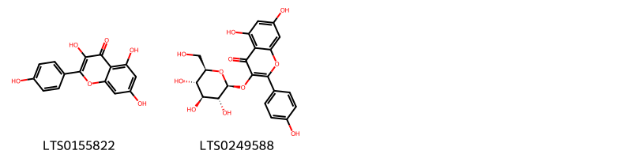{ width=100% }
    <figcaption>Hình ảnh cấu trúc hóa học của 2 hoạt chất thuộc nhóm Flavonoids gồm ['kaempherol (LTS0155822)', 'astragalin (LTS0249588)'].</figcaption>
</figure>
#### Nhóm Prenol lipids
<figure markdown="span">
    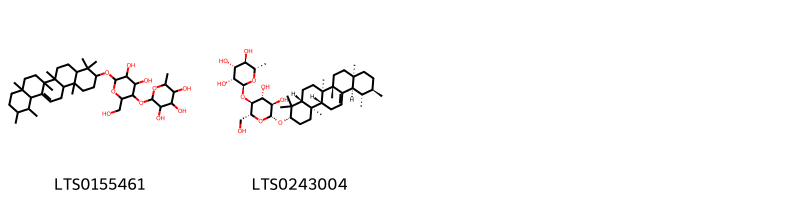{ width=100% }
    <figcaption>Hình ảnh cấu trúc hóa học của 2 hoạt chất thuộc nhóm Prenol lipids gồm ['2-({6-[(4,4,6a,6b,8a,11,12,14b-octamethyl-2,3,4a,5,6,7,8,9,10,11,12,12a,14,14a-tetradecahydro-1h-picen-3-yl)oxy]-4,5-dihydroxy-2-(hydroxymethyl)oxan-3-yl}oxy)-6-methyloxane-3,4,5-triol (LTS0155461)', '(2s,3r,4r,5r,6s)-2-{[(2r,3s,4r,5r,6r)-6-{[(3s,4ar,6ar,6bs,8ar,11r,12s,12ar,14ar,14br)-4,4,6a,6b,8a,11,12,14b-octamethyl-2,3,4a,5,6,7,8,9,10,11,12,12a,14,14a-tetradecahydro-1h-picen-3-yl]oxy}-4,5-dihydroxy-2-(hydroxymethyl)oxan-3-yl]oxy}-6-methyloxane-3,4,5-triol (LTS0243004)'].</figcaption>
</figure>

---

### Dược dân tộc học

Danh sách các quốc gia có sử dụng *Ichnocarpus frutescens* trong điều trị các bệnh. 

| Country       | Disease                                 | Bệnh                                                                                                                                                                                                |
|:--------------|:----------------------------------------|:----------------------------------------------------------------------------------------------------------------------------------------------------------------------------------------------------|
| India         | Demulcent, Diuretic, Diaphoretic, Tonic | MYMEMORY WARNING: YOU USED ALL AVAILABLE FREE TRANSLATIONS FOR TODAY. NEXT AVAILABLE IN  12 HOURS 06 MINUTES 11 SECONDS VISIT HTTPS://MYMEMORY.TRANSLATED.NET/DOC/USAGELIMITS.PHP TO TRANSLATE MORE |
| India(Santal) | Laxative                                | MYMEMORY WARNING: YOU USED ALL AVAILABLE FREE TRANSLATIONS FOR TODAY. NEXT AVAILABLE IN  12 HOURS 06 MINUTES 08 SECONDS VISIT HTTPS://MYMEMORY.TRANSLATED.NET/DOC/USAGELIMITS.PHP TO TRANSLATE MORE |

---

# Chi Strophanthus

??? note "Danh sách các dược liệu thuộc chi"
    
	 - *Strophanthus caudatus*
	 - *Strophanthus kombe*

---
## Strophanthus caudatus
### Thông tin về thực vật

!!! info "Phân loại thực vật của *Strophanthus caudatus* từ GIBF:"
    - **Kingdom:** Plantae
    - **Phylum:** Tracheophyta
    - **Order:** Gentianales
    - **Family:** Apocynaceae
    - **Genus:** Strophanthus
    - **Species:** *Strophanthus caudatus*

 

| Label (VI)   | Label (EN)   | Scientific Name       | Descriptions (VI)   | Descriptions (EN)   | Also Known As (VI)   | Also Known As (EN)   |
|:-------------|:-------------|:----------------------|:--------------------|:--------------------|:---------------------|:---------------------|
| N/A          | N/A          | Strophanthus caudatus | loài thực vật       | species of plant    | ['']                 | ['']                 |

#### Phân bố trên thế giới

**Từ CSDL GIBF** nan, Brazil, Viet Nam, China, Chile, Tanzania, United Republic of, Thailand, Puerto Rico, United States of America, Jamaica, Indonesia, Cuba, unknown or invalid, Ethiopia, Lao People’s Democratic Republic, Belgium, Philippines, Malaysia, Chinese Taipei, Germany, Namibia, Singapore, Cambodia, India, Cameroon

#### Phân bố tại Việt Nam

**Từ CSDL GIBF**: Nghe An, Thua Thien-Hue, Tay Ninh, Ninh Thuan

---
### Thành phần hóa học
        
- Theo cơ sở dữ liệu lotus: Từ loài *Strophanthus caudatus* đã phân lập và xác định được Chưa có hoạt chất nào được phân lập. hoạt chất thuộc về các nhóm Không có hoạt chất nào được phân lập. 

Không có hình ảnh nào được tạo ra

---

### Dược dân tộc học

Danh sách các quốc gia có sử dụng *Strophanthus caudatus* trong điều trị các bệnh. 

| Country   | Disease   | Bệnh                                                                                                                                                                                                |
|:----------|:----------|:----------------------------------------------------------------------------------------------------------------------------------------------------------------------------------------------------|
| Malaya    | Poison    | MYMEMORY WARNING: YOU USED ALL AVAILABLE FREE TRANSLATIONS FOR TODAY. NEXT AVAILABLE IN  12 HOURS 05 MINUTES 39 SECONDS VISIT HTTPS://MYMEMORY.TRANSLATED.NET/DOC/USAGELIMITS.PHP TO TRANSLATE MORE |

---

---
## Strophanthus kombe
### Thông tin về thực vật

!!! info "Phân loại thực vật của *Strophanthus kombe* từ GIBF:"
    - **Kingdom:** Plantae
    - **Phylum:** Tracheophyta
    - **Order:** Gentianales
    - **Family:** Apocynaceae
    - **Genus:** Strophanthus
    - **Species:** *Strophanthus kombe*

 

| Label (VI)   | Label (EN)   | Scientific Name    | Descriptions (VI)   | Descriptions (EN)   | Also Known As (VI)   | Also Known As (EN)   |
|:-------------|:-------------|:-------------------|:--------------------|:--------------------|:---------------------|:---------------------|
| N/A          | N/A          | Strophanthus kombe | loài thực vật       | species of plant    | ['']                 | ['']                 |

#### Phân bố trên thế giới

**Từ CSDL GIBF** nan, Namibia, Congo, Democratic Republic of the, Kenya, United States of America, Zambia, Belgium, South Africa, Zimbabwe, Mozambique, Tanzania, United Republic of, unknown or invalid, Angola, Germany, Equatorial Guinea, Malawi

#### Phân bố tại Việt Nam

**Từ CSDL GIBF**: Không có ghi nhận ở Việt Nam

---
### Thành phần hóa học
        
- Theo cơ sở dữ liệu lotus: Từ loài *Strophanthus kombe* đã phân lập và xác định được 46 hoạt chất thuộc về các nhóm Steroids and steroid derivatives. 

|    | chemicalTaxonomyClassyfireClass   |   smiles_count |
|---:|:----------------------------------|---------------:|
|  0 | Steroids and steroid derivatives  |             46 |

#### Nhóm Steroids and steroid derivatives
<figure markdown="span">
    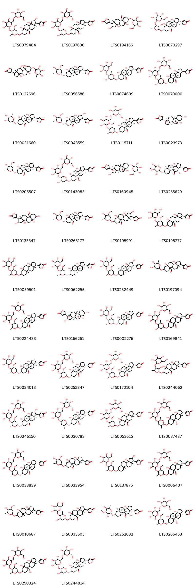{ width=100% }
    <figcaption>Hình ảnh cấu trúc hóa học của 46 hoạt chất thuộc nhóm Steroids and steroid derivatives gồm ['2,3a,5a-trihydroxy-7-[(4-methoxy-6-methyl-5-{[3,4,5-trihydroxy-6-({[3,4,5-trihydroxy-6-(hydroxymethyl)oxan-2-yl]oxy}methyl)oxan-2-yl]oxy}oxan-2-yl)oxy]-11a-methyl-1-(5-oxo-2h-furan-3-yl)-dodecahydro-1h-cyclopenta[a]phenanthrene-9a-carbaldehyde (LTS0079484)', '4-{3a,5a-dihydroxy-7-[(4-hydroxy-6-methyl-5-{[3,4,5-trihydroxy-6-({[3,4,5-trihydroxy-6-(hydroxymethyl)oxan-2-yl]oxy}methyl)oxan-2-yl]oxy}oxan-2-yl)oxy]-9a-(hydroxymethyl)-11a-methyl-dodecahydro-1h-cyclopenta[a]phenanthren-1-yl}-5h-furan-2-one (LTS0197606)', '2,3a,5a-trihydroxy-11a-methyl-1-(5-oxo-2h-furan-3-yl)-7-{[3,4,5-trihydroxy-6-(hydroxymethyl)oxan-2-yl]oxy}-dodecahydro-1h-cyclopenta[a]phenanthrene-9a-carbaldehyde (LTS0194166)', '(1r,3as,3bs,5as,7s,9as,9bs,11ar)-3a,5a-dihydroxy-7-{[(2s,3s,4s,5r)-3-hydroxy-5-methyl-4-{[(2s,3r,4s,5s,6r)-3,4,5-trihydroxy-6-(hydroxymethyl)oxan-2-yl]oxy}oxolan-2-yl]oxy}-11a-methyl-1-(5-oxo-2h-furan-3-yl)-dodecahydro-1h-cyclopenta[a]phenanthrene-9a-carbaldehyde (LTS0070297)', '4-[(10r)-3a,5a,9,10-tetrahydroxy-9a-(hydroxymethyl)-11a-methyl-7-[(3,4,5-trihydroxy-6-methyloxan-2-yl)oxy]-dodecahydro-1h-cyclopenta[a]phenanthren-1-yl]-5h-furan-2-one (LTS0122696)', 'periplocymarin (LTS0056586)', 'erysimoside (LTS0074609)', '(1s,3as,3br,5as,7s,9as,9bs,11ar)-3a,5a-dihydroxy-7-{[(2r,4s,5s,6r)-4-hydroxy-6-methyl-5-{[(2s,3r,4s,5s,6r)-3,4,5-trihydroxy-6-({[(2r,3r,4s,5s,6r)-3,4,5-trihydroxy-6-(hydroxymethyl)oxan-2-yl]oxy}methyl)oxan-2-yl]oxy}oxan-2-yl]oxy}-11a-methyl-1-(5-oxo-2h-furan-3-yl)-dodecahydro-1h-cyclopenta[a]phenanthrene-9a-carbaldehyde (LTS0070000)', 'helveticoside (LTS0031660)', '(1s,2s,3as,3br,5as,7s,9as,9bs,11ar)-2,3a,5a-trihydroxy-7-{[(2r,4s,5r,6r)-5-hydroxy-4-methoxy-6-methyloxan-2-yl]oxy}-11a-methyl-1-(5-oxo-2h-furan-3-yl)-dodecahydro-1h-cyclopenta[a]phenanthrene-9a-carbaldehyde (LTS0043559)', '(1s,3as,3bs,5as,7s,9as,9bs,11ar)-3a,5a-dihydroxy-7-{[(2s,4r,5s,6s)-4-methoxy-6-methyl-5-{[(2s,3r,4s,5s,6r)-3,4,5-trihydroxy-6-({[(2s,3s,4r,5r,6s)-3,4,5-trihydroxy-6-(hydroxymethyl)oxan-2-yl]oxy}methyl)oxan-2-yl]oxy}oxan-2-yl]oxy}-11a-methyl-1-(5-oxo-2h-furan-3-yl)-dodecahydro-1h-cyclopenta[a]phenanthrene-9a-carbaldehyde (LTS0115711)', 'strophanthidin (LTS0023973)', '(1r,3as,3bs,5as,7s,9as,9bs,11ar)-3a,5a-dihydroxy-7-{[(2r,4r,5s,6r)-5-hydroxy-4-methoxy-6-methyloxan-2-yl]oxy}-11a-methyl-1-(5-oxo-2h-furan-3-yl)-dodecahydro-1h-cyclopenta[a]phenanthrene-9a-carbaldehyde (LTS0205507)', '4-[(1s,3as,3br,5as,7s,9ar,9bs,11ar)-3a,5a-dihydroxy-7-{[(2r,4s,5s,6r)-4-hydroxy-6-methyl-5-{[(2s,3r,4s,5s,6r)-3,4,5-trihydroxy-6-({[(2r,3r,4s,5s,6r)-3,4,5-trihydroxy-6-(hydroxymethyl)oxan-2-yl]oxy}methyl)oxan-2-yl]oxy}oxan-2-yl]oxy}-9a-(hydroxymethyl)-11a-methyl-dodecahydro-1h-cyclopenta[a]phenanthren-1-yl]-5h-furan-2-one (LTS0143083)', '(1s,2s,3as,3br,5as,7s,9as,9bs,11ar)-2,3a,5a-trihydroxy-11a-methyl-1-(5-oxo-2h-furan-3-yl)-7-{[(2r,3r,4s,5s,6r)-3,4,5-trihydroxy-6-(hydroxymethyl)oxan-2-yl]oxy}-dodecahydro-1h-cyclopenta[a]phenanthrene-9a-carbaldehyde (LTS0160945)', '4-[(1r,3as,3br,5ar,7s,9as,9bs,11s,11as)-7-{[(2s,3r,4s,5s,6s)-3,5-dihydroxy-4-methoxy-6-methyloxan-2-yl]oxy}-3a,11-dihydroxy-9a,11a-dimethyl-10-oxo-dodecahydro-1h-cyclopenta[a]phenanthren-1-yl]-5h-furan-2-one (LTS0255629)', '2,3a,5a,7-tetrahydroxy-11a-methyl-1-(5-oxo-2h-furan-3-yl)-dodecahydro-1h-cyclopenta[a]phenanthrene-9a-carbaldehyde (LTS0133347)', 'cymarin (LTS0263177)', '2,3a,5a-trihydroxy-7-[(5-hydroxy-4-methoxy-6-methyloxan-2-yl)oxy]-11a-methyl-1-(5-oxo-2h-furan-3-yl)-dodecahydro-1h-cyclopenta[a]phenanthrene-9a-carbaldehyde (LTS0195991)', 'strophanthin k (LTS0195277)', 'periplocin (LTS0059501)', 'periplocin (LTS0062255)', '4-[(1r,2r,3ar,3br,5ar,7s,9as,9bs,11ar)-2,3a-dihydroxy-7-{[(2r,4s,5s,6s)-4-methoxy-6-methyl-5-{[(2s,3r,4s,5s,6r)-3,4,5-trihydroxy-6-(hydroxymethyl)oxan-2-yl]oxy}oxan-2-yl]oxy}-9a,11a-dimethyl-tetradecahydrocyclopenta[a]phenanthren-1-yl]-5h-furan-2-one (LTS0232449)', '7-[(4,5-dihydroxy-6-methyloxan-2-yl)oxy]-3a,5a-dihydroxy-11a-methyl-1-(5-oxo-2h-furan-3-yl)-dodecahydro-1h-cyclopenta[a]phenanthrene-9a-carbaldehyde (LTS0197094)', '(1s,3as,3br,5as,7s,9as,9bs,11ar)-3a,5a-dihydroxy-7-{[(2s,4r,5s,6s)-4-methoxy-6-methyl-5-{[(2s,3r,4s,5s,6r)-3,4,5-trihydroxy-6-({[(2s,3s,4r,5r,6s)-3,4,5-trihydroxy-6-(hydroxymethyl)oxan-2-yl]oxy}methyl)oxan-2-yl]oxy}oxan-2-yl]oxy}-11a-methyl-1-(5-oxo-2h-furan-3-yl)-dodecahydro-1h-cyclopenta[a]phenanthrene-9a-carbaldehyde (LTS0224433)', '(1s,2s,3as,3br,5as,7s,9as,9bs,11ar)-2,3a,5a,7-tetrahydroxy-11a-methyl-1-(5-oxo-2h-furan-3-yl)-dodecahydro-1h-cyclopenta[a]phenanthrene-9a-carbaldehyde (LTS0166261)', '(1r,3as,3br,5as,7s,9as,9bs,11ar)-3a,5a-dihydroxy-7-{[(2r,4r,5s,6r)-4-methoxy-6-methyl-5-{[(2r,3s,4r,5r,6s)-3,4,5-trihydroxy-6-(hydroxymethyl)oxan-2-yl]oxy}oxan-2-yl]oxy}-11a-methyl-1-(5-oxo-2h-furan-3-yl)-dodecahydro-1h-cyclopenta[a]phenanthrene-9a-carbaldehyde (LTS0002276)', '3a,5a-dihydroxy-7-[(4-hydroxy-6-methyl-5-{[3,4,5-trihydroxy-6-({[3,4,5-trihydroxy-6-(hydroxymethyl)oxan-2-yl]oxy}methyl)oxan-2-yl]oxy}oxan-2-yl)oxy]-11a-methyl-1-(5-oxo-2h-furan-3-yl)-dodecahydro-1h-cyclopenta[a]phenanthrene-9a-carbaldehyde (LTS0169841)', 'β-k-strophanthin (LTS0034018)', '(1r,3as,3br,5as,7s,9as,9bs,11ar)-3a,5a-dihydroxy-7-{[(2s,4r,5s,6s)-4-methoxy-6-methyl-5-{[(2s,3r,4s,5s,6r)-3,4,5-trihydroxy-6-({[(2s,3s,4r,5r,6s)-3,4,5-trihydroxy-6-(hydroxymethyl)oxan-2-yl]oxy}methyl)oxan-2-yl]oxy}oxan-2-yl]oxy}-11a-methyl-1-(5-oxo-2h-furan-3-yl)-dodecahydro-1h-cyclopenta[a]phenanthrene-9a-carboxylic acid (LTS0252347)', '(1r,3as,3br,5as,7s,9as,9bs,11ar)-3a,5a-dihydroxy-7-{[(2s,4r,5s,6s)-4-methoxy-6-methyl-5-{[(2s,3r,4s,5s,6r)-3,4,5-trihydroxy-6-({[(2s,3s,4r,5r,6s)-3,4,5-trihydroxy-6-(hydroxymethyl)oxan-2-yl]oxy}methyl)oxan-2-yl]oxy}oxan-2-yl]oxy}-11a-methyl-1-(5-oxo-2h-furan-3-yl)-dodecahydro-1h-cyclopenta[a]phenanthrene-9a-carbaldehyde (LTS0170104)', '3a,5a-dihydroxy-7-[(3-hydroxy-5-methyl-4-{[3,4,5-trihydroxy-6-(hydroxymethyl)oxan-2-yl]oxy}oxolan-2-yl)oxy]-11a-methyl-1-(5-oxo-2h-furan-3-yl)-dodecahydro-1h-cyclopenta[a]phenanthrene-9a-carbaldehyde (LTS0244062)', '(1s,2s,3as,3br,5as,7s,9as,9bs,11ar)-2,3a,5a-trihydroxy-7-{[(2r,4s,5r,6r)-4-methoxy-6-methyl-5-{[(2s,3r,4s,5s,6r)-3,4,5-trihydroxy-6-({[(2r,3r,4s,5s,6r)-3,4,5-trihydroxy-6-(hydroxymethyl)oxan-2-yl]oxy}methyl)oxan-2-yl]oxy}oxan-2-yl]oxy}-11a-methyl-1-(5-oxo-2h-furan-3-yl)-dodecahydro-1h-cyclopenta[a]phenanthrene-9a-carbaldehyde (LTS0246150)', '4-[(1r,3as,3br,5as,7s,9ar,9bs,11ar)-7-{[(2s,3s,5r,6s)-3,6-dimethyl-5-{[(2r,3r,4s,5s,6r)-3,4,5-trihydroxy-6-({[(2s,3s,4r,5r,6s)-3,4,5-trihydroxy-6-(hydroxymethyl)oxan-2-yl]oxy}methyl)oxan-2-yl]oxy}oxan-2-yl]oxy}-3a,5a-dihydroxy-9a-(hydroxymethyl)-11a-methyl-dodecahydro-1h-cyclopenta[a]phenanthren-1-yl]-5h-furan-2-one (LTS0030783)', '3a,5a-dihydroxy-7-[(4-methoxy-6-methyl-5-{[3,4,5-trihydroxy-6-({[3,4,5-trihydroxy-6-(hydroxymethyl)oxan-2-yl]oxy}methyl)oxan-2-yl]oxy}oxan-2-yl)oxy]-11a-methyl-1-(5-oxo-2h-furan-3-yl)-dodecahydro-1h-cyclopenta[a]phenanthrene-9a-carboxylic acid (LTS0053615)', '4-{7-[(3,6-dimethyl-5-{[3,4,5-trihydroxy-6-({[3,4,5-trihydroxy-6-(hydroxymethyl)oxan-2-yl]oxy}methyl)oxan-2-yl]oxy}oxan-2-yl)oxy]-3a,5a-dihydroxy-9a-(hydroxymethyl)-11a-methyl-dodecahydro-1h-cyclopenta[a]phenanthren-1-yl}-5h-furan-2-one (LTS0037487)', '(1r,3as,3br,5as,7s,9as,9bs,11ar)-3a,5a-dihydroxy-7-{[(2r,4s,5r,6r)-4-methoxy-6-methyl-5-{[(2s,3r,4s,5s,6r)-3,4,5-trihydroxy-6-({[(2r,3r,4s,5s,6r)-3,4,5-trihydroxy-6-(hydroxymethyl)oxan-2-yl]oxy}methyl)oxan-2-yl]oxy}oxan-2-yl]oxy}-11a-methyl-1-(5-oxo-2h-furan-3-yl)-dodecahydro-1h-cyclopenta[a]phenanthrene-9a-carbaldehyde (LTS0033839)', 'cymarin (LTS0033954)', '4-{2,3a-dihydroxy-7-[(4-methoxy-6-methyl-5-{[3,4,5-trihydroxy-6-(hydroxymethyl)oxan-2-yl]oxy}oxan-2-yl)oxy]-9a,11a-dimethyl-tetradecahydrocyclopenta[a]phenanthren-1-yl}-5h-furan-2-one (LTS0137875)', '3a,5a-dihydroxy-7-[(4-methoxy-6-methyl-5-{[3,4,5-trihydroxy-6-({[3,4,5-trihydroxy-6-(hydroxymethyl)oxan-2-yl]oxy}methyl)oxan-2-yl]oxy}oxan-2-yl)oxy]-11a-methyl-1-(5-oxo-2h-furan-3-yl)-dodecahydro-1h-cyclopenta[a]phenanthrene-9a-carbaldehyde (LTS0006407)', '4-{3a,5a-dihydroxy-7-[(5-hydroxy-4-methoxy-6-methyloxan-2-yl)oxy]-9a,11a-dimethyl-dodecahydro-1h-cyclopenta[a]phenanthren-1-yl}-5h-furan-2-one (LTS0010687)', 'erysimoside (LTS0033605)', 'musaroside (LTS0252682)', '4-[(1r,3as,3br,5as,7s,9ar,9bs,11ar)-3a,5a-dihydroxy-9a-(hydroxymethyl)-7-{[(2s,4r,5s,6s)-4-methoxy-6-methyl-5-{[(2s,3r,4s,5s,6r)-3,4,5-trihydroxy-6-({[(2s,3s,4r,5r,6s)-3,4,5-trihydroxy-6-(hydroxymethyl)oxan-2-yl]oxy}methyl)oxan-2-yl]oxy}oxan-2-yl]oxy}-11a-methyl-dodecahydro-1h-cyclopenta[a]phenanthren-1-yl]-5h-furan-2-one (LTS0266453)', '4-[3a,5a-dihydroxy-9a-(hydroxymethyl)-7-[(4-methoxy-6-methyl-5-{[3,4,5-trihydroxy-6-({[3,4,5-trihydroxy-6-(hydroxymethyl)oxan-2-yl]oxy}methyl)oxan-2-yl]oxy}oxan-2-yl)oxy]-11a-methyl-dodecahydro-1h-cyclopenta[a]phenanthren-1-yl]-5h-furan-2-one (LTS0250324)', '(1r,3as,3bs,5as,7s,9as,9bs,11ar)-3a,5a-dihydroxy-7-{[(2s,4r,5r,6s)-4-hydroxy-6-methyl-5-{[(2s,3r,4s,5s,6r)-3,4,5-trihydroxy-6-({[(2s,3s,4r,5r,6s)-3,4,5-trihydroxy-6-(hydroxymethyl)oxan-2-yl]oxy}methyl)oxan-2-yl]oxy}oxan-2-yl]oxy}-11a-methyl-1-(5-oxo-2h-furan-3-yl)-dodecahydro-1h-cyclopenta[a]phenanthrene-9a-carbaldehyde (LTS0244814)'].</figcaption>
</figure>

---

### Dược dân tộc học

Danh sách các quốc gia có sử dụng *Strophanthus kombe* trong điều trị các bệnh. 

| Country         | Disease                          | Bệnh                                                                                                                                                                                                |
|:----------------|:---------------------------------|:----------------------------------------------------------------------------------------------------------------------------------------------------------------------------------------------------|
| Africa          | Cardiotonic, Diuretic, Stimulant | MYMEMORY WARNING: YOU USED ALL AVAILABLE FREE TRANSLATIONS FOR TODAY. NEXT AVAILABLE IN  12 HOURS 05 MINUTES 03 SECONDS VISIT HTTPS://MYMEMORY.TRANSLATED.NET/DOC/USAGELIMITS.PHP TO TRANSLATE MORE |
| Africa(Swahili) | Poison                           | MYMEMORY WARNING: YOU USED ALL AVAILABLE FREE TRANSLATIONS FOR TODAY. NEXT AVAILABLE IN  12 HOURS 05 MINUTES 00 SECONDS VISIT HTTPS://MYMEMORY.TRANSLATED.NET/DOC/USAGELIMITS.PHP TO TRANSLATE MORE |

---

# Chi Vallaris

??? note "Danh sách các dược liệu thuộc chi"
    
	 - *Vallaris solanacea*

---
## Vallaris solanacea
### Thông tin về thực vật

!!! info "Phân loại thực vật của *Vallaris solanacea* từ GIBF:"
    - **Kingdom:** Plantae
    - **Phylum:** Tracheophyta
    - **Order:** Gentianales
    - **Family:** Apocynaceae
    - **Genus:** Vallaris
    - **Species:** *Vallaris solanacea*

 

| Label (VI)   | Label (EN)   | Scientific Name    | Descriptions (VI)   | Descriptions (EN)   | Also Known As (VI)   | Also Known As (EN)   |
|:-------------|:-------------|:-------------------|:--------------------|:--------------------|:---------------------|:---------------------|
| N/A          | N/A          | Vallaris solanacea | loài thực vật       | species of plant    | ['']                 | ['']                 |

#### Phân bố trên thế giới

**Từ CSDL GIBF** nan, Sri Lanka, Cambodia, United States of America, Guadeloupe, Indonesia, Nepal, China, Myanmar, India, unknown or invalid, Thailand, Lao People’s Democratic Republic

#### Phân bố tại Việt Nam

**Từ CSDL GIBF**: Không có ghi nhận ở Việt Nam

---
### Thành phần hóa học
        
- Theo cơ sở dữ liệu lotus: Từ loài *Vallaris solanacea* đã phân lập và xác định được 6 hoạt chất thuộc về các nhóm Organooxygen compounds, Steroids and steroid derivatives. 

|    | chemicalTaxonomyClassyfireClass   |   smiles_count |
|---:|:----------------------------------|---------------:|
|  0 | Organooxygen compounds            |              2 |
|  1 | Steroids and steroid derivatives  |              4 |

#### Nhóm Organooxygen compounds
<figure markdown="span">
    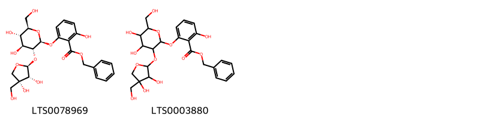{ width=100% }
    <figcaption>Hình ảnh cấu trúc hóa học của 2 hoạt chất thuộc nhóm Organooxygen compounds gồm ['benzyl 2-{[(2s,3r,4s,5s,6r)-3-{[(2s,3r,4r)-3,4-dihydroxy-4-(hydroxymethyl)oxolan-2-yl]oxy}-4,5-dihydroxy-6-(hydroxymethyl)oxan-2-yl]oxy}-6-hydroxybenzoate (LTS0078969)', 'benzyl 2-[(3-{[3,4-dihydroxy-4-(hydroxymethyl)oxolan-2-yl]oxy}-4,5-dihydroxy-6-(hydroxymethyl)oxan-2-yl)oxy]-6-hydroxybenzoate (LTS0003880)'].</figcaption>
</figure>
#### Nhóm Steroids and steroid derivatives
<figure markdown="span">
    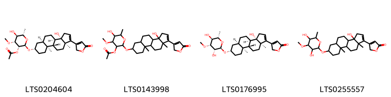{ width=100% }
    <figcaption>Hình ảnh cấu trúc hóa học của 4 hoạt chất thuộc nhóm Steroids and steroid derivatives gồm ['(2r,3r,4r,5s,6s)-2-{[(3as,3br,5ar,7s,9as,9bs,11ar)-3a-hydroxy-9a,11a-dimethyl-1-(5-oxo-2h-furan-3-yl)-3h,3bh,4h,5h,5ah,6h,7h,8h,9h,9bh,10h,11h-cyclopenta[a]phenanthren-7-yl]oxy}-5-hydroxy-4-methoxy-6-methyloxan-3-yl acetate (LTS0204604)', '2-{[3a-hydroxy-9a,11a-dimethyl-1-(5-oxo-2h-furan-3-yl)-3h,3bh,4h,5h,5ah,6h,7h,8h,9h,9bh,10h,11h-cyclopenta[a]phenanthren-7-yl]oxy}-5-hydroxy-4-methoxy-6-methyloxan-3-yl acetate (LTS0143998)', '4-[(3as,3br,5ar,7s,9as,9bs,11ar)-7-{[(2r,3r,4r,5s,6s)-3,5-dihydroxy-4-methoxy-6-methyloxan-2-yl]oxy}-3a-hydroxy-9a,11a-dimethyl-3h,3bh,4h,5h,5ah,6h,7h,8h,9h,9bh,10h,11h-cyclopenta[a]phenanthren-1-yl]-5h-furan-2-one (LTS0176995)', '4-{7-[(3,5-dihydroxy-4-methoxy-6-methyloxan-2-yl)oxy]-3a-hydroxy-9a,11a-dimethyl-3h,3bh,4h,5h,5ah,6h,7h,8h,9h,9bh,10h,11h-cyclopenta[a]phenanthren-1-yl}-5h-furan-2-one (LTS0255557)'].</figcaption>
</figure>

---

### Dược dân tộc học

Danh sách các quốc gia có sử dụng *Vallaris solanacea* trong điều trị các bệnh. 

| Country   | Disease                | Bệnh                                                                                                                                                                                                |
|:----------|:-----------------------|:----------------------------------------------------------------------------------------------------------------------------------------------------------------------------------------------------|
| Elsewhere | Astringent, Dentifrice | MYMEMORY WARNING: YOU USED ALL AVAILABLE FREE TRANSLATIONS FOR TODAY. NEXT AVAILABLE IN  12 HOURS 04 MINUTES 28 SECONDS VISIT HTTPS://MYMEMORY.TRANSLATED.NET/DOC/USAGELIMITS.PHP TO TRANSLATE MORE |

---

# Chi Kickxia

??? note "Danh sách các dược liệu thuộc chi"
    
	 - *Kickxia incana*

---
## Kickxia incana
### Thông tin về thực vật

!!! info "Phân loại thực vật của *Nanorrhinum incanum* từ GIBF:"
    - **Kingdom:** Plantae
    - **Phylum:** Tracheophyta
    - **Order:** Lamiales
    - **Family:** Plantaginaceae
    - **Genus:** Nanorrhinum
    - **Species:** *Nanorrhinum incanum*

 

| Label (VI)   | Label (EN)   | Scientific Name    | Descriptions (VI)   | Descriptions (EN)   | Also Known As (VI)   | Also Known As (EN)   |
|:-------------|:-------------|:-------------------|:--------------------|:--------------------|:---------------------|:---------------------|
| N/A          | N/A          | Vallaris solanacea | loài thực vật       | species of plant    | ['']                 | ['']                 |

#### Phân bố trên thế giới

**Từ CSDL GIBF** nan, Bhutan, Nepal, Pakistan, India

#### Phân bố tại Việt Nam

**Từ CSDL GIBF**: Không có ghi nhận ở Việt Nam

---
### Thành phần hóa học
        
- Theo cơ sở dữ liệu lotus: Từ loài *Nanorrhinum incanum* đã phân lập và xác định được Chưa có hoạt chất nào được phân lập. hoạt chất thuộc về các nhóm Không có hoạt chất nào được phân lập. 

Không có hình ảnh nào được tạo ra

---

### Dược dân tộc học

Danh sách các quốc gia có sử dụng *Nanorrhinum incanum* trong điều trị các bệnh. 

| Country   | Disease   | Bệnh                                                                                                                                                                                                |
|:----------|:----------|:----------------------------------------------------------------------------------------------------------------------------------------------------------------------------------------------------|
| Elsewhere | Poison    | MYMEMORY WARNING: YOU USED ALL AVAILABLE FREE TRANSLATIONS FOR TODAY. NEXT AVAILABLE IN  12 HOURS 04 MINUTES 00 SECONDS VISIT HTTPS://MYMEMORY.TRANSLATED.NET/DOC/USAGELIMITS.PHP TO TRANSLATE MORE |

---

# Chi Echites

??? note "Danh sách các dược liệu thuộc chi"
    
	 - *Echites torosa*

---
## Echites torosa
### Thông tin về thực vật

!!! info "Phân loại thực vật của *N/A* từ GIBF:"
    - **Kingdom:** Plantae
    - **Phylum:** Tracheophyta
    - **Order:** Gentianales
    - **Family:** Apocynaceae
    - **Genus:** N/A
    - **Species:** *N/A*

 

| Label (VI)   | Label (EN)   | Scientific Name    | Descriptions (VI)   | Descriptions (EN)   | Also Known As (VI)   | Also Known As (EN)   |
|:-------------|:-------------|:-------------------|:--------------------|:--------------------|:---------------------|:---------------------|
| N/A          | N/A          | Vallaris solanacea | loài thực vật       | species of plant    | ['']                 | ['']                 |

#### Phân bố trên thế giới

**Từ CSDL GIBF** Brazil, Guatemala, Viet Nam, Japan, Czechia, Senegal, Botswana, Gambia, New Zealand, Qatar, Zimbabwe, Honduras, Türkiye, Ecuador, Thailand, Spain, Uruguay, Puerto Rico, United States of America, Indonesia, Colombia, Argentina, Aruba, French Guiana, Mexico, Vanuatu, United Kingdom of Great Britain and Northern Ireland, Chinese Taipei, Malaysia, Canada, Namibia, Singapore, Cambodia, Portugal, Ukraine, South Africa, Australia, Italy, India, Peru, France, Ireland

#### Phân bố tại Việt Nam

**Từ CSDL GIBF**: Hồ Chí Minh city

---
### Thành phần hóa học
        
- Theo cơ sở dữ liệu lotus: Từ loài *N/A* đã phân lập và xác định được Chưa có hoạt chất nào được phân lập. hoạt chất thuộc về các nhóm Không có hoạt chất nào được phân lập. 

Không có hình ảnh nào được tạo ra

---

### Dược dân tộc học

Danh sách các quốc gia có sử dụng *N/A* trong điều trị các bệnh. 

| Country   | Disease                              | Bệnh                                                                                                                                                                                                |
|:----------|:-------------------------------------|:----------------------------------------------------------------------------------------------------------------------------------------------------------------------------------------------------|
| Mexico    | Cathartic, Emetic, Poison, Purgative | MYMEMORY WARNING: YOU USED ALL AVAILABLE FREE TRANSLATIONS FOR TODAY. NEXT AVAILABLE IN  12 HOURS 03 MINUTES 33 SECONDS VISIT HTTPS://MYMEMORY.TRANSLATED.NET/DOC/USAGELIMITS.PHP TO TRANSLATE MORE |

---

# Chi Angadenia

??? note "Danh sách các dược liệu thuộc chi"
    
	 - *Angadenia lindeniana*

---
## Angadenia lindeniana
### Thông tin về thực vật

!!! info "Phân loại thực vật của *Angadenia lindeniana* từ GIBF:"
    - **Kingdom:** Plantae
    - **Phylum:** Tracheophyta
    - **Order:** Gentianales
    - **Family:** Apocynaceae
    - **Genus:** Angadenia
    - **Species:** *Angadenia lindeniana*

 

| Label (VI)   | Label (EN)   | Scientific Name      | Descriptions (VI)   | Descriptions (EN)   | Also Known As (VI)   | Also Known As (EN)   |
|:-------------|:-------------|:---------------------|:--------------------|:--------------------|:---------------------|:---------------------|
| N/A          | N/A          | Angadenia lindeniana | loài thực vật       | species of plant    | ['']                 | ['']                 |

#### Phân bố trên thế giới

**Từ CSDL GIBF** nan, Jamaica, Haiti, Dominican Republic, Cuba

#### Phân bố tại Việt Nam

**Từ CSDL GIBF**: Không có ghi nhận ở Việt Nam

---
### Thành phần hóa học
        
- Theo cơ sở dữ liệu lotus: Từ loài *Angadenia lindeniana* đã phân lập và xác định được Chưa có hoạt chất nào được phân lập. hoạt chất thuộc về các nhóm Không có hoạt chất nào được phân lập. 

Không có hình ảnh nào được tạo ra

---

### Dược dân tộc học

Danh sách các quốc gia có sử dụng *Angadenia lindeniana* trong điều trị các bệnh. 

| Country   | Disease   | Bệnh                                                                                                                                                                                                |
|:----------|:----------|:----------------------------------------------------------------------------------------------------------------------------------------------------------------------------------------------------|
| Jamaica   | Poison    | MYMEMORY WARNING: YOU USED ALL AVAILABLE FREE TRANSLATIONS FOR TODAY. NEXT AVAILABLE IN  12 HOURS 02 MINUTES 57 SECONDS VISIT HTTPS://MYMEMORY.TRANSLATED.NET/DOC/USAGELIMITS.PHP TO TRANSLATE MORE |

---

# Chi Conopharyngia

??? note "Danh sách các dược liệu thuộc chi"
    
	 - *Conopharyngia elegans*

---
## Conopharyngia elegans
### Thông tin về thực vật

!!! info "Phân loại thực vật của *Tabernaemontana elegans* từ GIBF:"
    - **Kingdom:** Plantae
    - **Phylum:** Tracheophyta
    - **Order:** Gentianales
    - **Family:** Apocynaceae
    - **Genus:** Tabernaemontana
    - **Species:** *Tabernaemontana elegans*

 

| Label (VI)   | Label (EN)   | Scientific Name       | Descriptions (VI)   | Descriptions (EN)   | Also Known As (VI)   | Also Known As (EN)   |
|:-------------|:-------------|:----------------------|:--------------------|:--------------------|:---------------------|:---------------------|
| N/A          | N/A          | Conopharyngia elegans |                     |                     | ['']                 | ['']                 |

#### Phân bố trên thế giới

**Từ CSDL GIBF** nan, Mozambique, United States of America

#### Phân bố tại Việt Nam

**Từ CSDL GIBF**: Không có ghi nhận ở Việt Nam

---
### Thành phần hóa học
        
- Theo cơ sở dữ liệu lotus: Từ loài *Tabernaemontana elegans* đã phân lập và xác định được Chưa có hoạt chất nào được phân lập. hoạt chất thuộc về các nhóm Không có hoạt chất nào được phân lập. 

Không có hình ảnh nào được tạo ra

---

### Dược dân tộc học

Danh sách các quốc gia có sử dụng *Tabernaemontana elegans* trong điều trị các bệnh. 

| Country   | Disease    | Bệnh                                                                                                                                                                                                |
|:----------|:-----------|:----------------------------------------------------------------------------------------------------------------------------------------------------------------------------------------------------|
| Tonga     | Hemostatic | MYMEMORY WARNING: YOU USED ALL AVAILABLE FREE TRANSLATIONS FOR TODAY. NEXT AVAILABLE IN  12 HOURS 02 MINUTES 31 SECONDS VISIT HTTPS://MYMEMORY.TRANSLATED.NET/DOC/USAGELIMITS.PHP TO TRANSLATE MORE |

---

# Chi Urechites

??? note "Danh sách các dược liệu thuộc chi"
    
	 - *Urechites lutea*
	 - *Urechites suberecta*

---
## Urechites lutea
### Thông tin về thực vật

!!! info "Phân loại thực vật của *Pentalinon luteum* từ GIBF:"
    - **Kingdom:** Plantae
    - **Phylum:** Tracheophyta
    - **Order:** Gentianales
    - **Family:** Apocynaceae
    - **Genus:** Pentalinon
    - **Species:** *Pentalinon luteum*

 

| Label (VI)   | Label (EN)   | Scientific Name       | Descriptions (VI)   | Descriptions (EN)   | Also Known As (VI)   | Also Known As (EN)   |
|:-------------|:-------------|:----------------------|:--------------------|:--------------------|:---------------------|:---------------------|
| N/A          | N/A          | Conopharyngia elegans |                     |                     | ['']                 | ['']                 |

#### Phân bố trên thế giới

**Từ CSDL GIBF** nan, Cayman Islands, United States of America, Virgin Islands (British), Jamaica, Bonaire, Sint Eustatius and Saba, Guadeloupe, Haiti, Bahamas, Turks and Caicos Islands, Dominican Republic, Honduras, Cuba, unknown or invalid, Sint Maarten (Dutch part), Puerto Rico

#### Phân bố tại Việt Nam

**Từ CSDL GIBF**: Không có ghi nhận ở Việt Nam

---
### Thành phần hóa học
        
- Theo cơ sở dữ liệu lotus: Từ loài *Pentalinon luteum* đã phân lập và xác định được Chưa có hoạt chất nào được phân lập. hoạt chất thuộc về các nhóm Không có hoạt chất nào được phân lập. 

Không có hình ảnh nào được tạo ra

---

### Dược dân tộc học

Danh sách các quốc gia có sử dụng *Pentalinon luteum* trong điều trị các bệnh. 

| Country            | Disease     | Bệnh                                                                                                                                                                                                |
|:-------------------|:------------|:----------------------------------------------------------------------------------------------------------------------------------------------------------------------------------------------------|
| Dominican Republic | Rodenticide | MYMEMORY WARNING: YOU USED ALL AVAILABLE FREE TRANSLATIONS FOR TODAY. NEXT AVAILABLE IN  12 HOURS 02 MINUTES 08 SECONDS VISIT HTTPS://MYMEMORY.TRANSLATED.NET/DOC/USAGELIMITS.PHP TO TRANSLATE MORE |

---

---
## Urechites suberecta
### Thông tin về thực vật

!!! info "Phân loại thực vật của *Pentalinon luteum* từ GIBF:"
    - **Kingdom:** Plantae
    - **Phylum:** Tracheophyta
    - **Order:** Gentianales
    - **Family:** Apocynaceae
    - **Genus:** Pentalinon
    - **Species:** *Pentalinon luteum*

 

| Label (VI)   | Label (EN)   | Scientific Name       | Descriptions (VI)   | Descriptions (EN)   | Also Known As (VI)   | Also Known As (EN)   |
|:-------------|:-------------|:----------------------|:--------------------|:--------------------|:---------------------|:---------------------|
| N/A          | N/A          | Conopharyngia elegans |                     |                     | ['']                 | ['']                 |

#### Phân bố trên thế giới

**Từ CSDL GIBF** nan, Dominican Republic, Bahamas

#### Phân bố tại Việt Nam

**Từ CSDL GIBF**: Không có ghi nhận ở Việt Nam

---
### Thành phần hóa học
        
- Theo cơ sở dữ liệu lotus: Từ loài *Pentalinon luteum* đã phân lập và xác định được Chưa có hoạt chất nào được phân lập. hoạt chất thuộc về các nhóm Không có hoạt chất nào được phân lập. 

Không có hình ảnh nào được tạo ra

---

### Dược dân tộc học

Danh sách các quốc gia có sử dụng *Pentalinon luteum* trong điều trị các bệnh. 

| Country       | Disease     | Bệnh                                                                                                                                                                                                |
|:--------------|:------------|:----------------------------------------------------------------------------------------------------------------------------------------------------------------------------------------------------|
| English       | Cardiotonic | MYMEMORY WARNING: YOU USED ALL AVAILABLE FREE TRANSLATIONS FOR TODAY. NEXT AVAILABLE IN  12 HOURS 01 MINUTES 28 SECONDS VISIT HTTPS://MYMEMORY.TRANSLATED.NET/DOC/USAGELIMITS.PHP TO TRANSLATE MORE |
| South America | Piscicide   | MYMEMORY WARNING: YOU USED ALL AVAILABLE FREE TRANSLATIONS FOR TODAY. NEXT AVAILABLE IN  12 HOURS 01 MINUTES 24 SECONDS VISIT HTTPS://MYMEMORY.TRANSLATED.NET/DOC/USAGELIMITS.PHP TO TRANSLATE MORE |

---

# Chi Wrightia

??? note "Danh sách các dược liệu thuộc chi"
    
	 - *Wrightia tinctoria*
	 - *Wrightia tomentosa*

---
## Wrightia tinctoria
### Thông tin về thực vật

!!! info "Phân loại thực vật của *Wrightia tinctoria* từ GIBF:"
    - **Kingdom:** Plantae
    - **Phylum:** Tracheophyta
    - **Order:** Gentianales
    - **Family:** Apocynaceae
    - **Genus:** Wrightia
    - **Species:** *Wrightia tinctoria*

 

| Label (VI)   | Label (EN)   | Scientific Name    | Descriptions (VI)   | Descriptions (EN)   | Also Known As (VI)   | Also Known As (EN)   |
|:-------------|:-------------|:-------------------|:--------------------|:--------------------|:---------------------|:---------------------|
| N/A          | N/A          | Wrightia tinctoria | loài thực vật       | species of plant    | ['']                 | ['']                 |

#### Phân bố trên thế giới

**Từ CSDL GIBF** nan, India

#### Phân bố tại Việt Nam

**Từ CSDL GIBF**: Không có ghi nhận ở Việt Nam

---
### Thành phần hóa học
        
- Theo cơ sở dữ liệu lotus: Từ loài *Wrightia tinctoria* đã phân lập và xác định được 44 hoạt chất thuộc về các nhóm Flavonoids, Prenol lipids, Steroids and steroid derivatives, Indoles and derivatives. 

|    | chemicalTaxonomyClassyfireClass   |   smiles_count |
|---:|:----------------------------------|---------------:|
|  0 | Flavonoids                        |              2 |
|  1 | Indoles and derivatives           |              1 |
|  2 | Prenol lipids                     |              9 |
|  3 | Steroids and steroid derivatives  |             32 |

#### Nhóm Flavonoids
<figure markdown="span">
    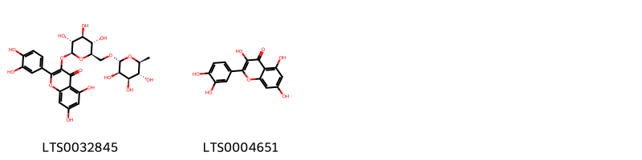{ width=100% }
    <figcaption>Hình ảnh cấu trúc hóa học của 2 hoạt chất thuộc nhóm Flavonoids gồm ['3-rutinosyl quercetin (LTS0032845)', 'quercetin (LTS0004651)'].</figcaption>
</figure>
#### Nhóm Indoles and derivatives
<figure markdown="span">
    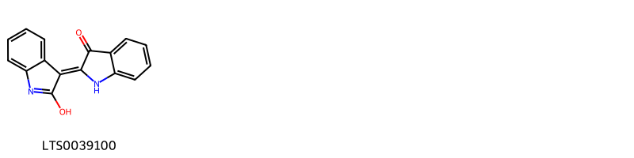{ width=100% }
    <figcaption>Hình ảnh cấu trúc hóa học của 1 hoạt chất thuộc nhóm Indoles and derivatives gồm ['indirubin (LTS0039100)'].</figcaption>
</figure>
#### Nhóm Prenol lipids
<figure markdown="span">
    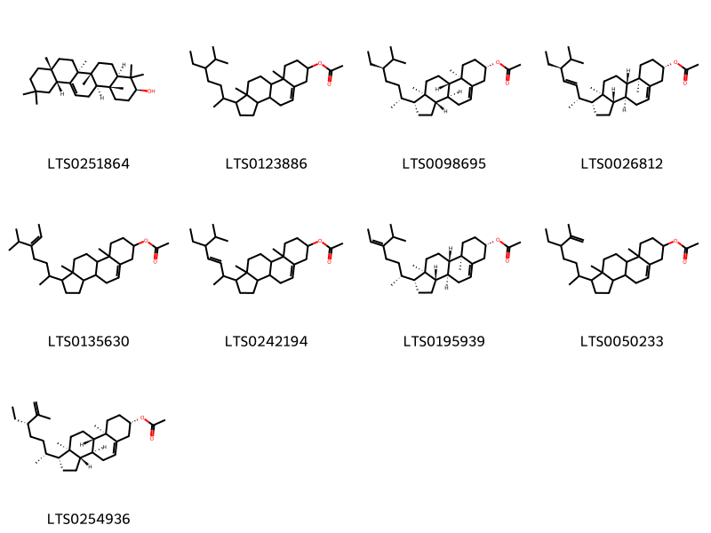{ width=100% }
    <figcaption>Hình ảnh cấu trúc hóa học của 9 hoạt chất thuộc nhóm Prenol lipids gồm ['β-amyrin (LTS0251864)', '1-(5-ethyl-6-methylheptan-2-yl)-9a,11a-dimethyl-1h,2h,3h,3ah,3bh,4h,6h,7h,8h,9h,9bh,10h,11h-cyclopenta[a]phenanthren-7-yl acetate (LTS0123886)', 'β-sitosteryl acetate (LTS0098695)', 'stigmasteryl acetate (LTS0026812)', '1-(5-isopropylhept-5-en-2-yl)-9a,11a-dimethyl-1h,2h,3h,3ah,3bh,4h,6h,7h,8h,9h,9bh,10h,11h-cyclopenta[a]phenanthren-7-yl acetate (LTS0135630)', '1-(5-ethyl-6-methylhept-3-en-2-yl)-9a,11a-dimethyl-1h,2h,3h,3ah,3bh,4h,6h,7h,8h,9h,9bh,10h,11h-cyclopenta[a]phenanthren-7-yl acetate (LTS0242194)', '(1r,3as,3bs,7s,9ar,9bs,11ar)-1-[(2r,5z)-5-isopropylhept-5-en-2-yl]-9a,11a-dimethyl-1h,2h,3h,3ah,3bh,4h,6h,7h,8h,9h,9bh,10h,11h-cyclopenta[a]phenanthren-7-yl acetate (LTS0195939)', '1-(5-ethyl-6-methylhept-6-en-2-yl)-9a,11a-dimethyl-1h,2h,3h,3ah,3bh,4h,6h,7h,8h,9h,9bh,10h,11h-cyclopenta[a]phenanthren-7-yl acetate (LTS0050233)', '(1r,3as,3bs,7s,9ar,9bs,11ar)-1-[(2r,5s)-5-ethyl-6-methylhept-6-en-2-yl]-9a,11a-dimethyl-1h,2h,3h,3ah,3bh,4h,6h,7h,8h,9h,9bh,10h,11h-cyclopenta[a]phenanthren-7-yl acetate (LTS0254936)'].</figcaption>
</figure>
#### Nhóm Steroids and steroid derivatives
<figure markdown="span">
    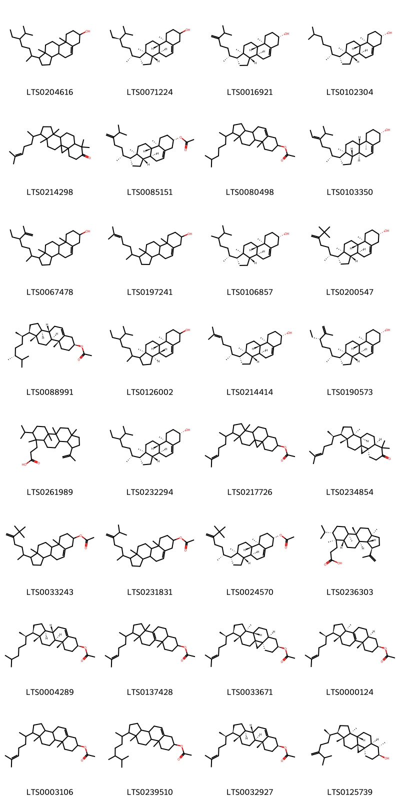{ width=100% }
    <figcaption>Hình ảnh cấu trúc hóa học của 32 hoạt chất thuộc nhóm Steroids and steroid derivatives gồm ['stigmast-5-en-3-ol, (3β)- (LTS0204616)', 'stigmast-5-en-3-ol (LTS0071224)', '24-methylenecholesterol (LTS0016921)', 'cholesterol (LTS0102304)', '7,7,12,16-tetramethyl-15-(6-methylhept-5-en-2-yl)pentacyclo[9.7.0.0¹,³.0³,⁸.0¹²,¹⁶]octadecan-6-one (LTS0214298)', '(1r,3as,3bs,7s,9ar,9bs,11ar)-9a,11a-dimethyl-1-[(2r)-6-methyl-5-methylideneheptan-2-yl]-1h,2h,3h,3ah,3bh,4h,6h,7h,8h,9h,9bh,10h,11h-cyclopenta[a]phenanthren-7-yl acetate (LTS0085151)', 'cholesteryl acetate (LTS0080498)', 'avenasterol (LTS0103350)', '1-(5-ethyl-6-methylhept-6-en-2-yl)-9a,11a-dimethyl-1h,2h,3h,3ah,3bh,4h,6h,7h,8h,9h,9bh,10h,11h-cyclopenta[a]phenanthren-7-ol (LTS0067478)', 'desmosterol (LTS0197241)', '24-α-methylcholesterol (LTS0106857)', '(1r,3as,3bs,7s,9ar,9bs,11ar)-1-[(2r)-6,6-dimethyl-5-methylideneheptan-2-yl]-9a,11a-dimethyl-1h,2h,3h,3ah,3bh,4h,6h,7h,8h,9h,9bh,10h,11h-cyclopenta[a]phenanthren-7-ol (LTS0200547)', 'campesteryl acetate (LTS0088991)', '(3ar,3br,9ar,9bs,11ar)-1-(5-ethyl-6-methylheptan-2-yl)-9a,11a-dimethyl-1h,2h,3h,3ah,3bh,4h,6h,7h,8h,9h,9bh,10h,11h-cyclopenta[a]phenanthren-7-ol (LTS0126002)', 'desmosterol (LTS0214414)', '(1r,3as,3bs,7s,9ar,9bs,11ar)-1-[(2r,5s)-5-ethyl-6-methylhept-6-en-2-yl]-9a,11a-dimethyl-1h,2h,3h,3ah,3bh,4h,6h,7h,8h,9h,9bh,10h,11h-cyclopenta[a]phenanthren-7-ol (LTS0190573)', '3-[7-isopropyl-6,9a,9b,11a-tetramethyl-3-(prop-1-en-2-yl)-dodecahydro-1h-cyclopenta[a]phenanthren-6-yl]propanoic acid (LTS0261989)', '24-α-ethylcholesterol (LTS0232294)', '12,16-dimethyl-15-(6-methylhept-5-en-2-yl)pentacyclo[9.7.0.0¹,³.0³,⁸.0¹²,¹⁶]octadecan-6-yl acetate (LTS0217726)', '(1s,3r,8r,11r,12s,15r,16r)-7,7,12,16-tetramethyl-15-[(2r)-6-methylhept-5-en-2-yl]pentacyclo[9.7.0.0¹,³.0³,⁸.0¹²,¹⁶]octadecan-6-one (LTS0234854)', '1-(6,6-dimethyl-5-methylideneheptan-2-yl)-9a,11a-dimethyl-1h,2h,3h,3ah,3bh,4h,6h,7h,8h,9h,9bh,10h,11h-cyclopenta[a]phenanthren-7-yl acetate (LTS0033243)', '9a,11a-dimethyl-1-(6-methyl-5-methylideneheptan-2-yl)-1h,2h,3h,3ah,3bh,4h,6h,7h,8h,9h,9bh,10h,11h-cyclopenta[a]phenanthren-7-yl acetate (LTS0231831)', '(1r,3as,3bs,7s,9ar,9bs,11ar)-1-[(2r)-6,6-dimethyl-5-methylideneheptan-2-yl]-9a,11a-dimethyl-1h,2h,3h,3ah,3bh,4h,6h,7h,8h,9h,9bh,10h,11h-cyclopenta[a]phenanthren-7-yl acetate (LTS0024570)', '3-[(3r,3ar,3br,5ar,6s,7s,9ar,9br,11ar)-7-isopropyl-6,9a,9b,11a-tetramethyl-3-(prop-1-en-2-yl)-dodecahydro-1h-cyclopenta[a]phenanthren-6-yl]propanoic acid (LTS0236303)', 'cholesteryl acetate (LTS0004289)', '3a,9a,11a-trimethyl-1-(6-methylhept-5-en-2-yl)-1h,2h,3h,4h,5h,5ah,6h,7h,8h,9h,10h,11h-cyclopenta[a]phenanthren-7-yl acetate (LTS0137428)', '(1s,3r,6s,8s,11s,12s,15r,16r)-12,16-dimethyl-15-[(2r)-6-methylhept-5-en-2-yl]pentacyclo[9.7.0.0¹,³.0³,⁸.0¹²,¹⁶]octadecan-6-yl acetate (LTS0033671)', '(1r,3ar,5as,7s,9as,11ar)-3a,9a,11a-trimethyl-1-[(2r)-6-methylhept-5-en-2-yl]-1h,2h,3h,4h,5h,5ah,6h,7h,8h,9h,10h,11h-cyclopenta[a]phenanthren-7-yl acetate (LTS0000124)', '9a,11a-dimethyl-1-(6-methylhept-5-en-2-yl)-1h,2h,3h,3ah,3bh,4h,6h,7h,8h,9h,9bh,10h,11h-cyclopenta[a]phenanthren-7-yl acetate (LTS0003106)', '1-(5,6-dimethylheptan-2-yl)-9a,11a-dimethyl-1h,2h,3h,3ah,3bh,4h,6h,7h,8h,9h,9bh,10h,11h-cyclopenta[a]phenanthren-7-yl acetate (LTS0239510)', '(1r,3as,3bs,7s,9ar,9bs,11ar)-9a,11a-dimethyl-1-[(2r)-6-methylhept-5-en-2-yl]-1h,2h,3h,3ah,3bh,4h,6h,7h,8h,9h,9bh,10h,11h-cyclopenta[a]phenanthren-7-yl acetate (LTS0032927)', 'cycloeucalenol (LTS0125739)'].</figcaption>
</figure>

---

### Dược dân tộc học

Danh sách các quốc gia có sử dụng *Wrightia tinctoria* trong điều trị các bệnh. 

| Country   | Disease                                                | Bệnh                                                                                                                                                                                                |
|:----------|:-------------------------------------------------------|:----------------------------------------------------------------------------------------------------------------------------------------------------------------------------------------------------|
| India     | Carminative, Rennet, Stomachic, Aphrodisiac, Vermifuge | MYMEMORY WARNING: YOU USED ALL AVAILABLE FREE TRANSLATIONS FOR TODAY. NEXT AVAILABLE IN  12 HOURS 00 MINUTES 58 SECONDS VISIT HTTPS://MYMEMORY.TRANSLATED.NET/DOC/USAGELIMITS.PHP TO TRANSLATE MORE |

---

---
## Wrightia tomentosa
### Thông tin về thực vật

!!! info "Phân loại thực vật của *Wrightia arborea* từ GIBF:"
    - **Kingdom:** Plantae
    - **Phylum:** Tracheophyta
    - **Order:** Gentianales
    - **Family:** Apocynaceae
    - **Genus:** Wrightia
    - **Species:** *Wrightia arborea*

 

| Label (VI)   | Label (EN)   | Scientific Name    | Descriptions (VI)   | Descriptions (EN)   | Also Known As (VI)   | Also Known As (EN)   |
|:-------------|:-------------|:-------------------|:--------------------|:--------------------|:---------------------|:---------------------|
| N/A          | N/A          | Wrightia tomentosa | loài thực vật       | species of plant    | ['']                 | ['']                 |

#### Phân bố trên thế giới

**Từ CSDL GIBF** Sri Lanka, nan, Viet Nam, United States of America, Senegal, Bangladesh, Nepal, Indonesia, China, Mauritius, Philippines, Myanmar, Malaysia, India, unknown or invalid, Thailand

#### Phân bố tại Việt Nam

**Từ CSDL GIBF**: Không có ghi nhận ở Việt Nam

---
### Thành phần hóa học
        
- Theo cơ sở dữ liệu lotus: Từ loài *Wrightia arborea* đã phân lập và xác định được 2 hoạt chất thuộc về các nhóm Prenol lipids, Isoflavonoids. 

|    | chemicalTaxonomyClassyfireClass   |   smiles_count |
|---:|:----------------------------------|---------------:|
|  0 | Isoflavonoids                     |              1 |
|  1 | Prenol lipids                     |              1 |

#### Nhóm Isoflavonoids
<figure markdown="span">
    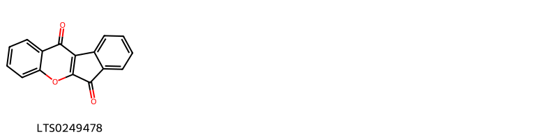{ width=100% }
    <figcaption>Hình ảnh cấu trúc hóa học của 1 hoạt chất thuộc nhóm Isoflavonoids gồm ['wrightiadione (LTS0249478)'].</figcaption>
</figure>
#### Nhóm Prenol lipids
<figure markdown="span">
    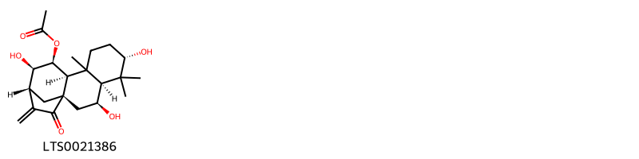{ width=100% }
    <figcaption>Hình ảnh cấu trúc hóa học của 1 hoạt chất thuộc nhóm Prenol lipids gồm ['(1s,3s,4s,6s,10s,11s,12r,13r)-3,6,12-trihydroxy-5,5,9-trimethyl-14-methylidene-15-oxotetracyclo[11.2.1.0¹,¹⁰.0⁴,⁹]hexadecan-11-yl acetate (LTS0021386)'].</figcaption>
</figure>

---

### Dược dân tộc học

Danh sách các quốc gia có sử dụng *Wrightia arborea* trong điều trị các bệnh. 

| Country   | Disease   | Bệnh                                                                                                                                                                                                |
|:----------|:----------|:----------------------------------------------------------------------------------------------------------------------------------------------------------------------------------------------------|
| Nepal     | Hemostat  | MYMEMORY WARNING: YOU USED ALL AVAILABLE FREE TRANSLATIONS FOR TODAY. NEXT AVAILABLE IN  12 HOURS 00 MINUTES 17 SECONDS VISIT HTTPS://MYMEMORY.TRANSLATED.NET/DOC/USAGELIMITS.PHP TO TRANSLATE MORE |

---

# Chi Cerbera

??? note "Danh sách các dược liệu thuộc chi"
    
	 - *Cerbera manghas*

---
## Cerbera manghas
### Thông tin về thực vật

!!! info "Phân loại thực vật của *Cerbera manghas* từ GIBF:"
    - **Kingdom:** Plantae
    - **Phylum:** Tracheophyta
    - **Order:** Gentianales
    - **Family:** Apocynaceae
    - **Genus:** Cerbera
    - **Species:** *Cerbera manghas*

 

| Label (VI)   | Label (EN)   | Scientific Name   | Descriptions (VI)   | Descriptions (EN)                          | Also Known As (VI)   | Also Known As (EN)                                                               |
|:-------------|:-------------|:------------------|:--------------------|:-------------------------------------------|:---------------------|:---------------------------------------------------------------------------------|
| N/A          | N/A          | Cerbera manghas   | loài thực vật       | species of plant in the family Apocynaceae | ['']                 | ['Tangena', 'Grey milkwood', 'Beach milkwood', 'Pink-eyed cerbera', 'sea mango'] |

#### Phân bố trên thế giới

**Từ CSDL GIBF** nan, Viet Nam, Japan, New Caledonia, China, New Zealand, Papua New Guinea, Madagascar, Thailand, Indonesia, Seychelles, Fiji, Hong Kong, Macao, Vanuatu, Chinese Taipei, Malaysia, Philippines, Singapore, Cambodia, Australia, Samoa, Christmas Island

#### Phân bố tại Việt Nam

**Từ CSDL GIBF**: Hải Phòng, Ninh Bình

---
### Thành phần hóa học
        
- Theo cơ sở dữ liệu lotus: Từ loài *Cerbera manghas* đã phân lập và xác định được 127 hoạt chất thuộc về các nhóm Fatty Acyls, Heteroaromatic compounds, Flavonoids, Steroids and steroid derivatives, Aryltetralin lignans, Oxanes, Organooxygen compounds, Furanoid lignans, Prenol lipids, 2-arylbenzofuran flavonoids, Lignan glycosides. 

|    | chemicalTaxonomyClassyfireClass   |   smiles_count |
|---:|:----------------------------------|---------------:|
|  0 | 2-arylbenzofuran flavonoids       |              4 |
|  1 | Aryltetralin lignans              |              8 |
|  2 | Fatty Acyls                       |              8 |
|  3 | Flavonoids                        |              6 |
|  4 | Furanoid lignans                  |             24 |
|  5 | Heteroaromatic compounds          |              1 |
|  6 | Lignan glycosides                 |              4 |
|  7 | Organooxygen compounds            |             19 |
|  8 | Oxanes                            |              5 |
|  9 | Prenol lipids                     |             12 |
| 10 | Steroids and steroid derivatives  |             35 |

#### Nhóm 2-arylbenzofuran flavonoids
<figure markdown="span">
    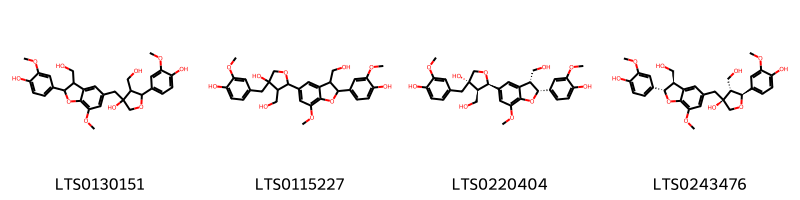{ width=100% }
    <figcaption>Hình ảnh cấu trúc hóa học của 4 hoạt chất thuộc nhóm 2-arylbenzofuran flavonoids gồm ['5-(4-hydroxy-3-methoxyphenyl)-3-{[2-(4-hydroxy-3-methoxyphenyl)-3-(hydroxymethyl)-7-methoxy-2,3-dihydro-1-benzofuran-5-yl]methyl}-4-(hydroxymethyl)oxolan-3-ol (LTS0130151)', '5-[2-(4-hydroxy-3-methoxyphenyl)-3-(hydroxymethyl)-7-methoxy-2,3-dihydro-1-benzofuran-5-yl]-3-[(4-hydroxy-3-methoxyphenyl)methyl]-4-(hydroxymethyl)oxolan-3-ol (LTS0115227)', '(3s,4r,5r)-5-[(2r,3r)-2-(4-hydroxy-3-methoxyphenyl)-3-(hydroxymethyl)-7-methoxy-2,3-dihydro-1-benzofuran-5-yl]-3-[(4-hydroxy-3-methoxyphenyl)methyl]-4-(hydroxymethyl)oxolan-3-ol (LTS0220404)', '(3s,4r,5s)-5-(4-hydroxy-3-methoxyphenyl)-3-{[(2s,3r)-2-(4-hydroxy-3-methoxyphenyl)-3-(hydroxymethyl)-7-methoxy-2,3-dihydro-1-benzofuran-5-yl]methyl}-4-(hydroxymethyl)oxolan-3-ol (LTS0243476)'].</figcaption>
</figure>
#### Nhóm Aryltetralin lignans
<figure markdown="span">
    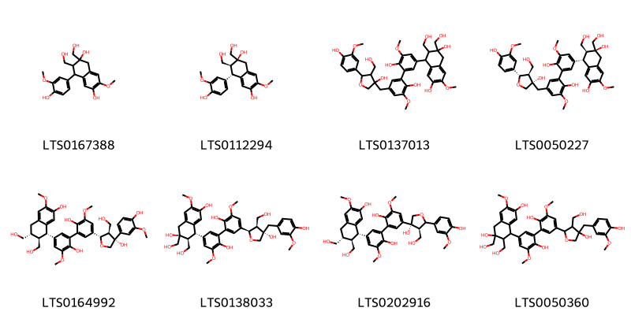{ width=100% }
    <figcaption>Hình ảnh cấu trúc hóa học của 8 hoạt chất thuộc nhóm Aryltetralin lignans gồm ['4-(4-hydroxy-3-methoxyphenyl)-2,3-bis(hydroxymethyl)-7-methoxy-3,4-dihydro-1h-naphthalene-2,6-diol (LTS0167388)', '(2s,3s,4s)-4-(4-hydroxy-3-methoxyphenyl)-2,3-bis(hydroxymethyl)-7-methoxy-3,4-dihydro-1h-naphthalene-2,6-diol (LTS0112294)', "5-[3,7-dihydroxy-2,3-bis(hydroxymethyl)-6-methoxy-2,4-dihydro-1h-naphthalen-1-yl]-5'-{[3-hydroxy-5-(4-hydroxy-3-methoxyphenyl)-4-(hydroxymethyl)oxolan-3-yl]methyl}-3,3'-dimethoxy-[1,1'-biphenyl]-2,2'-diol (LTS0137013)", "5-[(1s,2s,3s)-3,7-dihydroxy-2,3-bis(hydroxymethyl)-6-methoxy-2,4-dihydro-1h-naphthalen-1-yl]-5'-{[(3s,4r,5s)-3-hydroxy-5-(4-hydroxy-3-methoxyphenyl)-4-(hydroxymethyl)oxolan-3-yl]methyl}-3,3'-dimethoxy-[1,1'-biphenyl]-2,2'-diol (LTS0050227)", "5-[(1s,2r,3r)-7-hydroxy-2,3-bis(hydroxymethyl)-6-methoxy-1,2,3,4-tetrahydronaphthalen-1-yl]-5'-[(2s,3r,4r)-4-hydroxy-4-(4-hydroxy-3-methoxyphenyl)-3-(hydroxymethyl)oxolan-2-yl]-3,3'-dimethoxy-[1,1'-biphenyl]-2,2'-diol (LTS0164992)", "5-[(1s,2s,3s)-3,7-dihydroxy-2,3-bis(hydroxymethyl)-6-methoxy-2,4-dihydro-1h-naphthalen-1-yl]-5'-[(2r,3r,4s)-4-hydroxy-4-[(4-hydroxy-3-methoxyphenyl)methyl]-3-(hydroxymethyl)oxolan-2-yl]-3,3'-dimethoxy-[1,1'-biphenyl]-2,2'-diol (LTS0138033)", "5-[(1s,2r,3r)-7-hydroxy-2,3-bis(hydroxymethyl)-6-methoxy-1,2,3,4-tetrahydronaphthalen-1-yl]-5'-[(3r,4r)-3-hydroxy-5-(4-hydroxy-3-methoxyphenyl)-4-(hydroxymethyl)oxolan-3-yl]-3,3'-dimethoxy-[1,1'-biphenyl]-2,2'-diol (LTS0202916)", "5-[3,7-dihydroxy-2,3-bis(hydroxymethyl)-6-methoxy-2,4-dihydro-1h-naphthalen-1-yl]-5'-{4-hydroxy-4-[(4-hydroxy-3-methoxyphenyl)methyl]-3-(hydroxymethyl)oxolan-2-yl}-3,3'-dimethoxy-[1,1'-biphenyl]-2,2'-diol (LTS0050360)"].</figcaption>
</figure>
#### Nhóm Fatty Acyls
<figure markdown="span">
    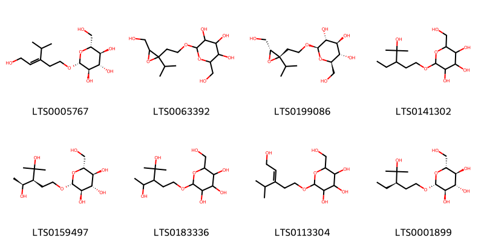{ width=100% }
    <figcaption>Hình ảnh cấu trúc hóa học của 8 hoạt chất thuộc nhóm Fatty Acyls gồm ['(2r,3r,4s,5s,6r)-2-{[(3z)-5-hydroxy-3-isopropylpent-3-en-1-yl]oxy}-6-(hydroxymethyl)oxane-3,4,5-triol (LTS0005767)', '2-(hydroxymethyl)-6-{2-[3-(hydroxymethyl)-2-isopropyloxiran-2-yl]ethoxy}oxane-3,4,5-triol (LTS0063392)', '(2r,3s,4s,5r,6r)-2-(hydroxymethyl)-6-{2-[(2s,3r)-3-(hydroxymethyl)-2-isopropyloxiran-2-yl]ethoxy}oxane-3,4,5-triol (LTS0199086)', '2-[(3-ethyl-4-hydroxy-4-methylpentyl)oxy]-6-(hydroxymethyl)oxane-3,4,5-triol (LTS0141302)', '(2r,3r,4s,5s,6r)-2-{[(3s)-4-hydroxy-3-[(1s)-1-hydroxyethyl]-4-methylpentyl]oxy}-6-(hydroxymethyl)oxane-3,4,5-triol (LTS0159497)', '2-{[4-hydroxy-3-(1-hydroxyethyl)-4-methylpentyl]oxy}-6-(hydroxymethyl)oxane-3,4,5-triol (LTS0183336)', '2-[(5-hydroxy-3-isopropylpent-3-en-1-yl)oxy]-6-(hydroxymethyl)oxane-3,4,5-triol (LTS0113304)', '(2r,3r,4s,5s,6r)-2-{[(3r)-3-ethyl-4-hydroxy-4-methylpentyl]oxy}-6-(hydroxymethyl)oxane-3,4,5-triol (LTS0001899)'].</figcaption>
</figure>
#### Nhóm Flavonoids
<figure markdown="span">
    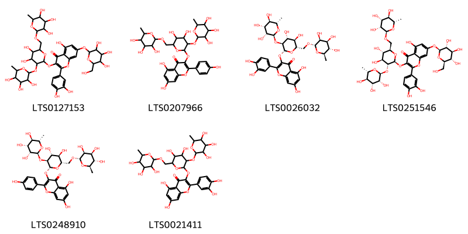{ width=100% }
    <figcaption>Hình ảnh cấu trúc hóa học của 6 hoạt chất thuộc nhóm Flavonoids gồm ['3-({4,5-dihydroxy-3-[(3,4,5-trihydroxy-6-methyloxan-2-yl)oxy]-6-{[(3,4,5-trihydroxy-6-methyloxan-2-yl)oxy]methyl}oxan-2-yl}oxy)-2-(3,4-dihydroxyphenyl)-5-hydroxy-7-{[3,4,5-trihydroxy-6-(hydroxymethyl)oxan-2-yl]oxy}chromen-4-one (LTS0127153)', '3-({4,5-dihydroxy-3-[(3,4,5-trihydroxy-6-methyloxan-2-yl)oxy]-6-{[(3,4,5-trihydroxy-6-methyloxan-2-yl)oxy]methyl}oxan-2-yl}oxy)-5,7-dihydroxy-2-(4-hydroxyphenyl)chromen-4-one (LTS0207966)', '3-{[(2r,3s,4r,5r,6s)-4,5-dihydroxy-3-{[(2s,3r,4r,5r,6s)-3,4,5-trihydroxy-6-methyloxan-2-yl]oxy}-6-({[(2s,3s,4s,5s,6r)-3,4,5-trihydroxy-6-methyloxan-2-yl]oxy}methyl)oxan-2-yl]oxy}-2-(3,4-dihydroxyphenyl)-5,7-dihydroxychromen-4-one (LTS0026032)', '3-{[(2s,3r,4s,5s,6r)-4,5-dihydroxy-3-{[(2s,3r,4r,5r,6s)-3,4,5-trihydroxy-6-methyloxan-2-yl]oxy}-6-({[(2r,3r,4r,5r,6s)-3,4,5-trihydroxy-6-methyloxan-2-yl]oxy}methyl)oxan-2-yl]oxy}-2-(3,4-dihydroxyphenyl)-5-hydroxy-7-{[(2s,3r,4s,5s,6r)-3,4,5-trihydroxy-6-(hydroxymethyl)oxan-2-yl]oxy}chromen-4-one (LTS0251546)', '3-{[(2r,3s,4r,5r,6s)-4,5-dihydroxy-3-{[(2s,3r,4r,5r,6s)-3,4,5-trihydroxy-6-methyloxan-2-yl]oxy}-6-({[(2s,3s,4s,5s,6r)-3,4,5-trihydroxy-6-methyloxan-2-yl]oxy}methyl)oxan-2-yl]oxy}-5,7-dihydroxy-2-(4-hydroxyphenyl)chromen-4-one (LTS0248910)', '3-({4,5-dihydroxy-3-[(3,4,5-trihydroxy-6-methyloxan-2-yl)oxy]-6-{[(3,4,5-trihydroxy-6-methyloxan-2-yl)oxy]methyl}oxan-2-yl}oxy)-2-(3,4-dihydroxyphenyl)-5,7-dihydroxychromen-4-one (LTS0021411)'].</figcaption>
</figure>
#### Nhóm Furanoid lignans
<figure markdown="span">
    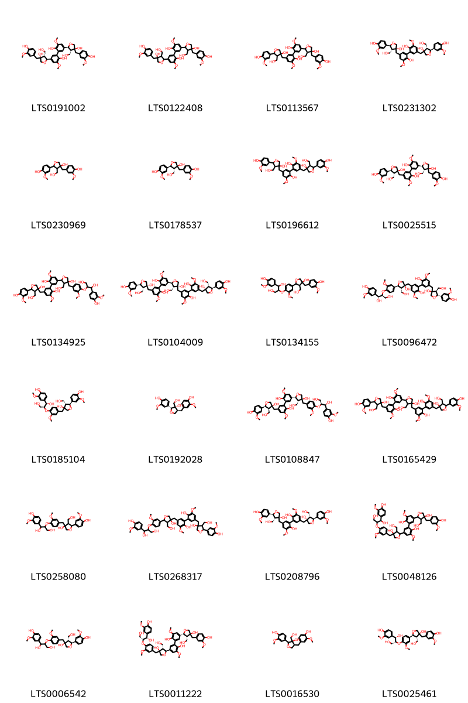{ width=100% }
    <figcaption>Hình ảnh cấu trúc hóa học của 24 hoạt chất thuộc nhóm Furanoid lignans gồm ["5,5'-bis[(2s,3r,4s)-4-hydroxy-4-[(4-hydroxy-3-methoxyphenyl)methyl]-3-(hydroxymethyl)oxolan-2-yl]-3,3'-dimethoxy-[1,1'-biphenyl]-2,2'-diol (LTS0191002)", "5,5'-bis({4-hydroxy-4-[(4-hydroxy-3-methoxyphenyl)methyl]-3-(hydroxymethyl)oxolan-2-yl})-3,3'-dimethoxy-[1,1'-biphenyl]-2,2'-diol (LTS0122408)", "5-{4-hydroxy-4-[(4-hydroxy-3-methoxyphenyl)methyl]-3-(hydroxymethyl)oxolan-2-yl}-5'-{[3-hydroxy-5-(4-hydroxy-3-methoxyphenyl)-4-(hydroxymethyl)oxolan-3-yl]methyl}-3,3'-dimethoxy-[1,1'-biphenyl]-2,2'-diol (LTS0113567)", "5,5'-bis({[(3s,4r,5s)-3-hydroxy-5-(4-hydroxy-3-methoxyphenyl)-4-(hydroxymethyl)oxolan-3-yl]methyl})-3,3'-dimethoxy-[1,1'-biphenyl]-2,2'-diol (LTS0231302)", '5-(4-hydroxy-3-methoxyphenyl)-3-[(4-hydroxy-3-methoxyphenyl)methyl]-4-(hydroxymethyl)oxolan-3-ol (LTS0230969)', 'olivil (LTS0178537)', "5,5'-bis({[3-hydroxy-5-(4-hydroxy-3-methoxyphenyl)-4-(hydroxymethyl)oxolan-3-yl]methyl})-3,3'-dimethoxy-[1,1'-biphenyl]-2,2'-diol (LTS0196612)", "5-[(2s,3r,4s)-4-hydroxy-4-[(4-hydroxy-3-methoxyphenyl)methyl]-3-(hydroxymethyl)oxolan-2-yl]-5'-{[(3s,4r,5s)-3-hydroxy-5-(4-hydroxy-3-methoxyphenyl)-4-(hydroxymethyl)oxolan-3-yl]methyl}-3,3'-dimethoxy-[1,1'-biphenyl]-2,2'-diol (LTS0025515)", "5-{4-[(4-{[1,3-dihydroxy-1-(4-hydroxy-3-methoxyphenyl)propan-2-yl]oxy}-3-methoxyphenyl)methyl]-4-hydroxy-3-(hydroxymethyl)oxolan-2-yl}-5'-{[3-hydroxy-5-(4-hydroxy-3-methoxyphenyl)-4-(hydroxymethyl)oxolan-3-yl]methyl}-3,3'-dimethoxy-[1,1'-biphenyl]-2,2'-diol (LTS0134925)", "5-[(2s,3r,4r)-4-[(2',6-dihydroxy-5'-{[(3r,4r,5s)-3-hydroxy-5-(4-hydroxy-3-methoxyphenyl)-4-(hydroxymethyl)oxolan-3-yl]methyl}-3',5-dimethoxy-[1,1'-biphenyl]-3-yl)methyl]-4-hydroxy-3-(hydroxymethyl)oxolan-2-yl]-5'-{[(3r,4r,5s)-3-hydroxy-5-(4-hydroxy-3-methoxyphenyl)-4-(hydroxymethyl)oxolan-3-yl]methyl}-3,3'-dimethoxy-[1,1'-biphenyl]-2,2'-diol (LTS0104009)", '1-(4-hydroxy-3-methoxyphenyl)-2-(4-{4-hydroxy-4-[(4-hydroxy-3-methoxyphenyl)methyl]-3-(hydroxymethyl)oxolan-2-yl}-2-methoxyphenoxy)propane-1,3-diol (LTS0134155)', "5-{[(3s,4r,5s)-5-(4-{[(1r,2s)-1,3-dihydroxy-1-(4-hydroxy-3-methoxyphenyl)propan-2-yl]oxy}-3-methoxyphenyl)-3-hydroxy-4-(hydroxymethyl)oxolan-3-yl]methyl}-5'-{[(3s,4s,5r)-3-hydroxy-5-(4-hydroxy-3-methoxyphenyl)-4-(hydroxymethyl)oxolan-3-yl]methyl}-3,3'-dimethoxy-[1,1'-biphenyl]-2,2'-diol (LTS0096472)", '(1r,2s)-1-(4-hydroxy-3-methoxyphenyl)-2-(4-{[(3s,4r,5s)-3-hydroxy-5-(4-hydroxy-3-methoxyphenyl)-4-(hydroxymethyl)oxolan-3-yl]methyl}-2-methoxyphenoxy)propane-1,3-diol (LTS0185104)', '(2r,3s,4s)-2-(4-hydroxy-3-methoxyphenyl)-4-[(4-hydroxy-3-methoxyphenyl)methyl]-3-(hydroxymethyl)oxolan-3-ol (LTS0192028)', "5-[(2r,3r,4s)-4-[(4-{[(1s,2s)-1,3-dihydroxy-1-(4-hydroxy-3-methoxyphenyl)propan-2-yl]oxy}-3-methoxyphenyl)methyl]-4-hydroxy-3-(hydroxymethyl)oxolan-2-yl]-5'-{[(3s,4s,5s)-3-hydroxy-5-(4-hydroxy-3-methoxyphenyl)-4-(hydroxymethyl)oxolan-3-yl]methyl}-3,3'-dimethoxy-[1,1'-biphenyl]-2,2'-diol (LTS0108847)", "5-{4-[(2',6-dihydroxy-5'-{[3-hydroxy-5-(4-hydroxy-3-methoxyphenyl)-4-(hydroxymethyl)oxolan-3-yl]methyl}-3',5-dimethoxy-[1,1'-biphenyl]-3-yl)methyl]-4-hydroxy-3-(hydroxymethyl)oxolan-2-yl}-5'-{[3-hydroxy-5-(4-hydroxy-3-methoxyphenyl)-4-(hydroxymethyl)oxolan-3-yl]methyl}-3,3'-dimethoxy-[1,1'-biphenyl]-2,2'-diol (LTS0165429)", '1-(4-hydroxy-3-methoxyphenyl)-2-(4-{[3-hydroxy-5-(4-hydroxy-3-methoxyphenyl)-4-(hydroxymethyl)oxolan-3-yl]methyl}-2-methoxyphenoxy)propane-1,3-diol (LTS0258080)', "5-{[5-(4-{[1,3-dihydroxy-1-(4-hydroxy-3-methoxyphenyl)propan-2-yl]oxy}-3-methoxyphenyl)-3-hydroxy-4-(hydroxymethyl)oxolan-3-yl]methyl}-5'-{[3-hydroxy-5-(4-hydroxy-3-methoxyphenyl)-4-(hydroxymethyl)oxolan-3-yl]methyl}-3,3'-dimethoxy-[1,1'-biphenyl]-2,2'-diol (LTS0268317)", "5,5'-bis({[(3r,4r,5s)-3-hydroxy-5-(4-hydroxy-3-methoxyphenyl)-4-(hydroxymethyl)oxolan-3-yl]methyl})-3,3'-dimethoxy-[1,1'-biphenyl]-2,2'-diol (LTS0208796)", "5-{4-[(4-{[1,3-dihydroxy-1-(4-hydroxy-3-methoxyphenyl)propan-2-yl]oxy}-3-methoxyphenyl)methyl]-4-hydroxy-3-(hydroxymethyl)oxolan-2-yl}-5'-{4-hydroxy-4-[(4-hydroxy-3-methoxyphenyl)methyl]-3-(hydroxymethyl)oxolan-2-yl}-3,3'-dimethoxy-[1,1'-biphenyl]-2,2'-diol (LTS0048126)", '1-(4-hydroxy-3-methoxyphenyl)-2-(4-{[(3s,4r,5s)-3-hydroxy-5-(4-hydroxy-3-methoxyphenyl)-4-(hydroxymethyl)oxolan-3-yl]methyl}-2-methoxyphenoxy)propane-1,3-diol (LTS0006542)', "5-[(2s,3r,4s)-4-[(4-{[(1s,2r)-1,3-dihydroxy-1-(4-hydroxy-3-methoxyphenyl)propan-2-yl]oxy}-3-methoxyphenyl)methyl]-4-hydroxy-3-(hydroxymethyl)oxolan-2-yl]-5'-[(2r,3r,4s)-4-hydroxy-4-[(4-hydroxy-3-methoxyphenyl)methyl]-3-(hydroxymethyl)oxolan-2-yl]-3,3'-dimethoxy-[1,1'-biphenyl]-2,2'-diol (LTS0011222)", '2-(4-hydroxy-3-methoxyphenyl)-4-[(4-hydroxy-3-methoxyphenyl)methyl]-3-(hydroxymethyl)oxolan-3-ol (LTS0016530)', '(1s,2r)-1-(4-hydroxy-3-methoxyphenyl)-2-{4-[(2s,3r,4s)-4-hydroxy-4-[(4-hydroxy-3-methoxyphenyl)methyl]-3-(hydroxymethyl)oxolan-2-yl]-2-methoxyphenoxy}propane-1,3-diol (LTS0025461)'].</figcaption>
</figure>
#### Nhóm Heteroaromatic compounds
<figure markdown="span">
    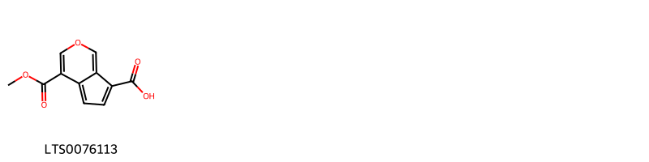{ width=100% }
    <figcaption>Hình ảnh cấu trúc hóa học của 1 hoạt chất thuộc nhóm Heteroaromatic compounds gồm ['4-(methoxycarbonyl)cyclopenta[c]pyran-7-carboxylic acid (LTS0076113)'].</figcaption>
</figure>
#### Nhóm Lignan glycosides
<figure markdown="span">
    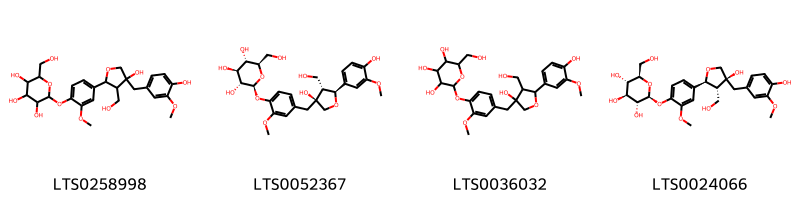{ width=100% }
    <figcaption>Hình ảnh cấu trúc hóa học của 4 hoạt chất thuộc nhóm Lignan glycosides gồm ['2-(4-{4-hydroxy-4-[(4-hydroxy-3-methoxyphenyl)methyl]-3-(hydroxymethyl)oxolan-2-yl}-2-methoxyphenoxy)-6-(hydroxymethyl)oxane-3,4,5-triol (LTS0258998)', '(2s,3r,4s,5s,6r)-2-(4-{[(3s,4r,5s)-3-hydroxy-5-(4-hydroxy-3-methoxyphenyl)-4-(hydroxymethyl)oxolan-3-yl]methyl}-2-methoxyphenoxy)-6-(hydroxymethyl)oxane-3,4,5-triol (LTS0052367)', '2-(4-{[3-hydroxy-5-(4-hydroxy-3-methoxyphenyl)-4-(hydroxymethyl)oxolan-3-yl]methyl}-2-methoxyphenoxy)-6-(hydroxymethyl)oxane-3,4,5-triol (LTS0036032)', '(2s,3r,4s,5s,6r)-2-{4-[(2s,3r,4s)-4-hydroxy-4-[(4-hydroxy-3-methoxyphenyl)methyl]-3-(hydroxymethyl)oxolan-2-yl]-2-methoxyphenoxy}-6-(hydroxymethyl)oxane-3,4,5-triol (LTS0024066)'].</figcaption>
</figure>
#### Nhóm Organooxygen compounds
<figure markdown="span">
    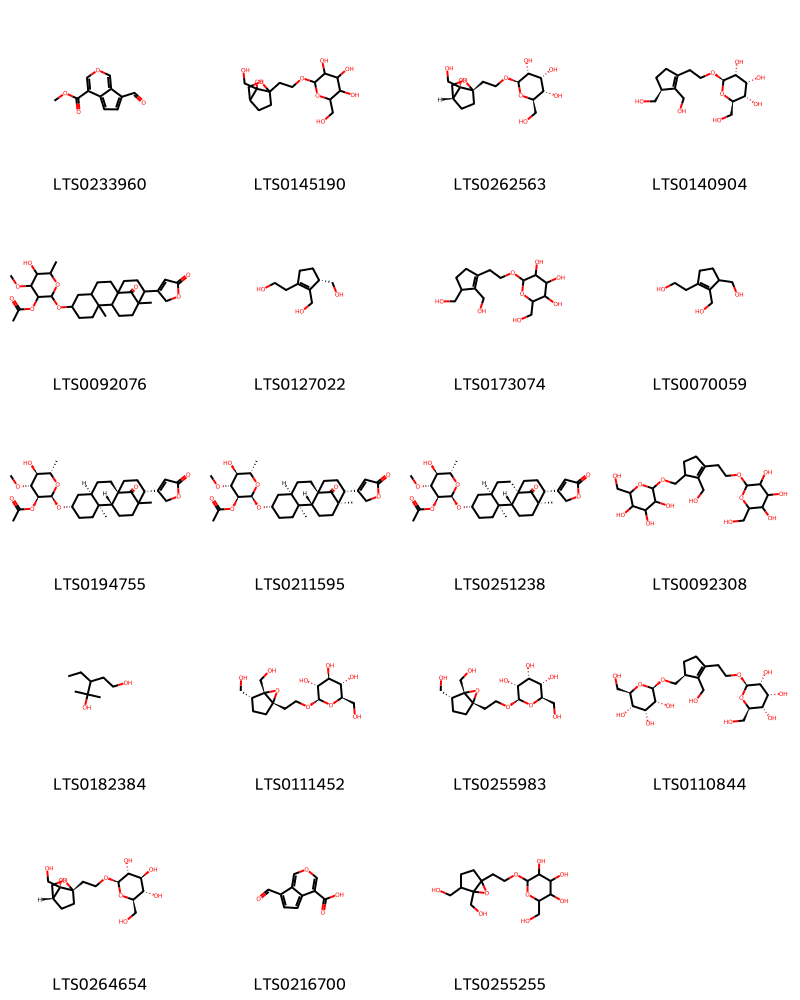{ width=100% }
    <figcaption>Hình ảnh cấu trúc hóa học của 19 hoạt chất thuộc nhóm Organooxygen compounds gồm ['methyl 7-formylcyclopenta[c]pyran-4-carboxylate (LTS0233960)', '2-{2-[7-hydroxy-7-(hydroxymethyl)-2-oxabicyclo[2.2.1]heptan-1-yl]ethoxy}-6-(hydroxymethyl)oxane-3,4,5-triol (LTS0145190)', '(2r,3r,4r,5s,6r)-2-{2-[(1s,4r,7r)-7-hydroxy-7-(hydroxymethyl)-2-oxabicyclo[2.2.1]heptan-1-yl]ethoxy}-6-(hydroxymethyl)oxane-3,4,5-triol (LTS0262563)', '(2r,3r,4r,5s,6r)-2-{2-[(3s)-2,3-bis(hydroxymethyl)cyclopent-1-en-1-yl]ethoxy}-6-(hydroxymethyl)oxane-3,4,5-triol (LTS0140904)', '2-{[9,13-dimethyl-17-oxo-14-(5-oxo-2h-furan-3-yl)tetracyclo[11.3.1.0¹,¹⁰.0⁴,⁹]heptadecan-6-yl]oxy}-5-hydroxy-4-methoxy-6-methyloxan-3-yl acetate (LTS0092076)', '2-[(3s)-2,3-bis(hydroxymethyl)cyclopent-1-en-1-yl]ethanol (LTS0127022)', '2-{2-[2,3-bis(hydroxymethyl)cyclopent-1-en-1-yl]ethoxy}-6-(hydroxymethyl)oxane-3,4,5-triol (LTS0173074)', '2-[2,3-bis(hydroxymethyl)cyclopent-1-en-1-yl]ethanol (LTS0070059)', '(2r,3s,4r,5s,6s)-2-{[(1s,4r,6s,9s,10r,14r)-9,13-dimethyl-17-oxo-14-(5-oxo-2h-furan-3-yl)tetracyclo[11.3.1.0¹,¹⁰.0⁴,⁹]heptadecan-6-yl]oxy}-5-hydroxy-4-methoxy-6-methyloxan-3-yl acetate (LTS0194755)', '(2r,3s,4r,5s,6s)-2-{[(1s,4r,6s,9s,10r,13r,14r)-9,13-dimethyl-17-oxo-14-(5-oxo-2h-furan-3-yl)tetracyclo[11.3.1.0¹,¹⁰.0⁴,⁹]heptadecan-6-yl]oxy}-5-hydroxy-4-methoxy-6-methyloxan-3-yl acetate (LTS0211595)', '(2r,3s,4r,5s,6s)-2-{[(1r,4r,6s,9s,10r,13r,14r)-9,13-dimethyl-17-oxo-14-(5-oxo-2h-furan-3-yl)tetracyclo[11.3.1.0¹,¹⁰.0⁴,⁹]heptadecan-6-yl]oxy}-5-hydroxy-4-methoxy-6-methyloxan-3-yl acetate (LTS0251238)', '2-(hydroxymethyl)-6-{2-[2-(hydroxymethyl)-3-({[3,4,5-trihydroxy-6-(hydroxymethyl)oxan-2-yl]oxy}methyl)cyclopent-1-en-1-yl]ethoxy}oxane-3,4,5-triol (LTS0092308)', '3-ethyl-4-methylpentane-1,4-diol (LTS0182384)', '(2r,3r,4s,5s,6r)-2-{2-[(1s,4r,5r)-4,5-bis(hydroxymethyl)-6-oxabicyclo[3.1.0]hexan-1-yl]ethoxy}-6-(hydroxymethyl)oxane-3,4,5-triol (LTS0111452)', '(2r,3r,4r,5s,6r)-2-{2-[(1s,4r,5r)-4,5-bis(hydroxymethyl)-6-oxabicyclo[3.1.0]hexan-1-yl]ethoxy}-6-(hydroxymethyl)oxane-3,4,5-triol (LTS0255983)', '(2r,3s,4r,5r,6r)-2-(hydroxymethyl)-6-{2-[(3s)-2-(hydroxymethyl)-3-({[(2r,3r,4r,5s,6r)-3,4,5-trihydroxy-6-(hydroxymethyl)oxan-2-yl]oxy}methyl)cyclopent-1-en-1-yl]ethoxy}oxane-3,4,5-triol (LTS0110844)', '(2r,3r,4s,5s,6r)-2-{2-[(1s,4r,7r)-7-hydroxy-7-(hydroxymethyl)-2-oxabicyclo[2.2.1]heptan-1-yl]ethoxy}-6-(hydroxymethyl)oxane-3,4,5-triol (LTS0264654)', '7-formylcyclopenta[c]pyran-4-carboxylic acid (LTS0216700)', '2-{2-[4,5-bis(hydroxymethyl)-6-oxabicyclo[3.1.0]hexan-1-yl]ethoxy}-6-(hydroxymethyl)oxane-3,4,5-triol (LTS0255255)'].</figcaption>
</figure>
#### Nhóm Oxanes
<figure markdown="span">
    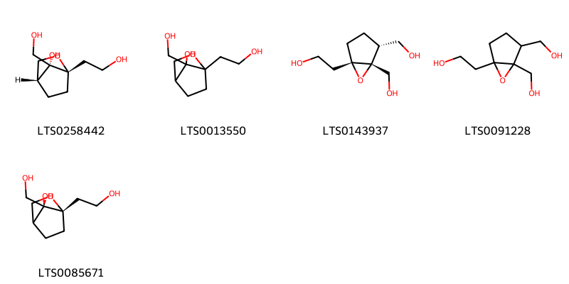{ width=100% }
    <figcaption>Hình ảnh cấu trúc hóa học của 5 hoạt chất thuộc nhóm Oxanes gồm ['(1s,4r,7r)-1-(2-hydroxyethyl)-7-(hydroxymethyl)-2-oxabicyclo[2.2.1]heptan-7-ol (LTS0258442)', '1-(2-hydroxyethyl)-7-(hydroxymethyl)-2-oxabicyclo[2.2.1]heptan-7-ol (LTS0013550)', '2-[(1s,4r,5r)-4,5-bis(hydroxymethyl)-6-oxabicyclo[3.1.0]hexan-1-yl]ethanol (LTS0143937)', '2-[4,5-bis(hydroxymethyl)-6-oxabicyclo[3.1.0]hexan-1-yl]ethanol (LTS0091228)', '(1s,7s)-1-(2-hydroxyethyl)-7-(hydroxymethyl)-2-oxabicyclo[2.2.1]heptan-7-ol (LTS0085671)'].</figcaption>
</figure>
#### Nhóm Prenol lipids
<figure markdown="span">
    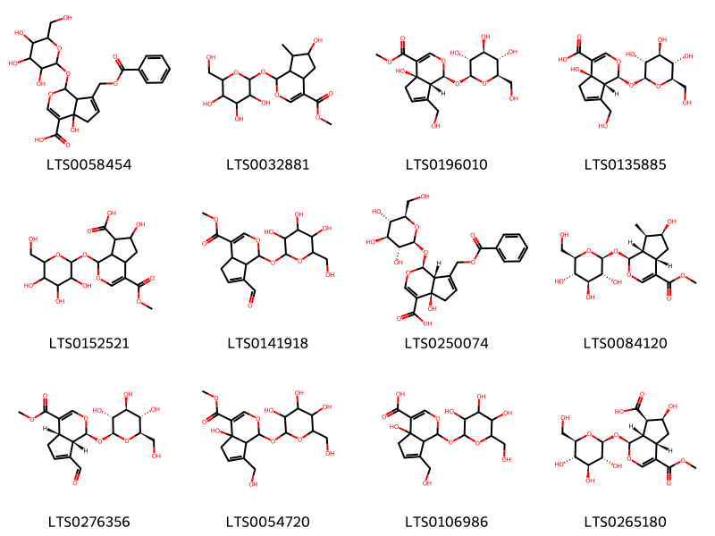{ width=100% }
    <figcaption>Hình ảnh cấu trúc hóa học của 12 hoạt chất thuộc nhóm Prenol lipids gồm ['7-[(benzoyloxy)methyl]-4a-hydroxy-1-{[3,4,5-trihydroxy-6-(hydroxymethyl)oxan-2-yl]oxy}-1h,5h,7ah-cyclopenta[c]pyran-4-carboxylic acid (LTS0058454)', 'methyl 6-hydroxy-7-methyl-1-{[3,4,5-trihydroxy-6-(hydroxymethyl)oxan-2-yl]oxy}-1h,4ah,5h,6h,7h,7ah-cyclopenta[c]pyran-4-carboxylate (LTS0032881)', 'methyl (1s,4ar,7ar)-4a-hydroxy-7-(hydroxymethyl)-1-{[(2s,3r,4s,5s,6r)-3,4,5-trihydroxy-6-(hydroxymethyl)oxan-2-yl]oxy}-1h,5h,7ah-cyclopenta[c]pyran-4-carboxylate (LTS0196010)', '(1s,4ar,7ar)-4a-hydroxy-7-(hydroxymethyl)-1-{[(2s,3r,4s,5s,6r)-3,4,5-trihydroxy-6-(hydroxymethyl)oxan-2-yl]oxy}-1h,5h,7ah-cyclopenta[c]pyran-4-carboxylic acid (LTS0135885)', '6-hydroxy-4-(methoxycarbonyl)-1-{[3,4,5-trihydroxy-6-(hydroxymethyl)oxan-2-yl]oxy}-1h,4ah,5h,6h,7h,7ah-cyclopenta[c]pyran-7-carboxylic acid (LTS0152521)', 'methyl 7-formyl-1-{[3,4,5-trihydroxy-6-(hydroxymethyl)oxan-2-yl]oxy}-1h,4ah,5h,7ah-cyclopenta[c]pyran-4-carboxylate (LTS0141918)', '(1s,4ar,7ar)-7-[(benzoyloxy)methyl]-4a-hydroxy-1-{[(2s,3r,4s,5s,6r)-3,4,5-trihydroxy-6-(hydroxymethyl)oxan-2-yl]oxy}-1h,5h,7ah-cyclopenta[c]pyran-4-carboxylic acid (LTS0250074)', 'loganin (LTS0084120)', 'methyl (1s,4as,7as)-7-formyl-1-{[(2s,3r,4s,5s,6r)-3,4,5-trihydroxy-6-(hydroxymethyl)oxan-2-yl]oxy}-1h,4ah,5h,7ah-cyclopenta[c]pyran-4-carboxylate (LTS0276356)', 'methyl 4a-hydroxy-7-(hydroxymethyl)-1-{[3,4,5-trihydroxy-6-(hydroxymethyl)oxan-2-yl]oxy}-1h,5h,7ah-cyclopenta[c]pyran-4-carboxylate (LTS0054720)', '4a-hydroxy-7-(hydroxymethyl)-1-{[3,4,5-trihydroxy-6-(hydroxymethyl)oxan-2-yl]oxy}-1h,5h,7ah-cyclopenta[c]pyran-4-carboxylic acid (LTS0106986)', '(1s,4as,6s,7r,7as)-6-hydroxy-4-(methoxycarbonyl)-1-{[(2s,3r,4s,5s,6r)-3,4,5-trihydroxy-6-(hydroxymethyl)oxan-2-yl]oxy}-1h,4ah,5h,6h,7h,7ah-cyclopenta[c]pyran-7-carboxylic acid (LTS0265180)'].</figcaption>
</figure>
#### Nhóm Steroids and steroid derivatives
<figure markdown="span">
    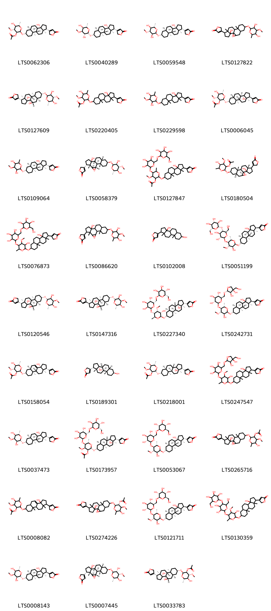{ width=100% }
    <figcaption>Hình ảnh cấu trúc hóa học của 35 hoạt chất thuộc nhóm Steroids and steroid derivatives gồm ['cerberin (LTS0062306)', '4-[(1r,3as,3br,5ar,7s,9as,9bs,11ar)-7-{[(2s,3r,4s,5s,6s)-3,5-dihydroxy-4-methoxy-6-methyloxan-2-yl]oxy}-3a-hydroxy-9a,11a-dimethyl-tetradecahydrocyclopenta[a]phenanthren-1-yl]-5h-furan-2-one (LTS0040289)', 'neriifolin (LTS0059548)', '4-{7-[(3,5-dihydroxy-4-methoxy-6-methyloxan-2-yl)oxy]-18-hydroxy-10,14-dimethyl-2-oxapentacyclo[9.7.0.0¹,³.0⁵,¹⁰.0¹⁴,¹⁸]octadecan-15-yl}-5h-furan-2-one (LTS0127822)', 'deacetyltanghinin (LTS0127609)', 'cerberin (LTS0220405)', 'neriifolin (LTS0229598)', '(2s,3s,4r,5s,6s)-2-{[(1s,3as,3br,5as,7s,9as,9bs,11ar)-3a-hydroxy-9a,11a-dimethyl-1-(5-oxo-2h-furan-3-yl)-tetradecahydrocyclopenta[a]phenanthren-7-yl]oxy}-5-hydroxy-4-methoxy-6-methyloxan-3-yl acetate (LTS0006045)', '4-[(1r,3as,3br,5ar,7s,9as,9bs,11ar)-7-[(3,5-dihydroxy-4-methoxy-6-methyloxan-2-yl)oxy]-3a-hydroxy-9a,11a-dimethyl-tetradecahydrocyclopenta[a]phenanthren-1-yl]-5h-furan-2-one (LTS0109064)', '4-[(1s,2s,4r,5s,6s,9s,10r,13r,15s,18s)-15-{[(2r,3s,4r,5s,6s)-3,5-dihydroxy-4-methoxy-6-methyloxan-2-yl]oxy}-9-hydroxy-5,18-dimethyl-3-oxapentacyclo[8.8.0.0²,⁴.0⁵,⁹.0¹³,¹⁸]octadecan-6-yl]-5h-furan-2-one (LTS0058379)', '2-{[3a-hydroxy-9a,11a-dimethyl-1-(5-oxo-2h-furan-3-yl)-tetradecahydrocyclopenta[a]phenanthren-7-yl]oxy}-4-methoxy-6-methyl-5-{[3,4,5-trihydroxy-6-({[3,4,5-trihydroxy-6-(hydroxymethyl)oxan-2-yl]oxy}methyl)oxan-2-yl]oxy}oxan-3-yl acetate (LTS0127847)', '(2s,5r)-5-hydroxy-2-{[(1r,3s,5s,7s,10s,14r,18r)-18-hydroxy-10,14-dimethyl-15-(5-oxo-2h-furan-3-yl)-2-oxapentacyclo[9.7.0.0¹,³.0⁵,¹⁰.0¹⁴,¹⁸]octadecan-7-yl]oxy}-4-methoxy-6-methyloxan-3-yl acetate (LTS0180504)', '4-{3a-hydroxy-7-[(3-hydroxy-4-methoxy-6-methyl-5-{[3,4,5-trihydroxy-6-({[3,4,5-trihydroxy-6-(hydroxymethyl)oxan-2-yl]oxy}methyl)oxan-2-yl]oxy}oxan-2-yl)oxy]-9a,11a-dimethyl-tetradecahydrocyclopenta[a]phenanthren-1-yl}-5h-furan-2-one (LTS0076873)', '4-{15-[(3,5-dihydroxy-4-methoxy-6-methyloxan-2-yl)oxy]-9-hydroxy-5,18-dimethyl-3-oxapentacyclo[8.8.0.0²,⁴.0⁵,⁹.0¹³,¹⁸]octadecan-6-yl}-5h-furan-2-one (LTS0086620)', 'digitoxigenin (LTS0102008)', '4-[(1s,3ar,3br,5ar,7s,9as,9bs,11ar)-7-{[(2r,3s,4s,5s,6s)-5-{[(2s,3r,4r,5s,6r)-3,4-dihydroxy-6-(hydroxymethyl)-5-{[(2s,3r,4s,5s,6r)-3,4,5-trihydroxy-6-(hydroxymethyl)oxan-2-yl]oxy}oxan-2-yl]oxy}-3-hydroxy-4-methoxy-6-methyloxan-2-yl]oxy}-3a-hydroxy-9a,11a-dimethyl-tetradecahydrocyclopenta[a]phenanthren-1-yl]-5h-furan-2-one (LTS0051199)', '4-[(1r,3s,5s,7s,10s,11s,14r,15r,18r)-7-{[(2s,3s,4s,5s,6s)-3,5-dihydroxy-4-methoxy-6-methyloxan-2-yl]oxy}-18-hydroxy-10,14-dimethyl-2-oxapentacyclo[9.7.0.0¹,³.0⁵,¹⁰.0¹⁴,¹⁸]octadecan-15-yl]-5h-furan-2-one (LTS0120546)', '4-[(1r,3s,5s,7s,10s,11r,14r,15s,18r)-7-{[(2s,3s,4s,5s,6s)-3,5-dihydroxy-4-methoxy-6-methyloxan-2-yl]oxy}-18-hydroxy-10,14-dimethyl-2-oxapentacyclo[9.7.0.0¹,³.0⁵,¹⁰.0¹⁴,¹⁸]octadecan-15-yl]-5h-furan-2-one (LTS0147316)', '4-[(1r,3as,3bs,5ar,7s,9as,9br,11ar)-3a-hydroxy-7-{[(2s,3s,4r,5s,6s)-3-hydroxy-4-methoxy-6-methyl-5-{[(2s,3s,4s,5s,6s)-3,4,5-trihydroxy-6-({[(2r,3s,4s,5s,6s)-3,4,5-trihydroxy-6-(hydroxymethyl)oxan-2-yl]oxy}methyl)oxan-2-yl]oxy}oxan-2-yl]oxy}-9a,11a-dimethyl-tetradecahydrocyclopenta[a]phenanthren-1-yl]-5h-furan-2-one (LTS0227340)', '4-[(1s,3ar,3br,5ar,7s,9as,9bs,11ar)-7-{[(2r,3s,4s,5s,6s)-5-{[(2s,3r,4s,5s,6r)-6-({[(2r,3r,4r)-3,4-dihydroxy-4-(hydroxymethyl)oxolan-2-yl]oxy}methyl)-3,4,5-trihydroxyoxan-2-yl]oxy}-3-hydroxy-4-methoxy-6-methyloxan-2-yl]oxy}-3a-hydroxy-9a,11a-dimethyl-tetradecahydrocyclopenta[a]phenanthren-1-yl]-5h-furan-2-one (LTS0242731)', '7,8-dehydrocerberin (LTS0158054)', '4-[(1s,3ar,3br,5ar,7s,9as,9bs,11ar)-3a,7-dihydroxy-9a,11a-dimethyl-tetradecahydrocyclopenta[a]phenanthren-1-yl]-5h-furan-2-one (LTS0189301)', '(2s,3s,4s,5s,6s)-2-{[(1r,3as,3bs,5ar,7s,9as,9br,11ar)-3a-hydroxy-9a,11a-dimethyl-1-(5-oxo-2h-furan-3-yl)-tetradecahydrocyclopenta[a]phenanthren-7-yl]oxy}-5-hydroxy-4-methoxy-6-methyloxan-3-yl acetate (LTS0218001)', '4-{7-[(5-{[6-({[3,4-dihydroxy-4-(hydroxymethyl)oxolan-2-yl]oxy}methyl)-3,4,5-trihydroxyoxan-2-yl]oxy}-3-hydroxy-4-methoxy-6-methyloxan-2-yl)oxy]-3a-hydroxy-9a,11a-dimethyl-tetradecahydrocyclopenta[a]phenanthren-1-yl}-5h-furan-2-one (LTS0247547)', '4-[(1r,3as,3br,5ar,7s,9as,9bs,11ar)-7-{[(2s,3s,4s,5s,6s)-3,5-dihydroxy-4-methoxy-6-methyloxan-2-yl]oxy}-3a-hydroxy-9a,11a-dimethyl-tetradecahydrocyclopenta[a]phenanthren-1-yl]-5h-furan-2-one (LTS0037473)', '(2s,3s,4s,5s,6s)-2-{[(1r,3as,3bs,5ar,7s,9as,9br,11ar)-3a-hydroxy-9a,11a-dimethyl-1-(5-oxo-2h-furan-3-yl)-tetradecahydrocyclopenta[a]phenanthren-7-yl]oxy}-4-methoxy-6-methyl-5-{[(2s,3s,4s,5s,6s)-3,4,5-trihydroxy-6-({[(2r,3s,4s,5s,6s)-3,4,5-trihydroxy-6-(hydroxymethyl)oxan-2-yl]oxy}methyl)oxan-2-yl]oxy}oxan-3-yl acetate (LTS0173957)', 'thevetin b (LTS0053067)', '5-hydroxy-2-{[18-hydroxy-10,14-dimethyl-15-(5-oxo-2h-furan-3-yl)-2-oxapentacyclo[9.7.0.0¹,³.0⁵,¹⁰.0¹⁴,¹⁸]octadecan-7-yl]oxy}-4-methoxy-6-methyloxan-3-yl acetate (LTS0265716)', '2-{[3a-hydroxy-9a,11a-dimethyl-1-(5-oxo-2h-furan-3-yl)-1h,2h,3h,5h,5ah,6h,7h,8h,9h,9bh,10h,11h-cyclopenta[a]phenanthren-7-yl]oxy}-5-hydroxy-4-methoxy-6-methyloxan-3-yl acetate (LTS0008082)', '(2r,3r)-5-hydroxy-2-{[18-hydroxy-10,14-dimethyl-15-(5-oxo-2h-furan-3-yl)-2-oxapentacyclo[9.7.0.0¹,³.0⁵,¹⁰.0¹⁴,¹⁸]octadecan-7-yl]oxy}-4-methoxy-6-methyloxan-3-yl acetate (LTS0274226)', '4-[(1s,3ar,3br,5ar,7s,9as,9bs,11ar)-3a-hydroxy-7-{[(2r,3s,4s,5s,6s)-3-hydroxy-4-methoxy-6-methyl-5-{[(2s,3r,4s,5s,6r)-3,4,5-trihydroxy-6-({[(2r,3r,4s,5s,6r)-3,4,5-trihydroxy-6-(hydroxymethyl)oxan-2-yl]oxy}methyl)oxan-2-yl]oxy}oxan-2-yl]oxy}-9a,11a-dimethyl-tetradecahydrocyclopenta[a]phenanthren-1-yl]-5h-furan-2-one (LTS0121711)', '4-{7-[(5-{[3,4-dihydroxy-6-(hydroxymethyl)-5-{[3,4,5-trihydroxy-6-(hydroxymethyl)oxan-2-yl]oxy}oxan-2-yl]oxy}-3-hydroxy-4-methoxy-6-methyloxan-2-yl)oxy]-3a-hydroxy-9a,11a-dimethyl-tetradecahydrocyclopenta[a]phenanthren-1-yl}-5h-furan-2-one (LTS0130359)', '4-[(1s,3as,3br,5ar,7s,9as,9bs,11ar)-7-{[(2s,3s,4s,5s,6s)-3,5-dihydroxy-4-methoxy-6-methyloxan-2-yl]oxy}-3a-hydroxy-9a,11a-dimethyl-tetradecahydrocyclopenta[a]phenanthren-1-yl]-5h-furan-2-one (LTS0008143)', '4-[(1s,2s,4r,5s,6s,9s,10r,13r,15s,18s)-15-{[(2r,3r,4r,5s,6s)-3,5-dihydroxy-4-methoxy-6-methyloxan-2-yl]oxy}-9-hydroxy-5,18-dimethyl-3-oxapentacyclo[8.8.0.0²,⁴.0⁵,⁹.0¹³,¹⁸]octadecan-6-yl]-5h-furan-2-one (LTS0007445)', '(2r,3s,4r,5s,6s)-5-hydroxy-2-{[(1r,3s,5s,7s,10s,11r,14r,15r,18r)-18-hydroxy-10,14-dimethyl-15-(5-oxo-2h-furan-3-yl)-2-oxapentacyclo[9.7.0.0¹,³.0⁵,¹⁰.0¹⁴,¹⁸]octadecan-7-yl]oxy}-4-methoxy-6-methyloxan-3-yl acetate (LTS0033783)'].</figcaption>
</figure>

---

### Dược dân tộc học

Danh sách các quốc gia có sử dụng *Cerbera manghas* trong điều trị các bệnh. 

| Country     | Disease                                                   | Bệnh                                                                                                                                                                                                |
|:------------|:----------------------------------------------------------|:----------------------------------------------------------------------------------------------------------------------------------------------------------------------------------------------------|
| Elsewhere   | Canicide, Cathartic, Emetic, Poison, Purgative, Vermifuge | MYMEMORY WARNING: YOU USED ALL AVAILABLE FREE TRANSLATIONS FOR TODAY. NEXT AVAILABLE IN  11 HOURS 59 MINUTES 47 SECONDS VISIT HTTPS://MYMEMORY.TRANSLATED.NET/DOC/USAGELIMITS.PHP TO TRANSLATE MORE |
| Marquesas I | Poison                                                    | MYMEMORY WARNING: YOU USED ALL AVAILABLE FREE TRANSLATIONS FOR TODAY. NEXT AVAILABLE IN  11 HOURS 59 MINUTES 43 SECONDS VISIT HTTPS://MYMEMORY.TRANSLATED.NET/DOC/USAGELIMITS.PHP TO TRANSLATE MORE |
| Philippines | Piscicide, Piscicide                                      | MYMEMORY WARNING: YOU USED ALL AVAILABLE FREE TRANSLATIONS FOR TODAY. NEXT AVAILABLE IN  11 HOURS 59 MINUTES 39 SECONDS VISIT HTTPS://MYMEMORY.TRANSLATED.NET/DOC/USAGELIMITS.PHP TO TRANSLATE MORE |
| Samoa       | Laxative, Pediculicide, Poison                            | MYMEMORY WARNING: YOU USED ALL AVAILABLE FREE TRANSLATIONS FOR TODAY. NEXT AVAILABLE IN  11 HOURS 59 MINUTES 35 SECONDS VISIT HTTPS://MYMEMORY.TRANSLATED.NET/DOC/USAGELIMITS.PHP TO TRANSLATE MORE |

---

# Chi Ervatamia

??? note "Danh sách các dược liệu thuộc chi"
    
	 - *Ervatamia coronaria*
	 - *Ervatamia dichotoma*
	 - *Ervatamia orientalis*
	 - *Ervatamia peduncularis*

---
## Ervatamia coronaria
### Thông tin về thực vật

!!! info "Phân loại thực vật của *Tabernaemontana divaricata* từ GIBF:"
    - **Kingdom:** Plantae
    - **Phylum:** Tracheophyta
    - **Order:** Gentianales
    - **Family:** Apocynaceae
    - **Genus:** Tabernaemontana
    - **Species:** *Tabernaemontana divaricata*

 

| Label (VI)   | Label (EN)   | Scientific Name     | Descriptions (VI)   | Descriptions (EN)   | Also Known As (VI)   | Also Known As (EN)   |
|:-------------|:-------------|:--------------------|:--------------------|:--------------------|:---------------------|:---------------------|
| N/A          | N/A          | Ervatamia coronaria | loài thực vật       | species of plant    | ['']                 | ['']                 |

#### Phân bố trên thế giới

**Từ CSDL GIBF** nan, Brazil, Mexico, Nicaragua, Equatorial Guinea, United States of America, Guadeloupe, Cook Islands, Malaysia, China, Côte d’Ivoire, New Caledonia, Myanmar, India, Argentina, Thailand

#### Phân bố tại Việt Nam

**Từ CSDL GIBF**: Không có ghi nhận ở Việt Nam

---
### Thành phần hóa học
        
- Theo cơ sở dữ liệu lotus: Từ loài *Tabernaemontana divaricata* đã phân lập và xác định được Chưa có hoạt chất nào được phân lập. hoạt chất thuộc về các nhóm Không có hoạt chất nào được phân lập. 

Không có hình ảnh nào được tạo ra

---

### Dược dân tộc học

Danh sách các quốc gia có sử dụng *Tabernaemontana divaricata* trong điều trị các bệnh. 

| Country   | Disease                        | Bệnh                                                                                                                                                                                                |
|:----------|:-------------------------------|:----------------------------------------------------------------------------------------------------------------------------------------------------------------------------------------------------|
| Elsewhere | nan                            | MYMEMORY WARNING: YOU USED ALL AVAILABLE FREE TRANSLATIONS FOR TODAY. NEXT AVAILABLE IN  11 HOURS 58 MINUTES 58 SECONDS VISIT HTTPS://MYMEMORY.TRANSLATED.NET/DOC/USAGELIMITS.PHP TO TRANSLATE MORE |
| India     | Poison, Refrigerant, Vermicide | MYMEMORY WARNING: YOU USED ALL AVAILABLE FREE TRANSLATIONS FOR TODAY. NEXT AVAILABLE IN  11 HOURS 58 MINUTES 55 SECONDS VISIT HTTPS://MYMEMORY.TRANSLATED.NET/DOC/USAGELIMITS.PHP TO TRANSLATE MORE |

---

---
## Ervatamia dichotoma
### Thông tin về thực vật

!!! info "Phân loại thực vật của *Tabernaemontana dichotoma* từ GIBF:"
    - **Kingdom:** Plantae
    - **Phylum:** Tracheophyta
    - **Order:** Gentianales
    - **Family:** Apocynaceae
    - **Genus:** Tabernaemontana
    - **Species:** *Tabernaemontana dichotoma*

 

| Label (VI)   | Label (EN)   | Scientific Name     | Descriptions (VI)   | Descriptions (EN)   | Also Known As (VI)   | Also Known As (EN)   |
|:-------------|:-------------|:--------------------|:--------------------|:--------------------|:---------------------|:---------------------|
| N/A          | N/A          | Ervatamia dichotoma |                     |                     | ['']                 | ['']                 |

#### Phân bố trên thế giới

**Từ CSDL GIBF** nan, Brazil, Mexico, Nicaragua, Equatorial Guinea, United States of America, Guadeloupe, Cook Islands, Malaysia, China, Côte d’Ivoire, New Caledonia, Myanmar, India, Argentina, Thailand

#### Phân bố tại Việt Nam

**Từ CSDL GIBF**: Không có ghi nhận ở Việt Nam

---
### Thành phần hóa học
        
- Theo cơ sở dữ liệu lotus: Từ loài *Tabernaemontana dichotoma* đã phân lập và xác định được Chưa có hoạt chất nào được phân lập. hoạt chất thuộc về các nhóm Không có hoạt chất nào được phân lập. 

Không có hình ảnh nào được tạo ra

---

### Dược dân tộc học

Danh sách các quốc gia có sử dụng *Tabernaemontana dichotoma* trong điều trị các bệnh. 

| Country   | Disease                     | Bệnh                                                                                                                                                                                                |
|:----------|:----------------------------|:----------------------------------------------------------------------------------------------------------------------------------------------------------------------------------------------------|
| India     | Cathartic, Narcotic, Poison | MYMEMORY WARNING: YOU USED ALL AVAILABLE FREE TRANSLATIONS FOR TODAY. NEXT AVAILABLE IN  11 HOURS 58 MINUTES 31 SECONDS VISIT HTTPS://MYMEMORY.TRANSLATED.NET/DOC/USAGELIMITS.PHP TO TRANSLATE MORE |
| Java      | Purgative                   | MYMEMORY WARNING: YOU USED ALL AVAILABLE FREE TRANSLATIONS FOR TODAY. NEXT AVAILABLE IN  11 HOURS 58 MINUTES 23 SECONDS VISIT HTTPS://MYMEMORY.TRANSLATED.NET/DOC/USAGELIMITS.PHP TO TRANSLATE MORE |

---

---
## Ervatamia orientalis
### Thông tin về thực vật

!!! info "Phân loại thực vật của *Tabernaemontana pandacaqui* từ GIBF:"
    - **Kingdom:** Plantae
    - **Phylum:** Tracheophyta
    - **Order:** Gentianales
    - **Family:** Apocynaceae
    - **Genus:** Tabernaemontana
    - **Species:** *Tabernaemontana pandacaqui*

 

| Label (VI)   | Label (EN)   | Scientific Name     | Descriptions (VI)   | Descriptions (EN)   | Also Known As (VI)   | Also Known As (EN)   |
|:-------------|:-------------|:--------------------|:--------------------|:--------------------|:---------------------|:---------------------|
| N/A          | N/A          | Ervatamia dichotoma |                     |                     | ['']                 | ['']                 |

#### Phân bố trên thế giới

**Từ CSDL GIBF** nan, Brazil, United States of America, Vanuatu, New Caledonia, Australia, unknown or invalid, Papua New Guinea, Fiji

#### Phân bố tại Việt Nam

**Từ CSDL GIBF**: Không có ghi nhận ở Việt Nam

---
### Thành phần hóa học
        
- Theo cơ sở dữ liệu lotus: Từ loài *Tabernaemontana pandacaqui* đã phân lập và xác định được Chưa có hoạt chất nào được phân lập. hoạt chất thuộc về các nhóm Không có hoạt chất nào được phân lập. 

Không có hình ảnh nào được tạo ra

---

### Dược dân tộc học

Danh sách các quốc gia có sử dụng *Tabernaemontana pandacaqui* trong điều trị các bệnh. 

| Country   | Disease   | Bệnh                                                                                                                                                                                                |
|:----------|:----------|:----------------------------------------------------------------------------------------------------------------------------------------------------------------------------------------------------|
| Samoa     | Poison    | MYMEMORY WARNING: YOU USED ALL AVAILABLE FREE TRANSLATIONS FOR TODAY. NEXT AVAILABLE IN  11 HOURS 57 MINUTES 48 SECONDS VISIT HTTPS://MYMEMORY.TRANSLATED.NET/DOC/USAGELIMITS.PHP TO TRANSLATE MORE |

---

---
## Ervatamia peduncularis
### Thông tin về thực vật

!!! info "Phân loại thực vật của *Tabernaemontana peduncularis* từ GIBF:"
    - **Kingdom:** Plantae
    - **Phylum:** Tracheophyta
    - **Order:** Gentianales
    - **Family:** Apocynaceae
    - **Genus:** Tabernaemontana
    - **Species:** *Tabernaemontana peduncularis*

 

| Label (VI)   | Label (EN)   | Scientific Name        | Descriptions (VI)   | Descriptions (EN)   | Also Known As (VI)   | Also Known As (EN)   |
|:-------------|:-------------|:-----------------------|:--------------------|:--------------------|:---------------------|:---------------------|
| N/A          | N/A          | Ervatamia peduncularis |                     |                     | ['']                 | ['']                 |

#### Phân bố trên thế giới

**Từ CSDL GIBF** Malaysia

#### Phân bố tại Việt Nam

**Từ CSDL GIBF**: Không có ghi nhận ở Việt Nam

---
### Thành phần hóa học
        
- Theo cơ sở dữ liệu lotus: Từ loài *Tabernaemontana peduncularis* đã phân lập và xác định được Chưa có hoạt chất nào được phân lập. hoạt chất thuộc về các nhóm Không có hoạt chất nào được phân lập. 

Không có hình ảnh nào được tạo ra

---

### Dược dân tộc học

Danh sách các quốc gia có sử dụng *Tabernaemontana peduncularis* trong điều trị các bệnh. 

| Country   | Disease   | Bệnh                                                                                                                                                                                                |
|:----------|:----------|:----------------------------------------------------------------------------------------------------------------------------------------------------------------------------------------------------|
| Malaya    | Poison    | MYMEMORY WARNING: YOU USED ALL AVAILABLE FREE TRANSLATIONS FOR TODAY. NEXT AVAILABLE IN  11 HOURS 57 MINUTES 23 SECONDS VISIT HTTPS://MYMEMORY.TRANSLATED.NET/DOC/USAGELIMITS.PHP TO TRANSLATE MORE |

---

# Chi Secondatia

??? note "Danh sách các dược liệu thuộc chi"
    
	 - *Secondatia stans*

---
## Secondatia stans
### Thông tin về thực vật

!!! info "Phân loại thực vật của *Mandevilla stans* từ GIBF:"
    - **Kingdom:** Plantae
    - **Phylum:** Tracheophyta
    - **Order:** Gentianales
    - **Family:** Apocynaceae
    - **Genus:** Mandevilla
    - **Species:** *Mandevilla stans*

 

| Label (VI)   | Label (EN)   | Scientific Name   | Descriptions (VI)   | Descriptions (EN)   | Also Known As (VI)   | Also Known As (EN)   |
|:-------------|:-------------|:------------------|:--------------------|:--------------------|:---------------------|:---------------------|
| N/A          | N/A          | Secondatia stans  |                     |                     | ['']                 | ['']                 |

#### Phân bố trên thế giới

**Từ CSDL GIBF** Mexico

#### Phân bố tại Việt Nam

**Từ CSDL GIBF**: Không có ghi nhận ở Việt Nam

---
### Thành phần hóa học
        
- Theo cơ sở dữ liệu lotus: Từ loài *Mandevilla stans* đã phân lập và xác định được Chưa có hoạt chất nào được phân lập. hoạt chất thuộc về các nhóm Không có hoạt chất nào được phân lập. 

Không có hình ảnh nào được tạo ra

---

### Dược dân tộc học

Danh sách các quốc gia có sử dụng *Mandevilla stans* trong điều trị các bệnh. 

| Country   | Disease     | Bệnh                                                                                                                                                                                                |
|:----------|:------------|:----------------------------------------------------------------------------------------------------------------------------------------------------------------------------------------------------|
| Mexico    | Insecticide | MYMEMORY WARNING: YOU USED ALL AVAILABLE FREE TRANSLATIONS FOR TODAY. NEXT AVAILABLE IN  11 HOURS 57 MINUTES 03 SECONDS VISIT HTTPS://MYMEMORY.TRANSLATED.NET/DOC/USAGELIMITS.PHP TO TRANSLATE MORE |

---

# Chi Tabernanthe

??? note "Danh sách các dược liệu thuộc chi"
    
	 - *Tabernanthe iboga*

---
## Tabernanthe iboga
### Thông tin về thực vật

!!! info "Phân loại thực vật của *Tabernanthe iboga* từ GIBF:"
    - **Kingdom:** Plantae
    - **Phylum:** Tracheophyta
    - **Order:** Gentianales
    - **Family:** Apocynaceae
    - **Genus:** Tabernanthe
    - **Species:** *Tabernanthe iboga*

 

| Label (VI)   | Label (EN)   | Scientific Name   | Descriptions (VI)   | Descriptions (EN)   | Also Known As (VI)   | Also Known As (EN)   |
|:-------------|:-------------|:------------------|:--------------------|:--------------------|:---------------------|:---------------------|
| N/A          | N/A          | Tabernanthe iboga | loài thực vật       | species of plant    | ['']                 | ['']                 |

#### Phân bố trên thế giới

**Từ CSDL GIBF** Benin, Congo, Democratic Republic of the, United States of America, Netherlands, Belgium, Gabon, Côte d’Ivoire, Congo, Tanzania, United Republic of, Angola, Equatorial Guinea, Cameroon, Guinea

#### Phân bố tại Việt Nam

**Từ CSDL GIBF**: Không có ghi nhận ở Việt Nam

---
### Thành phần hóa học
        
- Theo cơ sở dữ liệu lotus: Từ loài *Tabernanthe iboga* đã phân lập và xác định được 18 hoạt chất thuộc về các nhóm Yohimbine alkaloids, Plumeran-type alkaloids, Ibogan-type alkaloids, Strychnos alkaloids, Quebrachamine alkaloids, Indoles and derivatives. 

|    | chemicalTaxonomyClassyfireClass   |   smiles_count |
|---:|:----------------------------------|---------------:|
|  0 | Ibogan-type alkaloids             |             11 |
|  1 | Indoles and derivatives           |              1 |
|  2 | Plumeran-type alkaloids           |              1 |
|  3 | Quebrachamine alkaloids           |              2 |
|  4 | Strychnos alkaloids               |              2 |
|  5 | Yohimbine alkaloids               |              1 |

#### Nhóm Ibogan-type alkaloids
<figure markdown="span">
    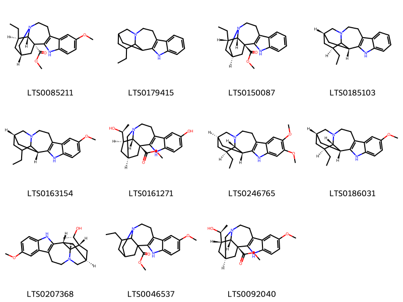{ width=100% }
    <figcaption>Hình ảnh cấu trúc hóa học của 11 hoạt chất thuộc nhóm Ibogan-type alkaloids gồm ['methyl (1r,15s,17r,18s)-17-ethyl-7-methoxy-3,13-diazapentacyclo[13.3.1.0²,¹⁰.0⁴,⁹.0¹³,¹⁸]nonadeca-2(10),4,6,8-tetraene-1-carboxylate (LTS0085211)', '17-ethyl-3,13-diazapentacyclo[13.3.1.0²,¹⁰.0⁴,⁹.0¹³,¹⁸]nonadeca-2(10),4,6,8-tetraene (LTS0179415)', 'methyl (1s,15r,17s,18s)-17-ethyl-3,13-diazapentacyclo[13.3.1.0²,¹⁰.0⁴,⁹.0¹³,¹⁸]nonadeca-2(10),4,6,8-tetraene-1-carboxylate (LTS0150087)', '(1r,15s,17s)-17-ethyl-3,13-diazapentacyclo[13.3.1.0²,¹⁰.0⁴,⁹.0¹³,¹⁸]nonadeca-2(10),4,6,8-tetraene (LTS0185103)', '(1r,15s)-17-ethyl-7-methoxy-3,13-diazapentacyclo[13.3.1.0²,¹⁰.0⁴,⁹.0¹³,¹⁸]nonadeca-2(10),4,6,8-tetraene (LTS0163154)', 'methyl (1s,15r,17r,18s)-7-hydroxy-17-[(1s)-1-hydroxyethyl]-3,13-diazapentacyclo[13.3.1.0²,¹⁰.0⁴,⁹.0¹³,¹⁸]nonadeca-2(10),4,6,8-tetraene-1-carboxylate (LTS0161271)', 'ibogaline (LTS0246765)', 'endabuse (LTS0186031)', '(1s)-1-[(1r,15s,17r,18r)-7-methoxy-3,13-diazapentacyclo[13.3.1.0²,¹⁰.0⁴,⁹.0¹³,¹⁸]nonadeca-2(10),4,6,8-tetraen-17-yl]ethanol (LTS0207368)', 'voacangine (LTS0046537)', 'methyl (1s,15r,17s,18s)-17-[(1s)-1-hydroxyethyl]-7-methoxy-3,13-diazapentacyclo[13.3.1.0²,¹⁰.0⁴,⁹.0¹³,¹⁸]nonadeca-2(10),4,6,8-tetraene-1-carboxylate (LTS0092040)'].</figcaption>
</figure>
#### Nhóm Indoles and derivatives
<figure markdown="span">
    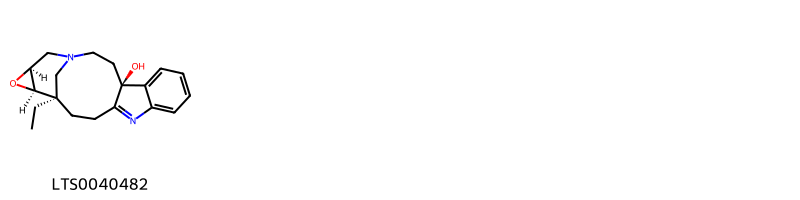{ width=100% }
    <figcaption>Hình ảnh cấu trúc hóa học của 1 hoạt chất thuộc nhóm Indoles and derivatives gồm ['(4s,15r,16r,18s)-15-ethyl-17-oxa-1,11-diazapentacyclo[13.4.1.0⁴,¹².0⁵,¹⁰.0¹⁶,¹⁸]icosa-5,7,9,11-tetraen-4-ol (LTS0040482)'].</figcaption>
</figure>
#### Nhóm Plumeran-type alkaloids
<figure markdown="span">
    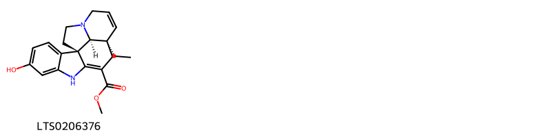{ width=100% }
    <figcaption>Hình ảnh cấu trúc hóa học của 1 hoạt chất thuộc nhóm Plumeran-type alkaloids gồm ['16-hydroxytabersonine (LTS0206376)'].</figcaption>
</figure>
#### Nhóm Quebrachamine alkaloids
<figure markdown="span">
    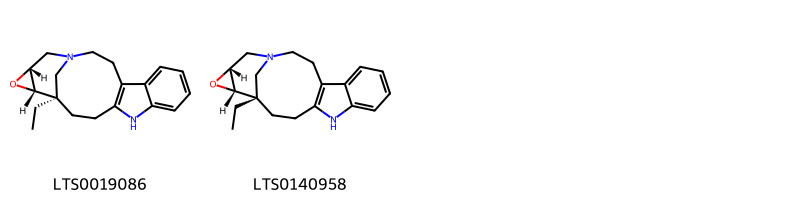{ width=100% }
    <figcaption>Hình ảnh cấu trúc hóa học của 2 hoạt chất thuộc nhóm Quebrachamine alkaloids gồm ['(15r,16s,18r)-15-ethyl-17-oxa-1,11-diazapentacyclo[13.4.1.0⁴,¹².0⁵,¹⁰.0¹⁶,¹⁸]icosa-4(12),5,7,9-tetraene (LTS0019086)', '(15s,16s,18r)-15-ethyl-17-oxa-1,11-diazapentacyclo[13.4.1.0⁴,¹².0⁵,¹⁰.0¹⁶,¹⁸]icosa-4(12),5,7,9-tetraene (LTS0140958)'].</figcaption>
</figure>
#### Nhóm Strychnos alkaloids
<figure markdown="span">
    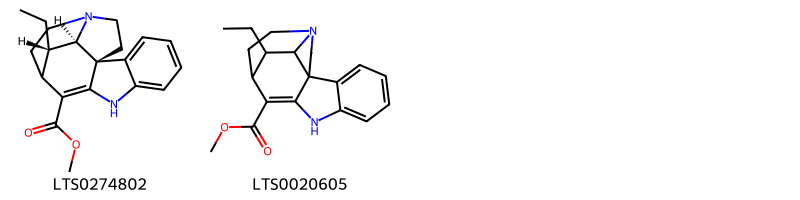{ width=100% }
    <figcaption>Hình ảnh cấu trúc hóa học của 2 hoạt chất thuộc nhóm Strychnos alkaloids gồm ['methyl (1s,17r,18s)-18-ethyl-8,14-diazapentacyclo[9.5.2.0¹,⁹.0²,⁷.0¹⁴,¹⁷]octadeca-2,4,6,9-tetraene-10-carboxylate (LTS0274802)', 'methyl 18-ethyl-8,14-diazapentacyclo[9.5.2.0¹,⁹.0²,⁷.0¹⁴,¹⁷]octadeca-2,4,6,9-tetraene-10-carboxylate (LTS0020605)'].</figcaption>
</figure>
#### Nhóm Yohimbine alkaloids
<figure markdown="span">
    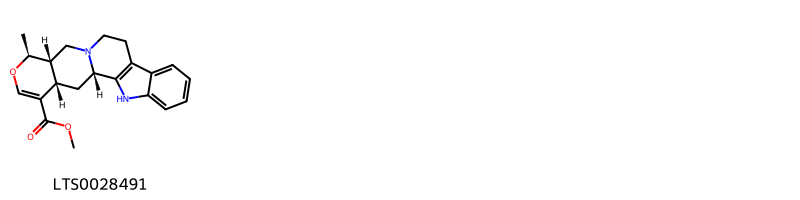{ width=100% }
    <figcaption>Hình ảnh cấu trúc hóa học của 1 hoạt chất thuộc nhóm Yohimbine alkaloids gồm ['tetrahydroalstonine (LTS0028491)'].</figcaption>
</figure>

---

### Dược dân tộc học

Danh sách các quốc gia có sử dụng *Tabernanthe iboga* trong điều trị các bệnh. 

| Country   | Disease            | Bệnh                                                                                                                                                                                                |
|:----------|:-------------------|:----------------------------------------------------------------------------------------------------------------------------------------------------------------------------------------------------|
| Africa    | Tonic, Aphrodisiac | MYMEMORY WARNING: YOU USED ALL AVAILABLE FREE TRANSLATIONS FOR TODAY. NEXT AVAILABLE IN  11 HOURS 56 MINUTES 40 SECONDS VISIT HTTPS://MYMEMORY.TRANSLATED.NET/DOC/USAGELIMITS.PHP TO TRANSLATE MORE |
| Elsewhere | Apertif            | MYMEMORY WARNING: YOU USED ALL AVAILABLE FREE TRANSLATIONS FOR TODAY. NEXT AVAILABLE IN  11 HOURS 56 MINUTES 37 SECONDS VISIT HTTPS://MYMEMORY.TRANSLATED.NET/DOC/USAGELIMITS.PHP TO TRANSLATE MORE |
| English   | Aphrodisiac        | MYMEMORY WARNING: YOU USED ALL AVAILABLE FREE TRANSLATIONS FOR TODAY. NEXT AVAILABLE IN  11 HOURS 56 MINUTES 33 SECONDS VISIT HTTPS://MYMEMORY.TRANSLATED.NET/DOC/USAGELIMITS.PHP TO TRANSLATE MORE |
| Gabon     | Aphrodisiac        | MYMEMORY WARNING: YOU USED ALL AVAILABLE FREE TRANSLATIONS FOR TODAY. NEXT AVAILABLE IN  11 HOURS 56 MINUTES 31 SECONDS VISIT HTTPS://MYMEMORY.TRANSLATED.NET/DOC/USAGELIMITS.PHP TO TRANSLATE MORE |
| Zaire     | Aphrodisiac        | MYMEMORY WARNING: YOU USED ALL AVAILABLE FREE TRANSLATIONS FOR TODAY. NEXT AVAILABLE IN  11 HOURS 56 MINUTES 29 SECONDS VISIT HTTPS://MYMEMORY.TRANSLATED.NET/DOC/USAGELIMITS.PHP TO TRANSLATE MORE |

---

# Chi Aganosma

??? note "Danh sách các dược liệu thuộc chi"
    
	 - *Aganosma marginata*

---
## Aganosma marginata
### Thông tin về thực vật

!!! info "Phân loại thực vật của *Amphineurion marginatum* từ GIBF:"
    - **Kingdom:** Plantae
    - **Phylum:** Tracheophyta
    - **Order:** Gentianales
    - **Family:** Apocynaceae
    - **Genus:** Amphineurion
    - **Species:** *Amphineurion marginatum*

 

| Label (VI)   | Label (EN)   | Scientific Name    | Descriptions (VI)   | Descriptions (EN)   | Also Known As (VI)   | Also Known As (EN)   |
|:-------------|:-------------|:-------------------|:--------------------|:--------------------|:---------------------|:---------------------|
| N/A          | N/A          | Aganosma marginata | loài thực vật       | species of plant    | ['']                 | ['']                 |

#### Phân bố trên thế giới

**Từ CSDL GIBF** nan, Viet Nam, Malta, Bangladesh, Nepal, China, Tanzania, United Republic of, Thailand, United States of America, Bhutan, Indonesia, Cuba, unknown or invalid, Lao People’s Democratic Republic, Mexico, Malaysia, Philippines, Palau, Cambodia, Peru

#### Phân bố tại Việt Nam

**Từ CSDL GIBF**: Ninh Thuan

---
### Thành phần hóa học
        
- Theo cơ sở dữ liệu lotus: Từ loài *Amphineurion marginatum* đã phân lập và xác định được Chưa có hoạt chất nào được phân lập. hoạt chất thuộc về các nhóm Không có hoạt chất nào được phân lập. 

Không có hình ảnh nào được tạo ra

---

### Dược dân tộc học

Danh sách các quốc gia có sử dụng *Amphineurion marginatum* trong điều trị các bệnh. 

| Country   | Disease            | Bệnh                                                                                                                                                                                                |
|:----------|:-------------------|:----------------------------------------------------------------------------------------------------------------------------------------------------------------------------------------------------|
| Malaysia  | Emmenagogue, Tonic | MYMEMORY WARNING: YOU USED ALL AVAILABLE FREE TRANSLATIONS FOR TODAY. NEXT AVAILABLE IN  11 HOURS 55 MINUTES 52 SECONDS VISIT HTTPS://MYMEMORY.TRANSLATED.NET/DOC/USAGELIMITS.PHP TO TRANSLATE MORE |

---

# Chi Apocynum

??? note "Danh sách các dược liệu thuộc chi"
    
	 - *Apocynum androsaemifolium*
	 - *Apocynum cannabinum*
	 - *Apocynum venetum*

---
## Apocynum androsaemifolium
### Thông tin về thực vật

!!! info "Phân loại thực vật của *Apocynum androsaemifolium* từ GIBF:"
    - **Kingdom:** Plantae
    - **Phylum:** Tracheophyta
    - **Order:** Gentianales
    - **Family:** Apocynaceae
    - **Genus:** Apocynum
    - **Species:** *Apocynum androsaemifolium*

 

| Label (VI)   | Label (EN)   | Scientific Name           | Descriptions (VI)   | Descriptions (EN)   | Also Known As (VI)   | Also Known As (EN)                       |
|:-------------|:-------------|:--------------------------|:--------------------|:--------------------|:---------------------|:-----------------------------------------|
| N/A          | N/A          | Apocynum androsaemifolium | loài thực vật       | species of plant    | ['']                 | ['flytrap dogbane', 'spreading dogbane'] |

#### Phân bố trên thế giới

**Từ CSDL GIBF** United States of America, Canada

#### Phân bố tại Việt Nam

**Từ CSDL GIBF**: Không có ghi nhận ở Việt Nam

---
### Thành phần hóa học
        
- Theo cơ sở dữ liệu lotus: Từ loài *Apocynum androsaemifolium* đã phân lập và xác định được 8 hoạt chất thuộc về các nhóm Prenol lipids, Organooxygen compounds, Steroids and steroid derivatives. 

|    | chemicalTaxonomyClassyfireClass   |   smiles_count |
|---:|:----------------------------------|---------------:|
|  0 | Organooxygen compounds            |              1 |
|  1 | Prenol lipids                     |              3 |
|  2 | Steroids and steroid derivatives  |              4 |

#### Nhóm Organooxygen compounds
<figure markdown="span">
    { width=100% }
    <figcaption>Hình ảnh cấu trúc hóa học của 1 hoạt chất thuộc nhóm Organooxygen compounds gồm ['apocynin (LTS0211279)'].</figcaption>
</figure>
#### Nhóm Prenol lipids
<figure markdown="span">
    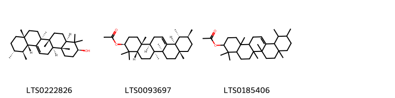{ width=100% }
    <figcaption>Hình ảnh cấu trúc hóa học của 3 hoạt chất thuộc nhóm Prenol lipids gồm ['amyrin (LTS0222826)', '(3s,4as,6as,6bs,8ar,11s,12r,12as,14ar,14br)-4,4,6a,6b,8a,11,12,14b-octamethyl-2,3,4a,5,6,7,8,9,10,11,12,12a,14,14a-tetradecahydro-1h-picen-3-yl acetate (LTS0093697)', '4,4,6a,6b,8a,11,12,14b-octamethyl-2,3,4a,5,6,7,8,9,10,11,12,12a,14,14a-tetradecahydro-1h-picen-3-yl acetate (LTS0185406)'].</figcaption>
</figure>
#### Nhóm Steroids and steroid derivatives
<figure markdown="span">
    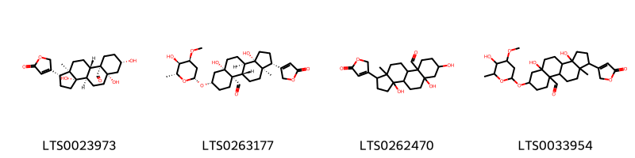{ width=100% }
    <figcaption>Hình ảnh cấu trúc hóa học của 4 hoạt chất thuộc nhóm Steroids and steroid derivatives gồm ['strophanthidin (LTS0023973)', 'cymarin (LTS0263177)', 'strophanthidin (LTS0262470)', 'cymarin (LTS0033954)'].</figcaption>
</figure>

---

### Dược dân tộc học

Danh sách các quốc gia có sử dụng *Apocynum androsaemifolium* trong điều trị các bệnh. 

| Country   | Disease                                                            | Bệnh                                                                                                                                                                                                |
|:----------|:-------------------------------------------------------------------|:----------------------------------------------------------------------------------------------------------------------------------------------------------------------------------------------------|
| Dutch     | Emetic                                                             | MYMEMORY WARNING: YOU USED ALL AVAILABLE FREE TRANSLATIONS FOR TODAY. NEXT AVAILABLE IN  11 HOURS 55 MINUTES 14 SECONDS VISIT HTTPS://MYMEMORY.TRANSLATED.NET/DOC/USAGELIMITS.PHP TO TRANSLATE MORE |
| Elsewhere | Cathartic, Diuretic, Diaphoretic, Narcotic                         | MYMEMORY WARNING: YOU USED ALL AVAILABLE FREE TRANSLATIONS FOR TODAY. NEXT AVAILABLE IN  11 HOURS 55 MINUTES 08 SECONDS VISIT HTTPS://MYMEMORY.TRANSLATED.NET/DOC/USAGELIMITS.PHP TO TRANSLATE MORE |
| French    | Poison                                                             | MYMEMORY WARNING: YOU USED ALL AVAILABLE FREE TRANSLATIONS FOR TODAY. NEXT AVAILABLE IN  11 HOURS 55 MINUTES 04 SECONDS VISIT HTTPS://MYMEMORY.TRANSLATED.NET/DOC/USAGELIMITS.PHP TO TRANSLATE MORE |
| Hanf      | Diuretic                                                           | MYMEMORY WARNING: YOU USED ALL AVAILABLE FREE TRANSLATIONS FOR TODAY. NEXT AVAILABLE IN  11 HOURS 55 MINUTES 00 SECONDS VISIT HTTPS://MYMEMORY.TRANSLATED.NET/DOC/USAGELIMITS.PHP TO TRANSLATE MORE |
| US        | Laxative, Poison, Sudorific, Tonic, Cardiotonic, Emetic, Purgative | MYMEMORY WARNING: YOU USED ALL AVAILABLE FREE TRANSLATIONS FOR TODAY. NEXT AVAILABLE IN  11 HOURS 54 MINUTES 57 SECONDS VISIT HTTPS://MYMEMORY.TRANSLATED.NET/DOC/USAGELIMITS.PHP TO TRANSLATE MORE |

---

---
## Apocynum cannabinum
### Thông tin về thực vật

!!! info "Phân loại thực vật của *Apocynum cannabinum* từ GIBF:"
    - **Kingdom:** Plantae
    - **Phylum:** Tracheophyta
    - **Order:** Gentianales
    - **Family:** Apocynaceae
    - **Genus:** Apocynum
    - **Species:** *Apocynum cannabinum*

 

| Label (VI)   | Label (EN)   | Scientific Name     | Descriptions (VI)   | Descriptions (EN)   | Also Known As (VI)   | Also Known As (EN)                                                                                                                                                                    |
|:-------------|:-------------|:--------------------|:--------------------|:--------------------|:---------------------|:--------------------------------------------------------------------------------------------------------------------------------------------------------------------------------------|
| N/A          | N/A          | Apocynum cannabinum | loài thực vật       | species of plant    | ['']                 | ['dogbane', 'amy root', 'clasping-leaved dogbane', 'common dogbane', 'hemp dogbane', 'Indian hemp', 'Indian-hemp', 'Indianhemp', 'prairie dogbane', 'rheumatism root', 'wild cotton'] |

#### Phân bố trên thế giới

**Từ CSDL GIBF** United States of America, Canada

#### Phân bố tại Việt Nam

**Từ CSDL GIBF**: Không có ghi nhận ở Việt Nam

---
### Thành phần hóa học
        
- Theo cơ sở dữ liệu lotus: Từ loài *Apocynum cannabinum* đã phân lập và xác định được 30 hoạt chất thuộc về các nhóm Prenol lipids, Organooxygen compounds, Steroids and steroid derivatives. 

|    | chemicalTaxonomyClassyfireClass   |   smiles_count |
|---:|:----------------------------------|---------------:|
|  0 | Organooxygen compounds            |              2 |
|  1 | Prenol lipids                     |              3 |
|  2 | Steroids and steroid derivatives  |             24 |

#### Nhóm Organooxygen compounds
<figure markdown="span">
    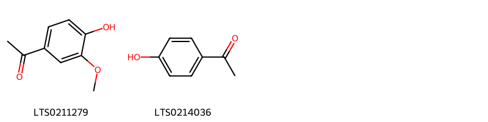{ width=100% }
    <figcaption>Hình ảnh cấu trúc hóa học của 2 hoạt chất thuộc nhóm Organooxygen compounds gồm ['apocynin (LTS0211279)', 'hydroxyacetophenone (LTS0214036)'].</figcaption>
</figure>
#### Nhóm Prenol lipids
<figure markdown="span">
    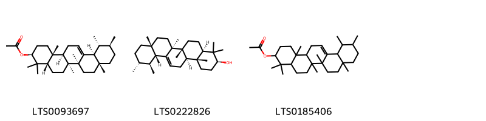{ width=100% }
    <figcaption>Hình ảnh cấu trúc hóa học của 3 hoạt chất thuộc nhóm Prenol lipids gồm ['(3s,4as,6as,6bs,8ar,11s,12r,12as,14ar,14br)-4,4,6a,6b,8a,11,12,14b-octamethyl-2,3,4a,5,6,7,8,9,10,11,12,12a,14,14a-tetradecahydro-1h-picen-3-yl acetate (LTS0093697)', 'amyrin (LTS0222826)', '4,4,6a,6b,8a,11,12,14b-octamethyl-2,3,4a,5,6,7,8,9,10,11,12,12a,14,14a-tetradecahydro-1h-picen-3-yl acetate (LTS0185406)'].</figcaption>
</figure>
#### Nhóm Steroids and steroid derivatives
<figure markdown="span">
    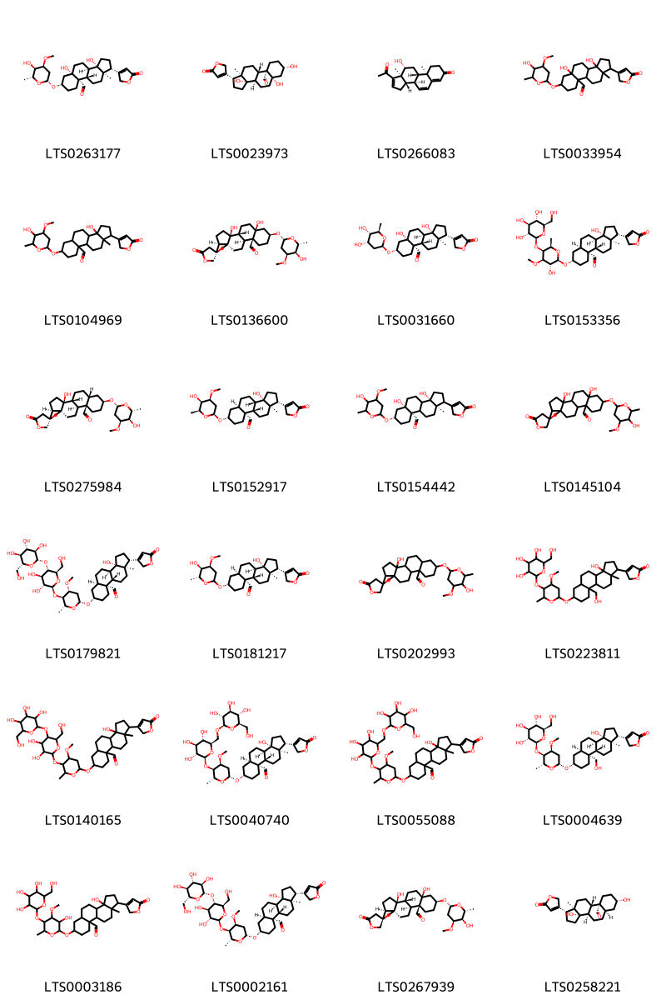{ width=100% }
    <figcaption>Hình ảnh cấu trúc hóa học của 24 hoạt chất thuộc nhóm Steroids and steroid derivatives gồm ['cymarin (LTS0263177)', 'strophanthidin (LTS0023973)', '(3as,3br,9ar,9bs,11r,11as)-1-acetyl-11-hydroxy-9a,11a-dimethyl-3h,3ah,3bh,8h,9h,9bh,10h,11h-cyclopenta[a]phenanthren-7-one (LTS0266083)', 'cymarin (LTS0033954)', '3a-hydroxy-7-[(5-hydroxy-4-methoxy-6-methyloxan-2-yl)oxy]-11a-methyl-1-(5-oxo-2h-furan-3-yl)-tetradecahydrocyclopenta[a]phenanthrene-9a-carbaldehyde (LTS0104969)', "(1'r,2's,3s,5's,9'r,12's,13's,16's,18's)-2',18'-dihydroxy-16'-{[(2r,4s,5r,6r)-5-hydroxy-4-methoxy-6-methyloxan-2-yl]oxy}-5-oxo-7'-oxaspiro[oxolane-3,6'-pentacyclo[10.8.0.0²,⁹.0⁵,⁹.0¹³,¹⁸]icosane]-13'-carbaldehyde (LTS0136600)", 'helveticoside (LTS0031660)', '(1r,3as,3br,5ar,7s,9ar,9bs,11ar)-3a-hydroxy-7-{[(2r,3r,4r,5s,6r)-3-hydroxy-4-methoxy-6-methyl-5-{[(2s,3r,4s,5s,6r)-3,4,5-trihydroxy-6-(hydroxymethyl)oxan-2-yl]oxy}oxan-2-yl]oxy}-11a-methyl-1-(5-oxo-2h-furan-3-yl)-tetradecahydrocyclopenta[a]phenanthrene-9a-carbaldehyde (LTS0153356)', "(1'r,2's,3s,5's,9'r,12's,13'r,16's,18'r)-2'-hydroxy-16'-{[(2r,4s,5r,6r)-5-hydroxy-4-methoxy-6-methyloxan-2-yl]oxy}-5-oxo-7'-oxaspiro[oxolane-3,6'-pentacyclo[10.8.0.0²,⁹.0⁵,⁹.0¹³,¹⁸]icosane]-13'-carbaldehyde (LTS0275984)", '(1r,3as,3bs,5ar,7s,9ar,9bs,11ar)-3a-hydroxy-7-{[(2s,4s,5r,6s)-5-hydroxy-4-methoxy-6-methyloxan-2-yl]oxy}-11a-methyl-1-(5-oxo-2h-furan-3-yl)-tetradecahydrocyclopenta[a]phenanthrene-9a-carbaldehyde (LTS0152917)', '(3as,5as,7s,9as,11ar)-3a,5a-dihydroxy-7-[(5-hydroxy-4-methoxy-6-methyloxan-2-yl)oxy]-11a-methyl-1-(5-oxo-2h-furan-3-yl)-dodecahydro-1h-cyclopenta[a]phenanthrene-9a-carbaldehyde (LTS0154442)', "2',18'-dihydroxy-16'-[(5-hydroxy-4-methoxy-6-methyloxan-2-yl)oxy]-5-oxo-7'-oxaspiro[oxolane-3,6'-pentacyclo[10.8.0.0²,⁹.0⁵,⁹.0¹³,¹⁸]icosane]-13'-carbaldehyde (LTS0145104)", '(1r,3as,3br,5ar,7s,9ar,9bs,11ar)-7-{[(2r,4r,5r,6r)-5-{[(2s,3r,4r,5s,6r)-3,4-dihydroxy-6-(hydroxymethyl)-5-{[(2s,3r,4s,5s,6r)-3,4,5-trihydroxy-6-(hydroxymethyl)oxan-2-yl]oxy}oxan-2-yl]oxy}-4-methoxy-6-methyloxan-2-yl]oxy}-3a-hydroxy-11a-methyl-1-(5-oxo-2h-furan-3-yl)-tetradecahydrocyclopenta[a]phenanthrene-9a-carbaldehyde (LTS0179821)', '(1r,3as,3br,5ar,7s,9ar,9bs,11ar)-3a-hydroxy-7-{[(4s,5r,6r)-5-hydroxy-4-methoxy-6-methyloxan-2-yl]oxy}-11a-methyl-1-(5-oxo-2h-furan-3-yl)-tetradecahydrocyclopenta[a]phenanthrene-9a-carbaldehyde (LTS0181217)', "2'-hydroxy-16'-[(5-hydroxy-4-methoxy-6-methyloxan-2-yl)oxy]-5-oxo-7'-oxaspiro[oxolane-3,6'-pentacyclo[10.8.0.0²,⁹.0⁵,⁹.0¹³,¹⁸]icosane]-13'-carbaldehyde (LTS0202993)", '4-[3a-hydroxy-9a-(hydroxymethyl)-7-[(4-methoxy-6-methyl-5-{[3,4,5-trihydroxy-6-(hydroxymethyl)oxan-2-yl]oxy}oxan-2-yl)oxy]-11a-methyl-tetradecahydrocyclopenta[a]phenanthren-1-yl]-5h-furan-2-one (LTS0223811)', '7-[(5-{[3,4-dihydroxy-6-(hydroxymethyl)-5-{[3,4,5-trihydroxy-6-(hydroxymethyl)oxan-2-yl]oxy}oxan-2-yl]oxy}-4-methoxy-6-methyloxan-2-yl)oxy]-3a-hydroxy-11a-methyl-1-(5-oxo-2h-furan-3-yl)-tetradecahydrocyclopenta[a]phenanthrene-9a-carbaldehyde (LTS0140165)', '(1r,3as,3br,5ar,7s,9ar,9bs,11ar)-3a-hydroxy-7-{[(2r,4s,5r,6r)-4-methoxy-6-methyl-5-{[(2s,3r,4s,5s,6r)-3,4,5-trihydroxy-6-({[(2r,3r,4s,5s,6r)-3,4,5-trihydroxy-6-(hydroxymethyl)oxan-2-yl]oxy}methyl)oxan-2-yl]oxy}oxan-2-yl]oxy}-11a-methyl-1-(5-oxo-2h-furan-3-yl)-tetradecahydrocyclopenta[a]phenanthrene-9a-carbaldehyde (LTS0040740)', '3a-hydroxy-7-[(4-methoxy-6-methyl-5-{[3,4,5-trihydroxy-6-({[3,4,5-trihydroxy-6-(hydroxymethyl)oxan-2-yl]oxy}methyl)oxan-2-yl]oxy}oxan-2-yl)oxy]-11a-methyl-1-(5-oxo-2h-furan-3-yl)-tetradecahydrocyclopenta[a]phenanthrene-9a-carbaldehyde (LTS0055088)', '4-[(1r,3as,3br,5ar,7s,9ar,9bs,11ar)-3a-hydroxy-9a-(hydroxymethyl)-7-{[(2r,4s,5r,6r)-4-methoxy-6-methyl-5-{[(2s,3r,4s,5s,6r)-3,4,5-trihydroxy-6-(hydroxymethyl)oxan-2-yl]oxy}oxan-2-yl]oxy}-11a-methyl-tetradecahydrocyclopenta[a]phenanthren-1-yl]-5h-furan-2-one (LTS0004639)', '3a-hydroxy-7-[(3-hydroxy-4-methoxy-6-methyl-5-{[3,4,5-trihydroxy-6-(hydroxymethyl)oxan-2-yl]oxy}oxan-2-yl)oxy]-11a-methyl-1-(5-oxo-2h-furan-3-yl)-tetradecahydrocyclopenta[a]phenanthrene-9a-carbaldehyde (LTS0003186)', '(1r,3as,3br,5ar,7s,9ar,9bs,11ar)-7-{[(2r,4s,5r,6r)-5-{[(2s,3r,4r,5s,6r)-3,4-dihydroxy-6-(hydroxymethyl)-5-{[(2s,3r,4s,5s,6r)-3,4,5-trihydroxy-6-(hydroxymethyl)oxan-2-yl]oxy}oxan-2-yl]oxy}-4-methoxy-6-methyloxan-2-yl]oxy}-3a-hydroxy-11a-methyl-1-(5-oxo-2h-furan-3-yl)-tetradecahydrocyclopenta[a]phenanthrene-9a-carbaldehyde (LTS0002161)', "(1'r,2's,3r,5's,9'r,12's,13's,16's,18's)-2',18'-dihydroxy-16'-{[(2r,4s,5r,6r)-5-hydroxy-4-methoxy-6-methyloxan-2-yl]oxy}-5-oxo-7'-oxaspiro[oxolane-3,6'-pentacyclo[10.8.0.0²,⁹.0⁵,⁹.0¹³,¹⁸]icosane]-13'-carbaldehyde (LTS0267939)", 'cannogenin (LTS0258221)'].</figcaption>
</figure>

---

### Dược dân tộc học

Danh sách các quốc gia có sử dụng *Apocynum cannabinum* trong điều trị các bệnh. 

| Country       | Disease                                                                                                                      | Bệnh                                                                                                                                                                                                |
|:--------------|:-----------------------------------------------------------------------------------------------------------------------------|:----------------------------------------------------------------------------------------------------------------------------------------------------------------------------------------------------|
| Elsewhere     | Cardiotonic, Diaphoretic, Expectorant, Emetic                                                                                | MYMEMORY WARNING: YOU USED ALL AVAILABLE FREE TRANSLATIONS FOR TODAY. NEXT AVAILABLE IN  11 HOURS 54 MINUTES 21 SECONDS VISIT HTTPS://MYMEMORY.TRANSLATED.NET/DOC/USAGELIMITS.PHP TO TRANSLATE MORE |
| Turkey        | Cardiac, Diuretic, Expectorant, Emetic, Sudorific                                                                            | MYMEMORY WARNING: YOU USED ALL AVAILABLE FREE TRANSLATIONS FOR TODAY. NEXT AVAILABLE IN  11 HOURS 54 MINUTES 18 SECONDS VISIT HTTPS://MYMEMORY.TRANSLATED.NET/DOC/USAGELIMITS.PHP TO TRANSLATE MORE |
| US            | Cardiotonic, Cathartic, Diaphoretic, Diuretic, Diuretic, Emetic, Expectorant, Purgative, Vermifuge, Laxative, Poison, Poison | MYMEMORY WARNING: YOU USED ALL AVAILABLE FREE TRANSLATIONS FOR TODAY. NEXT AVAILABLE IN  11 HOURS 54 MINUTES 15 SECONDS VISIT HTTPS://MYMEMORY.TRANSLATED.NET/DOC/USAGELIMITS.PHP TO TRANSLATE MORE |
| US(Blackfoot) | Laxative, Tonic                                                                                                              | MYMEMORY WARNING: YOU USED ALL AVAILABLE FREE TRANSLATIONS FOR TODAY. NEXT AVAILABLE IN  11 HOURS 54 MINUTES 12 SECONDS VISIT HTTPS://MYMEMORY.TRANSLATED.NET/DOC/USAGELIMITS.PHP TO TRANSLATE MORE |

---

---
## Apocynum venetum
### Thông tin về thực vật

!!! info "Phân loại thực vật của *N/A* từ GIBF:"
    - **Kingdom:** Plantae
    - **Phylum:** Tracheophyta
    - **Order:** Gentianales
    - **Family:** Apocynaceae
    - **Genus:** N/A
    - **Species:** *N/A*

 

| Label (VI)   | Label (EN)   | Scientific Name   | Descriptions (VI)   | Descriptions (EN)   | Also Known As (VI)   | Also Known As (EN)   |
|:-------------|:-------------|:------------------|:--------------------|:--------------------|:---------------------|:---------------------|
| N/A          | N/A          | Apocynum venetum  |                     | species of plant    | ['']                 | ['']                 |

#### Phân bố trên thế giới

**Từ CSDL GIBF** Brazil, Guatemala, Viet Nam, Japan, Czechia, Senegal, Botswana, Gambia, New Zealand, Qatar, Zimbabwe, Honduras, Türkiye, Ecuador, Thailand, Spain, Uruguay, Puerto Rico, United States of America, Indonesia, Colombia, Argentina, Aruba, French Guiana, Mexico, Vanuatu, United Kingdom of Great Britain and Northern Ireland, Chinese Taipei, Malaysia, Canada, Namibia, Singapore, Cambodia, Portugal, Ukraine, South Africa, Australia, Italy, India, Peru, France, Ireland

#### Phân bố tại Việt Nam

**Từ CSDL GIBF**: Hồ Chí Minh city

---
### Thành phần hóa học
        
- Theo cơ sở dữ liệu lotus: Từ loài *N/A* đã phân lập và xác định được 37 hoạt chất thuộc về các nhóm Fatty Acyls, Flavonoids, Carboxylic acids and derivatives, Steroids and steroid derivatives, Neoflavonoids, Organooxygen compounds, Prenol lipids, Saturated hydrocarbons. 

|    | chemicalTaxonomyClassyfireClass   |   smiles_count |
|---:|:----------------------------------|---------------:|
|  0 | Carboxylic acids and derivatives  |              1 |
|  1 | Fatty Acyls                       |              1 |
|  2 | Flavonoids                        |             17 |
|  3 | Neoflavonoids                     |              1 |
|  4 | Organooxygen compounds            |              4 |
|  5 | Prenol lipids                     |              6 |
|  6 | Saturated hydrocarbons            |              2 |
|  7 | Steroids and steroid derivatives  |              5 |

#### Nhóm Carboxylic acids and derivatives
<figure markdown="span">
    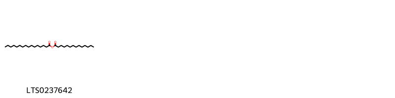{ width=100% }
    <figcaption>Hình ảnh cấu trúc hóa học của 1 hoạt chất thuộc nhóm Carboxylic acids and derivatives gồm ['tetradecanoyl hexadecanoate (LTS0237642)'].</figcaption>
</figure>
#### Nhóm Fatty Acyls
<figure markdown="span">
    { width=100% }
    <figcaption>Hình ảnh cấu trúc hóa học của 1 hoạt chất thuộc nhóm Fatty Acyls gồm ['triacontanol (LTS0026833)'].</figcaption>
</figure>
#### Nhóm Flavonoids
<figure markdown="span">
    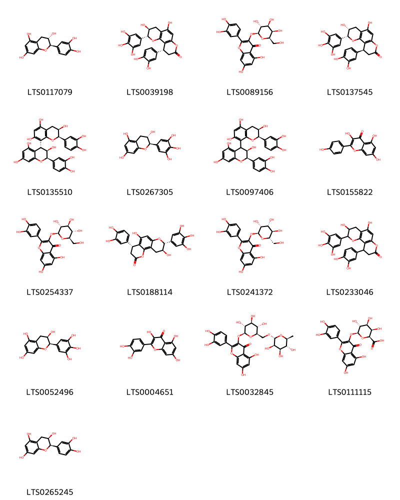{ width=100% }
    <figcaption>Hình ảnh cấu trúc hóa học của 17 hoạt chất thuộc nhóm Flavonoids gồm ['(+)-catechol (LTS0117079)', '(4r,5s,14r)-14-(3,4-dihydroxyphenyl)-5,8-dihydroxy-4-(3,4,5-trihydroxyphenyl)-3,11-dioxatricyclo[8.4.0.0²,⁷]tetradeca-1(10),2(7),8-trien-12-one (LTS0039198)', 'hyperoside (LTS0089156)', '(4r,5r,14s)-14-(3,4-dihydroxyphenyl)-5,8-dihydroxy-4-(3,4,5-trihydroxyphenyl)-3,11-dioxatricyclo[8.4.0.0²,⁷]tetradeca-1(10),2(7),8-trien-12-one (LTS0137545)', '(2r,3r,4r)-2-(3,4-dihydroxyphenyl)-4-[(2r,3r)-2-(3,4-dihydroxyphenyl)-3,5,7-trihydroxy-3,4-dihydro-2h-1-benzopyran-8-yl]-3,4-dihydro-2h-1-benzopyran-3,5,7-triol (LTS0135510)', 'gallocatechol (LTS0267305)', '(2r,3r)-2-(3,4-dihydroxyphenyl)-4-[(2r,3r)-2-(3,4-dihydroxyphenyl)-3,5,7-trihydroxy-3,4-dihydro-2h-1-benzopyran-8-yl]-3,4-dihydro-2h-1-benzopyran-3,5,7-triol (LTS0097406)', 'kaempherol (LTS0155822)', 'isoquercetin (LTS0254337)', '(6r,12r,13s)-6-(3,4-dihydroxyphenyl)-8,13-dihydroxy-12-(3,4,5-trihydroxyphenyl)-3,11-dioxatricyclo[8.4.0.0²,⁷]tetradeca-1,7,9-trien-4-one (LTS0188114)', '2-(3,4-dihydroxyphenyl)-5,7-dihydroxy-3-{[(2s,3r,4r,5r,6s)-3,4,5-trihydroxy-6-(hydroxymethyl)oxan-2-yl]oxy}chromen-4-one (LTS0241372)', '14-(3,4-dihydroxyphenyl)-5,8-dihydroxy-4-(3,4,5-trihydroxyphenyl)-3,11-dioxatricyclo[8.4.0.0²,⁷]tetradeca-1(10),2(7),8-trien-12-one (LTS0233046)', 'epigallocatechin (LTS0052496)', 'quercetin (LTS0004651)', '3-rutinosyl quercetin (LTS0032845)', '(2s,3r,4s,5r,6s)-6-{[2-(3,4-dihydroxyphenyl)-5,7-dihydroxy-4-oxochromen-3-yl]oxy}-3,4,5-trihydroxyoxane-2-carboxylic acid (LTS0111115)', 'ent-epicatechin (LTS0265245)'].</figcaption>
</figure>
#### Nhóm Neoflavonoids
<figure markdown="span">
    { width=100% }
    <figcaption>Hình ảnh cấu trúc hóa học của 1 hoạt chất thuộc nhóm Neoflavonoids gồm ['(1r,8r,9r)-1,9-bis(3,4-dihydroxyphenyl)-6,8-dihydroxy-1h,2h,7h,8h,9h,10h-naphtho[2,1-b]pyran-3-one (LTS0130244)'].</figcaption>
</figure>
#### Nhóm Organooxygen compounds
<figure markdown="span">
    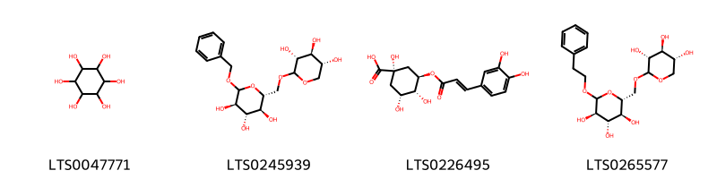{ width=100% }
    <figcaption>Hình ảnh cấu trúc hóa học của 4 hoạt chất thuộc nhóm Organooxygen compounds gồm ['(-)-inositol (LTS0047771)', '(3r,4s,5s,6r)-2-(benzyloxy)-6-({[(3r,4s,5r)-3,4,5-trihydroxyoxan-2-yl]oxy}methyl)oxane-3,4,5-triol (LTS0245939)', 'chlorogenic acid (LTS0226495)', '(3r,4s,5s,6r)-2-(2-phenylethoxy)-6-({[(3r,4s,5r)-3,4,5-trihydroxyoxan-2-yl]oxy}methyl)oxane-3,4,5-triol (LTS0265577)'].</figcaption>
</figure>
#### Nhóm Prenol lipids
<figure markdown="span">
    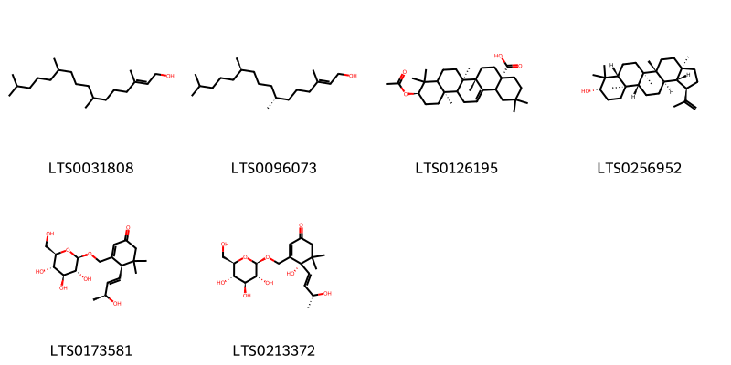{ width=100% }
    <figcaption>Hình ảnh cấu trúc hóa học của 6 hoạt chất thuộc nhóm Prenol lipids gồm ['phytol (LTS0031808)', 'phytol (LTS0096073)', '(4as,6as,6br,10r,12ar)-10-(acetyloxy)-2,2,6a,6b,9,9,12a-heptamethyl-1,3,4,5,6,7,8,8a,10,11,12,12b,13,14b-tetradecahydropicene-4a-carboxylic acid (LTS0126195)', 'lupeol (LTS0256952)', '(4r)-4-[(1e,3s)-3-hydroxybut-1-en-1-yl]-5,5-dimethyl-3-({[(2r,3r,4s,5s,6r)-3,4,5-trihydroxy-6-(hydroxymethyl)oxan-2-yl]oxy}methyl)cyclohex-2-en-1-one (LTS0173581)', '(4s)-4-hydroxy-4-[(1e,3r)-3-hydroxybut-1-en-1-yl]-5,5-dimethyl-3-({[(2r,3r,4s,5s,6r)-3,4,5-trihydroxy-6-(hydroxymethyl)oxan-2-yl]oxy}methyl)cyclohex-2-en-1-one (LTS0213372)'].</figcaption>
</figure>
#### Nhóm Saturated hydrocarbons
<figure markdown="span">
    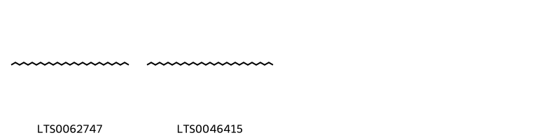{ width=100% }
    <figcaption>Hình ảnh cấu trúc hóa học của 2 hoạt chất thuộc nhóm Saturated hydrocarbons gồm ['nonacosane (LTS0062747)', 'hentriacontane (LTS0046415)'].</figcaption>
</figure>
#### Nhóm Steroids and steroid derivatives
<figure markdown="span">
    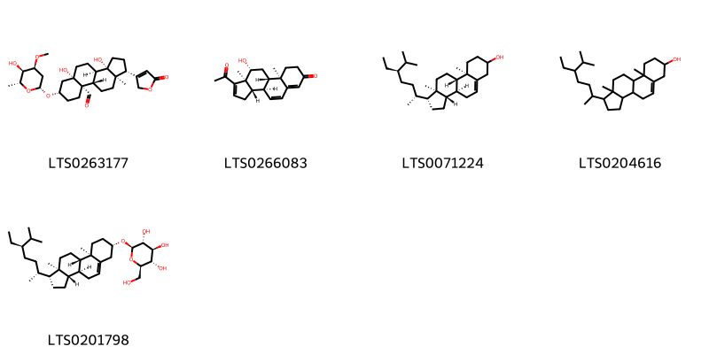{ width=100% }
    <figcaption>Hình ảnh cấu trúc hóa học của 5 hoạt chất thuộc nhóm Steroids and steroid derivatives gồm ['cymarin (LTS0263177)', '(3as,3br,9ar,9bs,11r,11as)-1-acetyl-11-hydroxy-9a,11a-dimethyl-3h,3ah,3bh,8h,9h,9bh,10h,11h-cyclopenta[a]phenanthren-7-one (LTS0266083)', 'stigmast-5-en-3-ol (LTS0071224)', 'stigmast-5-en-3-ol, (3β)- (LTS0204616)', 'sitogluside (LTS0201798)'].</figcaption>
</figure>

---

### Dược dân tộc học

Danh sách các quốc gia có sử dụng *N/A* trong điều trị các bệnh. 

| Country   | Disease   | Bệnh                                                                                                                                                                                                |
|:----------|:----------|:----------------------------------------------------------------------------------------------------------------------------------------------------------------------------------------------------|
| China     | Poison    | MYMEMORY WARNING: YOU USED ALL AVAILABLE FREE TRANSLATIONS FOR TODAY. NEXT AVAILABLE IN  11 HOURS 53 MINUTES 30 SECONDS VISIT HTTPS://MYMEMORY.TRANSLATED.NET/DOC/USAGELIMITS.PHP TO TRANSLATE MORE |

---

# Chi Macrosiphonia

??? note "Danh sách các dược liệu thuộc chi"
    
	 - *Macrosiphonia hypoleuca*

---
## Macrosiphonia hypoleuca
### Thông tin về thực vật

!!! info "Phân loại thực vật của *Mandevilla hypoleuca* từ GIBF:"
    - **Kingdom:** Plantae
    - **Phylum:** Tracheophyta
    - **Order:** Gentianales
    - **Family:** Apocynaceae
    - **Genus:** Mandevilla
    - **Species:** *Mandevilla hypoleuca*

 

| Label (VI)   | Label (EN)   | Scientific Name         | Descriptions (VI)   | Descriptions (EN)   | Also Known As (VI)   | Also Known As (EN)   |
|:-------------|:-------------|:------------------------|:--------------------|:--------------------|:---------------------|:---------------------|
| N/A          | N/A          | Macrosiphonia hypoleuca |                     |                     | ['']                 | ['']                 |

#### Phân bố trên thế giới

**Từ CSDL GIBF** Mexico, United States of America

#### Phân bố tại Việt Nam

**Từ CSDL GIBF**: Không có ghi nhận ở Việt Nam

---
### Thành phần hóa học
        
- Theo cơ sở dữ liệu lotus: Từ loài *Mandevilla hypoleuca* đã phân lập và xác định được Chưa có hoạt chất nào được phân lập. hoạt chất thuộc về các nhóm Không có hoạt chất nào được phân lập. 

Không có hình ảnh nào được tạo ra

---

### Dược dân tộc học

Danh sách các quốc gia có sử dụng *Mandevilla hypoleuca* trong điều trị các bệnh. 

| Country   | Disease                  | Bệnh                                                                                                                                                                                                |
|:----------|:-------------------------|:----------------------------------------------------------------------------------------------------------------------------------------------------------------------------------------------------|
| Mexico    | Insecticide, Insecticide | MYMEMORY WARNING: YOU USED ALL AVAILABLE FREE TRANSLATIONS FOR TODAY. NEXT AVAILABLE IN  11 HOURS 52 MINUTES 48 SECONDS VISIT HTTPS://MYMEMORY.TRANSLATED.NET/DOC/USAGELIMITS.PHP TO TRANSLATE MORE |

---

# Chi Parameria

??? note "Danh sách các dược liệu thuộc chi"
    
	 - *Parameria barbata*
	 - *Parameria polyneura*

---
## Parameria barbata
### Thông tin về thực vật

!!! info "Phân loại thực vật của *Urceola laevigata* từ GIBF:"
    - **Kingdom:** Plantae
    - **Phylum:** Tracheophyta
    - **Order:** Gentianales
    - **Family:** Apocynaceae
    - **Genus:** Urceola
    - **Species:** *Urceola laevigata*

 

| Label (VI)   | Label (EN)   | Scientific Name         | Descriptions (VI)   | Descriptions (EN)   | Also Known As (VI)   | Also Known As (EN)   |
|:-------------|:-------------|:------------------------|:--------------------|:--------------------|:---------------------|:---------------------|
| N/A          | N/A          | Macrosiphonia hypoleuca |                     |                     | ['']                 | ['']                 |

#### Phân bố trên thế giới

**Từ CSDL GIBF** Viet Nam, Indonesia, Malaysia, Philippines, China, Thailand

#### Phân bố tại Việt Nam

**Từ CSDL GIBF**: 安南南部

---
### Thành phần hóa học
        
- Theo cơ sở dữ liệu lotus: Từ loài *Urceola laevigata* đã phân lập và xác định được Chưa có hoạt chất nào được phân lập. hoạt chất thuộc về các nhóm Không có hoạt chất nào được phân lập. 

Không có hình ảnh nào được tạo ra

---

### Dược dân tộc học

Danh sách các quốc gia có sử dụng *Urceola laevigata* trong điều trị các bệnh. 

| Country   | Disease     | Bệnh                                                                                                                                                                                                |
|:----------|:------------|:----------------------------------------------------------------------------------------------------------------------------------------------------------------------------------------------------|
| Elsewhere | Emmenagogue | MYMEMORY WARNING: YOU USED ALL AVAILABLE FREE TRANSLATIONS FOR TODAY. NEXT AVAILABLE IN  11 HOURS 52 MINUTES 09 SECONDS VISIT HTTPS://MYMEMORY.TRANSLATED.NET/DOC/USAGELIMITS.PHP TO TRANSLATE MORE |

---

---
## Parameria polyneura
### Thông tin về thực vật

!!! info "Phân loại thực vật của *Urceola polyneura* từ GIBF:"
    - **Kingdom:** Plantae
    - **Phylum:** Tracheophyta
    - **Order:** Gentianales
    - **Family:** Apocynaceae
    - **Genus:** Urceola
    - **Species:** *Urceola polyneura*

 

| Label (VI)   | Label (EN)   | Scientific Name     | Descriptions (VI)   | Descriptions (EN)   | Also Known As (VI)   | Also Known As (EN)   |
|:-------------|:-------------|:--------------------|:--------------------|:--------------------|:---------------------|:---------------------|
| N/A          | N/A          | Parameria polyneura | loài thực vật       | species of plant    | ['']                 | ['']                 |

#### Phân bố trên thế giới

**Từ CSDL GIBF** nan, Brazil, Singapore, Indonesia, Philippines, Malaysia, Myanmar, India, unknown or invalid, Brunei Darussalam, Thailand

#### Phân bố tại Việt Nam

**Từ CSDL GIBF**: Không có ghi nhận ở Việt Nam

---
### Thành phần hóa học
        
- Theo cơ sở dữ liệu lotus: Từ loài *Urceola polyneura* đã phân lập và xác định được Chưa có hoạt chất nào được phân lập. hoạt chất thuộc về các nhóm Không có hoạt chất nào được phân lập. 

Không có hình ảnh nào được tạo ra

---

### Dược dân tộc học

Danh sách các quốc gia có sử dụng *Urceola polyneura* trong điều trị các bệnh. 

| Country   | Disease     | Bệnh                                                                                                                                                                                                |
|:----------|:------------|:----------------------------------------------------------------------------------------------------------------------------------------------------------------------------------------------------|
| Malaysia  | Emmenagogue | MYMEMORY WARNING: YOU USED ALL AVAILABLE FREE TRANSLATIONS FOR TODAY. NEXT AVAILABLE IN  11 HOURS 51 MINUTES 36 SECONDS VISIT HTTPS://MYMEMORY.TRANSLATED.NET/DOC/USAGELIMITS.PHP TO TRANSLATE MORE |
| Singapore | Tonic       | MYMEMORY WARNING: YOU USED ALL AVAILABLE FREE TRANSLATIONS FOR TODAY. NEXT AVAILABLE IN  11 HOURS 51 MINUTES 33 SECONDS VISIT HTTPS://MYMEMORY.TRANSLATED.NET/DOC/USAGELIMITS.PHP TO TRANSLATE MORE |

---

# Chi Parabarium

??? note "Danh sách các dược liệu thuộc chi"
    
	 - *Parabarium micranthus*

---
## Parabarium micranthus
### Thông tin về thực vật

!!! info "Phân loại thực vật của *Urceola micrantha* từ GIBF:"
    - **Kingdom:** Plantae
    - **Phylum:** Tracheophyta
    - **Order:** Gentianales
    - **Family:** Apocynaceae
    - **Genus:** Urceola
    - **Species:** *Urceola micrantha*

 

| Label (VI)   | Label (EN)   | Scientific Name     | Descriptions (VI)   | Descriptions (EN)   | Also Known As (VI)   | Also Known As (EN)   |
|:-------------|:-------------|:--------------------|:--------------------|:--------------------|:---------------------|:---------------------|
| N/A          | N/A          | Parameria polyneura | loài thực vật       | species of plant    | ['']                 | ['']                 |

#### Phân bố trên thế giới

**Từ CSDL GIBF** Thailand, Viet Nam, China

#### Phân bố tại Việt Nam

**Từ CSDL GIBF**: 东京, Ninh Binh

---
### Thành phần hóa học
        
- Theo cơ sở dữ liệu lotus: Từ loài *Urceola micrantha* đã phân lập và xác định được Chưa có hoạt chất nào được phân lập. hoạt chất thuộc về các nhóm Không có hoạt chất nào được phân lập. 

Không có hình ảnh nào được tạo ra

---

### Dược dân tộc học

Danh sách các quốc gia có sử dụng *Urceola micrantha* trong điều trị các bệnh. 

| Country   | Disease                       | Bệnh                                                                                                                                                                                                |
|:----------|:------------------------------|:----------------------------------------------------------------------------------------------------------------------------------------------------------------------------------------------------|
| China     | Hemostat, Poison, Carminative | MYMEMORY WARNING: YOU USED ALL AVAILABLE FREE TRANSLATIONS FOR TODAY. NEXT AVAILABLE IN  11 HOURS 51 MINUTES 08 SECONDS VISIT HTTPS://MYMEMORY.TRANSLATED.NET/DOC/USAGELIMITS.PHP TO TRANSLATE MORE |

---

# Chi Tracheloermum

??? note "Danh sách các dược liệu thuộc chi"
    
	 - *Tracheloermum asiaticum*
	 - *Tracheloermum jasminoides*
	 - *Tracheloermum lucidum*
	 - *Tracheloermum stans*

---
## Tracheloermum asiaticum
### Thông tin về thực vật

!!! info "Phân loại thực vật của *N/A* từ GIBF:"
    - **Kingdom:** N/A
    - **Phylum:** N/A
    - **Order:** N/A
    - **Family:** N/A
    - **Genus:** N/A
    - **Species:** *N/A*

 

| Label (VI)   | Label (EN)   | Scientific Name     | Descriptions (VI)   | Descriptions (EN)   | Also Known As (VI)   | Also Known As (EN)   |
|:-------------|:-------------|:--------------------|:--------------------|:--------------------|:---------------------|:---------------------|
| N/A          | N/A          | Parameria polyneura | loài thực vật       | species of plant    | ['']                 | ['']                 |

#### Phân bố trên thế giới

**Từ CSDL GIBF** Không có kết quả phù hợp

#### Phân bố tại Việt Nam

**Từ CSDL GIBF**: Không có ghi nhận ở Việt Nam

---
### Thành phần hóa học
        
- Theo cơ sở dữ liệu lotus: Từ loài *N/A* đã phân lập và xác định được Chưa có hoạt chất nào được phân lập. hoạt chất thuộc về các nhóm Không có hoạt chất nào được phân lập. 

Không có hình ảnh nào được tạo ra

---

### Dược dân tộc học

Danh sách các quốc gia có sử dụng *N/A* trong điều trị các bệnh. 

| Country   | Disease    | Bệnh                                                                                                                                                                                                |
|:----------|:-----------|:----------------------------------------------------------------------------------------------------------------------------------------------------------------------------------------------------|
| Elsewhere | Tonic, nan | MYMEMORY WARNING: YOU USED ALL AVAILABLE FREE TRANSLATIONS FOR TODAY. NEXT AVAILABLE IN  11 HOURS 50 MINUTES 32 SECONDS VISIT HTTPS://MYMEMORY.TRANSLATED.NET/DOC/USAGELIMITS.PHP TO TRANSLATE MORE |

---

---
## Tracheloermum jasminoides
### Thông tin về thực vật

!!! info "Phân loại thực vật của *N/A* từ GIBF:"
    - **Kingdom:** N/A
    - **Phylum:** N/A
    - **Order:** N/A
    - **Family:** N/A
    - **Genus:** N/A
    - **Species:** *N/A*

 

| Label (VI)   | Label (EN)   | Scientific Name     | Descriptions (VI)   | Descriptions (EN)   | Also Known As (VI)   | Also Known As (EN)   |
|:-------------|:-------------|:--------------------|:--------------------|:--------------------|:---------------------|:---------------------|
| N/A          | N/A          | Parameria polyneura | loài thực vật       | species of plant    | ['']                 | ['']                 |

#### Phân bố trên thế giới

**Từ CSDL GIBF** Không có kết quả phù hợp

#### Phân bố tại Việt Nam

**Từ CSDL GIBF**: Không có ghi nhận ở Việt Nam

---
### Thành phần hóa học
        
- Theo cơ sở dữ liệu lotus: Từ loài *N/A* đã phân lập và xác định được Chưa có hoạt chất nào được phân lập. hoạt chất thuộc về các nhóm Không có hoạt chất nào được phân lập. 

Không có hình ảnh nào được tạo ra

---

### Dược dân tộc học

Danh sách các quốc gia có sử dụng *N/A* trong điều trị các bệnh. 

| Country   | Disease                               | Bệnh                                                                                                                                                                                                |
|:----------|:--------------------------------------|:----------------------------------------------------------------------------------------------------------------------------------------------------------------------------------------------------|
| China     | Emmenagogue, Poison, Tonic, Analgesic | MYMEMORY WARNING: YOU USED ALL AVAILABLE FREE TRANSLATIONS FOR TODAY. NEXT AVAILABLE IN  11 HOURS 50 MINUTES 09 SECONDS VISIT HTTPS://MYMEMORY.TRANSLATED.NET/DOC/USAGELIMITS.PHP TO TRANSLATE MORE |

---

---
## Tracheloermum lucidum
### Thông tin về thực vật

!!! info "Phân loại thực vật của *N/A* từ GIBF:"
    - **Kingdom:** N/A
    - **Phylum:** N/A
    - **Order:** N/A
    - **Family:** N/A
    - **Genus:** N/A
    - **Species:** *N/A*

 

| Label (VI)   | Label (EN)   | Scientific Name     | Descriptions (VI)   | Descriptions (EN)   | Also Known As (VI)   | Also Known As (EN)   |
|:-------------|:-------------|:--------------------|:--------------------|:--------------------|:---------------------|:---------------------|
| N/A          | N/A          | Parameria polyneura | loài thực vật       | species of plant    | ['']                 | ['']                 |

#### Phân bố trên thế giới

**Từ CSDL GIBF** Không có kết quả phù hợp

#### Phân bố tại Việt Nam

**Từ CSDL GIBF**: Không có ghi nhận ở Việt Nam

---
### Thành phần hóa học
        
- Theo cơ sở dữ liệu lotus: Từ loài *N/A* đã phân lập và xác định được Chưa có hoạt chất nào được phân lập. hoạt chất thuộc về các nhóm Không có hoạt chất nào được phân lập. 

Không có hình ảnh nào được tạo ra

---

### Dược dân tộc học

Danh sách các quốc gia có sử dụng *N/A* trong điều trị các bệnh. 

| Country   | Disease   | Bệnh                                                                                                                                                                                                |
|:----------|:----------|:----------------------------------------------------------------------------------------------------------------------------------------------------------------------------------------------------|
| India     | Tonic     | MYMEMORY WARNING: YOU USED ALL AVAILABLE FREE TRANSLATIONS FOR TODAY. NEXT AVAILABLE IN  11 HOURS 49 MINUTES 54 SECONDS VISIT HTTPS://MYMEMORY.TRANSLATED.NET/DOC/USAGELIMITS.PHP TO TRANSLATE MORE |

---

---
## Tracheloermum stans
### Thông tin về thực vật

!!! info "Phân loại thực vật của *N/A* từ GIBF:"
    - **Kingdom:** N/A
    - **Phylum:** N/A
    - **Order:** N/A
    - **Family:** N/A
    - **Genus:** N/A
    - **Species:** *N/A*

 

| Label (VI)   | Label (EN)   | Scientific Name     | Descriptions (VI)   | Descriptions (EN)   | Also Known As (VI)   | Also Known As (EN)   |
|:-------------|:-------------|:--------------------|:--------------------|:--------------------|:---------------------|:---------------------|
| N/A          | N/A          | Parameria polyneura | loài thực vật       | species of plant    | ['']                 | ['']                 |

#### Phân bố trên thế giới

**Từ CSDL GIBF** Không có kết quả phù hợp

#### Phân bố tại Việt Nam

**Từ CSDL GIBF**: Không có ghi nhận ở Việt Nam

---
### Thành phần hóa học
        
- Theo cơ sở dữ liệu lotus: Từ loài *N/A* đã phân lập và xác định được Chưa có hoạt chất nào được phân lập. hoạt chất thuộc về các nhóm Không có hoạt chất nào được phân lập. 

Không có hình ảnh nào được tạo ra

---

### Dược dân tộc học

Danh sách các quốc gia có sử dụng *N/A* trong điều trị các bệnh. 

| Country   | Disease                  | Bệnh                                                                                                                                                                                                |
|:----------|:-------------------------|:----------------------------------------------------------------------------------------------------------------------------------------------------------------------------------------------------|
| Mexico    | Insecticide, Insecticide | MYMEMORY WARNING: YOU USED ALL AVAILABLE FREE TRANSLATIONS FOR TODAY. NEXT AVAILABLE IN  11 HOURS 49 MINUTES 40 SECONDS VISIT HTTPS://MYMEMORY.TRANSLATED.NET/DOC/USAGELIMITS.PHP TO TRANSLATE MORE |

---

# Chi Melodinus

??? note "Danh sách các dược liệu thuộc chi"
    
	 - *Melodinus monogynus*

---
## Melodinus monogynus
### Thông tin về thực vật

!!! info "Phân loại thực vật của *Melodinus monogynus* từ GIBF:"
    - **Kingdom:** Plantae
    - **Phylum:** Tracheophyta
    - **Order:** Gentianales
    - **Family:** Apocynaceae
    - **Genus:** Melodinus
    - **Species:** *Melodinus monogynus*

 

| Label (VI)   | Label (EN)   | Scientific Name     | Descriptions (VI)   | Descriptions (EN)   | Also Known As (VI)   | Also Known As (EN)   |
|:-------------|:-------------|:--------------------|:--------------------|:--------------------|:---------------------|:---------------------|
| N/A          | N/A          | Melodinus monogynus | loài thực vật       | species of plant    | ['']                 | ['']                 |

#### Phân bố trên thế giới

**Từ CSDL GIBF** nan, Indonesia, Malaysia, China, India, Thailand

#### Phân bố tại Việt Nam

**Từ CSDL GIBF**: Không có ghi nhận ở Việt Nam

---
### Thành phần hóa học
        
- Theo cơ sở dữ liệu lotus: Từ loài *Melodinus monogynus* đã phân lập và xác định được 4 hoạt chất thuộc về các nhóm Prenol lipids. 

|    | chemicalTaxonomyClassyfireClass   |   smiles_count |
|---:|:----------------------------------|---------------:|
|  0 | Prenol lipids                     |              4 |

#### Nhóm Prenol lipids
<figure markdown="span">
    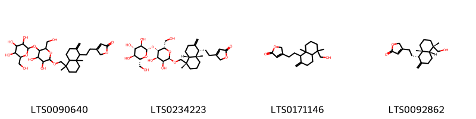{ width=100% }
    <figcaption>Hình ảnh cấu trúc hóa học của 4 hoạt chất thuộc nhóm Prenol lipids gồm ['4-{2-[5-({[3,4-dihydroxy-6-(hydroxymethyl)-5-{[3,4,5-trihydroxy-6-(hydroxymethyl)oxan-2-yl]oxy}oxan-2-yl]oxy}methyl)-5,8a-dimethyl-2-methylidene-hexahydro-1h-naphthalen-1-yl]ethyl}-5h-furan-2-one (LTS0090640)', '4-{2-[(1s,4ar,5s,8as)-5-({[(2r,3s,4r,5s,6s)-3,4-dihydroxy-6-(hydroxymethyl)-5-{[(2s,3r,4s,5s,6r)-3,4,5-trihydroxy-6-(hydroxymethyl)oxan-2-yl]oxy}oxan-2-yl]oxy}methyl)-5,8a-dimethyl-2-methylidene-hexahydro-1h-naphthalen-1-yl]ethyl}-5h-furan-2-one (LTS0234223)', '4-{2-[5-(hydroxymethyl)-5,8a-dimethyl-2-methylidene-hexahydro-1h-naphthalen-1-yl]ethyl}-5h-furan-2-one (LTS0171146)', '4-{2-[(1s,4ar,5s,8as)-5-(hydroxymethyl)-5,8a-dimethyl-2-methylidene-hexahydro-1h-naphthalen-1-yl]ethyl}-5h-furan-2-one (LTS0092862)'].</figcaption>
</figure>

---

### Dược dân tộc học

Danh sách các quốc gia có sử dụng *Melodinus monogynus* trong điều trị các bệnh. 

| Country   | Disease          | Bệnh                                                                                                                                                                                                |
|:----------|:-----------------|:----------------------------------------------------------------------------------------------------------------------------------------------------------------------------------------------------|
| Elsewhere | Narcotic, Poison | MYMEMORY WARNING: YOU USED ALL AVAILABLE FREE TRANSLATIONS FOR TODAY. NEXT AVAILABLE IN  11 HOURS 49 MINUTES 23 SECONDS VISIT HTTPS://MYMEMORY.TRANSLATED.NET/DOC/USAGELIMITS.PHP TO TRANSLATE MORE |

---

# Chi Catharanthus

??? note "Danh sách các dược liệu thuộc chi"
    
	 - *Catharanthus pusilla*
	 - *Catharanthus roseus*

---
## Catharanthus pusilla
### Thông tin về thực vật

!!! info "Phân loại thực vật của *Catharanthus pusillus* từ GIBF:"
    - **Kingdom:** Plantae
    - **Phylum:** Tracheophyta
    - **Order:** Gentianales
    - **Family:** Apocynaceae
    - **Genus:** Catharanthus
    - **Species:** *Catharanthus pusillus*

 

| Label (VI)   | Label (EN)   | Scientific Name     | Descriptions (VI)   | Descriptions (EN)   | Also Known As (VI)   | Also Known As (EN)   |
|:-------------|:-------------|:--------------------|:--------------------|:--------------------|:---------------------|:---------------------|
| N/A          | N/A          | Melodinus monogynus | loài thực vật       | species of plant    | ['']                 | ['']                 |

#### Phân bố trên thế giới

**Từ CSDL GIBF** Sri Lanka, nan, United States of America, Japan, Cabo Verde, Mauritius, India, unknown or invalid, Madagascar, Spain

#### Phân bố tại Việt Nam

**Từ CSDL GIBF**: Không có ghi nhận ở Việt Nam

---
### Thành phần hóa học
        
- Theo cơ sở dữ liệu lotus: Từ loài *Catharanthus pusillus* đã phân lập và xác định được Chưa có hoạt chất nào được phân lập. hoạt chất thuộc về các nhóm Không có hoạt chất nào được phân lập. 

Không có hình ảnh nào được tạo ra

---

### Dược dân tộc học

Danh sách các quốc gia có sử dụng *Catharanthus pusillus* trong điều trị các bệnh. 

| Country   | Disease   | Bệnh                                                                                                                                                                                                |
|:----------|:----------|:----------------------------------------------------------------------------------------------------------------------------------------------------------------------------------------------------|
| Elsewhere | Poison    | MYMEMORY WARNING: YOU USED ALL AVAILABLE FREE TRANSLATIONS FOR TODAY. NEXT AVAILABLE IN  11 HOURS 48 MINUTES 57 SECONDS VISIT HTTPS://MYMEMORY.TRANSLATED.NET/DOC/USAGELIMITS.PHP TO TRANSLATE MORE |
| India     | Poison    | MYMEMORY WARNING: YOU USED ALL AVAILABLE FREE TRANSLATIONS FOR TODAY. NEXT AVAILABLE IN  11 HOURS 48 MINUTES 55 SECONDS VISIT HTTPS://MYMEMORY.TRANSLATED.NET/DOC/USAGELIMITS.PHP TO TRANSLATE MORE |

---

---
## Catharanthus roseus
### Thông tin về thực vật

!!! info "Phân loại thực vật của *Catharanthus roseus* từ GIBF:"
    - **Kingdom:** Plantae
    - **Phylum:** Tracheophyta
    - **Order:** Gentianales
    - **Family:** Apocynaceae
    - **Genus:** Catharanthus
    - **Species:** *Catharanthus roseus*

 

| Label (VI)   | Label (EN)   | Scientific Name     | Descriptions (VI)   | Descriptions (EN)                                    | Also Known As (VI)                                                                                                              | Also Known As (EN)                      |
|:-------------|:-------------|:--------------------|:--------------------|:-----------------------------------------------------|:--------------------------------------------------------------------------------------------------------------------------------|:----------------------------------------|
| N/A          | N/A          | Catharanthus roseus | loài thực vật       | species of flowering plant in the family Apocynaceae | ['Trường xuân hoa', 'Hải đằng', 'Dương giác', 'Cây hải đằng', 'Cây bông dừa', 'Catharanthus roseus', 'Bông dừa', 'Vinca rosea'] | ['Periwinkle', 'Madagascar periwinkle'] |

#### Phân bố trên thế giới

**Từ CSDL GIBF** Brazil, Uganda, Viet Nam, Japan, Barbados, China, Antigua and Barbuda, Gambia, Saint Lucia, Honduras, Tanzania, United Republic of, Ecuador, Thailand, Madagascar, Puerto Rico, Sri Lanka, Ghana, Réunion, United States of America, Jamaica, Zambia, Tonga, Seychelles, Dominican Republic, Nigeria, Colombia, Cuba, Ethiopia, French Guiana, Grenada, Lao People’s Democratic Republic, Fiji, Hong Kong, Mexico, Benin, Kenya, Vanuatu, El Salvador, Niue, Chinese Taipei, Philippines, Mauritius, Panama, Egypt, Namibia, Nicaragua, Singapore, Cambodia, Bonaire, Sint Eustatius and Saba, Martinique, South Africa, Australia, Myanmar, India, Peru, Belize

#### Phân bố tại Việt Nam

**Từ CSDL GIBF**: Kiên Giang

---
### Thành phần hóa học
        
- Theo cơ sở dữ liệu lotus: Từ loài *Catharanthus roseus* đã phân lập và xác định được 291 hoạt chất thuộc về các nhóm Fatty Acyls, Organic phosphoric acids and derivatives, Organic oxides, Carboxylic acids and derivatives, Vinca alkaloids, Organooxygen compounds, Tetrahydrofurans, Strychnos alkaloids, Vobasan alkaloids, Benzofurans, Corynanthean-type alkaloids, Aspidospermatan-type alkaloids, Pleiocarpaman alkaloids, Benzene and substituted derivatives, Macroline alkaloids, Steroids and steroid derivatives, Hydroxy acids and derivatives, Ibogan-type alkaloids, Organonitrogen compounds, Benzopyrans, Yohimbine alkaloids, Flavonoids, Indolizidines, Plumeran-type alkaloids, Indolonaphthyridine alkaloids, Akuammilan and related alkaloids, Pyrimidine nucleosides, Prenol lipids, Quebrachamine alkaloids, Indoles and derivatives. 

|    | chemicalTaxonomyClassyfireClass          |   smiles_count |
|---:|:-----------------------------------------|---------------:|
|  0 | Akuammilan and related alkaloids         |              3 |
|  1 | Aspidospermatan-type alkaloids           |             16 |
|  2 | Benzene and substituted derivatives      |              3 |
|  3 | Benzofurans                              |              1 |
|  4 | Benzopyrans                              |              1 |
|  5 | Carboxylic acids and derivatives         |              6 |
|  6 | Corynanthean-type alkaloids              |             10 |
|  7 | Fatty Acyls                              |              9 |
|  8 | Flavonoids                               |             19 |
|  9 | Hydroxy acids and derivatives            |              3 |
| 10 | Ibogan-type alkaloids                    |              8 |
| 11 | Indoles and derivatives                  |             33 |
| 12 | Indolizidines                            |              3 |
| 13 | Indolonaphthyridine alkaloids            |              2 |
| 14 | Macroline alkaloids                      |              7 |
| 15 | Organic oxides                           |              2 |
| 16 | Organic phosphoric acids and derivatives |              1 |
| 17 | Organonitrogen compounds                 |              3 |
| 18 | Organooxygen compounds                   |             14 |
| 19 | Pleiocarpaman alkaloids                  |              2 |
| 20 | Plumeran-type alkaloids                  |             33 |
| 21 | Prenol lipids                            |             29 |
| 22 | Pyrimidine nucleosides                   |              1 |
| 23 | Quebrachamine alkaloids                  |              1 |
| 24 | Steroids and steroid derivatives         |             32 |
| 25 | Strychnos alkaloids                      |              5 |
| 26 | Tetrahydrofurans                         |              1 |
| 27 | Vinca alkaloids                          |             23 |
| 28 | Vobasan alkaloids                        |              1 |
| 29 | Yohimbine alkaloids                      |             11 |

#### Nhóm Akuammilan and related alkaloids
<figure markdown="span">
    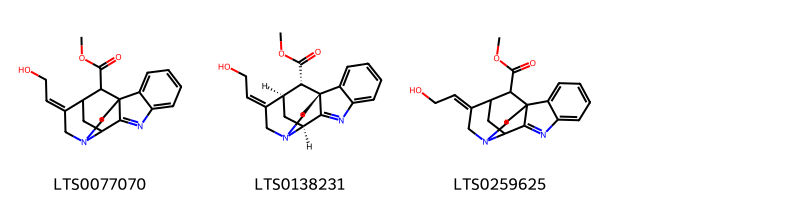{ width=100% }
    <figcaption>Hình ảnh cấu trúc hóa học của 3 hoạt chất thuộc nhóm Akuammilan and related alkaloids gồm ['methyl (13e)-13-(2-hydroxyethylidene)-8,15-diazapentacyclo[10.5.1.0¹,⁹.0²,⁷.0¹⁰,¹⁵]octadeca-2,4,6,8-tetraene-18-carboxylate (LTS0077070)', 'methyl (1r,10s,12r,13e,18s)-13-(2-hydroxyethylidene)-8,15-diazapentacyclo[10.5.1.0¹,⁹.0²,⁷.0¹⁰,¹⁵]octadeca-2,4,6,8-tetraene-18-carboxylate (LTS0138231)', 'methyl (13z)-13-(2-hydroxyethylidene)-8,15-diazapentacyclo[10.5.1.0¹,⁹.0²,⁷.0¹⁰,¹⁵]octadeca-2,4,6,8-tetraene-18-carboxylate (LTS0259625)'].</figcaption>
</figure>
#### Nhóm Aspidospermatan-type alkaloids
<figure markdown="span">
    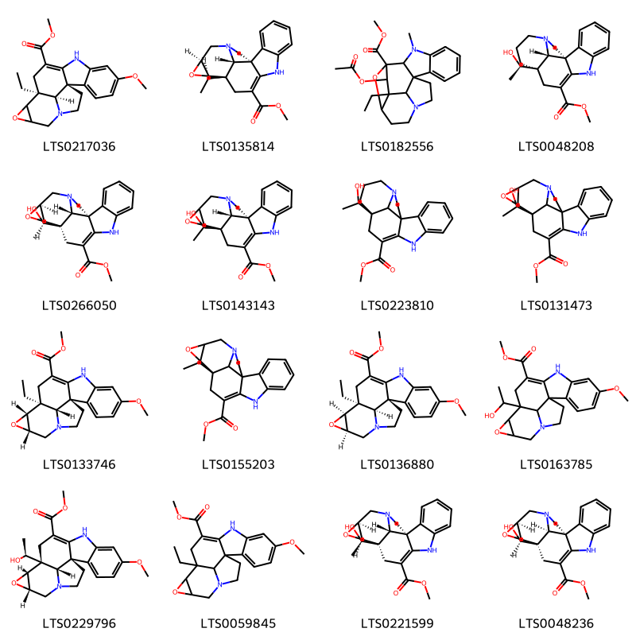{ width=100% }
    <figcaption>Hình ảnh cấu trúc hóa học của 16 hoạt chất thuộc nhóm Aspidospermatan-type alkaloids gồm ['lochnerinine (LTS0217036)', 'methyl (1r,12s,13r,15s,20r)-12-ethyl-14-oxa-8,17-diazahexacyclo[10.7.1.0¹,⁹.0²,⁷.0¹³,¹⁵.0¹⁷,²⁰]icosa-2,4,6,9-tetraene-10-carboxylate (LTS0135814)', 'methyl 11-(acetyloxy)-12-ethyl-8-methyl-20-oxa-8,16-diazahexacyclo[10.6.1.1¹⁰,¹³.0¹,⁹.0²,⁷.0¹⁶,¹⁹]icosa-2,4,6-triene-10-carboxylate (LTS0182556)', 'methyl (1r,12r,19r)-12-[(1r)-1-hydroxyethyl]-8,16-diazapentacyclo[10.6.1.0¹,⁹.0²,⁷.0¹⁶,¹⁹]nonadeca-2,4,6,9-tetraene-10-carboxylate (LTS0048208)', 'methyl (1r,12s,13r,15s,20r)-12-[(1s)-1-hydroxyethyl]-14-oxa-8,17-diazahexacyclo[10.7.1.0¹,⁹.0²,⁷.0¹³,¹⁵.0¹⁷,²⁰]icosa-2,4,6,9-tetraene-10-carboxylate (LTS0266050)', 'horhammericine (LTS0143143)', 'minovincinine (LTS0223810)', 'methyl 12-(1-hydroxyethyl)-14-oxa-8,17-diazahexacyclo[10.7.1.0¹,⁹.0²,⁷.0¹³,¹⁵.0¹⁷,²⁰]icosa-2,4,6,9-tetraene-10-carboxylate (LTS0131473)', 'methyl (1r,12s,13r,15s,20s)-12-ethyl-5-methoxy-14-oxa-8,17-diazahexacyclo[10.7.1.0¹,⁹.0²,⁷.0¹³,¹⁵.0¹⁷,²⁰]icosa-2,4,6,9-tetraene-10-carboxylate (LTS0133746)', 'methyl 12-ethyl-14-oxa-8,17-diazahexacyclo[10.7.1.0¹,⁹.0²,⁷.0¹³,¹⁵.0¹⁷,²⁰]icosa-2,4,6,9-tetraene-10-carboxylate (LTS0155203)', 'methyl (1r,12s,13s,15r,20r)-12-ethyl-5-methoxy-14-oxa-8,17-diazahexacyclo[10.7.1.0¹,⁹.0²,⁷.0¹³,¹⁵.0¹⁷,²⁰]icosa-2,4,6,9-tetraene-10-carboxylate (LTS0136880)', 'methyl 12-(1-hydroxyethyl)-5-methoxy-14-oxa-8,17-diazahexacyclo[10.7.1.0¹,⁹.0²,⁷.0¹³,¹⁵.0¹⁷,²⁰]icosa-2,4,6,9-tetraene-10-carboxylate (LTS0163785)', 'methyl (1r,12s,13r,15s,20s)-12-[(1s)-1-hydroxyethyl]-5-methoxy-14-oxa-8,17-diazahexacyclo[10.7.1.0¹,⁹.0²,⁷.0¹³,¹⁵.0¹⁷,²⁰]icosa-2,4,6,9-tetraene-10-carboxylate (LTS0229796)', 'methyl 12-ethyl-5-methoxy-14-oxa-8,17-diazahexacyclo[10.7.1.0¹,⁹.0²,⁷.0¹³,¹⁵.0¹⁷,²⁰]icosa-2,4,6,9-tetraene-10-carboxylate (LTS0059845)', 'methyl (1r,12s,13r,15s,20r)-12-[(1r)-1-hydroxyethyl]-14-oxa-8,17-diazahexacyclo[10.7.1.0¹,⁹.0²,⁷.0¹³,¹⁵.0¹⁷,²⁰]icosa-2,4,6,9-tetraene-10-carboxylate (LTS0221599)', 'methyl (1r,12s,13r,15s,20s)-12-[(1s)-1-hydroxyethyl]-14-oxa-8,17-diazahexacyclo[10.7.1.0¹,⁹.0²,⁷.0¹³,¹⁵.0¹⁷,²⁰]icosa-2,4,6,9-tetraene-10-carboxylate (LTS0048236)'].</figcaption>
</figure>
#### Nhóm Benzene and substituted derivatives
<figure markdown="span">
    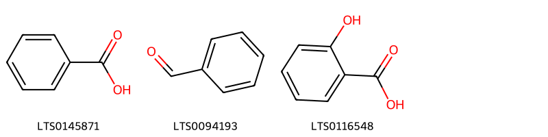{ width=100% }
    <figcaption>Hình ảnh cấu trúc hóa học của 3 hoạt chất thuộc nhóm Benzene and substituted derivatives gồm ['benzoic acid (LTS0145871)', 'benzaldehyde (LTS0094193)', 'salicyclic acid (LTS0116548)'].</figcaption>
</figure>
#### Nhóm Benzofurans
<figure markdown="span">
    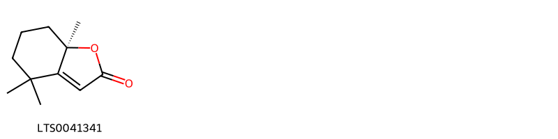{ width=100% }
    <figcaption>Hình ảnh cấu trúc hóa học của 1 hoạt chất thuộc nhóm Benzofurans gồm ['dihydroactinidiolide (LTS0041341)'].</figcaption>
</figure>
#### Nhóm Benzopyrans
<figure markdown="span">
    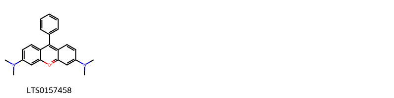{ width=100% }
    <figcaption>Hình ảnh cấu trúc hóa học của 1 hoạt chất thuộc nhóm Benzopyrans gồm ['3,6-bis(dimethylamino)-9-phenyl-10λ⁴-xanthen-10-ylium (LTS0157458)'].</figcaption>
</figure>
#### Nhóm Carboxylic acids and derivatives
<figure markdown="span">
    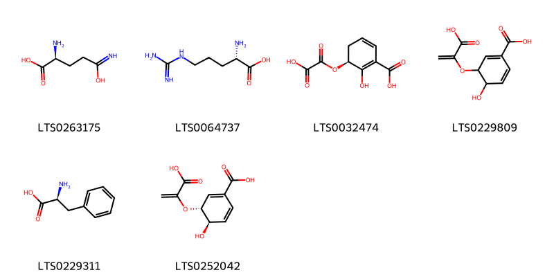{ width=100% }
    <figcaption>Hình ảnh cấu trúc hóa học của 6 hoạt chất thuộc nhóm Carboxylic acids and derivatives gồm ['l glutamine (LTS0263175)', 'l-arginine (LTS0064737)', '(3s)-3-[(carboxycarbonyl)oxy]-2-hydroxycyclohexa-1,5-diene-1-carboxylic acid (LTS0032474)', 'chorismic acid (LTS0229809)', 'l-phenylalanine (LTS0229311)', 'chorismic acid (LTS0252042)'].</figcaption>
</figure>
#### Nhóm Corynanthean-type alkaloids
<figure markdown="span">
    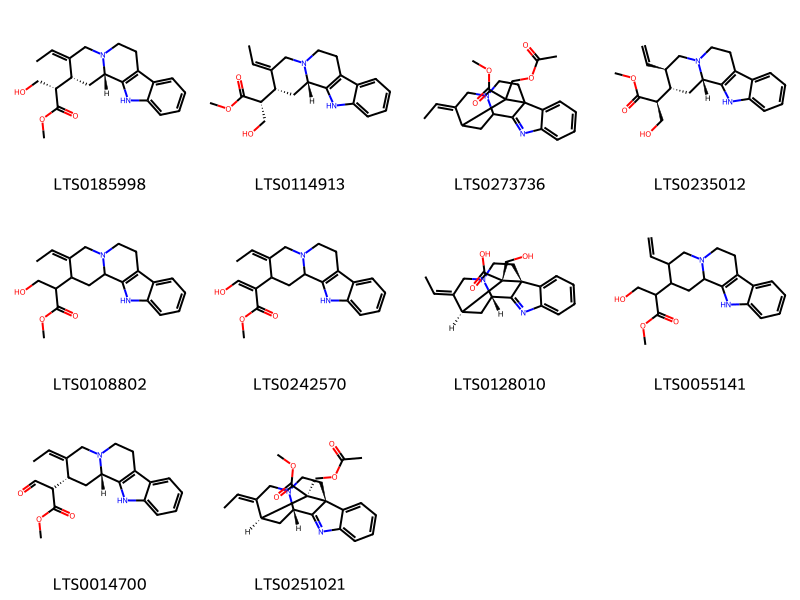{ width=100% }
    <figcaption>Hình ảnh cấu trúc hóa học của 10 hoạt chất thuộc nhóm Corynanthean-type alkaloids gồm ['methyl (2s)-2-[(2r,3e,12bs)-3-ethylidene-1h,2h,4h,6h,7h,12h,12bh-indolo[2,3-a]quinolizin-2-yl]-3-hydroxypropanoate (LTS0185998)', 'methyl (2r)-2-[(2r,3z,12bs)-3-ethylidene-1h,2h,4h,6h,7h,12h,12bh-indolo[2,3-a]quinolizin-2-yl]-3-hydroxypropanoate (LTS0114913)', 'methyl (13e)-18-[(acetyloxy)methyl]-13-ethylidene-8,15-diazapentacyclo[10.5.1.0¹,⁹.0²,⁷.0¹⁰,¹⁵]octadeca-2,4,6,8-tetraene-18-carboxylate (LTS0273736)', 'methyl (2s)-2-[(2s,3r,12bs)-3-ethenyl-1h,2h,3h,4h,6h,7h,12h,12bh-indolo[2,3-a]quinolizin-2-yl]-3-hydroxypropanoate (LTS0235012)', 'methyl 2-[(3e)-3-ethylidene-1h,2h,4h,6h,7h,12h,12bh-indolo[2,3-a]quinolizin-2-yl]-3-hydroxypropanoate (LTS0108802)', 'methyl (2z)-2-[(3e)-3-ethylidene-1h,2h,4h,6h,7h,12h,12bh-indolo[2,3-a]quinolizin-2-yl]-3-hydroxyprop-2-enoate (LTS0242570)', '(1s,10s,12s,13z,18s)-13-ethylidene-18-(hydroxymethyl)-8,15-diazapentacyclo[10.5.1.0¹,⁹.0²,⁷.0¹⁰,¹⁵]octadeca-2,4,6,8-tetraene-18-carboxylic acid (LTS0128010)', 'methyl 2-{3-ethenyl-1h,2h,3h,4h,6h,7h,12h,12bh-indolo[2,3-a]quinolizin-2-yl}-3-hydroxypropanoate (LTS0055141)', 'geissoschizine (LTS0014700)', 'methyl (1s,10s,12s,13e,18r)-18-[(acetyloxy)methyl]-13-ethylidene-8,15-diazapentacyclo[10.5.1.0¹,⁹.0²,⁷.0¹⁰,¹⁵]octadeca-2,4,6,8-tetraene-18-carboxylate (LTS0251021)'].</figcaption>
</figure>
#### Nhóm Fatty Acyls
<figure markdown="span">
    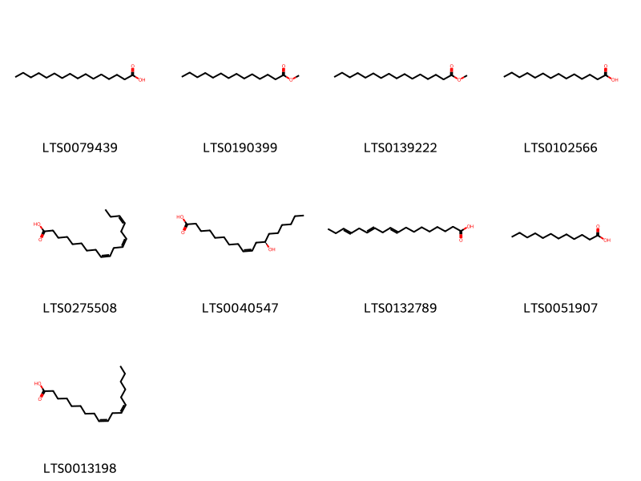{ width=100% }
    <figcaption>Hình ảnh cấu trúc hóa học của 9 hoạt chất thuộc nhóm Fatty Acyls gồm ['palmitic acid (LTS0079439)', 'methyl myristate (LTS0190399)', 'methyl palmitate (LTS0139222)', 'myristic acid (LTS0102566)', 'α-linolenic acid (LTS0275508)', 'ricinoleic acid (LTS0040547)', 'α linolenic acid (LTS0132789)', 'lauric acid (LTS0051907)', 'linoleic (LTS0013198)'].</figcaption>
</figure>
#### Nhóm Flavonoids
<figure markdown="span">
    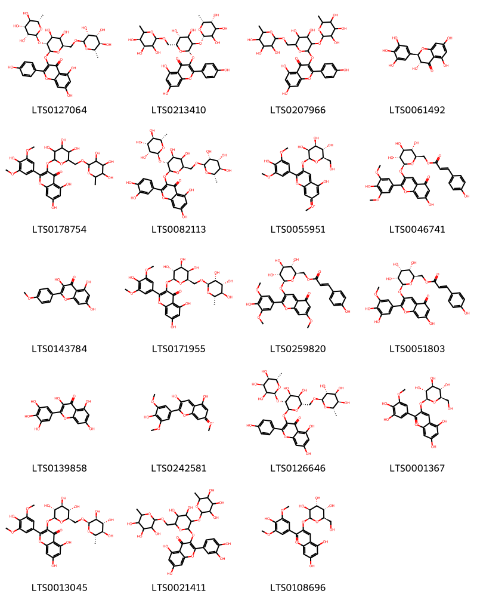{ width=100% }
    <figcaption>Hình ảnh cấu trúc hóa học của 19 hoạt chất thuộc nhóm Flavonoids gồm ['3-{[(2s,3r,4s,5r,6r)-4,5-dihydroxy-3-{[(2s,3r,4r,5r,6s)-3,4,5-trihydroxy-6-methyloxan-2-yl]oxy}-6-({[(2r,3r,4r,5r,6s)-3,4,5-trihydroxy-6-methyloxan-2-yl]oxy}methyl)oxan-2-yl]oxy}-5,7-dihydroxy-2-(4-hydroxyphenyl)chromen-4-one (LTS0127064)', '3-{[(2s,5r,6r)-4,5-dihydroxy-3-{[(2s,5r,6r)-3,4,5-trihydroxy-6-methyloxan-2-yl]oxy}-6-({[(2r,4s,5r)-3,4,5-trihydroxy-6-methyloxan-2-yl]oxy}methyl)oxan-2-yl]oxy}-5,7-dihydroxy-2-(4-hydroxyphenyl)chromen-4-one (LTS0213410)', '3-({4,5-dihydroxy-3-[(3,4,5-trihydroxy-6-methyloxan-2-yl)oxy]-6-{[(3,4,5-trihydroxy-6-methyloxan-2-yl)oxy]methyl}oxan-2-yl}oxy)-5,7-dihydroxy-2-(4-hydroxyphenyl)chromen-4-one (LTS0207966)', '(+)-dihydromyricetin (LTS0061492)', '5,7-dihydroxy-2-(4-hydroxy-3,5-dimethoxyphenyl)-3-[(3,4,5-trihydroxy-6-{[(3,4,5-trihydroxy-6-methyloxan-2-yl)oxy]methyl}oxan-2-yl)oxy]chromen-4-one (LTS0178754)', '3-{[(2s,3r,4s,5r,6r)-4,5-dihydroxy-3-{[(2s,3r,4r,5r,6s)-3,4,5-trihydroxy-6-methyloxan-2-yl]oxy}-6-({[(2r,3r,4r,5r,6s)-3,4,5-trihydroxy-6-methyloxan-2-yl]oxy}methyl)oxan-2-yl]oxy}-2-(3,4-dihydroxyphenyl)-5,7-dihydroxychromen-4-one (LTS0082113)', '[5-hydroxy-2-(4-hydroxy-3,5-dimethoxyphenyl)-3-{[(2s,3s,4s,5s,6r)-3,4,5-trihydroxy-6-(hydroxymethyl)oxan-2-yl]oxy}chromen-7-ylidene](methyl)oxidanium (LTS0055951)', '[(2r,3s,4s,5r,6s)-3,4,5-trihydroxy-6-{[7-hydroxy-2-(4-hydroxy-3,5-dimethoxyphenyl)-5-oxochromen-3-yl]oxy}oxan-2-yl]methyl 3-(4-hydroxyphenyl)prop-2-enoate (LTS0046741)', 'kaempferide (LTS0143784)', '5,7-dihydroxy-2-(4-hydroxy-3,5-dimethoxyphenyl)-3-{[(2s,3r,4s,5r,6r)-3,4,5-trihydroxy-6-({[(2r,3r,4r,5r,6s)-3,4,5-trihydroxy-6-methyloxan-2-yl]oxy}methyl)oxan-2-yl]oxy}chromen-4-one (LTS0171955)', '[(2r,3s,4s,5r,6s)-3,4,5-trihydroxy-6-{[2-(4-hydroxy-3,5-dimethoxyphenyl)-7-methoxy-5-oxochromen-3-yl]oxy}oxan-2-yl]methyl 3-(4-hydroxyphenyl)prop-2-enoate (LTS0259820)', '[(2r,3s,4r,5r,6s)-6-{[2-(3,4-dihydroxy-5-methoxyphenyl)-7-hydroxy-5-oxochromen-3-yl]oxy}-3,4,5-trihydroxyoxan-2-yl]methyl 3-(4-hydroxyphenyl)prop-2-enoate (LTS0051803)', 'myricetin (LTS0139858)', '[3,5-dihydroxy-2-(4-hydroxy-3,5-dimethoxyphenyl)chromen-7-ylidene](methyl)oxidanium (LTS0242581)', '3-{[(2s,3r,4s,5r,6s)-4,5-dihydroxy-3-{[(2s,3s,4s,5r,6s)-3,4,5-trihydroxy-6-methyloxan-2-yl]oxy}-6-({[(2r,3r,4s,5r,6s)-3,4,5-trihydroxy-6-methyloxan-2-yl]oxy}methyl)oxan-2-yl]oxy}-5,7-dihydroxy-2-(4-hydroxyphenyl)chromen-4-one (LTS0126646)', 'petunidin 3-glucoside (LTS0001367)', '5,7-dihydroxy-2-(4-hydroxy-3,5-dimethoxyphenyl)-3-{[(2s,3r,4s,5s,6r)-3,4,5-trihydroxy-6-({[(2r,3s,4r,5r,6s)-3,4,5-trihydroxy-6-methyloxan-2-yl]oxy}methyl)oxan-2-yl]oxy}chromen-4-one (LTS0013045)', '3-({4,5-dihydroxy-3-[(3,4,5-trihydroxy-6-methyloxan-2-yl)oxy]-6-{[(3,4,5-trihydroxy-6-methyloxan-2-yl)oxy]methyl}oxan-2-yl}oxy)-2-(3,4-dihydroxyphenyl)-5,7-dihydroxychromen-4-one (LTS0021411)', '5,7-dihydroxy-2-(4-hydroxy-3,5-dimethoxyphenyl)-3-{[(2s,3s,4r,5s,6r)-3,4,5-trihydroxy-6-(hydroxymethyl)oxan-2-yl]oxy}-1λ⁴-chromen-1-ylium (LTS0108696)'].</figcaption>
</figure>
#### Nhóm Hydroxy acids and derivatives
<figure markdown="span">
    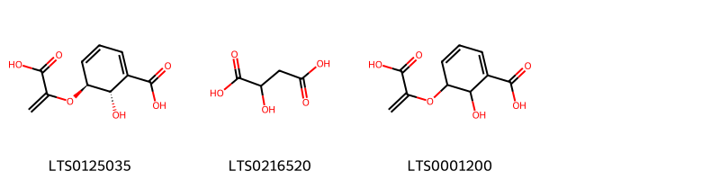{ width=100% }
    <figcaption>Hình ảnh cấu trúc hóa học của 3 hoạt chất thuộc nhóm Hydroxy acids and derivatives gồm ['isochorismic acid (LTS0125035)', 'malic acid (LTS0216520)', '5-[(1-carboxyeth-1-en-1-yl)oxy]-6-hydroxycyclohexa-1,3-diene-1-carboxylic acid (LTS0001200)'].</figcaption>
</figure>
#### Nhóm Ibogan-type alkaloids
<figure markdown="span">
    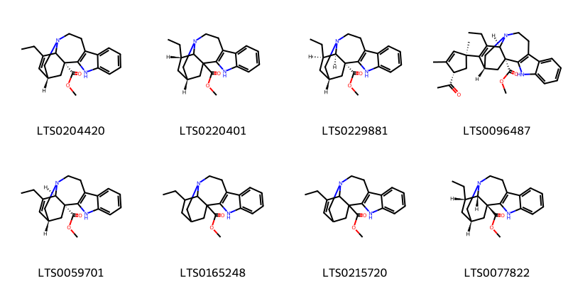{ width=100% }
    <figcaption>Hình ảnh cấu trúc hóa học của 8 hoạt chất thuộc nhóm Ibogan-type alkaloids gồm ['methyl (1r,15r)-17-ethyl-3,13-diazapentacyclo[13.3.1.0²,¹⁰.0⁴,⁹.0¹³,¹⁸]nonadeca-2(10),4,6,8,16-pentaene-1-carboxylate (LTS0204420)', 'methyl (15s,17s)-17-ethyl-3,13-diazapentacyclo[13.3.1.0²,¹⁰.0⁴,⁹.0¹³,¹⁸]nonadeca-2(10),4,6,8-tetraene-1-carboxylate (LTS0220401)', 'methyl (1r,15s,17r,18r)-17-ethyl-3,13-diazapentacyclo[13.3.1.0²,¹⁰.0⁴,⁹.0¹³,¹⁸]nonadeca-2(10),4,6,8-tetraene-1-carboxylate (LTS0229881)', 'methyl (1r,15r,18r)-16-[(1s,4s)-4-acetyl-1,3-dimethylcyclopent-2-en-1-yl]-17-ethyl-3,13-diazapentacyclo[13.3.1.0²,¹⁰.0⁴,⁹.0¹³,¹⁸]nonadeca-2(10),4,6,8,16-pentaene-1-carboxylate (LTS0096487)', 'catharanthine (LTS0059701)', 'coronaridine (LTS0165248)', 'methyl 17-ethyl-3,13-diazapentacyclo[13.3.1.0²,¹⁰.0⁴,⁹.0¹³,¹⁸]nonadeca-2(10),4,6,8,16-pentaene-1-carboxylate (LTS0215720)', 'coronaridine (LTS0077822)'].</figcaption>
</figure>
#### Nhóm Indoles and derivatives
<figure markdown="span">
    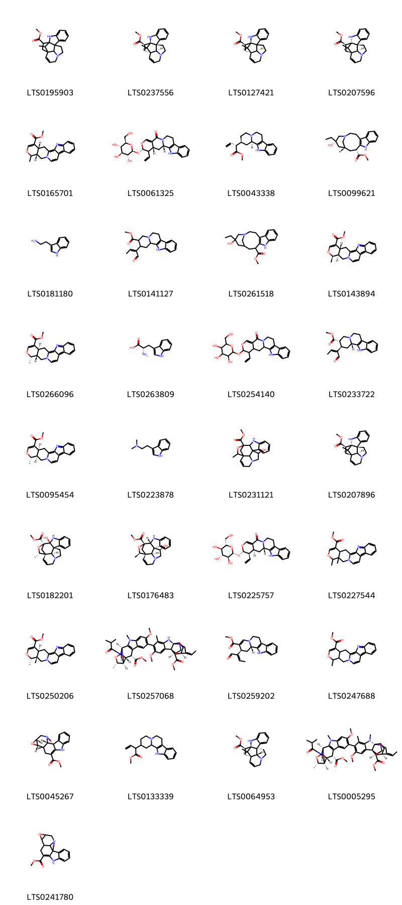{ width=100% }
    <figcaption>Hình ảnh cấu trúc hóa học của 33 hoạt chất thuộc nhóm Indoles and derivatives gồm ['methyl 20-methyl-8,16-diazahexacyclo[10.6.1.1⁹,¹².0¹,⁹.0²,⁷.0¹⁶,¹⁹]icosa-2,4,6,13-tetraene-10-carboxylate (LTS0195903)', 'methyl (1r,9s,10r,12s,19s,20s)-20-methyl-8,16-diazahexacyclo[10.6.1.1⁹,¹².0¹,⁹.0²,⁷.0¹⁶,¹⁹]icosa-2,4,6,13-tetraene-10-carboxylate (LTS0237556)', 'methyl (9s,10r,12s,19s,20s)-20-methyl-8,16-diazahexacyclo[10.6.1.1⁹,¹².0¹,⁹.0²,⁷.0¹⁶,¹⁹]icosa-2,4,6,13-tetraene-10-carboxylate (LTS0127421)', 'methyl (1r,9r,10r,12r,19s,20r)-20-methyl-8,16-diazahexacyclo[10.6.1.1⁹,¹².0¹,⁹.0²,⁷.0¹⁶,¹⁹]icosa-2,4,6,13-tetraene-10-carboxylate (LTS0207596)', 'methyl (15r,20r)-16-methyl-17-oxa-3,13-diazapentacyclo[11.8.0.0²,¹⁰.0⁴,⁹.0¹⁵,²⁰]henicosa-1,3,5,7,9,11,18-heptaene-19-carboxylate (LTS0165701)', '(1s,18s,20r)-19-ethenyl-18-{[(2s,3r,4s,5s,6r)-3,4,5-trihydroxy-6-(hydroxymethyl)oxan-2-yl]oxy}-17-oxa-3,13-diazapentacyclo[11.8.0.0²,¹⁰.0⁴,⁹.0¹⁵,²⁰]henicosa-2(10),4,6,8,15-pentaen-14-one (LTS0061325)', 'methyl (2r)-2-[(2s,12br)-1h,2h,3h,4h,6h,7h,12h,12bh-indolo[2,3-a]quinolizin-2-yl]but-3-enoate (LTS0043338)', 'methyl (13r,15r,17s)-17-ethyl-17-hydroxy-1,11-diazatetracyclo[13.3.1.0⁴,¹².0⁵,¹⁰]nonadeca-4(12),5,7,9-tetraene-13-carboxylate (LTS0099621)', 'tryptamine (LTS0181180)', 'methyl 2-(1-oxobut-2-en-2-yl)-1h,2h,3h,4h,6h,7h,12h,12bh-indolo[2,3-a]quinolizine-3-carboxylate (LTS0141127)', 'methyl 17-ethyl-17-hydroxy-1,11-diazatetracyclo[13.3.1.0⁴,¹².0⁵,¹⁰]nonadeca-4(12),5,7,9-tetraene-13-carboxylate (LTS0261518)', 'methyl (15s,16r,20r)-16-methyl-17-oxa-3,13-diazapentacyclo[11.8.0.0²,¹⁰.0⁴,⁹.0¹⁵,²⁰]henicosa-1,3,5,7,9,11,18-heptaene-19-carboxylate (LTS0143894)', '3,4,5,6-tetradehydroajmalicine (LTS0266096)', 'l-tryptophan (LTS0263809)', '19-ethenyl-18-{[3,4,5-trihydroxy-6-(hydroxymethyl)oxan-2-yl]oxy}-17-oxa-3,13-diazapentacyclo[11.8.0.0²,¹⁰.0⁴,⁹.0¹⁵,²⁰]henicosa-2(10),4,6,8,15-pentaen-14-one (LTS0254140)', 'methyl (2r,3s,12bs)-2-[(2z)-1-oxobut-2-en-2-yl]-1h,2h,3h,4h,6h,7h,12h,12bh-indolo[2,3-a]quinolizine-3-carboxylate (LTS0233722)', 'alstonine (LTS0095454)', 'dimethyltryptamine (LTS0223878)', 'methyl 19-hydroxy-12-methyl-11-oxa-8,17-diazahexacyclo[11.6.1.1¹⁰,¹³.0¹,⁹.0²,⁷.0¹⁷,²⁰]henicosa-2,4,6,14-tetraene-10-carboxylate (LTS0231121)', 'methyl (1r,9r,10r,12r,19s,20s)-20-methyl-8,16-diazahexacyclo[10.6.1.1⁹,¹².0¹,⁹.0²,⁷.0¹⁶,¹⁹]icosa-2,4,6,13-tetraene-10-carboxylate (LTS0207896)', 'vincoline (LTS0182201)', 'methyl (1r,9r,10s,12r,13s,19r,20s)-19-hydroxy-12-methyl-11-oxa-8,17-diazahexacyclo[11.6.1.1¹⁰,¹³.0¹,⁹.0²,⁷.0¹⁷,²⁰]henicosa-2,4,6,14-tetraene-10-carboxylate (LTS0176483)', '(1s,18s,19r,20s)-19-ethenyl-18-{[(2r,3s,4r,5r,6s)-3,4,5-trihydroxy-6-(hydroxymethyl)oxan-2-yl]oxy}-17-oxa-3,13-diazapentacyclo[11.8.0.0²,¹⁰.0⁴,⁹.0¹⁵,²⁰]henicosa-2(10),4,6,8,15-pentaen-14-one (LTS0225757)', 'methyl 15,16-dimethyl-17-oxa-3,13-diazapentacyclo[11.8.0.0²,¹⁰.0⁴,⁹.0¹⁵,²⁰]henicosa-1,3,5,7,9,11,18-heptaene-19-carboxylate (LTS0227544)', 'methyl (15r,16s,20s)-15,16-dimethyl-17-oxa-3,13-diazapentacyclo[11.8.0.0²,¹⁰.0⁴,⁹.0¹⁵,²⁰]henicosa-1,3,5,7,9,11,18-heptaene-19-carboxylate (LTS0250206)', 'methyl (2r,5r,6s,8s,9s,10r)-14-[(1r,9s,12r,13z,18r)-13-ethylidene-4-methoxy-18-(methoxycarbonyl)-6-methyl-8,15-diazapentacyclo[10.5.1.0¹,⁹.0²,⁷.0⁹,¹⁵]octadeca-2,4,6-trien-5-yl]-15-methoxy-6,18-dimethyl-3-(2-methylpropanoyl)-7-oxa-3,18-diazapentacyclo[9.7.0.0²,⁸.0⁵,⁹.0¹²,¹⁷]octadeca-1(11),12,14,16-tetraene-10-carboxylate (LTS0257068)', 'methyl (2s,12bs)-2-[(2e)-1-oxobut-2-en-2-yl]-1h,2h,6h,7h,12h,12bh-indolo[2,3-a]quinolizine-3-carboxylate (LTS0259202)', 'methyl 16-methyl-17-oxa-3,13-diazapentacyclo[11.8.0.0²,¹⁰.0⁴,⁹.0¹⁵,²⁰]henicosa-1,3,5,7,9,11,18-heptaene-19-carboxylate (LTS0247688)', 'methyl (1r,12s,13s,15r,20s)-14-oxa-8,17-diazahexacyclo[10.7.1.0¹,⁹.0²,⁷.0¹³,¹⁵.0¹⁷,²⁰]icosa-2,4,6,9-tetraene-10-carboxylate (LTS0045267)', 'methyl 2-{1h,2h,3h,4h,6h,7h,12h,12bh-indolo[2,3-a]quinolizin-2-yl}but-3-enoate (LTS0133339)', 'methyl (1s,9s,10r,12s,19r,20s)-20-methyl-8,16-diazahexacyclo[10.6.1.1⁹,¹².0¹,⁹.0²,⁷.0¹⁶,¹⁹]icosa-2,4,6,13-tetraene-10-carboxylate (LTS0064953)', 'methyl (2r,5r,6s,8s,9s,10r)-14-[(1r,9s,12r,13z,18r)-13-ethylidene-4-methoxy-18-(methoxycarbonyl)-6,8-dimethyl-8,15-diazapentacyclo[10.5.1.0¹,⁹.0²,⁷.0⁹,¹⁵]octadeca-2,4,6-trien-5-yl]-15-methoxy-6,18-dimethyl-3-(2-methylpropanoyl)-7-oxa-3,18-diazapentacyclo[9.7.0.0²,⁸.0⁵,⁹.0¹²,¹⁷]octadeca-1(11),12,14,16-tetraene-10-carboxylate (LTS0005295)', 'methyl 14-oxa-8,17-diazahexacyclo[10.7.1.0¹,⁹.0²,⁷.0¹³,¹⁵.0¹⁷,²⁰]icosa-2,4,6,9-tetraene-10-carboxylate (LTS0241780)'].</figcaption>
</figure>
#### Nhóm Indolizidines
<figure markdown="span">
    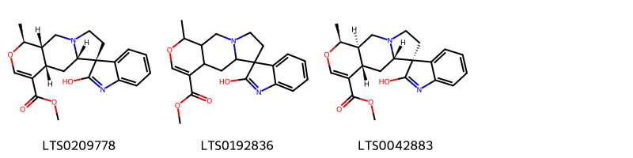{ width=100% }
    <figcaption>Hình ảnh cấu trúc hóa học của 3 hoạt chất thuộc nhóm Indolizidines gồm ["methyl (1's,3s,4'as,5'as,10'as)-2-hydroxy-1'-methyl-1',4'a,5',5'a,7',8',10',10'a-octahydrospiro[indole-3,6'-pyrano[3,4-f]indolizine]-4'-carboxylate (LTS0209778)", "methyl 2-hydroxy-1'-methyl-1',4'a,5',5'a,7',8',10',10'a-octahydrospiro[indole-3,6'-pyrano[3,4-f]indolizine]-4'-carboxylate (LTS0192836)", "methyl (1's,3r,4'as,5'as,10'ar)-2-hydroxy-1'-methyl-1',4'a,5',5'a,7',8',10',10'a-octahydrospiro[indole-3,6'-pyrano[3,4-f]indolizine]-4'-carboxylate (LTS0042883)"].</figcaption>
</figure>
#### Nhóm Indolonaphthyridine alkaloids
<figure markdown="span">
    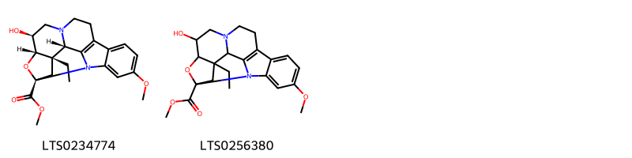{ width=100% }
    <figcaption>Hình ảnh cấu trúc hóa học của 2 hoạt chất thuộc nhóm Indolonaphthyridine alkaloids gồm ['methyl (1s,15s,16s,18s,20s)-20-ethyl-15-hydroxy-6-methoxy-17-oxa-3,13-diazahexacyclo[11.7.0.0²,¹⁰.0³,¹⁸.0⁴,⁹.0¹⁶,²⁰]icosa-2(10),4,6,8-tetraene-18-carboxylate (LTS0234774)', 'methyl 20-ethyl-15-hydroxy-6-methoxy-17-oxa-3,13-diazahexacyclo[11.7.0.0²,¹⁰.0³,¹⁸.0⁴,⁹.0¹⁶,²⁰]icosa-2(10),4,6,8-tetraene-18-carboxylate (LTS0256380)'].</figcaption>
</figure>
#### Nhóm Macroline alkaloids
<figure markdown="span">
    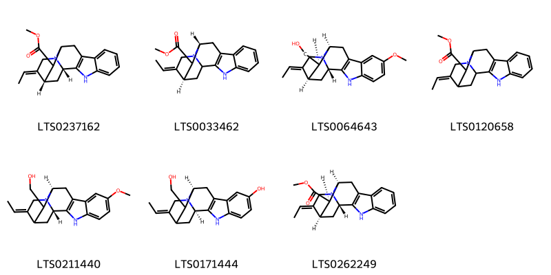{ width=100% }
    <figcaption>Hình ảnh cấu trúc hóa học của 7 hoạt chất thuộc nhóm Macroline alkaloids gồm ['methyl (1s,14s,15e)-15-ethylidene-3,17-diazapentacyclo[12.3.1.0²,¹⁰.0⁴,⁹.0¹²,¹⁷]octadeca-2(10),4,6,8-tetraene-13-carboxylate (LTS0237162)', 'methyl (12r,14r)-15-ethylidene-3,17-diazapentacyclo[12.3.1.0²,¹⁰.0⁴,⁹.0¹²,¹⁷]octadeca-2(10),4,6,8-tetraene-13-carboxylate (LTS0033462)', '[(1s,12s,13r,14r,15e)-15-ethylidene-7-methoxy-3,17-diazapentacyclo[12.3.1.0²,¹⁰.0⁴,⁹.0¹²,¹⁷]octadeca-2(10),4,6,8-tetraen-13-yl]methanol (LTS0064643)', 'methyl 15-ethylidene-3,17-diazapentacyclo[12.3.1.0²,¹⁰.0⁴,⁹.0¹²,¹⁷]octadeca-2(10),4,6,8-tetraene-13-carboxylate (LTS0120658)', '[(1s,12s)-15-ethylidene-7-methoxy-3,17-diazapentacyclo[12.3.1.0²,¹⁰.0⁴,⁹.0¹²,¹⁷]octadeca-2(10),4,6,8-tetraen-13-yl]methanol (LTS0211440)', '(1r,12s)-15-ethylidene-13-(hydroxymethyl)-3,17-diazapentacyclo[12.3.1.0²,¹⁰.0⁴,⁹.0¹²,¹⁷]octadeca-2(10),4,6,8-tetraen-7-ol (LTS0171444)', 'methyl (1s,12s,13r,14r,15e)-15-ethylidene-3,17-diazapentacyclo[12.3.1.0²,¹⁰.0⁴,⁹.0¹²,¹⁷]octadeca-2(10),4,6,8-tetraene-13-carboxylate (LTS0262249)'].</figcaption>
</figure>
#### Nhóm Organic oxides
<figure markdown="span">
    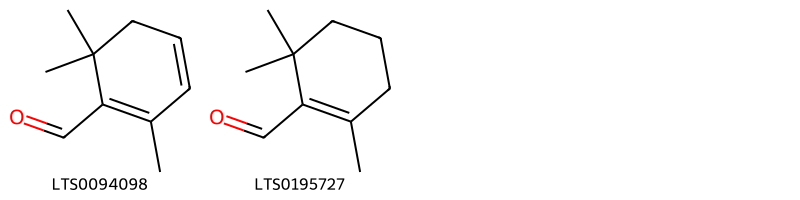{ width=100% }
    <figcaption>Hình ảnh cấu trúc hóa học của 2 hoạt chất thuộc nhóm Organic oxides gồm ['safranal (LTS0094098)', 'β-cyclocitral (LTS0195727)'].</figcaption>
</figure>
#### Nhóm Organic phosphoric acids and derivatives
<figure markdown="span">
    { width=100% }
    <figcaption>Hình ảnh cấu trúc hóa học của 1 hoạt chất thuộc nhóm Organic phosphoric acids and derivatives gồm ['o-phosphoethanolamine; bis(nonane) (LTS0249963)'].</figcaption>
</figure>
#### Nhóm Organonitrogen compounds
<figure markdown="span">
    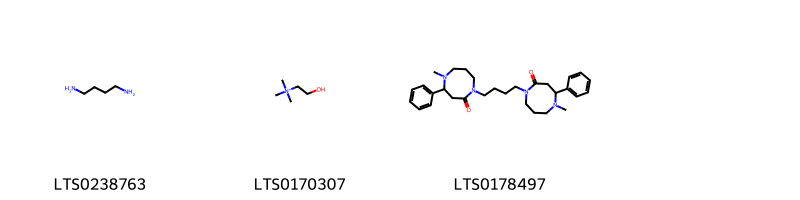{ width=100% }
    <figcaption>Hình ảnh cấu trúc hóa học của 3 hoạt chất thuộc nhóm Organonitrogen compounds gồm ['putrescine (LTS0238763)', 'choline (LTS0170307)', '5-methyl-1-[4-(5-methyl-2-oxo-4-phenyl-1,5-diazocan-1-yl)butyl]-4-phenyl-1,5-diazocan-2-one (LTS0178497)'].</figcaption>
</figure>
#### Nhóm Organooxygen compounds
<figure markdown="span">
    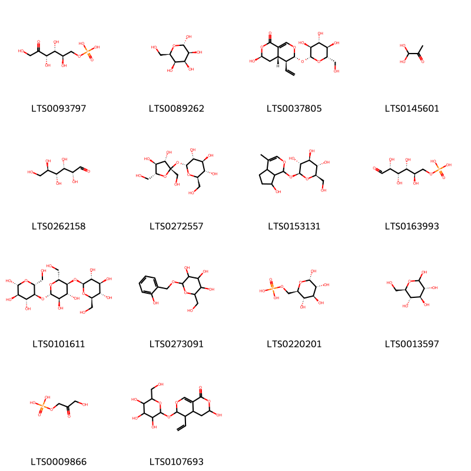{ width=100% }
    <figcaption>Hình ảnh cấu trúc hóa học của 14 hoạt chất thuộc nhóm Organooxygen compounds gồm ['d-fructose 6-phosphate (LTS0093797)', '(2s,3s,4s,5r,6r)-6-(hydroxymethyl)oxane-2,3,4,5-tetrol (LTS0089262)', '(3s,4as,5s,6r)-5-ethenyl-3-hydroxy-6-{[(2r,3s,4r,5r,6s)-3,4,5-trihydroxy-6-(hydroxymethyl)oxan-2-yl]oxy}-3h,4h,4ah,5h,6h-pyrano[3,4-c]pyran-1-one (LTS0037805)', 'dihydroxy acetone (LTS0145601)', '(+)-glucose (LTS0262158)', 'sucrose (LTS0272557)', '(2s,3r,4s,5s,6r)-2-({7-hydroxy-4-methyl-1h,4ah,5h,6h,7h,7ah-cyclopenta[c]pyran-1-yl}oxy)-6-(hydroxymethyl)oxane-3,4,5-triol (LTS0153131)', 'aldohexose 6-phosphate (LTS0163993)', 'β-cellotriose (LTS0101611)', '2-(hydroxymethyl)-6-[(2-hydroxyphenyl)methoxy]oxane-3,4,5-triol (LTS0273091)', 'α-d-glucose 6-phosphate (LTS0220201)', 'glucose (LTS0013597)', 'dihydroxyacetone phosphate (LTS0009866)', '5-ethenyl-3-hydroxy-6-{[3,4,5-trihydroxy-6-(hydroxymethyl)oxan-2-yl]oxy}-3h,4h,4ah,5h,6h-pyrano[3,4-c]pyran-1-one (LTS0107693)'].</figcaption>
</figure>
#### Nhóm Pleiocarpaman alkaloids
<figure markdown="span">
    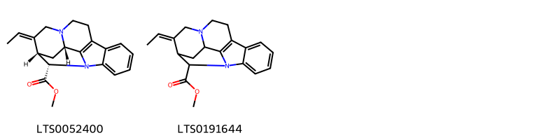{ width=100% }
    <figcaption>Hình ảnh cấu trúc hóa học của 2 hoạt chất thuộc nhóm Pleiocarpaman alkaloids gồm ['pleiocarpamine (LTS0052400)', 'methyl (13e)-13-ethylidene-1,11-diazapentacyclo[12.3.1.0²,⁷.0⁸,¹⁷.0¹¹,¹⁶]octadeca-2,4,6,8(17)-tetraene-18-carboxylate (LTS0191644)'].</figcaption>
</figure>
#### Nhóm Plumeran-type alkaloids
<figure markdown="span">
    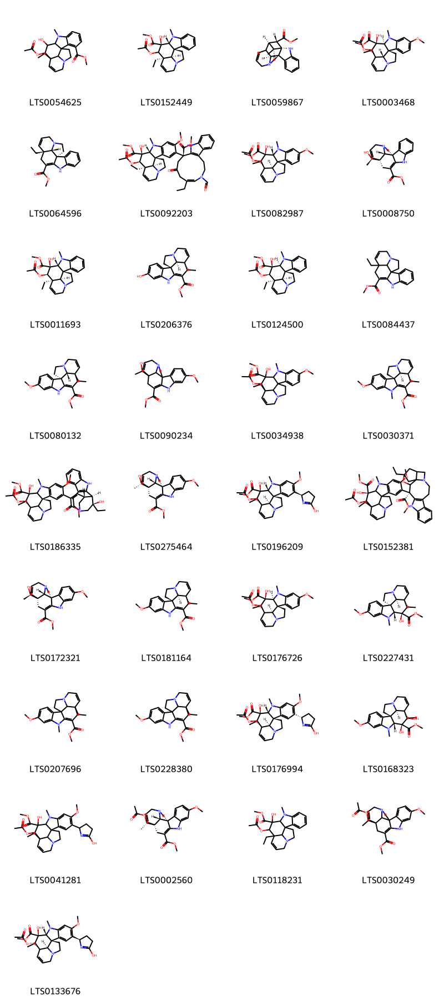{ width=100% }
    <figcaption>Hình ảnh cấu trúc hóa học của 33 hoạt chất thuộc nhóm Plumeran-type alkaloids gồm ['methyl 11-(acetyloxy)-12-ethyl-10-hydroxy-8-methyl-8,16-diazapentacyclo[10.6.1.0¹,⁹.0²,⁷.0¹⁶,¹⁹]nonadeca-2,4,6,13-tetraene-3-carboxylate (LTS0054625)', 'methyl (1r,9r,10s,12r,19r)-11-(acetyloxy)-12-ethyl-10-hydroxy-8-methyl-8,16-diazapentacyclo[10.6.1.0¹,⁹.0²,⁷.0¹⁶,¹⁹]nonadeca-2,4,6,13-tetraene-10-carboxylate (LTS0152449)', 'methyl (1r,9r,10s,11r,12s,19s,20s)-20-methyl-8,16-diazahexacyclo[10.6.1.1⁹,¹¹.0¹,⁹.0²,⁷.0¹⁶,¹⁹]icosa-2,4,6,13-tetraene-10-carboxylate (LTS0059867)', 'methyl (1r,9s,10s,12r,19s)-11-(acetyloxy)-12-ethyl-10-hydroxy-5-methoxy-8-methyl-8,16-diazapentacyclo[10.6.1.0¹,⁹.0²,⁷.0¹⁶,¹⁹]nonadeca-2,4,6,13-tetraene-10-carboxylate (LTS0003468)', 'tabersonine (LTS0064596)', 'catharine (LTS0092203)', 'vindoline (LTS0082987)', 'methyl (1r,12s,19r)-12-[(1r)-1-hydroxyethyl]-8,16-diazapentacyclo[10.6.1.0¹,⁹.0²,⁷.0¹⁶,¹⁹]nonadeca-2,4,6,9,13-pentaene-10-carboxylate (LTS0008750)', 'demethoxyvindoline (LTS0011693)', '16-hydroxytabersonine (LTS0206376)', 'methyl (1r,9s,10s,11r,12r,19r)-11-(acetyloxy)-12-ethyl-10-hydroxy-8-methyl-8,16-diazapentacyclo[10.6.1.0¹,⁹.0²,⁷.0¹⁶,¹⁹]nonadeca-2,4,6,13-tetraene-10-carboxylate (LTS0124500)', 'methyl 12-ethyl-8,16-diazapentacyclo[10.6.1.0¹,⁹.0²,⁷.0¹⁶,¹⁹]nonadeca-2,4,6,9,13-pentaene-10-carboxylate (LTS0084437)', 'methyl (1s,12s,19r)-12-ethyl-5-methoxy-8,16-diazapentacyclo[10.6.1.0¹,⁹.0²,⁷.0¹⁶,¹⁹]nonadeca-2,4,6,9,13-pentaene-10-carboxylate (LTS0080132)', 'methyl 12-(1-hydroxyethyl)-5-methoxy-8,16-diazapentacyclo[10.6.1.0¹,⁹.0²,⁷.0¹⁶,¹⁹]nonadeca-2,4,6,9,13-pentaene-10-carboxylate (LTS0090234)', 'methyl 11-(acetyloxy)-12-ethyl-10-hydroxy-5-methoxy-8-methyl-8,16-diazapentacyclo[10.6.1.0¹,⁹.0²,⁷.0¹⁶,¹⁹]nonadeca-2,4,6,13-tetraene-10-carboxylate (LTS0034938)', 'methyl (1r,12r,19s)-12-ethyl-5-methoxy-8-methyl-8,16-diazapentacyclo[10.6.1.0¹,⁹.0²,⁷.0¹⁶,¹⁹]nonadeca-2,4,6,9,13-pentaene-10-carboxylate (LTS0030371)', 'methyl (1r,10s,11r,12r)-11-(acetyloxy)-12-ethyl-4-[(1z)-1-[(1s,15r,16r)-16-ethyl-16-hydroxy-3,13-diazatetracyclo[11.2.2.0²,¹⁰.0⁴,⁹]heptadeca-2(10),4,6,8-tetraen-15-yl]-3-methoxy-3-oxoprop-1-en-2-yl]-10-hydroxy-5-methoxy-8-methyl-8,16-diazapentacyclo[10.6.1.0¹,⁹.0²,⁷.0¹⁶,¹⁹]nonadeca-2(7),3,5,13-tetraene-10-carboxylate (LTS0186335)', 'methyl (1r,12s,19r)-12-[(1s)-1-hydroxyethyl]-5-methoxy-8,16-diazapentacyclo[10.6.1.0¹,⁹.0²,⁷.0¹⁶,¹⁹]nonadeca-2,4,6,9,13-pentaene-10-carboxylate (LTS0275464)', 'methyl (1r,9r,10s,11r,12r,19r)-11-(acetyloxy)-12-ethyl-10-hydroxy-4-[(2r)-5-hydroxy-3,4-dihydro-2h-pyrrol-2-yl]-5-methoxy-8-methyl-8,16-diazapentacyclo[10.6.1.0¹,⁹.0²,⁷.0¹⁶,¹⁹]nonadeca-2,4,6,13-tetraene-10-carboxylate (LTS0196209)', 'methyl (4s)-4-[(10s,11r)-11-(acetyloxy)-12-ethyl-10-hydroxy-5-methoxy-10-(methoxycarbonyl)-8-methyl-8,16-diazapentacyclo[10.6.1.0¹,⁹.0²,⁷.0¹⁶,¹⁹]nonadeca-2(7),3,5,13-tetraen-4-yl]-1-ethyl-2-oxa-6,16-diazahexacyclo[16.2.1.0³,¹⁹.0⁵,¹³.0⁷,¹².0¹⁶,¹⁹]henicosa-5(13),7,9,11-tetraene-4-carboxylate (LTS0152381)', 'methyl (1r,12s,19r)-12-[(1r)-1-hydroxyethyl]-5-methoxy-8,16-diazapentacyclo[10.6.1.0¹,⁹.0²,⁷.0¹⁶,¹⁹]nonadeca-2,4,6,9,13-pentaene-10-carboxylate (LTS0172321)', '16-methoxytabersonine (LTS0181164)', 'methyl (1r,9s,10s,11r,12r,19r)-11-(acetyloxy)-12-ethyl-10-hydroxy-5-methoxy-8-methyl-8,16-diazapentacyclo[10.6.1.0¹,⁹.0²,⁷.0¹⁶,¹⁹]nonadeca-2,4,6,13-tetraene-10-carboxylate (LTS0176726)', 'deacetoxyvindoline (LTS0227431)', 'methyl 12-ethyl-5-methoxy-8-methyl-8,16-diazapentacyclo[10.6.1.0¹,⁹.0²,⁷.0¹⁶,¹⁹]nonadeca-2,4,6,9,13-pentaene-10-carboxylate (LTS0207696)', '16-methoxytabersonine (LTS0228380)', 'methyl (1r,9r,10s,11r,12r,19r)-11-(acetyloxy)-12-ethyl-10-hydroxy-4-[(2s)-5-hydroxy-3,4-dihydro-2h-pyrrol-2-yl]-5-methoxy-8-methyl-8,16-diazapentacyclo[10.6.1.0¹,⁹.0²,⁷.0¹⁶,¹⁹]nonadeca-2,4,6,13-tetraene-10-carboxylate (LTS0176994)', 'deacetylvindoline (LTS0168323)', 'methyl 11-(acetyloxy)-12-ethyl-10-hydroxy-4-(5-hydroxy-3,4-dihydro-2h-pyrrol-2-yl)-5-methoxy-8-methyl-8,16-diazapentacyclo[10.6.1.0¹,⁹.0²,⁷.0¹⁶,¹⁹]nonadeca-2,4,6,13-tetraene-10-carboxylate (LTS0041281)', 'methyl (1r,12s,19r)-12-[(1s)-1-(acetyloxy)ethyl]-5-methoxy-8,16-diazapentacyclo[10.6.1.0¹,⁹.0²,⁷.0¹⁶,¹⁹]nonadeca-2,4,6,9,13-pentaene-10-carboxylate (LTS0002560)', 'methyl 11-(acetyloxy)-12-ethyl-10-hydroxy-8-methyl-8,16-diazapentacyclo[10.6.1.0¹,⁹.0²,⁷.0¹⁶,¹⁹]nonadeca-2,4,6,13-tetraene-10-carboxylate (LTS0118231)', 'methyl 12-[1-(acetyloxy)ethyl]-5-methoxy-8,16-diazapentacyclo[10.6.1.0¹,⁹.0²,⁷.0¹⁶,¹⁹]nonadeca-2,4,6,9,13-pentaene-10-carboxylate (LTS0030249)', 'methyl (1r,9r,10s,11s,12r,19r)-11-(acetyloxy)-12-ethyl-10-hydroxy-4-[(2r)-5-hydroxy-3,4-dihydro-2h-pyrrol-2-yl]-5-methoxy-8-methyl-8,16-diazapentacyclo[10.6.1.0¹,⁹.0²,⁷.0¹⁶,¹⁹]nonadeca-2,4,6,13-tetraene-10-carboxylate (LTS0133676)'].</figcaption>
</figure>
#### Nhóm Prenol lipids
<figure markdown="span">
    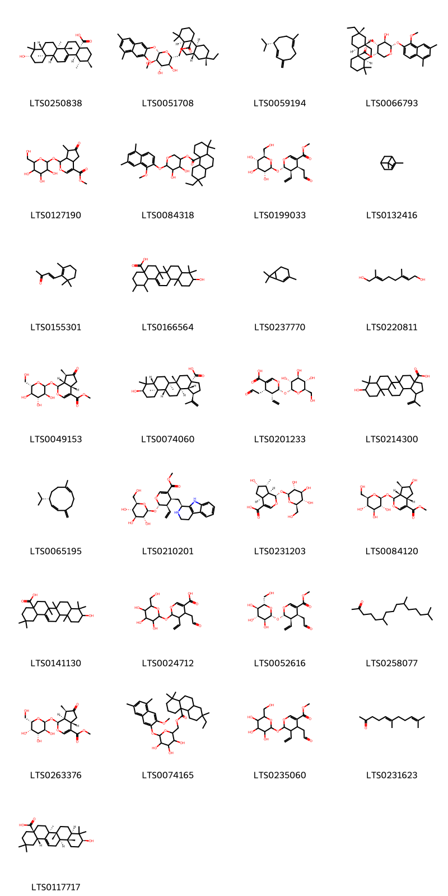{ width=100% }
    <figcaption>Hình ảnh cấu trúc hóa học của 29 hoạt chất thuộc nhóm Prenol lipids gồm ['ursolic acid (LTS0250838)', '[(2r,3s,4s,5r,6s)-3,4,5-trihydroxy-6-[(3-methoxy-5,7-dimethylnaphthalen-2-yl)oxy]oxan-2-yl]methyl (4as,4bs,7s,8as,10as)-7-ethyl-1,1,7-trimethyl-decahydro-2h-phenanthrene-4a-carboxylate (LTS0051708)', '(-)-germacrene d (LTS0059194)', '(3s,4r,5r,6s)-4,5-dihydroxy-6-[(1-methoxy-5,7-dimethylnaphthalen-2-yl)oxy]oxan-3-yl (4as,4bs,7s,8as,10as)-7-ethyl-1,1,7-trimethyl-decahydro-2h-phenanthrene-4a-carboxylate (LTS0066793)', 'methyl 7-methyl-6-oxo-1-{[3,4,5-trihydroxy-6-(hydroxymethyl)oxan-2-yl]oxy}-1h,4ah,5h,7h,7ah-cyclopenta[c]pyran-4-carboxylate (LTS0127190)', '4,5-dihydroxy-6-[(1-methoxy-5,7-dimethylnaphthalen-2-yl)oxy]oxan-3-yl 7-ethyl-1,1,7-trimethyl-decahydro-2h-phenanthrene-4a-carboxylate (LTS0084318)', '(-)-secologanin (LTS0199033)', 'α pinene (LTS0132416)', 'β-ionone (LTS0155301)', '10-hydroxy-1,2,6a,6b,9,9,12a-heptamethyl-2,3,4,5,6,7,8,8a,10,11,12,12b,13,14b-tetradecahydro-1h-picene-4a-carboxylic acid (LTS0166564)', '3,7,7-trimethylbicyclo[4.1.0]hept-2-ene (LTS0237770)', '8-hydroxygeraniol (LTS0220811)', 'methyl (1s,4as,7r,7as)-7-methyl-6-oxo-1-{[(2s,3s,4r,5r,6s)-3,4,5-trihydroxy-6-(hydroxymethyl)oxan-2-yl]oxy}-1h,4ah,5h,7h,7ah-cyclopenta[c]pyran-4-carboxylate (LTS0049153)', '(1r,3as,5ar,5br,7ar,9r,11ar,11br,13ar,13br)-9-hydroxy-5a,5b,8,8,11a-pentamethyl-1-(prop-1-en-2-yl)-hexadecahydrocyclopenta[a]chrysene-3a-carboxylic acid (LTS0074060)', '(4s,5r,6r)-5-ethenyl-4-(2-oxoethyl)-6-{[(2r,3r,4s,5s,6r)-3,4,5-trihydroxy-6-(hydroxymethyl)oxan-2-yl]oxy}-5,6-dihydro-4h-pyran-3-carboxylic acid (LTS0201233)', '9-hydroxy-5a,5b,8,8,11a-pentamethyl-1-(prop-1-en-2-yl)-hexadecahydrocyclopenta[a]chrysene-3a-carboxylic acid (LTS0214300)', '(1z,6z,8s)-8-isopropyl-1-methyl-5-methylidenecyclodeca-1,6-diene (LTS0065195)', 'strictosidine (LTS0210201)', 'loganic acid (LTS0231203)', 'loganin (LTS0084120)', 'oleanolic acid (LTS0141130)', '5-ethenyl-4-(2-oxoethyl)-6-{[3,4,5-trihydroxy-6-(hydroxymethyl)oxan-2-yl]oxy}-5,6-dihydro-4h-pyran-3-carboxylic acid (LTS0024712)', 'methyl (4s,5r,6s)-5-ethenyl-4-(2-oxoethyl)-6-{[(2r,3s,4r,5r,6s)-3,4,5-trihydroxy-6-(hydroxymethyl)oxan-2-yl]oxy}-5,6-dihydro-4h-pyran-3-carboxylate (LTS0052616)', '6,10,14-trimethylpentadecan-2-one (LTS0258077)', 'methyl (1s,4as,7r,7ar)-7-methyl-6-oxo-1-{[(2s,3s,4r,5s,6s)-3,4,5-trihydroxy-6-(hydroxymethyl)oxan-2-yl]oxy}-1h,4ah,5h,7h,7ah-cyclopenta[c]pyran-4-carboxylate (LTS0263376)', '{3,4,5-trihydroxy-6-[(3-methoxy-5,7-dimethylnaphthalen-2-yl)oxy]oxan-2-yl}methyl 7-ethyl-1,1,7-trimethyl-decahydro-2h-phenanthrene-4a-carboxylate (LTS0074165)', 'secologanin (LTS0235060)', 'geranylacetone (LTS0231623)', 'oleanolic acid (LTS0117717)'].</figcaption>
</figure>
#### Nhóm Pyrimidine nucleosides
<figure markdown="span">
    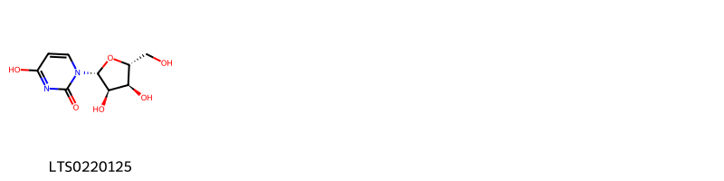{ width=100% }
    <figcaption>Hình ảnh cấu trúc hóa học của 1 hoạt chất thuộc nhóm Pyrimidine nucleosides gồm ['uridine (LTS0220125)'].</figcaption>
</figure>
#### Nhóm Quebrachamine alkaloids
<figure markdown="span">
    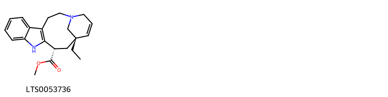{ width=100% }
    <figcaption>Hình ảnh cấu trúc hóa học của 1 hoạt chất thuộc nhóm Quebrachamine alkaloids gồm ['methyl (13s,15s)-15-ethyl-1,11-diazatetracyclo[13.3.1.0⁴,¹².0⁵,¹⁰]nonadeca-4(12),5,7,9,16-pentaene-13-carboxylate (LTS0053736)'].</figcaption>
</figure>
#### Nhóm Steroids and steroid derivatives
<figure markdown="span">
    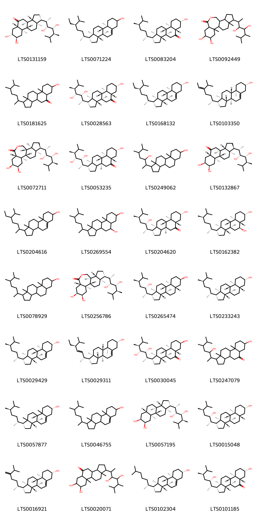{ width=100% }
    <figcaption>Hình ảnh cấu trúc hóa học của 32 hoạt chất thuộc nhóm Steroids and steroid derivatives gồm ['(1r,3as,3bs,5as,7r,8r,9ar,9bs,11as)-1-[(2s,3r,4r,5s)-3,4-dihydroxy-5,6-dimethylheptan-2-yl]-7,8-dihydroxy-9a,11a-dimethyl-tetradecahydrocyclopenta[a]phenanthren-5-one (LTS0131159)', 'stigmast-5-en-3-ol (LTS0071224)', '6-oxocampestanol (LTS0083204)', '24-epibrassinolide (LTS0092449)', '1-(5,6-dimethylheptan-2-yl)-7-hydroxy-9a,11a-dimethyl-tetradecahydrocyclopenta[a]phenanthren-5-one (LTS0181625)', 'teasterone (LTS0028563)', 'sitosterol (LTS0168132)', 'avenasterol (LTS0103350)', '(1s,2r,4r,5s,7s,11r,12r,15s,16s)-15-[(2s,3r,4r,5s)-3,4-dihydroxy-5,6-dimethylheptan-2-yl]-4,5-dihydroxy-2,16-dimethyl-9-oxatetracyclo[9.7.0.0²,⁷.0¹²,¹⁶]octadecan-8-one (LTS0072711)', '(1r,3bs,5as,7s,9ar,9bs,11as)-1-[(2s,3r,4r,5s)-3,4-dihydroxy-5,6-dimethylheptan-2-yl]-7-hydroxy-9a,11a-dimethyl-tetradecahydrocyclopenta[a]phenanthren-5-one (LTS0053235)', '2-{7-hydroxy-9a,11a-dimethyl-tetradecahydro-1h-cyclopenta[a]phenanthren-1-yl}-5,6-dimethylheptan-3-ol (LTS0249062)', '(1s,3as,3bs,5as,7s,8r,9ar,9bs,11as)-1-[(2s,3r,4r,5s)-3,4-dihydroxy-5,6-dimethylheptan-2-yl]-7,8-dihydroxy-9a,11a-dimethyl-tetradecahydrocyclopenta[a]phenanthren-5-one (LTS0132867)', 'stigmast-5-en-3-ol, (3β)- (LTS0204616)', '1-(5,6-dimethylheptan-2-yl)-9a,11a-dimethyl-tetradecahydro-1h-cyclopenta[a]phenanthrene-5,7-diol (LTS0269554)', '(1r,3bs,5as,7s,9ar,9bs,11as)-7-hydroxy-1-[(2s,3s,5r)-3-hydroxy-5,6-dimethylheptan-2-yl]-9a,11a-dimethyl-tetradecahydrocyclopenta[a]phenanthren-5-one (LTS0204620)', '6α-hydroxycampestanol (LTS0162382)', '1-(5,6-dimethylheptan-2-yl)-9a,11a-dimethyl-tetradecahydro-1h-cyclopenta[a]phenanthren-7-ol (LTS0078929)', 'brassinolide (LTS0256786)', '3-epi-6-deoxocathasterone (LTS0265474)', 'campestanol (LTS0233243)', 'campesterol (LTS0029429)', 'phytosterol (LTS0029311)', 'typhasterol (LTS0030045)', '7-hydroxy-1-(3-hydroxy-5,6-dimethylheptan-2-yl)-9a,11a-dimethyl-tetradecahydrocyclopenta[a]phenanthren-5-one (LTS0247079)', '(1r,3as,3bs,7s,9bs)-1-[(2r,5r)-5,6-dimethylheptan-2-yl]-9a,11a-dimethyl-1h,2h,3h,3ah,3bh,4h,6h,7h,8h,9h,9bh,10h,11h-cyclopenta[a]phenanthren-7-ol (LTS0057877)', 'campesterol (LTS0046755)', '6-deoxocastasterone (LTS0057195)', '6-deoxocathasterone (LTS0015048)', '24-methylenecholesterol (LTS0016921)', '1-(3,4-dihydroxy-5,6-dimethylheptan-2-yl)-7,8-dihydroxy-9a,11a-dimethyl-tetradecahydrocyclopenta[a]phenanthren-5-one (LTS0020071)', 'cholesterol (LTS0102304)', 'cathasterone (LTS0101185)'].</figcaption>
</figure>
#### Nhóm Strychnos alkaloids
<figure markdown="span">
    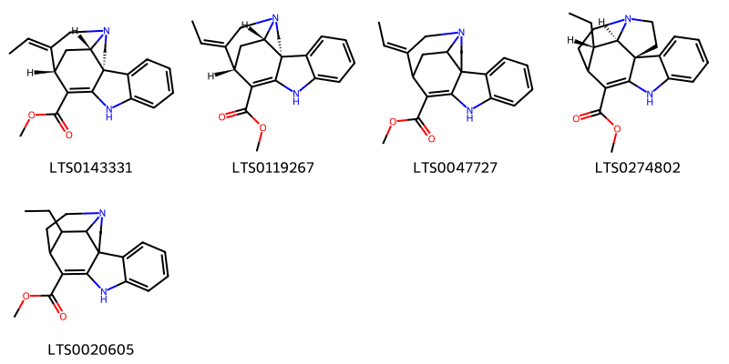{ width=100% }
    <figcaption>Hình ảnh cấu trúc hóa học của 5 hoạt chất thuộc nhóm Strychnos alkaloids gồm ['akuammicine (LTS0143331)', 'methyl (1r,11s,17s)-12-ethylidene-8,14-diazapentacyclo[9.5.2.0¹,⁹.0²,⁷.0¹⁴,¹⁷]octadeca-2,4,6,9-tetraene-10-carboxylate (LTS0119267)', 'akuammicine (LTS0047727)', 'methyl (1s,17r,18s)-18-ethyl-8,14-diazapentacyclo[9.5.2.0¹,⁹.0²,⁷.0¹⁴,¹⁷]octadeca-2,4,6,9-tetraene-10-carboxylate (LTS0274802)', 'methyl 18-ethyl-8,14-diazapentacyclo[9.5.2.0¹,⁹.0²,⁷.0¹⁴,¹⁷]octadeca-2,4,6,9-tetraene-10-carboxylate (LTS0020605)'].</figcaption>
</figure>
#### Nhóm Tetrahydrofurans
<figure markdown="span">
    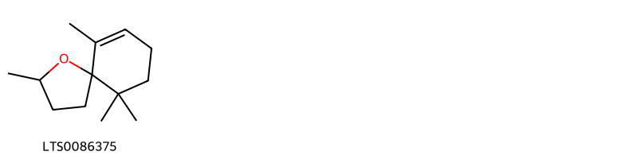{ width=100% }
    <figcaption>Hình ảnh cấu trúc hóa học của 1 hoạt chất thuộc nhóm Tetrahydrofurans gồm ['theaspirane (LTS0086375)'].</figcaption>
</figure>
#### Nhóm Vinca alkaloids
<figure markdown="span">
    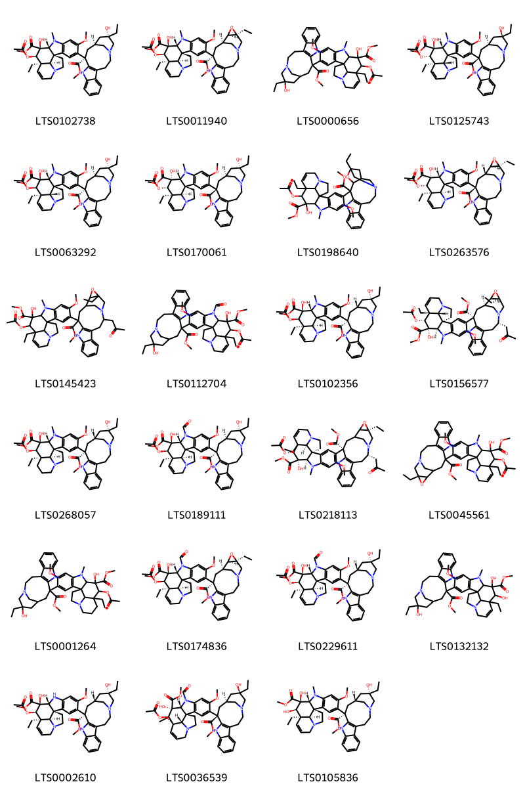{ width=100% }
    <figcaption>Hình ảnh cấu trúc hóa học của 23 hoạt chất thuộc nhóm Vinca alkaloids gồm ['vinblastine (LTS0102738)', 'leurosine (LTS0011940)', 'vinblastine (LTS0000656)', 'methyl (1r,9r,10s,11s,12r,19s)-11-(acetyloxy)-12-ethyl-4-[(13r,15s,17r)-17-ethyl-17-hydroxy-13-(methoxycarbonyl)-1,11-diazatetracyclo[13.3.1.0⁴,¹².0⁵,¹⁰]nonadeca-4(12),5,7,9-tetraen-13-yl]-10-hydroxy-5-methoxy-8-methyl-8,16-diazapentacyclo[10.6.1.0¹,⁹.0²,⁷.0¹⁶,¹⁹]nonadeca-2(7),3,5,13-tetraene-10-carboxylate (LTS0125743)', 'methyl (1r,9r,10s,11r,12r,19s)-11-(acetyloxy)-12-ethyl-4-[(13s,15s,17s)-17-ethyl-17-hydroxy-13-(methoxycarbonyl)-1,11-diazatetracyclo[13.3.1.0⁴,¹².0⁵,¹⁰]nonadeca-4(12),5,7,9-tetraen-13-yl]-10-hydroxy-5-methoxy-8-methyl-8,16-diazapentacyclo[10.6.1.0¹,⁹.0²,⁷.0¹⁶,¹⁹]nonadeca-2(7),3,5,13-tetraene-10-carboxylate (LTS0063292)', 'methyl (1r,9r,10r,11s,12r,19r)-11-(acetyloxy)-12-ethyl-4-[(13r,15s,17s)-17-ethyl-17-hydroxy-13-(methoxycarbonyl)-1,11-diazatetracyclo[13.3.1.0⁴,¹².0⁵,¹⁰]nonadeca-4(12),5,7,9-tetraen-13-yl]-10-hydroxy-5-methoxy-8-methyl-8,16-diazapentacyclo[10.6.1.0¹,⁹.0²,⁷.0¹⁶,¹⁹]nonadeca-2(7),3,5,13-tetraene-10-carboxylate (LTS0170061)', 'methyl 4-[11-(acetyloxy)-12-ethyl-10-hydroxy-5-methoxy-10-(methoxycarbonyl)-8-methyl-8,16-diazapentacyclo[10.6.1.0¹,⁹.0²,⁷.0¹⁶,¹⁹]nonadeca-2(7),3,5,13-tetraen-4-yl]-1-ethyl-2-oxa-6,16-diazapentacyclo[14.3.1.0³,¹⁸.0⁵,¹³.0⁷,¹²]icosa-5(13),7,9,11-tetraene-4-carboxylate (LTS0198640)', 'methyl (13r,15s,16r,18s)-13-[(1r,9r,10r,11s,12r,19r)-11-(acetyloxy)-12-ethyl-10-hydroxy-5-methoxy-10-(methoxycarbonyl)-8-methyl-8,16-diazapentacyclo[10.6.1.0¹,⁹.0²,⁷.0¹⁶,¹⁹]nonadeca-2(7),3,5,13-tetraen-4-yl]-18-ethyl-17-oxa-1,11-diazapentacyclo[13.4.1.0⁴,¹².0⁵,¹⁰.0¹⁶,¹⁸]icosa-4(12),5,7,9-tetraene-13-carboxylate (LTS0263576)', 'methyl 13-[11-(acetyloxy)-12-ethyl-10-hydroxy-5-methoxy-10-(methoxycarbonyl)-8-methyl-8,16-diazapentacyclo[10.6.1.0¹,⁹.0²,⁷.0¹⁶,¹⁹]nonadeca-2(7),3,5,13-tetraen-4-yl]-18-ethyl-2-(2-oxopropyl)-17-oxa-1,11-diazapentacyclo[13.4.1.0⁴,¹².0⁵,¹⁰.0¹⁶,¹⁸]icosa-4(12),5,7,9-tetraene-13-carboxylate (LTS0145423)', 'methyl 11-(acetyloxy)-12-ethyl-4-[17-ethyl-17-hydroxy-13-(methoxycarbonyl)-1,11-diazatetracyclo[13.3.1.0⁴,¹².0⁵,¹⁰]nonadeca-4(12),5,7,9-tetraen-13-yl]-8-formyl-10-hydroxy-5-methoxy-8,16-diazapentacyclo[10.6.1.0¹,⁹.0²,⁷.0¹⁶,¹⁹]nonadeca-2(7),3,5,13-tetraene-10-carboxylate (LTS0112704)', 'velban (LTS0102356)', 'methyl (2s,13s,15r,16r,18s)-13-[(1r,9r,10s,11r,12r,19r)-11-(acetyloxy)-12-ethyl-10-hydroxy-5-methoxy-10-(methoxycarbonyl)-8-methyl-8,16-diazapentacyclo[10.6.1.0¹,⁹.0²,⁷.0¹⁶,¹⁹]nonadeca-2(7),3,5,13-tetraen-4-yl]-18-ethyl-2-(2-oxopropyl)-17-oxa-1,11-diazapentacyclo[13.4.1.0⁴,¹².0⁵,¹⁰.0¹⁶,¹⁸]icosa-4(12),5,7,9-tetraene-13-carboxylate (LTS0156577)', 'methyl (1r,9r,10s,11r,12r,19r)-11-(acetyloxy)-12-ethyl-4-[(13s,15r,17s)-17-ethyl-17-hydroxy-13-(methoxycarbonyl)-1,11-diazatetracyclo[13.3.1.0⁴,¹².0⁵,¹⁰]nonadeca-4(12),5,7,9-tetraen-13-yl]-10-hydroxy-5-methoxy-8-methyl-8,16-diazapentacyclo[10.6.1.0¹,⁹.0²,⁷.0¹⁶,¹⁹]nonadeca-2(7),3,5-triene-10-carboxylate (LTS0268057)', 'vincristine (LTS0189111)', 'methyl (2s,13s,18s)-13-[(1r,9r,10s,11r,19s)-11-(acetyloxy)-12-ethyl-10-hydroxy-5-methoxy-10-(methoxycarbonyl)-8-methyl-8,16-diazapentacyclo[10.6.1.0¹,⁹.0²,⁷.0¹⁶,¹⁹]nonadeca-2,4,6,13-tetraen-4-yl]-18-ethyl-2-(2-oxopropyl)-17-oxa-1,11-diazapentacyclo[13.4.1.0⁴,¹².0⁵,¹⁰.0¹⁶,¹⁸]icosa-4(12),5,7,9-tetraene-13-carboxylate (LTS0218113)', 'vinleurosine (LTS0045561)', 'methyl 11-(acetyloxy)-12-ethyl-4-[17-ethyl-17-hydroxy-13-(methoxycarbonyl)-1,11-diazatetracyclo[13.3.1.0⁴,¹².0⁵,¹⁰]nonadeca-4(12),5,7,9-tetraen-13-yl]-10-hydroxy-5-methoxy-8-methyl-8,16-diazapentacyclo[10.6.1.0¹,⁹.0²,⁷.0¹⁶,¹⁹]nonadeca-2(7),3,5-triene-10-carboxylate (LTS0001264)', 'methyl (13s,15r,16r,18s)-13-[(1r,9r,10s,11r,12r,19r)-11-(acetyloxy)-12-ethyl-8-formyl-10-hydroxy-5-methoxy-10-(methoxycarbonyl)-8,16-diazapentacyclo[10.6.1.0¹,⁹.0²,⁷.0¹⁶,¹⁹]nonadeca-2(7),3,5,13-tetraen-4-yl]-18-ethyl-17-oxa-1,11-diazapentacyclo[13.4.1.0⁴,¹².0⁵,¹⁰.0¹⁶,¹⁸]icosa-4(12),5,7,9-tetraene-13-carboxylate (LTS0174836)', 'methyl (1r,9r,10s,11r,12r,19r)-11-(acetyloxy)-12-ethyl-4-[(13s,15r,17s)-17-ethyl-17-hydroxy-13-(methoxycarbonyl)-1,11-diazatetracyclo[13.3.1.0⁴,¹².0⁵,¹⁰]nonadeca-4(12),5,7,9-tetraen-13-yl]-8-formyl-10-hydroxy-5-methoxy-8,16-diazapentacyclo[10.6.1.0¹,⁹.0²,⁷.0¹⁶,¹⁹]nonadeca-2(7),3,5,13-tetraene-10-carboxylate (LTS0229611)', 'methyl 12-ethyl-4-[17-ethyl-17-hydroxy-13-(methoxycarbonyl)-1,11-diazatetracyclo[13.3.1.0⁴,¹².0⁵,¹⁰]nonadeca-4(12),5,7,9-tetraen-13-yl]-10,11-dihydroxy-5-methoxy-8-methyl-8,16-diazapentacyclo[10.6.1.0¹,⁹.0²,⁷.0¹⁶,¹⁹]nonadeca-2(7),3,5,13-tetraene-10-carboxylate (LTS0132132)', 'methyl (1s,9r,10s,11r,12r,19r)-11-(acetyloxy)-12-ethyl-4-[(13s,15r,17s)-17-ethyl-17-hydroxy-13-(methoxycarbonyl)-1,11-diazatetracyclo[13.3.1.0⁴,¹².0⁵,¹⁰]nonadeca-4(12),5,7,9-tetraen-13-yl]-10-hydroxy-5-methoxy-8,16-diazapentacyclo[10.6.1.0¹,⁹.0²,⁷.0¹⁶,¹⁹]nonadeca-2(7),3,5,13-tetraene-10-carboxylate (LTS0002610)', 'methyl (1r,9r,10r,11r,12r,19s)-11-(acetyloxy)-12-ethyl-4-[(13r,15s,17r)-17-ethyl-17-hydroxy-13-(methoxycarbonyl)-1,11-diazatetracyclo[13.3.1.0⁴,¹².0⁵,¹⁰]nonadeca-4(12),5,7,9-tetraen-13-yl]-8-formyl-10-hydroxy-5-methoxy-8,16-diazapentacyclo[10.6.1.0¹,⁹.0²,⁷.0¹⁶,¹⁹]nonadeca-2(7),3,5,13-tetraene-10-carboxylate (LTS0036539)', 'methyl (1r,9r,10s,11r,12r,19r)-12-ethyl-4-[(13s,15r,17s)-17-ethyl-17-hydroxy-13-(methoxycarbonyl)-1,11-diazatetracyclo[13.3.1.0⁴,¹².0⁵,¹⁰]nonadeca-4(12),5,7,9-tetraen-13-yl]-10,11-dihydroxy-5-methoxy-8-methyl-8,16-diazapentacyclo[10.6.1.0¹,⁹.0²,⁷.0¹⁶,¹⁹]nonadeca-2(7),3,5,13-tetraene-10-carboxylate (LTS0105836)'].</figcaption>
</figure>
#### Nhóm Vobasan alkaloids
<figure markdown="span">
    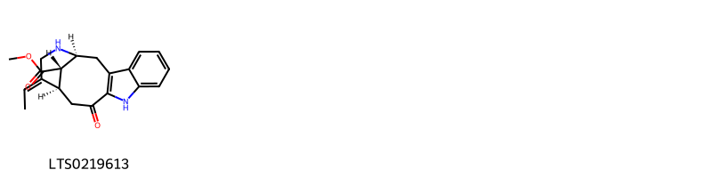{ width=100% }
    <figcaption>Hình ảnh cấu trúc hóa học của 1 hoạt chất thuộc nhóm Vobasan alkaloids gồm ['perivine (LTS0219613)'].</figcaption>
</figure>
#### Nhóm Yohimbine alkaloids
<figure markdown="span">
    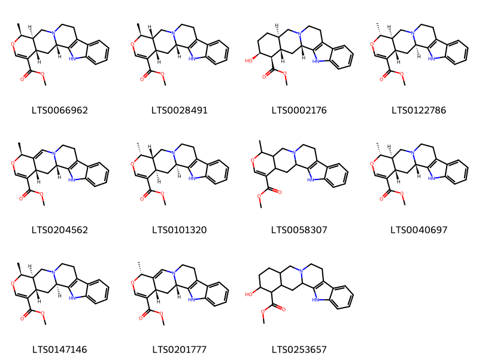{ width=100% }
    <figcaption>Hình ảnh cấu trúc hóa học của 11 hoạt chất thuộc nhóm Yohimbine alkaloids gồm ['substance ii (LTS0066962)', 'tetrahydroalstonine (LTS0028491)', 'yohimbine (LTS0002176)', 'methyl (1r,15r,16r,20s)-16-methyl-17-oxa-3,13-diazapentacyclo[11.8.0.0²,¹⁰.0⁴,⁹.0¹⁵,²⁰]henicosa-2(10),4,6,8,18-pentaene-19-carboxylate (LTS0122786)', 'cathenamine (LTS0204562)', 'methyl (1r,15s,16r,20r)-16-methyl-17-oxa-3,13-diazapentacyclo[11.8.0.0²,¹⁰.0⁴,⁹.0¹⁵,²⁰]henicosa-2(10),4,6,8,18-pentaene-19-carboxylate (LTS0101320)', 'ajmalicine (LTS0058307)', '19-epi-ajmalicine (LTS0040697)', 'methyl (1r,15r,16s,20s)-16-methyl-17-oxa-3,13-diazapentacyclo[11.8.0.0²,¹⁰.0⁴,⁹.0¹⁵,²⁰]henicosa-2(10),4,6,8,18-pentaene-19-carboxylate (LTS0147146)', '19-epi-cathenamine (LTS0201777)', 'yohimbine,α- (LTS0253657)'].</figcaption>
</figure>

---

### Dược dân tộc học

Danh sách các quốc gia có sử dụng *Catharanthus roseus* trong điều trị các bệnh. 

| Country            | Disease                                                             | Bệnh                                                                                                                                                                                                |
|:-------------------|:--------------------------------------------------------------------|:----------------------------------------------------------------------------------------------------------------------------------------------------------------------------------------------------|
| Dominican Republic | Emetic, Purgative, Vermifuge                                        | MYMEMORY WARNING: YOU USED ALL AVAILABLE FREE TRANSLATIONS FOR TODAY. NEXT AVAILABLE IN  11 HOURS 48 MINUTES 25 SECONDS VISIT HTTPS://MYMEMORY.TRANSLATED.NET/DOC/USAGELIMITS.PHP TO TRANSLATE MORE |
| Elsewhere          | nan, Purgative, Sedative, Sedative, Stomachic, Poison, Tranquilizer | MYMEMORY WARNING: YOU USED ALL AVAILABLE FREE TRANSLATIONS FOR TODAY. NEXT AVAILABLE IN  11 HOURS 48 MINUTES 22 SECONDS VISIT HTTPS://MYMEMORY.TRANSLATED.NET/DOC/USAGELIMITS.PHP TO TRANSLATE MORE |
| Haiti              | Hemostat                                                            | MYMEMORY WARNING: YOU USED ALL AVAILABLE FREE TRANSLATIONS FOR TODAY. NEXT AVAILABLE IN  11 HOURS 48 MINUTES 19 SECONDS VISIT HTTPS://MYMEMORY.TRANSLATED.NET/DOC/USAGELIMITS.PHP TO TRANSLATE MORE |
| India              | Cardiotonic                                                         | MYMEMORY WARNING: YOU USED ALL AVAILABLE FREE TRANSLATIONS FOR TODAY. NEXT AVAILABLE IN  11 HOURS 48 MINUTES 16 SECONDS VISIT HTTPS://MYMEMORY.TRANSLATED.NET/DOC/USAGELIMITS.PHP TO TRANSLATE MORE |
| Madagascar         | Hemostat, Purgative, Vermifuge, Emetic                              | MYMEMORY WARNING: YOU USED ALL AVAILABLE FREE TRANSLATIONS FOR TODAY. NEXT AVAILABLE IN  11 HOURS 48 MINUTES 13 SECONDS VISIT HTTPS://MYMEMORY.TRANSLATED.NET/DOC/USAGELIMITS.PHP TO TRANSLATE MORE |
| Philippines        | Emmenagogue                                                         | MYMEMORY WARNING: YOU USED ALL AVAILABLE FREE TRANSLATIONS FOR TODAY. NEXT AVAILABLE IN  11 HOURS 48 MINUTES 09 SECONDS VISIT HTTPS://MYMEMORY.TRANSLATED.NET/DOC/USAGELIMITS.PHP TO TRANSLATE MORE |
| Trinidad           | Sedative, Purgative                                                 | MYMEMORY WARNING: YOU USED ALL AVAILABLE FREE TRANSLATIONS FOR TODAY. NEXT AVAILABLE IN  11 HOURS 48 MINUTES 05 SECONDS VISIT HTTPS://MYMEMORY.TRANSLATED.NET/DOC/USAGELIMITS.PHP TO TRANSLATE MORE |
| anish              | Poison                                                              | MYMEMORY WARNING: YOU USED ALL AVAILABLE FREE TRANSLATIONS FOR TODAY. NEXT AVAILABLE IN  11 HOURS 48 MINUTES 02 SECONDS VISIT HTTPS://MYMEMORY.TRANSLATED.NET/DOC/USAGELIMITS.PHP TO TRANSLATE MORE |

---

# Chi Holarrhena

??? note "Danh sách các dược liệu thuộc chi"
    
	 - *Holarrhena antidysenterica*
	 - *Holarrhena antidysentrica*

---
## Holarrhena antidysenterica
### Thông tin về thực vật

!!! info "Phân loại thực vật của *N/A* từ GIBF:"
    - **Kingdom:** Plantae
    - **Phylum:** Tracheophyta
    - **Order:** Gentianales
    - **Family:** Apocynaceae
    - **Genus:** N/A
    - **Species:** *N/A*

 

| Label (VI)   | Label (EN)   | Scientific Name            | Descriptions (VI)   | Descriptions (EN)   | Also Known As (VI)   | Also Known As (EN)   |
|:-------------|:-------------|:---------------------------|:--------------------|:--------------------|:---------------------|:---------------------|
| N/A          | N/A          | Holarrhena antidysenterica |                     | species of plant    | ['']                 | ['']                 |

#### Phân bố trên thế giới

**Từ CSDL GIBF** Brazil, Guatemala, Viet Nam, Japan, Czechia, Senegal, Botswana, Gambia, New Zealand, Qatar, Zimbabwe, Honduras, Türkiye, Ecuador, Thailand, Spain, Uruguay, Puerto Rico, United States of America, Indonesia, Colombia, Argentina, Aruba, French Guiana, Mexico, Vanuatu, United Kingdom of Great Britain and Northern Ireland, Chinese Taipei, Malaysia, Canada, Namibia, Singapore, Cambodia, Portugal, Ukraine, South Africa, Australia, Italy, India, Peru, France, Ireland

#### Phân bố tại Việt Nam

**Từ CSDL GIBF**: Hồ Chí Minh city

---
### Thành phần hóa học
        
- Theo cơ sở dữ liệu lotus: Từ loài *N/A* đã phân lập và xác định được Chưa có hoạt chất nào được phân lập. hoạt chất thuộc về các nhóm Không có hoạt chất nào được phân lập. 

Không có hình ảnh nào được tạo ra

---

### Dược dân tộc học

Danh sách các quốc gia có sử dụng *N/A* trong điều trị các bệnh. 

| Country        | Disease                                                       | Bệnh                                                                                                                                                                                                |
|:---------------|:--------------------------------------------------------------|:----------------------------------------------------------------------------------------------------------------------------------------------------------------------------------------------------|
| English        | Astringent                                                    | MYMEMORY WARNING: YOU USED ALL AVAILABLE FREE TRANSLATIONS FOR TODAY. NEXT AVAILABLE IN  11 HOURS 46 MINUTES 46 SECONDS VISIT HTTPS://MYMEMORY.TRANSLATED.NET/DOC/USAGELIMITS.PHP TO TRANSLATE MORE |
| India          | Anesthetic, Astringent, nan, Tonic, Vermifuge, nan, Stomachic | MYMEMORY WARNING: YOU USED ALL AVAILABLE FREE TRANSLATIONS FOR TODAY. NEXT AVAILABLE IN  11 HOURS 46 MINUTES 42 SECONDS VISIT HTTPS://MYMEMORY.TRANSLATED.NET/DOC/USAGELIMITS.PHP TO TRANSLATE MORE |
| India(Gujarat) | Rennet                                                        | MYMEMORY WARNING: YOU USED ALL AVAILABLE FREE TRANSLATIONS FOR TODAY. NEXT AVAILABLE IN  11 HOURS 46 MINUTES 39 SECONDS VISIT HTTPS://MYMEMORY.TRANSLATED.NET/DOC/USAGELIMITS.PHP TO TRANSLATE MORE |
| India(Santal)  | Laxative                                                      | MYMEMORY WARNING: YOU USED ALL AVAILABLE FREE TRANSLATIONS FOR TODAY. NEXT AVAILABLE IN  11 HOURS 46 MINUTES 36 SECONDS VISIT HTTPS://MYMEMORY.TRANSLATED.NET/DOC/USAGELIMITS.PHP TO TRANSLATE MORE |

---

---
## Holarrhena antidysentrica
### Thông tin về thực vật

!!! info "Phân loại thực vật của *N/A* từ GIBF:"
    - **Kingdom:** Plantae
    - **Phylum:** Tracheophyta
    - **Order:** Gentianales
    - **Family:** Apocynaceae
    - **Genus:** N/A
    - **Species:** *N/A*

 

| Label (VI)   | Label (EN)   | Scientific Name            | Descriptions (VI)   | Descriptions (EN)   | Also Known As (VI)   | Also Known As (EN)   |
|:-------------|:-------------|:---------------------------|:--------------------|:--------------------|:---------------------|:---------------------|
| N/A          | N/A          | Holarrhena antidysenterica |                     | species of plant    | ['']                 | ['']                 |

#### Phân bố trên thế giới

**Từ CSDL GIBF** Brazil, Guatemala, Viet Nam, Japan, Czechia, Senegal, Botswana, Gambia, New Zealand, Qatar, Zimbabwe, Honduras, Türkiye, Ecuador, Thailand, Spain, Uruguay, Puerto Rico, United States of America, Indonesia, Colombia, Argentina, Aruba, French Guiana, Mexico, Vanuatu, United Kingdom of Great Britain and Northern Ireland, Chinese Taipei, Malaysia, Canada, Namibia, Singapore, Cambodia, Portugal, Ukraine, South Africa, Australia, Italy, India, Peru, France, Ireland

#### Phân bố tại Việt Nam

**Từ CSDL GIBF**: Hồ Chí Minh city

---
### Thành phần hóa học
        
- Theo cơ sở dữ liệu lotus: Từ loài *N/A* đã phân lập và xác định được Chưa có hoạt chất nào được phân lập. hoạt chất thuộc về các nhóm Không có hoạt chất nào được phân lập. 

Không có hình ảnh nào được tạo ra

---

### Dược dân tộc học

Danh sách các quốc gia có sử dụng *N/A* trong điều trị các bệnh. 

| Country   | Disease                             | Bệnh                                                                                                                                                                                                |
|:----------|:------------------------------------|:----------------------------------------------------------------------------------------------------------------------------------------------------------------------------------------------------|
| Arabic    | Astringent, nan                     | MYMEMORY WARNING: YOU USED ALL AVAILABLE FREE TRANSLATIONS FOR TODAY. NEXT AVAILABLE IN  11 HOURS 46 MINUTES 08 SECONDS VISIT HTTPS://MYMEMORY.TRANSLATED.NET/DOC/USAGELIMITS.PHP TO TRANSLATE MORE |
| Hindu     | Aphrodisiac, nan, Tonic, Astringent | MYMEMORY WARNING: YOU USED ALL AVAILABLE FREE TRANSLATIONS FOR TODAY. NEXT AVAILABLE IN  11 HOURS 46 MINUTES 03 SECONDS VISIT HTTPS://MYMEMORY.TRANSLATED.NET/DOC/USAGELIMITS.PHP TO TRANSLATE MORE |

---

# Chi Couma

??? note "Danh sách các dược liệu thuộc chi"
    
	 - *Couma utilis*

---
## Couma utilis
### Thông tin về thực vật

!!! info "Phân loại thực vật của *Couma utilis* từ GIBF:"
    - **Kingdom:** Plantae
    - **Phylum:** Tracheophyta
    - **Order:** Gentianales
    - **Family:** Apocynaceae
    - **Genus:** Couma
    - **Species:** *Couma utilis*

 

| Label (VI)   | Label (EN)   | Scientific Name   | Descriptions (VI)   | Descriptions (EN)   | Also Known As (VI)   | Also Known As (EN)   |
|:-------------|:-------------|:------------------|:--------------------|:--------------------|:---------------------|:---------------------|
| N/A          | N/A          | Couma utilis      | loài thực vật       | species of plant    | ['']                 | ['']                 |

#### Phân bố trên thế giới

**Từ CSDL GIBF** Colombia, nan, Brazil, Venezuela (Bolivarian Republic of)

#### Phân bố tại Việt Nam

**Từ CSDL GIBF**: Không có ghi nhận ở Việt Nam

---
### Thành phần hóa học
        
- Theo cơ sở dữ liệu lotus: Từ loài *Couma utilis* đã phân lập và xác định được Chưa có hoạt chất nào được phân lập. hoạt chất thuộc về các nhóm Không có hoạt chất nào được phân lập. 

Không có hình ảnh nào được tạo ra

---

### Dược dân tộc học

Danh sách các quốc gia có sử dụng *Couma utilis* trong điều trị các bệnh. 

| Country   | Disease      | Bệnh                                                                                                                                                                                                |
|:----------|:-------------|:----------------------------------------------------------------------------------------------------------------------------------------------------------------------------------------------------|
| Brazil    | Parasiticide | MYMEMORY WARNING: YOU USED ALL AVAILABLE FREE TRANSLATIONS FOR TODAY. NEXT AVAILABLE IN  11 HOURS 45 MINUTES 25 SECONDS VISIT HTTPS://MYMEMORY.TRANSLATED.NET/DOC/USAGELIMITS.PHP TO TRANSLATE MORE |

---

# Chi Carissa

??? note "Danh sách các dược liệu thuộc chi"
    
	 - *Carissa carandas*
	 - *Carissa edulis*
	 - *Carissa inarum*

---
## Carissa carandas
### Thông tin về thực vật

!!! info "Phân loại thực vật của *Carissa carandas* từ GIBF:"
    - **Kingdom:** Plantae
    - **Phylum:** Tracheophyta
    - **Order:** Gentianales
    - **Family:** Apocynaceae
    - **Genus:** Carissa
    - **Species:** *Carissa carandas*

 

| Label (VI)   | Label (EN)   | Scientific Name   | Descriptions (VI)   | Descriptions (EN)   | Also Known As (VI)   | Also Known As (EN)                                                                     |
|:-------------|:-------------|:------------------|:--------------------|:--------------------|:---------------------|:---------------------------------------------------------------------------------------|
| N/A          | N/A          | Carissa carandas  | loài thực vật       | species of plant    | ['']                 | ['Bengal currant', 'carandas plum', 'karanda', 'karonda', "Natal Plum/Christ's Thorn"] |

#### Phân bố trên thế giới

**Từ CSDL GIBF** Sri Lanka, Singapore, Viet Nam, Indonesia, Malaysia, Philippines, Pakistan, Mauritius, Chinese Taipei, Bangladesh, Myanmar, India, Thailand, Lao People’s Democratic Republic

#### Phân bố tại Việt Nam

**Từ CSDL GIBF**: Không có ghi nhận ở Việt Nam

---
### Thành phần hóa học
        
- Theo cơ sở dữ liệu lotus: Từ loài *Carissa carandas* đã phân lập và xác định được 13 hoạt chất thuộc về các nhóm Prenol lipids, Organooxygen compounds, Furanoid lignans, Dibenzylbutane lignans. 

|    | chemicalTaxonomyClassyfireClass   |   smiles_count |
|---:|:----------------------------------|---------------:|
|  0 | Dibenzylbutane lignans            |              2 |
|  1 | Furanoid lignans                  |              4 |
|  2 | Organooxygen compounds            |              3 |
|  3 | Prenol lipids                     |              4 |

#### Nhóm Dibenzylbutane lignans
<figure markdown="span">
    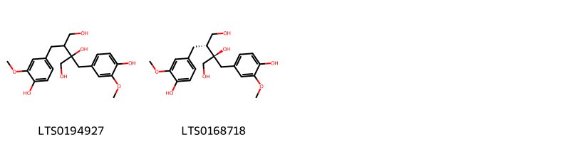{ width=100% }
    <figcaption>Hình ảnh cấu trúc hóa học của 2 hoạt chất thuộc nhóm Dibenzylbutane lignans gồm ['2,3-bis[(4-hydroxy-3-methoxyphenyl)methyl]butane-1,2,4-triol (LTS0194927)', '(2r,3r)-2,3-bis[(4-hydroxy-3-methoxyphenyl)methyl]butane-1,2,4-triol (LTS0168718)'].</figcaption>
</figure>
#### Nhóm Furanoid lignans
<figure markdown="span">
    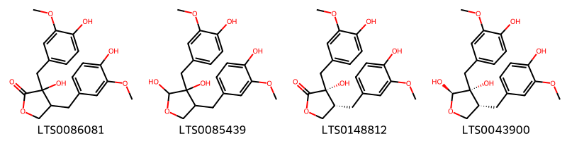{ width=100% }
    <figcaption>Hình ảnh cấu trúc hóa học của 4 hoạt chất thuộc nhóm Furanoid lignans gồm ['3-hydroxy-3,4-bis[(4-hydroxy-3-methoxyphenyl)methyl]oxolan-2-one (LTS0086081)', '3,4-bis[(4-hydroxy-3-methoxyphenyl)methyl]oxolane-2,3-diol (LTS0085439)', 'wikstromol (LTS0148812)', '(2r,3r,4r)-3,4-bis[(4-hydroxy-3-methoxyphenyl)methyl]oxolane-2,3-diol (LTS0043900)'].</figcaption>
</figure>
#### Nhóm Organooxygen compounds
<figure markdown="span">
    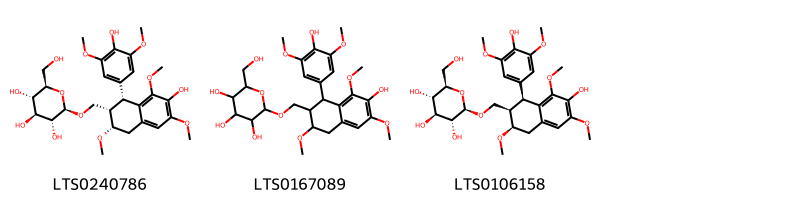{ width=100% }
    <figcaption>Hình ảnh cấu trúc hóa học của 3 hoạt chất thuộc nhóm Organooxygen compounds gồm ['(2r,3r,4s,5s,6r)-2-{[(1r,2s,3s)-7-hydroxy-1-(4-hydroxy-3,5-dimethoxyphenyl)-3,6,8-trimethoxy-1,2,3,4-tetrahydronaphthalen-2-yl]methoxy}-6-(hydroxymethyl)oxane-3,4,5-triol (LTS0240786)', '2-{[7-hydroxy-1-(4-hydroxy-3,5-dimethoxyphenyl)-3,6,8-trimethoxy-1,2,3,4-tetrahydronaphthalen-2-yl]methoxy}-6-(hydroxymethyl)oxane-3,4,5-triol (LTS0167089)', '(2r,3r,4s,5s,6r)-2-{[(1s,2r,3r)-7-hydroxy-1-(4-hydroxy-3,5-dimethoxyphenyl)-3,6,8-trimethoxy-1,2,3,4-tetrahydronaphthalen-2-yl]methoxy}-6-(hydroxymethyl)oxane-3,4,5-triol (LTS0106158)'].</figcaption>
</figure>
#### Nhóm Prenol lipids
<figure markdown="span">
    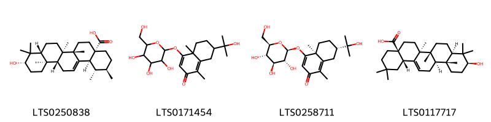{ width=100% }
    <figcaption>Hình ảnh cấu trúc hóa học của 4 hoạt chất thuộc nhóm Prenol lipids gồm ['ursolic acid (LTS0250838)', '7-(2-hydroxypropan-2-yl)-1,4a-dimethyl-4-{[3,4,5-trihydroxy-6-(hydroxymethyl)oxan-2-yl]oxy}-5,6,7,8-tetrahydronaphthalen-2-one (LTS0171454)', '(4as,7s)-7-(2-hydroxypropan-2-yl)-1,4a-dimethyl-4-{[(2s,3r,4s,5s,6r)-3,4,5-trihydroxy-6-(hydroxymethyl)oxan-2-yl]oxy}-5,6,7,8-tetrahydronaphthalen-2-one (LTS0258711)', 'oleanolic acid (LTS0117717)'].</figcaption>
</figure>

---

### Dược dân tộc học

Danh sách các quốc gia có sử dụng *Carissa carandas* trong điều trị các bệnh. 

| Country   | Disease              | Bệnh                                                                                                                                                                                                |
|:----------|:---------------------|:----------------------------------------------------------------------------------------------------------------------------------------------------------------------------------------------------|
| Elsewhere | Vermifuge, Stomachic | MYMEMORY WARNING: YOU USED ALL AVAILABLE FREE TRANSLATIONS FOR TODAY. NEXT AVAILABLE IN  11 HOURS 44 MINUTES 58 SECONDS VISIT HTTPS://MYMEMORY.TRANSLATED.NET/DOC/USAGELIMITS.PHP TO TRANSLATE MORE |

---

---
## Carissa edulis
### Thông tin về thực vật

!!! info "Phân loại thực vật của *Carissa spinarum* từ GIBF:"
    - **Kingdom:** Plantae
    - **Phylum:** Tracheophyta
    - **Order:** Gentianales
    - **Family:** Apocynaceae
    - **Genus:** Carissa
    - **Species:** *Carissa spinarum*

 

| Label (VI)   | Label (EN)   | Scientific Name   | Descriptions (VI)   | Descriptions (EN)   | Also Known As (VI)   | Also Known As (EN)   |
|:-------------|:-------------|:------------------|:--------------------|:--------------------|:---------------------|:---------------------|
| N/A          | N/A          | Carissa edulis    | loài thực vật       | species of plant    | ['']                 | ['Carissa spinarum'] |

#### Phân bố trên thế giới

**Từ CSDL GIBF** Benin, Kenya, Saudi Arabia, South Africa, Côte d’Ivoire, Oman, Nigeria, Tanzania, United Republic of, Angola, Ethiopia, Togo, Madagascar

#### Phân bố tại Việt Nam

**Từ CSDL GIBF**: Không có ghi nhận ở Việt Nam

---
### Thành phần hóa học
        
- Theo cơ sở dữ liệu lotus: Từ loài *Carissa spinarum* đã phân lập và xác định được 43 hoạt chất thuộc về các nhóm Fatty Acyls, Flavonoids, Dibenzylbutane lignans, Coumarins and derivatives, Phenols, Organooxygen compounds, Tetralins, Furanoid lignans, Prenol lipids. 

|    | chemicalTaxonomyClassyfireClass   |   smiles_count |
|---:|:----------------------------------|---------------:|
|  0 | Coumarins and derivatives         |              2 |
|  1 | Dibenzylbutane lignans            |              4 |
|  2 | Fatty Acyls                       |              1 |
|  3 | Flavonoids                        |              2 |
|  4 | Furanoid lignans                  |              8 |
|  5 | Organooxygen compounds            |              7 |
|  6 | Phenols                           |              3 |
|  7 | Prenol lipids                     |             14 |
|  8 | Tetralins                         |              2 |

#### Nhóm Coumarins and derivatives
<figure markdown="span">
    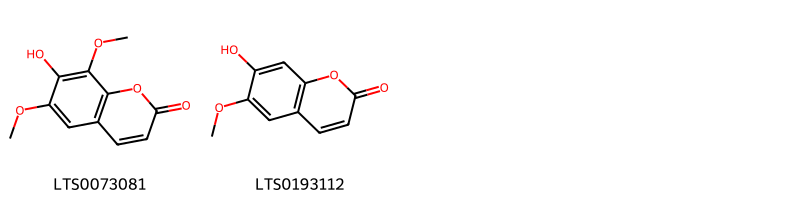{ width=100% }
    <figcaption>Hình ảnh cấu trúc hóa học của 2 hoạt chất thuộc nhóm Coumarins and derivatives gồm ['isofraxidin (LTS0073081)', 'scopoletin (LTS0193112)'].</figcaption>
</figure>
#### Nhóm Dibenzylbutane lignans
<figure markdown="span">
    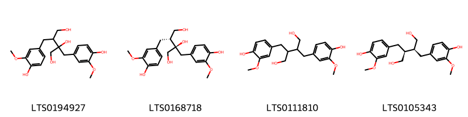{ width=100% }
    <figcaption>Hình ảnh cấu trúc hóa học của 4 hoạt chất thuộc nhóm Dibenzylbutane lignans gồm ['2,3-bis[(4-hydroxy-3-methoxyphenyl)methyl]butane-1,2,4-triol (LTS0194927)', '(2r,3r)-2,3-bis[(4-hydroxy-3-methoxyphenyl)methyl]butane-1,2,4-triol (LTS0168718)', 'secoisolariciresinol (LTS0111810)', '(+)-secoisolariciresinol (LTS0105343)'].</figcaption>
</figure>
#### Nhóm Fatty Acyls
<figure markdown="span">
    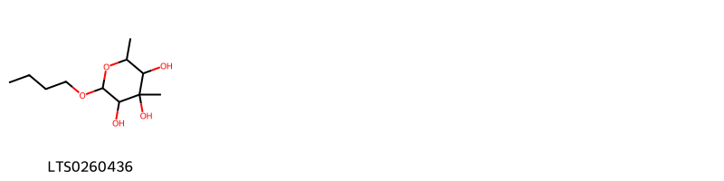{ width=100% }
    <figcaption>Hình ảnh cấu trúc hóa học của 1 hoạt chất thuộc nhóm Fatty Acyls gồm ['2-butoxy-4,6-dimethyloxane-3,4,5-triol (LTS0260436)'].</figcaption>
</figure>
#### Nhóm Flavonoids
<figure markdown="span">
    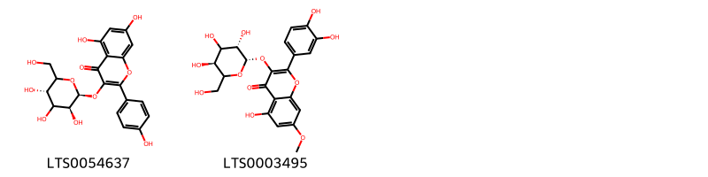{ width=100% }
    <figcaption>Hình ảnh cấu trúc hóa học của 2 hoạt chất thuộc nhóm Flavonoids gồm ['5,7-dihydroxy-2-(4-hydroxyphenyl)-3-{[(2s,3s,5s)-3,4,5-trihydroxy-6-(hydroxymethyl)oxan-2-yl]oxy}chromen-4-one (LTS0054637)', '2-(3,4-dihydroxyphenyl)-5-hydroxy-7-methoxy-3-{[(2s,3s,5s)-3,4,5-trihydroxy-6-(hydroxymethyl)oxan-2-yl]oxy}chromen-4-one (LTS0003495)'].</figcaption>
</figure>
#### Nhóm Furanoid lignans
<figure markdown="span">
    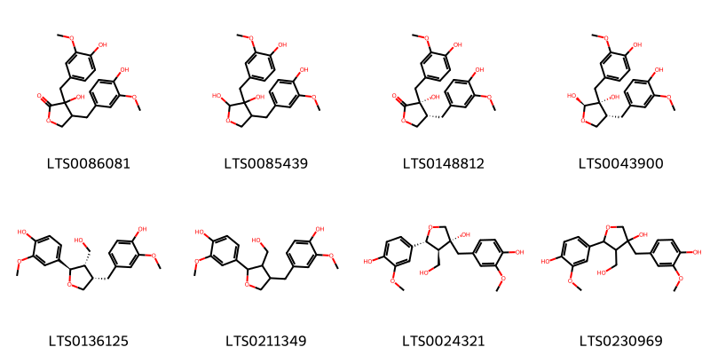{ width=100% }
    <figcaption>Hình ảnh cấu trúc hóa học của 8 hoạt chất thuộc nhóm Furanoid lignans gồm ['3-hydroxy-3,4-bis[(4-hydroxy-3-methoxyphenyl)methyl]oxolan-2-one (LTS0086081)', '3,4-bis[(4-hydroxy-3-methoxyphenyl)methyl]oxolane-2,3-diol (LTS0085439)', 'wikstromol (LTS0148812)', '(2r,3r,4r)-3,4-bis[(4-hydroxy-3-methoxyphenyl)methyl]oxolane-2,3-diol (LTS0043900)', '(-)-lariciresinol (LTS0136125)', '4-{4-[(4-hydroxy-3-methoxyphenyl)methyl]-3-(hydroxymethyl)oxolan-2-yl}-2-methoxyphenol (LTS0211349)', '(3r,4s,5r)-5-(4-hydroxy-3-methoxyphenyl)-3-[(4-hydroxy-3-methoxyphenyl)methyl]-4-(hydroxymethyl)oxolan-3-ol (LTS0024321)', '5-(4-hydroxy-3-methoxyphenyl)-3-[(4-hydroxy-3-methoxyphenyl)methyl]-4-(hydroxymethyl)oxolan-3-ol (LTS0230969)'].</figcaption>
</figure>
#### Nhóm Organooxygen compounds
<figure markdown="span">
    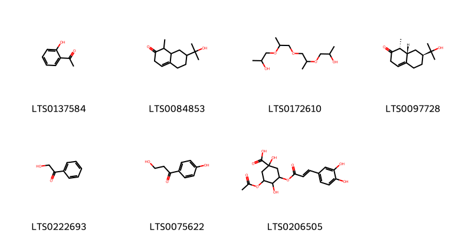{ width=100% }
    <figcaption>Hình ảnh cấu trúc hóa học của 7 hoạt chất thuộc nhóm Organooxygen compounds gồm ['o-acetylphenol (LTS0137584)', '7-(2-hydroxypropan-2-yl)-1-methyl-3,5,6,7,8,8a-hexahydro-1h-naphthalen-2-one (LTS0084853)', '1-({1-[2-(2-hydroxypropoxy)propoxy]propan-2-yl}oxy)propan-2-ol (LTS0172610)', '(1r,7s,8as)-7-(2-hydroxypropan-2-yl)-1-methyl-3,5,6,7,8,8a-hexahydro-1h-naphthalen-2-one (LTS0097728)', '2-hydroxyacetophenone (LTS0222693)', '3-hydroxy-1-(4-hydroxyphenyl)propan-1-one (LTS0075622)', '3-(acetyloxy)-5-{[(2e)-3-(3,4-dihydroxyphenyl)prop-2-enoyl]oxy}-1,4-dihydroxycyclohexane-1-carboxylic acid (LTS0206505)'].</figcaption>
</figure>
#### Nhóm Phenols
<figure markdown="span">
    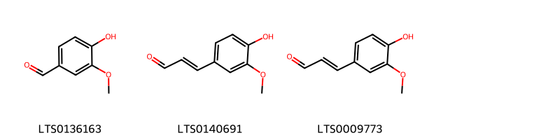{ width=100% }
    <figcaption>Hình ảnh cấu trúc hóa học của 3 hoạt chất thuộc nhóm Phenols gồm ['vanillin (LTS0136163)', 'coniferyl aldehyde (LTS0140691)', 'coniferaldehyde (LTS0009773)'].</figcaption>
</figure>
#### Nhóm Prenol lipids
<figure markdown="span">
    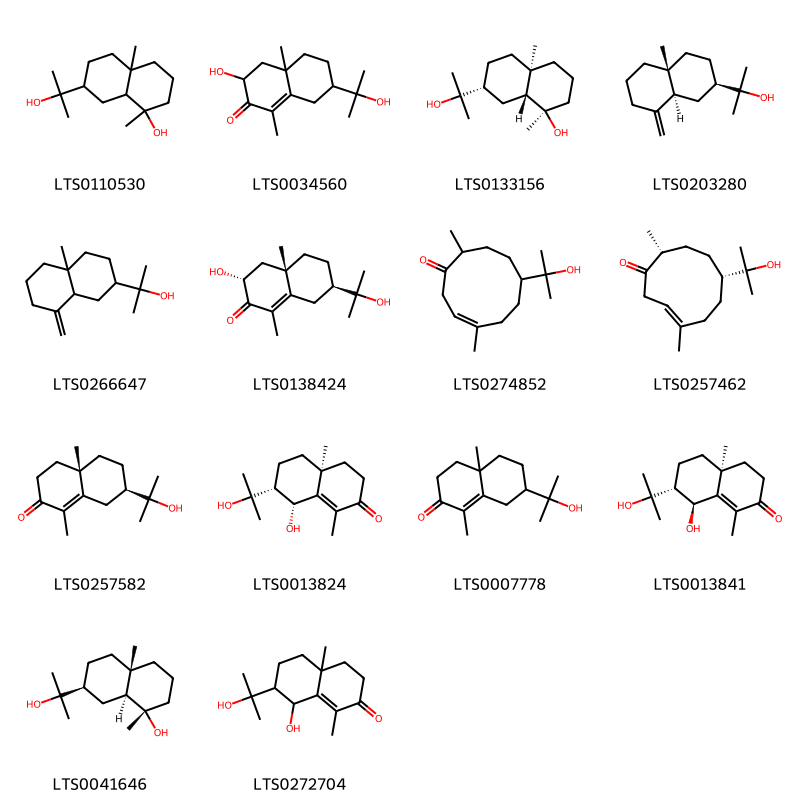{ width=100% }
    <figcaption>Hình ảnh cấu trúc hóa học của 14 hoạt chất thuộc nhóm Prenol lipids gồm ['7-(2-hydroxypropan-2-yl)-1,4a-dimethyl-octahydronaphthalen-1-ol (LTS0110530)', '3-hydroxy-7-(2-hydroxypropan-2-yl)-1,4a-dimethyl-3,4,5,6,7,8-hexahydronaphthalen-2-one (LTS0034560)', 'proximadiol (LTS0133156)', 'β-eudesmol (LTS0203280)', 'β-eudesmol (LTS0266647)', '(3r,4as,7r)-3-hydroxy-7-(2-hydroxypropan-2-yl)-1,4a-dimethyl-3,4,5,6,7,8-hexahydronaphthalen-2-one (LTS0138424)', '(3z)-7-(2-hydroxypropan-2-yl)-4,10-dimethylcyclodec-3-en-1-one (LTS0274852)', '(3e,7s,10r)-7-(2-hydroxypropan-2-yl)-4,10-dimethylcyclodec-3-en-1-one (LTS0257462)', '(4as,7r)-7-(2-hydroxypropan-2-yl)-1,4a-dimethyl-3,4,5,6,7,8-hexahydronaphthalen-2-one (LTS0257582)', '(4as,7r,8r)-8-hydroxy-7-(2-hydroxypropan-2-yl)-1,4a-dimethyl-3,4,5,6,7,8-hexahydronaphthalen-2-one (LTS0013824)', '7-(2-hydroxypropan-2-yl)-1,4a-dimethyl-3,4,5,6,7,8-hexahydronaphthalen-2-one (LTS0007778)', '(4as,7r,8s)-8-hydroxy-7-(2-hydroxypropan-2-yl)-1,4a-dimethyl-3,4,5,6,7,8-hexahydronaphthalen-2-one (LTS0013841)', '(+)-4-epi-cryptomeridiol (LTS0041646)', '8-hydroxy-7-(2-hydroxypropan-2-yl)-1,4a-dimethyl-3,4,5,6,7,8-hexahydronaphthalen-2-one (LTS0272704)'].</figcaption>
</figure>
#### Nhóm Tetralins
<figure markdown="span">
    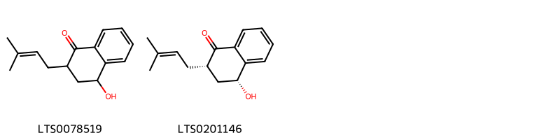{ width=100% }
    <figcaption>Hình ảnh cấu trúc hóa học của 2 hoạt chất thuộc nhóm Tetralins gồm ['4-hydroxy-2-(3-methylbut-2-en-1-yl)-3,4-dihydro-2h-naphthalen-1-one (LTS0078519)', '(2s,4r)-4-hydroxy-2-(3-methylbut-2-en-1-yl)-3,4-dihydro-2h-naphthalen-1-one (LTS0201146)'].</figcaption>
</figure>

---

### Dược dân tộc học

Danh sách các quốc gia có sử dụng *Carissa spinarum* trong điều trị các bệnh. 

| Country   | Disease            | Bệnh                                                                                                                                                                                                |
|:----------|:-------------------|:----------------------------------------------------------------------------------------------------------------------------------------------------------------------------------------------------|
| E Africa  | Abortifacient      | MYMEMORY WARNING: YOU USED ALL AVAILABLE FREE TRANSLATIONS FOR TODAY. NEXT AVAILABLE IN  11 HOURS 44 MINUTES 04 SECONDS VISIT HTTPS://MYMEMORY.TRANSLATED.NET/DOC/USAGELIMITS.PHP TO TRANSLATE MORE |
| Ghana     | Aphrodisiac, Tonic | MYMEMORY WARNING: YOU USED ALL AVAILABLE FREE TRANSLATIONS FOR TODAY. NEXT AVAILABLE IN  11 HOURS 44 MINUTES 01 SECONDS VISIT HTTPS://MYMEMORY.TRANSLATED.NET/DOC/USAGELIMITS.PHP TO TRANSLATE MORE |
| Malawi    | Vermifuge          | MYMEMORY WARNING: YOU USED ALL AVAILABLE FREE TRANSLATIONS FOR TODAY. NEXT AVAILABLE IN  11 HOURS 43 MINUTES 58 SECONDS VISIT HTTPS://MYMEMORY.TRANSLATED.NET/DOC/USAGELIMITS.PHP TO TRANSLATE MORE |
| Tanzania  | Vermifuge          | MYMEMORY WARNING: YOU USED ALL AVAILABLE FREE TRANSLATIONS FOR TODAY. NEXT AVAILABLE IN  11 HOURS 43 MINUTES 55 SECONDS VISIT HTTPS://MYMEMORY.TRANSLATED.NET/DOC/USAGELIMITS.PHP TO TRANSLATE MORE |

---

---
## Carissa inarum
### Thông tin về thực vật

!!! info "Phân loại thực vật của *N/A* từ GIBF:"
    - **Kingdom:** N/A
    - **Phylum:** N/A
    - **Order:** N/A
    - **Family:** N/A
    - **Genus:** N/A
    - **Species:** *N/A*

 

| Label (VI)   | Label (EN)   | Scientific Name   | Descriptions (VI)   | Descriptions (EN)   | Also Known As (VI)   | Also Known As (EN)   |
|:-------------|:-------------|:------------------|:--------------------|:--------------------|:---------------------|:---------------------|
| N/A          | N/A          | Carissa edulis    | loài thực vật       | species of plant    | ['']                 | ['Carissa spinarum'] |

#### Phân bố trên thế giới

**Từ CSDL GIBF** Không có kết quả phù hợp

#### Phân bố tại Việt Nam

**Từ CSDL GIBF**: Không có ghi nhận ở Việt Nam

---
### Thành phần hóa học
        
- Theo cơ sở dữ liệu lotus: Từ loài *N/A* đã phân lập và xác định được Chưa có hoạt chất nào được phân lập. hoạt chất thuộc về các nhóm Không có hoạt chất nào được phân lập. 

Không có hình ảnh nào được tạo ra

---

### Dược dân tộc học

Danh sách các quốc gia có sử dụng *N/A* trong điều trị các bệnh. 

| Country   | Disease   | Bệnh                                                                                                                                                                                                |
|:----------|:----------|:----------------------------------------------------------------------------------------------------------------------------------------------------------------------------------------------------|
| Elsewhere | Purgative | MYMEMORY WARNING: YOU USED ALL AVAILABLE FREE TRANSLATIONS FOR TODAY. NEXT AVAILABLE IN  11 HOURS 43 MINUTES 25 SECONDS VISIT HTTPS://MYMEMORY.TRANSLATED.NET/DOC/USAGELIMITS.PHP TO TRANSLATE MORE |

---

# Chi Haplophyton

??? note "Danh sách các dược liệu thuộc chi"
    
	 - *Haplophyton cimicidum*

---
## Haplophyton cimicidum
### Thông tin về thực vật

!!! info "Phân loại thực vật của *Haplophyton cimicidum* từ GIBF:"
    - **Kingdom:** Plantae
    - **Phylum:** Tracheophyta
    - **Order:** Gentianales
    - **Family:** Apocynaceae
    - **Genus:** Haplophyton
    - **Species:** *Haplophyton cimicidum*

 

| Label (VI)   | Label (EN)   | Scientific Name       | Descriptions (VI)   | Descriptions (EN)   | Also Known As (VI)   | Also Known As (EN)   |
|:-------------|:-------------|:----------------------|:--------------------|:--------------------|:---------------------|:---------------------|
| N/A          | N/A          | Haplophyton cimicidum | loài thực vật       | species of plant    | ['']                 | ['']                 |

#### Phân bố trên thế giới

**Từ CSDL GIBF** Mexico, Guatemala, United States of America

#### Phân bố tại Việt Nam

**Từ CSDL GIBF**: Không có ghi nhận ở Việt Nam

---
### Thành phần hóa học
        
- Theo cơ sở dữ liệu lotus: Từ loài *Haplophyton cimicidum* đã phân lập và xác định được 49 hoạt chất thuộc về các nhóm Quinolines and derivatives, Yohimbine alkaloids, Macroline alkaloids, Prenol lipids, Indolonaphthyridine alkaloids, Strychnos alkaloids, Indoles and derivatives. 

|    | chemicalTaxonomyClassyfireClass   |   smiles_count |
|---:|:----------------------------------|---------------:|
|  0 | Indoles and derivatives           |             13 |
|  1 | Indolonaphthyridine alkaloids     |             13 |
|  2 | Macroline alkaloids               |              4 |
|  3 | Prenol lipids                     |              4 |
|  4 | Quinolines and derivatives        |              2 |
|  5 | Strychnos alkaloids               |              5 |
|  6 | Yohimbine alkaloids               |              5 |

#### Nhóm Indoles and derivatives
<figure markdown="span">
    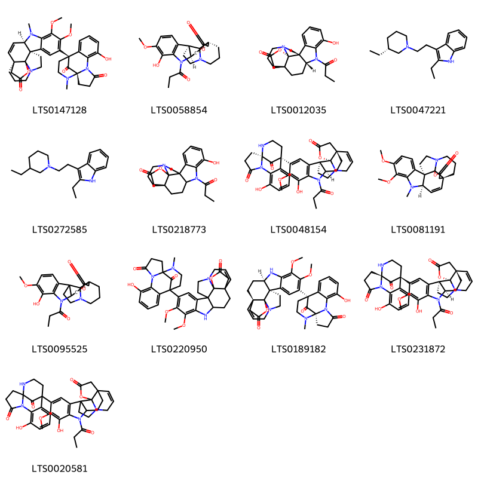{ width=100% }
    <figcaption>Hình ảnh cấu trúc hóa học của 13 hoạt chất thuộc nhóm Indoles and derivatives gồm ['haplophytine (LTS0147128)', '(1r,4r,12r,16s)-7-hydroxy-8-methoxy-5-propanoyl-17-oxa-5,15-diazahexacyclo[13.4.3.0¹,¹⁶.0⁴,¹².0⁶,¹¹.0¹²,¹⁶]docosa-6(11),7,9-trien-18-one (LTS0058854)', '(1r,4r,12r,16s)-7-hydroxy-5-propanoyl-17-oxa-5,15-diazahexacyclo[13.4.3.0¹,¹⁶.0⁴,¹².0⁶,¹¹.0¹²,¹⁶]docosa-6,8,10-trien-18-one (LTS0012035)', '2-ethyl-3-{2-[(3r)-3-ethylpiperidin-1-yl]ethyl}-1h-indole (LTS0047221)', '2-ethyl-3-[2-(3-ethylpiperidin-1-yl)ethyl]-1h-indole (LTS0272585)', '7-hydroxy-5-propanoyl-17-oxa-5,15-diazahexacyclo[13.4.3.0¹,¹⁶.0⁴,¹².0⁶,¹¹.0¹²,¹⁶]docosa-6,8,10-trien-18-one (LTS0218773)', '(1r,12s)-7-hydroxy-12-[(1r,4r,12r,16s)-7-hydroxy-8-methoxy-18-oxo-5-propanoyl-17-oxa-5,15-diazahexacyclo[13.4.3.0¹,¹⁶.0⁴,¹².0⁶,¹¹.0¹²,¹⁶]docosa-6(11),7,9,20-tetraen-9-yl]-5,15-diazatetracyclo[10.3.1.0¹,⁵.0⁶,¹¹]hexadeca-6,8,10-triene-4,16-dione (LTS0048154)', 'aspidophytine (LTS0081191)', '7-hydroxy-8-methoxy-5-propanoyl-17-oxa-5,15-diazahexacyclo[13.4.3.0¹,¹⁶.0⁴,¹².0⁶,¹¹.0¹²,¹⁶]docosa-6(11),7,9-trien-18-one (LTS0095525)', '12-{7,8-dimethoxy-18-oxo-17-oxa-5,15-diazahexacyclo[13.4.3.0¹,¹⁶.0⁴,¹².0⁶,¹¹.0¹²,¹⁶]docosa-6,8,10,20-tetraen-9-yl}-7-hydroxy-15-methyl-5,15-diazatetracyclo[10.3.1.0¹,⁵.0⁶,¹¹]hexadeca-6,8,10-triene-4,16-dione (LTS0220950)', '(1r,12s)-12-[(1r,4r,12r,16s)-7,8-dimethoxy-18-oxo-17-oxa-5,15-diazahexacyclo[13.4.3.0¹,¹⁶.0⁴,¹².0⁶,¹¹.0¹²,¹⁶]docosa-6,8,10,20-tetraen-9-yl]-7-hydroxy-15-methyl-5,15-diazatetracyclo[10.3.1.0¹,⁵.0⁶,¹¹]hexadeca-6,8,10-triene-4,16-dione (LTS0189182)', '(1s,12r)-7-hydroxy-12-[(1r,4r,12r,16s)-7-hydroxy-8-methoxy-18-oxo-5-propanoyl-17-oxa-5,15-diazahexacyclo[13.4.3.0¹,¹⁶.0⁴,¹².0⁶,¹¹.0¹²,¹⁶]docosa-6(11),7,9,20-tetraen-9-yl]-5,15-diazatetracyclo[10.3.1.0¹,⁵.0⁶,¹¹]hexadeca-6,8,10-triene-4,16-dione (LTS0231872)', '7-hydroxy-12-{7-hydroxy-8-methoxy-18-oxo-5-propanoyl-17-oxa-5,15-diazahexacyclo[13.4.3.0¹,¹⁶.0⁴,¹².0⁶,¹¹.0¹²,¹⁶]docosa-6(11),7,9,20-tetraen-9-yl}-5,15-diazatetracyclo[10.3.1.0¹,⁵.0⁶,¹¹]hexadeca-6,8,10-triene-4,16-dione (LTS0020581)'].</figcaption>
</figure>
#### Nhóm Indolonaphthyridine alkaloids
<figure markdown="span">
    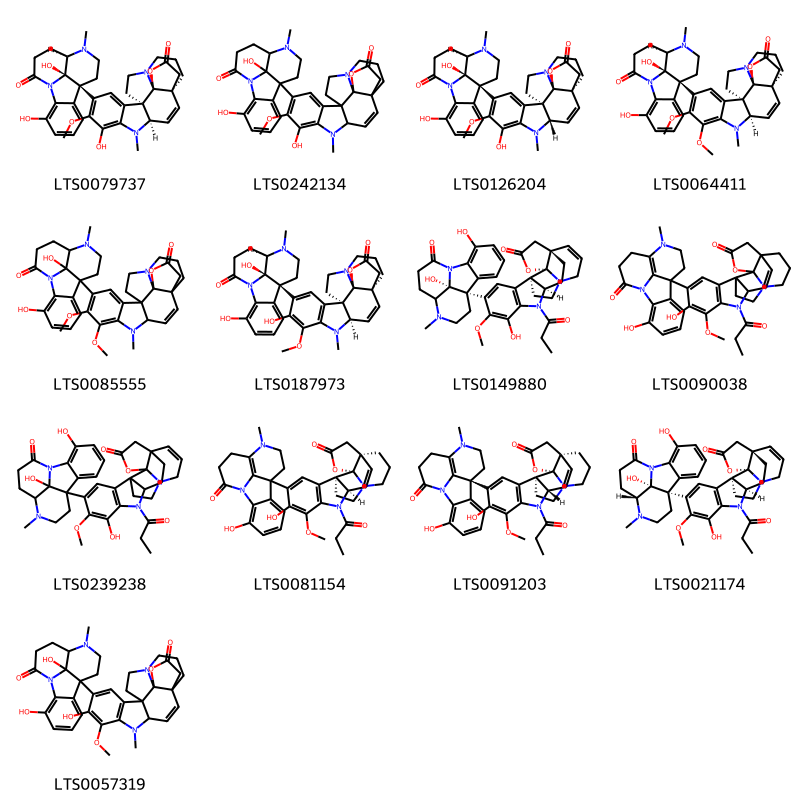{ width=100% }
    <figcaption>Hình ảnh cấu trúc hóa học của 13 hoạt chất thuộc nhóm Indolonaphthyridine alkaloids gồm ['(1s,4r,12r,16s)-9-[(5r,9r,16r)-14,16-dihydroxy-6-methyl-2-oxo-1,6-diazatetracyclo[7.6.1.0⁵,¹⁶.0¹⁰,¹⁵]hexadeca-10,12,14-trien-9-yl]-7-hydroxy-8-methoxy-5-methyl-17-oxa-5,15-diazahexacyclo[13.4.3.0¹,¹⁶.0⁴,¹².0⁶,¹¹.0¹²,¹⁶]docosa-2,6,8,10-tetraen-18-one (LTS0079737)', '9-{14,16-dihydroxy-6-methyl-2-oxo-1,6-diazatetracyclo[7.6.1.0⁵,¹⁶.0¹⁰,¹⁵]hexadeca-10,12,14-trien-9-yl}-7-hydroxy-8-methoxy-5-methyl-17-oxa-5,15-diazahexacyclo[13.4.3.0¹,¹⁶.0⁴,¹².0⁶,¹¹.0¹²,¹⁶]docosa-2,6,8,10-tetraen-18-one (LTS0242134)', '(1s,4s,12r,16s)-9-[(5r,9r,16r)-14,16-dihydroxy-6-methyl-2-oxo-1,6-diazatetracyclo[7.6.1.0⁵,¹⁶.0¹⁰,¹⁵]hexadeca-10,12,14-trien-9-yl]-7-hydroxy-8-methoxy-5-methyl-17-oxa-5,15-diazahexacyclo[13.4.3.0¹,¹⁶.0⁴,¹².0⁶,¹¹.0¹²,¹⁶]docosa-2,6,8,10-tetraen-18-one (LTS0126204)', '(1s,4r,12r,16s)-9-[(5r,9r,16r)-14,16-dihydroxy-6-methyl-2-oxo-1,6-diazatetracyclo[7.6.1.0⁵,¹⁶.0¹⁰,¹⁵]hexadeca-10,12,14-trien-9-yl]-7,8-dimethoxy-5-methyl-17-oxa-5,15-diazahexacyclo[13.4.3.0¹,¹⁶.0⁴,¹².0⁶,¹¹.0¹²,¹⁶]docosa-2,6,8,10-tetraen-18-one (LTS0064411)', '9-{14,16-dihydroxy-6-methyl-2-oxo-1,6-diazatetracyclo[7.6.1.0⁵,¹⁶.0¹⁰,¹⁵]hexadeca-10,12,14-trien-9-yl}-7,8-dimethoxy-5-methyl-17-oxa-5,15-diazahexacyclo[13.4.3.0¹,¹⁶.0⁴,¹².0⁶,¹¹.0¹²,¹⁶]docosa-2,6,8,10-tetraen-18-one (LTS0085555)', '(1s,4r,12r,16s)-9-[(5r,9r,16r)-14,16-dihydroxy-6-methyl-2-oxo-1,6-diazatetracyclo[7.6.1.0⁵,¹⁶.0¹⁰,¹⁵]hexadeca-10,12,14-trien-9-yl]-8-hydroxy-7-methoxy-5-methyl-17-oxa-5,15-diazahexacyclo[13.4.3.0¹,¹⁶.0⁴,¹².0⁶,¹¹.0¹²,¹⁶]docosa-2,6(11),7,9-tetraen-18-one (LTS0187973)', '(1r,4r,12r,16s)-9-[(9r,16r)-14,16-dihydroxy-6-methyl-2-oxo-1,6-diazatetracyclo[7.6.1.0⁵,¹⁶.0¹⁰,¹⁵]hexadeca-10,12,14-trien-9-yl]-7-hydroxy-8-methoxy-5-propanoyl-17-oxa-5,15-diazahexacyclo[13.4.3.0¹,¹⁶.0⁴,¹².0⁶,¹¹.0¹²,¹⁶]docosa-6(11),7,9,20-tetraen-18-one (LTS0149880)', '8-hydroxy-9-{14-hydroxy-6-methyl-2-oxo-1,6-diazatetracyclo[7.6.1.0⁵,¹⁶.0¹⁰,¹⁵]hexadeca-5(16),10,12,14-tetraen-9-yl}-7-methoxy-5-propanoyl-17-oxa-5,15-diazahexacyclo[13.4.3.0¹,¹⁶.0⁴,¹².0⁶,¹¹.0¹²,¹⁶]docosa-2,6(11),7,9-tetraen-18-one (LTS0090038)', '9-{14,16-dihydroxy-6-methyl-2-oxo-1,6-diazatetracyclo[7.6.1.0⁵,¹⁶.0¹⁰,¹⁵]hexadeca-10,12,14-trien-9-yl}-7-hydroxy-8-methoxy-5-propanoyl-17-oxa-5,15-diazahexacyclo[13.4.3.0¹,¹⁶.0⁴,¹².0⁶,¹¹.0¹²,¹⁶]docosa-6(11),7,9,20-tetraen-18-one (LTS0239238)', '(1s,4r,12r,16s)-8-hydroxy-9-{14-hydroxy-6-methyl-2-oxo-1,6-diazatetracyclo[7.6.1.0⁵,¹⁶.0¹⁰,¹⁵]hexadeca-5(16),10,12,14-tetraen-9-yl}-7-methoxy-5-propanoyl-17-oxa-5,15-diazahexacyclo[13.4.3.0¹,¹⁶.0⁴,¹².0⁶,¹¹.0¹²,¹⁶]docosa-2,6(11),7,9-tetraen-18-one (LTS0081154)', '(1s,4s,12r,16s)-8-hydroxy-9-[(9r)-14-hydroxy-6-methyl-2-oxo-1,6-diazatetracyclo[7.6.1.0⁵,¹⁶.0¹⁰,¹⁵]hexadeca-5(16),10,12,14-tetraen-9-yl]-7-methoxy-5-propanoyl-17-oxa-5,15-diazahexacyclo[13.4.3.0¹,¹⁶.0⁴,¹².0⁶,¹¹.0¹²,¹⁶]docosa-2,6(11),7,9-tetraen-18-one (LTS0091203)', '(1r,4r,12r,16s)-9-[(5r,9r,16r)-14,16-dihydroxy-6-methyl-2-oxo-1,6-diazatetracyclo[7.6.1.0⁵,¹⁶.0¹⁰,¹⁵]hexadeca-10,12,14-trien-9-yl]-7-hydroxy-8-methoxy-5-propanoyl-17-oxa-5,15-diazahexacyclo[13.4.3.0¹,¹⁶.0⁴,¹².0⁶,¹¹.0¹²,¹⁶]docosa-6(11),7,9,20-tetraen-18-one (LTS0021174)', '9-{14,16-dihydroxy-6-methyl-2-oxo-1,6-diazatetracyclo[7.6.1.0⁵,¹⁶.0¹⁰,¹⁵]hexadeca-10,12,14-trien-9-yl}-8-hydroxy-7-methoxy-5-methyl-17-oxa-5,15-diazahexacyclo[13.4.3.0¹,¹⁶.0⁴,¹².0⁶,¹¹.0¹²,¹⁶]docosa-2,6(11),7,9-tetraen-18-one (LTS0057319)'].</figcaption>
</figure>
#### Nhóm Macroline alkaloids
<figure markdown="span">
    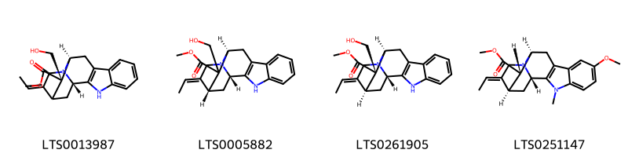{ width=100% }
    <figcaption>Hình ảnh cấu trúc hóa học của 4 hoạt chất thuộc nhóm Macroline alkaloids gồm ['methyl (1s,12s,13s)-15-ethylidene-13-(hydroxymethyl)-3,17-diazapentacyclo[12.3.1.0²,¹⁰.0⁴,⁹.0¹²,¹⁷]octadeca-2(10),4,6,8-tetraene-13-carboxylate (LTS0013987)', 'methyl (1s,12s,14r,15e)-15-ethylidene-13-(hydroxymethyl)-3,17-diazapentacyclo[12.3.1.0²,¹⁰.0⁴,⁹.0¹²,¹⁷]octadeca-2(10),4,6,8-tetraene-13-carboxylate (LTS0005882)', 'methyl (1s,12s,13s,14s,15e)-15-ethylidene-13-(hydroxymethyl)-3,17-diazapentacyclo[12.3.1.0²,¹⁰.0⁴,⁹.0¹²,¹⁷]octadeca-2(10),4,6,8-tetraene-13-carboxylate (LTS0261905)', 'methyl (1s,12s,13s,14r,15e)-15-ethylidene-7-methoxy-3-methyl-3,17-diazapentacyclo[12.3.1.0²,¹⁰.0⁴,⁹.0¹²,¹⁷]octadeca-2(10),4,6,8-tetraene-13-carboxylate (LTS0251147)'].</figcaption>
</figure>
#### Nhóm Prenol lipids
<figure markdown="span">
    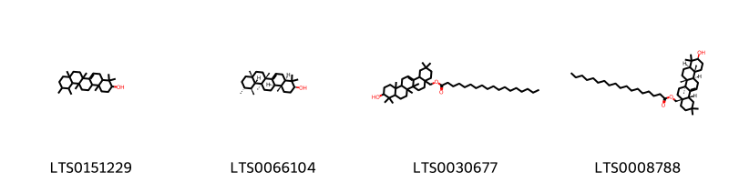{ width=100% }
    <figcaption>Hình ảnh cấu trúc hóa học của 4 hoạt chất thuộc nhóm Prenol lipids gồm ['4,4,6b,8a,11,12,12b,14b-octamethyl-2,3,4a,5,7,8,9,10,11,12,12a,13,14,14a-tetradecahydro-1h-picen-3-ol (LTS0151229)', '(3s,4ar,6bs,8ar,11r,12s,12ar,12bs,14ar,14br)-4,4,6b,8a,11,12,12b,14b-octamethyl-2,3,4a,5,7,8,9,10,11,12,12a,13,14,14a-tetradecahydro-1h-picen-3-ol (LTS0066104)', '(10-hydroxy-2,2,6a,6b,9,9,12a-heptamethyl-1,3,4,5,6,7,8,8a,10,11,12,12b,13,14b-tetradecahydropicen-4a-yl)methyl octadecanoate (LTS0030677)', '[(4as,6as,6br,8ar,10s,12ar,12br,14bs)-10-hydroxy-2,2,6a,6b,9,9,12a-heptamethyl-1,3,4,5,6,7,8,8a,10,11,12,12b,13,14b-tetradecahydropicen-4a-yl]methyl octadecanoate (LTS0008788)'].</figcaption>
</figure>
#### Nhóm Quinolines and derivatives
<figure markdown="span">
    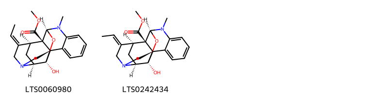{ width=100% }
    <figcaption>Hình ảnh cấu trúc hóa học của 2 hoạt chất thuộc nhóm Quinolines and derivatives gồm ['methyl (1s,6e,7s,9s,10s,12s,20r)-6-ethylidene-10-hydroxy-13-methyl-11-oxa-4,13-diazahexacyclo[10.7.1.0¹,¹⁰.0⁴,⁹.0⁷,²⁰.0¹⁴,¹⁹]icosa-14,16,18-triene-20-carboxylate (LTS0060980)', 'methyl (1s,6z,7s,9s,10s,12s,20r)-6-ethylidene-10-hydroxy-13-methyl-11-oxa-4,13-diazahexacyclo[10.7.1.0¹,¹⁰.0⁴,⁹.0⁷,²⁰.0¹⁴,¹⁹]icosa-14,16,18-triene-20-carboxylate (LTS0242434)'].</figcaption>
</figure>
#### Nhóm Strychnos alkaloids
<figure markdown="span">
    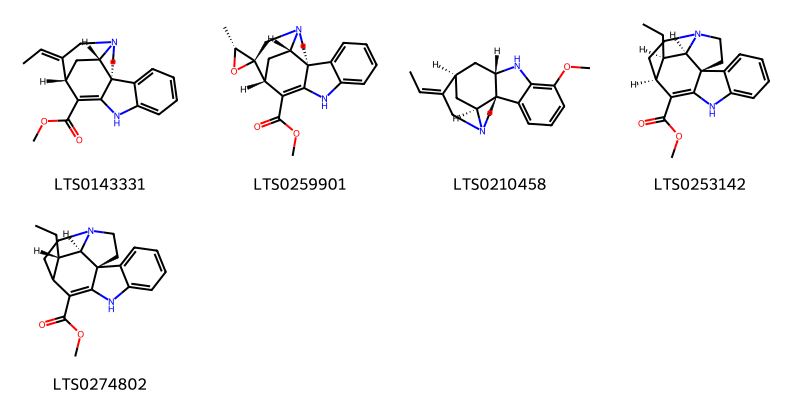{ width=100% }
    <figcaption>Hình ảnh cấu trúc hóa học của 5 hoạt chất thuộc nhóm Strychnos alkaloids gồm ['akuammicine (LTS0143331)', "methyl (1'r,2r,3r,11'r,17's)-3-methyl-8',14'-diazaspiro[oxirane-2,12'-pentacyclo[9.5.2.0¹,⁹.0²,⁷.0¹⁴,¹⁷]octadecane]-2',4',6',9'-tetraene-10'-carboxylate (LTS0259901)", '(1s,9s,11s,12e,17s)-12-ethylidene-6-methoxy-8,14-diazapentacyclo[9.5.2.0¹,⁹.0²,⁷.0¹⁴,¹⁷]octadeca-2,4,6-triene (LTS0210458)', '20(r)-tubotaiwine (LTS0253142)', 'methyl (1s,17r,18s)-18-ethyl-8,14-diazapentacyclo[9.5.2.0¹,⁹.0²,⁷.0¹⁴,¹⁷]octadeca-2,4,6,9-tetraene-10-carboxylate (LTS0274802)'].</figcaption>
</figure>
#### Nhóm Yohimbine alkaloids
<figure markdown="span">
    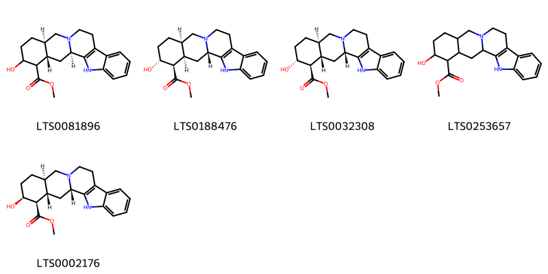{ width=100% }
    <figcaption>Hình ảnh cấu trúc hóa học của 5 hoạt chất thuộc nhóm Yohimbine alkaloids gồm ['methyl (1r,15r,20s)-18-hydroxy-3,13-diazapentacyclo[11.8.0.0²,¹⁰.0⁴,⁹.0¹⁵,²⁰]henicosa-2(10),4,6,8-tetraene-19-carboxylate (LTS0081896)', 'methyl (1s,15r,18r,19r,20r)-18-hydroxy-3,13-diazapentacyclo[11.8.0.0²,¹⁰.0⁴,⁹.0¹⁵,²⁰]henicosa-2(10),4,6,8-tetraene-19-carboxylate (LTS0188476)', 'methyl (1s,15r,18r,19r,20s)-18-hydroxy-3,13-diazapentacyclo[11.8.0.0²,¹⁰.0⁴,⁹.0¹⁵,²⁰]henicosa-2(10),4,6,8-tetraene-19-carboxylate (LTS0032308)', 'yohimbine,α- (LTS0253657)', 'yohimbine (LTS0002176)'].</figcaption>
</figure>

---

### Dược dân tộc học

Danh sách các quốc gia có sử dụng *Haplophyton cimicidum* trong điều trị các bệnh. 

| Country   | Disease                   | Bệnh                                                                                                                                                                                                |
|:----------|:--------------------------|:----------------------------------------------------------------------------------------------------------------------------------------------------------------------------------------------------|
| Mexico    | Pediculicide, Insecticide | MYMEMORY WARNING: YOU USED ALL AVAILABLE FREE TRANSLATIONS FOR TODAY. NEXT AVAILABLE IN  11 HOURS 43 MINUTES 07 SECONDS VISIT HTTPS://MYMEMORY.TRANSLATED.NET/DOC/USAGELIMITS.PHP TO TRANSLATE MORE |

---

# Chi Acokanthera

??? note "Danh sách các dược liệu thuộc chi"
    
	 - *Acokanthera abyssinica*

---
## Acokanthera abyssinica
### Thông tin về thực vật

!!! info "Phân loại thực vật của *Acokanthera schimperi* từ GIBF:"
    - **Kingdom:** Plantae
    - **Phylum:** Tracheophyta
    - **Order:** Gentianales
    - **Family:** Apocynaceae
    - **Genus:** Acokanthera
    - **Species:** *Acokanthera schimperi*

 

| Label (VI)   | Label (EN)   | Scientific Name       | Descriptions (VI)   | Descriptions (EN)   | Also Known As (VI)   | Also Known As (EN)   |
|:-------------|:-------------|:----------------------|:--------------------|:--------------------|:---------------------|:---------------------|
| N/A          | N/A          | Haplophyton cimicidum | loài thực vật       | species of plant    | ['']                 | ['']                 |

#### Phân bố trên thế giới

**Từ CSDL GIBF** Mexico, Guatemala, United States of America

#### Phân bố tại Việt Nam

**Từ CSDL GIBF**: Không có ghi nhận ở Việt Nam

---
### Thành phần hóa học
        
- Theo cơ sở dữ liệu lotus: Từ loài *Acokanthera schimperi* đã phân lập và xác định được Chưa có hoạt chất nào được phân lập. hoạt chất thuộc về các nhóm Không có hoạt chất nào được phân lập. 

Không có hình ảnh nào được tạo ra

---

### Dược dân tộc học

Danh sách các quốc gia có sử dụng *Acokanthera schimperi* trong điều trị các bệnh. 

| Country   | Disease   | Bệnh                                                                                                                                                                                                |
|:----------|:----------|:----------------------------------------------------------------------------------------------------------------------------------------------------------------------------------------------------|
| Africa    | Poison    | MYMEMORY WARNING: YOU USED ALL AVAILABLE FREE TRANSLATIONS FOR TODAY. NEXT AVAILABLE IN  11 HOURS 42 MINUTES 19 SECONDS VISIT HTTPS://MYMEMORY.TRANSLATED.NET/DOC/USAGELIMITS.PHP TO TRANSLATE MORE |

---

# Chi Schizozygia

??? note "Danh sách các dược liệu thuộc chi"
    
	 - *Schizozygia coffeoides*

---
## Schizozygia coffeoides
### Thông tin về thực vật

!!! info "Phân loại thực vật của *Schizozygia coffeoides* từ GIBF:"
    - **Kingdom:** Plantae
    - **Phylum:** Tracheophyta
    - **Order:** Gentianales
    - **Family:** Apocynaceae
    - **Genus:** Schizozygia
    - **Species:** *Schizozygia coffeoides*

 

| Label (VI)   | Label (EN)   | Scientific Name       | Descriptions (VI)   | Descriptions (EN)   | Also Known As (VI)   | Also Known As (EN)   |
|:-------------|:-------------|:----------------------|:--------------------|:--------------------|:---------------------|:---------------------|
| N/A          | N/A          | Haplophyton cimicidum | loài thực vật       | species of plant    | ['']                 | ['']                 |

#### Phân bố trên thế giới

**Từ CSDL GIBF** nan, France, Kenya, Tanzania, United Republic of

#### Phân bố tại Việt Nam

**Từ CSDL GIBF**: Không có ghi nhận ở Việt Nam

---
### Thành phần hóa học
        
- Theo cơ sở dữ liệu lotus: Từ loài *Schizozygia coffeoides* đã phân lập và xác định được Chưa có hoạt chất nào được phân lập. hoạt chất thuộc về các nhóm Không có hoạt chất nào được phân lập. 

Không có hình ảnh nào được tạo ra

---

### Dược dân tộc học

Danh sách các quốc gia có sử dụng *Schizozygia coffeoides* trong điều trị các bệnh. 

| Country         | Disease   | Bệnh                                                                                                                                                                                                |
|:----------------|:----------|:----------------------------------------------------------------------------------------------------------------------------------------------------------------------------------------------------|
| Africa(Swahili) | Poison    | MYMEMORY WARNING: YOU USED ALL AVAILABLE FREE TRANSLATIONS FOR TODAY. NEXT AVAILABLE IN  11 HOURS 42 MINUTES 00 SECONDS VISIT HTTPS://MYMEMORY.TRANSLATED.NET/DOC/USAGELIMITS.PHP TO TRANSLATE MORE |

---

# Chi Thevetia

??? note "Danh sách các dược liệu thuộc chi"
    
	 - *Thevetia peruviana*

---
## Thevetia peruviana
### Thông tin về thực vật

!!! info "Phân loại thực vật của *Cascabela thevetia* từ GIBF:"
    - **Kingdom:** Plantae
    - **Phylum:** Tracheophyta
    - **Order:** Gentianales
    - **Family:** Apocynaceae
    - **Genus:** Cascabela
    - **Species:** *Cascabela thevetia*

 

| Label (VI)   | Label (EN)   | Scientific Name    | Descriptions (VI)   | Descriptions (EN)   | Also Known As (VI)   | Also Known As (EN)   |
|:-------------|:-------------|:-------------------|:--------------------|:--------------------|:---------------------|:---------------------|
| N/A          | N/A          | Thevetia peruviana | loài thực vật       | species of plant    | ['']                 | ['']                 |

#### Phân bố trên thế giới

**Từ CSDL GIBF** Brazil, Guatemala, China, Tanzania, United Republic of, Spain, Réunion, United States of America, Seychelles, Pakistan, Costa Rica, Colombia, Nigeria, Malawi, Mexico, Benin, Kenya, El Salvador, Belgium, Kuwait, Mayotte, Solomon Islands, Egypt, Portugal, South Africa, Myanmar, India, Peru, Bolivia (Plurinational State of), Venezuela (Bolivarian Republic of)

#### Phân bố tại Việt Nam

**Từ CSDL GIBF**: Không có ghi nhận ở Việt Nam

---
### Thành phần hóa học
        
- Theo cơ sở dữ liệu lotus: Từ loài *Cascabela thevetia* đã phân lập và xác định được 146 hoạt chất thuộc về các nhóm Fatty Acyls, Flavonoids, Steroids and steroid derivatives, Organooxygen compounds, Prenol lipids. 

|    | chemicalTaxonomyClassyfireClass   |   smiles_count |
|---:|:----------------------------------|---------------:|
|  0 | Fatty Acyls                       |              6 |
|  1 | Flavonoids                        |             35 |
|  2 | Organooxygen compounds            |             33 |
|  3 | Prenol lipids                     |             29 |
|  4 | Steroids and steroid derivatives  |             41 |

#### Nhóm Fatty Acyls
<figure markdown="span">
    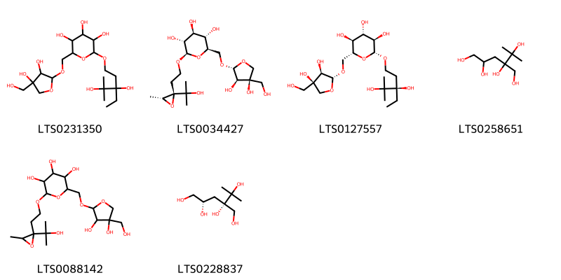{ width=100% }
    <figcaption>Hình ảnh cấu trúc hóa học của 6 hoạt chất thuộc nhóm Fatty Acyls gồm ['2-({[3,4-dihydroxy-4-(hydroxymethyl)oxolan-2-yl]oxy}methyl)-6-[(3-ethyl-3,4-dihydroxy-4-methylpentyl)oxy]oxane-3,4,5-triol (LTS0231350)', '(2r,3s,4s,5r,6r)-2-({[(2r,3r,4r)-3,4-dihydroxy-4-(hydroxymethyl)oxolan-2-yl]oxy}methyl)-6-{2-[(2r,3r)-2-(2-hydroxypropan-2-yl)-3-methyloxiran-2-yl]ethoxy}oxane-3,4,5-triol (LTS0034427)', '(2r,3s,4s,5r,6r)-2-({[(2r,3r,4r)-3,4-dihydroxy-4-(hydroxymethyl)oxolan-2-yl]oxy}methyl)-6-{[(3r)-3-ethyl-3,4-dihydroxy-4-methylpentyl]oxy}oxane-3,4,5-triol (LTS0127557)', '4-(hydroxymethyl)-5-methylhexane-1,2,4,5-tetrol (LTS0258651)', '2-({[3,4-dihydroxy-4-(hydroxymethyl)oxolan-2-yl]oxy}methyl)-6-{2-[2-(2-hydroxypropan-2-yl)-3-methyloxiran-2-yl]ethoxy}oxane-3,4,5-triol (LTS0088142)', '(2s,4s)-4-(hydroxymethyl)-5-methylhexane-1,2,4,5-tetrol (LTS0228837)'].</figcaption>
</figure>
#### Nhóm Flavonoids
<figure markdown="span">
    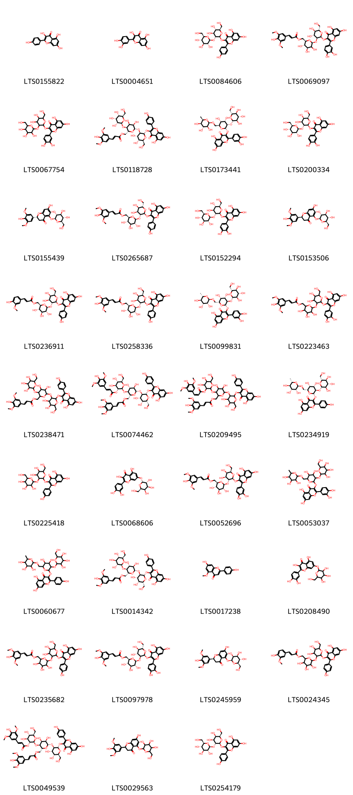{ width=100% }
    <figcaption>Hình ảnh cấu trúc hóa học của 35 hoạt chất thuộc nhóm Flavonoids gồm ['kaempherol (LTS0155822)', 'quercetin (LTS0004651)', 'kaempferol 3-o-sophoroside (LTS0084606)', '[(2r,3s,4s,6s)-6-{[(2s,3s,4r,5r,6s)-2-{[2-(3,4-dihydroxyphenyl)-5,7-dihydroxy-4-oxochromen-3-yl]oxy}-4,5-dihydroxy-6-(hydroxymethyl)oxan-3-yl]oxy}-3,4,5-trihydroxyoxan-2-yl]methyl (2e)-3-(4-hydroxy-3,5-dimethoxyphenyl)prop-2-enoate (LTS0069097)', '3-{[4,5-dihydroxy-6-(hydroxymethyl)-3-{[3,4,5-trihydroxy-6-(hydroxymethyl)oxan-2-yl]oxy}oxan-2-yl]oxy}-2-(3,4-dihydroxyphenyl)-5,7-dihydroxychromen-4-one (LTS0067754)', '[(2r,3s,4s,5r,6s)-6-{[(2s,3r,4s,5r,6s)-2-{[5,7-dihydroxy-2-(4-hydroxyphenyl)-4-oxochromen-3-yl]oxy}-4,5-dihydroxy-6-(hydroxymethyl)oxan-3-yl]oxy}-4,5-dihydroxy-3-{[(2s,3r,4r,5s,6r)-3,4,5-trihydroxy-6-(hydroxymethyl)oxan-2-yl]oxy}oxan-2-yl]methyl (2e)-3-(4-hydroxy-3,5-dimethoxyphenyl)prop-2-enoate (LTS0118728)', '3-{[(2s,3s,4s,5r,6s)-4,5-dihydroxy-3-{[(2s,3r,4s,5s,6r)-3,4,5-trihydroxy-6-(hydroxymethyl)oxan-2-yl]oxy}-6-({[(2r,3s,4r,5r,6r)-3,4,5-trihydroxy-6-methyloxan-2-yl]oxy}methyl)oxan-2-yl]oxy}-2-(3,4-dihydroxyphenyl)-5,7-dihydroxychromen-4-one (LTS0173441)', '3-{[(2s,3r,4s,5r,6r)-4,5-dihydroxy-6-(hydroxymethyl)-3-{[(2s,3r,4s,5s,6r)-3,4,5-trihydroxy-6-(hydroxymethyl)oxan-2-yl]oxy}oxan-2-yl]oxy}-2-(3,4-dihydroxyphenyl)-5,7-dihydroxychromen-4-one (LTS0200334)', '(2r)-7-hydroxy-2-(4-hydroxy-3,5-dimethoxyphenyl)-5-{[(2s,3r,4s,5s,6r)-3,4,5-trihydroxy-6-(hydroxymethyl)oxan-2-yl]oxy}-2,3-dihydro-1-benzopyran-4-one (LTS0155439)', '[(2r,3s,4s,5r,6s)-6-{[(2s,3r,4s,5r,6s)-2-{[5,7-dihydroxy-2-(4-hydroxyphenyl)-4-oxochromen-3-yl]oxy}-4,5-dihydroxy-6-(hydroxymethyl)oxan-3-yl]oxy}-3,4,5-trihydroxyoxan-2-yl]methyl (2e)-3-(4-hydroxy-3,5-dimethoxyphenyl)prop-2-enoate (LTS0265687)', 'quosp (LTS0152294)', '(2s)-7-hydroxy-2-(4-hydroxy-3,5-dimethoxyphenyl)-5-{[(2s,3r,4s,5s,6r)-3,4,5-trihydroxy-6-(hydroxymethyl)oxan-2-yl]oxy}-2,3-dihydro-1-benzopyran-4-one (LTS0153506)', '[(2r,3s,4s,5r,6s)-6-{[(2s,3r,4s,5r,6r)-2-{[5,7-dihydroxy-2-(4-hydroxyphenyl)-4-oxochromen-3-yl]oxy}-4,5-dihydroxy-6-(hydroxymethyl)oxan-3-yl]oxy}-3,4,5-trihydroxyoxan-2-yl]methyl (2e)-3-(4-hydroxy-3-methoxyphenyl)prop-2-enoate (LTS0236911)', '[(2r,3s,4s,5r,6s)-6-{[(2s,3r,4s,5r,6r)-2-{[5,7-dihydroxy-2-(4-hydroxyphenyl)-4-oxochromen-3-yl]oxy}-4,5-dihydroxy-6-(hydroxymethyl)oxan-3-yl]oxy}-3,4,5-trihydroxyoxan-2-yl]methyl (2e)-3-(4-hydroxy-3,5-dimethoxyphenyl)prop-2-enoate (LTS0258336)', '3-{[(2s,3r,4s,5r,6r)-4,5-dihydroxy-3-{[(2s,3r,4s,5s,6r)-3,4,5-trihydroxy-6-(hydroxymethyl)oxan-2-yl]oxy}-6-({[(2r,3r,4r,5r,6s)-3,4,5-trihydroxy-6-methyloxan-2-yl]oxy}methyl)oxan-2-yl]oxy}-2-(3,4-dihydroxyphenyl)-5,7-dihydroxychromen-4-one (LTS0099831)', '{6-[(2-{[2-(3,4-dihydroxyphenyl)-5,7-dihydroxy-4-oxochromen-3-yl]oxy}-4,5-dihydroxy-6-(hydroxymethyl)oxan-3-yl)oxy]-3,4,5-trihydroxyoxan-2-yl}methyl 3-(4-hydroxy-3,5-dimethoxyphenyl)prop-2-enoate (LTS0223463)', '{6-[(2-{[5,7-dihydroxy-2-(4-hydroxyphenyl)-4-oxochromen-3-yl]oxy}-4,5-dihydroxy-6-(hydroxymethyl)oxan-3-yl)oxy]-4,5-dihydroxy-3-{[3,4,5-trihydroxy-6-(hydroxymethyl)oxan-2-yl]oxy}oxan-2-yl}methyl 3-(4-hydroxy-3,5-dimethoxyphenyl)prop-2-enoate (LTS0238471)', '[(2r,3s,4r,5r,6s)-6-{[(2s,3r,4s,5r,6r)-2-{[5,7-dihydroxy-2-(4-hydroxyphenyl)-4-oxochromen-3-yl]oxy}-4,5-dihydroxy-6-(hydroxymethyl)oxan-3-yl]oxy}-3-{[(2s,3r,4s,5s,6r)-4,5-dihydroxy-3-{[(2e)-3-(4-hydroxy-3,5-dimethoxyphenyl)prop-2-enoyl]oxy}-6-(hydroxymethyl)oxan-2-yl]oxy}-4,5-dihydroxyoxan-2-yl]methyl (2e)-3-(4-hydroxy-3,5-dimethoxyphenyl)prop-2-enoate (LTS0074462)', '{6-[(2-{[5,7-dihydroxy-2-(4-hydroxyphenyl)-4-oxochromen-3-yl]oxy}-4,5-dihydroxy-6-(hydroxymethyl)oxan-3-yl)oxy]-3-[(4,5-dihydroxy-3-{[3-(4-hydroxy-3,5-dimethoxyphenyl)prop-2-enoyl]oxy}-6-(hydroxymethyl)oxan-2-yl)oxy]-4,5-dihydroxyoxan-2-yl}methyl 3-(4-hydroxy-3,5-dimethoxyphenyl)prop-2-enoate (LTS0209495)', '3-{[(2s,3r,4s,5r,6r)-4,5-dihydroxy-3-{[(2s,3r,4s,5s,6r)-3,4,5-trihydroxy-6-(hydroxymethyl)oxan-2-yl]oxy}-6-({[(2r,3r,4r,5r,6s)-3,4,5-trihydroxy-6-methyloxan-2-yl]oxy}methyl)oxan-2-yl]oxy}-5,7-dihydroxy-2-(4-hydroxyphenyl)chromen-4-one (LTS0234919)', '3-{[4,5-dihydroxy-6-(hydroxymethyl)-3-{[3,4,5-trihydroxy-6-(hydroxymethyl)oxan-2-yl]oxy}oxan-2-yl]oxy}-5,7-dihydroxy-2-(4-hydroxyphenyl)chromen-4-one (LTS0225418)', '2-(3,4-dihydroxyphenyl)-3,5-dihydroxy-7-{[(2r,3r,4s,5r,6r)-3,4,5-trihydroxy-6-(hydroxymethyl)oxan-2-yl]oxy}chromen-4-one (LTS0068606)', '[(2r,3s,4s,5r,6s)-6-{[(2s,3r,4s,5r,6r)-2-{[2-(3,4-dihydroxyphenyl)-5,7-dihydroxy-4-oxochromen-3-yl]oxy}-4,5-dihydroxy-6-(hydroxymethyl)oxan-3-yl]oxy}-3,4,5-trihydroxyoxan-2-yl]methyl (2e)-3-(4-hydroxy-3,5-dimethoxyphenyl)prop-2-enoate (LTS0052696)', '3-[(4,5-dihydroxy-3-{[3,4,5-trihydroxy-6-(hydroxymethyl)oxan-2-yl]oxy}-6-{[(3,4,5-trihydroxy-6-methyloxan-2-yl)oxy]methyl}oxan-2-yl)oxy]-2-(3,4-dihydroxyphenyl)-5,7-dihydroxychromen-4-one (LTS0053037)', '3-[(4,5-dihydroxy-3-{[3,4,5-trihydroxy-6-(hydroxymethyl)oxan-2-yl]oxy}-6-{[(3,4,5-trihydroxy-6-methyloxan-2-yl)oxy]methyl}oxan-2-yl)oxy]-5,7-dihydroxy-2-(4-hydroxyphenyl)chromen-4-one (LTS0060677)', '[(2r,3s,4r,5r,6s)-6-{[(2s,3r,4s,5r,6r)-2-{[5,7-dihydroxy-2-(4-hydroxyphenyl)-4-oxochromen-3-yl]oxy}-4,5-dihydroxy-6-(hydroxymethyl)oxan-3-yl]oxy}-4,5-dihydroxy-3-{[(2s,3r,4s,5s,6r)-3,4,5-trihydroxy-6-(hydroxymethyl)oxan-2-yl]oxy}oxan-2-yl]methyl (2e)-3-(4-hydroxy-3,5-dimethoxyphenyl)prop-2-enoate (LTS0014342)', 'thevetiaflavone (LTS0017238)', 'quercimeritrin (LTS0208490)', '{6-[(2-{[5,7-dihydroxy-2-(4-hydroxyphenyl)-4-oxochromen-3-yl]oxy}-4,5-dihydroxy-6-(hydroxymethyl)oxan-3-yl)oxy]-3,4,5-trihydroxyoxan-2-yl}methyl 3-(4-hydroxy-3,5-dimethoxyphenyl)prop-2-enoate (LTS0235682)', '[(2r,3s,4s,5r,6s)-6-{[(2s,3s,4r,5r,6s)-2-{[2-(3,4-dihydroxyphenyl)-5,7-dihydroxy-4-oxochromen-3-yl]oxy}-4,5-dihydroxy-6-(hydroxymethyl)oxan-3-yl]oxy}-3,4,5-trihydroxyoxan-2-yl]methyl (2e)-3-(4-hydroxy-3,5-dimethoxyphenyl)prop-2-enoate (LTS0097978)', '(2s)-7-hydroxy-2-(4-hydroxy-3,5-dimethoxyphenyl)-5-{[(2s,3s,4s,5s,6r)-3,4,5-trihydroxy-6-(hydroxymethyl)oxan-2-yl]oxy}-2,3-dihydro-1-benzopyran-4-one (LTS0245959)', '{6-[(2-{[5,7-dihydroxy-2-(4-hydroxyphenyl)-4-oxochromen-3-yl]oxy}-4,5-dihydroxy-6-(hydroxymethyl)oxan-3-yl)oxy]-3,4,5-trihydroxyoxan-2-yl}methyl 3-(4-hydroxy-3-methoxyphenyl)prop-2-enoate (LTS0024345)', '[(2r,3s,4s,5r,6s)-6-{[(2s,3r,4s,5r,6s)-2-{[5,7-dihydroxy-2-(4-hydroxyphenyl)-4-oxochromen-3-yl]oxy}-4,5-dihydroxy-6-(hydroxymethyl)oxan-3-yl]oxy}-3-{[(2s,3r,4s,5s,6r)-4,5-dihydroxy-3-{[(2e)-3-(4-hydroxy-3,5-dimethoxyphenyl)prop-2-enoyl]oxy}-6-(hydroxymethyl)oxan-2-yl]oxy}-4,5-dihydroxyoxan-2-yl]methyl (2e)-3-(4-hydroxy-3,5-dimethoxyphenyl)prop-2-enoate (LTS0049539)', '7-hydroxy-2-(4-hydroxy-3,5-dimethoxyphenyl)-5-{[3,4,5-trihydroxy-6-(hydroxymethyl)oxan-2-yl]oxy}-2,3-dihydro-1-benzopyran-4-one (LTS0029563)', '3-{[(2s,3r,4s,5r,6r)-4,5-dihydroxy-6-(hydroxymethyl)-3-{[(2s,3r,4s,5s,6r)-3,4,5-trihydroxy-6-(hydroxymethyl)oxan-2-yl]oxy}oxan-2-yl]oxy}-5,7-dihydroxy-2-(4-hydroxyphenyl)chromen-4-one (LTS0254179)'].</figcaption>
</figure>
#### Nhóm Organooxygen compounds
<figure markdown="span">
    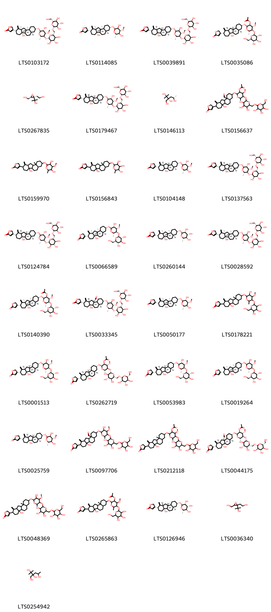{ width=100% }
    <figcaption>Hình ảnh cấu trúc hóa học của 33 hoạt chất thuộc nhóm Organooxygen compounds gồm ['4-[(3s,4ar,6ar,6bs,9s,10ar,11as,11bs)-6b-hydroxy-3-{[(2r,3r,4s,5s,6s)-3-hydroxy-4-methoxy-6-methyl-5-{[(2s,3r,4s,5s,6r)-3,4,5-trihydroxy-6-({[(2r,3r,4s,5s,6r)-3,4,5-trihydroxy-6-(hydroxymethyl)oxan-2-yl]oxy}methyl)oxan-2-yl]oxy}oxan-2-yl]oxy}-10a,11b-dimethyl-10-methylidene-dodecahydro-1h-cyclohexa[a]fluoren-9-yl]-5h-furan-2-one (LTS0103172)', '4-[(3s,4ar,6ar,6bs,9s,10ar,11as,11bs)-3-{[(2r,3s,4r,5s,6s)-3,5-dihydroxy-4-methoxy-6-methyloxan-2-yl]oxy}-6b-hydroxy-10a,11b-dimethyl-10-methylidene-dodecahydro-1h-cyclohexa[a]fluoren-9-yl]-5h-furan-2-one (LTS0114085)', '4-[(3s,4ar,6ar,6bs,9s,10ar,11as,11bs)-6b-hydroxy-3-{[(2r,3s,4s,5s,6s)-3-hydroxy-4-methoxy-6-methyl-5-{[(2s,3r,4s,5s,6r)-3,4,5-trihydroxy-6-({[(2r,3r,4s,5s,6r)-3,4,5-trihydroxy-6-(hydroxymethyl)oxan-2-yl]oxy}methyl)oxan-2-yl]oxy}oxan-2-yl]oxy}-11b-methyl-10-methylidene-tetradecahydrocyclohexa[a]fluoren-9-yl]-5h-furan-2-one (LTS0039891)', '(2r,3s,4r,5s,6s)-2-{[(3s,4ar,6ar,6bs,9s,10ar,11as,11bs)-6b-hydroxy-11b-methyl-10-methylidene-9-(5-oxo-2h-furan-3-yl)-tetradecahydrocyclohexa[a]fluoren-3-yl]oxy}-4-methoxy-6-methyl-5-{[(2s,3r,4s,5s,6r)-3,4,5-trihydroxy-6-(hydroxymethyl)oxan-2-yl]oxy}oxan-3-yl acetate (LTS0035086)', '2-[(2r,3r)-2-(2-hydroxyethyl)-3-(hydroxymethyl)oxiran-2-yl]propan-2-ol (LTS0267835)', '4-[(3s,4ar,6ar,6bs,9s,10as,11as,11bs)-6b-hydroxy-3-{[(2r,3r,4s,5s,6s)-3-hydroxy-4-methoxy-6-methyl-5-{[(2s,3r,4s,5s,6r)-3,4,5-trihydroxy-6-({[(2r,3r,4s,5s,6r)-3,4,5-trihydroxy-6-(hydroxymethyl)oxan-2-yl]oxy}methyl)oxan-2-yl]oxy}oxan-2-yl]oxy}-11b-methyl-10-methylidene-tetradecahydrocyclohexa[a]fluoren-9-yl]-5h-furan-2-one (LTS0179467)', '(3r,5s)-3-(hydroxymethyl)-2-methylhexane-2,3,5-triol (LTS0146113)', '2-{[11b-formyl-6b-hydroxy-10-methylidene-9-(5-oxo-2h-furan-3-yl)-tetradecahydrocyclohexa[a]fluoren-3-yl]oxy}-4-methoxy-6-methyl-5-{[3,4,5-trihydroxy-6-({[3,4,5-trihydroxy-6-(hydroxymethyl)oxan-2-yl]oxy}methyl)oxan-2-yl]oxy}oxan-3-yl acetate (LTS0156637)', '4-{3-[(3,5-dihydroxy-4-methoxy-6-methyloxan-2-yl)oxy]-6b-hydroxy-11b-methyl-10-methylidene-tetradecahydrocyclohexa[a]fluoren-9-yl}-5h-furan-2-one (LTS0159970)', '4-{6b-hydroxy-11b-methyl-10-methylidene-3-[(3,4,5-trihydroxy-6-methyloxan-2-yl)oxy]-tetradecahydrocyclohexa[a]fluoren-9-yl}-5h-furan-2-one (LTS0156843)', '4-[(3s,4ar,6ar,6bs,9s,10ar,11as,11bs)-3-{[(2r,3r,4r,5s,6s)-3,5-dihydroxy-4-methoxy-6-methyloxan-2-yl]oxy}-6b-hydroxy-11b-methyl-10-methylidene-tetradecahydrocyclohexa[a]fluoren-9-yl]-5h-furan-2-one (LTS0104148)', '4-[(3s,4as,6ar,6bs,9s,10ar,11as,11bs)-6b-hydroxy-3-{[(2r,3r,4s,5s,6s)-3-hydroxy-4-methoxy-6-methyl-5-{[(2s,3r,4s,5s,6r)-3,4,5-trihydroxy-6-({[(2r,3r,4s,5s,6r)-3,4,5-trihydroxy-6-(hydroxymethyl)oxan-2-yl]oxy}methyl)oxan-2-yl]oxy}oxan-2-yl]oxy}-11b-methyl-10-methylidene-tetradecahydrocyclohexa[a]fluoren-9-yl]-5h-furan-2-one (LTS0137563)', '4-[(3s,4ar,6ar,6bs,9s,10ar,11as,11bs)-6b-hydroxy-3-{[(2r,3r,4s,5s,6s)-3-hydroxy-4-methoxy-6-methyl-5-{[(2s,3r,4s,5s,6r)-3,4,5-trihydroxy-6-({[(2r,3r,4s,5s,6r)-3,4,5-trihydroxy-6-(hydroxymethyl)oxan-2-yl]oxy}methyl)oxan-2-yl]oxy}oxan-2-yl]oxy}-11b-methyl-10-methylidene-tetradecahydrocyclohexa[a]fluoren-9-yl]-5h-furan-2-one (LTS0124784)', '4-[(3s,4ar,6ar,6bs,9s,10ar,11as,11bs)-6b-hydroxy-3-{[(2r,3r,4s,5s,6s)-3-hydroxy-4-methoxy-6-methyl-5-{[(2s,3r,4s,5s,6r)-3,4,5-trihydroxy-6-(hydroxymethyl)oxan-2-yl]oxy}oxan-2-yl]oxy}-10a,11b-dimethyl-10-methylidene-dodecahydro-1h-cyclohexa[a]fluoren-9-yl]-5h-furan-2-one (LTS0066589)', '4-[(3s,4ar,6ar,6bs,9s,10ar,11as,11bs)-6b-hydroxy-10a,11b-dimethyl-10-methylidene-3-{[(2r,3r,4r,5r,6s)-3,4,5-trihydroxy-6-methyloxan-2-yl]oxy}-dodecahydro-1h-cyclohexa[a]fluoren-9-yl]-5h-furan-2-one (LTS0260144)', '4-[(3s,4ar,6ar,6bs,9s,10ar,11as,11bs)-6b-hydroxy-3-{[(2r,3s,4s,5s,6s)-3-hydroxy-4-methoxy-6-methyl-5-{[(2s,3r,4s,5s,6r)-3,4,5-trihydroxy-6-({[(2r,3r,4s,5s,6r)-3,4,5-trihydroxy-6-(hydroxymethyl)oxan-2-yl]oxy}methyl)oxan-2-yl]oxy}oxan-2-yl]oxy}-10a,11b-dimethyl-10-methylidene-dodecahydro-1h-cyclohexa[a]fluoren-9-yl]-5h-furan-2-one (LTS0028592)', '(2r,3s,4r,5s,6s)-2-{[(3s,4ar,6ar,6bs,9s,10ar,11as,11bs)-6b-hydroxy-10a,11b-dimethyl-10-methylidene-9-(5-oxo-2h-furan-3-yl)-dodecahydro-1h-cyclohexa[a]fluoren-3-yl]oxy}-4-methoxy-6-methyl-5-{[(2s,3r,4s,5s,6r)-3,4,5-trihydroxy-6-(hydroxymethyl)oxan-2-yl]oxy}oxan-3-yl acetate (LTS0140390)', '(3s,4ar,6ar,6bs,9s,10ar,11as,11br)-6b-hydroxy-3-{[(2r,3s,4s,5s,6s)-3-hydroxy-4-methoxy-6-methyl-5-{[(2s,3r,4s,5s,6r)-3,4,5-trihydroxy-6-({[(2r,3r,4s,5s,6r)-3,4,5-trihydroxy-6-(hydroxymethyl)oxan-2-yl]oxy}methyl)oxan-2-yl]oxy}oxan-2-yl]oxy}-10-methylidene-9-(5-oxo-2h-furan-3-yl)-tetradecahydrocyclohexa[a]fluorene-11b-carbaldehyde (LTS0033345)', '4-[(3s,4ar,6ar,6bs,9s,10ar,11as,11bs)-3-{[(2r,3r,4r,5s,6s)-3,5-dihydroxy-4-methoxy-6-methyloxan-2-yl]oxy}-6b-hydroxy-10a,11b-dimethyl-10-methylidene-dodecahydro-1h-cyclohexa[a]fluoren-9-yl]-5h-furan-2-one (LTS0050177)', '4-{6b-hydroxy-3-[(3-hydroxy-4-methoxy-6-methyl-5-{[3,4,5-trihydroxy-6-(hydroxymethyl)oxan-2-yl]oxy}oxan-2-yl)oxy]-11b-methyl-10-methylidene-tetradecahydrocyclohexa[a]fluoren-9-yl}-5h-furan-2-one (LTS0178221)', '4-[(3s,4ar,6ar,6bs,9s,10ar,11as,11bs)-6b-hydroxy-3-{[(2r,3s,4s,5s,6s)-3-hydroxy-4-methoxy-6-methyl-5-{[(2s,3r,4s,5s,6r)-3,4,5-trihydroxy-6-(hydroxymethyl)oxan-2-yl]oxy}oxan-2-yl]oxy}-11b-methyl-10-methylidene-tetradecahydrocyclohexa[a]fluoren-9-yl]-5h-furan-2-one (LTS0001513)', '(2r,3s,4r,5s,6s)-2-{[(3s,4ar,6ar,6bs,9s,10ar,11as,11bs)-6b-hydroxy-11b-methyl-10-methylidene-9-(5-oxo-2h-furan-3-yl)-tetradecahydrocyclohexa[a]fluoren-3-yl]oxy}-4-methoxy-6-methyl-5-{[(2s,3r,4s,5s,6r)-3,4,5-trihydroxy-6-({[(2r,3r,4s,5s,6r)-3,4,5-trihydroxy-6-(hydroxymethyl)oxan-2-yl]oxy}methyl)oxan-2-yl]oxy}oxan-3-yl acetate (LTS0262719)', '4-[(3s,4ar,6ar,6bs,9s,10ar,11as,11bs)-6b-hydroxy-3-{[(2r,3r,4s,5s,6s)-3-hydroxy-4-methoxy-6-methyl-5-{[(2s,3r,4s,5s,6r)-3,4,5-trihydroxy-6-(hydroxymethyl)oxan-2-yl]oxy}oxan-2-yl]oxy}-11b-methyl-10-methylidene-tetradecahydrocyclohexa[a]fluoren-9-yl]-5h-furan-2-one (LTS0053983)', '4-[(3s,4ar,6ar,6bs,9s,10ar,11as,11bs)-6b-hydroxy-3-{[(2r,3s,4s,5s,6s)-3-hydroxy-4-methoxy-6-methyl-5-{[(2s,3r,4s,5s,6r)-3,4,5-trihydroxy-6-(hydroxymethyl)oxan-2-yl]oxy}oxan-2-yl]oxy}-10a,11b-dimethyl-10-methylidene-dodecahydro-1h-cyclohexa[a]fluoren-9-yl]-5h-furan-2-one (LTS0019264)', '4-[(3s,4ar,6ar,6bs,9s,10ar,11as,11bs)-3-{[(2r,3s,4r,5s,6s)-3,5-dihydroxy-4-methoxy-6-methyloxan-2-yl]oxy}-6b-hydroxy-11b-methyl-10-methylidene-tetradecahydrocyclohexa[a]fluoren-9-yl]-5h-furan-2-one (LTS0025759)', '6b-hydroxy-3-[(3-hydroxy-4-methoxy-6-methyl-5-{[3,4,5-trihydroxy-6-({[3,4,5-trihydroxy-6-(hydroxymethyl)oxan-2-yl]oxy}methyl)oxan-2-yl]oxy}oxan-2-yl)oxy]-10-methylidene-9-(5-oxo-2h-furan-3-yl)-tetradecahydrocyclohexa[a]fluorene-11b-carbaldehyde (LTS0097706)', '2-{[6b-hydroxy-11b-methyl-10-methylidene-9-(5-oxo-2h-furan-3-yl)-tetradecahydrocyclohexa[a]fluoren-3-yl]oxy}-4-methoxy-6-methyl-5-{[3,4,5-trihydroxy-6-({[3,4,5-trihydroxy-6-(hydroxymethyl)oxan-2-yl]oxy}methyl)oxan-2-yl]oxy}oxan-3-yl acetate (LTS0212118)', '(2r,3s,4r,5s,6s)-2-{[(3s,4ar,6ar,6bs,9s,10ar,11as,11br)-11b-formyl-6b-hydroxy-10-methylidene-9-(5-oxo-2h-furan-3-yl)-tetradecahydrocyclohexa[a]fluoren-3-yl]oxy}-4-methoxy-6-methyl-5-{[(2s,3r,4s,5s,6r)-3,4,5-trihydroxy-6-({[(2r,3r,4s,5s,6r)-3,4,5-trihydroxy-6-(hydroxymethyl)oxan-2-yl]oxy}methyl)oxan-2-yl]oxy}oxan-3-yl acetate (LTS0044175)', '4-{6b-hydroxy-3-[(3-hydroxy-4-methoxy-6-methyl-5-{[3,4,5-trihydroxy-6-({[3,4,5-trihydroxy-6-(hydroxymethyl)oxan-2-yl]oxy}methyl)oxan-2-yl]oxy}oxan-2-yl)oxy]-11b-methyl-10-methylidene-tetradecahydrocyclohexa[a]fluoren-9-yl}-5h-furan-2-one (LTS0048369)', '2-{[6b-hydroxy-11b-methyl-10-methylidene-9-(5-oxo-2h-furan-3-yl)-tetradecahydrocyclohexa[a]fluoren-3-yl]oxy}-4-methoxy-6-methyl-5-{[3,4,5-trihydroxy-6-(hydroxymethyl)oxan-2-yl]oxy}oxan-3-yl acetate (LTS0265863)', '4-[(3s,4ar,6ar,6bs,9s,10as,11as,11bs)-6b-hydroxy-11b-methyl-10-methylidene-3-{[(2r,3r,4r,5r,6s)-3,4,5-trihydroxy-6-methyloxan-2-yl]oxy}-tetradecahydrocyclohexa[a]fluoren-9-yl]-5h-furan-2-one (LTS0126946)', '2-[2-(2-hydroxyethyl)-3-(hydroxymethyl)oxiran-2-yl]propan-2-ol (LTS0036340)', '3-(hydroxymethyl)-2-methylhexane-2,3,5-triol (LTS0254942)'].</figcaption>
</figure>
#### Nhóm Prenol lipids
<figure markdown="span">
    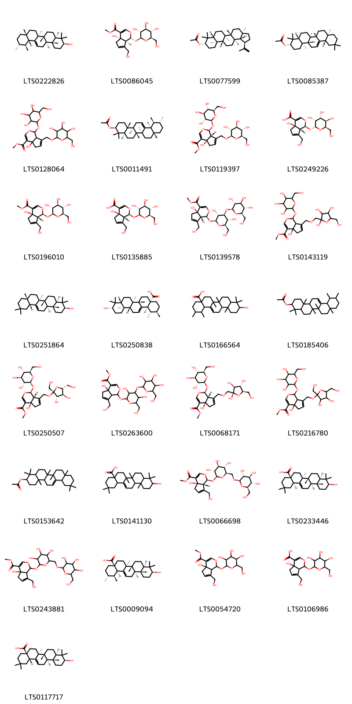{ width=100% }
    <figcaption>Hình ảnh cấu trúc hóa học của 29 hoạt chất thuộc nhóm Prenol lipids gồm ['amyrin (LTS0222826)', 'methyl (1r,4as,7as)-4a-hydroxy-7-(hydroxymethyl)-1-{[(2s,3r,4s,5s,6r)-3,4,5-trihydroxy-6-(hydroxymethyl)oxan-2-yl]oxy}-1h,5h,7ah-cyclopenta[c]pyran-4-carboxylate (LTS0086045)', 'lupeol acetate (LTS0077599)', '(3s,4ar,6ar,6bs,8ar,12as,14ar,14br)-4,4,6a,6b,8a,11,11,14b-octamethyl-1,2,3,4a,5,6,7,8,9,10,12,12a,14,14a-tetradecahydropicen-3-yl acetate (LTS0085387)', 'methyl 4a-hydroxy-1-{[3,4,5-trihydroxy-6-(hydroxymethyl)oxan-2-yl]oxy}-7-({[3,4,5-trihydroxy-6-(hydroxymethyl)oxan-2-yl]oxy}methyl)-1h,5h,7ah-cyclopenta[c]pyran-4-carboxylate (LTS0128064)', '(3s,4ar,6ar,6bs,8ar,11r,12s,12as,14ar,14br)-4,4,6a,6b,8a,11,12,14b-octamethyl-2,3,4a,5,6,7,8,9,10,11,12,12a,14,14a-tetradecahydro-1h-picen-3-yl acetate (LTS0011491)', 'methyl (1s,4ar,7ar)-4a-hydroxy-1-{[(2s,3r,4s,5s,6r)-3,4,5-trihydroxy-6-(hydroxymethyl)oxan-2-yl]oxy}-7-({[(2r,3r,4s,5s,6r)-3,4,5-trihydroxy-6-(hydroxymethyl)oxan-2-yl]oxy}methyl)-1h,5h,7ah-cyclopenta[c]pyran-4-carboxylate (LTS0119397)', '(1s,4ar,7ar)-4a-hydroxy-7-(hydroxymethyl)-1-{[(2r,3r,4r,5r,6r)-3,4,5-trihydroxy-6-(hydroxymethyl)oxan-2-yl]oxy}-1h,5h,7ah-cyclopenta[c]pyran-4-carboxylic acid (LTS0249226)', 'methyl (1s,4ar,7ar)-4a-hydroxy-7-(hydroxymethyl)-1-{[(2s,3r,4s,5s,6r)-3,4,5-trihydroxy-6-(hydroxymethyl)oxan-2-yl]oxy}-1h,5h,7ah-cyclopenta[c]pyran-4-carboxylate (LTS0196010)', '(1s,4ar,7ar)-4a-hydroxy-7-(hydroxymethyl)-1-{[(2s,3r,4s,5s,6r)-3,4,5-trihydroxy-6-(hydroxymethyl)oxan-2-yl]oxy}-1h,5h,7ah-cyclopenta[c]pyran-4-carboxylic acid (LTS0135885)', 'methyl (1s,4ar,7ar)-1-{[(2s,3r,4s,5r,6r)-3,5-dihydroxy-6-(hydroxymethyl)-4-{[(2s,3r,4s,5s,6r)-3,4,5-trihydroxy-6-(hydroxymethyl)oxan-2-yl]oxy}oxan-2-yl]oxy}-4a-hydroxy-7-(hydroxymethyl)-1h,5h,7ah-cyclopenta[c]pyran-4-carboxylate (LTS0139578)', 'methyl 4a-hydroxy-7-({[2,3,4-trihydroxy-5-(hydroxymethyl)oxolan-2-yl]methoxy}methyl)-1-{[3,4,5-trihydroxy-6-(hydroxymethyl)oxan-2-yl]oxy}-1h,5h,7ah-cyclopenta[c]pyran-4-carboxylate (LTS0143119)', 'β-amyrin (LTS0251864)', 'ursolic acid (LTS0250838)', '10-hydroxy-1,2,6a,6b,9,9,12a-heptamethyl-2,3,4,5,6,7,8,8a,10,11,12,12b,13,14b-tetradecahydro-1h-picene-4a-carboxylic acid (LTS0166564)', '4,4,6a,6b,8a,11,12,14b-octamethyl-2,3,4a,5,6,7,8,9,10,11,12,12a,14,14a-tetradecahydro-1h-picen-3-yl acetate (LTS0185406)', 'methyl (1s,4ar,7ar)-7-({[(2r,3s,4s,5r)-3,4-dihydroxy-2,5-bis(hydroxymethyl)oxolan-2-yl]oxy}methyl)-4a-hydroxy-1-{[(2s,3r,4s,5s,6r)-3,4,5-trihydroxy-6-(hydroxymethyl)oxan-2-yl]oxy}-1h,5h,7ah-cyclopenta[c]pyran-4-carboxylate (LTS0250507)', 'methyl 1-{[3,5-dihydroxy-6-(hydroxymethyl)-4-{[3,4,5-trihydroxy-6-(hydroxymethyl)oxan-2-yl]oxy}oxan-2-yl]oxy}-4a-hydroxy-7-(hydroxymethyl)-1h,5h,7ah-cyclopenta[c]pyran-4-carboxylate (LTS0263600)', 'methyl (1s,4ar,7ar)-4a-hydroxy-7-({[(2r,3s,4s,5r)-2,3,4-trihydroxy-5-(hydroxymethyl)oxolan-2-yl]methoxy}methyl)-1-{[(2s,3r,4s,5s,6r)-3,4,5-trihydroxy-6-(hydroxymethyl)oxan-2-yl]oxy}-1h,5h,7ah-cyclopenta[c]pyran-4-carboxylate (LTS0068171)', 'methyl 7-({[3,4-dihydroxy-2,5-bis(hydroxymethyl)oxolan-2-yl]oxy}methyl)-4a-hydroxy-1-{[3,4,5-trihydroxy-6-(hydroxymethyl)oxan-2-yl]oxy}-1h,5h,7ah-cyclopenta[c]pyran-4-carboxylate (LTS0216780)', '4,4,6a,6b,8a,11,11,14b-octamethyl-1,2,3,4a,5,6,7,8,9,10,12,12a,14,14a-tetradecahydropicen-3-yl acetate (LTS0153642)', 'oleanolic acid (LTS0141130)', 'methyl (1s,4ar,7ar)-4a-hydroxy-7-(hydroxymethyl)-1-{[(2s,3r,4s,5s,6r)-3,4,5-trihydroxy-6-({[(2r,3r,4s,5s,6r)-3,4,5-trihydroxy-6-(hydroxymethyl)oxan-2-yl]oxy}methyl)oxan-2-yl]oxy}-1h,5h,7ah-cyclopenta[c]pyran-4-carboxylate (LTS0066698)', '(4as,6as,6br,8ar,10s,12ar,12br,14br)-10-hydroxy-2,2,6a,6b,9,9,12a-heptamethyl-1,3,4,5,6,7,8,8a,10,11,12,12b,13,14b-tetradecahydropicene-4a-carboxylic acid (LTS0233446)', 'methyl 4a-hydroxy-7-(hydroxymethyl)-1-{[3,4,5-trihydroxy-6-({[3,4,5-trihydroxy-6-(hydroxymethyl)oxan-2-yl]oxy}methyl)oxan-2-yl]oxy}-1h,5h,7ah-cyclopenta[c]pyran-4-carboxylate (LTS0243881)', '(1s,2r,4as,6as,6br,8ar,10s,12ar,12br,14br)-10-hydroxy-1,2,6a,6b,9,9,12a-heptamethyl-2,3,4,5,6,7,8,8a,10,11,12,12b,13,14b-tetradecahydro-1h-picene-4a-carboxylic acid (LTS0009094)', 'methyl 4a-hydroxy-7-(hydroxymethyl)-1-{[3,4,5-trihydroxy-6-(hydroxymethyl)oxan-2-yl]oxy}-1h,5h,7ah-cyclopenta[c]pyran-4-carboxylate (LTS0054720)', '4a-hydroxy-7-(hydroxymethyl)-1-{[3,4,5-trihydroxy-6-(hydroxymethyl)oxan-2-yl]oxy}-1h,5h,7ah-cyclopenta[c]pyran-4-carboxylic acid (LTS0106986)', 'oleanolic acid (LTS0117717)'].</figcaption>
</figure>
#### Nhóm Steroids and steroid derivatives
<figure markdown="span">
    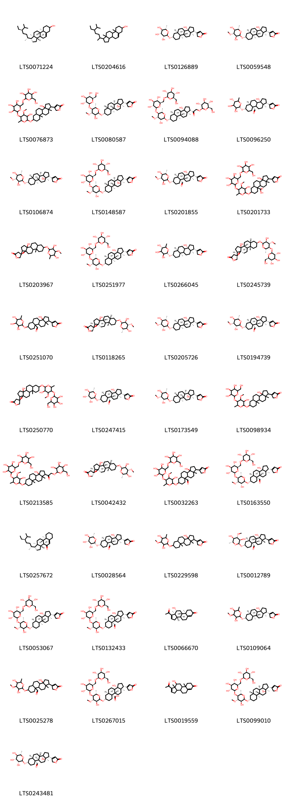{ width=100% }
    <figcaption>Hình ảnh cấu trúc hóa học của 41 hoạt chất thuộc nhóm Steroids and steroid derivatives gồm ['stigmast-5-en-3-ol (LTS0071224)', 'stigmast-5-en-3-ol, (3β)- (LTS0204616)', 'evomonoside (LTS0126889)', 'neriifolin (LTS0059548)', '4-{3a-hydroxy-7-[(3-hydroxy-4-methoxy-6-methyl-5-{[3,4,5-trihydroxy-6-({[3,4,5-trihydroxy-6-(hydroxymethyl)oxan-2-yl]oxy}methyl)oxan-2-yl]oxy}oxan-2-yl)oxy]-9a,11a-dimethyl-tetradecahydrocyclopenta[a]phenanthren-1-yl}-5h-furan-2-one (LTS0076873)', '4-[(1r,3as,3br,5as,7s,9as,9bs,11ar)-3a-hydroxy-7-{[(2r,3s,4s,5s,6s)-3-hydroxy-4-methoxy-6-methyl-5-{[(2s,3r,4s,5s,6r)-3,4,5-trihydroxy-6-(hydroxymethyl)oxan-2-yl]oxy}oxan-2-yl]oxy}-9a,11a-dimethyl-tetradecahydrocyclopenta[a]phenanthren-1-yl]-5h-furan-2-one (LTS0080587)', '1-[(1s,3as,3br,5ar,7s,9as,9bs,11ar)-3a-hydroxy-7-{[(2r,3r,4s,5s,6s)-3-hydroxy-4-methoxy-6-methyl-5-{[(2s,3r,4s,5s,6r)-3,4,5-trihydroxy-6-({[(2r,3r,4s,5s,6r)-3,4,5-trihydroxy-6-(hydroxymethyl)oxan-2-yl]oxy}methyl)oxan-2-yl]oxy}oxan-2-yl]oxy}-9a,11a-dimethyl-tetradecahydrocyclopenta[a]phenanthren-1-yl]-2-{[(2r,3r,4s,5s,6r)-3,4,5-trihydroxy-6-(hydroxymethyl)oxan-2-yl]oxy}ethanone (LTS0094088)', '(1r,3as,5ar,7s,9ar,11ar)-3a-hydroxy-11a-methyl-1-(5-oxo-2h-furan-3-yl)-7-{[(2s,5s)-3,4,5-trihydroxy-6-methyloxan-2-yl]oxy}-tetradecahydrocyclopenta[a]phenanthrene-9a-carbaldehyde (LTS0096250)', '4-[(1r,3as,3br,5as,7s,9as,9bs,11ar)-7-{[(2r,3s,4r,5s,6s)-3,5-dihydroxy-4-methoxy-6-methyloxan-2-yl]oxy}-3a-hydroxy-9a,11a-dimethyl-tetradecahydrocyclopenta[a]phenanthren-1-yl]-5h-furan-2-one (LTS0106874)', '4-[(1r,3as,3br,5as,7s,9as,9bs,11ar)-3a-hydroxy-7-{[(2r,3r,4s,5s,6s)-3-hydroxy-4-methoxy-6-methyl-5-{[(2s,3r,4s,5s,6r)-3,4,5-trihydroxy-6-({[(2r,3r,4s,5s,6r)-3,4,5-trihydroxy-6-(hydroxymethyl)oxan-2-yl]oxy}methyl)oxan-2-yl]oxy}oxan-2-yl]oxy}-9a,11a-dimethyl-tetradecahydrocyclopenta[a]phenanthren-1-yl]-5h-furan-2-one (LTS0148587)', 'peruvoside (LTS0201855)', '3a-hydroxy-7-[(3-hydroxy-4-methoxy-6-methyl-5-{[3,4,5-trihydroxy-6-({[3,4,5-trihydroxy-6-(hydroxymethyl)oxan-2-yl]oxy}methyl)oxan-2-yl]oxy}oxan-2-yl)oxy]-11a-methyl-1-(5-oxo-2h-furan-3-yl)-tetradecahydrocyclopenta[a]phenanthrene-9a-carboxylic acid (LTS0201733)', "16'-[(3,5-dihydroxy-4-methoxy-6-methyloxan-2-yl)oxy]-2'-hydroxy-13'-methyl-7'-oxaspiro[oxolane-3,6'-pentacyclo[10.8.0.0²,⁹.0⁵,⁹.0¹³,¹⁸]icosan]-5-one (LTS0203967)", '4-[(1r,3as,3br,5ar,7s,9as,9bs,11ar)-3a-hydroxy-7-{[(2r,3r,4s,5s,6s)-3-hydroxy-4-methoxy-6-methyl-5-{[(2s,3r,4s,5s,6r)-3,4,5-trihydroxy-6-({[(2r,3r,4s,5s,6r)-3,4,5-trihydroxy-6-(hydroxymethyl)oxan-2-yl]oxy}methyl)oxan-2-yl]oxy}oxan-2-yl]oxy}-9a,11a-dimethyl-tetradecahydrocyclopenta[a]phenanthren-1-yl]-5h-furan-2-one (LTS0251977)', '4-[(1r,3as,5ar,7s,9as,11ar)-3a-hydroxy-9a,11a-dimethyl-7-{[(2s,5s)-3,4,5-trihydroxy-6-methyloxan-2-yl]oxy}-tetradecahydrocyclopenta[a]phenanthren-1-yl]-5h-furan-2-one (LTS0266045)', "(1'r,2's,3r,5's,9'r,12's,13's,16's,18'r)-2'-hydroxy-16'-{[(2r,3s,4s,5s,6s)-3-hydroxy-4-methoxy-6-methyl-5-{[(2s,3r,4s,5s,6r)-3,4,5-trihydroxy-6-(hydroxymethyl)oxan-2-yl]oxy}oxan-2-yl]oxy}-13'-methyl-7'-oxaspiro[oxolane-3,6'-pentacyclo[10.8.0.0²,⁹.0⁵,⁹.0¹³,¹⁸]icosan]-5-one (LTS0245739)", '3a-hydroxy-11a-methyl-1-(5-oxo-2h-furan-3-yl)-7-[(3,4,5-trihydroxy-6-methyloxan-2-yl)oxy]-tetradecahydrocyclopenta[a]phenanthrene-9a-carbaldehyde (LTS0251070)', "(1'r,2's,3r,5's,9'r,12's,13's,16's,18'r)-16'-{[(2r,3s,4r,5s,6s)-3,5-dihydroxy-4-methoxy-6-methyloxan-2-yl]oxy}-2'-hydroxy-13'-methyl-7'-oxaspiro[oxolane-3,6'-pentacyclo[10.8.0.0²,⁹.0⁵,⁹.0¹³,¹⁸]icosan]-5-one (LTS0118265)", '4-[(1r,3as,3br,5ar,7s,9as,9bs,11ar)-7-{[(2r,3r,4r,5s,6s)-3,5-dihydroxy-4-methoxy-6-methyloxan-2-yl]oxy}-3a-hydroxy-9a,11a-dimethyl-tetradecahydrocyclopenta[a]phenanthren-1-yl]-5h-furan-2-one (LTS0205726)', '(1r,3as,3br,5ar,7s,9ar,9bs,11ar)-7-{[(2r,3r,4r,5s,6s)-3,5-dihydroxy-4-methoxy-6-methyloxan-2-yl]oxy}-3a-hydroxy-11a-methyl-1-(5-oxo-2h-furan-3-yl)-tetradecahydrocyclopenta[a]phenanthrene-9a-carbaldehyde (LTS0194739)', "2'-hydroxy-16'-[(3-hydroxy-4-methoxy-6-methyl-5-{[3,4,5-trihydroxy-6-(hydroxymethyl)oxan-2-yl]oxy}oxan-2-yl)oxy]-13'-methyl-7'-oxaspiro[oxolane-3,6'-pentacyclo[10.8.0.0²,⁹.0⁵,⁹.0¹³,¹⁸]icosan]-5-one (LTS0250770)", '(1r,3as,3br,5ar,7s,9ar,9bs,11ar)-3a-hydroxy-11a-methyl-1-(5-oxo-2h-furan-3-yl)-7-{[(2r,3r,4r,5r,6s)-3,4,5-trihydroxy-6-methyloxan-2-yl]oxy}-tetradecahydrocyclopenta[a]phenanthrene-9a-carbaldehyde (LTS0247415)', '4-[(1r,3as,3br,5as,7s,9as,9bs,11ar)-7-{[(2r,3r,4r,5s,6s)-3,5-dihydroxy-4-methoxy-6-methyloxan-2-yl]oxy}-3a-hydroxy-9a,11a-dimethyl-tetradecahydrocyclopenta[a]phenanthren-1-yl]-5h-furan-2-one (LTS0173549)', '4-{3a-hydroxy-7-[(3-hydroxy-4-methoxy-6-methyl-5-{[3,4,5-trihydroxy-6-(hydroxymethyl)oxan-2-yl]oxy}oxan-2-yl)oxy]-9a,11a-dimethyl-tetradecahydrocyclopenta[a]phenanthren-1-yl}-5h-furan-2-one (LTS0098934)', '1-{3a-hydroxy-7-[(3-hydroxy-4-methoxy-6-methyl-5-{[3,4,5-trihydroxy-6-({[3,4,5-trihydroxy-6-(hydroxymethyl)oxan-2-yl]oxy}methyl)oxan-2-yl]oxy}oxan-2-yl)oxy]-9a,11a-dimethyl-tetradecahydrocyclopenta[a]phenanthren-1-yl}-2-{[3,4,5-trihydroxy-6-(hydroxymethyl)oxan-2-yl]oxy}ethanone (LTS0213585)', "(1'r,2's,3s,5's,9'r,12's,13's,16's,18'r)-16'-{[(2r,3s,4r,5s,6s)-3,5-dihydroxy-4-methoxy-6-methyloxan-2-yl]oxy}-2'-hydroxy-13'-methyl-7'-oxaspiro[oxolane-3,6'-pentacyclo[10.8.0.0²,⁹.0⁵,⁹.0¹³,¹⁸]icosan]-5-one (LTS0042432)", '3a-hydroxy-7-[(3-hydroxy-4-methoxy-6-methyl-5-{[3,4,5-trihydroxy-6-({[3,4,5-trihydroxy-6-(hydroxymethyl)oxan-2-yl]oxy}methyl)oxan-2-yl]oxy}oxan-2-yl)oxy]-11a-methyl-1-(5-oxo-2h-furan-3-yl)-tetradecahydrocyclopenta[a]phenanthrene-9a-carbaldehyde (LTS0032263)', '(1r,3as,3br,5ar,7s,9ar,9bs,11ar)-3a-hydroxy-7-{[(2r,3r,4s,5s,6s)-3-hydroxy-4-methoxy-6-methyl-5-{[(2s,3r,4s,5s,6r)-3,4,5-trihydroxy-6-({[(2r,3r,4s,5s,6r)-3,4,5-trihydroxy-6-(hydroxymethyl)oxan-2-yl]oxy}methyl)oxan-2-yl]oxy}oxan-2-yl]oxy}-11a-methyl-1-(5-oxo-2h-furan-3-yl)-tetradecahydrocyclopenta[a]phenanthrene-9a-carbaldehyde (LTS0163550)', '(1r,3as,3bs,9ar,9bs,11ar)-1-[(2r,5r)-5-ethyl-6-methylheptan-2-yl]-9a,11a-dimethyl-1h,2h,3h,3ah,3bh,6h,7h,8h,9h,9bh,10h,11h-cyclopenta[a]phenanthren-4-one (LTS0257672)', '(1r,3as,3br,5ar,7s,9ar,9bs,11ar)-3a-hydroxy-11a-methyl-1-(5-oxo-2h-furan-3-yl)-7-{[(2s,3r,4r,5r,6s)-3,4,5-trihydroxy-6-methyloxan-2-yl]oxy}-tetradecahydrocyclopenta[a]phenanthrene-9a-carbaldehyde (LTS0028564)', 'neriifolin (LTS0229598)', '(1s,3as,3bs,5ar,7s,9ar,9bs,11as)-7-{[(2s,3r,4s,5r,6r)-3,5-dihydroxy-4-methoxy-6-methyloxan-2-yl]oxy}-3a-hydroxy-11a-methyl-1-(5-oxo-2h-furan-3-yl)-tetradecahydrocyclopenta[a]phenanthrene-9a-carbaldehyde (LTS0012789)', 'thevetin b (LTS0053067)', 'thevetin a (LTS0132433)', '(3as,3br,9ar,9bs,11r,11as)-1-acetyl-11-hydroxy-9a,11a-dimethyl-3h,3ah,3bh,4h,5h,8h,9h,9bh,10h,11h-cyclopenta[a]phenanthren-7-one (LTS0066670)', '4-[(1r,3as,3br,5ar,7s,9as,9bs,11ar)-7-[(3,5-dihydroxy-4-methoxy-6-methyloxan-2-yl)oxy]-3a-hydroxy-9a,11a-dimethyl-tetradecahydrocyclopenta[a]phenanthren-1-yl]-5h-furan-2-one (LTS0109064)', 'peruvoside (LTS0025278)', '(1r,3as,3br,5ar,7s,9ar,9bs,11ar)-3a-hydroxy-7-{[(2r,3s,4s,5s,6s)-3-hydroxy-4-methoxy-6-methyl-5-{[(2s,3r,4s,5s,6r)-3,4,5-trihydroxy-6-({[(2r,3r,4s,5s,6r)-3,4,5-trihydroxy-6-(hydroxymethyl)oxan-2-yl]oxy}methyl)oxan-2-yl]oxy}oxan-2-yl]oxy}-11a-methyl-1-(5-oxo-2h-furan-3-yl)-tetradecahydrocyclopenta[a]phenanthrene-9a-carboxylic acid (LTS0267015)', '1-acetyl-11-hydroxy-9a,11a-dimethyl-3h,3ah,3bh,4h,5h,8h,9h,9bh,10h,11h-cyclopenta[a]phenanthren-7-one (LTS0019559)', '4-[(1r,3as,3br,5as,7s,9as,9bs,11ar)-3a-hydroxy-7-{[(2r,3s,4s,5s,6s)-3-hydroxy-4-methoxy-6-methyl-5-{[(2s,3r,4s,5s,6r)-3,4,5-trihydroxy-6-({[(2r,3r,4s,5s,6r)-3,4,5-trihydroxy-6-(hydroxymethyl)oxan-2-yl]oxy}methyl)oxan-2-yl]oxy}oxan-2-yl]oxy}-9a,11a-dimethyl-tetradecahydrocyclopenta[a]phenanthren-1-yl]-5h-furan-2-one (LTS0099010)', '(1r,3as,3bs,5ar,7s,9ar,9br,11ar)-3a-hydroxy-11a-methyl-1-(5-oxo-2h-furan-3-yl)-7-{[(2r,3r,4r,5r,6s)-3,4,5-trihydroxy-6-methyloxan-2-yl]oxy}-tetradecahydrocyclopenta[a]phenanthrene-9a-carbaldehyde (LTS0243481)'].</figcaption>
</figure>

---

### Dược dân tộc học

Danh sách các quốc gia có sử dụng *Cascabela thevetia* trong điều trị các bệnh. 

| Country   | Disease   | Bệnh                                                                                                                                                                                                |
|:----------|:----------|:----------------------------------------------------------------------------------------------------------------------------------------------------------------------------------------------------|
| Java      | Piscicide | MYMEMORY WARNING: YOU USED ALL AVAILABLE FREE TRANSLATIONS FOR TODAY. NEXT AVAILABLE IN  11 HOURS 41 MINUTES 30 SECONDS VISIT HTTPS://MYMEMORY.TRANSLATED.NET/DOC/USAGELIMITS.PHP TO TRANSLATE MORE |

---

# Chi Funtumia

??? note "Danh sách các dược liệu thuộc chi"
    
	 - *Funtumia africana*

---
## Funtumia africana
### Thông tin về thực vật

!!! info "Phân loại thực vật của *Funtumia africana* từ GIBF:"
    - **Kingdom:** Plantae
    - **Phylum:** Tracheophyta
    - **Order:** Gentianales
    - **Family:** Apocynaceae
    - **Genus:** Funtumia
    - **Species:** *Funtumia africana*

 

| Label (VI)   | Label (EN)   | Scientific Name   | Descriptions (VI)   | Descriptions (EN)   | Also Known As (VI)   | Also Known As (EN)   |
|:-------------|:-------------|:------------------|:--------------------|:--------------------|:---------------------|:---------------------|
| N/A          | N/A          | Funtumia africana | loài thực vật       | species of plant    | ['']                 | ['']                 |

#### Phân bố trên thế giới

**Từ CSDL GIBF** Liberia, Gabon, Côte d’Ivoire, Mozambique, Cameroon, Guinea

#### Phân bố tại Việt Nam

**Từ CSDL GIBF**: Không có ghi nhận ở Việt Nam

---
### Thành phần hóa học
        
- Theo cơ sở dữ liệu lotus: Từ loài *Funtumia africana* đã phân lập và xác định được Chưa có hoạt chất nào được phân lập. hoạt chất thuộc về các nhóm Không có hoạt chất nào được phân lập. 

Không có hình ảnh nào được tạo ra

---

### Dược dân tộc học

Danh sách các quốc gia có sử dụng *Funtumia africana* trong điều trị các bệnh. 

| Country   | Disease   | Bệnh                                                                                                                                                                                                |
|:----------|:----------|:----------------------------------------------------------------------------------------------------------------------------------------------------------------------------------------------------|
| Ghana     | Laxative  | MYMEMORY WARNING: YOU USED ALL AVAILABLE FREE TRANSLATIONS FOR TODAY. NEXT AVAILABLE IN  11 HOURS 40 MINUTES 29 SECONDS VISIT HTTPS://MYMEMORY.TRANSLATED.NET/DOC/USAGELIMITS.PHP TO TRANSLATE MORE |

---

# Chi Rejoua

??? note "Danh sách các dược liệu thuộc chi"
    
	 - *Rejoua novo-guineensis*

---
## Rejoua novoguineensis
### Thông tin về thực vật

!!! info "Phân loại thực vật của *Tabernaemontana aurantiaca* từ GIBF:"
    - **Kingdom:** Plantae
    - **Phylum:** Tracheophyta
    - **Order:** Gentianales
    - **Family:** Apocynaceae
    - **Genus:** Tabernaemontana
    - **Species:** *Tabernaemontana aurantiaca*

 

| Label (VI)   | Label (EN)   | Scientific Name       | Descriptions (VI)   | Descriptions (EN)   | Also Known As (VI)   | Also Known As (EN)   |
|:-------------|:-------------|:----------------------|:--------------------|:--------------------|:---------------------|:---------------------|
| N/A          | N/A          | Rejoua novoguineensis | loài thực vật       | species of plant    | ['']                 | ['']                 |

#### Phân bố trên thế giới

**Từ CSDL GIBF** Papua New Guinea

#### Phân bố tại Việt Nam

**Từ CSDL GIBF**: Không có ghi nhận ở Việt Nam

---
### Thành phần hóa học
        
- Theo cơ sở dữ liệu lotus: Từ loài *Tabernaemontana aurantiaca* đã phân lập và xác định được Chưa có hoạt chất nào được phân lập. hoạt chất thuộc về các nhóm Không có hoạt chất nào được phân lập. 

Không có hình ảnh nào được tạo ra

---

### Dược dân tộc học

Danh sách các quốc gia có sử dụng *Tabernaemontana aurantiaca* trong điều trị các bệnh. 

| Country   | Disease   | Bệnh                                                                                                                                                                                                |
|:----------|:----------|:----------------------------------------------------------------------------------------------------------------------------------------------------------------------------------------------------|
| Solomon I | Vesicant  | MYMEMORY WARNING: YOU USED ALL AVAILABLE FREE TRANSLATIONS FOR TODAY. NEXT AVAILABLE IN  11 HOURS 39 MINUTES 54 SECONDS VISIT HTTPS://MYMEMORY.TRANSLATED.NET/DOC/USAGELIMITS.PHP TO TRANSLATE MORE |

---

# Chi Ochrosia

??? note "Danh sách các dược liệu thuộc chi"
    
	 - *Ochrosia borbonica*
	 - *Ochrosia elliptica*
	 - *Ochrosia oppositifolia*

---
## Ochrosia borbonica
### Thông tin về thực vật

!!! info "Phân loại thực vật của *Ochrosia borbonica* từ GIBF:"
    - **Kingdom:** Plantae
    - **Phylum:** Tracheophyta
    - **Order:** Gentianales
    - **Family:** Apocynaceae
    - **Genus:** Ochrosia
    - **Species:** *Ochrosia borbonica*

 

| Label (VI)   | Label (EN)   | Scientific Name    | Descriptions (VI)   | Descriptions (EN)   | Also Known As (VI)   | Also Known As (EN)   |
|:-------------|:-------------|:-------------------|:--------------------|:--------------------|:---------------------|:---------------------|
| N/A          | N/A          | Ochrosia borbonica | loài thực vật       | species of plant    | ['']                 | ['']                 |

#### Phân bố trên thế giới

**Từ CSDL GIBF** Réunion, Maldives, Belgium, Mauritius, France

#### Phân bố tại Việt Nam

**Từ CSDL GIBF**: Không có ghi nhận ở Việt Nam

---
### Thành phần hóa học
        
- Theo cơ sở dữ liệu lotus: Từ loài *Ochrosia borbonica* đã phân lập và xác định được Chưa có hoạt chất nào được phân lập. hoạt chất thuộc về các nhóm Không có hoạt chất nào được phân lập. 

Không có hình ảnh nào được tạo ra

---

### Dược dân tộc học

Danh sách các quốc gia có sử dụng *Ochrosia borbonica* trong điều trị các bệnh. 

| Country   | Disease   | Bệnh                                                                                                                                                                                                |
|:----------|:----------|:----------------------------------------------------------------------------------------------------------------------------------------------------------------------------------------------------|
| Reunion   | Tonic     | MYMEMORY WARNING: YOU USED ALL AVAILABLE FREE TRANSLATIONS FOR TODAY. NEXT AVAILABLE IN  11 HOURS 39 MINUTES 21 SECONDS VISIT HTTPS://MYMEMORY.TRANSLATED.NET/DOC/USAGELIMITS.PHP TO TRANSLATE MORE |

---

---
## Ochrosia elliptica
### Thông tin về thực vật

!!! info "Phân loại thực vật của *Ochrosia elliptica* từ GIBF:"
    - **Kingdom:** Plantae
    - **Phylum:** Tracheophyta
    - **Order:** Gentianales
    - **Family:** Apocynaceae
    - **Genus:** Ochrosia
    - **Species:** *Ochrosia elliptica*

 

| Label (VI)   | Label (EN)   | Scientific Name    | Descriptions (VI)   | Descriptions (EN)                          | Also Known As (VI)   | Also Known As (EN)                               |
|:-------------|:-------------|:-------------------|:--------------------|:-------------------------------------------|:---------------------|:-------------------------------------------------|
| N/A          | N/A          | Ochrosia elliptica | loài thực vật       | species of plant in the family Apocynaceae | ['']                 | ['Ochrosia', 'Bloodhorn', 'Scarlet Wedge-apple'] |

#### Phân bố trên thế giới

**Từ CSDL GIBF** United States of America, Vanuatu, Bonaire, Sint Eustatius and Saba, Bermuda, Belgium, New Caledonia, China, Australia, New Zealand, Ecuador, Nauru, Puerto Rico

#### Phân bố tại Việt Nam

**Từ CSDL GIBF**: Không có ghi nhận ở Việt Nam

---
### Thành phần hóa học
        
- Theo cơ sở dữ liệu lotus: Từ loài *Ochrosia elliptica* đã phân lập và xác định được 15 hoạt chất thuộc về các nhóm Indoles and derivatives, Quinolines and derivatives, Yohimbine alkaloids, Pleiocarpaman alkaloids, Strychnos alkaloids, Vallesaman alkaloids. 

|    | chemicalTaxonomyClassyfireClass   |   smiles_count |
|---:|:----------------------------------|---------------:|
|  0 | Indoles and derivatives           |              3 |
|  1 | Pleiocarpaman alkaloids           |              2 |
|  2 | Quinolines and derivatives        |              1 |
|  3 | Strychnos alkaloids               |              1 |
|  4 | Vallesaman alkaloids              |              2 |
|  5 | Yohimbine alkaloids               |              5 |

#### Nhóm Indoles and derivatives
<figure markdown="span">
    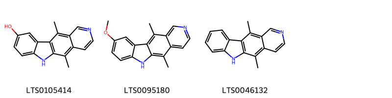{ width=100% }
    <figcaption>Hình ảnh cấu trúc hóa học của 3 hoạt chất thuộc nhóm Indoles and derivatives gồm ['9-hydroxyellipticine (LTS0105414)', '9-methoxyellipticine (LTS0095180)', 'ellipticine (LTS0046132)'].</figcaption>
</figure>
#### Nhóm Pleiocarpaman alkaloids
<figure markdown="span">
    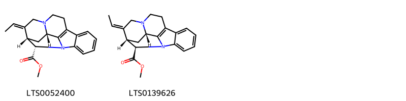{ width=100% }
    <figcaption>Hình ảnh cấu trúc hóa học của 2 hoạt chất thuộc nhóm Pleiocarpaman alkaloids gồm ['pleiocarpamine (LTS0052400)', 'methyl (13z,14s,16s,18r)-13-ethylidene-1,11-diazapentacyclo[12.3.1.0²,⁷.0⁸,¹⁷.0¹¹,¹⁶]octadeca-2,4,6,8(17)-tetraene-18-carboxylate (LTS0139626)'].</figcaption>
</figure>
#### Nhóm Quinolines and derivatives
<figure markdown="span">
    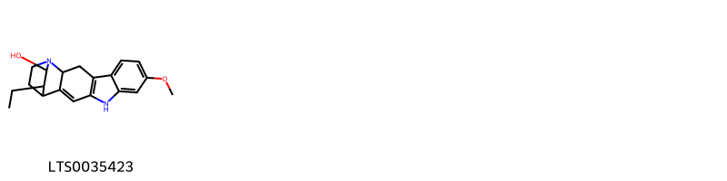{ width=100% }
    <figcaption>Hình ảnh cấu trúc hóa học của 1 hoạt chất thuộc nhóm Quinolines and derivatives gồm ['elliptinine (LTS0035423)'].</figcaption>
</figure>
#### Nhóm Strychnos alkaloids
<figure markdown="span">
    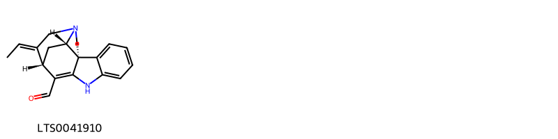{ width=100% }
    <figcaption>Hình ảnh cấu trúc hóa học của 1 hoạt chất thuộc nhóm Strychnos alkaloids gồm ['(1r,11s,12e,17s)-12-ethylidene-8,14-diazapentacyclo[9.5.2.0¹,⁹.0²,⁷.0¹⁴,¹⁷]octadeca-2,4,6,9-tetraene-10-carbaldehyde (LTS0041910)'].</figcaption>
</figure>
#### Nhóm Vallesaman alkaloids
<figure markdown="span">
    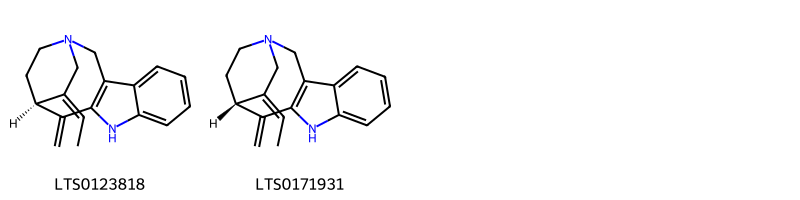{ width=100% }
    <figcaption>Hình ảnh cấu trúc hóa học của 2 hoạt chất thuộc nhóm Vallesaman alkaloids gồm ['(-)-apparicine (LTS0123818)', '(13r,14e)-14-ethylidene-12-methylidene-1,10-diazatetracyclo[11.2.2.0³,¹¹.0⁴,⁹]heptadeca-3(11),4,6,8-tetraene (LTS0171931)'].</figcaption>
</figure>
#### Nhóm Yohimbine alkaloids
<figure markdown="span">
    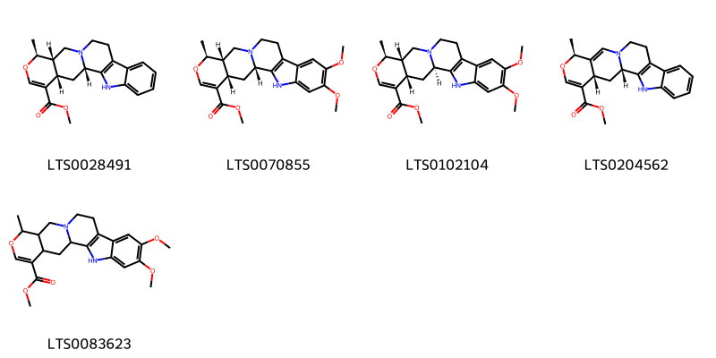{ width=100% }
    <figcaption>Hình ảnh cấu trúc hóa học của 5 hoạt chất thuộc nhóm Yohimbine alkaloids gồm ['tetrahydroalstonine (LTS0028491)', '3-isoreserpiline (LTS0070855)', 'reserpiline (LTS0102104)', 'cathenamine (LTS0204562)', 'reserpiline (LTS0083623)'].</figcaption>
</figure>

---

### Dược dân tộc học

Danh sách các quốc gia có sử dụng *Ochrosia elliptica* trong điều trị các bệnh. 

| Country   | Disease   | Bệnh                                                                                                                                                                                                |
|:----------|:----------|:----------------------------------------------------------------------------------------------------------------------------------------------------------------------------------------------------|
| Elsewhere | Poison    | MYMEMORY WARNING: YOU USED ALL AVAILABLE FREE TRANSLATIONS FOR TODAY. NEXT AVAILABLE IN  11 HOURS 38 MINUTES 47 SECONDS VISIT HTTPS://MYMEMORY.TRANSLATED.NET/DOC/USAGELIMITS.PHP TO TRANSLATE MORE |

---

---
## Ochrosia oppositifolia
### Thông tin về thực vật

!!! info "Phân loại thực vật của *Ochrosia oppositifolia* từ GIBF:"
    - **Kingdom:** Plantae
    - **Phylum:** Tracheophyta
    - **Order:** Gentianales
    - **Family:** Apocynaceae
    - **Genus:** Ochrosia
    - **Species:** *Ochrosia oppositifolia*

 

| Label (VI)   | Label (EN)   | Scientific Name        | Descriptions (VI)   | Descriptions (EN)   | Also Known As (VI)   | Also Known As (EN)   |
|:-------------|:-------------|:-----------------------|:--------------------|:--------------------|:---------------------|:---------------------|
| N/A          | N/A          | Ochrosia oppositifolia | loài thực vật       | species of plant    | ['']                 | ['']                 |

#### Phân bố trên thế giới

**Từ CSDL GIBF** nan, British Indian Ocean Territory, Cocos (Keeling) Islands, Marshall Islands, New Caledonia, French Polynesia, Papua New Guinea, Thailand, United States of America, Tonga, Seychelles, Indonesia, Wallis and Futuna, unknown or invalid, French Southern Territories, Fiji, Vanuatu, Niue, Maldives, Guam, Malaysia, Philippines, Chinese Taipei, Palau, Solomon Islands, United States Minor Outlying Islands, Timor-Leste, Cook Islands, Micronesia (Federated States of), Northern Mariana Islands

#### Phân bố tại Việt Nam

**Từ CSDL GIBF**: Không có ghi nhận ở Việt Nam

---
### Thành phần hóa học
        
- Theo cơ sở dữ liệu lotus: Từ loài *Ochrosia oppositifolia* đã phân lập và xác định được 3 hoạt chất thuộc về các nhóm Yohimbine alkaloids, Indoles and derivatives. 

|    | chemicalTaxonomyClassyfireClass   |   smiles_count |
|---:|:----------------------------------|---------------:|
|  0 | Indoles and derivatives           |              1 |
|  1 | Yohimbine alkaloids               |              2 |

#### Nhóm Indoles and derivatives
<figure markdown="span">
    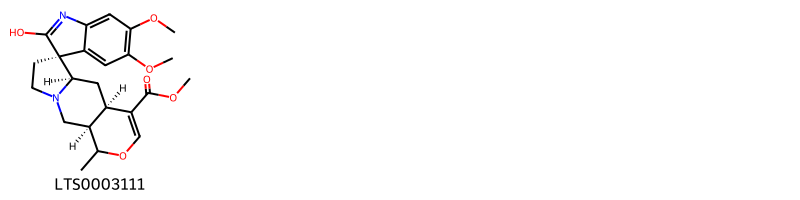{ width=100% }
    <figcaption>Hình ảnh cấu trúc hóa học của 1 hoạt chất thuộc nhóm Indoles and derivatives gồm ["methyl (3s,4'ar,5'ar,10'ar)-2-hydroxy-5,6-dimethoxy-1'-methyl-1',4'a,5',5'a,7',8',10',10'a-octahydrospiro[indole-3,6'-pyrano[3,4-f]indolizine]-4'-carboxylate (LTS0003111)"].</figcaption>
</figure>
#### Nhóm Yohimbine alkaloids
<figure markdown="span">
    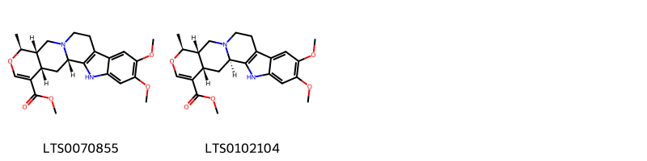{ width=100% }
    <figcaption>Hình ảnh cấu trúc hóa học của 2 hoạt chất thuộc nhóm Yohimbine alkaloids gồm ['3-isoreserpiline (LTS0070855)', 'reserpiline (LTS0102104)'].</figcaption>
</figure>

---

### Dược dân tộc học

Danh sách các quốc gia có sử dụng *Ochrosia oppositifolia* trong điều trị các bệnh. 

| Country   | Disease   | Bệnh                                                                                                                                                                                                |
|:----------|:----------|:----------------------------------------------------------------------------------------------------------------------------------------------------------------------------------------------------|
| Elsewhere | Poison    | MYMEMORY WARNING: YOU USED ALL AVAILABLE FREE TRANSLATIONS FOR TODAY. NEXT AVAILABLE IN  11 HOURS 38 MINUTES 07 SECONDS VISIT HTTPS://MYMEMORY.TRANSLATED.NET/DOC/USAGELIMITS.PHP TO TRANSLATE MORE |

---

# Chi Tabernaemontana

??? note "Danh sách các dược liệu thuộc chi"
    
	 - *Tabernaemontana amygdalifolia*
	 - *Tabernaemontana citrifolia*
	 - *Tabernaemontana coronaria*

---
## Tabernaemontana amygdalifolia
### Thông tin về thực vật

!!! info "Phân loại thực vật của *Tabernaemontana amygdalifolia* từ GIBF:"
    - **Kingdom:** Plantae
    - **Phylum:** Tracheophyta
    - **Order:** Gentianales
    - **Family:** Apocynaceae
    - **Genus:** Tabernaemontana
    - **Species:** *Tabernaemontana amygdalifolia*

 

| Label (VI)   | Label (EN)   | Scientific Name               | Descriptions (VI)   | Descriptions (EN)   | Also Known As (VI)   | Also Known As (EN)   |
|:-------------|:-------------|:------------------------------|:--------------------|:--------------------|:---------------------|:---------------------|
| N/A          | N/A          | Tabernaemontana amygdalifolia | loài thực vật       | species of plant    | ['']                 | ['']                 |

#### Phân bố trên thế giới

**Từ CSDL GIBF** Mexico, Nicaragua, El Salvador, Colombia, Ecuador, Venezuela (Bolivarian Republic of)

#### Phân bố tại Việt Nam

**Từ CSDL GIBF**: Không có ghi nhận ở Việt Nam

---
### Thành phần hóa học
        
- Theo cơ sở dữ liệu lotus: Từ loài *Tabernaemontana amygdalifolia* đã phân lập và xác định được 8 hoạt chất thuộc về các nhóm Aspidospermatan-type alkaloids. 

|    | chemicalTaxonomyClassyfireClass   |   smiles_count |
|---:|:----------------------------------|---------------:|
|  0 | Aspidospermatan-type alkaloids    |              8 |

#### Nhóm Aspidospermatan-type alkaloids
<figure markdown="span">
    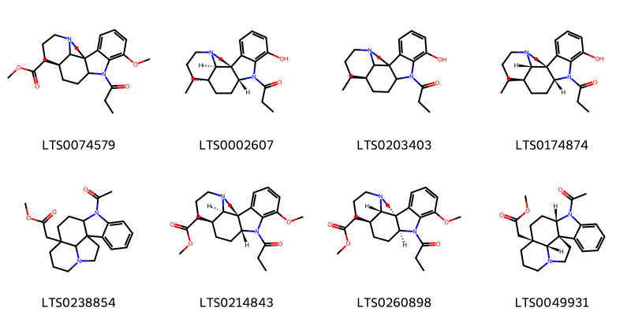{ width=100% }
    <figcaption>Hình ảnh cấu trúc hóa học của 8 hoạt chất thuộc nhóm Aspidospermatan-type alkaloids gồm ['methyl 2-{6-methoxy-8-propanoyl-8,16-diazapentacyclo[10.6.1.0¹,⁹.0²,⁷.0¹⁶,¹⁹]nonadeca-2,4,6-trien-12-yl}acetate (LTS0074579)', '1-[(1r,9r,12r,19r)-12-ethyl-6-hydroxy-8,16-diazapentacyclo[10.6.1.0¹,⁹.0²,⁷.0¹⁶,¹⁹]nonadeca-2,4,6-trien-8-yl]propan-1-one (LTS0002607)', '1-{12-ethyl-6-hydroxy-8,16-diazapentacyclo[10.6.1.0¹,⁹.0²,⁷.0¹⁶,¹⁹]nonadeca-2,4,6-trien-8-yl}propan-1-one (LTS0203403)', '1-[(1r,9r,12s,19s)-12-ethyl-6-hydroxy-8,16-diazapentacyclo[10.6.1.0¹,⁹.0²,⁷.0¹⁶,¹⁹]nonadeca-2,4,6-trien-8-yl]propan-1-one (LTS0174874)', 'methyl 2-{8-acetyl-8,16-diazapentacyclo[10.6.1.0¹,⁹.0²,⁷.0¹⁶,¹⁹]nonadeca-2,4,6-trien-12-yl}acetate (LTS0238854)', 'methyl 2-[(1r,9r,12s,19r)-6-methoxy-8-propanoyl-8,16-diazapentacyclo[10.6.1.0¹,⁹.0²,⁷.0¹⁶,¹⁹]nonadeca-2,4,6-trien-12-yl]acetate (LTS0214843)', 'methyl 2-[(1s,9s,12s,19s)-6-methoxy-8-propanoyl-8,16-diazapentacyclo[10.6.1.0¹,⁹.0²,⁷.0¹⁶,¹⁹]nonadeca-2,4,6-trien-12-yl]acetate (LTS0260898)', 'methyl 2-[(1s,9s,12r,19r)-8-acetyl-8,16-diazapentacyclo[10.6.1.0¹,⁹.0²,⁷.0¹⁶,¹⁹]nonadeca-2,4,6-trien-12-yl]acetate (LTS0049931)'].</figcaption>
</figure>

---

### Dược dân tộc học

Danh sách các quốc gia có sử dụng *Tabernaemontana amygdalifolia* trong điều trị các bệnh. 

| Country   | Disease   | Bệnh                                                                                                                                                                                                |
|:----------|:----------|:----------------------------------------------------------------------------------------------------------------------------------------------------------------------------------------------------|
| Mexico    | Purgative | MYMEMORY WARNING: YOU USED ALL AVAILABLE FREE TRANSLATIONS FOR TODAY. NEXT AVAILABLE IN  11 HOURS 37 MINUTES 40 SECONDS VISIT HTTPS://MYMEMORY.TRANSLATED.NET/DOC/USAGELIMITS.PHP TO TRANSLATE MORE |

---

---
## Tabernaemontana citrifolia
### Thông tin về thực vật

!!! info "Phân loại thực vật của *Tabernaemontana citrifolia* từ GIBF:"
    - **Kingdom:** Plantae
    - **Phylum:** Tracheophyta
    - **Order:** Gentianales
    - **Family:** Apocynaceae
    - **Genus:** Tabernaemontana
    - **Species:** *Tabernaemontana citrifolia*

 

| Label (VI)   | Label (EN)   | Scientific Name            | Descriptions (VI)   | Descriptions (EN)   | Also Known As (VI)   | Also Known As (EN)   |
|:-------------|:-------------|:---------------------------|:--------------------|:--------------------|:---------------------|:---------------------|
| N/A          | N/A          | Tabernaemontana citrifolia | loài thực vật       | species of plant    | ['']                 | ['']                 |

#### Phân bố trên thế giới

**Từ CSDL GIBF** nan, Saint Kitts and Nevis, Guadeloupe, Saint Lucia, Trinidad and Tobago, Anguilla, Puerto Rico, United States of America, Jamaica, Dominican Republic, Saint Martin (French part), Colombia, Cuba, unknown or invalid, Dominica, Mexico, Haiti, Bonaire, Sint Eustatius and Saba, Martinique, Bahamas, Saint Vincent and the Grenadines, Belize

#### Phân bố tại Việt Nam

**Từ CSDL GIBF**: Không có ghi nhận ở Việt Nam

---
### Thành phần hóa học
        
- Theo cơ sở dữ liệu lotus: Từ loài *Tabernaemontana citrifolia* đã phân lập và xác định được 36 hoạt chất thuộc về các nhóm Indoles and derivatives, Macroline alkaloids, Plumeran-type alkaloids, Aspidospermatan-type alkaloids, Ibogan-type alkaloids, Vallesaman alkaloids. 

|    | chemicalTaxonomyClassyfireClass   |   smiles_count |
|---:|:----------------------------------|---------------:|
|  0 | Aspidospermatan-type alkaloids    |              2 |
|  1 | Ibogan-type alkaloids             |             22 |
|  2 | Indoles and derivatives           |              1 |
|  3 | Macroline alkaloids               |              2 |
|  4 | Plumeran-type alkaloids           |              4 |
|  5 | Vallesaman alkaloids              |              5 |

#### Nhóm Aspidospermatan-type alkaloids
<figure markdown="span">
    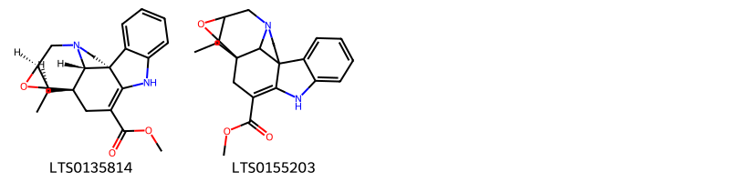{ width=100% }
    <figcaption>Hình ảnh cấu trúc hóa học của 2 hoạt chất thuộc nhóm Aspidospermatan-type alkaloids gồm ['methyl (1r,12s,13r,15s,20r)-12-ethyl-14-oxa-8,17-diazahexacyclo[10.7.1.0¹,⁹.0²,⁷.0¹³,¹⁵.0¹⁷,²⁰]icosa-2,4,6,9-tetraene-10-carboxylate (LTS0135814)', 'methyl 12-ethyl-14-oxa-8,17-diazahexacyclo[10.7.1.0¹,⁹.0²,⁷.0¹³,¹⁵.0¹⁷,²⁰]icosa-2,4,6,9-tetraene-10-carboxylate (LTS0155203)'].</figcaption>
</figure>
#### Nhóm Ibogan-type alkaloids
<figure markdown="span">
    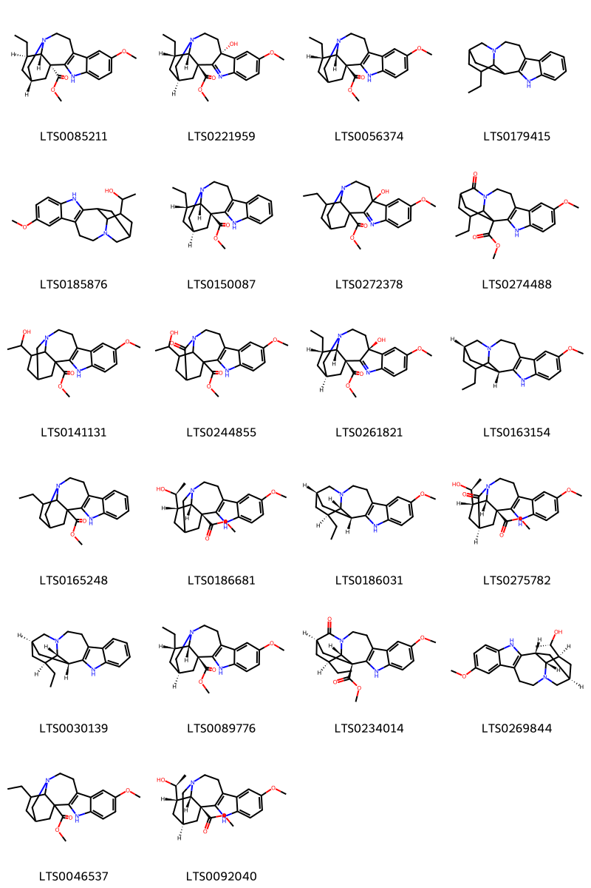{ width=100% }
    <figcaption>Hình ảnh cấu trúc hóa học của 22 hoạt chất thuộc nhóm Ibogan-type alkaloids gồm ['methyl (1r,15s,17r,18s)-17-ethyl-7-methoxy-3,13-diazapentacyclo[13.3.1.0²,¹⁰.0⁴,⁹.0¹³,¹⁸]nonadeca-2(10),4,6,8-tetraene-1-carboxylate (LTS0085211)', 'methyl (1s,10r,15r,17s,18s)-17-ethyl-10-hydroxy-7-methoxy-3,13-diazapentacyclo[13.3.1.0²,¹⁰.0⁴,⁹.0¹³,¹⁸]nonadeca-2,4,6,8-tetraene-1-carboxylate (LTS0221959)', 'methyl (1s,17s,18s)-17-ethyl-7-methoxy-3,13-diazapentacyclo[13.3.1.0²,¹⁰.0⁴,⁹.0¹³,¹⁸]nonadeca-2(10),4,6,8-tetraene-1-carboxylate (LTS0056374)', '17-ethyl-3,13-diazapentacyclo[13.3.1.0²,¹⁰.0⁴,⁹.0¹³,¹⁸]nonadeca-2(10),4,6,8-tetraene (LTS0179415)', '1-{7-methoxy-3,13-diazapentacyclo[13.3.1.0²,¹⁰.0⁴,⁹.0¹³,¹⁸]nonadeca-2(10),4,6,8-tetraen-17-yl}ethanol (LTS0185876)', 'methyl (1s,15r,17s,18s)-17-ethyl-3,13-diazapentacyclo[13.3.1.0²,¹⁰.0⁴,⁹.0¹³,¹⁸]nonadeca-2(10),4,6,8-tetraene-1-carboxylate (LTS0150087)', 'methyl 17-ethyl-10-hydroxy-7-methoxy-3,13-diazapentacyclo[13.3.1.0²,¹⁰.0⁴,⁹.0¹³,¹⁸]nonadeca-2,4,6,8-tetraene-1-carboxylate (LTS0272378)', 'methyl 17-ethyl-7-methoxy-14-oxo-3,13-diazapentacyclo[13.3.1.0²,¹⁰.0⁴,⁹.0¹³,¹⁸]nonadeca-2(10),4,6,8-tetraene-1-carboxylate (LTS0274488)', 'methyl 17-(1-hydroxyethyl)-7-methoxy-3,13-diazapentacyclo[13.3.1.0²,¹⁰.0⁴,⁹.0¹³,¹⁸]nonadeca-2(10),4,6,8-tetraene-1-carboxylate (LTS0141131)', 'methyl 17-(1-hydroxyethyl)-7-methoxy-14-oxo-3,13-diazapentacyclo[13.3.1.0²,¹⁰.0⁴,⁹.0¹³,¹⁸]nonadeca-2(10),4,6,8-tetraene-1-carboxylate (LTS0244855)', 'methyl (1s,10s,15r,17s,18s)-17-ethyl-10-hydroxy-7-methoxy-3,13-diazapentacyclo[13.3.1.0²,¹⁰.0⁴,⁹.0¹³,¹⁸]nonadeca-2,4,6,8-tetraene-1-carboxylate (LTS0261821)', '(1r,15s)-17-ethyl-7-methoxy-3,13-diazapentacyclo[13.3.1.0²,¹⁰.0⁴,⁹.0¹³,¹⁸]nonadeca-2(10),4,6,8-tetraene (LTS0163154)', 'coronaridine (LTS0165248)', 'methyl (1s,17s,18s)-17-[(1s)-1-hydroxyethyl]-7-methoxy-3,13-diazapentacyclo[13.3.1.0²,¹⁰.0⁴,⁹.0¹³,¹⁸]nonadeca-2(10),4,6,8-tetraene-1-carboxylate (LTS0186681)', 'endabuse (LTS0186031)', 'methyl (1s,15r,17s,18s)-17-[(1s)-1-hydroxyethyl]-7-methoxy-14-oxo-3,13-diazapentacyclo[13.3.1.0²,¹⁰.0⁴,⁹.0¹³,¹⁸]nonadeca-2(10),4,6,8-tetraene-1-carboxylate (LTS0275782)', 'ibogamine (LTS0030139)', 'voacangine (LTS0089776)', 'methyl (1s,15r,17s,18s)-17-ethyl-7-methoxy-14-oxo-3,13-diazapentacyclo[13.3.1.0²,¹⁰.0⁴,⁹.0¹³,¹⁸]nonadeca-2(10),4,6,8-tetraene-1-carboxylate (LTS0234014)', '(1s)-1-[(1r,15s,17s,18r)-7-methoxy-3,13-diazapentacyclo[13.3.1.0²,¹⁰.0⁴,⁹.0¹³,¹⁸]nonadeca-2(10),4,6,8-tetraen-17-yl]ethanol (LTS0269844)', 'voacangine (LTS0046537)', 'methyl (1s,15r,17s,18s)-17-[(1s)-1-hydroxyethyl]-7-methoxy-3,13-diazapentacyclo[13.3.1.0²,¹⁰.0⁴,⁹.0¹³,¹⁸]nonadeca-2(10),4,6,8-tetraene-1-carboxylate (LTS0092040)'].</figcaption>
</figure>
#### Nhóm Indoles and derivatives
<figure markdown="span">
    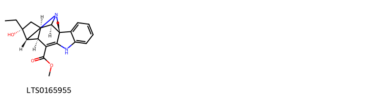{ width=100% }
    <figcaption>Hình ảnh cấu trúc hóa học của 1 hoạt chất thuộc nhóm Indoles and derivatives gồm ['methyl (1s,5r,6r,8r,9r,10s)-8-ethyl-8-hydroxy-4,13-diazahexacyclo[10.7.0.0¹,⁵.0⁴,⁹.0⁶,¹⁰.0¹⁴,¹⁹]nonadeca-11,14,16,18-tetraene-11-carboxylate (LTS0165955)'].</figcaption>
</figure>
#### Nhóm Macroline alkaloids
<figure markdown="span">
    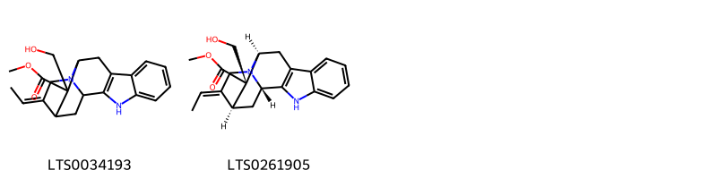{ width=100% }
    <figcaption>Hình ảnh cấu trúc hóa học của 2 hoạt chất thuộc nhóm Macroline alkaloids gồm ['methyl 15-ethylidene-13-(hydroxymethyl)-3,17-diazapentacyclo[12.3.1.0²,¹⁰.0⁴,⁹.0¹²,¹⁷]octadeca-2(10),4,6,8-tetraene-13-carboxylate (LTS0034193)', 'methyl (1s,12s,13s,14s,15e)-15-ethylidene-13-(hydroxymethyl)-3,17-diazapentacyclo[12.3.1.0²,¹⁰.0⁴,⁹.0¹²,¹⁷]octadeca-2(10),4,6,8-tetraene-13-carboxylate (LTS0261905)'].</figcaption>
</figure>
#### Nhóm Plumeran-type alkaloids
<figure markdown="span">
    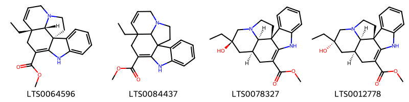{ width=100% }
    <figcaption>Hình ảnh cấu trúc hóa học của 4 hoạt chất thuộc nhóm Plumeran-type alkaloids gồm ['tabersonine (LTS0064596)', 'methyl 12-ethyl-8,16-diazapentacyclo[10.6.1.0¹,⁹.0²,⁷.0¹⁶,¹⁹]nonadeca-2,4,6,9,13-pentaene-10-carboxylate (LTS0084437)', 'methyl (1s,12s,14r,19r)-14-ethyl-14-hydroxy-8,16-diazapentacyclo[10.6.1.0¹,⁹.0²,⁷.0¹⁶,¹⁹]nonadeca-2,4,6,9-tetraene-10-carboxylate (LTS0078327)', 'methyl (1s,12s,14s,19r)-14-ethyl-14-hydroxy-8,16-diazapentacyclo[10.6.1.0¹,⁹.0²,⁷.0¹⁶,¹⁹]nonadeca-2,4,6,9-tetraene-10-carboxylate (LTS0012778)'].</figcaption>
</figure>
#### Nhóm Vallesaman alkaloids
<figure markdown="span">
    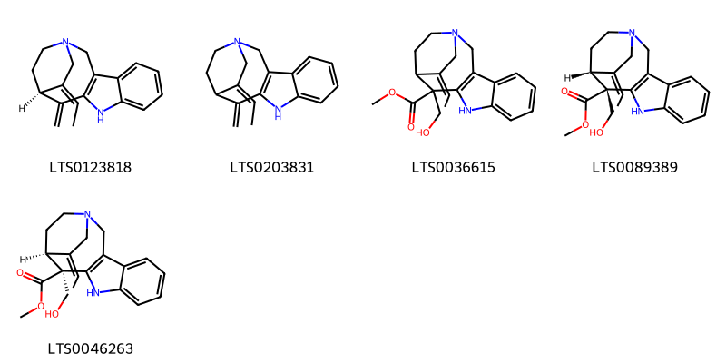{ width=100% }
    <figcaption>Hình ảnh cấu trúc hóa học của 5 hoạt chất thuộc nhóm Vallesaman alkaloids gồm ['(-)-apparicine (LTS0123818)', '14-ethylidene-12-methylidene-1,10-diazatetracyclo[11.2.2.0³,¹¹.0⁴,⁹]heptadeca-3(11),4,6,8-tetraene (LTS0203831)', 'methyl (14e)-14-ethylidene-12-(hydroxymethyl)-1,10-diazatetracyclo[11.2.2.0³,¹¹.0⁴,⁹]heptadeca-3(11),4,6,8-tetraene-12-carboxylate (LTS0036615)', 'methyl (12r,13r,14e)-14-ethylidene-12-(hydroxymethyl)-1,10-diazatetracyclo[11.2.2.0³,¹¹.0⁴,⁹]heptadeca-3(11),4,6,8-tetraene-12-carboxylate (LTS0089389)', 'methyl (12s,13s,14e)-14-ethylidene-12-(hydroxymethyl)-1,10-diazatetracyclo[11.2.2.0³,¹¹.0⁴,⁹]heptadeca-3(11),4,6,8-tetraene-12-carboxylate (LTS0046263)'].</figcaption>
</figure>

---

### Dược dân tộc học

Danh sách các quốc gia có sử dụng *Tabernaemontana citrifolia* trong điều trị các bệnh. 

| Country   | Disease   | Bệnh                                                                                                                                                                                                |
|:----------|:----------|:----------------------------------------------------------------------------------------------------------------------------------------------------------------------------------------------------|
| Haiti     | Hemostat  | MYMEMORY WARNING: YOU USED ALL AVAILABLE FREE TRANSLATIONS FOR TODAY. NEXT AVAILABLE IN  11 HOURS 37 MINUTES 13 SECONDS VISIT HTTPS://MYMEMORY.TRANSLATED.NET/DOC/USAGELIMITS.PHP TO TRANSLATE MORE |

---

---
## Tabernaemontana coronaria
### Thông tin về thực vật

!!! info "Phân loại thực vật của *Tabernaemontana divaricata* từ GIBF:"
    - **Kingdom:** Plantae
    - **Phylum:** Tracheophyta
    - **Order:** Gentianales
    - **Family:** Apocynaceae
    - **Genus:** Tabernaemontana
    - **Species:** *Tabernaemontana divaricata*

 

| Label (VI)   | Label (EN)   | Scientific Name           | Descriptions (VI)   | Descriptions (EN)   | Also Known As (VI)   | Also Known As (EN)   |
|:-------------|:-------------|:--------------------------|:--------------------|:--------------------|:---------------------|:---------------------|
| N/A          | N/A          | Tabernaemontana coronaria |                     |                     | ['']                 | ['']                 |

#### Phân bố trên thế giới

**Từ CSDL GIBF** nan, Brazil, Japan, Guadeloupe, Bangladesh, Nepal, Honduras, Tanzania, United Republic of, French Polynesia, Trinidad and Tobago, Spain, Ghana, United States of America, Costa Rica, Dominican Republic, Colombia, Nigeria, Guyana, Cuba, French Guiana, Togo, Mexico, Benin, Belgium, Malaysia, Chinese Taipei, Panama, Nicaragua, Singapore, India, Peru, Cameroon, Venezuela (Bolivarian Republic of)

#### Phân bố tại Việt Nam

**Từ CSDL GIBF**: Không có ghi nhận ở Việt Nam

---
### Thành phần hóa học
        
- Theo cơ sở dữ liệu lotus: Từ loài *Tabernaemontana divaricata* đã phân lập và xác định được Chưa có hoạt chất nào được phân lập. hoạt chất thuộc về các nhóm Không có hoạt chất nào được phân lập. 

Không có hình ảnh nào được tạo ra

---

### Dược dân tộc học

Danh sách các quốc gia có sử dụng *Tabernaemontana divaricata* trong điều trị các bệnh. 

| Country   | Disease   | Bệnh                                                                                                                                                                                                |
|:----------|:----------|:----------------------------------------------------------------------------------------------------------------------------------------------------------------------------------------------------|
| India     | Vermifuge | MYMEMORY WARNING: YOU USED ALL AVAILABLE FREE TRANSLATIONS FOR TODAY. NEXT AVAILABLE IN  11 HOURS 36 MINUTES 29 SECONDS VISIT HTTPS://MYMEMORY.TRANSLATED.NET/DOC/USAGELIMITS.PHP TO TRANSLATE MORE |

---

# Chi Landolphia

??? note "Danh sách các dược liệu thuộc chi"
    
	 - *Landolphia dulcis*

---
## Landolphia dulcis
### Thông tin về thực vật

!!! info "Phân loại thực vật của *Landolphia dulcis* từ GIBF:"
    - **Kingdom:** Plantae
    - **Phylum:** Tracheophyta
    - **Order:** Gentianales
    - **Family:** Apocynaceae
    - **Genus:** Landolphia
    - **Species:** *Landolphia dulcis*

 

| Label (VI)   | Label (EN)   | Scientific Name   | Descriptions (VI)   | Descriptions (EN)   | Also Known As (VI)   | Also Known As (EN)   |
|:-------------|:-------------|:------------------|:--------------------|:--------------------|:---------------------|:---------------------|
| N/A          | N/A          | Landolphia dulcis | loài thực vật       | species of plant    | ['']                 | ['']                 |

#### Phân bố trên thế giới

**Từ CSDL GIBF** nan, Benin, Senegal, Liberia, Gabon, Côte d’Ivoire, Gambia, Nigeria, Mali, Burkina Faso, Guinea-Bissau, unknown or invalid, Togo, Sierra Leone, Cameroon, Guinea, Ghana

#### Phân bố tại Việt Nam

**Từ CSDL GIBF**: Không có ghi nhận ở Việt Nam

---
### Thành phần hóa học
        
- Theo cơ sở dữ liệu lotus: Từ loài *Landolphia dulcis* đã phân lập và xác định được Chưa có hoạt chất nào được phân lập. hoạt chất thuộc về các nhóm Không có hoạt chất nào được phân lập. 

Không có hình ảnh nào được tạo ra

---

### Dược dân tộc học

Danh sách các quốc gia có sử dụng *Landolphia dulcis* trong điều trị các bệnh. 

| Country      | Disease   | Bệnh                                                                                                                                                                                                |
|:-------------|:----------|:----------------------------------------------------------------------------------------------------------------------------------------------------------------------------------------------------|
| Sierra Leone | Sweetener | MYMEMORY WARNING: YOU USED ALL AVAILABLE FREE TRANSLATIONS FOR TODAY. NEXT AVAILABLE IN  11 HOURS 35 MINUTES 53 SECONDS VISIT HTTPS://MYMEMORY.TRANSLATED.NET/DOC/USAGELIMITS.PHP TO TRANSLATE MORE |

---

# Chi Nerium

??? note "Danh sách các dược liệu thuộc chi"
    
	 - *Nerium indicum*
	 - *Nerium oleander*

---
## Nerium indicum
### Thông tin về thực vật

!!! info "Phân loại thực vật của *Nerium indicum* từ GIBF:"
    - **Kingdom:** Plantae
    - **Phylum:** Tracheophyta
    - **Order:** Gentianales
    - **Family:** Apocynaceae
    - **Genus:** Nerium
    - **Species:** *Nerium indicum*

 

| Label (VI)   | Label (EN)   | Scientific Name   | Descriptions (VI)   | Descriptions (EN)   | Also Known As (VI)   | Also Known As (EN)   |
|:-------------|:-------------|:------------------|:--------------------|:--------------------|:---------------------|:---------------------|
| N/A          | N/A          | Nerium indicum    | loài thực vật       | species of plant    | ['']                 | ['']                 |

#### Phân bố trên thế giới

**Từ CSDL GIBF** nan, Japan, United States of America, Korea, Republic of, Chinese Taipei, Pakistan, China, Philippines, Thailand, Cook Islands, Tokelau, India, unknown or invalid, France

#### Phân bố tại Việt Nam

**Từ CSDL GIBF**: Không có ghi nhận ở Việt Nam

---
### Thành phần hóa học
        
- Theo cơ sở dữ liệu lotus: Từ loài *Nerium indicum* đã phân lập và xác định được 55 hoạt chất thuộc về các nhóm Oxepanes, Flavonoids, Steroids and steroid derivatives, Organooxygen compounds, Prenol lipids. 

|    | chemicalTaxonomyClassyfireClass   |   smiles_count |
|---:|:----------------------------------|---------------:|
|  0 | Flavonoids                        |              2 |
|  1 | Organooxygen compounds            |             12 |
|  2 | Oxepanes                          |              2 |
|  3 | Prenol lipids                     |              2 |
|  4 | Steroids and steroid derivatives  |             37 |

#### Nhóm Flavonoids
<figure markdown="span">
    { width=100% }
    <figcaption>Hình ảnh cấu trúc hóa học của 2 hoạt chất thuộc nhóm Flavonoids gồm ['rutin (LTS0042292)', '3-rutinosyl quercetin (LTS0032845)'].</figcaption>
</figure>
#### Nhóm Organooxygen compounds
<figure markdown="span">
    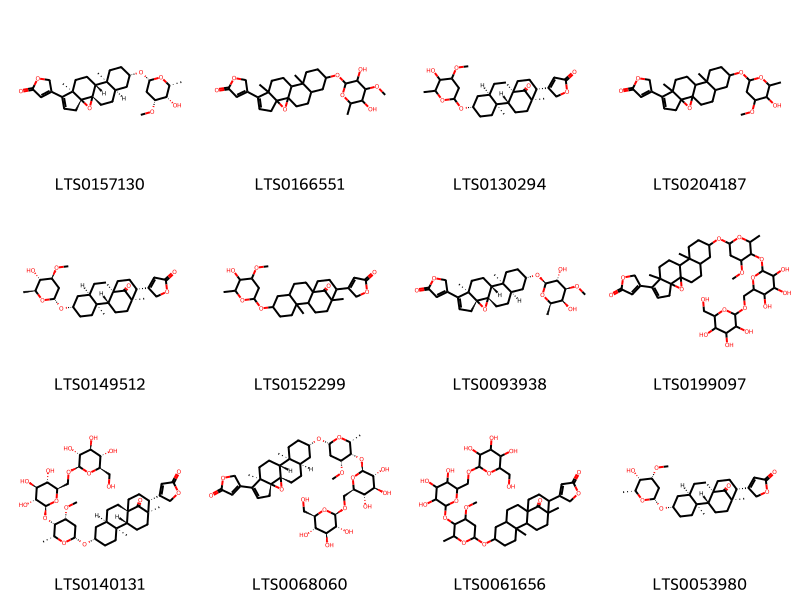{ width=100% }
    <figcaption>Hình ảnh cấu trúc hóa học của 12 hoạt chất thuộc nhóm Organooxygen compounds gồm ['4-[(1s,3r,7r,10r,11s,14s,16r)-14-{[(2r,4r,5s,6r)-5-hydroxy-4-methoxy-6-methyloxan-2-yl]oxy}-7,11-dimethyl-2-oxapentacyclo[8.8.0.0¹,³.0³,⁷.0¹¹,¹⁶]octadec-5-en-6-yl]-5h-furan-2-one (LTS0157130)', '4-{14-[(3,5-dihydroxy-4-methoxy-6-methyloxan-2-yl)oxy]-7,11-dimethyl-2-oxapentacyclo[8.8.0.0¹,³.0³,⁷.0¹¹,¹⁶]octadec-5-en-6-yl}-5h-furan-2-one (LTS0166551)', '4-[(1r,4r,6s,9s,10r,13r,14r)-6-[(5-hydroxy-4-methoxy-6-methyloxan-2-yl)oxy]-9,13-dimethyl-17-oxotetracyclo[11.3.1.0¹,¹⁰.0⁴,⁹]heptadecan-14-yl]-5h-furan-2-one (LTS0130294)', '4-{14-[(5-hydroxy-4-methoxy-6-methyloxan-2-yl)oxy]-7,11-dimethyl-2-oxapentacyclo[8.8.0.0¹,³.0³,⁷.0¹¹,¹⁶]octadec-5-en-6-yl}-5h-furan-2-one (LTS0204187)', '4-[(1r,4r,6s,9s,10r,13r,14r)-6-{[(2r,4s,5s,6s)-5-hydroxy-4-methoxy-6-methyloxan-2-yl]oxy}-9,13-dimethyl-17-oxotetracyclo[11.3.1.0¹,¹⁰.0⁴,⁹]heptadecan-14-yl]-5h-furan-2-one (LTS0149512)', '4-{6-[(5-hydroxy-4-methoxy-6-methyloxan-2-yl)oxy]-9,13-dimethyl-17-oxotetracyclo[11.3.1.0¹,¹⁰.0⁴,⁹]heptadecan-14-yl}-5h-furan-2-one (LTS0152299)', '4-[(1s,3r,7r,10r,11s,14s,16r)-14-{[(2r,3r,4s,5s,6r)-3,5-dihydroxy-4-methoxy-6-methyloxan-2-yl]oxy}-7,11-dimethyl-2-oxapentacyclo[8.8.0.0¹,³.0³,⁷.0¹¹,¹⁶]octadec-5-en-6-yl]-5h-furan-2-one (LTS0093938)', '4-{14-[(4-methoxy-6-methyl-5-{[3,4,5-trihydroxy-6-({[3,4,5-trihydroxy-6-(hydroxymethyl)oxan-2-yl]oxy}methyl)oxan-2-yl]oxy}oxan-2-yl)oxy]-7,11-dimethyl-2-oxapentacyclo[8.8.0.0¹,³.0³,⁷.0¹¹,¹⁶]octadec-5-en-6-yl}-5h-furan-2-one (LTS0199097)', '4-[(1s,4r,6s,9s,10r,13r,14r)-6-{[(2r,4r,5s,6r)-4-methoxy-6-methyl-5-{[(2s,3r,4s,5s,6r)-3,4,5-trihydroxy-6-({[(2r,3r,4s,5s,6r)-3,4,5-trihydroxy-6-(hydroxymethyl)oxan-2-yl]oxy}methyl)oxan-2-yl]oxy}oxan-2-yl]oxy}-9,13-dimethyl-17-oxotetracyclo[11.3.1.0¹,¹⁰.0⁴,⁹]heptadecan-14-yl]-5h-furan-2-one (LTS0140131)', '4-[(1s,3r,7r,10r,11s,14s,16r)-14-{[(2r,4r,5s,6r)-4-methoxy-6-methyl-5-{[(2s,3r,4s,5s,6r)-3,4,5-trihydroxy-6-({[(2r,3r,4s,5s,6r)-3,4,5-trihydroxy-6-(hydroxymethyl)oxan-2-yl]oxy}methyl)oxan-2-yl]oxy}oxan-2-yl]oxy}-7,11-dimethyl-2-oxapentacyclo[8.8.0.0¹,³.0³,⁷.0¹¹,¹⁶]octadec-5-en-6-yl]-5h-furan-2-one (LTS0068060)', '4-{6-[(4-methoxy-6-methyl-5-{[3,4,5-trihydroxy-6-({[3,4,5-trihydroxy-6-(hydroxymethyl)oxan-2-yl]oxy}methyl)oxan-2-yl]oxy}oxan-2-yl)oxy]-9,13-dimethyl-17-oxotetracyclo[11.3.1.0¹,¹⁰.0⁴,⁹]heptadecan-14-yl}-5h-furan-2-one (LTS0061656)', '4-[(1r,4r,6s,9s,10r,13r,14r)-6-{[(2r,4r,5s,6r)-5-hydroxy-4-methoxy-6-methyloxan-2-yl]oxy}-9,13-dimethyl-17-oxotetracyclo[11.3.1.0¹,¹⁰.0⁴,⁹]heptadecan-14-yl]-5h-furan-2-one (LTS0053980)'].</figcaption>
</figure>
#### Nhóm Oxepanes
<figure markdown="span">
    { width=100% }
    <figcaption>Hình ảnh cấu trúc hóa học của 2 hoạt chất thuộc nhóm Oxepanes gồm ['4-[(1s,3r,7r,10r,11s,14s,16r)-14-hydroxy-7,11-dimethyl-2-oxapentacyclo[8.8.0.0¹,³.0³,⁷.0¹¹,¹⁶]octadec-5-en-6-yl]-5h-furan-2-one (LTS0077066)', '4-{14-hydroxy-7,11-dimethyl-2-oxapentacyclo[8.8.0.0¹,³.0³,⁷.0¹¹,¹⁶]octadec-5-en-6-yl}-5h-furan-2-one (LTS0002701)'].</figcaption>
</figure>
#### Nhóm Prenol lipids
<figure markdown="span">
    { width=100% }
    <figcaption>Hình ảnh cấu trúc hóa học của 2 hoạt chất thuộc nhóm Prenol lipids gồm ['ursolic acid (LTS0250838)', '10-hydroxy-1,2,6a,6b,9,9,12a-heptamethyl-2,3,4,5,6,7,8,8a,10,11,12,12b,13,14b-tetradecahydro-1h-picene-4a-carboxylic acid (LTS0166564)'].</figcaption>
</figure>
#### Nhóm Steroids and steroid derivatives
<figure markdown="span">
    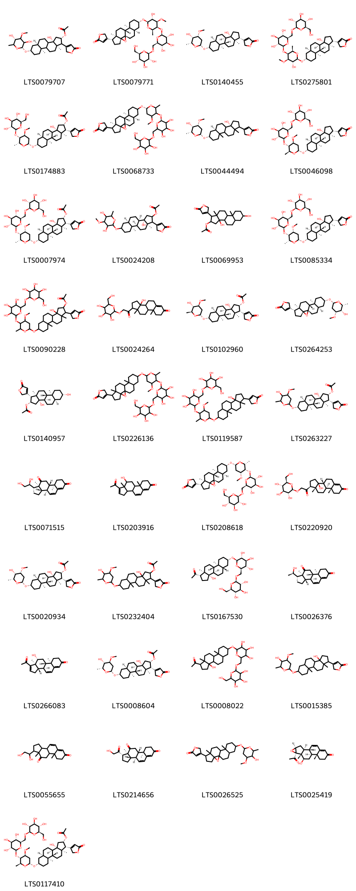{ width=100% }
    <figcaption>Hình ảnh cấu trúc hóa học của 37 hoạt chất thuộc nhóm Steroids and steroid derivatives gồm ['(2s,3as,5ar,7s,9as,11ar)-7-{[(2r,5s)-3,5-dihydroxy-4-methoxy-6-methyloxan-2-yl]oxy}-3a-hydroxy-9a,11a-dimethyl-1-(5-oxo-2h-furan-3-yl)-tetradecahydrocyclopenta[a]phenanthren-2-yl acetate (LTS0079707)', '4-[(1s,3r,6r,7r,10r,11s,14s,16r)-14-{[(2r,3r,4r,5s,6r)-3-hydroxy-4-methoxy-6-methyl-5-{[(2s,3r,4s,5s,6r)-3,4,5-trihydroxy-6-({[(2r,3r,4s,5s,6r)-3,4,5-trihydroxy-6-(hydroxymethyl)oxan-2-yl]oxy}methyl)oxan-2-yl]oxy}oxan-2-yl]oxy}-7,11-dimethyl-2-oxapentacyclo[8.8.0.0¹,³.0³,⁷.0¹¹,¹⁶]octadecan-6-yl]-5h-furan-2-one (LTS0079771)', '4-[(1r,3as,3br,5ar,7s,9as,9bs,11ar)-3a-hydroxy-7-{[(2r,4r,5s,6r)-5-hydroxy-4-methoxy-6-methyloxan-2-yl]oxy}-9a,11a-dimethyl-tetradecahydrocyclopenta[a]phenanthren-1-yl]-5h-furan-2-one (LTS0140455)', '4-[(1r,3as,3br,5ar,7s,9as,9bs,11ar)-3a-hydroxy-7-{[(2r,3r,4r,5s,6r)-3-hydroxy-4-methoxy-6-methyl-5-{[(2s,3r,4s,5s,6r)-3,4,5-trihydroxy-6-({[(2r,3r,4s,5s,6r)-3,4,5-trihydroxy-6-(hydroxymethyl)oxan-2-yl]oxy}methyl)oxan-2-yl]oxy}oxan-2-yl]oxy}-9a,11a-dimethyl-tetradecahydrocyclopenta[a]phenanthren-1-yl]-5h-furan-2-one (LTS0275801)', '(1r,2s,3as,3br,5ar,7s,9as,9bs,11ar)-3a-hydroxy-7-{[(2r,4s,5s,6r)-4-methoxy-6-methyl-5-{[(2s,3r,4s,5s,6r)-3,4,5-trihydroxy-6-(hydroxymethyl)oxan-2-yl]oxy}oxan-2-yl]oxy}-9a,11a-dimethyl-1-(5-oxo-2h-furan-3-yl)-tetradecahydrocyclopenta[a]phenanthren-2-yl acetate (LTS0174883)', '4-[(1s,3r,7r,10r,11s,16r)-14-{[(2r)-4-methoxy-6-methyl-5-{[(2s)-3,4,5-trihydroxy-6-({[3,4,5-trihydroxy-6-(hydroxymethyl)oxan-2-yl]oxy}methyl)oxan-2-yl]oxy}oxan-2-yl]oxy}-7,11-dimethyl-2-oxapentacyclo[8.8.0.0¹,³.0³,⁷.0¹¹,¹⁶]octadecan-6-yl]-5h-furan-2-one (LTS0068733)', '4-[(3as,5ar,7s)-3a-hydroxy-7-{[(2r,4r,5s,6r)-5-hydroxy-4-methoxy-6-methyloxan-2-yl]oxy}-9a,11a-dimethyl-tetradecahydrocyclopenta[a]phenanthren-1-yl]-5h-furan-2-one (LTS0044494)', '4-[(1r,3as,3br,5ar,7s,9as,9bs,11ar)-3a-hydroxy-7-{[(2r,4s,5s,6s)-4-methoxy-6-methyl-5-{[(2s,3r,4s,5s,6r)-3,4,5-trihydroxy-6-({[(2r,3r,4s,5s,6r)-3,4,5-trihydroxy-6-(hydroxymethyl)oxan-2-yl]oxy}methyl)oxan-2-yl]oxy}oxan-2-yl]oxy}-9a,11a-dimethyl-tetradecahydrocyclopenta[a]phenanthren-1-yl]-5h-furan-2-one (LTS0046098)', '(1r,2s,3as,3br,5ar,7s,9as,9bs,11ar)-3a-hydroxy-7-{[(2r,4r,5s,6r)-4-methoxy-6-methyl-5-{[(2s,3r,4s,5s,6r)-3,4,5-trihydroxy-6-({[(2r,3r,4s,5s,6r)-3,4,5-trihydroxy-6-(hydroxymethyl)oxan-2-yl]oxy}methyl)oxan-2-yl]oxy}oxan-2-yl]oxy}-9a,11a-dimethyl-1-(5-oxo-2h-furan-3-yl)-tetradecahydrocyclopenta[a]phenanthren-2-yl acetate (LTS0007974)', '(3as,3br,5ar,9as,9br,11ar)-7-[(3,5-dihydroxy-4-methoxy-6-methyloxan-2-yl)oxy]-3a-hydroxy-9a,11a-dimethyl-1-(5-oxo-2h-furan-3-yl)-tetradecahydrocyclopenta[a]phenanthren-2-yl acetate (LTS0024208)', '3a,7-dihydroxy-9a,11a-dimethyl-1-(5-oxo-2h-furan-3-yl)-tetradecahydrocyclopenta[a]phenanthren-2-yl acetate (LTS0069953)', '4-[(1r,3as,3br,5ar,7s,9as,9bs,11ar)-3a-hydroxy-7-{[(2r,4r,5s,6r)-4-methoxy-6-methyl-5-{[(2s,3r,4s,5s,6r)-3,4,5-trihydroxy-6-({[(2r,3r,4s,5s,6r)-3,4,5-trihydroxy-6-(hydroxymethyl)oxan-2-yl]oxy}methyl)oxan-2-yl]oxy}oxan-2-yl]oxy}-9a,11a-dimethyl-tetradecahydrocyclopenta[a]phenanthren-1-yl]-5h-furan-2-one (LTS0085334)', '3a-hydroxy-7-[(4-methoxy-6-methyl-5-{[3,4,5-trihydroxy-6-({[3,4,5-trihydroxy-6-(hydroxymethyl)oxan-2-yl]oxy}methyl)oxan-2-yl]oxy}oxan-2-yl)oxy]-9a,11a-dimethyl-1-(5-oxo-2h-furan-3-yl)-tetradecahydrocyclopenta[a]phenanthren-2-yl acetate (LTS0090228)', '3a-hydroxy-9a,11a-dimethyl-1-(2-{[3,4,5-trihydroxy-6-(hydroxymethyl)oxan-2-yl]oxy}acetyl)-1h,2h,3h,3bh,4h,5h,8h,9h,9bh,10h,11h-cyclopenta[a]phenanthren-7-one (LTS0024264)', 'oleandrin (LTS0102960)', 'adynerin (LTS0264253)', 'oleandrigenin (LTS0140957)', '4-{14-[(4-methoxy-6-methyl-5-{[3,4,5-trihydroxy-6-({[3,4,5-trihydroxy-6-(hydroxymethyl)oxan-2-yl]oxy}methyl)oxan-2-yl]oxy}oxan-2-yl)oxy]-7,11-dimethyl-2-oxapentacyclo[8.8.0.0¹,³.0³,⁷.0¹¹,¹⁶]octadecan-6-yl}-5h-furan-2-one (LTS0226136)', '4-{3a-hydroxy-7-[(4-methoxy-6-methyl-5-{[3,4,5-trihydroxy-6-({[3,4,5-trihydroxy-6-(hydroxymethyl)oxan-2-yl]oxy}methyl)oxan-2-yl]oxy}oxan-2-yl)oxy]-9a,11a-dimethyl-tetradecahydrocyclopenta[a]phenanthren-1-yl}-5h-furan-2-one (LTS0119587)', '(1r,2s,3as,3br,5ar,7s,9as,9bs,11ar)-3a-hydroxy-7-[(5-hydroxy-4-methoxy-6-methyloxan-2-yl)oxy]-9a,11a-dimethyl-1-(5-oxo-2h-furan-3-yl)-tetradecahydrocyclopenta[a]phenanthren-2-yl acetate (LTS0263227)', '(1s,3as,3br,9ar,9bs,11as)-1-[(1s)-1,2-dihydroxyethyl]-9a,11a-dimethyl-1h,2h,3h,3ah,3bh,8h,9h,9bh,10h-cyclopenta[a]phenanthrene-7,11-dione (LTS0071515)', '1-acetyl-11-hydroxy-9a,11a-dimethyl-3h,3ah,3bh,8h,9h,9bh,10h,11h-cyclopenta[a]phenanthren-7-one (LTS0203916)', '4-[(1s,3r,6r,7r,10r,11s,14s,16r)-14-{[(2r,4r,5s,6r)-4-methoxy-6-methyl-5-{[(2s,3r,4s,5s,6r)-3,4,5-trihydroxy-6-({[(2r,3r,4s,5s,6r)-3,4,5-trihydroxy-6-(hydroxymethyl)oxan-2-yl]oxy}methyl)oxan-2-yl]oxy}oxan-2-yl]oxy}-7,11-dimethyl-2-oxapentacyclo[8.8.0.0¹,³.0³,⁷.0¹¹,¹⁶]octadecan-6-yl]-5h-furan-2-one (LTS0208618)', '(1s,3as,3br,9ar,9bs,11ar)-3a-hydroxy-9a,11a-dimethyl-1-(2-{[(2r,3r,4s,5s,6r)-3,4,5-trihydroxy-6-(hydroxymethyl)oxan-2-yl]oxy}acetyl)-1h,2h,3h,3bh,4h,5h,8h,9h,9bh,10h,11h-cyclopenta[a]phenanthren-7-one (LTS0220920)', '(1r,2s,3as,3br,5ar,7s,9as,9bs,11ar)-3a-hydroxy-7-{[(2r,4r,5s,6r)-5-hydroxy-4-methoxy-6-methyloxan-2-yl]oxy}-9a,11a-dimethyl-1-(5-oxo-2h-furan-3-yl)-tetradecahydrocyclopenta[a]phenanthren-2-yl acetate (LTS0020934)', "4'-epioleandrin (LTS0232404)", '1-[(1s,3as,3br,5as,7s,9as,9bs,11ar)-3a-hydroxy-9a,11a-dimethyl-7-{[(2r,3r,4s,5s,6r)-3,4,5-trihydroxy-6-({[(2r,3r,4s,5s,6r)-3,4,5-trihydroxy-6-(hydroxymethyl)oxan-2-yl]oxy}methyl)oxan-2-yl]oxy}-tetradecahydrocyclopenta[a]phenanthren-1-yl]ethanone (LTS0167530)', '(1s,3as,3br,9ar,9bs,11as)-1-[(1r)-1-hydroxyethyl]-9a,11a-dimethyl-1h,2h,3h,3ah,3bh,8h,9h,9bh,10h-cyclopenta[a]phenanthrene-7,11-dione (LTS0026376)', '(3as,3br,9ar,9bs,11r,11as)-1-acetyl-11-hydroxy-9a,11a-dimethyl-3h,3ah,3bh,8h,9h,9bh,10h,11h-cyclopenta[a]phenanthren-7-one (LTS0266083)', '(1r,2s,3as,3br,5ar,7s,9as,9bs,11ar)-3a-hydroxy-7-{[(2r,4s,5s,6r)-5-hydroxy-4-methoxy-6-methyloxan-2-yl]oxy}-9a,11a-dimethyl-1-(5-oxo-2h-furan-3-yl)-tetradecahydrocyclopenta[a]phenanthren-2-yl acetate (LTS0008604)', '1-(3a-hydroxy-9a,11a-dimethyl-7-{[3,4,5-trihydroxy-6-({[3,4,5-trihydroxy-6-(hydroxymethyl)oxan-2-yl]oxy}methyl)oxan-2-yl]oxy}-tetradecahydrocyclopenta[a]phenanthren-1-yl)ethanone (LTS0008022)', '4-{3a-hydroxy-7-[(5-hydroxy-4-methoxy-6-methyloxan-2-yl)oxy]-9a,11a-dimethyl-tetradecahydrocyclopenta[a]phenanthren-1-yl}-5h-furan-2-one (LTS0015385)', '1-(1,2-dihydroxyethyl)-9a,11a-dimethyl-1h,2h,3h,3ah,3bh,8h,9h,9bh,10h-cyclopenta[a]phenanthrene-7,11-dione (LTS0055655)', '(1s,3as,3br,9ar,9bs,11as)-1-(2-hydroxyacetyl)-9a,11a-dimethyl-1h,2h,3h,3ah,3bh,8h,9h,9bh,10h-cyclopenta[a]phenanthrene-7,11-dione (LTS0214656)', '4-{14-[(5-hydroxy-4-methoxy-6-methyloxan-2-yl)oxy]-7,11-dimethyl-2-oxapentacyclo[8.8.0.0¹,³.0³,⁷.0¹¹,¹⁶]octadecan-6-yl}-5h-furan-2-one (LTS0026525)', '(1r,2s,4s,6r,7r,8r,10s,11r)-6-acetyl-8-hydroxy-7,11-dimethyl-5-oxapentacyclo[8.8.0.0²,⁷.0⁴,⁶.0¹¹,¹⁶]octadeca-15,17-dien-14-one (LTS0025419)', '(1r,2s,3as,3br,5ar,7s,9as,9bs,11ar)-3a-hydroxy-7-{[(2r,4s,5s,6s)-4-methoxy-6-methyl-5-{[(2s,3r,4s,5s,6r)-3,4,5-trihydroxy-6-({[(2r,3r,4s,5s,6r)-3,4,5-trihydroxy-6-(hydroxymethyl)oxan-2-yl]oxy}methyl)oxan-2-yl]oxy}oxan-2-yl]oxy}-9a,11a-dimethyl-1-(5-oxo-2h-furan-3-yl)-tetradecahydrocyclopenta[a]phenanthren-2-yl acetate (LTS0117410)'].</figcaption>
</figure>

---

### Dược dân tộc học

Danh sách các quốc gia có sử dụng *Nerium indicum* trong điều trị các bệnh. 

| Country   | Disease                                                                      | Bệnh                                                                                                                                                                                                |
|:----------|:-----------------------------------------------------------------------------|:----------------------------------------------------------------------------------------------------------------------------------------------------------------------------------------------------|
| China     | Cardiotonic, Diaphoretic, Diuretic, Expectorant, Insecticide, Poison, Emetic | MYMEMORY WARNING: YOU USED ALL AVAILABLE FREE TRANSLATIONS FOR TODAY. NEXT AVAILABLE IN  11 HOURS 35 MINUTES 25 SECONDS VISIT HTTPS://MYMEMORY.TRANSLATED.NET/DOC/USAGELIMITS.PHP TO TRANSLATE MORE |
| Elsewhere | Cardiotonic                                                                  | MYMEMORY WARNING: YOU USED ALL AVAILABLE FREE TRANSLATIONS FOR TODAY. NEXT AVAILABLE IN  11 HOURS 35 MINUTES 20 SECONDS VISIT HTTPS://MYMEMORY.TRANSLATED.NET/DOC/USAGELIMITS.PHP TO TRANSLATE MORE |
| India     | nan, Insecticide, Larvicide, Narcotic, Poison, Abortifacient, Cardiotonic    | MYMEMORY WARNING: YOU USED ALL AVAILABLE FREE TRANSLATIONS FOR TODAY. NEXT AVAILABLE IN  11 HOURS 35 MINUTES 15 SECONDS VISIT HTTPS://MYMEMORY.TRANSLATED.NET/DOC/USAGELIMITS.PHP TO TRANSLATE MORE |

---

---
## Nerium oleander
### Thông tin về thực vật

!!! info "Phân loại thực vật của *Nerium oleander* từ GIBF:"
    - **Kingdom:** Plantae
    - **Phylum:** Tracheophyta
    - **Order:** Gentianales
    - **Family:** Apocynaceae
    - **Genus:** Nerium
    - **Species:** *Nerium oleander*

 

| Label (VI)   | Label (EN)   | Scientific Name   | Descriptions (VI)   | Descriptions (EN)   | Also Known As (VI)   | Also Known As (EN)                     |
|:-------------|:-------------|:------------------|:--------------------|:--------------------|:---------------------|:---------------------------------------|
| N/A          | N/A          | Nerium oleander   | loài thực vật       | species of plant    | ['Nerium oleander']  | ['sweet-scented oleander', 'oleander'] |

#### Phân bố trên thế giới

**Từ CSDL GIBF** nan, Brazil, United Arab Emirates, Saint Kitts and Nevis, Senegal, China, Antigua and Barbuda, Chile, New Zealand, Honduras, Türkiye, French Polynesia, Ecuador, Trinidad and Tobago, Thailand, Turks and Caicos Islands, Spain, Puerto Rico, Sri Lanka, United States of America, Greece, Virgin Islands (U.S.), Albania, Dominican Republic, Cuba, Cyprus, Ethiopia, Grenada, Morocco, Algeria, Benin, Saudi Arabia, Belgium, Malaysia, Panama, Egypt, Portugal, Bonaire, Sint Eustatius and Saba, Bahamas, South Africa, Australia, Italy, India, Peru, France

#### Phân bố tại Việt Nam

**Từ CSDL GIBF**: Không có ghi nhận ở Việt Nam

---
### Thành phần hóa học
        
- Theo cơ sở dữ liệu lotus: Từ loài *Nerium oleander* đã phân lập và xác định được 183 hoạt chất thuộc về các nhóm Fatty Acyls, Dihydrofurans, Lactones, Oxepanes, Flavonoids, Steroids and steroid derivatives, Organooxygen compounds, Prenol lipids. 

|    | chemicalTaxonomyClassyfireClass   |   smiles_count |
|---:|:----------------------------------|---------------:|
|  0 | Dihydrofurans                     |              1 |
|  1 | Fatty Acyls                       |              4 |
|  2 | Flavonoids                        |              2 |
|  3 | Lactones                          |              2 |
|  4 | Organooxygen compounds            |             21 |
|  5 | Oxepanes                          |              2 |
|  6 | Prenol lipids                     |             61 |
|  7 | Steroids and steroid derivatives  |             90 |

#### Nhóm Dihydrofurans
<figure markdown="span">
    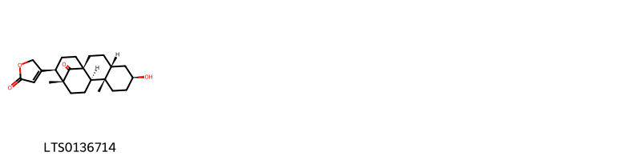{ width=100% }
    <figcaption>Hình ảnh cấu trúc hóa học của 1 hoạt chất thuộc nhóm Dihydrofurans gồm ['4-[(1r,4r,6s,9s,10r,13r,14r)-6-hydroxy-9,13-dimethyl-17-oxotetracyclo[11.3.1.0¹,¹⁰.0⁴,⁹]heptadecan-14-yl]-5h-furan-2-one (LTS0136714)'].</figcaption>
</figure>
#### Nhóm Fatty Acyls
<figure markdown="span">
    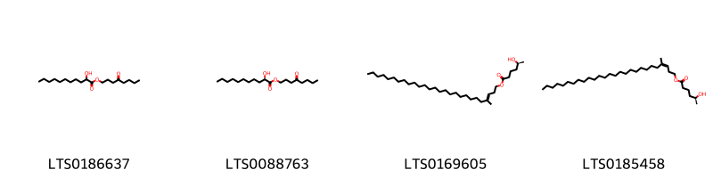{ width=100% }
    <figcaption>Hình ảnh cấu trúc hóa học của 4 hoạt chất thuộc nhóm Fatty Acyls gồm ['4-oxooctyl 2-hydroxyundecanoate (LTS0186637)', '4-oxooctyl (2r)-2-hydroxyundecanoate (LTS0088763)', '4-methylheptacos-3-en-1-yl (5s)-5-hydroxyhexanoate (LTS0169605)', '(3z)-4-methylheptacos-3-en-1-yl (5s)-5-hydroxyhexanoate (LTS0185458)'].</figcaption>
</figure>
#### Nhóm Flavonoids
<figure markdown="span">
    { width=100% }
    <figcaption>Hình ảnh cấu trúc hóa học của 2 hoạt chất thuộc nhóm Flavonoids gồm ['rutin (LTS0042292)', '3-rutinosyl quercetin (LTS0032845)'].</figcaption>
</figure>
#### Nhóm Lactones
<figure markdown="span">
    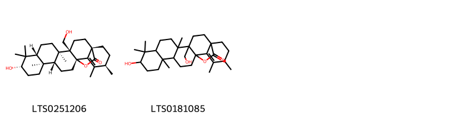{ width=100% }
    <figcaption>Hình ảnh cấu trúc hóa học của 2 hoạt chất thuộc nhóm Lactones gồm ['(1s,4s,5r,8r,10s,13r,14r,17s,20r)-10-hydroxy-4-(hydroxymethyl)-5,9,9,13,19,20-hexamethyl-24-oxahexacyclo[15.5.2.0¹,¹⁸.0⁴,¹⁷.0⁵,¹⁴.0⁸,¹³]tetracos-18-en-23-one (LTS0251206)', '10-hydroxy-4-(hydroxymethyl)-5,9,9,13,19,20-hexamethyl-24-oxahexacyclo[15.5.2.0¹,¹⁸.0⁴,¹⁷.0⁵,¹⁴.0⁸,¹³]tetracos-18-en-23-one (LTS0181085)'].</figcaption>
</figure>
#### Nhóm Organooxygen compounds
<figure markdown="span">
    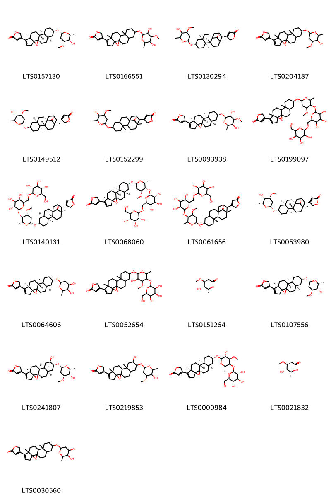{ width=100% }
    <figcaption>Hình ảnh cấu trúc hóa học của 21 hoạt chất thuộc nhóm Organooxygen compounds gồm ['4-[(1s,3r,7r,10r,11s,14s,16r)-14-{[(2r,4r,5s,6r)-5-hydroxy-4-methoxy-6-methyloxan-2-yl]oxy}-7,11-dimethyl-2-oxapentacyclo[8.8.0.0¹,³.0³,⁷.0¹¹,¹⁶]octadec-5-en-6-yl]-5h-furan-2-one (LTS0157130)', '4-{14-[(3,5-dihydroxy-4-methoxy-6-methyloxan-2-yl)oxy]-7,11-dimethyl-2-oxapentacyclo[8.8.0.0¹,³.0³,⁷.0¹¹,¹⁶]octadec-5-en-6-yl}-5h-furan-2-one (LTS0166551)', '4-[(1r,4r,6s,9s,10r,13r,14r)-6-[(5-hydroxy-4-methoxy-6-methyloxan-2-yl)oxy]-9,13-dimethyl-17-oxotetracyclo[11.3.1.0¹,¹⁰.0⁴,⁹]heptadecan-14-yl]-5h-furan-2-one (LTS0130294)', '4-{14-[(5-hydroxy-4-methoxy-6-methyloxan-2-yl)oxy]-7,11-dimethyl-2-oxapentacyclo[8.8.0.0¹,³.0³,⁷.0¹¹,¹⁶]octadec-5-en-6-yl}-5h-furan-2-one (LTS0204187)', '4-[(1r,4r,6s,9s,10r,13r,14r)-6-{[(2r,4s,5s,6s)-5-hydroxy-4-methoxy-6-methyloxan-2-yl]oxy}-9,13-dimethyl-17-oxotetracyclo[11.3.1.0¹,¹⁰.0⁴,⁹]heptadecan-14-yl]-5h-furan-2-one (LTS0149512)', '4-{6-[(5-hydroxy-4-methoxy-6-methyloxan-2-yl)oxy]-9,13-dimethyl-17-oxotetracyclo[11.3.1.0¹,¹⁰.0⁴,⁹]heptadecan-14-yl}-5h-furan-2-one (LTS0152299)', '4-[(1s,3r,7r,10r,11s,14s,16r)-14-{[(2r,3r,4s,5s,6r)-3,5-dihydroxy-4-methoxy-6-methyloxan-2-yl]oxy}-7,11-dimethyl-2-oxapentacyclo[8.8.0.0¹,³.0³,⁷.0¹¹,¹⁶]octadec-5-en-6-yl]-5h-furan-2-one (LTS0093938)', '4-{14-[(4-methoxy-6-methyl-5-{[3,4,5-trihydroxy-6-({[3,4,5-trihydroxy-6-(hydroxymethyl)oxan-2-yl]oxy}methyl)oxan-2-yl]oxy}oxan-2-yl)oxy]-7,11-dimethyl-2-oxapentacyclo[8.8.0.0¹,³.0³,⁷.0¹¹,¹⁶]octadec-5-en-6-yl}-5h-furan-2-one (LTS0199097)', '4-[(1s,4r,6s,9s,10r,13r,14r)-6-{[(2r,4r,5s,6r)-4-methoxy-6-methyl-5-{[(2s,3r,4s,5s,6r)-3,4,5-trihydroxy-6-({[(2r,3r,4s,5s,6r)-3,4,5-trihydroxy-6-(hydroxymethyl)oxan-2-yl]oxy}methyl)oxan-2-yl]oxy}oxan-2-yl]oxy}-9,13-dimethyl-17-oxotetracyclo[11.3.1.0¹,¹⁰.0⁴,⁹]heptadecan-14-yl]-5h-furan-2-one (LTS0140131)', '4-[(1s,3r,7r,10r,11s,14s,16r)-14-{[(2r,4r,5s,6r)-4-methoxy-6-methyl-5-{[(2s,3r,4s,5s,6r)-3,4,5-trihydroxy-6-({[(2r,3r,4s,5s,6r)-3,4,5-trihydroxy-6-(hydroxymethyl)oxan-2-yl]oxy}methyl)oxan-2-yl]oxy}oxan-2-yl]oxy}-7,11-dimethyl-2-oxapentacyclo[8.8.0.0¹,³.0³,⁷.0¹¹,¹⁶]octadec-5-en-6-yl]-5h-furan-2-one (LTS0068060)', '4-{6-[(4-methoxy-6-methyl-5-{[3,4,5-trihydroxy-6-({[3,4,5-trihydroxy-6-(hydroxymethyl)oxan-2-yl]oxy}methyl)oxan-2-yl]oxy}oxan-2-yl)oxy]-9,13-dimethyl-17-oxotetracyclo[11.3.1.0¹,¹⁰.0⁴,⁹]heptadecan-14-yl}-5h-furan-2-one (LTS0061656)', '4-[(1r,4r,6s,9s,10r,13r,14r)-6-{[(2r,4r,5s,6r)-5-hydroxy-4-methoxy-6-methyloxan-2-yl]oxy}-9,13-dimethyl-17-oxotetracyclo[11.3.1.0¹,¹⁰.0⁴,⁹]heptadecan-14-yl]-5h-furan-2-one (LTS0053980)', '4-[(1s,3r,7r,10r,11s,14s,16r)-14-{[(2r,4r,5r,6r)-4,5-dihydroxy-6-methyloxan-2-yl]oxy}-7,11-dimethyl-2-oxapentacyclo[8.8.0.0¹,³.0³,⁷.0¹¹,¹⁶]octadec-5-en-6-yl]-5h-furan-2-one (LTS0064606)', '4-{14-[(3-hydroxy-4-methoxy-6-methyl-5-{[3,4,5-trihydroxy-6-(hydroxymethyl)oxan-2-yl]oxy}oxan-2-yl)oxy]-7,11-dimethyl-2-oxapentacyclo[8.8.0.0¹,³.0³,⁷.0¹¹,¹⁶]octadec-5-en-6-yl}-5h-furan-2-one (LTS0052654)', 'sarmentose (LTS0151264)', '4-[(1s,3r,7r,10r,11s,14s,16r)-14-{[(2r,4s,5s,6r)-5-hydroxy-4-methoxy-6-methyloxan-2-yl]oxy}-7,11-dimethyl-2-oxapentacyclo[8.8.0.0¹,³.0³,⁷.0¹¹,¹⁶]octadec-5-en-6-yl]-5h-furan-2-one (LTS0107556)', '4-[(1s,3r,7r,10s,11s,13r,14r,16r)-13-hydroxy-14-{[(2s,4r,5s,6r)-5-hydroxy-4-methoxy-6-methyloxan-2-yl]oxy}-7,11-dimethyl-2-oxapentacyclo[8.8.0.0¹,³.0³,⁷.0¹¹,¹⁶]octadec-5-en-6-yl]-5h-furan-2-one (LTS0241807)', '4-{13-hydroxy-14-[(5-hydroxy-4-methoxy-6-methyloxan-2-yl)oxy]-7,11-dimethyl-2-oxapentacyclo[8.8.0.0¹,³.0³,⁷.0¹¹,¹⁶]octadec-5-en-6-yl}-5h-furan-2-one (LTS0219853)', '4-[(1s,3r,7r,10r,11s,14s,16r)-14-{[(2r,3r,4r,5s,6r)-3-hydroxy-4-methoxy-6-methyl-5-{[(2s,3r,4s,5s,6r)-3,4,5-trihydroxy-6-(hydroxymethyl)oxan-2-yl]oxy}oxan-2-yl]oxy}-7,11-dimethyl-2-oxapentacyclo[8.8.0.0¹,³.0³,⁷.0¹¹,¹⁶]octadec-5-en-6-yl]-5h-furan-2-one (LTS0000984)', 'd-diginose (LTS0021832)', '4-{14-[(4,5-dihydroxy-6-methyloxan-2-yl)oxy]-7,11-dimethyl-2-oxapentacyclo[8.8.0.0¹,³.0³,⁷.0¹¹,¹⁶]octadec-5-en-6-yl}-5h-furan-2-one (LTS0030560)'].</figcaption>
</figure>
#### Nhóm Oxepanes
<figure markdown="span">
    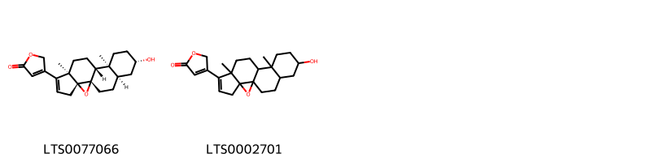{ width=100% }
    <figcaption>Hình ảnh cấu trúc hóa học của 2 hoạt chất thuộc nhóm Oxepanes gồm ['4-[(1s,3r,7r,10r,11s,14s,16r)-14-hydroxy-7,11-dimethyl-2-oxapentacyclo[8.8.0.0¹,³.0³,⁷.0¹¹,¹⁶]octadec-5-en-6-yl]-5h-furan-2-one (LTS0077066)', '4-{14-hydroxy-7,11-dimethyl-2-oxapentacyclo[8.8.0.0¹,³.0³,⁷.0¹¹,¹⁶]octadec-5-en-6-yl}-5h-furan-2-one (LTS0002701)'].</figcaption>
</figure>
#### Nhóm Prenol lipids
<figure markdown="span">
    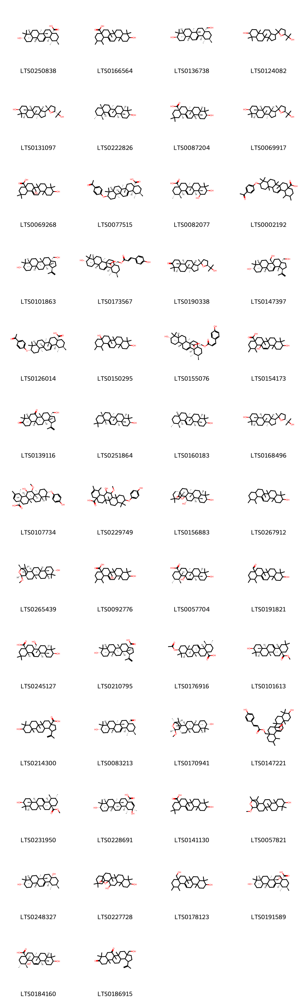{ width=100% }
    <figcaption>Hình ảnh cấu trúc hóa học của 61 hoạt chất thuộc nhóm Prenol lipids gồm ['ursolic acid (LTS0250838)', '10-hydroxy-1,2,6a,6b,9,9,12a-heptamethyl-2,3,4,5,6,7,8,8a,10,11,12,12b,13,14b-tetradecahydro-1h-picene-4a-carboxylic acid (LTS0166564)', 'urs-12-ene-3β,28-diol (LTS0136738)', '1-[5-(2-hydroxypropan-2-yl)-2-methyloxolan-2-yl]-3a,3b,6,6,9a-pentamethyl-dodecahydro-1h-cyclopenta[a]phenanthren-7-ol (LTS0124082)', '(1s,3ar,3br,5ar,7s,9ar,9bs,11ar)-1-[(2s,5r)-5-(2-hydroxypropan-2-yl)-2-methyloxolan-2-yl]-3a,3b,6,6,9a-pentamethyl-dodecahydro-1h-cyclopenta[a]phenanthren-7-ol (LTS0131097)', 'amyrin (LTS0222826)', '(4as,6as,6br,8as,10s,12ar,12bs,14br)-10-hydroxy-2,2,6a,6b,9,9,12a-heptamethyl-1,3,4,5,6,7,8,8a,10,11,12,12b,13,14b-tetradecahydropicene-4a-carboxylic acid (LTS0087204)', '(1s,3ar,3br,5ar,7s,9ar,9bs,11ar)-1-[(2s,5s)-5-(2-hydroxypropan-2-yl)-2-methyloxolan-2-yl]-3a,3b,6,6,9a-pentamethyl-dodecahydro-1h-cyclopenta[a]phenanthren-7-ol (LTS0069917)', '10-hydroxy-6a-(hydroxymethyl)-2,2,6b,9,9,12a-hexamethyl-1,3,4,5,6,7,8,8a,10,11,12,12b,13,14b-tetradecahydropicene-4a-carboxylic acid (LTS0069268)', '(1s,2r,4as,6as,6br,8ar,10r,12ar,12br,14bs)-10-(4-acetylphenoxy)-1,2,6a,6b,9,9,12a-heptamethyl-2,3,4,5,6,7,8,8a,10,11,12,12b,13,14b-tetradecahydro-1h-picene-4a-carboxylic acid (LTS0077515)', '(1s,2r,4as,6as,6br,10s,12r,12ar,12bs,14br)-10,12-dihydroxy-1,2,6a,6b,9,9,12a-heptamethyl-2,3,4,5,6,7,8,8a,10,11,12,12b,13,14b-tetradecahydro-1h-picene-4a-carboxylic acid (LTS0082077)', '10-(4-acetylphenoxy)-1,2,6a,6b,9,9,12a-heptamethyl-2,3,4,5,6,7,8,8a,10,11,12,12b,13,14b-tetradecahydro-1h-picene-4a-carboxylic acid (LTS0002192)', 'betulin (LTS0101863)', '(1s,2r,4as,6ar,6br,8ar,10s,12ar,12br,14bs)-10-hydroxy-4a-({[(2e)-3-(4-hydroxyphenyl)prop-2-enoyl]oxy}methyl)-1,2,6b,9,9,12a-hexamethyl-2,3,4,5,6,7,8,8a,10,11,12,12b,13,14b-tetradecahydro-1h-picene-6a-carboxylic acid (LTS0173567)', 'cabraleone (LTS0190338)', '(1r,3as,5ar,5br,7ar,9s,11ar,11br,13br)-3a,5a-bis(hydroxymethyl)-5b,8,8,11a-tetramethyl-1-(prop-1-en-2-yl)-1h,2h,3h,4h,5h,6h,7h,7ah,9h,10h,11h,11bh,12h,13bh-cyclopenta[a]chrysen-9-ol (LTS0147397)', '(1s,2r,4as,6as,6br,8ar,10s,12ar,12br,14bs)-10-(4-acetylphenoxy)-1,2,6a,6b,9,9,12a-heptamethyl-2,3,4,5,6,7,8,8a,10,11,12,12b,13,14b-tetradecahydro-1h-picene-4a-carboxylic acid (LTS0126014)', '4,4,6a,6b,11,12,14b-heptamethyl-2,3,4a,5,6,7,8,9,10,11,12,12a,14,14a-tetradecahydro-1h-picene-3,8a-diol (LTS0150295)', '(1s,2r,4as,6ar,6br,8ar,10s,12ar,12br,14bs)-10-hydroxy-4a-({[(2z)-3-(4-hydroxyphenyl)prop-2-enoyl]oxy}methyl)-1,2,6b,9,9,12a-hexamethyl-2,3,4,5,6,7,8,8a,10,11,12,12b,13,14b-tetradecahydro-1h-picene-6a-carboxylic acid (LTS0155076)', '10,14a-dihydroxy-1,2,6a,6b,9,9,12a-heptamethyl-1,2,3,4,5,6,7,8,8a,10,11,12,12b,14b-tetradecahydropicene-4a-carboxylic acid (LTS0154173)', '(1r,3as,5ar,5br,7ar,11as,11br,13ar,13br)-3a-(hydroxymethyl)-5a,5b,8,8,11a-pentamethyl-1-(prop-1-en-2-yl)-tetradecahydrocyclopenta[a]chrysene-6,9-dione (LTS0139116)', 'β-amyrin (LTS0251864)', '(3s,4ar,6ar,6bs,8ar,11r,12s,12ar,14ar,14br)-4,4,6a,6b,11,12,14b-heptamethyl-1,2,3,4a,5,6,7,8,8a,9,10,11,12,12a,14,14a-hexadecahydropicen-3-ol (LTS0160183)', '(1s,3ar,3br,5ar,7s,9ar,9br,11ar)-1-[(2s,5r)-5-(2-hydroxypropan-2-yl)-2-methyloxolan-2-yl]-3a,3b,6,6,9a-pentamethyl-dodecahydro-1h-cyclopenta[a]phenanthren-7-ol (LTS0168496)', '(1r,4ar,6ar,6br,8ar,10s,12as,12br,13s,14r,14ar,14bs)-14-hydroxy-10-(4-hydroxyphenoxy)-13-methoxy-1,2,6a,6b,9,9,12a-heptamethyl-4,5,6,7,8,8a,10,11,12,12b,13,14,14a,14b-tetradecahydro-1h-picene-4a-carboxylic acid (LTS0107734)', '14-hydroxy-10-(4-hydroxyphenoxy)-13-methoxy-1,2,6a,6b,9,9,12a-heptamethyl-4,5,6,7,8,8a,10,11,12,12b,13,14,14a,14b-tetradecahydro-1h-picene-4a-carboxylic acid (LTS0229749)', '(1s,4s,5r,8r,10s,13r,14r,16s,17s,18r)-10,16-dihydroxy-4,5,9,9,13,20,20-heptamethyl-24-oxahexacyclo[15.5.2.0¹,¹⁸.0⁴,¹⁷.0⁵,¹⁴.0⁸,¹³]tetracosan-23-one (LTS0156883)', '4,4,6a,6b,11,12,14b-heptamethyl-1,2,3,4a,5,6,7,8,8a,9,10,11,12,12a,14,14a-hexadecahydropicen-3-ol (LTS0267912)', '(1r,4r,5r,8r,10s,13s,14r,17r,18r,19s,20s,22s)-22-methoxy-4,5,9,9,13,19,20-heptamethyl-21-oxahexacyclo[18.2.2.0¹,¹⁸.0⁴,¹⁷.0⁵,¹⁴.0⁸,¹³]tetracosan-10-ol (LTS0265439)', '10-hydroxy-6a-(hydroxymethyl)-1,2,6b,9,9,12a-hexamethyl-2,3,4,5,6,7,8,8a,10,11,12,12b,13,14b-tetradecahydro-1h-picene-4a-carboxylic acid (LTS0092776)', '(1s,2r,4as,6as,6br,8ar,10s,12as,12br,14as,14br)-10,14a-dihydroxy-1,2,6a,6b,9,9,12a-heptamethyl-1,2,3,4,5,6,7,8,8a,10,11,12,12b,14b-tetradecahydropicene-4a-carboxylic acid (LTS0057704)', '10-hydroxy-1,2,6a,6b,9,9,12a-heptamethyl-2,3,4,5,6,7,8,8a,10,11,12,12b,13,14b-tetradecahydro-1h-picene-4a-carbaldehyde (LTS0191821)', '(4as,6ar,6br,8ar,10s,12ar,12br,14bs)-10-hydroxy-6a-(hydroxymethyl)-2,2,6b,9,9,12a-hexamethyl-1,3,4,5,6,7,8,8a,10,11,12,12b,13,14b-tetradecahydropicene-4a-carboxylic acid (LTS0245127)', 'betulinic acid (LTS0210795)', '(1s,2r,4as,6as,6br,8ar,10s,12ar,12br,14bs)-10-(acetyloxy)-1,2,6a,6b,9,9,12a-heptamethyl-2,3,4,5,6,7,8,8a,10,11,12,12b,13,14b-tetradecahydro-1h-picene-4a-carboxylic acid (LTS0176916)', 'methyl (4as,6as,6br,8ar,10s,12ar,12br,14bs)-10-hydroxy-2,2,6a,6b,9,9,12a-heptamethyl-1,3,4,5,6,7,8,8a,10,11,12,12b,13,14b-tetradecahydropicene-4a-carboxylate (LTS0101613)', '9-hydroxy-5a,5b,8,8,11a-pentamethyl-1-(prop-1-en-2-yl)-hexadecahydrocyclopenta[a]chrysene-3a-carboxylic acid (LTS0214300)', '(1s,2r,4as,6as,6br,8ar,10s,12ar,12br,14bs)-10-hydroxy-1,2,6a,6b,9,9,12a-heptamethyl-2,3,4,5,6,7,8,8a,10,11,12,12b,13,14b-tetradecahydro-1h-picene-4a-carbaldehyde (LTS0083213)', '(1s,4r,5r,8r,10s,13r,14r,17r,18s,19s,20r,22s)-22-methoxy-4,5,9,9,13,19,20-heptamethyl-21-oxahexacyclo[18.2.2.0¹,¹⁸.0⁴,¹⁷.0⁵,¹⁴.0⁸,¹³]tetracosan-10-ol (LTS0170941)', '10-hydroxy-4a-({[3-(4-hydroxyphenyl)prop-2-enoyl]oxy}methyl)-1,2,6b,9,9,12a-hexamethyl-2,3,4,5,6,7,8,8a,10,11,12,12b,13,14b-tetradecahydro-1h-picene-6a-carboxylic acid (LTS0147221)', 'methyl (1s,2r,4as,6as,6br,8ar,10s,12ar,12br,14br)-10-hydroxy-1,2,6a,6b,9,9,12a-heptamethyl-2,3,4,5,6,7,8,8a,10,11,12,12b,13,14b-tetradecahydro-1h-picene-4a-carboxylate (LTS0231950)', '(1r,2r,4ar,6ar,6br,8ar,10s,12ar,12br,14ar,14br)-2,10-dihydroxy-1,2,6a,6b,9,9,12a-heptamethyl-1,5,6,7,8,8a,10,11,12,12b,13,14,14a,14b-tetradecahydropicene-4a-carboxylic acid (LTS0228691)', 'oleanolic acid (LTS0141130)', '22-methoxy-4,5,9,9,13,19,20-heptamethyl-21-oxahexacyclo[18.2.2.0¹,¹⁸.0⁴,¹⁷.0⁵,¹⁴.0⁸,¹³]tetracosan-10-ol (LTS0057821)', '(3s,4ar,6ar,6bs,8as,11r,12s,12as,14ar,14br)-4,4,6a,6b,11,12,14b-heptamethyl-2,3,4a,5,6,7,8,9,10,11,12,12a,14,14a-tetradecahydro-1h-picene-3,8a-diol (LTS0248327)', '10,16-dihydroxy-4,5,9,9,13,20,20-heptamethyl-24-oxahexacyclo[15.5.2.0¹,¹⁸.0⁴,¹⁷.0⁵,¹⁴.0⁸,¹³]tetracosan-23-one (LTS0227728)', '8a-(hydroxymethyl)-4,4,6a,6b,11,12,14b-heptamethyl-2,3,4a,5,6,7,8,9,10,11,12,12a,14,14a-tetradecahydro-1h-picen-3-ol (LTS0178123)', '(1s,2r,4as,6ar,6br,8ar,10s,12ar,12br,14bs)-10-hydroxy-6a-(hydroxymethyl)-1,2,6b,9,9,12a-hexamethyl-2,3,4,5,6,7,8,8a,10,11,12,12b,13,14b-tetradecahydro-1h-picene-4a-carboxylic acid (LTS0191589)', '(1s,2r,4as,6as,6br,8as,10s,12as,12br,14ar,14br)-10,14a-dihydroxy-1,2,6a,6b,9,9,12a-heptamethyl-1,2,3,4,5,6,7,8,8a,10,11,12,12b,14b-tetradecahydropicene-4a-carboxylic acid (LTS0184160)', '3a-(hydroxymethyl)-5a,5b,8,8,11a-pentamethyl-1-(prop-1-en-2-yl)-tetradecahydrocyclopenta[a]chrysene-6,9-dione (LTS0186915)', '(1r,2r,4ar,6ar,6br,8ar,10s,12ar,12br,14ar,14br)-2,10-dihydroxy-1,2,6a,6b,9,9,12a-heptamethyl-hexadecahydropicene-4a-carboxylic acid (LTS0016142)', 'uvaol (LTS0008025)', '2,10-dihydroxy-1,2,6a,6b,9,9,12a-heptamethyl-1,5,6,7,8,8a,10,11,12,12b,13,14,14a,14b-tetradecahydropicene-4a-carboxylic acid (LTS0002239)', '4-[3-hydroxy-2-(2-{6-[(5-hydroxy-4-methoxy-6-methyloxan-2-yl)oxy]-8a-methyl-2-oxo-octahydronaphthalen-1-yl}ethyl)-2-methylcyclopentyl]-5h-furan-2-one (LTS0008094)', '4-[(1r,2r,3s)-2-{2-[(1r,4ar,6s,8as)-6-{[(2r,4r,5s,6r)-5-hydroxy-4-methoxy-6-methyloxan-2-yl]oxy}-8a-methyl-2-oxo-octahydronaphthalen-1-yl]ethyl}-3-hydroxy-2-methylcyclopentyl]-5h-furan-2-one (LTS0023868)', '3a-(hydroxymethyl)-5a,5b,8,8,11a-pentamethyl-1-(prop-1-en-2-yl)-hexadecahydrocyclopenta[a]chrysen-9-ol (LTS0008250)', '(3s,4ar,6ar,6bs,8ar,11r,12s,12as,14ar,14br)-4,4,6a,6b,11,12,14b-heptamethyl-1,2,3,4a,5,6,7,8,8a,9,10,11,12,12a,14,14a-hexadecahydropicen-3-ol (LTS0101778)', '(1s,2r,4as,6as,6br,8as,10s,12as,14ar,14br)-10,14a-dihydroxy-1,2,6a,6b,9,9,12a-heptamethyl-1,2,3,4,5,6,7,8,8a,10,11,12,12b,14b-tetradecahydropicene-4a-carboxylic acid (LTS0240176)', 'methyl (1s,2r,4as,6as,6br,8ar,10s,12ar,12br,14bs)-10-hydroxy-1,2,6a,6b,9,9,12a-heptamethyl-2,3,4,5,6,7,8,8a,10,11,12,12b,13,14b-tetradecahydro-1h-picene-4a-carboxylate (LTS0086911)', 'α-amyrin (LTS0088267)', 'oleanolic acid (LTS0117717)'].</figcaption>
</figure>
#### Nhóm Steroids and steroid derivatives
<figure markdown="span">
    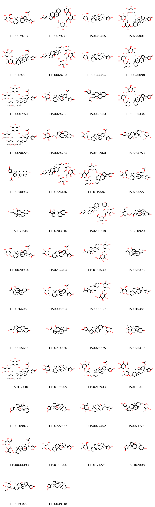{ width=100% }
    <figcaption>Hình ảnh cấu trúc hóa học của 90 hoạt chất thuộc nhóm Steroids and steroid derivatives gồm ['(2s,3as,5ar,7s,9as,11ar)-7-{[(2r,5s)-3,5-dihydroxy-4-methoxy-6-methyloxan-2-yl]oxy}-3a-hydroxy-9a,11a-dimethyl-1-(5-oxo-2h-furan-3-yl)-tetradecahydrocyclopenta[a]phenanthren-2-yl acetate (LTS0079707)', '4-[(1s,3r,6r,7r,10r,11s,14s,16r)-14-{[(2r,3r,4r,5s,6r)-3-hydroxy-4-methoxy-6-methyl-5-{[(2s,3r,4s,5s,6r)-3,4,5-trihydroxy-6-({[(2r,3r,4s,5s,6r)-3,4,5-trihydroxy-6-(hydroxymethyl)oxan-2-yl]oxy}methyl)oxan-2-yl]oxy}oxan-2-yl]oxy}-7,11-dimethyl-2-oxapentacyclo[8.8.0.0¹,³.0³,⁷.0¹¹,¹⁶]octadecan-6-yl]-5h-furan-2-one (LTS0079771)', '4-[(1r,3as,3br,5ar,7s,9as,9bs,11ar)-3a-hydroxy-7-{[(2r,4r,5s,6r)-5-hydroxy-4-methoxy-6-methyloxan-2-yl]oxy}-9a,11a-dimethyl-tetradecahydrocyclopenta[a]phenanthren-1-yl]-5h-furan-2-one (LTS0140455)', '4-[(1r,3as,3br,5ar,7s,9as,9bs,11ar)-3a-hydroxy-7-{[(2r,3r,4r,5s,6r)-3-hydroxy-4-methoxy-6-methyl-5-{[(2s,3r,4s,5s,6r)-3,4,5-trihydroxy-6-({[(2r,3r,4s,5s,6r)-3,4,5-trihydroxy-6-(hydroxymethyl)oxan-2-yl]oxy}methyl)oxan-2-yl]oxy}oxan-2-yl]oxy}-9a,11a-dimethyl-tetradecahydrocyclopenta[a]phenanthren-1-yl]-5h-furan-2-one (LTS0275801)', '(1r,2s,3as,3br,5ar,7s,9as,9bs,11ar)-3a-hydroxy-7-{[(2r,4s,5s,6r)-4-methoxy-6-methyl-5-{[(2s,3r,4s,5s,6r)-3,4,5-trihydroxy-6-(hydroxymethyl)oxan-2-yl]oxy}oxan-2-yl]oxy}-9a,11a-dimethyl-1-(5-oxo-2h-furan-3-yl)-tetradecahydrocyclopenta[a]phenanthren-2-yl acetate (LTS0174883)', '4-[(1s,3r,7r,10r,11s,16r)-14-{[(2r)-4-methoxy-6-methyl-5-{[(2s)-3,4,5-trihydroxy-6-({[3,4,5-trihydroxy-6-(hydroxymethyl)oxan-2-yl]oxy}methyl)oxan-2-yl]oxy}oxan-2-yl]oxy}-7,11-dimethyl-2-oxapentacyclo[8.8.0.0¹,³.0³,⁷.0¹¹,¹⁶]octadecan-6-yl]-5h-furan-2-one (LTS0068733)', '4-[(3as,5ar,7s)-3a-hydroxy-7-{[(2r,4r,5s,6r)-5-hydroxy-4-methoxy-6-methyloxan-2-yl]oxy}-9a,11a-dimethyl-tetradecahydrocyclopenta[a]phenanthren-1-yl]-5h-furan-2-one (LTS0044494)', '4-[(1r,3as,3br,5ar,7s,9as,9bs,11ar)-3a-hydroxy-7-{[(2r,4s,5s,6s)-4-methoxy-6-methyl-5-{[(2s,3r,4s,5s,6r)-3,4,5-trihydroxy-6-({[(2r,3r,4s,5s,6r)-3,4,5-trihydroxy-6-(hydroxymethyl)oxan-2-yl]oxy}methyl)oxan-2-yl]oxy}oxan-2-yl]oxy}-9a,11a-dimethyl-tetradecahydrocyclopenta[a]phenanthren-1-yl]-5h-furan-2-one (LTS0046098)', '(1r,2s,3as,3br,5ar,7s,9as,9bs,11ar)-3a-hydroxy-7-{[(2r,4r,5s,6r)-4-methoxy-6-methyl-5-{[(2s,3r,4s,5s,6r)-3,4,5-trihydroxy-6-({[(2r,3r,4s,5s,6r)-3,4,5-trihydroxy-6-(hydroxymethyl)oxan-2-yl]oxy}methyl)oxan-2-yl]oxy}oxan-2-yl]oxy}-9a,11a-dimethyl-1-(5-oxo-2h-furan-3-yl)-tetradecahydrocyclopenta[a]phenanthren-2-yl acetate (LTS0007974)', '(3as,3br,5ar,9as,9br,11ar)-7-[(3,5-dihydroxy-4-methoxy-6-methyloxan-2-yl)oxy]-3a-hydroxy-9a,11a-dimethyl-1-(5-oxo-2h-furan-3-yl)-tetradecahydrocyclopenta[a]phenanthren-2-yl acetate (LTS0024208)', '3a,7-dihydroxy-9a,11a-dimethyl-1-(5-oxo-2h-furan-3-yl)-tetradecahydrocyclopenta[a]phenanthren-2-yl acetate (LTS0069953)', '4-[(1r,3as,3br,5ar,7s,9as,9bs,11ar)-3a-hydroxy-7-{[(2r,4r,5s,6r)-4-methoxy-6-methyl-5-{[(2s,3r,4s,5s,6r)-3,4,5-trihydroxy-6-({[(2r,3r,4s,5s,6r)-3,4,5-trihydroxy-6-(hydroxymethyl)oxan-2-yl]oxy}methyl)oxan-2-yl]oxy}oxan-2-yl]oxy}-9a,11a-dimethyl-tetradecahydrocyclopenta[a]phenanthren-1-yl]-5h-furan-2-one (LTS0085334)', '3a-hydroxy-7-[(4-methoxy-6-methyl-5-{[3,4,5-trihydroxy-6-({[3,4,5-trihydroxy-6-(hydroxymethyl)oxan-2-yl]oxy}methyl)oxan-2-yl]oxy}oxan-2-yl)oxy]-9a,11a-dimethyl-1-(5-oxo-2h-furan-3-yl)-tetradecahydrocyclopenta[a]phenanthren-2-yl acetate (LTS0090228)', '3a-hydroxy-9a,11a-dimethyl-1-(2-{[3,4,5-trihydroxy-6-(hydroxymethyl)oxan-2-yl]oxy}acetyl)-1h,2h,3h,3bh,4h,5h,8h,9h,9bh,10h,11h-cyclopenta[a]phenanthren-7-one (LTS0024264)', 'oleandrin (LTS0102960)', 'adynerin (LTS0264253)', 'oleandrigenin (LTS0140957)', '4-{14-[(4-methoxy-6-methyl-5-{[3,4,5-trihydroxy-6-({[3,4,5-trihydroxy-6-(hydroxymethyl)oxan-2-yl]oxy}methyl)oxan-2-yl]oxy}oxan-2-yl)oxy]-7,11-dimethyl-2-oxapentacyclo[8.8.0.0¹,³.0³,⁷.0¹¹,¹⁶]octadecan-6-yl}-5h-furan-2-one (LTS0226136)', '4-{3a-hydroxy-7-[(4-methoxy-6-methyl-5-{[3,4,5-trihydroxy-6-({[3,4,5-trihydroxy-6-(hydroxymethyl)oxan-2-yl]oxy}methyl)oxan-2-yl]oxy}oxan-2-yl)oxy]-9a,11a-dimethyl-tetradecahydrocyclopenta[a]phenanthren-1-yl}-5h-furan-2-one (LTS0119587)', '(1r,2s,3as,3br,5ar,7s,9as,9bs,11ar)-3a-hydroxy-7-[(5-hydroxy-4-methoxy-6-methyloxan-2-yl)oxy]-9a,11a-dimethyl-1-(5-oxo-2h-furan-3-yl)-tetradecahydrocyclopenta[a]phenanthren-2-yl acetate (LTS0263227)', '(1s,3as,3br,9ar,9bs,11as)-1-[(1s)-1,2-dihydroxyethyl]-9a,11a-dimethyl-1h,2h,3h,3ah,3bh,8h,9h,9bh,10h-cyclopenta[a]phenanthrene-7,11-dione (LTS0071515)', '1-acetyl-11-hydroxy-9a,11a-dimethyl-3h,3ah,3bh,8h,9h,9bh,10h,11h-cyclopenta[a]phenanthren-7-one (LTS0203916)', '4-[(1s,3r,6r,7r,10r,11s,14s,16r)-14-{[(2r,4r,5s,6r)-4-methoxy-6-methyl-5-{[(2s,3r,4s,5s,6r)-3,4,5-trihydroxy-6-({[(2r,3r,4s,5s,6r)-3,4,5-trihydroxy-6-(hydroxymethyl)oxan-2-yl]oxy}methyl)oxan-2-yl]oxy}oxan-2-yl]oxy}-7,11-dimethyl-2-oxapentacyclo[8.8.0.0¹,³.0³,⁷.0¹¹,¹⁶]octadecan-6-yl]-5h-furan-2-one (LTS0208618)', '(1s,3as,3br,9ar,9bs,11ar)-3a-hydroxy-9a,11a-dimethyl-1-(2-{[(2r,3r,4s,5s,6r)-3,4,5-trihydroxy-6-(hydroxymethyl)oxan-2-yl]oxy}acetyl)-1h,2h,3h,3bh,4h,5h,8h,9h,9bh,10h,11h-cyclopenta[a]phenanthren-7-one (LTS0220920)', '(1r,2s,3as,3br,5ar,7s,9as,9bs,11ar)-3a-hydroxy-7-{[(2r,4r,5s,6r)-5-hydroxy-4-methoxy-6-methyloxan-2-yl]oxy}-9a,11a-dimethyl-1-(5-oxo-2h-furan-3-yl)-tetradecahydrocyclopenta[a]phenanthren-2-yl acetate (LTS0020934)', "4'-epioleandrin (LTS0232404)", '1-[(1s,3as,3br,5as,7s,9as,9bs,11ar)-3a-hydroxy-9a,11a-dimethyl-7-{[(2r,3r,4s,5s,6r)-3,4,5-trihydroxy-6-({[(2r,3r,4s,5s,6r)-3,4,5-trihydroxy-6-(hydroxymethyl)oxan-2-yl]oxy}methyl)oxan-2-yl]oxy}-tetradecahydrocyclopenta[a]phenanthren-1-yl]ethanone (LTS0167530)', '(1s,3as,3br,9ar,9bs,11as)-1-[(1r)-1-hydroxyethyl]-9a,11a-dimethyl-1h,2h,3h,3ah,3bh,8h,9h,9bh,10h-cyclopenta[a]phenanthrene-7,11-dione (LTS0026376)', '(3as,3br,9ar,9bs,11r,11as)-1-acetyl-11-hydroxy-9a,11a-dimethyl-3h,3ah,3bh,8h,9h,9bh,10h,11h-cyclopenta[a]phenanthren-7-one (LTS0266083)', '(1r,2s,3as,3br,5ar,7s,9as,9bs,11ar)-3a-hydroxy-7-{[(2r,4s,5s,6r)-5-hydroxy-4-methoxy-6-methyloxan-2-yl]oxy}-9a,11a-dimethyl-1-(5-oxo-2h-furan-3-yl)-tetradecahydrocyclopenta[a]phenanthren-2-yl acetate (LTS0008604)', '1-(3a-hydroxy-9a,11a-dimethyl-7-{[3,4,5-trihydroxy-6-({[3,4,5-trihydroxy-6-(hydroxymethyl)oxan-2-yl]oxy}methyl)oxan-2-yl]oxy}-tetradecahydrocyclopenta[a]phenanthren-1-yl)ethanone (LTS0008022)', '4-{3a-hydroxy-7-[(5-hydroxy-4-methoxy-6-methyloxan-2-yl)oxy]-9a,11a-dimethyl-tetradecahydrocyclopenta[a]phenanthren-1-yl}-5h-furan-2-one (LTS0015385)', '1-(1,2-dihydroxyethyl)-9a,11a-dimethyl-1h,2h,3h,3ah,3bh,8h,9h,9bh,10h-cyclopenta[a]phenanthrene-7,11-dione (LTS0055655)', '(1s,3as,3br,9ar,9bs,11as)-1-(2-hydroxyacetyl)-9a,11a-dimethyl-1h,2h,3h,3ah,3bh,8h,9h,9bh,10h-cyclopenta[a]phenanthrene-7,11-dione (LTS0214656)', '4-{14-[(5-hydroxy-4-methoxy-6-methyloxan-2-yl)oxy]-7,11-dimethyl-2-oxapentacyclo[8.8.0.0¹,³.0³,⁷.0¹¹,¹⁶]octadecan-6-yl}-5h-furan-2-one (LTS0026525)', '(1r,2s,4s,6r,7r,8r,10s,11r)-6-acetyl-8-hydroxy-7,11-dimethyl-5-oxapentacyclo[8.8.0.0²,⁷.0⁴,⁶.0¹¹,¹⁶]octadeca-15,17-dien-14-one (LTS0025419)', '(1r,2s,3as,3br,5ar,7s,9as,9bs,11ar)-3a-hydroxy-7-{[(2r,4s,5s,6s)-4-methoxy-6-methyl-5-{[(2s,3r,4s,5s,6r)-3,4,5-trihydroxy-6-({[(2r,3r,4s,5s,6r)-3,4,5-trihydroxy-6-(hydroxymethyl)oxan-2-yl]oxy}methyl)oxan-2-yl]oxy}oxan-2-yl]oxy}-9a,11a-dimethyl-1-(5-oxo-2h-furan-3-yl)-tetradecahydrocyclopenta[a]phenanthren-2-yl acetate (LTS0117410)', '4-[(1r,3as,3br,5ar,7s,9as,9bs,11ar)-7-{[(2r,3r,4s,5s,6r)-3,5-dihydroxy-4-methoxy-6-methyloxan-2-yl]oxy}-3a-hydroxy-9a,11a-dimethyl-tetradecahydrocyclopenta[a]phenanthren-1-yl]-5h-furan-2-one (LTS0196909)', '(1r,2s,3as,3br,5ar,7s,9as,9bs,11ar)-3a-hydroxy-7-{[(2r,4r,5s,6r)-4-methoxy-6-methyl-5-{[(2s,3r,4s,5s,6r)-3,4,5-trihydroxy-6-(hydroxymethyl)oxan-2-yl]oxy}oxan-2-yl]oxy}-9a,11a-dimethyl-1-(5-oxo-2h-furan-3-yl)-tetradecahydrocyclopenta[a]phenanthren-2-yl acetate (LTS0213933)', '3a-hydroxy-7-[(4-methoxy-6-methyl-5-{[3,4,5-trihydroxy-6-(hydroxymethyl)oxan-2-yl]oxy}oxan-2-yl)oxy]-9a,11a-dimethyl-1-(5-oxo-2h-furan-3-yl)-tetradecahydrocyclopenta[a]phenanthren-2-yl acetate (LTS0121068)', '4-[(1r,3as,3bs,4s,5ar,9as,9bs,11ar)-3a,4-dihydroxy-9a,11a-dimethyl-tetradecahydrocyclopenta[a]phenanthren-1-yl]-5h-furan-2-one (LTS0209872)', 'digitoxigenin (LTS0222652)', '4-[(3as,5ar,7s,9as,11ar)-7-{[(2r,3r,4s,5s,6r)-3,5-dihydroxy-4-methoxy-6-methyloxan-2-yl]oxy}-3a-hydroxy-9a,11a-dimethyl-tetradecahydrocyclopenta[a]phenanthren-1-yl]-5h-furan-2-one (LTS0077452)', '4-[(1s,3r,5r,7s,8r,11r,12s,15s,17r)-15-{[(2r,4r,5s,6r)-5-hydroxy-4-methoxy-6-methyloxan-2-yl]oxy}-8,12-dimethyl-2,6-dioxahexacyclo[9.8.0.0¹,³.0³,⁸.0⁵,⁷.0¹²,¹⁷]nonadecan-7-yl]-5h-furan-2-one (LTS0071726)', '(1r,2s,3as,3br,5as,7s,9as,9bs,11ar)-3a-hydroxy-7-{[(2r,3r,4r,5s,6r)-3-hydroxy-4-methoxy-6-methyl-5-{[(2s,3r,4s,5s,6r)-3,4,5-trihydroxy-6-(hydroxymethyl)oxan-2-yl]oxy}oxan-2-yl]oxy}-9a,11a-dimethyl-1-(5-oxo-2h-furan-3-yl)-tetradecahydrocyclopenta[a]phenanthren-2-yl acetate (LTS0044493)', '4-[(1r,3ar,3bs,5ar,7s,9as,9br,11ar)-3a,3b-dihydroxy-7-{[(2r,4r,5s,6r)-5-hydroxy-4-methoxy-6-methyloxan-2-yl]oxy}-9a,11a-dimethyl-dodecahydro-1h-cyclopenta[a]phenanthren-1-yl]-5h-furan-2-one (LTS0180200)', '4-{3a-hydroxy-7-[(5-hydroxy-4-methoxy-6-methyloxan-2-yl)oxy]-9a,11a-dimethyl-3h,3bh,4h,5h,5ah,6h,7h,8h,9h,9bh,10h,11h-cyclopenta[a]phenanthren-1-yl}-5h-furan-2-one (LTS0171228)', 'digitoxigenin (LTS0102008)', '4-[(3as,3br,5ar,7s,9as,9bs,11ar)-3a-hydroxy-7-{[(2r,3r,4s,5s,6r)-5-hydroxy-3,4-dimethoxy-6-methyloxan-2-yl]oxy}-9a,11a-dimethyl-3h,3bh,4h,5h,5ah,6h,7h,8h,9h,9bh,10h,11h-cyclopenta[a]phenanthren-1-yl]-5h-furan-2-one (LTS0193458)', '4-[(1s,3br,5as,7s,9as,9bs,11ar)-7-hydroxy-9a,11a-dimethyl-1h,2h,3bh,4h,5h,5ah,6h,7h,8h,9h,9bh,10h,11h-cyclopenta[a]phenanthren-1-yl]-5h-furan-2-one (LTS0049118)', '4-[(1r,2s,3as,3br,5ar,7s,9as,9bs,11ar)-2,3a-dihydroxy-7-{[(2r,4r,5s,6r)-5-hydroxy-4-methoxy-6-methyloxan-2-yl]oxy}-9a,11a-dimethyl-tetradecahydrocyclopenta[a]phenanthren-1-yl]-5h-furan-2-one (LTS0128360)', '7-[(3,5-dihydroxy-4-methoxy-6-methyloxan-2-yl)oxy]-3a-hydroxy-9a,11a-dimethyl-1-(5-oxo-2h-furan-3-yl)-tetradecahydrocyclopenta[a]phenanthren-2-yl acetate (LTS0150989)', '(1r,2s,3as,3br,5ar,7s,9as,9bs,11ar)-7-{[(2r,3r,4s,5s,6r)-3,5-dihydroxy-4-methoxy-6-methyloxan-2-yl]oxy}-3a-hydroxy-9a,11a-dimethyl-1-(5-oxo-2h-furan-3-yl)-tetradecahydrocyclopenta[a]phenanthren-2-yl acetate (LTS0103860)', '(5r)-4-[(5ar,7s,9as,11as)-7-{[(2r,3r,4s,5s,6r)-3,5-dihydroxy-4-methoxy-6-methyloxan-2-yl]oxy}-9a,11a-dimethyl-4h,5h,5ah,6h,7h,8h,9h,10h,11h-cyclopenta[a]phenanthren-1-yl]-5-hydroxy-5h-furan-2-one (LTS0125520)', '4-[(3as,3br,5ar,7s,9as,9bs,11ar)-7-{[(2r,3r,4s,5s,6r)-3,5-dihydroxy-4-methoxy-6-methyloxan-2-yl]oxy}-3a-hydroxy-9a,11a-dimethyl-3h,3bh,4h,5h,5ah,6h,7h,8h,9h,9bh,10h,11h-cyclopenta[a]phenanthren-1-yl]-5h-furan-2-one (LTS0149409)', 'hexyl 4-{[1-(5-ethyl-6-methylhept-3-en-2-yl)-9a,11a-dimethyl-1h,2h,3h,3ah,3bh,4h,6h,7h,8h,9h,9bh,10h,11h-cyclopenta[a]phenanthren-7-yl]oxy}benzoate (LTS0148897)', '4-[(1r,3as,3br,5ar,7s,9as,9bs,11ar)-3a-hydroxy-7-{[(2r,4s,5s,6r)-5-hydroxy-4-methoxy-6-methyloxan-2-yl]oxy}-9a,11a-dimethyl-tetradecahydrocyclopenta[a]phenanthren-1-yl]-5h-furan-2-one (LTS0087148)', '4-{3a,3b-dihydroxy-7-[(5-hydroxy-4-methoxy-6-methyloxan-2-yl)oxy]-9a,11a-dimethyl-dodecahydro-1h-cyclopenta[a]phenanthren-1-yl}-5h-furan-2-one (LTS0103186)', 'hexyl 4-{[(1r,3as,3bs,7s,9ar,9bs,11ar)-1-[(2r,3e,5s)-5-ethyl-6-methylhept-3-en-2-yl]-9a,11a-dimethyl-1h,2h,3h,3ah,3bh,4h,6h,7h,8h,9h,9bh,10h,11h-cyclopenta[a]phenanthren-7-yl]oxy}benzoate (LTS0237919)', '4-{7-[(3,5-dihydroxy-4-methoxy-6-methyloxan-2-yl)oxy]-9a,11a-dimethyl-4h,5h,5ah,6h,7h,8h,9h,10h,11h-cyclopenta[a]phenanthren-1-yl}-5-hydroxy-5h-furan-2-one (LTS0234676)', '4-{7-hydroxy-9a,11a-dimethyl-1h,2h,3bh,4h,5h,5ah,6h,7h,8h,9h,9bh,10h,11h-cyclopenta[a]phenanthren-1-yl}-5h-furan-2-one (LTS0262894)', '4-{3a-hydroxy-7-[(5-hydroxy-3,4-dimethoxy-6-methyloxan-2-yl)oxy]-9a,11a-dimethyl-3h,3bh,4h,5h,5ah,6h,7h,8h,9h,9bh,10h,11h-cyclopenta[a]phenanthren-1-yl}-5h-furan-2-one (LTS0259743)', '3,9-dihydroxy-3a-(hydroxymethyl)-5a,5b,8,8-tetramethyl-1-(prop-1-en-2-yl)-1h,2h,3h,4h,5h,6h,7h,7ah,9h,11bh,12h,13h,13ah,13bh-cyclopenta[a]chrysen-10-one (LTS0251985)', '4-{7-[(3,5-dihydroxy-4-methoxy-6-methyloxan-2-yl)oxy]-3a-hydroxy-9a,11a-dimethyl-3h,3bh,4h,5h,5ah,6h,7h,8h,9h,9bh,10h,11h-cyclopenta[a]phenanthren-1-yl}-5h-furan-2-one (LTS0255557)', '3a-hydroxy-7-[(3-hydroxy-4-methoxy-6-methyl-5-{[3,4,5-trihydroxy-6-(hydroxymethyl)oxan-2-yl]oxy}oxan-2-yl)oxy]-9a,11a-dimethyl-1-(5-oxo-2h-furan-3-yl)-tetradecahydrocyclopenta[a]phenanthren-2-yl acetate (LTS0195686)', '4-[(1r,3as,3br,5ar,7s,9as,9bs,11ar)-7-{[(2r,3r,4r,5s,6s)-3,5-dihydroxy-4-methoxy-6-methyloxan-2-yl]oxy}-3a-hydroxy-9a,11a-dimethyl-tetradecahydrocyclopenta[a]phenanthren-1-yl]-5h-furan-2-one (LTS0205726)', '4-{3a-hydroxy-7-[(3-hydroxy-4-methoxy-6-methyl-5-{[3,4,5-trihydroxy-6-(hydroxymethyl)oxan-2-yl]oxy}oxan-2-yl)oxy]-9a,11a-dimethyl-tetradecahydrocyclopenta[a]phenanthren-1-yl}-5h-furan-2-one (LTS0098934)', '4-[(3as,3bs,5ar,7r,8r,9as,9bs,11ar)-3a,8-dihydroxy-7-{[(2s,4r,5s,6r)-5-hydroxy-4-methoxy-6-methyloxan-2-yl]oxy}-9a,11a-dimethyl-3h,3bh,4h,5h,5ah,6h,7h,8h,9h,9bh,10h,11h-cyclopenta[a]phenanthren-1-yl]-5h-furan-2-one (LTS0081131)', '3a-hydroxy-9a,11a-dimethyl-1-(5-oxo-2h-furan-3-yl)-7-{[3,4,5-trihydroxy-6-(hydroxymethyl)oxan-2-yl]oxy}-tetradecahydrocyclopenta[a]phenanthren-2-yl acetate (LTS0187828)', '4-{15-[(5-hydroxy-4-methoxy-6-methyloxan-2-yl)oxy]-8,12-dimethyl-2,6-dioxahexacyclo[9.8.0.0¹,³.0³,⁸.0⁵,⁷.0¹²,¹⁷]nonadecan-7-yl}-5h-furan-2-one (LTS0220065)', '(1r,2s,3as,3br,5ar,7s,9as,9bs,11ar)-3a-hydroxy-9a,11a-dimethyl-1-(5-oxo-2h-furan-3-yl)-7-{[(2r,3r,4s,5s,6r)-3,4,5-trihydroxy-6-(hydroxymethyl)oxan-2-yl]oxy}-tetradecahydrocyclopenta[a]phenanthren-2-yl acetate (LTS0157340)', '4-[(3as,3br,5ar,7s,9as,9bs,11ar)-3a-hydroxy-7-{[(2r,4r,5s,6r)-5-hydroxy-4-methoxy-6-methyloxan-2-yl]oxy}-9a,11a-dimethyl-3h,3bh,4h,5h,5ah,6h,7h,8h,9h,9bh,10h,11h-cyclopenta[a]phenanthren-1-yl]-5h-furan-2-one (LTS0173009)', '4-[(1r,3as,3br,5as,7s,9as,9bs,11ar)-3a-hydroxy-7-{[(2r,4r,5s,6r)-5-hydroxy-4-methoxy-6-methyloxan-2-yl]oxy}-9a,11a-dimethyl-tetradecahydrocyclopenta[a]phenanthren-1-yl]-5h-furan-2-one (LTS0067543)', '(1r,2s,3as,3br,5as,7s,9as,9bs,11ar)-3a-hydroxy-7-{[(2r,4r,5s,6r)-5-hydroxy-4-methoxy-6-methyloxan-2-yl]oxy}-9a,11a-dimethyl-1-(5-oxo-2h-furan-3-yl)-tetradecahydrocyclopenta[a]phenanthren-2-yl acetate (LTS0146270)', '(1r,2s,3as,3br,5ar,7s,9as,9bs,11ar)-3a-hydroxy-7-{[(2r,4s,5s,6s)-4-methoxy-6-methyl-5-{[(2s,3r,4s,5s,6r)-3,4,5-trihydroxy-6-(hydroxymethyl)oxan-2-yl]oxy}oxan-2-yl]oxy}-9a,11a-dimethyl-1-(5-oxo-2h-furan-3-yl)-tetradecahydrocyclopenta[a]phenanthren-2-yl acetate (LTS0254626)', 'phytosterol (LTS0029311)', 'stigmasterol (LTS0024262)', '4-[(1r,3as,3br,5as,7s,9as,9bs,11ar)-3a-hydroxy-7-{[(2r,3r,4r,5s,6r)-3-hydroxy-4-methoxy-6-methyl-5-{[(2s,3r,4s,5s,6r)-3,4,5-trihydroxy-6-(hydroxymethyl)oxan-2-yl]oxy}oxan-2-yl]oxy}-9a,11a-dimethyl-tetradecahydrocyclopenta[a]phenanthren-1-yl]-5h-furan-2-one (LTS0051739)', 'neriifolin (LTS0229598)', '(1r,2s,3as,3br,5as,7s,9as,9bs,11ar)-3a-hydroxy-7-{[(2r,4r,5s,6r)-4-methoxy-6-methyl-5-{[(2s,3r,4s,5s,6r)-3,4,5-trihydroxy-6-(hydroxymethyl)oxan-2-yl]oxy}oxan-2-yl]oxy}-9a,11a-dimethyl-1-(5-oxo-2h-furan-3-yl)-tetradecahydrocyclopenta[a]phenanthren-2-yl acetate (LTS0246371)', '4-[(1r,3as,3bs,5ar,7s,9as,9br,11ar)-7-{[(2r,3r,4s,5s,6r)-3,5-dihydroxy-4-methoxy-6-methyloxan-2-yl]oxy}-3a-hydroxy-9a,11a-dimethyl-tetradecahydrocyclopenta[a]phenanthren-1-yl]-5h-furan-2-one (LTS0254762)', '4-{3a,8-dihydroxy-7-[(5-hydroxy-4-methoxy-6-methyloxan-2-yl)oxy]-9a,11a-dimethyl-3h,3bh,4h,5h,5ah,6h,7h,8h,9h,9bh,10h,11h-cyclopenta[a]phenanthren-1-yl}-5h-furan-2-one (LTS0056602)', '4-[(1r,3as,3br,5as,7s,9ar,9bs,11ar)-3a,5a-dihydroxy-7-{[(2r,4r,5s,6r)-5-hydroxy-4-methoxy-6-methyloxan-2-yl]oxy}-9a,11a-dimethyl-dodecahydro-1h-cyclopenta[a]phenanthren-1-yl]-5h-furan-2-one (LTS0006037)', '4-[(3as,3br,5ar,9as,9br,11ar)-7-[(3,5-dihydroxy-4-methoxy-6-methyloxan-2-yl)oxy]-3a-hydroxy-9a,11a-dimethyl-tetradecahydrocyclopenta[a]phenanthren-1-yl]-5h-furan-2-one (LTS0003165)', '4-{3a,5a-dihydroxy-7-[(5-hydroxy-4-methoxy-6-methyloxan-2-yl)oxy]-9a,11a-dimethyl-dodecahydro-1h-cyclopenta[a]phenanthren-1-yl}-5h-furan-2-one (LTS0010687)', '4-{3a,4-dihydroxy-9a,11a-dimethyl-tetradecahydrocyclopenta[a]phenanthren-1-yl}-5h-furan-2-one (LTS0228971)', '4-{2,3a-dihydroxy-7-[(5-hydroxy-4-methoxy-6-methyloxan-2-yl)oxy]-9a,11a-dimethyl-tetradecahydrocyclopenta[a]phenanthren-1-yl}-5h-furan-2-one (LTS0098217)', '4-{18-hydroxy-7-[(4-methoxy-6-methyl-5-{[3,4,5-trihydroxy-6-({[3,4,5-trihydroxy-6-(hydroxymethyl)oxan-2-yl]oxy}methyl)oxan-2-yl]oxy}oxan-2-yl)oxy]-10,14-dimethyl-2-oxapentacyclo[9.7.0.0¹,³.0⁵,¹⁰.0¹⁴,¹⁸]octadecan-15-yl}-5h-furan-2-one (LTS0033987)', '(1r,3s,3ar,5ar,5br,7ar,9r,11br,13ar,13br)-3,9-dihydroxy-3a-(hydroxymethyl)-5a,5b,8,8-tetramethyl-1-(prop-1-en-2-yl)-1h,2h,3h,4h,5h,6h,7h,7ah,9h,11bh,12h,13h,13ah,13bh-cyclopenta[a]chrysen-10-one (LTS0040947)', '4-[(1r,3s,5s,7s,10s,11r,14r,15r,18r)-18-hydroxy-7-{[(2r,4r,5s,6r)-4-methoxy-6-methyl-5-{[(2s,3r,4s,5s,6r)-3,4,5-trihydroxy-6-({[(2r,3r,4s,5s,6r)-3,4,5-trihydroxy-6-(hydroxymethyl)oxan-2-yl]oxy}methyl)oxan-2-yl]oxy}oxan-2-yl]oxy}-10,14-dimethyl-2-oxapentacyclo[9.7.0.0¹,³.0⁵,¹⁰.0¹⁴,¹⁸]octadecan-15-yl]-5h-furan-2-one (LTS0044054)'].</figcaption>
</figure>

---

### Dược dân tộc học

Danh sách các quốc gia có sử dụng *Nerium oleander* trong điều trị các bệnh. 

| Country            | Disease                                                                                  | Bệnh                                                                                                                                                                                                |
|:-------------------|:-----------------------------------------------------------------------------------------|:----------------------------------------------------------------------------------------------------------------------------------------------------------------------------------------------------|
| Dominican Republic | Stimulant, Rodenticide                                                                   | MYMEMORY WARNING: YOU USED ALL AVAILABLE FREE TRANSLATIONS FOR TODAY. NEXT AVAILABLE IN  11 HOURS 34 MINUTES 22 SECONDS VISIT HTTPS://MYMEMORY.TRANSLATED.NET/DOC/USAGELIMITS.PHP TO TRANSLATE MORE |
| Elsewhere          | Cardiotonic, Diuretic, Insecticide, Diuretic, Poison, Cardiotonic, Poison                | MYMEMORY WARNING: YOU USED ALL AVAILABLE FREE TRANSLATIONS FOR TODAY. NEXT AVAILABLE IN  11 HOURS 34 MINUTES 18 SECONDS VISIT HTTPS://MYMEMORY.TRANSLATED.NET/DOC/USAGELIMITS.PHP TO TRANSLATE MORE |
| Europe             | Raticide                                                                                 | MYMEMORY WARNING: YOU USED ALL AVAILABLE FREE TRANSLATIONS FOR TODAY. NEXT AVAILABLE IN  11 HOURS 34 MINUTES 15 SECONDS VISIT HTTPS://MYMEMORY.TRANSLATED.NET/DOC/USAGELIMITS.PHP TO TRANSLATE MORE |
| Haiti              | Cardiac, Cardiotonic, Emetic, Parasiticide, Poison, Purgative, Rodenticide, Sternutatory | MYMEMORY WARNING: YOU USED ALL AVAILABLE FREE TRANSLATIONS FOR TODAY. NEXT AVAILABLE IN  11 HOURS 34 MINUTES 12 SECONDS VISIT HTTPS://MYMEMORY.TRANSLATED.NET/DOC/USAGELIMITS.PHP TO TRANSLATE MORE |
| Iraq               | Cardiotonic                                                                              | MYMEMORY WARNING: YOU USED ALL AVAILABLE FREE TRANSLATIONS FOR TODAY. NEXT AVAILABLE IN  11 HOURS 34 MINUTES 09 SECONDS VISIT HTTPS://MYMEMORY.TRANSLATED.NET/DOC/USAGELIMITS.PHP TO TRANSLATE MORE |
| Kurdistan          | Poison                                                                                   | MYMEMORY WARNING: YOU USED ALL AVAILABLE FREE TRANSLATIONS FOR TODAY. NEXT AVAILABLE IN  11 HOURS 34 MINUTES 06 SECONDS VISIT HTTPS://MYMEMORY.TRANSLATED.NET/DOC/USAGELIMITS.PHP TO TRANSLATE MORE |
| Mexico             | Parasiticide, Poison, Raticide, Tonic, Cardiac                                           | MYMEMORY WARNING: YOU USED ALL AVAILABLE FREE TRANSLATIONS FOR TODAY. NEXT AVAILABLE IN  11 HOURS 34 MINUTES 03 SECONDS VISIT HTTPS://MYMEMORY.TRANSLATED.NET/DOC/USAGELIMITS.PHP TO TRANSLATE MORE |
| Samoa              | Poison                                                                                   | MYMEMORY WARNING: YOU USED ALL AVAILABLE FREE TRANSLATIONS FOR TODAY. NEXT AVAILABLE IN  11 HOURS 33 MINUTES 59 SECONDS VISIT HTTPS://MYMEMORY.TRANSLATED.NET/DOC/USAGELIMITS.PHP TO TRANSLATE MORE |
| Turkey             | Cardiotonic, Diuretic, Poison, Tonic                                                     | MYMEMORY WARNING: YOU USED ALL AVAILABLE FREE TRANSLATIONS FOR TODAY. NEXT AVAILABLE IN  11 HOURS 33 MINUTES 57 SECONDS VISIT HTTPS://MYMEMORY.TRANSLATED.NET/DOC/USAGELIMITS.PHP TO TRANSLATE MORE |
| Venezuela          | Poison                                                                                   | MYMEMORY WARNING: YOU USED ALL AVAILABLE FREE TRANSLATIONS FOR TODAY. NEXT AVAILABLE IN  11 HOURS 33 MINUTES 54 SECONDS VISIT HTTPS://MYMEMORY.TRANSLATED.NET/DOC/USAGELIMITS.PHP TO TRANSLATE MORE |

---

# Chi Aidoerma

??? note "Danh sách các dược liệu thuộc chi"
    
	 - *Aidoerma cua*
	 - *Aidoerma quebracho*
	 - *Aidoerma quebracho-blanco*

---
## Aidoerma cua
### Thông tin về thực vật

!!! info "Phân loại thực vật của *N/A* từ GIBF:"
    - **Kingdom:** N/A
    - **Phylum:** N/A
    - **Order:** N/A
    - **Family:** N/A
    - **Genus:** N/A
    - **Species:** *N/A*

 

| Label (VI)   | Label (EN)   | Scientific Name   | Descriptions (VI)   | Descriptions (EN)   | Also Known As (VI)   | Also Known As (EN)                     |
|:-------------|:-------------|:------------------|:--------------------|:--------------------|:---------------------|:---------------------------------------|
| N/A          | N/A          | Nerium oleander   | loài thực vật       | species of plant    | ['Nerium oleander']  | ['sweet-scented oleander', 'oleander'] |

#### Phân bố trên thế giới

**Từ CSDL GIBF** Không có kết quả phù hợp

#### Phân bố tại Việt Nam

**Từ CSDL GIBF**: Không có ghi nhận ở Việt Nam

---
### Thành phần hóa học
        
- Theo cơ sở dữ liệu lotus: Từ loài *N/A* đã phân lập và xác định được Chưa có hoạt chất nào được phân lập. hoạt chất thuộc về các nhóm Không có hoạt chất nào được phân lập. 

Không có hình ảnh nào được tạo ra

---

### Dược dân tộc học

Danh sách các quốc gia có sử dụng *N/A* trong điều trị các bệnh. 

| Country   |   Disease | Bệnh                                                                                                                                                                                                |
|:----------|----------:|:----------------------------------------------------------------------------------------------------------------------------------------------------------------------------------------------------|
| Venezuela |       nan | MYMEMORY WARNING: YOU USED ALL AVAILABLE FREE TRANSLATIONS FOR TODAY. NEXT AVAILABLE IN  11 HOURS 33 MINUTES 02 SECONDS VISIT HTTPS://MYMEMORY.TRANSLATED.NET/DOC/USAGELIMITS.PHP TO TRANSLATE MORE |

---

---
## Aidoerma quebracho
### Thông tin về thực vật

!!! info "Phân loại thực vật của *N/A* từ GIBF:"
    - **Kingdom:** N/A
    - **Phylum:** N/A
    - **Order:** N/A
    - **Family:** N/A
    - **Genus:** N/A
    - **Species:** *N/A*

 

| Label (VI)   | Label (EN)   | Scientific Name   | Descriptions (VI)   | Descriptions (EN)   | Also Known As (VI)   | Also Known As (EN)                     |
|:-------------|:-------------|:------------------|:--------------------|:--------------------|:---------------------|:---------------------------------------|
| N/A          | N/A          | Nerium oleander   | loài thực vật       | species of plant    | ['Nerium oleander']  | ['sweet-scented oleander', 'oleander'] |

#### Phân bố trên thế giới

**Từ CSDL GIBF** Không có kết quả phù hợp

#### Phân bố tại Việt Nam

**Từ CSDL GIBF**: Không có ghi nhận ở Việt Nam

---
### Thành phần hóa học
        
- Theo cơ sở dữ liệu lotus: Từ loài *N/A* đã phân lập và xác định được Chưa có hoạt chất nào được phân lập. hoạt chất thuộc về các nhóm Không có hoạt chất nào được phân lập. 

Không có hình ảnh nào được tạo ra

---

### Dược dân tộc học

Danh sách các quốc gia có sử dụng *N/A* trong điều trị các bệnh. 

| Country   | Disease       | Bệnh                                                                                                                                                                                                |
|:----------|:--------------|:----------------------------------------------------------------------------------------------------------------------------------------------------------------------------------------------------|
| Paraguay  | Antifertility | MYMEMORY WARNING: YOU USED ALL AVAILABLE FREE TRANSLATIONS FOR TODAY. NEXT AVAILABLE IN  11 HOURS 32 MINUTES 45 SECONDS VISIT HTTPS://MYMEMORY.TRANSLATED.NET/DOC/USAGELIMITS.PHP TO TRANSLATE MORE |

---

---
## Aidoerma quebrachoblanco
### Thông tin về thực vật

!!! info "Phân loại thực vật của *N/A* từ GIBF:"
    - **Kingdom:** N/A
    - **Phylum:** N/A
    - **Order:** N/A
    - **Family:** N/A
    - **Genus:** N/A
    - **Species:** *N/A*

 

| Label (VI)   | Label (EN)   | Scientific Name   | Descriptions (VI)   | Descriptions (EN)   | Also Known As (VI)   | Also Known As (EN)                     |
|:-------------|:-------------|:------------------|:--------------------|:--------------------|:---------------------|:---------------------------------------|
| N/A          | N/A          | Nerium oleander   | loài thực vật       | species of plant    | ['Nerium oleander']  | ['sweet-scented oleander', 'oleander'] |

#### Phân bố trên thế giới

**Từ CSDL GIBF** Không có kết quả phù hợp

#### Phân bố tại Việt Nam

**Từ CSDL GIBF**: Không có ghi nhận ở Việt Nam

---
### Thành phần hóa học
        
- Theo cơ sở dữ liệu lotus: Từ loài *N/A* đã phân lập và xác định được Chưa có hoạt chất nào được phân lập. hoạt chất thuộc về các nhóm Không có hoạt chất nào được phân lập. 

Không có hình ảnh nào được tạo ra

---

### Dược dân tộc học

Danh sách các quốc gia có sử dụng *N/A* trong điều trị các bệnh. 

| Country   | Disease          | Bệnh                                                                                                                                                                                                |
|:----------|:-----------------|:----------------------------------------------------------------------------------------------------------------------------------------------------------------------------------------------------|
| Turkey    | Stimulant, Tonic | MYMEMORY WARNING: YOU USED ALL AVAILABLE FREE TRANSLATIONS FOR TODAY. NEXT AVAILABLE IN  11 HOURS 32 MINUTES 27 SECONDS VISIT HTTPS://MYMEMORY.TRANSLATED.NET/DOC/USAGELIMITS.PHP TO TRANSLATE MORE |

---

# Chi Plumeria

??? note "Danh sách các dược liệu thuộc chi"
    
	 - *Plumeria acuminata*
	 - *Plumeria acutifolia*
	 - *Plumeria alba*
	 - *Plumeria attenuata*
	 - *Plumeria lancifolia*
	 - *Plumeria obtusa*
	 - *Plumeria rubra*

---
## Plumeria acuminata
### Thông tin về thực vật

!!! info "Phân loại thực vật của *Plumeria rubra* từ GIBF:"
    - **Kingdom:** Plantae
    - **Phylum:** Tracheophyta
    - **Order:** Gentianales
    - **Family:** Apocynaceae
    - **Genus:** Plumeria
    - **Species:** *Plumeria rubra*

 

| Label (VI)   | Label (EN)   | Scientific Name    | Descriptions (VI)   | Descriptions (EN)          | Also Known As (VI)   | Also Known As (EN)   |
|:-------------|:-------------|:-------------------|:--------------------|:---------------------------|:---------------------|:---------------------|
| N/A          | N/A          | Plumeria acuminata |                     | species of flowering plant | ['']                 | ['']                 |

#### Phân bố trên thế giới

**Từ CSDL GIBF** nan, Marshall Islands, New Caledonia, China, French Polynesia, Sri Lanka, United States of America, Tonga, Virgin Islands (U.S.), Indonesia, Dominican Republic, Cuba, Mexico, Chinese Taipei, Philippines, Australia, Myanmar, India, United Kingdom of Great Britain and Northern Ireland

#### Phân bố tại Việt Nam

**Từ CSDL GIBF**: Không có ghi nhận ở Việt Nam

---
### Thành phần hóa học
        
- Theo cơ sở dữ liệu lotus: Từ loài *Plumeria rubra* đã phân lập và xác định được Chưa có hoạt chất nào được phân lập. hoạt chất thuộc về các nhóm Không có hoạt chất nào được phân lập. 

Không có hình ảnh nào được tạo ra

---

### Dược dân tộc học

Danh sách các quốc gia có sử dụng *Plumeria rubra* trong điều trị các bệnh. 

| Country   | Disease                                                                           | Bệnh                                                                                                                                                                                                |
|:----------|:----------------------------------------------------------------------------------|:----------------------------------------------------------------------------------------------------------------------------------------------------------------------------------------------------|
| Elsewhere | nan, Cathartic, Emmenagogue, Rubefacient, Purgative, Fungicide, Poison, Stimulant | MYMEMORY WARNING: YOU USED ALL AVAILABLE FREE TRANSLATIONS FOR TODAY. NEXT AVAILABLE IN  11 HOURS 32 MINUTES 14 SECONDS VISIT HTTPS://MYMEMORY.TRANSLATED.NET/DOC/USAGELIMITS.PHP TO TRANSLATE MORE |

---

---
## Plumeria acutifolia
### Thông tin về thực vật

!!! info "Phân loại thực vật của *Plumeria rubra* từ GIBF:"
    - **Kingdom:** Plantae
    - **Phylum:** Tracheophyta
    - **Order:** Gentianales
    - **Family:** Apocynaceae
    - **Genus:** Plumeria
    - **Species:** *Plumeria rubra*

 

| Label (VI)   | Label (EN)   | Scientific Name     | Descriptions (VI)   | Descriptions (EN)          | Also Known As (VI)   | Also Known As (EN)   |
|:-------------|:-------------|:--------------------|:--------------------|:---------------------------|:---------------------|:---------------------|
| N/A          | N/A          | Plumeria acutifolia |                     | species of flowering plant | ['']                 | ['']                 |

#### Phân bố trên thế giới

**Từ CSDL GIBF** nan, Brazil, Japan, Nepal, New Caledonia, Burundi, Honduras, French Polynesia, Papua New Guinea, Ghana, Sri Lanka, United States of America, Indonesia, Costa Rica, Argentina, Dominica, Mexico, Hong Kong, Guam, Panama, Nicaragua, India, Venezuela (Bolivarian Republic of)

#### Phân bố tại Việt Nam

**Từ CSDL GIBF**: Không có ghi nhận ở Việt Nam

---
### Thành phần hóa học
        
- Theo cơ sở dữ liệu lotus: Từ loài *Plumeria rubra* đã phân lập và xác định được Chưa có hoạt chất nào được phân lập. hoạt chất thuộc về các nhóm Không có hoạt chất nào được phân lập. 

Không có hình ảnh nào được tạo ra

---

### Dược dân tộc học

Danh sách các quốc gia có sử dụng *Plumeria rubra* trong điều trị các bệnh. 

| Country       | Disease                     | Bệnh                                                                                                                                                                                                |
|:--------------|:----------------------------|:----------------------------------------------------------------------------------------------------------------------------------------------------------------------------------------------------|
| Java          | Purgative                   | MYMEMORY WARNING: YOU USED ALL AVAILABLE FREE TRANSLATIONS FOR TODAY. NEXT AVAILABLE IN  11 HOURS 31 MINUTES 50 SECONDS VISIT HTTPS://MYMEMORY.TRANSLATED.NET/DOC/USAGELIMITS.PHP TO TRANSLATE MORE |
| Latin America | Purgative                   | MYMEMORY WARNING: YOU USED ALL AVAILABLE FREE TRANSLATIONS FOR TODAY. NEXT AVAILABLE IN  11 HOURS 31 MINUTES 47 SECONDS VISIT HTTPS://MYMEMORY.TRANSLATED.NET/DOC/USAGELIMITS.PHP TO TRANSLATE MORE |
| Mexico        | Poison, Purgative, Laxative | MYMEMORY WARNING: YOU USED ALL AVAILABLE FREE TRANSLATIONS FOR TODAY. NEXT AVAILABLE IN  11 HOURS 31 MINUTES 39 SECONDS VISIT HTTPS://MYMEMORY.TRANSLATED.NET/DOC/USAGELIMITS.PHP TO TRANSLATE MORE |
| Thailand      | Cosmetic                    | MYMEMORY WARNING: YOU USED ALL AVAILABLE FREE TRANSLATIONS FOR TODAY. NEXT AVAILABLE IN  11 HOURS 31 MINUTES 32 SECONDS VISIT HTTPS://MYMEMORY.TRANSLATED.NET/DOC/USAGELIMITS.PHP TO TRANSLATE MORE |
| Turkey        | Purgative                   | MYMEMORY WARNING: YOU USED ALL AVAILABLE FREE TRANSLATIONS FOR TODAY. NEXT AVAILABLE IN  11 HOURS 31 MINUTES 27 SECONDS VISIT HTTPS://MYMEMORY.TRANSLATED.NET/DOC/USAGELIMITS.PHP TO TRANSLATE MORE |

---

---
## Plumeria alba
### Thông tin về thực vật

!!! info "Phân loại thực vật của *Plumeria alba* từ GIBF:"
    - **Kingdom:** Plantae
    - **Phylum:** Tracheophyta
    - **Order:** Gentianales
    - **Family:** Apocynaceae
    - **Genus:** Plumeria
    - **Species:** *Plumeria alba*

 

| Label (VI)   | Label (EN)   | Scientific Name   | Descriptions (VI)   | Descriptions (EN)   | Also Known As (VI)   | Also Known As (EN)   |
|:-------------|:-------------|:------------------|:--------------------|:--------------------|:---------------------|:---------------------|
| N/A          | N/A          | Plumeria alba     |                     | species of Plumeria | ['']                 | ['']                 |

#### Phân bố trên thế giới

**Từ CSDL GIBF** Virgin Islands (British), Saint Kitts and Nevis, Guadeloupe, Saint Lucia, Anguilla, Trinidad and Tobago, Spain, Puerto Rico, Réunion, United States of America, Saint Barthélemy, Greece, Virgin Islands (U.S.), Saint Martin (French part), Colombia, Dominican Republic, Sint Maarten (Dutch part), Curaçao, Germany, Egypt, Cambodia, Bonaire, Sint Eustatius and Saba, Martinique, Australia, Saint Vincent and the Grenadines, India

#### Phân bố tại Việt Nam

**Từ CSDL GIBF**: Không có ghi nhận ở Việt Nam

---
### Thành phần hóa học
        
- Theo cơ sở dữ liệu lotus: Từ loài *Plumeria alba* đã phân lập và xác định được 6 hoạt chất thuộc về các nhóm Prenol lipids. 

|    | chemicalTaxonomyClassyfireClass   |   smiles_count |
|---:|:----------------------------------|---------------:|
|  0 | Prenol lipids                     |              6 |

#### Nhóm Prenol lipids
<figure markdown="span">
    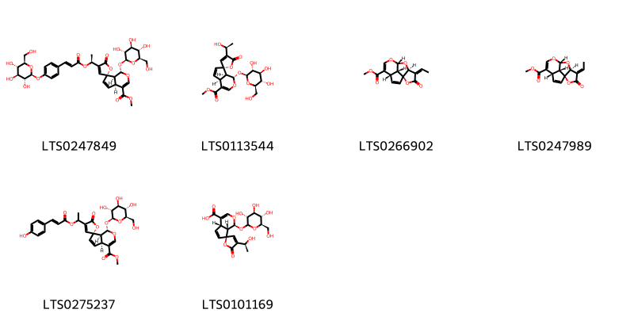{ width=100% }
    <figcaption>Hình ảnh cấu trúc hóa học của 6 hoạt chất thuộc nhóm Prenol lipids gồm ["methyl (1s,4as,7r,7as)-5'-oxo-1-{[(2s,3r,4s,5s,6r)-3,4,5-trihydroxy-6-(hydroxymethyl)oxan-2-yl]oxy}-4'-[(1s)-1-{[(2e)-3-(4-{[(2s,3r,4s,5s,6r)-3,4,5-trihydroxy-6-(hydroxymethyl)oxan-2-yl]oxy}phenyl)prop-2-enoyl]oxy}ethyl]-4a,7a-dihydro-1h-spiro[cyclopenta[c]pyran-7,2'-furan]-4-carboxylate (LTS0247849)", 'plumieride (LTS0113544)', 'isoplumericin (LTS0266902)', 'plumericin (LTS0247989)', "methyl (1s,4as,7r,7as)-4'-(1-{[(2e)-3-(4-hydroxyphenyl)prop-2-enoyl]oxy}ethyl)-5'-oxo-1-{[(2s,3r,4s,5s,6r)-3,4,5-trihydroxy-6-(hydroxymethyl)oxan-2-yl]oxy}-4a,7a-dihydro-1h-spiro[cyclopenta[c]pyran-7,2'-furan]-4-carboxylate (LTS0275237)", "(1s,4as,7r,7as)-4'-[(1s)-1-hydroxyethyl]-5'-oxo-1-{[(3r,4s,5s,6r)-3,4,5-trihydroxy-6-(hydroxymethyl)oxan-2-yl]oxy}-4a,7a-dihydro-1h-spiro[cyclopenta[c]pyran-7,2'-furan]-4-carboxylic acid (LTS0101169)"].</figcaption>
</figure>

---

### Dược dân tộc học

Danh sách các quốc gia có sử dụng *Plumeria alba* trong điều trị các bệnh. 

| Country   | Disease                                                                           | Bệnh                                                                                                                                                                                                |
|:----------|:----------------------------------------------------------------------------------|:----------------------------------------------------------------------------------------------------------------------------------------------------------------------------------------------------|
| Elsewhere | nan, Cathartic, Emmenagogue, Poison, Stimulant, Fungicide, Purgative, Rubefacient | MYMEMORY WARNING: YOU USED ALL AVAILABLE FREE TRANSLATIONS FOR TODAY. NEXT AVAILABLE IN  11 HOURS 30 MINUTES 51 SECONDS VISIT HTTPS://MYMEMORY.TRANSLATED.NET/DOC/USAGELIMITS.PHP TO TRANSLATE MORE |
| Mexico    | Purgative, Poison                                                                 | MYMEMORY WARNING: YOU USED ALL AVAILABLE FREE TRANSLATIONS FOR TODAY. NEXT AVAILABLE IN  11 HOURS 30 MINUTES 49 SECONDS VISIT HTTPS://MYMEMORY.TRANSLATED.NET/DOC/USAGELIMITS.PHP TO TRANSLATE MORE |

---

---
## Plumeria attenuata
### Thông tin về thực vật

!!! info "Phân loại thực vật của *Himatanthus attenuatus* từ GIBF:"
    - **Kingdom:** Plantae
    - **Phylum:** Tracheophyta
    - **Order:** Gentianales
    - **Family:** Apocynaceae
    - **Genus:** Himatanthus
    - **Species:** *Himatanthus attenuatus*

 

| Label (VI)   | Label (EN)   | Scientific Name    | Descriptions (VI)   | Descriptions (EN)          | Also Known As (VI)   | Also Known As (EN)   |
|:-------------|:-------------|:-------------------|:--------------------|:---------------------------|:---------------------|:---------------------|
| N/A          | N/A          | Plumeria attenuata |                     | species of flowering plant | ['']                 | ['']                 |

#### Phân bố trên thế giới

**Từ CSDL GIBF** nan, Brazil, Colombia, Guyana, Venezuela (Bolivarian Republic of)

#### Phân bố tại Việt Nam

**Từ CSDL GIBF**: Không có ghi nhận ở Việt Nam

---
### Thành phần hóa học
        
- Theo cơ sở dữ liệu lotus: Từ loài *Himatanthus attenuatus* đã phân lập và xác định được Chưa có hoạt chất nào được phân lập. hoạt chất thuộc về các nhóm Không có hoạt chất nào được phân lập. 

Không có hình ảnh nào được tạo ra

---

### Dược dân tộc học

Danh sách các quốc gia có sử dụng *Himatanthus attenuatus* trong điều trị các bệnh. 

| Country   | Disease   | Bệnh                                                                                                                                                                                                |
|:----------|:----------|:----------------------------------------------------------------------------------------------------------------------------------------------------------------------------------------------------|
| Brazil    | Purgative | MYMEMORY WARNING: YOU USED ALL AVAILABLE FREE TRANSLATIONS FOR TODAY. NEXT AVAILABLE IN  11 HOURS 30 MINUTES 03 SECONDS VISIT HTTPS://MYMEMORY.TRANSLATED.NET/DOC/USAGELIMITS.PHP TO TRANSLATE MORE |

---

---
## Plumeria lancifolia
### Thông tin về thực vật

!!! info "Phân loại thực vật của *Himatanthus bracteatus* từ GIBF:"
    - **Kingdom:** Plantae
    - **Phylum:** Tracheophyta
    - **Order:** Gentianales
    - **Family:** Apocynaceae
    - **Genus:** Himatanthus
    - **Species:** *Himatanthus bracteatus*

 

| Label (VI)   | Label (EN)   | Scientific Name     | Descriptions (VI)   | Descriptions (EN)          | Also Known As (VI)   | Also Known As (EN)   |
|:-------------|:-------------|:--------------------|:--------------------|:---------------------------|:---------------------|:---------------------|
| N/A          | N/A          | Plumeria lancifolia |                     | species of flowering plant | ['']                 | ['']                 |

#### Phân bố trên thế giới

**Từ CSDL GIBF** nan, Brazil

#### Phân bố tại Việt Nam

**Từ CSDL GIBF**: Không có ghi nhận ở Việt Nam

---
### Thành phần hóa học
        
- Theo cơ sở dữ liệu lotus: Từ loài *Himatanthus bracteatus* đã phân lập và xác định được Chưa có hoạt chất nào được phân lập. hoạt chất thuộc về các nhóm Không có hoạt chất nào được phân lập. 

Không có hình ảnh nào được tạo ra

---

### Dược dân tộc học

Danh sách các quốc gia có sử dụng *Himatanthus bracteatus* trong điều trị các bệnh. 

| Country   | Disease                | Bệnh                                                                                                                                                                                                |
|:----------|:-----------------------|:----------------------------------------------------------------------------------------------------------------------------------------------------------------------------------------------------|
| Brazil    | Emmenagogue, Purgative | MYMEMORY WARNING: YOU USED ALL AVAILABLE FREE TRANSLATIONS FOR TODAY. NEXT AVAILABLE IN  11 HOURS 29 MINUTES 32 SECONDS VISIT HTTPS://MYMEMORY.TRANSLATED.NET/DOC/USAGELIMITS.PHP TO TRANSLATE MORE |

---

---
## Plumeria obtusa
### Thông tin về thực vật

!!! info "Phân loại thực vật của *Plumeria obtusa* từ GIBF:"
    - **Kingdom:** Plantae
    - **Phylum:** Tracheophyta
    - **Order:** Gentianales
    - **Family:** Apocynaceae
    - **Genus:** Plumeria
    - **Species:** *Plumeria obtusa*

 

| Label (VI)   | Label (EN)   | Scientific Name   | Descriptions (VI)   | Descriptions (EN)   | Also Known As (VI)   | Also Known As (EN)                                 |
|:-------------|:-------------|:------------------|:--------------------|:--------------------|:---------------------|:---------------------------------------------------|
| N/A          | N/A          | Plumeria obtusa   | loài thực vật       | species of plant    | ['']                 | ['Singapore graveyard flower', 'White frangipani'] |

#### Phân bố trên thế giới

**Từ CSDL GIBF** United Arab Emirates, Viet Nam, Marshall Islands, Barbados, China, Qatar, French Polynesia, Papua New Guinea, Thailand, Turks and Caicos Islands, Spain, Cayman Islands, Sri Lanka, Samoa, United States of America, Saint Barthélemy, Tonga, Indonesia, Pakistan, Wallis and Futuna, Dominican Republic, Colombia, French Guiana, Fiji, Hong Kong, Mexico, Macao, Niue, Maldives, Guam, Montserrat, Philippines, Haiti, Palau, Solomon Islands, Panama, Egypt, Nicaragua, Cambodia, Bahamas, South Africa, Oman, Australia, Saint Vincent and the Grenadines, Myanmar, India, Micronesia (Federated States of), Jordan, Belize, Venezuela (Bolivarian Republic of)

#### Phân bố tại Việt Nam

**Từ CSDL GIBF**: Lâm Đồng, Hồ Chí Minh city

---
### Thành phần hóa học
        
- Theo cơ sở dữ liệu lotus: Từ loài *Plumeria obtusa* đã phân lập và xác định được 93 hoạt chất thuộc về các nhóm Fatty Acyls, Benzene and substituted derivatives, Cinnamic acids and derivatives, Steroids and steroid derivatives, Coumarins and derivatives, Prenol lipids. 

|    | chemicalTaxonomyClassyfireClass     |   smiles_count |
|---:|:------------------------------------|---------------:|
|  0 | Benzene and substituted derivatives |              2 |
|  1 | Cinnamic acids and derivatives      |              3 |
|  2 | Coumarins and derivatives           |              1 |
|  3 | Fatty Acyls                         |             12 |
|  4 | Prenol lipids                       |             69 |
|  5 | Steroids and steroid derivatives    |              6 |

#### Nhóm Benzene and substituted derivatives
<figure markdown="span">
    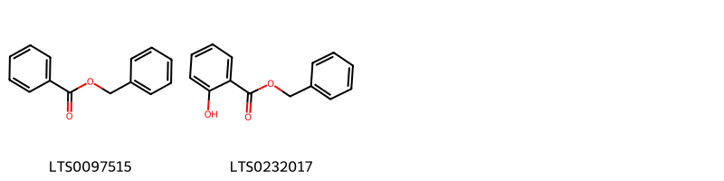{ width=100% }
    <figcaption>Hình ảnh cấu trúc hóa học của 2 hoạt chất thuộc nhóm Benzene and substituted derivatives gồm ['benzyl benzoate (LTS0097515)', 'benzyl salicylate (LTS0232017)'].</figcaption>
</figure>
#### Nhóm Cinnamic acids and derivatives
<figure markdown="span">
    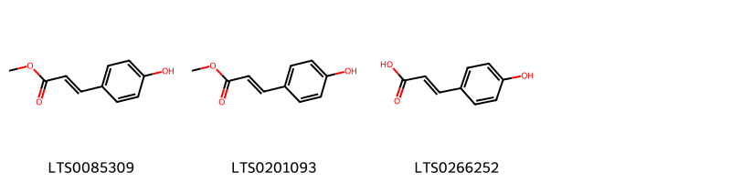{ width=100% }
    <figcaption>Hình ảnh cấu trúc hóa học của 3 hoạt chất thuộc nhóm Cinnamic acids and derivatives gồm ['methyl (2e)-3-(4-hydroxyphenyl)prop-2-enoate (LTS0085309)', 'methyl hydroxycinnamate (LTS0201093)', 'para-coumaric acid (LTS0266252)'].</figcaption>
</figure>
#### Nhóm Coumarins and derivatives
<figure markdown="span">
    { width=100% }
    <figcaption>Hình ảnh cấu trúc hóa học của 1 hoạt chất thuộc nhóm Coumarins and derivatives gồm ['scopoletin (LTS0193112)'].</figcaption>
</figure>
#### Nhóm Fatty Acyls
<figure markdown="span">
    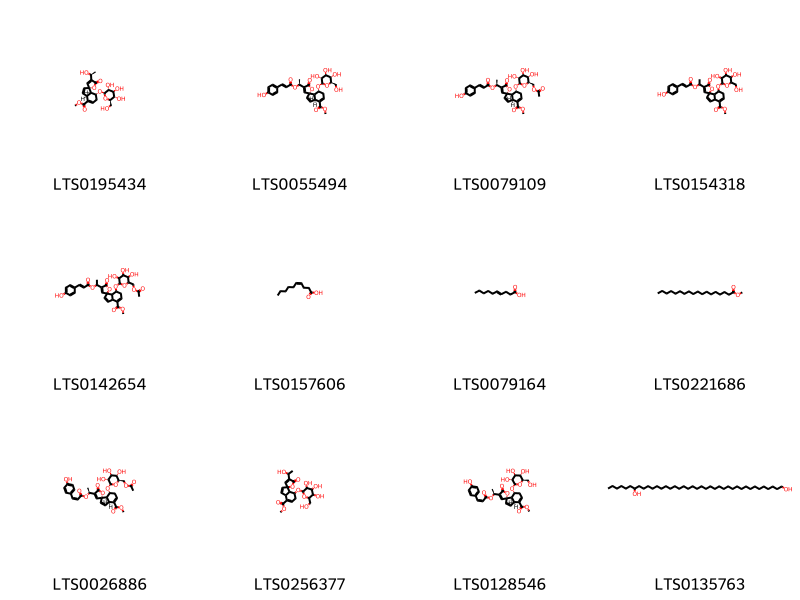{ width=100% }
    <figcaption>Hình ảnh cấu trúc hóa học của 12 hoạt chất thuộc nhóm Fatty Acyls gồm ["methyl (2r,3'as,7'r,7'ar)-4-[(1s)-1-hydroxyethyl]-5-oxo-7'-{[(2r,3r,4s,5s,6r)-3,4,5-trihydroxy-6-(hydroxymethyl)oxan-2-yl]oxy}-3'a,6',7',7'a-tetrahydrospiro[furan-2,1'-indene]-4'-carboxylate (LTS0195434)", "methyl (2r,3'as,7'r,7'ar)-4-[(1s)-1-{[(2e)-3-(4-hydroxyphenyl)prop-2-enoyl]oxy}ethyl]-5-oxo-7'-{[(2r,3r,4s,5s,6r)-3,4,5-trihydroxy-6-(hydroxymethyl)oxan-2-yl]oxy}-3'a,6',7',7'a-tetrahydrospiro[furan-2,1'-indene]-4'-carboxylate (LTS0055494)", "methyl (2r,3'as,7'r,7'ar)-7'-{[(2r,3r,4s,5s,6r)-6-[(acetyloxy)methyl]-3,4,5-trihydroxyoxan-2-yl]oxy}-4-[(1s)-1-{[(2e)-3-(4-hydroxyphenyl)prop-2-enoyl]oxy}ethyl]-5-oxo-3'a,6',7',7'a-tetrahydrospiro[furan-2,1'-indene]-4'-carboxylate (LTS0079109)", "methyl 4-(1-{[3-(4-hydroxyphenyl)prop-2-enoyl]oxy}ethyl)-5-oxo-7'-{[3,4,5-trihydroxy-6-(hydroxymethyl)oxan-2-yl]oxy}-3'a,6',7',7'a-tetrahydrospiro[furan-2,1'-indene]-4'-carboxylate (LTS0154318)", "methyl 7'-({6-[(acetyloxy)methyl]-3,4,5-trihydroxyoxan-2-yl}oxy)-4-(1-{[3-(4-hydroxyphenyl)prop-2-enoyl]oxy}ethyl)-5-oxo-3'a,6',7',7'a-tetrahydrospiro[furan-2,1'-indene]-4'-carboxylate (LTS0142654)", '4-decenoic acid (LTS0157606)', 'obtusilic acid (LTS0079164)', 'methyl stearate (LTS0221686)', "methyl (2r,3'as,7'r,7'ar)-7'-{[(2r,3r,4s,5s,6r)-6-[(acetyloxy)methyl]-3,4,5-trihydroxyoxan-2-yl]oxy}-4-[(1s)-1-{[(2z)-3-(4-hydroxyphenyl)prop-2-enoyl]oxy}ethyl]-5-oxo-3'a,6',7',7'a-tetrahydrospiro[furan-2,1'-indene]-4'-carboxylate (LTS0026886)", "methyl 4-(1-hydroxyethyl)-5-oxo-7'-{[3,4,5-trihydroxy-6-(hydroxymethyl)oxan-2-yl]oxy}-3'a,6',7',7'a-tetrahydrospiro[furan-2,1'-indene]-4'-carboxylate (LTS0256377)", "methyl (2r,3'as,7'r,7'ar)-4-[(1s)-1-{[(2z)-3-(4-hydroxyphenyl)prop-2-enoyl]oxy}ethyl]-5-oxo-7'-{[(2r,3r,4s,5s,6r)-3,4,5-trihydroxy-6-(hydroxymethyl)oxan-2-yl]oxy}-3'a,6',7',7'a-tetrahydrospiro[furan-2,1'-indene]-4'-carboxylate (LTS0128546)", 'tetracontane-1,34-diol (LTS0135763)'].</figcaption>
</figure>
#### Nhóm Prenol lipids
<figure markdown="span">
    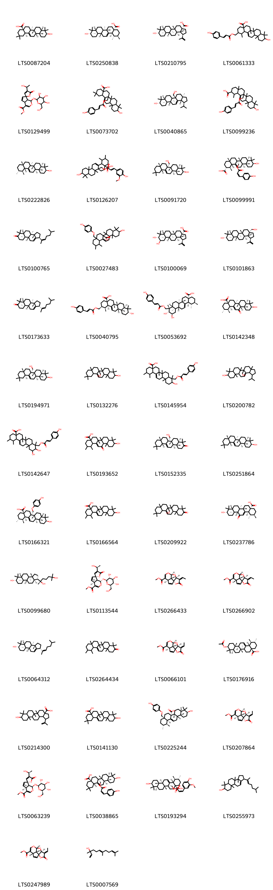{ width=100% }
    <figcaption>Hình ảnh cấu trúc hóa học của 69 hoạt chất thuộc nhóm Prenol lipids gồm ['(4as,6as,6br,8as,10s,12ar,12bs,14br)-10-hydroxy-2,2,6a,6b,9,9,12a-heptamethyl-1,3,4,5,6,7,8,8a,10,11,12,12b,13,14b-tetradecahydropicene-4a-carboxylic acid (LTS0087204)', 'ursolic acid (LTS0250838)', 'betulinic acid (LTS0210795)', '10-hydroxy-2-({[3-(4-hydroxyphenyl)prop-2-enoyl]oxy}methyl)-1,6a,6b,9,9,12a-hexamethyl-2,3,4,5,6,7,8,8a,10,11,12,12b,13,14b-tetradecahydro-1h-picene-4a-carboxylic acid (LTS0061333)', "methyl 4'-(1-hydroxyethyl)-5'-oxo-1-{[3,4,5-trihydroxy-6-(hydroxymethyl)oxan-2-yl]oxy}-4a,7a-dihydro-1h-spiro[cyclopenta[c]pyran-7,2'-furan]-4-carboxylate (LTS0129499)", '10-hydroxy-6a-({[3-(4-hydroxyphenyl)prop-2-enoyl]oxy}methyl)-2,2,6b,9,9,12a-hexamethyl-1,3,4,5,6,7,8,8a,10,11,12,12b,13,14b-tetradecahydropicene-4a-carboxylic acid (LTS0073702)', '(1s,3ar,5ar,5br,7ar,9s,11ar,11br,13bs)-5a-(hydroxymethyl)-1-isopropyl-3a,5b,8,8,11a-pentamethyl-1h,2h,3h,4h,5h,6h,7h,7ah,9h,10h,11h,11bh,12h,13bh-cyclopenta[a]chrysen-9-ol (LTS0040865)', '10-hydroxy-6a-({[3-(4-hydroxyphenyl)prop-2-enoyl]oxy}methyl)-1,4a,6b,9,9,12a-hexamethyl-2,3,4,5,6,7,8,8a,10,11,12,12b,13,14b-tetradecahydro-1h-picene-2-carboxylic acid (LTS0099236)', 'amyrin (LTS0222826)', '10-hydroxy-6a-({[3-(4-hydroxy-3-methoxyphenyl)prop-2-enoyl]oxy}methyl)-1,2,6b,9,9,12a-hexamethyl-2,3,4,5,6,7,8,8a,10,11,12,12b,13,14b-tetradecahydro-1h-picene-4a-carboxylic acid (LTS0126207)', '(3s,4ar,6ar,6br,8ar,12ar,14ar,14br)-6b-(hydroxymethyl)-4,4,6a,8a,11,11,14b-heptamethyl-1,2,3,4a,5,6,7,8,9,10,12,12a,14,14a-tetradecahydropicen-3-ol (LTS0091720)', '(1r,2r,4ar,6ar,6br,8ar,10s,12ar,12br,14br)-10-hydroxy-6a-({[(2z)-3-(4-hydroxyphenyl)prop-2-enoyl]oxy}methyl)-1,4a,6b,9,9,12a-hexamethyl-2,3,4,5,6,7,8,8a,10,11,12,12b,13,14b-tetradecahydro-1h-picene-2-carboxylic acid (LTS0099991)', '(1s,3as,3br,5ar,9ar,9br)-3a,3b,6,6,9a-pentamethyl-1-[(2z)-6-methylhept-2-en-2-yl]-1h,2h,3h,4h,5h,5ah,8h,9h,9bh,10h-cyclopenta[a]phenanthren-7-one (LTS0100765)', '10-hydroxy-4a-(4-hydroxyphenoxymethyl)-1,2,6b,9,9,12a-hexamethyl-2,3,4,5,6,7,8,8a,10,11,12,12b,13,14b-tetradecahydro-1h-picene-6a-carboxylic acid (LTS0027483)', '(1r,3as,5ar,5br,7ar,9r,10r,11ar,11br,13ar,13br)-9,10-dihydroxy-5a,5b,8,8,11a-pentamethyl-1-(prop-1-en-2-yl)-hexadecahydrocyclopenta[a]chrysene-3a-carboxylic acid (LTS0100069)', 'betulin (LTS0101863)', '(1r,3as,3br,5ar,9ar,9br)-3a,3b,6,6,9a-pentamethyl-1-[(2z)-6-methylhept-2-en-2-yl]-1h,2h,3h,4h,5h,5ah,8h,9h,9bh,10h-cyclopenta[a]phenanthren-7-one (LTS0173633)', '(1r,2s,4as,6ar,6br,8ar,10r,12ar,12bs,14br)-10-hydroxy-2-({[(2e)-3-(4-hydroxyphenyl)prop-2-enoyl]oxy}methyl)-1,6a,6b,9,9,12a-hexamethyl-2,3,4,5,6,7,8,8a,10,11,12,12b,13,14b-tetradecahydro-1h-picene-4a-carboxylic acid (LTS0040795)', '(1s,2r,4as,6as,6br,8ar,9s,10r,11r,12ar,12br,14bs)-10,11-dihydroxy-9-({[(2e)-3-(4-hydroxyphenyl)prop-2-enoyl]oxy}methyl)-1,2,6a,6b,9,12a-hexamethyl-2,3,4,5,6,7,8,8a,10,11,12,12b,13,14b-tetradecahydro-1h-picene-4a-carboxylic acid (LTS0053692)', '(1s,2r,4as,6as,6br,8ar,10s,12as,12bs,14br)-10-hydroxy-1,2,6a,6b,9,9,12a-heptamethyl-13-oxo-1,2,3,4,5,6,7,8,8a,10,11,12,12b,14b-tetradecahydropicene-4a-carboxylic acid (LTS0142348)', '(3s,4ar,6ar,6br,8ar,12as,14ar,14br)-6b-(hydroxymethyl)-4,4,6a,8a,11,11,14b-heptamethyl-1,2,3,4a,5,6,7,8,9,10,12,12a,14,14a-tetradecahydropicen-3-ol (LTS0194971)', '6b-(hydroxymethyl)-4,4,6a,8a,11,11,14b-heptamethyl-1,2,3,4a,5,6,7,8,9,10,12,12a,14,14a-tetradecahydropicen-3-ol (LTS0132276)', '10-hydroxy-9-({[3-(4-hydroxyphenyl)prop-2-enoyl]oxy}methyl)-1,2,6a,6b,9,12a-hexamethyl-2,3,4,5,6,7,8,8a,10,11,12,12b,13,14b-tetradecahydro-1h-picene-4a-carboxylic acid (LTS0145954)', '5a-(hydroxymethyl)-1-isopropyl-3a,5b,8,8,11a-pentamethyl-1h,2h,3h,4h,5h,6h,7h,7ah,9h,10h,11h,11bh,12h,13bh-cyclopenta[a]chrysen-9-ol (LTS0200782)', '10,11-dihydroxy-9-({[3-(4-hydroxyphenyl)prop-2-enoyl]oxy}methyl)-1,2,6a,6b,9,12a-hexamethyl-2,3,4,5,6,7,8,8a,10,11,12,12b,13,14b-tetradecahydro-1h-picene-4a-carboxylic acid (LTS0142647)', '10-hydroxy-1,2,6a,6b,9,9,12a-heptamethyl-13-oxo-1,2,3,4,5,6,7,8,8a,10,11,12,12b,14b-tetradecahydropicene-4a-carboxylic acid (LTS0193652)', '(4ar,6ar,6br,8ar,12ar,14ar,14br)-6b-(hydroxymethyl)-4,4,6a,8a,11,11,14b-heptamethyl-2,4a,5,6,7,8,9,10,12,12a,14,14a-dodecahydro-1h-picen-3-one (LTS0152335)', 'β-amyrin (LTS0251864)', '(1s,2r,4as,6ar,6br,8as,10s,12ar,12br,14br)-10-hydroxy-6a-(4-hydroxyphenoxymethyl)-1,2,6b,9,9,12a-hexamethyl-2,3,4,5,6,7,8,8a,10,11,12,12b,13,14b-tetradecahydro-1h-picene-4a-carboxylic acid (LTS0166321)', '10-hydroxy-1,2,6a,6b,9,9,12a-heptamethyl-2,3,4,5,6,7,8,8a,10,11,12,12b,13,14b-tetradecahydro-1h-picene-4a-carboxylic acid (LTS0166564)', '6b-(hydroxymethyl)-4,4,6a,8a,11,11,14b-heptamethyl-2,4a,5,6,7,8,9,10,12,12a,14,14a-dodecahydro-1h-picen-3-one (LTS0209922)', '(1s,2r,4as,6as,6br,8ar,10s,12as,12br,14bs)-10-hydroxy-1,2,6a,6b,9,9,12a-heptamethyl-13-oxo-1,2,3,4,5,6,7,8,8a,10,11,12,12b,14b-tetradecahydropicene-4a-carboxylic acid (LTS0237786)', '(2s)-2-[(1s,3ar,3br,5ar,7s,9ar,9br,11ar)-7-hydroxy-3a,3b,6,6,9a-pentamethyl-dodecahydro-1h-cyclopenta[a]phenanthren-1-yl]-6-methylheptane-2,6-diol (LTS0099680)', 'plumieride (LTS0113544)', 'methyl (1r,4r,8s,10s,11z,14s)-11-ethylidene-12-oxo-7,9,13-trioxatetracyclo[6.5.1.0¹,¹⁰.0⁴,¹⁴]tetradeca-2,5-diene-5-carboxylate (LTS0266433)', 'isoplumericin (LTS0266902)', '(1r,3as,3br,5ar,7s,9ar,9br)-3a,3b,6,6,9a-pentamethyl-1-[(2z)-6-methylhept-2-en-2-yl]-1h,2h,3h,4h,5h,5ah,7h,8h,9h,9bh,10h-cyclopenta[a]phenanthren-7-ol (LTS0064312)', '4,4,6a,6b,8a,11,12,14b-octamethyl-1,2,4a,5,6,7,8,9,10,11,12,12a,14,14a-tetradecahydropicen-3-one (LTS0264434)', 'methyl (1s,4r,8s,10s,11e,14s)-11-ethylidene-12-oxo-7,9,13-trioxatetracyclo[6.5.1.0¹,¹⁰.0⁴,¹⁴]tetradeca-2,5-diene-5-carboxylate (LTS0066101)', '(1s,2r,4as,6as,6br,8ar,10s,12ar,12br,14bs)-10-(acetyloxy)-1,2,6a,6b,9,9,12a-heptamethyl-2,3,4,5,6,7,8,8a,10,11,12,12b,13,14b-tetradecahydro-1h-picene-4a-carboxylic acid (LTS0176916)', '9-hydroxy-5a,5b,8,8,11a-pentamethyl-1-(prop-1-en-2-yl)-hexadecahydrocyclopenta[a]chrysene-3a-carboxylic acid (LTS0214300)', 'oleanolic acid (LTS0141130)', '(1s,2r,4as,6ar,6br,8as,10s,12ar,12bs,14br)-10-hydroxy-4a-(4-hydroxyphenoxymethyl)-1,2,6b,9,9,12a-hexamethyl-2,3,4,5,6,7,8,8a,10,11,12,12b,13,14b-tetradecahydro-1h-picene-6a-carboxylic acid (LTS0225244)', 'methyl (1r,4r,8s,10s,11e,14s)-11-ethylidene-12-oxo-7,9,13-trioxatetracyclo[6.5.1.0¹,¹⁰.0⁴,¹⁴]tetradeca-2,5-diene-5-carboxylate (LTS0207864)', "methyl (1r,4as,7r,7as)-4'-[(1s)-1-hydroxyethyl]-5'-oxo-1-{[(2s,3r,4s,5s,6r)-3,4,5-trihydroxy-6-(hydroxymethyl)oxan-2-yl]oxy}-4a,7a-dihydro-1h-spiro[cyclopenta[c]pyran-7,2'-furan]-4-carboxylate (LTS0063239)", '(4as,6ar,6br,8ar,10s,12ar,12br,14bs)-10-hydroxy-6a-({[(2z)-3-(4-hydroxyphenyl)prop-2-enoyl]oxy}methyl)-2,2,6b,9,9,12a-hexamethyl-1,3,4,5,6,7,8,8a,10,11,12,12b,13,14b-tetradecahydropicene-4a-carboxylic acid (LTS0038865)', '(1s,2r,4as,6ar,6br,8ar,10s,12ar,12br,14bs)-10-hydroxy-6a-({[(2z)-3-(4-hydroxy-3-methoxyphenyl)prop-2-enoyl]oxy}methyl)-1,2,6b,9,9,12a-hexamethyl-2,3,4,5,6,7,8,8a,10,11,12,12b,13,14b-tetradecahydro-1h-picene-4a-carboxylic acid (LTS0193294)', '3a,3b,6,6,9a-pentamethyl-1-(6-methylhept-2-en-2-yl)-1h,2h,3h,4h,5h,5ah,7h,8h,9h,9bh,10h-cyclopenta[a]phenanthren-7-ol (LTS0255973)', 'plumericin (LTS0247989)', 'nerolidol isomers (LTS0007569)', '10-hydroxy-9-(hydroxymethyl)-1,2,6a,6b,9,12a-hexamethyl-2,3,4,5,6,7,8,8a,10,11,12,12b,13,14b-tetradecahydro-1h-picene-4a-carboxylic acid (LTS0009002)', '(3s,4as,6ar,6br,8ar,12as,12br,14ar,14bs)-4,4,6a,6b,8a,11,11,14b-octamethyl-1,2,3,4a,5,6,7,8,9,10,12,12a,12b,14a-tetradecahydropicen-3-ol (LTS0273285)', "methyl (1s,4as,7r,7as)-4'-(1-{[(2e)-3-(4-hydroxyphenyl)prop-2-enoyl]oxy}ethyl)-5'-oxo-1-{[(2s,3r,4s,5s,6r)-3,4,5-trihydroxy-6-(hydroxymethyl)oxan-2-yl]oxy}-4a,7a-dihydro-1h-spiro[cyclopenta[c]pyran-7,2'-furan]-4-carboxylate (LTS0275237)", '(4as,6as,6br,8ar,12ar,12br,14bs)-2,2,6a,6b,9,9,12a-heptamethyl-10-oxo-3,4,5,6,7,8,8a,11,12,12b,13,14b-dodecahydro-1h-picene-4a-carboxylic acid (LTS0002247)', 'α-amyrenone (LTS0040451)', '3a,3b,6,6,9a-pentamethyl-1-(6-methylhept-2-en-2-yl)-1h,2h,3h,4h,5h,5ah,8h,9h,9bh,10h-cyclopenta[a]phenanthren-7-one (LTS0009519)', '3a-(hydroxymethyl)-5a,5b,8,8,11a-pentamethyl-1-(prop-1-en-2-yl)-hexadecahydrocyclopenta[a]chrysen-9-ol (LTS0008250)', '(1s,2r,4as,6as,6br,8ar,9s,10s,12ar,12br,14bs)-10-hydroxy-9-({[(2e)-3-(4-hydroxyphenyl)prop-2-enoyl]oxy}methyl)-1,2,6a,6b,9,12a-hexamethyl-2,3,4,5,6,7,8,8a,10,11,12,12b,13,14b-tetradecahydro-1h-picene-4a-carboxylic acid (LTS0015389)', '(1s,2r,4as,6as,6br,8as,9r,10s,12ar,12bs,14br)-10-hydroxy-9-(hydroxymethyl)-1,2,6a,6b,9,12a-hexamethyl-2,3,4,5,6,7,8,8a,10,11,12,12b,13,14b-tetradecahydro-1h-picene-4a-carboxylic acid (LTS0055068)', '(1s,3as,3br,5as,7s,9ar,9br)-3a,3b,6,6,9a-pentamethyl-1-[(2z)-6-methylhept-2-en-2-yl]-1h,2h,3h,4h,5h,5ah,7h,8h,9h,9bh,10h-cyclopenta[a]phenanthren-7-ol (LTS0217029)', '(4as,6ar,6br,8ar,12ar,14as,14br)-6b-(hydroxymethyl)-4,4,6a,8a,11,11,14b-heptamethyl-2,4a,5,6,7,8,9,10,12,12a,14,14a-dodecahydro-1h-picen-3-one (LTS0008044)', '6b-(hydroxymethyl)-4,4,6a,8a,11,12,14b-heptamethyl-2,3,4a,5,6,7,8,9,10,11,12,12a,14,14a-tetradecahydro-1h-picen-3-ol (LTS0030075)', 'α-amyrin (LTS0088267)', '(1r,3as,5as,5br,9r,10r,11ar)-9,10-dihydroxy-5a,5b,8,8,11a-pentamethyl-1-(prop-1-en-2-yl)-1h,2h,3h,4h,5h,6h,7h,7ah,9h,10h,11h,11bh,12h,13bh-cyclopenta[a]chrysene-3a-carboxylic acid (LTS0004577)', '2-{7-hydroxy-3a,3b,6,6,9a-pentamethyl-dodecahydro-1h-cyclopenta[a]phenanthren-1-yl}-6-methylheptane-2,6-diol (LTS0043265)', '(1r,2r,4as,6as,6br,8ar,10s,12ar,12br,14bs)-10-hydroxy-2-({[(2e)-3-(4-hydroxyphenyl)prop-2-enoyl]oxy}methyl)-1,6a,6b,9,9,12a-hexamethyl-2,3,4,5,6,7,8,8a,10,11,12,12b,13,14b-tetradecahydro-1h-picene-4a-carboxylic acid (LTS0244339)', '(3s,4ar,6ar,6br,8ar,11r,12s,12ar,14ar,14br)-6b-(hydroxymethyl)-4,4,6a,8a,11,12,14b-heptamethyl-2,3,4a,5,6,7,8,9,10,11,12,12a,14,14a-tetradecahydro-1h-picen-3-ol (LTS0038554)', 'oleanolic acid (LTS0117717)', '10-hydroxy-6a-(4-hydroxyphenoxymethyl)-1,2,6b,9,9,12a-hexamethyl-2,3,4,5,6,7,8,8a,10,11,12,12b,13,14b-tetradecahydro-1h-picene-4a-carboxylic acid (LTS0049344)'].</figcaption>
</figure>
#### Nhóm Steroids and steroid derivatives
<figure markdown="span">
    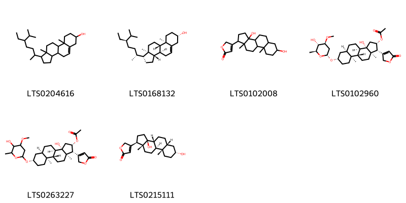{ width=100% }
    <figcaption>Hình ảnh cấu trúc hóa học của 6 hoạt chất thuộc nhóm Steroids and steroid derivatives gồm ['stigmast-5-en-3-ol, (3β)- (LTS0204616)', 'sitosterol (LTS0168132)', 'digitoxigenin (LTS0102008)', 'oleandrin (LTS0102960)', '(1r,2s,3as,3br,5ar,7s,9as,9bs,11ar)-3a-hydroxy-7-[(5-hydroxy-4-methoxy-6-methyloxan-2-yl)oxy]-9a,11a-dimethyl-1-(5-oxo-2h-furan-3-yl)-tetradecahydrocyclopenta[a]phenanthren-2-yl acetate (LTS0263227)', '4-[(1r,3as,3br,5ar,7r,9as,9bs,11ar)-3a,7-dihydroxy-9a,11a-dimethyl-tetradecahydrocyclopenta[a]phenanthren-1-yl]-5h-furan-2-one (LTS0215111)'].</figcaption>
</figure>

---

### Dược dân tộc học

Danh sách các quốc gia có sử dụng *Plumeria obtusa* trong điều trị các bệnh. 

| Country   | Disease                          | Bệnh                                                                                                                                                                                                |
|:----------|:---------------------------------|:----------------------------------------------------------------------------------------------------------------------------------------------------------------------------------------------------|
| Haiti     | Cicatrizant, Hemostat, Purgative | MYMEMORY WARNING: YOU USED ALL AVAILABLE FREE TRANSLATIONS FOR TODAY. NEXT AVAILABLE IN  11 HOURS 29 MINUTES 05 SECONDS VISIT HTTPS://MYMEMORY.TRANSLATED.NET/DOC/USAGELIMITS.PHP TO TRANSLATE MORE |

---

---
## Plumeria rubra
### Thông tin về thực vật

!!! info "Phân loại thực vật của *Plumeria rubra* từ GIBF:"
    - **Kingdom:** Plantae
    - **Phylum:** Tracheophyta
    - **Order:** Gentianales
    - **Family:** Apocynaceae
    - **Genus:** Plumeria
    - **Species:** *Plumeria rubra*

 

| Label (VI)   | Label (EN)   | Scientific Name   | Descriptions (VI)   | Descriptions (EN)   | Also Known As (VI)                  | Also Known As (EN)   |
|:-------------|:-------------|:------------------|:--------------------|:--------------------|:------------------------------------|:---------------------|
| N/A          | N/A          | Plumeria rubra    | loài thực vật       | species of plant    | ['Sứ cùi', 'Plumeria rubra', 'Đại'] | ['']                 |

#### Phân bố trên thế giới

**Từ CSDL GIBF** nan, Brazil, Guatemala, Guadeloupe, Barbados, Antigua and Barbuda, Chile, Honduras, Ecuador, Cayman Islands, Puerto Rico, Virgin Islands (U.S.), Indonesia, Costa Rica, Dominican Republic, Nigeria, Cuba, French Guiana, Sint Maarten (Dutch part), Grenada, Fiji, Hong Kong, Mexico, Benin, El Salvador, Maldives, Guam, Philippines, Belize, Nicaragua, Cook Islands, Bahamas, South Africa, India, Guyana

#### Phân bố tại Việt Nam

**Từ CSDL GIBF**: Không có ghi nhận ở Việt Nam

---
### Thành phần hóa học
        
- Theo cơ sở dữ liệu lotus: Từ loài *Plumeria rubra* đã phân lập và xác định được 138 hoạt chất thuộc về các nhóm Fatty Acyls, Benzene and substituted derivatives, Flavonoids, Carboxylic acids and derivatives, Coumarins and derivatives, Cinnamic acids and derivatives, Glycerolipids, Pyridines and derivatives, Steroids and steroid derivatives, Pyrans, Organooxygen compounds, Phenol ethers, Prenol lipids, Saturated hydrocarbons, Quinolizines, Lignan glycosides. 

|    | chemicalTaxonomyClassyfireClass     |   smiles_count |
|---:|:------------------------------------|---------------:|
|  0 | Benzene and substituted derivatives |             18 |
|  1 | Carboxylic acids and derivatives    |              1 |
|  2 | Cinnamic acids and derivatives      |              4 |
|  3 | Coumarins and derivatives           |              1 |
|  4 | Fatty Acyls                         |             13 |
|  5 | Flavonoids                          |              5 |
|  6 | Glycerolipids                       |              2 |
|  7 | Lignan glycosides                   |              3 |
|  8 | Organooxygen compounds              |             11 |
|  9 | Phenol ethers                       |              1 |
| 10 | Prenol lipids                       |             63 |
| 11 | Pyrans                              |              2 |
| 12 | Pyridines and derivatives           |              2 |
| 13 | Quinolizines                        |              1 |
| 14 | Saturated hydrocarbons              |              7 |
| 15 | Steroids and steroid derivatives    |              4 |

#### Nhóm Benzene and substituted derivatives
<figure markdown="span">
    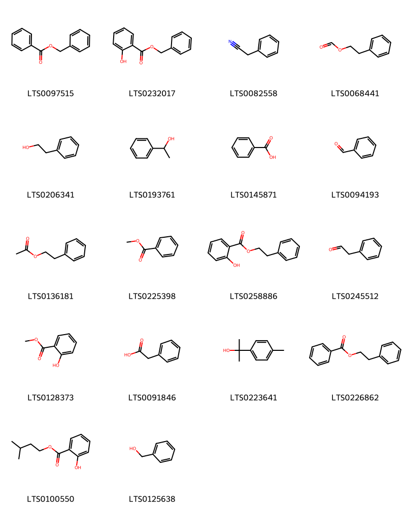{ width=100% }
    <figcaption>Hình ảnh cấu trúc hóa học của 18 hoạt chất thuộc nhóm Benzene and substituted derivatives gồm ['benzyl benzoate (LTS0097515)', 'benzyl salicylate (LTS0232017)', 'phenylacetonitrile (LTS0082558)', 'phenethyl formate (LTS0068441)', '2-phenyl-ethanol (LTS0206341)', 'methylphenyl carbinol (LTS0193761)', 'benzoic acid (LTS0145871)', 'benzaldehyde (LTS0094193)', 'phenethyl acetate (LTS0136181)', 'methyl benzoate (LTS0225398)', 'phenethyl salicylate (LTS0258886)', 'phenylacetaldehyde (LTS0245512)', 'methyl salicylate (LTS0128373)', 'ω-phenylacetic acid (LTS0091846)', 'p-cymen-8-ol (LTS0223641)', 'phenethyl benzoate (LTS0226862)', 'isoamyl salicylate (LTS0100550)', 'benzyl alcohol (LTS0125638)'].</figcaption>
</figure>
#### Nhóm Carboxylic acids and derivatives
<figure markdown="span">
    { width=100% }
    <figcaption>Hình ảnh cấu trúc hóa học của 1 hoạt chất thuộc nhóm Carboxylic acids and derivatives gồm ['ethyl acetate (LTS0196824)'].</figcaption>
</figure>
#### Nhóm Cinnamic acids and derivatives
<figure markdown="span">
    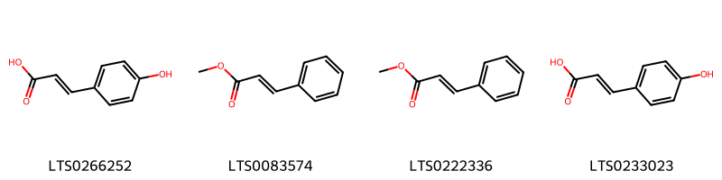{ width=100% }
    <figcaption>Hình ảnh cấu trúc hóa học của 4 hoạt chất thuộc nhóm Cinnamic acids and derivatives gồm ['para-coumaric acid (LTS0266252)', 'methyl cinnamate (LTS0083574)', 'methyl cinnamate (LTS0222336)', 'hydroxycinnamic acid (LTS0233023)'].</figcaption>
</figure>
#### Nhóm Coumarins and derivatives
<figure markdown="span">
    { width=100% }
    <figcaption>Hình ảnh cấu trúc hóa học của 1 hoạt chất thuộc nhóm Coumarins and derivatives gồm ['scopoletin (LTS0193112)'].</figcaption>
</figure>
#### Nhóm Fatty Acyls
<figure markdown="span">
    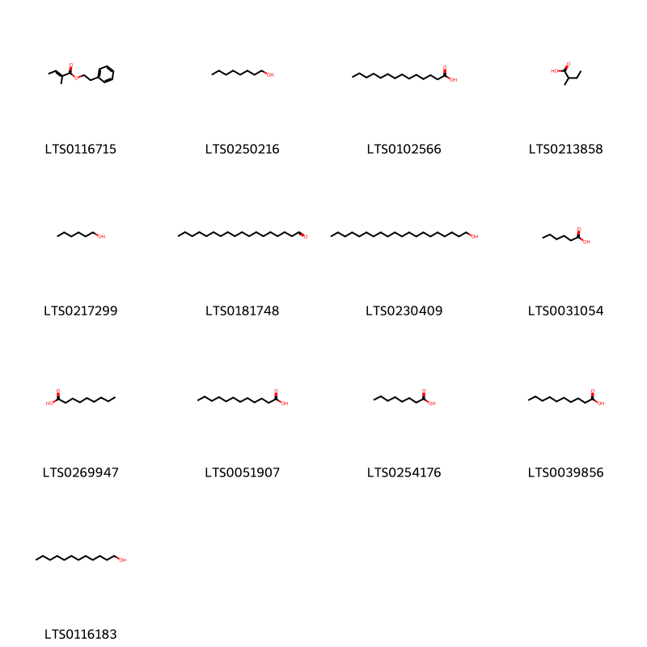{ width=100% }
    <figcaption>Hình ảnh cấu trúc hóa học của 13 hoạt chất thuộc nhóm Fatty Acyls gồm ['phenethyl tiglate (LTS0116715)', 'octanol (LTS0250216)', 'myristic acid (LTS0102566)', '2-methylbutanoic acid (LTS0213858)', 'hexanol (LTS0217299)', 'octadecanal (LTS0181748)', 'arachidyl alcohol (LTS0230409)', 'hexanoic acid (LTS0031054)', 'nonanoic acid (LTS0269947)', 'lauric acid (LTS0051907)', 'caprylic acid (LTS0254176)', 'capric acid (LTS0039856)', '1-dodecanol (LTS0116183)'].</figcaption>
</figure>
#### Nhóm Flavonoids
<figure markdown="span">
    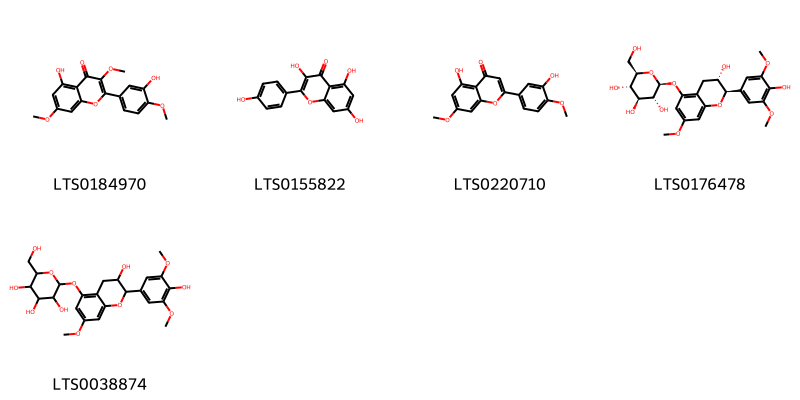{ width=100% }
    <figcaption>Hình ảnh cấu trúc hóa học của 5 hoạt chất thuộc nhóm Flavonoids gồm ['ayanin (LTS0184970)', 'kaempherol (LTS0155822)', 'pilloin (LTS0220710)', '(2s,3r,4s,5s,6r)-2-{[(2r,3s)-3-hydroxy-2-(4-hydroxy-3,5-dimethoxyphenyl)-7-methoxy-3,4-dihydro-2h-1-benzopyran-5-yl]oxy}-6-(hydroxymethyl)oxane-3,4,5-triol (LTS0176478)', '2-{[3-hydroxy-2-(4-hydroxy-3,5-dimethoxyphenyl)-7-methoxy-3,4-dihydro-2h-1-benzopyran-5-yl]oxy}-6-(hydroxymethyl)oxane-3,4,5-triol (LTS0038874)'].</figcaption>
</figure>
#### Nhóm Glycerolipids
<figure markdown="span">
    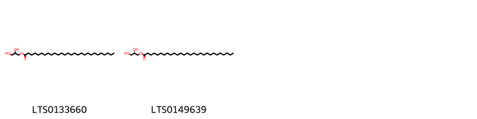{ width=100% }
    <figcaption>Hình ảnh cấu trúc hóa học của 2 hoạt chất thuộc nhóm Glycerolipids gồm ['2,3-dihydroxypropyl octacosanoate (LTS0133660)', '(2r)-2,3-dihydroxypropyl octacosanoate (LTS0149639)'].</figcaption>
</figure>
#### Nhóm Lignan glycosides
<figure markdown="span">
    { width=100% }
    <figcaption>Hình ảnh cấu trúc hóa học của 3 hoạt chất thuộc nhóm Lignan glycosides gồm ['2-{4-[(3as,6ar)-4-(3,5-dimethoxy-4-{[3,4,5-trihydroxy-6-(hydroxymethyl)oxan-2-yl]oxy}phenyl)-hexahydrofuro[3,4-c]furan-1-yl]-2,6-dimethoxyphenoxy}-6-(hydroxymethyl)oxane-3,4,5-triol (LTS0192414)', '2-{4-[4-(3,5-dimethoxy-4-{[3,4,5-trihydroxy-6-(hydroxymethyl)oxan-2-yl]oxy}phenyl)-hexahydrofuro[3,4-c]furan-1-yl]-2,6-dimethoxyphenoxy}-6-(hydroxymethyl)oxane-3,4,5-triol (LTS0011685)', 'liriodendrin (LTS0016790)'].</figcaption>
</figure>
#### Nhóm Organooxygen compounds
<figure markdown="span">
    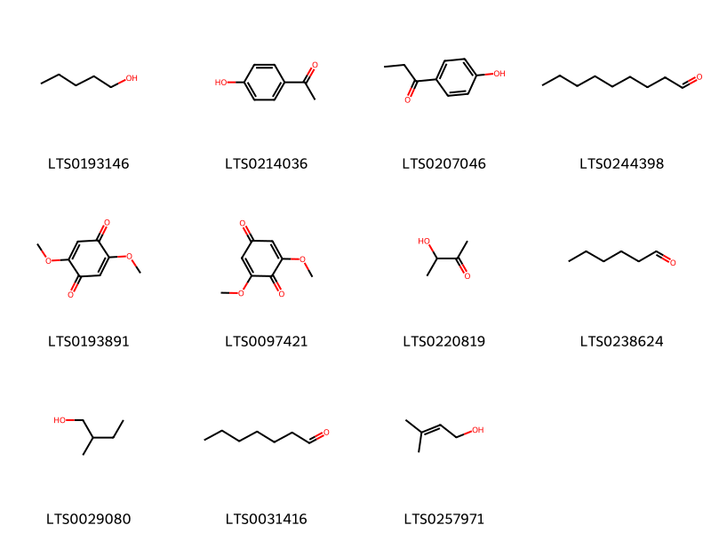{ width=100% }
    <figcaption>Hình ảnh cấu trúc hóa học của 11 hoạt chất thuộc nhóm Organooxygen compounds gồm ['amyl alcohol (LTS0193146)', 'hydroxyacetophenone (LTS0214036)', 'mepal (LTS0207046)', 'nonanal (LTS0244398)', '2,5-dimethoxy-4-benzoquinone (LTS0193891)', '2,6-dimethoxy-1,4-benzoquinone (LTS0097421)', 'acetoin (LTS0220819)', 'hexanal (LTS0238624)', '2-methyl-1-butanol (LTS0029080)', 'heptanal (LTS0031416)', 'prenol (LTS0257971)'].</figcaption>
</figure>
#### Nhóm Phenol ethers
<figure markdown="span">
    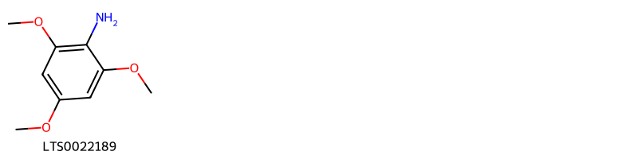{ width=100% }
    <figcaption>Hình ảnh cấu trúc hóa học của 1 hoạt chất thuộc nhóm Phenol ethers gồm ['2,4,6-trimethoxyaniline (LTS0022189)'].</figcaption>
</figure>
#### Nhóm Prenol lipids
<figure markdown="span">
    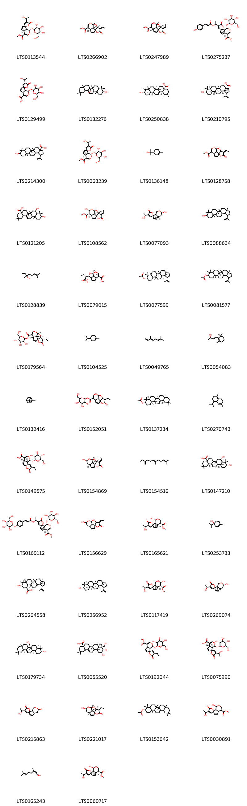{ width=100% }
    <figcaption>Hình ảnh cấu trúc hóa học của 63 hoạt chất thuộc nhóm Prenol lipids gồm ['plumieride (LTS0113544)', 'isoplumericin (LTS0266902)', 'plumericin (LTS0247989)', "methyl (1s,4as,7r,7as)-4'-(1-{[(2e)-3-(4-hydroxyphenyl)prop-2-enoyl]oxy}ethyl)-5'-oxo-1-{[(2s,3r,4s,5s,6r)-3,4,5-trihydroxy-6-(hydroxymethyl)oxan-2-yl]oxy}-4a,7a-dihydro-1h-spiro[cyclopenta[c]pyran-7,2'-furan]-4-carboxylate (LTS0275237)", "methyl 4'-(1-hydroxyethyl)-5'-oxo-1-{[3,4,5-trihydroxy-6-(hydroxymethyl)oxan-2-yl]oxy}-4a,7a-dihydro-1h-spiro[cyclopenta[c]pyran-7,2'-furan]-4-carboxylate (LTS0129499)", '6b-(hydroxymethyl)-4,4,6a,8a,11,11,14b-heptamethyl-1,2,3,4a,5,6,7,8,9,10,12,12a,14,14a-tetradecahydropicen-3-ol (LTS0132276)', 'ursolic acid (LTS0250838)', 'betulinic acid (LTS0210795)', '9-hydroxy-5a,5b,8,8,11a-pentamethyl-1-(prop-1-en-2-yl)-hexadecahydrocyclopenta[a]chrysene-3a-carboxylic acid (LTS0214300)', "methyl (1r,4as,7r,7as)-4'-[(1s)-1-hydroxyethyl]-5'-oxo-1-{[(2s,3r,4s,5s,6r)-3,4,5-trihydroxy-6-(hydroxymethyl)oxan-2-yl]oxy}-4a,7a-dihydro-1h-spiro[cyclopenta[c]pyran-7,2'-furan]-4-carboxylate (LTS0063239)", 'terpineol (LTS0136148)', 'methyl 11-ethylidene-12-oxo-7,9,13-trioxatetracyclo[6.5.1.0¹,¹⁰.0⁴,¹⁴]tetradeca-2,5-diene-5-carboxylate (LTS0128758)', '8,10-dihydroxy-2,2,6a,6b,9,9,12a-heptamethyl-1,3,4,5,6,7,8,8a,10,11,12,12b,13,14b-tetradecahydropicene-4a-carboxylic acid (LTS0121205)', 'methyl (1r,4r,5r,6r,8r,10r,11e,14r)-11-ethylidene-6-hydroxy-12-oxo-7,9,13-trioxatetracyclo[6.5.1.0¹,¹⁰.0⁴,¹⁴]tetradec-2-ene-5-carboxylate (LTS0108562)', "(3r,4ar,7s,7as)-3-hydroxy-4'-[(1s)-1-hydroxyethyl]-3,4,4a,7a-tetrahydro-1h-spiro[cyclopenta[c]pyran-7,2'-furan]-5'-one (LTS0077093)", 'lupeol (LTS0088634)', 'linalool, (+-)- (LTS0128839)', '(2r)-2-[(1r,3s,4s,7s,11s)-4-hydroxy-8-(methoxycarbonyl)-2,10-dioxatricyclo[5.3.1.0⁴,¹¹]undeca-5,8-dien-3-yl]butanoic acid (LTS0079015)', 'lupeol acetate (LTS0077599)', '3a,5a,5b,8,8,11a-hexamethyl-1-(prop-1-en-2-yl)-hexadecahydrocyclopenta[a]chrysen-9-yl acetate (LTS0081577)', '(2s,3r,4s,5s,6r)-3,4,5-trihydroxy-6-(hydroxymethyl)oxan-2-yl (1s,4s,8r,10s,11s,14s)-11-ethyl-12-oxo-7,9,13-trioxatetracyclo[6.5.1.0¹,¹⁰.0⁴,¹⁴]tetradeca-2,5-diene-5-carboxylate (LTS0179564)', 'terpinolene (LTS0104525)', 'trans-β-ocimene (LTS0049765)', 'β-ionol (LTS0054083)', 'α pinene (LTS0132416)', '3,4,5-trihydroxy-6-(hydroxymethyl)oxan-2-yl 11-ethyl-12-oxo-7,9,13-trioxatetracyclo[6.5.1.0¹,¹⁰.0⁴,¹⁴]tetradeca-2,5-diene-5-carboxylate (LTS0152051)', 'β-amyrin acetate (LTS0137234)', '4-isopropyl-1,6-dimethyl-2,3,4,4a,7,8-hexahydronaphthalene (LTS0270743)', "methyl (1r,4as,7r,7as)-4'-ethyl-5'-oxo-1-{[(2s,3r,4s,5s,6r)-3,4,5-trihydroxy-6-(hydroxymethyl)oxan-2-yl]oxy}-4a,7a-dihydro-1h-spiro[cyclopenta[c]pyran-7,2'-furan]-4-carboxylate (LTS0149575)", '(1r,4r,6s,8r,10s,11e,14s)-11-ethylidene-6-hydroxy-7,9,13-trioxatetracyclo[6.5.1.0¹,¹⁰.0⁴,¹⁴]tetradec-2-en-12-one (LTS0154869)', '(6e)-2,6-dimethyl-10-methylidenedodeca-2,6-diene (LTS0154516)', '(4as,6as,6br,8s,8ar,10r,12ar,12br,14bs)-8,10-dihydroxy-2,2,6a,6b,9,9,12a-heptamethyl-1,3,4,5,6,7,8,8a,10,11,12,12b,13,14b-tetradecahydropicene-4a-carboxylic acid (LTS0147210)', "methyl (1r,4ar,7s,7ar)-5'-oxo-1-{[(2r,3s,4r,5r,6s)-3,4,5-trihydroxy-6-(hydroxymethyl)oxan-2-yl]oxy}-4'-[(1r)-1-{[(2e)-3-(4-{[(2r,3s,4r,5r,6s)-3,4,5-trihydroxy-6-(hydroxymethyl)oxan-2-yl]oxy}phenyl)prop-2-enoyl]oxy}ethyl]-4a,7a-dihydro-1h-spiro[cyclopenta[c]pyran-7,2'-furan]-4-carboxylate (LTS0169112)", '(11z)-11-ethylidene-6-hydroxy-7,9,13-trioxatetracyclo[6.5.1.0¹,¹⁰.0⁴,¹⁴]tetradec-2-en-12-one (LTS0156629)', "methyl (1r,4s,4as,7r,7as)-1-hydroxy-4'-[(1s)-1-hydroxyethyl]-5'-oxo-3,4,4a,7a-tetrahydro-1h-spiro[cyclopenta[c]pyran-7,2'-furan]-4-carboxylate (LTS0165621)", '4-terpineol (LTS0253733)', '(1r,3ar,5ar,5br,7ar,9s,11ar,11br,13ar,13br)-9-hydroxy-3a,5a,5b,8,8,11a-hexamethyl-1-(prop-1-en-2-yl)-hexadecahydrocyclopenta[a]chrysene-11-carboxylic acid (LTS0264558)', 'lupeol (LTS0256952)', "methyl (3r,4r,4as,7r,7ar)-3-hydroxy-4'-[(1s)-1-hydroxyethyl]-5'-oxo-3,4,4a,7a-tetrahydro-1h-spiro[cyclopenta[c]pyran-7,2'-furan]-4-carboxylate (LTS0117419)", "(3s,4ar,7s,7as)-3-hydroxy-4'-[(1s)-1-hydroxyethyl]-3,4,4a,7a-tetrahydro-1h-spiro[cyclopenta[c]pyran-7,2'-furan]-5'-one (LTS0269074)", '(3r,4ar,6ar,6br,8ar,12ar,14ar,14br)-6b-(hydroxymethyl)-4,4,6a,8a,11,11,14b-heptamethyl-1,2,3,4a,5,6,7,8,9,10,12,12a,14,14a-tetradecahydropicen-3-ol (LTS0179734)', 'arjunolic acid (LTS0055520)', "methyl 4'-ethyl-5'-oxo-1-{[3,4,5-trihydroxy-6-(hydroxymethyl)oxan-2-yl]oxy}-4a,7a-dihydro-1h-spiro[cyclopenta[c]pyran-7,2'-furan]-4-carboxylate (LTS0192044)", "(1s,4as,7r,7as)-4'-[(1s)-1-hydroxyethyl]-5'-oxo-1-{[(2s,3r,4s,5s,6r)-3,4,5-trihydroxy-6-(hydroxymethyl)oxan-2-yl]oxy}-4a,7a-dihydro-1h-spiro[cyclopenta[c]pyran-7,2'-furan]-4-carboxylic acid (LTS0075990)", "3-hydroxy-4'-(1-hydroxyethyl)-3,4,4a,7a-tetrahydro-1h-spiro[cyclopenta[c]pyran-7,2'-furan]-5'-one (LTS0215863)", '(1s,4s,6s,8s,10s,14s)-11-ethylidene-6-hydroxy-7,9,13-trioxatetracyclo[6.5.1.0¹,¹⁰.0⁴,¹⁴]tetradec-2-en-12-one (LTS0221017)', '4,4,6a,6b,8a,11,11,14b-octamethyl-1,2,3,4a,5,6,7,8,9,10,12,12a,14,14a-tetradecahydropicen-3-yl acetate (LTS0153642)', "methyl 1-hydroxy-4'-(1-hydroxyethyl)-5'-oxo-3,4,4a,7a-tetrahydro-1h-spiro[cyclopenta[c]pyran-7,2'-furan]-4-carboxylate (LTS0030891)", 'neral (LTS0165243)', "methyl (1s,4s,4as,7r,7as)-1-hydroxy-4'-[(1s)-1-hydroxyethyl]-5'-oxo-3,4,4a,7a-tetrahydro-1h-spiro[cyclopenta[c]pyran-7,2'-furan]-4-carboxylate (LTS0060717)", 'γ-terpineol (LTS0175059)', '(1r,4r,6r,8r,10r,11e,14r)-11-ethylidene-6-hydroxy-7,9,13-trioxatetracyclo[6.5.1.0¹,¹⁰.0⁴,¹⁴]tetradec-2-en-12-one (LTS0242921)', 'geraniol (LTS0258838)', '10,11-dihydroxy-9-(hydroxymethyl)-2,2,6a,6b,9,12a-hexamethyl-1,3,4,5,6,7,8,8a,10,11,12,12b,13,14b-tetradecahydropicene-4a-carboxylic acid (LTS0258848)', '(1r,3s,4s,7s,11s)-3-[(1r)-1-carboxypropyl]-4-hydroxy-2,10-dioxatricyclo[5.3.1.0⁴,¹¹]undeca-5,8-diene-8-carboxylic acid (LTS0035218)', 'β-ocimene (LTS0242381)', 'methyl 11-ethylidene-6-hydroxy-12-oxo-7,9,13-trioxatetracyclo[6.5.1.0¹,¹⁰.0⁴,¹⁴]tetradec-2-ene-5-carboxylate (LTS0113099)', 'allamandin (LTS0026202)', 'delta-cadinene (LTS0019321)', "methyl (1s,4as,7r,7as)-4'-[(1s)-1-{[(2e)-3-(4-hydroxyphenyl)prop-2-enoyl]oxy}ethyl]-5'-oxo-1-{[(2s,3r,4s,5s,6r)-3,4,5-trihydroxy-6-(hydroxymethyl)oxan-2-yl]oxy}-4a,7a-dihydro-1h-spiro[cyclopenta[c]pyran-7,2'-furan]-4-carboxylate (LTS0224769)", 'α-citral (LTS0246122)', '(1s,4s,6s,8s,10s,11e,14s)-11-ethylidene-6-hydroxy-7,9,13-trioxatetracyclo[6.5.1.0¹,¹⁰.0⁴,¹⁴]tetradec-2-en-12-one (LTS0225807)', "methyl (1r,4as,7s,7as)-4'-[(1s)-1-hydroxyethyl]-5'-oxo-1-{[(2s,3r,4s,5s,6r)-3,4,5-trihydroxy-6-(hydroxymethyl)oxan-2-yl]oxy}-4a,7a-dihydro-1h-spiro[cyclopenta[c]pyran-7,2'-furan]-4-carboxylate (LTS0117887)"].</figcaption>
</figure>
#### Nhóm Pyrans
<figure markdown="span">
    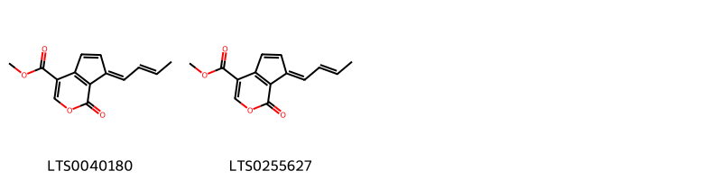{ width=100% }
    <figcaption>Hình ảnh cấu trúc hóa học của 2 hoạt chất thuộc nhóm Pyrans gồm ['fulvoplumierin (LTS0040180)', 'methyl 7-(but-2-en-1-ylidene)-1-oxocyclopenta[c]pyran-4-carboxylate (LTS0255627)'].</figcaption>
</figure>
#### Nhóm Pyridines and derivatives
<figure markdown="span">
    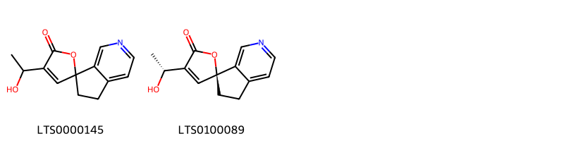{ width=100% }
    <figcaption>Hình ảnh cấu trúc hóa học của 2 hoạt chất thuộc nhóm Pyridines and derivatives gồm ["4'-(1-hydroxyethyl)-5,6-dihydrospiro[cyclopenta[c]pyridine-7,2'-furan]-5'-one (LTS0000145)", "(7s)-4'-[(1r)-1-hydroxyethyl]-5,6-dihydrospiro[cyclopenta[c]pyridine-7,2'-furan]-5'-one (LTS0100089)"].</figcaption>
</figure>
#### Nhóm Quinolizines
<figure markdown="span">
    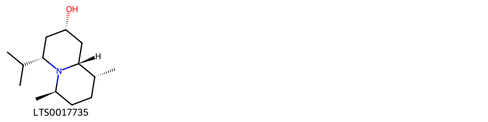{ width=100% }
    <figcaption>Hình ảnh cấu trúc hóa học của 1 hoạt chất thuộc nhóm Quinolizines gồm ['(2s,4s,6r,9r,9ar)-4-isopropyl-6,9-dimethyl-octahydro-1h-quinolizin-2-ol (LTS0017735)'].</figcaption>
</figure>
#### Nhóm Saturated hydrocarbons
<figure markdown="span">
    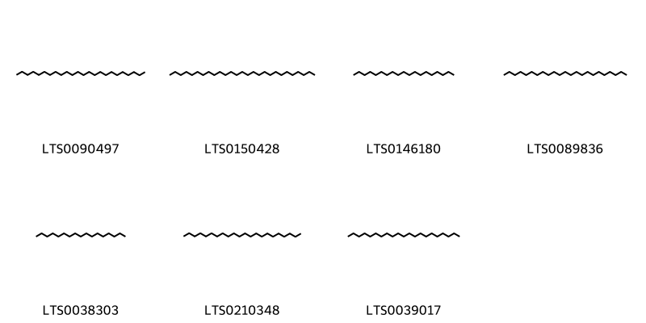{ width=100% }
    <figcaption>Hình ảnh cấu trúc hóa học của 7 hoạt chất thuộc nhóm Saturated hydrocarbons gồm ['tetracosane (LTS0090497)', 'heptacosane (LTS0150428)', 'nonadecane (LTS0146180)', 'tricosane (LTS0089836)', 'heptadecane (LTS0038303)', 'docosane (LTS0210348)', 'heneicosane (LTS0039017)'].</figcaption>
</figure>
#### Nhóm Steroids and steroid derivatives
<figure markdown="span">
    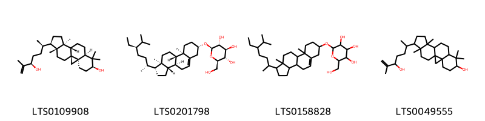{ width=100% }
    <figcaption>Hình ảnh cấu trúc hóa học của 4 hoạt chất thuộc nhóm Steroids and steroid derivatives gồm ['(1s,3r,6s,8r,11s,12s,15r,16r)-15-[(2r,5r)-5-hydroxy-6-methylhept-6-en-2-yl]-7,7,12,16-tetramethylpentacyclo[9.7.0.0¹,³.0³,⁸.0¹²,¹⁶]octadecan-6-ol (LTS0109908)', 'sitogluside (LTS0201798)', '2-{[1-(5-ethyl-6-methylheptan-2-yl)-9a,11a-dimethyl-1h,2h,3h,3ah,3bh,4h,6h,7h,8h,9h,9bh,10h,11h-cyclopenta[a]phenanthren-7-yl]oxy}-6-(hydroxymethyl)oxane-3,4,5-triol (LTS0158828)', '15-(5-hydroxy-6-methylhept-6-en-2-yl)-7,7,12,16-tetramethylpentacyclo[9.7.0.0¹,³.0³,⁸.0¹²,¹⁶]octadecan-6-ol (LTS0049555)'].</figcaption>
</figure>

---

### Dược dân tộc học

Danh sách các quốc gia có sử dụng *Plumeria rubra* trong điều trị các bệnh. 

| Country   | Disease                                                                                      | Bệnh                                                                                                                                                                                                |
|:----------|:---------------------------------------------------------------------------------------------|:----------------------------------------------------------------------------------------------------------------------------------------------------------------------------------------------------|
| Elsewhere | Cathartic, Fungicide, Purgative, Rubefacient, nan, Emmenagogue, Poison, Purgative, Stimulant | MYMEMORY WARNING: YOU USED ALL AVAILABLE FREE TRANSLATIONS FOR TODAY. NEXT AVAILABLE IN  11 HOURS 27 MINUTES 25 SECONDS VISIT HTTPS://MYMEMORY.TRANSLATED.NET/DOC/USAGELIMITS.PHP TO TRANSLATE MORE |
| Haiti     | Poison, Poison, Purgative, Cicatrizant                                                       | MYMEMORY WARNING: YOU USED ALL AVAILABLE FREE TRANSLATIONS FOR TODAY. NEXT AVAILABLE IN  11 HOURS 27 MINUTES 22 SECONDS VISIT HTTPS://MYMEMORY.TRANSLATED.NET/DOC/USAGELIMITS.PHP TO TRANSLATE MORE |
| India     | Abortifacient                                                                                | MYMEMORY WARNING: YOU USED ALL AVAILABLE FREE TRANSLATIONS FOR TODAY. NEXT AVAILABLE IN  11 HOURS 27 MINUTES 17 SECONDS VISIT HTTPS://MYMEMORY.TRANSLATED.NET/DOC/USAGELIMITS.PHP TO TRANSLATE MORE |
| Trinidad  | Purgative                                                                                    | MYMEMORY WARNING: YOU USED ALL AVAILABLE FREE TRANSLATIONS FOR TODAY. NEXT AVAILABLE IN  11 HOURS 27 MINUTES 05 SECONDS VISIT HTTPS://MYMEMORY.TRANSLATED.NET/DOC/USAGELIMITS.PHP TO TRANSLATE MORE |

---

# Chi Picralima

??? note "Danh sách các dược liệu thuộc chi"
    
	 - *Picralima klaineana*

---
## Picralima klaineana
### Thông tin về thực vật

!!! info "Phân loại thực vật của *Picralima nitida* từ GIBF:"
    - **Kingdom:** Plantae
    - **Phylum:** Tracheophyta
    - **Order:** Gentianales
    - **Family:** Apocynaceae
    - **Genus:** Picralima
    - **Species:** *Picralima nitida*

 

| Label (VI)   | Label (EN)   | Scientific Name     | Descriptions (VI)   | Descriptions (EN)   | Also Known As (VI)   | Also Known As (EN)   |
|:-------------|:-------------|:--------------------|:--------------------|:--------------------|:---------------------|:---------------------|
| N/A          | N/A          | Picralima klaineana | loài thực vật       | species of plant    | ['']                 | ['']                 |

#### Phân bố trên thế giới

**Từ CSDL GIBF** nan, Brazil, Guatemala, Guadeloupe, Barbados, Antigua and Barbuda, Chile, Honduras, Ecuador, Cayman Islands, Puerto Rico, Virgin Islands (U.S.), Indonesia, Costa Rica, Dominican Republic, Nigeria, Cuba, French Guiana, Sint Maarten (Dutch part), Grenada, Fiji, Hong Kong, Mexico, Benin, El Salvador, Maldives, Guam, Philippines, Belize, Nicaragua, Cook Islands, Bahamas, South Africa, India, Guyana

#### Phân bố tại Việt Nam

**Từ CSDL GIBF**: Không có ghi nhận ở Việt Nam

---
### Thành phần hóa học
        
- Theo cơ sở dữ liệu lotus: Từ loài *Picralima nitida* đã phân lập và xác định được Chưa có hoạt chất nào được phân lập. hoạt chất thuộc về các nhóm Không có hoạt chất nào được phân lập. 

Không có hình ảnh nào được tạo ra

---

### Dược dân tộc học

Danh sách các quốc gia có sử dụng *Picralima nitida* trong điều trị các bệnh. 

| Country   | Disease   | Bệnh                                                                                                                                                                                                |
|:----------|:----------|:----------------------------------------------------------------------------------------------------------------------------------------------------------------------------------------------------|
| Africa    | Vermifuge | MYMEMORY WARNING: YOU USED ALL AVAILABLE FREE TRANSLATIONS FOR TODAY. NEXT AVAILABLE IN  11 HOURS 25 MINUTES 59 SECONDS VISIT HTTPS://MYMEMORY.TRANSLATED.NET/DOC/USAGELIMITS.PHP TO TRANSLATE MORE |

---

# Chi Vinca

??? note "Danh sách các dược liệu thuộc chi"
    
	 - *Vinca major*
	 - *Vinca minor*

---
## Vinca major
### Thông tin về thực vật

!!! info "Phân loại thực vật của *Vinca major* từ GIBF:"
    - **Kingdom:** Plantae
    - **Phylum:** Tracheophyta
    - **Order:** Gentianales
    - **Family:** Apocynaceae
    - **Genus:** Vinca
    - **Species:** *Vinca major*

 

| Label (VI)   | Label (EN)   | Scientific Name   | Descriptions (VI)   | Descriptions (EN)   | Also Known As (VI)   | Also Known As (EN)                                                                  |
|:-------------|:-------------|:------------------|:--------------------|:--------------------|:---------------------|:------------------------------------------------------------------------------------|
| N/A          | N/A          | Vinca major       | loài thực vật       | species of plant    | ['']                 | ['Blue periwinkle', 'Greater periwinkle', 'Greater Periwinkle', 'Large periwinkle'] |

#### Phân bố trên thế giới

**Từ CSDL GIBF** China, New Zealand, Türkiye, Ecuador, Spain, Netherlands, United States of America, Russian Federation, Colombia, Argentina, Mexico, United Kingdom of Great Britain and Northern Ireland, Belgium, Canada, Germany, Austria, Portugal, Ukraine, South Africa, Australia, Italy, Switzerland, France, Ireland

#### Phân bố tại Việt Nam

**Từ CSDL GIBF**: Không có ghi nhận ở Việt Nam

---
### Thành phần hóa học
        
- Theo cơ sở dữ liệu lotus: Từ loài *Vinca major* đã phân lập và xác định được 58 hoạt chất thuộc về các nhóm Ajmaline-sarpagine alkaloids, Quinolines and derivatives, Yohimbine alkaloids, Indolizidines, Flavonoids, Corynanthean-type alkaloids, Pyridines and derivatives, Eburnan-type alkaloids, Organooxygen compounds, Indolonaphthyridine alkaloids, Strychnos alkaloids, Prenol lipids, Quinolizines, Indoles and derivatives. 

|    | chemicalTaxonomyClassyfireClass   |   smiles_count |
|---:|:----------------------------------|---------------:|
|  0 | Ajmaline-sarpagine alkaloids      |             11 |
|  1 | Corynanthean-type alkaloids       |             16 |
|  2 | Eburnan-type alkaloids            |              2 |
|  3 | Flavonoids                        |              7 |
|  4 | Indoles and derivatives           |              2 |
|  5 | Indolizidines                     |              3 |
|  6 | Indolonaphthyridine alkaloids     |              1 |
|  7 | Organooxygen compounds            |              2 |
|  8 | Prenol lipids                     |              4 |
|  9 | Pyridines and derivatives         |              2 |
| 10 | Quinolines and derivatives        |              1 |
| 11 | Quinolizines                      |              2 |
| 12 | Strychnos alkaloids               |              1 |
| 13 | Yohimbine alkaloids               |              4 |

#### Nhóm Ajmaline-sarpagine alkaloids
<figure markdown="span">
    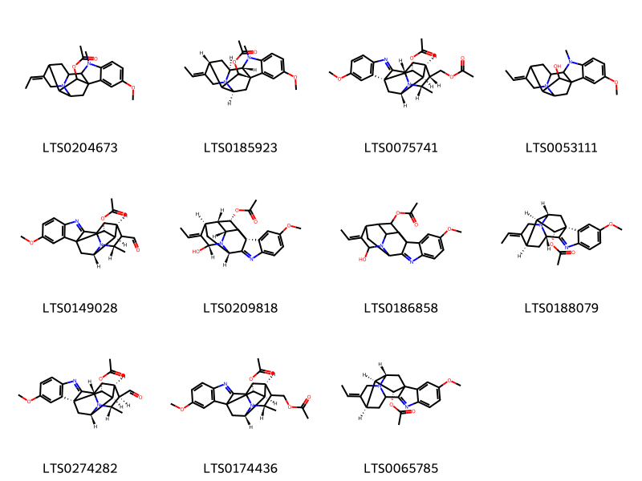{ width=100% }
    <figcaption>Hình ảnh cấu trúc hóa học của 11 hoạt chất thuộc nhóm Ajmaline-sarpagine alkaloids gồm ['(13z)-13-ethylidene-4-methoxy-8-methyl-8,15-diazahexacyclo[14.2.1.0¹,⁹.0²,⁷.0¹⁰,¹⁵.0¹²,¹⁷]nonadeca-2,4,6-trien-18-yl acetate (LTS0204673)', '(1r,9r,10s,12r,13e,16s)-13-ethylidene-4-methoxy-8-methyl-8,15-diazahexacyclo[14.2.1.0¹,⁹.0²,⁷.0¹⁰,¹⁵.0¹²,¹⁷]nonadeca-2,4,6-trien-18-yl acetate (LTS0185923)', '[(1r,10s,12s,13s,14s,16s,17s,18r)-18-(acetyloxy)-4-methoxy-14-methyl-8,15-diazahexacyclo[14.2.1.0¹,⁹.0²,⁷.0¹⁰,¹⁵.0¹²,¹⁷]nonadeca-2,4,6,8-tetraen-13-yl]methyl acetate (LTS0075741)', '13-ethylidene-4-methoxy-8-methyl-8,15-diazahexacyclo[14.2.1.0¹,⁹.0²,⁷.0¹⁰,¹⁵.0¹²,¹⁷]nonadeca-2,4,6-trien-18-ol (LTS0053111)', '(12r,14s,16s,17s,18r)-13-formyl-4-methoxy-14-methyl-8,15-diazahexacyclo[14.2.1.0¹,⁹.0²,⁷.0¹⁰,¹⁵.0¹²,¹⁷]nonadeca-2,4,6,8-tetraen-18-yl acetate (LTS0149028)', '(1r,10s,12r,13e,14r,16s,17s,18s)-13-ethylidene-14-hydroxy-4-methoxy-8,15-diazahexacyclo[14.2.1.0¹,⁹.0²,⁷.0¹⁰,¹⁵.0¹²,¹⁷]nonadeca-2,4,6,8-tetraen-18-yl acetate (LTS0209818)', '(13e)-13-ethylidene-14-hydroxy-4-methoxy-8,15-diazahexacyclo[14.2.1.0¹,⁹.0²,⁷.0¹⁰,¹⁵.0¹²,¹⁷]nonadeca-2,4,6,8-tetraen-18-yl acetate (LTS0186858)', '(1r,10s,12r,13e,16s,17s,18r)-13-ethylidene-4-methoxy-8,15-diazahexacyclo[14.2.1.0¹,⁹.0²,⁷.0¹⁰,¹⁵.0¹²,¹⁷]nonadeca-2,4,6,8-tetraen-18-yl acetate (LTS0188079)', '(1r,10s,12r,13r,14s,16s,17s,18r)-13-formyl-4-methoxy-14-methyl-8,15-diazahexacyclo[14.2.1.0¹,⁹.0²,⁷.0¹⁰,¹⁵.0¹²,¹⁷]nonadeca-2,4,6,8-tetraen-18-yl acetate (LTS0274282)', '[(12s,14s,16s,17s,18r)-18-(acetyloxy)-4-methoxy-14-methyl-8,15-diazahexacyclo[14.2.1.0¹,⁹.0²,⁷.0¹⁰,¹⁵.0¹²,¹⁷]nonadeca-2,4,6,8-tetraen-13-yl]methyl acetate (LTS0174436)', '(12r,13z,16s,17s,18r)-13-ethylidene-4-methoxy-8,15-diazahexacyclo[14.2.1.0¹,⁹.0²,⁷.0¹⁰,¹⁵.0¹²,¹⁷]nonadeca-2,4,6,8-tetraen-18-yl acetate (LTS0065785)'].</figcaption>
</figure>
#### Nhóm Corynanthean-type alkaloids
<figure markdown="span">
    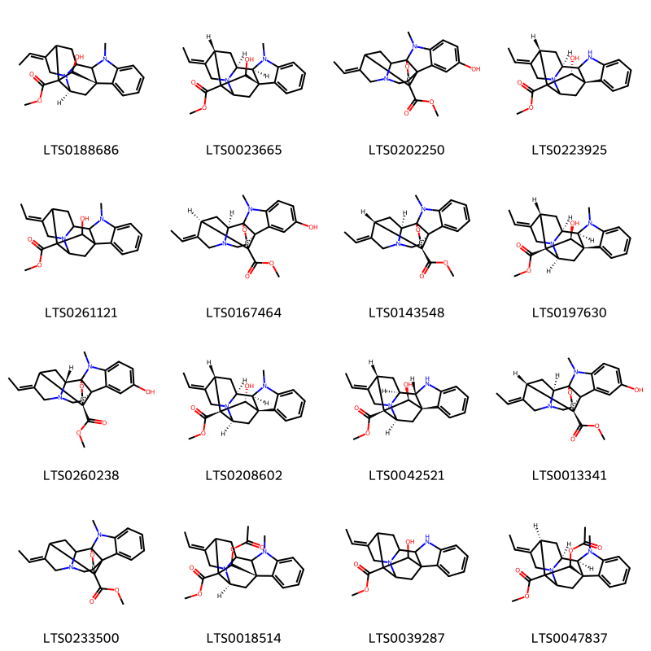{ width=100% }
    <figcaption>Hình ảnh cấu trúc hóa học của 16 hoạt chất thuộc nhóm Corynanthean-type alkaloids gồm ['methyl (1r,13z,16s)-13-ethylidene-18-hydroxy-8-methyl-8,15-diazahexacyclo[14.2.1.0¹,⁹.0²,⁷.0¹⁰,¹⁵.0¹²,¹⁷]nonadeca-2,4,6-triene-17-carboxylate (LTS0188686)', 'methyl (1r,9s,10s,12s,13e)-13-ethylidene-18-hydroxy-8-methyl-8,15-diazahexacyclo[14.2.1.0¹,⁹.0²,⁷.0¹⁰,¹⁵.0¹²,¹⁷]nonadeca-2,4,6-triene-17-carboxylate (LTS0023665)', 'akuammine (LTS0202250)', 'methyl (1r,10s,12s,13e,18r)-13-ethylidene-18-hydroxy-8,15-diazahexacyclo[14.2.1.0¹,⁹.0²,⁷.0¹⁰,¹⁵.0¹²,¹⁷]nonadeca-2,4,6-triene-17-carboxylate (LTS0223925)', 'vincamajine (LTS0261121)', 'akuammine (LTS0167464)', 'methyl (1s,9s,14e,15s,16r,19s)-14-ethylidene-2-methyl-18-oxa-2,12-diazahexacyclo[13.3.2.0¹,⁹.0³,⁸.0⁹,¹⁶.0¹²,¹⁹]icosa-3,5,7-triene-16-carboxylate (LTS0143548)', 'methyl (1r,9s,10s,12s,13e,16s,17r,18s)-13-ethylidene-18-hydroxy-8-methyl-8,15-diazahexacyclo[14.2.1.0¹,⁹.0²,⁷.0¹⁰,¹⁵.0¹²,¹⁷]nonadeca-2,4,6-triene-17-carboxylate (LTS0197630)', 'methyl (1s,9s,16r,19r)-14-ethylidene-6-hydroxy-2-methyl-18-oxa-2,12-diazahexacyclo[13.3.2.0¹,⁹.0³,⁸.0⁹,¹⁶.0¹²,¹⁹]icosa-3,5,7-triene-16-carboxylate (LTS0260238)', 'methyl (1r,9s,10s,12s,13e,16s,17r,18r)-13-ethylidene-18-hydroxy-8-methyl-8,15-diazahexacyclo[14.2.1.0¹,⁹.0²,⁷.0¹⁰,¹⁵.0¹²,¹⁷]nonadeca-2,4,6-triene-17-carboxylate (LTS0208602)', 'methyl (1r,9r,10s,12s,13e,16s,17r,18s)-13-ethylidene-18-hydroxy-8,15-diazahexacyclo[14.2.1.0¹,⁹.0²,⁷.0¹⁰,¹⁵.0¹²,¹⁷]nonadeca-2,4,6-triene-17-carboxylate (LTS0042521)', 'methyl (1s,9s,14e,15s,16r,19s)-14-ethylidene-6-hydroxy-2-methyl-18-oxa-2,12-diazahexacyclo[13.3.2.0¹,⁹.0³,⁸.0⁹,¹⁶.0¹²,¹⁹]icosa-3,5,7-triene-16-carboxylate (LTS0013341)', 'methyl 14-ethylidene-2-methyl-18-oxa-2,12-diazahexacyclo[13.3.2.0¹,⁹.0³,⁸.0⁹,¹⁶.0¹²,¹⁹]icosa-3,5,7-triene-16-carboxylate (LTS0233500)', 'methyl (1r,13e,16s)-18-(acetyloxy)-13-ethylidene-8-methyl-8,15-diazahexacyclo[14.2.1.0¹,⁹.0²,⁷.0¹⁰,¹⁵.0¹²,¹⁷]nonadeca-2,4,6-triene-17-carboxylate (LTS0018514)', 'methyl 13-ethylidene-18-hydroxy-8,15-diazahexacyclo[14.2.1.0¹,⁹.0²,⁷.0¹⁰,¹⁵.0¹²,¹⁷]nonadeca-2,4,6-triene-17-carboxylate (LTS0039287)', 'methyl (1r,9s,10s,12r,13e)-18-(acetyloxy)-13-ethylidene-8-methyl-8,15-diazahexacyclo[14.2.1.0¹,⁹.0²,⁷.0¹⁰,¹⁵.0¹²,¹⁷]nonadeca-2,4,6-triene-17-carboxylate (LTS0047837)'].</figcaption>
</figure>
#### Nhóm Eburnan-type alkaloids
<figure markdown="span">
    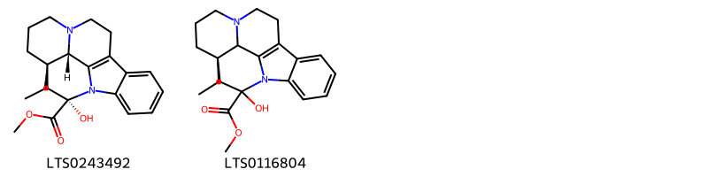{ width=100% }
    <figcaption>Hình ảnh cấu trúc hóa học của 2 hoạt chất thuộc nhóm Eburnan-type alkaloids gồm ['(+)-vincamine (LTS0243492)', 'vinca (LTS0116804)'].</figcaption>
</figure>
#### Nhóm Flavonoids
<figure markdown="span">
    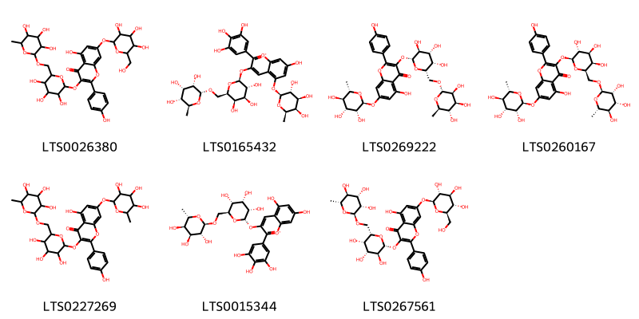{ width=100% }
    <figcaption>Hình ảnh cấu trúc hóa học của 7 hoạt chất thuộc nhóm Flavonoids gồm ['5-hydroxy-2-(4-hydroxyphenyl)-7-{[3,4,5-trihydroxy-6-(hydroxymethyl)oxan-2-yl]oxy}-3-[(3,4,5-trihydroxy-6-{[(3,4,5-trihydroxy-6-methyloxan-2-yl)oxy]methyl}oxan-2-yl)oxy]chromen-4-one (LTS0026380)', '7-hydroxy-3-{[(2s,3r,4s,5r,6r)-3,4,5-trihydroxy-6-({[(2r,3s,4s,5r,6s)-3,4,5-trihydroxy-6-methyloxan-2-yl]oxy}methyl)oxan-2-yl]oxy}-5-{[(2s,3r,4s,5r,6r)-3,4,5-trihydroxy-6-methyloxan-2-yl]oxy}-2-(3,4,5-trihydroxyphenyl)-1λ⁴-chromen-1-ylium (LTS0165432)', '5-hydroxy-2-(4-hydroxyphenyl)-3-{[(2r,3s,4r,5s,6s)-3,4,5-trihydroxy-6-({[(2s,3s,4s,5s,6r)-3,4,5-trihydroxy-6-methyloxan-2-yl]oxy}methyl)oxan-2-yl]oxy}-7-{[(2s,3r,4r,5r,6s)-3,4,5-trihydroxy-6-methyloxan-2-yl]oxy}chromen-4-one (LTS0269222)', 'robinin (LTS0260167)', 'robinin (LTS0227269)', '5,7-dihydroxy-3-{[(2s,3s,4s,5r,6s)-3,4,5-trihydroxy-6-({[(2r,3r,4s,5r,6s)-3,4,5-trihydroxy-6-methyloxan-2-yl]oxy}methyl)oxan-2-yl]oxy}-2-(3,4,5-trihydroxyphenyl)-1λ⁴-chromen-1-ylium (LTS0015344)', '5-hydroxy-2-(4-hydroxyphenyl)-7-{[(2s,3r,4s,5s,6r)-3,4,5-trihydroxy-6-(hydroxymethyl)oxan-2-yl]oxy}-3-{[(2r,3s,4r,5s,6s)-3,4,5-trihydroxy-6-({[(2s,3s,4s,5s,6r)-3,4,5-trihydroxy-6-methyloxan-2-yl]oxy}methyl)oxan-2-yl]oxy}chromen-4-one (LTS0267561)'].</figcaption>
</figure>
#### Nhóm Indoles and derivatives
<figure markdown="span">
    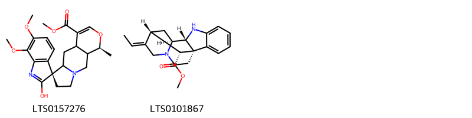{ width=100% }
    <figcaption>Hình ảnh cấu trúc hóa học của 2 hoạt chất thuộc nhóm Indoles and derivatives gồm ["methyl (1's,3r)-2-hydroxy-6,7-dimethoxy-1'-methyl-1',4'a,5',5'a,7',8',10',10'a-octahydrospiro[indole-3,6'-pyrano[3,4-f]indolizine]-4'-carboxylate (LTS0157276)", 'methyl (1r,9r,10s,12r,13e,18r)-13-ethylidene-8,15-diazapentacyclo[10.5.1.0¹,⁹.0²,⁷.0¹⁰,¹⁵]octadeca-2,4,6-triene-18-carboxylate (LTS0101867)'].</figcaption>
</figure>
#### Nhóm Indolizidines
<figure markdown="span">
    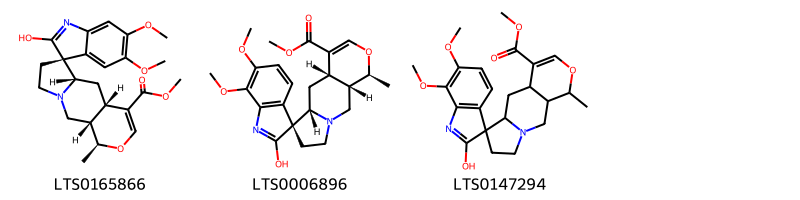{ width=100% }
    <figcaption>Hình ảnh cấu trúc hóa học của 3 hoạt chất thuộc nhóm Indolizidines gồm ["methyl (1's,3r,4'as,5'as,10'as)-2-hydroxy-5,6-dimethoxy-1'-methyl-1',4'a,5',5'a,7',8',10',10'a-octahydrospiro[indole-3,6'-pyrano[3,4-f]indolizine]-4'-carboxylate (LTS0165866)", "methyl (1's,3r,4'as,5'as,10'as)-2-hydroxy-6,7-dimethoxy-1'-methyl-1',4'a,5',5'a,7',8',10',10'a-octahydrospiro[indole-3,6'-pyrano[3,4-f]indolizine]-4'-carboxylate (LTS0006896)", "methyl 2-hydroxy-6,7-dimethoxy-1'-methyl-1',4'a,5',5'a,7',8',10',10'a-octahydrospiro[indole-3,6'-pyrano[3,4-f]indolizine]-4'-carboxylate (LTS0147294)"].</figcaption>
</figure>
#### Nhóm Indolonaphthyridine alkaloids
<figure markdown="span">
    { width=100% }
    <figcaption>Hình ảnh cấu trúc hóa học của 1 hoạt chất thuộc nhóm Indolonaphthyridine alkaloids gồm ['10-hydroxycanthin-6-one (LTS0074837)'].</figcaption>
</figure>
#### Nhóm Organooxygen compounds
<figure markdown="span">
    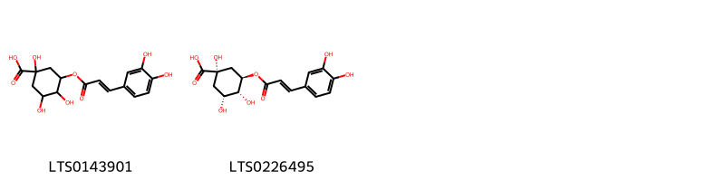{ width=100% }
    <figcaption>Hình ảnh cấu trúc hóa học của 2 hoạt chất thuộc nhóm Organooxygen compounds gồm ['3-{[3-(3,4-dihydroxyphenyl)prop-2-enoyl]oxy}-1,4,5-trihydroxycyclohexane-1-carboxylic acid (LTS0143901)', 'chlorogenic acid (LTS0226495)'].</figcaption>
</figure>
#### Nhóm Prenol lipids
<figure markdown="span">
    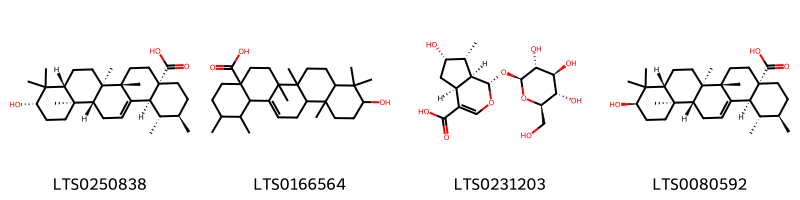{ width=100% }
    <figcaption>Hình ảnh cấu trúc hóa học của 4 hoạt chất thuộc nhóm Prenol lipids gồm ['ursolic acid (LTS0250838)', '10-hydroxy-1,2,6a,6b,9,9,12a-heptamethyl-2,3,4,5,6,7,8,8a,10,11,12,12b,13,14b-tetradecahydro-1h-picene-4a-carboxylic acid (LTS0166564)', 'loganic acid (LTS0231203)', '3β-hydroxy-12-ursen-28-ic acid (LTS0080592)'].</figcaption>
</figure>
#### Nhóm Pyridines and derivatives
<figure markdown="span">
    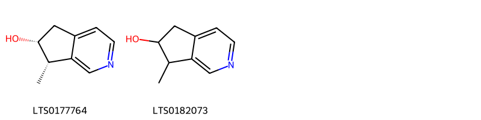{ width=100% }
    <figcaption>Hình ảnh cấu trúc hóa học của 2 hoạt chất thuộc nhóm Pyridines and derivatives gồm ['(6r,7s)-7-methyl-5h,6h,7h-cyclopenta[c]pyridin-6-ol (LTS0177764)', '7-methyl-5h,6h,7h-cyclopenta[c]pyridin-6-ol (LTS0182073)'].</figcaption>
</figure>
#### Nhóm Quinolines and derivatives
<figure markdown="span">
    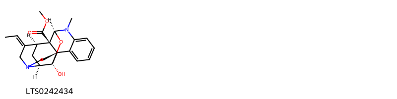{ width=100% }
    <figcaption>Hình ảnh cấu trúc hóa học của 1 hoạt chất thuộc nhóm Quinolines and derivatives gồm ['methyl (1s,6z,7s,9s,10s,12s,20r)-6-ethylidene-10-hydroxy-13-methyl-11-oxa-4,13-diazahexacyclo[10.7.1.0¹,¹⁰.0⁴,⁹.0⁷,²⁰.0¹⁴,¹⁹]icosa-14,16,18-triene-20-carboxylate (LTS0242434)'].</figcaption>
</figure>
#### Nhóm Quinolizines
<figure markdown="span">
    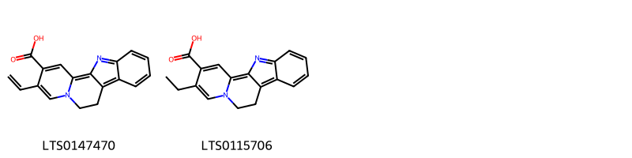{ width=100% }
    <figcaption>Hình ảnh cấu trúc hóa học của 2 hoạt chất thuộc nhóm Quinolizines gồm ['3-ethenyl-6h,7h-indolo[2,3-a]quinolizine-2-carboxylic acid (LTS0147470)', '3-ethyl-6h,7h-indolo[2,3-a]quinolizine-2-carboxylic acid (LTS0115706)'].</figcaption>
</figure>
#### Nhóm Strychnos alkaloids
<figure markdown="span">
    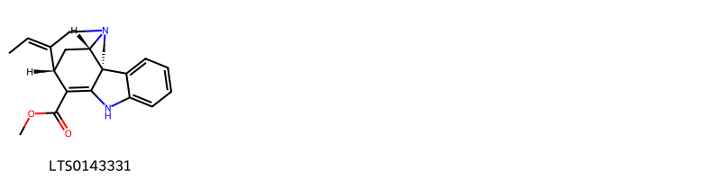{ width=100% }
    <figcaption>Hình ảnh cấu trúc hóa học của 1 hoạt chất thuộc nhóm Strychnos alkaloids gồm ['akuammicine (LTS0143331)'].</figcaption>
</figure>
#### Nhóm Yohimbine alkaloids
<figure markdown="span">
    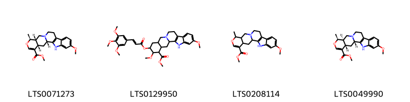{ width=100% }
    <figcaption>Hình ảnh cấu trúc hóa học của 4 hoạt chất thuộc nhóm Yohimbine alkaloids gồm ['methyl (1s,15s,16s,20s)-6-methoxy-16-methyl-17-oxa-3,13-diazapentacyclo[11.8.0.0²,¹⁰.0⁴,⁹.0¹⁵,²⁰]henicosa-2(10),4,6,8,18-pentaene-19-carboxylate (LTS0071273)', 'methyl 6,18-dimethoxy-17-{[(2e)-3-(3,4,5-trimethoxyphenyl)prop-2-enoyl]oxy}-3,13-diazapentacyclo[11.8.0.0²,¹⁰.0⁴,⁹.0¹⁵,²⁰]henicosa-2(10),4,6,8-tetraene-19-carboxylate (LTS0129950)', 'methyl 6-methoxy-16-methyl-17-oxa-3,13-diazapentacyclo[11.8.0.0²,¹⁰.0⁴,⁹.0¹⁵,²⁰]henicosa-2(10),4,6,8,18-pentaene-19-carboxylate (LTS0208114)', 'methyl (1s,15r,16s,20s)-6-methoxy-16-methyl-17-oxa-3,13-diazapentacyclo[11.8.0.0²,¹⁰.0⁴,⁹.0¹⁵,²⁰]henicosa-2(10),4,6,8,18-pentaene-19-carboxylate (LTS0049990)'].</figcaption>
</figure>

---

### Dược dân tộc học

Danh sách các quốc gia có sử dụng *Vinca major* trong điều trị các bệnh. 

| Country   | Disease                              | Bệnh                                                                                                                                                                                                |
|:----------|:-------------------------------------|:----------------------------------------------------------------------------------------------------------------------------------------------------------------------------------------------------|
| Africa    | Astringent                           | MYMEMORY WARNING: YOU USED ALL AVAILABLE FREE TRANSLATIONS FOR TODAY. NEXT AVAILABLE IN  11 HOURS 25 MINUTES 37 SECONDS VISIT HTTPS://MYMEMORY.TRANSLATED.NET/DOC/USAGELIMITS.PHP TO TRANSLATE MORE |
| Elsewhere | Hemostatic, Poison, Vulnerary, Tonic | MYMEMORY WARNING: YOU USED ALL AVAILABLE FREE TRANSLATIONS FOR TODAY. NEXT AVAILABLE IN  11 HOURS 25 MINUTES 34 SECONDS VISIT HTTPS://MYMEMORY.TRANSLATED.NET/DOC/USAGELIMITS.PHP TO TRANSLATE MORE |
| France    | Styptic, Abortifacient               | MYMEMORY WARNING: YOU USED ALL AVAILABLE FREE TRANSLATIONS FOR TODAY. NEXT AVAILABLE IN  11 HOURS 25 MINUTES 31 SECONDS VISIT HTTPS://MYMEMORY.TRANSLATED.NET/DOC/USAGELIMITS.PHP TO TRANSLATE MORE |

---

---
## Vinca minor
### Thông tin về thực vật

!!! info "Phân loại thực vật của *Vinca minor* từ GIBF:"
    - **Kingdom:** Plantae
    - **Phylum:** Tracheophyta
    - **Order:** Gentianales
    - **Family:** Apocynaceae
    - **Genus:** Vinca
    - **Species:** *Vinca minor*

 

| Label (VI)   | Label (EN)   | Scientific Name   | Descriptions (VI)   | Descriptions (EN)   | Also Known As (VI)   | Also Known As (EN)                                                                                                  |
|:-------------|:-------------|:------------------|:--------------------|:--------------------|:---------------------|:--------------------------------------------------------------------------------------------------------------------|
| N/A          | N/A          | Vinca minor       | loài thực vật       | species of plant    | ['']                 | ['common periwinkle', 'creeping myrtle', 'dwarf periwinkle', 'lesser periwinkle', 'periwinkle', 'small periwinkle'] |

#### Phân bố trên thế giới

**Từ CSDL GIBF** nan, Czechia, Sweden, New Zealand, Netherlands, Denmark, Poland, United States of America, Russian Federation, Norway, United Kingdom of Great Britain and Northern Ireland, Belgium, Canada, Germany, Austria, Ukraine, Italy, Switzerland, France

#### Phân bố tại Việt Nam

**Từ CSDL GIBF**: Không có ghi nhận ở Việt Nam

---
### Thành phần hóa học
        
- Theo cơ sở dữ liệu lotus: Từ loài *Vinca minor* đã phân lập và xác định được 75 hoạt chất thuộc về các nhóm Fatty Acyls, Ajmaline-sarpagine alkaloids, Yohimbine alkaloids, Indolizidines, Carboxylic acids and derivatives, Macroline alkaloids, Corynanthean-type alkaloids, Aspidospermatan-type alkaloids, Eburnan-type alkaloids, Prenol lipids, Indolonaphthyridine alkaloids, Akuammilan and related alkaloids, Strychnos alkaloids, Quebrachamine alkaloids, Indoles and derivatives. 

|    | chemicalTaxonomyClassyfireClass   |   smiles_count |
|---:|:----------------------------------|---------------:|
|  0 | Ajmaline-sarpagine alkaloids      |              2 |
|  1 | Akuammilan and related alkaloids  |              4 |
|  2 | Aspidospermatan-type alkaloids    |             19 |
|  3 | Carboxylic acids and derivatives  |              1 |
|  4 | Corynanthean-type alkaloids       |              1 |
|  5 | Eburnan-type alkaloids            |             20 |
|  6 | Fatty Acyls                       |              1 |
|  7 | Indoles and derivatives           |              7 |
|  8 | Indolizidines                     |              5 |
|  9 | Indolonaphthyridine alkaloids     |              1 |
| 10 | Macroline alkaloids               |              1 |
| 11 | Prenol lipids                     |              1 |
| 12 | Quebrachamine alkaloids           |              7 |
| 13 | Strychnos alkaloids               |              3 |
| 14 | Yohimbine alkaloids               |              2 |

#### Nhóm Ajmaline-sarpagine alkaloids
<figure markdown="span">
    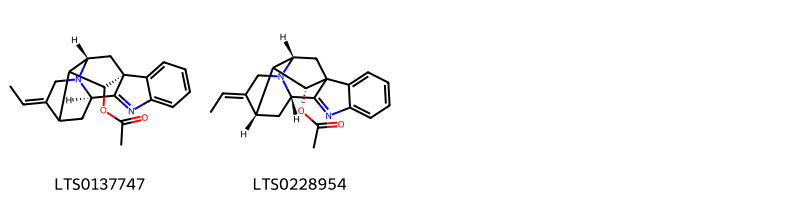{ width=100% }
    <figcaption>Hình ảnh cấu trúc hóa học của 2 hoạt chất thuộc nhóm Ajmaline-sarpagine alkaloids gồm ['(1r,10r,16s)-13-ethylidene-8,15-diazahexacyclo[14.2.1.0¹,⁹.0²,⁷.0¹⁰,¹⁵.0¹²,¹⁷]nonadeca-2,4,6,8-tetraen-18-yl acetate (LTS0137747)', '(10s,12s,13e,16s,18r)-13-ethylidene-8,15-diazahexacyclo[14.2.1.0¹,⁹.0²,⁷.0¹⁰,¹⁵.0¹²,¹⁷]nonadeca-2,4,6,8-tetraen-18-yl acetate (LTS0228954)'].</figcaption>
</figure>
#### Nhóm Akuammilan and related alkaloids
<figure markdown="span">
    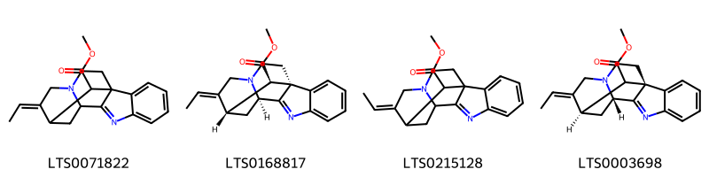{ width=100% }
    <figcaption>Hình ảnh cấu trúc hóa học của 4 hoạt chất thuộc nhóm Akuammilan and related alkaloids gồm ['methyl (13e)-13-ethylidene-8,15-diazapentacyclo[10.5.1.0¹,⁹.0²,⁷.0¹⁰,¹⁵]octadeca-2,4,6,8-tetraene-18-carboxylate (LTS0071822)', 'methyl (1s,10r,12s,13e,18r)-13-ethylidene-8,15-diazapentacyclo[10.5.1.0¹,⁹.0²,⁷.0¹⁰,¹⁵]octadeca-2,4,6,8-tetraene-18-carboxylate (LTS0168817)', 'methyl (13z)-13-ethylidene-8,15-diazapentacyclo[10.5.1.0¹,⁹.0²,⁷.0¹⁰,¹⁵]octadeca-2,4,6,8-tetraene-18-carboxylate (LTS0215128)', 'methyl (1r,10s,12r,13e)-13-ethylidene-8,15-diazapentacyclo[10.5.1.0¹,⁹.0²,⁷.0¹⁰,¹⁵]octadeca-2,4,6,8-tetraene-18-carboxylate (LTS0003698)'].</figcaption>
</figure>
#### Nhóm Aspidospermatan-type alkaloids
<figure markdown="span">
    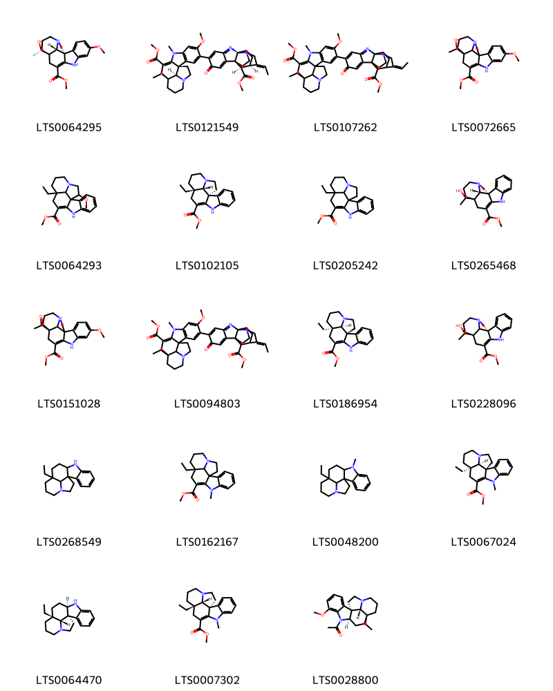{ width=100% }
    <figcaption>Hình ảnh cấu trúc hóa học của 19 hoạt chất thuộc nhóm Aspidospermatan-type alkaloids gồm ['methyl (1r,12r,19r)-12-[(1s)-1-hydroxyethyl]-5-methoxy-8,16-diazapentacyclo[10.6.1.0¹,⁹.0²,⁷.0¹⁶,¹⁹]nonadeca-2,4,6,9-tetraene-10-carboxylate (LTS0064295)', 'methyl (1r,12s,19s)-12-ethyl-4-[(1r,9r,12r,13e,18r)-13-ethylidene-18-(methoxycarbonyl)-4-oxo-8,15-diazapentacyclo[10.5.1.0¹,⁹.0²,⁷.0⁹,¹⁵]octadeca-2,5,7-trien-5-yl]-5-methoxy-8-methyl-8,16-diazapentacyclo[10.6.1.0¹,⁹.0²,⁷.0¹⁶,¹⁹]nonadeca-2(7),3,5,9-tetraene-10-carboxylate (LTS0121549)', 'methyl 12-ethyl-4-[(13z)-13-ethylidene-18-(methoxycarbonyl)-4-oxo-8,15-diazapentacyclo[10.5.1.0¹,⁹.0²,⁷.0⁹,¹⁵]octadeca-2,5,7-trien-5-yl]-5-methoxy-8-methyl-8,16-diazapentacyclo[10.6.1.0¹,⁹.0²,⁷.0¹⁶,¹⁹]nonadeca-2(7),3,5,9-tetraene-10-carboxylate (LTS0107262)', 'methyl 12-(1-hydroxyethyl)-5-methoxy-8,16-diazapentacyclo[10.6.1.0¹,⁹.0²,⁷.0¹⁶,¹⁹]nonadeca-2,4,6,9-tetraene-10-carboxylate (LTS0072665)', 'methyl 12-ethyl-18-methoxy-8,16-diazapentacyclo[10.6.1.0¹,⁹.0²,⁷.0¹⁶,¹⁹]nonadeca-2,4,6,9-tetraene-10-carboxylate (LTS0064293)', 'methyl (1r,12s,19s)-12-ethyl-8,16-diazapentacyclo[10.6.1.0¹,⁹.0²,⁷.0¹⁶,¹⁹]nonadeca-2,4,6,9-tetraene-10-carboxylate (LTS0102105)', 'vincadifformine (LTS0205242)', 'methyl (1r,12r,19r)-12-(1-hydroxyethyl)-8,16-diazapentacyclo[10.6.1.0¹,⁹.0²,⁷.0¹⁶,¹⁹]nonadeca-2,4,6,9-tetraene-10-carboxylate (LTS0265468)', 'minovincine (LTS0151028)', 'methyl 12-ethyl-4-[(13e)-13-ethylidene-18-(methoxycarbonyl)-4-oxo-8,15-diazapentacyclo[10.5.1.0¹,⁹.0²,⁷.0⁹,¹⁵]octadeca-2,5,7-trien-5-yl]-5-methoxy-8-methyl-8,16-diazapentacyclo[10.6.1.0¹,⁹.0²,⁷.0¹⁶,¹⁹]nonadeca-2(7),3,5,9-tetraene-10-carboxylate (LTS0094803)', 'methyl (1s,12r,19r)-12-ethyl-8,16-diazapentacyclo[10.6.1.0¹,⁹.0²,⁷.0¹⁶,¹⁹]nonadeca-2,4,6,9-tetraene-10-carboxylate (LTS0186954)', 'methyl (1r,12r)-12-(1-hydroxyethyl)-8,16-diazapentacyclo[10.6.1.0¹,⁹.0²,⁷.0¹⁶,¹⁹]nonadeca-2,4,6,9-tetraene-10-carboxylate (LTS0228096)', 'aspidospermidine (LTS0268549)', 'methyl 12-ethyl-8-methyl-8,16-diazapentacyclo[10.6.1.0¹,⁹.0²,⁷.0¹⁶,¹⁹]nonadeca-2,4,6,9-tetraene-10-carboxylate (LTS0162167)', '12-ethyl-8-methyl-8,16-diazapentacyclo[10.6.1.0¹,⁹.0²,⁷.0¹⁶,¹⁹]nonadeca-2,4,6-triene (LTS0048200)', 'methyl (1s,12r,19r)-12-ethyl-8-methyl-8,16-diazapentacyclo[10.6.1.0¹,⁹.0²,⁷.0¹⁶,¹⁹]nonadeca-2,4,6,9-tetraene-10-carboxylate (LTS0067024)', 'aspidospermidine (LTS0064470)', 'methyl (1r,12s,19s)-12-ethyl-8-methyl-8,16-diazapentacyclo[10.6.1.0¹,⁹.0²,⁷.0¹⁶,¹⁹]nonadeca-2,4,6,9-tetraene-10-carboxylate (LTS0007302)', '1-[(1r,9r,12r,19r)-12-ethyl-6-methoxy-8,16-diazapentacyclo[10.6.1.0¹,⁹.0²,⁷.0¹⁶,¹⁹]nonadeca-2,4,6-trien-8-yl]ethanone (LTS0028800)'].</figcaption>
</figure>
#### Nhóm Carboxylic acids and derivatives
<figure markdown="span">
    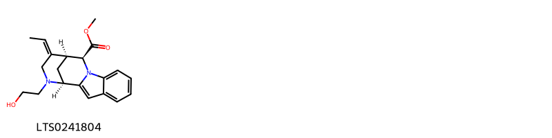{ width=100% }
    <figcaption>Hình ảnh cấu trúc hóa học của 1 hoạt chất thuộc nhóm Carboxylic acids and derivatives gồm ['methyl (1s,11s,12s,13z)-13-ethylidene-15-(2-hydroxyethyl)-10,15-diazatetracyclo[10.3.1.0²,¹⁰.0⁴,⁹]hexadeca-2,4,6,8-tetraene-11-carboxylate (LTS0241804)'].</figcaption>
</figure>
#### Nhóm Corynanthean-type alkaloids
<figure markdown="span">
    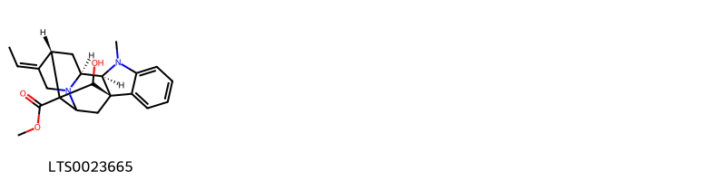{ width=100% }
    <figcaption>Hình ảnh cấu trúc hóa học của 1 hoạt chất thuộc nhóm Corynanthean-type alkaloids gồm ['methyl (1r,9s,10s,12s,13e)-13-ethylidene-18-hydroxy-8-methyl-8,15-diazahexacyclo[14.2.1.0¹,⁹.0²,⁷.0¹⁰,¹⁵.0¹²,¹⁷]nonadeca-2,4,6-triene-17-carboxylate (LTS0023665)'].</figcaption>
</figure>
#### Nhóm Eburnan-type alkaloids
<figure markdown="span">
    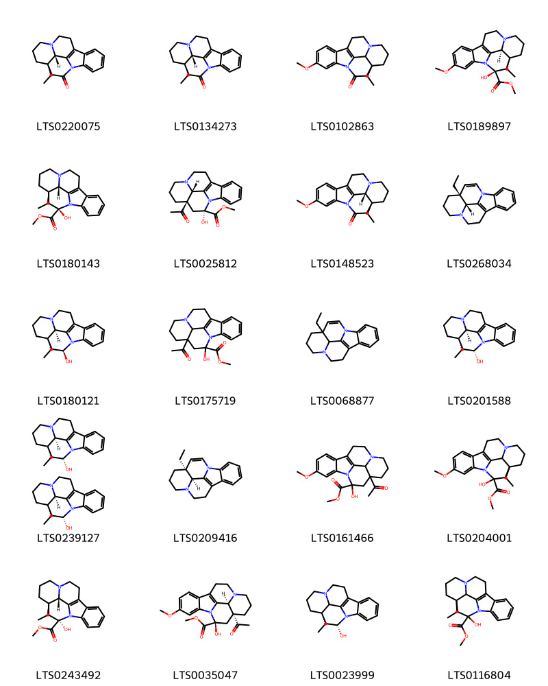{ width=100% }
    <figcaption>Hình ảnh cấu trúc hóa học của 20 hoạt chất thuộc nhóm Eburnan-type alkaloids gồm ['vinburnine (LTS0220075)', '(-)-eburnamonine (LTS0134273)', '15-ethyl-4-methoxy-1,11-diazapentacyclo[9.6.2.0²,⁷.0⁸,¹⁸.0¹⁵,¹⁹]nonadeca-2,4,6,8(18)-tetraen-17-one (LTS0102863)', 'methyl (15s,17s,19s)-15-ethyl-17-hydroxy-4-methoxy-1,11-diazapentacyclo[9.6.2.0²,⁷.0⁸,¹⁸.0¹⁵,¹⁹]nonadeca-2,4,6,8(18)-tetraene-17-carboxylate (LTS0189897)', '16-epivincamine (LTS0180143)', 'methyl (15r,17s,19s)-15-acetyl-17-hydroxy-1,11-diazapentacyclo[9.6.2.0²,⁷.0⁸,¹⁸.0¹⁵,¹⁹]nonadeca-2,4,6,8(18)-tetraene-17-carboxylate (LTS0025812)', '(15r,19r)-15-ethyl-4-methoxy-1,11-diazapentacyclo[9.6.2.0²,⁷.0⁸,¹⁸.0¹⁵,¹⁹]nonadeca-2,4,6,8(18)-tetraen-17-one (LTS0148523)', 'eburnamenine (LTS0268034)', '(15r,17s,19r)-15-ethyl-1,11-diazapentacyclo[9.6.2.0²,⁷.0⁸,¹⁸.0¹⁵,¹⁹]nonadeca-2,4,6,8(18)-tetraen-17-ol (LTS0180121)', 'methyl 15-acetyl-17-hydroxy-1,11-diazapentacyclo[9.6.2.0²,⁷.0⁸,¹⁸.0¹⁵,¹⁹]nonadeca-2,4,6,8(18)-tetraene-17-carboxylate (LTS0175719)', 'eburnamenine (LTS0068877)', 'eburnamine (LTS0201588)', 'bis(eburnamine) (LTS0239127)', '(15s,19s)-15-ethyl-1,11-diazapentacyclo[9.6.2.0²,⁷.0⁸,¹⁸.0¹⁵,¹⁹]nonadeca-2,4,6,8(18),16-pentaene (LTS0209416)', 'methyl 15-acetyl-17-hydroxy-4-methoxy-1,11-diazapentacyclo[9.6.2.0²,⁷.0⁸,¹⁸.0¹⁵,¹⁹]nonadeca-2,4,6,8(18)-tetraene-17-carboxylate (LTS0161466)', 'methyl 15-ethyl-17-hydroxy-4-methoxy-1,11-diazapentacyclo[9.6.2.0²,⁷.0⁸,¹⁸.0¹⁵,¹⁹]nonadeca-2,4,6,8(18)-tetraene-17-carboxylate (LTS0204001)', '(+)-vincamine (LTS0243492)', 'methyl (15r,17s,19s)-15-acetyl-17-hydroxy-4-methoxy-1,11-diazapentacyclo[9.6.2.0²,⁷.0⁸,¹⁸.0¹⁵,¹⁹]nonadeca-2,4,6,8(18)-tetraene-17-carboxylate (LTS0035047)', '(15r,17r)-15-ethyl-1,11-diazapentacyclo[9.6.2.0²,⁷.0⁸,¹⁸.0¹⁵,¹⁹]nonadeca-2,4,6,8(18)-tetraen-17-ol (LTS0023999)', 'vinca (LTS0116804)'].</figcaption>
</figure>
#### Nhóm Fatty Acyls
<figure markdown="span">
    { width=100% }
    <figcaption>Hình ảnh cấu trúc hóa học của 1 hoạt chất thuộc nhóm Fatty Acyls gồm ['2-carboxy-d-arabinitol (LTS0056947)'].</figcaption>
</figure>
#### Nhóm Indoles and derivatives
<figure markdown="span">
    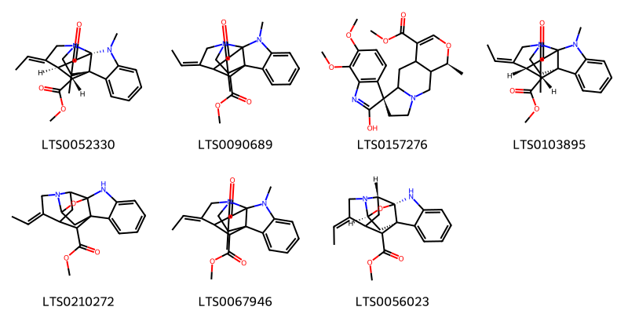{ width=100% }
    <figcaption>Hình ảnh cấu trúc hóa học của 7 hoạt chất thuộc nhóm Indoles and derivatives gồm ['methyl (1s,9r,12s,13e,18r)-13-ethylidene-8-methyl-10-oxo-8,15-diazapentacyclo[10.5.1.0¹,⁹.0²,⁷.0⁹,¹⁵]octadeca-2,4,6-triene-18-carboxylate (LTS0052330)', 'methyl (13z)-13-ethylidene-8-methyl-10-oxo-8,15-diazapentacyclo[10.5.1.0¹,⁹.0²,⁷.0⁹,¹⁵]octadeca-2,4,6-triene-18-carboxylate (LTS0090689)', "methyl (1's,3r)-2-hydroxy-6,7-dimethoxy-1'-methyl-1',4'a,5',5'a,7',8',10',10'a-octahydrospiro[indole-3,6'-pyrano[3,4-f]indolizine]-4'-carboxylate (LTS0157276)", 'methyl (1r,12r,13z,18r)-13-ethylidene-8-methyl-10-oxo-8,15-diazapentacyclo[10.5.1.0¹,⁹.0²,⁷.0⁹,¹⁵]octadeca-2,4,6-triene-18-carboxylate (LTS0103895)', 'methyl (14z)-14-ethylidene-18-oxa-2,12-diazahexacyclo[9.6.1.1⁹,¹⁵.0¹,⁹.0³,⁸.0¹²,¹⁷]nonadeca-3,5,7-triene-19-carboxylate (LTS0210272)', 'methyl (13e)-13-ethylidene-8-methyl-10-oxo-8,15-diazapentacyclo[10.5.1.0¹,⁹.0²,⁷.0⁹,¹⁵]octadeca-2,4,6-triene-18-carboxylate (LTS0067946)', 'methyl (1r,9r,11s,14e,17s)-14-ethylidene-18-oxa-2,12-diazahexacyclo[9.6.1.1⁹,¹⁵.0¹,⁹.0³,⁸.0¹²,¹⁷]nonadeca-3,5,7-triene-19-carboxylate (LTS0056023)'].</figcaption>
</figure>
#### Nhóm Indolizidines
<figure markdown="span">
    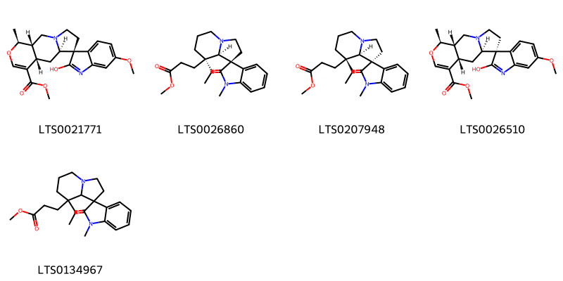{ width=100% }
    <figcaption>Hình ảnh cấu trúc hóa học của 5 hoạt chất thuộc nhóm Indolizidines gồm ["methyl (1's,3s,4'as,5'ar,10'as)-2-hydroxy-6-methoxy-1'-methyl-1',4'a,5',5'a,7',8',10',10'a-octahydrospiro[indole-3,6'-pyrano[3,4-f]indolizine]-4'-carboxylate (LTS0021771)", "methyl 3-[(3s,8'r,8'ar)-8'-ethyl-1-methyl-2-oxo-2',3',5',6',7',8'a-hexahydrospiro[indole-3,1'-indolizin]-8'-yl]propanoate (LTS0026860)", "methyl 3-[(3r,8's,8'ar)-8'-ethyl-1-methyl-2-oxo-2',3',5',6',7',8'a-hexahydrospiro[indole-3,1'-indolizin]-8'-yl]propanoate (LTS0207948)", 'vineridine (LTS0026510)', "methyl 3-{8'-ethyl-1-methyl-2-oxo-2',3',5',6',7',8'a-hexahydrospiro[indole-3,1'-indolizin]-8'-yl}propanoate (LTS0134967)"].</figcaption>
</figure>
#### Nhóm Indolonaphthyridine alkaloids
<figure markdown="span">
    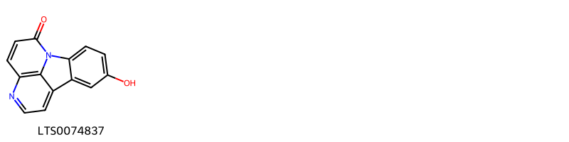{ width=100% }
    <figcaption>Hình ảnh cấu trúc hóa học của 1 hoạt chất thuộc nhóm Indolonaphthyridine alkaloids gồm ['10-hydroxycanthin-6-one (LTS0074837)'].</figcaption>
</figure>
#### Nhóm Macroline alkaloids
<figure markdown="span">
    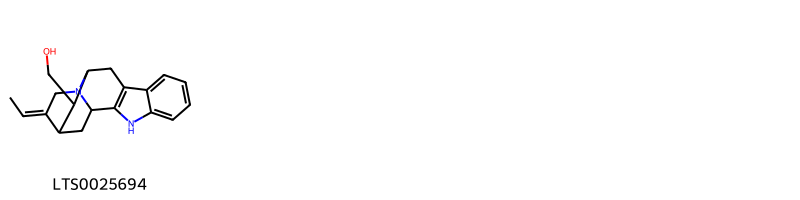{ width=100% }
    <figcaption>Hình ảnh cấu trúc hóa học của 1 hoạt chất thuộc nhóm Macroline alkaloids gồm ['normacusine b (LTS0025694)'].</figcaption>
</figure>
#### Nhóm Prenol lipids
<figure markdown="span">
    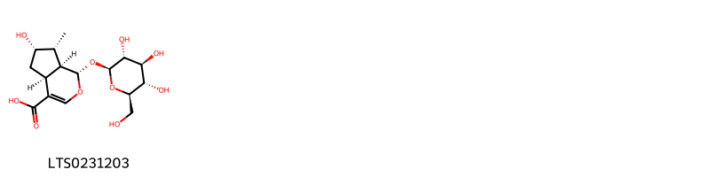{ width=100% }
    <figcaption>Hình ảnh cấu trúc hóa học của 1 hoạt chất thuộc nhóm Prenol lipids gồm ['loganic acid (LTS0231203)'].</figcaption>
</figure>
#### Nhóm Quebrachamine alkaloids
<figure markdown="span">
    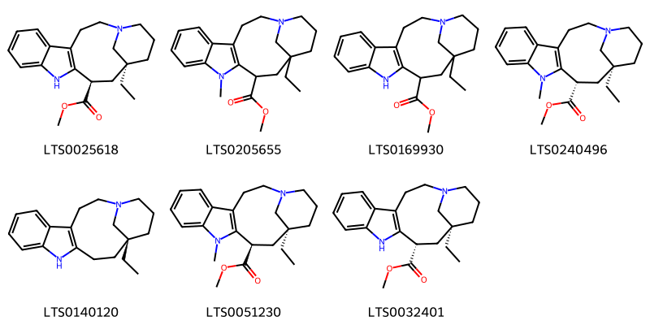{ width=100% }
    <figcaption>Hình ảnh cấu trúc hóa học của 7 hoạt chất thuộc nhóm Quebrachamine alkaloids gồm ['methyl (13r,15s)-15-ethyl-1,11-diazatetracyclo[13.3.1.0⁴,¹².0⁵,¹⁰]nonadeca-4(12),5,7,9-tetraene-13-carboxylate (LTS0025618)', 'methyl 15-ethyl-11-methyl-1,11-diazatetracyclo[13.3.1.0⁴,¹².0⁵,¹⁰]nonadeca-4(12),5,7,9-tetraene-13-carboxylate (LTS0205655)', 'methyl 15-ethyl-1,11-diazatetracyclo[13.3.1.0⁴,¹².0⁵,¹⁰]nonadeca-4(12),5,7,9-tetraene-13-carboxylate (LTS0169930)', 'methyl (13s,15s)-15-ethyl-11-methyl-1,11-diazatetracyclo[13.3.1.0⁴,¹².0⁵,¹⁰]nonadeca-4(12),5,7,9-tetraene-13-carboxylate (LTS0240496)', 'quebrachamine (LTS0140120)', 'methyl (13r,15s)-15-ethyl-11-methyl-1,11-diazatetracyclo[13.3.1.0⁴,¹².0⁵,¹⁰]nonadeca-4(12),5,7,9-tetraene-13-carboxylate (LTS0051230)', 'methyl (13s,15s)-15-ethyl-1,11-diazatetracyclo[13.3.1.0⁴,¹².0⁵,¹⁰]nonadeca-4(12),5,7,9-tetraene-13-carboxylate (LTS0032401)'].</figcaption>
</figure>
#### Nhóm Strychnos alkaloids
<figure markdown="span">
    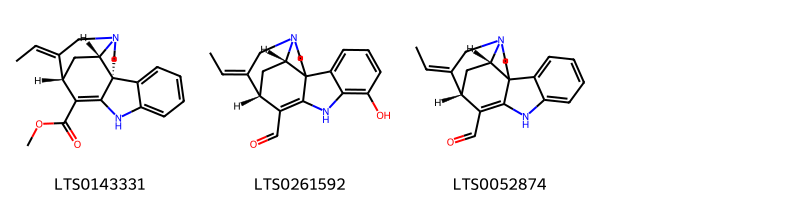{ width=100% }
    <figcaption>Hình ảnh cấu trúc hóa học của 3 hoạt chất thuộc nhóm Strychnos alkaloids gồm ['akuammicine (LTS0143331)', '(11s,12z,17s)-12-ethylidene-6-hydroxy-8,14-diazapentacyclo[9.5.2.0¹,⁹.0²,⁷.0¹⁴,¹⁷]octadeca-2,4,6,9-tetraene-10-carbaldehyde (LTS0261592)', '(11s,12z,17s)-12-ethylidene-8,14-diazapentacyclo[9.5.2.0¹,⁹.0²,⁷.0¹⁴,¹⁷]octadeca-2,4,6,9-tetraene-10-carbaldehyde (LTS0052874)'].</figcaption>
</figure>
#### Nhóm Yohimbine alkaloids
<figure markdown="span">
    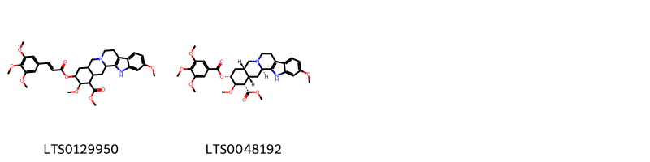{ width=100% }
    <figcaption>Hình ảnh cấu trúc hóa học của 2 hoạt chất thuộc nhóm Yohimbine alkaloids gồm ['methyl 6,18-dimethoxy-17-{[(2e)-3-(3,4,5-trimethoxyphenyl)prop-2-enoyl]oxy}-3,13-diazapentacyclo[11.8.0.0²,¹⁰.0⁴,⁹.0¹⁵,²⁰]henicosa-2(10),4,6,8-tetraene-19-carboxylate (LTS0129950)', 'reserpine (LTS0048192)'].</figcaption>
</figure>

---

### Dược dân tộc học

Danh sách các quốc gia có sử dụng *Vinca minor* trong điều trị các bệnh. 

| Country   | Disease                                     | Bệnh                                                                                                                                                                                                |
|:----------|:--------------------------------------------|:----------------------------------------------------------------------------------------------------------------------------------------------------------------------------------------------------|
| Elsewhere | nan, Tonic, Collyrium, Sedative, Astringent | MYMEMORY WARNING: YOU USED ALL AVAILABLE FREE TRANSLATIONS FOR TODAY. NEXT AVAILABLE IN  11 HOURS 24 MINUTES 41 SECONDS VISIT HTTPS://MYMEMORY.TRANSLATED.NET/DOC/USAGELIMITS.PHP TO TRANSLATE MORE |
| Eurasia   | Hemostat                                    | MYMEMORY WARNING: YOU USED ALL AVAILABLE FREE TRANSLATIONS FOR TODAY. NEXT AVAILABLE IN  11 HOURS 24 MINUTES 37 SECONDS VISIT HTTPS://MYMEMORY.TRANSLATED.NET/DOC/USAGELIMITS.PHP TO TRANSLATE MORE |
| Europe    | Carminative, Emetic, Hemostat, Diuretic     | MYMEMORY WARNING: YOU USED ALL AVAILABLE FREE TRANSLATIONS FOR TODAY. NEXT AVAILABLE IN  11 HOURS 24 MINUTES 34 SECONDS VISIT HTTPS://MYMEMORY.TRANSLATED.NET/DOC/USAGELIMITS.PHP TO TRANSLATE MORE |
| Turkey    | Astringent, Hemostat, Tonic, Diuretic       | MYMEMORY WARNING: YOU USED ALL AVAILABLE FREE TRANSLATIONS FOR TODAY. NEXT AVAILABLE IN  11 HOURS 24 MINUTES 29 SECONDS VISIT HTTPS://MYMEMORY.TRANSLATED.NET/DOC/USAGELIMITS.PHP TO TRANSLATE MORE |

---

