!!! abstract "Tóm tắt"

    Họ Aquifoliaceae gồm khoảng 1 chi và 18 loài được một số cộng đồng tại các quốc gia như Dutch, North America, Brazil, Indochina, French, Ecuador(Jivaro), South America, English, Mexico, China, anish, Europe, ain, Haiti, Elsewhere, German, US, US(Appalachia), Italian, Ecuador, Turkey, US(Amerindian) sử dụng trong một số trường hợp QUERY LENGTH LIMIT EXCEEDED. MAX ALLOWED QUERY : 500 CHARS.

!!! info "DrDuke"

    James A. Duke sinh năm 1929-2017 là một nhà thực vật học người Mỹ. Đây là một trong những tác giả hàng đầu trong lĩnh vực dược dân tộc học với cuốn *CRC Handbook of Medicinal Herbs* và chính là người xây dựng lên cơ sở dữ liệu về hợp chất tự nhiên và dược dân tộc học tại Bộ nông nghiệp Hoa Kỳ. Các thông tin được đăng tải tại website [Dr. Duke's Phytochemical and Ethnobotanical Databases](https://phytochem.nal.usda.gov/). 
    Trong suốt thập niên 1970, ông lãnh đạo the Plant Taxonomy Laboratory, Plant Genetics and Germplasm Institute of the Agricultural Research Service, U.S. Department of Agriculture.
    Trong tài liệu này, các thông tin về dược dân tộc của các dược liệu được trích dẫn từ tài liệu của James A. Ducke với sự trợ giúp của phần mềm dịch thuật từ tiếng Anh sang tiếng Việt.
   

# Chi Ilex

??? note "Danh sách các dược liệu thuộc chi"
    
	 - *Ilex aquifolium*
	 - *Ilex arolla*
	 - *Ilex conocarpa*
	 - *Ilex cornuta*
	 - *Ilex godajam*
	 - *Ilex guayusa*
	 - *Ilex macfadyenii*
	 - *Ilex medica*
	 - *Ilex montana*
	 - *Ilex opaca*
	 - *Ilex paraguariensis*
	 - *Ilex paraguayensis*
	 - *Ilex pedunculosa*
	 - *Ilex rubra*
	 - *Ilex theezans*
	 - *Ilex verticillata*
	 - *Ilex vomitoria*
	 - *Ilex wallichii*

---
## Ilex aquifolium
### Thông tin về thực vật

!!! info "Phân loại thực vật của *Ilex aquifolium* từ GIBF:"
    - **Kingdom:** Plantae
    - **Phylum:** Tracheophyta
    - **Order:** Aquifoliales
    - **Family:** Aquifoliaceae
    - **Genus:** Ilex
    - **Species:** *Ilex aquifolium*

 

| Label (VI)   | Label (EN)   | Scientific Name   | Descriptions (VI)   | Descriptions (EN)   | Also Known As (VI)   | Also Known As (EN)                                                                                            |
|:-------------|:-------------|:------------------|:--------------------|:--------------------|:---------------------|:--------------------------------------------------------------------------------------------------------------|
| N/A          | N/A          | Ilex aquifolium   | loài thực vật       | species of plant    | ['']                 | ['Christmas holly', 'common holly', 'English holly', 'European holly', 'holly', 'Ilex perado subsp. iberica'] |

#### Phân bố trên thế giới

**Từ CSDL GIBF** nan, Denmark, Luxembourg, Spain, Germany, Austria, Australia, Sweden, Canada, Belgium, Netherlands, Ireland, Norway, Switzerland, United Kingdom of Great Britain and Northern Ireland, France, New Zealand, United States of America, Italy, Faroe Islands

#### Phân bố tại Việt Nam

**Từ CSDL GIBF**: Không có ghi nhận ở Việt Nam

---
### Thành phần hóa học
        
- Theo cơ sở dữ liệu lotus: Từ loài *Ilex aquifolium* đã phân lập và xác định được 34 hoạt chất thuộc về các nhóm Organooxygen compounds, Flavonoids, Prenol lipids, Steroids and steroid derivatives, Pyrans. 

|    | chemicalTaxonomyClassyfireClass   |   smiles_count |
|---:|:----------------------------------|---------------:|
|  0 | Flavonoids                        |              2 |
|  1 | Organooxygen compounds            |              4 |
|  2 | Prenol lipids                     |             18 |
|  3 | Pyrans                            |              2 |
|  4 | Steroids and steroid derivatives  |              8 |

#### Nhóm Flavonoids
<figure markdown="span">
    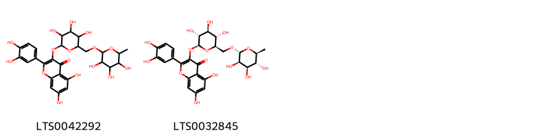{ width=100% }
    <figcaption>Hình ảnh cấu trúc hóa học của 2 hoạt chất thuộc nhóm Flavonoids gồm ['rutin (LTS0042292)', '3-rutinosyl quercetin (LTS0032845)'].</figcaption>
</figure>
#### Nhóm Organooxygen compounds
<figure markdown="span">
    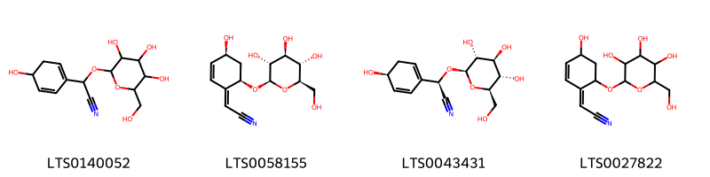{ width=100% }
    <figcaption>Hình ảnh cấu trúc hóa học của 4 hoạt chất thuộc nhóm Organooxygen compounds gồm ['2-(4-hydroxycyclohexa-1,5-dien-1-yl)-2-{[3,4,5-trihydroxy-6-(hydroxymethyl)oxan-2-yl]oxy}acetonitrile (LTS0140052)', '2-[(1z,4s,6r)-4-hydroxy-6-{[(2r,3r,4s,5s,6r)-3,4,5-trihydroxy-6-(hydroxymethyl)oxan-2-yl]oxy}cyclohex-2-en-1-ylidene]acetonitrile (LTS0058155)', '(2r)-2-[(4s)-4-hydroxycyclohexa-1,5-dien-1-yl]-2-{[(2r,3r,4s,5s,6r)-3,4,5-trihydroxy-6-(hydroxymethyl)oxan-2-yl]oxy}acetonitrile (LTS0043431)', '2-[(1z)-4-hydroxy-6-{[3,4,5-trihydroxy-6-(hydroxymethyl)oxan-2-yl]oxy}cyclohex-2-en-1-ylidene]acetonitrile (LTS0027822)'].</figcaption>
</figure>
#### Nhóm Prenol lipids
<figure markdown="span">
    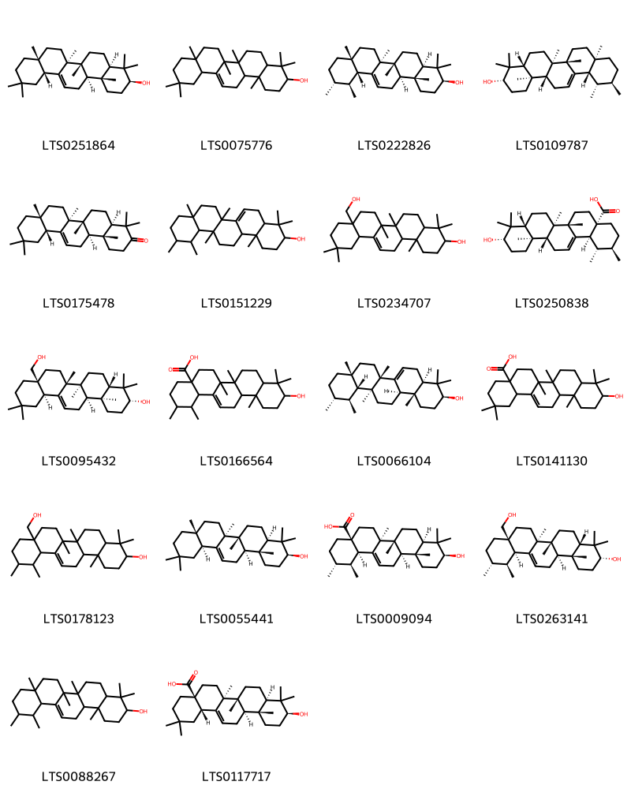{ width=100% }
    <figcaption>Hình ảnh cấu trúc hóa học của 18 hoạt chất thuộc nhóm Prenol lipids gồm ['β-amyrin (LTS0251864)', 'β-amyrin (LTS0075776)', 'amyrin (LTS0222826)', '(3s,4ar,6ar,6bs,8ar,11r,12s,12as,14ar,14br)-4,4,6a,6b,8a,11,12,14b-octamethyl-2,3,4a,5,6,7,8,9,10,11,12,12a,14,14a-tetradecahydro-1h-picen-3-ol (LTS0109787)', '(4ar,6ar,6bs,8ar,12ar,14ar,14br)-4,4,6a,6b,8a,11,11,14b-octamethyl-2,4a,5,6,7,8,9,10,12,12a,14,14a-dodecahydro-1h-picen-3-one (LTS0175478)', '4,4,6b,8a,11,12,12b,14b-octamethyl-2,3,4a,5,7,8,9,10,11,12,12a,13,14,14a-tetradecahydro-1h-picen-3-ol (LTS0151229)', '8a-(hydroxymethyl)-4,4,6a,6b,11,11,14b-heptamethyl-1,2,3,4a,5,6,7,8,9,10,12,12a,14,14a-tetradecahydropicen-3-ol (LTS0234707)', 'ursolic acid (LTS0250838)', '(3r,4as,6as,6br,8as,12ar,14ar,14bs)-8a-(hydroxymethyl)-4,4,6a,6b,11,11,14b-heptamethyl-1,2,3,4a,5,6,7,8,9,10,12,12a,14,14a-tetradecahydropicen-3-ol (LTS0095432)', '10-hydroxy-1,2,6a,6b,9,9,12a-heptamethyl-2,3,4,5,6,7,8,8a,10,11,12,12b,13,14b-tetradecahydro-1h-picene-4a-carboxylic acid (LTS0166564)', '(3s,4ar,6bs,8ar,11r,12s,12ar,12bs,14ar,14br)-4,4,6b,8a,11,12,12b,14b-octamethyl-2,3,4a,5,7,8,9,10,11,12,12a,13,14,14a-tetradecahydro-1h-picen-3-ol (LTS0066104)', 'oleanolic acid (LTS0141130)', '8a-(hydroxymethyl)-4,4,6a,6b,11,12,14b-heptamethyl-2,3,4a,5,6,7,8,9,10,11,12,12a,14,14a-tetradecahydro-1h-picen-3-ol (LTS0178123)', '(3s,4ar,6ar,6bs,8ar,12as,14ar,14br)-4,4,6a,6b,8a,11,11,14b-octamethyl-1,2,3,4a,5,6,7,8,9,10,12,12a,14,14a-tetradecahydropicen-3-ol (LTS0055441)', '(1s,2r,4as,6as,6br,8ar,10s,12ar,12br,14br)-10-hydroxy-1,2,6a,6b,9,9,12a-heptamethyl-2,3,4,5,6,7,8,8a,10,11,12,12b,13,14b-tetradecahydro-1h-picene-4a-carboxylic acid (LTS0009094)', '(3r,4as,6ar,6bs,8as,11r,12s,12ar,14ar,14br)-8a-(hydroxymethyl)-4,4,6a,6b,11,12,14b-heptamethyl-2,3,4a,5,6,7,8,9,10,11,12,12a,14,14a-tetradecahydro-1h-picen-3-ol (LTS0263141)', 'α-amyrin (LTS0088267)', 'oleanolic acid (LTS0117717)'].</figcaption>
</figure>
#### Nhóm Pyrans
<figure markdown="span">
    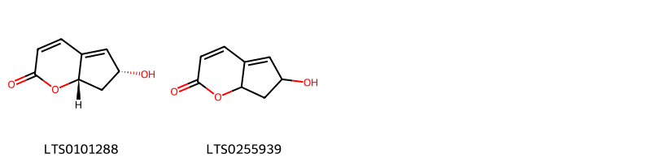{ width=100% }
    <figcaption>Hình ảnh cấu trúc hóa học của 2 hoạt chất thuộc nhóm Pyrans gồm ['(6r,7as)-6-hydroxy-6h,7h,7ah-cyclopenta[b]pyran-2-one (LTS0101288)', '6-hydroxy-6h,7h,7ah-cyclopenta[b]pyran-2-one (LTS0255939)'].</figcaption>
</figure>
#### Nhóm Steroids and steroid derivatives
<figure markdown="span">
    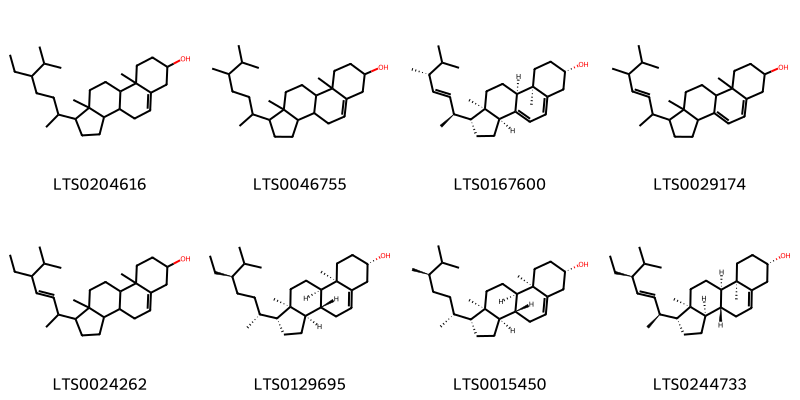{ width=100% }
    <figcaption>Hình ảnh cấu trúc hóa học của 8 hoạt chất thuộc nhóm Steroids and steroid derivatives gồm ['stigmast-5-en-3-ol, (3β)- (LTS0204616)', 'campesterol (LTS0046755)', '(1r,3as,7s,9ar,9br,11ar)-1-[(2s,3e,5r)-5,6-dimethylhept-3-en-2-yl]-9a,11a-dimethyl-1h,2h,3h,3ah,6h,7h,8h,9h,9bh,10h,11h-cyclopenta[a]phenanthren-7-ol (LTS0167600)', '1-(5,6-dimethylhept-3-en-2-yl)-9a,11a-dimethyl-1h,2h,3h,3ah,6h,7h,8h,9h,9bh,10h,11h-cyclopenta[a]phenanthren-7-ol (LTS0029174)', 'stigmasterol (LTS0024262)', '(1r,3ar,3br,7s,9ar,9br,11ar)-1-[(2r,5r)-5-ethyl-6-methylheptan-2-yl]-9a,11a-dimethyl-1h,2h,3h,3ah,3bh,4h,6h,7h,8h,9h,9bh,10h,11h-cyclopenta[a]phenanthren-7-ol (LTS0129695)', '(1r,3ar,3br,7s,9ar,9br,11ar)-1-[(2r,5r)-5,6-dimethylheptan-2-yl]-9a,11a-dimethyl-1h,2h,3h,3ah,3bh,4h,6h,7h,8h,9h,9bh,10h,11h-cyclopenta[a]phenanthren-7-ol (LTS0015450)', '(1r,3ar,3br,7s,9ar,9br,11ar)-1-[(2s,3e,5s)-5-ethyl-6-methylhept-3-en-2-yl]-9a,11a-dimethyl-1h,2h,3h,3ah,3bh,4h,6h,7h,8h,9h,9bh,10h,11h-cyclopenta[a]phenanthren-7-ol (LTS0244733)'].</figcaption>
</figure>

---

### Dược dân tộc học

Danh sách các quốc gia có sử dụng *Ilex aquifolium* trong điều trị các bệnh. 

| Country   | Disease                                                                        | Bệnh                                                                                                                                                                                                |
|:----------|:-------------------------------------------------------------------------------|:----------------------------------------------------------------------------------------------------------------------------------------------------------------------------------------------------|
| Elsewhere | Diuretic, Diuretic, Emetic, Emetic, Emollient, Emollient, Purgative, Purgative | MYMEMORY WARNING: YOU USED ALL AVAILABLE FREE TRANSLATIONS FOR TODAY. NEXT AVAILABLE IN  08 HOURS 13 MINUTES 02 SECONDS VISIT HTTPS://MYMEMORY.TRANSLATED.NET/DOC/USAGELIMITS.PHP TO TRANSLATE MORE |
| Europe    | Poison                                                                         | MYMEMORY WARNING: YOU USED ALL AVAILABLE FREE TRANSLATIONS FOR TODAY. NEXT AVAILABLE IN  08 HOURS 12 MINUTES 59 SECONDS VISIT HTTPS://MYMEMORY.TRANSLATED.NET/DOC/USAGELIMITS.PHP TO TRANSLATE MORE |
| Turkey    | Emollient, Poison, Purgative, Sudorific, Diuretic, Emetic, Tonic               | MYMEMORY WARNING: YOU USED ALL AVAILABLE FREE TRANSLATIONS FOR TODAY. NEXT AVAILABLE IN  08 HOURS 12 MINUTES 57 SECONDS VISIT HTTPS://MYMEMORY.TRANSLATED.NET/DOC/USAGELIMITS.PHP TO TRANSLATE MORE |
| ain       | Diuretic                                                                       | MYMEMORY WARNING: YOU USED ALL AVAILABLE FREE TRANSLATIONS FOR TODAY. NEXT AVAILABLE IN  08 HOURS 12 MINUTES 54 SECONDS VISIT HTTPS://MYMEMORY.TRANSLATED.NET/DOC/USAGELIMITS.PHP TO TRANSLATE MORE |

---

---
## Ilex arolla
### Thông tin về thực vật

!!! info "Phân loại thực vật của *N/A* từ GIBF:"
    - **Kingdom:** Plantae
    - **Phylum:** Tracheophyta
    - **Order:** Aquifoliales
    - **Family:** Aquifoliaceae
    - **Genus:** Ilex
    - **Species:** *N/A*

 

| Label (VI)   | Label (EN)   | Scientific Name   | Descriptions (VI)   | Descriptions (EN)   | Also Known As (VI)   | Also Known As (EN)                                                                                            |
|:-------------|:-------------|:------------------|:--------------------|:--------------------|:---------------------|:--------------------------------------------------------------------------------------------------------------|
| N/A          | N/A          | Ilex aquifolium   | loài thực vật       | species of plant    | ['']                 | ['Christmas holly', 'common holly', 'English holly', 'European holly', 'holly', 'Ilex perado subsp. iberica'] |

#### Phân bố trên thế giới

**Từ CSDL GIBF** Switzerland, Georgia, United Kingdom of Great Britain and Northern Ireland, Portugal, Luxembourg, South Africa, France, Spain, Australia, New Zealand, Germany, Canada, United States of America, Italy, Ireland, Norway, Netherlands, Chinese Taipei

#### Phân bố tại Việt Nam

**Từ CSDL GIBF**: Không có ghi nhận ở Việt Nam

---
### Thành phần hóa học
        
- Theo cơ sở dữ liệu lotus: Từ loài *N/A* đã phân lập và xác định được Chưa có hoạt chất nào được phân lập. hoạt chất thuộc về các nhóm Không có hoạt chất nào được phân lập. 

Không có hình ảnh nào được tạo ra

---

### Dược dân tộc học

Danh sách các quốc gia có sử dụng *N/A* trong điều trị các bệnh. 

| Country   | Disease                | Bệnh                                                                                                                                                                                                |
|:----------|:-----------------------|:----------------------------------------------------------------------------------------------------------------------------------------------------------------------------------------------------|
| China     | Alexiteric, Sialogogue | MYMEMORY WARNING: YOU USED ALL AVAILABLE FREE TRANSLATIONS FOR TODAY. NEXT AVAILABLE IN  08 HOURS 12 MINUTES 26 SECONDS VISIT HTTPS://MYMEMORY.TRANSLATED.NET/DOC/USAGELIMITS.PHP TO TRANSLATE MORE |

---

---
## Ilex conocarpa
### Thông tin về thực vật

!!! info "Phân loại thực vật của *Ilex conocarpa* từ GIBF:"
    - **Kingdom:** Plantae
    - **Phylum:** Tracheophyta
    - **Order:** Aquifoliales
    - **Family:** Aquifoliaceae
    - **Genus:** Ilex
    - **Species:** *Ilex conocarpa*

 

| Label (VI)   | Label (EN)   | Scientific Name   | Descriptions (VI)   | Descriptions (EN)   | Also Known As (VI)   | Also Known As (EN)   |
|:-------------|:-------------|:------------------|:--------------------|:--------------------|:---------------------|:---------------------|
| N/A          | N/A          | Ilex conocarpa    | loài thực vật       | species of plant    | ['']                 | ['']                 |

#### Phân bố trên thế giới

**Từ CSDL GIBF** Brazil

#### Phân bố tại Việt Nam

**Từ CSDL GIBF**: Không có ghi nhận ở Việt Nam

---
### Thành phần hóa học
        
- Theo cơ sở dữ liệu lotus: Từ loài *Ilex conocarpa* đã phân lập và xác định được 2 hoạt chất thuộc về các nhóm Flavonoids. 

|    | chemicalTaxonomyClassyfireClass   |   smiles_count |
|---:|:----------------------------------|---------------:|
|  0 | Flavonoids                        |              2 |

#### Nhóm Flavonoids
<figure markdown="span">
    { width=100% }
    <figcaption>Hình ảnh cấu trúc hóa học của 2 hoạt chất thuộc nhóm Flavonoids gồm ['kaempherol (LTS0155822)', 'quercetin (LTS0004651)'].</figcaption>
</figure>

---

### Dược dân tộc học

Danh sách các quốc gia có sử dụng *Ilex conocarpa* trong điều trị các bệnh. 

| Country   | Disease                    | Bệnh                                                                                                                                                                                                |
|:----------|:---------------------------|:----------------------------------------------------------------------------------------------------------------------------------------------------------------------------------------------------|
| Elsewhere | Diuretic, Stomachic, Tonic | MYMEMORY WARNING: YOU USED ALL AVAILABLE FREE TRANSLATIONS FOR TODAY. NEXT AVAILABLE IN  08 HOURS 12 MINUTES 04 SECONDS VISIT HTTPS://MYMEMORY.TRANSLATED.NET/DOC/USAGELIMITS.PHP TO TRANSLATE MORE |

---

---
## Ilex cornuta
### Thông tin về thực vật

!!! info "Phân loại thực vật của *Ilex cornuta* từ GIBF:"
    - **Kingdom:** Plantae
    - **Phylum:** Tracheophyta
    - **Order:** Aquifoliales
    - **Family:** Aquifoliaceae
    - **Genus:** Ilex
    - **Species:** *Ilex cornuta*

 

| Label (VI)   | Label (EN)   | Scientific Name   | Descriptions (VI)   | Descriptions (EN)   | Also Known As (VI)   | Also Known As (EN)                |
|:-------------|:-------------|:------------------|:--------------------|:--------------------|:---------------------|:----------------------------------|
| N/A          | N/A          | Ilex cornuta      |                     | species of plant    | ['']                 | ['Chinese holly', 'horned holly'] |

#### Phân bố trên thế giới

**Từ CSDL GIBF** nan, United States of America, China, Korea, Republic of, Chinese Taipei

#### Phân bố tại Việt Nam

**Từ CSDL GIBF**: Không có ghi nhận ở Việt Nam

---
### Thành phần hóa học
        
- Theo cơ sở dữ liệu lotus: Từ loài *Ilex cornuta* đã phân lập và xác định được 15 hoạt chất thuộc về các nhóm Organooxygen compounds, Purine nucleosides, Prenol lipids. 

|    | chemicalTaxonomyClassyfireClass   |   smiles_count |
|---:|:----------------------------------|---------------:|
|  0 | Organooxygen compounds            |              2 |
|  1 | Prenol lipids                     |             12 |
|  2 | Purine nucleosides                |              1 |

#### Nhóm Organooxygen compounds
<figure markdown="span">
    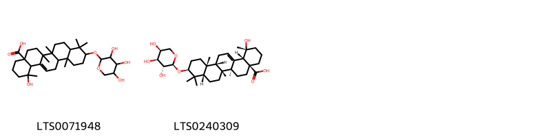{ width=100% }
    <figcaption>Hình ảnh cấu trúc hóa học của 2 hoạt chất thuộc nhóm Organooxygen compounds gồm ['1-hydroxy-1,6a,6b,9,9,12a-hexamethyl-10-[(3,4,5-trihydroxyoxan-2-yl)oxy]-2,3,4,5,6,7,8,8a,10,11,12,12b,13,14b-tetradecahydropicene-4a-carboxylic acid (LTS0071948)', '(1r,4as,6as,6br,8as,10s,12ar,12bs,14bs)-1-hydroxy-1,6a,6b,9,9,12a-hexamethyl-10-{[(2s,3r,4s,5s)-3,4,5-trihydroxyoxan-2-yl]oxy}-2,3,4,5,6,7,8,8a,10,11,12,12b,13,14b-tetradecahydropicene-4a-carboxylic acid (LTS0240309)'].</figcaption>
</figure>
#### Nhóm Prenol lipids
<figure markdown="span">
    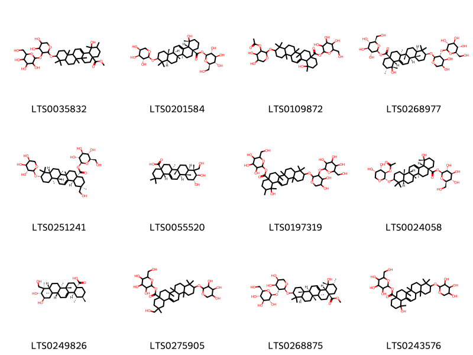{ width=100% }
    <figcaption>Hình ảnh cấu trúc hóa học của 12 hoạt chất thuộc nhóm Prenol lipids gồm ['methyl 10-[(4,5-dihydroxy-3-{[3,4,5-trihydroxy-6-(hydroxymethyl)oxan-2-yl]oxy}oxan-2-yl)oxy]-1-hydroxy-1,2,6a,6b,9,9,12a-heptamethyl-2,3,4,5,6,7,8,8a,10,11,12,12b,13,14b-tetradecahydropicene-4a-carboxylate (LTS0035832)', '(2s,3r,4s,5s,6r)-3,4,5-trihydroxy-6-(hydroxymethyl)oxan-2-yl (1r,4as,6as,6br,8ar,10s,12ar,12br,14bs)-1-hydroxy-1,6a,6b,9,9,12a-hexamethyl-10-{[(2s,3r,4s,5s)-3,4,5-trihydroxyoxan-2-yl]oxy}-2,3,4,5,6,7,8,8a,10,11,12,12b,13,14b-tetradecahydropicene-4a-carboxylate (LTS0201584)', '3,4,5-trihydroxy-6-(hydroxymethyl)oxan-2-yl 10-{[3-(acetyloxy)-4,5-dihydroxyoxan-2-yl]oxy}-1-hydroxy-1,6a,6b,9,9,12a-hexamethyl-2,3,4,5,6,7,8,8a,10,11,12,12b,13,14b-tetradecahydropicene-4a-carboxylate (LTS0109872)', '(2s,3r,4s,5s,6r)-3,4,5-trihydroxy-6-(hydroxymethyl)oxan-2-yl (1r,2r,4as,6as,6br,8ar,10s,12ar,12br,14bs)-10-{[(2s,3r,4s,5s)-4,5-dihydroxy-3-{[(2s,3r,4s,5s,6r)-3,4,5-trihydroxy-6-(hydroxymethyl)oxan-2-yl]oxy}oxan-2-yl]oxy}-1-hydroxy-1,2,6a,6b,9,9,12a-heptamethyl-2,3,4,5,6,7,8,8a,10,11,12,12b,13,14b-tetradecahydropicene-4a-carboxylate (LTS0268977)', '(2s,3r,4s,5s,6r)-3,4,5-trihydroxy-6-(hydroxymethyl)oxan-2-yl (2r,4ar,6as,6br,8ar,10s,12ar,12br,14bs)-2-(hydroxymethyl)-2,6a,6b,9,9,12a-hexamethyl-10-{[(2s,3r,4s,5s)-3,4,5-trihydroxyoxan-2-yl]oxy}-1,3,4,5,6,7,8,8a,10,11,12,12b,13,14b-tetradecahydropicene-4a-carboxylate (LTS0251241)', 'arjunolic acid (LTS0055520)', '3,4,5-trihydroxy-6-(hydroxymethyl)oxan-2-yl 10-[(4,5-dihydroxy-3-{[3,4,5-trihydroxy-6-(hydroxymethyl)oxan-2-yl]oxy}oxan-2-yl)oxy]-1-hydroxy-1,2,6a,6b,9,9,12a-heptamethyl-2,3,4,5,6,7,8,8a,10,11,12,12b,13,14b-tetradecahydropicene-4a-carboxylate (LTS0197319)', '(2s,3r,4s,5s,6r)-3,4,5-trihydroxy-6-(hydroxymethyl)oxan-2-yl (1r,4as,6as,6br,8as,10s,12ar,12bs,14bs)-10-{[(2s,3r,4s,5s)-3-(acetyloxy)-4,5-dihydroxyoxan-2-yl]oxy}-1-hydroxy-1,6a,6b,9,9,12a-hexamethyl-2,3,4,5,6,7,8,8a,10,11,12,12b,13,14b-tetradecahydropicene-4a-carboxylate (LTS0024058)', 'asiatic acid (LTS0249826)', '3,4,5-trihydroxy-6-(hydroxymethyl)oxan-2-yl 2-(hydroxymethyl)-2,6a,6b,9,9,12a-hexamethyl-10-[(3,4,5-trihydroxyoxan-2-yl)oxy]-1,3,4,5,6,7,8,8a,10,11,12,12b,13,14b-tetradecahydropicene-4a-carboxylate (LTS0275905)', 'methyl (1r,2r,4as,6as,6br,8ar,10s,12ar,12br,14bs)-10-{[(2s,3r,4s,5s)-4,5-dihydroxy-3-{[(2s,3r,4s,5s,6r)-3,4,5-trihydroxy-6-(hydroxymethyl)oxan-2-yl]oxy}oxan-2-yl]oxy}-1-hydroxy-1,2,6a,6b,9,9,12a-heptamethyl-2,3,4,5,6,7,8,8a,10,11,12,12b,13,14b-tetradecahydropicene-4a-carboxylate (LTS0268875)', '3,4,5-trihydroxy-6-(hydroxymethyl)oxan-2-yl 1-hydroxy-1,6a,6b,9,9,12a-hexamethyl-10-[(3,4,5-trihydroxyoxan-2-yl)oxy]-2,3,4,5,6,7,8,8a,10,11,12,12b,13,14b-tetradecahydropicene-4a-carboxylate (LTS0243576)'].</figcaption>
</figure>
#### Nhóm Purine nucleosides
<figure markdown="span">
    { width=100% }
    <figcaption>Hình ảnh cấu trúc hóa học của 1 hoạt chất thuộc nhóm Purine nucleosides gồm ['adenosine (LTS0014061)'].</figcaption>
</figure>

---

### Dược dân tộc học

Danh sách các quốc gia có sử dụng *Ilex cornuta* trong điều trị các bệnh. 

| Country   | Disease                                                       | Bệnh                                                                                                                                                                                                |
|:----------|:--------------------------------------------------------------|:----------------------------------------------------------------------------------------------------------------------------------------------------------------------------------------------------|
| China     | Abortifacient, Carminative, Contraceptive, Tonic, Refrigerant | MYMEMORY WARNING: YOU USED ALL AVAILABLE FREE TRANSLATIONS FOR TODAY. NEXT AVAILABLE IN  08 HOURS 11 MINUTES 41 SECONDS VISIT HTTPS://MYMEMORY.TRANSLATED.NET/DOC/USAGELIMITS.PHP TO TRANSLATE MORE |

---

---
## Ilex godajam
### Thông tin về thực vật

!!! info "Phân loại thực vật của *Ilex godajam* từ GIBF:"
    - **Kingdom:** Plantae
    - **Phylum:** Tracheophyta
    - **Order:** Aquifoliales
    - **Family:** Aquifoliaceae
    - **Genus:** Ilex
    - **Species:** *Ilex godajam*

 

| Label (VI)   | Label (EN)   | Scientific Name   | Descriptions (VI)   | Descriptions (EN)   | Also Known As (VI)   | Also Known As (EN)   |
|:-------------|:-------------|:------------------|:--------------------|:--------------------|:---------------------|:---------------------|
| N/A          | N/A          | Ilex godajam      | loài thực vật       | species of plant    | ['']                 | ['']                 |

#### Phân bố trên thế giới

**Từ CSDL GIBF** nan, Thailand, Japan, Bhutan, India, Lao People’s Democratic Republic, Bangladesh, China, Nepal, Chinese Taipei

#### Phân bố tại Việt Nam

**Từ CSDL GIBF**: Không có ghi nhận ở Việt Nam

---
### Thành phần hóa học
        
- Theo cơ sở dữ liệu lotus: Từ loài *Ilex godajam* đã phân lập và xác định được 2 hoạt chất thuộc về các nhóm Prenol lipids. 

|    | chemicalTaxonomyClassyfireClass   |   smiles_count |
|---:|:----------------------------------|---------------:|
|  0 | Prenol lipids                     |              2 |

#### Nhóm Prenol lipids
<figure markdown="span">
    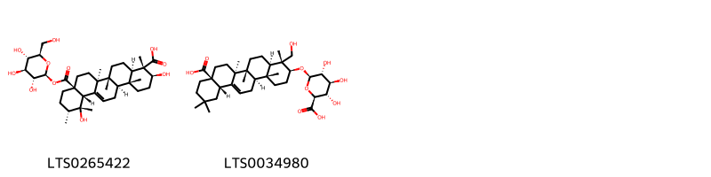{ width=100% }
    <figcaption>Hình ảnh cấu trúc hóa học của 2 hoạt chất thuộc nhóm Prenol lipids gồm ['(3s,4s,4ar,6ar,6bs,8as,11r,12r,12as,14ar,14br)-3,12-dihydroxy-4,6a,6b,11,12,14b-hexamethyl-8a-({[(2s,3r,4s,5s,6r)-3,4,5-trihydroxy-6-(hydroxymethyl)oxan-2-yl]oxy}carbonyl)-1,2,3,4a,5,6,7,8,9,10,11,12a,14,14a-tetradecahydropicene-4-carboxylic acid (LTS0265422)', '(2s,3s,4s,5r,6r)-6-{[(3s,4r,4ar,6ar,6bs,8as,12as,14ar,14br)-8a-carboxy-4-(hydroxymethyl)-4,6a,6b,11,11,14b-hexamethyl-1,2,3,4a,5,6,7,8,9,10,12,12a,14,14a-tetradecahydropicen-3-yl]oxy}-3,4,5-trihydroxyoxane-2-carboxylic acid (LTS0034980)'].</figcaption>
</figure>

---

### Dược dân tộc học

Danh sách các quốc gia có sử dụng *Ilex godajam* trong điều trị các bệnh. 

| Country   | Disease   | Bệnh                                                                                                                                                                                                |
|:----------|:----------|:----------------------------------------------------------------------------------------------------------------------------------------------------------------------------------------------------|
| Elsewhere | Diuretic  | MYMEMORY WARNING: YOU USED ALL AVAILABLE FREE TRANSLATIONS FOR TODAY. NEXT AVAILABLE IN  08 HOURS 11 MINUTES 18 SECONDS VISIT HTTPS://MYMEMORY.TRANSLATED.NET/DOC/USAGELIMITS.PHP TO TRANSLATE MORE |
| Indochina | Diuretic  | MYMEMORY WARNING: YOU USED ALL AVAILABLE FREE TRANSLATIONS FOR TODAY. NEXT AVAILABLE IN  08 HOURS 11 MINUTES 16 SECONDS VISIT HTTPS://MYMEMORY.TRANSLATED.NET/DOC/USAGELIMITS.PHP TO TRANSLATE MORE |

---

---
## Ilex guayusa
### Thông tin về thực vật

!!! info "Phân loại thực vật của *Ilex guayusa* từ GIBF:"
    - **Kingdom:** Plantae
    - **Phylum:** Tracheophyta
    - **Order:** Aquifoliales
    - **Family:** Aquifoliaceae
    - **Genus:** Ilex
    - **Species:** *Ilex guayusa*

 

| Label (VI)   | Label (EN)   | Scientific Name   | Descriptions (VI)   | Descriptions (EN)   | Also Known As (VI)   | Also Known As (EN)   |
|:-------------|:-------------|:------------------|:--------------------|:--------------------|:---------------------|:---------------------|
| N/A          | N/A          | Ilex guayusa      | loài thực vật       | species of plant    | ['']                 | ['']                 |

#### Phân bố trên thế giới

**Từ CSDL GIBF** nan, Colombia, unknown or invalid, Venezuela (Bolivarian Republic of), Peru, Bolivia (Plurinational State of), Cameroon, Ecuador

#### Phân bố tại Việt Nam

**Từ CSDL GIBF**: Không có ghi nhận ở Việt Nam

---
### Thành phần hóa học
        
- Theo cơ sở dữ liệu lotus: Từ loài *Ilex guayusa* đã phân lập và xác định được 2 hoạt chất thuộc về các nhóm Imidazopyrimidines. 

|    | chemicalTaxonomyClassyfireClass   |   smiles_count |
|---:|:----------------------------------|---------------:|
|  0 | Imidazopyrimidines                |              2 |

#### Nhóm Imidazopyrimidines
<figure markdown="span">
    { width=100% }
    <figcaption>Hình ảnh cấu trúc hóa học của 2 hoạt chất thuộc nhóm Imidazopyrimidines gồm ['caffeine (LTS0075508)', 'thesal (LTS0250246)'].</figcaption>
</figure>

---

### Dược dân tộc học

Danh sách các quốc gia có sử dụng *Ilex guayusa* trong điều trị các bệnh. 

| Country         | Disease                                            | Bệnh                                                                                                                                                                                                |
|:----------------|:---------------------------------------------------|:----------------------------------------------------------------------------------------------------------------------------------------------------------------------------------------------------|
| Ecuador         | Digestive, Expectorant                             | MYMEMORY WARNING: YOU USED ALL AVAILABLE FREE TRANSLATIONS FOR TODAY. NEXT AVAILABLE IN  08 HOURS 10 MINUTES 56 SECONDS VISIT HTTPS://MYMEMORY.TRANSLATED.NET/DOC/USAGELIMITS.PHP TO TRANSLATE MORE |
| Ecuador(Jivaro) | Diaphoretic, Diuretic, Emetic, Stimulant, Narcotic | MYMEMORY WARNING: YOU USED ALL AVAILABLE FREE TRANSLATIONS FOR TODAY. NEXT AVAILABLE IN  08 HOURS 10 MINUTES 54 SECONDS VISIT HTTPS://MYMEMORY.TRANSLATED.NET/DOC/USAGELIMITS.PHP TO TRANSLATE MORE |

---

---
## Ilex macfadyenii
### Thông tin về thực vật

!!! info "Phân loại thực vật của *Ilex macfadyenii* từ GIBF:"
    - **Kingdom:** Plantae
    - **Phylum:** Tracheophyta
    - **Order:** Aquifoliales
    - **Family:** Aquifoliaceae
    - **Genus:** Ilex
    - **Species:** *Ilex macfadyenii*

 

| Label (VI)   | Label (EN)   | Scientific Name   | Descriptions (VI)   | Descriptions (EN)   | Also Known As (VI)   | Also Known As (EN)   |
|:-------------|:-------------|:------------------|:--------------------|:--------------------|:---------------------|:---------------------|
| N/A          | N/A          | Ilex macfadyenii  | loài thực vật       | species of plant    | ['']                 | ['']                 |

#### Phân bố trên thế giới

**Từ CSDL GIBF** Haiti, nan, unknown or invalid, Dominican Republic, France, Guadeloupe, Puerto Rico, Dominica, Cuba, United States of America, Mexico, Jamaica

#### Phân bố tại Việt Nam

**Từ CSDL GIBF**: Không có ghi nhận ở Việt Nam

---
### Thành phần hóa học
        
- Theo cơ sở dữ liệu lotus: Từ loài *Ilex macfadyenii* đã phân lập và xác định được 2 hoạt chất thuộc về các nhóm Flavonoids. 

|    | chemicalTaxonomyClassyfireClass   |   smiles_count |
|---:|:----------------------------------|---------------:|
|  0 | Flavonoids                        |              2 |

#### Nhóm Flavonoids
<figure markdown="span">
    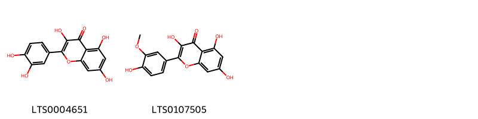{ width=100% }
    <figcaption>Hình ảnh cấu trúc hóa học của 2 hoạt chất thuộc nhóm Flavonoids gồm ['quercetin (LTS0004651)', 'isorhamnetin (LTS0107505)'].</figcaption>
</figure>

---

### Dược dân tộc học

Danh sách các quốc gia có sử dụng *Ilex macfadyenii* trong điều trị các bệnh. 

| Country   | Disease                          | Bệnh                                                                                                                                                                                                |
|:----------|:---------------------------------|:----------------------------------------------------------------------------------------------------------------------------------------------------------------------------------------------------|
| Haiti     | Diuretic, Emollient, Expectorant | MYMEMORY WARNING: YOU USED ALL AVAILABLE FREE TRANSLATIONS FOR TODAY. NEXT AVAILABLE IN  08 HOURS 10 MINUTES 31 SECONDS VISIT HTTPS://MYMEMORY.TRANSLATED.NET/DOC/USAGELIMITS.PHP TO TRANSLATE MORE |

---

---
## Ilex medica
### Thông tin về thực vật

!!! info "Phân loại thực vật của *Ilex medica* từ GIBF:"
    - **Kingdom:** Plantae
    - **Phylum:** Tracheophyta
    - **Order:** Aquifoliales
    - **Family:** Aquifoliaceae
    - **Genus:** Ilex
    - **Species:** *Ilex medica*

 

| Label (VI)   | Label (EN)   | Scientific Name   | Descriptions (VI)   | Descriptions (EN)   | Also Known As (VI)   | Also Known As (EN)   |
|:-------------|:-------------|:------------------|:--------------------|:--------------------|:---------------------|:---------------------|
| N/A          | N/A          | Ilex medica       |                     |                     | ['']                 | ['']                 |

#### Phân bố trên thế giới

**Từ CSDL GIBF** Brazil

#### Phân bố tại Việt Nam

**Từ CSDL GIBF**: Không có ghi nhận ở Việt Nam

---
### Thành phần hóa học
        
- Theo cơ sở dữ liệu lotus: Từ loài *Ilex medica* đã phân lập và xác định được Chưa có hoạt chất nào được phân lập. hoạt chất thuộc về các nhóm Không có hoạt chất nào được phân lập. 

Không có hình ảnh nào được tạo ra

---

### Dược dân tộc học

Danh sách các quốc gia có sử dụng *Ilex medica* trong điều trị các bệnh. 

| Country   | Disease             | Bệnh                                                                                                                                                                                                |
|:----------|:--------------------|:----------------------------------------------------------------------------------------------------------------------------------------------------------------------------------------------------|
| Brazil    | Diuretic, Stomachic | MYMEMORY WARNING: YOU USED ALL AVAILABLE FREE TRANSLATIONS FOR TODAY. NEXT AVAILABLE IN  08 HOURS 10 MINUTES 07 SECONDS VISIT HTTPS://MYMEMORY.TRANSLATED.NET/DOC/USAGELIMITS.PHP TO TRANSLATE MORE |

---

---
## Ilex montana
### Thông tin về thực vật

!!! info "Phân loại thực vật của *Ilex montana* từ GIBF:"
    - **Kingdom:** Plantae
    - **Phylum:** Tracheophyta
    - **Order:** Aquifoliales
    - **Family:** Aquifoliaceae
    - **Genus:** Ilex
    - **Species:** *Ilex montana*

 

| Label (VI)   | Label (EN)   | Scientific Name   | Descriptions (VI)   | Descriptions (EN)   | Also Known As (VI)   | Also Known As (EN)   |
|:-------------|:-------------|:------------------|:--------------------|:--------------------|:---------------------|:---------------------|
| N/A          | N/A          | Ilex montana      | loài thực vật       | species of plant    | ['']                 | ['']                 |

#### Phân bố trên thế giới

**Từ CSDL GIBF** United States of America

#### Phân bố tại Việt Nam

**Từ CSDL GIBF**: Không có ghi nhận ở Việt Nam

---
### Thành phần hóa học
        
- Theo cơ sở dữ liệu lotus: Từ loài *Ilex montana* đã phân lập và xác định được 2 hoạt chất thuộc về các nhóm Flavonoids. 

|    | chemicalTaxonomyClassyfireClass   |   smiles_count |
|---:|:----------------------------------|---------------:|
|  0 | Flavonoids                        |              2 |

#### Nhóm Flavonoids
<figure markdown="span">
    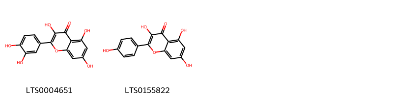{ width=100% }
    <figcaption>Hình ảnh cấu trúc hóa học của 2 hoạt chất thuộc nhóm Flavonoids gồm ['quercetin (LTS0004651)', 'kaempherol (LTS0155822)'].</figcaption>
</figure>

---

### Dược dân tộc học

Danh sách các quốc gia có sử dụng *Ilex montana* trong điều trị các bệnh. 

| Country   | Disease   | Bệnh                                                                                                                                                                                                |
|:----------|:----------|:----------------------------------------------------------------------------------------------------------------------------------------------------------------------------------------------------|
| Haiti     | Emollient | MYMEMORY WARNING: YOU USED ALL AVAILABLE FREE TRANSLATIONS FOR TODAY. NEXT AVAILABLE IN  08 HOURS 09 MINUTES 51 SECONDS VISIT HTTPS://MYMEMORY.TRANSLATED.NET/DOC/USAGELIMITS.PHP TO TRANSLATE MORE |

---

---
## Ilex opaca
### Thông tin về thực vật

!!! info "Phân loại thực vật của *Ilex opaca* từ GIBF:"
    - **Kingdom:** Plantae
    - **Phylum:** Tracheophyta
    - **Order:** Aquifoliales
    - **Family:** Aquifoliaceae
    - **Genus:** Ilex
    - **Species:** *Ilex opaca*

 

| Label (VI)   | Label (EN)   | Scientific Name   | Descriptions (VI)   | Descriptions (EN)   | Also Known As (VI)   | Also Known As (EN)   |
|:-------------|:-------------|:------------------|:--------------------|:--------------------|:---------------------|:---------------------|
| N/A          | N/A          | Ilex opaca        | loài thực vật       | species of plant    | ['']                 | ['American holly']   |

#### Phân bố trên thế giới

**Từ CSDL GIBF** United States of America

#### Phân bố tại Việt Nam

**Từ CSDL GIBF**: Không có ghi nhận ở Việt Nam

---
### Thành phần hóa học
        
- Theo cơ sở dữ liệu lotus: Từ loài *Ilex opaca* đã phân lập và xác định được Chưa có hoạt chất nào được phân lập. hoạt chất thuộc về các nhóm Không có hoạt chất nào được phân lập. 

Không có hình ảnh nào được tạo ra

---

### Dược dân tộc học

Danh sách các quốc gia có sử dụng *Ilex opaca* trong điều trị các bệnh. 

| Country   | Disease                     | Bệnh                                                                                                                                                                                                |
|:----------|:----------------------------|:----------------------------------------------------------------------------------------------------------------------------------------------------------------------------------------------------|
| US        | Laxative, Poison, Vermifuge | MYMEMORY WARNING: YOU USED ALL AVAILABLE FREE TRANSLATIONS FOR TODAY. NEXT AVAILABLE IN  08 HOURS 09 MINUTES 25 SECONDS VISIT HTTPS://MYMEMORY.TRANSLATED.NET/DOC/USAGELIMITS.PHP TO TRANSLATE MORE |

---

---
## Ilex paraguariensis
### Thông tin về thực vật

!!! info "Phân loại thực vật của *Ilex paraguariensis* từ GIBF:"
    - **Kingdom:** Plantae
    - **Phylum:** Tracheophyta
    - **Order:** Aquifoliales
    - **Family:** Aquifoliaceae
    - **Genus:** Ilex
    - **Species:** *Ilex paraguariensis*

 

| Label (VI)   | Label (EN)   | Scientific Name     | Descriptions (VI)   | Descriptions (EN)   | Also Known As (VI)   | Also Known As (EN)                                             |
|:-------------|:-------------|:--------------------|:--------------------|:--------------------|:---------------------|:---------------------------------------------------------------|
| N/A          | N/A          | Ilex paraguariensis |                     | species of plant    | ['']                 | ['holly', 'Ilex paraguariensis', 'yerba maté', 'Paraguay tea'] |

#### Phân bố trên thế giới

**Từ CSDL GIBF** Uruguay, Argentina, Brazil, Paraguay, United States of America

#### Phân bố tại Việt Nam

**Từ CSDL GIBF**: Không có ghi nhận ở Việt Nam

---
### Thành phần hóa học
        
- Theo cơ sở dữ liệu lotus: Từ loài *Ilex paraguariensis* đã phân lập và xác định được 89 hoạt chất thuộc về các nhóm Organooxygen compounds, Flavonoids, Indoles and derivatives, Azoles, Prenol lipids, Carboxylic acids and derivatives, Fatty Acyls, Phenols, Benzodioxoles, Lactams, Imidazopyrimidines, Cinnamic acids and derivatives. 

|    | chemicalTaxonomyClassyfireClass   |   smiles_count |
|---:|:----------------------------------|---------------:|
|  0 |                                   |              1 |
|  1 | Azoles                            |              1 |
|  2 | Benzodioxoles                     |              1 |
|  3 | Carboxylic acids and derivatives  |              2 |
|  4 | Cinnamic acids and derivatives    |              2 |
|  5 | Fatty Acyls                       |              4 |
|  6 | Flavonoids                        |              6 |
|  7 | Imidazopyrimidines                |              3 |
|  8 | Indoles and derivatives           |              1 |
|  9 | Lactams                           |              1 |
| 10 | Organooxygen compounds            |             14 |
| 11 | Phenols                           |              1 |
| 12 | Prenol lipids                     |             52 |

#### Nhóm 
<figure markdown="span">
    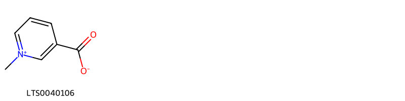{ width=100% }
    <figcaption>Hình ảnh cấu trúc hóa học của 1 hoạt chất thuộc nhóm  gồm ['trigonelline (LTS0040106)'].</figcaption>
</figure>
#### Nhóm Azoles
<figure markdown="span">
    { width=100% }
    <figcaption>Hình ảnh cấu trúc hóa học của 1 hoạt chất thuộc nhóm Azoles gồm ['allantoin (LTS0106609)'].</figcaption>
</figure>
#### Nhóm Benzodioxoles
<figure markdown="span">
    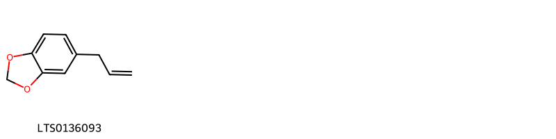{ width=100% }
    <figcaption>Hình ảnh cấu trúc hóa học của 1 hoạt chất thuộc nhóm Benzodioxoles gồm ['sassafras (LTS0136093)'].</figcaption>
</figure>
#### Nhóm Carboxylic acids and derivatives
<figure markdown="span">
    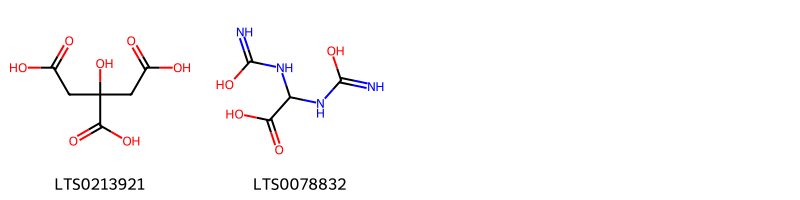{ width=100% }
    <figcaption>Hình ảnh cấu trúc hóa học của 2 hoạt chất thuộc nhóm Carboxylic acids and derivatives gồm ['citric acid (LTS0213921)', 'allantoic acid (LTS0078832)'].</figcaption>
</figure>
#### Nhóm Cinnamic acids and derivatives
<figure markdown="span">
    { width=100% }
    <figcaption>Hình ảnh cấu trúc hóa học của 2 hoạt chất thuộc nhóm Cinnamic acids and derivatives gồm ['3,4-dihydroxycinnamic acid (LTS0128050)', 'caffeic acid (LTS0027481)'].</figcaption>
</figure>
#### Nhóm Fatty Acyls
<figure markdown="span">
    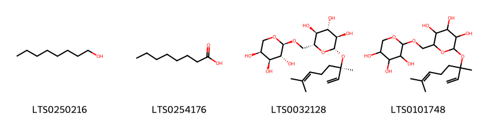{ width=100% }
    <figcaption>Hình ảnh cấu trúc hóa học của 4 hoạt chất thuộc nhóm Fatty Acyls gồm ['octanol (LTS0250216)', 'caprylic acid (LTS0254176)', '(2s,3r,4s,5s,6r)-2-{[(3r)-3,7-dimethylocta-1,6-dien-3-yl]oxy}-6-({[(2s,3r,4s,5s)-3,4,5-trihydroxyoxan-2-yl]oxy}methyl)oxane-3,4,5-triol (LTS0032128)', '2-[(3,7-dimethylocta-1,6-dien-3-yl)oxy]-6-{[(3,4,5-trihydroxyoxan-2-yl)oxy]methyl}oxane-3,4,5-triol (LTS0101748)'].</figcaption>
</figure>
#### Nhóm Flavonoids
<figure markdown="span">
    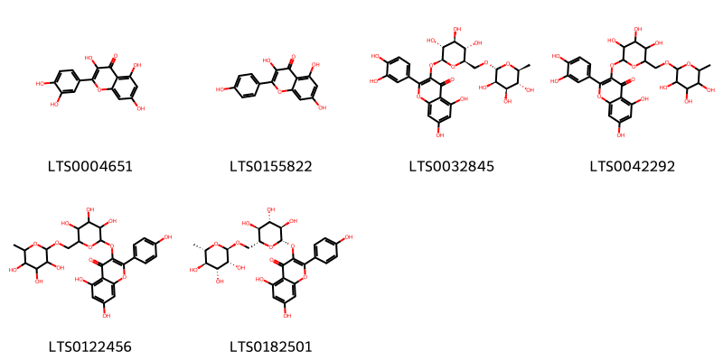{ width=100% }
    <figcaption>Hình ảnh cấu trúc hóa học của 6 hoạt chất thuộc nhóm Flavonoids gồm ['quercetin (LTS0004651)', 'kaempherol (LTS0155822)', '3-rutinosyl quercetin (LTS0032845)', 'rutin (LTS0042292)', '5,7-dihydroxy-2-(4-hydroxyphenyl)-3-[(3,4,5-trihydroxy-6-{[(3,4,5-trihydroxy-6-methyloxan-2-yl)oxy]methyl}oxan-2-yl)oxy]chromen-4-one (LTS0122456)', 'nictoflorin (LTS0182501)'].</figcaption>
</figure>
#### Nhóm Imidazopyrimidines
<figure markdown="span">
    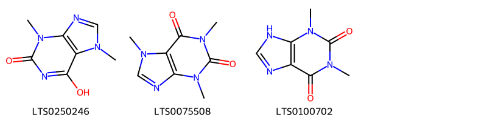{ width=100% }
    <figcaption>Hình ảnh cấu trúc hóa học của 3 hoạt chất thuộc nhóm Imidazopyrimidines gồm ['thesal (LTS0250246)', 'caffeine (LTS0075508)', 'constant-t (LTS0100702)'].</figcaption>
</figure>
#### Nhóm Indoles and derivatives
<figure markdown="span">
    { width=100% }
    <figcaption>Hình ảnh cấu trúc hóa học của 1 hoạt chất thuộc nhóm Indoles and derivatives gồm ['indole (LTS0185357)'].</figcaption>
</figure>
#### Nhóm Lactams
<figure markdown="span">
    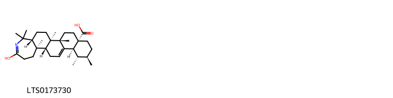{ width=100% }
    <figcaption>Hình ảnh cấu trúc hóa học của 1 hoạt chất thuộc nhóm Lactams gồm ['(5ar,7ar,7bs,9as,12r,13s,13as,15ar,15br)-3-hydroxy-5,5,7a,7b,12,13,15b-heptamethyl-1h,2h,5ah,6h,7h,8h,9h,10h,11h,12h,13h,13ah,15h,15ah-chryseno[2,1-c]azepine-9a-carboxylic acid (LTS0173730)'].</figcaption>
</figure>
#### Nhóm Organooxygen compounds
<figure markdown="span">
    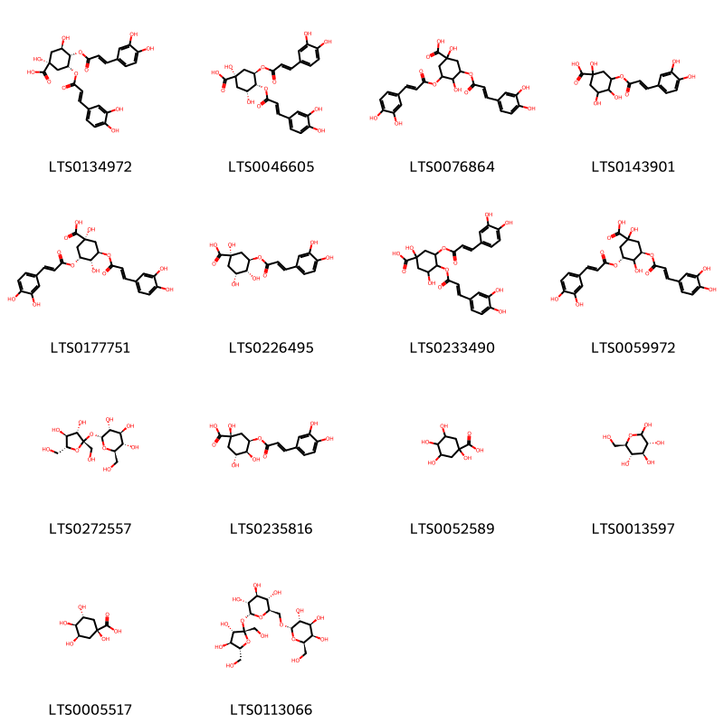{ width=100% }
    <figcaption>Hình ảnh cấu trúc hóa học của 14 hoạt chất thuộc nhóm Organooxygen compounds gồm ['3,4-dicaffeoylquinic acid (LTS0134972)', '4,5-dicaffeoylquinic acid (LTS0046605)', '3,5-bis({[3-(3,4-dihydroxyphenyl)prop-2-enoyl]oxy})-1,4-dihydroxycyclohexane-1-carboxylic acid (LTS0076864)', '3-{[3-(3,4-dihydroxyphenyl)prop-2-enoyl]oxy}-1,4,5-trihydroxycyclohexane-1-carboxylic acid (LTS0143901)', '3,5-dicaffeoylquinic acid (LTS0177751)', 'chlorogenic acid (LTS0226495)', '3,4-bis({[3-(3,4-dihydroxyphenyl)prop-2-enoyl]oxy})-1,5-dihydroxycyclohexane-1-carboxylic acid (LTS0233490)', '(3r,5r)-3,5-bis({[(2e)-3-(3,4-dihydroxyphenyl)prop-2-enoyl]oxy})-1,4-dihydroxycyclohexane-1-carboxylic acid (LTS0059972)', 'sucrose (LTS0272557)', 'neochlorogenic acid (LTS0235816)', 'quinic acid (LTS0052589)', 'glucose (LTS0013597)', '(-)-quinic acid (LTS0005517)', 'raffinose (LTS0113066)'].</figcaption>
</figure>
#### Nhóm Phenols
<figure markdown="span">
    { width=100% }
    <figcaption>Hình ảnh cấu trúc hóa học của 1 hoạt chất thuộc nhóm Phenols gồm ['eugenol (LTS0052342)'].</figcaption>
</figure>
#### Nhóm Prenol lipids
<figure markdown="span">
    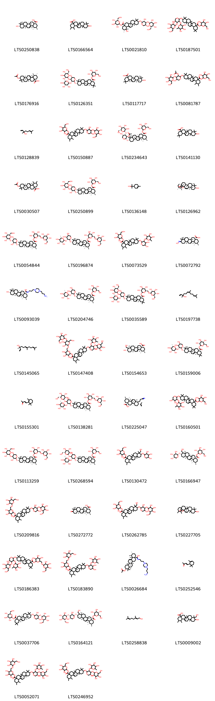{ width=100% }
    <figcaption>Hình ảnh cấu trúc hóa học của 52 hoạt chất thuộc nhóm Prenol lipids gồm ['ursolic acid (LTS0250838)', '10-hydroxy-1,2,6a,6b,9,9,12a-heptamethyl-2,3,4,5,6,7,8,8a,10,11,12,12b,13,14b-tetradecahydro-1h-picene-4a-carboxylic acid (LTS0166564)', '(2s,3r,4s,5s,6r)-3,4,5-trihydroxy-6-(hydroxymethyl)oxan-2-yl (1r,2r,4as,6as,6br,10s,12ar)-10-{[(2s,3r,4s,5s)-3,5-dihydroxy-4-{[(2s,3r,4s,5s,6r)-3,4,5-trihydroxy-6-(hydroxymethyl)oxan-2-yl]oxy}oxan-2-yl]oxy}-1-hydroxy-1,2,6a,6b,9,9,12a-heptamethyl-2,3,4,5,6,7,8,8a,10,11,12,12b,13,14b-tetradecahydropicene-4a-carboxylate (LTS0021810)', '3,4,5-trihydroxy-6-(hydroxymethyl)oxan-2-yl 10-[(5-hydroxy-4-{[3,4,5-trihydroxy-6-(hydroxymethyl)oxan-2-yl]oxy}-3-[(3,4,5-trihydroxy-6-methyloxan-2-yl)oxy]oxan-2-yl)oxy]-2,2,6a,6b,9,9,12a-heptamethyl-1,3,4,5,6,7,8,8a,10,11,12,12b,13,14b-tetradecahydropicene-4a-carboxylate (LTS0187501)', '(1s,2r,4as,6as,6br,8ar,10s,12ar,12br,14bs)-10-(acetyloxy)-1,2,6a,6b,9,9,12a-heptamethyl-2,3,4,5,6,7,8,8a,10,11,12,12b,13,14b-tetradecahydro-1h-picene-4a-carboxylic acid (LTS0176916)', '(2s,3r,4s,5s,6r)-3,4,5-trihydroxy-6-(hydroxymethyl)oxan-2-yl (4as,6as,6br,8ar,10s,12ar,12br,14bs)-10-{[(2s,3r,4s,5s)-5-hydroxy-4-{[(2s,3r,4s,5s,6r)-3,4,5-trihydroxy-6-(hydroxymethyl)oxan-2-yl]oxy}-3-{[(2s,3r,4r,5r,6s)-3,4,5-trihydroxy-6-methyloxan-2-yl]oxy}oxan-2-yl]oxy}-2,2,6a,6b,9,9,12a-heptamethyl-1,3,4,5,6,7,8,8a,10,11,12,12b,13,14b-tetradecahydropicene-4a-carboxylate (LTS0126351)', 'oleanolic acid (LTS0117717)', '3,4,5-trihydroxy-6-(hydroxymethyl)oxan-2-yl 10-{[3-(acetyloxy)-5-hydroxy-4-{[3,4,5-trihydroxy-6-(hydroxymethyl)oxan-2-yl]oxy}oxan-2-yl]oxy}-1,2,6a,6b,9,9,12a-heptamethyl-2,3,4,5,6,7,8,8a,10,11,12,12b,13,14b-tetradecahydro-1h-picene-4a-carboxylate (LTS0081787)', 'linalool, (+-)- (LTS0128839)', '3,4,5-trihydroxy-6-(hydroxymethyl)oxan-2-yl 10-[(3,5-dihydroxy-4-{[3,4,5-trihydroxy-6-(hydroxymethyl)oxan-2-yl]oxy}oxan-2-yl)oxy]-1,2,6a,6b,9,9,12a-heptamethyl-2,3,4,5,6,7,8,8a,10,11,12,12b,13,14b-tetradecahydro-1h-picene-4a-carboxylate (LTS0150887)', '(2s,3r,4s,5s,6r)-3,4,5-trihydroxy-6-(hydroxymethyl)oxan-2-yl (1s,2r,4as,6as,6br,8ar,10s,12ar,12br,14bs)-10-{[(2s,3r,4s,5s)-3-(acetyloxy)-5-hydroxy-4-{[(2s,3r,4s,5s,6r)-3,4,5-trihydroxy-6-(hydroxymethyl)oxan-2-yl]oxy}oxan-2-yl]oxy}-1,2,6a,6b,9,9,12a-heptamethyl-2,3,4,5,6,7,8,8a,10,11,12,12b,13,14b-tetradecahydro-1h-picene-4a-carboxylate (LTS0234643)', 'oleanolic acid (LTS0141130)', '(4as,6as,6br,12ar,12br,14bs)-10-(acetyloxy)-1,2,6a,6b,9,9,12a-heptamethyl-2,3,4,5,6,7,8,8a,10,11,12,12b,13,14b-tetradecahydro-1h-picene-4a-carboxylic acid (LTS0030507)', '(2s,3r,4s,5s,6r)-3,4,5-trihydroxy-6-(hydroxymethyl)oxan-2-yl (1s,2r,4as,6as,6br,8ar,10s,12ar,12br,14bs)-10-{[(2s,3r,4s,5s)-3,5-dihydroxy-4-{[(2s,3r,4s,5s,6r)-3,4,5-trihydroxy-6-(hydroxymethyl)oxan-2-yl]oxy}oxan-2-yl]oxy}-1,2,6a,6b,9,9,12a-heptamethyl-2,3,4,5,6,7,8,8a,10,11,12,12b,13,14b-tetradecahydro-1h-picene-4a-carboxylate (LTS0250899)', 'terpineol (LTS0136148)', '(1s,4s,5r,8r,10s,13s,14r,17s,18r,19s,20r)-10-hydroxy-4,5,9,9,13,19,20-heptamethyl-24-oxahexacyclo[15.5.2.0¹,¹⁸.0⁴,¹⁷.0⁵,¹⁴.0⁸,¹³]tetracos-15-en-23-one (LTS0126962)', '(2s,3r,4s,5s,6r)-3,4,5-trihydroxy-6-({[(2r,3r,4s,5s,6r)-3,4,5-trihydroxy-6-(hydroxymethyl)oxan-2-yl]oxy}methyl)oxan-2-yl (1s,2r,4as,6as,6br,8ar,10s,12ar,12br,14bs)-10-{[(2s,3s,4r,5r)-3,5-dihydroxy-4-{[(2s,3r,4s,5s,6r)-3,4,5-trihydroxy-6-(hydroxymethyl)oxan-2-yl]oxy}oxan-2-yl]oxy}-1,2,6a,6b,9,9,12a-heptamethyl-2,3,4,5,6,7,8,8a,10,11,12,12b,13,14b-tetradecahydro-1h-picene-4a-carboxylate (LTS0054844)', '(2s,3r,4s,5s,6r)-3,4,5-trihydroxy-6-({[(2r,3r,4s,5s,6r)-3,4,5-trihydroxy-6-(hydroxymethyl)oxan-2-yl]oxy}methyl)oxan-2-yl (1s,2r,4as,6as,6br,8ar,10s,12ar,12br,14bs)-10-{[(2s,3r,4s,5s)-4,5-dihydroxy-3-{[(2s,3r,4r,5r,6s)-3,4,5-trihydroxy-6-methyloxan-2-yl]oxy}oxan-2-yl]oxy}-1,2,6a,6b,9,9,12a-heptamethyl-2,3,4,5,6,7,8,8a,10,11,12,12b,13,14b-tetradecahydro-1h-picene-4a-carboxylate (LTS0196874)', '3,4,5-trihydroxy-6-(hydroxymethyl)oxan-2-yl 10-({4,5-dihydroxy-3-[(3,4,5-trihydroxy-6-methyloxan-2-yl)oxy]oxan-2-yl}oxy)-1,2,6a,6b,9,9,12a-heptamethyl-2,3,4,5,6,7,8,8a,10,11,12,12b,13,14b-tetradecahydro-1h-picene-4a-carboxylate (LTS0073529)', '(1s,2r,4as,6as,6br,8ar,10e,12ar,12br,14bs)-10-(hydroxyimino)-1,2,6a,6b,9,9,12a-heptamethyl-1,2,3,4,5,6,7,8,8a,11,12,12b,13,14b-tetradecahydropicene-4a-carboxylic acid (LTS0072792)', '(1s,2r,4as,6as,6br,8ar,10s,12ar,12br,14bs)-n-{3-[4-(3-aminopropyl)piperazin-1-yl]propyl}-10-hydroxy-1,2,6a,6b,9,9,12a-heptamethyl-2,3,4,5,6,7,8,8a,10,11,12,12b,13,14b-tetradecahydro-1h-picene-4a-carboximidic acid (LTS0093039)', '(2s,3r,4s,5s,6r)-3,4,5-trihydroxy-6-(hydroxymethyl)oxan-2-yl (1s,2r,4as,6as,6br,8ar,10s,12ar,12br,14bs)-10-{[(2s,3r,4s,5s)-4,5-dihydroxy-3-{[(2s,3r,4r,5r,6s)-3,4,5-trihydroxy-6-methyloxan-2-yl]oxy}oxan-2-yl]oxy}-1,2,6a,6b,9,9,12a-heptamethyl-2,3,4,5,6,7,8,8a,10,11,12,12b,13,14b-tetradecahydro-1h-picene-4a-carboxylate (LTS0204746)', '(2s,3r,4s,5s,6r)-3,4,5-trihydroxy-6-({[(2r,3r,4s,5s,6r)-3,4,5-trihydroxy-6-(hydroxymethyl)oxan-2-yl]oxy}methyl)oxan-2-yl (4as,6as,6br,8ar,10s,12ar,12br,14bs)-10-{[(2s,3r,4s,5s)-5-hydroxy-4-{[(2s,3r,4s,5s,6r)-3,4,5-trihydroxy-6-(hydroxymethyl)oxan-2-yl]oxy}-3-{[(2s,3r,4r,5r,6s)-3,4,5-trihydroxy-6-methyloxan-2-yl]oxy}oxan-2-yl]oxy}-2,2,6a,6b,9,9,12a-heptamethyl-1,3,4,5,6,7,8,8a,10,11,12,12b,13,14b-tetradecahydropicene-4a-carboxylate (LTS0035589)', 'nerolidol (LTS0197738)', '(3r,6e)-nerolidol (LTS0145065)', '6-({[3,4-dihydroxy-6-(hydroxymethyl)-5-{[3,4,5-trihydroxy-6-(hydroxymethyl)oxan-2-yl]oxy}oxan-2-yl]oxy}methyl)-3,4,5-trihydroxyoxan-2-yl 10-[(5-hydroxy-4-{[3,4,5-trihydroxy-6-(hydroxymethyl)oxan-2-yl]oxy}-3-[(3,4,5-trihydroxy-6-methyloxan-2-yl)oxy]oxan-2-yl)oxy]-1,2,6a,6b,9,9,12a-heptamethyl-2,3,4,5,6,7,8,8a,10,11,12,12b,13,14b-tetradecahydro-1h-picene-4a-carboxylate (LTS0147408)', '23-hydroxyursolic acid (LTS0154653)', '(2s,3r,4s,5s,6r)-3,4,5-trihydroxy-6-(hydroxymethyl)oxan-2-yl (4as,6as,6br,8ar,10s,12ar,12br,14bs)-10-{[(2s,3r,4s,5s)-4,5-dihydroxy-3-{[(2s,3r,4r,5r,6s)-3,4,5-trihydroxy-6-methyloxan-2-yl]oxy}oxan-2-yl]oxy}-2,2,6a,6b,9,9,12a-heptamethyl-1,3,4,5,6,7,8,8a,10,11,12,12b,13,14b-tetradecahydropicene-4a-carboxylate (LTS0159006)', 'β-ionone (LTS0155301)', '(2s,3r,4s,5s,6r)-3,4,5-trihydroxy-6-({[(2r,3r,4s,5s,6r)-3,4,5-trihydroxy-6-(hydroxymethyl)oxan-2-yl]oxy}methyl)oxan-2-yl (1s,2r,4as,6as,6br,8ar,10s,12ar,12br,14bs)-10-{[(2s,3r,4s,5s)-5-hydroxy-4-{[(2s,3r,4s,5s,6r)-3,4,5-trihydroxy-6-(hydroxymethyl)oxan-2-yl]oxy}-3-{[(2s,3r,4r,5r,6s)-3,4,5-trihydroxy-6-methyloxan-2-yl]oxy}oxan-2-yl]oxy}-1,2,6a,6b,9,9,12a-heptamethyl-2,3,4,5,6,7,8,8a,10,11,12,12b,13,14b-tetradecahydro-1h-picene-4a-carboxylate (LTS0138281)', '(1s,2s,4ar,4bs,6as,9r,10s,10as,12ar)-1-(2-cyanoethyl)-1,4a,4b,9,10-pentamethyl-2-(prop-1-en-2-yl)-2,3,4,5,6,7,8,9,10,10a,12,12a-dodecahydrochrysene-6a-carboxylic acid (LTS0225047)', '3,4,5-trihydroxy-6-(hydroxymethyl)oxan-2-yl 10-({4,5-dihydroxy-3-[(3,4,5-trihydroxy-6-methyloxan-2-yl)oxy]oxan-2-yl}oxy)-2,2,6a,6b,9,9,12a-heptamethyl-1,3,4,5,6,7,8,8a,10,11,12,12b,13,14b-tetradecahydropicene-4a-carboxylate (LTS0160501)', '(2s,3r,4s,5s,6r)-3,4,5-trihydroxy-6-({[(2r,3r,4s,5s,6r)-3,4,5-trihydroxy-6-(hydroxymethyl)oxan-2-yl]oxy}methyl)oxan-2-yl (1s,2r,4as,6as,6br,8ar,10s,12ar,12br,14bs)-10-{[(2s,3r,4s,5s)-3,5-dihydroxy-4-{[(2s,3r,4s,5s,6r)-3,4,5-trihydroxy-6-(hydroxymethyl)oxan-2-yl]oxy}oxan-2-yl]oxy}-1,2,6a,6b,9,9,12a-heptamethyl-2,3,4,5,6,7,8,8a,10,11,12,12b,13,14b-tetradecahydro-1h-picene-4a-carboxylate (LTS0113259)', '(2s,3r,4s,5s,6r)-3,4,5-trihydroxy-6-(hydroxymethyl)oxan-2-yl (1s,2r,4as,6as,6br,8ar,10s,12ar,12br,14bs)-10-{[(2s,3r,4s,5s)-5-hydroxy-4-{[(2s,3r,4s,5s,6r)-3,4,5-trihydroxy-6-(hydroxymethyl)oxan-2-yl]oxy}-3-{[(2s,3r,4r,5r,6s)-3,4,5-trihydroxy-6-methyloxan-2-yl]oxy}oxan-2-yl]oxy}-1,2,6a,6b,9,9,12a-heptamethyl-2,3,4,5,6,7,8,8a,10,11,12,12b,13,14b-tetradecahydro-1h-picene-4a-carboxylate (LTS0268594)', '3,4,5-trihydroxy-6-(hydroxymethyl)oxan-2-yl 9-(hydroxymethyl)-1,2,6a,6b,9,12a-hexamethyl-10-[(3,4,5-trihydroxyoxan-2-yl)oxy]-2,3,4,5,6,7,8,8a,10,11,12,12b,13,14b-tetradecahydro-1h-picene-4a-carboxylate (LTS0130472)', '(2s,3r,4s,5s,6r)-3,4,5-trihydroxy-6-(hydroxymethyl)oxan-2-yl (1s,2r,4as,6as,6br,8ar,9r,10s,12ar,12br,14bs)-9-(hydroxymethyl)-1,2,6a,6b,9,12a-hexamethyl-10-{[(2s,3r,4s,5s)-3,4,5-trihydroxyoxan-2-yl]oxy}-2,3,4,5,6,7,8,8a,10,11,12,12b,13,14b-tetradecahydro-1h-picene-4a-carboxylate (LTS0166947)', '3,4,5-trihydroxy-6-({[3,4,5-trihydroxy-6-(hydroxymethyl)oxan-2-yl]oxy}methyl)oxan-2-yl 10-[(3,5-dihydroxy-4-{[3,4,5-trihydroxy-6-(hydroxymethyl)oxan-2-yl]oxy}oxan-2-yl)oxy]-1,2,6a,6b,9,9,12a-heptamethyl-2,3,4,5,6,7,8,8a,10,11,12,12b,13,14b-tetradecahydro-1h-picene-4a-carboxylate (LTS0209816)', '(1s,2r,4as,6as,6br,8ar,12ar,12br,14bs)-1,2,6a,6b,9,9,12a-heptamethyl-10-oxo-1,2,3,4,5,6,7,8,8a,11,12,12b,13,14b-tetradecahydropicene-4a-carboxylic acid (LTS0272772)', '3,4,5-trihydroxy-6-(hydroxymethyl)oxan-2-yl 10-[(3,5-dihydroxy-4-{[3,4,5-trihydroxy-6-(hydroxymethyl)oxan-2-yl]oxy}oxan-2-yl)oxy]-9-(hydroxymethyl)-1,2,6a,6b,9,12a-hexamethyl-2,3,4,5,6,7,8,8a,10,11,12,12b,13,14b-tetradecahydro-1h-picene-4a-carboxylate (LTS0262785)', '10-hydroxy-4,5,9,9,13,19,20-heptamethyl-24-oxahexacyclo[15.5.2.0¹,¹⁸.0⁴,¹⁷.0⁵,¹⁴.0⁸,¹³]tetracos-15-en-23-one (LTS0227705)', '3,4,5-trihydroxy-6-({[3,4,5-trihydroxy-6-(hydroxymethyl)oxan-2-yl]oxy}methyl)oxan-2-yl 10-[(5-hydroxy-4-{[3,4,5-trihydroxy-6-(hydroxymethyl)oxan-2-yl]oxy}-3-[(3,4,5-trihydroxy-6-methyloxan-2-yl)oxy]oxan-2-yl)oxy]-2,2,6a,6b,9,9,12a-heptamethyl-1,3,4,5,6,7,8,8a,10,11,12,12b,13,14b-tetradecahydropicene-4a-carboxylate (LTS0186383)', '3,4,5-trihydroxy-6-({[3,4,5-trihydroxy-6-(hydroxymethyl)oxan-2-yl]oxy}methyl)oxan-2-yl 10-({4,5-dihydroxy-3-[(3,4,5-trihydroxy-6-methyloxan-2-yl)oxy]oxan-2-yl}oxy)-1,2,6a,6b,9,9,12a-heptamethyl-2,3,4,5,6,7,8,8a,10,11,12,12b,13,14b-tetradecahydro-1h-picene-4a-carboxylate (LTS0183890)', '(1s,2r,4as,6as,6br,8ar,10s,12ar,12br,14bs)-10-(acetyloxy)-n-{3-[4-(3-aminopropyl)piperazin-1-yl]propyl}-1,2,6a,6b,9,9,12a-heptamethyl-2,3,4,5,6,7,8,8a,10,11,12,12b,13,14b-tetradecahydro-1h-picene-4a-carboximidic acid (LTS0026684)', 'ionone (LTS0252546)', '(2s,3r,4s,5s,6r)-3,4,5-trihydroxy-6-(hydroxymethyl)oxan-2-yl (4as,6as,6br,10s,12ar,12br,14br)-10-{[(2s,3r,4s,5s)-3,5-dihydroxy-4-{[(2r,3r,4s,5s,6r)-3,4,5-trihydroxy-6-(hydroxymethyl)oxan-2-yl]oxy}oxan-2-yl]oxy}-2,2,6a,6b,9,9,12a-heptamethyl-1,3,4,5,6,7,8,8a,10,11,12,12b,13,14b-tetradecahydropicene-4a-carboxylate (LTS0037706)', '(2s,3r,4s,5s,6r)-3,4,5-trihydroxy-6-(hydroxymethyl)oxan-2-yl (1s,2r,4as,6as,6br,8ar,9r,10s,12ar,12br,14bs)-10-{[(2s,3r,4s,5s)-3,5-dihydroxy-4-{[(2s,3r,4s,5s,6r)-3,4,5-trihydroxy-6-(hydroxymethyl)oxan-2-yl]oxy}oxan-2-yl]oxy}-9-(hydroxymethyl)-1,2,6a,6b,9,12a-hexamethyl-2,3,4,5,6,7,8,8a,10,11,12,12b,13,14b-tetradecahydro-1h-picene-4a-carboxylate (LTS0164121)', 'geraniol (LTS0258838)', '10-hydroxy-9-(hydroxymethyl)-1,2,6a,6b,9,12a-hexamethyl-2,3,4,5,6,7,8,8a,10,11,12,12b,13,14b-tetradecahydro-1h-picene-4a-carboxylic acid (LTS0009002)', '3,4,5-trihydroxy-6-({[3,4,5-trihydroxy-6-(hydroxymethyl)oxan-2-yl]oxy}methyl)oxan-2-yl 10-[(5-hydroxy-4-{[3,4,5-trihydroxy-6-(hydroxymethyl)oxan-2-yl]oxy}-3-[(3,4,5-trihydroxy-6-methyloxan-2-yl)oxy]oxan-2-yl)oxy]-1,2,6a,6b,9,9,12a-heptamethyl-2,3,4,5,6,7,8,8a,10,11,12,12b,13,14b-tetradecahydro-1h-picene-4a-carboxylate (LTS0052071)', '3,4,5-trihydroxy-6-(hydroxymethyl)oxan-2-yl 10-[(5-hydroxy-4-{[3,4,5-trihydroxy-6-(hydroxymethyl)oxan-2-yl]oxy}-3-[(3,4,5-trihydroxy-6-methyloxan-2-yl)oxy]oxan-2-yl)oxy]-1,2,6a,6b,9,9,12a-heptamethyl-2,3,4,5,6,7,8,8a,10,11,12,12b,13,14b-tetradecahydro-1h-picene-4a-carboxylate (LTS0246952)', '(2s,3r,4s,5s,6r)-3,4,5-trihydroxy-6-(hydroxymethyl)oxan-2-yl (1r,2r,4as,6as,6br,8ar,10s,12ar,12br,14bs)-1-hydroxy-1,2,6a,6b,9,9,12a-heptamethyl-10-{[(2s,3r,4s,5s)-3,4,5-trihydroxyoxan-2-yl]oxy}-2,3,4,5,6,7,8,8a,10,11,12,12b,13,14b-tetradecahydropicene-4a-carboxylate (LTS0253525)', 'geranylacetone (LTS0231623)'].</figcaption>
</figure>

---

### Dược dân tộc học

Danh sách các quốc gia có sử dụng *Ilex paraguariensis* trong điều trị các bệnh. 

| Country       | Disease                                   | Bệnh                                                                                                                                                                                                |
|:--------------|:------------------------------------------|:----------------------------------------------------------------------------------------------------------------------------------------------------------------------------------------------------|
| Elsewhere     | Stimulant                                 | MYMEMORY WARNING: YOU USED ALL AVAILABLE FREE TRANSLATIONS FOR TODAY. NEXT AVAILABLE IN  08 HOURS 09 MINUTES 04 SECONDS VISIT HTTPS://MYMEMORY.TRANSLATED.NET/DOC/USAGELIMITS.PHP TO TRANSLATE MORE |
| South America | Aperient, Astringent, Poison              | MYMEMORY WARNING: YOU USED ALL AVAILABLE FREE TRANSLATIONS FOR TODAY. NEXT AVAILABLE IN  08 HOURS 09 MINUTES 01 SECONDS VISIT HTTPS://MYMEMORY.TRANSLATED.NET/DOC/USAGELIMITS.PHP TO TRANSLATE MORE |
| Turkey        | Diuretic, Sudorific, Stimulant, Purgative | MYMEMORY WARNING: YOU USED ALL AVAILABLE FREE TRANSLATIONS FOR TODAY. NEXT AVAILABLE IN  08 HOURS 08 MINUTES 58 SECONDS VISIT HTTPS://MYMEMORY.TRANSLATED.NET/DOC/USAGELIMITS.PHP TO TRANSLATE MORE |

---

---
## Ilex paraguayensis
### Thông tin về thực vật

!!! info "Phân loại thực vật của *Ilex paraguariensis* từ GIBF:"
    - **Kingdom:** Plantae
    - **Phylum:** Tracheophyta
    - **Order:** Aquifoliales
    - **Family:** Aquifoliaceae
    - **Genus:** Ilex
    - **Species:** *Ilex paraguariensis*

 

| Label (VI)   | Label (EN)   | Scientific Name    | Descriptions (VI)   | Descriptions (EN)   | Also Known As (VI)   | Also Known As (EN)   |
|:-------------|:-------------|:-------------------|:--------------------|:--------------------|:---------------------|:---------------------|
| N/A          | N/A          | Ilex paraguayensis |                     |                     | ['']                 | ['']                 |

#### Phân bố trên thế giới

**Từ CSDL GIBF** nan, Paraguay, New Zealand, Brazil

#### Phân bố tại Việt Nam

**Từ CSDL GIBF**: Không có ghi nhận ở Việt Nam

---
### Thành phần hóa học
        
- Theo cơ sở dữ liệu lotus: Từ loài *Ilex paraguariensis* đã phân lập và xác định được Chưa có hoạt chất nào được phân lập. hoạt chất thuộc về các nhóm Không có hoạt chất nào được phân lập. 

Không có hình ảnh nào được tạo ra

---

### Dược dân tộc học

Danh sách các quốc gia có sử dụng *Ilex paraguariensis* trong điều trị các bệnh. 

| Country   | Disease   | Bệnh                                                                                                                                                                                                |
|:----------|:----------|:----------------------------------------------------------------------------------------------------------------------------------------------------------------------------------------------------|
| Elsewhere | Apertif   | MYMEMORY WARNING: YOU USED ALL AVAILABLE FREE TRANSLATIONS FOR TODAY. NEXT AVAILABLE IN  08 HOURS 08 MINUTES 29 SECONDS VISIT HTTPS://MYMEMORY.TRANSLATED.NET/DOC/USAGELIMITS.PHP TO TRANSLATE MORE |

---

---
## Ilex pedunculosa
### Thông tin về thực vật

!!! info "Phân loại thực vật của *Ilex pedunculosa* từ GIBF:"
    - **Kingdom:** Plantae
    - **Phylum:** Tracheophyta
    - **Order:** Aquifoliales
    - **Family:** Aquifoliaceae
    - **Genus:** Ilex
    - **Species:** *Ilex pedunculosa*

 

| Label (VI)   | Label (EN)   | Scientific Name   | Descriptions (VI)   | Descriptions (EN)   | Also Known As (VI)   | Also Known As (EN)   |
|:-------------|:-------------|:------------------|:--------------------|:--------------------|:---------------------|:---------------------|
| N/A          | N/A          | Ilex pedunculosa  | loài thực vật       | species of plant    | ['']                 | ['']                 |

#### Phân bố trên thế giới

**Từ CSDL GIBF** nan, Japan, Canada, United States of America, China, Belgium, Korea, Republic of, Chinese Taipei

#### Phân bố tại Việt Nam

**Từ CSDL GIBF**: Không có ghi nhận ở Việt Nam

---
### Thành phần hóa học
        
- Theo cơ sở dữ liệu lotus: Từ loài *Ilex pedunculosa* đã phân lập và xác định được Chưa có hoạt chất nào được phân lập. hoạt chất thuộc về các nhóm Không có hoạt chất nào được phân lập. 

Không có hình ảnh nào được tạo ra

---

### Dược dân tộc học

Danh sách các quốc gia có sử dụng *Ilex pedunculosa* trong điều trị các bệnh. 

| Country   | Disease                      | Bệnh                                                                                                                                                                                                |
|:----------|:-----------------------------|:----------------------------------------------------------------------------------------------------------------------------------------------------------------------------------------------------|
| China     | Antidote, Tonic, Carminative | MYMEMORY WARNING: YOU USED ALL AVAILABLE FREE TRANSLATIONS FOR TODAY. NEXT AVAILABLE IN  08 HOURS 08 MINUTES 12 SECONDS VISIT HTTPS://MYMEMORY.TRANSLATED.NET/DOC/USAGELIMITS.PHP TO TRANSLATE MORE |

---

---
## Ilex rubra
### Thông tin về thực vật

!!! info "Phân loại thực vật của *Ilex rubra* từ GIBF:"
    - **Kingdom:** Plantae
    - **Phylum:** Tracheophyta
    - **Order:** Aquifoliales
    - **Family:** Aquifoliaceae
    - **Genus:** Ilex
    - **Species:** *Ilex rubra*

 

| Label (VI)   | Label (EN)   | Scientific Name   | Descriptions (VI)   | Descriptions (EN)   | Also Known As (VI)   | Also Known As (EN)   |
|:-------------|:-------------|:------------------|:--------------------|:--------------------|:---------------------|:---------------------|
| N/A          | N/A          | Ilex rubra        | loài thực vật       | species of plant    | ['']                 | ['']                 |

#### Phân bố trên thế giới

**Từ CSDL GIBF** nan, Korea, Republic of, Mexico

#### Phân bố tại Việt Nam

**Từ CSDL GIBF**: Không có ghi nhận ở Việt Nam

---
### Thành phần hóa học
        
- Theo cơ sở dữ liệu lotus: Từ loài *Ilex rubra* đã phân lập và xác định được Chưa có hoạt chất nào được phân lập. hoạt chất thuộc về các nhóm Không có hoạt chất nào được phân lập. 

Không có hình ảnh nào được tạo ra

---

### Dược dân tộc học

Danh sách các quốc gia có sử dụng *Ilex rubra* trong điều trị các bệnh. 

| Country   | Disease   | Bệnh                                                                                                                                                                                                |
|:----------|:----------|:----------------------------------------------------------------------------------------------------------------------------------------------------------------------------------------------------|
| Mexico    | Purgative | MYMEMORY WARNING: YOU USED ALL AVAILABLE FREE TRANSLATIONS FOR TODAY. NEXT AVAILABLE IN  08 HOURS 07 MINUTES 52 SECONDS VISIT HTTPS://MYMEMORY.TRANSLATED.NET/DOC/USAGELIMITS.PHP TO TRANSLATE MORE |

---

---
## Ilex theezans
### Thông tin về thực vật

!!! info "Phân loại thực vật của *Ilex theezans* từ GIBF:"
    - **Kingdom:** Plantae
    - **Phylum:** Tracheophyta
    - **Order:** Aquifoliales
    - **Family:** Aquifoliaceae
    - **Genus:** Ilex
    - **Species:** *Ilex theezans*

 

| Label (VI)   | Label (EN)   | Scientific Name   | Descriptions (VI)   | Descriptions (EN)   | Also Known As (VI)   | Also Known As (EN)   |
|:-------------|:-------------|:------------------|:--------------------|:--------------------|:---------------------|:---------------------|
| N/A          | N/A          | Ilex theezans     |                     | species of plant    | ['']                 | ['']                 |

#### Phân bố trên thế giới

**Từ CSDL GIBF** Paraguay, Guyana, Afghanistan, Brazil

#### Phân bố tại Việt Nam

**Từ CSDL GIBF**: Không có ghi nhận ở Việt Nam

---
### Thành phần hóa học
        
- Theo cơ sở dữ liệu lotus: Từ loài *Ilex theezans* đã phân lập và xác định được 19 hoạt chất thuộc về các nhóm Imidazopyrimidines, Organooxygen compounds, Flavonoids, Cinnamic acids and derivatives. 

|    | chemicalTaxonomyClassyfireClass   |   smiles_count |
|---:|:----------------------------------|---------------:|
|  0 | Cinnamic acids and derivatives    |              2 |
|  1 | Flavonoids                        |              5 |
|  2 | Imidazopyrimidines                |              3 |
|  3 | Organooxygen compounds            |              9 |

#### Nhóm Cinnamic acids and derivatives
<figure markdown="span">
    { width=100% }
    <figcaption>Hình ảnh cấu trúc hóa học của 2 hoạt chất thuộc nhóm Cinnamic acids and derivatives gồm ['3,4-dihydroxycinnamic acid (LTS0128050)', 'caffeic acid (LTS0027481)'].</figcaption>
</figure>
#### Nhóm Flavonoids
<figure markdown="span">
    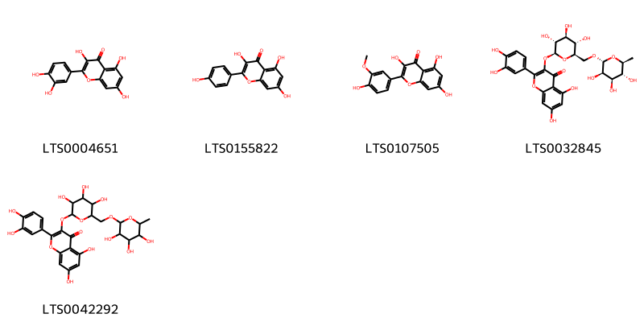{ width=100% }
    <figcaption>Hình ảnh cấu trúc hóa học của 5 hoạt chất thuộc nhóm Flavonoids gồm ['quercetin (LTS0004651)', 'kaempherol (LTS0155822)', 'isorhamnetin (LTS0107505)', '3-rutinosyl quercetin (LTS0032845)', 'rutin (LTS0042292)'].</figcaption>
</figure>
#### Nhóm Imidazopyrimidines
<figure markdown="span">
    { width=100% }
    <figcaption>Hình ảnh cấu trúc hóa học của 3 hoạt chất thuộc nhóm Imidazopyrimidines gồm ['thesal (LTS0250246)', 'caffeine (LTS0075508)', 'constant-t (LTS0100702)'].</figcaption>
</figure>
#### Nhóm Organooxygen compounds
<figure markdown="span">
    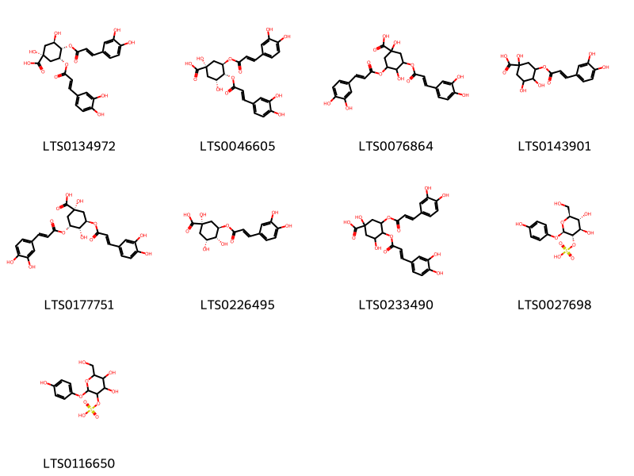{ width=100% }
    <figcaption>Hình ảnh cấu trúc hóa học của 9 hoạt chất thuộc nhóm Organooxygen compounds gồm ['3,4-dicaffeoylquinic acid (LTS0134972)', '4,5-dicaffeoylquinic acid (LTS0046605)', '3,5-bis({[3-(3,4-dihydroxyphenyl)prop-2-enoyl]oxy})-1,4-dihydroxycyclohexane-1-carboxylic acid (LTS0076864)', '3-{[3-(3,4-dihydroxyphenyl)prop-2-enoyl]oxy}-1,4,5-trihydroxycyclohexane-1-carboxylic acid (LTS0143901)', '3,5-dicaffeoylquinic acid (LTS0177751)', 'chlorogenic acid (LTS0226495)', '3,4-bis({[3-(3,4-dihydroxyphenyl)prop-2-enoyl]oxy})-1,5-dihydroxycyclohexane-1-carboxylic acid (LTS0233490)', '[(2r,3s,4r,5r,6s)-4,5-dihydroxy-6-(hydroxymethyl)-2-(4-hydroxyphenoxy)oxan-3-yl]oxidanesulfonic acid (LTS0027698)', '[4,5-dihydroxy-6-(hydroxymethyl)-2-(4-hydroxyphenoxy)oxan-3-yl]oxidanesulfonic acid (LTS0116650)'].</figcaption>
</figure>

---

### Dược dân tộc học

Danh sách các quốc gia có sử dụng *Ilex theezans* trong điều trị các bệnh. 

| Country   | Disease                        | Bệnh                                                                                                                                                                                                |
|:----------|:-------------------------------|:----------------------------------------------------------------------------------------------------------------------------------------------------------------------------------------------------|
| Brazil    | Stomachic, Stimulant, Diuretic | MYMEMORY WARNING: YOU USED ALL AVAILABLE FREE TRANSLATIONS FOR TODAY. NEXT AVAILABLE IN  08 HOURS 07 MINUTES 31 SECONDS VISIT HTTPS://MYMEMORY.TRANSLATED.NET/DOC/USAGELIMITS.PHP TO TRANSLATE MORE |

---

---
## Ilex verticillata
### Thông tin về thực vật

!!! info "Phân loại thực vật của *Ilex verticillata* từ GIBF:"
    - **Kingdom:** Plantae
    - **Phylum:** Tracheophyta
    - **Order:** Aquifoliales
    - **Family:** Aquifoliaceae
    - **Genus:** Ilex
    - **Species:** *Ilex verticillata*

 

| Label (VI)   | Label (EN)   | Scientific Name   | Descriptions (VI)   | Descriptions (EN)   | Also Known As (VI)   | Also Known As (EN)                                                                                                |
|:-------------|:-------------|:------------------|:--------------------|:--------------------|:---------------------|:------------------------------------------------------------------------------------------------------------------|
| N/A          | N/A          | Ilex verticillata | loài thực vật       | species of plant    | ['']                 | ['coralberry', 'black alder', 'Canada holly', 'fever bush', 'Michigan holly', 'winterberry', 'winterberry holly'] |

#### Phân bố trên thế giới

**Từ CSDL GIBF** Canada, United States of America

#### Phân bố tại Việt Nam

**Từ CSDL GIBF**: Không có ghi nhận ở Việt Nam

---
### Thành phần hóa học
        
- Theo cơ sở dữ liệu lotus: Từ loài *Ilex verticillata* đã phân lập và xác định được 8 hoạt chất thuộc về các nhóm Organooxygen compounds, Prenol lipids. 

|    | chemicalTaxonomyClassyfireClass   |   smiles_count |
|---:|:----------------------------------|---------------:|
|  0 | Organooxygen compounds            |              2 |
|  1 | Prenol lipids                     |              6 |

#### Nhóm Organooxygen compounds
<figure markdown="span">
    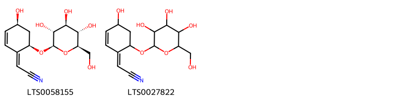{ width=100% }
    <figcaption>Hình ảnh cấu trúc hóa học của 2 hoạt chất thuộc nhóm Organooxygen compounds gồm ['2-[(1z,4s,6r)-4-hydroxy-6-{[(2r,3r,4s,5s,6r)-3,4,5-trihydroxy-6-(hydroxymethyl)oxan-2-yl]oxy}cyclohex-2-en-1-ylidene]acetonitrile (LTS0058155)', '2-[(1z)-4-hydroxy-6-{[3,4,5-trihydroxy-6-(hydroxymethyl)oxan-2-yl]oxy}cyclohex-2-en-1-ylidene]acetonitrile (LTS0027822)'].</figcaption>
</figure>
#### Nhóm Prenol lipids
<figure markdown="span">
    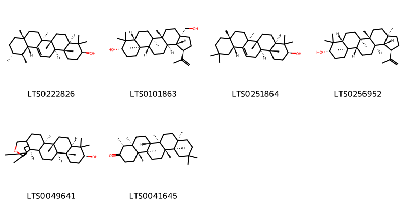{ width=100% }
    <figcaption>Hình ảnh cấu trúc hóa học của 6 hoạt chất thuộc nhóm Prenol lipids gồm ['amyrin (LTS0222826)', 'betulin (LTS0101863)', 'β-amyrin (LTS0251864)', 'lupeol (LTS0256952)', '(1r,4r,5r,8r,10s,13r,14r,18r)-4,5,9,9,13,20,20-heptamethyl-24-oxahexacyclo[17.3.2.0¹,¹⁸.0⁴,¹⁷.0⁵,¹⁴.0⁸,¹³]tetracosan-10-ol (LTS0049641)', '(-)-friedelin (LTS0041645)'].</figcaption>
</figure>

---

### Dược dân tộc học

Danh sách các quốc gia có sử dụng *Ilex verticillata* trong điều trị các bệnh. 

| Country   | Disease    | Bệnh                                                                                                                                                                                                |
|:----------|:-----------|:----------------------------------------------------------------------------------------------------------------------------------------------------------------------------------------------------|
| Dutch     | Astringent | MYMEMORY WARNING: YOU USED ALL AVAILABLE FREE TRANSLATIONS FOR TODAY. NEXT AVAILABLE IN  08 HOURS 07 MINUTES 05 SECONDS VISIT HTTPS://MYMEMORY.TRANSLATED.NET/DOC/USAGELIMITS.PHP TO TRANSLATE MORE |
| English   | Tonic      | MYMEMORY WARNING: YOU USED ALL AVAILABLE FREE TRANSLATIONS FOR TODAY. NEXT AVAILABLE IN  08 HOURS 07 MINUTES 02 SECONDS VISIT HTTPS://MYMEMORY.TRANSLATED.NET/DOC/USAGELIMITS.PHP TO TRANSLATE MORE |
| French    | Laxative   | MYMEMORY WARNING: YOU USED ALL AVAILABLE FREE TRANSLATIONS FOR TODAY. NEXT AVAILABLE IN  08 HOURS 07 MINUTES 00 SECONDS VISIT HTTPS://MYMEMORY.TRANSLATED.NET/DOC/USAGELIMITS.PHP TO TRANSLATE MORE |
| German    | Antiseptic | MYMEMORY WARNING: YOU USED ALL AVAILABLE FREE TRANSLATIONS FOR TODAY. NEXT AVAILABLE IN  08 HOURS 06 MINUTES 58 SECONDS VISIT HTTPS://MYMEMORY.TRANSLATED.NET/DOC/USAGELIMITS.PHP TO TRANSLATE MORE |
| Italian   | Aperient   | MYMEMORY WARNING: YOU USED ALL AVAILABLE FREE TRANSLATIONS FOR TODAY. NEXT AVAILABLE IN  08 HOURS 06 MINUTES 55 SECONDS VISIT HTTPS://MYMEMORY.TRANSLATED.NET/DOC/USAGELIMITS.PHP TO TRANSLATE MORE |
| anish     | Vermifuge  | MYMEMORY WARNING: YOU USED ALL AVAILABLE FREE TRANSLATIONS FOR TODAY. NEXT AVAILABLE IN  08 HOURS 06 MINUTES 52 SECONDS VISIT HTTPS://MYMEMORY.TRANSLATED.NET/DOC/USAGELIMITS.PHP TO TRANSLATE MORE |

---

---
## Ilex vomitoria
### Thông tin về thực vật

!!! info "Phân loại thực vật của *Ilex vomitoria* từ GIBF:"
    - **Kingdom:** Plantae
    - **Phylum:** Tracheophyta
    - **Order:** Aquifoliales
    - **Family:** Aquifoliaceae
    - **Genus:** Ilex
    - **Species:** *Ilex vomitoria*

 

| Label (VI)   | Label (EN)   | Scientific Name   | Descriptions (VI)   | Descriptions (EN)   | Also Known As (VI)   | Also Known As (EN)                    |
|:-------------|:-------------|:------------------|:--------------------|:--------------------|:---------------------|:--------------------------------------|
| N/A          | N/A          | Ilex vomitoria    | loài thực vật       | species of plant    | ['']                 | ['cassina', 'yaupon', 'yaupon holly'] |

#### Phân bố trên thế giới

**Từ CSDL GIBF** United States of America

#### Phân bố tại Việt Nam

**Từ CSDL GIBF**: Không có ghi nhận ở Việt Nam

---
### Thành phần hóa học
        
- Theo cơ sở dữ liệu lotus: Từ loài *Ilex vomitoria* đã phân lập và xác định được Chưa có hoạt chất nào được phân lập. hoạt chất thuộc về các nhóm Không có hoạt chất nào được phân lập. 

Không có hình ảnh nào được tạo ra

---

### Dược dân tộc học

Danh sách các quốc gia có sử dụng *Ilex vomitoria* trong điều trị các bệnh. 

| Country        | Disease                                | Bệnh                                                                                                                                                                                                |
|:---------------|:---------------------------------------|:----------------------------------------------------------------------------------------------------------------------------------------------------------------------------------------------------|
| Elsewhere      | Stimulant, Herbistat                   | MYMEMORY WARNING: YOU USED ALL AVAILABLE FREE TRANSLATIONS FOR TODAY. NEXT AVAILABLE IN  08 HOURS 06 MINUTES 27 SECONDS VISIT HTTPS://MYMEMORY.TRANSLATED.NET/DOC/USAGELIMITS.PHP TO TRANSLATE MORE |
| Mexico         | Diuretic, Purgative, Stimulant, Emetic | MYMEMORY WARNING: YOU USED ALL AVAILABLE FREE TRANSLATIONS FOR TODAY. NEXT AVAILABLE IN  08 HOURS 06 MINUTES 24 SECONDS VISIT HTTPS://MYMEMORY.TRANSLATED.NET/DOC/USAGELIMITS.PHP TO TRANSLATE MORE |
| North America  | Emetic, Tonic                          | MYMEMORY WARNING: YOU USED ALL AVAILABLE FREE TRANSLATIONS FOR TODAY. NEXT AVAILABLE IN  08 HOURS 06 MINUTES 22 SECONDS VISIT HTTPS://MYMEMORY.TRANSLATED.NET/DOC/USAGELIMITS.PHP TO TRANSLATE MORE |
| US             | Emetic, Purgative                      | MYMEMORY WARNING: YOU USED ALL AVAILABLE FREE TRANSLATIONS FOR TODAY. NEXT AVAILABLE IN  08 HOURS 06 MINUTES 20 SECONDS VISIT HTTPS://MYMEMORY.TRANSLATED.NET/DOC/USAGELIMITS.PHP TO TRANSLATE MORE |
| US(Amerindian) | Laxative, Narcotic, Tonic              | MYMEMORY WARNING: YOU USED ALL AVAILABLE FREE TRANSLATIONS FOR TODAY. NEXT AVAILABLE IN  08 HOURS 06 MINUTES 17 SECONDS VISIT HTTPS://MYMEMORY.TRANSLATED.NET/DOC/USAGELIMITS.PHP TO TRANSLATE MORE |
| US(Appalachia) | Emetic, Emetic, Stimulant              | MYMEMORY WARNING: YOU USED ALL AVAILABLE FREE TRANSLATIONS FOR TODAY. NEXT AVAILABLE IN  08 HOURS 06 MINUTES 15 SECONDS VISIT HTTPS://MYMEMORY.TRANSLATED.NET/DOC/USAGELIMITS.PHP TO TRANSLATE MORE |

---

---
## Ilex wallichii
### Thông tin về thực vật

!!! info "Phân loại thực vật của *Ilex wallichii* từ GIBF:"
    - **Kingdom:** Plantae
    - **Phylum:** Tracheophyta
    - **Order:** Aquifoliales
    - **Family:** Aquifoliaceae
    - **Genus:** Ilex
    - **Species:** *Ilex wallichii*

 

| Label (VI)   | Label (EN)   | Scientific Name   | Descriptions (VI)   | Descriptions (EN)   | Also Known As (VI)   | Also Known As (EN)   |
|:-------------|:-------------|:------------------|:--------------------|:--------------------|:---------------------|:---------------------|
| N/A          | N/A          | Ilex wallichii    | loài thực vật       | species of plant    | ['']                 | ['']                 |

#### Phân bố trên thế giới

**Từ CSDL GIBF** nan, Viet Nam, unknown or invalid, Thailand, Brunei Darussalam, Myanmar, Malaysia, Afghanistan, Lao People’s Democratic Republic, Singapore, Cambodia, Indonesia

#### Phân bố tại Việt Nam

**Từ CSDL GIBF**: Thua Thien-Hue

---
### Thành phần hóa học
        
- Theo cơ sở dữ liệu lotus: Từ loài *Ilex wallichii* đã phân lập và xác định được Chưa có hoạt chất nào được phân lập. hoạt chất thuộc về các nhóm Không có hoạt chất nào được phân lập. 

Không có hình ảnh nào được tạo ra

---

### Dược dân tộc học

Danh sách các quốc gia có sử dụng *Ilex wallichii* trong điều trị các bệnh. 

| Country   | Disease    | Bệnh                                                                                                                                                                                                |
|:----------|:-----------|:----------------------------------------------------------------------------------------------------------------------------------------------------------------------------------------------------|
| Indochina | Tonic, nan | MYMEMORY WARNING: YOU USED ALL AVAILABLE FREE TRANSLATIONS FOR TODAY. NEXT AVAILABLE IN  08 HOURS 05 MINUTES 53 SECONDS VISIT HTTPS://MYMEMORY.TRANSLATED.NET/DOC/USAGELIMITS.PHP TO TRANSLATE MORE |

---

