!!! abstract "Tóm tắt"

    Họ Araceae gồm khoảng 34 chi và 81 loài được một số cộng đồng tại các quốc gia như Africa, Japan, Guiana, Colombia(Makuna), US(Ojibwe), Guatemala, Argentina, US(Meskwaki), India(Hindu), Dutch, Guadelupe, Italian, US(Amerindian), Mexico(Chinantec), Lesotho, Costarica, Colombia(Sibundoy), Bolivia, ain, US(Menomini), Turkey, US(Makah), Santa Lucia, Brazil, Egypt, India(Santal), French, Hawaii, US, West Indies, Cuba, Guyana, Peru, Dominican Republic, Malaya, Dominica, Mexico, China, Colombia(Barasana), Malacca, Colombia(Taiwano), Europe, US(Potawatomi), Haiti, German, Chinese, Portorico, Elsewhere, India, Java, Samoa, Japan* sử dụng trong một số trường hợp QUERY LENGTH LIMIT EXCEEDED. MAX ALLOWED QUERY : 500 CHARS QUERY LENGTH LIMIT EXCEEDED. MAX ALLOWED QUERY : 500 CHARS.

!!! info "DrDuke"

    James A. Duke sinh năm 1929-2017 là một nhà thực vật học người Mỹ. Đây là một trong những tác giả hàng đầu trong lĩnh vực dược dân tộc học với cuốn *CRC Handbook of Medicinal Herbs* và chính là người xây dựng lên cơ sở dữ liệu về hợp chất tự nhiên và dược dân tộc học tại Bộ nông nghiệp Hoa Kỳ. Các thông tin được đăng tải tại website [Dr. Duke's Phytochemical and Ethnobotanical Databases](https://phytochem.nal.usda.gov/). 
    Trong suốt thập niên 1970, ông lãnh đạo the Plant Taxonomy Laboratory, Plant Genetics and Germplasm Institute of the Agricultural Research Service, U.S. Department of Agriculture.
    Trong tài liệu này, các thông tin về dược dân tộc của các dược liệu được trích dẫn từ tài liệu của James A. Ducke với sự trợ giúp của phần mềm dịch thuật từ tiếng Anh sang tiếng Việt.
   

# Chi Arisaema

??? note "Danh sách các dược liệu thuộc chi"
    
	 - *Arisaema consanguineum*
	 - *Arisaema eciosum*
	 - *Arisaema heterophyllum*
	 - *Arisaema japonicum*
	 - *Arisaema libatum*
	 - *Arisaema ringens*
	 - *Arisaema ternatipartitum*
	 - *Arisaema thunbergii*
	 - *Arisaema tortuosum*
	 - *Arisaema tosaense*
	 - *Arisaema triphyllum*
	 - *Arisaema urashima*

---
## Arisaema consanguineum
### Thông tin về thực vật

!!! info "Phân loại thực vật của *Arisaema consanguineum* từ GIBF:"
    - **Kingdom:** Plantae
    - **Phylum:** Tracheophyta
    - **Order:** Alismatales
    - **Family:** Araceae
    - **Genus:** Arisaema
    - **Species:** *Arisaema consanguineum*

 

| Label (VI)   | Label (EN)   | Scientific Name        | Descriptions (VI)   | Descriptions (EN)   | Also Known As (VI)   | Also Known As (EN)   |
|:-------------|:-------------|:-----------------------|:--------------------|:--------------------|:---------------------|:---------------------|
| N/A          | N/A          | Arisaema consanguineum | loài thực vật       | species of plant    | ['']                 | ['']                 |

#### Phân bố trên thế giới

**Từ CSDL GIBF** Chinese Taipei, Bhutan, India, Viet Nam, China, Nepal

#### Phân bố tại Việt Nam

**Từ CSDL GIBF**: Lào Cai

---
### Thành phần hóa học
        
- Theo cơ sở dữ liệu lotus: Từ loài *Arisaema consanguineum* đã phân lập và xác định được Chưa có hoạt chất nào được phân lập. hoạt chất thuộc về các nhóm Không có hoạt chất nào được phân lập. 

Không có hình ảnh nào được tạo ra

---

### Dược dân tộc học

Danh sách các quốc gia có sử dụng *Arisaema consanguineum* trong điều trị các bệnh. 

| Country   | Disease     | Bệnh           |
|:----------|:------------|:---------------|
| China     | Expectorant | Thuốc long đàm |

---

---
## Arisaema eciosum
### Thông tin về thực vật

!!! info "Phân loại thực vật của *N/A* từ GIBF:"
    - **Kingdom:** Plantae
    - **Phylum:** Tracheophyta
    - **Order:** Alismatales
    - **Family:** Araceae
    - **Genus:** Arisaema
    - **Species:** *N/A*

 

| Label (VI)   | Label (EN)   | Scientific Name        | Descriptions (VI)   | Descriptions (EN)   | Also Known As (VI)   | Also Known As (EN)   |
|:-------------|:-------------|:-----------------------|:--------------------|:--------------------|:---------------------|:---------------------|
| N/A          | N/A          | Arisaema consanguineum | loài thực vật       | species of plant    | ['']                 | ['']                 |

#### Phân bố trên thế giới

**Từ CSDL GIBF** Sri Lanka, Japan, Chinese Taipei, United States of America, Viet Nam, China, Canada

#### Phân bố tại Việt Nam

**Từ CSDL GIBF**: Hà Nội, Lâm Đồng

---
### Thành phần hóa học
        
- Theo cơ sở dữ liệu lotus: Từ loài *N/A* đã phân lập và xác định được Chưa có hoạt chất nào được phân lập. hoạt chất thuộc về các nhóm Không có hoạt chất nào được phân lập. 

Không có hình ảnh nào được tạo ra

---

### Dược dân tộc học

Danh sách các quốc gia có sử dụng *N/A* trong điều trị các bệnh. 

| Country   | Disease   | Bệnh          |
|:----------|:----------|:--------------|
| Elsewhere | Antidote  | Chất giải độc |

---

---
## Arisaema heterophyllum
### Thông tin về thực vật

!!! info "Phân loại thực vật của *Arisaema heterophyllum* từ GIBF:"
    - **Kingdom:** Plantae
    - **Phylum:** Tracheophyta
    - **Order:** Alismatales
    - **Family:** Araceae
    - **Genus:** Arisaema
    - **Species:** *Arisaema heterophyllum*

 

| Label (VI)   | Label (EN)   | Scientific Name        | Descriptions (VI)   | Descriptions (EN)   | Also Known As (VI)   | Also Known As (EN)   |
|:-------------|:-------------|:-----------------------|:--------------------|:--------------------|:---------------------|:---------------------|
| N/A          | N/A          | Arisaema heterophyllum | loài thực vật       | species of plant    | ['']                 | ['']                 |

#### Phân bố trên thế giới

**Từ CSDL GIBF** China, nan, Korea, Republic of, Chinese Taipei

#### Phân bố tại Việt Nam

**Từ CSDL GIBF**: Không có ghi nhận ở Việt Nam

---
### Thành phần hóa học
        
- Theo cơ sở dữ liệu lotus: Từ loài *Arisaema heterophyllum* đã phân lập và xác định được 2 hoạt chất thuộc về các nhóm Fatty Acyls. 

|    | chemicalTaxonomyClassyfireClass   |   smiles_count |
|---:|:----------------------------------|---------------:|
|  0 | Fatty Acyls                       |              2 |

#### Nhóm Fatty Acyls
<figure markdown="span">
    { width=100% }
    <figcaption>Hình ảnh cấu trúc hóa học của 2 hoạt chất thuộc nhóm Fatty Acyls gồm ['15-phenylpentadecanoic acid (LTS0231218)', '13-phenyltridecanoic acid (LTS0016854)'].</figcaption>
</figure>

---

### Dược dân tộc học

Danh sách các quốc gia có sử dụng *Arisaema heterophyllum* trong điều trị các bệnh. 

| Country   | Disease    | Bệnh                    |
|:----------|:-----------|:------------------------|
| Chinese   | Sialogogue | Thuốc lợi tiết nước bọt |

---

---
## Arisaema japonicum
### Thông tin về thực vật

!!! info "Phân loại thực vật của *Arisaema japonicum* từ GIBF:"
    - **Kingdom:** Plantae
    - **Phylum:** Tracheophyta
    - **Order:** Alismatales
    - **Family:** Araceae
    - **Genus:** Arisaema
    - **Species:** *Arisaema japonicum*

 

| Label (VI)   | Label (EN)   | Scientific Name    | Descriptions (VI)   | Descriptions (EN)   | Also Known As (VI)   | Also Known As (EN)   |
|:-------------|:-------------|:-------------------|:--------------------|:--------------------|:---------------------|:---------------------|
| N/A          | N/A          | Arisaema japonicum | loài thực vật       | species of plant    | ['']                 | ['']                 |

#### Phân bố trên thế giới

**Từ CSDL GIBF** nan, Korea, Republic of, Japan

#### Phân bố tại Việt Nam

**Từ CSDL GIBF**: Không có ghi nhận ở Việt Nam

---
### Thành phần hóa học
        
- Theo cơ sở dữ liệu lotus: Từ loài *Arisaema japonicum* đã phân lập và xác định được Chưa có hoạt chất nào được phân lập. hoạt chất thuộc về các nhóm Không có hoạt chất nào được phân lập. 

Không có hình ảnh nào được tạo ra

---

### Dược dân tộc học

Danh sách các quốc gia có sử dụng *Arisaema japonicum* trong điều trị các bệnh. 

| Country   | Disease     | Bệnh           |
|:----------|:------------|:---------------|
| Elsewhere | Expectorant | Thuốc long đàm |

---

---
## Arisaema libatum
### Thông tin về thực vật

!!! info "Phân loại thực vật của *Arisaema lobatum* từ GIBF:"
    - **Kingdom:** Plantae
    - **Phylum:** Tracheophyta
    - **Order:** Alismatales
    - **Family:** Araceae
    - **Genus:** Arisaema
    - **Species:** *Arisaema lobatum*

 

| Label (VI)   | Label (EN)   | Scientific Name    | Descriptions (VI)   | Descriptions (EN)   | Also Known As (VI)   | Also Known As (EN)   |
|:-------------|:-------------|:-------------------|:--------------------|:--------------------|:---------------------|:---------------------|
| N/A          | N/A          | Arisaema japonicum | loài thực vật       | species of plant    | ['']                 | ['']                 |

#### Phân bố trên thế giới

**Từ CSDL GIBF** nan, China, United States of America

#### Phân bố tại Việt Nam

**Từ CSDL GIBF**: Không có ghi nhận ở Việt Nam

---
### Thành phần hóa học
        
- Theo cơ sở dữ liệu lotus: Từ loài *Arisaema lobatum* đã phân lập và xác định được Chưa có hoạt chất nào được phân lập. hoạt chất thuộc về các nhóm Không có hoạt chất nào được phân lập. 

Không có hình ảnh nào được tạo ra

---

### Dược dân tộc học

Danh sách các quốc gia có sử dụng *Arisaema lobatum* trong điều trị các bệnh. 

| Country   | Disease     | Bệnh           |
|:----------|:------------|:---------------|
| Elsewhere | Expectorant | Thuốc long đàm |

---

---
## Arisaema ringens
### Thông tin về thực vật

!!! info "Phân loại thực vật của *Arisaema ringens* từ GIBF:"
    - **Kingdom:** Plantae
    - **Phylum:** Tracheophyta
    - **Order:** Alismatales
    - **Family:** Araceae
    - **Genus:** Arisaema
    - **Species:** *Arisaema ringens*

 

| Label (VI)   | Label (EN)   | Scientific Name   | Descriptions (VI)   | Descriptions (EN)   | Also Known As (VI)   | Also Known As (EN)   |
|:-------------|:-------------|:------------------|:--------------------|:--------------------|:---------------------|:---------------------|
| N/A          | N/A          | Arisaema ringens  | loài thực vật       | species of plant    | ['']                 | ['cobra lily']       |

#### Phân bố trên thế giới

**Từ CSDL GIBF** United States of America, Korea, Republic of, Chinese Taipei, Japan

#### Phân bố tại Việt Nam

**Từ CSDL GIBF**: Không có ghi nhận ở Việt Nam

---
### Thành phần hóa học
        
- Theo cơ sở dữ liệu lotus: Từ loài *Arisaema ringens* đã phân lập và xác định được 2 hoạt chất thuộc về các nhóm Fatty Acyls. 

|    | chemicalTaxonomyClassyfireClass   |   smiles_count |
|---:|:----------------------------------|---------------:|
|  0 | Fatty Acyls                       |              2 |

#### Nhóm Fatty Acyls
<figure markdown="span">
    { width=100% }
    <figcaption>Hình ảnh cấu trúc hóa học của 2 hoạt chất thuộc nhóm Fatty Acyls gồm ['15-phenylpentadecanoic acid (LTS0231218)', '13-phenyltridecanoic acid (LTS0016854)'].</figcaption>
</figure>

---

### Dược dân tộc học

Danh sách các quốc gia có sử dụng *Arisaema ringens* trong điều trị các bệnh. 

| Country   | Disease     | Bệnh           |
|:----------|:------------|:---------------|
| Elsewhere | Expectorant | Thuốc long đàm |

---

---
## Arisaema ternatipartitum
### Thông tin về thực vật

!!! info "Phân loại thực vật của *Arisaema ternatipartitum* từ GIBF:"
    - **Kingdom:** Plantae
    - **Phylum:** Tracheophyta
    - **Order:** Alismatales
    - **Family:** Araceae
    - **Genus:** Arisaema
    - **Species:** *Arisaema ternatipartitum*

 

| Label (VI)   | Label (EN)   | Scientific Name          | Descriptions (VI)   | Descriptions (EN)   | Also Known As (VI)   | Also Known As (EN)   |
|:-------------|:-------------|:-------------------------|:--------------------|:--------------------|:---------------------|:---------------------|
| N/A          | N/A          | Arisaema ternatipartitum | loài thực vật       | species of plant    | ['']                 | ['']                 |

#### Phân bố trên thế giới

**Từ CSDL GIBF** nan, unknown or invalid, Japan

#### Phân bố tại Việt Nam

**Từ CSDL GIBF**: Không có ghi nhận ở Việt Nam

---
### Thành phần hóa học
        
- Theo cơ sở dữ liệu lotus: Từ loài *Arisaema ternatipartitum* đã phân lập và xác định được Chưa có hoạt chất nào được phân lập. hoạt chất thuộc về các nhóm Không có hoạt chất nào được phân lập. 

Không có hình ảnh nào được tạo ra

---

### Dược dân tộc học

Danh sách các quốc gia có sử dụng *Arisaema ternatipartitum* trong điều trị các bệnh. 

| Country   | Disease     | Bệnh           |
|:----------|:------------|:---------------|
| Elsewhere | Expectorant | Thuốc long đàm |

---

---
## Arisaema thunbergii
### Thông tin về thực vật

!!! info "Phân loại thực vật của *Arisaema thunbergii* từ GIBF:"
    - **Kingdom:** Plantae
    - **Phylum:** Tracheophyta
    - **Order:** Alismatales
    - **Family:** Araceae
    - **Genus:** Arisaema
    - **Species:** *Arisaema thunbergii*

 

| Label (VI)   | Label (EN)   | Scientific Name     | Descriptions (VI)   | Descriptions (EN)   | Also Known As (VI)   | Also Known As (EN)   |
|:-------------|:-------------|:--------------------|:--------------------|:--------------------|:---------------------|:---------------------|
| N/A          | N/A          | Arisaema thunbergii | loài thực vật       | species of plant    | ['']                 | ['']                 |

#### Phân bố trên thế giới

**Từ CSDL GIBF** nan, Japan, Belgium, Korea, Republic of, Chinese Taipei, United States of America

#### Phân bố tại Việt Nam

**Từ CSDL GIBF**: Không có ghi nhận ở Việt Nam

---
### Thành phần hóa học
        
- Theo cơ sở dữ liệu lotus: Từ loài *Arisaema thunbergii* đã phân lập và xác định được Chưa có hoạt chất nào được phân lập. hoạt chất thuộc về các nhóm Không có hoạt chất nào được phân lập. 

Không có hình ảnh nào được tạo ra

---

### Dược dân tộc học

Danh sách các quốc gia có sử dụng *Arisaema thunbergii* trong điều trị các bệnh. 

| Country   | Disease                                                                             | Bệnh                                                                                       |
|:----------|:------------------------------------------------------------------------------------|:-------------------------------------------------------------------------------------------|
| China     | Analgesic, Anesthetic, Discutient, Poison, Vulnerary, Diuretic, Expectorant, Poison | Thuốc giảm đau, gây mê, không rõ ràng, chất độc, dễ bị tổn thương, lợi tiểu, đờm, chất độc |

---

---
## Arisaema tortuosum
### Thông tin về thực vật

!!! info "Phân loại thực vật của *Arisaema tortuosum* từ GIBF:"
    - **Kingdom:** Plantae
    - **Phylum:** Tracheophyta
    - **Order:** Alismatales
    - **Family:** Araceae
    - **Genus:** Arisaema
    - **Species:** *Arisaema tortuosum*

 

| Label (VI)   | Label (EN)   | Scientific Name    | Descriptions (VI)   | Descriptions (EN)   | Also Known As (VI)   | Also Known As (EN)      |
|:-------------|:-------------|:-------------------|:--------------------|:--------------------|:---------------------|:------------------------|
| N/A          | N/A          | Arisaema tortuosum | loài thực vật       | species of plant    | ['']                 | ['whipcord cobra lily'] |

#### Phân bố trên thế giới

**Từ CSDL GIBF** nan, Sri Lanka, Belgium, Bhutan, India, United States of America, Malaysia, China, Nepal

#### Phân bố tại Việt Nam

**Từ CSDL GIBF**: Không có ghi nhận ở Việt Nam

---
### Thành phần hóa học
        
- Theo cơ sở dữ liệu lotus: Từ loài *Arisaema tortuosum* đã phân lập và xác định được 13 hoạt chất thuộc về các nhóm Fatty Acyls, Organooxygen compounds. 

|    | chemicalTaxonomyClassyfireClass   |   smiles_count |
|---:|:----------------------------------|---------------:|
|  0 | Fatty Acyls                       |             12 |
|  1 | Organooxygen compounds            |              1 |

#### Nhóm Fatty Acyls
<figure markdown="span">
    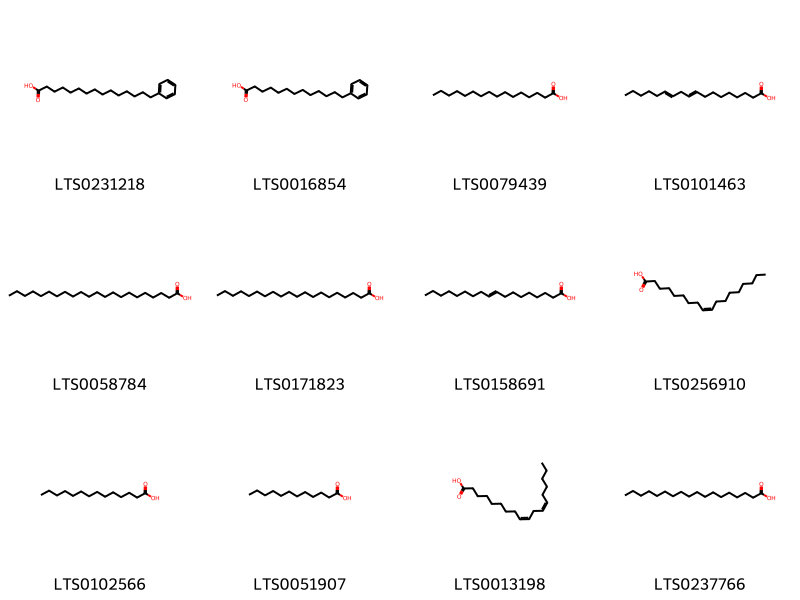{ width=100% }
    <figcaption>Hình ảnh cấu trúc hóa học của 12 hoạt chất thuộc nhóm Fatty Acyls gồm ['15-phenylpentadecanoic acid (LTS0231218)', '13-phenyltridecanoic acid (LTS0016854)', 'palmitic acid (LTS0079439)', '9,12-octadecadienoic acid (LTS0101463)', 'behenic acid (LTS0058784)', 'arachidic acid (LTS0171823)', '9 octadecenoic acid (LTS0158691)', 'oleic acid (LTS0256910)', 'myristic acid (LTS0102566)', 'lauric acid (LTS0051907)', 'linoleic (LTS0013198)', 'stearic acid (LTS0237766)'].</figcaption>
</figure>
#### Nhóm Organooxygen compounds
<figure markdown="span">
    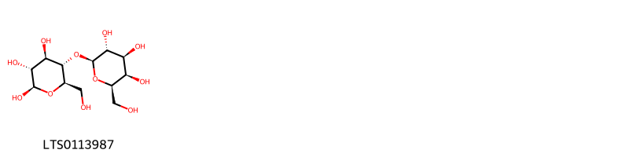{ width=100% }
    <figcaption>Hình ảnh cấu trúc hóa học của 1 hoạt chất thuộc nhóm Organooxygen compounds gồm ['(2r,3r,4r,5s,6r)-6-(hydroxymethyl)-5-{[(2s,3r,4s,5r,6r)-3,4,5-trihydroxy-6-(hydroxymethyl)oxan-2-yl]oxy}oxane-2,3,4-triol (LTS0113987)'].</figcaption>
</figure>

---

### Dược dân tộc học

Danh sách các quốc gia có sử dụng *Arisaema tortuosum* trong điều trị các bệnh. 

| Country   | Disease   | Bệnh           |
|:----------|:----------|:---------------|
| Elsewhere | Larvicide | Diệt côn trùng |

---

---
## Arisaema tosaense
### Thông tin về thực vật

!!! info "Phân loại thực vật của *Arisaema tosaense* từ GIBF:"
    - **Kingdom:** Plantae
    - **Phylum:** Tracheophyta
    - **Order:** Alismatales
    - **Family:** Araceae
    - **Genus:** Arisaema
    - **Species:** *Arisaema tosaense*

 

| Label (VI)   | Label (EN)   | Scientific Name   | Descriptions (VI)   | Descriptions (EN)   | Also Known As (VI)   | Also Known As (EN)   |
|:-------------|:-------------|:------------------|:--------------------|:--------------------|:---------------------|:---------------------|
| N/A          | N/A          | Arisaema tosaense | loài thực vật       | species of plant    | ['']                 | ['']                 |

#### Phân bố trên thế giới

**Từ CSDL GIBF** nan, unknown or invalid, United Kingdom of Great Britain and Northern Ireland, Japan

#### Phân bố tại Việt Nam

**Từ CSDL GIBF**: Không có ghi nhận ở Việt Nam

---
### Thành phần hóa học
        
- Theo cơ sở dữ liệu lotus: Từ loài *Arisaema tosaense* đã phân lập và xác định được Chưa có hoạt chất nào được phân lập. hoạt chất thuộc về các nhóm Không có hoạt chất nào được phân lập. 

Không có hình ảnh nào được tạo ra

---

### Dược dân tộc học

Danh sách các quốc gia có sử dụng *Arisaema tosaense* trong điều trị các bệnh. 

| Country   | Disease     | Bệnh           |
|:----------|:------------|:---------------|
| Elsewhere | Expectorant | Thuốc long đàm |

---

---
## Arisaema triphyllum
### Thông tin về thực vật

!!! info "Phân loại thực vật của *Arisaema triphyllum* từ GIBF:"
    - **Kingdom:** Plantae
    - **Phylum:** Tracheophyta
    - **Order:** Alismatales
    - **Family:** Araceae
    - **Genus:** Arisaema
    - **Species:** *Arisaema triphyllum*

 

| Label (VI)   | Label (EN)   | Scientific Name     | Descriptions (VI)   | Descriptions (EN)   | Also Known As (VI)   | Also Known As (EN)      |
|:-------------|:-------------|:--------------------|:--------------------|:--------------------|:---------------------|:------------------------|
| N/A          | N/A          | Arisaema triphyllum | loài thực vật       | species of plant    | ['']                 | ['Arisaema triphyllum'] |

#### Phân bố trên thế giới

**Từ CSDL GIBF** United States of America, Canada

#### Phân bố tại Việt Nam

**Từ CSDL GIBF**: Không có ghi nhận ở Việt Nam

---
### Thành phần hóa học
        
- Theo cơ sở dữ liệu lotus: Từ loài *Arisaema triphyllum* đã phân lập và xác định được 3 hoạt chất thuộc về các nhóm Fatty Acyls. 

|    | chemicalTaxonomyClassyfireClass   |   smiles_count |
|---:|:----------------------------------|---------------:|
|  0 | Fatty Acyls                       |              3 |

#### Nhóm Fatty Acyls
<figure markdown="span">
    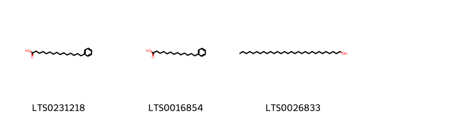{ width=100% }
    <figcaption>Hình ảnh cấu trúc hóa học của 3 hoạt chất thuộc nhóm Fatty Acyls gồm ['15-phenylpentadecanoic acid (LTS0231218)', '13-phenyltridecanoic acid (LTS0016854)', 'triacontanol (LTS0026833)'].</figcaption>
</figure>

---

### Dược dân tộc học

Danh sách các quốc gia có sử dụng *Arisaema triphyllum* trong điều trị các bệnh. 

| Country        | Disease                                                                      | Bệnh                                                                                        |
|:---------------|:-----------------------------------------------------------------------------|:--------------------------------------------------------------------------------------------|
| Elsewhere      | nan, Carminative, Diaphoretic, Expectorant, Insecticide, Stimulant, Irritant | nan, Carminative, Diaphoretic, Expectorant, Thuốc trừ sâu, Chất kích thích, Chất kích thích |
| French         | Sudorific                                                                    | Ngạt thở                                                                                    |
| German         | Expectorant                                                                  | Thuốc long đàm                                                                              |
| US             | Carminative, Diuretic, Vesicant, Expectorant                                 | Làm sáng da, lợi tiểu, gây vảy nến, đờm                                                     |
| US(Amerindian) | Poison                                                                       | Chất độc                                                                                    |
| US(Menomini)   | Poultice                                                                     | thuốc đắp, đắp thuốc cao                                                                    |
| US(Meskwaki)   | Poison                                                                       | Chất độc                                                                                    |
| US(Ojibwe)     | Poultice                                                                     | thuốc đắp, đắp thuốc cao                                                                    |

---

---
## Arisaema urashima
### Thông tin về thực vật

!!! info "Phân loại thực vật của *Arisaema thunbergii* từ GIBF:"
    - **Kingdom:** Plantae
    - **Phylum:** Tracheophyta
    - **Order:** Alismatales
    - **Family:** Araceae
    - **Genus:** Arisaema
    - **Species:** *Arisaema thunbergii*

 

| Label (VI)   | Label (EN)   | Scientific Name   | Descriptions (VI)   | Descriptions (EN)   | Also Known As (VI)   | Also Known As (EN)   |
|:-------------|:-------------|:------------------|:--------------------|:--------------------|:---------------------|:---------------------|
| N/A          | N/A          | Arisaema urashima | loài thực vật       | species of plant    | ['']                 | ['']                 |

#### Phân bố trên thế giới

**Từ CSDL GIBF** nan, unknown or invalid, United States of America, Japan

#### Phân bố tại Việt Nam

**Từ CSDL GIBF**: Không có ghi nhận ở Việt Nam

---
### Thành phần hóa học
        
- Theo cơ sở dữ liệu lotus: Từ loài *Arisaema thunbergii* đã phân lập và xác định được Chưa có hoạt chất nào được phân lập. hoạt chất thuộc về các nhóm Không có hoạt chất nào được phân lập. 

Không có hình ảnh nào được tạo ra

---

### Dược dân tộc học

Danh sách các quốc gia có sử dụng *Arisaema thunbergii* trong điều trị các bệnh. 

| Country   | Disease     | Bệnh           |
|:----------|:------------|:---------------|
| Elsewhere | Expectorant | Thuốc long đàm |

---

# Chi Typhonium

??? note "Danh sách các dược liệu thuộc chi"
    
	 - *Typhonium divaricatum*
	 - *Typhonium giganteum*
	 - *Typhonium trilobatum*

---
## Typhonium divaricatum
### Thông tin về thực vật

!!! info "Phân loại thực vật của *Typhonium roxburghii* từ GIBF:"
    - **Kingdom:** Plantae
    - **Phylum:** Tracheophyta
    - **Order:** Alismatales
    - **Family:** Araceae
    - **Genus:** Typhonium
    - **Species:** *Typhonium roxburghii*

 

| Label (VI)   | Label (EN)   | Scientific Name       | Descriptions (VI)   | Descriptions (EN)   | Also Known As (VI)   | Also Known As (EN)   |
|:-------------|:-------------|:----------------------|:--------------------|:--------------------|:---------------------|:---------------------|
| N/A          | N/A          | Typhonium divaricatum | loài thực vật       | species of plant    | ['']                 | ['']                 |

#### Phân bố trên thế giới

**Từ CSDL GIBF** nan, Italy, Hong Kong, Comoros, Japan, Chinese Taipei, Brazil, unknown or invalid, Indonesia, India, United States of America, Philippines, China

#### Phân bố tại Việt Nam

**Từ CSDL GIBF**: Không có ghi nhận ở Việt Nam

---
### Thành phần hóa học
        
- Theo cơ sở dữ liệu lotus: Từ loài *Typhonium roxburghii* đã phân lập và xác định được Chưa có hoạt chất nào được phân lập. hoạt chất thuộc về các nhóm Không có hoạt chất nào được phân lập. 

Không có hình ảnh nào được tạo ra

---

### Dược dân tộc học

Danh sách các quốc gia có sử dụng *Typhonium roxburghii* trong điều trị các bệnh. 

| Country   | Disease     | Bệnh                   |
|:----------|:------------|:-----------------------|
| China     | Poison      | Chất độc               |
| Elsewhere | Rubefacient | Chất gây xung huyết da |

---

---
## Typhonium giganteum
### Thông tin về thực vật

!!! info "Phân loại thực vật của *Sauromatum giganteum* từ GIBF:"
    - **Kingdom:** Plantae
    - **Phylum:** Tracheophyta
    - **Order:** Alismatales
    - **Family:** Araceae
    - **Genus:** Sauromatum
    - **Species:** *Sauromatum giganteum*

 

| Label (VI)   | Label (EN)   | Scientific Name     | Descriptions (VI)   | Descriptions (EN)   | Also Known As (VI)   | Also Known As (EN)   |
|:-------------|:-------------|:--------------------|:--------------------|:--------------------|:---------------------|:---------------------|
| N/A          | N/A          | Typhonium giganteum | loài thực vật       | species of plant    | ['']                 | ['']                 |

#### Phân bố trên thế giới

**Từ CSDL GIBF** nan, Germany, Korea, Republic of, unknown or invalid, Indonesia, United States of America, Austria, China

#### Phân bố tại Việt Nam

**Từ CSDL GIBF**: Không có ghi nhận ở Việt Nam

---
### Thành phần hóa học
        
- Theo cơ sở dữ liệu lotus: Từ loài *Sauromatum giganteum* đã phân lập và xác định được Chưa có hoạt chất nào được phân lập. hoạt chất thuộc về các nhóm Không có hoạt chất nào được phân lập. 

Không có hình ảnh nào được tạo ra

---

### Dược dân tộc học

Danh sách các quốc gia có sử dụng *Sauromatum giganteum* trong điều trị các bệnh. 

| Country   | Disease                          | Bệnh                            |
|:----------|:---------------------------------|:--------------------------------|
| China     | Expectorant, Carminative, Poison | Chất đờm, Carminative, Chất độc |

---

---
## Typhonium trilobatum
### Thông tin về thực vật

!!! info "Phân loại thực vật của *Typhonium trilobatum* từ GIBF:"
    - **Kingdom:** Plantae
    - **Phylum:** Tracheophyta
    - **Order:** Alismatales
    - **Family:** Araceae
    - **Genus:** Typhonium
    - **Species:** *Typhonium trilobatum*

 

| Label (VI)   | Label (EN)   | Scientific Name      | Descriptions (VI)   | Descriptions (EN)   | Also Known As (VI)   | Also Known As (EN)   |
|:-------------|:-------------|:---------------------|:--------------------|:--------------------|:---------------------|:---------------------|
| N/A          | N/A          | Typhonium trilobatum | loài thực vật       | species of plant    | ['']                 | ['']                 |

#### Phân bố trên thế giới

**Từ CSDL GIBF** nan, Sri Lanka, Micronesia (Federated States of), Lao People’s Democratic Republic, Cambodia, Grenada, Myanmar, unknown or invalid, Jamaica, Bangladesh, United States of America, Trinidad and Tobago, Hong Kong, Suriname, Thailand, Germany, Brazil, Côte d’Ivoire, Peru, France, Singapore, Viet Nam, China, India, Indonesia, Philippines, Malaysia, Nepal

#### Phân bố tại Việt Nam

**Từ CSDL GIBF**: Tuyen Quang, Ha Noi, Hải Phòng, Hanoi

---
### Thành phần hóa học
        
- Theo cơ sở dữ liệu lotus: Từ loài *Typhonium trilobatum* đã phân lập và xác định được Chưa có hoạt chất nào được phân lập. hoạt chất thuộc về các nhóm Không có hoạt chất nào được phân lập. 

Không có hình ảnh nào được tạo ra

---

### Dược dân tộc học

Danh sách các quốc gia có sử dụng *Typhonium trilobatum* trong điều trị các bệnh. 

| Country   | Disease   | Bệnh            |
|:----------|:----------|:----------------|
| Elsewhere | Stimulant | Chất kích thích |

---

# Chi Amorphophallus

??? note "Danh sách các dược liệu thuộc chi"
    
	 - *Amorphophallus campanulatus*
	 - *Amorphophallus konjak*
	 - *Amorphophallus rivieri*

---
## Amorphophallus campanulatus
### Thông tin về thực vật

!!! info "Phân loại thực vật của *Amorphophallus paeoniifolius* từ GIBF:"
    - **Kingdom:** Plantae
    - **Phylum:** Tracheophyta
    - **Order:** Alismatales
    - **Family:** Araceae
    - **Genus:** Amorphophallus
    - **Species:** *Amorphophallus paeoniifolius*

 

| Label (VI)   | Label (EN)   | Scientific Name             | Descriptions (VI)   | Descriptions (EN)   | Also Known As (VI)   | Also Known As (EN)   |
|:-------------|:-------------|:----------------------------|:--------------------|:--------------------|:---------------------|:---------------------|
| N/A          | N/A          | Amorphophallus campanulatus | loài thực vật       | species of plant    | ['']                 | ['']                 |

#### Phân bố trên thế giới

**Từ CSDL GIBF** nan, American Samoa, Sri Lanka, Micronesia (Federated States of), Mauritius, unknown or invalid, Papua New Guinea, United States of America, South Africa, Fiji, Thailand, Tonga, Viet Nam, China, French Polynesia, Niue, Comoros, Vanuatu, India, Indonesia, Samoa, Philippines, Malaysia, Nepal

#### Phân bố tại Việt Nam

**Từ CSDL GIBF**: Ha Tinh

---
### Thành phần hóa học
        
- Theo cơ sở dữ liệu lotus: Từ loài *Amorphophallus paeoniifolius* đã phân lập và xác định được Chưa có hoạt chất nào được phân lập. hoạt chất thuộc về các nhóm Không có hoạt chất nào được phân lập. 

Không có hình ảnh nào được tạo ra

---

### Dược dân tộc học

Danh sách các quốc gia có sử dụng *Amorphophallus paeoniifolius* trong điều trị các bệnh. 

| Country       | Disease   | Bệnh         |
|:--------------|:----------|:-------------|
| India(Santal) | Laxative  | Nhuận trường |

---

---
## Amorphophallus konjak
### Thông tin về thực vật

!!! info "Phân loại thực vật của *Amorphophallus konjac* từ GIBF:"
    - **Kingdom:** Plantae
    - **Phylum:** Tracheophyta
    - **Order:** Alismatales
    - **Family:** Araceae
    - **Genus:** Amorphophallus
    - **Species:** *Amorphophallus konjac*

 

| Label (VI)   | Label (EN)   | Scientific Name             | Descriptions (VI)   | Descriptions (EN)   | Also Known As (VI)   | Also Known As (EN)   |
|:-------------|:-------------|:----------------------------|:--------------------|:--------------------|:---------------------|:---------------------|
| N/A          | N/A          | Amorphophallus campanulatus | loài thực vật       | species of plant    | ['']                 | ['']                 |

#### Phân bố trên thế giới

**Từ CSDL GIBF** nan, Japan, Belgium, unknown or invalid, Norway, Korea, Republic of, Chinese Taipei, Spain, United States of America, Sweden, El Salvador, Germany, Brazil, Mexico, France, Austria, Viet Nam, United Kingdom of Great Britain and Northern Ireland, China, Poland, Philippines, Malaysia, New Zealand

#### Phân bố tại Việt Nam

**Từ CSDL GIBF**: Không có ghi nhận ở Việt Nam

---
### Thành phần hóa học
        
- Theo cơ sở dữ liệu lotus: Từ loài *Amorphophallus konjac* đã phân lập và xác định được Chưa có hoạt chất nào được phân lập. hoạt chất thuộc về các nhóm Không có hoạt chất nào được phân lập. 

Không có hình ảnh nào được tạo ra

---

### Dược dân tộc học

Danh sách các quốc gia có sử dụng *Amorphophallus konjac* trong điều trị các bệnh. 

| Country   | Disease            | Bệnh                 |
|:----------|:-------------------|:---------------------|
| China     | Poison, Sialogogue | Chất độc, Sialogogue |

---

---
## Amorphophallus rivieri
### Thông tin về thực vật

!!! info "Phân loại thực vật của *Amorphophallus rivieri* từ GIBF:"
    - **Kingdom:** Plantae
    - **Phylum:** Tracheophyta
    - **Order:** Alismatales
    - **Family:** Araceae
    - **Genus:** Amorphophallus
    - **Species:** *Amorphophallus rivieri*

 

| Label (VI)   | Label (EN)   | Scientific Name        | Descriptions (VI)   | Descriptions (EN)   | Also Known As (VI)   | Also Known As (EN)   |
|:-------------|:-------------|:-----------------------|:--------------------|:--------------------|:---------------------|:---------------------|
| N/A          | N/A          | Amorphophallus rivieri | loài thực vật       | species of plant    | ['']                 | ['']                 |

#### Phân bố trên thế giới

**Từ CSDL GIBF** nan, Japan, United Kingdom of Great Britain and Northern Ireland, United States of America, Mexico, China, New Zealand

#### Phân bố tại Việt Nam

**Từ CSDL GIBF**: Không có ghi nhận ở Việt Nam

---
### Thành phần hóa học
        
- Theo cơ sở dữ liệu lotus: Từ loài *Amorphophallus rivieri* đã phân lập và xác định được Chưa có hoạt chất nào được phân lập. hoạt chất thuộc về các nhóm Không có hoạt chất nào được phân lập. 

Không có hình ảnh nào được tạo ra

---

### Dược dân tộc học

Danh sách các quốc gia có sử dụng *Amorphophallus rivieri* trong điều trị các bệnh. 

| Country   | Disease   | Bệnh     |
|:----------|:----------|:---------|
| China     | Poison    | Chất độc |

---

# Chi Montrichardia

??? note "Danh sách các dược liệu thuộc chi"
    
	 - *Montrichardia arborescens*
	 - *Montrichardia linifera*

---
## Montrichardia arborescens
### Thông tin về thực vật

!!! info "Phân loại thực vật của *Montrichardia arborescens* từ GIBF:"
    - **Kingdom:** Plantae
    - **Phylum:** Tracheophyta
    - **Order:** Alismatales
    - **Family:** Araceae
    - **Genus:** Montrichardia
    - **Species:** *Montrichardia arborescens*

 

| Label (VI)   | Label (EN)   | Scientific Name           | Descriptions (VI)   | Descriptions (EN)   | Also Known As (VI)   | Also Known As (EN)   |
|:-------------|:-------------|:--------------------------|:--------------------|:--------------------|:---------------------|:---------------------|
| N/A          | N/A          | Montrichardia arborescens | loài thực vật       | species of plant    | ['']                 | ['']                 |

#### Phân bố trên thế giới

**Từ CSDL GIBF** Trinidad and Tobago, Panama, Suriname, Guadeloupe, Martinique, Colombia, Brazil, Guatemala, Costa Rica, Guyana, Honduras, French Guiana

#### Phân bố tại Việt Nam

**Từ CSDL GIBF**: Không có ghi nhận ở Việt Nam

---
### Thành phần hóa học
        
- Theo cơ sở dữ liệu lotus: Từ loài *Montrichardia arborescens* đã phân lập và xác định được Chưa có hoạt chất nào được phân lập. hoạt chất thuộc về các nhóm Không có hoạt chất nào được phân lập. 

Không có hình ảnh nào được tạo ra

---

### Dược dân tộc học

Danh sách các quốc gia có sử dụng *Montrichardia arborescens* trong điều trị các bệnh. 

| Country   | Disease            | Bệnh                      |
|:----------|:-------------------|:--------------------------|
| Brazil    | Diuretic, Poultice | Thuốc lợi tiểu, thuốc đắp |

---

---
## Montrichardia linifera
### Thông tin về thực vật

!!! info "Phân loại thực vật của *Montrichardia linifera* từ GIBF:"
    - **Kingdom:** Plantae
    - **Phylum:** Tracheophyta
    - **Order:** Alismatales
    - **Family:** Araceae
    - **Genus:** Montrichardia
    - **Species:** *Montrichardia linifera*

 

| Label (VI)   | Label (EN)   | Scientific Name        | Descriptions (VI)   | Descriptions (EN)   | Also Known As (VI)   | Also Known As (EN)   |
|:-------------|:-------------|:-----------------------|:--------------------|:--------------------|:---------------------|:---------------------|
| N/A          | N/A          | Montrichardia linifera | loài thực vật       | species of plant    | ['']                 | ['']                 |

#### Phân bố trên thế giới

**Từ CSDL GIBF** nan, Ecuador, Panama, Suriname, Colombia, Brazil, Guyana, Peru, French Guiana

#### Phân bố tại Việt Nam

**Từ CSDL GIBF**: Không có ghi nhận ở Việt Nam

---
### Thành phần hóa học
        
- Theo cơ sở dữ liệu lotus: Từ loài *Montrichardia linifera* đã phân lập và xác định được Chưa có hoạt chất nào được phân lập. hoạt chất thuộc về các nhóm Không có hoạt chất nào được phân lập. 

Không có hình ảnh nào được tạo ra

---

### Dược dân tộc học

Danh sách các quốc gia có sử dụng *Montrichardia linifera* trong điều trị các bệnh. 

| Country   | Disease          | Bệnh               |
|:----------|:-----------------|:-------------------|
| Brazil    | Poison, Diuretic | Chất độc, lợi tiểu |

---

# Chi athiphyllum

??? note "Danh sách các dược liệu thuộc chi"
    
	 - *athiphyllum cochleariathum*

---
## athiphyllum cochleariathum
### Thông tin về thực vật

!!! info "Phân loại thực vật của *N/A* từ GIBF:"
    - **Kingdom:** N/A
    - **Phylum:** N/A
    - **Order:** N/A
    - **Family:** N/A
    - **Genus:** N/A
    - **Species:** *N/A*

 

| Label (VI)   | Label (EN)   | Scientific Name        | Descriptions (VI)   | Descriptions (EN)   | Also Known As (VI)   | Also Known As (EN)   |
|:-------------|:-------------|:-----------------------|:--------------------|:--------------------|:---------------------|:---------------------|
| N/A          | N/A          | Montrichardia linifera | loài thực vật       | species of plant    | ['']                 | ['']                 |

#### Phân bố trên thế giới

**Từ CSDL GIBF** Không có kết quả phù hợp

#### Phân bố tại Việt Nam

**Từ CSDL GIBF**: Không có ghi nhận ở Việt Nam

---
### Thành phần hóa học
        
- Theo cơ sở dữ liệu lotus: Từ loài *N/A* đã phân lập và xác định được Chưa có hoạt chất nào được phân lập. hoạt chất thuộc về các nhóm Không có hoạt chất nào được phân lập. 

Không có hình ảnh nào được tạo ra

---

### Dược dân tộc học

Danh sách các quốc gia có sử dụng *N/A* trong điều trị các bệnh. 

| Country   | Disease   | Bệnh     |
|:----------|:----------|:---------|
| Mexico    | Poison    | Chất độc |

---

# Chi Philodendron

??? note "Danh sách các dược liệu thuộc chi"
    
	 - *Philodendron angustatum*
	 - *Philodendron bipinnatifidum*
	 - *Philodendron eciosum*
	 - *Philodendron hederaceum*
	 - *Philodendron imbe*
	 - *Philodendron krebsii*
	 - *Philodendron lacerum*
	 - *Philodendron selloum*

---
## Philodendron angustatum
### Thông tin về thực vật

!!! info "Phân loại thực vật của *Philodendron consanguineum* từ GIBF:"
    - **Kingdom:** Plantae
    - **Phylum:** Tracheophyta
    - **Order:** Alismatales
    - **Family:** Araceae
    - **Genus:** Philodendron
    - **Species:** *Philodendron consanguineum*

 

| Label (VI)   | Label (EN)   | Scientific Name         | Descriptions (VI)   | Descriptions (EN)   | Also Known As (VI)   | Also Known As (EN)   |
|:-------------|:-------------|:------------------------|:--------------------|:--------------------|:---------------------|:---------------------|
| N/A          | N/A          | Philodendron angustatum |                     |                     | ['']                 | ['']                 |

#### Phân bố trên thế giới

**Từ CSDL GIBF** Cuba, Puerto Rico, New Zealand, Dominican Republic

#### Phân bố tại Việt Nam

**Từ CSDL GIBF**: Không có ghi nhận ở Việt Nam

---
### Thành phần hóa học
        
- Theo cơ sở dữ liệu lotus: Từ loài *Philodendron consanguineum* đã phân lập và xác định được Chưa có hoạt chất nào được phân lập. hoạt chất thuộc về các nhóm Không có hoạt chất nào được phân lập. 

Không có hình ảnh nào được tạo ra

---

### Dược dân tộc học

Danh sách các quốc gia có sử dụng *Philodendron consanguineum* trong điều trị các bệnh. 

| Country   | Disease                 | Bệnh                   |
|:----------|:------------------------|:-----------------------|
| Haiti     | Antiseptic, Cicatrizant | Khử trùng, Cicatrizant |

---

---
## Philodendron bipinnatifidum
### Thông tin về thực vật

!!! info "Phân loại thực vật của *Philodendron bipinnatifidum* từ GIBF:"
    - **Kingdom:** Plantae
    - **Phylum:** Tracheophyta
    - **Order:** Alismatales
    - **Family:** Araceae
    - **Genus:** Philodendron
    - **Species:** *Philodendron bipinnatifidum*

 

| Label (VI)   | Label (EN)   | Scientific Name             | Descriptions (VI)   | Descriptions (EN)   | Also Known As (VI)   | Also Known As (EN)                 |
|:-------------|:-------------|:----------------------------|:--------------------|:--------------------|:---------------------|:-----------------------------------|
| N/A          | N/A          | Philodendron bipinnatifidum | loài thực vật       | species of plant    | ['']                 | ['Thaumatophyllum bipinnatifidum'] |

#### Phân bố trên thế giới

**Từ CSDL GIBF** nan, Italy, Australia, Brazil, Spain, Portugal, United States of America, Venezuela (Bolivarian Republic of), China

#### Phân bố tại Việt Nam

**Từ CSDL GIBF**: Không có ghi nhận ở Việt Nam

---
### Thành phần hóa học
        
- Theo cơ sở dữ liệu lotus: Từ loài *Philodendron bipinnatifidum* đã phân lập và xác định được 2 hoạt chất thuộc về các nhóm Phenols, Benzene and substituted derivatives. 

|    | chemicalTaxonomyClassyfireClass     |   smiles_count |
|---:|:------------------------------------|---------------:|
|  0 | Benzene and substituted derivatives |              1 |
|  1 | Phenols                             |              1 |

#### Nhóm Benzene and substituted derivatives
<figure markdown="span">
    { width=100% }
    <figcaption>Hình ảnh cấu trúc hóa học của 1 hoạt chất thuộc nhóm Benzene and substituted derivatives gồm ['tyramine (LTS0111335)'].</figcaption>
</figure>
#### Nhóm Phenols
<figure markdown="span">
    { width=100% }
    <figcaption>Hình ảnh cấu trúc hóa học của 1 hoạt chất thuộc nhóm Phenols gồm ['dopamine (LTS0029901)'].</figcaption>
</figure>

---

### Dược dân tộc học

Danh sách các quốc gia có sử dụng *Philodendron bipinnatifidum* trong điều trị các bệnh. 

| Country   | Disease   | Bệnh           |
|:----------|:----------|:---------------|
| Brazil    | Vermifuge | Thuốc diệt sán |

---

---
## Philodendron eciosum
### Thông tin về thực vật

!!! info "Phân loại thực vật của *N/A* từ GIBF:"
    - **Kingdom:** Plantae
    - **Phylum:** Tracheophyta
    - **Order:** Alismatales
    - **Family:** Araceae
    - **Genus:** Philodendron
    - **Species:** *N/A*

 

| Label (VI)   | Label (EN)   | Scientific Name             | Descriptions (VI)   | Descriptions (EN)   | Also Known As (VI)   | Also Known As (EN)                 |
|:-------------|:-------------|:----------------------------|:--------------------|:--------------------|:---------------------|:-----------------------------------|
| N/A          | N/A          | Philodendron bipinnatifidum | loài thực vật       | species of plant    | ['']                 | ['Thaumatophyllum bipinnatifidum'] |

#### Phân bố trên thế giới

**Từ CSDL GIBF** nan, Australia, Guadeloupe, Guatemala, Nicaragua, French Guiana, Panama, Puerto Rico, Chinese Taipei, Honduras, United States of America, Bonaire, Sint Eustatius and Saba, Belize, Trinidad and Tobago, Hong Kong, Saint Vincent and the Grenadines, Thailand, Brazil, Peru, Mexico, Singapore, Ecuador, French Polynesia, Colombia, Costa Rica, Philippines

#### Phân bố tại Việt Nam

**Từ CSDL GIBF**: Không có ghi nhận ở Việt Nam

---
### Thành phần hóa học
        
- Theo cơ sở dữ liệu lotus: Từ loài *N/A* đã phân lập và xác định được Chưa có hoạt chất nào được phân lập. hoạt chất thuộc về các nhóm Không có hoạt chất nào được phân lập. 

Không có hình ảnh nào được tạo ra

---

### Dược dân tộc học

Danh sách các quốc gia có sử dụng *N/A* trong điều trị các bệnh. 

| Country   | Disease              | Bệnh                 |
|:----------|:---------------------|:---------------------|
| Brazil    | Vermifuge, Vermifuge | Vermifuge, Vermifuge |

---

---
## Philodendron hederaceum
### Thông tin về thực vật

!!! info "Phân loại thực vật của *Philodendron hederaceum* từ GIBF:"
    - **Kingdom:** Plantae
    - **Phylum:** Tracheophyta
    - **Order:** Alismatales
    - **Family:** Araceae
    - **Genus:** Philodendron
    - **Species:** *Philodendron hederaceum*

 

| Label (VI)   | Label (EN)   | Scientific Name         | Descriptions (VI)   | Descriptions (EN)   | Also Known As (VI)   | Also Known As (EN)   |
|:-------------|:-------------|:------------------------|:--------------------|:--------------------|:---------------------|:---------------------|
| N/A          | N/A          | Philodendron hederaceum | loài thực vật       | species of plant    | ['']                 | ['']                 |

#### Phân bố trên thế giới

**Từ CSDL GIBF** Australia, Guadeloupe, Cook Islands, Guatemala, Argentina, French Guiana, Panama, Pakistan, Puerto Rico, Chinese Taipei, Honduras, United States of America, El Salvador, Belize, Trinidad and Tobago, Fiji, Hong Kong, Suriname, Brazil, Bahamas, Guyana, Mexico, Peru, Singapore, China, Ecuador, French Polynesia, Saint Kitts and Nevis, Colombia, Montserrat, Costa Rica, India, Indonesia, Philippines, Malaysia

#### Phân bố tại Việt Nam

**Từ CSDL GIBF**: Không có ghi nhận ở Việt Nam

---
### Thành phần hóa học
        
- Theo cơ sở dữ liệu lotus: Từ loài *Philodendron hederaceum* đã phân lập và xác định được 8 hoạt chất thuộc về các nhóm Phenols, Benzene and substituted derivatives. 

|    | chemicalTaxonomyClassyfireClass     |   smiles_count |
|---:|:------------------------------------|---------------:|
|  0 | Benzene and substituted derivatives |              3 |
|  1 | Phenols                             |              5 |

#### Nhóm Benzene and substituted derivatives
<figure markdown="span">
    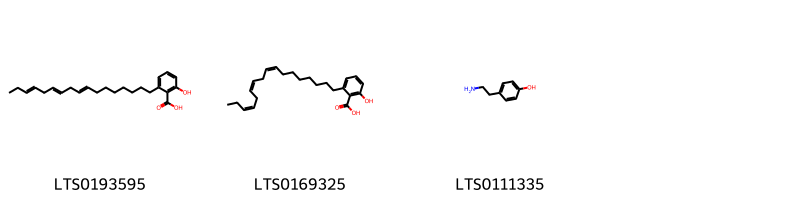{ width=100% }
    <figcaption>Hình ảnh cấu trúc hóa học của 3 hoạt chất thuộc nhóm Benzene and substituted derivatives gồm ['2-(heptadeca-8,11,14-trien-1-yl)-6-hydroxybenzoic acid (LTS0193595)', '2-[(8z,11z,14z)-heptadeca-8,11,14-trien-1-yl]-6-hydroxybenzoic acid (LTS0169325)', 'tyramine (LTS0111335)'].</figcaption>
</figure>
#### Nhóm Phenols
<figure markdown="span">
    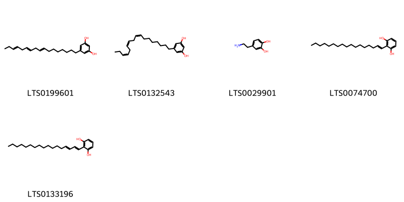{ width=100% }
    <figcaption>Hình ảnh cấu trúc hóa học của 5 hoạt chất thuộc nhóm Phenols gồm ['5-(heptadeca-8,11,14-trien-1-yl)benzene-1,3-diol (LTS0199601)', '5-[(8z,11z,14z)-heptadeca-8,11,14-trien-1-yl]benzene-1,3-diol (LTS0132543)', 'dopamine (LTS0029901)', '2-(heptadec-1-en-1-yl)benzene-1,3-diol (LTS0074700)', '2-(heptadeca-1,3-dien-1-yl)benzene-1,3-diol (LTS0133196)'].</figcaption>
</figure>

---

### Dược dân tộc học

Danh sách các quốc gia có sử dụng *Philodendron hederaceum* trong điều trị các bệnh. 

| Country   | Disease   | Bệnh     |
|:----------|:----------|:---------|
| Elsewhere | Poison    | Chất độc |

---

---
## Philodendron imbe
### Thông tin về thực vật

!!! info "Phân loại thực vật của *Philodendron imbe* từ GIBF:"
    - **Kingdom:** Plantae
    - **Phylum:** Tracheophyta
    - **Order:** Alismatales
    - **Family:** Araceae
    - **Genus:** Philodendron
    - **Species:** *Philodendron imbe*

 

| Label (VI)   | Label (EN)   | Scientific Name   | Descriptions (VI)   | Descriptions (EN)   | Also Known As (VI)   | Also Known As (EN)   |
|:-------------|:-------------|:------------------|:--------------------|:--------------------|:---------------------|:---------------------|
| N/A          | N/A          | Philodendron imbe | loài thực vật       | species of plant    | ['']                 | ['']                 |

#### Phân bố trên thế giới

**Từ CSDL GIBF** nan, Brazil, Bolivia (Plurinational State of), Argentina, unknown or invalid, United States of America

#### Phân bố tại Việt Nam

**Từ CSDL GIBF**: Không có ghi nhận ở Việt Nam

---
### Thành phần hóa học
        
- Theo cơ sở dữ liệu lotus: Từ loài *Philodendron imbe* đã phân lập và xác định được Chưa có hoạt chất nào được phân lập. hoạt chất thuộc về các nhóm Không có hoạt chất nào được phân lập. 

Không có hình ảnh nào được tạo ra

---

### Dược dân tộc học

Danh sách các quốc gia có sử dụng *Philodendron imbe* trong điều trị các bệnh. 

| Country   | Disease                       | Bệnh                          |
|:----------|:------------------------------|:------------------------------|
| Brazil    | Poison, Poultice, Rubefacient | Poison, Poultice, Rubefacient |

---

---
## Philodendron krebsii
### Thông tin về thực vật

!!! info "Phân loại thực vật của *Philodendron consanguineum* từ GIBF:"
    - **Kingdom:** Plantae
    - **Phylum:** Tracheophyta
    - **Order:** Alismatales
    - **Family:** Araceae
    - **Genus:** Philodendron
    - **Species:** *Philodendron consanguineum*

 

| Label (VI)   | Label (EN)   | Scientific Name      | Descriptions (VI)   | Descriptions (EN)   | Also Known As (VI)   | Also Known As (EN)   |
|:-------------|:-------------|:---------------------|:--------------------|:--------------------|:---------------------|:---------------------|
| N/A          | N/A          | Philodendron krebsii |                     |                     | ['']                 | ['']                 |

#### Phân bố trên thế giới

**Từ CSDL GIBF** Virgin Islands (U.S.), nan, Puerto Rico, Brazil, Jamaica, Cuba, Dominican Republic, France

#### Phân bố tại Việt Nam

**Từ CSDL GIBF**: Không có ghi nhận ở Việt Nam

---
### Thành phần hóa học
        
- Theo cơ sở dữ liệu lotus: Từ loài *Philodendron consanguineum* đã phân lập và xác định được Chưa có hoạt chất nào được phân lập. hoạt chất thuộc về các nhóm Không có hoạt chất nào được phân lập. 

Không có hình ảnh nào được tạo ra

---

### Dược dân tộc học

Danh sách các quốc gia có sử dụng *Philodendron consanguineum* trong điều trị các bệnh. 

| Country   | Disease                  | Bệnh                      |
|:----------|:-------------------------|:--------------------------|
| Cuba      | Abortifacient, Vermifuge | Thuốc phá thai, Vermifuge |

---

---
## Philodendron lacerum
### Thông tin về thực vật

!!! info "Phân loại thực vật của *Philodendron lacerum* từ GIBF:"
    - **Kingdom:** Plantae
    - **Phylum:** Tracheophyta
    - **Order:** Alismatales
    - **Family:** Araceae
    - **Genus:** Philodendron
    - **Species:** *Philodendron lacerum*

 

| Label (VI)   | Label (EN)   | Scientific Name      | Descriptions (VI)   | Descriptions (EN)   | Also Known As (VI)   | Also Known As (EN)   |
|:-------------|:-------------|:---------------------|:--------------------|:--------------------|:---------------------|:---------------------|
| N/A          | N/A          | Philodendron lacerum | loài thực vật       | species of plant    | ['']                 | ['']                 |

#### Phân bố trên thế giới

**Từ CSDL GIBF** Australia, Cook Islands, Saint Lucia, unknown or invalid, Zambia, Réunion, Jamaica, United States of America, South Africa, Brazil, Guam, Cuba, Dominican Republic, Mexico, France, Singapore, Curaçao, French Polynesia, Seychelles, Haiti, Philippines, Northern Mariana Islands

#### Phân bố tại Việt Nam

**Từ CSDL GIBF**: Không có ghi nhận ở Việt Nam

---
### Thành phần hóa học
        
- Theo cơ sở dữ liệu lotus: Từ loài *Philodendron lacerum* đã phân lập và xác định được Chưa có hoạt chất nào được phân lập. hoạt chất thuộc về các nhóm Không có hoạt chất nào được phân lập. 

Không có hình ảnh nào được tạo ra

---

### Dược dân tộc học

Danh sách các quốc gia có sử dụng *Philodendron lacerum* trong điều trị các bệnh. 

| Country   | Disease     | Bệnh                   |
|:----------|:------------|:-----------------------|
| Haiti     | Rubefacient | Chất gây xung huyết da |

---

---
## Philodendron selloum
### Thông tin về thực vật

!!! info "Phân loại thực vật của *Thaumatophyllum bipinnatifidum* từ GIBF:"
    - **Kingdom:** Plantae
    - **Phylum:** Tracheophyta
    - **Order:** Alismatales
    - **Family:** Araceae
    - **Genus:** Thaumatophyllum
    - **Species:** *Thaumatophyllum bipinnatifidum*

 

| Label (VI)   | Label (EN)   | Scientific Name      | Descriptions (VI)   | Descriptions (EN)   | Also Known As (VI)   | Also Known As (EN)   |
|:-------------|:-------------|:---------------------|:--------------------|:--------------------|:---------------------|:---------------------|
| N/A          | N/A          | Philodendron selloum | loài thực vật       | species of plant    | ['']                 | ['']                 |

#### Phân bố trên thế giới

**Từ CSDL GIBF** Belize, nan, Chinese Taipei, Spain, Brazil, Portugal, India, unknown or invalid, United States of America, Mexico, France, Paraguay, Togo

#### Phân bố tại Việt Nam

**Từ CSDL GIBF**: Không có ghi nhận ở Việt Nam

---
### Thành phần hóa học
        
- Theo cơ sở dữ liệu lotus: Từ loài *Thaumatophyllum bipinnatifidum* đã phân lập và xác định được Chưa có hoạt chất nào được phân lập. hoạt chất thuộc về các nhóm Không có hoạt chất nào được phân lập. 

Không có hình ảnh nào được tạo ra

---

### Dược dân tộc học

Danh sách các quốc gia có sử dụng *Thaumatophyllum bipinnatifidum* trong điều trị các bệnh. 

| Country   | Disease                         | Bệnh                            |
|:----------|:--------------------------------|:--------------------------------|
| Brazil    | Purgative, Vermifuge, Purgative | Purgative, Vermifuge, Purgative |

---

# Chi Homalomena

??? note "Danh sách các dược liệu thuộc chi"
    
	 - *Homalomena aromatica*
	 - *Homalomena philippensis*
	 - *Homalomena purpurascens*
	 - *Homalomena rubescens*

---
## Homalomena aromatica
### Thông tin về thực vật

!!! info "Phân loại thực vật của *Homalomena aromatica* từ GIBF:"
    - **Kingdom:** Plantae
    - **Phylum:** Tracheophyta
    - **Order:** Alismatales
    - **Family:** Araceae
    - **Genus:** Homalomena
    - **Species:** *Homalomena aromatica*

 

| Label (VI)   | Label (EN)   | Scientific Name      | Descriptions (VI)   | Descriptions (EN)   | Also Known As (VI)   | Also Known As (EN)   |
|:-------------|:-------------|:---------------------|:--------------------|:--------------------|:---------------------|:---------------------|
| N/A          | N/A          | Homalomena aromatica | loài thực vật       | species of plant    | ['']                 | ['']                 |

#### Phân bố trên thế giới

**Từ CSDL GIBF** nan, Thailand, Lao People’s Democratic Republic, United Kingdom of Great Britain and Northern Ireland, Papua New Guinea, India, Indonesia, Bangladesh, unknown or invalid, China, Malaysia, Brunei Darussalam

#### Phân bố tại Việt Nam

**Từ CSDL GIBF**: Không có ghi nhận ở Việt Nam

---
### Thành phần hóa học
        
- Theo cơ sở dữ liệu lotus: Từ loài *Homalomena aromatica* đã phân lập và xác định được 21 hoạt chất thuộc về các nhóm Prenol lipids. 

|    | chemicalTaxonomyClassyfireClass   |   smiles_count |
|---:|:----------------------------------|---------------:|
|  0 | Prenol lipids                     |             21 |

#### Nhóm Prenol lipids
<figure markdown="span">
    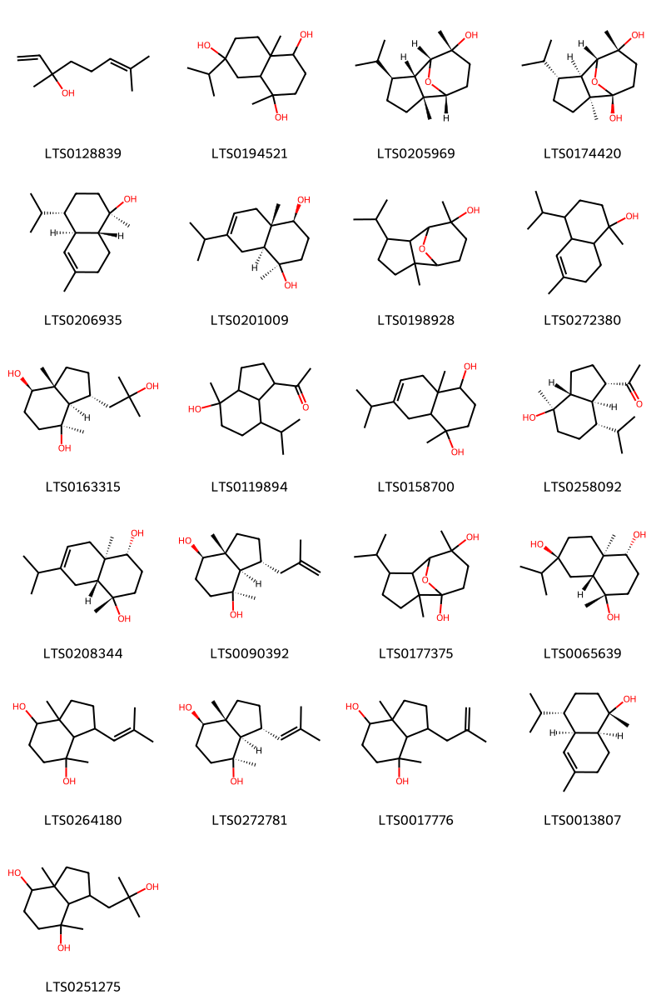{ width=100% }
    <figcaption>Hình ảnh cấu trúc hóa học của 21 hoạt chất thuộc nhóm Prenol lipids gồm ['linalool, (+-)- (LTS0128839)', '6-isopropyl-4,8a-dimethyl-hexahydro-1h-naphthalene-1,4,6-triol (LTS0194521)', '(1r,2r,5s,6s,7r,8r)-5-isopropyl-2,8-dimethyl-11-oxatricyclo[5.3.1.0²,⁶]undecan-8-ol (LTS0205969)', '(1r,2s,5r,6r,7r,8r)-5-isopropyl-2,8-dimethyl-11-oxatricyclo[5.3.1.0²,⁶]undecane-1,8-diol (LTS0174420)', 'α-cadinol (LTS0206935)', '(1r,4s,4as,8as)-7-isopropyl-1,4a-dimethyl-2,3,4,5,8,8a-hexahydronaphthalene-1,4-diol (LTS0201009)', '5-isopropyl-2,8-dimethyl-11-oxatricyclo[5.3.1.0²,⁶]undecan-8-ol (LTS0198928)', 'delta-cadinol (LTS0272380)', '(1r,3ar,4r,7s,7ar)-1-(2-hydroxy-2-methylpropyl)-3a,7-dimethyl-hexahydro-1h-indene-4,7-diol (LTS0163315)', '1-(4-hydroxy-7-isopropyl-4-methyl-octahydroinden-1-yl)ethanone (LTS0119894)', '7-isopropyl-1,4a-dimethyl-2,3,4,5,8,8a-hexahydronaphthalene-1,4-diol (LTS0158700)', '1-[(1s,3ar,4r,7s,7as)-4-hydroxy-7-isopropyl-4-methyl-octahydroinden-1-yl]ethanone (LTS0258092)', '(1s,4r,4ar,8ar)-7-isopropyl-1,4a-dimethyl-2,3,4,5,8,8a-hexahydronaphthalene-1,4-diol (LTS0208344)', '(1r,3ar,4r,7s,7ar)-3a,7-dimethyl-1-(2-methylprop-2-en-1-yl)-hexahydro-1h-indene-4,7-diol (LTS0090392)', '5-isopropyl-2,8-dimethyl-11-oxatricyclo[5.3.1.0²,⁶]undecane-1,8-diol (LTS0177375)', '(1r,4s,4ar,6s,8ar)-6-isopropyl-4,8a-dimethyl-hexahydro-1h-naphthalene-1,4,6-triol (LTS0065639)', '3a,7-dimethyl-1-(2-methylprop-1-en-1-yl)-hexahydro-1h-indene-4,7-diol (LTS0264180)', '(1r,3ar,4r,7s,7ar)-3a,7-dimethyl-1-(2-methylprop-1-en-1-yl)-hexahydro-1h-indene-4,7-diol (LTS0272781)', '3a,7-dimethyl-1-(2-methylprop-2-en-1-yl)-hexahydro-1h-indene-4,7-diol (LTS0017776)', 'delta-cadinol (LTS0013807)', '1-(2-hydroxy-2-methylpropyl)-3a,7-dimethyl-hexahydro-1h-indene-4,7-diol (LTS0251275)'].</figcaption>
</figure>

---

### Dược dân tộc học

Danh sách các quốc gia có sử dụng *Homalomena aromatica* trong điều trị các bệnh. 

| Country   | Disease   | Bệnh            |
|:----------|:----------|:----------------|
| Elsewhere | Stimulant | Chất kích thích |
| India     | Stimulant | Chất kích thích |

---

---
## Homalomena philippensis
### Thông tin về thực vật

!!! info "Phân loại thực vật của *Homalomena philippinensis* từ GIBF:"
    - **Kingdom:** Plantae
    - **Phylum:** Tracheophyta
    - **Order:** Alismatales
    - **Family:** Araceae
    - **Genus:** Homalomena
    - **Species:** *Homalomena philippinensis*

 

| Label (VI)   | Label (EN)   | Scientific Name      | Descriptions (VI)   | Descriptions (EN)   | Also Known As (VI)   | Also Known As (EN)   |
|:-------------|:-------------|:---------------------|:--------------------|:--------------------|:---------------------|:---------------------|
| N/A          | N/A          | Homalomena aromatica | loài thực vật       | species of plant    | ['']                 | ['']                 |

#### Phân bố trên thế giới

**Từ CSDL GIBF** nan, Philippines, Indonesia, Chinese Taipei

#### Phân bố tại Việt Nam

**Từ CSDL GIBF**: Không có ghi nhận ở Việt Nam

---
### Thành phần hóa học
        
- Theo cơ sở dữ liệu lotus: Từ loài *Homalomena philippinensis* đã phân lập và xác định được Chưa có hoạt chất nào được phân lập. hoạt chất thuộc về các nhóm Không có hoạt chất nào được phân lập. 

Không có hình ảnh nào được tạo ra

---

### Dược dân tộc học

Danh sách các quốc gia có sử dụng *Homalomena philippinensis* trong điều trị các bệnh. 

| Country   | Disease       | Bệnh            |
|:----------|:--------------|:----------------|
| Elsewhere | Antirheumatic | Chống thấp khớp |

---

---
## Homalomena purpurascens
### Thông tin về thực vật

!!! info "Phân loại thực vật của *Homalomena humilis* từ GIBF:"
    - **Kingdom:** Plantae
    - **Phylum:** Tracheophyta
    - **Order:** Alismatales
    - **Family:** Araceae
    - **Genus:** Homalomena
    - **Species:** *Homalomena humilis*

 

| Label (VI)   | Label (EN)   | Scientific Name         | Descriptions (VI)   | Descriptions (EN)   | Also Known As (VI)   | Also Known As (EN)   |
|:-------------|:-------------|:------------------------|:--------------------|:--------------------|:---------------------|:---------------------|
| N/A          | N/A          | Homalomena purpurascens |                     |                     | ['']                 | ['']                 |

#### Phân bố trên thế giới

**Từ CSDL GIBF** nan, Philippines, Indonesia, Chinese Taipei

#### Phân bố tại Việt Nam

**Từ CSDL GIBF**: Không có ghi nhận ở Việt Nam

---
### Thành phần hóa học
        
- Theo cơ sở dữ liệu lotus: Từ loài *Homalomena humilis* đã phân lập và xác định được Chưa có hoạt chất nào được phân lập. hoạt chất thuộc về các nhóm Không có hoạt chất nào được phân lập. 

Không có hình ảnh nào được tạo ra

---

### Dược dân tộc học

Danh sách các quốc gia có sử dụng *Homalomena humilis* trong điều trị các bệnh. 

| Country   | Disease     | Bệnh           |
|:----------|:------------|:---------------|
| Malaya    | Expectorant | Thuốc long đàm |

---

---
## Homalomena rubescens
### Thông tin về thực vật

!!! info "Phân loại thực vật của *Homalomena rubescens* từ GIBF:"
    - **Kingdom:** Plantae
    - **Phylum:** Tracheophyta
    - **Order:** Alismatales
    - **Family:** Araceae
    - **Genus:** Homalomena
    - **Species:** *Homalomena rubescens*

 

| Label (VI)   | Label (EN)   | Scientific Name      | Descriptions (VI)   | Descriptions (EN)   | Also Known As (VI)   | Also Known As (EN)   |
|:-------------|:-------------|:---------------------|:--------------------|:--------------------|:---------------------|:---------------------|
| N/A          | N/A          | Homalomena rubescens | loài thực vật       | species of plant    | ['']                 | ['']                 |

#### Phân bố trên thế giới

**Từ CSDL GIBF** nan, Réunion, Germany, Brazil, Myanmar, Costa Rica, Bhutan, unknown or invalid, Indonesia, India, United States of America, France, Philippines, El Salvador, Panama

#### Phân bố tại Việt Nam

**Từ CSDL GIBF**: Không có ghi nhận ở Việt Nam

---
### Thành phần hóa học
        
- Theo cơ sở dữ liệu lotus: Từ loài *Homalomena rubescens* đã phân lập và xác định được Chưa có hoạt chất nào được phân lập. hoạt chất thuộc về các nhóm Không có hoạt chất nào được phân lập. 

Không có hình ảnh nào được tạo ra

---

### Dược dân tộc học

Danh sách các quốc gia có sử dụng *Homalomena rubescens* trong điều trị các bệnh. 

| Country   | Disease   | Bệnh            |
|:----------|:----------|:----------------|
| India     | Stimulant | Chất kích thích |

---

# Chi Zantedeschia

??? note "Danh sách các dược liệu thuộc chi"
    
	 - *Zantedeschia aethiopica*
	 - *Zantedeschia africana*
	 - *Zantedeschia albomaculata*
	 - *Zantedeschia oculata*

---
## Zantedeschia aethiopica
### Thông tin về thực vật

!!! info "Phân loại thực vật của *Zantedeschia aethiopica* từ GIBF:"
    - **Kingdom:** Plantae
    - **Phylum:** Tracheophyta
    - **Order:** Alismatales
    - **Family:** Araceae
    - **Genus:** Zantedeschia
    - **Species:** *Zantedeschia aethiopica*

 

| Label (VI)   | Label (EN)   | Scientific Name         | Descriptions (VI)   | Descriptions (EN)   | Also Known As (VI)   | Also Known As (EN)                                                 |
|:-------------|:-------------|:------------------------|:--------------------|:--------------------|:---------------------|:-------------------------------------------------------------------|
| N/A          | N/A          | Zantedeschia aethiopica | loài thực vật       | species of plant    | ['']                 | ['arum lily', 'calla lily', 'common arum lily', 'white arum lily'] |

#### Phân bố trên thế giới

**Từ CSDL GIBF** nan, Sri Lanka, Italy, Australia, Panama, Réunion, Spain, Portugal, United States of America, Chile, El Salvador, Greece, South Africa, Hong Kong, Brazil, Mexico, Dominican Republic, Ecuador, Colombia, Costa Rica, India, New Zealand

#### Phân bố tại Việt Nam

**Từ CSDL GIBF**: Không có ghi nhận ở Việt Nam

---
### Thành phần hóa học
        
- Theo cơ sở dữ liệu lotus: Từ loài *Zantedeschia aethiopica* đã phân lập và xác định được 58 hoạt chất thuộc về các nhóm Fatty Acyls, Flavonoids, Steroids and steroid derivatives, Benzene and substituted derivatives, Organooxygen compounds, Phenols, Furanoid lignans. 

|    | chemicalTaxonomyClassyfireClass     |   smiles_count |
|---:|:------------------------------------|---------------:|
|  0 |                                     |              5 |
|  1 | Benzene and substituted derivatives |              1 |
|  2 | Fatty Acyls                         |              4 |
|  3 | Flavonoids                          |              7 |
|  4 | Furanoid lignans                    |              3 |
|  5 | Organooxygen compounds              |              8 |
|  6 | Phenols                             |              5 |
|  7 | Steroids and steroid derivatives    |             25 |

#### Nhóm 
<figure markdown="span">
    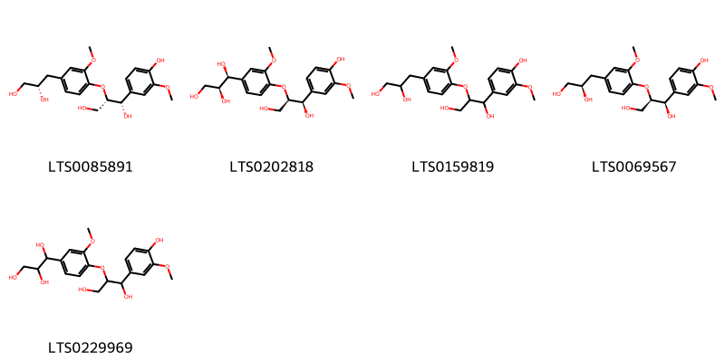{ width=100% }
    <figcaption>Hình ảnh cấu trúc hóa học của 5 hoạt chất thuộc nhóm  gồm ['(1s,2s)-2-{4-[(2s)-2,3-dihydroxypropyl]-2-methoxyphenoxy}-1-(4-hydroxy-3-methoxyphenyl)propane-1,3-diol (LTS0085891)', '(1s,2s)-1-(4-{[(1r,2r)-1,3-dihydroxy-1-(4-hydroxy-3-methoxyphenyl)propan-2-yl]oxy}-3-methoxyphenyl)propane-1,2,3-triol (LTS0202818)', '2-[4-(2,3-dihydroxypropyl)-2-methoxyphenoxy]-1-(4-hydroxy-3-methoxyphenyl)propane-1,3-diol (LTS0159819)', '(1r,2r)-2-{4-[(2r)-2,3-dihydroxypropyl]-2-methoxyphenoxy}-1-(4-hydroxy-3-methoxyphenyl)propane-1,3-diol (LTS0069567)', '1-(4-{[1,3-dihydroxy-1-(4-hydroxy-3-methoxyphenyl)propan-2-yl]oxy}-3-methoxyphenyl)propane-1,2,3-triol (LTS0229969)'].</figcaption>
</figure>
#### Nhóm Benzene and substituted derivatives
<figure markdown="span">
    { width=100% }
    <figcaption>Hình ảnh cấu trúc hóa học của 1 hoạt chất thuộc nhóm Benzene and substituted derivatives gồm ['tyramine (LTS0111335)'].</figcaption>
</figure>
#### Nhóm Fatty Acyls
<figure markdown="span">
    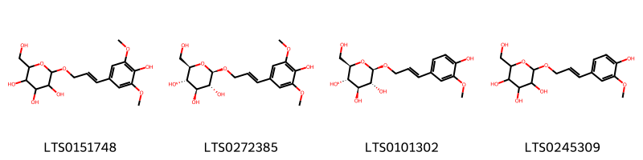{ width=100% }
    <figcaption>Hình ảnh cấu trúc hóa học của 4 hoạt chất thuộc nhóm Fatty Acyls gồm ['2-{[3-(4-hydroxy-3,5-dimethoxyphenyl)prop-2-en-1-yl]oxy}-6-(hydroxymethyl)oxane-3,4,5-triol (LTS0151748)', '(2r,3r,4s,5s,6r)-2-{[(2e)-3-(4-hydroxy-3,5-dimethoxyphenyl)prop-2-en-1-yl]oxy}-6-(hydroxymethyl)oxane-3,4,5-triol (LTS0272385)', '(2r,3r,4s,5s,6r)-2-{[(2e)-3-(4-hydroxy-3-methoxyphenyl)prop-2-en-1-yl]oxy}-6-(hydroxymethyl)oxane-3,4,5-triol (LTS0101302)', '2-{[3-(4-hydroxy-3-methoxyphenyl)prop-2-en-1-yl]oxy}-6-(hydroxymethyl)oxane-3,4,5-triol (LTS0245309)'].</figcaption>
</figure>
#### Nhóm Flavonoids
<figure markdown="span">
    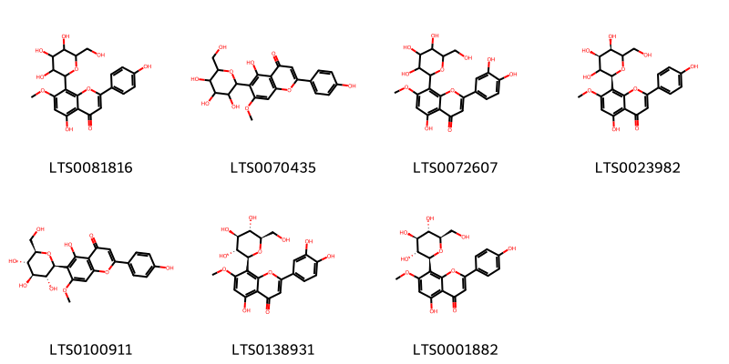{ width=100% }
    <figcaption>Hình ảnh cấu trúc hóa học của 7 hoạt chất thuộc nhóm Flavonoids gồm ['5-hydroxy-2-(4-hydroxyphenyl)-7-methoxy-8-[3,4,5-trihydroxy-6-(hydroxymethyl)oxan-2-yl]chromen-4-one (LTS0081816)', '5-hydroxy-2-(4-hydroxyphenyl)-7-methoxy-6-[3,4,5-trihydroxy-6-(hydroxymethyl)oxan-2-yl]chromen-4-one (LTS0070435)', '2-(3,4-dihydroxyphenyl)-5-hydroxy-7-methoxy-8-[3,4,5-trihydroxy-6-(hydroxymethyl)oxan-2-yl]chromen-4-one (LTS0072607)', 'isoswertisin (LTS0023982)', '5-hydroxy-2-(4-hydroxyphenyl)-7-methoxy-6-[(2s,3r,4r,5s,6r)-3,4,5-trihydroxy-6-(hydroxymethyl)oxan-2-yl]chromen-4-one (LTS0100911)', '2-(3,4-dihydroxyphenyl)-5-hydroxy-7-methoxy-8-[(2s,3r,4r,5s,6r)-3,4,5-trihydroxy-6-(hydroxymethyl)oxan-2-yl]chromen-4-one (LTS0138931)', '5-hydroxy-2-(4-hydroxyphenyl)-7-methoxy-8-[(2s,3r,4r,5s,6r)-3,4,5-trihydroxy-6-(hydroxymethyl)oxan-2-yl]chromen-4-one (LTS0001882)'].</figcaption>
</figure>
#### Nhóm Furanoid lignans
<figure markdown="span">
    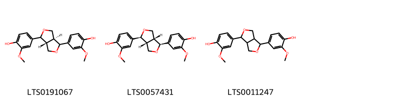{ width=100% }
    <figcaption>Hình ảnh cấu trúc hóa học của 3 hoạt chất thuộc nhóm Furanoid lignans gồm ['4-[(3ar,6as)-4-(4-hydroxy-3-methoxyphenyl)-hexahydrofuro[3,4-c]furan-1-yl]-2-methoxyphenol (LTS0191067)', 'pinoresinol (LTS0057431)', 'pinoresinol (LTS0011247)'].</figcaption>
</figure>
#### Nhóm Organooxygen compounds
<figure markdown="span">
    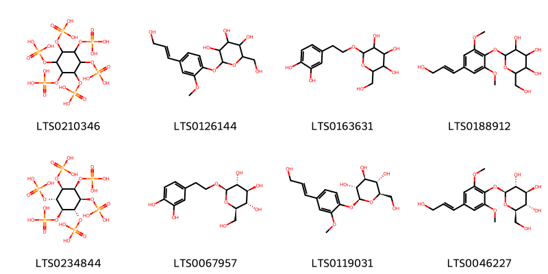{ width=100% }
    <figcaption>Hình ảnh cấu trúc hóa học của 8 hoạt chất thuộc nhóm Organooxygen compounds gồm ['phytic acid (LTS0210346)', '2-(hydroxymethyl)-6-[4-(3-hydroxyprop-1-en-1-yl)-2-methoxyphenoxy]oxane-3,4,5-triol (LTS0126144)', '2-[2-(3,4-dihydroxyphenyl)ethoxy]-6-(hydroxymethyl)oxane-3,4,5-triol (LTS0163631)', '2-(hydroxymethyl)-6-[4-(3-hydroxyprop-1-en-1-yl)-2,6-dimethoxyphenoxy]oxane-3,4,5-triol (LTS0188912)', '[(1r,2r,3s,4r,5s,6s)-2,3,4,5,6-pentakis(phosphonooxy)cyclohexyl]oxyphosphonic acid (LTS0234844)', '(2r,3r,4s,5s,6r)-2-[2-(3,4-dihydroxyphenyl)ethoxy]-6-(hydroxymethyl)oxane-3,4,5-triol (LTS0067957)', 'coniferin (LTS0119031)', 'syringin (LTS0046227)'].</figcaption>
</figure>
#### Nhóm Phenols
<figure markdown="span">
    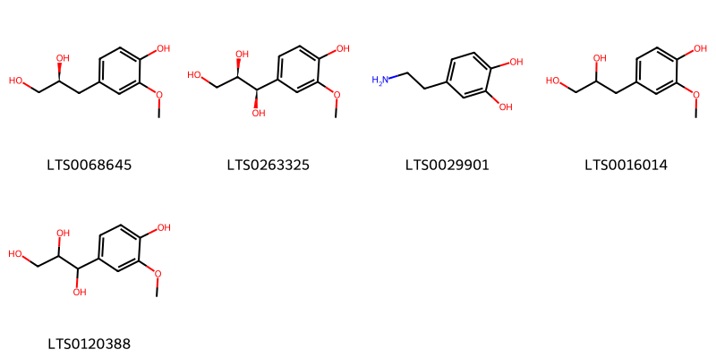{ width=100% }
    <figcaption>Hình ảnh cấu trúc hóa học của 5 hoạt chất thuộc nhóm Phenols gồm ['(2s)-3-(4-hydroxy-3-methoxyphenyl)propane-1,2-diol (LTS0068645)', '(1r,2r)-1-(4-hydroxy-3-methoxyphenyl)propane-1,2,3-triol (LTS0263325)', 'dopamine (LTS0029901)', '3-(4-hydroxy-3-methoxyphenyl)propane-1,2-diol (LTS0016014)', 'guaiacylglycerol (LTS0120388)'].</figcaption>
</figure>
#### Nhóm Steroids and steroid derivatives
<figure markdown="span">
    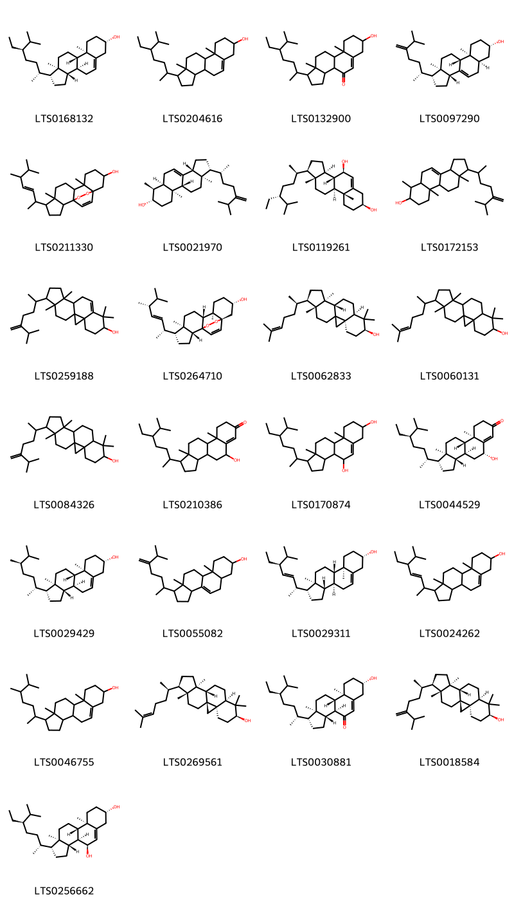{ width=100% }
    <figcaption>Hình ảnh cấu trúc hóa học của 25 hoạt chất thuộc nhóm Steroids and steroid derivatives gồm ['sitosterol (LTS0168132)', 'stigmast-5-en-3-ol, (3β)- (LTS0204616)', '1-(5-ethyl-6-methylheptan-2-yl)-7-hydroxy-9a,11a-dimethyl-1h,2h,3h,3ah,3bh,6h,7h,8h,9h,9bh,10h,11h-cyclopenta[a]phenanthren-4-one (LTS0132900)', '(1r,3ar,5ar,7s,9as,9br,11ar)-9a,11a-dimethyl-1-[(2r)-6-methyl-5-methylideneheptan-2-yl]-1h,2h,3h,3ah,5h,5ah,6h,7h,8h,9h,9bh,10h,11h-cyclopenta[a]phenanthren-7-ol (LTS0097290)', '5-(5,6-dimethylhept-3-en-2-yl)-6,10-dimethyl-16,17-dioxapentacyclo[13.2.2.0¹,⁹.0²,⁶.0¹⁰,¹⁵]nonadec-18-en-13-ol (LTS0211330)', '(1r,3ar,5ar,6s,7s,9as,9br,11ar)-6,9a,11a-trimethyl-1-[(2r)-6-methyl-5-methylideneheptan-2-yl]-1h,2h,3h,3ah,5h,5ah,6h,7h,8h,9h,9bh,10h,11h-cyclopenta[a]phenanthren-7-ol (LTS0021970)', '7β-hydroxysitosterol (LTS0119261)', '6,9a,11a-trimethyl-1-(6-methyl-5-methylideneheptan-2-yl)-1h,2h,3h,3ah,5h,5ah,6h,7h,8h,9h,9bh,10h,11h-cyclopenta[a]phenanthren-7-ol (LTS0172153)', '7,7,12,16-tetramethyl-15-(6-methyl-5-methylideneheptan-2-yl)pentacyclo[9.7.0.0¹,³.0³,⁸.0¹²,¹⁶]octadec-8-en-6-ol (LTS0259188)', 'ergosterol peroxide (LTS0264710)', '(3r,6s,8r,11s,12s,15r,16r)-7,7,12,16-tetramethyl-15-[(2r)-6-methylhept-5-en-2-yl]pentacyclo[9.7.0.0¹,³.0³,⁸.0¹²,¹⁶]octadecan-6-ol (LTS0062833)', 'cycloartenol (LTS0060131)', '7,7,12,16-tetramethyl-15-(6-methyl-5-methylideneheptan-2-yl)pentacyclo[9.7.0.0¹,³.0³,⁸.0¹²,¹⁶]octadecan-6-ol (LTS0084326)', '1-(5-ethyl-6-methylheptan-2-yl)-5-hydroxy-9a,11a-dimethyl-1h,2h,3h,3ah,3bh,4h,5h,8h,9h,9bh,10h,11h-cyclopenta[a]phenanthren-7-one (LTS0210386)', '1-(5-ethyl-6-methylheptan-2-yl)-9a,11a-dimethyl-1h,2h,3h,3ah,3bh,4h,6h,7h,8h,9h,9bh,10h,11h-cyclopenta[a]phenanthrene-4,7-diol (LTS0170874)', '(1r,3as,3bs,5r,9ar,9bs,11ar)-1-[(2r,5r)-5-ethyl-6-methylheptan-2-yl]-5-hydroxy-9a,11a-dimethyl-1h,2h,3h,3ah,3bh,4h,5h,8h,9h,9bh,10h,11h-cyclopenta[a]phenanthren-7-one (LTS0044529)', 'campesterol (LTS0029429)', '9a,11a-dimethyl-1-(6-methyl-5-methylideneheptan-2-yl)-1h,2h,3h,3ah,5h,5ah,6h,7h,8h,9h,9bh,10h,11h-cyclopenta[a]phenanthren-7-ol (LTS0055082)', 'phytosterol (LTS0029311)', 'stigmasterol (LTS0024262)', 'campesterol (LTS0046755)', 'cycloartenol (LTS0269561)', '(1r,3as,3bs,7s,9ar,9bs,11ar)-1-[(2r,5r)-5-ethyl-6-methylheptan-2-yl]-7-hydroxy-9a,11a-dimethyl-1h,2h,3h,3ah,3bh,6h,7h,8h,9h,9bh,10h,11h-cyclopenta[a]phenanthren-4-one (LTS0030881)', '24-methylenecycloartanol (LTS0018584)', '(1r,3as,3bs,4s,7s,9ar,9bs,11ar)-1-[(2r,5r)-5-ethyl-6-methylheptan-2-yl]-9a,11a-dimethyl-1h,2h,3h,3ah,3bh,4h,6h,7h,8h,9h,9bh,10h,11h-cyclopenta[a]phenanthrene-4,7-diol (LTS0256662)'].</figcaption>
</figure>

---

### Dược dân tộc học

Danh sách các quốc gia có sử dụng *Zantedeschia aethiopica* trong điều trị các bệnh. 

| Country   | Disease        | Bệnh               |
|:----------|:---------------|:-------------------|
| Elsewhere | Poison, Poison | Chất độc, chất độc |

---

---
## Zantedeschia africana
### Thông tin về thực vật

!!! info "Phân loại thực vật của *N/A* từ GIBF:"
    - **Kingdom:** Plantae
    - **Phylum:** Tracheophyta
    - **Order:** Alismatales
    - **Family:** Araceae
    - **Genus:** Zantedeschia
    - **Species:** *N/A*

 

| Label (VI)   | Label (EN)   | Scientific Name         | Descriptions (VI)   | Descriptions (EN)   | Also Known As (VI)   | Also Known As (EN)                                                 |
|:-------------|:-------------|:------------------------|:--------------------|:--------------------|:---------------------|:-------------------------------------------------------------------|
| N/A          | N/A          | Zantedeschia aethiopica | loài thực vật       | species of plant    | ['']                 | ['arum lily', 'calla lily', 'common arum lily', 'white arum lily'] |

#### Phân bố trên thế giới

**Từ CSDL GIBF** nan, Sri Lanka, Italy, Australia, Panama, Réunion, Spain, Portugal, United States of America, Chile, El Salvador, Greece, South Africa, Hong Kong, Brazil, Mexico, Dominican Republic, Eswatini, Ecuador, Colombia, Costa Rica, India, New Zealand

#### Phân bố tại Việt Nam

**Từ CSDL GIBF**: Không có ghi nhận ở Việt Nam

---
### Thành phần hóa học
        
- Theo cơ sở dữ liệu lotus: Từ loài *N/A* đã phân lập và xác định được Chưa có hoạt chất nào được phân lập. hoạt chất thuộc về các nhóm Không có hoạt chất nào được phân lập. 

Không có hình ảnh nào được tạo ra

---

### Dược dân tộc học

Danh sách các quốc gia có sử dụng *N/A* trong điều trị các bệnh. 

| Country   | Disease   | Bệnh   |
|:----------|:----------|:-------|
| Lesotho   | Dye       | Dye    |

---

---
## Zantedeschia albomaculata
### Thông tin về thực vật

!!! info "Phân loại thực vật của *Zantedeschia albomaculata* từ GIBF:"
    - **Kingdom:** Plantae
    - **Phylum:** Tracheophyta
    - **Order:** Alismatales
    - **Family:** Araceae
    - **Genus:** Zantedeschia
    - **Species:** *Zantedeschia albomaculata*

 

| Label (VI)   | Label (EN)   | Scientific Name           | Descriptions (VI)   | Descriptions (EN)   | Also Known As (VI)   | Also Known As (EN)    |
|:-------------|:-------------|:--------------------------|:--------------------|:--------------------|:---------------------|:----------------------|
| N/A          | N/A          | Zantedeschia albomaculata | loài thực vật       | species of plant    | ['']                 | ['Arrow-leaved Arum'] |

#### Phân bố trên thế giới

**Từ CSDL GIBF** Malawi, nan, South Africa, Belgium, Mozambique, United States of America, Sweden, Tanzania, United Republic of, Zimbabwe, Eswatini, New Zealand

#### Phân bố tại Việt Nam

**Từ CSDL GIBF**: Không có ghi nhận ở Việt Nam

---
### Thành phần hóa học
        
- Theo cơ sở dữ liệu lotus: Từ loài *Zantedeschia albomaculata* đã phân lập và xác định được Chưa có hoạt chất nào được phân lập. hoạt chất thuộc về các nhóm Không có hoạt chất nào được phân lập. 

Không có hình ảnh nào được tạo ra

---

### Dược dân tộc học

Danh sách các quốc gia có sử dụng *Zantedeschia albomaculata* trong điều trị các bệnh. 

| Country   | Disease   | Bệnh   |
|:----------|:----------|:-------|
| Lesotho   | Dye       | Dye    |

---

---
## Zantedeschia oculata
### Thông tin về thực vật

!!! info "Phân loại thực vật của *Zantedeschia oculata* từ GIBF:"
    - **Kingdom:** Plantae
    - **Phylum:** Tracheophyta
    - **Order:** Alismatales
    - **Family:** Araceae
    - **Genus:** Zantedeschia
    - **Species:** *Zantedeschia oculata*

 

| Label (VI)   | Label (EN)   | Scientific Name           | Descriptions (VI)   | Descriptions (EN)   | Also Known As (VI)   | Also Known As (EN)    |
|:-------------|:-------------|:--------------------------|:--------------------|:--------------------|:---------------------|:----------------------|
| N/A          | N/A          | Zantedeschia albomaculata | loài thực vật       | species of plant    | ['']                 | ['Arrow-leaved Arum'] |

#### Phân bố trên thế giới

**Từ CSDL GIBF** Malawi, nan, South Africa, Belgium, Mozambique, United States of America, Sweden, Tanzania, United Republic of, Zimbabwe, Eswatini, New Zealand

#### Phân bố tại Việt Nam

**Từ CSDL GIBF**: Không có ghi nhận ở Việt Nam

---
### Thành phần hóa học
        
- Theo cơ sở dữ liệu lotus: Từ loài *Zantedeschia oculata* đã phân lập và xác định được Chưa có hoạt chất nào được phân lập. hoạt chất thuộc về các nhóm Không có hoạt chất nào được phân lập. 

Không có hình ảnh nào được tạo ra

---

### Dược dân tộc học

Danh sách các quốc gia có sử dụng *Zantedeschia oculata* trong điều trị các bệnh. 

| Country   | Disease   | Bệnh   |
|:----------|:----------|:-------|
| Lesotho   | Dye       | Dye    |

---

# Chi Pinellia

??? note "Danh sách các dược liệu thuộc chi"
    
	 - *Pinellia ternata*
	 - *Pinellia tripartita*
	 - *Pinellia tuberifera*

---
## Pinellia ternata
### Thông tin về thực vật

!!! info "Phân loại thực vật của *Pinellia ternata* từ GIBF:"
    - **Kingdom:** Plantae
    - **Phylum:** Tracheophyta
    - **Order:** Alismatales
    - **Family:** Araceae
    - **Genus:** Pinellia
    - **Species:** *Pinellia ternata*

 

| Label (VI)   | Label (EN)   | Scientific Name   | Descriptions (VI)   | Descriptions (EN)   | Also Known As (VI)   | Also Known As (EN)   |
|:-------------|:-------------|:------------------|:--------------------|:--------------------|:---------------------|:---------------------|
| N/A          | N/A          | Pinellia ternata  | loài thực vật       | species of plant    | ['Pinellia ternata'] | ['']                 |

#### Phân bố trên thế giới

**Từ CSDL GIBF** Netherlands, Japan, Germany, Korea, Republic of, Chinese Taipei, United States of America, China

#### Phân bố tại Việt Nam

**Từ CSDL GIBF**: Không có ghi nhận ở Việt Nam

---
### Thành phần hóa học
        
- Theo cơ sở dữ liệu lotus: Từ loài *Pinellia ternata* đã phân lập và xác định được 17 hoạt chất thuộc về các nhóm Fatty Acyls, Cinnamyl alcohols, Indoles and derivatives, Steroids and steroid derivatives, Harmala alkaloids, Sphingolipids, 5'-deoxyribonucleosides, Benzene and substituted derivatives, 2-arylbenzofuran flavonoids. 

|    | chemicalTaxonomyClassyfireClass     |   smiles_count |
|---:|:------------------------------------|---------------:|
|  0 | 2-arylbenzofuran flavonoids         |              1 |
|  1 | 5'-deoxyribonucleosides             |              1 |
|  2 | Benzene and substituted derivatives |              1 |
|  3 | Cinnamyl alcohols                   |              1 |
|  4 | Fatty Acyls                         |              3 |
|  5 | Harmala alkaloids                   |              3 |
|  6 | Indoles and derivatives             |              1 |
|  7 | Sphingolipids                       |              2 |
|  8 | Steroids and steroid derivatives    |              4 |

#### Nhóm 2-arylbenzofuran flavonoids
<figure markdown="span">
    { width=100% }
    <figcaption>Hình ảnh cấu trúc hóa học của 1 hoạt chất thuộc nhóm 2-arylbenzofuran flavonoids gồm ['dehydrodiconiferyl alcohol (LTS0152779)'].</figcaption>
</figure>
#### Nhóm 5_-deoxyribonucleosides
<figure markdown="span">
    { width=100% }
    <figcaption>Hình ảnh cấu trúc hóa học của Không tìm thấy chú thích hoạt chất thuộc nhóm 5_-deoxyribonucleosides gồm Không tìm thấy chú thích.</figcaption>
</figure>
#### Nhóm Benzene and substituted derivatives
<figure markdown="span">
    { width=100% }
    <figcaption>Hình ảnh cấu trúc hóa học của 1 hoạt chất thuộc nhóm Benzene and substituted derivatives gồm ['ephedrine (LTS0276367)'].</figcaption>
</figure>
#### Nhóm Cinnamyl alcohols
<figure markdown="span">
    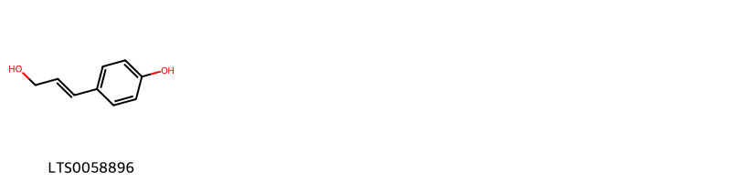{ width=100% }
    <figcaption>Hình ảnh cấu trúc hóa học của 1 hoạt chất thuộc nhóm Cinnamyl alcohols gồm ['p-coumaryl alcohol (LTS0058896)'].</figcaption>
</figure>
#### Nhóm Fatty Acyls
<figure markdown="span">
    { width=100% }
    <figcaption>Hình ảnh cấu trúc hóa học của 3 hoạt chất thuộc nhóm Fatty Acyls gồm ['15-phenylpentadecanoic acid (LTS0231218)', '13-phenyltridecanoic acid (LTS0016854)', 'pinellic acid (LTS0225692)'].</figcaption>
</figure>
#### Nhóm Harmala alkaloids
<figure markdown="span">
    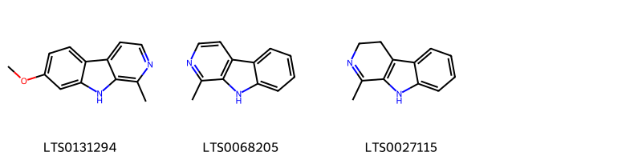{ width=100% }
    <figcaption>Hình ảnh cấu trúc hóa học của 3 hoạt chất thuộc nhóm Harmala alkaloids gồm ['harmine (LTS0131294)', 'harmane (LTS0068205)', '1-methyl-3h,4h,9h-pyrido[3,4-b]indole (LTS0027115)'].</figcaption>
</figure>
#### Nhóm Indoles and derivatives
<figure markdown="span">
    { width=100% }
    <figcaption>Hình ảnh cấu trúc hóa học của 1 hoạt chất thuộc nhóm Indoles and derivatives gồm ['β-carboline (LTS0263207)'].</figcaption>
</figure>
#### Nhóm Sphingolipids
<figure markdown="span">
    { width=100% }
    <figcaption>Hình ảnh cấu trúc hóa học của 2 hoạt chất thuộc nhóm Sphingolipids gồm ['2-hydroxy-n-(3-hydroxy-1-{[3,4,5-trihydroxy-6-(hydroxymethyl)oxan-2-yl]oxy}octadeca-4,11-dien-2-yl)hexadecanimidic acid (LTS0105591)', '(2r)-2-hydroxy-n-[(2s,3r,4e,11e)-3-hydroxy-1-{[(2r,3r,4s,5s,6r)-3,4,5-trihydroxy-6-(hydroxymethyl)oxan-2-yl]oxy}octadeca-4,11-dien-2-yl]hexadecanimidic acid (LTS0186194)'].</figcaption>
</figure>
#### Nhóm Steroids and steroid derivatives
<figure markdown="span">
    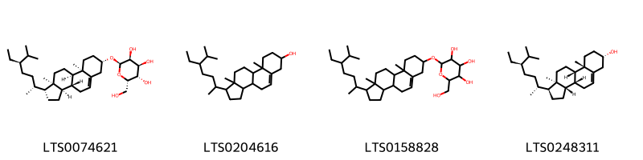{ width=100% }
    <figcaption>Hình ảnh cấu trúc hóa học của 4 hoạt chất thuộc nhóm Steroids and steroid derivatives gồm ['(2r,3s,4s,5s,6s)-2-{[(1r,3ar,3br,7s,9ar,9br,11ar)-1-[(2r,5r)-5-ethyl-6-methylheptan-2-yl]-9a,11a-dimethyl-1h,2h,3h,3ah,3bh,4h,6h,7h,8h,9h,9bh,10h,11h-cyclopenta[a]phenanthren-7-yl]oxy}-6-(hydroxymethyl)oxane-3,4,5-triol (LTS0074621)', 'stigmast-5-en-3-ol, (3β)- (LTS0204616)', '2-{[1-(5-ethyl-6-methylheptan-2-yl)-9a,11a-dimethyl-1h,2h,3h,3ah,3bh,4h,6h,7h,8h,9h,9bh,10h,11h-cyclopenta[a]phenanthren-7-yl]oxy}-6-(hydroxymethyl)oxane-3,4,5-triol (LTS0158828)', '(1s,3as,3br,7s,9as,9bs,11ar)-1-[(2r,5r)-5-ethyl-6-methylheptan-2-yl]-9a,11a-dimethyl-1h,2h,3h,3ah,3bh,4h,6h,7h,8h,9h,9bh,10h,11h-cyclopenta[a]phenanthren-7-ol (LTS0248311)'].</figcaption>
</figure>

---

### Dược dân tộc học

Danh sách các quốc gia có sử dụng *Pinellia ternata* trong điều trị các bệnh. 

| Country   | Disease                                                         | Bệnh                                                                                |
|:----------|:----------------------------------------------------------------|:------------------------------------------------------------------------------------|
| China     | Antitussive, Expectorant, Poison, Sedative, Expectorant, Poison | Thuốc chống ho, thuốc long đờm, thuốc độc, thuốc an thần, thuốc long đờm, thuốc độc |
| Japan*    | Antiemetic, Antitussive, Expectorant                            | Thuốc chống nôn, chống ho, đờm                                                      |

---

---
## Pinellia tripartita
### Thông tin về thực vật

!!! info "Phân loại thực vật của *Pinellia tripartita* từ GIBF:"
    - **Kingdom:** Plantae
    - **Phylum:** Tracheophyta
    - **Order:** Alismatales
    - **Family:** Araceae
    - **Genus:** Pinellia
    - **Species:** *Pinellia tripartita*

 

| Label (VI)   | Label (EN)   | Scientific Name     | Descriptions (VI)   | Descriptions (EN)   | Also Known As (VI)   | Also Known As (EN)   |
|:-------------|:-------------|:--------------------|:--------------------|:--------------------|:---------------------|:---------------------|
| N/A          | N/A          | Pinellia tripartita | loài thực vật       | species of plant    | ['']                 | ['']                 |

#### Phân bố trên thế giới

**Từ CSDL GIBF** nan, Japan, Belgium, Korea, Republic of, United States of America, China, France, New Zealand, Canada

#### Phân bố tại Việt Nam

**Từ CSDL GIBF**: Không có ghi nhận ở Việt Nam

---
### Thành phần hóa học
        
- Theo cơ sở dữ liệu lotus: Từ loài *Pinellia tripartita* đã phân lập và xác định được 2 hoạt chất thuộc về các nhóm Fatty Acyls. 

|    | chemicalTaxonomyClassyfireClass   |   smiles_count |
|---:|:----------------------------------|---------------:|
|  0 | Fatty Acyls                       |              2 |

#### Nhóm Fatty Acyls
<figure markdown="span">
    { width=100% }
    <figcaption>Hình ảnh cấu trúc hóa học của 2 hoạt chất thuộc nhóm Fatty Acyls gồm ['15-phenylpentadecanoic acid (LTS0231218)', '13-phenyltridecanoic acid (LTS0016854)'].</figcaption>
</figure>

---

### Dược dân tộc học

Danh sách các quốc gia có sử dụng *Pinellia tripartita* trong điều trị các bệnh. 

| Country   | Disease                                        | Bệnh                                    |
|:----------|:-----------------------------------------------|:----------------------------------------|
| Elsewhere | Antidiarrheic                                  | Chống tiêu chảy                         |
| Japan     | Antitussive, Diuretic, Antiemetic, Cardiotonic | Chống ho, lợi tiểu, chống nôn, tim mạch |

---

---
## Pinellia tuberifera
### Thông tin về thực vật

!!! info "Phân loại thực vật của *Pinellia ternata* từ GIBF:"
    - **Kingdom:** Plantae
    - **Phylum:** Tracheophyta
    - **Order:** Alismatales
    - **Family:** Araceae
    - **Genus:** Pinellia
    - **Species:** *Pinellia ternata*

 

| Label (VI)   | Label (EN)   | Scientific Name     | Descriptions (VI)   | Descriptions (EN)   | Also Known As (VI)   | Also Known As (EN)   |
|:-------------|:-------------|:--------------------|:--------------------|:--------------------|:---------------------|:---------------------|
| N/A          | N/A          | Pinellia tuberifera |                     |                     | ['']                 | ['']                 |

#### Phân bố trên thế giới

**Từ CSDL GIBF** nan, Japan, Germany, unknown or invalid, Poland, China

#### Phân bố tại Việt Nam

**Từ CSDL GIBF**: Không có ghi nhận ở Việt Nam

---
### Thành phần hóa học
        
- Theo cơ sở dữ liệu lotus: Từ loài *Pinellia ternata* đã phân lập và xác định được Chưa có hoạt chất nào được phân lập. hoạt chất thuộc về các nhóm Không có hoạt chất nào được phân lập. 

Không có hình ảnh nào được tạo ra

---

### Dược dân tộc học

Danh sách các quốc gia có sử dụng *Pinellia ternata* trong điều trị các bệnh. 

| Country   | Disease                             | Bệnh                                |
|:----------|:------------------------------------|:------------------------------------|
| China     | Ecbolic, Emetic, Astringent, Poison | Ecbolic, Emetic, Astringent, Poison |

---

# Chi Taccarum

??? note "Danh sách các dược liệu thuộc chi"
    
	 - *Taccarum weddellianum*

---
## Taccarum weddellianum
### Thông tin về thực vật

!!! info "Phân loại thực vật của *Taccarum weddellianum* từ GIBF:"
    - **Kingdom:** Plantae
    - **Phylum:** Tracheophyta
    - **Order:** Alismatales
    - **Family:** Araceae
    - **Genus:** Taccarum
    - **Species:** *Taccarum weddellianum*

 

| Label (VI)   | Label (EN)   | Scientific Name       | Descriptions (VI)   | Descriptions (EN)   | Also Known As (VI)   | Also Known As (EN)   |
|:-------------|:-------------|:----------------------|:--------------------|:--------------------|:---------------------|:---------------------|
| N/A          | N/A          | Taccarum weddellianum | loài thực vật       | species of plant    | ['']                 | ['']                 |

#### Phân bố trên thế giới

**Từ CSDL GIBF** nan, Germany, Belgium, Brazil, Bolivia (Plurinational State of), unknown or invalid, United States of America, Peru, France, Paraguay, Chile

#### Phân bố tại Việt Nam

**Từ CSDL GIBF**: Không có ghi nhận ở Việt Nam

---
### Thành phần hóa học
        
- Theo cơ sở dữ liệu lotus: Từ loài *Taccarum weddellianum* đã phân lập và xác định được Chưa có hoạt chất nào được phân lập. hoạt chất thuộc về các nhóm Không có hoạt chất nào được phân lập. 

Không có hình ảnh nào được tạo ra

---

### Dược dân tộc học

Danh sách các quốc gia có sử dụng *Taccarum weddellianum* trong điều trị các bệnh. 

| Country   | Disease        | Bệnh               |
|:----------|:---------------|:-------------------|
| Bolivia   | Poison, Poison | Chất độc, chất độc |
| Brazil    | Poison         | Chất độc           |

---

# Chi Synandroadix

??? note "Danh sách các dược liệu thuộc chi"
    
	 - *Synandroadix vermitoxicus*

---
## Synandroadix vermitoxicus
### Thông tin về thực vật

!!! info "Phân loại thực vật của *N/A* từ GIBF:"
    - **Kingdom:** N/A
    - **Phylum:** N/A
    - **Order:** N/A
    - **Family:** N/A
    - **Genus:** N/A
    - **Species:** *N/A*

 

| Label (VI)   | Label (EN)   | Scientific Name       | Descriptions (VI)   | Descriptions (EN)   | Also Known As (VI)   | Also Known As (EN)   |
|:-------------|:-------------|:----------------------|:--------------------|:--------------------|:---------------------|:---------------------|
| N/A          | N/A          | Taccarum weddellianum | loài thực vật       | species of plant    | ['']                 | ['']                 |

#### Phân bố trên thế giới

**Từ CSDL GIBF** Không có kết quả phù hợp

#### Phân bố tại Việt Nam

**Từ CSDL GIBF**: Không có ghi nhận ở Việt Nam

---
### Thành phần hóa học
        
- Theo cơ sở dữ liệu lotus: Từ loài *N/A* đã phân lập và xác định được Chưa có hoạt chất nào được phân lập. hoạt chất thuộc về các nhóm Không có hoạt chất nào được phân lập. 

Không có hình ảnh nào được tạo ra

---

### Dược dân tộc học

Danh sách các quốc gia có sử dụng *N/A* trong điều trị các bệnh. 

| Country   | Disease     | Bệnh          |
|:----------|:------------|:--------------|
| Argentina | Insecticide | Thuốc trừ sâu |

---

# Chi Lagenandra

??? note "Danh sách các dược liệu thuộc chi"
    
	 - *Lagenandra ovata*

---
## Lagenandra ovata
### Thông tin về thực vật

!!! info "Phân loại thực vật của *Lagenandra ovata* từ GIBF:"
    - **Kingdom:** Plantae
    - **Phylum:** Tracheophyta
    - **Order:** Alismatales
    - **Family:** Araceae
    - **Genus:** Lagenandra
    - **Species:** *Lagenandra ovata*

 

| Label (VI)   | Label (EN)   | Scientific Name   | Descriptions (VI)   | Descriptions (EN)   | Also Known As (VI)   | Also Known As (EN)   |
|:-------------|:-------------|:------------------|:--------------------|:--------------------|:---------------------|:---------------------|
| N/A          | N/A          | Lagenandra ovata  | loài thực vật       | species of plant    | ['']                 | ['']                 |

#### Phân bố trên thế giới

**Từ CSDL GIBF** nan, Sri Lanka, Chinese Taipei, India, unknown or invalid, United States of America, Sweden

#### Phân bố tại Việt Nam

**Từ CSDL GIBF**: Không có ghi nhận ở Việt Nam

---
### Thành phần hóa học
        
- Theo cơ sở dữ liệu lotus: Từ loài *Lagenandra ovata* đã phân lập và xác định được Chưa có hoạt chất nào được phân lập. hoạt chất thuộc về các nhóm Không có hoạt chất nào được phân lập. 

Không có hình ảnh nào được tạo ra

---

### Dược dân tộc học

Danh sách các quốc gia có sử dụng *Lagenandra ovata* trong điều trị các bệnh. 

| Country   | Disease             | Bệnh                    |
|:----------|:--------------------|:------------------------|
| Elsewhere | Poison, Insecticide | Chất độc, Thuốc trừ sâu |

---

# Chi Pistia

??? note "Danh sách các dược liệu thuộc chi"
    
	 - *Pistia stratiotes*

---
## Pistia stratiotes
### Thông tin về thực vật

!!! info "Phân loại thực vật của *Pistia stratiotes* từ GIBF:"
    - **Kingdom:** Plantae
    - **Phylum:** Tracheophyta
    - **Order:** Alismatales
    - **Family:** Araceae
    - **Genus:** Pistia
    - **Species:** *Pistia stratiotes*

 

| Label (VI)   | Label (EN)   | Scientific Name   | Descriptions (VI)   | Descriptions (EN)   | Also Known As (VI)    | Also Known As (EN)                               |
|:-------------|:-------------|:------------------|:--------------------|:--------------------|:----------------------|:-------------------------------------------------|
| N/A          | N/A          | Pistia stratiotes |                     | species of plant    | ['Pistia stratiotes'] | ['Water Lettuce', 'Shellflower', 'Nile Cabbage'] |

#### Phân bố trên thế giới

**Từ CSDL GIBF** Virgin Islands (U.S.), Ghana, Australia, Belgium, Guatemala, Argentina, Philippines, Benin, Nicaragua, Tanzania, United Republic of, Panama, Malawi, Zambia, Puerto Rico, Chinese Taipei, Honduras, Portugal, Jamaica, United States of America, Uruguay, South Africa, Hong Kong, Thailand, Brazil, Peru, Mexico, Austria, Dominican Republic, Viet Nam, China, Ecuador, Madagascar, Seychelles, Colombia, Macao, Costa Rica, India, Indonesia, Kenya, Malaysia, Nepal

#### Phân bố tại Việt Nam

**Từ CSDL GIBF**: Hậu Giang, An Giang, Quảng Nam

---
### Thành phần hóa học
        
- Theo cơ sở dữ liệu lotus: Từ loài *Pistia stratiotes* đã phân lập và xác định được 15 hoạt chất thuộc về các nhóm Flavonoids, Prenol lipids, Steroids and steroid derivatives, Dihydrofurans. 

|    | chemicalTaxonomyClassyfireClass   |   smiles_count |
|---:|:----------------------------------|---------------:|
|  0 | Dihydrofurans                     |              1 |
|  1 | Flavonoids                        |              5 |
|  2 | Prenol lipids                     |              1 |
|  3 | Steroids and steroid derivatives  |              8 |

#### Nhóm Dihydrofurans
<figure markdown="span">
    { width=100% }
    <figcaption>Hình ảnh cấu trúc hóa học của 1 hoạt chất thuộc nhóm Dihydrofurans gồm ['vitamin c (LTS0022555)'].</figcaption>
</figure>
#### Nhóm Flavonoids
<figure markdown="span">
    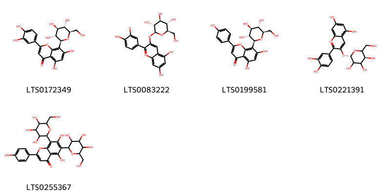{ width=100% }
    <figcaption>Hình ảnh cấu trúc hóa học của 5 hoạt chất thuộc nhóm Flavonoids gồm ['orientin (LTS0172349)', '5,7-dihydroxy-2-(4-hydroxy-3-oxidophenyl)-3-{[(2s,3r,4s,5s,6r)-3,4,5-trihydroxy-6-(hydroxymethyl)oxan-2-yl]oxy}-1λ⁴-chromen-1-ylium (LTS0083222)', 'vitexin (LTS0199581)', 'chrysanthemin (LTS0221391)', '5,7-dihydroxy-2-(4-hydroxyphenyl)-6,8-bis[3,4,5-trihydroxy-6-(hydroxymethyl)oxan-2-yl]chromen-4-one (LTS0255367)'].</figcaption>
</figure>
#### Nhóm Prenol lipids
<figure markdown="span">
    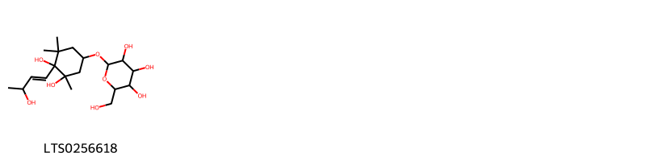{ width=100% }
    <figcaption>Hình ảnh cấu trúc hóa học của 1 hoạt chất thuộc nhóm Prenol lipids gồm ['2-({3,4-dihydroxy-4-[(1e)-3-hydroxybut-1-en-1-yl]-3,5,5-trimethylcyclohexyl}oxy)-6-(hydroxymethyl)oxane-3,4,5-triol (LTS0256618)'].</figcaption>
</figure>
#### Nhóm Steroids and steroid derivatives
<figure markdown="span">
    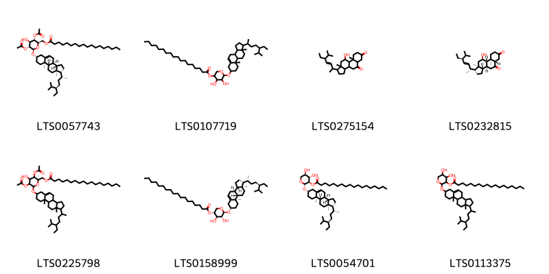{ width=100% }
    <figcaption>Hình ảnh cấu trúc hóa học của 8 hoạt chất thuộc nhóm Steroids and steroid derivatives gồm ['[(2r,3s,4s,5r,6r)-6-{[(1r,3as,3bs,7s,9ar,9bs,11ar)-1-[(2r,5r)-5-ethyl-6-methylheptan-2-yl]-9a,11a-dimethyl-1h,2h,3h,3ah,3bh,4h,6h,7h,8h,9h,9bh,10h,11h-cyclopenta[a]phenanthren-7-yl]oxy}-3,5-bis(acetyloxy)-4-hydroxyoxan-2-yl]methyl octadecanoate (LTS0057743)', '6-{[1-(5-ethyl-6-methylheptan-2-yl)-9a,11a-dimethyl-1h,2h,3h,3ah,3bh,4h,6h,7h,8h,9h,9bh,10h,11h-cyclopenta[a]phenanthren-7-yl]oxy}-4,5-dihydroxyoxan-3-yl octadecanoate (LTS0107719)', '1-(5-ethyl-6-methylhept-3-en-2-yl)-10-hydroxy-9a,11a-dimethyl-dodecahydro-1h-cyclopenta[a]phenanthrene-5,7-dione (LTS0275154)', '(1r,3as,3bs,5as,9ar,9bs,10r,11ar)-1-[(2r,3e,5s)-5-ethyl-6-methylhept-3-en-2-yl]-10-hydroxy-9a,11a-dimethyl-dodecahydro-1h-cyclopenta[a]phenanthrene-5,7-dione (LTS0232815)', '[3,5-bis(acetyloxy)-6-{[1-(5-ethyl-6-methylheptan-2-yl)-9a,11a-dimethyl-1h,2h,3h,3ah,3bh,4h,6h,7h,8h,9h,9bh,10h,11h-cyclopenta[a]phenanthren-7-yl]oxy}-4-hydroxyoxan-2-yl]methyl octadecanoate (LTS0225798)', '(3r,4r,5r,6s)-6-{[(1r,3as,3bs,7s,9ar,9bs,11ar)-1-[(2r,5r)-5-ethyl-6-methylheptan-2-yl]-9a,11a-dimethyl-1h,2h,3h,3ah,3bh,4h,6h,7h,8h,9h,9bh,10h,11h-cyclopenta[a]phenanthren-7-yl]oxy}-4,5-dihydroxyoxan-3-yl octadecanoate (LTS0158999)', '(2s,3r,4s,5r)-2-{[(1r,3as,3bs,7s,9ar,9bs,11ar)-1-[(2r,5r)-5-ethyl-6-methylheptan-2-yl]-9a,11a-dimethyl-1h,2h,3h,3ah,3bh,4h,6h,7h,8h,9h,9bh,10h,11h-cyclopenta[a]phenanthren-7-yl]oxy}-4,5-dihydroxyoxan-3-yl octadecanoate (LTS0054701)', '2-{[1-(5-ethyl-6-methylheptan-2-yl)-9a,11a-dimethyl-1h,2h,3h,3ah,3bh,4h,6h,7h,8h,9h,9bh,10h,11h-cyclopenta[a]phenanthren-7-yl]oxy}-4,5-dihydroxyoxan-3-yl octadecanoate (LTS0113375)'].</figcaption>
</figure>

---

### Dược dân tộc học

Danh sách các quốc gia có sử dụng *Pistia stratiotes* trong điều trị các bệnh. 

| Country   | Disease                                    | Bệnh                                                    |
|:----------|:-------------------------------------------|:--------------------------------------------------------|
| Africa    | Soap                                       | Xà phòng                                                |
| Brazil    | Emollient, Laxative                        | Chất làm mềm, nhuận tràng                               |
| Egypt     | Collyrium, Demulcent, Emollient, Laxative  | Collyrium, Demulcent, Chất làm mềm, Thuốc nhuận tràng   |
| Elsewhere | Vermifuge, Laxative, Emollient, Antiseptic | Máy tạo bọt, Thuốc nhuận tràng, Chất làm mềm, Khử trùng |
| Java      | Demulcent                                  | dịu, giảm kích thích                                    |
| Malaya    | Diuretic                                   | Thuốc lợi tiêu                                          |

---

# Chi Anthurium

??? note "Danh sách các dược liệu thuộc chi"
    
	 - *Anthurium oxycarpum*
	 - *Anthurium tessmannii*

---
## Anthurium oxycarpum
### Thông tin về thực vật

!!! info "Phân loại thực vật của *Anthurium oxycarpum* từ GIBF:"
    - **Kingdom:** Plantae
    - **Phylum:** Tracheophyta
    - **Order:** Alismatales
    - **Family:** Araceae
    - **Genus:** Anthurium
    - **Species:** *Anthurium oxycarpum*

 

| Label (VI)   | Label (EN)   | Scientific Name     | Descriptions (VI)   | Descriptions (EN)   | Also Known As (VI)   | Also Known As (EN)   |
|:-------------|:-------------|:--------------------|:--------------------|:--------------------|:---------------------|:---------------------|
| N/A          | N/A          | Anthurium oxycarpum |                     | species of plant    | ['']                 | ['']                 |

#### Phân bố trên thế giới

**Từ CSDL GIBF** nan, Ecuador, Colombia, Brazil, Bolivia (Plurinational State of), United States of America, Peru, France

#### Phân bố tại Việt Nam

**Từ CSDL GIBF**: Không có ghi nhận ở Việt Nam

---
### Thành phần hóa học
        
- Theo cơ sở dữ liệu lotus: Từ loài *Anthurium oxycarpum* đã phân lập và xác định được Chưa có hoạt chất nào được phân lập. hoạt chất thuộc về các nhóm Không có hoạt chất nào được phân lập. 

Không có hình ảnh nào được tạo ra

---

### Dược dân tộc học

Danh sách các quốc gia có sử dụng *Anthurium oxycarpum* trong điều trị các bệnh. 

| Country   | Disease     | Bệnh           |
|:----------|:------------|:---------------|
| Brazil    | Aphrodisiac | Thuốc kích dục |

---

---
## Anthurium tessmannii
### Thông tin về thực vật

!!! info "Phân loại thực vật của *Anthurium uleanum* từ GIBF:"
    - **Kingdom:** Plantae
    - **Phylum:** Tracheophyta
    - **Order:** Alismatales
    - **Family:** Araceae
    - **Genus:** Anthurium
    - **Species:** *Anthurium uleanum*

 

| Label (VI)   | Label (EN)   | Scientific Name      | Descriptions (VI)   | Descriptions (EN)   | Also Known As (VI)   | Also Known As (EN)   |
|:-------------|:-------------|:---------------------|:--------------------|:--------------------|:---------------------|:---------------------|
| N/A          | N/A          | Anthurium tessmannii | loài thực vật       | species of plant    | ['']                 | ['']                 |

#### Phân bố trên thế giới

**Từ CSDL GIBF** nan, Colombia, Peru

#### Phân bố tại Việt Nam

**Từ CSDL GIBF**: Không có ghi nhận ở Việt Nam

---
### Thành phần hóa học
        
- Theo cơ sở dữ liệu lotus: Từ loài *Anthurium uleanum* đã phân lập và xác định được Chưa có hoạt chất nào được phân lập. hoạt chất thuộc về các nhóm Không có hoạt chất nào được phân lập. 

Không có hình ảnh nào được tạo ra

---

### Dược dân tộc học

Danh sách các quốc gia có sử dụng *Anthurium uleanum* trong điều trị các bệnh. 

| Country            | Disease       | Bệnh               |
|:-------------------|:--------------|:-------------------|
| Colombia(Barasana) | Contraceptive | Kiểm soát sinh sản |
| Colombia(Makuna)   | Contraceptive | Kiểm soát sinh sản |
| Colombia(Taiwano)  | Contraceptive | Kiểm soát sinh sản |

---

# Chi Aglaonema

??? note "Danh sách các dược liệu thuộc chi"
    
	 - *Aglaonema pictum*

---
## Aglaonema pictum
### Thông tin về thực vật

!!! info "Phân loại thực vật của *Aglaonema pictum* từ GIBF:"
    - **Kingdom:** Plantae
    - **Phylum:** Tracheophyta
    - **Order:** Alismatales
    - **Family:** Araceae
    - **Genus:** Aglaonema
    - **Species:** *Aglaonema pictum*

 

| Label (VI)   | Label (EN)   | Scientific Name   | Descriptions (VI)   | Descriptions (EN)   | Also Known As (VI)   | Also Known As (EN)   |
|:-------------|:-------------|:------------------|:--------------------|:--------------------|:---------------------|:---------------------|
| N/A          | N/A          | Aglaonema pictum  | loài thực vật       | species of plant    | ['']                 | ['']                 |

#### Phân bố trên thế giới

**Từ CSDL GIBF** nan, Sri Lanka, Thailand, Belgium, Brazil, India, Indonesia, unknown or invalid, United States of America, France, Singapore, Malaysia

#### Phân bố tại Việt Nam

**Từ CSDL GIBF**: Không có ghi nhận ở Việt Nam

---
### Thành phần hóa học
        
- Theo cơ sở dữ liệu lotus: Từ loài *Aglaonema pictum* đã phân lập và xác định được Chưa có hoạt chất nào được phân lập. hoạt chất thuộc về các nhóm Không có hoạt chất nào được phân lập. 

Không có hình ảnh nào được tạo ra

---

### Dược dân tộc học

Danh sách các quốc gia có sử dụng *Aglaonema pictum* trong điều trị các bệnh. 

| Country   | Disease   | Bệnh               |
|:----------|:----------|:-------------------|
| Malacca   | Tonic     | (thuộc) trương lực |

---

# Chi Symplocarpus

??? note "Danh sách các dược liệu thuộc chi"
    
	 - *Symplocarpus foetida*
	 - *Symplocarpus foetidus*

---
## Symplocarpus foetida
### Thông tin về thực vật

!!! info "Phân loại thực vật của *Symplocarpus foetidus* từ GIBF:"
    - **Kingdom:** Plantae
    - **Phylum:** Tracheophyta
    - **Order:** Alismatales
    - **Family:** Araceae
    - **Genus:** Symplocarpus
    - **Species:** *Symplocarpus foetidus*

 

| Label (VI)   | Label (EN)   | Scientific Name   | Descriptions (VI)   | Descriptions (EN)   | Also Known As (VI)   | Also Known As (EN)   |
|:-------------|:-------------|:------------------|:--------------------|:--------------------|:---------------------|:---------------------|
| N/A          | N/A          | Aglaonema pictum  | loài thực vật       | species of plant    | ['']                 | ['']                 |

#### Phân bố trên thế giới

**Từ CSDL GIBF** nan, United States of America, Canada

#### Phân bố tại Việt Nam

**Từ CSDL GIBF**: Không có ghi nhận ở Việt Nam

---
### Thành phần hóa học
        
- Theo cơ sở dữ liệu lotus: Từ loài *Symplocarpus foetidus* đã phân lập và xác định được Chưa có hoạt chất nào được phân lập. hoạt chất thuộc về các nhóm Không có hoạt chất nào được phân lập. 

Không có hình ảnh nào được tạo ra

---

### Dược dân tộc học

Danh sách các quốc gia có sử dụng *Symplocarpus foetidus* trong điều trị các bệnh. 

| Country   | Disease          | Bệnh                     |
|:----------|:-----------------|:-------------------------|
| US        | Diuretic, Emetic | Thuốc lợi tiểu, lợi tiểu |

---

---
## Symplocarpus foetidus
### Thông tin về thực vật

!!! info "Phân loại thực vật của *Symplocarpus foetidus* từ GIBF:"
    - **Kingdom:** Plantae
    - **Phylum:** Tracheophyta
    - **Order:** Alismatales
    - **Family:** Araceae
    - **Genus:** Symplocarpus
    - **Species:** *Symplocarpus foetidus*

 

| Label (VI)   | Label (EN)   | Scientific Name       | Descriptions (VI)   | Descriptions (EN)   | Also Known As (VI)   | Also Known As (EN)           |
|:-------------|:-------------|:----------------------|:--------------------|:--------------------|:---------------------|:-----------------------------|
| N/A          | N/A          | Symplocarpus foetidus | loài thực vật       | species of plant    | ['']                 | ['Symplocarpus foetidus ex'] |

#### Phân bố trên thế giới

**Từ CSDL GIBF** nan, United States of America, Canada

#### Phân bố tại Việt Nam

**Từ CSDL GIBF**: Không có ghi nhận ở Việt Nam

---
### Thành phần hóa học
        
- Theo cơ sở dữ liệu lotus: Từ loài *Symplocarpus foetidus* đã phân lập và xác định được 12 hoạt chất thuộc về các nhóm Fatty Acyls, Prenol lipids, Steroids and steroid derivatives. 

|    | chemicalTaxonomyClassyfireClass   |   smiles_count |
|---:|:----------------------------------|---------------:|
|  0 | Fatty Acyls                       |              2 |
|  1 | Prenol lipids                     |              5 |
|  2 | Steroids and steroid derivatives  |              5 |

#### Nhóm Fatty Acyls
<figure markdown="span">
    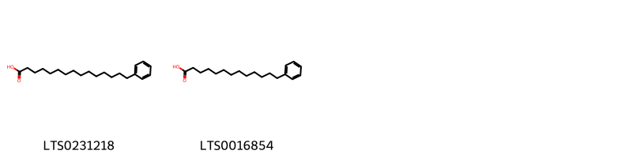{ width=100% }
    <figcaption>Hình ảnh cấu trúc hóa học của 2 hoạt chất thuộc nhóm Fatty Acyls gồm ['15-phenylpentadecanoic acid (LTS0231218)', '13-phenyltridecanoic acid (LTS0016854)'].</figcaption>
</figure>
#### Nhóm Prenol lipids
<figure markdown="span">
    { width=100% }
    <figcaption>Hình ảnh cấu trúc hóa học của 5 hoạt chất thuộc nhóm Prenol lipids gồm ['amyrin (LTS0222826)', 'β-amyrin (LTS0251864)', 'lupeol (LTS0256952)', '(6ar,6br,8ar,14br)-4,4,6a,6b,8a,12,14b-heptamethyl-11-methylidene-hexadecahydropicen-3-ol (LTS0274865)', 'taraxasterol (LTS0006950)'].</figcaption>
</figure>
#### Nhóm Steroids and steroid derivatives
<figure markdown="span">
    { width=100% }
    <figcaption>Hình ảnh cấu trúc hóa học của 5 hoạt chất thuộc nhóm Steroids and steroid derivatives gồm ['stigmast-5-en-3-ol (LTS0071224)', 'stigmast-5-en-3-ol, (3β)- (LTS0204616)', 'phytosterol (LTS0029311)', '(1r,3as,3bs,7s,9bs)-1-[(2r,5r)-5,6-dimethylheptan-2-yl]-9a,11a-dimethyl-1h,2h,3h,3ah,3bh,4h,6h,7h,8h,9h,9bh,10h,11h-cyclopenta[a]phenanthren-7-ol (LTS0057877)', 'campesterol (LTS0046755)'].</figcaption>
</figure>

---

### Dược dân tộc học

Danh sách các quốc gia có sử dụng *Symplocarpus foetidus* trong điều trị các bệnh. 

| Country        | Disease                                                                           | Bệnh                                                                              |
|:---------------|:----------------------------------------------------------------------------------|:----------------------------------------------------------------------------------|
| Dutch          | Sudorific                                                                         | Ngạt thở                                                                          |
| French         | Sedative                                                                          | Thuốc an thần                                                                     |
| German         | Expectorant                                                                       | Thuốc long đàm                                                                    |
| Italian        | Narcotic                                                                          | Thuốc gây ngủ, gây mê                                                             |
| US             | Inhalant, Narcotic, Sialogogue, Vermifuge, Stimulant, Poison, Emetic, Emmenagogue | Inhalant, Narcotic, Sialogogue, Vermifuge, Stimulant, Poison, Emetic, Emmenagogue |
| US(Amerindian) | Styptic                                                                           | L.                                                                                |
| US(Menomini)   | Poultice                                                                          | thuốc đắp, đắp thuốc cao                                                          |
| US(Meskwaki)   | Poultice                                                                          | thuốc đắp, đắp thuốc cao                                                          |

---

# Chi Scindapsus

??? note "Danh sách các dược liệu thuộc chi"
    
	 - *Scindapsus officinalis*

---
## Scindapsus officinalis
### Thông tin về thực vật

!!! info "Phân loại thực vật của *Scindapsus officinalis* từ GIBF:"
    - **Kingdom:** Plantae
    - **Phylum:** Tracheophyta
    - **Order:** Alismatales
    - **Family:** Araceae
    - **Genus:** Scindapsus
    - **Species:** *Scindapsus officinalis*

 

| Label (VI)   | Label (EN)   | Scientific Name        | Descriptions (VI)   | Descriptions (EN)   | Also Known As (VI)   | Also Known As (EN)   |
|:-------------|:-------------|:-----------------------|:--------------------|:--------------------|:---------------------|:---------------------|
| N/A          | N/A          | Scindapsus officinalis | loài thực vật       | species of plant    | ['dây bá']           | ['']                 |

#### Phân bố trên thế giới

**Từ CSDL GIBF** nan, Thailand, Lao People’s Democratic Republic, Cambodia, Myanmar, Bhutan, India, unknown or invalid, Bangladesh, Viet Nam, Malaysia, China, Nepal

#### Phân bố tại Việt Nam

**Từ CSDL GIBF**: Tay Ninh

---
### Thành phần hóa học
        
- Theo cơ sở dữ liệu lotus: Từ loài *Scindapsus officinalis* đã phân lập và xác định được Chưa có hoạt chất nào được phân lập. hoạt chất thuộc về các nhóm Không có hoạt chất nào được phân lập. 

Không có hình ảnh nào được tạo ra

---

### Dược dân tộc học

Danh sách các quốc gia có sử dụng *Scindapsus officinalis* trong điều trị các bệnh. 

| Country      | Disease                                                                                | Bệnh                                                                                                 |
|:-------------|:---------------------------------------------------------------------------------------|:-----------------------------------------------------------------------------------------------------|
| India        | Aphrodisiac, Carminative, Diaphoretic, Expectorant, Protisticide, Vermifuge, Stimulant | Thuốc kích thích tình dục, Carminative, Diaphoretic, Expectorant, Protisticide, Vermifuge, Stimulant |
| India(Hindu) | Vermifuge, Diaphoretic, Stimulant                                                      | Vermifuge, Diaphoretic, Chất kích thích                                                              |

---

# Chi Lysichiton

??? note "Danh sách các dược liệu thuộc chi"
    
	 - *Lysichiton americanum*

---
## Lysichiton americanum
### Thông tin về thực vật

!!! info "Phân loại thực vật của *Lysichiton americanus* từ GIBF:"
    - **Kingdom:** Plantae
    - **Phylum:** Tracheophyta
    - **Order:** Alismatales
    - **Family:** Araceae
    - **Genus:** Lysichiton
    - **Species:** *Lysichiton americanus*

 

| Label (VI)   | Label (EN)   | Scientific Name        | Descriptions (VI)   | Descriptions (EN)   | Also Known As (VI)   | Also Known As (EN)   |
|:-------------|:-------------|:-----------------------|:--------------------|:--------------------|:---------------------|:---------------------|
| N/A          | N/A          | Scindapsus officinalis | loài thực vật       | species of plant    | ['dây bá']           | ['']                 |

#### Phân bố trên thế giới

**Từ CSDL GIBF** Netherlands, Belgium, United States of America, Sweden, United Kingdom of Great Britain and Northern Ireland, Canada

#### Phân bố tại Việt Nam

**Từ CSDL GIBF**: Không có ghi nhận ở Việt Nam

---
### Thành phần hóa học
        
- Theo cơ sở dữ liệu lotus: Từ loài *Lysichiton americanus* đã phân lập và xác định được Chưa có hoạt chất nào được phân lập. hoạt chất thuộc về các nhóm Không có hoạt chất nào được phân lập. 

Không có hình ảnh nào được tạo ra

---

### Dược dân tộc học

Danh sách các quốc gia có sử dụng *Lysichiton americanus* trong điều trị các bệnh. 

| Country   | Disease   | Bệnh                     |
|:----------|:----------|:-------------------------|
| US(Makah) | Poultice  | thuốc đắp, đắp thuốc cao |

---

# Chi Alocasia

??? note "Danh sách các dược liệu thuộc chi"
    
	 - *Alocasia indica*
	 - *Alocasia macrorrhiza*

---
## Alocasia indica
### Thông tin về thực vật

!!! info "Phân loại thực vật của *Alocasia indica* từ GIBF:"
    - **Kingdom:** Plantae
    - **Phylum:** Tracheophyta
    - **Order:** Alismatales
    - **Family:** Araceae
    - **Genus:** Alocasia
    - **Species:** *Alocasia indica*

 

| Label (VI)   | Label (EN)   | Scientific Name   | Descriptions (VI)   | Descriptions (EN)   | Also Known As (VI)   | Also Known As (EN)   |
|:-------------|:-------------|:------------------|:--------------------|:--------------------|:---------------------|:---------------------|
| N/A          | N/A          | Alocasia indica   | loài thực vật       | species of plant    | ['']                 | ['']                 |

#### Phân bố trên thế giới

**Từ CSDL GIBF** nan, Sri Lanka, Japan, Réunion, Jamaica, United States of America, Fiji, Suriname, Thailand, Germany, Martinique, Guam, Mayotte, Mexico, Singapore, China, Curaçao, Comoros, Costa Rica, India, Indonesia, Samoa, Malaysia

#### Phân bố tại Việt Nam

**Từ CSDL GIBF**: Không có ghi nhận ở Việt Nam

---
### Thành phần hóa học
        
- Theo cơ sở dữ liệu lotus: Từ loài *Alocasia indica* đã phân lập và xác định được Chưa có hoạt chất nào được phân lập. hoạt chất thuộc về các nhóm Không có hoạt chất nào được phân lập. 

Không có hình ảnh nào được tạo ra

---

### Dược dân tộc học

Danh sách các quốc gia có sử dụng *Alocasia indica* trong điều trị các bệnh. 

| Country   | Disease                                      | Bệnh                                                                     |
|:----------|:---------------------------------------------|:-------------------------------------------------------------------------|
| Elsewhere | Laxative, Parasiticide, Astringent, Diuretic | Thuốc nhuận tràng, Thuốc diệt ký sinh trùng, Chất làm se, Thuốc lợi tiểu |
| Java      | Laxative                                     | Nhuận trường                                                             |

---

---
## Alocasia macrorrhiza
### Thông tin về thực vật

!!! info "Phân loại thực vật của *Alocasia macrorrhizos* từ GIBF:"
    - **Kingdom:** Plantae
    - **Phylum:** Tracheophyta
    - **Order:** Alismatales
    - **Family:** Araceae
    - **Genus:** Alocasia
    - **Species:** *Alocasia macrorrhizos*

 

| Label (VI)   | Label (EN)   | Scientific Name   | Descriptions (VI)   | Descriptions (EN)   | Also Known As (VI)   | Also Known As (EN)   |
|:-------------|:-------------|:------------------|:--------------------|:--------------------|:---------------------|:---------------------|
| N/A          | N/A          | Alocasia indica   | loài thực vật       | species of plant    | ['']                 | ['']                 |

#### Phân bố trên thế giới

**Từ CSDL GIBF** nan, American Samoa, Australia, Japan, Cook Islands, Cambodia, Chinese Taipei, Bolivia (Plurinational State of), Papua New Guinea, United States of America, Solomon Islands, Belize, Fiji, Thailand, Brazil, Guam, Tonga, New Caledonia, France, Viet Nam, China, French Polynesia, Seychelles, Colombia, India, Indonesia, Samoa, Philippines

#### Phân bố tại Việt Nam

**Từ CSDL GIBF**: Kontum

---
### Thành phần hóa học
        
- Theo cơ sở dữ liệu lotus: Từ loài *Alocasia macrorrhizos* đã phân lập và xác định được Chưa có hoạt chất nào được phân lập. hoạt chất thuộc về các nhóm Không có hoạt chất nào được phân lập. 

Không có hình ảnh nào được tạo ra

---

### Dược dân tộc học

Danh sách các quốc gia có sử dụng *Alocasia macrorrhizos* trong điều trị các bệnh. 

| Country   | Disease                | Bệnh                         |
|:----------|:-----------------------|:-----------------------------|
| China     | Poison                 | Chất độc                     |
| Egypt     | Poison                 | Chất độc                     |
| Hawaii    | Aphrodisiac            | Thuốc kích dục               |
| India     | Stimulant, Rubefacient | Chất kích thích, Rubefacient |
| Java      | Rubefacient            | Chất gây xung huyết da       |
| Samoa     | Astringent             | Lam se da                    |

---

# Chi Cyrtoerma

??? note "Danh sách các dược liệu thuộc chi"
    
	 - *Cyrtoerma edule*
	 - *Cyrtoerma merkusii*

---
## Cyrtoerma edule
### Thông tin về thực vật

!!! info "Phân loại thực vật của *N/A* từ GIBF:"
    - **Kingdom:** N/A
    - **Phylum:** N/A
    - **Order:** N/A
    - **Family:** N/A
    - **Genus:** N/A
    - **Species:** *N/A*

 

| Label (VI)   | Label (EN)   | Scientific Name   | Descriptions (VI)   | Descriptions (EN)   | Also Known As (VI)   | Also Known As (EN)   |
|:-------------|:-------------|:------------------|:--------------------|:--------------------|:---------------------|:---------------------|
| N/A          | N/A          | Alocasia indica   | loài thực vật       | species of plant    | ['']                 | ['']                 |

#### Phân bố trên thế giới

**Từ CSDL GIBF** Không có kết quả phù hợp

#### Phân bố tại Việt Nam

**Từ CSDL GIBF**: Không có ghi nhận ở Việt Nam

---
### Thành phần hóa học
        
- Theo cơ sở dữ liệu lotus: Từ loài *N/A* đã phân lập và xác định được Chưa có hoạt chất nào được phân lập. hoạt chất thuộc về các nhóm Không có hoạt chất nào được phân lập. 

Không có hình ảnh nào được tạo ra

---

### Dược dân tộc học

Danh sách các quốc gia có sử dụng *N/A* trong điều trị các bệnh. 

| Country   | Disease     | Bệnh        |
|:----------|:------------|:------------|
| Malaya    | Emmenagogue | Emmenagogue |

---

---
## Cyrtoerma merkusii
### Thông tin về thực vật

!!! info "Phân loại thực vật của *N/A* từ GIBF:"
    - **Kingdom:** N/A
    - **Phylum:** N/A
    - **Order:** N/A
    - **Family:** N/A
    - **Genus:** N/A
    - **Species:** *N/A*

 

| Label (VI)   | Label (EN)   | Scientific Name   | Descriptions (VI)   | Descriptions (EN)   | Also Known As (VI)   | Also Known As (EN)   |
|:-------------|:-------------|:------------------|:--------------------|:--------------------|:---------------------|:---------------------|
| N/A          | N/A          | Alocasia indica   | loài thực vật       | species of plant    | ['']                 | ['']                 |

#### Phân bố trên thế giới

**Từ CSDL GIBF** Không có kết quả phù hợp

#### Phân bố tại Việt Nam

**Từ CSDL GIBF**: Không có ghi nhận ở Việt Nam

---
### Thành phần hóa học
        
- Theo cơ sở dữ liệu lotus: Từ loài *N/A* đã phân lập và xác định được Chưa có hoạt chất nào được phân lập. hoạt chất thuộc về các nhóm Không có hoạt chất nào được phân lập. 

Không có hình ảnh nào được tạo ra

---

### Dược dân tộc học

Danh sách các quốc gia có sử dụng *N/A* trong điều trị các bệnh. 

| Country   | Disease              | Bệnh                 |
|:----------|:---------------------|:---------------------|
| Elsewhere | Ecbolic, Emmenagogue | Ecbolic, Emmenagogue |

---

# Chi Sauromatum

??? note "Danh sách các dược liệu thuộc chi"
    
	 - *Sauromatum venosum*

---
## Sauromatum venosum
### Thông tin về thực vật

!!! info "Phân loại thực vật của *Sauromatum venosum* từ GIBF:"
    - **Kingdom:** Plantae
    - **Phylum:** Tracheophyta
    - **Order:** Alismatales
    - **Family:** Araceae
    - **Genus:** Sauromatum
    - **Species:** *Sauromatum venosum*

 

| Label (VI)   | Label (EN)   | Scientific Name    | Descriptions (VI)   | Descriptions (EN)          | Also Known As (VI)   | Also Known As (EN)   |
|:-------------|:-------------|:-------------------|:--------------------|:---------------------------|:---------------------|:---------------------|
| N/A          | N/A          | Sauromatum venosum |                     | species of flowering plant | ['']                 | ['']                 |

#### Phân bố trên thế giới

**Từ CSDL GIBF** nan, Central African Republic, Belgium, Gabon, Angola, Mozambique, unknown or invalid, Norway, Tanzania, United Republic of, Yemen, Togo, Malawi, Pakistan, Zambia, Netherlands, Nigeria, United States of America, Sweden, Congo, Democratic Republic of the, Uganda, Germany, Thailand, Brazil, Austria, France, China, United Kingdom of Great Britain and Northern Ireland, Madagascar, India, Nepal, Poland, Kenya, Cameroon, New Zealand, Ethiopia

#### Phân bố tại Việt Nam

**Từ CSDL GIBF**: Không có ghi nhận ở Việt Nam

---
### Thành phần hóa học
        
- Theo cơ sở dữ liệu lotus: Từ loài *Sauromatum venosum* đã phân lập và xác định được 31 hoạt chất thuộc về các nhóm Phenol ethers, Fatty Acyls, Indoles and derivatives, Prenol lipids, Benzene and substituted derivatives, Organooxygen compounds, Saturated hydrocarbons, Sulfenyl compounds, Carboxylic acids and derivatives, Pyridines and derivatives. 

|    | chemicalTaxonomyClassyfireClass     |   smiles_count |
|---:|:------------------------------------|---------------:|
|  0 | Benzene and substituted derivatives |              4 |
|  1 | Carboxylic acids and derivatives    |              1 |
|  2 | Fatty Acyls                         |              1 |
|  3 | Indoles and derivatives             |              2 |
|  4 | Organooxygen compounds              |              3 |
|  5 | Phenol ethers                       |              1 |
|  6 | Prenol lipids                       |              7 |
|  7 | Pyridines and derivatives           |              1 |
|  8 | Saturated hydrocarbons              |             10 |
|  9 | Sulfenyl compounds                  |              1 |

#### Nhóm Benzene and substituted derivatives
<figure markdown="span">
    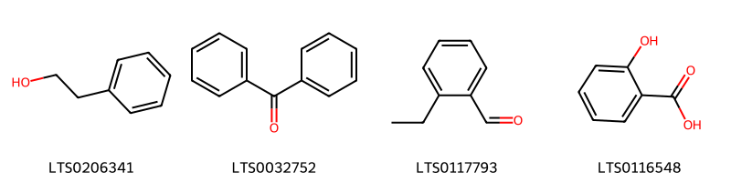{ width=100% }
    <figcaption>Hình ảnh cấu trúc hóa học của 4 hoạt chất thuộc nhóm Benzene and substituted derivatives gồm ['2-phenyl-ethanol (LTS0206341)', 'benzophenone (LTS0032752)', '2-ethylbenzaldehyde (LTS0117793)', 'salicyclic acid (LTS0116548)'].</figcaption>
</figure>
#### Nhóm Carboxylic acids and derivatives
<figure markdown="span">
    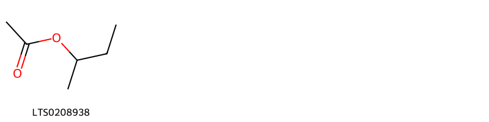{ width=100% }
    <figcaption>Hình ảnh cấu trúc hóa học của 1 hoạt chất thuộc nhóm Carboxylic acids and derivatives gồm ['sec-butyl acetate (LTS0208938)'].</figcaption>
</figure>
#### Nhóm Fatty Acyls
<figure markdown="span">
    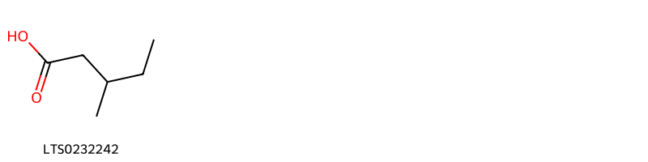{ width=100% }
    <figcaption>Hình ảnh cấu trúc hóa học của 1 hoạt chất thuộc nhóm Fatty Acyls gồm ['3-methyl valeric acid (LTS0232242)'].</figcaption>
</figure>
#### Nhóm Indoles and derivatives
<figure markdown="span">
    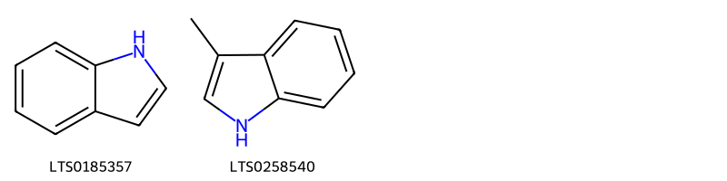{ width=100% }
    <figcaption>Hình ảnh cấu trúc hóa học của 2 hoạt chất thuộc nhóm Indoles and derivatives gồm ['indole (LTS0185357)', 'scatole (LTS0258540)'].</figcaption>
</figure>
#### Nhóm Organooxygen compounds
<figure markdown="span">
    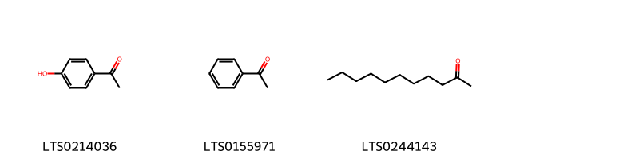{ width=100% }
    <figcaption>Hình ảnh cấu trúc hóa học của 3 hoạt chất thuộc nhóm Organooxygen compounds gồm ['hydroxyacetophenone (LTS0214036)', 'acetophenone (LTS0155971)', 'undecan-2-one (LTS0244143)'].</figcaption>
</figure>
#### Nhóm Phenol ethers
<figure markdown="span">
    { width=100% }
    <figcaption>Hình ảnh cấu trúc hóa học của 1 hoạt chất thuộc nhóm Phenol ethers gồm ['anisole (LTS0013639)'].</figcaption>
</figure>
#### Nhóm Prenol lipids
<figure markdown="span">
    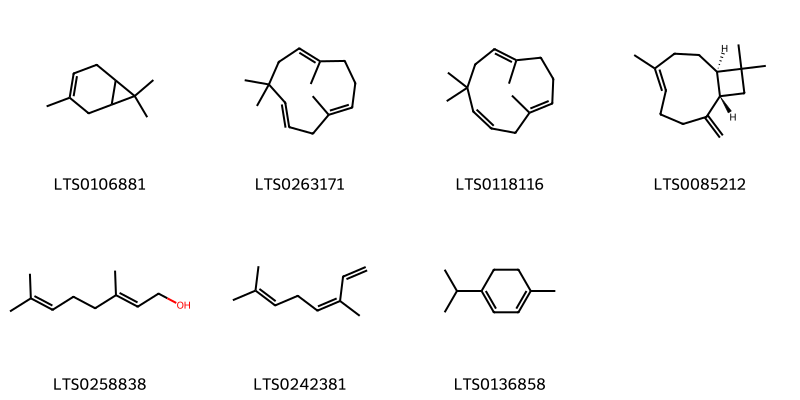{ width=100% }
    <figcaption>Hình ảnh cấu trúc hóa học của 7 hoạt chất thuộc nhóm Prenol lipids gồm ['monoterpenes (LTS0106881)', 'humulene (LTS0263171)', '(4e,8e)-4,8,11,11-tetramethylcycloundeca-1,4,8-triene (LTS0118116)', 'caryophyllene (LTS0085212)', 'geraniol (LTS0258838)', 'β-ocimene (LTS0242381)', 'terpinene (LTS0136858)'].</figcaption>
</figure>
#### Nhóm Pyridines and derivatives
<figure markdown="span">
    { width=100% }
    <figcaption>Hình ảnh cấu trúc hóa học của 1 hoạt chất thuộc nhóm Pyridines and derivatives gồm ['actinidine (LTS0046972)'].</figcaption>
</figure>
#### Nhóm Saturated hydrocarbons
<figure markdown="span">
    { width=100% }
    <figcaption>Hình ảnh cấu trúc hóa học của 10 hoạt chất thuộc nhóm Saturated hydrocarbons gồm ['undecane (LTS0081068)', 'decane (LTS0045828)', 'dodecane (LTS0146085)', 'nonadecane (LTS0146180)', 'cetane (LTS0134950)', 'heptadecane (LTS0038303)', 'pentadecane (LTS0210146)', 'tridecane (LTS0164232)', 'octadecane (LTS0258101)', 'tetradecane (LTS0007753)'].</figcaption>
</figure>
#### Nhóm Sulfenyl compounds
<figure markdown="span">
    { width=100% }
    <figcaption>Hình ảnh cấu trúc hóa học của 1 hoạt chất thuộc nhóm Sulfenyl compounds gồm ['dimethyltetrasulfane (LTS0111253)'].</figcaption>
</figure>

---

### Dược dân tộc học

Danh sách các quốc gia có sử dụng *Sauromatum venosum* trong điều trị các bệnh. 

| Country   | Disease           | Bệnh                      |
|:----------|:------------------|:--------------------------|
| Elsewhere | Poison, Stimulant | Chất độc, chất kích thích |

---

# Chi Plesmonium

??? note "Danh sách các dược liệu thuộc chi"
    
	 - *Plesmonium margaritiferum*

---
## Plesmonium margaritiferum
### Thông tin về thực vật

!!! info "Phân loại thực vật của *Amorphophallus margaritifer* từ GIBF:"
    - **Kingdom:** Plantae
    - **Phylum:** Tracheophyta
    - **Order:** Alismatales
    - **Family:** Araceae
    - **Genus:** Amorphophallus
    - **Species:** *Amorphophallus margaritifer*

 

| Label (VI)   | Label (EN)   | Scientific Name           | Descriptions (VI)   | Descriptions (EN)   | Also Known As (VI)   | Also Known As (EN)   |
|:-------------|:-------------|:--------------------------|:--------------------|:--------------------|:---------------------|:---------------------|
| N/A          | N/A          | Plesmonium margaritiferum |                     |                     | ['']                 | ['']                 |

#### Phân bố trên thế giới

**Từ CSDL GIBF** nan, India, unknown or invalid

#### Phân bố tại Việt Nam

**Từ CSDL GIBF**: Không có ghi nhận ở Việt Nam

---
### Thành phần hóa học
        
- Theo cơ sở dữ liệu lotus: Từ loài *Amorphophallus margaritifer* đã phân lập và xác định được Chưa có hoạt chất nào được phân lập. hoạt chất thuộc về các nhóm Không có hoạt chất nào được phân lập. 

Không có hình ảnh nào được tạo ra

---

### Dược dân tộc học

Danh sách các quốc gia có sử dụng *Amorphophallus margaritifer* trong điều trị các bệnh. 

| Country   | Disease   | Bệnh     |
|:----------|:----------|:---------|
| Elsewhere | Poison    | Chất độc |

---

# Chi Monstera

??? note "Danh sách các dược liệu thuộc chi"
    
	 - *Monstera pertusa*

---
## Monstera pertusa
### Thông tin về thực vật

!!! info "Phân loại thực vật của *N/A* từ GIBF:"
    - **Kingdom:** Plantae
    - **Phylum:** Tracheophyta
    - **Order:** Alismatales
    - **Family:** Araceae
    - **Genus:** N/A
    - **Species:** *N/A*

 

| Label (VI)   | Label (EN)   | Scientific Name   | Descriptions (VI)   | Descriptions (EN)   | Also Known As (VI)   | Also Known As (EN)   |
|:-------------|:-------------|:------------------|:--------------------|:--------------------|:---------------------|:---------------------|
| N/A          | N/A          | Monstera pertusa  | loài thực vật       | species of plant    | ['']                 | ['']                 |

#### Phân bố trên thế giới

**Từ CSDL GIBF** nan, Sri Lanka, Italy, Australia, Belgium, Argentina, Israel, Panama, Canada, Ukraine, French Guiana, Puerto Rico, Netherlands, Chinese Taipei, Spain, Portugal, Algeria, United States of America, Croatia, Greece, South Africa, Brazil, Côte d’Ivoire, Peru, Austria, France, Mexico, Viet Nam, Singapore, United Kingdom of Great Britain and Northern Ireland, China, Ecuador, Colombia, Ireland, Costa Rica, India, Indonesia, Malaysia, New Zealand

#### Phân bố tại Việt Nam

**Từ CSDL GIBF**: Lâm Đồng

---
### Thành phần hóa học
        
- Theo cơ sở dữ liệu lotus: Từ loài *N/A* đã phân lập và xác định được Chưa có hoạt chất nào được phân lập. hoạt chất thuộc về các nhóm Không có hoạt chất nào được phân lập. 

Không có hình ảnh nào được tạo ra

---

### Dược dân tộc học

Danh sách các quốc gia có sử dụng *N/A* trong điều trị các bệnh. 

| Country   | Disease   | Bệnh              |
|:----------|:----------|:------------------|
| Elsewhere | Vesicant  | Chất gây bọng mắt |
| Haiti     | Vesicant  | Chất gây bọng mắt |

---

# Chi Syngonium

??? note "Danh sách các dược liệu thuộc chi"
    
	 - *Syngonium ternatum*

---
## Syngonium ternatum
### Thông tin về thực vật

!!! info "Phân loại thực vật của *Syngonium podophyllum* từ GIBF:"
    - **Kingdom:** Plantae
    - **Phylum:** Tracheophyta
    - **Order:** Alismatales
    - **Family:** Araceae
    - **Genus:** Syngonium
    - **Species:** *Syngonium podophyllum*

 

| Label (VI)   | Label (EN)   | Scientific Name    | Descriptions (VI)   | Descriptions (EN)   | Also Known As (VI)   | Also Known As (EN)   |
|:-------------|:-------------|:-------------------|:--------------------|:--------------------|:---------------------|:---------------------|
| N/A          | N/A          | Syngonium ternatum | loài thực vật       | species of plant    | ['']                 | ['']                 |

#### Phân bố trên thế giới

**Từ CSDL GIBF** nan, Sri Lanka, Italy, Australia, Belgium, Argentina, Israel, Panama, Canada, Ukraine, French Guiana, Puerto Rico, Netherlands, Chinese Taipei, Spain, Portugal, Algeria, United States of America, Croatia, Greece, South Africa, Brazil, Côte d’Ivoire, Peru, Austria, France, Mexico, Viet Nam, Singapore, United Kingdom of Great Britain and Northern Ireland, China, Ecuador, Colombia, Ireland, Costa Rica, India, Indonesia, Malaysia, New Zealand

#### Phân bố tại Việt Nam

**Từ CSDL GIBF**: Lâm Đồng

---
### Thành phần hóa học
        
- Theo cơ sở dữ liệu lotus: Từ loài *Syngonium podophyllum* đã phân lập và xác định được Chưa có hoạt chất nào được phân lập. hoạt chất thuộc về các nhóm Không có hoạt chất nào được phân lập. 

Không có hình ảnh nào được tạo ra

---

### Dược dân tộc học

Danh sách các quốc gia có sử dụng *Syngonium podophyllum* trong điều trị các bệnh. 

| Country   | Disease   | Bệnh     |
|:----------|:----------|:---------|
| Guiana    | Poison    | Chất độc |
| Guyana    | Poison    | Chất độc |

---

# Chi Xanthosoma

??? note "Danh sách các dược liệu thuộc chi"
    
	 - *Xanthosoma jacquinii*
	 - *Xanthosoma nigrum*
	 - *Xanthosoma robustum*
	 - *Xanthosoma sagittifolium*
	 - *Xanthosoma violaceum*

---
## Xanthosoma jacquinii
### Thông tin về thực vật

!!! info "Phân loại thực vật của *Xanthosoma sagittifolium* từ GIBF:"
    - **Kingdom:** Plantae
    - **Phylum:** Tracheophyta
    - **Order:** Alismatales
    - **Family:** Araceae
    - **Genus:** Xanthosoma
    - **Species:** *Xanthosoma sagittifolium*

 

| Label (VI)   | Label (EN)   | Scientific Name    | Descriptions (VI)   | Descriptions (EN)   | Also Known As (VI)   | Also Known As (EN)   |
|:-------------|:-------------|:-------------------|:--------------------|:--------------------|:---------------------|:---------------------|
| N/A          | N/A          | Syngonium ternatum | loài thực vật       | species of plant    | ['']                 | ['']                 |

#### Phân bố trên thế giới

**Từ CSDL GIBF** nan, Ecuador, Trinidad and Tobago, Colombia, Brazil, Guyana, Dominica, Mexico, Venezuela (Bolivarian Republic of), French Guiana

#### Phân bố tại Việt Nam

**Từ CSDL GIBF**: Không có ghi nhận ở Việt Nam

---
### Thành phần hóa học
        
- Theo cơ sở dữ liệu lotus: Từ loài *Xanthosoma sagittifolium* đã phân lập và xác định được Chưa có hoạt chất nào được phân lập. hoạt chất thuộc về các nhóm Không có hoạt chất nào được phân lập. 

Không có hình ảnh nào được tạo ra

---

### Dược dân tộc học

Danh sách các quốc gia có sử dụng *Xanthosoma sagittifolium* trong điều trị các bệnh. 

| Country            | Disease    | Bệnh         |
|:-------------------|:-----------|:-------------|
| Colombia(Sibundoy) | Intoxicant | chất gây độc |

---

---
## Xanthosoma nigrum
### Thông tin về thực vật

!!! info "Phân loại thực vật của *Xanthosoma sagittifolium* từ GIBF:"
    - **Kingdom:** Plantae
    - **Phylum:** Tracheophyta
    - **Order:** Alismatales
    - **Family:** Araceae
    - **Genus:** Xanthosoma
    - **Species:** *Xanthosoma sagittifolium*

 

| Label (VI)   | Label (EN)   | Scientific Name   | Descriptions (VI)   | Descriptions (EN)   | Also Known As (VI)   | Also Known As (EN)   |
|:-------------|:-------------|:------------------|:--------------------|:--------------------|:---------------------|:---------------------|
| N/A          | N/A          | Xanthosoma nigrum |                     | species of plant    | ['']                 | ['']                 |

#### Phân bố trên thế giới

**Từ CSDL GIBF** nan, Palau, French Guiana, Germany, Thailand, Guam, Papua New Guinea, Tonga, Mexico, Panama

#### Phân bố tại Việt Nam

**Từ CSDL GIBF**: Không có ghi nhận ở Việt Nam

---
### Thành phần hóa học
        
- Theo cơ sở dữ liệu lotus: Từ loài *Xanthosoma sagittifolium* đã phân lập và xác định được Chưa có hoạt chất nào được phân lập. hoạt chất thuộc về các nhóm Không có hoạt chất nào được phân lập. 

Không có hình ảnh nào được tạo ra

---

### Dược dân tộc học

Danh sách các quốc gia có sử dụng *Xanthosoma sagittifolium* trong điều trị các bệnh. 

| Country   | Disease   | Bệnh           |
|:----------|:----------|:---------------|
| Elsewhere | Vermifuge | Thuốc diệt sán |

---

---
## Xanthosoma robustum
### Thông tin về thực vật

!!! info "Phân loại thực vật của *Xanthosoma robustum* từ GIBF:"
    - **Kingdom:** Plantae
    - **Phylum:** Tracheophyta
    - **Order:** Alismatales
    - **Family:** Araceae
    - **Genus:** Xanthosoma
    - **Species:** *Xanthosoma robustum*

 

| Label (VI)   | Label (EN)   | Scientific Name     | Descriptions (VI)   | Descriptions (EN)   | Also Known As (VI)   | Also Known As (EN)   |
|:-------------|:-------------|:--------------------|:--------------------|:--------------------|:---------------------|:---------------------|
| N/A          | N/A          | Xanthosoma robustum | loài thực vật       | species of plant    | ['']                 | ['']                 |

#### Phân bố trên thế giới

**Từ CSDL GIBF** nan, Ecuador, South Africa, Fiji, Nicaragua, French Polynesia, Australia, Colombia, Brazil, Costa Rica, India, Indonesia, United States of America, Mexico, Bermuda

#### Phân bố tại Việt Nam

**Từ CSDL GIBF**: Không có ghi nhận ở Việt Nam

---
### Thành phần hóa học
        
- Theo cơ sở dữ liệu lotus: Từ loài *Xanthosoma robustum* đã phân lập và xác định được 16 hoạt chất thuộc về các nhóm Steroids and steroid derivatives. 

|    | chemicalTaxonomyClassyfireClass   |   smiles_count |
|---:|:----------------------------------|---------------:|
|  0 | Steroids and steroid derivatives  |             16 |

#### Nhóm Steroids and steroid derivatives
<figure markdown="span">
    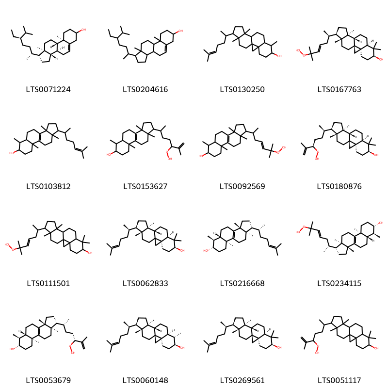{ width=100% }
    <figcaption>Hình ảnh cấu trúc hóa học của 16 hoạt chất thuộc nhóm Steroids and steroid derivatives gồm ['stigmast-5-en-3-ol (LTS0071224)', 'stigmast-5-en-3-ol, (3β)- (LTS0204616)', '7,12,16-trimethyl-15-(6-methylhept-5-en-2-yl)pentacyclo[9.7.0.0¹,³.0³,⁸.0¹²,¹⁶]octadecan-6-ol (LTS0130250)', '(1s,3r,6s,8r,11s,12s,15r,16r)-15-[(2r,4e)-6-hydroperoxy-6-methylhept-4-en-2-yl]-7,7,12,16-tetramethylpentacyclo[9.7.0.0¹,³.0³,⁸.0¹²,¹⁶]octadecan-6-ol (LTS0167763)', '3a,6,9a,11a-tetramethyl-1-(6-methylhept-5-en-2-yl)-1h,2h,3h,4h,5h,5ah,6h,7h,8h,9h,10h,11h-cyclopenta[a]phenanthren-7-ol (LTS0103812)', '1-(5-hydroperoxy-6-methylhept-6-en-2-yl)-3a,6,9a,11a-tetramethyl-1h,2h,3h,4h,5h,5ah,6h,7h,8h,9h,10h,11h-cyclopenta[a]phenanthren-7-ol (LTS0153627)', '1-(6-hydroperoxy-6-methylhept-4-en-2-yl)-3a,6,9a,11a-tetramethyl-1h,2h,3h,4h,5h,5ah,6h,7h,8h,9h,10h,11h-cyclopenta[a]phenanthren-7-ol (LTS0092569)', '(1s,3r,6s,8r,11s,12s,15r,16r)-15-[(2r,5r)-5-hydroperoxy-6-methylhept-6-en-2-yl]-7,7,12,16-tetramethylpentacyclo[9.7.0.0¹,³.0³,⁸.0¹²,¹⁶]octadecan-6-ol (LTS0180876)', '15-(6-hydroperoxy-6-methylhept-4-en-2-yl)-7,7,12,16-tetramethylpentacyclo[9.7.0.0¹,³.0³,⁸.0¹²,¹⁶]octadecan-6-ol (LTS0111501)', '(3r,6s,8r,11s,12s,15r,16r)-7,7,12,16-tetramethyl-15-[(2r)-6-methylhept-5-en-2-yl]pentacyclo[9.7.0.0¹,³.0³,⁸.0¹²,¹⁶]octadecan-6-ol (LTS0062833)', '(1r,3ar,5as,6s,7s,9as,11ar)-3a,6,9a,11a-tetramethyl-1-[(2r)-6-methylhept-5-en-2-yl]-1h,2h,3h,4h,5h,5ah,6h,7h,8h,9h,10h,11h-cyclopenta[a]phenanthren-7-ol (LTS0216668)', '(1r,3ar,5as,6s,7s,9as,11ar)-1-[(2r,4e)-6-hydroperoxy-6-methylhept-4-en-2-yl]-3a,6,9a,11a-tetramethyl-1h,2h,3h,4h,5h,5ah,6h,7h,8h,9h,10h,11h-cyclopenta[a]phenanthren-7-ol (LTS0234115)', '(1r,3ar,5as,6s,7s,9as,11ar)-1-[(2r,5r)-5-hydroperoxy-6-methylhept-6-en-2-yl]-3a,6,9a,11a-tetramethyl-1h,2h,3h,4h,5h,5ah,6h,7h,8h,9h,10h,11h-cyclopenta[a]phenanthren-7-ol (LTS0053679)', '(1s,3r,6s,7s,8s,11s,12s,15r,16r)-7,12,16-trimethyl-15-[(2r)-6-methylhept-5-en-2-yl]pentacyclo[9.7.0.0¹,³.0³,⁸.0¹²,¹⁶]octadecan-6-ol (LTS0060148)', 'cycloartenol (LTS0269561)', '15-(5-hydroperoxy-6-methylhept-6-en-2-yl)-7,7,12,16-tetramethylpentacyclo[9.7.0.0¹,³.0³,⁸.0¹²,¹⁶]octadecan-6-ol (LTS0051117)'].</figcaption>
</figure>

---

### Dược dân tộc học

Danh sách các quốc gia có sử dụng *Xanthosoma robustum* trong điều trị các bệnh. 

| Country   | Disease            | Bệnh                 |
|:----------|:-------------------|:---------------------|
| Guatemala | Poison, Lactagogue | Chất độc, Lactagogue |

---

---
## Xanthosoma sagittifolium
### Thông tin về thực vật

!!! info "Phân loại thực vật của *Xanthosoma sagittifolium* từ GIBF:"
    - **Kingdom:** Plantae
    - **Phylum:** Tracheophyta
    - **Order:** Alismatales
    - **Family:** Araceae
    - **Genus:** Xanthosoma
    - **Species:** *Xanthosoma sagittifolium*

 

| Label (VI)   | Label (EN)   | Scientific Name          | Descriptions (VI)   | Descriptions (EN)   | Also Known As (VI)           | Also Known As (EN)      |
|:-------------|:-------------|:-------------------------|:--------------------|:--------------------|:-----------------------------|:------------------------|
| N/A          | N/A          | Xanthosoma sagittifolium | loài thực vật       | species of plant    | ['Xanthosoma sagittifolium'] | ['Malanga', 'Malangas'] |

#### Phân bố trên thế giới

**Từ CSDL GIBF** Sri Lanka, Saint Lucia, Panama, French Guiana, Puerto Rico, Chinese Taipei, United States of America, Paraguay, South Africa, Sao Tome and Principe, Brazil, Dominican Republic, Mexico, China, Ecuador, Niue, Colombia, Costa Rica, India, Indonesia, Philippines

#### Phân bố tại Việt Nam

**Từ CSDL GIBF**: Không có ghi nhận ở Việt Nam

---
### Thành phần hóa học
        
- Theo cơ sở dữ liệu lotus: Từ loài *Xanthosoma sagittifolium* đã phân lập và xác định được 17 hoạt chất thuộc về các nhóm Flavonoids, Carboxylic acids and derivatives. 

|    | chemicalTaxonomyClassyfireClass   |   smiles_count |
|---:|:----------------------------------|---------------:|
|  0 | Carboxylic acids and derivatives  |              1 |
|  1 | Flavonoids                        |             16 |

#### Nhóm Carboxylic acids and derivatives
<figure markdown="span">
    { width=100% }
    <figcaption>Hình ảnh cấu trúc hóa học của 1 hoạt chất thuộc nhóm Carboxylic acids and derivatives gồm ['oxalic acid (LTS0217707)'].</figcaption>
</figure>
#### Nhóm Flavonoids
<figure markdown="span">
    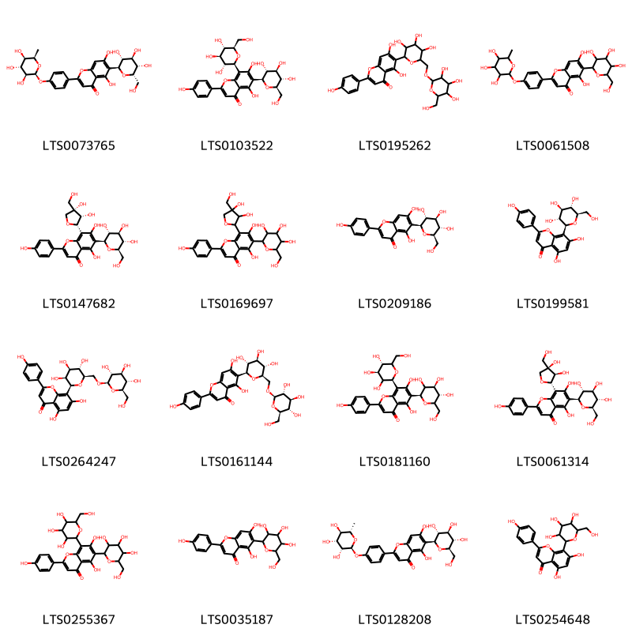{ width=100% }
    <figcaption>Hình ảnh cấu trúc hóa học của 16 hoạt chất thuộc nhóm Flavonoids gồm ['5,7-dihydroxy-6-[(2s,3r,4r,5s,6s)-3,4,5-trihydroxy-6-(hydroxymethyl)oxan-2-yl]-2-(4-{[(2s,3s,4r,5r,6r)-3,4,5-trihydroxy-6-methyloxan-2-yl]oxy}phenyl)chromen-4-one (LTS0073765)', 'vicenin-2 (LTS0103522)', '5,7-dihydroxy-2-(4-hydroxyphenyl)-6-[3,4,5-trihydroxy-6-({[3,4,5-trihydroxy-6-(hydroxymethyl)oxan-2-yl]oxy}methyl)oxan-2-yl]chromen-4-one (LTS0195262)', '5,7-dihydroxy-6-[3,4,5-trihydroxy-6-(hydroxymethyl)oxan-2-yl]-2-{4-[(3,4,5-trihydroxy-6-methyloxan-2-yl)oxy]phenyl}chromen-4-one (LTS0061508)', '8-[(2s,3r,4s)-3,4-dihydroxy-4-(hydroxymethyl)oxolan-2-yl]-5,7-dihydroxy-2-(4-hydroxyphenyl)-6-[(2s,3r,4r,5s,6r)-3,4,5-trihydroxy-6-(hydroxymethyl)oxan-2-yl]chromen-4-one (LTS0147682)', '8-[3,4-dihydroxy-4-(hydroxymethyl)oxolan-2-yl]-5,7-dihydroxy-2-(4-hydroxyphenyl)-6-[3,4,5-trihydroxy-6-(hydroxymethyl)oxan-2-yl]chromen-4-one (LTS0169697)', 'isovitexin (LTS0209186)', 'vitexin (LTS0199581)', '5,7-dihydroxy-2-(4-hydroxyphenyl)-8-[(2s,3s,4r,5s,6r)-3,4,5-trihydroxy-6-({[(2r,3r,4s,5s,6r)-3,4,5-trihydroxy-6-(hydroxymethyl)oxan-2-yl]oxy}methyl)oxan-2-yl]chromen-4-one (LTS0264247)', '5,7-dihydroxy-2-(4-hydroxyphenyl)-6-[(2s,3r,4r,5s,6r)-3,4,5-trihydroxy-6-({[(2r,3r,4s,5s,6r)-3,4,5-trihydroxy-6-(hydroxymethyl)oxan-2-yl]oxy}methyl)oxan-2-yl]chromen-4-one (LTS0161144)', 'vicenin 2 (LTS0181160)', '8-[(2s,3s,4r)-3,4-dihydroxy-4-(hydroxymethyl)oxolan-2-yl]-5,7-dihydroxy-2-(4-hydroxyphenyl)-6-[(2s,3r,4r,5s,6r)-3,4,5-trihydroxy-6-(hydroxymethyl)oxan-2-yl]chromen-4-one (LTS0061314)', '5,7-dihydroxy-2-(4-hydroxyphenyl)-6,8-bis[3,4,5-trihydroxy-6-(hydroxymethyl)oxan-2-yl]chromen-4-one (LTS0255367)', 'isovitexin (LTS0035187)', '5,7-dihydroxy-6-[(2s,3r,4r,5s,6r)-3,4,5-trihydroxy-6-(hydroxymethyl)oxan-2-yl]-2-(4-{[(2s,3r,4r,5r,6s)-3,4,5-trihydroxy-6-methyloxan-2-yl]oxy}phenyl)chromen-4-one (LTS0128208)', 'vitexin (LTS0254648)'].</figcaption>
</figure>

---

### Dược dân tộc học

Danh sách các quốc gia có sử dụng *Xanthosoma sagittifolium* trong điều trị các bệnh. 

| Country   | Disease                | Bệnh                   |
|:----------|:-----------------------|:-----------------------|
| Haiti     | Cicatrizant, Analeptic | Cicatrizant, Analeptic |

---

---
## Xanthosoma violaceum
### Thông tin về thực vật

!!! info "Phân loại thực vật của *Xanthosoma sagittifolium* từ GIBF:"
    - **Kingdom:** Plantae
    - **Phylum:** Tracheophyta
    - **Order:** Alismatales
    - **Family:** Araceae
    - **Genus:** Xanthosoma
    - **Species:** *Xanthosoma sagittifolium*

 

| Label (VI)   | Label (EN)   | Scientific Name      | Descriptions (VI)   | Descriptions (EN)   | Also Known As (VI)   | Also Known As (EN)   |
|:-------------|:-------------|:---------------------|:--------------------|:--------------------|:---------------------|:---------------------|
| N/A          | N/A          | Xanthosoma violaceum | loài thực vật       | species of plant    | ['']                 | ['']                 |

#### Phân bố trên thế giới

**Từ CSDL GIBF** nan, Australia, Guadeloupe, Guatemala, Argentina, Saint Lucia, unknown or invalid, Norway, Venezuela (Bolivarian Republic of), Panama, French Guiana, Puerto Rico, Chinese Taipei, Papua New Guinea, Honduras, Jamaica, United States of America, Paraguay, El Salvador, Trinidad and Tobago, Hong Kong, Brazil, Guyana, Dominican Republic, Peru, Mexico, France, China, Ecuador, Haiti, Colombia, Costa Rica, India, Indonesia, Philippines, Cameroon

#### Phân bố tại Việt Nam

**Từ CSDL GIBF**: Không có ghi nhận ở Việt Nam

---
### Thành phần hóa học
        
- Theo cơ sở dữ liệu lotus: Từ loài *Xanthosoma sagittifolium* đã phân lập và xác định được 17 hoạt chất thuộc về các nhóm Flavonoids, Carboxylic acids and derivatives. 

|    | chemicalTaxonomyClassyfireClass   |   smiles_count |
|---:|:----------------------------------|---------------:|
|  0 | Carboxylic acids and derivatives  |              1 |
|  1 | Flavonoids                        |             16 |

#### Nhóm Carboxylic acids and derivatives
<figure markdown="span">
    { width=100% }
    <figcaption>Hình ảnh cấu trúc hóa học của 1 hoạt chất thuộc nhóm Carboxylic acids and derivatives gồm ['oxalic acid (LTS0217707)'].</figcaption>
</figure>
#### Nhóm Flavonoids
<figure markdown="span">
    { width=100% }
    <figcaption>Hình ảnh cấu trúc hóa học của 16 hoạt chất thuộc nhóm Flavonoids gồm ['5,7-dihydroxy-6-[(2s,3r,4r,5s,6s)-3,4,5-trihydroxy-6-(hydroxymethyl)oxan-2-yl]-2-(4-{[(2s,3s,4r,5r,6r)-3,4,5-trihydroxy-6-methyloxan-2-yl]oxy}phenyl)chromen-4-one (LTS0073765)', 'vicenin-2 (LTS0103522)', '5,7-dihydroxy-2-(4-hydroxyphenyl)-6-[3,4,5-trihydroxy-6-({[3,4,5-trihydroxy-6-(hydroxymethyl)oxan-2-yl]oxy}methyl)oxan-2-yl]chromen-4-one (LTS0195262)', '5,7-dihydroxy-6-[3,4,5-trihydroxy-6-(hydroxymethyl)oxan-2-yl]-2-{4-[(3,4,5-trihydroxy-6-methyloxan-2-yl)oxy]phenyl}chromen-4-one (LTS0061508)', '8-[(2s,3r,4s)-3,4-dihydroxy-4-(hydroxymethyl)oxolan-2-yl]-5,7-dihydroxy-2-(4-hydroxyphenyl)-6-[(2s,3r,4r,5s,6r)-3,4,5-trihydroxy-6-(hydroxymethyl)oxan-2-yl]chromen-4-one (LTS0147682)', '8-[3,4-dihydroxy-4-(hydroxymethyl)oxolan-2-yl]-5,7-dihydroxy-2-(4-hydroxyphenyl)-6-[3,4,5-trihydroxy-6-(hydroxymethyl)oxan-2-yl]chromen-4-one (LTS0169697)', 'isovitexin (LTS0209186)', 'vitexin (LTS0199581)', '5,7-dihydroxy-2-(4-hydroxyphenyl)-8-[(2s,3s,4r,5s,6r)-3,4,5-trihydroxy-6-({[(2r,3r,4s,5s,6r)-3,4,5-trihydroxy-6-(hydroxymethyl)oxan-2-yl]oxy}methyl)oxan-2-yl]chromen-4-one (LTS0264247)', '5,7-dihydroxy-2-(4-hydroxyphenyl)-6-[(2s,3r,4r,5s,6r)-3,4,5-trihydroxy-6-({[(2r,3r,4s,5s,6r)-3,4,5-trihydroxy-6-(hydroxymethyl)oxan-2-yl]oxy}methyl)oxan-2-yl]chromen-4-one (LTS0161144)', 'vicenin 2 (LTS0181160)', '8-[(2s,3s,4r)-3,4-dihydroxy-4-(hydroxymethyl)oxolan-2-yl]-5,7-dihydroxy-2-(4-hydroxyphenyl)-6-[(2s,3r,4r,5s,6r)-3,4,5-trihydroxy-6-(hydroxymethyl)oxan-2-yl]chromen-4-one (LTS0061314)', '5,7-dihydroxy-2-(4-hydroxyphenyl)-6,8-bis[3,4,5-trihydroxy-6-(hydroxymethyl)oxan-2-yl]chromen-4-one (LTS0255367)', 'isovitexin (LTS0035187)', '5,7-dihydroxy-6-[(2s,3r,4r,5s,6r)-3,4,5-trihydroxy-6-(hydroxymethyl)oxan-2-yl]-2-(4-{[(2s,3r,4r,5r,6s)-3,4,5-trihydroxy-6-methyloxan-2-yl]oxy}phenyl)chromen-4-one (LTS0128208)', 'vitexin (LTS0254648)'].</figcaption>
</figure>

---

### Dược dân tộc học

Danh sách các quốc gia có sử dụng *Xanthosoma sagittifolium* trong điều trị các bệnh. 

| Country           | Disease   | Bệnh           |
|:------------------|:----------|:---------------|
| Guatemala         | Poison    | Chất độc       |
| Hawaii            | Vermifuge | Thuốc diệt sán |
| Mexico(Chinantec) | Coagulant | Chất đông tụ   |

---

# Chi Calla

??? note "Danh sách các dược liệu thuộc chi"
    
	 - *Calla palustris*

---
## Calla palustris
### Thông tin về thực vật

!!! info "Phân loại thực vật của *Calla palustris* từ GIBF:"
    - **Kingdom:** Plantae
    - **Phylum:** Tracheophyta
    - **Order:** Alismatales
    - **Family:** Araceae
    - **Genus:** Calla
    - **Species:** *Calla palustris*

 

| Label (VI)   | Label (EN)   | Scientific Name   | Descriptions (VI)   | Descriptions (EN)   | Also Known As (VI)   | Also Known As (EN)   |
|:-------------|:-------------|:------------------|:--------------------|:--------------------|:---------------------|:---------------------|
| N/A          | N/A          | Calla palustris   | loài thực vật       | species of plant    | ['']                 | ['Kala']             |

#### Phân bố trên thế giới

**Từ CSDL GIBF** Denmark, Finland, Netherlands, Lithuania, Belarus, Czechia, Germany, Belgium, Estonia, Switzerland, Russian Federation, Norway, United States of America, Sweden, Poland, Canada, Austria

#### Phân bố tại Việt Nam

**Từ CSDL GIBF**: Không có ghi nhận ở Việt Nam

---
### Thành phần hóa học
        
- Theo cơ sở dữ liệu lotus: Từ loài *Calla palustris* đã phân lập và xác định được 2 hoạt chất thuộc về các nhóm Fatty Acyls. 

|    | chemicalTaxonomyClassyfireClass   |   smiles_count |
|---:|:----------------------------------|---------------:|
|  0 | Fatty Acyls                       |              2 |

#### Nhóm Fatty Acyls
<figure markdown="span">
    { width=100% }
    <figcaption>Hình ảnh cấu trúc hóa học của 2 hoạt chất thuộc nhóm Fatty Acyls gồm ['15-phenylpentadecanoic acid (LTS0231218)', '13-phenyltridecanoic acid (LTS0016854)'].</figcaption>
</figure>

---

### Dược dân tộc học

Danh sách các quốc gia có sử dụng *Calla palustris* trong điều trị các bệnh. 

| Country        | Disease     | Bệnh                      |
|:---------------|:------------|:--------------------------|
| Elsewhere      | Diaphoretic | Thuốc tràn dịch màng phổi |
| US(Potawatomi) | Poultice    | thuốc đắp, đắp thuốc cao  |

---

# Chi Dracontium

??? note "Danh sách các dược liệu thuộc chi"
    
	 - *Dracontium aerum*
	 - *Dracontium pittieri*
	 - *Dracontium polyphyllum*

---
## Dracontium aerum
### Thông tin về thực vật

!!! info "Phân loại thực vật của *N/A* từ GIBF:"
    - **Kingdom:** Plantae
    - **Phylum:** Tracheophyta
    - **Order:** Alismatales
    - **Family:** Araceae
    - **Genus:** Dracontium
    - **Species:** *N/A*

 

| Label (VI)   | Label (EN)   | Scientific Name   | Descriptions (VI)   | Descriptions (EN)   | Also Known As (VI)   | Also Known As (EN)   |
|:-------------|:-------------|:------------------|:--------------------|:--------------------|:---------------------|:---------------------|
| N/A          | N/A          | Calla palustris   | loài thực vật       | species of plant    | ['']                 | ['Kala']             |

#### Phân bố trên thế giới

**Từ CSDL GIBF** nan, Ecuador, Puerto Rico, Panama, Suriname, Belgium, Colombia, Brazil, Bolivia (Plurinational State of), Costa Rica, Peru, Mexico, France, Venezuela (Bolivarian Republic of), French Guiana

#### Phân bố tại Việt Nam

**Từ CSDL GIBF**: Không có ghi nhận ở Việt Nam

---
### Thành phần hóa học
        
- Theo cơ sở dữ liệu lotus: Từ loài *N/A* đã phân lập và xác định được Chưa có hoạt chất nào được phân lập. hoạt chất thuộc về các nhóm Không có hoạt chất nào được phân lập. 

Không có hình ảnh nào được tạo ra

---

### Dược dân tộc học

Danh sách các quốc gia có sử dụng *N/A* trong điều trị các bệnh. 

| Country   | Disease   | Bệnh           |
|:----------|:----------|:---------------|
| Brazil    | Larvicide | Diệt côn trùng |

---

---
## Dracontium pittieri
### Thông tin về thực vật

!!! info "Phân loại thực vật của *Dracontium pittieri* từ GIBF:"
    - **Kingdom:** Plantae
    - **Phylum:** Tracheophyta
    - **Order:** Alismatales
    - **Family:** Araceae
    - **Genus:** Dracontium
    - **Species:** *Dracontium pittieri*

 

| Label (VI)   | Label (EN)   | Scientific Name     | Descriptions (VI)   | Descriptions (EN)   | Also Known As (VI)   | Also Known As (EN)   |
|:-------------|:-------------|:--------------------|:--------------------|:--------------------|:---------------------|:---------------------|
| N/A          | N/A          | Dracontium pittieri | loài thực vật       | species of plant    | ['']                 | ['']                 |

#### Phân bố trên thế giới

**Từ CSDL GIBF** Costa Rica, Belgium, United States of America, Panama

#### Phân bố tại Việt Nam

**Từ CSDL GIBF**: Không có ghi nhận ở Việt Nam

---
### Thành phần hóa học
        
- Theo cơ sở dữ liệu lotus: Từ loài *Dracontium pittieri* đã phân lập và xác định được Chưa có hoạt chất nào được phân lập. hoạt chất thuộc về các nhóm Không có hoạt chất nào được phân lập. 

Không có hình ảnh nào được tạo ra

---

### Dược dân tộc học

Danh sách các quốc gia có sử dụng *Dracontium pittieri* trong điều trị các bệnh. 

| Country   | Disease   | Bệnh           |
|:----------|:----------|:---------------|
| Costarica | Larvicide | Diệt côn trùng |

---

---
## Dracontium polyphyllum
### Thông tin về thực vật

!!! info "Phân loại thực vật của *Dracontium polyphyllum* từ GIBF:"
    - **Kingdom:** Plantae
    - **Phylum:** Tracheophyta
    - **Order:** Alismatales
    - **Family:** Araceae
    - **Genus:** Dracontium
    - **Species:** *Dracontium polyphyllum*

 

| Label (VI)   | Label (EN)   | Scientific Name        | Descriptions (VI)   | Descriptions (EN)   | Also Known As (VI)   | Also Known As (EN)   |
|:-------------|:-------------|:-----------------------|:--------------------|:--------------------|:---------------------|:---------------------|
| N/A          | N/A          | Dracontium polyphyllum | loài thực vật       | species of plant    | ['']                 | ['']                 |

#### Phân bố trên thế giới

**Từ CSDL GIBF** nan, Puerto Rico, Netherlands, Suriname, Australia, Japan, Belgium, Haiti, Brazil, Guyana, unknown or invalid, Indonesia, Peru, France, Singapore, Venezuela (Bolivarian Republic of), French Guiana

#### Phân bố tại Việt Nam

**Từ CSDL GIBF**: Không có ghi nhận ở Việt Nam

---
### Thành phần hóa học
        
- Theo cơ sở dữ liệu lotus: Từ loài *Dracontium polyphyllum* đã phân lập và xác định được Chưa có hoạt chất nào được phân lập. hoạt chất thuộc về các nhóm Không có hoạt chất nào được phân lập. 

Không có hình ảnh nào được tạo ra

---

### Dược dân tộc học

Danh sách các quốc gia có sử dụng *Dracontium polyphyllum* trong điều trị các bệnh. 

| Country   | Disease     | Bệnh            |
|:----------|:------------|:----------------|
| Elsewhere | Stimulant   | Chất kích thích |
| India     | Emmenagogue | Emmenagogue     |

---

# Chi Arum

??? note "Danh sách các dược liệu thuộc chi"
    
	 - *Arum hygrophilium*
	 - *Arum italicum*
	 - *Arum maculatum*

---
## Arum hygrophilium
### Thông tin về thực vật

!!! info "Phân loại thực vật của *Arum hygrophilum* từ GIBF:"
    - **Kingdom:** Plantae
    - **Phylum:** Tracheophyta
    - **Order:** Alismatales
    - **Family:** Araceae
    - **Genus:** Arum
    - **Species:** *Arum hygrophilum*

 

| Label (VI)   | Label (EN)   | Scientific Name        | Descriptions (VI)   | Descriptions (EN)   | Also Known As (VI)   | Also Known As (EN)   |
|:-------------|:-------------|:-----------------------|:--------------------|:--------------------|:---------------------|:---------------------|
| N/A          | N/A          | Dracontium polyphyllum | loài thực vật       | species of plant    | ['']                 | ['']                 |

#### Phân bố trên thế giới

**Từ CSDL GIBF** Israel, Australia, Cyprus, Belgium, Palestine, State of, Morocco, United States of America, Jordan, Lebanon, New Zealand

#### Phân bố tại Việt Nam

**Từ CSDL GIBF**: Không có ghi nhận ở Việt Nam

---
### Thành phần hóa học
        
- Theo cơ sở dữ liệu lotus: Từ loài *Arum hygrophilum* đã phân lập và xác định được Chưa có hoạt chất nào được phân lập. hoạt chất thuộc về các nhóm Không có hoạt chất nào được phân lập. 

Không có hình ảnh nào được tạo ra

---

### Dược dân tộc học

Danh sách các quốc gia có sử dụng *Arum hygrophilum* trong điều trị các bệnh. 

| Country   | Disease       | Bệnh               |
|:----------|:--------------|:-------------------|
| Elsewhere | Abortifacient | Thuốc gây sẩy thai |

---

---
## Arum italicum
### Thông tin về thực vật

!!! info "Phân loại thực vật của *Arum italicum* từ GIBF:"
    - **Kingdom:** Plantae
    - **Phylum:** Tracheophyta
    - **Order:** Alismatales
    - **Family:** Araceae
    - **Genus:** Arum
    - **Species:** *Arum italicum*

 

| Label (VI)   | Label (EN)   | Scientific Name   | Descriptions (VI)   | Descriptions (EN)   | Also Known As (VI)   | Also Known As (EN)                           |
|:-------------|:-------------|:------------------|:--------------------|:--------------------|:---------------------|:---------------------------------------------|
| N/A          | N/A          | Arum italicum     | loài thực vật       | species of plant    | ['']                 | ['Italian Arum', 'Italian lords-and-ladies'] |

#### Phân bố trên thế giới

**Từ CSDL GIBF** Italy, Australia, Belgium, Canada, Denmark, Netherlands, Luxembourg, Spain, Türkiye, Portugal, Algeria, Russian Federation, United States of America, Croatia, Greece, Montenegro, Germany, Austria, France, United Kingdom of Great Britain and Northern Ireland, Serbia, New Zealand

#### Phân bố tại Việt Nam

**Từ CSDL GIBF**: Không có ghi nhận ở Việt Nam

---
### Thành phần hóa học
        
- Theo cơ sở dữ liệu lotus: Từ loài *Arum italicum* đã phân lập và xác định được 50 hoạt chất thuộc về các nhóm Fatty Acyls, Lignan glycosides, Steroids and steroid derivatives, Cinnamic acids and derivatives, 2-arylbenzofuran flavonoids, Phenols, Furanoid lignans, Carboxylic acids and derivatives. 

|    | chemicalTaxonomyClassyfireClass   |   smiles_count |
|---:|:----------------------------------|---------------:|
|  0 |                                   |              4 |
|  1 | 2-arylbenzofuran flavonoids       |             11 |
|  2 | Carboxylic acids and derivatives  |              4 |
|  3 | Cinnamic acids and derivatives    |              5 |
|  4 | Fatty Acyls                       |              2 |
|  5 | Furanoid lignans                  |              2 |
|  6 | Lignan glycosides                 |             16 |
|  7 | Phenols                           |              1 |
|  8 | Steroids and steroid derivatives  |              5 |

#### Nhóm 
<figure markdown="span">
    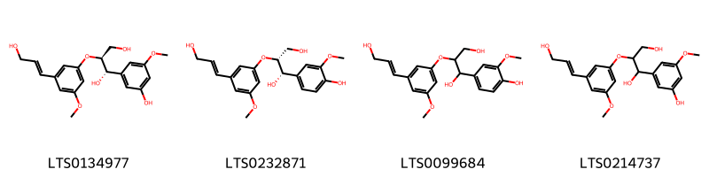{ width=100% }
    <figcaption>Hình ảnh cấu trúc hóa học của 4 hoạt chất thuộc nhóm  gồm ['(1s,2s)-1-(3-hydroxy-5-methoxyphenyl)-2-{3-[(1e)-3-hydroxyprop-1-en-1-yl]-5-methoxyphenoxy}propane-1,3-diol (LTS0134977)', '(1s,2r)-1-(4-hydroxy-3-methoxyphenyl)-2-{3-[(1e)-3-hydroxyprop-1-en-1-yl]-5-methoxyphenoxy}propane-1,3-diol (LTS0232871)', '1-(4-hydroxy-3-methoxyphenyl)-2-[3-(3-hydroxyprop-1-en-1-yl)-5-methoxyphenoxy]propane-1,3-diol (LTS0099684)', '1-(3-hydroxy-5-methoxyphenyl)-2-[3-(3-hydroxyprop-1-en-1-yl)-5-methoxyphenoxy]propane-1,3-diol (LTS0214737)'].</figcaption>
</figure>
#### Nhóm 2-arylbenzofuran flavonoids
<figure markdown="span">
    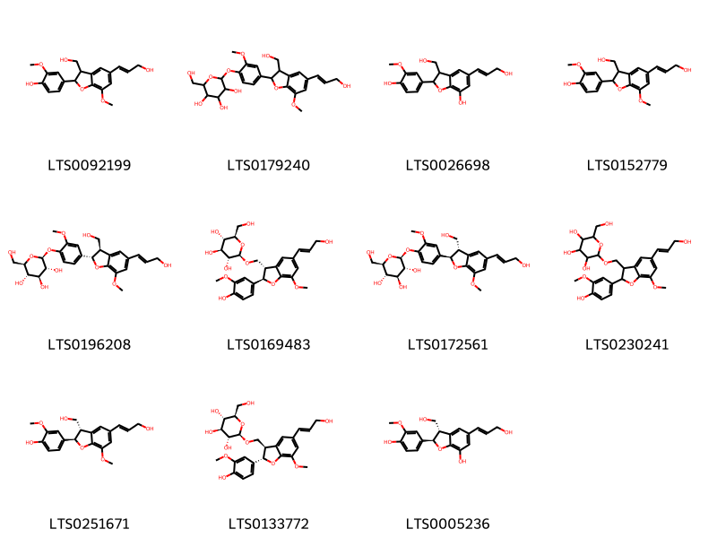{ width=100% }
    <figcaption>Hình ảnh cấu trúc hóa học của 11 hoạt chất thuộc nhóm 2-arylbenzofuran flavonoids gồm ['4-[3-(hydroxymethyl)-5-(3-hydroxyprop-1-en-1-yl)-7-methoxy-2,3-dihydro-1-benzofuran-2-yl]-2-methoxyphenol (LTS0092199)', '2-(hydroxymethyl)-6-{4-[3-(hydroxymethyl)-5-(3-hydroxyprop-1-en-1-yl)-7-methoxy-2,3-dihydro-1-benzofuran-2-yl]-2-methoxyphenoxy}oxane-3,4,5-triol (LTS0179240)', '2-(4-hydroxy-3-methoxyphenyl)-3-(hydroxymethyl)-5-(3-hydroxyprop-1-en-1-yl)-2,3-dihydro-1-benzofuran-7-ol (LTS0026698)', 'dehydrodiconiferyl alcohol (LTS0152779)', '(2r,3s,4s,5r,6s)-2-(hydroxymethyl)-6-{4-[(2s,3r)-3-(hydroxymethyl)-5-[(1e)-3-hydroxyprop-1-en-1-yl]-7-methoxy-2,3-dihydro-1-benzofuran-2-yl]-2-methoxyphenoxy}oxane-3,4,5-triol (LTS0196208)', '(2r,3r,4s,5s,6r)-2-{[(2r,3s)-2-(4-hydroxy-3-methoxyphenyl)-5-[(1e)-3-hydroxyprop-1-en-1-yl]-7-methoxy-2,3-dihydro-1-benzofuran-3-yl]methoxy}-6-(hydroxymethyl)oxane-3,4,5-triol (LTS0169483)', '(2r,3s,4s,5r,6s)-2-(hydroxymethyl)-6-{4-[(2r,3s)-3-(hydroxymethyl)-5-[(1e)-3-hydroxyprop-1-en-1-yl]-7-methoxy-2,3-dihydro-1-benzofuran-2-yl]-2-methoxyphenoxy}oxane-3,4,5-triol (LTS0172561)', '2-{[2-(4-hydroxy-3-methoxyphenyl)-5-(3-hydroxyprop-1-en-1-yl)-7-methoxy-2,3-dihydro-1-benzofuran-3-yl]methoxy}-6-(hydroxymethyl)oxane-3,4,5-triol (LTS0230241)', '(-)-dehydrodiconiferyl alcohol (LTS0251671)', '(2r,3r,4s,5s,6r)-2-{[(2s,3r)-2-(4-hydroxy-3-methoxyphenyl)-5-[(1e)-3-hydroxyprop-1-en-1-yl]-7-methoxy-2,3-dihydro-1-benzofuran-3-yl]methoxy}-6-(hydroxymethyl)oxane-3,4,5-triol (LTS0133772)', '(2r,3s)-2-(4-hydroxy-3-methoxyphenyl)-3-(hydroxymethyl)-5-[(1e)-3-hydroxyprop-1-en-1-yl]-2,3-dihydro-1-benzofuran-7-ol (LTS0005236)'].</figcaption>
</figure>
#### Nhóm Carboxylic acids and derivatives
<figure markdown="span">
    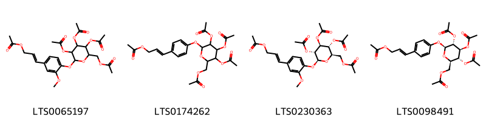{ width=100% }
    <figcaption>Hình ảnh cấu trúc hóa học của 4 hoạt chất thuộc nhóm Carboxylic acids and derivatives gồm ['[3,4,5-tris(acetyloxy)-6-{4-[3-(acetyloxy)prop-1-en-1-yl]-2-methoxyphenoxy}oxan-2-yl]methyl acetate (LTS0065197)', '[3,4,5-tris(acetyloxy)-6-{4-[3-(acetyloxy)prop-1-en-1-yl]phenoxy}oxan-2-yl]methyl acetate (LTS0174262)', '(2e)-3-(3-methoxy-4-{[(2s,3r,4s,5r,6r)-3,4,5-tris(acetyloxy)-6-[(acetyloxy)methyl]oxan-2-yl]oxy}phenyl)prop-2-en-1-yl acetate (LTS0230363)', '(2e)-3-(4-{[(2s,3r,4s,5r,6r)-3,4,5-tris(acetyloxy)-6-[(acetyloxy)methyl]oxan-2-yl]oxy}phenyl)prop-2-en-1-yl acetate (LTS0098491)'].</figcaption>
</figure>
#### Nhóm Cinnamic acids and derivatives
<figure markdown="span">
    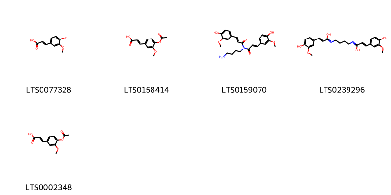{ width=100% }
    <figcaption>Hình ảnh cấu trúc hóa học của 5 hoạt chất thuộc nhóm Cinnamic acids and derivatives gồm ['ferulic acid (LTS0077328)', 'o-acetylferulic acid (LTS0158414)', '(2e)-n-(4-aminobutyl)-3-(4-hydroxy-3-methoxyphenyl)-n-[(2e)-3-(4-hydroxy-3-methoxyphenyl)prop-2-enoyl]prop-2-enamide (LTS0159070)', '(2e)-n-(4-{[(2e)-1-hydroxy-3-(4-hydroxy-3-methoxyphenyl)prop-2-en-1-ylidene]amino}butyl)-3-(4-hydroxy-3-methoxyphenyl)prop-2-enimidic acid (LTS0239296)', 'o-acetylferulic acid (LTS0002348)'].</figcaption>
</figure>
#### Nhóm Fatty Acyls
<figure markdown="span">
    { width=100% }
    <figcaption>Hình ảnh cấu trúc hóa học của 2 hoạt chất thuộc nhóm Fatty Acyls gồm ['15-phenylpentadecanoic acid (LTS0231218)', '13-phenyltridecanoic acid (LTS0016854)'].</figcaption>
</figure>
#### Nhóm Furanoid lignans
<figure markdown="span">
    { width=100% }
    <figcaption>Hình ảnh cấu trúc hóa học của 2 hoạt chất thuộc nhóm Furanoid lignans gồm ['4-{4-[(4-hydroxy-3-methoxyphenyl)methyl]-3-(hydroxymethyl)oxolan-2-yl}-2-methoxyphenol (LTS0211349)', 'lariciresinol (LTS0010950)'].</figcaption>
</figure>
#### Nhóm Lignan glycosides
<figure markdown="span">
    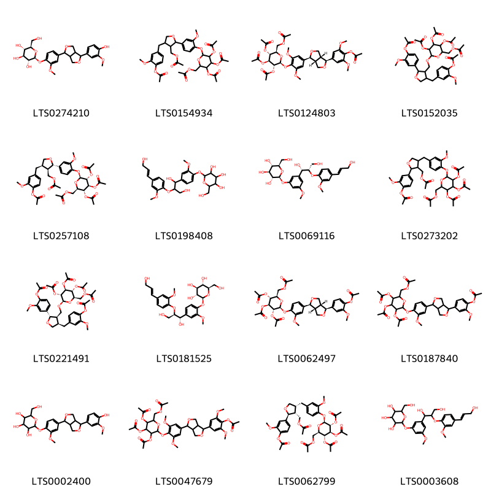{ width=100% }
    <figcaption>Hình ảnh cấu trúc hóa học của 16 hoạt chất thuộc nhóm Lignan glycosides gồm ['(2s,3r,4s,5s,6r)-2-{4-[4-(4-hydroxy-3-methoxyphenyl)-hexahydrofuro[3,4-c]furan-1-yl]-2-methoxyphenoxy}-6-(hydroxymethyl)oxane-3,4,5-triol (LTS0274210)', '(4-{[4-(acetyloxy)-3-methoxyphenyl]methyl}-2-(3-methoxy-4-{[3,4,5-tris(acetyloxy)-6-[(acetyloxy)methyl]oxan-2-yl]oxy}phenyl)oxolan-3-yl)methyl acetate (LTS0154934)', '[(2r,3r,4s,5r,6s)-6-{4-[(1s,3ar,4s,6ar)-4-[4-(acetyloxy)-3,5-dimethoxyphenyl]-hexahydrofuro[3,4-c]furan-1-yl]-2,6-dimethoxyphenoxy}-3,4,5-tris(acetyloxy)oxan-2-yl]methyl acetate (LTS0124803)', '[3,4,5-tris(acetyloxy)-6-({2-[4-(acetyloxy)-3-methoxyphenyl]-4-{[4-(acetyloxy)-3-methoxyphenyl]methyl}oxolan-3-yl}methoxy)oxan-2-yl]methyl acetate (LTS0152035)', '[(2s,3r,4r)-4-{[4-(acetyloxy)-3-methoxyphenyl]methyl}-2-(3-methoxy-4-{[(2s,3r,4s,5r,6r)-3,4,5-tris(acetyloxy)-6-[(acetyloxy)methyl]oxan-2-yl]oxy}phenyl)oxolan-3-yl]methyl acetate (LTS0257108)', '2-(4-{1,3-dihydroxy-2-[4-(3-hydroxyprop-1-en-1-yl)-2-methoxyphenoxy]propyl}-2-methoxyphenoxy)-6-(hydroxymethyl)oxane-3,4,5-triol (LTS0198408)', '(2s,3r,4s,5s,6r)-2-{3-[(1s,2s)-1,3-dihydroxy-2-{4-[(1e)-3-hydroxyprop-1-en-1-yl]-2-methoxyphenoxy}propyl]-5-methoxyphenoxy}-6-(hydroxymethyl)oxane-3,4,5-triol (LTS0069116)', '{2-[4-(acetyloxy)-3-methoxyphenyl]-4-[(3-methoxy-4-{[3,4,5-tris(acetyloxy)-6-[(acetyloxy)methyl]oxan-2-yl]oxy}phenyl)methyl]oxolan-3-yl}methyl acetate (LTS0273202)', '[(2r,3r,4s,5r,6r)-3,4,5-tris(acetyloxy)-6-{[(2s,3r,4r)-2-[4-(acetyloxy)-3-methoxyphenyl]-4-{[4-(acetyloxy)-3-methoxyphenyl]methyl}oxolan-3-yl]methoxy}oxan-2-yl]methyl acetate (LTS0221491)', '(2s,3r,4s,5s,6r)-2-{4-[(1s,2r)-1,3-dihydroxy-2-{4-[(1e)-3-hydroxyprop-1-en-1-yl]-2-methoxyphenoxy}propyl]-2-methoxyphenoxy}-6-(hydroxymethyl)oxane-3,4,5-triol (LTS0181525)', '[(2r,3r,4s,5r,6s)-6-{4-[(1s,3ar,4s,6ar)-4-[4-(acetyloxy)-3-methoxyphenyl]-hexahydrofuro[3,4-c]furan-1-yl]-2-methoxyphenoxy}-3,4,5-tris(acetyloxy)oxan-2-yl]methyl acetate (LTS0062497)', '[3,4,5-tris(acetyloxy)-6-(4-{4-[4-(acetyloxy)-3-methoxyphenyl]-hexahydrofuro[3,4-c]furan-1-yl}-2-methoxyphenoxy)oxan-2-yl]methyl acetate (LTS0187840)', '2-{4-[4-(4-hydroxy-3-methoxyphenyl)-hexahydrofuro[3,4-c]furan-1-yl]-2-methoxyphenoxy}-6-(hydroxymethyl)oxane-3,4,5-triol (LTS0002400)', '[3,4,5-tris(acetyloxy)-6-(4-{4-[4-(acetyloxy)-3,5-dimethoxyphenyl]-hexahydrofuro[3,4-c]furan-1-yl}-2,6-dimethoxyphenoxy)oxan-2-yl]methyl acetate (LTS0047679)', '[(2s,3r,4r)-2-[4-(acetyloxy)-3-methoxyphenyl]-4-[(3-methoxy-4-{[(2s,3r,4s,5r,6r)-3,4,5-tris(acetyloxy)-6-[(acetyloxy)methyl]oxan-2-yl]oxy}phenyl)methyl]oxolan-3-yl]methyl acetate (LTS0062799)', '2-(3-{1,3-dihydroxy-2-[4-(3-hydroxyprop-1-en-1-yl)-2-methoxyphenoxy]propyl}-5-methoxyphenoxy)-6-(hydroxymethyl)oxane-3,4,5-triol (LTS0003608)'].</figcaption>
</figure>
#### Nhóm Phenols
<figure markdown="span">
    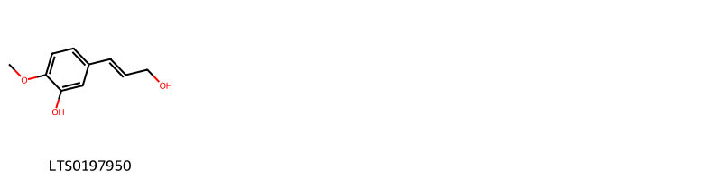{ width=100% }
    <figcaption>Hình ảnh cấu trúc hóa học của 1 hoạt chất thuộc nhóm Phenols gồm ['5-(3-hydroxyprop-1-en-1-yl)-2-methoxyphenol (LTS0197950)'].</figcaption>
</figure>
#### Nhóm Steroids and steroid derivatives
<figure markdown="span">
    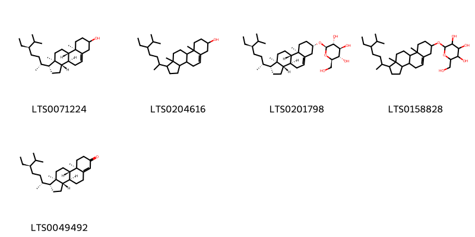{ width=100% }
    <figcaption>Hình ảnh cấu trúc hóa học của 5 hoạt chất thuộc nhóm Steroids and steroid derivatives gồm ['stigmast-5-en-3-ol (LTS0071224)', 'stigmast-5-en-3-ol, (3β)- (LTS0204616)', 'sitogluside (LTS0201798)', '2-{[1-(5-ethyl-6-methylheptan-2-yl)-9a,11a-dimethyl-1h,2h,3h,3ah,3bh,4h,6h,7h,8h,9h,9bh,10h,11h-cyclopenta[a]phenanthren-7-yl]oxy}-6-(hydroxymethyl)oxane-3,4,5-triol (LTS0158828)', 'β-sitostenone (LTS0049492)'].</figcaption>
</figure>

---

### Dược dân tộc học

Danh sách các quốc gia có sử dụng *Arum italicum* trong điều trị các bệnh. 

| Country   | Disease          | Bệnh                    |
|:----------|:-----------------|:------------------------|
| Egypt     | Poison, Vesicant | Chất Độc, Chất Gây Vọng |
| ain       | Expectorant      | Thuốc long đàm          |

---

---
## Arum maculatum
### Thông tin về thực vật

!!! info "Phân loại thực vật của *Arum maculatum* từ GIBF:"
    - **Kingdom:** Plantae
    - **Phylum:** Tracheophyta
    - **Order:** Alismatales
    - **Family:** Araceae
    - **Genus:** Arum
    - **Species:** *Arum maculatum*

 

| Label (VI)   | Label (EN)   | Scientific Name   | Descriptions (VI)   | Descriptions (EN)   | Also Known As (VI)   | Also Known As (EN)                                                                                              |
|:-------------|:-------------|:------------------|:--------------------|:--------------------|:---------------------|:----------------------------------------------------------------------------------------------------------------|
| N/A          | N/A          | Arum maculatum    | loài thực vật       | species of plant    | ['']                 | ['arum lily', 'cuckoo-pint', 'Lords and ladies', 'Parson and clerk', 'Parson-and-clerk', 'Parson-in-his-smock'] |

#### Phân bố trên thế giới

**Từ CSDL GIBF** Netherlands, Germany, Belgium, Ireland, Switzerland, Austria, France, United Kingdom of Great Britain and Northern Ireland

#### Phân bố tại Việt Nam

**Từ CSDL GIBF**: Không có ghi nhận ở Việt Nam

---
### Thành phần hóa học
        
- Theo cơ sở dữ liệu lotus: Từ loài *Arum maculatum* đã phân lập và xác định được 70 hoạt chất thuộc về các nhóm Fatty Acyls, Flavonoids, Prenol lipids, Cinnamic acids and derivatives, Organonitrogen compounds, Benzene and substituted derivatives, Unsaturated hydrocarbons, Organooxygen compounds, Saturated hydrocarbons, Phenols, Furanoid lignans. 

|    | chemicalTaxonomyClassyfireClass     |   smiles_count |
|---:|:------------------------------------|---------------:|
|  0 | Benzene and substituted derivatives |              3 |
|  1 | Cinnamic acids and derivatives      |              4 |
|  2 | Fatty Acyls                         |              8 |
|  3 | Flavonoids                          |             10 |
|  4 | Furanoid lignans                    |              1 |
|  5 | Organonitrogen compounds            |              2 |
|  6 | Organooxygen compounds              |              8 |
|  7 | Phenols                             |              1 |
|  8 | Prenol lipids                       |             29 |
|  9 | Saturated hydrocarbons              |              1 |
| 10 | Unsaturated hydrocarbons            |              3 |

#### Nhóm Benzene and substituted derivatives
<figure markdown="span">
    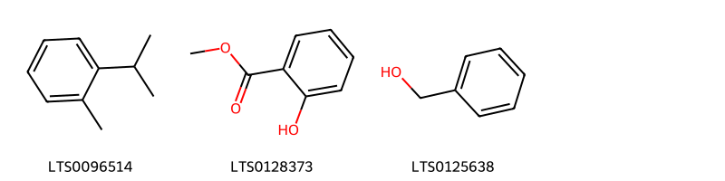{ width=100% }
    <figcaption>Hình ảnh cấu trúc hóa học của 3 hoạt chất thuộc nhóm Benzene and substituted derivatives gồm ['o-cymene (LTS0096514)', 'methyl salicylate (LTS0128373)', 'benzyl alcohol (LTS0125638)'].</figcaption>
</figure>
#### Nhóm Cinnamic acids and derivatives
<figure markdown="span">
    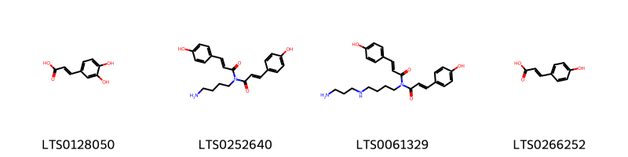{ width=100% }
    <figcaption>Hình ảnh cấu trúc hóa học của 4 hoạt chất thuộc nhóm Cinnamic acids and derivatives gồm ['3,4-dihydroxycinnamic acid (LTS0128050)', '(2e)-n-(4-aminobutyl)-3-(4-hydroxyphenyl)-n-[(2e)-3-(4-hydroxyphenyl)prop-2-enoyl]prop-2-enamide (LTS0252640)', '(2e)-n-{4-[(3-aminopropyl)amino]butyl}-3-(4-hydroxyphenyl)-n-[(2e)-3-(4-hydroxyphenyl)prop-2-enoyl]prop-2-enamide (LTS0061329)', 'para-coumaric acid (LTS0266252)'].</figcaption>
</figure>
#### Nhóm Fatty Acyls
<figure markdown="span">
    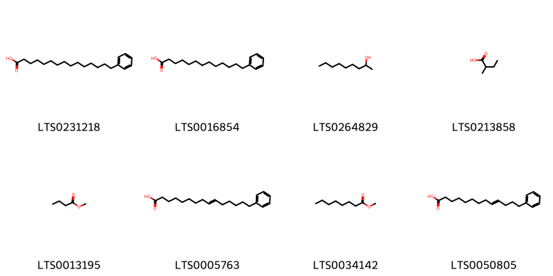{ width=100% }
    <figcaption>Hình ảnh cấu trúc hóa học của 8 hoạt chất thuộc nhóm Fatty Acyls gồm ['15-phenylpentadecanoic acid (LTS0231218)', '13-phenyltridecanoic acid (LTS0016854)', '2-nonanol (LTS0264829)', '2-methylbutanoic acid (LTS0213858)', 'methyl butyrate (LTS0013195)', '15-phenylpentadec-9-enoic acid (LTS0005763)', 'methyl caprylate (LTS0034142)', '13-phenyltridec-9-enoic acid (LTS0050805)'].</figcaption>
</figure>
#### Nhóm Flavonoids
<figure markdown="span">
    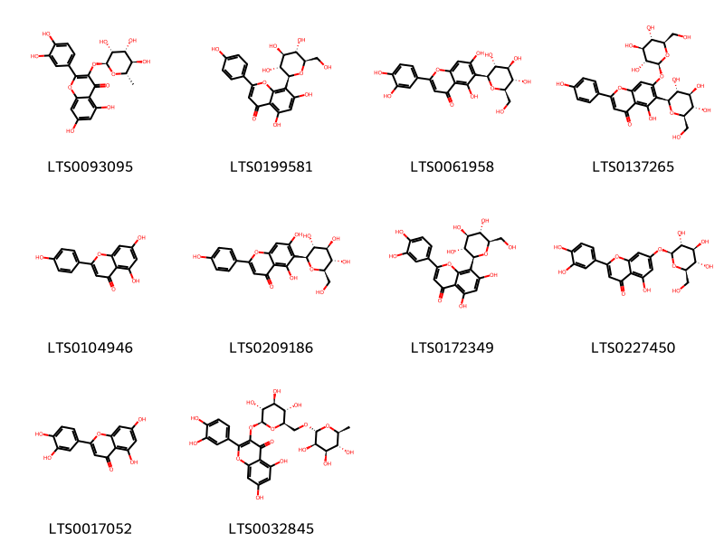{ width=100% }
    <figcaption>Hình ảnh cấu trúc hóa học của 10 hoạt chất thuộc nhóm Flavonoids gồm ['quercitrin (LTS0093095)', 'vitexin (LTS0199581)', 'isoorientin (LTS0061958)', 'saponarin (LTS0137265)', 'chamomile (LTS0104946)', 'isovitexin (LTS0209186)', 'orientin (LTS0172349)', 'luteolin 7-o-glucoside (LTS0227450)', 'luteolin (LTS0017052)', '3-rutinosyl quercetin (LTS0032845)'].</figcaption>
</figure>
#### Nhóm Furanoid lignans
<figure markdown="span">
    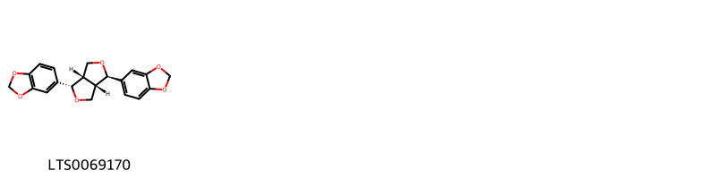{ width=100% }
    <figcaption>Hình ảnh cấu trúc hóa học của 1 hoạt chất thuộc nhóm Furanoid lignans gồm ['asarinin (LTS0069170)'].</figcaption>
</figure>
#### Nhóm Organonitrogen compounds
<figure markdown="span">
    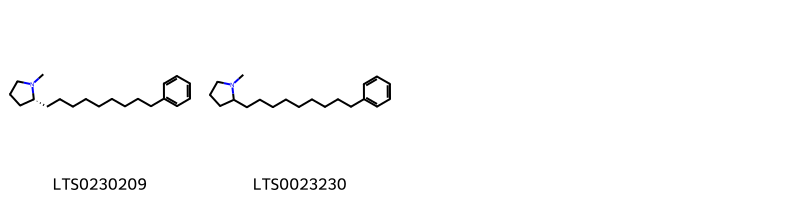{ width=100% }
    <figcaption>Hình ảnh cấu trúc hóa học của 2 hoạt chất thuộc nhóm Organonitrogen compounds gồm ['(2r)-1-methyl-2-(9-phenylnonyl)pyrrolidine (LTS0230209)', '1-methyl-2-(9-phenylnonyl)pyrrolidine (LTS0023230)'].</figcaption>
</figure>
#### Nhóm Organooxygen compounds
<figure markdown="span">
    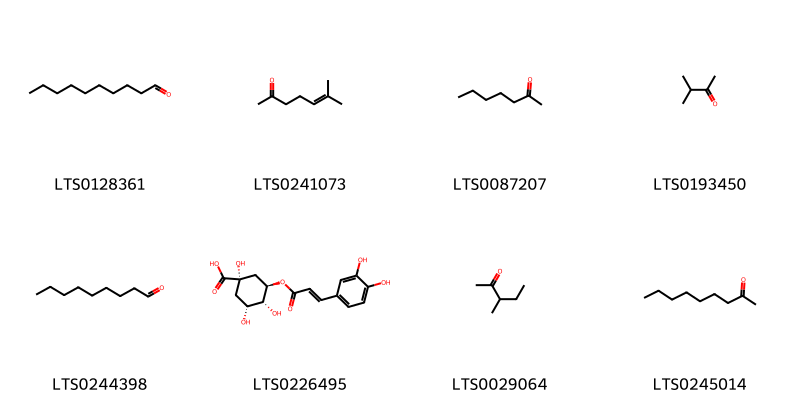{ width=100% }
    <figcaption>Hình ảnh cấu trúc hóa học của 8 hoạt chất thuộc nhóm Organooxygen compounds gồm ['decanal (LTS0128361)', '6-methyl-5-hepten-2-one (LTS0241073)', '2-heptanone (LTS0087207)', 'methyl isopropyl ketone (LTS0193450)', 'nonanal (LTS0244398)', 'chlorogenic acid (LTS0226495)', '3-methyl-2-pentanone (LTS0029064)', '2-nonanone (LTS0245014)'].</figcaption>
</figure>
#### Nhóm Phenols
<figure markdown="span">
    { width=100% }
    <figcaption>Hình ảnh cấu trúc hóa học của 1 hoạt chất thuộc nhóm Phenols gồm ['p-cresol (LTS0208715)'].</figcaption>
</figure>
#### Nhóm Prenol lipids
<figure markdown="span">
    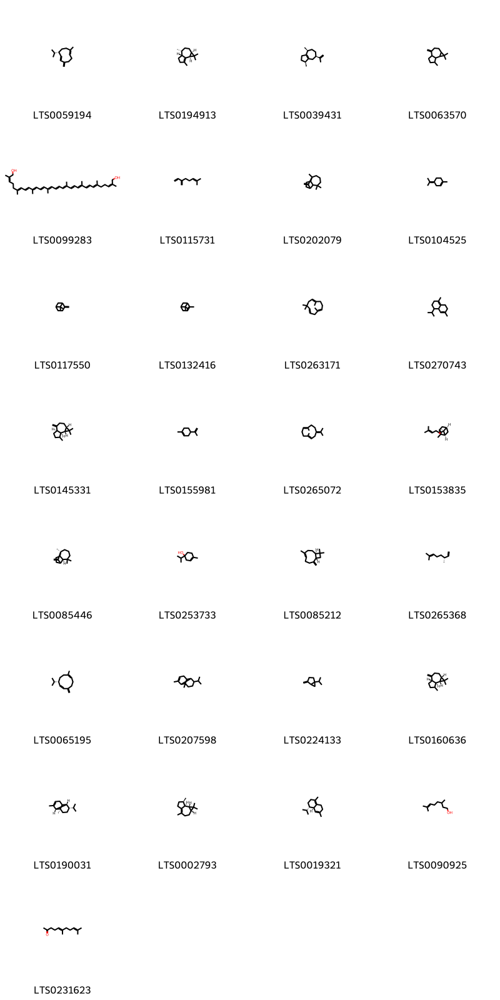{ width=100% }
    <figcaption>Hình ảnh cấu trúc hóa học của 29 hoạt chất thuộc nhóm Prenol lipids gồm ['(-)-germacrene d (LTS0059194)', '(-)-α-gurjunene (LTS0194913)', 'guaiene (LTS0039431)', '1,1,7-trimethyl-4-methylidene-octahydro-1ah-cyclopropa[e]azulene (LTS0063570)', '(2z,6e,8e,10e,12e,14e,16e,18e,20e,22e,24e,26e,30z)-2,6,10,14,19,23,27,31-octamethyldotriaconta-2,6,8,10,12,14,16,18,20,22,24,26,30-tridecaene-1,32-diol (LTS0099283)', 'α-myrcene (LTS0115731)', 'longifolene (LTS0202079)', 'terpinolene (LTS0104525)', 'β-pinene (LTS0117550)', 'α pinene (LTS0132416)', 'humulene (LTS0263171)', '4-isopropyl-1,6-dimethyl-2,3,4,4a,7,8-hexahydronaphthalene (LTS0270743)', '(1as,4ar,7as,7br)-1,1,7-trimethyl-4-methylidene-octahydro-1ah-cyclopropa[e]azulene (LTS0145331)', 'limonene,  (LTS0155981)', 'germacrene b (LTS0265072)', '(-)-endo-α-bergamotene (LTS0153835)', '(2s,7s)-3,3,7-trimethyl-8-methylidenetricyclo[5.4.0.0²,⁹]undecane (LTS0085446)', '4-terpineol (LTS0253733)', 'caryophyllene (LTS0085212)', '(-)-dihydromyrcene (LTS0265368)', '(1z,6z,8s)-8-isopropyl-1-methyl-5-methylidenecyclodeca-1,6-diene (LTS0065195)', 'α-copaene (LTS0207598)', 'sabinene (LTS0224133)', '(1as,4as,7as,7br)-1,1,7-trimethyl-4-methylidene-octahydro-1ah-cyclopropa[e]azulene (LTS0160636)', '(1r,2s,7s,8s)-8-isopropyl-1,3-dimethyltricyclo[4.4.0.0²,⁷]dec-3-ene (LTS0190031)', 'leden (LTS0002793)', 'delta-cadinene (LTS0019321)', 'citronellol, (+-)- (LTS0090925)', 'geranylacetone (LTS0231623)'].</figcaption>
</figure>
#### Nhóm Saturated hydrocarbons
<figure markdown="span">
    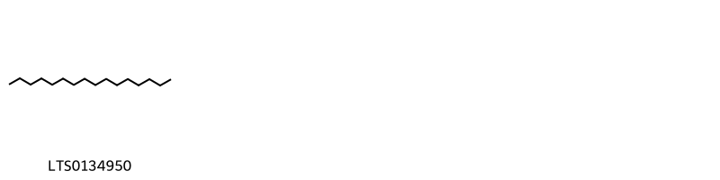{ width=100% }
    <figcaption>Hình ảnh cấu trúc hóa học của 1 hoạt chất thuộc nhóm Saturated hydrocarbons gồm ['cetane (LTS0134950)'].</figcaption>
</figure>
#### Nhóm Unsaturated hydrocarbons
<figure markdown="span">
    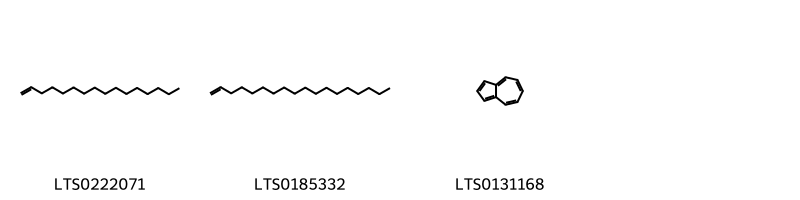{ width=100% }
    <figcaption>Hình ảnh cấu trúc hóa học của 3 hoạt chất thuộc nhóm Unsaturated hydrocarbons gồm ['hexadecene (LTS0222071)', 'octadecene (LTS0185332)', 'azulene (LTS0131168)'].</figcaption>
</figure>

---

### Dược dân tộc học

Danh sách các quốc gia có sử dụng *Arum maculatum* trong điều trị các bệnh. 

| Country   | Disease                                             | Bệnh                                                             |
|:----------|:----------------------------------------------------|:-----------------------------------------------------------------|
| Egypt     | Poison, Vesicant                                    | Chất Độc, Chất Gây Vọng                                          |
| Elsewhere | Diaphoretic, Sudorific, Poison, Expectorant, Poison | Hoại tử, chết ngạt, ngộ độc, đờm, ngộ độc                        |
| Europe    | Poison                                              | Chất độc                                                         |
| Turkey    | Expectorant, Poison, Sudorific, Stomachic, Tonic    | Chất đờm, chất độc, gây ngạt, gây ngạt, gây đau dạ dày, thuốc bổ |

---

# Chi Colocasia

??? note "Danh sách các dược liệu thuộc chi"
    
	 - *Colocasia esculenta*
	 - *Colocasia virosa*

---
## Colocasia esculenta
### Thông tin về thực vật

!!! info "Phân loại thực vật của *Colocasia esculenta* từ GIBF:"
    - **Kingdom:** Plantae
    - **Phylum:** Tracheophyta
    - **Order:** Alismatales
    - **Family:** Araceae
    - **Genus:** Colocasia
    - **Species:** *Colocasia esculenta*

 

| Label (VI)   | Label (EN)   | Scientific Name     | Descriptions (VI)   | Descriptions (EN)                             | Also Known As (VI)   | Also Known As (EN)                                              |
|:-------------|:-------------|:--------------------|:--------------------|:----------------------------------------------|:---------------------|:----------------------------------------------------------------|
| N/A          | N/A          | Colocasia esculenta | loài thực vật       | species of plant in the Arum family (Araceae) | ['']                 | ['Colocasia esculenta', 'dasheen', 'godere', 'kalo', 'Olhuala'] |

#### Phân bố trên thế giới

**Từ CSDL GIBF** Sri Lanka, Australia, Guadeloupe, Wallis and Futuna, Myanmar, Saint Lucia, Puerto Rico, Réunion, Chinese Taipei, Spain, Portugal, Algeria, United States of America, Maldives, Trinidad and Tobago, South Africa, Sao Tome and Principe, Thailand, Brazil, Norfolk Island, Viet Nam, Ecuador, French Polynesia, Madagascar, Haiti, Macao, India, Indonesia, Malaysia, New Zealand

#### Phân bố tại Việt Nam

**Từ CSDL GIBF**: Cần Thơ, Ninh Bình

---
### Thành phần hóa học
        
- Theo cơ sở dữ liệu lotus: Từ loài *Colocasia esculenta* đã phân lập và xác định được 42 hoạt chất thuộc về các nhóm Benzodioxanes, Fatty Acyls, Flavonoids, Steroids and steroid derivatives, Cinnamic acids and derivatives, Benzene and substituted derivatives, Hydroxy acids and derivatives, Phenols, Glycerolipids, Furanoid lignans, Carboxylic acids and derivatives. 

|    | chemicalTaxonomyClassyfireClass     |   smiles_count |
|---:|:------------------------------------|---------------:|
|  0 | Benzene and substituted derivatives |              3 |
|  1 | Benzodioxanes                       |              4 |
|  2 | Carboxylic acids and derivatives    |              1 |
|  3 | Cinnamic acids and derivatives      |              5 |
|  4 | Fatty Acyls                         |             12 |
|  5 | Flavonoids                          |              2 |
|  6 | Furanoid lignans                    |              6 |
|  7 | Glycerolipids                       |              2 |
|  8 | Hydroxy acids and derivatives       |              4 |
|  9 | Phenols                             |              1 |
| 10 | Steroids and steroid derivatives    |              2 |

#### Nhóm Benzene and substituted derivatives
<figure markdown="span">
    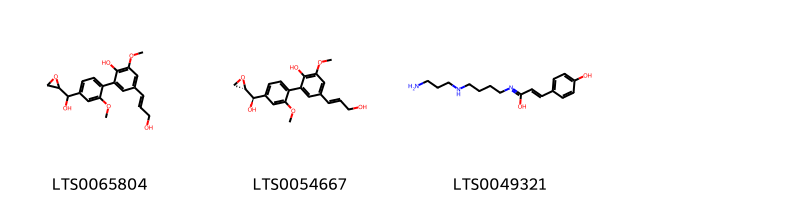{ width=100% }
    <figcaption>Hình ảnh cấu trúc hóa học của 3 hoạt chất thuộc nhóm Benzene and substituted derivatives gồm ["4'-[hydroxy(oxiran-2-yl)methyl]-5-(3-hydroxyprop-1-en-1-yl)-2',3-dimethoxy-[1,1'-biphenyl]-2-ol (LTS0065804)", "4'-[(r)-hydroxy((2s)-oxiran-2-yl)methyl]-5-[(1e)-3-hydroxyprop-1-en-1-yl]-2',3-dimethoxy-[1,1'-biphenyl]-2-ol (LTS0054667)", '(2e)-n-{4-[(3-aminopropyl)amino]butyl}-3-(4-hydroxyphenyl)prop-2-enimidic acid (LTS0049321)'].</figcaption>
</figure>
#### Nhóm Benzodioxanes
<figure markdown="span">
    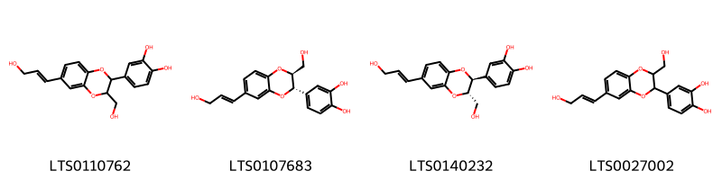{ width=100% }
    <figcaption>Hình ảnh cấu trúc hóa học của 4 hoạt chất thuộc nhóm Benzodioxanes gồm ['4-[3-(hydroxymethyl)-6-(3-hydroxyprop-1-en-1-yl)-2,3-dihydro-1,4-benzodioxin-2-yl]benzene-1,2-diol (LTS0110762)', '4-[(2s,3s)-3-(hydroxymethyl)-7-[(1e)-3-hydroxyprop-1-en-1-yl]-2,3-dihydro-1,4-benzodioxin-2-yl]benzene-1,2-diol (LTS0107683)', '4-[(2s,3s)-3-(hydroxymethyl)-6-[(1e)-3-hydroxyprop-1-en-1-yl]-2,3-dihydro-1,4-benzodioxin-2-yl]benzene-1,2-diol (LTS0140232)', '4-[3-(hydroxymethyl)-7-(3-hydroxyprop-1-en-1-yl)-2,3-dihydro-1,4-benzodioxin-2-yl]benzene-1,2-diol (LTS0027002)'].</figcaption>
</figure>
#### Nhóm Carboxylic acids and derivatives
<figure markdown="span">
    { width=100% }
    <figcaption>Hình ảnh cấu trúc hóa học của 1 hoạt chất thuộc nhóm Carboxylic acids and derivatives gồm ['oxalic acid (LTS0217707)'].</figcaption>
</figure>
#### Nhóm Cinnamic acids and derivatives
<figure markdown="span">
    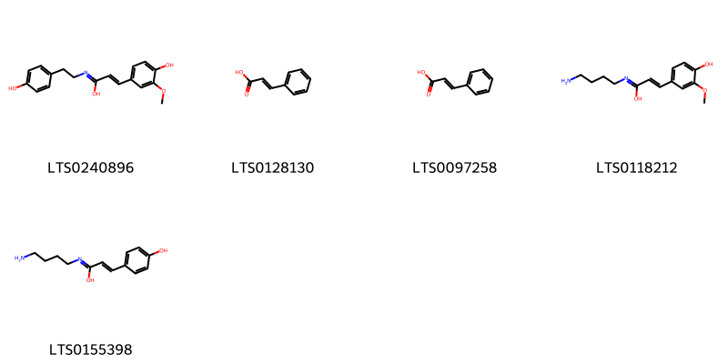{ width=100% }
    <figcaption>Hình ảnh cấu trúc hóa học của 5 hoạt chất thuộc nhóm Cinnamic acids and derivatives gồm ['3-(4-hydroxy-3-methoxyphenyl)-n-[2-(4-hydroxyphenyl)ethyl]prop-2-enimidic acid (LTS0240896)', 'cinnamic acid (LTS0128130)', 'phenylacrylic acid (LTS0097258)', '(2e)-n-(4-aminobutyl)-3-(4-hydroxy-3-methoxyphenyl)prop-2-enimidic acid (LTS0118212)', '(2e)-n-(4-aminobutyl)-3-(4-hydroxyphenyl)prop-2-enimidic acid (LTS0155398)'].</figcaption>
</figure>
#### Nhóm Fatty Acyls
<figure markdown="span">
    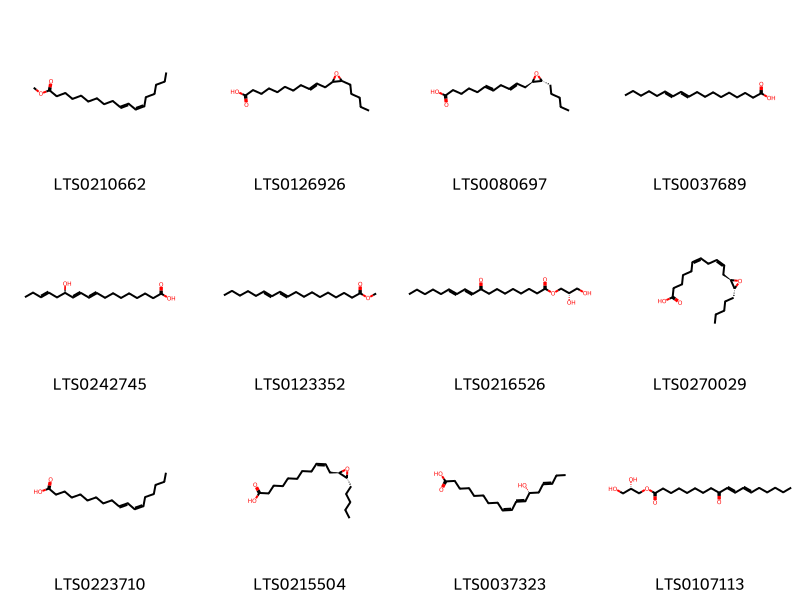{ width=100% }
    <figcaption>Hình ảnh cấu trúc hóa học của 12 hoạt chất thuộc nhóm Fatty Acyls gồm ['methyl (10e,12z)-octadeca-10,12-dienoate (LTS0210662)', '11-(3-pentyloxiran-2-yl)undec-9-enoic acid (LTS0126926)', '11-[(2r,3r)-3-pentyloxiran-2-yl]undeca-6,9-dienoic acid (LTS0080697)', '(10e)-octadeca-10,12-dienoic acid (LTS0037689)', '(13r)-13-hydroxyoctadeca-9,11,15-trienoic acid (LTS0242745)', 'methyl (10e)-octadeca-10,12-dienoate (LTS0123352)', '(2s)-2,3-dihydroxypropyl (10e,12e)-9-oxooctadeca-10,12-dienoate (LTS0216526)', '(6z,9z)-11-[(2r,3r)-3-pentyloxiran-2-yl]undeca-6,9-dienoic acid (LTS0270029)', '10e,12z-octadecadienoic acid (LTS0223710)', '(9z)-11-[(2r,3r)-3-pentyloxiran-2-yl]undec-9-enoic acid (LTS0215504)', '(9z,11e,13r,15e)-13-hydroxyoctadeca-9,11,15-trienoic acid (LTS0037323)', '(2s)-2,3-dihydroxypropyl 9-oxooctadeca-10,12-dienoate (LTS0107113)'].</figcaption>
</figure>
#### Nhóm Flavonoids
<figure markdown="span">
    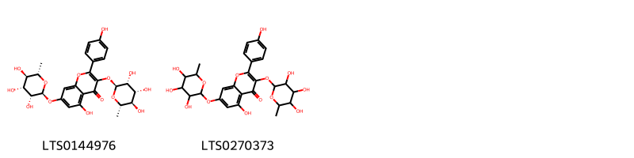{ width=100% }
    <figcaption>Hình ảnh cấu trúc hóa học của 2 hoạt chất thuộc nhóm Flavonoids gồm ['lespedin (LTS0144976)', 'kaempferitrin (LTS0270373)'].</figcaption>
</figure>
#### Nhóm Furanoid lignans
<figure markdown="span">
    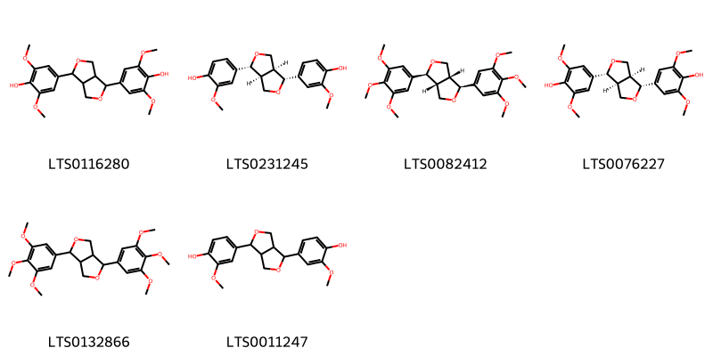{ width=100% }
    <figcaption>Hình ảnh cấu trúc hóa học của 6 hoạt chất thuộc nhóm Furanoid lignans gồm ['syringaresinol (LTS0116280)', '(-)-pinoresinol (LTS0231245)', '( )-yangabin (LTS0082412)', '(-)-syringaresinol (LTS0076227)', '1,4-bis(3,4,5-trimethoxyphenyl)-hexahydrofuro[3,4-c]furan (LTS0132866)', 'pinoresinol (LTS0011247)'].</figcaption>
</figure>
#### Nhóm Glycerolipids
<figure markdown="span">
    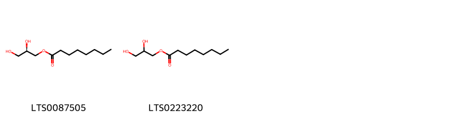{ width=100% }
    <figcaption>Hình ảnh cấu trúc hóa học của 2 hoạt chất thuộc nhóm Glycerolipids gồm ['3-octanoyl-sn-glycerol (LTS0087505)', 'monoctanoin (LTS0223220)'].</figcaption>
</figure>
#### Nhóm Hydroxy acids and derivatives
<figure markdown="span">
    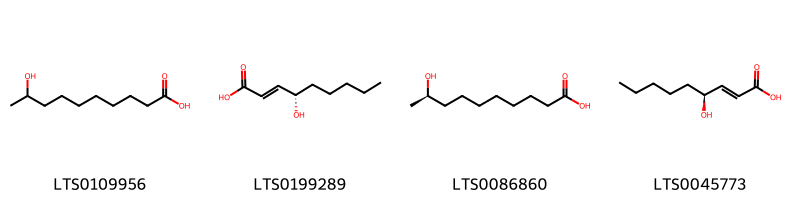{ width=100% }
    <figcaption>Hình ảnh cấu trúc hóa học của 4 hoạt chất thuộc nhóm Hydroxy acids and derivatives gồm ['9-hydroxydecanoic acid (LTS0109956)', '(4s)-4-hydroxynon-2-enoic acid (LTS0199289)', 'd-9-hydroxydecanoic acid (LTS0086860)', '(2e,4s)-4-hydroxynon-2-enoic acid (LTS0045773)'].</figcaption>
</figure>
#### Nhóm Phenols
<figure markdown="span">
    { width=100% }
    <figcaption>Hình ảnh cấu trúc hóa học của 1 hoạt chất thuộc nhóm Phenols gồm ['(2e)-3-(4-hydroxy-3-methoxyphenyl)-n-[2-(4-hydroxyphenyl)ethyl]prop-2-enimidic acid (LTS0187051)'].</figcaption>
</figure>
#### Nhóm Steroids and steroid derivatives
<figure markdown="span">
    { width=100% }
    <figcaption>Hình ảnh cấu trúc hóa học của 2 hoạt chất thuộc nhóm Steroids and steroid derivatives gồm ['sitosterol (LTS0168132)', 'stigmast-5-en-3-ol, (3β)- (LTS0204616)'].</figcaption>
</figure>

---

### Dược dân tộc học

Danh sách các quốc gia có sử dụng *Colocasia esculenta* trong điều trị các bệnh. 

| Country   | Disease                                                                            | Bệnh                                                                                                  |
|:----------|:-----------------------------------------------------------------------------------|:------------------------------------------------------------------------------------------------------|
| Brazil    | Abortifacient, Poultice, Vermifuge                                                 | Abortifacient, Poultice, Vermifuge                                                                    |
| China     | Antidote, Carminative, Pediculicide, Poison                                        | Thuốc giải độc, Carminative, Pediculicide, Poison                                                     |
| Elsewhere | Antidote, Astringent, Intoxicant, Poison, Rubefacient, Stimulant, Styptic, Styptic | Thuốc giải độc, Chất làm se, Chất làm trong, Chất độc, Rubefacient, Chất kích thích, Styptic, Styptic |
| Hawaii    | Laxative, Styptic                                                                  | Thuốc nhuận tràng, Styptic                                                                            |

---

---
## Colocasia virosa
### Thông tin về thực vật

!!! info "Phân loại thực vật của *Steudnera virosa* từ GIBF:"
    - **Kingdom:** Plantae
    - **Phylum:** Tracheophyta
    - **Order:** Alismatales
    - **Family:** Araceae
    - **Genus:** Steudnera
    - **Species:** *Steudnera virosa*

 

| Label (VI)   | Label (EN)   | Scientific Name   | Descriptions (VI)   | Descriptions (EN)   | Also Known As (VI)   | Also Known As (EN)   |
|:-------------|:-------------|:------------------|:--------------------|:--------------------|:---------------------|:---------------------|
| N/A          | N/A          | Colocasia virosa  |                     |                     | ['']                 | ['']                 |

#### Phân bố trên thế giới

**Từ CSDL GIBF** Sri Lanka, Australia, Guadeloupe, Wallis and Futuna, Myanmar, Saint Lucia, Puerto Rico, Réunion, Chinese Taipei, Spain, Portugal, Algeria, United States of America, Maldives, Trinidad and Tobago, South Africa, Sao Tome and Principe, Thailand, Brazil, Norfolk Island, Viet Nam, Ecuador, French Polynesia, Madagascar, Haiti, Macao, India, Indonesia, Malaysia, New Zealand

#### Phân bố tại Việt Nam

**Từ CSDL GIBF**: Cần Thơ, Ninh Bình

---
### Thành phần hóa học
        
- Theo cơ sở dữ liệu lotus: Từ loài *Steudnera virosa* đã phân lập và xác định được Chưa có hoạt chất nào được phân lập. hoạt chất thuộc về các nhóm Không có hoạt chất nào được phân lập. 

Không có hình ảnh nào được tạo ra

---

### Dược dân tộc học

Danh sách các quốc gia có sử dụng *Steudnera virosa* trong điều trị các bệnh. 

| Country   | Disease   | Bệnh     |
|:----------|:----------|:---------|
| Elsewhere | Poison    | Chất độc |

---

# Chi Caladium

??? note "Danh sách các dược liệu thuộc chi"
    
	 - *Caladium bicolor*

---
## Caladium bicolor
### Thông tin về thực vật

!!! info "Phân loại thực vật của *Caladium bicolor* từ GIBF:"
    - **Kingdom:** Plantae
    - **Phylum:** Tracheophyta
    - **Order:** Alismatales
    - **Family:** Araceae
    - **Genus:** Caladium
    - **Species:** *Caladium bicolor*

 

| Label (VI)   | Label (EN)   | Scientific Name   | Descriptions (VI)   | Descriptions (EN)   | Also Known As (VI)   | Also Known As (EN)   |
|:-------------|:-------------|:------------------|:--------------------|:--------------------|:---------------------|:---------------------|
| N/A          | N/A          | Caladium bicolor  | loài thực vật       | species of plant    | ['']                 | ['']                 |

#### Phân bố trên thế giới

**Từ CSDL GIBF** nan, Sri Lanka, Ghana, Micronesia (Federated States of), Australia, Gabon, Argentina, Saint Lucia, Benin, Nicaragua, Sierra Leone, Panama, French Guiana, Puerto Rico, Nigeria, Bolivia (Plurinational State of), Honduras, United States of America, Liberia, El Salvador, Belize, Trinidad and Tobago, Hong Kong, Suriname, Saint Vincent and the Grenadines, Thailand, Brazil, Bhutan, Dominican Republic, Peru, Mexico, Singapore, Viet Nam, Ecuador, Madagascar, Colombia, Costa Rica, India, Indonesia, Philippines, Malaysia

#### Phân bố tại Việt Nam

**Từ CSDL GIBF**: Hồ Chí Minh city

---
### Thành phần hóa học
        
- Theo cơ sở dữ liệu lotus: Từ loài *Caladium bicolor* đã phân lập và xác định được Chưa có hoạt chất nào được phân lập. hoạt chất thuộc về các nhóm Không có hoạt chất nào được phân lập. 

Không có hình ảnh nào được tạo ra

---

### Dược dân tộc học

Danh sách các quốc gia có sử dụng *Caladium bicolor* trong điều trị các bệnh. 

| Country   | Disease                                              | Bệnh                                                |
|:----------|:-----------------------------------------------------|:----------------------------------------------------|
| Brazil    | Purgative, Emetic                                    | Purgative, Emetic                                   |
| Elsewhere | Antiseptic, Ascaricide, Larvicide, Purgative, Emetic | Sát trùng, Ascaricide, Larvicide, Purgative, Emetic |

---

# Chi Dieffenbachia

??? note "Danh sách các dược liệu thuộc chi"
    
	 - *Dieffenbachia costata*
	 - *Dieffenbachia picta*
	 - *Dieffenbachia seguina*
	 - *Dieffenbachia seguine*
	 - *Dieffenbachia sequine*

---
## Dieffenbachia costata
### Thông tin về thực vật

!!! info "Phân loại thực vật của *Dieffenbachia costata* từ GIBF:"
    - **Kingdom:** Plantae
    - **Phylum:** Tracheophyta
    - **Order:** Alismatales
    - **Family:** Araceae
    - **Genus:** Dieffenbachia
    - **Species:** *Dieffenbachia costata*

 

| Label (VI)   | Label (EN)   | Scientific Name       | Descriptions (VI)   | Descriptions (EN)   | Also Known As (VI)   | Also Known As (EN)   |
|:-------------|:-------------|:----------------------|:--------------------|:--------------------|:---------------------|:---------------------|
| N/A          | N/A          | Dieffenbachia costata | loài thực vật       | species of plant    | ['']                 | ['']                 |

#### Phân bố trên thế giới

**Từ CSDL GIBF** nan, Ecuador, Colombia, Guyana, Peru, Venezuela (Bolivarian Republic of)

#### Phân bố tại Việt Nam

**Từ CSDL GIBF**: Không có ghi nhận ở Việt Nam

---
### Thành phần hóa học
        
- Theo cơ sở dữ liệu lotus: Từ loài *Dieffenbachia costata* đã phân lập và xác định được Chưa có hoạt chất nào được phân lập. hoạt chất thuộc về các nhóm Không có hoạt chất nào được phân lập. 

Không có hình ảnh nào được tạo ra

---

### Dược dân tộc học

Danh sách các quốc gia có sử dụng *Dieffenbachia costata* trong điều trị các bệnh. 

| Country   | Disease    | Bệnh      |
|:----------|:-----------|:----------|
| Peru      | Astringent | Lam se da |

---

---
## Dieffenbachia picta
### Thông tin về thực vật

!!! info "Phân loại thực vật của *Dieffenbachia seguine* từ GIBF:"
    - **Kingdom:** Plantae
    - **Phylum:** Tracheophyta
    - **Order:** Alismatales
    - **Family:** Araceae
    - **Genus:** Dieffenbachia
    - **Species:** *Dieffenbachia seguine*

 

| Label (VI)   | Label (EN)   | Scientific Name     | Descriptions (VI)   | Descriptions (EN)   | Also Known As (VI)   | Also Known As (EN)   |
|:-------------|:-------------|:--------------------|:--------------------|:--------------------|:---------------------|:---------------------|
| N/A          | N/A          | Dieffenbachia picta | loài thực vật       | species of plant    | ['']                 | ['']                 |

#### Phân bố trên thế giới

**Từ CSDL GIBF** nan, Guadeloupe, unknown or invalid, Nicaragua, United States of America, Suriname, Brazil, Côte d’Ivoire, Guyana, Mexico, Singapore, China, Curaçao, French Polynesia, Niue, Equatorial Guinea, Colombia, Vanuatu, India, Indonesia, Philippines

#### Phân bố tại Việt Nam

**Từ CSDL GIBF**: Không có ghi nhận ở Việt Nam

---
### Thành phần hóa học
        
- Theo cơ sở dữ liệu lotus: Từ loài *Dieffenbachia seguine* đã phân lập và xác định được Chưa có hoạt chất nào được phân lập. hoạt chất thuộc về các nhóm Không có hoạt chất nào được phân lập. 

Không có hình ảnh nào được tạo ra

---

### Dược dân tộc học

Danh sách các quốc gia có sử dụng *Dieffenbachia seguine* trong điều trị các bệnh. 

| Country   |   Disease | Bệnh   |
|:----------|----------:|:-------|
| Elsewhere |       nan | Ở đây  |

---

---
## Dieffenbachia seguina
### Thông tin về thực vật

!!! info "Phân loại thực vật của *Dieffenbachia seguina* từ GIBF:"
    - **Kingdom:** Plantae
    - **Phylum:** Tracheophyta
    - **Order:** Alismatales
    - **Family:** Araceae
    - **Genus:** Dieffenbachia
    - **Species:** *Dieffenbachia seguina*

 

| Label (VI)   | Label (EN)   | Scientific Name     | Descriptions (VI)   | Descriptions (EN)   | Also Known As (VI)   | Also Known As (EN)   |
|:-------------|:-------------|:--------------------|:--------------------|:--------------------|:---------------------|:---------------------|
| N/A          | N/A          | Dieffenbachia picta | loài thực vật       | species of plant    | ['']                 | ['']                 |

#### Phân bố trên thế giới

**Từ CSDL GIBF** nan, Ecuador, Puerto Rico, Niue, Suriname, Guyana, Indonesia, El Salvador, United Kingdom of Great Britain and Northern Ireland, French Guiana

#### Phân bố tại Việt Nam

**Từ CSDL GIBF**: Không có ghi nhận ở Việt Nam

---
### Thành phần hóa học
        
- Theo cơ sở dữ liệu lotus: Từ loài *Dieffenbachia seguina* đã phân lập và xác định được Chưa có hoạt chất nào được phân lập. hoạt chất thuộc về các nhóm Không có hoạt chất nào được phân lập. 

Không có hình ảnh nào được tạo ra

---

### Dược dân tộc học

Danh sách các quốc gia có sử dụng *Dieffenbachia seguina* trong điều trị các bệnh. 

| Country            | Disease   | Bệnh              |
|:-------------------|:----------|:------------------|
| Dominican Republic | Vesicant  | Chất gây bọng mắt |

---

---
## Dieffenbachia seguine
### Thông tin về thực vật

!!! info "Phân loại thực vật của *Dieffenbachia seguine* từ GIBF:"
    - **Kingdom:** Plantae
    - **Phylum:** Tracheophyta
    - **Order:** Alismatales
    - **Family:** Araceae
    - **Genus:** Dieffenbachia
    - **Species:** *Dieffenbachia seguine*

 

| Label (VI)   | Label (EN)   | Scientific Name       | Descriptions (VI)   | Descriptions (EN)   | Also Known As (VI)   | Also Known As (EN)   |
|:-------------|:-------------|:----------------------|:--------------------|:--------------------|:---------------------|:---------------------|
| N/A          | N/A          | Dieffenbachia seguine | loài thực vật       | species of plant    | ['']                 | ['']                 |

#### Phân bố trên thế giới

**Từ CSDL GIBF** nan, Guadeloupe, Guatemala, Saint Lucia, Nicaragua, French Guiana, Panama, Puerto Rico, Chinese Taipei, Jamaica, United States of America, Belize, South Africa, Trinidad and Tobago, Hong Kong, Saint Vincent and the Grenadines, Thailand, Martinique, Brazil, Cuba, Dominican Republic, Mexico, Dominica, Singapore, Ecuador, Saint Kitts and Nevis, Haiti, Colombia, Costa Rica, India, Indonesia, Philippines, Malaysia

#### Phân bố tại Việt Nam

**Từ CSDL GIBF**: Không có ghi nhận ở Việt Nam

---
### Thành phần hóa học
        
- Theo cơ sở dữ liệu lotus: Từ loài *Dieffenbachia seguine* đã phân lập và xác định được Chưa có hoạt chất nào được phân lập. hoạt chất thuộc về các nhóm Không có hoạt chất nào được phân lập. 

Không có hình ảnh nào được tạo ra

---

### Dược dân tộc học

Danh sách các quốc gia có sử dụng *Dieffenbachia seguine* trong điều trị các bệnh. 

| Country     | Disease                                              | Bệnh                                                                      |
|:------------|:-----------------------------------------------------|:--------------------------------------------------------------------------|
| Cuba        | Aphrodisiac, Contraceptive, Insecticide, Rodenticide | Thuốc kích thích tình dục, tránh thai, thuốc trừ sâu, thuốc diệt gặm nhấm |
| Dominica    | Contraceptive                                        | Kiểm soát sinh sản                                                        |
| Elsewhere   | Poison                                               | Chất độc                                                                  |
| Guadelupe   | Contraceptive                                        | Kiểm soát sinh sản                                                        |
| Portorico   | Contraceptive                                        | Kiểm soát sinh sản                                                        |
| Santa Lucia | Contraceptive                                        | Kiểm soát sinh sản                                                        |

---

---
## Dieffenbachia sequine
### Thông tin về thực vật

!!! info "Phân loại thực vật của *Dieffenbachia seguine* từ GIBF:"
    - **Kingdom:** Plantae
    - **Phylum:** Tracheophyta
    - **Order:** Alismatales
    - **Family:** Araceae
    - **Genus:** Dieffenbachia
    - **Species:** *Dieffenbachia seguine*

 

| Label (VI)   | Label (EN)   | Scientific Name       | Descriptions (VI)   | Descriptions (EN)   | Also Known As (VI)   | Also Known As (EN)   |
|:-------------|:-------------|:----------------------|:--------------------|:--------------------|:---------------------|:---------------------|
| N/A          | N/A          | Dieffenbachia seguine | loài thực vật       | species of plant    | ['']                 | ['']                 |

#### Phân bố trên thế giới

**Từ CSDL GIBF** Puerto Rico, Dominica, French Polynesia, Colombia, Brazil, Costa Rica, Peru, Venezuela (Bolivarian Republic of), French Guiana

#### Phân bố tại Việt Nam

**Từ CSDL GIBF**: Không có ghi nhận ở Việt Nam

---
### Thành phần hóa học
        
- Theo cơ sở dữ liệu lotus: Từ loài *Dieffenbachia seguine* đã phân lập và xác định được Chưa có hoạt chất nào được phân lập. hoạt chất thuộc về các nhóm Không có hoạt chất nào được phân lập. 

Không có hình ảnh nào được tạo ra

---

### Dược dân tộc học

Danh sách các quốc gia có sử dụng *Dieffenbachia seguine* trong điều trị các bệnh. 

| Country     | Disease       | Bệnh               |
|:------------|:--------------|:-------------------|
| Elsewhere   | Poison        | Chất độc           |
| West Indies | Contraceptive | Kiểm soát sinh sản |

---

# Chi Pothos

??? note "Danh sách các dược liệu thuộc chi"
    
	 - *Pothos scandens*

---
## Pothos scandens
### Thông tin về thực vật

!!! info "Phân loại thực vật của *Pothos scandens* từ GIBF:"
    - **Kingdom:** Plantae
    - **Phylum:** Tracheophyta
    - **Order:** Alismatales
    - **Family:** Araceae
    - **Genus:** Pothos
    - **Species:** *Pothos scandens*

 

| Label (VI)   | Label (EN)   | Scientific Name   | Descriptions (VI)   | Descriptions (EN)   | Also Known As (VI)   | Also Known As (EN)   |
|:-------------|:-------------|:------------------|:--------------------|:--------------------|:---------------------|:---------------------|
| N/A          | N/A          | Pothos scandens   | loài thực vật       | species of plant    | ['']                 | ['']                 |

#### Phân bố trên thế giới

**Từ CSDL GIBF** nan, Sri Lanka, Madagascar, Thailand, Lao People’s Democratic Republic, Cambodia, Myanmar, India, Indonesia, Viet Nam, Mayotte, France, Philippines, Malaysia, China

#### Phân bố tại Việt Nam

**Từ CSDL GIBF**: An Giang, Đồng Nai, Thua Thien-Hue

---
### Thành phần hóa học
        
- Theo cơ sở dữ liệu lotus: Từ loài *Pothos scandens* đã phân lập và xác định được Chưa có hoạt chất nào được phân lập. hoạt chất thuộc về các nhóm Không có hoạt chất nào được phân lập. 

Không có hình ảnh nào được tạo ra

---

### Dược dân tộc học

Danh sách các quốc gia có sử dụng *Pothos scandens* trong điều trị các bệnh. 

| Country   | Disease   | Bệnh           |
|:----------|:----------|:---------------|
| Malaya    | Vermifuge | Thuốc diệt sán |

---

# Chi Richardia

??? note "Danh sách các dược liệu thuộc chi"
    
	 - *Richardia scabra*

---
## Richardia scabra
### Thông tin về thực vật

!!! info "Phân loại thực vật của *Richardia scabra* từ GIBF:"
    - **Kingdom:** Plantae
    - **Phylum:** Tracheophyta
    - **Order:** Gentianales
    - **Family:** Rubiaceae
    - **Genus:** Richardia
    - **Species:** *Richardia scabra*

 

| Label (VI)   | Label (EN)   | Scientific Name   | Descriptions (VI)   | Descriptions (EN)   | Also Known As (VI)   | Also Known As (EN)   |
|:-------------|:-------------|:------------------|:--------------------|:--------------------|:---------------------|:---------------------|
| N/A          | N/A          | Richardia scabra  | loài thực vật       | species of plant    | ['']                 | ['']                 |

#### Phân bố trên thế giới

**Từ CSDL GIBF** nan, Australia, Guatemala, Benin, Nicaragua, Panama, French Guiana, Puerto Rico, Chinese Taipei, Bolivia (Plurinational State of), Honduras, United States of America, El Salvador, Belize, South Africa, Hong Kong, Thailand, Brazil, Cuba, Mexico, Singapore, Madagascar, Colombia, India, Indonesia, Malaysia

#### Phân bố tại Việt Nam

**Từ CSDL GIBF**: Không có ghi nhận ở Việt Nam

---
### Thành phần hóa học
        
- Theo cơ sở dữ liệu lotus: Từ loài *Richardia scabra* đã phân lập và xác định được 1 hoạt chất thuộc về các nhóm Carboxylic acids and derivatives. 

|    | chemicalTaxonomyClassyfireClass   |   smiles_count |
|---:|:----------------------------------|---------------:|
|  0 | Carboxylic acids and derivatives  |              1 |

#### Nhóm Carboxylic acids and derivatives
<figure markdown="span">
    { width=100% }
    <figcaption>Hình ảnh cấu trúc hóa học của 1 hoạt chất thuộc nhóm Carboxylic acids and derivatives gồm ['citric acid (LTS0213921)'].</figcaption>
</figure>

---

### Dược dân tộc học

Danh sách các quốc gia có sử dụng *Richardia scabra* trong điều trị các bệnh. 

| Country   | Disease             | Bệnh                |
|:----------|:--------------------|:--------------------|
| Elsewhere | Emetic, Diaphoretic | Emetic, Diaphoretic |

---

# Chi Uroatha

??? note "Danh sách các dược liệu thuộc chi"
    
	 - *Uroatha antisylleptica*

---
## Uroatha antisylleptica
### Thông tin về thực vật

!!! info "Phân loại thực vật của *N/A* từ GIBF:"
    - **Kingdom:** N/A
    - **Phylum:** N/A
    - **Order:** N/A
    - **Family:** N/A
    - **Genus:** N/A
    - **Species:** *N/A*

 

| Label (VI)   | Label (EN)   | Scientific Name   | Descriptions (VI)   | Descriptions (EN)   | Also Known As (VI)   | Also Known As (EN)   |
|:-------------|:-------------|:------------------|:--------------------|:--------------------|:---------------------|:---------------------|
| N/A          | N/A          | Richardia scabra  | loài thực vật       | species of plant    | ['']                 | ['']                 |

#### Phân bố trên thế giới

**Từ CSDL GIBF** Không có kết quả phù hợp

#### Phân bố tại Việt Nam

**Từ CSDL GIBF**: Không có ghi nhận ở Việt Nam

---
### Thành phần hóa học
        
- Theo cơ sở dữ liệu lotus: Từ loài *N/A* đã phân lập và xác định được Chưa có hoạt chất nào được phân lập. hoạt chất thuộc về các nhóm Không có hoạt chất nào được phân lập. 

Không có hình ảnh nào được tạo ra

---

### Dược dân tộc học

Danh sách các quốc gia có sử dụng *N/A* trong điều trị các bệnh. 

| Country            | Disease                      | Bệnh                 |
|:-------------------|:-----------------------------|:---------------------|
| Colombia(Barasana) | Contraceptive, Contraceptive | Ngừa thai, Ngừa thai |

---

