!!! abstract "Tóm tắt"

    Họ Araliaceae gồm khoảng 14 chi và 37 loài được một số cộng đồng tại các quốc gia như Japan*, Mexico, Japan, French, Haiti, China, Canada(Kwakiutl), Iraq, Russia, Java, Dutch, Turkey, Korea, US(Appalachia), German, ain, English, US(Blackfoot), Elsewhere, Indonesia, US(Amerindian), Dominican Republic, Malaya, Africa, India, US, Samoa, USSR sử dụng trong một số trường hợp QUERY LENGTH LIMIT EXCEEDED. MAX ALLOWED QUERY : 500 CHARS Thuốc ngủ, Chất độc, Cathartic, Thuốc bổ, Thuốc kích thích tình dục, Thuốc lợi tiểu, Thuốc kích thích tình dục, Thuốc bổ, Carminative, Thuốc long đờm, Gonadotrophic, Thuốc an thần, Thuốc bổ, Thuốc kích thích, Thuốc long đờm, Thuốc tránh thai, Phẫu thuật, Diaphoretic.

!!! info "DrDuke"

    James A. Duke sinh năm 1929-2017 là một nhà thực vật học người Mỹ. Đây là một trong những tác giả hàng đầu trong lĩnh vực dược dân tộc học với cuốn *CRC Handbook of Medicinal Herbs* và chính là người xây dựng lên cơ sở dữ liệu về hợp chất tự nhiên và dược dân tộc học tại Bộ nông nghiệp Hoa Kỳ. Các thông tin được đăng tải tại website [Dr. Duke's Phytochemical and Ethnobotanical Databases](https://phytochem.nal.usda.gov/). 
    Trong suốt thập niên 1970, ông lãnh đạo the Plant Taxonomy Laboratory, Plant Genetics and Germplasm Institute of the Agricultural Research Service, U.S. Department of Agriculture.
    Trong tài liệu này, các thông tin về dược dân tộc của các dược liệu được trích dẫn từ tài liệu của James A. Ducke với sự trợ giúp của phần mềm dịch thuật từ tiếng Anh sang tiếng Việt.
   

# Chi Hedera

??? note "Danh sách các dược liệu thuộc chi"
    
	 - *Hedera helix*

---
## Hedera helix
### Thông tin về thực vật

!!! info "Phân loại thực vật của *Hedera helix* từ GIBF:"
    - **Kingdom:** Plantae
    - **Phylum:** Tracheophyta
    - **Order:** Apiales
    - **Family:** Araliaceae
    - **Genus:** Hedera
    - **Species:** *Hedera helix*

 

| Label (VI)   | Label (EN)   | Scientific Name   | Descriptions (VI)   | Descriptions (EN)   | Also Known As (VI)   | Also Known As (EN)                                   |
|:-------------|:-------------|:------------------|:--------------------|:--------------------|:---------------------|:-----------------------------------------------------|
| N/A          | N/A          | Hedera helix      | loài thực vật       | species of plant    | ['Hedera helix']     | ['ivy', 'common ivy', 'English ivy', 'European ivy'] |

#### Phân bố trên thế giới

**Từ CSDL GIBF** Czechia, Chile, New Zealand, Spain, Poland, Netherlands, Montenegro, Denmark, United States of America, Greece, Russian Federation, Albania, Croatia, Lithuania, United Kingdom of Great Britain and Northern Ireland, Belgium, Luxembourg, Canada, Germany, Isle of Man, Austria, Hungary, Ukraine, Italy, Switzerland, France, Ireland

#### Phân bố tại Việt Nam

**Từ CSDL GIBF**: Không có ghi nhận ở Việt Nam

---
### Thành phần hóa học
        
- Theo cơ sở dữ liệu lotus: Từ loài *Hedera helix* đã phân lập và xác định được 127 hoạt chất thuộc về các nhóm Fatty Acyls, Benzene and substituted derivatives, Flavonoids, Carboxylic acids and derivatives, Cinnamic acids and derivatives, Emetine alkaloids, Organooxygen compounds, Prenol lipids. 

|    | chemicalTaxonomyClassyfireClass     |   smiles_count |
|---:|:------------------------------------|---------------:|
|  0 | Benzene and substituted derivatives |              1 |
|  1 | Carboxylic acids and derivatives    |              8 |
|  2 | Cinnamic acids and derivatives      |              2 |
|  3 | Emetine alkaloids                   |              2 |
|  4 | Fatty Acyls                         |             12 |
|  5 | Flavonoids                          |              6 |
|  6 | Organooxygen compounds              |              5 |
|  7 | Prenol lipids                       |             91 |

#### Nhóm Benzene and substituted derivatives
<figure markdown="span">
    { width=100% }
    <figcaption>Hình ảnh cấu trúc hóa học của 1 hoạt chất thuộc nhóm Benzene and substituted derivatives gồm ['3,4-dihydroxybenzoic acid (LTS0018765)'].</figcaption>
</figure>
#### Nhóm Carboxylic acids and derivatives
<figure markdown="span">
    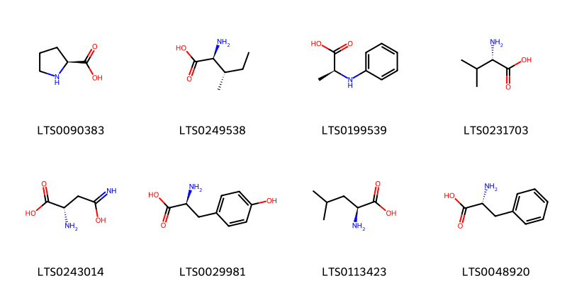{ width=100% }
    <figcaption>Hình ảnh cấu trúc hóa học của 8 hoạt chất thuộc nhóm Carboxylic acids and derivatives gồm ['l-proline (LTS0090383)', 'l-isoleucine (LTS0249538)', '(2s)-2-(phenylamino)propanoic acid (LTS0199539)', 'l-valine (LTS0231703)', 'aspartamate (LTS0243014)', 'l-tyrosine (LTS0029981)', 'l-leucine (LTS0113423)', 'd-phenylalanine (LTS0048920)'].</figcaption>
</figure>
#### Nhóm Cinnamic acids and derivatives
<figure markdown="span">
    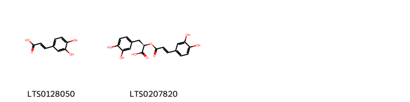{ width=100% }
    <figcaption>Hình ảnh cấu trúc hóa học của 2 hoạt chất thuộc nhóm Cinnamic acids and derivatives gồm ['3,4-dihydroxycinnamic acid (LTS0128050)', 'rosemary acid (LTS0207820)'].</figcaption>
</figure>
#### Nhóm Emetine alkaloids
<figure markdown="span">
    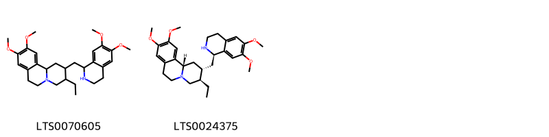{ width=100% }
    <figcaption>Hình ảnh cấu trúc hóa học của 2 hoạt chất thuộc nhóm Emetine alkaloids gồm ["6',7',10,11-tetramethoxyemetan (LTS0070605)", 'emetine (LTS0024375)'].</figcaption>
</figure>
#### Nhóm Fatty Acyls
<figure markdown="span">
    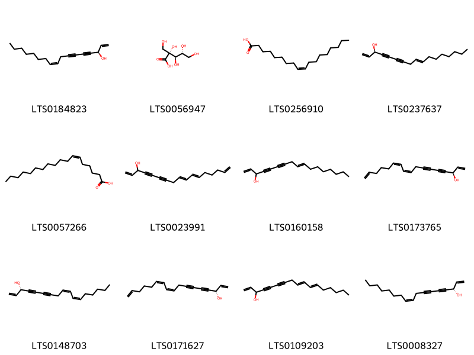{ width=100% }
    <figcaption>Hình ảnh cấu trúc hóa học của 12 hoạt chất thuộc nhóm Fatty Acyls gồm ['falcarinol (LTS0184823)', '2-carboxy-d-arabinitol (LTS0056947)', 'oleic acid (LTS0256910)', '(z)-falcarinol (LTS0237637)', 'petroselinic acid (LTS0057266)', 'heptadeca-1,9,11,16-tetraen-4,6-diyn-3-ol (LTS0023991)', 'heptadeca-1,9-dien-4,6-diyn-3-ol (LTS0160158)', '(3r,9z,11z)-heptadeca-1,9,11,16-tetraen-4,6-diyn-3-ol (LTS0173765)', '(3s,9z,11z)-heptadeca-1,9,11-trien-4,6-diyn-3-ol (LTS0148703)', '(3s,9z,11z)-heptadeca-1,9,11,16-tetraen-4,6-diyn-3-ol (LTS0171627)', 'heptadeca-1,9,11-trien-4,6-diyn-3-ol (LTS0109203)', 'falcarinol (LTS0008327)'].</figcaption>
</figure>
#### Nhóm Flavonoids
<figure markdown="span">
    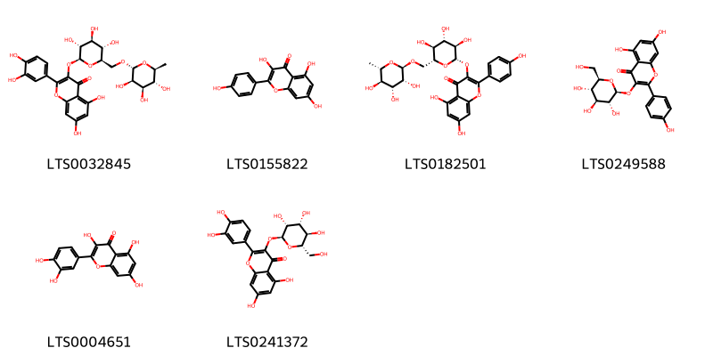{ width=100% }
    <figcaption>Hình ảnh cấu trúc hóa học của 6 hoạt chất thuộc nhóm Flavonoids gồm ['3-rutinosyl quercetin (LTS0032845)', 'kaempherol (LTS0155822)', 'nictoflorin (LTS0182501)', 'astragalin (LTS0249588)', 'quercetin (LTS0004651)', '2-(3,4-dihydroxyphenyl)-5,7-dihydroxy-3-{[(2s,3r,4r,5r,6s)-3,4,5-trihydroxy-6-(hydroxymethyl)oxan-2-yl]oxy}chromen-4-one (LTS0241372)'].</figcaption>
</figure>
#### Nhóm Organooxygen compounds
<figure markdown="span">
    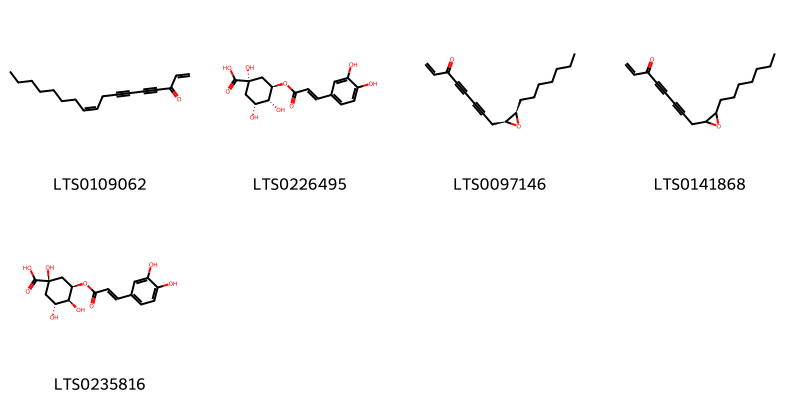{ width=100% }
    <figcaption>Hình ảnh cấu trúc hóa học của 5 hoạt chất thuộc nhóm Organooxygen compounds gồm ['falcarinone (LTS0109062)', 'chlorogenic acid (LTS0226495)', '8-[(2s,3r)-3-heptyloxiran-2-yl]oct-1-en-4,6-diyn-3-one (LTS0097146)', '8-(3-heptyloxiran-2-yl)oct-1-en-4,6-diyn-3-one (LTS0141868)', 'neochlorogenic acid (LTS0235816)'].</figcaption>
</figure>
#### Nhóm Prenol lipids
<figure markdown="span">
    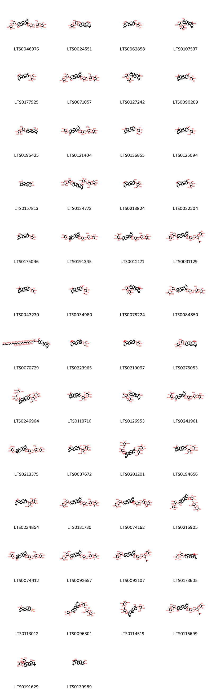{ width=100% }
    <figcaption>Hình ảnh cấu trúc hóa học của 91 hoạt chất thuộc nhóm Prenol lipids gồm ['kalopanaxsaponin b (LTS0046976)', 'α-hederin (LTS0024551)', '9-(hydroxymethyl)-2,2,6a,6b,9,12a-hexamethyl-10-[(3,4,5-trihydroxyoxan-2-yl)oxy]-1,3,4,5,6,7,8,8a,10,11,12,12b,13,14b-tetradecahydropicene-4a-carboxylic acid (LTS0062858)', '10-({4,5-dihydroxy-3-[(3,4,5-trihydroxy-6-methyloxan-2-yl)oxy]oxan-2-yl}oxy)-9-(hydroxymethyl)-2,2,6a,6b,9,12a-hexamethyl-1,3,4,5,6,7,8,8a,10,11,12,12b,13,14b-tetradecahydropicene-4a-carboxylic acid (LTS0107537)', '6-[(8a-carboxy-4,4,6a,6b,11,11,14b-heptamethyl-1,2,3,4a,5,6,7,8,9,10,12,12a,14,14a-tetradecahydropicen-3-yl)oxy]-3,4,5-trihydroxyoxane-2-carboxylic acid (LTS0177925)', '6-({[3,4-dihydroxy-6-(hydroxymethyl)-5-[(3,4,5-trihydroxy-6-methyloxan-2-yl)oxy]oxan-2-yl]oxy}methyl)-3,4,5-trihydroxyoxan-2-yl 10-({4,5-dihydroxy-3-[(3,4,5-trihydroxy-6-methyloxan-2-yl)oxy]oxan-2-yl}oxy)-9-(hydroxymethyl)-2,2,6a,6b,9,12a-hexamethyl-1,3,4,5,6,7,8,8a,10,11,12,12b,13,14b-tetradecahydropicene-4a-carboxylate (LTS0071057)', '10-({4,5-dihydroxy-3-[(3,4,5-trihydroxy-6-methyloxan-2-yl)oxy]oxan-2-yl}oxy)-2,2,6a,6b,9,9,12a-heptamethyl-1,3,4,5,6,7,8,8a,10,11,12,12b,13,14b-tetradecahydropicene-4a-carboxylic acid (LTS0227242)', 'hederagenin 3-o-arabinoside (LTS0090209)', 'β-hederin (LTS0195425)', '6-({[3,4-dihydroxy-6-(hydroxymethyl)-5-[(3,4,5-trihydroxy-6-methyloxan-2-yl)oxy]oxan-2-yl]oxy}methyl)-3,4,5-trihydroxyoxan-2-yl 9-(hydroxymethyl)-2,2,6a,6b,9,12a-hexamethyl-10-[(3,4,5-trihydroxyoxan-2-yl)oxy]-1,3,4,5,6,7,8,8a,10,11,12,12b,13,14b-tetradecahydropicene-4a-carboxylate (LTS0121404)', 'oleanolic acid 3-o-glucuronide (LTS0136855)', '(4as,6as,6br,8ar,9r,10s,12ar,12br,14bs)-9-(hydroxymethyl)-2,2,6a,6b,9,12a-hexamethyl-10-{[(2r,3r,4s,5s,6r)-3,4,5-trihydroxy-6-(hydroxymethyl)oxan-2-yl]oxy}-1,3,4,5,6,7,8,8a,10,11,12,12b,13,14b-tetradecahydropicene-4a-carboxylic acid (LTS0125094)', 'hederagenin (LTS0157813)', '(2s,3r,4s,5s,6r)-6-({[(3r,4r,5s,6r)-3,4-dihydroxy-6-(hydroxymethyl)-5-{[(2s,3r,4r,5r,6s)-3,4,5-trihydroxy-6-methyloxan-2-yl]oxy}oxan-2-yl]oxy}methyl)-3,4,5-trihydroxyoxan-2-yl (4as,6as,6br,8ar,9r,10s,12ar,12br,14bs)-10-{[(2s,4s,5s)-4,5-dihydroxy-3-{[(2s,3r,4r,5r,6s)-3,4,5-trihydroxy-6-methyloxan-2-yl]oxy}oxan-2-yl]oxy}-9-(hydroxymethyl)-2,2,6a,6b,9,12a-hexamethyl-1,3,4,5,6,7,8,8a,10,11,12,12b,13,14b-tetradecahydropicene-4a-carboxylate (LTS0134773)', '9-(hydroxymethyl)-2,2,6a,6b,9,12a-hexamethyl-10-{[3,4,5-trihydroxy-6-(hydroxymethyl)oxan-2-yl]oxy}-1,3,4,5,6,7,8,8a,10,11,12,12b,13,14b-tetradecahydropicene-4a-carboxylic acid (LTS0218824)', '6-{[8a-carboxy-4-(hydroxymethyl)-4,6a,6b,11,11,14b-hexamethyl-1,2,3,4a,5,6,7,8,9,10,12,12a,14,14a-tetradecahydropicen-3-yl]oxy}-3,4,5-trihydroxyoxane-2-carboxylic acid (LTS0032204)', '2,2,6a,6b,9,9,12a-heptamethyl-10-[(3,4,5-trihydroxyoxan-2-yl)oxy]-1,3,4,5,6,7,8,8a,10,11,12,12b,13,14b-tetradecahydropicene-4a-carboxylic acid (LTS0175046)', 'cauloside d (LTS0191345)', '6-{[8a-({[6-({[3,4-dihydroxy-6-(hydroxymethyl)-5-[(3,4,5-trihydroxy-6-methyloxan-2-yl)oxy]oxan-2-yl]oxy}methyl)-3,4,5-trihydroxyoxan-2-yl]oxy}carbonyl)-4,4,6a,6b,11,11,14b-heptamethyl-1,2,3,4a,5,6,7,8,9,10,12,12a,14,14a-tetradecahydropicen-3-yl]oxy}-3,4,5-trihydroxyoxane-2-carboxylic acid (LTS0012171)', '6-[({6-[(acetyloxy)methyl]-3,4-dihydroxy-5-[(3,4,5-trihydroxy-6-methyloxan-2-yl)oxy]oxan-2-yl}oxy)methyl]-3,4,5-trihydroxyoxan-2-yl 10-({4,5-dihydroxy-3-[(3,4,5-trihydroxy-6-methyloxan-2-yl)oxy]oxan-2-yl}oxy)-9-(hydroxymethyl)-2,2,6a,6b,9,12a-hexamethyl-1,3,4,5,6,7,8,8a,10,11,12,12b,13,14b-tetradecahydropicene-4a-carboxylate (LTS0031129)', '(4as,6as,6br,8ar,10s,12ar,12br,14bs)-2,2,6a,6b,9,9,12a-heptamethyl-10-{[(2s,3r,4s,5s)-3,4,5-trihydroxyoxan-2-yl]oxy}-1,3,4,5,6,7,8,8a,10,11,12,12b,13,14b-tetradecahydropicene-4a-carboxylic acid (LTS0043230)', '(2s,3s,4s,5r,6r)-6-{[(3s,4r,4ar,6ar,6bs,8as,12as,14ar,14br)-8a-carboxy-4-(hydroxymethyl)-4,6a,6b,11,11,14b-hexamethyl-1,2,3,4a,5,6,7,8,9,10,12,12a,14,14a-tetradecahydropicen-3-yl]oxy}-3,4,5-trihydroxyoxane-2-carboxylic acid (LTS0034980)', '10-({4,5-dihydroxy-3-[(3,4,5-trihydroxy-6-methyloxan-2-yl)oxy]oxan-2-yl}oxy)-5-hydroxy-2,2,6a,6b,9,9,12a-heptamethyl-1,3,4,5,6,7,8,8a,10,11,12,12b,13,14b-tetradecahydropicene-4a-carboxylic acid (LTS0078224)', '(2s,3r,4s,5s,6r)-6-({[(2r,3r,4r,5s,6r)-3,4-dihydroxy-6-(hydroxymethyl)-5-{[(2s,3r,4r,5r,6s)-3,4,5-trihydroxy-6-methyloxan-2-yl]oxy}oxan-2-yl]oxy}methyl)-3,4,5-trihydroxyoxan-2-yl (4as,6as,6br,8ar,10s,12ar,12br,14bs)-10-{[(2s,3r,4s,5s)-4,5-dihydroxy-3-{[(2s,3r,4r,5r,6s)-3,4,5-trihydroxy-6-methyloxan-2-yl]oxy}oxan-2-yl]oxy}-2,2,6a,6b,9,9,12a-heptamethyl-1,3,4,5,6,7,8,8a,10,11,12,12b,13,14b-tetradecahydropicene-4a-carboxylate (LTS0084850)', '10-[(2,4,5,6,7,8,9,10,11,12,13,14,15,16,17,18,19,20,22,24,26,28-docosahydroxynonacosyl)oxy]-9-(hydroxymethyl)-2,2,6a,6b,9,12a-hexamethyl-1,3,4,5,6,7,8,8a,10,11,12,12b,13,14b-tetradecahydropicene-4a-carboxylic acid (LTS0070729)', '(4ar,5r,6as,6br,8ar,10s,12ar,12br,14bs)-5-hydroxy-2,2,6a,6b,9,9,12a-heptamethyl-10-{[(2s,3r,4s,5s)-3,4,5-trihydroxyoxan-2-yl]oxy}-1,3,4,5,6,7,8,8a,10,11,12,12b,13,14b-tetradecahydropicene-4a-carboxylic acid (LTS0223965)', '5-hydroxy-2,2,6a,6b,9,9,12a-heptamethyl-10-[(3,4,5-trihydroxyoxan-2-yl)oxy]-1,3,4,5,6,7,8,8a,10,11,12,12b,13,14b-tetradecahydropicene-4a-carboxylic acid (LTS0210097)', '(4ar,5r,6as,6br,8ar,10s,12ar,12br,14bs)-10-{[(2s,3r,4s,5s)-4,5-dihydroxy-3-{[(2s,3r,4r,5r,6s)-3,4,5-trihydroxy-6-methyloxan-2-yl]oxy}oxan-2-yl]oxy}-5-hydroxy-2,2,6a,6b,9,9,12a-heptamethyl-1,3,4,5,6,7,8,8a,10,11,12,12b,13,14b-tetradecahydropicene-4a-carboxylic acid (LTS0275053)', '(2s,3r,4s,5s,6r)-3,4,5-trihydroxy-6-({[(2r,3r,4s,5s,6r)-3,4,5-trihydroxy-6-(hydroxymethyl)oxan-2-yl]oxy}methyl)oxan-2-yl (4as,6as,6br,8ar,9r,10s,12ar,12br,14bs)-10-{[(2r,3r,4s,5s,6r)-4,5-dihydroxy-6-(hydroxymethyl)-3-{[(2s,3r,4s,5s,6r)-3,4,5-trihydroxy-6-(hydroxymethyl)oxan-2-yl]oxy}oxan-2-yl]oxy}-9-(hydroxymethyl)-2,2,6a,6b,9,12a-hexamethyl-1,3,4,5,6,7,8,8a,10,11,12,12b,13,14b-tetradecahydropicene-4a-carboxylate (LTS0246964)', 'acutoside a (LTS0110716)', '10-{[4,5-dihydroxy-6-(hydroxymethyl)-3-[(3,4,5-trihydroxy-6-methyloxan-2-yl)oxy]oxan-2-yl]oxy}-9-(hydroxymethyl)-2,2,6a,6b,9,12a-hexamethyl-1,3,4,5,6,7,8,8a,10,11,12,12b,13,14b-tetradecahydropicene-4a-carboxylic acid (LTS0126953)', '6-{[8a-({[6-({[3,4-dihydroxy-6-(hydroxymethyl)-5-[(3,4,5-trihydroxy-6-methyloxan-2-yl)oxy]oxan-2-yl]oxy}methyl)-3,4,5-trihydroxyoxan-2-yl]oxy}carbonyl)-4-(hydroxymethyl)-4,6a,6b,11,11,14b-hexamethyl-1,2,3,4a,5,6,7,8,9,10,12,12a,14,14a-tetradecahydropicen-3-yl]oxy}-3,4,5-trihydroxyoxane-2-carboxylic acid (LTS0241961)', '(2s,3s,4s,5r,6r)-6-{[(3s,4ar,6ar,6bs,8as,12as,14ar,14br)-8a-({[(2s,3r,4s,5s,6r)-6-({[(2r,3r,4r,5s,6r)-3,4-dihydroxy-6-(hydroxymethyl)-5-{[(2s,3r,4r,5r,6s)-3,4,5-trihydroxy-6-methyloxan-2-yl]oxy}oxan-2-yl]oxy}methyl)-3,4,5-trihydroxyoxan-2-yl]oxy}carbonyl)-4,4,6a,6b,11,11,14b-heptamethyl-1,2,3,4a,5,6,7,8,9,10,12,12a,14,14a-tetradecahydropicen-3-yl]oxy}-3,4,5-trihydroxyoxane-2-carboxylic acid (LTS0213375)', '10-{[4,5-dihydroxy-6-(hydroxymethyl)-3-{[3,4,5-trihydroxy-6-(hydroxymethyl)oxan-2-yl]oxy}oxan-2-yl]oxy}-9-(hydroxymethyl)-2,2,6a,6b,9,12a-hexamethyl-1,3,4,5,6,7,8,8a,10,11,12,12b,13,14b-tetradecahydropicene-4a-carboxylic acid (LTS0037672)', '3,4,5-trihydroxy-6-({[3,4,5-trihydroxy-6-(hydroxymethyl)oxan-2-yl]oxy}methyl)oxan-2-yl 10-{[4,5-dihydroxy-6-(hydroxymethyl)-3-{[3,4,5-trihydroxy-6-(hydroxymethyl)oxan-2-yl]oxy}oxan-2-yl]oxy}-9-(hydroxymethyl)-2,2,6a,6b,9,12a-hexamethyl-1,3,4,5,6,7,8,8a,10,11,12,12b,13,14b-tetradecahydropicene-4a-carboxylate (LTS0201201)', '(4as,6as,6br,8ar,9r,10s,12ar,12br,14bs)-10-{[(2r,3r,4s,5s,6r)-4,5-dihydroxy-6-(hydroxymethyl)-3-{[(2s,3r,4s,5s,6r)-3,4,5-trihydroxy-6-(hydroxymethyl)oxan-2-yl]oxy}oxan-2-yl]oxy}-9-(hydroxymethyl)-2,2,6a,6b,9,12a-hexamethyl-1,3,4,5,6,7,8,8a,10,11,12,12b,13,14b-tetradecahydropicene-4a-carboxylic acid (LTS0194656)', '10-{[4,5-dihydroxy-6-(hydroxymethyl)-3-{[3,4,5-trihydroxy-6-(hydroxymethyl)oxan-2-yl]oxy}oxan-2-yl]oxy}-2,2,6a,6b,9,9,12a-heptamethyl-1,3,4,5,6,7,8,8a,10,11,12,12b,13,14b-tetradecahydropicene-4a-carboxylic acid (LTS0224854)', '6-({[3,4-dihydroxy-6-(hydroxymethyl)-5-[(3,4,5-trihydroxy-6-methyloxan-2-yl)oxy]oxan-2-yl]oxy}methyl)-3,4,5-trihydroxyoxan-2-yl 10-({4,5-dihydroxy-3-[(3,4,5-trihydroxy-6-methyloxan-2-yl)oxy]oxan-2-yl}oxy)-2,2,6a,6b,9,9,12a-heptamethyl-1,3,4,5,6,7,8,8a,10,11,12,12b,13,14b-tetradecahydropicene-4a-carboxylate (LTS0131730)', '6-[({6-[(acetyloxy)methyl]-3,4-dihydroxy-5-[(3,4,5-trihydroxy-6-methyloxan-2-yl)oxy]oxan-2-yl}oxy)methyl]-3,4,5-trihydroxyoxan-2-yl 10-({4,5-dihydroxy-3-[(3,4,5-trihydroxy-6-methyloxan-2-yl)oxy]oxan-2-yl}oxy)-5-hydroxy-2,2,6a,6b,9,9,12a-heptamethyl-1,3,4,5,6,7,8,8a,10,11,12,12b,13,14b-tetradecahydropicene-4a-carboxylate (LTS0074162)', '(2s,3r,4s,5s,6r)-6-({[(2r,3r,4r,5s,6r)-3,4-dihydroxy-6-(hydroxymethyl)-5-{[(2s,3r,4r,5r,6s)-3,4,5-trihydroxy-6-methyloxan-2-yl]oxy}oxan-2-yl]oxy}methyl)-3,4,5-trihydroxyoxan-2-yl (4ar,5r,6as,6br,8ar,9r,10s,12ar,12br,14bs)-10-{[(2s,3r,4s,5s)-4,5-dihydroxy-3-{[(2s,3r,4r,5r,6s)-3,4,5-trihydroxy-6-methyloxan-2-yl]oxy}oxan-2-yl]oxy}-5-hydroxy-9-(hydroxymethyl)-2,2,6a,6b,9,12a-hexamethyl-1,3,4,5,6,7,8,8a,10,11,12,12b,13,14b-tetradecahydropicene-4a-carboxylate (LTS0216905)', '(2s,3s,4s,5r,6r)-6-{[(3s,4r,4ar,6ar,6bs,8as,12as,14ar,14br)-8a-({[(2s,3r,4s,5s,6r)-6-({[(2r,3r,4r,5s,6r)-3,4-dihydroxy-6-(hydroxymethyl)-5-{[(2s,3r,4r,5r,6s)-3,4,5-trihydroxy-6-methyloxan-2-yl]oxy}oxan-2-yl]oxy}methyl)-3,4,5-trihydroxyoxan-2-yl]oxy}carbonyl)-4-(hydroxymethyl)-4,6a,6b,11,11,14b-hexamethyl-1,2,3,4a,5,6,7,8,9,10,12,12a,14,14a-tetradecahydropicen-3-yl]oxy}-3,4,5-trihydroxyoxane-2-carboxylic acid (LTS0074412)', '(2s,3r,4s,5s,6r)-6-({[(2r,3r,4r,5s,6r)-3,4-dihydroxy-6-(hydroxymethyl)-5-{[(2s,3r,4r,5r,6s)-3,4,5-trihydroxy-6-methyloxan-2-yl]oxy}oxan-2-yl]oxy}methyl)-3,4,5-trihydroxyoxan-2-yl (4as,6as,6br,8ar,9r,10s,12ar,12br,14bs)-10-{[(2r,3r,4s,5s,6r)-4,5-dihydroxy-6-(hydroxymethyl)-3-{[(2s,3r,4r,5r,6s)-3,4,5-trihydroxy-6-methyloxan-2-yl]oxy}oxan-2-yl]oxy}-9-(hydroxymethyl)-2,2,6a,6b,9,12a-hexamethyl-1,3,4,5,6,7,8,8a,10,11,12,12b,13,14b-tetradecahydropicene-4a-carboxylate (LTS0092657)', '6-[({6-[(acetyloxy)methyl]-3,4-dihydroxy-5-[(3,4,5-trihydroxy-6-methyloxan-2-yl)oxy]oxan-2-yl}oxy)methyl]-3,4,5-trihydroxyoxan-2-yl 10-({4,5-dihydroxy-3-[(3,4,5-trihydroxy-6-methyloxan-2-yl)oxy]oxan-2-yl}oxy)-2,2,6a,6b,9,9,12a-heptamethyl-1,3,4,5,6,7,8,8a,10,11,12,12b,13,14b-tetradecahydropicene-4a-carboxylate (LTS0092107)', '(4ar,5r,6ar,6br,8ar,10r,12ar,12br,14ar,14bs)-10-{[(2s,3r,4s,5s)-4,5-dihydroxy-3-{[(2s,3r,4r,5r,6s)-3,4,5-trihydroxy-6-methyloxan-2-yl]oxy}oxan-2-yl]oxy}-5-hydroxy-2,2,6a,6b,9,9,12a-heptamethyl-hexadecahydropicene-4a-carboxylic acid (LTS0173605)', '(4as,6as,6br,8ar,10s,12ar,12br,14bs)-2,2,6a,6b,9,9,12a-heptamethyl-10-(sulfooxy)-1,3,4,5,6,7,8,8a,10,11,12,12b,13,14b-tetradecahydropicene-4a-carboxylic acid (LTS0113012)', '(2s,3r,4s,5s,6r)-6-({[(2r,3r,4r,5s,6r)-3,4-dihydroxy-6-(hydroxymethyl)-5-{[(2s,3r,4r,5r,6s)-3,4,5-trihydroxy-6-methyloxan-2-yl]oxy}oxan-2-yl]oxy}methyl)-3,4,5-trihydroxyoxan-2-yl (4ar,5r,6as,6br,8ar,10s,12ar,12br,14bs)-5-hydroxy-2,2,6a,6b,9,9,12a-heptamethyl-10-{[(2s,3r,4s,5s)-3,4,5-trihydroxyoxan-2-yl]oxy}-1,3,4,5,6,7,8,8a,10,11,12,12b,13,14b-tetradecahydropicene-4a-carboxylate (LTS0096301)', '3,4,5-trihydroxy-6-({[3,4,5-trihydroxy-6-(hydroxymethyl)oxan-2-yl]oxy}methyl)oxan-2-yl 9-(hydroxymethyl)-2,2,6a,6b,9,12a-hexamethyl-10-{[3,4,5-trihydroxy-6-(hydroxymethyl)oxan-2-yl]oxy}-1,3,4,5,6,7,8,8a,10,11,12,12b,13,14b-tetradecahydropicene-4a-carboxylate (LTS0114519)', '(2s,3r,4s,5s,6r)-6-({[(2r,3r,4r,5s,6r)-6-[(acetyloxy)methyl]-3,4-dihydroxy-5-{[(2s,3r,4r,5r,6s)-3,4,5-trihydroxy-6-methyloxan-2-yl]oxy}oxan-2-yl]oxy}methyl)-3,4,5-trihydroxyoxan-2-yl (4as,6as,6br,8ar,9r,10s,12ar,12br,14bs)-10-{[(2r,3r,4s,5s)-4,5-dihydroxy-3-{[(2s,3r,4r,5r,6s)-3,4,5-trihydroxy-6-methyloxan-2-yl]oxy}oxan-2-yl]oxy}-9-(hydroxymethyl)-2,2,6a,6b,9,12a-hexamethyl-1,3,4,5,6,7,8,8a,10,11,12,12b,13,14b-tetradecahydropicene-4a-carboxylate (LTS0116699)', '(4as,6as,6br,8ar,9r,10s,12ar,12br,14bs)-10-{[(2r,3r,4s,5s,6r)-4,5-dihydroxy-6-(hydroxymethyl)-3-{[(2s,3r,4r,5r,6s)-3,4,5-trihydroxy-6-methyloxan-2-yl]oxy}oxan-2-yl]oxy}-9-(hydroxymethyl)-2,2,6a,6b,9,12a-hexamethyl-1,3,4,5,6,7,8,8a,10,11,12,12b,13,14b-tetradecahydropicene-4a-carboxylic acid (LTS0191629)', '10-hydroxy-9-(hydroxymethyl)-2,2,6a,6b,9,12a-hexamethyl-1,3,4,5,6,7,8,8a,10,11,12,12b,13,14b-tetradecahydropicene-4a-carboxylic acid (LTS0139989)', '6-({[3,4-dihydroxy-6-(hydroxymethyl)-5-[(3,4,5-trihydroxy-6-methyloxan-2-yl)oxy]oxan-2-yl]oxy}methyl)-3,4,5-trihydroxyoxan-2-yl 10-{[4,5-dihydroxy-6-(hydroxymethyl)-3-[(3,4,5-trihydroxy-6-methyloxan-2-yl)oxy]oxan-2-yl]oxy}-9-(hydroxymethyl)-2,2,6a,6b,9,12a-hexamethyl-1,3,4,5,6,7,8,8a,10,11,12,12b,13,14b-tetradecahydropicene-4a-carboxylate (LTS0138415)', '(2s,3r,4s,5s,6r)-3,4,5-trihydroxy-6-({[(2r,3r,4s,5s,6r)-3,4,5-trihydroxy-6-(hydroxymethyl)oxan-2-yl]oxy}methyl)oxan-2-yl (4as,6as,6br,8ar,9r,10s,12ar,12br,14bs)-9-(hydroxymethyl)-2,2,6a,6b,9,12a-hexamethyl-10-{[(2r,3r,4s,5s,6r)-3,4,5-trihydroxy-6-(hydroxymethyl)oxan-2-yl]oxy}-1,3,4,5,6,7,8,8a,10,11,12,12b,13,14b-tetradecahydropicene-4a-carboxylate (LTS0082521)', '(2s,3r,4s,5s,6r)-6-({[(2r,3r,4r,5s,6r)-3,4-dihydroxy-6-(hydroxymethyl)-5-{[(2s,3r,4r,5r,6s)-3,4,5-trihydroxy-6-methyloxan-2-yl]oxy}oxan-2-yl]oxy}methyl)-3,4,5-trihydroxyoxan-2-yl (4ar,5r,6as,6br,8ar,10s,12ar,12br,14bs)-10-{[(2s,3r,4s,5s)-4,5-dihydroxy-3-{[(2s,3r,4r,5r,6s)-3,4,5-trihydroxy-6-methyloxan-2-yl]oxy}oxan-2-yl]oxy}-5-hydroxy-2,2,6a,6b,9,9,12a-heptamethyl-1,3,4,5,6,7,8,8a,10,11,12,12b,13,14b-tetradecahydropicene-4a-carboxylate (LTS0168781)', '(2s,3r,4s,5s,6r)-6-({[(2r,3r,4r,5s,6r)-6-[(acetyloxy)methyl]-3,4-dihydroxy-5-{[(2s,3r,4r,5r,6s)-3,4,5-trihydroxy-6-methyloxan-2-yl]oxy}oxan-2-yl]oxy}methyl)-3,4,5-trihydroxyoxan-2-yl (4as,6as,6br,8ar,10s,12ar,12br,14bs)-10-{[(2r,3r,4s,5s)-4,5-dihydroxy-3-{[(2s,3r,4r,5r,6s)-3,4,5-trihydroxy-6-methyloxan-2-yl]oxy}oxan-2-yl]oxy}-2,2,6a,6b,9,9,12a-heptamethyl-1,3,4,5,6,7,8,8a,10,11,12,12b,13,14b-tetradecahydropicene-4a-carboxylate (LTS0237535)', '3,4,5-trihydroxy-6-({[3,4,5-trihydroxy-6-(hydroxymethyl)oxan-2-yl]oxy}methyl)oxan-2-yl 10-{[4,5-dihydroxy-6-(hydroxymethyl)-3-{[3,4,5-trihydroxy-6-(hydroxymethyl)oxan-2-yl]oxy}oxan-2-yl]oxy}-2,2,6a,6b,9,9,12a-heptamethyl-1,3,4,5,6,7,8,8a,10,11,12,12b,13,14b-tetradecahydropicene-4a-carboxylate (LTS0110170)', 'dipsacoside b (LTS0161777)', '(4ar,5r,6as,6br,8ar,10s,12ar,12br,14bs)-5-hydroxy-2,2,6a,6b,9,9,12a-heptamethyl-10-(sulfooxy)-1,3,4,5,6,7,8,8a,10,11,12,12b,13,14b-tetradecahydropicene-4a-carboxylic acid (LTS0198210)', '(4as,6as,6br,8as,9r,12ar,12br,14br)-10-({4,5-dihydroxy-3-[(3,4,5-trihydroxy-6-methyloxan-2-yl)oxy]oxan-2-yl}oxy)-9-(hydroxymethyl)-2,2,6a,6b,9,12a-hexamethyl-1,3,4,5,6,7,8,8a,10,11,12,12b,13,14b-tetradecahydropicene-4a-carboxylic acid (LTS0267280)', 'vitamin e (LTS0263269)', '2,2,6a,6b,9,9,12a-heptamethyl-10-(sulfooxy)-1,3,4,5,6,7,8,8a,10,11,12,12b,13,14b-tetradecahydropicene-4a-carboxylic acid (LTS0099603)', '6-({[3,4-dihydroxy-6-(hydroxymethyl)-5-[(3,4,5-trihydroxy-6-methyloxan-2-yl)oxy]oxan-2-yl]oxy}methyl)-3,4,5-trihydroxyoxan-2-yl 5-hydroxy-2,2,6a,6b,9,9,12a-heptamethyl-10-[(3,4,5-trihydroxyoxan-2-yl)oxy]-1,3,4,5,6,7,8,8a,10,11,12,12b,13,14b-tetradecahydropicene-4a-carboxylate (LTS0210593)', '[8a-({[6-({[3,4-dihydroxy-6-(hydroxymethyl)-5-[(3,4,5-trihydroxy-6-methyloxan-2-yl)oxy]oxan-2-yl]oxy}methyl)-3,4,5-trihydroxyoxan-2-yl]oxy}carbonyl)-4,4,6a,6b,11,11,14b-heptamethyl-1,2,3,4a,5,6,7,8,9,10,12,12a,14,14a-tetradecahydropicen-3-yl]oxidanesulfonic acid (LTS0207615)', '(2s,3r,4s,5s,6r)-6-({[(2r,3r,4r,5s,6r)-6-[(acetyloxy)methyl]-3,4-dihydroxy-5-{[(2s,3r,4r,5r,6s)-3,4,5-trihydroxy-6-methyloxan-2-yl]oxy}oxan-2-yl]oxy}methyl)-3,4,5-trihydroxyoxan-2-yl (4as,6as,6br,8ar,9r,10s,12ar,12br,14bs)-9-(hydroxymethyl)-6a,6b,9,12a-tetramethyl-2-methylidene-10-{[(2s,3r,4s,5s)-3,4,5-trihydroxyoxan-2-yl]oxy}-1,3,4,5,6,7,8,8a,10,11,12,12b,13,14b-tetradecahydropicene-4a-carboxylate (LTS0210140)', '(4ar,5r,6as,6br,8ar,9r,10s,12ar,12br,14bs)-10-{[(2s,3r,4s,5s)-4,5-dihydroxy-3-{[(2s,3r,4r,5r,6s)-3,4,5-trihydroxy-6-methyloxan-2-yl]oxy}oxan-2-yl]oxy}-5-hydroxy-9-(hydroxymethyl)-2,2,6a,6b,9,12a-hexamethyl-1,3,4,5,6,7,8,8a,10,11,12,12b,13,14b-tetradecahydropicene-4a-carboxylic acid (LTS0251747)', '(2s,3r,4s,5s,6r)-6-({[(2r,3r,4r,5s,6r)-6-[(acetyloxy)methyl]-3,4-dihydroxy-5-{[(2s,3r,4r,5r,6s)-3,4,5-trihydroxy-6-methyloxan-2-yl]oxy}oxan-2-yl]oxy}methyl)-3,4,5-trihydroxyoxan-2-yl (4ar,5r,6as,6br,8ar,10s,12ar,12br,14bs)-10-{[(2r,3r,4s,5s)-4,5-dihydroxy-3-{[(2s,3r,4r,5r,6s)-3,4,5-trihydroxy-6-methyloxan-2-yl]oxy}oxan-2-yl]oxy}-5-hydroxy-2,2,6a,6b,9,9,12a-heptamethyl-1,3,4,5,6,7,8,8a,10,11,12,12b,13,14b-tetradecahydropicene-4a-carboxylate (LTS0046022)', '3,4,5-trihydroxy-6-({[3,4,5-trihydroxy-6-(hydroxymethyl)oxan-2-yl]oxy}methyl)oxan-2-yl 10-({4,5-dihydroxy-3-[(3,4,5-trihydroxy-6-methyloxan-2-yl)oxy]oxan-2-yl}oxy)-9-(hydroxymethyl)-2,2,6a,6b,9,12a-hexamethyl-1,3,4,5,6,7,8,8a,10,11,12,12b,13,14b-tetradecahydropicene-4a-carboxylate (LTS0125941)', '(4as,6as,6br,8ar,9r,10s,12ar,12br,14bs)-10-{[(2s,3r,4s,5s)-3-{[(2s,3r,4s,5r,6s)-5-{[(2s,3r,4s,5s,6r)-6-({[(2r,3r,4r,5s,6r)-3,4-dihydroxy-6-(hydroxymethyl)-5-{[(2s,3r,4r,5r,6s)-3,4,5-trihydroxy-6-methyloxan-2-yl]oxy}oxan-2-yl]oxy}methyl)-3,4,5-trihydroxyoxan-2-yl]oxy}-3,4-dihydroxy-6-methyloxan-2-yl]oxy}-4,5-dihydroxyoxan-2-yl]oxy}-9-(hydroxymethyl)-2,2,6a,6b,9,12a-hexamethyl-1,3,4,5,6,7,8,8a,10,11,12,12b,13,14b-tetradecahydropicene-4a-carboxylic acid (LTS0135088)', '10-({4,5-dihydroxy-3-[(3,4,5-trihydroxy-6-methyloxan-2-yl)oxy]oxan-2-yl}oxy)-5-hydroxy-9-(hydroxymethyl)-2,2,6a,6b,9,12a-hexamethyl-1,3,4,5,6,7,8,8a,10,11,12,12b,13,14b-tetradecahydropicene-4a-carboxylic acid (LTS0015180)', '5-hydroxy-2,2,6a,6b,9,9,12a-heptamethyl-10-(sulfooxy)-1,3,4,5,6,7,8,8a,10,11,12,12b,13,14b-tetradecahydropicene-4a-carboxylic acid (LTS0015707)', '10-({3-[(5-{[6-({[3,4-dihydroxy-6-(hydroxymethyl)-5-[(3,4,5-trihydroxy-6-methyloxan-2-yl)oxy]oxan-2-yl]oxy}methyl)-3,4,5-trihydroxyoxan-2-yl]oxy}-3,4-dihydroxy-6-methyloxan-2-yl)oxy]-4,5-dihydroxyoxan-2-yl}oxy)-9-(hydroxymethyl)-2,2,6a,6b,9,12a-hexamethyl-1,3,4,5,6,7,8,8a,10,11,12,12b,13,14b-tetradecahydropicene-4a-carboxylic acid (LTS0018953)', '6-({[3,4-dihydroxy-6-(hydroxymethyl)-5-[(3,4,5-trihydroxy-6-methyloxan-2-yl)oxy]oxan-2-yl]oxy}methyl)-3,4,5-trihydroxyoxan-2-yl 10-({4,5-dihydroxy-3-[(3,4,5-trihydroxy-6-methyloxan-2-yl)oxy]oxan-2-yl}oxy)-5-hydroxy-9-(hydroxymethyl)-2,2,6a,6b,9,12a-hexamethyl-1,3,4,5,6,7,8,8a,10,11,12,12b,13,14b-tetradecahydropicene-4a-carboxylate (LTS0004098)', '6-({[3,4-dihydroxy-6-(hydroxymethyl)-5-[(3,4,5-trihydroxy-6-methyloxan-2-yl)oxy]oxan-2-yl]oxy}methyl)-3,4,5-trihydroxyoxan-2-yl 10-({4,5-dihydroxy-3-[(3,4,5-trihydroxy-6-methyloxan-2-yl)oxy]oxan-2-yl}oxy)-5-hydroxy-2,2,6a,6b,9,9,12a-heptamethyl-1,3,4,5,6,7,8,8a,10,11,12,12b,13,14b-tetradecahydropicene-4a-carboxylate (LTS0120686)', '(2s,3r,4s,5s,6r)-6-({[(2r,3r,4r,5s,6r)-6-[(acetyloxy)methyl]-3,4-dihydroxy-5-{[(2s,3r,4r,5r,6s)-3,4,5-trihydroxy-6-methyloxan-2-yl]oxy}oxan-2-yl]oxy}methyl)-3,4,5-trihydroxyoxan-2-yl (4as,6as,6br,8ar,9r,10s,12ar,12br,14bs)-10-{[(2s,3r,4s,5s)-4,5-dihydroxy-3-{[(2s,3r,4r,5r,6s)-3,4,5-trihydroxy-6-methyloxan-2-yl]oxy}oxan-2-yl]oxy}-9-(hydroxymethyl)-6a,6b,9,12a-tetramethyl-2-methylidene-1,3,4,5,6,7,8,8a,10,11,12,12b,13,14b-tetradecahydropicene-4a-carboxylate (LTS0018348)', '6-[({6-[(acetyloxy)methyl]-3,4-dihydroxy-5-[(3,4,5-trihydroxy-6-methyloxan-2-yl)oxy]oxan-2-yl}oxy)methyl]-3,4,5-trihydroxyoxan-2-yl 9-(hydroxymethyl)-6a,6b,9,12a-tetramethyl-2-methylidene-10-[(3,4,5-trihydroxyoxan-2-yl)oxy]-1,3,4,5,6,7,8,8a,10,11,12,12b,13,14b-tetradecahydropicene-4a-carboxylate (LTS0035134)', '6-[({6-[(acetyloxy)methyl]-3,4-dihydroxy-5-[(3,4,5-trihydroxy-6-methyloxan-2-yl)oxy]oxan-2-yl}oxy)methyl]-3,4,5-trihydroxyoxan-2-yl 10-({4,5-dihydroxy-3-[(3,4,5-trihydroxy-6-methyloxan-2-yl)oxy]oxan-2-yl}oxy)-9-(hydroxymethyl)-6a,6b,9,12a-tetramethyl-2-methylidene-1,3,4,5,6,7,8,8a,10,11,12,12b,13,14b-tetradecahydropicene-4a-carboxylate (LTS0046370)', '(2r)-2,5,7,8-tetramethyl-2-[(4s,8s)-4,8,12-trimethyltridecyl]-3,4-dihydro-1-benzopyran-6-ol (LTS0130040)', '[4,4,6a,6b,11,11,14b-heptamethyl-8a-({[3,4,5-trihydroxy-6-({[3,4,5-trihydroxy-6-(hydroxymethyl)oxan-2-yl]oxy}methyl)oxan-2-yl]oxy}carbonyl)-1,2,3,4a,5,6,7,8,9,10,12,12a,14,14a-tetradecahydropicen-3-yl]oxidanesulfonic acid (LTS0102554)', '[8a-({[6-({[3,4-dihydroxy-6-(hydroxymethyl)-5-[(3,4,5-trihydroxy-6-methyloxan-2-yl)oxy]oxan-2-yl]oxy}methyl)-3,4,5-trihydroxyoxan-2-yl]oxy}carbonyl)-8-hydroxy-4,4,6a,6b,11,11,14b-heptamethyl-1,2,3,4a,5,6,7,8,9,10,12,12a,14,14a-tetradecahydropicen-3-yl]oxidanesulfonic acid (LTS0100200)', '(4as,6as,6br,8as,9r,10s,12ar,12br,14bs)-9-(hydroxymethyl)-2,2,6a,6b,9,12a-hexamethyl-10-{[(2s,3r,4s,5s)-3,4,5-trihydroxyoxan-2-yl]oxy}-1,3,4,5,6,7,8,8a,10,11,12,12b,13,14b-tetradecahydropicene-4a-carboxylic acid (LTS0118951)', '(2r,3r,4s,5s,6r)-3,4,5-trihydroxy-6-({[(2r,3r,4s,5s,6r)-3,4,5-trihydroxy-6-(hydroxymethyl)oxan-2-yl]oxy}methyl)oxan-2-yl (4as,6as,6br,8ar,9r,10s,12ar,12br,14bs)-10-{[(2r,3r,4s,5s,6r)-4,5-dihydroxy-6-(hydroxymethyl)-3-{[(2s,3r,4s,5s,6r)-3,4,5-trihydroxy-6-(hydroxymethyl)oxan-2-yl]oxy}oxan-2-yl]oxy}-9-(hydroxymethyl)-2,2,6a,6b,9,12a-hexamethyl-1,3,4,5,6,7,8,8a,10,11,12,12b,13,14b-tetradecahydropicene-4a-carboxylate (LTS0157460)', '(4as,6as,6br,8as,9r,10s,12ar,12br,14bs)-10-{[(2s,3r,4s,5s)-4,5-dihydroxy-3-{[(2s,3r,4r,5r,6s)-3,4,5-trihydroxy-6-methyloxan-2-yl]oxy}oxan-2-yl]oxy}-9-(hydroxymethyl)-2,2,6a,6b,9,12a-hexamethyl-1,3,4,5,6,7,8,8a,10,11,12,12b,13,14b-tetradecahydropicene-4a-carboxylic acid (LTS0186852)', '[(3s,4ar,6ar,6bs,8as,12as,14ar,14br)-8a-({[(2s,3r,4s,5s,6r)-6-({[(2r,3r,4r,5s,6r)-3,4-dihydroxy-6-(hydroxymethyl)-5-{[(2s,3r,4r,5r,6s)-3,4,5-trihydroxy-6-methyloxan-2-yl]oxy}oxan-2-yl]oxy}methyl)-3,4,5-trihydroxyoxan-2-yl]oxy}carbonyl)-4,4,6a,6b,11,11,14b-heptamethyl-1,2,3,4a,5,6,7,8,9,10,12,12a,14,14a-tetradecahydropicen-3-yl]oxidanesulfonic acid (LTS0221437)', '[(3s,4ar,6ar,6bs,8as,12as,14ar,14br)-4,4,6a,6b,11,11,14b-heptamethyl-8a-({[(2s,3r,4s,5s,6r)-3,4,5-trihydroxy-6-({[(2r,3r,4s,5s,6r)-3,4,5-trihydroxy-6-(hydroxymethyl)oxan-2-yl]oxy}methyl)oxan-2-yl]oxy}carbonyl)-1,2,3,4a,5,6,7,8,9,10,12,12a,14,14a-tetradecahydropicen-3-yl]oxidanesulfonic acid (LTS0193314)', '(4as,6as,6br,8as,9r,10s,12ar,12br,14bs)-10-{[(2r,3r,4s,5s,6r)-4,5-dihydroxy-6-(hydroxymethyl)-3-{[(2s,3r,4s,5s,6r)-3,4,5-trihydroxy-6-(hydroxymethyl)oxan-2-yl]oxy}oxan-2-yl]oxy}-9-(hydroxymethyl)-2,2,6a,6b,9,12a-hexamethyl-1,3,4,5,6,7,8,8a,10,11,12,12b,13,14b-tetradecahydropicene-4a-carboxylic acid (LTS0264380)', '(2s,3r,4s,5s,6r)-3,4,5-trihydroxy-6-({[(2r,3r,4s,5s,6r)-3,4,5-trihydroxy-6-({[(2r,3r,4r,5r,6s)-3,4,5-trihydroxy-6-methyloxan-2-yl]oxy}methyl)oxan-2-yl]oxy}methyl)oxan-2-yl (4as,6as,6br,8ar,9r,10s,12ar,12br,14bs)-10-{[(2s,3r,4s,5s)-4,5-dihydroxy-3-{[(2s,3r,4s,5s,6r)-3,4,5-trihydroxy-6-(hydroxymethyl)oxan-2-yl]oxy}oxan-2-yl]oxy}-9-(hydroxymethyl)-2,2,6a,6b,9,12a-hexamethyl-1,3,4,5,6,7,8,8a,10,11,12,12b,13,14b-tetradecahydropicene-4a-carboxylate (LTS0275822)', '(4as,6as,6br,8ar,9r,10s,12ar,12br,14bs)-10-{[(2s,3r,4r,5s)-3,4-dihydroxy-5-({[(2r,3r,4s,5s,6r)-3,4,5-trihydroxy-6-(hydroxymethyl)oxan-2-yl]oxy}methyl)oxolan-2-yl]oxy}-9-(hydroxymethyl)-2,2,6a,6b,9,12a-hexamethyl-1,3,4,5,6,7,8,8a,10,11,12,12b,13,14b-tetradecahydropicene-4a-carboxylic acid (LTS0236190)', '10-{[3,4-dihydroxy-5-({[3,4,5-trihydroxy-6-(hydroxymethyl)oxan-2-yl]oxy}methyl)oxolan-2-yl]oxy}-9-(hydroxymethyl)-2,2,6a,6b,9,12a-hexamethyl-1,3,4,5,6,7,8,8a,10,11,12,12b,13,14b-tetradecahydropicene-4a-carboxylic acid (LTS0237457)', '(2s,3r,4s,5s,6r)-3,4,5-trihydroxy-6-({[(2r,3r,4s,5s,6r)-3,4,5-trihydroxy-6-(hydroxymethyl)oxan-2-yl]oxy}methyl)oxan-2-yl (4as,6as,6br,8ar,10s,12ar,12br,14bs)-10-{[(2r,3r,4s,5s,6r)-4,5-dihydroxy-6-(hydroxymethyl)-3-{[(2s,3r,4s,5s,6r)-3,4,5-trihydroxy-6-(hydroxymethyl)oxan-2-yl]oxy}oxan-2-yl]oxy}-2,2,6a,6b,9,9,12a-heptamethyl-1,3,4,5,6,7,8,8a,10,11,12,12b,13,14b-tetradecahydropicene-4a-carboxylate (LTS0151557)', '[(3s,4ar,6ar,6bs,8r,8ar,12as,14ar,14br)-8a-({[(2s,3r,4s,5s,6r)-6-({[(2r,3r,4r,5s,6r)-3,4-dihydroxy-6-(hydroxymethyl)-5-{[(2s,3r,4r,5r,6s)-3,4,5-trihydroxy-6-methyloxan-2-yl]oxy}oxan-2-yl]oxy}methyl)-3,4,5-trihydroxyoxan-2-yl]oxy}carbonyl)-8-hydroxy-4,4,6a,6b,11,11,14b-heptamethyl-1,2,3,4a,5,6,7,8,9,10,12,12a,14,14a-tetradecahydropicen-3-yl]oxidanesulfonic acid (LTS0194785)', '(4as,6as,6br,8as,9r,10s,12ar,12br,14bs)-9-(hydroxymethyl)-2,2,6a,6b,9,12a-hexamethyl-10-{[(2r,3r,4s,5s,6r)-3,4,5-trihydroxy-6-(hydroxymethyl)oxan-2-yl]oxy}-1,3,4,5,6,7,8,8a,10,11,12,12b,13,14b-tetradecahydropicene-4a-carboxylic acid (LTS0037760)', '6-({[3,4-dihydroxy-6-(hydroxymethyl)-5-[(3,4,5-trihydroxy-6-methyloxan-2-yl)oxy]oxan-2-yl]oxy}methyl)-3,4,5-trihydroxyoxan-2-yl (8as,9r,12ar,12br,14br)-10-({4,5-dihydroxy-3-[(3,4,5-trihydroxy-6-methyloxan-2-yl)oxy]oxan-2-yl}oxy)-9-(hydroxymethyl)-2,2,6a,6b,9,12a-hexamethyl-1,3,4,5,6,7,8,8a,10,11,12,12b,13,14b-tetradecahydropicene-4a-carboxylate (LTS0217590)'].</figcaption>
</figure>

---

### Dược dân tộc học

Danh sách các quốc gia có sử dụng *Hedera helix* trong điều trị các bệnh. 

| Country   | Disease                                                                                                         | Bệnh                                                                                                                  |
|:----------|:----------------------------------------------------------------------------------------------------------------|:----------------------------------------------------------------------------------------------------------------------|
| Elsewhere | Poison                                                                                                          | Chất độc                                                                                                              |
| India     | Cathartic, Diaphoretic, Emmenagogue, Pediculicide, Vasoconstrictor, Stimulant                                   | Cathartic, Diaphoretic, Emmenagogue, Pediculicide, Vasoconstrictor, Chất kích thích                                   |
| Iraq      | Emmenagogue, Poison                                                                                             | Emmenagogue, Poison                                                                                                   |
| Turkey    | Antiseptic, Astringent, Cathartic, Emetic, Laxative, Poison, Sudorific, Vasoconstrictor, Emmenagogue, Vermifuge | Khử trùng, Làm se, Cathartic, Emetic, Thuốc nhuận tràng, Chất độc, Sudorific, Vasoconstrictor, Emmenagogue, Vermifuge |
| US        | Poison                                                                                                          | Chất độc                                                                                                              |
| ain       | Vasodilator                                                                                                     | Chất giãn mạch                                                                                                        |

---

# Chi Oplopanax

??? note "Danh sách các dược liệu thuộc chi"
    
	 - *Oplopanax horridum*

---
## Oplopanax horridum
### Thông tin về thực vật

!!! info "Phân loại thực vật của *Oplopanax horridus* từ GIBF:"
    - **Kingdom:** Plantae
    - **Phylum:** Tracheophyta
    - **Order:** Apiales
    - **Family:** Araliaceae
    - **Genus:** Oplopanax
    - **Species:** *Oplopanax horridus*

 

| Label (VI)   | Label (EN)   | Scientific Name   | Descriptions (VI)   | Descriptions (EN)   | Also Known As (VI)   | Also Known As (EN)                                   |
|:-------------|:-------------|:------------------|:--------------------|:--------------------|:---------------------|:-----------------------------------------------------|
| N/A          | N/A          | Hedera helix      | loài thực vật       | species of plant    | ['Hedera helix']     | ['ivy', 'common ivy', 'English ivy', 'European ivy'] |

#### Phân bố trên thế giới

**Từ CSDL GIBF** nan, United States of America, Canada

#### Phân bố tại Việt Nam

**Từ CSDL GIBF**: Không có ghi nhận ở Việt Nam

---
### Thành phần hóa học
        
- Theo cơ sở dữ liệu lotus: Từ loài *Oplopanax horridus* đã phân lập và xác định được Chưa có hoạt chất nào được phân lập. hoạt chất thuộc về các nhóm Không có hoạt chất nào được phân lập. 

Không có hình ảnh nào được tạo ra

---

### Dược dân tộc học

Danh sách các quốc gia có sử dụng *Oplopanax horridus* trong điều trị các bệnh. 

| Country          | Disease                   | Bệnh                           |
|:-----------------|:--------------------------|:-------------------------------|
| Canada(Kwakiutl) | Poison, Laxative          | Chất độc, Thuốc nhuận tràng    |
| Elsewhere        | Counterirritant, Poultice | Chất chống kích ứng, Thuốc đắp |

---

# Chi Polyscias

??? note "Danh sách các dược liệu thuộc chi"
    
	 - *Polyscias fruticosa*
	 - *Polyscias nodosa*
	 - *Polyscias pinnata*
	 - *Polyscias scutellaria*

---
## Polyscias fruticosa
### Thông tin về thực vật

!!! info "Phân loại thực vật của *Polyscias fruticosa* từ GIBF:"
    - **Kingdom:** Plantae
    - **Phylum:** Tracheophyta
    - **Order:** Apiales
    - **Family:** Araliaceae
    - **Genus:** Polyscias
    - **Species:** *Polyscias fruticosa*

 

| Label (VI)   | Label (EN)   | Scientific Name     | Descriptions (VI)   | Descriptions (EN)                          | Also Known As (VI)              | Also Known As (EN)   |
|:-------------|:-------------|:--------------------|:--------------------|:-------------------------------------------|:--------------------------------|:---------------------|
| N/A          | N/A          | Polyscias fruticosa | thực vật có hoa     | perennial dicot dwarf tree native to India | ['Nam dương sâm', 'Cây gỏi cá'] | ['Ming Aralia']      |

#### Phân bố trên thế giới

**Từ CSDL GIBF** nan, Brazil, Guatemala, Viet Nam, Marshall Islands, Guadeloupe, Bangladesh, New Caledonia, China, Slovenia, French Polynesia, Ecuador, Papua New Guinea, Thailand, Puerto Rico, Ghana, Réunion, United States of America, Tuvalu, Tonga, Indonesia, Seychelles, Costa Rica, Dominican Republic, Colombia, Nigeria, Kiribati, unknown or invalid, Togo, Hong Kong, Mexico, Benin, Vanuatu, Niue, Maldives, Malaysia, Philippines, Haiti, Palau, Solomon Islands, Panama, Nicaragua, Cook Islands, Bahamas, Australia, Côte d’Ivoire, Myanmar, Micronesia (Federated States of), India, Peru, United Kingdom of Great Britain and Northern Ireland, Samoa, Christmas Island

#### Phân bố tại Việt Nam

**Từ CSDL GIBF**: Không có ghi nhận ở Việt Nam

---
### Thành phần hóa học
        
- Theo cơ sở dữ liệu lotus: Từ loài *Polyscias fruticosa* đã phân lập và xác định được 31 hoạt chất thuộc về các nhóm Prenol lipids. 

|    | chemicalTaxonomyClassyfireClass   |   smiles_count |
|---:|:----------------------------------|---------------:|
|  0 | Prenol lipids                     |             31 |

#### Nhóm Prenol lipids
<figure markdown="span">
    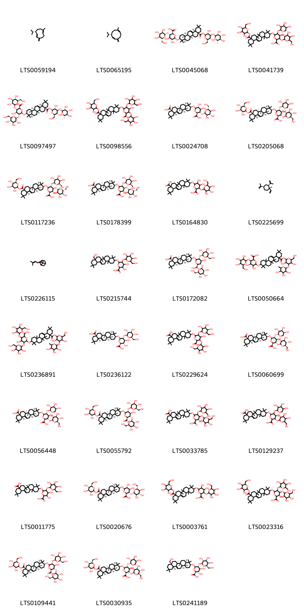{ width=100% }
    <figcaption>Hình ảnh cấu trúc hóa học của 31 hoạt chất thuộc nhóm Prenol lipids gồm ['(-)-germacrene d (LTS0059194)', '(1z,6z,8s)-8-isopropyl-1-methyl-5-methylidenecyclodeca-1,6-diene (LTS0065195)', '(2s,3s,4r,5r,6r)-6-{[(3s,4ar,6ar,6bs,8as,12as,14ar,14br)-8a-({[(2s,3r,4s,5r,6r)-3,5-dihydroxy-6-(hydroxymethyl)-4-{[(2s,3r,4r,5r,6s)-3,4,5-trihydroxy-6-methyloxan-2-yl]oxy}oxan-2-yl]oxy}carbonyl)-4,4,6a,6b,11,11,14b-heptamethyl-1,2,3,4a,5,6,7,8,9,10,12,12a,14,14a-tetradecahydropicen-3-yl]oxy}-4,5-dihydroxy-3-{[(2s,3r,4s,5s,6r)-3,4,5-trihydroxy-6-(hydroxymethyl)oxan-2-yl]oxy}oxane-2-carboxylic acid (LTS0045068)', '6-{[4,4,6a,6b,11,11,14b-heptamethyl-8a-({[3,4,5-trihydroxy-6-(hydroxymethyl)oxan-2-yl]oxy}carbonyl)-1,2,3,4a,5,6,7,8,9,10,12,12a,14,14a-tetradecahydropicen-3-yl]oxy}-4-hydroxy-3-{[3,4,5-trihydroxy-6-(hydroxymethyl)oxan-2-yl]oxy}-5-[(3,4,5-trihydroxyoxan-2-yl)oxy]oxane-2-carboxylic acid (LTS0041739)', '(2s,3s,4s,5r,6r)-6-{[(3s,4ar,6ar,6bs,8as,12as,14ar,14br)-8a-({[(2s,3r,4s,5r,6r)-3,5-dihydroxy-6-(hydroxymethyl)-4-{[(2s,3r,4r,5r,6s)-3,4,5-trihydroxy-6-methyloxan-2-yl]oxy}oxan-2-yl]oxy}carbonyl)-4,4,6a,6b,11,11,14b-heptamethyl-1,2,3,4a,5,6,7,8,9,10,12,12a,14,14a-tetradecahydropicen-3-yl]oxy}-4-hydroxy-3,5-bis({[(2s,3r,4s,5s,6r)-3,4,5-trihydroxy-6-(hydroxymethyl)oxan-2-yl]oxy})oxane-2-carboxylic acid (LTS0097497)', '6-{[4,4,6a,6b,11,11,14b-heptamethyl-8a-({[3,4,5-trihydroxy-6-(hydroxymethyl)oxan-2-yl]oxy}carbonyl)-1,2,3,4a,5,6,7,8,9,10,12,12a,14,14a-tetradecahydropicen-3-yl]oxy}-4-hydroxy-3,5-bis({[3,4,5-trihydroxy-6-(hydroxymethyl)oxan-2-yl]oxy})oxane-2-carboxylic acid (LTS0098556)', '(2s,3s,4r,5r,6r)-6-{[(3s,4ar,6ar,6bs,8as,12as,14ar,14br)-8a-carboxy-4,4,6a,6b,11,11,14b-heptamethyl-1,2,3,4a,5,6,7,8,9,10,12,12a,14,14a-tetradecahydropicen-3-yl]oxy}-4,5-dihydroxy-3-{[(2s,3r,4s,5s,6r)-3,4,5-trihydroxy-6-(hydroxymethyl)oxan-2-yl]oxy}oxane-2-carboxylic acid (LTS0024708)', '(2s,3s,4s,5r,6r)-6-{[(3s,4ar,6ar,6bs,8as,12as,14ar,14br)-4,4,6a,6b,11,11,14b-heptamethyl-8a-({[(2s,3r,4s,5s,6r)-3,4,5-trihydroxy-6-(hydroxymethyl)oxan-2-yl]oxy}carbonyl)-1,2,3,4a,5,6,7,8,9,10,12,12a,14,14a-tetradecahydropicen-3-yl]oxy}-4-hydroxy-3-{[(2s,3r,4s,5s,6r)-3,4,5-trihydroxy-6-(hydroxymethyl)oxan-2-yl]oxy}-5-{[(2s,3r,4s,5s)-3,4,5-trihydroxyoxan-2-yl]oxy}oxane-2-carboxylic acid (LTS0205068)', '(2s,3s,4s,5r,6r)-6-{[(3s,4ar,6ar,6bs,8as,12as,14ar,14br)-4,4,6a,6b,11,11,14b-heptamethyl-8a-({[(2s,3r,4s,5s,6r)-3,4,5-trihydroxy-6-(hydroxymethyl)oxan-2-yl]oxy}carbonyl)-1,2,3,4a,5,6,7,8,9,10,12,12a,14,14a-tetradecahydropicen-3-yl]oxy}-3-hydroxy-5-{[(2s,3r,4s,5r,6r)-3,4,5-trihydroxy-6-(hydroxymethyl)oxan-2-yl]oxy}-4-{[(2s,3r,4s,5s,6r)-3,4,5-trihydroxy-6-(hydroxymethyl)oxan-2-yl]oxy}oxane-2-carboxylic acid (LTS0117236)', '(2s,3s,4s,5r,6r)-6-{[(3s,4ar,6ar,6bs,8as,12as,14ar,14br)-8a-carboxy-4,4,6a,6b,11,11,14b-heptamethyl-1,2,3,4a,5,6,7,8,9,10,12,12a,14,14a-tetradecahydropicen-3-yl]oxy}-3-hydroxy-5-{[(2s,3r,4s,5r,6r)-3,4,5-trihydroxy-6-(hydroxymethyl)oxan-2-yl]oxy}-4-{[(2s,3r,4s,5s,6r)-3,4,5-trihydroxy-6-(hydroxymethyl)oxan-2-yl]oxy}oxane-2-carboxylic acid (LTS0178399)', '6-[(8a-carboxy-4,4,6a,6b,11,11,14b-heptamethyl-1,2,3,4a,5,6,7,8,9,10,12,12a,14,14a-tetradecahydropicen-3-yl)oxy]-4,5-dihydroxy-3-{[3,4,5-trihydroxy-6-(hydroxymethyl)oxan-2-yl]oxy}oxane-2-carboxylic acid (LTS0164830)', 'β-elemene (LTS0225699)', 'α-bergamotene (LTS0226115)', '6-{[8a-(hydroxymethyl)-4,4,6a,6b,11,11,14b-heptamethyl-1,2,3,4a,5,6,7,8,9,10,12,12a,14,14a-tetradecahydropicen-3-yl]oxy}-3,4-dihydroxy-5-{[3,4,5-trihydroxy-6-(hydroxymethyl)oxan-2-yl]oxy}oxane-2-carboxylic acid (LTS0215744)', '(2s,3s,4s,5r,6r)-6-{[(3s,4ar,6ar,6bs,8as,12as,14ar,14br)-8a-carboxy-4,4,6a,6b,11,11,14b-heptamethyl-1,2,3,4a,5,6,7,8,9,10,12,12a,14,14a-tetradecahydropicen-3-yl]oxy}-4-hydroxy-3,5-bis({[(2s,3r,4s,5s,6r)-3,4,5-trihydroxy-6-(hydroxymethyl)oxan-2-yl]oxy})oxane-2-carboxylic acid (LTS0172082)', '6-{[8a-({[3,5-dihydroxy-6-(hydroxymethyl)-4-[(3,4,5-trihydroxy-6-methyloxan-2-yl)oxy]oxan-2-yl]oxy}carbonyl)-4,4,6a,6b,11,11,14b-heptamethyl-1,2,3,4a,5,6,7,8,9,10,12,12a,14,14a-tetradecahydropicen-3-yl]oxy}-4,5-dihydroxy-3-{[3,4,5-trihydroxy-6-(hydroxymethyl)oxan-2-yl]oxy}oxane-2-carboxylic acid (LTS0050664)', '6-{[8a-({[3,5-dihydroxy-6-(hydroxymethyl)-4-[(3,4,5-trihydroxy-6-methyloxan-2-yl)oxy]oxan-2-yl]oxy}carbonyl)-4,4,6a,6b,11,11,14b-heptamethyl-1,2,3,4a,5,6,7,8,9,10,12,12a,14,14a-tetradecahydropicen-3-yl]oxy}-4-hydroxy-3,5-bis({[3,4,5-trihydroxy-6-(hydroxymethyl)oxan-2-yl]oxy})oxane-2-carboxylic acid (LTS0236891)', '(2s,3s,4s,5r,6r)-6-{[(3s,4ar,6ar,6bs,8as,12as,14ar,14br)-8a-carboxy-4,4,6a,6b,11,11,14b-heptamethyl-1,2,3,4a,5,6,7,8,9,10,12,12a,14,14a-tetradecahydropicen-3-yl]oxy}-3,4-dihydroxy-5-{[(2s,3r,4s,5s,6r)-3,4,5-trihydroxy-6-(hydroxymethyl)oxan-2-yl]oxy}oxane-2-carboxylic acid (LTS0236122)', '6-[(8a-carboxy-4,4,6a,6b,11,11,14b-heptamethyl-1,2,3,4a,5,6,7,8,9,10,12,12a,14,14a-tetradecahydropicen-3-yl)oxy]-4-hydroxy-3,5-bis({[3,4,5-trihydroxy-6-(hydroxymethyl)oxan-2-yl]oxy})oxane-2-carboxylic acid (LTS0229624)', '(2s,3s,4s,5r,6r)-6-{[(3s,4ar,6ar,6bs,8as,12as,14ar,14br)-8a-carboxy-4,4,6a,6b,11,11,14b-heptamethyl-1,2,3,4a,5,6,7,8,9,10,12,12a,14,14a-tetradecahydropicen-3-yl]oxy}-4-hydroxy-3-{[(2s,3r,4s,5s,6r)-3,4,5-trihydroxy-6-(hydroxymethyl)oxan-2-yl]oxy}-5-{[(2r,3r,4s,5s)-3,4,5-trihydroxyoxan-2-yl]oxy}oxane-2-carboxylic acid (LTS0060699)', '(2s,3s,4s,5r,6r)-6-{[(3s,4ar,6ar,6bs,8as,12as,14ar,14br)-8a-carboxy-4,4,6a,6b,11,11,14b-heptamethyl-1,2,3,4a,5,6,7,8,9,10,12,12a,14,14a-tetradecahydropicen-3-yl]oxy}-4-hydroxy-3-{[(2s,3r,4s,5s,6r)-3,4,5-trihydroxy-6-(hydroxymethyl)oxan-2-yl]oxy}-5-{[(2s,3r,4s,5s)-3,4,5-trihydroxyoxan-2-yl]oxy}oxane-2-carboxylic acid (LTS0056448)', '(2s,3s,4s,5r,6r)-6-{[(3s,4ar,6ar,6bs,8as,12as,14ar,14br)-4,4,6a,6b,11,11,14b-heptamethyl-8a-({[(2s,3r,4s,5s,6r)-3,4,5-trihydroxy-6-(hydroxymethyl)oxan-2-yl]oxy}carbonyl)-1,2,3,4a,5,6,7,8,9,10,12,12a,14,14a-tetradecahydropicen-3-yl]oxy}-4-hydroxy-3,5-bis({[(2s,3r,4s,5s,6r)-3,4,5-trihydroxy-6-(hydroxymethyl)oxan-2-yl]oxy})oxane-2-carboxylic acid (LTS0055792)', '6-[(8a-carboxy-4,4,6a,6b,11,11,14b-heptamethyl-1,2,3,4a,5,6,7,8,9,10,12,12a,14,14a-tetradecahydropicen-3-yl)oxy]-3-hydroxy-4,5-bis({[3,4,5-trihydroxy-6-(hydroxymethyl)oxan-2-yl]oxy})oxane-2-carboxylic acid (LTS0033785)', '6-[(8a-carboxy-4,4,6a,6b,11,11,14b-heptamethyl-1,2,3,4a,5,6,7,8,9,10,12,12a,14,14a-tetradecahydropicen-3-yl)oxy]-4-hydroxy-3-{[3,4,5-trihydroxy-6-(hydroxymethyl)oxan-2-yl]oxy}-5-[(3,4,5-trihydroxyoxan-2-yl)oxy]oxane-2-carboxylic acid (LTS0129237)', '6-[(8a-carboxy-4,4,6a,6b,11,11,14b-heptamethyl-1,2,3,4a,5,6,7,8,9,10,12,12a,14,14a-tetradecahydropicen-3-yl)oxy]-3,4-dihydroxy-5-{[3,4,5-trihydroxy-6-(hydroxymethyl)oxan-2-yl]oxy}oxane-2-carboxylic acid (LTS0011775)', '(2s,3s,4r,5r,6r)-6-{[(3s,4ar,6ar,6bs,8as,12as,14ar,14br)-4,4,6a,6b,11,11,14b-heptamethyl-8a-({[(2s,3r,4s,5s,6r)-3,4,5-trihydroxy-6-(hydroxymethyl)oxan-2-yl]oxy}carbonyl)-1,2,3,4a,5,6,7,8,9,10,12,12a,14,14a-tetradecahydropicen-3-yl]oxy}-4,5-dihydroxy-3-{[(2s,3r,4s,5s,6r)-3,4,5-trihydroxy-6-(hydroxymethyl)oxan-2-yl]oxy}oxane-2-carboxylic acid (LTS0020676)', '6-{[4,4,6a,6b,11,11,14b-heptamethyl-8a-({[3,4,5-trihydroxy-6-(hydroxymethyl)oxan-2-yl]oxy}carbonyl)-1,2,3,4a,5,6,7,8,9,10,12,12a,14,14a-tetradecahydropicen-3-yl]oxy}-4,5-dihydroxy-3-{[3,4,5-trihydroxy-6-(hydroxymethyl)oxan-2-yl]oxy}oxane-2-carboxylic acid (LTS0003761)', '6-{[4,4,6a,6b,11,11,14b-heptamethyl-8a-({[3,4,5-trihydroxy-6-(hydroxymethyl)oxan-2-yl]oxy}carbonyl)-1,2,3,4a,5,6,7,8,9,10,12,12a,14,14a-tetradecahydropicen-3-yl]oxy}-3-hydroxy-4,5-bis({[3,4,5-trihydroxy-6-(hydroxymethyl)oxan-2-yl]oxy})oxane-2-carboxylic acid (LTS0023316)', '(2s,3s,4s,5r,6r)-6-{[(3s,4ar,6ar,6bs,8as,12as,14ar,14br)-4,4,6a,6b,11,11,14b-heptamethyl-8a-({[(2s,3r,4s,5s,6r)-3,4,5-trihydroxy-6-(hydroxymethyl)oxan-2-yl]oxy}carbonyl)-1,2,3,4a,5,6,7,8,9,10,12,12a,14,14a-tetradecahydropicen-3-yl]oxy}-4-hydroxy-5-{[(2s,3r,4s,5r,6r)-3,4,5-trihydroxy-6-(hydroxymethyl)oxan-2-yl]oxy}-3-{[(2s,3r,4s,5s,6r)-3,4,5-trihydroxy-6-(hydroxymethyl)oxan-2-yl]oxy}oxane-2-carboxylic acid (LTS0109441)', '(2s,3s,4s,5r,6r)-6-{[(3s,4ar,6ar,6bs,8as,12as,14ar,14br)-4,4,6a,6b,11,11,14b-heptamethyl-8a-({[(2s,3r,4s,5s,6r)-3,4,5-trihydroxy-6-(hydroxymethyl)oxan-2-yl]oxy}carbonyl)-1,2,3,4a,5,6,7,8,9,10,12,12a,14,14a-tetradecahydropicen-3-yl]oxy}-4-hydroxy-3-{[(2s,3r,4s,5s,6r)-3,4,5-trihydroxy-6-(hydroxymethyl)oxan-2-yl]oxy}-5-{[(2r,3r,4s,5s)-3,4,5-trihydroxyoxan-2-yl]oxy}oxane-2-carboxylic acid (LTS0030935)', '(2s,3s,4s,5r,6r)-6-{[(3s,4ar,6ar,6bs,8as,12as,14ar,14br)-8a-(hydroxymethyl)-4,4,6a,6b,11,11,14b-heptamethyl-1,2,3,4a,5,6,7,8,9,10,12,12a,14,14a-tetradecahydropicen-3-yl]oxy}-3,4-dihydroxy-5-{[(2s,3r,4s,5r,6r)-3,4,5-trihydroxy-6-(hydroxymethyl)oxan-2-yl]oxy}oxane-2-carboxylic acid (LTS0241189)'].</figcaption>
</figure>

---

### Dược dân tộc học

Danh sách các quốc gia có sử dụng *Polyscias fruticosa* trong điều trị các bệnh. 

| Country   | Disease                         | Bệnh                                    |
|:----------|:--------------------------------|:----------------------------------------|
| Elsewhere | Astringent, Diuretic, Vulnerary | Chất làm se, lợi tiểu, dễ bị tổn thương |

---

---
## Polyscias nodosa
### Thông tin về thực vật

!!! info "Phân loại thực vật của *Polyscias nodosa* từ GIBF:"
    - **Kingdom:** Plantae
    - **Phylum:** Tracheophyta
    - **Order:** Apiales
    - **Family:** Araliaceae
    - **Genus:** Polyscias
    - **Species:** *Polyscias nodosa*

 

| Label (VI)   | Label (EN)   | Scientific Name   | Descriptions (VI)   | Descriptions (EN)   | Also Known As (VI)   | Also Known As (EN)   |
|:-------------|:-------------|:------------------|:--------------------|:--------------------|:---------------------|:---------------------|
| N/A          | N/A          | Polyscias nodosa  | loài thực vật       | species of plant    | ['']                 | ['']                 |

#### Phân bố trên thế giới

**Từ CSDL GIBF** Viet Nam, United States of America, Indonesia, Philippines, Timor-Leste, Australia, Solomon Islands, Cuba, Papua New Guinea

#### Phân bố tại Việt Nam

**Từ CSDL GIBF**: Không có ghi nhận ở Việt Nam

---
### Thành phần hóa học
        
- Theo cơ sở dữ liệu lotus: Từ loài *Polyscias nodosa* đã phân lập và xác định được Chưa có hoạt chất nào được phân lập. hoạt chất thuộc về các nhóm Không có hoạt chất nào được phân lập. 

Không có hình ảnh nào được tạo ra

---

### Dược dân tộc học

Danh sách các quốc gia có sử dụng *Polyscias nodosa* trong điều trị các bệnh. 

| Country   | Disease   | Bệnh          |
|:----------|:----------|:--------------|
| Indonesia | Piscicide | Thuốc diệt cá |

---

---
## Polyscias pinnata
### Thông tin về thực vật

!!! info "Phân loại thực vật của *Polyscias pinnata* từ GIBF:"
    - **Kingdom:** Plantae
    - **Phylum:** Tracheophyta
    - **Order:** Apiales
    - **Family:** Araliaceae
    - **Genus:** Polyscias
    - **Species:** *Polyscias pinnata*

 

| Label (VI)   | Label (EN)   | Scientific Name   | Descriptions (VI)   | Descriptions (EN)   | Also Known As (VI)   | Also Known As (EN)   |
|:-------------|:-------------|:------------------|:--------------------|:--------------------|:---------------------|:---------------------|
| N/A          | N/A          | Polyscias pinnata | loài thực vật       | species of plant    | ['']                 | ['']                 |

#### Phân bố trên thế giới

**Từ CSDL GIBF** nan, United States of America, Vanuatu, Indonesia, Cook Islands, New Caledonia, Solomon Islands, unknown or invalid, Papua New Guinea, Cameroon

#### Phân bố tại Việt Nam

**Từ CSDL GIBF**: Không có ghi nhận ở Việt Nam

---
### Thành phần hóa học
        
- Theo cơ sở dữ liệu lotus: Từ loài *Polyscias pinnata* đã phân lập và xác định được Chưa có hoạt chất nào được phân lập. hoạt chất thuộc về các nhóm Không có hoạt chất nào được phân lập. 

Không có hình ảnh nào được tạo ra

---

### Dược dân tộc học

Danh sách các quốc gia có sử dụng *Polyscias pinnata* trong điều trị các bệnh. 

| Country   | Disease    | Bệnh           |
|:----------|:-----------|:---------------|
| Elsewhere | Anesthetic | Thuốc giảm đau |

---

---
## Polyscias scutellaria
### Thông tin về thực vật

!!! info "Phân loại thực vật của *Polyscias scutellaria* từ GIBF:"
    - **Kingdom:** Plantae
    - **Phylum:** Tracheophyta
    - **Order:** Apiales
    - **Family:** Araliaceae
    - **Genus:** Polyscias
    - **Species:** *Polyscias scutellaria*

 

| Label (VI)   | Label (EN)   | Scientific Name       | Descriptions (VI)   | Descriptions (EN)   | Also Known As (VI)   | Also Known As (EN)   |
|:-------------|:-------------|:----------------------|:--------------------|:--------------------|:---------------------|:---------------------|
| N/A          | N/A          | Polyscias scutellaria | loài thực vật       | species of plant    | ['']                 | ['plum aralia']      |

#### Phân bố trên thế giới

**Từ CSDL GIBF** nan, Brazil, Viet Nam, Guadeloupe, Barbados, New Caledonia, Tokelau, Ecuador, French Polynesia, Papua New Guinea, Thailand, Puerto Rico, Sri Lanka, Samoa, Réunion, United States of America, Tuvalu, Tonga, Indonesia, Seychelles, Costa Rica, Wallis and Futuna, Colombia, Kiribati, unknown or invalid, French Guiana, Fiji, Hong Kong, Mexico, Benin, Vanuatu, El Salvador, Niue, Guam, Belgium, Philippines, Malaysia, Haiti, Palau, Solomon Islands, Panama, Nicaragua, Singapore, Cook Islands, Bahamas, Australia, Micronesia (Federated States of), India, Nauru, Belize

#### Phân bố tại Việt Nam

**Từ CSDL GIBF**: Không có ghi nhận ở Việt Nam

---
### Thành phần hóa học
        
- Theo cơ sở dữ liệu lotus: Từ loài *Polyscias scutellaria* đã phân lập và xác định được 2 hoạt chất thuộc về các nhóm Prenol lipids. 

|    | chemicalTaxonomyClassyfireClass   |   smiles_count |
|---:|:----------------------------------|---------------:|
|  0 | Prenol lipids                     |              2 |

#### Nhóm Prenol lipids
<figure markdown="span">
    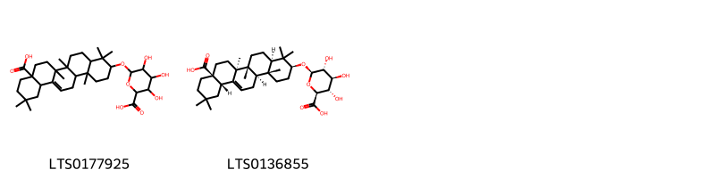{ width=100% }
    <figcaption>Hình ảnh cấu trúc hóa học của 2 hoạt chất thuộc nhóm Prenol lipids gồm ['6-[(8a-carboxy-4,4,6a,6b,11,11,14b-heptamethyl-1,2,3,4a,5,6,7,8,9,10,12,12a,14,14a-tetradecahydropicen-3-yl)oxy]-3,4,5-trihydroxyoxane-2-carboxylic acid (LTS0177925)', 'oleanolic acid 3-o-glucuronide (LTS0136855)'].</figcaption>
</figure>

---

### Dược dân tộc học

Danh sách các quốc gia có sử dụng *Polyscias scutellaria* trong điều trị các bệnh. 

| Country   | Disease   | Bệnh           |
|:----------|:----------|:---------------|
| Elsewhere | Diuretic  | Thuốc lợi tiêu |

---

# Chi Meryta

??? note "Danh sách các dược liệu thuộc chi"
    
	 - *Meryta capitata*

---
## Meryta capitata
### Thông tin về thực vật

!!! info "Phân loại thực vật của *Meryta capitata* từ GIBF:"
    - **Kingdom:** Plantae
    - **Phylum:** Tracheophyta
    - **Order:** Apiales
    - **Family:** Araliaceae
    - **Genus:** Meryta
    - **Species:** *Meryta capitata*

 

| Label (VI)   | Label (EN)   | Scientific Name   | Descriptions (VI)   | Descriptions (EN)   | Also Known As (VI)   | Also Known As (EN)   |
|:-------------|:-------------|:------------------|:--------------------|:--------------------|:---------------------|:---------------------|
| N/A          | N/A          | Meryta capitata   |                     | species of plant    | ['']                 | ['']                 |

#### Phân bố trên thế giới

**Từ CSDL GIBF** nan, Samoa, American Samoa

#### Phân bố tại Việt Nam

**Từ CSDL GIBF**: Không có ghi nhận ở Việt Nam

---
### Thành phần hóa học
        
- Theo cơ sở dữ liệu lotus: Từ loài *Meryta capitata* đã phân lập và xác định được Chưa có hoạt chất nào được phân lập. hoạt chất thuộc về các nhóm Không có hoạt chất nào được phân lập. 

Không có hình ảnh nào được tạo ra

---

### Dược dân tộc học

Danh sách các quốc gia có sử dụng *Meryta capitata* trong điều trị các bệnh. 

| Country   | Disease   | Bệnh          |
|:----------|:----------|:--------------|
| Samoa     | Piscicide | Thuốc diệt cá |

---

# Chi Didymopanax

??? note "Danh sách các dược liệu thuộc chi"
    
	 - *Didymopanax morototoni*
	 - *Didymopanax tremulus*

---
## Didymopanax morototoni
### Thông tin về thực vật

!!! info "Phân loại thực vật của *Didymopanax morototoni* từ GIBF:"
    - **Kingdom:** Plantae
    - **Phylum:** Tracheophyta
    - **Order:** Apiales
    - **Family:** Araliaceae
    - **Genus:** Didymopanax
    - **Species:** *Didymopanax morototoni*

 

| Label (VI)   | Label (EN)   | Scientific Name        | Descriptions (VI)   | Descriptions (EN)   | Also Known As (VI)   | Also Known As (EN)   |
|:-------------|:-------------|:-----------------------|:--------------------|:--------------------|:---------------------|:---------------------|
| N/A          | N/A          | Didymopanax morototoni |                     | species of plant    | ['']                 | ['']                 |

#### Phân bố trên thế giới

**Từ CSDL GIBF** Brazil, Bolivia (Plurinational State of), Virgin Islands (U.S.), Peru, Haiti, Costa Rica, Dominican Republic, Colombia, Argentina, Ecuador, French Guiana, Panama, Puerto Rico

#### Phân bố tại Việt Nam

**Từ CSDL GIBF**: Không có ghi nhận ở Việt Nam

---
### Thành phần hóa học
        
- Theo cơ sở dữ liệu lotus: Từ loài *Didymopanax morototoni* đã phân lập và xác định được Chưa có hoạt chất nào được phân lập. hoạt chất thuộc về các nhóm Không có hoạt chất nào được phân lập. 

Không có hình ảnh nào được tạo ra

---

### Dược dân tộc học

Danh sách các quốc gia có sử dụng *Didymopanax morototoni* trong điều trị các bệnh. 

| Country   | Disease            | Bệnh                                |
|:----------|:-------------------|:------------------------------------|
| Haiti     | Aphrodisiac, Tonic | Thuốc kích thích tình dục, Thuốc bổ |

---

---
## Didymopanax tremulus
### Thông tin về thực vật

!!! info "Phân loại thực vật của *Frodinia tremula* từ GIBF:"
    - **Kingdom:** Plantae
    - **Phylum:** Tracheophyta
    - **Order:** Apiales
    - **Family:** Araliaceae
    - **Genus:** Frodinia
    - **Species:** *Frodinia tremula*

 

| Label (VI)   | Label (EN)   | Scientific Name      | Descriptions (VI)   | Descriptions (EN)   | Also Known As (VI)   | Also Known As (EN)   |
|:-------------|:-------------|:---------------------|:--------------------|:--------------------|:---------------------|:---------------------|
| N/A          | N/A          | Didymopanax tremulus |                     |                     | ['']                 | ['']                 |

#### Phân bố trên thế giới

**Từ CSDL GIBF** Cuba, Dominican Republic, Haiti, Jamaica

#### Phân bố tại Việt Nam

**Từ CSDL GIBF**: Không có ghi nhận ở Việt Nam

---
### Thành phần hóa học
        
- Theo cơ sở dữ liệu lotus: Từ loài *Frodinia tremula* đã phân lập và xác định được Chưa có hoạt chất nào được phân lập. hoạt chất thuộc về các nhóm Không có hoạt chất nào được phân lập. 

Không có hình ảnh nào được tạo ra

---

### Dược dân tộc học

Danh sách các quốc gia có sử dụng *Frodinia tremula* trong điều trị các bệnh. 

| Country   | Disease            | Bệnh                                |
|:----------|:-------------------|:------------------------------------|
| Haiti     | Aphrodisiac, Tonic | Thuốc kích thích tình dục, Thuốc bổ |

---

# Chi Cussonia

??? note "Danh sách các dược liệu thuộc chi"
    
	 - *Cussonia nigerica*

---
## Cussonia nigerica
### Thông tin về thực vật

!!! info "Phân loại thực vật của *Cussonia arborea* từ GIBF:"
    - **Kingdom:** Plantae
    - **Phylum:** Tracheophyta
    - **Order:** Apiales
    - **Family:** Araliaceae
    - **Genus:** Cussonia
    - **Species:** *Cussonia arborea*

 

| Label (VI)   | Label (EN)   | Scientific Name   | Descriptions (VI)   | Descriptions (EN)   | Also Known As (VI)   | Also Known As (EN)   |
|:-------------|:-------------|:------------------|:--------------------|:--------------------|:---------------------|:---------------------|
| N/A          | N/A          | Cussonia nigerica |                     | species of plant    | ['']                 | ['']                 |

#### Phân bố trên thế giới

**Từ CSDL GIBF** Cuba, Dominican Republic, Haiti, Jamaica

#### Phân bố tại Việt Nam

**Từ CSDL GIBF**: Không có ghi nhận ở Việt Nam

---
### Thành phần hóa học
        
- Theo cơ sở dữ liệu lotus: Từ loài *Cussonia arborea* đã phân lập và xác định được Chưa có hoạt chất nào được phân lập. hoạt chất thuộc về các nhóm Không có hoạt chất nào được phân lập. 

Không có hình ảnh nào được tạo ra

---

### Dược dân tộc học

Danh sách các quốc gia có sử dụng *Cussonia arborea* trong điều trị các bệnh. 

| Country   | Disease     | Bệnh           |
|:----------|:------------|:---------------|
| Africa    | Aphrodisiac | Thuốc kích dục |

---

# Chi Schefflera

??? note "Danh sách các dược liệu thuộc chi"
    
	 - *Schefflera arboricola*
	 - *Schefflera subulata*

---
## Schefflera arboricola
### Thông tin về thực vật

!!! info "Phân loại thực vật của *Schefflera arboricola* từ GIBF:"
    - **Kingdom:** Plantae
    - **Phylum:** Tracheophyta
    - **Order:** Apiales
    - **Family:** Araliaceae
    - **Genus:** Schefflera
    - **Species:** *Schefflera arboricola*

 

| Label (VI)   | Label (EN)   | Scientific Name   | Descriptions (VI)   | Descriptions (EN)   | Also Known As (VI)   | Also Known As (EN)   |
|:-------------|:-------------|:------------------|:--------------------|:--------------------|:---------------------|:---------------------|
| N/A          | N/A          | Cussonia nigerica |                     | species of plant    | ['']                 | ['']                 |

#### Phân bố trên thế giới

**Từ CSDL GIBF** nan, Brazil, Viet Nam, Japan, Guadeloupe, Finland, New Caledonia, China, New Zealand, Ecuador, French Polynesia, Spain, Sri Lanka, Réunion, United States of America, Greece, Costa Rica, Colombia, Argentina, Cyprus, unknown or invalid, Mexico, Belgium, Chinese Taipei, Germany, Portugal, Cook Islands, Australia, India, Venezuela (Bolivarian Republic of)

#### Phân bố tại Việt Nam

**Từ CSDL GIBF**: Không có ghi nhận ở Việt Nam

---
### Thành phần hóa học
        
- Theo cơ sở dữ liệu lotus: Từ loài *Schefflera arboricola* đã phân lập và xác định được 59 hoạt chất thuộc về các nhóm Imidazopyrimidines, Fatty Acyls, Prenol lipids, Steroids and steroid derivatives. 

|    | chemicalTaxonomyClassyfireClass   |   smiles_count |
|---:|:----------------------------------|---------------:|
|  0 | Fatty Acyls                       |              4 |
|  1 | Imidazopyrimidines                |              1 |
|  2 | Prenol lipids                     |             50 |
|  3 | Steroids and steroid derivatives  |              4 |

#### Nhóm Fatty Acyls
<figure markdown="span">
    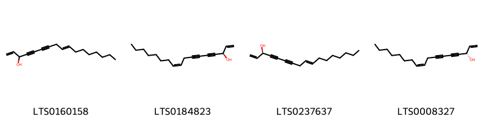{ width=100% }
    <figcaption>Hình ảnh cấu trúc hóa học của 4 hoạt chất thuộc nhóm Fatty Acyls gồm ['heptadeca-1,9-dien-4,6-diyn-3-ol (LTS0160158)', 'falcarinol (LTS0184823)', '(z)-falcarinol (LTS0237637)', 'falcarinol (LTS0008327)'].</figcaption>
</figure>
#### Nhóm Imidazopyrimidines
<figure markdown="span">
    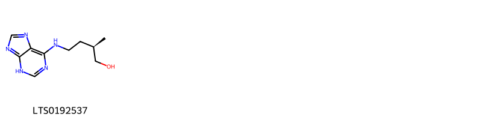{ width=100% }
    <figcaption>Hình ảnh cấu trúc hóa học của 1 hoạt chất thuộc nhóm Imidazopyrimidines gồm ['(2r)-2-methyl-4-(3h-purin-6-ylamino)butan-1-ol (LTS0192537)'].</figcaption>
</figure>
#### Nhóm Prenol lipids
<figure markdown="span">
    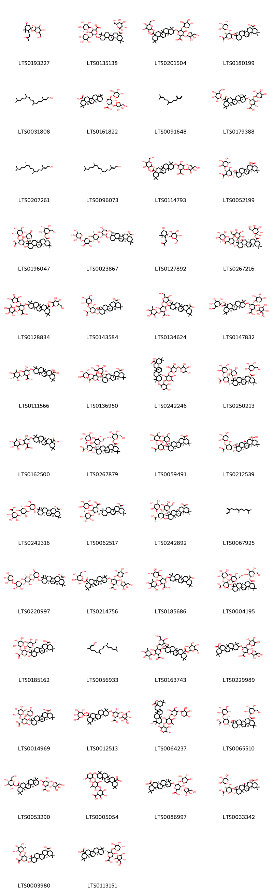{ width=100% }
    <figcaption>Hình ảnh cấu trúc hóa học của 50 hoạt chất thuộc nhóm Prenol lipids gồm ['4-(4-hydroxy-2,2,6-trimethyl-6-{[3,4,5-trihydroxy-6-(hydroxymethyl)oxan-2-yl]oxy}cyclohexylidene)but-3-en-2-one (LTS0193227)', '(3s,5s,6r)-6-{[(3s,6ar,6bs,8as,12as,14br)-4,4,6a,6b,11,11,14b-heptamethyl-8a-({[(2r,3s,5s)-2,3,4,5-tetrahydroxy-6-(hydroxymethyl)oxan-2-yl]oxy}carbonyl)-1,2,3,4a,5,6,7,8,9,10,12,12a,14,14a-tetradecahydropicen-3-yl]oxy}-4-hydroxy-3-{[(3s,4s,5s,6r)-3,4,5-trihydroxy-6-methyloxan-2-yl]oxy}-5-{[(3s,4r,5r)-3,4,5-trihydroxyoxan-2-yl]oxy}oxane-2-carboxylic acid (LTS0135138)', '6-{[4,4,6a,6b,11,11,14b-heptamethyl-8a-({[3,4,5-trihydroxy-6-(hydroxymethyl)oxan-2-yl]oxy}carbonyl)-1,2,3,4a,5,6,7,8,9,10,12,12a,14,14a-tetradecahydropicen-3-yl]oxy}-3-{[3,4-dihydroxy-4-(hydroxymethyl)oxolan-2-yl]oxy}-4-hydroxy-5-[(3,4,5-trihydroxyoxan-2-yl)oxy]oxane-2-carboxylic acid (LTS0201504)', '(2r,3s,4r,5r,6r)-6-{[(3s,4as,6as,6br,8as,12as,14as,14br)-8a-carboxy-4,4,6a,6b,11,11,14b-heptamethyl-1,2,3,4a,5,6,7,8,9,10,12,12a,14,14a-tetradecahydropicen-3-yl]oxy}-4,5-dihydroxy-3-{[(2r,3r,4r,5s,6s)-3,4,5-trihydroxy-6-methyloxan-2-yl]oxy}oxane-2-carboxylic acid (LTS0180199)', 'phytol (LTS0031808)', '(2r,3r,4r,5s,6s)-6-{[(3r,4as,6ar,6bs,8ar,12ar,14as,14bs)-8a-carboxy-4,4,6a,6b,11,11,14b-heptamethyl-1,2,3,4a,5,6,7,8,9,10,12,12a,14,14a-tetradecahydropicen-3-yl]oxy}-3-{[(2r,3s,4s)-3,4-dihydroxy-4-(hydroxymethyl)oxolan-2-yl]oxy}-4-hydroxy-5-{[(2r,3s,4r,5s)-3,4,5-trihydroxyoxan-2-yl]oxy}oxane-2-carboxylic acid (LTS0161822)', 'β-farnesene (LTS0091648)', '(2s,3s,4s,5r,6r)-6-{[(3s,4ar,6ar,6bs,8as,12as,14ar,14br)-4,4,6a,6b,11,11,14b-heptamethyl-8a-({[(2s,3r,4s,5s,6r)-3,4,5-trihydroxy-6-(hydroxymethyl)oxan-2-yl]oxy}carbonyl)-1,2,3,4a,5,6,7,8,9,10,12,12a,14,14a-tetradecahydropicen-3-yl]oxy}-3,4-dihydroxy-5-{[(2s,3r,4s,5s)-3,4,5-trihydroxyoxan-2-yl]oxy}oxane-2-carboxylic acid (LTS0179388)', '(2e,7s,11s)-3,7,11,15-tetramethylhexadec-2-en-1-ol (LTS0207261)', 'phytol (LTS0096073)', '6-{[4,4,6a,6b,11,11,14b-heptamethyl-8a-({[3,4,5-trihydroxy-6-(hydroxymethyl)oxan-2-yl]oxy}carbonyl)-1,2,3,4a,5,6,7,8,9,10,12,12a,14,14a-tetradecahydropicen-3-yl]oxy}-3-{[3,4-dihydroxy-4-(hydroxymethyl)oxolan-2-yl]oxy}-4,5-dihydroxyoxane-2-carboxylic acid (LTS0114793)', '(3s,5s,6r)-6-{[(3s,6ar,6bs,8r,8ar,12as,14br)-8a-carboxy-8-hydroxy-4,4,6a,6b,11,11,14b-heptamethyl-1,2,3,4a,5,6,7,8,9,10,12,12a,14,14a-tetradecahydropicen-3-yl]oxy}-4,5-dihydroxy-3-{[(3s,4s,5s,6r)-3,4,5-trihydroxy-6-methyloxan-2-yl]oxy}oxane-2-carboxylic acid (LTS0052199)', '(2s,3s,4s,5r,6r)-6-{[(3s,4ar,6ar,6bs,8as,12as,14ar,14br)-4,4,6a,6b,11,11,14b-heptamethyl-8a-({[(2s,3r,4s,5s,6r)-3,4,5-trihydroxy-6-(hydroxymethyl)oxan-2-yl]oxy}carbonyl)-1,2,3,4a,5,6,7,8,9,10,12,12a,14,14a-tetradecahydropicen-3-yl]oxy}-4-hydroxy-3-{[(2s,3r,4r,5r,6s)-3,4,5-trihydroxy-6-methyloxan-2-yl]oxy}-5-{[(2s,3r,4s,5s)-3,4,5-trihydroxyoxan-2-yl]oxy}oxane-2-carboxylic acid (LTS0196047)', '(4as,6as,6br,8ar,9r,10s,12ar,12br,14bs)-10-{[(2s,3r,4s,5s)-3-{[(2s,3r,4r,5s,6s)-4-{[(2s,3r,4r,5s)-3,4-dihydroxy-5-{[(2s,3r,4s,5s)-3,4,5-trihydroxyoxan-2-yl]oxy}oxan-2-yl]oxy}-3,5-dihydroxy-6-methyloxan-2-yl]oxy}-4,5-dihydroxyoxan-2-yl]oxy}-9-(hydroxymethyl)-2,2,6a,6b,9,12a-hexamethyl-1,3,4,5,6,7,8,8a,10,11,12,12b,13,14b-tetradecahydropicene-4a-carboxylic acid (LTS0023867)', 'citroside b (LTS0127892)', '(3s,5s,6r)-6-{[(3s,6ar,6bs,8as,12as,14br)-4,4,6a,6b,11,11,14b-heptamethyl-8a-({[(2r,3s,5s)-2,3,4,5-tetrahydroxy-6-(hydroxymethyl)oxan-2-yl]oxy}carbonyl)-1,2,3,4a,5,6,7,8,9,10,12,12a,14,14a-tetradecahydropicen-3-yl]oxy}-4-hydroxy-5-{[(2r,3s,5r)-2,3,4,5-tetrahydroxy-6-(hydroxymethyl)oxan-2-yl]oxy}-3-{[(3s,4s,5s,6r)-3,4,5-trihydroxy-6-methyloxan-2-yl]oxy}oxane-2-carboxylic acid (LTS0267216)', '6-{[4,4,6a,6b,11,11,14b-heptamethyl-8a-({[3,4,5-trihydroxy-6-(hydroxymethyl)oxan-2-yl]oxy}carbonyl)-1,2,3,4a,5,6,7,8,9,10,12,12a,14,14a-tetradecahydropicen-3-yl]oxy}-4-hydroxy-3-[(3,4,5-trihydroxy-6-methyloxan-2-yl)oxy]-5-[(3,4,5-trihydroxyoxan-2-yl)oxy]oxane-2-carboxylic acid (LTS0128834)', '(2s,3s,4r,5r,6r)-6-{[(3s,4ar,6ar,6bs,8as,12as,14ar,14br)-8a-carboxy-4,4,6a,6b,11,11,14b-heptamethyl-1,2,3,4a,5,6,7,8,9,10,12,12a,14,14a-tetradecahydropicen-3-yl]oxy}-4,5-dihydroxy-3-{[(2s,3r,4r,5r,6s)-3,4,5-trihydroxy-6-methyloxan-2-yl]oxy}oxane-2-carboxylic acid (LTS0143584)', '6-[(8a-carboxy-4,4,6a,6b,11,11,14b-heptamethyl-1,2,3,4a,5,6,7,8,9,10,12,12a,14,14a-tetradecahydropicen-3-yl)oxy]-4-hydroxy-5-{[3,4,5-trihydroxy-6-(hydroxymethyl)oxan-2-yl]oxy}-3-[(3,4,5-trihydroxy-6-methyloxan-2-yl)oxy]oxane-2-carboxylic acid (LTS0134624)', '(3s,5s,6r)-6-{[(3s,6ar,6bs,8as,12as,14br)-4,4,6a,6b,11,11,14b-heptamethyl-8a-({[(2r,3s,5s)-2,3,4,5-tetrahydroxy-6-(hydroxymethyl)oxan-2-yl]oxy}carbonyl)-1,2,3,4a,5,6,7,8,9,10,12,12a,14,14a-tetradecahydropicen-3-yl]oxy}-4-hydroxy-3-{[(4r)-3,4,5-trihydroxy-3-(hydroxymethyl)oxolan-2-yl]oxy}-5-{[(3s,4r,5r)-3,4,5-trihydroxyoxan-2-yl]oxy}oxane-2-carboxylic acid (LTS0147832)', '6-[(8a-carboxy-8-hydroxy-4,4,6a,6b,11,11,14b-heptamethyl-1,2,3,4a,5,6,7,8,9,10,12,12a,14,14a-tetradecahydropicen-3-yl)oxy]-4,5-dihydroxy-3-[(3,4,5-trihydroxy-6-methyloxan-2-yl)oxy]oxane-2-carboxylic acid (LTS0111566)', '(3s,5s,6r)-6-{[(3s,6ar,6bs,8as,12as,14br)-8a-carboxy-4,4,6a,6b,11,11,14b-heptamethyl-1,2,3,4a,5,6,7,8,9,10,12,12a,14,14a-tetradecahydropicen-3-yl]oxy}-4-hydroxy-5-{[(2r,3s,5r)-2,3,4,5-tetrahydroxy-6-(hydroxymethyl)oxan-2-yl]oxy}-3-{[(3s,4s,5s,6r)-3,4,5-trihydroxy-6-methyloxan-2-yl]oxy}oxane-2-carboxylic acid (LTS0136950)', '10-[(3-{[4-({3,4-dihydroxy-5-[(3,4,5-trihydroxyoxan-2-yl)oxy]oxan-2-yl}oxy)-3,5-dihydroxy-6-methyloxan-2-yl]oxy}-4,5-dihydroxyoxan-2-yl)oxy]-2,2,6a,6b,9,9,12a-heptamethyl-1,3,4,5,6,7,8,8a,10,11,12,12b,13,14b-tetradecahydropicene-4a-carboxylic acid (LTS0242246)', '(2s,3r,4s,5r,6r)-6-{[(3s,4as,6ar,6br,8ar,12as,14as,14bs)-4,4,6a,6b,11,11,14b-heptamethyl-8a-({[(2r,3r,4r,5r,6r)-3,4,5-trihydroxy-6-(hydroxymethyl)oxan-2-yl]oxy}carbonyl)-1,2,3,4a,5,6,7,8,9,10,12,12a,14,14a-tetradecahydropicen-3-yl]oxy}-4-hydroxy-3-{[(2s,3s,4r,5r,6s)-3,4,5-trihydroxy-6-methyloxan-2-yl]oxy}-5-{[(2r,3s,4s,5s)-3,4,5-trihydroxyoxan-2-yl]oxy}oxane-2-carboxylic acid (LTS0250213)', '6-[(8a-carboxy-4,4,6a,6b,11,11,14b-heptamethyl-1,2,3,4a,5,6,7,8,9,10,12,12a,14,14a-tetradecahydropicen-3-yl)oxy]-4,5-dihydroxy-3-[(3,4,5-trihydroxy-6-methyloxan-2-yl)oxy]oxane-2-carboxylic acid (LTS0162500)', '(2s,3s,4s,5r,6r)-6-{[(3s,4ar,6ar,6bs,8as,12as,14ar,14br)-4,4,6a,6b,11,11,14b-heptamethyl-8a-({[(2s,3r,4s,5s,6r)-3,4,5-trihydroxy-6-(hydroxymethyl)oxan-2-yl]oxy}carbonyl)-1,2,3,4a,5,6,7,8,9,10,12,12a,14,14a-tetradecahydropicen-3-yl]oxy}-4-hydroxy-5-{[(2s,3r,4s,5r,6r)-3,4,5-trihydroxy-6-(hydroxymethyl)oxan-2-yl]oxy}-3-{[(2s,3r,4r,5r,6s)-3,4,5-trihydroxy-6-methyloxan-2-yl]oxy}oxane-2-carboxylic acid (LTS0267879)', '(2r,3r,4r,5r,6s)-6-{[(3s,4as,6ar,6br,8ar,12as,14as,14bs)-8a-carboxy-4,4,6a,6b,11,11,14b-heptamethyl-1,2,3,4a,5,6,7,8,9,10,12,12a,14,14a-tetradecahydropicen-3-yl]oxy}-4-hydroxy-3-{[(2r,3r,4r,5r,6r)-3,4,5-trihydroxy-6-methyloxan-2-yl]oxy}-5-{[(2s,3s,4r,5s)-3,4,5-trihydroxyoxan-2-yl]oxy}oxane-2-carboxylic acid (LTS0059491)', '(2s,3s,4r,5r,6r)-6-{[(3s,4ar,6ar,6bs,8r,8ar,12as,14ar,14br)-8a-carboxy-8-hydroxy-4,4,6a,6b,11,11,14b-heptamethyl-1,2,3,4a,5,6,7,8,9,10,12,12a,14,14a-tetradecahydropicen-3-yl]oxy}-4,5-dihydroxy-3-{[(2s,3r,4r,5r,6s)-3,4,5-trihydroxy-6-methyloxan-2-yl]oxy}oxane-2-carboxylic acid (LTS0212539)', '(2s,3s,4s,5r,6r)-6-{[(2s,3r,4r,5s,6s)-2-{[(2s,3r,4s,5s)-2-{[(3s,4ar,6ar,6bs,8as,12as,14ar,14br)-8a-carboxy-4,4,6a,6b,11,11,14b-heptamethyl-1,2,3,4a,5,6,7,8,9,10,12,12a,14,14a-tetradecahydropicen-3-yl]oxy}-4,5-dihydroxyoxan-3-yl]oxy}-3,5-dihydroxy-6-methyloxan-4-yl]oxy}-3,4,5-trihydroxyoxane-2-carboxylic acid (LTS0242316)', '(3s,5s,6r)-6-{[(3s,6ar,6bs,8as,12as,14br)-8a-carboxy-4,4,6a,6b,11,11,14b-heptamethyl-1,2,3,4a,5,6,7,8,9,10,12,12a,14,14a-tetradecahydropicen-3-yl]oxy}-4-hydroxy-3-{[(3s,4s,5s,6r)-3,4,5-trihydroxy-6-methyloxan-2-yl]oxy}-5-{[(3s,4r,5r)-3,4,5-trihydroxyoxan-2-yl]oxy}oxane-2-carboxylic acid (LTS0062517)', '(2s,3r,4s,5r,6s)-6-{[(3r,4ar,6as,6br,8as,12ar,14ar,14bs)-8a-carboxy-4,4,6a,6b,11,11,14b-heptamethyl-1,2,3,4a,5,6,7,8,9,10,12,12a,14,14a-tetradecahydropicen-3-yl]oxy}-4-hydroxy-5-{[(2r,3r,4s,5r,6r)-3,4,5-trihydroxy-6-(hydroxymethyl)oxan-2-yl]oxy}-3-{[(2s,3s,4r,5s,6s)-3,4,5-trihydroxy-6-methyloxan-2-yl]oxy}oxane-2-carboxylic acid (LTS0242892)', 'β-farnesene (LTS0067925)', '(4as,6as,6br,8ar,10s,12ar,12br,14bs)-10-{[(2s,3r,4s,5s)-3-{[(2s,3r,4r,5s,6s)-4-{[(2s,3r,4r,5s)-3,4-dihydroxy-5-{[(2s,3r,4s,5s)-3,4,5-trihydroxyoxan-2-yl]oxy}oxan-2-yl]oxy}-3,5-dihydroxy-6-methyloxan-2-yl]oxy}-4,5-dihydroxyoxan-2-yl]oxy}-2,2,6a,6b,9,9,12a-heptamethyl-1,3,4,5,6,7,8,8a,10,11,12,12b,13,14b-tetradecahydropicene-4a-carboxylic acid (LTS0220997)', '(2s,3s,4s,5r,6r)-6-{[(3s,4ar,6ar,6bs,8as,12as,14ar,14br)-4,4,6a,6b,11,11,14b-heptamethyl-8a-({[(2s,3r,4s,5s,6r)-3,4,5-trihydroxy-6-(hydroxymethyl)oxan-2-yl]oxy}carbonyl)-1,2,3,4a,5,6,7,8,9,10,12,12a,14,14a-tetradecahydropicen-3-yl]oxy}-3-{[(2s,3r,4r)-3,4-dihydroxy-4-(hydroxymethyl)oxolan-2-yl]oxy}-4-hydroxy-5-{[(2s,3r,4s,5s)-3,4,5-trihydroxyoxan-2-yl]oxy}oxane-2-carboxylic acid (LTS0214756)', '6-[(8a-carboxy-4,4,6a,6b,11,11,14b-heptamethyl-1,2,3,4a,5,6,7,8,9,10,12,12a,14,14a-tetradecahydropicen-3-yl)oxy]-4-hydroxy-3-[(3,4,5-trihydroxy-6-methyloxan-2-yl)oxy]-5-[(3,4,5-trihydroxyoxan-2-yl)oxy]oxane-2-carboxylic acid (LTS0185686)', '(2s,3s,4r,5s,6s)-6-{[(3s,4ar,6as,6br,8as,12ar,14ar,14bs)-4,4,6a,6b,11,11,14b-heptamethyl-8a-({[(2r,3s,4s,5s,6r)-3,4,5-trihydroxy-6-(hydroxymethyl)oxan-2-yl]oxy}carbonyl)-1,2,3,4a,5,6,7,8,9,10,12,12a,14,14a-tetradecahydropicen-3-yl]oxy}-4-hydroxy-5-{[(2r,3s,4s,5r,6s)-3,4,5-trihydroxy-6-(hydroxymethyl)oxan-2-yl]oxy}-3-{[(2r,3r,4r,5r,6s)-3,4,5-trihydroxy-6-methyloxan-2-yl]oxy}oxane-2-carboxylic acid (LTS0004195)', '(2s,3s,4s,5r,6r)-6-{[(3s,4ar,6ar,6bs,8as,12as,14ar,14br)-8a-carboxy-4,4,6a,6b,11,11,14b-heptamethyl-1,2,3,4a,5,6,7,8,9,10,12,12a,14,14a-tetradecahydropicen-3-yl]oxy}-4-hydroxy-5-{[(2s,3r,4s,5r,6r)-3,4,5-trihydroxy-6-(hydroxymethyl)oxan-2-yl]oxy}-3-{[(2s,3r,4r,5r,6s)-3,4,5-trihydroxy-6-methyloxan-2-yl]oxy}oxane-2-carboxylic acid (LTS0185162)', '3,7,11,15-tetramethylhexadec-2-en-1-ol (LTS0056933)', '6-{[4,4,6a,6b,11,11,14b-heptamethyl-8a-({[3,4,5-trihydroxy-6-(hydroxymethyl)oxan-2-yl]oxy}carbonyl)-1,2,3,4a,5,6,7,8,9,10,12,12a,14,14a-tetradecahydropicen-3-yl]oxy}-4-hydroxy-5-{[3,4,5-trihydroxy-6-(hydroxymethyl)oxan-2-yl]oxy}-3-[(3,4,5-trihydroxy-6-methyloxan-2-yl)oxy]oxane-2-carboxylic acid (LTS0163743)', '6-[(8a-carboxy-4,4,6a,6b,11,11,14b-heptamethyl-1,2,3,4a,5,6,7,8,9,10,12,12a,14,14a-tetradecahydropicen-3-yl)oxy]-3-{[3,4-dihydroxy-4-(hydroxymethyl)oxolan-2-yl]oxy}-4-hydroxy-5-[(3,4,5-trihydroxyoxan-2-yl)oxy]oxane-2-carboxylic acid (LTS0229989)', '(2s,3s,4s,5r,6r)-6-{[(3s,4ar,6ar,6bs,8as,12as,14ar,14br)-8a-carboxy-4,4,6a,6b,11,11,14b-heptamethyl-1,2,3,4a,5,6,7,8,9,10,12,12a,14,14a-tetradecahydropicen-3-yl]oxy}-4-hydroxy-3-{[(2s,3r,4r,5r,6s)-3,4,5-trihydroxy-6-methyloxan-2-yl]oxy}-5-{[(2s,3r,4s,5s)-3,4,5-trihydroxyoxan-2-yl]oxy}oxane-2-carboxylic acid (LTS0014969)', '(3s,5s,6r)-6-{[(3s,6ar,6bs,8as,12as,14br)-4,4,6a,6b,11,11,14b-heptamethyl-8a-({[(2r,3s,5s)-2,3,4,5-tetrahydroxy-6-(hydroxymethyl)oxan-2-yl]oxy}carbonyl)-1,2,3,4a,5,6,7,8,9,10,12,12a,14,14a-tetradecahydropicen-3-yl]oxy}-4,5-dihydroxy-3-{[(4r)-3,4,5-trihydroxy-3-(hydroxymethyl)oxolan-2-yl]oxy}oxane-2-carboxylic acid (LTS0012513)', '10-[(3-{[4-({3,4-dihydroxy-5-[(3,4,5-trihydroxyoxan-2-yl)oxy]oxan-2-yl}oxy)-3,5-dihydroxy-6-methyloxan-2-yl]oxy}-4,5-dihydroxyoxan-2-yl)oxy]-9-(hydroxymethyl)-2,2,6a,6b,9,12a-hexamethyl-1,3,4,5,6,7,8,8a,10,11,12,12b,13,14b-tetradecahydropicene-4a-carboxylic acid (LTS0064237)', 'olaxoside (LTS0065510)', '(2s,3s,4r,5r,6r)-6-{[(3s,4ar,6ar,6bs,8as,12as,14ar,14br)-4,4,6a,6b,11,11,14b-heptamethyl-8a-({[(2s,3r,4s,5s,6r)-3,4,5-trihydroxy-6-(hydroxymethyl)oxan-2-yl]oxy}carbonyl)-1,2,3,4a,5,6,7,8,9,10,12,12a,14,14a-tetradecahydropicen-3-yl]oxy}-3-{[(2s,3r,4r)-3,4-dihydroxy-4-(hydroxymethyl)oxolan-2-yl]oxy}-4,5-dihydroxyoxane-2-carboxylic acid (LTS0053290)', '6-{[2-({2-[(8a-carboxy-4,4,6a,6b,11,11,14b-heptamethyl-1,2,3,4a,5,6,7,8,9,10,12,12a,14,14a-tetradecahydropicen-3-yl)oxy]-4,5-dihydroxyoxan-3-yl}oxy)-3,5-dihydroxy-6-methyloxan-4-yl]oxy}-3,4,5-trihydroxyoxane-2-carboxylic acid (LTS0005054)', '(2s,3s,4s,5r,6r)-6-{[(3s,4ar,6ar,6bs,8as,12as,14ar,14br)-8a-carboxy-4,4,6a,6b,11,11,14b-heptamethyl-1,2,3,4a,5,6,7,8,9,10,12,12a,14,14a-tetradecahydropicen-3-yl]oxy}-3-{[(2s,3r,4r)-3,4-dihydroxy-4-(hydroxymethyl)oxolan-2-yl]oxy}-4-hydroxy-5-{[(2s,3r,4s,5s)-3,4,5-trihydroxyoxan-2-yl]oxy}oxane-2-carboxylic acid (LTS0086997)', '(2s,3s,4r,5r,6r)-6-{[(3r,4as,6as,6br,8s,8ar,12as,14as,14bs)-8a-carboxy-8-hydroxy-4,4,6a,6b,11,11,14b-heptamethyl-1,2,3,4a,5,6,7,8,9,10,12,12a,14,14a-tetradecahydropicen-3-yl]oxy}-4,5-dihydroxy-3-{[(2r,3s,4r,5r,6s)-3,4,5-trihydroxy-6-methyloxan-2-yl]oxy}oxane-2-carboxylic acid (LTS0033342)', '(3s,5s,6r)-6-{[(3s,6ar,6bs,8as,12as,14br)-8a-carboxy-4,4,6a,6b,11,11,14b-heptamethyl-1,2,3,4a,5,6,7,8,9,10,12,12a,14,14a-tetradecahydropicen-3-yl]oxy}-4,5-dihydroxy-3-{[(3s,4s,5s,6r)-3,4,5-trihydroxy-6-methyloxan-2-yl]oxy}oxane-2-carboxylic acid (LTS0003980)', '(3s,5s,6r)-6-{[(3s,6ar,6bs,8as,12as,14br)-8a-carboxy-4,4,6a,6b,11,11,14b-heptamethyl-1,2,3,4a,5,6,7,8,9,10,12,12a,14,14a-tetradecahydropicen-3-yl]oxy}-4-hydroxy-3-{[(4r)-3,4,5-trihydroxy-3-(hydroxymethyl)oxolan-2-yl]oxy}-5-{[(3s,4r,5r)-3,4,5-trihydroxyoxan-2-yl]oxy}oxane-2-carboxylic acid (LTS0113151)'].</figcaption>
</figure>
#### Nhóm Steroids and steroid derivatives
<figure markdown="span">
    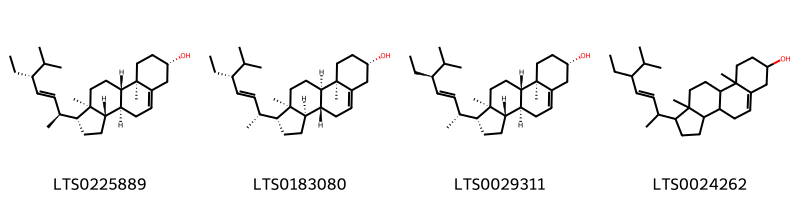{ width=100% }
    <figcaption>Hình ảnh cấu trúc hóa học của 4 hoạt chất thuộc nhóm Steroids and steroid derivatives gồm ['(1r,3as,3bs,7s,9ar,9bs,11ar)-1-[(2s,3e,5r)-5-ethyl-6-methylhept-3-en-2-yl]-9a,11a-dimethyl-1h,2h,3h,3ah,3bh,4h,6h,7h,8h,9h,9bh,10h,11h-cyclopenta[a]phenanthren-7-ol (LTS0225889)', '(1r,3ar,3br,7s,9ar,9br,11ar)-1-[(2r,3e,5r)-5-ethyl-6-methylhept-3-en-2-yl]-9a,11a-dimethyl-1h,2h,3h,3ah,3bh,4h,6h,7h,8h,9h,9bh,10h,11h-cyclopenta[a]phenanthren-7-ol (LTS0183080)', 'phytosterol (LTS0029311)', 'stigmasterol (LTS0024262)'].</figcaption>
</figure>

---

### Dược dân tộc học

Danh sách các quốc gia có sử dụng *Schefflera arboricola* trong điều trị các bệnh. 

| Country   | Disease   | Bệnh        |
|:----------|:----------|:------------|
| China     | Hemostat  | Máy cầm máu |

---

---
## Schefflera subulata
### Thông tin về thực vật

!!! info "Phân loại thực vật của *Heptapleurum oxyphyllum* từ GIBF:"
    - **Kingdom:** Plantae
    - **Phylum:** Tracheophyta
    - **Order:** Apiales
    - **Family:** Araliaceae
    - **Genus:** Heptapleurum
    - **Species:** *Heptapleurum oxyphyllum*

 

| Label (VI)   | Label (EN)   | Scientific Name     | Descriptions (VI)   | Descriptions (EN)   | Also Known As (VI)   | Also Known As (EN)   |
|:-------------|:-------------|:--------------------|:--------------------|:--------------------|:---------------------|:---------------------|
| N/A          | N/A          | Schefflera subulata |                     |                     | ['']                 | ['']                 |

#### Phân bố trên thế giới

**Từ CSDL GIBF** nan, Singapore, Malaysia, unknown or invalid

#### Phân bố tại Việt Nam

**Từ CSDL GIBF**: Không có ghi nhận ở Việt Nam

---
### Thành phần hóa học
        
- Theo cơ sở dữ liệu lotus: Từ loài *Heptapleurum oxyphyllum* đã phân lập và xác định được Chưa có hoạt chất nào được phân lập. hoạt chất thuộc về các nhóm Không có hoạt chất nào được phân lập. 

Không có hình ảnh nào được tạo ra

---

### Dược dân tộc học

Danh sách các quốc gia có sử dụng *Heptapleurum oxyphyllum* trong điều trị các bệnh. 

| Country   | Disease   | Bệnh          |
|:----------|:----------|:--------------|
| Malaya    | Sedative  | Thuốc an thần |

---

# Chi Fatsia

??? note "Danh sách các dược liệu thuộc chi"
    
	 - *Fatsia japonica*
	 - *Fatsia papyrifera*

---
## Fatsia japonica
### Thông tin về thực vật

!!! info "Phân loại thực vật của *Fatsia japonica* từ GIBF:"
    - **Kingdom:** Plantae
    - **Phylum:** Tracheophyta
    - **Order:** Apiales
    - **Family:** Araliaceae
    - **Genus:** Fatsia
    - **Species:** *Fatsia japonica*

 

| Label (VI)   | Label (EN)   | Scientific Name   | Descriptions (VI)   | Descriptions (EN)   | Also Known As (VI)   | Also Known As (EN)                          |
|:-------------|:-------------|:------------------|:--------------------|:--------------------|:---------------------|:--------------------------------------------|
| N/A          | N/A          | Fatsia japonica   |                     | species of plant    | ['']                 | ['paperplant', 'fatsia', 'Japanese aralia'] |

#### Phân bố trên thế giới

**Từ CSDL GIBF** nan, Japan, Portugal, Korea, Republic of, Guernsey, United States of America, Belgium, China, New Zealand, Georgia, Switzerland, Italy, Canada, United Kingdom of Great Britain and Northern Ireland, Ireland, Netherlands

#### Phân bố tại Việt Nam

**Từ CSDL GIBF**: Không có ghi nhận ở Việt Nam

---
### Thành phần hóa học
        
- Theo cơ sở dữ liệu lotus: Từ loài *Fatsia japonica* đã phân lập và xác định được 71 hoạt chất thuộc về các nhóm Fatty Acyls, Benzene and substituted derivatives, Flavonoids, Steroids and steroid derivatives, Prenol lipids, Stilbenes. 

|    | chemicalTaxonomyClassyfireClass     |   smiles_count |
|---:|:------------------------------------|---------------:|
|  0 | Benzene and substituted derivatives |              5 |
|  1 | Fatty Acyls                         |             10 |
|  2 | Flavonoids                          |              1 |
|  3 | Prenol lipids                       |             48 |
|  4 | Steroids and steroid derivatives    |              5 |
|  5 | Stilbenes                           |              2 |

#### Nhóm Benzene and substituted derivatives
<figure markdown="span">
    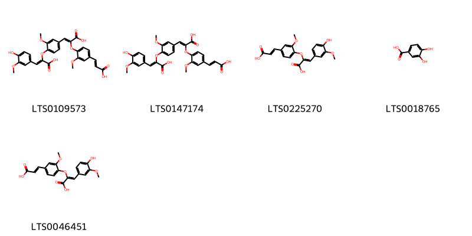{ width=100% }
    <figcaption>Hình ảnh cấu trúc hóa học của 5 hoạt chất thuộc nhóm Benzene and substituted derivatives gồm ['(2z)-2-{4-[(1z)-2-carboxy-2-{4-[(1e)-2-carboxyeth-1-en-1-yl]-2-methoxyphenoxy}eth-1-en-1-yl]-2-methoxyphenoxy}-3-(4-hydroxy-3-methoxyphenyl)prop-2-enoic acid (LTS0109573)', '2-(4-{2-carboxy-2-[4-(2-carboxyeth-1-en-1-yl)-2-methoxyphenoxy]eth-1-en-1-yl}-2-methoxyphenoxy)-3-(4-hydroxy-3-methoxyphenyl)prop-2-enoic acid (LTS0147174)', '(2z)-2-{4-[(1e)-2-carboxyeth-1-en-1-yl]-2-methoxyphenoxy}-3-(4-hydroxy-3-methoxyphenyl)prop-2-enoic acid (LTS0225270)', '3,4-dihydroxybenzoic acid (LTS0018765)', '2-[4-(2-carboxyeth-1-en-1-yl)-2-methoxyphenoxy]-3-(4-hydroxy-3-methoxyphenyl)prop-2-enoic acid (LTS0046451)'].</figcaption>
</figure>
#### Nhóm Fatty Acyls
<figure markdown="span">
    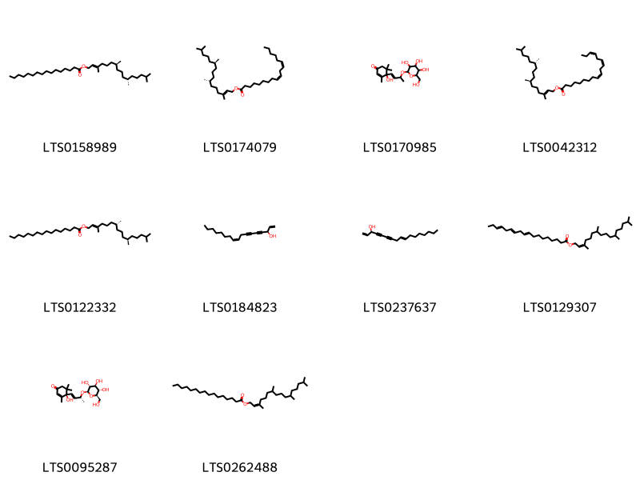{ width=100% }
    <figcaption>Hình ảnh cấu trúc hóa học của 10 hoạt chất thuộc nhóm Fatty Acyls gồm ['(2e,7s,11s)-3,7,11,15-tetramethylhexadec-2-en-1-yl hexadecanoate (LTS0158989)', '(2e,7r,11r)-3,7,11,15-tetramethylhexadec-2-en-1-yl (9z,12z)-octadeca-9,12-dienoate (LTS0174079)', '4-hydroxy-3,5,5-trimethyl-4-(3-{[3,4,5-trihydroxy-6-(hydroxymethyl)oxan-2-yl]oxy}but-1-en-1-yl)cyclohex-2-en-1-one (LTS0170985)', '(2e,7s,11s)-3,7,11,15-tetramethylhexadec-2-en-1-yl (9z,12z,15z)-octadeca-9,12,15-trienoate (LTS0042312)', '(2e,7r,11r)-3,7,11,15-tetramethylhexadec-2-en-1-yl hexadecanoate (LTS0122332)', 'falcarinol (LTS0184823)', '(z)-falcarinol (LTS0237637)', '3,7,11,15-tetramethylhexadec-2-en-1-yl octadeca-9,12,15-trienoate (LTS0129307)', '(4r)-4-hydroxy-3,5,5-trimethyl-4-[(1e,3r)-3-{[(2r,3r,4s,5s,6r)-3,4,5-trihydroxy-6-(hydroxymethyl)oxan-2-yl]oxy}but-1-en-1-yl]cyclohex-2-en-1-one (LTS0095287)', '3,7,11,15-tetramethylhexadec-2-en-1-yl hexadecanoate (LTS0262488)'].</figcaption>
</figure>
#### Nhóm Flavonoids
<figure markdown="span">
    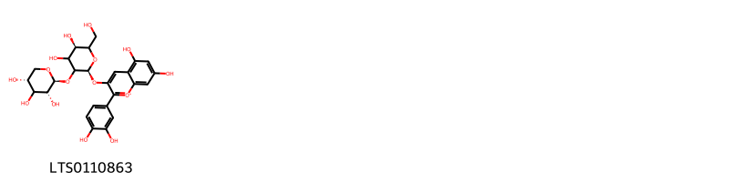{ width=100% }
    <figcaption>Hình ảnh cấu trúc hóa học của 1 hoạt chất thuộc nhóm Flavonoids gồm ['3-{[(2s,5r)-4,5-dihydroxy-6-(hydroxymethyl)-3-{[(2s,3r,5r)-3,4,5-trihydroxyoxan-2-yl]oxy}oxan-2-yl]oxy}-2-(3,4-dihydroxyphenyl)-5,7-dihydroxy-1λ⁴-chromen-1-ylium (LTS0110863)'].</figcaption>
</figure>
#### Nhóm Prenol lipids
<figure markdown="span">
    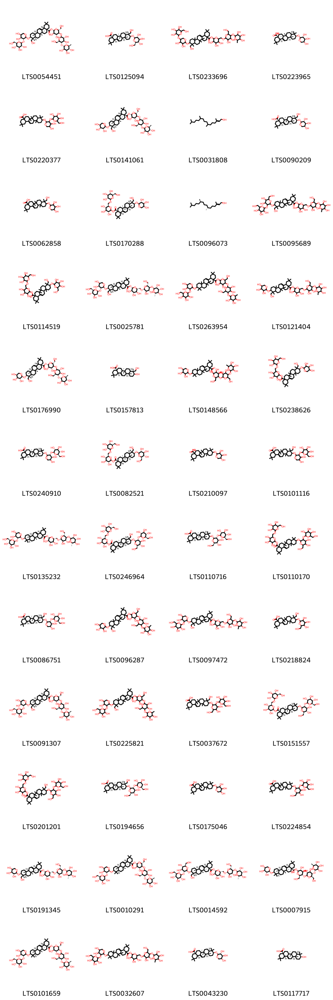{ width=100% }
    <figcaption>Hình ảnh cấu trúc hóa học của 48 hoạt chất thuộc nhóm Prenol lipids gồm ['(2s,3r,4r,5s,6r)-5-{[(2s,3r,4r,5s,6r)-3,4-dihydroxy-6-(hydroxymethyl)-5-{[(2s,3r,4r,5r,6s)-3,4,5-trihydroxy-6-methyloxan-2-yl]oxy}oxan-2-yl]oxy}-3,4-dihydroxy-6-(hydroxymethyl)oxan-2-yl (4as,6as,6br,8ar,9r,10s,12ar,12br,14bs)-10-{[(2s,3r,4s,5s)-4,5-dihydroxy-3-{[(2s,3r,4s,5s,6r)-3,4,5-trihydroxy-6-(hydroxymethyl)oxan-2-yl]oxy}oxan-2-yl]oxy}-9-(hydroxymethyl)-2,2,6a,6b,9,12a-hexamethyl-1,3,4,5,6,7,8,8a,10,11,12,12b,13,14b-tetradecahydropicene-4a-carboxylate (LTS0054451)', '(4as,6as,6br,8ar,9r,10s,12ar,12br,14bs)-9-(hydroxymethyl)-2,2,6a,6b,9,12a-hexamethyl-10-{[(2r,3r,4s,5s,6r)-3,4,5-trihydroxy-6-(hydroxymethyl)oxan-2-yl]oxy}-1,3,4,5,6,7,8,8a,10,11,12,12b,13,14b-tetradecahydropicene-4a-carboxylic acid (LTS0125094)', '6-({[3,4-dihydroxy-6-(hydroxymethyl)-5-[(3,4,5-trihydroxy-6-methyloxan-2-yl)oxy]oxan-2-yl]oxy}methyl)-3,4,5-trihydroxyoxan-2-yl 10-[(3,4-dihydroxy-5-{[3,4,5-trihydroxy-6-(hydroxymethyl)oxan-2-yl]oxy}oxan-2-yl)oxy]-9-(hydroxymethyl)-2,2,6a,6b,9,12a-hexamethyl-1,3,4,5,6,7,8,8a,10,11,12,12b,13,14b-tetradecahydropicene-4a-carboxylate (LTS0233696)', '(4ar,5r,6as,6br,8ar,10s,12ar,12br,14bs)-5-hydroxy-2,2,6a,6b,9,9,12a-heptamethyl-10-{[(2s,3r,4s,5s)-3,4,5-trihydroxyoxan-2-yl]oxy}-1,3,4,5,6,7,8,8a,10,11,12,12b,13,14b-tetradecahydropicene-4a-carboxylic acid (LTS0223965)', '10-[(4,5-dihydroxy-3-{[3,4,5-trihydroxy-6-(hydroxymethyl)oxan-2-yl]oxy}oxan-2-yl)oxy]-2,2,6a,6b,9,9,12a-heptamethyl-1,3,4,5,6,7,8,8a,10,11,12,12b,13,14b-tetradecahydropicene-4a-carboxylic acid (LTS0220377)', '(2s,3r,4r,5s,6r)-5-{[(2s,3r,4r,5s,6r)-3,4-dihydroxy-6-(hydroxymethyl)-5-{[(2r,3r,4r,5r,6s)-3,4,5-trihydroxy-6-methyloxan-2-yl]oxy}oxan-2-yl]oxy}-3,4-dihydroxy-6-(hydroxymethyl)oxan-2-yl (4as,6as,6br,8ar,9r,10s,12ar,12br,14bs)-9-(hydroxymethyl)-2,2,6a,6b,9,12a-hexamethyl-10-{[(2s,3r,4s,5s)-3,4,5-trihydroxyoxan-2-yl]oxy}-1,3,4,5,6,7,8,8a,10,11,12,12b,13,14b-tetradecahydropicene-4a-carboxylate (LTS0141061)', 'phytol (LTS0031808)', 'hederagenin 3-o-arabinoside (LTS0090209)', '9-(hydroxymethyl)-2,2,6a,6b,9,12a-hexamethyl-10-[(3,4,5-trihydroxyoxan-2-yl)oxy]-1,3,4,5,6,7,8,8a,10,11,12,12b,13,14b-tetradecahydropicene-4a-carboxylic acid (LTS0062858)', '(2s,3r,4s,5s,6r)-3,4,5-trihydroxy-6-({[(2r,3r,4s,5s,6r)-3,4,5-trihydroxy-6-(hydroxymethyl)oxan-2-yl]oxy}methyl)oxan-2-yl (4as,6as,6br,8ar,9r,10s,12ar,12br,14bs)-9-(hydroxymethyl)-2,2,6a,6b,9,12a-hexamethyl-10-{[(2s,3r,4s,5s)-3,4,5-trihydroxyoxan-2-yl]oxy}-1,3,4,5,6,7,8,8a,10,11,12,12b,13,14b-tetradecahydropicene-4a-carboxylate (LTS0170288)', 'phytol (LTS0096073)', '6-({[3,4-dihydroxy-6-(hydroxymethyl)-5-[(3,4,5-trihydroxy-6-methyloxan-2-yl)oxy]oxan-2-yl]oxy}methyl)-3,4,5-trihydroxyoxan-2-yl 10-{[4,5-dihydroxy-6-(hydroxymethyl)-3-{[3,4,5-trihydroxy-6-(hydroxymethyl)oxan-2-yl]oxy}oxan-2-yl]oxy}-9-(hydroxymethyl)-2,2,6a,6b,9,12a-hexamethyl-1,3,4,5,6,7,8,8a,10,11,12,12b,13,14b-tetradecahydropicene-4a-carboxylate (LTS0095689)', '3,4,5-trihydroxy-6-({[3,4,5-trihydroxy-6-(hydroxymethyl)oxan-2-yl]oxy}methyl)oxan-2-yl 9-(hydroxymethyl)-2,2,6a,6b,9,12a-hexamethyl-10-{[3,4,5-trihydroxy-6-(hydroxymethyl)oxan-2-yl]oxy}-1,3,4,5,6,7,8,8a,10,11,12,12b,13,14b-tetradecahydropicene-4a-carboxylate (LTS0114519)', 'cauloside g (LTS0025781)', '5-{[3,4-dihydroxy-6-(hydroxymethyl)-5-[(3,4,5-trihydroxy-6-methyloxan-2-yl)oxy]oxan-2-yl]oxy}-3,4-dihydroxy-6-(hydroxymethyl)oxan-2-yl 10-[(4,5-dihydroxy-3-{[3,4,5-trihydroxy-6-(hydroxymethyl)oxan-2-yl]oxy}oxan-2-yl)oxy]-2,2,6a,6b,9,9,12a-heptamethyl-1,3,4,5,6,7,8,8a,10,11,12,12b,13,14b-tetradecahydropicene-4a-carboxylate (LTS0263954)', '6-({[3,4-dihydroxy-6-(hydroxymethyl)-5-[(3,4,5-trihydroxy-6-methyloxan-2-yl)oxy]oxan-2-yl]oxy}methyl)-3,4,5-trihydroxyoxan-2-yl 9-(hydroxymethyl)-2,2,6a,6b,9,12a-hexamethyl-10-[(3,4,5-trihydroxyoxan-2-yl)oxy]-1,3,4,5,6,7,8,8a,10,11,12,12b,13,14b-tetradecahydropicene-4a-carboxylate (LTS0121404)', '(2s,3r,4r,5s,6r)-5-{[(2s,3r,4r,5s,6r)-3,4-dihydroxy-6-(hydroxymethyl)-5-{[(2s,3r,4r,5r,6s)-3,4,5-trihydroxy-6-methyloxan-2-yl]oxy}oxan-2-yl]oxy}-3,4-dihydroxy-6-(hydroxymethyl)oxan-2-yl (4as,6as,6br,8ar,9r,10s,12ar,12br,14bs)-9-(hydroxymethyl)-2,2,6a,6b,9,12a-hexamethyl-10-{[(2s,3r,4s,5s)-3,4,5-trihydroxyoxan-2-yl]oxy}-1,3,4,5,6,7,8,8a,10,11,12,12b,13,14b-tetradecahydropicene-4a-carboxylate (LTS0176990)', 'hederagenin (LTS0157813)', '5-{[3,4-dihydroxy-6-(hydroxymethyl)-5-[(3,4,5-trihydroxy-6-methyloxan-2-yl)oxy]oxan-2-yl]oxy}-3,4-dihydroxy-6-(hydroxymethyl)oxan-2-yl 5-hydroxy-2,2,6a,6b,9,9,12a-heptamethyl-10-[(3,4,5-trihydroxyoxan-2-yl)oxy]-1,3,4,5,6,7,8,8a,10,11,12,12b,13,14b-tetradecahydropicene-4a-carboxylate (LTS0148566)', '3,4,5-trihydroxy-6-({[3,4,5-trihydroxy-6-(hydroxymethyl)oxan-2-yl]oxy}methyl)oxan-2-yl 9-(hydroxymethyl)-2,2,6a,6b,9,12a-hexamethyl-10-[(3,4,5-trihydroxyoxan-2-yl)oxy]-1,3,4,5,6,7,8,8a,10,11,12,12b,13,14b-tetradecahydropicene-4a-carboxylate (LTS0238626)', '(4as,6as,6br,8ar,10s,12ar,12br,14bs)-10-{[(2s,3r,4s,5s)-4,5-dihydroxy-3-{[(2s,3r,4s,5s,6r)-3,4,5-trihydroxy-6-(hydroxymethyl)oxan-2-yl]oxy}oxan-2-yl]oxy}-2,2,6a,6b,9,9,12a-heptamethyl-1,3,4,5,6,7,8,8a,10,11,12,12b,13,14b-tetradecahydropicene-4a-carboxylic acid (LTS0240910)', '(2s,3r,4s,5s,6r)-3,4,5-trihydroxy-6-({[(2r,3r,4s,5s,6r)-3,4,5-trihydroxy-6-(hydroxymethyl)oxan-2-yl]oxy}methyl)oxan-2-yl (4as,6as,6br,8ar,9r,10s,12ar,12br,14bs)-9-(hydroxymethyl)-2,2,6a,6b,9,12a-hexamethyl-10-{[(2r,3r,4s,5s,6r)-3,4,5-trihydroxy-6-(hydroxymethyl)oxan-2-yl]oxy}-1,3,4,5,6,7,8,8a,10,11,12,12b,13,14b-tetradecahydropicene-4a-carboxylate (LTS0082521)', '5-hydroxy-2,2,6a,6b,9,9,12a-heptamethyl-10-[(3,4,5-trihydroxyoxan-2-yl)oxy]-1,3,4,5,6,7,8,8a,10,11,12,12b,13,14b-tetradecahydropicene-4a-carboxylic acid (LTS0210097)', '10-[(4,5-dihydroxy-3-{[3,4,5-trihydroxy-6-(hydroxymethyl)oxan-2-yl]oxy}oxan-2-yl)oxy]-9-(hydroxymethyl)-2,2,6a,6b,9,12a-hexamethyl-1,3,4,5,6,7,8,8a,10,11,12,12b,13,14b-tetradecahydropicene-4a-carboxylic acid (LTS0101116)', '(2s,3r,4s,5s,6r)-6-({[(2r,3r,4r,5s,6r)-3,4-dihydroxy-6-(hydroxymethyl)-5-{[(2s,3r,4r,5r,6s)-3,4,5-trihydroxy-6-methyloxan-2-yl]oxy}oxan-2-yl]oxy}methyl)-3,4,5-trihydroxyoxan-2-yl (4as,6as,6br,8ar,10s,12ar,12br,14bs)-10-{[(2s,3r,4s,5s)-4,5-dihydroxy-3-{[(2s,3r,4s,5s,6r)-3,4,5-trihydroxy-6-(hydroxymethyl)oxan-2-yl]oxy}oxan-2-yl]oxy}-2,2,6a,6b,9,9,12a-heptamethyl-1,3,4,5,6,7,8,8a,10,11,12,12b,13,14b-tetradecahydropicene-4a-carboxylate (LTS0135232)', '(2s,3r,4s,5s,6r)-3,4,5-trihydroxy-6-({[(2r,3r,4s,5s,6r)-3,4,5-trihydroxy-6-(hydroxymethyl)oxan-2-yl]oxy}methyl)oxan-2-yl (4as,6as,6br,8ar,9r,10s,12ar,12br,14bs)-10-{[(2r,3r,4s,5s,6r)-4,5-dihydroxy-6-(hydroxymethyl)-3-{[(2s,3r,4s,5s,6r)-3,4,5-trihydroxy-6-(hydroxymethyl)oxan-2-yl]oxy}oxan-2-yl]oxy}-9-(hydroxymethyl)-2,2,6a,6b,9,12a-hexamethyl-1,3,4,5,6,7,8,8a,10,11,12,12b,13,14b-tetradecahydropicene-4a-carboxylate (LTS0246964)', 'acutoside a (LTS0110716)', '3,4,5-trihydroxy-6-({[3,4,5-trihydroxy-6-(hydroxymethyl)oxan-2-yl]oxy}methyl)oxan-2-yl 10-{[4,5-dihydroxy-6-(hydroxymethyl)-3-{[3,4,5-trihydroxy-6-(hydroxymethyl)oxan-2-yl]oxy}oxan-2-yl]oxy}-2,2,6a,6b,9,9,12a-heptamethyl-1,3,4,5,6,7,8,8a,10,11,12,12b,13,14b-tetradecahydropicene-4a-carboxylate (LTS0110170)', 'cauloside c (LTS0086751)', '5-{[3,4-dihydroxy-6-(hydroxymethyl)-5-[(3,4,5-trihydroxy-6-methyloxan-2-yl)oxy]oxan-2-yl]oxy}-3,4-dihydroxy-6-(hydroxymethyl)oxan-2-yl 9-(hydroxymethyl)-2,2,6a,6b,9,12a-hexamethyl-10-[(3,4,5-trihydroxyoxan-2-yl)oxy]-1,3,4,5,6,7,8,8a,10,11,12,12b,13,14b-tetradecahydropicene-4a-carboxylate (LTS0096287)', '6-({[3,4-dihydroxy-6-(hydroxymethyl)-5-[(3,4,5-trihydroxy-6-methyloxan-2-yl)oxy]oxan-2-yl]oxy}methyl)-3,4,5-trihydroxyoxan-2-yl 10-[(4,5-dihydroxy-3-{[3,4,5-trihydroxy-6-(hydroxymethyl)oxan-2-yl]oxy}oxan-2-yl)oxy]-9-(hydroxymethyl)-2,2,6a,6b,9,12a-hexamethyl-1,3,4,5,6,7,8,8a,10,11,12,12b,13,14b-tetradecahydropicene-4a-carboxylate (LTS0097472)', '9-(hydroxymethyl)-2,2,6a,6b,9,12a-hexamethyl-10-{[3,4,5-trihydroxy-6-(hydroxymethyl)oxan-2-yl]oxy}-1,3,4,5,6,7,8,8a,10,11,12,12b,13,14b-tetradecahydropicene-4a-carboxylic acid (LTS0218824)', '(2s,3r,4r,5s,6r)-5-{[(2s,3r,4r,5s,6r)-3,4-dihydroxy-6-(hydroxymethyl)-5-{[(2r,3r,4r,5r,6s)-3,4,5-trihydroxy-6-methyloxan-2-yl]oxy}oxan-2-yl]oxy}-3,4-dihydroxy-6-(hydroxymethyl)oxan-2-yl (4as,6as,6br,8ar,9r,10s,12ar,12br,14bs)-10-{[(2s,3r,4s,5s)-4,5-dihydroxy-3-{[(2s,3r,4s,5s,6r)-3,4,5-trihydroxy-6-(hydroxymethyl)oxan-2-yl]oxy}oxan-2-yl]oxy}-9-(hydroxymethyl)-2,2,6a,6b,9,12a-hexamethyl-1,3,4,5,6,7,8,8a,10,11,12,12b,13,14b-tetradecahydropicene-4a-carboxylate (LTS0091307)', '5-{[3,4-dihydroxy-6-(hydroxymethyl)-5-[(3,4,5-trihydroxy-6-methyloxan-2-yl)oxy]oxan-2-yl]oxy}-3,4-dihydroxy-6-(hydroxymethyl)oxan-2-yl 10-[(4,5-dihydroxy-3-{[3,4,5-trihydroxy-6-(hydroxymethyl)oxan-2-yl]oxy}oxan-2-yl)oxy]-9-(hydroxymethyl)-2,2,6a,6b,9,12a-hexamethyl-1,3,4,5,6,7,8,8a,10,11,12,12b,13,14b-tetradecahydropicene-4a-carboxylate (LTS0225821)', '10-{[4,5-dihydroxy-6-(hydroxymethyl)-3-{[3,4,5-trihydroxy-6-(hydroxymethyl)oxan-2-yl]oxy}oxan-2-yl]oxy}-9-(hydroxymethyl)-2,2,6a,6b,9,12a-hexamethyl-1,3,4,5,6,7,8,8a,10,11,12,12b,13,14b-tetradecahydropicene-4a-carboxylic acid (LTS0037672)', '(2s,3r,4s,5s,6r)-3,4,5-trihydroxy-6-({[(2r,3r,4s,5s,6r)-3,4,5-trihydroxy-6-(hydroxymethyl)oxan-2-yl]oxy}methyl)oxan-2-yl (4as,6as,6br,8ar,10s,12ar,12br,14bs)-10-{[(2r,3r,4s,5s,6r)-4,5-dihydroxy-6-(hydroxymethyl)-3-{[(2s,3r,4s,5s,6r)-3,4,5-trihydroxy-6-(hydroxymethyl)oxan-2-yl]oxy}oxan-2-yl]oxy}-2,2,6a,6b,9,9,12a-heptamethyl-1,3,4,5,6,7,8,8a,10,11,12,12b,13,14b-tetradecahydropicene-4a-carboxylate (LTS0151557)', '3,4,5-trihydroxy-6-({[3,4,5-trihydroxy-6-(hydroxymethyl)oxan-2-yl]oxy}methyl)oxan-2-yl 10-{[4,5-dihydroxy-6-(hydroxymethyl)-3-{[3,4,5-trihydroxy-6-(hydroxymethyl)oxan-2-yl]oxy}oxan-2-yl]oxy}-9-(hydroxymethyl)-2,2,6a,6b,9,12a-hexamethyl-1,3,4,5,6,7,8,8a,10,11,12,12b,13,14b-tetradecahydropicene-4a-carboxylate (LTS0201201)', '(4as,6as,6br,8ar,9r,10s,12ar,12br,14bs)-10-{[(2r,3r,4s,5s,6r)-4,5-dihydroxy-6-(hydroxymethyl)-3-{[(2s,3r,4s,5s,6r)-3,4,5-trihydroxy-6-(hydroxymethyl)oxan-2-yl]oxy}oxan-2-yl]oxy}-9-(hydroxymethyl)-2,2,6a,6b,9,12a-hexamethyl-1,3,4,5,6,7,8,8a,10,11,12,12b,13,14b-tetradecahydropicene-4a-carboxylic acid (LTS0194656)', '2,2,6a,6b,9,9,12a-heptamethyl-10-[(3,4,5-trihydroxyoxan-2-yl)oxy]-1,3,4,5,6,7,8,8a,10,11,12,12b,13,14b-tetradecahydropicene-4a-carboxylic acid (LTS0175046)', '10-{[4,5-dihydroxy-6-(hydroxymethyl)-3-{[3,4,5-trihydroxy-6-(hydroxymethyl)oxan-2-yl]oxy}oxan-2-yl]oxy}-2,2,6a,6b,9,9,12a-heptamethyl-1,3,4,5,6,7,8,8a,10,11,12,12b,13,14b-tetradecahydropicene-4a-carboxylic acid (LTS0224854)', 'cauloside d (LTS0191345)', '(2s,3r,4r,5s,6r)-5-{[(2s,3r,4r,5s,6r)-3,4-dihydroxy-6-(hydroxymethyl)-5-{[(2s,3r,4r,5r,6s)-3,4,5-trihydroxy-6-methyloxan-2-yl]oxy}oxan-2-yl]oxy}-3,4-dihydroxy-6-(hydroxymethyl)oxan-2-yl (4as,6as,6br,8ar,10s,12ar,12br,14bs)-10-{[(2s,3r,4s,5s)-4,5-dihydroxy-3-{[(2s,3r,4s,5s,6r)-3,4,5-trihydroxy-6-(hydroxymethyl)oxan-2-yl]oxy}oxan-2-yl]oxy}-2,2,6a,6b,9,9,12a-heptamethyl-1,3,4,5,6,7,8,8a,10,11,12,12b,13,14b-tetradecahydropicene-4a-carboxylate (LTS0010291)', '(2s,3r,4s,5s,6r)-6-({[(2r,3r,4r,5s,6r)-3,4-dihydroxy-6-(hydroxymethyl)-5-{[(2s,3r,4r,5r,6s)-3,4,5-trihydroxy-6-methyloxan-2-yl]oxy}oxan-2-yl]oxy}methyl)-3,4,5-trihydroxyoxan-2-yl (4as,6as,6br,8ar,9r,10s,12ar,12br,14bs)-10-{[(2r,3r,4s,5s,6r)-4,5-dihydroxy-6-(hydroxymethyl)-3-{[(2s,3r,4s,5s,6r)-3,4,5-trihydroxy-6-(hydroxymethyl)oxan-2-yl]oxy}oxan-2-yl]oxy}-9-(hydroxymethyl)-2,2,6a,6b,9,12a-hexamethyl-1,3,4,5,6,7,8,8a,10,11,12,12b,13,14b-tetradecahydropicene-4a-carboxylate (LTS0014592)', '(2s,3r,4r,5s,6r)-5-{[(2s,3r,4r,5s,6r)-3,4-dihydroxy-6-(hydroxymethyl)-5-{[(2s,3r,4r,5r,6s)-3,4,5-trihydroxy-6-methyloxan-2-yl]oxy}oxan-2-yl]oxy}-3,4-dihydroxy-6-(hydroxymethyl)oxan-2-yl (4ar,5r,6as,6br,8ar,10s,12ar,12br,14bs)-5-hydroxy-2,2,6a,6b,9,9,12a-heptamethyl-10-{[(2s,3r,4s,5s)-3,4,5-trihydroxyoxan-2-yl]oxy}-1,3,4,5,6,7,8,8a,10,11,12,12b,13,14b-tetradecahydropicene-4a-carboxylate (LTS0007915)', '(2s,3r,4r,5s,6r)-5-{[(2s,3r,4r,5s,6r)-3,4-dihydroxy-6-(hydroxymethyl)-5-{[(2r,3r,4r,5r,6s)-3,4,5-trihydroxy-6-methyloxan-2-yl]oxy}oxan-2-yl]oxy}-3,4-dihydroxy-6-(hydroxymethyl)oxan-2-yl (4as,6as,6br,8ar,10s,12ar,12br,14bs)-10-{[(2s,3r,4s,5s)-4,5-dihydroxy-3-{[(2s,3r,4s,5s,6r)-3,4,5-trihydroxy-6-(hydroxymethyl)oxan-2-yl]oxy}oxan-2-yl]oxy}-2,2,6a,6b,9,9,12a-heptamethyl-1,3,4,5,6,7,8,8a,10,11,12,12b,13,14b-tetradecahydropicene-4a-carboxylate (LTS0101659)', '6-({[3,4-dihydroxy-6-(hydroxymethyl)-5-[(3,4,5-trihydroxy-6-methyloxan-2-yl)oxy]oxan-2-yl]oxy}methyl)-3,4,5-trihydroxyoxan-2-yl 10-[(4,5-dihydroxy-3-{[3,4,5-trihydroxy-6-(hydroxymethyl)oxan-2-yl]oxy}oxan-2-yl)oxy]-2,2,6a,6b,9,9,12a-heptamethyl-1,3,4,5,6,7,8,8a,10,11,12,12b,13,14b-tetradecahydropicene-4a-carboxylate (LTS0032607)', '(4as,6as,6br,8ar,10s,12ar,12br,14bs)-2,2,6a,6b,9,9,12a-heptamethyl-10-{[(2s,3r,4s,5s)-3,4,5-trihydroxyoxan-2-yl]oxy}-1,3,4,5,6,7,8,8a,10,11,12,12b,13,14b-tetradecahydropicene-4a-carboxylic acid (LTS0043230)', 'oleanolic acid (LTS0117717)'].</figcaption>
</figure>
#### Nhóm Steroids and steroid derivatives
<figure markdown="span">
    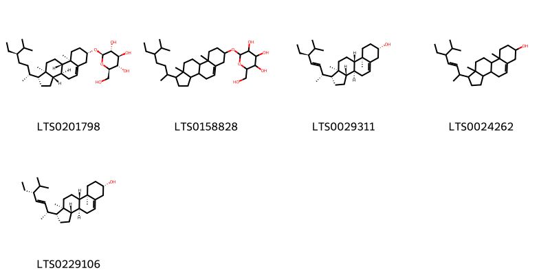{ width=100% }
    <figcaption>Hình ảnh cấu trúc hóa học của 5 hoạt chất thuộc nhóm Steroids and steroid derivatives gồm ['sitogluside (LTS0201798)', '2-{[1-(5-ethyl-6-methylheptan-2-yl)-9a,11a-dimethyl-1h,2h,3h,3ah,3bh,4h,6h,7h,8h,9h,9bh,10h,11h-cyclopenta[a]phenanthren-7-yl]oxy}-6-(hydroxymethyl)oxane-3,4,5-triol (LTS0158828)', 'phytosterol (LTS0029311)', 'stigmasterol (LTS0024262)', 'poriferasterol (LTS0229106)'].</figcaption>
</figure>
#### Nhóm Stilbenes
<figure markdown="span">
    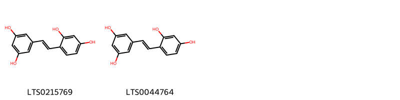{ width=100% }
    <figcaption>Hình ảnh cấu trúc hóa học của 2 hoạt chất thuộc nhóm Stilbenes gồm ['5-[2-(2,4-dihydroxyphenyl)ethenyl]benzene-1,3-diol (LTS0215769)', '5-[(1e)-2-(2,4-dihydroxyphenyl)ethenyl]benzene-1,3-diol (LTS0044764)'].</figcaption>
</figure>

---

### Dược dân tộc học

Danh sách các quốc gia có sử dụng *Fatsia japonica* trong điều trị các bệnh. 

| Country   | Disease     | Bệnh           |
|:----------|:------------|:---------------|
| Japan     | Expectorant | Thuốc long đàm |

---

---
## Fatsia papyrifera
### Thông tin về thực vật

!!! info "Phân loại thực vật của *Fatsia papyrifera* từ GIBF:"
    - **Kingdom:** Plantae
    - **Phylum:** Tracheophyta
    - **Order:** Apiales
    - **Family:** Araliaceae
    - **Genus:** Fatsia
    - **Species:** *Fatsia papyrifera*

 

| Label (VI)   | Label (EN)   | Scientific Name   | Descriptions (VI)   | Descriptions (EN)   | Also Known As (VI)   | Also Known As (EN)                          |
|:-------------|:-------------|:------------------|:--------------------|:--------------------|:---------------------|:--------------------------------------------|
| N/A          | N/A          | Fatsia japonica   |                     | species of plant    | ['']                 | ['paperplant', 'fatsia', 'Japanese aralia'] |

#### Phân bố trên thế giới

**Từ CSDL GIBF** nan, Italy, unknown or invalid, China

#### Phân bố tại Việt Nam

**Từ CSDL GIBF**: Không có ghi nhận ở Việt Nam

---
### Thành phần hóa học
        
- Theo cơ sở dữ liệu lotus: Từ loài *Fatsia papyrifera* đã phân lập và xác định được Chưa có hoạt chất nào được phân lập. hoạt chất thuộc về các nhóm Không có hoạt chất nào được phân lập. 

Không có hình ảnh nào được tạo ra

---

### Dược dân tộc học

Danh sách các quốc gia có sử dụng *Fatsia papyrifera* trong điều trị các bệnh. 

| Country   | Disease                       | Bệnh                                            |
|:----------|:------------------------------|:------------------------------------------------|
| China     | Antidote, Diuretic, Vermifuge | Thuốc giải độc, thuốc lợi tiểu, thuốc diệt giun |

---

# Chi Dendropanax

??? note "Danh sách các dược liệu thuộc chi"
    
	 - *Dendropanax arboreus*

---
## Dendropanax arboreus
### Thông tin về thực vật

!!! info "Phân loại thực vật của *Dendropanax arboreus* từ GIBF:"
    - **Kingdom:** Plantae
    - **Phylum:** Tracheophyta
    - **Order:** Apiales
    - **Family:** Araliaceae
    - **Genus:** Dendropanax
    - **Species:** *Dendropanax arboreus*

 

| Label (VI)   | Label (EN)   | Scientific Name      | Descriptions (VI)   | Descriptions (EN)   | Also Known As (VI)   | Also Known As (EN)   |
|:-------------|:-------------|:---------------------|:--------------------|:--------------------|:---------------------|:---------------------|
| N/A          | N/A          | Dendropanax arboreus | loài thực vật       | species of plant    | ['']                 | ['']                 |

#### Phân bố trên thế giới

**Từ CSDL GIBF** Mexico, Guatemala, Nicaragua, Jamaica, El Salvador, Haiti, Dominican Republic, Colombia, Ecuador, Belize, Puerto Rico

#### Phân bố tại Việt Nam

**Từ CSDL GIBF**: Không có ghi nhận ở Việt Nam

---
### Thành phần hóa học
        
- Theo cơ sở dữ liệu lotus: Từ loài *Dendropanax arboreus* đã phân lập và xác định được 21 hoạt chất thuộc về các nhóm Fatty Acyls, Prenol lipids, Steroids and steroid derivatives. 

|    | chemicalTaxonomyClassyfireClass   |   smiles_count |
|---:|:----------------------------------|---------------:|
|  0 | Fatty Acyls                       |             17 |
|  1 | Prenol lipids                     |              1 |
|  2 | Steroids and steroid derivatives  |              2 |

#### Nhóm Fatty Acyls
<figure markdown="span">
    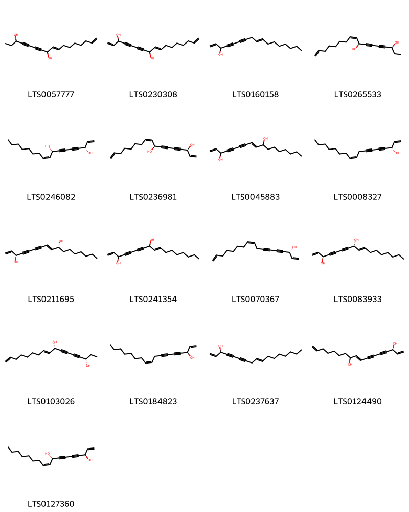{ width=100% }
    <figcaption>Hình ảnh cấu trúc hóa học của 17 hoạt chất thuộc nhóm Fatty Acyls gồm ['heptadeca-9,16-dien-4,6-diyne-3,8-diol (LTS0057777)', 'heptadeca-1,9,16-trien-4,6-diyne-3,8-diol (LTS0230308)', 'heptadeca-1,9-dien-4,6-diyn-3-ol (LTS0160158)', '(3s,8s,9z)-heptadeca-9,16-dien-4,6-diyne-3,8-diol (LTS0265533)', '(3s,8s,9z)-heptadeca-1,9-dien-4,6-diyne-3,8-diol (LTS0246082)', '(3s,8s,9z)-heptadeca-1,9,16-trien-4,6-diyne-3,8-diol (LTS0236981)', 'heptadeca-1,8-dien-4,6-diyne-3,10-diol (LTS0045883)', 'falcarinol (LTS0008327)', '(3s,8e,10r)-heptadeca-1,8-dien-4,6-diyne-3,10-diol (LTS0211695)', 'heptadeca-1,9-dien-4,6-diyne-3,8-diol (LTS0241354)', 'dehydrofalcarinol (LTS0070367)', '(3s,8r)-heptadeca-1,9-dien-4,6-diyne-3,8-diol (LTS0083933)', '(3s,8s,9e)-heptadeca-9,16-dien-4,6-diyne-3,8-diol (LTS0103026)', 'falcarinol (LTS0184823)', '(z)-falcarinol (LTS0237637)', '(3s,8e)-heptadeca-1,8,16-trien-4,6-diyne-3,10-diol (LTS0124490)', 'falcarindiol (LTS0127360)'].</figcaption>
</figure>
#### Nhóm Prenol lipids
<figure markdown="span">
    { width=100% }
    <figcaption>Hình ảnh cấu trúc hóa học của 1 hoạt chất thuộc nhóm Prenol lipids gồm ['β-amyrin (LTS0251864)'].</figcaption>
</figure>
#### Nhóm Steroids and steroid derivatives
<figure markdown="span">
    { width=100% }
    <figcaption>Hình ảnh cấu trúc hóa học của 2 hoạt chất thuộc nhóm Steroids and steroid derivatives gồm ['stigmast-5-en-3-ol (LTS0071224)', 'stigmast-5-en-3-ol, (3β)- (LTS0204616)'].</figcaption>
</figure>

---

### Dược dân tộc học

Danh sách các quốc gia có sử dụng *Dendropanax arboreus* trong điều trị các bệnh. 

| Country            | Disease     | Bệnh                      |
|:-------------------|:------------|:--------------------------|
| Dominican Republic | Sudorific   | Ngạt thở                  |
| Haiti              | Diaphoretic | Thuốc tràn dịch màng phổi |

---

# Chi Nothopanax

??? note "Danh sách các dược liệu thuộc chi"
    
	 - *Nothopanax fruticosum*
	 - *Nothopanax scutellarium*

---
## Nothopanax fruticosum
### Thông tin về thực vật

!!! info "Phân loại thực vật của *Polyscias fruticosa* từ GIBF:"
    - **Kingdom:** Plantae
    - **Phylum:** Tracheophyta
    - **Order:** Apiales
    - **Family:** Araliaceae
    - **Genus:** Polyscias
    - **Species:** *Polyscias fruticosa*

 

| Label (VI)   | Label (EN)   | Scientific Name      | Descriptions (VI)   | Descriptions (EN)   | Also Known As (VI)   | Also Known As (EN)   |
|:-------------|:-------------|:---------------------|:--------------------|:--------------------|:---------------------|:---------------------|
| N/A          | N/A          | Dendropanax arboreus | loài thực vật       | species of plant    | ['']                 | ['']                 |

#### Phân bố trên thế giới

**Từ CSDL GIBF** Guatemala, Solomon Islands, Chinese Taipei, Ecuador

#### Phân bố tại Việt Nam

**Từ CSDL GIBF**: Không có ghi nhận ở Việt Nam

---
### Thành phần hóa học
        
- Theo cơ sở dữ liệu lotus: Từ loài *Polyscias fruticosa* đã phân lập và xác định được Chưa có hoạt chất nào được phân lập. hoạt chất thuộc về các nhóm Không có hoạt chất nào được phân lập. 

Không có hình ảnh nào được tạo ra

---

### Dược dân tộc học

Danh sách các quốc gia có sử dụng *Polyscias fruticosa* trong điều trị các bệnh. 

| Country   | Disease   | Bệnh           |
|:----------|:----------|:---------------|
| Java      | Diuretic  | Thuốc lợi tiêu |

---

---
## Nothopanax scutellarium
### Thông tin về thực vật

!!! info "Phân loại thực vật của *Polyscias scutellaria* từ GIBF:"
    - **Kingdom:** Plantae
    - **Phylum:** Tracheophyta
    - **Order:** Apiales
    - **Family:** Araliaceae
    - **Genus:** Polyscias
    - **Species:** *Polyscias scutellaria*

 

| Label (VI)   | Label (EN)   | Scientific Name      | Descriptions (VI)   | Descriptions (EN)   | Also Known As (VI)   | Also Known As (EN)   |
|:-------------|:-------------|:---------------------|:--------------------|:--------------------|:---------------------|:---------------------|
| N/A          | N/A          | Dendropanax arboreus | loài thực vật       | species of plant    | ['']                 | ['']                 |

#### Phân bố trên thế giới

**Từ CSDL GIBF** Guatemala, Solomon Islands, Chinese Taipei, Ecuador

#### Phân bố tại Việt Nam

**Từ CSDL GIBF**: Không có ghi nhận ở Việt Nam

---
### Thành phần hóa học
        
- Theo cơ sở dữ liệu lotus: Từ loài *Polyscias scutellaria* đã phân lập và xác định được Chưa có hoạt chất nào được phân lập. hoạt chất thuộc về các nhóm Không có hoạt chất nào được phân lập. 

Không có hình ảnh nào được tạo ra

---

### Dược dân tộc học

Danh sách các quốc gia có sử dụng *Polyscias scutellaria* trong điều trị các bệnh. 

| Country   | Disease   | Bệnh           |
|:----------|:----------|:---------------|
| Java      | Diuretic  | Thuốc lợi tiêu |

---

# Chi Aralia

??? note "Danh sách các dược liệu thuộc chi"
    
	 - *Aralia chinensis*
	 - *Aralia cordata*
	 - *Aralia inosa*
	 - *Aralia nudicaulis*
	 - *Aralia racemosa*

---
## Aralia chinensis
### Thông tin về thực vật

!!! info "Phân loại thực vật của *Aralia chinensis* từ GIBF:"
    - **Kingdom:** Plantae
    - **Phylum:** Tracheophyta
    - **Order:** Apiales
    - **Family:** Araliaceae
    - **Genus:** Aralia
    - **Species:** *Aralia chinensis*

 

| Label (VI)   | Label (EN)   | Scientific Name   | Descriptions (VI)   | Descriptions (EN)   | Also Known As (VI)   | Also Known As (EN)   |
|:-------------|:-------------|:------------------|:--------------------|:--------------------|:---------------------|:---------------------|
| N/A          | N/A          | Aralia chinensis  | loài thực vật       | species of plant    | ['']                 | ['']                 |

#### Phân bố trên thế giới

**Từ CSDL GIBF** nan, Viet Nam, Sweden, China, Slovenia, Madagascar, Thailand, Netherlands, Poland, United States of America, Korea, Republic of, Colombia, unknown or invalid, Estonia, Lao People’s Democratic Republic, Hong Kong, Norway, Belgium, Malaysia, Philippines, Mayotte, Canada, Germany, United Kingdom of Great Britain and Northern Ireland

#### Phân bố tại Việt Nam

**Từ CSDL GIBF**: Nghe An, Hoa Binh, Kon Tum, Cao Bang, Lao Cai, Hà Giang

---
### Thành phần hóa học
        
- Theo cơ sở dữ liệu lotus: Từ loài *Aralia chinensis* đã phân lập và xác định được 46 hoạt chất thuộc về các nhóm Prenol lipids. 

|    | chemicalTaxonomyClassyfireClass   |   smiles_count |
|---:|:----------------------------------|---------------:|
|  0 | Prenol lipids                     |             46 |

#### Nhóm Prenol lipids
<figure markdown="span">
    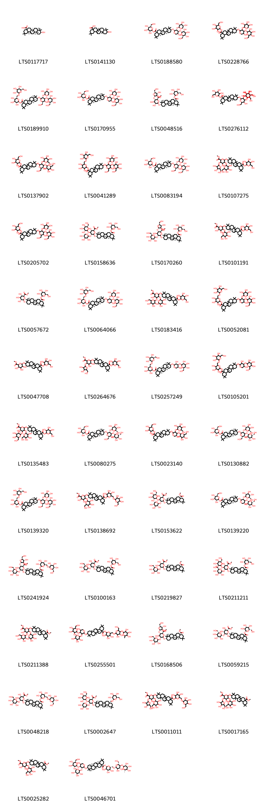{ width=100% }
    <figcaption>Hình ảnh cấu trúc hóa học của 46 hoạt chất thuộc nhóm Prenol lipids gồm ['oleanolic acid (LTS0117717)', 'oleanolic acid (LTS0141130)', '(2s,3r,4s,5s,6r)-3,4,5-trihydroxy-6-(hydroxymethyl)oxan-2-yl (4as,6as,6br,10s,12ar,12br,14br)-10-{[(2s,3r,4s,5s)-5-hydroxy-4-{[(2r,3r,4s,5s,6r)-3,4,5-trihydroxy-6-(hydroxymethyl)oxan-2-yl]oxy}-3-{[(2s,3r,4s,5r)-3,4,5-trihydroxyoxan-2-yl]oxy}oxan-2-yl]oxy}-2,2,6a,6b,9,9,12a-heptamethyl-1,3,4,5,6,7,8,8a,10,11,12,12b,13,14b-tetradecahydropicene-4a-carboxylate (LTS0188580)', '3,4,5-trihydroxy-6-(hydroxymethyl)oxan-2-yl 10-[(5-hydroxy-4-{[3,4,5-trihydroxy-6-(hydroxymethyl)oxan-2-yl]oxy}-3-[(3,4,5-trihydroxyoxan-2-yl)oxy]oxan-2-yl)oxy]-2,2,6a,6b,9,9,12a-heptamethyl-1,3,4,5,6,7,8,8a,10,11,12,12b,13,14b-tetradecahydropicene-4a-carboxylate (LTS0228766)', '(2s,3r,4s,5s,6r)-3,4,5-trihydroxy-6-({[(2r,3r,4s,5s,6r)-3,4,5-trihydroxy-6-(hydroxymethyl)oxan-2-yl]oxy}methyl)oxan-2-yl (4as,6as,6br,8ar,10s,12ar,12br,14bs)-10-{[(2r,3r,4s,5s,6r)-5-hydroxy-6-(hydroxymethyl)-4-{[(2s,3r,4s,5s,6r)-3,4,5-trihydroxy-6-(hydroxymethyl)oxan-2-yl]oxy}-3-{[(2s,3r,4s,5r)-3,4,5-trihydroxyoxan-2-yl]oxy}oxan-2-yl]oxy}-2,2,6a,6b,9,9,12a-heptamethyl-1,3,4,5,6,7,8,8a,10,11,12,12b,13,14b-tetradecahydropicene-4a-carboxylate (LTS0189910)', '(2s,3r,4s,5s,6r)-3,4,5-trihydroxy-6-(hydroxymethyl)oxan-2-yl (4as,6as,6br,8ar,10s,12ar,12br,14bs)-10-{[(2s,3r,4s,5s)-5-hydroxy-4-{[(2s,3r,4s,5s,6r)-3,4,5-trihydroxy-6-(hydroxymethyl)oxan-2-yl]oxy}-3-{[(2s,3r,4s,5r)-3,4,5-trihydroxyoxan-2-yl]oxy}oxan-2-yl]oxy}-2,2,6a,6b,9,9,12a-heptamethyl-1,3,4,5,6,7,8,8a,10,11,12,12b,13,14b-tetradecahydropicene-4a-carboxylate (LTS0170955)', 'methyl (2s,3s,4r,5r,6r)-6-{[(3s,4ar,6ar,6bs,8as,12as,14ar,14br)-4,4,6a,6b,11,11,14b-heptamethyl-8a-({[(2s,3r,4s,5s,6r)-3,4,5-trihydroxy-6-(hydroxymethyl)oxan-2-yl]oxy}carbonyl)-1,2,3,4a,5,6,7,8,9,10,12,12a,14,14a-tetradecahydropicen-3-yl]oxy}-3-{[(2s,3r,4r,5s)-3,4-dihydroxy-5-(hydroxymethyl)oxolan-2-yl]oxy}-4,5-dihydroxyoxane-2-carboxylate (LTS0048516)', '3,4,5-trihydroxy-6-(hydroxymethyl)oxan-2-yl 5-hydroxy-10-{[5-hydroxy-6-(hydroxymethyl)-3,4-bis({[3,4,5-trihydroxy-6-(hydroxymethyl)oxan-2-yl]oxy})oxan-2-yl]oxy}-2,2,6a,6b,9,9,12a-heptamethyl-1,3,4,5,6,7,8,8a,10,11,12,12b,13,14b-tetradecahydropicene-4a-carboxylate (LTS0276112)', '3,4,5-trihydroxy-6-(hydroxymethyl)oxan-2-yl 10-{[5-hydroxy-6-(hydroxymethyl)-3,4-bis({[3,4,5-trihydroxy-6-(hydroxymethyl)oxan-2-yl]oxy})oxan-2-yl]oxy}-2,2,6a,6b,9,9,12a-heptamethyl-1,3,4,5,6,7,8,8a,10,11,12,12b,13,14b-tetradecahydropicene-4a-carboxylate (LTS0137902)', '3,4,5-trihydroxy-6-({[3,4,5-trihydroxy-6-(hydroxymethyl)oxan-2-yl]oxy}methyl)oxan-2-yl 10-{[5-hydroxy-6-(hydroxymethyl)-4-{[3,4,5-trihydroxy-6-(hydroxymethyl)oxan-2-yl]oxy}-3-[(3,4,5-trihydroxyoxan-2-yl)oxy]oxan-2-yl]oxy}-2,2,6a,6b,9,9,12a-heptamethyl-1,3,4,5,6,7,8,8a,10,11,12,12b,13,14b-tetradecahydropicene-4a-carboxylate (LTS0041289)', '(2s,3r,4s,5s,6r)-3,4,5-trihydroxy-6-(hydroxymethyl)oxan-2-yl (4as,6as,6br,8ar,10s,12ar,12br,14bs)-10-{[(2r,3r,4s,5s,6r)-5-hydroxy-6-(hydroxymethyl)-4-{[(2s,3r,4s,5s,6r)-3,4,5-trihydroxy-6-(hydroxymethyl)oxan-2-yl]oxy}-3-{[(2s,3r,4s,5r)-3,4,5-trihydroxyoxan-2-yl]oxy}oxan-2-yl]oxy}-2,2,6a,6b,9,9,12a-heptamethyl-1,3,4,5,6,7,8,8a,10,11,12,12b,13,14b-tetradecahydropicene-4a-carboxylate (LTS0083194)', 'methyl 6-{[4,4,6a,6b,11,11,14b-heptamethyl-8a-({[3,4,5-trihydroxy-6-(hydroxymethyl)oxan-2-yl]oxy}carbonyl)-1,2,3,4a,5,6,7,8,9,10,12,12a,14,14a-tetradecahydropicen-3-yl]oxy}-3-{[3,4-dihydroxy-5-(hydroxymethyl)oxolan-2-yl]oxy}-4-hydroxy-5-{[3,4,5-trihydroxy-6-(hydroxymethyl)oxan-2-yl]oxy}oxane-2-carboxylate (LTS0107275)', '3,4,5-trihydroxy-6-(hydroxymethyl)oxan-2-yl 10-{[5-hydroxy-6-(hydroxymethyl)-4-{[3,4,5-trihydroxy-6-(hydroxymethyl)oxan-2-yl]oxy}-3-[(3,4,5-trihydroxyoxan-2-yl)oxy]oxan-2-yl]oxy}-2,2,6a,6b,9,9,12a-heptamethyl-1,3,4,5,6,7,8,8a,10,11,12,12b,13,14b-tetradecahydropicene-4a-carboxylate (LTS0205702)', 'methyl (2s,3s,4s,5r,6r)-6-{[(3s,4ar,6ar,6bs,8as,12as,14ar,14br)-4,4,6a,6b,11,11,14b-heptamethyl-8a-({[(2s,3r,4s,5s,6r)-3,4,5-trihydroxy-6-(hydroxymethyl)oxan-2-yl]oxy}carbonyl)-1,2,3,4a,5,6,7,8,9,10,12,12a,14,14a-tetradecahydropicen-3-yl]oxy}-3-hydroxy-4-{[(2s,3r,4s,5r,6r)-3,4,5-trihydroxy-6-(hydroxymethyl)oxan-2-yl]oxy}-5-{[(2s,3r,4s,5r)-3,4,5-trihydroxyoxan-2-yl]oxy}oxane-2-carboxylate (LTS0158636)', 'methyl (2s,3s,4s,5r,6r)-6-{[(3s,4ar,6ar,6bs,8as,12as,14ar,14br)-4,4,6a,6b,11,11,14b-heptamethyl-8a-({[(2s,3r,4s,5s,6r)-3,4,5-trihydroxy-6-(hydroxymethyl)oxan-2-yl]oxy}carbonyl)-1,2,3,4a,5,6,7,8,9,10,12,12a,14,14a-tetradecahydropicen-3-yl]oxy}-3-{[(2s,3r,4r,5s)-3,4-dihydroxy-5-(hydroxymethyl)oxolan-2-yl]oxy}-4-hydroxy-5-{[(2s,3r,4s,5s,6r)-3,4,5-trihydroxy-6-(hydroxymethyl)oxan-2-yl]oxy}oxane-2-carboxylate (LTS0170260)', 'methyl 6-{[4,4,6a,6b,11,11,14b-heptamethyl-8a-({[3,4,5-trihydroxy-6-(hydroxymethyl)oxan-2-yl]oxy}carbonyl)-1,2,3,4a,5,6,7,8,9,10,12,12a,14,14a-tetradecahydropicen-3-yl]oxy}-3,4-dihydroxy-5-{[3,4,5-trihydroxy-6-(hydroxymethyl)oxan-2-yl]oxy}oxane-2-carboxylate (LTS0101191)', 'methyl (2s,3s,4s,5r,6r)-6-{[(3s,4ar,6ar,6bs,8as,12as,14ar,14br)-4,4,6a,6b,11,11,14b-heptamethyl-8a-({[(2s,3r,4s,5s,6r)-3,4,5-trihydroxy-6-(hydroxymethyl)oxan-2-yl]oxy}carbonyl)-1,2,3,4a,5,6,7,8,9,10,12,12a,14,14a-tetradecahydropicen-3-yl]oxy}-3,4,5-trihydroxyoxane-2-carboxylate (LTS0057672)', '(2s,3r,4s,5s,6r)-3,4,5-trihydroxy-6-({[(2r,3r,4s,5s,6r)-3,4,5-trihydroxy-6-(hydroxymethyl)oxan-2-yl]oxy}methyl)oxan-2-yl (4as,6as,6br,8ar,10s,12ar,12br,14bs)-10-{[(2s,3r,4s,5s)-5-hydroxy-4-{[(2s,3r,4s,5s,6r)-3,4,5-trihydroxy-6-(hydroxymethyl)oxan-2-yl]oxy}-3-{[(2s,3r,4s,5r)-3,4,5-trihydroxyoxan-2-yl]oxy}oxan-2-yl]oxy}-2,2,6a,6b,9,9,12a-heptamethyl-1,3,4,5,6,7,8,8a,10,11,12,12b,13,14b-tetradecahydropicene-4a-carboxylate (LTS0064066)', 'methyl 6-{[4,4,6a,6b,11,11,14b-heptamethyl-8a-({[3,4,5-trihydroxy-6-(hydroxymethyl)oxan-2-yl]oxy}carbonyl)-1,2,3,4a,5,6,7,8,9,10,12,12a,14,14a-tetradecahydropicen-3-yl]oxy}-3-hydroxy-4-{[3,4,5-trihydroxy-6-(hydroxymethyl)oxan-2-yl]oxy}-5-[(3,4,5-trihydroxyoxan-2-yl)oxy]oxane-2-carboxylate (LTS0183416)', '3,4,5-trihydroxy-6-({[3,4,5-trihydroxy-6-(hydroxymethyl)oxan-2-yl]oxy}methyl)oxan-2-yl 10-[(5-hydroxy-4-{[3,4,5-trihydroxy-6-(hydroxymethyl)oxan-2-yl]oxy}-3-[(3,4,5-trihydroxyoxan-2-yl)oxy]oxan-2-yl)oxy]-2,2,6a,6b,9,9,12a-heptamethyl-1,3,4,5,6,7,8,8a,10,11,12,12b,13,14b-tetradecahydropicene-4a-carboxylate (LTS0052081)', 'methyl 6-{[4,4,6a,6b,11,11,14b-heptamethyl-8a-({[3,4,5-trihydroxy-6-(hydroxymethyl)oxan-2-yl]oxy}carbonyl)-1,2,3,4a,5,6,7,8,9,10,12,12a,14,14a-tetradecahydropicen-3-yl]oxy}-3,4,5-trihydroxyoxane-2-carboxylate (LTS0047708)', 'methyl 6-{[4,4,6a,6b,11,11,14b-heptamethyl-8a-({[3,4,5-trihydroxy-6-(hydroxymethyl)oxan-2-yl]oxy}carbonyl)-1,2,3,4a,5,6,7,8,9,10,12,12a,14,14a-tetradecahydropicen-3-yl]oxy}-3-{[3,4-dihydroxy-5-(hydroxymethyl)oxolan-2-yl]oxy}-4,5-dihydroxyoxane-2-carboxylate (LTS0264676)', '(2s,3r,4s,5s,6r)-3,4,5-trihydroxy-6-({[(2r,3r,4s,5s,6r)-3,4,5-trihydroxy-6-(hydroxymethyl)oxan-2-yl]oxy}methyl)oxan-2-yl (4as,6as,6br,8ar,10s,12ar,12br,14bs)-10-{[(2s,3r,4s,5s)-3,5-dihydroxy-4-{[(2s,3r,4s,5s,6r)-3,4,5-trihydroxy-6-(hydroxymethyl)oxan-2-yl]oxy}oxan-2-yl]oxy}-2,2,6a,6b,9,9,12a-heptamethyl-1,3,4,5,6,7,8,8a,10,11,12,12b,13,14b-tetradecahydropicene-4a-carboxylate (LTS0257249)', '3,4,5-trihydroxy-6-({[3,4,5-trihydroxy-6-(hydroxymethyl)oxan-2-yl]oxy}methyl)oxan-2-yl 10-[(3,5-dihydroxy-4-{[3,4,5-trihydroxy-6-(hydroxymethyl)oxan-2-yl]oxy}oxan-2-yl)oxy]-2,2,6a,6b,9,9,12a-heptamethyl-1,3,4,5,6,7,8,8a,10,11,12,12b,13,14b-tetradecahydropicene-4a-carboxylate (LTS0105201)', 'methyl 6-{[4,4,6a,6b,11,11,14b-heptamethyl-8a-({[3,4,5-trihydroxy-6-(hydroxymethyl)oxan-2-yl]oxy}carbonyl)-1,2,3,4a,5,6,7,8,9,10,12,12a,14,14a-tetradecahydropicen-3-yl]oxy}-3-hydroxy-4,5-bis({[3,4,5-trihydroxy-6-(hydroxymethyl)oxan-2-yl]oxy})oxane-2-carboxylate (LTS0135483)', '(2s,3r,4s,5s,6r)-3,4,5-trihydroxy-6-(hydroxymethyl)oxan-2-yl (4as,6as,6br,8ar,10s,12ar,12br,14bs)-10-{[(2r,3r,4s,5r,6r)-5-hydroxy-6-(hydroxymethyl)-3-{[(2s,3r,4s,5r,6r)-3,4,5-trihydroxy-6-(hydroxymethyl)oxan-2-yl]oxy}-4-{[(2s,3r,4s,5s,6r)-3,4,5-trihydroxy-6-(hydroxymethyl)oxan-2-yl]oxy}oxan-2-yl]oxy}-2,2,6a,6b,9,9,12a-heptamethyl-1,3,4,5,6,7,8,8a,10,11,12,12b,13,14b-tetradecahydropicene-4a-carboxylate (LTS0080275)', '3,4,5-trihydroxy-6-(hydroxymethyl)oxan-2-yl 10-{[5-hydroxy-3,4-bis({[3,4,5-trihydroxy-6-(hydroxymethyl)oxan-2-yl]oxy})oxan-2-yl]oxy}-2,2,6a,6b,9,9,12a-heptamethyl-1,3,4,5,6,7,8,8a,10,11,12,12b,13,14b-tetradecahydropicene-4a-carboxylate (LTS0023140)', '(2s,3r,4s,5s,6r)-3,4,5-trihydroxy-6-(hydroxymethyl)oxan-2-yl (4as,6as,6br,8ar,10s,12ar,12br,14bs)-10-{[(2r,3r,4s,5s,6r)-5-hydroxy-6-(hydroxymethyl)-3-{[(2s,3r,4s,5r,6r)-3,4,5-trihydroxy-6-(hydroxymethyl)oxan-2-yl]oxy}-4-{[(2s,3r,4s,5s,6r)-3,4,5-trihydroxy-6-(hydroxymethyl)oxan-2-yl]oxy}oxan-2-yl]oxy}-2,2,6a,6b,9,9,12a-heptamethyl-1,3,4,5,6,7,8,8a,10,11,12,12b,13,14b-tetradecahydropicene-4a-carboxylate (LTS0130882)', '(2s,3r,4s,5s,6r)-3,4,5-trihydroxy-6-({[(2r,3r,4s,5s,6r)-3,4,5-trihydroxy-6-(hydroxymethyl)oxan-2-yl]oxy}methyl)oxan-2-yl (4as,6as,6br,8ar,10s,12ar,12br,14bs)-10-{[(2r,3r,4s,5r,6r)-5-hydroxy-6-(hydroxymethyl)-4-{[(2s,3r,4s,5s,6r)-3,4,5-trihydroxy-6-(hydroxymethyl)oxan-2-yl]oxy}-3-{[(2s,3r,4s,5r)-3,4,5-trihydroxyoxan-2-yl]oxy}oxan-2-yl]oxy}-2,2,6a,6b,9,9,12a-heptamethyl-1,3,4,5,6,7,8,8a,10,11,12,12b,13,14b-tetradecahydropicene-4a-carboxylate (LTS0139320)', 'methyl 6-{[4,4,6a,6b,11,11,14b-heptamethyl-8a-({[3,4,5-trihydroxy-6-({[3,4,5-trihydroxy-6-(hydroxymethyl)oxan-2-yl]oxy}methyl)oxan-2-yl]oxy}carbonyl)-1,2,3,4a,5,6,7,8,9,10,12,12a,14,14a-tetradecahydropicen-3-yl]oxy}-3,4-dihydroxy-5-{[3,4,5-trihydroxy-6-(hydroxymethyl)oxan-2-yl]oxy}oxane-2-carboxylate (LTS0138692)', 'methyl (2s,3s,4s,5r,6r)-6-{[(3s,4ar,6ar,6bs,8as,12as,14ar,14br)-8a-(methoxycarbonyl)-4,4,6a,6b,11,11,14b-heptamethyl-1,2,3,4a,5,6,7,8,9,10,12,12a,14,14a-tetradecahydropicen-3-yl]oxy}-3-hydroxy-4-{[(2s,3r,4s,5r,6r)-3,4,5-trihydroxy-6-(hydroxymethyl)oxan-2-yl]oxy}-5-{[(2s,3r,4s,5r)-3,4,5-trihydroxyoxan-2-yl]oxy}oxane-2-carboxylate (LTS0153622)', '(2s,3r,4s,5s,6r)-3,4,5-trihydroxy-6-(hydroxymethyl)oxan-2-yl (4as,6as,6br,8ar,10s,12ar,12br,14bs)-10-{[(2s,3r,4s,5s)-5-hydroxy-3,4-bis({[(2s,3r,4s,5s,6r)-3,4,5-trihydroxy-6-(hydroxymethyl)oxan-2-yl]oxy})oxan-2-yl]oxy}-2,2,6a,6b,9,9,12a-heptamethyl-1,3,4,5,6,7,8,8a,10,11,12,12b,13,14b-tetradecahydropicene-4a-carboxylate (LTS0139220)', 'methyl (2s,3s,4s,5r,6r)-6-{[(3s,4ar,6ar,6bs,8as,12as,14ar,14br)-4,4,6a,6b,11,11,14b-heptamethyl-8a-({[(2s,3r,4s,5s,6r)-3,4,5-trihydroxy-6-({[(2r,3r,4s,5s,6r)-3,4,5-trihydroxy-6-(hydroxymethyl)oxan-2-yl]oxy}methyl)oxan-2-yl]oxy}carbonyl)-1,2,3,4a,5,6,7,8,9,10,12,12a,14,14a-tetradecahydropicen-3-yl]oxy}-3-{[(2s,3r,4r,5s)-3,4-dihydroxy-5-(hydroxymethyl)oxolan-2-yl]oxy}-4-hydroxy-5-{[(2s,3r,4s,5s,6r)-3,4,5-trihydroxy-6-(hydroxymethyl)oxan-2-yl]oxy}oxane-2-carboxylate (LTS0241924)', 'methyl (2s,3s,4s,5r,6r)-6-{[(3s,4ar,6ar,6bs,8as,12as,14ar,14br)-4,4,6a,6b,11,11,14b-heptamethyl-8a-({[(2s,3r,4s,5s,6r)-3,4,5-trihydroxy-6-(hydroxymethyl)oxan-2-yl]oxy}carbonyl)-1,2,3,4a,5,6,7,8,9,10,12,12a,14,14a-tetradecahydropicen-3-yl]oxy}-3,4-dihydroxy-5-{[(2s,3r,4s,5s,6r)-3,4,5-trihydroxy-6-(hydroxymethyl)oxan-2-yl]oxy}oxane-2-carboxylate (LTS0100163)', 'methyl (2s,3s,4s,5r,6r)-6-{[(3s,4ar,6ar,6bs,8as,12as,14ar,14br)-8a-(methoxycarbonyl)-4,4,6a,6b,11,11,14b-heptamethyl-1,2,3,4a,5,6,7,8,9,10,12,12a,14,14a-tetradecahydropicen-3-yl]oxy}-3,4-dihydroxy-5-{[(2s,3r,4s,5s,6r)-3,4,5-trihydroxy-6-(hydroxymethyl)oxan-2-yl]oxy}oxane-2-carboxylate (LTS0219827)', 'methyl (2s,3s,4s,5r,6r)-6-{[(3s,4ar,6ar,6bs,8as,12as,14ar,14br)-4,4,6a,6b,11,11,14b-heptamethyl-8a-({[(2s,3r,4s,5s,6r)-3,4,5-trihydroxy-6-(hydroxymethyl)oxan-2-yl]oxy}carbonyl)-1,2,3,4a,5,6,7,8,9,10,12,12a,14,14a-tetradecahydropicen-3-yl]oxy}-3-hydroxy-4-{[(2s,3r,4s,5r,6r)-3,4,5-trihydroxy-6-(hydroxymethyl)oxan-2-yl]oxy}-5-{[(2s,3r,4s,5s,6r)-3,4,5-trihydroxy-6-(hydroxymethyl)oxan-2-yl]oxy}oxane-2-carboxylate (LTS0211211)', 'methyl 6-{[8a-(methoxycarbonyl)-4,4,6a,6b,11,11,14b-heptamethyl-1,2,3,4a,5,6,7,8,9,10,12,12a,14,14a-tetradecahydropicen-3-yl]oxy}-3-hydroxy-4-{[3,4,5-trihydroxy-6-(hydroxymethyl)oxan-2-yl]oxy}-5-[(3,4,5-trihydroxyoxan-2-yl)oxy]oxane-2-carboxylate (LTS0211388)', '6-({[3,4-dihydroxy-6-(hydroxymethyl)-5-[(3,4,5-trihydroxy-6-methyloxan-2-yl)oxy]oxan-2-yl]oxy}methyl)-3,4,5-trihydroxyoxan-2-yl 10-[(5-hydroxy-4-{[3,4,5-trihydroxy-6-(hydroxymethyl)oxan-2-yl]oxy}-3-[(3,4,5-trihydroxyoxan-2-yl)oxy]oxan-2-yl)oxy]-2,2,6a,6b,9,9,12a-heptamethyl-1,3,4,5,6,7,8,8a,10,11,12,12b,13,14b-tetradecahydropicene-4a-carboxylate (LTS0255501)', 'methyl (2s,3s,4s,5r,6r)-6-{[(3s,4ar,6ar,6bs,8as,12as,14ar,14br)-8a-(methoxycarbonyl)-4,4,6a,6b,11,11,14b-heptamethyl-1,2,3,4a,5,6,7,8,9,10,12,12a,14,14a-tetradecahydropicen-3-yl]oxy}-3-{[(2s,3r,4r,5s)-3,4-dihydroxy-5-(hydroxymethyl)oxolan-2-yl]oxy}-4-hydroxy-5-{[(2s,3r,4s,5s,6r)-3,4,5-trihydroxy-6-(hydroxymethyl)oxan-2-yl]oxy}oxane-2-carboxylate (LTS0168506)', 'methyl (2r,3r,4r,5s,6s)-6-{[(3r,4as,6as,6br,8ar,12ar,14as,14bs)-4,4,6a,6b,11,11,14b-heptamethyl-8a-({[(2r,3s,4r,5r,6s)-3,4,5-trihydroxy-6-(hydroxymethyl)oxan-2-yl]oxy}carbonyl)-1,2,3,4a,5,6,7,8,9,10,12,12a,14,14a-tetradecahydropicen-3-yl]oxy}-3,4-dihydroxy-5-{[(2r,3s,4r,5r,6s)-3,4,5-trihydroxy-6-(hydroxymethyl)oxan-2-yl]oxy}oxane-2-carboxylate (LTS0059215)', 'methyl (2s,3s,4s,5r,6r)-6-{[(3s,4ar,6ar,6bs,8as,12as,14ar,14br)-4,4,6a,6b,11,11,14b-heptamethyl-8a-({[(2s,3r,4s,5s,6r)-3,4,5-trihydroxy-6-({[(2r,3r,4s,5s,6r)-3,4,5-trihydroxy-6-(hydroxymethyl)oxan-2-yl]oxy}methyl)oxan-2-yl]oxy}carbonyl)-1,2,3,4a,5,6,7,8,9,10,12,12a,14,14a-tetradecahydropicen-3-yl]oxy}-3,4-dihydroxy-5-{[(2s,3r,4s,5s,6r)-3,4,5-trihydroxy-6-(hydroxymethyl)oxan-2-yl]oxy}oxane-2-carboxylate (LTS0048218)', 'methyl (2s,3s,4s,5r,6r)-6-{[(3s,4ar,6ar,6bs,8as,12as,14ar,14br)-4,4,6a,6b,11,11,14b-heptamethyl-8a-({[(2r,3r,4s,5s,6r)-3,4,5-trihydroxy-6-(hydroxymethyl)oxan-2-yl]oxy}methyl)-1,2,3,4a,5,6,7,8,9,10,12,12a,14,14a-tetradecahydropicen-3-yl]oxy}-3-hydroxy-4-{[(2s,3r,4s,5r,6r)-3,4,5-trihydroxy-6-(hydroxymethyl)oxan-2-yl]oxy}-5-{[(2s,3r,4s,5r)-3,4,5-trihydroxyoxan-2-yl]oxy}oxane-2-carboxylate (LTS0002647)', 'methyl 6-{[4,4,6a,6b,11,11,14b-heptamethyl-8a-({[3,4,5-trihydroxy-6-({[3,4,5-trihydroxy-6-(hydroxymethyl)oxan-2-yl]oxy}methyl)oxan-2-yl]oxy}carbonyl)-1,2,3,4a,5,6,7,8,9,10,12,12a,14,14a-tetradecahydropicen-3-yl]oxy}-3-{[3,4-dihydroxy-5-(hydroxymethyl)oxolan-2-yl]oxy}-4-hydroxy-5-{[3,4,5-trihydroxy-6-(hydroxymethyl)oxan-2-yl]oxy}oxane-2-carboxylate (LTS0011011)', 'methyl 6-{[8a-(methoxycarbonyl)-4,4,6a,6b,11,11,14b-heptamethyl-1,2,3,4a,5,6,7,8,9,10,12,12a,14,14a-tetradecahydropicen-3-yl]oxy}-3-{[3,4-dihydroxy-5-(hydroxymethyl)oxolan-2-yl]oxy}-4-hydroxy-5-{[3,4,5-trihydroxy-6-(hydroxymethyl)oxan-2-yl]oxy}oxane-2-carboxylate (LTS0017165)', 'methyl 6-{[8a-(methoxycarbonyl)-4,4,6a,6b,11,11,14b-heptamethyl-1,2,3,4a,5,6,7,8,9,10,12,12a,14,14a-tetradecahydropicen-3-yl]oxy}-3,4-dihydroxy-5-{[3,4,5-trihydroxy-6-(hydroxymethyl)oxan-2-yl]oxy}oxane-2-carboxylate (LTS0025282)', '(2s,3r,4s,5s,6r)-6-({[(2r,3r,4r,5s,6r)-3,4-dihydroxy-6-(hydroxymethyl)-5-{[(2s,3r,4r,5r,6s)-3,4,5-trihydroxy-6-methyloxan-2-yl]oxy}oxan-2-yl]oxy}methyl)-3,4,5-trihydroxyoxan-2-yl (4as,6as,6br,8ar,10s,12ar,12br,14bs)-10-{[(2s,3r,4s,5s)-5-hydroxy-4-{[(2s,3r,4s,5s,6r)-3,4,5-trihydroxy-6-(hydroxymethyl)oxan-2-yl]oxy}-3-{[(2s,3r,4s,5r)-3,4,5-trihydroxyoxan-2-yl]oxy}oxan-2-yl]oxy}-2,2,6a,6b,9,9,12a-heptamethyl-1,3,4,5,6,7,8,8a,10,11,12,12b,13,14b-tetradecahydropicene-4a-carboxylate (LTS0046701)'].</figcaption>
</figure>

---

### Dược dân tộc học

Danh sách các quốc gia có sử dụng *Aralia chinensis* trong điều trị các bệnh. 

| Country   | Disease     | Bệnh                   |
|:----------|:------------|:-----------------------|
| China     | Carminative | Gây ô nhiễm môi trường |

---

---
## Aralia cordata
### Thông tin về thực vật

!!! info "Phân loại thực vật của *Aralia cordata* từ GIBF:"
    - **Kingdom:** Plantae
    - **Phylum:** Tracheophyta
    - **Order:** Apiales
    - **Family:** Araliaceae
    - **Genus:** Aralia
    - **Species:** *Aralia cordata*

 

| Label (VI)   | Label (EN)   | Scientific Name   | Descriptions (VI)   | Descriptions (EN)   | Also Known As (VI)   | Also Known As (EN)   |
|:-------------|:-------------|:------------------|:--------------------|:--------------------|:---------------------|:---------------------|
| N/A          | N/A          | Aralia cordata    |                     | species of plant    | ['']                 | ['']                 |

#### Phân bố trên thế giới

**Từ CSDL GIBF** nan, United States of America, Japan, Korea, Republic of, Norway, Latvia, Chinese Taipei, Belgium, China, Russian Federation

#### Phân bố tại Việt Nam

**Từ CSDL GIBF**: Không có ghi nhận ở Việt Nam

---
### Thành phần hóa học
        
- Theo cơ sở dữ liệu lotus: Từ loài *Aralia cordata* đã phân lập và xác định được 26 hoạt chất thuộc về các nhóm Prenol lipids, Flavonoids. 

|    | chemicalTaxonomyClassyfireClass   |   smiles_count |
|---:|:----------------------------------|---------------:|
|  0 | Flavonoids                        |              1 |
|  1 | Prenol lipids                     |             25 |

#### Nhóm Flavonoids
<figure markdown="span">
    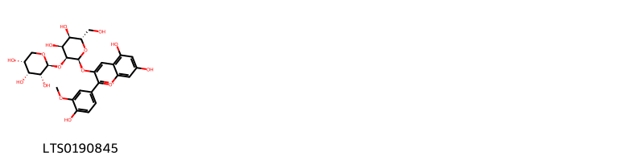{ width=100% }
    <figcaption>Hình ảnh cấu trúc hóa học của 1 hoạt chất thuộc nhóm Flavonoids gồm ['3-{[(2s,3s,4s,5r,6s)-4,5-dihydroxy-6-(hydroxymethyl)-3-{[(2s,3r,4r,5r)-3,4,5-trihydroxyoxan-2-yl]oxy}oxan-2-yl]oxy}-5,7-dihydroxy-2-(4-hydroxy-3-methoxyphenyl)-1λ⁴-chromen-1-ylium (LTS0190845)'].</figcaption>
</figure>
#### Nhóm Prenol lipids
<figure markdown="span">
    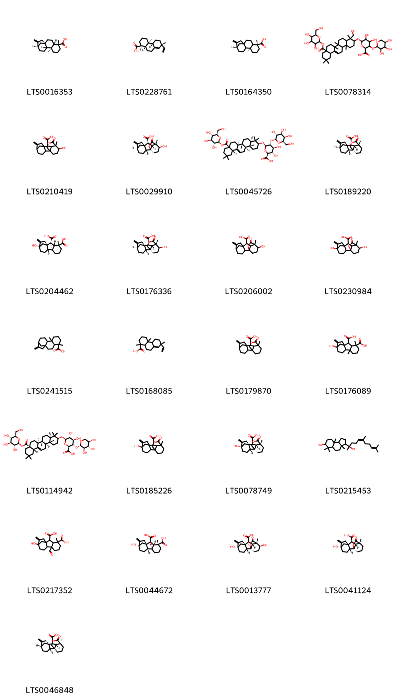{ width=100% }
    <figcaption>Hình ảnh cấu trúc hóa học của 25 hoạt chất thuộc nhóm Prenol lipids gồm ['ent-kaur-16-en-19-oic acid (LTS0016353)', '(1r,4as,4br,7r,10as)-7-ethenyl-1,4a,7-trimethyl-3,4,4b,5,6,9,10,10a-octahydro-2h-phenanthrene-1-carboxylic acid (LTS0228761)', '(5r,9s,13s)-5,9-dimethyl-14-methylidenetetracyclo[11.2.1.0¹,¹⁰.0⁴,⁹]hexadecane-5-carboxylic acid (LTS0164350)', '4,5-dihydroxy-6-{[4-(hydroxymethyl)-4,6a,6b,11,11,14b-hexamethyl-8a-({[3,4,5-trihydroxy-6-(hydroxymethyl)oxan-2-yl]oxy}carbonyl)-1,2,3,4a,5,6,7,8,9,10,12,12a,14,14a-tetradecahydropicen-3-yl]oxy}-3-[(3,4,5-trihydroxyoxan-2-yl)oxy]oxane-2-carboxylic acid (LTS0078314)', '17-hydroxy-11-methyl-6-methylidene-12-oxo-13-oxapentacyclo[9.3.3.1⁵,⁸.0¹,¹⁰.0²,⁸]octadecane-9-carboxylic acid (LTS0210419)', 'gibberellin a4 (LTS0029910)', '(2s,3s,4s,5r,6r)-6-{[(3s,4ar,6ar,6bs,8as,12as,14ar,14br)-4,4,6a,6b,11,11,14b-heptamethyl-8a-({[(2s,3r,4s,5s,6r)-3,4,5-trihydroxy-6-(hydroxymethyl)oxan-2-yl]oxy}carbonyl)-1,2,3,4a,5,6,7,8,9,10,12,12a,14,14a-tetradecahydropicen-3-yl]oxy}-3,4-dihydroxy-5-{[(2s,3r,4s,5r,6r)-3,4,5-trihydroxy-6-(hydroxymethyl)oxan-2-yl]oxy}oxane-2-carboxylic acid (LTS0045726)', '(1r,2r,5r,8r,9s,10s,11r)-11-methyl-6-methylidene-12-oxo-13-oxapentacyclo[9.3.3.1⁵,⁸.0¹,¹⁰.0²,⁸]octadecane-9-carboxylic acid (LTS0189220)', 'gibberellin a53 (LTS0204462)', 'gibberellin a37 (LTS0176336)', '12-hydroxy-11-methyl-6-methylidene-16-oxo-15-oxapentacyclo[9.3.2.1⁵,⁸.0¹,¹⁰.0²,⁸]heptadecane-9-carboxylic acid (LTS0206002)', '5,12-dihydroxy-11-methyl-6-methylidene-16-oxo-15-oxapentacyclo[9.3.2.1⁵,⁸.0¹,¹⁰.0²,⁸]heptadecane-9-carboxylic acid (LTS0230984)', '5,9-dimethyl-14-methylidenetetracyclo[11.2.1.0¹,¹⁰.0⁴,⁹]hexadecane-5-carboxylic acid (LTS0241515)', 'pimaric acid (LTS0168085)', '11-methyl-6-methylidene-12-oxo-13-oxapentacyclo[9.3.3.1⁵,⁸.0¹,¹⁰.0²,⁸]octadecane-9-carboxylic acid (LTS0179870)', '12-hydroxy-4,8-dimethyl-13-methylidenetetracyclo[10.2.1.0¹,⁹.0³,⁸]pentadecane-2,4-dicarboxylic acid (LTS0176089)', '(2s,3s,4r,5r,6r)-6-{[(3s,4ar,6ar,6bs,8as,12as,14ar,14br)-4,4,6a,6b,11,11,14b-heptamethyl-8a-({[(2s,3r,4s,5s,6r)-3,4,5-trihydroxy-6-(hydroxymethyl)oxan-2-yl]oxy}carbonyl)-1,2,3,4a,5,6,7,8,9,10,12,12a,14,14a-tetradecahydropicen-3-yl]oxy}-4,5-dihydroxy-3-{[(2s,3r,4s,5r)-3,4,5-trihydroxyoxan-2-yl]oxy}oxane-2-carboxylic acid (LTS0114942)', '5-hydroxy-11-methyl-6-methylidene-12-oxo-13-oxapentacyclo[9.3.3.1⁵,⁸.0¹,¹⁰.0²,⁸]octadecane-9-carboxylic acid (LTS0185226)', 'gibberellin a44 (LTS0078749)', '3-(2-hydroxy-6,10-dimethylundeca-5,9-dien-2-yl)-3a,6,6,9a-tetramethyl-decahydrocyclopenta[a]naphthalen-7-ol (LTS0215453)', '8-formyl-12-hydroxy-4-methyl-13-methylidenetetracyclo[10.2.1.0¹,⁹.0³,⁸]pentadecane-2,4-dicarboxylic acid (LTS0217352)', 'gibberellin a19 (LTS0044672)', 'gibberellin a1 (LTS0013777)', 'gibberellin a20 (LTS0041124)', '(1s,2r,5s,8s,9s,10s,11s)-11-methyl-6-methylidene-12-oxo-13-oxapentacyclo[9.3.3.1⁵,⁸.0¹,¹⁰.0²,⁸]octadecane-9-carboxylic acid (LTS0046848)'].</figcaption>
</figure>

---

### Dược dân tộc học

Danh sách các quốc gia có sử dụng *Aralia cordata* trong điều trị các bệnh. 

| Country   | Disease                | Bệnh                                                                                                                                                                                                |
|:----------|:-----------------------|:----------------------------------------------------------------------------------------------------------------------------------------------------------------------------------------------------|
| China     | Stimulant, Carminative | MYMEMORY WARNING: YOU USED ALL AVAILABLE FREE TRANSLATIONS FOR TODAY. NEXT AVAILABLE IN  16 HOURS 53 MINUTES 31 SECONDS VISIT HTTPS://MYMEMORY.TRANSLATED.NET/DOC/USAGELIMITS.PHP TO TRANSLATE MORE |
| Japan     | Stomachic, Tonic       | MYMEMORY WARNING: YOU USED ALL AVAILABLE FREE TRANSLATIONS FOR TODAY. NEXT AVAILABLE IN  16 HOURS 53 MINUTES 28 SECONDS VISIT HTTPS://MYMEMORY.TRANSLATED.NET/DOC/USAGELIMITS.PHP TO TRANSLATE MORE |
| Korea     | Tonic                  | MYMEMORY WARNING: YOU USED ALL AVAILABLE FREE TRANSLATIONS FOR TODAY. NEXT AVAILABLE IN  16 HOURS 53 MINUTES 26 SECONDS VISIT HTTPS://MYMEMORY.TRANSLATED.NET/DOC/USAGELIMITS.PHP TO TRANSLATE MORE |

---

---
## Aralia inosa
### Thông tin về thực vật

!!! info "Phân loại thực vật của *N/A* từ GIBF:"
    - **Kingdom:** Plantae
    - **Phylum:** Tracheophyta
    - **Order:** Apiales
    - **Family:** Araliaceae
    - **Genus:** Aralia
    - **Species:** *N/A*

 

| Label (VI)   | Label (EN)   | Scientific Name   | Descriptions (VI)   | Descriptions (EN)   | Also Known As (VI)   | Also Known As (EN)   |
|:-------------|:-------------|:------------------|:--------------------|:--------------------|:---------------------|:---------------------|
| N/A          | N/A          | Aralia cordata    |                     | species of plant    | ['']                 | ['']                 |

#### Phân bố trên thế giới

**Từ CSDL GIBF** Mexico, United States of America, Japan, Belgium, Chinese Taipei, Canada, Netherlands

#### Phân bố tại Việt Nam

**Từ CSDL GIBF**: Không có ghi nhận ở Việt Nam

---
### Thành phần hóa học
        
- Theo cơ sở dữ liệu lotus: Từ loài *N/A* đã phân lập và xác định được Chưa có hoạt chất nào được phân lập. hoạt chất thuộc về các nhóm Không có hoạt chất nào được phân lập. 

Không có hình ảnh nào được tạo ra

---

### Dược dân tộc học

Danh sách các quốc gia có sử dụng *N/A* trong điều trị các bệnh. 

| Country        | Disease                                 | Bệnh                                                                                                                                                                                                |
|:---------------|:----------------------------------------|:----------------------------------------------------------------------------------------------------------------------------------------------------------------------------------------------------|
| Elsewhere      | Diaphoretic, Stimulant                  | MYMEMORY WARNING: YOU USED ALL AVAILABLE FREE TRANSLATIONS FOR TODAY. NEXT AVAILABLE IN  16 HOURS 53 MINUTES 02 SECONDS VISIT HTTPS://MYMEMORY.TRANSLATED.NET/DOC/USAGELIMITS.PHP TO TRANSLATE MORE |
| US             | Collyrium, Poison, Stimulant, Sudorific | MYMEMORY WARNING: YOU USED ALL AVAILABLE FREE TRANSLATIONS FOR TODAY. NEXT AVAILABLE IN  16 HOURS 52 MINUTES 59 SECONDS VISIT HTTPS://MYMEMORY.TRANSLATED.NET/DOC/USAGELIMITS.PHP TO TRANSLATE MORE |
| US(Amerindian) | Suppurative                             | MYMEMORY WARNING: YOU USED ALL AVAILABLE FREE TRANSLATIONS FOR TODAY. NEXT AVAILABLE IN  16 HOURS 52 MINUTES 56 SECONDS VISIT HTTPS://MYMEMORY.TRANSLATED.NET/DOC/USAGELIMITS.PHP TO TRANSLATE MORE |

---

---
## Aralia nudicaulis
### Thông tin về thực vật

!!! info "Phân loại thực vật của *Aralia nudicaulis* từ GIBF:"
    - **Kingdom:** Plantae
    - **Phylum:** Tracheophyta
    - **Order:** Apiales
    - **Family:** Araliaceae
    - **Genus:** Aralia
    - **Species:** *Aralia nudicaulis*

 

| Label (VI)   | Label (EN)   | Scientific Name   | Descriptions (VI)   | Descriptions (EN)   | Also Known As (VI)   | Also Known As (EN)                                                                                           |
|:-------------|:-------------|:------------------|:--------------------|:--------------------|:---------------------|:-------------------------------------------------------------------------------------------------------------|
| N/A          | N/A          | Aralia nudicaulis | loài thực vật       | species of plant    | ['']                 | ['False sarsaparilla', 'Rabbit Root', 'Shot bush', 'Small Spikenard', 'Wild Liquorice', 'Wild Sarsaparilla'] |

#### Phân bố trên thế giới

**Từ CSDL GIBF** United States of America, Canada

#### Phân bố tại Việt Nam

**Từ CSDL GIBF**: Không có ghi nhận ở Việt Nam

---
### Thành phần hóa học
        
- Theo cơ sở dữ liệu lotus: Từ loài *Aralia nudicaulis* đã phân lập và xác định được 10 hoạt chất thuộc về các nhóm Prenol lipids, Steroids and steroid derivatives. 

|    | chemicalTaxonomyClassyfireClass   |   smiles_count |
|---:|:----------------------------------|---------------:|
|  0 | Prenol lipids                     |              5 |
|  1 | Steroids and steroid derivatives  |              5 |

#### Nhóm Prenol lipids
<figure markdown="span">
    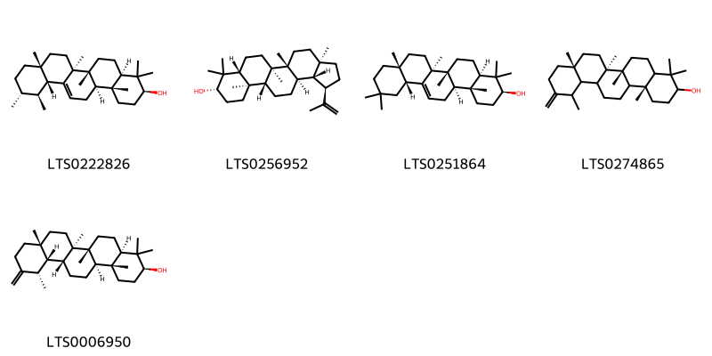{ width=100% }
    <figcaption>Hình ảnh cấu trúc hóa học của 5 hoạt chất thuộc nhóm Prenol lipids gồm ['amyrin (LTS0222826)', 'lupeol (LTS0256952)', 'β-amyrin (LTS0251864)', '(6ar,6br,8ar,14br)-4,4,6a,6b,8a,12,14b-heptamethyl-11-methylidene-hexadecahydropicen-3-ol (LTS0274865)', 'taraxasterol (LTS0006950)'].</figcaption>
</figure>
#### Nhóm Steroids and steroid derivatives
<figure markdown="span">
    { width=100% }
    <figcaption>Hình ảnh cấu trúc hóa học của 5 hoạt chất thuộc nhóm Steroids and steroid derivatives gồm ['stigmast-5-en-3-ol, (3β)- (LTS0204616)', 'stigmast-5-en-3-ol (LTS0071224)', 'phytosterol (LTS0029311)', '(1r,3as,3bs,7s,9bs)-1-[(2r,5r)-5,6-dimethylheptan-2-yl]-9a,11a-dimethyl-1h,2h,3h,3ah,3bh,4h,6h,7h,8h,9h,9bh,10h,11h-cyclopenta[a]phenanthren-7-ol (LTS0057877)', 'campesterol (LTS0046755)'].</figcaption>
</figure>

---

### Dược dân tộc học

Danh sách các quốc gia có sử dụng *Aralia nudicaulis* trong điều trị các bệnh. 

| Country        | Disease             | Bệnh                                                                                                                                                                                                |
|:---------------|:--------------------|:----------------------------------------------------------------------------------------------------------------------------------------------------------------------------------------------------|
| Turkey         | Narcotic, Sudorific | MYMEMORY WARNING: YOU USED ALL AVAILABLE FREE TRANSLATIONS FOR TODAY. NEXT AVAILABLE IN  16 HOURS 52 MINUTES 35 SECONDS VISIT HTTPS://MYMEMORY.TRANSLATED.NET/DOC/USAGELIMITS.PHP TO TRANSLATE MORE |
| US(Amerindian) | Refrigerant         | MYMEMORY WARNING: YOU USED ALL AVAILABLE FREE TRANSLATIONS FOR TODAY. NEXT AVAILABLE IN  16 HOURS 52 MINUTES 32 SECONDS VISIT HTTPS://MYMEMORY.TRANSLATED.NET/DOC/USAGELIMITS.PHP TO TRANSLATE MORE |
| US(Blackfoot)  | Cathartic, Tonic    | MYMEMORY WARNING: YOU USED ALL AVAILABLE FREE TRANSLATIONS FOR TODAY. NEXT AVAILABLE IN  16 HOURS 52 MINUTES 30 SECONDS VISIT HTTPS://MYMEMORY.TRANSLATED.NET/DOC/USAGELIMITS.PHP TO TRANSLATE MORE |

---

---
## Aralia racemosa
### Thông tin về thực vật

!!! info "Phân loại thực vật của *Aralia racemosa* từ GIBF:"
    - **Kingdom:** Plantae
    - **Phylum:** Tracheophyta
    - **Order:** Apiales
    - **Family:** Araliaceae
    - **Genus:** Aralia
    - **Species:** *Aralia racemosa*

 

| Label (VI)   | Label (EN)   | Scientific Name   | Descriptions (VI)   | Descriptions (EN)   | Also Known As (VI)   | Also Known As (EN)   |
|:-------------|:-------------|:------------------|:--------------------|:--------------------|:---------------------|:---------------------|
| N/A          | N/A          | Aralia racemosa   | loài thực vật       | species of plant    | ['']                 | ['']                 |

#### Phân bố trên thế giới

**Từ CSDL GIBF** United States of America, Canada

#### Phân bố tại Việt Nam

**Từ CSDL GIBF**: Không có ghi nhận ở Việt Nam

---
### Thành phần hóa học
        
- Theo cơ sở dữ liệu lotus: Từ loài *Aralia racemosa* đã phân lập và xác định được 2 hoạt chất thuộc về các nhóm Prenol lipids. 

|    | chemicalTaxonomyClassyfireClass   |   smiles_count |
|---:|:----------------------------------|---------------:|
|  0 | Prenol lipids                     |              2 |

#### Nhóm Prenol lipids
<figure markdown="span">
    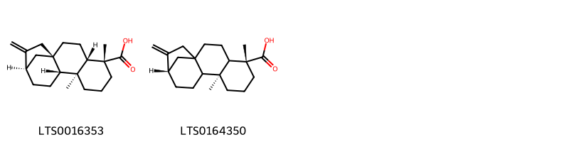{ width=100% }
    <figcaption>Hình ảnh cấu trúc hóa học của 2 hoạt chất thuộc nhóm Prenol lipids gồm ['ent-kaur-16-en-19-oic acid (LTS0016353)', '(5r,9s,13s)-5,9-dimethyl-14-methylidenetetracyclo[11.2.1.0¹,¹⁰.0⁴,⁹]hexadecane-5-carboxylic acid (LTS0164350)'].</figcaption>
</figure>

---

### Dược dân tộc học

Danh sách các quốc gia có sử dụng *Aralia racemosa* trong điều trị các bệnh. 

| Country        | Disease                 | Bệnh                                                                                                                                                                                                |
|:---------------|:------------------------|:----------------------------------------------------------------------------------------------------------------------------------------------------------------------------------------------------|
| Elsewhere      | Purgative, Diaphoretic  | MYMEMORY WARNING: YOU USED ALL AVAILABLE FREE TRANSLATIONS FOR TODAY. NEXT AVAILABLE IN  16 HOURS 51 MINUTES 58 SECONDS VISIT HTTPS://MYMEMORY.TRANSLATED.NET/DOC/USAGELIMITS.PHP TO TRANSLATE MORE |
| Mexico         | Diaphoretic, Stimulant  | MYMEMORY WARNING: YOU USED ALL AVAILABLE FREE TRANSLATIONS FOR TODAY. NEXT AVAILABLE IN  16 HOURS 51 MINUTES 55 SECONDS VISIT HTTPS://MYMEMORY.TRANSLATED.NET/DOC/USAGELIMITS.PHP TO TRANSLATE MORE |
| Turkey         | Diuretic, Sudorific     | MYMEMORY WARNING: YOU USED ALL AVAILABLE FREE TRANSLATIONS FOR TODAY. NEXT AVAILABLE IN  16 HOURS 51 MINUTES 53 SECONDS VISIT HTTPS://MYMEMORY.TRANSLATED.NET/DOC/USAGELIMITS.PHP TO TRANSLATE MORE |
| US(Amerindian) | Poultice                | MYMEMORY WARNING: YOU USED ALL AVAILABLE FREE TRANSLATIONS FOR TODAY. NEXT AVAILABLE IN  16 HOURS 51 MINUTES 50 SECONDS VISIT HTTPS://MYMEMORY.TRANSLATED.NET/DOC/USAGELIMITS.PHP TO TRANSLATE MORE |
| US(Appalachia) | Antiseptic, Carminative | MYMEMORY WARNING: YOU USED ALL AVAILABLE FREE TRANSLATIONS FOR TODAY. NEXT AVAILABLE IN  16 HOURS 51 MINUTES 48 SECONDS VISIT HTTPS://MYMEMORY.TRANSLATED.NET/DOC/USAGELIMITS.PHP TO TRANSLATE MORE |

---

# Chi Panax

??? note "Danh sách các dược liệu thuộc chi"
    
	 - *Panax bipinnatifidum*
	 - *Panax ginseng*
	 - *Panax japonicum*
	 - *Panax major*
	 - *Panax pseudoginseng*
	 - *Panax quinquefolia*
	 - *Panax quinquefolium*
	 - *Panax quinquefolius*
	 - *Panax repens*
	 - *Panax schinseng*

---
## Panax bipinnatifidum
### Thông tin về thực vật

!!! info "Phân loại thực vật của *Panax bipinnatifidus* từ GIBF:"
    - **Kingdom:** Plantae
    - **Phylum:** Tracheophyta
    - **Order:** Apiales
    - **Family:** Araliaceae
    - **Genus:** Panax
    - **Species:** *Panax bipinnatifidus*

 

| Label (VI)   | Label (EN)   | Scientific Name   | Descriptions (VI)   | Descriptions (EN)   | Also Known As (VI)   | Also Known As (EN)   |
|:-------------|:-------------|:------------------|:--------------------|:--------------------|:---------------------|:---------------------|
| N/A          | N/A          | Aralia racemosa   | loài thực vật       | species of plant    | ['']                 | ['']                 |

#### Phân bố trên thế giới

**Từ CSDL GIBF** Viet Nam, Nepal, China

#### Phân bố tại Việt Nam

**Từ CSDL GIBF**: Lai Chau

---
### Thành phần hóa học
        
- Theo cơ sở dữ liệu lotus: Từ loài *Panax bipinnatifidus* đã phân lập và xác định được Chưa có hoạt chất nào được phân lập. hoạt chất thuộc về các nhóm Không có hoạt chất nào được phân lập. 

Không có hình ảnh nào được tạo ra

---

### Dược dân tộc học

Danh sách các quốc gia có sử dụng *Panax bipinnatifidus* trong điều trị các bệnh. 

| Country   | Disease   | Bệnh                                                                                                                                                                                                |
|:----------|:----------|:----------------------------------------------------------------------------------------------------------------------------------------------------------------------------------------------------|
| China     | Tonic     | MYMEMORY WARNING: YOU USED ALL AVAILABLE FREE TRANSLATIONS FOR TODAY. NEXT AVAILABLE IN  16 HOURS 51 MINUTES 22 SECONDS VISIT HTTPS://MYMEMORY.TRANSLATED.NET/DOC/USAGELIMITS.PHP TO TRANSLATE MORE |

---

---
## Panax ginseng
### Thông tin về thực vật

!!! info "Phân loại thực vật của *Panax ginseng* từ GIBF:"
    - **Kingdom:** Plantae
    - **Phylum:** Tracheophyta
    - **Order:** Apiales
    - **Family:** Araliaceae
    - **Genus:** Panax
    - **Species:** *Panax ginseng*

 

| Label (VI)   | Label (EN)   | Scientific Name   | Descriptions (VI)   | Descriptions (EN)   | Also Known As (VI)   | Also Known As (EN)   |
|:-------------|:-------------|:------------------|:--------------------|:--------------------|:---------------------|:---------------------|
| N/A          | N/A          | Panax ginseng     |                     | species of plant    | ['Panax ginseng']    | ['Korean ginseng']   |

#### Phân bố trên thế giới

**Từ CSDL GIBF** nan, Hong Kong, Benin, United States of America, Norway, Korea, Republic of, Japan, Philippines, China, Russian Federation, New Zealand, Nigeria, India, Colombia, Croatia, Korea (Democratic People’s Republic of), United Kingdom of Great Britain and Northern Ireland

#### Phân bố tại Việt Nam

**Từ CSDL GIBF**: Không có ghi nhận ở Việt Nam

---
### Thành phần hóa học
        
- Theo cơ sở dữ liệu lotus: Từ loài *Panax ginseng* đã phân lập và xác định được 574 hoạt chất thuộc về các nhóm Fatty Acyls, Unsaturated hydrocarbons, Carboxylic acids and derivatives, Phenols, Imidazopyrimidines, Organooxygen compounds, Halohydrins, Diazines, Keto acids and derivatives, Benzene and substituted derivatives, Purine nucleosides, Cinnamic acids and derivatives, Steroids and steroid derivatives, Pyridines and derivatives, Glycerolipids, Hydroxy acids and derivatives, Azoles, Saturated hydrocarbons, Harmala alkaloids, Organonitrogen compounds, Heteroaromatic compounds, Flavonoids, Pyrans, Pyrimidine nucleosides, Prenol lipids, Epoxides, Indoles and derivatives. 

|    | chemicalTaxonomyClassyfireClass     |   smiles_count |
|---:|:------------------------------------|---------------:|
|  0 |                                     |              1 |
|  1 | Azoles                              |              1 |
|  2 | Benzene and substituted derivatives |             11 |
|  3 | Carboxylic acids and derivatives    |             54 |
|  4 | Cinnamic acids and derivatives      |              4 |
|  5 | Diazines                            |             11 |
|  6 | Epoxides                            |              5 |
|  7 | Fatty Acyls                         |             55 |
|  8 | Flavonoids                          |              4 |
|  9 | Glycerolipids                       |              1 |
| 10 | Halohydrins                         |              7 |
| 11 | Harmala alkaloids                   |              4 |
| 12 | Heteroaromatic compounds            |              3 |
| 13 | Hydroxy acids and derivatives       |              4 |
| 14 | Imidazopyrimidines                  |              3 |
| 15 | Indoles and derivatives             |              4 |
| 16 | Keto acids and derivatives          |              1 |
| 17 | Organonitrogen compounds            |              1 |
| 18 | Organooxygen compounds              |             60 |
| 19 | Phenols                             |              3 |
| 20 | Prenol lipids                       |            290 |
| 21 | Purine nucleosides                  |              1 |
| 22 | Pyrans                              |              1 |
| 23 | Pyridines and derivatives           |              3 |
| 24 | Pyrimidine nucleosides              |              1 |
| 25 | Saturated hydrocarbons              |              2 |
| 26 | Steroids and steroid derivatives    |             33 |
| 27 | Unsaturated hydrocarbons            |              2 |

#### Nhóm 
<figure markdown="span">
    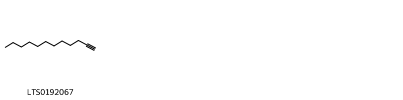{ width=100% }
    <figcaption>Hình ảnh cấu trúc hóa học của 1 hoạt chất thuộc nhóm  gồm ['1-dodecyne (LTS0192067)'].</figcaption>
</figure>
#### Nhóm Azoles
<figure markdown="span">
    { width=100% }
    <figcaption>Hình ảnh cấu trúc hóa học của 1 hoạt chất thuộc nhóm Azoles gồm ['4-methyl-5-thiazoleethanol (LTS0230386)'].</figcaption>
</figure>
#### Nhóm Benzene and substituted derivatives
<figure markdown="span">
    { width=100% }
    <figcaption>Hình ảnh cấu trúc hóa học của 11 hoạt chất thuộc nhóm Benzene and substituted derivatives gồm ['1-(3-benzoylphenyl)ethyl 3,4,5-trihydroxy-6-(hydroxymethyl)oxan-2-yl carbonate (LTS0064093)', '(2r,3s,4r,5r,6s)-4,5-dihydroxy-6-(hydroxymethyl)-3-{[(2s,3r,4s,5s,6r)-3,4,5-trihydroxy-6-(hydroxymethyl)oxan-2-yl]oxy}oxan-2-yl (2s)-2-(3-benzoylphenyl)propanoate (LTS0054097)', '(1s)-1-(3-benzoylphenyl)ethyl (2r,3s,4r,5r,6s)-3,4,5-trihydroxy-6-(hydroxymethyl)oxan-2-yl carbonate (LTS0126773)', 'n-{4-hydroxy-5-[(5-methylfuran-2-yl)methyl]-5h-1,3-thiazol-2-ylidene}-4-methylbenzenesulfonamide (LTS0143771)', '4,5-dihydroxy-6-(hydroxymethyl)-3-{[3,4,5-trihydroxy-6-(hydroxymethyl)oxan-2-yl]oxy}oxan-2-yl 2-(3-benzoylphenyl)propanoate (LTS0180081)', 'p-cumylphenol (LTS0182943)', '3,4,5-trihydroxy-6-(hydroxymethyl)oxan-2-yl 2-(3-benzoylphenyl)propanoate (LTS0061754)', 'p-hydroxybenzoic acid (LTS0263634)', '(2r,3s,4r,5r,6s)-3,4,5-trihydroxy-6-(hydroxymethyl)oxan-2-yl (2s)-2-(3-benzoylphenyl)propanoate (LTS0059644)', 'vanillic acid (LTS0229113)', 'salicyclic acid (LTS0116548)'].</figcaption>
</figure>
#### Nhóm Carboxylic acids and derivatives
<figure markdown="span">
    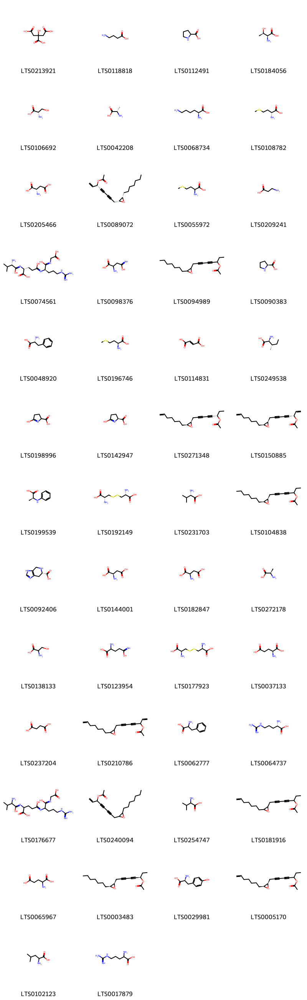{ width=100% }
    <figcaption>Hình ảnh cấu trúc hóa học của 54 hoạt chất thuộc nhóm Carboxylic acids and derivatives gồm ['citric acid (LTS0213921)', 'gamma(amino)-butyric acid (LTS0118818)', 'proline (LTS0112491)', 'l-threonine (LTS0184056)', 'l-serine (LTS0106692)', 'l-alanine (LTS0042208)', 'l-lysine (LTS0068734)', 'd-methionine (LTS0108782)', 'l-aspartic acid (LTS0205466)', '(3s)-8-[(2r,3s)-3-heptyloxiran-2-yl]oct-1-en-4,6-diyn-3-yl acetate (LTS0089072)', 'methionin (LTS0055972)', 'β alanine (LTS0209241)', '(2r)-2-{[(2s)-2-amino-1-hydroxy-3-methylbutylidene]amino}-4-{[(1r)-4-carbamimidamido-1-(carboxymethyl-c-hydroxycarbonimidoyl)butyl]-c-hydroxycarbonimidoyl}butanoic acid (LTS0074561)', 'asparagine (LTS0098376)', '8-(3-heptyloxiran-2-yl)octa-4,6-diyn-3-yl acetate (LTS0094989)', 'l-proline (LTS0090383)', 'd-phenylalanine (LTS0048920)', 'l-methionine (LTS0196746)', 'fumaric acid (LTS0114831)', 'l-isoleucine (LTS0249538)', 'pyroglutamic acid (LTS0198996)', 'pyroglutamic acid (LTS0142947)', '(3s)-8-[(2r,3s)-3-(hept-6-en-1-yl)oxiran-2-yl]octa-4,6-diyn-3-yl acetate (LTS0271348)', '(3s)-8-[(2r,3s)-3-(hept-6-en-1-yl)oxiran-2-yl]oct-1-en-4,6-diyn-3-yl acetate (LTS0150885)', '(2s)-2-(phenylamino)propanoic acid (LTS0199539)', 'l-cystine (LTS0192149)', 'l-valine (LTS0231703)', '8-[(2r,3s)-3-heptyloxiran-2-yl]octa-4,6-diyn-3-yl acetate (LTS0104838)', 'spinacine (LTS0092406)', 'd-aspartic acid (LTS0144001)', 'aspartic acid (LTS0182847)', 'd-alanine (LTS0272178)', 'serin (LTS0138133)', 'glutamine (LTS0123954)', 'd-cystine (LTS0177923)', 'l-glutamic acid (LTS0037133)', 'succinic acid (LTS0237204)', '8-[3-(hept-6-en-1-yl)oxiran-2-yl]oct-1-en-4,6-diyn-3-yl acetate (LTS0210786)', 'phenylalanin (LTS0062777)', 'l-arginine (LTS0064737)', '2-[(2-amino-1-hydroxy-3-methylbutylidene)amino]-4-{[4-carbamimidamido-1-(carboxymethyl-c-hydroxycarbonimidoyl)butyl]-c-hydroxycarbonimidoyl}butanoic acid (LTS0176677)', '8-(3-heptyloxiran-2-yl)oct-1-en-4,6-diyn-3-yl acetate (LTS0240094)', 'valin (LTS0254747)', '8-[3-(hept-6-en-1-yl)oxiran-2-yl]octa-4,6-diyn-3-yl acetate (LTS0181916)', 'glutaminsaeure (LTS0065967)', '(3r)-8-[(2r,3s)-3-heptyloxiran-2-yl]octa-4,6-diyn-3-yl acetate (LTS0003483)', 'l-tyrosine (LTS0029981)', '8-[(2r,3s)-3-(hept-6-en-1-yl)oxiran-2-yl]octa-4,6-diyn-3-yl acetate (LTS0005170)', 'leucine (LTS0102123)', 'arginine (LTS0017879)', '8-[(2r,3s)-3-(hept-6-en-1-yl)oxiran-2-yl]oct-1-en-4,6-diyn-3-yl acetate (LTS0043990)', 'l-leucine (LTS0113423)', 'l-histidine (LTS0094081)', 'alanine (LTS0117512)'].</figcaption>
</figure>
#### Nhóm Cinnamic acids and derivatives
<figure markdown="span">
    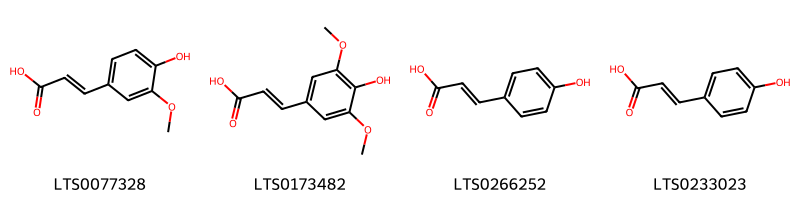{ width=100% }
    <figcaption>Hình ảnh cấu trúc hóa học của 4 hoạt chất thuộc nhóm Cinnamic acids and derivatives gồm ['ferulic acid (LTS0077328)', 'sinapinate (LTS0173482)', 'para-coumaric acid (LTS0266252)', 'hydroxycinnamic acid (LTS0233023)'].</figcaption>
</figure>
#### Nhóm Diazines
<figure markdown="span">
    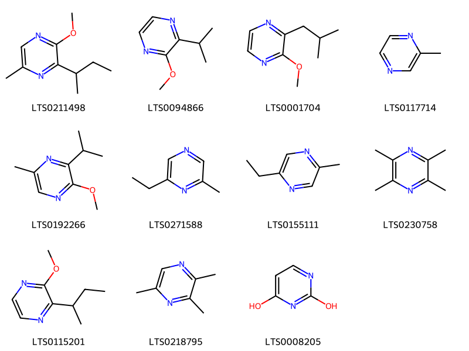{ width=100% }
    <figcaption>Hình ảnh cấu trúc hóa học của 11 hoạt chất thuộc nhóm Diazines gồm ['2-methoxy-5-methyl-3-(sec-butyl)pyrazine (LTS0211498)', '2-methoxy-3-isopropylpyrazine (LTS0094866)', 'isobutyl-methoxypyrazine (LTS0001704)', '2-methylpyrazine (LTS0117714)', '3-isopropyl-2-methoxy-5-methylpyrazine (LTS0192266)', '2-ethyl-6-methylpyrazine (LTS0271588)', '2-ethyl-5-methylpyrazine (LTS0155111)', 'ligustrazine (LTS0230758)', '3-tert-butyl-2-methoxypyrazine (LTS0115201)', 'trimethylpyrazine (LTS0218795)', 'pirod (LTS0008205)'].</figcaption>
</figure>
#### Nhóm Epoxides
<figure markdown="span">
    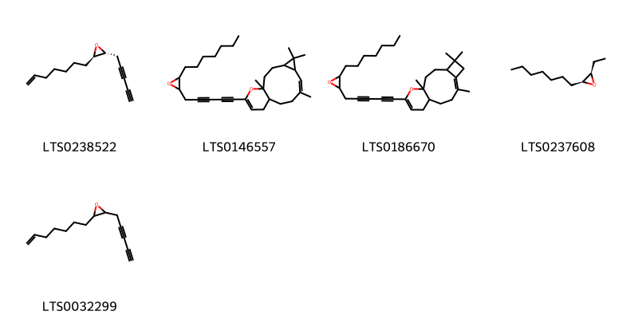{ width=100% }
    <figcaption>Hình ảnh cấu trúc hóa học của 5 hoạt chất thuộc nhóm Epoxides gồm ['(2r,3r)-2-(hept-6-en-1-yl)-3-(penta-2,4-diyn-1-yl)oxirane (LTS0238522)', '(7z)-14-[5-(3-heptyloxiran-2-yl)penta-1,3-diyn-1-yl]-1,5,5,8-tetramethyl-15-oxatricyclo[9.4.0.0⁴,⁶]pentadeca-7,13-diene (LTS0146557)', '(7z)-14-[5-(3-heptyloxiran-2-yl)penta-1,3-diyn-1-yl]-1,5,5,8-tetramethyl-15-oxatricyclo[9.4.0.0⁴,⁷]pentadeca-7,13-diene (LTS0186670)', '(2r,3s)-2-ethyl-3-heptyloxirane (LTS0237608)', '2-(hept-6-en-1-yl)-3-(penta-2,4-diyn-1-yl)oxirane (LTS0032299)'].</figcaption>
</figure>
#### Nhóm Fatty Acyls
<figure markdown="span">
    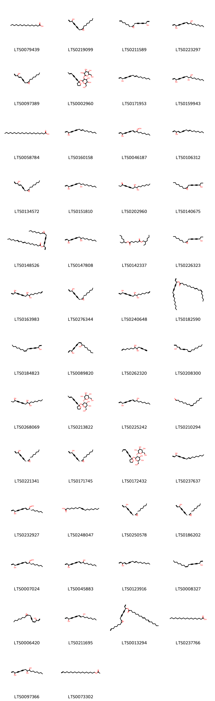{ width=100% }
    <figcaption>Hình ảnh cấu trúc hóa học của 55 hoạt chất thuộc nhóm Fatty Acyls gồm ['palmitic acid (LTS0079439)', 'panaxydol (LTS0219099)', '(3s)-8-[(2r,3s)-3-(hept-6-en-1-yl)oxiran-2-yl]oct-1-en-4,6-diyn-3-ol (LTS0211589)', '(3s,10s)-panaxydiol (LTS0223297)', '8-(3-heptyloxiran-2-yl)octa-1,4-dien-6-yn-3-ol (LTS0097389)', '2-[(2-{[2-(hept-5-en-1,3-diyn-1-yl)oxolan-2-yl]oxy}-4,5-dihydroxy-6-(hydroxymethyl)oxan-3-yl)oxy]-6-(hydroxymethyl)oxane-3,4,5-triol (LTS0002960)', '(3r)-heptadeca-1,9-dien-4,6-diyn-3-ol (LTS0171953)', '(3s,9r,10s)-heptadec-1-en-4,6-diyne-3,9,10-triol (LTS0159943)', 'behenic acid (LTS0058784)', 'heptadeca-1,9-dien-4,6-diyn-3-ol (LTS0160158)', '10-hydroperoxyheptadeca-1,8-dien-4,6-diyn-3-ol (LTS0046187)', 'heptadeca-1,4,9-trien-6-yn-3-ol (LTS0106312)', '(3r,4e)-8-[(2s,3r)-3-heptyloxiran-2-yl]octa-1,4-dien-6-yn-3-ol (LTS0134572)', '(3s,9s)-heptadec-1-en-4,6-diyne-3,9-diol (LTS0151810)', '(9r,10r)-9,10-dihydroxyheptadeca-4,6-diyn-3-one (LTS0202960)', '8-(3-heptyloxiran-2-yl)octa-4,6-diyn-3-ol (LTS0140675)', '8-(3-heptyloxiran-2-yl)oct-1-en-4,6-diyn-3-yl (9e,12e)-octadeca-9,12-dienoate (LTS0148526)', 'heptadec-1-en-4,6-diyne-3,9-diol (LTS0147808)', 'beha (LTS0142337)', '(3s)-8-[(2r,3s)-3-heptyloxiran-2-yl]octa-4,6-diyn-3-ol (LTS0226323)', 'heptadeca-1,16-dien-4,6-diyne-3,9,10-triol (LTS0163983)', '(3r)-8-[(2s,3r)-3-heptyloxiran-2-yl]oct-1-en-4,6-diyn-3-ol (LTS0276344)', '(3s,9r,10r)-gensenoyne c (LTS0240648)', '(9e)-heptadeca-1,9-dien-4,6-diyn-3-yl (9e,12z)-octadeca-9,12-dienoate (LTS0182590)', 'falcarinol (LTS0184823)', 'seselidiol (LTS0089820)', 'tetradec-13-en-1,3-diyne-6,7-diol (LTS0262320)', '(3r,4e,9z)-heptadeca-1,4,9-trien-6-yn-3-ol (LTS0208300)', 'heptadeca-4,6-diyne-3,9,10-triol (LTS0268069)', '(2s,3r,4s,5s,6r)-2-{[(2s,3r,4s,5s,6r)-2-{[(2r)-2-[(5e)-hept-5-en-1,3-diyn-1-yl]oxolan-2-yl]oxy}-4,5-dihydroxy-6-(hydroxymethyl)oxan-3-yl]oxy}-6-(hydroxymethyl)oxane-3,4,5-triol (LTS0213822)', '(3r,8e,10s)-heptadeca-1,8-dien-4,6-diyne-3,10-diol (LTS0225242)', '(9z)-9-hexadecenal (LTS0210294)', '8-[(2r,3s)-3-heptyloxiran-2-yl]oct-1-en-4,6-diyn-3-ol (LTS0221341)', '(3s)-8-[(2r,3r)-3-heptyloxiran-2-yl]oct-1-en-4,6-diyn-3-ol (LTS0171745)', '(2s,3r,4s,5s,6r)-2-{[(2s,3r,4s,5s,6r)-2-{[(2r)-2-[(5z)-hept-5-en-1,3-diyn-1-yl]oxolan-2-yl]oxy}-4,5-dihydroxy-6-(hydroxymethyl)oxan-3-yl]oxy}-6-(hydroxymethyl)oxane-3,4,5-triol (LTS0172432)', '(z)-falcarinol (LTS0237637)', '(3s,8e,10r)-10-hydroperoxyheptadeca-1,8-dien-4,6-diyn-3-ol (LTS0232927)', 'stearolic acid (LTS0248047)', '(3s)-8-[(2r,3s)-3-heptyloxiran-2-yl]oct-1-en-4,6-diyn-3-ol (LTS0250578)', 'panaxydol (LTS0186202)', '(3r,8e,10s)-10-hydroperoxyheptadeca-1,8-dien-4,6-diyn-3-ol (LTS0007024)', 'heptadeca-1,8-dien-4,6-diyne-3,10-diol (LTS0045883)', '(4e,9e)-heptadeca-1,4,9-trien-6-yn-3-ol (LTS0123916)', 'falcarinol (LTS0008327)', '(4z)-8-(3-heptyloxiran-2-yl)octa-1,4-dien-6-yn-3-ol (LTS0006420)', '(3s,8e,10r)-heptadeca-1,8-dien-4,6-diyne-3,10-diol (LTS0211695)', '8-[3-(hept-6-en-1-yl)oxiran-2-yl]oct-1-en-4,6-diyn-3-yl (9e,12e)-octadeca-9,12-dienoate (LTS0013294)', 'stearic acid (LTS0237766)', 'panaxytriol (LTS0097366)', 'octadec-17-en-1-yl acetate (LTS0073302)', '9,10-dihydroxyheptadeca-4,6-diyn-3-one (LTS0040764)', '(3r)-8-[(2r,3r)-3-heptyloxiran-2-yl]oct-1-en-4,6-diyn-3-ol (LTS0032413)', '8-[3-(hept-6-en-1-yl)oxiran-2-yl]oct-1-en-4,6-diyn-3-ol (LTS0026553)', '(3s,9r,10r)-panaxytriol (LTS0051469)', '(9r,10s)-9,10-dihydroxyheptadeca-4,6-diyn-3-one (LTS0121506)'].</figcaption>
</figure>
#### Nhóm Flavonoids
<figure markdown="span">
    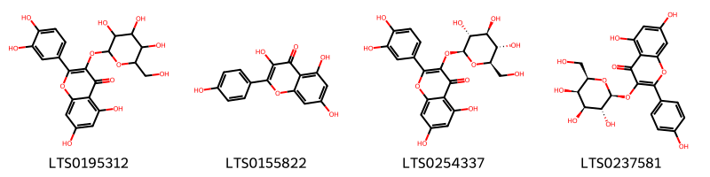{ width=100% }
    <figcaption>Hình ảnh cấu trúc hóa học của 4 hoạt chất thuộc nhóm Flavonoids gồm ['2-(3,4-dihydroxyphenyl)-5,7-dihydroxy-3-{[3,4,5-trihydroxy-6-(hydroxymethyl)oxan-2-yl]oxy}chromen-4-one (LTS0195312)', 'kaempherol (LTS0155822)', 'isoquercetin (LTS0254337)', 'trifolin (LTS0237581)'].</figcaption>
</figure>
#### Nhóm Glycerolipids
<figure markdown="span">
    { width=100% }
    <figcaption>Hình ảnh cấu trúc hóa học của 1 hoạt chất thuộc nhóm Glycerolipids gồm ['linolein (LTS0183869)'].</figcaption>
</figure>
#### Nhóm Halohydrins
<figure markdown="span">
    { width=100% }
    <figcaption>Hình ảnh cấu trúc hóa học của 7 hoạt chất thuộc nhóm Halohydrins gồm ['(2s,3s)-1-chloro-8-[(2s,3r)-3-heptyloxiran-2-yl]octa-4,6-diyne-2,3-diol (LTS0223073)', 'panaxydol chlorohydrine (LTS0194486)', '(3s,9r,10r)-10-chloroheptadeca-1,16-dien-4,6-diyne-3,9-diol (LTS0135850)', '(2s,3r)-1-chloro-8-[(2r,3s)-3-heptyloxiran-2-yl]octa-4,6-diyne-2,3-diol (LTS0169859)', '1-chloro-8-(3-heptyloxiran-2-yl)octa-4,6-diyne-2,3-diol (LTS0215680)', '(3s,9r,10s)-10-chloroheptadec-1-en-4,6-diyne-3,9-diol (LTS0235339)', '10-chloroheptadeca-1,16-dien-4,6-diyne-3,9-diol (LTS0041344)'].</figcaption>
</figure>
#### Nhóm Harmala alkaloids
<figure markdown="span">
    { width=100% }
    <figcaption>Hình ảnh cấu trúc hóa học của 4 hoạt chất thuộc nhóm Harmala alkaloids gồm ['methyl 9h-pyrido[3,4-b]indole-1-carboxylate (LTS0143229)', 'harmane (LTS0068205)', '1-methyl-3h,4h,9h-pyrido[3,4-b]indole (LTS0027115)', 'ethyl 9h-pyrido[3,4-b]indole-1-carboxylate (LTS0117358)'].</figcaption>
</figure>
#### Nhóm Heteroaromatic compounds
<figure markdown="span">
    { width=100% }
    <figcaption>Hình ảnh cấu trúc hóa học của 3 hoạt chất thuộc nhóm Heteroaromatic compounds gồm ['furfuryl alcohol (LTS0110403)', '3-hydroxymethylfuran (LTS0177881)', 'silvan (LTS0020613)'].</figcaption>
</figure>
#### Nhóm Hydroxy acids and derivatives
<figure markdown="span">
    { width=100% }
    <figcaption>Hình ảnh cấu trúc hóa học của 4 hoạt chất thuộc nhóm Hydroxy acids and derivatives gồm ['(+)-tropic acid (LTS0199654)', '(+-)-tropic acid (LTS0115968)', 'lactic acid (LTS0131933)', 'malic acid (LTS0216520)'].</figcaption>
</figure>
#### Nhóm Imidazopyrimidines
<figure markdown="span">
    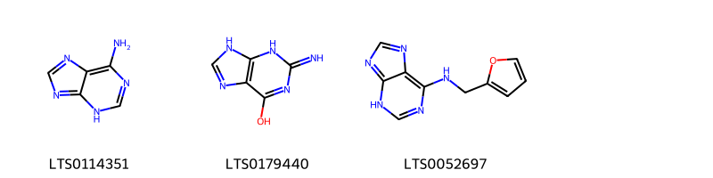{ width=100% }
    <figcaption>Hình ảnh cấu trúc hóa học của 3 hoạt chất thuộc nhóm Imidazopyrimidines gồm ['leucon (LTS0114351)', 'stella polaris (LTS0179440)', '6 furfuryladenine (LTS0052697)'].</figcaption>
</figure>
#### Nhóm Indoles and derivatives
<figure markdown="span">
    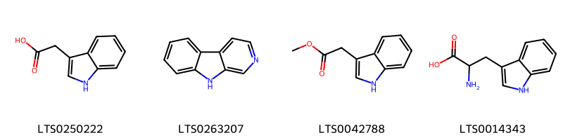{ width=100% }
    <figcaption>Hình ảnh cấu trúc hóa học của 4 hoạt chất thuộc nhóm Indoles and derivatives gồm ['β-indole-3-acetic acid (LTS0250222)', 'β-carboline (LTS0263207)', 'methyl indole-3-acetate (LTS0042788)', 'optimax (LTS0014343)'].</figcaption>
</figure>
#### Nhóm Keto acids and derivatives
<figure markdown="span">
    { width=100% }
    <figcaption>Hình ảnh cấu trúc hóa học của 1 hoạt chất thuộc nhóm Keto acids and derivatives gồm ['pyruvic acid (LTS0207290)'].</figcaption>
</figure>
#### Nhóm Organonitrogen compounds
<figure markdown="span">
    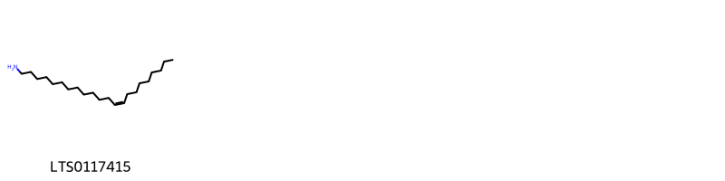{ width=100% }
    <figcaption>Hình ảnh cấu trúc hóa học của 1 hoạt chất thuộc nhóm Organonitrogen compounds gồm ['(13z)-docos-13-en-1-amine (LTS0117415)'].</figcaption>
</figure>
#### Nhóm Organooxygen compounds
<figure markdown="span">
    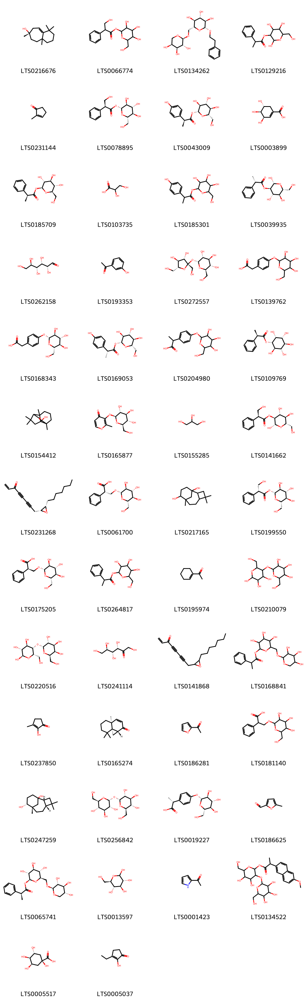{ width=100% }
    <figcaption>Hình ảnh cấu trúc hóa học của 60 hoạt chất thuộc nhóm Organooxygen compounds gồm ['(7s)-1,1,4a,7-tetramethyl-2,3,4,5,6,8-hexahydrobenzo[7]annulen-7-ol (LTS0216676)', '3,4,5-trihydroxy-6-(hydroxymethyl)oxan-2-yl 3-hydroxy-2-phenylpropanoate (LTS0066774)', '(2r,3r,4s,5s,6r)-2-(2-phenylethoxy)-6-({[(2s,3r,4s,5s)-3,4,5-trihydroxyoxan-2-yl]oxy}methyl)oxane-3,4,5-triol (LTS0134262)', '2,4,5-trihydroxy-6-(hydroxymethyl)oxan-3-yl 2-phenylpropanoate (LTS0129216)', '2-cyclopenten-1-one, 2-methyl- (LTS0231144)', '(2r,3s,4r,5r,6s)-3,4,5-trihydroxy-6-(hydroxymethyl)oxan-2-yl (2s)-3-hydroxy-2-phenylpropanoate (LTS0078895)', '(2r,3s,4r,5r,6s)-3,4,5-trihydroxy-6-(hydroxymethyl)oxan-2-yl (2s)-2-(4-hydroxyphenyl)propanoate (LTS0043009)', '(-)-shikimate (LTS0003899)', '(2s,3r,4s,5s,6r)-3,4,5-trihydroxy-6-(hydroxymethyl)oxan-2-yl (2s)-2-phenylpropanoate (LTS0185709)', 'glyceric acid (LTS0103735)', '3,4,5-trihydroxy-6-(hydroxymethyl)oxan-2-yl 2-(4-hydroxyphenyl)propanoate (LTS0185301)', '(2r,3r,4s,5s,6r)-2,4,5-trihydroxy-6-(hydroxymethyl)oxan-3-yl (2s)-2-phenylpropanoate (LTS0039935)', '(+)-glucose (LTS0262158)', '3-hydroxyacetophenone (LTS0193353)', 'sucrose (LTS0272557)', '(4-{[3,4,5-trihydroxy-6-(hydroxymethyl)oxan-2-yl]oxy}phenyl)acetic acid (LTS0139762)', '(4-{[(2r,3s,4r,5r,6s)-3,4,5-trihydroxy-6-(hydroxymethyl)oxan-2-yl]oxy}phenyl)acetic acid (LTS0168343)', '(2r,3s,4r,5r,6s)-3,4,5-trihydroxy-6-(hydroxymethyl)oxan-2-yl (2r)-2-(4-hydroxyphenyl)propanoate (LTS0169053)', '2-(4-{[3,4,5-trihydroxy-6-(hydroxymethyl)oxan-2-yl]oxy}phenyl)propanoic acid (LTS0204980)', '(1s,2r,3r,4s,5s,6r)-2,3,4,5,6-pentahydroxycyclohexyl (2r)-2-phenylpropanoate (LTS0109769)', '1,5,5,8-tetramethyltricyclo[5.4.0.0⁴,⁸]undecan-7-ol (LTS0154412)', '2-methyl-3-{[(2s,3r,4s,5s,6r)-3,4,5-trihydroxy-6-(hydroxymethyl)oxan-2-yl]oxy}pyran-4-one (LTS0165877)', 'glycerol (LTS0155285)', '(2s,3s,4r,5r,6s)-2,4,5-trihydroxy-6-(hydroxymethyl)oxan-3-yl (2s)-3-hydroxy-2-phenylpropanoate (LTS0141662)', '8-[(2r,3s)-3-heptyloxiran-2-yl]oct-1-en-4,6-diyn-3-one (LTS0231268)', '(2s)-2-phenyl-3-{[(2s,3s,4r,5r,6s)-3,4,5-trihydroxy-6-(hydroxymethyl)oxan-2-yl]oxy}propanoic acid (LTS0061700)', '4,4,8-trimethyltricyclo[6.3.1.0²,⁵]dodecane-1,9-diol (LTS0217165)', '(2r,3s,4r,5r,6s)-3,4,5-trihydroxy-6-(hydroxymethyl)oxan-2-yl (2r)-3-hydroxy-2-phenylpropanoate (LTS0199550)', '(2r)-2-phenyl-3-{[(2s,3s,4r,5r,6s)-3,4,5-trihydroxy-6-(hydroxymethyl)oxan-2-yl]oxy}propanoic acid (LTS0175205)', '3,4,5-trihydroxy-6-(hydroxymethyl)oxan-2-yl 2-phenylpropanoate (LTS0264817)', '1-acetylcyclohexene (LTS0195974)', 'starch (LTS0210079)', '(2r,3r,4r,5s,6s)-6-(hydroxymethyl)-5-{[(2r,3r,4s,5r,6r)-3,4,5-trihydroxy-6-(hydroxymethyl)oxan-2-yl]oxy}oxane-2,3,4-triol (LTS0220516)', 'keto-d-fructose (LTS0241114)', '8-(3-heptyloxiran-2-yl)oct-1-en-4,6-diyn-3-one (LTS0141868)', '3,4,5-trihydroxy-6-{[(3,4,5-trihydroxyoxan-2-yl)oxy]methyl}oxan-2-yl 2-phenylpropanoate (LTS0168841)', 'methylcyclopentenolone (LTS0237850)', '(1ar,4as,8as)-4a,8,8-trimethyl-1h,1ah,5h,6h,7h-cyclopropa[e]naphthalen-2-one (LTS0165274)', 'acetylfuran (LTS0186281)', '2-phenyl-3-{[3,4,5-trihydroxy-6-(hydroxymethyl)oxan-2-yl]oxy}propanoic acid (LTS0181140)', '(1r,2r,5r,8s,9r)-4,4,8-trimethyltricyclo[6.3.1.0²,⁵]dodecane-1,9-diol (LTS0247259)', "α,α'-trehalose (LTS0256842)", '(2r)-2-(4-{[(2r,3s,4r,5r,6s)-3,4,5-trihydroxy-6-(hydroxymethyl)oxan-2-yl]oxy}phenyl)propanoic acid (LTS0019227)', '5-methylfurfural (LTS0186625)', '(2s,3r,4s,5s,6r)-3,4,5-trihydroxy-6-({[(2s,3r,4s,5r)-3,4,5-trihydroxyoxan-2-yl]oxy}methyl)oxan-2-yl (2s)-2-phenylpropanoate (LTS0065741)', 'glucose (LTS0013597)', '2-acetylpyrrole (LTS0001423)', '4,5-dihydroxy-6-(hydroxymethyl)-3-{[3,4,5-trihydroxy-6-(hydroxymethyl)oxan-2-yl]oxy}oxan-2-yl 2-(6-methoxynaphthalen-2-yl)propanoate (LTS0134522)', '(-)-quinic acid (LTS0005517)', '3-ethyl-1,2-cyclopentanedione (LTS0005037)', '3,4,5-trihydroxy-6-(hydroxymethyl)oxan-2-yl 2-(4-{[3,4,5-trihydroxy-6-(hydroxymethyl)oxan-2-yl]oxy}phenyl)propanoate (LTS0263090)', '2,4,5-trihydroxy-6-(hydroxymethyl)oxan-3-yl 3-hydroxy-2-phenylpropanoate (LTS0014686)', '(1r,4s,7r,8s)-1,5,5,8-tetramethyltricyclo[5.4.0.0⁴,⁸]undecan-7-ol (LTS0024090)', '2-(2-phenylethoxy)-6-{[(3,4,5-trihydroxyoxan-2-yl)oxy]methyl}oxane-3,4,5-triol (LTS0027131)', 'raffinose (LTS0113066)', '(2r,3s,4r,5r,6s)-3,4,5-trihydroxy-6-(hydroxymethyl)oxan-2-yl (2s)-2-(4-{[(2r,3s,4r,5r,6s)-3,4,5-trihydroxy-6-(hydroxymethyl)oxan-2-yl]oxy}phenyl)propanoate (LTS0240467)', '(2r,3s,4r,5r,6s)-4,5-dihydroxy-6-(hydroxymethyl)-3-{[(2s,3r,4s,5s,6r)-3,4,5-trihydroxy-6-(hydroxymethyl)oxan-2-yl]oxy}oxan-2-yl (2s)-2-(6-methoxynaphthalen-2-yl)propanoate (LTS0233216)', '2,3,4,5,6-pentahydroxycyclohexyl 2-phenylpropanoate (LTS0105738)', '(1s,2r,5r,8r,9r)-4,4,8-trimethyltricyclo[6.3.1.0²,⁵]dodecane-1,9-diol (LTS0049072)', 'd-fructopyranose (LTS0259277)'].</figcaption>
</figure>
#### Nhóm Phenols
<figure markdown="span">
    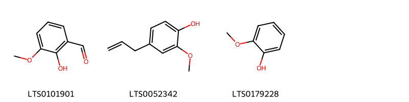{ width=100% }
    <figcaption>Hình ảnh cấu trúc hóa học của 3 hoạt chất thuộc nhóm Phenols gồm ['o-vanillin (LTS0101901)', 'eugenol (LTS0052342)', 'guaiacol (LTS0179228)'].</figcaption>
</figure>
#### Nhóm Prenol lipids
<figure markdown="span">
    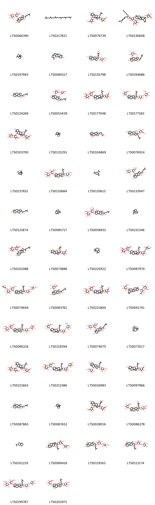{ width=100% }
    <figcaption>Hình ảnh cấu trúc hóa học của 290 hoạt chất thuộc nhóm Prenol lipids gồm ['(2s,3r,4r,5r,6s)-2-{[(2r,3r,4s,5s,6r)-2-{[(1s,3ar,3br,5s,5ar,7s,9ar,9br,11r,11ar)-7,11-dihydroxy-3a,3b,6,6,9a-pentamethyl-1-[(2e)-6-methylhepta-2,5-dien-2-yl]-dodecahydro-1h-cyclopenta[a]phenanthren-5-yl]oxy}-4,5-dihydroxy-6-(hydroxymethyl)oxan-3-yl]oxy}-6-methyloxane-3,4,5-triol (LTS0066390)', 'squalene (LTS0217821)', '2-{[2-(7,11-dihydroxy-3a,3b,6,6,9a-pentamethyl-5-{[3,4,5-trihydroxy-6-(hydroxymethyl)oxan-2-yl]oxy}-dodecahydro-1h-cyclopenta[a]phenanthren-1-yl)-6-methylhept-6-en-2-yl]oxy}-6-(hydroxymethyl)oxane-3,4,5-triol (LTS0079739)', '9,15-dihydroxyheptadec-16-en-11,13-diyn-8-yl 6-{[4,4,6a,6b,11,11,14b-heptamethyl-8a-({[3,4,5-trihydroxy-6-(hydroxymethyl)oxan-2-yl]oxy}carbonyl)-1,2,3,4a,5,6,7,8,9,10,12,12a,14,14a-tetradecahydropicen-3-yl]oxy}-3,4-dihydroxy-5-{[3,4,5-trihydroxy-6-(hydroxymethyl)oxan-2-yl]oxy}oxane-2-carboxylate (LTS0130608)', '(1s,6s,7r)-6,8,8-trimethyl-2-methylidenetricyclo[5.2.2.0¹,⁶]undecane (LTS0197993)', '15-ethyl-1,2,6,6,10,18-hexamethyl-14,23-dioxahexacyclo[11.8.1.1¹⁵,¹⁸.0²,¹¹.0⁵,¹⁰.0¹⁹,²²]tricosan-7-ol (LTS0085517)', '(2s,3r,4s,5r,6r)-2-{[(2r,4e)-2-[(1s,3ar,3br,5s,5ar,7s,9ar,9br,11r,11ar)-5,7,11-trihydroxy-3a,3b,6,6,9a-pentamethyl-dodecahydro-1h-cyclopenta[a]phenanthren-1-yl]-6-hydroperoxy-6-methylhept-4-en-2-yl]oxy}-6-(hydroxymethyl)oxane-3,4,5-triol (LTS0135798)', '(2r,3r,4s,5s,6r)-2-{[(1s,3ar,3br,5s,5ar,7s,9ar,9br,11r,11ar)-7,11-dihydroxy-3a,3b,6,6,9a-pentamethyl-1-[(2z)-6-methylhepta-2,5-dien-2-yl]-dodecahydro-1h-cyclopenta[a]phenanthren-5-yl]oxy}-6-(hydroxymethyl)oxane-3,4,5-triol (LTS0194686)', '(20s)-protopanaxadiol (LTS0134269)', '(2r,3r,4s,5s,6r)-2-{[(1s,3ar,3br,5s,5ar,7s,9ar,9br,11r,11ar)-7,11-dihydroxy-1-[(2s)-2-hydroxy-6-methylhept-5-en-2-yl]-3a,3b,6,6,9a-pentamethyl-dodecahydro-1h-cyclopenta[a]phenanthren-5-yl]oxy}-6-({[(2r,3r,4r,5s)-3,4-dihydroxy-5-(hydroxymethyl)oxolan-2-yl]oxy}methyl)oxane-3,4,5-triol (LTS0053439)', '2-{[2-(7-{[4,5-dihydroxy-6-(hydroxymethyl)-3-{[3,4,5-trihydroxy-6-(hydroxymethyl)oxan-2-yl]oxy}oxan-2-yl]oxy}-5,11-dihydroxy-3a,3b,6,6,9a-pentamethyl-dodecahydro-1h-cyclopenta[a]phenanthren-1-yl)-6-methylhept-5-en-2-yl]oxy}-6-(hydroxymethyl)oxane-3,4,5-triol (LTS0177048)', 'gypenoside xvii (LTS0177183)', '2-{[2-(5-{[4,5-dihydroxy-6-(hydroxymethyl)-3-[(3,4,5-trihydroxyoxan-2-yl)oxy]oxan-2-yl]oxy}-7,11-dihydroxy-3a,3b,6,6,9a-pentamethyl-dodecahydro-1h-cyclopenta[a]phenanthren-1-yl)-6-methylhept-5-en-2-yl]oxy}-6-(hydroxymethyl)oxane-3,4,5-triol (LTS0103700)', '(1s,6s,7r)-2,6,8,8-tetramethyltricyclo[5.2.2.0¹,⁶]undec-2-ene (LTS0125255)', '(1s,3ar,3br,5s,5ar,9ar,9br,11ar)-5-hydroxy-1-[(2s,5r)-5-(2-hydroxypropan-2-yl)-2-methyloxolan-2-yl]-3a,3b,6,6,9a-pentamethyl-decahydro-1h-cyclopenta[a]phenanthrene-7,11-dione (LTS0104869)', '(2s,3r,4r,5s,6r)-2-{[(2r)-2-[(1s,3ar,5r,9ar,11s,11ar)-5,7,11-trihydroxy-1,3a,6,6,9a-pentamethyl-dodecahydro-2h-cyclopenta[a]phenanthren-1-yl]-6-methylhept-5-en-2-yl]oxy}-6-(hydroxymethyl)oxane-3,4,5-triol (LTS0076914)', '(1s,4r,5r,7r)-4,11,11-trimethyl-10-methylidenetricyclo[5.3.1.0¹,⁵]undecane (LTS0237651)', 'ginsenoside rd (LTS0110684)', '(1s,2s)-1-ethenyl-1-methyl-2-(prop-1-en-2-yl)-4-(propan-2-ylidene)cyclohexane (LTS0135613)', '(2r,3r,4r,5r,6s)-2-{[(2r,3r,4s,5s,6r)-2-{[(1s,3ar,3br,5s,5ar,7s,9ar,9br,11r,11ar)-7,11-dihydroxy-1-[(2s)-2-hydroxy-6-methylhept-5-en-2-yl]-3a,3b,6,6,9a-pentamethyl-dodecahydro-1h-cyclopenta[a]phenanthren-5-yl]oxy}-4,5-dihydroxy-6-(hydroxymethyl)oxan-3-yl]oxy}-6-methyloxane-3,4,5-triol (LTS0133947)', '(3ar,3br,9ar)-1-[(2r)-2-hydroxy-6-methylhept-5-en-2-yl]-3a,3b,6,6,9a-pentamethyl-dodecahydro-1h-cyclopenta[a]phenanthrene-7,11-diol (LTS0121874)', '(2as,4ar,8as)-2,2,4a,8-tetramethyl-1h,2ah,3h,4h,5h,6h-cyclobuta[d]indene (LTS0085717)', '(2s,3r,4s,5s,6r)-2-{[(2r,3r,4s,5s,6r)-2-{[(1s,3ar,3br,5s,5ar,7s,9ar,9br,11r,11ar)-5,11-dihydroxy-1-[(2s)-2-hydroxy-6-methylhept-5-en-2-yl]-3a,3b,6,6,9a-pentamethyl-dodecahydro-1h-cyclopenta[a]phenanthren-7-yl]oxy}-4,5-dihydroxy-6-(hydroxymethyl)oxan-3-yl]oxy}-6-(hydroxymethyl)oxane-3,4,5-triol (LTS0058931)', '4,7,7,11-tetramethyltricyclo[6.3.0.0¹,⁵]undec-4-ene (LTS0231346)', '2-[(2-{[7,11-dihydroxy-3a,3b,6,6,9a-pentamethyl-1-(6-methylhepta-1,5-dien-2-yl)-dodecahydro-1h-cyclopenta[a]phenanthren-5-yl]oxy}-4,5-dihydroxy-6-(hydroxymethyl)oxan-3-yl)oxy]-6-methyloxane-3,4,5-triol (LTS0101088)', '2-[(2-{7,11-dihydroxy-3a,3b,6,6,9a-pentamethyl-dodecahydro-1h-cyclopenta[a]phenanthren-1-yl}-5,6-dihydroxy-6-methylheptan-2-yl)oxy]-6-(hydroxymethyl)oxane-3,4,5-triol (LTS0073886)', 'β-gurjunene (LTS0225922)', '2-({[3,4-dihydroxy-5-(hydroxymethyl)oxolan-2-yl]oxy}methyl)-6-{[2-(7-{[4,5-dihydroxy-6-(hydroxymethyl)-3-{[3,4,5-trihydroxy-6-(hydroxymethyl)oxan-2-yl]oxy}oxan-2-yl]oxy}-11-hydroxy-3a,3b,6,6,9a-pentamethyl-dodecahydro-1h-cyclopenta[a]phenanthren-1-yl)-6-methylhept-5-en-2-yl]oxy}oxane-3,4,5-triol (LTS0087970)', '3-{[(2r,3s,4s,5r,6s)-6-{[(2r,3r,4s,5s,6r)-2-{[(1r,3ar,3br,5ar,7s,9ar,9bs,11r,11ar)-1-[(2s)-2-{[(2s,3r,4s,5s,6r)-6-({[(2r,3r,4r,5s)-3,4-dihydroxy-5-(hydroxymethyl)oxolan-2-yl]oxy}methyl)-3,4,5-trihydroxyoxan-2-yl]oxy}-6-methylhept-5-en-2-yl]-11-hydroxy-3a,3b,6,6,9a-pentamethyl-dodecahydro-1h-cyclopenta[a]phenanthren-7-yl]oxy}-4,5-dihydroxy-6-(hydroxymethyl)oxan-3-yl]oxy}-3,4,5-trihydroxyoxan-2-yl]methoxy}-3-oxopropanoic acid (LTS0074694)', '(2r,3r,4s,5s,6r)-2-{[(1s,3ar,3br,5s,5ar,7s,9ar,9br,11r,11ar)-7,11-dihydroxy-1-[(2s)-2-hydroxy-6-methylhept-5-en-2-yl]-3a,3b,6,6,9a-pentamethyl-dodecahydro-1h-cyclopenta[a]phenanthren-5-yl]oxy}-6-(hydroxymethyl)oxane-3,4,5-triol (LTS0083761)', '2-{[2-(7-{[4,5-dihydroxy-6-(hydroxymethyl)-3-{[3,4,5-trihydroxy-6-(hydroxymethyl)oxan-2-yl]oxy}oxan-2-yl]oxy}-11-hydroxy-3a,3b,6,6,9a-pentamethyl-dodecahydro-1h-cyclopenta[a]phenanthren-1-yl)-5-hydroxy-6-methylhept-6-en-2-yl]oxy}-6-(hydroxymethyl)oxane-3,4,5-triol (LTS0221800)', '(2s,3s,4s,5r,6r)-6-{[(3s,4ar,6ar,6bs,8as,12ar,14ar,14br)-4,4,6a,6b,11,11,14b-heptamethyl-8a-({[(2s,3r,4s,5s,6r)-3,4,5-trihydroxy-6-(hydroxymethyl)oxan-2-yl]oxy}carbonyl)-1,2,3,4a,5,6,7,8,9,10,12,12a,14,14a-tetradecahydropicen-3-yl]oxy}-3,4-dihydroxy-5-{[(2s,3r,4s,5s,6r)-3,4,5-trihydroxy-6-(hydroxymethyl)oxan-2-yl]oxy}oxane-2-carboxylic acid (LTS0091741)', '(2s,3r,4s,5s,6r)-2-{[(2s)-2-[(1s,3ar,3br,5ar,7s,9ar,9br,11r,11as)-7-{[(2r,3r,4s,5s,6r)-4,5-dihydroxy-6-(hydroxymethyl)-3-{[(2s,3r,4s,5s,6r)-3,4,5-trihydroxy-6-(hydroxymethyl)oxan-2-yl]oxy}oxan-2-yl]oxy}-11-hydroxy-3a,3b,6,6,9a-pentamethyl-dodecahydro-1h-cyclopenta[a]phenanthren-1-yl]-6-methylhept-5-en-2-yl]oxy}-6-({[(2s,3r,4s,5r)-3,4,5-trihydroxyoxan-2-yl]oxy}methyl)oxane-3,4,5-triol (LTS0080216)', '(2s,3r,4s,5s,6r)-2-{[2-(11-hydroxy-3a,3b,6,6,9a-pentamethyl-7-{[(2r,3r,4s,5s,6r)-3,4,5-trihydroxy-6-(hydroxymethyl)oxan-2-yl]oxy}-dodecahydro-1h-cyclopenta[a]phenanthren-1-yl)-6-methylhept-5-en-2-yl]oxy}-6-({[(2r,3r,4s,5s,6r)-3,4,5-trihydroxy-6-(hydroxymethyl)oxan-2-yl]oxy}methyl)oxane-3,4,5-triol (LTS0219294)', '(2s,3r,4r,5r,6s)-2-{[(2r,3r,4s,5s,6r)-2-{[(1s,3ar,3br,5s,5ar,7s,9ar,9br,11r,11as)-7,11-dihydroxy-1-[(2s)-2-hydroxy-6-methylhept-5-en-2-yl]-3a,3b,6,6,9a-pentamethyl-dodecahydro-1h-cyclopenta[a]phenanthren-5-yl]oxy}-4,5-dihydroxy-6-(hydroxymethyl)oxan-3-yl]oxy}-6-methyloxane-3,4,5-triol (LTS0074075)', '(1as,4as,7s,7ar,7bs)-1,1,7-trimethyl-4-methylidene-octahydrocyclopropa[e]azulen-7-ol (LTS0073517)', '2-{[2-(5-{[4,5-dihydroxy-6-(hydroxymethyl)-3-[(3,4,5-trihydroxy-6-methyloxan-2-yl)oxy]oxan-2-yl]oxy}-7,11-dihydroxy-3a,3b,6,6,9a-pentamethyl-dodecahydro-1h-cyclopenta[a]phenanthren-1-yl)-6-methylhept-5-en-2-yl]oxy}-6-(hydroxymethyl)oxane-3,4,5-triol (LTS0221663)', '2-{[2-(7-{[4,5-dihydroxy-6-(hydroxymethyl)-3-{[3,4,5-trihydroxy-6-(hydroxymethyl)oxan-2-yl]oxy}oxan-2-yl]oxy}-11-hydroxy-3a,3b,6,6,9a-pentamethyl-dodecahydro-1h-cyclopenta[a]phenanthren-1-yl)-6-methylhept-5-en-2-yl]oxy}-6-{[(3,4,5-trihydroxyoxan-2-yl)oxy]methyl}oxane-3,4,5-triol (LTS0212386)', '(2s,3r,4s,5s,6r)-2-{[(2s)-2-[(1s,3ar,3br,4r,5ar,7s,9as,9br,11r,11as)-7,11-dihydroxy-3a,3b,6,6,9a-pentamethyl-4-{[(2r,3r,4s,5s,6r)-3,4,5-trihydroxy-6-(hydroxymethyl)oxan-2-yl]oxy}-dodecahydro-1h-cyclopenta[a]phenanthren-1-yl]-6-methylhept-5-en-2-yl]oxy}-6-(hydroxymethyl)oxane-3,4,5-triol (LTS0016983)', '2-(hydroxymethyl)-6-[(6-methyl-2-{5,7,11-trihydroxy-3a,3b,6,6,9a-pentamethyl-dodecahydro-1h-cyclopenta[a]phenanthren-1-yl}hept-5-en-2-yl)oxy]oxane-3,4,5-triol (LTS0097966)', 'protopanaxatriol (LTS0087865)', '2,6,8,8-tetramethyltricyclo[5.2.2.0¹,⁶]undec-2-ene (LTS0087652)', '2-{[2-(7,11-dihydroxy-3a,3b,6,6,9a-pentamethyl-5-{[3,4,5-trihydroxy-6-(hydroxymethyl)oxan-2-yl]oxy}-dodecahydro-1h-cyclopenta[a]phenanthren-1-yl)-6-hydroxy-6-methylhept-4-en-2-yl]oxy}-6-(hydroxymethyl)oxane-3,4,5-triol (LTS0028016)', '(2s,3r,4s,5s,6r)-2-{[(2s,4e)-2-[(1s,3ar,3br,5ar,7s,9ar,9br,11r,11ar)-11-hydroxy-3a,3b,6,6,9a-pentamethyl-7-{[(2r,3r,4s,5s,6r)-3,4,5-trihydroxy-6-(hydroxymethyl)oxan-2-yl]oxy}-dodecahydro-1h-cyclopenta[a]phenanthren-1-yl]-6-hydroperoxy-6-methylhept-4-en-2-yl]oxy}-6-(hydroxymethyl)oxane-3,4,5-triol (LTS0086278)', 'eremophilene (LTS0101219)', '2-({[3,4-dihydroxy-5-(hydroxymethyl)oxolan-2-yl]oxy}methyl)-6-[(6-methyl-2-{5,7,11-trihydroxy-3a,3b,6,6,9a-pentamethyl-dodecahydro-1h-cyclopenta[a]phenanthren-1-yl}hept-5-en-2-yl)oxy]oxane-3,4,5-triol (LTS0089416)', '(2s,3r,4s,5s,6r)-2-{[(2s)-2-[(1s,3ar,3br,5s,5ar,7s,9ar,9br,11r,11ar)-5,7,11-trihydroxy-3a,3b,6,6,9a-pentamethyl-dodecahydro-1h-cyclopenta[a]phenanthren-1-yl]-6-methylhept-5-en-2-yl]oxy}-6-({[(2s,3s,4r,5r)-3,4-dihydroxy-5-(hydroxymethyl)oxolan-2-yl]oxy}methyl)oxane-3,4,5-triol (LTS0119163)', '(2s,3r,4s,5s,6r)-2-{[(2s)-2-[(1s,3ar,3br,5s,5ar,7s,9ar,9br,11r,11ar)-5,7,11-trihydroxy-3a,3b,6,6,9a-pentamethyl-dodecahydro-1h-cyclopenta[a]phenanthren-1-yl]-6-methylhept-5-en-2-yl]oxy}-6-({[(2r,3s,4s,5s)-3,4,5-trihydroxyoxan-2-yl]oxy}methyl)oxane-3,4,5-triol (LTS0113174)', 'ginsenoside c (LTS0199787)', '(2s,3r,4s,5s,6r)-2-{[(2s)-2-[(1s,3ar,3br,5s,5ar,7s,9ar,9br,11r,11ar)-5,11-dihydroxy-3a,3b,6,6,9a-pentamethyl-7-{[(2r,3r,4s,5s,6r)-3,4,5-trihydroxy-6-(hydroxymethyl)oxan-2-yl]oxy}-dodecahydro-1h-cyclopenta[a]phenanthren-1-yl]-6-methylhept-5-en-2-yl]oxy}-6-(hydroxymethyl)oxane-3,4,5-triol (LTS0202971)', '(2s,3r,4s,5s,6r)-2-{[(2s,4e)-2-[(1s,3ar,3br,5ar,7s,9ar,9br,11r,11ar)-11-hydroxy-3a,3b,6,6,9a-pentamethyl-7-{[(2r,3r,4s,5s,6r)-3,4,5-trihydroxy-6-(hydroxymethyl)oxan-2-yl]oxy}-dodecahydro-1h-cyclopenta[a]phenanthren-1-yl]-6-methylhept-4-en-2-yl]oxy}-6-({[(2s,3s,4s,5r)-3,4-dihydroxy-5-(hydroxymethyl)oxolan-2-yl]oxy}methyl)oxane-3,4,5-triol (LTS0196713)', '2-{[2-(5,11-dihydroxy-3a,3b,6,6,9a-pentamethyl-7-{[3,4,5-trihydroxy-6-(hydroxymethyl)oxan-2-yl]oxy}-dodecahydro-1h-cyclopenta[a]phenanthren-1-yl)-6-methylhept-5-en-2-yl]oxy}-6-(hydroxymethyl)oxane-3,4,5-triol (LTS0181341)', '(1s,3ar,3br,5s,5ar,7s,9ar,9br,11ar)-5,7-dihydroxy-3a,3b,6,6,9a-pentamethyl-1-[(2s)-6-methyl-2-{[(2s,3r,4s,5s,6r)-3,4,5-trihydroxy-6-(hydroxymethyl)oxan-2-yl]oxy}hept-5-en-2-yl]-dodecahydrocyclopenta[a]phenanthren-11-one (LTS0186764)', '(2s,3r,4s,5s,6r)-2-{[(2s)-2-[(1s,3ar,3br,5ar,7s,9ar,9br,11r,11ar)-11-hydroxy-3a,3b,6,6,9a-pentamethyl-7-{[(2r,3r,4s,5s,6r)-3,4,5-trihydroxy-6-(hydroxymethyl)oxan-2-yl]oxy}-dodecahydro-1h-cyclopenta[a]phenanthren-1-yl]-6-methylhept-5-en-2-yl]oxy}-6-({[(2s,3r,4s,5r)-3,4,5-trihydroxyoxan-2-yl]oxy}methyl)oxane-3,4,5-triol (LTS0087374)', '(20r)-ginsenoside rg3 (LTS0115294)', '2-({[3,4-dihydroxy-5-(hydroxymethyl)oxolan-2-yl]oxy}methyl)-6-{[2-(11-hydroxy-3a,3b,6,6,9a-pentamethyl-7-{[3,4,5-trihydroxy-6-(hydroxymethyl)oxan-2-yl]oxy}-dodecahydro-1h-cyclopenta[a]phenanthren-1-yl)-6-methylhept-5-en-2-yl]oxy}oxane-3,4,5-triol (LTS0115092)', '2-{[2-(7-{[4,5-dihydroxy-6-(hydroxymethyl)-3-{[3,4,5-trihydroxy-6-(hydroxymethyl)oxan-2-yl]oxy}oxan-2-yl]oxy}-5,11-dihydroxy-3a,3b,6,6,9a-pentamethyl-dodecahydro-1h-cyclopenta[a]phenanthren-1-yl)-6-methylhept-5-en-2-yl]oxy}-6-({[4-hydroxy-5-(hydroxymethyl)-3-[(3,4,5-trihydroxyoxan-2-yl)oxy]oxolan-2-yl]oxy}methyl)oxane-3,4,5-triol (LTS0194199)', '(2r,3r,4s,5s,6s)-2-{[(2s)-2-[(1r,3as,3br,5ar,7s,9as,9br,11r,11ar)-7-{[(2r,3s,4r,5s,6s)-4,5-dihydroxy-6-(hydroxymethyl)-3-{[(2r,3s,4r,5s,6s)-3,4,5-trihydroxy-6-(hydroxymethyl)oxan-2-yl]oxy}oxan-2-yl]oxy}-11-hydroxy-3a,3b,6,6,9a-pentamethyl-dodecahydro-1h-cyclopenta[a]phenanthren-1-yl]-6-methylhept-5-en-2-yl]oxy}-6-(hydroxymethyl)oxane-3,4,5-triol (LTS0154137)', '(2s,3r,4s,5s,6r)-2-{[(2s,4e)-2-[(1s,3ar,3br,5ar,7s,9ar,9br,11r,11ar)-11-hydroxy-3a,3b,6,6,9a-pentamethyl-7-{[(2r,3r,4s,5s,6r)-3,4,5-trihydroxy-6-(hydroxymethyl)oxan-2-yl]oxy}-dodecahydro-1h-cyclopenta[a]phenanthren-1-yl]-6-hydroxy-6-methylhept-4-en-2-yl]oxy}-6-(hydroxymethyl)oxane-3,4,5-triol (LTS0128015)', '(1r,3ar,7s,9ar,11ar)-3a,6,6,9a,11a-pentamethyl-1-[(2r)-6-methylhept-5-en-2-yl]-1h,2h,3h,5h,5ah,7h,8h,9h,9bh,10h,11h-cyclopenta[a]phenanthren-7-ol (LTS0191529)', '(2r,4s)-4-[(1s,3ar,3br,5ar,7s,9ar,9br,11r,11ar)-7-{[(2r,3r,4s,5s,6r)-4,5-dihydroxy-6-(hydroxymethyl)-3-{[(2s,3r,4s,5s,6r)-3,4,5-trihydroxy-6-(hydroxymethyl)oxan-2-yl]oxy}oxan-2-yl]oxy}-11-hydroxy-3a,3b,6,6,9a-pentamethyl-dodecahydro-1h-cyclopenta[a]phenanthren-1-yl]-2-hydroxy-4-{[(2s,3r,4s,5s,6r)-3,4,5-trihydroxy-6-(hydroxymethyl)oxan-2-yl]oxy}pentanal (LTS0152168)', '2-{[2-(7-{[4,5-dihydroxy-6-(hydroxymethyl)-3-{[3,4,5-trihydroxy-6-(hydroxymethyl)oxan-2-yl]oxy}oxan-2-yl]oxy}-11-hydroxy-3a,3b,6,6,9a-pentamethyl-dodecahydro-1h-cyclopenta[a]phenanthren-1-yl)-6-hydroxy-6-methylhept-3-en-2-yl]oxy}-6-({[3,4,5-trihydroxy-6-(hydroxymethyl)oxan-2-yl]oxy}methyl)oxane-3,4,5-triol (LTS0144934)', '2,2,4a,8-tetramethyl-hexahydro-1h-cyclobuta[d]inden-8-ol (LTS0274941)', '(1r,3ar,3br,5as,9ar,9bs,11as)-1-[(2r)-2-hydroxy-6-methylhept-5-en-2-yl]-3a,3b,6,6,9a-pentamethyl-dodecahydro-1h-cyclopenta[a]phenanthrene-5,7,11-triol (LTS0203157)', '(2s,3r,4s,5s,6r)-2-{[2-(7-{[(2r,3r,4s,5s,6r)-4,5-dihydroxy-6-(hydroxymethyl)-3-{[(2s,3r,4s,5s,6r)-3,4,5-trihydroxy-6-(hydroxymethyl)oxan-2-yl]oxy}oxan-2-yl]oxy}-11-hydroxy-3a,3b,6,6,9a-pentamethyl-dodecahydro-1h-cyclopenta[a]phenanthren-1-yl)-6-methylhept-5-en-2-yl]oxy}-6-({[(2r,3r,4s,5s,6r)-3,4,5-trihydroxy-6-({[(2r,3r,4s,5s,6r)-3,4,5-trihydroxy-6-(hydroxymethyl)oxan-2-yl]oxy}methyl)oxan-2-yl]oxy}methyl)oxane-3,4,5-triol (LTS0128878)', '2,2,4a,8-tetramethyl-1h,2ah,3h,4h,5h,6h-cyclobuta[d]indene (LTS0271131)', 'eburicol (LTS0201421)', '2-{[2-(7,11-dihydroxy-3a,3b,6,6,9a-pentamethyl-5-{[3,4,5-trihydroxy-6-(hydroxymethyl)oxan-2-yl]oxy}-dodecahydro-1h-cyclopenta[a]phenanthren-1-yl)-6-methylhept-5-en-2-yl]oxy}-6-(hydroxymethyl)oxane-3,4,5-triol (LTS0133908)', '(2r,3s,4r,5r,6s)-2-{[(2s)-2-[(1s,3ar,3br,5ar,7s,9ar,9br,11r,11ar)-11-hydroxy-3a,3b,6,6,9a-pentamethyl-7-{[(2r,3r,4s,5s,6r)-3,4,5-trihydroxy-6-(hydroxymethyl)oxan-2-yl]oxy}-dodecahydro-1h-cyclopenta[a]phenanthren-1-yl]-6-methylhept-5-en-2-yl]oxy}-6-({[(2s,3s,4s,5r)-3,4-dihydroxy-5-(hydroxymethyl)oxolan-2-yl]oxy}methyl)oxane-3,4,5-triol (LTS0198981)', '(1as,4ar,7as,7br)-1,1,7-trimethyl-4-methylidene-octahydro-1ah-cyclopropa[e]azulene (LTS0145331)', '(2s,3r,4s,5s,6r)-2-{[(2s)-2-[(1s,3ar,3br,5ar,7s,9ar,9br,11r,11as)-7-{[(2r,3r,4s,5s,6r)-4,5-dihydroxy-6-(hydroxymethyl)-3-{[(2s,3r,4s,5s,6r)-3,4,5-trihydroxy-6-(hydroxymethyl)oxan-2-yl]oxy}oxan-2-yl]oxy}-11-hydroxy-3a,3b,6,6,9a-pentamethyl-dodecahydro-1h-cyclopenta[a]phenanthren-1-yl]-6-methylhept-5-en-2-yl]oxy}-6-(hydroxymethyl)oxane-3,4,5-triol (LTS0152300)', 'protopanaxadiol (LTS0206178)', '2-{[11-hydroxy-1-(2-hydroxy-6-methylhept-5-en-2-yl)-3a,3b,6,6,9a-pentamethyl-dodecahydro-1h-cyclopenta[a]phenanthren-7-yl]oxy}-6-(hydroxymethyl)oxane-3,4,5-triol (LTS0148595)', '(2s,3r,4s,5s,6r)-2-{[(2s)-2-[(1s,3ar,3br,5s,5ar,7s,9ar,9br,11r,11ar)-7-{[(2r,3r,4s,5s,6r)-4,5-dihydroxy-6-(hydroxymethyl)-3-{[(2s,3r,4s,5s,6r)-3,4,5-trihydroxy-6-(hydroxymethyl)oxan-2-yl]oxy}oxan-2-yl]oxy}-5,11-dihydroxy-3a,3b,6,6,9a-pentamethyl-dodecahydro-1h-cyclopenta[a]phenanthren-1-yl]-6-methylhept-5-en-2-yl]oxy}-6-(hydroxymethyl)oxane-3,4,5-triol (LTS0165035)', '4-(7-{[4,5-dihydroxy-6-(hydroxymethyl)-3-{[3,4,5-trihydroxy-6-(hydroxymethyl)oxan-2-yl]oxy}oxan-2-yl]oxy}-11-hydroxy-3a,3b,6,6,9a-pentamethyl-dodecahydro-1h-cyclopenta[a]phenanthren-1-yl)-2-hydroxy-4-{[3,4,5-trihydroxy-6-(hydroxymethyl)oxan-2-yl]oxy}pentanal (LTS0150487)', '(2as,4ar,8ar)-2,2,4a-trimethyl-8-methylidene-hexahydro-1h-cyclobuta[d]indene (LTS0148432)', '(2s,3r,4s,5s,6r)-2-({2-[(1s,3ar,3br,5ar,7s,9ar,9br,11r,11ar)-7-{[(2r,3r,4s,5s,6r)-4,5-dihydroxy-6-(hydroxymethyl)-3-{[(2s,3r,4s,5s,6r)-3,4,5-trihydroxy-6-(hydroxymethyl)oxan-2-yl]oxy}oxan-2-yl]oxy}-11-hydroxy-3a,3b,6,6,9a-pentamethyl-dodecahydro-1h-cyclopenta[a]phenanthren-1-yl]-6-methylhept-5-en-2-yl}oxy)-6-({[(3r,4s,5s,6r)-3,4,5-trihydroxy-6-(hydroxymethyl)oxan-2-yl]oxy}methyl)oxane-3,4,5-triol (LTS0134605)', 'β-eudesmol (LTS0203280)', '(2s,3r,4s,5s,6r)-2-{[(2r,5r)-2-[(1s,3ar,3br,5s,5ar,7s,9ar,9br,11r,11ar)-5,7,11-trihydroxy-3a,3b,6,6,9a-pentamethyl-dodecahydro-1h-cyclopenta[a]phenanthren-1-yl]-5-hydroxy-6-methylhept-6-en-2-yl]oxy}-6-(hydroxymethyl)oxane-3,4,5-triol (LTS0162571)', '[(2r,3s,4s,5r,6r)-6-{[(1s,3ar,3br,5s,5ar,7s,9ar,9br,11r,11ar)-7,11-dihydroxy-3a,3b,6,6,9a-pentamethyl-1-[(2s)-6-methyl-2-{[(2s,3r,4s,5s,6r)-3,4,5-trihydroxy-6-(hydroxymethyl)oxan-2-yl]oxy}hept-5-en-2-yl]-dodecahydro-1h-cyclopenta[a]phenanthren-5-yl]oxy}-3,4,5-trihydroxyoxan-2-yl]methyl (2e)-but-2-enoate (LTS0197288)', '(2s,3r,4s,5s,6r)-2-{[(2s,5e)-2-[(1s,3ar,3br,5s,5ar,7s,9ar,9br,11r,11ar)-5,7,11-trihydroxy-3a,3b,6,6,9a-pentamethyl-dodecahydro-1h-cyclopenta[a]phenanthren-1-yl]-7-hydroxy-6-methylhept-5-en-2-yl]oxy}-6-(hydroxymethyl)oxane-3,4,5-triol (LTS0154449)', '(2s,3r,4s,5s,6r)-2-{[(2s)-2-[(1s,3ar,3br,5s,5ar,7s,9ar,9br,11r,11ar)-7-{[(2r,3r,4s,5s,6r)-4,5-dihydroxy-6-(hydroxymethyl)-3-{[(2s,3r,4s,5s,6r)-3,4,5-trihydroxy-6-(hydroxymethyl)oxan-2-yl]oxy}oxan-2-yl]oxy}-5,11-dihydroxy-3a,3b,6,6,9a-pentamethyl-dodecahydro-1h-cyclopenta[a]phenanthren-1-yl]-6-methylhept-5-en-2-yl]oxy}-6-({[(2r,3r,4s,5s,6r)-3,4,5-trihydroxy-6-(hydroxymethyl)oxan-2-yl]oxy}methyl)oxane-3,4,5-triol (LTS0143527)', '(1s,3ar,3br,5s,5ar,9ar,9br,11r,11ar)-5,11-dihydroxy-1-[(2s)-2-hydroxy-6-methylhept-5-en-2-yl]-3a,3b,6,6,9a-pentamethyl-dodecahydrocyclopenta[a]phenanthren-7-one (LTS0139862)', '(2s,3r,4s,5s,6r)-2-{[(2s)-2-[(1s,3ar,3br,5s,5ar,7s,9ar,9br,11r,11as)-5-{[(2r,3r,4s,5s,6r)-4,5-dihydroxy-6-(hydroxymethyl)-3-{[(2s,3r,4s,5s,6r)-3,4,5-trihydroxy-6-(hydroxymethyl)oxan-2-yl]oxy}oxan-2-yl]oxy}-7,11-dihydroxy-3a,3b,6,6,9a-pentamethyl-dodecahydro-1h-cyclopenta[a]phenanthren-1-yl]-6-methylhept-5-en-2-yl]oxy}-6-(hydroxymethyl)oxane-3,4,5-triol (LTS0143884)', '[(2r,3s,4s,5r,6s)-6-{[(2s)-2-[(1s,3ar,3br,5s,5ar,7s,9ar,9br,11r,11ar)-5-{[(2r,3r,4s,5s,6r)-4,5-dihydroxy-6-(hydroxymethyl)-3-{[(2s,3r,4r,5r,6s)-3,4,5-trihydroxy-6-methyloxan-2-yl]oxy}oxan-2-yl]oxy}-7,11-dihydroxy-3a,3b,6,6,9a-pentamethyl-dodecahydro-1h-cyclopenta[a]phenanthren-1-yl]-6-methylhept-5-en-2-yl]oxy}-3,4,5-trihydroxyoxan-2-yl]methyl acetate (LTS0153262)', '(2s,3r,4s,5s,6r)-2-{[(2s)-2-[(1s,3ar,3br,5s,5ar,7s,9ar,9br,11r,11as)-5-{[(2r,3r,4s,5s,6r)-4,5-dihydroxy-6-(hydroxymethyl)-3-{[(2s,3r,4r,5r,6s)-3,4,5-trihydroxy-6-methyloxan-2-yl]oxy}oxan-2-yl]oxy}-7,11-dihydroxy-3a,3b,6,6,9a-pentamethyl-dodecahydro-1h-cyclopenta[a]phenanthren-1-yl]-6-methylhept-5-en-2-yl]oxy}-6-(hydroxymethyl)oxane-3,4,5-triol (LTS0194319)', '[(2r,3s,4s,5r,6s)-6-{[(2r,3r,4s,5s,6r)-2-{[(1s,3ar,3br,5ar,7s,9ar,9br,11r,11ar)-11-hydroxy-3a,3b,6,6,9a-pentamethyl-1-[(2z)-6-methylhepta-2,5-dien-2-yl]-dodecahydro-1h-cyclopenta[a]phenanthren-7-yl]oxy}-4,5-dihydroxy-6-(hydroxymethyl)oxan-3-yl]oxy}-3,4,5-trihydroxyoxan-2-yl]methyl acetate (LTS0155395)', 'ginsenoside c-k (LTS0147249)', '(2s,3r,4s,5r,6r)-2-{[(2r,3r,4s,5r,6r)-2-{[(1s,3ar,3br,5ar,7s,9ar,9br,11r,11ar)-1-[(2s,4e)-6-hydroperoxy-2-hydroxy-6-methylhept-4-en-2-yl]-11-hydroxy-3a,3b,6,6,9a-pentamethyl-dodecahydro-1h-cyclopenta[a]phenanthren-7-yl]oxy}-4,5-dihydroxy-6-(hydroxymethyl)oxan-3-yl]oxy}-6-(hydroxymethyl)oxane-3,4,5-triol (LTS0159594)', '(2s,3r,4s,5s,6r)-2-{[(2s,5s)-2-[(1s,3ar,3br,5s,5ar,7s,9ar,9br,11r,11ar)-5,7,11-trihydroxy-3a,3b,6,6,9a-pentamethyl-dodecahydro-1h-cyclopenta[a]phenanthren-1-yl]-5-hydroperoxy-6-methylhept-6-en-2-yl]oxy}-6-(hydroxymethyl)oxane-3,4,5-triol (LTS0148749)', '2-[(7-hydroxy-6-methyl-2-{5,7,11-trihydroxy-3a,3b,6,6,9a-pentamethyl-dodecahydro-1h-cyclopenta[a]phenanthren-1-yl}hept-5-en-2-yl)oxy]-6-(hydroxymethyl)oxane-3,4,5-triol (LTS0084758)', '2-[(2-{[5,11-dihydroxy-1-(2-hydroxy-6-methylhept-5-en-2-yl)-3a,3b,6,6,9a-pentamethyl-dodecahydro-1h-cyclopenta[a]phenanthren-7-yl]oxy}-4,5-dihydroxy-6-(hydroxymethyl)oxan-3-yl)oxy]-6-(hydroxymethyl)oxane-3,4,5-triol (LTS0145130)', '5-{[3,5-dihydroxy-4,6-bis(hydroxymethyl)oxan-2-yl]oxy}-6-{[11-hydroxy-1-(2-hydroxy-6-methylhept-5-en-2-yl)-3a,6,6,9a-tetramethyl-tetradecahydrocyclopenta[a]phenanthren-7-yl]oxy}-2-(hydroxymethyl)oxane-3,4-diol (LTS0233224)', 'β-amyrin (LTS0251864)', '{6-[(4,5-dihydroxy-2-{[11-hydroxy-3a,3b,6,6,9a-pentamethyl-1-(6-methylhepta-2,5-dien-2-yl)-dodecahydro-1h-cyclopenta[a]phenanthren-7-yl]oxy}-6-(hydroxymethyl)oxan-3-yl)oxy]-3,4,5-trihydroxyoxan-2-yl}methyl acetate (LTS0215949)', '(1s,3ar,3br,5s,5ar,7s,9ar,9br,11r,11ar)-3a,3b,6,6,9a-pentamethyl-1-[(2e)-6-methylhepta-2,5-dien-2-yl]-dodecahydro-1h-cyclopenta[a]phenanthrene-5,7,11-triol (LTS0112933)', '3-{[6-({4,5-dihydroxy-2-[(11-hydroxy-3a,3b,6,6,9a-pentamethyl-1-{6-methyl-2-[(3,4,5-trihydroxy-6-{[(3,4,5-trihydroxyoxan-2-yl)oxy]methyl}oxan-2-yl)oxy]hept-5-en-2-yl}-dodecahydro-1h-cyclopenta[a]phenanthren-7-yl)oxy]-6-(hydroxymethyl)oxan-3-yl}oxy)-3,4,5-trihydroxyoxan-2-yl]methoxy}-3-oxopropanoic acid (LTS0235377)', '{6-[(4,5-dihydroxy-2-{[11-hydroxy-3a,3b,6,6,9a-pentamethyl-1-(6-methyl-2-{[3,4,5-trihydroxy-6-(hydroxymethyl)oxan-2-yl]oxy}hept-5-en-2-yl)-dodecahydro-1h-cyclopenta[a]phenanthren-7-yl]oxy}-6-(hydroxymethyl)oxan-3-yl)oxy]-3,4,5-trihydroxyoxan-2-yl}methyl acetate (LTS0172829)', '(2s,3r,4s,5r,6r)-2-{[(2r,4z)-2-[(1s,3ar,3br,5s,5ar,7s,9ar,9br,11r,11ar)-5,7,11-trihydroxy-3a,3b,6,6,9a-pentamethyl-dodecahydro-1h-cyclopenta[a]phenanthren-1-yl]-6-hydroperoxy-6-methylhept-4-en-2-yl]oxy}-6-(hydroxymethyl)oxane-3,4,5-triol (LTS0167221)', '(2s,3r,4s,5s,6r)-2-{[(2s)-2-[(1s,3ar,3br,5s,5ar,7s,9ar,9br,11r,11ar)-7,11-dihydroxy-3a,3b,6,6,9a-pentamethyl-5-{[(2r,3r,4s,5s,6r)-3,4,5-trihydroxy-6-(hydroxymethyl)oxan-2-yl]oxy}-dodecahydro-1h-cyclopenta[a]phenanthren-1-yl]-6-methylhept-6-en-2-yl]oxy}-6-(hydroxymethyl)oxane-3,4,5-triol (LTS0114714)', '(2s,3r,4s,5s,6r)-2-{[(2s)-2-[(1s,3ar,3br,5ar,7s,9ar,9br,11r,11ar)-7-{[(2r,3r,4s,5s,6r)-4,5-dihydroxy-6-(hydroxymethyl)-3-{[(2s,3r,4s,5s,6r)-3,4,5-trihydroxy-6-(hydroxymethyl)oxan-2-yl]oxy}oxan-2-yl]oxy}-11-hydroxy-3a,3b,6,6,9a-pentamethyl-dodecahydro-1h-cyclopenta[a]phenanthren-1-yl]-6-methylhept-5-en-2-yl]oxy}-6-({[(2r,3r,4s,5s,6r)-3,4,5-trihydroxy-6-(hydroxymethyl)oxan-2-yl]oxy}methyl)oxane-3,4,5-triol (LTS0235469)', '(2s,3r,4s,5s,6r)-2-{[(2s)-2-[(1s,3ar,3br,5ar,7s,9ar,9br,11r,11as)-7-{[(2r,3r,4s,5s,6r)-4,5-dihydroxy-6-(hydroxymethyl)-3-{[(2s,3r,4s,5s,6r)-3,4,5-trihydroxy-6-(hydroxymethyl)oxan-2-yl]oxy}oxan-2-yl]oxy}-11-hydroxy-3a,3b,6,6,9a-pentamethyl-dodecahydro-1h-cyclopenta[a]phenanthren-1-yl]-6-methylhept-5-en-2-yl]oxy}-6-({[(2r,3r,4r,5s)-3,4-dihydroxy-5-(hydroxymethyl)oxolan-2-yl]oxy}methyl)oxane-3,4,5-triol (LTS0149201)', '2-{[2-(5-{[4,5-dihydroxy-6-(hydroxymethyl)-3-{[3,4,5-trihydroxy-6-(hydroxymethyl)oxan-2-yl]oxy}oxan-2-yl]oxy}-7,11-dihydroxy-3a,3b,6,6,9a-pentamethyl-dodecahydro-1h-cyclopenta[a]phenanthren-1-yl)-6-methylhept-5-en-2-yl]oxy}-6-(hydroxymethyl)oxane-3,4,5-triol (LTS0168161)', '4-(7-{[4,5-dihydroxy-6-(hydroxymethyl)-3-{[3,4,5-trihydroxy-6-(hydroxymethyl)oxan-2-yl]oxy}oxan-2-yl]oxy}-11-hydroxy-3a,3b,6,6,9a-pentamethyl-dodecahydro-1h-cyclopenta[a]phenanthren-1-yl)-4-{[3,4,5-trihydroxy-6-(hydroxymethyl)oxan-2-yl]oxy}pentanal (LTS0170390)', '(2s,3r,4s,5s,6r)-2-{[(2s,5s)-2-[(1s,3ar,3br,5ar,7r,9ar,9br,11s,11ar)-7-{[(2r,3r,4s,5s,6r)-4,5-dihydroxy-6-(hydroxymethyl)-3-{[(2s,3r,4s,5s,6r)-3,4,5-trihydroxy-6-(hydroxymethyl)oxan-2-yl]oxy}oxan-2-yl]oxy}-11-hydroxy-3a,3b,6,6,9a-pentamethyl-dodecahydro-1h-cyclopenta[a]phenanthren-1-yl]-5-hydroxy-6-methylhept-6-en-2-yl]oxy}-6-(hydroxymethyl)oxane-3,4,5-triol (LTS0168779)', '(2s,3r,4s,5s,6r)-2-{[(2s)-2-[(1s,3ar,3br,5s,5ar,7s,9ar,9br,11r,11ar)-5-{[(2r,3r,4s,5s,6r)-4,5-dihydroxy-6-(hydroxymethyl)-3-{[(2s,3r,4r,5r,6s)-3,4,5-trihydroxy-6-methyloxan-2-yl]oxy}oxan-2-yl]oxy}-7,11-dihydroxy-3a,3b,6,6,9a-pentamethyl-dodecahydro-1h-cyclopenta[a]phenanthren-1-yl]-6-methylhept-5-en-2-yl]oxy}-6-(hydroxymethyl)oxane-3,4,5-triol (LTS0083845)', '2-[(2-{[7,11-dihydroxy-3a,3b,6,6,9a-pentamethyl-1-(6-methylhepta-2,5-dien-2-yl)-dodecahydro-1h-cyclopenta[a]phenanthren-5-yl]oxy}-4,5-dihydroxy-6-(hydroxymethyl)oxan-3-yl)oxy]-6-methyloxane-3,4,5-triol (LTS0172020)', '(6-{[2-(5-{[4,5-dihydroxy-6-(hydroxymethyl)-3-[(3,4,5-trihydroxy-6-methyloxan-2-yl)oxy]oxan-2-yl]oxy}-7,11-dihydroxy-3a,3b,6,6,9a-pentamethyl-dodecahydro-1h-cyclopenta[a]phenanthren-1-yl)-6-methylhept-5-en-2-yl]oxy}-3,4,5-trihydroxyoxan-2-yl)methyl acetate (LTS0163122)', '3-{[(2r,3s,4s,5r,6s)-6-{[(2r,3r,4s,5s,6r)-2-{[(1s,3ar,3br,5ar,7s,9ar,9br,11r,11ar)-11-hydroxy-3a,3b,6,6,9a-pentamethyl-1-[(2s)-6-methyl-2-{[(2s,3r,4s,5s,6r)-3,4,5-trihydroxy-6-(hydroxymethyl)oxan-2-yl]oxy}hept-5-en-2-yl]-dodecahydro-1h-cyclopenta[a]phenanthren-7-yl]oxy}-4,5-dihydroxy-6-(hydroxymethyl)oxan-3-yl]oxy}-3,4,5-trihydroxyoxan-2-yl]methoxy}-3-oxopropanoic acid (LTS0166517)', '2-ethenyl-2,6,6-trimethyl-1-(prop-1-en-2-yl)bicyclo[3.2.0]heptane (LTS0241595)', '(2s,3s,4s,5r,6r)-6-{[(6ar,6bs,8as,12ar,14br)-4,4,6a,6b,11,11,14b-heptamethyl-8a-({[(2s,3r,4s,5s,6r)-3,4,5-trihydroxy-6-(hydroxymethyl)oxan-2-yl]oxy}carbonyl)-1,2,3,4a,5,6,7,8,9,10,12,12a,14,14a-tetradecahydropicen-3-yl]oxy}-3,4-dihydroxy-5-{[(2s,3r,4s,5s,6r)-3,4,5-trihydroxy-6-(hydroxymethyl)oxan-2-yl]oxy}oxane-2-carboxylic acid (LTS0177837)', '2-{[2-(5-{[4,5-dihydroxy-6-(hydroxymethyl)-3-[(3,4,5-trihydroxy-6-methyloxan-2-yl)oxy]oxan-2-yl]oxy}-7,11-dihydroxy-3a,3b,6,6,9a-pentamethyl-dodecahydro-1h-cyclopenta[a]phenanthren-1-yl)-6-methylhept-5-en-2-yl]oxy}-6-(hydroxymethyl)oxane-3,4,5-triol; 2-{[2-(7-{[4,5-dihydroxy-6-(hydroxymethyl)-3-{[3,4,5-trihydroxy-6-(hydroxymethyl)oxan-2-yl]oxy}oxan-2-yl]oxy}-11-hydroxy-3a,3b,6,6,9a-pentamethyl-dodecahydro-1h-cyclopenta[a]phenanthren-1-yl)-6-methylhept-5-en-2-yl]oxy}-6-(hydroxymethyl)oxane-3,4,5-triol (LTS0165554)', '2-{[2-(11-hydroxy-3a,3b,6,6,9a-pentamethyl-7-{[3,4,5-trihydroxy-6-(hydroxymethyl)oxan-2-yl]oxy}-dodecahydro-1h-cyclopenta[a]phenanthren-1-yl)-6-methylhept-5-en-2-yl]oxy}-6-({[3,4,5-trihydroxy-6-(hydroxymethyl)oxan-2-yl]oxy}methyl)oxane-3,4,5-triol (LTS0171790)', '(2s,3r,4s,5s,6r)-2-{[(2s)-2-[(1s,3ar,3br,5ar,7s,9ar,9br,11r,11ar)-11-hydroxy-3a,3b,6,6,9a-pentamethyl-7-{[(2r,3r,4s,5s,6r)-3,4,5-trihydroxy-6-(hydroxymethyl)oxan-2-yl]oxy}-dodecahydro-1h-cyclopenta[a]phenanthren-1-yl]-6-methylhept-5-en-2-yl]oxy}-6-({[(2s,3r,4s,5s)-3,4,5-trihydroxyoxan-2-yl]oxy}methyl)oxane-3,4,5-triol (LTS0181598)', '(2s,3r,4s,5s,6r)-2-{[(2s)-2-[(1s,3ar,3br,5s,5ar,7s,9ar,9br,11r,11ar)-5,7,11-trihydroxy-3a,3b,6,6,9a-pentamethyl-dodecahydro-1h-cyclopenta[a]phenanthren-1-yl]-6-methylhept-5-en-2-yl]oxy}-6-({[(2s,3r,4s,5s)-3,4,5-trihydroxyoxan-2-yl]oxy}methyl)oxane-3,4,5-triol (LTS0131250)', '(2s,3r,4s,5s,6r)-2-{[(2s)-2-[(1s,3ar,3br,5r,5ar,7r,9ar,9br,11s,11ar)-5-{[(2r,3r,4s,5s,6r)-4,5-dihydroxy-6-(hydroxymethyl)-3-{[(2s,3r,4r,5r,6s)-3,4,5-trihydroxy-6-methyloxan-2-yl]oxy}oxan-2-yl]oxy}-7,11-dihydroxy-3a,3b,6,6,9a-pentamethyl-dodecahydro-1h-cyclopenta[a]phenanthren-1-yl]-6-methylhept-5-en-2-yl]oxy}-6-(hydroxymethyl)oxane-3,4,5-triol (LTS0182490)', '(2s,3r,4r,5r,6s)-2-{[(2r,3r,4s,5s,6r)-2-{[(1s,3ar,3br,5s,5ar,7s,9ar,9br,11r,11ar)-7,11-dihydroxy-3a,3b,6,6,9a-pentamethyl-1-(6-methylhepta-1,5-dien-2-yl)-dodecahydro-1h-cyclopenta[a]phenanthren-5-yl]oxy}-4,5-dihydroxy-6-(hydroxymethyl)oxan-3-yl]oxy}-6-methyloxane-3,4,5-triol (LTS0234352)', 'notoginsenoside r1 (LTS0174761)', '(2r,3r,4s,5s,6r)-2-{[(2r,7s,10r)-1,2,6,6,7,10-hexamethyl-15-(2-methylprop-1-en-1-yl)-7-{[(2s,3r,4s,5s,6r)-3,4,5-trihydroxy-6-(hydroxymethyl)oxan-2-yl]oxy}-14-oxapentacyclo[11.7.1.0²,¹¹.0⁵,¹⁰.0¹⁸,²¹]henicosan-17-yl]oxy}-6-(hydroxymethyl)oxane-3,4,5-triol (LTS0177577)', '[(2r,3s,4s,5r,6s)-6-{[(2s)-2-[(1s,3ar,3br,5s,5ar,7s,9ar,9br,11r,11ar)-5,7,11-trihydroxy-3a,3b,6,6,9a-pentamethyl-dodecahydro-1h-cyclopenta[a]phenanthren-1-yl]-6-methylhept-5-en-2-yl]oxy}-3,4,5-trihydroxyoxan-2-yl]methyl acetate (LTS0132262)', '(20s)-ginsenoside rh2 (LTS0187875)', '(1s,8s,11r)-4,7,7,11-tetramethyltricyclo[6.3.0.0¹,⁵]undec-4-ene (LTS0104108)', 'panaxatriol (LTS0261273)', '2-{[2-(7-{[4,5-dihydroxy-6-(hydroxymethyl)-3-{[3,4,5-trihydroxy-6-(hydroxymethyl)oxan-2-yl]oxy}oxan-2-yl]oxy}-5,11-dihydroxy-3a,3b,6,6,9a-pentamethyl-dodecahydro-1h-cyclopenta[a]phenanthren-1-yl)-6-methylhept-5-en-2-yl]oxy}-6-{[(3,4,5-trihydroxyoxan-2-yl)oxy]methyl}oxane-3,4,5-triol (LTS0174912)', '{3,4,5-trihydroxy-6-[(6-methyl-2-{5,7,11-trihydroxy-3a,3b,6,6,9a-pentamethyl-dodecahydro-1h-cyclopenta[a]phenanthren-1-yl}hept-5-en-2-yl)oxy]oxan-2-yl}methyl acetate (LTS0248571)', '(1s,3ar,3br,5ar,7s,9ar,9br)-1-(2-hydroxy-6-methylhept-5-en-2-yl)-3a,3b,6,6,9a-pentamethyl-dodecahydro-1h-cyclopenta[a]phenanthren-7-ol (LTS0162594)', '(1s,4ar,7r,8ar)-1,4a-dimethyl-7-(prop-1-en-2-yl)-octahydronaphthalen-1-ol (LTS0086607)', '(1s,3ar,3br,5ar,7s,9ar,9br,11ar)-3a,3b,6,6,9a-pentamethyl-1-[(2s)-6-methyl-2-{[(2s,3r,4s,5s,6r)-3,4,5-trihydroxy-6-(hydroxymethyl)oxan-2-yl]oxy}hept-5-en-2-yl]-7-{[(2r,3r,4s,5s,6r)-3,4,5-trihydroxy-6-(hydroxymethyl)oxan-2-yl]oxy}-dodecahydrocyclopenta[a]phenanthren-11-one (LTS0181070)', 'lupeol (LTS0256952)', '2-{[7,11-dihydroxy-1-(2-hydroxy-6-methylhept-5-en-2-yl)-3a,3b,6,6,9a-pentamethyl-dodecahydro-1h-cyclopenta[a]phenanthren-5-yl]oxy}-6-{[(3,4,5-trihydroxyoxan-2-yl)oxy]methyl}oxane-3,4,5-triol (LTS0106629)', '2-{[1-(6-hydroperoxy-2-hydroxy-6-methylhept-4-en-2-yl)-7,11-dihydroxy-3a,3b,6,6,9a-pentamethyl-dodecahydro-1h-cyclopenta[a]phenanthren-5-yl]oxy}-6-(hydroxymethyl)oxane-3,4,5-triol (LTS0124376)', '2-{[2-(7-{[4,5-dihydroxy-6-(hydroxymethyl)-3-{[3,4,5-trihydroxy-6-(hydroxymethyl)oxan-2-yl]oxy}oxan-2-yl]oxy}-5,11-dihydroxy-3a,3b,6,6,9a-pentamethyl-dodecahydro-1h-cyclopenta[a]phenanthren-1-yl)-6-methylhept-5-en-2-yl]oxy}-6-({[3,4,5-trihydroxy-6-(hydroxymethyl)oxan-2-yl]oxy}methyl)oxane-3,4,5-triol (LTS0128458)', '3-({6-[(4,5-dihydroxy-2-{[11-hydroxy-3a,3b,6,6,9a-pentamethyl-1-(6-methyl-2-{[3,4,5-trihydroxy-6-(hydroxymethyl)oxan-2-yl]oxy}hept-5-en-2-yl)-dodecahydro-1h-cyclopenta[a]phenanthren-7-yl]oxy}-6-(hydroxymethyl)oxan-3-yl)oxy]-3,4,5-trihydroxyoxan-2-yl}methoxy)-3-oxopropanoic acid (LTS0204985)', '(1r,6s,7s)-2,6,8,8-tetramethyltricyclo[5.2.2.0¹,⁶]undec-2-ene (LTS0045066)', '(2s,3r,4s,5s,6r)-2-{[(2s,3r,4r,5r,6s)-2-{[(1s,3ar,3br,5s,5ar,7s,9ar,9br,11r,11ar)-7,11-dihydroxy-3a,3b,6,6,9a-pentamethyl-1-[(2e)-6-methylhepta-2,5-dien-2-yl]-dodecahydro-1h-cyclopenta[a]phenanthren-5-yl]oxy}-4,5-dihydroxy-6-methyloxan-3-yl]oxy}-6-(hydroxymethyl)oxane-3,4,5-triol (LTS0199782)', 'ginsenoside rf (LTS0076521)', '(2ar,4as,8as)-2,2,4a-trimethyl-8-methylidene-hexahydro-1h-cyclobuta[d]indene (LTS0049602)', '3-{[(2r,3s,4s,5r,6s)-6-{[(2r,3r,4s,5s,6r)-2-{[(1r,3ar,3br,5ar,7s,9ar,9bs,11r,11ar)-11-hydroxy-3a,3b,6,6,9a-pentamethyl-1-[(2s)-6-methyl-2-{[(2s,3r,4s,5s,6r)-3,4,5-trihydroxy-6-({[(2r,3r,4s,5s,6r)-3,4,5-trihydroxy-6-(hydroxymethyl)oxan-2-yl]oxy}methyl)oxan-2-yl]oxy}hept-5-en-2-yl]-dodecahydro-1h-cyclopenta[a]phenanthren-7-yl]oxy}-4,5-dihydroxy-6-(hydroxymethyl)oxan-3-yl]oxy}-3,4,5-trihydroxyoxan-2-yl]methoxy}-3-oxopropanoic acid (LTS0218717)', '2-{[2-(11-hydroxy-3a,3b,6,6,9a-pentamethyl-7-{[3,4,5-trihydroxy-6-(hydroxymethyl)oxan-2-yl]oxy}-dodecahydro-1h-cyclopenta[a]phenanthren-1-yl)-6-methylhept-5-en-2-yl]oxy}-6-{[(3,4,5-trihydroxyoxan-2-yl)oxy]methyl}oxane-3,4,5-triol (LTS0059330)', '5,11-dihydroxy-1-(2-hydroxy-6-methylhept-5-en-2-yl)-3a,3b,6,6,9a-pentamethyl-dodecahydrocyclopenta[a]phenanthren-7-one (LTS0202281)', '(2s,3r,4s,5s,6r)-2-{[(2s,4e)-2-[(1s,3ar,3br,5s,5ar,7s,9ar,9br,11r,11ar)-7,11-dihydroxy-3a,3b,6,6,9a-pentamethyl-5-{[(2r,3r,4s,5s,6r)-3,4,5-trihydroxy-6-(hydroxymethyl)oxan-2-yl]oxy}-dodecahydro-1h-cyclopenta[a]phenanthren-1-yl]-6-hydroxy-6-methylhept-4-en-2-yl]oxy}-6-(hydroxymethyl)oxane-3,4,5-triol (LTS0263097)', '(2s,3r,4s,5s,6r)-2-{[(2s)-2-[(1s,3ar,3br,5s,5ar,7s,9ar,9br,11r,11ar)-7-{[(2r,3r,4s,5s,6r)-4,5-dihydroxy-6-(hydroxymethyl)-3-{[(2s,3r,4s,5s,6r)-3,4,5-trihydroxy-6-(hydroxymethyl)oxan-2-yl]oxy}oxan-2-yl]oxy}-5,11-dihydroxy-3a,3b,6,6,9a-pentamethyl-dodecahydro-1h-cyclopenta[a]phenanthren-1-yl]-6-methylhept-5-en-2-yl]oxy}-6-({[(2s,3r,4s,5s)-3,4,5-trihydroxyoxan-2-yl]oxy}methyl)oxane-3,4,5-triol (LTS0264644)', '3-({6-[(4,5-dihydroxy-2-{[11-hydroxy-3a,3b,6,6,9a-pentamethyl-1-(6-methyl-2-{[3,4,5-trihydroxy-6-({[3,4,5-trihydroxy-6-(hydroxymethyl)oxan-2-yl]oxy}methyl)oxan-2-yl]oxy}hept-5-en-2-yl)-dodecahydro-1h-cyclopenta[a]phenanthren-7-yl]oxy}-6-(hydroxymethyl)oxan-3-yl)oxy]-3,4,5-trihydroxyoxan-2-yl}methoxy)-3-oxopropanoic acid (LTS0262064)', '2-({2-[(3bs,7r,9as,11s,11as)-7,11-dihydroxy-3a,3b,6,6,9a-pentamethyl-5-{[3,4,5-trihydroxy-6-(hydroxymethyl)oxan-2-yl]oxy}-dodecahydro-1h-cyclopenta[a]phenanthren-1-yl]-6-methylhept-5-en-2-yl}oxy)-6-(hydroxymethyl)oxane-3,4,5-triol; 2-[(2-{[(1r,3bs,7r,9as,11s,11as)-7,11-dihydroxy-1-[5-(2-hydroxypropan-2-yl)-2-methyloxolan-2-yl]-3a,3b,6,6,9a-pentamethyl-dodecahydro-1h-cyclopenta[a]phenanthren-5-yl]oxy}-4,5-dihydroxy-6-(hydroxymethyl)oxan-3-yl)oxy]-6-methyloxane-3,4,5-triol (LTS0261901)', '2-{[7,11-dihydroxy-3a,3b,6,6,9a-pentamethyl-1-(6-methylhepta-2,5-dien-2-yl)-dodecahydro-1h-cyclopenta[a]phenanthren-5-yl]oxy}-6-(hydroxymethyl)oxane-3,4,5-triol (LTS0069160)', '(1s,8s,11s)-4,7,7,11-tetramethyltricyclo[6.3.0.0¹,⁵]undec-4-ene (LTS0236617)', '(2r,3r,4s,5s,6r)-2-{[(1s,3ar,3br,5ar,7s,9ar,9br,11r,11ar)-11-hydroxy-1-[(2e,5s)-5-hydroxy-6-methylhepta-2,6-dien-2-yl]-3a,3b,6,6,9a-pentamethyl-dodecahydro-1h-cyclopenta[a]phenanthren-7-yl]oxy}-6-(hydroxymethyl)oxane-3,4,5-triol (LTS0070527)', '(2r,3r,4s,5s,6r)-2-({6-hydroxy-1,1,4a,10a,10b-pentamethyl-7-[(2z)-6-methylhepta-2,5-dien-2-yl]-tetradecahydrochrysen-2-yl}oxy)-6-(hydroxymethyl)oxane-3,4,5-triol (LTS0270292)', '(2as,4ar,8s)-2,2,4a,8-tetramethyl-hexahydro-1h-cyclobuta[d]inden-8-ol (LTS0244430)', '2-[(5-hydroperoxy-6-methyl-2-{5,7,11-trihydroxy-3a,3b,6,6,9a-pentamethyl-dodecahydro-1h-cyclopenta[a]phenanthren-1-yl}hept-6-en-2-yl)oxy]-6-{[(3,4,5-trihydroxyoxan-2-yl)oxy]methyl}oxane-3,4,5-triol (LTS0204099)', '(2r,3r,4s,5s,6r)-2-{[(1s,3ar,3br,5s,5ar,7s,9ar,9br,11r,11ar)-7,11-dihydroxy-1-[(2r)-2-hydroxy-6-methylhept-5-en-2-yl]-3a,3b,6,6,9a-pentamethyl-dodecahydro-1h-cyclopenta[a]phenanthren-5-yl]oxy}-6-(hydroxymethyl)oxane-3,4,5-triol (LTS0203474)', 'β-farnesene (LTS0067925)', '(2s,3r,4s,5s,6r)-2-{[(2s,5r)-2-[(1s,3ar,3br,5ar,7r,9ar,9br,11s,11ar)-7-{[(2r,3r,4s,5s,6r)-4,5-dihydroxy-6-(hydroxymethyl)-3-{[(2s,3r,4s,5s,6r)-3,4,5-trihydroxy-6-(hydroxymethyl)oxan-2-yl]oxy}oxan-2-yl]oxy}-11-hydroxy-3a,3b,6,6,9a-pentamethyl-dodecahydro-1h-cyclopenta[a]phenanthren-1-yl]-5-hydroxy-6-methylhept-6-en-2-yl]oxy}-6-(hydroxymethyl)oxane-3,4,5-triol (LTS0213779)', '(2s,3r,4r,5r,6s)-2-{[(2r,3s,4s,5s,6r)-2-{[(1s,3ar,3br,5s,5ar,7s,9ar,9br,11r,11ar)-7,11-dihydroxy-1-[(2r)-2-hydroxy-6-methylhept-5-en-2-yl]-3a,3b,6,6,9a-pentamethyl-dodecahydro-1h-cyclopenta[a]phenanthren-5-yl]oxy}-4,5-dihydroxy-6-(hydroxymethyl)oxan-3-yl]oxy}-6-methyloxane-3,4,5-triol (LTS0275665)', '(2s,3r,4s,5s,6r)-2-{[(2s)-2-[(1s,3ar,3br,5s,5ar,7s,9ar,9br,11r,11ar)-5,7,11-trihydroxy-3a,3b,6,6,9a-pentamethyl-dodecahydro-1h-cyclopenta[a]phenanthren-1-yl]-6-methylhept-5-en-2-yl]oxy}-6-({[(2r,3r,4r,5s)-3,4-dihydroxy-5-(hydroxymethyl)oxolan-2-yl]oxy}methyl)oxane-3,4,5-triol (LTS0215042)', '(2as,4ar,8r)-2,2,4a,8-tetramethyl-hexahydro-1h-cyclobuta[d]inden-8-ol (LTS0099035)', 'chikusetsusaponin-v (LTS0199071)', '(2r,3r,4s,5r,6r)-2-{[(1s,3ar,3br,5s,5ar,7s,9ar,9br,11r,11ar)-7,11-dihydroxy-1-[(2s)-2-methoxy-6-methylhept-5-en-2-yl]-3a,3b,6,6,9a-pentamethyl-dodecahydro-1h-cyclopenta[a]phenanthren-5-yl]oxy}-6-(hydroxymethyl)oxane-3,4,5-triol (LTS0097116)', '(6-{[7,11-dihydroxy-3a,3b,6,6,9a-pentamethyl-1-(6-methyl-2-{[3,4,5-trihydroxy-6-(hydroxymethyl)oxan-2-yl]oxy}hept-5-en-2-yl)-dodecahydro-1h-cyclopenta[a]phenanthren-5-yl]oxy}-3,4,5-trihydroxyoxan-2-yl)methyl but-2-enoate (LTS0062700)', '2-{[7,11-dihydroxy-3a,3b,6,6,9a-pentamethyl-1-(6-methylhepta-1,5-dien-2-yl)-dodecahydro-1h-cyclopenta[a]phenanthren-5-yl]oxy}-6-(hydroxymethyl)oxane-3,4,5-triol (LTS0270734)', '(2s,3r,4r,5r,6s)-2-{[(2r,3r,4s,5s,6r)-2-{[(1s,3ar,3br,5s,5ar,7s,9ar,9br,11r,11ar)-7,11-dihydroxy-3a,3b,6,6,9a-pentamethyl-1-[(2z)-6-methylhepta-2,5-dien-2-yl]-dodecahydro-1h-cyclopenta[a]phenanthren-5-yl]oxy}-4,5-dihydroxy-6-(hydroxymethyl)oxan-3-yl]oxy}-6-methyloxane-3,4,5-triol (LTS0216870)', 'ginsenoside rg1 (LTS0225133)', '(2s,3r,4s,5s,6r)-2-{[(2s)-2-[(1s,3ar,3br,5ar,7s,9ar,9br,11r,11as)-7-{[(2r,3r,4s,5s,6r)-4,5-dihydroxy-6-(hydroxymethyl)-3-{[(2s,3r,4s,5s,6r)-3,4,5-trihydroxy-6-(hydroxymethyl)oxan-2-yl]oxy}oxan-2-yl]oxy}-11-hydroxy-3a,3b,6,6,9a-pentamethyl-dodecahydro-1h-cyclopenta[a]phenanthren-1-yl]-6-methylhept-5-en-2-yl]oxy}-6-({[(2s,3r,4s,5s)-3,4,5-trihydroxyoxan-2-yl]oxy}methyl)oxane-3,4,5-triol (LTS0221382)', 'ginsenoside f2 (LTS0093069)', '2-{[2-(7,11-dihydroxy-3a,3b,6,6,9a-pentamethyl-4-{[3,4,5-trihydroxy-6-(hydroxymethyl)oxan-2-yl]oxy}-dodecahydro-1h-cyclopenta[a]phenanthren-1-yl)-6-methylhept-5-en-2-yl]oxy}-6-(hydroxymethyl)oxane-3,4,5-triol (LTS0087334)', '(2as,4ar,8s,8as)-2,2,4a,8-tetramethyl-hexahydro-1h-cyclobuta[d]inden-8-ol (LTS0223313)', '(2r,3r,4s,5s,6r)-2-{[(1s,3ar,3br,5s,5ar,7s,9ar,9br,11r,11ar)-5,11-dihydroxy-3a,3b,6,6,9a-pentamethyl-1-[(2e)-6-methylhepta-2,5-dien-2-yl]-dodecahydro-1h-cyclopenta[a]phenanthren-7-yl]oxy}-6-(hydroxymethyl)oxane-3,4,5-triol (LTS0215512)', '(1r,2r,5r,7s,10r,11r,13r,15r,18r,19s,22r)-15-ethyl-1,2,6,6,10,18-hexamethyl-14,23-dioxahexacyclo[11.8.1.1¹⁵,¹⁸.0²,¹¹.0⁵,¹⁰.0¹⁹,²²]tricosan-7-ol (LTS0217528)', '(2r,3r,4s,5s,6r)-2-{[(1s,3ar,3br,5s,5ar,7s,9ar,9br,11r,11ar)-7,11-dihydroxy-1-[(2s)-2-hydroxy-6-methylhept-5-en-2-yl]-3a,3b,6,6,9a-pentamethyl-dodecahydro-1h-cyclopenta[a]phenanthren-5-yl]oxy}-6-({[(2s,3r,4s,5s)-3,4,5-trihydroxyoxan-2-yl]oxy}methyl)oxane-3,4,5-triol (LTS0218441)', '(1r,6r,7s)-2,6,8,8-tetramethyltricyclo[5.2.2.0¹,⁶]undec-2-ene (LTS0082979)', '2-[({3,5-dihydroxy-4-[(3,4,5-trihydroxyoxan-2-yl)oxy]oxan-2-yl}oxy)methyl]-6-{[2-(7-{[4,5-dihydroxy-6-(hydroxymethyl)-3-{[3,4,5-trihydroxy-6-(hydroxymethyl)oxan-2-yl]oxy}oxan-2-yl]oxy}-5,11-dihydroxy-3a,3b,6,6,9a-pentamethyl-dodecahydro-1h-cyclopenta[a]phenanthren-1-yl)-6-methylhept-5-en-2-yl]oxy}oxane-3,4,5-triol (LTS0213547)', '(1r,2s,5s)-2-ethenyl-2,6,6-trimethyl-1-(prop-1-en-2-yl)bicyclo[3.2.0]heptane (LTS0023315)', '(8r,9r,15r)-9,15-dihydroxyheptadec-16-en-11,13-diyn-8-yl (2s,3s,4s,5r,6r)-6-{[(3s,4as,6ar,6bs,8as,12ar,14as,14br)-4,4,6a,6b,11,11,14b-heptamethyl-8a-({[(2s,3r,4s,5s,6r)-3,4,5-trihydroxy-6-(hydroxymethyl)oxan-2-yl]oxy}carbonyl)-1,2,3,4a,5,6,7,8,9,10,12,12a,14,14a-tetradecahydropicen-3-yl]oxy}-3,4-dihydroxy-5-{[(2s,3r,4s,5s,6r)-3,4,5-trihydroxy-6-(hydroxymethyl)oxan-2-yl]oxy}oxane-2-carboxylate (LTS0230780)', '(2s,3r,4s,5s,6r)-2-{[(2s)-2-[(1s,3ar,3br,5s,5ar,7s,9ar,9br,11r,11ar)-7-{[(2r,3r,4s,5s,6r)-4,5-dihydroxy-6-(hydroxymethyl)-3-{[(2s,3r,4s,5s,6r)-3,4,5-trihydroxy-6-(hydroxymethyl)oxan-2-yl]oxy}oxan-2-yl]oxy}-5,11-dihydroxy-3a,3b,6,6,9a-pentamethyl-dodecahydro-1h-cyclopenta[a]phenanthren-1-yl]-6-methylhept-5-en-2-yl]oxy}-6-({[(2r,3r,4r,5s)-3,4-dihydroxy-5-(hydroxymethyl)oxolan-2-yl]oxy}methyl)oxane-3,4,5-triol (LTS0241712)', '2-{[7,11-dihydroxy-1-(2-hydroxy-6-methylhept-5-en-2-yl)-3a,3b,6,6,9a-pentamethyl-dodecahydro-1h-cyclopenta[a]phenanthren-5-yl]oxy}-6-({[3,4-dihydroxy-5-(hydroxymethyl)oxolan-2-yl]oxy}methyl)oxane-3,4,5-triol (LTS0184567)', '2-[(5-hydroxy-6-methyl-2-{5,7,11-trihydroxy-3a,3b,6,6,9a-pentamethyl-dodecahydro-1h-cyclopenta[a]phenanthren-1-yl}hept-6-en-2-yl)oxy]-6-(hydroxymethyl)oxane-3,4,5-triol (LTS0232689)', '(2s,3r,4s,5s,6r)-2-{[(2s,4e)-2-[(1s,3ar,3br,5s,5ar,7s,9ar,9br,11r,11ar)-5,7,11-trihydroxy-3a,3b,6,6,9a-pentamethyl-dodecahydro-1h-cyclopenta[a]phenanthren-1-yl]-6-hydroperoxy-6-methylhept-4-en-2-yl]oxy}-6-({[(2r,3r,4r,5s)-3,4-dihydroxy-5-(hydroxymethyl)oxolan-2-yl]oxy}methyl)oxane-3,4,5-triol (LTS0233303)', '2-({[3,4-dihydroxy-5-(hydroxymethyl)oxolan-2-yl]oxy}methyl)-6-[(6-methyl-2-{5,7,11-trihydroxy-3a,3b,6,6,9a-pentamethyl-dodecahydro-1h-cyclopenta[a]phenanthren-1-yl}hept-6-en-2-yl)oxy]oxane-3,4,5-triol (LTS0164371)', '(6e,10e,14e,18e)-2,6,10,19,23-pentamethyltetracosa-2,6,10,14,18,22-hexaene (LTS0218019)', '(6s)-6-[(1s,3ar,3br,5s,5ar,7s,9ar,9br,11r,11ar)-5,7,11-trihydroxy-3a,3b,6,6,9a-pentamethyl-dodecahydro-1h-cyclopenta[a]phenanthren-1-yl]-2-methyl-6-{[(2s,3r,4s,5s,6r)-3,4,5-trihydroxy-6-(hydroxymethyl)oxan-2-yl]oxy}hept-1-en-3-one (LTS0158796)', 'spathulenol (LTS0235578)', '(1as,4as,7as,7br)-1,1,7-trimethyl-4-methylidene-octahydro-1ah-cyclopropa[e]azulene (LTS0160636)', '2-{[2-(7,11-dihydroxy-3a,3b,6,6,9a-pentamethyl-5-{[3,4,5-trihydroxy-6-(hydroxymethyl)oxan-2-yl]oxy}-dodecahydro-1h-cyclopenta[a]phenanthren-1-yl)-5-hydroperoxy-6-methylhept-6-en-2-yl]oxy}-6-(hydroxymethyl)oxane-3,4,5-triol (LTS0033120)', '(2s,3r,4s,5s,6r)-2-{[(2s)-2-[(1s,3ar,3br,5s,5ar,7s,9ar,9br,11r,11ar)-7-{[(2r,3r,4s,5s,6r)-4,5-dihydroxy-6-(hydroxymethyl)-3-{[(2s,3r,4s,5s,6r)-3,4,5-trihydroxy-6-(hydroxymethyl)oxan-2-yl]oxy}oxan-2-yl]oxy}-5,11-dihydroxy-3a,3b,6,6,9a-pentamethyl-dodecahydro-1h-cyclopenta[a]phenanthren-1-yl]-6-methylhept-5-en-2-yl]oxy}-6-({[(2r,3r,4s,5s)-3,4,5-trihydroxyoxan-2-yl]oxy}methyl)oxane-3,4,5-triol (LTS0161858)', 'oleanolic acid (LTS0141130)', '(1r,3as,4s,5ar,5br,7ar,9s,11ar,11br,13ar,13br)-4-hydroxy-3a,5a,5b,8,8,11a-hexamethyl-1-(prop-1-en-2-yl)-hexadecahydrocyclopenta[a]chrysen-9-yl (2e)-3-(4-hydroxy-3-methoxyphenyl)prop-2-enoate (LTS0224531)', '2-({[3,4-dihydroxy-5-(hydroxymethyl)oxolan-2-yl]oxy}methyl)-6-{[2-(7-{[4,5-dihydroxy-6-(hydroxymethyl)-3-{[3,4,5-trihydroxy-6-(hydroxymethyl)oxan-2-yl]oxy}oxan-2-yl]oxy}-5,11-dihydroxy-3a,3b,6,6,9a-pentamethyl-dodecahydro-1h-cyclopenta[a]phenanthren-1-yl)-6-methylhept-5-en-2-yl]oxy}oxane-3,4,5-triol (LTS0178519)', '2-[(6-methyl-2-{5,7,11-trihydroxy-3a,3b,6,6,9a-pentamethyl-dodecahydro-1h-cyclopenta[a]phenanthren-1-yl}hept-5-en-2-yl)oxy]-6-{[(3,4,5-trihydroxyoxan-2-yl)oxy]methyl}oxane-3,4,5-triol (LTS0158740)', '(2s,3r,4s,5s,6r)-2-{[(2s)-2-[(1s,3ar,3br,4s,7s,9ar,9br,11r,11ar)-4,7,11-trihydroxy-3a,3b,6,6,9a-pentamethyl-1h,2h,3h,4h,7h,8h,9h,9bh,10h,11h,11ah-cyclopenta[a]phenanthren-1-yl]-6-methylhept-5-en-2-yl]oxy}-6-(hydroxymethyl)oxane-3,4,5-triol (LTS0019850)', '(2s,3r,4s,5s,6r)-2-{[(2s,5r)-2-[(1s,3ar,3br,5s,5ar,7s,9ar,9br,11r,11ar)-5,7,11-trihydroxy-3a,3b,6,6,9a-pentamethyl-dodecahydro-1h-cyclopenta[a]phenanthren-1-yl]-5-hydroxy-6-methylhept-6-en-2-yl]oxy}-6-(hydroxymethyl)oxane-3,4,5-triol (LTS0175854)', '6-{[4,4,6a,6b,11,11,14b-heptamethyl-8a-({[3,4,5-trihydroxy-6-(hydroxymethyl)oxan-2-yl]oxy}carbonyl)-1,2,3,4a,5,6,7,8,9,10,12,12a,14,14a-tetradecahydropicen-3-yl]oxy}-3,4-dihydroxy-5-{[3,4,5-trihydroxy-6-(hydroxymethyl)oxan-2-yl]oxy}oxane-2-carboxylic acid (LTS0229852)', '(2s,3r,4s,5s,6r)-2-{[(1r,2r,5r,7s,10r,11r,13r,15r,17s,18s,21r)-1,2,6,6,10,17-hexamethyl-15-(2-methylprop-1-en-1-yl)-7-{[(2r,3r,4s,5s,6r)-3,4,5-trihydroxy-6-(hydroxymethyl)oxan-2-yl]oxy}-14-oxapentacyclo[11.7.1.0²,¹¹.0⁵,¹⁰.0¹⁸,²¹]henicosan-17-yl]oxy}-6-(hydroxymethyl)oxane-3,4,5-triol (LTS0205232)', '(3as,5ar,7s,9ar,11as)-3a,6,6,9a,11a-pentamethyl-1-[(2r)-6-methylhept-5-en-2-yl]-1h,2h,3h,5h,5ah,7h,8h,9h,9bh,10h,11h-cyclopenta[a]phenanthren-7-ol (LTS0041890)', '(2s,3r,4s,5s,6r)-2-{[(2s,5r)-2-[(1s,3ar,3br,5ar,7s,9ar,9br,11r,11ar)-7,11-dihydroxy-3a,3b,6,6,9a-pentamethyl-dodecahydro-1h-cyclopenta[a]phenanthren-1-yl]-5,6-dihydroxy-6-methylheptan-2-yl]oxy}-6-(hydroxymethyl)oxane-3,4,5-triol (LTS0250910)', '2-[(4,5-dihydroxy-2-{[11-hydroxy-3a,3b,6,6,9a-pentamethyl-1-(6-methylhepta-1,5-dien-2-yl)-dodecahydro-1h-cyclopenta[a]phenanthren-7-yl]oxy}-6-(hydroxymethyl)oxan-3-yl)oxy]-6-(hydroxymethyl)oxane-3,4,5-triol (LTS0252633)', '(2s,3r,4s,5s,6r)-2-{[(2s,5s)-2-[(1s,3ar,3br,5s,5ar,7s,9ar,9br,11r,11ar)-5-{[(2r,3r,4s,5s,6r)-4,5-dihydroxy-6-(hydroxymethyl)-3-{[(2s,3r,4r,5r,6s)-3,4,5-trihydroxy-6-methyloxan-2-yl]oxy}oxan-2-yl]oxy}-7,11-dihydroxy-3a,3b,6,6,9a-pentamethyl-dodecahydro-1h-cyclopenta[a]phenanthren-1-yl]-5-hydroxy-6-methylhept-6-en-2-yl]oxy}-6-(hydroxymethyl)oxane-3,4,5-triol (LTS0061554)', '(2s,3r,4s,5s,6r)-2-{[(1r,2r,4s,5r,7s,10r,11r,13r,15r,17s,18s,21r)-4,7-dihydroxy-1,2,6,6,10,17-hexamethyl-15-(2-methylprop-1-en-1-yl)-14-oxapentacyclo[11.7.1.0²,¹¹.0⁵,¹⁰.0¹⁸,²¹]henicosan-17-yl]oxy}-6-(hydroxymethyl)oxane-3,4,5-triol (LTS0174890)', 'ginsenoside rg3 (LTS0174795)', '3-epioleanolic acid (LTS0183671)', '(2r,3s,4r,5r,6s)-2-{[(2s)-2-[(1s,3ar,3br,5ar,7s,9ar,9br,11r,11ar)-7-{[(2r,3r,4s,5s,6r)-4,5-dihydroxy-6-(hydroxymethyl)-3-{[(2s,3r,4s,5s,6r)-3,4,5-trihydroxy-6-(hydroxymethyl)oxan-2-yl]oxy}oxan-2-yl]oxy}-11-hydroxy-3a,3b,6,6,9a-pentamethyl-dodecahydro-1h-cyclopenta[a]phenanthren-1-yl]-6-methylhept-5-en-2-yl]oxy}-6-({[(2r,3r,4s,5s)-3,4,5-trihydroxyoxan-2-yl]oxy}methyl)oxane-3,4,5-triol (LTS0201391)', '(1r,6r,7s)-6,8,8-trimethyl-2-methylidenetricyclo[5.2.2.0¹,⁶]undecane (LTS0231674)', '(1r,4r)-1,4-dimethyl-7-(propan-2-ylidene)-2,3,4,5,6,8-hexahydro-1h-azulene (LTS0051175)', '2-[(5-hydroperoxy-6-methyl-2-{5,7,11-trihydroxy-3a,3b,6,6,9a-pentamethyl-dodecahydro-1h-cyclopenta[a]phenanthren-1-yl}hept-6-en-2-yl)oxy]-6-(hydroxymethyl)oxane-3,4,5-triol (LTS0233206)', '(2s,3r,4s,5s,6r)-2-{[(2s)-2-[(1s,3ar,3br,5s,5ar,7s,9ar,9br,11r,11ar)-5-{[(2r,3r,4s,5s,6r)-4,5-dihydroxy-6-(hydroxymethyl)-3-{[(2s,3r,4r,5r,6s)-3,4,5-trihydroxy-6-methyloxan-2-yl]oxy}oxan-2-yl]oxy}-7,11-dihydroxy-3a,3b,6,6,9a-pentamethyl-dodecahydro-1h-cyclopenta[a]phenanthren-1-yl]-6-methylhept-5-en-2-yl]oxy}-6-({[(2r,3s,4s,5r)-3,4-dihydroxy-5-(hydroxymethyl)oxolan-2-yl]oxy}methyl)oxane-3,4,5-triol (LTS0196069)', '(2s,3r,4s,5s,6r)-2-{[(2s)-2-[(1s,3ar,3br,5ar,7s,9ar,9br,11r,11as)-7-{[(2r,3r,4s,5s,6r)-4,5-dihydroxy-6-(hydroxymethyl)-3-{[(2s,3r,4s,5s,6r)-3,4,5-trihydroxy-6-(hydroxymethyl)oxan-2-yl]oxy}oxan-2-yl]oxy}-11-hydroxy-3a,3b,6,6,9a-pentamethyl-dodecahydro-1h-cyclopenta[a]phenanthren-1-yl]-6-methylhept-5-en-2-yl]oxy}-6-({[(2r,3r,4s,5s,6r)-3,4,5-trihydroxy-6-(hydroxymethyl)oxan-2-yl]oxy}methyl)oxane-3,4,5-triol (LTS0041346)', '2-{[1,2,6,6,10,17-hexamethyl-15-(2-methylprop-1-en-1-yl)-7-{[3,4,5-trihydroxy-6-(hydroxymethyl)oxan-2-yl]oxy}-14-oxapentacyclo[11.7.1.0²,¹¹.0⁵,¹⁰.0¹⁸,²¹]henicosan-17-yl]oxy}-6-(hydroxymethyl)oxane-3,4,5-triol (LTS0257650)', '2-{[2-(7-{[4,5-dihydroxy-6-(hydroxymethyl)-3-{[3,4,5-trihydroxy-6-(hydroxymethyl)oxan-2-yl]oxy}oxan-2-yl]oxy}-11-hydroxy-3a,3b,6,6,9a-pentamethyl-dodecahydro-1h-cyclopenta[a]phenanthren-1-yl)-6-methylhept-5-en-2-yl]oxy}-6-({[3,4,5-trihydroxy-6-(hydroxymethyl)oxan-2-yl]oxy}methyl)oxane-3,4,5-triol (LTS0189259)', '(2s,3r,4s,5s,6r)-2-{[(2r,3r,4s,5s,6r)-2-{[(1s,3ar,3br,5s,5ar,7s,9ar,9br,11r,11as)-7,11-dihydroxy-1-[(2s)-2-hydroxy-6-methylhept-5-en-2-yl]-3a,3b,6,6,9a-pentamethyl-dodecahydro-1h-cyclopenta[a]phenanthren-5-yl]oxy}-4,5-dihydroxy-6-(hydroxymethyl)oxan-3-yl]oxy}-6-(hydroxymethyl)oxane-3,4,5-triol (LTS0246101)', '4-isopropyl-1,6-dimethylidene-octahydronaphthalene (LTS0155478)', '2-[(2-{[7,11-dihydroxy-1-(2-hydroxy-6-methylhept-5-en-2-yl)-3a,3b,6,6,9a-pentamethyl-dodecahydro-1h-cyclopenta[a]phenanthren-5-yl]oxy}-4,5-dihydroxy-6-(hydroxymethyl)oxan-3-yl)oxy]-6-(hydroxymethyl)oxane-3,4,5-triol (LTS0048709)', 'caryophyllene (LTS0048037)', 'retinaldehyde (LTS0275050)', '(2s,3r,4s,5s,6r)-2-{[(2s,5s)-2-[(1s,3ar,3br,5s,5ar,7s,9ar,9br,11r,11ar)-7,11-dihydroxy-3a,3b,6,6,9a-pentamethyl-5-{[(2r,3r,4s,5s,6r)-3,4,5-trihydroxy-6-(hydroxymethyl)oxan-2-yl]oxy}-dodecahydro-1h-cyclopenta[a]phenanthren-1-yl]-5-hydroperoxy-6-methylhept-6-en-2-yl]oxy}-6-(hydroxymethyl)oxane-3,4,5-triol (LTS0274484)', '2-[(4,5-dihydroxy-2-{[11-hydroxy-3a,3b,6,6,9a-pentamethyl-1-(6-methylhepta-2,5-dien-2-yl)-dodecahydro-1h-cyclopenta[a]phenanthren-7-yl]oxy}-6-(hydroxymethyl)oxan-3-yl)oxy]-6-(hydroxymethyl)oxane-3,4,5-triol (LTS0006660)', '(2s,3r,4s,5s,6r)-2-{[(2s,4e)-2-[(1s,3ar,3br,5ar,7s,9ar,9br,11r,11ar)-7-{[(2r,3r,4s,5s,6r)-4,5-dihydroxy-6-(hydroxymethyl)-3-{[(2s,3r,4s,5s,6r)-3,4,5-trihydroxy-6-(hydroxymethyl)oxan-2-yl]oxy}oxan-2-yl]oxy}-11-hydroxy-3a,3b,6,6,9a-pentamethyl-dodecahydro-1h-cyclopenta[a]phenanthren-1-yl]-6-hydroperoxy-6-methylhept-4-en-2-yl]oxy}-6-({[(2r,3r,4s,5r)-3,4-dihydroxy-5-(hydroxymethyl)oxolan-2-yl]oxy}methyl)oxane-3,4,5-triol (LTS0057932)', '(2r,3r,4s,5s,6r)-2-{[(1s,3ar,3br,5ar,7s,9ar,9br,11r,11ar)-11-hydroxy-3a,3b,6,6,9a-pentamethyl-1-[(2e)-6-methylhepta-2,5-dien-2-yl]-dodecahydro-1h-cyclopenta[a]phenanthren-7-yl]oxy}-6-(hydroxymethyl)oxane-3,4,5-triol (LTS0049935)', '2,2,4a-trimethyl-8-methylidene-hexahydro-1h-cyclobuta[d]indene (LTS0010928)', '(1s,3as,3br,5ar,7s,9ar,9br,11r,11ar)-1-[(2r)-2-hydroxy-6-methylhept-5-en-2-yl]-3a,3b,6,6,9a-pentamethyl-dodecahydro-1h-cyclopenta[a]phenanthrene-7,11-diol (LTS0058946)', '(2r,3s,4r,5r,6s)-2-{[(2s)-2-[(1s,3ar,3br,5ar,7s,9ar,9br,11r,11ar)-7-{[(2r,3r,4s,5s,6r)-4,5-dihydroxy-6-(hydroxymethyl)-3-{[(2s,3r,4s,5s,6r)-3,4,5-trihydroxy-6-(hydroxymethyl)oxan-2-yl]oxy}oxan-2-yl]oxy}-11-hydroxy-3a,3b,6,6,9a-pentamethyl-dodecahydro-1h-cyclopenta[a]phenanthren-1-yl]-6-methylhept-5-en-2-yl]oxy}-6-(hydroxymethyl)oxane-3,4,5-triol (LTS0268135)', '2-methyl-6-{5,7,11-trihydroxy-3a,3b,6,6,9a-pentamethyl-dodecahydro-1h-cyclopenta[a]phenanthren-1-yl}-6-{[3,4,5-trihydroxy-6-(hydroxymethyl)oxan-2-yl]oxy}hept-1-en-3-one (LTS0047778)', '(2s,3r,4s,5s,6r)-2-{[(2s)-2-[(1s,3ar,3br,5s,5ar,7s,9ar,9br,11r,11ar)-5-{[(2r,3r,4s,5s,6r)-4,5-dihydroxy-6-(hydroxymethyl)-3-{[(2s,3r,4r,5r,6s)-3,4,5-trihydroxy-6-methyloxan-2-yl]oxy}oxan-2-yl]oxy}-7,11-dihydroxy-3a,3b,6,6,9a-pentamethyl-dodecahydro-1h-cyclopenta[a]phenanthren-1-yl]-6-methylhept-5-en-2-yl]oxy}-6-({[(2s,3s,4s,5s)-3,4,5-trihydroxyoxan-2-yl]oxy}methyl)oxane-3,4,5-triol (LTS0011125)', '(2s,3r,4s,5s,6r)-2-{[(2s)-2-[(1s,3ar,5r,9ar,11s)-5-{[(2r,3r,4s,5s,6r)-4,5-dihydroxy-6-(hydroxymethyl)-3-{[(2s,3r,4s,5s,6r)-3,4,5-trihydroxy-6-(hydroxymethyl)oxan-2-yl]oxy}oxan-2-yl]oxy}-7,11-dihydroxy-3,3a,6,6,9a-pentamethyl-tetradecahydrocyclopenta[a]phenanthren-1-yl]-6-methylhept-5-en-2-yl]oxy}-6-(hydroxymethyl)oxane-3,4,5-triol (LTS0062073)', '(2s,3r,4s,5r,6r)-2-{[(2s,4e)-2-[(1s,3ar,3br,5s,5ar,7s,9ar,9br,11r,11ar)-5,7,11-trihydroxy-3a,3b,6,6,9a-pentamethyl-dodecahydro-1h-cyclopenta[a]phenanthren-1-yl]-6-hydroperoxy-6-methylhept-4-en-2-yl]oxy}-6-({[(2r,3r,4r)-3,4-dihydroxy-4-(hydroxymethyl)oxolan-2-yl]oxy}methyl)oxane-3,4,5-triol (LTS0054190)', '(2s,3r,4s,5s,6r)-2-{[(2s,4e)-2-[(1s,3ar,3br,5s,5ar,7s,9ar,9br,11r,11ar)-7,11-dihydroxy-3a,3b,6,6,9a-pentamethyl-5-{[(2r,3r,4s,5s,6r)-3,4,5-trihydroxy-6-(hydroxymethyl)oxan-2-yl]oxy}-dodecahydro-1h-cyclopenta[a]phenanthren-1-yl]-6-hydroperoxy-6-methylhept-4-en-2-yl]oxy}-6-(hydroxymethyl)oxane-3,4,5-triol (LTS0055890)', '2-[(6-hydroxy-6-methyl-2-{5,7,11-trihydroxy-3a,3b,6,6,9a-pentamethyl-dodecahydro-1h-cyclopenta[a]phenanthren-1-yl}hept-4-en-2-yl)oxy]-6-(hydroxymethyl)oxane-3,4,5-triol (LTS0273300)', 'ginsenoside rg2 (LTS0110949)', '20s-protopanaxatriol (LTS0067702)', '(2r,3r,4s,5s,6r)-2-{[(2s)-2-[(1s,3ar,3br,5ar,7s,9ar,9br,11r,11ar)-7-{[(2r,3r,4s,5s,6r)-4,5-dihydroxy-6-(hydroxymethyl)-3-{[(2s,3r,4s,5s,6r)-3,4,5-trihydroxy-6-(hydroxymethyl)oxan-2-yl]oxy}oxan-2-yl]oxy}-11-hydroxy-3a,3b,6,6,9a-pentamethyl-dodecahydro-1h-cyclopenta[a]phenanthren-1-yl]-6-methylhept-5-en-2-yl]oxy}-6-({[(2s,3r,4s,5r)-3,4,5-trihydroxyoxan-2-yl]oxy}methyl)oxane-3,4,5-triol (LTS0001453)', '(2s,3r,4s,5s,6r)-2-{[(2s)-2-[(1s,3ar,3br,5r,5ar,7r,9ar,9br,11s,11ar)-7-{[(2r,3r,4s,5s,6r)-4,5-dihydroxy-6-(hydroxymethyl)-3-{[(2s,3r,4s,5s,6r)-3,4,5-trihydroxy-6-(hydroxymethyl)oxan-2-yl]oxy}oxan-2-yl]oxy}-5,11-dihydroxy-3a,3b,6,6,9a-pentamethyl-dodecahydro-1h-cyclopenta[a]phenanthren-1-yl]-6-methylhept-5-en-2-yl]oxy}-6-(hydroxymethyl)oxane-3,4,5-triol (LTS0052469)', '(3r,3as,5ar,5br,7ar,9s,11ar,11br,13ar,13bs)-5a,5b,8,8,11a,13b-hexamethyl-3-(prop-1-en-2-yl)-hexadecahydrocyclopenta[a]chrysen-9-ol (LTS0060154)', '2-{[2-(7-{[4,5-dihydroxy-6-(hydroxymethyl)-3-{[3,4,5-trihydroxy-6-(hydroxymethyl)oxan-2-yl]oxy}oxan-2-yl]oxy}-11-hydroxy-3a,3b,6,6,9a-pentamethyl-dodecahydro-1h-cyclopenta[a]phenanthren-1-yl)-6-methylhept-5-en-2-yl]oxy}-6-(hydroxymethyl)oxane-3,4,5-triol (LTS0006033)', '(2s,3r,4s,5s,6r)-2-{[(2s,5z)-2-[(1s,3ar,3br,5s,5ar,7s,9ar,9br,11r,11ar)-5,7,11-trihydroxy-3a,3b,6,6,9a-pentamethyl-dodecahydro-1h-cyclopenta[a]phenanthren-1-yl]-7-hydroxy-6-methylhept-5-en-2-yl]oxy}-6-(hydroxymethyl)oxane-3,4,5-triol (LTS0269449)', '(-)-β-bisabolene (LTS0009940)', '(2s,3r,4s,5s,6r)-2-{[(2s,4e)-2-[(1s,3ar,3br,5s,5ar,7s,9ar,9br,11r,11ar)-5,7,11-trihydroxy-3a,3b,6,6,9a-pentamethyl-dodecahydro-1h-cyclopenta[a]phenanthren-1-yl]-6-hydroxy-6-methylhept-4-en-2-yl]oxy}-6-(hydroxymethyl)oxane-3,4,5-triol (LTS0015024)', '2-[(2-{[1-(6-hydroperoxy-2-hydroxy-6-methylhept-4-en-2-yl)-11-hydroxy-3a,3b,6,6,9a-pentamethyl-dodecahydro-1h-cyclopenta[a]phenanthren-7-yl]oxy}-4,5-dihydroxy-6-(hydroxymethyl)oxan-3-yl)oxy]-6-(hydroxymethyl)oxane-3,4,5-triol (LTS0062416)', '(2s,3r,4s,5s,6r)-2-{[(2s)-2-[(1s,3ar,3br,5ar,7r,9ar,9br,11s,11ar)-7-{[(2r,3r,4s,5s,6r)-4,5-dihydroxy-6-(hydroxymethyl)-3-{[(2s,3r,4s,5s,6r)-3,4,5-trihydroxy-6-(hydroxymethyl)oxan-2-yl]oxy}oxan-2-yl]oxy}-11-hydroxy-3a,3b,6,6,9a-pentamethyl-dodecahydro-1h-cyclopenta[a]phenanthren-1-yl]-6-methylhept-5-en-2-yl]oxy}-6-({[(2r,3r,4s,5s,6r)-3,4,5-trihydroxy-6-(hydroxymethyl)oxan-2-yl]oxy}methyl)oxane-3,4,5-triol (LTS0270755)', '6-(7-{[4,5-dihydroxy-6-(hydroxymethyl)-3-{[3,4,5-trihydroxy-6-(hydroxymethyl)oxan-2-yl]oxy}oxan-2-yl]oxy}-11-hydroxy-3a,3b,6,6,9a-pentamethyl-dodecahydro-1h-cyclopenta[a]phenanthren-1-yl)-2-methyl-6-{[3,4,5-trihydroxy-6-(hydroxymethyl)oxan-2-yl]oxy}hept-1-en-3-one (LTS0004392)', 'caryophyllene (LTS0131870)', '3-{[(2r,3s,4s,5r,6s)-6-{[(2r,3r,4s,5s,6r)-2-{[(1r,3ar,3br,5ar,7s,9ar,9bs,11r,11ar)-11-hydroxy-3a,3b,6,6,9a-pentamethyl-1-[(2s)-6-methyl-2-{[(2s,3r,4s,5s,6r)-3,4,5-trihydroxy-6-({[(2s,3r,4s,5s)-3,4,5-trihydroxyoxan-2-yl]oxy}methyl)oxan-2-yl]oxy}hept-5-en-2-yl]-dodecahydro-1h-cyclopenta[a]phenanthren-7-yl]oxy}-4,5-dihydroxy-6-(hydroxymethyl)oxan-3-yl]oxy}-3,4,5-trihydroxyoxan-2-yl]methoxy}-3-oxopropanoic acid (LTS0010748)', '(2s,3r,4s,5s,6r)-2-{[(2s)-2-[(1s,3ar,3br,5s,5ar,7s,9ar,9br,11r,11ar)-7-{[(2r,3r,4s,5s,6r)-4,5-dihydroxy-6-(hydroxymethyl)-3-{[(2s,3r,4s,5s,6r)-3,4,5-trihydroxy-6-(hydroxymethyl)oxan-2-yl]oxy}oxan-2-yl]oxy}-5,11-dihydroxy-3a,3b,6,6,9a-pentamethyl-dodecahydro-1h-cyclopenta[a]phenanthren-1-yl]-6-methylhept-5-en-2-yl]oxy}-6-({[(2r,3r,4s,5s)-4-hydroxy-5-(hydroxymethyl)-3-{[(2s,3r,4s,5r)-3,4,5-trihydroxyoxan-2-yl]oxy}oxolan-2-yl]oxy}methyl)oxane-3,4,5-triol (LTS0019327)', 'humulen-(v1) (LTS0003681)', '[(2r,3s,4s,5r,6s)-6-{[(2r,3r,4s,5s,6r)-2-{[(1s,3ar,3br,5ar,7s,9ar,9br,11r,11ar)-11-hydroxy-3a,3b,6,6,9a-pentamethyl-1-[(2s)-6-methyl-2-{[(2s,3r,4s,5s,6r)-3,4,5-trihydroxy-6-(hydroxymethyl)oxan-2-yl]oxy}hept-5-en-2-yl]-dodecahydro-1h-cyclopenta[a]phenanthren-7-yl]oxy}-4,5-dihydroxy-6-(hydroxymethyl)oxan-3-yl]oxy}-3,4,5-trihydroxyoxan-2-yl]methyl acetate (LTS0014815)', '(2s,3r,4s,5s,6r)-2-{[(2r,5r)-2-[(1s,3ar,3br,5ar,7s,9ar,9br,11r,11ar)-11-hydroxy-3a,3b,6,6,9a-pentamethyl-7-{[(2r,3r,4s,5s,6r)-3,4,5-trihydroxy-6-(hydroxymethyl)oxan-2-yl]oxy}-dodecahydro-1h-cyclopenta[a]phenanthren-1-yl]-5-hydroxy-6-methylhept-6-en-2-yl]oxy}-6-(hydroxymethyl)oxane-3,4,5-triol (LTS0014016)', '(1s,2s,5r)-2-ethenyl-2,6,6-trimethyl-1-(prop-1-en-2-yl)bicyclo[3.2.0]heptane (LTS0014879)', '3-({6-[(2-{[1-(2-{[6-({[3,4-dihydroxy-5-(hydroxymethyl)oxolan-2-yl]oxy}methyl)-3,4,5-trihydroxyoxan-2-yl]oxy}-6-methylhept-5-en-2-yl)-11-hydroxy-3a,3b,6,6,9a-pentamethyl-dodecahydro-1h-cyclopenta[a]phenanthren-7-yl]oxy}-4,5-dihydroxy-6-(hydroxymethyl)oxan-3-yl)oxy]-3,4,5-trihydroxyoxan-2-yl}methoxy)-3-oxopropanoic acid (LTS0008400)', '(2s,3r,4s,5s,6r)-2-{[(2r,3r,4s,5s,6r)-2-{[(1s,3ar,3br,5ar,7s,9ar,9br,11r,11ar)-11-hydroxy-3a,3b,6,6,9a-pentamethyl-1-(6-methylhepta-1,5-dien-2-yl)-dodecahydro-1h-cyclopenta[a]phenanthren-7-yl]oxy}-4,5-dihydroxy-6-(hydroxymethyl)oxan-3-yl]oxy}-6-(hydroxymethyl)oxane-3,4,5-triol (LTS0122208)', '(1r,6s,7s)-6,8,8-trimethyl-2-methylidenetricyclo[5.2.2.0¹,⁶]undecane (LTS0024285)', '2-[(4,5-dihydroxy-2-{[11-hydroxy-1-(2-hydroxy-6-methylhept-5-en-2-yl)-3a,3b,6,6,9a-pentamethyl-dodecahydro-1h-cyclopenta[a]phenanthren-7-yl]oxy}-6-(hydroxymethyl)oxan-3-yl)oxy]-6-(hydroxymethyl)oxane-3,4,5-triol (LTS0020316)', '(2r,3r,4s,5s,6r)-2-{[(1s,3ar,3br,5s,5ar,7s,9ar,9br,11r,11ar)-1-[(2r,4e)-6-hydroperoxy-2-hydroxy-6-methylhept-4-en-2-yl]-7,11-dihydroxy-3a,3b,6,6,9a-pentamethyl-dodecahydro-1h-cyclopenta[a]phenanthren-5-yl]oxy}-6-(hydroxymethyl)oxane-3,4,5-triol (LTS0002157)', '1,4a-dimethyl-7-(prop-1-en-2-yl)-octahydronaphthalen-1-ol (LTS0000681)', 'spathulenol (LTS0011974)', '(4s)-4-[(1s,3ar,3br,5ar,7s,9ar,9br,11r,11ar)-7-{[(2r,3r,4s,5s,6r)-4,5-dihydroxy-6-(hydroxymethyl)-3-{[(2s,3r,4s,5s,6r)-3,4,5-trihydroxy-6-(hydroxymethyl)oxan-2-yl]oxy}oxan-2-yl]oxy}-11-hydroxy-3a,3b,6,6,9a-pentamethyl-dodecahydro-1h-cyclopenta[a]phenanthren-1-yl]-4-{[(2s,3r,4s,5s,6r)-3,4,5-trihydroxy-6-(hydroxymethyl)oxan-2-yl]oxy}pentanal (LTS0011640)', '14-[5-(3-heptyloxiran-2-yl)penta-1,3-diyn-1-yl]-1,5,5-trimethyl-8-methylidene-15-oxatricyclo[9.4.0.0⁴,⁷]pentadec-13-ene (LTS0010848)', '(2as,4ar,8r,8as)-2,2,4a,8-tetramethyl-hexahydro-1h-cyclobuta[d]inden-8-ol (LTS0010821)', '(2s,3r,4s,5s,6r)-2-{[(2s)-2-[(1s,3ar,3br,5s,5ar,7s,9ar,9br,11r,11ar)-5,7,11-trihydroxy-3a,3b,6,6,9a-pentamethyl-dodecahydro-1h-cyclopenta[a]phenanthren-1-yl]-6-methylhept-6-en-2-yl]oxy}-6-(hydroxymethyl)oxane-3,4,5-triol (LTS0016410)', '2-(hydroxymethyl)-6-[(6-methyl-2-{5,7,11-trihydroxy-3a,3b,6,6,9a-pentamethyl-dodecahydro-1h-cyclopenta[a]phenanthren-1-yl}hept-6-en-2-yl)oxy]oxane-3,4,5-triol (LTS0004507)', '2-{[2-(7,11-dihydroxy-3a,3b,6,6,9a-pentamethyl-5-{[3,4,5-trihydroxy-6-(hydroxymethyl)oxan-2-yl]oxy}-dodecahydro-1h-cyclopenta[a]phenanthren-1-yl)-6-hydroperoxy-6-methylhept-4-en-2-yl]oxy}-6-(hydroxymethyl)oxane-3,4,5-triol (LTS0114180)', '2-{[(4e)-2-(7-{[4,5-dihydroxy-6-(hydroxymethyl)-3-{[3,4,5-trihydroxy-6-(hydroxymethyl)oxan-2-yl]oxy}oxan-2-yl]oxy}-11-hydroxy-3a,3b,6,6,9a-pentamethyl-dodecahydro-1h-cyclopenta[a]phenanthren-1-yl)-6-hydroperoxy-6-methylhept-4-en-2-yl]oxy}-6-(hydroxymethyl)oxane-3,4,5-triol (LTS0100730)', '(1ar,4r,4ar,7s,7as,7br)-1,1,4,7-tetramethyl-octahydrocyclopropa[e]azulene-4,7-diol (LTS0226225)', 'β-neoclovene (LTS0114034)', '(7ar)-1,1,7-trimethyl-4-methylidene-octahydrocyclopropa[e]azulen-7-ol (LTS0091612)', '(2s,3r,4s,5s,6r)-2-({2-[(3br,7s,9ar,11ar)-7-{[(2r,3r,4s,5s,6r)-4,5-dihydroxy-6-(hydroxymethyl)-3-{[(2s,3r,4s,5s,6r)-3,4,5-trihydroxy-6-(hydroxymethyl)oxan-2-yl]oxy}oxan-2-yl]oxy}-11-hydroxy-3a,3b,6,6,9a-pentamethyl-dodecahydro-1h-cyclopenta[a]phenanthren-1-yl]-6-methylhept-5-en-2-yl}oxy)-6-({[(2r,3r,4r,5s)-3,4-dihydroxy-5-(hydroxymethyl)oxolan-2-yl]oxy}methyl)oxane-3,4,5-triol (LTS0006299)', '(2r,3r,4s,5s,6r)-2-{[(1s,3ar,3br,5s,5ar,7s,9ar,9br,11r,11ar)-7,11-dihydroxy-3a,3b,6,6,9a-pentamethyl-1-(6-methylhepta-1,5-dien-2-yl)-dodecahydro-1h-cyclopenta[a]phenanthren-5-yl]oxy}-6-(hydroxymethyl)oxane-3,4,5-triol (LTS0025636)', '2-[(2-{[7,11-dihydroxy-1-(2-hydroxy-6-methylhept-5-en-2-yl)-3a,3b,6,6,9a-pentamethyl-dodecahydro-1h-cyclopenta[a]phenanthren-5-yl]oxy}-4,5-dihydroxy-6-(hydroxymethyl)oxan-3-yl)oxy]-6-methyloxane-3,4,5-triol (LTS0088192)', '[(2r,3s,4s,5r,6r)-6-{[(1s,3ar,3br,5s,5ar,7s,9ar,9br,11r,11ar)-7,11-dihydroxy-1-[(2s)-2-hydroxy-6-methylhept-5-en-2-yl]-3a,3b,6,6,9a-pentamethyl-dodecahydro-1h-cyclopenta[a]phenanthren-5-yl]oxy}-3,4,5-trihydroxyoxan-2-yl]methyl acetate (LTS0086605)', 'ginsenoside f1 (LTS0093105)', '(2s,3r,4s,5s,6r)-2-{[(2s)-2-[(1s,3ar,3br,5s,5ar,7s,9ar,9br,11r,11ar)-7-{[(2r,3r,4s,5s,6r)-4,5-dihydroxy-6-(hydroxymethyl)-3-{[(2s,3r,4s,5s,6r)-3,4,5-trihydroxy-6-(hydroxymethyl)oxan-2-yl]oxy}oxan-2-yl]oxy}-5,11-dihydroxy-3a,3b,6,6,9a-pentamethyl-dodecahydro-1h-cyclopenta[a]phenanthren-1-yl]-6-methylhept-5-en-2-yl]oxy}-6-({[(2s,3r,4s,5s)-3,5-dihydroxy-4-{[(2s,3r,4s,5r)-3,4,5-trihydroxyoxan-2-yl]oxy}oxan-2-yl]oxy}methyl)oxane-3,4,5-triol (LTS0032417)', '(2s,3r,4s,5s,6r)-2-{[(2r)-2-[(1s,3ar,3br,5s,5ar,7s,9ar,9br,11r,11ar)-5,7,11-trihydroxy-3a,3b,6,6,9a-pentamethyl-dodecahydro-1h-cyclopenta[a]phenanthren-1-yl]-6-methylhept-6-en-2-yl]oxy}-6-({[(2r,3r,4r,5s)-3,4-dihydroxy-5-(hydroxymethyl)oxolan-2-yl]oxy}methyl)oxane-3,4,5-triol (LTS0101759)', '(2s,3r,4s,5s,6r)-2-{[(2s,5s)-2-[(1s,3ar,3br,5ar,7s,9ar,9br,11r,11ar)-11-hydroxy-3a,3b,6,6,9a-pentamethyl-7-{[(2r,3r,4s,5s,6r)-3,4,5-trihydroxy-6-(hydroxymethyl)oxan-2-yl]oxy}-dodecahydro-1h-cyclopenta[a]phenanthren-1-yl]-5-hydroxy-6-methylhept-6-en-2-yl]oxy}-6-(hydroxymethyl)oxane-3,4,5-triol (LTS0020085)', '(2s,3r,4s,5s,6r)-2-{[(2s,3e)-2-[(1s,3ar,3br,5ar,7s,9ar,9br,11r,11ar)-7-{[(2r,3r,4s,5s,6r)-4,5-dihydroxy-6-(hydroxymethyl)-3-{[(2s,3r,4s,5s,6r)-3,4,5-trihydroxy-6-(hydroxymethyl)oxan-2-yl]oxy}oxan-2-yl]oxy}-11-hydroxy-3a,3b,6,6,9a-pentamethyl-dodecahydro-1h-cyclopenta[a]phenanthren-1-yl]-6-hydroxy-6-methylhept-3-en-2-yl]oxy}-6-({[(2r,3r,4s,5s,6r)-3,4,5-trihydroxy-6-(hydroxymethyl)oxan-2-yl]oxy}methyl)oxane-3,4,5-triol (LTS0001333)', '1,1,4,7-tetramethyl-octahydrocyclopropa[e]azulene-4,7-diol (LTS0107117)', '(2s,3r,4s,5s,6r)-2-{[(2s,5s)-2-[(1s,3ar,3br,5s,5ar,7s,9ar,9br,11r,11ar)-5,7,11-trihydroxy-3a,3b,6,6,9a-pentamethyl-dodecahydro-1h-cyclopenta[a]phenanthren-1-yl]-5-hydroperoxy-6-methylhept-6-en-2-yl]oxy}-6-({[(2s,3r,4s,5s)-3,4,5-trihydroxyoxan-2-yl]oxy}methyl)oxane-3,4,5-triol (LTS0094613)', '2-{[7,11-dihydroxy-1-(2-hydroxy-6-methylhept-5-en-2-yl)-3a,3b,6,6,9a-pentamethyl-dodecahydro-1h-cyclopenta[a]phenanthren-5-yl]oxy}-6-(hydroxymethyl)oxane-3,4,5-triol (LTS0031384)', '4-hydroxy-3a,5a,5b,8,8,11a-hexamethyl-1-(prop-1-en-2-yl)-hexadecahydrocyclopenta[a]chrysen-9-yl 3-(4-hydroxy-3-methoxyphenyl)prop-2-enoate (LTS0042073)', '(2s,3r,4s,5s,6r)-2-{[(2s)-2-[(1s,3ar,3br,5s,5ar,7s,9ar,9br,11r,11ar)-5-{[(2r,3r,4s,5s,6r)-4,5-dihydroxy-6-(hydroxymethyl)-3-{[(2s,3r,4r,5r,6s)-3,4,5-trihydroxy-6-methyloxan-2-yl]oxy}oxan-2-yl]oxy}-7,11-dihydroxy-3a,3b,6,6,9a-pentamethyl-dodecahydro-1h-cyclopenta[a]phenanthren-1-yl]-6-methylhept-5-en-2-yl]oxy}-6-({[(2r,3r,4r,5r)-3,4-dihydroxy-5-(hydroxymethyl)oxolan-2-yl]oxy}methyl)oxane-3,4,5-triol (LTS0113853)', '(1s,3ar,3br,5ar,7s,9ar,9br,11r,11ar)-3a,3b,6,6,9a-pentamethyl-1-[(2r)-2,6,6-trimethyloxan-2-yl]-dodecahydro-1h-cyclopenta[a]phenanthrene-7,11-diol (LTS0044870)', '2-{[6-hydroperoxy-2-(11-hydroxy-3a,3b,6,6,9a-pentamethyl-7-{[3,4,5-trihydroxy-6-(hydroxymethyl)oxan-2-yl]oxy}-dodecahydro-1h-cyclopenta[a]phenanthren-1-yl)-6-methylhept-4-en-2-yl]oxy}-6-(hydroxymethyl)oxane-3,4,5-triol (LTS0050899)', '2-({[3,4-dihydroxy-5-(hydroxymethyl)oxolan-2-yl]oxy}methyl)-6-[(6-hydroperoxy-6-methyl-2-{5,7,11-trihydroxy-3a,3b,6,6,9a-pentamethyl-dodecahydro-1h-cyclopenta[a]phenanthren-1-yl}hept-4-en-2-yl)oxy]oxane-3,4,5-triol (LTS0250971)', '2-{[2-(11-hydroxy-3a,3b,6,6,9a-pentamethyl-7-{[3,4,5-trihydroxy-6-(hydroxymethyl)oxan-2-yl]oxy}-dodecahydro-1h-cyclopenta[a]phenanthren-1-yl)-6-methylhept-5-en-2-yl]oxy}-6-(hydroxymethyl)oxane-3,4,5-triol (LTS0049150)', '5-hydroxy-1-[5-(2-hydroxypropan-2-yl)-2-methyloxolan-2-yl]-3a,3b,6,6,9a-pentamethyl-decahydro-1h-cyclopenta[a]phenanthrene-7,11-dione (LTS0038553)', '(1s,3ar,3br,5s,5ar,7s,9ar,9br,11r,11ar)-3a,3b,6,6,9a-pentamethyl-1-(6-methylhepta-1,5-dien-2-yl)-dodecahydro-1h-cyclopenta[a]phenanthrene-5,7,11-triol (LTS0131777)', '(2as,4ar)-2,2,4a,8-tetramethyl-hexahydro-1h-cyclobuta[d]inden-8-ol (LTS0130292)', '(2s,3r,4s,5s,6r)-2-{[(2s,5r)-2-[(1s,3ar,3br,5s,5ar,7s,9ar,9br,11r,11ar)-7,11-dihydroxy-3a,3b,6,6,9a-pentamethyl-5-{[(2r,3r,4s,5s,6r)-3,4,5-trihydroxy-6-(hydroxymethyl)oxan-2-yl]oxy}-dodecahydro-1h-cyclopenta[a]phenanthren-1-yl]-5-hydroperoxy-6-methylhept-6-en-2-yl]oxy}-6-(hydroxymethyl)oxane-3,4,5-triol (LTS0251077)', '2-[(2-{[7,11-dihydroxy-3a,3b,6,6,9a-pentamethyl-1-(6-methylhepta-2,5-dien-2-yl)-dodecahydro-1h-cyclopenta[a]phenanthren-5-yl]oxy}-4,5-dihydroxy-6-methyloxan-3-yl)oxy]-6-(hydroxymethyl)oxane-3,4,5-triol (LTS0119885)', '(2s,3r,4s,5s,6r)-2-{[(2r,3r,4s,5s,6r)-2-{[(1s,3ar,3br,5ar,7s,9ar,9br,11r,11ar)-1-[(2s,4e)-6-hydroperoxy-2-hydroxy-6-methylhept-4-en-2-yl]-11-hydroxy-3a,3b,6,6,9a-pentamethyl-dodecahydro-1h-cyclopenta[a]phenanthren-7-yl]oxy}-4,5-dihydroxy-6-(hydroxymethyl)oxan-3-yl]oxy}-6-(hydroxymethyl)oxane-3,4,5-triol (LTS0042621)', 'protopanaxatriol (LTS0108309)', 'ginsenoside rc (LTS0116351)', 'oleanolic acid (LTS0117717)', '(2r,3r,4s,5s,6r)-2-{[(5s)-7,11-dihydroxy-1-(2-hydroxy-6-methylhept-5-en-2-yl)-3a,3b,6,6,9a-pentamethyl-dodecahydro-1h-cyclopenta[a]phenanthren-5-yl]oxy}-6-(hydroxymethyl)oxane-3,4,5-triol (LTS0255380)', '(2s,3r,4r,5r,6s)-2-{[(2r,3s,4s,5s,6r)-2-{[(1s,3ar,3br,5s,5ar,7s,9ar,9br,11r,11ar)-7,11-dihydroxy-1-[(2s)-2-hydroxy-6-methylhept-5-en-2-yl]-3a,3b,6,6,9a-pentamethyl-dodecahydro-1h-cyclopenta[a]phenanthren-5-yl]oxy}-4,5-dihydroxy-6-(hydroxymethyl)oxan-3-yl]oxy}-6-methyloxane-3,4,5-triol (LTS0250118)'].</figcaption>
</figure>
#### Nhóm Purine nucleosides
<figure markdown="span">
    { width=100% }
    <figcaption>Hình ảnh cấu trúc hóa học của 1 hoạt chất thuộc nhóm Purine nucleosides gồm ['adenosine (LTS0014061)'].</figcaption>
</figure>
#### Nhóm Pyrans
<figure markdown="span">
    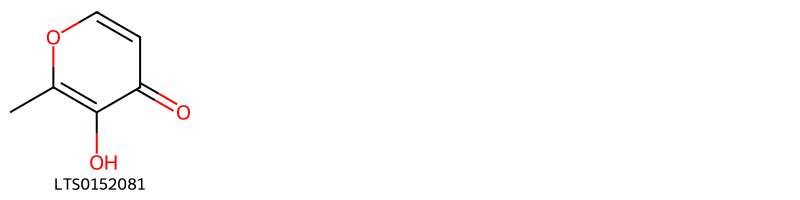{ width=100% }
    <figcaption>Hình ảnh cấu trúc hóa học của 1 hoạt chất thuộc nhóm Pyrans gồm ['talmon (LTS0152081)'].</figcaption>
</figure>
#### Nhóm Pyridines and derivatives
<figure markdown="span">
    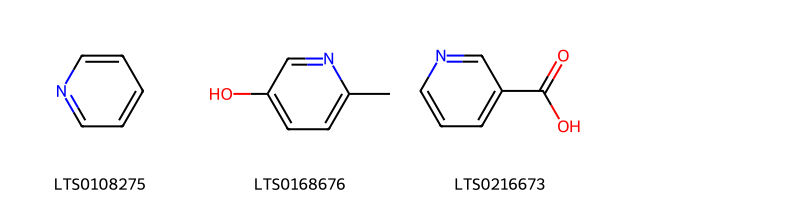{ width=100% }
    <figcaption>Hình ảnh cấu trúc hóa học của 3 hoạt chất thuộc nhóm Pyridines and derivatives gồm ['pyridine (LTS0108275)', '3-pyridinol, 6-methyl- (LTS0168676)', 'niacin (LTS0216673)'].</figcaption>
</figure>
#### Nhóm Pyrimidine nucleosides
<figure markdown="span">
    { width=100% }
    <figcaption>Hình ảnh cấu trúc hóa học của 1 hoạt chất thuộc nhóm Pyrimidine nucleosides gồm ['uridine (LTS0220125)'].</figcaption>
</figure>
#### Nhóm Saturated hydrocarbons
<figure markdown="span">
    { width=100% }
    <figcaption>Hình ảnh cấu trúc hóa học của 2 hoạt chất thuộc nhóm Saturated hydrocarbons gồm ['cyclohexadecane (LTS0261378)', 'pentadecane (LTS0210146)'].</figcaption>
</figure>
#### Nhóm Steroids and steroid derivatives
<figure markdown="span">
    { width=100% }
    <figcaption>Hình ảnh cấu trúc hóa học của 33 hoạt chất thuộc nhóm Steroids and steroid derivatives gồm ['stigmast-5-en-3-ol (LTS0071224)', '1-(5-hydroxy-1-methoxy-5-methylhexyl)-3a,3b,6,6,9a-pentamethyl-dodecahydro-1h-cyclopenta[a]phenanthrene-7,11-diol (LTS0097525)', '2-{[1-(5-hydroxy-5-isopropylhept-6-en-2-yl)-9a,11a-dimethyl-1h,2h,3h,3ah,3bh,4h,6h,7h,8h,9h,9bh,10h,11h-cyclopenta[a]phenanthren-7-yl]oxy}-6-(hydroxymethyl)oxane-3,4,5-triol (LTS0108093)', '24-methylene-cycloartanol (LTS0077845)', '1-(1,5-dimethoxy-5-methylhexyl)-3a,3b,6,6,9a-pentamethyl-dodecahydro-1h-cyclopenta[a]phenanthrene-7,11-diol (LTS0102491)', 'avenasterol (LTS0103350)', '24-α-methylcholesterol (LTS0106857)', '(1s,3ar,3br,5s,5ar,7s,9ar,9br,11r,11ar)-1-[(1r)-1-hydroxy-5-methoxy-5-methylhexyl]-3a,3b,6,6,9a-pentamethyl-dodecahydro-1h-cyclopenta[a]phenanthrene-5,7,11-triol (LTS0163736)', 'stigmast-5-en-3-ol, (3β)- (LTS0204616)', 'sitogluside (LTS0201798)', '(1s,3ar,3br,5ar,7s,9ar,9br,11r,11ar)-1-[(1r)-5-hydroxy-1-methoxy-5-methylhexyl]-3a,3b,6,6,9a-pentamethyl-dodecahydro-1h-cyclopenta[a]phenanthrene-7,11-diol (LTS0146290)', '(z)-24-ethylidenelophenol (LTS0155418)', '2-{[1-(5-ethyl-6-methylheptan-2-yl)-9a,11a-dimethyl-1h,2h,3h,3ah,3bh,4h,6h,7h,8h,9h,9bh,10h,11h-cyclopenta[a]phenanthren-7-yl]oxy}-6-(hydroxymethyl)oxane-3,4,5-triol (LTS0158828)', '1-(1-hydroxy-5-methoxy-5-methylhexyl)-3a,3b,6,6,9a-pentamethyl-dodecahydro-1h-cyclopenta[a]phenanthrene-7,11-diol (LTS0187687)', 'fucosterol (LTS0178887)', '(3ar,3br,9ar,9bs,11ar)-1-(5-ethyl-6-methylheptan-2-yl)-9a,11a-dimethyl-1h,2h,3h,3ah,3bh,4h,6h,7h,8h,9h,9bh,10h,11h-cyclopenta[a]phenanthren-7-ol (LTS0126002)', '(2s,3r,4r,5r,6s)-2-{[(2r,3r,4s,5s,6r)-2-{[(1s,3ar,5r,9ar,11s,11as)-6-ethyl-7,11-dihydroxy-3a,6,9a-trimethyl-1-[(2z)-6-methylhepta-2,5-dien-2-yl]-tetradecahydrocyclopenta[a]phenanthren-5-yl]oxy}-4,5-dihydroxy-6-(hydroxymethyl)oxan-3-yl]oxy}-6-methyloxane-3,4,5-triol (LTS0127198)', '(3r,6s,8r,11s,12s,15r,16r)-7,7,12,16-tetramethyl-15-[(2r)-6-methylhept-5-en-2-yl]pentacyclo[9.7.0.0¹,³.0³,⁸.0¹²,¹⁶]octadecan-6-ol (LTS0062833)', '(1s,3ar,3br,5ar,7s,9ar,9br,11r,11ar)-1-[(1r)-1-hydroxy-5-methoxy-5-methylhexyl]-3a,3b,6,6,9a-pentamethyl-dodecahydro-1h-cyclopenta[a]phenanthrene-7,11-diol (LTS0079819)', '24-α-ethylcholesterol (LTS0232294)', '(2r,3r,4s,5s,6r)-2-{[(1r,3as,3bs,7s,9ar,9bs,11ar)-1-[(2r,5r)-5-hydroxy-5-isopropylhept-6-en-2-yl]-9a,11a-dimethyl-1h,2h,3h,3ah,3bh,4h,6h,7h,8h,9h,9bh,10h,11h-cyclopenta[a]phenanthren-7-yl]oxy}-6-(hydroxymethyl)oxane-3,4,5-triol (LTS0223908)', '(2r,3r,4s,5s,6r)-2-{[(1r,3as,3bs,5r,5ar,7s,9ar,9bs,11ar)-1-[(2r,5r)-5-ethyl-6-methylheptan-2-yl]-5,5a-dihydroxy-9a,11a-dimethyl-tetradecahydrocyclopenta[a]phenanthren-7-yl]oxy}-6-(hydroxymethyl)oxane-3,4,5-triol (LTS0223168)', '(1s,3ar,3br,5ar,7s,9ar,9br,11r,11ar)-1-[(1s)-1,5-dimethoxy-5-methylhexyl]-3a,3b,6,6,9a-pentamethyl-dodecahydro-1h-cyclopenta[a]phenanthrene-7,11-diol (LTS0157610)', 'phytosterol (LTS0029311)', '1-(1-hydroxy-5-methoxy-5-methylhexyl)-3a,3b,6,6,9a-pentamethyl-dodecahydro-1h-cyclopenta[a]phenanthrene-5,7,11-triol (LTS0246084)', 'stigmasterol (LTS0024262)', 'cycloartenol (LTS0269561)', '[(2s,3r,4s,5s,6s)-6-{[(3ar,3bs,5as,7r,9as,9bs,11s,11as)-11-hydroxy-3a,3b,6,6,9a-pentamethyl-11a-[(2s)-6-methyl-2-{[(2r,3s,4r,5r,6r)-3,4,5-trihydroxy-6-({[(2s,3r,4r,5r)-3,4,5-trihydroxyoxan-2-yl]oxy}methyl)oxan-2-yl]oxy}hept-5-en-2-yl]-dodecahydrocyclopenta[a]phenanthren-7-yl]oxy}-3,4-dihydroxy-5-{[(2s,3s,4r,5r,6r)-3,4,5-trihydroxy-6-(hydroxymethyl)oxan-2-yl]oxy}oxan-2-yl]methyl acetate (LTS0022923)', '2-{[1-(5-ethyl-6-methylheptan-2-yl)-5,5a-dihydroxy-9a,11a-dimethyl-tetradecahydrocyclopenta[a]phenanthren-7-yl]oxy}-6-(hydroxymethyl)oxane-3,4,5-triol (LTS0013869)', '24-methylenecycloartanol (LTS0018584)', 'cholesterol (LTS0102304)', 'cycloeucalenol (LTS0125739)', '(1r,3ar,5as,6s,7s,9as,11ar)-3a,6,9a,11a-tetramethyl-1-[(2r)-6-methyl-5-methylideneheptan-2-yl]-1h,2h,3h,4h,5h,5ah,6h,7h,8h,9h,10h,11h-cyclopenta[a]phenanthren-7-ol (LTS0243203)'].</figcaption>
</figure>
#### Nhóm Unsaturated hydrocarbons
<figure markdown="span">
    { width=100% }
    <figcaption>Hình ảnh cấu trúc hóa học của 2 hoạt chất thuộc nhóm Unsaturated hydrocarbons gồm ['(1r,6r,9r)-4,9,11,11-tetramethyltricyclo[4.3.2.0¹,⁵]undec-4-ene (LTS0257040)', '1-pentadecene (LTS0248601)'].</figcaption>
</figure>

---

### Dược dân tộc học

Danh sách các quốc gia có sử dụng *Panax ginseng* trong điều trị các bệnh. 

| Country   | Disease                                                                                                                                  | Bệnh                                                                                                                                                                                                |
|:----------|:-----------------------------------------------------------------------------------------------------------------------------------------|:----------------------------------------------------------------------------------------------------------------------------------------------------------------------------------------------------|
| China     | Aphrodisiac, Aphrodisiac, Aphrodisiac, Emetic, Expectorant, Sialogogue, Stimulant, Tonic, Tonic, Tonic, Apertif, Stimulant, Tonic, Tonic | MYMEMORY WARNING: YOU USED ALL AVAILABLE FREE TRANSLATIONS FOR TODAY. NEXT AVAILABLE IN  16 HOURS 51 MINUTES 02 SECONDS VISIT HTTPS://MYMEMORY.TRANSLATED.NET/DOC/USAGELIMITS.PHP TO TRANSLATE MORE |
| Elsewhere | Cardiotonic, Tranquilizer                                                                                                                | MYMEMORY WARNING: YOU USED ALL AVAILABLE FREE TRANSLATIONS FOR TODAY. NEXT AVAILABLE IN  16 HOURS 50 MINUTES 59 SECONDS VISIT HTTPS://MYMEMORY.TRANSLATED.NET/DOC/USAGELIMITS.PHP TO TRANSLATE MORE |
| Japan*    | Stomachic, Tonic                                                                                                                         | MYMEMORY WARNING: YOU USED ALL AVAILABLE FREE TRANSLATIONS FOR TODAY. NEXT AVAILABLE IN  16 HOURS 50 MINUTES 57 SECONDS VISIT HTTPS://MYMEMORY.TRANSLATED.NET/DOC/USAGELIMITS.PHP TO TRANSLATE MORE |
| Russia    | Cardiotonic, Tranquilizer                                                                                                                | MYMEMORY WARNING: YOU USED ALL AVAILABLE FREE TRANSLATIONS FOR TODAY. NEXT AVAILABLE IN  16 HOURS 50 MINUTES 54 SECONDS VISIT HTTPS://MYMEMORY.TRANSLATED.NET/DOC/USAGELIMITS.PHP TO TRANSLATE MORE |
| US        | Stimulant                                                                                                                                | MYMEMORY WARNING: YOU USED ALL AVAILABLE FREE TRANSLATIONS FOR TODAY. NEXT AVAILABLE IN  16 HOURS 50 MINUTES 51 SECONDS VISIT HTTPS://MYMEMORY.TRANSLATED.NET/DOC/USAGELIMITS.PHP TO TRANSLATE MORE |

---

---
## Panax japonicum
### Thông tin về thực vật

!!! info "Phân loại thực vật của *Panax japonicus* từ GIBF:"
    - **Kingdom:** Plantae
    - **Phylum:** Tracheophyta
    - **Order:** Apiales
    - **Family:** Araliaceae
    - **Genus:** Panax
    - **Species:** *Panax japonicus*

 

| Label (VI)   | Label (EN)   | Scientific Name   | Descriptions (VI)   | Descriptions (EN)   | Also Known As (VI)   | Also Known As (EN)   |
|:-------------|:-------------|:------------------|:--------------------|:--------------------|:---------------------|:---------------------|
| N/A          | N/A          | Panax ginseng     |                     | species of plant    | ['Panax ginseng']    | ['Korean ginseng']   |

#### Phân bố trên thế giới

**Từ CSDL GIBF** nan, Japan, Norway, China

#### Phân bố tại Việt Nam

**Từ CSDL GIBF**: Không có ghi nhận ở Việt Nam

---
### Thành phần hóa học
        
- Theo cơ sở dữ liệu lotus: Từ loài *Panax japonicus* đã phân lập và xác định được Chưa có hoạt chất nào được phân lập. hoạt chất thuộc về các nhóm Không có hoạt chất nào được phân lập. 

Không có hình ảnh nào được tạo ra

---

### Dược dân tộc học

Danh sách các quốc gia có sử dụng *Panax japonicus* trong điều trị các bệnh. 

| Country   | Disease                     | Bệnh                                                                                                                                                                                                |
|:----------|:----------------------------|:----------------------------------------------------------------------------------------------------------------------------------------------------------------------------------------------------|
| China     | Tonic                       | MYMEMORY WARNING: YOU USED ALL AVAILABLE FREE TRANSLATIONS FOR TODAY. NEXT AVAILABLE IN  16 HOURS 50 MINUTES 07 SECONDS VISIT HTTPS://MYMEMORY.TRANSLATED.NET/DOC/USAGELIMITS.PHP TO TRANSLATE MORE |
| Japan*    | Expectorant, Stomachic, nan | MYMEMORY WARNING: YOU USED ALL AVAILABLE FREE TRANSLATIONS FOR TODAY. NEXT AVAILABLE IN  16 HOURS 50 MINUTES 05 SECONDS VISIT HTTPS://MYMEMORY.TRANSLATED.NET/DOC/USAGELIMITS.PHP TO TRANSLATE MORE |

---

---
## Panax major
### Thông tin về thực vật

!!! info "Phân loại thực vật của *Panax bipinnatifidus* từ GIBF:"
    - **Kingdom:** Plantae
    - **Phylum:** Tracheophyta
    - **Order:** Apiales
    - **Family:** Araliaceae
    - **Genus:** Panax
    - **Species:** *Panax bipinnatifidus*

 

| Label (VI)   | Label (EN)   | Scientific Name   | Descriptions (VI)   | Descriptions (EN)   | Also Known As (VI)   | Also Known As (EN)   |
|:-------------|:-------------|:------------------|:--------------------|:--------------------|:---------------------|:---------------------|
| N/A          | N/A          | Panax ginseng     |                     | species of plant    | ['Panax ginseng']    | ['Korean ginseng']   |

#### Phân bố trên thế giới

**Từ CSDL GIBF** nan, China

#### Phân bố tại Việt Nam

**Từ CSDL GIBF**: Không có ghi nhận ở Việt Nam

---
### Thành phần hóa học
        
- Theo cơ sở dữ liệu lotus: Từ loài *Panax bipinnatifidus* đã phân lập và xác định được Chưa có hoạt chất nào được phân lập. hoạt chất thuộc về các nhóm Không có hoạt chất nào được phân lập. 

Không có hình ảnh nào được tạo ra

---

### Dược dân tộc học

Danh sách các quốc gia có sử dụng *Panax bipinnatifidus* trong điều trị các bệnh. 

| Country   | Disease   | Bệnh                                                                                                                                                                                                |
|:----------|:----------|:----------------------------------------------------------------------------------------------------------------------------------------------------------------------------------------------------|
| China     | Tonic     | MYMEMORY WARNING: YOU USED ALL AVAILABLE FREE TRANSLATIONS FOR TODAY. NEXT AVAILABLE IN  16 HOURS 49 MINUTES 44 SECONDS VISIT HTTPS://MYMEMORY.TRANSLATED.NET/DOC/USAGELIMITS.PHP TO TRANSLATE MORE |

---

---
## Panax pseudoginseng
### Thông tin về thực vật

!!! info "Phân loại thực vật của *Panax pseudoginseng* từ GIBF:"
    - **Kingdom:** Plantae
    - **Phylum:** Tracheophyta
    - **Order:** Apiales
    - **Family:** Araliaceae
    - **Genus:** Panax
    - **Species:** *Panax pseudoginseng*

 

| Label (VI)   | Label (EN)   | Scientific Name     | Descriptions (VI)   | Descriptions (EN)   | Also Known As (VI)   | Also Known As (EN)   |
|:-------------|:-------------|:--------------------|:--------------------|:--------------------|:---------------------|:---------------------|
| N/A          | N/A          | Panax pseudoginseng | loài thực vật       | species of plant    | ['']                 | ['']                 |

#### Phân bố trên thế giới

**Từ CSDL GIBF** nan, Japan, United States of America, Bhutan, Belgium, Nepal, China, Russian Federation, India, unknown or invalid, Canada, Thailand

#### Phân bố tại Việt Nam

**Từ CSDL GIBF**: Không có ghi nhận ở Việt Nam

---
### Thành phần hóa học
        
- Theo cơ sở dữ liệu lotus: Từ loài *Panax pseudoginseng* đã phân lập và xác định được 73 hoạt chất thuộc về các nhóm Fatty Acyls, Saccharolipids, Glycerolipids, Steroids and steroid derivatives, Organooxygen compounds, Prenol lipids, Saturated hydrocarbons, Indoles and derivatives. 

|    | chemicalTaxonomyClassyfireClass   |   smiles_count |
|---:|:----------------------------------|---------------:|
|  0 | Fatty Acyls                       |             15 |
|  1 | Glycerolipids                     |              2 |
|  2 | Indoles and derivatives           |              1 |
|  3 | Organooxygen compounds            |              1 |
|  4 | Prenol lipids                     |             47 |
|  5 | Saccharolipids                    |              1 |
|  6 | Saturated hydrocarbons            |              1 |
|  7 | Steroids and steroid derivatives  |              5 |

#### Nhóm Fatty Acyls
<figure markdown="span">
    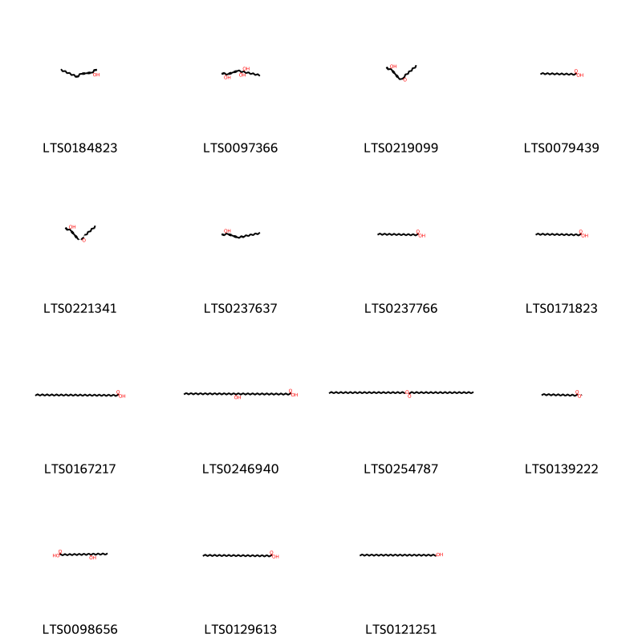{ width=100% }
    <figcaption>Hình ảnh cấu trúc hóa học của 15 hoạt chất thuộc nhóm Fatty Acyls gồm ['falcarinol (LTS0184823)', 'panaxytriol (LTS0097366)', 'panaxydol (LTS0219099)', 'palmitic acid (LTS0079439)', '8-[(2r,3s)-3-heptyloxiran-2-yl]oct-1-en-4,6-diyn-3-ol (LTS0221341)', '(z)-falcarinol (LTS0237637)', 'stearic acid (LTS0237766)', 'arachidic acid (LTS0171823)', 'hexatriacontanoic acid (LTS0167217)', '24-hydroxyhexatetracontanoic acid (LTS0246940)', 'tritriacontyl octacosanoate (LTS0254787)', 'methyl palmitate (LTS0139222)', '14-hydroxyhenicosanoic acid (LTS0098656)', 'triacontanoic acid (LTS0129613)', 'tritriacontan-1-ol (LTS0121251)'].</figcaption>
</figure>
#### Nhóm Glycerolipids
<figure markdown="span">
    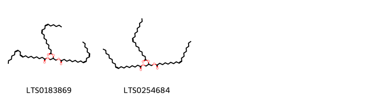{ width=100% }
    <figcaption>Hình ảnh cấu trúc hóa học của 2 hoạt chất thuộc nhóm Glycerolipids gồm ['linolein (LTS0183869)', 'triolein (LTS0254684)'].</figcaption>
</figure>
#### Nhóm Indoles and derivatives
<figure markdown="span">
    { width=100% }
    <figcaption>Hình ảnh cấu trúc hóa học của 1 hoạt chất thuộc nhóm Indoles and derivatives gồm ['n-[2-(5-methoxy-1h-indol-3-yl)ethyl]ethanimidic acid (LTS0219322)'].</figcaption>
</figure>
#### Nhóm Organooxygen compounds
<figure markdown="span">
    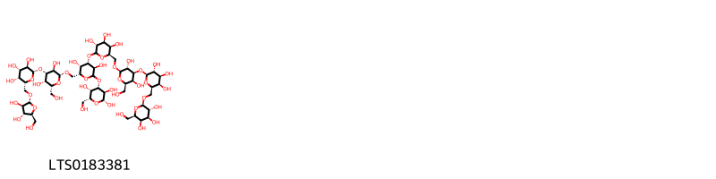{ width=100% }
    <figcaption>Hình ảnh cấu trúc hóa học của 1 hoạt chất thuộc nhóm Organooxygen compounds gồm ['(2r,3r,4s,5r,6s)-2-({[(2r,3r,4r,5s)-3,4-dihydroxy-5-(hydroxymethyl)oxolan-2-yl]oxy}methyl)-6-{[(2r,3r,4s,5s,6r)-2-{[(2r,3s,4s,5r)-4-{[(3r,4s,5r,6r)-6-({[(2r,3r,4s,5s,6r)-3,5-dihydroxy-6-(hydroxymethyl)-4-{[(2s,3r,4s,5r,6r)-3,4,5-trihydroxy-6-({[(2r,3r,4s,5r,6r)-3,4,5-trihydroxy-6-(hydroxymethyl)oxan-2-yl]oxy}methyl)oxan-2-yl]oxy}oxan-2-yl]oxy}methyl)-3,4,5-trihydroxyoxan-2-yl]oxy}-3,5-dihydroxy-6-{[(2r,3r,4s,5s,6r)-2,3,5-trihydroxy-6-(hydroxymethyl)oxan-4-yl]oxy}oxan-2-yl]methoxy}-3,5-dihydroxy-6-(hydroxymethyl)oxan-4-yl]oxy}oxane-3,4,5-triol (LTS0183381)'].</figcaption>
</figure>
#### Nhóm Prenol lipids
<figure markdown="span">
    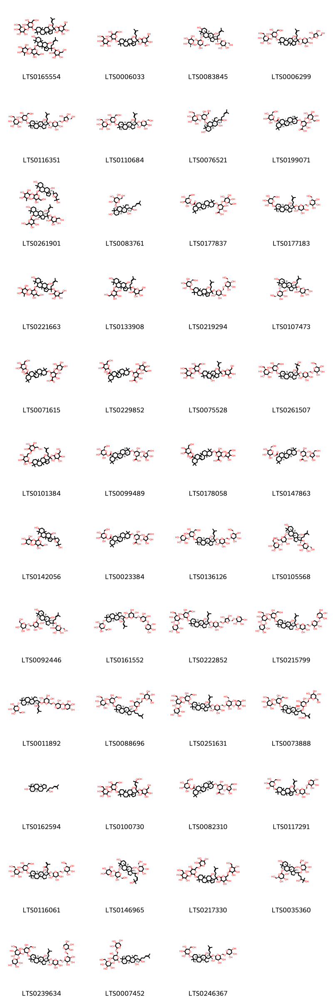{ width=100% }
    <figcaption>Hình ảnh cấu trúc hóa học của 47 hoạt chất thuộc nhóm Prenol lipids gồm ['2-{[2-(5-{[4,5-dihydroxy-6-(hydroxymethyl)-3-[(3,4,5-trihydroxy-6-methyloxan-2-yl)oxy]oxan-2-yl]oxy}-7,11-dihydroxy-3a,3b,6,6,9a-pentamethyl-dodecahydro-1h-cyclopenta[a]phenanthren-1-yl)-6-methylhept-5-en-2-yl]oxy}-6-(hydroxymethyl)oxane-3,4,5-triol; 2-{[2-(7-{[4,5-dihydroxy-6-(hydroxymethyl)-3-{[3,4,5-trihydroxy-6-(hydroxymethyl)oxan-2-yl]oxy}oxan-2-yl]oxy}-11-hydroxy-3a,3b,6,6,9a-pentamethyl-dodecahydro-1h-cyclopenta[a]phenanthren-1-yl)-6-methylhept-5-en-2-yl]oxy}-6-(hydroxymethyl)oxane-3,4,5-triol (LTS0165554)', '2-{[2-(7-{[4,5-dihydroxy-6-(hydroxymethyl)-3-{[3,4,5-trihydroxy-6-(hydroxymethyl)oxan-2-yl]oxy}oxan-2-yl]oxy}-11-hydroxy-3a,3b,6,6,9a-pentamethyl-dodecahydro-1h-cyclopenta[a]phenanthren-1-yl)-6-methylhept-5-en-2-yl]oxy}-6-(hydroxymethyl)oxane-3,4,5-triol (LTS0006033)', '(2s,3r,4s,5s,6r)-2-{[(2s)-2-[(1s,3ar,3br,5s,5ar,7s,9ar,9br,11r,11ar)-5-{[(2r,3r,4s,5s,6r)-4,5-dihydroxy-6-(hydroxymethyl)-3-{[(2s,3r,4r,5r,6s)-3,4,5-trihydroxy-6-methyloxan-2-yl]oxy}oxan-2-yl]oxy}-7,11-dihydroxy-3a,3b,6,6,9a-pentamethyl-dodecahydro-1h-cyclopenta[a]phenanthren-1-yl]-6-methylhept-5-en-2-yl]oxy}-6-(hydroxymethyl)oxane-3,4,5-triol (LTS0083845)', '(2s,3r,4s,5s,6r)-2-({2-[(3br,7s,9ar,11ar)-7-{[(2r,3r,4s,5s,6r)-4,5-dihydroxy-6-(hydroxymethyl)-3-{[(2s,3r,4s,5s,6r)-3,4,5-trihydroxy-6-(hydroxymethyl)oxan-2-yl]oxy}oxan-2-yl]oxy}-11-hydroxy-3a,3b,6,6,9a-pentamethyl-dodecahydro-1h-cyclopenta[a]phenanthren-1-yl]-6-methylhept-5-en-2-yl}oxy)-6-({[(2r,3r,4r,5s)-3,4-dihydroxy-5-(hydroxymethyl)oxolan-2-yl]oxy}methyl)oxane-3,4,5-triol (LTS0006299)', 'ginsenoside rc (LTS0116351)', 'ginsenoside rd (LTS0110684)', 'ginsenoside rf (LTS0076521)', 'chikusetsusaponin-v (LTS0199071)', '2-({2-[(3bs,7r,9as,11s,11as)-7,11-dihydroxy-3a,3b,6,6,9a-pentamethyl-5-{[3,4,5-trihydroxy-6-(hydroxymethyl)oxan-2-yl]oxy}-dodecahydro-1h-cyclopenta[a]phenanthren-1-yl]-6-methylhept-5-en-2-yl}oxy)-6-(hydroxymethyl)oxane-3,4,5-triol; 2-[(2-{[(1r,3bs,7r,9as,11s,11as)-7,11-dihydroxy-1-[5-(2-hydroxypropan-2-yl)-2-methyloxolan-2-yl]-3a,3b,6,6,9a-pentamethyl-dodecahydro-1h-cyclopenta[a]phenanthren-5-yl]oxy}-4,5-dihydroxy-6-(hydroxymethyl)oxan-3-yl)oxy]-6-methyloxane-3,4,5-triol (LTS0261901)', '(2r,3r,4s,5s,6r)-2-{[(1s,3ar,3br,5s,5ar,7s,9ar,9br,11r,11ar)-7,11-dihydroxy-1-[(2s)-2-hydroxy-6-methylhept-5-en-2-yl]-3a,3b,6,6,9a-pentamethyl-dodecahydro-1h-cyclopenta[a]phenanthren-5-yl]oxy}-6-(hydroxymethyl)oxane-3,4,5-triol (LTS0083761)', '(2s,3s,4s,5r,6r)-6-{[(6ar,6bs,8as,12ar,14br)-4,4,6a,6b,11,11,14b-heptamethyl-8a-({[(2s,3r,4s,5s,6r)-3,4,5-trihydroxy-6-(hydroxymethyl)oxan-2-yl]oxy}carbonyl)-1,2,3,4a,5,6,7,8,9,10,12,12a,14,14a-tetradecahydropicen-3-yl]oxy}-3,4-dihydroxy-5-{[(2s,3r,4s,5s,6r)-3,4,5-trihydroxy-6-(hydroxymethyl)oxan-2-yl]oxy}oxane-2-carboxylic acid (LTS0177837)', 'gypenoside xvii (LTS0177183)', '2-{[2-(5-{[4,5-dihydroxy-6-(hydroxymethyl)-3-[(3,4,5-trihydroxy-6-methyloxan-2-yl)oxy]oxan-2-yl]oxy}-7,11-dihydroxy-3a,3b,6,6,9a-pentamethyl-dodecahydro-1h-cyclopenta[a]phenanthren-1-yl)-6-methylhept-5-en-2-yl]oxy}-6-(hydroxymethyl)oxane-3,4,5-triol (LTS0221663)', '2-{[2-(7,11-dihydroxy-3a,3b,6,6,9a-pentamethyl-5-{[3,4,5-trihydroxy-6-(hydroxymethyl)oxan-2-yl]oxy}-dodecahydro-1h-cyclopenta[a]phenanthren-1-yl)-6-methylhept-5-en-2-yl]oxy}-6-(hydroxymethyl)oxane-3,4,5-triol (LTS0133908)', '(2s,3r,4s,5s,6r)-2-{[2-(11-hydroxy-3a,3b,6,6,9a-pentamethyl-7-{[(2r,3r,4s,5s,6r)-3,4,5-trihydroxy-6-(hydroxymethyl)oxan-2-yl]oxy}-dodecahydro-1h-cyclopenta[a]phenanthren-1-yl)-6-methylhept-5-en-2-yl]oxy}-6-({[(2r,3r,4s,5s,6r)-3,4,5-trihydroxy-6-(hydroxymethyl)oxan-2-yl]oxy}methyl)oxane-3,4,5-triol (LTS0219294)', '(2s,3r,4s,5s,6s)-2-{[(2s)-2-[(1s,3ar,3br,5s,5ar,7s,9ar,9br,11r,11ar)-7,11-dihydroxy-3a,3b,6,6,9a-pentamethyl-5-{[(2s,3s,4r,5s,6s)-3,4,5-trihydroxy-6-(hydroxymethyl)oxan-2-yl]oxy}-dodecahydro-1h-cyclopenta[a]phenanthren-1-yl]-6-methylhept-5-en-2-yl]oxy}-6-(hydroxymethyl)oxane-3,4,5-triol (LTS0107473)', '6-{[4,4,6a,6b,11,11,14b-heptamethyl-8a-({[3,4,5-trihydroxy-6-(hydroxymethyl)oxan-2-yl]oxy}carbonyl)-1,2,3,4a,5,6,7,8,9,10,12,12a,14,14a-tetradecahydropicen-3-yl]oxy}-3,4-dihydroxy-5-[(3,4,5-trihydroxyoxan-2-yl)oxy]oxane-2-carboxylic acid (LTS0071615)', '6-{[4,4,6a,6b,11,11,14b-heptamethyl-8a-({[3,4,5-trihydroxy-6-(hydroxymethyl)oxan-2-yl]oxy}carbonyl)-1,2,3,4a,5,6,7,8,9,10,12,12a,14,14a-tetradecahydropicen-3-yl]oxy}-3,4-dihydroxy-5-{[3,4,5-trihydroxy-6-(hydroxymethyl)oxan-2-yl]oxy}oxane-2-carboxylic acid (LTS0229852)', '2-{[2-(7-{[4,5-dihydroxy-6-(hydroxymethyl)-3-{[3,4,5-trihydroxy-6-(hydroxymethyl)oxan-2-yl]oxy}oxan-2-yl]oxy}-4,11-dihydroxy-3a,3b,6,6,9a-pentamethyl-1h,2h,3h,4h,7h,8h,9h,9bh,10h,11h,11ah-cyclopenta[a]phenanthren-1-yl)-6-methylhept-5-en-2-yl]oxy}-6-(hydroxymethyl)oxane-3,4,5-triol (LTS0075528)', '(2s,3r,4s,5s,6r)-2-{[(2s,4e)-2-[(1s,3ar,3br,5ar,7s,9ar,9br,11r,11ar)-7-{[(2r,3r,4s,5s,6r)-4,5-dihydroxy-6-(hydroxymethyl)-3-{[(2s,3r,4s,5s,6r)-3,4,5-trihydroxy-6-(hydroxymethyl)oxan-2-yl]oxy}oxan-2-yl]oxy}-11-hydroxy-3a,3b,6,6,9a-pentamethyl-dodecahydro-1h-cyclopenta[a]phenanthren-1-yl]-6-hydroxy-6-methylhept-4-en-2-yl]oxy}-6-({[(2r,3r,4s,5s,6r)-3,4,5-trihydroxy-6-(hydroxymethyl)oxan-2-yl]oxy}methyl)oxane-3,4,5-triol (LTS0261507)', '2-{[2-(11-hydroxy-3a,3b,6,6,9a-pentamethyl-7-{[3,4,5-trihydroxy-6-({[3,4,5-trihydroxy-6-(hydroxymethyl)oxan-2-yl]oxy}methyl)oxan-2-yl]oxy}-dodecahydro-1h-cyclopenta[a]phenanthren-1-yl)-6-methylhept-5-en-2-yl]oxy}-6-(hydroxymethyl)oxane-3,4,5-triol (LTS0101384)', 'araloside a (LTS0099489)', '6-{[4,4,6a,6b,11,11,14b-heptamethyl-8a-({[3,4,5-trihydroxy-6-(hydroxymethyl)oxan-2-yl]oxy}carbonyl)-1,2,3,4a,5,6,7,8,9,10,12,12a,14,14a-tetradecahydropicen-3-yl]oxy}-3-{[3,4-dihydroxy-5-(hydroxymethyl)oxolan-2-yl]oxy}-4,5-dihydroxyoxane-2-carboxylic acid (LTS0178058)', '(2r,3r,4s,5s,6s)-6-{[(3r,4as,6as,6br,8ar,12ar,14as,14bs)-4,4,6a,6b,11,11,14b-heptamethyl-8a-({[(2r,3s,4r,5r,6s)-3,4,5-trihydroxy-6-(hydroxymethyl)oxan-2-yl]oxy}carbonyl)-1,2,3,4a,5,6,7,8,9,10,12,12a,14,14a-tetradecahydropicen-3-yl]oxy}-3-{[(2s,3r,4r,5s)-3,4-dihydroxy-5-(hydroxymethyl)oxolan-2-yl]oxy}-4,5-dihydroxyoxane-2-carboxylic acid (LTS0147863)', '2-{[2-({7,11-dihydroxy-1-[5-(2-hydroxypropan-2-yl)-2-methyloxolan-2-yl]-3a,3b,6,6,9a-pentamethyl-dodecahydro-1h-cyclopenta[a]phenanthren-5-yl}oxy)-4,5-dihydroxy-6-(hydroxymethyl)oxan-3-yl]oxy}oxane-3,4,5-triol (LTS0142056)', '(2s,3s,4r,5r,6s)-6-{[(6ar,6bs,8as,12ar,14br)-4,4,6a,6b,11,11,14b-heptamethyl-8a-({[(2s,3r,4s,5s,6r)-3,4,5-trihydroxy-6-(hydroxymethyl)oxan-2-yl]oxy}carbonyl)-1,2,3,4a,5,6,7,8,9,10,12,12a,14,14a-tetradecahydropicen-3-yl]oxy}-3-{[(2s,3r,4r,5s)-3,4-dihydroxy-5-(hydroxymethyl)oxolan-2-yl]oxy}-4,5-dihydroxyoxane-2-carboxylic acid (LTS0023384)', '(2s,3r,4s,5s,6r)-2-{[(2s)-2-[(1s,3ar,3br,5ar,7s,9ar,9br,11r,11ar)-7-{[(2r,3r,4s,5s,6r)-4,5-dihydroxy-6-(hydroxymethyl)-3-{[(2s,3r,4s,5r)-3,4,5-trihydroxyoxan-2-yl]oxy}oxan-2-yl]oxy}-11-hydroxy-3a,3b,6,6,9a-pentamethyl-dodecahydro-1h-cyclopenta[a]phenanthren-1-yl]-6-methylhept-5-en-2-yl]oxy}-6-({[(2r,3r,4s,5s,6r)-3,4,5-trihydroxy-6-(hydroxymethyl)oxan-2-yl]oxy}methyl)oxane-3,4,5-triol (LTS0136126)', '(2s,3r,4s,5s,6r)-2-{[(2s)-2-[(1s,3ar,3br,5s,5ar,7s,9ar,9br,11r,11ar)-5-{[(2r,3r,4r,5s,6r)-3,4-dihydroxy-6-(hydroxymethyl)-5-{[(2r,3r,4s,5s,6r)-3,4,5-trihydroxy-6-(hydroxymethyl)oxan-2-yl]oxy}oxan-2-yl]oxy}-7,11-dihydroxy-3a,3b,6,6,9a-pentamethyl-dodecahydro-1h-cyclopenta[a]phenanthren-1-yl]-6-methylhept-5-en-2-yl]oxy}-6-(hydroxymethyl)oxane-3,4,5-triol (LTS0105568)', '(2s,3r,4s,5s,6r)-2-{[(2s)-2-[(1s,3ar,3br,5s,5ar,7s,9ar,9br,11r,11ar)-7,11-dihydroxy-3a,3b,6,6,9a-pentamethyl-5-{[(2r,3r,4s,5s,6r)-3,4,5-trihydroxy-6-({[(2s,3r,4s,5s,6r)-3,4,5-trihydroxy-6-(hydroxymethyl)oxan-2-yl]oxy}methyl)oxan-2-yl]oxy}-dodecahydro-1h-cyclopenta[a]phenanthren-1-yl]-6-methylhept-5-en-2-yl]oxy}-6-(hydroxymethyl)oxane-3,4,5-triol (LTS0092446)', '(2s,3r,4s,5s,6r)-2-{[(2s)-2-[(1s,3ar,3br,5ar,7s,9ar,9br,11r,11ar)-11-hydroxy-3a,3b,6,6,9a-pentamethyl-7-{[(2r,3r,4s,5s,6r)-3,4,5-trihydroxy-6-(hydroxymethyl)oxan-2-yl]oxy}-dodecahydro-1h-cyclopenta[a]phenanthren-1-yl]-6-methylhept-5-en-2-yl]oxy}-6-({[(2s,3r,4r,5r)-3,4-dihydroxy-5-{[(2s,3r,4s,5r)-3,4,5-trihydroxyoxan-2-yl]oxy}oxan-2-yl]oxy}methyl)oxane-3,4,5-triol (LTS0161552)', '(2s,3r,4s,5s,6r)-2-{[(2s)-2-[(1s,3ar,3br,5ar,7s,9ar,9br,11r,11ar)-7-{[(2r,3r,4s,5s,6r)-3-{[(2s,3r,4s,5s,6r)-4,5-dihydroxy-6-(hydroxymethyl)-3-{[(2s,3r,4s,5r)-3,4,5-trihydroxyoxan-2-yl]oxy}oxan-2-yl]oxy}-4,5-dihydroxy-6-(hydroxymethyl)oxan-2-yl]oxy}-11-hydroxy-3a,3b,6,6,9a-pentamethyl-dodecahydro-1h-cyclopenta[a]phenanthren-1-yl]-6-methylhept-5-en-2-yl]oxy}-6-({[(2r,3r,4r,5s)-3,4-dihydroxy-5-({[(2s,3r,4s,5r)-3,4,5-trihydroxyoxan-2-yl]oxy}methyl)oxolan-2-yl]oxy}methyl)oxane-3,4,5-triol (LTS0222852)', '(2s,3r,4s,5s,6r)-2-{[(2s)-2-[(1s,3ar,3br,5ar,7s,9ar,9br,11r,11ar)-7-{[(2r,3r,4s,5s,6r)-3-{[(2s,3r,4s,5s,6r)-4,5-dihydroxy-6-(hydroxymethyl)-3-{[(2s,3r,4s,5r)-3,4,5-trihydroxyoxan-2-yl]oxy}oxan-2-yl]oxy}-4,5-dihydroxy-6-(hydroxymethyl)oxan-2-yl]oxy}-11-hydroxy-3a,3b,6,6,9a-pentamethyl-dodecahydro-1h-cyclopenta[a]phenanthren-1-yl]-6-methylhept-5-en-2-yl]oxy}-6-({[(2s,3r,4r,5r)-3,4-dihydroxy-5-{[(2s,3r,4s,5r)-3,4,5-trihydroxyoxan-2-yl]oxy}oxan-2-yl]oxy}methyl)oxane-3,4,5-triol (LTS0215799)', '(2s,3r,4s,5s,6r)-2-{[(2s)-2-[(1s,3ar,3br,5ar,7s,9ar,9br,11r,11ar)-11-hydroxy-3a,3b,6,6,9a-pentamethyl-7-{[(2r,3r,4s,5s,6r)-3,4,5-trihydroxy-6-(hydroxymethyl)oxan-2-yl]oxy}-dodecahydro-1h-cyclopenta[a]phenanthren-1-yl]-6-methylhept-5-en-2-yl]oxy}-6-({[(2s,3r,4s,5r)-3,5-dihydroxy-4-{[(2s,3r,4s,5r)-3,4,5-trihydroxyoxan-2-yl]oxy}oxan-2-yl]oxy}methyl)oxane-3,4,5-triol (LTS0011892)', '(2s,3r,4s,5s,6r)-2-{[(2s)-2-[(1s,3ar,3br,5ar,7s,9ar,9br,11ar)-7-{[(2r,3r,4s,5s,6r)-4,5-dihydroxy-6-(hydroxymethyl)-3-{[(2s,3r,4s,5s,6r)-3,4,5-trihydroxy-6-(hydroxymethyl)oxan-2-yl]oxy}oxan-2-yl]oxy}-3a,3b,6,6,9a-pentamethyl-dodecahydro-1h-cyclopenta[a]phenanthren-1-yl]-6-methylhept-5-en-2-yl]oxy}-6-({[(2r,3r,4s,5s,6r)-3,4,5-trihydroxy-6-(hydroxymethyl)oxan-2-yl]oxy}methyl)oxane-3,4,5-triol (LTS0088696)', '(2s,3r,4s,5s,6r)-2-{[(2s)-2-[(1s,3ar,3br,5ar,7s,9ar,9br,11r,11ar)-7-{[(2r,3r,4s,5s,6r)-3-{[(2s,3r,4s,5s,6r)-4,5-dihydroxy-6-(hydroxymethyl)-3-{[(2s,3r,4s,5r)-3,4,5-trihydroxyoxan-2-yl]oxy}oxan-2-yl]oxy}-4,5-dihydroxy-6-(hydroxymethyl)oxan-2-yl]oxy}-11-hydroxy-3a,3b,6,6,9a-pentamethyl-dodecahydro-1h-cyclopenta[a]phenanthren-1-yl]-6-methylhept-5-en-2-yl]oxy}-6-({[(2r,3r,4s,5r,6r)-3,5-dihydroxy-6-(hydroxymethyl)-4-{[(2s,3r,4s,5r)-3,4,5-trihydroxyoxan-2-yl]oxy}oxan-2-yl]oxy}methyl)oxane-3,4,5-triol (LTS0251631)', '(2s,3r,4s,5s,6r)-2-{[(2s)-2-[(1s,3ar,3br,5ar,7s,9ar,9br,11r,11ar)-7-{[(2r,3r,4s,5s,6r)-4,5-dihydroxy-6-(hydroxymethyl)-3-{[(2s,3r,4s,5s,6r)-3,4,5-trihydroxy-6-(hydroxymethyl)oxan-2-yl]oxy}oxan-2-yl]oxy}-11-hydroxy-3a,3b,6,6,9a-pentamethyl-dodecahydro-1h-cyclopenta[a]phenanthren-1-yl]-5-hydroperoxy-6-methylhept-6-en-2-yl]oxy}-6-({[(2r,3r,4s,5s,6r)-3,4,5-trihydroxy-6-(hydroxymethyl)oxan-2-yl]oxy}methyl)oxane-3,4,5-triol (LTS0073888)', '(1s,3ar,3br,5ar,7s,9ar,9br)-1-(2-hydroxy-6-methylhept-5-en-2-yl)-3a,3b,6,6,9a-pentamethyl-dodecahydro-1h-cyclopenta[a]phenanthren-7-ol (LTS0162594)', '2-{[(4e)-2-(7-{[4,5-dihydroxy-6-(hydroxymethyl)-3-{[3,4,5-trihydroxy-6-(hydroxymethyl)oxan-2-yl]oxy}oxan-2-yl]oxy}-11-hydroxy-3a,3b,6,6,9a-pentamethyl-dodecahydro-1h-cyclopenta[a]phenanthren-1-yl)-6-hydroperoxy-6-methylhept-4-en-2-yl]oxy}-6-(hydroxymethyl)oxane-3,4,5-triol (LTS0100730)', '(2s,3s,4r,5r,6r)-6-{[(3s,4ar,6ar,6bs,8as,12ar,14ar,14br)-4,4,6a,6b,11,11,14b-heptamethyl-8a-({[(2s,3r,4s,5s,6r)-3,4,5-trihydroxy-6-(hydroxymethyl)oxan-2-yl]oxy}carbonyl)-1,2,3,4a,5,6,7,8,9,10,12,12a,14,14a-tetradecahydropicen-3-yl]oxy}-3-{[(2s,3r,4r,5s)-3,4-dihydroxy-5-(hydroxymethyl)oxolan-2-yl]oxy}-4,5-dihydroxyoxane-2-carboxylic acid (LTS0082310)', '(2s,3r,4s,5s,6r)-2-{[2-(11-hydroxy-3a,3b,6,6,9a-pentamethyl-7-{[(2r,3r,4s,5s,6r)-3,4,5-trihydroxy-6-(hydroxymethyl)oxan-2-yl]oxy}-dodecahydro-1h-cyclopenta[a]phenanthren-1-yl)-6-methylhept-5-en-2-yl]oxy}-6-({[(2r,3r,4s,5r)-3,4,5-trihydroxyoxan-2-yl]oxy}methyl)oxane-3,4,5-triol (LTS0117291)', '(6s)-6-[(1s,3ar,3br,5ar,7s,9ar,9br,11r,11ar)-7-{[(2r,3r,4s,5s,6r)-4,5-dihydroxy-6-(hydroxymethyl)-3-{[(2s,3r,4s,5s,6r)-3,4,5-trihydroxy-6-(hydroxymethyl)oxan-2-yl]oxy}oxan-2-yl]oxy}-11-hydroxy-3a,3b,6,6,9a-pentamethyl-dodecahydro-1h-cyclopenta[a]phenanthren-1-yl]-2-methyl-6-{[(2s,3r,4s,5s,6r)-3,4,5-trihydroxy-6-({[(2r,3r,4s,5s,6r)-3,4,5-trihydroxy-6-(hydroxymethyl)oxan-2-yl]oxy}methyl)oxan-2-yl]oxy}hept-1-en-3-one (LTS0116061)', '(2s,3r,4s,5s,6r)-2-{[(2s,4z)-2-[(1s,3ar,3br,5s,5ar,7s,9ar,9br,11r,11ar)-5-{[(2r,3r,4s,5s,6r)-4,5-dihydroxy-6-(hydroxymethyl)-3-{[(2s,3r,4s,5r)-3,4,5-trihydroxyoxan-2-yl]oxy}oxan-2-yl]oxy}-7,11-dihydroxy-3a,3b,6,6,9a-pentamethyl-dodecahydro-1h-cyclopenta[a]phenanthren-1-yl]-6-hydroxy-6-methylhept-4-en-2-yl]oxy}-6-(hydroxymethyl)oxane-3,4,5-triol (LTS0146965)', '2-[(2-{7-[(4,5-dihydroxy-3-{[3,4,5-trihydroxy-6-(hydroxymethyl)oxan-2-yl]oxy}-6-{[(3,4,5-trihydroxyoxan-2-yl)oxy]methyl}oxan-2-yl)oxy]-11-hydroxy-3a,3b,6,6,9a-pentamethyl-dodecahydro-1h-cyclopenta[a]phenanthren-1-yl}-6-methylhept-5-en-2-yl)oxy]-6-({[3,4,5-trihydroxy-6-(hydroxymethyl)oxan-2-yl]oxy}methyl)oxane-3,4,5-triol (LTS0217330)', '(2s,3r,4s,5s,6r)-2-{[(2s)-2-[(1s,3ar,3br,5s,5ar,7s,9ar,9br,11r,11ar)-7,11-dihydroxy-3a,3b,6,6,9a-pentamethyl-5-{[(2r,3r,4s,5s,6r)-3,4,5-trihydroxy-6-(hydroxymethyl)oxan-2-yl]oxy}-dodecahydro-1h-cyclopenta[a]phenanthren-1-yl]-5,6-dihydroxy-6-methylheptan-2-yl]oxy}-6-(hydroxymethyl)oxane-3,4,5-triol (LTS0035360)', '(2s,3r,4s,5s,6r)-2-{[(2s)-2-[(1s,3ar,3br,5ar,7s,9ar,9br,11r,11ar)-7-{[(2r,3r,4s,5s,6r)-3-{[(2s,3r,4s,5s,6r)-4,5-dihydroxy-6-(hydroxymethyl)-3-{[(2s,3r,4s,5r)-3,4,5-trihydroxyoxan-2-yl]oxy}oxan-2-yl]oxy}-4,5-dihydroxy-6-(hydroxymethyl)oxan-2-yl]oxy}-11-hydroxy-3a,3b,6,6,9a-pentamethyl-dodecahydro-1h-cyclopenta[a]phenanthren-1-yl]-6-methylhept-5-en-2-yl]oxy}-6-({[(2r,3r,4s,5s,6r)-3,4,5-trihydroxy-6-({[(2s,3r,4s,5r)-3,4,5-trihydroxyoxan-2-yl]oxy}methyl)oxan-2-yl]oxy}methyl)oxane-3,4,5-triol (LTS0239634)', 'chikusetsusaponin iii (LTS0007452)', '(2s,3s,4s,5s,6r)-2-{[(2s)-2-[(1r,3ar,3br,5ar,7s,9ar,9bs,11r,11ar)-11-hydroxy-3a,3b,6,6,9a-pentamethyl-7-{[(2r,3s,4s,5s,6r)-3,4,5-trihydroxy-6-(hydroxymethyl)oxan-2-yl]oxy}-dodecahydro-1h-cyclopenta[a]phenanthren-1-yl]-6-methylhept-5-en-2-yl]oxy}-6-({[(2s,3s,4s,5r)-3,4,5-trihydroxyoxan-2-yl]oxy}methyl)oxane-3,4,5-triol (LTS0246367)'].</figcaption>
</figure>
#### Nhóm Saccharolipids
<figure markdown="span">
    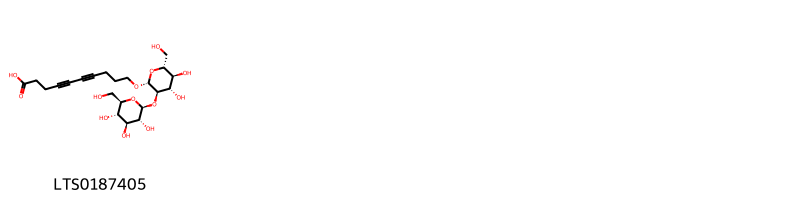{ width=100% }
    <figcaption>Hình ảnh cấu trúc hóa học của 1 hoạt chất thuộc nhóm Saccharolipids gồm ['10-{[(2r,3r,4s,5s,6r)-4,5-dihydroxy-6-(hydroxymethyl)-3-{[(2s,3r,4s,5s,6r)-3,4,5-trihydroxy-6-(hydroxymethyl)oxan-2-yl]oxy}oxan-2-yl]oxy}deca-4,6-diynoic acid (LTS0187405)'].</figcaption>
</figure>
#### Nhóm Saturated hydrocarbons
<figure markdown="span">
    { width=100% }
    <figcaption>Hình ảnh cấu trúc hóa học của 1 hoạt chất thuộc nhóm Saturated hydrocarbons gồm ['pentatriacontane (LTS0110888)'].</figcaption>
</figure>
#### Nhóm Steroids and steroid derivatives
<figure markdown="span">
    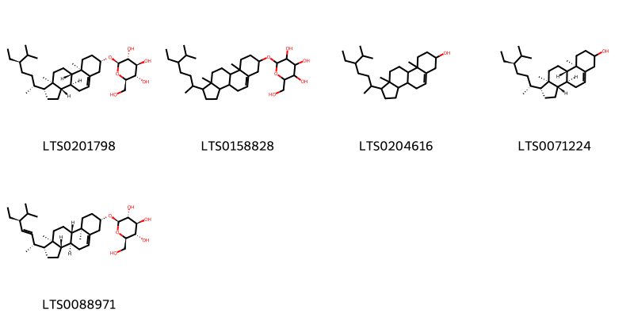{ width=100% }
    <figcaption>Hình ảnh cấu trúc hóa học của 5 hoạt chất thuộc nhóm Steroids and steroid derivatives gồm ['sitogluside (LTS0201798)', '2-{[1-(5-ethyl-6-methylheptan-2-yl)-9a,11a-dimethyl-1h,2h,3h,3ah,3bh,4h,6h,7h,8h,9h,9bh,10h,11h-cyclopenta[a]phenanthren-7-yl]oxy}-6-(hydroxymethyl)oxane-3,4,5-triol (LTS0158828)', 'stigmast-5-en-3-ol, (3β)- (LTS0204616)', 'stigmast-5-en-3-ol (LTS0071224)', '(2r,3r,4s,5s,6r)-2-{[(1r,3as,3bs,7s,9ar,9bs,11ar)-1-[(2r,3e,5s)-5-ethyl-6-methylhept-3-en-2-yl]-9a,11a-dimethyl-1h,2h,3h,3ah,3bh,4h,6h,7h,8h,9h,9bh,10h,11h-cyclopenta[a]phenanthren-7-yl]oxy}-6-(hydroxymethyl)oxane-3,4,5-triol (LTS0088971)'].</figcaption>
</figure>

---

### Dược dân tộc học

Danh sách các quốc gia có sử dụng *Panax pseudoginseng* trong điều trị các bệnh. 

| Country   | Disease                                                             | Bệnh                                                                                                                                                                                                |
|:----------|:--------------------------------------------------------------------|:----------------------------------------------------------------------------------------------------------------------------------------------------------------------------------------------------|
| China     | Estrogenic, Hemostat                                                | MYMEMORY WARNING: YOU USED ALL AVAILABLE FREE TRANSLATIONS FOR TODAY. NEXT AVAILABLE IN  16 HOURS 49 MINUTES 27 SECONDS VISIT HTTPS://MYMEMORY.TRANSLATED.NET/DOC/USAGELIMITS.PHP TO TRANSLATE MORE |
| Elsewhere | Carminative, Expectorant, Gonadotrophic, Sedative, Tonic, Stimulant | MYMEMORY WARNING: YOU USED ALL AVAILABLE FREE TRANSLATIONS FOR TODAY. NEXT AVAILABLE IN  16 HOURS 49 MINUTES 24 SECONDS VISIT HTTPS://MYMEMORY.TRANSLATED.NET/DOC/USAGELIMITS.PHP TO TRANSLATE MORE |

---

---
## Panax quinquefolia
### Thông tin về thực vật

!!! info "Phân loại thực vật của *Panax quinquefolius* từ GIBF:"
    - **Kingdom:** Plantae
    - **Phylum:** Tracheophyta
    - **Order:** Apiales
    - **Family:** Araliaceae
    - **Genus:** Panax
    - **Species:** *Panax quinquefolius*

 

| Label (VI)   | Label (EN)   | Scientific Name     | Descriptions (VI)   | Descriptions (EN)   | Also Known As (VI)   | Also Known As (EN)   |
|:-------------|:-------------|:--------------------|:--------------------|:--------------------|:---------------------|:---------------------|
| N/A          | N/A          | Panax pseudoginseng | loài thực vật       | species of plant    | ['']                 | ['']                 |

#### Phân bố trên thế giới

**Từ CSDL GIBF** nan, United States of America

#### Phân bố tại Việt Nam

**Từ CSDL GIBF**: Không có ghi nhận ở Việt Nam

---
### Thành phần hóa học
        
- Theo cơ sở dữ liệu lotus: Từ loài *Panax quinquefolius* đã phân lập và xác định được Chưa có hoạt chất nào được phân lập. hoạt chất thuộc về các nhóm Không có hoạt chất nào được phân lập. 

Không có hình ảnh nào được tạo ra

---

### Dược dân tộc học

Danh sách các quốc gia có sử dụng *Panax quinquefolius* trong điều trị các bệnh. 

| Country   | Disease                           | Bệnh                                                                                                                                                                                                |
|:----------|:----------------------------------|:----------------------------------------------------------------------------------------------------------------------------------------------------------------------------------------------------|
| US        | Stimulant, Stomachic, Aphrodisiac | MYMEMORY WARNING: YOU USED ALL AVAILABLE FREE TRANSLATIONS FOR TODAY. NEXT AVAILABLE IN  16 HOURS 48 MINUTES 56 SECONDS VISIT HTTPS://MYMEMORY.TRANSLATED.NET/DOC/USAGELIMITS.PHP TO TRANSLATE MORE |

---

---
## Panax quinquefolium
### Thông tin về thực vật

!!! info "Phân loại thực vật của *Panax quinquefolius* từ GIBF:"
    - **Kingdom:** Plantae
    - **Phylum:** Tracheophyta
    - **Order:** Apiales
    - **Family:** Araliaceae
    - **Genus:** Panax
    - **Species:** *Panax quinquefolius*

 

| Label (VI)   | Label (EN)   | Scientific Name     | Descriptions (VI)   | Descriptions (EN)   | Also Known As (VI)   | Also Known As (EN)   |
|:-------------|:-------------|:--------------------|:--------------------|:--------------------|:---------------------|:---------------------|
| N/A          | N/A          | Panax pseudoginseng | loài thực vật       | species of plant    | ['']                 | ['']                 |

#### Phân bố trên thế giới

**Từ CSDL GIBF** nan, United States of America

#### Phân bố tại Việt Nam

**Từ CSDL GIBF**: Không có ghi nhận ở Việt Nam

---
### Thành phần hóa học
        
- Theo cơ sở dữ liệu lotus: Từ loài *Panax quinquefolius* đã phân lập và xác định được Chưa có hoạt chất nào được phân lập. hoạt chất thuộc về các nhóm Không có hoạt chất nào được phân lập. 

Không có hình ảnh nào được tạo ra

---

### Dược dân tộc học

Danh sách các quốc gia có sử dụng *Panax quinquefolius* trong điều trị các bệnh. 

| Country   | Disease     | Bệnh                                                                                                                                                                                                |
|:----------|:------------|:----------------------------------------------------------------------------------------------------------------------------------------------------------------------------------------------------|
| Dutch     | Stimulant   | MYMEMORY WARNING: YOU USED ALL AVAILABLE FREE TRANSLATIONS FOR TODAY. NEXT AVAILABLE IN  16 HOURS 48 MINUTES 34 SECONDS VISIT HTTPS://MYMEMORY.TRANSLATED.NET/DOC/USAGELIMITS.PHP TO TRANSLATE MORE |
| English   | Tonic       | MYMEMORY WARNING: YOU USED ALL AVAILABLE FREE TRANSLATIONS FOR TODAY. NEXT AVAILABLE IN  16 HOURS 48 MINUTES 32 SECONDS VISIT HTTPS://MYMEMORY.TRANSLATED.NET/DOC/USAGELIMITS.PHP TO TRANSLATE MORE |
| German    | Aphrodisiac | MYMEMORY WARNING: YOU USED ALL AVAILABLE FREE TRANSLATIONS FOR TODAY. NEXT AVAILABLE IN  16 HOURS 48 MINUTES 29 SECONDS VISIT HTTPS://MYMEMORY.TRANSLATED.NET/DOC/USAGELIMITS.PHP TO TRANSLATE MORE |
| US        | Demulcent   | MYMEMORY WARNING: YOU USED ALL AVAILABLE FREE TRANSLATIONS FOR TODAY. NEXT AVAILABLE IN  16 HOURS 48 MINUTES 27 SECONDS VISIT HTTPS://MYMEMORY.TRANSLATED.NET/DOC/USAGELIMITS.PHP TO TRANSLATE MORE |

---

---
## Panax quinquefolius
### Thông tin về thực vật

!!! info "Phân loại thực vật của *Panax quinquefolius* từ GIBF:"
    - **Kingdom:** Plantae
    - **Phylum:** Tracheophyta
    - **Order:** Apiales
    - **Family:** Araliaceae
    - **Genus:** Panax
    - **Species:** *Panax quinquefolius*

 

| Label (VI)   | Label (EN)   | Scientific Name     | Descriptions (VI)   | Descriptions (EN)   | Also Known As (VI)   | Also Known As (EN)      |
|:-------------|:-------------|:--------------------|:--------------------|:--------------------|:---------------------|:------------------------|
| N/A          | N/A          | Panax quinquefolius |                     | species of plant    | ['']                 | ['Panax quinquefolius'] |

#### Phân bố trên thế giới

**Từ CSDL GIBF** nan, United States of America

#### Phân bố tại Việt Nam

**Từ CSDL GIBF**: Không có ghi nhận ở Việt Nam

---
### Thành phần hóa học
        
- Theo cơ sở dữ liệu lotus: Từ loài *Panax quinquefolius* đã phân lập và xác định được 93 hoạt chất thuộc về các nhóm Fatty Acyls, Carboxylic acids and derivatives, Steroids and steroid derivatives, Organooxygen compounds, Isoflavonoids, Prenol lipids. 

|    | chemicalTaxonomyClassyfireClass   |   smiles_count |
|---:|:----------------------------------|---------------:|
|  0 | Carboxylic acids and derivatives  |              2 |
|  1 | Fatty Acyls                       |             11 |
|  2 | Isoflavonoids                     |              1 |
|  3 | Organooxygen compounds            |              8 |
|  4 | Prenol lipids                     |             46 |
|  5 | Steroids and steroid derivatives  |             24 |

#### Nhóm Carboxylic acids and derivatives
<figure markdown="span">
    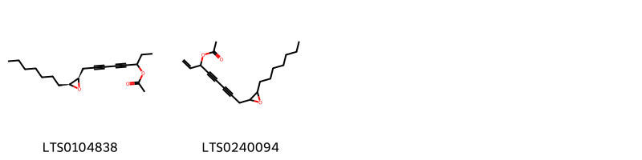{ width=100% }
    <figcaption>Hình ảnh cấu trúc hóa học của 2 hoạt chất thuộc nhóm Carboxylic acids and derivatives gồm ['8-[(2r,3s)-3-heptyloxiran-2-yl]octa-4,6-diyn-3-yl acetate (LTS0104838)', '8-(3-heptyloxiran-2-yl)oct-1-en-4,6-diyn-3-yl acetate (LTS0240094)'].</figcaption>
</figure>
#### Nhóm Fatty Acyls
<figure markdown="span">
    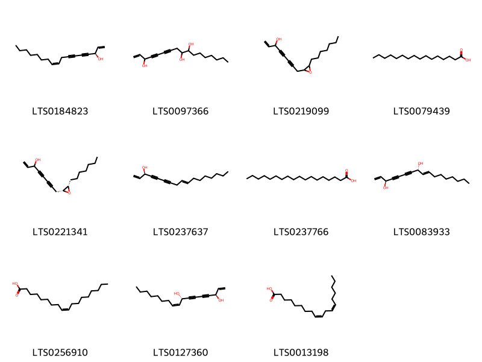{ width=100% }
    <figcaption>Hình ảnh cấu trúc hóa học của 11 hoạt chất thuộc nhóm Fatty Acyls gồm ['falcarinol (LTS0184823)', 'panaxytriol (LTS0097366)', 'panaxydol (LTS0219099)', 'palmitic acid (LTS0079439)', '8-[(2r,3s)-3-heptyloxiran-2-yl]oct-1-en-4,6-diyn-3-ol (LTS0221341)', '(z)-falcarinol (LTS0237637)', 'stearic acid (LTS0237766)', '(3s,8r)-heptadeca-1,9-dien-4,6-diyne-3,8-diol (LTS0083933)', 'oleic acid (LTS0256910)', 'falcarindiol (LTS0127360)', 'linoleic (LTS0013198)'].</figcaption>
</figure>
#### Nhóm Isoflavonoids
<figure markdown="span">
    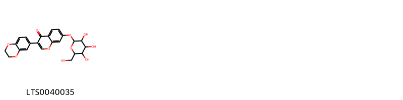{ width=100% }
    <figcaption>Hình ảnh cấu trúc hóa học của 1 hoạt chất thuộc nhóm Isoflavonoids gồm ['3-(2,3-dihydro-1,4-benzodioxin-6-yl)-7-{[3,4,5-trihydroxy-6-(hydroxymethyl)oxan-2-yl]oxy}chromen-4-one (LTS0040035)'].</figcaption>
</figure>
#### Nhóm Organooxygen compounds
<figure markdown="span">
    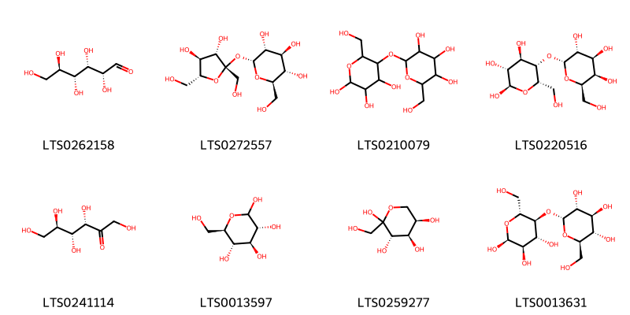{ width=100% }
    <figcaption>Hình ảnh cấu trúc hóa học của 8 hoạt chất thuộc nhóm Organooxygen compounds gồm ['(+)-glucose (LTS0262158)', 'sucrose (LTS0272557)', 'starch (LTS0210079)', '(2r,3r,4r,5s,6s)-6-(hydroxymethyl)-5-{[(2r,3r,4s,5r,6r)-3,4,5-trihydroxy-6-(hydroxymethyl)oxan-2-yl]oxy}oxane-2,3,4-triol (LTS0220516)', 'keto-d-fructose (LTS0241114)', 'glucose (LTS0013597)', 'd-fructopyranose (LTS0259277)', 'α-maltose (LTS0013631)'].</figcaption>
</figure>
#### Nhóm Prenol lipids
<figure markdown="span">
    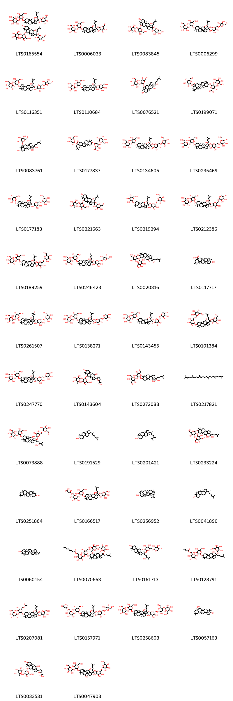{ width=100% }
    <figcaption>Hình ảnh cấu trúc hóa học của 46 hoạt chất thuộc nhóm Prenol lipids gồm ['2-{[2-(5-{[4,5-dihydroxy-6-(hydroxymethyl)-3-[(3,4,5-trihydroxy-6-methyloxan-2-yl)oxy]oxan-2-yl]oxy}-7,11-dihydroxy-3a,3b,6,6,9a-pentamethyl-dodecahydro-1h-cyclopenta[a]phenanthren-1-yl)-6-methylhept-5-en-2-yl]oxy}-6-(hydroxymethyl)oxane-3,4,5-triol; 2-{[2-(7-{[4,5-dihydroxy-6-(hydroxymethyl)-3-{[3,4,5-trihydroxy-6-(hydroxymethyl)oxan-2-yl]oxy}oxan-2-yl]oxy}-11-hydroxy-3a,3b,6,6,9a-pentamethyl-dodecahydro-1h-cyclopenta[a]phenanthren-1-yl)-6-methylhept-5-en-2-yl]oxy}-6-(hydroxymethyl)oxane-3,4,5-triol (LTS0165554)', '2-{[2-(7-{[4,5-dihydroxy-6-(hydroxymethyl)-3-{[3,4,5-trihydroxy-6-(hydroxymethyl)oxan-2-yl]oxy}oxan-2-yl]oxy}-11-hydroxy-3a,3b,6,6,9a-pentamethyl-dodecahydro-1h-cyclopenta[a]phenanthren-1-yl)-6-methylhept-5-en-2-yl]oxy}-6-(hydroxymethyl)oxane-3,4,5-triol (LTS0006033)', '(2s,3r,4s,5s,6r)-2-{[(2s)-2-[(1s,3ar,3br,5s,5ar,7s,9ar,9br,11r,11ar)-5-{[(2r,3r,4s,5s,6r)-4,5-dihydroxy-6-(hydroxymethyl)-3-{[(2s,3r,4r,5r,6s)-3,4,5-trihydroxy-6-methyloxan-2-yl]oxy}oxan-2-yl]oxy}-7,11-dihydroxy-3a,3b,6,6,9a-pentamethyl-dodecahydro-1h-cyclopenta[a]phenanthren-1-yl]-6-methylhept-5-en-2-yl]oxy}-6-(hydroxymethyl)oxane-3,4,5-triol (LTS0083845)', '(2s,3r,4s,5s,6r)-2-({2-[(3br,7s,9ar,11ar)-7-{[(2r,3r,4s,5s,6r)-4,5-dihydroxy-6-(hydroxymethyl)-3-{[(2s,3r,4s,5s,6r)-3,4,5-trihydroxy-6-(hydroxymethyl)oxan-2-yl]oxy}oxan-2-yl]oxy}-11-hydroxy-3a,3b,6,6,9a-pentamethyl-dodecahydro-1h-cyclopenta[a]phenanthren-1-yl]-6-methylhept-5-en-2-yl}oxy)-6-({[(2r,3r,4r,5s)-3,4-dihydroxy-5-(hydroxymethyl)oxolan-2-yl]oxy}methyl)oxane-3,4,5-triol (LTS0006299)', 'ginsenoside rc (LTS0116351)', 'ginsenoside rd (LTS0110684)', 'ginsenoside rf (LTS0076521)', 'chikusetsusaponin-v (LTS0199071)', '(2r,3r,4s,5s,6r)-2-{[(1s,3ar,3br,5s,5ar,7s,9ar,9br,11r,11ar)-7,11-dihydroxy-1-[(2s)-2-hydroxy-6-methylhept-5-en-2-yl]-3a,3b,6,6,9a-pentamethyl-dodecahydro-1h-cyclopenta[a]phenanthren-5-yl]oxy}-6-(hydroxymethyl)oxane-3,4,5-triol (LTS0083761)', '(2s,3s,4s,5r,6r)-6-{[(6ar,6bs,8as,12ar,14br)-4,4,6a,6b,11,11,14b-heptamethyl-8a-({[(2s,3r,4s,5s,6r)-3,4,5-trihydroxy-6-(hydroxymethyl)oxan-2-yl]oxy}carbonyl)-1,2,3,4a,5,6,7,8,9,10,12,12a,14,14a-tetradecahydropicen-3-yl]oxy}-3,4-dihydroxy-5-{[(2s,3r,4s,5s,6r)-3,4,5-trihydroxy-6-(hydroxymethyl)oxan-2-yl]oxy}oxane-2-carboxylic acid (LTS0177837)', '(2s,3r,4s,5s,6r)-2-({2-[(1s,3ar,3br,5ar,7s,9ar,9br,11r,11ar)-7-{[(2r,3r,4s,5s,6r)-4,5-dihydroxy-6-(hydroxymethyl)-3-{[(2s,3r,4s,5s,6r)-3,4,5-trihydroxy-6-(hydroxymethyl)oxan-2-yl]oxy}oxan-2-yl]oxy}-11-hydroxy-3a,3b,6,6,9a-pentamethyl-dodecahydro-1h-cyclopenta[a]phenanthren-1-yl]-6-methylhept-5-en-2-yl}oxy)-6-({[(3r,4s,5s,6r)-3,4,5-trihydroxy-6-(hydroxymethyl)oxan-2-yl]oxy}methyl)oxane-3,4,5-triol (LTS0134605)', '(2s,3r,4s,5s,6r)-2-{[(2s)-2-[(1s,3ar,3br,5ar,7s,9ar,9br,11r,11ar)-7-{[(2r,3r,4s,5s,6r)-4,5-dihydroxy-6-(hydroxymethyl)-3-{[(2s,3r,4s,5s,6r)-3,4,5-trihydroxy-6-(hydroxymethyl)oxan-2-yl]oxy}oxan-2-yl]oxy}-11-hydroxy-3a,3b,6,6,9a-pentamethyl-dodecahydro-1h-cyclopenta[a]phenanthren-1-yl]-6-methylhept-5-en-2-yl]oxy}-6-({[(2r,3r,4s,5s,6r)-3,4,5-trihydroxy-6-(hydroxymethyl)oxan-2-yl]oxy}methyl)oxane-3,4,5-triol (LTS0235469)', 'gypenoside xvii (LTS0177183)', '2-{[2-(5-{[4,5-dihydroxy-6-(hydroxymethyl)-3-[(3,4,5-trihydroxy-6-methyloxan-2-yl)oxy]oxan-2-yl]oxy}-7,11-dihydroxy-3a,3b,6,6,9a-pentamethyl-dodecahydro-1h-cyclopenta[a]phenanthren-1-yl)-6-methylhept-5-en-2-yl]oxy}-6-(hydroxymethyl)oxane-3,4,5-triol (LTS0221663)', '(2s,3r,4s,5s,6r)-2-{[2-(11-hydroxy-3a,3b,6,6,9a-pentamethyl-7-{[(2r,3r,4s,5s,6r)-3,4,5-trihydroxy-6-(hydroxymethyl)oxan-2-yl]oxy}-dodecahydro-1h-cyclopenta[a]phenanthren-1-yl)-6-methylhept-5-en-2-yl]oxy}-6-({[(2r,3r,4s,5s,6r)-3,4,5-trihydroxy-6-(hydroxymethyl)oxan-2-yl]oxy}methyl)oxane-3,4,5-triol (LTS0219294)', '2-{[2-(7-{[4,5-dihydroxy-6-(hydroxymethyl)-3-{[3,4,5-trihydroxy-6-(hydroxymethyl)oxan-2-yl]oxy}oxan-2-yl]oxy}-11-hydroxy-3a,3b,6,6,9a-pentamethyl-dodecahydro-1h-cyclopenta[a]phenanthren-1-yl)-6-methylhept-5-en-2-yl]oxy}-6-{[(3,4,5-trihydroxyoxan-2-yl)oxy]methyl}oxane-3,4,5-triol (LTS0212386)', '2-{[2-(7-{[4,5-dihydroxy-6-(hydroxymethyl)-3-{[3,4,5-trihydroxy-6-(hydroxymethyl)oxan-2-yl]oxy}oxan-2-yl]oxy}-11-hydroxy-3a,3b,6,6,9a-pentamethyl-dodecahydro-1h-cyclopenta[a]phenanthren-1-yl)-6-methylhept-5-en-2-yl]oxy}-6-({[3,4,5-trihydroxy-6-(hydroxymethyl)oxan-2-yl]oxy}methyl)oxane-3,4,5-triol (LTS0189259)', '(2s,3r,4s,5s,6r)-2-{[(2s)-2-[(1s,3ar,3br,5ar,7s,9ar,9br,11r,11ar)-7-{[(2r,3r,4s,5s,6r)-4,5-dihydroxy-6-(hydroxymethyl)-3-{[(2s,3r,4s,5s,6r)-3,4,5-trihydroxy-6-(hydroxymethyl)oxan-2-yl]oxy}oxan-2-yl]oxy}-11-hydroxy-3a,3b,6,6,9a-pentamethyl-dodecahydro-1h-cyclopenta[a]phenanthren-1-yl]-6-methylhept-5-en-2-yl]oxy}-6-({[(2r,3r,4s,5s)-3,4-dihydroxy-5-(hydroxymethyl)oxolan-2-yl]oxy}methyl)oxane-3,4,5-triol (LTS0246423)', '2-[(4,5-dihydroxy-2-{[11-hydroxy-1-(2-hydroxy-6-methylhept-5-en-2-yl)-3a,3b,6,6,9a-pentamethyl-dodecahydro-1h-cyclopenta[a]phenanthren-7-yl]oxy}-6-(hydroxymethyl)oxan-3-yl)oxy]-6-(hydroxymethyl)oxane-3,4,5-triol (LTS0020316)', 'oleanolic acid (LTS0117717)', '(2s,3r,4s,5s,6r)-2-{[(2s,4e)-2-[(1s,3ar,3br,5ar,7s,9ar,9br,11r,11ar)-7-{[(2r,3r,4s,5s,6r)-4,5-dihydroxy-6-(hydroxymethyl)-3-{[(2s,3r,4s,5s,6r)-3,4,5-trihydroxy-6-(hydroxymethyl)oxan-2-yl]oxy}oxan-2-yl]oxy}-11-hydroxy-3a,3b,6,6,9a-pentamethyl-dodecahydro-1h-cyclopenta[a]phenanthren-1-yl]-6-hydroxy-6-methylhept-4-en-2-yl]oxy}-6-({[(2r,3r,4s,5s,6r)-3,4,5-trihydroxy-6-(hydroxymethyl)oxan-2-yl]oxy}methyl)oxane-3,4,5-triol (LTS0261507)', '(2s,3r,4s,5s,6r)-2-{[(2s)-2-[(1s,3ar,3br,5ar,7s,9ar,9br,11r,11ar)-7-{[(2r,3r,4s,5s,6r)-4,5-dihydroxy-6-(hydroxymethyl)-3-{[(2s,3r,4s,5s,6r)-3,4,5-trihydroxy-6-(hydroxymethyl)oxan-2-yl]oxy}oxan-2-yl]oxy}-11-hydroxy-3a,3b,6,6,9a-pentamethyl-dodecahydro-1h-cyclopenta[a]phenanthren-1-yl]-6-methylhept-5-en-2-yl]oxy}-6-({[(2s,3r,4r,5r)-3,4,5-trihydroxyoxan-2-yl]oxy}methyl)oxane-3,4,5-triol (LTS0138271)', '(2s,3r,4s,5s,6r)-2-{[2-(7-{[(2r,3r,4s,5s,6r)-4,5-dihydroxy-6-(hydroxymethyl)-3-{[(2s,3r,4s,5s,6r)-3,4,5-trihydroxy-6-(hydroxymethyl)oxan-2-yl]oxy}oxan-2-yl]oxy}-11-hydroxy-3a,3b,6,6,9a-pentamethyl-dodecahydro-1h-cyclopenta[a]phenanthren-1-yl)-6-methylhept-5-en-2-yl]oxy}-6-({[(2s,3r,4s,5r)-3,4,5-trihydroxyoxan-2-yl]oxy}methyl)oxane-3,4,5-triol (LTS0143455)', '2-{[2-(11-hydroxy-3a,3b,6,6,9a-pentamethyl-7-{[3,4,5-trihydroxy-6-({[3,4,5-trihydroxy-6-(hydroxymethyl)oxan-2-yl]oxy}methyl)oxan-2-yl]oxy}-dodecahydro-1h-cyclopenta[a]phenanthren-1-yl)-6-methylhept-5-en-2-yl]oxy}-6-(hydroxymethyl)oxane-3,4,5-triol (LTS0101384)', '(2s,3r,5s,6r)-2-{[(2s)-2-[(1s,3ar,3br,5ar,7s,9ar,9br,11r,11ar)-7-{[(2r,3r,4s,5s,6r)-4,5-dihydroxy-6-(hydroxymethyl)-3-{[(2s,3r,4s,5s,6r)-3,4,5-trihydroxy-6-(hydroxymethyl)oxan-2-yl]oxy}oxan-2-yl]oxy}-11-hydroxy-3a,3b,6,6,9a-pentamethyl-dodecahydro-1h-cyclopenta[a]phenanthren-1-yl]-6-methylhept-5-en-2-yl]oxy}-6-({[(2s,3r,4s,5s)-3,4,5-trihydroxyoxan-2-yl]oxy}methyl)oxane-3,4,5-triol (LTS0247770)', '2-{[2-({7,11-dihydroxy-1-[5-(2-hydroxypropan-2-yl)-2-methyloxolan-2-yl]-3a,3b,6,6,9a-pentamethyl-dodecahydro-1h-cyclopenta[a]phenanthren-5-yl}oxy)-4,5-dihydroxy-6-(hydroxymethyl)oxan-3-yl]oxy}-6-methyloxane-3,4,5-triol (LTS0143604)', '(2r,3s,4s,5r,6r)-6-{[(1r,3ar,9ar,11s,11ar)-11-hydroxy-1-[(2s)-2-hydroxy-6-methylhept-5-en-2-yl]-3a,6,6,9a-tetramethyl-tetradecahydrocyclopenta[a]phenanthren-7-yl]oxy}-5-{[(2s,3r,4s,5s,6r)-3,5-dihydroxy-4,6-bis(hydroxymethyl)oxan-2-yl]oxy}-2-(hydroxymethyl)oxane-3,4-diol (LTS0272088)', 'squalene (LTS0217821)', '(2s,3r,4s,5s,6r)-2-{[(2s)-2-[(1s,3ar,3br,5ar,7s,9ar,9br,11r,11ar)-7-{[(2r,3r,4s,5s,6r)-4,5-dihydroxy-6-(hydroxymethyl)-3-{[(2s,3r,4s,5s,6r)-3,4,5-trihydroxy-6-(hydroxymethyl)oxan-2-yl]oxy}oxan-2-yl]oxy}-11-hydroxy-3a,3b,6,6,9a-pentamethyl-dodecahydro-1h-cyclopenta[a]phenanthren-1-yl]-5-hydroperoxy-6-methylhept-6-en-2-yl]oxy}-6-({[(2r,3r,4s,5s,6r)-3,4,5-trihydroxy-6-(hydroxymethyl)oxan-2-yl]oxy}methyl)oxane-3,4,5-triol (LTS0073888)', '(1r,3ar,7s,9ar,11ar)-3a,6,6,9a,11a-pentamethyl-1-[(2r)-6-methylhept-5-en-2-yl]-1h,2h,3h,5h,5ah,7h,8h,9h,9bh,10h,11h-cyclopenta[a]phenanthren-7-ol (LTS0191529)', 'eburicol (LTS0201421)', '5-{[3,5-dihydroxy-4,6-bis(hydroxymethyl)oxan-2-yl]oxy}-6-{[11-hydroxy-1-(2-hydroxy-6-methylhept-5-en-2-yl)-3a,6,6,9a-tetramethyl-tetradecahydrocyclopenta[a]phenanthren-7-yl]oxy}-2-(hydroxymethyl)oxane-3,4-diol (LTS0233224)', 'β-amyrin (LTS0251864)', '3-{[(2r,3s,4s,5r,6s)-6-{[(2r,3r,4s,5s,6r)-2-{[(1s,3ar,3br,5ar,7s,9ar,9br,11r,11ar)-11-hydroxy-3a,3b,6,6,9a-pentamethyl-1-[(2s)-6-methyl-2-{[(2s,3r,4s,5s,6r)-3,4,5-trihydroxy-6-(hydroxymethyl)oxan-2-yl]oxy}hept-5-en-2-yl]-dodecahydro-1h-cyclopenta[a]phenanthren-7-yl]oxy}-4,5-dihydroxy-6-(hydroxymethyl)oxan-3-yl]oxy}-3,4,5-trihydroxyoxan-2-yl]methoxy}-3-oxopropanoic acid (LTS0166517)', 'lupeol (LTS0256952)', '(3as,5ar,7s,9ar,11as)-3a,6,6,9a,11a-pentamethyl-1-[(2r)-6-methylhept-5-en-2-yl]-1h,2h,3h,5h,5ah,7h,8h,9h,9bh,10h,11h-cyclopenta[a]phenanthren-7-ol (LTS0041890)', '(3r,3as,5ar,5br,7ar,9s,11ar,11br,13ar,13bs)-5a,5b,8,8,11a,13b-hexamethyl-3-(prop-1-en-2-yl)-hexadecahydrocyclopenta[a]chrysen-9-ol (LTS0060154)', '{6-[(4,5-dihydroxy-2-{[11-hydroxy-3a,3b,6,6,9a-pentamethyl-1-(6-methyl-2-{[3,4,5-trihydroxy-6-({[3,4,5-trihydroxy-6-(hydroxymethyl)oxan-2-yl]oxy}methyl)oxan-2-yl]oxy}hept-5-en-2-yl)-dodecahydro-1h-cyclopenta[a]phenanthren-7-yl]oxy}-6-(hydroxymethyl)oxan-3-yl)oxy]-3,4,5-trihydroxyoxan-2-yl}methyl (2e)-oct-2-enoate (LTS0070663)', '(2s,3r,4s,5s,6r)-2-[(5-hydroxy-2-{7-hydroxy-3a,3b,6,6,9a-pentamethyl-dodecahydro-1h-cyclopenta[a]phenanthren-1-yl}-6-methylhept-6-en-2-yl)oxy]-6-({[(2r,3r,4s,5r)-3,4,5-trihydroxyoxan-2-yl]oxy}methyl)oxane-3,4,5-triol (LTS0161713)', '{6-[(4,5-dihydroxy-2-{[11-hydroxy-3a,3b,6,6,9a-pentamethyl-1-(6-methyl-2-{[3,4,5-trihydroxy-6-(hydroxymethyl)oxan-2-yl]oxy}hept-5-en-2-yl)-dodecahydro-1h-cyclopenta[a]phenanthren-7-yl]oxy}-6-(hydroxymethyl)oxan-3-yl)oxy]-3,4,5-trihydroxyoxan-2-yl}methyl (2e)-but-2-enoate (LTS0128791)', '[(2r,3s,4s,5r,6r)-6-{[(1s,3ar,3br,5ar,7s,9ar,9br,11r,11ar)-11-hydroxy-3a,3b,6,6,9a-pentamethyl-1-[(2s)-6-methyl-2-{[(2s,3r,4s,5s,6r)-3,4,5-trihydroxy-6-(hydroxymethyl)oxan-2-yl]oxy}hept-5-en-2-yl]-dodecahydro-1h-cyclopenta[a]phenanthren-7-yl]oxy}-3,4-dihydroxy-5-{[(2s,3r,4s,5s,6r)-3,4,5-trihydroxy-6-(hydroxymethyl)oxan-2-yl]oxy}oxan-2-yl]methyl acetate (LTS0207081)', '3-{[(2r,3s,4s,5r,6s)-6-{[(2r,3r,4s,5s,6r)-2-{[(1s,3ar,3br,5ar,7s,9ar,9br,11r,11ar)-1-[(2s)-2-{[(2s,3r,4s,5s,6r)-6-({[(2r,3r,4r,5s)-3,4-dihydroxy-5-(hydroxymethyl)oxolan-2-yl]oxy}methyl)-3,4,5-trihydroxyoxan-2-yl]oxy}-6-methylhept-5-en-2-yl]-11-hydroxy-3a,3b,6,6,9a-pentamethyl-dodecahydro-1h-cyclopenta[a]phenanthren-7-yl]oxy}-4,5-dihydroxy-6-(hydroxymethyl)oxan-3-yl]oxy}-3,4,5-trihydroxyoxan-2-yl]methoxy}-3-oxopropanoic acid (LTS0157971)', '(2s,3r,4s,5s,6r)-2-{[(2s)-2-[(1s,3ar,3br,5ar,7s,9ar,9br,11r,11ar)-7-{[(2r,3r,4s,5s,6r)-4,5-dihydroxy-6-(hydroxymethyl)-3-{[(2s,3r,4s,5s,6r)-3,4,5-trihydroxy-6-(hydroxymethyl)oxan-2-yl]oxy}oxan-2-yl]oxy}-11-hydroxy-3a,3b,6,6,9a-pentamethyl-dodecahydro-1h-cyclopenta[a]phenanthren-1-yl]-6-methylhept-5-en-2-yl]oxy}-6-({[(2r,3r,4r,5s,6r)-3,4-dihydroxy-6-(hydroxymethyl)-5-{[(2r,3r,4s,5s,6r)-3,4,5-trihydroxy-6-(hydroxymethyl)oxan-2-yl]oxy}oxan-2-yl]oxy}methyl)oxane-3,4,5-triol (LTS0258603)', 'erythrodiol (LTS0057163)', '(2s,3r,4r,5r,6s)-2-{[(2r,3r,4s,5s,6r)-2-{[(1s,3ar,3br,5s,5ar,7s,9ar,9br,11r,11ar)-7,11-dihydroxy-1-[(2s,5r)-5-(2-hydroxypropan-2-yl)-2-methyloxolan-2-yl]-3a,3b,6,6,9a-pentamethyl-dodecahydro-1h-cyclopenta[a]phenanthren-5-yl]oxy}-4,5-dihydroxy-6-(hydroxymethyl)oxan-3-yl]oxy}-6-methyloxane-3,4,5-triol (LTS0033531)', '2-{[2-(7-{[4,5-dihydroxy-6-(hydroxymethyl)-3-{[3,4,5-trihydroxy-6-(hydroxymethyl)oxan-2-yl]oxy}oxan-2-yl]oxy}-4,11-dihydroxy-3a,3b,6,6,9a-pentamethyl-1h,2h,3h,4h,7h,8h,9h,9bh,10h,11h,11ah-cyclopenta[a]phenanthren-1-yl)-6-methylhept-5-en-2-yl]oxy}-6-({[3,4,5-trihydroxy-6-(hydroxymethyl)oxan-2-yl]oxy}methyl)oxane-3,4,5-triol (LTS0047903)'].</figcaption>
</figure>
#### Nhóm Steroids and steroid derivatives
<figure markdown="span">
    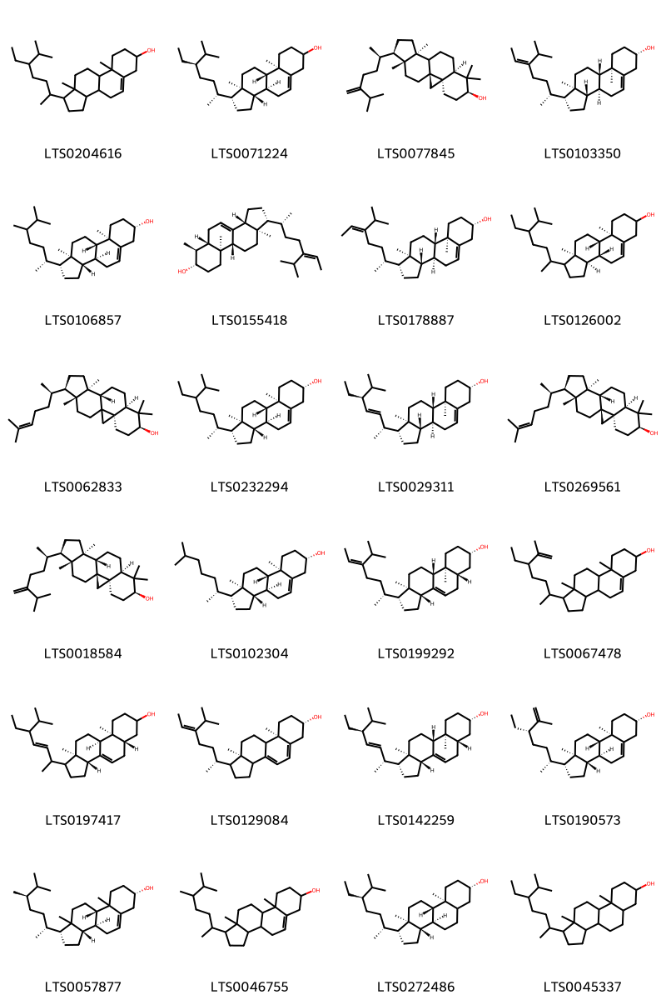{ width=100% }
    <figcaption>Hình ảnh cấu trúc hóa học của 24 hoạt chất thuộc nhóm Steroids and steroid derivatives gồm ['stigmast-5-en-3-ol, (3β)- (LTS0204616)', 'stigmast-5-en-3-ol (LTS0071224)', '24-methylene-cycloartanol (LTS0077845)', 'avenasterol (LTS0103350)', '24-α-methylcholesterol (LTS0106857)', '(z)-24-ethylidenelophenol (LTS0155418)', 'fucosterol (LTS0178887)', '(3ar,3br,9ar,9bs,11ar)-1-(5-ethyl-6-methylheptan-2-yl)-9a,11a-dimethyl-1h,2h,3h,3ah,3bh,4h,6h,7h,8h,9h,9bh,10h,11h-cyclopenta[a]phenanthren-7-ol (LTS0126002)', '(3r,6s,8r,11s,12s,15r,16r)-7,7,12,16-tetramethyl-15-[(2r)-6-methylhept-5-en-2-yl]pentacyclo[9.7.0.0¹,³.0³,⁸.0¹²,¹⁶]octadecan-6-ol (LTS0062833)', '24-α-ethylcholesterol (LTS0232294)', 'phytosterol (LTS0029311)', 'cycloartenol (LTS0269561)', '24-methylenecycloartanol (LTS0018584)', 'cholesterol (LTS0102304)', 'delta7-avenasterol (LTS0199292)', '1-(5-ethyl-6-methylhept-6-en-2-yl)-9a,11a-dimethyl-1h,2h,3h,3ah,3bh,4h,6h,7h,8h,9h,9bh,10h,11h-cyclopenta[a]phenanthren-7-ol (LTS0067478)', '(3ar,5as,9as,9bs,11ar)-1-(5-ethyl-6-methylhept-3-en-2-yl)-9a,11a-dimethyl-1h,2h,3h,3ah,5h,5ah,6h,7h,8h,9h,9bh,10h,11h-cyclopenta[a]phenanthren-7-ol (LTS0197417)', '5-dehydroavenasterol (LTS0129084)', 'chondrillasterol (LTS0142259)', '(1r,3as,3bs,7s,9ar,9bs,11ar)-1-[(2r,5s)-5-ethyl-6-methylhept-6-en-2-yl]-9a,11a-dimethyl-1h,2h,3h,3ah,3bh,4h,6h,7h,8h,9h,9bh,10h,11h-cyclopenta[a]phenanthren-7-ol (LTS0190573)', '(1r,3as,3bs,7s,9bs)-1-[(2r,5r)-5,6-dimethylheptan-2-yl]-9a,11a-dimethyl-1h,2h,3h,3ah,3bh,4h,6h,7h,8h,9h,9bh,10h,11h-cyclopenta[a]phenanthren-7-ol (LTS0057877)', 'campesterol (LTS0046755)', '(1r,3as,3br,7s,9as,9bs,11ar)-1-[(2r,5r)-5-ethyl-6-methylheptan-2-yl]-9a,11a-dimethyl-tetradecahydro-1h-cyclopenta[a]phenanthren-7-ol (LTS0272486)', '24-ethyl coprostanol (LTS0045337)'].</figcaption>
</figure>

---

### Dược dân tộc học

Danh sách các quốc gia có sử dụng *Panax quinquefolius* trong điều trị các bệnh. 

| Country        | Disease                                           | Bệnh                                                                                                                                                                                                |
|:---------------|:--------------------------------------------------|:----------------------------------------------------------------------------------------------------------------------------------------------------------------------------------------------------|
| China          | Apertif, Aphrodisiac, Tonic, Sedative, Sialogogue | MYMEMORY WARNING: YOU USED ALL AVAILABLE FREE TRANSLATIONS FOR TODAY. NEXT AVAILABLE IN  16 HOURS 48 MINUTES 05 SECONDS VISIT HTTPS://MYMEMORY.TRANSLATED.NET/DOC/USAGELIMITS.PHP TO TRANSLATE MORE |
| US(Amerindian) | Contraceptive                                     | MYMEMORY WARNING: YOU USED ALL AVAILABLE FREE TRANSLATIONS FOR TODAY. NEXT AVAILABLE IN  16 HOURS 48 MINUTES 03 SECONDS VISIT HTTPS://MYMEMORY.TRANSLATED.NET/DOC/USAGELIMITS.PHP TO TRANSLATE MORE |
| US(Appalachia) | Aphrodisiac, Tonic                                | MYMEMORY WARNING: YOU USED ALL AVAILABLE FREE TRANSLATIONS FOR TODAY. NEXT AVAILABLE IN  16 HOURS 48 MINUTES 00 SECONDS VISIT HTTPS://MYMEMORY.TRANSLATED.NET/DOC/USAGELIMITS.PHP TO TRANSLATE MORE |
| USSR           | Stimulant, Tonic                                  | MYMEMORY WARNING: YOU USED ALL AVAILABLE FREE TRANSLATIONS FOR TODAY. NEXT AVAILABLE IN  16 HOURS 47 MINUTES 58 SECONDS VISIT HTTPS://MYMEMORY.TRANSLATED.NET/DOC/USAGELIMITS.PHP TO TRANSLATE MORE |

---

---
## Panax repens
### Thông tin về thực vật

!!! info "Phân loại thực vật của *Panax japonicus* từ GIBF:"
    - **Kingdom:** Plantae
    - **Phylum:** Tracheophyta
    - **Order:** Apiales
    - **Family:** Araliaceae
    - **Genus:** Panax
    - **Species:** *Panax japonicus*

 

| Label (VI)   | Label (EN)   | Scientific Name   | Descriptions (VI)   | Descriptions (EN)   | Also Known As (VI)   | Also Known As (EN)   |
|:-------------|:-------------|:------------------|:--------------------|:--------------------|:---------------------|:---------------------|
| N/A          | N/A          | Panax repens      | loài thực vật       | species of plant    | ['']                 | ['']                 |

#### Phân bố trên thế giới

**Từ CSDL GIBF** nan, Japan, China

#### Phân bố tại Việt Nam

**Từ CSDL GIBF**: Không có ghi nhận ở Việt Nam

---
### Thành phần hóa học
        
- Theo cơ sở dữ liệu lotus: Từ loài *Panax japonicus* đã phân lập và xác định được Chưa có hoạt chất nào được phân lập. hoạt chất thuộc về các nhóm Không có hoạt chất nào được phân lập. 

Không có hình ảnh nào được tạo ra

---

### Dược dân tộc học

Danh sách các quốc gia có sử dụng *Panax japonicus* trong điều trị các bệnh. 

| Country   | Disease   | Bệnh                                                                                                                                                                                                |
|:----------|:----------|:----------------------------------------------------------------------------------------------------------------------------------------------------------------------------------------------------|
| China     | Tonic     | MYMEMORY WARNING: YOU USED ALL AVAILABLE FREE TRANSLATIONS FOR TODAY. NEXT AVAILABLE IN  16 HOURS 47 MINUTES 21 SECONDS VISIT HTTPS://MYMEMORY.TRANSLATED.NET/DOC/USAGELIMITS.PHP TO TRANSLATE MORE |

---

---
## Panax schinseng
### Thông tin về thực vật

!!! info "Phân loại thực vật của *Panax pseudoginseng* từ GIBF:"
    - **Kingdom:** Plantae
    - **Phylum:** Tracheophyta
    - **Order:** Apiales
    - **Family:** Araliaceae
    - **Genus:** Panax
    - **Species:** *Panax pseudoginseng*

 

| Label (VI)   | Label (EN)   | Scientific Name   | Descriptions (VI)   | Descriptions (EN)   | Also Known As (VI)   | Also Known As (EN)   |
|:-------------|:-------------|:------------------|:--------------------|:--------------------|:---------------------|:---------------------|
| N/A          | N/A          | Panax repens      | loài thực vật       | species of plant    | ['']                 | ['']                 |

#### Phân bố trên thế giới

**Từ CSDL GIBF** Canada, China

#### Phân bố tại Việt Nam

**Từ CSDL GIBF**: Không có ghi nhận ở Việt Nam

---
### Thành phần hóa học
        
- Theo cơ sở dữ liệu lotus: Từ loài *Panax pseudoginseng* đã phân lập và xác định được Chưa có hoạt chất nào được phân lập. hoạt chất thuộc về các nhóm Không có hoạt chất nào được phân lập. 

Không có hình ảnh nào được tạo ra

---

### Dược dân tộc học

Danh sách các quốc gia có sử dụng *Panax pseudoginseng* trong điều trị các bệnh. 

| Country   | Disease          | Bệnh                                                                                                                                                                                                |
|:----------|:-----------------|:----------------------------------------------------------------------------------------------------------------------------------------------------------------------------------------------------|
| China     | Stimulant, Tonic | MYMEMORY WARNING: YOU USED ALL AVAILABLE FREE TRANSLATIONS FOR TODAY. NEXT AVAILABLE IN  16 HOURS 47 MINUTES 04 SECONDS VISIT HTTPS://MYMEMORY.TRANSLATED.NET/DOC/USAGELIMITS.PHP TO TRANSLATE MORE |
| English   | Aphrodisiac      | MYMEMORY WARNING: YOU USED ALL AVAILABLE FREE TRANSLATIONS FOR TODAY. NEXT AVAILABLE IN  16 HOURS 47 MINUTES 02 SECONDS VISIT HTTPS://MYMEMORY.TRANSLATED.NET/DOC/USAGELIMITS.PHP TO TRANSLATE MORE |
| French    | Tonic            | MYMEMORY WARNING: YOU USED ALL AVAILABLE FREE TRANSLATIONS FOR TODAY. NEXT AVAILABLE IN  16 HOURS 46 MINUTES 59 SECONDS VISIT HTTPS://MYMEMORY.TRANSLATED.NET/DOC/USAGELIMITS.PHP TO TRANSLATE MORE |

---

# Chi Acanthopanax

??? note "Danh sách các dược liệu thuộc chi"
    
	 - *Acanthopanax gracilistylus*
	 - *Acanthopanax inosum*
	 - *Acanthopanax ricinifolium*

---
## Acanthopanax gracilistylus
### Thông tin về thực vật

!!! info "Phân loại thực vật của *Eleutherococcus nodiflorus* từ GIBF:"
    - **Kingdom:** Plantae
    - **Phylum:** Tracheophyta
    - **Order:** Apiales
    - **Family:** Araliaceae
    - **Genus:** Eleutherococcus
    - **Species:** *Eleutherococcus nodiflorus*

 

| Label (VI)   | Label (EN)   | Scientific Name            | Descriptions (VI)   | Descriptions (EN)   | Also Known As (VI)   | Also Known As (EN)   |
|:-------------|:-------------|:---------------------------|:--------------------|:--------------------|:---------------------|:---------------------|
| N/A          | N/A          | Acanthopanax gracilistylus |                     | species of plant    | ['']                 | ['']                 |

#### Phân bố trên thế giới

**Từ CSDL GIBF** Chinese Taipei, China

#### Phân bố tại Việt Nam

**Từ CSDL GIBF**: Không có ghi nhận ở Việt Nam

---
### Thành phần hóa học
        
- Theo cơ sở dữ liệu lotus: Từ loài *Eleutherococcus nodiflorus* đã phân lập và xác định được Chưa có hoạt chất nào được phân lập. hoạt chất thuộc về các nhóm Không có hoạt chất nào được phân lập. 

Không có hình ảnh nào được tạo ra

---

### Dược dân tộc học

Danh sách các quốc gia có sử dụng *Eleutherococcus nodiflorus* trong điều trị các bệnh. 

| Country   | Disease     | Bệnh                                                                                                                                                                                                |
|:----------|:------------|:----------------------------------------------------------------------------------------------------------------------------------------------------------------------------------------------------|
| China     | Carminative | MYMEMORY WARNING: YOU USED ALL AVAILABLE FREE TRANSLATIONS FOR TODAY. NEXT AVAILABLE IN  16 HOURS 46 MINUTES 43 SECONDS VISIT HTTPS://MYMEMORY.TRANSLATED.NET/DOC/USAGELIMITS.PHP TO TRANSLATE MORE |

---

---
## Acanthopanax inosum
### Thông tin về thực vật

!!! info "Phân loại thực vật của *N/A* từ GIBF:"
    - **Kingdom:** Plantae
    - **Phylum:** Tracheophyta
    - **Order:** Apiales
    - **Family:** Araliaceae
    - **Genus:** Acanthopanax
    - **Species:** *N/A*

 

| Label (VI)   | Label (EN)   | Scientific Name            | Descriptions (VI)   | Descriptions (EN)   | Also Known As (VI)   | Also Known As (EN)   |
|:-------------|:-------------|:---------------------------|:--------------------|:--------------------|:---------------------|:---------------------|
| N/A          | N/A          | Acanthopanax gracilistylus |                     | species of plant    | ['']                 | ['']                 |

#### Phân bố trên thế giới

**Từ CSDL GIBF** nan, Japan, United States of America, Korea, Republic of, Chinese Taipei, Nepal, China, Russian Federation, unknown or invalid, Netherlands

#### Phân bố tại Việt Nam

**Từ CSDL GIBF**: Không có ghi nhận ở Việt Nam

---
### Thành phần hóa học
        
- Theo cơ sở dữ liệu lotus: Từ loài *N/A* đã phân lập và xác định được Chưa có hoạt chất nào được phân lập. hoạt chất thuộc về các nhóm Không có hoạt chất nào được phân lập. 

Không có hình ảnh nào được tạo ra

---

### Dược dân tộc học

Danh sách các quốc gia có sử dụng *N/A* trong điều trị các bệnh. 

| Country   | Disease          | Bệnh                                                                                                                                                                                                |
|:----------|:-----------------|:----------------------------------------------------------------------------------------------------------------------------------------------------------------------------------------------------|
| China     | Analgesic, Tonic | MYMEMORY WARNING: YOU USED ALL AVAILABLE FREE TRANSLATIONS FOR TODAY. NEXT AVAILABLE IN  16 HOURS 46 MINUTES 22 SECONDS VISIT HTTPS://MYMEMORY.TRANSLATED.NET/DOC/USAGELIMITS.PHP TO TRANSLATE MORE |

---

---
## Acanthopanax ricinifolium
### Thông tin về thực vật

!!! info "Phân loại thực vật của *Kalopanax septemlobus* từ GIBF:"
    - **Kingdom:** Plantae
    - **Phylum:** Tracheophyta
    - **Order:** Apiales
    - **Family:** Araliaceae
    - **Genus:** Kalopanax
    - **Species:** *Kalopanax septemlobus*

 

| Label (VI)   | Label (EN)   | Scientific Name            | Descriptions (VI)   | Descriptions (EN)   | Also Known As (VI)   | Also Known As (EN)   |
|:-------------|:-------------|:---------------------------|:--------------------|:--------------------|:---------------------|:---------------------|
| N/A          | N/A          | Acanthopanax gracilistylus |                     | species of plant    | ['']                 | ['']                 |

#### Phân bố trên thế giới

**Từ CSDL GIBF** nan, United States of America, Japan, Norway, China, unknown or invalid, Estonia

#### Phân bố tại Việt Nam

**Từ CSDL GIBF**: Không có ghi nhận ở Việt Nam

---
### Thành phần hóa học
        
- Theo cơ sở dữ liệu lotus: Từ loài *Kalopanax septemlobus* đã phân lập và xác định được Chưa có hoạt chất nào được phân lập. hoạt chất thuộc về các nhóm Không có hoạt chất nào được phân lập. 

Không có hình ảnh nào được tạo ra

---

### Dược dân tộc học

Danh sách các quốc gia có sử dụng *Kalopanax septemlobus* trong điều trị các bệnh. 

| Country   | Disease     | Bệnh                                                                                                                                                                                                |
|:----------|:------------|:----------------------------------------------------------------------------------------------------------------------------------------------------------------------------------------------------|
| China     | Insecticide | MYMEMORY WARNING: YOU USED ALL AVAILABLE FREE TRANSLATIONS FOR TODAY. NEXT AVAILABLE IN  16 HOURS 46 MINUTES 02 SECONDS VISIT HTTPS://MYMEMORY.TRANSLATED.NET/DOC/USAGELIMITS.PHP TO TRANSLATE MORE |

---

# Chi Tetrapanax

??? note "Danh sách các dược liệu thuộc chi"
    
	 - *Tetrapanax papyrifera*
	 - *Tetrapanax papyriferum*
	 - *Tetrapanax papyriferus*

---
## Tetrapanax papyrifera
### Thông tin về thực vật

!!! info "Phân loại thực vật của *Tetrapanax papyrifer* từ GIBF:"
    - **Kingdom:** Plantae
    - **Phylum:** Tracheophyta
    - **Order:** Apiales
    - **Family:** Araliaceae
    - **Genus:** Tetrapanax
    - **Species:** *Tetrapanax papyrifer*

 

| Label (VI)   | Label (EN)   | Scientific Name            | Descriptions (VI)   | Descriptions (EN)   | Also Known As (VI)   | Also Known As (EN)   |
|:-------------|:-------------|:---------------------------|:--------------------|:--------------------|:---------------------|:---------------------|
| N/A          | N/A          | Acanthopanax gracilistylus |                     | species of plant    | ['']                 | ['']                 |

#### Phân bố trên thế giới

**Từ CSDL GIBF** nan, Brazil, Réunion, Japan, Portugal, Korea, Republic of, United States of America, Chinese Taipei, China, New Zealand

#### Phân bố tại Việt Nam

**Từ CSDL GIBF**: Không có ghi nhận ở Việt Nam

---
### Thành phần hóa học
        
- Theo cơ sở dữ liệu lotus: Từ loài *Tetrapanax papyrifer* đã phân lập và xác định được Chưa có hoạt chất nào được phân lập. hoạt chất thuộc về các nhóm Không có hoạt chất nào được phân lập. 

Không có hình ảnh nào được tạo ra

---

### Dược dân tộc học

Danh sách các quốc gia có sử dụng *Tetrapanax papyrifer* trong điều trị các bệnh. 

| Country   | Disease   | Bệnh                                                                                                                                                                                                |
|:----------|:----------|:----------------------------------------------------------------------------------------------------------------------------------------------------------------------------------------------------|
| China     | Diuretic  | MYMEMORY WARNING: YOU USED ALL AVAILABLE FREE TRANSLATIONS FOR TODAY. NEXT AVAILABLE IN  16 HOURS 45 MINUTES 43 SECONDS VISIT HTTPS://MYMEMORY.TRANSLATED.NET/DOC/USAGELIMITS.PHP TO TRANSLATE MORE |

---

---
## Tetrapanax papyriferum
### Thông tin về thực vật

!!! info "Phân loại thực vật của *Tetrapanax papyrifer* từ GIBF:"
    - **Kingdom:** Plantae
    - **Phylum:** Tracheophyta
    - **Order:** Apiales
    - **Family:** Araliaceae
    - **Genus:** Tetrapanax
    - **Species:** *Tetrapanax papyrifer*

 

| Label (VI)   | Label (EN)   | Scientific Name            | Descriptions (VI)   | Descriptions (EN)   | Also Known As (VI)   | Also Known As (EN)   |
|:-------------|:-------------|:---------------------------|:--------------------|:--------------------|:---------------------|:---------------------|
| N/A          | N/A          | Acanthopanax gracilistylus |                     | species of plant    | ['']                 | ['']                 |

#### Phân bố trên thế giới

**Từ CSDL GIBF** nan, Brazil, Réunion, Japan, Portugal, Korea, Republic of, United States of America, Chinese Taipei, China, New Zealand

#### Phân bố tại Việt Nam

**Từ CSDL GIBF**: Không có ghi nhận ở Việt Nam

---
### Thành phần hóa học
        
- Theo cơ sở dữ liệu lotus: Từ loài *Tetrapanax papyrifer* đã phân lập và xác định được Chưa có hoạt chất nào được phân lập. hoạt chất thuộc về các nhóm Không có hoạt chất nào được phân lập. 

Không có hình ảnh nào được tạo ra

---

### Dược dân tộc học

Danh sách các quốc gia có sử dụng *Tetrapanax papyrifer* trong điều trị các bệnh. 

| Country   | Disease   | Bệnh                                                                                                                                                                                                |
|:----------|:----------|:----------------------------------------------------------------------------------------------------------------------------------------------------------------------------------------------------|
| China     | Diuretic  | MYMEMORY WARNING: YOU USED ALL AVAILABLE FREE TRANSLATIONS FOR TODAY. NEXT AVAILABLE IN  16 HOURS 45 MINUTES 24 SECONDS VISIT HTTPS://MYMEMORY.TRANSLATED.NET/DOC/USAGELIMITS.PHP TO TRANSLATE MORE |

---

---
## Tetrapanax papyriferus
### Thông tin về thực vật

!!! info "Phân loại thực vật của *Tetrapanax papyrifer* từ GIBF:"
    - **Kingdom:** Plantae
    - **Phylum:** Tracheophyta
    - **Order:** Apiales
    - **Family:** Araliaceae
    - **Genus:** Tetrapanax
    - **Species:** *Tetrapanax papyrifer*

 

| Label (VI)   | Label (EN)   | Scientific Name            | Descriptions (VI)   | Descriptions (EN)   | Also Known As (VI)   | Also Known As (EN)   |
|:-------------|:-------------|:---------------------------|:--------------------|:--------------------|:---------------------|:---------------------|
| N/A          | N/A          | Acanthopanax gracilistylus |                     | species of plant    | ['']                 | ['']                 |

#### Phân bố trên thế giới

**Từ CSDL GIBF** nan, Brazil, Réunion, Japan, Portugal, Korea, Republic of, United States of America, Chinese Taipei, China, New Zealand

#### Phân bố tại Việt Nam

**Từ CSDL GIBF**: Không có ghi nhận ở Việt Nam

---
### Thành phần hóa học
        
- Theo cơ sở dữ liệu lotus: Từ loài *Tetrapanax papyrifer* đã phân lập và xác định được Chưa có hoạt chất nào được phân lập. hoạt chất thuộc về các nhóm Không có hoạt chất nào được phân lập. 

Không có hình ảnh nào được tạo ra

---

### Dược dân tộc học

Danh sách các quốc gia có sử dụng *Tetrapanax papyrifer* trong điều trị các bệnh. 

| Country   | Disease   | Bệnh                                                                                                                                                                                                |
|:----------|:----------|:----------------------------------------------------------------------------------------------------------------------------------------------------------------------------------------------------|
| Elsewhere | Diuretic  | MYMEMORY WARNING: YOU USED ALL AVAILABLE FREE TRANSLATIONS FOR TODAY. NEXT AVAILABLE IN  16 HOURS 45 MINUTES 04 SECONDS VISIT HTTPS://MYMEMORY.TRANSLATED.NET/DOC/USAGELIMITS.PHP TO TRANSLATE MORE |

---

