!!! abstract "Tóm tắt"

    Họ Arecaceae gồm khoảng 39 chi và 58 loài được một số cộng đồng tại các quốc gia như Indochina, Ghana, Java, South America, Amazon, Malagasy, Malaya, West Indies, Guatemala, Haiti, Colombia, ain, Dominican Republic, Gold Coast, Ivory Coast, Malaysia, Portuguese, India, Samoa, US, Nigeria, Turkey, Iraq, Tanzania, Cambodia, Trinidad, Colombia(Guahibo), Brazil, Venezuela, Mexico, China, Iran, Elsewhere, Jakun, Egypt, Paraguay, Babylonia, US(Amerindian) sử dụng trong một số trường hợp QUERY LENGTH LIMIT EXCEEDED. MAX ALLOWED QUERY : 500 CHARS QUERY LENGTH LIMIT EXCEEDED. MAX ALLOWED QUERY : 500 CHARS.

!!! info "DrDuke"

    James A. Duke sinh năm 1929-2017 là một nhà thực vật học người Mỹ. Đây là một trong những tác giả hàng đầu trong lĩnh vực dược dân tộc học với cuốn *CRC Handbook of Medicinal Herbs* và chính là người xây dựng lên cơ sở dữ liệu về hợp chất tự nhiên và dược dân tộc học tại Bộ nông nghiệp Hoa Kỳ. Các thông tin được đăng tải tại website [Dr. Duke's Phytochemical and Ethnobotanical Databases](https://phytochem.nal.usda.gov/). 
    Trong suốt thập niên 1970, ông lãnh đạo the Plant Taxonomy Laboratory, Plant Genetics and Germplasm Institute of the Agricultural Research Service, U.S. Department of Agriculture.
    Trong tài liệu này, các thông tin về dược dân tộc của các dược liệu được trích dẫn từ tài liệu của James A. Ducke với sự trợ giúp của phần mềm dịch thuật từ tiếng Anh sang tiếng Việt.
   

# Chi Daemonorops

??? note "Danh sách các dược liệu thuộc chi"
    
	 - *Daemonorops draco*

---
## Daemonorops draco
### Thông tin về thực vật

!!! info "Phân loại thực vật của *Calamus draco* từ GIBF:"
    - **Kingdom:** Plantae
    - **Phylum:** Tracheophyta
    - **Order:** Arecales
    - **Family:** Arecaceae
    - **Genus:** Calamus
    - **Species:** *Calamus draco*

 

| Label (VI)   | Label (EN)   | Scientific Name   | Descriptions (VI)   | Descriptions (EN)   | Also Known As (VI)   | Also Known As (EN)   |
|:-------------|:-------------|:------------------|:--------------------|:--------------------|:---------------------|:---------------------|
| N/A          | N/A          | Daemonorops draco | loài thực vật       | species of plant    | ['']                 | ['']                 |

#### Phân bố trên thế giới

**Từ CSDL GIBF** nan, unknown or invalid, Malaysia, India, United States of America, Singapore, China, Indonesia

#### Phân bố tại Việt Nam

**Từ CSDL GIBF**: Không có ghi nhận ở Việt Nam

---
### Thành phần hóa học
        
- Theo cơ sở dữ liệu lotus: Từ loài *Calamus draco* đã phân lập và xác định được Chưa có hoạt chất nào được phân lập. hoạt chất thuộc về các nhóm Không có hoạt chất nào được phân lập. 

Không có hình ảnh nào được tạo ra

---

### Dược dân tộc học

Danh sách các quốc gia có sử dụng *Calamus draco* trong điều trị các bệnh. 

| Country   | Disease                                       | Bệnh                                                     |
|:----------|:----------------------------------------------|:---------------------------------------------------------|
| Egypt     | Astringent, Cicatrizant, Styptic              | Chất làm se, Cicatrizant, Styptic                        |
| Elsewhere | Astringent, Dentifrice, Stimulant, Astringent | Chất làm se, Kem đánh răng, Chất kích thích, Chất làm se |
| Turkey    | Astringent, Hemostat                          | Chất làm se, Hemostat                                    |

---

# Chi Phloga

??? note "Danh sách các dược liệu thuộc chi"
    
	 - *Phloga polystachya*

---
## Phloga polystachya
### Thông tin về thực vật

!!! info "Phân loại thực vật của *Dypsis nodifera* từ GIBF:"
    - **Kingdom:** Plantae
    - **Phylum:** Tracheophyta
    - **Order:** Arecales
    - **Family:** Arecaceae
    - **Genus:** Dypsis
    - **Species:** *Dypsis nodifera*

 

| Label (VI)   | Label (EN)   | Scientific Name    | Descriptions (VI)   | Descriptions (EN)   | Also Known As (VI)   | Also Known As (EN)   |
|:-------------|:-------------|:-------------------|:--------------------|:--------------------|:---------------------|:---------------------|
| N/A          | N/A          | Phloga polystachya | loài thực vật       | species of plant    | ['']                 | ['']                 |

#### Phân bố trên thế giới

**Từ CSDL GIBF** nan, unknown or invalid, Malaysia, India, United States of America, Singapore, China, Indonesia

#### Phân bố tại Việt Nam

**Từ CSDL GIBF**: Không có ghi nhận ở Việt Nam

---
### Thành phần hóa học
        
- Theo cơ sở dữ liệu lotus: Từ loài *Dypsis nodifera* đã phân lập và xác định được Chưa có hoạt chất nào được phân lập. hoạt chất thuộc về các nhóm Không có hoạt chất nào được phân lập. 

Không có hình ảnh nào được tạo ra

---

### Dược dân tộc học

Danh sách các quốc gia có sử dụng *Dypsis nodifera* trong điều trị các bệnh. 

| Country   | Disease    | Bệnh         |
|:----------|:-----------|:-------------|
| Malagasy  | Intoxicant | chất gây độc |

---

# Chi Rhyticocos

??? note "Danh sách các dược liệu thuộc chi"
    
	 - *Rhyticocos amara*

---
## Rhyticocos amara
### Thông tin về thực vật

!!! info "Phân loại thực vật của *Syagrus amara* từ GIBF:"
    - **Kingdom:** Plantae
    - **Phylum:** Tracheophyta
    - **Order:** Arecales
    - **Family:** Arecaceae
    - **Genus:** Syagrus
    - **Species:** *Syagrus amara*

 

| Label (VI)   | Label (EN)   | Scientific Name   | Descriptions (VI)   | Descriptions (EN)   | Also Known As (VI)   | Also Known As (EN)   |
|:-------------|:-------------|:------------------|:--------------------|:--------------------|:---------------------|:---------------------|
| N/A          | N/A          | Rhyticocos amara  |                     |                     | ['']                 | ['']                 |

#### Phân bố trên thế giới

**Từ CSDL GIBF** nan, Guadeloupe, Dominica, Trinidad and Tobago, Guyana

#### Phân bố tại Việt Nam

**Từ CSDL GIBF**: Không có ghi nhận ở Việt Nam

---
### Thành phần hóa học
        
- Theo cơ sở dữ liệu lotus: Từ loài *Syagrus amara* đã phân lập và xác định được Chưa có hoạt chất nào được phân lập. hoạt chất thuộc về các nhóm Không có hoạt chất nào được phân lập. 

Không có hình ảnh nào được tạo ra

---

### Dược dân tộc học

Danh sách các quốc gia có sử dụng *Syagrus amara* trong điều trị các bệnh. 

| Country     | Disease    | Bệnh         |
|:------------|:-----------|:-------------|
| West Indies | Intoxicant | chất gây độc |

---

# Chi Acrocomia

??? note "Danh sách các dược liệu thuộc chi"
    
	 - *Acrocomia quisqueyana*
	 - *Acrocomia sclerocarpa*
	 - *Acrocomia totai*

---
## Acrocomia quisqueyana
### Thông tin về thực vật

!!! info "Phân loại thực vật của *Acrocomia aculeata* từ GIBF:"
    - **Kingdom:** Plantae
    - **Phylum:** Tracheophyta
    - **Order:** Arecales
    - **Family:** Arecaceae
    - **Genus:** Acrocomia
    - **Species:** *Acrocomia aculeata*

 

| Label (VI)   | Label (EN)   | Scientific Name       | Descriptions (VI)   | Descriptions (EN)   | Also Known As (VI)   | Also Known As (EN)   |
|:-------------|:-------------|:----------------------|:--------------------|:--------------------|:---------------------|:---------------------|
| N/A          | N/A          | Acrocomia quisqueyana |                     |                     | ['']                 | ['']                 |

#### Phân bố trên thế giới

**Từ CSDL GIBF** nan, Guadeloupe, Dominica, Trinidad and Tobago, Guyana

#### Phân bố tại Việt Nam

**Từ CSDL GIBF**: Không có ghi nhận ở Việt Nam

---
### Thành phần hóa học
        
- Theo cơ sở dữ liệu lotus: Từ loài *Acrocomia aculeata* đã phân lập và xác định được Chưa có hoạt chất nào được phân lập. hoạt chất thuộc về các nhóm Không có hoạt chất nào được phân lập. 

Không có hình ảnh nào được tạo ra

---

### Dược dân tộc học

Danh sách các quốc gia có sử dụng *Acrocomia aculeata* trong điều trị các bệnh. 

| Country            | Disease               | Bệnh                  |
|:-------------------|:----------------------|:----------------------|
| Dominican Republic | Soap                  | Xà phòng              |
| Haiti              | Intoxicant, Stimulant | Intoxicant, Stimulant |

---

---
## Acrocomia sclerocarpa
### Thông tin về thực vật

!!! info "Phân loại thực vật của *Acrocomia aculeata* từ GIBF:"
    - **Kingdom:** Plantae
    - **Phylum:** Tracheophyta
    - **Order:** Arecales
    - **Family:** Arecaceae
    - **Genus:** Acrocomia
    - **Species:** *Acrocomia aculeata*

 

| Label (VI)   | Label (EN)   | Scientific Name       | Descriptions (VI)   | Descriptions (EN)   | Also Known As (VI)   | Also Known As (EN)   |
|:-------------|:-------------|:----------------------|:--------------------|:--------------------|:---------------------|:---------------------|
| N/A          | N/A          | Acrocomia sclerocarpa | loài thực vật       | species of plant    | ['']                 | ['']                 |

#### Phân bố trên thế giới

**Từ CSDL GIBF** Honduras, nan, Colombia, unknown or invalid, Belize, Suriname, Panama, Brazil, French Guiana, Costa Rica, Mexico, Martinique

#### Phân bố tại Việt Nam

**Từ CSDL GIBF**: Không có ghi nhận ở Việt Nam

---
### Thành phần hóa học
        
- Theo cơ sở dữ liệu lotus: Từ loài *Acrocomia aculeata* đã phân lập và xác định được Chưa có hoạt chất nào được phân lập. hoạt chất thuộc về các nhóm Không có hoạt chất nào được phân lập. 

Không có hình ảnh nào được tạo ra

---

### Dược dân tộc học

Danh sách các quốc gia có sử dụng *Acrocomia aculeata* trong điều trị các bệnh. 

| Country   | Disease    | Bệnh         |
|:----------|:-----------|:-------------|
| Venezuela | Intoxicant | chất gây độc |

---

---
## Acrocomia totai
### Thông tin về thực vật

!!! info "Phân loại thực vật của *Acrocomia totai* từ GIBF:"
    - **Kingdom:** Plantae
    - **Phylum:** Tracheophyta
    - **Order:** Arecales
    - **Family:** Arecaceae
    - **Genus:** Acrocomia
    - **Species:** *Acrocomia totai*

 

| Label (VI)   | Label (EN)   | Scientific Name   | Descriptions (VI)   | Descriptions (EN)   | Also Known As (VI)   | Also Known As (EN)   |
|:-------------|:-------------|:------------------|:--------------------|:--------------------|:---------------------|:---------------------|
| N/A          | N/A          | Acrocomia totai   | loài thực vật       | species of plant    | ['']                 | ['Gru Gru palm']     |

#### Phân bố trên thế giới

**Từ CSDL GIBF** nan, Colombia, Argentina, Brazil, Bolivia (Plurinational State of), Paraguay, United States of America

#### Phân bố tại Việt Nam

**Từ CSDL GIBF**: Không có ghi nhận ở Việt Nam

---
### Thành phần hóa học
        
- Theo cơ sở dữ liệu lotus: Từ loài *Acrocomia totai* đã phân lập và xác định được Chưa có hoạt chất nào được phân lập. hoạt chất thuộc về các nhóm Không có hoạt chất nào được phân lập. 

Không có hình ảnh nào được tạo ra

---

### Dược dân tộc học

Danh sách các quốc gia có sử dụng *Acrocomia totai* trong điều trị các bệnh. 

| Country   | Disease       | Bệnh          |
|:----------|:--------------|:--------------|
| Paraguay  | Antifertility | Chống lão hóa |

---

# Chi Borassus

??? note "Danh sách các dược liệu thuộc chi"
    
	 - *Borassus flabellifer*
	 - *Borassus flabellifera*

---
## Borassus flabellifer
### Thông tin về thực vật

!!! info "Phân loại thực vật của *Borassus flabellifer* từ GIBF:"
    - **Kingdom:** Plantae
    - **Phylum:** Tracheophyta
    - **Order:** Arecales
    - **Family:** Arecaceae
    - **Genus:** Borassus
    - **Species:** *Borassus flabellifer*

 

| Label (VI)   | Label (EN)   | Scientific Name      | Descriptions (VI)   | Descriptions (EN)   | Also Known As (VI)       | Also Known As (EN)                                                                                                                                                          |
|:-------------|:-------------|:---------------------|:--------------------|:--------------------|:-------------------------|:----------------------------------------------------------------------------------------------------------------------------------------------------------------------------|
| N/A          | N/A          | Borassus flabellifer | loài thực vật       | species of plant    | ['Borassus flabellifer'] | ['Toddy palm', 'wine palm', 'doub palm', 'Doub palm', 'Great fan palm', 'ice apple', 'Lontar palm', 'palmyra palm', 'Palmyra palm', 'tala palm', 'Tala palm', 'toddy palm'] |

#### Phân bố trên thế giới

**Từ CSDL GIBF** Sri Lanka, Thailand, Myanmar, India, Bangladesh, Cambodia, Indonesia

#### Phân bố tại Việt Nam

**Từ CSDL GIBF**: Không có ghi nhận ở Việt Nam

---
### Thành phần hóa học
        
- Theo cơ sở dữ liệu lotus: Từ loài *Borassus flabellifer* đã phân lập và xác định được 52 hoạt chất thuộc về các nhóm Organooxygen compounds, Steroids and steroid derivatives, Prenol lipids. 

|    | chemicalTaxonomyClassyfireClass   |   smiles_count |
|---:|:----------------------------------|---------------:|
|  0 | Organooxygen compounds            |              6 |
|  1 | Prenol lipids                     |              3 |
|  2 | Steroids and steroid derivatives  |             43 |

#### Nhóm Organooxygen compounds
<figure markdown="span">
    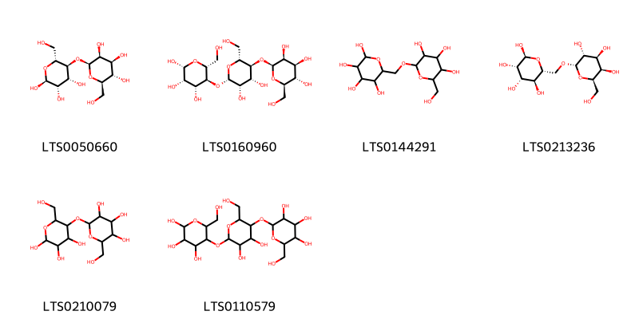{ width=100% }
    <figcaption>Hình ảnh cấu trúc hóa học của 6 hoạt chất thuộc nhóm Organooxygen compounds gồm ['α-mannobiose (LTS0050660)', '(2s,3s,4s,5s,6r)-2-{[(2r,3s,4r,5s,6s)-4,5-dihydroxy-2-(hydroxymethyl)-6-{[(2r,3s,4r,5s,6r)-4,5,6-trihydroxy-2-(hydroxymethyl)oxan-3-yl]oxy}oxan-3-yl]oxy}-6-(hydroxymethyl)oxane-3,4,5-triol (LTS0160960)', 'polydextrose (LTS0144291)', '(2s,3s,4s,5s,6r)-6-({[(2s,3r,4s,5r,6r)-3,4,5-trihydroxy-6-(hydroxymethyl)oxan-2-yl]oxy}methyl)oxane-2,3,4,5-tetrol (LTS0213236)', 'starch (LTS0210079)', 'amylose (LTS0110579)'].</figcaption>
</figure>
#### Nhóm Prenol lipids
<figure markdown="span">
    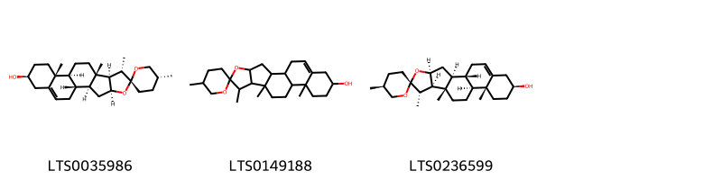{ width=100% }
    <figcaption>Hình ảnh cấu trúc hóa học của 3 hoạt chất thuộc nhóm Prenol lipids gồm ['diosgenin (LTS0035986)', 'diosgenin (LTS0149188)', 'yamogenin (LTS0236599)'].</figcaption>
</figure>
#### Nhóm Steroids and steroid derivatives
<figure markdown="span">
    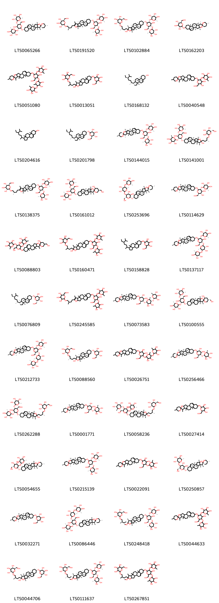{ width=100% }
    <figcaption>Hình ảnh cấu trúc hóa học của 43 hoạt chất thuộc nhóm Steroids and steroid derivatives gồm ["(2s,3r,4r,5r,6s)-2-{[(2r,3s,4s,5r,6r)-4-hydroxy-2-(hydroxymethyl)-6-[(1's,2r,2's,4's,5r,7's,8'r,9's,12's,13'r,16's)-5,7',9',13'-tetramethyl-5'-oxaspiro[oxane-2,6'-pentacyclo[10.8.0.0²,⁹.0⁴,⁸.0¹³,¹⁸]icosan]-18'-eneoxy]-5-{[(2s,3r,4r,5r,6s)-3,4,5-trihydroxy-6-methyloxan-2-yl]oxy}oxan-3-yl]oxy}-6-methyloxane-3,4,5-triol (LTS0065266)", '(2r,3r,4s,5s,6r)-2-[(2r)-4-[(1s,2s,4s,8s,9s,12s,13r,16s)-16-{[(2r,3r,4s,5s,6r)-4-hydroxy-6-(hydroxymethyl)-3,5-bis({[(2s,3r,4r,5r,6s)-3,4,5-trihydroxy-6-methyloxan-2-yl]oxy})oxan-2-yl]oxy}-7,9,13-trimethyl-5-oxapentacyclo[10.8.0.0²,⁹.0⁴,⁸.0¹³,¹⁸]icosa-6,18-dien-6-yl]-2-methylbutoxy]-6-(hydroxymethyl)oxane-3,4,5-triol (LTS0191520)', 'trigonelloside c (LTS0102884)', 'disogluside (LTS0162203)', "2-[(4,5-dihydroxy-6-{[4-hydroxy-2-(hydroxymethyl)-6-{5,7',9',13'-tetramethyl-5'-oxaspiro[oxane-2,6'-pentacyclo[10.8.0.0²,⁹.0⁴,⁸.0¹³,¹⁸]icosan]-18'-eneoxy}-5-[(3,4,5-trihydroxy-6-methyloxan-2-yl)oxy]oxan-3-yl]oxy}-2-methyloxan-3-yl)oxy]-6-methyloxane-3,4,5-triol (LTS0051080)", '2-{[6-hydroxy-7,9,13-trimethyl-6-(3-methyl-4-{[3,4,5-trihydroxy-6-(hydroxymethyl)oxan-2-yl]oxy}butyl)-5-oxapentacyclo[10.8.0.0²,⁹.0⁴,⁸.0¹³,¹⁸]icos-18-en-16-yl]oxy}-6-(hydroxymethyl)oxane-3,4,5-triol (LTS0013051)', 'sitosterol (LTS0168132)', "2-{[4,5-dihydroxy-6-(hydroxymethyl)-2-{5,7',9',13'-tetramethyl-5'-oxaspiro[oxane-2,6'-pentacyclo[10.8.0.0²,⁹.0⁴,⁸.0¹³,¹⁸]icosan]-18'-eneoxy}oxan-3-yl]oxy}-6-methyloxane-3,4,5-triol (LTS0040548)", 'stigmast-5-en-3-ol, (3β)- (LTS0204616)', 'sitogluside (LTS0201798)', "(2s,3r,4r,5r,6s)-2-{[(2r,3s,4s,5r,6r)-4-hydroxy-2-(hydroxymethyl)-6-[(1's,2s,2's,4's,5s,7's,8'r,9's,12's,13'r,16's)-5,7',9',13'-tetramethyl-5'-oxaspiro[oxane-2,6'-pentacyclo[10.8.0.0²,⁹.0⁴,⁸.0¹³,¹⁸]icosan]-18'-eneoxy]-5-{[(2s,3r,4r,5r,6s)-3,4,5-trihydroxy-6-methyloxan-2-yl]oxy}oxan-3-yl]oxy}-6-methyloxane-3,4,5-triol (LTS0144015)", '(2s,3r,4s,5r,6s)-2-{[(2r,3s,4s,5r,6s)-4-hydroxy-6-{[(1s,2s,4s,6r,7s,8r,9s,12s,13r,16s)-6-hydroxy-7,9,13-trimethyl-6-[(3r)-3-methyl-4-{[(2r,3s,4r,5s,6s)-3,4,5-trihydroxy-6-(hydroxymethyl)oxan-2-yl]oxy}butyl]-5-oxapentacyclo[10.8.0.0²,⁹.0⁴,⁸.0¹³,¹⁸]icos-18-en-16-yl]oxy}-2-(hydroxymethyl)-5-{[(2s,3r,4s,5r,6r)-3,4,5-trihydroxy-6-methyloxan-2-yl]oxy}oxan-3-yl]oxy}-6-methyloxane-3,4,5-triol (LTS0141001)', '(2r,3r,4s,5s,6r)-2-[(2s)-4-[(1s,2s,4s,8s,9s,12s,13r,16s)-16-{[(2r,3r,4s,5s,6r)-4-hydroxy-6-(hydroxymethyl)-3,5-bis({[(2s,3r,4r,5r,6s)-3,4,5-trihydroxy-6-methyloxan-2-yl]oxy})oxan-2-yl]oxy}-7,9,13-trimethyl-5-oxapentacyclo[10.8.0.0²,⁹.0⁴,⁸.0¹³,¹⁸]icosa-6,18-dien-6-yl]-2-methylbutoxy]-6-(hydroxymethyl)oxane-3,4,5-triol (LTS0138375)', "(2s,3r,4r,5r,6s)-2-{[(2r,3s,4s,5r,6r)-4-hydroxy-2-(hydroxymethyl)-6-[(1's,2s,2's,3s,4's,5s,7's,8'r,9's,12's,13'r,16's)-5-(hydroxymethyl)-7',9',13'-trimethyl-5'-oxaspiro[oxane-2,6'-pentacyclo[10.8.0.0²,⁹.0⁴,⁸.0¹³,¹⁸]icosan]-18'-en-3-oloxy]-5-{[(2s,3r,4r,5r,6s)-3,4,5-trihydroxy-6-methyloxan-2-yl]oxy}oxan-3-yl]oxy}-6-methyloxane-3,4,5-triol (LTS0161012)", "(2s,3r,4r,5r,6s)-2-{[(2s,3r,4s,5r,6s)-6-{[(2r,3s,4r,5r,6r)-4,5-dihydroxy-2-(hydroxymethyl)-6-[(1's,2r,2's,4's,5r,7's,8'r,9's,12's,13'r,16's)-5,7',9',13'-tetramethyl-5'-oxaspiro[oxane-2,6'-pentacyclo[10.8.0.0²,⁹.0⁴,⁸.0¹³,¹⁸]icosan]-18'-eneoxy]oxan-3-yl]oxy}-4,5-dihydroxy-2-methyloxan-3-yl]oxy}-6-methyloxane-3,4,5-triol (LTS0253696)", 'yamogenin 3-o-neohesperidoside (LTS0114629)', "2-{[4-hydroxy-2-(hydroxymethyl)-6-[5-(hydroxymethyl)-7',9',13'-trimethyl-5'-oxaspiro[oxane-2,6'-pentacyclo[10.8.0.0²,⁹.0⁴,⁸.0¹³,¹⁸]icosan]-18'-en-3-oloxy]-5-[(3,4,5-trihydroxy-6-methyloxan-2-yl)oxy]oxan-3-yl]oxy}-6-methyloxane-3,4,5-triol (LTS0088803)", '2-[(4-hydroxy-6-{[6-hydroxy-7,9,13-trimethyl-6-(3-methyl-4-{[3,4,5-trihydroxy-6-(hydroxymethyl)oxan-2-yl]oxy}butyl)-5-oxapentacyclo[10.8.0.0²,⁹.0⁴,⁸.0¹³,¹⁸]icos-18-en-16-yl]oxy}-2-(hydroxymethyl)-5-[(3,4,5-trihydroxy-6-methyloxan-2-yl)oxy]oxan-3-yl)oxy]-6-methyloxane-3,4,5-triol (LTS0160471)', '2-{[1-(5-ethyl-6-methylheptan-2-yl)-9a,11a-dimethyl-1h,2h,3h,3ah,3bh,4h,6h,7h,8h,9h,9bh,10h,11h-cyclopenta[a]phenanthren-7-yl]oxy}-6-(hydroxymethyl)oxane-3,4,5-triol (LTS0158828)', "(2s,3r,4r,5r,6s)-2-{[(2s,3r,4s,5r,6s)-4,5-dihydroxy-6-{[(2r,3s,4s,5r,6r)-4-hydroxy-2-(hydroxymethyl)-6-[(1's,2r,2's,4's,5s,7's,8'r,9's,12's,13'r,16's)-5,7',9',13'-tetramethyl-5'-oxaspiro[oxane-2,6'-pentacyclo[10.8.0.0²,⁹.0⁴,⁸.0¹³,¹⁸]icosan]-18'-eneoxy]-5-{[(2s,3r,4r,5r,6s)-3,4,5-trihydroxy-6-methyloxan-2-yl]oxy}oxan-3-yl]oxy}-2-methyloxan-3-yl]oxy}-6-methyloxane-3,4,5-triol (LTS0137117)", '(2r,3r,4s,5s,6s)-2-{[(1r,3as,3bs,7s,9ar,9bs,11ar)-1-[(2r,5r)-5-ethyl-6-methylheptan-2-yl]-9a,11a-dimethyl-1h,2h,3h,3ah,3bh,4h,6h,7h,8h,9h,9bh,10h,11h-cyclopenta[a]phenanthren-7-yl]oxy}-6-(hydroxymethyl)oxane-3,4,5-triol (LTS0076809)', '2-[4-(16-{[4-hydroxy-6-(hydroxymethyl)-3,5-bis[(3,4,5-trihydroxy-6-methyloxan-2-yl)oxy]oxan-2-yl]oxy}-7,9,13-trimethyl-5-oxapentacyclo[10.8.0.0²,⁹.0⁴,⁸.0¹³,¹⁸]icosa-6,18-dien-6-yl)-2-methylbutoxy]-6-(hydroxymethyl)oxane-3,4,5-triol (LTS0245585)', "(2s,3r,4r,5r,6s)-2-{[(2s,3r,4s,5r,6s)-6-{[(2r,3s,4r,5r,6r)-4,5-dihydroxy-2-(hydroxymethyl)-6-[(1's,2r,2's,4's,5s,7's,8'r,9's,12's,13'r,16's)-5,7',9',13'-tetramethyl-5'-oxaspiro[oxane-2,6'-pentacyclo[10.8.0.0²,⁹.0⁴,⁸.0¹³,¹⁸]icosan]-18'-eneoxy]oxan-3-yl]oxy}-4,5-dihydroxy-2-methyloxan-3-yl]oxy}-6-methyloxane-3,4,5-triol (LTS0073583)", "(2s,3r,4r,5r,6s)-2-{[(2r,3s,4s,5r,6r)-4-hydroxy-2-(hydroxymethyl)-6-[(1's,2s,2's,3s,4's,5r,7's,8'r,9's,12's,13'r,16's)-5-(hydroxymethyl)-7',9',13'-trimethyl-5'-oxaspiro[oxane-2,6'-pentacyclo[10.8.0.0²,⁹.0⁴,⁸.0¹³,¹⁸]icosan]-18'-en-3-oloxy]-5-{[(2s,3r,4r,5r,6s)-3,4,5-trihydroxy-6-methyloxan-2-yl]oxy}oxan-3-yl]oxy}-6-methyloxane-3,4,5-triol (LTS0100555)", "(2s,3r,4r,5r,6s)-2-{[(2s,3r,4s,5r,6s)-4,5-dihydroxy-6-{[(2r,3s,4s,5r,6r)-4-hydroxy-2-(hydroxymethyl)-6-[(1's,2s,2's,4's,5s,7's,8'r,9's,12's,13'r,16's)-5,7',9',13'-tetramethyl-5'-oxaspiro[oxane-2,6'-pentacyclo[10.8.0.0²,⁹.0⁴,⁸.0¹³,¹⁸]icosan]-18'-eneoxy]-5-{[(2s,3r,4r,5r,6s)-3,4,5-trihydroxy-6-methyloxan-2-yl]oxy}oxan-3-yl]oxy}-2-methyloxan-3-yl]oxy}-6-methyloxane-3,4,5-triol (LTS0212733)", '(2r,3r,4s,5s,6r)-2-{[(1s,2s,4s,6s,7s,8r,9s,12s,13r,16s)-6-hydroxy-7,9,13-trimethyl-6-[(3s)-3-methyl-4-{[(2r,3r,4s,5s,6r)-3,4,5-trihydroxy-6-(hydroxymethyl)oxan-2-yl]oxy}butyl]-5-oxapentacyclo[10.8.0.0²,⁹.0⁴,⁸.0¹³,¹⁸]icos-18-en-16-yl]oxy}-6-(hydroxymethyl)oxane-3,4,5-triol (LTS0088560)', "2-[(6-{[4,5-dihydroxy-2-(hydroxymethyl)-6-{5,7',9',13'-tetramethyl-5'-oxaspiro[oxane-2,6'-pentacyclo[10.8.0.0²,⁹.0⁴,⁸.0¹³,¹⁸]icosan]-18'-eneoxy}oxan-3-yl]oxy}-4,5-dihydroxy-2-methyloxan-3-yl)oxy]-6-methyloxane-3,4,5-triol (LTS0026751)", "(2s,3r,4r,5r,6s)-2-{[(2r,3s,4r,5r,6r)-4,5-dihydroxy-2-(hydroxymethyl)-6-[(1's,2s,2's,4's,5s,7's,8'r,9's,12's,13'r,16's)-5,7',9',13'-tetramethyl-5'-oxaspiro[oxane-2,6'-pentacyclo[10.8.0.0²,⁹.0⁴,⁸.0¹³,¹⁸]icosan]-18'-eneoxy]oxan-3-yl]oxy}-6-methyloxane-3,4,5-triol (LTS0256466)", 'protodioscin (LTS0262288)', "(2s,3r,4r,5r,6s)-2-{[(2r,3s,4r,5r,6r)-4,5-dihydroxy-2-(hydroxymethyl)-6-[(1's,2r,2's,4's,5s,7's,8'r,9's,12's,13'r,16's)-5,7',9',13'-tetramethyl-5'-oxaspiro[oxane-2,6'-pentacyclo[10.8.0.0²,⁹.0⁴,⁸.0¹³,¹⁸]icosan]-18'-eneoxy]oxan-3-yl]oxy}-6-methyloxane-3,4,5-triol (LTS0001771)", '(2s,3s,4s,5r,6s)-2-{[(2s,3s,4s,5r,6s)-4-hydroxy-6-{[(1s,2s,4s,6r,7s,8r,9s,12s,13r,16s)-6-hydroxy-7,9,13-trimethyl-6-[(3r)-3-methyl-4-{[(2r,3r,4r,5s,6r)-3,4,5-trihydroxy-6-(hydroxymethyl)oxan-2-yl]oxy}butyl]-5-oxapentacyclo[10.8.0.0²,⁹.0⁴,⁸.0¹³,¹⁸]icos-18-en-16-yl]oxy}-2-(hydroxymethyl)-5-{[(2s,3s,4s,5r,6s)-3,4,5-trihydroxy-6-methyloxan-2-yl]oxy}oxan-3-yl]oxy}-6-methyloxane-3,4,5-triol (LTS0058236)', "2-(hydroxymethyl)-6-{5,7',9',13'-tetramethyl-5'-oxaspiro[oxane-2,6'-pentacyclo[10.8.0.0²,⁹.0⁴,⁸.0¹³,¹⁸]icosan]-18'-eneoxy}oxane-3,4,5-triol (LTS0027414)", "(2s,3r,4r,5r,6s)-2-{[(2r,3r,4s,5s,6r)-4,5-dihydroxy-6-(hydroxymethyl)-2-[(1's,2r,2's,4's,5r,7's,8'r,9's,12's,13'r,16's)-5,7',9',13'-tetramethyl-5'-oxaspiro[oxane-2,6'-pentacyclo[10.8.0.0²,⁹.0⁴,⁸.0¹³,¹⁸]icosan]-18'-eneoxy]oxan-3-yl]oxy}-6-methyloxane-3,4,5-triol (LTS0054655)", "(2s,3r,4r,5r,6s)-2-{[(2r,3s,4s,5r,6r)-4-hydroxy-2-(hydroxymethyl)-6-[(1's,2r,2's,4's,5s,7's,8'r,9's,12's,13'r,16's)-5,7',9',13'-tetramethyl-5'-oxaspiro[oxane-2,6'-pentacyclo[10.8.0.0²,⁹.0⁴,⁸.0¹³,¹⁸]icosan]-18'-eneoxy]-5-{[(2s,3r,4r,5r,6s)-3,4,5-trihydroxy-6-methyloxan-2-yl]oxy}oxan-3-yl]oxy}-6-methyloxane-3,4,5-triol (LTS0215139)", "2-{[4,5-dihydroxy-2-(hydroxymethyl)-6-{5,7',9',13'-tetramethyl-5'-oxaspiro[oxane-2,6'-pentacyclo[10.8.0.0²,⁹.0⁴,⁸.0¹³,¹⁸]icosan]-18'-eneoxy}oxan-3-yl]oxy}-6-methyloxane-3,4,5-triol (LTS0022091)", "(2s,3r,4r,5r,6s)-2-{[(2r,3s,4r,5r,6r)-4,5-dihydroxy-2-(hydroxymethyl)-6-[(1's,2r,2's,4's,5r,7's,8'r,9's,12's,13'r,16's)-5,7',9',13'-tetramethyl-5'-oxaspiro[oxane-2,6'-pentacyclo[10.8.0.0²,⁹.0⁴,⁸.0¹³,¹⁸]icosan]-18'-eneoxy]oxan-3-yl]oxy}-6-methyloxane-3,4,5-triol (LTS0250857)", "(2r,3s,4s,5r,6r)-2-(hydroxymethyl)-6-[(1's,2r,2's,4's,5s,7's,8'r,9's,12's,13'r,16's)-5,7',9',13'-tetramethyl-5'-oxaspiro[oxane-2,6'-pentacyclo[10.8.0.0²,⁹.0⁴,⁸.0¹³,¹⁸]icosan]-18'-eneoxy]oxane-3,4,5-triol (LTS0032271)", "(2s,3r,4r,5r,6s)-2-{[(2r,3r,4s,5s,6r)-5-{[(2s,3r,4s,5r,6s)-3,4-dihydroxy-6-methyl-5-{[(2s,3r,4r,5r,6s)-3,4,5-trihydroxy-6-methyloxan-2-yl]oxy}oxan-2-yl]oxy}-4-hydroxy-6-(hydroxymethyl)-2-[(1's,2r,2's,4's,5r,7's,8'r,9's,12's,13'r,16's)-5,7',9',13'-tetramethyl-5'-oxaspiro[oxane-2,6'-pentacyclo[10.8.0.0²,⁹.0⁴,⁸.0¹³,¹⁸]icosan]-18'-eneoxy]oxan-3-yl]oxy}-6-methyloxane-3,4,5-triol (LTS0086446)", 'methylprotodioscin (LTS0248418)', "2-{[4-hydroxy-2-(hydroxymethyl)-6-{5,7',9',13'-tetramethyl-5'-oxaspiro[oxane-2,6'-pentacyclo[10.8.0.0²,⁹.0⁴,⁸.0¹³,¹⁸]icosan]-18'-eneoxy}-5-[(3,4,5-trihydroxy-6-methyloxan-2-yl)oxy]oxan-3-yl]oxy}-6-methyloxane-3,4,5-triol (LTS0044633)", '(2r,3r,4s,5s,6r)-2-{[(1s,2s,4s,6s,7s,8r,9s,12s,13r,16s)-6-hydroxy-7,9,13-trimethyl-6-[(3r)-3-methyl-4-{[(2r,3r,4s,5s,6r)-3,4,5-trihydroxy-6-(hydroxymethyl)oxan-2-yl]oxy}butyl]-5-oxapentacyclo[10.8.0.0²,⁹.0⁴,⁸.0¹³,¹⁸]icos-18-en-16-yl]oxy}-6-(hydroxymethyl)oxane-3,4,5-triol (LTS0044706)', '(2r,3r,4s,5s,6r)-2-[(2s)-4-[(1s,2s,4s,6r,7s,8r,9s,12s,13r,16s)-16-{[(2r,3r,4s,5s,6r)-4-hydroxy-6-(hydroxymethyl)-3,5-bis({[(2s,3r,4r,5r,6s)-3,4,5-trihydroxy-6-methyloxan-2-yl]oxy})oxan-2-yl]oxy}-6-methoxy-7,9,13-trimethyl-5-oxapentacyclo[10.8.0.0²,⁹.0⁴,⁸.0¹³,¹⁸]icos-18-en-6-yl]-2-methylbutoxy]-6-(hydroxymethyl)oxane-3,4,5-triol (LTS0111637)', '2-[4-(16-{[4-hydroxy-6-(hydroxymethyl)-3,5-bis[(3,4,5-trihydroxy-6-methyloxan-2-yl)oxy]oxan-2-yl]oxy}-6-methoxy-7,9,13-trimethyl-5-oxapentacyclo[10.8.0.0²,⁹.0⁴,⁸.0¹³,¹⁸]icos-18-en-6-yl)-2-methylbutoxy]-6-(hydroxymethyl)oxane-3,4,5-triol (LTS0267851)'].</figcaption>
</figure>

---

### Dược dân tộc học

Danh sách các quốc gia có sử dụng *Borassus flabellifer* trong điều trị các bệnh. 

| Country   | Disease                        | Bệnh                           |
|:----------|:-------------------------------|:-------------------------------|
| China     | Poultice                       | thuốc đắp, đắp thuốc cao       |
| Elsewhere | Stimulant                      | Chất kích thích                |
| India     | Intoxicant                     | chất gây độc                   |
| Turkey    | Demulcent, Poison, Refrigerant | Demulcent, Poison, Refrigerant |

---

---
## Borassus flabellifera
### Thông tin về thực vật

!!! info "Phân loại thực vật của *Borassus flabellifer* từ GIBF:"
    - **Kingdom:** Plantae
    - **Phylum:** Tracheophyta
    - **Order:** Arecales
    - **Family:** Arecaceae
    - **Genus:** Borassus
    - **Species:** *Borassus flabellifer*

 

| Label (VI)   | Label (EN)   | Scientific Name      | Descriptions (VI)   | Descriptions (EN)   | Also Known As (VI)       | Also Known As (EN)                                                                                                                                                          |
|:-------------|:-------------|:---------------------|:--------------------|:--------------------|:-------------------------|:----------------------------------------------------------------------------------------------------------------------------------------------------------------------------|
| N/A          | N/A          | Borassus flabellifer | loài thực vật       | species of plant    | ['Borassus flabellifer'] | ['Toddy palm', 'wine palm', 'doub palm', 'Doub palm', 'Great fan palm', 'ice apple', 'Lontar palm', 'palmyra palm', 'Palmyra palm', 'tala palm', 'Tala palm', 'toddy palm'] |

#### Phân bố trên thế giới

**Từ CSDL GIBF** Sri Lanka, Thailand, Myanmar, India, Bangladesh, Cambodia, Indonesia

#### Phân bố tại Việt Nam

**Từ CSDL GIBF**: Không có ghi nhận ở Việt Nam

---
### Thành phần hóa học
        
- Theo cơ sở dữ liệu lotus: Từ loài *Borassus flabellifer* đã phân lập và xác định được Chưa có hoạt chất nào được phân lập. hoạt chất thuộc về các nhóm Không có hoạt chất nào được phân lập. 

Không có hình ảnh nào được tạo ra

---

### Dược dân tộc học

Danh sách các quốc gia có sử dụng *Borassus flabellifer* trong điều trị các bệnh. 

| Country   | Disease   | Bệnh           |
|:----------|:----------|:---------------|
| Java      | Diuretic  | Thuốc lợi tiêu |

---

# Chi Phoenix

??? note "Danh sách các dược liệu thuộc chi"
    
	 - *Phoenix dactylifera*
	 - *Phoenix reclinata*

---
## Phoenix dactylifera
### Thông tin về thực vật

!!! info "Phân loại thực vật của *Phoenix dactylifera* từ GIBF:"
    - **Kingdom:** Plantae
    - **Phylum:** Tracheophyta
    - **Order:** Arecales
    - **Family:** Arecaceae
    - **Genus:** Phoenix
    - **Species:** *Phoenix dactylifera*

 

| Label (VI)   | Label (EN)   | Scientific Name     | Descriptions (VI)   | Descriptions (EN)                               | Also Known As (VI)   | Also Known As (EN)   |
|:-------------|:-------------|:--------------------|:--------------------|:------------------------------------------------|:---------------------|:---------------------|
| N/A          | N/A          | Phoenix dactylifera | loài thực vật       | palm tree cultivated for its edible sweet fruit | ['']                 | ['date palm']        |

#### Phân bố trên thế giới

**Từ CSDL GIBF** nan, Spain, French Guiana, United Arab Emirates, Australia, Colombia, Dominican Republic, Palestine, State of, Kuwait, India, Montenegro, Nigeria, Iraq, Bahrain, Belgium, Malta, Türkiye, Antigua and Barbuda, Yemen, Peru, Qatar, Greece, Mexico, Norway, Iran (Islamic Republic of), Jordan, South Africa, Morocco, Egypt, Cyprus, United States of America, Algeria, Italy, Israel, Saudi Arabia, Cabo Verde

#### Phân bố tại Việt Nam

**Từ CSDL GIBF**: Không có ghi nhận ở Việt Nam

---
### Thành phần hóa học
        
- Theo cơ sở dữ liệu lotus: Từ loài *Phoenix dactylifera* đã phân lập và xác định được 65 hoạt chất thuộc về các nhóm Stilbenes, Organooxygen compounds, Furanoid lignans, Flavonoids, Dibenzylbutane lignans, Carboxylic acids and derivatives, Prenol lipids, Cinnamic acids and derivatives, Steroids and steroid derivatives, Benzene and substituted derivatives. 

|    | chemicalTaxonomyClassyfireClass     |   smiles_count |
|---:|:------------------------------------|---------------:|
|  0 | Benzene and substituted derivatives |              8 |
|  1 | Carboxylic acids and derivatives    |              1 |
|  2 | Cinnamic acids and derivatives      |              9 |
|  3 | Dibenzylbutane lignans              |              2 |
|  4 | Flavonoids                          |             12 |
|  5 | Furanoid lignans                    |              3 |
|  6 | Organooxygen compounds              |              4 |
|  7 | Prenol lipids                       |              2 |
|  8 | Steroids and steroid derivatives    |             19 |
|  9 | Stilbenes                           |              5 |

#### Nhóm Benzene and substituted derivatives
<figure markdown="span">
    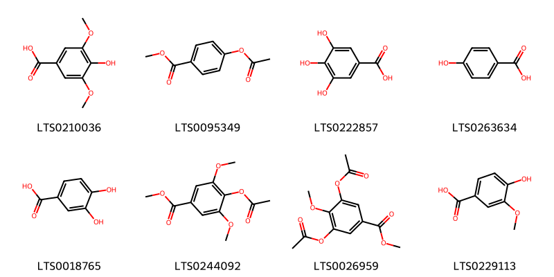{ width=100% }
    <figcaption>Hình ảnh cấu trúc hóa học của 8 hoạt chất thuộc nhóm Benzene and substituted derivatives gồm ['syringic acid (LTS0210036)', 'methyl-4-acetoxybenzoate (LTS0095349)', 'galop (LTS0222857)', 'p-hydroxybenzoic acid (LTS0263634)', '3,4-dihydroxybenzoic acid (LTS0018765)', 'methyl 4-(acetyloxy)-3,5-dimethoxybenzoate (LTS0244092)', 'methyl 3,5-bis(acetyloxy)-4-methoxybenzoate (LTS0026959)', 'vanillic acid (LTS0229113)'].</figcaption>
</figure>
#### Nhóm Carboxylic acids and derivatives
<figure markdown="span">
    { width=100% }
    <figcaption>Hình ảnh cấu trúc hóa học của 1 hoạt chất thuộc nhóm Carboxylic acids and derivatives gồm ['oxalic acid (LTS0217707)'].</figcaption>
</figure>
#### Nhóm Cinnamic acids and derivatives
<figure markdown="span">
    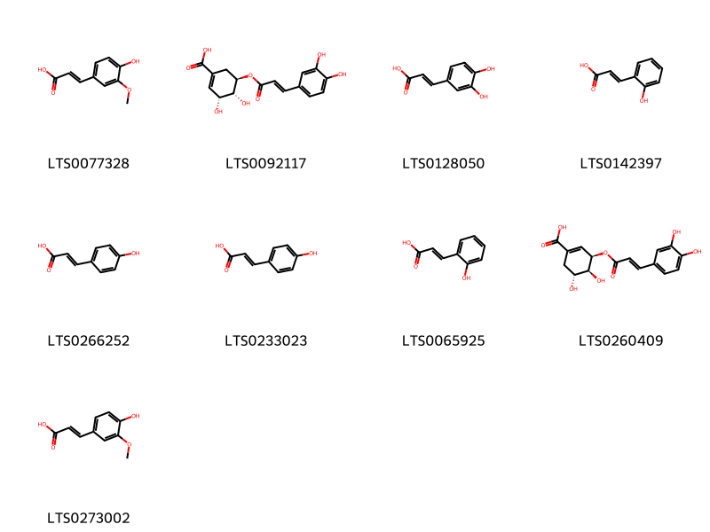{ width=100% }
    <figcaption>Hình ảnh cấu trúc hóa học của 9 hoạt chất thuộc nhóm Cinnamic acids and derivatives gồm ['ferulic acid (LTS0077328)', '5-o-caffeoylshikimic acid (LTS0092117)', '3,4-dihydroxycinnamic acid (LTS0128050)', 'trans-2-hydroxycinnamic acid (LTS0142397)', 'para-coumaric acid (LTS0266252)', 'hydroxycinnamic acid (LTS0233023)', 'o-coumaric acid (LTS0065925)', '3-caffeoylshikimic acid (LTS0260409)', 'ferulic acid (LTS0273002)'].</figcaption>
</figure>
#### Nhóm Dibenzylbutane lignans
<figure markdown="span">
    { width=100% }
    <figcaption>Hình ảnh cấu trúc hóa học của 2 hoạt chất thuộc nhóm Dibenzylbutane lignans gồm ['(2s,3r)-2,3-bis[(4-hydroxy-3-methoxyphenyl)(¹³c)methyl](1-¹³c)butane-1,4-diol (LTS0268699)', 'secoisolariciresinol (LTS0086727)'].</figcaption>
</figure>
#### Nhóm Flavonoids
<figure markdown="span">
    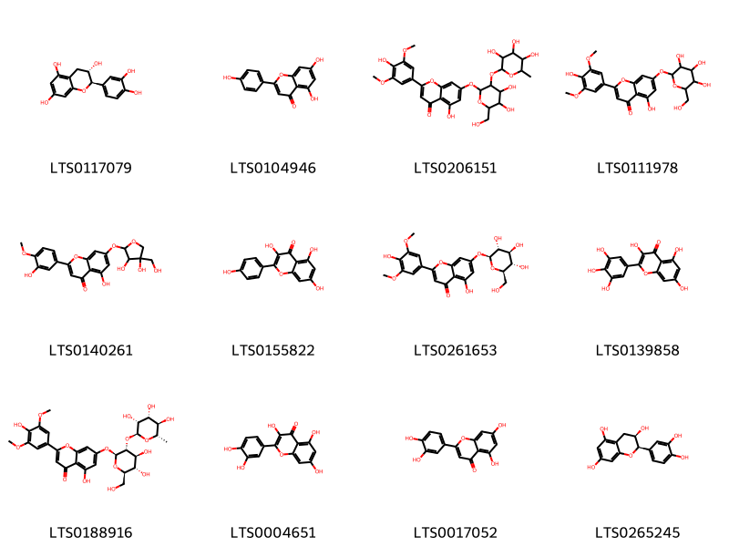{ width=100% }
    <figcaption>Hình ảnh cấu trúc hóa học của 12 hoạt chất thuộc nhóm Flavonoids gồm ['(+)-catechol (LTS0117079)', 'chamomile (LTS0104946)', '7-{[4,5-dihydroxy-6-(hydroxymethyl)-3-[(3,4,5-trihydroxy-6-methyloxan-2-yl)oxy]oxan-2-yl]oxy}-5-hydroxy-2-(4-hydroxy-3,5-dimethoxyphenyl)chromen-4-one (LTS0206151)', '5-hydroxy-2-(4-hydroxy-3,5-dimethoxyphenyl)-7-{[3,4,5-trihydroxy-6-(hydroxymethyl)oxan-2-yl]oxy}chromen-4-one (LTS0111978)', '7-{[3,4-dihydroxy-4-(hydroxymethyl)oxolan-2-yl]oxy}-5-hydroxy-2-(3-hydroxy-4-methoxyphenyl)chromen-4-one (LTS0140261)', 'kaempherol (LTS0155822)', '5-hydroxy-2-(4-hydroxy-3,5-dimethoxyphenyl)-7-{[(2s,3r,4s,5s,6r)-3,4,5-trihydroxy-6-(hydroxymethyl)oxan-2-yl]oxy}chromen-4-one (LTS0261653)', 'myricetin (LTS0139858)', '7-{[(2s,3r,4s,5s,6r)-4,5-dihydroxy-6-(hydroxymethyl)-3-{[(2s,3r,4r,5r,6s)-3,4,5-trihydroxy-6-methyloxan-2-yl]oxy}oxan-2-yl]oxy}-5-hydroxy-2-(4-hydroxy-3,5-dimethoxyphenyl)chromen-4-one (LTS0188916)', 'quercetin (LTS0004651)', 'luteolin (LTS0017052)', 'ent-epicatechin (LTS0265245)'].</figcaption>
</figure>
#### Nhóm Furanoid lignans
<figure markdown="span">
    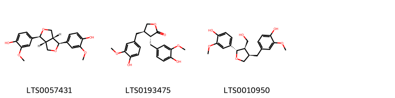{ width=100% }
    <figcaption>Hình ảnh cấu trúc hóa học của 3 hoạt chất thuộc nhóm Furanoid lignans gồm ['pinoresinol (LTS0057431)', 'matairesinol (LTS0193475)', 'lariciresinol (LTS0010950)'].</figcaption>
</figure>
#### Nhóm Organooxygen compounds
<figure markdown="span">
    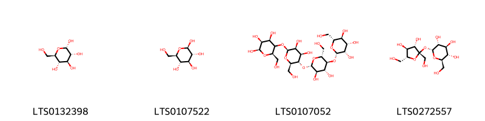{ width=100% }
    <figcaption>Hình ảnh cấu trúc hóa học của 4 hoạt chất thuộc nhóm Organooxygen compounds gồm ['α-glucose (LTS0132398)', 'β-d-glucose (LTS0107522)', '(2r,3s,4r,6r)-5-{[(2s,3s,4r,5s,6r)-5-{[(2s,3r,4r,5s,6r)-3,4-dihydroxy-6-(hydroxymethyl)-5-{[(2s,3s,4s,5s,6r)-3,4,5-trihydroxy-6-(hydroxymethyl)oxan-2-yl]oxy}oxan-2-yl]oxy}-3,4-dihydroxy-6-(hydroxymethyl)oxan-2-yl]oxy}-6-(hydroxymethyl)oxane-2,3,4-triol (LTS0107052)', 'sucrose (LTS0272557)'].</figcaption>
</figure>
#### Nhóm Prenol lipids
<figure markdown="span">
    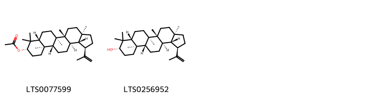{ width=100% }
    <figcaption>Hình ảnh cấu trúc hóa học của 2 hoạt chất thuộc nhóm Prenol lipids gồm ['lupeol acetate (LTS0077599)', 'lupeol (LTS0256952)'].</figcaption>
</figure>
#### Nhóm Steroids and steroid derivatives
<figure markdown="span">
    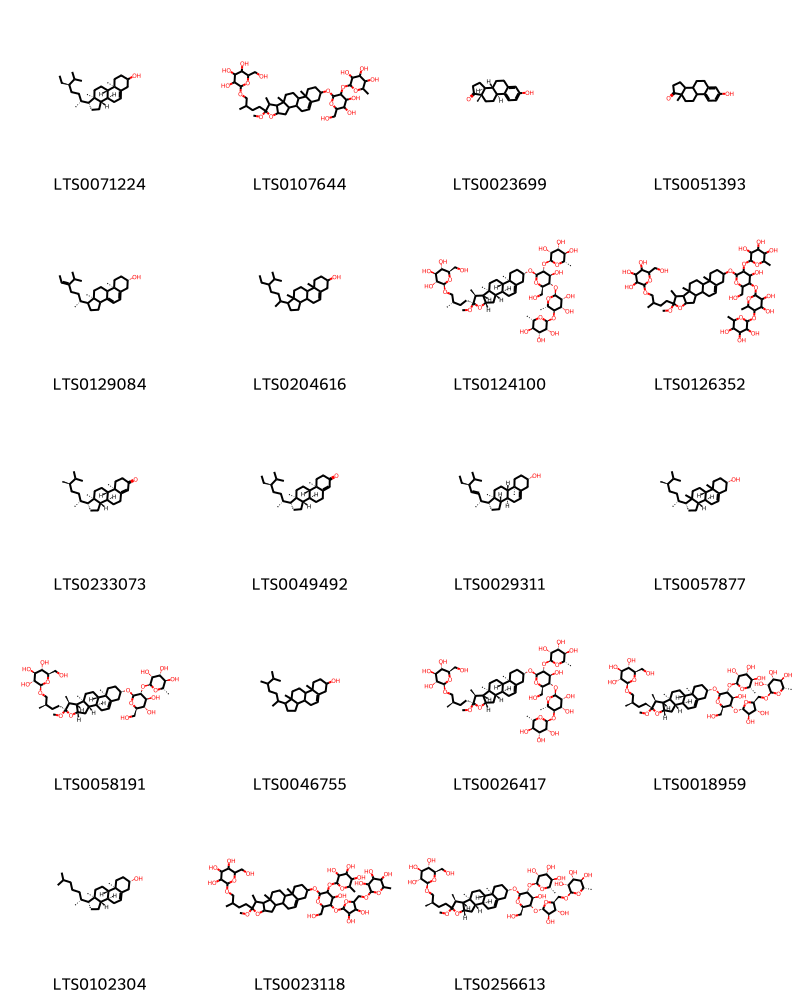{ width=100% }
    <figcaption>Hình ảnh cấu trúc hóa học của 19 hoạt chất thuộc nhóm Steroids and steroid derivatives gồm ['stigmast-5-en-3-ol (LTS0071224)', '2-[4-(16-{[4,5-dihydroxy-6-(hydroxymethyl)-3-[(3,4,5-trihydroxy-6-methyloxan-2-yl)oxy]oxan-2-yl]oxy}-6-methoxy-7,9,13-trimethyl-5-oxapentacyclo[10.8.0.0²,⁹.0⁴,⁸.0¹³,¹⁸]icos-18-en-6-yl)-2-methylbutoxy]-6-(hydroxymethyl)oxane-3,4,5-triol (LTS0107644)', 'estrone (LTS0023699)', 'unden (LTS0051393)', '5-dehydroavenasterol (LTS0129084)', 'stigmast-5-en-3-ol, (3β)- (LTS0204616)', '(2r,3r,4s,5s,6r)-2-[(2s)-4-[(1s,2s,4s,6r,7s,8r,9s,12s,13r,16s)-16-{[(2r,3r,4s,5s,6r)-5-{[(2s,3r,4s,5r,6s)-3,4-dihydroxy-6-methyl-5-{[(2s,3r,4r,5r,6s)-3,4,5-trihydroxy-6-methyloxan-2-yl]oxy}oxan-2-yl]oxy}-4-hydroxy-6-(hydroxymethyl)-3-{[(2s,3r,4r,5r,6s)-3,4,5-trihydroxy-6-methyloxan-2-yl]oxy}oxan-2-yl]oxy}-6-methoxy-7,9,13-trimethyl-5-oxapentacyclo[10.8.0.0²,⁹.0⁴,⁸.0¹³,¹⁸]icos-18-en-6-yl]-2-methylbutoxy]-6-(hydroxymethyl)oxane-3,4,5-triol (LTS0124100)', '2-[4-(16-{[5-({3,4-dihydroxy-6-methyl-5-[(3,4,5-trihydroxy-6-methyloxan-2-yl)oxy]oxan-2-yl}oxy)-4-hydroxy-6-(hydroxymethyl)-3-[(3,4,5-trihydroxy-6-methyloxan-2-yl)oxy]oxan-2-yl]oxy}-6-methoxy-7,9,13-trimethyl-5-oxapentacyclo[10.8.0.0²,⁹.0⁴,⁸.0¹³,¹⁸]icos-18-en-6-yl)-2-methylbutoxy]-6-(hydroxymethyl)oxane-3,4,5-triol (LTS0126352)', 'campest-4-en-3-one (LTS0233073)', 'β-sitostenone (LTS0049492)', 'phytosterol (LTS0029311)', '(1r,3as,3bs,7s,9bs)-1-[(2r,5r)-5,6-dimethylheptan-2-yl]-9a,11a-dimethyl-1h,2h,3h,3ah,3bh,4h,6h,7h,8h,9h,9bh,10h,11h-cyclopenta[a]phenanthren-7-ol (LTS0057877)', '(2r,3r,4s,5s,6r)-2-[(2r)-4-[(1s,2s,4s,6r,7s,8r,9s,12s,13r,16s)-16-{[(2r,3r,4s,5s,6r)-4,5-dihydroxy-6-(hydroxymethyl)-3-{[(2s,3r,4r,5r,6s)-3,4,5-trihydroxy-6-methyloxan-2-yl]oxy}oxan-2-yl]oxy}-6-methoxy-7,9,13-trimethyl-5-oxapentacyclo[10.8.0.0²,⁹.0⁴,⁸.0¹³,¹⁸]icos-18-en-6-yl]-2-methylbutoxy]-6-(hydroxymethyl)oxane-3,4,5-triol (LTS0058191)', 'campesterol (LTS0046755)', '(2r,3r,4s,5s,6r)-2-[(2r)-4-[(1s,2s,4s,6r,7s,8r,9s,12s,13r,16s)-16-{[(2r,3r,4s,5s,6r)-5-{[(2s,3r,4s,5r,6s)-3,4-dihydroxy-6-methyl-5-{[(2s,3r,4r,5r,6s)-3,4,5-trihydroxy-6-methyloxan-2-yl]oxy}oxan-2-yl]oxy}-4-hydroxy-6-(hydroxymethyl)-3-{[(2s,3r,4r,5r,6s)-3,4,5-trihydroxy-6-methyloxan-2-yl]oxy}oxan-2-yl]oxy}-6-methoxy-7,9,13-trimethyl-5-oxapentacyclo[10.8.0.0²,⁹.0⁴,⁸.0¹³,¹⁸]icos-18-en-6-yl]-2-methylbutoxy]-6-(hydroxymethyl)oxane-3,4,5-triol (LTS0026417)', '(2r,3r,4s,5s,6r)-2-[(2r)-4-[(1s,2s,4s,6s,7s,8r,9s,12s,13r,16s)-16-{[(2r,3r,4s,5s,6r)-5-{[(2s,3r,4r,5s)-3,4-dihydroxy-5-({[(2r,3r,4r,5r,6s)-3,4,5-trihydroxy-6-methyloxan-2-yl]oxy}methyl)oxolan-2-yl]oxy}-4-hydroxy-6-(hydroxymethyl)-3-{[(2s,3r,4r,5r,6s)-3,4,5-trihydroxy-6-methyloxan-2-yl]oxy}oxan-2-yl]oxy}-6-methoxy-7,9,13-trimethyl-5-oxapentacyclo[10.8.0.0²,⁹.0⁴,⁸.0¹³,¹⁸]icos-18-en-6-yl]-2-methylbutoxy]-6-(hydroxymethyl)oxane-3,4,5-triol (LTS0018959)', 'cholesterol (LTS0102304)', '2-{4-[16-({5-[(3,4-dihydroxy-5-{[(3,4,5-trihydroxy-6-methyloxan-2-yl)oxy]methyl}oxolan-2-yl)oxy]-4-hydroxy-6-(hydroxymethyl)-3-[(3,4,5-trihydroxy-6-methyloxan-2-yl)oxy]oxan-2-yl}oxy)-6-methoxy-7,9,13-trimethyl-5-oxapentacyclo[10.8.0.0²,⁹.0⁴,⁸.0¹³,¹⁸]icos-18-en-6-yl]-2-methylbutoxy}-6-(hydroxymethyl)oxane-3,4,5-triol (LTS0023118)', '(2r,3r,4s,5s,6r)-2-[(2r)-4-[(1s,2s,4s,7s,8r,9s,12s,13r,16s)-16-{[(2r,3r,4s,5s,6r)-5-{[(2s,3r,4r,5s)-3,4-dihydroxy-5-({[(2r,3r,4r,5r,6s)-3,4,5-trihydroxy-6-methyloxan-2-yl]oxy}methyl)oxolan-2-yl]oxy}-4-hydroxy-6-(hydroxymethyl)-3-{[(2s,3r,4r,5r,6s)-3,4,5-trihydroxy-6-methyloxan-2-yl]oxy}oxan-2-yl]oxy}-6-methoxy-7,9,13-trimethyl-5-oxapentacyclo[10.8.0.0²,⁹.0⁴,⁸.0¹³,¹⁸]icos-18-en-6-yl]-2-methylbutoxy]-6-(hydroxymethyl)oxane-3,4,5-triol (LTS0256613)'].</figcaption>
</figure>
#### Nhóm Stilbenes
<figure markdown="span">
    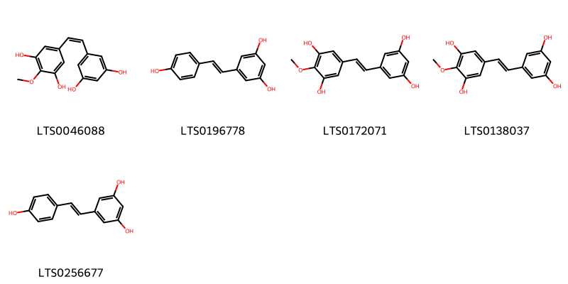{ width=100% }
    <figcaption>Hình ảnh cấu trúc hóa học của 5 hoạt chất thuộc nhóm Stilbenes gồm ['5-[(1z)-2-(3,5-dihydroxyphenyl)ethenyl]-2-methoxybenzene-1,3-diol (LTS0046088)', 'tocilizumab (LTS0196778)', '5-[(1e)-2-(3,5-dihydroxyphenyl)ethenyl]-2-methoxybenzene-1,3-diol (LTS0172071)', '5-[2-(3,5-dihydroxyphenyl)ethenyl]-2-methoxybenzene-1,3-diol (LTS0138037)', 'resveratrol (LTS0256677)'].</figcaption>
</figure>

---

### Dược dân tộc học

Danh sách các quốc gia có sử dụng *Phoenix dactylifera* trong điều trị các bệnh. 

| Country   | Disease                                                   | Bệnh                                          |
|:----------|:----------------------------------------------------------|:----------------------------------------------|
| Babylonia | Purgative                                                 | Thuốc xổ                                      |
| Egypt     | Contraceptive, Intoxicant                                 | Thuốc tránh thai, Intoxicant                  |
| Elsewhere | Intoxicant, Intoxicant, Estrogenic                        | Intoxicant, Intoxicant, Estrogenic            |
| Haiti     | Analeptic, Emollient, Emollient                           | Analeptic, Emollient, Emollient               |
| Iraq      | Demulcent, Expectorant, Intoxicant, Laxative, Refrigerant | Demulcent, đờm, Intoxicant, nhuận tràng, lạnh |
| Turkey    | Aphrodisiac, Diuretic, Tonic                              | Thuốc kích thích tình dục, lợi tiểu, thuốc bổ |
| ain       | Emollient                                                 | Chỉnh thị                                     |

---

---
## Phoenix reclinata
### Thông tin về thực vật

!!! info "Phân loại thực vật của *Phoenix reclinata* từ GIBF:"
    - **Kingdom:** Plantae
    - **Phylum:** Tracheophyta
    - **Order:** Arecales
    - **Family:** Arecaceae
    - **Genus:** Phoenix
    - **Species:** *Phoenix reclinata*

 

| Label (VI)   | Label (EN)   | Scientific Name   | Descriptions (VI)   | Descriptions (EN)   | Also Known As (VI)   | Also Known As (EN)    |
|:-------------|:-------------|:------------------|:--------------------|:--------------------|:---------------------|:----------------------|
| N/A          | N/A          | Phoenix reclinata | loài thực vật       | species of plant    | ['']                 | ['Senegal date palm'] |

#### Phân bố trên thế giới

**Từ CSDL GIBF** South Africa, Botswana, Bermuda, Tanzania, United Republic of, Mozambique, Eswatini, Ethiopia, Kenya, United States of America, Zimbabwe, Zambia, Rwanda, Australia, Gambia

#### Phân bố tại Việt Nam

**Từ CSDL GIBF**: Không có ghi nhận ở Việt Nam

---
### Thành phần hóa học
        
- Theo cơ sở dữ liệu lotus: Từ loài *Phoenix reclinata* đã phân lập và xác định được 4 hoạt chất thuộc về các nhóm Steroids and steroid derivatives. 

|    | chemicalTaxonomyClassyfireClass   |   smiles_count |
|---:|:----------------------------------|---------------:|
|  0 | Steroids and steroid derivatives  |              4 |

#### Nhóm Steroids and steroid derivatives
<figure markdown="span">
    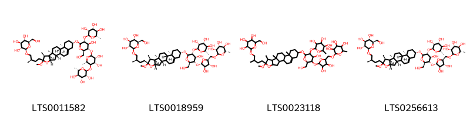{ width=100% }
    <figcaption>Hình ảnh cấu trúc hóa học của 4 hoạt chất thuộc nhóm Steroids and steroid derivatives gồm ['(2r,3r,4s,5s,6r)-2-[(2r)-4-[(1s,2s,4s,7s,8r,9s,12s,13r,16s)-16-{[(2r,3r,4s,5s,6r)-5-{[(2s,3r,4s,5r,6s)-3,4-dihydroxy-6-methyl-5-{[(2s,3r,4r,5r,6s)-3,4,5-trihydroxy-6-methyloxan-2-yl]oxy}oxan-2-yl]oxy}-4-hydroxy-6-(hydroxymethyl)-3-{[(2s,3r,4r,5r,6s)-3,4,5-trihydroxy-6-methyloxan-2-yl]oxy}oxan-2-yl]oxy}-6-methoxy-7,9,13-trimethyl-5-oxapentacyclo[10.8.0.0²,⁹.0⁴,⁸.0¹³,¹⁸]icos-18-en-6-yl]-2-methylbutoxy]-6-(hydroxymethyl)oxane-3,4,5-triol (LTS0011582)', '(2r,3r,4s,5s,6r)-2-[(2r)-4-[(1s,2s,4s,6s,7s,8r,9s,12s,13r,16s)-16-{[(2r,3r,4s,5s,6r)-5-{[(2s,3r,4r,5s)-3,4-dihydroxy-5-({[(2r,3r,4r,5r,6s)-3,4,5-trihydroxy-6-methyloxan-2-yl]oxy}methyl)oxolan-2-yl]oxy}-4-hydroxy-6-(hydroxymethyl)-3-{[(2s,3r,4r,5r,6s)-3,4,5-trihydroxy-6-methyloxan-2-yl]oxy}oxan-2-yl]oxy}-6-methoxy-7,9,13-trimethyl-5-oxapentacyclo[10.8.0.0²,⁹.0⁴,⁸.0¹³,¹⁸]icos-18-en-6-yl]-2-methylbutoxy]-6-(hydroxymethyl)oxane-3,4,5-triol (LTS0018959)', '2-{4-[16-({5-[(3,4-dihydroxy-5-{[(3,4,5-trihydroxy-6-methyloxan-2-yl)oxy]methyl}oxolan-2-yl)oxy]-4-hydroxy-6-(hydroxymethyl)-3-[(3,4,5-trihydroxy-6-methyloxan-2-yl)oxy]oxan-2-yl}oxy)-6-methoxy-7,9,13-trimethyl-5-oxapentacyclo[10.8.0.0²,⁹.0⁴,⁸.0¹³,¹⁸]icos-18-en-6-yl]-2-methylbutoxy}-6-(hydroxymethyl)oxane-3,4,5-triol (LTS0023118)', '(2r,3r,4s,5s,6r)-2-[(2r)-4-[(1s,2s,4s,7s,8r,9s,12s,13r,16s)-16-{[(2r,3r,4s,5s,6r)-5-{[(2s,3r,4r,5s)-3,4-dihydroxy-5-({[(2r,3r,4r,5r,6s)-3,4,5-trihydroxy-6-methyloxan-2-yl]oxy}methyl)oxolan-2-yl]oxy}-4-hydroxy-6-(hydroxymethyl)-3-{[(2s,3r,4r,5r,6s)-3,4,5-trihydroxy-6-methyloxan-2-yl]oxy}oxan-2-yl]oxy}-6-methoxy-7,9,13-trimethyl-5-oxapentacyclo[10.8.0.0²,⁹.0⁴,⁸.0¹³,¹⁸]icos-18-en-6-yl]-2-methylbutoxy]-6-(hydroxymethyl)oxane-3,4,5-triol (LTS0256613)'].</figcaption>
</figure>

---

### Dược dân tộc học

Danh sách các quốc gia có sử dụng *Phoenix reclinata* trong điều trị các bệnh. 

| Country   | Disease    | Bệnh         |
|:----------|:-----------|:-------------|
| Elsewhere | Intoxicant | chất gây độc |

---

# Chi Caryota

??? note "Danh sách các dược liệu thuộc chi"
    
	 - *Caryota mitis*
	 - *Caryota urens*

---
## Caryota mitis
### Thông tin về thực vật

!!! info "Phân loại thực vật của *Caryota mitis* từ GIBF:"
    - **Kingdom:** Plantae
    - **Phylum:** Tracheophyta
    - **Order:** Arecales
    - **Family:** Arecaceae
    - **Genus:** Caryota
    - **Species:** *Caryota mitis*

 

| Label (VI)   | Label (EN)   | Scientific Name   | Descriptions (VI)   | Descriptions (EN)                    | Also Known As (VI)   | Also Known As (EN)                                                                                       |
|:-------------|:-------------|:------------------|:--------------------|:-------------------------------------|:---------------------|:---------------------------------------------------------------------------------------------------------|
| N/A          | N/A          | Caryota mitis     |                     | Palm species of the Oriental tropics | ['']                 | ['Burmese fishtail palm', 'Clustered fishtail palm', 'Clustering fishtail palm', 'Tufted fishtail palm'] |

#### Phân bố trên thế giới

**Từ CSDL GIBF** Honduras, Cayman Islands, Viet Nam, Thailand, El Salvador, Philippines, French Guiana, Lao People’s Democratic Republic, Singapore, Australia, Jamaica, Indonesia, Turks and Caicos Islands, Colombia, Dominican Republic, Puerto Rico, Malaysia, India, Cuba, Saint Kitts and Nevis, Virgin Islands (U.S.), Cambodia, Barbados, Belize, Myanmar, Brazil, Saint Lucia, China, Hong Kong, South Africa, United States of America, Zimbabwe

#### Phân bố tại Việt Nam

**Từ CSDL GIBF**: Hà Nội

---
### Thành phần hóa học
        
- Theo cơ sở dữ liệu lotus: Từ loài *Caryota mitis* đã phân lập và xác định được Chưa có hoạt chất nào được phân lập. hoạt chất thuộc về các nhóm Không có hoạt chất nào được phân lập. 

Không có hình ảnh nào được tạo ra

---

### Dược dân tộc học

Danh sách các quốc gia có sử dụng *Caryota mitis* trong điều trị các bệnh. 

| Country   | Disease   | Bệnh     |
|:----------|:----------|:---------|
| Elsewhere | Poison    | Chất độc |
| Malaysia  | Poison    | Chất độc |

---

---
## Caryota urens
### Thông tin về thực vật

!!! info "Phân loại thực vật của *Caryota urens* từ GIBF:"
    - **Kingdom:** Plantae
    - **Phylum:** Tracheophyta
    - **Order:** Arecales
    - **Family:** Arecaceae
    - **Genus:** Caryota
    - **Species:** *Caryota urens*

 

| Label (VI)   | Label (EN)   | Scientific Name   | Descriptions (VI)   | Descriptions (EN)   | Also Known As (VI)   | Also Known As (EN)                                                                                     |
|:-------------|:-------------|:------------------|:--------------------|:--------------------|:---------------------|:-------------------------------------------------------------------------------------------------------|
| N/A          | N/A          | Caryota urens     | loài thực vật       | species of plant    | ['']                 | ['Fishtail Palm', 'Jaggary palm', 'Jaggery palm', 'Solitary fishtail palm', 'Toddy palm', 'wine palm'] |

#### Phân bố trên thế giới

**Từ CSDL GIBF** Sri Lanka, Thailand, Nicaragua, Bhutan, Brazil, India

#### Phân bố tại Việt Nam

**Từ CSDL GIBF**: Không có ghi nhận ở Việt Nam

---
### Thành phần hóa học
        
- Theo cơ sở dữ liệu lotus: Từ loài *Caryota urens* đã phân lập và xác định được Chưa có hoạt chất nào được phân lập. hoạt chất thuộc về các nhóm Không có hoạt chất nào được phân lập. 

Không có hình ảnh nào được tạo ra

---

### Dược dân tộc học

Danh sách các quốc gia có sử dụng *Caryota urens* trong điều trị các bệnh. 

| Country   | Disease    | Bệnh         |
|:----------|:-----------|:-------------|
| Elsewhere | Intoxicant | chất gây độc |

---

# Chi Nypa

??? note "Danh sách các dược liệu thuộc chi"
    
	 - *Nypa fruticans*

---
## Nypa fruticans
### Thông tin về thực vật

!!! info "Phân loại thực vật của *Nypa fruticans* từ GIBF:"
    - **Kingdom:** Plantae
    - **Phylum:** Tracheophyta
    - **Order:** Arecales
    - **Family:** Arecaceae
    - **Genus:** Nypa
    - **Species:** *Nypa fruticans*

 

| Label (VI)   | Label (EN)   | Scientific Name   | Descriptions (VI)   | Descriptions (EN)                                                                                | Also Known As (VI)              | Also Known As (EN)                                                     |
|:-------------|:-------------|:------------------|:--------------------|:-------------------------------------------------------------------------------------------------|:--------------------------------|:-----------------------------------------------------------------------|
| N/A          | N/A          | Nypa fruticans    |                     | species of palm native to the coastlines and estuarine habitats of the Indian and Pacific Oceans | ['Nypoideae', 'Nypa fruticans'] | ['Mangrove palm', 'nipa palm', 'Nipa palm', 'Nipah palm', 'Nypa palm'] |

#### Phân bố trên thế giới

**Từ CSDL GIBF** Viet Nam, Timor-Leste, Thailand, Sri Lanka, Brunei Darussalam, Philippines, Malaysia, Palau, India, Indonesia, Bangladesh, Equatorial Guinea, Nigeria, Singapore, Australia, Cambodia, Chinese Taipei

#### Phân bố tại Việt Nam

**Từ CSDL GIBF**: Quảng Nam, Hồ Chí Minh city, Vĩnh Long, Bến Tre, Long An, Cần Thơ, Tiền Giang, Đà Nẵng, Đồng Nai

---
### Thành phần hóa học
        
- Theo cơ sở dữ liệu lotus: Từ loài *Nypa fruticans* đã phân lập và xác định được Chưa có hoạt chất nào được phân lập. hoạt chất thuộc về các nhóm Không có hoạt chất nào được phân lập. 

Không có hình ảnh nào được tạo ra

---

### Dược dân tộc học

Danh sách các quốc gia có sử dụng *Nypa fruticans* trong điều trị các bệnh. 

| Country   | Disease    | Bệnh         |
|:----------|:-----------|:-------------|
| Elsewhere | Intoxicant | chất gây độc |

---

# Chi Inodes

??? note "Danh sách các dược liệu thuộc chi"
    
	 - *Inodes japa*

---
## Inodes japa
### Thông tin về thực vật

!!! info "Phân loại thực vật của *Sabal yapa* từ GIBF:"
    - **Kingdom:** Plantae
    - **Phylum:** Tracheophyta
    - **Order:** Arecales
    - **Family:** Arecaceae
    - **Genus:** Sabal
    - **Species:** *Sabal yapa*

 

| Label (VI)   | Label (EN)   | Scientific Name   | Descriptions (VI)   | Descriptions (EN)                                                                                | Also Known As (VI)              | Also Known As (EN)                                                     |
|:-------------|:-------------|:------------------|:--------------------|:-------------------------------------------------------------------------------------------------|:--------------------------------|:-----------------------------------------------------------------------|
| N/A          | N/A          | Nypa fruticans    |                     | species of palm native to the coastlines and estuarine habitats of the Indian and Pacific Oceans | ['Nypoideae', 'Nypa fruticans'] | ['Mangrove palm', 'nipa palm', 'Nipa palm', 'Nipah palm', 'Nypa palm'] |

#### Phân bố trên thế giới

**Từ CSDL GIBF** Mexico

#### Phân bố tại Việt Nam

**Từ CSDL GIBF**: Không có ghi nhận ở Việt Nam

---
### Thành phần hóa học
        
- Theo cơ sở dữ liệu lotus: Từ loài *Sabal yapa* đã phân lập và xác định được Chưa có hoạt chất nào được phân lập. hoạt chất thuộc về các nhóm Không có hoạt chất nào được phân lập. 

Không có hình ảnh nào được tạo ra

---

### Dược dân tộc học

Danh sách các quốc gia có sử dụng *Sabal yapa* trong điều trị các bệnh. 

| Country   | Disease        | Bệnh           |
|:----------|:---------------|:---------------|
| Mexico    | Apertif, Tonic | Apertif, Tonic |

---

# Chi Orbignya

??? note "Danh sách các dược liệu thuộc chi"
    
	 - *Orbignya cohune*
	 - *Orbignya cuatrecasana*
	 - *Orbignya martiana*

---
## Orbignya cohune
### Thông tin về thực vật

!!! info "Phân loại thực vật của *Attalea cohune* từ GIBF:"
    - **Kingdom:** Plantae
    - **Phylum:** Tracheophyta
    - **Order:** Arecales
    - **Family:** Arecaceae
    - **Genus:** Attalea
    - **Species:** *Attalea cohune*

 

| Label (VI)   | Label (EN)   | Scientific Name   | Descriptions (VI)   | Descriptions (EN)   | Also Known As (VI)   | Also Known As (EN)   |
|:-------------|:-------------|:------------------|:--------------------|:--------------------|:---------------------|:---------------------|
| N/A          | N/A          | Orbignya cohune   |                     | species of plant    | ['']                 | ['']                 |

#### Phân bố trên thế giới

**Từ CSDL GIBF** nan, Belize, Brazil, Trinidad and Tobago, Seychelles, United States of America, Mexico, Guatemala

#### Phân bố tại Việt Nam

**Từ CSDL GIBF**: Không có ghi nhận ở Việt Nam

---
### Thành phần hóa học
        
- Theo cơ sở dữ liệu lotus: Từ loài *Attalea cohune* đã phân lập và xác định được Chưa có hoạt chất nào được phân lập. hoạt chất thuộc về các nhóm Không có hoạt chất nào được phân lập. 

Không có hình ảnh nào được tạo ra

---

### Dược dân tộc học

Danh sách các quốc gia có sử dụng *Attalea cohune* trong điều trị các bệnh. 

| Country   | Disease      | Bệnh               |
|:----------|:-------------|:-------------------|
| Guatemala | Soap         | Xà phòng           |
| Mexico    | Poison, Soap | Chất độc, xà phòng |

---

---
## Orbignya cuatrecasana
### Thông tin về thực vật

!!! info "Phân loại thực vật của *Attalea cuatrecasana* từ GIBF:"
    - **Kingdom:** Plantae
    - **Phylum:** Tracheophyta
    - **Order:** Arecales
    - **Family:** Arecaceae
    - **Genus:** Attalea
    - **Species:** *Attalea cuatrecasana*

 

| Label (VI)   | Label (EN)   | Scientific Name   | Descriptions (VI)   | Descriptions (EN)   | Also Known As (VI)   | Also Known As (EN)   |
|:-------------|:-------------|:------------------|:--------------------|:--------------------|:---------------------|:---------------------|
| N/A          | N/A          | Orbignya cohune   |                     | species of plant    | ['']                 | ['']                 |

#### Phân bố trên thế giới

**Từ CSDL GIBF** nan, Colombia

#### Phân bố tại Việt Nam

**Từ CSDL GIBF**: Không có ghi nhận ở Việt Nam

---
### Thành phần hóa học
        
- Theo cơ sở dữ liệu lotus: Từ loài *Attalea cuatrecasana* đã phân lập và xác định được Chưa có hoạt chất nào được phân lập. hoạt chất thuộc về các nhóm Không có hoạt chất nào được phân lập. 

Không có hình ảnh nào được tạo ra

---

### Dược dân tộc học

Danh sách các quốc gia có sử dụng *Attalea cuatrecasana* trong điều trị các bệnh. 

| Country   | Disease    | Bệnh         |
|:----------|:-----------|:-------------|
| Elsewhere | Intoxicant | chất gây độc |

---

---
## Orbignya martiana
### Thông tin về thực vật

!!! info "Phân loại thực vật của *Attalea speciosa* từ GIBF:"
    - **Kingdom:** Plantae
    - **Phylum:** Tracheophyta
    - **Order:** Arecales
    - **Family:** Arecaceae
    - **Genus:** Attalea
    - **Species:** *Attalea speciosa*

 

| Label (VI)   | Label (EN)   | Scientific Name   | Descriptions (VI)   | Descriptions (EN)   | Also Known As (VI)   | Also Known As (EN)   |
|:-------------|:-------------|:------------------|:--------------------|:--------------------|:---------------------|:---------------------|
| N/A          | N/A          | Orbignya martiana | loài thực vật       | species of plant    | ['']                 | ['']                 |

#### Phân bố trên thế giới

**Từ CSDL GIBF** nan, unknown or invalid, Brazil

#### Phân bố tại Việt Nam

**Từ CSDL GIBF**: Không có ghi nhận ở Việt Nam

---
### Thành phần hóa học
        
- Theo cơ sở dữ liệu lotus: Từ loài *Attalea speciosa* đã phân lập và xác định được Chưa có hoạt chất nào được phân lập. hoạt chất thuộc về các nhóm Không có hoạt chất nào được phân lập. 

Không có hình ảnh nào được tạo ra

---

### Dược dân tộc học

Danh sách các quốc gia có sử dụng *Attalea speciosa* trong điều trị các bệnh. 

| Country   | Disease   | Bệnh     |
|:----------|:----------|:---------|
| Amazon    | Soap      | Xà phòng |

---

# Chi Corypha

??? note "Danh sách các dược liệu thuộc chi"
    
	 - *Corypha umbraculifera*
	 - *Corypha utan*

---
## Corypha umbraculifera
### Thông tin về thực vật

!!! info "Phân loại thực vật của *Corypha umbraculifera* từ GIBF:"
    - **Kingdom:** Plantae
    - **Phylum:** Tracheophyta
    - **Order:** Arecales
    - **Family:** Arecaceae
    - **Genus:** Corypha
    - **Species:** *Corypha umbraculifera*

 

| Label (VI)   | Label (EN)   | Scientific Name       | Descriptions (VI)   | Descriptions (EN)   | Also Known As (VI)   | Also Known As (EN)   |
|:-------------|:-------------|:----------------------|:--------------------|:--------------------|:---------------------|:---------------------|
| N/A          | N/A          | Corypha umbraculifera | loài thực vật       | species of plant    | ['']                 | ['Talipot palm']     |

#### Phân bố trên thế giới

**Từ CSDL GIBF** nan, Honduras, unknown or invalid, Thailand, Guadeloupe, Philippines, French Polynesia, Trinidad and Tobago, French Guiana, Singapore, Martinique, Jamaica, Indonesia, Saint Vincent and the Grenadines, Sri Lanka, Puerto Rico, Mauritius, India, Réunion, Seychelles, Cuba, Myanmar, Panama, China, Benin, South Africa, Costa Rica, United States of America, Saint Barthélemy

#### Phân bố tại Việt Nam

**Từ CSDL GIBF**: Không có ghi nhận ở Việt Nam

---
### Thành phần hóa học
        
- Theo cơ sở dữ liệu lotus: Từ loài *Corypha umbraculifera* đã phân lập và xác định được Chưa có hoạt chất nào được phân lập. hoạt chất thuộc về các nhóm Không có hoạt chất nào được phân lập. 

Không có hình ảnh nào được tạo ra

---

### Dược dân tộc học

Danh sách các quốc gia có sử dụng *Corypha umbraculifera* trong điều trị các bệnh. 

| Country   | Disease              | Bệnh                 |
|:----------|:---------------------|:---------------------|
| Elsewhere | Piscicide, Piscicide | Piscicide, Piscicide |

---

---
## Corypha utan
### Thông tin về thực vật

!!! info "Phân loại thực vật của *Corypha utan* từ GIBF:"
    - **Kingdom:** Plantae
    - **Phylum:** Tracheophyta
    - **Order:** Arecales
    - **Family:** Arecaceae
    - **Genus:** Corypha
    - **Species:** *Corypha utan*

 

| Label (VI)   | Label (EN)   | Scientific Name   | Descriptions (VI)   | Descriptions (EN)   | Also Known As (VI)   | Also Known As (EN)           |
|:-------------|:-------------|:------------------|:--------------------|:--------------------|:---------------------|:-----------------------------|
| N/A          | N/A          | Corypha utan      | loài thực vật       | species of plant    | ['']                 | ['Buri palm', 'Gebang palm'] |

#### Phân bố trên thế giới

**Từ CSDL GIBF** nan, unknown or invalid, Philippines, Malaysia, India, Papua New Guinea, Indonesia, United States of America, China, Singapore, Australia, Belgium, Timor-Leste

#### Phân bố tại Việt Nam

**Từ CSDL GIBF**: Không có ghi nhận ở Việt Nam

---
### Thành phần hóa học
        
- Theo cơ sở dữ liệu lotus: Từ loài *Corypha utan* đã phân lập và xác định được Chưa có hoạt chất nào được phân lập. hoạt chất thuộc về các nhóm Không có hoạt chất nào được phân lập. 

Không có hình ảnh nào được tạo ra

---

### Dược dân tộc học

Danh sách các quốc gia có sử dụng *Corypha utan* trong điều trị các bệnh. 

| Country   | Disease   | Bệnh     |
|:----------|:----------|:---------|
| Elsewhere | Poison    | Chất độc |

---

# Chi Astrocaryum

??? note "Danh sách các dược liệu thuộc chi"
    
	 - *Astrocaryum vulgare*

---
## Astrocaryum vulgare
### Thông tin về thực vật

!!! info "Phân loại thực vật của *Astrocaryum vulgare* từ GIBF:"
    - **Kingdom:** Plantae
    - **Phylum:** Tracheophyta
    - **Order:** Arecales
    - **Family:** Arecaceae
    - **Genus:** Astrocaryum
    - **Species:** *Astrocaryum vulgare*

 

| Label (VI)   | Label (EN)   | Scientific Name     | Descriptions (VI)   | Descriptions (EN)   | Also Known As (VI)   | Also Known As (EN)                           |
|:-------------|:-------------|:--------------------|:--------------------|:--------------------|:---------------------|:---------------------------------------------|
| N/A          | N/A          | Astrocaryum vulgare | loài thực vật       | species of plant    | ['']                 | ['Awarra palm', 'Tucum palm', 'Tucuma palm'] |

#### Phân bố trên thế giới

**Từ CSDL GIBF** nan, unknown or invalid, Suriname, Venezuela (Bolivarian Republic of), Brazil, French Guiana, Ecuador, Guyana

#### Phân bố tại Việt Nam

**Từ CSDL GIBF**: Không có ghi nhận ở Việt Nam

---
### Thành phần hóa học
        
- Theo cơ sở dữ liệu lotus: Từ loài *Astrocaryum vulgare* đã phân lập và xác định được Chưa có hoạt chất nào được phân lập. hoạt chất thuộc về các nhóm Không có hoạt chất nào được phân lập. 

Không có hình ảnh nào được tạo ra

---

### Dược dân tộc học

Danh sách các quốc gia có sử dụng *Astrocaryum vulgare* trong điều trị các bệnh. 

| Country   | Disease   | Bệnh     |
|:----------|:----------|:---------|
| Brazil    | Soap      | Xà phòng |

---

# Chi Nipa

??? note "Danh sách các dược liệu thuộc chi"
    
	 - *Nipa fruticans*

---
## Nipa fruticans
### Thông tin về thực vật

!!! info "Phân loại thực vật của *Nypa fruticans* từ GIBF:"
    - **Kingdom:** Plantae
    - **Phylum:** Tracheophyta
    - **Order:** Arecales
    - **Family:** Arecaceae
    - **Genus:** Nypa
    - **Species:** *Nypa fruticans*

 

| Label (VI)   | Label (EN)   | Scientific Name   | Descriptions (VI)   | Descriptions (EN)   | Also Known As (VI)   | Also Known As (EN)   |
|:-------------|:-------------|:------------------|:--------------------|:--------------------|:---------------------|:---------------------|
| N/A          | N/A          | Nipa fruticans    |                     |                     | ['']                 | ['']                 |

#### Phân bố trên thế giới

**Từ CSDL GIBF** Viet Nam, nan, unknown or invalid, Thailand, Philippines, Malaysia, Papua New Guinea, Northern Mariana Islands, Australia, Solomon Islands, Indonesia

#### Phân bố tại Việt Nam

**Từ CSDL GIBF**: Không có ghi nhận ở Việt Nam

---
### Thành phần hóa học
        
- Theo cơ sở dữ liệu lotus: Từ loài *Nypa fruticans* đã phân lập và xác định được Chưa có hoạt chất nào được phân lập. hoạt chất thuộc về các nhóm Không có hoạt chất nào được phân lập. 

Không có hình ảnh nào được tạo ra

---

### Dược dân tộc học

Danh sách các quốc gia có sử dụng *Nypa fruticans* trong điều trị các bệnh. 

| Country   | Disease   | Bệnh               |
|:----------|:----------|:-------------------|
| Malaya    | Tonic     | (thuộc) trương lực |

---

# Chi Thrinax

??? note "Danh sách các dược liệu thuộc chi"
    
	 - *Thrinax multiflora*
	 - *Thrinax wendlandiana*

---
## Thrinax multiflora
### Thông tin về thực vật

!!! info "Phân loại thực vật của *N/A* từ GIBF:"
    - **Kingdom:** Plantae
    - **Phylum:** Tracheophyta
    - **Order:** Arecales
    - **Family:** Arecaceae
    - **Genus:** N/A
    - **Species:** *N/A*

 

| Label (VI)   | Label (EN)   | Scientific Name   | Descriptions (VI)   | Descriptions (EN)   | Also Known As (VI)   | Also Known As (EN)   |
|:-------------|:-------------|:------------------|:--------------------|:--------------------|:---------------------|:---------------------|
| N/A          | N/A          | Nipa fruticans    |                     |                     | ['']                 | ['']                 |

#### Phân bố trên thế giới

**Từ CSDL GIBF** nan, Cayman Islands, Viet Nam, Thailand, Honduras, Spain, Philippines, Trinidad and Tobago, Chile, Singapore, Australia, Jamaica, Indonesia, Guatemala, Colombia, Maldives, Kuwait, Puerto Rico, Guinea-Bissau, Malaysia, India, Réunion, Virgin Islands (U.S.), Belize, Antigua and Barbuda, Japan, Brazil, Panama, Ethiopia, Mexico, Chinese Taipei, Argentina, South Africa, Portugal, Morocco, New Zealand, Costa Rica, Ecuador, United States of America, Italy, Israel

#### Phân bố tại Việt Nam

**Từ CSDL GIBF**: Hồ Chí Minh city

---
### Thành phần hóa học
        
- Theo cơ sở dữ liệu lotus: Từ loài *N/A* đã phân lập và xác định được Chưa có hoạt chất nào được phân lập. hoạt chất thuộc về các nhóm Không có hoạt chất nào được phân lập. 

Không có hình ảnh nào được tạo ra

---

### Dược dân tộc học

Danh sách các quốc gia có sử dụng *N/A* trong điều trị các bệnh. 

| Country   | Disease      | Bệnh               |
|:----------|:-------------|:-------------------|
| Haiti     | Tonic, Tonic | Thuốc bổ, Thuốc bổ |

---

---
## Thrinax wendlandiana
### Thông tin về thực vật

!!! info "Phân loại thực vật của *Thrinax radiata* từ GIBF:"
    - **Kingdom:** Plantae
    - **Phylum:** Tracheophyta
    - **Order:** Arecales
    - **Family:** Arecaceae
    - **Genus:** Thrinax
    - **Species:** *Thrinax radiata*

 

| Label (VI)   | Label (EN)   | Scientific Name      | Descriptions (VI)   | Descriptions (EN)   | Also Known As (VI)   | Also Known As (EN)   |
|:-------------|:-------------|:---------------------|:--------------------|:--------------------|:---------------------|:---------------------|
| N/A          | N/A          | Thrinax wendlandiana |                     | species of plant    | ['']                 | ['']                 |

#### Phân bố trên thế giới

**Từ CSDL GIBF** nan, unknown or invalid, Cuba

#### Phân bố tại Việt Nam

**Từ CSDL GIBF**: Không có ghi nhận ở Việt Nam

---
### Thành phần hóa học
        
- Theo cơ sở dữ liệu lotus: Từ loài *Thrinax radiata* đã phân lập và xác định được Chưa có hoạt chất nào được phân lập. hoạt chất thuộc về các nhóm Không có hoạt chất nào được phân lập. 

Không có hình ảnh nào được tạo ra

---

### Dược dân tộc học

Danh sách các quốc gia có sử dụng *Thrinax radiata* trong điều trị các bệnh. 

| Country   | Disease                      | Bệnh                                    |
|:----------|:-----------------------------|:----------------------------------------|
| Mexico    | Tonic, Aphrodisiac, Sedative | Thuốc bổ, Thuốc kích dục, Thuốc an thần |

---

# Chi Calamus

??? note "Danh sách các dược liệu thuộc chi"
    
	 - *Calamus draco*
	 - *Calamus margaritae*
	 - *Calamus rotjang*
	 - *Calamus travancoricus*

---
## Calamus draco
### Thông tin về thực vật

!!! info "Phân loại thực vật của *Calamus draco* từ GIBF:"
    - **Kingdom:** Plantae
    - **Phylum:** Tracheophyta
    - **Order:** Arecales
    - **Family:** Arecaceae
    - **Genus:** Calamus
    - **Species:** *Calamus draco*

 

| Label (VI)   | Label (EN)   | Scientific Name   | Descriptions (VI)   | Descriptions (EN)   | Also Known As (VI)   | Also Known As (EN)   |
|:-------------|:-------------|:------------------|:--------------------|:--------------------|:---------------------|:---------------------|
| N/A          | N/A          | Calamus draco     | loài thực vật       | species of plant    | ['']                 | ['']                 |

#### Phân bố trên thế giới

**Từ CSDL GIBF** nan, unknown or invalid, Malaysia, India, Lao People’s Democratic Republic, United States of America, Mexico, Singapore, China, Indonesia

#### Phân bố tại Việt Nam

**Từ CSDL GIBF**: Không có ghi nhận ở Việt Nam

---
### Thành phần hóa học
        
- Theo cơ sở dữ liệu lotus: Từ loài *Calamus draco* đã phân lập và xác định được 32 hoạt chất thuộc về các nhóm Flavonoids, Prenol lipids, Linear 1,3-diarylpropanoids, Depsides and depsidones. 

|    | chemicalTaxonomyClassyfireClass   |   smiles_count |
|---:|:----------------------------------|---------------:|
|  0 | Depsides and depsidones           |              1 |
|  1 | Flavonoids                        |             22 |
|  2 | Linear 1,3-diarylpropanoids       |              2 |
|  3 | Prenol lipids                     |              6 |

#### Nhóm Depsides and depsidones
<figure markdown="span">
    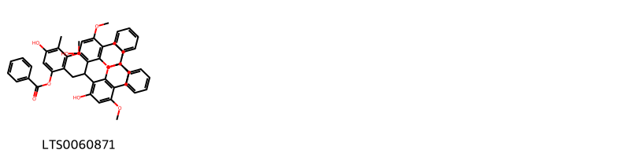{ width=100% }
    <figcaption>Hình ảnh cấu trúc hóa học của 1 hoạt chất thuộc nhóm Depsides and depsidones gồm ['2-{2,2-bis[(2s)-7-hydroxy-5-methoxy-2-phenyl-3,4-dihydro-2h-1-benzopyran-8-yl]ethyl}-5-hydroxy-3-methoxy-4-methylphenyl benzoate (LTS0060871)'].</figcaption>
</figure>
#### Nhóm Flavonoids
<figure markdown="span">
    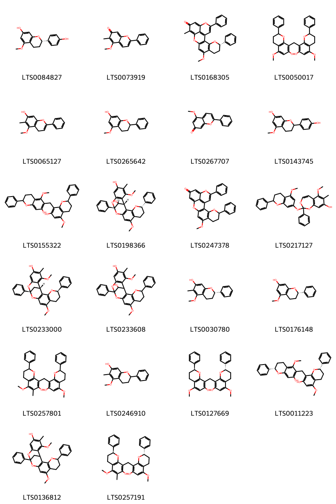{ width=100% }
    <figcaption>Hình ảnh cấu trúc hóa học của 22 hoạt chất thuộc nhóm Flavonoids gồm ['(2s)-2-(4-hydroxyphenyl)-5-methoxy-3,4-dihydro-2h-1-benzopyran-7-ol (LTS0084827)', '5-methoxy-6-methyl-2-phenylchromen-7-one (LTS0073919)', 'dracorubin (LTS0168305)', '8-[(7-hydroxy-5-methoxy-2-phenyl-3,4-dihydro-2h-1-benzopyran-8-yl)methyl]-5-methoxy-2-phenyl-3,4-dihydro-2h-1-benzopyran-7-ol (LTS0050017)', '5-methoxy-6-methyl-2-phenyl-4h-chromen-7-ol (LTS0065127)', '5-methoxy-2-phenyl-3,4-dihydro-2h-1-benzopyran-7-ol (LTS0265642)', '5-methoxy-2-phenylchromen-7-one (LTS0267707)', '2-(4-hydroxyphenyl)-5-methoxy-3,4-dihydro-2h-1-benzopyran-7-ol (LTS0143745)', '8-[(7-hydroxy-5-methoxy-2-phenyl-3,4-dihydro-2h-1-benzopyran-6-yl)methyl]-5-methoxy-2-phenyl-3,4-dihydro-2h-1-benzopyran-7-ol (LTS0155322)', '(1r,5s,13s,21r)-9,19-dimethoxy-18-methyl-5,13-diphenyl-4,12,14-trioxapentacyclo[11.7.1.0²,¹¹.0³,⁸.0¹⁵,²⁰]henicosa-2(11),3(8),9,15(20),16,18-hexaene-17,21-diol (LTS0198366)', '9-methoxy-5,19-diphenyl-4,12,18-trioxapentacyclo[11.7.1.0²,¹¹.0³,⁸.0¹⁷,²¹]henicosa-1(21),2(11),3(8),9,13,16,19-heptaen-15-one (LTS0247378)', '6-methoxy-2-[(5-methoxy-2-phenyl-3,4-dihydro-2h-1-benzopyran-7-yl)oxy]-7-methyl-2-phenyl-1,3-benzodioxepin-8-ol (LTS0217127)', '(1r,5r,13r)-9,19-dimethoxy-18-methyl-5,13-diphenyl-4,12,14-trioxapentacyclo[11.7.1.0²,¹¹.0³,⁸.0¹⁵,²⁰]henicosa-2(11),3(8),9,15,17,19-hexaen-17-ol (LTS0233000)', '9,19-dimethoxy-18-methyl-5,13-diphenyl-4,12,14-trioxapentacyclo[11.7.1.0²,¹¹.0³,⁸.0¹⁵,²⁰]henicosa-2(11),3(8),9,15(20),16,18-hexaene-17,21-diol (LTS0233608)', '(2s)-5-methoxy-6-methyl-2-phenyl-3,4-dihydro-2h-1-benzopyran-7-ol (LTS0030780)', '(2s)-5-methoxy-2-phenyl-3,4-dihydro-2h-1-benzopyran-7-ol (LTS0176148)', '8-[(7-hydroxy-5-methoxy-2-phenyl-3,4-dihydro-2h-1-benzopyran-8-yl)methyl]-5-methoxy-6-methyl-2-phenyl-3,4-dihydro-2h-1-benzopyran-7-ol (LTS0257801)', '5-methoxy-6-methyl-2-phenyl-3,4-dihydro-2h-1-benzopyran-7-ol (LTS0246910)', '(2s)-8-{[(2s)-7-hydroxy-5-methoxy-2-phenyl-3,4-dihydro-2h-1-benzopyran-8-yl]methyl}-5-methoxy-2-phenyl-3,4-dihydro-2h-1-benzopyran-7-ol (LTS0127669)', '(2s)-8-{[(2s)-7-hydroxy-5-methoxy-2-phenyl-3,4-dihydro-2h-1-benzopyran-6-yl]methyl}-5-methoxy-2-phenyl-3,4-dihydro-2h-1-benzopyran-7-ol (LTS0011223)', '9,19-dimethoxy-18-methyl-5,13-diphenyl-4,12,14-trioxapentacyclo[11.7.1.0²,¹¹.0³,⁸.0¹⁵,²⁰]henicosa-2(11),3(8),9,15,17,19-hexaen-17-ol (LTS0136812)', '(2s)-8-{[(2s)-7-hydroxy-5-methoxy-2-phenyl-3,4-dihydro-2h-1-benzopyran-8-yl]methyl}-5-methoxy-6-methyl-2-phenyl-3,4-dihydro-2h-1-benzopyran-7-ol (LTS0257191)'].</figcaption>
</figure>
#### Nhóm Linear 1_3-diarylpropanoids
<figure markdown="span">
    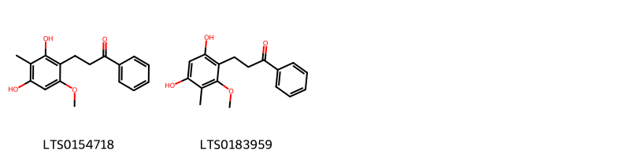{ width=100% }
    <figcaption>Hình ảnh cấu trúc hóa học của Không tìm thấy chú thích hoạt chất thuộc nhóm Linear 1_3-diarylpropanoids gồm Không tìm thấy chú thích.</figcaption>
</figure>
#### Nhóm Prenol lipids
<figure markdown="span">
    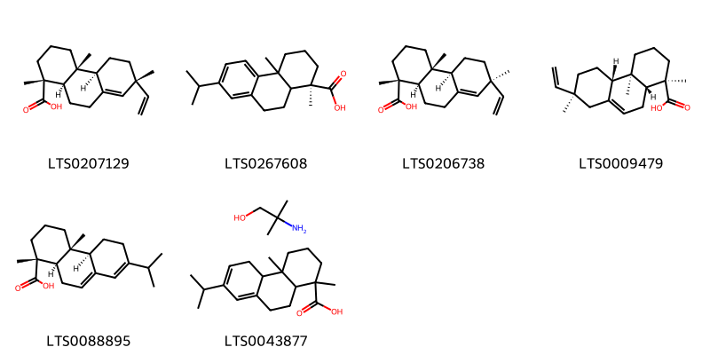{ width=100% }
    <figcaption>Hình ảnh cấu trúc hóa học của 6 hoạt chất thuộc nhóm Prenol lipids gồm ['sandaracopimaric acid (LTS0207129)', '(1r)-7-isopropyl-1,4a-dimethyl-2,3,4,9,10,10a-hexahydrophenanthrene-1-carboxylic acid (LTS0267608)', 'pimaric acid (LTS0206738)', 'isopimaric acid (LTS0009479)', 'abietic acid (LTS0088895)', '2-amino-2-methyl-1-propanol; levopimaric acid (LTS0043877)'].</figcaption>
</figure>

---

### Dược dân tộc học

Danh sách các quốc gia có sử dụng *Calamus draco* trong điều trị các bệnh. 

| Country   | Disease                      | Bệnh                                 |
|:----------|:-----------------------------|:-------------------------------------|
| China     | Cicatrizant, Sedative, Tonic | Cicatrizant, Thuốc an thần, Thuốc bổ |

---

---
## Calamus margaritae
### Thông tin về thực vật

!!! info "Phân loại thực vật của *Calamus melanochaetes* từ GIBF:"
    - **Kingdom:** Plantae
    - **Phylum:** Tracheophyta
    - **Order:** Arecales
    - **Family:** Arecaceae
    - **Genus:** Calamus
    - **Species:** *Calamus melanochaetes*

 

| Label (VI)   | Label (EN)   | Scientific Name    | Descriptions (VI)   | Descriptions (EN)   | Also Known As (VI)   | Also Known As (EN)   |
|:-------------|:-------------|:-------------------|:--------------------|:--------------------|:---------------------|:---------------------|
| N/A          | N/A          | Calamus margaritae | loài thực vật       | species of plant    | ['']                 | ['']                 |

#### Phân bố trên thế giới

**Từ CSDL GIBF** China, Chinese Taipei

#### Phân bố tại Việt Nam

**Từ CSDL GIBF**: Không có ghi nhận ở Việt Nam

---
### Thành phần hóa học
        
- Theo cơ sở dữ liệu lotus: Từ loài *Calamus melanochaetes* đã phân lập và xác định được Chưa có hoạt chất nào được phân lập. hoạt chất thuộc về các nhóm Không có hoạt chất nào được phân lập. 

Không có hình ảnh nào được tạo ra

---

### Dược dân tộc học

Danh sách các quốc gia có sử dụng *Calamus melanochaetes* trong điều trị các bệnh. 

| Country   | Disease                           | Bệnh                                   |
|:----------|:----------------------------------|:---------------------------------------|
| China     | Carminative, Vermifuge, Analgesic | Carminative, Vermifuge, Thuốc giảm đau |

---

---
## Calamus rotjang
### Thông tin về thực vật

!!! info "Phân loại thực vật của *Calamus rotang* từ GIBF:"
    - **Kingdom:** Plantae
    - **Phylum:** Tracheophyta
    - **Order:** Arecales
    - **Family:** Arecaceae
    - **Genus:** Calamus
    - **Species:** *Calamus rotang*

 

| Label (VI)   | Label (EN)   | Scientific Name    | Descriptions (VI)   | Descriptions (EN)   | Also Known As (VI)   | Also Known As (EN)   |
|:-------------|:-------------|:-------------------|:--------------------|:--------------------|:---------------------|:---------------------|
| N/A          | N/A          | Calamus margaritae | loài thực vật       | species of plant    | ['']                 | ['']                 |

#### Phân bố trên thế giới

**Từ CSDL GIBF** nan, Viet Nam, unknown or invalid, Sri Lanka, Thailand, Vanuatu, Bhutan, Brazil, Philippines, Malaysia, French Polynesia, India, Papua New Guinea, Mauritius, Bangladesh, Cambodia, Indonesia

#### Phân bố tại Việt Nam

**Từ CSDL GIBF**: Bắc Ninh, Hồ Chí Minh

---
### Thành phần hóa học
        
- Theo cơ sở dữ liệu lotus: Từ loài *Calamus rotang* đã phân lập và xác định được Chưa có hoạt chất nào được phân lập. hoạt chất thuộc về các nhóm Không có hoạt chất nào được phân lập. 

Không có hình ảnh nào được tạo ra

---

### Dược dân tộc học

Danh sách các quốc gia có sử dụng *Calamus rotang* trong điều trị các bệnh. 

| Country   | Disease   | Bệnh               |
|:----------|:----------|:-------------------|
| Cambodia  | Tonic     | (thuộc) trương lực |

---

---
## Calamus travancoricus
### Thông tin về thực vật

!!! info "Phân loại thực vật của *Calamus travancoricus* từ GIBF:"
    - **Kingdom:** Plantae
    - **Phylum:** Tracheophyta
    - **Order:** Arecales
    - **Family:** Arecaceae
    - **Genus:** Calamus
    - **Species:** *Calamus travancoricus*

 

| Label (VI)   | Label (EN)   | Scientific Name       | Descriptions (VI)   | Descriptions (EN)   | Also Known As (VI)   | Also Known As (EN)   |
|:-------------|:-------------|:----------------------|:--------------------|:--------------------|:---------------------|:---------------------|
| N/A          | N/A          | Calamus travancoricus | loài thực vật       | species of plant    | ['']                 | ['']                 |

#### Phân bố trên thế giới

**Từ CSDL GIBF** nan, Viet Nam, unknown or invalid, Sri Lanka, Thailand, Vanuatu, Bhutan, Brazil, Philippines, Malaysia, French Polynesia, India, Papua New Guinea, Mauritius, Bangladesh, Cambodia, Indonesia

#### Phân bố tại Việt Nam

**Từ CSDL GIBF**: Bắc Ninh, Hồ Chí Minh

---
### Thành phần hóa học
        
- Theo cơ sở dữ liệu lotus: Từ loài *Calamus travancoricus* đã phân lập và xác định được Chưa có hoạt chất nào được phân lập. hoạt chất thuộc về các nhóm Không có hoạt chất nào được phân lập. 

Không có hình ảnh nào được tạo ra

---

### Dược dân tộc học

Danh sách các quốc gia có sử dụng *Calamus travancoricus* trong điều trị các bệnh. 

| Country   | Disease   | Bệnh           |
|:----------|:----------|:---------------|
| Elsewhere | Vermifuge | Thuốc diệt sán |

---

# Chi Mauritia

??? note "Danh sách các dược liệu thuộc chi"
    
	 - *Mauritia flexuosa*
	 - *Mauritia vinifera*

---
## Mauritia flexuosa
### Thông tin về thực vật

!!! info "Phân loại thực vật của *Mauritia flexuosa* từ GIBF:"
    - **Kingdom:** Plantae
    - **Phylum:** Tracheophyta
    - **Order:** Arecales
    - **Family:** Arecaceae
    - **Genus:** Mauritia
    - **Species:** *Mauritia flexuosa*

 

| Label (VI)   | Label (EN)   | Scientific Name   | Descriptions (VI)   | Descriptions (EN)    | Also Known As (VI)   | Also Known As (EN)                                          |
|:-------------|:-------------|:------------------|:--------------------|:---------------------|:---------------------|:------------------------------------------------------------|
| N/A          | N/A          | Mauritia flexuosa |                     | species of palm tree | ['']                 | ['Ita palm', 'Moreche palm', 'Morete palm', 'Moriche palm'] |

#### Phân bố trên thế giới

**Từ CSDL GIBF** nan, Colombia, Brazil, Peru, Trinidad and Tobago, French Guiana, Bolivia (Plurinational State of), Ecuador

#### Phân bố tại Việt Nam

**Từ CSDL GIBF**: Không có ghi nhận ở Việt Nam

---
### Thành phần hóa học
        
- Theo cơ sở dữ liệu lotus: Từ loài *Mauritia flexuosa* đã phân lập và xác định được 1 hoạt chất thuộc về các nhóm Prenol lipids. 

|    | chemicalTaxonomyClassyfireClass   |   smiles_count |
|---:|:----------------------------------|---------------:|
|  0 | Prenol lipids                     |              1 |

#### Nhóm Prenol lipids
<figure markdown="span">
    { width=100% }
    <figcaption>Hình ảnh cấu trúc hóa học của 1 hoạt chất thuộc nhóm Prenol lipids gồm ['β-carotene (LTS0275716)'].</figcaption>
</figure>

---

### Dược dân tộc học

Danh sách các quốc gia có sử dụng *Mauritia flexuosa* trong điều trị các bệnh. 

| Country           | Disease                         | Bệnh                              |
|:------------------|:--------------------------------|:----------------------------------|
| Amazon            | Intoxicant                      | chất gây độc                      |
| Colombia(Guahibo) | Intoxicant                      | chất gây độc                      |
| Elsewhere         | Intoxicant                      | chất gây độc                      |
| South America     | Intoxicant                      | chất gây độc                      |
| Venezuela         | Digestive, Intoxicant, Laxative | Tiêu hóa, Intoxicant, nhuận tràng |

---

---
## Mauritia vinifera
### Thông tin về thực vật

!!! info "Phân loại thực vật của *Mauritia flexuosa* từ GIBF:"
    - **Kingdom:** Plantae
    - **Phylum:** Tracheophyta
    - **Order:** Arecales
    - **Family:** Arecaceae
    - **Genus:** Mauritia
    - **Species:** *Mauritia flexuosa*

 

| Label (VI)   | Label (EN)   | Scientific Name   | Descriptions (VI)   | Descriptions (EN)   | Also Known As (VI)   | Also Known As (EN)   |
|:-------------|:-------------|:------------------|:--------------------|:--------------------|:---------------------|:---------------------|
| N/A          | N/A          | Mauritia vinifera | loài thực vật       | species of plant    | ['']                 | ['']                 |

#### Phân bố trên thế giới

**Từ CSDL GIBF** nan, French Guiana, Bolivia (Plurinational State of), Brazil

#### Phân bố tại Việt Nam

**Từ CSDL GIBF**: Không có ghi nhận ở Việt Nam

---
### Thành phần hóa học
        
- Theo cơ sở dữ liệu lotus: Từ loài *Mauritia flexuosa* đã phân lập và xác định được Chưa có hoạt chất nào được phân lập. hoạt chất thuộc về các nhóm Không có hoạt chất nào được phân lập. 

Không có hình ảnh nào được tạo ra

---

### Dược dân tộc học

Danh sách các quốc gia có sử dụng *Mauritia flexuosa* trong điều trị các bệnh. 

| Country   | Disease    | Bệnh         |
|:----------|:-----------|:-------------|
| Brazil    | Intoxicant | chất gây độc |

---

# Chi Sabal

??? note "Danh sách các dược liệu thuộc chi"
    
	 - *Sabal palmetto*

---
## Sabal palmetto
### Thông tin về thực vật

!!! info "Phân loại thực vật của *Sabal palmetto* từ GIBF:"
    - **Kingdom:** Plantae
    - **Phylum:** Tracheophyta
    - **Order:** Arecales
    - **Family:** Arecaceae
    - **Genus:** Sabal
    - **Species:** *Sabal palmetto*

 

| Label (VI)   | Label (EN)   | Scientific Name   | Descriptions (VI)   | Descriptions (EN)   | Also Known As (VI)   | Also Known As (EN)                                                                                                                                                                                                         |
|:-------------|:-------------|:------------------|:--------------------|:--------------------|:---------------------|:---------------------------------------------------------------------------------------------------------------------------------------------------------------------------------------------------------------------------|
| N/A          | N/A          | Sabal palmetto    | loài thực vật       | species of plant    | ['Sabal palmetto']   | ['palmetto', 'Blue palmetto', 'Palmetto', 'Cabbage palm', 'blue palmetto', 'cabbage palmetto', 'Cabbage palmetto', 'cabbage-palm', 'Carolina palmetto', 'common palmetto', 'Palmetto palm', 'sabal palm', 'swamp cabbage'] |

#### Phân bố trên thế giới

**Từ CSDL GIBF** United States of America

#### Phân bố tại Việt Nam

**Từ CSDL GIBF**: Không có ghi nhận ở Việt Nam

---
### Thành phần hóa học
        
- Theo cơ sở dữ liệu lotus: Từ loài *Sabal palmetto* đã phân lập và xác định được 5 hoạt chất thuộc về các nhóm Prenol lipids. 

|    | chemicalTaxonomyClassyfireClass   |   smiles_count |
|---:|:----------------------------------|---------------:|
|  0 | Prenol lipids                     |              5 |

#### Nhóm Prenol lipids
<figure markdown="span">
    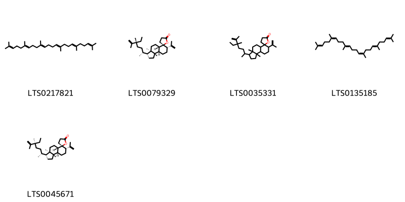{ width=100% }
    <figcaption>Hình ảnh cấu trúc hóa học của 5 hoạt chất thuộc nhóm Prenol lipids gồm ['squalene (LTS0217821)', "(3r,3ar,5as,6s,7s,9ar,9bs)-3-[(2r,5r)-5-ethyl-5,6-dimethylhept-6-en-2-yl]-3a,9b-dimethyl-7-(prop-1-en-2-yl)-decahydrospiro[cyclopenta[a]naphthalene-6,2'-oxolan]-5'-one (LTS0079329)", "3-(5-ethyl-5,6-dimethylhept-6-en-2-yl)-3a,9b-dimethyl-7-(prop-1-en-2-yl)-decahydrospiro[cyclopenta[a]naphthalene-6,2'-oxolan]-5'-one (LTS0035331)", '(6z,10e,14z,18e)-2,6,10,15,19,23-hexamethyltetracosa-2,6,10,14,18,22-hexaene (LTS0135185)', "(3r,3ar,5as,6s,7s,9ar,9bs)-3-[(2r,5s)-5-ethyl-5,6-dimethylhept-6-en-2-yl]-3a,9b-dimethyl-7-(prop-1-en-2-yl)-decahydrospiro[cyclopenta[a]naphthalene-6,2'-oxolan]-5'-one (LTS0045671)"].</figcaption>
</figure>

---

### Dược dân tộc học

Danh sách các quốc gia có sử dụng *Sabal palmetto* trong điều trị các bệnh. 

| Country   | Disease   | Bệnh           |
|:----------|:----------|:---------------|
| Elsewhere | Fungicide | Thuốc diệt nấm |

---

# Chi Lodoicea

??? note "Danh sách các dược liệu thuộc chi"
    
	 - *Lodoicea maldivica*

---
## Lodoicea maldivica
### Thông tin về thực vật

!!! info "Phân loại thực vật của *Lodoicea maldivica* từ GIBF:"
    - **Kingdom:** Plantae
    - **Phylum:** Tracheophyta
    - **Order:** Arecales
    - **Family:** Arecaceae
    - **Genus:** Lodoicea
    - **Species:** *Lodoicea maldivica*

 

| Label (VI)   | Label (EN)   | Scientific Name    | Descriptions (VI)   | Descriptions (EN)             | Also Known As (VI)   | Also Known As (EN)                                                 |
|:-------------|:-------------|:-------------------|:--------------------|:------------------------------|:---------------------|:-------------------------------------------------------------------|
| N/A          | N/A          | Lodoicea maldivica |                     | species of plant, Coco de Mer | ['']                 | ['Coco-de-mer', 'Double coconut', 'Sea coconut', 'Seychelles nut'] |

#### Phân bố trên thế giới

**Từ CSDL GIBF** nan, Sri Lanka, Malaysia, Mauritius, India, Seychelles, Singapore, Madagascar, Norway, Guyana

#### Phân bố tại Việt Nam

**Từ CSDL GIBF**: Không có ghi nhận ở Việt Nam

---
### Thành phần hóa học
        
- Theo cơ sở dữ liệu lotus: Từ loài *Lodoicea maldivica* đã phân lập và xác định được Chưa có hoạt chất nào được phân lập. hoạt chất thuộc về các nhóm Không có hoạt chất nào được phân lập. 

Không có hình ảnh nào được tạo ra

---

### Dược dân tộc học

Danh sách các quốc gia có sử dụng *Lodoicea maldivica* trong điều trị các bệnh. 

| Country   | Disease                       | Bệnh                                    |
|:----------|:------------------------------|:----------------------------------------|
| Egypt     | Antidote, Preservative, Tonic | Thuốc giải độc, chất bảo quản, thuốc bổ |

---

# Chi Wallichia

??? note "Danh sách các dược liệu thuộc chi"
    
	 - *Wallichia densiflora*

---
## Wallichia densiflora
### Thông tin về thực vật

!!! info "Phân loại thực vật của *Wallichia oblongifolia* từ GIBF:"
    - **Kingdom:** Plantae
    - **Phylum:** Tracheophyta
    - **Order:** Arecales
    - **Family:** Arecaceae
    - **Genus:** Wallichia
    - **Species:** *Wallichia oblongifolia*

 

| Label (VI)   | Label (EN)   | Scientific Name      | Descriptions (VI)   | Descriptions (EN)   | Also Known As (VI)   | Also Known As (EN)                                                 |
|:-------------|:-------------|:---------------------|:--------------------|:--------------------|:---------------------|:-------------------------------------------------------------------|
| N/A          | N/A          | Wallichia densiflora | loài thực vật       | species of plant    | ['']                 | ['Himalayan dwarf fishtail palm', "Wallich's dwarf fishtail palm"] |

#### Phân bố trên thế giới

**Từ CSDL GIBF** nan, unknown or invalid, Myanmar, Brazil, India, Australia

#### Phân bố tại Việt Nam

**Từ CSDL GIBF**: Không có ghi nhận ở Việt Nam

---
### Thành phần hóa học
        
- Theo cơ sở dữ liệu lotus: Từ loài *Wallichia oblongifolia* đã phân lập và xác định được Chưa có hoạt chất nào được phân lập. hoạt chất thuộc về các nhóm Không có hoạt chất nào được phân lập. 

Không có hình ảnh nào được tạo ra

---

### Dược dân tộc học

Danh sách các quốc gia có sử dụng *Wallichia oblongifolia* trong điều trị các bệnh. 

| Country   | Disease    | Bệnh         |
|:----------|:-----------|:-------------|
| Elsewhere | Intoxicant | chất gây độc |

---

# Chi Trachycarpus

??? note "Danh sách các dược liệu thuộc chi"
    
	 - *Trachycarpus excelsa*
	 - *Trachycarpus fortunei*

---
## Trachycarpus excelsa
### Thông tin về thực vật

!!! info "Phân loại thực vật của *Rhapis excelsa* từ GIBF:"
    - **Kingdom:** Plantae
    - **Phylum:** Tracheophyta
    - **Order:** Arecales
    - **Family:** Arecaceae
    - **Genus:** Rhapis
    - **Species:** *Rhapis excelsa*

 

| Label (VI)   | Label (EN)   | Scientific Name      | Descriptions (VI)   | Descriptions (EN)   | Also Known As (VI)   | Also Known As (EN)                                                 |
|:-------------|:-------------|:---------------------|:--------------------|:--------------------|:---------------------|:-------------------------------------------------------------------|
| N/A          | N/A          | Wallichia densiflora | loài thực vật       | species of plant    | ['']                 | ['Himalayan dwarf fishtail palm', "Wallich's dwarf fishtail palm"] |

#### Phân bố trên thế giới

**Từ CSDL GIBF** Switzerland, nan, unknown or invalid, Japan, Brazil, France, Spain, Italy, China, Netherlands, Chinese Taipei

#### Phân bố tại Việt Nam

**Từ CSDL GIBF**: Không có ghi nhận ở Việt Nam

---
### Thành phần hóa học
        
- Theo cơ sở dữ liệu lotus: Từ loài *Rhapis excelsa* đã phân lập và xác định được Chưa có hoạt chất nào được phân lập. hoạt chất thuộc về các nhóm Không có hoạt chất nào được phân lập. 

Không có hình ảnh nào được tạo ra

---

### Dược dân tộc học

Danh sách các quốc gia có sử dụng *Rhapis excelsa* trong điều trị các bệnh. 

| Country   | Disease                             | Bệnh                             |
|:----------|:------------------------------------|:---------------------------------|
| China     | Astringent, Contraceptive, Hemostat | Chất làm se, Ngừa thai, Hemostat |

---

---
## Trachycarpus fortunei
### Thông tin về thực vật

!!! info "Phân loại thực vật của *Trachycarpus fortunei* từ GIBF:"
    - **Kingdom:** Plantae
    - **Phylum:** Tracheophyta
    - **Order:** Arecales
    - **Family:** Arecaceae
    - **Genus:** Trachycarpus
    - **Species:** *Trachycarpus fortunei*

 

| Label (VI)   | Label (EN)   | Scientific Name       | Descriptions (VI)   | Descriptions (EN)   | Also Known As (VI)   | Also Known As (EN)                                                                          |
|:-------------|:-------------|:----------------------|:--------------------|:--------------------|:---------------------|:--------------------------------------------------------------------------------------------|
| N/A          | N/A          | Trachycarpus fortunei | loài thực vật       | species of plant    | ['']                 | ['Chinese windmill palm', 'Chinese hemp palm', 'Chusan palm', 'Hemp palm', 'Windmill palm'] |

#### Phân bố trên thế giới

**Từ CSDL GIBF** nan, Georgia, Spain, Germany, Chile, Austria, Korea, Republic of, India, Belgium, Netherlands, Türkiye, Japan, China, Chinese Taipei, Switzerland, United Kingdom of Great Britain and Northern Ireland, South Africa, France, New Zealand, Bolivia (Plurinational State of), Russian Federation, United States of America, Italy, Croatia

#### Phân bố tại Việt Nam

**Từ CSDL GIBF**: Không có ghi nhận ở Việt Nam

---
### Thành phần hóa học
        
- Theo cơ sở dữ liệu lotus: Từ loài *Trachycarpus fortunei* đã phân lập và xác định được 25 hoạt chất thuộc về các nhóm Steroids and steroid derivatives, Flavonoids. 

|    | chemicalTaxonomyClassyfireClass   |   smiles_count |
|---:|:----------------------------------|---------------:|
|  0 | Flavonoids                        |              5 |
|  1 | Steroids and steroid derivatives  |             20 |

#### Nhóm Flavonoids
<figure markdown="span">
    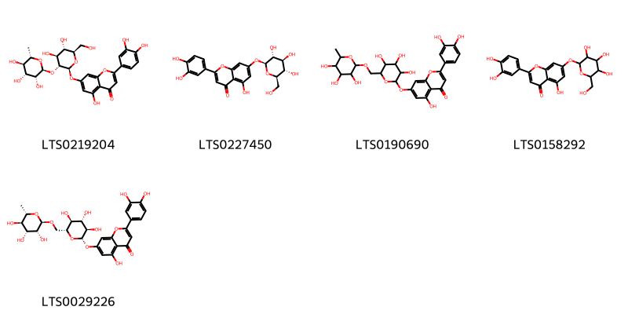{ width=100% }
    <figcaption>Hình ảnh cấu trúc hóa học của 5 hoạt chất thuộc nhóm Flavonoids gồm ['lonicerin (LTS0219204)', 'luteolin 7-o-glucoside (LTS0227450)', '2-(3,4-dihydroxyphenyl)-5-hydroxy-7-[(3,4,5-trihydroxy-6-{[(3,4,5-trihydroxy-6-methyloxan-2-yl)oxy]methyl}oxan-2-yl)oxy]chromen-4-one (LTS0190690)', '2-(3,4-dihydroxyphenyl)-5-hydroxy-7-{[3,4,5-trihydroxy-6-(hydroxymethyl)oxan-2-yl]oxy}chromen-4-one (LTS0158292)', '2-(3,4-dihydroxyphenyl)-5-hydroxy-7-{[(2s,3r,4s,5s,6r)-3,4,5-trihydroxy-6-({[(2r,3r,4r,5r,6s)-3,4,5-trihydroxy-6-methyloxan-2-yl]oxy}methyl)oxan-2-yl]oxy}chromen-4-one (LTS0029226)'].</figcaption>
</figure>
#### Nhóm Steroids and steroid derivatives
<figure markdown="span">
    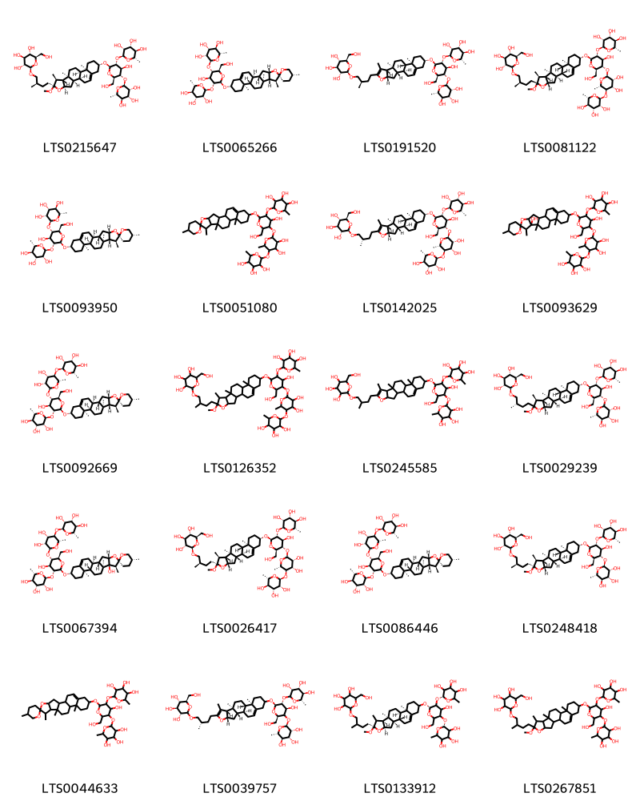{ width=100% }
    <figcaption>Hình ảnh cấu trúc hóa học của 20 hoạt chất thuộc nhóm Steroids and steroid derivatives gồm ['(2r,3r,4s,5s,6r)-2-[(2r)-4-[(1s,2r,4r,6r,7s,8r,9s,12r,13r,16s)-16-{[(2r,3r,4s,5s,6r)-4-hydroxy-6-(hydroxymethyl)-3,5-bis({[(2s,3r,4r,5r,6s)-3,4,5-trihydroxy-6-methyloxan-2-yl]oxy})oxan-2-yl]oxy}-6-methoxy-7,9,13-trimethyl-5-oxapentacyclo[10.8.0.0²,⁹.0⁴,⁸.0¹³,¹⁸]icos-18-en-6-yl]-2-methylbutoxy]-6-(hydroxymethyl)oxane-3,4,5-triol (LTS0215647)', "(2s,3r,4r,5r,6s)-2-{[(2r,3s,4s,5r,6r)-4-hydroxy-2-(hydroxymethyl)-6-[(1's,2r,2's,4's,5r,7's,8'r,9's,12's,13'r,16's)-5,7',9',13'-tetramethyl-5'-oxaspiro[oxane-2,6'-pentacyclo[10.8.0.0²,⁹.0⁴,⁸.0¹³,¹⁸]icosan]-18'-eneoxy]-5-{[(2s,3r,4r,5r,6s)-3,4,5-trihydroxy-6-methyloxan-2-yl]oxy}oxan-3-yl]oxy}-6-methyloxane-3,4,5-triol (LTS0065266)", '(2r,3r,4s,5s,6r)-2-[(2r)-4-[(1s,2s,4s,8s,9s,12s,13r,16s)-16-{[(2r,3r,4s,5s,6r)-4-hydroxy-6-(hydroxymethyl)-3,5-bis({[(2s,3r,4r,5r,6s)-3,4,5-trihydroxy-6-methyloxan-2-yl]oxy})oxan-2-yl]oxy}-7,9,13-trimethyl-5-oxapentacyclo[10.8.0.0²,⁹.0⁴,⁸.0¹³,¹⁸]icosa-6,18-dien-6-yl]-2-methylbutoxy]-6-(hydroxymethyl)oxane-3,4,5-triol (LTS0191520)', '(2r,3r,4s,5s,6r)-2-[(2r)-4-[(1r,2r,4s,6s,7s,8r,9s,12s,13r,16s)-16-{[(2r,3r,4s,5s,6r)-5-{[(2s,3r,4s,5r,6s)-3,4-dihydroxy-6-methyl-5-{[(2s,3r,4r,5r,6s)-3,4,5-trihydroxy-6-methyloxan-2-yl]oxy}oxan-2-yl]oxy}-4-hydroxy-6-(hydroxymethyl)-3-{[(2s,3r,4r,5r,6s)-3,4,5-trihydroxy-6-methyloxan-2-yl]oxy}oxan-2-yl]oxy}-6-methoxy-7,9,13-trimethyl-5-oxapentacyclo[10.8.0.0²,⁹.0⁴,⁸.0¹³,¹⁸]icos-18-en-6-yl]-2-methylbutoxy]-6-(hydroxymethyl)oxane-3,4,5-triol (LTS0081122)', "(2s,3r,4r,5r,6s)-2-{[(2r,3s,4s,5r,6r)-4-hydroxy-2-(hydroxymethyl)-6-[(1's,2r,2's,4's,5r,7's,8'r,9's,12'r,13'r,16's)-5,7',9',13'-tetramethyl-5'-oxaspiro[oxane-2,6'-pentacyclo[10.8.0.0²,⁹.0⁴,⁸.0¹³,¹⁸]icosan]-18'-eneoxy]-5-{[(2s,3r,4r,5r,6s)-3,4,5-trihydroxy-6-methyloxan-2-yl]oxy}oxan-3-yl]oxy}-6-methyloxane-3,4,5-triol (LTS0093950)", "2-[(4,5-dihydroxy-6-{[4-hydroxy-2-(hydroxymethyl)-6-{5,7',9',13'-tetramethyl-5'-oxaspiro[oxane-2,6'-pentacyclo[10.8.0.0²,⁹.0⁴,⁸.0¹³,¹⁸]icosan]-18'-eneoxy}-5-[(3,4,5-trihydroxy-6-methyloxan-2-yl)oxy]oxan-3-yl]oxy}-2-methyloxan-3-yl)oxy]-6-methyloxane-3,4,5-triol (LTS0051080)", '(2r,3r,4s,5s,6r)-2-[(2s)-4-[(1s,2s,4s,8s,9s,12s,13r,16s)-16-{[(2r,3r,4s,5s,6r)-5-{[(2s,3r,4s,5r,6s)-3,4-dihydroxy-6-methyl-5-{[(2s,3r,4r,5r,6s)-3,4,5-trihydroxy-6-methyloxan-2-yl]oxy}oxan-2-yl]oxy}-4-hydroxy-6-(hydroxymethyl)-3-{[(2s,3r,4r,5r,6s)-3,4,5-trihydroxy-6-methyloxan-2-yl]oxy}oxan-2-yl]oxy}-7,9,13-trimethyl-5-oxapentacyclo[10.8.0.0²,⁹.0⁴,⁸.0¹³,¹⁸]icosa-6,18-dien-6-yl]-2-methylbutoxy]-6-(hydroxymethyl)oxane-3,4,5-triol (LTS0142025)', "2-[(4,5-dihydroxy-6-{[4-hydroxy-2-(hydroxymethyl)-6-{5,7',9',13'-tetramethyl-5'-oxaspiro[oxane-2,6'-pentacyclo[10.8.0.0²,⁹.0⁴,⁸.0¹³,¹⁸]icosan]-18'-en-8'-oloxy}-5-[(3,4,5-trihydroxy-6-methyloxan-2-yl)oxy]oxan-3-yl]oxy}-2-methyloxan-3-yl)oxy]-6-methyloxane-3,4,5-triol (LTS0093629)", "(2s,3r,4r,5r,6s)-2-{[(2r,3r,4s,5s,6r)-5-{[(2s,3r,4s,5r,6s)-3,4-dihydroxy-6-methyl-5-{[(2s,3r,4r,5r,6s)-3,4,5-trihydroxy-6-methyloxan-2-yl]oxy}oxan-2-yl]oxy}-4-hydroxy-6-(hydroxymethyl)-2-[(1's,2r,2's,4's,5r,7's,8'r,9's,12'r,13'r,16's)-5,7',9',13'-tetramethyl-5'-oxaspiro[oxane-2,6'-pentacyclo[10.8.0.0²,⁹.0⁴,⁸.0¹³,¹⁸]icosan]-18'-eneoxy]oxan-3-yl]oxy}-6-methyloxane-3,4,5-triol (LTS0092669)", '2-[4-(16-{[5-({3,4-dihydroxy-6-methyl-5-[(3,4,5-trihydroxy-6-methyloxan-2-yl)oxy]oxan-2-yl}oxy)-4-hydroxy-6-(hydroxymethyl)-3-[(3,4,5-trihydroxy-6-methyloxan-2-yl)oxy]oxan-2-yl]oxy}-6-methoxy-7,9,13-trimethyl-5-oxapentacyclo[10.8.0.0²,⁹.0⁴,⁸.0¹³,¹⁸]icos-18-en-6-yl)-2-methylbutoxy]-6-(hydroxymethyl)oxane-3,4,5-triol (LTS0126352)', '2-[4-(16-{[4-hydroxy-6-(hydroxymethyl)-3,5-bis[(3,4,5-trihydroxy-6-methyloxan-2-yl)oxy]oxan-2-yl]oxy}-7,9,13-trimethyl-5-oxapentacyclo[10.8.0.0²,⁹.0⁴,⁸.0¹³,¹⁸]icosa-6,18-dien-6-yl)-2-methylbutoxy]-6-(hydroxymethyl)oxane-3,4,5-triol (LTS0245585)', '(2r,3r,4s,5s,6r)-2-[(2s)-4-[(1s,2s,4s,7s,8r,9s,12s,13r,16s)-16-{[(2r,3r,4s,5s,6r)-4-hydroxy-6-(hydroxymethyl)-3-{[(2s,3r,4r,5r,6s)-3,4,5-trihydroxy-6-methyloxan-2-yl]oxy}-5-{[(3r,4r,5r,6s)-3,4,5-trihydroxy-6-methyloxan-2-yl]oxy}oxan-2-yl]oxy}-6-methoxy-7,9,13-trimethyl-5-oxapentacyclo[10.8.0.0²,⁹.0⁴,⁸.0¹³,¹⁸]icos-18-en-6-yl]-2-methylbutoxy]-6-(hydroxymethyl)oxane-3,4,5-triol (LTS0029239)', "(2s,3r,4r,5r,6s)-2-{[(2r,3r,4s,5s,6r)-5-{[(2s,3r,4s,5r,6s)-3,4-dihydroxy-6-methyl-5-{[(2s,3r,4r,5r,6s)-3,4,5-trihydroxy-6-methyloxan-2-yl]oxy}oxan-2-yl]oxy}-4-hydroxy-6-(hydroxymethyl)-2-[(1'r,2r,2's,4's,5r,7's,8's,9's,12's,13'r,16's)-5,7',9',13'-tetramethyl-5'-oxaspiro[oxane-2,6'-pentacyclo[10.8.0.0²,⁹.0⁴,⁸.0¹³,¹⁸]icosan]-18'-en-8'-oloxy]oxan-3-yl]oxy}-6-methyloxane-3,4,5-triol (LTS0067394)", '(2r,3r,4s,5s,6r)-2-[(2r)-4-[(1s,2s,4s,6r,7s,8r,9s,12s,13r,16s)-16-{[(2r,3r,4s,5s,6r)-5-{[(2s,3r,4s,5r,6s)-3,4-dihydroxy-6-methyl-5-{[(2s,3r,4r,5r,6s)-3,4,5-trihydroxy-6-methyloxan-2-yl]oxy}oxan-2-yl]oxy}-4-hydroxy-6-(hydroxymethyl)-3-{[(2s,3r,4r,5r,6s)-3,4,5-trihydroxy-6-methyloxan-2-yl]oxy}oxan-2-yl]oxy}-6-methoxy-7,9,13-trimethyl-5-oxapentacyclo[10.8.0.0²,⁹.0⁴,⁸.0¹³,¹⁸]icos-18-en-6-yl]-2-methylbutoxy]-6-(hydroxymethyl)oxane-3,4,5-triol (LTS0026417)', "(2s,3r,4r,5r,6s)-2-{[(2r,3r,4s,5s,6r)-5-{[(2s,3r,4s,5r,6s)-3,4-dihydroxy-6-methyl-5-{[(2s,3r,4r,5r,6s)-3,4,5-trihydroxy-6-methyloxan-2-yl]oxy}oxan-2-yl]oxy}-4-hydroxy-6-(hydroxymethyl)-2-[(1's,2r,2's,4's,5r,7's,8'r,9's,12's,13'r,16's)-5,7',9',13'-tetramethyl-5'-oxaspiro[oxane-2,6'-pentacyclo[10.8.0.0²,⁹.0⁴,⁸.0¹³,¹⁸]icosan]-18'-eneoxy]oxan-3-yl]oxy}-6-methyloxane-3,4,5-triol (LTS0086446)", 'methylprotodioscin (LTS0248418)', "2-{[4-hydroxy-2-(hydroxymethyl)-6-{5,7',9',13'-tetramethyl-5'-oxaspiro[oxane-2,6'-pentacyclo[10.8.0.0²,⁹.0⁴,⁸.0¹³,¹⁸]icosan]-18'-eneoxy}-5-[(3,4,5-trihydroxy-6-methyloxan-2-yl)oxy]oxan-3-yl]oxy}-6-methyloxane-3,4,5-triol (LTS0044633)", '(3r,4s,5s,6r)-2-[(2s)-4-[(1s,2s,4s,8s,9s,12s,13r)-16-{[(2r,3r,4s,6r)-4-hydroxy-6-(hydroxymethyl)-5-{[(2s,3r,4r,5r,6s)-3,4,5-trihydroxy-6-methyloxan-2-yl]oxy}-3-{[(3r,4r,5r,6s)-3,4,5-trihydroxy-6-methyloxan-2-yl]oxy}oxan-2-yl]oxy}-7,9,13-trimethyl-5-oxapentacyclo[10.8.0.0²,⁹.0⁴,⁸.0¹³,¹⁸]icosa-6,18-dien-6-yl]-2-methylbutoxy]-6-(hydroxymethyl)oxane-3,4,5-triol (LTS0039757)', '2-{4-[(1r,2r,4r,6r,8s,9s,12r,13r)-16-{[(2s)-4-hydroxy-6-(hydroxymethyl)-3,5-bis({[(2r)-3,4,5-trihydroxy-6-methyloxan-2-yl]oxy})oxan-2-yl]oxy}-6-methoxy-7,9,13-trimethyl-5-oxapentacyclo[10.8.0.0²,⁹.0⁴,⁸.0¹³,¹⁸]icos-18-en-6-yl]-2-methylbutoxy}-6-(hydroxymethyl)oxane-3,4,5-triol (LTS0133912)', '2-[4-(16-{[4-hydroxy-6-(hydroxymethyl)-3,5-bis[(3,4,5-trihydroxy-6-methyloxan-2-yl)oxy]oxan-2-yl]oxy}-6-methoxy-7,9,13-trimethyl-5-oxapentacyclo[10.8.0.0²,⁹.0⁴,⁸.0¹³,¹⁸]icos-18-en-6-yl)-2-methylbutoxy]-6-(hydroxymethyl)oxane-3,4,5-triol (LTS0267851)'].</figcaption>
</figure>

---

### Dược dân tộc học

Danh sách các quốc gia có sử dụng *Trachycarpus fortunei* trong điều trị các bệnh. 

| Country   | Disease   | Bệnh        |
|:----------|:----------|:------------|
| China     | Hemostat  | Máy cầm máu |

---

# Chi Pinanga

??? note "Danh sách các dược liệu thuộc chi"
    
	 - *Pinanga dicksonii*

---
## Pinanga dicksonii
### Thông tin về thực vật

!!! info "Phân loại thực vật của *Pinanga dicksonii* từ GIBF:"
    - **Kingdom:** Plantae
    - **Phylum:** Tracheophyta
    - **Order:** Arecales
    - **Family:** Arecaceae
    - **Genus:** Pinanga
    - **Species:** *Pinanga dicksonii*

 

| Label (VI)   | Label (EN)   | Scientific Name   | Descriptions (VI)   | Descriptions (EN)   | Also Known As (VI)   | Also Known As (EN)   |
|:-------------|:-------------|:------------------|:--------------------|:--------------------|:---------------------|:---------------------|
| N/A          | N/A          | Pinanga dicksonii | loài thực vật       | species of plant    | ['']                 | ['']                 |

#### Phân bố trên thế giới

**Từ CSDL GIBF** nan, Sri Lanka, Brazil, India, United States of America, Singapore

#### Phân bố tại Việt Nam

**Từ CSDL GIBF**: Không có ghi nhận ở Việt Nam

---
### Thành phần hóa học
        
- Theo cơ sở dữ liệu lotus: Từ loài *Pinanga dicksonii* đã phân lập và xác định được Chưa có hoạt chất nào được phân lập. hoạt chất thuộc về các nhóm Không có hoạt chất nào được phân lập. 

Không có hình ảnh nào được tạo ra

---

### Dược dân tộc học

Danh sách các quốc gia có sử dụng *Pinanga dicksonii* trong điều trị các bệnh. 

| Country   | Disease     | Bệnh                   |
|:----------|:------------|:-----------------------|
| China     | Carminative | Gây ô nhiễm môi trường |

---

# Chi Elaeis

??? note "Danh sách các dược liệu thuộc chi"
    
	 - *Elaeis guineensis*

---
## Elaeis guineensis
### Thông tin về thực vật

!!! info "Phân loại thực vật của *Elaeis guineensis* từ GIBF:"
    - **Kingdom:** Plantae
    - **Phylum:** Tracheophyta
    - **Order:** Arecales
    - **Family:** Arecaceae
    - **Genus:** Elaeis
    - **Species:** *Elaeis guineensis*

 

| Label (VI)   | Label (EN)   | Scientific Name   | Descriptions (VI)   | Descriptions (EN)   | Also Known As (VI)   | Also Known As (EN)                                                |
|:-------------|:-------------|:------------------|:--------------------|:--------------------|:---------------------|:------------------------------------------------------------------|
| N/A          | N/A          | Elaeis guineensis | loài thực vật       | species of plant    | ['']                 | ['Oil palm', 'African oil palm', 'African Oil palm', 'macaw fat'] |

#### Phân bố trên thế giới

**Từ CSDL GIBF** Viet Nam, Honduras, Thailand, Ghana, French Guiana, Singapore, Rwanda, Guatemala, Colombia, Togo, Guinea-Bissau, Sao Tome and Principe, Malaysia, Liberia, Seychelles, Nigeria, Belize, Panama, Brazil, Mexico, Benin, Angola, Gambia, Hong Kong, Tanzania, United Republic of, Bolivia (Plurinational State of), Costa Rica, Congo, Democratic Republic of the, United States of America, Congo, Madagascar

#### Phân bố tại Việt Nam

**Từ CSDL GIBF**: Hồ Chí Minh city

---
### Thành phần hóa học
        
- Theo cơ sở dữ liệu lotus: Từ loài *Elaeis guineensis* đã phân lập và xác định được 23 hoạt chất thuộc về các nhóm Saturated hydrocarbons, Unsaturated hydrocarbons, Prenol lipids, Fatty Acyls. 

|    | chemicalTaxonomyClassyfireClass   |   smiles_count |
|---:|:----------------------------------|---------------:|
|  0 | Fatty Acyls                       |             10 |
|  1 | Prenol lipids                     |              4 |
|  2 | Saturated hydrocarbons            |              6 |
|  3 | Unsaturated hydrocarbons          |              2 |

#### Nhóm Fatty Acyls
<figure markdown="span">
    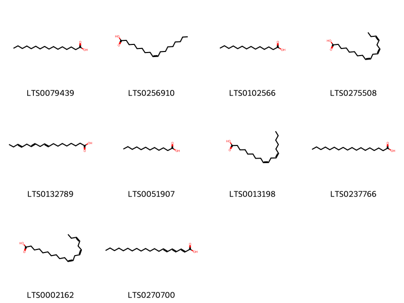{ width=100% }
    <figcaption>Hình ảnh cấu trúc hóa học của 10 hoạt chất thuộc nhóm Fatty Acyls gồm ['palmitic acid (LTS0079439)', 'oleic acid (LTS0256910)', 'myristic acid (LTS0102566)', 'α-linolenic acid (LTS0275508)', 'α linolenic acid (LTS0132789)', 'lauric acid (LTS0051907)', 'linoleic (LTS0013198)', 'stearic acid (LTS0237766)', 'eicosatrienoic acid (LTS0002162)', 'icosa-2,4,6-trienoic acid (LTS0270700)'].</figcaption>
</figure>
#### Nhóm Prenol lipids
<figure markdown="span">
    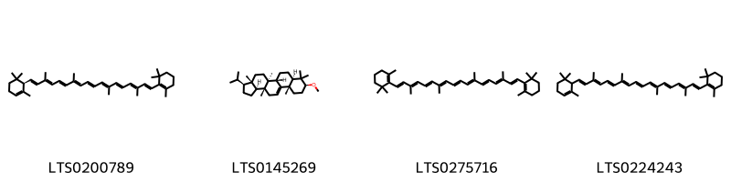{ width=100% }
    <figcaption>Hình ảnh cấu trúc hóa học của 4 hoạt chất thuộc nhóm Prenol lipids gồm ['(+)-α-carotene (LTS0200789)', 'cylindrin (LTS0145269)', 'β-carotene (LTS0275716)', 'α-carotene (LTS0224243)'].</figcaption>
</figure>
#### Nhóm Saturated hydrocarbons
<figure markdown="span">
    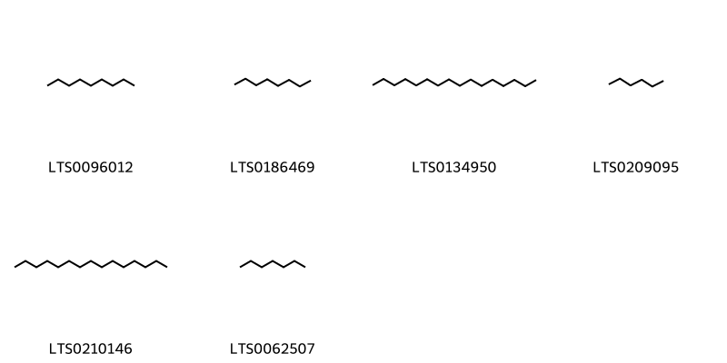{ width=100% }
    <figcaption>Hình ảnh cấu trúc hóa học của 6 hoạt chất thuộc nhóm Saturated hydrocarbons gồm ['nonane (LTS0096012)', 'octane (LTS0186469)', 'cetane (LTS0134950)', 'hexane (LTS0209095)', 'pentadecane (LTS0210146)', 'heptane (LTS0062507)'].</figcaption>
</figure>
#### Nhóm Unsaturated hydrocarbons
<figure markdown="span">
    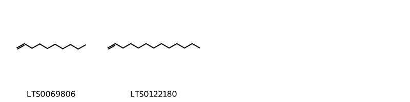{ width=100% }
    <figcaption>Hình ảnh cấu trúc hóa học của 2 hoạt chất thuộc nhóm Unsaturated hydrocarbons gồm ['decene (LTS0069806)', '1-tridecene (LTS0122180)'].</figcaption>
</figure>

---

### Dược dân tộc học

Danh sách các quốc gia có sử dụng *Elaeis guineensis* trong điều trị các bệnh. 

| Country   | Disease                   | Bệnh                                          |
|:----------|:--------------------------|:----------------------------------------------|
| Elsewhere | Aphrodisiac, Soap, Poison | Thuốc kích thích tình dục, xà phòng, chất độc |
| Haiti     | Soap                      | Xà phòng                                      |
| Nigeria   | Antidote                  | Chất giải độc                                 |

---

# Chi Oenocarpus

??? note "Danh sách các dược liệu thuộc chi"
    
	 - *Oenocarpus bataua*

---
## Oenocarpus bataua
### Thông tin về thực vật

!!! info "Phân loại thực vật của *Oenocarpus bataua* từ GIBF:"
    - **Kingdom:** Plantae
    - **Phylum:** Tracheophyta
    - **Order:** Arecales
    - **Family:** Arecaceae
    - **Genus:** Oenocarpus
    - **Species:** *Oenocarpus bataua*

 

| Label (VI)   | Label (EN)   | Scientific Name   | Descriptions (VI)   | Descriptions (EN)   | Also Known As (VI)   | Also Known As (EN)   |
|:-------------|:-------------|:------------------|:--------------------|:--------------------|:---------------------|:---------------------|
| N/A          | N/A          | Oenocarpus bataua | loài thực vật       | species of plant    | ['']                 | ['palm']             |

#### Phân bố trên thế giới

**Từ CSDL GIBF** Colombia, Brazil, Peru, French Guiana, Ecuador

#### Phân bố tại Việt Nam

**Từ CSDL GIBF**: Không có ghi nhận ở Việt Nam

---
### Thành phần hóa học
        
- Theo cơ sở dữ liệu lotus: Từ loài *Oenocarpus bataua* đã phân lập và xác định được Chưa có hoạt chất nào được phân lập. hoạt chất thuộc về các nhóm Không có hoạt chất nào được phân lập. 

Không có hình ảnh nào được tạo ra

---

### Dược dân tộc học

Danh sách các quốc gia có sử dụng *Oenocarpus bataua* trong điều trị các bệnh. 

| Country   | Disease    | Bệnh         |
|:----------|:-----------|:-------------|
| Venezuela | Intoxicant | chất gây độc |

---

# Chi Rhapis

??? note "Danh sách các dược liệu thuộc chi"
    
	 - *Rhapis cochinchinensis*

---
## Rhapis cochinchinensis
### Thông tin về thực vật

!!! info "Phân loại thực vật của *Livistona saribus* từ GIBF:"
    - **Kingdom:** Plantae
    - **Phylum:** Tracheophyta
    - **Order:** Arecales
    - **Family:** Arecaceae
    - **Genus:** Livistona
    - **Species:** *Livistona saribus*

 

| Label (VI)   | Label (EN)   | Scientific Name        | Descriptions (VI)   | Descriptions (EN)   | Also Known As (VI)   | Also Known As (EN)   |
|:-------------|:-------------|:-----------------------|:--------------------|:--------------------|:---------------------|:---------------------|
| N/A          | N/A          | Rhapis cochinchinensis | loài thực vật       | species of plant    | ['']                 | ['']                 |

#### Phân bố trên thế giới

**Từ CSDL GIBF** Colombia, Brazil, Peru, French Guiana, Ecuador

#### Phân bố tại Việt Nam

**Từ CSDL GIBF**: Không có ghi nhận ở Việt Nam

---
### Thành phần hóa học
        
- Theo cơ sở dữ liệu lotus: Từ loài *Livistona saribus* đã phân lập và xác định được Chưa có hoạt chất nào được phân lập. hoạt chất thuộc về các nhóm Không có hoạt chất nào được phân lập. 

Không có hình ảnh nào được tạo ra

---

### Dược dân tộc học

Danh sách các quốc gia có sử dụng *Livistona saribus* trong điều trị các bệnh. 

| Country   | Disease   | Bệnh          |
|:----------|:----------|:--------------|
| Indochina | Piscicide | Thuốc diệt cá |

---

# Chi Raphia

??? note "Danh sách các dược liệu thuộc chi"
    
	 - *Raphia gigantea*
	 - *Raphia hookeri*
	 - *Raphia pedunculata*
	 - *Raphia sassandrensis*
	 - *Raphia vinifera*

---
## Raphia gigantea
### Thông tin về thực vật

!!! info "Phân loại thực vật của *Raphia hookeri* từ GIBF:"
    - **Kingdom:** Plantae
    - **Phylum:** Tracheophyta
    - **Order:** Arecales
    - **Family:** Arecaceae
    - **Genus:** Raphia
    - **Species:** *Raphia hookeri*

 

| Label (VI)   | Label (EN)   | Scientific Name        | Descriptions (VI)   | Descriptions (EN)   | Also Known As (VI)   | Also Known As (EN)   |
|:-------------|:-------------|:-----------------------|:--------------------|:--------------------|:---------------------|:---------------------|
| N/A          | N/A          | Rhapis cochinchinensis | loài thực vật       | species of plant    | ['']                 | ['']                 |

#### Phân bố trên thế giới

**Từ CSDL GIBF** Colombia, Brazil, Peru, French Guiana, Ecuador

#### Phân bố tại Việt Nam

**Từ CSDL GIBF**: Không có ghi nhận ở Việt Nam

---
### Thành phần hóa học
        
- Theo cơ sở dữ liệu lotus: Từ loài *Raphia hookeri* đã phân lập và xác định được Chưa có hoạt chất nào được phân lập. hoạt chất thuộc về các nhóm Không có hoạt chất nào được phân lập. 

Không có hình ảnh nào được tạo ra

---

### Dược dân tộc học

Danh sách các quốc gia có sử dụng *Raphia hookeri* trong điều trị các bệnh. 

| Country    | Disease    | Bệnh         |
|:-----------|:-----------|:-------------|
| Gold Coast | Intoxicant | chất gây độc |

---

---
## Raphia hookeri
### Thông tin về thực vật

!!! info "Phân loại thực vật của *Raphia hookeri* từ GIBF:"
    - **Kingdom:** Plantae
    - **Phylum:** Tracheophyta
    - **Order:** Arecales
    - **Family:** Arecaceae
    - **Genus:** Raphia
    - **Species:** *Raphia hookeri*

 

| Label (VI)   | Label (EN)   | Scientific Name   | Descriptions (VI)   | Descriptions (EN)   | Also Known As (VI)   | Also Known As (EN)                                                               |
|:-------------|:-------------|:------------------|:--------------------|:--------------------|:---------------------|:---------------------------------------------------------------------------------|
| N/A          | N/A          | Raphia hookeri    | loài thực vật       | species of plant    | ['']                 | ['Wine palm', 'Raffia palm', 'Ivory Coast wine palm', 'Ivory Coast raffia palm'] |

#### Phân bố trên thế giới

**Từ CSDL GIBF** Côte d’Ivoire, Ghana, Cameroon, Nigeria, United States of America, Gabon, Congo, Guinea, Benin, Belgium

#### Phân bố tại Việt Nam

**Từ CSDL GIBF**: Không có ghi nhận ở Việt Nam

---
### Thành phần hóa học
        
- Theo cơ sở dữ liệu lotus: Từ loài *Raphia hookeri* đã phân lập và xác định được Chưa có hoạt chất nào được phân lập. hoạt chất thuộc về các nhóm Không có hoạt chất nào được phân lập. 

Không có hình ảnh nào được tạo ra

---

### Dược dân tộc học

Danh sách các quốc gia có sử dụng *Raphia hookeri* trong điều trị các bệnh. 

| Country     | Disease    | Bệnh         |
|:------------|:-----------|:-------------|
| Elsewhere   | Intoxicant | chất gây độc |
| Ivory Coast | Intoxicant | chất gây độc |

---

---
## Raphia pedunculata
### Thông tin về thực vật

!!! info "Phân loại thực vật của *Raphia farinifera* từ GIBF:"
    - **Kingdom:** Plantae
    - **Phylum:** Tracheophyta
    - **Order:** Arecales
    - **Family:** Arecaceae
    - **Genus:** Raphia
    - **Species:** *Raphia farinifera*

 

| Label (VI)   | Label (EN)   | Scientific Name    | Descriptions (VI)   | Descriptions (EN)   | Also Known As (VI)   | Also Known As (EN)   |
|:-------------|:-------------|:-------------------|:--------------------|:--------------------|:---------------------|:---------------------|
| N/A          | N/A          | Raphia pedunculata | loài thực vật       | species of plant    | ['']                 | ['']                 |

#### Phân bố trên thế giới

**Từ CSDL GIBF** nan, unknown or invalid, South Africa, Brazil, Mauritius, French Guiana, Madagascar

#### Phân bố tại Việt Nam

**Từ CSDL GIBF**: Không có ghi nhận ở Việt Nam

---
### Thành phần hóa học
        
- Theo cơ sở dữ liệu lotus: Từ loài *Raphia farinifera* đã phân lập và xác định được Chưa có hoạt chất nào được phân lập. hoạt chất thuộc về các nhóm Không có hoạt chất nào được phân lập. 

Không có hình ảnh nào được tạo ra

---

### Dược dân tộc học

Danh sách các quốc gia có sử dụng *Raphia farinifera* trong điều trị các bệnh. 

| Country   | Disease    | Bệnh         |
|:----------|:-----------|:-------------|
| Malagasy  | Intoxicant | chất gây độc |

---

---
## Raphia sassandrensis
### Thông tin về thực vật

!!! info "Phân loại thực vật của *Raphia hookeri* từ GIBF:"
    - **Kingdom:** Plantae
    - **Phylum:** Tracheophyta
    - **Order:** Arecales
    - **Family:** Arecaceae
    - **Genus:** Raphia
    - **Species:** *Raphia hookeri*

 

| Label (VI)   | Label (EN)   | Scientific Name    | Descriptions (VI)   | Descriptions (EN)   | Also Known As (VI)   | Also Known As (EN)   |
|:-------------|:-------------|:-------------------|:--------------------|:--------------------|:---------------------|:---------------------|
| N/A          | N/A          | Raphia pedunculata | loài thực vật       | species of plant    | ['']                 | ['']                 |

#### Phân bố trên thế giới

**Từ CSDL GIBF** nan, unknown or invalid, South Africa, Brazil, Mauritius, French Guiana, Madagascar

#### Phân bố tại Việt Nam

**Từ CSDL GIBF**: Không có ghi nhận ở Việt Nam

---
### Thành phần hóa học
        
- Theo cơ sở dữ liệu lotus: Từ loài *Raphia hookeri* đã phân lập và xác định được Chưa có hoạt chất nào được phân lập. hoạt chất thuộc về các nhóm Không có hoạt chất nào được phân lập. 

Không có hình ảnh nào được tạo ra

---

### Dược dân tộc học

Danh sách các quốc gia có sử dụng *Raphia hookeri* trong điều trị các bệnh. 

| Country     | Disease   | Bệnh          |
|:------------|:----------|:--------------|
| Ivory Coast | Piscicide | Thuốc diệt cá |

---

---
## Raphia vinifera
### Thông tin về thực vật

!!! info "Phân loại thực vật của *Raphia vinifera* từ GIBF:"
    - **Kingdom:** Plantae
    - **Phylum:** Tracheophyta
    - **Order:** Arecales
    - **Family:** Arecaceae
    - **Genus:** Raphia
    - **Species:** *Raphia vinifera*

 

| Label (VI)   | Label (EN)   | Scientific Name   | Descriptions (VI)   | Descriptions (EN)   | Also Known As (VI)   | Also Known As (EN)                                          |
|:-------------|:-------------|:------------------|:--------------------|:--------------------|:---------------------|:------------------------------------------------------------|
| N/A          | N/A          | Raphia vinifera   | loài thực vật       | species of plant    | ['']                 | ['African wine palm', 'Bamboo palm', 'African bamboo palm'] |

#### Phân bố trên thế giới

**Từ CSDL GIBF** nan, Malawi, unknown or invalid, Ghana, Central African Republic, Guadeloupe, Cameroon, Gabon, Martinique, Indonesia, Niger, Sierra Leone, Togo, Côte d’Ivoire, Puerto Rico, Liberia, Sudan, Mayotte, Canada, Nigeria, Cuba, Nicaragua, Brazil, Equatorial Guinea, China, Angola, Benin, Gambia, South Africa, Costa Rica, Congo, Democratic Republic of the, United States of America, Zambia, Congo, Guinea, Mali

#### Phân bố tại Việt Nam

**Từ CSDL GIBF**: Không có ghi nhận ở Việt Nam

---
### Thành phần hóa học
        
- Theo cơ sở dữ liệu lotus: Từ loài *Raphia vinifera* đã phân lập và xác định được Chưa có hoạt chất nào được phân lập. hoạt chất thuộc về các nhóm Không có hoạt chất nào được phân lập. 

Không có hình ảnh nào được tạo ra

---

### Dược dân tộc học

Danh sách các quốc gia có sử dụng *Raphia vinifera* trong điều trị các bệnh. 

| Country   | Disease                         | Bệnh                            |
|:----------|:--------------------------------|:--------------------------------|
| Elsewhere | Intoxicant, Laxative, Stomachic | Intoxicant, nhuận tràng, dạ dày |

---

# Chi Arecastrum

??? note "Danh sách các dược liệu thuộc chi"
    
	 - *Arecastrum romanzoffianum*

---
## Arecastrum romanzoffianum
### Thông tin về thực vật

!!! info "Phân loại thực vật của *Syagrus romanzoffiana* từ GIBF:"
    - **Kingdom:** Plantae
    - **Phylum:** Tracheophyta
    - **Order:** Arecales
    - **Family:** Arecaceae
    - **Genus:** Syagrus
    - **Species:** *Syagrus romanzoffiana*

 

| Label (VI)   | Label (EN)   | Scientific Name           | Descriptions (VI)   | Descriptions (EN)   | Also Known As (VI)   | Also Known As (EN)   |
|:-------------|:-------------|:--------------------------|:--------------------|:--------------------|:---------------------|:---------------------|
| N/A          | N/A          | Arecastrum romanzoffianum | loài thực vật       | species of plant    | ['']                 | ['']                 |

#### Phân bố trên thế giới

**Từ CSDL GIBF** United States of America, Portugal, Brazil

#### Phân bố tại Việt Nam

**Từ CSDL GIBF**: Không có ghi nhận ở Việt Nam

---
### Thành phần hóa học
        
- Theo cơ sở dữ liệu lotus: Từ loài *Syagrus romanzoffiana* đã phân lập và xác định được Chưa có hoạt chất nào được phân lập. hoạt chất thuộc về các nhóm Không có hoạt chất nào được phân lập. 

Không có hình ảnh nào được tạo ra

---

### Dược dân tộc học

Danh sách các quốc gia có sử dụng *Syagrus romanzoffiana* trong điều trị các bệnh. 

| Country   | Disease       | Bệnh          |
|:----------|:--------------|:--------------|
| Paraguay  | Antifertility | Chống lão hóa |

---

# Chi Cocos

??? note "Danh sách các dược liệu thuộc chi"
    
	 - *Cocos nucifera*
	 - *Cocos yatay*

---
## Cocos nucifera
### Thông tin về thực vật

!!! info "Phân loại thực vật của *Cocos nucifera* từ GIBF:"
    - **Kingdom:** Plantae
    - **Phylum:** Tracheophyta
    - **Order:** Arecales
    - **Family:** Arecaceae
    - **Genus:** Cocos
    - **Species:** *Cocos nucifera*

 

| Label (VI)   | Label (EN)   | Scientific Name   | Descriptions (VI)         | Descriptions (EN)   | Also Known As (VI)   | Also Known As (EN)                                      |
|:-------------|:-------------|:------------------|:--------------------------|:--------------------|:---------------------|:--------------------------------------------------------|
| N/A          | N/A          | Cocos nucifera    | loài thực vật thuộc họ cọ | species of plant    | ['Cocos nucifera']   | ['coconut', 'cocoanut', 'coconut palm', 'coconut tree'] |

#### Phân bố trên thế giới

**Từ CSDL GIBF** nan, Honduras, Viet Nam, Thailand, Philippines, Guadeloupe, French Polynesia, Trinidad and Tobago, Singapore, Australia, Jamaica, Indonesia, Colombia, Saint Vincent and the Grenadines, Dominican Republic, Sri Lanka, Maldives, Guinea-Bissau, Puerto Rico, India, Seychelles, Bahamas, Saint Kitts and Nevis, Cuba, Virgin Islands (U.S.), Barbados, Antigua and Barbuda, Belize, Panama, Brazil, Vanuatu, Saint Lucia, Mexico, Chinese Taipei, Portugal, South Africa, Grenada, Costa Rica, New Caledonia, United States of America

#### Phân bố tại Việt Nam

**Từ CSDL GIBF**: Cần Thơ

---
### Thành phần hóa học
        
- Theo cơ sở dữ liệu lotus: Từ loài *Cocos nucifera* đã phân lập và xác định được 41 hoạt chất thuộc về các nhóm Organooxygen compounds, Indoles and derivatives, Prenol lipids, Carboxylic acids and derivatives, Fatty Acyls, Purine nucleosides, Imidazopyrimidines, Steroids and steroid derivatives. 

|    | chemicalTaxonomyClassyfireClass   |   smiles_count |
|---:|:----------------------------------|---------------:|
|  0 | Carboxylic acids and derivatives  |             20 |
|  1 | Fatty Acyls                       |              2 |
|  2 | Imidazopyrimidines                |              1 |
|  3 | Indoles and derivatives           |              1 |
|  4 | Organooxygen compounds            |              5 |
|  5 | Prenol lipids                     |              5 |
|  6 | Purine nucleosides                |              1 |
|  7 | Steroids and steroid derivatives  |              6 |

#### Nhóm Carboxylic acids and derivatives
<figure markdown="span">
    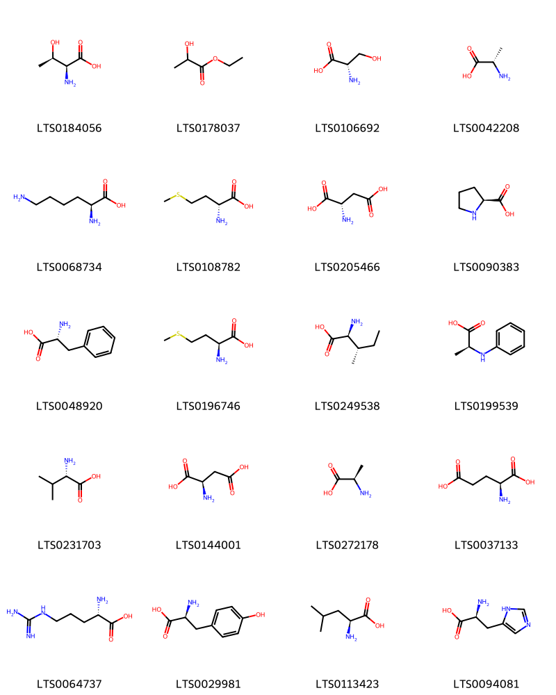{ width=100% }
    <figcaption>Hình ảnh cấu trúc hóa học của 20 hoạt chất thuộc nhóm Carboxylic acids and derivatives gồm ['l-threonine (LTS0184056)', 'ethyl lactate (LTS0178037)', 'l-serine (LTS0106692)', 'l-alanine (LTS0042208)', 'l-lysine (LTS0068734)', 'd-methionine (LTS0108782)', 'l-aspartic acid (LTS0205466)', 'l-proline (LTS0090383)', 'd-phenylalanine (LTS0048920)', 'l-methionine (LTS0196746)', 'l-isoleucine (LTS0249538)', '(2s)-2-(phenylamino)propanoic acid (LTS0199539)', 'l-valine (LTS0231703)', 'd-aspartic acid (LTS0144001)', 'd-alanine (LTS0272178)', 'l-glutamic acid (LTS0037133)', 'l-arginine (LTS0064737)', 'l-tyrosine (LTS0029981)', 'l-leucine (LTS0113423)', 'l-histidine (LTS0094081)'].</figcaption>
</figure>
#### Nhóm Fatty Acyls
<figure markdown="span">
    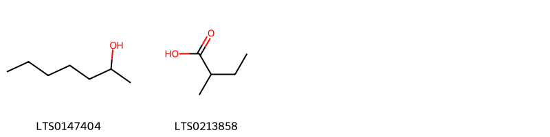{ width=100% }
    <figcaption>Hình ảnh cấu trúc hóa học của 2 hoạt chất thuộc nhóm Fatty Acyls gồm ['2-heptanol (LTS0147404)', '2-methylbutanoic acid (LTS0213858)'].</figcaption>
</figure>
#### Nhóm Imidazopyrimidines
<figure markdown="span">
    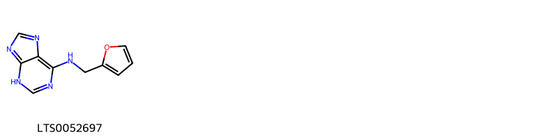{ width=100% }
    <figcaption>Hình ảnh cấu trúc hóa học của 1 hoạt chất thuộc nhóm Imidazopyrimidines gồm ['6 furfuryladenine (LTS0052697)'].</figcaption>
</figure>
#### Nhóm Indoles and derivatives
<figure markdown="span">
    { width=100% }
    <figcaption>Hình ảnh cấu trúc hóa học của 1 hoạt chất thuộc nhóm Indoles and derivatives gồm ['l-tryptophan (LTS0263809)'].</figcaption>
</figure>
#### Nhóm Organooxygen compounds
<figure markdown="span">
    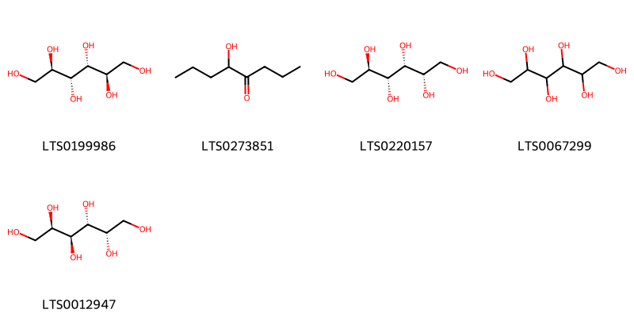{ width=100% }
    <figcaption>Hình ảnh cấu trúc hóa học của 5 hoạt chất thuộc nhóm Organooxygen compounds gồm ['mannitol (LTS0199986)', 'butyroin (LTS0273851)', 'd-sorbitol (LTS0220157)', 'sorbo (LTS0067299)', 'galactitol (LTS0012947)'].</figcaption>
</figure>
#### Nhóm Prenol lipids
<figure markdown="span">
    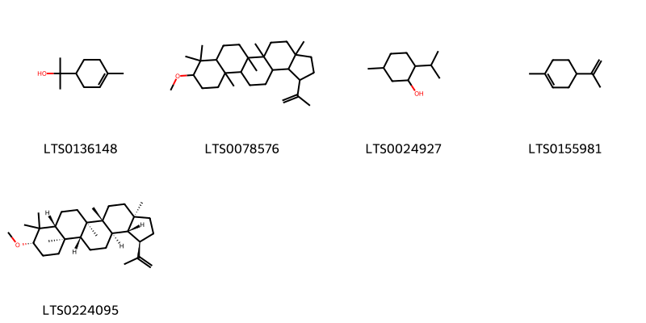{ width=100% }
    <figcaption>Hình ảnh cấu trúc hóa học của 5 hoạt chất thuộc nhóm Prenol lipids gồm ['terpineol (LTS0136148)', '9-methoxy-3a,5a,5b,8,8,11a-hexamethyl-1-(prop-1-en-2-yl)-hexadecahydrocyclopenta[a]chrysene (LTS0078576)', 'menthol natural (LTS0024927)', 'limonene,  (LTS0155981)', '(1r,3ar,5ar,5br,7ar,9s,11ar,11br,13ar,13br)-9-methoxy-3a,5a,5b,8,8,11a-hexamethyl-1-(prop-1-en-2-yl)-hexadecahydrocyclopenta[a]chrysene (LTS0224095)'].</figcaption>
</figure>
#### Nhóm Purine nucleosides
<figure markdown="span">
    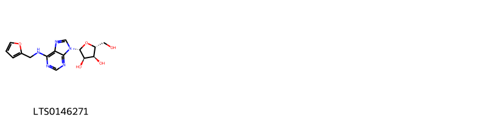{ width=100% }
    <figcaption>Hình ảnh cấu trúc hóa học của 1 hoạt chất thuộc nhóm Purine nucleosides gồm ['(2r,3r,4s,5r)-2-{6-[(furan-2-ylmethyl)amino]purin-9-yl}-5-(hydroxymethyl)oxolane-3,4-diol (LTS0146271)'].</figcaption>
</figure>
#### Nhóm Steroids and steroid derivatives
<figure markdown="span">
    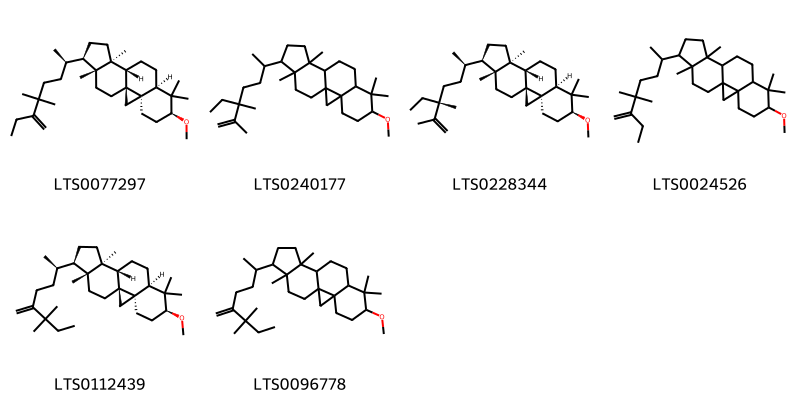{ width=100% }
    <figcaption>Hình ảnh cấu trúc hóa học của 6 hoạt chất thuộc nhóm Steroids and steroid derivatives gồm ['(1s,3r,6s,8r,11s,12s,15r,16r)-15-[(2r)-5,5-dimethyl-6-methylideneoctan-2-yl]-6-methoxy-7,7,12,16-tetramethylpentacyclo[9.7.0.0¹,³.0³,⁸.0¹²,¹⁶]octadecane (LTS0077297)', '15-(5-ethyl-5,6-dimethylhept-6-en-2-yl)-6-methoxy-7,7,12,16-tetramethylpentacyclo[9.7.0.0¹,³.0³,⁸.0¹²,¹⁶]octadecane (LTS0240177)', '(1s,3r,6s,8r,11s,12s,15r,16r)-15-[(2r,5r)-5-ethyl-5,6-dimethylhept-6-en-2-yl]-6-methoxy-7,7,12,16-tetramethylpentacyclo[9.7.0.0¹,³.0³,⁸.0¹²,¹⁶]octadecane (LTS0228344)', '15-(5,5-dimethyl-6-methylideneoctan-2-yl)-6-methoxy-7,7,12,16-tetramethylpentacyclo[9.7.0.0¹,³.0³,⁸.0¹²,¹⁶]octadecane (LTS0024526)', '(1s,3r,6s,8r,11s,12s,15r,16r)-15-[(2r)-6,6-dimethyl-5-methylideneoctan-2-yl]-6-methoxy-7,7,12,16-tetramethylpentacyclo[9.7.0.0¹,³.0³,⁸.0¹²,¹⁶]octadecane (LTS0112439)', '15-(6,6-dimethyl-5-methylideneoctan-2-yl)-6-methoxy-7,7,12,16-tetramethylpentacyclo[9.7.0.0¹,³.0³,⁸.0¹²,¹⁶]octadecane (LTS0096778)'].</figcaption>
</figure>

---

### Dược dân tộc học

Danh sách các quốc gia có sử dụng *Cocos nucifera* trong điều trị các bệnh. 

| Country            | Disease                                                                                                       | Bệnh                                                                                                         |
|:-------------------|:--------------------------------------------------------------------------------------------------------------|:-------------------------------------------------------------------------------------------------------------|
| China              | Aperient, Astringent, Vermifuge, Intoxicant, Refrigerant                                                      | Aperient, Astringent, Vermifuge, Intoxicant, Refrigerant                                                     |
| Dominican Republic | Laxative, Refrigerant, Vermifuge                                                                              | Thuốc nhuận tràng, chất làm lạnh, chất làm sạch                                                              |
| Elsewhere          | Antiseptic, Aperient, Astringent, Intoxicant, Refrigerant, Soap, Soap, Vermifuge, Diuretic, Antidote, Styptic | Khử trùng, Aperient, Astringent, Intoxicant, Refrigerant, Soap, Soap, Vermifuge, Diuretic, Antidote, Styptic |
| Ghana              | Antiseptic, Dentifrice                                                                                        | Thuốc sát trùng, Kem đánh răng                                                                               |
| Haiti              | Intoxicant, Soap, Stomachic, Vermifuge                                                                        | Intoxicant, Soap, Stomachic, Vermifuge                                                                       |
| India              | Astringent, Dentifrice, Hemostatic                                                                            | Chất làm se, kem đánh răng, cầm máu                                                                          |
| Iran               | Diuretic                                                                                                      | Thuốc lợi tiêu                                                                                               |
| Java               | Astringent                                                                                                    | Lam se da                                                                                                    |
| Malaya             | Culifuge, Diuretic                                                                                            | Culifuge, lợi tiểu                                                                                           |
| Malaysia           | Intoxicant                                                                                                    | chất gây độc                                                                                                 |
| Mexico             | Diuretic, Diuretic, Vermifuge, Vermifuge, Diuretic                                                            | Thuốc lợi tiểu, lợi tiểu, Vermifuge, Vermifuge, lợi tiểu                                                     |
| Portuguese         | Refrigerant                                                                                                   | Chất làm lạnh                                                                                                |
| Samoa              | Laxative, Purgative                                                                                           | Thuốc nhuận tràng, thuốc tẩy                                                                                 |
| Trinidad           | Astringent, Pediculicide                                                                                      | Chất làm se, Pediculicide                                                                                    |
| Venezuela          | Aphrodisiac, Astringent, Intoxicant, Suppurative                                                              | Kích thích tình dục, Làm se, Intoxicant, Suppurative                                                         |

---

---
## Cocos yatay
### Thông tin về thực vật

!!! info "Phân loại thực vật của *Butia yatay* từ GIBF:"
    - **Kingdom:** Plantae
    - **Phylum:** Tracheophyta
    - **Order:** Arecales
    - **Family:** Arecaceae
    - **Genus:** Butia
    - **Species:** *Butia yatay*

 

| Label (VI)   | Label (EN)   | Scientific Name   | Descriptions (VI)   | Descriptions (EN)   | Also Known As (VI)   | Also Known As (EN)   |
|:-------------|:-------------|:------------------|:--------------------|:--------------------|:---------------------|:---------------------|
| N/A          | N/A          | Cocos yatay       | loài thực vật       | species of plant    | ['']                 | ['']                 |

#### Phân bố trên thế giới

**Từ CSDL GIBF** nan, Honduras, Viet Nam, Thailand, Philippines, Guadeloupe, French Polynesia, Trinidad and Tobago, Singapore, Australia, Jamaica, Indonesia, Colombia, Saint Vincent and the Grenadines, Dominican Republic, Sri Lanka, Maldives, Guinea-Bissau, Puerto Rico, India, Seychelles, Bahamas, Saint Kitts and Nevis, Cuba, Virgin Islands (U.S.), Barbados, Antigua and Barbuda, Belize, Panama, Brazil, Vanuatu, Saint Lucia, Mexico, Chinese Taipei, Portugal, South Africa, Grenada, Costa Rica, New Caledonia, United States of America

#### Phân bố tại Việt Nam

**Từ CSDL GIBF**: Cần Thơ

---
### Thành phần hóa học
        
- Theo cơ sở dữ liệu lotus: Từ loài *Butia yatay* đã phân lập và xác định được Chưa có hoạt chất nào được phân lập. hoạt chất thuộc về các nhóm Không có hoạt chất nào được phân lập. 

Không có hình ảnh nào được tạo ra

---

### Dược dân tộc học

Danh sách các quốc gia có sử dụng *Butia yatay* trong điều trị các bệnh. 

| Country   | Disease   | Bệnh           |
|:----------|:----------|:---------------|
| Elsewhere | Vermifuge | Thuốc diệt sán |

---

# Chi Hyphaene

??? note "Danh sách các dược liệu thuộc chi"
    
	 - *Hyphaene coriacea*
	 - *Hyphaene thebaica*

---
## Hyphaene coriacea
### Thông tin về thực vật

!!! info "Phân loại thực vật của *Hyphaene coriacea* từ GIBF:"
    - **Kingdom:** Plantae
    - **Phylum:** Tracheophyta
    - **Order:** Arecales
    - **Family:** Arecaceae
    - **Genus:** Hyphaene
    - **Species:** *Hyphaene coriacea*

 

| Label (VI)   | Label (EN)   | Scientific Name   | Descriptions (VI)   | Descriptions (EN)    | Also Known As (VI)   | Also Known As (EN)          |
|:-------------|:-------------|:------------------|:--------------------|:---------------------|:---------------------|:----------------------------|
| N/A          | N/A          | Hyphaene coriacea |                     | African palm species | ['']                 | ['Doum palm', 'Ilala palm'] |

#### Phân bố trên thế giới

**Từ CSDL GIBF** South Africa, Mozambique, Eswatini, Mayotte, Kenya, Comoros, Madagascar

#### Phân bố tại Việt Nam

**Từ CSDL GIBF**: Không có ghi nhận ở Việt Nam

---
### Thành phần hóa học
        
- Theo cơ sở dữ liệu lotus: Từ loài *Hyphaene coriacea* đã phân lập và xác định được Chưa có hoạt chất nào được phân lập. hoạt chất thuộc về các nhóm Không có hoạt chất nào được phân lập. 

Không có hình ảnh nào được tạo ra

---

### Dược dân tộc học

Danh sách các quốc gia có sử dụng *Hyphaene coriacea* trong điều trị các bệnh. 

| Country   | Disease    | Bệnh         |
|:----------|:-----------|:-------------|
| Tanzania  | Intoxicant | chất gây độc |

---

---
## Hyphaene thebaica
### Thông tin về thực vật

!!! info "Phân loại thực vật của *Hyphaene thebaica* từ GIBF:"
    - **Kingdom:** Plantae
    - **Phylum:** Tracheophyta
    - **Order:** Arecales
    - **Family:** Arecaceae
    - **Genus:** Hyphaene
    - **Species:** *Hyphaene thebaica*

 

| Label (VI)   | Label (EN)   | Scientific Name   | Descriptions (VI)   | Descriptions (EN)   | Also Known As (VI)   | Also Known As (EN)                                                  |
|:-------------|:-------------|:------------------|:--------------------|:--------------------|:---------------------|:--------------------------------------------------------------------|
| N/A          | N/A          | Hyphaene thebaica | loài thực vật       | species of plant    | ['']                 | ['Dom palm', 'Doum palm', 'Egyptian doum palm', 'Gingerbread palm'] |

#### Phân bố trên thế giới

**Từ CSDL GIBF** Togo, Djibouti, Egypt, Ethiopia, Burkina Faso, Nigeria, Chad, Israel, China, Saudi Arabia, Benin, Niger

#### Phân bố tại Việt Nam

**Từ CSDL GIBF**: Không có ghi nhận ở Việt Nam

---
### Thành phần hóa học
        
- Theo cơ sở dữ liệu lotus: Từ loài *Hyphaene thebaica* đã phân lập và xác định được 4 hoạt chất thuộc về các nhóm Organooxygen compounds, Steroids and steroid derivatives. 

|    | chemicalTaxonomyClassyfireClass   |   smiles_count |
|---:|:----------------------------------|---------------:|
|  0 | Organooxygen compounds            |              2 |
|  1 | Steroids and steroid derivatives  |              2 |

#### Nhóm Organooxygen compounds
<figure markdown="span">
    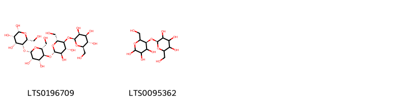{ width=100% }
    <figcaption>Hình ảnh cấu trúc hóa học của 2 hoạt chất thuộc nhóm Organooxygen compounds gồm ['glucomannan (LTS0196709)', '(6s)-2-(hydroxymethyl)-6-{[(3s)-4,5,6-trihydroxy-2-(hydroxymethyl)oxan-3-yl]oxy}oxane-3,4,5-triol (LTS0095362)'].</figcaption>
</figure>
#### Nhóm Steroids and steroid derivatives
<figure markdown="span">
    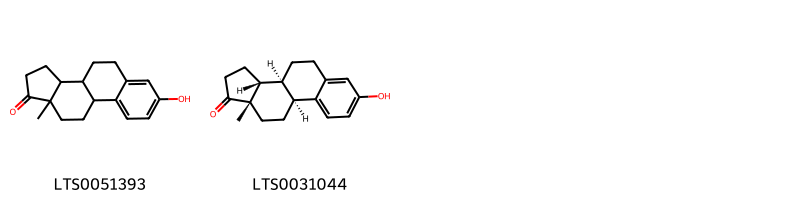{ width=100% }
    <figcaption>Hình ảnh cấu trúc hóa học của 2 hoạt chất thuộc nhóm Steroids and steroid derivatives gồm ['unden (LTS0051393)', '(3ar,3bs,9bs,11as)-7-hydroxy-11a-methyl-2h,3h,3ah,3bh,4h,5h,9bh,10h,11h-cyclopenta[a]phenanthren-1-one (LTS0031044)'].</figcaption>
</figure>

---

### Dược dân tộc học

Danh sách các quốc gia có sử dụng *Hyphaene thebaica* trong điều trị các bệnh. 

| Country   | Disease                                                | Bệnh                                                                              |
|:----------|:-------------------------------------------------------|:----------------------------------------------------------------------------------|
| Egypt     | Diaphoretic, Diuretic, Styptic, Taenifuge, Cardiotonic | Thuốc lợi tiểu, thuốc lợi tiểu, thuốc Styptic, thuốc Taenifuge, thuốc Cardiotonic |
| Elsewhere | Vermifuge                                              | Thuốc diệt sán                                                                    |

---

# Chi Areca

??? note "Danh sách các dược liệu thuộc chi"
    
	 - *Areca catachu*
	 - *Areca catechu*

---
## Areca catachu
### Thông tin về thực vật

!!! info "Phân loại thực vật của *Areca catechu* từ GIBF:"
    - **Kingdom:** Plantae
    - **Phylum:** Tracheophyta
    - **Order:** Arecales
    - **Family:** Arecaceae
    - **Genus:** Areca
    - **Species:** *Areca catechu*

 

| Label (VI)   | Label (EN)   | Scientific Name   | Descriptions (VI)   | Descriptions (EN)   | Also Known As (VI)   | Also Known As (EN)                                                  |
|:-------------|:-------------|:------------------|:--------------------|:--------------------|:---------------------|:--------------------------------------------------------------------|
| N/A          | N/A          | Hyphaene thebaica | loài thực vật       | species of plant    | ['']                 | ['Dom palm', 'Doum palm', 'Egyptian doum palm', 'Gingerbread palm'] |

#### Phân bố trên thế giới

**Từ CSDL GIBF** Viet Nam, nan, Thailand, Philippines, French Polynesia, Trinidad and Tobago, Singapore, Indonesia, Colombia, Sri Lanka, Dominican Republic, Bhutan, Maldives, Malaysia, Puerto Rico, India, Mayotte, Seychelles, Bangladesh, Guam, Cambodia, Myanmar, Palau, Comoros, China, Chinese Taipei, Timor-Leste, Grenada, South Africa, Micronesia (Federated States of), Fiji, Costa Rica, Papua New Guinea, United States of America, Madagascar, Solomon Islands

#### Phân bố tại Việt Nam

**Từ CSDL GIBF**: Gia Lai, Hà Nội, Ninh Bình

---
### Thành phần hóa học
        
- Theo cơ sở dữ liệu lotus: Từ loài *Areca catechu* đã phân lập và xác định được Chưa có hoạt chất nào được phân lập. hoạt chất thuộc về các nhóm Không có hoạt chất nào được phân lập. 

Không có hình ảnh nào được tạo ra

---

### Dược dân tộc học

Danh sách các quốc gia có sử dụng *Areca catechu* trong điều trị các bệnh. 

| Country   | Disease   | Bệnh     |
|:----------|:----------|:---------|
| India     | Poison    | Chất độc |

---

---
## Areca catechu
### Thông tin về thực vật

!!! info "Phân loại thực vật của *Areca catechu* từ GIBF:"
    - **Kingdom:** Plantae
    - **Phylum:** Tracheophyta
    - **Order:** Arecales
    - **Family:** Arecaceae
    - **Genus:** Areca
    - **Species:** *Areca catechu*

 

| Label (VI)   | Label (EN)   | Scientific Name   | Descriptions (VI)   | Descriptions (EN)   | Also Known As (VI)   | Also Known As (EN)                                                    |
|:-------------|:-------------|:------------------|:--------------------|:--------------------|:---------------------|:----------------------------------------------------------------------|
| N/A          | N/A          | Areca catechu     | loài thực vật       | species of plant    | ['Areca catechu']    | ['Areca palm', 'Betel Palm', 'Areca-nut\u2002palm', 'Betel nut palm'] |

#### Phân bố trên thế giới

**Từ CSDL GIBF** Viet Nam, nan, Thailand, Philippines, French Polynesia, Trinidad and Tobago, Singapore, Indonesia, Colombia, Sri Lanka, Dominican Republic, Bhutan, Maldives, Malaysia, Puerto Rico, India, Mayotte, Seychelles, Bangladesh, Guam, Cambodia, Myanmar, Palau, Comoros, China, Chinese Taipei, Timor-Leste, Grenada, South Africa, Micronesia (Federated States of), Fiji, Costa Rica, Papua New Guinea, United States of America, Madagascar, Solomon Islands

#### Phân bố tại Việt Nam

**Từ CSDL GIBF**: Gia Lai, Hà Nội, Ninh Bình

---
### Thành phần hóa học
        
- Theo cơ sở dữ liệu lotus: Từ loài *Areca catechu* đã phân lập và xác định được 65 hoạt chất thuộc về các nhóm Flavonoids, Indoles and derivatives, Benzimidazoles, Piperidines, Carboxylic acids and derivatives, Fatty Acyls, Harmala alkaloids, Pyridines and derivatives. 

|    | chemicalTaxonomyClassyfireClass   |   smiles_count |
|---:|:----------------------------------|---------------:|
|  0 |                                   |              5 |
|  1 | Benzimidazoles                    |              1 |
|  2 | Carboxylic acids and derivatives  |             19 |
|  3 | Fatty Acyls                       |              7 |
|  4 | Flavonoids                        |             19 |
|  5 | Harmala alkaloids                 |              2 |
|  6 | Indoles and derivatives           |              2 |
|  7 | Piperidines                       |              5 |
|  8 | Pyridines and derivatives         |              5 |

#### Nhóm 
<figure markdown="span">
    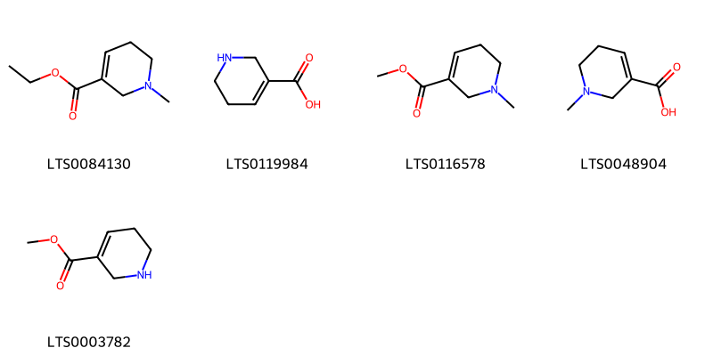{ width=100% }
    <figcaption>Hình ảnh cấu trúc hóa học của 5 hoạt chất thuộc nhóm  gồm ['ethyl 1-methyl-5,6-dihydro-2h-pyridine-3-carboxylate (LTS0084130)', 'guvacine (LTS0119984)', 'arecoline (LTS0116578)', 'arecaidine (LTS0048904)', 'guvacoline (LTS0003782)'].</figcaption>
</figure>
#### Nhóm Benzimidazoles
<figure markdown="span">
    { width=100% }
    <figcaption>Hình ảnh cấu trúc hóa học của 1 hoạt chất thuộc nhóm Benzimidazoles gồm ['2-[methyl(2-[(r)-[3-methyl-4-(2,2,2-trifluoroethoxy)pyridin-2-yl]methanesulfinyl]-1,3-benzodiazole-1-carbonyl)amino]ethyl 1-methylpiperidine-4-carboxylate (LTS0062729)'].</figcaption>
</figure>
#### Nhóm Carboxylic acids and derivatives
<figure markdown="span">
    { width=100% }
    <figcaption>Hình ảnh cấu trúc hóa học của 19 hoạt chất thuộc nhóm Carboxylic acids and derivatives gồm ['l-threonine (LTS0184056)', 'l-serine (LTS0106692)', 'l-alanine (LTS0042208)', 'l-lysine (LTS0068734)', 'd-methionine (LTS0108782)', 'l-aspartic acid (LTS0205466)', 'l-proline (LTS0090383)', 'd-phenylalanine (LTS0048920)', 'l-methionine (LTS0196746)', 'l-isoleucine (LTS0249538)', '(2s)-2-(phenylamino)propanoic acid (LTS0199539)', 'l-valine (LTS0231703)', 'd-aspartic acid (LTS0144001)', 'd-alanine (LTS0272178)', 'l-glutamic acid (LTS0037133)', 'l-arginine (LTS0064737)', 'l-tyrosine (LTS0029981)', 'l-leucine (LTS0113423)', 'l-histidine (LTS0094081)'].</figcaption>
</figure>
#### Nhóm Fatty Acyls
<figure markdown="span">
    { width=100% }
    <figcaption>Hình ảnh cấu trúc hóa học của 7 hoạt chất thuộc nhóm Fatty Acyls gồm ['palmitic acid (LTS0079439)', 'pentadecanoic acid (LTS0227120)', 'nonadec-2-enoic acid (LTS0229279)', 'oleic acid (LTS0256910)', 'myristic acid (LTS0102566)', 'lauric acid (LTS0051907)', 'stearic acid (LTS0237766)'].</figcaption>
</figure>
#### Nhóm Flavonoids
<figure markdown="span">
    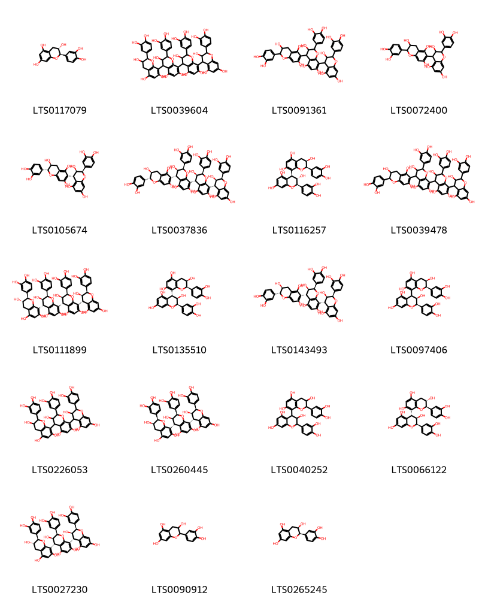{ width=100% }
    <figcaption>Hình ảnh cấu trúc hóa học của 19 hoạt chất thuộc nhóm Flavonoids gồm ['(+)-catechol (LTS0117079)', '2-(3,4-dihydroxyphenyl)-8-[2-(3,4-dihydroxyphenyl)-3,5,7-trihydroxy-3,4-dihydro-2h-1-benzopyran-4-yl]-4-[2-(3,4-dihydroxyphenyl)-4-[2-(3,4-dihydroxyphenyl)-3,5,7-trihydroxy-3,4-dihydro-2h-1-benzopyran-8-yl]-3,5,7-trihydroxy-3,4-dihydro-2h-1-benzopyran-8-yl]-3,4-dihydro-2h-1-benzopyran-3,5,7-triol (LTS0039604)', 'arecatannin b1 (LTS0091361)', '2-(3,4-dihydroxyphenyl)-4-[2-(3,4-dihydroxyphenyl)-3,5,7-trihydroxy-3,4-dihydro-2h-1-benzopyran-6-yl]-3,4-dihydro-2h-1-benzopyran-3,5,7-triol (LTS0072400)', '(2r,3r,4s)-2-(3,4-dihydroxyphenyl)-4-[(2r,3s)-2-(3,4-dihydroxyphenyl)-3,5,7-trihydroxy-3,4-dihydro-2h-1-benzopyran-6-yl]-3,4-dihydro-2h-1-benzopyran-3,5,7-triol (LTS0105674)', '(2r,3r,4r)-2-(3,4-dihydroxyphenyl)-8-[(2r,3r,4r)-2-(3,4-dihydroxyphenyl)-3,5,7-trihydroxy-3,4-dihydro-2h-1-benzopyran-4-yl]-4-[(2r,3r,4s)-2-(3,4-dihydroxyphenyl)-4-[(2r,3s)-2-(3,4-dihydroxyphenyl)-3,5,7-trihydroxy-3,4-dihydro-2h-1-benzopyran-6-yl]-3,5,7-trihydroxy-3,4-dihydro-2h-1-benzopyran-8-yl]-3,4-dihydro-2h-1-benzopyran-3,5,7-triol (LTS0037836)', '(2r,3s,4s)-2-(3,4-dihydroxyphenyl)-4-[(2r,3r)-2-(3,4-dihydroxyphenyl)-3,5,7-trihydroxy-3,4-dihydro-2h-1-benzopyran-8-yl]-3,4-dihydro-2h-1-benzopyran-3,5,7-triol (LTS0116257)', '2-(3,4-dihydroxyphenyl)-8-[2-(3,4-dihydroxyphenyl)-3,5,7-trihydroxy-3,4-dihydro-2h-1-benzopyran-4-yl]-4-[2-(3,4-dihydroxyphenyl)-4-[2-(3,4-dihydroxyphenyl)-3,5,7-trihydroxy-3,4-dihydro-2h-1-benzopyran-6-yl]-3,5,7-trihydroxy-3,4-dihydro-2h-1-benzopyran-8-yl]-3,4-dihydro-2h-1-benzopyran-3,5,7-triol (LTS0039478)', '(2r,3r,4r)-2-(3,4-dihydroxyphenyl)-8-[(2r,3r,4r)-2-(3,4-dihydroxyphenyl)-3,5,7-trihydroxy-3,4-dihydro-2h-1-benzopyran-4-yl]-4-[(2r,3r,4s)-2-(3,4-dihydroxyphenyl)-4-[(2r,3s)-2-(3,4-dihydroxyphenyl)-3,5,7-trihydroxy-3,4-dihydro-2h-1-benzopyran-8-yl]-3,5,7-trihydroxy-3,4-dihydro-2h-1-benzopyran-8-yl]-3,4-dihydro-2h-1-benzopyran-3,5,7-triol (LTS0111899)', '(2r,3r,4r)-2-(3,4-dihydroxyphenyl)-4-[(2r,3r)-2-(3,4-dihydroxyphenyl)-3,5,7-trihydroxy-3,4-dihydro-2h-1-benzopyran-8-yl]-3,4-dihydro-2h-1-benzopyran-3,5,7-triol (LTS0135510)', 'arecatannin b1 (LTS0143493)', '(2r,3r)-2-(3,4-dihydroxyphenyl)-4-[(2r,3r)-2-(3,4-dihydroxyphenyl)-3,5,7-trihydroxy-3,4-dihydro-2h-1-benzopyran-8-yl]-3,4-dihydro-2h-1-benzopyran-3,5,7-triol (LTS0097406)', 'procyanidin c2 (LTS0226053)', 'procyanidin c1 (LTS0260445)', '2-(3,4-dihydroxyphenyl)-4-[2-(3,4-dihydroxyphenyl)-3,5,7-trihydroxy-3,4-dihydro-2h-1-benzopyran-8-yl]-3,4-dihydro-2h-1-benzopyran-3,5,7-triol (LTS0040252)', '(2r,3r,4r)-2-(3,4-dihydroxyphenyl)-4-[(2r,3s)-2-(3,4-dihydroxyphenyl)-3,5,7-trihydroxy-3,4-dihydro-2h-1-benzopyran-8-yl]-3,4-dihydro-2h-1-benzopyran-3,5,7-triol (LTS0066122)', '(2r,3r,4s)-2-(3,4-dihydroxyphenyl)-8-[(2r,3r,4r)-2-(3,4-dihydroxyphenyl)-3,5,7-trihydroxy-3,4-dihydro-2h-1-benzopyran-4-yl]-4-[(2r,3s)-2-(3,4-dihydroxyphenyl)-3,5,7-trihydroxy-3,4-dihydro-2h-1-benzopyran-8-yl]-3,4-dihydro-2h-1-benzopyran-3,5,7-triol (LTS0027230)', 'catechol (LTS0090912)', 'ent-epicatechin (LTS0265245)'].</figcaption>
</figure>
#### Nhóm Harmala alkaloids
<figure markdown="span">
    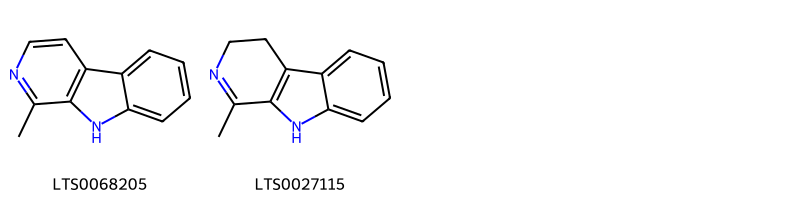{ width=100% }
    <figcaption>Hình ảnh cấu trúc hóa học của 2 hoạt chất thuộc nhóm Harmala alkaloids gồm ['harmane (LTS0068205)', '1-methyl-3h,4h,9h-pyrido[3,4-b]indole (LTS0027115)'].</figcaption>
</figure>
#### Nhóm Indoles and derivatives
<figure markdown="span">
    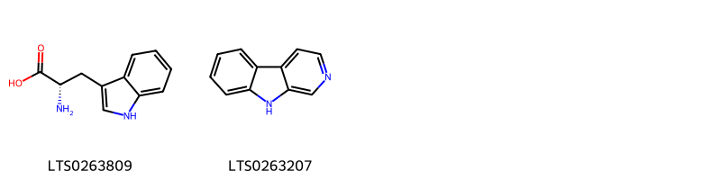{ width=100% }
    <figcaption>Hình ảnh cấu trúc hóa học của 2 hoạt chất thuộc nhóm Indoles and derivatives gồm ['l-tryptophan (LTS0263809)', 'β-carboline (LTS0263207)'].</figcaption>
</figure>
#### Nhóm Piperidines
<figure markdown="span">
    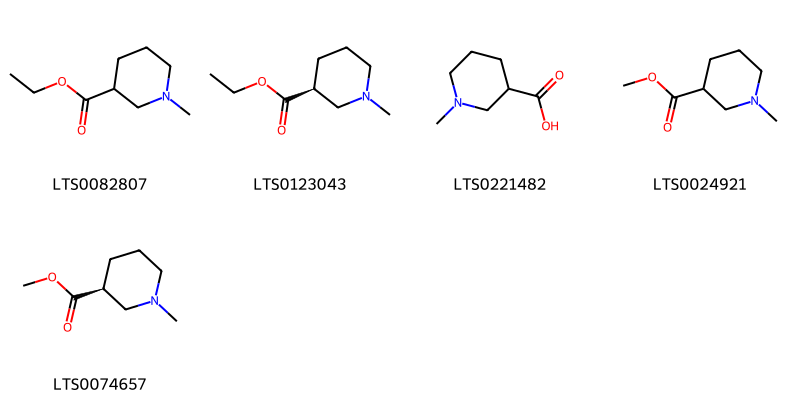{ width=100% }
    <figcaption>Hình ảnh cấu trúc hóa học của 5 hoạt chất thuộc nhóm Piperidines gồm ['ethyl 1-methylpiperidine-3-carboxylate (LTS0082807)', 'ethyl (3s)-1-methylpiperidine-3-carboxylate (LTS0123043)', '1-methylpiperidine-3-carboxylic acid (LTS0221482)', 'methyl n-methylnipecotate (LTS0024921)', 'methyl (3s)-1-methylpiperidine-3-carboxylate (LTS0074657)'].</figcaption>
</figure>
#### Nhóm Pyridines and derivatives
<figure markdown="span">
    { width=100% }
    <figcaption>Hình ảnh cấu trúc hóa học của 5 hoạt chất thuộc nhóm Pyridines and derivatives gồm ['ethyl nicotinate (LTS0116042)', '(-)-nicotine (LTS0184620)', 'nicotine (LTS0177379)', 'heat spray (LTS0061317)', 'niacin (LTS0216673)'].</figcaption>
</figure>

---

### Dược dân tộc học

Danh sách các quốc gia có sử dụng *Areca catechu* trong điều trị các bệnh. 

| Country   | Disease                                                                                         | Bệnh                                                                                          |
|:----------|:------------------------------------------------------------------------------------------------|:----------------------------------------------------------------------------------------------|
| China     | Astringent, Diuretic, Stomachic, Vermifuge, Vermifuge, Vermifuge, Carminative, Tonic, Vermifuge | Chất làm se, lợi tiểu, dạ dày, Vermifuge, Vermifuge, Vermifuge, Carminative, Tonic, Vermifuge |
| Egypt     | Dentifrice, Vermifuge                                                                           | Dentifrice, Vermifuge                                                                         |
| Elsewhere | Astringent, Dentifrice, Intoxicant, Miotic, Taenicide, Diaphoretic, Laxative                    | Chất làm se, kem đánh răng, Intoxicant, Miotic, Taenicide, Diaphoretic, nhuận tràng           |
| India     | Taenifuge, Vermifuge                                                                            | Taenifuge, Vermifuge                                                                          |
| Turkey    | Intoxicant, Stomachic, Tonic, Vermifuge, Astringent                                             | Intoxicant, Stomachic, Tonic, Vermifuge, Chất làm se                                          |

---

# Chi Metroxylon

??? note "Danh sách các dược liệu thuộc chi"
    
	 - *Metroxylon sagu*

---
## Metroxylon sagu
### Thông tin về thực vật

!!! info "Phân loại thực vật của *Metroxylon sagu* từ GIBF:"
    - **Kingdom:** Plantae
    - **Phylum:** Tracheophyta
    - **Order:** Arecales
    - **Family:** Arecaceae
    - **Genus:** Metroxylon
    - **Species:** *Metroxylon sagu*

 

| Label (VI)   | Label (EN)   | Scientific Name   | Descriptions (VI)   | Descriptions (EN)   | Also Known As (VI)   | Also Known As (EN)   |
|:-------------|:-------------|:------------------|:--------------------|:--------------------|:---------------------|:---------------------|
| N/A          | N/A          | Metroxylon sagu   | loài thực vật       | species of plant    | ['']                 | ['sago palm']        |

#### Phân bố trên thế giới

**Từ CSDL GIBF** nan, Viet Nam, unknown or invalid, Thailand, Philippines, French Guiana, Singapore, Jamaica, Indonesia, Sri Lanka, Malaysia, Mauritius, India, Seychelles, Brazil, Mexico, United Kingdom of Great Britain and Northern Ireland, Papua New Guinea, United States of America, Madagascar, Solomon Islands

#### Phân bố tại Việt Nam

**Từ CSDL GIBF**: Không có ghi nhận ở Việt Nam

---
### Thành phần hóa học
        
- Theo cơ sở dữ liệu lotus: Từ loài *Metroxylon sagu* đã phân lập và xác định được Chưa có hoạt chất nào được phân lập. hoạt chất thuộc về các nhóm Không có hoạt chất nào được phân lập. 

Không có hình ảnh nào được tạo ra

---

### Dược dân tộc học

Danh sách các quốc gia có sử dụng *Metroxylon sagu* trong điều trị các bệnh. 

| Country   | Disease                     | Bệnh                         |
|:----------|:----------------------------|:-----------------------------|
| Malaya    | Poison                      | Chất độc                     |
| Turkey    | Demulcent, Digestive, Tonic | Giảm béo, Tiêu hóa, Thuốc bổ |

---

# Chi Serenoa

??? note "Danh sách các dược liệu thuộc chi"
    
	 - *Serenoa repens*
	 - *Serenoa serrulata*

---
## Serenoa repens
### Thông tin về thực vật

!!! info "Phân loại thực vật của *Serenoa repens* từ GIBF:"
    - **Kingdom:** Plantae
    - **Phylum:** Tracheophyta
    - **Order:** Arecales
    - **Family:** Arecaceae
    - **Genus:** Serenoa
    - **Species:** *Serenoa repens*

 

| Label (VI)   | Label (EN)   | Scientific Name   | Descriptions (VI)   | Descriptions (EN)   | Also Known As (VI)   | Also Known As (EN)                                                        |
|:-------------|:-------------|:------------------|:--------------------|:--------------------|:---------------------|:--------------------------------------------------------------------------|
| N/A          | N/A          | Serenoa repens    | loài thực vật       | species of plant    | ['']                 | ['Silver saw palmetto', 'Scrub palmetto', 'saw palmetto', 'Saw palmetto'] |

#### Phân bố trên thế giới

**Từ CSDL GIBF** United States of America

#### Phân bố tại Việt Nam

**Từ CSDL GIBF**: Không có ghi nhận ở Việt Nam

---
### Thành phần hóa học
        
- Theo cơ sở dữ liệu lotus: Từ loài *Serenoa repens* đã phân lập và xác định được 46 hoạt chất thuộc về các nhóm Flavonoids, Saturated hydrocarbons, Glycerolipids, Prenol lipids, Fatty Acyls, Cinnamic acids and derivatives, Steroids and steroid derivatives. 

|    | chemicalTaxonomyClassyfireClass   |   smiles_count |
|---:|:----------------------------------|---------------:|
|  0 | Cinnamic acids and derivatives    |              1 |
|  1 | Fatty Acyls                       |             15 |
|  2 | Flavonoids                        |              8 |
|  3 | Glycerolipids                     |              4 |
|  4 | Prenol lipids                     |              6 |
|  5 | Saturated hydrocarbons            |              1 |
|  6 | Steroids and steroid derivatives  |             11 |

#### Nhóm Cinnamic acids and derivatives
<figure markdown="span">
    { width=100% }
    <figcaption>Hình ảnh cấu trúc hóa học của 1 hoạt chất thuộc nhóm Cinnamic acids and derivatives gồm ['para-coumaric acid (LTS0266252)'].</figcaption>
</figure>
#### Nhóm Fatty Acyls
<figure markdown="span">
    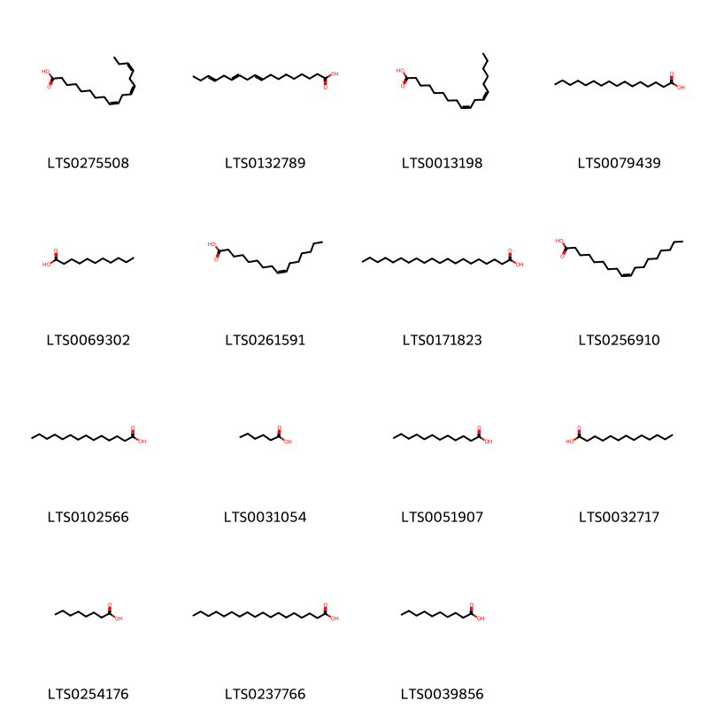{ width=100% }
    <figcaption>Hình ảnh cấu trúc hóa học của 15 hoạt chất thuộc nhóm Fatty Acyls gồm ['α-linolenic acid (LTS0275508)', 'α linolenic acid (LTS0132789)', 'linoleic (LTS0013198)', 'palmitic acid (LTS0079439)', 'undecanoic acid (LTS0069302)', 'palmitoleic acid (LTS0261591)', 'arachidic acid (LTS0171823)', 'oleic acid (LTS0256910)', 'myristic acid (LTS0102566)', 'hexanoic acid (LTS0031054)', 'lauric acid (LTS0051907)', 'n-tridecanoic acid (LTS0032717)', 'caprylic acid (LTS0254176)', 'stearic acid (LTS0237766)', 'capric acid (LTS0039856)'].</figcaption>
</figure>
#### Nhóm Flavonoids
<figure markdown="span">
    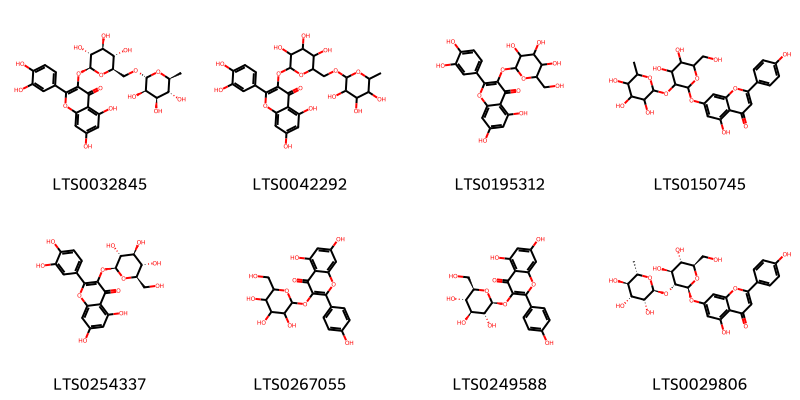{ width=100% }
    <figcaption>Hình ảnh cấu trúc hóa học của 8 hoạt chất thuộc nhóm Flavonoids gồm ['3-rutinosyl quercetin (LTS0032845)', 'rutin (LTS0042292)', '2-(3,4-dihydroxyphenyl)-5,7-dihydroxy-3-{[3,4,5-trihydroxy-6-(hydroxymethyl)oxan-2-yl]oxy}chromen-4-one (LTS0195312)', 'rhoifolin (LTS0150745)', 'isoquercetin (LTS0254337)', 'trifolin (LTS0267055)', 'astragalin (LTS0249588)', 'rhoifolin (LTS0029806)'].</figcaption>
</figure>
#### Nhóm Glycerolipids
<figure markdown="span">
    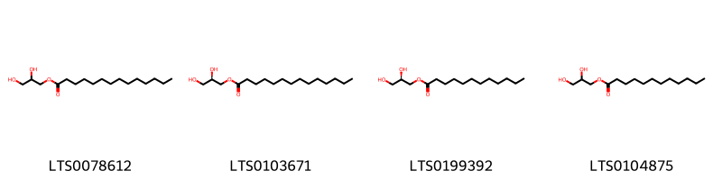{ width=100% }
    <figcaption>Hình ảnh cấu trúc hóa học của 4 hoạt chất thuộc nhóm Glycerolipids gồm ['2,3-dihydroxypropyl tetradecanoate (LTS0078612)', '3-myristoyl-sn-glycerol (LTS0103671)', '3-lauroyl-sn-glycerol (LTS0199392)', '1-monomyristin (LTS0104875)'].</figcaption>
</figure>
#### Nhóm Prenol lipids
<figure markdown="span">
    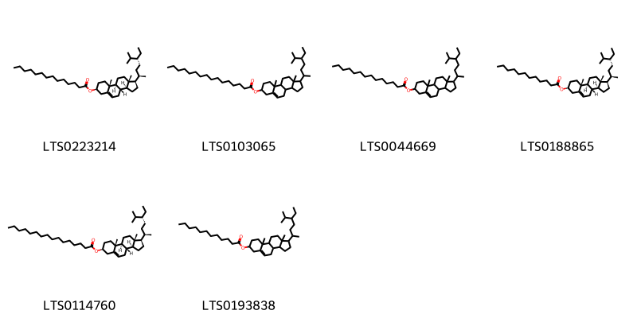{ width=100% }
    <figcaption>Hình ảnh cấu trúc hóa học của 6 hoạt chất thuộc nhóm Prenol lipids gồm ['(1r,3as,3bs,7s,9ar,9bs,11ar)-1-[(2r,5r)-5-ethyl-6-methylheptan-2-yl]-9a,11a-dimethyl-1h,2h,3h,3ah,3bh,4h,6h,7h,8h,9h,9bh,10h,11h-cyclopenta[a]phenanthren-7-yl tetradecanoate (LTS0223214)', '1-(5-ethyl-6-methylheptan-2-yl)-9a,11a-dimethyl-1h,2h,3h,3ah,3bh,4h,6h,7h,8h,9h,9bh,10h,11h-cyclopenta[a]phenanthren-7-yl hexadecanoate (LTS0103065)', '1-(5-ethyl-6-methylheptan-2-yl)-9a,11a-dimethyl-1h,2h,3h,3ah,3bh,4h,6h,7h,8h,9h,9bh,10h,11h-cyclopenta[a]phenanthren-7-yl tetradecanoate (LTS0044669)', '(1r,3as,3bs,7s,9ar,9bs,11ar)-1-[(2r,5r)-5-ethyl-6-methylheptan-2-yl]-9a,11a-dimethyl-1h,2h,3h,3ah,3bh,4h,6h,7h,8h,9h,9bh,10h,11h-cyclopenta[a]phenanthren-7-yl dodecanoate (LTS0188865)', 'β-sitosteryl palmitate (LTS0114760)', '1-(5-ethyl-6-methylheptan-2-yl)-9a,11a-dimethyl-1h,2h,3h,3ah,3bh,4h,6h,7h,8h,9h,9bh,10h,11h-cyclopenta[a]phenanthren-7-yl dodecanoate (LTS0193838)'].</figcaption>
</figure>
#### Nhóm Saturated hydrocarbons
<figure markdown="span">
    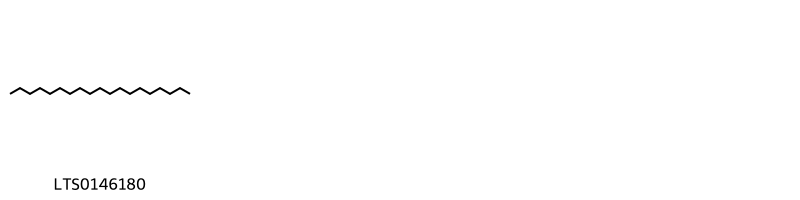{ width=100% }
    <figcaption>Hình ảnh cấu trúc hóa học của 1 hoạt chất thuộc nhóm Saturated hydrocarbons gồm ['nonadecane (LTS0146180)'].</figcaption>
</figure>
#### Nhóm Steroids and steroid derivatives
<figure markdown="span">
    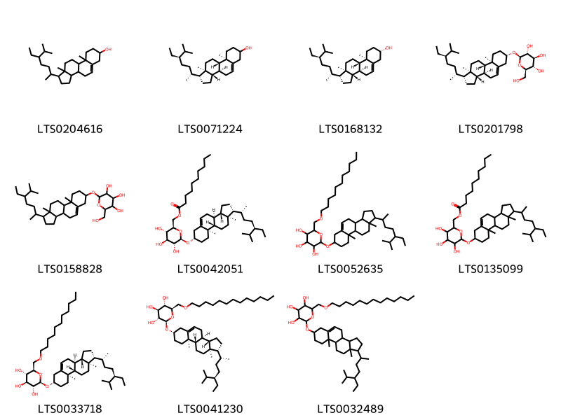{ width=100% }
    <figcaption>Hình ảnh cấu trúc hóa học của 11 hoạt chất thuộc nhóm Steroids and steroid derivatives gồm ['stigmast-5-en-3-ol, (3β)- (LTS0204616)', 'stigmast-5-en-3-ol (LTS0071224)', 'sitosterol (LTS0168132)', 'sitogluside (LTS0201798)', '2-{[1-(5-ethyl-6-methylheptan-2-yl)-9a,11a-dimethyl-1h,2h,3h,3ah,3bh,4h,6h,7h,8h,9h,9bh,10h,11h-cyclopenta[a]phenanthren-7-yl]oxy}-6-(hydroxymethyl)oxane-3,4,5-triol (LTS0158828)', '[(2r,3s,4s,5r,6r)-6-{[(1r,3as,3bs,7s,9ar,9bs,11ar)-1-[(2r,5r)-5-ethyl-6-methylheptan-2-yl]-9a,11a-dimethyl-1h,2h,3h,3ah,3bh,4h,6h,7h,8h,9h,9bh,10h,11h-cyclopenta[a]phenanthren-7-yl]oxy}-3,4,5-trihydroxyoxan-2-yl]methyl decanoate (LTS0042051)', '2-{[1-(5-ethyl-6-methylheptan-2-yl)-9a,11a-dimethyl-1h,2h,3h,3ah,3bh,4h,6h,7h,8h,9h,9bh,10h,11h-cyclopenta[a]phenanthren-7-yl]oxy}-6-[(undecyloxy)methyl]oxane-3,4,5-triol (LTS0052635)', '(6-{[1-(5-ethyl-6-methylheptan-2-yl)-9a,11a-dimethyl-1h,2h,3h,3ah,3bh,4h,6h,7h,8h,9h,9bh,10h,11h-cyclopenta[a]phenanthren-7-yl]oxy}-3,4,5-trihydroxyoxan-2-yl)methyl decanoate (LTS0135099)', '(2r,3r,4s,5s,6r)-2-{[(1r,3as,3bs,7s,9ar,9bs,11ar)-1-[(2r,5r)-5-ethyl-6-methylheptan-2-yl]-9a,11a-dimethyl-1h,2h,3h,3ah,3bh,4h,6h,7h,8h,9h,9bh,10h,11h-cyclopenta[a]phenanthren-7-yl]oxy}-6-[(undecyloxy)methyl]oxane-3,4,5-triol (LTS0033718)', '(2r,3r,4s,5s,6r)-2-{[(1r,3as,3bs,7s,9ar,9bs,11ar)-1-[(2r,5r)-5-ethyl-6-methylheptan-2-yl]-9a,11a-dimethyl-1h,2h,3h,3ah,3bh,4h,6h,7h,8h,9h,9bh,10h,11h-cyclopenta[a]phenanthren-7-yl]oxy}-6-[(tridecyloxy)methyl]oxane-3,4,5-triol (LTS0041230)', '2-{[1-(5-ethyl-6-methylheptan-2-yl)-9a,11a-dimethyl-1h,2h,3h,3ah,3bh,4h,6h,7h,8h,9h,9bh,10h,11h-cyclopenta[a]phenanthren-7-yl]oxy}-6-[(tridecyloxy)methyl]oxane-3,4,5-triol (LTS0032489)'].</figcaption>
</figure>

---

### Dược dân tộc học

Danh sách các quốc gia có sử dụng *Serenoa repens* trong điều trị các bệnh. 

| Country   | Disease                                    | Bệnh                                                                 |
|:----------|:-------------------------------------------|:---------------------------------------------------------------------|
| Turkey    | Aphrodisiac, Diuretic, Sedative, Stimulant | Thuốc kích thích tình dục, lợi tiểu, thuốc an thần, thuốc kích thích |

---

---
## Serenoa serrulata
### Thông tin về thực vật

!!! info "Phân loại thực vật của *Serenoa repens* từ GIBF:"
    - **Kingdom:** Plantae
    - **Phylum:** Tracheophyta
    - **Order:** Arecales
    - **Family:** Arecaceae
    - **Genus:** Serenoa
    - **Species:** *Serenoa repens*

 

| Label (VI)   | Label (EN)   | Scientific Name   | Descriptions (VI)   | Descriptions (EN)   | Also Known As (VI)   | Also Known As (EN)   |
|:-------------|:-------------|:------------------|:--------------------|:--------------------|:---------------------|:---------------------|
| N/A          | N/A          | Serenoa serrulata |                     | species of plants   | ['']                 | ['']                 |

#### Phân bố trên thế giới

**Từ CSDL GIBF** nan, United States of America

#### Phân bố tại Việt Nam

**Từ CSDL GIBF**: Không có ghi nhận ở Việt Nam

---
### Thành phần hóa học
        
- Theo cơ sở dữ liệu lotus: Từ loài *Serenoa repens* đã phân lập và xác định được Chưa có hoạt chất nào được phân lập. hoạt chất thuộc về các nhóm Không có hoạt chất nào được phân lập. 

Không có hình ảnh nào được tạo ra

---

### Dược dân tộc học

Danh sách các quốc gia có sử dụng *Serenoa repens* trong điều trị các bệnh. 

| Country        | Disease                                            | Bệnh                                                                    |
|:---------------|:---------------------------------------------------|:------------------------------------------------------------------------|
| US             | Stimulant, Digestive, Diuretic, Sedative, Sedative | Chất kích thích, Tiêu hóa, Thuốc lợi tiểu, Thuốc an thần, Thuốc an thần |
| US(Amerindian) | Poultice                                           | thuốc đắp, đắp thuốc cao                                                |

---

# Chi Corozo

??? note "Danh sách các dược liệu thuộc chi"
    
	 - *Corozo oleifera*

---
## Corozo oleifera
### Thông tin về thực vật

!!! info "Phân loại thực vật của *Elaeis oleifera* từ GIBF:"
    - **Kingdom:** Plantae
    - **Phylum:** Tracheophyta
    - **Order:** Arecales
    - **Family:** Arecaceae
    - **Genus:** Elaeis
    - **Species:** *Elaeis oleifera*

 

| Label (VI)   | Label (EN)   | Scientific Name   | Descriptions (VI)   | Descriptions (EN)   | Also Known As (VI)   | Also Known As (EN)   |
|:-------------|:-------------|:------------------|:--------------------|:--------------------|:---------------------|:---------------------|
| N/A          | N/A          | Corozo oleifera   |                     |                     | ['']                 | ['']                 |

#### Phân bố trên thế giới

**Từ CSDL GIBF** nan, unknown or invalid, Venezuela (Bolivarian Republic of), Panama, Brazil

#### Phân bố tại Việt Nam

**Từ CSDL GIBF**: Không có ghi nhận ở Việt Nam

---
### Thành phần hóa học
        
- Theo cơ sở dữ liệu lotus: Từ loài *Elaeis oleifera* đã phân lập và xác định được Chưa có hoạt chất nào được phân lập. hoạt chất thuộc về các nhóm Không có hoạt chất nào được phân lập. 

Không có hình ảnh nào được tạo ra

---

### Dược dân tộc học

Danh sách các quốc gia có sử dụng *Elaeis oleifera* trong điều trị các bệnh. 

| Country   | Disease   | Bệnh               |
|:----------|:----------|:-------------------|
| Colombia  | Tonic     | (thuộc) trương lực |
| Elsewhere | Soap      | Xà phòng           |

---

# Chi Licuala

??? note "Danh sách các dược liệu thuộc chi"
    
	 - *Licuala inosa*

---
## Licuala inosa
### Thông tin về thực vật

!!! info "Phân loại thực vật của *N/A* từ GIBF:"
    - **Kingdom:** Plantae
    - **Phylum:** Tracheophyta
    - **Order:** Arecales
    - **Family:** Arecaceae
    - **Genus:** Licuala
    - **Species:** *N/A*

 

| Label (VI)   | Label (EN)   | Scientific Name   | Descriptions (VI)   | Descriptions (EN)   | Also Known As (VI)   | Also Known As (EN)   |
|:-------------|:-------------|:------------------|:--------------------|:--------------------|:---------------------|:---------------------|
| N/A          | N/A          | Corozo oleifera   |                     |                     | ['']                 | ['']                 |

#### Phân bố trên thế giới

**Từ CSDL GIBF** Viet Nam, Thailand, Philippines, Guadeloupe, French Guiana, Singapore, Martinique, Australia, Indonesia, Colombia, Dominican Republic, Malaysia, Puerto Rico, India, Seychelles, Cuba, Cambodia, Barbados, Myanmar, Vanuatu, Brazil, Panama, China, Costa Rica

#### Phân bố tại Việt Nam

**Từ CSDL GIBF**: Gia Lai, Đồng Nai

---
### Thành phần hóa học
        
- Theo cơ sở dữ liệu lotus: Từ loài *N/A* đã phân lập và xác định được Chưa có hoạt chất nào được phân lập. hoạt chất thuộc về các nhóm Không có hoạt chất nào được phân lập. 

Không có hình ảnh nào được tạo ra

---

### Dược dân tộc học

Danh sách các quốc gia có sử dụng *N/A* trong điều trị các bệnh. 

| Country   |   Disease | Bệnh   |
|:----------|----------:|:-------|
| Elsewhere |       nan | Ở đây  |

---

# Chi Iguanura

??? note "Danh sách các dược liệu thuộc chi"
    
	 - *Iguanura geonomiformis*

---
## Iguanura geonomiformis
### Thông tin về thực vật

!!! info "Phân loại thực vật của *Iguanura geonomiformis* từ GIBF:"
    - **Kingdom:** Plantae
    - **Phylum:** Tracheophyta
    - **Order:** Arecales
    - **Family:** Arecaceae
    - **Genus:** Iguanura
    - **Species:** *Iguanura geonomiformis*

 

| Label (VI)   | Label (EN)   | Scientific Name        | Descriptions (VI)   | Descriptions (EN)   | Also Known As (VI)   | Also Known As (EN)   |
|:-------------|:-------------|:-----------------------|:--------------------|:--------------------|:---------------------|:---------------------|
| N/A          | N/A          | Iguanura geonomiformis | loài thực vật       | species of plant    | ['']                 | ['']                 |

#### Phân bố trên thế giới

**Từ CSDL GIBF** nan, Thailand, Malaysia, India, Trinidad and Tobago, Singapore

#### Phân bố tại Việt Nam

**Từ CSDL GIBF**: Không có ghi nhận ở Việt Nam

---
### Thành phần hóa học
        
- Theo cơ sở dữ liệu lotus: Từ loài *Iguanura geonomiformis* đã phân lập và xác định được Chưa có hoạt chất nào được phân lập. hoạt chất thuộc về các nhóm Không có hoạt chất nào được phân lập. 

Không có hình ảnh nào được tạo ra

---

### Dược dân tộc học

Danh sách các quốc gia có sử dụng *Iguanura geonomiformis* trong điều trị các bệnh. 

| Country   | Disease       | Bệnh               |
|:----------|:--------------|:-------------------|
| Jakun     | Contraceptive | Kiểm soát sinh sản |

---

# Chi Scheelea

??? note "Danh sách các dược liệu thuộc chi"
    
	 - *Scheelea preussii*

---
## Scheelea preussii
### Thông tin về thực vật

!!! info "Phân loại thực vật của *Attalea rostrata* từ GIBF:"
    - **Kingdom:** Plantae
    - **Phylum:** Tracheophyta
    - **Order:** Arecales
    - **Family:** Arecaceae
    - **Genus:** Attalea
    - **Species:** *Attalea rostrata*

 

| Label (VI)   | Label (EN)   | Scientific Name   | Descriptions (VI)   | Descriptions (EN)   | Also Known As (VI)   | Also Known As (EN)   |
|:-------------|:-------------|:------------------|:--------------------|:--------------------|:---------------------|:---------------------|
| N/A          | N/A          | Scheelea preussii | loài thực vật       | species of plant    | ['']                 | ['']                 |

#### Phân bố trên thế giới

**Từ CSDL GIBF** Honduras, nan, Brazil, Mexico, Guatemala

#### Phân bố tại Việt Nam

**Từ CSDL GIBF**: Không có ghi nhận ở Việt Nam

---
### Thành phần hóa học
        
- Theo cơ sở dữ liệu lotus: Từ loài *Attalea rostrata* đã phân lập và xác định được Chưa có hoạt chất nào được phân lập. hoạt chất thuộc về các nhóm Không có hoạt chất nào được phân lập. 

Không có hình ảnh nào được tạo ra

---

### Dược dân tộc học

Danh sách các quốc gia có sử dụng *Attalea rostrata* trong điều trị các bệnh. 

| Country   | Disease   | Bệnh     |
|:----------|:----------|:---------|
| Guatemala | Soap      | Xà phòng |

---

# Chi Pseudophoenix

??? note "Danh sách các dược liệu thuộc chi"
    
	 - *Pseudophoenix lediniana*

---
## Pseudophoenix lediniana
### Thông tin về thực vật

!!! info "Phân loại thực vật của *Pseudophoenix lediniana* từ GIBF:"
    - **Kingdom:** Plantae
    - **Phylum:** Tracheophyta
    - **Order:** Arecales
    - **Family:** Arecaceae
    - **Genus:** Pseudophoenix
    - **Species:** *Pseudophoenix lediniana*

 

| Label (VI)   | Label (EN)   | Scientific Name         | Descriptions (VI)   | Descriptions (EN)   | Also Known As (VI)   | Also Known As (EN)   |
|:-------------|:-------------|:------------------------|:--------------------|:--------------------|:---------------------|:---------------------|
| N/A          | N/A          | Pseudophoenix lediniana | loài thực vật       | species of plant    | ['']                 | ['']                 |

#### Phân bố trên thế giới

**Từ CSDL GIBF** Haiti, nan, United States of America

#### Phân bố tại Việt Nam

**Từ CSDL GIBF**: Không có ghi nhận ở Việt Nam

---
### Thành phần hóa học
        
- Theo cơ sở dữ liệu lotus: Từ loài *Pseudophoenix lediniana* đã phân lập và xác định được Chưa có hoạt chất nào được phân lập. hoạt chất thuộc về các nhóm Không có hoạt chất nào được phân lập. 

Không có hình ảnh nào được tạo ra

---

### Dược dân tộc học

Danh sách các quốc gia có sử dụng *Pseudophoenix lediniana* trong điều trị các bệnh. 

| Country            | Disease    | Bệnh         |
|:-------------------|:-----------|:-------------|
| Dominican Republic | Intoxicant | chất gây độc |

---

# Chi Jessenia

??? note "Danh sách các dược liệu thuộc chi"
    
	 - *Jessenia bataua*

---
## Jessenia bataua
### Thông tin về thực vật

!!! info "Phân loại thực vật của *Oenocarpus bataua* từ GIBF:"
    - **Kingdom:** Plantae
    - **Phylum:** Tracheophyta
    - **Order:** Arecales
    - **Family:** Arecaceae
    - **Genus:** Oenocarpus
    - **Species:** *Oenocarpus bataua*

 

| Label (VI)   | Label (EN)   | Scientific Name   | Descriptions (VI)   | Descriptions (EN)   | Also Known As (VI)   | Also Known As (EN)   |
|:-------------|:-------------|:------------------|:--------------------|:--------------------|:---------------------|:---------------------|
| N/A          | N/A          | Jessenia bataua   | loài thực vật       | species of plant    | ['']                 | ['']                 |

#### Phân bố trên thế giới

**Từ CSDL GIBF** nan, Colombia, Venezuela (Bolivarian Republic of), Suriname, unknown or invalid, Panama, Brazil, Peru, Bolivia (Plurinational State of), French Guiana, Ecuador, Guyana

#### Phân bố tại Việt Nam

**Từ CSDL GIBF**: Không có ghi nhận ở Việt Nam

---
### Thành phần hóa học
        
- Theo cơ sở dữ liệu lotus: Từ loài *Oenocarpus bataua* đã phân lập và xác định được Chưa có hoạt chất nào được phân lập. hoạt chất thuộc về các nhóm Không có hoạt chất nào được phân lập. 

Không có hình ảnh nào được tạo ra

---

### Dược dân tộc học

Danh sách các quốc gia có sử dụng *Oenocarpus bataua* trong điều trị các bệnh. 

| Country           | Disease    | Bệnh         |
|:------------------|:-----------|:-------------|
| Colombia(Guahibo) | Intoxicant | chất gây độc |

---

# Chi Attalea

??? note "Danh sách các dược liệu thuộc chi"
    
	 - *Attalea cohune*
	 - *Attalea eciosa*

---
## Attalea cohune
### Thông tin về thực vật

!!! info "Phân loại thực vật của *Attalea cohune* từ GIBF:"
    - **Kingdom:** Plantae
    - **Phylum:** Tracheophyta
    - **Order:** Arecales
    - **Family:** Arecaceae
    - **Genus:** Attalea
    - **Species:** *Attalea cohune*

 

| Label (VI)   | Label (EN)   | Scientific Name   | Descriptions (VI)   | Descriptions (EN)   | Also Known As (VI)   | Also Known As (EN)   |
|:-------------|:-------------|:------------------|:--------------------|:--------------------|:---------------------|:---------------------|
| N/A          | N/A          | Attalea cohune    | loài thực vật       | species of plant    | ['']                 | ['Cohune palm']      |

#### Phân bố trên thế giới

**Từ CSDL GIBF** Honduras, Colombia, Belize, El Salvador, South Africa, Panama, United States of America, Mexico, China, Guatemala

#### Phân bố tại Việt Nam

**Từ CSDL GIBF**: Không có ghi nhận ở Việt Nam

---
### Thành phần hóa học
        
- Theo cơ sở dữ liệu lotus: Từ loài *Attalea cohune* đã phân lập và xác định được 2 hoạt chất thuộc về các nhóm Prenol lipids. 

|    | chemicalTaxonomyClassyfireClass   |   smiles_count |
|---:|:----------------------------------|---------------:|
|  0 | Prenol lipids                     |              1 |

#### Nhóm Prenol lipids
<figure markdown="span">
    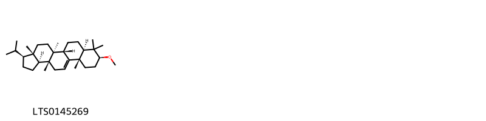{ width=100% }
    <figcaption>Hình ảnh cấu trúc hóa học của 1 hoạt chất thuộc nhóm Prenol lipids gồm ['cylindrin (LTS0145269)'].</figcaption>
</figure>

---

### Dược dân tộc học

Danh sách các quốc gia có sử dụng *Attalea cohune* trong điều trị các bệnh. 

| Country   | Disease   | Bệnh     |
|:----------|:----------|:---------|
| Elsewhere | Soap      | Xà phòng |
| Mexico    | Soap      | Xà phòng |

---

---
## Attalea eciosa
### Thông tin về thực vật

!!! info "Phân loại thực vật của *N/A* từ GIBF:"
    - **Kingdom:** Plantae
    - **Phylum:** Tracheophyta
    - **Order:** Arecales
    - **Family:** Arecaceae
    - **Genus:** Attalea
    - **Species:** *N/A*

 

| Label (VI)   | Label (EN)   | Scientific Name   | Descriptions (VI)   | Descriptions (EN)   | Also Known As (VI)   | Also Known As (EN)   |
|:-------------|:-------------|:------------------|:--------------------|:--------------------|:---------------------|:---------------------|
| N/A          | N/A          | Attalea cohune    | loài thực vật       | species of plant    | ['']                 | ['Cohune palm']      |

#### Phân bố trên thế giới

**Từ CSDL GIBF** Honduras, Colombia, Belize, Panama, Brazil, Peru, French Guiana, Costa Rica, Trinidad and Tobago, Bolivia (Plurinational State of), Ecuador, Mexico, Guatemala

#### Phân bố tại Việt Nam

**Từ CSDL GIBF**: Không có ghi nhận ở Việt Nam

---
### Thành phần hóa học
        
- Theo cơ sở dữ liệu lotus: Từ loài *N/A* đã phân lập và xác định được Chưa có hoạt chất nào được phân lập. hoạt chất thuộc về các nhóm Không có hoạt chất nào được phân lập. 

Không có hình ảnh nào được tạo ra

---

### Dược dân tộc học

Danh sách các quốc gia có sử dụng *N/A* trong điều trị các bệnh. 

| Country   | Disease    | Bệnh         |
|:----------|:-----------|:-------------|
| Venezuela | Intoxicant | chất gây độc |

---

# Chi Arenga

??? note "Danh sách các dược liệu thuộc chi"
    
	 - *Arenga pinnata*
	 - *Arenga tremula*

---
## Arenga pinnata
### Thông tin về thực vật

!!! info "Phân loại thực vật của *Arenga pinnata* từ GIBF:"
    - **Kingdom:** Plantae
    - **Phylum:** Tracheophyta
    - **Order:** Arecales
    - **Family:** Arecaceae
    - **Genus:** Arenga
    - **Species:** *Arenga pinnata*

 

| Label (VI)   | Label (EN)   | Scientific Name   | Descriptions (VI)   | Descriptions (EN)   | Also Known As (VI)   | Also Known As (EN)                                                                                |
|:-------------|:-------------|:------------------|:--------------------|:--------------------|:---------------------|:--------------------------------------------------------------------------------------------------|
| N/A          | N/A          | Arenga pinnata    |                     | species of plant    | ['']                 | ['Sugar palm', 'sugar palm', 'Areng palm', 'Black fiber palm', 'Black sugar palm', 'Gomuti palm'] |

#### Phân bố trên thế giới

**Từ CSDL GIBF** Viet Nam, nan, unknown or invalid, Thailand, Honduras, Philippines, French Polynesia, Lao People’s Democratic Republic, Singapore, Indonesia, Colombia, Suriname, Malaysia, India, Andorra, Belgium, Slovenia, Panama, China, Timor-Leste, Chinese Taipei, Papua New Guinea, Congo, Democratic Republic of the, United States of America, Chad, Cabo Verde

#### Phân bố tại Việt Nam

**Từ CSDL GIBF**: Tuyen Quang, Ninh Bình, Ha Tinh, Bình Thuận, Bac Kan, Hà Tinh, Ninh Binh, Quang Binh, Hoa Binh, Ninh Thuan, Thua Thien-Hue, Hồ Chí Minh

---
### Thành phần hóa học
        
- Theo cơ sở dữ liệu lotus: Từ loài *Arenga pinnata* đã phân lập và xác định được Chưa có hoạt chất nào được phân lập. hoạt chất thuộc về các nhóm Không có hoạt chất nào được phân lập. 

Không có hình ảnh nào được tạo ra

---

### Dược dân tộc học

Danh sách các quốc gia có sử dụng *Arenga pinnata* trong điều trị các bệnh. 

| Country   | Disease    | Bệnh          |
|:----------|:-----------|:--------------|
| India     | Piscicide  | Thuốc diệt cá |
| Java      | Lactagogue | Lactagogue    |
| Malaysia  | Intoxicant | chất gây độc  |

---

---
## Arenga tremula
### Thông tin về thực vật

!!! info "Phân loại thực vật của *Arenga tremula* từ GIBF:"
    - **Kingdom:** Plantae
    - **Phylum:** Tracheophyta
    - **Order:** Arecales
    - **Family:** Arecaceae
    - **Genus:** Arenga
    - **Species:** *Arenga tremula*

 

| Label (VI)   | Label (EN)   | Scientific Name   | Descriptions (VI)   | Descriptions (EN)   | Also Known As (VI)   | Also Known As (EN)              |
|:-------------|:-------------|:------------------|:--------------------|:--------------------|:---------------------|:--------------------------------|
| N/A          | N/A          | Arenga tremula    | loài thực vật       | species of plant    | ['']                 | ['Philippine dwarf sugar palm'] |

#### Phân bố trên thế giới

**Từ CSDL GIBF** nan, Viet Nam, Japan, Brazil, Philippines, Puerto Rico, French Guiana, Cuba, United States of America, China, Chinese Taipei

#### Phân bố tại Việt Nam

**Từ CSDL GIBF**: Không có ghi nhận ở Việt Nam

---
### Thành phần hóa học
        
- Theo cơ sở dữ liệu lotus: Từ loài *Arenga tremula* đã phân lập và xác định được Chưa có hoạt chất nào được phân lập. hoạt chất thuộc về các nhóm Không có hoạt chất nào được phân lập. 

Không có hình ảnh nào được tạo ra

---

### Dược dân tộc học

Danh sách các quốc gia có sử dụng *Arenga tremula* trong điều trị các bệnh. 

| Country   | Disease    | Bệnh         |
|:----------|:-----------|:-------------|
| Elsewhere | Intoxicant | chất gây độc |

---

