!!! abstract "Tóm tắt"

    Họ Aristolochiaceae gồm khoảng 5 chi và 57 loài được một số cộng đồng tại các quốc gia như Trinidad, Panama, Brazil, Mexico(Chinantec), Philippines, Venezuela, Java, Japan*, Chile, Mexico, China, Guatemala, ain, US(Upper Skagit), Elsewhere, Argentina, Africa, France, India, Paraguay, Sudan, US, US(Appalachia), Africa(Swahili), Turkey, Iraq, US(Amerindian), Salvador sử dụng trong một số trường hợp QUERY LENGTH LIMIT EXCEEDED. MAX ALLOWED QUERY : 500 CHARS QUERY LENGTH LIMIT EXCEEDED. MAX ALLOWED QUERY : 500 CHARS.

!!! info "DrDuke"

    James A. Duke sinh năm 1929-2017 là một nhà thực vật học người Mỹ. Đây là một trong những tác giả hàng đầu trong lĩnh vực dược dân tộc học với cuốn *CRC Handbook of Medicinal Herbs* và chính là người xây dựng lên cơ sở dữ liệu về hợp chất tự nhiên và dược dân tộc học tại Bộ nông nghiệp Hoa Kỳ. Các thông tin được đăng tải tại website [Dr. Duke's Phytochemical and Ethnobotanical Databases](https://phytochem.nal.usda.gov/). 
    Trong suốt thập niên 1970, ông lãnh đạo the Plant Taxonomy Laboratory, Plant Genetics and Germplasm Institute of the Agricultural Research Service, U.S. Department of Agriculture.
    Trong tài liệu này, các thông tin về dược dân tộc của các dược liệu được trích dẫn từ tài liệu của James A. Ducke với sự trợ giúp của phần mềm dịch thuật từ tiếng Anh sang tiếng Việt.
   

# Chi Asarum

??? note "Danh sách các dược liệu thuộc chi"
    
	 - *Asarum blumei*
	 - *Asarum canadense*
	 - *Asarum caudatum*
	 - *Asarum europaeum*
	 - *Asarum forbesi*
	 - *Asarum heterotropoides*
	 - *Asarum sieboldi*
	 - *Asarum sieboldii*

---
## Asarum blumei
### Thông tin về thực vật

!!! info "Phân loại thực vật của *Asarum blumei* từ GIBF:"
    - **Kingdom:** Plantae
    - **Phylum:** Tracheophyta
    - **Order:** Piperales
    - **Family:** Aristolochiaceae
    - **Genus:** Asarum
    - **Species:** *Asarum blumei*

 

| Label (VI)   | Label (EN)   | Scientific Name   | Descriptions (VI)   | Descriptions (EN)   | Also Known As (VI)   | Also Known As (EN)   |
|:-------------|:-------------|:------------------|:--------------------|:--------------------|:---------------------|:---------------------|
| N/A          | N/A          | Asarum blumei     | loài thực vật       | species of plant    | ['']                 | ['']                 |

#### Phân bố trên thế giới

**Từ CSDL GIBF** nan, Japan, China, Chinese Taipei

#### Phân bố tại Việt Nam

**Từ CSDL GIBF**: Không có ghi nhận ở Việt Nam

---
### Thành phần hóa học
        
- Theo cơ sở dữ liệu lotus: Từ loài *Asarum blumei* đã phân lập và xác định được Chưa có hoạt chất nào được phân lập. hoạt chất thuộc về các nhóm Không có hoạt chất nào được phân lập. 

Không có hình ảnh nào được tạo ra

---

### Dược dân tộc học

Danh sách các quốc gia có sử dụng *Asarum blumei* trong điều trị các bệnh. 

| Country   | Disease                  | Bệnh                                                                                                                                                                                                |
|:----------|:-------------------------|:----------------------------------------------------------------------------------------------------------------------------------------------------------------------------------------------------|
| China     | Carminative, Expectorant | MYMEMORY WARNING: YOU USED ALL AVAILABLE FREE TRANSLATIONS FOR TODAY. NEXT AVAILABLE IN  13 HOURS 07 MINUTES 38 SECONDS VISIT HTTPS://MYMEMORY.TRANSLATED.NET/DOC/USAGELIMITS.PHP TO TRANSLATE MORE |

---

---
## Asarum canadense
### Thông tin về thực vật

!!! info "Phân loại thực vật của *Asarum canadense* từ GIBF:"
    - **Kingdom:** Plantae
    - **Phylum:** Tracheophyta
    - **Order:** Piperales
    - **Family:** Aristolochiaceae
    - **Genus:** Asarum
    - **Species:** *Asarum canadense*

 

| Label (VI)   | Label (EN)   | Scientific Name   | Descriptions (VI)   | Descriptions (EN)   | Also Known As (VI)   | Also Known As (EN)                                                                              |
|:-------------|:-------------|:------------------|:--------------------|:--------------------|:---------------------|:------------------------------------------------------------------------------------------------|
| N/A          | N/A          | Asarum canadense  | loài thực vật       | species of plant    | ['']                 | ['broad-leaved asarabacca', 'Canada wild ginger', 'Canadian snakeroot', 'Canadian wild ginger'] |

#### Phân bố trên thế giới

**Từ CSDL GIBF** Canada, United States of America

#### Phân bố tại Việt Nam

**Từ CSDL GIBF**: Không có ghi nhận ở Việt Nam

---
### Thành phần hóa học
        
- Theo cơ sở dữ liệu lotus: Từ loài *Asarum canadense* đã phân lập và xác định được 67 hoạt chất thuộc về các nhóm Organooxygen compounds, Flavonoids, Benzofurans, Phenanthrenes and derivatives, Prenol lipids, Fatty Acyls, Phenols, Isobenzofurans, Phenol ethers, Benzene and substituted derivatives. 

|    | chemicalTaxonomyClassyfireClass     |   smiles_count |
|---:|:------------------------------------|---------------:|
|  0 | Benzene and substituted derivatives |              2 |
|  1 | Benzofurans                         |              1 |
|  2 | Fatty Acyls                         |              2 |
|  3 | Flavonoids                          |             18 |
|  4 | Isobenzofurans                      |              1 |
|  5 | Organooxygen compounds              |             11 |
|  6 | Phenanthrenes and derivatives       |              1 |
|  7 | Phenol ethers                       |              2 |
|  8 | Phenols                             |              1 |
|  9 | Prenol lipids                       |             27 |

#### Nhóm Benzene and substituted derivatives
<figure markdown="span">
    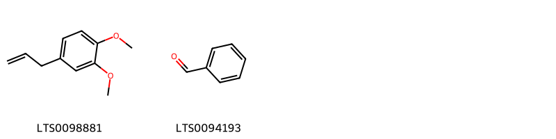{ width=100% }
    <figcaption>Hình ảnh cấu trúc hóa học của 2 hoạt chất thuộc nhóm Benzene and substituted derivatives gồm ['methyl eugenol (LTS0098881)', 'benzaldehyde (LTS0094193)'].</figcaption>
</figure>
#### Nhóm Benzofurans
<figure markdown="span">
    { width=100% }
    <figcaption>Hình ảnh cấu trúc hóa học của 1 hoạt chất thuộc nhóm Benzofurans gồm ['butylphthalide (LTS0150205)'].</figcaption>
</figure>
#### Nhóm Fatty Acyls
<figure markdown="span">
    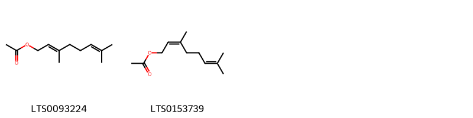{ width=100% }
    <figcaption>Hình ảnh cấu trúc hóa học của 2 hoạt chất thuộc nhóm Fatty Acyls gồm ['geranyl acetate (LTS0093224)', 'neryl acetate (LTS0153739)'].</figcaption>
</figure>
#### Nhóm Flavonoids
<figure markdown="span">
    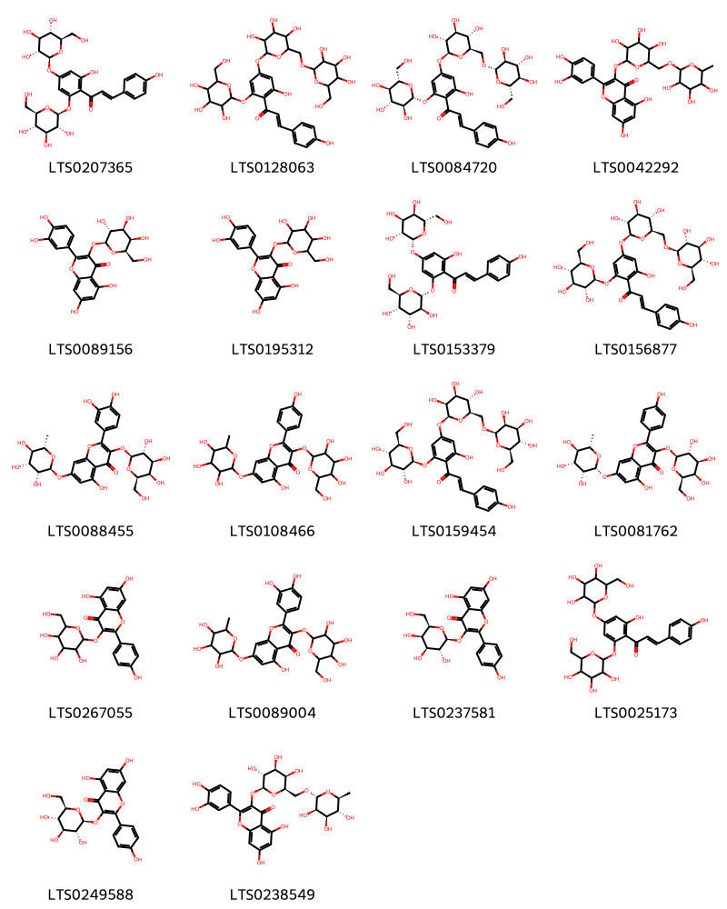{ width=100% }
    <figcaption>Hình ảnh cấu trúc hóa học của 18 hoạt chất thuộc nhóm Flavonoids gồm ['(2e)-1-[2-hydroxy-4,6-bis({[(2s,3r,4s,5s,6r)-3,4,5-trihydroxy-6-(hydroxymethyl)oxan-2-yl]oxy})phenyl]-3-(4-hydroxyphenyl)prop-2-en-1-one (LTS0207365)', '1-(2-hydroxy-6-{[3,4,5-trihydroxy-6-(hydroxymethyl)oxan-2-yl]oxy}-4-{[3,4,5-trihydroxy-6-({[3,4,5-trihydroxy-6-(hydroxymethyl)oxan-2-yl]oxy}methyl)oxan-2-yl]oxy}phenyl)-3-(4-hydroxyphenyl)prop-2-en-1-one (LTS0128063)', '(2e)-1-(2-hydroxy-6-{[(2r,3s,4r,5r,6s)-3,4,5-trihydroxy-6-(hydroxymethyl)oxan-2-yl]oxy}-4-{[(2s,3r,4s,5s,6r)-3,4,5-trihydroxy-6-({[(2s,3s,4r,5r,6s)-3,4,5-trihydroxy-6-(hydroxymethyl)oxan-2-yl]oxy}methyl)oxan-2-yl]oxy}phenyl)-3-(4-hydroxyphenyl)prop-2-en-1-one (LTS0084720)', 'rutin (LTS0042292)', 'hyperoside (LTS0089156)', '2-(3,4-dihydroxyphenyl)-5,7-dihydroxy-3-{[3,4,5-trihydroxy-6-(hydroxymethyl)oxan-2-yl]oxy}chromen-4-one (LTS0195312)', '(2e)-1-(2-hydroxy-4-{[(2r,3r,4s,5r,6s)-3,4,5-trihydroxy-6-(hydroxymethyl)oxan-2-yl]oxy}-6-{[(2r,3s,4r,5s,6r)-3,4,5-trihydroxy-6-(hydroxymethyl)oxan-2-yl]oxy}phenyl)-3-(4-hydroxyphenyl)prop-2-en-1-one (LTS0153379)', '(2e)-1-(2-hydroxy-6-{[(2s,3r,4s,5s,6r)-3,4,5-trihydroxy-6-(hydroxymethyl)oxan-2-yl]oxy}-4-{[(2s,3r,4s,5s,6r)-3,4,5-trihydroxy-6-({[(2r,3r,4s,5s,6r)-3,4,5-trihydroxy-6-(hydroxymethyl)oxan-2-yl]oxy}methyl)oxan-2-yl]oxy}phenyl)-3-(4-hydroxyphenyl)prop-2-en-1-one (LTS0156877)', '2-(3,4-dihydroxyphenyl)-5-hydroxy-3-{[(2s,3r,4s,5r,6r)-3,4,5-trihydroxy-6-(hydroxymethyl)oxan-2-yl]oxy}-7-{[(2s,3r,4r,5r,6s)-3,4,5-trihydroxy-6-methyloxan-2-yl]oxy}chromen-4-one (LTS0088455)', '5-hydroxy-2-(4-hydroxyphenyl)-3-{[3,4,5-trihydroxy-6-(hydroxymethyl)oxan-2-yl]oxy}-7-[(3,4,5-trihydroxy-6-methyloxan-2-yl)oxy]chromen-4-one (LTS0108466)', '(2e)-1-(2-hydroxy-6-{[(2s,3r,4s,5s,6r)-3,4,5-trihydroxy-6-(hydroxymethyl)oxan-2-yl]oxy}-4-{[(2s,3s,4s,5s,6r)-3,4,5-trihydroxy-6-({[(2r,3s,4s,5s,6r)-3,4,5-trihydroxy-6-(hydroxymethyl)oxan-2-yl]oxy}methyl)oxan-2-yl]oxy}phenyl)-3-(4-hydroxyphenyl)prop-2-en-1-one (LTS0159454)', '5-hydroxy-2-(4-hydroxyphenyl)-3-{[(2s,3r,4s,5r,6r)-3,4,5-trihydroxy-6-(hydroxymethyl)oxan-2-yl]oxy}-7-{[(2r,3r,4r,5r,6s)-3,4,5-trihydroxy-6-methyloxan-2-yl]oxy}chromen-4-one (LTS0081762)', 'trifolin (LTS0267055)', '2-(3,4-dihydroxyphenyl)-5-hydroxy-3-{[3,4,5-trihydroxy-6-(hydroxymethyl)oxan-2-yl]oxy}-7-[(3,4,5-trihydroxy-6-methyloxan-2-yl)oxy]chromen-4-one (LTS0089004)', 'trifolin (LTS0237581)', '1-[2-hydroxy-4,6-bis({[3,4,5-trihydroxy-6-(hydroxymethyl)oxan-2-yl]oxy})phenyl]-3-(4-hydroxyphenyl)prop-2-en-1-one (LTS0025173)', 'astragalin (LTS0249588)', '2-(3,4-dihydroxyphenyl)-5,7-dihydroxy-3-{[(2s,3r,4s,5r,6r)-3,4,5-trihydroxy-6-({[(2r,3r,4r,5r,6s)-3,4,5-trihydroxy-6-methyloxan-2-yl]oxy}methyl)oxan-2-yl]oxy}chromen-4-one (LTS0238549)'].</figcaption>
</figure>
#### Nhóm Isobenzofurans
<figure markdown="span">
    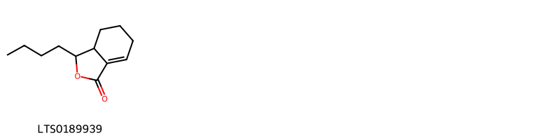{ width=100% }
    <figcaption>Hình ảnh cấu trúc hóa học của 1 hoạt chất thuộc nhóm Isobenzofurans gồm ['sedanolide (LTS0189939)'].</figcaption>
</figure>
#### Nhóm Organooxygen compounds
<figure markdown="span">
    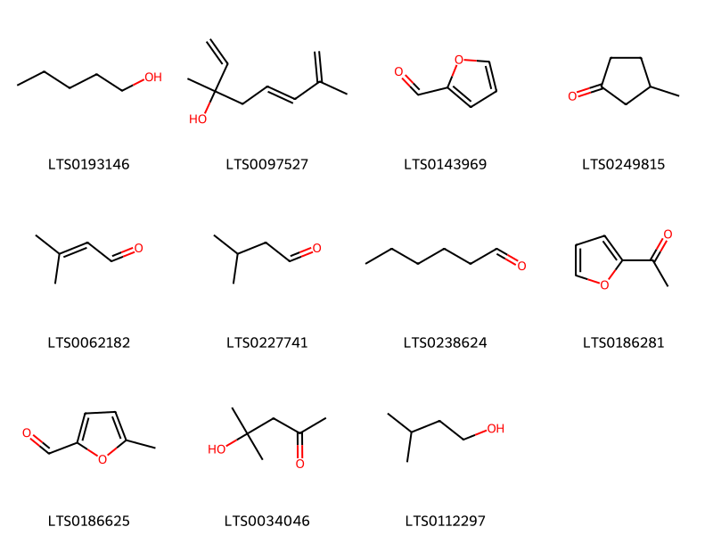{ width=100% }
    <figcaption>Hình ảnh cấu trúc hóa học của 11 hoạt chất thuộc nhóm Organooxygen compounds gồm ['amyl alcohol (LTS0193146)', '(5e)-3,7-dimethylocta-1,5,7-trien-3-ol (LTS0097527)', 'bran oil (LTS0143969)', '3-methylcyclopentanone (LTS0249815)', 'prenal (LTS0062182)', 'isovaleraldehyde (LTS0227741)', 'hexanal (LTS0238624)', 'acetylfuran (LTS0186281)', '5-methylfurfural (LTS0186625)', 'diacetone alcohol (LTS0034046)', 'isoamyl alcohol (LTS0112297)'].</figcaption>
</figure>
#### Nhóm Phenanthrenes and derivatives
<figure markdown="span">
    { width=100% }
    <figcaption>Hình ảnh cấu trúc hóa học của 1 hoạt chất thuộc nhóm Phenanthrenes and derivatives gồm ['birthwort (LTS0093447)'].</figcaption>
</figure>
#### Nhóm Phenol ethers
<figure markdown="span">
    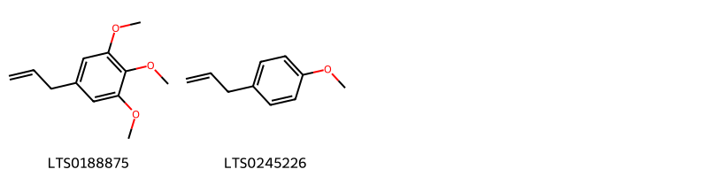{ width=100% }
    <figcaption>Hình ảnh cấu trúc hóa học của 2 hoạt chất thuộc nhóm Phenol ethers gồm ['elemicin (LTS0188875)', 'tarragon (LTS0245226)'].</figcaption>
</figure>
#### Nhóm Phenols
<figure markdown="span">
    { width=100% }
    <figcaption>Hình ảnh cấu trúc hóa học của 1 hoạt chất thuộc nhóm Phenols gồm ['eugenol (LTS0052342)'].</figcaption>
</figure>
#### Nhóm Prenol lipids
<figure markdown="span">
    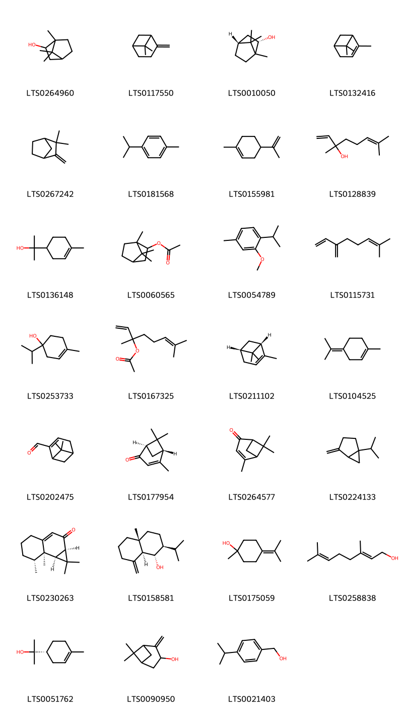{ width=100% }
    <figcaption>Hình ảnh cấu trúc hóa học của 27 hoạt chất thuộc nhóm Prenol lipids gồm ['borneol (LTS0264960)', 'β-pinene (LTS0117550)', '(2s,4r)-1,7,7-trimethylbicyclo[2.2.1]heptan-2-ol (LTS0010050)', 'α pinene (LTS0132416)', 'camphene (LTS0267242)', 'cymene (LTS0181568)', 'limonene,  (LTS0155981)', 'linalool, (+-)- (LTS0128839)', 'terpineol (LTS0136148)', 'bornyl acetate (LTS0060565)', '2-isopropyl-5-methylanisole (LTS0054789)', 'α-myrcene (LTS0115731)', '4-terpineol (LTS0253733)', 'linalyl acetate (LTS0167325)', '(+)-α-pinene (LTS0211102)', 'terpinolene (LTS0104525)', 'myrtenal (LTS0202475)', '(1r,5s)-4,6,6-trimethylbicyclo[3.1.1]hept-3-en-2-one (LTS0177954)', 'verbenone (LTS0264577)', 'sabinene (LTS0224133)', 'aristolone (LTS0230263)', 'junenol (LTS0158581)', 'γ-terpineol (LTS0175059)', 'geraniol (LTS0258838)', 'lily of valley (LTS0051762)', 'pinocarveol (LTS0090950)', 'cuminol (LTS0021403)'].</figcaption>
</figure>

---

### Dược dân tộc học

Danh sách các quốc gia có sử dụng *Asarum canadense* trong điều trị các bệnh. 

| Country        | Disease                                                  | Bệnh                                                                                                                                                                                                |
|:---------------|:---------------------------------------------------------|:----------------------------------------------------------------------------------------------------------------------------------------------------------------------------------------------------|
| Elsewhere      | Stimulant, Tonic, Carminative                            | MYMEMORY WARNING: YOU USED ALL AVAILABLE FREE TRANSLATIONS FOR TODAY. NEXT AVAILABLE IN  13 HOURS 07 MINUTES 12 SECONDS VISIT HTTPS://MYMEMORY.TRANSLATED.NET/DOC/USAGELIMITS.PHP TO TRANSLATE MORE |
| Turkey         | Carminative, Expectorant, Stimulant, Sudorific, Diuretic | MYMEMORY WARNING: YOU USED ALL AVAILABLE FREE TRANSLATIONS FOR TODAY. NEXT AVAILABLE IN  13 HOURS 07 MINUTES 04 SECONDS VISIT HTTPS://MYMEMORY.TRANSLATED.NET/DOC/USAGELIMITS.PHP TO TRANSLATE MORE |
| US             | Stimulant, Sudorific                                     | MYMEMORY WARNING: YOU USED ALL AVAILABLE FREE TRANSLATIONS FOR TODAY. NEXT AVAILABLE IN  13 HOURS 06 MINUTES 59 SECONDS VISIT HTTPS://MYMEMORY.TRANSLATED.NET/DOC/USAGELIMITS.PHP TO TRANSLATE MORE |
| US(Amerindian) | Tonic, Stimulant                                         | MYMEMORY WARNING: YOU USED ALL AVAILABLE FREE TRANSLATIONS FOR TODAY. NEXT AVAILABLE IN  13 HOURS 06 MINUTES 53 SECONDS VISIT HTTPS://MYMEMORY.TRANSLATED.NET/DOC/USAGELIMITS.PHP TO TRANSLATE MORE |
| US(Appalachia) | Carminative                                              | MYMEMORY WARNING: YOU USED ALL AVAILABLE FREE TRANSLATIONS FOR TODAY. NEXT AVAILABLE IN  13 HOURS 06 MINUTES 48 SECONDS VISIT HTTPS://MYMEMORY.TRANSLATED.NET/DOC/USAGELIMITS.PHP TO TRANSLATE MORE |

---

---
## Asarum caudatum
### Thông tin về thực vật

!!! info "Phân loại thực vật của *Asarum caudatum* từ GIBF:"
    - **Kingdom:** Plantae
    - **Phylum:** Tracheophyta
    - **Order:** Piperales
    - **Family:** Aristolochiaceae
    - **Genus:** Asarum
    - **Species:** *Asarum caudatum*

 

| Label (VI)   | Label (EN)   | Scientific Name   | Descriptions (VI)   | Descriptions (EN)   | Also Known As (VI)   | Also Known As (EN)   |
|:-------------|:-------------|:------------------|:--------------------|:--------------------|:---------------------|:---------------------|
| N/A          | N/A          | Asarum caudatum   | loài thực vật       | species of plant    | ['']                 | ['']                 |

#### Phân bố trên thế giới

**Từ CSDL GIBF** Canada, United States of America

#### Phân bố tại Việt Nam

**Từ CSDL GIBF**: Không có ghi nhận ở Việt Nam

---
### Thành phần hóa học
        
- Theo cơ sở dữ liệu lotus: Từ loài *Asarum caudatum* đã phân lập và xác định được 2 hoạt chất thuộc về các nhóm Phenol ethers. 

|    | chemicalTaxonomyClassyfireClass   |   smiles_count |
|---:|:----------------------------------|---------------:|
|  0 | Phenol ethers                     |              2 |

#### Nhóm Phenol ethers
<figure markdown="span">
    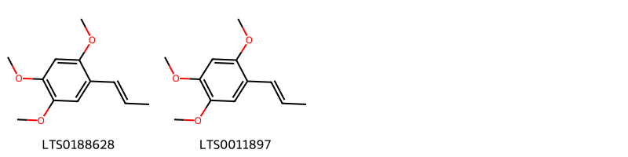{ width=100% }
    <figcaption>Hình ảnh cấu trúc hóa học của 2 hoạt chất thuộc nhóm Phenol ethers gồm ['cis-asarone (LTS0188628)', '1,2,4-trimethoxy-5-(prop-1-en-1-yl)benzene (LTS0011897)'].</figcaption>
</figure>

---

### Dược dân tộc học

Danh sách các quốc gia có sử dụng *Asarum caudatum* trong điều trị các bệnh. 

| Country          | Disease   | Bệnh                                                                                                                                                                                                |
|:-----------------|:----------|:----------------------------------------------------------------------------------------------------------------------------------------------------------------------------------------------------|
| US(Upper Skagit) | Tonic     | MYMEMORY WARNING: YOU USED ALL AVAILABLE FREE TRANSLATIONS FOR TODAY. NEXT AVAILABLE IN  13 HOURS 06 MINUTES 10 SECONDS VISIT HTTPS://MYMEMORY.TRANSLATED.NET/DOC/USAGELIMITS.PHP TO TRANSLATE MORE |

---

---
## Asarum europaeum
### Thông tin về thực vật

!!! info "Phân loại thực vật của *Asarum europaeum* từ GIBF:"
    - **Kingdom:** Plantae
    - **Phylum:** Tracheophyta
    - **Order:** Piperales
    - **Family:** Aristolochiaceae
    - **Genus:** Asarum
    - **Species:** *Asarum europaeum*

 

| Label (VI)   | Label (EN)   | Scientific Name   | Descriptions (VI)   | Descriptions (EN)   | Also Known As (VI)   | Also Known As (EN)   |
|:-------------|:-------------|:------------------|:--------------------|:--------------------|:---------------------|:---------------------|
| N/A          | N/A          | Asarum europaeum  |                     | species of plant    | ['']                 | ['']                 |

#### Phân bố trên thế giới

**Từ CSDL GIBF** Bosnia and Herzegovina, Denmark, Germany, Austria, Sweden, Poland, Slovakia, Slovenia, Belarus, Lithuania, Hungary, Switzerland, Moldova, Republic of, France, Czechia, Russian Federation, United States of America, Italy, Croatia, Ukraine

#### Phân bố tại Việt Nam

**Từ CSDL GIBF**: Không có ghi nhận ở Việt Nam

---
### Thành phần hóa học
        
- Theo cơ sở dữ liệu lotus: Từ loài *Asarum europaeum* đã phân lập và xác định được 10 hoạt chất thuộc về các nhóm Phenol ethers, Prenol lipids, Benzene and substituted derivatives, Carboxylic acids and derivatives. 

|    | chemicalTaxonomyClassyfireClass     |   smiles_count |
|---:|:------------------------------------|---------------:|
|  0 | Benzene and substituted derivatives |              3 |
|  1 | Carboxylic acids and derivatives    |              2 |
|  2 | Phenol ethers                       |              3 |
|  3 | Prenol lipids                       |              2 |

#### Nhóm Benzene and substituted derivatives
<figure markdown="span">
    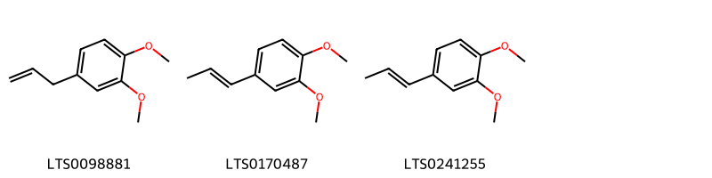{ width=100% }
    <figcaption>Hình ảnh cấu trúc hóa học của 3 hoạt chất thuộc nhóm Benzene and substituted derivatives gồm ['methyl eugenol (LTS0098881)', 'methyl isoeugenol (LTS0170487)', 'isoeugenyl methyl ether (LTS0241255)'].</figcaption>
</figure>
#### Nhóm Carboxylic acids and derivatives
<figure markdown="span">
    { width=100% }
    <figcaption>Hình ảnh cấu trúc hóa học của 2 hoạt chất thuộc nhóm Carboxylic acids and derivatives gồm ['aconitic acid (LTS0039736)', 'trans-aconitic acid (LTS0049047)'].</figcaption>
</figure>
#### Nhóm Phenol ethers
<figure markdown="span">
    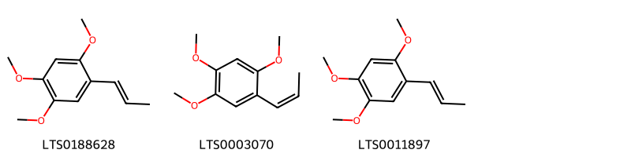{ width=100% }
    <figcaption>Hình ảnh cấu trúc hóa học của 3 hoạt chất thuộc nhóm Phenol ethers gồm ['cis-asarone (LTS0188628)', 'β-asarone (LTS0003070)', '1,2,4-trimethoxy-5-(prop-1-en-1-yl)benzene (LTS0011897)'].</figcaption>
</figure>
#### Nhóm Prenol lipids
<figure markdown="span">
    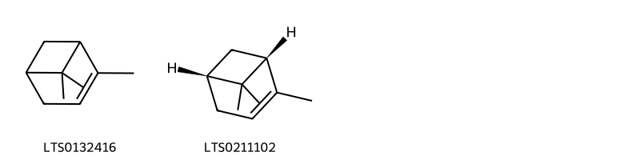{ width=100% }
    <figcaption>Hình ảnh cấu trúc hóa học của 2 hoạt chất thuộc nhóm Prenol lipids gồm ['α pinene (LTS0132416)', '(+)-α-pinene (LTS0211102)'].</figcaption>
</figure>

---

### Dược dân tộc học

Danh sách các quốc gia có sử dụng *Asarum europaeum* trong điều trị các bệnh. 

| Country   | Disease                                                                              | Bệnh                                                                                                                                                                                                |
|:----------|:-------------------------------------------------------------------------------------|:----------------------------------------------------------------------------------------------------------------------------------------------------------------------------------------------------|
| Elsewhere | Diaphoretic, Stimulant, Emmenagogue                                                  | MYMEMORY WARNING: YOU USED ALL AVAILABLE FREE TRANSLATIONS FOR TODAY. NEXT AVAILABLE IN  13 HOURS 05 MINUTES 42 SECONDS VISIT HTTPS://MYMEMORY.TRANSLATED.NET/DOC/USAGELIMITS.PHP TO TRANSLATE MORE |
| France    | Emetic                                                                               | MYMEMORY WARNING: YOU USED ALL AVAILABLE FREE TRANSLATIONS FOR TODAY. NEXT AVAILABLE IN  13 HOURS 05 MINUTES 39 SECONDS VISIT HTTPS://MYMEMORY.TRANSLATED.NET/DOC/USAGELIMITS.PHP TO TRANSLATE MORE |
| Turkey    | Emetic, Emmenagogue, Poison, Purgative, Sternutatory, Stimulant, Sudorific, Diuretic | MYMEMORY WARNING: YOU USED ALL AVAILABLE FREE TRANSLATIONS FOR TODAY. NEXT AVAILABLE IN  13 HOURS 05 MINUTES 36 SECONDS VISIT HTTPS://MYMEMORY.TRANSLATED.NET/DOC/USAGELIMITS.PHP TO TRANSLATE MORE |

---

---
## Asarum forbesi
### Thông tin về thực vật

!!! info "Phân loại thực vật của *Asarum forbesii* từ GIBF:"
    - **Kingdom:** Plantae
    - **Phylum:** Tracheophyta
    - **Order:** Piperales
    - **Family:** Aristolochiaceae
    - **Genus:** Asarum
    - **Species:** *Asarum forbesii*

 

| Label (VI)   | Label (EN)   | Scientific Name   | Descriptions (VI)   | Descriptions (EN)   | Also Known As (VI)   | Also Known As (EN)   |
|:-------------|:-------------|:------------------|:--------------------|:--------------------|:---------------------|:---------------------|
| N/A          | N/A          | Asarum europaeum  |                     | species of plant    | ['']                 | ['']                 |

#### Phân bố trên thế giới

**Từ CSDL GIBF** nan, China, Chinese Taipei

#### Phân bố tại Việt Nam

**Từ CSDL GIBF**: Không có ghi nhận ở Việt Nam

---
### Thành phần hóa học
        
- Theo cơ sở dữ liệu lotus: Từ loài *Asarum forbesii* đã phân lập và xác định được 7 hoạt chất thuộc về các nhóm Phenol ethers, Furanoid lignans, Carboximidic acids and derivatives, Fatty Acyls. 

|    | chemicalTaxonomyClassyfireClass    |   smiles_count |
|---:|:-----------------------------------|---------------:|
|  0 | Carboximidic acids and derivatives |              1 |
|  1 | Fatty Acyls                        |              2 |
|  2 | Furanoid lignans                   |              2 |
|  3 | Phenol ethers                      |              2 |

#### Nhóm Carboximidic acids and derivatives
<figure markdown="span">
    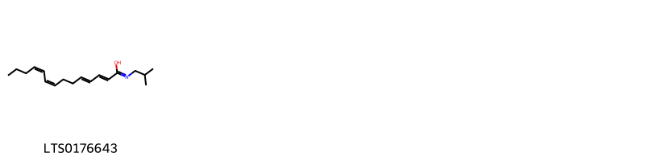{ width=100% }
    <figcaption>Hình ảnh cấu trúc hóa học của 1 hoạt chất thuộc nhóm Carboximidic acids and derivatives gồm ['(2e,4e,8z,10z)-n-(2-methylpropyl)tetradeca-2,4,8,10-tetraenimidic acid (LTS0176643)'].</figcaption>
</figure>
#### Nhóm Fatty Acyls
<figure markdown="span">
    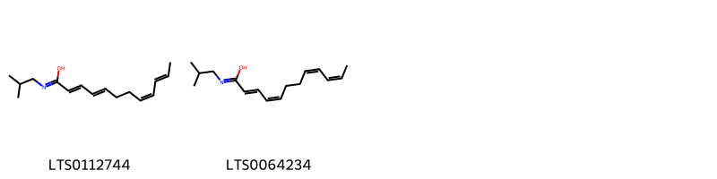{ width=100% }
    <figcaption>Hình ảnh cấu trúc hóa học của 2 hoạt chất thuộc nhóm Fatty Acyls gồm ['(2e,4e,8z,10e)-n-(2-methylpropyl)dodeca-2,4,8,10-tetraenimidic acid (LTS0112744)', '(2e,4z,8z,10z)-n-(2-methylpropyl)dodeca-2,4,8,10-tetraenimidic acid (LTS0064234)'].</figcaption>
</figure>
#### Nhóm Furanoid lignans
<figure markdown="span">
    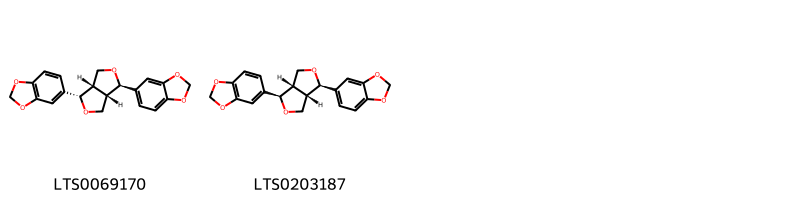{ width=100% }
    <figcaption>Hình ảnh cấu trúc hóa học của 2 hoạt chất thuộc nhóm Furanoid lignans gồm ['asarinin (LTS0069170)', '(-)-sesamin (LTS0203187)'].</figcaption>
</figure>
#### Nhóm Phenol ethers
<figure markdown="span">
    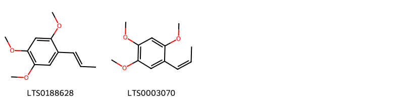{ width=100% }
    <figcaption>Hình ảnh cấu trúc hóa học của 2 hoạt chất thuộc nhóm Phenol ethers gồm ['cis-asarone (LTS0188628)', 'β-asarone (LTS0003070)'].</figcaption>
</figure>

---

### Dược dân tộc học

Danh sách các quốc gia có sử dụng *Asarum forbesii* trong điều trị các bệnh. 

| Country   | Disease              | Bệnh                                                                                                                                                                                                |
|:----------|:---------------------|:----------------------------------------------------------------------------------------------------------------------------------------------------------------------------------------------------|
| China     | Deodorant, Vermifuge | MYMEMORY WARNING: YOU USED ALL AVAILABLE FREE TRANSLATIONS FOR TODAY. NEXT AVAILABLE IN  13 HOURS 05 MINUTES 04 SECONDS VISIT HTTPS://MYMEMORY.TRANSLATED.NET/DOC/USAGELIMITS.PHP TO TRANSLATE MORE |

---

---
## Asarum heterotropoides
### Thông tin về thực vật

!!! info "Phân loại thực vật của *Asarum heterotropoides* từ GIBF:"
    - **Kingdom:** Plantae
    - **Phylum:** Tracheophyta
    - **Order:** Piperales
    - **Family:** Aristolochiaceae
    - **Genus:** Asarum
    - **Species:** *Asarum heterotropoides*

 

| Label (VI)   | Label (EN)   | Scientific Name        | Descriptions (VI)   | Descriptions (EN)   | Also Known As (VI)   | Also Known As (EN)   |
|:-------------|:-------------|:-----------------------|:--------------------|:--------------------|:---------------------|:---------------------|
| N/A          | N/A          | Asarum heterotropoides | loài thực vật       | species of plant    | ['']                 | ['']                 |

#### Phân bố trên thế giới

**Từ CSDL GIBF** nan, Japan, Russian Federation, China, Korea, Republic of

#### Phân bố tại Việt Nam

**Từ CSDL GIBF**: Không có ghi nhận ở Việt Nam

---
### Thành phần hóa học
        
- Theo cơ sở dữ liệu lotus: Từ loài *Asarum heterotropoides* đã phân lập và xác định được 23 hoạt chất thuộc về các nhóm Furanoid lignans, Isoquinolines and derivatives, Prenol lipids, Fatty Acyls, Phenols, Benzodioxoles, Phenol ethers, Benzene and substituted derivatives. 

|    | chemicalTaxonomyClassyfireClass     |   smiles_count |
|---:|:------------------------------------|---------------:|
|  0 | Benzene and substituted derivatives |              3 |
|  1 | Benzodioxoles                       |              1 |
|  2 | Fatty Acyls                         |              5 |
|  3 | Furanoid lignans                    |              7 |
|  4 | Isoquinolines and derivatives       |              1 |
|  5 | Phenol ethers                       |              3 |
|  6 | Phenols                             |              1 |
|  7 | Prenol lipids                       |              2 |

#### Nhóm Benzene and substituted derivatives
<figure markdown="span">
    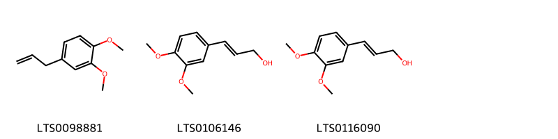{ width=100% }
    <figcaption>Hình ảnh cấu trúc hóa học của 3 hoạt chất thuộc nhóm Benzene and substituted derivatives gồm ['methyl eugenol (LTS0098881)', '3,4-dimethoxycinnamyl alcohol (LTS0106146)', '3-(3,4-dimethoxyphenyl)prop-2-en-1-ol (LTS0116090)'].</figcaption>
</figure>
#### Nhóm Benzodioxoles
<figure markdown="span">
    { width=100% }
    <figcaption>Hình ảnh cấu trúc hóa học của 1 hoạt chất thuộc nhóm Benzodioxoles gồm ['sassafras (LTS0136093)'].</figcaption>
</figure>
#### Nhóm Fatty Acyls
<figure markdown="span">
    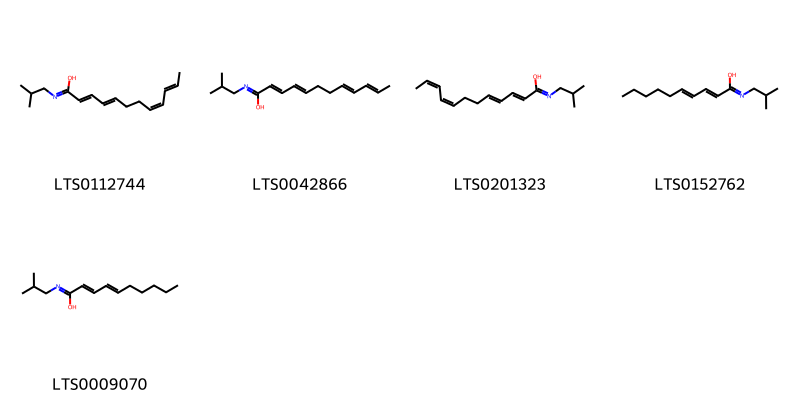{ width=100% }
    <figcaption>Hình ảnh cấu trúc hóa học của 5 hoạt chất thuộc nhóm Fatty Acyls gồm ['(2e,4e,8z,10e)-n-(2-methylpropyl)dodeca-2,4,8,10-tetraenimidic acid (LTS0112744)', 'n-(2-methylpropyl)dodeca-2,4,8,10-tetraenimidic acid (LTS0042866)', '(2e,4e,8z,10z)-n-(2-methylpropyl)dodeca-2,4,8,10-tetraenimidic acid (LTS0201323)', '(2e,4e)-n-(2-methylpropyl)deca-2,4-dienimidic acid (LTS0152762)', 'n-(2-methylpropyl)deca-2,4-dienimidic acid (LTS0009070)'].</figcaption>
</figure>
#### Nhóm Furanoid lignans
<figure markdown="span">
    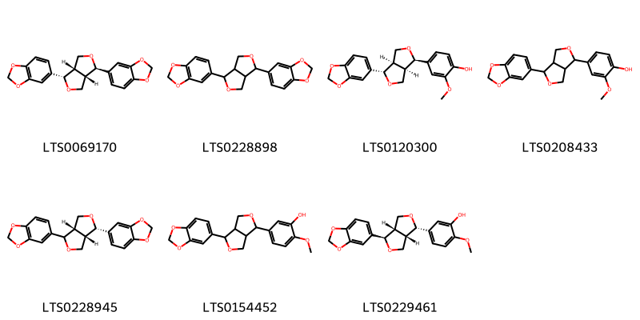{ width=100% }
    <figcaption>Hình ảnh cấu trúc hóa học của 7 hoạt chất thuộc nhóm Furanoid lignans gồm ['asarinin (LTS0069170)', 'sesamin (LTS0228898)', '4-[(1r,3ar,4s,6ar)-4-(2h-1,3-benzodioxol-5-yl)-hexahydrofuro[3,4-c]furan-1-yl]-2-methoxyphenol (LTS0120300)', '4-[4-(2h-1,3-benzodioxol-5-yl)-hexahydrofuro[3,4-c]furan-1-yl]-2-methoxyphenol (LTS0208433)', '5-[(3as,4s,6as)-4-(2h-1,3-benzodioxol-5-yl)-hexahydrofuro[3,4-c]furan-1-yl]-2h-1,3-benzodioxole (LTS0228945)', '5-[4-(2h-1,3-benzodioxol-5-yl)-hexahydrofuro[3,4-c]furan-1-yl]-2-methoxyphenol (LTS0154452)', '5-[(1s,3as,4r,6as)-4-(2h-1,3-benzodioxol-5-yl)-hexahydrofuro[3,4-c]furan-1-yl]-2-methoxyphenol (LTS0229461)'].</figcaption>
</figure>
#### Nhóm Isoquinolines and derivatives
<figure markdown="span">
    { width=100% }
    <figcaption>Hình ảnh cấu trúc hóa học của 1 hoạt chất thuộc nhóm Isoquinolines and derivatives gồm ['higenamine (LTS0113417)'].</figcaption>
</figure>
#### Nhóm Phenol ethers
<figure markdown="span">
    { width=100% }
    <figcaption>Hình ảnh cấu trúc hóa học của 3 hoạt chất thuộc nhóm Phenol ethers gồm ['cis-asarone (LTS0188628)', 'β-asarone (LTS0003070)', '1,2,4-trimethoxy-5-(prop-1-en-1-yl)benzene (LTS0011897)'].</figcaption>
</figure>
#### Nhóm Phenols
<figure markdown="span">
    { width=100% }
    <figcaption>Hình ảnh cấu trúc hóa học của 1 hoạt chất thuộc nhóm Phenols gồm ['eugenol (LTS0052342)'].</figcaption>
</figure>
#### Nhóm Prenol lipids
<figure markdown="span">
    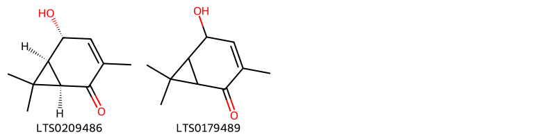{ width=100% }
    <figcaption>Hình ảnh cấu trúc hóa học của 2 hoạt chất thuộc nhóm Prenol lipids gồm ['(+/-)-asarinol a (LTS0209486)', '5-hydroxy-3,7,7-trimethylbicyclo[4.1.0]hept-3-en-2-one (LTS0179489)'].</figcaption>
</figure>

---

### Dược dân tộc học

Danh sách các quốc gia có sử dụng *Asarum heterotropoides* trong điều trị các bệnh. 

| Country   | Disease     | Bệnh                                                                                                                                                                                                |
|:----------|:------------|:----------------------------------------------------------------------------------------------------------------------------------------------------------------------------------------------------|
| China     | Expectorant | MYMEMORY WARNING: YOU USED ALL AVAILABLE FREE TRANSLATIONS FOR TODAY. NEXT AVAILABLE IN  13 HOURS 04 MINUTES 38 SECONDS VISIT HTTPS://MYMEMORY.TRANSLATED.NET/DOC/USAGELIMITS.PHP TO TRANSLATE MORE |

---

---
## Asarum sieboldi
### Thông tin về thực vật

!!! info "Phân loại thực vật của *Asarum sieboldii* từ GIBF:"
    - **Kingdom:** Plantae
    - **Phylum:** Tracheophyta
    - **Order:** Piperales
    - **Family:** Aristolochiaceae
    - **Genus:** Asarum
    - **Species:** *Asarum sieboldii*

 

| Label (VI)   | Label (EN)   | Scientific Name        | Descriptions (VI)   | Descriptions (EN)   | Also Known As (VI)   | Also Known As (EN)   |
|:-------------|:-------------|:-----------------------|:--------------------|:--------------------|:---------------------|:---------------------|
| N/A          | N/A          | Asarum heterotropoides | loài thực vật       | species of plant    | ['']                 | ['']                 |

#### Phân bố trên thế giới

**Từ CSDL GIBF** Japan, Russian Federation, China, Belgium, Korea, Republic of

#### Phân bố tại Việt Nam

**Từ CSDL GIBF**: Không có ghi nhận ở Việt Nam

---
### Thành phần hóa học
        
- Theo cơ sở dữ liệu lotus: Từ loài *Asarum sieboldii* đã phân lập và xác định được 46 hoạt chất thuộc về các nhóm Furanoid lignans, Organooxygen compounds, Carboximidic acids and derivatives, Isoquinolines and derivatives, Prenol lipids, Fatty Acyls, Pyrans, Phenols, Benzodioxoles, Phenol ethers, Cinnamic acids and derivatives, Benzene and substituted derivatives. 

|    | chemicalTaxonomyClassyfireClass     |   smiles_count |
|---:|:------------------------------------|---------------:|
|  0 | Benzene and substituted derivatives |              3 |
|  1 | Benzodioxoles                       |              2 |
|  2 | Carboximidic acids and derivatives  |              1 |
|  3 | Cinnamic acids and derivatives      |              1 |
|  4 | Fatty Acyls                         |              6 |
|  5 | Furanoid lignans                    |             17 |
|  6 | Isoquinolines and derivatives       |              1 |
|  7 | Organooxygen compounds              |              1 |
|  8 | Phenol ethers                       |              3 |
|  9 | Phenols                             |              2 |
| 10 | Prenol lipids                       |              7 |
| 11 | Pyrans                              |              2 |

#### Nhóm Benzene and substituted derivatives
<figure markdown="span">
    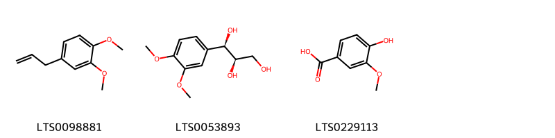{ width=100% }
    <figcaption>Hình ảnh cấu trúc hóa học của 3 hoạt chất thuộc nhóm Benzene and substituted derivatives gồm ['methyl eugenol (LTS0098881)', '(1r,2r)-1-(3,4-dimethoxyphenyl)propane-1,2,3-triol (LTS0053893)', 'vanillic acid (LTS0229113)'].</figcaption>
</figure>
#### Nhóm Benzodioxoles
<figure markdown="span">
    { width=100% }
    <figcaption>Hình ảnh cấu trúc hóa học của 2 hoạt chất thuộc nhóm Benzodioxoles gồm ['sassafras (LTS0136093)', '5-prop-1-enyl-1,3-benzodioxole (LTS0268507)'].</figcaption>
</figure>
#### Nhóm Carboximidic acids and derivatives
<figure markdown="span">
    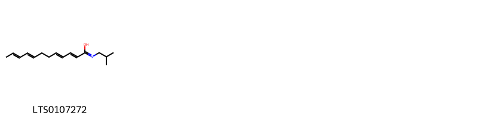{ width=100% }
    <figcaption>Hình ảnh cấu trúc hóa học của 1 hoạt chất thuộc nhóm Carboximidic acids and derivatives gồm ['(2e,4e)-n-(2-methylpropyl)dodeca-2,4,8,10-tetraenimidic acid (LTS0107272)'].</figcaption>
</figure>
#### Nhóm Cinnamic acids and derivatives
<figure markdown="span">
    { width=100% }
    <figcaption>Hình ảnh cấu trúc hóa học của 1 hoạt chất thuộc nhóm Cinnamic acids and derivatives gồm ['para-coumaric acid (LTS0266252)'].</figcaption>
</figure>
#### Nhóm Fatty Acyls
<figure markdown="span">
    { width=100% }
    <figcaption>Hình ảnh cấu trúc hóa học của 6 hoạt chất thuộc nhóm Fatty Acyls gồm ['(2e,4e,8z,10e)-n-(2-methylpropyl)dodeca-2,4,8,10-tetraenimidic acid (LTS0112744)', 'n-(2-methylpropyl)dodeca-2,4,8,10-tetraenimidic acid (LTS0042866)', '(2e,4e,8z)-n-(2-methylpropyl)dodeca-2,4,8,10-tetraenimidic acid (LTS0134031)', 'n-(2-methylpropyl)deca-2,4,8-trienimidic acid (LTS0134156)', '(2e,4e)-n-(2-methylpropyl)deca-2,4,8-trienimidic acid (LTS0189854)', '(2e,4e,8z)-n-(2-methylpropyl)deca-2,4,8-trienimidic acid (LTS0266611)'].</figcaption>
</figure>
#### Nhóm Furanoid lignans
<figure markdown="span">
    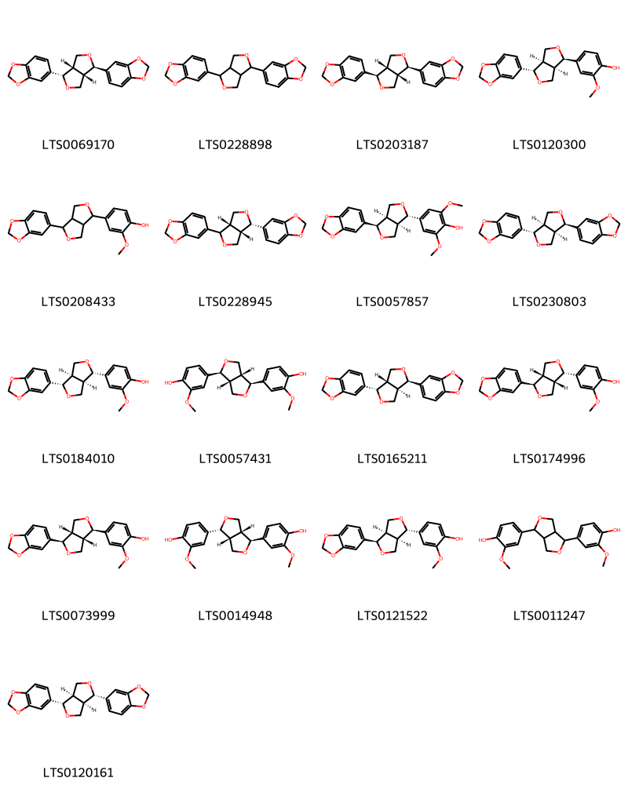{ width=100% }
    <figcaption>Hình ảnh cấu trúc hóa học của 17 hoạt chất thuộc nhóm Furanoid lignans gồm ['asarinin (LTS0069170)', 'sesamin (LTS0228898)', '(-)-sesamin (LTS0203187)', '4-[(1r,3ar,4s,6ar)-4-(2h-1,3-benzodioxol-5-yl)-hexahydrofuro[3,4-c]furan-1-yl]-2-methoxyphenol (LTS0120300)', '4-[4-(2h-1,3-benzodioxol-5-yl)-hexahydrofuro[3,4-c]furan-1-yl]-2-methoxyphenol (LTS0208433)', '5-[(3as,4s,6as)-4-(2h-1,3-benzodioxol-5-yl)-hexahydrofuro[3,4-c]furan-1-yl]-2h-1,3-benzodioxole (LTS0228945)', '4-[(1s,3ar,4r,6ar)-4-(2h-1,3-benzodioxol-5-yl)-hexahydrofuro[3,4-c]furan-1-yl]-2,6-dimethoxyphenol (LTS0057857)', '5-[(1s,3ar,4r,6ar)-4-(2h-1,3-benzodioxol-5-yl)-hexahydrofuro[3,4-c]furan-1-yl]-2h-1,3-benzodioxole (LTS0230803)', '4-[(1s,3ar,4s,6ar)-4-(2h-1,3-benzodioxol-5-yl)-hexahydrofuro[3,4-c]furan-1-yl]-2-methoxyphenol (LTS0184010)', 'pinoresinol (LTS0057431)', '5-[(1s,3ar,4r,6as)-4-(2h-1,3-benzodioxol-5-yl)-hexahydrofuro[3,4-c]furan-1-yl]-2h-1,3-benzodioxole (LTS0165211)', 'pluviatilol (LTS0174996)', '4-[(1r,3as,4r,6as)-4-(2h-1,3-benzodioxol-5-yl)-hexahydrofuro[3,4-c]furan-1-yl]-2-methoxyphenol (LTS0073999)', '4-[(1s,3ar,4r,6ar)-4-(4-hydroxy-3-methoxyphenyl)-hexahydrofuro[3,4-c]furan-1-yl]-2-methoxyphenol (LTS0014948)', '4-[(1s,3ar,4r,6ar)-4-(2h-1,3-benzodioxol-5-yl)-hexahydrofuro[3,4-c]furan-1-yl]-2-methoxyphenol (LTS0121522)', 'pinoresinol (LTS0011247)', 'sesamin (LTS0120161)'].</figcaption>
</figure>
#### Nhóm Isoquinolines and derivatives
<figure markdown="span">
    { width=100% }
    <figcaption>Hình ảnh cấu trúc hóa học của 1 hoạt chất thuộc nhóm Isoquinolines and derivatives gồm ['higenamine (LTS0113417)'].</figcaption>
</figure>
#### Nhóm Organooxygen compounds
<figure markdown="span">
    { width=100% }
    <figcaption>Hình ảnh cấu trúc hóa học của 1 hoạt chất thuộc nhóm Organooxygen compounds gồm ['paeonol (LTS0014950)'].</figcaption>
</figure>
#### Nhóm Phenol ethers
<figure markdown="span">
    { width=100% }
    <figcaption>Hình ảnh cấu trúc hóa học của 3 hoạt chất thuộc nhóm Phenol ethers gồm ['elemicin (LTS0188875)', 'β-asarone (LTS0003070)', '1,2,4-trimethoxy-5-(prop-2-en-1-yl)benzene (LTS0252786)'].</figcaption>
</figure>
#### Nhóm Phenols
<figure markdown="span">
    { width=100% }
    <figcaption>Hình ảnh cấu trúc hóa học của 2 hoạt chất thuộc nhóm Phenols gồm ['eugenol (LTS0052342)', '6-methyleugenol (LTS0267160)'].</figcaption>
</figure>
#### Nhóm Prenol lipids
<figure markdown="span">
    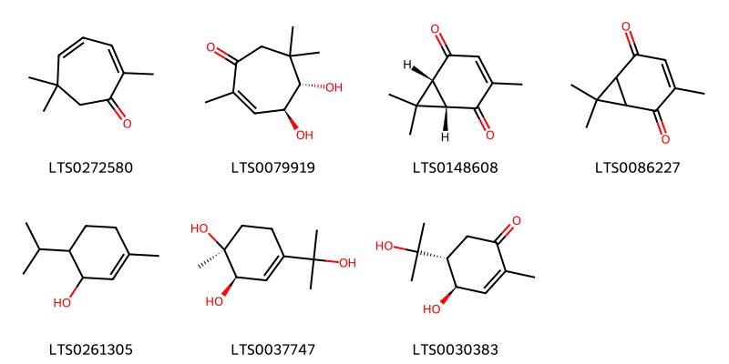{ width=100% }
    <figcaption>Hình ảnh cấu trúc hóa học của 7 hoạt chất thuộc nhóm Prenol lipids gồm ['eucarvone (LTS0272580)', '(4s,5s)-4,5-dihydroxy-2,6,6-trimethylcyclohept-2-en-1-one (LTS0079919)', '(1s,6r)-3,7,7-trimethylbicyclo[4.1.0]hept-3-ene-2,5-dione (LTS0148608)', '3,7,7-trimethylbicyclo[4.1.0]hept-3-ene-2,5-dione (LTS0086227)', '6-isopropyl-3-methylcyclohex-2-en-1-ol (LTS0261305)', '(1s,2r)-4-(2-hydroxypropan-2-yl)-1-methylcyclohex-3-ene-1,2-diol (LTS0037747)', '(4r,5r)-4-hydroxy-5-(2-hydroxypropan-2-yl)-2-methylcyclohex-2-en-1-one (LTS0030383)'].</figcaption>
</figure>
#### Nhóm Pyrans
<figure markdown="span">
    { width=100% }
    <figcaption>Hình ảnh cấu trúc hóa học của 2 hoạt chất thuộc nhóm Pyrans gồm ['5-hydroxy-4,7,7-trimethyl-8-oxabicyclo[3.2.1]oct-3-en-2-one (LTS0062576)', '(1r,5s)-5-hydroxy-4,7,7-trimethyl-8-oxabicyclo[3.2.1]oct-3-en-2-one (LTS0013678)'].</figcaption>
</figure>

---

### Dược dân tộc học

Danh sách các quốc gia có sử dụng *Asarum sieboldii* trong điều trị các bệnh. 

| Country   | Disease                                                                                              | Bệnh                                                                                                                                                                                                |
|:----------|:-----------------------------------------------------------------------------------------------------|:----------------------------------------------------------------------------------------------------------------------------------------------------------------------------------------------------|
| China     | Carminative, Diuretic, Sedative, Emetic, Expectorant, Analgesic, Expectorant, Purgative, Diaphoretic | MYMEMORY WARNING: YOU USED ALL AVAILABLE FREE TRANSLATIONS FOR TODAY. NEXT AVAILABLE IN  13 HOURS 03 MINUTES 50 SECONDS VISIT HTTPS://MYMEMORY.TRANSLATED.NET/DOC/USAGELIMITS.PHP TO TRANSLATE MORE |
| Turkey    | Diuretic, Expectorant, Purgative, Sternutatory, Sudorific, Emetic                                    | MYMEMORY WARNING: YOU USED ALL AVAILABLE FREE TRANSLATIONS FOR TODAY. NEXT AVAILABLE IN  13 HOURS 03 MINUTES 47 SECONDS VISIT HTTPS://MYMEMORY.TRANSLATED.NET/DOC/USAGELIMITS.PHP TO TRANSLATE MORE |

---

---
## Asarum sieboldii
### Thông tin về thực vật

!!! info "Phân loại thực vật của *Asarum sieboldii* từ GIBF:"
    - **Kingdom:** Plantae
    - **Phylum:** Tracheophyta
    - **Order:** Piperales
    - **Family:** Aristolochiaceae
    - **Genus:** Asarum
    - **Species:** *Asarum sieboldii*

 

| Label (VI)   | Label (EN)   | Scientific Name   | Descriptions (VI)   | Descriptions (EN)   | Also Known As (VI)   | Also Known As (EN)   |
|:-------------|:-------------|:------------------|:--------------------|:--------------------|:---------------------|:---------------------|
| N/A          | N/A          | Asarum sieboldii  | loài thực vật       | species of plant    | ['']                 | ['']                 |

#### Phân bố trên thế giới

**Từ CSDL GIBF** Japan, Russian Federation, China, Belgium, Korea, Republic of

#### Phân bố tại Việt Nam

**Từ CSDL GIBF**: Không có ghi nhận ở Việt Nam

---
### Thành phần hóa học
        
- Theo cơ sở dữ liệu lotus: Từ loài *Asarum sieboldii* đã phân lập và xác định được 46 hoạt chất thuộc về các nhóm Furanoid lignans, Organooxygen compounds, Carboximidic acids and derivatives, Isoquinolines and derivatives, Prenol lipids, Fatty Acyls, Pyrans, Phenols, Benzodioxoles, Phenol ethers, Cinnamic acids and derivatives, Benzene and substituted derivatives. 

|    | chemicalTaxonomyClassyfireClass     |   smiles_count |
|---:|:------------------------------------|---------------:|
|  0 | Benzene and substituted derivatives |              3 |
|  1 | Benzodioxoles                       |              2 |
|  2 | Carboximidic acids and derivatives  |              1 |
|  3 | Cinnamic acids and derivatives      |              1 |
|  4 | Fatty Acyls                         |              6 |
|  5 | Furanoid lignans                    |             17 |
|  6 | Isoquinolines and derivatives       |              1 |
|  7 | Organooxygen compounds              |              1 |
|  8 | Phenol ethers                       |              3 |
|  9 | Phenols                             |              2 |
| 10 | Prenol lipids                       |              7 |
| 11 | Pyrans                              |              2 |

#### Nhóm Benzene and substituted derivatives
<figure markdown="span">
    { width=100% }
    <figcaption>Hình ảnh cấu trúc hóa học của 3 hoạt chất thuộc nhóm Benzene and substituted derivatives gồm ['methyl eugenol (LTS0098881)', '(1r,2r)-1-(3,4-dimethoxyphenyl)propane-1,2,3-triol (LTS0053893)', 'vanillic acid (LTS0229113)'].</figcaption>
</figure>
#### Nhóm Benzodioxoles
<figure markdown="span">
    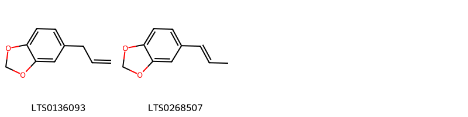{ width=100% }
    <figcaption>Hình ảnh cấu trúc hóa học của 2 hoạt chất thuộc nhóm Benzodioxoles gồm ['sassafras (LTS0136093)', '5-prop-1-enyl-1,3-benzodioxole (LTS0268507)'].</figcaption>
</figure>
#### Nhóm Carboximidic acids and derivatives
<figure markdown="span">
    { width=100% }
    <figcaption>Hình ảnh cấu trúc hóa học của 1 hoạt chất thuộc nhóm Carboximidic acids and derivatives gồm ['(2e,4e)-n-(2-methylpropyl)dodeca-2,4,8,10-tetraenimidic acid (LTS0107272)'].</figcaption>
</figure>
#### Nhóm Cinnamic acids and derivatives
<figure markdown="span">
    { width=100% }
    <figcaption>Hình ảnh cấu trúc hóa học của 1 hoạt chất thuộc nhóm Cinnamic acids and derivatives gồm ['para-coumaric acid (LTS0266252)'].</figcaption>
</figure>
#### Nhóm Fatty Acyls
<figure markdown="span">
    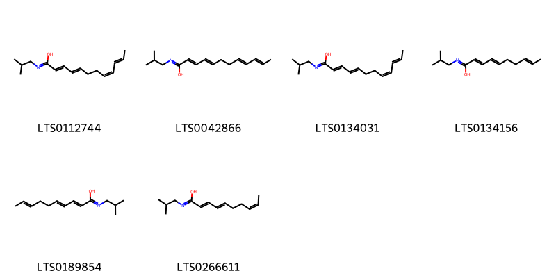{ width=100% }
    <figcaption>Hình ảnh cấu trúc hóa học của 6 hoạt chất thuộc nhóm Fatty Acyls gồm ['(2e,4e,8z,10e)-n-(2-methylpropyl)dodeca-2,4,8,10-tetraenimidic acid (LTS0112744)', 'n-(2-methylpropyl)dodeca-2,4,8,10-tetraenimidic acid (LTS0042866)', '(2e,4e,8z)-n-(2-methylpropyl)dodeca-2,4,8,10-tetraenimidic acid (LTS0134031)', 'n-(2-methylpropyl)deca-2,4,8-trienimidic acid (LTS0134156)', '(2e,4e)-n-(2-methylpropyl)deca-2,4,8-trienimidic acid (LTS0189854)', '(2e,4e,8z)-n-(2-methylpropyl)deca-2,4,8-trienimidic acid (LTS0266611)'].</figcaption>
</figure>
#### Nhóm Furanoid lignans
<figure markdown="span">
    { width=100% }
    <figcaption>Hình ảnh cấu trúc hóa học của 17 hoạt chất thuộc nhóm Furanoid lignans gồm ['asarinin (LTS0069170)', 'sesamin (LTS0228898)', '(-)-sesamin (LTS0203187)', '4-[(1r,3ar,4s,6ar)-4-(2h-1,3-benzodioxol-5-yl)-hexahydrofuro[3,4-c]furan-1-yl]-2-methoxyphenol (LTS0120300)', '4-[4-(2h-1,3-benzodioxol-5-yl)-hexahydrofuro[3,4-c]furan-1-yl]-2-methoxyphenol (LTS0208433)', '5-[(3as,4s,6as)-4-(2h-1,3-benzodioxol-5-yl)-hexahydrofuro[3,4-c]furan-1-yl]-2h-1,3-benzodioxole (LTS0228945)', '4-[(1s,3ar,4r,6ar)-4-(2h-1,3-benzodioxol-5-yl)-hexahydrofuro[3,4-c]furan-1-yl]-2,6-dimethoxyphenol (LTS0057857)', '5-[(1s,3ar,4r,6ar)-4-(2h-1,3-benzodioxol-5-yl)-hexahydrofuro[3,4-c]furan-1-yl]-2h-1,3-benzodioxole (LTS0230803)', '4-[(1s,3ar,4s,6ar)-4-(2h-1,3-benzodioxol-5-yl)-hexahydrofuro[3,4-c]furan-1-yl]-2-methoxyphenol (LTS0184010)', 'pinoresinol (LTS0057431)', '5-[(1s,3ar,4r,6as)-4-(2h-1,3-benzodioxol-5-yl)-hexahydrofuro[3,4-c]furan-1-yl]-2h-1,3-benzodioxole (LTS0165211)', 'pluviatilol (LTS0174996)', '4-[(1r,3as,4r,6as)-4-(2h-1,3-benzodioxol-5-yl)-hexahydrofuro[3,4-c]furan-1-yl]-2-methoxyphenol (LTS0073999)', '4-[(1s,3ar,4r,6ar)-4-(4-hydroxy-3-methoxyphenyl)-hexahydrofuro[3,4-c]furan-1-yl]-2-methoxyphenol (LTS0014948)', '4-[(1s,3ar,4r,6ar)-4-(2h-1,3-benzodioxol-5-yl)-hexahydrofuro[3,4-c]furan-1-yl]-2-methoxyphenol (LTS0121522)', 'pinoresinol (LTS0011247)', 'sesamin (LTS0120161)'].</figcaption>
</figure>
#### Nhóm Isoquinolines and derivatives
<figure markdown="span">
    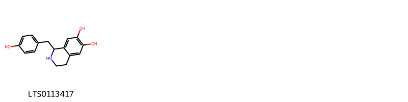{ width=100% }
    <figcaption>Hình ảnh cấu trúc hóa học của 1 hoạt chất thuộc nhóm Isoquinolines and derivatives gồm ['higenamine (LTS0113417)'].</figcaption>
</figure>
#### Nhóm Organooxygen compounds
<figure markdown="span">
    { width=100% }
    <figcaption>Hình ảnh cấu trúc hóa học của 1 hoạt chất thuộc nhóm Organooxygen compounds gồm ['paeonol (LTS0014950)'].</figcaption>
</figure>
#### Nhóm Phenol ethers
<figure markdown="span">
    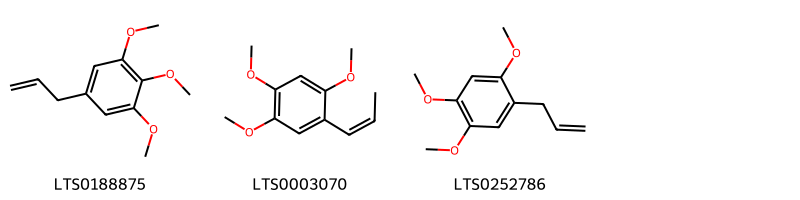{ width=100% }
    <figcaption>Hình ảnh cấu trúc hóa học của 3 hoạt chất thuộc nhóm Phenol ethers gồm ['elemicin (LTS0188875)', 'β-asarone (LTS0003070)', '1,2,4-trimethoxy-5-(prop-2-en-1-yl)benzene (LTS0252786)'].</figcaption>
</figure>
#### Nhóm Phenols
<figure markdown="span">
    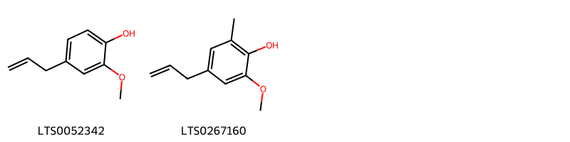{ width=100% }
    <figcaption>Hình ảnh cấu trúc hóa học của 2 hoạt chất thuộc nhóm Phenols gồm ['eugenol (LTS0052342)', '6-methyleugenol (LTS0267160)'].</figcaption>
</figure>
#### Nhóm Prenol lipids
<figure markdown="span">
    { width=100% }
    <figcaption>Hình ảnh cấu trúc hóa học của 7 hoạt chất thuộc nhóm Prenol lipids gồm ['eucarvone (LTS0272580)', '(4s,5s)-4,5-dihydroxy-2,6,6-trimethylcyclohept-2-en-1-one (LTS0079919)', '(1s,6r)-3,7,7-trimethylbicyclo[4.1.0]hept-3-ene-2,5-dione (LTS0148608)', '3,7,7-trimethylbicyclo[4.1.0]hept-3-ene-2,5-dione (LTS0086227)', '6-isopropyl-3-methylcyclohex-2-en-1-ol (LTS0261305)', '(1s,2r)-4-(2-hydroxypropan-2-yl)-1-methylcyclohex-3-ene-1,2-diol (LTS0037747)', '(4r,5r)-4-hydroxy-5-(2-hydroxypropan-2-yl)-2-methylcyclohex-2-en-1-one (LTS0030383)'].</figcaption>
</figure>
#### Nhóm Pyrans
<figure markdown="span">
    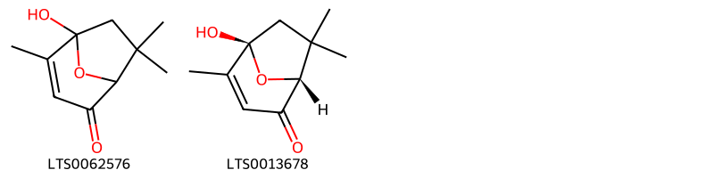{ width=100% }
    <figcaption>Hình ảnh cấu trúc hóa học của 2 hoạt chất thuộc nhóm Pyrans gồm ['5-hydroxy-4,7,7-trimethyl-8-oxabicyclo[3.2.1]oct-3-en-2-one (LTS0062576)', '(1r,5s)-5-hydroxy-4,7,7-trimethyl-8-oxabicyclo[3.2.1]oct-3-en-2-one (LTS0013678)'].</figcaption>
</figure>

---

### Dược dân tộc học

Danh sách các quốc gia có sử dụng *Asarum sieboldii* trong điều trị các bệnh. 

| Country   | Disease      | Bệnh                                                                                                                                                                                                |
|:----------|:-------------|:----------------------------------------------------------------------------------------------------------------------------------------------------------------------------------------------------|
| Elsewhere | Sternutatory | MYMEMORY WARNING: YOU USED ALL AVAILABLE FREE TRANSLATIONS FOR TODAY. NEXT AVAILABLE IN  13 HOURS 03 MINUTES 12 SECONDS VISIT HTTPS://MYMEMORY.TRANSLATED.NET/DOC/USAGELIMITS.PHP TO TRANSLATE MORE |

---

# Chi Asiasarum

??? note "Danh sách các dược liệu thuộc chi"
    
	 - *Asiasarum sieboldii*

---
## Asiasarum sieboldii
### Thông tin về thực vật

!!! info "Phân loại thực vật của *Asarum sieboldii* từ GIBF:"
    - **Kingdom:** Plantae
    - **Phylum:** Tracheophyta
    - **Order:** Piperales
    - **Family:** Aristolochiaceae
    - **Genus:** Asarum
    - **Species:** *Asarum sieboldii*

 

| Label (VI)   | Label (EN)   | Scientific Name     | Descriptions (VI)   | Descriptions (EN)   | Also Known As (VI)   | Also Known As (EN)   |
|:-------------|:-------------|:--------------------|:--------------------|:--------------------|:---------------------|:---------------------|
| N/A          | N/A          | Asiasarum sieboldii |                     |                     | ['']                 | ['']                 |

#### Phân bố trên thế giới

**Từ CSDL GIBF** nan, Japan

#### Phân bố tại Việt Nam

**Từ CSDL GIBF**: Không có ghi nhận ở Việt Nam

---
### Thành phần hóa học
        
- Theo cơ sở dữ liệu lotus: Từ loài *Asarum sieboldii* đã phân lập và xác định được Chưa có hoạt chất nào được phân lập. hoạt chất thuộc về các nhóm Không có hoạt chất nào được phân lập. 

Không có hình ảnh nào được tạo ra

---

### Dược dân tộc học

Danh sách các quốc gia có sử dụng *Asarum sieboldii* trong điều trị các bệnh. 

| Country   | Disease                                 | Bệnh                                                                                                                                                                                                |
|:----------|:----------------------------------------|:----------------------------------------------------------------------------------------------------------------------------------------------------------------------------------------------------|
| Japan*    | Expectorant, Antitussive, Diuretic, nan | MYMEMORY WARNING: YOU USED ALL AVAILABLE FREE TRANSLATIONS FOR TODAY. NEXT AVAILABLE IN  13 HOURS 02 MINUTES 34 SECONDS VISIT HTTPS://MYMEMORY.TRANSLATED.NET/DOC/USAGELIMITS.PHP TO TRANSLATE MORE |

---

# Chi Heterotropa

??? note "Danh sách các dược liệu thuộc chi"
    
	 - *Heterotropa aera*
	 - *Heterotropa albivenia*
	 - *Heterotropa asaroides*
	 - *Heterotropa crassa*
	 - *Heterotropa megacalyx*
	 - *Heterotropa muramatsui*
	 - *Heterotropa nipponica*
	 - *Heterotropa rigescens*
	 - *Heterotropa takaoi*
	 - *Heterotropa tamaense*
	 - *Heterotropa viridiflora*
	 - *Heterotropa yakushimensis*

---
## Heterotropa aera
### Thông tin về thực vật

!!! info "Phân loại thực vật của *N/A* từ GIBF:"
    - **Kingdom:** N/A
    - **Phylum:** N/A
    - **Order:** N/A
    - **Family:** N/A
    - **Genus:** N/A
    - **Species:** *N/A*

 

| Label (VI)   | Label (EN)   | Scientific Name     | Descriptions (VI)   | Descriptions (EN)   | Also Known As (VI)   | Also Known As (EN)   |
|:-------------|:-------------|:--------------------|:--------------------|:--------------------|:---------------------|:---------------------|
| N/A          | N/A          | Asiasarum sieboldii |                     |                     | ['']                 | ['']                 |

#### Phân bố trên thế giới

**Từ CSDL GIBF** Không có kết quả phù hợp

#### Phân bố tại Việt Nam

**Từ CSDL GIBF**: Không có ghi nhận ở Việt Nam

---
### Thành phần hóa học
        
- Theo cơ sở dữ liệu lotus: Từ loài *N/A* đã phân lập và xác định được Chưa có hoạt chất nào được phân lập. hoạt chất thuộc về các nhóm Không có hoạt chất nào được phân lập. 

Không có hình ảnh nào được tạo ra

---

### Dược dân tộc học

Danh sách các quốc gia có sử dụng *N/A* trong điều trị các bệnh. 

| Country   | Disease               | Bệnh                                                                                                                                                                                                |
|:----------|:----------------------|:----------------------------------------------------------------------------------------------------------------------------------------------------------------------------------------------------|
| Elsewhere | Diuretic, Diaphoretic | MYMEMORY WARNING: YOU USED ALL AVAILABLE FREE TRANSLATIONS FOR TODAY. NEXT AVAILABLE IN  13 HOURS 01 MINUTES 59 SECONDS VISIT HTTPS://MYMEMORY.TRANSLATED.NET/DOC/USAGELIMITS.PHP TO TRANSLATE MORE |

---

---
## Heterotropa albivenia
### Thông tin về thực vật

!!! info "Phân loại thực vật của *N/A* từ GIBF:"
    - **Kingdom:** N/A
    - **Phylum:** N/A
    - **Order:** N/A
    - **Family:** N/A
    - **Genus:** N/A
    - **Species:** *N/A*

 

| Label (VI)   | Label (EN)   | Scientific Name     | Descriptions (VI)   | Descriptions (EN)   | Also Known As (VI)   | Also Known As (EN)   |
|:-------------|:-------------|:--------------------|:--------------------|:--------------------|:---------------------|:---------------------|
| N/A          | N/A          | Asiasarum sieboldii |                     |                     | ['']                 | ['']                 |

#### Phân bố trên thế giới

**Từ CSDL GIBF** Không có kết quả phù hợp

#### Phân bố tại Việt Nam

**Từ CSDL GIBF**: Không có ghi nhận ở Việt Nam

---
### Thành phần hóa học
        
- Theo cơ sở dữ liệu lotus: Từ loài *N/A* đã phân lập và xác định được Chưa có hoạt chất nào được phân lập. hoạt chất thuộc về các nhóm Không có hoạt chất nào được phân lập. 

Không có hình ảnh nào được tạo ra

---

### Dược dân tộc học

Danh sách các quốc gia có sử dụng *N/A* trong điều trị các bệnh. 

| Country   | Disease               | Bệnh                                                                                                                                                                                                |
|:----------|:----------------------|:----------------------------------------------------------------------------------------------------------------------------------------------------------------------------------------------------|
| Elsewhere | Diaphoretic, Diuretic | MYMEMORY WARNING: YOU USED ALL AVAILABLE FREE TRANSLATIONS FOR TODAY. NEXT AVAILABLE IN  13 HOURS 01 MINUTES 45 SECONDS VISIT HTTPS://MYMEMORY.TRANSLATED.NET/DOC/USAGELIMITS.PHP TO TRANSLATE MORE |

---

---
## Heterotropa asaroides
### Thông tin về thực vật

!!! info "Phân loại thực vật của *Asarum asaroides* từ GIBF:"
    - **Kingdom:** Plantae
    - **Phylum:** Tracheophyta
    - **Order:** Piperales
    - **Family:** Aristolochiaceae
    - **Genus:** Asarum
    - **Species:** *Asarum asaroides*

 

| Label (VI)   | Label (EN)   | Scientific Name       | Descriptions (VI)   | Descriptions (EN)   | Also Known As (VI)   | Also Known As (EN)   |
|:-------------|:-------------|:----------------------|:--------------------|:--------------------|:---------------------|:---------------------|
| N/A          | N/A          | Heterotropa asaroides |                     | species of plant    | ['']                 | ['']                 |

#### Phân bố trên thế giới

**Từ CSDL GIBF** Japan

#### Phân bố tại Việt Nam

**Từ CSDL GIBF**: Không có ghi nhận ở Việt Nam

---
### Thành phần hóa học
        
- Theo cơ sở dữ liệu lotus: Từ loài *Asarum asaroides* đã phân lập và xác định được Chưa có hoạt chất nào được phân lập. hoạt chất thuộc về các nhóm Không có hoạt chất nào được phân lập. 

Không có hình ảnh nào được tạo ra

---

### Dược dân tộc học

Danh sách các quốc gia có sử dụng *Asarum asaroides* trong điều trị các bệnh. 

| Country   | Disease               | Bệnh                                                                                                                                                                                                |
|:----------|:----------------------|:----------------------------------------------------------------------------------------------------------------------------------------------------------------------------------------------------|
| Elsewhere | Diaphoretic, Diuretic | MYMEMORY WARNING: YOU USED ALL AVAILABLE FREE TRANSLATIONS FOR TODAY. NEXT AVAILABLE IN  13 HOURS 01 MINUTES 31 SECONDS VISIT HTTPS://MYMEMORY.TRANSLATED.NET/DOC/USAGELIMITS.PHP TO TRANSLATE MORE |

---

---
## Heterotropa crassa
### Thông tin về thực vật

!!! info "Phân loại thực vật của *Asarum crassum* từ GIBF:"
    - **Kingdom:** Plantae
    - **Phylum:** Tracheophyta
    - **Order:** Piperales
    - **Family:** Aristolochiaceae
    - **Genus:** Asarum
    - **Species:** *Asarum crassum*

 

| Label (VI)   | Label (EN)   | Scientific Name       | Descriptions (VI)   | Descriptions (EN)   | Also Known As (VI)   | Also Known As (EN)   |
|:-------------|:-------------|:----------------------|:--------------------|:--------------------|:---------------------|:---------------------|
| N/A          | N/A          | Heterotropa asaroides |                     | species of plant    | ['']                 | ['']                 |

#### Phân bố trên thế giới

**Từ CSDL GIBF** Japan

#### Phân bố tại Việt Nam

**Từ CSDL GIBF**: Không có ghi nhận ở Việt Nam

---
### Thành phần hóa học
        
- Theo cơ sở dữ liệu lotus: Từ loài *Asarum crassum* đã phân lập và xác định được Chưa có hoạt chất nào được phân lập. hoạt chất thuộc về các nhóm Không có hoạt chất nào được phân lập. 

Không có hình ảnh nào được tạo ra

---

### Dược dân tộc học

Danh sách các quốc gia có sử dụng *Asarum crassum* trong điều trị các bệnh. 

| Country   | Disease               | Bệnh                                                                                                                                                                                                |
|:----------|:----------------------|:----------------------------------------------------------------------------------------------------------------------------------------------------------------------------------------------------|
| Elsewhere | Diuretic, Diaphoretic | MYMEMORY WARNING: YOU USED ALL AVAILABLE FREE TRANSLATIONS FOR TODAY. NEXT AVAILABLE IN  13 HOURS 01 MINUTES 05 SECONDS VISIT HTTPS://MYMEMORY.TRANSLATED.NET/DOC/USAGELIMITS.PHP TO TRANSLATE MORE |

---

---
## Heterotropa megacalyx
### Thông tin về thực vật

!!! info "Phân loại thực vật của *Asarum megacalyx* từ GIBF:"
    - **Kingdom:** Plantae
    - **Phylum:** Tracheophyta
    - **Order:** Piperales
    - **Family:** Aristolochiaceae
    - **Genus:** Asarum
    - **Species:** *Asarum megacalyx*

 

| Label (VI)   | Label (EN)   | Scientific Name       | Descriptions (VI)   | Descriptions (EN)   | Also Known As (VI)   | Also Known As (EN)   |
|:-------------|:-------------|:----------------------|:--------------------|:--------------------|:---------------------|:---------------------|
| N/A          | N/A          | Heterotropa asaroides |                     | species of plant    | ['']                 | ['']                 |

#### Phân bố trên thế giới

**Từ CSDL GIBF** Japan

#### Phân bố tại Việt Nam

**Từ CSDL GIBF**: Không có ghi nhận ở Việt Nam

---
### Thành phần hóa học
        
- Theo cơ sở dữ liệu lotus: Từ loài *Asarum megacalyx* đã phân lập và xác định được Chưa có hoạt chất nào được phân lập. hoạt chất thuộc về các nhóm Không có hoạt chất nào được phân lập. 

Không có hình ảnh nào được tạo ra

---

### Dược dân tộc học

Danh sách các quốc gia có sử dụng *Asarum megacalyx* trong điều trị các bệnh. 

| Country   | Disease               | Bệnh                                                                                                                                                                                                |
|:----------|:----------------------|:----------------------------------------------------------------------------------------------------------------------------------------------------------------------------------------------------|
| Elsewhere | Diaphoretic, Diuretic | MYMEMORY WARNING: YOU USED ALL AVAILABLE FREE TRANSLATIONS FOR TODAY. NEXT AVAILABLE IN  13 HOURS 00 MINUTES 41 SECONDS VISIT HTTPS://MYMEMORY.TRANSLATED.NET/DOC/USAGELIMITS.PHP TO TRANSLATE MORE |

---

---
## Heterotropa muramatsui
### Thông tin về thực vật

!!! info "Phân loại thực vật của *Asarum muramatsui* từ GIBF:"
    - **Kingdom:** Plantae
    - **Phylum:** Tracheophyta
    - **Order:** Piperales
    - **Family:** Aristolochiaceae
    - **Genus:** Asarum
    - **Species:** *Asarum muramatsui*

 

| Label (VI)   | Label (EN)   | Scientific Name       | Descriptions (VI)   | Descriptions (EN)   | Also Known As (VI)   | Also Known As (EN)   |
|:-------------|:-------------|:----------------------|:--------------------|:--------------------|:---------------------|:---------------------|
| N/A          | N/A          | Heterotropa asaroides |                     | species of plant    | ['']                 | ['']                 |

#### Phân bố trên thế giới

**Từ CSDL GIBF** Japan

#### Phân bố tại Việt Nam

**Từ CSDL GIBF**: Không có ghi nhận ở Việt Nam

---
### Thành phần hóa học
        
- Theo cơ sở dữ liệu lotus: Từ loài *Asarum muramatsui* đã phân lập và xác định được Chưa có hoạt chất nào được phân lập. hoạt chất thuộc về các nhóm Không có hoạt chất nào được phân lập. 

Không có hình ảnh nào được tạo ra

---

### Dược dân tộc học

Danh sách các quốc gia có sử dụng *Asarum muramatsui* trong điều trị các bệnh. 

| Country   | Disease               | Bệnh                                                                                                                                                                                                |
|:----------|:----------------------|:----------------------------------------------------------------------------------------------------------------------------------------------------------------------------------------------------|
| Elsewhere | Diaphoretic, Diuretic | MYMEMORY WARNING: YOU USED ALL AVAILABLE FREE TRANSLATIONS FOR TODAY. NEXT AVAILABLE IN  13 HOURS 00 MINUTES 22 SECONDS VISIT HTTPS://MYMEMORY.TRANSLATED.NET/DOC/USAGELIMITS.PHP TO TRANSLATE MORE |

---

---
## Heterotropa nipponica
### Thông tin về thực vật

!!! info "Phân loại thực vật của *Asarum nipponicum* từ GIBF:"
    - **Kingdom:** Plantae
    - **Phylum:** Tracheophyta
    - **Order:** Piperales
    - **Family:** Aristolochiaceae
    - **Genus:** Asarum
    - **Species:** *Asarum nipponicum*

 

| Label (VI)   | Label (EN)   | Scientific Name       | Descriptions (VI)   | Descriptions (EN)   | Also Known As (VI)   | Also Known As (EN)   |
|:-------------|:-------------|:----------------------|:--------------------|:--------------------|:---------------------|:---------------------|
| N/A          | N/A          | Heterotropa nipponica | loài thực vật       | species of plant    | ['']                 | ['']                 |

#### Phân bố trên thế giới

**Từ CSDL GIBF** Japan

#### Phân bố tại Việt Nam

**Từ CSDL GIBF**: Không có ghi nhận ở Việt Nam

---
### Thành phần hóa học
        
- Theo cơ sở dữ liệu lotus: Từ loài *Asarum nipponicum* đã phân lập và xác định được Chưa có hoạt chất nào được phân lập. hoạt chất thuộc về các nhóm Không có hoạt chất nào được phân lập. 

Không có hình ảnh nào được tạo ra

---

### Dược dân tộc học

Danh sách các quốc gia có sử dụng *Asarum nipponicum* trong điều trị các bệnh. 

| Country   | Disease               | Bệnh                                                                                                                                                                                                |
|:----------|:----------------------|:----------------------------------------------------------------------------------------------------------------------------------------------------------------------------------------------------|
| Elsewhere | Diuretic, Diaphoretic | MYMEMORY WARNING: YOU USED ALL AVAILABLE FREE TRANSLATIONS FOR TODAY. NEXT AVAILABLE IN  13 HOURS 00 MINUTES 00 SECONDS VISIT HTTPS://MYMEMORY.TRANSLATED.NET/DOC/USAGELIMITS.PHP TO TRANSLATE MORE |

---

---
## Heterotropa rigescens
### Thông tin về thực vật

!!! info "Phân loại thực vật của *Asarum rigescens* từ GIBF:"
    - **Kingdom:** Plantae
    - **Phylum:** Tracheophyta
    - **Order:** Piperales
    - **Family:** Aristolochiaceae
    - **Genus:** Asarum
    - **Species:** *Asarum rigescens*

 

| Label (VI)   | Label (EN)   | Scientific Name       | Descriptions (VI)   | Descriptions (EN)   | Also Known As (VI)   | Also Known As (EN)   |
|:-------------|:-------------|:----------------------|:--------------------|:--------------------|:---------------------|:---------------------|
| N/A          | N/A          | Heterotropa nipponica | loài thực vật       | species of plant    | ['']                 | ['']                 |

#### Phân bố trên thế giới

**Từ CSDL GIBF** Japan

#### Phân bố tại Việt Nam

**Từ CSDL GIBF**: Không có ghi nhận ở Việt Nam

---
### Thành phần hóa học
        
- Theo cơ sở dữ liệu lotus: Từ loài *Asarum rigescens* đã phân lập và xác định được Chưa có hoạt chất nào được phân lập. hoạt chất thuộc về các nhóm Không có hoạt chất nào được phân lập. 

Không có hình ảnh nào được tạo ra

---

### Dược dân tộc học

Danh sách các quốc gia có sử dụng *Asarum rigescens* trong điều trị các bệnh. 

| Country   | Disease               | Bệnh                                                                                                                                                                                                |
|:----------|:----------------------|:----------------------------------------------------------------------------------------------------------------------------------------------------------------------------------------------------|
| Elsewhere | Diuretic, Diaphoretic | MYMEMORY WARNING: YOU USED ALL AVAILABLE FREE TRANSLATIONS FOR TODAY. NEXT AVAILABLE IN  12 HOURS 59 MINUTES 30 SECONDS VISIT HTTPS://MYMEMORY.TRANSLATED.NET/DOC/USAGELIMITS.PHP TO TRANSLATE MORE |

---

---
## Heterotropa takaoi
### Thông tin về thực vật

!!! info "Phân loại thực vật của *Asarum fauriei* từ GIBF:"
    - **Kingdom:** Plantae
    - **Phylum:** Tracheophyta
    - **Order:** Piperales
    - **Family:** Aristolochiaceae
    - **Genus:** Asarum
    - **Species:** *Asarum fauriei*

 

| Label (VI)   | Label (EN)   | Scientific Name       | Descriptions (VI)   | Descriptions (EN)   | Also Known As (VI)   | Also Known As (EN)   |
|:-------------|:-------------|:----------------------|:--------------------|:--------------------|:---------------------|:---------------------|
| N/A          | N/A          | Heterotropa nipponica | loài thực vật       | species of plant    | ['']                 | ['']                 |

#### Phân bố trên thế giới

**Từ CSDL GIBF** nan, Japan

#### Phân bố tại Việt Nam

**Từ CSDL GIBF**: Không có ghi nhận ở Việt Nam

---
### Thành phần hóa học
        
- Theo cơ sở dữ liệu lotus: Từ loài *Asarum fauriei* đã phân lập và xác định được Chưa có hoạt chất nào được phân lập. hoạt chất thuộc về các nhóm Không có hoạt chất nào được phân lập. 

Không có hình ảnh nào được tạo ra

---

### Dược dân tộc học

Danh sách các quốc gia có sử dụng *Asarum fauriei* trong điều trị các bệnh. 

| Country   | Disease               | Bệnh                                                                                                                                                                                                |
|:----------|:----------------------|:----------------------------------------------------------------------------------------------------------------------------------------------------------------------------------------------------|
| Elsewhere | Diaphoretic, Diuretic | MYMEMORY WARNING: YOU USED ALL AVAILABLE FREE TRANSLATIONS FOR TODAY. NEXT AVAILABLE IN  12 HOURS 59 MINUTES 10 SECONDS VISIT HTTPS://MYMEMORY.TRANSLATED.NET/DOC/USAGELIMITS.PHP TO TRANSLATE MORE |

---

---
## Heterotropa tamaense
### Thông tin về thực vật

!!! info "Phân loại thực vật của *Asarum tamaense* từ GIBF:"
    - **Kingdom:** Plantae
    - **Phylum:** Tracheophyta
    - **Order:** Piperales
    - **Family:** Aristolochiaceae
    - **Genus:** Asarum
    - **Species:** *Asarum tamaense*

 

| Label (VI)   | Label (EN)   | Scientific Name       | Descriptions (VI)   | Descriptions (EN)   | Also Known As (VI)   | Also Known As (EN)   |
|:-------------|:-------------|:----------------------|:--------------------|:--------------------|:---------------------|:---------------------|
| N/A          | N/A          | Heterotropa nipponica | loài thực vật       | species of plant    | ['']                 | ['']                 |

#### Phân bố trên thế giới

**Từ CSDL GIBF** Japan

#### Phân bố tại Việt Nam

**Từ CSDL GIBF**: Không có ghi nhận ở Việt Nam

---
### Thành phần hóa học
        
- Theo cơ sở dữ liệu lotus: Từ loài *Asarum tamaense* đã phân lập và xác định được Chưa có hoạt chất nào được phân lập. hoạt chất thuộc về các nhóm Không có hoạt chất nào được phân lập. 

Không có hình ảnh nào được tạo ra

---

### Dược dân tộc học

Danh sách các quốc gia có sử dụng *Asarum tamaense* trong điều trị các bệnh. 

| Country   | Disease               | Bệnh                                                                                                                                                                                                |
|:----------|:----------------------|:----------------------------------------------------------------------------------------------------------------------------------------------------------------------------------------------------|
| Elsewhere | Diaphoretic, Diuretic | MYMEMORY WARNING: YOU USED ALL AVAILABLE FREE TRANSLATIONS FOR TODAY. NEXT AVAILABLE IN  12 HOURS 58 MINUTES 48 SECONDS VISIT HTTPS://MYMEMORY.TRANSLATED.NET/DOC/USAGELIMITS.PHP TO TRANSLATE MORE |

---

---
## Heterotropa viridiflora
### Thông tin về thực vật

!!! info "Phân loại thực vật của *Asarum viridiflorum* từ GIBF:"
    - **Kingdom:** Plantae
    - **Phylum:** Tracheophyta
    - **Order:** Piperales
    - **Family:** Aristolochiaceae
    - **Genus:** Asarum
    - **Species:** *Asarum viridiflorum*

 

| Label (VI)   | Label (EN)   | Scientific Name       | Descriptions (VI)   | Descriptions (EN)   | Also Known As (VI)   | Also Known As (EN)   |
|:-------------|:-------------|:----------------------|:--------------------|:--------------------|:---------------------|:---------------------|
| N/A          | N/A          | Heterotropa nipponica | loài thực vật       | species of plant    | ['']                 | ['']                 |

#### Phân bố trên thế giới

**Từ CSDL GIBF** Japan

#### Phân bố tại Việt Nam

**Từ CSDL GIBF**: Không có ghi nhận ở Việt Nam

---
### Thành phần hóa học
        
- Theo cơ sở dữ liệu lotus: Từ loài *Asarum viridiflorum* đã phân lập và xác định được Chưa có hoạt chất nào được phân lập. hoạt chất thuộc về các nhóm Không có hoạt chất nào được phân lập. 

Không có hình ảnh nào được tạo ra

---

### Dược dân tộc học

Danh sách các quốc gia có sử dụng *Asarum viridiflorum* trong điều trị các bệnh. 

| Country   | Disease               | Bệnh                                                                                                                                                                                                |
|:----------|:----------------------|:----------------------------------------------------------------------------------------------------------------------------------------------------------------------------------------------------|
| Elsewhere | Diuretic, Diaphoretic | MYMEMORY WARNING: YOU USED ALL AVAILABLE FREE TRANSLATIONS FOR TODAY. NEXT AVAILABLE IN  12 HOURS 58 MINUTES 19 SECONDS VISIT HTTPS://MYMEMORY.TRANSLATED.NET/DOC/USAGELIMITS.PHP TO TRANSLATE MORE |

---

---
## Heterotropa yakushimensis
### Thông tin về thực vật

!!! info "Phân loại thực vật của *Asarum yakusimense* từ GIBF:"
    - **Kingdom:** Plantae
    - **Phylum:** Tracheophyta
    - **Order:** Piperales
    - **Family:** Aristolochiaceae
    - **Genus:** Asarum
    - **Species:** *Asarum yakusimense*

 

| Label (VI)   | Label (EN)   | Scientific Name       | Descriptions (VI)   | Descriptions (EN)   | Also Known As (VI)   | Also Known As (EN)   |
|:-------------|:-------------|:----------------------|:--------------------|:--------------------|:---------------------|:---------------------|
| N/A          | N/A          | Heterotropa nipponica | loài thực vật       | species of plant    | ['']                 | ['']                 |

#### Phân bố trên thế giới

**Từ CSDL GIBF** Japan

#### Phân bố tại Việt Nam

**Từ CSDL GIBF**: Không có ghi nhận ở Việt Nam

---
### Thành phần hóa học
        
- Theo cơ sở dữ liệu lotus: Từ loài *Asarum yakusimense* đã phân lập và xác định được Chưa có hoạt chất nào được phân lập. hoạt chất thuộc về các nhóm Không có hoạt chất nào được phân lập. 

Không có hình ảnh nào được tạo ra

---

### Dược dân tộc học

Danh sách các quốc gia có sử dụng *Asarum yakusimense* trong điều trị các bệnh. 

| Country   | Disease               | Bệnh                                                                                                                                                                                                |
|:----------|:----------------------|:----------------------------------------------------------------------------------------------------------------------------------------------------------------------------------------------------|
| Elsewhere | Diaphoretic, Diuretic | MYMEMORY WARNING: YOU USED ALL AVAILABLE FREE TRANSLATIONS FOR TODAY. NEXT AVAILABLE IN  12 HOURS 57 MINUTES 56 SECONDS VISIT HTTPS://MYMEMORY.TRANSLATED.NET/DOC/USAGELIMITS.PHP TO TRANSLATE MORE |

---

# Chi Aristolochia

??? note "Danh sách các dược liệu thuộc chi"
    
	 - *Aristolochia albida*
	 - *Aristolochia anguicida*
	 - *Aristolochia antihysterica*
	 - *Aristolochia arborescens*
	 - *Aristolochia argentina*
	 - *Aristolochia baetica*
	 - *Aristolochia barbata*
	 - *Aristolochia bracteata*
	 - *Aristolochia chapmaniana*
	 - *Aristolochia chilensis*
	 - *Aristolochia clematitis*
	 - *Aristolochia cordigera*
	 - *Aristolochia cymbifera*
	 - *Aristolochia debilis*
	 - *Aristolochia glaucescens*
	 - *Aristolochia grandiflora*
	 - *Aristolochia indica*
	 - *Aristolochia longa*
	 - *Aristolochia maurorum*
	 - *Aristolochia maxima*
	 - *Aristolochia mexicana*
	 - *Aristolochia mollissima*
	 - *Aristolochia odoratissima*
	 - *Aristolochia pentandra*
	 - *Aristolochia petersiana*
	 - *Aristolochia philippensis*
	 - *Aristolochia recurvilabra*
	 - *Aristolochia reticulata*
	 - *Aristolochia ringens*
	 - *Aristolochia rotunda*
	 - *Aristolochia rugosa*
	 - *Aristolochia serpentaria*
	 - *Aristolochia tagala*
	 - *Aristolochia taliscana*
	 - *Aristolochia triangularis*
	 - *Aristolochia trilobata*
	 - *Aristolochia warmingii*

---
## Aristolochia albida
### Thông tin về thực vật

!!! info "Phân loại thực vật của *Aristolochia albida* từ GIBF:"
    - **Kingdom:** Plantae
    - **Phylum:** Tracheophyta
    - **Order:** Piperales
    - **Family:** Aristolochiaceae
    - **Genus:** Aristolochia
    - **Species:** *Aristolochia albida*

 

| Label (VI)   | Label (EN)   | Scientific Name     | Descriptions (VI)   | Descriptions (EN)   | Also Known As (VI)   | Also Known As (EN)   |
|:-------------|:-------------|:--------------------|:--------------------|:--------------------|:---------------------|:---------------------|
| N/A          | N/A          | Aristolochia albida | loài thực vật       | species of plant    | ['']                 | ['']                 |

#### Phân bố trên thế giới

**Từ CSDL GIBF** Togo, Guinea, Angola, Mozambique, Tanzania, United Republic of, Mayotte, Burkina Faso, Kenya, Nigeria, Zimbabwe, Madagascar, Benin

#### Phân bố tại Việt Nam

**Từ CSDL GIBF**: Không có ghi nhận ở Việt Nam

---
### Thành phần hóa học
        
- Theo cơ sở dữ liệu lotus: Từ loài *Aristolochia albida* đã phân lập và xác định được 5 hoạt chất thuộc về các nhóm Phenanthrenes and derivatives, Furanoid lignans, Prenol lipids. 

|    | chemicalTaxonomyClassyfireClass   |   smiles_count |
|---:|:----------------------------------|---------------:|
|  0 | Furanoid lignans                  |              2 |
|  1 | Phenanthrenes and derivatives     |              2 |
|  2 | Prenol lipids                     |              1 |

#### Nhóm Furanoid lignans
<figure markdown="span">
    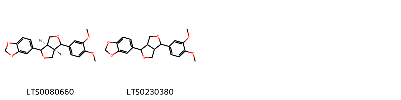{ width=100% }
    <figcaption>Hình ảnh cấu trúc hóa học của 2 hoạt chất thuộc nhóm Furanoid lignans gồm ['5-[(3ar,6ar)-4-(3,4-dimethoxyphenyl)-hexahydrofuro[3,4-c]furan-1-yl]-2h-1,3-benzodioxole (LTS0080660)', '5-[4-(3,4-dimethoxyphenyl)-hexahydrofuro[3,4-c]furan-1-yl]-2h-1,3-benzodioxole (LTS0230380)'].</figcaption>
</figure>
#### Nhóm Phenanthrenes and derivatives
<figure markdown="span">
    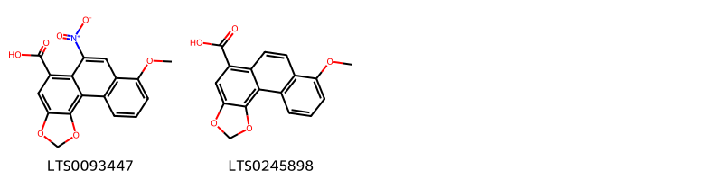{ width=100% }
    <figcaption>Hình ảnh cấu trúc hóa học của 2 hoạt chất thuộc nhóm Phenanthrenes and derivatives gồm ['birthwort (LTS0093447)', 'aristolic acid (LTS0245898)'].</figcaption>
</figure>
#### Nhóm Prenol lipids
<figure markdown="span">
    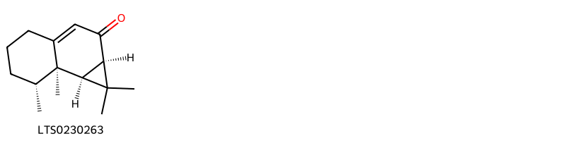{ width=100% }
    <figcaption>Hình ảnh cấu trúc hóa học của 1 hoạt chất thuộc nhóm Prenol lipids gồm ['aristolone (LTS0230263)'].</figcaption>
</figure>

---

### Dược dân tộc học

Danh sách các quốc gia có sử dụng *Aristolochia albida* trong điều trị các bệnh. 

| Country   | Disease             | Bệnh                                                                                                                                                                                                |
|:----------|:--------------------|:----------------------------------------------------------------------------------------------------------------------------------------------------------------------------------------------------|
| Africa    | Tonic, Parasiticide | MYMEMORY WARNING: YOU USED ALL AVAILABLE FREE TRANSLATIONS FOR TODAY. NEXT AVAILABLE IN  12 HOURS 57 MINUTES 35 SECONDS VISIT HTTPS://MYMEMORY.TRANSLATED.NET/DOC/USAGELIMITS.PHP TO TRANSLATE MORE |

---

---
## Aristolochia anguicida
### Thông tin về thực vật

!!! info "Phân loại thực vật của *Aristolochia anguicida* từ GIBF:"
    - **Kingdom:** Plantae
    - **Phylum:** Tracheophyta
    - **Order:** Piperales
    - **Family:** Aristolochiaceae
    - **Genus:** Aristolochia
    - **Species:** *Aristolochia anguicida*

 

| Label (VI)   | Label (EN)   | Scientific Name        | Descriptions (VI)   | Descriptions (EN)   | Also Known As (VI)   | Also Known As (EN)   |
|:-------------|:-------------|:-----------------------|:--------------------|:--------------------|:---------------------|:---------------------|
| N/A          | N/A          | Aristolochia anguicida | loài thực vật       | species of plant    | ['']                 | ['']                 |

#### Phân bố trên thế giới

**Từ CSDL GIBF** Honduras, Colombia, Thailand, El Salvador, Nicaragua, Costa Rica, United States of America, Mexico, China, Martinique, Virgin Islands (U.S.), Guatemala

#### Phân bố tại Việt Nam

**Từ CSDL GIBF**: Không có ghi nhận ở Việt Nam

---
### Thành phần hóa học
        
- Theo cơ sở dữ liệu lotus: Từ loài *Aristolochia anguicida* đã phân lập và xác định được Chưa có hoạt chất nào được phân lập. hoạt chất thuộc về các nhóm Không có hoạt chất nào được phân lập. 

Không có hình ảnh nào được tạo ra

---

### Dược dân tộc học

Danh sách các quốc gia có sử dụng *Aristolochia anguicida* trong điều trị các bệnh. 

| Country   | Disease    | Bệnh                                                                                                                                                                                                |
|:----------|:-----------|:----------------------------------------------------------------------------------------------------------------------------------------------------------------------------------------------------|
| Salvador  | Soap, Soap | MYMEMORY WARNING: YOU USED ALL AVAILABLE FREE TRANSLATIONS FOR TODAY. NEXT AVAILABLE IN  12 HOURS 57 MINUTES 06 SECONDS VISIT HTTPS://MYMEMORY.TRANSLATED.NET/DOC/USAGELIMITS.PHP TO TRANSLATE MORE |

---

---
## Aristolochia antihysterica
### Thông tin về thực vật

!!! info "Phân loại thực vật của *Aristolochia triangularis* từ GIBF:"
    - **Kingdom:** Plantae
    - **Phylum:** Tracheophyta
    - **Order:** Piperales
    - **Family:** Aristolochiaceae
    - **Genus:** Aristolochia
    - **Species:** *Aristolochia triangularis*

 

| Label (VI)   | Label (EN)   | Scientific Name            | Descriptions (VI)   | Descriptions (EN)   | Also Known As (VI)   | Also Known As (EN)   |
|:-------------|:-------------|:---------------------------|:--------------------|:--------------------|:---------------------|:---------------------|
| N/A          | N/A          | Aristolochia antihysterica |                     |                     | ['']                 | ['']                 |

#### Phân bố trên thế giới

**Từ CSDL GIBF** Honduras, Colombia, Thailand, El Salvador, Nicaragua, Costa Rica, United States of America, Mexico, China, Martinique, Virgin Islands (U.S.), Guatemala

#### Phân bố tại Việt Nam

**Từ CSDL GIBF**: Không có ghi nhận ở Việt Nam

---
### Thành phần hóa học
        
- Theo cơ sở dữ liệu lotus: Từ loài *Aristolochia triangularis* đã phân lập và xác định được Chưa có hoạt chất nào được phân lập. hoạt chất thuộc về các nhóm Không có hoạt chất nào được phân lập. 

Không có hình ảnh nào được tạo ra

---

### Dược dân tộc học

Danh sách các quốc gia có sử dụng *Aristolochia triangularis* trong điều trị các bệnh. 

| Country   | Disease                        | Bệnh                                                                                                                                                                                                |
|:----------|:-------------------------------|:----------------------------------------------------------------------------------------------------------------------------------------------------------------------------------------------------|
| Brazil    | Emetic, Sudorific, Emmenagogue | MYMEMORY WARNING: YOU USED ALL AVAILABLE FREE TRANSLATIONS FOR TODAY. NEXT AVAILABLE IN  12 HOURS 56 MINUTES 37 SECONDS VISIT HTTPS://MYMEMORY.TRANSLATED.NET/DOC/USAGELIMITS.PHP TO TRANSLATE MORE |

---

---
## Aristolochia arborescens
### Thông tin về thực vật

!!! info "Phân loại thực vật của *Aristolochia arborescens* từ GIBF:"
    - **Kingdom:** Plantae
    - **Phylum:** Tracheophyta
    - **Order:** Piperales
    - **Family:** Aristolochiaceae
    - **Genus:** Aristolochia
    - **Species:** *Aristolochia arborescens*

 

| Label (VI)   | Label (EN)   | Scientific Name          | Descriptions (VI)   | Descriptions (EN)   | Also Known As (VI)   | Also Known As (EN)   |
|:-------------|:-------------|:-------------------------|:--------------------|:--------------------|:---------------------|:---------------------|
| N/A          | N/A          | Aristolochia arborescens | loài thực vật       | species of plant    | ['']                 | ['']                 |

#### Phân bố trên thế giới

**Từ CSDL GIBF** Honduras, Colombia, Thailand, El Salvador, Nicaragua, Costa Rica, United States of America, Mexico, China, Martinique, Virgin Islands (U.S.), Guatemala

#### Phân bố tại Việt Nam

**Từ CSDL GIBF**: Không có ghi nhận ở Việt Nam

---
### Thành phần hóa học
        
- Theo cơ sở dữ liệu lotus: Từ loài *Aristolochia arborescens* đã phân lập và xác định được Chưa có hoạt chất nào được phân lập. hoạt chất thuộc về các nhóm Không có hoạt chất nào được phân lập. 

Không có hình ảnh nào được tạo ra

---

### Dược dân tộc học

Danh sách các quốc gia có sử dụng *Aristolochia arborescens* trong điều trị các bệnh. 

| Country   | Disease                         | Bệnh                                                                                                                                                                                                |
|:----------|:--------------------------------|:----------------------------------------------------------------------------------------------------------------------------------------------------------------------------------------------------|
| Elsewhere | Emmenagogue, Sudorific, Ecbolic | MYMEMORY WARNING: YOU USED ALL AVAILABLE FREE TRANSLATIONS FOR TODAY. NEXT AVAILABLE IN  12 HOURS 56 MINUTES 17 SECONDS VISIT HTTPS://MYMEMORY.TRANSLATED.NET/DOC/USAGELIMITS.PHP TO TRANSLATE MORE |

---

---
## Aristolochia argentina
### Thông tin về thực vật

!!! info "Phân loại thực vật của *Aristolochia argentina* từ GIBF:"
    - **Kingdom:** Plantae
    - **Phylum:** Tracheophyta
    - **Order:** Piperales
    - **Family:** Aristolochiaceae
    - **Genus:** Aristolochia
    - **Species:** *Aristolochia argentina*

 

| Label (VI)   | Label (EN)   | Scientific Name        | Descriptions (VI)   | Descriptions (EN)   | Also Known As (VI)   | Also Known As (EN)   |
|:-------------|:-------------|:-----------------------|:--------------------|:--------------------|:---------------------|:---------------------|
| N/A          | N/A          | Aristolochia argentina | loài thực vật       | species of plant    | ['']                 | ['']                 |

#### Phân bố trên thế giới

**Từ CSDL GIBF** nan, unknown or invalid, Argentina, Bermuda, Brazil, Spain, New Zealand, Bolivia (Plurinational State of), Paraguay, Cyprus, United States of America, Mexico, Greece

#### Phân bố tại Việt Nam

**Từ CSDL GIBF**: Không có ghi nhận ở Việt Nam

---
### Thành phần hóa học
        
- Theo cơ sở dữ liệu lotus: Từ loài *Aristolochia argentina* đã phân lập và xác định được 8 hoạt chất thuộc về các nhóm Phenanthrenes and derivatives, Tannins, Aristolactams. 

|    | chemicalTaxonomyClassyfireClass   |   smiles_count |
|---:|:----------------------------------|---------------:|
|  0 | Aristolactams                     |              3 |
|  1 | Phenanthrenes and derivatives     |              4 |
|  2 | Tannins                           |              1 |

#### Nhóm Aristolactams
<figure markdown="span">
    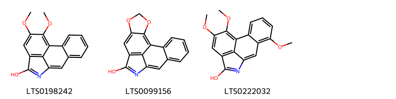{ width=100% }
    <figcaption>Hình ảnh cấu trúc hóa học của 3 hoạt chất thuộc nhóm Aristolactams gồm ['14,15-dimethoxy-10-azatetracyclo[7.6.1.0²,⁷.0¹²,¹⁶]hexadeca-1(16),2(7),3,5,8,10,12,14-octaen-11-ol (LTS0198242)', '3,5-dioxa-10-azapentacyclo[9.7.1.0²,⁶.0⁸,¹⁹.0¹³,¹⁸]nonadeca-1(19),2(6),7,9,11,13(18),14,16-octaen-9-ol (LTS0099156)', '6,14,15-trimethoxy-10-azatetracyclo[7.6.1.0²,⁷.0¹²,¹⁶]hexadeca-1(16),2(7),3,5,8,10,12,14-octaen-11-ol (LTS0222032)'].</figcaption>
</figure>
#### Nhóm Phenanthrenes and derivatives
<figure markdown="span">
    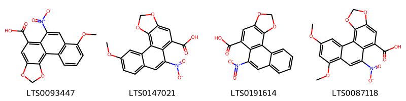{ width=100% }
    <figcaption>Hình ảnh cấu trúc hóa học của 4 hoạt chất thuộc nhóm Phenanthrenes and derivatives gồm ['birthwort (LTS0093447)', '10-methoxy-6-nitro-2h-phenanthro[3,4-d][1,3]dioxole-5-carboxylic acid (LTS0147021)', 'aristolochic acid ii (LTS0191614)', 'aristolochic acid iv (LTS0087118)'].</figcaption>
</figure>
#### Nhóm Tannins
<figure markdown="span">
    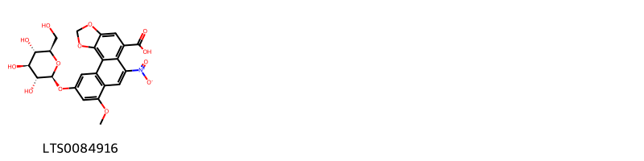{ width=100% }
    <figcaption>Hình ảnh cấu trúc hóa học của 1 hoạt chất thuộc nhóm Tannins gồm ['8-methoxy-6-nitro-10-{[(2s,3r,4s,5s,6r)-3,4,5-trihydroxy-6-(hydroxymethyl)oxan-2-yl]oxy}-2h-phenanthro[3,4-d][1,3]dioxole-5-carboxylic acid (LTS0084916)'].</figcaption>
</figure>

---

### Dược dân tộc học

Danh sách các quốc gia có sử dụng *Aristolochia argentina* trong điều trị các bệnh. 

| Country   | Disease                                        | Bệnh                                                                                                                                                                                                |
|:----------|:-----------------------------------------------|:----------------------------------------------------------------------------------------------------------------------------------------------------------------------------------------------------|
| Argentina | Antiseptic, Diuretic, Emmenagogue, Diaphoretic | MYMEMORY WARNING: YOU USED ALL AVAILABLE FREE TRANSLATIONS FOR TODAY. NEXT AVAILABLE IN  12 HOURS 55 MINUTES 43 SECONDS VISIT HTTPS://MYMEMORY.TRANSLATED.NET/DOC/USAGELIMITS.PHP TO TRANSLATE MORE |

---

---
## Aristolochia baetica
### Thông tin về thực vật

!!! info "Phân loại thực vật của *Aristolochia baetica* từ GIBF:"
    - **Kingdom:** Plantae
    - **Phylum:** Tracheophyta
    - **Order:** Piperales
    - **Family:** Aristolochiaceae
    - **Genus:** Aristolochia
    - **Species:** *Aristolochia baetica*

 

| Label (VI)   | Label (EN)   | Scientific Name      | Descriptions (VI)   | Descriptions (EN)   | Also Known As (VI)   | Also Known As (EN)   |
|:-------------|:-------------|:---------------------|:--------------------|:--------------------|:---------------------|:---------------------|
| N/A          | N/A          | Aristolochia baetica | loài thực vật       | species of plant    | ['']                 | ['']                 |

#### Phân bố trên thế giới

**Từ CSDL GIBF** Spain, Morocco, Portugal, Gibraltar

#### Phân bố tại Việt Nam

**Từ CSDL GIBF**: Không có ghi nhận ở Việt Nam

---
### Thành phần hóa học
        
- Theo cơ sở dữ liệu lotus: Từ loài *Aristolochia baetica* đã phân lập và xác định được 8 hoạt chất thuộc về các nhóm Phenanthrenes and derivatives, Organooxygen compounds, Aporphines, Aristolactams. 

|    | chemicalTaxonomyClassyfireClass   |   smiles_count |
|---:|:----------------------------------|---------------:|
|  0 | Aporphines                        |              1 |
|  1 | Aristolactams                     |              2 |
|  2 | Organooxygen compounds            |              3 |
|  3 | Phenanthrenes and derivatives     |              2 |

#### Nhóm Aporphines
<figure markdown="span">
    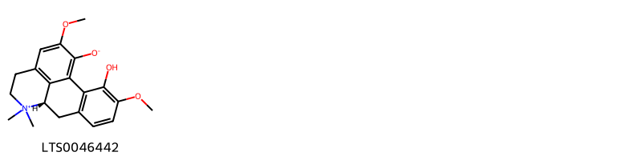{ width=100% }
    <figcaption>Hình ảnh cấu trúc hóa học của 1 hoạt chất thuộc nhóm Aporphines gồm ['(9s)-3-hydroxy-4,15-dimethoxy-10,10-dimethyl-10-azatetracyclo[7.7.1.0²,⁷.0¹³,¹⁷]heptadeca-1(16),2(7),3,5,13(17),14-hexaen-10-ium-16-olate (LTS0046442)'].</figcaption>
</figure>
#### Nhóm Aristolactams
<figure markdown="span">
    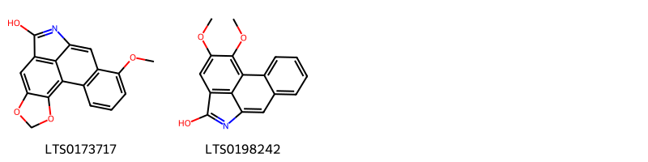{ width=100% }
    <figcaption>Hình ảnh cấu trúc hóa học của 2 hoạt chất thuộc nhóm Aristolactams gồm ['14-methoxy-3,5-dioxa-10-azapentacyclo[9.7.1.0²,⁶.0⁸,¹⁹.0¹³,¹⁸]nonadeca-1(19),2(6),7,9,11,13(18),14,16-octaen-9-ol (LTS0173717)', '14,15-dimethoxy-10-azatetracyclo[7.6.1.0²,⁷.0¹²,¹⁶]hexadeca-1(16),2(7),3,5,8,10,12,14-octaen-11-ol (LTS0198242)'].</figcaption>
</figure>
#### Nhóm Organooxygen compounds
<figure markdown="span">
    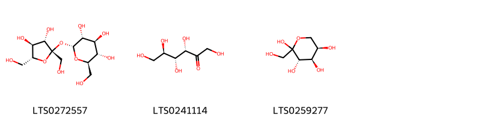{ width=100% }
    <figcaption>Hình ảnh cấu trúc hóa học của 3 hoạt chất thuộc nhóm Organooxygen compounds gồm ['sucrose (LTS0272557)', 'keto-d-fructose (LTS0241114)', 'd-fructopyranose (LTS0259277)'].</figcaption>
</figure>
#### Nhóm Phenanthrenes and derivatives
<figure markdown="span">
    { width=100% }
    <figcaption>Hình ảnh cấu trúc hóa học của 2 hoạt chất thuộc nhóm Phenanthrenes and derivatives gồm ['birthwort (LTS0093447)', 'aristolochic acid ii (LTS0191614)'].</figcaption>
</figure>

---

### Dược dân tộc học

Danh sách các quốc gia có sử dụng *Aristolochia baetica* trong điều trị các bệnh. 

| Country   | Disease     | Bệnh                                                                                                                                                                                                |
|:----------|:------------|:----------------------------------------------------------------------------------------------------------------------------------------------------------------------------------------------------|
| ain       | Emmenagogue | MYMEMORY WARNING: YOU USED ALL AVAILABLE FREE TRANSLATIONS FOR TODAY. NEXT AVAILABLE IN  12 HOURS 55 MINUTES 08 SECONDS VISIT HTTPS://MYMEMORY.TRANSLATED.NET/DOC/USAGELIMITS.PHP TO TRANSLATE MORE |

---

---
## Aristolochia barbata
### Thông tin về thực vật

!!! info "Phân loại thực vật của *Aristolochia rugosa* từ GIBF:"
    - **Kingdom:** Plantae
    - **Phylum:** Tracheophyta
    - **Order:** Piperales
    - **Family:** Aristolochiaceae
    - **Genus:** Aristolochia
    - **Species:** *Aristolochia rugosa*

 

| Label (VI)   | Label (EN)   | Scientific Name      | Descriptions (VI)   | Descriptions (EN)   | Also Known As (VI)   | Also Known As (EN)   |
|:-------------|:-------------|:---------------------|:--------------------|:--------------------|:---------------------|:---------------------|
| N/A          | N/A          | Aristolochia barbata |                     | species of plant    | ['']                 | ['']                 |

#### Phân bố trên thế giới

**Từ CSDL GIBF** nan, unknown or invalid, Venezuela (Bolivarian Republic of), Brazil, Bolivia (Plurinational State of)

#### Phân bố tại Việt Nam

**Từ CSDL GIBF**: Không có ghi nhận ở Việt Nam

---
### Thành phần hóa học
        
- Theo cơ sở dữ liệu lotus: Từ loài *Aristolochia rugosa* đã phân lập và xác định được Chưa có hoạt chất nào được phân lập. hoạt chất thuộc về các nhóm Không có hoạt chất nào được phân lập. 

Không có hình ảnh nào được tạo ra

---

### Dược dân tộc học

Danh sách các quốc gia có sử dụng *Aristolochia rugosa* trong điều trị các bệnh. 

| Country   | Disease   | Bệnh                                                                                                                                                                                                |
|:----------|:----------|:----------------------------------------------------------------------------------------------------------------------------------------------------------------------------------------------------|
| Venezuela | Tonic     | MYMEMORY WARNING: YOU USED ALL AVAILABLE FREE TRANSLATIONS FOR TODAY. NEXT AVAILABLE IN  12 HOURS 54 MINUTES 22 SECONDS VISIT HTTPS://MYMEMORY.TRANSLATED.NET/DOC/USAGELIMITS.PHP TO TRANSLATE MORE |

---

---
## Aristolochia bracteata
### Thông tin về thực vật

!!! info "Phân loại thực vật của *Aristolochia bracteolata* từ GIBF:"
    - **Kingdom:** Plantae
    - **Phylum:** Tracheophyta
    - **Order:** Piperales
    - **Family:** Aristolochiaceae
    - **Genus:** Aristolochia
    - **Species:** *Aristolochia bracteolata*

 

| Label (VI)   | Label (EN)   | Scientific Name        | Descriptions (VI)   | Descriptions (EN)   | Also Known As (VI)   | Also Known As (EN)   |
|:-------------|:-------------|:-----------------------|:--------------------|:--------------------|:---------------------|:---------------------|
| N/A          | N/A          | Aristolochia bracteata | loài thực vật       | species of plant    | ['']                 | ['']                 |

#### Phân bố trên thế giới

**Từ CSDL GIBF** nan, unknown or invalid, Sri Lanka, Uganda, Eritrea, Pakistan, Côte d’Ivoire, Yemen, India, Ethiopia, Sudan, Kenya, Bangladesh, Oman, Indonesia

#### Phân bố tại Việt Nam

**Từ CSDL GIBF**: Không có ghi nhận ở Việt Nam

---
### Thành phần hóa học
        
- Theo cơ sở dữ liệu lotus: Từ loài *Aristolochia bracteolata* đã phân lập và xác định được Chưa có hoạt chất nào được phân lập. hoạt chất thuộc về các nhóm Không có hoạt chất nào được phân lập. 

Không có hình ảnh nào được tạo ra

---

### Dược dân tộc học

Danh sách các quốc gia có sử dụng *Aristolochia bracteolata* trong điều trị các bệnh. 

| Country   | Disease                                                   | Bệnh                                                                                                                                                                                                |
|:----------|:----------------------------------------------------------|:----------------------------------------------------------------------------------------------------------------------------------------------------------------------------------------------------|
| Elsewhere | Larvicide, Purgative, Cathartic, Vermifuge                | MYMEMORY WARNING: YOU USED ALL AVAILABLE FREE TRANSLATIONS FOR TODAY. NEXT AVAILABLE IN  12 HOURS 54 MINUTES 00 SECONDS VISIT HTTPS://MYMEMORY.TRANSLATED.NET/DOC/USAGELIMITS.PHP TO TRANSLATE MORE |
| Sudan     | Antidote, Insecticide, Parasiticide, Vermifuge, Purgative | MYMEMORY WARNING: YOU USED ALL AVAILABLE FREE TRANSLATIONS FOR TODAY. NEXT AVAILABLE IN  12 HOURS 53 MINUTES 57 SECONDS VISIT HTTPS://MYMEMORY.TRANSLATED.NET/DOC/USAGELIMITS.PHP TO TRANSLATE MORE |

---

---
## Aristolochia chapmaniana
### Thông tin về thực vật

!!! info "Phân loại thực vật của *Aristolochia tonduzii* từ GIBF:"
    - **Kingdom:** Plantae
    - **Phylum:** Tracheophyta
    - **Order:** Piperales
    - **Family:** Aristolochiaceae
    - **Genus:** Aristolochia
    - **Species:** *Aristolochia tonduzii*

 

| Label (VI)   | Label (EN)   | Scientific Name          | Descriptions (VI)   | Descriptions (EN)   | Also Known As (VI)   | Also Known As (EN)   |
|:-------------|:-------------|:-------------------------|:--------------------|:--------------------|:---------------------|:---------------------|
| N/A          | N/A          | Aristolochia chapmaniana |                     |                     | ['']                 | ['']                 |

#### Phân bố trên thế giới

**Từ CSDL GIBF** nan, Honduras, unknown or invalid, Panama, Singapore

#### Phân bố tại Việt Nam

**Từ CSDL GIBF**: Không có ghi nhận ở Việt Nam

---
### Thành phần hóa học
        
- Theo cơ sở dữ liệu lotus: Từ loài *Aristolochia tonduzii* đã phân lập và xác định được Chưa có hoạt chất nào được phân lập. hoạt chất thuộc về các nhóm Không có hoạt chất nào được phân lập. 

Không có hình ảnh nào được tạo ra

---

### Dược dân tộc học

Danh sách các quốc gia có sử dụng *Aristolochia tonduzii* trong điều trị các bệnh. 

| Country   | Disease                             | Bệnh                                                                                                                                                                                                |
|:----------|:------------------------------------|:----------------------------------------------------------------------------------------------------------------------------------------------------------------------------------------------------|
| Panama    | nan, Tranquilizer, Stimulant, Tonic | MYMEMORY WARNING: YOU USED ALL AVAILABLE FREE TRANSLATIONS FOR TODAY. NEXT AVAILABLE IN  12 HOURS 53 MINUTES 21 SECONDS VISIT HTTPS://MYMEMORY.TRANSLATED.NET/DOC/USAGELIMITS.PHP TO TRANSLATE MORE |

---

---
## Aristolochia chilensis
### Thông tin về thực vật

!!! info "Phân loại thực vật của *Aristolochia chilensis* từ GIBF:"
    - **Kingdom:** Plantae
    - **Phylum:** Tracheophyta
    - **Order:** Piperales
    - **Family:** Aristolochiaceae
    - **Genus:** Aristolochia
    - **Species:** *Aristolochia chilensis*

 

| Label (VI)   | Label (EN)   | Scientific Name        | Descriptions (VI)   | Descriptions (EN)   | Also Known As (VI)   | Also Known As (EN)   |
|:-------------|:-------------|:-----------------------|:--------------------|:--------------------|:---------------------|:---------------------|
| N/A          | N/A          | Aristolochia chilensis | loài thực vật       | species of plant    | ['']                 | ['']                 |

#### Phân bố trên thế giới

**Từ CSDL GIBF** Chile

#### Phân bố tại Việt Nam

**Từ CSDL GIBF**: Không có ghi nhận ở Việt Nam

---
### Thành phần hóa học
        
- Theo cơ sở dữ liệu lotus: Từ loài *Aristolochia chilensis* đã phân lập và xác định được 10 hoạt chất thuộc về các nhóm Furanoid lignans, Aporphines, Phenanthrenes and derivatives, Proaporphines, Aristolactams, Steroids and steroid derivatives. 

|    | chemicalTaxonomyClassyfireClass   |   smiles_count |
|---:|:----------------------------------|---------------:|
|  0 | Aporphines                        |              2 |
|  1 | Aristolactams                     |              1 |
|  2 | Furanoid lignans                  |              4 |
|  3 | Phenanthrenes and derivatives     |              1 |
|  4 | Proaporphines                     |              1 |
|  5 | Steroids and steroid derivatives  |              1 |

#### Nhóm Aporphines
<figure markdown="span">
    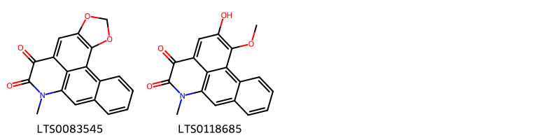{ width=100% }
    <figcaption>Hình ảnh cấu trúc hóa học của 2 hoạt chất thuộc nhóm Aporphines gồm ['11-methyl-3,5-dioxa-11-azapentacyclo[10.7.1.0²,⁶.0⁸,²⁰.0¹⁴,¹⁹]icosa-1(20),2(6),7,12,14(19),15,17-heptaene-9,10-dione (LTS0083545)', '15-hydroxy-16-methoxy-10-methyl-10-azatetracyclo[7.7.1.0²,⁷.0¹³,¹⁷]heptadeca-1(17),2(7),3,5,8,13,15-heptaene-11,12-dione (LTS0118685)'].</figcaption>
</figure>
#### Nhóm Aristolactams
<figure markdown="span">
    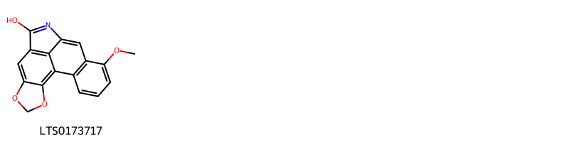{ width=100% }
    <figcaption>Hình ảnh cấu trúc hóa học của 1 hoạt chất thuộc nhóm Aristolactams gồm ['14-methoxy-3,5-dioxa-10-azapentacyclo[9.7.1.0²,⁶.0⁸,¹⁹.0¹³,¹⁸]nonadeca-1(19),2(6),7,9,11,13(18),14,16-octaen-9-ol (LTS0173717)'].</figcaption>
</figure>
#### Nhóm Furanoid lignans
<figure markdown="span">
    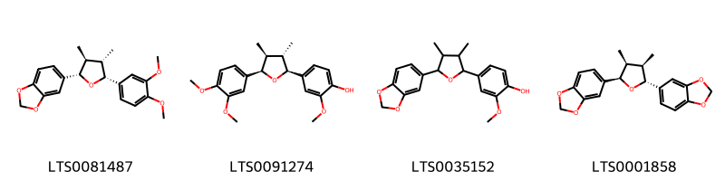{ width=100% }
    <figcaption>Hình ảnh cấu trúc hóa học của 4 hoạt chất thuộc nhóm Furanoid lignans gồm ['5-[(2s,3s,4s,5r)-5-(3,4-dimethoxyphenyl)-3,4-dimethyloxolan-2-yl]-2h-1,3-benzodioxole (LTS0081487)', '4-[(2s,3s,4s,5r)-5-(3,4-dimethoxyphenyl)-3,4-dimethyloxolan-2-yl]-2-methoxyphenol (LTS0091274)', '4-[5-(2h-1,3-benzodioxol-5-yl)-3,4-dimethyloxolan-2-yl]-2-methoxyphenol (LTS0035152)', '5-[(2r,3s,4r,5r)-5-(2h-1,3-benzodioxol-5-yl)-3,4-dimethyloxolan-2-yl]-2h-1,3-benzodioxole (LTS0001858)'].</figcaption>
</figure>
#### Nhóm Phenanthrenes and derivatives
<figure markdown="span">
    { width=100% }
    <figcaption>Hình ảnh cấu trúc hóa học của 1 hoạt chất thuộc nhóm Phenanthrenes and derivatives gồm ['birthwort (LTS0093447)'].</figcaption>
</figure>
#### Nhóm Proaporphines
<figure markdown="span">
    { width=100% }
    <figcaption>Hình ảnh cấu trúc hóa học của 1 hoạt chất thuộc nhóm Proaporphines gồm ['glaziovine (LTS0233300)'].</figcaption>
</figure>
#### Nhóm Steroids and steroid derivatives
<figure markdown="span">
    { width=100% }
    <figcaption>Hình ảnh cấu trúc hóa học của 1 hoạt chất thuộc nhóm Steroids and steroid derivatives gồm ['sitogluside (LTS0201798)'].</figcaption>
</figure>

---

### Dược dân tộc học

Danh sách các quốc gia có sử dụng *Aristolochia chilensis* trong điều trị các bệnh. 

| Country   | Disease     | Bệnh                                                                                                                                                                                                |
|:----------|:------------|:----------------------------------------------------------------------------------------------------------------------------------------------------------------------------------------------------|
| Chile     | Emmenagogue | MYMEMORY WARNING: YOU USED ALL AVAILABLE FREE TRANSLATIONS FOR TODAY. NEXT AVAILABLE IN  12 HOURS 53 MINUTES 00 SECONDS VISIT HTTPS://MYMEMORY.TRANSLATED.NET/DOC/USAGELIMITS.PHP TO TRANSLATE MORE |

---

---
## Aristolochia clematitis
### Thông tin về thực vật

!!! info "Phân loại thực vật của *Aristolochia clematitis* từ GIBF:"
    - **Kingdom:** Plantae
    - **Phylum:** Tracheophyta
    - **Order:** Piperales
    - **Family:** Aristolochiaceae
    - **Genus:** Aristolochia
    - **Species:** *Aristolochia clematitis*

 

| Label (VI)   | Label (EN)   | Scientific Name         | Descriptions (VI)   | Descriptions (EN)   | Also Known As (VI)   | Also Known As (EN)   |
|:-------------|:-------------|:------------------------|:--------------------|:--------------------|:---------------------|:---------------------|
| N/A          | N/A          | Aristolochia clematitis | loài thực vật       | species of plant    | ['']                 | ['']                 |

#### Phân bố trên thế giới

**Từ CSDL GIBF** Germany, Austria, Serbia, Poland, Montenegro, Kazakhstan, Netherlands, Slovakia, Slovenia, Hungary, Bulgaria, France, Czechia, Romania, Russian Federation, Italy, Greece, Croatia, Ukraine

#### Phân bố tại Việt Nam

**Từ CSDL GIBF**: Không có ghi nhận ở Việt Nam

---
### Thành phần hóa học
        
- Theo cơ sở dữ liệu lotus: Từ loài *Aristolochia clematitis* đã phân lập và xác định được 9 hoạt chất thuộc về các nhóm Aporphines, Phenanthrenes and derivatives, Prenol lipids, Cinnamic acids and derivatives, Steroids and steroid derivatives. 

|    | chemicalTaxonomyClassyfireClass   |   smiles_count |
|---:|:----------------------------------|---------------:|
|  0 | Aporphines                        |              3 |
|  1 | Cinnamic acids and derivatives    |              1 |
|  2 | Phenanthrenes and derivatives     |              3 |
|  3 | Prenol lipids                     |              1 |
|  4 | Steroids and steroid derivatives  |              1 |

#### Nhóm Aporphines
<figure markdown="span">
    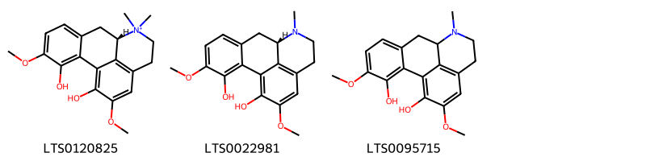{ width=100% }
    <figcaption>Hình ảnh cấu trúc hóa học của 3 hoạt chất thuộc nhóm Aporphines gồm ['magnoflorine (LTS0120825)', '(9s)-4,15-dimethoxy-10-methyl-10-azatetracyclo[7.7.1.0²,⁷.0¹³,¹⁷]heptadeca-1(16),2,4,6,13(17),14-hexaene-3,16-diol (LTS0022981)', '4,15-dimethoxy-10-methyl-10-azatetracyclo[7.7.1.0²,⁷.0¹³,¹⁷]heptadeca-1(16),2,4,6,13(17),14-hexaene-3,16-diol (LTS0095715)'].</figcaption>
</figure>
#### Nhóm Cinnamic acids and derivatives
<figure markdown="span">
    { width=100% }
    <figcaption>Hình ảnh cấu trúc hóa học của 1 hoạt chất thuộc nhóm Cinnamic acids and derivatives gồm ['ferulic acid (LTS0077328)'].</figcaption>
</figure>
#### Nhóm Phenanthrenes and derivatives
<figure markdown="span">
    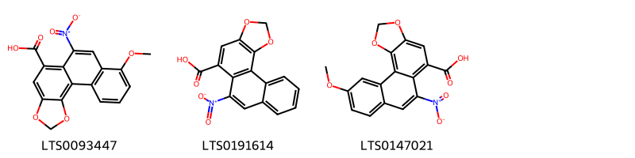{ width=100% }
    <figcaption>Hình ảnh cấu trúc hóa học của 3 hoạt chất thuộc nhóm Phenanthrenes and derivatives gồm ['birthwort (LTS0093447)', 'aristolochic acid ii (LTS0191614)', '10-methoxy-6-nitro-2h-phenanthro[3,4-d][1,3]dioxole-5-carboxylic acid (LTS0147021)'].</figcaption>
</figure>
#### Nhóm Prenol lipids
<figure markdown="span">
    { width=100% }
    <figcaption>Hình ảnh cấu trúc hóa học của 1 hoạt chất thuộc nhóm Prenol lipids gồm ['aristolone (LTS0230263)'].</figcaption>
</figure>
#### Nhóm Steroids and steroid derivatives
<figure markdown="span">
    { width=100% }
    <figcaption>Hình ảnh cấu trúc hóa học của 1 hoạt chất thuộc nhóm Steroids and steroid derivatives gồm ['sitogluside (LTS0201798)'].</figcaption>
</figure>

---

### Dược dân tộc học

Danh sách các quốc gia có sử dụng *Aristolochia clematitis* trong điều trị các bệnh. 

| Country   | Disease                      | Bệnh                                                                                                                                                                                                |
|:----------|:-----------------------------|:----------------------------------------------------------------------------------------------------------------------------------------------------------------------------------------------------|
| Turkey    | Poison, Stimulant, Vulnerary | MYMEMORY WARNING: YOU USED ALL AVAILABLE FREE TRANSLATIONS FOR TODAY. NEXT AVAILABLE IN  12 HOURS 52 MINUTES 17 SECONDS VISIT HTTPS://MYMEMORY.TRANSLATED.NET/DOC/USAGELIMITS.PHP TO TRANSLATE MORE |
| ain       | Poison                       | MYMEMORY WARNING: YOU USED ALL AVAILABLE FREE TRANSLATIONS FOR TODAY. NEXT AVAILABLE IN  12 HOURS 52 MINUTES 14 SECONDS VISIT HTTPS://MYMEMORY.TRANSLATED.NET/DOC/USAGELIMITS.PHP TO TRANSLATE MORE |

---

---
## Aristolochia cordigera
### Thông tin về thực vật

!!! info "Phân loại thực vật của *Aristolochia cordigera* từ GIBF:"
    - **Kingdom:** Plantae
    - **Phylum:** Tracheophyta
    - **Order:** Piperales
    - **Family:** Aristolochiaceae
    - **Genus:** Aristolochia
    - **Species:** *Aristolochia cordigera*

 

| Label (VI)   | Label (EN)   | Scientific Name        | Descriptions (VI)   | Descriptions (EN)   | Also Known As (VI)   | Also Known As (EN)   |
|:-------------|:-------------|:-----------------------|:--------------------|:--------------------|:---------------------|:---------------------|
| N/A          | N/A          | Aristolochia cordigera | loài thực vật       | species of plant    | ['']                 | ['']                 |

#### Phân bố trên thế giới

**Từ CSDL GIBF** nan, Brazil

#### Phân bố tại Việt Nam

**Từ CSDL GIBF**: Không có ghi nhận ở Việt Nam

---
### Thành phần hóa học
        
- Theo cơ sở dữ liệu lotus: Từ loài *Aristolochia cordigera* đã phân lập và xác định được Chưa có hoạt chất nào được phân lập. hoạt chất thuộc về các nhóm Không có hoạt chất nào được phân lập. 

Không có hình ảnh nào được tạo ra

---

### Dược dân tộc học

Danh sách các quốc gia có sử dụng *Aristolochia cordigera* trong điều trị các bệnh. 

| Country   | Disease     | Bệnh                                                                                                                                                                                                |
|:----------|:------------|:----------------------------------------------------------------------------------------------------------------------------------------------------------------------------------------------------|
| Brazil    | Emmenagogue | MYMEMORY WARNING: YOU USED ALL AVAILABLE FREE TRANSLATIONS FOR TODAY. NEXT AVAILABLE IN  12 HOURS 51 MINUTES 41 SECONDS VISIT HTTPS://MYMEMORY.TRANSLATED.NET/DOC/USAGELIMITS.PHP TO TRANSLATE MORE |

---

---
## Aristolochia cymbifera
### Thông tin về thực vật

!!! info "Phân loại thực vật của *Aristolochia cymbifera* từ GIBF:"
    - **Kingdom:** Plantae
    - **Phylum:** Tracheophyta
    - **Order:** Piperales
    - **Family:** Aristolochiaceae
    - **Genus:** Aristolochia
    - **Species:** *Aristolochia cymbifera*

 

| Label (VI)   | Label (EN)   | Scientific Name        | Descriptions (VI)   | Descriptions (EN)   | Also Known As (VI)   | Also Known As (EN)   |
|:-------------|:-------------|:-----------------------|:--------------------|:--------------------|:---------------------|:---------------------|
| N/A          | N/A          | Aristolochia cymbifera | loài thực vật       | species of plant    | ['']                 | ['']                 |

#### Phân bố trên thế giới

**Từ CSDL GIBF** Brazil

#### Phân bố tại Việt Nam

**Từ CSDL GIBF**: Không có ghi nhận ở Việt Nam

---
### Thành phần hóa học
        
- Theo cơ sở dữ liệu lotus: Từ loài *Aristolochia cymbifera* đã phân lập và xác định được 40 hoạt chất thuộc về các nhóm Furanoid lignans, Aporphines, Azoles, Saturated hydrocarbons, Unsaturated hydrocarbons, Prenol lipids. 

|    | chemicalTaxonomyClassyfireClass   |   smiles_count |
|---:|:----------------------------------|---------------:|
|  0 | Aporphines                        |              1 |
|  1 | Azoles                            |              1 |
|  2 | Furanoid lignans                  |              6 |
|  3 | Prenol lipids                     |             27 |
|  4 | Saturated hydrocarbons            |              4 |
|  5 | Unsaturated hydrocarbons          |              1 |

#### Nhóm Aporphines
<figure markdown="span">
    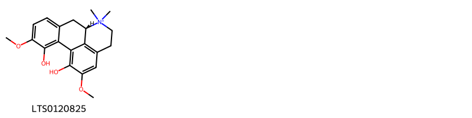{ width=100% }
    <figcaption>Hình ảnh cấu trúc hóa học của 1 hoạt chất thuộc nhóm Aporphines gồm ['magnoflorine (LTS0120825)'].</figcaption>
</figure>
#### Nhóm Azoles
<figure markdown="span">
    { width=100% }
    <figcaption>Hình ảnh cấu trúc hóa học của 1 hoạt chất thuộc nhóm Azoles gồm ['allantoin (LTS0106609)'].</figcaption>
</figure>
#### Nhóm Furanoid lignans
<figure markdown="span">
    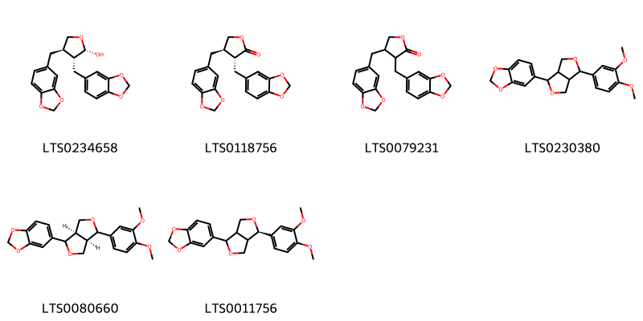{ width=100% }
    <figcaption>Hình ảnh cấu trúc hóa học của 6 hoạt chất thuộc nhóm Furanoid lignans gồm ['cubebin (LTS0234658)', 'hinokinin (LTS0118756)', '3,4-bis(2h-1,3-benzodioxol-5-ylmethyl)oxolan-2-one (LTS0079231)', '5-[4-(3,4-dimethoxyphenyl)-hexahydrofuro[3,4-c]furan-1-yl]-2h-1,3-benzodioxole (LTS0230380)', '5-[(3ar,6ar)-4-(3,4-dimethoxyphenyl)-hexahydrofuro[3,4-c]furan-1-yl]-2h-1,3-benzodioxole (LTS0080660)', '5-[(4r)-4-(3,4-dimethoxyphenyl)-hexahydrofuro[3,4-c]furan-1-yl]-2h-1,3-benzodioxole (LTS0011756)'].</figcaption>
</figure>
#### Nhóm Prenol lipids
<figure markdown="span">
    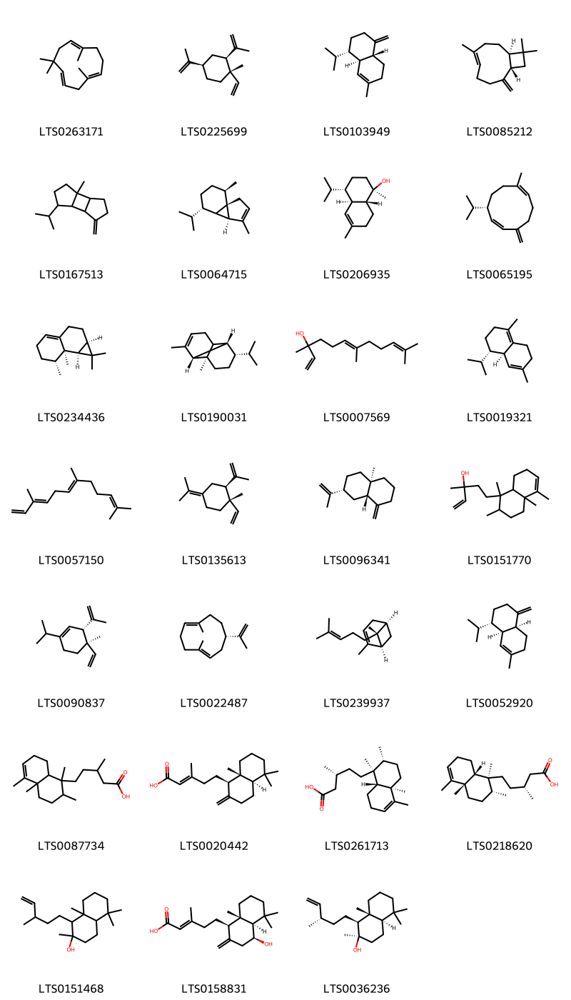{ width=100% }
    <figcaption>Hình ảnh cấu trúc hóa học của 27 hoạt chất thuộc nhóm Prenol lipids gồm ['humulene (LTS0263171)', 'β-elemene (LTS0225699)', '(+)-gamma-cadinene (LTS0103949)', 'caryophyllene (LTS0085212)', 'β-bourbonene (LTS0167513)', '(1s,5r,7s,10r)-7-isopropyl-4,10-dimethyltricyclo[4.4.0.0¹,⁵]dec-3-ene (LTS0064715)', 'α-cadinol (LTS0206935)', '(1z,6z,8s)-8-isopropyl-1-methyl-5-methylidenecyclodeca-1,6-diene (LTS0065195)', '(1ar,7r,7ar,7bs)-1,1,7,7a-tetramethyl-1ah,2h,3h,5h,6h,7h,7bh-cyclopropa[a]naphthalene (LTS0234436)', '(1r,2s,7s,8s)-8-isopropyl-1,3-dimethyltricyclo[4.4.0.0²,⁷]dec-3-ene (LTS0190031)', 'nerolidol isomers (LTS0007569)', 'delta-cadinene (LTS0019321)', 'farnesene (LTS0057150)', '(1s,2s)-1-ethenyl-1-methyl-2-(prop-1-en-2-yl)-4-(propan-2-ylidene)cyclohexane (LTS0135613)', 'β-selinene (LTS0096341)', '5-(1,2,4a,5-tetramethyl-2,3,4,7,8,8a-hexahydronaphthalen-1-yl)-3-methylpent-1-en-3-ol (LTS0151770)', 'elemene (LTS0090837)', '(-)-germacrene a (LTS0022487)', '(-)-trans-α-bergamotene (LTS0239937)', 'gamma-muurolene (LTS0052920)', '5-(1,2,4a,5-tetramethyl-2,3,4,7,8,8a-hexahydronaphthalen-1-yl)-3-methylpentanoic acid (LTS0087734)', '(2e)-5-[(1r,4ar,8ar)-5,5,8a-trimethyl-2-methylidene-hexahydro-1h-naphthalen-1-yl]-3-methylpent-2-enoic acid (LTS0020442)', '(3r)-5-[(1s,2r,4ar,8ar)-1,2,4a,5-tetramethyl-2,3,4,7,8,8a-hexahydronaphthalen-1-yl]-3-methylpentanoic acid (LTS0261713)', '(3r)-5-[(1s,2r,4as,8ar)-1,2,4a,5-tetramethyl-2,3,4,7,8,8a-hexahydronaphthalen-1-yl]-3-methylpentanoic acid (LTS0218620)', '2,5,5,8a-tetramethyl-1-(3-methylpent-4-en-1-yl)-hexahydro-1h-naphthalen-2-ol (LTS0151468)', '(2e)-5-[(1r,4s,4ar,8as)-4-hydroxy-5,5,8a-trimethyl-2-methylidene-hexahydro-1h-naphthalen-1-yl]-3-methylpent-2-enoic acid (LTS0158831)', '(1s,2r,4ar,8ar)-2,5,5,8a-tetramethyl-1-[(3s)-3-methylpent-4-en-1-yl]-hexahydro-1h-naphthalen-2-ol (LTS0036236)'].</figcaption>
</figure>
#### Nhóm Saturated hydrocarbons
<figure markdown="span">
    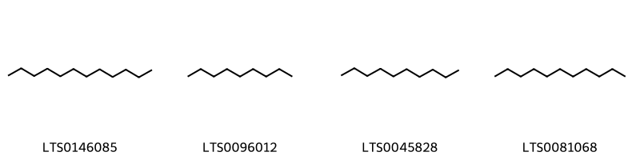{ width=100% }
    <figcaption>Hình ảnh cấu trúc hóa học của 4 hoạt chất thuộc nhóm Saturated hydrocarbons gồm ['dodecane (LTS0146085)', 'nonane (LTS0096012)', 'decane (LTS0045828)', 'undecane (LTS0081068)'].</figcaption>
</figure>
#### Nhóm Unsaturated hydrocarbons
<figure markdown="span">
    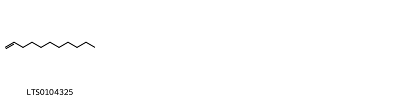{ width=100% }
    <figcaption>Hình ảnh cấu trúc hóa học của 1 hoạt chất thuộc nhóm Unsaturated hydrocarbons gồm ['1-undecene (LTS0104325)'].</figcaption>
</figure>

---

### Dược dân tộc học

Danh sách các quốc gia có sử dụng *Aristolochia cymbifera* trong điều trị các bệnh. 

| Country   | Disease                            | Bệnh                                                                                                                                                                                                |
|:----------|:-----------------------------------|:----------------------------------------------------------------------------------------------------------------------------------------------------------------------------------------------------|
| Argentina | Emmenagogue                        | MYMEMORY WARNING: YOU USED ALL AVAILABLE FREE TRANSLATIONS FOR TODAY. NEXT AVAILABLE IN  12 HOURS 51 MINUTES 16 SECONDS VISIT HTTPS://MYMEMORY.TRANSLATED.NET/DOC/USAGELIMITS.PHP TO TRANSLATE MORE |
| Brazil    | Diaphoretic, Emmenagogue, Diuretic | MYMEMORY WARNING: YOU USED ALL AVAILABLE FREE TRANSLATIONS FOR TODAY. NEXT AVAILABLE IN  12 HOURS 51 MINUTES 13 SECONDS VISIT HTTPS://MYMEMORY.TRANSLATED.NET/DOC/USAGELIMITS.PHP TO TRANSLATE MORE |
| Paraguay  | Emmenagogue                        | MYMEMORY WARNING: YOU USED ALL AVAILABLE FREE TRANSLATIONS FOR TODAY. NEXT AVAILABLE IN  12 HOURS 51 MINUTES 10 SECONDS VISIT HTTPS://MYMEMORY.TRANSLATED.NET/DOC/USAGELIMITS.PHP TO TRANSLATE MORE |
| Turkey    | Stimulant, Emmenagogue             | MYMEMORY WARNING: YOU USED ALL AVAILABLE FREE TRANSLATIONS FOR TODAY. NEXT AVAILABLE IN  12 HOURS 51 MINUTES 07 SECONDS VISIT HTTPS://MYMEMORY.TRANSLATED.NET/DOC/USAGELIMITS.PHP TO TRANSLATE MORE |

---

---
## Aristolochia debilis
### Thông tin về thực vật

!!! info "Phân loại thực vật của *Aristolochia debilis* từ GIBF:"
    - **Kingdom:** Plantae
    - **Phylum:** Tracheophyta
    - **Order:** Piperales
    - **Family:** Aristolochiaceae
    - **Genus:** Aristolochia
    - **Species:** *Aristolochia debilis*

 

| Label (VI)   | Label (EN)   | Scientific Name      | Descriptions (VI)   | Descriptions (EN)   | Also Known As (VI)   | Also Known As (EN)   |
|:-------------|:-------------|:---------------------|:--------------------|:--------------------|:---------------------|:---------------------|
| N/A          | N/A          | Aristolochia debilis | loài thực vật       | species of plant    | ['']                 | ['']                 |

#### Phân bố trên thế giới

**Từ CSDL GIBF** nan, Japan, United States of America, China, Korea, Republic of

#### Phân bố tại Việt Nam

**Từ CSDL GIBF**: Không có ghi nhận ở Việt Nam

---
### Thành phần hóa học
        
- Theo cơ sở dữ liệu lotus: Từ loài *Aristolochia debilis* đã phân lập và xác định được 39 hoạt chất thuộc về các nhóm Phenanthrenes and derivatives, Organooxygen compounds, Prenol lipids, Aristolactams. 

|    | chemicalTaxonomyClassyfireClass   |   smiles_count |
|---:|:----------------------------------|---------------:|
|  0 | Aristolactams                     |              3 |
|  1 | Organooxygen compounds            |              2 |
|  2 | Phenanthrenes and derivatives     |              3 |
|  3 | Prenol lipids                     |             31 |

#### Nhóm Aristolactams
<figure markdown="span">
    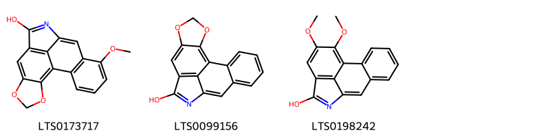{ width=100% }
    <figcaption>Hình ảnh cấu trúc hóa học của 3 hoạt chất thuộc nhóm Aristolactams gồm ['14-methoxy-3,5-dioxa-10-azapentacyclo[9.7.1.0²,⁶.0⁸,¹⁹.0¹³,¹⁸]nonadeca-1(19),2(6),7,9,11,13(18),14,16-octaen-9-ol (LTS0173717)', '3,5-dioxa-10-azapentacyclo[9.7.1.0²,⁶.0⁸,¹⁹.0¹³,¹⁸]nonadeca-1(19),2(6),7,9,11,13(18),14,16-octaen-9-ol (LTS0099156)', '14,15-dimethoxy-10-azatetracyclo[7.6.1.0²,⁷.0¹²,¹⁶]hexadeca-1(16),2(7),3,5,8,10,12,14-octaen-11-ol (LTS0198242)'].</figcaption>
</figure>
#### Nhóm Organooxygen compounds
<figure markdown="span">
    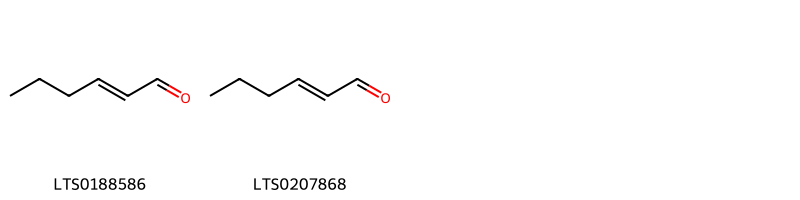{ width=100% }
    <figcaption>Hình ảnh cấu trúc hóa học của 2 hoạt chất thuộc nhóm Organooxygen compounds gồm ['hexenal (LTS0188586)', '(e)-2-hexenal (LTS0207868)'].</figcaption>
</figure>
#### Nhóm Phenanthrenes and derivatives
<figure markdown="span">
    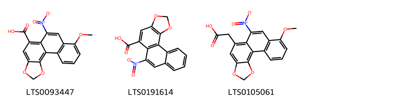{ width=100% }
    <figcaption>Hình ảnh cấu trúc hóa học của 3 hoạt chất thuộc nhóm Phenanthrenes and derivatives gồm ['birthwort (LTS0093447)', 'aristolochic acid ii (LTS0191614)', '{8-methoxy-6-nitro-2h-phenanthro[3,4-d][1,3]dioxol-5-yl}acetic acid (LTS0105061)'].</figcaption>
</figure>
#### Nhóm Prenol lipids
<figure markdown="span">
    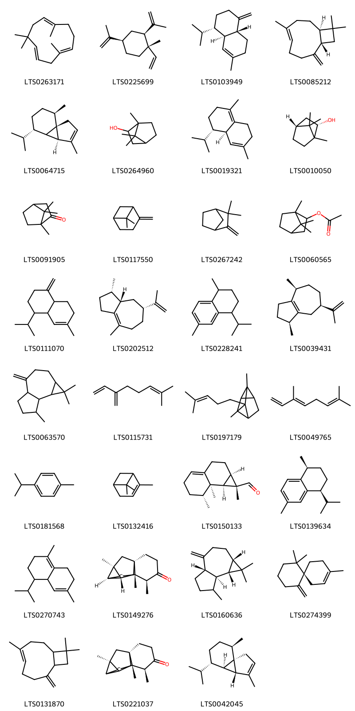{ width=100% }
    <figcaption>Hình ảnh cấu trúc hóa học của 31 hoạt chất thuộc nhóm Prenol lipids gồm ['humulene (LTS0263171)', 'β-elemene (LTS0225699)', '(+)-gamma-cadinene (LTS0103949)', 'caryophyllene (LTS0085212)', '(1s,5r,7s,10r)-7-isopropyl-4,10-dimethyltricyclo[4.4.0.0¹,⁵]dec-3-ene (LTS0064715)', 'borneol (LTS0264960)', 'delta-cadinene (LTS0019321)', '(2s,4r)-1,7,7-trimethylbicyclo[2.2.1]heptan-2-ol (LTS0010050)', 'camphor (LTS0091905)', 'β-pinene (LTS0117550)', 'camphene (LTS0267242)', 'bornyl acetate (LTS0060565)', '4-isopropyl-6-methyl-1-methylidene-3,4,4a,7,8,8a-hexahydro-2h-naphthalene (LTS0111070)', 'α-bulnesene (LTS0202512)', '(e)-calamene (LTS0228241)', 'guaiene (LTS0039431)', '1,1,7-trimethyl-4-methylidene-octahydro-1ah-cyclopropa[e]azulene (LTS0063570)', 'α-myrcene (LTS0115731)', '1,7-dimethyl-7-(4-methylpent-3-en-1-yl)tricyclo[2.2.1.0²,⁶]heptane (LTS0197179)', 'trans-β-ocimene (LTS0049765)', 'cymene (LTS0181568)', 'α pinene (LTS0132416)', '(1s,1ar,7r,7ar,7br)-1,7,7a-trimethyl-1ah,2h,3h,5h,6h,7h,7bh-cyclopropa[a]naphthalene-1-carbaldehyde (LTS0150133)', '(1s,4s)-4-isopropyl-1,6-dimethyl-1,2,3,4-tetrahydronaphthalene (LTS0139634)', '4-isopropyl-1,6-dimethyl-2,3,4,4a,7,8-hexahydronaphthalene (LTS0270743)', '(1s,5s,6s,8s,9s,10r)-5,6,9-trimethyltetracyclo[7.2.1.0¹,⁶.0⁸,¹⁰]dodecan-4-one (LTS0149276)', '(1as,4as,7as,7br)-1,1,7-trimethyl-4-methylidene-octahydro-1ah-cyclopropa[e]azulene (LTS0160636)', '(-)-chamigrene (LTS0274399)', 'caryophyllene (LTS0131870)', '(1s,5s,6s,9s)-5,6,9-trimethyltetracyclo[7.2.1.0¹,⁶.0⁸,¹⁰]dodecan-4-one (LTS0221037)', '(-)-α-cubebene (LTS0042045)'].</figcaption>
</figure>

---

### Dược dân tộc học

Danh sách các quốc gia có sử dụng *Aristolochia debilis* trong điều trị các bệnh. 

| Country   | Disease                       | Bệnh                                                                                                                                                                                                |
|:----------|:------------------------------|:----------------------------------------------------------------------------------------------------------------------------------------------------------------------------------------------------|
| China     | Stomachic, Tonic, Carminative | MYMEMORY WARNING: YOU USED ALL AVAILABLE FREE TRANSLATIONS FOR TODAY. NEXT AVAILABLE IN  12 HOURS 50 MINUTES 11 SECONDS VISIT HTTPS://MYMEMORY.TRANSLATED.NET/DOC/USAGELIMITS.PHP TO TRANSLATE MORE |

---

---
## Aristolochia glaucescens
### Thông tin về thực vật

!!! info "Phân loại thực vật của *Aristolochia cordiflora* từ GIBF:"
    - **Kingdom:** Plantae
    - **Phylum:** Tracheophyta
    - **Order:** Piperales
    - **Family:** Aristolochiaceae
    - **Genus:** Aristolochia
    - **Species:** *Aristolochia cordiflora*

 

| Label (VI)   | Label (EN)   | Scientific Name          | Descriptions (VI)   | Descriptions (EN)   | Also Known As (VI)   | Also Known As (EN)   |
|:-------------|:-------------|:-------------------------|:--------------------|:--------------------|:---------------------|:---------------------|
| N/A          | N/A          | Aristolochia glaucescens | loài thực vật       | species of plant    | ['']                 | ['']                 |

#### Phân bố trên thế giới

**Từ CSDL GIBF** nan, Japan, United States of America, China, Korea, Republic of

#### Phân bố tại Việt Nam

**Từ CSDL GIBF**: Không có ghi nhận ở Việt Nam

---
### Thành phần hóa học
        
- Theo cơ sở dữ liệu lotus: Từ loài *Aristolochia cordiflora* đã phân lập và xác định được Chưa có hoạt chất nào được phân lập. hoạt chất thuộc về các nhóm Không có hoạt chất nào được phân lập. 

Không có hình ảnh nào được tạo ra

---

### Dược dân tộc học

Danh sách các quốc gia có sử dụng *Aristolochia cordiflora* trong điều trị các bệnh. 

| Country   | Disease         | Bệnh                                                                                                                                                                                                |
|:----------|:----------------|:----------------------------------------------------------------------------------------------------------------------------------------------------------------------------------------------------|
| Elsewhere | Diuretic, Tonic | MYMEMORY WARNING: YOU USED ALL AVAILABLE FREE TRANSLATIONS FOR TODAY. NEXT AVAILABLE IN  12 HOURS 49 MINUTES 21 SECONDS VISIT HTTPS://MYMEMORY.TRANSLATED.NET/DOC/USAGELIMITS.PHP TO TRANSLATE MORE |

---

---
## Aristolochia grandiflora
### Thông tin về thực vật

!!! info "Phân loại thực vật của *Aristolochia grandiflora* từ GIBF:"
    - **Kingdom:** Plantae
    - **Phylum:** Tracheophyta
    - **Order:** Piperales
    - **Family:** Aristolochiaceae
    - **Genus:** Aristolochia
    - **Species:** *Aristolochia grandiflora*

 

| Label (VI)   | Label (EN)   | Scientific Name          | Descriptions (VI)   | Descriptions (EN)   | Also Known As (VI)   | Also Known As (EN)   |
|:-------------|:-------------|:-------------------------|:--------------------|:--------------------|:---------------------|:---------------------|
| N/A          | N/A          | Aristolochia grandiflora | loài thực vật       | species of plant    | ['']                 | ['']                 |

#### Phân bố trên thế giới

**Từ CSDL GIBF** Honduras, nan, Colombia, Chinese Taipei, Belize, Nicaragua, El Salvador, Panama, Trinidad and Tobago, Costa Rica, Ecuador, United States of America, Mexico, Martinique, Jamaica, Netherlands, Guatemala

#### Phân bố tại Việt Nam

**Từ CSDL GIBF**: Không có ghi nhận ở Việt Nam

---
### Thành phần hóa học
        
- Theo cơ sở dữ liệu lotus: Từ loài *Aristolochia grandiflora* đã phân lập và xác định được 7 hoạt chất thuộc về các nhóm Steroids and steroid derivatives, Fatty Acyls. 

|    | chemicalTaxonomyClassyfireClass   |   smiles_count |
|---:|:----------------------------------|---------------:|
|  0 | Fatty Acyls                       |              5 |
|  1 | Steroids and steroid derivatives  |              2 |

#### Nhóm Fatty Acyls
<figure markdown="span">
    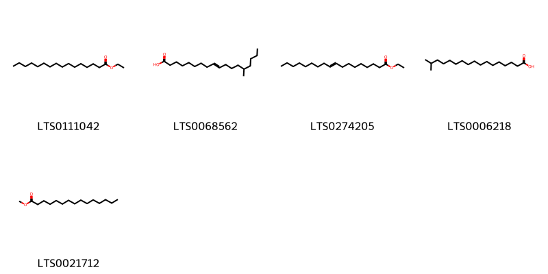{ width=100% }
    <figcaption>Hình ảnh cấu trúc hóa học của 5 hoạt chất thuộc nhóm Fatty Acyls gồm ['ethyl palmitate (LTS0111042)', '14-methyloctadec-9-enoic acid (LTS0068562)', 'ethyl octadec-9-enoate (LTS0274205)', '(+)-isostearic acid (LTS0006218)', 'methyl pentadecanoate (LTS0021712)'].</figcaption>
</figure>
#### Nhóm Steroids and steroid derivatives
<figure markdown="span">
    { width=100% }
    <figcaption>Hình ảnh cấu trúc hóa học của 2 hoạt chất thuộc nhóm Steroids and steroid derivatives gồm ['stigmast-5-en-3-ol (LTS0071224)', 'stigmast-5-en-3-ol, (3β)- (LTS0204616)'].</figcaption>
</figure>

---

### Dược dân tộc học

Danh sách các quốc gia có sử dụng *Aristolochia grandiflora* trong điều trị các bệnh. 

| Country           | Disease                                                                                                      | Bệnh                                                                                                                                                                                                |
|:------------------|:-------------------------------------------------------------------------------------------------------------|:----------------------------------------------------------------------------------------------------------------------------------------------------------------------------------------------------|
| Elsewhere         | Abortifacient, Emmenagogue, Sudorific                                                                        | MYMEMORY WARNING: YOU USED ALL AVAILABLE FREE TRANSLATIONS FOR TODAY. NEXT AVAILABLE IN  12 HOURS 48 MINUTES 58 SECONDS VISIT HTTPS://MYMEMORY.TRANSLATED.NET/DOC/USAGELIMITS.PHP TO TRANSLATE MORE |
| Guatemala         | Poison                                                                                                       | MYMEMORY WARNING: YOU USED ALL AVAILABLE FREE TRANSLATIONS FOR TODAY. NEXT AVAILABLE IN  12 HOURS 48 MINUTES 55 SECONDS VISIT HTTPS://MYMEMORY.TRANSLATED.NET/DOC/USAGELIMITS.PHP TO TRANSLATE MORE |
| Mexico            | Antidote, Diuretic, Ecbolic, Emmenagogue, Poison, Poison, Sudorific, Emmenagogue, Tonic, Vesicant, Sudorific | MYMEMORY WARNING: YOU USED ALL AVAILABLE FREE TRANSLATIONS FOR TODAY. NEXT AVAILABLE IN  12 HOURS 48 MINUTES 51 SECONDS VISIT HTTPS://MYMEMORY.TRANSLATED.NET/DOC/USAGELIMITS.PHP TO TRANSLATE MORE |
| Mexico(Chinantec) | Sudorific                                                                                                    | MYMEMORY WARNING: YOU USED ALL AVAILABLE FREE TRANSLATIONS FOR TODAY. NEXT AVAILABLE IN  12 HOURS 48 MINUTES 48 SECONDS VISIT HTTPS://MYMEMORY.TRANSLATED.NET/DOC/USAGELIMITS.PHP TO TRANSLATE MORE |
| Panama            | Poison                                                                                                       | MYMEMORY WARNING: YOU USED ALL AVAILABLE FREE TRANSLATIONS FOR TODAY. NEXT AVAILABLE IN  12 HOURS 48 MINUTES 45 SECONDS VISIT HTTPS://MYMEMORY.TRANSLATED.NET/DOC/USAGELIMITS.PHP TO TRANSLATE MORE |

---

---
## Aristolochia indica
### Thông tin về thực vật

!!! info "Phân loại thực vật của *Aristolochia indica* từ GIBF:"
    - **Kingdom:** Plantae
    - **Phylum:** Tracheophyta
    - **Order:** Piperales
    - **Family:** Aristolochiaceae
    - **Genus:** Aristolochia
    - **Species:** *Aristolochia indica*

 

| Label (VI)   | Label (EN)   | Scientific Name     | Descriptions (VI)   | Descriptions (EN)   | Also Known As (VI)   | Also Known As (EN)   |
|:-------------|:-------------|:--------------------|:--------------------|:--------------------|:---------------------|:---------------------|
| N/A          | N/A          | Aristolochia indica | loài thực vật       | species of plant    | ['']                 | ['Indian birthwort'] |

#### Phân bố trên thế giới

**Từ CSDL GIBF** nan, Viet Nam, unknown or invalid, Sri Lanka, Myanmar, India, Réunion, Bangladesh, Australia, Netherlands

#### Phân bố tại Việt Nam

**Từ CSDL GIBF**: Không có ghi nhận ở Việt Nam

---
### Thành phần hóa học
        
- Theo cơ sở dữ liệu lotus: Từ loài *Aristolochia indica* đã phân lập và xác định được 43 hoạt chất thuộc về các nhóm Furanoid lignans, Aporphines, Organooxygen compounds, Phenanthrenes and derivatives, Prenol lipids, Aristolactams, Steroids and steroid derivatives, Naphthalenes. 

|    | chemicalTaxonomyClassyfireClass   |   smiles_count |
|---:|:----------------------------------|---------------:|
|  0 | Aporphines                        |              3 |
|  1 | Aristolactams                     |              6 |
|  2 | Furanoid lignans                  |              5 |
|  3 | Naphthalenes                      |              2 |
|  4 | Organooxygen compounds            |              2 |
|  5 | Phenanthrenes and derivatives     |              4 |
|  6 | Prenol lipids                     |             12 |
|  7 | Steroids and steroid derivatives  |              9 |

#### Nhóm Aporphines
<figure markdown="span">
    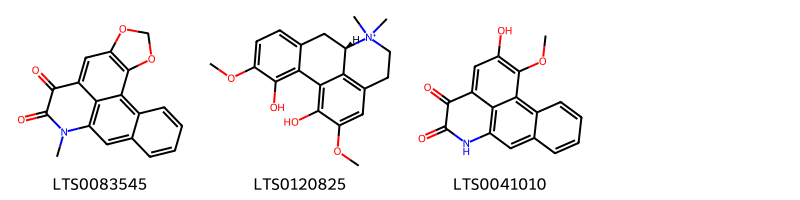{ width=100% }
    <figcaption>Hình ảnh cấu trúc hóa học của 3 hoạt chất thuộc nhóm Aporphines gồm ['11-methyl-3,5-dioxa-11-azapentacyclo[10.7.1.0²,⁶.0⁸,²⁰.0¹⁴,¹⁹]icosa-1(20),2(6),7,12,14(19),15,17-heptaene-9,10-dione (LTS0083545)', 'magnoflorine (LTS0120825)', '15-hydroxy-16-methoxy-10-azatetracyclo[7.7.1.0²,⁷.0¹³,¹⁷]heptadeca-1(17),2(7),3,5,8,13,15-heptaene-11,12-dione (LTS0041010)'].</figcaption>
</figure>
#### Nhóm Aristolactams
<figure markdown="span">
    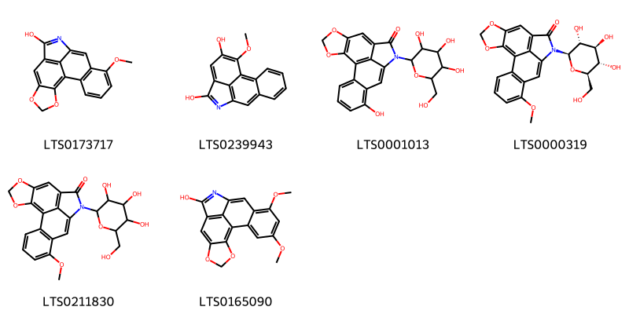{ width=100% }
    <figcaption>Hình ảnh cấu trúc hóa học của 6 hoạt chất thuộc nhóm Aristolactams gồm ['14-methoxy-3,5-dioxa-10-azapentacyclo[9.7.1.0²,⁶.0⁸,¹⁹.0¹³,¹⁸]nonadeca-1(19),2(6),7,9,11,13(18),14,16-octaen-9-ol (LTS0173717)', '15-methoxy-10-azatetracyclo[7.6.1.0²,⁷.0¹²,¹⁶]hexadeca-1(16),2(7),3,5,8,10,12,14-octaene-11,14-diol (LTS0239943)', '14-hydroxy-10-[3,4,5-trihydroxy-6-(hydroxymethyl)oxan-2-yl]-3,5-dioxa-10-azapentacyclo[9.7.1.0²,⁶.0⁸,¹⁹.0¹³,¹⁸]nonadeca-1(19),2(6),7,11,13(18),14,16-heptaen-9-one (LTS0001013)', '14-methoxy-10-[(2r,3r,4s,5s,6r)-3,4,5-trihydroxy-6-(hydroxymethyl)oxan-2-yl]-3,5-dioxa-10-azapentacyclo[9.7.1.0²,⁶.0⁸,¹⁹.0¹³,¹⁸]nonadeca-1(19),2(6),7,11,13(18),14,16-heptaen-9-one (LTS0000319)', '14-methoxy-10-[3,4,5-trihydroxy-6-(hydroxymethyl)oxan-2-yl]-3,5-dioxa-10-azapentacyclo[9.7.1.0²,⁶.0⁸,¹⁹.0¹³,¹⁸]nonadeca-1(19),2(6),7,11,13(18),14,16-heptaen-9-one (LTS0211830)', '14,16-dimethoxy-3,5-dioxa-10-azapentacyclo[9.7.1.0²,⁶.0⁸,¹⁹.0¹³,¹⁸]nonadeca-1(19),2(6),7,9,11,13(18),14,16-octaen-9-ol (LTS0165090)'].</figcaption>
</figure>
#### Nhóm Furanoid lignans
<figure markdown="span">
    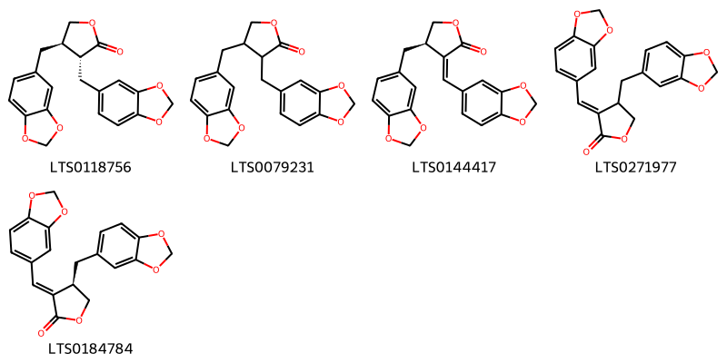{ width=100% }
    <figcaption>Hình ảnh cấu trúc hóa học của 5 hoạt chất thuộc nhóm Furanoid lignans gồm ['hinokinin (LTS0118756)', '3,4-bis(2h-1,3-benzodioxol-5-ylmethyl)oxolan-2-one (LTS0079231)', '(4r)-4-(2h-1,3-benzodioxol-5-ylmethyl)-3-(2h-1,3-benzodioxol-5-ylmethylidene)oxolan-2-one (LTS0144417)', '(3e)-4-(2h-1,3-benzodioxol-5-ylmethyl)-3-(2h-1,3-benzodioxol-5-ylmethylidene)oxolan-2-one (LTS0271977)', 'savinin (LTS0184784)'].</figcaption>
</figure>
#### Nhóm Naphthalenes
<figure markdown="span">
    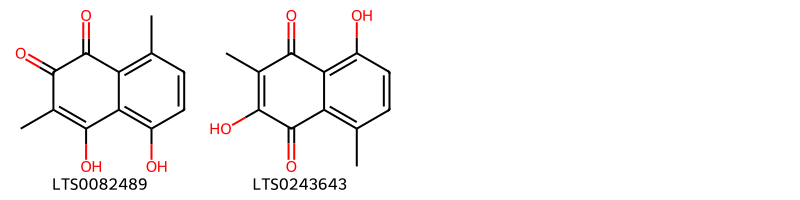{ width=100% }
    <figcaption>Hình ảnh cấu trúc hóa học của 2 hoạt chất thuộc nhóm Naphthalenes gồm ['4,5-dihydroxy-3,8-dimethylnaphthalene-1,2-dione (LTS0082489)', 'aristolindiquinone (LTS0243643)'].</figcaption>
</figure>
#### Nhóm Organooxygen compounds
<figure markdown="span">
    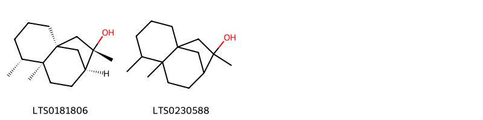{ width=100% }
    <figcaption>Hình ảnh cấu trúc hóa học của 2 hoạt chất thuộc nhóm Organooxygen compounds gồm ['(1r,5r,6s,9s,10s)-5,6,10-trimethyltricyclo[7.2.1.0¹,⁶]dodecan-10-ol (LTS0181806)', '5,6,10-trimethyltricyclo[7.2.1.0¹,⁶]dodecan-10-ol (LTS0230588)'].</figcaption>
</figure>
#### Nhóm Phenanthrenes and derivatives
<figure markdown="span">
    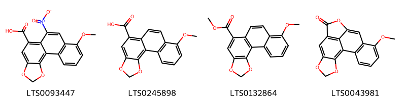{ width=100% }
    <figcaption>Hình ảnh cấu trúc hóa học của 4 hoạt chất thuộc nhóm Phenanthrenes and derivatives gồm ['birthwort (LTS0093447)', 'aristolic acid (LTS0245898)', 'methyl 8-methoxy-2h-phenanthro[3,4-d][1,3]dioxole-5-carboxylate (LTS0132864)', '14-methoxy-3,5,10-trioxapentacyclo[9.7.1.0²,⁶.0⁸,¹⁹.0¹³,¹⁸]nonadeca-1(19),2(6),7,11,13(18),14,16-heptaen-9-one (LTS0043981)'].</figcaption>
</figure>
#### Nhóm Prenol lipids
<figure markdown="span">
    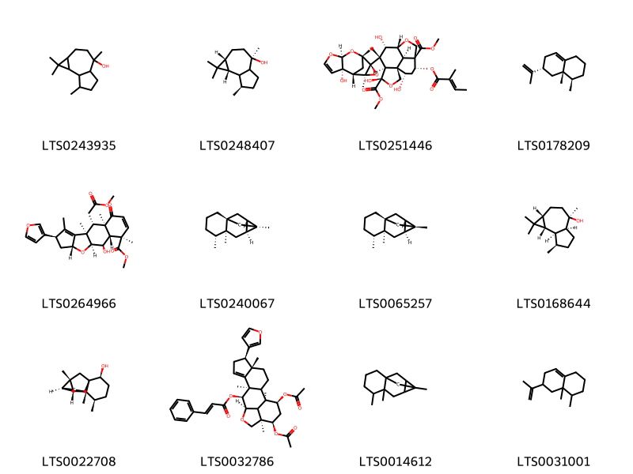{ width=100% }
    <figcaption>Hình ảnh cấu trúc hóa học của 12 hoạt chất thuộc nhóm Prenol lipids gồm ['ledol (LTS0243935)', '(1ar,4r,7r,7bs)-1,1,4,7-tetramethyl-octahydro-1ah-cyclopropa[e]azulen-4-ol (LTS0248407)', '4,11-dimethyl (1s,4s,5r,6s,7s,8r,11s,12r,14s,15r)-4,7,14-trihydroxy-6-[(1s,2s,6s,8s,9r,11s)-2-hydroxy-11-methyl-5,7,10-trioxatetracyclo[6.3.1.0²,⁶.0⁹,¹¹]dodec-3-en-9-yl]-6-methyl-12-{[(2e)-2-methylbut-2-enoyl]oxy}-3,9-dioxatetracyclo[6.6.1.0¹,⁵.0¹¹,¹⁵]pentadecane-4,11-dicarboxylate (LTS0251446)', '(-)-aristolochene (LTS0178209)', '6-deacetylnimbin (LTS0264966)', '(1r,5r,6s,8s,9s,10r)-5,6,9-trimethyltetracyclo[7.2.1.0¹,⁶.0⁸,¹⁰]dodecane (LTS0240067)', '(1r,5r,6s,8s,9r,10r)-5,6,9-trimethyltetracyclo[7.2.1.0¹,⁶.0⁸,¹⁰]dodecane (LTS0065257)', 'ledol (LTS0168644)', '(1s,2s,5r,6s,8s,9s,10r)-5,6,9-trimethyltetracyclo[7.2.1.0¹,⁶.0⁸,¹⁰]dodecan-2-ol (LTS0022708)', '(1r,5s,6r,10r,11s,12r,15r,16r,18s)-16,18-bis(acetyloxy)-6-(furan-3-yl)-1,5,10,15-tetramethyl-13-oxapentacyclo[10.6.1.0²,¹⁰.0⁵,⁹.0¹⁵,¹⁹]nonadec-8-en-11-yl (2e)-3-phenylprop-2-enoate (LTS0032786)', '5,6,9-trimethyltetracyclo[7.2.1.0¹,⁶.0⁸,¹⁰]dodecane (LTS0014612)', '1,8a-dimethyl-7-(prop-1-en-2-yl)-2,3,4,6,7,8-hexahydro-1h-naphthalene (LTS0031001)'].</figcaption>
</figure>
#### Nhóm Steroids and steroid derivatives
<figure markdown="span">
    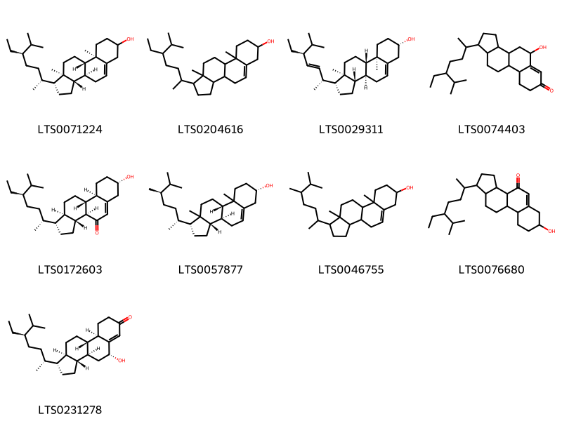{ width=100% }
    <figcaption>Hình ảnh cấu trúc hóa học của 9 hoạt chất thuộc nhóm Steroids and steroid derivatives gồm ['stigmast-5-en-3-ol (LTS0071224)', 'stigmast-5-en-3-ol, (3β)- (LTS0204616)', 'phytosterol (LTS0029311)', '1-(5-ethyl-6-methylheptan-2-yl)-5-hydroxy-1h,2h,3h,3ah,3bh,4h,5h,8h,9h,9ah,9bh,10h,11h,11ah-cyclopenta[a]phenanthren-7-one (LTS0074403)', '(1r,3ar,3bs,7s,9ar,9br,11ar)-1-[(2r,5r)-5-ethyl-6-methylheptan-2-yl]-7-hydroxy-1h,2h,3h,3ah,3bh,6h,7h,8h,9h,9ah,9bh,10h,11h,11ah-cyclopenta[a]phenanthren-4-one (LTS0172603)', '(1r,3as,3bs,7s,9bs)-1-[(2r,5r)-5,6-dimethylheptan-2-yl]-9a,11a-dimethyl-1h,2h,3h,3ah,3bh,4h,6h,7h,8h,9h,9bh,10h,11h-cyclopenta[a]phenanthren-7-ol (LTS0057877)', 'campesterol (LTS0046755)', '1-(5-ethyl-6-methylheptan-2-yl)-7-hydroxy-1h,2h,3h,3ah,3bh,6h,7h,8h,9h,9ah,9bh,10h,11h,11ah-cyclopenta[a]phenanthren-4-one (LTS0076680)', '(1r,3ar,3bs,5r,9ar,9bs,11ar)-1-[(2r,5r)-5-ethyl-6-methylheptan-2-yl]-5-hydroxy-1h,2h,3h,3ah,3bh,4h,5h,8h,9h,9ah,9bh,10h,11h,11ah-cyclopenta[a]phenanthren-7-one (LTS0231278)'].</figcaption>
</figure>

---

### Dược dân tộc học

Danh sách các quốc gia có sử dụng *Aristolochia indica* trong điều trị các bệnh. 

| Country   | Disease     | Bệnh                                                                                                                                                                                                |
|:----------|:------------|:----------------------------------------------------------------------------------------------------------------------------------------------------------------------------------------------------|
| India     | Carminative | MYMEMORY WARNING: YOU USED ALL AVAILABLE FREE TRANSLATIONS FOR TODAY. NEXT AVAILABLE IN  12 HOURS 48 MINUTES 00 SECONDS VISIT HTTPS://MYMEMORY.TRANSLATED.NET/DOC/USAGELIMITS.PHP TO TRANSLATE MORE |

---

---
## Aristolochia longa
### Thông tin về thực vật

!!! info "Phân loại thực vật của *N/A* từ GIBF:"
    - **Kingdom:** Plantae
    - **Phylum:** Tracheophyta
    - **Order:** Piperales
    - **Family:** Aristolochiaceae
    - **Genus:** Aristolochia
    - **Species:** *N/A*

 

| Label (VI)   | Label (EN)   | Scientific Name    | Descriptions (VI)   | Descriptions (EN)         | Also Known As (VI)   | Also Known As (EN)   |
|:-------------|:-------------|:-------------------|:--------------------|:--------------------------|:---------------------|:---------------------|
| N/A          | N/A          | Aristolochia longa |                     | name that may not be used | ['']                 | ['']                 |

#### Phân bố trên thế giới

**Từ CSDL GIBF** Honduras, Spain, French Guiana, Chile, Gabon, Austria, Singapore, Australia, Jamaica, Korea, Republic of, Guatemala, Colombia, India, Réunion, Nicaragua, Panama, Brazil, Peru, Hungary, Mexico, Hong Kong, Chinese Taipei, Uruguay, Argentina, South Africa, Portugal, Gibraltar, France, Costa Rica, New Caledonia, United States of America, Zimbabwe, Zambia, Israel, Madagascar, Ukraine

#### Phân bố tại Việt Nam

**Từ CSDL GIBF**: Không có ghi nhận ở Việt Nam

---
### Thành phần hóa học
        
- Theo cơ sở dữ liệu lotus: Từ loài *N/A* đã phân lập và xác định được Chưa có hoạt chất nào được phân lập. hoạt chất thuộc về các nhóm Không có hoạt chất nào được phân lập. 

Không có hình ảnh nào được tạo ra

---

### Dược dân tộc học

Danh sách các quốc gia có sử dụng *N/A* trong điều trị các bệnh. 

| Country   | Disease          | Bệnh                                                                                                                                                                                                |
|:----------|:-----------------|:----------------------------------------------------------------------------------------------------------------------------------------------------------------------------------------------------|
| Elsewhere | Tonic, Stomachic | MYMEMORY WARNING: YOU USED ALL AVAILABLE FREE TRANSLATIONS FOR TODAY. NEXT AVAILABLE IN  12 HOURS 47 MINUTES 05 SECONDS VISIT HTTPS://MYMEMORY.TRANSLATED.NET/DOC/USAGELIMITS.PHP TO TRANSLATE MORE |
| ain       | Poison           | MYMEMORY WARNING: YOU USED ALL AVAILABLE FREE TRANSLATIONS FOR TODAY. NEXT AVAILABLE IN  12 HOURS 47 MINUTES 02 SECONDS VISIT HTTPS://MYMEMORY.TRANSLATED.NET/DOC/USAGELIMITS.PHP TO TRANSLATE MORE |

---

---
## Aristolochia maurorum
### Thông tin về thực vật

!!! info "Phân loại thực vật của *Aristolochia maurorum* từ GIBF:"
    - **Kingdom:** Plantae
    - **Phylum:** Tracheophyta
    - **Order:** Piperales
    - **Family:** Aristolochiaceae
    - **Genus:** Aristolochia
    - **Species:** *Aristolochia maurorum*

 

| Label (VI)   | Label (EN)   | Scientific Name       | Descriptions (VI)   | Descriptions (EN)   | Also Known As (VI)   | Also Known As (EN)   |
|:-------------|:-------------|:----------------------|:--------------------|:--------------------|:---------------------|:---------------------|
| N/A          | N/A          | Aristolochia maurorum | loài thực vật       | species of plant    | ['']                 | ['']                 |

#### Phân bố trên thế giới

**Từ CSDL GIBF** Türkiye, nan, Iran (Islamic Republic of), Syrian Arab Republic, France, Lebanon, Iraq, Israel

#### Phân bố tại Việt Nam

**Từ CSDL GIBF**: Không có ghi nhận ở Việt Nam

---
### Thành phần hóa học
        
- Theo cơ sở dữ liệu lotus: Từ loài *Aristolochia maurorum* đã phân lập và xác định được 1 hoạt chất thuộc về các nhóm Phenanthrenes and derivatives. 

|    | chemicalTaxonomyClassyfireClass   |   smiles_count |
|---:|:----------------------------------|---------------:|
|  0 | Phenanthrenes and derivatives     |              1 |

#### Nhóm Phenanthrenes and derivatives
<figure markdown="span">
    { width=100% }
    <figcaption>Hình ảnh cấu trúc hóa học của 1 hoạt chất thuộc nhóm Phenanthrenes and derivatives gồm ['birthwort (LTS0093447)'].</figcaption>
</figure>

---

### Dược dân tộc học

Danh sách các quốc gia có sử dụng *Aristolochia maurorum* trong điều trị các bệnh. 

| Country   | Disease    | Bệnh                                                                                                                                                                                                |
|:----------|:-----------|:----------------------------------------------------------------------------------------------------------------------------------------------------------------------------------------------------|
| Iraq      | Antiseptic | MYMEMORY WARNING: YOU USED ALL AVAILABLE FREE TRANSLATIONS FOR TODAY. NEXT AVAILABLE IN  12 HOURS 46 MINUTES 36 SECONDS VISIT HTTPS://MYMEMORY.TRANSLATED.NET/DOC/USAGELIMITS.PHP TO TRANSLATE MORE |

---

---
## Aristolochia maxima
### Thông tin về thực vật

!!! info "Phân loại thực vật của *Aristolochia maxima* từ GIBF:"
    - **Kingdom:** Plantae
    - **Phylum:** Tracheophyta
    - **Order:** Piperales
    - **Family:** Aristolochiaceae
    - **Genus:** Aristolochia
    - **Species:** *Aristolochia maxima*

 

| Label (VI)   | Label (EN)   | Scientific Name     | Descriptions (VI)   | Descriptions (EN)   | Also Known As (VI)   | Also Known As (EN)   |
|:-------------|:-------------|:--------------------|:--------------------|:--------------------|:---------------------|:---------------------|
| N/A          | N/A          | Aristolochia maxima | loài thực vật       | species of plant    | ['']                 | ['canastilla']       |

#### Phân bố trên thế giới

**Từ CSDL GIBF** Honduras, nan, Colombia, Venezuela (Bolivarian Republic of), El Salvador, Nicaragua, Panama, Belize, Costa Rica, United States of America, Mexico, Guatemala

#### Phân bố tại Việt Nam

**Từ CSDL GIBF**: Không có ghi nhận ở Việt Nam

---
### Thành phần hóa học
        
- Theo cơ sở dữ liệu lotus: Từ loài *Aristolochia maxima* đã phân lập và xác định được 1 hoạt chất thuộc về các nhóm Phenanthrenes and derivatives. 

|    | chemicalTaxonomyClassyfireClass   |   smiles_count |
|---:|:----------------------------------|---------------:|
|  0 | Phenanthrenes and derivatives     |              1 |

#### Nhóm Phenanthrenes and derivatives
<figure markdown="span">
    { width=100% }
    <figcaption>Hình ảnh cấu trúc hóa học của 1 hoạt chất thuộc nhóm Phenanthrenes and derivatives gồm ['birthwort (LTS0093447)'].</figcaption>
</figure>

---

### Dược dân tộc học

Danh sách các quốc gia có sử dụng *Aristolochia maxima* trong điều trị các bệnh. 

| Country   | Disease    | Bệnh                                                                                                                                                                                                |
|:----------|:-----------|:----------------------------------------------------------------------------------------------------------------------------------------------------------------------------------------------------|
| Venezuela | Alexiteric | MYMEMORY WARNING: YOU USED ALL AVAILABLE FREE TRANSLATIONS FOR TODAY. NEXT AVAILABLE IN  12 HOURS 46 MINUTES 04 SECONDS VISIT HTTPS://MYMEMORY.TRANSLATED.NET/DOC/USAGELIMITS.PHP TO TRANSLATE MORE |

---

---
## Aristolochia mexicana
### Thông tin về thực vật

!!! info "Phân loại thực vật của *N/A* từ GIBF:"
    - **Kingdom:** Plantae
    - **Phylum:** Tracheophyta
    - **Order:** Piperales
    - **Family:** Aristolochiaceae
    - **Genus:** Aristolochia
    - **Species:** *N/A*

 

| Label (VI)   | Label (EN)   | Scientific Name       | Descriptions (VI)   | Descriptions (EN)   | Also Known As (VI)   | Also Known As (EN)   |
|:-------------|:-------------|:----------------------|:--------------------|:--------------------|:---------------------|:---------------------|
| N/A          | N/A          | Aristolochia mexicana |                     | species of plant    | ['']                 | ['']                 |

#### Phân bố trên thế giới

**Từ CSDL GIBF** Honduras, Spain, French Guiana, Chile, Gabon, Austria, Singapore, Australia, Jamaica, Korea, Republic of, Guatemala, Colombia, India, Réunion, Nicaragua, Panama, Brazil, Peru, Hungary, Mexico, Hong Kong, Chinese Taipei, Uruguay, Argentina, South Africa, Portugal, Gibraltar, France, Costa Rica, New Caledonia, United States of America, Zimbabwe, Zambia, Israel, Madagascar, Ukraine

#### Phân bố tại Việt Nam

**Từ CSDL GIBF**: Không có ghi nhận ở Việt Nam

---
### Thành phần hóa học
        
- Theo cơ sở dữ liệu lotus: Từ loài *N/A* đã phân lập và xác định được Chưa có hoạt chất nào được phân lập. hoạt chất thuộc về các nhóm Không có hoạt chất nào được phân lập. 

Không có hình ảnh nào được tạo ra

---

### Dược dân tộc học

Danh sách các quốc gia có sử dụng *N/A* trong điều trị các bệnh. 

| Country   | Disease                                                     | Bệnh                                                                                                                                                                                                |
|:----------|:------------------------------------------------------------|:----------------------------------------------------------------------------------------------------------------------------------------------------------------------------------------------------|
| Mexico    | Carminative, Sialogogue, Sternutatory, Sudorific, Stimulant | MYMEMORY WARNING: YOU USED ALL AVAILABLE FREE TRANSLATIONS FOR TODAY. NEXT AVAILABLE IN  12 HOURS 45 MINUTES 36 SECONDS VISIT HTTPS://MYMEMORY.TRANSLATED.NET/DOC/USAGELIMITS.PHP TO TRANSLATE MORE |

---

---
## Aristolochia mollissima
### Thông tin về thực vật

!!! info "Phân loại thực vật của *Isotrema mollissimum* từ GIBF:"
    - **Kingdom:** Plantae
    - **Phylum:** Tracheophyta
    - **Order:** Piperales
    - **Family:** Aristolochiaceae
    - **Genus:** Isotrema
    - **Species:** *Isotrema mollissimum*

 

| Label (VI)   | Label (EN)   | Scientific Name         | Descriptions (VI)   | Descriptions (EN)   | Also Known As (VI)   | Also Known As (EN)   |
|:-------------|:-------------|:------------------------|:--------------------|:--------------------|:---------------------|:---------------------|
| N/A          | N/A          | Aristolochia mollissima | loài thực vật       | species of plant    | ['']                 | ['']                 |

#### Phân bố trên thế giới

**Từ CSDL GIBF** nan, China

#### Phân bố tại Việt Nam

**Từ CSDL GIBF**: Không có ghi nhận ở Việt Nam

---
### Thành phần hóa học
        
- Theo cơ sở dữ liệu lotus: Từ loài *Isotrema mollissimum* đã phân lập và xác định được 52 hoạt chất thuộc về các nhóm Organooxygen compounds, Aporphines, Azoles, Phenanthrenes and derivatives, Prenol lipids, Carboxylic acids and derivatives, Epoxides, Tetrapyrroles and derivatives, Aristolactams, Dihydrofurans, Cinnamic acids and derivatives, Steroids and steroid derivatives. 

|    | chemicalTaxonomyClassyfireClass   |   smiles_count |
|---:|:----------------------------------|---------------:|
|  0 | Aporphines                        |              4 |
|  1 | Aristolactams                     |              7 |
|  2 | Azoles                            |              1 |
|  3 | Carboxylic acids and derivatives  |              2 |
|  4 | Cinnamic acids and derivatives    |              1 |
|  5 | Dihydrofurans                     |              3 |
|  6 | Epoxides                          |              2 |
|  7 | Organooxygen compounds            |              5 |
|  8 | Phenanthrenes and derivatives     |              9 |
|  9 | Prenol lipids                     |             13 |
| 10 | Steroids and steroid derivatives  |              4 |
| 11 | Tetrapyrroles and derivatives     |              1 |

#### Nhóm Aporphines
<figure markdown="span">
    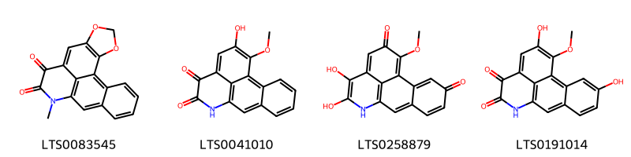{ width=100% }
    <figcaption>Hình ảnh cấu trúc hóa học của 4 hoạt chất thuộc nhóm Aporphines gồm ['11-methyl-3,5-dioxa-11-azapentacyclo[10.7.1.0²,⁶.0⁸,²⁰.0¹⁴,¹⁹]icosa-1(20),2(6),7,12,14(19),15,17-heptaene-9,10-dione (LTS0083545)', '15-hydroxy-16-methoxy-10-azatetracyclo[7.7.1.0²,⁷.0¹³,¹⁷]heptadeca-1(17),2(7),3,5,8,13,15-heptaene-11,12-dione (LTS0041010)', '11,12-dihydroxy-16-methoxy-10-azatetracyclo[7.7.1.0²,⁷.0¹³,¹⁷]heptadeca-1(16),2,5,7,9(17),11,13-heptaene-4,15-dione (LTS0258879)', '4,15-dihydroxy-16-methoxy-10-azatetracyclo[7.7.1.0²,⁷.0¹³,¹⁷]heptadeca-1(17),2(7),3,5,8,13,15-heptaene-11,12-dione (LTS0191014)'].</figcaption>
</figure>
#### Nhóm Aristolactams
<figure markdown="span">
    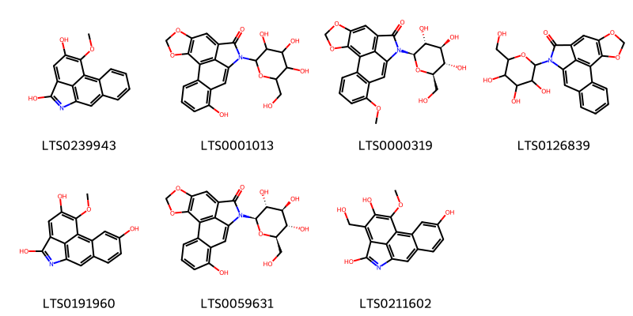{ width=100% }
    <figcaption>Hình ảnh cấu trúc hóa học của 7 hoạt chất thuộc nhóm Aristolactams gồm ['15-methoxy-10-azatetracyclo[7.6.1.0²,⁷.0¹²,¹⁶]hexadeca-1(16),2(7),3,5,8,10,12,14-octaene-11,14-diol (LTS0239943)', '14-hydroxy-10-[3,4,5-trihydroxy-6-(hydroxymethyl)oxan-2-yl]-3,5-dioxa-10-azapentacyclo[9.7.1.0²,⁶.0⁸,¹⁹.0¹³,¹⁸]nonadeca-1(19),2(6),7,11,13(18),14,16-heptaen-9-one (LTS0001013)', '14-methoxy-10-[(2r,3r,4s,5s,6r)-3,4,5-trihydroxy-6-(hydroxymethyl)oxan-2-yl]-3,5-dioxa-10-azapentacyclo[9.7.1.0²,⁶.0⁸,¹⁹.0¹³,¹⁸]nonadeca-1(19),2(6),7,11,13(18),14,16-heptaen-9-one (LTS0000319)', '10-[3,4,5-trihydroxy-6-(hydroxymethyl)oxan-2-yl]-3,5-dioxa-10-azapentacyclo[9.7.1.0²,⁶.0⁸,¹⁹.0¹³,¹⁸]nonadeca-1(19),2(6),7,11,13(18),14,16-heptaen-9-one (LTS0126839)', '15-methoxy-10-azatetracyclo[7.6.1.0²,⁷.0¹²,¹⁶]hexadeca-1(16),2(7),3,5,8,10,12,14-octaene-4,11,14-triol (LTS0191960)', '14-hydroxy-10-[(2r,3r,4s,5s,6r)-3,4,5-trihydroxy-6-(hydroxymethyl)oxan-2-yl]-3,5-dioxa-10-azapentacyclo[9.7.1.0²,⁶.0⁸,¹⁹.0¹³,¹⁸]nonadeca-1(19),2(6),7,11,13(18),14,16-heptaen-9-one (LTS0059631)', '13-(hydroxymethyl)-15-methoxy-10-azatetracyclo[7.6.1.0²,⁷.0¹²,¹⁶]hexadeca-1(16),2(7),3,5,8,10,12,14-octaene-4,11,14-triol (LTS0211602)'].</figcaption>
</figure>
#### Nhóm Azoles
<figure markdown="span">
    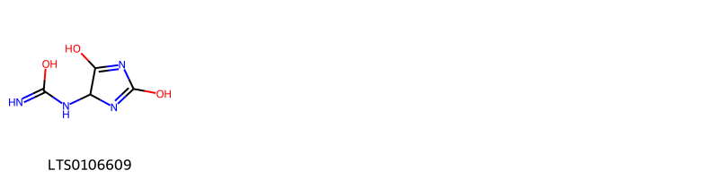{ width=100% }
    <figcaption>Hình ảnh cấu trúc hóa học của 1 hoạt chất thuộc nhóm Azoles gồm ['allantoin (LTS0106609)'].</figcaption>
</figure>
#### Nhóm Carboxylic acids and derivatives
<figure markdown="span">
    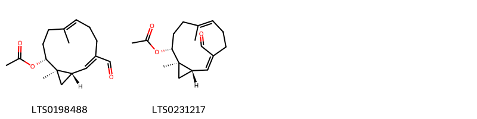{ width=100% }
    <figcaption>Hình ảnh cấu trúc hóa học của 2 hoạt chất thuộc nhóm Carboxylic acids and derivatives gồm ['madolin h (LTS0198488)', '(1r,2r,5e,9z,11s)-9-formyl-1,5-dimethylbicyclo[9.1.0]dodeca-5,9-dien-2-yl acetate (LTS0231217)'].</figcaption>
</figure>
#### Nhóm Cinnamic acids and derivatives
<figure markdown="span">
    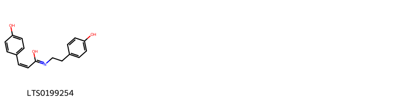{ width=100% }
    <figcaption>Hình ảnh cấu trúc hóa học của 1 hoạt chất thuộc nhóm Cinnamic acids and derivatives gồm ['(2z)-3-(4-hydroxyphenyl)-n-[2-(4-hydroxyphenyl)ethyl]prop-2-enimidic acid (LTS0199254)'].</figcaption>
</figure>
#### Nhóm Dihydrofurans
<figure markdown="span">
    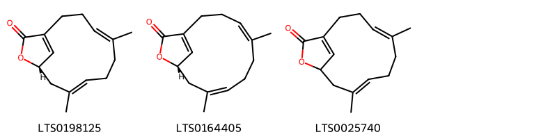{ width=100% }
    <figcaption>Hình ảnh cấu trúc hóa học của 3 hoạt chất thuộc nhóm Dihydrofurans gồm ['(4e,8e,11s)-5,9-dimethyl-12-oxabicyclo[9.2.1]tetradeca-1(14),4,8-trien-13-one (LTS0198125)', '(4z,8z,11s)-5,9-dimethyl-12-oxabicyclo[9.2.1]tetradeca-1(14),4,8-trien-13-one (LTS0164405)', '(4e,8e)-5,9-dimethyl-12-oxabicyclo[9.2.1]tetradeca-1(14),4,8-trien-13-one (LTS0025740)'].</figcaption>
</figure>
#### Nhóm Epoxides
<figure markdown="span">
    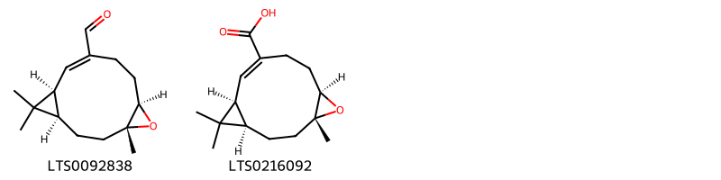{ width=100% }
    <figcaption>Hình ảnh cấu trúc hóa học của 2 hoạt chất thuộc nhóm Epoxides gồm ['madolin a (LTS0092838)', 'madolin b (LTS0216092)'].</figcaption>
</figure>
#### Nhóm Organooxygen compounds
<figure markdown="span">
    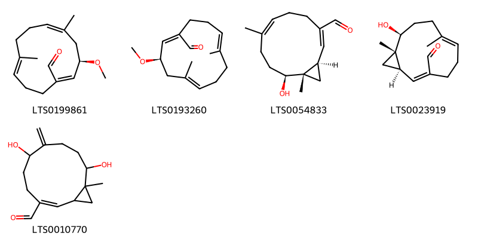{ width=100% }
    <figcaption>Hình ảnh cấu trúc hóa học của 5 hoạt chất thuộc nhóm Organooxygen compounds gồm ['(1z,3r,5z,9e)-3-methoxy-5,9-dimethylcyclododeca-1,5,9-triene-1-carbaldehyde (LTS0199861)', 'madolin m (LTS0193260)', '(1r,2e,6z,10s,11s)-10-hydroxy-7,11-dimethylbicyclo[9.1.0]dodeca-2,6-diene-3-carbaldehyde (LTS0054833)', '(1r,2z,6e,10s,11s)-10-hydroxy-7,11-dimethylbicyclo[9.1.0]dodeca-2,6-diene-3-carbaldehyde (LTS0023919)', '(2e)-6,10-dihydroxy-11-methyl-7-methylidenebicyclo[9.1.0]dodec-2-ene-3-carbaldehyde (LTS0010770)'].</figcaption>
</figure>
#### Nhóm Phenanthrenes and derivatives
<figure markdown="span">
    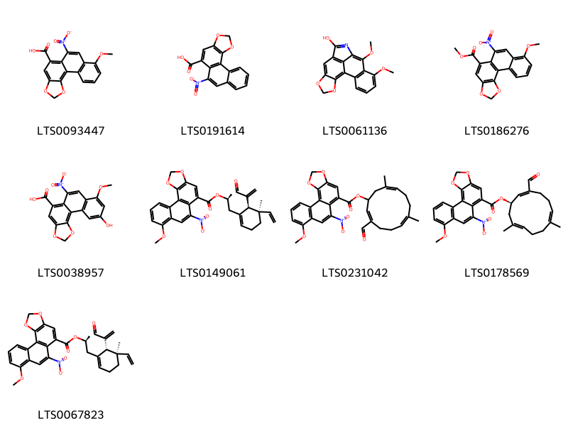{ width=100% }
    <figcaption>Hình ảnh cấu trúc hóa học của 9 hoạt chất thuộc nhóm Phenanthrenes and derivatives gồm ['birthwort (LTS0093447)', 'aristolochic acid ii (LTS0191614)', '12,14-dimethoxy-3,5-dioxa-10-azapentacyclo[9.7.1.0²,⁶.0⁸,¹⁹.0¹³,¹⁸]nonadeca-1(19),2(6),7,9,11,13(18),14,16-octaen-9-ol (LTS0061136)', 'methyl 8-methoxy-6-nitro-2h-phenanthro[3,4-d][1,3]dioxole-5-carboxylate (LTS0186276)', '10-hydroxy-8-methoxy-6-nitro-2h-phenanthro[3,4-d][1,3]dioxole-5-carboxylic acid (LTS0038957)', '(2s)-1-[(5r,6r)-5-ethenyl-5-methyl-6-(3-oxoprop-1-en-2-yl)cyclohex-1-en-1-yl]propan-2-yl 8-methoxy-6-nitro-2h-phenanthro[3,4-d][1,3]dioxole-5-carboxylate (LTS0149061)', '3-formyl-7,11-dimethylcyclododeca-2,6,10-trien-1-yl 8-methoxy-6-nitro-2h-phenanthro[3,4-d][1,3]dioxole-5-carboxylate (LTS0231042)', '(1r,2e,6z,10e)-3-formyl-7,11-dimethylcyclododeca-2,6,10-trien-1-yl 8-methoxy-6-nitro-2h-phenanthro[3,4-d][1,3]dioxole-5-carboxylate (LTS0178569)', '(2s)-1-[(5r,6s)-5-ethenyl-5-methyl-6-(3-oxoprop-1-en-2-yl)cyclohex-1-en-1-yl]propan-2-yl 8-methoxy-6-nitro-2h-phenanthro[3,4-d][1,3]dioxole-5-carboxylate (LTS0067823)'].</figcaption>
</figure>
#### Nhóm Prenol lipids
<figure markdown="span">
    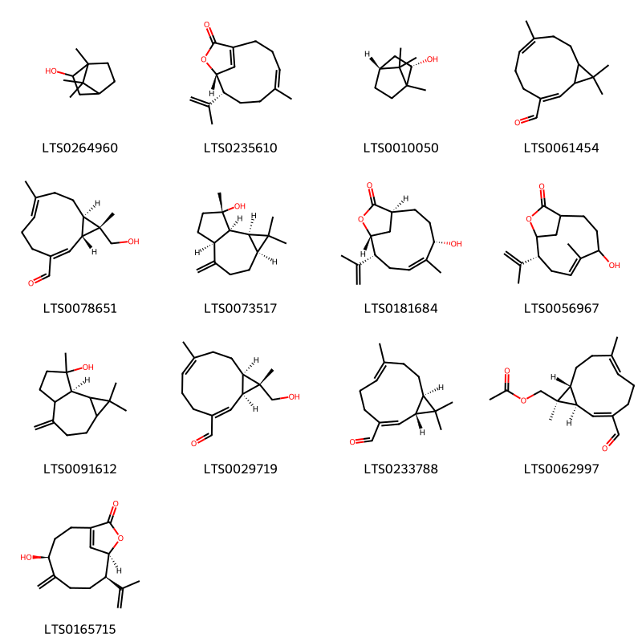{ width=100% }
    <figcaption>Hình ảnh cấu trúc hóa học của 13 hoạt chất thuộc nhóm Prenol lipids gồm ['borneol (LTS0264960)', '(4z,8r,9r)-5-methyl-8-(prop-1-en-2-yl)-10-oxabicyclo[7.2.1]dodeca-1(12),4-dien-11-one (LTS0235610)', '(2s,4r)-1,7,7-trimethylbicyclo[2.2.1]heptan-2-ol (LTS0010050)', '(2e,6z)-7,11,11-trimethylbicyclo[8.1.0]undeca-2,6-diene-3-carbaldehyde (LTS0061454)', 'madolin k (LTS0078651)', '(1as,4as,7s,7ar,7bs)-1,1,7-trimethyl-4-methylidene-octahydrocyclopropa[e]azulen-7-ol (LTS0073517)', '(1s,4s,8r,9r)-4-hydroxy-5-methyl-8-(prop-1-en-2-yl)-10-oxabicyclo[7.2.1]dodec-5-en-11-one (LTS0181684)', '(5e,8r)-4-hydroxy-5-methyl-8-(prop-1-en-2-yl)-10-oxabicyclo[7.2.1]dodec-5-en-11-one (LTS0056967)', '(7ar)-1,1,7-trimethyl-4-methylidene-octahydrocyclopropa[e]azulen-7-ol (LTS0091612)', '(1s,2e,6z,10r,11s)-11-(hydroxymethyl)-7,11-dimethylbicyclo[8.1.0]undeca-2,6-diene-3-carbaldehyde (LTS0029719)', '(1r,2e,6e,10r)-7,11,11-trimethylbicyclo[8.1.0]undeca-2,6-diene-3-carbaldehyde (LTS0233788)', '[(1r,2e,6e,10r,11s)-3-formyl-7,11-dimethylbicyclo[8.1.0]undeca-2,6-dien-11-yl]methyl acetate (LTS0062997)', '(4s,8r,9r)-4-hydroxy-5-methylidene-8-(prop-1-en-2-yl)-10-oxabicyclo[7.2.1]dodec-1(12)-en-11-one (LTS0165715)'].</figcaption>
</figure>
#### Nhóm Steroids and steroid derivatives
<figure markdown="span">
    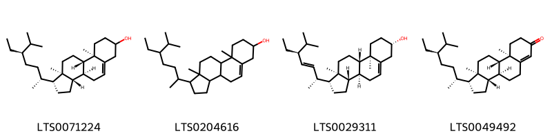{ width=100% }
    <figcaption>Hình ảnh cấu trúc hóa học của 4 hoạt chất thuộc nhóm Steroids and steroid derivatives gồm ['stigmast-5-en-3-ol (LTS0071224)', 'stigmast-5-en-3-ol, (3β)- (LTS0204616)', 'phytosterol (LTS0029311)', 'β-sitostenone (LTS0049492)'].</figcaption>
</figure>
#### Nhóm Tetrapyrroles and derivatives
<figure markdown="span">
    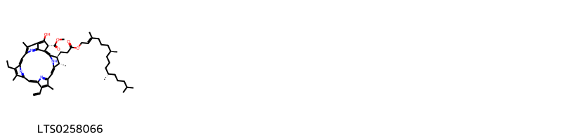{ width=100% }
    <figcaption>Hình ảnh cấu trúc hóa học của 1 hoạt chất thuộc nhóm Tetrapyrroles and derivatives gồm ['methyl (3r,21s,22s)-16-ethenyl-11-ethyl-4-hydroxy-12,17,21,26-tetramethyl-22-(3-oxo-3-{[(2e,7s,11s)-3,7,11,15-tetramethylhexadec-2-en-1-yl]oxy}propyl)-7,23,24,25-tetraazahexacyclo[18.2.1.1⁵,⁸.1¹⁰,¹³.1¹⁵,¹⁸.0²,⁶]hexacosa-1,4,6,8(26),9,11,13(25),14,16,18(24),19-undecaene-3-carboxylate (LTS0258066)'].</figcaption>
</figure>

---

### Dược dân tộc học

Danh sách các quốc gia có sử dụng *Isotrema mollissimum* trong điều trị các bệnh. 

| Country   | Disease     | Bệnh                                                                                                                                                                                                |
|:----------|:------------|:----------------------------------------------------------------------------------------------------------------------------------------------------------------------------------------------------|
| China     | Carminative | MYMEMORY WARNING: YOU USED ALL AVAILABLE FREE TRANSLATIONS FOR TODAY. NEXT AVAILABLE IN  12 HOURS 45 MINUTES 06 SECONDS VISIT HTTPS://MYMEMORY.TRANSLATED.NET/DOC/USAGELIMITS.PHP TO TRANSLATE MORE |

---

---
## Aristolochia odoratissima
### Thông tin về thực vật

!!! info "Phân loại thực vật của *Aristolochia odoratissima* từ GIBF:"
    - **Kingdom:** Plantae
    - **Phylum:** Tracheophyta
    - **Order:** Piperales
    - **Family:** Aristolochiaceae
    - **Genus:** Aristolochia
    - **Species:** *Aristolochia odoratissima*

 

| Label (VI)   | Label (EN)   | Scientific Name           | Descriptions (VI)   | Descriptions (EN)   | Also Known As (VI)   | Also Known As (EN)   |
|:-------------|:-------------|:--------------------------|:--------------------|:--------------------|:---------------------|:---------------------|
| N/A          | N/A          | Aristolochia odoratissima | loài thực vật       | species of plant    | ['']                 | ['']                 |

#### Phân bố trên thế giới

**Từ CSDL GIBF** Honduras, nan, Trinidad and Tobago, Australia, Guatemala, Colombia, Venezuela (Bolivarian Republic of), Côte d’Ivoire, Virgin Islands (U.S.), Belize, Nicaragua, Panama, Brazil, Peru, Mexico, Argentina, Bolivia (Plurinational State of), Costa Rica, Paraguay, Congo, Democratic Republic of the, Papua New Guinea, Ecuador, Guyana

#### Phân bố tại Việt Nam

**Từ CSDL GIBF**: Không có ghi nhận ở Việt Nam

---
### Thành phần hóa học
        
- Theo cơ sở dữ liệu lotus: Từ loài *Aristolochia odoratissima* đã phân lập và xác định được Chưa có hoạt chất nào được phân lập. hoạt chất thuộc về các nhóm Không có hoạt chất nào được phân lập. 

Không có hình ảnh nào được tạo ra

---

### Dược dân tộc học

Danh sách các quốc gia có sử dụng *Aristolochia odoratissima* trong điều trị các bệnh. 

| Country   | Disease                        | Bệnh                                                                                                                                                                                                |
|:----------|:-------------------------------|:----------------------------------------------------------------------------------------------------------------------------------------------------------------------------------------------------|
| Mexico    | Diuretic, Stomachic, Stimulant | MYMEMORY WARNING: YOU USED ALL AVAILABLE FREE TRANSLATIONS FOR TODAY. NEXT AVAILABLE IN  12 HOURS 44 MINUTES 28 SECONDS VISIT HTTPS://MYMEMORY.TRANSLATED.NET/DOC/USAGELIMITS.PHP TO TRANSLATE MORE |
| Venezuela | Tonic                          | MYMEMORY WARNING: YOU USED ALL AVAILABLE FREE TRANSLATIONS FOR TODAY. NEXT AVAILABLE IN  12 HOURS 44 MINUTES 25 SECONDS VISIT HTTPS://MYMEMORY.TRANSLATED.NET/DOC/USAGELIMITS.PHP TO TRANSLATE MORE |

---

---
## Aristolochia pentandra
### Thông tin về thực vật

!!! info "Phân loại thực vật của *Aristolochia pentandra* từ GIBF:"
    - **Kingdom:** Plantae
    - **Phylum:** Tracheophyta
    - **Order:** Piperales
    - **Family:** Aristolochiaceae
    - **Genus:** Aristolochia
    - **Species:** *Aristolochia pentandra*

 

| Label (VI)   | Label (EN)   | Scientific Name        | Descriptions (VI)   | Descriptions (EN)   | Also Known As (VI)   | Also Known As (EN)   |
|:-------------|:-------------|:-----------------------|:--------------------|:--------------------|:---------------------|:---------------------|
| N/A          | N/A          | Aristolochia pentandra | loài thực vật       | species of plant    | ['']                 | ['']                 |

#### Phân bố trên thế giới

**Từ CSDL GIBF** nan, Honduras, Belize, United States of America, Mexico, Bahamas, Cuba, Jamaica, Guatemala

#### Phân bố tại Việt Nam

**Từ CSDL GIBF**: Không có ghi nhận ở Việt Nam

---
### Thành phần hóa học
        
- Theo cơ sở dữ liệu lotus: Từ loài *Aristolochia pentandra* đã phân lập và xác định được Chưa có hoạt chất nào được phân lập. hoạt chất thuộc về các nhóm Không có hoạt chất nào được phân lập. 

Không có hình ảnh nào được tạo ra

---

### Dược dân tộc học

Danh sách các quốc gia có sử dụng *Aristolochia pentandra* trong điều trị các bệnh. 

| Country   | Disease            | Bệnh                                                                                                                                                                                                |
|:----------|:-------------------|:----------------------------------------------------------------------------------------------------------------------------------------------------------------------------------------------------|
| Mexico    | Emmenagogue, Tonic | MYMEMORY WARNING: YOU USED ALL AVAILABLE FREE TRANSLATIONS FOR TODAY. NEXT AVAILABLE IN  12 HOURS 43 MINUTES 49 SECONDS VISIT HTTPS://MYMEMORY.TRANSLATED.NET/DOC/USAGELIMITS.PHP TO TRANSLATE MORE |

---

---
## Aristolochia petersiana
### Thông tin về thực vật

!!! info "Phân loại thực vật của *Aristolochia albida* từ GIBF:"
    - **Kingdom:** Plantae
    - **Phylum:** Tracheophyta
    - **Order:** Piperales
    - **Family:** Aristolochiaceae
    - **Genus:** Aristolochia
    - **Species:** *Aristolochia albida*

 

| Label (VI)   | Label (EN)   | Scientific Name        | Descriptions (VI)   | Descriptions (EN)   | Also Known As (VI)   | Also Known As (EN)   |
|:-------------|:-------------|:-----------------------|:--------------------|:--------------------|:---------------------|:---------------------|
| N/A          | N/A          | Aristolochia pentandra | loài thực vật       | species of plant    | ['']                 | ['']                 |

#### Phân bố trên thế giới

**Từ CSDL GIBF** nan, Malawi, Tanzania, United Republic of, Mozambique, Ghana, Congo, Democratic Republic of the, Kenya, Burundi, Zambia, Madagascar

#### Phân bố tại Việt Nam

**Từ CSDL GIBF**: Không có ghi nhận ở Việt Nam

---
### Thành phần hóa học
        
- Theo cơ sở dữ liệu lotus: Từ loài *Aristolochia albida* đã phân lập và xác định được Chưa có hoạt chất nào được phân lập. hoạt chất thuộc về các nhóm Không có hoạt chất nào được phân lập. 

Không có hình ảnh nào được tạo ra

---

### Dược dân tộc học

Danh sách các quốc gia có sử dụng *Aristolochia albida* trong điều trị các bệnh. 

| Country         | Disease   | Bệnh                                                                                                                                                                                                |
|:----------------|:----------|:----------------------------------------------------------------------------------------------------------------------------------------------------------------------------------------------------|
| Africa          | Poison    | MYMEMORY WARNING: YOU USED ALL AVAILABLE FREE TRANSLATIONS FOR TODAY. NEXT AVAILABLE IN  12 HOURS 43 MINUTES 23 SECONDS VISIT HTTPS://MYMEMORY.TRANSLATED.NET/DOC/USAGELIMITS.PHP TO TRANSLATE MORE |
| Africa(Swahili) | Poison    | MYMEMORY WARNING: YOU USED ALL AVAILABLE FREE TRANSLATIONS FOR TODAY. NEXT AVAILABLE IN  12 HOURS 43 MINUTES 20 SECONDS VISIT HTTPS://MYMEMORY.TRANSLATED.NET/DOC/USAGELIMITS.PHP TO TRANSLATE MORE |

---

---
## Aristolochia philippensis
### Thông tin về thực vật

!!! info "Phân loại thực vật của *Aristolochia philippinensis* từ GIBF:"
    - **Kingdom:** Plantae
    - **Phylum:** Tracheophyta
    - **Order:** Piperales
    - **Family:** Aristolochiaceae
    - **Genus:** Aristolochia
    - **Species:** *Aristolochia philippinensis*

 

| Label (VI)   | Label (EN)   | Scientific Name        | Descriptions (VI)   | Descriptions (EN)   | Also Known As (VI)   | Also Known As (EN)   |
|:-------------|:-------------|:-----------------------|:--------------------|:--------------------|:---------------------|:---------------------|
| N/A          | N/A          | Aristolochia pentandra | loài thực vật       | species of plant    | ['']                 | ['']                 |

#### Phân bố trên thế giới

**Từ CSDL GIBF** nan, Philippines, United States of America

#### Phân bố tại Việt Nam

**Từ CSDL GIBF**: Không có ghi nhận ở Việt Nam

---
### Thành phần hóa học
        
- Theo cơ sở dữ liệu lotus: Từ loài *Aristolochia philippinensis* đã phân lập và xác định được Chưa có hoạt chất nào được phân lập. hoạt chất thuộc về các nhóm Không có hoạt chất nào được phân lập. 

Không có hình ảnh nào được tạo ra

---

### Dược dân tộc học

Danh sách các quốc gia có sử dụng *Aristolochia philippinensis* trong điều trị các bệnh. 

| Country     | Disease                | Bệnh                                                                                                                                                                                                |
|:------------|:-----------------------|:----------------------------------------------------------------------------------------------------------------------------------------------------------------------------------------------------|
| Philippines | Emmenagogue, Stomachic | MYMEMORY WARNING: YOU USED ALL AVAILABLE FREE TRANSLATIONS FOR TODAY. NEXT AVAILABLE IN  12 HOURS 42 MINUTES 56 SECONDS VISIT HTTPS://MYMEMORY.TRANSLATED.NET/DOC/USAGELIMITS.PHP TO TRANSLATE MORE |

---

---
## Aristolochia recurvilabra
### Thông tin về thực vật

!!! info "Phân loại thực vật của *Aristolochia debilis* từ GIBF:"
    - **Kingdom:** Plantae
    - **Phylum:** Tracheophyta
    - **Order:** Piperales
    - **Family:** Aristolochiaceae
    - **Genus:** Aristolochia
    - **Species:** *Aristolochia debilis*

 

| Label (VI)   | Label (EN)   | Scientific Name           | Descriptions (VI)   | Descriptions (EN)   | Also Known As (VI)   | Also Known As (EN)   |
|:-------------|:-------------|:--------------------------|:--------------------|:--------------------|:---------------------|:---------------------|
| N/A          | N/A          | Aristolochia recurvilabra |                     |                     | ['']                 | ['']                 |

#### Phân bố trên thế giới

**Từ CSDL GIBF** nan, Philippines, United States of America

#### Phân bố tại Việt Nam

**Từ CSDL GIBF**: Không có ghi nhận ở Việt Nam

---
### Thành phần hóa học
        
- Theo cơ sở dữ liệu lotus: Từ loài *Aristolochia debilis* đã phân lập và xác định được Chưa có hoạt chất nào được phân lập. hoạt chất thuộc về các nhóm Không có hoạt chất nào được phân lập. 

Không có hình ảnh nào được tạo ra

---

### Dược dân tộc học

Danh sách các quốc gia có sử dụng *Aristolochia debilis* trong điều trị các bệnh. 

| Country   | Disease         | Bệnh                                                                                                                                                                                                |
|:----------|:----------------|:----------------------------------------------------------------------------------------------------------------------------------------------------------------------------------------------------|
| China     | Tonic, Diuretic | MYMEMORY WARNING: YOU USED ALL AVAILABLE FREE TRANSLATIONS FOR TODAY. NEXT AVAILABLE IN  12 HOURS 42 MINUTES 28 SECONDS VISIT HTTPS://MYMEMORY.TRANSLATED.NET/DOC/USAGELIMITS.PHP TO TRANSLATE MORE |

---

---
## Aristolochia reticulata
### Thông tin về thực vật

!!! info "Phân loại thực vật của *N/A* từ GIBF:"
    - **Kingdom:** Plantae
    - **Phylum:** Tracheophyta
    - **Order:** Piperales
    - **Family:** Aristolochiaceae
    - **Genus:** N/A
    - **Species:** *N/A*

 

| Label (VI)   | Label (EN)   | Scientific Name         | Descriptions (VI)   | Descriptions (EN)   | Also Known As (VI)   | Also Known As (EN)        |
|:-------------|:-------------|:------------------------|:--------------------|:--------------------|:---------------------|:--------------------------|
| N/A          | N/A          | Aristolochia reticulata | loài thực vật       | species of plant    | ['']                 | ["Texas Dutchman's pipe"] |

#### Phân bố trên thế giới

**Từ CSDL GIBF** Denmark, Spain, French Guiana, Germany, Chile, Gabon, Austria, Singapore, Australia, Jamaica, Korea, Republic of, Poland, India, Japan, Brazil, Peru, Mexico, China, Hong Kong, Chinese Taipei, Uruguay, Switzerland, Argentina, South Africa, Portugal, Gibraltar, Costa Rica, Russian Federation, United States of America, Italy, Zambia, Zimbabwe, Ukraine

#### Phân bố tại Việt Nam

**Từ CSDL GIBF**: Không có ghi nhận ở Việt Nam

---
### Thành phần hóa học
        
- Theo cơ sở dữ liệu lotus: Từ loài *N/A* đã phân lập và xác định được 3 hoạt chất thuộc về các nhóm Phenanthrenes and derivatives, Prenol lipids. 

|    | chemicalTaxonomyClassyfireClass   |   smiles_count |
|---:|:----------------------------------|---------------:|
|  0 | Phenanthrenes and derivatives     |              1 |
|  1 | Prenol lipids                     |              2 |

#### Nhóm Phenanthrenes and derivatives
<figure markdown="span">
    { width=100% }
    <figcaption>Hình ảnh cấu trúc hóa học của 1 hoạt chất thuộc nhóm Phenanthrenes and derivatives gồm ['birthwort (LTS0093447)'].</figcaption>
</figure>
#### Nhóm Prenol lipids
<figure markdown="span">
    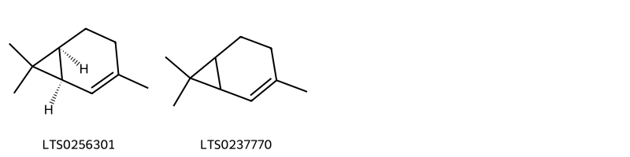{ width=100% }
    <figcaption>Hình ảnh cấu trúc hóa học của 2 hoạt chất thuộc nhóm Prenol lipids gồm ['(1r,6s)-3,7,7-trimethylbicyclo[4.1.0]hept-2-ene (LTS0256301)', '3,7,7-trimethylbicyclo[4.1.0]hept-2-ene (LTS0237770)'].</figcaption>
</figure>

---

### Dược dân tộc học

Danh sách các quốc gia có sử dụng *N/A* trong điều trị các bệnh. 

| Country   | Disease   | Bệnh                                                                                                                                                                                                |
|:----------|:----------|:----------------------------------------------------------------------------------------------------------------------------------------------------------------------------------------------------|
| US        | Stimulant | MYMEMORY WARNING: YOU USED ALL AVAILABLE FREE TRANSLATIONS FOR TODAY. NEXT AVAILABLE IN  12 HOURS 42 MINUTES 09 SECONDS VISIT HTTPS://MYMEMORY.TRANSLATED.NET/DOC/USAGELIMITS.PHP TO TRANSLATE MORE |

---

---
## Aristolochia ringens
### Thông tin về thực vật

!!! info "Phân loại thực vật của *Aristolochia ringens* từ GIBF:"
    - **Kingdom:** Plantae
    - **Phylum:** Tracheophyta
    - **Order:** Piperales
    - **Family:** Aristolochiaceae
    - **Genus:** Aristolochia
    - **Species:** *Aristolochia ringens*

 

| Label (VI)   | Label (EN)   | Scientific Name      | Descriptions (VI)   | Descriptions (EN)   | Also Known As (VI)   | Also Known As (EN)   |
|:-------------|:-------------|:---------------------|:--------------------|:--------------------|:---------------------|:---------------------|
| N/A          | N/A          | Aristolochia ringens | loài thực vật       | species of plant    | ['']                 | ['']                 |

#### Phân bố trên thế giới

**Từ CSDL GIBF** nan, Thailand, El Salvador, Ghana, French Guiana, Cameroon, Rwanda, Australia, Indonesia, Guatemala, Colombia, Sri Lanka, Dominican Republic, Togo, Venezuela (Bolivarian Republic of), Puerto Rico, India, Liberia, Mayotte, Nigeria, Cuba, Belgium, Panama, Brazil, Mexico, Benin, Hong Kong, United Kingdom of Great Britain and Northern Ireland, Costa Rica, Congo, Democratic Republic of the, United States of America, Congo, Guinea

#### Phân bố tại Việt Nam

**Từ CSDL GIBF**: Không có ghi nhận ở Việt Nam

---
### Thành phần hóa học
        
- Theo cơ sở dữ liệu lotus: Từ loài *Aristolochia ringens* đã phân lập và xác định được 14 hoạt chất thuộc về các nhóm Furanoid lignans, Steroids and steroid derivatives, Prenol lipids. 

|    | chemicalTaxonomyClassyfireClass   |   smiles_count |
|---:|:----------------------------------|---------------:|
|  0 | Furanoid lignans                  |              6 |
|  1 | Prenol lipids                     |              6 |
|  2 | Steroids and steroid derivatives  |              2 |

#### Nhóm Furanoid lignans
<figure markdown="span">
    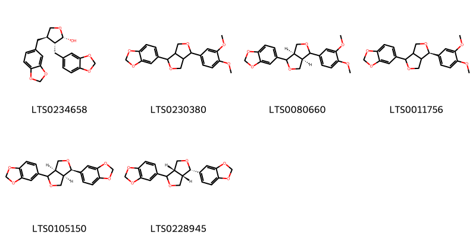{ width=100% }
    <figcaption>Hình ảnh cấu trúc hóa học của 6 hoạt chất thuộc nhóm Furanoid lignans gồm ['cubebin (LTS0234658)', '5-[4-(3,4-dimethoxyphenyl)-hexahydrofuro[3,4-c]furan-1-yl]-2h-1,3-benzodioxole (LTS0230380)', '5-[(3ar,6ar)-4-(3,4-dimethoxyphenyl)-hexahydrofuro[3,4-c]furan-1-yl]-2h-1,3-benzodioxole (LTS0080660)', '5-[(4r)-4-(3,4-dimethoxyphenyl)-hexahydrofuro[3,4-c]furan-1-yl]-2h-1,3-benzodioxole (LTS0011756)', '5-[(3ar,4r,6ar)-4-(2h-1,3-benzodioxol-5-yl)-hexahydrofuro[3,4-c]furan-1-yl]-2h-1,3-benzodioxole (LTS0105150)', '5-[(3as,4s,6as)-4-(2h-1,3-benzodioxol-5-yl)-hexahydrofuro[3,4-c]furan-1-yl]-2h-1,3-benzodioxole (LTS0228945)'].</figcaption>
</figure>
#### Nhóm Prenol lipids
<figure markdown="span">
    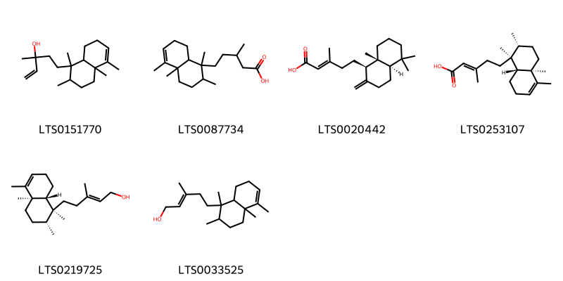{ width=100% }
    <figcaption>Hình ảnh cấu trúc hóa học của 6 hoạt chất thuộc nhóm Prenol lipids gồm ['5-(1,2,4a,5-tetramethyl-2,3,4,7,8,8a-hexahydronaphthalen-1-yl)-3-methylpent-1-en-3-ol (LTS0151770)', '5-(1,2,4a,5-tetramethyl-2,3,4,7,8,8a-hexahydronaphthalen-1-yl)-3-methylpentanoic acid (LTS0087734)', '(2e)-5-[(1r,4ar,8ar)-5,5,8a-trimethyl-2-methylidene-hexahydro-1h-naphthalen-1-yl]-3-methylpent-2-enoic acid (LTS0020442)', '(2e)-5-[(1s,2r,4ar,8ar)-1,2,4a,5-tetramethyl-2,3,4,7,8,8a-hexahydronaphthalen-1-yl]-3-methylpent-2-enoic acid (LTS0253107)', '(2e)-5-[(1s,2r,4ar,8ar)-1,2,4a,5-tetramethyl-2,3,4,7,8,8a-hexahydronaphthalen-1-yl]-3-methylpent-2-en-1-ol (LTS0219725)', '5-(1,2,4a,5-tetramethyl-2,3,4,7,8,8a-hexahydronaphthalen-1-yl)-3-methylpent-2-en-1-ol (LTS0033525)'].</figcaption>
</figure>
#### Nhóm Steroids and steroid derivatives
<figure markdown="span">
    { width=100% }
    <figcaption>Hình ảnh cấu trúc hóa học của 2 hoạt chất thuộc nhóm Steroids and steroid derivatives gồm ['stigmast-5-en-3-ol (LTS0071224)', 'stigmast-5-en-3-ol, (3β)- (LTS0204616)'].</figcaption>
</figure>

---

### Dược dân tộc học

Danh sách các quốc gia có sử dụng *Aristolochia ringens* trong điều trị các bệnh. 

| Country   | Disease    | Bệnh                                                                                                                                                                                                |
|:----------|:-----------|:----------------------------------------------------------------------------------------------------------------------------------------------------------------------------------------------------|
| Venezuela | Alexiteric | MYMEMORY WARNING: YOU USED ALL AVAILABLE FREE TRANSLATIONS FOR TODAY. NEXT AVAILABLE IN  12 HOURS 41 MINUTES 21 SECONDS VISIT HTTPS://MYMEMORY.TRANSLATED.NET/DOC/USAGELIMITS.PHP TO TRANSLATE MORE |

---

---
## Aristolochia rotunda
### Thông tin về thực vật

!!! info "Phân loại thực vật của *Aristolochia rotunda* từ GIBF:"
    - **Kingdom:** Plantae
    - **Phylum:** Tracheophyta
    - **Order:** Piperales
    - **Family:** Aristolochiaceae
    - **Genus:** Aristolochia
    - **Species:** *Aristolochia rotunda*

 

| Label (VI)   | Label (EN)   | Scientific Name      | Descriptions (VI)   | Descriptions (EN)   | Also Known As (VI)   | Also Known As (EN)       |
|:-------------|:-------------|:---------------------|:--------------------|:--------------------|:---------------------|:-------------------------|
| N/A          | N/A          | Aristolochia rotunda | loài thực vật       | species of plant    | ['']                 | ['Aristolochia rotunda'] |

#### Phân bố trên thế giới

**Từ CSDL GIBF** Slovenia, Bosnia and Herzegovina, France, Spain, Montenegro, Italy, Greece, Croatia

#### Phân bố tại Việt Nam

**Từ CSDL GIBF**: Không có ghi nhận ở Việt Nam

---
### Thành phần hóa học
        
- Theo cơ sở dữ liệu lotus: Từ loài *Aristolochia rotunda* đã phân lập và xác định được 2 hoạt chất thuộc về các nhóm Phenanthrenes and derivatives. 

|    | chemicalTaxonomyClassyfireClass   |   smiles_count |
|---:|:----------------------------------|---------------:|
|  0 | Phenanthrenes and derivatives     |              2 |

#### Nhóm Phenanthrenes and derivatives
<figure markdown="span">
    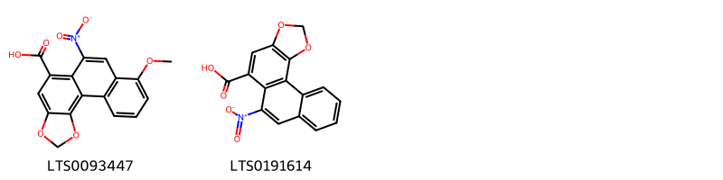{ width=100% }
    <figcaption>Hình ảnh cấu trúc hóa học của 2 hoạt chất thuộc nhóm Phenanthrenes and derivatives gồm ['birthwort (LTS0093447)', 'aristolochic acid ii (LTS0191614)'].</figcaption>
</figure>

---

### Dược dân tộc học

Danh sách các quốc gia có sử dụng *Aristolochia rotunda* trong điều trị các bệnh. 

| Country   | Disease   | Bệnh                                                                                                                                                                                                |
|:----------|:----------|:----------------------------------------------------------------------------------------------------------------------------------------------------------------------------------------------------|
| Turkey    | Stimulant | MYMEMORY WARNING: YOU USED ALL AVAILABLE FREE TRANSLATIONS FOR TODAY. NEXT AVAILABLE IN  12 HOURS 40 MINUTES 43 SECONDS VISIT HTTPS://MYMEMORY.TRANSLATED.NET/DOC/USAGELIMITS.PHP TO TRANSLATE MORE |
| ain       | Poison    | MYMEMORY WARNING: YOU USED ALL AVAILABLE FREE TRANSLATIONS FOR TODAY. NEXT AVAILABLE IN  12 HOURS 40 MINUTES 39 SECONDS VISIT HTTPS://MYMEMORY.TRANSLATED.NET/DOC/USAGELIMITS.PHP TO TRANSLATE MORE |

---

---
## Aristolochia rugosa
### Thông tin về thực vật

!!! info "Phân loại thực vật của *Aristolochia rugosa* từ GIBF:"
    - **Kingdom:** Plantae
    - **Phylum:** Tracheophyta
    - **Order:** Piperales
    - **Family:** Aristolochiaceae
    - **Genus:** Aristolochia
    - **Species:** *Aristolochia rugosa*

 

| Label (VI)   | Label (EN)   | Scientific Name     | Descriptions (VI)   | Descriptions (EN)   | Also Known As (VI)   | Also Known As (EN)   |
|:-------------|:-------------|:--------------------|:--------------------|:--------------------|:---------------------|:---------------------|
| N/A          | N/A          | Aristolochia rugosa |                     | species of plant    | ['']                 | ['']                 |

#### Phân bố trên thế giới

**Từ CSDL GIBF** Saint Martin (French part), nan, unknown or invalid, Venezuela (Bolivarian Republic of), Antigua and Barbuda, Brazil, Guadeloupe, Bolivia (Plurinational State of), Trinidad and Tobago, Paraguay, Cuba, Martinique, Anguilla, Jamaica, Guyana

#### Phân bố tại Việt Nam

**Từ CSDL GIBF**: Không có ghi nhận ở Việt Nam

---
### Thành phần hóa học
        
- Theo cơ sở dữ liệu lotus: Từ loài *Aristolochia rugosa* đã phân lập và xác định được Chưa có hoạt chất nào được phân lập. hoạt chất thuộc về các nhóm Không có hoạt chất nào được phân lập. 

Không có hình ảnh nào được tạo ra

---

### Dược dân tộc học

Danh sách các quốc gia có sử dụng *Aristolochia rugosa* trong điều trị các bệnh. 

| Country   | Disease       | Bệnh                                                                                                                                                                                                |
|:----------|:--------------|:----------------------------------------------------------------------------------------------------------------------------------------------------------------------------------------------------|
| Trinidad  | Abortifacient | MYMEMORY WARNING: YOU USED ALL AVAILABLE FREE TRANSLATIONS FOR TODAY. NEXT AVAILABLE IN  12 HOURS 40 MINUTES 01 SECONDS VISIT HTTPS://MYMEMORY.TRANSLATED.NET/DOC/USAGELIMITS.PHP TO TRANSLATE MORE |

---

---
## Aristolochia serpentaria
### Thông tin về thực vật

!!! info "Phân loại thực vật của *Endodeca serpentaria* từ GIBF:"
    - **Kingdom:** Plantae
    - **Phylum:** Tracheophyta
    - **Order:** Piperales
    - **Family:** Aristolochiaceae
    - **Genus:** Endodeca
    - **Species:** *Endodeca serpentaria*

 

| Label (VI)   | Label (EN)   | Scientific Name          | Descriptions (VI)   | Descriptions (EN)   | Also Known As (VI)   | Also Known As (EN)   |
|:-------------|:-------------|:-------------------------|:--------------------|:--------------------|:---------------------|:---------------------|
| N/A          | N/A          | Aristolochia serpentaria | loài thực vật       | species of plant    | ['']                 | ['']                 |

#### Phân bố trên thế giới

**Từ CSDL GIBF** nan, United States of America

#### Phân bố tại Việt Nam

**Từ CSDL GIBF**: Không có ghi nhận ở Việt Nam

---
### Thành phần hóa học
        
- Theo cơ sở dữ liệu lotus: Từ loài *Endodeca serpentaria* đã phân lập và xác định được 1 hoạt chất thuộc về các nhóm Phenanthrenes and derivatives. 

|    | chemicalTaxonomyClassyfireClass   |   smiles_count |
|---:|:----------------------------------|---------------:|
|  0 | Phenanthrenes and derivatives     |              1 |

#### Nhóm Phenanthrenes and derivatives
<figure markdown="span">
    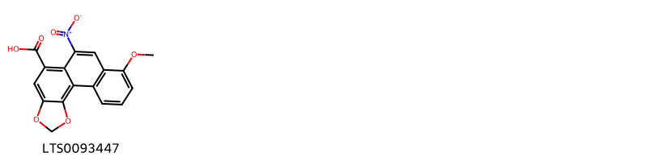{ width=100% }
    <figcaption>Hình ảnh cấu trúc hóa học của 1 hoạt chất thuộc nhóm Phenanthrenes and derivatives gồm ['birthwort (LTS0093447)'].</figcaption>
</figure>

---

### Dược dân tộc học

Danh sách các quốc gia có sử dụng *Endodeca serpentaria* trong điều trị các bệnh. 

| Country        | Disease                                                                   | Bệnh                                                                                                                                                                                                |
|:---------------|:--------------------------------------------------------------------------|:----------------------------------------------------------------------------------------------------------------------------------------------------------------------------------------------------|
| Elsewhere      | Diaphoretic, Tonic, Stimulant                                             | MYMEMORY WARNING: YOU USED ALL AVAILABLE FREE TRANSLATIONS FOR TODAY. NEXT AVAILABLE IN  12 HOURS 39 MINUTES 38 SECONDS VISIT HTTPS://MYMEMORY.TRANSLATED.NET/DOC/USAGELIMITS.PHP TO TRANSLATE MORE |
| Turkey         | Cardiotonic, Diuretic, Emmenagogue, Sudorific, Sedative, Stimulant, Tonic | MYMEMORY WARNING: YOU USED ALL AVAILABLE FREE TRANSLATIONS FOR TODAY. NEXT AVAILABLE IN  12 HOURS 39 MINUTES 35 SECONDS VISIT HTTPS://MYMEMORY.TRANSLATED.NET/DOC/USAGELIMITS.PHP TO TRANSLATE MORE |
| US             | Poultice, Sudorific                                                       | MYMEMORY WARNING: YOU USED ALL AVAILABLE FREE TRANSLATIONS FOR TODAY. NEXT AVAILABLE IN  12 HOURS 39 MINUTES 32 SECONDS VISIT HTTPS://MYMEMORY.TRANSLATED.NET/DOC/USAGELIMITS.PHP TO TRANSLATE MORE |
| US(Appalachia) | Diaphoretic                                                               | MYMEMORY WARNING: YOU USED ALL AVAILABLE FREE TRANSLATIONS FOR TODAY. NEXT AVAILABLE IN  12 HOURS 39 MINUTES 28 SECONDS VISIT HTTPS://MYMEMORY.TRANSLATED.NET/DOC/USAGELIMITS.PHP TO TRANSLATE MORE |

---

---
## Aristolochia tagala
### Thông tin về thực vật

!!! info "Phân loại thực vật của *Aristolochia acuminata* từ GIBF:"
    - **Kingdom:** Plantae
    - **Phylum:** Tracheophyta
    - **Order:** Piperales
    - **Family:** Aristolochiaceae
    - **Genus:** Aristolochia
    - **Species:** *Aristolochia acuminata*

 

| Label (VI)   | Label (EN)   | Scientific Name     | Descriptions (VI)   | Descriptions (EN)   | Also Known As (VI)   | Also Known As (EN)   |
|:-------------|:-------------|:--------------------|:--------------------|:--------------------|:---------------------|:---------------------|
| N/A          | N/A          | Aristolochia tagala | loài thực vật       | species of plant    | ['']                 | ['Indian birthwort'] |

#### Phân bố trên thế giới

**Từ CSDL GIBF** Viet Nam, nan, unknown or invalid, Thailand, Philippines, Lao People’s Democratic Republic, Singapore, Australia, Indonesia, Bhutan, Malaysia, India, Bangladesh, Cambodia, Vanuatu, Japan, Myanmar, Brazil, China, Nepal, Hong Kong, Chinese Taipei, Papua New Guinea, United States of America, Solomon Islands

#### Phân bố tại Việt Nam

**Từ CSDL GIBF**: Thua Thien-Hue, Lam Dong (林同省)

---
### Thành phần hóa học
        
- Theo cơ sở dữ liệu lotus: Từ loài *Aristolochia acuminata* đã phân lập và xác định được 6 hoạt chất thuộc về các nhóm Furanoid lignans, Aporphines, Steroids and steroid derivatives, Aristolactams. 

|    | chemicalTaxonomyClassyfireClass   |   smiles_count |
|---:|:----------------------------------|---------------:|
|  0 | Aporphines                        |              1 |
|  1 | Aristolactams                     |              2 |
|  2 | Furanoid lignans                  |              1 |
|  3 | Steroids and steroid derivatives  |              2 |

#### Nhóm Aporphines
<figure markdown="span">
    { width=100% }
    <figcaption>Hình ảnh cấu trúc hóa học của 1 hoạt chất thuộc nhóm Aporphines gồm ['11-methyl-3,5-dioxa-11-azapentacyclo[10.7.1.0²,⁶.0⁸,²⁰.0¹⁴,¹⁹]icosa-1(20),2(6),7,12,14(19),15,17-heptaene-9,10-dione (LTS0083545)'].</figcaption>
</figure>
#### Nhóm Aristolactams
<figure markdown="span">
    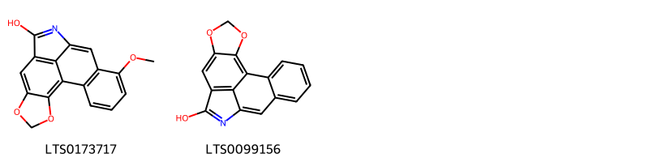{ width=100% }
    <figcaption>Hình ảnh cấu trúc hóa học của 2 hoạt chất thuộc nhóm Aristolactams gồm ['14-methoxy-3,5-dioxa-10-azapentacyclo[9.7.1.0²,⁶.0⁸,¹⁹.0¹³,¹⁸]nonadeca-1(19),2(6),7,9,11,13(18),14,16-octaen-9-ol (LTS0173717)', '3,5-dioxa-10-azapentacyclo[9.7.1.0²,⁶.0⁸,¹⁹.0¹³,¹⁸]nonadeca-1(19),2(6),7,9,11,13(18),14,16-octaen-9-ol (LTS0099156)'].</figcaption>
</figure>
#### Nhóm Furanoid lignans
<figure markdown="span">
    { width=100% }
    <figcaption>Hình ảnh cấu trúc hóa học của 1 hoạt chất thuộc nhóm Furanoid lignans gồm ['sesamin (LTS0120161)'].</figcaption>
</figure>
#### Nhóm Steroids and steroid derivatives
<figure markdown="span">
    { width=100% }
    <figcaption>Hình ảnh cấu trúc hóa học của 2 hoạt chất thuộc nhóm Steroids and steroid derivatives gồm ['stigmast-5-en-3-ol (LTS0071224)', 'stigmast-5-en-3-ol, (3β)- (LTS0204616)'].</figcaption>
</figure>

---

### Dược dân tộc học

Danh sách các quốc gia có sử dụng *Aristolochia acuminata* trong điều trị các bệnh. 

| Country   | Disease                         | Bệnh                                                                                                                                                                                                |
|:----------|:--------------------------------|:----------------------------------------------------------------------------------------------------------------------------------------------------------------------------------------------------|
| Elsewhere | Carminative, Emmenagogue, Tonic | MYMEMORY WARNING: YOU USED ALL AVAILABLE FREE TRANSLATIONS FOR TODAY. NEXT AVAILABLE IN  12 HOURS 38 MINUTES 40 SECONDS VISIT HTTPS://MYMEMORY.TRANSLATED.NET/DOC/USAGELIMITS.PHP TO TRANSLATE MORE |

---

---
## Aristolochia taliscana
### Thông tin về thực vật

!!! info "Phân loại thực vật của *Aristolochia taliscana* từ GIBF:"
    - **Kingdom:** Plantae
    - **Phylum:** Tracheophyta
    - **Order:** Piperales
    - **Family:** Aristolochiaceae
    - **Genus:** Aristolochia
    - **Species:** *Aristolochia taliscana*

 

| Label (VI)   | Label (EN)   | Scientific Name        | Descriptions (VI)   | Descriptions (EN)   | Also Known As (VI)   | Also Known As (EN)   |
|:-------------|:-------------|:-----------------------|:--------------------|:--------------------|:---------------------|:---------------------|
| N/A          | N/A          | Aristolochia taliscana | loài thực vật       | species of plant    | ['']                 | ['']                 |

#### Phân bố trên thế giới

**Từ CSDL GIBF** Mexico

#### Phân bố tại Việt Nam

**Từ CSDL GIBF**: Không có ghi nhận ở Việt Nam

---
### Thành phần hóa học
        
- Theo cơ sở dữ liệu lotus: Từ loài *Aristolochia taliscana* đã phân lập và xác định được 5 hoạt chất thuộc về các nhóm 2-arylbenzofuran flavonoids, Aristolactams. 

|    | chemicalTaxonomyClassyfireClass   |   smiles_count |
|---:|:----------------------------------|---------------:|
|  0 | 2-arylbenzofuran flavonoids       |              4 |
|  1 | Aristolactams                     |              1 |

#### Nhóm 2-arylbenzofuran flavonoids
<figure markdown="span">
    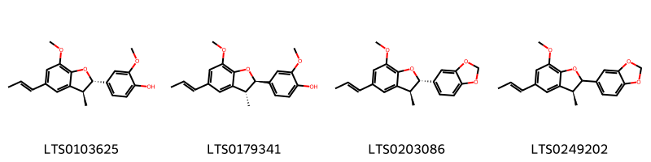{ width=100% }
    <figcaption>Hình ảnh cấu trúc hóa học của 4 hoạt chất thuộc nhóm 2-arylbenzofuran flavonoids gồm ['licarin a (LTS0103625)', '2-methoxy-4-[(2r,3r)-7-methoxy-3-methyl-5-[(1e)-prop-1-en-1-yl]-2,3-dihydro-1-benzofuran-2-yl]phenol (LTS0179341)', '5-[(2s,3s)-7-methoxy-3-methyl-5-[(1e)-prop-1-en-1-yl]-2,3-dihydro-1-benzofuran-2-yl]-2h-1,3-benzodioxole (LTS0203086)', '5-[(3s)-7-methoxy-3-methyl-5-[(1e)-prop-1-en-1-yl]-2,3-dihydro-1-benzofuran-2-yl]-2h-1,3-benzodioxole (LTS0249202)'].</figcaption>
</figure>
#### Nhóm Aristolactams
<figure markdown="span">
    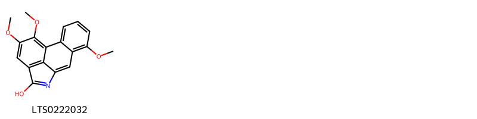{ width=100% }
    <figcaption>Hình ảnh cấu trúc hóa học của 1 hoạt chất thuộc nhóm Aristolactams gồm ['6,14,15-trimethoxy-10-azatetracyclo[7.6.1.0²,⁷.0¹²,¹⁶]hexadeca-1(16),2(7),3,5,8,10,12,14-octaen-11-ol (LTS0222032)'].</figcaption>
</figure>

---

### Dược dân tộc học

Danh sách các quốc gia có sử dụng *Aristolochia taliscana* trong điều trị các bệnh. 

| Country   | Disease   | Bệnh                                                                                                                                                                                                |
|:----------|:----------|:----------------------------------------------------------------------------------------------------------------------------------------------------------------------------------------------------|
| Mexico    | Antidote  | MYMEMORY WARNING: YOU USED ALL AVAILABLE FREE TRANSLATIONS FOR TODAY. NEXT AVAILABLE IN  12 HOURS 38 MINUTES 05 SECONDS VISIT HTTPS://MYMEMORY.TRANSLATED.NET/DOC/USAGELIMITS.PHP TO TRANSLATE MORE |

---

---
## Aristolochia triangularis
### Thông tin về thực vật

!!! info "Phân loại thực vật của *Aristolochia triangularis* từ GIBF:"
    - **Kingdom:** Plantae
    - **Phylum:** Tracheophyta
    - **Order:** Piperales
    - **Family:** Aristolochiaceae
    - **Genus:** Aristolochia
    - **Species:** *Aristolochia triangularis*

 

| Label (VI)   | Label (EN)   | Scientific Name           | Descriptions (VI)   | Descriptions (EN)   | Also Known As (VI)   | Also Known As (EN)   |
|:-------------|:-------------|:--------------------------|:--------------------|:--------------------|:---------------------|:---------------------|
| N/A          | N/A          | Aristolochia triangularis | loài thực vật       | species of plant    | ['']                 | ['']                 |

#### Phân bố trên thế giới

**Từ CSDL GIBF** Paraguay, Uruguay, Argentina, Brazil

#### Phân bố tại Việt Nam

**Từ CSDL GIBF**: Không có ghi nhận ở Việt Nam

---
### Thành phần hóa học
        
- Theo cơ sở dữ liệu lotus: Từ loài *Aristolochia triangularis* đã phân lập và xác định được 43 hoạt chất thuộc về các nhóm Furanoid lignans, Azoles, Saturated hydrocarbons, Unsaturated hydrocarbons, Prenol lipids, Azolidines, Steroids and steroid derivatives. 

|    | chemicalTaxonomyClassyfireClass   |   smiles_count |
|---:|:----------------------------------|---------------:|
|  0 | Azoles                            |              1 |
|  1 | Azolidines                        |              1 |
|  2 | Furanoid lignans                  |              3 |
|  3 | Prenol lipids                     |             31 |
|  4 | Saturated hydrocarbons            |              4 |
|  5 | Steroids and steroid derivatives  |              2 |
|  6 | Unsaturated hydrocarbons          |              1 |

#### Nhóm Azoles
<figure markdown="span">
    { width=100% }
    <figcaption>Hình ảnh cấu trúc hóa học của 1 hoạt chất thuộc nhóm Azoles gồm ['allantoin (LTS0106609)'].</figcaption>
</figure>
#### Nhóm Azolidines
<figure markdown="span">
    { width=100% }
    <figcaption>Hình ảnh cấu trúc hóa học của 1 hoạt chất thuộc nhóm Azolidines gồm ['n-[(4s)-2,5-dihydroxy-4h-imidazol-4-yl]carbamimidic acid (LTS0174328)'].</figcaption>
</figure>
#### Nhóm Furanoid lignans
<figure markdown="span">
    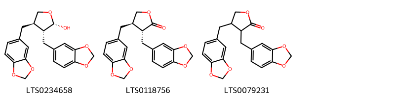{ width=100% }
    <figcaption>Hình ảnh cấu trúc hóa học của 3 hoạt chất thuộc nhóm Furanoid lignans gồm ['cubebin (LTS0234658)', 'hinokinin (LTS0118756)', '3,4-bis(2h-1,3-benzodioxol-5-ylmethyl)oxolan-2-one (LTS0079231)'].</figcaption>
</figure>
#### Nhóm Prenol lipids
<figure markdown="span">
    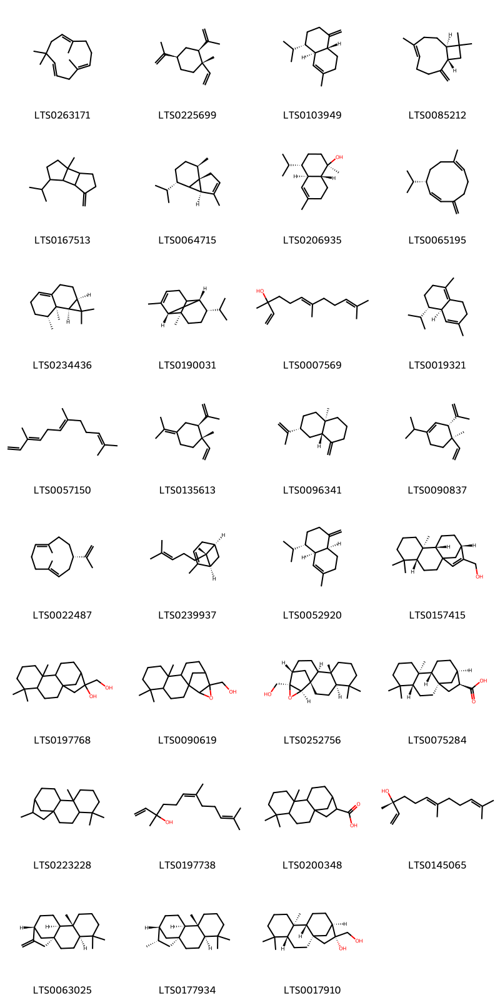{ width=100% }
    <figcaption>Hình ảnh cấu trúc hóa học của 31 hoạt chất thuộc nhóm Prenol lipids gồm ['humulene (LTS0263171)', 'β-elemene (LTS0225699)', '(+)-gamma-cadinene (LTS0103949)', 'caryophyllene (LTS0085212)', 'β-bourbonene (LTS0167513)', '(1s,5r,7s,10r)-7-isopropyl-4,10-dimethyltricyclo[4.4.0.0¹,⁵]dec-3-ene (LTS0064715)', 'α-cadinol (LTS0206935)', '(1z,6z,8s)-8-isopropyl-1-methyl-5-methylidenecyclodeca-1,6-diene (LTS0065195)', '(1ar,7r,7ar,7bs)-1,1,7,7a-tetramethyl-1ah,2h,3h,5h,6h,7h,7bh-cyclopropa[a]naphthalene (LTS0234436)', '(1r,2s,7s,8s)-8-isopropyl-1,3-dimethyltricyclo[4.4.0.0²,⁷]dec-3-ene (LTS0190031)', 'nerolidol isomers (LTS0007569)', 'delta-cadinene (LTS0019321)', 'farnesene (LTS0057150)', '(1s,2s)-1-ethenyl-1-methyl-2-(prop-1-en-2-yl)-4-(propan-2-ylidene)cyclohexane (LTS0135613)', 'β-selinene (LTS0096341)', 'elemene (LTS0090837)', '(-)-germacrene a (LTS0022487)', '(-)-trans-α-bergamotene (LTS0239937)', 'gamma-muurolene (LTS0052920)', '[(4r,9r,10s,13s)-5,5,9-trimethyltetracyclo[11.2.1.0¹,¹⁰.0⁴,⁹]hexadec-14-en-14-yl]methanol (LTS0157415)', '14-(hydroxymethyl)-5,5,9-trimethyltetracyclo[11.2.1.0¹,¹⁰.0⁴,⁹]hexadecan-14-ol (LTS0197768)', '{5,5,9-trimethyl-15-oxapentacyclo[11.3.1.0¹,¹⁰.0⁴,⁹.0¹⁴,¹⁶]heptadecan-14-yl}methanol (LTS0090619)', '[(1r,4r,9r,10s,13r,14r,16r)-5,5,9-trimethyl-15-oxapentacyclo[11.3.1.0¹,¹⁰.0⁴,⁹.0¹⁴,¹⁶]heptadecan-14-yl]methanol (LTS0252756)', '(1s,4r,9r,10r,13r,14s)-5,5,9-trimethyltetracyclo[11.2.1.0¹,¹⁰.0⁴,⁹]hexadecane-14-carboxylic acid (LTS0075284)', '5,5,9,14-tetramethyltetracyclo[11.2.1.0¹,¹⁰.0⁴,⁹]hexadecane (LTS0223228)', 'nerolidol (LTS0197738)', '5,5,9-trimethyltetracyclo[11.2.1.0¹,¹⁰.0⁴,⁹]hexadecane-14-carboxylic acid (LTS0200348)', '(3r,6e)-nerolidol (LTS0145065)', 'ent-kaurene (LTS0063025)', 'ent-kaurane (LTS0177934)', '(1s,4r,9r,10r,13r,14r)-14-(hydroxymethyl)-5,5,9-trimethyltetracyclo[11.2.1.0¹,¹⁰.0⁴,⁹]hexadecan-14-ol (LTS0017910)'].</figcaption>
</figure>
#### Nhóm Saturated hydrocarbons
<figure markdown="span">
    { width=100% }
    <figcaption>Hình ảnh cấu trúc hóa học của 4 hoạt chất thuộc nhóm Saturated hydrocarbons gồm ['dodecane (LTS0146085)', 'nonane (LTS0096012)', 'decane (LTS0045828)', 'undecane (LTS0081068)'].</figcaption>
</figure>
#### Nhóm Steroids and steroid derivatives
<figure markdown="span">
    { width=100% }
    <figcaption>Hình ảnh cấu trúc hóa học của 2 hoạt chất thuộc nhóm Steroids and steroid derivatives gồm ['stigmast-5-en-3-ol (LTS0071224)', 'stigmast-5-en-3-ol, (3β)- (LTS0204616)'].</figcaption>
</figure>
#### Nhóm Unsaturated hydrocarbons
<figure markdown="span">
    { width=100% }
    <figcaption>Hình ảnh cấu trúc hóa học của 1 hoạt chất thuộc nhóm Unsaturated hydrocarbons gồm ['1-undecene (LTS0104325)'].</figcaption>
</figure>

---

### Dược dân tộc học

Danh sách các quốc gia có sử dụng *Aristolochia triangularis* trong điều trị các bệnh. 

| Country   | Disease               | Bệnh                                                                                                                                                                                                |
|:----------|:----------------------|:----------------------------------------------------------------------------------------------------------------------------------------------------------------------------------------------------|
| Argentina | Diuretic, Diaphoretic | MYMEMORY WARNING: YOU USED ALL AVAILABLE FREE TRANSLATIONS FOR TODAY. NEXT AVAILABLE IN  12 HOURS 37 MINUTES 35 SECONDS VISIT HTTPS://MYMEMORY.TRANSLATED.NET/DOC/USAGELIMITS.PHP TO TRANSLATE MORE |
| Paraguay  | Antifertility         | MYMEMORY WARNING: YOU USED ALL AVAILABLE FREE TRANSLATIONS FOR TODAY. NEXT AVAILABLE IN  12 HOURS 37 MINUTES 33 SECONDS VISIT HTTPS://MYMEMORY.TRANSLATED.NET/DOC/USAGELIMITS.PHP TO TRANSLATE MORE |

---

---
## Aristolochia trilobata
### Thông tin về thực vật

!!! info "Phân loại thực vật của *Aristolochia trilobata* từ GIBF:"
    - **Kingdom:** Plantae
    - **Phylum:** Tracheophyta
    - **Order:** Piperales
    - **Family:** Aristolochiaceae
    - **Genus:** Aristolochia
    - **Species:** *Aristolochia trilobata*

 

| Label (VI)   | Label (EN)   | Scientific Name        | Descriptions (VI)   | Descriptions (EN)   | Also Known As (VI)   | Also Known As (EN)   |
|:-------------|:-------------|:-----------------------|:--------------------|:--------------------|:---------------------|:---------------------|
| N/A          | N/A          | Aristolochia trilobata | loài thực vật       | species of plant    | ['']                 | ['']                 |

#### Phân bố trên thế giới

**Từ CSDL GIBF** nan, Honduras, Guadeloupe, French Guiana, Martinique, Korea, Republic of, Dominican Republic, Puerto Rico, India, Canada, Cuba, Belgium, Barbados, Virgin Islands (British), Belize, Panama, Brazil, Chinese Taipei, Uruguay, Argentina, France, Costa Rica, United States of America, Guyana

#### Phân bố tại Việt Nam

**Từ CSDL GIBF**: Không có ghi nhận ở Việt Nam

---
### Thành phần hóa học
        
- Theo cơ sở dữ liệu lotus: Từ loài *Aristolochia trilobata* đã phân lập và xác định được Chưa có hoạt chất nào được phân lập. hoạt chất thuộc về các nhóm Không có hoạt chất nào được phân lập. 

Không có hình ảnh nào được tạo ra

---

### Dược dân tộc học

Danh sách các quốc gia có sử dụng *Aristolochia trilobata* trong điều trị các bệnh. 

| Country   | Disease                      | Bệnh                                                                                                                                                                                                |
|:----------|:-----------------------------|:----------------------------------------------------------------------------------------------------------------------------------------------------------------------------------------------------|
| Trinidad  | Abortifacient, Abortifacient | MYMEMORY WARNING: YOU USED ALL AVAILABLE FREE TRANSLATIONS FOR TODAY. NEXT AVAILABLE IN  12 HOURS 36 MINUTES 51 SECONDS VISIT HTTPS://MYMEMORY.TRANSLATED.NET/DOC/USAGELIMITS.PHP TO TRANSLATE MORE |

---

---
## Aristolochia warmingii
### Thông tin về thực vật

!!! info "Phân loại thực vật của *Aristolochia warmingii* từ GIBF:"
    - **Kingdom:** Plantae
    - **Phylum:** Tracheophyta
    - **Order:** Piperales
    - **Family:** Aristolochiaceae
    - **Genus:** Aristolochia
    - **Species:** *Aristolochia warmingii*

 

| Label (VI)   | Label (EN)   | Scientific Name        | Descriptions (VI)   | Descriptions (EN)   | Also Known As (VI)   | Also Known As (EN)   |
|:-------------|:-------------|:-----------------------|:--------------------|:--------------------|:---------------------|:---------------------|
| N/A          | N/A          | Aristolochia warmingii | loài thực vật       | species of plant    | ['']                 | ['']                 |

#### Phân bố trên thế giới

**Từ CSDL GIBF** nan, Argentina, Brazil, Peru, Paraguay

#### Phân bố tại Việt Nam

**Từ CSDL GIBF**: Không có ghi nhận ở Việt Nam

---
### Thành phần hóa học
        
- Theo cơ sở dữ liệu lotus: Từ loài *Aristolochia warmingii* đã phân lập và xác định được Chưa có hoạt chất nào được phân lập. hoạt chất thuộc về các nhóm Không có hoạt chất nào được phân lập. 

Không có hình ảnh nào được tạo ra

---

### Dược dân tộc học

Danh sách các quốc gia có sử dụng *Aristolochia warmingii* trong điều trị các bệnh. 

| Country   | Disease                                                                 | Bệnh                                                                                                                                                                                                |
|:----------|:------------------------------------------------------------------------|:----------------------------------------------------------------------------------------------------------------------------------------------------------------------------------------------------|
| Elsewhere | Antiseptic, Digestive, Emmenagogue, nan, Abortifacient, Tonic, Diuretic | MYMEMORY WARNING: YOU USED ALL AVAILABLE FREE TRANSLATIONS FOR TODAY. NEXT AVAILABLE IN  12 HOURS 36 MINUTES 25 SECONDS VISIT HTTPS://MYMEMORY.TRANSLATED.NET/DOC/USAGELIMITS.PHP TO TRANSLATE MORE |

---

# Chi Thottea

??? note "Danh sách các dược liệu thuộc chi"
    
	 - *Thottea grandiflora*

---
## Thottea grandiflora
### Thông tin về thực vật

!!! info "Phân loại thực vật của *Thottea grandiflora* từ GIBF:"
    - **Kingdom:** Plantae
    - **Phylum:** Tracheophyta
    - **Order:** Piperales
    - **Family:** Aristolochiaceae
    - **Genus:** Thottea
    - **Species:** *Thottea grandiflora*

 

| Label (VI)   | Label (EN)   | Scientific Name     | Descriptions (VI)   | Descriptions (EN)   | Also Known As (VI)   | Also Known As (EN)   |
|:-------------|:-------------|:--------------------|:--------------------|:--------------------|:---------------------|:---------------------|
| N/A          | N/A          | Thottea grandiflora |                     | species of plant    | ['']                 | ['']                 |

#### Phân bố trên thế giới

**Từ CSDL GIBF** nan, unknown or invalid, Thailand, Malaysia, India, Singapore, Indonesia

#### Phân bố tại Việt Nam

**Từ CSDL GIBF**: Không có ghi nhận ở Việt Nam

---
### Thành phần hóa học
        
- Theo cơ sở dữ liệu lotus: Từ loài *Thottea grandiflora* đã phân lập và xác định được Chưa có hoạt chất nào được phân lập. hoạt chất thuộc về các nhóm Không có hoạt chất nào được phân lập. 

Không có hình ảnh nào được tạo ra

---

### Dược dân tộc học

Danh sách các quốc gia có sử dụng *Thottea grandiflora* trong điều trị các bệnh. 

| Country   | Disease   | Bệnh                                                                                                                                                                                                |
|:----------|:----------|:----------------------------------------------------------------------------------------------------------------------------------------------------------------------------------------------------|
| Java      | Tonic     | MYMEMORY WARNING: YOU USED ALL AVAILABLE FREE TRANSLATIONS FOR TODAY. NEXT AVAILABLE IN  12 HOURS 36 MINUTES 05 SECONDS VISIT HTTPS://MYMEMORY.TRANSLATED.NET/DOC/USAGELIMITS.PHP TO TRANSLATE MORE |

---

