!!! abstract "Tóm tắt"

    Họ Asteraceae gồm khoảng 173 chi và 407 loài được một số cộng đồng tại các quốc gia như South America, Ghana, Kelantan, Japan, Brazil(Maku), Brazil(Waika), Guatemala, US(Flathead), Argentina, US(Appalachia), French Guinea, Kashmir, Sierra Leone, Reunion, Arab, Italian, Brazil(Jamamadi), Mexico(Kickapoo), Sudan, Gambia, Bolivia, ain, Guinea, Liberia, Paraguay, Vietnam, Portuguese, Turkey, UK, India(Punjab), Fiji, US(Kiowa), Bahamas, Arabic, Brazil, USA, Malagasy, India(Santal), India(Munda), Peru, France, Canada(Kwakiutl), Malaya, US(UT), Europe(Alps), Ecuador, anish, Dominica(Carib), Colombia, Chinese, Elsewhere, Kurdistan, Java, Brazil(Deni), Japan*, Latin America, Samoa, Philippines, Cameroon, Malaysia, US(TX), Africa, USSR, Indochina, Ethiopia, Salvador, Guiana, Angola, Tanzania, Dutch, India(Hindu), Surinam, South Africa(Kaffir), Danish, Panama, Curacao, Aztec, Denmark, Pakistan, Southafrica, Elseewhere, English, US(Amerindian), Hungary, Lesotho, Chile, US(Colonial), South Africa, US(Blackfoot), Sanscrit, US(AZ), French, West Indies, US, US(NM), Cuba, Barbuda, Mexico, Dominican Republic, Dominica, US(Hopi), Iran, Eurasia, China, Canada(Salish), Hindu, W Africa, Malacca, Trinidad, Europe, Philippines(Ifugao), Iraq, Haiti, German, Mexico(Seri), Costa Rica, India, Venezuela, Kenya, Nepal sử dụng trong một số trường hợp QUERY LENGTH LIMIT EXCEEDED. MAX ALLOWED QUERY : 500 CHARS QUERY LENGTH LIMIT EXCEEDED. MAX ALLOWED QUERY : 500 CHARS QUERY LENGTH LIMIT EXCEEDED. MAX ALLOWED QUERY : 500 CHARS QUERY LENGTH LIMIT EXCEEDED. MAX ALLOWED QUERY : 500 CHARS QUERY LENGTH LIMIT EXCEEDED. MAX ALLOWED QUERY : 500 CHARS QUERY LENGTH LIMIT EXCEEDED. MAX ALLOWED QUERY : 500 CHARS QUERY LENGTH LIMIT EXCEEDED. MAX ALLOWED QUERY : 500 CHARS QUERY LENGTH LIMIT EXCEEDED. MAX ALLOWED QUERY : 500 CHARS QUERY LENGTH LIMIT EXCEEDED. MAX ALLOWED QUERY : 500 CHARS QUERY LENGTH LIMIT EXCEEDED. MAX ALLOWED QUERY : 500 CHARS QUERY LENGTH LIMIT EXCEEDED. MAX ALLOWED QUERY : 500 CHARS QUERY LENGTH LIMIT EXCEEDED. MAX ALLOWED QUERY : 500 CHARS QUERY LENGTH LIMIT EXCEEDED. MAX ALLOWED QUERY : 500 CHARS QUERY LENGTH LIMIT EXCEEDED. MAX ALLOWED QUERY : 500 CHARS QUERY LENGTH LIMIT EXCEEDED. MAX ALLOWED QUERY : 500 CHARS QUERY LENGTH LIMIT EXCEEDED. MAX ALLOWED QUERY : 500 CHARS MYMEMORY WARNING: YOU USED ALL AVAILABLE FREE TRANSLATIONS FOR TODAY. NEXT AVAILABLE IN  13 HOURS 17 MINUTES 05 SECONDS VISIT HTTPS://MYMEMORY.TRANSLATED.NET/DOC/USAGELIMITS.PHP TO TRANSLATE MORE.

!!! info "DrDuke"

    James A. Duke sinh năm 1929-2017 là một nhà thực vật học người Mỹ. Đây là một trong những tác giả hàng đầu trong lĩnh vực dược dân tộc học với cuốn *CRC Handbook of Medicinal Herbs* và chính là người xây dựng lên cơ sở dữ liệu về hợp chất tự nhiên và dược dân tộc học tại Bộ nông nghiệp Hoa Kỳ. Các thông tin được đăng tải tại website [Dr. Duke's Phytochemical and Ethnobotanical Databases](https://phytochem.nal.usda.gov/). 
    Trong suốt thập niên 1970, ông lãnh đạo the Plant Taxonomy Laboratory, Plant Genetics and Germplasm Institute of the Agricultural Research Service, U.S. Department of Agriculture.
    Trong tài liệu này, các thông tin về dược dân tộc của các dược liệu được trích dẫn từ tài liệu của James A. Ducke với sự trợ giúp của phần mềm dịch thuật từ tiếng Anh sang tiếng Việt.
   

# Chi ilanthes

??? note "Danh sách các dược liệu thuộc chi"
    
	 - *ilanthes acmella*
	 - *ilanthes calva*
	 - *ilanthes grandiflora*
	 - *ilanthes oleracea*
	 - *ilanthes paniculata*
	 - *ilanthes uliginosa*

---
## ilanthes acmella
### Thông tin về thực vật

!!! info "Phân loại thực vật của *N/A* từ GIBF:"
    - **Kingdom:** N/A
    - **Phylum:** N/A
    - **Order:** N/A
    - **Family:** N/A
    - **Genus:** N/A
    - **Species:** *N/A*

 

| Label (VI)   | Label (EN)   | Scientific Name   | Descriptions (VI)   | Descriptions (EN)   | Also Known As (VI)   | Also Known As (EN)   |
|:-------------|:-------------|:------------------|:--------------------|:--------------------|:---------------------|:---------------------|
| N/A          | N/A          | Tamus communis    | loài thực vật       | species of plant    | ['']                 | ['']                 |

#### Phân bố trên thế giới

**Từ CSDL GIBF** Không có kết quả phù hợp

#### Phân bố tại Việt Nam

**Từ CSDL GIBF**: Không có ghi nhận ở Việt Nam

---
### Thành phần hóa học
        
- Theo cơ sở dữ liệu lotus: Từ loài *N/A* đã phân lập và xác định được 118 hoạt chất thuộc về các nhóm Fatty Acyls, Prenol lipids, Steroids and steroid derivatives, Cinnamic acids and derivatives, Thiophenes, Benzene and substituted derivatives, Organooxygen compounds, Coumarins and derivatives, Epoxides, Carboximidic acids and derivatives. 

|    | chemicalTaxonomyClassyfireClass     |   smiles_count |
|---:|:------------------------------------|---------------:|
|  0 | Benzene and substituted derivatives |              3 |
|  1 | Carboximidic acids and derivatives  |              4 |
|  2 | Cinnamic acids and derivatives      |              4 |
|  3 | Coumarins and derivatives           |              1 |
|  4 | Epoxides                            |              1 |
|  5 | Fatty Acyls                         |             21 |
|  6 | Organooxygen compounds              |              3 |
|  7 | Prenol lipids                       |             70 |
|  8 | Steroids and steroid derivatives    |              9 |
|  9 | Thiophenes                          |              2 |

#### Nhóm Benzene and substituted derivatives
<figure markdown="span">
    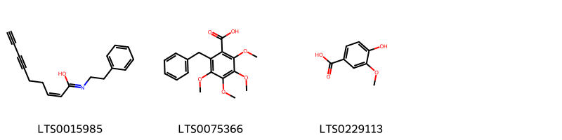{ width=100% }
    <figcaption>Hình ảnh cấu trúc hóa học của 3 hoạt chất thuộc nhóm Benzene and substituted derivatives gồm ['(2z)-n-(2-phenylethyl)non-2-en-6,8-diynimidic acid (LTS0015985)', '2-benzyl-3,4,5,6-tetramethoxybenzoic acid (LTS0075366)', 'vanillic acid (LTS0229113)'].</figcaption>
</figure>
#### Nhóm Carboximidic acids and derivatives
<figure markdown="span">
    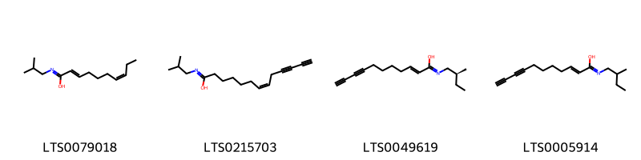{ width=100% }
    <figcaption>Hình ảnh cấu trúc hóa học của 4 hoạt chất thuộc nhóm Carboximidic acids and derivatives gồm ['(2e,7z)-n-(2-methylpropyl)deca-2,7-dienimidic acid (LTS0079018)', '(7z)-n-(2-methylpropyl)tridec-7-en-10,12-diynimidic acid (LTS0215703)', '(2e)-n-[(2s)-2-methylbutyl]undec-2-en-8,10-diynimidic acid (LTS0049619)', '(2e)-n-(2-methylbutyl)undec-2-en-8,10-diynimidic acid (LTS0005914)'].</figcaption>
</figure>
#### Nhóm Cinnamic acids and derivatives
<figure markdown="span">
    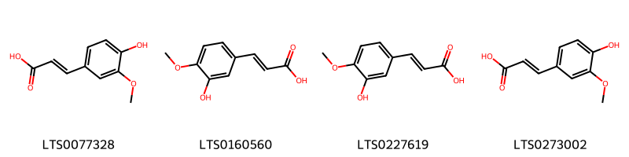{ width=100% }
    <figcaption>Hình ảnh cấu trúc hóa học của 4 hoạt chất thuộc nhóm Cinnamic acids and derivatives gồm ['ferulic acid (LTS0077328)', 'isoferulic acid (LTS0160560)', 'isoferulic acid (LTS0227619)', 'ferulic acid (LTS0273002)'].</figcaption>
</figure>
#### Nhóm Coumarins and derivatives
<figure markdown="span">
    { width=100% }
    <figcaption>Hình ảnh cấu trúc hóa học của 1 hoạt chất thuộc nhóm Coumarins and derivatives gồm ['scopoletin (LTS0193112)'].</figcaption>
</figure>
#### Nhóm Epoxides
<figure markdown="span">
    { width=100% }
    <figcaption>Hình ảnh cấu trúc hóa học của 1 hoạt chất thuộc nhóm Epoxides gồm ['3-(hexa-3,5-diyn-1-yl)-n-(2-phenylethyl)oxirane-2-carboximidic acid (LTS0055584)'].</figcaption>
</figure>
#### Nhóm Fatty Acyls
<figure markdown="span">
    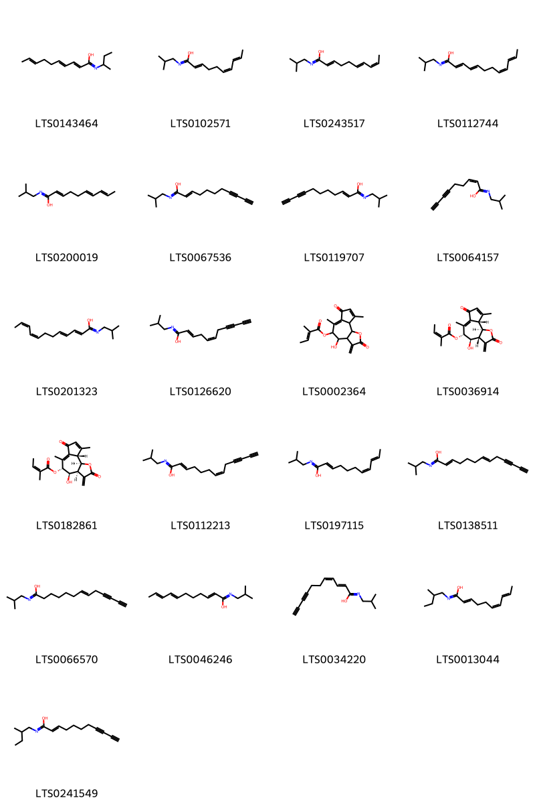{ width=100% }
    <figcaption>Hình ảnh cấu trúc hóa học của 21 hoạt chất thuộc nhóm Fatty Acyls gồm ['(2e,4e,8e)-n-(sec-butyl)deca-2,4,8-trienimidic acid (LTS0143464)', '(2e,6z,8e)-n-(2-methylpropyl)deca-2,6,8-trienimidic acid (LTS0102571)', '(2e,6e,8z)-n-(2-methylpropyl)deca-2,6,8-trienimidic acid (LTS0243517)', '(2e,4e,8z,10e)-n-(2-methylpropyl)dodeca-2,4,8,10-tetraenimidic acid (LTS0112744)', 'n-(2-methylpropyl)deca-2,6,8-trienimidic acid (LTS0200019)', 'n-(2-methylpropyl)undec-2-en-8,10-diynimidic acid (LTS0067536)', '(2e)-n-(2-methylpropyl)undec-2-en-8,10-diynimidic acid (LTS0119707)', '(2z)-n-(2-methylpropyl)non-2-en-6,8-diynimidic acid (LTS0064157)', '(2e,4e,8z,10z)-n-(2-methylpropyl)dodeca-2,4,8,10-tetraenimidic acid (LTS0201323)', '(2e,5z)-n-(2-methylpropyl)undeca-2,5-dien-8,10-diynimidic acid (LTS0126620)', '4-hydroxy-6,9-dimethyl-3-methylidene-2,7-dioxo-3ah,4h,5h,9ah,9bh-azuleno[4,5-b]furan-5-yl 2-methylbut-2-enoate (LTS0002364)', '(3ar,4r,5r,9as,9br)-4-hydroxy-6,9-dimethyl-3-methylidene-2,7-dioxo-3ah,4h,5h,9ah,9bh-azuleno[4,5-b]furan-5-yl (2z)-2-methylbut-2-enoate (LTS0036914)', '(3as,4r,5r,9as,9br)-4-hydroxy-6,9-dimethyl-3-methylidene-2,7-dioxo-3ah,4h,5h,9ah,9bh-azuleno[4,5-b]furan-5-yl (2z)-2-methylbut-2-enoate (LTS0182861)', '(2e,7z)-n-(2-methylpropyl)trideca-2,7-dien-10,12-diynimidic acid (LTS0112213)', '(2e,7z,9e)-n-(2-methylpropyl)undeca-2,7,9-trienimidic acid (LTS0197115)', 'n-(2-methylpropyl)trideca-2,7-dien-10,12-diynimidic acid (LTS0138511)', 'n-(2-methylpropyl)tridec-7-en-10,12-diynimidic acid (LTS0066570)', 'n-(2-methylpropyl)undeca-2,7,9-trienimidic acid (LTS0046246)', '(2e,4z)-n-(2-methylpropyl)undeca-2,4-dien-8,10-diynimidic acid (LTS0034220)', '(2e,6z,8e)-n-(2-methylbutyl)deca-2,6,8-trienimidic acid (LTS0013044)', 'n-(2-methylbutyl)undec-2-en-8,10-diynimidic acid (LTS0241549)'].</figcaption>
</figure>
#### Nhóm Organooxygen compounds
<figure markdown="span">
    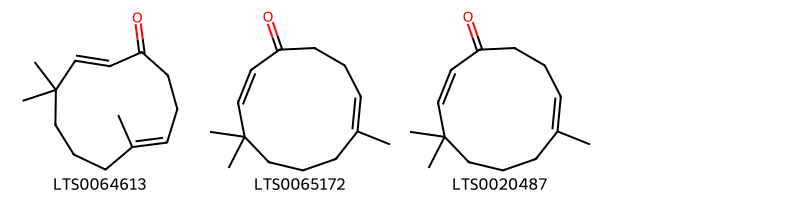{ width=100% }
    <figcaption>Hình ảnh cấu trúc hóa học của 3 hoạt chất thuộc nhóm Organooxygen compounds gồm ['(2e,8e)-4,4,8-trimethylcycloundeca-2,8-dien-1-one (LTS0064613)', '(2z,8z)-4,4,8-trimethylcycloundeca-2,8-dien-1-one (LTS0065172)', '4,4,8-trimethylcycloundeca-2,8-dien-1-one (LTS0020487)'].</figcaption>
</figure>
#### Nhóm Prenol lipids
<figure markdown="span">
    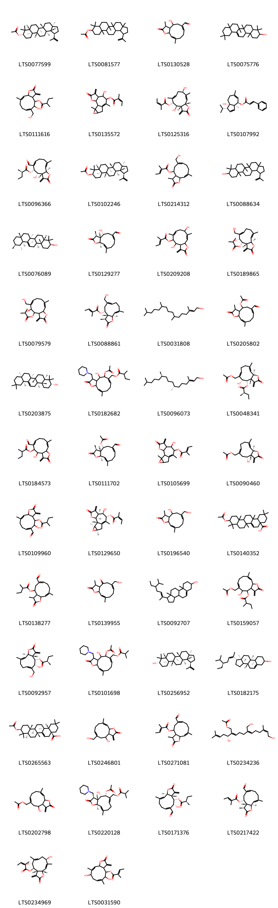{ width=100% }
    <figcaption>Hình ảnh cấu trúc hóa học của 70 hoạt chất thuộc nhóm Prenol lipids gồm ['lupeol acetate (LTS0077599)', '3a,5a,5b,8,8,11a-hexamethyl-1-(prop-1-en-2-yl)-hexadecahydrocyclopenta[a]chrysen-9-yl acetate (LTS0081577)', '4-hydroxy-3,10-dimethyl-2-oxo-3h,3ah,4h,5h,8h,9h,11ah-cyclodeca[b]furan-6-carbaldehyde (LTS0130528)', 'β-amyrin (LTS0075776)', '5-hydroxy-6-(hydroxymethyl)-10-methyl-3-methylidene-2-oxo-3ah,4h,5h,8h,9h,11ah-cyclodeca[b]furan-4-yl 2-methylbutanoate (LTS0111616)', '7-hydroxy-9,14-dimethyl-5-methylidene-4-oxo-3,13-dioxatetracyclo[8.4.0.0²,⁶.0¹²,¹⁴]tetradec-9-en-8-yl (2z)-2-methylbut-2-enoate (LTS0135572)', '(3ar,4r,5r,9r,11as)-4,9-dihydroxy-6,10-dimethyl-3-methylidene-2-oxo-3ah,4h,5h,8h,9h,11ah-cyclodeca[b]furan-5-yl (2z)-2-methylbut-2-enoate (LTS0125316)', '(1s,3ar,4r,8as)-8a-hydroxy-1-isopropyl-3a,6-dimethyl-1,4,7,8-tetrahydroazulen-4-yl (2e)-3-phenylprop-2-enoate (LTS0107992)', '(3ar,4s,5r,11ar)-6-formyl-4-hydroxy-10-methyl-3-methylidene-2-oxo-3ah,4h,5h,8h,9h,11ah-cyclodeca[b]furan-5-yl (2r)-2-methylbutanoate (LTS0096366)', '(1r,3ar,5ar,5br,7ar,9r,11ar,11br,13ar,13br)-3a,5a,5b,8,8,11a-hexamethyl-1-(prop-1-en-2-yl)-hexadecahydrocyclopenta[a]chrysen-9-yl acetate (LTS0102246)', '6-(hydroxymethyl)-3,10-dimethyl-2-oxo-3h,3ah,4h,5h,8h,9h,11ah-cyclodeca[b]furan-4-yl 2-methylbut-2-enoate (LTS0214312)', 'lupeol (LTS0088634)', '(3s,4as,6as,6bs,8ar,11s,12r,12as,14ar,14br)-4,4,6a,6b,8a,11,12,14b-octamethyl-2,3,4a,5,6,7,8,9,10,11,12,12a,14,14a-tetradecahydro-1h-picen-3-ol (LTS0076089)', '(3s,3ar,4r,11ar)-4-hydroxy-3,10-dimethyl-2-oxo-3h,3ah,4h,5h,8h,9h,11ah-cyclodeca[b]furan-6-carbaldehyde (LTS0129277)', '4,9-dihydroxy-6,10-dimethyl-3-methylidene-2-oxo-3ah,4h,5h,8h,9h,11ah-cyclodeca[b]furan-5-yl 2-methylbut-2-enoate (LTS0209208)', '(3as,4s,5r,11ar)-5-hydroxy-6-(hydroxymethyl)-10-methyl-3-methylidene-2-oxo-3ah,4h,5h,8h,9h,11ah-cyclodeca[b]furan-4-yl 2-methylpropanoate (LTS0189865)', '5-hydroxy-6-(hydroxymethyl)-10-methyl-3-methylidene-2-oxo-3ah,4h,5h,8h,9h,11ah-cyclodeca[b]furan-4-yl 2-methylpropanoate (LTS0079579)', '(3s,3ar,4r,11ar)-6-(hydroxymethyl)-3,10-dimethyl-2-oxo-3h,3ah,4h,5h,8h,9h,11ah-cyclodeca[b]furan-4-yl (2e)-2-methylbut-2-enoate (LTS0088861)', 'phytol (LTS0031808)', '6-formyl-3,10-dimethyl-2-oxo-3h,3ah,4h,5h,8h,9h,11ah-cyclodeca[b]furan-4-yl acetate (LTS0205802)', '(3r,4ar,6ar,6bs,8as,12as,14ar,14br)-4,4,6a,6b,8a,11,11,14b-octamethyl-1,2,3,4a,5,6,7,8,9,10,12,12a,14,14a-tetradecahydropicen-3-ol (LTS0203875)', '[5-(acetyloxy)-4-hydroxy-10-methyl-2-oxo-3-(piperidin-1-ylmethyl)-3h,3ah,4h,5h,8h,9h,11ah-cyclodeca[b]furan-6-yl]methyl 2-methylbutanoate (LTS0182682)', 'phytol (LTS0096073)', '(3as,4s,5r,11ar)-6-[(acetyloxy)methyl]-5-hydroxy-10-methyl-3-methylidene-2-oxo-3ah,4h,5h,8h,9h,11ah-cyclodeca[b]furan-4-yl (2r)-2-methylbutanoate (LTS0048341)', '6-formyl-4-hydroxy-10-methyl-3-methylidene-2-oxo-3ah,4h,5h,8h,9h,11ah-cyclodeca[b]furan-5-yl 2-methylbutanoate (LTS0184573)', '(3s,3ar,4r,11ar)-6-formyl-3,10-dimethyl-2-oxo-3h,3ah,4h,5h,8h,9h,11ah-cyclodeca[b]furan-4-yl acetate (LTS0111702)', '7-hydroxy-9,14-dimethyl-5-methylidene-4-oxo-3,13-dioxatetracyclo[8.4.0.0²,⁶.0¹²,¹⁴]tetradec-9-en-8-yl 2-methylbut-2-enoate (LTS0105699)', 'ovatifolin (LTS0090460)', '6-formyl-5-hydroxy-10-methyl-3-methylidene-2-oxo-3ah,4h,5h,8h,9h,11ah-cyclodeca[b]furan-4-yl 2-methylbutanoate (LTS0109960)', '(1s,2s,6s,7r,8r,12r,14s)-7-hydroxy-9,14-dimethyl-5-methylidene-4-oxo-3,13-dioxatetracyclo[8.4.0.0²,⁶.0¹²,¹⁴]tetradec-9-en-8-yl (2z)-2-methylbut-2-enoate (LTS0129650)', '4-hydroxy-6-(hydroxymethyl)-3,10-dimethyl-3h,3ah,4h,5h,8h,9h,11ah-cyclodeca[b]furan-2-one (LTS0196540)', '10-(acetyloxy)-2,2,6b,9,9,12a,14a-heptamethyl-1,3,4,5,7,8,8a,10,11,12,12b,13,14,14b-tetradecahydropicene-4a-carboxylic acid (LTS0140352)', '6-formyl-3,10-dimethyl-2-oxo-3h,3ah,4h,5h,8h,9h,11ah-cyclodeca[b]furan-4-yl 2-methylbutanoate (LTS0138277)', '6-(hydroxymethyl)-3,10-dimethyl-3h,3ah,5h,8h,9h,11ah-cyclodeca[b]furan-2,4-dione (LTS0139955)', '1-(5-ethyl-6-methylhept-2-en-2-yl)-9a,11a-dimethyl-1h,2h,3h,3ah,3bh,4h,6h,7h,8h,9h,9bh,10h,11h-cyclopenta[a]phenanthren-7-ol (LTS0092707)', '6-[(acetyloxy)methyl]-5-hydroxy-10-methyl-3-methylidene-2-oxo-3ah,4h,5h,8h,9h,11ah-cyclodeca[b]furan-4-yl 2-methylbutanoate (LTS0159057)', '(3as,4s,5r,11ar)-5-hydroxy-6-(hydroxymethyl)-10-methyl-3-methylidene-2-oxo-3ah,4h,5h,8h,9h,11ah-cyclodeca[b]furan-4-yl (2r)-2-methylbutanoate (LTS0092957)', '[5-(acetyloxy)-4-hydroxy-10-methyl-2-oxo-3-(piperidin-1-ylmethyl)-3h,3ah,4h,5h,8h,9h,11ah-cyclodeca[b]furan-6-yl]methyl 2-methylpropanoate (LTS0101698)', 'lupeol (LTS0256952)', '(1r,3ar,3br,7r,9ar,9br,11as)-1-[(2z,5r)-5-ethyl-6-methylhept-2-en-2-yl]-9a,11a-dimethyl-1h,2h,3h,3ah,3bh,4h,6h,7h,8h,9h,9bh,10h,11h-cyclopenta[a]phenanthren-7-ol (LTS0182175)', 'acetyl aleuritolic acid (LTS0265563)', '4-hydroxy-6-(hydroxymethyl)-10-methyl-3-methylidene-3ah,4h,5h,8h,9h,11ah-cyclodeca[b]furan-2-one (LTS0246801)', '6-formyl-3,10-dimethyl-2-oxo-3h,3ah,4h,5h,8h,9h,11ah-cyclodeca[b]furan-4-yl 2-methylbut-2-enoate (LTS0271081)', '(2e,6z,10z)-12-hydroxy-2-[(1r)-1-hydroxy-4-methylpent-3-en-1-yl]-6-(hydroxymethyl)-10-methyldodeca-2,6,10-trien-1-yl acetate (LTS0234236)', '{4-hydroxy-10-methyl-3-methylidene-2-oxo-3ah,4h,5h,8h,9h,11ah-cyclodeca[b]furan-6-yl}methyl acetate (LTS0202798)', '[(3r,3ar,4s,5r,11ar)-5-(acetyloxy)-4-hydroxy-10-methyl-2-oxo-3-(piperidin-1-ylmethyl)-3h,3ah,4h,5h,8h,9h,11ah-cyclodeca[b]furan-6-yl]methyl 2-methylpropanoate (LTS0220128)', '(3as,4s,5r,11ar)-6-formyl-5-hydroxy-10-methyl-3-methylidene-2-oxo-3ah,4h,5h,8h,9h,11ah-cyclodeca[b]furan-4-yl (2r)-2-methylbutanoate (LTS0171376)', '(3s,3ar,4r,11ar)-6-formyl-3,10-dimethyl-2-oxo-3h,3ah,4h,5h,8h,9h,11ah-cyclodeca[b]furan-4-yl (2e)-2-methylbut-2-enoate (LTS0217422)', '(3as,4r,5r,9r,11as)-5,9-dihydroxy-6,10-dimethyl-3-methylidene-2-oxo-3ah,4h,5h,8h,9h,11ah-cyclodeca[b]furan-4-yl (2z)-2-methylbut-2-enoate (LTS0234969)', '5,9-dihydroxy-6,10-dimethyl-3-methylidene-2-oxo-3ah,4h,5h,8h,9h,11ah-cyclodeca[b]furan-4-yl 2-methylbut-2-enoate (LTS0031590)', '(3s,3ar,4r,11ar)-6-formyl-3,10-dimethyl-2-oxo-3h,3ah,4h,5h,8h,9h,11ah-cyclodeca[b]furan-4-yl (2r)-2-methylbutanoate (LTS0147000)', '(3s,3as,11ar)-3,10-dimethyl-2,4-dioxo-3h,3ah,5h,8h,9h,11ah-cyclodeca[b]furan-6-carbaldehyde (LTS0180482)', '(1r,3ar,4r,8as)-8a-hydroxy-1-isopropyl-3a,6-dimethyl-1,2,3,4,7,8-hexahydroazulen-4-yl (2e)-3-phenylprop-2-enoate (LTS0043609)', '3,7,11,15-tetramethylhexadec-2-en-1-ol (LTS0056933)', '8a-hydroxy-1-isopropyl-3a,6-dimethyl-1,4,7,8-tetrahydroazulen-4-yl 3-phenylprop-2-enoate (LTS0252832)', '4,9-dihydroxy-6,10-dimethyl-3-methylidene-2-oxo-3ah,4h,5h,8h,9h,11ah-cyclodeca[b]furan-5-yl (2z)-2-methylbut-2-enoate (LTS0020905)', '3,10-dimethyl-2,4-dioxo-5h,8h,9h,11ah-cyclodeca[b]furan-6-carbaldehyde (LTS0195449)', '(3s,3as,11ar)-6-(hydroxymethyl)-3,10-dimethyl-3h,3ah,5h,8h,9h,11ah-cyclodeca[b]furan-2,4-dione (LTS0176422)', '(3ar,4r,11ar)-4-hydroxy-6-(hydroxymethyl)-10-methyl-3-methylidene-3ah,4h,5h,8h,9h,11ah-cyclodeca[b]furan-2-one (LTS0061501)', '(11ar)-3,10-dimethyl-2,4-dioxo-5h,8h,9h,11ah-cyclodeca[b]furan-6-carbaldehyde (LTS0125478)', '12-hydroxy-2-(1-hydroxy-4-methylpent-3-en-1-yl)-6-(hydroxymethyl)-10-methyldodeca-2,6,10-trien-1-yl acetate (LTS0053648)', '3,10-dimethyl-2,4-dioxo-3h,3ah,5h,8h,9h,11ah-cyclodeca[b]furan-6-carbaldehyde (LTS0052613)', '8a-hydroxy-1-isopropyl-3a,6-dimethyl-1,2,3,4,7,8-hexahydroazulen-4-yl 3-phenylprop-2-enoate (LTS0016043)', '(3s,3ar,4r,11ar)-4-hydroxy-6-(hydroxymethyl)-3,10-dimethyl-3h,3ah,4h,5h,8h,9h,11ah-cyclodeca[b]furan-2-one (LTS0016668)', 'α-amyrin (LTS0088267)', '(3as)-5,9-dihydroxy-6,10-dimethyl-3-methylidene-2-oxo-3ah,4h,5h,8h,9h,11ah-cyclodeca[b]furan-4-yl (2e)-2-methylbut-2-enoate (LTS0102611)', 'epilupeol (LTS0108662)', '[(3r,3ar,4s,5r,11ar)-5-(acetyloxy)-4-hydroxy-10-methyl-2-oxo-3-(piperidin-1-ylmethyl)-3h,3ah,4h,5h,8h,9h,11ah-cyclodeca[b]furan-6-yl]methyl (2r)-2-methylbutanoate (LTS0031568)', '7-hydroxy-9,14-dimethyl-5-methylidene-4-oxo-3,13-dioxatetracyclo[8.4.0.0²,⁶.0¹²,¹⁴]tetradec-9-en-8-yl (2e)-2-methylbut-2-enoate (LTS0044159)', 'lupenone (LTS0107900)'].</figcaption>
</figure>
#### Nhóm Steroids and steroid derivatives
<figure markdown="span">
    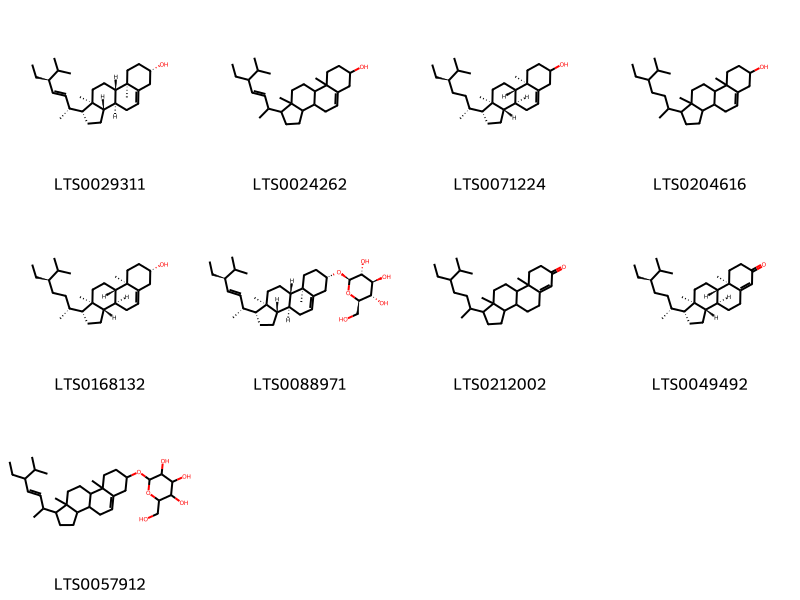{ width=100% }
    <figcaption>Hình ảnh cấu trúc hóa học của 9 hoạt chất thuộc nhóm Steroids and steroid derivatives gồm ['phytosterol (LTS0029311)', 'stigmasterol (LTS0024262)', 'stigmast-5-en-3-ol (LTS0071224)', 'stigmast-5-en-3-ol, (3β)- (LTS0204616)', 'sitosterol (LTS0168132)', '(2r,3r,4s,5s,6r)-2-{[(1r,3as,3bs,7s,9ar,9bs,11ar)-1-[(2r,3e,5s)-5-ethyl-6-methylhept-3-en-2-yl]-9a,11a-dimethyl-1h,2h,3h,3ah,3bh,4h,6h,7h,8h,9h,9bh,10h,11h-cyclopenta[a]phenanthren-7-yl]oxy}-6-(hydroxymethyl)oxane-3,4,5-triol (LTS0088971)', '1-(5-ethyl-6-methylheptan-2-yl)-9a,11a-dimethyl-1h,2h,3h,3ah,3bh,4h,5h,8h,9h,9bh,10h,11h-cyclopenta[a]phenanthren-7-one (LTS0212002)', 'β-sitostenone (LTS0049492)', '2-{[1-(5-ethyl-6-methylhept-3-en-2-yl)-9a,11a-dimethyl-1h,2h,3h,3ah,3bh,4h,6h,7h,8h,9h,9bh,10h,11h-cyclopenta[a]phenanthren-7-yl]oxy}-6-(hydroxymethyl)oxane-3,4,5-triol (LTS0057912)'].</figcaption>
</figure>
#### Nhóm Thiophenes
<figure markdown="span">
    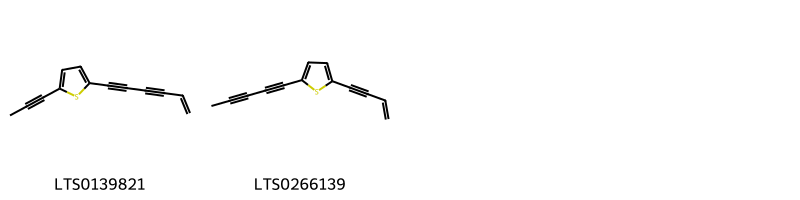{ width=100% }
    <figcaption>Hình ảnh cấu trúc hóa học của 2 hoạt chất thuộc nhóm Thiophenes gồm ['2-(hex-5-en-1,3-diyn-1-yl)-5-(prop-1-yn-1-yl)thiophene (LTS0139821)', '2-(but-3-en-1-yn-1-yl)-5-(penta-1,3-diyn-1-yl)thiophene (LTS0266139)'].</figcaption>
</figure>

---

### Dược dân tộc học

Danh sách các quốc gia có sử dụng *N/A* trong điều trị các bệnh. 

| Country       | Disease                           | Bệnh                                                                                                                                                                                                |
|:--------------|:----------------------------------|:----------------------------------------------------------------------------------------------------------------------------------------------------------------------------------------------------|
| Elsewhere     | Diuretic, Purgative, Vulnerary    | MYMEMORY WARNING: YOU USED ALL AVAILABLE FREE TRANSLATIONS FOR TODAY. NEXT AVAILABLE IN  13 HOURS 17 MINUTES 02 SECONDS VISIT HTTPS://MYMEMORY.TRANSLATED.NET/DOC/USAGELIMITS.PHP TO TRANSLATE MORE |
| Java          | Piscicide                         | MYMEMORY WARNING: YOU USED ALL AVAILABLE FREE TRANSLATIONS FOR TODAY. NEXT AVAILABLE IN  13 HOURS 17 MINUTES 00 SECONDS VISIT HTTPS://MYMEMORY.TRANSLATED.NET/DOC/USAGELIMITS.PHP TO TRANSLATE MORE |
| Latin America | Insecticide, Larvicide, Piscicide | MYMEMORY WARNING: YOU USED ALL AVAILABLE FREE TRANSLATIONS FOR TODAY. NEXT AVAILABLE IN  13 HOURS 16 MINUTES 56 SECONDS VISIT HTTPS://MYMEMORY.TRANSLATED.NET/DOC/USAGELIMITS.PHP TO TRANSLATE MORE |
| Sudan         | Stimulant                         | MYMEMORY WARNING: YOU USED ALL AVAILABLE FREE TRANSLATIONS FOR TODAY. NEXT AVAILABLE IN  13 HOURS 16 MINUTES 52 SECONDS VISIT HTTPS://MYMEMORY.TRANSLATED.NET/DOC/USAGELIMITS.PHP TO TRANSLATE MORE |

---

---
## ilanthes calva
### Thông tin về thực vật

!!! info "Phân loại thực vật của *N/A* từ GIBF:"
    - **Kingdom:** N/A
    - **Phylum:** N/A
    - **Order:** N/A
    - **Family:** N/A
    - **Genus:** N/A
    - **Species:** *N/A*

 

| Label (VI)   | Label (EN)   | Scientific Name   | Descriptions (VI)   | Descriptions (EN)   | Also Known As (VI)   | Also Known As (EN)   |
|:-------------|:-------------|:------------------|:--------------------|:--------------------|:---------------------|:---------------------|
| N/A          | N/A          | Tamus communis    | loài thực vật       | species of plant    | ['']                 | ['']                 |

#### Phân bố trên thế giới

**Từ CSDL GIBF** Không có kết quả phù hợp

#### Phân bố tại Việt Nam

**Từ CSDL GIBF**: Không có ghi nhận ở Việt Nam

---
### Thành phần hóa học
        
- Theo cơ sở dữ liệu lotus: Từ loài *N/A* đã phân lập và xác định được Chưa có hoạt chất nào được phân lập. hoạt chất thuộc về các nhóm Không có hoạt chất nào được phân lập. 

Không có hình ảnh nào được tạo ra

---

### Dược dân tộc học

Danh sách các quốc gia có sử dụng *N/A* trong điều trị các bệnh. 

| Country   | Disease                                                                        | Bệnh                                                                                                                                                                                                |
|:----------|:-------------------------------------------------------------------------------|:----------------------------------------------------------------------------------------------------------------------------------------------------------------------------------------------------|
| India     | Diuretic, Piscicide, Sialogogue, Vulnerary, Anesthetic, Purgative, Insecticide | MYMEMORY WARNING: YOU USED ALL AVAILABLE FREE TRANSLATIONS FOR TODAY. NEXT AVAILABLE IN  13 HOURS 16 MINUTES 18 SECONDS VISIT HTTPS://MYMEMORY.TRANSLATED.NET/DOC/USAGELIMITS.PHP TO TRANSLATE MORE |

---

---
## ilanthes grandiflora
### Thông tin về thực vật

!!! info "Phân loại thực vật của *N/A* từ GIBF:"
    - **Kingdom:** N/A
    - **Phylum:** N/A
    - **Order:** N/A
    - **Family:** N/A
    - **Genus:** N/A
    - **Species:** *N/A*

 

| Label (VI)   | Label (EN)   | Scientific Name   | Descriptions (VI)   | Descriptions (EN)   | Also Known As (VI)   | Also Known As (EN)   |
|:-------------|:-------------|:------------------|:--------------------|:--------------------|:---------------------|:---------------------|
| N/A          | N/A          | Tamus communis    | loài thực vật       | species of plant    | ['']                 | ['']                 |

#### Phân bố trên thế giới

**Từ CSDL GIBF** Không có kết quả phù hợp

#### Phân bố tại Việt Nam

**Từ CSDL GIBF**: Không có ghi nhận ở Việt Nam

---
### Thành phần hóa học
        
- Theo cơ sở dữ liệu lotus: Từ loài *N/A* đã phân lập và xác định được Chưa có hoạt chất nào được phân lập. hoạt chất thuộc về các nhóm Không có hoạt chất nào được phân lập. 

Không có hình ảnh nào được tạo ra

---

### Dược dân tộc học

Danh sách các quốc gia có sử dụng *N/A* trong điều trị các bệnh. 

| Country             | Disease   | Bệnh                                                                                                                                                                                                |
|:--------------------|:----------|:----------------------------------------------------------------------------------------------------------------------------------------------------------------------------------------------------|
| Philippines(Ifugao) | Sedative  | MYMEMORY WARNING: YOU USED ALL AVAILABLE FREE TRANSLATIONS FOR TODAY. NEXT AVAILABLE IN  13 HOURS 16 MINUTES 00 SECONDS VISIT HTTPS://MYMEMORY.TRANSLATED.NET/DOC/USAGELIMITS.PHP TO TRANSLATE MORE |

---

---
## ilanthes oleracea
### Thông tin về thực vật

!!! info "Phân loại thực vật của *N/A* từ GIBF:"
    - **Kingdom:** N/A
    - **Phylum:** N/A
    - **Order:** N/A
    - **Family:** N/A
    - **Genus:** N/A
    - **Species:** *N/A*

 

| Label (VI)   | Label (EN)   | Scientific Name   | Descriptions (VI)   | Descriptions (EN)   | Also Known As (VI)   | Also Known As (EN)   |
|:-------------|:-------------|:------------------|:--------------------|:--------------------|:---------------------|:---------------------|
| N/A          | N/A          | Tamus communis    | loài thực vật       | species of plant    | ['']                 | ['']                 |

#### Phân bố trên thế giới

**Từ CSDL GIBF** Không có kết quả phù hợp

#### Phân bố tại Việt Nam

**Từ CSDL GIBF**: Không có ghi nhận ở Việt Nam

---
### Thành phần hóa học
        
- Theo cơ sở dữ liệu lotus: Từ loài *N/A* đã phân lập và xác định được 15 hoạt chất thuộc về các nhóm Fatty Acyls, Carboximidic acids and derivatives, Flavonoids, Benzene and substituted derivatives. 

|    | chemicalTaxonomyClassyfireClass     |   smiles_count |
|---:|:------------------------------------|---------------:|
|  0 | Benzene and substituted derivatives |              1 |
|  1 | Carboximidic acids and derivatives  |              2 |
|  2 | Fatty Acyls                         |              7 |
|  3 | Flavonoids                          |              5 |

#### Nhóm Benzene and substituted derivatives
<figure markdown="span">
    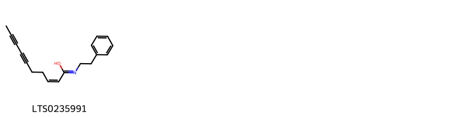{ width=100% }
    <figcaption>Hình ảnh cấu trúc hóa học của 1 hoạt chất thuộc nhóm Benzene and substituted derivatives gồm ['(2z)-n-(2-phenylethyl)dec-2-en-6,8-diynimidic acid (LTS0235991)'].</figcaption>
</figure>
#### Nhóm Carboximidic acids and derivatives
<figure markdown="span">
    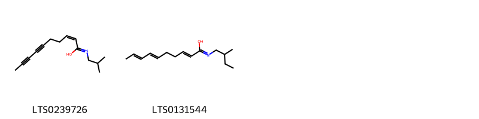{ width=100% }
    <figcaption>Hình ảnh cấu trúc hóa học của 2 hoạt chất thuộc nhóm Carboximidic acids and derivatives gồm ['(2z)-n-(2-methylpropyl)dec-2-en-6,8-diynimidic acid (LTS0239726)', '(8e)-n-(2-methylbutyl)deca-2,6,8-trienimidic acid (LTS0131544)'].</figcaption>
</figure>
#### Nhóm Fatty Acyls
<figure markdown="span">
    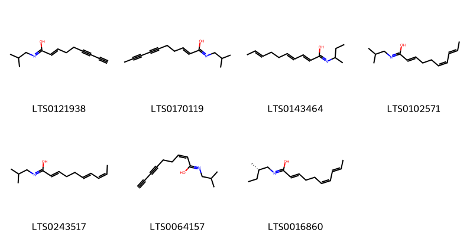{ width=100% }
    <figcaption>Hình ảnh cấu trúc hóa học của 7 hoạt chất thuộc nhóm Fatty Acyls gồm ['n-(2-methylpropyl)non-2-en-6,8-diynimidic acid (LTS0121938)', 'n-(2-methylpropyl)dec-2-en-6,8-diynimidic acid (LTS0170119)', '(2e,4e,8e)-n-(sec-butyl)deca-2,4,8-trienimidic acid (LTS0143464)', '(2e,6z,8e)-n-(2-methylpropyl)deca-2,6,8-trienimidic acid (LTS0102571)', '(2e,6e,8z)-n-(2-methylpropyl)deca-2,6,8-trienimidic acid (LTS0243517)', '(2z)-n-(2-methylpropyl)non-2-en-6,8-diynimidic acid (LTS0064157)', '(2e,6z,8e)-n-[(2s)-2-methylbutyl]deca-2,6,8-trienimidic acid (LTS0016860)'].</figcaption>
</figure>
#### Nhóm Flavonoids
<figure markdown="span">
    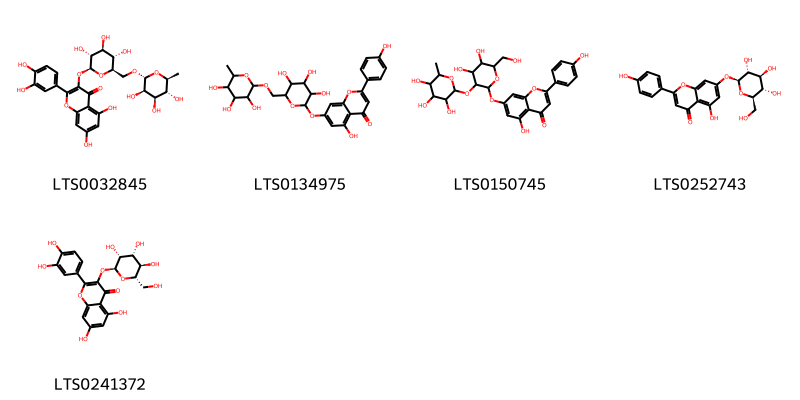{ width=100% }
    <figcaption>Hình ảnh cấu trúc hóa học của 5 hoạt chất thuộc nhóm Flavonoids gồm ['3-rutinosyl quercetin (LTS0032845)', '5-hydroxy-2-(4-hydroxyphenyl)-7-[(3,4,5-trihydroxy-6-{[(3,4,5-trihydroxy-6-methyloxan-2-yl)oxy]methyl}oxan-2-yl)oxy]chromen-4-one (LTS0134975)', 'rhoifolin (LTS0150745)', 'apigenin 7-o-β-glucoside (LTS0252743)', '2-(3,4-dihydroxyphenyl)-5,7-dihydroxy-3-{[(2s,3r,4r,5r,6s)-3,4,5-trihydroxy-6-(hydroxymethyl)oxan-2-yl]oxy}chromen-4-one (LTS0241372)'].</figcaption>
</figure>

---

### Dược dân tộc học

Danh sách các quốc gia có sử dụng *N/A* trong điều trị các bệnh. 

| Country   | Disease     | Bệnh                                                                                                                                                                                                |
|:----------|:------------|:----------------------------------------------------------------------------------------------------------------------------------------------------------------------------------------------------|
| Elsewhere | Insecticide | MYMEMORY WARNING: YOU USED ALL AVAILABLE FREE TRANSLATIONS FOR TODAY. NEXT AVAILABLE IN  13 HOURS 15 MINUTES 41 SECONDS VISIT HTTPS://MYMEMORY.TRANSLATED.NET/DOC/USAGELIMITS.PHP TO TRANSLATE MORE |

---

---
## ilanthes paniculata
### Thông tin về thực vật

!!! info "Phân loại thực vật của *N/A* từ GIBF:"
    - **Kingdom:** N/A
    - **Phylum:** N/A
    - **Order:** N/A
    - **Family:** N/A
    - **Genus:** N/A
    - **Species:** *N/A*

 

| Label (VI)   | Label (EN)   | Scientific Name   | Descriptions (VI)   | Descriptions (EN)   | Also Known As (VI)   | Also Known As (EN)   |
|:-------------|:-------------|:------------------|:--------------------|:--------------------|:---------------------|:---------------------|
| N/A          | N/A          | Tamus communis    | loài thực vật       | species of plant    | ['']                 | ['']                 |

#### Phân bố trên thế giới

**Từ CSDL GIBF** Không có kết quả phù hợp

#### Phân bố tại Việt Nam

**Từ CSDL GIBF**: Không có ghi nhận ở Việt Nam

---
### Thành phần hóa học
        
- Theo cơ sở dữ liệu lotus: Từ loài *N/A* đã phân lập và xác định được 7 hoạt chất thuộc về các nhóm Fatty Acyls, Steroids and steroid derivatives. 

|    | chemicalTaxonomyClassyfireClass   |   smiles_count |
|---:|:----------------------------------|---------------:|
|  0 | Fatty Acyls                       |              2 |
|  1 | Steroids and steroid derivatives  |              5 |

#### Nhóm Fatty Acyls
<figure markdown="span">
    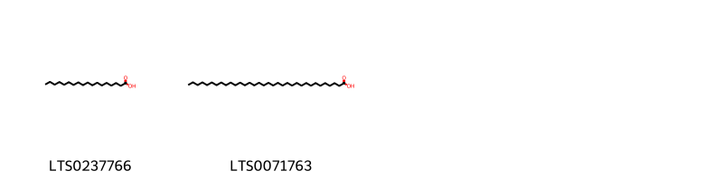{ width=100% }
    <figcaption>Hình ảnh cấu trúc hóa học của 2 hoạt chất thuộc nhóm Fatty Acyls gồm ['stearic acid (LTS0237766)', 'tetratriacontanoic acid (LTS0071763)'].</figcaption>
</figure>
#### Nhóm Steroids and steroid derivatives
<figure markdown="span">
    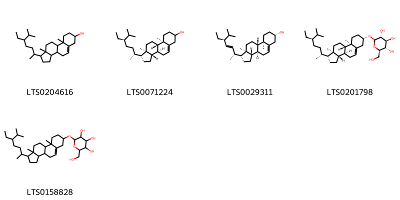{ width=100% }
    <figcaption>Hình ảnh cấu trúc hóa học của 5 hoạt chất thuộc nhóm Steroids and steroid derivatives gồm ['stigmast-5-en-3-ol, (3β)- (LTS0204616)', 'stigmast-5-en-3-ol (LTS0071224)', 'phytosterol (LTS0029311)', 'sitogluside (LTS0201798)', '2-{[1-(5-ethyl-6-methylheptan-2-yl)-9a,11a-dimethyl-1h,2h,3h,3ah,3bh,4h,6h,7h,8h,9h,9bh,10h,11h-cyclopenta[a]phenanthren-7-yl]oxy}-6-(hydroxymethyl)oxane-3,4,5-triol (LTS0158828)'].</figcaption>
</figure>

---

### Dược dân tộc học

Danh sách các quốc gia có sử dụng *N/A* trong điều trị các bệnh. 

| Country   | Disease                                                                        | Bệnh                                                                                                                                                                                                |
|:----------|:-------------------------------------------------------------------------------|:----------------------------------------------------------------------------------------------------------------------------------------------------------------------------------------------------|
| India     | Anesthetic, Piscicide, Purgative, Vulnerary, Diuretic, Insecticide, Sialogogue | MYMEMORY WARNING: YOU USED ALL AVAILABLE FREE TRANSLATIONS FOR TODAY. NEXT AVAILABLE IN  13 HOURS 15 MINUTES 22 SECONDS VISIT HTTPS://MYMEMORY.TRANSLATED.NET/DOC/USAGELIMITS.PHP TO TRANSLATE MORE |

---

---
## ilanthes uliginosa
### Thông tin về thực vật

!!! info "Phân loại thực vật của *N/A* từ GIBF:"
    - **Kingdom:** N/A
    - **Phylum:** N/A
    - **Order:** N/A
    - **Family:** N/A
    - **Genus:** N/A
    - **Species:** *N/A*

 

| Label (VI)   | Label (EN)   | Scientific Name   | Descriptions (VI)   | Descriptions (EN)   | Also Known As (VI)   | Also Known As (EN)   |
|:-------------|:-------------|:------------------|:--------------------|:--------------------|:---------------------|:---------------------|
| N/A          | N/A          | Tamus communis    | loài thực vật       | species of plant    | ['']                 | ['']                 |

#### Phân bố trên thế giới

**Từ CSDL GIBF** Không có kết quả phù hợp

#### Phân bố tại Việt Nam

**Từ CSDL GIBF**: Không có ghi nhận ở Việt Nam

---
### Thành phần hóa học
        
- Theo cơ sở dữ liệu lotus: Từ loài *N/A* đã phân lập và xác định được Chưa có hoạt chất nào được phân lập. hoạt chất thuộc về các nhóm Không có hoạt chất nào được phân lập. 

Không có hình ảnh nào được tạo ra

---

### Dược dân tộc học

Danh sách các quốc gia có sử dụng *N/A* trong điều trị các bệnh. 

| Country   | Disease   | Bệnh                                                                                                                                                                                                |
|:----------|:----------|:----------------------------------------------------------------------------------------------------------------------------------------------------------------------------------------------------|
| Haiti     | Analgesic | MYMEMORY WARNING: YOU USED ALL AVAILABLE FREE TRANSLATIONS FOR TODAY. NEXT AVAILABLE IN  13 HOURS 14 MINUTES 58 SECONDS VISIT HTTPS://MYMEMORY.TRANSLATED.NET/DOC/USAGELIMITS.PHP TO TRANSLATE MORE |

---

# Chi Wedelia

??? note "Danh sách các dược liệu thuộc chi"
    
	 - *Wedelia bahamensis*
	 - *Wedelia biflora*
	 - *Wedelia calendulacea*
	 - *Wedelia chinensis*

---
## Wedelia bahamensis
### Thông tin về thực vật

!!! info "Phân loại thực vật của *Wedelia bahamensis* từ GIBF:"
    - **Kingdom:** Plantae
    - **Phylum:** Tracheophyta
    - **Order:** Asterales
    - **Family:** Asteraceae
    - **Genus:** Wedelia
    - **Species:** *Wedelia bahamensis*

 

| Label (VI)   | Label (EN)   | Scientific Name    | Descriptions (VI)   | Descriptions (EN)   | Also Known As (VI)   | Also Known As (EN)   |
|:-------------|:-------------|:-------------------|:--------------------|:--------------------|:---------------------|:---------------------|
| N/A          | N/A          | Wedelia bahamensis | loài thực vật       | species of plant    | ['']                 | ['']                 |

#### Phân bố trên thế giới

**Từ CSDL GIBF** Turks and Caicos Islands, nan, Bahamas, United States of America

#### Phân bố tại Việt Nam

**Từ CSDL GIBF**: Không có ghi nhận ở Việt Nam

---
### Thành phần hóa học
        
- Theo cơ sở dữ liệu lotus: Từ loài *Wedelia bahamensis* đã phân lập và xác định được Chưa có hoạt chất nào được phân lập. hoạt chất thuộc về các nhóm Không có hoạt chất nào được phân lập. 

Không có hình ảnh nào được tạo ra

---

### Dược dân tộc học

Danh sách các quốc gia có sử dụng *Wedelia bahamensis* trong điều trị các bệnh. 

| Country   | Disease     | Bệnh                                                                                                                                                                                                |
|:----------|:------------|:----------------------------------------------------------------------------------------------------------------------------------------------------------------------------------------------------|
| Bahamas   | Carminative | MYMEMORY WARNING: YOU USED ALL AVAILABLE FREE TRANSLATIONS FOR TODAY. NEXT AVAILABLE IN  13 HOURS 14 MINUTES 38 SECONDS VISIT HTTPS://MYMEMORY.TRANSLATED.NET/DOC/USAGELIMITS.PHP TO TRANSLATE MORE |

---

---
## Wedelia biflora
### Thông tin về thực vật

!!! info "Phân loại thực vật của *N/A* từ GIBF:"
    - **Kingdom:** Plantae
    - **Phylum:** Tracheophyta
    - **Order:** Asterales
    - **Family:** Asteraceae
    - **Genus:** N/A
    - **Species:** *N/A*

 

| Label (VI)   | Label (EN)   | Scientific Name   | Descriptions (VI)   | Descriptions (EN)   | Also Known As (VI)   | Also Known As (EN)   |
|:-------------|:-------------|:------------------|:--------------------|:--------------------|:---------------------|:---------------------|
| N/A          | N/A          | Wedelia biflora   | loài thực vật       | species of plant    | ['']                 | ['']                 |

#### Phân bố trên thế giới

**Từ CSDL GIBF** Denmark, Australia, New Zealand, Chinese Taipei, Ireland, Isle of Man, Viet Nam, United Kingdom of Great Britain and Northern Ireland

#### Phân bố tại Việt Nam

**Từ CSDL GIBF**: Đà Nẵng

---
### Thành phần hóa học
        
- Theo cơ sở dữ liệu lotus: Từ loài *N/A* đã phân lập và xác định được 54 hoạt chất thuộc về các nhóm Flavonoids, Prenol lipids, Steroids and steroid derivatives, Isoflavonoids, Benzene and substituted derivatives, Organooxygen compounds, Carboxylic acids and derivatives. 

|    | chemicalTaxonomyClassyfireClass     |   smiles_count |
|---:|:------------------------------------|---------------:|
|  0 | Benzene and substituted derivatives |              2 |
|  1 | Carboxylic acids and derivatives    |              1 |
|  2 | Flavonoids                          |              4 |
|  3 | Isoflavonoids                       |              1 |
|  4 | Organooxygen compounds              |              7 |
|  5 | Prenol lipids                       |             36 |
|  6 | Steroids and steroid derivatives    |              1 |

#### Nhóm Benzene and substituted derivatives
<figure markdown="span">
    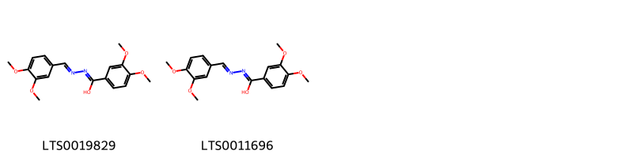{ width=100% }
    <figcaption>Hình ảnh cấu trúc hóa học của 2 hoạt chất thuộc nhóm Benzene and substituted derivatives gồm ['n-[(e)-(3,4-dimethoxyphenyl)methylidene]-3,4-dimethoxybenzenecarbohydrazonic acid (LTS0019829)', 'n-[(3,4-dimethoxyphenyl)methylidene]-3,4-dimethoxybenzenecarbohydrazonic acid (LTS0011696)'].</figcaption>
</figure>
#### Nhóm Carboxylic acids and derivatives
<figure markdown="span">
    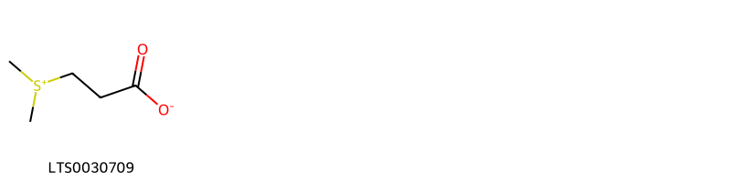{ width=100% }
    <figcaption>Hình ảnh cấu trúc hóa học của 1 hoạt chất thuộc nhóm Carboxylic acids and derivatives gồm ['dimethylsulfoniopropionate (LTS0030709)'].</figcaption>
</figure>
#### Nhóm Flavonoids
<figure markdown="span">
    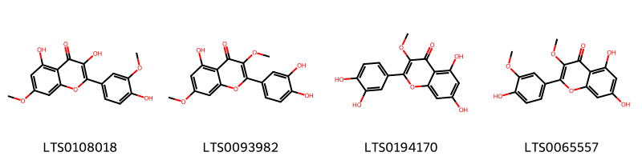{ width=100% }
    <figcaption>Hình ảnh cấu trúc hóa học của 4 hoạt chất thuộc nhóm Flavonoids gồm ['rhamnazin (LTS0108018)', 'dthf (LTS0093982)', 'quercetin 3-methyl ether (LTS0194170)', "3,3'-di-o-methylquercetin (LTS0065557)"].</figcaption>
</figure>
#### Nhóm Isoflavonoids
<figure markdown="span">
    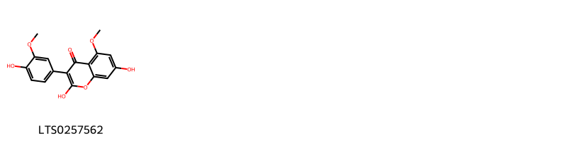{ width=100% }
    <figcaption>Hình ảnh cấu trúc hóa học của 1 hoạt chất thuộc nhóm Isoflavonoids gồm ['2,7-dihydroxy-3-(4-hydroxy-3-methoxyphenyl)-5-methoxychromen-4-one (LTS0257562)'].</figcaption>
</figure>
#### Nhóm Organooxygen compounds
<figure markdown="span">
    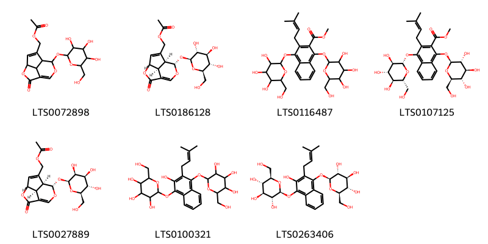{ width=100% }
    <figcaption>Hình ảnh cấu trúc hóa học của 7 hoạt chất thuộc nhóm Organooxygen compounds gồm ['asperuloside (LTS0072898)', 'asperuloside (LTS0186128)', 'methyl 3-(3-methylbut-2-en-1-yl)-1,4-bis({[3,4,5-trihydroxy-6-(hydroxymethyl)oxan-2-yl]oxy})naphthalene-2-carboxylate (LTS0116487)', 'methyl 3-(3-methylbut-2-en-1-yl)-1,4-bis({[(2s,3r,4s,5s,6r)-3,4,5-trihydroxy-6-(hydroxymethyl)oxan-2-yl]oxy})naphthalene-2-carboxylate (LTS0107125)', '[(4r,7s,8s,11s)-2-oxo-8-{[(2s,3s,4s,5s,6r)-3,4,5-trihydroxy-6-(hydroxymethyl)oxan-2-yl]oxy}-3,9-dioxatricyclo[5.3.1.0⁴,¹¹]undeca-1(10),5-dien-6-yl]methyl acetate (LTS0027889)', '2-{[2-hydroxy-3-(3-methylbut-2-en-1-yl)-4-{[3,4,5-trihydroxy-6-(hydroxymethyl)oxan-2-yl]oxy}naphthalen-1-yl]oxy}-6-(hydroxymethyl)oxane-3,4,5-triol (LTS0100321)', '(2s,3r,4s,5s,6r)-2-{[2-hydroxy-3-(3-methylbut-2-en-1-yl)-4-{[(2s,3r,4s,5s,6r)-3,4,5-trihydroxy-6-(hydroxymethyl)oxan-2-yl]oxy}naphthalen-1-yl]oxy}-6-(hydroxymethyl)oxane-3,4,5-triol (LTS0263406)'].</figcaption>
</figure>
#### Nhóm Prenol lipids
<figure markdown="span">
    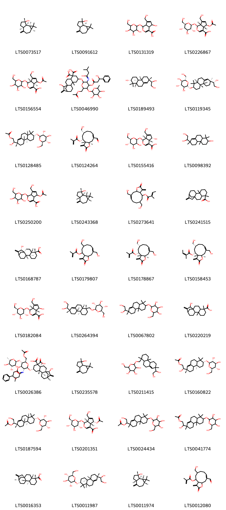{ width=100% }
    <figcaption>Hình ảnh cấu trúc hóa học của 36 hoạt chất thuộc nhóm Prenol lipids gồm ['(1as,4as,7s,7ar,7bs)-1,1,7-trimethyl-4-methylidene-octahydrocyclopropa[e]azulen-7-ol (LTS0073517)', '(7ar)-1,1,7-trimethyl-4-methylidene-octahydrocyclopropa[e]azulen-7-ol (LTS0091612)', '5-hydroxy-7-(hydroxymethyl)-1-{[3,4,5-trihydroxy-6-(hydroxymethyl)oxan-2-yl]oxy}-1h,4ah,5h,7ah-cyclopenta[c]pyran-4-carboxylic acid (LTS0131319)', '(1s,4as,5r,7as)-5-(acetyloxy)-7-(hydroxymethyl)-1-{[(2s,3r,4s,5s,6r)-3,4,5-trihydroxy-6-(hydroxymethyl)oxan-2-yl]oxy}-1h,4ah,5h,7ah-cyclopenta[c]pyran-4-carboxylic acid (LTS0226867)', '(4ar,7as)-5-(acetyloxy)-7-(hydroxymethyl)-1-{[3,4,5-trihydroxy-6-(hydroxymethyl)oxan-2-yl]oxy}-1h,4ah,5h,7ah-cyclopenta[c]pyran-4-carboxylic acid (LTS0156554)', '7-({6-[(acetyloxy)methyl]-3-[(1-hydroxy-3-methylbutylidene)amino]-4-[(3-hydroxy-3-phenylpropanoyl)oxy]-5-[(3,4,5-trihydroxy-6-methyloxan-2-yl)oxy]oxan-2-yl}oxy)-15-hydroxy-9-methyl-14-methylidenetetracyclo[11.2.1.0¹,¹⁰.0⁴,⁹]hexadecane-5,5-dicarboxylic acid (LTS0046990)', '(1r)-1-[(2s,4ar,4bs,7r,8as)-7-hydroxy-2,4b,8,8-tetramethyl-4,4a,5,6,7,8a,9,10-octahydro-3h-phenanthren-2-yl]ethane-1,2-diol (LTS0189493)', '(2s,3s,4r,5r,6s)-2-{[(2r,4as,4bs,7s,10ar)-7-[(1s)-1,2-dihydroxyethyl]-1,1,4a,7-tetramethyl-3,4,4b,5,6,9,10,10a-octahydro-2h-phenanthren-2-yl]oxy}-6-(hydroxymethyl)oxane-3,4,5-triol (LTS0119345)', '(2r)-2-[(2s,4ar,4bs,7r,8as)-2,4b,8,8-tetramethyl-7-{[(2r,3r,4s,5s,6r)-3,4,5-trihydroxy-6-(hydroxymethyl)oxan-2-yl]oxy}-4,4a,5,6,7,8a,9,10-octahydro-3h-phenanthren-2-yl]-2-hydroxyethyl acetate (LTS0128485)', '(3ar,4r,6r,11ar)-10-formyl-6-(hydroxymethyl)-3-methylidene-2-oxo-3ah,4h,5h,6h,7h,8h,11h,11ah-cyclodeca[b]furan-4-yl 2-methylprop-2-enoate (LTS0124264)', '(1s,4as,5s,7as)-5-hydroxy-7-(hydroxymethyl)-1-{[(2s,3s,4s,5s,6r)-3,4,5-trihydroxy-6-(hydroxymethyl)oxan-2-yl]oxy}-1h,4ah,5h,7ah-cyclopenta[c]pyran-4-carboxylic acid (LTS0155416)', '1-(7-hydroxy-2,4b,8,8-tetramethyl-4,4a,5,6,7,8a,9,10-octahydro-3h-phenanthren-2-yl)ethane-1,2-diol (LTS0098392)', '5-(acetyloxy)-7-(hydroxymethyl)-1-{[3,4,5-trihydroxy-6-(hydroxymethyl)oxan-2-yl]oxy}-1h,4ah,5h,7ah-cyclopenta[c]pyran-4-carboxylic acid (LTS0250200)', '(1ar,4ar,7s,7as,7br)-1,1,7-trimethyl-4-methylidene-octahydrocyclopropa[e]azulen-7-ol (LTS0243368)', '6,10-bis(hydroxymethyl)-3-methylidene-2-oxo-3ah,4h,5h,6h,7h,8h,11h,11ah-cyclodeca[b]furan-4-yl 2-methylbut-2-enoate (LTS0273641)', '5,9-dimethyl-14-methylidenetetracyclo[11.2.1.0¹,¹⁰.0⁴,⁹]hexadecane-5-carboxylic acid (LTS0241515)', 'grandifloric acid (LTS0168787)', '6,10-bis(hydroxymethyl)-3-methylidene-2-oxo-3ah,4h,5h,6h,7h,8h,11h,11ah-cyclodeca[b]furan-4-yl 2-methylprop-2-enoate (LTS0179807)', '(3ar,4r,6r,11ar)-6,10-bis(hydroxymethyl)-3-methylidene-2-oxo-3ah,4h,5h,6h,7h,8h,11h,11ah-cyclodeca[b]furan-4-yl 2-methylprop-2-enoate (LTS0178867)', '(3ar,4r,6r,11ar)-6,10-bis(hydroxymethyl)-3-methylidene-2-oxo-3ah,4h,5h,6h,7h,8h,11h,11ah-cyclodeca[b]furan-4-yl (2z)-2-methylbut-2-enoate (LTS0158453)', '(1s,4as,5r,7as)-5-hydroxy-7-(hydroxymethyl)-1-{[(2s,3r,4s,5s,6r)-3,4,5-trihydroxy-6-(hydroxymethyl)oxan-2-yl]oxy}-1h,4ah,5h,7ah-cyclopenta[c]pyran-4-carboxylic acid (LTS0182084)', '(2r,3r,4s,5s,6r)-2-{[(1r,4as,4br,7s,10as)-7-[(1r)-1,2-dihydroxyethyl]-1,4a,7-trimethyl-3,4,4b,5,6,9,10,10a-octahydro-2h-phenanthren-1-yl]methoxy}-6-(hydroxymethyl)oxane-3,4,5-triol (LTS0264394)', '2-{[7-(1,2-dihydroxyethyl)-1,1,4a,7-tetramethyl-3,4,4b,5,6,9,10,10a-octahydro-2h-phenanthren-2-yl]oxy}-6-(hydroxymethyl)oxane-3,4,5-triol (LTS0067802)', '15-hydroxy-5,9-dimethyl-14-methylidenetetracyclo[11.2.1.0¹,¹⁰.0⁴,⁹]hexadecane-5-carboxylic acid (LTS0220219)', '(1r,4s,7s,9s,10s,13r,15s)-7-{[(2r,3r,4r,5s,6r)-6-[(acetyloxy)methyl]-3-[(1-hydroxy-3-methylbutylidene)amino]-4-{[(3s)-3-hydroxy-3-phenylpropanoyl]oxy}-5-{[(2s,3r,4r,5r,6s)-3,4,5-trihydroxy-6-methyloxan-2-yl]oxy}oxan-2-yl]oxy}-15-hydroxy-9-methyl-14-methylidenetetracyclo[11.2.1.0¹,¹⁰.0⁴,⁹]hexadecane-5,5-dicarboxylic acid (LTS0026386)', 'spathulenol (LTS0235578)', '2-{[7-(1,2-dihydroxyethyl)-1,4a,7-trimethyl-3,4,4b,5,6,9,10,10a-octahydro-2h-phenanthren-1-yl]methoxy}-6-(hydroxymethyl)oxane-3,4,5-triol (LTS0211415)', '(2r)-2-[(2s,4bs,7r)-2,4b,8,8-tetramethyl-7-{[(2r,3r,4s,5s,6r)-3,4,5-trihydroxy-6-(hydroxymethyl)oxan-2-yl]oxy}-4,4a,5,6,7,8a,9,10-octahydro-3h-phenanthren-2-yl]-2-hydroxyethyl acetate (LTS0160822)', '(1r)-1-[(2s,4ar,4bs,7r,8as)-2,4b,8,8-tetramethyl-7-{[(2r,3r,4s,5s,6r)-3,4,5-trihydroxy-6-(hydroxymethyl)oxan-2-yl]oxy}-4,4a,5,6,7,8a,9,10-octahydro-3h-phenanthren-2-yl]-2-hydroxyethyl acetate (LTS0187594)', '(1s,4as,5s,7as)-5-(acetyloxy)-7-(hydroxymethyl)-1-{[(2s,3r,4s,5s,6r)-3,4,5-trihydroxy-6-(hydroxymethyl)oxan-2-yl]oxy}-1h,4ah,5h,7ah-cyclopenta[c]pyran-4-carboxylic acid (LTS0201351)', '1-(2,4b,8,8-tetramethyl-7-{[3,4,5-trihydroxy-6-(hydroxymethyl)oxan-2-yl]oxy}-4,4a,5,6,7,8a,9,10-octahydro-3h-phenanthren-2-yl)-2-hydroxyethyl acetate (LTS0024434)', '2-(2,4b,8,8-tetramethyl-7-{[3,4,5-trihydroxy-6-(hydroxymethyl)oxan-2-yl]oxy}-4,4a,5,6,7,8a,9,10-octahydro-3h-phenanthren-2-yl)-2-hydroxyethyl acetate (LTS0041774)', 'ent-kaur-16-en-19-oic acid (LTS0016353)', 'darutoside (LTS0011987)', 'spathulenol (LTS0011974)', '10-formyl-6-(hydroxymethyl)-3-methylidene-2-oxo-3ah,4h,5h,6h,7h,8h,11h,11ah-cyclodeca[b]furan-4-yl 2-methylprop-2-enoate (LTS0012080)'].</figcaption>
</figure>
#### Nhóm Steroids and steroid derivatives
<figure markdown="span">
    { width=100% }
    <figcaption>Hình ảnh cấu trúc hóa học của 1 hoạt chất thuộc nhóm Steroids and steroid derivatives gồm ['phytosterol (LTS0029311)'].</figcaption>
</figure>

---

### Dược dân tộc học

Danh sách các quốc gia có sử dụng *N/A* trong điều trị các bệnh. 

| Country     | Disease                       | Bệnh                                                                                                                                                                                                |
|:------------|:------------------------------|:----------------------------------------------------------------------------------------------------------------------------------------------------------------------------------------------------|
| Elsewhere   | Diuretic, Poison, Insecticide | MYMEMORY WARNING: YOU USED ALL AVAILABLE FREE TRANSLATIONS FOR TODAY. NEXT AVAILABLE IN  13 HOURS 14 MINUTES 11 SECONDS VISIT HTTPS://MYMEMORY.TRANSLATED.NET/DOC/USAGELIMITS.PHP TO TRANSLATE MORE |
| Malaya      | Diuretic, Purgative           | MYMEMORY WARNING: YOU USED ALL AVAILABLE FREE TRANSLATIONS FOR TODAY. NEXT AVAILABLE IN  13 HOURS 14 MINUTES 08 SECONDS VISIT HTTPS://MYMEMORY.TRANSLATED.NET/DOC/USAGELIMITS.PHP TO TRANSLATE MORE |
| Philippines | Diuretic, Emmenagogue         | MYMEMORY WARNING: YOU USED ALL AVAILABLE FREE TRANSLATIONS FOR TODAY. NEXT AVAILABLE IN  13 HOURS 14 MINUTES 04 SECONDS VISIT HTTPS://MYMEMORY.TRANSLATED.NET/DOC/USAGELIMITS.PHP TO TRANSLATE MORE |
| Samoa       | Collyrium, Laxative           | MYMEMORY WARNING: YOU USED ALL AVAILABLE FREE TRANSLATIONS FOR TODAY. NEXT AVAILABLE IN  13 HOURS 14 MINUTES 01 SECONDS VISIT HTTPS://MYMEMORY.TRANSLATED.NET/DOC/USAGELIMITS.PHP TO TRANSLATE MORE |

---

---
## Wedelia calendulacea
### Thông tin về thực vật

!!! info "Phân loại thực vật của *N/A* từ GIBF:"
    - **Kingdom:** Plantae
    - **Phylum:** Tracheophyta
    - **Order:** Asterales
    - **Family:** Asteraceae
    - **Genus:** N/A
    - **Species:** *N/A*

 

| Label (VI)   | Label (EN)   | Scientific Name      | Descriptions (VI)   | Descriptions (EN)   | Also Known As (VI)                            | Also Known As (EN)   |
|:-------------|:-------------|:---------------------|:--------------------|:--------------------|:----------------------------------------------|:---------------------|
| N/A          | N/A          | Wedelia calendulacea | loài thực vật       | species of plant    | ['Wedelia chinensis', 'Wedelia calendulacea'] | ['']                 |

#### Phân bố trên thế giới

**Từ CSDL GIBF** Denmark, Australia, New Zealand, Chinese Taipei, Ireland, Isle of Man, Viet Nam, United Kingdom of Great Britain and Northern Ireland

#### Phân bố tại Việt Nam

**Từ CSDL GIBF**: Đà Nẵng

---
### Thành phần hóa học
        
- Theo cơ sở dữ liệu lotus: Từ loài *N/A* đã phân lập và xác định được Chưa có hoạt chất nào được phân lập. hoạt chất thuộc về các nhóm Không có hoạt chất nào được phân lập. 

Không có hình ảnh nào được tạo ra

---

### Dược dân tộc học

Danh sách các quốc gia có sử dụng *N/A* trong điều trị các bệnh. 

| Country   | Disease   | Bệnh                                                                                                                                                                                                |
|:----------|:----------|:----------------------------------------------------------------------------------------------------------------------------------------------------------------------------------------------------|
| India     | Laxative  | MYMEMORY WARNING: YOU USED ALL AVAILABLE FREE TRANSLATIONS FOR TODAY. NEXT AVAILABLE IN  13 HOURS 13 MINUTES 20 SECONDS VISIT HTTPS://MYMEMORY.TRANSLATED.NET/DOC/USAGELIMITS.PHP TO TRANSLATE MORE |

---

---
## Wedelia chinensis
### Thông tin về thực vật

!!! info "Phân loại thực vật của *Sphagneticola calendulacea* từ GIBF:"
    - **Kingdom:** Plantae
    - **Phylum:** Tracheophyta
    - **Order:** Asterales
    - **Family:** Asteraceae
    - **Genus:** Sphagneticola
    - **Species:** *Sphagneticola calendulacea*

 

| Label (VI)   | Label (EN)   | Scientific Name   | Descriptions (VI)   | Descriptions (EN)   | Also Known As (VI)   | Also Known As (EN)    |
|:-------------|:-------------|:------------------|:--------------------|:--------------------|:---------------------|:----------------------|
| N/A          | N/A          | Wedelia chinensis | loài thực vật       | species of plant    | ['']                 | ['Wedelia chinensis'] |

#### Phân bố trên thế giới

**Từ CSDL GIBF** nan, Sri Lanka, Hong Kong, Japan, Chinese Taipei, India, Viet Nam, Solomon Islands, Malaysia, China

#### Phân bố tại Việt Nam

**Từ CSDL GIBF**: Kon Tum

---
### Thành phần hóa học
        
- Theo cơ sở dữ liệu lotus: Từ loài *Sphagneticola calendulacea* đã phân lập và xác định được 11 hoạt chất thuộc về các nhóm Flavonoids, Prenol lipids, Isoflavonoids, 2-arylbenzofuran flavonoids, Organooxygen compounds. 

|    | chemicalTaxonomyClassyfireClass   |   smiles_count |
|---:|:----------------------------------|---------------:|
|  0 | 2-arylbenzofuran flavonoids       |              1 |
|  1 | Flavonoids                        |              2 |
|  2 | Isoflavonoids                     |              2 |
|  3 | Organooxygen compounds            |              3 |
|  4 | Prenol lipids                     |              3 |

#### Nhóm 2-arylbenzofuran flavonoids
<figure markdown="span">
    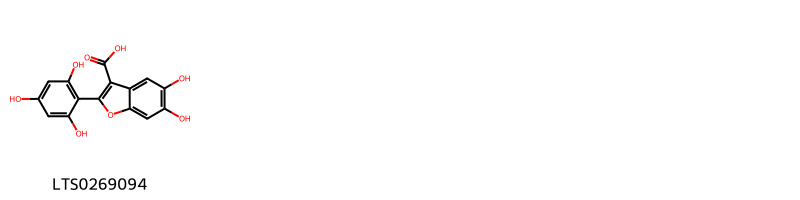{ width=100% }
    <figcaption>Hình ảnh cấu trúc hóa học của 1 hoạt chất thuộc nhóm 2-arylbenzofuran flavonoids gồm ['norwedelic acid (LTS0269094)'].</figcaption>
</figure>
#### Nhóm Flavonoids
<figure markdown="span">
    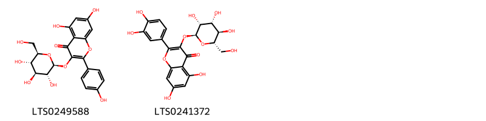{ width=100% }
    <figcaption>Hình ảnh cấu trúc hóa học của 2 hoạt chất thuộc nhóm Flavonoids gồm ['astragalin (LTS0249588)', '2-(3,4-dihydroxyphenyl)-5,7-dihydroxy-3-{[(2s,3r,4r,5r,6s)-3,4,5-trihydroxy-6-(hydroxymethyl)oxan-2-yl]oxy}chromen-4-one (LTS0241372)'].</figcaption>
</figure>
#### Nhóm Isoflavonoids
<figure markdown="span">
    { width=100% }
    <figcaption>Hình ảnh cấu trúc hóa học của 2 hoạt chất thuộc nhóm Isoflavonoids gồm ['demethylwedelolactone (LTS0150783)', 'wedelolactone (LTS0216902)'].</figcaption>
</figure>
#### Nhóm Organooxygen compounds
<figure markdown="span">
    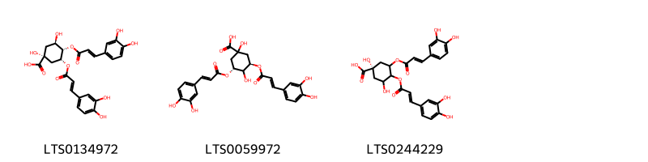{ width=100% }
    <figcaption>Hình ảnh cấu trúc hóa học của 3 hoạt chất thuộc nhóm Organooxygen compounds gồm ['3,4-dicaffeoylquinic acid (LTS0134972)', '(3r,5r)-3,5-bis({[(2e)-3-(3,4-dihydroxyphenyl)prop-2-enoyl]oxy})-1,4-dihydroxycyclohexane-1-carboxylic acid (LTS0059972)', '(1s)-3,4-bis({[3-(3,4-dihydroxyphenyl)prop-2-enoyl]oxy})-1,5-dihydroxycyclohexane-1-carboxylic acid (LTS0244229)'].</figcaption>
</figure>
#### Nhóm Prenol lipids
<figure markdown="span">
    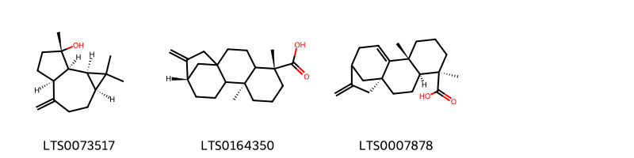{ width=100% }
    <figcaption>Hình ảnh cấu trúc hóa học của 3 hoạt chất thuộc nhóm Prenol lipids gồm ['(1as,4as,7s,7ar,7bs)-1,1,7-trimethyl-4-methylidene-octahydrocyclopropa[e]azulen-7-ol (LTS0073517)', '(5r,9s,13s)-5,9-dimethyl-14-methylidenetetracyclo[11.2.1.0¹,¹⁰.0⁴,⁹]hexadecane-5-carboxylic acid (LTS0164350)', '(1s,4s,5r,9r)-5,9-dimethyl-14-methylidenetetracyclo[11.2.1.0¹,¹⁰.0⁴,⁹]hexadec-10-ene-5-carboxylic acid (LTS0007878)'].</figcaption>
</figure>

---

### Dược dân tộc học

Danh sách các quốc gia có sử dụng *Sphagneticola calendulacea* trong điều trị các bệnh. 

| Country   | Disease   | Bệnh                                                                                                                                                                                                |
|:----------|:----------|:----------------------------------------------------------------------------------------------------------------------------------------------------------------------------------------------------|
| Elsewhere | Tonic     | MYMEMORY WARNING: YOU USED ALL AVAILABLE FREE TRANSLATIONS FOR TODAY. NEXT AVAILABLE IN  13 HOURS 12 MINUTES 51 SECONDS VISIT HTTPS://MYMEMORY.TRANSLATED.NET/DOC/USAGELIMITS.PHP TO TRANSLATE MORE |

---

# Chi Scorzonera

??? note "Danh sách các dược liệu thuộc chi"
    
	 - *Scorzonera hianica*

---
## Scorzonera hianica
### Thông tin về thực vật

!!! info "Phân loại thực vật của *N/A* từ GIBF:"
    - **Kingdom:** Plantae
    - **Phylum:** Tracheophyta
    - **Order:** Asterales
    - **Family:** Asteraceae
    - **Genus:** Scorzonera
    - **Species:** *N/A*

 

| Label (VI)   | Label (EN)   | Scientific Name   | Descriptions (VI)   | Descriptions (EN)   | Also Known As (VI)   | Also Known As (EN)    |
|:-------------|:-------------|:------------------|:--------------------|:--------------------|:---------------------|:----------------------|
| N/A          | N/A          | Wedelia chinensis | loài thực vật       | species of plant    | ['']                 | ['Wedelia chinensis'] |

#### Phân bố trên thế giới

**Từ CSDL GIBF** Italy, Moldova, Republic of, Germany, Slovakia, Czechia, Spain, Hungary, Portugal, Switzerland, Russian Federation, United States of America, Sweden, Austria, France, Greece, China

#### Phân bố tại Việt Nam

**Từ CSDL GIBF**: Không có ghi nhận ở Việt Nam

---
### Thành phần hóa học
        
- Theo cơ sở dữ liệu lotus: Từ loài *N/A* đã phân lập và xác định được Chưa có hoạt chất nào được phân lập. hoạt chất thuộc về các nhóm Không có hoạt chất nào được phân lập. 

Không có hình ảnh nào được tạo ra

---

### Dược dân tộc học

Danh sách các quốc gia có sử dụng *N/A* trong điều trị các bệnh. 

| Country   | Disease                                 | Bệnh                                                                                                                                                                                                |
|:----------|:----------------------------------------|:----------------------------------------------------------------------------------------------------------------------------------------------------------------------------------------------------|
| Elsewhere | Apertif, Diuretic, Stomachic, Sudorific | MYMEMORY WARNING: YOU USED ALL AVAILABLE FREE TRANSLATIONS FOR TODAY. NEXT AVAILABLE IN  13 HOURS 12 MINUTES 22 SECONDS VISIT HTTPS://MYMEMORY.TRANSLATED.NET/DOC/USAGELIMITS.PHP TO TRANSLATE MORE |
| Turkey    | Apertif, Stomachic, Sudorific, Diuretic | MYMEMORY WARNING: YOU USED ALL AVAILABLE FREE TRANSLATIONS FOR TODAY. NEXT AVAILABLE IN  13 HOURS 12 MINUTES 19 SECONDS VISIT HTTPS://MYMEMORY.TRANSLATED.NET/DOC/USAGELIMITS.PHP TO TRANSLATE MORE |
| ain       | Diuretic                                | MYMEMORY WARNING: YOU USED ALL AVAILABLE FREE TRANSLATIONS FOR TODAY. NEXT AVAILABLE IN  13 HOURS 12 MINUTES 16 SECONDS VISIT HTTPS://MYMEMORY.TRANSLATED.NET/DOC/USAGELIMITS.PHP TO TRANSLATE MORE |

---

# Chi Lycoseris

??? note "Danh sách các dược liệu thuộc chi"
    
	 - *Lycoseris latifolia*

---
## Lycoseris latifolia
### Thông tin về thực vật

!!! info "Phân loại thực vật của *Lycoseris triplinervia* từ GIBF:"
    - **Kingdom:** Plantae
    - **Phylum:** Tracheophyta
    - **Order:** Asterales
    - **Family:** Asteraceae
    - **Genus:** Lycoseris
    - **Species:** *Lycoseris triplinervia*

 

| Label (VI)   | Label (EN)   | Scientific Name     | Descriptions (VI)   | Descriptions (EN)   | Also Known As (VI)   | Also Known As (EN)   |
|:-------------|:-------------|:--------------------|:--------------------|:--------------------|:---------------------|:---------------------|
| N/A          | N/A          | Lycoseris latifolia |                     | species of plant    | ['']                 | ['']                 |

#### Phân bố trên thế giới

**Từ CSDL GIBF** nan, Nicaragua, Colombia, Guatemala, Costa Rica, United States of America, Peru, El Salvador, Venezuela (Bolivarian Republic of), Panama

#### Phân bố tại Việt Nam

**Từ CSDL GIBF**: Không có ghi nhận ở Việt Nam

---
### Thành phần hóa học
        
- Theo cơ sở dữ liệu lotus: Từ loài *Lycoseris triplinervia* đã phân lập và xác định được Chưa có hoạt chất nào được phân lập. hoạt chất thuộc về các nhóm Không có hoạt chất nào được phân lập. 

Không có hình ảnh nào được tạo ra

---

### Dược dân tộc học

Danh sách các quốc gia có sử dụng *Lycoseris triplinervia* trong điều trị các bệnh. 

| Country   | Disease               | Bệnh                                                                                                                                                                                                |
|:----------|:----------------------|:----------------------------------------------------------------------------------------------------------------------------------------------------------------------------------------------------|
| Venezuela | Diuretic, Emmenagogue | MYMEMORY WARNING: YOU USED ALL AVAILABLE FREE TRANSLATIONS FOR TODAY. NEXT AVAILABLE IN  13 HOURS 11 MINUTES 43 SECONDS VISIT HTTPS://MYMEMORY.TRANSLATED.NET/DOC/USAGELIMITS.PHP TO TRANSLATE MORE |

---

# Chi Eupatorium

??? note "Danh sách các dược liệu thuộc chi"
    
	 - *Eupatorium aromaticum*
	 - *Eupatorium ayapana*
	 - *Eupatorium azureum*
	 - *Eupatorium cannabinum*
	 - *Eupatorium collinum*
	 - *Eupatorium fortunei*
	 - *Eupatorium inulaefolium*
	 - *Eupatorium japonicum*
	 - *Eupatorium leucomyelum*
	 - *Eupatorium lindleyanum*
	 - *Eupatorium odoratum*
	 - *Eupatorium perfoliatum*
	 - *Eupatorium purpureum*
	 - *Eupatorium pycnocephalum*
	 - *Eupatorium rugosum*
	 - *Eupatorium staechadosmum*
	 - *Eupatorium stoechadosmum*
	 - *Eupatorium triplinerve*
	 - *Eupatorium villosum*

---
## Eupatorium aromaticum
### Thông tin về thực vật

!!! info "Phân loại thực vật của *N/A* từ GIBF:"
    - **Kingdom:** Plantae
    - **Phylum:** Tracheophyta
    - **Order:** Asterales
    - **Family:** Asteraceae
    - **Genus:** N/A
    - **Species:** *N/A*

 

| Label (VI)   | Label (EN)   | Scientific Name       | Descriptions (VI)   | Descriptions (EN)   | Also Known As (VI)   | Also Known As (EN)   |
|:-------------|:-------------|:----------------------|:--------------------|:--------------------|:---------------------|:---------------------|
| N/A          | N/A          | Eupatorium aromaticum | loài thực vật       | species of plant    | ['']                 | ['']                 |

#### Phân bố trên thế giới

**Từ CSDL GIBF** Denmark, Australia, New Zealand, Chinese Taipei, Ireland, Isle of Man, Viet Nam, United Kingdom of Great Britain and Northern Ireland

#### Phân bố tại Việt Nam

**Từ CSDL GIBF**: Đà Nẵng

---
### Thành phần hóa học
        
- Theo cơ sở dữ liệu lotus: Từ loài *N/A* đã phân lập và xác định được Chưa có hoạt chất nào được phân lập. hoạt chất thuộc về các nhóm Không có hoạt chất nào được phân lập. 

Không có hình ảnh nào được tạo ra

---

### Dược dân tộc học

Danh sách các quốc gia có sử dụng *N/A* trong điều trị các bệnh. 

| Country   | Disease   | Bệnh                                                                                                                                                                                                |
|:----------|:----------|:----------------------------------------------------------------------------------------------------------------------------------------------------------------------------------------------------|
| Elsewhere | Diuretic  | MYMEMORY WARNING: YOU USED ALL AVAILABLE FREE TRANSLATIONS FOR TODAY. NEXT AVAILABLE IN  13 HOURS 11 MINUTES 18 SECONDS VISIT HTTPS://MYMEMORY.TRANSLATED.NET/DOC/USAGELIMITS.PHP TO TRANSLATE MORE |

---

---
## Eupatorium ayapana
### Thông tin về thực vật

!!! info "Phân loại thực vật của *Ayapana triplinervis* từ GIBF:"
    - **Kingdom:** Plantae
    - **Phylum:** Tracheophyta
    - **Order:** Asterales
    - **Family:** Asteraceae
    - **Genus:** Ayapana
    - **Species:** *Ayapana triplinervis*

 

| Label (VI)   | Label (EN)   | Scientific Name    | Descriptions (VI)   | Descriptions (EN)   | Also Known As (VI)   | Also Known As (EN)   |
|:-------------|:-------------|:-------------------|:--------------------|:--------------------|:---------------------|:---------------------|
| N/A          | N/A          | Eupatorium ayapana |                     | species of plant    | ['']                 | ['']                 |

#### Phân bố trên thế giới

**Từ CSDL GIBF** nan, Brazil, India, Benin, Indonesia, Guinea, Viet Nam

#### Phân bố tại Việt Nam

**Từ CSDL GIBF**: Không có ghi nhận ở Việt Nam

---
### Thành phần hóa học
        
- Theo cơ sở dữ liệu lotus: Từ loài *Ayapana triplinervis* đã phân lập và xác định được Chưa có hoạt chất nào được phân lập. hoạt chất thuộc về các nhóm Không có hoạt chất nào được phân lập. 

Không có hình ảnh nào được tạo ra

---

### Dược dân tộc học

Danh sách các quốc gia có sử dụng *Ayapana triplinervis* trong điều trị các bệnh. 

| Country   | Disease              | Bệnh                                                                                                                                                                                                |
|:----------|:---------------------|:----------------------------------------------------------------------------------------------------------------------------------------------------------------------------------------------------|
| Elsewhere | Digestive, Stimulant | MYMEMORY WARNING: YOU USED ALL AVAILABLE FREE TRANSLATIONS FOR TODAY. NEXT AVAILABLE IN  13 HOURS 10 MINUTES 55 SECONDS VISIT HTTPS://MYMEMORY.TRANSLATED.NET/DOC/USAGELIMITS.PHP TO TRANSLATE MORE |

---

---
## Eupatorium azureum
### Thông tin về thực vật

!!! info "Phân loại thực vật của *Tamaulipa azurea* từ GIBF:"
    - **Kingdom:** Plantae
    - **Phylum:** Tracheophyta
    - **Order:** Asterales
    - **Family:** Asteraceae
    - **Genus:** Tamaulipa
    - **Species:** *Tamaulipa azurea*

 

| Label (VI)   | Label (EN)   | Scientific Name    | Descriptions (VI)   | Descriptions (EN)   | Also Known As (VI)   | Also Known As (EN)   |
|:-------------|:-------------|:-------------------|:--------------------|:--------------------|:---------------------|:---------------------|
| N/A          | N/A          | Eupatorium azureum | loài thực vật       | species of plant    | ['']                 | ['']                 |

#### Phân bố trên thế giới

**Từ CSDL GIBF** nan, United States of America, Mexico

#### Phân bố tại Việt Nam

**Từ CSDL GIBF**: Không có ghi nhận ở Việt Nam

---
### Thành phần hóa học
        
- Theo cơ sở dữ liệu lotus: Từ loài *Tamaulipa azurea* đã phân lập và xác định được Chưa có hoạt chất nào được phân lập. hoạt chất thuộc về các nhóm Không có hoạt chất nào được phân lập. 

Không có hình ảnh nào được tạo ra

---

### Dược dân tộc học

Danh sách các quốc gia có sử dụng *Tamaulipa azurea* trong điều trị các bệnh. 

| Country   | Disease    | Bệnh                                                                                                                                                                                                |
|:----------|:-----------|:----------------------------------------------------------------------------------------------------------------------------------------------------------------------------------------------------|
| Mexico    | Astringent | MYMEMORY WARNING: YOU USED ALL AVAILABLE FREE TRANSLATIONS FOR TODAY. NEXT AVAILABLE IN  13 HOURS 10 MINUTES 31 SECONDS VISIT HTTPS://MYMEMORY.TRANSLATED.NET/DOC/USAGELIMITS.PHP TO TRANSLATE MORE |

---

---
## Eupatorium cannabinum
### Thông tin về thực vật

!!! info "Phân loại thực vật của *Eupatorium cannabinum* từ GIBF:"
    - **Kingdom:** Plantae
    - **Phylum:** Tracheophyta
    - **Order:** Asterales
    - **Family:** Asteraceae
    - **Genus:** Eupatorium
    - **Species:** *Eupatorium cannabinum*

 

| Label (VI)   | Label (EN)   | Scientific Name       | Descriptions (VI)   | Descriptions (EN)   | Also Known As (VI)   | Also Known As (EN)        |
|:-------------|:-------------|:----------------------|:--------------------|:--------------------|:---------------------|:--------------------------|
| N/A          | N/A          | Eupatorium cannabinum | loài thực vật       | species of plant    | ['']                 | ['hemp', 'Hemp-agrimony'] |

#### Phân bố trên thế giới

**Từ CSDL GIBF** nan, Italy, Belgium, Denmark, Netherlands, Luxembourg, Spain, Hungary, Russian Federation, Sweden, Croatia, Czechia, Germany, Switzerland, Austria, France, United Kingdom of Great Britain and Northern Ireland, Ireland, Poland

#### Phân bố tại Việt Nam

**Từ CSDL GIBF**: Không có ghi nhận ở Việt Nam

---
### Thành phần hóa học
        
- Theo cơ sở dữ liệu lotus: Từ loài *Eupatorium cannabinum* đã phân lập và xác định được 140 hoạt chất thuộc về các nhóm Benzofurans, Hydroxy acids and derivatives, Phenols, Pyrrolizidines, Anthracenes, Fatty Acyls, Cinnamic acids and derivatives, Furopyrans, Coumarans, Prenol lipids, Benzene and substituted derivatives, Organooxygen compounds, Phenol esters, Flavonoids, Steroids and steroid derivatives, Organonitrogen compounds, Coumarins and derivatives. 

|    | chemicalTaxonomyClassyfireClass     |   smiles_count |
|---:|:------------------------------------|---------------:|
|  0 |                                     |              7 |
|  1 | Anthracenes                         |              1 |
|  2 | Benzene and substituted derivatives |             13 |
|  3 | Benzofurans                         |              7 |
|  4 | Cinnamic acids and derivatives      |              1 |
|  5 | Coumarans                           |              2 |
|  6 | Coumarins and derivatives           |              1 |
|  7 | Fatty Acyls                         |              6 |
|  8 | Flavonoids                          |             10 |
|  9 | Furopyrans                          |              2 |
| 10 | Hydroxy acids and derivatives       |              1 |
| 11 | Organonitrogen compounds            |              3 |
| 12 | Organooxygen compounds              |              6 |
| 13 | Phenol esters                       |              4 |
| 14 | Phenols                             |              7 |
| 15 | Prenol lipids                       |             57 |
| 16 | Pyrrolizidines                      |              5 |
| 17 | Steroids and steroid derivatives    |              6 |

#### Nhóm 
<figure markdown="span">
    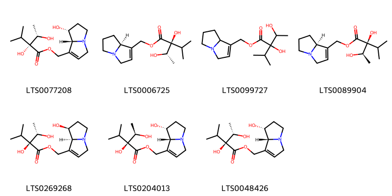{ width=100% }
    <figcaption>Hình ảnh cấu trúc hóa học của 7 hoạt chất thuộc nhóm  gồm ['9-viridiflorylretronecine (LTS0077208)', 'amabiline (LTS0006725)', '5,6,7,7a-tetrahydro-3h-pyrrolizin-1-ylmethyl 2,3-dihydroxy-2-isopropylbutanoate (LTS0099727)', 'supinine (LTS0089904)', '[(7s,7as)-7-hydroxy-5,6,7,7a-tetrahydro-3h-pyrrolizin-1-yl]methyl (2s)-2-hydroxy-2-[(1s)-1-hydroxyethyl]-3-methylbutanoate (LTS0269268)', 'intermedine (LTS0204013)', 'lycopsamine (LTS0048426)'].</figcaption>
</figure>
#### Nhóm Anthracenes
<figure markdown="span">
    { width=100% }
    <figcaption>Hình ảnh cấu trúc hóa học của 1 hoạt chất thuộc nhóm Anthracenes gồm ['physcion (LTS0052688)'].</figcaption>
</figure>
#### Nhóm Benzene and substituted derivatives
<figure markdown="span">
    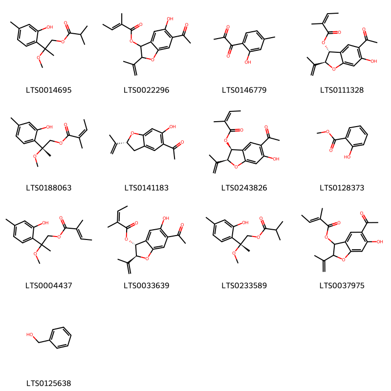{ width=100% }
    <figcaption>Hình ảnh cấu trúc hóa học của 13 hoạt chất thuộc nhóm Benzene and substituted derivatives gồm ['8-methoxy-9-o-isobutyrylthymol (LTS0014695)', '6-acetyl-5-hydroxy-2-(prop-1-en-2-yl)-2,3-dihydro-1-benzofuran-3-yl 2-methylbut-2-enoate (LTS0022296)', '1-(2-hydroxy-4-methylphenyl)propane-1,2-dione (LTS0146779)', '(2s,3r)-5-acetyl-6-hydroxy-2-(prop-1-en-2-yl)-2,3-dihydro-1-benzofuran-3-yl (2z)-2-methylbut-2-enoate (LTS0111328)', '(2r)-2-(2-hydroxy-4-methylphenyl)-2-methoxypropyl (2z)-2-methylbut-2-enoate (LTS0188063)', '6-hydroxytremetone (LTS0141183)', '(2s,3s)-5-acetyl-6-hydroxy-2-(prop-1-en-2-yl)-2,3-dihydro-1-benzofuran-3-yl (2z)-2-methylbut-2-enoate (LTS0243826)', 'methyl salicylate (LTS0128373)', '2-(2-hydroxy-4-methylphenyl)-2-methoxypropyl 2-methylbut-2-enoate (LTS0004437)', '(2s,3r)-6-acetyl-5-hydroxy-2-(prop-1-en-2-yl)-2,3-dihydro-1-benzofuran-3-yl (2z)-2-methylbut-2-enoate (LTS0033639)', '(2r)-2-(2-hydroxy-4-methylphenyl)-2-methoxypropyl 2-methylpropanoate (LTS0233589)', '5-acetyl-6-hydroxy-2-(prop-1-en-2-yl)-2,3-dihydro-1-benzofuran-3-yl 2-methylbut-2-enoate (LTS0037975)', 'benzyl alcohol (LTS0125638)'].</figcaption>
</figure>
#### Nhóm Benzofurans
<figure markdown="span">
    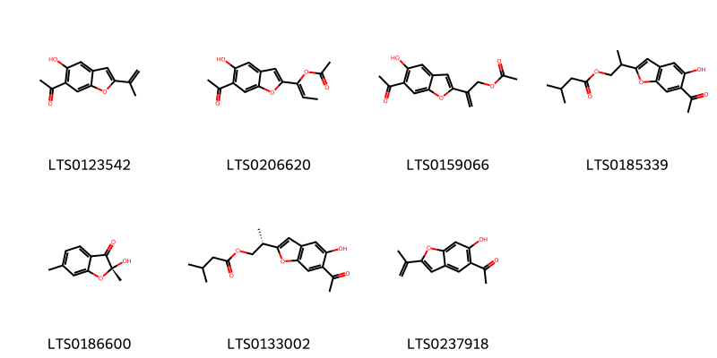{ width=100% }
    <figcaption>Hình ảnh cấu trúc hóa học của 7 hoạt chất thuộc nhóm Benzofurans gồm ['1-[5-hydroxy-2-(prop-1-en-2-yl)-1-benzofuran-6-yl]ethanone (LTS0123542)', '1-(6-acetyl-5-hydroxy-1-benzofuran-2-yl)prop-1-en-1-yl acetate (LTS0206620)', '2-(6-acetyl-5-hydroxy-1-benzofuran-2-yl)prop-2-en-1-yl acetate (LTS0159066)', '2-(6-acetyl-5-hydroxy-1-benzofuran-2-yl)propyl 3-methylbutanoate (LTS0185339)', '(2r)-2-hydroxy-2,6-dimethyl-1-benzofuran-3-one (LTS0186600)', '(2s)-2-(6-acetyl-5-hydroxy-1-benzofuran-2-yl)propyl 3-methylbutanoate (LTS0133002)', 'euparin (LTS0237918)'].</figcaption>
</figure>
#### Nhóm Cinnamic acids and derivatives
<figure markdown="span">
    { width=100% }
    <figcaption>Hình ảnh cấu trúc hóa học của 1 hoạt chất thuộc nhóm Cinnamic acids and derivatives gồm ['3,4-dihydroxycinnamic acid (LTS0128050)'].</figcaption>
</figure>
#### Nhóm Coumarans
<figure markdown="span">
    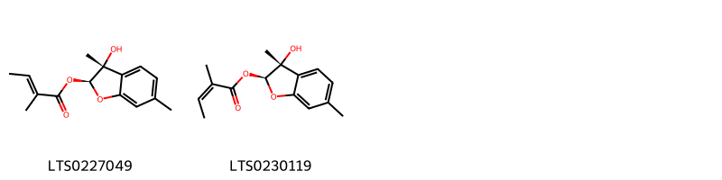{ width=100% }
    <figcaption>Hình ảnh cấu trúc hóa học của 2 hoạt chất thuộc nhóm Coumarans gồm ['(2s,3r)-3-hydroxy-3,6-dimethyl-2h-1-benzofuran-2-yl 2-methylbut-2-enoate (LTS0227049)', 'eupatobenzofuran, (rel)- (LTS0230119)'].</figcaption>
</figure>
#### Nhóm Coumarins and derivatives
<figure markdown="span">
    { width=100% }
    <figcaption>Hình ảnh cấu trúc hóa học của 1 hoạt chất thuộc nhóm Coumarins and derivatives gồm ['2h-1-benzopyran-2-one (LTS0069773)'].</figcaption>
</figure>
#### Nhóm Fatty Acyls
<figure markdown="span">
    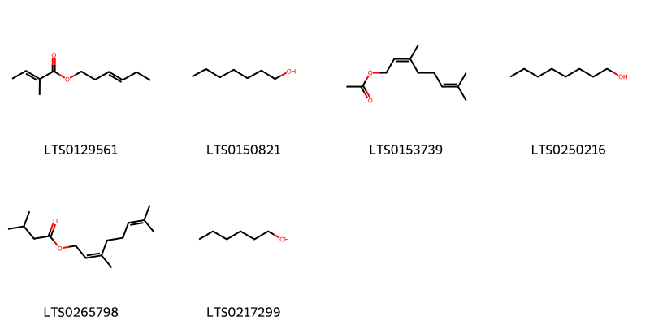{ width=100% }
    <figcaption>Hình ảnh cấu trúc hóa học của 6 hoạt chất thuộc nhóm Fatty Acyls gồm ['hex-3-en-1-yl (2e)-2-methylbut-2-enoate (LTS0129561)', 'heptanol (LTS0150821)', 'neryl acetate (LTS0153739)', 'octanol (LTS0250216)', 'neryl isovalerate (LTS0265798)', 'hexanol (LTS0217299)'].</figcaption>
</figure>
#### Nhóm Flavonoids
<figure markdown="span">
    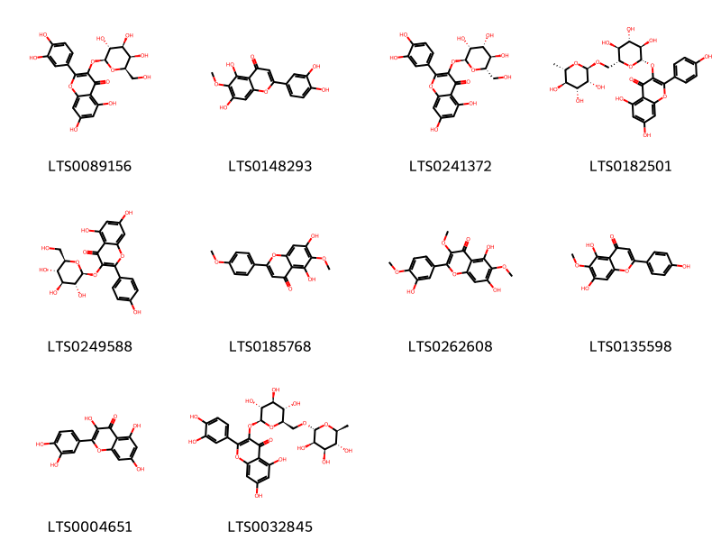{ width=100% }
    <figcaption>Hình ảnh cấu trúc hóa học của 10 hoạt chất thuộc nhóm Flavonoids gồm ['hyperoside (LTS0089156)', 'nepetin (LTS0148293)', '2-(3,4-dihydroxyphenyl)-5,7-dihydroxy-3-{[(2s,3r,4r,5r,6s)-3,4,5-trihydroxy-6-(hydroxymethyl)oxan-2-yl]oxy}chromen-4-one (LTS0241372)', 'nictoflorin (LTS0182501)', 'astragalin (LTS0249588)', 'pectolinarigenin (LTS0185768)', 'centaureidin (LTS0262608)', 'hispidulin (LTS0135598)', 'quercetin (LTS0004651)', '3-rutinosyl quercetin (LTS0032845)'].</figcaption>
</figure>
#### Nhóm Furopyrans
<figure markdown="span">
    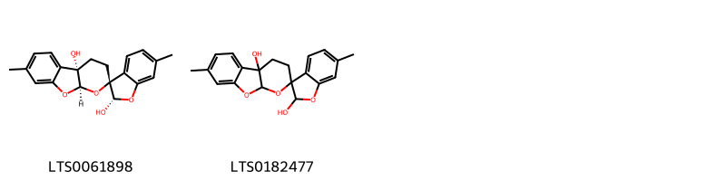{ width=100% }
    <figcaption>Hình ảnh cấu trúc hóa học của 2 hoạt chất thuộc nhóm Furopyrans gồm ["(2s,2's,3r,7'r)-6,11'-dimethyl-2h-6',8'-dioxaspiro[1-benzofuran-3,5'-tricyclo[7.4.0.0²,⁷]tridecane]-1'(13'),9',11'-triene-2,2'-diol (LTS0061898)", "6,11'-dimethyl-2h-6',8'-dioxaspiro[1-benzofuran-3,5'-tricyclo[7.4.0.0²,⁷]tridecane]-1'(13'),9',11'-triene-2,2'-diol (LTS0182477)"].</figcaption>
</figure>
#### Nhóm Hydroxy acids and derivatives
<figure markdown="span">
    { width=100% }
    <figcaption>Hình ảnh cấu trúc hóa học của 1 hoạt chất thuộc nhóm Hydroxy acids and derivatives gồm ['malic acid (LTS0216520)'].</figcaption>
</figure>
#### Nhóm Organonitrogen compounds
<figure markdown="span">
    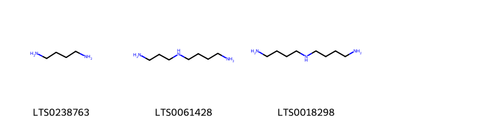{ width=100% }
    <figcaption>Hình ảnh cấu trúc hóa học của 3 hoạt chất thuộc nhóm Organonitrogen compounds gồm ['putrescine (LTS0238763)', 'spermidine (LTS0061428)', 'homospermidine (LTS0018298)'].</figcaption>
</figure>
#### Nhóm Organooxygen compounds
<figure markdown="span">
    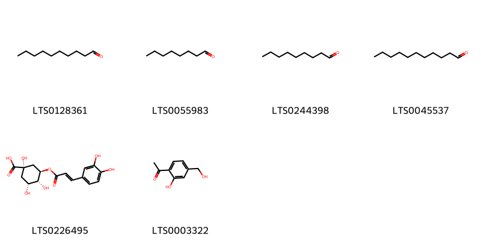{ width=100% }
    <figcaption>Hình ảnh cấu trúc hóa học của 6 hoạt chất thuộc nhóm Organooxygen compounds gồm ['decanal (LTS0128361)', 'octanal (LTS0055983)', 'nonanal (LTS0244398)', 'aldehyde c11 (LTS0045537)', 'chlorogenic acid (LTS0226495)', '1-[2-hydroxy-4-(hydroxymethyl)phenyl]ethanone (LTS0003322)'].</figcaption>
</figure>
#### Nhóm Phenol esters
<figure markdown="span">
    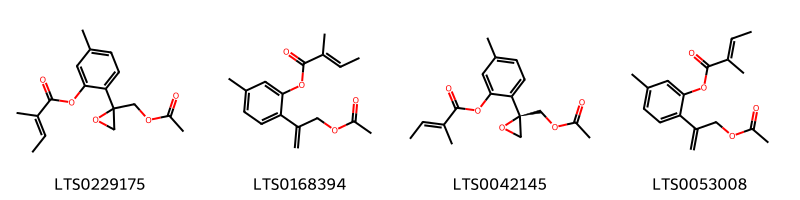{ width=100% }
    <figcaption>Hình ảnh cấu trúc hóa học của 4 hoạt chất thuộc nhóm Phenol esters gồm ['2-{2-[(acetyloxy)methyl]oxiran-2-yl}-5-methylphenyl 2-methylbut-2-enoate (LTS0229175)', '2-[3-(acetyloxy)prop-1-en-2-yl]-5-methylphenyl 2-methylbut-2-enoate (LTS0168394)', '2-[(2r)-2-[(acetyloxy)methyl]oxiran-2-yl]-5-methylphenyl (2e)-2-methylbut-2-enoate (LTS0042145)', '2-[3-(acetyloxy)prop-1-en-2-yl]-5-methylphenyl (2e)-2-methylbut-2-enoate (LTS0053008)'].</figcaption>
</figure>
#### Nhóm Phenols
<figure markdown="span">
    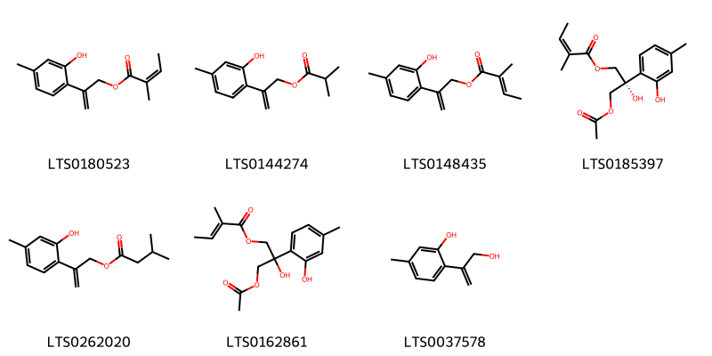{ width=100% }
    <figcaption>Hình ảnh cấu trúc hóa học của 7 hoạt chất thuộc nhóm Phenols gồm ['2-(2-hydroxy-4-methylphenyl)prop-2-en-1-yl (2z)-2-methylbut-2-enoate (LTS0180523)', '2-(2-hydroxy-4-methylphenyl)prop-2-en-1-yl 2-methylpropanoate (LTS0144274)', '2-(2-hydroxy-4-methylphenyl)prop-2-en-1-yl 2-methylbut-2-enoate (LTS0148435)', '(2r)-3-(acetyloxy)-2-hydroxy-2-(2-hydroxy-4-methylphenyl)propyl (2z)-2-methylbut-2-enoate (LTS0185397)', '2-(2-hydroxy-4-methylphenyl)prop-2-en-1-yl 3-methylbutanoate (LTS0262020)', '3-(acetyloxy)-2-hydroxy-2-(2-hydroxy-4-methylphenyl)propyl 2-methylbut-2-enoate (LTS0162861)', '9-hydroxy-8,10-dehydrothymol (LTS0037578)'].</figcaption>
</figure>
#### Nhóm Prenol lipids
<figure markdown="span">
    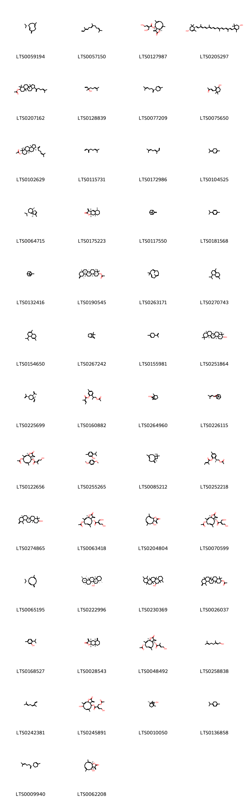{ width=100% }
    <figcaption>Hình ảnh cấu trúc hóa học của 57 hoạt chất thuộc nhóm Prenol lipids gồm ['(-)-germacrene d (LTS0059194)', 'farnesene (LTS0057150)', '(3as,11as)-6,10-dimethyl-3-methylidene-2-oxo-3ah,4h,5h,8h,9h,11ah-cyclodeca[b]furan-4-yl 4-hydroxy-2-(hydroxymethyl)but-2-enoate (LTS0127987)', 'carotenoid (LTS0205297)', '3a,3b,6,6,9a-pentamethyl-1-(6-methylhepta-1,5-dien-2-yl)-dodecahydro-1h-cyclopenta[a]phenanthren-7-yl acetate (LTS0207162)', 'linalool, (+-)- (LTS0128839)', '(r)-β-bisabolene (LTS0077209)', '(3e)-4-(3-hydroxy-2,6,6-trimethylcyclohex-1-en-1-yl)but-3-en-2-one (LTS0075650)', '(1s,3ar,3br,5ar,7s,9ar,9br,11ar)-3a,3b,6,6,9a-pentamethyl-1-(6-methylhepta-1,5-dien-2-yl)-dodecahydro-1h-cyclopenta[a]phenanthren-7-yl acetate (LTS0102629)', 'α-myrcene (LTS0115731)', '3,7-dimethyl-1,3,6-octatriene (LTS0172986)', 'terpinolene (LTS0104525)', '(1s,5r,7s,10r)-7-isopropyl-4,10-dimethyltricyclo[4.4.0.0¹,⁵]dec-3-ene (LTS0064715)', 'alantolactone (LTS0175223)', 'β-pinene (LTS0117550)', 'cymene (LTS0181568)', 'α pinene (LTS0132416)', 'taraxasterol acetate (LTS0190545)', 'humulene (LTS0263171)', '4-isopropyl-1,6-dimethyl-2,3,4,4a,7,8-hexahydronaphthalene (LTS0270743)', '4-isopropyl-1,6-dimethyl-3,4,4a,7,8,8a-hexahydronaphthalene (LTS0154650)', 'camphene (LTS0267242)', 'limonene,  (LTS0155981)', 'β-amyrin (LTS0251864)', 'β-elemene (LTS0225699)', '2-[1-(acetyloxy)propan-2-yl]-5-methylphenyl 2-methylbut-2-enoate (LTS0160882)', 'borneol (LTS0264960)', 'α-bergamotene (LTS0226115)', '(3as,11as)-9-(acetyloxy)-6,10-dimethyl-3-methylidene-2-oxo-3ah,4h,5h,8h,9h,11ah-cyclodeca[b]furan-4-yl 4-hydroxy-2-methylbut-2-enoate (LTS0122656)', '1,4-dimethoxybenzene; thymol (LTS0255265)', 'caryophyllene (LTS0085212)', '2-[(2s)-1-(acetyloxy)propan-2-yl]-5-methylphenyl (2e)-2-methylbut-2-enoate (LTS0252218)', '(6ar,6br,8ar,14br)-4,4,6a,6b,8a,12,14b-heptamethyl-11-methylidene-hexadecahydropicen-3-ol (LTS0274865)', '(4r,9r,11ar)-9-(acetyloxy)-6,10-dimethyl-3-methylidene-2-oxo-3ah,4h,5h,8h,9h,11ah-cyclodeca[b]furan-4-yl (2e)-4-hydroxy-2-(hydroxymethyl)but-2-enoate (LTS0063418)', '4-hydroxy-6,10-dimethyl-3-methylidene-3ah,4h,5h,8h,9h,11ah-cyclodeca[b]furan-2-one (LTS0204804)', 'eupaformosanin (LTS0070599)', '(1z,6z,8s)-8-isopropyl-1-methyl-5-methylidenecyclodeca-1,6-diene (LTS0065195)', '(4s,4ar,6s,6as,6br,8ar,11r,12s,12ar,12bs,14as,14br)-4,4a,6b,8a,11,12,12b,14a-octamethyl-hexadecahydro-1h-picen-6-ol (LTS0222996)', '4,4a,6b,8a,11,12,12b,14a-octamethyl-hexadecahydro-1h-picen-6-ol (LTS0230369)', '4,4,6a,6b,8a,12,14b-heptamethyl-11-methylidene-hexadecahydropicen-3-yl acetate (LTS0026037)', 'thymol (LTS0168527)', 'isoalantolactone (LTS0028543)', 'chromolaenide (LTS0048492)', 'geraniol (LTS0258838)', 'β-ocimene (LTS0242381)', '9-hydroxy-6,10-dimethyl-3-methylidene-2-oxo-3ah,4h,5h,8h,9h,11ah-cyclodeca[b]furan-4-yl 2-[(acetyloxy)methyl]-4-hydroxybut-2-enoate (LTS0245891)', '(2s,4r)-1,7,7-trimethylbicyclo[2.2.1]heptan-2-ol (LTS0010050)', 'terpinene (LTS0136858)', '(-)-β-bisabolene (LTS0009940)', '(3ar,11ar)-4-hydroxy-6,10-dimethyl-3-methylidene-3ah,4h,5h,8h,9h,11ah-cyclodeca[b]furan-2-one (LTS0062208)', 'α-muurolene (LTS0022607)', '(3as,11as)-9-(acetyloxy)-6,10-dimethyl-3-methylidene-2-oxo-3ah,4h,5h,8h,9h,11ah-cyclodeca[b]furan-4-yl 4-hydroxy-2-(hydroxymethyl)but-2-enoate (LTS0101784)', 'eupatoriopicrin (LTS0008567)', 'nerol (LTS0244289)', 'delta-cadinene (LTS0019321)', 'citronellol, (+-)- (LTS0090925)', '(-)-α-cubebene (LTS0042045)'].</figcaption>
</figure>
#### Nhóm Pyrrolizidines
<figure markdown="span">
    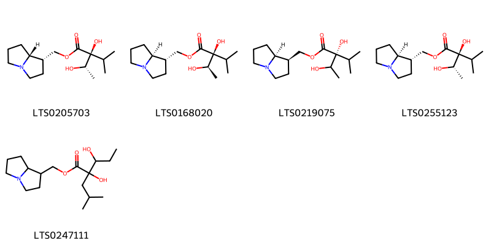{ width=100% }
    <figcaption>Hình ảnh cấu trúc hóa học của 5 hoạt chất thuộc nhóm Pyrrolizidines gồm ['(1r,7ar)-hexahydro-1h-pyrrolizin-1-ylmethyl (2s)-2-hydroxy-2-[(1s)-1-hydroxyethyl]-3-methylbutanoate (LTS0205703)', '(1r,7as)-hexahydro-1h-pyrrolizin-1-ylmethyl (2s)-2-hydroxy-2-[(1r)-1-hydroxyethyl]-3-methylbutanoate (LTS0168020)', '(1s,7as)-hexahydro-1h-pyrrolizin-1-ylmethyl (2r)-2,3-dihydroxy-2-isopropylbutanoate (LTS0219075)', 'viridiflorine (LTS0255123)', 'hexahydro-1h-pyrrolizin-1-ylmethyl 2,3-dihydroxy-2-(2-methylpropyl)pentanoate (LTS0247111)'].</figcaption>
</figure>
#### Nhóm Steroids and steroid derivatives
<figure markdown="span">
    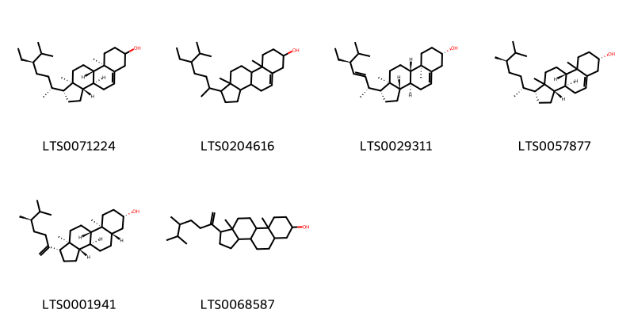{ width=100% }
    <figcaption>Hình ảnh cấu trúc hóa học của 6 hoạt chất thuộc nhóm Steroids and steroid derivatives gồm ['stigmast-5-en-3-ol (LTS0071224)', 'stigmast-5-en-3-ol, (3β)- (LTS0204616)', 'phytosterol (LTS0029311)', '(1r,3as,3bs,7s,9bs)-1-[(2r,5r)-5,6-dimethylheptan-2-yl]-9a,11a-dimethyl-1h,2h,3h,3ah,3bh,4h,6h,7h,8h,9h,9bh,10h,11h-cyclopenta[a]phenanthren-7-ol (LTS0057877)', '(1r,3as,3br,5as,7s,9as,9bs,11as)-1-[(5r)-5,6-dimethylhept-1-en-2-yl]-9a,11a-dimethyl-tetradecahydro-1h-cyclopenta[a]phenanthren-7-ol (LTS0001941)', '1-(5,6-dimethylhept-1-en-2-yl)-9a,11a-dimethyl-tetradecahydro-1h-cyclopenta[a]phenanthren-7-ol (LTS0068587)'].</figcaption>
</figure>

---

### Dược dân tộc học

Danh sách các quốc gia có sử dụng *Eupatorium cannabinum* trong điều trị các bệnh. 

| Country   | Disease                                                                                          | Bệnh                                                                                                                                                                                                |
|:----------|:-------------------------------------------------------------------------------------------------|:----------------------------------------------------------------------------------------------------------------------------------------------------------------------------------------------------|
| Elsewhere | Discutient, Diuretic, Cathartic, Emetic, Emmenagogue                                             | MYMEMORY WARNING: YOU USED ALL AVAILABLE FREE TRANSLATIONS FOR TODAY. NEXT AVAILABLE IN  13 HOURS 10 MINUTES 07 SECONDS VISIT HTTPS://MYMEMORY.TRANSLATED.NET/DOC/USAGELIMITS.PHP TO TRANSLATE MORE |
| Indochina | Emmenagogue                                                                                      | MYMEMORY WARNING: YOU USED ALL AVAILABLE FREE TRANSLATIONS FOR TODAY. NEXT AVAILABLE IN  13 HOURS 10 MINUTES 03 SECONDS VISIT HTTPS://MYMEMORY.TRANSLATED.NET/DOC/USAGELIMITS.PHP TO TRANSLATE MORE |
| Iraq      | Vermifuge                                                                                        | MYMEMORY WARNING: YOU USED ALL AVAILABLE FREE TRANSLATIONS FOR TODAY. NEXT AVAILABLE IN  13 HOURS 10 MINUTES 01 SECONDS VISIT HTTPS://MYMEMORY.TRANSLATED.NET/DOC/USAGELIMITS.PHP TO TRANSLATE MORE |
| Turkey    | Apertif, Cholagogue, Emetic, Laxative, Tonic, Vermifuge, Sudorific, Diuretic, Nervine, Vulnerary | MYMEMORY WARNING: YOU USED ALL AVAILABLE FREE TRANSLATIONS FOR TODAY. NEXT AVAILABLE IN  13 HOURS 09 MINUTES 57 SECONDS VISIT HTTPS://MYMEMORY.TRANSLATED.NET/DOC/USAGELIMITS.PHP TO TRANSLATE MORE |
| ain       | Diuretic                                                                                         | MYMEMORY WARNING: YOU USED ALL AVAILABLE FREE TRANSLATIONS FOR TODAY. NEXT AVAILABLE IN  13 HOURS 09 MINUTES 54 SECONDS VISIT HTTPS://MYMEMORY.TRANSLATED.NET/DOC/USAGELIMITS.PHP TO TRANSLATE MORE |

---

---
## Eupatorium collinum
### Thông tin về thực vật

!!! info "Phân loại thực vật của *Chromolaena collina* từ GIBF:"
    - **Kingdom:** Plantae
    - **Phylum:** Tracheophyta
    - **Order:** Asterales
    - **Family:** Asteraceae
    - **Genus:** Chromolaena
    - **Species:** *Chromolaena collina*

 

| Label (VI)   | Label (EN)   | Scientific Name     | Descriptions (VI)   | Descriptions (EN)   | Also Known As (VI)   | Also Known As (EN)   |
|:-------------|:-------------|:--------------------|:--------------------|:--------------------|:---------------------|:---------------------|
| N/A          | N/A          | Eupatorium collinum | loài thực vật       | species of plant    | ['']                 | ['']                 |

#### Phân bố trên thế giới

**Từ CSDL GIBF** Nicaragua, Guatemala, Costa Rica, Honduras, unknown or invalid, United States of America, Mexico

#### Phân bố tại Việt Nam

**Từ CSDL GIBF**: Không có ghi nhận ở Việt Nam

---
### Thành phần hóa học
        
- Theo cơ sở dữ liệu lotus: Từ loài *Chromolaena collina* đã phân lập và xác định được Chưa có hoạt chất nào được phân lập. hoạt chất thuộc về các nhóm Không có hoạt chất nào được phân lập. 

Không có hình ảnh nào được tạo ra

---

### Dược dân tộc học

Danh sách các quốc gia có sử dụng *Chromolaena collina* trong điều trị các bệnh. 

| Country   | Disease          | Bệnh                                                                                                                                                                                                |
|:----------|:-----------------|:----------------------------------------------------------------------------------------------------------------------------------------------------------------------------------------------------|
| Mexico    | Vulnerary, Tonic | MYMEMORY WARNING: YOU USED ALL AVAILABLE FREE TRANSLATIONS FOR TODAY. NEXT AVAILABLE IN  13 HOURS 09 MINUTES 04 SECONDS VISIT HTTPS://MYMEMORY.TRANSLATED.NET/DOC/USAGELIMITS.PHP TO TRANSLATE MORE |

---

---
## Eupatorium fortunei
### Thông tin về thực vật

!!! info "Phân loại thực vật của *Eupatorium fortunei* từ GIBF:"
    - **Kingdom:** Plantae
    - **Phylum:** Tracheophyta
    - **Order:** Asterales
    - **Family:** Asteraceae
    - **Genus:** Eupatorium
    - **Species:** *Eupatorium fortunei*

 

| Label (VI)   | Label (EN)   | Scientific Name     | Descriptions (VI)   | Descriptions (EN)          | Also Known As (VI)   | Also Known As (EN)   |
|:-------------|:-------------|:--------------------|:--------------------|:---------------------------|:---------------------|:---------------------|
| N/A          | N/A          | Eupatorium fortunei |                     | species of flowering plant | ['']                 | ['']                 |

#### Phân bố trên thế giới

**Từ CSDL GIBF** nan, Hong Kong, Japan, Germany, Thailand, Korea, Republic of, Chinese Taipei, Korea (Democratic People’s Republic of), United States of America, Viet Nam, China

#### Phân bố tại Việt Nam

**Từ CSDL GIBF**: Không có ghi nhận ở Việt Nam

---
### Thành phần hóa học
        
- Theo cơ sở dữ liệu lotus: Từ loài *Eupatorium fortunei* đã phân lập và xác định được 99 hoạt chất thuộc về các nhóm Fatty Acyls, Prenol lipids, Steroids and steroid derivatives, Benzene and substituted derivatives, Organooxygen compounds, Phenols, Phenol esters, Coumarins and derivatives, Pyrrolizidines. 

|    | chemicalTaxonomyClassyfireClass     |   smiles_count |
|---:|:------------------------------------|---------------:|
|  0 |                                     |              6 |
|  1 | Benzene and substituted derivatives |             13 |
|  2 | Coumarins and derivatives           |              2 |
|  3 | Fatty Acyls                         |              2 |
|  4 | Organooxygen compounds              |              3 |
|  5 | Phenol esters                       |             20 |
|  6 | Phenols                             |             11 |
|  7 | Prenol lipids                       |             38 |
|  8 | Pyrrolizidines                      |              2 |
|  9 | Steroids and steroid derivatives    |              2 |

#### Nhóm 
<figure markdown="span">
    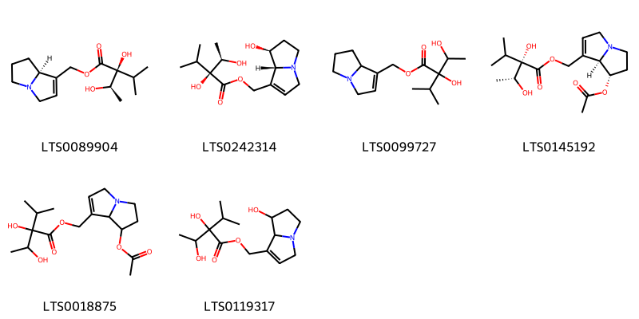{ width=100% }
    <figcaption>Hình ảnh cấu trúc hóa học của 6 hoạt chất thuộc nhóm  gồm ['supinine (LTS0089904)', 'rinderine (LTS0242314)', '5,6,7,7a-tetrahydro-3h-pyrrolizin-1-ylmethyl 2,3-dihydroxy-2-isopropylbutanoate (LTS0099727)', '[(7s,7ar)-7-(acetyloxy)-5,6,7,7a-tetrahydro-3h-pyrrolizin-1-yl]methyl (2s)-2-hydroxy-2-[(1r)-1-hydroxyethyl]-3-methylbutanoate (LTS0145192)', '[7-(acetyloxy)-5,6,7,7a-tetrahydro-3h-pyrrolizin-1-yl]methyl 2,3-dihydroxy-2-isopropylbutanoate (LTS0018875)', '(7-hydroxy-5,6,7,7a-tetrahydro-3h-pyrrolizin-1-yl)methyl 2,3-dihydroxy-2-isopropylbutanoate (LTS0119317)'].</figcaption>
</figure>
#### Nhóm Benzene and substituted derivatives
<figure markdown="span">
    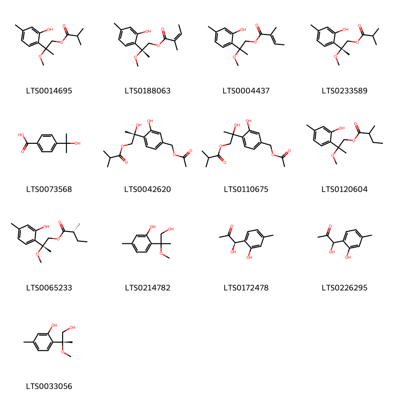{ width=100% }
    <figcaption>Hình ảnh cấu trúc hóa học của 13 hoạt chất thuộc nhóm Benzene and substituted derivatives gồm ['8-methoxy-9-o-isobutyrylthymol (LTS0014695)', '(2r)-2-(2-hydroxy-4-methylphenyl)-2-methoxypropyl (2z)-2-methylbut-2-enoate (LTS0188063)', '2-(2-hydroxy-4-methylphenyl)-2-methoxypropyl 2-methylbut-2-enoate (LTS0004437)', '(2r)-2-(2-hydroxy-4-methylphenyl)-2-methoxypropyl 2-methylpropanoate (LTS0233589)', '4-(2-hydroxypropan-2-yl)benzoic acid (LTS0073568)', '(2r)-2-{4-[(acetyloxy)methyl]-2-hydroxyphenyl}-2-hydroxypropyl 2-methylpropanoate (LTS0042620)', '2-{4-[(acetyloxy)methyl]-2-hydroxyphenyl}-2-hydroxypropyl 2-methylpropanoate (LTS0110675)', '2-(2-hydroxy-4-methylphenyl)-2-methoxypropyl 2-methylbutanoate (LTS0120604)', '(2r)-2-(2-hydroxy-4-methylphenyl)-2-methoxypropyl (2r)-2-methylbutanoate (LTS0065233)', '2-(1-hydroxy-2-methoxypropan-2-yl)-5-methylphenol (LTS0214782)', '(1r)-1-hydroxy-1-(2-hydroxy-4-methylphenyl)propan-2-one (LTS0172478)', '1-hydroxy-1-(2-hydroxy-4-methylphenyl)propan-2-one (LTS0226295)', '2-[(2r)-1-hydroxy-2-methoxypropan-2-yl]-5-methylphenol (LTS0033056)'].</figcaption>
</figure>
#### Nhóm Coumarins and derivatives
<figure markdown="span">
    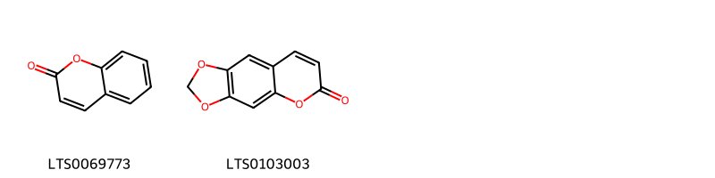{ width=100% }
    <figcaption>Hình ảnh cấu trúc hóa học của 2 hoạt chất thuộc nhóm Coumarins and derivatives gồm ['2h-1-benzopyran-2-one (LTS0069773)', 'ayapin (LTS0103003)'].</figcaption>
</figure>
#### Nhóm Fatty Acyls
<figure markdown="span">
    { width=100% }
    <figcaption>Hình ảnh cấu trúc hóa học của 2 hoạt chất thuộc nhóm Fatty Acyls gồm ['geranyl acetate (LTS0093224)', '3,7-dimethylocta-2,6-dien-1-yl acetate (LTS0184686)'].</figcaption>
</figure>
#### Nhóm Organooxygen compounds
<figure markdown="span">
    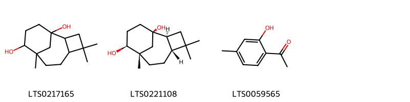{ width=100% }
    <figcaption>Hình ảnh cấu trúc hóa học của 3 hoạt chất thuộc nhóm Organooxygen compounds gồm ['4,4,8-trimethyltricyclo[6.3.1.0²,⁵]dodecane-1,9-diol (LTS0217165)', '(1r,2s,5r,8s,9s)-4,4,8-trimethyltricyclo[6.3.1.0²,⁵]dodecane-1,9-diol (LTS0221108)', '1-(2-hydroxy-4-methylphenyl)ethanone (LTS0059565)'].</figcaption>
</figure>
#### Nhóm Phenol esters
<figure markdown="span">
    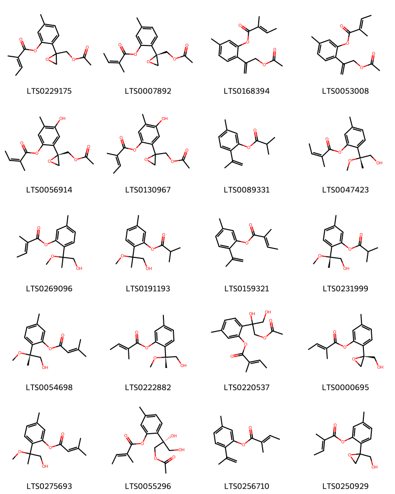{ width=100% }
    <figcaption>Hình ảnh cấu trúc hóa học của 20 hoạt chất thuộc nhóm Phenol esters gồm ['2-{2-[(acetyloxy)methyl]oxiran-2-yl}-5-methylphenyl 2-methylbut-2-enoate (LTS0229175)', '2-[(2r)-2-[(acetyloxy)methyl]oxiran-2-yl]-5-methylphenyl (2z)-2-methylbut-2-enoate (LTS0007892)', '2-[3-(acetyloxy)prop-1-en-2-yl]-5-methylphenyl 2-methylbut-2-enoate (LTS0168394)', '2-[3-(acetyloxy)prop-1-en-2-yl]-5-methylphenyl (2e)-2-methylbut-2-enoate (LTS0053008)', '2-[(2r)-2-[(acetyloxy)methyl]oxiran-2-yl]-4-hydroxy-5-methylphenyl (2z)-2-methylbut-2-enoate (LTS0056914)', '2-{2-[(acetyloxy)methyl]oxiran-2-yl}-4-hydroxy-5-methylphenyl 2-methylbut-2-enoate (LTS0130967)', '5-methyl-2-(prop-1-en-2-yl)phenyl 2-methylpropanoate (LTS0089331)', '2-[(2r)-1-hydroxy-2-methoxypropan-2-yl]-5-methylphenyl (2z)-2-methylbut-2-enoate (LTS0047423)', '2-(1-hydroxy-2-methoxypropan-2-yl)-5-methylphenyl 2-methylbut-2-enoate (LTS0269096)', '2-(1-hydroxy-2-methoxypropan-2-yl)-5-methylphenyl 2-methylpropanoate (LTS0191193)', '5-methyl-2-(prop-1-en-2-yl)phenyl 2-methylbut-2-enoate (LTS0159321)', '2-[(2r)-1-hydroxy-2-methoxypropan-2-yl]-5-methylphenyl 2-methylpropanoate (LTS0231999)', '2-[(2r)-1-hydroxy-2-methoxypropan-2-yl]-5-methylphenyl 3-methylbut-2-enoate (LTS0054698)', '2-[(2r)-1-hydroxy-2-methoxypropan-2-yl]-5-methylphenyl (2e)-2-methylbut-2-enoate (LTS0222882)', '2-[1-(acetyloxy)-2,3-dihydroxypropan-2-yl]-5-methylphenyl 2-methylbut-2-enoate (LTS0220537)', '2-[(2s)-2-(hydroxymethyl)oxiran-2-yl]-5-methylphenyl (2e)-2-methylbut-2-enoate (LTS0000695)', '2-(1-hydroxy-2-methoxypropan-2-yl)-5-methylphenyl 3-methylbut-2-enoate (LTS0275693)', '2-[(2r)-1-(acetyloxy)-2,3-dihydroxypropan-2-yl]-5-methylphenyl (2e)-2-methylbut-2-enoate (LTS0055296)', '5-methyl-2-(prop-1-en-2-yl)phenyl (2e)-2-methylbut-2-enoate (LTS0256710)', '2-[2-(hydroxymethyl)oxiran-2-yl]-5-methylphenyl 2-methylbut-2-enoate (LTS0250929)'].</figcaption>
</figure>
#### Nhóm Phenols
<figure markdown="span">
    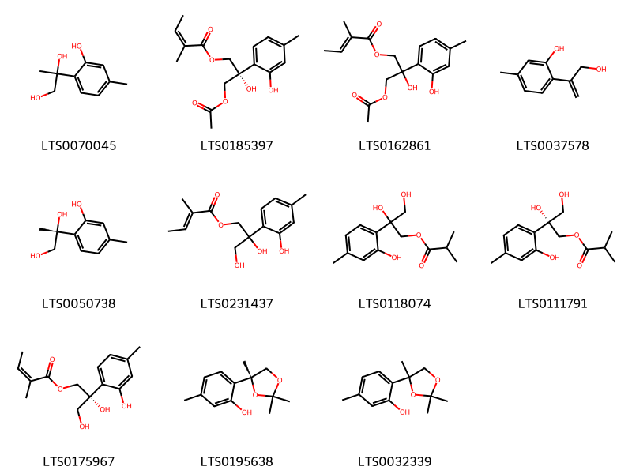{ width=100% }
    <figcaption>Hình ảnh cấu trúc hóa học của 11 hoạt chất thuộc nhóm Phenols gồm ['2-(2-hydroxy-4-methylphenyl)propane-1,2-diol (LTS0070045)', '(2r)-3-(acetyloxy)-2-hydroxy-2-(2-hydroxy-4-methylphenyl)propyl (2z)-2-methylbut-2-enoate (LTS0185397)', '3-(acetyloxy)-2-hydroxy-2-(2-hydroxy-4-methylphenyl)propyl 2-methylbut-2-enoate (LTS0162861)', '9-hydroxy-8,10-dehydrothymol (LTS0037578)', '(2r)-2-(2-hydroxy-4-methylphenyl)propane-1,2-diol (LTS0050738)', '2,3-dihydroxy-2-(2-hydroxy-4-methylphenyl)propyl 2-methylbut-2-enoate (LTS0231437)', '2,3-dihydroxy-2-(2-hydroxy-4-methylphenyl)propyl 2-methylpropanoate (LTS0118074)', '(2r)-2,3-dihydroxy-2-(2-hydroxy-4-methylphenyl)propyl 2-methylpropanoate (LTS0111791)', '(2r)-2,3-dihydroxy-2-(2-hydroxy-4-methylphenyl)propyl (2z)-2-methylbut-2-enoate (LTS0175967)', '5-methyl-2-[(4r)-2,2,4-trimethyl-1,3-dioxolan-4-yl]phenol (LTS0195638)', '5-methyl-2-(2,2,4-trimethyl-1,3-dioxolan-4-yl)phenol (LTS0032339)'].</figcaption>
</figure>
#### Nhóm Prenol lipids
<figure markdown="span">
    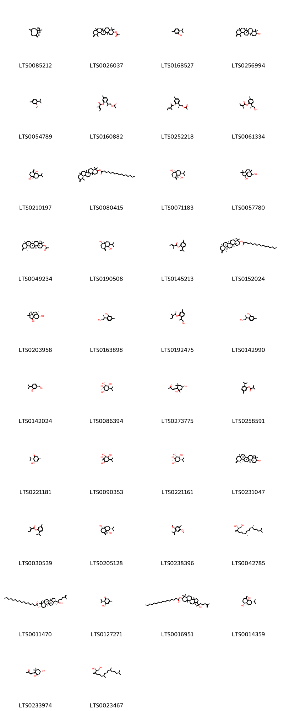{ width=100% }
    <figcaption>Hình ảnh cấu trúc hóa học của 38 hoạt chất thuộc nhóm Prenol lipids gồm ['caryophyllene (LTS0085212)', '4,4,6a,6b,8a,12,14b-heptamethyl-11-methylidene-hexadecahydropicen-3-yl acetate (LTS0026037)', 'thymol (LTS0168527)', '4,4,6a,6b,8a,12,14b-heptamethyl-11-methylidene-hexadecahydropicen-3-ol (LTS0256994)', '2-isopropyl-5-methylanisole (LTS0054789)', '2-[1-(acetyloxy)propan-2-yl]-5-methylphenyl 2-methylbut-2-enoate (LTS0160882)', '2-[(2s)-1-(acetyloxy)propan-2-yl]-5-methylphenyl (2e)-2-methylbut-2-enoate (LTS0252218)', '2-[(2s)-1-hydroxypropan-2-yl]-5-methylphenyl (2z)-2-methylbut-2-enoate (LTS0061334)', '6-isopropyl-8a-methyl-4-methylidene-hexahydro-1h-naphthalene-1,4a-diol (LTS0210197)', '4,4,6a,6b,8a,12,14b-heptamethyl-11-methylidene-hexadecahydropicen-3-yl hexadecanoate (LTS0080415)', '(1s,2s,4ar,5r,8as)-2-isopropyl-4a-methyl-8-methylidene-octahydronaphthalene-1,5-diol (LTS0071183)', '4,4,8-trimethyltricyclo[6.3.1.0¹,⁵]dodecane-2,9-diol (LTS0057780)', '(3s,4as,6ar,6br,8ar,12s,12as,12bs,14ar,14br)-4,4,6a,6b,8a,12,14b-heptamethyl-11-methylidene-hexadecahydropicen-3-yl acetate (LTS0049234)', '2-isopropyl-4a-methyl-8-methylidene-octahydronaphthalene-1,5-diol (LTS0190508)', '2-isopropyl-5-methylphenyl (2e)-2-methylbut-2-enoate (LTS0145213)', '(3s,4ar,6ar,6br,8ar,12s,12ar,12bs,14ar,14br)-4,4,6a,6b,8a,12,14b-heptamethyl-11-methylidene-hexadecahydropicen-3-yl hexadecanoate (LTS0152024)', 'clovanediol (LTS0203958)', '2-[(2s)-1-hydroxypropan-2-yl]-5-methylphenol (LTS0163898)', '2-(1-hydroxypropan-2-yl)-5-methylphenyl 2-methylbut-2-enoate (LTS0192475)', '2-(1-hydroxypropan-2-yl)-5-methylphenol (LTS0142990)', '5-(hydroxymethyl)-2-isopropylphenol (LTS0142024)', '(1s,2r,3s,4r,5r)-5-isopropyl-2-methylcyclohexane-1,2,3,4-tetrol (LTS0086394)', '4-(2,4-dihydroxy-2,6,6-trimethylcyclohexylidene)but-3-en-2-one (LTS0273775)', '2-isopropyl-5-methylphenyl 2-methylpropanoate (LTS0258591)', '(5s,6s)-5-hydroxy-6-isopropyl-3-methylcyclohex-3-en-1-one (LTS0221181)', '5-isopropyl-2-methylcyclohexane-1,2,3,4-tetrol (LTS0090353)', '(1s,2r,3r,4r,5s)-5-isopropyl-2-methylcyclohexane-1,2,3,4-tetrol (LTS0221161)', '(3s,4as,6ar,6br,8ar,12s,12as,12bs,14ar,14br)-4,4,6a,6b,8a,12,14b-heptamethyl-11-methylidene-hexadecahydropicen-3-ol (LTS0231047)', '2-isopropyl-5-methylphenyl 2-methylbut-2-enoate (LTS0030539)', '(1r,2r,4ar,5r,8ar)-2-isopropyl-4a-methyl-8-methylidene-octahydronaphthalene-1,5-diol (LTS0205128)', '2,5-dimethoxy-p-cymene (LTS0238396)', '(2s,7s,11s)-7,11,15-trimethyl-3-methylidenehexadecane-1,2-diol (LTS0042785)', '(1s,3as,3br,5ar,7s,9ar,9bs,11ar)-1-[(2r)-2-hydroxy-6-methylhept-6-en-2-yl]-3a,6,6,9a,11a-pentamethyl-dodecahydro-1h-cyclopenta[a]phenanthren-7-yl hexadecanoate (LTS0011470)', '5-hydroxy-6-isopropyl-3-methylcyclohex-3-en-1-one (LTS0127271)', '1-(2-hydroxy-6-methylhept-6-en-2-yl)-3a,6,6,9a,11a-pentamethyl-dodecahydro-1h-cyclopenta[a]phenanthren-7-yl hexadecanoate (LTS0016951)', '(1r,4ar,6r,8as)-6-isopropyl-8a-methyl-4-methylidene-hexahydro-1h-naphthalene-1,4a-diol (LTS0014359)', '4-[(2r,4s)-2,4-dihydroxy-2,6,6-trimethylcyclohexylidene]but-3-en-2-one (LTS0233974)', '7,11,15-trimethyl-3-methylidenehexadecane-1,2-diol (LTS0023467)'].</figcaption>
</figure>
#### Nhóm Pyrrolizidines
<figure markdown="span">
    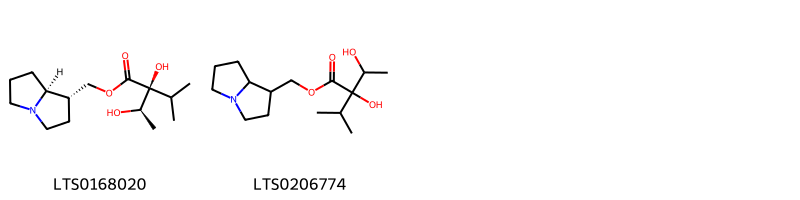{ width=100% }
    <figcaption>Hình ảnh cấu trúc hóa học của 2 hoạt chất thuộc nhóm Pyrrolizidines gồm ['(1r,7as)-hexahydro-1h-pyrrolizin-1-ylmethyl (2s)-2-hydroxy-2-[(1r)-1-hydroxyethyl]-3-methylbutanoate (LTS0168020)', 'hexahydro-1h-pyrrolizin-1-ylmethyl 2,3-dihydroxy-2-isopropylbutanoate (LTS0206774)'].</figcaption>
</figure>
#### Nhóm Steroids and steroid derivatives
<figure markdown="span">
    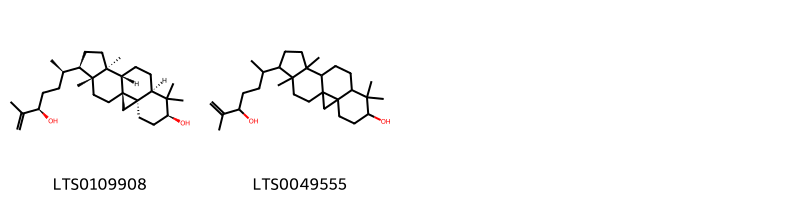{ width=100% }
    <figcaption>Hình ảnh cấu trúc hóa học của 2 hoạt chất thuộc nhóm Steroids and steroid derivatives gồm ['(1s,3r,6s,8r,11s,12s,15r,16r)-15-[(2r,5r)-5-hydroxy-6-methylhept-6-en-2-yl]-7,7,12,16-tetramethylpentacyclo[9.7.0.0¹,³.0³,⁸.0¹²,¹⁶]octadecan-6-ol (LTS0109908)', '15-(5-hydroxy-6-methylhept-6-en-2-yl)-7,7,12,16-tetramethylpentacyclo[9.7.0.0¹,³.0³,⁸.0¹²,¹⁶]octadecan-6-ol (LTS0049555)'].</figcaption>
</figure>

---

### Dược dân tộc học

Danh sách các quốc gia có sử dụng *Eupatorium fortunei* trong điều trị các bệnh. 

| Country   | Disease                          | Bệnh                                                                                                                                                                                                |
|:----------|:---------------------------------|:----------------------------------------------------------------------------------------------------------------------------------------------------------------------------------------------------|
| China     | Alexiteric, Apertif, Refrigerant | MYMEMORY WARNING: YOU USED ALL AVAILABLE FREE TRANSLATIONS FOR TODAY. NEXT AVAILABLE IN  13 HOURS 08 MINUTES 38 SECONDS VISIT HTTPS://MYMEMORY.TRANSLATED.NET/DOC/USAGELIMITS.PHP TO TRANSLATE MORE |
| Elsewhere | Diuretic, Emmenagogue            | MYMEMORY WARNING: YOU USED ALL AVAILABLE FREE TRANSLATIONS FOR TODAY. NEXT AVAILABLE IN  13 HOURS 08 MINUTES 35 SECONDS VISIT HTTPS://MYMEMORY.TRANSLATED.NET/DOC/USAGELIMITS.PHP TO TRANSLATE MORE |

---

---
## Eupatorium inulaefolium
### Thông tin về thực vật

!!! info "Phân loại thực vật của *Austroeupatorium inulaefolium* từ GIBF:"
    - **Kingdom:** Plantae
    - **Phylum:** Tracheophyta
    - **Order:** Asterales
    - **Family:** Asteraceae
    - **Genus:** Austroeupatorium
    - **Species:** *Austroeupatorium inulaefolium*

 

| Label (VI)   | Label (EN)   | Scientific Name     | Descriptions (VI)   | Descriptions (EN)          | Also Known As (VI)   | Also Known As (EN)   |
|:-------------|:-------------|:--------------------|:--------------------|:---------------------------|:---------------------|:---------------------|
| N/A          | N/A          | Eupatorium fortunei |                     | species of flowering plant | ['']                 | ['']                 |

#### Phân bố trên thế giới

**Từ CSDL GIBF** nan, Ecuador, Colombia, Brazil, Chinese Taipei, Bolivia (Plurinational State of), Argentina, unknown or invalid, Indonesia, Uruguay, Paraguay, Venezuela (Bolivarian Republic of)

#### Phân bố tại Việt Nam

**Từ CSDL GIBF**: Không có ghi nhận ở Việt Nam

---
### Thành phần hóa học
        
- Theo cơ sở dữ liệu lotus: Từ loài *Austroeupatorium inulaefolium* đã phân lập và xác định được 21 hoạt chất thuộc về các nhóm Flavonoids, Prenol lipids. 

|    | chemicalTaxonomyClassyfireClass   |   smiles_count |
|---:|:----------------------------------|---------------:|
|  0 | Flavonoids                        |              3 |
|  1 | Prenol lipids                     |             18 |

#### Nhóm Flavonoids
<figure markdown="span">
    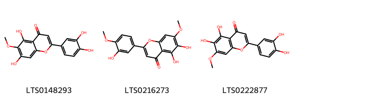{ width=100% }
    <figcaption>Hình ảnh cấu trúc hóa học của 3 hoạt chất thuộc nhóm Flavonoids gồm ['nepetin (LTS0148293)', 'nuchensin (LTS0216273)', 'pedalitin (LTS0222877)'].</figcaption>
</figure>
#### Nhóm Prenol lipids
<figure markdown="span">
    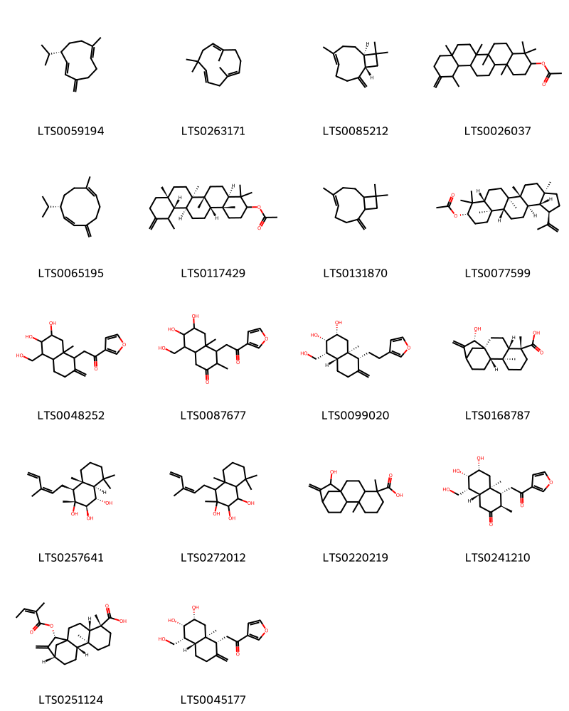{ width=100% }
    <figcaption>Hình ảnh cấu trúc hóa học của 18 hoạt chất thuộc nhóm Prenol lipids gồm ['(-)-germacrene d (LTS0059194)', 'humulene (LTS0263171)', 'caryophyllene (LTS0085212)', '4,4,6a,6b,8a,12,14b-heptamethyl-11-methylidene-hexadecahydropicen-3-yl acetate (LTS0026037)', '(1z,6z,8s)-8-isopropyl-1-methyl-5-methylidenecyclodeca-1,6-diene (LTS0065195)', '(4ar,6ar,6br,8ar,12as,12bs,14as,14br)-4,4,6a,6b,8a,12,14b-heptamethyl-11-methylidene-hexadecahydropicen-3-yl acetate (LTS0117429)', 'caryophyllene (LTS0131870)', 'lupeol acetate (LTS0077599)', '2-[6,7-dihydroxy-5-(hydroxymethyl)-8a-methyl-2-methylidene-octahydronaphthalen-1-yl]-1-(furan-3-yl)ethanone (LTS0048252)', '4-[2-(furan-3-yl)-2-oxoethyl]-6,7-dihydroxy-8-(hydroxymethyl)-3,4a-dimethyl-octahydronaphthalen-2-one (LTS0087677)', '(1r,2s,3r,4ar,5r,8ar)-5-[2-(furan-3-yl)ethyl]-1-(hydroxymethyl)-4a-methyl-6-methylidene-octahydronaphthalene-2,3-diol (LTS0099020)', 'grandifloric acid (LTS0168787)', 'austroinulin (LTS0257641)', '3,4a,8,8-tetramethyl-4-(3-methylpenta-2,4-dien-1-yl)-hexahydro-1h-naphthalene-1,2,3-triol (LTS0272012)', '15-hydroxy-5,9-dimethyl-14-methylidenetetracyclo[11.2.1.0¹,¹⁰.0⁴,⁹]hexadecane-5-carboxylic acid (LTS0220219)', '(3r,4r,4ar,6r,7s,8r,8ar)-4-[2-(furan-3-yl)-2-oxoethyl]-6,7-dihydroxy-8-(hydroxymethyl)-3,4a-dimethyl-octahydronaphthalen-2-one (LTS0241210)', '(4s,5r,9s,10s,13s,15s)-5,9-dimethyl-15-{[(2z)-2-methylbut-2-enoyl]oxy}-14-methylidenetetracyclo[11.2.1.0¹,¹⁰.0⁴,⁹]hexadecane-5-carboxylic acid (LTS0251124)', '2-[(1r,4ar,5r,6s,7r,8ar)-6,7-dihydroxy-5-(hydroxymethyl)-8a-methyl-2-methylidene-octahydronaphthalen-1-yl]-1-(furan-3-yl)ethanone (LTS0045177)'].</figcaption>
</figure>

---

### Dược dân tộc học

Danh sách các quốc gia có sử dụng *Austroeupatorium inulaefolium* trong điều trị các bệnh. 

| Country   | Disease       | Bệnh                                                                                                                                                                                                |
|:----------|:--------------|:----------------------------------------------------------------------------------------------------------------------------------------------------------------------------------------------------|
| Paraguay  | Antifertility | MYMEMORY WARNING: YOU USED ALL AVAILABLE FREE TRANSLATIONS FOR TODAY. NEXT AVAILABLE IN  13 HOURS 08 MINUTES 05 SECONDS VISIT HTTPS://MYMEMORY.TRANSLATED.NET/DOC/USAGELIMITS.PHP TO TRANSLATE MORE |
| Trinidad  | Collyrium     | MYMEMORY WARNING: YOU USED ALL AVAILABLE FREE TRANSLATIONS FOR TODAY. NEXT AVAILABLE IN  13 HOURS 08 MINUTES 01 SECONDS VISIT HTTPS://MYMEMORY.TRANSLATED.NET/DOC/USAGELIMITS.PHP TO TRANSLATE MORE |

---

---
## Eupatorium japonicum
### Thông tin về thực vật

!!! info "Phân loại thực vật của *Eupatorium japonicum* từ GIBF:"
    - **Kingdom:** Plantae
    - **Phylum:** Tracheophyta
    - **Order:** Asterales
    - **Family:** Asteraceae
    - **Genus:** Eupatorium
    - **Species:** *Eupatorium japonicum*

 

| Label (VI)   | Label (EN)   | Scientific Name      | Descriptions (VI)   | Descriptions (EN)   | Also Known As (VI)   | Also Known As (EN)      |
|:-------------|:-------------|:---------------------|:--------------------|:--------------------|:---------------------|:------------------------|
| N/A          | N/A          | Eupatorium japonicum | loài thực vật       | species of plant    | ['']                 | ['fragrant eupatorium'] |

#### Phân bố trên thế giới

**Từ CSDL GIBF** nan, Japan, Korea, Republic of, Chinese Taipei, China

#### Phân bố tại Việt Nam

**Từ CSDL GIBF**: Không có ghi nhận ở Việt Nam

---
### Thành phần hóa học
        
- Theo cơ sở dữ liệu lotus: Từ loài *Eupatorium japonicum* đã phân lập và xác định được 21 hoạt chất thuộc về các nhóm Flavonoids, Prenol lipids, Pyrrolizidines, Coumarins and derivatives. 

|    | chemicalTaxonomyClassyfireClass   |   smiles_count |
|---:|:----------------------------------|---------------:|
|  0 |                                   |              7 |
|  1 | Coumarins and derivatives         |              1 |
|  2 | Flavonoids                        |              1 |
|  3 | Prenol lipids                     |              9 |
|  4 | Pyrrolizidines                    |              2 |

#### Nhóm 
<figure markdown="span">
    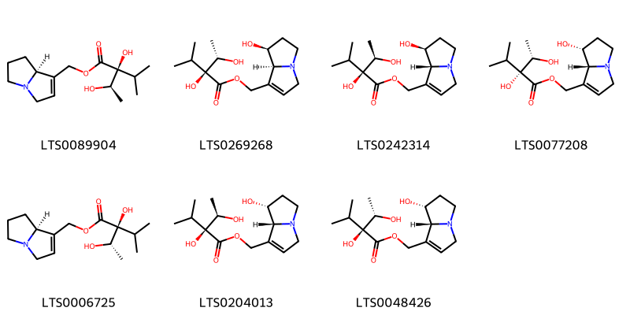{ width=100% }
    <figcaption>Hình ảnh cấu trúc hóa học của 7 hoạt chất thuộc nhóm  gồm ['supinine (LTS0089904)', '[(7s,7as)-7-hydroxy-5,6,7,7a-tetrahydro-3h-pyrrolizin-1-yl]methyl (2s)-2-hydroxy-2-[(1s)-1-hydroxyethyl]-3-methylbutanoate (LTS0269268)', 'rinderine (LTS0242314)', '9-viridiflorylretronecine (LTS0077208)', 'amabiline (LTS0006725)', 'intermedine (LTS0204013)', 'lycopsamine (LTS0048426)'].</figcaption>
</figure>
#### Nhóm Coumarins and derivatives
<figure markdown="span">
    { width=100% }
    <figcaption>Hình ảnh cấu trúc hóa học của 1 hoạt chất thuộc nhóm Coumarins and derivatives gồm ['2h-1-benzopyran-2-one (LTS0069773)'].</figcaption>
</figure>
#### Nhóm Flavonoids
<figure markdown="span">
    { width=100% }
    <figcaption>Hình ảnh cấu trúc hóa học của 1 hoạt chất thuộc nhóm Flavonoids gồm ['quercetin (LTS0004651)'].</figcaption>
</figure>
#### Nhóm Prenol lipids
<figure markdown="span">
    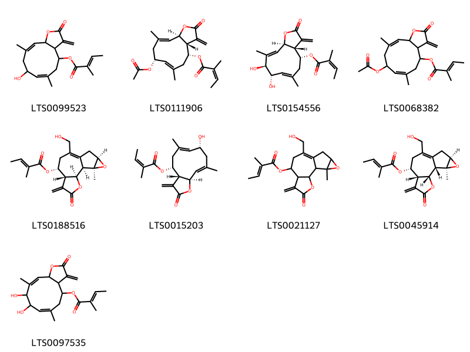{ width=100% }
    <figcaption>Hình ảnh cấu trúc hóa học của 9 hoạt chất thuộc nhóm Prenol lipids gồm ['8-hydroxy-6,10-dimethyl-3-methylidene-2-oxo-3ah,4h,5h,8h,9h,11ah-cyclodeca[b]furan-4-yl 2-methylbut-2-enoate (LTS0099523)', '(3ar,4r,8r,11ar)-8-(acetyloxy)-6,10-dimethyl-3-methylidene-2-oxo-3ah,4h,5h,8h,9h,11ah-cyclodeca[b]furan-4-yl (2z)-2-methylbut-2-enoate (LTS0111906)', '(3ar,4r,8s,9s,11ar)-8,9-dihydroxy-6,10-dimethyl-3-methylidene-2-oxo-3ah,4h,5h,8h,9h,11ah-cyclodeca[b]furan-4-yl (2z)-2-methylbut-2-enoate (LTS0154556)', '8-(acetyloxy)-6,10-dimethyl-3-methylidene-2-oxo-3ah,4h,5h,8h,9h,11ah-cyclodeca[b]furan-4-yl 2-methylbut-2-enoate (LTS0068382)', '(1r,2s,6r,7r,12r,14s)-9-(hydroxymethyl)-14-methyl-5-methylidene-4-oxo-3,13-dioxatetracyclo[8.4.0.0²,⁶.0¹²,¹⁴]tetradec-9-en-7-yl (2e)-2-methylbut-2-enoate (LTS0188516)', '(3ar,4r,8r,11ar)-8-hydroxy-6,10-dimethyl-3-methylidene-2-oxo-3ah,4h,5h,8h,9h,11ah-cyclodeca[b]furan-4-yl (2z)-2-methylbut-2-enoate (LTS0015203)', '9-(hydroxymethyl)-14-methyl-5-methylidene-4-oxo-3,13-dioxatetracyclo[8.4.0.0²,⁶.0¹²,¹⁴]tetradec-9-en-7-yl 2-methylbut-2-enoate (LTS0021127)', '(1s,2r,6r,7r,12r,14s)-9-(hydroxymethyl)-14-methyl-5-methylidene-4-oxo-3,13-dioxatetracyclo[8.4.0.0²,⁶.0¹²,¹⁴]tetradec-9-en-7-yl (2e)-2-methylbut-2-enoate (LTS0045914)', '8,9-dihydroxy-6,10-dimethyl-3-methylidene-2-oxo-3ah,4h,5h,8h,9h,11ah-cyclodeca[b]furan-4-yl 2-methylbut-2-enoate (LTS0097535)'].</figcaption>
</figure>
#### Nhóm Pyrrolizidines
<figure markdown="span">
    { width=100% }
    <figcaption>Hình ảnh cấu trúc hóa học của 2 hoạt chất thuộc nhóm Pyrrolizidines gồm ['viridiflorine (LTS0255123)', 'hexahydro-1h-pyrrolizin-1-ylmethyl 2,3-dihydroxy-2-(2-methylpropyl)pentanoate (LTS0247111)'].</figcaption>
</figure>

---

### Dược dân tộc học

Danh sách các quốc gia có sử dụng *Eupatorium japonicum* trong điều trị các bệnh. 

| Country   | Disease             | Bệnh                                                                                                                                                                                                |
|:----------|:--------------------|:----------------------------------------------------------------------------------------------------------------------------------------------------------------------------------------------------|
| Malaya    | Diuretic, Vermifuge | MYMEMORY WARNING: YOU USED ALL AVAILABLE FREE TRANSLATIONS FOR TODAY. NEXT AVAILABLE IN  13 HOURS 07 MINUTES 32 SECONDS VISIT HTTPS://MYMEMORY.TRANSLATED.NET/DOC/USAGELIMITS.PHP TO TRANSLATE MORE |

---

---
## Eupatorium leucomyelum
### Thông tin về thực vật

!!! info "Phân loại thực vật của *Ageratina neriifolia* từ GIBF:"
    - **Kingdom:** Plantae
    - **Phylum:** Tracheophyta
    - **Order:** Asterales
    - **Family:** Asteraceae
    - **Genus:** Ageratina
    - **Species:** *Ageratina neriifolia*

 

| Label (VI)   | Label (EN)   | Scientific Name        | Descriptions (VI)   | Descriptions (EN)   | Also Known As (VI)   | Also Known As (EN)   |
|:-------------|:-------------|:-----------------------|:--------------------|:--------------------|:---------------------|:---------------------|
| N/A          | N/A          | Eupatorium leucomyelum |                     |                     | ['']                 | ['']                 |

#### Phân bố trên thế giới

**Từ CSDL GIBF** Venezuela (Bolivarian Republic of)

#### Phân bố tại Việt Nam

**Từ CSDL GIBF**: Không có ghi nhận ở Việt Nam

---
### Thành phần hóa học
        
- Theo cơ sở dữ liệu lotus: Từ loài *Ageratina neriifolia* đã phân lập và xác định được Chưa có hoạt chất nào được phân lập. hoạt chất thuộc về các nhóm Không có hoạt chất nào được phân lập. 

Không có hình ảnh nào được tạo ra

---

### Dược dân tộc học

Danh sách các quốc gia có sử dụng *Ageratina neriifolia* trong điều trị các bệnh. 

| Country   | Disease   | Bệnh                                                                                                                                                                                                |
|:----------|:----------|:----------------------------------------------------------------------------------------------------------------------------------------------------------------------------------------------------|
| Venezuela | Vulnerary | MYMEMORY WARNING: YOU USED ALL AVAILABLE FREE TRANSLATIONS FOR TODAY. NEXT AVAILABLE IN  13 HOURS 07 MINUTES 01 SECONDS VISIT HTTPS://MYMEMORY.TRANSLATED.NET/DOC/USAGELIMITS.PHP TO TRANSLATE MORE |

---

---
## Eupatorium lindleyanum
### Thông tin về thực vật

!!! info "Phân loại thực vật của *Eupatorium lindleyanum* từ GIBF:"
    - **Kingdom:** Plantae
    - **Phylum:** Tracheophyta
    - **Order:** Asterales
    - **Family:** Asteraceae
    - **Genus:** Eupatorium
    - **Species:** *Eupatorium lindleyanum*

 

| Label (VI)   | Label (EN)   | Scientific Name        | Descriptions (VI)   | Descriptions (EN)   | Also Known As (VI)   | Also Known As (EN)   |
|:-------------|:-------------|:-----------------------|:--------------------|:--------------------|:---------------------|:---------------------|
| N/A          | N/A          | Eupatorium lindleyanum | loài thực vật       | species of plant    | ['']                 | ['']                 |

#### Phân bố trên thế giới

**Từ CSDL GIBF** Japan, Korea, Republic of, Chinese Taipei, Russian Federation, China

#### Phân bố tại Việt Nam

**Từ CSDL GIBF**: Không có ghi nhận ở Việt Nam

---
### Thành phần hóa học
        
- Theo cơ sở dữ liệu lotus: Từ loài *Eupatorium lindleyanum* đã phân lập và xác định được 37 hoạt chất thuộc về các nhóm Flavonoids, Prenol lipids, Carboxylic acids and derivatives. 

|    | chemicalTaxonomyClassyfireClass   |   smiles_count |
|---:|:----------------------------------|---------------:|
|  0 | Carboxylic acids and derivatives  |              1 |
|  1 | Flavonoids                        |              2 |
|  2 | Prenol lipids                     |             34 |

#### Nhóm Carboxylic acids and derivatives
<figure markdown="span">
    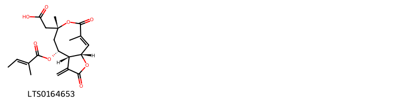{ width=100% }
    <figcaption>Hình ảnh cấu trúc hóa học của 1 hoạt chất thuộc nhóm Carboxylic acids and derivatives gồm ['[(3ar,4r,6r,10as)-6,9-dimethyl-4-{[(2e)-2-methylbut-2-enoyl]oxy}-3-methylidene-2,8-dioxo-3ah,4h,5h,10ah-furo[2,3-e]oxonin-6-yl]acetic acid (LTS0164653)'].</figcaption>
</figure>
#### Nhóm Flavonoids
<figure markdown="span">
    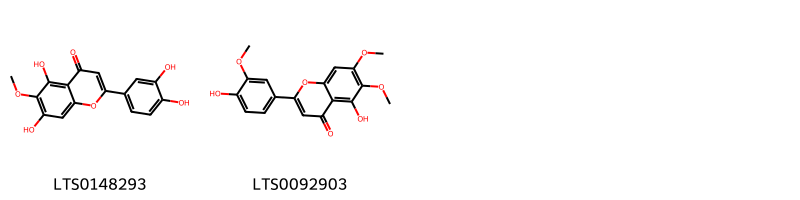{ width=100% }
    <figcaption>Hình ảnh cấu trúc hóa học của 2 hoạt chất thuộc nhóm Flavonoids gồm ['nepetin (LTS0148293)', 'cirsilineol (LTS0092903)'].</figcaption>
</figure>
#### Nhóm Prenol lipids
<figure markdown="span">
    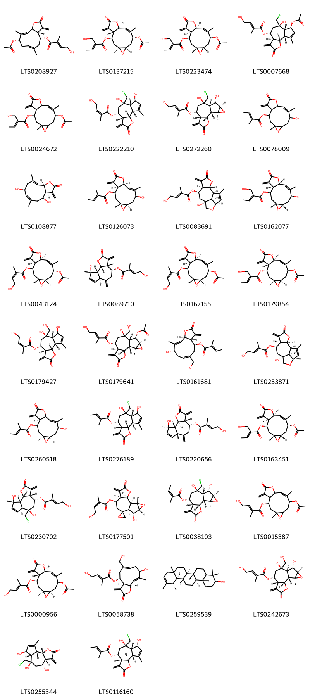{ width=100% }
    <figcaption>Hình ảnh cấu trúc hóa học của 34 hoạt chất thuộc nhóm Prenol lipids gồm ['(3ar,4r,9s)-9-(acetyloxy)-6,10-dimethyl-3-methylidene-2-oxo-3ah,4h,5h,8h,9h,11ah-cyclodeca[b]furan-4-yl (2e)-4-hydroxy-2-methylbut-2-enoate (LTS0208927)', '(1s,2r,4s,6r,8r,9z,11s)-8-(acetyloxy)-4,9-dimethyl-14-methylidene-13-oxo-5,12-dioxatricyclo[9.3.0.0⁴,⁶]tetradec-9-en-2-yl (2e)-2-(hydroxymethyl)but-2-enoate (LTS0137215)', '(1r,2r,4r,6s,8s,9z,11s)-8-(acetyloxy)-4,9-dimethyl-14-methylidene-13-oxo-5,12-dioxatricyclo[9.3.0.0⁴,⁶]tetradec-9-en-2-yl (2e)-2-(hydroxymethyl)but-2-enoate (LTS0223474)', '(3as,4r,6r,6as,7s,9ar,9bs)-7-(acetyloxy)-6-(chloromethyl)-6-hydroxy-9-methyl-3-methylidene-2-oxo-3ah,4h,5h,6ah,7h,9ah,9bh-azuleno[4,5-b]furan-4-yl (2e)-4-hydroxy-2-methylbut-2-enoate (LTS0007668)', '8-(acetyloxy)-4,9-dimethyl-14-methylidene-13-oxo-5,12-dioxatricyclo[9.3.0.0⁴,⁶]tetradec-9-en-2-yl 2-(hydroxymethyl)but-2-enoate (LTS0024672)', '(3ar,4r,6r,6as,7s,9ar,9bs)-6-(chloromethyl)-6,7-dihydroxy-9-methyl-3-methylidene-2-oxo-3ah,4h,5h,6ah,7h,9ah,9bh-azuleno[4,5-b]furan-4-yl (2z)-4-hydroxy-2-methylbut-2-enoate (LTS0222210)', '(1s,2r,6r,7r,9r,10s,11s,12r,14s)-9-(chloromethyl)-9,11-dihydroxy-14-methyl-5-methylidene-4-oxo-3,13-dioxatetracyclo[8.4.0.0²,⁶.0¹²,¹⁴]tetradecan-7-yl (2e)-4-hydroxy-2-methylbut-2-enoate (LTS0272260)', '8-hydroxy-4,9-dimethyl-14-methylidene-13-oxo-5,12-dioxatricyclo[9.3.0.0⁴,⁶]tetradec-9-en-2-yl 2-methylbut-2-enoate (LTS0078009)', '(3as,4s,8s,11ar)-4,8-dihydroxy-6,10-dimethyl-3-methylidene-3ah,4h,5h,8h,9h,11ah-cyclodeca[b]furan-2-one (LTS0108877)', '(1r,2r,4r,6r,8s,9e,11s)-8-hydroxy-4,9-dimethyl-14-methylidene-13-oxo-5,12-dioxatricyclo[9.3.0.0⁴,⁶]tetradec-9-en-2-yl (2e)-2-methylbut-2-enoate (LTS0126073)', '(1r,2r,6r,7r,9r,12r,15s)-9-hydroxy-14-methyl-5-methylidene-4-oxo-3,11-dioxatetracyclo[7.5.1.0²,⁶.0¹²,¹⁵]pentadec-13-en-7-yl (2e)-4-hydroxy-2-methylbut-2-enoate (LTS0083691)', '(1r,2r,4r,6s,8s,9z,11r)-8-hydroxy-4,9-dimethyl-14-methylidene-13-oxo-5,12-dioxatricyclo[9.3.0.0⁴,⁶]tetradec-9-en-2-yl (2e)-2-(hydroxymethyl)but-2-enoate (LTS0162077)', '(1r,2r,4r,6s,8r,9z,11s)-8-(acetyloxy)-4,9-dimethyl-14-methylidene-13-oxo-5,12-dioxatricyclo[9.3.0.0⁴,⁶]tetradec-9-en-2-yl (2z)-4-hydroxy-2-methylbut-2-enoate (LTS0043124)', '(3ar,4r,6as,9s,9as,9br)-9-hydroxy-9-methyl-3,6-dimethylidene-2-oxo-3ah,4h,5h,6ah,9ah,9bh-azuleno[4,5-b]furan-4-yl (2e)-4-hydroxy-2-methylbut-2-enoate (LTS0089710)', '(1r,2r,4r,6s,8s,9z,11s)-8-(acetyloxy)-4,9-dimethyl-14-methylidene-13-oxo-5,12-dioxatricyclo[9.3.0.0⁴,⁶]tetradec-9-en-2-yl (2z)-4-hydroxy-2-methylbut-2-enoate (LTS0167155)', '(1s,2r,4s,6r,8s,9z,11s)-8-(acetyloxy)-4,9-dimethyl-14-methylidene-13-oxo-5,12-dioxatricyclo[9.3.0.0⁴,⁶]tetradec-9-en-2-yl (2e)-2-(hydroxymethyl)but-2-enoate (LTS0179854)', '(3ar,4r,6r,6as,7s,9ar,9bs)-6,7-dihydroxy-6-(hydroxymethyl)-9-methyl-3-methylidene-2-oxo-3ah,4h,5h,6ah,7h,9ah,9bh-azuleno[4,5-b]furan-4-yl (2z)-4-hydroxy-2-methylbut-2-enoate (LTS0179427)', '(1s,2r,6r,7r,9r,10s,11s,12r,14s)-11-(acetyloxy)-9-hydroxy-9-(hydroxymethyl)-14-methyl-5-methylidene-4-oxo-3,13-dioxatetracyclo[8.4.0.0²,⁶.0¹²,¹⁴]tetradecan-7-yl (2e)-4-hydroxy-2-methylbut-2-enoate (LTS0179641)', '(3ar,4s,9s,11as)-9-hydroxy-6-(hydroxymethyl)-10-methyl-3-methylidene-2-oxo-3ah,4h,5h,8h,9h,11ah-cyclodeca[b]furan-4-yl (2e)-2-methylbut-2-enoate (LTS0161681)', '(1r,2s,6r,7r,9r,12s,15s)-9-hydroxy-14-methyl-5-methylidene-4-oxo-3,11-dioxatetracyclo[7.5.1.0²,⁶.0¹²,¹⁵]pentadec-13-en-7-yl (2e)-4-hydroxy-2-methylbut-2-enoate (LTS0253871)', '(1r,2r,4s,6r,8s,9e)-8-hydroxy-4,9-dimethyl-14-methylidene-13-oxo-5,12-dioxatricyclo[9.3.0.0⁴,⁶]tetradec-9-en-2-yl (2e)-2-methylbut-2-enoate (LTS0260518)', '(3ar,4r,6r,6as,7s,9ar,9bs)-6-(chloromethyl)-6,7-dihydroxy-9-methyl-3-methylidene-2-oxo-3ah,4h,5h,6ah,7h,9ah,9bh-azuleno[4,5-b]furan-4-yl (2e)-2-methylbut-2-enoate (LTS0276189)', '(3ar,4r,6ar,9r,9as,9bs)-9-hydroxy-9-methyl-3,6-dimethylidene-2-oxo-3ah,4h,5h,6ah,9ah,9bh-azuleno[4,5-b]furan-4-yl (2e)-4-hydroxy-2-methylbut-2-enoate (LTS0220656)', '(1r,2r,4r,6s,8r,9z,11s)-8-(acetyloxy)-4,9-dimethyl-14-methylidene-13-oxo-5,12-dioxatricyclo[9.3.0.0⁴,⁶]tetradec-9-en-2-yl (2e)-2-(hydroxymethyl)but-2-enoate (LTS0163451)', '(3ar,4r,6r,6as,9s,9as,9br)-6-(chloromethyl)-6,9-dihydroxy-9-methyl-3-methylidene-2-oxo-3ah,4h,5h,6ah,9ah,9bh-azuleno[4,5-b]furan-4-yl (2e)-4-hydroxy-2-methylbut-2-enoate (LTS0230702)', "(1's,2r,2'r,6'r,7'r,10's,11's,12'r,14's)-11'-hydroxy-14'-methyl-5'-methylidene-4'-oxo-3',13'-dioxaspiro[oxirane-2,9'-tetracyclo[8.4.0.0²,⁶.0¹²,¹⁴]tetradecan]-7'-yl (2z)-4-hydroxy-2-methylbut-2-enoate (LTS0177501)", '(1s,2r,6r,7r,9r,10s,11s,12r,14s)-9-(chloromethyl)-9,11-dihydroxy-14-methyl-5-methylidene-4-oxo-3,13-dioxatetracyclo[8.4.0.0²,⁶.0¹²,¹⁴]tetradecan-7-yl (2z)-2-methylbut-2-enoate (LTS0038103)', '8-(acetyloxy)-4,9-dimethyl-14-methylidene-13-oxo-5,12-dioxatricyclo[9.3.0.0⁴,⁶]tetradec-9-en-2-yl 4-hydroxy-2-methylbut-2-enoate (LTS0015387)', '(1s,2r,4s,6r,8s,9z,11s)-8-(acetyloxy)-4,9-dimethyl-14-methylidene-13-oxo-5,12-dioxatricyclo[9.3.0.0⁴,⁶]tetradec-9-en-2-yl (2e)-4-hydroxy-2-methylbut-2-enoate (LTS0000956)', '(3as,4r,9r,11ar)-9-hydroxy-6-(hydroxymethyl)-10-methyl-3-methylidene-2-oxo-3ah,4h,5h,8h,9h,11ah-cyclodeca[b]furan-4-yl (2e)-4-hydroxy-2-methylbut-2-enoate (LTS0058738)', '(3s,6ar,6br,8as,12s,12ar,12br,14ar,14br)-4,4,6a,6b,8a,11,12,14b-octamethyl-2,3,4a,5,6,7,8,9,12,12a,12b,13,14,14a-tetradecahydro-1h-picen-3-ol (LTS0259539)', '(1s,2r,6r,7r,9r,10s,11s,12r,14s)-9,11-dihydroxy-9-(hydroxymethyl)-14-methyl-5-methylidene-4-oxo-3,13-dioxatetracyclo[8.4.0.0²,⁶.0¹²,¹⁴]tetradecan-7-yl (2e)-4-hydroxy-2-methylbut-2-enoate (LTS0242673)', '(3ar,4r,6r,6as,7s,9ar,9bs)-6-(chloromethyl)-4,6,7-trihydroxy-9-methyl-3-methylidene-3ah,4h,5h,6ah,7h,9ah,9bh-azuleno[4,5-b]furan-2-one (LTS0255344)', '(3ar,4r,6r,6as,7r,9ar,9br)-6-(chloromethyl)-6,7-dihydroxy-9-methyl-3-methylidene-2-oxo-3ah,4h,5h,6ah,7h,9ah,9bh-azuleno[4,5-b]furan-4-yl (2e)-2-methylbut-2-enoate (LTS0116160)'].</figcaption>
</figure>

---

### Dược dân tộc học

Danh sách các quốc gia có sử dụng *Eupatorium lindleyanum* trong điều trị các bệnh. 

| Country   | Disease     | Bệnh                                                                                                                                                                                                |
|:----------|:------------|:----------------------------------------------------------------------------------------------------------------------------------------------------------------------------------------------------|
| China     | Antitussive | MYMEMORY WARNING: YOU USED ALL AVAILABLE FREE TRANSLATIONS FOR TODAY. NEXT AVAILABLE IN  13 HOURS 06 MINUTES 38 SECONDS VISIT HTTPS://MYMEMORY.TRANSLATED.NET/DOC/USAGELIMITS.PHP TO TRANSLATE MORE |
| Elsewhere | Diuretic    | MYMEMORY WARNING: YOU USED ALL AVAILABLE FREE TRANSLATIONS FOR TODAY. NEXT AVAILABLE IN  13 HOURS 06 MINUTES 35 SECONDS VISIT HTTPS://MYMEMORY.TRANSLATED.NET/DOC/USAGELIMITS.PHP TO TRANSLATE MORE |

---

---
## Eupatorium odoratum
### Thông tin về thực vật

!!! info "Phân loại thực vật của *N/A* từ GIBF:"
    - **Kingdom:** Plantae
    - **Phylum:** Tracheophyta
    - **Order:** Asterales
    - **Family:** Asteraceae
    - **Genus:** N/A
    - **Species:** *N/A*

 

| Label (VI)   | Label (EN)   | Scientific Name     | Descriptions (VI)   | Descriptions (EN)   | Also Known As (VI)   | Also Known As (EN)   |
|:-------------|:-------------|:--------------------|:--------------------|:--------------------|:---------------------|:---------------------|
| N/A          | N/A          | Eupatorium odoratum | loài thực vật       | species of plant    | ['']                 | ['']                 |

#### Phân bố trên thế giới

**Từ CSDL GIBF** Denmark, Australia, New Zealand, Chinese Taipei, Ireland, Isle of Man, Viet Nam, United Kingdom of Great Britain and Northern Ireland

#### Phân bố tại Việt Nam

**Từ CSDL GIBF**: Đà Nẵng

---
### Thành phần hóa học
        
- Theo cơ sở dữ liệu lotus: Từ loài *N/A* đã phân lập và xác định được Chưa có hoạt chất nào được phân lập. hoạt chất thuộc về các nhóm Không có hoạt chất nào được phân lập. 

Không có hình ảnh nào được tạo ra

---

### Dược dân tộc học

Danh sách các quốc gia có sử dụng *N/A* trong điều trị các bệnh. 

| Country   | Disease                  | Bệnh                                                                                                                                                                                                |
|:----------|:-------------------------|:----------------------------------------------------------------------------------------------------------------------------------------------------------------------------------------------------|
| China     | Hemostat, Vermifuge      | MYMEMORY WARNING: YOU USED ALL AVAILABLE FREE TRANSLATIONS FOR TODAY. NEXT AVAILABLE IN  13 HOURS 06 MINUTES 05 SECONDS VISIT HTTPS://MYMEMORY.TRANSLATED.NET/DOC/USAGELIMITS.PHP TO TRANSLATE MORE |
| Haiti     | Apertif, Decongestant    | MYMEMORY WARNING: YOU USED ALL AVAILABLE FREE TRANSLATIONS FOR TODAY. NEXT AVAILABLE IN  13 HOURS 06 MINUTES 02 SECONDS VISIT HTTPS://MYMEMORY.TRANSLATED.NET/DOC/USAGELIMITS.PHP TO TRANSLATE MORE |
| Mexico    | Emmenagogue, Emmenagogue | MYMEMORY WARNING: YOU USED ALL AVAILABLE FREE TRANSLATIONS FOR TODAY. NEXT AVAILABLE IN  13 HOURS 05 MINUTES 58 SECONDS VISIT HTTPS://MYMEMORY.TRANSLATED.NET/DOC/USAGELIMITS.PHP TO TRANSLATE MORE |

---

---
## Eupatorium perfoliatum
### Thông tin về thực vật

!!! info "Phân loại thực vật của *Eupatorium perfoliatum* từ GIBF:"
    - **Kingdom:** Plantae
    - **Phylum:** Tracheophyta
    - **Order:** Asterales
    - **Family:** Asteraceae
    - **Genus:** Eupatorium
    - **Species:** *Eupatorium perfoliatum*

 

| Label (VI)   | Label (EN)   | Scientific Name        | Descriptions (VI)   | Descriptions (EN)   | Also Known As (VI)   | Also Known As (EN)            |
|:-------------|:-------------|:-----------------------|:--------------------|:--------------------|:---------------------|:------------------------------|
| N/A          | N/A          | Eupatorium perfoliatum | loài thực vật       | species of plant    | ['']                 | ['boneset', 'common boneset'] |

#### Phân bố trên thế giới

**Từ CSDL GIBF** nan, United States of America, Canada

#### Phân bố tại Việt Nam

**Từ CSDL GIBF**: Không có ghi nhận ở Việt Nam

---
### Thành phần hóa học
        
- Theo cơ sở dữ liệu lotus: Từ loài *Eupatorium perfoliatum* đã phân lập và xác định được 57 hoạt chất thuộc về các nhóm Fatty Acyls, Flavonoids, Prenol lipids, Steroids and steroid derivatives, Organooxygen compounds, Carboxylic acids and derivatives. 

|    | chemicalTaxonomyClassyfireClass   |   smiles_count |
|---:|:----------------------------------|---------------:|
|  0 | Carboxylic acids and derivatives  |              5 |
|  1 | Fatty Acyls                       |             10 |
|  2 | Flavonoids                        |              4 |
|  3 | Organooxygen compounds            |              5 |
|  4 | Prenol lipids                     |             28 |
|  5 | Steroids and steroid derivatives  |              5 |

#### Nhóm Carboxylic acids and derivatives
<figure markdown="span">
    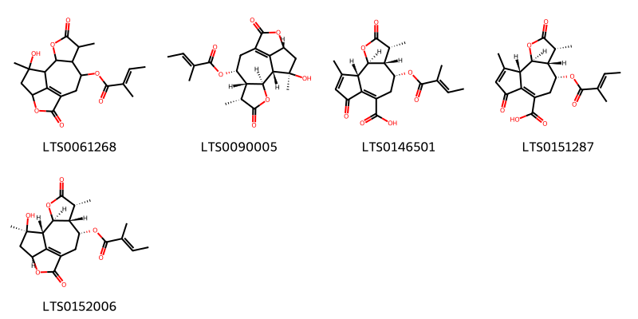{ width=100% }
    <figcaption>Hình ảnh cấu trúc hóa học của 5 hoạt chất thuộc nhóm Carboxylic acids and derivatives gồm ['14-hydroxy-5,14-dimethyl-4,10-dioxo-3,11-dioxatetracyclo[7.5.1.0²,⁶.0¹²,¹⁵]pentadec-9(15)-en-7-yl 2-methylbut-2-enoate (LTS0061268)', 'eufoliatorin (LTS0090005)', '(3r,3ar,4r,9as,9br)-3,9-dimethyl-4-{[(2e)-2-methylbut-2-enoyl]oxy}-2,7-dioxo-3h,3ah,4h,5h,9ah,9bh-azuleno[4,5-b]furan-6-carboxylic acid (LTS0146501)', '(3r,3ar,4r,9as,9br)-3,9-dimethyl-4-[(2-methylbut-2-enoyl)oxy]-2,7-dioxo-3h,3ah,4h,5h,9ah,9bh-azuleno[4,5-b]furan-6-carboxylic acid (LTS0151287)', '(1s,2s,5r,6r,7r,12s,14r)-14-hydroxy-5,14-dimethyl-4,10-dioxo-3,11-dioxatetracyclo[7.5.1.0²,⁶.0¹²,¹⁵]pentadec-9(15)-en-7-yl (2e)-2-methylbut-2-enoate (LTS0152006)'].</figcaption>
</figure>
#### Nhóm Fatty Acyls
<figure markdown="span">
    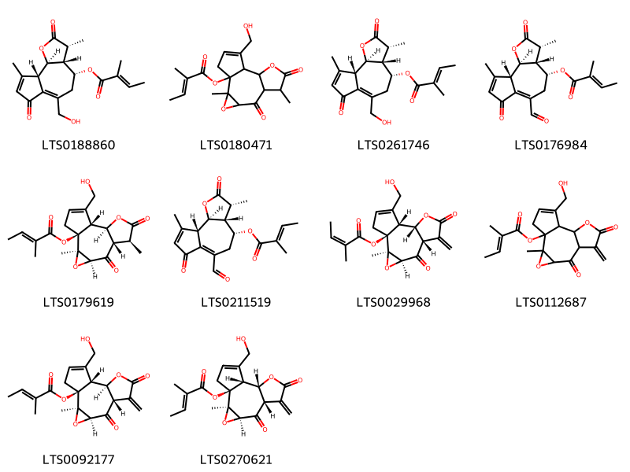{ width=100% }
    <figcaption>Hình ảnh cấu trúc hóa học của 10 hoạt chất thuộc nhóm Fatty Acyls gồm ['(3r,3ar,4r,9as,9br)-6-(hydroxymethyl)-3,9-dimethyl-2,7-dioxo-3h,3ah,4h,5h,9ah,9bh-azuleno[4,5-b]furan-4-yl (2e)-2-methylbut-2-enoate (LTS0188860)', '12-(hydroxymethyl)-2,7-dimethyl-5,8-dioxo-3,9-dioxatetracyclo[9.3.0.0²,⁴.0⁶,¹⁰]tetradec-12-en-1-yl 2-methylbut-2-enoate (LTS0180471)', '(3r,3ar,4r,9as,9br)-6-(hydroxymethyl)-3,9-dimethyl-2,7-dioxo-3h,3ah,4h,5h,9ah,9bh-azuleno[4,5-b]furan-4-yl 2-methylbut-2-enoate (LTS0261746)', '(3r,3ar,4r,9as,9br)-6-formyl-3,9-dimethyl-2,7-dioxo-3h,3ah,4h,5h,9ah,9bh-azuleno[4,5-b]furan-4-yl (2e)-2-methylbut-2-enoate (LTS0176984)', '(1s,2r,4s,6s,7s,10r,11r)-12-(hydroxymethyl)-2,7-dimethyl-5,8-dioxo-3,9-dioxatetracyclo[9.3.0.0²,⁴.0⁶,¹⁰]tetradec-12-en-1-yl (2e)-2-methylbut-2-enoate (LTS0179619)', '(3r,3ar,4r,9as,9br)-6-formyl-3,9-dimethyl-2,7-dioxo-3h,3ah,4h,5h,9ah,9bh-azuleno[4,5-b]furan-4-yl 2-methylbut-2-enoate (LTS0211519)', '(1s,2r,4s,6s,10s,11r)-12-(hydroxymethyl)-2-methyl-7-methylidene-5,8-dioxo-3,9-dioxatetracyclo[9.3.0.0²,⁴.0⁶,¹⁰]tetradec-12-en-1-yl (2z)-2-methylbut-2-enoate (LTS0029968)', '12-(hydroxymethyl)-2-methyl-7-methylidene-5,8-dioxo-3,9-dioxatetracyclo[9.3.0.0²,⁴.0⁶,¹⁰]tetradec-12-en-1-yl 2-methylbut-2-enoate (LTS0112687)', 'euperfolide (LTS0092177)', '(1s,2r,4s,6s,10s,11r)-12-(hydroxymethyl)-2-methyl-7-methylidene-5,8-dioxo-3,9-dioxatetracyclo[9.3.0.0²,⁴.0⁶,¹⁰]tetradec-12-en-1-yl 2-methylbut-2-enoate (LTS0270621)'].</figcaption>
</figure>
#### Nhóm Flavonoids
<figure markdown="span">
    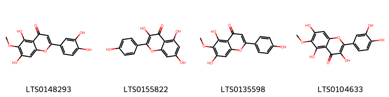{ width=100% }
    <figcaption>Hình ảnh cấu trúc hóa học của 4 hoạt chất thuộc nhóm Flavonoids gồm ['nepetin (LTS0148293)', 'kaempherol (LTS0155822)', 'hispidulin (LTS0135598)', 'patuletin (LTS0104633)'].</figcaption>
</figure>
#### Nhóm Organooxygen compounds
<figure markdown="span">
    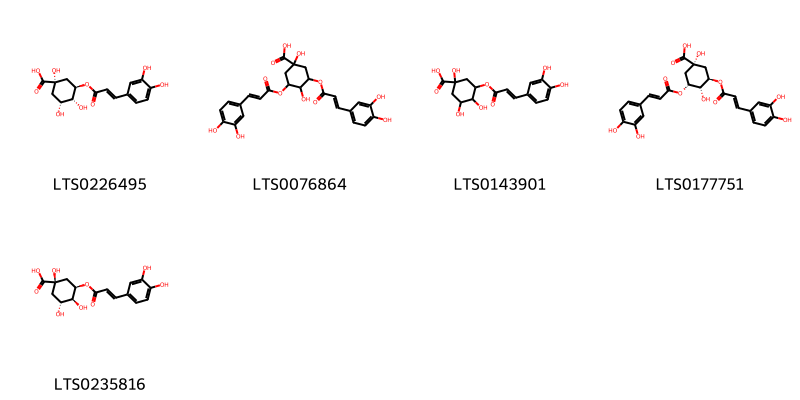{ width=100% }
    <figcaption>Hình ảnh cấu trúc hóa học của 5 hoạt chất thuộc nhóm Organooxygen compounds gồm ['chlorogenic acid (LTS0226495)', '3,5-bis({[3-(3,4-dihydroxyphenyl)prop-2-enoyl]oxy})-1,4-dihydroxycyclohexane-1-carboxylic acid (LTS0076864)', '3-{[3-(3,4-dihydroxyphenyl)prop-2-enoyl]oxy}-1,4,5-trihydroxycyclohexane-1-carboxylic acid (LTS0143901)', '3,5-dicaffeoylquinic acid (LTS0177751)', 'neochlorogenic acid (LTS0235816)'].</figcaption>
</figure>
#### Nhóm Prenol lipids
<figure markdown="span">
    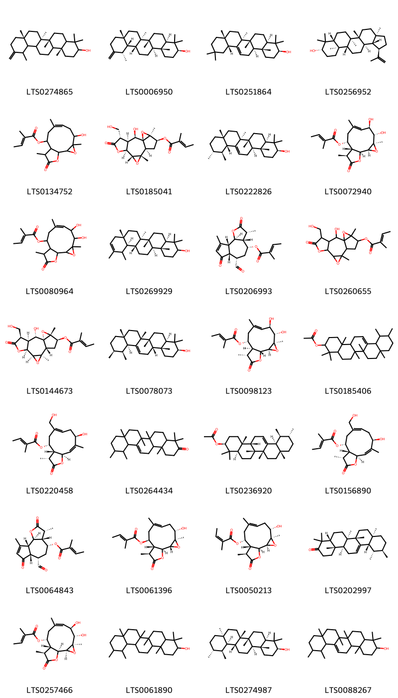{ width=100% }
    <figcaption>Hình ảnh cấu trúc hóa học của 28 hoạt chất thuộc nhóm Prenol lipids gồm ['(6ar,6br,8ar,14br)-4,4,6a,6b,8a,12,14b-heptamethyl-11-methylidene-hexadecahydropicen-3-ol (LTS0274865)', 'taraxasterol (LTS0006950)', 'β-amyrin (LTS0251864)', 'lupeol (LTS0256952)', '5-hydroxy-4,8,12-trimethyl-13-oxo-3,14-dioxatricyclo[9.3.0.0²,⁴]tetradec-7-en-10-yl 2-methylbut-2-enoate (LTS0134752)', '(1s,2r,3s,4s,7s,8r,10s,11s,13s,14s)-2-hydroxy-4-(hydroxymethyl)-10,14-dimethyl-5-oxo-6,9,15-trioxapentacyclo[9.4.0.0¹,¹⁴.0³,⁷.0⁸,¹⁰]pentadecan-13-yl (2e)-2-methylbut-2-enoate (LTS0185041)', 'amyrin (LTS0222826)', '(1s,2s,4r,5s,6r,7e,10r,11r,12s)-5,6-dihydroxy-4,8,12-trimethyl-13-oxo-3,14-dioxatricyclo[9.3.0.0²,⁴]tetradec-7-en-10-yl (2e)-2-methylbut-2-enoate (LTS0072940)', '5,6-dihydroxy-4,8,12-trimethyl-13-oxo-3,14-dioxatricyclo[9.3.0.0²,⁴]tetradec-7-en-10-yl 2-methylbut-2-enoate (LTS0080964)', '(4ar,6ar,6br,8as,12ar,12br,14ar,14br)-4,4,6a,6b,8a,11,12,14b-octamethyl-2,3,4a,5,6,7,8,9,12,12a,12b,13,14,14a-tetradecahydro-1h-picen-3-ol (LTS0269929)', '(3r,3ar,4r,6s,6ar,9ar,9br)-6-formyl-3,9-dimethyl-2,7-dioxo-3h,3ah,4h,5h,6h,6ah,9ah,9bh-azuleno[4,5-b]furan-4-yl 2-methylbut-2-enoate (LTS0206993)', '2-hydroxy-4-(hydroxymethyl)-10,14-dimethyl-5-oxo-6,9,15-trioxapentacyclo[9.4.0.0¹,¹⁴.0³,⁷.0⁸,¹⁰]pentadecan-13-yl 2-methylbut-2-enoate (LTS0260655)', '(1r,2s,3s,4r,7s,8s,10r,11r,13s,14r)-2-hydroxy-4-(hydroxymethyl)-10,14-dimethyl-5-oxo-6,9,15-trioxapentacyclo[9.4.0.0¹,¹⁴.0³,⁷.0⁸,¹⁰]pentadecan-13-yl (2e)-2-methylbut-2-enoate (LTS0144673)', '(3s,4ar,6ar,6br,8ar,11s,12s,12as,14as,14br)-4,4,6a,6b,8a,11,12,14b-octamethyl-2,3,4a,5,6,7,8,9,10,11,12,12a,14,14a-tetradecahydro-1h-picen-3-ol (LTS0078073)', '(1r,2s,4r,5s,6r,7e,10r,11s,12r)-5,6-dihydroxy-4,8,12-trimethyl-13-oxo-3,14-dioxatricyclo[9.3.0.0²,⁴]tetradec-7-en-10-yl (2e)-2-methylbut-2-enoate (LTS0098123)', '4,4,6a,6b,8a,11,12,14b-octamethyl-2,3,4a,5,6,7,8,9,10,11,12,12a,14,14a-tetradecahydro-1h-picen-3-yl acetate (LTS0185406)', '(3r,3ar,4r,9r,11ar)-9-hydroxy-6-(hydroxymethyl)-3,10-dimethyl-2-oxo-3h,3ah,4h,5h,8h,9h,11ah-cyclodeca[b]furan-4-yl (2e)-2-methylbut-2-enoate (LTS0220458)', '4,4,6a,6b,8a,11,12,14b-octamethyl-1,2,4a,5,6,7,8,9,10,11,12,12a,14,14a-tetradecahydropicen-3-one (LTS0264434)', '(3s,4ar,6ar,6br,8ar,11r,12s,12as,14as,14br)-4,4,6a,6b,8a,11,12,14b-octamethyl-2,3,4a,5,6,7,8,9,10,11,12,12a,14,14a-tetradecahydro-1h-picen-3-yl acetate (LTS0236920)', '(3r,3ar,4r,9r,11ar)-9-hydroxy-6-(hydroxymethyl)-3,10-dimethyl-2-oxo-3h,3ah,4h,5h,8h,9h,11ah-cyclodeca[b]furan-4-yl 2-methylbut-2-enoate (LTS0156890)', '(3r,3ar,4r,6s,6ar,9ar,9br)-6-formyl-3,9-dimethyl-2,7-dioxo-3h,3ah,4h,5h,6h,6ah,9ah,9bh-azuleno[4,5-b]furan-4-yl (2e)-2-methylbut-2-enoate (LTS0064843)', '(1s,2r,4r,5s,7e,10s,11r,12s)-5-hydroxy-4,8,12-trimethyl-13-oxo-3,14-dioxatricyclo[9.3.0.0²,⁴]tetradec-7-en-10-yl (2e)-2-methylbut-2-enoate (LTS0061396)', '(1s,2s,4r,5s,7e,10r,11r,12s)-5-hydroxy-4,8,12-trimethyl-13-oxo-3,14-dioxatricyclo[9.3.0.0²,⁴]tetradec-7-en-10-yl (2z)-2-methylbut-2-enoate (LTS0050213)', '(4ar,6ar,6bs,8ar,11r,12s,12as,14as,14bs)-4,4,6a,6b,8a,11,12,14b-octamethyl-1,2,4a,5,6,7,8,9,10,11,12,12a,14,14a-tetradecahydropicen-3-one (LTS0202997)', '(1s,2s,4r,5s,6r,10r,11r,12s)-5,6-dihydroxy-4,8,12-trimethyl-13-oxo-3,14-dioxatricyclo[9.3.0.0²,⁴]tetradec-7-en-10-yl 2-methylbut-2-enoate (LTS0257466)', '4,4,6a,6b,8a,11,12,14b-octamethyl-hexadecahydro-1h-picen-3-ol (LTS0061890)', '(3s,4ar,6ar,6bs,8as,11r,12s,12ar,12br,14ar,14br)-4,4,6a,6b,8a,11,12,14b-octamethyl-hexadecahydro-1h-picen-3-ol (LTS0274987)', 'α-amyrin (LTS0088267)'].</figcaption>
</figure>
#### Nhóm Steroids and steroid derivatives
<figure markdown="span">
    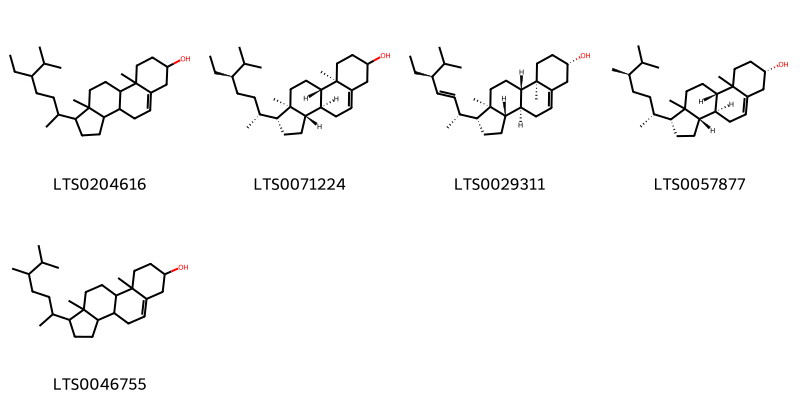{ width=100% }
    <figcaption>Hình ảnh cấu trúc hóa học của 5 hoạt chất thuộc nhóm Steroids and steroid derivatives gồm ['stigmast-5-en-3-ol, (3β)- (LTS0204616)', 'stigmast-5-en-3-ol (LTS0071224)', 'phytosterol (LTS0029311)', '(1r,3as,3bs,7s,9bs)-1-[(2r,5r)-5,6-dimethylheptan-2-yl]-9a,11a-dimethyl-1h,2h,3h,3ah,3bh,4h,6h,7h,8h,9h,9bh,10h,11h-cyclopenta[a]phenanthren-7-ol (LTS0057877)', 'campesterol (LTS0046755)'].</figcaption>
</figure>

---

### Dược dân tộc học

Danh sách các quốc gia có sử dụng *Eupatorium perfoliatum* trong điều trị các bệnh. 

| Country        | Disease                                                       | Bệnh                                                                                                                                                                                                |
|:---------------|:--------------------------------------------------------------|:----------------------------------------------------------------------------------------------------------------------------------------------------------------------------------------------------|
| China          | Laxative                                                      | MYMEMORY WARNING: YOU USED ALL AVAILABLE FREE TRANSLATIONS FOR TODAY. NEXT AVAILABLE IN  13 HOURS 05 MINUTES 28 SECONDS VISIT HTTPS://MYMEMORY.TRANSLATED.NET/DOC/USAGELIMITS.PHP TO TRANSLATE MORE |
| Dutch          | Hemostat                                                      | MYMEMORY WARNING: YOU USED ALL AVAILABLE FREE TRANSLATIONS FOR TODAY. NEXT AVAILABLE IN  13 HOURS 05 MINUTES 21 SECONDS VISIT HTTPS://MYMEMORY.TRANSLATED.NET/DOC/USAGELIMITS.PHP TO TRANSLATE MORE |
| Elsewhere      | Cathartic, Emetic, Stimulant, Diaphoretic                     | MYMEMORY WARNING: YOU USED ALL AVAILABLE FREE TRANSLATIONS FOR TODAY. NEXT AVAILABLE IN  13 HOURS 05 MINUTES 18 SECONDS VISIT HTTPS://MYMEMORY.TRANSLATED.NET/DOC/USAGELIMITS.PHP TO TRANSLATE MORE |
| French         | Tonic                                                         | MYMEMORY WARNING: YOU USED ALL AVAILABLE FREE TRANSLATIONS FOR TODAY. NEXT AVAILABLE IN  13 HOURS 05 MINUTES 14 SECONDS VISIT HTTPS://MYMEMORY.TRANSLATED.NET/DOC/USAGELIMITS.PHP TO TRANSLATE MORE |
| German         | Sudorific                                                     | MYMEMORY WARNING: YOU USED ALL AVAILABLE FREE TRANSLATIONS FOR TODAY. NEXT AVAILABLE IN  13 HOURS 05 MINUTES 12 SECONDS VISIT HTTPS://MYMEMORY.TRANSLATED.NET/DOC/USAGELIMITS.PHP TO TRANSLATE MORE |
| US             | Emetic, Expectorant, Nervine, Stimulant, Vermifuge, Stomachic | MYMEMORY WARNING: YOU USED ALL AVAILABLE FREE TRANSLATIONS FOR TODAY. NEXT AVAILABLE IN  13 HOURS 05 MINUTES 10 SECONDS VISIT HTTPS://MYMEMORY.TRANSLATED.NET/DOC/USAGELIMITS.PHP TO TRANSLATE MORE |
| US(Appalachia) | Diaphoretic, Laxative, Tonic                                  | MYMEMORY WARNING: YOU USED ALL AVAILABLE FREE TRANSLATIONS FOR TODAY. NEXT AVAILABLE IN  13 HOURS 05 MINUTES 07 SECONDS VISIT HTTPS://MYMEMORY.TRANSLATED.NET/DOC/USAGELIMITS.PHP TO TRANSLATE MORE |

---

---
## Eupatorium purpureum
### Thông tin về thực vật

!!! info "Phân loại thực vật của *Eupatorium purpureum* từ GIBF:"
    - **Kingdom:** Plantae
    - **Phylum:** Tracheophyta
    - **Order:** Asterales
    - **Family:** Asteraceae
    - **Genus:** Eupatorium
    - **Species:** *Eupatorium purpureum*

 

| Label (VI)   | Label (EN)   | Scientific Name      | Descriptions (VI)   | Descriptions (EN)   | Also Known As (VI)   | Also Known As (EN)   |
|:-------------|:-------------|:---------------------|:--------------------|:--------------------|:---------------------|:---------------------|
| N/A          | N/A          | Eupatorium purpureum |                     | species of plant    | ['']                 | ['']                 |

#### Phân bố trên thế giới

**Từ CSDL GIBF** nan, Denmark, Netherlands, Germany, Colombia, United States of America, Sweden, France, United Kingdom of Great Britain and Northern Ireland, Canada

#### Phân bố tại Việt Nam

**Từ CSDL GIBF**: Không có ghi nhận ở Việt Nam

---
### Thành phần hóa học
        
- Theo cơ sở dữ liệu lotus: Từ loài *Eupatorium purpureum* đã phân lập và xác định được Chưa có hoạt chất nào được phân lập. hoạt chất thuộc về các nhóm Không có hoạt chất nào được phân lập. 

Không có hình ảnh nào được tạo ra

---

### Dược dân tộc học

Danh sách các quốc gia có sử dụng *Eupatorium purpureum* trong điều trị các bệnh. 

| Country        | Disease                                                       | Bệnh                                                                                                                                                                                                |
|:---------------|:--------------------------------------------------------------|:----------------------------------------------------------------------------------------------------------------------------------------------------------------------------------------------------|
| French         | Stimulant                                                     | MYMEMORY WARNING: YOU USED ALL AVAILABLE FREE TRANSLATIONS FOR TODAY. NEXT AVAILABLE IN  13 HOURS 04 MINUTES 36 SECONDS VISIT HTTPS://MYMEMORY.TRANSLATED.NET/DOC/USAGELIMITS.PHP TO TRANSLATE MORE |
| German         | nan                                                           | MYMEMORY WARNING: YOU USED ALL AVAILABLE FREE TRANSLATIONS FOR TODAY. NEXT AVAILABLE IN  13 HOURS 04 MINUTES 32 SECONDS VISIT HTTPS://MYMEMORY.TRANSLATED.NET/DOC/USAGELIMITS.PHP TO TRANSLATE MORE |
| US             | Apertif, Diuretic, Nervine, Stimulant, Tonic, Diuretic, Tonic | MYMEMORY WARNING: YOU USED ALL AVAILABLE FREE TRANSLATIONS FOR TODAY. NEXT AVAILABLE IN  13 HOURS 04 MINUTES 30 SECONDS VISIT HTTPS://MYMEMORY.TRANSLATED.NET/DOC/USAGELIMITS.PHP TO TRANSLATE MORE |
| US(Amerindian) | Sudorific                                                     | MYMEMORY WARNING: YOU USED ALL AVAILABLE FREE TRANSLATIONS FOR TODAY. NEXT AVAILABLE IN  13 HOURS 04 MINUTES 24 SECONDS VISIT HTTPS://MYMEMORY.TRANSLATED.NET/DOC/USAGELIMITS.PHP TO TRANSLATE MORE |
| US(Appalachia) | Tonic, Diaphoretic                                            | MYMEMORY WARNING: YOU USED ALL AVAILABLE FREE TRANSLATIONS FOR TODAY. NEXT AVAILABLE IN  13 HOURS 04 MINUTES 21 SECONDS VISIT HTTPS://MYMEMORY.TRANSLATED.NET/DOC/USAGELIMITS.PHP TO TRANSLATE MORE |
| US(Colonial)   | Emetic                                                        | MYMEMORY WARNING: YOU USED ALL AVAILABLE FREE TRANSLATIONS FOR TODAY. NEXT AVAILABLE IN  13 HOURS 04 MINUTES 16 SECONDS VISIT HTTPS://MYMEMORY.TRANSLATED.NET/DOC/USAGELIMITS.PHP TO TRANSLATE MORE |

---

---
## Eupatorium pycnocephalum
### Thông tin về thực vật

!!! info "Phân loại thực vật của *Eupatorium pycnocephalum* từ GIBF:"
    - **Kingdom:** Plantae
    - **Phylum:** Tracheophyta
    - **Order:** Asterales
    - **Family:** Asteraceae
    - **Genus:** Eupatorium
    - **Species:** *Eupatorium pycnocephalum*

 

| Label (VI)   | Label (EN)   | Scientific Name          | Descriptions (VI)   | Descriptions (EN)   | Also Known As (VI)   | Also Known As (EN)   |
|:-------------|:-------------|:-------------------------|:--------------------|:--------------------|:---------------------|:---------------------|
| N/A          | N/A          | Eupatorium pycnocephalum | loài thực vật       | species of plant    | ['']                 | ['']                 |

#### Phân bố trên thế giới

**Từ CSDL GIBF** nan, Colombia, Guatemala, Costa Rica, Mexico, El Salvador

#### Phân bố tại Việt Nam

**Từ CSDL GIBF**: Không có ghi nhận ở Việt Nam

---
### Thành phần hóa học
        
- Theo cơ sở dữ liệu lotus: Từ loài *Eupatorium pycnocephalum* đã phân lập và xác định được Chưa có hoạt chất nào được phân lập. hoạt chất thuộc về các nhóm Không có hoạt chất nào được phân lập. 

Không có hình ảnh nào được tạo ra

---

### Dược dân tộc học

Danh sách các quốc gia có sử dụng *Eupatorium pycnocephalum* trong điều trị các bệnh. 

| Country   | Disease   | Bệnh                                                                                                                                                                                                |
|:----------|:----------|:----------------------------------------------------------------------------------------------------------------------------------------------------------------------------------------------------|
| Guatemala | Sudorific | MYMEMORY WARNING: YOU USED ALL AVAILABLE FREE TRANSLATIONS FOR TODAY. NEXT AVAILABLE IN  13 HOURS 03 MINUTES 42 SECONDS VISIT HTTPS://MYMEMORY.TRANSLATED.NET/DOC/USAGELIMITS.PHP TO TRANSLATE MORE |

---

---
## Eupatorium rugosum
### Thông tin về thực vật

!!! info "Phân loại thực vật của *N/A* từ GIBF:"
    - **Kingdom:** Plantae
    - **Phylum:** Tracheophyta
    - **Order:** Asterales
    - **Family:** Asteraceae
    - **Genus:** N/A
    - **Species:** *N/A*

 

| Label (VI)   | Label (EN)   | Scientific Name    | Descriptions (VI)   | Descriptions (EN)   | Also Known As (VI)   | Also Known As (EN)   |
|:-------------|:-------------|:-------------------|:--------------------|:--------------------|:---------------------|:---------------------|
| N/A          | N/A          | Eupatorium rugosum |                     |                     | ['']                 | ['']                 |

#### Phân bố trên thế giới

**Từ CSDL GIBF** Denmark, Australia, New Zealand, Chinese Taipei, Ireland, Isle of Man, Viet Nam, United Kingdom of Great Britain and Northern Ireland

#### Phân bố tại Việt Nam

**Từ CSDL GIBF**: Đà Nẵng

---
### Thành phần hóa học
        
- Theo cơ sở dữ liệu lotus: Từ loài *N/A* đã phân lập và xác định được Chưa có hoạt chất nào được phân lập. hoạt chất thuộc về các nhóm Không có hoạt chất nào được phân lập. 

Không có hình ảnh nào được tạo ra

---

### Dược dân tộc học

Danh sách các quốc gia có sử dụng *N/A* trong điều trị các bệnh. 

| Country   | Disease   | Bệnh                                                                                                                                                                                                |
|:----------|:----------|:----------------------------------------------------------------------------------------------------------------------------------------------------------------------------------------------------|
| US        | Poison    | MYMEMORY WARNING: YOU USED ALL AVAILABLE FREE TRANSLATIONS FOR TODAY. NEXT AVAILABLE IN  13 HOURS 03 MINUTES 16 SECONDS VISIT HTTPS://MYMEMORY.TRANSLATED.NET/DOC/USAGELIMITS.PHP TO TRANSLATE MORE |

---

---
## Eupatorium staechadosmum
### Thông tin về thực vật

!!! info "Phân loại thực vật của *Eupatorium fortunei* từ GIBF:"
    - **Kingdom:** Plantae
    - **Phylum:** Tracheophyta
    - **Order:** Asterales
    - **Family:** Asteraceae
    - **Genus:** Eupatorium
    - **Species:** *Eupatorium fortunei*

 

| Label (VI)   | Label (EN)   | Scientific Name    | Descriptions (VI)   | Descriptions (EN)   | Also Known As (VI)   | Also Known As (EN)   |
|:-------------|:-------------|:-------------------|:--------------------|:--------------------|:---------------------|:---------------------|
| N/A          | N/A          | Eupatorium rugosum |                     |                     | ['']                 | ['']                 |

#### Phân bố trên thế giới

**Từ CSDL GIBF** nan, Japan, Thailand, Chinese Taipei, Viet Nam, China

#### Phân bố tại Việt Nam

**Từ CSDL GIBF**: Hà Nội

---
### Thành phần hóa học
        
- Theo cơ sở dữ liệu lotus: Từ loài *Eupatorium fortunei* đã phân lập và xác định được Chưa có hoạt chất nào được phân lập. hoạt chất thuộc về các nhóm Không có hoạt chất nào được phân lập. 

Không có hình ảnh nào được tạo ra

---

### Dược dân tộc học

Danh sách các quốc gia có sử dụng *Eupatorium fortunei* trong điều trị các bệnh. 

| Country   | Disease            | Bệnh                                                                                                                                                                                                |
|:----------|:-------------------|:----------------------------------------------------------------------------------------------------------------------------------------------------------------------------------------------------|
| Vietnam   | Aphrodisiac, Tonic | MYMEMORY WARNING: YOU USED ALL AVAILABLE FREE TRANSLATIONS FOR TODAY. NEXT AVAILABLE IN  13 HOURS 02 MINUTES 48 SECONDS VISIT HTTPS://MYMEMORY.TRANSLATED.NET/DOC/USAGELIMITS.PHP TO TRANSLATE MORE |

---

---
## Eupatorium stoechadosmum
### Thông tin về thực vật

!!! info "Phân loại thực vật của *Eupatorium fortunei* từ GIBF:"
    - **Kingdom:** Plantae
    - **Phylum:** Tracheophyta
    - **Order:** Asterales
    - **Family:** Asteraceae
    - **Genus:** Eupatorium
    - **Species:** *Eupatorium fortunei*

 

| Label (VI)   | Label (EN)   | Scientific Name          | Descriptions (VI)   | Descriptions (EN)   | Also Known As (VI)   | Also Known As (EN)   |
|:-------------|:-------------|:-------------------------|:--------------------|:--------------------|:---------------------|:---------------------|
| N/A          | N/A          | Eupatorium stoechadosmum |                     |                     | ['']                 | ['']                 |

#### Phân bố trên thế giới

**Từ CSDL GIBF** nan, Japan, Thailand, Chinese Taipei, Viet Nam, China

#### Phân bố tại Việt Nam

**Từ CSDL GIBF**: Hà Nội

---
### Thành phần hóa học
        
- Theo cơ sở dữ liệu lotus: Từ loài *Eupatorium fortunei* đã phân lập và xác định được Chưa có hoạt chất nào được phân lập. hoạt chất thuộc về các nhóm Không có hoạt chất nào được phân lập. 

Không có hình ảnh nào được tạo ra

---

### Dược dân tộc học

Danh sách các quốc gia có sử dụng *Eupatorium fortunei* trong điều trị các bệnh. 

| Country   | Disease   | Bệnh                                                                                                                                                                                                |
|:----------|:----------|:----------------------------------------------------------------------------------------------------------------------------------------------------------------------------------------------------|
| Japan     | Antidote  | MYMEMORY WARNING: YOU USED ALL AVAILABLE FREE TRANSLATIONS FOR TODAY. NEXT AVAILABLE IN  13 HOURS 02 MINUTES 22 SECONDS VISIT HTTPS://MYMEMORY.TRANSLATED.NET/DOC/USAGELIMITS.PHP TO TRANSLATE MORE |

---

---
## Eupatorium triplinerve
### Thông tin về thực vật

!!! info "Phân loại thực vật của *Ayapana triplinervis* từ GIBF:"
    - **Kingdom:** Plantae
    - **Phylum:** Tracheophyta
    - **Order:** Asterales
    - **Family:** Asteraceae
    - **Genus:** Ayapana
    - **Species:** *Ayapana triplinervis*

 

| Label (VI)   | Label (EN)   | Scientific Name        | Descriptions (VI)   | Descriptions (EN)   | Also Known As (VI)   | Also Known As (EN)   |
|:-------------|:-------------|:-----------------------|:--------------------|:--------------------|:---------------------|:---------------------|
| N/A          | N/A          | Eupatorium triplinerve | loài thực vật       | species of plant    | ['']                 | ['']                 |

#### Phân bố trên thế giới

**Từ CSDL GIBF** nan, Virgin Islands (U.S.), Puerto Rico, Sri Lanka, Réunion, Suriname, Guadeloupe, Mauritius, Brazil, Guyana, unknown or invalid, Indonesia, Benin, India, Dominica, Philippines, Malaysia

#### Phân bố tại Việt Nam

**Từ CSDL GIBF**: Không có ghi nhận ở Việt Nam

---
### Thành phần hóa học
        
- Theo cơ sở dữ liệu lotus: Từ loài *Ayapana triplinervis* đã phân lập và xác định được Chưa có hoạt chất nào được phân lập. hoạt chất thuộc về các nhóm Không có hoạt chất nào được phân lập. 

Không có hình ảnh nào được tạo ra

---

### Dược dân tộc học

Danh sách các quốc gia có sử dụng *Ayapana triplinervis* trong điều trị các bệnh. 

| Country   | Disease                                                                | Bệnh                                                                                                                                                                                                |
|:----------|:-----------------------------------------------------------------------|:----------------------------------------------------------------------------------------------------------------------------------------------------------------------------------------------------|
| India     | Cardiotonic, Diaphoretic, Emetic, Laxative, Stimulant, Tonic, Hemostat | MYMEMORY WARNING: YOU USED ALL AVAILABLE FREE TRANSLATIONS FOR TODAY. NEXT AVAILABLE IN  13 HOURS 02 MINUTES 01 SECONDS VISIT HTTPS://MYMEMORY.TRANSLATED.NET/DOC/USAGELIMITS.PHP TO TRANSLATE MORE |
| Malaya    | Sudorific                                                              | MYMEMORY WARNING: YOU USED ALL AVAILABLE FREE TRANSLATIONS FOR TODAY. NEXT AVAILABLE IN  13 HOURS 01 MINUTES 58 SECONDS VISIT HTTPS://MYMEMORY.TRANSLATED.NET/DOC/USAGELIMITS.PHP TO TRANSLATE MORE |

---

---
## Eupatorium villosum
### Thông tin về thực vật

!!! info "Phân loại thực vật của *N/A* từ GIBF:"
    - **Kingdom:** Plantae
    - **Phylum:** Tracheophyta
    - **Order:** Asterales
    - **Family:** Asteraceae
    - **Genus:** Koanophyllon
    - **Species:** *N/A*

 

| Label (VI)   | Label (EN)   | Scientific Name     | Descriptions (VI)   | Descriptions (EN)   | Also Known As (VI)   | Also Known As (EN)   |
|:-------------|:-------------|:--------------------|:--------------------|:--------------------|:---------------------|:---------------------|
| N/A          | N/A          | Eupatorium villosum | loài thực vật       | species of plant    | ['']                 | ['']                 |

#### Phân bố trên thế giới

**Từ CSDL GIBF** Nicaragua, Belize, Puerto Rico, Haiti, Guatemala, Bahamas, Brazil, Costa Rica, Cuba, United States of America, Mexico, Dominican Republic, El Salvador

#### Phân bố tại Việt Nam

**Từ CSDL GIBF**: Không có ghi nhận ở Việt Nam

---
### Thành phần hóa học
        
- Theo cơ sở dữ liệu lotus: Từ loài *N/A* đã phân lập và xác định được Chưa có hoạt chất nào được phân lập. hoạt chất thuộc về các nhóm Không có hoạt chất nào được phân lập. 

Không có hình ảnh nào được tạo ra

---

### Dược dân tộc học

Danh sách các quốc gia có sử dụng *N/A* trong điều trị các bệnh. 

| Country   | Disease   | Bệnh                                                                                                                                                                                                |
|:----------|:----------|:----------------------------------------------------------------------------------------------------------------------------------------------------------------------------------------------------|
| Elsewhere | Diuretic  | MYMEMORY WARNING: YOU USED ALL AVAILABLE FREE TRANSLATIONS FOR TODAY. NEXT AVAILABLE IN  13 HOURS 01 MINUTES 36 SECONDS VISIT HTTPS://MYMEMORY.TRANSLATED.NET/DOC/USAGELIMITS.PHP TO TRANSLATE MORE |

---

# Chi Pterocaulon

??? note "Danh sách các dược liệu thuộc chi"
    
	 - *Pterocaulon subvirgatum*
	 - *Pterocaulon undulatum*

---
## Pterocaulon subvirgatum
### Thông tin về thực vật

!!! info "Phân loại thực vật của *Pterocaulon virgatum* từ GIBF:"
    - **Kingdom:** Plantae
    - **Phylum:** Tracheophyta
    - **Order:** Asterales
    - **Family:** Asteraceae
    - **Genus:** Pterocaulon
    - **Species:** *Pterocaulon virgatum*

 

| Label (VI)   | Label (EN)   | Scientific Name     | Descriptions (VI)   | Descriptions (EN)   | Also Known As (VI)   | Also Known As (EN)   |
|:-------------|:-------------|:--------------------|:--------------------|:--------------------|:---------------------|:---------------------|
| N/A          | N/A          | Eupatorium villosum | loài thực vật       | species of plant    | ['']                 | ['']                 |

#### Phân bố trên thế giới

**Từ CSDL GIBF** nan, Brazil, Argentina, Bolivia (Plurinational State of), unknown or invalid, Uruguay, Paraguay

#### Phân bố tại Việt Nam

**Từ CSDL GIBF**: Không có ghi nhận ở Việt Nam

---
### Thành phần hóa học
        
- Theo cơ sở dữ liệu lotus: Từ loài *Pterocaulon virgatum* đã phân lập và xác định được Chưa có hoạt chất nào được phân lập. hoạt chất thuộc về các nhóm Không có hoạt chất nào được phân lập. 

Không có hình ảnh nào được tạo ra

---

### Dược dân tộc học

Danh sách các quốc gia có sử dụng *Pterocaulon virgatum* trong điều trị các bệnh. 

| Country   | Disease   | Bệnh                                                                                                                                                                                                |
|:----------|:----------|:----------------------------------------------------------------------------------------------------------------------------------------------------------------------------------------------------|
| Argentina | Digestive | MYMEMORY WARNING: YOU USED ALL AVAILABLE FREE TRANSLATIONS FOR TODAY. NEXT AVAILABLE IN  13 HOURS 01 MINUTES 10 SECONDS VISIT HTTPS://MYMEMORY.TRANSLATED.NET/DOC/USAGELIMITS.PHP TO TRANSLATE MORE |

---

---
## Pterocaulon undulatum
### Thông tin về thực vật

!!! info "Phân loại thực vật của *Pterocaulon pycnostachyum* từ GIBF:"
    - **Kingdom:** Plantae
    - **Phylum:** Tracheophyta
    - **Order:** Asterales
    - **Family:** Asteraceae
    - **Genus:** Pterocaulon
    - **Species:** *Pterocaulon pycnostachyum*

 

| Label (VI)   | Label (EN)   | Scientific Name     | Descriptions (VI)   | Descriptions (EN)   | Also Known As (VI)   | Also Known As (EN)   |
|:-------------|:-------------|:--------------------|:--------------------|:--------------------|:---------------------|:---------------------|
| N/A          | N/A          | Eupatorium villosum | loài thực vật       | species of plant    | ['']                 | ['']                 |

#### Phân bố trên thế giới

**Từ CSDL GIBF** nan, United States of America

#### Phân bố tại Việt Nam

**Từ CSDL GIBF**: Không có ghi nhận ở Việt Nam

---
### Thành phần hóa học
        
- Theo cơ sở dữ liệu lotus: Từ loài *Pterocaulon pycnostachyum* đã phân lập và xác định được Chưa có hoạt chất nào được phân lập. hoạt chất thuộc về các nhóm Không có hoạt chất nào được phân lập. 

Không có hình ảnh nào được tạo ra

---

### Dược dân tộc học

Danh sách các quốc gia có sử dụng *Pterocaulon pycnostachyum* trong điều trị các bệnh. 

| Country        | Disease                                                               | Bệnh                                                                                                                                                                                                |
|:---------------|:----------------------------------------------------------------------|:----------------------------------------------------------------------------------------------------------------------------------------------------------------------------------------------------|
| US(Amerindian) | Abortifacient, Diaphoretic, Emmenagogue, Oxytoxic, Styptic, Stimulant | MYMEMORY WARNING: YOU USED ALL AVAILABLE FREE TRANSLATIONS FOR TODAY. NEXT AVAILABLE IN  13 HOURS 00 MINUTES 46 SECONDS VISIT HTTPS://MYMEMORY.TRANSLATED.NET/DOC/USAGELIMITS.PHP TO TRANSLATE MORE |

---

# Chi Rhynchoermum

??? note "Danh sách các dược liệu thuộc chi"
    
	 - *Rhynchoermum jasminoides*

---
## Rhynchoermum jasminoides
### Thông tin về thực vật

!!! info "Phân loại thực vật của *N/A* từ GIBF:"
    - **Kingdom:** N/A
    - **Phylum:** N/A
    - **Order:** N/A
    - **Family:** N/A
    - **Genus:** N/A
    - **Species:** *N/A*

 

| Label (VI)   | Label (EN)   | Scientific Name     | Descriptions (VI)   | Descriptions (EN)   | Also Known As (VI)   | Also Known As (EN)   |
|:-------------|:-------------|:--------------------|:--------------------|:--------------------|:---------------------|:---------------------|
| N/A          | N/A          | Eupatorium villosum | loài thực vật       | species of plant    | ['']                 | ['']                 |

#### Phân bố trên thế giới

**Từ CSDL GIBF** Không có kết quả phù hợp

#### Phân bố tại Việt Nam

**Từ CSDL GIBF**: Không có ghi nhận ở Việt Nam

---
### Thành phần hóa học
        
- Theo cơ sở dữ liệu lotus: Từ loài *N/A* đã phân lập và xác định được Chưa có hoạt chất nào được phân lập. hoạt chất thuộc về các nhóm Không có hoạt chất nào được phân lập. 

Không có hình ảnh nào được tạo ra

---

### Dược dân tộc học

Danh sách các quốc gia có sử dụng *N/A* trong điều trị các bệnh. 

| Country   | Disease   | Bệnh                                                                                                                                                                                                |
|:----------|:----------|:----------------------------------------------------------------------------------------------------------------------------------------------------------------------------------------------------|
| China     | Tonic     | MYMEMORY WARNING: YOU USED ALL AVAILABLE FREE TRANSLATIONS FOR TODAY. NEXT AVAILABLE IN  13 HOURS 00 MINUTES 22 SECONDS VISIT HTTPS://MYMEMORY.TRANSLATED.NET/DOC/USAGELIMITS.PHP TO TRANSLATE MORE |

---

# Chi Achyrocline

??? note "Danh sách các dược liệu thuộc chi"
    
	 - *Achyrocline satureoides*

---
## Achyrocline satureoides
### Thông tin về thực vật

!!! info "Phân loại thực vật của *Achyrocline satureioides* từ GIBF:"
    - **Kingdom:** Plantae
    - **Phylum:** Tracheophyta
    - **Order:** Asterales
    - **Family:** Asteraceae
    - **Genus:** Achyrocline
    - **Species:** *Achyrocline satureioides*

 

| Label (VI)   | Label (EN)   | Scientific Name         | Descriptions (VI)   | Descriptions (EN)   | Also Known As (VI)   | Also Known As (EN)   |
|:-------------|:-------------|:------------------------|:--------------------|:--------------------|:---------------------|:---------------------|
| N/A          | N/A          | Achyrocline satureoides |                     |                     | ['']                 | ['']                 |

#### Phân bố trên thế giới

**Từ CSDL GIBF** Ecuador, Colombia, Brazil, Spain, Argentina, Bolivia (Plurinational State of), Peru, Uruguay, Venezuela (Bolivarian Republic of)

#### Phân bố tại Việt Nam

**Từ CSDL GIBF**: Không có ghi nhận ở Việt Nam

---
### Thành phần hóa học
        
- Theo cơ sở dữ liệu lotus: Từ loài *Achyrocline satureioides* đã phân lập và xác định được 1 hoạt chất thuộc về các nhóm Flavonoids. 

|    | chemicalTaxonomyClassyfireClass   |   smiles_count |
|---:|:----------------------------------|---------------:|
|  0 | Flavonoids                        |              1 |

#### Nhóm Flavonoids
<figure markdown="span">
    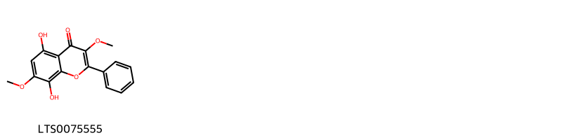{ width=100% }
    <figcaption>Hình ảnh cấu trúc hóa học của 1 hoạt chất thuộc nhóm Flavonoids gồm ['isognaphaliin (LTS0075555)'].</figcaption>
</figure>

---

### Dược dân tộc học

Danh sách các quốc gia có sử dụng *Achyrocline satureioides* trong điều trị các bệnh. 

| Country   | Disease     | Bệnh                                                                                                                                                                                                |
|:----------|:------------|:----------------------------------------------------------------------------------------------------------------------------------------------------------------------------------------------------|
| Bolivia   | Carminative | MYMEMORY WARNING: YOU USED ALL AVAILABLE FREE TRANSLATIONS FOR TODAY. NEXT AVAILABLE IN  13 HOURS 00 MINUTES 06 SECONDS VISIT HTTPS://MYMEMORY.TRANSLATED.NET/DOC/USAGELIMITS.PHP TO TRANSLATE MORE |

---

# Chi Gundlachia

??? note "Danh sách các dược liệu thuộc chi"
    
	 - *Gundlachia corymbosa*

---
## Gundlachia corymbosa
### Thông tin về thực vật

!!! info "Phân loại thực vật của *Gundlachia corymbosa* từ GIBF:"
    - **Kingdom:** Plantae
    - **Phylum:** Tracheophyta
    - **Order:** Asterales
    - **Family:** Asteraceae
    - **Genus:** Gundlachia
    - **Species:** *Gundlachia corymbosa*

 

| Label (VI)   | Label (EN)   | Scientific Name      | Descriptions (VI)   | Descriptions (EN)   | Also Known As (VI)   | Also Known As (EN)   |
|:-------------|:-------------|:---------------------|:--------------------|:--------------------|:---------------------|:---------------------|
| N/A          | N/A          | Gundlachia corymbosa | loài thực vật       | species of plant    | ['']                 | ['']                 |

#### Phân bố trên thế giới

**Từ CSDL GIBF** Curaçao, nan, Puerto Rico, Turks and Caicos Islands, Guadeloupe, Aruba, Haiti, Bahamas, Montserrat, Bonaire, Sint Eustatius and Saba, Jamaica, unknown or invalid, Cuba, Dominican Republic, Antigua and Barbuda, Virgin Islands (British), Venezuela (Bolivarian Republic of), United Kingdom of Great Britain and Northern Ireland

#### Phân bố tại Việt Nam

**Từ CSDL GIBF**: Không có ghi nhận ở Việt Nam

---
### Thành phần hóa học
        
- Theo cơ sở dữ liệu lotus: Từ loài *Gundlachia corymbosa* đã phân lập và xác định được Chưa có hoạt chất nào được phân lập. hoạt chất thuộc về các nhóm Không có hoạt chất nào được phân lập. 

Không có hình ảnh nào được tạo ra

---

### Dược dân tộc học

Danh sách các quốc gia có sử dụng *Gundlachia corymbosa* trong điều trị các bệnh. 

| Country   | Disease   | Bệnh                                                                                                                                                                                                |
|:----------|:----------|:----------------------------------------------------------------------------------------------------------------------------------------------------------------------------------------------------|
| Bahamas   | Apertif   | MYMEMORY WARNING: YOU USED ALL AVAILABLE FREE TRANSLATIONS FOR TODAY. NEXT AVAILABLE IN  12 HOURS 59 MINUTES 17 SECONDS VISIT HTTPS://MYMEMORY.TRANSLATED.NET/DOC/USAGELIMITS.PHP TO TRANSLATE MORE |

---

# Chi Atractylodes

??? note "Danh sách các dược liệu thuộc chi"
    
	 - *Atractylodes lancea*
	 - *Atractylodes macrocephala*

---
## Atractylodes macrocephala
### Thông tin về thực vật

!!! info "Phân loại thực vật của *Atractylodes macrocephala* từ GIBF:"
    - **Kingdom:** Plantae
    - **Phylum:** Tracheophyta
    - **Order:** Asterales
    - **Family:** Asteraceae
    - **Genus:** Atractylodes
    - **Species:** *Atractylodes macrocephala*

 

| Label (VI)   | Label (EN)   | Scientific Name           | Descriptions (VI)   | Descriptions (EN)   | Also Known As (VI)            | Also Known As (EN)   |
|:-------------|:-------------|:--------------------------|:--------------------|:--------------------|:------------------------------|:---------------------|
| N/A          | N/A          | Atractylodes macrocephala | loài thực vật       | species of plant    | ['Atractylodes macrocephala'] | ['']                 |

#### Phân bố trên thế giới

**Từ CSDL GIBF** nan, Pakistan, Algeria, United States of America, China

#### Phân bố tại Việt Nam

**Từ CSDL GIBF**: Không có ghi nhận ở Việt Nam

---
### Thành phần hóa học
        
- Theo cơ sở dữ liệu lotus: Từ loài *Atractylodes macrocephala* đã phân lập và xác định được 55 hoạt chất thuộc về các nhóm Fatty Acyls, Flavonoids, Prenol lipids, Steroids and steroid derivatives, Indoles and derivatives, Organic oxides, Cinnamic acids and derivatives, Naphthofurans, Heteroaromatic compounds, Organooxygen compounds, Saturated hydrocarbons, Coumarins and derivatives. 

|    | chemicalTaxonomyClassyfireClass   |   smiles_count |
|---:|:----------------------------------|---------------:|
|  0 | Cinnamic acids and derivatives    |              3 |
|  1 | Coumarins and derivatives         |              2 |
|  2 | Fatty Acyls                       |              1 |
|  3 | Flavonoids                        |              3 |
|  4 | Heteroaromatic compounds          |              1 |
|  5 | Indoles and derivatives           |              1 |
|  6 | Naphthofurans                     |              1 |
|  7 | Organic oxides                    |              1 |
|  8 | Organooxygen compounds            |              5 |
|  9 | Prenol lipids                     |             31 |
| 10 | Saturated hydrocarbons            |              1 |
| 11 | Steroids and steroid derivatives  |              5 |

#### Nhóm Cinnamic acids and derivatives
<figure markdown="span">
    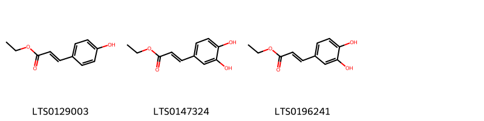{ width=100% }
    <figcaption>Hình ảnh cấu trúc hóa học của 3 hoạt chất thuộc nhóm Cinnamic acids and derivatives gồm ['ethyl 3-(4-hydroxyphenyl)prop-2-enoate (LTS0129003)', 'ethyl caffeate (LTS0147324)', 'ethyl 3-(3,4-dihydroxyphenyl)prop-2-enoate (LTS0196241)'].</figcaption>
</figure>
#### Nhóm Coumarins and derivatives
<figure markdown="span">
    { width=100% }
    <figcaption>Hình ảnh cấu trúc hóa học của 2 hoạt chất thuộc nhóm Coumarins and derivatives gồm ['umbelliferone (LTS0162728)', 'scopoletin (LTS0193112)'].</figcaption>
</figure>
#### Nhóm Fatty Acyls
<figure markdown="span">
    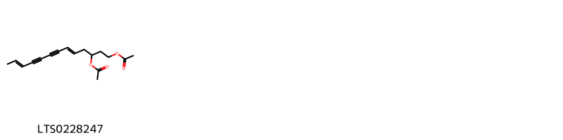{ width=100% }
    <figcaption>Hình ảnh cấu trúc hóa học của 1 hoạt chất thuộc nhóm Fatty Acyls gồm ['(5e,11e)-1-(acetyloxy)trideca-5,11-dien-7,9-diyn-3-yl acetate (LTS0228247)'].</figcaption>
</figure>
#### Nhóm Flavonoids
<figure markdown="span">
    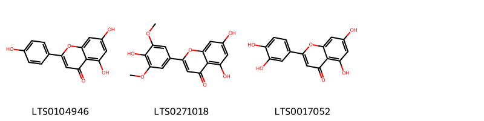{ width=100% }
    <figcaption>Hình ảnh cấu trúc hóa học của 3 hoạt chất thuộc nhóm Flavonoids gồm ['chamomile (LTS0104946)', 'tricin (LTS0271018)', 'luteolin (LTS0017052)'].</figcaption>
</figure>
#### Nhóm Heteroaromatic compounds
<figure markdown="span">
    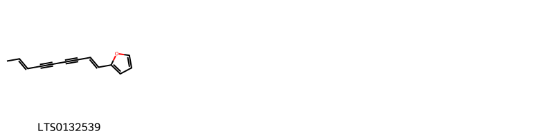{ width=100% }
    <figcaption>Hình ảnh cấu trúc hóa học của 1 hoạt chất thuộc nhóm Heteroaromatic compounds gồm ['atractylodin (LTS0132539)'].</figcaption>
</figure>
#### Nhóm Indoles and derivatives
<figure markdown="span">
    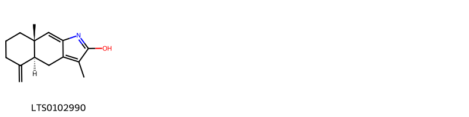{ width=100% }
    <figcaption>Hình ảnh cấu trúc hóa học của 1 hoạt chất thuộc nhóm Indoles and derivatives gồm ['(4as,8as)-3,8a-dimethyl-5-methylidene-4h,4ah,6h,7h,8h-cyclohexa[f]indol-2-ol (LTS0102990)'].</figcaption>
</figure>
#### Nhóm Naphthofurans
<figure markdown="span">
    { width=100% }
    <figcaption>Hình ảnh cấu trúc hóa học của 1 hoạt chất thuộc nhóm Naphthofurans gồm ['(4as,8as)-3,8a-dimethyl-5-methylidene-4h,4ah,6h,7h,8h-naphtho[2,3-b]furan-2-one (LTS0110570)'].</figcaption>
</figure>
#### Nhóm Organic oxides
<figure markdown="span">
    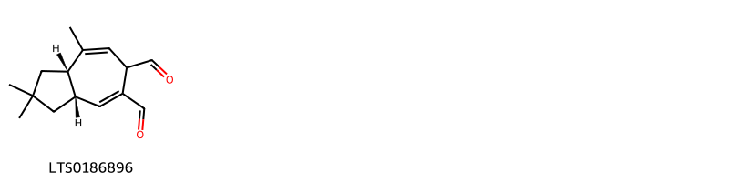{ width=100% }
    <figcaption>Hình ảnh cấu trúc hóa học của 1 hoạt chất thuộc nhóm Organic oxides gồm ['(3as,8as)-2,2,8-trimethyl-3,3a,6,8a-tetrahydro-1h-azulene-5,6-dicarbaldehyde (LTS0186896)'].</figcaption>
</figure>
#### Nhóm Organooxygen compounds
<figure markdown="span">
    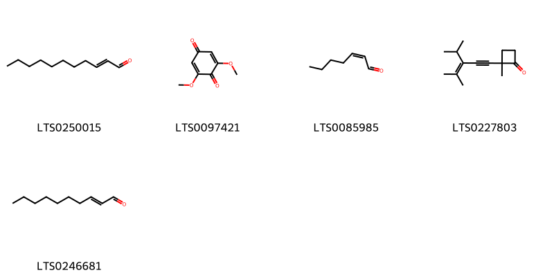{ width=100% }
    <figcaption>Hình ảnh cấu trúc hóa học của 5 hoạt chất thuộc nhóm Organooxygen compounds gồm ['undecenal (LTS0250015)', '2,6-dimethoxy-1,4-benzoquinone (LTS0097421)', '(2z)-hept-2-enal (LTS0085985)', '2-(3-isopropyl-4-methylpent-3-en-1-yn-1-yl)-2-methylcyclobutan-1-one (LTS0227803)', '(2e)-2-decenal (LTS0246681)'].</figcaption>
</figure>
#### Nhóm Prenol lipids
<figure markdown="span">
    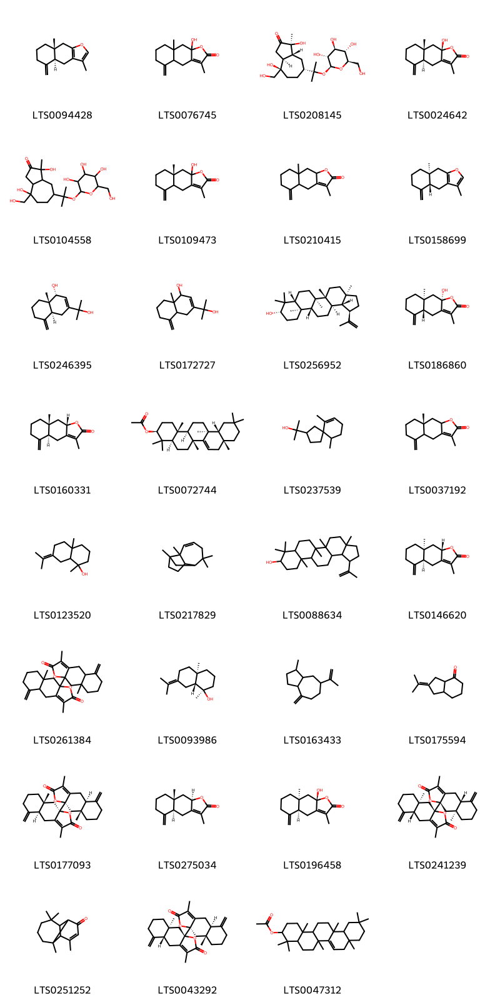{ width=100% }
    <figcaption>Hình ảnh cấu trúc hóa học của 31 hoạt chất thuộc nhóm Prenol lipids gồm ['atractylone (LTS0094428)', '9a-hydroxy-3,8a-dimethyl-5-methylidene-4h,4ah,6h,7h,8h,9h-naphtho[2,3-b]furan-2-one (LTS0076745)', '(1s,3as,4r,7r,8ar)-1,4-dihydroxy-4-(hydroxymethyl)-1-methyl-7-(2-{[(2s,3r,4s,5s,6r)-3,4,5-trihydroxy-6-(hydroxymethyl)oxan-2-yl]oxy}propan-2-yl)-hexahydro-3h-azulen-2-one (LTS0208145)', 'atractylenolide iii (LTS0024642)', '1,4-dihydroxy-4-(hydroxymethyl)-1-methyl-7-(2-{[3,4,5-trihydroxy-6-(hydroxymethyl)oxan-2-yl]oxy}propan-2-yl)-hexahydro-3h-azulen-2-one (LTS0104558)', '(8ar)-9a-hydroxy-3,8a-dimethyl-5-methylidene-4h,4ah,6h,7h,8h,9h-naphtho[2,3-b]furan-2-one (LTS0109473)', '3,8a-dimethyl-5-methylidene-4h,4ah,6h,7h,8h,9h,9ah-naphtho[2,3-b]furan-2-one (LTS0210415)', '(4ar,8as)-3,8a-dimethyl-5-methylidene-4h,4ah,6h,7h,8h,9h-naphtho[2,3-b]furan (LTS0158699)', '(1r,4as,8as)-3-(2-hydroxypropan-2-yl)-8a-methyl-5-methylidene-1,4,4a,6,7,8-hexahydronaphthalen-1-ol (LTS0246395)', '3-(2-hydroxypropan-2-yl)-8a-methyl-5-methylidene-1,4,4a,6,7,8-hexahydronaphthalen-1-ol (LTS0172727)', 'lupeol (LTS0256952)', '(4ar,8as,9ar)-9a-hydroxy-3,8a-dimethyl-5-methylidene-4h,4ah,6h,7h,8h,9h-naphtho[2,3-b]furan-2-one (LTS0186860)', '(4as,8ar,9as)-3,8a-dimethyl-5-methylidene-4h,4ah,6h,7h,8h,9h,9ah-naphtho[2,3-b]furan-2-one (LTS0160331)', '(3s,4ar,6ar,8ar,12ar,12bs,14ar,14br)-4,4,6a,8a,11,11,12b,14b-octamethyl-1,2,3,4a,5,6,8,9,10,12,12a,13,14,14a-tetradecahydropicen-3-yl acetate (LTS0072744)', '2-{6,10-dimethylspiro[4.5]dec-6-en-2-yl}propan-2-ol (LTS0237539)', '(8ar)-3,8a-dimethyl-5-methylidene-4h,4ah,6h,7h,8h,9h,9ah-naphtho[2,3-b]furan-2-one (LTS0037192)', '1,4a-dimethyl-7-(propan-2-ylidene)-hexahydro-2h-naphthalen-1-ol (LTS0123520)', '2,6,6,9-tetramethyltricyclo[5.4.0.0²,⁹]undec-3-ene (LTS0217829)', 'lupeol (LTS0088634)', '(4as,8as,9as)-3,8a-dimethyl-5-methylidene-4h,4ah,6h,7h,8h,9h,9ah-naphtho[2,3-b]furan-2-one (LTS0146620)', '9a-{3,8a-dimethyl-5-methylidene-2-oxo-4h,4ah,6h,7h,8h,9h-naphtho[2,3-b]furan-9a-yl}-3,8a-dimethyl-5-methylidene-4h,4ah,6h,7h,8h,9h-naphtho[2,3-b]furan-2-one (LTS0261384)', '(1r,4ar,8ar)-1,4a-dimethyl-7-(propan-2-ylidene)-hexahydro-2h-naphthalen-1-ol (LTS0093986)', '1-methyl-4-methylidene-7-(prop-1-en-2-yl)-octahydro-1h-azulene (LTS0163433)', '2-(propan-2-ylidene)-hexahydro-1h-inden-4-one (LTS0175594)', '(4as,8ar,9as)-9a-[(4as,8ar,9as)-3,8a-dimethyl-5-methylidene-2-oxo-4h,4ah,6h,7h,8h,9h-naphtho[2,3-b]furan-9a-yl]-3,8a-dimethyl-5-methylidene-4h,4ah,6h,7h,8h,9h-naphtho[2,3-b]furan-2-one (LTS0177093)', '(4as,8ar,9ar)-3,8a-dimethyl-5-methylidene-4h,4ah,6h,7h,8h,9h,9ah-naphtho[2,3-b]furan-2-one (LTS0275034)', '(4as,8as,9as)-9a-hydroxy-3,8a-dimethyl-5-methylidene-4h,4ah,6h,7h,8h,9h-naphtho[2,3-b]furan-2-one (LTS0196458)', '(4ar,8as,9ar)-9a-[(4ar,8as,9ar)-3,8a-dimethyl-5-methylidene-2-oxo-4h,4ah,6h,7h,8h,9h-naphtho[2,3-b]furan-9a-yl]-3,8a-dimethyl-5-methylidene-4h,4ah,6h,7h,8h,9h-naphtho[2,3-b]furan-2-one (LTS0241239)', '2,6,6,11-tetramethyltricyclo[5.4.0.0²,⁸]undec-10-en-9-one (LTS0251252)', '(4ar,8as,9ar)-9a-[(4as,8ar,9as)-3,8a-dimethyl-5-methylidene-2-oxo-4h,4ah,6h,7h,8h,9h-naphtho[2,3-b]furan-9a-yl]-3,8a-dimethyl-5-methylidene-4h,4ah,6h,7h,8h,9h-naphtho[2,3-b]furan-2-one (LTS0043292)', '4,4,6a,8a,11,11,12b,14b-octamethyl-1,2,3,4a,5,6,8,9,10,12,12a,13,14,14a-tetradecahydropicen-3-yl acetate (LTS0047312)'].</figcaption>
</figure>
#### Nhóm Saturated hydrocarbons
<figure markdown="span">
    { width=100% }
    <figcaption>Hình ảnh cấu trúc hóa học của 1 hoạt chất thuộc nhóm Saturated hydrocarbons gồm ['heptadecane (LTS0038303)'].</figcaption>
</figure>
#### Nhóm Steroids and steroid derivatives
<figure markdown="span">
    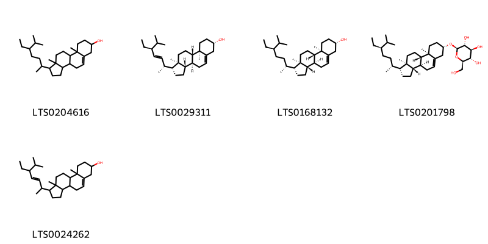{ width=100% }
    <figcaption>Hình ảnh cấu trúc hóa học của 5 hoạt chất thuộc nhóm Steroids and steroid derivatives gồm ['stigmast-5-en-3-ol, (3β)- (LTS0204616)', 'phytosterol (LTS0029311)', 'sitosterol (LTS0168132)', 'sitogluside (LTS0201798)', 'stigmasterol (LTS0024262)'].</figcaption>
</figure>

---

### Dược dân tộc học

Danh sách các quốc gia có sử dụng *Atractylodes macrocephala* trong điều trị các bệnh. 

| Country   | Disease   | Bệnh                                                                                                                                                                                                |
|:----------|:----------|:----------------------------------------------------------------------------------------------------------------------------------------------------------------------------------------------------|
| China     | Aperient  | MYMEMORY WARNING: YOU USED ALL AVAILABLE FREE TRANSLATIONS FOR TODAY. NEXT AVAILABLE IN  12 HOURS 58 MINUTES 04 SECONDS VISIT HTTPS://MYMEMORY.TRANSLATED.NET/DOC/USAGELIMITS.PHP TO TRANSLATE MORE |
| Elsewhere | nan       | MYMEMORY WARNING: YOU USED ALL AVAILABLE FREE TRANSLATIONS FOR TODAY. NEXT AVAILABLE IN  12 HOURS 58 MINUTES 00 SECONDS VISIT HTTPS://MYMEMORY.TRANSLATED.NET/DOC/USAGELIMITS.PHP TO TRANSLATE MORE |

---

# Chi Perezia

??? note "Danh sách các dược liệu thuộc chi"
    
	 - *Perezia adnata*
	 - *Perezia dugesii*
	 - *Perezia hebeclada*
	 - *Perezia moschata*
	 - *Perezia multiflora*
	 - *Perezia nana*
	 - *Perezia rigida*
	 - *Perezia thurberi*
	 - *Perezia wrightii*

---
## Perezia adnata
### Thông tin về thực vật

!!! info "Phân loại thực vật của *Acourtia humboldtii* từ GIBF:"
    - **Kingdom:** Plantae
    - **Phylum:** Tracheophyta
    - **Order:** Asterales
    - **Family:** Asteraceae
    - **Genus:** Acourtia
    - **Species:** *Acourtia humboldtii*

 

| Label (VI)   | Label (EN)   | Scientific Name   | Descriptions (VI)   | Descriptions (EN)   | Also Known As (VI)   | Also Known As (EN)   |
|:-------------|:-------------|:------------------|:--------------------|:--------------------|:---------------------|:---------------------|
| N/A          | N/A          | Perezia adnata    |                     |                     | ['']                 | ['']                 |

#### Phân bố trên thế giới

**Từ CSDL GIBF** nan, Mexico

#### Phân bố tại Việt Nam

**Từ CSDL GIBF**: Không có ghi nhận ở Việt Nam

---
### Thành phần hóa học
        
- Theo cơ sở dữ liệu lotus: Từ loài *Acourtia humboldtii* đã phân lập và xác định được Chưa có hoạt chất nào được phân lập. hoạt chất thuộc về các nhóm Không có hoạt chất nào được phân lập. 

Không có hình ảnh nào được tạo ra

---

### Dược dân tộc học

Danh sách các quốc gia có sử dụng *Acourtia humboldtii* trong điều trị các bệnh. 

| Country   | Disease              | Bệnh                                                                                                                                                                                                |
|:----------|:---------------------|:----------------------------------------------------------------------------------------------------------------------------------------------------------------------------------------------------|
| Mexico    | Purgative, Sudorific | MYMEMORY WARNING: YOU USED ALL AVAILABLE FREE TRANSLATIONS FOR TODAY. NEXT AVAILABLE IN  12 HOURS 57 MINUTES 26 SECONDS VISIT HTTPS://MYMEMORY.TRANSLATED.NET/DOC/USAGELIMITS.PHP TO TRANSLATE MORE |

---

---
## Perezia dugesii
### Thông tin về thực vật

!!! info "Phân loại thực vật của *Acourtia dugesii* từ GIBF:"
    - **Kingdom:** Plantae
    - **Phylum:** Tracheophyta
    - **Order:** Asterales
    - **Family:** Asteraceae
    - **Genus:** Acourtia
    - **Species:** *Acourtia dugesii*

 

| Label (VI)   | Label (EN)   | Scientific Name   | Descriptions (VI)   | Descriptions (EN)   | Also Known As (VI)   | Also Known As (EN)   |
|:-------------|:-------------|:------------------|:--------------------|:--------------------|:---------------------|:---------------------|
| N/A          | N/A          | Perezia dugesii   | loài thực vật       | species of plant    | ['']                 | ['']                 |

#### Phân bố trên thế giới

**Từ CSDL GIBF** nan, Mexico

#### Phân bố tại Việt Nam

**Từ CSDL GIBF**: Không có ghi nhận ở Việt Nam

---
### Thành phần hóa học
        
- Theo cơ sở dữ liệu lotus: Từ loài *Acourtia dugesii* đã phân lập và xác định được Chưa có hoạt chất nào được phân lập. hoạt chất thuộc về các nhóm Không có hoạt chất nào được phân lập. 

Không có hình ảnh nào được tạo ra

---

### Dược dân tộc học

Danh sách các quốc gia có sử dụng *Acourtia dugesii* trong điều trị các bệnh. 

| Country   | Disease              | Bệnh                                                                                                                                                                                                |
|:----------|:---------------------|:----------------------------------------------------------------------------------------------------------------------------------------------------------------------------------------------------|
| Mexico    | Purgative, Sudorific | MYMEMORY WARNING: YOU USED ALL AVAILABLE FREE TRANSLATIONS FOR TODAY. NEXT AVAILABLE IN  12 HOURS 56 MINUTES 53 SECONDS VISIT HTTPS://MYMEMORY.TRANSLATED.NET/DOC/USAGELIMITS.PHP TO TRANSLATE MORE |

---

---
## Perezia hebeclada
### Thông tin về thực vật

!!! info "Phân loại thực vật của *Perezia hebeclada* từ GIBF:"
    - **Kingdom:** Plantae
    - **Phylum:** Tracheophyta
    - **Order:** Asterales
    - **Family:** Asteraceae
    - **Genus:** Perezia
    - **Species:** *Perezia hebeclada*

 

| Label (VI)   | Label (EN)   | Scientific Name   | Descriptions (VI)   | Descriptions (EN)   | Also Known As (VI)   | Also Known As (EN)   |
|:-------------|:-------------|:------------------|:--------------------|:--------------------|:---------------------|:---------------------|
| N/A          | N/A          | Perezia hebeclada |                     |                     | ['']                 | ['']                 |

#### Phân bố trên thế giới

**Từ CSDL GIBF** Mexico

#### Phân bố tại Việt Nam

**Từ CSDL GIBF**: Không có ghi nhận ở Việt Nam

---
### Thành phần hóa học
        
- Theo cơ sở dữ liệu lotus: Từ loài *Perezia hebeclada* đã phân lập và xác định được 12 hoạt chất thuộc về các nhóm Prenol lipids, Coumarins and derivatives. 

|    | chemicalTaxonomyClassyfireClass   |   smiles_count |
|---:|:----------------------------------|---------------:|
|  0 | Coumarins and derivatives         |              4 |
|  1 | Prenol lipids                     |              8 |

#### Nhóm Coumarins and derivatives
<figure markdown="span">
    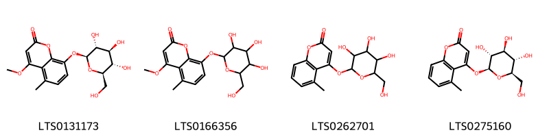{ width=100% }
    <figcaption>Hình ảnh cấu trúc hóa học của 4 hoạt chất thuộc nhóm Coumarins and derivatives gồm ['4-methoxy-5-methyl-8-{[(2s,3r,4s,5s,6r)-3,4,5-trihydroxy-6-(hydroxymethyl)oxan-2-yl]oxy}chromen-2-one (LTS0131173)', '4-methoxy-5-methyl-8-{[3,4,5-trihydroxy-6-(hydroxymethyl)oxan-2-yl]oxy}chromen-2-one (LTS0166356)', '5-methyl-4-{[3,4,5-trihydroxy-6-(hydroxymethyl)oxan-2-yl]oxy}chromen-2-one (LTS0262701)', '5-methyl-4-{[(2s,3r,4s,5s,6r)-3,4,5-trihydroxy-6-(hydroxymethyl)oxan-2-yl]oxy}chromen-2-one (LTS0275160)'].</figcaption>
</figure>
#### Nhóm Prenol lipids
<figure markdown="span">
    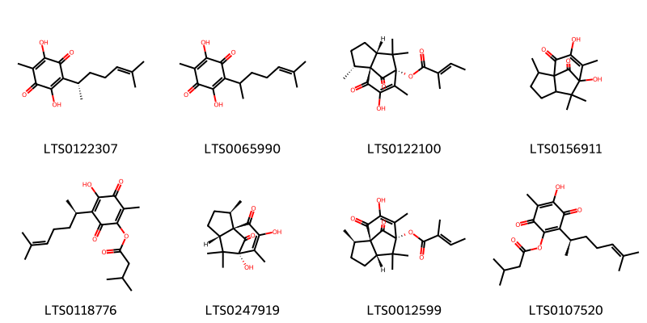{ width=100% }
    <figcaption>Hình ảnh cấu trúc hóa học của 8 hoạt chất thuộc nhóm Prenol lipids gồm ['2,5-dihydroxy-3-methyl-6-[(2s)-6-methylhept-5-en-2-yl]cyclohexa-2,5-diene-1,4-dione (LTS0122307)', '2,5-dihydroxy-3-methyl-6-(6-methylhept-5-en-2-yl)cyclohexa-2,5-diene-1,4-dione (LTS0065990)', '(1r,2r,5r,7r)-9-hydroxy-2,6,6,8-tetramethyl-10,11-dioxotricyclo[5.3.1.0¹,⁵]undec-8-en-7-yl (2e)-2-methylbut-2-enoate (LTS0122100)', '7,9-dihydroxy-2,6,6,8-tetramethyltricyclo[5.3.1.0¹,⁵]undec-8-ene-10,11-dione (LTS0156911)', '4-hydroxy-2-methyl-5-[(2r)-6-methylhept-5-en-2-yl]-3,6-dioxocyclohexa-1,4-dien-1-yl 3-methylbutanoate (LTS0118776)', '(1s,2r,5s,7s)-7,9-dihydroxy-2,6,6,8-tetramethyltricyclo[5.3.1.0¹,⁵]undec-8-ene-10,11-dione (LTS0247919)', '(1s,2r,5s,7s)-9-hydroxy-2,6,6,8-tetramethyl-10,11-dioxotricyclo[5.3.1.0¹,⁵]undec-8-en-7-yl (2e)-2-methylbut-2-enoate (LTS0012599)', '4-hydroxy-5-methyl-2-[(2r)-6-methylhept-5-en-2-yl]-3,6-dioxocyclohexa-1,4-dien-1-yl 3-methylbutanoate (LTS0107520)'].</figcaption>
</figure>

---

### Dược dân tộc học

Danh sách các quốc gia có sử dụng *Perezia hebeclada* trong điều trị các bệnh. 

| Country   | Disease   | Bệnh                                                                                                                                                                                                |
|:----------|:----------|:----------------------------------------------------------------------------------------------------------------------------------------------------------------------------------------------------|
| Mexico    | Sudorific | MYMEMORY WARNING: YOU USED ALL AVAILABLE FREE TRANSLATIONS FOR TODAY. NEXT AVAILABLE IN  12 HOURS 56 MINUTES 29 SECONDS VISIT HTTPS://MYMEMORY.TRANSLATED.NET/DOC/USAGELIMITS.PHP TO TRANSLATE MORE |

---

---
## Perezia moschata
### Thông tin về thực vật

!!! info "Phân loại thực vật của *Acourtia moschata* từ GIBF:"
    - **Kingdom:** Plantae
    - **Phylum:** Tracheophyta
    - **Order:** Asterales
    - **Family:** Asteraceae
    - **Genus:** Acourtia
    - **Species:** *Acourtia moschata*

 

| Label (VI)   | Label (EN)   | Scientific Name   | Descriptions (VI)   | Descriptions (EN)   | Also Known As (VI)   | Also Known As (EN)   |
|:-------------|:-------------|:------------------|:--------------------|:--------------------|:---------------------|:---------------------|
| N/A          | N/A          | Perezia moschata  | loài thực vật       | species of plant    | ['']                 | ['']                 |

#### Phân bố trên thế giới

**Từ CSDL GIBF** nan, Mexico

#### Phân bố tại Việt Nam

**Từ CSDL GIBF**: Không có ghi nhận ở Việt Nam

---
### Thành phần hóa học
        
- Theo cơ sở dữ liệu lotus: Từ loài *Acourtia moschata* đã phân lập và xác định được Chưa có hoạt chất nào được phân lập. hoạt chất thuộc về các nhóm Không có hoạt chất nào được phân lập. 

Không có hình ảnh nào được tạo ra

---

### Dược dân tộc học

Danh sách các quốc gia có sử dụng *Acourtia moschata* trong điều trị các bệnh. 

| Country   | Disease   | Bệnh                                                                                                                                                                                                |
|:----------|:----------|:----------------------------------------------------------------------------------------------------------------------------------------------------------------------------------------------------|
| Mexico    | Stomachic | MYMEMORY WARNING: YOU USED ALL AVAILABLE FREE TRANSLATIONS FOR TODAY. NEXT AVAILABLE IN  12 HOURS 56 MINUTES 06 SECONDS VISIT HTTPS://MYMEMORY.TRANSLATED.NET/DOC/USAGELIMITS.PHP TO TRANSLATE MORE |

---

---
## Perezia multiflora
### Thông tin về thực vật

!!! info "Phân loại thực vật của *Perezia multiflora* từ GIBF:"
    - **Kingdom:** Plantae
    - **Phylum:** Tracheophyta
    - **Order:** Asterales
    - **Family:** Asteraceae
    - **Genus:** Perezia
    - **Species:** *Perezia multiflora*

 

| Label (VI)   | Label (EN)   | Scientific Name    | Descriptions (VI)   | Descriptions (EN)   | Also Known As (VI)   | Also Known As (EN)   |
|:-------------|:-------------|:-------------------|:--------------------|:--------------------|:---------------------|:---------------------|
| N/A          | N/A          | Perezia multiflora | loài thực vật       | species of plant    | ['']                 | ['']                 |

#### Phân bố trên thế giới

**Từ CSDL GIBF** Ecuador, Brazil, Bolivia (Plurinational State of), Argentina, United States of America, Peru, Uruguay

#### Phân bố tại Việt Nam

**Từ CSDL GIBF**: Không có ghi nhận ở Việt Nam

---
### Thành phần hóa học
        
- Theo cơ sở dữ liệu lotus: Từ loài *Perezia multiflora* đã phân lập và xác định được 28 hoạt chất thuộc về các nhóm Prenol lipids. 

|    | chemicalTaxonomyClassyfireClass   |   smiles_count |
|---:|:----------------------------------|---------------:|
|  0 | Prenol lipids                     |             28 |

#### Nhóm Prenol lipids
<figure markdown="span">
    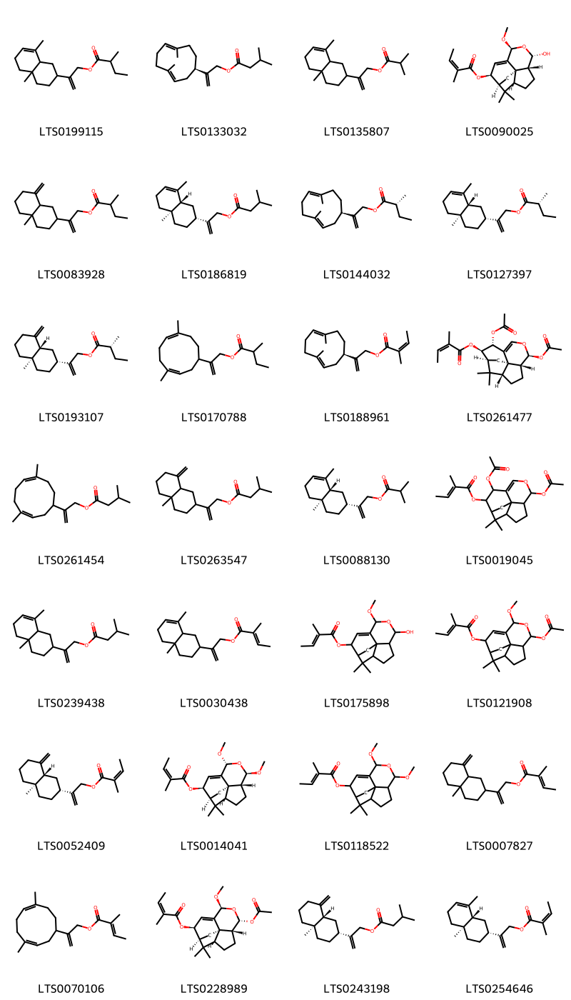{ width=100% }
    <figcaption>Hình ảnh cấu trúc hóa học của 28 hoạt chất thuộc nhóm Prenol lipids gồm ['2-(4a,8-dimethyl-2,3,4,5,6,8a-hexahydro-1h-naphthalen-2-yl)prop-2-en-1-yl 2-methylbutanoate (LTS0199115)', '2-[(1r,3e,7e)-4,8-dimethylcyclodeca-3,7-dien-1-yl]prop-2-en-1-yl 3-methylbutanoate (LTS0133032)', '2-(4a,8-dimethyl-2,3,4,5,6,8a-hexahydro-1h-naphthalen-2-yl)prop-2-en-1-yl 2-methylpropanoate (LTS0135807)', '(1s,2s,5s,7s,8r,11r,12r)-7-hydroxy-5-methoxy-14,14-dimethyl-6-oxatetracyclo[9.2.1.0⁴,¹².0⁸,¹²]tetradec-3-en-2-yl (2z)-2-methylbut-2-enoate (LTS0090025)', '2-(4a-methyl-8-methylidene-octahydronaphthalen-2-yl)prop-2-en-1-yl 2-methylbutanoate (LTS0083928)', '2-[(2r,4ar,8ar)-4a,8-dimethyl-2,3,4,5,6,8a-hexahydro-1h-naphthalen-2-yl]prop-2-en-1-yl 3-methylbutanoate (LTS0186819)', '2-[(1r,3e,7e)-4,8-dimethylcyclodeca-3,7-dien-1-yl]prop-2-en-1-yl (2r)-2-methylbutanoate (LTS0144032)', '2-[(2r,4ar,8ar)-4a,8-dimethyl-2,3,4,5,6,8a-hexahydro-1h-naphthalen-2-yl]prop-2-en-1-yl (2r)-2-methylbutanoate (LTS0127397)', '2-[(2r,4ar,8as)-4a-methyl-8-methylidene-octahydronaphthalen-2-yl]prop-2-en-1-yl (2r)-2-methylbutanoate (LTS0193107)', '2-(4,8-dimethylcyclodeca-3,7-dien-1-yl)prop-2-en-1-yl 2-methylbutanoate (LTS0170788)', '2-[(1r,3e,7e)-4,8-dimethylcyclodeca-3,7-dien-1-yl]prop-2-en-1-yl (2z)-2-methylbut-2-enoate (LTS0188961)', '(1s,2r,3r,7s,8r,11r,12r)-3,7-bis(acetyloxy)-14,14-dimethyl-6-oxatetracyclo[9.2.1.0⁴,¹².0⁸,¹²]tetradec-4-en-2-yl (2z)-2-methylbut-2-enoate (LTS0261477)', '2-(4,8-dimethylcyclodeca-3,7-dien-1-yl)prop-2-en-1-yl 3-methylbutanoate (LTS0261454)', '2-(4a-methyl-8-methylidene-octahydronaphthalen-2-yl)prop-2-en-1-yl 3-methylbutanoate (LTS0263547)', '2-[(2r,4ar,8ar)-4a,8-dimethyl-2,3,4,5,6,8a-hexahydro-1h-naphthalen-2-yl]prop-2-en-1-yl 2-methylpropanoate (LTS0088130)', '3,7-bis(acetyloxy)-14,14-dimethyl-6-oxatetracyclo[9.2.1.0⁴,¹².0⁸,¹²]tetradec-4-en-2-yl 2-methylbut-2-enoate (LTS0019045)', '2-(4a,8-dimethyl-2,3,4,5,6,8a-hexahydro-1h-naphthalen-2-yl)prop-2-en-1-yl 3-methylbutanoate (LTS0239438)', '2-(4a,8-dimethyl-2,3,4,5,6,8a-hexahydro-1h-naphthalen-2-yl)prop-2-en-1-yl 2-methylbut-2-enoate (LTS0030438)', '7-hydroxy-5-methoxy-14,14-dimethyl-6-oxatetracyclo[9.2.1.0⁴,¹².0⁸,¹²]tetradec-3-en-2-yl 2-methylbut-2-enoate (LTS0175898)', '7-(acetyloxy)-5-methoxy-14,14-dimethyl-6-oxatetracyclo[9.2.1.0⁴,¹².0⁸,¹²]tetradec-3-en-2-yl 2-methylbut-2-enoate (LTS0121908)', '2-[(2r,4ar,8as)-4a-methyl-8-methylidene-octahydronaphthalen-2-yl]prop-2-en-1-yl (2z)-2-methylbut-2-enoate (LTS0052409)', '(1s,2s,5r,7r,8r,11r,12r)-5,7-dimethoxy-14,14-dimethyl-6-oxatetracyclo[9.2.1.0⁴,¹².0⁸,¹²]tetradec-3-en-2-yl (2z)-2-methylbut-2-enoate (LTS0014041)', '5,7-dimethoxy-14,14-dimethyl-6-oxatetracyclo[9.2.1.0⁴,¹².0⁸,¹²]tetradec-3-en-2-yl 2-methylbut-2-enoate (LTS0118522)', '2-(4a-methyl-8-methylidene-octahydronaphthalen-2-yl)prop-2-en-1-yl 2-methylbut-2-enoate (LTS0007827)', '2-(4,8-dimethylcyclodeca-3,7-dien-1-yl)prop-2-en-1-yl 2-methylbut-2-enoate (LTS0070106)', '(1s,2s,5s,7r,8r,11r,12r)-7-(acetyloxy)-5-methoxy-14,14-dimethyl-6-oxatetracyclo[9.2.1.0⁴,¹².0⁸,¹²]tetradec-3-en-2-yl (2z)-2-methylbut-2-enoate (LTS0228989)', '2-[(2r,4ar,8as)-4a-methyl-8-methylidene-octahydronaphthalen-2-yl]prop-2-en-1-yl 3-methylbutanoate (LTS0243198)', '2-[(2r,4ar,8ar)-4a,8-dimethyl-2,3,4,5,6,8a-hexahydro-1h-naphthalen-2-yl]prop-2-en-1-yl (2z)-2-methylbut-2-enoate (LTS0254646)'].</figcaption>
</figure>

---

### Dược dân tộc học

Danh sách các quốc gia có sử dụng *Perezia multiflora* trong điều trị các bệnh. 

| Country       | Disease   | Bệnh                                                                                                                                                                                                |
|:--------------|:----------|:----------------------------------------------------------------------------------------------------------------------------------------------------------------------------------------------------|
| South America | Sudorific | MYMEMORY WARNING: YOU USED ALL AVAILABLE FREE TRANSLATIONS FOR TODAY. NEXT AVAILABLE IN  12 HOURS 55 MINUTES 37 SECONDS VISIT HTTPS://MYMEMORY.TRANSLATED.NET/DOC/USAGELIMITS.PHP TO TRANSLATE MORE |

---

---
## Perezia nana
### Thông tin về thực vật

!!! info "Phân loại thực vật của *Acourtia nana* từ GIBF:"
    - **Kingdom:** Plantae
    - **Phylum:** Tracheophyta
    - **Order:** Asterales
    - **Family:** Asteraceae
    - **Genus:** Acourtia
    - **Species:** *Acourtia nana*

 

| Label (VI)   | Label (EN)   | Scientific Name   | Descriptions (VI)   | Descriptions (EN)   | Also Known As (VI)   | Also Known As (EN)   |
|:-------------|:-------------|:------------------|:--------------------|:--------------------|:---------------------|:---------------------|
| N/A          | N/A          | Perezia nana      | loài thực vật       | species of plant    | ['']                 | ['']                 |

#### Phân bố trên thế giới

**Từ CSDL GIBF** nan, United States of America, Mexico

#### Phân bố tại Việt Nam

**Từ CSDL GIBF**: Không có ghi nhận ở Việt Nam

---
### Thành phần hóa học
        
- Theo cơ sở dữ liệu lotus: Từ loài *Acourtia nana* đã phân lập và xác định được Chưa có hoạt chất nào được phân lập. hoạt chất thuộc về các nhóm Không có hoạt chất nào được phân lập. 

Không có hình ảnh nào được tạo ra

---

### Dược dân tộc học

Danh sách các quốc gia có sử dụng *Acourtia nana* trong điều trị các bệnh. 

| Country   | Disease              | Bệnh                                                                                                                                                                                                |
|:----------|:---------------------|:----------------------------------------------------------------------------------------------------------------------------------------------------------------------------------------------------|
| Mexico    | Sudorific, Purgative | MYMEMORY WARNING: YOU USED ALL AVAILABLE FREE TRANSLATIONS FOR TODAY. NEXT AVAILABLE IN  12 HOURS 55 MINUTES 07 SECONDS VISIT HTTPS://MYMEMORY.TRANSLATED.NET/DOC/USAGELIMITS.PHP TO TRANSLATE MORE |

---

---
## Perezia rigida
### Thông tin về thực vật

!!! info "Phân loại thực vật của *Acourtia fruticosa* từ GIBF:"
    - **Kingdom:** Plantae
    - **Phylum:** Tracheophyta
    - **Order:** Asterales
    - **Family:** Asteraceae
    - **Genus:** Acourtia
    - **Species:** *Acourtia fruticosa*

 

| Label (VI)   | Label (EN)   | Scientific Name   | Descriptions (VI)   | Descriptions (EN)   | Also Known As (VI)   | Also Known As (EN)   |
|:-------------|:-------------|:------------------|:--------------------|:--------------------|:---------------------|:---------------------|
| N/A          | N/A          | Perezia rigida    |                     |                     | ['']                 | ['']                 |

#### Phân bố trên thế giới

**Từ CSDL GIBF** nan, Mexico

#### Phân bố tại Việt Nam

**Từ CSDL GIBF**: Không có ghi nhận ở Việt Nam

---
### Thành phần hóa học
        
- Theo cơ sở dữ liệu lotus: Từ loài *Acourtia fruticosa* đã phân lập và xác định được Chưa có hoạt chất nào được phân lập. hoạt chất thuộc về các nhóm Không có hoạt chất nào được phân lập. 

Không có hình ảnh nào được tạo ra

---

### Dược dân tộc học

Danh sách các quốc gia có sử dụng *Acourtia fruticosa* trong điều trị các bệnh. 

| Country   | Disease                        | Bệnh                                                                                                                                                                                                |
|:----------|:-------------------------------|:----------------------------------------------------------------------------------------------------------------------------------------------------------------------------------------------------|
| Mexico    | Hemostat, Sudorific, Purgative | MYMEMORY WARNING: YOU USED ALL AVAILABLE FREE TRANSLATIONS FOR TODAY. NEXT AVAILABLE IN  12 HOURS 54 MINUTES 41 SECONDS VISIT HTTPS://MYMEMORY.TRANSLATED.NET/DOC/USAGELIMITS.PHP TO TRANSLATE MORE |

---

---
## Perezia thurberi
### Thông tin về thực vật

!!! info "Phân loại thực vật của *Acourtia thurberi* từ GIBF:"
    - **Kingdom:** Plantae
    - **Phylum:** Tracheophyta
    - **Order:** Asterales
    - **Family:** Asteraceae
    - **Genus:** Acourtia
    - **Species:** *Acourtia thurberi*

 

| Label (VI)   | Label (EN)   | Scientific Name   | Descriptions (VI)   | Descriptions (EN)   | Also Known As (VI)   | Also Known As (EN)   |
|:-------------|:-------------|:------------------|:--------------------|:--------------------|:---------------------|:---------------------|
| N/A          | N/A          | Perezia thurberi  | loài thực vật       | species of plant    | ['']                 | ['']                 |

#### Phân bố trên thế giới

**Từ CSDL GIBF** nan, United States of America, Mexico

#### Phân bố tại Việt Nam

**Từ CSDL GIBF**: Không có ghi nhận ở Việt Nam

---
### Thành phần hóa học
        
- Theo cơ sở dữ liệu lotus: Từ loài *Acourtia thurberi* đã phân lập và xác định được Chưa có hoạt chất nào được phân lập. hoạt chất thuộc về các nhóm Không có hoạt chất nào được phân lập. 

Không có hình ảnh nào được tạo ra

---

### Dược dân tộc học

Danh sách các quốc gia có sử dụng *Acourtia thurberi* trong điều trị các bệnh. 

| Country   | Disease           | Bệnh                                                                                                                                                                                                |
|:----------|:------------------|:----------------------------------------------------------------------------------------------------------------------------------------------------------------------------------------------------|
| Mexico    | Vermicide, Emetic | MYMEMORY WARNING: YOU USED ALL AVAILABLE FREE TRANSLATIONS FOR TODAY. NEXT AVAILABLE IN  12 HOURS 54 MINUTES 19 SECONDS VISIT HTTPS://MYMEMORY.TRANSLATED.NET/DOC/USAGELIMITS.PHP TO TRANSLATE MORE |

---

---
## Perezia wrightii
### Thông tin về thực vật

!!! info "Phân loại thực vật của *Acourtia wrightii* từ GIBF:"
    - **Kingdom:** Plantae
    - **Phylum:** Tracheophyta
    - **Order:** Asterales
    - **Family:** Asteraceae
    - **Genus:** Acourtia
    - **Species:** *Acourtia wrightii*

 

| Label (VI)   | Label (EN)   | Scientific Name   | Descriptions (VI)   | Descriptions (EN)   | Also Known As (VI)   | Also Known As (EN)   |
|:-------------|:-------------|:------------------|:--------------------|:--------------------|:---------------------|:---------------------|
| N/A          | N/A          | Perezia wrightii  | loài thực vật       | species of plant    | ['']                 | ['']                 |

#### Phân bố trên thế giới

**Từ CSDL GIBF** United States of America, Mexico

#### Phân bố tại Việt Nam

**Từ CSDL GIBF**: Không có ghi nhận ở Việt Nam

---
### Thành phần hóa học
        
- Theo cơ sở dữ liệu lotus: Từ loài *Acourtia wrightii* đã phân lập và xác định được Chưa có hoạt chất nào được phân lập. hoạt chất thuộc về các nhóm Không có hoạt chất nào được phân lập. 

Không có hình ảnh nào được tạo ra

---

### Dược dân tộc học

Danh sách các quốc gia có sử dụng *Acourtia wrightii* trong điều trị các bệnh. 

| Country          | Disease              | Bệnh                                                                                                                                                                                                |
|:-----------------|:---------------------|:----------------------------------------------------------------------------------------------------------------------------------------------------------------------------------------------------|
| Mexico           | Purgative, Sudorific | MYMEMORY WARNING: YOU USED ALL AVAILABLE FREE TRANSLATIONS FOR TODAY. NEXT AVAILABLE IN  12 HOURS 53 MINUTES 57 SECONDS VISIT HTTPS://MYMEMORY.TRANSLATED.NET/DOC/USAGELIMITS.PHP TO TRANSLATE MORE |
| Mexico(Kickapoo) | Hemostat             | MYMEMORY WARNING: YOU USED ALL AVAILABLE FREE TRANSLATIONS FOR TODAY. NEXT AVAILABLE IN  12 HOURS 53 MINUTES 54 SECONDS VISIT HTTPS://MYMEMORY.TRANSLATED.NET/DOC/USAGELIMITS.PHP TO TRANSLATE MORE |

---

# Chi Onopordum

??? note "Danh sách các dược liệu thuộc chi"
    
	 - *Onopordum acanthium*

---
## Onopordum acanthium
### Thông tin về thực vật

!!! info "Phân loại thực vật của *Onopordum acanthium* từ GIBF:"
    - **Kingdom:** Plantae
    - **Phylum:** Tracheophyta
    - **Order:** Asterales
    - **Family:** Asteraceae
    - **Genus:** Onopordum
    - **Species:** *Onopordum acanthium*

 

| Label (VI)   | Label (EN)   | Scientific Name     | Descriptions (VI)   | Descriptions (EN)   | Also Known As (VI)   | Also Known As (EN)   |
|:-------------|:-------------|:--------------------|:--------------------|:--------------------|:---------------------|:---------------------|
| N/A          | N/A          | Onopordum acanthium | loài thực vật       | species of plant    | ['']                 | ['Cotton Thistle']   |

#### Phân bố trên thế giới

**Từ CSDL GIBF** Italy, Australia, Belgium, Slovakia, Argentina, Canada, Ukraine, Denmark, Netherlands, Kyrgyzstan, Spain, Hungary, Russian Federation, United States of America, Sweden, Kazakhstan, Czechia, Germany, Switzerland, Armenia, Austria, France, United Kingdom of Great Britain and Northern Ireland, Poland, New Zealand

#### Phân bố tại Việt Nam

**Từ CSDL GIBF**: Không có ghi nhận ở Việt Nam

---
### Thành phần hóa học
        
- Theo cơ sở dữ liệu lotus: Từ loài *Onopordum acanthium* đã phân lập và xác định được 6 hoạt chất thuộc về các nhóm Lignan glycosides, Prenol lipids. 

|    | chemicalTaxonomyClassyfireClass   |   smiles_count |
|---:|:----------------------------------|---------------:|
|  0 | Lignan glycosides                 |              2 |
|  1 | Prenol lipids                     |              4 |

#### Nhóm Lignan glycosides
<figure markdown="span">
    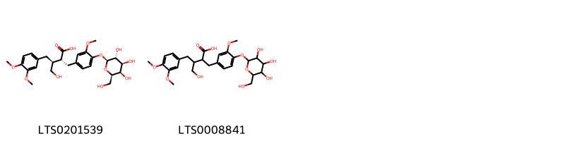{ width=100% }
    <figcaption>Hình ảnh cấu trúc hóa học của 2 hoạt chất thuộc nhóm Lignan glycosides gồm ['(2r,3s)-3-[(3,4-dimethoxyphenyl)methyl]-4-hydroxy-2-[(3-methoxy-4-{[(2s,3r,4s,5r,6r)-3,4,5-trihydroxy-6-(hydroxymethyl)oxan-2-yl]oxy}phenyl)methyl]butanoic acid (LTS0201539)', '3-[(3,4-dimethoxyphenyl)methyl]-4-hydroxy-2-[(3-methoxy-4-{[3,4,5-trihydroxy-6-(hydroxymethyl)oxan-2-yl]oxy}phenyl)methyl]butanoic acid (LTS0008841)'].</figcaption>
</figure>
#### Nhóm Prenol lipids
<figure markdown="span">
    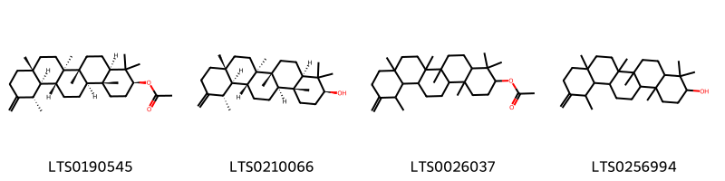{ width=100% }
    <figcaption>Hình ảnh cấu trúc hóa học của 4 hoạt chất thuộc nhóm Prenol lipids gồm ['taraxasterol acetate (LTS0190545)', 'taraxasterol (LTS0210066)', '4,4,6a,6b,8a,12,14b-heptamethyl-11-methylidene-hexadecahydropicen-3-yl acetate (LTS0026037)', '4,4,6a,6b,8a,12,14b-heptamethyl-11-methylidene-hexadecahydropicen-3-ol (LTS0256994)'].</figcaption>
</figure>

---

### Dược dân tộc học

Danh sách các quốc gia có sử dụng *Onopordum acanthium* trong điều trị các bệnh. 

| Country    | Disease                                   | Bệnh                                                                                                                                                                                                |
|:-----------|:------------------------------------------|:----------------------------------------------------------------------------------------------------------------------------------------------------------------------------------------------------|
| English    | Stimulant, Diuretic                       | MYMEMORY WARNING: YOU USED ALL AVAILABLE FREE TRANSLATIONS FOR TODAY. NEXT AVAILABLE IN  12 HOURS 53 MINUTES 20 SECONDS VISIT HTTPS://MYMEMORY.TRANSLATED.NET/DOC/USAGELIMITS.PHP TO TRANSLATE MORE |
| French     | Apertif                                   | MYMEMORY WARNING: YOU USED ALL AVAILABLE FREE TRANSLATIONS FOR TODAY. NEXT AVAILABLE IN  12 HOURS 53 MINUTES 16 SECONDS VISIT HTTPS://MYMEMORY.TRANSLATED.NET/DOC/USAGELIMITS.PHP TO TRANSLATE MORE |
| German     | Stomachic                                 | MYMEMORY WARNING: YOU USED ALL AVAILABLE FREE TRANSLATIONS FOR TODAY. NEXT AVAILABLE IN  12 HOURS 53 MINUTES 13 SECONDS VISIT HTTPS://MYMEMORY.TRANSLATED.NET/DOC/USAGELIMITS.PHP TO TRANSLATE MORE |
| Iraq       | Emmenagogue, Apertif, Diuretic, Stomachic | MYMEMORY WARNING: YOU USED ALL AVAILABLE FREE TRANSLATIONS FOR TODAY. NEXT AVAILABLE IN  12 HOURS 53 MINUTES 10 SECONDS VISIT HTTPS://MYMEMORY.TRANSLATED.NET/DOC/USAGELIMITS.PHP TO TRANSLATE MORE |
| Italian    | Emmenagogue, Cholagogue                   | MYMEMORY WARNING: YOU USED ALL AVAILABLE FREE TRANSLATIONS FOR TODAY. NEXT AVAILABLE IN  12 HOURS 53 MINUTES 06 SECONDS VISIT HTTPS://MYMEMORY.TRANSLATED.NET/DOC/USAGELIMITS.PHP TO TRANSLATE MORE |
| Portuguese | Sudorific                                 | MYMEMORY WARNING: YOU USED ALL AVAILABLE FREE TRANSLATIONS FOR TODAY. NEXT AVAILABLE IN  12 HOURS 53 MINUTES 03 SECONDS VISIT HTTPS://MYMEMORY.TRANSLATED.NET/DOC/USAGELIMITS.PHP TO TRANSLATE MORE |
| anish      | Tonic                                     | MYMEMORY WARNING: YOU USED ALL AVAILABLE FREE TRANSLATIONS FOR TODAY. NEXT AVAILABLE IN  12 HOURS 53 MINUTES 00 SECONDS VISIT HTTPS://MYMEMORY.TRANSLATED.NET/DOC/USAGELIMITS.PHP TO TRANSLATE MORE |

---

# Chi Inula

??? note "Danh sách các dược liệu thuộc chi"
    
	 - *Inula britannica*
	 - *Inula brittanica*
	 - *Inula cappa*
	 - *Inula conyza*
	 - *Inula graveolens*
	 - *Inula helenium*
	 - *Inula japonica*
	 - *Inula racemosa*
	 - *Inula royleana*

---
## Inula britannica
### Thông tin về thực vật

!!! info "Phân loại thực vật của *Inula britannica* từ GIBF:"
    - **Kingdom:** Plantae
    - **Phylum:** Tracheophyta
    - **Order:** Asterales
    - **Family:** Asteraceae
    - **Genus:** Inula
    - **Species:** *Inula britannica*

 

| Label (VI)   | Label (EN)   | Scientific Name   | Descriptions (VI)   | Descriptions (EN)   | Also Known As (VI)   | Also Known As (EN)                        |
|:-------------|:-------------|:------------------|:--------------------|:--------------------|:---------------------|:------------------------------------------|
| N/A          | N/A          | Inula britannica  | loài thực vật       | species of plant    | ['']                 | ['British yellowhead', 'meadow fleabane'] |

#### Phân bố trên thế giới

**Từ CSDL GIBF** Germany, Netherlands, France, Austria

#### Phân bố tại Việt Nam

**Từ CSDL GIBF**: Không có ghi nhận ở Việt Nam

---
### Thành phần hóa học
        
- Theo cơ sở dữ liệu lotus: Từ loài *Inula britannica* đã phân lập và xác định được 245 hoạt chất thuộc về các nhóm Phenol ethers, Fatty Acyls, Flavonoids, Prenol lipids, Steroids and steroid derivatives, Benzofurans, Lactones, Phenols, Glycerolipids. 

|    | chemicalTaxonomyClassyfireClass   |   smiles_count |
|---:|:----------------------------------|---------------:|
|  0 | Benzofurans                       |              2 |
|  1 | Fatty Acyls                       |              7 |
|  2 | Flavonoids                        |             36 |
|  3 | Glycerolipids                     |              2 |
|  4 | Lactones                          |              5 |
|  5 | Phenol ethers                     |              2 |
|  6 | Phenols                           |              7 |
|  7 | Prenol lipids                     |            173 |
|  8 | Steroids and steroid derivatives  |              8 |

#### Nhóm Benzofurans
<figure markdown="span">
    { width=100% }
    <figcaption>Hình ảnh cấu trúc hóa học của 2 hoạt chất thuộc nhóm Benzofurans gồm ['loliolide (LTS0119422)', '(6r,7ar)-6-hydroxy-4,4,7a-trimethyl-6,7-dihydro-5h-1-benzofuran-2-one (LTS0027877)'].</figcaption>
</figure>
#### Nhóm Fatty Acyls
<figure markdown="span">
    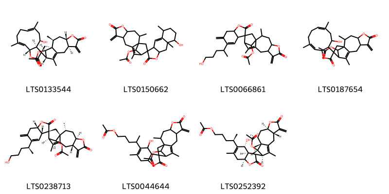{ width=100% }
    <figcaption>Hình ảnh cấu trúc hóa học của 7 hoạt chất thuộc nhóm Fatty Acyls gồm ["(1's,2's,3s,3ar,4r,4's,8'r,11ar,12'r,15'r)-4-hydroxy-2',6,10,11'-tetramethyl-7'-methylidene-2,6'-dioxo-3a,4,5,8,9,11a-hexahydro-5'-oxaspiro[cyclodeca[b]furan-3,13'-tetracyclo[10.2.1.0¹,¹⁰.0⁴,⁸]pentadecan]-10'-en-15'-yl acetate (LTS0133544)", "8-hydroxy-2',5,8a,11'-tetramethyl-7'-methylidene-2,6'-dioxo-5,6,7,8,9,9a-hexahydro-3ah-5'-oxaspiro[naphtho[2,3-b]furan-3,13'-tetracyclo[10.2.1.0¹,¹⁰.0⁴,⁸]pentadecan]-10'-en-15'-yl acetate (LTS0150662)", "5-(5-hydroxypentan-2-yl)-2',11'-dimethyl-6,7'-dimethylidene-2,6'-dioxo-7,7a-dihydro-3ah-5'-oxaspiro[1-benzofuran-3,13'-tetracyclo[10.2.1.0¹,¹⁰.0⁴,⁸]pentadecan]-10'-en-15'-yl acetate (LTS0066861)", "4-hydroxy-2',6,10,11'-tetramethyl-7'-methylidene-2,6'-dioxo-3a,4,5,8,9,11a-hexahydro-5'-oxaspiro[cyclodeca[b]furan-3,13'-tetracyclo[10.2.1.0¹,¹⁰.0⁴,⁸]pentadecan]-10'-en-15'-yl acetate (LTS0187654)", "(1'r,2'r,3s,3as,4'r,7as,8's,12's,15's)-5-[(2s)-5-hydroxypentan-2-yl]-2',11'-dimethyl-6,7'-dimethylidene-2,6'-dioxo-7,7a-dihydro-3ah-5'-oxaspiro[1-benzofuran-3,13'-tetracyclo[10.2.1.0¹,¹⁰.0⁴,⁸]pentadecan]-10'-en-15'-yl acetate (LTS0238713)", "4-[15'-(acetyloxy)-4-hydroxy-2',6,11'-trimethyl-7'-methylidene-2,6'-dioxo-3a,4,7,7a-tetrahydro-5'-oxaspiro[1-benzofuran-3,13'-tetracyclo[10.2.1.0¹,¹⁰.0⁴,⁸]pentadecan]-10'-en-5-yl]pentyl acetate (LTS0044644)", "(4r)-4-[(1'r,2'r,3r,3ar,4r,4'r,7as,8's,12's,15's)-15'-(acetyloxy)-4-hydroxy-2',6,11'-trimethyl-7'-methylidene-2,6'-dioxo-3a,4,7,7a-tetrahydro-5'-oxaspiro[1-benzofuran-3,13'-tetracyclo[10.2.1.0¹,¹⁰.0⁴,⁸]pentadecan]-10'-en-5-yl]pentyl acetate (LTS0252392)"].</figcaption>
</figure>
#### Nhóm Flavonoids
<figure markdown="span">
    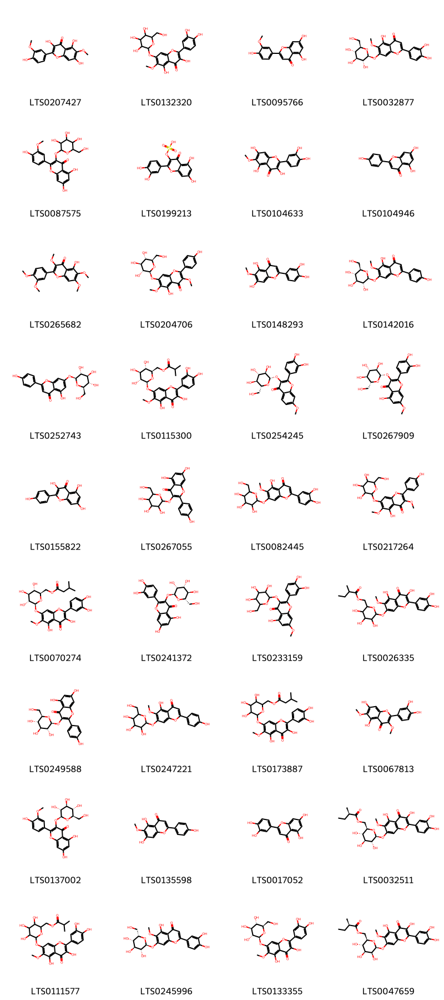{ width=100% }
    <figcaption>Hình ảnh cấu trúc hóa học của 36 hoạt chất thuộc nhóm Flavonoids gồm ['spinacetin (LTS0207427)', '2-(3,4-dihydroxyphenyl)-3,5-dihydroxy-6-methoxy-7-{[3,4,5-trihydroxy-6-(hydroxymethyl)oxan-2-yl]oxy}chromen-4-one (LTS0132320)', 'chrysoeriol (LTS0095766)', 'nepitrin (LTS0032877)', 'isorhamnetin 3-galactoside (LTS0087575)', 'quercetin 3-sulfate (LTS0199213)', 'patuletin (LTS0104633)', 'chamomile (LTS0104946)', 'artemetin (LTS0265682)', '5-hydroxy-2-(4-hydroxyphenyl)-3,6-dimethoxy-7-{[(2s,3r,4s,5s,6r)-3,4,5-trihydroxy-6-(hydroxymethyl)oxan-2-yl]oxy}chromen-4-one (LTS0204706)', 'nepetin (LTS0148293)', 'homoplantaginin (LTS0142016)', 'apigenin 7-o-β-glucoside (LTS0252743)', '[(2r,3s,4s,5r,6s)-6-{[2-(3,4-dihydroxyphenyl)-3,5-dihydroxy-6-methoxy-4-oxochromen-7-yl]oxy}-3,4,5-trihydroxyoxan-2-yl]methyl 2-methylpropanoate (LTS0115300)', '2-(3,4-dihydroxyphenyl)-7-methoxy-3-{[(2s,3r,4s,5s,6r)-3,4,5-trihydroxy-6-(hydroxymethyl)oxan-2-yl]oxy}chromen-4-one (LTS0254245)', '2-(3,4-dihydroxyphenyl)-5-hydroxy-7-methoxy-3-{[(2s,3r,4s,5s,6r)-3,4,5-trihydroxy-6-(hydroxymethyl)oxan-2-yl]oxy}chromen-4-one (LTS0267909)', 'kaempherol (LTS0155822)', 'trifolin (LTS0267055)', '2-(3,4-dihydroxyphenyl)-5-hydroxy-6-methoxy-7-{[3,4,5-trihydroxy-6-(hydroxymethyl)oxan-2-yl]oxy}chromen-4-one (LTS0082445)', '5-hydroxy-2-(4-hydroxyphenyl)-3,6-dimethoxy-7-{[3,4,5-trihydroxy-6-(hydroxymethyl)oxan-2-yl]oxy}chromen-4-one (LTS0217264)', '[(2r,3s,4s,5r,6s)-6-{[2-(3,4-dihydroxyphenyl)-3,5-dihydroxy-6-methoxy-4-oxochromen-7-yl]oxy}-3,4,5-trihydroxyoxan-2-yl]methyl 3-methylbutanoate (LTS0070274)', '2-(3,4-dihydroxyphenyl)-5,7-dihydroxy-3-{[(2s,3r,4r,5r,6s)-3,4,5-trihydroxy-6-(hydroxymethyl)oxan-2-yl]oxy}chromen-4-one (LTS0241372)', '2-(3,4-dihydroxyphenyl)-5-hydroxy-7-methoxy-3-{[3,4,5-trihydroxy-6-(hydroxymethyl)oxan-2-yl]oxy}chromen-4-one (LTS0233159)', '(6-{[2-(3,4-dihydroxyphenyl)-3,5-dihydroxy-6-methoxy-4-oxochromen-7-yl]oxy}-3,4,5-trihydroxyoxan-2-yl)methyl 2-methylbutanoate (LTS0026335)', 'astragalin (LTS0249588)', '5-hydroxy-2-(4-hydroxyphenyl)-6-methoxy-7-{[3,4,5-trihydroxy-6-(hydroxymethyl)oxan-2-yl]oxy}chromen-4-one (LTS0247221)', '(6-{[2-(3,4-dihydroxyphenyl)-3,5-dihydroxy-6-methoxy-4-oxochromen-7-yl]oxy}-3,4,5-trihydroxyoxan-2-yl)methyl 3-methylbutanoate (LTS0173887)', 'axillarin (LTS0067813)', 'isorhamnetin 3-o-glucoside (LTS0137002)', 'hispidulin (LTS0135598)', 'luteolin (LTS0017052)', '[(2r,3s,4s,5r,6s)-6-{[2-(3,4-dihydroxyphenyl)-3,5-dihydroxy-6-methoxy-4-oxochromen-7-yl]oxy}-3,4,5-trihydroxyoxan-2-yl]methyl (2r)-2-methylbutanoate (LTS0032511)', '(6-{[2-(3,4-dihydroxyphenyl)-3,5-dihydroxy-6-methoxy-4-oxochromen-7-yl]oxy}-3,4,5-trihydroxyoxan-2-yl)methyl 2-methylpropanoate (LTS0111577)', '2-(3,4-dihydroxyphenyl)-5-hydroxy-6-methoxy-7-{[(2s,3r,4s,5s,6s)-3,4,5-trihydroxy-6-(hydroxymethyl)oxan-2-yl]oxy}chromen-4-one (LTS0245996)', '2-(3,4-dihydroxyphenyl)-3,5-dihydroxy-6-methoxy-7-{[(2s,3r,4s,5s,6r)-3,4,5-trihydroxy-6-(hydroxymethyl)oxan-2-yl]oxy}chromen-4-one (LTS0133355)', '[(2r,3s,4s,5s,6s)-6-{[2-(3,4-dihydroxyphenyl)-3,5-dihydroxy-6-methoxy-4-oxochromen-7-yl]oxy}-3,4,5-trihydroxyoxan-2-yl]methyl (2r)-2-methylbutanoate (LTS0047659)'].</figcaption>
</figure>
#### Nhóm Glycerolipids
<figure markdown="span">
    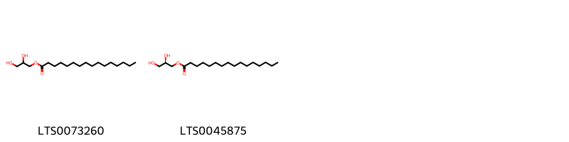{ width=100% }
    <figcaption>Hình ảnh cấu trúc hóa học của 2 hoạt chất thuộc nhóm Glycerolipids gồm ['glyceryl palmitate (LTS0073260)', '3-palmitoyl-sn-glycerol (LTS0045875)'].</figcaption>
</figure>
#### Nhóm Lactones
<figure markdown="span">
    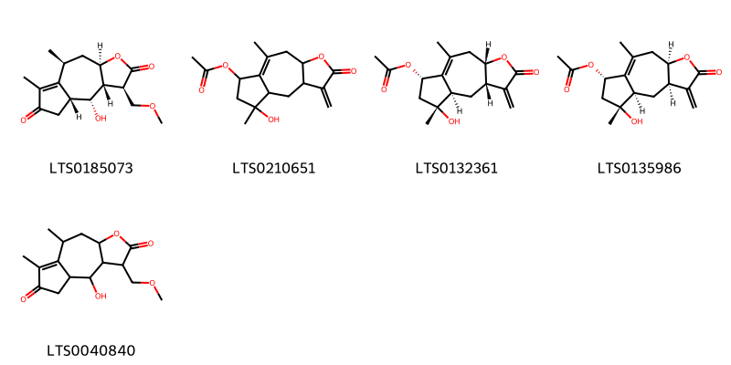{ width=100% }
    <figcaption>Hình ảnh cấu trúc hóa học của 5 hoạt chất thuộc nhóm Lactones gồm ['(3r,3ar,4r,4ar,8s,9ar)-4-hydroxy-3-(methoxymethyl)-7,8-dimethyl-3h,3ah,4h,4ah,5h,8h,9h,9ah-azuleno[6,5-b]furan-2,6-dione (LTS0185073)', '5-hydroxy-5,8-dimethyl-3-methylidene-2-oxo-3ah,4h,4ah,6h,7h,9h,9ah-azuleno[6,5-b]furan-7-yl acetate (LTS0210651)', '(3as,4ar,5r,7s,9as)-5-hydroxy-5,8-dimethyl-3-methylidene-2-oxo-3ah,4h,4ah,6h,7h,9h,9ah-azuleno[6,5-b]furan-7-yl acetate (LTS0132361)', 'inuchinenolide b (LTS0135986)', '4-hydroxy-3-(methoxymethyl)-7,8-dimethyl-3h,3ah,4h,4ah,5h,8h,9h,9ah-azuleno[6,5-b]furan-2,6-dione (LTS0040840)'].</figcaption>
</figure>
#### Nhóm Phenol ethers
<figure markdown="span">
    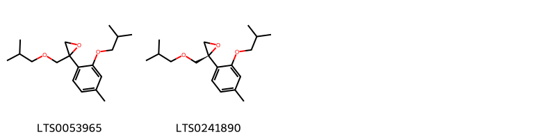{ width=100% }
    <figcaption>Hình ảnh cấu trúc hóa học của 2 hoạt chất thuộc nhóm Phenol ethers gồm ['2-[4-methyl-2-(2-methylpropoxy)phenyl]-2-[(2-methylpropoxy)methyl]oxirane (LTS0053965)', '(2r)-2-[4-methyl-2-(2-methylpropoxy)phenyl]-2-[(2-methylpropoxy)methyl]oxirane (LTS0241890)'].</figcaption>
</figure>
#### Nhóm Phenols
<figure markdown="span">
    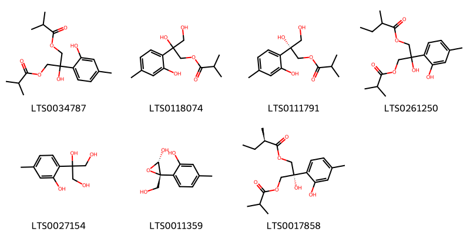{ width=100% }
    <figcaption>Hình ảnh cấu trúc hóa học của 7 hoạt chất thuộc nhóm Phenols gồm ['2-hydroxy-2-(2-hydroxy-4-methylphenyl)-3-[(2-methylpropanoyl)oxy]propyl 2-methylpropanoate (LTS0034787)', '2,3-dihydroxy-2-(2-hydroxy-4-methylphenyl)propyl 2-methylpropanoate (LTS0118074)', '(2r)-2,3-dihydroxy-2-(2-hydroxy-4-methylphenyl)propyl 2-methylpropanoate (LTS0111791)', '2-hydroxy-2-(2-hydroxy-4-methylphenyl)-3-[(2-methylpropanoyl)oxy]propyl 2-methylbutanoate (LTS0261250)', '2-(2-hydroxy-4-methylphenyl)propane-1,2,3-triol (LTS0027154)', '(2s,3r)-3-(2-hydroxy-4-methylphenyl)-3-(hydroxymethyl)oxiran-2-ol (LTS0011359)', '(2r)-2-hydroxy-2-(2-hydroxy-4-methylphenyl)-3-[(2-methylpropanoyl)oxy]propyl (2r)-2-methylbutanoate (LTS0017858)'].</figcaption>
</figure>
#### Nhóm Prenol lipids
<figure markdown="span">
    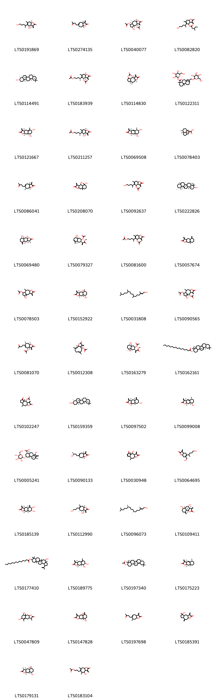{ width=100% }
    <figcaption>Hình ảnh cấu trúc hóa học của 173 hoạt chất thuộc nhóm Prenol lipids gồm ['(3as,4r,7ar)-4-hydroxy-5-(5-hydroxypentan-2-yl)-6-methyl-3-methylidene-3a,4,7,7a-tetrahydro-1-benzofuran-2-one (LTS0191869)', 'tomentosin (LTS0274135)', '(3ar,4s,4as,5s,7r,7as,8r,9as)-7-(acetyloxy)-5-hydroxy-4a,8-dimethyl-3-methylidene-2-oxo-octahydro-3ah-azuleno[6,5-b]furan-4-yl acetate (LTS0040077)', '5-(5-hydroxypentan-2-yl)-6-methyl-3-methylidene-2-oxo-3a,4,7,7a-tetrahydro-1-benzofuran-4-yl 3-methylpentanoate (LTS0082820)', 'epi-friedelanol (LTS0114491)', '(4s)-4-[(3ar,4r,7ar)-4-(acetyloxy)-6-methyl-3-methylidene-2-oxo-3a,4,7,7a-tetrahydro-1-benzofuran-5-yl]pentyl acetate (LTS0183939)', 'ergolide (LTS0114830)', '3,4,5-trihydroxy-6-(hydroxymethyl)oxan-2-yl 5,9-dimethyl-14-({[3,4,5-trihydroxy-6-(hydroxymethyl)oxan-2-yl]oxy}methyl)tetracyclo[11.2.1.0¹,¹⁰.0⁴,⁹]hexadecane-5-carboxylate (LTS0122311)', '(3ar,6r,8r,8ar,9ar)-6,8-dihydroxy-5,8a-dimethyl-3-methylidene-3ah,4h,6h,7h,8h,9h,9ah-naphtho[2,3-b]furan-2-one (LTS0121667)', '(4s)-4-[(3as,4r,7ar)-4-hydroxy-6-methyl-3-methylidene-2-oxo-3a,4,7,7a-tetrahydro-1-benzofuran-5-yl]pentyl acetate (LTS0211257)', '(3ar,5r,6s,8r,8ar,9ar)-6,8-dihydroxy-5,8a-dimethyl-3-methylidene-3ah,5h,6h,7h,8h,9h,9ah-naphtho[2,3-b]furan-2-one (LTS0069508)', '(1r,2s,4r,7r,8s,11s)-11-hydroxy-2,4,8-trimethyltricyclo[5.3.1.0⁴,¹¹]undecane-2-carboxylic acid (LTS0078403)', '(3ar,7r,8ar)-7-methyl-3-methylidene-6-(3-oxobutyl)-3ah,4h,7h,8h,8ah-cyclohepta[b]furan-2-one (LTS0086041)', '4,5-dihydroxy-5,8a-dimethyl-3-methylidene-octahydronaphtho[2,3-b]furan-2-one (LTS0208070)', '5-(5-hydroxypentan-2-yl)-6-methyl-3-methylidene-2-oxo-3a,4,7,7a-tetrahydro-1-benzofuran-4-yl acetate (LTS0092637)', 'amyrin (LTS0222826)', '(3s,3ar,4ar,8r,8as,9ar)-4a,8-dihydroxy-3,8a-dimethyl-5-methylidene-octahydronaphtho[2,3-b]furan-2-one (LTS0069480)', 'methyl 2-[(2r,3r,4ar,5r,8as)-3-(acetyloxy)-5-hydroxy-4a,8-dimethyl-2,3,4,5,6,8a-hexahydro-1h-naphthalen-2-yl]prop-2-enoate (LTS0079327)', '4-[4-(acetyloxy)-6-methyl-3-methylidene-2-oxo-3a,4,7,7a-tetrahydro-1-benzofuran-5-yl]pentyl acetate (LTS0081600)', '8a-methyl-3,5-dimethylidene-octahydronaphtho[2,3-b]furan-2-one (LTS0057674)', '5-hydroxy-4a,8-dimethyl-3-methylidene-2-oxo-octahydro-3ah-azuleno[6,5-b]furan-7-yl acetate (LTS0078503)', '(3ar,4ar,5s,8r,8as,9ar)-4a,8-dihydroxy-5,8a-dimethyl-3-methylidene-octahydronaphtho[2,3-b]furan-2-one (LTS0152922)', 'phytol (LTS0031808)', '7-(acetyloxy)-5-hydroxy-4a,8-dimethyl-3-methylidene-2-oxo-octahydro-3ah-azuleno[6,5-b]furan-4-yl acetate (LTS0090565)', '(3as,4s,7s,8ar)-7-methyl-3-methylidene-2-oxo-6-(3-oxobutyl)-3ah,4h,7h,8h,8ah-cyclohepta[b]furan-4-yl acetate (LTS0081070)', '(3ar,4s,11as)-6,10-dimethyl-3-methylidene-2-oxo-3ah,4h,5h,8h,9h,11ah-cyclodeca[b]furan-4-yl acetate (LTS0012308)', 'methyl 2-[(2r,3r,4ar,5r,8s,8ar)-3-(acetyloxy)-5,8-dihydroxy-4a,8-dimethyl-octahydronaphthalen-2-yl]prop-2-enoate (LTS0163279)', '(3s,4ar,6ar,6bs,8ar,12ar,14ar,14br)-4,4,6a,6b,8a,11,11,14b-octamethyl-1,2,3,4a,5,6,7,8,9,10,12,12a,14,14a-tetradecahydropicen-3-yl hexadecanoate (LTS0162161)', '4a,8-dimethyl-3-methylidene-2,5-dioxo-octahydroazuleno[6,5-b]furan-4-yl acetate (LTS0102247)', '(3r,4r,4as,6as,6br,8ar,12ar,12bs,14as,14bs)-4,4a,6b,8a,11,11,12b,14a-octamethyl-hexadecahydropicen-3-ol (LTS0159359)', '(3ar,4as,7s,8ar,9as)-7-hydroxy-8a-methyl-3,5-dimethylidene-octahydronaphtho[2,3-b]furan-2-one (LTS0097502)', '(3ar,5s,8r,8ar,9ar)-8-hydroxy-5,8a-dimethyl-3-methylidene-3ah,5h,6h,7h,8h,9h,9ah-naphtho[2,3-b]furan-2-one (LTS0099008)', '(1r,4r,5r,7r,9r,10s,13r,15s)-15-hydroxy-9-methyl-14-methylidene-7-{[(2r,3r,4s,5s,6r)-3,4,5-trihydroxy-6-(hydroxymethyl)oxan-2-yl]oxy}tetracyclo[11.2.1.0¹,¹⁰.0⁴,⁹]hexadecane-5-carboxylic acid (LTS0005241)', '(3ar,7s,8ar)-6-[(3s)-3-hydroxybutyl]-7-methyl-3-methylidene-3ah,4h,7h,8h,8ah-cyclohepta[b]furan-2-one (LTS0090133)', 'mexicanin-1 (LTS0030948)', '6-(hydroxymethyl)-5-(5-hydroxypentan-2-yl)-3-methylidene-3a,4,7,7a-tetrahydro-1-benzofuran-2-one (LTS0064695)', '(3ar,4ar,6r,7r,8ar,9ar)-6,7-dihydroxy-8a-methyl-3,5-dimethylidene-octahydronaphtho[2,3-b]furan-2-one (LTS0185139)', '(3as,4r,5r,8as)-4-hydroxy-6-(3-hydroxypropyl)-5,7-dimethyl-3-methylidene-3ah,4h,5h,8h,8ah-cyclohepta[b]furan-2-one (LTS0112990)', 'phytol (LTS0096073)', '(3ar,4r,5ar,6r,9as,9br)-4,6-dihydroxy-5a-methyl-3,9-dimethylidene-octahydronaphtho[1,2-b]furan-2-one (LTS0109411)', '4-hydroxy-3a,5a,5b,8,8,11a-hexamethyl-1-(prop-1-en-2-yl)-hexadecahydrocyclopenta[a]chrysen-9-yl tetradecanoate (LTS0177410)', '(3ar,7r,8s,8ar,9ar)-7,8-dihydroxy-5,8a-dimethyl-3-methylidene-3ah,4h,6h,7h,8h,9h,9ah-naphtho[2,3-b]furan-2-one (LTS0189775)', '(3s,4ar,6ar,6bs,8ar,14ar,14br)-4,4,6a,6b,8a,11,11,14b-octamethyl-1,2,3,4a,5,6,7,8,9,10,12,13,14,14a-tetradecahydropicen-3-yl acetate (LTS0197340)', 'alantolactone (LTS0175223)', '6,8-dihydroxy-3,5,8a-trimethyl-3h,3ah,4h,6h,7h,8h,9h,9ah-naphtho[2,3-b]furan-2-one (LTS0047809)', '4a,8-dihydroxy-8a-methyl-3,5-dimethylidene-hexahydro-3ah-naphtho[2,3-b]furan-2-one (LTS0147828)', '7-methyl-3-methylidene-6-(3-oxobutyl)-3ah,4h,7h,8h,8ah-cyclohepta[b]furan-2-one (LTS0197698)', '5-hydroxy-5-methyl-3,8-dimethylidene-octahydroazuleno[6,5-b]furan-2-one (LTS0185391)', '(3s,3ar,4ar,5s,8r,8as,9ar)-4a,8-dihydroxy-3,5,8a-trimethyl-octahydro-3h-naphtho[2,3-b]furan-2-one (LTS0179131)', '3-{4-hydroxy-5,7-dimethyl-3-methylidene-2-oxo-3ah,4h,5h,8h,8ah-cyclohepta[b]furan-6-yl}propyl acetate (LTS0183104)', 'taraxasterol acetate (LTS0190545)', '(1r,3as,4s,5ar,5br,7ar,9s,11ar,11br,13ar,13br)-4-hydroxy-3a,5a,5b,8,8,11a-hexamethyl-1-(prop-1-en-2-yl)-hexadecahydrocyclopenta[a]chrysen-9-yl tetradecanoate (LTS0186175)', '(3ar,4s,7ar)-5-[(2s)-5-hydroxypentan-2-yl]-6-methyl-3-methylidene-2-oxo-3a,4,7,7a-tetrahydro-1-benzofuran-4-yl 3-methylbutanoate (LTS0143491)', '8-hydroxy-5,8a-dimethyl-3-methylidene-3ah,4h,7h,8h,9h,9ah-naphtho[2,3-b]furan-2,6-dione (LTS0204622)', '(4s)-4-[(3s,3ar,6r,7ar)-6-hydroxy-3,6-dimethyl-2-oxo-3,3a,7,7a-tetrahydro-1-benzofuran-5-yl]pentyl acetate (LTS0198790)', '(3ar,5s,7s,8s,8ar,9ar)-7,8-dihydroxy-5,8a-dimethyl-3-methylidene-3ah,5h,6h,7h,8h,9h,9ah-naphtho[2,3-b]furan-2-one (LTS0148010)', '(3ar,7ar)-6-(hydroxymethyl)-5-[(2s)-5-hydroxypentan-2-yl]-3-methylidene-3a,4,7,7a-tetrahydro-1-benzofuran-2-one (LTS0164386)', '(3ar,7as)-4-hydroxy-5-(5-hydroxypentan-2-yl)-6-methyl-3-methylidene-3a,4,7,7a-tetrahydro-1-benzofuran-2-one (LTS0143199)', '(3ar,5s,8r,8ar,9ar)-5,8-dihydroxy-5,8a-dimethyl-3-methylidene-3ah,6h,7h,8h,9h,9ah-naphtho[2,3-b]furan-2-one (LTS0150501)', 'helenalin (LTS0155034)', '(1s,4s,5r,9s,10r,13r,14r)-5,9-dimethyl-14-({[(2r,3r,4s,5s,6r)-3,4,5-trihydroxy-6-(hydroxymethyl)oxan-2-yl]oxy}methyl)tetracyclo[11.2.1.0¹,¹⁰.0⁴,⁹]hexadecane-5-carboxylic acid (LTS0151888)', '(3ar,4r,5ar,6r,9as,9br)-4,6-dihydroxy-5a,9-dimethyl-3-methylidene-3ah,4h,5h,6h,7h,9ah,9bh-naphtho[1,2-b]furan-2-one (LTS0171406)', '(4s)-4-[(3as,4s,7ar)-4-hydroxy-6-methyl-3-methylidene-2-oxo-3a,4,7,7a-tetrahydro-1-benzofuran-5-yl]pentyl acetate (LTS0236595)', 'ursolic acid (LTS0250838)', '(3ar,4ar,5r,7s,7ar,9as)-5-hydroxy-5,8-dimethyl-3-methylidene-2-oxo-3ah,4h,4ah,6h,7h,7ah,9ah-azuleno[6,5-b]furan-7-yl acetate (LTS0114265)', '5-(5-hydroxypentan-2-yl)-6-methyl-3-methylidene-2-oxo-3a,4,7,7a-tetrahydro-1-benzofuran-4-yl 3-methylbutanoate (LTS0109330)', '4-hydroxy-5-(5-hydroxypentan-2-yl)-6-methyl-3-methylidene-3a,4,7,7a-tetrahydro-1-benzofuran-2-one (LTS0161983)', '(3as,7r,8ar)-7-methyl-3-methylidene-6-(3-oxobutyl)-3ah,4h,7h,8h,8ah-cyclohepta[b]furan-2-one (LTS0170421)', '6,7-dihydroxy-8a-methyl-3,5-dimethylidene-octahydronaphtho[2,3-b]furan-2-one (LTS0087074)', '(3s,3ar,4ar,8r,8as,9ar)-4a-hydroperoxy-8-hydroxy-3,8a-dimethyl-5-methylidene-octahydronaphtho[2,3-b]furan-2-one (LTS0088414)', '(3ar,4ar,8r,8as,9ar)-4a,8-dihydroxy-8a-methyl-3,5-dimethylidene-hexahydro-3ah-naphtho[2,3-b]furan-2-one (LTS0157759)', '10-hydroxy-1,2,6a,6b,9,9,12a-heptamethyl-2,3,4,5,6,7,8,8a,10,11,12,12b,13,14b-tetradecahydro-1h-picene-4a-carboxylic acid (LTS0166564)', '6-(3-hydroxybutyl)-7-methyl-3-methylidene-3ah,4h,7h,8h,8ah-cyclohepta[b]furan-2-one (LTS0109217)', '5-(acetyloxy)-4-hydroxy-4a,8-dimethyl-3-methylidene-2-oxo-octahydro-3ah-azuleno[6,5-b]furan-7-yl acetate (LTS0233223)', 'methyl 2-[3-(acetyloxy)-5-hydroxy-4a,8-dimethyl-2,3,4,5,6,8a-hexahydro-1h-naphthalen-2-yl]prop-2-enoate (LTS0115662)', '(3ar,4as,5s,7s,7as,8s,9as)-5-hydroxy-4a,8-dimethyl-3-methylidene-2-oxo-octahydro-3ah-azuleno[6,5-b]furan-7-yl acetate (LTS0133403)', '4-[4-hydroxy-6-(hydroxymethyl)-3-methylidene-2-oxo-3a,4,7,7a-tetrahydro-1-benzofuran-5-yl]pentyl acetate (LTS0265829)', '(3as,4s,7ar)-4-hydroxy-5-[(2s)-5-hydroxypentan-2-yl]-6-methyl-3-methylidene-3a,4,7,7a-tetrahydro-1-benzofuran-2-one (LTS0229804)', '8-epihelenalin (LTS0164300)', '(4ar,6ar,6br,8ar,12as,12bs,14as,14br)-4,4,6a,6b,8a,12,14b-heptamethyl-11-methylidene-hexadecahydropicen-3-yl acetate (LTS0117429)', '4-epiisoinuviscolide (LTS0174860)', '4-hydroxy-4-(3-hydroxybut-1-en-1-yl)-3,5,5-trimethylcyclohex-2-en-1-one (LTS0183737)', '4a,8-dihydroxy-3,8a-dimethyl-5-methylidene-octahydronaphtho[2,3-b]furan-2-one (LTS0187679)', 'alantolactone (LTS0185122)', 'inulicin (LTS0185263)', '4-(2,4-dihydroxy-2,6,6-trimethylcyclohexylidene)but-3-en-2-one (LTS0273775)', '(3ar,6s,7ar)-6-hydroxy-5-[(2s)-5-hydroxypentan-2-yl]-6-methyl-3-methylidene-7,7a-dihydro-3ah-1-benzofuran-2-one (LTS0269487)', '11-hydroxy-2,4,8-trimethyltricyclo[5.3.1.0⁴,¹¹]undecane-2-carboxylic acid (LTS0078169)', '4,6-dihydroxy-5a-methyl-3,9-dimethylidene-octahydronaphtho[1,2-b]furan-2-one (LTS0218856)', '(3s,3ar,6r,8r,8ar,9ar)-6,8-dihydroxy-3,5,8a-trimethyl-3h,3ah,4h,6h,7h,8h,9h,9ah-naphtho[2,3-b]furan-2-one (LTS0270774)', '(3ar,4s,7ar)-5-[(2s)-5-hydroxypentan-2-yl]-6-methyl-3-methylidene-2-oxo-3a,4,7,7a-tetrahydro-1-benzofuran-4-yl (2r)-2-methylbutanoate (LTS0205283)', '(6ar,6br,8ar,14br)-4,4,6a,6b,8a,12,14b-heptamethyl-11-methylidene-hexadecahydropicen-3-ol (LTS0274865)', '(3s,3ar,5s,8r,8ar,9ar)-8-hydroxy-3,5,8a-trimethyl-3h,3ah,5h,6h,7h,8h,9h,9ah-naphtho[2,3-b]furan-2-one (LTS0260303)', '(3ar,4s,4ar,5s,7s,7as,8s,9as)-7-(acetyloxy)-5-hydroxy-4a,8-dimethyl-3-methylidene-2-oxo-octahydro-3ah-azuleno[6,5-b]furan-4-yl acetate (LTS0203574)', '5-hydroxy-5,8-dimethyl-3-methylidene-3ah,4h,4ah,6h,7h,7ah,9ah-azuleno[6,5-b]furan-2-one (LTS0263720)', '4-hydroxy-6,10-dimethyl-3-methylidene-3ah,4h,5h,8h,9h,11ah-cyclodeca[b]furan-2-one (LTS0204804)', '5-hydroxy-5,8-dimethyl-3-methylidene-2-oxo-3ah,4h,4ah,6h,7h,7ah,9ah-azuleno[6,5-b]furan-7-yl acetate (LTS0267996)', '2-(hydroxymethyl)-2,4,8-trimethyltricyclo[5.3.1.0⁴,¹¹]undecan-11-ol (LTS0096933)', '(3ar,4s,7ar)-5-[(2s)-5-hydroxypentan-2-yl]-6-methyl-3-methylidene-2-oxo-3a,4,7,7a-tetrahydro-1-benzofuran-4-yl (3s)-3-methylpentanoate (LTS0213276)', '(3ar,8r,8ar,9ar)-8-hydroxy-5,8a-dimethyl-3-methylidene-3ah,4h,6h,7h,8h,9h,9ah-naphtho[2,3-b]furan-2-one (LTS0085533)', '4-[(3ar,7as)-4-hydroxy-6-methyl-3-methylidene-2-oxo-3a,4,7,7a-tetrahydro-1-benzofuran-5-yl]pentyl acetate (LTS0207354)', '8-hydroxy-8a-methyl-3,5-dimethylidene-octahydronaphtho[2,3-b]furan-2-one (LTS0083579)', '(3as,4s,7s,8as)-7-methyl-3-methylidene-2-oxo-6-(3-oxobutyl)-3ah,4h,7h,8h,8ah-cyclohepta[b]furan-4-yl acetate (LTS0218642)', '5-(5-hydroxypentan-2-yl)-6-methyl-3-methylidene-2-oxo-3a,4,7,7a-tetrahydro-1-benzofuran-4-yl 2-methylbutanoate (LTS0072062)', '4a,8-dimethyl-3-methylidene-2,5-dioxo-3ah,4h,7ah,8h,9h,9ah-azuleno[6,5-b]furan-4-yl acetate (LTS0217849)', '6-hydroxy-5-(5-hydroxypentan-2-yl)-6-methyl-3-methylidene-7,7a-dihydro-3ah-1-benzofuran-2-one (LTS0032958)', '4,4,6a,6b,8a,12,14b-heptamethyl-11-methylidene-hexadecahydropicen-3-yl acetate (LTS0026037)', '(4s)-4-[(3as,4s,7ar)-4-hydroxy-6-(hydroxymethyl)-3-methylidene-2-oxo-3a,4,7,7a-tetrahydro-1-benzofuran-5-yl]pentyl acetate (LTS0187965)', 'methyl 2-[3-(acetyloxy)-5,8-dihydroxy-4a,8-dimethyl-octahydronaphthalen-2-yl]prop-2-enoate (LTS0233790)', '(3as,4r,7ar)-4-hydroxy-5-[(2s)-5-hydroxypentan-2-yl]-6-methyl-3-methylidene-3a,4,7,7a-tetrahydro-1-benzofuran-2-one (LTS0020195)', '(3ar,6s,8r,8ar,9ar)-6,8-dihydroxy-5,8a-dimethyl-3-methylidene-3ah,4h,6h,7h,8h,9h,9ah-naphtho[2,3-b]furan-2-one (LTS0233469)', '4-hydroxy-3a,5a,5b,8,8,11a-hexamethyl-1-(prop-1-en-2-yl)-hexadecahydrocyclopenta[a]chrysen-9-yl hexadecanoate (LTS0023337)', '4a,8-dihydroxy-3,5,8a-trimethyl-octahydro-3h-naphtho[2,3-b]furan-2-one (LTS0159027)', '8-hydroxy-5,8a-dimethyl-3-methylidene-3ah,5h,6h,7h,8h,9h,9ah-naphtho[2,3-b]furan-2-one (LTS0228049)', '(3ar,4as,5s,7s,7as,8s,9as)-5,7-dihydroxy-4a,8-dimethyl-3-methylidene-octahydro-3ah-azuleno[6,5-b]furan-2-one (LTS0185784)', 'taraxasterol (LTS0006950)', '(1s,2s,4s,8r,12r,13s,15r)-15-(acetyloxy)-13-{3-[(2r)-5-hydroxypentan-2-yl]-4-methylphenyl}-2,11-dimethyl-7-methylidene-6-oxo-5-oxatetracyclo[10.2.1.0¹,¹⁰.0⁴,⁸]pentadec-10-ene-13-carboxylic acid (LTS0225629)', '6,8-dihydroxy-5,8a-dimethyl-3-methylidene-3ah,5h,6h,7h,8h,9h,9ah-naphtho[2,3-b]furan-2-one (LTS0020685)', 'methyl 2-[(2r,3r,4as,5r,8ar)-3-(acetyloxy)-8a-hydroperoxy-5-hydroxy-4a-methyl-8-methylidene-hexahydro-1h-naphthalen-2-yl]prop-2-enoate (LTS0180612)', '(4s)-4-[(3ar,4s,7ar)-4-(acetyloxy)-6-methyl-3-methylidene-2-oxo-3a,4,7,7a-tetrahydro-1-benzofuran-5-yl]pentyl acetate (LTS0035307)', '(3as,4s,4ar,5s,7s,7as,8s,9as)-5-(acetyloxy)-4-hydroxy-4a,8-dimethyl-3-methylidene-2-oxo-octahydro-3ah-azuleno[6,5-b]furan-7-yl acetate (LTS0174170)', 'blumenol a (LTS0019694)', 'isoalantolactone (LTS0028543)', '15-(acetyloxy)-13-[3-(5-hydroxypentan-2-yl)-4-methylphenyl]-2,11-dimethyl-7-methylidene-6-oxo-5-oxatetracyclo[10.2.1.0¹,¹⁰.0⁴,⁸]pentadec-10-ene-13-carboxylic acid (LTS0168403)', '(1r,2s,4r,7r,8s,11s)-2-(hydroxymethyl)-2,4,8-trimethyltricyclo[5.3.1.0⁴,¹¹]undecan-11-ol (LTS0236686)', 'methyl 2-[(2r,3r,4ar,5r,8as)-3-(acetyloxy)-5-hydroxy-4a-methyl-8-methylidene-octahydronaphthalen-2-yl]prop-2-enoate (LTS0252178)', '4a-hydroperoxy-8-hydroxy-8a-methyl-3,5-dimethylidene-hexahydro-3ah-naphtho[2,3-b]furan-2-one (LTS0249911)', '(3as,5ar,6r)-6-hydroxy-5a,9-dimethyl-3-methylidene-3ah,4h,5h,6h,7h,8h,9bh-naphtho[1,2-b]furan-2-one (LTS0160186)', '7,8-dihydroxy-5,8a-dimethyl-3-methylidene-3ah,5h,6h,7h,8h,9h,9ah-naphtho[2,3-b]furan-2-one (LTS0051511)', '15-hydroxy-9-methyl-14-methylidene-7-{[3,4,5-trihydroxy-6-(hydroxymethyl)oxan-2-yl]oxy}tetracyclo[11.2.1.0¹,¹⁰.0⁴,⁹]hexadecane-5-carboxylic acid (LTS0259316)', '(3as,4s,4as,5r,8ar,9ar)-4,5-dihydroxy-5,8a-dimethyl-3-methylidene-octahydronaphtho[2,3-b]furan-2-one (LTS0068621)', '(3as,5ar,6r,9bs)-6-hydroxy-5a,9-dimethyl-3-methylidene-3ah,4h,5h,6h,7h,8h,9bh-naphtho[1,2-b]furan-2-one (LTS0259801)', '(3ar,4r,7ar)-5-[(2s)-5-hydroxypentan-2-yl]-6-methyl-3-methylidene-2-oxo-3a,4,7,7a-tetrahydro-1-benzofuran-4-yl (2r)-2-methylbutanoate (LTS0033256)', 'methyl 2-[3-(acetyloxy)-5-hydroxy-4a-methyl-8-methylidene-octahydronaphthalen-2-yl]prop-2-enoate (LTS0249427)', '(6s,9r)-vomifoliol (LTS0052786)', 'methyl 2-[(2r,3r,4ar,5r,8r,8ar)-3-(acetyloxy)-5,8-dihydroxy-4a,8-dimethyl-octahydronaphthalen-2-yl]prop-2-enoate (LTS0244658)', 'bigelovin (LTS0246145)', '4-(6-hydroxy-3,6-dimethyl-2-oxo-3,3a,7,7a-tetrahydro-1-benzofuran-5-yl)pentyl acetate (LTS0245800)', '7,8-dihydroxy-5,8a-dimethyl-3-methylidene-3ah,4h,6h,7h,8h,9h,9ah-naphtho[2,3-b]furan-2-one (LTS0010365)', '(3ar,4s,11as)-4-hydroxy-6,10-dimethyl-3-methylidene-3ah,4h,5h,8h,9h,11ah-cyclodeca[b]furan-2-one (LTS0004481)', '4,4,6a,6b,8a,11,11,14b-octamethyl-1,2,3,4a,5,6,7,8,9,10,12,13,14,14a-tetradecahydropicen-3-yl acetate (LTS0012038)', '(3ar,11ar)-4-hydroxy-6,10-dimethyl-3-methylidene-3ah,4h,5h,8h,9h,11ah-cyclodeca[b]furan-2-one (LTS0062208)', '(1r,3as,4s,5ar,5br,7ar,9s,11ar,11br,13ar,13br)-4-hydroxy-3a,5a,5b,8,8,11a-hexamethyl-1-(prop-1-en-2-yl)-hexadecahydrocyclopenta[a]chrysen-9-yl hexadecanoate (LTS0011300)', '(3ar,4as,8r,8ar,9ar)-8-hydroxy-8a-methyl-3,5-dimethylidene-octahydronaphtho[2,3-b]furan-2-one (LTS0011216)', '8-hydroxy-5,8a-dimethyl-3-methylidene-3ah,4h,6h,7h,8h,9h,9ah-naphtho[2,3-b]furan-2-one (LTS0015165)', '5,8-dihydroxy-5,8a-dimethyl-3-methylidene-3ah,6h,7h,8h,9h,9ah-naphtho[2,3-b]furan-2-one (LTS0013630)', '5,9-dimethyl-14-({[3,4,5-trihydroxy-6-(hydroxymethyl)oxan-2-yl]oxy}methyl)tetracyclo[11.2.1.0¹,¹⁰.0⁴,⁹]hexadecane-5-carboxylic acid (LTS0022060)', '8-hydroxy-3,5,8a-trimethyl-3h,3ah,5h,6h,7h,8h,9h,9ah-naphtho[2,3-b]furan-2-one (LTS0010247)', '4a,8-dihydroxy-5,8a-dimethyl-3-methylidene-octahydronaphtho[2,3-b]furan-2-one (LTS0009587)', 'eupatolide (LTS0263103)', '7-methyl-3-methylidene-2-oxo-6-(3-oxobutyl)-3ah,4h,7h,8h,8ah-cyclohepta[b]furan-4-yl acetate (LTS0011978)', '(3ar,4r,7ar)-5-[(2s)-5-hydroxypentan-2-yl]-6-methyl-3-methylidene-2-oxo-3a,4,7,7a-tetrahydro-1-benzofuran-4-yl 2-methylbutanoate (LTS0021678)', '(3ar,4s,7ar)-5-[(2s)-5-hydroxypentan-2-yl]-6-methyl-3-methylidene-2-oxo-3a,4,7,7a-tetrahydro-1-benzofuran-4-yl acetate (LTS0024742)', '4,6-dihydroxy-5a,9-dimethyl-3-methylidene-3ah,4h,5h,6h,7h,9ah,9bh-naphtho[1,2-b]furan-2-one (LTS0029913)', '4,4,6a,6b,8a,11,11,14b-octamethyl-1,2,3,4a,5,6,7,8,9,10,12,12a,14,14a-tetradecahydropicen-3-yl hexadecanoate (LTS0232124)', '5,7-dihydroxy-4a,8-dimethyl-3-methylidene-octahydro-3ah-azuleno[6,5-b]furan-2-one (LTS0106699)', '(3ar,4s,7ar)-5-[(2s)-5-hydroxypentan-2-yl]-6-methyl-3-methylidene-2-oxo-3a,4,7,7a-tetrahydro-1-benzofuran-4-yl 2-methylpropanoate (LTS0247040)', '4-[(2r,4s)-2,4-dihydroxy-2,6,6-trimethylcyclohexylidene]but-3-en-2-one (LTS0233974)', '(3ar,8r,8ar,9ar)-8-hydroxy-5,8a-dimethyl-3-methylidene-3ah,4h,7h,8h,9h,9ah-naphtho[2,3-b]furan-2,6-dione (LTS0031325)', '4-hydroxy-6-(3-hydroxypropyl)-5,7-dimethyl-3-methylidene-3ah,4h,5h,8h,8ah-cyclohepta[b]furan-2-one (LTS0104145)', '6,8-dihydroxy-5,8a-dimethyl-3-methylidene-3ah,4h,6h,7h,8h,9h,9ah-naphtho[2,3-b]furan-2-one (LTS0131829)', '7-hydroxy-8a-methyl-3,5-dimethylidene-octahydronaphtho[2,3-b]furan-2-one (LTS0101314)', '(3ar,4s,11as)-4-hydroxy-6,10-dimethyl-3-methylidene-3ah,4h,5h,8h,9h,11ah-cyclodeca[b]furan-2-one (LTS0030102)', 'inuviscolide (LTS0116262)', '4-(4-hydroxy-6-methyl-3-methylidene-2-oxo-3a,4,7,7a-tetrahydro-1-benzofuran-5-yl)pentyl acetate (LTS0044993)', '(2s,3r,4s,5s,6r)-3,4,5-trihydroxy-6-(hydroxymethyl)oxan-2-yl (1s,4s,5r,9s,10r,13r,14r)-5,9-dimethyl-14-({[(2r,3r,4s,5s,6r)-3,4,5-trihydroxy-6-(hydroxymethyl)oxan-2-yl]oxy}methyl)tetracyclo[11.2.1.0¹,¹⁰.0⁴,⁹]hexadecane-5-carboxylate (LTS0124651)', '6,10-dimethyl-3-methylidene-2-oxo-3ah,4h,5h,8h,9h,11ah-cyclodeca[b]furan-4-yl acetate (LTS0257520)', '(3as,4s,4ar,5s,7s,7as,8r,9as)-7-(acetyloxy)-5-hydroxy-4a,8-dimethyl-3-methylidene-2-oxo-octahydro-3ah-azuleno[6,5-b]furan-4-yl acetate (LTS0243563)', '5-(5-hydroxypentan-2-yl)-6-methyl-3-methylidene-2-oxo-3a,4,7,7a-tetrahydro-1-benzofuran-4-yl 2-methylpropanoate (LTS0126628)', '(3ar,4s,4ar,5s,7s,7as,8r,9as)-5-(acetyloxy)-4-hydroxy-4a,8-dimethyl-3-methylidene-2-oxo-octahydro-3ah-azuleno[6,5-b]furan-7-yl acetate (LTS0051118)', '(3ar,4s,11ar)-4-hydroxy-6,10-dimethyl-3-methylidene-3ah,4h,5h,8h,9h,11ah-cyclodeca[b]furan-2-one (LTS0227634)', '(3ar,4ar,8r,8as,9ar)-4a-hydroperoxy-8-hydroxy-8a-methyl-3,5-dimethylidene-hexahydro-3ah-naphtho[2,3-b]furan-2-one (LTS0105094)', '4-hydroxy-6,10-dimethyl-3-methylidene-3ah,4h,5h,8h,9h,11ah-cyclodeca[b]furan-2-one (LTS0114761)'].</figcaption>
</figure>
#### Nhóm Steroids and steroid derivatives
<figure markdown="span">
    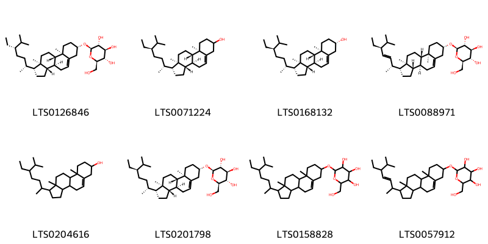{ width=100% }
    <figcaption>Hình ảnh cấu trúc hóa học của 8 hoạt chất thuộc nhóm Steroids and steroid derivatives gồm ['(2r,3r,4s,5s,6r)-2-{[(1r,3as,3bs,7s,9ar,9bs,11ar)-1-[(2r,5s)-5-ethyl-6-methylheptan-2-yl]-9a,11a-dimethyl-1h,2h,3h,3ah,3bh,4h,6h,7h,8h,9h,9bh,10h,11h-cyclopenta[a]phenanthren-7-yl]oxy}-6-(hydroxymethyl)oxane-3,4,5-triol (LTS0126846)', 'stigmast-5-en-3-ol (LTS0071224)', 'sitosterol (LTS0168132)', '(2r,3r,4s,5s,6r)-2-{[(1r,3as,3bs,7s,9ar,9bs,11ar)-1-[(2r,3e,5s)-5-ethyl-6-methylhept-3-en-2-yl]-9a,11a-dimethyl-1h,2h,3h,3ah,3bh,4h,6h,7h,8h,9h,9bh,10h,11h-cyclopenta[a]phenanthren-7-yl]oxy}-6-(hydroxymethyl)oxane-3,4,5-triol (LTS0088971)', 'stigmast-5-en-3-ol, (3β)- (LTS0204616)', 'sitogluside (LTS0201798)', '2-{[1-(5-ethyl-6-methylheptan-2-yl)-9a,11a-dimethyl-1h,2h,3h,3ah,3bh,4h,6h,7h,8h,9h,9bh,10h,11h-cyclopenta[a]phenanthren-7-yl]oxy}-6-(hydroxymethyl)oxane-3,4,5-triol (LTS0158828)', '2-{[1-(5-ethyl-6-methylhept-3-en-2-yl)-9a,11a-dimethyl-1h,2h,3h,3ah,3bh,4h,6h,7h,8h,9h,9bh,10h,11h-cyclopenta[a]phenanthren-7-yl]oxy}-6-(hydroxymethyl)oxane-3,4,5-triol (LTS0057912)'].</figcaption>
</figure>

---

### Dược dân tộc học

Danh sách các quốc gia có sử dụng *Inula britannica* trong điều trị các bệnh. 

| Country   | Disease                          | Bệnh                                                                                                                                                                                                |
|:----------|:---------------------------------|:----------------------------------------------------------------------------------------------------------------------------------------------------------------------------------------------------|
| Elsewhere | Diuretic, Expectorant, Stomachic | MYMEMORY WARNING: YOU USED ALL AVAILABLE FREE TRANSLATIONS FOR TODAY. NEXT AVAILABLE IN  12 HOURS 52 MINUTES 32 SECONDS VISIT HTTPS://MYMEMORY.TRANSLATED.NET/DOC/USAGELIMITS.PHP TO TRANSLATE MORE |

---

---
## Inula brittanica
### Thông tin về thực vật

!!! info "Phân loại thực vật của *Inula britannica* từ GIBF:"
    - **Kingdom:** Plantae
    - **Phylum:** Tracheophyta
    - **Order:** Asterales
    - **Family:** Asteraceae
    - **Genus:** Inula
    - **Species:** *Inula britannica*

 

| Label (VI)   | Label (EN)   | Scientific Name   | Descriptions (VI)   | Descriptions (EN)   | Also Known As (VI)   | Also Known As (EN)                        |
|:-------------|:-------------|:------------------|:--------------------|:--------------------|:---------------------|:------------------------------------------|
| N/A          | N/A          | Inula britannica  | loài thực vật       | species of plant    | ['']                 | ['British yellowhead', 'meadow fleabane'] |

#### Phân bố trên thế giới

**Từ CSDL GIBF** Germany, Netherlands, France, Austria

#### Phân bố tại Việt Nam

**Từ CSDL GIBF**: Không có ghi nhận ở Việt Nam

---
### Thành phần hóa học
        
- Theo cơ sở dữ liệu lotus: Từ loài *Inula britannica* đã phân lập và xác định được Chưa có hoạt chất nào được phân lập. hoạt chất thuộc về các nhóm Không có hoạt chất nào được phân lập. 

Không có hình ảnh nào được tạo ra

---

### Dược dân tộc học

Danh sách các quốc gia có sử dụng *Inula britannica* trong điều trị các bệnh. 

| Country   | Disease                | Bệnh                                                                                                                                                                                                |
|:----------|:-----------------------|:----------------------------------------------------------------------------------------------------------------------------------------------------------------------------------------------------|
| China     | Stomachic, Expectorant | MYMEMORY WARNING: YOU USED ALL AVAILABLE FREE TRANSLATIONS FOR TODAY. NEXT AVAILABLE IN  12 HOURS 51 MINUTES 26 SECONDS VISIT HTTPS://MYMEMORY.TRANSLATED.NET/DOC/USAGELIMITS.PHP TO TRANSLATE MORE |

---

---
## Inula cappa
### Thông tin về thực vật

!!! info "Phân loại thực vật của *Duhaldea cappa* từ GIBF:"
    - **Kingdom:** Plantae
    - **Phylum:** Tracheophyta
    - **Order:** Asterales
    - **Family:** Asteraceae
    - **Genus:** Duhaldea
    - **Species:** *Duhaldea cappa*

 

| Label (VI)   | Label (EN)   | Scientific Name   | Descriptions (VI)   | Descriptions (EN)   | Also Known As (VI)   | Also Known As (EN)   |
|:-------------|:-------------|:------------------|:--------------------|:--------------------|:---------------------|:---------------------|
| N/A          | N/A          | Inula cappa       | loài thực vật       | species of plant    | ['']                 | ['']                 |

#### Phân bố trên thế giới

**Từ CSDL GIBF** nan, Pakistan, Hong Kong, Thailand, Lao People’s Democratic Republic, Chinese Taipei, Myanmar, Bhutan, India, Viet Nam, China, Nepal

#### Phân bố tại Việt Nam

**Từ CSDL GIBF**: Kontum

---
### Thành phần hóa học
        
- Theo cơ sở dữ liệu lotus: Từ loài *Duhaldea cappa* đã phân lập và xác định được Chưa có hoạt chất nào được phân lập. hoạt chất thuộc về các nhóm Không có hoạt chất nào được phân lập. 

Không có hình ảnh nào được tạo ra

---

### Dược dân tộc học

Danh sách các quốc gia có sử dụng *Duhaldea cappa* trong điều trị các bệnh. 

| Country   | Disease                                           | Bệnh                                                                                                                                                                                                |
|:----------|:--------------------------------------------------|:----------------------------------------------------------------------------------------------------------------------------------------------------------------------------------------------------|
| China     | Expectorant, Alexiteric, Carminative, Cicatrizant | MYMEMORY WARNING: YOU USED ALL AVAILABLE FREE TRANSLATIONS FOR TODAY. NEXT AVAILABLE IN  12 HOURS 51 MINUTES 00 SECONDS VISIT HTTPS://MYMEMORY.TRANSLATED.NET/DOC/USAGELIMITS.PHP TO TRANSLATE MORE |

---

---
## Inula conyza
### Thông tin về thực vật

!!! info "Phân loại thực vật của *Pentanema squarrosum* từ GIBF:"
    - **Kingdom:** Plantae
    - **Phylum:** Tracheophyta
    - **Order:** Asterales
    - **Family:** Asteraceae
    - **Genus:** Pentanema
    - **Species:** *Pentanema squarrosum*

 

| Label (VI)   | Label (EN)   | Scientific Name   | Descriptions (VI)   | Descriptions (EN)   | Also Known As (VI)   | Also Known As (EN)   |
|:-------------|:-------------|:------------------|:--------------------|:--------------------|:---------------------|:---------------------|
| N/A          | N/A          | Inula cappa       | loài thực vật       | species of plant    | ['']                 | ['']                 |

#### Phân bố trên thế giới

**Từ CSDL GIBF** Italy, Belgium, Spain, Austria, France, United Kingdom of Great Britain and Northern Ireland

#### Phân bố tại Việt Nam

**Từ CSDL GIBF**: Không có ghi nhận ở Việt Nam

---
### Thành phần hóa học
        
- Theo cơ sở dữ liệu lotus: Từ loài *Pentanema squarrosum* đã phân lập và xác định được Chưa có hoạt chất nào được phân lập. hoạt chất thuộc về các nhóm Không có hoạt chất nào được phân lập. 

Không có hình ảnh nào được tạo ra

---

### Dược dân tộc học

Danh sách các quốc gia có sử dụng *Pentanema squarrosum* trong điều trị các bệnh. 

| Country   | Disease     | Bệnh                                                                                                                                                                                                |
|:----------|:------------|:----------------------------------------------------------------------------------------------------------------------------------------------------------------------------------------------------|
| ain       | Emmenagogue | MYMEMORY WARNING: YOU USED ALL AVAILABLE FREE TRANSLATIONS FOR TODAY. NEXT AVAILABLE IN  12 HOURS 50 MINUTES 30 SECONDS VISIT HTTPS://MYMEMORY.TRANSLATED.NET/DOC/USAGELIMITS.PHP TO TRANSLATE MORE |

---

---
## Inula graveolens
### Thông tin về thực vật

!!! info "Phân loại thực vật của *Dittrichia graveolens* từ GIBF:"
    - **Kingdom:** Plantae
    - **Phylum:** Tracheophyta
    - **Order:** Asterales
    - **Family:** Asteraceae
    - **Genus:** Dittrichia
    - **Species:** *Dittrichia graveolens*

 

| Label (VI)   | Label (EN)   | Scientific Name   | Descriptions (VI)   | Descriptions (EN)   | Also Known As (VI)   | Also Known As (EN)   |
|:-------------|:-------------|:------------------|:--------------------|:--------------------|:---------------------|:---------------------|
| N/A          | N/A          | Inula graveolens  | loài thực vật       | species of plant    | ['']                 | ['']                 |

#### Phân bố trên thế giới

**Từ CSDL GIBF** nan, South Africa, Italy, Australia, Germany, Belgium, Malta, Spain, Türkiye, Portugal, unknown or invalid, Morocco, United States of America, Lebanon, Austria, France, Greece, Israel

#### Phân bố tại Việt Nam

**Từ CSDL GIBF**: Không có ghi nhận ở Việt Nam

---
### Thành phần hóa học
        
- Theo cơ sở dữ liệu lotus: Từ loài *Dittrichia graveolens* đã phân lập và xác định được Chưa có hoạt chất nào được phân lập. hoạt chất thuộc về các nhóm Không có hoạt chất nào được phân lập. 

Không có hình ảnh nào được tạo ra

---

### Dược dân tộc học

Danh sách các quốc gia có sử dụng *Dittrichia graveolens* trong điều trị các bệnh. 

| Country   | Disease          | Bệnh                                                                                                                                                                                                |
|:----------|:-----------------|:----------------------------------------------------------------------------------------------------------------------------------------------------------------------------------------------------|
| Iraq      | Poison, Diuretic | MYMEMORY WARNING: YOU USED ALL AVAILABLE FREE TRANSLATIONS FOR TODAY. NEXT AVAILABLE IN  12 HOURS 50 MINUTES 05 SECONDS VISIT HTTPS://MYMEMORY.TRANSLATED.NET/DOC/USAGELIMITS.PHP TO TRANSLATE MORE |
| Pakistan  | Diuretic         | MYMEMORY WARNING: YOU USED ALL AVAILABLE FREE TRANSLATIONS FOR TODAY. NEXT AVAILABLE IN  12 HOURS 50 MINUTES 02 SECONDS VISIT HTTPS://MYMEMORY.TRANSLATED.NET/DOC/USAGELIMITS.PHP TO TRANSLATE MORE |
| ain       | Sudorific        | MYMEMORY WARNING: YOU USED ALL AVAILABLE FREE TRANSLATIONS FOR TODAY. NEXT AVAILABLE IN  12 HOURS 49 MINUTES 56 SECONDS VISIT HTTPS://MYMEMORY.TRANSLATED.NET/DOC/USAGELIMITS.PHP TO TRANSLATE MORE |

---

---
## Inula helenium
### Thông tin về thực vật

!!! info "Phân loại thực vật của *Inula helenium* từ GIBF:"
    - **Kingdom:** Plantae
    - **Phylum:** Tracheophyta
    - **Order:** Asterales
    - **Family:** Asteraceae
    - **Genus:** Inula
    - **Species:** *Inula helenium*

 

| Label (VI)   | Label (EN)   | Scientific Name   | Descriptions (VI)   | Descriptions (EN)   | Also Known As (VI)   | Also Known As (EN)                                        |
|:-------------|:-------------|:------------------|:--------------------|:--------------------|:---------------------|:----------------------------------------------------------|
| N/A          | N/A          | Inula helenium    |                     | species of plant    | ['']                 | ['Elecampane', 'elfdock', 'horse-heal', 'large scabious'] |

#### Phân bố trên thế giới

**Từ CSDL GIBF** Ukraine, Finland, Netherlands, Germany, Belgium, Romania, Hungary, Russian Federation, United States of America, Sweden, Austria, Kazakhstan, Norway, United Kingdom of Great Britain and Northern Ireland, Canada

#### Phân bố tại Việt Nam

**Từ CSDL GIBF**: Không có ghi nhận ở Việt Nam

---
### Thành phần hóa học
        
- Theo cơ sở dữ liệu lotus: Từ loài *Inula helenium* đã phân lập và xác định được 106 hoạt chất thuộc về các nhóm Fatty Acyls, Prenol lipids, Unsaturated hydrocarbons, Dihydrofurans, Naphthofurans, Lactones, Phenol esters, Coumarins and derivatives. 

|    | chemicalTaxonomyClassyfireClass   |   smiles_count |
|---:|:----------------------------------|---------------:|
|  0 | Coumarins and derivatives         |              2 |
|  1 | Dihydrofurans                     |              1 |
|  2 | Fatty Acyls                       |              7 |
|  3 | Lactones                          |              1 |
|  4 | Naphthofurans                     |              4 |
|  5 | Phenol esters                     |              1 |
|  6 | Prenol lipids                     |             78 |
|  7 | Unsaturated hydrocarbons          |              2 |

#### Nhóm Coumarins and derivatives
<figure markdown="span">
    { width=100% }
    <figcaption>Hình ảnh cấu trúc hóa học của 2 hoạt chất thuộc nhóm Coumarins and derivatives gồm ['umbelliferone (LTS0162728)', 'scopoletin (LTS0193112)'].</figcaption>
</figure>
#### Nhóm Dihydrofurans
<figure markdown="span">
    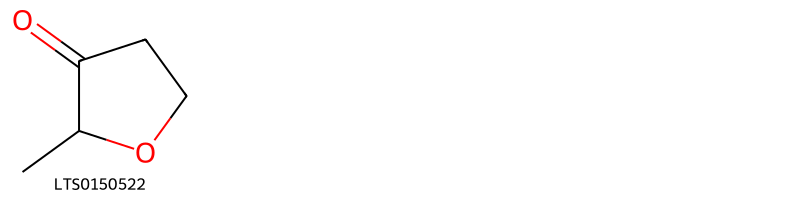{ width=100% }
    <figcaption>Hình ảnh cấu trúc hóa học của 1 hoạt chất thuộc nhóm Dihydrofurans gồm ['coffee furanone (LTS0150522)'].</figcaption>
</figure>
#### Nhóm Fatty Acyls
<figure markdown="span">
    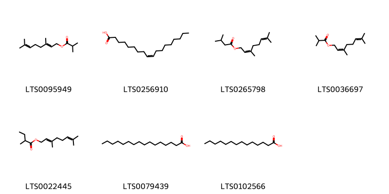{ width=100% }
    <figcaption>Hình ảnh cấu trúc hóa học của 7 hoạt chất thuộc nhóm Fatty Acyls gồm ['geranyl isobutyrate (LTS0095949)', 'oleic acid (LTS0256910)', 'neryl isovalerate (LTS0265798)', 'neryl isobutyrate (LTS0036697)', 'geranyl 2-methylbutyrate (LTS0022445)', 'palmitic acid (LTS0079439)', 'myristic acid (LTS0102566)'].</figcaption>
</figure>
#### Nhóm Lactones
<figure markdown="span">
    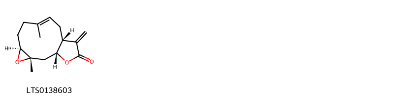{ width=100% }
    <figcaption>Hình ảnh cấu trúc hóa học của 1 hoạt chất thuộc nhóm Lactones gồm ['(1r,3s,5s,8e,11r)-3,8-dimethyl-12-methylidene-4,14-dioxatricyclo[9.3.0.0³,⁵]tetradec-8-en-13-one (LTS0138603)'].</figcaption>
</figure>
#### Nhóm Naphthofurans
<figure markdown="span">
    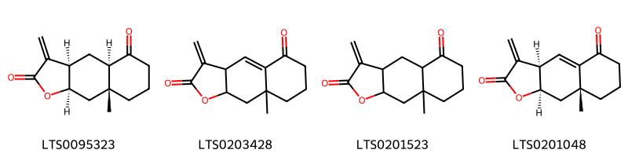{ width=100% }
    <figcaption>Hình ảnh cấu trúc hóa học của 4 hoạt chất thuộc nhóm Naphthofurans gồm ['(3ar,4ar,8ar,9ar)-8a-methyl-3-methylidene-octahydronaphtho[2,3-b]furan-2,5-dione (LTS0095323)', '8a-methyl-3-methylidene-3ah,6h,7h,8h,9h,9ah-naphtho[2,3-b]furan-2,5-dione (LTS0203428)', '8a-methyl-3-methylidene-octahydronaphtho[2,3-b]furan-2,5-dione (LTS0201523)', '(3ar,8ar,9ar)-8a-methyl-3-methylidene-3ah,6h,7h,8h,9h,9ah-naphtho[2,3-b]furan-2,5-dione (LTS0201048)'].</figcaption>
</figure>
#### Nhóm Phenol esters
<figure markdown="span">
    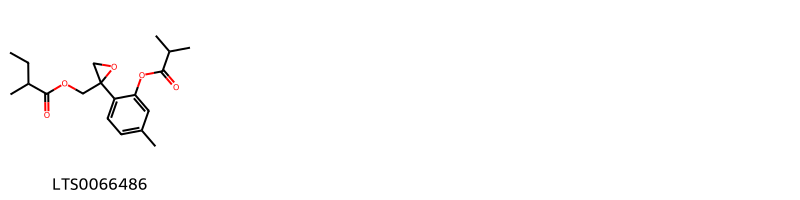{ width=100% }
    <figcaption>Hình ảnh cấu trúc hóa học của 1 hoạt chất thuộc nhóm Phenol esters gồm ['(2-{4-methyl-2-[(2-methylpropanoyl)oxy]phenyl}oxiran-2-yl)methyl 2-methylbutanoate (LTS0066486)'].</figcaption>
</figure>
#### Nhóm Prenol lipids
<figure markdown="span">
    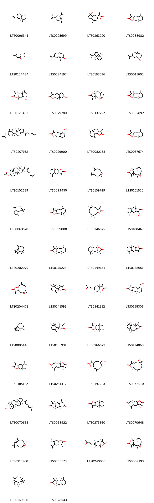{ width=100% }
    <figcaption>Hình ảnh cấu trúc hóa học của 78 hoạt chất thuộc nhóm Prenol lipids gồm ['β-selinene (LTS0096341)', 'β-elemene (LTS0225699)', '5-hydroxy-5,8-dimethyl-3-methylidene-3ah,4h,4ah,6h,7h,7ah,9ah-azuleno[6,5-b]furan-2-one (LTS0263720)', '5,8a-dimethyl-3-methylidene-3ah,4h,6h,7h,8h,9h,9ah-naphtho[2,3-b]furan-2-one (LTS0038982)', 'menthone (LTS0104484)', '(4ar)-1,4a-dimethyl-7-(prop-1-en-2-yl)-3,4,5,6,7,8-hexahydronaphthalen-2-one (LTS0224197)', '(1r,2s,6r,7s)-3-isopropyl-2,6-dimethyltricyclo[5.2.1.0²,⁶]dec-3-ene (LTS0183596)', '(1r)-1,4a-dimethyl-7-(prop-1-en-2-yl)-octahydronaphthalen-1-ol (LTS0015602)', '(3ar,4ar,8r,8ar,9as)-8-hydroxy-5,8a-dimethyl-3-methylidene-3ah,4h,4ah,7h,8h,9h,9ah-naphtho[2,3-b]furan-2-one (LTS0129493)', '7-hydroxy-5,8a-dimethyl-3-methylidene-3ah,5h,6h,7h,8h,9h,9ah-naphtho[2,3-b]furan-2-one (LTS0079280)', '(1s,3r,7s,9s,10s,13r)-9,13-dimethyl-4-methylidene-6,14-dioxatetracyclo[8.4.0.0¹,¹³.0³,⁷]tetradecan-5-one (LTS0137752)', '(3ar,8ar,9ar)-5,8a-dimethyl-3-methylidene-3ah,4h,6h,7h,8h,9h,9ah-naphtho[2,3-b]furan-2-one (LTS0092892)', '3a,3b,6,6,9a-pentamethyl-1-(6-methylhepta-1,5-dien-2-yl)-dodecahydro-1h-cyclopenta[a]phenanthren-7-yl acetate (LTS0207162)', '5-(hydroxymethyl)-3,8a-dimethyl-3h,3ah,4h,6h,7h,8h,9h,9ah-naphtho[2,3-b]furan-2-one (LTS0229900)', '6-hydroxy-3,5a-dimethyl-9-methylidene-octahydro-3h-naphtho[1,2-b]furan-2-one (LTS0082163)', '8a-methyl-3,5-dimethylidene-octahydronaphtho[2,3-b]furan-2-one (LTS0057674)', '(1s,3ar,3br,5ar,7s,9ar,9br,11ar)-3a,3b,6,6,9a-pentamethyl-1-(6-methylhepta-1,5-dien-2-yl)-dodecahydro-1h-cyclopenta[a]phenanthren-7-yl acetate (LTS0102629)', '3,8a-dimethyl-5-methylidene-octahydro-3h-naphtho[2,3-b]furan-2-one (LTS0099450)', 'caryophyllene oxide (LTS0159789)', '(1r,3r,5s,8e,11s)-5,9-dimethyl-14-methylidene-4,12-dioxatricyclo[9.3.0.0³,⁵]tetradec-8-en-13-one (LTS0151620)', '1,1,7-trimethyl-4-methylidene-octahydro-1ah-cyclopropa[e]azulene (LTS0063570)', '(3ar,5s,8r,8ar,9ar)-8-hydroxy-5,8a-dimethyl-3-methylidene-3ah,5h,6h,7h,8h,9h,9ah-naphtho[2,3-b]furan-2-one (LTS0099008)', '5,10-dimethyl-15-methylidene-4,9,13-trioxatetracyclo[10.3.0.0³,⁵.0⁸,¹⁰]pentadecan-14-one (LTS0146575)', '(5r,8ar,9as)-3-(hydroxymethyl)-5,8a-dimethyl-5h,6h,7h,8h,9h,9ah-naphtho[2,3-b]furan-2-one (LTS0188467)', 'longifolene (LTS0202079)', 'alantolactone (LTS0175223)', '(3s,3ar,4as,8ar,9ar)-3,8a-dimethyl-5-methylidene-octahydro-3h-naphtho[2,3-b]furan-2-one (LTS0149651)', '3,5,8a-trimethyl-3h,3ah,5h,6h,7h,8h,9h,9ah-naphtho[2,3-b]furan-2-one (LTS0138651)', '5,9-dimethyl-14-methylidene-4,12-dioxatricyclo[9.3.0.0³,⁵]tetradec-8-en-13-one (LTS0204478)', '(3r,3as,5ar,6r,9as,9bs)-6-hydroxy-3,5a-dimethyl-9-methylidene-octahydro-3h-naphtho[1,2-b]furan-2-one (LTS0141593)', '(3ar,7s,8as)-7-methyl-3-methylidene-6-(3-oxobutyl)-3ah,4h,7h,8h,8ah-cyclohepta[b]furan-2-one (LTS0141312)', '(3r,3ar,8ar,9ar)-5-(hydroxymethyl)-3,8a-dimethyl-3h,3ah,4h,6h,7h,8h,9h,9ah-naphtho[2,3-b]furan-2-one (LTS0158306)', '(2s,7s)-3,3,7-trimethyl-8-methylidenetricyclo[5.4.0.0²,⁹]undecane (LTS0085446)', '(3r,3as,5ar,6r,9ar,9bs)-6-hydroxy-3,5a,9-trimethyl-3h,3ah,4h,5h,6h,7h,9ah,9bh-naphtho[1,2-b]furan-2-one (LTS0155931)', '(3ar,4ar,5s,8ar,9ar)-5,8a-dimethyl-3-methylidene-octahydro-3ah-naphtho[2,3-b]furan-2-one (LTS0266673)', '4-epiisoinuviscolide (LTS0174860)', 'alantolactone (LTS0185122)', '(3r,3as,5s,7r,8ar,9ar)-3,7-dihydroxy-3,5,8a-trimethyl-3ah,5h,6h,7h,8h,9h,9ah-naphtho[2,3-b]furan-2-one (LTS0251412)', '6-(hydroxymethyl)-3,10-dimethyl-3h,3ah,4h,5h,8h,9h,11ah-cyclodeca[b]furan-2-one (LTS0197223)', '(3ar,5r,11as)-5-hydroxy-10-methyl-3,6-dimethylidene-3ah,4h,5h,7h,8h,11h,11ah-cyclodeca[b]furan-2-one (LTS0046910)', '(1s,3ar,3br,5ar,7s,9as,9br,11ar)-3a,3b,6,6,9a-pentamethyl-1-(6-methylhepta-1,5-dien-2-yl)-dodecahydro-1h-cyclopenta[a]phenanthren-7-ol (LTS0070633)', '(3ar,5s,8as,9ar)-5,8a-dimethyl-3-methylidene-3ah,5h,6h,8h,9h,9ah-naphtho[2,3-b]furan-2,7-dione (LTS0068922)', '10,14-dimethyl-5-methylidene-2,7-dioxatetracyclo[8.4.0.0¹,³.0⁴,⁸]tetradecan-6-one (LTS0275860)', '3,7-dihydroxy-3,5,8a-trimethyl-3ah,5h,6h,7h,8h,9h,9ah-naphtho[2,3-b]furan-2-one (LTS0270648)', 'β-caryophyllene oxide (LTS0213960)', '8-hydroxy-3,8a-dimethyl-5-methylidene-octahydro-3h-naphtho[2,3-b]furan-2-one (LTS0208573)', '(1s,3r,5r,7r)-5-methyl-10-methylidene-4-(3-oxobutyl)-8-oxatricyclo[5.3.0.0³,⁵]decan-9-one (LTS0240053)', '(1r,3r,5s,8e,11r)-5,9-dimethyl-14-methylidene-4,12-dioxatricyclo[9.3.0.0³,⁵]tetradec-8-en-13-one (LTS0009193)', '(1as,4as,7as,7br)-1,1,7-trimethyl-4-methylidene-octahydro-1ah-cyclopropa[e]azulene (LTS0160636)', 'isoalantolactone (LTS0028543)', '3,6,9-trimethylidene-octahydroazuleno[4,5-b]furan-2-one (LTS0241460)', '5-hydroxy-10-methyl-3,6-dimethylidene-3ah,4h,5h,7h,8h,11h,11ah-cyclodeca[b]furan-2-one (LTS0042717)', 'dehydrocostus lactone (LTS0202421)', '(1r,3r,5r,8r,10s,12s)-5,10-dimethyl-15-methylidene-4,9,13-trioxatetracyclo[10.3.0.0³,⁵.0⁸,¹⁰]pentadecan-14-one (LTS0242492)', '(3as,5s,11ar)-6,10-dimethyl-3-methylidene-2-oxo-3ah,4h,5h,8h,9h,11ah-cyclodeca[b]furan-5-yl 2-methylpropanoate (LTS0156936)', '(3as,5s,11ar)-5-hydroxy-6,10-dimethyl-3-methylidene-3ah,4h,5h,8h,9h,11ah-cyclodeca[b]furan-2-one (LTS0130547)', 'igalan (LTS0002229)', '(3ar,4as,8r,8ar,9ar)-8-hydroxy-8a-methyl-3,5-dimethylidene-octahydronaphtho[2,3-b]furan-2-one (LTS0011216)', '(3ar,11as)-10-methyl-3,6-dimethylidene-3ah,7h,8h,11h,11ah-cyclodeca[b]furan-2-one (LTS0068198)', '(4s)-5-methyl-10-methylidene-4-(3-oxobutyl)-8-oxatricyclo[5.3.0.0³,⁵]decan-9-one (LTS0005166)', '3-(hydroxymethyl)-5,8a-dimethyl-5h,6h,7h,8h,9h,9ah-naphtho[2,3-b]furan-2-one (LTS0000492)', '(3as,5s,11ar)-6,10-dimethyl-3-methylidene-2-oxo-3ah,4h,5h,8h,9h,11ah-cyclodeca[b]furan-5-yl 3-methylbutanoate (LTS0003794)', '(3s,3ar,5s,8ar,9ar)-3,5,8a-trimethyl-3h,3ah,5h,6h,7h,8h,9h,9ah-naphtho[2,3-b]furan-2-one (LTS0013443)', '(3ar,5s,7s,8ar,9as)-7-hydroxy-5,8a-dimethyl-3-methylidene-3ah,5h,6h,7h,8h,9h,9ah-naphtho[2,3-b]furan-2-one (LTS0083463)', '5α-epoxyalantolactone (LTS0023753)', '(1r,3s,4s,5r,7r)-5-methyl-10-methylidene-4-(3-oxobutyl)-8-oxatricyclo[5.3.0.0³,⁵]decan-9-one (LTS0094427)', '5,8a-dimethyl-3-methylidene-octahydro-3ah-naphtho[2,3-b]furan-2-one (LTS0227486)', '(3ar,5s,7s,8ar,9ar)-7-hydroxy-5,8a-dimethyl-3-methylidene-3ah,5h,6h,7h,8h,9h,9ah-naphtho[2,3-b]furan-2-one (LTS0109242)', '(3s,3ar,5r,6r,8ar,9ar)-6-hydroxy-3,5,8a-trimethyl-3h,3ah,5h,6h,7h,8h,9h,9ah-naphtho[2,3-b]furan-2-one (LTS0088112)', '(3r,3ar,4as,8s,8ar,9ar)-8-hydroxy-3,8a-dimethyl-5-methylidene-octahydro-3h-naphtho[2,3-b]furan-2-one (LTS0077409)', '6-hydroxy-3,5,8a-trimethyl-3h,3ah,5h,6h,7h,8h,9h,9ah-naphtho[2,3-b]furan-2-one (LTS0020573)', '5-methyl-10-methylidene-4-(3-oxobutyl)-8-oxatricyclo[5.3.0.0³,⁵]decan-9-one (LTS0089415)', '(3ar,4as,5r,7as,8s,9ar)-5-hydroxy-4a,8-dimethyl-3-methylidene-octahydro-3ah-azuleno[6,5-b]furan-2-one (LTS0228161)', '6-hydroxy-3,5a,9-trimethyl-3h,3ah,4h,5h,6h,7h,9ah,9bh-naphtho[1,2-b]furan-2-one (LTS0108576)', '6-ethenyl-6-methyl-3-methylidene-5-(prop-1-en-2-yl)-tetrahydro-3ah-1-benzofuran-2-one (LTS0273446)', '(3s,3as,11as)-6-(hydroxymethyl)-3,10-dimethyl-3h,3ah,4h,5h,8h,9h,11ah-cyclodeca[b]furan-2-one (LTS0110616)', '9,13-dimethyl-4-methylidene-6,14-dioxatetracyclo[8.4.0.0¹,¹³.0³,⁷]tetradecan-5-one (LTS0261069)', '(3r,3ar,5r,6r,8ar,9ar)-6-hydroxy-3,5,8a-trimethyl-3h,3ah,5h,6h,7h,8h,9h,9ah-naphtho[2,3-b]furan-2-one (LTS0044960)'].</figcaption>
</figure>
#### Nhóm Unsaturated hydrocarbons
<figure markdown="span">
    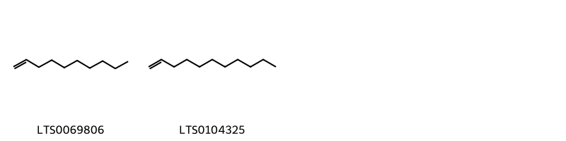{ width=100% }
    <figcaption>Hình ảnh cấu trúc hóa học của 2 hoạt chất thuộc nhóm Unsaturated hydrocarbons gồm ['decene (LTS0069806)', '1-undecene (LTS0104325)'].</figcaption>
</figure>

---

### Dược dân tộc học

Danh sách các quốc gia có sử dụng *Inula helenium* trong điều trị các bệnh. 

| Country   | Disease                                                                                                                                       | Bệnh                                                                                                                                                                                                |
|:----------|:----------------------------------------------------------------------------------------------------------------------------------------------|:----------------------------------------------------------------------------------------------------------------------------------------------------------------------------------------------------|
| China     | Antiseptic, Carminative, Discutient, Laxative, Stomachic, Stomachic, Vermifuge, Vermifuge, Vulnerary, Expectorant, Stomachic, Diuretic, Tonic | MYMEMORY WARNING: YOU USED ALL AVAILABLE FREE TRANSLATIONS FOR TODAY. NEXT AVAILABLE IN  12 HOURS 49 MINUTES 26 SECONDS VISIT HTTPS://MYMEMORY.TRANSLATED.NET/DOC/USAGELIMITS.PHP TO TRANSLATE MORE |
| Elsewhere | Diaphoretic, Diuretic                                                                                                                         | MYMEMORY WARNING: YOU USED ALL AVAILABLE FREE TRANSLATIONS FOR TODAY. NEXT AVAILABLE IN  12 HOURS 49 MINUTES 22 SECONDS VISIT HTTPS://MYMEMORY.TRANSLATED.NET/DOC/USAGELIMITS.PHP TO TRANSLATE MORE |
| Europe    | Antiseptic, Diuretic, Expectorant, Vermifuge                                                                                                  | MYMEMORY WARNING: YOU USED ALL AVAILABLE FREE TRANSLATIONS FOR TODAY. NEXT AVAILABLE IN  12 HOURS 49 MINUTES 18 SECONDS VISIT HTTPS://MYMEMORY.TRANSLATED.NET/DOC/USAGELIMITS.PHP TO TRANSLATE MORE |
| Turkey    | Apertif, Cholagogue, Diuretic, Expectorant, Stomachic, Sudorific, Tonic, Vermifuge, Antiseptic                                                | MYMEMORY WARNING: YOU USED ALL AVAILABLE FREE TRANSLATIONS FOR TODAY. NEXT AVAILABLE IN  12 HOURS 49 MINUTES 15 SECONDS VISIT HTTPS://MYMEMORY.TRANSLATED.NET/DOC/USAGELIMITS.PHP TO TRANSLATE MORE |

---

---
## Inula japonica
### Thông tin về thực vật

!!! info "Phân loại thực vật của *Inula japonica* từ GIBF:"
    - **Kingdom:** Plantae
    - **Phylum:** Tracheophyta
    - **Order:** Asterales
    - **Family:** Asteraceae
    - **Genus:** Inula
    - **Species:** *Inula japonica*

 

| Label (VI)   | Label (EN)   | Scientific Name   | Descriptions (VI)   | Descriptions (EN)   | Also Known As (VI)   | Also Known As (EN)   |
|:-------------|:-------------|:------------------|:--------------------|:--------------------|:---------------------|:---------------------|
| N/A          | N/A          | Inula japonica    | loài thực vật       | species of plant    | ['']                 | ['']                 |

#### Phân bố trên thế giới

**Từ CSDL GIBF** nan, Japan, Korea, Republic of, Russian Federation, China

#### Phân bố tại Việt Nam

**Từ CSDL GIBF**: Không có ghi nhận ở Việt Nam

---
### Thành phần hóa học
        
- Theo cơ sở dữ liệu lotus: Từ loài *Inula japonica* đã phân lập và xác định được 127 hoạt chất thuộc về các nhóm Phenol ethers, Fatty Acyls, Prenol lipids, Steroids and steroid derivatives, Benzofurans, Lactones, Phenols, Glycerolipids. 

|    | chemicalTaxonomyClassyfireClass   |   smiles_count |
|---:|:----------------------------------|---------------:|
|  0 | Benzofurans                       |              2 |
|  1 | Fatty Acyls                       |              1 |
|  2 | Glycerolipids                     |              2 |
|  3 | Lactones                          |              1 |
|  4 | Phenol ethers                     |              2 |
|  5 | Phenols                           |              7 |
|  6 | Prenol lipids                     |            105 |
|  7 | Steroids and steroid derivatives  |              7 |

#### Nhóm Benzofurans
<figure markdown="span">
    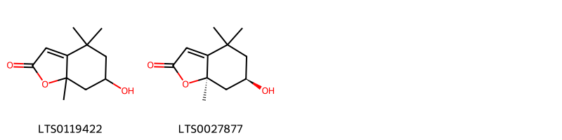{ width=100% }
    <figcaption>Hình ảnh cấu trúc hóa học của 2 hoạt chất thuộc nhóm Benzofurans gồm ['loliolide (LTS0119422)', '(6r,7ar)-6-hydroxy-4,4,7a-trimethyl-6,7-dihydro-5h-1-benzofuran-2-one (LTS0027877)'].</figcaption>
</figure>
#### Nhóm Fatty Acyls
<figure markdown="span">
    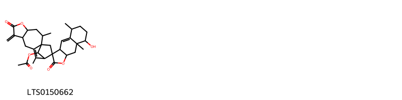{ width=100% }
    <figcaption>Hình ảnh cấu trúc hóa học của 1 hoạt chất thuộc nhóm Fatty Acyls gồm ["8-hydroxy-2',5,8a,11'-tetramethyl-7'-methylidene-2,6'-dioxo-5,6,7,8,9,9a-hexahydro-3ah-5'-oxaspiro[naphtho[2,3-b]furan-3,13'-tetracyclo[10.2.1.0¹,¹⁰.0⁴,⁸]pentadecan]-10'-en-15'-yl acetate (LTS0150662)"].</figcaption>
</figure>
#### Nhóm Glycerolipids
<figure markdown="span">
    { width=100% }
    <figcaption>Hình ảnh cấu trúc hóa học của 2 hoạt chất thuộc nhóm Glycerolipids gồm ['glyceryl palmitate (LTS0073260)', '3-palmitoyl-sn-glycerol (LTS0045875)'].</figcaption>
</figure>
#### Nhóm Lactones
<figure markdown="span">
    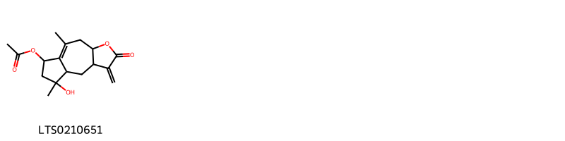{ width=100% }
    <figcaption>Hình ảnh cấu trúc hóa học của 1 hoạt chất thuộc nhóm Lactones gồm ['5-hydroxy-5,8-dimethyl-3-methylidene-2-oxo-3ah,4h,4ah,6h,7h,9h,9ah-azuleno[6,5-b]furan-7-yl acetate (LTS0210651)'].</figcaption>
</figure>
#### Nhóm Phenol ethers
<figure markdown="span">
    { width=100% }
    <figcaption>Hình ảnh cấu trúc hóa học của 2 hoạt chất thuộc nhóm Phenol ethers gồm ['2-[4-methyl-2-(2-methylpropoxy)phenyl]-2-[(2-methylpropoxy)methyl]oxirane (LTS0053965)', '(2r)-2-[4-methyl-2-(2-methylpropoxy)phenyl]-2-[(2-methylpropoxy)methyl]oxirane (LTS0241890)'].</figcaption>
</figure>
#### Nhóm Phenols
<figure markdown="span">
    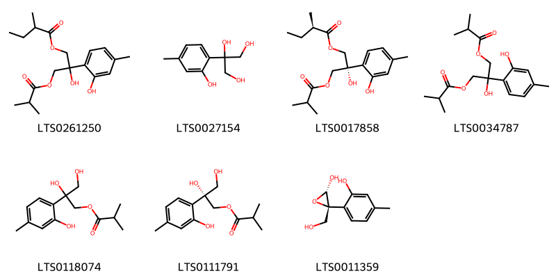{ width=100% }
    <figcaption>Hình ảnh cấu trúc hóa học của 7 hoạt chất thuộc nhóm Phenols gồm ['2-hydroxy-2-(2-hydroxy-4-methylphenyl)-3-[(2-methylpropanoyl)oxy]propyl 2-methylbutanoate (LTS0261250)', '2-(2-hydroxy-4-methylphenyl)propane-1,2,3-triol (LTS0027154)', '(2r)-2-hydroxy-2-(2-hydroxy-4-methylphenyl)-3-[(2-methylpropanoyl)oxy]propyl (2r)-2-methylbutanoate (LTS0017858)', '2-hydroxy-2-(2-hydroxy-4-methylphenyl)-3-[(2-methylpropanoyl)oxy]propyl 2-methylpropanoate (LTS0034787)', '2,3-dihydroxy-2-(2-hydroxy-4-methylphenyl)propyl 2-methylpropanoate (LTS0118074)', '(2r)-2,3-dihydroxy-2-(2-hydroxy-4-methylphenyl)propyl 2-methylpropanoate (LTS0111791)', '(2s,3r)-3-(2-hydroxy-4-methylphenyl)-3-(hydroxymethyl)oxiran-2-ol (LTS0011359)'].</figcaption>
</figure>
#### Nhóm Prenol lipids
<figure markdown="span">
    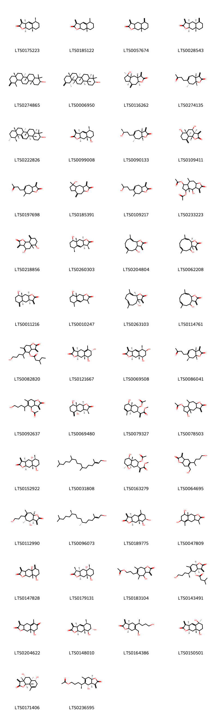{ width=100% }
    <figcaption>Hình ảnh cấu trúc hóa học của 105 hoạt chất thuộc nhóm Prenol lipids gồm ['alantolactone (LTS0175223)', 'alantolactone (LTS0185122)', '8a-methyl-3,5-dimethylidene-octahydronaphtho[2,3-b]furan-2-one (LTS0057674)', 'isoalantolactone (LTS0028543)', '(6ar,6br,8ar,14br)-4,4,6a,6b,8a,12,14b-heptamethyl-11-methylidene-hexadecahydropicen-3-ol (LTS0274865)', 'taraxasterol (LTS0006950)', 'inuviscolide (LTS0116262)', 'tomentosin (LTS0274135)', 'amyrin (LTS0222826)', '(3ar,5s,8r,8ar,9ar)-8-hydroxy-5,8a-dimethyl-3-methylidene-3ah,5h,6h,7h,8h,9h,9ah-naphtho[2,3-b]furan-2-one (LTS0099008)', '(3ar,7s,8ar)-6-[(3s)-3-hydroxybutyl]-7-methyl-3-methylidene-3ah,4h,7h,8h,8ah-cyclohepta[b]furan-2-one (LTS0090133)', '(3ar,4r,5ar,6r,9as,9br)-4,6-dihydroxy-5a-methyl-3,9-dimethylidene-octahydronaphtho[1,2-b]furan-2-one (LTS0109411)', '7-methyl-3-methylidene-6-(3-oxobutyl)-3ah,4h,7h,8h,8ah-cyclohepta[b]furan-2-one (LTS0197698)', '5-hydroxy-5-methyl-3,8-dimethylidene-octahydroazuleno[6,5-b]furan-2-one (LTS0185391)', '6-(3-hydroxybutyl)-7-methyl-3-methylidene-3ah,4h,7h,8h,8ah-cyclohepta[b]furan-2-one (LTS0109217)', '5-(acetyloxy)-4-hydroxy-4a,8-dimethyl-3-methylidene-2-oxo-octahydro-3ah-azuleno[6,5-b]furan-7-yl acetate (LTS0233223)', '4,6-dihydroxy-5a-methyl-3,9-dimethylidene-octahydronaphtho[1,2-b]furan-2-one (LTS0218856)', '(3s,3ar,5s,8r,8ar,9ar)-8-hydroxy-3,5,8a-trimethyl-3h,3ah,5h,6h,7h,8h,9h,9ah-naphtho[2,3-b]furan-2-one (LTS0260303)', '4-hydroxy-6,10-dimethyl-3-methylidene-3ah,4h,5h,8h,9h,11ah-cyclodeca[b]furan-2-one (LTS0204804)', '(3ar,11ar)-4-hydroxy-6,10-dimethyl-3-methylidene-3ah,4h,5h,8h,9h,11ah-cyclodeca[b]furan-2-one (LTS0062208)', '(3ar,4as,8r,8ar,9ar)-8-hydroxy-8a-methyl-3,5-dimethylidene-octahydronaphtho[2,3-b]furan-2-one (LTS0011216)', '8-hydroxy-3,5,8a-trimethyl-3h,3ah,5h,6h,7h,8h,9h,9ah-naphtho[2,3-b]furan-2-one (LTS0010247)', 'eupatolide (LTS0263103)', '4-hydroxy-6,10-dimethyl-3-methylidene-3ah,4h,5h,8h,9h,11ah-cyclodeca[b]furan-2-one (LTS0114761)', '5-(5-hydroxypentan-2-yl)-6-methyl-3-methylidene-2-oxo-3a,4,7,7a-tetrahydro-1-benzofuran-4-yl 3-methylpentanoate (LTS0082820)', '(3ar,6r,8r,8ar,9ar)-6,8-dihydroxy-5,8a-dimethyl-3-methylidene-3ah,4h,6h,7h,8h,9h,9ah-naphtho[2,3-b]furan-2-one (LTS0121667)', '(3ar,5r,6s,8r,8ar,9ar)-6,8-dihydroxy-5,8a-dimethyl-3-methylidene-3ah,5h,6h,7h,8h,9h,9ah-naphtho[2,3-b]furan-2-one (LTS0069508)', '(3ar,7r,8ar)-7-methyl-3-methylidene-6-(3-oxobutyl)-3ah,4h,7h,8h,8ah-cyclohepta[b]furan-2-one (LTS0086041)', '5-(5-hydroxypentan-2-yl)-6-methyl-3-methylidene-2-oxo-3a,4,7,7a-tetrahydro-1-benzofuran-4-yl acetate (LTS0092637)', '(3s,3ar,4ar,8r,8as,9ar)-4a,8-dihydroxy-3,8a-dimethyl-5-methylidene-octahydronaphtho[2,3-b]furan-2-one (LTS0069480)', 'methyl 2-[(2r,3r,4ar,5r,8as)-3-(acetyloxy)-5-hydroxy-4a,8-dimethyl-2,3,4,5,6,8a-hexahydro-1h-naphthalen-2-yl]prop-2-enoate (LTS0079327)', '5-hydroxy-4a,8-dimethyl-3-methylidene-2-oxo-octahydro-3ah-azuleno[6,5-b]furan-7-yl acetate (LTS0078503)', '(3ar,4ar,5s,8r,8as,9ar)-4a,8-dihydroxy-5,8a-dimethyl-3-methylidene-octahydronaphtho[2,3-b]furan-2-one (LTS0152922)', 'phytol (LTS0031808)', 'methyl 2-[(2r,3r,4ar,5r,8s,8ar)-3-(acetyloxy)-5,8-dihydroxy-4a,8-dimethyl-octahydronaphthalen-2-yl]prop-2-enoate (LTS0163279)', '6-(hydroxymethyl)-5-(5-hydroxypentan-2-yl)-3-methylidene-3a,4,7,7a-tetrahydro-1-benzofuran-2-one (LTS0064695)', '(3as,4r,5r,8as)-4-hydroxy-6-(3-hydroxypropyl)-5,7-dimethyl-3-methylidene-3ah,4h,5h,8h,8ah-cyclohepta[b]furan-2-one (LTS0112990)', 'phytol (LTS0096073)', '(3ar,7r,8s,8ar,9ar)-7,8-dihydroxy-5,8a-dimethyl-3-methylidene-3ah,4h,6h,7h,8h,9h,9ah-naphtho[2,3-b]furan-2-one (LTS0189775)', '6,8-dihydroxy-3,5,8a-trimethyl-3h,3ah,4h,6h,7h,8h,9h,9ah-naphtho[2,3-b]furan-2-one (LTS0047809)', '4a,8-dihydroxy-8a-methyl-3,5-dimethylidene-hexahydro-3ah-naphtho[2,3-b]furan-2-one (LTS0147828)', '(3s,3ar,4ar,5s,8r,8as,9ar)-4a,8-dihydroxy-3,5,8a-trimethyl-octahydro-3h-naphtho[2,3-b]furan-2-one (LTS0179131)', '3-{4-hydroxy-5,7-dimethyl-3-methylidene-2-oxo-3ah,4h,5h,8h,8ah-cyclohepta[b]furan-6-yl}propyl acetate (LTS0183104)', '(3ar,4s,7ar)-5-[(2s)-5-hydroxypentan-2-yl]-6-methyl-3-methylidene-2-oxo-3a,4,7,7a-tetrahydro-1-benzofuran-4-yl 3-methylbutanoate (LTS0143491)', '8-hydroxy-5,8a-dimethyl-3-methylidene-3ah,4h,7h,8h,9h,9ah-naphtho[2,3-b]furan-2,6-dione (LTS0204622)', '(3ar,5s,7s,8s,8ar,9ar)-7,8-dihydroxy-5,8a-dimethyl-3-methylidene-3ah,5h,6h,7h,8h,9h,9ah-naphtho[2,3-b]furan-2-one (LTS0148010)', '(3ar,7ar)-6-(hydroxymethyl)-5-[(2s)-5-hydroxypentan-2-yl]-3-methylidene-3a,4,7,7a-tetrahydro-1-benzofuran-2-one (LTS0164386)', '(3ar,5s,8r,8ar,9ar)-5,8-dihydroxy-5,8a-dimethyl-3-methylidene-3ah,6h,7h,8h,9h,9ah-naphtho[2,3-b]furan-2-one (LTS0150501)', '(3ar,4r,5ar,6r,9as,9br)-4,6-dihydroxy-5a,9-dimethyl-3-methylidene-3ah,4h,5h,6h,7h,9ah,9bh-naphtho[1,2-b]furan-2-one (LTS0171406)', '(4s)-4-[(3as,4s,7ar)-4-hydroxy-6-methyl-3-methylidene-2-oxo-3a,4,7,7a-tetrahydro-1-benzofuran-5-yl]pentyl acetate (LTS0236595)', 'ursolic acid (LTS0250838)', '5-(5-hydroxypentan-2-yl)-6-methyl-3-methylidene-2-oxo-3a,4,7,7a-tetrahydro-1-benzofuran-4-yl 3-methylbutanoate (LTS0109330)', '4-hydroxy-5-(5-hydroxypentan-2-yl)-6-methyl-3-methylidene-3a,4,7,7a-tetrahydro-1-benzofuran-2-one (LTS0161983)', '(3s,3ar,4ar,8r,8as,9ar)-4a-hydroperoxy-8-hydroxy-3,8a-dimethyl-5-methylidene-octahydronaphtho[2,3-b]furan-2-one (LTS0088414)', '(3ar,4ar,8r,8as,9ar)-4a,8-dihydroxy-8a-methyl-3,5-dimethylidene-hexahydro-3ah-naphtho[2,3-b]furan-2-one (LTS0157759)', '10-hydroxy-1,2,6a,6b,9,9,12a-heptamethyl-2,3,4,5,6,7,8,8a,10,11,12,12b,13,14b-tetradecahydro-1h-picene-4a-carboxylic acid (LTS0166564)', 'methyl 2-[3-(acetyloxy)-5-hydroxy-4a,8-dimethyl-2,3,4,5,6,8a-hexahydro-1h-naphthalen-2-yl]prop-2-enoate (LTS0115662)', '(3ar,4as,5s,7s,7as,8s,9as)-5-hydroxy-4a,8-dimethyl-3-methylidene-2-oxo-octahydro-3ah-azuleno[6,5-b]furan-7-yl acetate (LTS0133403)', '4-[4-hydroxy-6-(hydroxymethyl)-3-methylidene-2-oxo-3a,4,7,7a-tetrahydro-1-benzofuran-5-yl]pentyl acetate (LTS0265829)', '(3as,4s,7ar)-4-hydroxy-5-[(2s)-5-hydroxypentan-2-yl]-6-methyl-3-methylidene-3a,4,7,7a-tetrahydro-1-benzofuran-2-one (LTS0229804)', '4-hydroxy-4-(3-hydroxybut-1-en-1-yl)-3,5,5-trimethylcyclohex-2-en-1-one (LTS0183737)', '4a,8-dihydroxy-3,8a-dimethyl-5-methylidene-octahydronaphtho[2,3-b]furan-2-one (LTS0187679)', 'inulicin (LTS0185263)', '4-(2,4-dihydroxy-2,6,6-trimethylcyclohexylidene)but-3-en-2-one (LTS0273775)', '(3ar,6s,7ar)-6-hydroxy-5-[(2s)-5-hydroxypentan-2-yl]-6-methyl-3-methylidene-7,7a-dihydro-3ah-1-benzofuran-2-one (LTS0269487)', '(3s,3ar,6r,8r,8ar,9ar)-6,8-dihydroxy-3,5,8a-trimethyl-3h,3ah,4h,6h,7h,8h,9h,9ah-naphtho[2,3-b]furan-2-one (LTS0270774)', '(3ar,4s,7ar)-5-[(2s)-5-hydroxypentan-2-yl]-6-methyl-3-methylidene-2-oxo-3a,4,7,7a-tetrahydro-1-benzofuran-4-yl (2r)-2-methylbutanoate (LTS0205283)', '(3ar,4s,7ar)-5-[(2s)-5-hydroxypentan-2-yl]-6-methyl-3-methylidene-2-oxo-3a,4,7,7a-tetrahydro-1-benzofuran-4-yl (3s)-3-methylpentanoate (LTS0213276)', '(3ar,8r,8ar,9ar)-8-hydroxy-5,8a-dimethyl-3-methylidene-3ah,4h,6h,7h,8h,9h,9ah-naphtho[2,3-b]furan-2-one (LTS0085533)', '8-hydroxy-8a-methyl-3,5-dimethylidene-octahydronaphtho[2,3-b]furan-2-one (LTS0083579)', '5-(5-hydroxypentan-2-yl)-6-methyl-3-methylidene-2-oxo-3a,4,7,7a-tetrahydro-1-benzofuran-4-yl 2-methylbutanoate (LTS0072062)', '6-hydroxy-5-(5-hydroxypentan-2-yl)-6-methyl-3-methylidene-7,7a-dihydro-3ah-1-benzofuran-2-one (LTS0032958)', '(4s)-4-[(3as,4s,7ar)-4-hydroxy-6-(hydroxymethyl)-3-methylidene-2-oxo-3a,4,7,7a-tetrahydro-1-benzofuran-5-yl]pentyl acetate (LTS0187965)', 'methyl 2-[3-(acetyloxy)-5,8-dihydroxy-4a,8-dimethyl-octahydronaphthalen-2-yl]prop-2-enoate (LTS0233790)', '(3ar,6s,8r,8ar,9ar)-6,8-dihydroxy-5,8a-dimethyl-3-methylidene-3ah,4h,6h,7h,8h,9h,9ah-naphtho[2,3-b]furan-2-one (LTS0233469)', '4a,8-dihydroxy-3,5,8a-trimethyl-octahydro-3h-naphtho[2,3-b]furan-2-one (LTS0159027)', '8-hydroxy-5,8a-dimethyl-3-methylidene-3ah,5h,6h,7h,8h,9h,9ah-naphtho[2,3-b]furan-2-one (LTS0228049)', '(3ar,4as,5s,7s,7as,8s,9as)-5,7-dihydroxy-4a,8-dimethyl-3-methylidene-octahydro-3ah-azuleno[6,5-b]furan-2-one (LTS0185784)', '6,8-dihydroxy-5,8a-dimethyl-3-methylidene-3ah,5h,6h,7h,8h,9h,9ah-naphtho[2,3-b]furan-2-one (LTS0020685)', 'methyl 2-[(2r,3r,4as,5r,8ar)-3-(acetyloxy)-8a-hydroperoxy-5-hydroxy-4a-methyl-8-methylidene-hexahydro-1h-naphthalen-2-yl]prop-2-enoate (LTS0180612)', 'blumenol a (LTS0019694)', 'methyl 2-[(2r,3r,4ar,5r,8as)-3-(acetyloxy)-5-hydroxy-4a-methyl-8-methylidene-octahydronaphthalen-2-yl]prop-2-enoate (LTS0252178)', '4a-hydroperoxy-8-hydroxy-8a-methyl-3,5-dimethylidene-hexahydro-3ah-naphtho[2,3-b]furan-2-one (LTS0249911)', '(3as,5ar,6r)-6-hydroxy-5a,9-dimethyl-3-methylidene-3ah,4h,5h,6h,7h,8h,9bh-naphtho[1,2-b]furan-2-one (LTS0160186)', '7,8-dihydroxy-5,8a-dimethyl-3-methylidene-3ah,5h,6h,7h,8h,9h,9ah-naphtho[2,3-b]furan-2-one (LTS0051511)', '(3as,5ar,6r,9bs)-6-hydroxy-5a,9-dimethyl-3-methylidene-3ah,4h,5h,6h,7h,8h,9bh-naphtho[1,2-b]furan-2-one (LTS0259801)', 'methyl 2-[3-(acetyloxy)-5-hydroxy-4a-methyl-8-methylidene-octahydronaphthalen-2-yl]prop-2-enoate (LTS0249427)', '(6s,9r)-vomifoliol (LTS0052786)', 'methyl 2-[(2r,3r,4ar,5r,8r,8ar)-3-(acetyloxy)-5,8-dihydroxy-4a,8-dimethyl-octahydronaphthalen-2-yl]prop-2-enoate (LTS0244658)', '7,8-dihydroxy-5,8a-dimethyl-3-methylidene-3ah,4h,6h,7h,8h,9h,9ah-naphtho[2,3-b]furan-2-one (LTS0010365)', '8-hydroxy-5,8a-dimethyl-3-methylidene-3ah,4h,6h,7h,8h,9h,9ah-naphtho[2,3-b]furan-2-one (LTS0015165)', '5,8-dihydroxy-5,8a-dimethyl-3-methylidene-3ah,6h,7h,8h,9h,9ah-naphtho[2,3-b]furan-2-one (LTS0013630)', '4a,8-dihydroxy-5,8a-dimethyl-3-methylidene-octahydronaphtho[2,3-b]furan-2-one (LTS0009587)', '(3ar,4s,7ar)-5-[(2s)-5-hydroxypentan-2-yl]-6-methyl-3-methylidene-2-oxo-3a,4,7,7a-tetrahydro-1-benzofuran-4-yl acetate (LTS0024742)', '4,6-dihydroxy-5a,9-dimethyl-3-methylidene-3ah,4h,5h,6h,7h,9ah,9bh-naphtho[1,2-b]furan-2-one (LTS0029913)', '5,7-dihydroxy-4a,8-dimethyl-3-methylidene-octahydro-3ah-azuleno[6,5-b]furan-2-one (LTS0106699)', '(3ar,4s,7ar)-5-[(2s)-5-hydroxypentan-2-yl]-6-methyl-3-methylidene-2-oxo-3a,4,7,7a-tetrahydro-1-benzofuran-4-yl 2-methylpropanoate (LTS0247040)', '4-[(2r,4s)-2,4-dihydroxy-2,6,6-trimethylcyclohexylidene]but-3-en-2-one (LTS0233974)', '(3ar,8r,8ar,9ar)-8-hydroxy-5,8a-dimethyl-3-methylidene-3ah,4h,7h,8h,9h,9ah-naphtho[2,3-b]furan-2,6-dione (LTS0031325)', '4-hydroxy-6-(3-hydroxypropyl)-5,7-dimethyl-3-methylidene-3ah,4h,5h,8h,8ah-cyclohepta[b]furan-2-one (LTS0104145)', '6,8-dihydroxy-5,8a-dimethyl-3-methylidene-3ah,4h,6h,7h,8h,9h,9ah-naphtho[2,3-b]furan-2-one (LTS0131829)', '4-(4-hydroxy-6-methyl-3-methylidene-2-oxo-3a,4,7,7a-tetrahydro-1-benzofuran-5-yl)pentyl acetate (LTS0044993)', '5-(5-hydroxypentan-2-yl)-6-methyl-3-methylidene-2-oxo-3a,4,7,7a-tetrahydro-1-benzofuran-4-yl 2-methylpropanoate (LTS0126628)', '(3ar,4s,11ar)-4-hydroxy-6,10-dimethyl-3-methylidene-3ah,4h,5h,8h,9h,11ah-cyclodeca[b]furan-2-one (LTS0227634)', '(3ar,4ar,8r,8as,9ar)-4a-hydroperoxy-8-hydroxy-8a-methyl-3,5-dimethylidene-hexahydro-3ah-naphtho[2,3-b]furan-2-one (LTS0105094)'].</figcaption>
</figure>
#### Nhóm Steroids and steroid derivatives
<figure markdown="span">
    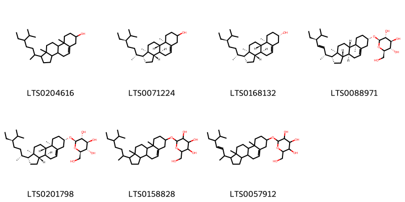{ width=100% }
    <figcaption>Hình ảnh cấu trúc hóa học của 7 hoạt chất thuộc nhóm Steroids and steroid derivatives gồm ['stigmast-5-en-3-ol, (3β)- (LTS0204616)', 'stigmast-5-en-3-ol (LTS0071224)', 'sitosterol (LTS0168132)', '(2r,3r,4s,5s,6r)-2-{[(1r,3as,3bs,7s,9ar,9bs,11ar)-1-[(2r,3e,5s)-5-ethyl-6-methylhept-3-en-2-yl]-9a,11a-dimethyl-1h,2h,3h,3ah,3bh,4h,6h,7h,8h,9h,9bh,10h,11h-cyclopenta[a]phenanthren-7-yl]oxy}-6-(hydroxymethyl)oxane-3,4,5-triol (LTS0088971)', 'sitogluside (LTS0201798)', '2-{[1-(5-ethyl-6-methylheptan-2-yl)-9a,11a-dimethyl-1h,2h,3h,3ah,3bh,4h,6h,7h,8h,9h,9bh,10h,11h-cyclopenta[a]phenanthren-7-yl]oxy}-6-(hydroxymethyl)oxane-3,4,5-triol (LTS0158828)', '2-{[1-(5-ethyl-6-methylhept-3-en-2-yl)-9a,11a-dimethyl-1h,2h,3h,3ah,3bh,4h,6h,7h,8h,9h,9bh,10h,11h-cyclopenta[a]phenanthren-7-yl]oxy}-6-(hydroxymethyl)oxane-3,4,5-triol (LTS0057912)'].</figcaption>
</figure>

---

### Dược dân tộc học

Danh sách các quốc gia có sử dụng *Inula japonica* trong điều trị các bệnh. 

| Country   | Disease    | Bệnh                                                                                                                                                                                                |
|:----------|:-----------|:----------------------------------------------------------------------------------------------------------------------------------------------------------------------------------------------------|
| Elsewhere | Antiseptic | MYMEMORY WARNING: YOU USED ALL AVAILABLE FREE TRANSLATIONS FOR TODAY. NEXT AVAILABLE IN  12 HOURS 48 MINUTES 37 SECONDS VISIT HTTPS://MYMEMORY.TRANSLATED.NET/DOC/USAGELIMITS.PHP TO TRANSLATE MORE |

---

---
## Inula racemosa
### Thông tin về thực vật

!!! info "Phân loại thực vật của *Inula racemosa* từ GIBF:"
    - **Kingdom:** Plantae
    - **Phylum:** Tracheophyta
    - **Order:** Asterales
    - **Family:** Asteraceae
    - **Genus:** Inula
    - **Species:** *Inula racemosa*

 

| Label (VI)   | Label (EN)   | Scientific Name   | Descriptions (VI)   | Descriptions (EN)   | Also Known As (VI)   | Also Known As (EN)   |
|:-------------|:-------------|:------------------|:--------------------|:--------------------|:---------------------|:---------------------|
| N/A          | N/A          | Inula racemosa    | loài thực vật       | species of plant    | ['']                 | ['']                 |

#### Phân bố trên thế giới

**Từ CSDL GIBF** Netherlands, Belgium, United States of America, Sweden, United Kingdom of Great Britain and Northern Ireland, Canada

#### Phân bố tại Việt Nam

**Từ CSDL GIBF**: Không có ghi nhận ở Việt Nam

---
### Thành phần hóa học
        
- Theo cơ sở dữ liệu lotus: Từ loài *Inula racemosa* đã phân lập và xác định được 61 hoạt chất thuộc về các nhóm Prenol lipids, Steroids and steroid derivatives, Benzene and substituted derivatives, Dihydrofurans, Organooxygen compounds, Naphthofurans, Carboxylic acids and derivatives. 

|    | chemicalTaxonomyClassyfireClass     |   smiles_count |
|---:|:------------------------------------|---------------:|
|  0 | Benzene and substituted derivatives |              3 |
|  1 | Carboxylic acids and derivatives    |              1 |
|  2 | Dihydrofurans                       |              1 |
|  3 | Naphthofurans                       |              2 |
|  4 | Organooxygen compounds              |              1 |
|  5 | Prenol lipids                       |             47 |
|  6 | Steroids and steroid derivatives    |              6 |

#### Nhóm Benzene and substituted derivatives
<figure markdown="span">
    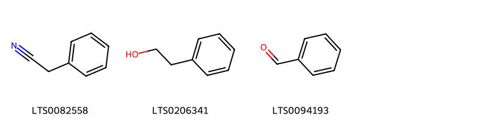{ width=100% }
    <figcaption>Hình ảnh cấu trúc hóa học của 3 hoạt chất thuộc nhóm Benzene and substituted derivatives gồm ['phenylacetonitrile (LTS0082558)', '2-phenyl-ethanol (LTS0206341)', 'benzaldehyde (LTS0094193)'].</figcaption>
</figure>
#### Nhóm Carboxylic acids and derivatives
<figure markdown="span">
    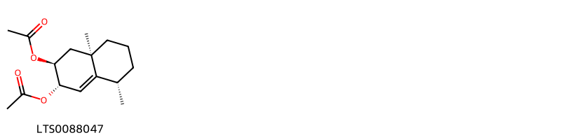{ width=100% }
    <figcaption>Hình ảnh cấu trúc hóa học của 1 hoạt chất thuộc nhóm Carboxylic acids and derivatives gồm ['(2s,3s,5s,8ar)-3-(acetyloxy)-5,8a-dimethyl-2,3,5,6,7,8-hexahydro-1h-naphthalen-2-yl acetate (LTS0088047)'].</figcaption>
</figure>
#### Nhóm Dihydrofurans
<figure markdown="span">
    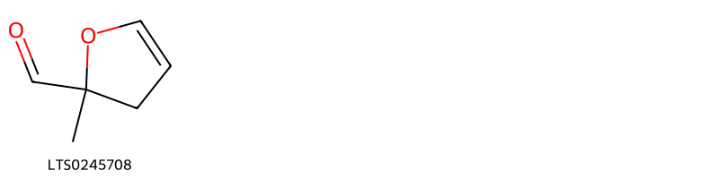{ width=100% }
    <figcaption>Hình ảnh cấu trúc hóa học của 1 hoạt chất thuộc nhóm Dihydrofurans gồm ['2-methyl-3h-furan-2-carbaldehyde (LTS0245708)'].</figcaption>
</figure>
#### Nhóm Naphthofurans
<figure markdown="span">
    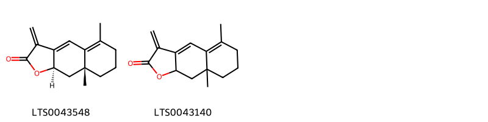{ width=100% }
    <figcaption>Hình ảnh cấu trúc hóa học của 2 hoạt chất thuộc nhóm Naphthofurans gồm ['(8ar,9ar)-5,8a-dimethyl-3-methylidene-6h,7h,8h,9h,9ah-naphtho[2,3-b]furan-2-one (LTS0043548)', '5,8a-dimethyl-3-methylidene-6h,7h,8h,9h,9ah-naphtho[2,3-b]furan-2-one (LTS0043140)'].</figcaption>
</figure>
#### Nhóm Organooxygen compounds
<figure markdown="span">
    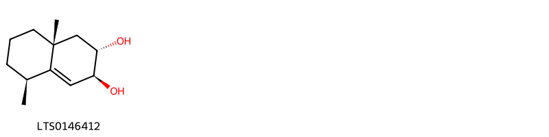{ width=100% }
    <figcaption>Hình ảnh cấu trúc hóa học của 1 hoạt chất thuộc nhóm Organooxygen compounds gồm ['(2s,3s,4ar,8s)-4a,8-dimethyl-3,4,5,6,7,8-hexahydro-2h-naphthalene-2,3-diol (LTS0146412)'].</figcaption>
</figure>
#### Nhóm Prenol lipids
<figure markdown="span">
    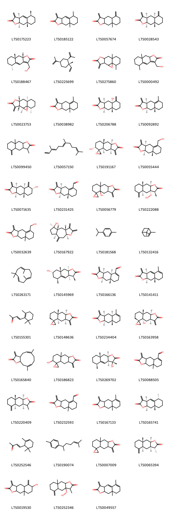{ width=100% }
    <figcaption>Hình ảnh cấu trúc hóa học của 47 hoạt chất thuộc nhóm Prenol lipids gồm ['alantolactone (LTS0175223)', 'alantolactone (LTS0185122)', '8a-methyl-3,5-dimethylidene-octahydronaphtho[2,3-b]furan-2-one (LTS0057674)', 'isoalantolactone (LTS0028543)', '(5r,8ar,9as)-3-(hydroxymethyl)-5,8a-dimethyl-5h,6h,7h,8h,9h,9ah-naphtho[2,3-b]furan-2-one (LTS0188467)', 'β-elemene (LTS0225699)', '10,14-dimethyl-5-methylidene-2,7-dioxatetracyclo[8.4.0.0¹,³.0⁴,⁸]tetradecan-6-one (LTS0275860)', '3-(hydroxymethyl)-5,8a-dimethyl-5h,6h,7h,8h,9h,9ah-naphtho[2,3-b]furan-2-one (LTS0000492)', '5α-epoxyalantolactone (LTS0023753)', '5,8a-dimethyl-3-methylidene-3ah,4h,6h,7h,8h,9h,9ah-naphtho[2,3-b]furan-2-one (LTS0038982)', '(3ar,4ar,8ar,9ar)-4a-hydroxy-8a-methyl-3,5-dimethylidene-hexahydro-3ah-naphtho[2,3-b]furan-2-one (LTS0206788)', '(3ar,8ar,9ar)-5,8a-dimethyl-3-methylidene-3ah,4h,6h,7h,8h,9h,9ah-naphtho[2,3-b]furan-2-one (LTS0092892)', '3,8a-dimethyl-5-methylidene-octahydro-3h-naphtho[2,3-b]furan-2-one (LTS0099450)', 'farnesene (LTS0057150)', "(3ar,4ar,5r,6r,8ar,9ar)-6-hydroxy-8a-methyl-3-methylidene-octahydrospiro[naphtho[2,3-b]furan-5,2'-oxiran]-2-one (LTS0191167)", '(3ar,8ar,9ar)-5-(hydroxymethyl)-8a-methyl-3-methylidene-3ah,4h,6h,7h,8h,9h,9ah-naphtho[2,3-b]furan-2-one (LTS0055444)', '(3ar,4ar,6r,8ar,9ar)-6-hydroxy-8a-methyl-3,5-dimethylidene-octahydronaphtho[2,3-b]furan-2-one (LTS0071635)', '(3ar,8ar,9ar)-8a-methyl-3-methylidene-2-oxo-3ah,4h,6h,7h,8h,9h,9ah-naphtho[2,3-b]furan-5-carbaldehyde (LTS0231425)', "4a-hydroxy-8a-methyl-3-methylidene-hexahydro-3ah-spiro[naphtho[2,3-b]furan-5,2'-oxiran]-2-one (LTS0056779)", '(3s,3as,4as,8ar,9ar)-3a-hydroperoxy-3,8a-dimethyl-5-methylidene-octahydronaphtho[2,3-b]furan-2-one (LTS0222088)', '5-(hydroxymethyl)-8a-methyl-3-methylidene-3ah,4h,6h,7h,8h,9h,9ah-naphtho[2,3-b]furan-2-one (LTS0032639)', '(3ar,4ar,5r,7as,9as)-5-methyl-2,3,8-trimethylidene-octahydroazuleno[6,5-b]furan-5-ol (LTS0167922)', 'cymene (LTS0181568)', 'α pinene (LTS0132416)', 'humulene (LTS0263171)', '(3s,3ar,5s,7s,8ar,9ar)-7-hydroxy-3,3a,5,8a,9a-pentamethyl-3h,5h,6h,7h,8h,9h-naphtho[2,3-b]furan-2-one (LTS0145969)', '(3ar,4ar,8ar,9ar)-8a-methyl-3-methylidene-2-oxo-3ah,4h,4ah,7h,8h,9h,9ah-naphtho[2,3-b]furan-5-carbaldehyde (LTS0166136)', '(3ar,8ar,9ar)-5,8a-dimethyl-3-methylidene-3ah,7h,8h,9h,9ah-naphtho[2,3-b]furan-2-one (LTS0141411)', 'β-ionone (LTS0155301)', "(3ar,4ar,5r,8ar,9ar)-8a-methyl-3-methylidene-octahydrospiro[naphtho[2,3-b]furan-5,2'-oxiran]-2-one (LTS0148636)", '(3ar,4ar,8ar,9ar)-5,8a-dimethyl-3-methylidene-3ah,4h,4ah,7h,8h,9h,9ah-naphtho[2,3-b]furan-2-one (LTS0234404)', "(3ar,4as,5s,8ar,9ar)-4a-hydroxy-8a-methyl-3-methylidene-hexahydro-3ah-spiro[naphtho[2,3-b]furan-5,2'-oxiran]-2-one (LTS0163958)", '6,10-dimethyl-3-methylidene-3ah,4h,7h,8h,11h,11ah-cyclodeca[b]furan-2-one (LTS0165840)', "6-hydroxy-8a-methyl-3-methylidene-octahydrospiro[naphtho[2,3-b]furan-5,2'-oxiran]-2-one (LTS0186823)", '(3r,3as,5s,8ar,9ar)-3-hydroxy-3,5,8a-trimethyl-3ah,5h,6h,7h,8h,9h,9ah-naphtho[2,3-b]furan-2-one (LTS0269702)', '8a-methyl-3-methylidene-2-oxo-3ah,4h,4ah,7h,8h,9h,9ah-naphtho[2,3-b]furan-5-carbaldehyde (LTS0088505)', '(3ar,4as,8ar,9ar)-3,8a-dimethyl-5-methylidene-octahydro-3h-naphtho[2,3-b]furan-2-one (LTS0220409)', '8a-methyl-3-methylidene-2-oxo-3ah,4h,6h,7h,8h,9h,9ah-naphtho[2,3-b]furan-5-carbaldehyde (LTS0232593)', '5,8a-dimethyl-3-methylidene-3ah,4h,4ah,7h,8h,9h,9ah-naphtho[2,3-b]furan-2-one (LTS0167133)', '(3ar,5r,8ar,9ar)-5,8a-dimethyl-3-methylidene-3ah,5h,6h,7h,8h,9h,9ah-naphtho[2,3-b]furan-2-one (LTS0165741)', 'ionone (LTS0252546)', 'curcumene (LTS0190074)', "8a-methyl-3-methylidene-octahydrospiro[naphtho[2,3-b]furan-5,2'-oxiran]-2-one (LTS0007009)", '(3r,3ar,4as,8ar,9ar)-3,8a-dimethyl-5-methylidene-octahydro-3h-naphtho[2,3-b]furan-2-one (LTS0065394)', '6-hydroxy-8a-methyl-3,5-dimethylidene-octahydronaphtho[2,3-b]furan-2-one (LTS0019530)', '3a-hydroperoxy-3,8a-dimethyl-5-methylidene-octahydronaphtho[2,3-b]furan-2-one (LTS0252346)', '5,8a-dimethyl-3-methylidene-3ah,7h,8h,9h,9ah-naphtho[2,3-b]furan-2-one (LTS0049557)'].</figcaption>
</figure>
#### Nhóm Steroids and steroid derivatives
<figure markdown="span">
    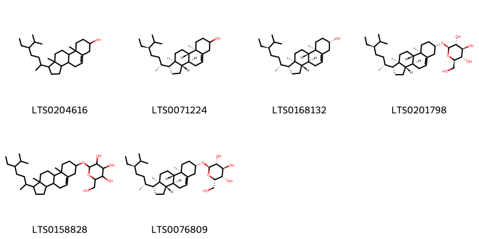{ width=100% }
    <figcaption>Hình ảnh cấu trúc hóa học của 6 hoạt chất thuộc nhóm Steroids and steroid derivatives gồm ['stigmast-5-en-3-ol, (3β)- (LTS0204616)', 'stigmast-5-en-3-ol (LTS0071224)', 'sitosterol (LTS0168132)', 'sitogluside (LTS0201798)', '2-{[1-(5-ethyl-6-methylheptan-2-yl)-9a,11a-dimethyl-1h,2h,3h,3ah,3bh,4h,6h,7h,8h,9h,9bh,10h,11h-cyclopenta[a]phenanthren-7-yl]oxy}-6-(hydroxymethyl)oxane-3,4,5-triol (LTS0158828)', '(2r,3r,4s,5s,6s)-2-{[(1r,3as,3bs,7s,9ar,9bs,11ar)-1-[(2r,5r)-5-ethyl-6-methylheptan-2-yl]-9a,11a-dimethyl-1h,2h,3h,3ah,3bh,4h,6h,7h,8h,9h,9bh,10h,11h-cyclopenta[a]phenanthren-7-yl]oxy}-6-(hydroxymethyl)oxane-3,4,5-triol (LTS0076809)'].</figcaption>
</figure>

---

### Dược dân tộc học

Danh sách các quốc gia có sử dụng *Inula racemosa* trong điều trị các bệnh. 

| Country   | Disease                                                   | Bệnh                                                                                                                                                                                                |
|:----------|:----------------------------------------------------------|:----------------------------------------------------------------------------------------------------------------------------------------------------------------------------------------------------|
| India     | Antiseptic, Aphrodisiac, Expectorant, Vermifuge, Diuretic | MYMEMORY WARNING: YOU USED ALL AVAILABLE FREE TRANSLATIONS FOR TODAY. NEXT AVAILABLE IN  12 HOURS 47 MINUTES 58 SECONDS VISIT HTTPS://MYMEMORY.TRANSLATED.NET/DOC/USAGELIMITS.PHP TO TRANSLATE MORE |

---

---
## Inula royleana
### Thông tin về thực vật

!!! info "Phân loại thực vật của *Inula royleana* từ GIBF:"
    - **Kingdom:** Plantae
    - **Phylum:** Tracheophyta
    - **Order:** Asterales
    - **Family:** Asteraceae
    - **Genus:** Inula
    - **Species:** *Inula royleana*

 

| Label (VI)   | Label (EN)   | Scientific Name   | Descriptions (VI)   | Descriptions (EN)   | Also Known As (VI)   | Also Known As (EN)   |
|:-------------|:-------------|:------------------|:--------------------|:--------------------|:---------------------|:---------------------|
| N/A          | N/A          | Inula royleana    | loài thực vật       | species of plant    | ['']                 | ['']                 |

#### Phân bố trên thế giới

**Từ CSDL GIBF** nan, Pakistan, Belgium, Korea, Republic of, India, unknown or invalid, Sweden, China

#### Phân bố tại Việt Nam

**Từ CSDL GIBF**: Không có ghi nhận ở Việt Nam

---
### Thành phần hóa học
        
- Theo cơ sở dữ liệu lotus: Từ loài *Inula royleana* đã phân lập và xác định được 36 hoạt chất thuộc về các nhóm Prenol lipids, Steroids and steroid derivatives. 

|    | chemicalTaxonomyClassyfireClass   |   smiles_count |
|---:|:----------------------------------|---------------:|
|  0 | Prenol lipids                     |             34 |
|  1 | Steroids and steroid derivatives  |              2 |

#### Nhóm Prenol lipids
<figure markdown="span">
    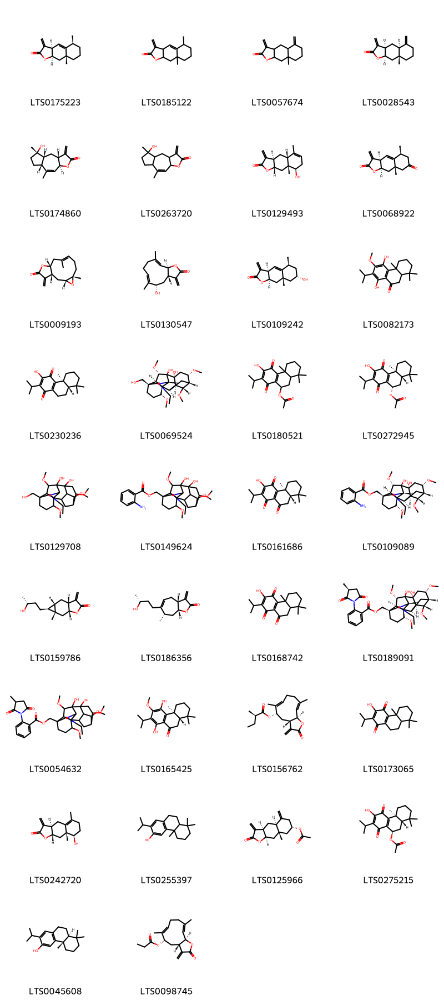{ width=100% }
    <figcaption>Hình ảnh cấu trúc hóa học của 34 hoạt chất thuộc nhóm Prenol lipids gồm ['alantolactone (LTS0175223)', 'alantolactone (LTS0185122)', '8a-methyl-3,5-dimethylidene-octahydronaphtho[2,3-b]furan-2-one (LTS0057674)', 'isoalantolactone (LTS0028543)', '4-epiisoinuviscolide (LTS0174860)', '5-hydroxy-5,8-dimethyl-3-methylidene-3ah,4h,4ah,6h,7h,7ah,9ah-azuleno[6,5-b]furan-2-one (LTS0263720)', '(3ar,4ar,8r,8ar,9as)-8-hydroxy-5,8a-dimethyl-3-methylidene-3ah,4h,4ah,7h,8h,9h,9ah-naphtho[2,3-b]furan-2-one (LTS0129493)', '(3ar,5s,8as,9ar)-5,8a-dimethyl-3-methylidene-3ah,5h,6h,8h,9h,9ah-naphtho[2,3-b]furan-2,7-dione (LTS0068922)', '(1r,3r,5s,8e,11r)-5,9-dimethyl-14-methylidene-4,12-dioxatricyclo[9.3.0.0³,⁵]tetradec-8-en-13-one (LTS0009193)', '(3as,5s,11ar)-5-hydroxy-6,10-dimethyl-3-methylidene-3ah,4h,5h,8h,9h,11ah-cyclodeca[b]furan-2-one (LTS0130547)', '(3ar,5s,7s,8ar,9ar)-7-hydroxy-5,8a-dimethyl-3-methylidene-3ah,5h,6h,7h,8h,9h,9ah-naphtho[2,3-b]furan-2-one (LTS0109242)', '5,8-dihydroxy-7-isopropyl-6-methoxy-1,1,4a-trimethyl-3,4,10,10a-tetrahydro-2h-phenanthren-9-one (LTS0082173)', 'royleanone (LTS0230236)', '(1s,2r,3r,4s,5r,6s,8r,9s,10s,13s,16r,17r,18s)-11-ethyl-13-(hydroxymethyl)-4,6,16,18-tetramethoxy-11-azahexacyclo[7.7.2.1²,⁵.0¹,¹⁰.0³,⁸.0¹³,¹⁷]nonadecane-8,9-diol (LTS0069524)', '6-hydroxy-7-isopropyl-1,1,4a-trimethyl-5,8-dioxo-2,3,4,9,10,10a-hexahydrophenanthren-9-yl acetate (LTS0180521)', '(4as,9s,10as)-6-hydroxy-7-isopropyl-1,1,4a-trimethyl-5,8-dioxo-2,3,4,9,10,10a-hexahydrophenanthren-9-yl acetate (LTS0272945)', '11-ethyl-13-(hydroxymethyl)-4,6,16,18-tetramethoxy-11-azahexacyclo[7.7.2.1²,⁵.0¹,¹⁰.0³,⁸.0¹³,¹⁷]nonadecane-8,9-diol (LTS0129708)', '{11-ethyl-8,9-dihydroxy-4,6,16,18-tetramethoxy-11-azahexacyclo[7.7.2.1²,⁵.0¹,¹⁰.0³,⁸.0¹³,¹⁷]nonadecan-13-yl}methyl 2-aminobenzoate (LTS0149624)', '(4bs,8as)-3-hydroxy-2-isopropyl-4b,8,8-trimethyl-6,7,8a,9-tetrahydro-5h-phenanthrene-1,4,10-trione (LTS0161686)', '[(1s,2r,3r,4s,5r,6s,8r,9s,10s,13s,16r,17r,18s)-11-ethyl-8,9-dihydroxy-4,6,16,18-tetramethoxy-11-azahexacyclo[7.7.2.1²,⁵.0¹,¹⁰.0³,⁸.0¹³,¹⁷]nonadecan-13-yl]methyl 2-aminobenzoate (LTS0109089)', '(1r,3s,4s,5r,7r)-4-[(3r)-3-hydroxybutyl]-5-methyl-10-methylidene-8-oxatricyclo[5.3.0.0³,⁵]decan-9-one (LTS0159786)', '(3ar,7s,8ar)-6-[(3r)-3-hydroxybutyl]-7-methyl-3-methylidene-3ah,4h,7h,8h,8ah-cyclohepta[b]furan-2-one (LTS0186356)', '3-hydroxy-2-isopropyl-4b,8,8-trimethyl-6,7,8a,9-tetrahydro-5h-phenanthrene-1,4,10-trione (LTS0168742)', '[(1s,2r,3r,4s,5r,6s,8r,9s,10s,13s,16r,17r,18s)-11-ethyl-8,9-dihydroxy-4,6,16,18-tetramethoxy-11-azahexacyclo[7.7.2.1²,⁵.0¹,¹⁰.0³,⁸.0¹³,¹⁷]nonadecan-13-yl]methyl 2-[(3s)-3-methyl-2,5-dioxopyrrolidin-1-yl]benzoate (LTS0189091)', 'methyllycaconitine (LTS0054632)', '(4as,10as)-5,8-dihydroxy-7-isopropyl-6-methoxy-1,1,4a-trimethyl-3,4,10,10a-tetrahydro-2h-phenanthren-9-one (LTS0165425)', '(3as,5s,11ar)-6,10-dimethyl-3-methylidene-2-oxo-3ah,4h,5h,8h,9h,11ah-cyclodeca[b]furan-5-yl (2r)-2-methylbutanoate (LTS0156762)', '3-hydroxy-2-isopropyl-4b,8,8-trimethyl-5,6,7,8a,9,10-hexahydrophenanthrene-1,4-dione (LTS0173065)', '(3ar,8r,8ar,9as)-8-hydroxy-5,8a-dimethyl-3-methylidene-3ah,4h,6h,7h,8h,9h,9ah-naphtho[2,3-b]furan-2-one (LTS0242720)', '2-isopropyl-4b,8,8-trimethyl-5,6,7,8a,9,10-hexahydrophenanthren-3-ol (LTS0255397)', '(3ar,4as,7s,8ar,9ar)-8a-methyl-3,5-dimethylidene-2-oxo-octahydronaphtho[2,3-b]furan-7-yl acetate (LTS0125966)', '(4as,9r,10as)-6-hydroxy-7-isopropyl-1,1,4a-trimethyl-5,8-dioxo-2,3,4,9,10,10a-hexahydrophenanthren-9-yl acetate (LTS0275215)', 'ferruginol (LTS0045608)', '(3as,5s,11ar)-6,10-dimethyl-3-methylidene-2-oxo-3ah,4h,5h,8h,9h,11ah-cyclodeca[b]furan-5-yl propanoate (LTS0098745)'].</figcaption>
</figure>
#### Nhóm Steroids and steroid derivatives
<figure markdown="span">
    { width=100% }
    <figcaption>Hình ảnh cấu trúc hóa học của 2 hoạt chất thuộc nhóm Steroids and steroid derivatives gồm ['stigmast-5-en-3-ol, (3β)- (LTS0204616)', '(1r,3ar,3br,7s,9ar,9br,11ar)-1-[(2r,5r)-5-ethyl-6-methylheptan-2-yl]-9a,11a-dimethyl-1h,2h,3h,3ah,3bh,4h,6h,7h,8h,9h,9bh,10h,11h-cyclopenta[a]phenanthren-7-ol (LTS0129695)'].</figcaption>
</figure>

---

### Dược dân tộc học

Danh sách các quốc gia có sử dụng *Inula royleana* trong điều trị các bệnh. 

| Country   | Disease                                        | Bệnh                                                                                                                                                                                                |
|:----------|:-----------------------------------------------|:----------------------------------------------------------------------------------------------------------------------------------------------------------------------------------------------------|
| India     | Antiseptic, Pediculicide, Poison, Parasiticide | MYMEMORY WARNING: YOU USED ALL AVAILABLE FREE TRANSLATIONS FOR TODAY. NEXT AVAILABLE IN  12 HOURS 47 MINUTES 20 SECONDS VISIT HTTPS://MYMEMORY.TRANSLATED.NET/DOC/USAGELIMITS.PHP TO TRANSLATE MORE |

---

# Chi Grindelia

??? note "Danh sách các dược liệu thuộc chi"
    
	 - *Grindelia camporum*
	 - *Grindelia robusta*
	 - *Grindelia squarosa*
	 - *Grindelia squarrosa*

---
## Grindelia camporum
### Thông tin về thực vật

!!! info "Phân loại thực vật của *Grindelia hirsutula* từ GIBF:"
    - **Kingdom:** Plantae
    - **Phylum:** Tracheophyta
    - **Order:** Asterales
    - **Family:** Asteraceae
    - **Genus:** Grindelia
    - **Species:** *Grindelia hirsutula*

 

| Label (VI)   | Label (EN)   | Scientific Name    | Descriptions (VI)   | Descriptions (EN)   | Also Known As (VI)   | Also Known As (EN)   |
|:-------------|:-------------|:-------------------|:--------------------|:--------------------|:---------------------|:---------------------|
| N/A          | N/A          | Grindelia camporum | loài thực vật       | species of plant    | ['']                 | ['']                 |

#### Phân bố trên thế giới

**Từ CSDL GIBF** United States of America, Mexico

#### Phân bố tại Việt Nam

**Từ CSDL GIBF**: Không có ghi nhận ở Việt Nam

---
### Thành phần hóa học
        
- Theo cơ sở dữ liệu lotus: Từ loài *Grindelia hirsutula* đã phân lập và xác định được 86 hoạt chất thuộc về các nhóm Fatty Acyls, Flavonoids, Prenol lipids, Tetralins, Organooxygen compounds, Isobenzofurans, Benzopyrans. 

|    | chemicalTaxonomyClassyfireClass   |   smiles_count |
|---:|:----------------------------------|---------------:|
|  0 | Benzopyrans                       |              3 |
|  1 | Fatty Acyls                       |             10 |
|  2 | Flavonoids                        |             15 |
|  3 | Isobenzofurans                    |              4 |
|  4 | Organooxygen compounds            |              2 |
|  5 | Prenol lipids                     |             49 |
|  6 | Tetralins                         |              3 |

#### Nhóm Benzopyrans
<figure markdown="span">
    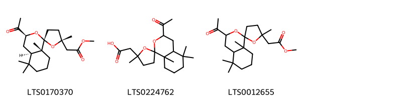{ width=100% }
    <figcaption>Hình ảnh cấu trúc hóa học của 3 hoạt chất thuộc nhóm Benzopyrans gồm ["methyl 2-[(1r,3s,4ar,5'r,8ar)-3-acetyl-5,5,5',8a-tetramethyl-hexahydrospiro[2-benzopyran-1,2'-oxolan]-5'-yl]acetate (LTS0170370)", "3-acetyl-5,5,5',8a-tetramethyl-hexahydrospiro[2-benzopyran-1,2'-oxolan]-5'-ylacetic acid (LTS0224762)", "methyl 2-{3-acetyl-5,5,5',8a-tetramethyl-hexahydrospiro[2-benzopyran-1,2'-oxolan]-5'-yl}acetate (LTS0012655)"].</figcaption>
</figure>
#### Nhóm Fatty Acyls
<figure markdown="span">
    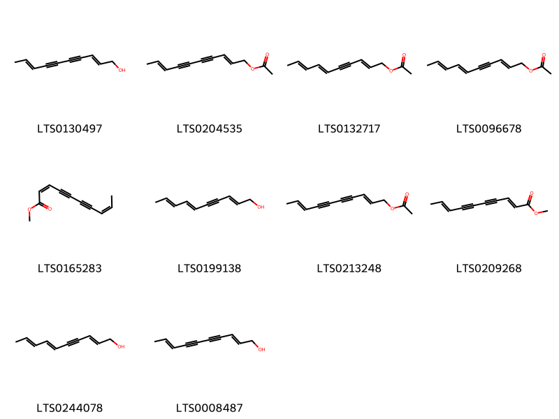{ width=100% }
    <figcaption>Hình ảnh cấu trúc hóa học của 10 hoạt chất thuộc nhóm Fatty Acyls gồm ['(2e,8e)-deca-2,8-dien-4,6-diyn-1-ol (LTS0130497)', 'deca-2,8-dien-4,6-diyn-1-yl acetate (LTS0204535)', '(2e,6e,8e)-deca-2,6,8-trien-4-yn-1-yl acetate (LTS0132717)', 'deca-2,6,8-trien-4-yn-1-yl acetate (LTS0096678)', 'methyl (2z,8z)-deca-2,8-dien-4,6-diynoate (LTS0165283)', 'deca-2,6,8-trien-4-yn-1-ol (LTS0199138)', '(2e,8e)-deca-2,8-dien-4,6-diyn-1-yl acetate (LTS0213248)', 'methyl deca-2,8-dien-4,6-diynoate (LTS0209268)', '(2e,6e,8e)-deca-2,6,8-trien-4-yn-1-ol (LTS0244078)', 'deca-2,8-dien-4,6-diyn-1-ol (LTS0008487)'].</figcaption>
</figure>
#### Nhóm Flavonoids
<figure markdown="span">
    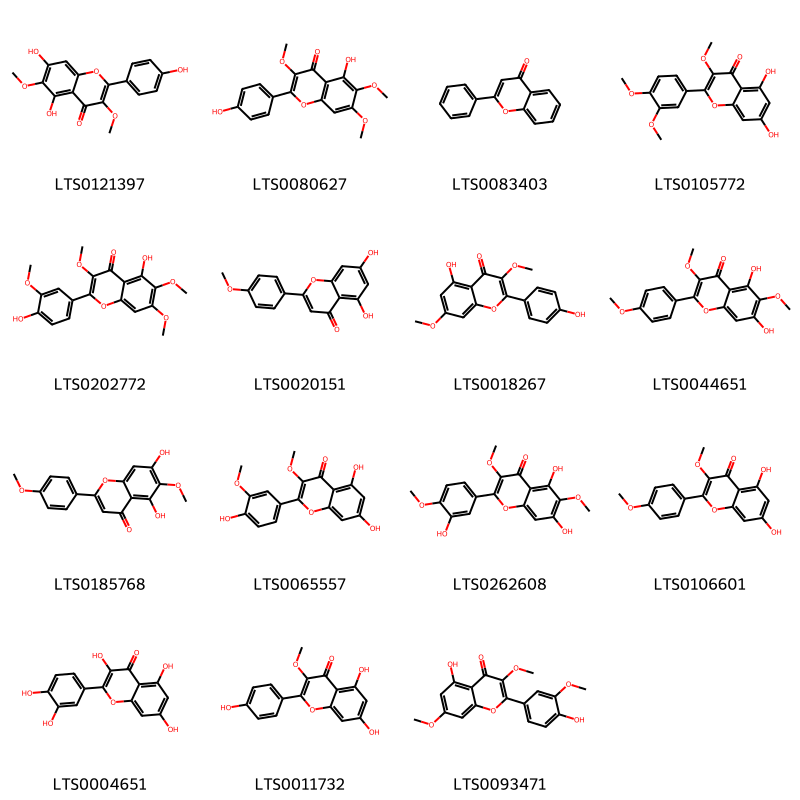{ width=100% }
    <figcaption>Hình ảnh cấu trúc hóa học của 15 hoạt chất thuộc nhóm Flavonoids gồm ['5,7-dihydroxy-2-(4-hydroxyphenyl)-3,6-dimethoxychromen-4-one (LTS0121397)', 'penduletin (LTS0080627)', 'flavone (LTS0083403)', '2-(3,4-dimethoxyphenyl)-5,7-dihydroxy-3-methoxychromen-4-one (LTS0105772)', 'chrysosplenetin (LTS0202772)', 'acacetin (LTS0020151)', 'kumatakenin (LTS0018267)', 'santin (LTS0044651)', 'pectolinarigenin (LTS0185768)', "3,3'-di-o-methylquercetin (LTS0065557)", 'centaureidin (LTS0262608)', 'ermanin (LTS0106601)', 'quercetin (LTS0004651)', 'isokaempferide (LTS0011732)', 'pachypodol (LTS0093471)'].</figcaption>
</figure>
#### Nhóm Isobenzofurans
<figure markdown="span">
    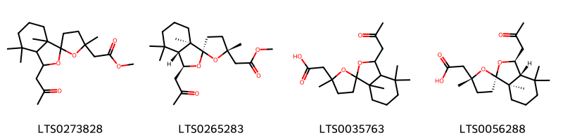{ width=100% }
    <figcaption>Hình ảnh cấu trúc hóa học của 4 hoạt chất thuộc nhóm Isobenzofurans gồm ["methyl 2-[4,4,5',7a-tetramethyl-3-(2-oxopropyl)-tetrahydro-3h-spiro[2-benzofuran-1,2'-oxolan]-5'-yl]acetate (LTS0273828)", "methyl 2-[(1r,3s,3ar,5'r,7ar)-4,4,5',7a-tetramethyl-3-(2-oxopropyl)-tetrahydro-3h-spiro[2-benzofuran-1,2'-oxolan]-5'-yl]acetate (LTS0265283)", "4,4,5',7a-tetramethyl-3-(2-oxopropyl)-tetrahydro-3h-spiro[2-benzofuran-1,2'-oxolan]-5'-ylacetic acid (LTS0035763)", "(1r,3s,3ar,5'r,7ar)-4,4,5',7a-tetramethyl-3-(2-oxopropyl)-tetrahydro-3h-spiro[2-benzofuran-1,2'-oxolan]-5'-ylacetic acid (LTS0056288)"].</figcaption>
</figure>
#### Nhóm Organooxygen compounds
<figure markdown="span">
    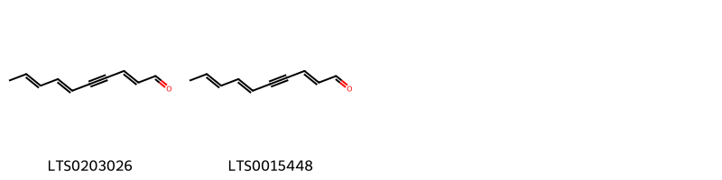{ width=100% }
    <figcaption>Hình ảnh cấu trúc hóa học của 2 hoạt chất thuộc nhóm Organooxygen compounds gồm ['deca-2,6,8-trien-4-ynal (LTS0203026)', '(2e,6e,8e)-deca-2,6,8-trien-4-ynal (LTS0015448)'].</figcaption>
</figure>
#### Nhóm Prenol lipids
<figure markdown="span">
    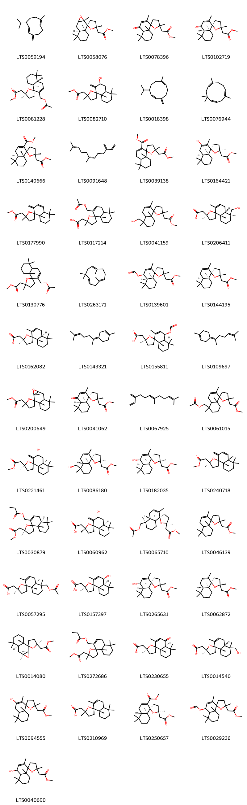{ width=100% }
    <figcaption>Hình ảnh cấu trúc hóa học của 49 hoạt chất thuộc nhóm Prenol lipids gồm ['(-)-germacrene d (LTS0059194)', "methyl 2-[(1as,2s,2as,5'r,6ar,7as)-1a,2a,5',6,6-pentamethyl-hexahydrospiro[naphtho[2,3-b]oxirene-2,2'-oxolan]-5'-yl]acetate (LTS0058076)", "methyl 2-{2,5,5,5',8a-pentamethyl-4-oxo-4a,6,7,8-tetrahydrospiro[naphthalene-1,2'-oxolan]-5'-yl}acetate (LTS0078396)", "methyl 2-[(1r,4as,5'r,8as)-2,5,5,5',8a-pentamethyl-4-oxo-4a,6,7,8-tetrahydrospiro[naphthalene-1,2'-oxolan]-5'-yl]acetate (LTS0102719)", "(1s,4as,5's,8as)-5'-(2-methoxy-2-oxoethyl)-5,5,5',8a-tetramethyl-4a,6,7,8-tetrahydro-4h-spiro[naphthalene-1,2'-oxolan]-2-ylmethyl acetate (LTS0081228)", "methyl 2-{3-hydroxy-5,5,5',8a-tetramethyl-2-methylidene-hexahydrospiro[naphthalene-1,2'-oxolan]-5'-yl}acetate (LTS0082710)", '8-isopropyl-1-methyl-5-methylidenecyclodeca-1,6-diene (LTS0018398)', 'α-humulene (LTS0076944)', "methyl (1r,4ar,5'r,8ar)-5'-(2-methoxy-2-oxoethyl)-5,5,5',8a-tetramethyl-4a,6,7,8-tetrahydro-4h-spiro[naphthalene-1,2'-oxolane]-2-carboxylate (LTS0140666)", 'β-farnesene (LTS0091648)', "methyl 5'-(2-methoxy-2-oxoethyl)-5,5,5',8a-tetramethyl-4a,6,7,8-tetrahydro-4h-spiro[naphthalene-1,2'-oxolane]-2-carboxylate (LTS0039138)", "methyl 2-[(1s,4ar,5's,8as)-3-hydroxy-2,5,5,5',8a-pentamethyl-4a,6,7,8-tetrahydro-4h-spiro[naphthalene-1,2'-oxolan]-5'-yl]acetate (LTS0164421)", "methyl 2-{5,5,5',8a-tetramethyl-2-methylidene-4a,6,7,8-tetrahydrospiro[naphthalene-1,2'-oxolan]-5'-yl}acetate (LTS0177990)", "2-[(acetyloxy)methyl]-5,5,5',8a-tetramethyl-4a,6,7,8-tetrahydro-4h-spiro[naphthalene-1,2'-oxolan]-5'-ylacetic acid (LTS0117214)", "methyl 2-[5-(hydroxymethyl)-2,5,5',8a-tetramethyl-4a,6,7,8-tetrahydro-4h-spiro[naphthalene-1,2'-oxolan]-5'-yl]acetate (LTS0041159)", "(1r,4ar,5s,5's,8as)-5-(hydroxymethyl)-2,5,5',8a-tetramethyl-4a,6,7,8-tetrahydro-4h-spiro[naphthalene-1,2'-oxolan]-5'-ylacetic acid (LTS0206411)", "5'-(2-methoxy-2-oxoethyl)-5,5,5',8a-tetramethyl-4a,6,7,8-tetrahydro-4h-spiro[naphthalene-1,2'-oxolan]-2-ylmethyl acetate (LTS0130776)", 'humulene (LTS0263171)', "methyl 2-[(1r,4s,4as,5'r,8as)-4-(formyloxy)-2,5,5,5',8a-pentamethyl-4a,6,7,8-tetrahydro-4h-spiro[naphthalene-1,2'-oxolan]-5'-yl]acetate (LTS0139601)", "methyl 2-[(1r,4ar,5'r,8as)-2,5,5,5',8a-pentamethyl-4a,6,7,8-tetrahydro-4h-spiro[naphthalene-1,2'-oxolan]-5'-yl]acetate (LTS0144195)", 'grindelic acid (LTS0162082)', '(z)-γ-bisabolene (LTS0143321)', "(1r,4r,4as,5's,8as)-4-(formyloxy)-2,5,5,5',8a-pentamethyl-4a,6,7,8-tetrahydro-4h-spiro[naphthalene-1,2'-oxolan]-5'-ylacetic acid (LTS0155811)", 'bisabolene (LTS0109697)', "methyl 2-{1a,2a,5',6,6-pentamethyl-hexahydrospiro[naphtho[2,3-b]oxirene-2,2'-oxolan]-5'-yl}acetate (LTS0200649)", "methyl 2-[(1r,4ar,5'r,8as)-2,5,5,5',8a-pentamethyl-4-oxo-4a,6,7,8-tetrahydrospiro[naphthalene-1,2'-oxolan]-5'-yl]acetate (LTS0041062)", 'β-farnesene (LTS0067925)', "5'-(2-methoxy-2-oxoethyl)-2,5,5',8a-tetramethyl-4a,6,7,8-tetrahydro-4h-spiro[naphthalene-1,2'-oxolan]-5-ylmethyl acetate (LTS0061015)", "methyl 2-[(1s,3r,4as,5's,8as)-3-hydroxy-5,5,5',8a-tetramethyl-2-methylidene-hexahydrospiro[naphthalene-1,2'-oxolan]-5'-yl]acetate (LTS0221461)", "methyl 2-[(1r,4as,5s,5's,8as)-5-(hydroxymethyl)-2,5,5',8a-tetramethyl-4a,6,7,8-tetrahydro-4h-spiro[naphthalene-1,2'-oxolan]-5'-yl]acetate (LTS0086180)", "methyl 2-[(1r,4s,4ar,5's,8as)-4-hydroxy-2,5,5,5',8a-pentamethyl-4a,6,7,8-tetrahydro-4h-spiro[naphthalene-1,2'-oxolan]-5'-yl]acetate (LTS0182035)", "methyl 2-[(1r,4ar,5's,8as)-5,5,5',8a-tetramethyl-2-methylidene-4a,6,7,8-tetrahydrospiro[naphthalene-1,2'-oxolan]-5'-yl]acetate (LTS0240718)", "(1s,4as,5's,8as)-5'-(2-methoxy-2-oxoethyl)-5,5,5',8a-tetramethyl-4a,6,7,8-tetrahydro-4h-spiro[naphthalene-1,2'-oxolan]-2-ylmethyl propanoate (LTS0030879)", "(1s,3r,4as,5'r,8as)-3-hydroxy-5,5,5',8a-tetramethyl-2-methylidene-hexahydrospiro[naphthalene-1,2'-oxolan]-5'-ylacetic acid (LTS0060962)", "(1r,4as,5r,5's,8as)-5'-(2-methoxy-2-oxoethyl)-2,5,5',8a-tetramethyl-4a,6,7,8-tetrahydro-4h-spiro[naphthalene-1,2'-oxolan]-5-ylmethyl acetate (LTS0065710)", "methyl 2-{2,5,5,5',8a-pentamethyl-4a,6,7,8-tetrahydro-4h-spiro[naphthalene-1,2'-oxolan]-5'-yl}acetate (LTS0046139)", "(1r,4as,5r,5's,8as)-5-[(acetyloxy)methyl]-2,5,5',8a-tetramethyl-4a,6,7,8-tetrahydro-4h-spiro[naphthalene-1,2'-oxolan]-5'-ylacetic acid (LTS0057295)", "(1r,4r,4as,5's,8as)-4-hydroxy-2,5,5,5',8a-pentamethyl-4a,6,7,8-tetrahydro-4h-spiro[naphthalene-1,2'-oxolan]-5'-ylacetic acid (LTS0157397)", "methyl 2-[(1r,4s,4as,5'r,8as)-4-hydroxy-2,5,5,5',8a-pentamethyl-4a,6,7,8-tetrahydro-4h-spiro[naphthalene-1,2'-oxolan]-5'-yl]acetate (LTS0265631)", "methyl 2-[(1r,4as,5'r,8as)-2,5,5,5',8a-pentamethyl-4a,6,7,8-tetrahydro-4h-spiro[naphthalene-1,2'-oxolan]-5'-yl]acetate (LTS0062872)", "methyl 2-[(1as,2s,2as,5's,6as,7as)-1a,2a,5',6,6-pentamethyl-hexahydrospiro[naphtho[2,3-b]oxirene-2,2'-oxolan]-5'-yl]acetate (LTS0014080)", "5'-(2-methoxy-2-oxoethyl)-5,5,5',8a-tetramethyl-4a,6,7,8-tetrahydro-4h-spiro[naphthalene-1,2'-oxolan]-2-ylmethyl propanoate (LTS0272686)", "(1r,4as,5's,8as)-2,5,5,5',8a-pentamethyl-4-oxo-4a,6,7,8-tetrahydrospiro[naphthalene-1,2'-oxolan]-5'-ylacetic acid (LTS0230655)", "(1r,4ar,5r,5's,8as)-5-(hydroxymethyl)-2,5,5',8a-tetramethyl-4a,6,7,8-tetrahydro-4h-spiro[naphthalene-1,2'-oxolan]-5'-ylacetic acid (LTS0014540)", "methyl 2-{3-hydroxy-2,5,5,5',8a-pentamethyl-4a,6,7,8-tetrahydro-4h-spiro[naphthalene-1,2'-oxolan]-5'-yl}acetate (LTS0094555)", "(1r,5'r,8as)-2,5,5,5',8a-pentamethyl-4a,6,7,8-tetrahydro-4h-spiro[naphthalene-1,2'-oxolan]-5'-ylacetic acid (LTS0210969)", "methyl (1s,4as,5's,8as)-5'-(2-methoxy-2-oxoethyl)-5,5,5',8a-tetramethyl-4a,6,7,8-tetrahydro-4h-spiro[naphthalene-1,2'-oxolane]-2-carboxylate (LTS0250657)", "methyl 2-[4-(formyloxy)-2,5,5,5',8a-pentamethyl-4a,6,7,8-tetrahydro-4h-spiro[naphthalene-1,2'-oxolan]-5'-yl]acetate (LTS0029236)", "methyl 2-{4-hydroxy-2,5,5,5',8a-pentamethyl-4a,6,7,8-tetrahydro-4h-spiro[naphthalene-1,2'-oxolan]-5'-yl}acetate (LTS0040690)"].</figcaption>
</figure>
#### Nhóm Tetralins
<figure markdown="span">
    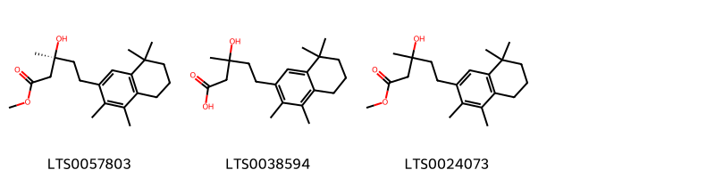{ width=100% }
    <figcaption>Hình ảnh cấu trúc hóa học của 3 hoạt chất thuộc nhóm Tetralins gồm ['methyl (3s)-3-hydroxy-3-methyl-5-(3,4,8,8-tetramethyl-6,7-dihydro-5h-naphthalen-2-yl)pentanoate (LTS0057803)', '3-hydroxy-3-methyl-5-(3,4,8,8-tetramethyl-6,7-dihydro-5h-naphthalen-2-yl)pentanoic acid (LTS0038594)', 'methyl 3-hydroxy-3-methyl-5-(3,4,8,8-tetramethyl-6,7-dihydro-5h-naphthalen-2-yl)pentanoate (LTS0024073)'].</figcaption>
</figure>

---

### Dược dân tộc học

Danh sách các quốc gia có sử dụng *Grindelia hirsutula* trong điều trị các bệnh. 

| Country   | Disease                                | Bệnh                                                                                                                                                                                                |
|:----------|:---------------------------------------|:----------------------------------------------------------------------------------------------------------------------------------------------------------------------------------------------------|
| Elsewhere | Expectorant                            | MYMEMORY WARNING: YOU USED ALL AVAILABLE FREE TRANSLATIONS FOR TODAY. NEXT AVAILABLE IN  12 HOURS 46 MINUTES 52 SECONDS VISIT HTTPS://MYMEMORY.TRANSLATED.NET/DOC/USAGELIMITS.PHP TO TRANSLATE MORE |
| US        | Diuretic, Expectorant, Tonic, Sedative | MYMEMORY WARNING: YOU USED ALL AVAILABLE FREE TRANSLATIONS FOR TODAY. NEXT AVAILABLE IN  12 HOURS 46 MINUTES 48 SECONDS VISIT HTTPS://MYMEMORY.TRANSLATED.NET/DOC/USAGELIMITS.PHP TO TRANSLATE MORE |

---

---
## Grindelia robusta
### Thông tin về thực vật

!!! info "Phân loại thực vật của *Grindelia hirsutula* từ GIBF:"
    - **Kingdom:** Plantae
    - **Phylum:** Tracheophyta
    - **Order:** Asterales
    - **Family:** Asteraceae
    - **Genus:** Grindelia
    - **Species:** *Grindelia hirsutula*

 

| Label (VI)   | Label (EN)   | Scientific Name   | Descriptions (VI)   | Descriptions (EN)   | Also Known As (VI)   | Also Known As (EN)   |
|:-------------|:-------------|:------------------|:--------------------|:--------------------|:---------------------|:---------------------|
| N/A          | N/A          | Grindelia robusta |                     | species of plant    | ['']                 | ['']                 |

#### Phân bố trên thế giới

**Từ CSDL GIBF** nan, United Kingdom of Great Britain and Northern Ireland, Belgium, Germany, Brazil, Spain, Portugal, unknown or invalid, Russian Federation, United States of America, Mexico, Norway, New Zealand

#### Phân bố tại Việt Nam

**Từ CSDL GIBF**: Không có ghi nhận ở Việt Nam

---
### Thành phần hóa học
        
- Theo cơ sở dữ liệu lotus: Từ loài *Grindelia hirsutula* đã phân lập và xác định được Chưa có hoạt chất nào được phân lập. hoạt chất thuộc về các nhóm Không có hoạt chất nào được phân lập. 

Không có hình ảnh nào được tạo ra

---

### Dược dân tộc học

Danh sách các quốc gia có sử dụng *Grindelia hirsutula* trong điều trị các bệnh. 

| Country   | Disease     | Bệnh                                                                                                                                                                                                |
|:----------|:------------|:----------------------------------------------------------------------------------------------------------------------------------------------------------------------------------------------------|
| Dutch     | Sedative    | MYMEMORY WARNING: YOU USED ALL AVAILABLE FREE TRANSLATIONS FOR TODAY. NEXT AVAILABLE IN  12 HOURS 46 MINUTES 04 SECONDS VISIT HTTPS://MYMEMORY.TRANSLATED.NET/DOC/USAGELIMITS.PHP TO TRANSLATE MORE |
| English   | Expectorant | MYMEMORY WARNING: YOU USED ALL AVAILABLE FREE TRANSLATIONS FOR TODAY. NEXT AVAILABLE IN  12 HOURS 46 MINUTES 00 SECONDS VISIT HTTPS://MYMEMORY.TRANSLATED.NET/DOC/USAGELIMITS.PHP TO TRANSLATE MORE |
| French    | Diuretic    | MYMEMORY WARNING: YOU USED ALL AVAILABLE FREE TRANSLATIONS FOR TODAY. NEXT AVAILABLE IN  12 HOURS 45 MINUTES 57 SECONDS VISIT HTTPS://MYMEMORY.TRANSLATED.NET/DOC/USAGELIMITS.PHP TO TRANSLATE MORE |
| US        | Stomachic   | MYMEMORY WARNING: YOU USED ALL AVAILABLE FREE TRANSLATIONS FOR TODAY. NEXT AVAILABLE IN  12 HOURS 45 MINUTES 53 SECONDS VISIT HTTPS://MYMEMORY.TRANSLATED.NET/DOC/USAGELIMITS.PHP TO TRANSLATE MORE |

---

---
## Grindelia squarosa
### Thông tin về thực vật

!!! info "Phân loại thực vật của *Grindelia squarrosa* từ GIBF:"
    - **Kingdom:** Plantae
    - **Phylum:** Tracheophyta
    - **Order:** Asterales
    - **Family:** Asteraceae
    - **Genus:** Grindelia
    - **Species:** *Grindelia squarrosa*

 

| Label (VI)   | Label (EN)   | Scientific Name   | Descriptions (VI)   | Descriptions (EN)   | Also Known As (VI)   | Also Known As (EN)   |
|:-------------|:-------------|:------------------|:--------------------|:--------------------|:---------------------|:---------------------|
| N/A          | N/A          | Grindelia robusta |                     | species of plant    | ['']                 | ['']                 |

#### Phân bố trên thế giới

**Từ CSDL GIBF** Ukraine, Moldova, Republic of, Germany, Russian Federation, United States of America, Canada

#### Phân bố tại Việt Nam

**Từ CSDL GIBF**: Không có ghi nhận ở Việt Nam

---
### Thành phần hóa học
        
- Theo cơ sở dữ liệu lotus: Từ loài *Grindelia squarrosa* đã phân lập và xác định được Chưa có hoạt chất nào được phân lập. hoạt chất thuộc về các nhóm Không có hoạt chất nào được phân lập. 

Không có hình ảnh nào được tạo ra

---

### Dược dân tộc học

Danh sách các quốc gia có sử dụng *Grindelia squarrosa* trong điều trị các bệnh. 

| Country   | Disease               | Bệnh                                                                                                                                                                                                |
|:----------|:----------------------|:----------------------------------------------------------------------------------------------------------------------------------------------------------------------------------------------------|
| Africa    | Sedative, Expectorant | MYMEMORY WARNING: YOU USED ALL AVAILABLE FREE TRANSLATIONS FOR TODAY. NEXT AVAILABLE IN  12 HOURS 45 MINUTES 22 SECONDS VISIT HTTPS://MYMEMORY.TRANSLATED.NET/DOC/USAGELIMITS.PHP TO TRANSLATE MORE |

---

---
## Grindelia squarrosa
### Thông tin về thực vật

!!! info "Phân loại thực vật của *Grindelia squarrosa* từ GIBF:"
    - **Kingdom:** Plantae
    - **Phylum:** Tracheophyta
    - **Order:** Asterales
    - **Family:** Asteraceae
    - **Genus:** Grindelia
    - **Species:** *Grindelia squarrosa*

 

| Label (VI)   | Label (EN)   | Scientific Name     | Descriptions (VI)   | Descriptions (EN)   | Also Known As (VI)   | Also Known As (EN)                                                                     |
|:-------------|:-------------|:--------------------|:--------------------|:--------------------|:---------------------|:---------------------------------------------------------------------------------------|
| N/A          | N/A          | Grindelia squarrosa | loài thực vật       | species of plant    | ['']                 | ['curly-cup gumweed', 'curly-top gumweed', 'curlycup gumweed', 'gum plant', 'gumweed'] |

#### Phân bố trên thế giới

**Từ CSDL GIBF** Ukraine, Moldova, Republic of, Germany, Russian Federation, United States of America, Canada

#### Phân bố tại Việt Nam

**Từ CSDL GIBF**: Không có ghi nhận ở Việt Nam

---
### Thành phần hóa học
        
- Theo cơ sở dữ liệu lotus: Từ loài *Grindelia squarrosa* đã phân lập và xác định được 35 hoạt chất thuộc về các nhóm Isobenzofurans, Prenol lipids. 

|    | chemicalTaxonomyClassyfireClass   |   smiles_count |
|---:|:----------------------------------|---------------:|
|  0 | Isobenzofurans                    |              1 |
|  1 | Prenol lipids                     |             34 |

#### Nhóm Isobenzofurans
<figure markdown="span">
    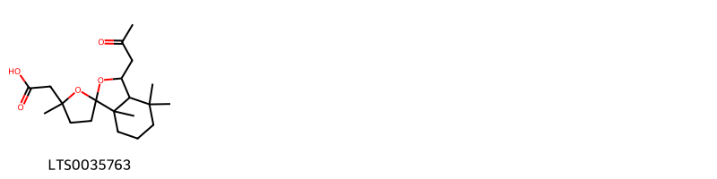{ width=100% }
    <figcaption>Hình ảnh cấu trúc hóa học của 1 hoạt chất thuộc nhóm Isobenzofurans gồm ["4,4,5',7a-tetramethyl-3-(2-oxopropyl)-tetrahydro-3h-spiro[2-benzofuran-1,2'-oxolan]-5'-ylacetic acid (LTS0035763)"].</figcaption>
</figure>
#### Nhóm Prenol lipids
<figure markdown="span">
    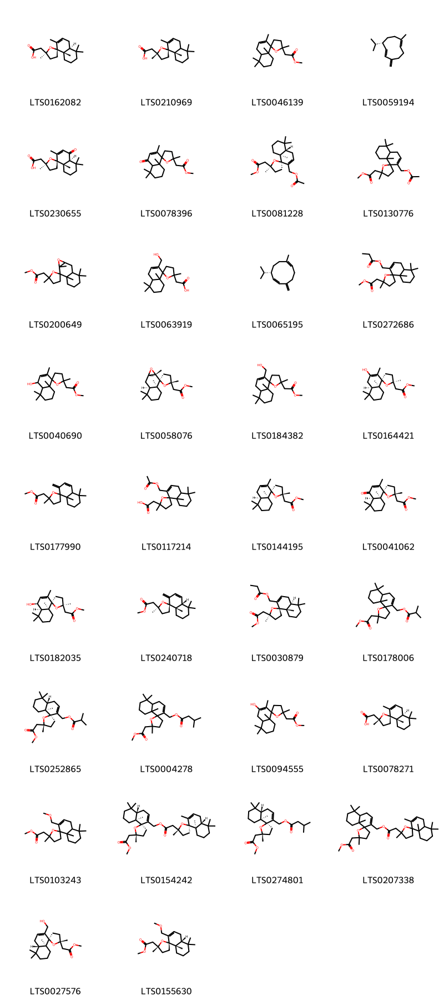{ width=100% }
    <figcaption>Hình ảnh cấu trúc hóa học của 34 hoạt chất thuộc nhóm Prenol lipids gồm ['grindelic acid (LTS0162082)', "(1r,5'r,8as)-2,5,5,5',8a-pentamethyl-4a,6,7,8-tetrahydro-4h-spiro[naphthalene-1,2'-oxolan]-5'-ylacetic acid (LTS0210969)", "methyl 2-{2,5,5,5',8a-pentamethyl-4a,6,7,8-tetrahydro-4h-spiro[naphthalene-1,2'-oxolan]-5'-yl}acetate (LTS0046139)", '(-)-germacrene d (LTS0059194)', "(1r,4as,5's,8as)-2,5,5,5',8a-pentamethyl-4-oxo-4a,6,7,8-tetrahydrospiro[naphthalene-1,2'-oxolan]-5'-ylacetic acid (LTS0230655)", "methyl 2-{2,5,5,5',8a-pentamethyl-4-oxo-4a,6,7,8-tetrahydrospiro[naphthalene-1,2'-oxolan]-5'-yl}acetate (LTS0078396)", "(1s,4as,5's,8as)-5'-(2-methoxy-2-oxoethyl)-5,5,5',8a-tetramethyl-4a,6,7,8-tetrahydro-4h-spiro[naphthalene-1,2'-oxolan]-2-ylmethyl acetate (LTS0081228)", "5'-(2-methoxy-2-oxoethyl)-5,5,5',8a-tetramethyl-4a,6,7,8-tetrahydro-4h-spiro[naphthalene-1,2'-oxolan]-2-ylmethyl acetate (LTS0130776)", "methyl 2-{1a,2a,5',6,6-pentamethyl-hexahydrospiro[naphtho[2,3-b]oxirene-2,2'-oxolan]-5'-yl}acetate (LTS0200649)", "2-(hydroxymethyl)-5,5,5',8a-tetramethyl-4a,6,7,8-tetrahydro-4h-spiro[naphthalene-1,2'-oxolan]-5'-ylacetic acid (LTS0063919)", '(1z,6z,8s)-8-isopropyl-1-methyl-5-methylidenecyclodeca-1,6-diene (LTS0065195)', "5'-(2-methoxy-2-oxoethyl)-5,5,5',8a-tetramethyl-4a,6,7,8-tetrahydro-4h-spiro[naphthalene-1,2'-oxolan]-2-ylmethyl propanoate (LTS0272686)", "methyl 2-{4-hydroxy-2,5,5,5',8a-pentamethyl-4a,6,7,8-tetrahydro-4h-spiro[naphthalene-1,2'-oxolan]-5'-yl}acetate (LTS0040690)", "methyl 2-[(1as,2s,2as,5'r,6ar,7as)-1a,2a,5',6,6-pentamethyl-hexahydrospiro[naphtho[2,3-b]oxirene-2,2'-oxolan]-5'-yl]acetate (LTS0058076)", "methyl 2-[2-(hydroxymethyl)-5,5,5',8a-tetramethyl-4a,6,7,8-tetrahydro-4h-spiro[naphthalene-1,2'-oxolan]-5'-yl]acetate (LTS0184382)", "methyl 2-[(1s,4ar,5's,8as)-3-hydroxy-2,5,5,5',8a-pentamethyl-4a,6,7,8-tetrahydro-4h-spiro[naphthalene-1,2'-oxolan]-5'-yl]acetate (LTS0164421)", "methyl 2-{5,5,5',8a-tetramethyl-2-methylidene-4a,6,7,8-tetrahydrospiro[naphthalene-1,2'-oxolan]-5'-yl}acetate (LTS0177990)", "2-[(acetyloxy)methyl]-5,5,5',8a-tetramethyl-4a,6,7,8-tetrahydro-4h-spiro[naphthalene-1,2'-oxolan]-5'-ylacetic acid (LTS0117214)", "methyl 2-[(1r,4ar,5'r,8as)-2,5,5,5',8a-pentamethyl-4a,6,7,8-tetrahydro-4h-spiro[naphthalene-1,2'-oxolan]-5'-yl]acetate (LTS0144195)", "methyl 2-[(1r,4ar,5'r,8as)-2,5,5,5',8a-pentamethyl-4-oxo-4a,6,7,8-tetrahydrospiro[naphthalene-1,2'-oxolan]-5'-yl]acetate (LTS0041062)", "methyl 2-[(1r,4s,4ar,5's,8as)-4-hydroxy-2,5,5,5',8a-pentamethyl-4a,6,7,8-tetrahydro-4h-spiro[naphthalene-1,2'-oxolan]-5'-yl]acetate (LTS0182035)", "methyl 2-[(1r,4ar,5's,8as)-5,5,5',8a-tetramethyl-2-methylidene-4a,6,7,8-tetrahydrospiro[naphthalene-1,2'-oxolan]-5'-yl]acetate (LTS0240718)", "(1s,4as,5's,8as)-5'-(2-methoxy-2-oxoethyl)-5,5,5',8a-tetramethyl-4a,6,7,8-tetrahydro-4h-spiro[naphthalene-1,2'-oxolan]-2-ylmethyl propanoate (LTS0030879)", "5'-(2-methoxy-2-oxoethyl)-5,5,5',8a-tetramethyl-4a,6,7,8-tetrahydro-4h-spiro[naphthalene-1,2'-oxolan]-2-ylmethyl 2-methylpropanoate (LTS0178006)", "(1s,4as,5'r,8as)-5'-(2-methoxy-2-oxoethyl)-5,5,5',8a-tetramethyl-4a,6,7,8-tetrahydro-4h-spiro[naphthalene-1,2'-oxolan]-2-ylmethyl 2-methylpropanoate (LTS0252865)", "5'-(2-methoxy-2-oxoethyl)-5,5,5',8a-tetramethyl-4a,6,7,8-tetrahydro-4h-spiro[naphthalene-1,2'-oxolan]-2-ylmethyl 3-methylbutanoate (LTS0004278)", "methyl 2-{3-hydroxy-2,5,5,5',8a-pentamethyl-4a,6,7,8-tetrahydro-4h-spiro[naphthalene-1,2'-oxolan]-5'-yl}acetate (LTS0094555)", "(1r,4as,5'r,8as)-2,5,5,5',8a-pentamethyl-4a,6,7,8-tetrahydro-4h-spiro[naphthalene-1,2'-oxolan]-5'-ylacetic acid (LTS0078271)", "methyl 2-[2-(methoxymethyl)-5,5,5',8a-tetramethyl-4a,6,7,8-tetrahydro-4h-spiro[naphthalene-1,2'-oxolan]-5'-yl]acetate (LTS0103243)", "(1s,4as,5'r,8as)-5'-(2-methoxy-2-oxoethyl)-5,5,5',8a-tetramethyl-4a,6,7,8-tetrahydro-4h-spiro[naphthalene-1,2'-oxolan]-2-ylmethyl 2-[(1s,4ar,5'r,8ar)-2,5,5,5',8a-pentamethyl-4a,6,7,8-tetrahydro-4h-spiro[naphthalene-1,2'-oxolan]-5'-yl]acetate (LTS0154242)", "(1s,4as,5'r,8as)-5'-(2-methoxy-2-oxoethyl)-5,5,5',8a-tetramethyl-4a,6,7,8-tetrahydro-4h-spiro[naphthalene-1,2'-oxolan]-2-ylmethyl 3-methylbutanoate (LTS0274801)", "5'-(2-methoxy-2-oxoethyl)-5,5,5',8a-tetramethyl-4a,6,7,8-tetrahydro-4h-spiro[naphthalene-1,2'-oxolan]-2-ylmethyl 2-{2,5,5,5',8a-pentamethyl-4a,6,7,8-tetrahydro-4h-spiro[naphthalene-1,2'-oxolan]-5'-yl}acetate (LTS0207338)", "methyl 2-[(1s,4as,5'r,8as)-2-(hydroxymethyl)-5,5,5',8a-tetramethyl-4a,6,7,8-tetrahydro-4h-spiro[naphthalene-1,2'-oxolan]-5'-yl]acetate (LTS0027576)", "methyl 2-[(1s,4ar,5'r,8as)-2-(methoxymethyl)-5,5,5',8a-tetramethyl-4a,6,7,8-tetrahydro-4h-spiro[naphthalene-1,2'-oxolan]-5'-yl]acetate (LTS0155630)"].</figcaption>
</figure>

---

### Dược dân tộc học

Danh sách các quốc gia có sử dụng *Grindelia squarrosa* trong điều trị các bệnh. 

| Country       | Disease     | Bệnh                                                                                                                                                                                                |
|:--------------|:------------|:----------------------------------------------------------------------------------------------------------------------------------------------------------------------------------------------------|
| Elsewhere     | Antitussive | MYMEMORY WARNING: YOU USED ALL AVAILABLE FREE TRANSLATIONS FOR TODAY. NEXT AVAILABLE IN  12 HOURS 44 MINUTES 55 SECONDS VISIT HTTPS://MYMEMORY.TRANSLATED.NET/DOC/USAGELIMITS.PHP TO TRANSLATE MORE |
| US(Blackfoot) | Expectorant | MYMEMORY WARNING: YOU USED ALL AVAILABLE FREE TRANSLATIONS FOR TODAY. NEXT AVAILABLE IN  12 HOURS 44 MINUTES 51 SECONDS VISIT HTTPS://MYMEMORY.TRANSLATED.NET/DOC/USAGELIMITS.PHP TO TRANSLATE MORE |
| US(Flathead)  | Stimulant   | MYMEMORY WARNING: YOU USED ALL AVAILABLE FREE TRANSLATIONS FOR TODAY. NEXT AVAILABLE IN  12 HOURS 44 MINUTES 48 SECONDS VISIT HTTPS://MYMEMORY.TRANSLATED.NET/DOC/USAGELIMITS.PHP TO TRANSLATE MORE |

---

# Chi Santolina

??? note "Danh sách các dược liệu thuộc chi"
    
	 - *Santolina chamaecyparissus*

---
## Santolina chamaecyparissus
### Thông tin về thực vật

!!! info "Phân loại thực vật của *Santolina chamaecyparissus* từ GIBF:"
    - **Kingdom:** Plantae
    - **Phylum:** Tracheophyta
    - **Order:** Asterales
    - **Family:** Asteraceae
    - **Genus:** Santolina
    - **Species:** *Santolina chamaecyparissus*

 

| Label (VI)   | Label (EN)   | Scientific Name            | Descriptions (VI)   | Descriptions (EN)   | Also Known As (VI)   | Also Known As (EN)                    |
|:-------------|:-------------|:---------------------------|:--------------------|:--------------------|:---------------------|:--------------------------------------|
| N/A          | N/A          | Santolina chamaecyparissus | loài thực vật       | species of plant    | ['']                 | ['algodón lavanda', 'santolina gris'] |

#### Phân bố trên thế giới

**Từ CSDL GIBF** Italy, Belgium, Argentina, Canada, Netherlands, Spain, Bolivia (Plurinational State of), Portugal, United States of America, Chile, Croatia, Greece, Germany, Switzerland, France, United Kingdom of Great Britain and Northern Ireland, Colombia, Ireland, New Zealand

#### Phân bố tại Việt Nam

**Từ CSDL GIBF**: Không có ghi nhận ở Việt Nam

---
### Thành phần hóa học
        
- Theo cơ sở dữ liệu lotus: Từ loài *Santolina chamaecyparissus* đã phân lập và xác định được 164 hoạt chất thuộc về các nhóm Fatty Acyls, Flavonoids, Prenol lipids, Steroids and steroid derivatives, Thiophenes, Unsaturated hydrocarbons, Heteroaromatic compounds, Organooxygen compounds, Dihydrofurans, Dithiins. 

|    | chemicalTaxonomyClassyfireClass   |   smiles_count |
|---:|:----------------------------------|---------------:|
|  0 | Dihydrofurans                     |              2 |
|  1 | Dithiins                          |              2 |
|  2 | Fatty Acyls                       |              2 |
|  3 | Flavonoids                        |              7 |
|  4 | Heteroaromatic compounds          |              5 |
|  5 | Organooxygen compounds            |             11 |
|  6 | Prenol lipids                     |            122 |
|  7 | Steroids and steroid derivatives  |              2 |
|  8 | Thiophenes                        |              7 |
|  9 | Unsaturated hydrocarbons          |              3 |

#### Nhóm Dihydrofurans
<figure markdown="span">
    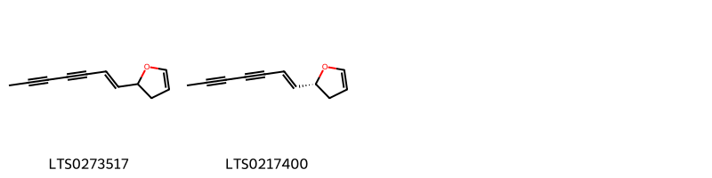{ width=100% }
    <figcaption>Hình ảnh cấu trúc hóa học của 2 hoạt chất thuộc nhóm Dihydrofurans gồm ['2-(hept-1-en-3,5-diyn-1-yl)-2,3-dihydrofuran (LTS0273517)', '(2r)-2-[(1e)-hept-1-en-3,5-diyn-1-yl]-2,3-dihydrofuran (LTS0217400)'].</figcaption>
</figure>
#### Nhóm Dithiins
<figure markdown="span">
    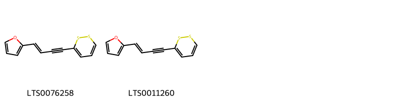{ width=100% }
    <figcaption>Hình ảnh cấu trúc hóa học của 2 hoạt chất thuộc nhóm Dithiins gồm ['2-[4-(1,2-dithiin-3-yl)but-1-en-3-yn-1-yl]furan (LTS0076258)', '2-[(1e)-4-(1,2-dithiin-3-yl)but-1-en-3-yn-1-yl]furan (LTS0011260)'].</figcaption>
</figure>
#### Nhóm Fatty Acyls
<figure markdown="span">
    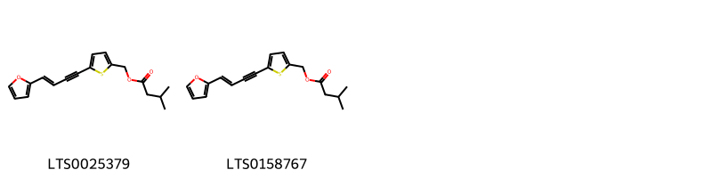{ width=100% }
    <figcaption>Hình ảnh cấu trúc hóa học của 2 hoạt chất thuộc nhóm Fatty Acyls gồm ['{5-[(3e)-4-(furan-2-yl)but-3-en-1-yn-1-yl]thiophen-2-yl}methyl 3-methylbutanoate (LTS0025379)', '{5-[4-(furan-2-yl)but-3-en-1-yn-1-yl]thiophen-2-yl}methyl 3-methylbutanoate (LTS0158767)'].</figcaption>
</figure>
#### Nhóm Flavonoids
<figure markdown="span">
    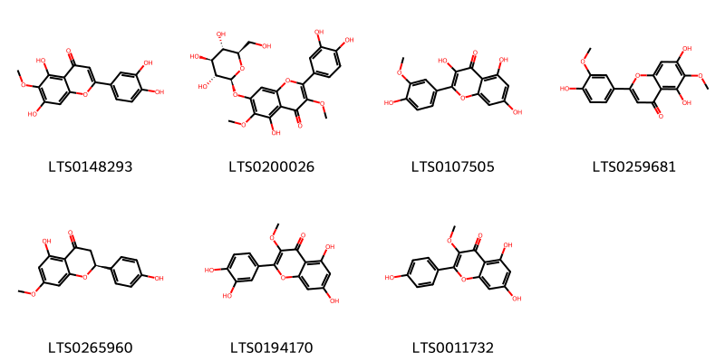{ width=100% }
    <figcaption>Hình ảnh cấu trúc hóa học của 7 hoạt chất thuộc nhóm Flavonoids gồm ['nepetin (LTS0148293)', '2-(3,4-dihydroxyphenyl)-5-hydroxy-3,6-dimethoxy-7-{[(2s,3r,4s,5s,6r)-3,4,5-trihydroxy-6-(hydroxymethyl)oxan-2-yl]oxy}chromen-4-one (LTS0200026)', 'isorhamnetin (LTS0107505)', 'jaceosidin (LTS0259681)', 'sakuranetin (LTS0265960)', 'quercetin 3-methyl ether (LTS0194170)', 'isokaempferide (LTS0011732)'].</figcaption>
</figure>
#### Nhóm Heteroaromatic compounds
<figure markdown="span">
    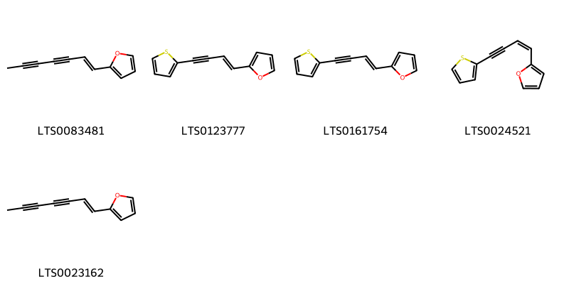{ width=100% }
    <figcaption>Hình ảnh cấu trúc hóa học của 5 hoạt chất thuộc nhóm Heteroaromatic compounds gồm ['2-[(1e)-hept-1-en-3,5-diyn-1-yl]furan (LTS0083481)', '2-[(1e)-4-(thiophen-2-yl)but-1-en-3-yn-1-yl]furan (LTS0123777)', '2-[4-(thiophen-2-yl)but-1-en-3-yn-1-yl]furan (LTS0161754)', '2-[(1z)-4-(thiophen-2-yl)but-1-en-3-yn-1-yl]furan (LTS0024521)', '2-(hept-1-en-3,5-diyn-1-yl)furan (LTS0023162)'].</figcaption>
</figure>
#### Nhóm Organooxygen compounds
<figure markdown="span">
    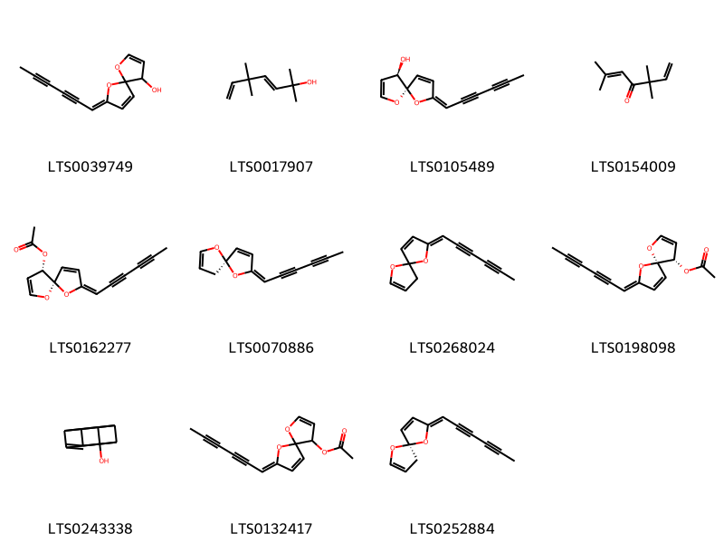{ width=100% }
    <figcaption>Hình ảnh cấu trúc hóa học của 11 hoạt chất thuộc nhóm Organooxygen compounds gồm ['7-(hexa-2,4-diyn-1-ylidene)-1,6-dioxaspiro[4.4]nona-2,8-dien-4-ol (LTS0039749)', '(3e)-2,5,5-trimethylhepta-3,6-dien-2-ol (LTS0017907)', '(4r,5r,7e)-7-(hexa-2,4-diyn-1-ylidene)-1,6-dioxaspiro[4.4]nona-2,8-dien-4-ol (LTS0105489)', 'isoartemisia ketone (LTS0154009)', '(4s,5r,7e)-7-(hexa-2,4-diyn-1-ylidene)-1,6-dioxaspiro[4.4]nona-2,8-dien-4-yl acetate (LTS0162277)', '(5r,7e)-7-(hexa-2,4-diyn-1-ylidene)-1,6-dioxaspiro[4.4]nona-2,8-diene (LTS0070886)', '7-(hexa-2,4-diyn-1-ylidene)-1,6-dioxaspiro[4.4]nona-2,8-diene (LTS0268024)', '(4s,5r,7z)-7-(hexa-2,4-diyn-1-ylidene)-1,6-dioxaspiro[4.4]nona-2,8-dien-4-yl acetate (LTS0198098)', '3,4,5,8-tetrahydro-2h-cuban-1-ol (LTS0243338)', '7-(hexa-2,4-diyn-1-ylidene)-1,6-dioxaspiro[4.4]nona-2,8-dien-4-yl acetate (LTS0132417)', '(5r,7z)-7-(hexa-2,4-diyn-1-ylidene)-1,6-dioxaspiro[4.4]nona-2,8-diene (LTS0252884)'].</figcaption>
</figure>
#### Nhóm Prenol lipids
<figure markdown="span">
    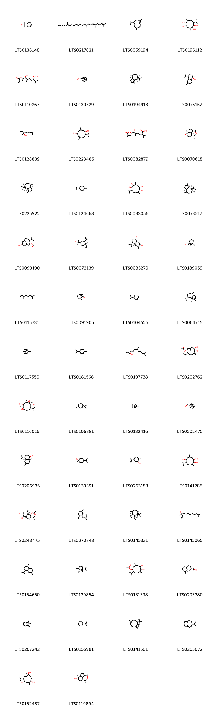{ width=100% }
    <figcaption>Hình ảnh cấu trúc hóa học của 122 hoạt chất thuộc nhóm Prenol lipids gồm ['terpineol (LTS0136148)', 'squalene (LTS0217821)', '(-)-germacrene d (LTS0059194)', '(1r,2r,5r,6r,7z,10s)-10-isopropyl-7-methyl-3-methylidenecyclodec-7-ene-1,2,5,6-tetrol (LTS0196112)', '5-[hydroxy(4-methylidene-5-oxooxolan-2-yl)methyl]-2-isopropylhex-5-enoic acid (LTS0110267)', 'myrtenol (LTS0130529)', '(-)-α-gurjunene (LTS0194913)', '(1r,4s)-4-isopropyl-1,6-dimethyl-3,4,4a,7,8,8a-hexahydro-2h-naphthalen-1-ol (LTS0076152)', 'linalool, (+-)- (LTS0128839)', '10-isopropyl-3,7-dimethylcyclodeca-2,6-diene-1,5-diol (LTS0223486)', '(2s)-5-[(s)-hydroxy[(2s)-4-methylidene-5-oxooxolan-2-yl]methyl]-2-isopropylhex-5-enoic acid (LTS0082879)', '1-[(1s,3as,4r,7s,7ar)-4-hydroxy-7-isopropyl-4-methyl-octahydroinden-1-yl]ethanone (LTS0070618)', 'β-gurjunene (LTS0225922)', 'β phellandrene (LTS0124668)', '(1r,2r,5r,6r,10s)-10-isopropyl-3,7-dimethylidenecyclodecane-1,2,5,6-tetrol (LTS0083056)', '(1as,4as,7s,7ar,7bs)-1,1,7-trimethyl-4-methylidene-octahydrocyclopropa[e]azulen-7-ol (LTS0073517)', '(1r,2e,5r,6e,10s)-5-hydroxy-10-isopropyl-3,7-dimethylcyclodeca-2,6-dien-1-yl acetate (LTS0093190)', '2-[4-ethenyl-4-methyl-3-(prop-1-en-2-yl)cyclohexyl]propan-2-ol (LTS0072139)', '(4ar,5s,8r,8as)-8-hydroxy-5-isopropyl-3,8-dimethyl-1,4a,5,6,7,8a-hexahydronaphthalen-2-one (LTS0033270)', '(+)-borneol (LTS0189059)', 'α-myrcene (LTS0115731)', 'camphor (LTS0091905)', 'terpinolene (LTS0104525)', '(1s,5r,7s,10r)-7-isopropyl-4,10-dimethyltricyclo[4.4.0.0¹,⁵]dec-3-ene (LTS0064715)', 'β-pinene (LTS0117550)', 'cymene (LTS0181568)', 'nerolidol (LTS0197738)', '(1r,2e,5r,6r,10s)-5,6-dihydroxy-10-isopropyl-3-methyl-7-methylidenecyclodec-2-en-1-yl acetate (LTS0202762)', '(1s,2r,4s,6r,7r,8s,11r)-8-isopropyl-4,11-dimethyl-5,12-dioxatricyclo[9.1.0.0⁴,⁶]dodecane-2,7-diol (LTS0116016)', 'monoterpenes (LTS0106881)', 'α pinene (LTS0132416)', 'myrtenal (LTS0202475)', 'α-cadinol (LTS0206935)', 'terpineols (LTS0139391)', 'carveol (LTS0263183)', '10-isopropyl-3,7-dimethylidenecyclodecane-1,2,5,6-tetrol (LTS0141285)', '(1r,2s,4as,5r,6r,8ar)-5,6-dihydroxy-2-isopropyl-4a-methyl-8-methylidene-octahydronaphthalen-1-yl acetate (LTS0243475)', '4-isopropyl-1,6-dimethyl-2,3,4,4a,7,8-hexahydronaphthalene (LTS0270743)', '(1as,4ar,7as,7br)-1,1,7-trimethyl-4-methylidene-octahydro-1ah-cyclopropa[e]azulene (LTS0145331)', '(3r,6e)-nerolidol (LTS0145065)', '4-isopropyl-1,6-dimethyl-3,4,4a,7,8,8a-hexahydronaphthalene (LTS0154650)', '(5s)-1-isopropyl-4-methylidenebicyclo[3.1.0]hexane (LTS0129854)', '5,6-dihydroxy-10-isopropyl-3-methyl-7-methylidenecyclodec-2-en-1-yl acetate (LTS0131398)', 'β-eudesmol (LTS0203280)', 'camphene (LTS0267242)', 'limonene,  (LTS0155981)', 'β-caryophyllen (LTS0141501)', 'germacrene b (LTS0265072)', '(1s,4s,7s,8e,10s)-10-isopropyl-7-methyl-3-methylidenecyclodec-8-ene-1,4,7-triol (LTS0152487)', '1-(4-hydroxy-7-isopropyl-4-methyl-octahydroinden-1-yl)ethanone (LTS0119894)', '(1r,4r,5s)-thujan-3-one (LTS0258679)', '(1r,2s,3r,6r,7r,8s)-8-isopropyl-1-methyl-5-methylidene-11-oxabicyclo[4.4.1]undecane-2,3,7-triol (LTS0106594)', 'α-ylangene (LTS0254603)', '(1r,2r,4r)-1,7,7-trimethylbicyclo[2.2.1]heptan-2-ol (LTS0166561)', '(z)-γ-bisabolene (LTS0143321)', '(1r,2r,4s,6r,7r,8s,11s)-8-isopropyl-4,11-dimethyl-5,12-dioxatricyclo[9.1.0.0⁴,⁶]dodecane-2,7-diol (LTS0070434)', 'phellandrene (LTS0157173)', '10-isopropyl-7-methyl-3-methylidenecyclodec-6-ene-1,2,5-triol (LTS0112249)', '(2r)-6-methyl-2-(4-methylcyclohex-3-en-1-yl)hept-5-en-2-ol (LTS0088859)', '(-)-β-pinene (LTS0108757)', '(1r,4s,4ar)-4-isopropyl-1,6-dimethyl-3,4,4a,7,8,8a-hexahydro-2h-naphthalen-1-ol (LTS0164497)', '4-terpineol (LTS0253733)', '5-hydroxy-10-isopropyl-3,7-dimethylcyclodeca-2,6-dien-1-yl acetate (LTS0183086)', '3-isothujone (LTS0158119)', 'borneol (LTS0264960)', '(+)-gamma-cadinene (LTS0103949)', '1-[(1r,7r)-7-isopropyl-4-methylidene-octahydroinden-1-yl]ethanone (LTS0188339)', '(1r,5s)-4,6,6-trimethylbicyclo[3.1.1]hept-3-en-2-one (LTS0177954)', '10,10-dimethyl-2,6-dimethylidenebicyclo[7.2.0]undecan-4-ol (LTS0123138)', 'α-bisabolol (LTS0250984)', 'verbenone (LTS0264577)', '(1s)-8-isopropyl-1,3-dimethyltricyclo[4.4.0.0²,⁷]dec-3-ene (LTS0199723)', 'bornyl acetate (LTS0060565)', '(1z,6z,8s)-8-isopropyl-1-methyl-5-methylidenecyclodeca-1,6-diene (LTS0065195)', '5,6-dihydroxy-10-isopropyl-3,7-dimethylcyclodeca-2,7-dien-1-yl acetate (LTS0221648)', '(1r,2e,6s,7r,8r)-7,8-dihydroxy-6-isopropyl-3-methyl-9-methylidenecyclodec-2-en-1-yl acetate (LTS0260648)', 'β-elemene (LTS0260361)', 'α-copaene (LTS0207598)', 'sabinene (LTS0224133)', '3-isopropyl-6,10-dimethyl-11-oxabicyclo[8.1.0]undec-6-ene-2,8-diol (LTS0073158)', '(+)-α-pinene (LTS0211102)', '10-isopropyl-7-methyl-3-methylidenecyclodec-7-ene-1,2,5,6-tetrol (LTS0238063)', 'elemol (LTS0208556)', '(1r,4r,4as,8as)-4-isopropyl-1,6-dimethyl-3,4,4a,7,8,8a-hexahydro-2h-naphthalen-1-ol (LTS0251900)', 'γ-terpineol (LTS0175059)', 'linalyl acetate (LTS0167325)', '10-isopropyl-7-methyl-3-methylidenecyclodec-8-ene-1,4,7-triol (LTS0168021)', 'α-cadinol (LTS0178794)', '(2e,6s,7r,8r)-7,8-dihydroxy-6-isopropyl-3-methyl-9-methylidenecyclodec-2-en-1-one (LTS0258688)', 'curcumene (LTS0190074)', '(1r,2s,7s,8s)-8-isopropyl-1,3-dimethyltricyclo[4.4.0.0²,⁷]dec-3-ene (LTS0190031)', '(2s,4r)-1,7,7-trimethylbicyclo[2.2.1]heptan-2-ol (LTS0010050)', '8-isopropyl-4,11-dimethyl-5,12-dioxatricyclo[9.1.0.0⁴,⁶]dodecane-2,7-diol (LTS0125364)', 'myrtanol (LTS0126998)', '(1r,2r,3s,6e,8r,10s)-3-isopropyl-6,10-dimethyl-11-oxabicyclo[8.1.0]undec-6-ene-2,8-diol (LTS0106334)', '9-hydroxy-8-isopropyl-1,5-dimethyl-11-oxabicyclo[8.1.0]undec-4-en-3-yl acetate (LTS0067295)', '8-isopropyl-1-methyl-5-methylidene-11-oxabicyclo[4.4.1]undecane-2,3,7-triol (LTS0271563)', 'terpinene (LTS0136858)', '(1r,2r,5r,6e,10s)-10-isopropyl-7-methyl-3-methylidenecyclodec-6-ene-1,2,5-triol (LTS0026972)', 'α-muurolene (LTS0022607)', '(1s,2e,10r)-3,7,11,11-tetramethylbicyclo[8.1.0]undeca-2,6-diene (LTS0032090)', 'fenchone (LTS0126716)', '4-methyl-1-(6-methylhept-5-en-2-yl)cyclohex-3-en-1-ol (LTS0000924)', 'isobornyl acetate (LTS0024491)', '(1s,3r,4e,8s,9r,10r)-9-hydroxy-8-isopropyl-1,5-dimethyl-11-oxabicyclo[8.1.0]undec-4-en-3-yl acetate (LTS0008453)', 'carvacrol (LTS0012882)', '7,8-dihydroxy-6-isopropyl-3-methyl-9-methylidenecyclodec-2-en-1-one (LTS0014678)', '(1r,2e,5r,6e,10s)-10-isopropyl-3,7-dimethylcyclodeca-2,6-diene-1,5-diol (LTS0103145)', '(1r,2e,5r,6r,7z,10s)-5,6-dihydroxy-10-isopropyl-3,7-dimethylcyclodeca-2,7-dien-1-yl acetate (LTS0257806)', '(1s,4r,4ar,8ar)-1-isopropyl-4,7-dimethyl-2,3,4,5,6,8a-hexahydro-1h-naphthalen-4a-ol (LTS0018576)', 'delta-cadinene (LTS0019321)', '7,8-dihydroxy-6-isopropyl-3-methyl-9-methylidenecyclodec-2-en-1-yl acetate (LTS0027985)', '(7ar)-1,1,7-trimethyl-4-methylidene-octahydrocyclopropa[e]azulen-7-ol (LTS0091612)', '5,6-dihydroxy-2-isopropyl-4a-methyl-8-methylidene-octahydronaphthalen-1-yl acetate (LTS0101915)', '(1ar,4r,7r,7bs)-1,1,4,7-tetramethyl-octahydro-1ah-cyclopropa[e]azulen-4-ol (LTS0248407)', 'β-bisabolol (LTS0115229)', 'dihydrocarveol (LTS0111467)', '(-)-α-cubebene (LTS0042045)', '4-isopropyl-6-methyl-1-methylidene-3,4,4a,7,8,8a-hexahydro-2h-naphthalene (LTS0111070)', 'carvyl acetate (LTS0049357)', '{8-isopropyl-1-methyltricyclo[4.4.0.0²,⁷]dec-3-en-3-yl}methanol (LTS0121685)', '(2e,6e)-3,7,11,11-tetramethylbicyclo[8.1.0]undeca-2,6-diene (LTS0225278)'].</figcaption>
</figure>
#### Nhóm Steroids and steroid derivatives
<figure markdown="span">
    { width=100% }
    <figcaption>Hình ảnh cấu trúc hóa học của 2 hoạt chất thuộc nhóm Steroids and steroid derivatives gồm ['sitogluside (LTS0201798)', '2-{[1-(5-ethyl-6-methylheptan-2-yl)-9a,11a-dimethyl-1h,2h,3h,3ah,3bh,4h,6h,7h,8h,9h,9bh,10h,11h-cyclopenta[a]phenanthren-7-yl]oxy}-6-(hydroxymethyl)oxane-3,4,5-triol (LTS0158828)'].</figcaption>
</figure>
#### Nhóm Thiophenes
<figure markdown="span">
    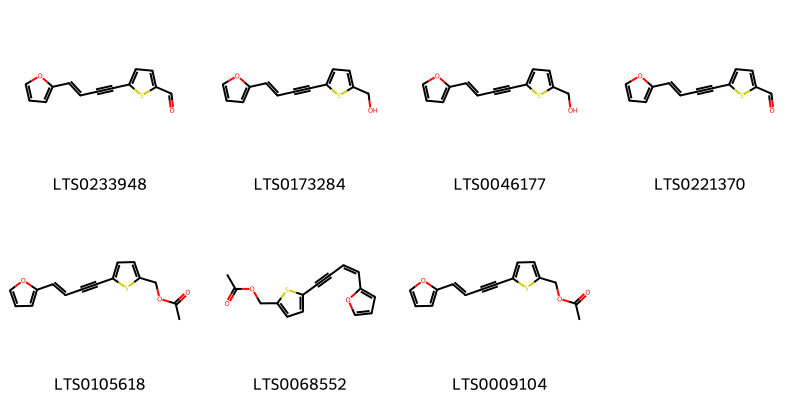{ width=100% }
    <figcaption>Hình ảnh cấu trúc hóa học của 7 hoạt chất thuộc nhóm Thiophenes gồm ['5-[(3e)-4-(furan-2-yl)but-3-en-1-yn-1-yl]thiophene-2-carbaldehyde (LTS0233948)', '{5-[(3e)-4-(furan-2-yl)but-3-en-1-yn-1-yl]thiophen-2-yl}methanol (LTS0173284)', '{5-[4-(furan-2-yl)but-3-en-1-yn-1-yl]thiophen-2-yl}methanol (LTS0046177)', '5-[4-(furan-2-yl)but-3-en-1-yn-1-yl]thiophene-2-carbaldehyde (LTS0221370)', '{5-[(3e)-4-(furan-2-yl)but-3-en-1-yn-1-yl]thiophen-2-yl}methyl acetate (LTS0105618)', '{5-[(3z)-4-(furan-2-yl)but-3-en-1-yn-1-yl]thiophen-2-yl}methyl acetate (LTS0068552)', '{5-[4-(furan-2-yl)but-3-en-1-yn-1-yl]thiophen-2-yl}methyl acetate (LTS0009104)'].</figcaption>
</figure>
#### Nhóm Unsaturated hydrocarbons
<figure markdown="span">
    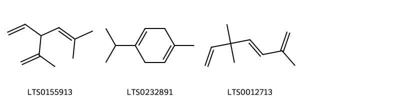{ width=100% }
    <figcaption>Hình ảnh cấu trúc hóa học của 3 hoạt chất thuộc nhóm Unsaturated hydrocarbons gồm ['santolina triene (LTS0155913)', 'α terpinene (LTS0232891)', '(3e)-2,5,5-trimethylhepta-1,3,6-triene (LTS0012713)'].</figcaption>
</figure>

---

### Dược dân tộc học

Danh sách các quốc gia có sử dụng *Santolina chamaecyparissus* trong điều trị các bệnh. 

| Country   | Disease                                                                 | Bệnh                                                                                                                                                                                                |
|:----------|:------------------------------------------------------------------------|:----------------------------------------------------------------------------------------------------------------------------------------------------------------------------------------------------|
| Elsewhere | Analgesic, Stimulant, Stomachic, Vermifuge, Vulnerary, Emmenagogue, nan | MYMEMORY WARNING: YOU USED ALL AVAILABLE FREE TRANSLATIONS FOR TODAY. NEXT AVAILABLE IN  12 HOURS 44 MINUTES 19 SECONDS VISIT HTTPS://MYMEMORY.TRANSLATED.NET/DOC/USAGELIMITS.PHP TO TRANSLATE MORE |
| Europe    | Perfume, Vermifuge, Fungicide                                           | MYMEMORY WARNING: YOU USED ALL AVAILABLE FREE TRANSLATIONS FOR TODAY. NEXT AVAILABLE IN  12 HOURS 44 MINUTES 17 SECONDS VISIT HTTPS://MYMEMORY.TRANSLATED.NET/DOC/USAGELIMITS.PHP TO TRANSLATE MORE |
| Turkey    | Analgesic, Emmenagogue, Stimulant, Stomachic, Vermifuge, Vulnerary      | MYMEMORY WARNING: YOU USED ALL AVAILABLE FREE TRANSLATIONS FOR TODAY. NEXT AVAILABLE IN  12 HOURS 44 MINUTES 14 SECONDS VISIT HTTPS://MYMEMORY.TRANSLATED.NET/DOC/USAGELIMITS.PHP TO TRANSLATE MORE |
| ain       | Digestive                                                               | MYMEMORY WARNING: YOU USED ALL AVAILABLE FREE TRANSLATIONS FOR TODAY. NEXT AVAILABLE IN  12 HOURS 44 MINUTES 11 SECONDS VISIT HTTPS://MYMEMORY.TRANSLATED.NET/DOC/USAGELIMITS.PHP TO TRANSLATE MORE |

---

# Chi Stenocline

??? note "Danh sách các dược liệu thuộc chi"
    
	 - *Stenocline incana*

---
## Stenocline incana
### Thông tin về thực vật

!!! info "Phân loại thực vật của *Helichrysum gymnocephalum* từ GIBF:"
    - **Kingdom:** Plantae
    - **Phylum:** Tracheophyta
    - **Order:** Asterales
    - **Family:** Asteraceae
    - **Genus:** Helichrysum
    - **Species:** *Helichrysum gymnocephalum*

 

| Label (VI)   | Label (EN)   | Scientific Name   | Descriptions (VI)   | Descriptions (EN)   | Also Known As (VI)   | Also Known As (EN)   |
|:-------------|:-------------|:------------------|:--------------------|:--------------------|:---------------------|:---------------------|
| N/A          | N/A          | Stenocline incana | loài thực vật       | species of plant    | ['']                 | ['']                 |

#### Phân bố trên thế giới

**Từ CSDL GIBF** Italy, Belgium, Argentina, Canada, Netherlands, Spain, Bolivia (Plurinational State of), Portugal, United States of America, Chile, Croatia, Greece, Germany, Switzerland, France, United Kingdom of Great Britain and Northern Ireland, Colombia, Ireland, New Zealand

#### Phân bố tại Việt Nam

**Từ CSDL GIBF**: Không có ghi nhận ở Việt Nam

---
### Thành phần hóa học
        
- Theo cơ sở dữ liệu lotus: Từ loài *Helichrysum gymnocephalum* đã phân lập và xác định được Chưa có hoạt chất nào được phân lập. hoạt chất thuộc về các nhóm Không có hoạt chất nào được phân lập. 

Không có hình ảnh nào được tạo ra

---

### Dược dân tộc học

Danh sách các quốc gia có sử dụng *Helichrysum gymnocephalum* trong điều trị các bệnh. 

| Country   | Disease                                   | Bệnh                                                                                                                                                                                                |
|:----------|:------------------------------------------|:----------------------------------------------------------------------------------------------------------------------------------------------------------------------------------------------------|
| Malagasy  | Aphrodisiac, Astringent, Stomachic, Tonic | MYMEMORY WARNING: YOU USED ALL AVAILABLE FREE TRANSLATIONS FOR TODAY. NEXT AVAILABLE IN  12 HOURS 43 MINUTES 25 SECONDS VISIT HTTPS://MYMEMORY.TRANSLATED.NET/DOC/USAGELIMITS.PHP TO TRANSLATE MORE |

---

# Chi Polymnia

??? note "Danh sách các dược liệu thuộc chi"
    
	 - *Polymnia uvedalia*

---
## Polymnia uvedalia
### Thông tin về thực vật

!!! info "Phân loại thực vật của *Smallanthus uvedalia* từ GIBF:"
    - **Kingdom:** Plantae
    - **Phylum:** Tracheophyta
    - **Order:** Asterales
    - **Family:** Asteraceae
    - **Genus:** Smallanthus
    - **Species:** *Smallanthus uvedalia*

 

| Label (VI)   | Label (EN)   | Scientific Name   | Descriptions (VI)   | Descriptions (EN)   | Also Known As (VI)   | Also Known As (EN)   |
|:-------------|:-------------|:------------------|:--------------------|:--------------------|:---------------------|:---------------------|
| N/A          | N/A          | Polymnia uvedalia | loài thực vật       | species of plant    | ['']                 | ['']                 |

#### Phân bố trên thế giới

**Từ CSDL GIBF** Portugal, United States of America, Mexico, Norway, China

#### Phân bố tại Việt Nam

**Từ CSDL GIBF**: Không có ghi nhận ở Việt Nam

---
### Thành phần hóa học
        
- Theo cơ sở dữ liệu lotus: Từ loài *Smallanthus uvedalia* đã phân lập và xác định được Chưa có hoạt chất nào được phân lập. hoạt chất thuộc về các nhóm Không có hoạt chất nào được phân lập. 

Không có hình ảnh nào được tạo ra

---

### Dược dân tộc học

Danh sách các quốc gia có sử dụng *Smallanthus uvedalia* trong điều trị các bệnh. 

| Country        | Disease             | Bệnh                                                                                                                                                                                                |
|:---------------|:--------------------|:----------------------------------------------------------------------------------------------------------------------------------------------------------------------------------------------------|
| Dutch          | Laxative            | MYMEMORY WARNING: YOU USED ALL AVAILABLE FREE TRANSLATIONS FOR TODAY. NEXT AVAILABLE IN  12 HOURS 43 MINUTES 05 SECONDS VISIT HTTPS://MYMEMORY.TRANSLATED.NET/DOC/USAGELIMITS.PHP TO TRANSLATE MORE |
| German         | Stimulant           | MYMEMORY WARNING: YOU USED ALL AVAILABLE FREE TRANSLATIONS FOR TODAY. NEXT AVAILABLE IN  12 HOURS 43 MINUTES 02 SECONDS VISIT HTTPS://MYMEMORY.TRANSLATED.NET/DOC/USAGELIMITS.PHP TO TRANSLATE MORE |
| US(Amerindian) | Stimulant, Laxative | MYMEMORY WARNING: YOU USED ALL AVAILABLE FREE TRANSLATIONS FOR TODAY. NEXT AVAILABLE IN  12 HOURS 42 MINUTES 58 SECONDS VISIT HTTPS://MYMEMORY.TRANSLATED.NET/DOC/USAGELIMITS.PHP TO TRANSLATE MORE |

---

# Chi Palafoxia

??? note "Danh sách các dược liệu thuộc chi"
    
	 - *Palafoxia linearis*

---
## Palafoxia linearis
### Thông tin về thực vật

!!! info "Phân loại thực vật của *Palafoxia linearis* từ GIBF:"
    - **Kingdom:** Plantae
    - **Phylum:** Tracheophyta
    - **Order:** Asterales
    - **Family:** Asteraceae
    - **Genus:** Palafoxia
    - **Species:** *Palafoxia linearis*

 

| Label (VI)   | Label (EN)   | Scientific Name    | Descriptions (VI)   | Descriptions (EN)   | Also Known As (VI)   | Also Known As (EN)   |
|:-------------|:-------------|:-------------------|:--------------------|:--------------------|:---------------------|:---------------------|
| N/A          | N/A          | Palafoxia linearis | loài thực vật       | species of plant    | ['']                 | ['']                 |

#### Phân bố trên thế giới

**Từ CSDL GIBF** United States of America, Mexico

#### Phân bố tại Việt Nam

**Từ CSDL GIBF**: Không có ghi nhận ở Việt Nam

---
### Thành phần hóa học
        
- Theo cơ sở dữ liệu lotus: Từ loài *Palafoxia linearis* đã phân lập và xác định được Chưa có hoạt chất nào được phân lập. hoạt chất thuộc về các nhóm Không có hoạt chất nào được phân lập. 

Không có hình ảnh nào được tạo ra

---

### Dược dân tộc học

Danh sách các quốc gia có sử dụng *Palafoxia linearis* trong điều trị các bệnh. 

| Country      | Disease   | Bệnh                                                                                                                                                                                                |
|:-------------|:----------|:----------------------------------------------------------------------------------------------------------------------------------------------------------------------------------------------------|
| Mexico(Seri) | Larvicide | MYMEMORY WARNING: YOU USED ALL AVAILABLE FREE TRANSLATIONS FOR TODAY. NEXT AVAILABLE IN  12 HOURS 42 MINUTES 20 SECONDS VISIT HTTPS://MYMEMORY.TRANSLATED.NET/DOC/USAGELIMITS.PHP TO TRANSLATE MORE |

---

# Chi Carpesium

??? note "Danh sách các dược liệu thuộc chi"
    
	 - *Carpesium abrotanoides*
	 - *Carpesium divaricatum*

---
## Carpesium abrotanoides
### Thông tin về thực vật

!!! info "Phân loại thực vật của *Carpesium abrotanoides* từ GIBF:"
    - **Kingdom:** Plantae
    - **Phylum:** Tracheophyta
    - **Order:** Asterales
    - **Family:** Asteraceae
    - **Genus:** Carpesium
    - **Species:** *Carpesium abrotanoides*

 

| Label (VI)   | Label (EN)   | Scientific Name        | Descriptions (VI)   | Descriptions (EN)   | Also Known As (VI)   | Also Known As (EN)   |
|:-------------|:-------------|:-----------------------|:--------------------|:--------------------|:---------------------|:---------------------|
| N/A          | N/A          | Carpesium abrotanoides |                     | species of plant    | ['']                 | ['']                 |

#### Phân bố trên thế giới

**Từ CSDL GIBF** nan, Italy, Japan, Korea, Republic of, Georgia, Chinese Taipei, Azerbaijan, Hungary, Serbia, India, Russian Federation, France, Croatia, Viet Nam, China

#### Phân bố tại Việt Nam

**Từ CSDL GIBF**: Không có ghi nhận ở Việt Nam

---
### Thành phần hóa học
        
- Theo cơ sở dữ liệu lotus: Từ loài *Carpesium abrotanoides* đã phân lập và xác định được 52 hoạt chất thuộc về các nhóm Phenol ethers, Prenol lipids, Benzofurans, Lactones, Saturated hydrocarbons, Organooxygen compounds. 

|    | chemicalTaxonomyClassyfireClass   |   smiles_count |
|---:|:----------------------------------|---------------:|
|  0 | Benzofurans                       |              1 |
|  1 | Lactones                          |              2 |
|  2 | Organooxygen compounds            |              1 |
|  3 | Phenol ethers                     |              2 |
|  4 | Prenol lipids                     |             45 |
|  5 | Saturated hydrocarbons            |              1 |

#### Nhóm Benzofurans
<figure markdown="span">
    { width=100% }
    <figcaption>Hình ảnh cấu trúc hóa học của 1 hoạt chất thuộc nhóm Benzofurans gồm ['dihydroactinidiolide (LTS0041341)'].</figcaption>
</figure>
#### Nhóm Lactones
<figure markdown="span">
    { width=100% }
    <figcaption>Hình ảnh cấu trúc hóa học của 2 hoạt chất thuộc nhóm Lactones gồm ['aldehyde c-18 (LTS0034678)', 'gamma-nonalactone (LTS0096823)'].</figcaption>
</figure>
#### Nhóm Organooxygen compounds
<figure markdown="span">
    { width=100% }
    <figcaption>Hình ảnh cấu trúc hóa học của 1 hoạt chất thuộc nhóm Organooxygen compounds gồm ['paeonol (LTS0014950)'].</figcaption>
</figure>
#### Nhóm Phenol ethers
<figure markdown="span">
    { width=100% }
    <figcaption>Hình ảnh cấu trúc hóa học của 2 hoạt chất thuộc nhóm Phenol ethers gồm ['cis-asarone (LTS0188628)', 'β-asarone (LTS0003070)'].</figcaption>
</figure>
#### Nhóm Prenol lipids
<figure markdown="span">
    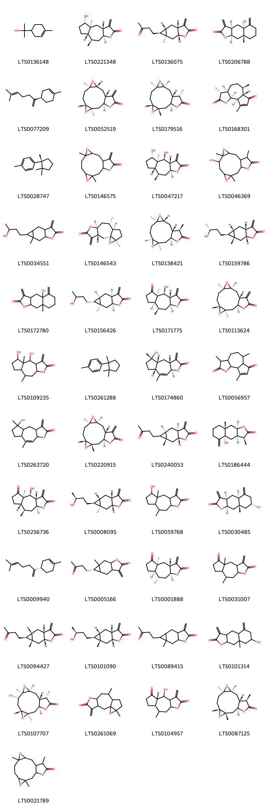{ width=100% }
    <figcaption>Hình ảnh cấu trúc hóa học của 45 hoạt chất thuộc nhóm Prenol lipids gồm ['terpineol (LTS0136148)', '(3ar,4as,5s,7as,8r,9as)-5-hydroxy-4a,8-dimethyl-3-methylidene-octahydro-3ah-azuleno[6,5-b]furan-2-one (LTS0221348)', '(1r,3s,4s,5s,7r)-5-methyl-10-methylidene-4-(3-oxobutyl)-8-oxatricyclo[5.3.0.0³,⁵]decan-9-one (LTS0136075)', '(3ar,4ar,8ar,9ar)-4a-hydroxy-8a-methyl-3,5-dimethylidene-hexahydro-3ah-naphtho[2,3-b]furan-2-one (LTS0206788)', '(r)-β-bisabolene (LTS0077209)', '(1r,3r,5r,8r,10r,12s)-5,10-dimethyl-15-methylidene-4,9,13-trioxatetracyclo[10.3.0.0³,⁵.0⁸,¹⁰]pentadecan-14-one (LTS0052519)', '(1r,3s,5r,8r,10s,12s,15s)-5,10,15-trimethyl-4,9,13-trioxatetracyclo[10.3.0.0³,⁵.0⁸,¹⁰]pentadecan-14-one (LTS0179516)', '(3r,3ar,6r,6as,9as,9bs)-3,6,9-trimethyl-3h,3ah,4h,5h,6h,6ah,9ah,9bh-azuleno[4,5-b]furan-2,7-dione (LTS0168301)', 'cuparene (LTS0028747)', '5,10-dimethyl-15-methylidene-4,9,13-trioxatetracyclo[10.3.0.0³,⁵.0⁸,¹⁰]pentadecan-14-one (LTS0146575)', '(3as,4s,4as,5s,7as,8r,9as)-4,5-dihydroxy-4a,8-dimethyl-3-methylidene-octahydro-3ah-azuleno[6,5-b]furan-2-one (LTS0047217)', '6-hydroxy-5,10,15-trimethyl-4,9,13-trioxatetracyclo[10.3.0.0³,⁵.0⁸,¹⁰]pentadecan-14-one (LTS0046369)', '4-(3-hydroxybutyl)-5-methyl-10-methylidene-8-oxatricyclo[5.3.0.0³,⁵]decan-9-one (LTS0034551)', '(1s,3r,7s,9s,10r,13r)-9,13-dimethyl-4-methylidene-6,14-dioxatetracyclo[8.4.0.0¹,¹³.0³,⁷]tetradecan-5-one (LTS0146543)', '(1r,3r,5r,8s,10r,12s,15r)-5,10,15-trimethyl-4,9,13-trioxatetracyclo[10.3.0.0³,⁵.0⁸,¹⁰]pentadecan-14-one (LTS0138421)', '(1r,3s,4s,5r,7r)-4-[(3r)-3-hydroxybutyl]-5-methyl-10-methylidene-8-oxatricyclo[5.3.0.0³,⁵]decan-9-one (LTS0159786)', '4a-hydroxy-8a-methyl-3,5-dimethylidene-hexahydro-3ah-naphtho[2,3-b]furan-2-one (LTS0172780)', '(1s,3r,4r,5s,7s)-4-(3-hydroxybutyl)-5-methyl-10-methylidene-8-oxatricyclo[5.3.0.0³,⁵]decan-9-one (LTS0156426)', '(3as,4s,4ar,7ar,8r,9as)-4-hydroxy-4a,8-dimethyl-3-methylidene-octahydroazuleno[6,5-b]furan-2,5-dione (LTS0171775)', '(1r,3s,5r,8r,10r,12s)-5,10-dimethyl-15-methylidene-4,9,13-trioxatetracyclo[10.3.0.0³,⁵.0⁸,¹⁰]pentadecan-14-one (LTS0113624)', '4,5-dihydroxy-4a,8-dimethyl-3-methylidene-octahydro-3ah-azuleno[6,5-b]furan-2-one (LTS0109235)', '1-methyl-4-(1,2,2-trimethylcyclopentyl)benzene (LTS0261288)', '4-epiisoinuviscolide (LTS0174860)', '3,6,9-trimethyl-3h,3ah,4h,5h,6h,6ah,9ah,9bh-azuleno[4,5-b]furan-2,7-dione (LTS0056957)', '5-hydroxy-5,8-dimethyl-3-methylidene-3ah,4h,4ah,6h,7h,7ah,9ah-azuleno[6,5-b]furan-2-one (LTS0263720)', '(1r,3s,5r,8r,10s,12s)-5,10-dimethyl-15-methylidene-4,9,13-trioxatetracyclo[10.3.0.0³,⁵.0⁸,¹⁰]pentadecan-14-one (LTS0220915)', '(1s,3r,5r,7r)-5-methyl-10-methylidene-4-(3-oxobutyl)-8-oxatricyclo[5.3.0.0³,⁵]decan-9-one (LTS0240053)', '(3s,3ar,4ar,8ar,9ar)-4a-hydroxy-3,8a-dimethyl-5-methylidene-octahydronaphtho[2,3-b]furan-2-one (LTS0186444)', 'carpesiolin (LTS0256736)', '(1r,3s,4s,5s,7r)-4-[(3s)-3-hydroxybutyl]-5-methyl-10-methylidene-8-oxatricyclo[5.3.0.0³,⁵]decan-9-one (LTS0008095)', '5-hydroxy-4a,8-dimethyl-3-methylidene-octahydro-3ah-azuleno[6,5-b]furan-2-one (LTS0059768)', 'ivalin (LTS0030485)', '(-)-β-bisabolene (LTS0009940)', '(4s)-5-methyl-10-methylidene-4-(3-oxobutyl)-8-oxatricyclo[5.3.0.0³,⁵]decan-9-one (LTS0005166)', '(3ar,4as,7ar,8s,9as)-4a,8-dimethyl-3-methylidene-octahydroazuleno[6,5-b]furan-2,5-dione (LTS0001888)', '4a,8-dimethyl-3-methylidene-octahydroazuleno[6,5-b]furan-2,5-dione (LTS0031007)', '(1r,3s,4s,5r,7r)-5-methyl-10-methylidene-4-(3-oxobutyl)-8-oxatricyclo[5.3.0.0³,⁵]decan-9-one (LTS0094427)', '(1r,3s,4s,5r,7r)-4-[(3s)-3-hydroxybutyl]-5-methyl-10-methylidene-8-oxatricyclo[5.3.0.0³,⁵]decan-9-one (LTS0101090)', '5-methyl-10-methylidene-4-(3-oxobutyl)-8-oxatricyclo[5.3.0.0³,⁵]decan-9-one (LTS0089415)', '7-hydroxy-8a-methyl-3,5-dimethylidene-octahydronaphtho[2,3-b]furan-2-one (LTS0101314)', '(1r,3s,5r,6s,8r,10r,12s,15s)-6-hydroxy-5,10,15-trimethyl-4,9,13-trioxatetracyclo[10.3.0.0³,⁵.0⁸,¹⁰]pentadecan-14-one (LTS0107707)', '9,13-dimethyl-4-methylidene-6,14-dioxatetracyclo[8.4.0.0¹,¹³.0³,⁷]tetradecan-5-one (LTS0261069)', '4-hydroxy-4a,8-dimethyl-3-methylidene-octahydroazuleno[6,5-b]furan-2,5-dione (LTS0104957)', '(1r,3s,5r,8r,10s,12s,15r)-5,10,15-trimethyl-4,9,13-trioxatetracyclo[10.3.0.0³,⁵.0⁸,¹⁰]pentadecan-14-one (LTS0087125)', '5,10,15-trimethyl-4,9,13-trioxatetracyclo[10.3.0.0³,⁵.0⁸,¹⁰]pentadecan-14-one (LTS0021789)'].</figcaption>
</figure>
#### Nhóm Saturated hydrocarbons
<figure markdown="span">
    { width=100% }
    <figcaption>Hình ảnh cấu trúc hóa học của 1 hoạt chất thuộc nhóm Saturated hydrocarbons gồm ['triacontane (LTS0250709)'].</figcaption>
</figure>

---

### Dược dân tộc học

Danh sách các quốc gia có sử dụng *Carpesium abrotanoides* trong điều trị các bệnh. 

| Country   | Disease                                                                                                     | Bệnh                                                                                                                                                                                                |
|:----------|:------------------------------------------------------------------------------------------------------------|:----------------------------------------------------------------------------------------------------------------------------------------------------------------------------------------------------|
| China     | Alexiteric, Discutient, Diuretic, Expectorant, Vermifuge, Vulnerary, Antiphlogistic, Expectorant, Vermifuge | MYMEMORY WARNING: YOU USED ALL AVAILABLE FREE TRANSLATIONS FOR TODAY. NEXT AVAILABLE IN  12 HOURS 41 MINUTES 35 SECONDS VISIT HTTPS://MYMEMORY.TRANSLATED.NET/DOC/USAGELIMITS.PHP TO TRANSLATE MORE |
| Elsewhere | Vermifuge                                                                                                   | MYMEMORY WARNING: YOU USED ALL AVAILABLE FREE TRANSLATIONS FOR TODAY. NEXT AVAILABLE IN  12 HOURS 41 MINUTES 32 SECONDS VISIT HTTPS://MYMEMORY.TRANSLATED.NET/DOC/USAGELIMITS.PHP TO TRANSLATE MORE |

---

---
## Carpesium divaricatum
### Thông tin về thực vật

!!! info "Phân loại thực vật của *Carpesium divaricatum* từ GIBF:"
    - **Kingdom:** Plantae
    - **Phylum:** Tracheophyta
    - **Order:** Asterales
    - **Family:** Asteraceae
    - **Genus:** Carpesium
    - **Species:** *Carpesium divaricatum*

 

| Label (VI)   | Label (EN)   | Scientific Name       | Descriptions (VI)   | Descriptions (EN)   | Also Known As (VI)   | Also Known As (EN)   |
|:-------------|:-------------|:----------------------|:--------------------|:--------------------|:---------------------|:---------------------|
| N/A          | N/A          | Carpesium divaricatum |                     | species of plant    | ['']                 | ['']                 |

#### Phân bố trên thế giới

**Từ CSDL GIBF** nan, Japan, Korea, Republic of, Chinese Taipei, China

#### Phân bố tại Việt Nam

**Từ CSDL GIBF**: Không có ghi nhận ở Việt Nam

---
### Thành phần hóa học
        
- Theo cơ sở dữ liệu lotus: Từ loài *Carpesium divaricatum* đã phân lập và xác định được 30 hoạt chất thuộc về các nhóm Carboxylic acids and derivatives, Prenol lipids. 

|    | chemicalTaxonomyClassyfireClass   |   smiles_count |
|---:|:----------------------------------|---------------:|
|  0 | Carboxylic acids and derivatives  |             13 |
|  1 | Prenol lipids                     |             17 |

#### Nhóm Carboxylic acids and derivatives
<figure markdown="span">
    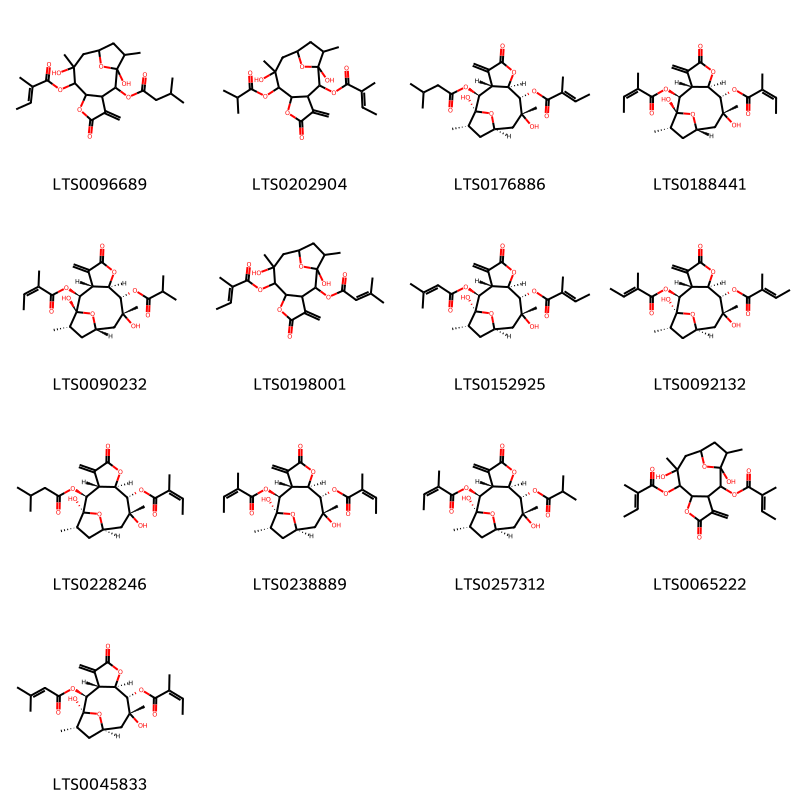{ width=100% }
    <figcaption>Hình ảnh cấu trúc hóa học của 13 hoạt chất thuộc nhóm Carboxylic acids and derivatives gồm ['1,9-dihydroxy-9,13-dimethyl-2-[(3-methylbutanoyl)oxy]-4-methylidene-5-oxo-6,14-dioxatricyclo[9.2.1.0³,⁷]tetradecan-8-yl 2-methylbut-2-enoate (LTS0096689)', '1,9-dihydroxy-9,13-dimethyl-4-methylidene-8-[(2-methylpropanoyl)oxy]-5-oxo-6,14-dioxatricyclo[9.2.1.0³,⁷]tetradecan-2-yl 2-methylbut-2-enoate (LTS0202904)', '(1s,2s,3r,7r,8s,9r,11r,13s)-1,9-dihydroxy-9,13-dimethyl-2-[(3-methylbutanoyl)oxy]-4-methylidene-5-oxo-6,14-dioxatricyclo[9.2.1.0³,⁷]tetradecan-8-yl (2e)-2-methylbut-2-enoate (LTS0176886)', '(1r,2s,3r,7r,8s,9r,11s,13s)-1,9-dihydroxy-9,13-dimethyl-2-{[(2z)-2-methylbut-2-enoyl]oxy}-4-methylidene-5-oxo-6,14-dioxatricyclo[9.2.1.0³,⁷]tetradecan-8-yl (2z)-2-methylbut-2-enoate (LTS0188441)', '(1r,2s,3r,7r,8s,9r,11s,13s)-1,9-dihydroxy-9,13-dimethyl-4-methylidene-8-[(2-methylpropanoyl)oxy]-5-oxo-6,14-dioxatricyclo[9.2.1.0³,⁷]tetradecan-2-yl (2z)-2-methylbut-2-enoate (LTS0090232)', '1,9-dihydroxy-9,13-dimethyl-8-[(2-methylbut-2-enoyl)oxy]-4-methylidene-5-oxo-6,14-dioxatricyclo[9.2.1.0³,⁷]tetradecan-2-yl 3-methylbut-2-enoate (LTS0198001)', '(1s,2s,3r,7r,8s,9r,11r,13s)-1,9-dihydroxy-9,13-dimethyl-2-[(3-methylbut-2-enoyl)oxy]-4-methylidene-5-oxo-6,14-dioxatricyclo[9.2.1.0³,⁷]tetradecan-8-yl (2e)-2-methylbut-2-enoate (LTS0152925)', '(1s,2s,3r,7r,8s,9r,11r,13s)-1,9-dihydroxy-9,13-dimethyl-2-{[(2e)-2-methylbut-2-enoyl]oxy}-4-methylidene-5-oxo-6,14-dioxatricyclo[9.2.1.0³,⁷]tetradecan-8-yl (2e)-2-methylbut-2-enoate (LTS0092132)', '(1s,2s,3r,7r,8s,9r,11r,13s)-1,9-dihydroxy-9,13-dimethyl-2-[(3-methylbutanoyl)oxy]-4-methylidene-5-oxo-6,14-dioxatricyclo[9.2.1.0³,⁷]tetradecan-8-yl (2z)-2-methylbut-2-enoate (LTS0228246)', '(1s,2s,3r,7r,8s,9r,11r,13s)-1,9-dihydroxy-9,13-dimethyl-2-{[(2z)-2-methylbut-2-enoyl]oxy}-4-methylidene-5-oxo-6,14-dioxatricyclo[9.2.1.0³,⁷]tetradecan-8-yl (2z)-2-methylbut-2-enoate (LTS0238889)', '(1s,2s,3r,7r,8s,9r,11r,13s)-1,9-dihydroxy-9,13-dimethyl-4-methylidene-8-[(2-methylpropanoyl)oxy]-5-oxo-6,14-dioxatricyclo[9.2.1.0³,⁷]tetradecan-2-yl (2z)-2-methylbut-2-enoate (LTS0257312)', '1,9-dihydroxy-9,13-dimethyl-8-[(2-methylbut-2-enoyl)oxy]-4-methylidene-5-oxo-6,14-dioxatricyclo[9.2.1.0³,⁷]tetradecan-2-yl 2-methylbut-2-enoate (LTS0065222)', '(1s,2s,3r,7r,8s,9r,11r,13s)-1,9-dihydroxy-9,13-dimethyl-2-[(3-methylbut-2-enoyl)oxy]-4-methylidene-5-oxo-6,14-dioxatricyclo[9.2.1.0³,⁷]tetradecan-8-yl (2z)-2-methylbut-2-enoate (LTS0045833)'].</figcaption>
</figure>
#### Nhóm Prenol lipids
<figure markdown="span">
    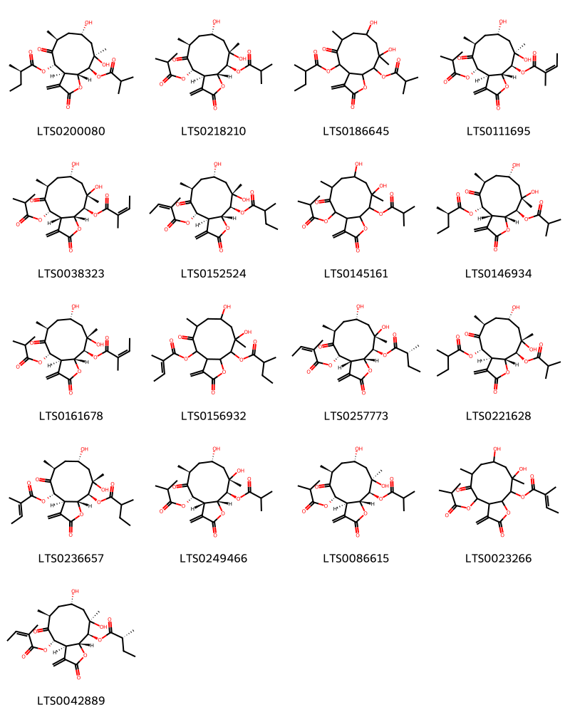{ width=100% }
    <figcaption>Hình ảnh cấu trúc hóa học của 17 hoạt chất thuộc nhóm Prenol lipids gồm ['(3ar,4s,6s,8s,10r,11s,11ar)-8,10-dihydroxy-6,10-dimethyl-3-methylidene-11-[(2-methylpropanoyl)oxy]-2,5-dioxo-octahydrocyclodeca[b]furan-4-yl (2r)-2-methylbutanoate (LTS0200080)', 'cardivin d (LTS0218210)', '8,10-dihydroxy-6,10-dimethyl-3-methylidene-11-[(2-methylpropanoyl)oxy]-2,5-dioxo-octahydrocyclodeca[b]furan-4-yl 2-methylbutanoate (LTS0186645)', '(3ar,4s,6s,8s,10r,11s,11ar)-8,10-dihydroxy-6,10-dimethyl-3-methylidene-4-[(2-methylpropanoyl)oxy]-2,5-dioxo-octahydrocyclodeca[b]furan-11-yl (2z)-2-methylbut-2-enoate (LTS0111695)', '(3as,4s,6s,8s,10s,11s,11ar)-8,10-dihydroxy-6,10-dimethyl-3-methylidene-4-[(2-methylpropanoyl)oxy]-2,5-dioxo-octahydrocyclodeca[b]furan-11-yl (2z)-2-methylbut-2-enoate (LTS0038323)', 'cardivin a (LTS0152524)', '8,10-dihydroxy-6,10-dimethyl-3-methylidene-11-[(2-methylpropanoyl)oxy]-2,5-dioxo-octahydrocyclodeca[b]furan-4-yl 2-methylpropanoate (LTS0145161)', '(3as,4s,6s,8s,10s,11s,11ar)-8,10-dihydroxy-6,10-dimethyl-3-methylidene-11-[(2-methylpropanoyl)oxy]-2,5-dioxo-octahydrocyclodeca[b]furan-4-yl (2r)-2-methylbutanoate (LTS0146934)', 'cardivin c (LTS0161678)', '8,10-dihydroxy-6,10-dimethyl-11-[(2-methylbutanoyl)oxy]-3-methylidene-2,5-dioxo-octahydrocyclodeca[b]furan-4-yl 2-methylbut-2-enoate (LTS0156932)', '(3as,4s,6s,8s,10s,11s,11ar)-8,10-dihydroxy-6,10-dimethyl-11-{[(2r)-2-methylbutanoyl]oxy}-3-methylidene-2,5-dioxo-octahydrocyclodeca[b]furan-4-yl (2z)-2-methylbut-2-enoate (LTS0257773)', 'cardivin b (LTS0221628)', '(3ar,4s,6s,8s,10s,11s,11ar)-8,10-dihydroxy-6,10-dimethyl-11-[(2-methylbutanoyl)oxy]-3-methylidene-2,5-dioxo-octahydrocyclodeca[b]furan-4-yl 2-methylbut-2-enoate (LTS0236657)', '(3as,4s,6s,8s,10s,11s,11ar)-8,10-dihydroxy-6,10-dimethyl-3-methylidene-11-[(2-methylpropanoyl)oxy]-2,5-dioxo-octahydrocyclodeca[b]furan-4-yl 2-methylpropanoate (LTS0249466)', '(3ar,4s,6s,8s,10r,11s,11ar)-8,10-dihydroxy-6,10-dimethyl-3-methylidene-4-[(2-methylpropanoyl)oxy]-2,5-dioxo-octahydrocyclodeca[b]furan-11-yl 2-methylpropanoate (LTS0086615)', '8,10-dihydroxy-6,10-dimethyl-3-methylidene-4-[(2-methylpropanoyl)oxy]-2,5-dioxo-octahydrocyclodeca[b]furan-11-yl 2-methylbut-2-enoate (LTS0023266)', '(3ar,4s,6s,8s,10r,11s,11ar)-8,10-dihydroxy-6,10-dimethyl-11-{[(2r)-2-methylbutanoyl]oxy}-3-methylidene-2,5-dioxo-octahydrocyclodeca[b]furan-4-yl (2z)-2-methylbut-2-enoate (LTS0042889)'].</figcaption>
</figure>

---

### Dược dân tộc học

Danh sách các quốc gia có sử dụng *Carpesium divaricatum* trong điều trị các bệnh. 

| Country   | Disease                | Bệnh                                                                                                                                                                                                |
|:----------|:-----------------------|:----------------------------------------------------------------------------------------------------------------------------------------------------------------------------------------------------|
| China     | Vermifuge, Carminative | MYMEMORY WARNING: YOU USED ALL AVAILABLE FREE TRANSLATIONS FOR TODAY. NEXT AVAILABLE IN  12 HOURS 41 MINUTES 01 SECONDS VISIT HTTPS://MYMEMORY.TRANSLATED.NET/DOC/USAGELIMITS.PHP TO TRANSLATE MORE |

---

# Chi Madia

??? note "Danh sách các dược liệu thuộc chi"
    
	 - *Madia sativa*

---
## Madia sativa
### Thông tin về thực vật

!!! info "Phân loại thực vật của *Madia sativa* từ GIBF:"
    - **Kingdom:** Plantae
    - **Phylum:** Tracheophyta
    - **Order:** Asterales
    - **Family:** Asteraceae
    - **Genus:** Madia
    - **Species:** *Madia sativa*

 

| Label (VI)   | Label (EN)   | Scientific Name   | Descriptions (VI)   | Descriptions (EN)   | Also Known As (VI)   | Also Known As (EN)   |
|:-------------|:-------------|:------------------|:--------------------|:--------------------|:---------------------|:---------------------|
| N/A          | N/A          | Madia sativa      | loài thực vật       | species of plant    | ['']                 | ['']                 |

#### Phân bố trên thế giới

**Từ CSDL GIBF** Chile, New Zealand, United States of America, Canada

#### Phân bố tại Việt Nam

**Từ CSDL GIBF**: Không có ghi nhận ở Việt Nam

---
### Thành phần hóa học
        
- Theo cơ sở dữ liệu lotus: Từ loài *Madia sativa* đã phân lập và xác định được 35 hoạt chất thuộc về các nhóm Flavonoids, Prenol lipids, Steroids and steroid derivatives, Oxolanes, Unsaturated hydrocarbons, Organooxygen compounds, Phenol esters, Benzopyrans. 

|    | chemicalTaxonomyClassyfireClass   |   smiles_count |
|---:|:----------------------------------|---------------:|
|  0 | Benzopyrans                       |              5 |
|  1 | Flavonoids                        |              7 |
|  2 | Organooxygen compounds            |              1 |
|  3 | Oxolanes                          |              1 |
|  4 | Phenol esters                     |              6 |
|  5 | Prenol lipids                     |             12 |
|  6 | Steroids and steroid derivatives  |              2 |
|  7 | Unsaturated hydrocarbons          |              1 |

#### Nhóm Benzopyrans
<figure markdown="span">
    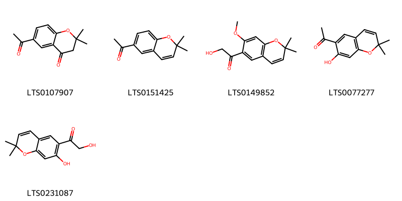{ width=100% }
    <figcaption>Hình ảnh cấu trúc hóa học của 5 hoạt chất thuộc nhóm Benzopyrans gồm ['6-acetyl-2,2-dimethyl-3h-1-benzopyran-4-one (LTS0107907)', '1-(2,2-dimethylchromen-6-yl)ethanone (LTS0151425)', '2-hydroxy-1-(7-methoxy-2,2-dimethylchromen-6-yl)ethanone (LTS0149852)', 'eupatoriochromene (LTS0077277)', '2-hydroxy-1-(7-hydroxy-2,2-dimethylchromen-6-yl)ethanone (LTS0231087)'].</figcaption>
</figure>
#### Nhóm Flavonoids
<figure markdown="span">
    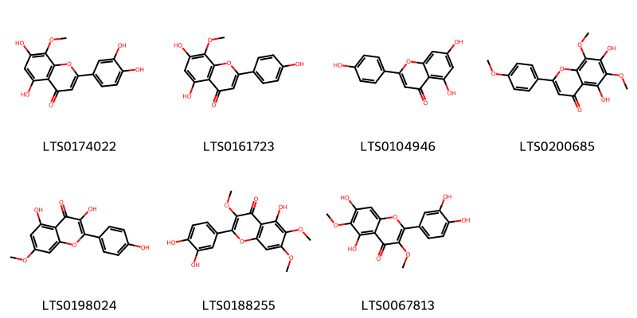{ width=100% }
    <figcaption>Hình ảnh cấu trúc hóa học của 7 hoạt chất thuộc nhóm Flavonoids gồm ['onopordin (LTS0174022)', "4'-hydroxywogonin (LTS0161723)", 'chamomile (LTS0104946)', 'nevadensin (LTS0200685)', 'rhamnocitrin (LTS0198024)', 'chrysosplenol d (LTS0188255)', 'axillarin (LTS0067813)'].</figcaption>
</figure>
#### Nhóm Organooxygen compounds
<figure markdown="span">
    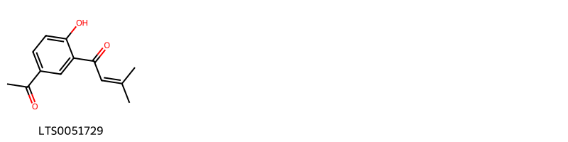{ width=100% }
    <figcaption>Hình ảnh cấu trúc hóa học của 1 hoạt chất thuộc nhóm Organooxygen compounds gồm ['1-(5-acetyl-2-hydroxyphenyl)-3-methylbut-2-en-1-one (LTS0051729)'].</figcaption>
</figure>
#### Nhóm Oxolanes
<figure markdown="span">
    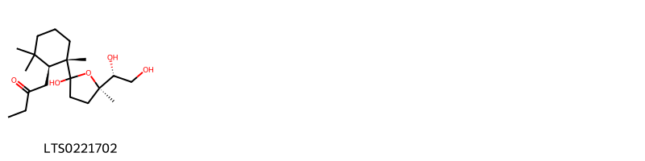{ width=100% }
    <figcaption>Hình ảnh cấu trúc hóa học của 1 hoạt chất thuộc nhóm Oxolanes gồm ['1-[(1s,2s)-2-[(5r)-5-[(1r)-1,2-dihydroxyethyl]-2-hydroxy-5-methyloxolan-2-yl]-2,6,6-trimethylcyclohexyl]butan-2-one (LTS0221702)'].</figcaption>
</figure>
#### Nhóm Phenol esters
<figure markdown="span">
    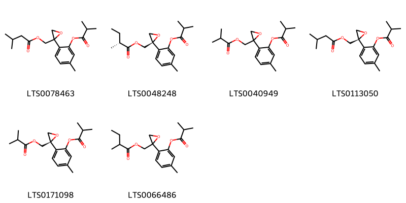{ width=100% }
    <figcaption>Hình ảnh cấu trúc hóa học của 6 hoạt chất thuộc nhóm Phenol esters gồm ['(2-{4-methyl-2-[(2-methylpropanoyl)oxy]phenyl}oxiran-2-yl)methyl 3-methylbutanoate (LTS0078463)', '[(2r)-2-{4-methyl-2-[(2-methylpropanoyl)oxy]phenyl}oxiran-2-yl]methyl (2r)-2-methylbutanoate (LTS0048248)', '(2-{4-methyl-2-[(2-methylpropanoyl)oxy]phenyl}oxiran-2-yl)methyl 2-methylpropanoate (LTS0040949)', '[(2r)-2-{4-methyl-2-[(2-methylpropanoyl)oxy]phenyl}oxiran-2-yl]methyl 3-methylbutanoate (LTS0113050)', '[(2r)-2-{4-methyl-2-[(2-methylpropanoyl)oxy]phenyl}oxiran-2-yl]methyl 2-methylpropanoate (LTS0171098)', '(2-{4-methyl-2-[(2-methylpropanoyl)oxy]phenyl}oxiran-2-yl)methyl 2-methylbutanoate (LTS0066486)'].</figcaption>
</figure>
#### Nhóm Prenol lipids
<figure markdown="span">
    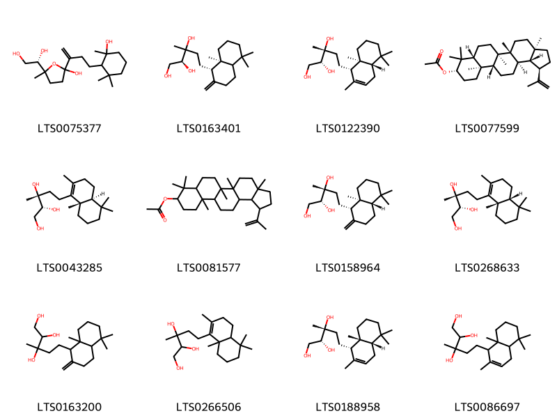{ width=100% }
    <figcaption>Hình ảnh cấu trúc hóa học của 12 hoạt chất thuộc nhóm Prenol lipids gồm ['(1s)-1-{5-hydroxy-5-[4-(2-hydroxy-2,6,6-trimethylcyclohexyl)but-1-en-2-yl]-2-methyloxolan-2-yl}ethane-1,2-diol (LTS0075377)', '(2s)-5-[(1s,8as)-5,5,8a-trimethyl-2-methylidene-hexahydro-1h-naphthalen-1-yl]-3-methylpentane-1,2,3-triol (LTS0163401)', '(2r,3r)-5-[(1s,4as,8as)-2,5,5,8a-tetramethyl-1,4,4a,6,7,8-hexahydronaphthalen-1-yl]-3-methylpentane-1,2,3-triol (LTS0122390)', 'lupeol acetate (LTS0077599)', '(2r,3r)-5-[(4as,8as)-2,5,5,8a-tetramethyl-3,4,4a,6,7,8-hexahydronaphthalen-1-yl]-3-methylpentane-1,2,3-triol (LTS0043285)', '3a,5a,5b,8,8,11a-hexamethyl-1-(prop-1-en-2-yl)-hexadecahydrocyclopenta[a]chrysen-9-yl acetate (LTS0081577)', '(2r,3r)-5-[(1s,4as,8as)-5,5,8a-trimethyl-2-methylidene-hexahydro-1h-naphthalen-1-yl]-3-methylpentane-1,2,3-triol (LTS0158964)', '(2r,3r)-5-[(4ar,8as)-2,5,5,8a-tetramethyl-3,4,4a,6,7,8-hexahydronaphthalen-1-yl]-3-methylpentane-1,2,3-triol (LTS0268633)', '5-(5,5,8a-trimethyl-2-methylidene-hexahydro-1h-naphthalen-1-yl)-3-methylpentane-1,2,3-triol (LTS0163200)', '5-(2,5,5,8a-tetramethyl-3,4,4a,6,7,8-hexahydronaphthalen-1-yl)-3-methylpentane-1,2,3-triol (LTS0266506)', '(2r,3r)-5-[(1s,4as,8ar)-2,5,5,8a-tetramethyl-1,4,4a,6,7,8-hexahydronaphthalen-1-yl]-3-methylpentane-1,2,3-triol (LTS0188958)', '5-(2,5,5,8a-tetramethyl-1,4,4a,6,7,8-hexahydronaphthalen-1-yl)-3-methylpentane-1,2,3-triol (LTS0086697)'].</figcaption>
</figure>
#### Nhóm Steroids and steroid derivatives
<figure markdown="span">
    { width=100% }
    <figcaption>Hình ảnh cấu trúc hóa học của 2 hoạt chất thuộc nhóm Steroids and steroid derivatives gồm ['phytosterol (LTS0029311)', 'stigmasterol (LTS0024262)'].</figcaption>
</figure>
#### Nhóm Unsaturated hydrocarbons
<figure markdown="span">
    { width=100% }
    <figcaption>Hình ảnh cấu trúc hóa học của 1 hoạt chất thuộc nhóm Unsaturated hydrocarbons gồm ['tridec-1-en-3,5,7,9,11-pentayne (LTS0085389)'].</figcaption>
</figure>

---

### Dược dân tộc học

Danh sách các quốc gia có sử dụng *Madia sativa* trong điều trị các bệnh. 

| Country   | Disease   | Bệnh                                                                                                                                                                                                |
|:----------|:----------|:----------------------------------------------------------------------------------------------------------------------------------------------------------------------------------------------------|
| Elsewhere | Tonic     | MYMEMORY WARNING: YOU USED ALL AVAILABLE FREE TRANSLATIONS FOR TODAY. NEXT AVAILABLE IN  12 HOURS 40 MINUTES 30 SECONDS VISIT HTTPS://MYMEMORY.TRANSLATED.NET/DOC/USAGELIMITS.PHP TO TRANSLATE MORE |

---

# Chi Lapsana

??? note "Danh sách các dược liệu thuộc chi"
    
	 - *Lapsana communis*

---
## Lapsana communis
### Thông tin về thực vật

!!! info "Phân loại thực vật của *Lapsana communis* từ GIBF:"
    - **Kingdom:** Plantae
    - **Phylum:** Tracheophyta
    - **Order:** Asterales
    - **Family:** Asteraceae
    - **Genus:** Lapsana
    - **Species:** *Lapsana communis*

 

| Label (VI)   | Label (EN)   | Scientific Name   | Descriptions (VI)   | Descriptions (EN)   | Also Known As (VI)   | Also Known As (EN)   |
|:-------------|:-------------|:------------------|:--------------------|:--------------------|:---------------------|:---------------------|
| N/A          | N/A          | Lapsana communis  | loài thực vật       | species of plant    | ['']                 | ['']                 |

#### Phân bố trên thế giới

**Từ CSDL GIBF** Italy, Australia, Norway, Canada, Ukraine, Denmark, Netherlands, Spain, Türkiye, Russian Federation, United States of America, Sweden, Chile, Germany, Switzerland, Austria, France, United Kingdom of Great Britain and Northern Ireland, Jersey, Ireland, Poland, New Zealand

#### Phân bố tại Việt Nam

**Từ CSDL GIBF**: Không có ghi nhận ở Việt Nam

---
### Thành phần hóa học
        
- Theo cơ sở dữ liệu lotus: Từ loài *Lapsana communis* đã phân lập và xác định được 21 hoạt chất thuộc về các nhóm Flavonoids, Prenol lipids, Cinnamic acids and derivatives, Organooxygen compounds, Carboxylic acids and derivatives. 

|    | chemicalTaxonomyClassyfireClass   |   smiles_count |
|---:|:----------------------------------|---------------:|
|  0 | Carboxylic acids and derivatives  |              1 |
|  1 | Cinnamic acids and derivatives    |              2 |
|  2 | Flavonoids                        |              3 |
|  3 | Organooxygen compounds            |              2 |
|  4 | Prenol lipids                     |             13 |

#### Nhóm Carboxylic acids and derivatives
<figure markdown="span">
    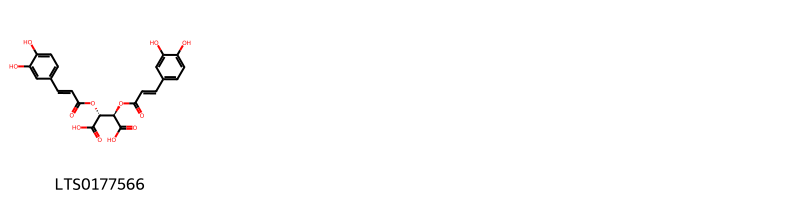{ width=100% }
    <figcaption>Hình ảnh cấu trúc hóa học của 1 hoạt chất thuộc nhóm Carboxylic acids and derivatives gồm ['cichoric acid (LTS0177566)'].</figcaption>
</figure>
#### Nhóm Cinnamic acids and derivatives
<figure markdown="span">
    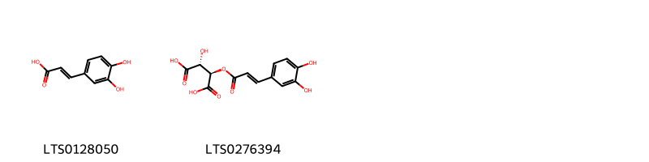{ width=100% }
    <figcaption>Hình ảnh cấu trúc hóa học của 2 hoạt chất thuộc nhóm Cinnamic acids and derivatives gồm ['3,4-dihydroxycinnamic acid (LTS0128050)', 'caftaric acid (LTS0276394)'].</figcaption>
</figure>
#### Nhóm Flavonoids
<figure markdown="span">
    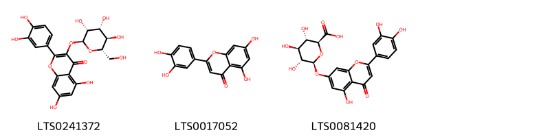{ width=100% }
    <figcaption>Hình ảnh cấu trúc hóa học của 3 hoạt chất thuộc nhóm Flavonoids gồm ['2-(3,4-dihydroxyphenyl)-5,7-dihydroxy-3-{[(2s,3r,4r,5r,6s)-3,4,5-trihydroxy-6-(hydroxymethyl)oxan-2-yl]oxy}chromen-4-one (LTS0241372)', 'luteolin (LTS0017052)', 'luteolin 7-o-glucuronide (LTS0081420)'].</figcaption>
</figure>
#### Nhóm Organooxygen compounds
<figure markdown="span">
    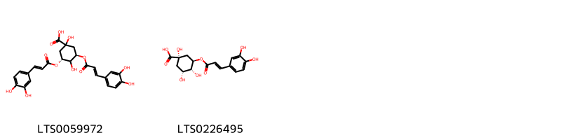{ width=100% }
    <figcaption>Hình ảnh cấu trúc hóa học của 2 hoạt chất thuộc nhóm Organooxygen compounds gồm ['(3r,5r)-3,5-bis({[(2e)-3-(3,4-dihydroxyphenyl)prop-2-enoyl]oxy})-1,4-dihydroxycyclohexane-1-carboxylic acid (LTS0059972)', 'chlorogenic acid (LTS0226495)'].</figcaption>
</figure>
#### Nhóm Prenol lipids
<figure markdown="span">
    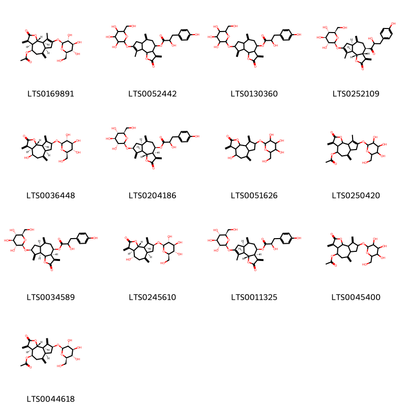{ width=100% }
    <figcaption>Hình ảnh cấu trúc hóa học của 13 hoạt chất thuộc nhóm Prenol lipids gồm ['(3ar,4r,6ar,9ar,9br)-9-methyl-3,6-dimethylidene-2-oxo-8-{[(2s,3r,4s,5s,6r)-3,4,5-trihydroxy-6-(hydroxymethyl)oxan-2-yl]oxy}-3ah,4h,5h,6ah,7h,9ah,9bh-azuleno[4,5-b]furan-4-yl acetate (LTS0169891)', '9-methyl-3,6-dimethylidene-2-oxo-8-{[3,4,5-trihydroxy-6-(hydroxymethyl)oxan-2-yl]oxy}-3ah,4h,5h,6ah,7h,9ah,9bh-azuleno[4,5-b]furan-4-yl 2-hydroxy-3-(4-hydroxyphenyl)propanoate (LTS0052442)', '3,6,9-trimethylidene-2-oxo-8-{[3,4,5-trihydroxy-6-(hydroxymethyl)oxan-2-yl]oxy}-octahydroazuleno[4,5-b]furan-4-yl 2-hydroxy-3-(4-hydroxyphenyl)propanoate (LTS0130360)', '(3ar,4r,6ar,9ar,9br)-4-[2-hydroxy-3-(4-hydroxyphenyl)propanoyl]-9-methyl-3,6-dimethylidene-8-{[(2s,3r,4s,5s,6r)-3,4,5-trihydroxy-6-(hydroxymethyl)oxan-2-yl]oxy}-3ah,4h,5h,6ah,7h,9ah,9bh-azuleno[4,5-b]furan-2-one (LTS0252109)', '(3ar,4r,6ar,8s,9ar,9br)-4-hydroxy-3,6,9-trimethylidene-8-{[(2r,3r,4s,5s,6r)-3,4,5-trihydroxy-6-(hydroxymethyl)oxan-2-yl]oxy}-octahydroazuleno[4,5-b]furan-2-one (LTS0036448)', '(3ar,4r,6ar,8s,9ar,9br)-3,6,9-trimethylidene-2-oxo-8-{[(2r,3r,4s,5s,6r)-3,4,5-trihydroxy-6-(hydroxymethyl)oxan-2-yl]oxy}-octahydroazuleno[4,5-b]furan-4-yl (2r)-2-hydroxy-3-(4-hydroxyphenyl)propanoate (LTS0204186)', '4-hydroxy-3,6,9-trimethylidene-8-{[3,4,5-trihydroxy-6-(hydroxymethyl)oxan-2-yl]oxy}-octahydroazuleno[4,5-b]furan-2-one (LTS0051626)', '9-methyl-3,6-dimethylidene-2-oxo-8-{[3,4,5-trihydroxy-6-(hydroxymethyl)oxan-2-yl]oxy}-3ah,4h,5h,6ah,7h,9ah,9bh-azuleno[4,5-b]furan-4-yl acetate (LTS0250420)', '(3ar,4r,6ar,8s,9ar)-3,6,9-trimethylidene-2-oxo-8-{[(2r,3r,4s,5s,6r)-3,4,5-trihydroxy-6-(hydroxymethyl)oxan-2-yl]oxy}-octahydroazuleno[4,5-b]furan-4-yl 2-hydroxy-3-(4-hydroxyphenyl)propanoate (LTS0034589)', '(3ar,4s,6ar,8s,9ar,9br)-4-hydroxy-3,6,9-trimethylidene-8-{[(2r,3r,4s,5s,6r)-3,4,5-trihydroxy-6-(hydroxymethyl)oxan-2-yl]oxy}-octahydroazuleno[4,5-b]furan-2-one (LTS0245610)', '(3ar,4r,6ar,9ar,9br)-9-methyl-3,6-dimethylidene-2-oxo-8-{[(2s,3r,4s,5s,6r)-3,4,5-trihydroxy-6-(hydroxymethyl)oxan-2-yl]oxy}-3ah,4h,5h,6ah,7h,9ah,9bh-azuleno[4,5-b]furan-4-yl (2r)-2-hydroxy-3-(4-hydroxyphenyl)propanoate (LTS0011325)', '3,6,9-trimethylidene-2-oxo-8-{[3,4,5-trihydroxy-6-(hydroxymethyl)oxan-2-yl]oxy}-octahydroazuleno[4,5-b]furan-4-yl acetate (LTS0045400)', '(3ar,4r,6ar,8s,9ar,9br)-3,6,9-trimethylidene-2-oxo-8-{[(2r,3r,4s,5s,6r)-3,4,5-trihydroxy-6-(hydroxymethyl)oxan-2-yl]oxy}-octahydroazuleno[4,5-b]furan-4-yl acetate (LTS0044618)'].</figcaption>
</figure>

---

### Dược dân tộc học

Danh sách các quốc gia có sử dụng *Lapsana communis* trong điều trị các bệnh. 

| Country   | Disease   | Bệnh                                                                                                                                                                                                |
|:----------|:----------|:----------------------------------------------------------------------------------------------------------------------------------------------------------------------------------------------------|
| China     | Diuretic  | MYMEMORY WARNING: YOU USED ALL AVAILABLE FREE TRANSLATIONS FOR TODAY. NEXT AVAILABLE IN  12 HOURS 39 MINUTES 59 SECONDS VISIT HTTPS://MYMEMORY.TRANSLATED.NET/DOC/USAGELIMITS.PHP TO TRANSLATE MORE |
| Dutch     | Tonic     | MYMEMORY WARNING: YOU USED ALL AVAILABLE FREE TRANSLATIONS FOR TODAY. NEXT AVAILABLE IN  12 HOURS 39 MINUTES 56 SECONDS VISIT HTTPS://MYMEMORY.TRANSLATED.NET/DOC/USAGELIMITS.PHP TO TRANSLATE MORE |
| German    | Emollient | MYMEMORY WARNING: YOU USED ALL AVAILABLE FREE TRANSLATIONS FOR TODAY. NEXT AVAILABLE IN  12 HOURS 39 MINUTES 53 SECONDS VISIT HTTPS://MYMEMORY.TRANSLATED.NET/DOC/USAGELIMITS.PHP TO TRANSLATE MORE |

---

# Chi Ichthyothere

??? note "Danh sách các dược liệu thuộc chi"
    
	 - *Ichthyothere peruviana*
	 - *Ichthyothere terminalis*

---
## Ichthyothere peruviana
### Thông tin về thực vật

!!! info "Phân loại thực vật của *Ichthyothere peruviana* từ GIBF:"
    - **Kingdom:** Plantae
    - **Phylum:** Tracheophyta
    - **Order:** Asterales
    - **Family:** Asteraceae
    - **Genus:** Ichthyothere
    - **Species:** *Ichthyothere peruviana*

 

| Label (VI)   | Label (EN)   | Scientific Name        | Descriptions (VI)   | Descriptions (EN)   | Also Known As (VI)   | Also Known As (EN)   |
|:-------------|:-------------|:-----------------------|:--------------------|:--------------------|:---------------------|:---------------------|
| N/A          | N/A          | Ichthyothere peruviana |                     | species of plant    | ['']                 | ['']                 |

#### Phân bố trên thế giới

**Từ CSDL GIBF** nan, Ecuador, Bolivia (Plurinational State of), unknown or invalid, Peru, Venezuela (Bolivarian Republic of)

#### Phân bố tại Việt Nam

**Từ CSDL GIBF**: Không có ghi nhận ở Việt Nam

---
### Thành phần hóa học
        
- Theo cơ sở dữ liệu lotus: Từ loài *Ichthyothere peruviana* đã phân lập và xác định được Chưa có hoạt chất nào được phân lập. hoạt chất thuộc về các nhóm Không có hoạt chất nào được phân lập. 

Không có hình ảnh nào được tạo ra

---

### Dược dân tộc học

Danh sách các quốc gia có sử dụng *Ichthyothere peruviana* trong điều trị các bệnh. 

| Country   | Disease   | Bệnh                                                                                                                                                                                                |
|:----------|:----------|:----------------------------------------------------------------------------------------------------------------------------------------------------------------------------------------------------|
| Peru      | Piscicide | MYMEMORY WARNING: YOU USED ALL AVAILABLE FREE TRANSLATIONS FOR TODAY. NEXT AVAILABLE IN  12 HOURS 39 MINUTES 16 SECONDS VISIT HTTPS://MYMEMORY.TRANSLATED.NET/DOC/USAGELIMITS.PHP TO TRANSLATE MORE |

---

---
## Ichthyothere terminalis
### Thông tin về thực vật

!!! info "Phân loại thực vật của *Ichthyothere terminalis* từ GIBF:"
    - **Kingdom:** Plantae
    - **Phylum:** Tracheophyta
    - **Order:** Asterales
    - **Family:** Asteraceae
    - **Genus:** Ichthyothere
    - **Species:** *Ichthyothere terminalis*

 

| Label (VI)   | Label (EN)   | Scientific Name         | Descriptions (VI)   | Descriptions (EN)   | Also Known As (VI)   | Also Known As (EN)   |
|:-------------|:-------------|:------------------------|:--------------------|:--------------------|:---------------------|:---------------------|
| N/A          | N/A          | Ichthyothere terminalis | loài thực vật       | species of plant    | ['']                 | ['']                 |

#### Phân bố trên thế giới

**Từ CSDL GIBF** nan, Colombia, Brazil, Venezuela (Bolivarian Republic of), French Guiana

#### Phân bố tại Việt Nam

**Từ CSDL GIBF**: Không có ghi nhận ở Việt Nam

---
### Thành phần hóa học
        
- Theo cơ sở dữ liệu lotus: Từ loài *Ichthyothere terminalis* đã phân lập và xác định được 85 hoạt chất thuộc về các nhóm Lactones, Flavonoids, Carboxylic acids and derivatives, Prenol lipids. 

|    | chemicalTaxonomyClassyfireClass   |   smiles_count |
|---:|:----------------------------------|---------------:|
|  0 | Carboxylic acids and derivatives  |              5 |
|  1 | Flavonoids                        |             12 |
|  2 | Lactones                          |              5 |
|  3 | Prenol lipids                     |             63 |

#### Nhóm Carboxylic acids and derivatives
<figure markdown="span">
    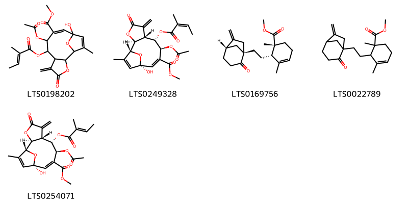{ width=100% }
    <figcaption>Hình ảnh cấu trúc hóa học của 5 hoạt chất thuộc nhóm Carboxylic acids and derivatives gồm ['methyl 8-(acetyloxy)-11-hydroxy-13-methyl-7-[(2-methylbut-2-enoyl)oxy]-5-methylidene-4-oxo-3,14-dioxatricyclo[9.2.1.0²,⁶]tetradeca-9,12-diene-9-carboxylate (LTS0198202)', 'methyl (1r,2s,6s,7s,8s,9e,11r)-8-(acetyloxy)-11-hydroxy-13-methyl-7-{[(2z)-2-methylbut-2-enoyl]oxy}-5-methylidene-4-oxo-3,14-dioxatricyclo[9.2.1.0²,⁶]tetradeca-9,12-diene-9-carboxylate (LTS0249328)', 'methyl (1r,2s)-1,3-dimethyl-2-{2-[(1r,5s)-6-methylidene-2-oxobicyclo[3.2.1]octan-1-yl]ethyl}cyclohex-3-ene-1-carboxylate (LTS0169756)', 'methyl 1,3-dimethyl-2-(2-{6-methylidene-2-oxobicyclo[3.2.1]octan-1-yl}ethyl)cyclohex-3-ene-1-carboxylate (LTS0022789)', 'methyl (1r,2s,6s,7s,8s,9e,11r)-8-(acetyloxy)-11-hydroxy-13-methyl-7-{[(2e)-2-methylbut-2-enoyl]oxy}-5-methylidene-4-oxo-3,14-dioxatricyclo[9.2.1.0²,⁶]tetradeca-9,12-diene-9-carboxylate (LTS0254071)'].</figcaption>
</figure>
#### Nhóm Flavonoids
<figure markdown="span">
    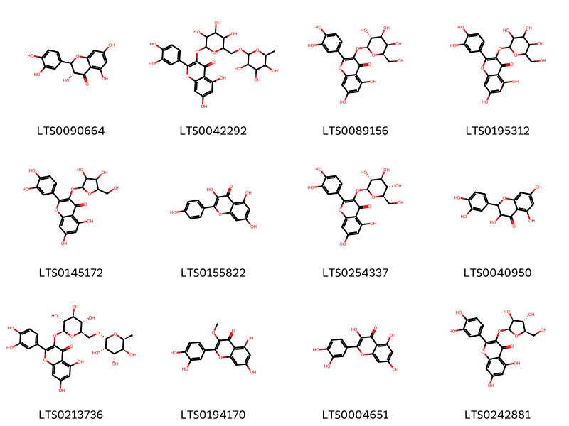{ width=100% }
    <figcaption>Hình ảnh cấu trúc hóa học của 12 hoạt chất thuộc nhóm Flavonoids gồm ['(+)-taxifolin (LTS0090664)', 'rutin (LTS0042292)', 'hyperoside (LTS0089156)', '2-(3,4-dihydroxyphenyl)-5,7-dihydroxy-3-{[3,4,5-trihydroxy-6-(hydroxymethyl)oxan-2-yl]oxy}chromen-4-one (LTS0195312)', '3-{[3,4-dihydroxy-5-(hydroxymethyl)oxolan-2-yl]oxy}-2-(3,4-dihydroxyphenyl)-5,7-dihydroxychromen-4-one (LTS0145172)', 'kaempherol (LTS0155822)', 'isoquercetin (LTS0254337)', '2,3-dihydroquercetin (LTS0040950)', '2-(3,4-dihydroxyphenyl)-5,7-dihydroxy-3-{[(2s,3r,4s,5s,6r)-3,4,5-trihydroxy-6-({[(2r,3s,4s,5s,6s)-3,4,5-trihydroxy-6-methyloxan-2-yl]oxy}methyl)oxan-2-yl]oxy}chromen-4-one (LTS0213736)', 'quercetin 3-methyl ether (LTS0194170)', 'quercetin (LTS0004651)', '3-{[(2s,3s,4s,5r)-3,4-dihydroxy-5-(hydroxymethyl)oxolan-2-yl]oxy}-2-(3,4-dihydroxyphenyl)-5,7-dihydroxychromen-4-one (LTS0242881)'].</figcaption>
</figure>
#### Nhóm Lactones
<figure markdown="span">
    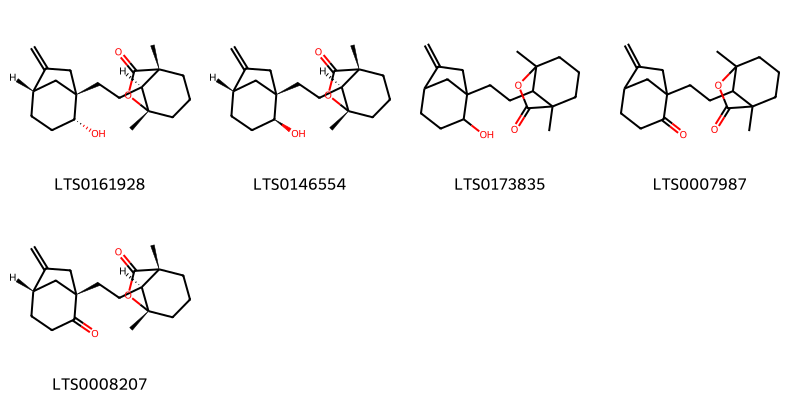{ width=100% }
    <figcaption>Hình ảnh cấu trúc hóa học của 5 hoạt chất thuộc nhóm Lactones gồm ['(1r,5s,8s)-8-{2-[(1r,2r,5s)-2-hydroxy-6-methylidenebicyclo[3.2.1]octan-1-yl]ethyl}-1,5-dimethyl-6-oxabicyclo[3.2.1]octan-7-one (LTS0161928)', '(1r,5s,8s)-8-{2-[(1r,2s,5s)-2-hydroxy-6-methylidenebicyclo[3.2.1]octan-1-yl]ethyl}-1,5-dimethyl-6-oxabicyclo[3.2.1]octan-7-one (LTS0146554)', '8-(2-{2-hydroxy-6-methylidenebicyclo[3.2.1]octan-1-yl}ethyl)-1,5-dimethyl-6-oxabicyclo[3.2.1]octan-7-one (LTS0173835)', '1,5-dimethyl-8-(2-{6-methylidene-2-oxobicyclo[3.2.1]octan-1-yl}ethyl)-6-oxabicyclo[3.2.1]octan-7-one (LTS0007987)', '(1r,5s,8s)-1,5-dimethyl-8-{2-[(1r,5s)-6-methylidene-2-oxobicyclo[3.2.1]octan-1-yl]ethyl}-6-oxabicyclo[3.2.1]octan-7-one (LTS0008207)'].</figcaption>
</figure>
#### Nhóm Prenol lipids
<figure markdown="span">
    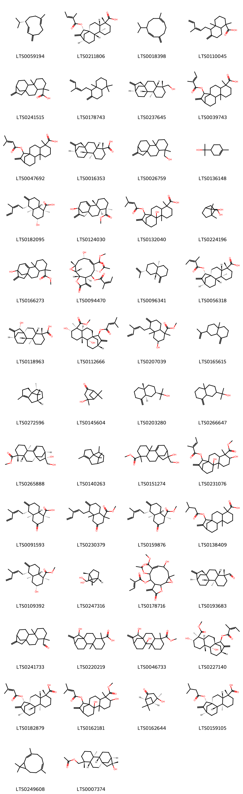{ width=100% }
    <figcaption>Hình ảnh cấu trúc hóa học của 63 hoạt chất thuộc nhóm Prenol lipids gồm ['(-)-germacrene d (LTS0059194)', '(1r,4s,5r,9s,10s,13r,15s)-5,9-dimethyl-15-{[(2e)-2-methylbut-2-enoyl]oxy}-14-methylidenetetracyclo[11.2.1.0¹,¹⁰.0⁴,⁹]hexadecane-5-carboxylic acid (LTS0211806)', '8-isopropyl-1-methyl-5-methylidenecyclodeca-1,6-diene (LTS0018398)', '1,4a-dimethyl-6-methylidene-5-(3-methylpenta-2,4-dien-1-yl)-hexahydro-2h-naphthalene-1-carboxylic acid (LTS0110045)', '5,9-dimethyl-14-methylidenetetracyclo[11.2.1.0¹,¹⁰.0⁴,⁹]hexadecane-5-carboxylic acid (LTS0241515)', '1,1,4a-trimethyl-6-methylidene-5-(3-methylpenta-2,4-dien-1-yl)-hexahydro-2h-naphthalene (LTS0178743)', '[(1s,4s,5r,9s,10r,13r)-5,9-dimethyl-14-methylidenetetracyclo[11.2.1.0¹,¹⁰.0⁴,⁹]hexadecan-5-yl]methanol (LTS0237645)', '5,9-dimethyl-15-[(2-methylbut-2-enoyl)oxy]-14-methylidenetetracyclo[11.2.1.0¹,¹⁰.0⁴,⁹]hexadecane-5-carboxylic acid (LTS0039743)', '5,9-dimethyl-15-[(3-methylbut-2-enoyl)oxy]-14-methylidenetetracyclo[11.2.1.0¹,¹⁰.0⁴,⁹]hexadecane-5-carboxylic acid (LTS0047692)', 'ent-kaur-16-en-19-oic acid (LTS0016353)', '{5,9-dimethyl-14-methylidenetetracyclo[11.2.1.0¹,¹⁰.0⁴,⁹]hexadecan-5-yl}methanol (LTS0026759)', 'terpineol (LTS0136148)', '(1s,3r,4as,5r,8as)-3-hydroxy-1,4a-dimethyl-6-methylidene-5-[(2z)-3-methylpenta-2,4-dien-1-yl]-hexahydro-2h-naphthalene-1-carboxylic acid (LTS0182095)', 'methyl (1r,4s,5r,9r,13s)-13-hydroxy-5,9-dimethyl-14-methylidenetetracyclo[11.2.1.0¹,¹⁰.0⁴,⁹]hexadec-10-ene-5-carboxylate (LTS0124030)', '10-hydroxy-5,9-dimethyl-15-[(3-methylbut-2-enoyl)oxy]-14-methylidenetetracyclo[11.2.1.0¹,¹⁰.0⁴,⁹]hexadecane-5-carboxylic acid (LTS0132040)', '7-(hydroxymethyl)-1,7-dimethylbicyclo[2.2.1]heptan-2-ol (LTS0224196)', 'methyl 13-hydroxy-5,9-dimethyl-14-methylidenetetracyclo[11.2.1.0¹,¹⁰.0⁴,⁹]hexadec-10-ene-5-carboxylate (LTS0166273)', 'methyl (1s,2s,4r,6s,7e,9s,10s,11r)-9-(acetyloxy)-6-hydroxy-4-methyl-10-{[(2z)-2-methylbut-2-enoyl]oxy}-12-methylidene-13-oxo-3,14-dioxatricyclo[9.3.0.0²,⁴]tetradec-7-ene-8-carboxylate (LTS0094470)', 'β-selinene (LTS0096341)', '(1r,4s,5r,9s,10s,13r,15s)-5,9-dimethyl-15-{[(2z)-2-methylbut-2-enoyl]oxy}-14-methylidenetetracyclo[11.2.1.0¹,¹⁰.0⁴,⁹]hexadecane-5-carboxylic acid (LTS0056318)', '(1r,4s,5r,9s,10s,13r,15s)-15-hydroxy-5,9-dimethyl-14-methylidenetetracyclo[11.2.1.0¹,¹⁰.0⁴,⁹]hexadecane-5-carboxylic acid (LTS0118963)', 'methyl (1s,4s,5s,6s,9r,10r,13r,15s)-6,10-dihydroxy-5,9-dimethyl-15-[(3-methylbut-2-enoyl)oxy]-14-methylidenetetracyclo[11.2.1.0¹,¹⁰.0⁴,⁹]hexadecane-5-carboxylate (LTS0112666)', 'methyl 3-hydroxy-1,4a-dimethyl-6-methylidene-5-(3-methylpenta-2,4-dien-1-yl)-hexahydro-2h-naphthalene-1-carboxylate (LTS0207039)', '4a-methyl-1-methylidene-7-(prop-1-en-2-yl)-octahydronaphthalene (LTS0165615)', 'cyperene (LTS0272596)', '4-hydroxy-4,6,6-trimethylbicyclo[3.1.1]heptan-2-one (LTS0145604)', 'β-eudesmol (LTS0203280)', 'β-eudesmol (LTS0266647)', 'methyl (1s,4s,5r,9r,13r,14r)-14-hydroxy-14-(hydroxymethyl)-5,9-dimethyltetracyclo[11.2.1.0¹,¹⁰.0⁴,⁹]hexadec-10-ene-5-carboxylate (LTS0265888)', 'cyperene (LTS0140263)', 'methyl 14-hydroxy-14-(hydroxymethyl)-5,9-dimethyltetracyclo[11.2.1.0¹,¹⁰.0⁴,⁹]hexadec-10-ene-5-carboxylate (LTS0151274)', 'methyl 6,10-dihydroxy-5,9-dimethyl-15-[(2-methylbut-2-enoyl)oxy]-14-methylidenetetracyclo[11.2.1.0¹,¹⁰.0⁴,⁹]hexadecane-5-carboxylate (LTS0231076)', '(1s,4as,5r,8as)-1,4a-dimethyl-6-methylidene-5-[(2z)-3-methylpenta-2,4-dien-1-yl]-3-oxo-hexahydronaphthalene-1-carboxylic acid (LTS0091593)', 'methyl 1,4a-dimethyl-6-methylidene-5-(3-methylpenta-2,4-dien-1-yl)-3-oxo-hexahydronaphthalene-1-carboxylate (LTS0230379)', 'methyl (1s,4as,5r,8as)-1,4a-dimethyl-6-methylidene-5-[(2z)-3-methylpenta-2,4-dien-1-yl]-3-oxo-hexahydronaphthalene-1-carboxylate (LTS0159876)', '5,9-dimethyl-15-[(3-methylbutanoyl)oxy]-14-methylidenetetracyclo[11.2.1.0¹,¹⁰.0⁴,⁹]hexadecane-5-carboxylic acid (LTS0138409)', 'methyl (1s,3r,4as,5r,8as)-3-hydroxy-1,4a-dimethyl-6-methylidene-5-[(2z)-3-methylpenta-2,4-dien-1-yl]-hexahydro-2h-naphthalene-1-carboxylate (LTS0109392)', '(1r,2s,4r,7s)-7-(hydroxymethyl)-1,7-dimethylbicyclo[2.2.1]heptan-2-ol (LTS0247316)', 'methyl 9-(acetyloxy)-6-hydroxy-4-methyl-10-[(2-methylbut-2-enoyl)oxy]-12-methylidene-13-oxo-3,14-dioxatricyclo[9.3.0.0²,⁴]tetradec-7-ene-8-carboxylate (LTS0178716)', '(1s,4s,5r,9s,10r,13r)-5,9-dimethyl-14-methylidenetetracyclo[11.2.1.0¹,¹⁰.0⁴,⁹]hexadecane-5-carbaldehyde (LTS0193683)', '5,9-dimethyl-14-methylidenetetracyclo[11.2.1.0¹,¹⁰.0⁴,⁹]hexadecane-5-carbaldehyde (LTS0241733)', '15-hydroxy-5,9-dimethyl-14-methylidenetetracyclo[11.2.1.0¹,¹⁰.0⁴,⁹]hexadecane-5-carboxylic acid (LTS0220219)', 'methyl 10,15-dihydroxy-5,9-dimethyl-14-methylidenetetracyclo[11.2.1.0¹,¹⁰.0⁴,⁹]hexadecane-5-carboxylate (LTS0046733)', 'methyl (1s,4s,5s,6s,9r,10r,13r,15s)-6,10-dihydroxy-5,9-dimethyl-15-{[(2z)-2-methylbut-2-enoyl]oxy}-14-methylidenetetracyclo[11.2.1.0¹,¹⁰.0⁴,⁹]hexadecane-5-carboxylate (LTS0227140)', '(1r,4s,5r,9s,10s,13r,15s)-5,9-dimethyl-15-[(3-methylbut-2-enoyl)oxy]-14-methylidenetetracyclo[11.2.1.0¹,¹⁰.0⁴,⁹]hexadecane-5-carboxylic acid (LTS0182879)', 'methyl 6,10-dihydroxy-5,9-dimethyl-15-[(3-methylbut-2-enoyl)oxy]-14-methylidenetetracyclo[11.2.1.0¹,¹⁰.0⁴,⁹]hexadecane-5-carboxylate (LTS0162181)', '(1s,4r,5r)-4-hydroxy-4,6,6-trimethylbicyclo[3.1.1]heptan-2-one (LTS0162644)', '(1r,4s,5r,9s,10s,13r,15s)-5,9-dimethyl-15-[(3-methylbutanoyl)oxy]-14-methylidenetetracyclo[11.2.1.0¹,¹⁰.0⁴,⁹]hexadecane-5-carboxylic acid (LTS0159105)', '3,7,11,11-tetramethylbicyclo[8.1.0]undeca-2,6-diene (LTS0249608)', '[(1s,4s,5r,9s,10r,13r,14r)-14-hydroxy-5,9,14-trimethyltetracyclo[11.2.1.0¹,¹⁰.0⁴,⁹]hexadecan-5-yl]methyl acetate (LTS0007374)', 'lily of valley (LTS0051762)', '(1e,6z)-gamma-humulene (LTS0133399)', '(1s,4s,5r,9r,10r,13r,15s)-10-hydroxy-5,9-dimethyl-15-[(3-methylbut-2-enoyl)oxy]-14-methylidenetetracyclo[11.2.1.0¹,¹⁰.0⁴,⁹]hexadecane-5-carboxylic acid (LTS0033157)', '14-hydroxy-5,5,9,14-tetramethyltetracyclo[11.2.1.0¹,¹⁰.0⁴,⁹]hexadecan-6-yl acetate (LTS0057913)', 'methyl (1s,4s,5s,6s,9r,10r,13r,15s)-6,10-dihydroxy-5,9-dimethyl-15-{[(2e)-2-methylbut-2-enoyl]oxy}-14-methylidenetetracyclo[11.2.1.0¹,¹⁰.0⁴,⁹]hexadecane-5-carboxylate (LTS0003959)', '{14-hydroxy-5,9,14-trimethyltetracyclo[11.2.1.0¹,¹⁰.0⁴,⁹]hexadecan-5-yl}methyl acetate (LTS0007588)', 'methyl (1s,4s,5r,9r,10r,13r,15s)-10,15-dihydroxy-5,9-dimethyl-14-methylidenetetracyclo[11.2.1.0¹,¹⁰.0⁴,⁹]hexadecane-5-carboxylate (LTS0002598)', 'bicyclogermacrene (LTS0099340)', '(4as,5s,8as)-1,1,4a-trimethyl-6-methylidene-5-[(2z)-3-methylpenta-2,4-dien-1-yl]-hexahydro-2h-naphthalene (LTS0107805)', '(1s,2s,4s,7s)-7-(hydroxymethyl)-1,7-dimethylbicyclo[2.2.1]heptan-2-ol (LTS0221819)', '(1s,4as,5r,8as)-1,4a-dimethyl-6-methylidene-5-[(2z)-3-methylpenta-2,4-dien-1-yl]-hexahydro-2h-naphthalene-1-carboxylic acid (LTS0025008)', '(1s,4s,6s,9s,10r,13r,14r)-14-hydroxy-5,5,9,14-tetramethyltetracyclo[11.2.1.0¹,¹⁰.0⁴,⁹]hexadecan-6-yl acetate (LTS0257507)', 'gamma-humulene (LTS0246486)'].</figcaption>
</figure>

---

### Dược dân tộc học

Danh sách các quốc gia có sử dụng *Ichthyothere terminalis* trong điều trị các bệnh. 

| Country   | Disease   | Bệnh                                                                                                                                                                                                |
|:----------|:----------|:----------------------------------------------------------------------------------------------------------------------------------------------------------------------------------------------------|
| Brazil    | Poison    | MYMEMORY WARNING: YOU USED ALL AVAILABLE FREE TRANSLATIONS FOR TODAY. NEXT AVAILABLE IN  12 HOURS 38 MINUTES 55 SECONDS VISIT HTTPS://MYMEMORY.TRANSLATED.NET/DOC/USAGELIMITS.PHP TO TRANSLATE MORE |
| Venezuela | Piscicide | MYMEMORY WARNING: YOU USED ALL AVAILABLE FREE TRANSLATIONS FOR TODAY. NEXT AVAILABLE IN  12 HOURS 38 MINUTES 51 SECONDS VISIT HTTPS://MYMEMORY.TRANSLATED.NET/DOC/USAGELIMITS.PHP TO TRANSLATE MORE |

---

# Chi Xanthium

??? note "Danh sách các dược liệu thuộc chi"
    
	 - *Xanthium inosum*
	 - *Xanthium strumarium*
	 - *Xanthium strumonium*

---
## Xanthium inosum
### Thông tin về thực vật

!!! info "Phân loại thực vật của *N/A* từ GIBF:"
    - **Kingdom:** Plantae
    - **Phylum:** Tracheophyta
    - **Order:** Asterales
    - **Family:** Asteraceae
    - **Genus:** Xanthium
    - **Species:** *N/A*

 

| Label (VI)   | Label (EN)   | Scientific Name         | Descriptions (VI)   | Descriptions (EN)   | Also Known As (VI)   | Also Known As (EN)   |
|:-------------|:-------------|:------------------------|:--------------------|:--------------------|:---------------------|:---------------------|
| N/A          | N/A          | Ichthyothere terminalis | loài thực vật       | species of plant    | ['']                 | ['']                 |

#### Phân bố trên thế giới

**Từ CSDL GIBF** Italy, Australia, Argentina, Israel, Canada, Ukraine, Belarus, Namibia, Spain, Lesotho, Russian Federation, United States of America, Uruguay, Chile, Greece, South Africa, Germany, Brazil, Switzerland, Mexico, China, Botswana, India, New Zealand

#### Phân bố tại Việt Nam

**Từ CSDL GIBF**: Không có ghi nhận ở Việt Nam

---
### Thành phần hóa học
        
- Theo cơ sở dữ liệu lotus: Từ loài *N/A* đã phân lập và xác định được Chưa có hoạt chất nào được phân lập. hoạt chất thuộc về các nhóm Không có hoạt chất nào được phân lập. 

Không có hình ảnh nào được tạo ra

---

### Dược dân tộc học

Danh sách các quốc gia có sử dụng *N/A* trong điều trị các bệnh. 

| Country   | Disease                                              | Bệnh                                                                                                                                                                                                |
|:----------|:-----------------------------------------------------|:----------------------------------------------------------------------------------------------------------------------------------------------------------------------------------------------------|
| Elsewhere | Diuretic, Styptic                                    | MYMEMORY WARNING: YOU USED ALL AVAILABLE FREE TRANSLATIONS FOR TODAY. NEXT AVAILABLE IN  12 HOURS 38 MINUTES 13 SECONDS VISIT HTTPS://MYMEMORY.TRANSLATED.NET/DOC/USAGELIMITS.PHP TO TRANSLATE MORE |
| India     | Antiseptic, Diuretic, Sudorific, Poison, Styptic     | MYMEMORY WARNING: YOU USED ALL AVAILABLE FREE TRANSLATIONS FOR TODAY. NEXT AVAILABLE IN  12 HOURS 38 MINUTES 10 SECONDS VISIT HTTPS://MYMEMORY.TRANSLATED.NET/DOC/USAGELIMITS.PHP TO TRANSLATE MORE |
| Turkey    | Diuretic, Styptic, Astringent, Sudorific, Sialogogue | MYMEMORY WARNING: YOU USED ALL AVAILABLE FREE TRANSLATIONS FOR TODAY. NEXT AVAILABLE IN  12 HOURS 38 MINUTES 07 SECONDS VISIT HTTPS://MYMEMORY.TRANSLATED.NET/DOC/USAGELIMITS.PHP TO TRANSLATE MORE |
| US        | Diaphoretic, Diuretic                                | MYMEMORY WARNING: YOU USED ALL AVAILABLE FREE TRANSLATIONS FOR TODAY. NEXT AVAILABLE IN  12 HOURS 38 MINUTES 05 SECONDS VISIT HTTPS://MYMEMORY.TRANSLATED.NET/DOC/USAGELIMITS.PHP TO TRANSLATE MORE |
| ain       | Diuretic                                             | MYMEMORY WARNING: YOU USED ALL AVAILABLE FREE TRANSLATIONS FOR TODAY. NEXT AVAILABLE IN  12 HOURS 38 MINUTES 01 SECONDS VISIT HTTPS://MYMEMORY.TRANSLATED.NET/DOC/USAGELIMITS.PHP TO TRANSLATE MORE |

---

---
## Xanthium strumarium
### Thông tin về thực vật

!!! info "Phân loại thực vật của *Xanthium strumarium* từ GIBF:"
    - **Kingdom:** Plantae
    - **Phylum:** Tracheophyta
    - **Order:** Asterales
    - **Family:** Asteraceae
    - **Genus:** Xanthium
    - **Species:** *Xanthium strumarium*

 

| Label (VI)   | Label (EN)   | Scientific Name     | Descriptions (VI)   | Descriptions (EN)   | Also Known As (VI)                                                                          | Also Known As (EN)                                                                                                                                                                                 |
|:-------------|:-------------|:--------------------|:--------------------|:--------------------|:--------------------------------------------------------------------------------------------|:---------------------------------------------------------------------------------------------------------------------------------------------------------------------------------------------------|
| N/A          | N/A          | Xanthium strumarium |                     | species of plant    | ['Xanthium strumarium', 'Xanthium inaequilaterum', 'Xanthium iaequilaterium', 'Thương nhĩ'] | ['Canada cockleburr', 'chayote', 'cockle bur', 'common cocklebur', 'large cocklebur', 'rough cocklebur', 'rough cockleburr', 'spiny cockleburr', 'Xanthium pensylvanicum', 'cocklebur', 'kikania'] |

#### Phân bố trên thế giới

**Từ CSDL GIBF** nan, South Africa, Australia, Germany, Namibia, Brazil, Spain, Argentina, Botswana, India, Uruguay, Anguilla, United States of America, Mexico, China, Greece, Israel, Canada

#### Phân bố tại Việt Nam

**Từ CSDL GIBF**: Không có ghi nhận ở Việt Nam

---
### Thành phần hóa học
        
- Theo cơ sở dữ liệu lotus: Từ loài *Xanthium strumarium* đã phân lập và xác định được 276 hoạt chất thuộc về các nhóm Diarylheptanoids, Benzofurans, Phenols, Fatty Acyls, Coumarinolignans, Indoles and derivatives, Pyrrolidines, Cinnamic acids and derivatives, Dibenzylbutane lignans, Trioxanes, Diazines, Prenol lipids, Benzene and substituted derivatives, Naphthofurans, Organooxygen compounds, Dihydrofurans, Furanoid lignans, Flavonoids, Steroids and steroid derivatives, Isoflavonoids, Organonitrogen compounds, Pyrans, Unsaturated hydrocarbons, 2-arylbenzofuran flavonoids, Thiazines, Benzothiazines, Lactones, Coumarins and derivatives, Benzopyrans. 

|    | chemicalTaxonomyClassyfireClass     |   smiles_count |
|---:|:------------------------------------|---------------:|
|  0 |                                     |              1 |
|  1 | 2-arylbenzofuran flavonoids         |              2 |
|  2 | Benzene and substituted derivatives |              7 |
|  3 | Benzofurans                         |              1 |
|  4 | Benzopyrans                         |              2 |
|  5 | Benzothiazines                      |              2 |
|  6 | Cinnamic acids and derivatives      |             10 |
|  7 | Coumarinolignans                    |              5 |
|  8 | Coumarins and derivatives           |              1 |
|  9 | Diarylheptanoids                    |              1 |
| 10 | Diazines                            |              2 |
| 11 | Dibenzylbutane lignans              |              2 |
| 12 | Dihydrofurans                       |              1 |
| 13 | Fatty Acyls                         |              4 |
| 14 | Flavonoids                          |              2 |
| 15 | Furanoid lignans                    |              4 |
| 16 | Indoles and derivatives             |              2 |
| 17 | Isoflavonoids                       |              3 |
| 18 | Lactones                            |             13 |
| 19 | Naphthofurans                       |              2 |
| 20 | Organonitrogen compounds            |              1 |
| 21 | Organooxygen compounds              |             23 |
| 22 | Phenols                             |              8 |
| 23 | Prenol lipids                       |            138 |
| 24 | Pyrans                              |              4 |
| 25 | Pyrrolidines                        |              1 |
| 26 | Steroids and steroid derivatives    |             15 |
| 27 | Thiazines                           |              1 |
| 28 | Trioxanes                           |              5 |
| 29 | Unsaturated hydrocarbons            |              1 |

#### Nhóm 
<figure markdown="span">
    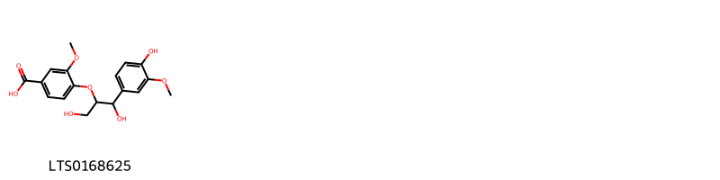{ width=100% }
    <figcaption>Hình ảnh cấu trúc hóa học của 1 hoạt chất thuộc nhóm  gồm ['4-{[1,3-dihydroxy-1-(4-hydroxy-3-methoxyphenyl)propan-2-yl]oxy}-3-methoxybenzoic acid (LTS0168625)'].</figcaption>
</figure>
#### Nhóm 2-arylbenzofuran flavonoids
<figure markdown="span">
    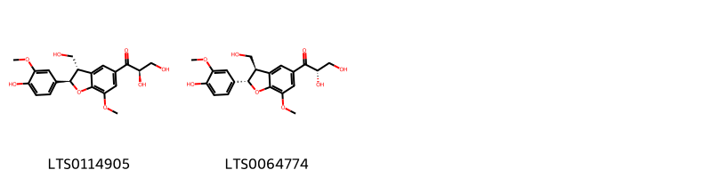{ width=100% }
    <figcaption>Hình ảnh cấu trúc hóa học của 2 hoạt chất thuộc nhóm 2-arylbenzofuran flavonoids gồm ['(2r)-2,3-dihydroxy-1-[(2r,3s)-2-(4-hydroxy-3-methoxyphenyl)-3-(hydroxymethyl)-7-methoxy-2,3-dihydro-1-benzofuran-5-yl]propan-1-one (LTS0114905)', '(2s)-2,3-dihydroxy-1-[(2s,3r)-2-(4-hydroxy-3-methoxyphenyl)-3-(hydroxymethyl)-7-methoxy-2,3-dihydro-1-benzofuran-5-yl]propan-1-one (LTS0064774)'].</figcaption>
</figure>
#### Nhóm Benzene and substituted derivatives
<figure markdown="span">
    { width=100% }
    <figcaption>Hình ảnh cấu trúc hóa học của 7 hoạt chất thuộc nhóm Benzene and substituted derivatives gồm ['salicyclic acid (LTS0116548)', "5,5'-bis(3-hydroxypropyl)-3,3'-dimethoxy-[1,1'-biphenyl]-2,2'-diol (LTS0080605)", 'ethyl protocatechuate (LTS0006328)', 'bisphenol f (LTS0060768)', '4-[(4-hydroxyphenyl)methyl]-2-methylphenol (LTS0008455)', "2,4'-bisphenol f (LTS0101981)", 'vanillic acid (LTS0229113)'].</figcaption>
</figure>
#### Nhóm Benzofurans
<figure markdown="span">
    { width=100% }
    <figcaption>Hình ảnh cấu trúc hóa học của 1 hoạt chất thuộc nhóm Benzofurans gồm ['loliolide (LTS0254454)'].</figcaption>
</figure>
#### Nhóm Benzopyrans
<figure markdown="span">
    { width=100% }
    <figcaption>Hình ảnh cấu trúc hóa học của 2 hoạt chất thuộc nhóm Benzopyrans gồm ['xanthydrol (LTS0010654)', '1-(2,2-dimethylchromen-6-yl)ethanone (LTS0151425)'].</figcaption>
</figure>
#### Nhóm Benzothiazines
<figure markdown="span">
    { width=100% }
    <figcaption>Hình ảnh cấu trúc hóa học của 2 hoạt chất thuộc nhóm Benzothiazines gồm ['3-hydroxy-7-(hydroxymethyl)-8,8-dimethyl-2h-1,4-benzothiazin-5-one (LTS0145462)', '3-hydroxy-8,8-dimethyl-5-oxo-2h-1,4-benzothiazine-7-carbaldehyde (LTS0236253)'].</figcaption>
</figure>
#### Nhóm Cinnamic acids and derivatives
<figure markdown="span">
    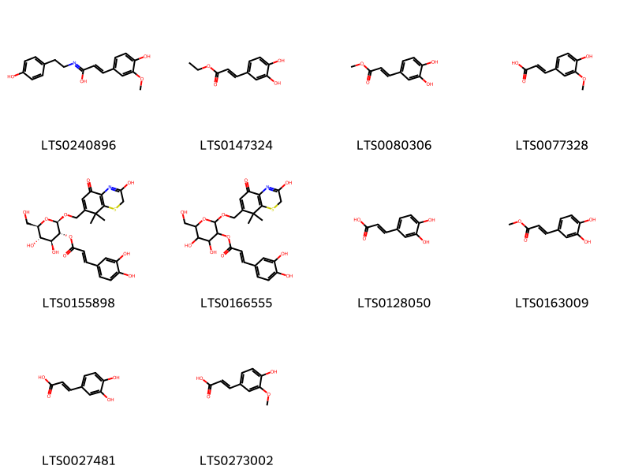{ width=100% }
    <figcaption>Hình ảnh cấu trúc hóa học của 10 hoạt chất thuộc nhóm Cinnamic acids and derivatives gồm ['3-(4-hydroxy-3-methoxyphenyl)-n-[2-(4-hydroxyphenyl)ethyl]prop-2-enimidic acid (LTS0240896)', 'ethyl caffeate (LTS0147324)', 'methyl 3-(3,4-dihydroxyphenyl)prop-2-enoate (LTS0080306)', 'ferulic acid (LTS0077328)', '(2r,3r,4s,5s,6r)-4,5-dihydroxy-2-[(3-hydroxy-8,8-dimethyl-5-oxo-2h-1,4-benzothiazin-7-yl)methoxy]-6-(hydroxymethyl)oxan-3-yl (2e)-3-(3,4-dihydroxyphenyl)prop-2-enoate (LTS0155898)', '4,5-dihydroxy-2-[(3-hydroxy-8,8-dimethyl-5-oxo-2h-1,4-benzothiazin-7-yl)methoxy]-6-(hydroxymethyl)oxan-3-yl 3-(3,4-dihydroxyphenyl)prop-2-enoate (LTS0166555)', '3,4-dihydroxycinnamic acid (LTS0128050)', 'methyl caffeate (LTS0163009)', 'caffeic acid (LTS0027481)', 'ferulic acid (LTS0273002)'].</figcaption>
</figure>
#### Nhóm Coumarinolignans
<figure markdown="span">
    { width=100% }
    <figcaption>Hình ảnh cấu trúc hóa học của 5 hoạt chất thuộc nhóm Coumarinolignans gồm ['3-(4-hydroxy-3,5-dimethoxyphenyl)-2-(hydroxymethyl)-5-methoxy-2h,3h-[1,4]dioxino[2,3-h]chromen-9-one (LTS0136653)', '(2r,3r)-3-(4-hydroxy-3,5-dimethoxyphenyl)-2-(hydroxymethyl)-5-methoxy-2h,3h-[1,4]dioxino[2,3-h]chromen-9-one (LTS0200101)', 'cleomiscosin a (LTS0042175)', '3-(4-hydroxy-3-methoxyphenyl)-2-(hydroxymethyl)-5-methoxy-2h,3h-[1,4]dioxino[2,3-h]chromen-9-one (LTS0202828)', '(2r,3s)-3-(4-hydroxy-3,5-dimethoxyphenyl)-5-methoxy-2-methyl-2h,3h-[1,4]dioxino[2,3-h]chromen-9-one (LTS0098792)'].</figcaption>
</figure>
#### Nhóm Coumarins and derivatives
<figure markdown="span">
    { width=100% }
    <figcaption>Hình ảnh cấu trúc hóa học của 1 hoạt chất thuộc nhóm Coumarins and derivatives gồm ['scopoletin (LTS0193112)'].</figcaption>
</figure>
#### Nhóm Diarylheptanoids
<figure markdown="span">
    { width=100% }
    <figcaption>Hình ảnh cấu trúc hóa học của 1 hoạt chất thuộc nhóm Diarylheptanoids gồm ['2,4-bis(4-hydroxybenzyl)phenol (LTS0041151)'].</figcaption>
</figure>
#### Nhóm Diazines
<figure markdown="span">
    { width=100% }
    <figcaption>Hình ảnh cấu trúc hóa học của 2 hoạt chất thuộc nhóm Diazines gồm ['5-methylpyrimidine-2,4-dione (LTS0084111)', 'pirod (LTS0008205)'].</figcaption>
</figure>
#### Nhóm Dibenzylbutane lignans
<figure markdown="span">
    { width=100% }
    <figcaption>Hình ảnh cấu trúc hóa học của 2 hoạt chất thuộc nhóm Dibenzylbutane lignans gồm ['(2r,3r)-2,3-bis[(4-hydroxy-3-methoxyphenyl)methyl]-4-{[(2e)-3-(4-hydroxy-3-methoxyphenyl)prop-2-enoyl]oxy}butyl (2e)-3-(4-hydroxy-3-methoxyphenyl)prop-2-enoate (LTS0184891)', '2,3-bis[(4-hydroxy-3-methoxyphenyl)methyl]-4-{[3-(4-hydroxy-3-methoxyphenyl)prop-2-enoyl]oxy}butyl 3-(4-hydroxy-3-methoxyphenyl)prop-2-enoate (LTS0145734)'].</figcaption>
</figure>
#### Nhóm Dihydrofurans
<figure markdown="span">
    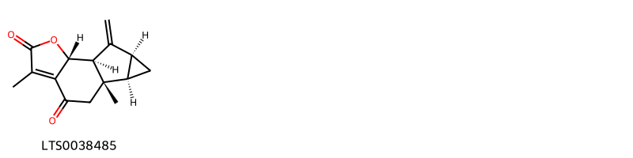{ width=100% }
    <figcaption>Hình ảnh cấu trúc hóa học của 1 hoạt chất thuộc nhóm Dihydrofurans gồm ['(1s,2r,9s,10r,12s)-5,9-dimethyl-13-methylidene-3-oxatetracyclo[7.4.0.0²,⁶.0¹⁰,¹²]tridec-5-ene-4,7-dione (LTS0038485)'].</figcaption>
</figure>
#### Nhóm Fatty Acyls
<figure markdown="span">
    { width=100% }
    <figcaption>Hình ảnh cấu trúc hóa học của 4 hoạt chất thuộc nhóm Fatty Acyls gồm ['triacontanol (LTS0026833)', 'isovaleric acid (LTS0156600)', 'n-valeric acid (LTS0025746)', 'nonadecanoic acid (LTS0212995)'].</figcaption>
</figure>
#### Nhóm Flavonoids
<figure markdown="span">
    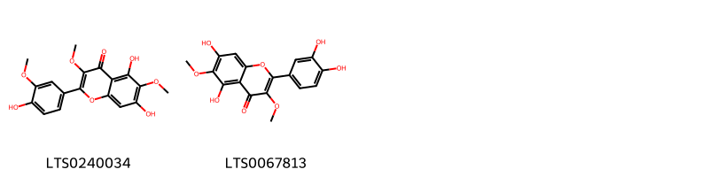{ width=100% }
    <figcaption>Hình ảnh cấu trúc hóa học của 2 hoạt chất thuộc nhóm Flavonoids gồm ['jaceidin (LTS0240034)', 'axillarin (LTS0067813)'].</figcaption>
</figure>
#### Nhóm Furanoid lignans
<figure markdown="span">
    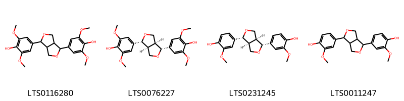{ width=100% }
    <figcaption>Hình ảnh cấu trúc hóa học của 4 hoạt chất thuộc nhóm Furanoid lignans gồm ['syringaresinol (LTS0116280)', '(-)-syringaresinol (LTS0076227)', '(-)-pinoresinol (LTS0231245)', 'pinoresinol (LTS0011247)'].</figcaption>
</figure>
#### Nhóm Indoles and derivatives
<figure markdown="span">
    { width=100% }
    <figcaption>Hình ảnh cấu trúc hóa học của 2 hoạt chất thuộc nhóm Indoles and derivatives gồm ['indole-3-carboxaldehyde (LTS0137179)', 'indole - 3 carboxylic acid (LTS0271539)'].</figcaption>
</figure>
#### Nhóm Isoflavonoids
<figure markdown="span">
    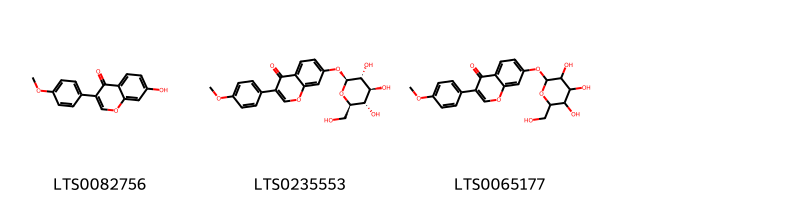{ width=100% }
    <figcaption>Hình ảnh cấu trúc hóa học của 3 hoạt chất thuộc nhóm Isoflavonoids gồm ['formononetin (LTS0082756)', 'ononin (LTS0235553)', 'ononin (LTS0065177)'].</figcaption>
</figure>
#### Nhóm Lactones
<figure markdown="span">
    { width=100% }
    <figcaption>Hình ảnh cấu trúc hóa học của 13 hoạt chất thuộc nhóm Lactones gồm ['(3s,3ar,7s,8as)-3,7-dimethyl-2-oxo-3h,3ah,4h,7h,8h,8ah-cyclohepta[b]furan-6-carboxylic acid (LTS0020626)', '(3r,3ar,7s,8as)-3,7-dimethyl-2-oxo-3h,3ah,4h,7h,8h,8ah-cyclohepta[b]furan-6-carboxylic acid (LTS0183818)', '(3r,3ar,7s,8as)-3,7-dimethyl-2-oxo-3h,3ah,4h,7h,8h,8ah-cyclohepta[b]furan-6-carbaldehyde (LTS0182433)', 'methyl 2-[(3s,3ar,7s,8as)-3,7-dimethyl-2-oxo-3h,3ah,4h,7h,8h,8ah-cyclohepta[b]furan-6-yl]acetate (LTS0223860)', '(3ar,6s,8as)-6-methyl-3-methylidene-5-[(1e)-3-oxobut-1-en-1-yl]-3ah,6h,7h,8h,8ah-cyclohepta[b]furan-2-one (LTS0158081)', '(3ar,7s,8as)-7-methyl-3-methylidene-2-oxo-3ah,4h,7h,8h,8ah-cyclohepta[b]furan-6-carbaldehyde (LTS0239082)', '(3r,3ar,7s,8as)-3,7-dimethyl-3h,3ah,7h,8h,8ah-cyclohepta[b]furan-2,6-dione (LTS0038619)', '(1r,4r,6s,7s,10s,12r,14r)-6,10-dimethyl-3,11-dioxapentacyclo[8.4.1.0¹,⁷.0⁴,¹⁴.0⁷,¹²]pentadec-8-en-2-one (LTS0227485)', '(3s,4r)-3,4-dihydroxy-3-methyloxolan-2-one (LTS0056605)', '3,4-dihydroxy-3-methyloxolan-2-one (LTS0168418)', '(3as,6s,8as)-7-[(3s)-3-hydroxybutyl]-6-methyl-3h,3ah,4h,5h,6h,8ah-cyclohepta[b]furan-2-one (LTS0186768)', '(1r,4r,6s,12r,14r)-6,10-dimethyl-3,11-dioxapentacyclo[8.4.1.0¹,⁷.0⁴,¹⁴.0⁷,¹²]pentadec-8-en-2-one (LTS0053254)', '6,10-dimethyl-3,11-dioxapentacyclo[8.4.1.0¹,⁷.0⁴,¹⁴.0⁷,¹²]pentadec-8-en-2-one (LTS0108697)'].</figcaption>
</figure>
#### Nhóm Naphthofurans
<figure markdown="span">
    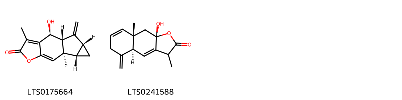{ width=100% }
    <figcaption>Hình ảnh cấu trúc hóa học của 2 hoạt chất thuộc nhóm Naphthofurans gồm ['(1r,2s,9r,10s,12r)-2-hydroxy-4,9-dimethyl-13-methylidene-6-oxatetracyclo[7.4.0.0³,⁷.0¹⁰,¹²]trideca-3,7-dien-5-one (LTS0175664)', '(4as,8as,9as)-9a-hydroxy-3,8a-dimethyl-5-methylidene-3h,4ah,6h,9h-naphtho[2,3-b]furan-2-one (LTS0241588)'].</figcaption>
</figure>
#### Nhóm Organonitrogen compounds
<figure markdown="span">
    { width=100% }
    <figcaption>Hình ảnh cấu trúc hóa học của 1 hoạt chất thuộc nhóm Organonitrogen compounds gồm ['choline (LTS0170307)'].</figcaption>
</figure>
#### Nhóm Organooxygen compounds
<figure markdown="span">
    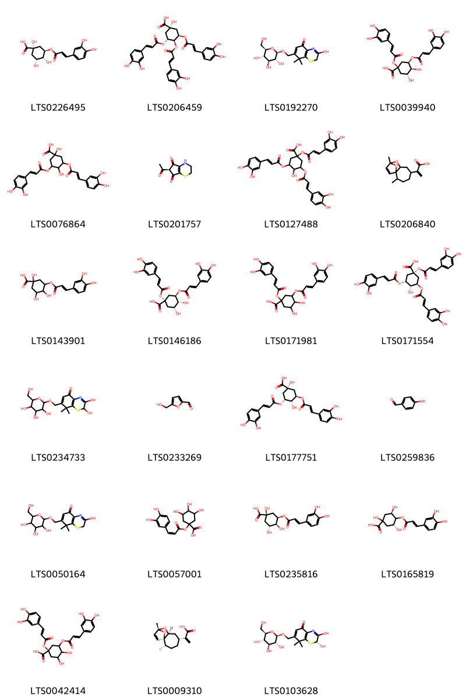{ width=100% }
    <figcaption>Hình ảnh cấu trúc hóa học của 23 hoạt chất thuộc nhóm Organooxygen compounds gồm ['chlorogenic acid (LTS0226495)', '(1r,3r,4r,5r)-3,4,5-tris({[(2e)-3-(3,4-dihydroxyphenyl)prop-2-enoyl]oxy})-1-hydroxycyclohexane-1-carboxylic acid (LTS0206459)', '3-hydroxy-8,8-dimethyl-7-({[(2r,3r,4s,5s,6r)-3,4,5-trihydroxy-6-(hydroxymethyl)oxan-2-yl]oxy}methyl)-2h-1,4-benzothiazin-5-one (LTS0192270)', 'cynarine (LTS0039940)', '3,5-bis({[3-(3,4-dihydroxyphenyl)prop-2-enoyl]oxy})-1,4-dihydroxycyclohexane-1-carboxylic acid (LTS0076864)', '(6s)-6-acetyl-2h,3h,4h,6h-cyclopenta[b][1,4]thiazine-5,7-dione (LTS0201757)', '1,3,5-tris({[3-(3,4-dihydroxyphenyl)prop-2-enoyl]oxy})-4-hydroxycyclohexane-1-carboxylic acid (LTS0127488)', '2-{2,9-dimethyl-8,12-dioxatricyclo[7.2.1.0¹,⁷]dodec-10-en-5-yl}prop-2-enoic acid (LTS0206840)', '3-{[3-(3,4-dihydroxyphenyl)prop-2-enoyl]oxy}-1,4,5-trihydroxycyclohexane-1-carboxylic acid (LTS0143901)', '(1s,3r,4r,5r)-1,3-bis({[(2e)-3-(3,4-dihydroxyphenyl)prop-2-enoyl]oxy})-4,5-dihydroxycyclohexane-1-carboxylic acid (LTS0146186)', '1,3-bis({[3-(3,4-dihydroxyphenyl)prop-2-enoyl]oxy})-4,5-dihydroxycyclohexane-1-carboxylic acid (LTS0171981)', '(1s,3r,4s,5r)-1,3,5-tris({[(2e)-3-(3,4-dihydroxyphenyl)prop-2-enoyl]oxy})-4-hydroxycyclohexane-1-carboxylic acid (LTS0171554)', '2,3-dihydroxy-8,8-dimethyl-7-({[3,4,5-trihydroxy-6-(hydroxymethyl)oxan-2-yl]oxy}methyl)-2h-1,4-benzothiazin-5-one (LTS0234733)', 'hydroxymethylfurfural (LTS0233269)', '3,5-dicaffeoylquinic acid (LTS0177751)', 'p-hydroxybenzaldehyde (LTS0259836)', '3-hydroxy-8,8-dimethyl-7-({[3,4,5-trihydroxy-6-(hydroxymethyl)oxan-2-yl]oxy}methyl)-2h-1,4-benzothiazin-5-one (LTS0050164)', '1-{[(2z)-3-(3,4-dihydroxyphenyl)prop-2-enoyl]oxy}-3,4,5-trihydroxycyclohexane-1-carboxylic acid (LTS0057001)', 'neochlorogenic acid (LTS0235816)', '(3r,5r)-4-{[(2e)-3-(3,4-dihydroxyphenyl)prop-2-enoyl]oxy}-1,3,5-trihydroxycyclohexane-1-carboxylic acid (LTS0165819)', '(1r)-1,3-bis({[3-(3,4-dihydroxyphenyl)prop-2-enoyl]oxy})-4,5-dihydroxycyclohexane-1-carboxylic acid (LTS0042414)', '2-[(1s,2s,5r,7s,9r)-2,9-dimethyl-8,12-dioxatricyclo[7.2.1.0¹,⁷]dodec-10-en-5-yl]prop-2-enoic acid (LTS0009310)', '(2r)-2,3-dihydroxy-8,8-dimethyl-7-({[(2r,3r,4s,5s,6r)-3,4,5-trihydroxy-6-(hydroxymethyl)oxan-2-yl]oxy}methyl)-2h-1,4-benzothiazin-5-one (LTS0103628)'].</figcaption>
</figure>
#### Nhóm Phenols
<figure markdown="span">
    { width=100% }
    <figcaption>Hình ảnh cấu trúc hóa học của 8 hoạt chất thuộc nhóm Phenols gồm ['catechol (LTS0178554)', 'p-cresol (LTS0208715)', 'resorcinol (LTS0035614)', '(2e)-3-(4-hydroxy-3-methoxyphenyl)-n-[2-(4-hydroxyphenyl)ethyl]prop-2-enimidic acid (LTS0187051)', 'vanillin (LTS0136163)', 'coniferyl aldehyde (LTS0140691)', 'α-hydroquinone (LTS0063684)', 'coniferaldehyde (LTS0009773)'].</figcaption>
</figure>
#### Nhóm Prenol lipids
<figure markdown="span">
    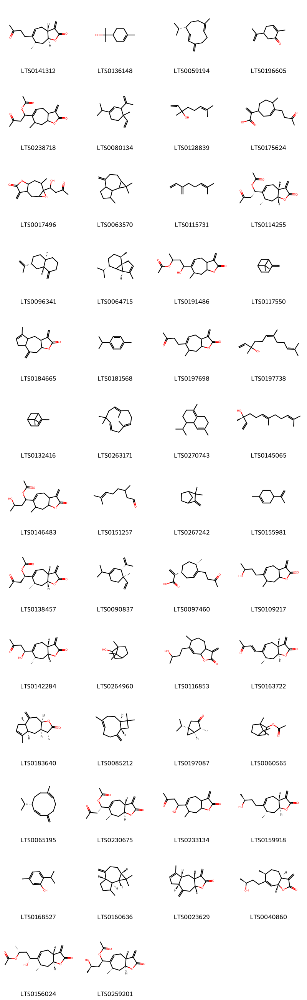{ width=100% }
    <figcaption>Hình ảnh cấu trúc hóa học của 138 hoạt chất thuộc nhóm Prenol lipids gồm ['(3ar,7s,8as)-7-methyl-3-methylidene-6-(3-oxobutyl)-3ah,4h,7h,8h,8ah-cyclohepta[b]furan-2-one (LTS0141312)', 'terpineol (LTS0136148)', '(-)-germacrene d (LTS0059194)', 'carvone (LTS0196605)', 'xanthinin (LTS0238718)', '4-ethenyl-1-isopropyl-4-methyl-3-(prop-1-en-2-yl)cyclohex-1-ene (LTS0080134)', 'linalool, (+-)- (LTS0128839)', '2-[5-methyl-4-(3-oxobutyl)cyclohept-3-en-1-yl]prop-2-enoic acid (LTS0175624)', '5-(1-hydroxy-3-oxobutyl)-6-methyl-11-methylidene-4,9-dioxatricyclo[6.3.0.0³,⁵]undecan-10-one (LTS0017496)', '1,1,7-trimethyl-4-methylidene-octahydro-1ah-cyclopropa[e]azulene (LTS0063570)', 'α-myrcene (LTS0115731)', '(1s)-1-[(3ar,7s,8ar)-7-methyl-3-methylidene-2-oxo-3ah,4h,7h,8h,8ah-cyclohepta[b]furan-6-yl]-3-oxobutyl acetate (LTS0114255)', 'β-selinene (LTS0096341)', '(1s,5r,7s,10r)-7-isopropyl-4,10-dimethyltricyclo[4.4.0.0¹,⁵]dec-3-ene (LTS0064715)', '4-hydroxy-4-{7-methyl-3-methylidene-2-oxo-3ah,4h,7h,8h,8ah-cyclohepta[b]furan-6-yl}butan-2-yl acetate (LTS0191486)', 'β-pinene (LTS0117550)', '5-methyl-3,8-dimethylidene-3ah,4h,4ah,7h,7ah,9h,9ah-azuleno[6,5-b]furan-2-one (LTS0184665)', 'cymene (LTS0181568)', '7-methyl-3-methylidene-6-(3-oxobutyl)-3ah,4h,7h,8h,8ah-cyclohepta[b]furan-2-one (LTS0197698)', 'nerolidol (LTS0197738)', 'α pinene (LTS0132416)', 'humulene (LTS0263171)', '4-isopropyl-1,6-dimethyl-2,3,4,4a,7,8-hexahydronaphthalene (LTS0270743)', '(3r,6e)-nerolidol (LTS0145065)', '3-hydroxy-1-{7-methyl-3-methylidene-2-oxo-3ah,4h,7h,8h,8ah-cyclohepta[b]furan-6-yl}butyl acetate (LTS0146483)', 'citronella (LTS0151257)', 'camphene (LTS0267242)', 'limonene,  (LTS0155981)', 'xanthumin (LTS0138457)', 'elemene (LTS0090837)', '2-[(1r,5s)-5-methyl-4-(3-oxobutyl)cyclohept-3-en-1-yl]prop-2-enoic acid (LTS0097460)', '6-(3-hydroxybutyl)-7-methyl-3-methylidene-3ah,4h,7h,8h,8ah-cyclohepta[b]furan-2-one (LTS0109217)', '(3ar,7s,8ar)-6-[(1s)-1-hydroxy-3-oxobutyl]-7-methyl-3-methylidene-3ah,4h,7h,8h,8ah-cyclohepta[b]furan-2-one (LTS0142284)', 'borneol (LTS0264960)', '7-(3-hydroxybutyl)-6-methyl-3-methylidene-3ah,4h,5h,6h,8ah-cyclohepta[b]furan-2-one (LTS0116853)', 'xanthatin (LTS0163722)', '(3r,3ar,4ar,7ar,9ar)-3,5-dimethyl-8-methylidene-3h,3ah,4h,4ah,7h,7ah,9h,9ah-azuleno[6,5-b]furan-2-one (LTS0183640)', 'caryophyllene (LTS0085212)', 'thujone (LTS0197087)', 'bornyl acetate (LTS0060565)', '(1z,6z,8s)-8-isopropyl-1-methyl-5-methylidenecyclodeca-1,6-diene (LTS0065195)', '(1s)-1-[(3ar,7s,8as)-7-methyl-3-methylidene-2-oxo-3ah,4h,7h,8h,8ah-cyclohepta[b]furan-6-yl]-3-oxobutyl acetate (LTS0230675)', '6-(1-hydroxy-3-oxobutyl)-7-methyl-3-methylidene-3ah,4h,7h,8h,8ah-cyclohepta[b]furan-2-one (LTS0233134)', '(3ar,7s,8as)-6-[(3s)-3-hydroxybutyl]-7-methyl-3-methylidene-3ah,4h,7h,8h,8ah-cyclohepta[b]furan-2-one (LTS0159918)', 'thymol (LTS0168527)', '(1as,4as,7as,7br)-1,1,7-trimethyl-4-methylidene-octahydro-1ah-cyclopropa[e]azulene (LTS0160636)', '(3ar,4ar,7ar,9ar)-5-methyl-3,8-dimethylidene-3ah,4h,4ah,7h,7ah,9h,9ah-azuleno[6,5-b]furan-2-one (LTS0023629)', '(3as,6s,8ar)-7-[(3s)-3-hydroxybutyl]-6-methyl-3-methylidene-3ah,4h,5h,6h,8ah-cyclohepta[b]furan-2-one (LTS0040860)', '(2r,4r)-4-[(3ar,7s,8as)-7-methyl-3-methylidene-2-oxo-3ah,4h,7h,8h,8ah-cyclohepta[b]furan-6-yl]-4-hydroxybutan-2-yl acetate (LTS0156024)', '(1r,3r)-1-[(3ar,7s,8as)-7-methyl-3-methylidene-2-oxo-3ah,4h,7h,8h,8ah-cyclohepta[b]furan-6-yl]-3-hydroxybutyl acetate (LTS0259201)', '(1s,3r)-1-[(3ar,7s,8as)-7-methyl-3-methylidene-2-oxo-3ah,4h,7h,8h,8ah-cyclohepta[b]furan-6-yl]-3-hydroxybutyl acetate (LTS0183004)', '(2r,4s)-4-[(3ar,7s,8as)-7-methyl-3-methylidene-2-oxo-3ah,4h,7h,8h,8ah-cyclohepta[b]furan-6-yl]-4-hydroxybutan-2-yl acetate (LTS0009452)', '(2s,4r)-1,7,7-trimethylbicyclo[2.2.1]heptan-2-ol (LTS0010050)', 'β-cadinene (LTS0049088)', '(1r,3r,5r,6s,8r)-5-[(1s)-1-hydroxy-3-oxobutyl]-6-methyl-11-methylidene-4,9-dioxatricyclo[6.3.0.0³,⁵]undecan-10-one (LTS0250162)', 'caryophyllene (LTS0131870)', 'carvacrol (LTS0012882)', '(1r)-1-[(3as,7r,8ar)-7-methyl-3-methylidene-2-oxo-3ah,4h,7h,8h,8ah-cyclohepta[b]furan-6-yl]-3-oxobutyl acetate (LTS0012167)', 'delta-cadinene (LTS0019321)', 'citronellol, (+-)- (LTS0090925)', 'carvone, (+)- (LTS0027671)', '(-)-α-cubebene (LTS0042045)', '7-methyl-3-methylidene-6-(3-oxobut-1-en-1-yl)-3ah,4h,7h,8h,8ah-cyclohepta[b]furan-2-one (LTS0040201)', "(4ar,5r,6r,8as,9as)-6-hydroxy-3,8a-dimethyl-4a,6,9,9a-tetrahydro-4h-spiro[naphtho[2,3-b]furan-5,2'-oxiran]-2-one (LTS0123671)", '(3r,3ar,7s,8as)-3,7-dimethyl-6-[(1e)-3-oxobut-1-en-1-yl]-3h,3ah,4h,7h,8h,8ah-cyclohepta[b]furan-2-one (LTS0097137)', 'phaseic acid (LTS0185710)', '(3s,3ar,7s,8as)-3,7-dimethyl-6-[(1e)-3-oxobut-1-en-1-yl]-3h,3ah,4h,7h,8h,8ah-cyclohepta[b]furan-2-one (LTS0123850)', '(3r,3ar,7s,8as)-3,7-dimethyl-6-(3-oxobutyl)-3h,3ah,4h,7h,8h,8ah-cyclohepta[b]furan-2-one (LTS0221707)', '(2z)-5-[(1r,3s,5r,8s)-3,8-dihydroxy-1,5-dimethyl-6-oxabicyclo[3.2.1]octan-8-yl]-3-methylpenta-2,4-dienoic acid (LTS0024605)', 'dihydrophaseic acid (LTS0019935)', '(3r,3ar,7s,8ar)-6-(3-hydroxybutyl)-3,7-dimethyl-3h,3ah,4h,7h,8h,8ah-cyclohepta[b]furan-2-one (LTS0265901)', 'phaseic acid (LTS0028609)', '(3as,6s,8ar)-6-methyl-3-methylidene-7-(3-oxobutyl)-3ah,4h,5h,6h,8ah-cyclohepta[b]furan-2-one (LTS0089030)', 'vulgarin (LTS0062007)', "12'-acetyl-10'-hydroxy-7,9'-dimethyl-4'-methylidene-6-(3-oxobut-1-en-1-yl)-4,7,8,8a-tetrahydro-3ah-6'-oxaspiro[cyclohepta[b]furan-3,13'-tricyclo[8.4.0.0³,⁷]tetradecan]-11'-ene-2,5'-dione (LTS0076700)", '(3ar,7s,8ar)-6-(1-hydroxy-3-oxobutyl)-7-methyl-3-methylidene-3ah,4h,7h,8h,8ah-cyclohepta[b]furan-2-one (LTS0215787)', '3,7-dimethyl-6-(3-oxobut-1-en-1-yl)-3h,3ah,4h,7h,8h,8ah-cyclohepta[b]furan-2-one (LTS0207893)', '(1r,3r,5r,6s,8r,11s)-6,11-dimethyl-5-[(1e)-3-oxobut-1-en-1-yl]-4,9-dioxatricyclo[6.3.0.0³,⁵]undecan-10-one (LTS0066365)', 'judaicin (LTS0070208)', '4,8-dihydroxy-7-methyl-3-methylidene-6-(3-oxobut-1-en-1-yl)-3ah,4h,7h,8h,8ah-cyclohepta[b]furan-2-one (LTS0070493)', "(1's,3r,3'r,3as,7r,7'r,8as,9's,10's)-12'-acetyl-10'-hydroxy-7,9'-dimethyl-4'-methylidene-6-(3-oxobutyl)-4,7,8,8a-tetrahydro-3ah-6'-oxaspiro[cyclohepta[b]furan-3,13'-tricyclo[8.4.0.0³,⁷]tetradecan]-11'-ene-2,5'-dione (LTS0222272)", '2-(4a,8-dimethyl-7-oxo-1,2,3,4,5,6-hexahydronaphthalen-2-yl)prop-2-enoic acid (LTS0077588)', "12'-acetyl-10'-hydroxy-7,9'-dimethyl-4'-methylidene-6-(3-oxobutyl)-4,7,8,8a-tetrahydro-3ah-6'-oxaspiro[cyclohepta[b]furan-3,13'-tricyclo[8.4.0.0³,⁷]tetradecan]-11'-ene-2,5'-dione (LTS0082663)", '(1r,3s)-1-[(3ar,7s,8as)-7-methyl-3-methylidene-2-oxo-3ah,4h,7h,8h,8ah-cyclohepta[b]furan-6-yl]-3-hydroxybutyl acetate (LTS0070246)', '(3as,4s,7r,8r,8as)-4,8-dihydroxy-7-methyl-3-methylidene-6-[(1e)-3-oxobut-1-en-1-yl]-3ah,4h,7h,8h,8ah-cyclohepta[b]furan-2-one (LTS0079148)', '7-methyl-3-methylidene-6-[(1z)-3-oxobut-1-en-1-yl]-3ah,4h,7h,8h,8ah-cyclohepta[b]furan-2-one (LTS0072745)', '8a-methyl-3,5-dimethylidene-octahydronaphtho[2,3-b]furan-2-one (LTS0057674)', '(3ar,8as)-7-methyl-3-methylidene-6-(3-oxobutyl)-3ah,4h,7h,8h,8ah-cyclohepta[b]furan-2-one (LTS0187939)', '3-hydroxy-3-(hydroxymethyl)-7-methyl-6-(3-oxobut-1-en-1-yl)-3ah,4h,7h,8h,8ah-cyclohepta[b]furan-2-one (LTS0144738)', '1-[(3ar,7s,8ar)-7-methyl-3-methylidene-2-oxo-3ah,4h,7h,8h,8ah-cyclohepta[b]furan-6-yl]-3-oxobutyl acetate (LTS0029291)', '8-isopropyl-1-methyl-5-methylidenecyclodeca-1,6-diene (LTS0018398)', '6-methyl-11-methylidene-5-(3-oxobut-1-en-1-yl)-4,9-dioxatricyclo[6.3.0.0³,⁵]undecan-10-one (LTS0072732)', 'abscisic acid,  (LTS0140631)', '(2e,7s,11s)-3,7,11,15-tetramethylhexadec-2-en-1-ol (LTS0207261)', '2-[(2r,4ar,5r,8as)-5-hydroxy-4a-methyl-8-methylidene-octahydronaphthalen-2-yl]prop-2-enoic acid (LTS0051024)', '(1r,3r,5r,6s,8s)-6-methyl-11-methylidene-5-[(1e)-3-oxobut-1-en-1-yl]-4,9-dioxatricyclo[6.3.0.0³,⁵]undecan-10-one (LTS0205404)', '4a-methyl-1-methylidene-7-(prop-1-en-2-yl)-octahydronaphthalene (LTS0165615)', '(3s,3as,7s,8as)-3-hydroxy-3-(hydroxymethyl)-7-methyl-6-[(1e)-3-oxobut-1-en-1-yl]-3ah,4h,7h,8h,8ah-cyclohepta[b]furan-2-one (LTS0150658)', '(3s,3as,5ar,9r,9as)-9-hydroxy-3,5a,9-trimethyl-3h,3ah,4h,5h,9ah,9bh-naphtho[1,2-b]furan-2,6-dione (LTS0139835)', "(1'r,3r,3'r,3ar,7r,7'r,8as,9's,10'r)-12'-acetyl-10'-hydroxy-7,9'-dimethyl-4'-methylidene-6-[(1e)-3-oxobut-1-en-1-yl]-4,7,8,8a-tetrahydro-3ah-6',14'-dioxaspiro[cyclohepta[b]furan-3,13'-tricyclo[8.4.0.0³,⁷]tetradecan]-11'-ene-2,5'-dione (LTS0246739)", "(1's,3r,3'r,3as,7r,7'r,8as,9's,10's)-12'-acetyl-10'-hydroxy-7,9'-dimethyl-4'-methylidene-6-[(1e)-3-oxobut-1-en-1-yl]-4,7,8,8a-tetrahydro-3ah-6'-oxaspiro[cyclohepta[b]furan-3,13'-tricyclo[8.4.0.0³,⁷]tetradecan]-11'-ene-2,5'-dione (LTS0099699)", '2-[(2r,4ar,5r,8ar)-5-hydroxy-4a-methyl-8-methylidene-octahydronaphthalen-2-yl]prop-2-enoic acid (LTS0240768)', '2-[(2r,4as)-4a,8-dimethyl-7-oxo-1,2,3,4,5,6-hexahydronaphthalen-2-yl]prop-2-enoic acid (LTS0240551)', '(3as,4s)-7-isopropyl-1,4-dimethyl-2,3,3a,4,5,6-hexahydroazulene (LTS0118636)', '8-epi-xanthatin (LTS0254261)', '(3ar,7s,8ar)-6-[(1r)-1-hydroxy-3-oxobutyl]-7-methyl-3-methylidene-3ah,4h,7h,8h,8ah-cyclohepta[b]furan-2-one (LTS0264730)', '2-[(3s,3as,8s,8as)-3-hydroxy-3a,8-dimethyl-octahydro-1h-azulen-5-yl]prop-2-enoic acid (LTS0258155)', '(1s,4r,9r,10s,13r)-15-hydroxy-7-{[6-(hydroxymethyl)-3-[(3-methylbutanoyl)oxy]-4,5-bis(sulfooxy)oxan-2-yl]oxy}-9-methyl-14-methylidenetetracyclo[11.2.1.0¹,¹⁰.0⁴,⁹]hexadecane-5,5-dicarboxylic acid (LTS0119688)', "12'-acetyl-10'-hydroxy-7,9'-dimethyl-4'-methylidene-6-[(1e)-3-oxobut-1-en-1-yl]-4,7,8,8a-tetrahydro-3ah-6',14'-dioxaspiro[cyclohepta[b]furan-3,13'-tricyclo[8.4.0.0³,⁷]tetradecan]-11'-ene-2,5'-dione (LTS0107160)", '7-isopropyl-1,4-dimethyl-2,3,3a,4,5,6-hexahydroazulene (LTS0250551)', '2-[(2r,4ar,5r)-5-hydroxy-4a,8-dimethyl-2,3,4,5,6,8a-hexahydro-1h-naphthalen-2-yl]prop-2-enoic acid (LTS0173794)', '2-(5-hydroxy-4a-methyl-8-methylidene-octahydronaphthalen-2-yl)prop-2-enoic acid (LTS0106792)', '2-[(1r,5s)-5-methyl-4-[(1e)-3-oxobut-1-en-1-yl]cyclohept-3-en-1-yl]prop-2-enoic acid (LTS0207507)', '2-[5-methyl-4-(3-oxobut-1-en-1-yl)cyclohept-3-en-1-yl]prop-2-enoic acid (LTS0269779)', "(1r,1'r,3r,3'r,5r,6r,7'r,8s,9's,10'r,11r)-12'-acetyl-10'-hydroxy-6,9'-dimethyl-4'-methylidene-5-[(1e)-3-oxobut-1-en-1-yl]-4,6',9,14'-tetraoxaspiro[tricyclo[6.3.0.0³,⁵]undecane-11,13'-tricyclo[8.4.0.0³,⁷]tetradecan]-11'-ene-5',10-dione (LTS0232766)", '(4s)-4-hydroxy-4-(3-hydroxybut-1-en-1-yl)-3,5,5-trimethylcyclohex-2-en-1-one (LTS0225700)', '(3ar,5s,6s,7as)-6-ethenyl-6-methyl-3-methylidene-5-(prop-1-en-2-yl)-tetrahydro-3ah-1-benzofuran-2-one (LTS0232182)', "(1s,1's,3r,3'r,5r,6r,7'r,8s,9's,10's,11r)-12'-acetyl-10'-hydroxy-6,9'-dimethyl-4'-methylidene-5-[(1e)-3-oxobut-1-en-1-yl]-4,6',9-trioxaspiro[tricyclo[6.3.0.0³,⁵]undecane-11,13'-tricyclo[8.4.0.0³,⁷]tetradecan]-11'-ene-5',10-dione (LTS0032120)", 'isoalantolactone (LTS0028543)', '2-(3-hydroxy-3a,8-dimethyl-octahydro-1h-azulen-5-yl)prop-2-enoic acid (LTS0062626)', '3,7,11,15-tetramethylhexadec-2-en-1-ol (LTS0056933)', '(1r,3r,5r,6s,8r)-6-methyl-11-methylidene-5-[(1e)-3-oxobut-1-en-1-yl]-4,9-dioxatricyclo[6.3.0.0³,⁵]undecan-10-one (LTS0040992)', '6,11-dimethyl-5-(3-oxobut-1-en-1-yl)-4,9-dioxatricyclo[6.3.0.0³,⁵]undecan-10-one (LTS0159548)', '(3ar,5s,6s,7ar)-6-ethenyl-6-methyl-3-methylidene-5-(prop-1-en-2-yl)-tetrahydro-3ah-1-benzofuran-2-one (LTS0267758)', "12'-acetyl-10'-hydroxy-6,9'-dimethyl-4'-methylidene-5-[(1e)-3-oxobut-1-en-1-yl]-4,6',9,14'-tetraoxaspiro[tricyclo[6.3.0.0³,⁵]undecane-11,13'-tricyclo[8.4.0.0³,⁷]tetradecan]-11'-ene-5',10-dione (LTS0006616)", '(6s,9r)-vomifoliol (LTS0052786)', '(1r,3s,5s,6s,8s)-6-methyl-11-methylidene-5-[(1e)-3-oxobut-1-en-1-yl]-4,9-dioxatricyclo[6.3.0.0³,⁵]undecan-10-one (LTS0029703)', 'tomentosin (LTS0274135)', '(+)-germacrene d (LTS0068732)', '2-(5-hydroxy-4a,8-dimethyl-2,3,4,5,6,8a-hexahydro-1h-naphthalen-2-yl)prop-2-enoic acid (LTS0004425)', "12'-acetyl-10'-hydroxy-6,9'-dimethyl-4'-methylidene-5-(3-oxobut-1-en-1-yl)-4,6',9-trioxaspiro[tricyclo[6.3.0.0³,⁵]undecane-11,13'-tricyclo[8.4.0.0³,⁷]tetradecan]-11'-ene-5',10-dione (LTS0013089)", '2-[(3s,3as,5r,8s,8as)-3-hydroxy-3a,8-dimethyl-octahydro-1h-azulen-5-yl]prop-2-enoic acid (LTS0026298)', '(1s)-1-[(3as,7r,8as)-7-methyl-3-methylidene-2-oxo-3ah,4h,7h,8h,8ah-cyclohepta[b]furan-6-yl]-3-oxobutyl acetate (LTS0215849)', '2-[(2r,4ar,5r,8as)-5-hydroxy-4a,8-dimethyl-2,3,4,5,6,8a-hexahydro-1h-naphthalen-2-yl]prop-2-enoic acid (LTS0020654)', '(4e)-5-[(1s)-1-hydroxy-2,6,6-trimethyl-4-oxocyclohex-2-en-1-yl]-3-methylpenta-2,4-dienoic acid (LTS0268716)', "(1'r,3r,3'r,3ar,7r,7'r,8as,9's,10'r)-12'-acetyl-10'-hydroxy-7,9'-dimethyl-4'-methylidene-6-(3-oxobutyl)-4,7,8,8a-tetrahydro-3ah-6',14'-dioxaspiro[cyclohepta[b]furan-3,13'-tricyclo[8.4.0.0³,⁷]tetradecan]-11'-ene-2,5'-dione (LTS0028402)", '(3ar,7s,8as)-6-[(1r)-1-hydroxy-3-oxobutyl]-7-methyl-3-methylidene-3ah,4h,7h,8h,8ah-cyclohepta[b]furan-2-one (LTS0114057)', '6-ethenyl-6-methyl-3-methylidene-5-(prop-1-en-2-yl)-tetrahydro-3ah-1-benzofuran-2-one (LTS0273446)'].</figcaption>
</figure>
#### Nhóm Pyrans
<figure markdown="span">
    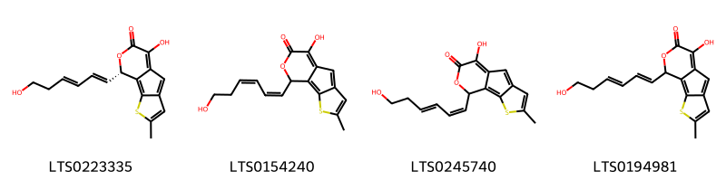{ width=100% }
    <figcaption>Hình ảnh cấu trúc hóa học của 4 hoạt chất thuộc nhóm Pyrans gồm ['(12s)-9-hydroxy-12-[(1e,3e)-6-hydroxyhexa-1,3-dien-1-yl]-4-methyl-11-oxa-3-thiatricyclo[6.4.0.0²,⁶]dodeca-1,4,6,8-tetraen-10-one (LTS0223335)', '9-hydroxy-12-[(1z,3z)-6-hydroxyhexa-1,3-dien-1-yl]-4-methyl-11-oxa-3-thiatricyclo[6.4.0.0²,⁶]dodeca-1,4,6,8-tetraen-10-one (LTS0154240)', '9-hydroxy-12-[(1z,3e)-6-hydroxyhexa-1,3-dien-1-yl]-4-methyl-11-oxa-3-thiatricyclo[6.4.0.0²,⁶]dodeca-1,4,6,8-tetraen-10-one (LTS0245740)', '9-hydroxy-12-(6-hydroxyhexa-1,3-dien-1-yl)-4-methyl-11-oxa-3-thiatricyclo[6.4.0.0²,⁶]dodeca-1,4,6,8-tetraen-10-one (LTS0194981)'].</figcaption>
</figure>
#### Nhóm Pyrrolidines
<figure markdown="span">
    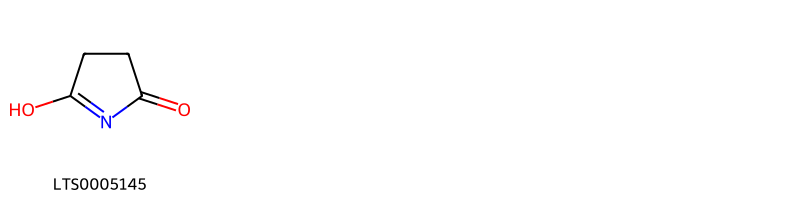{ width=100% }
    <figcaption>Hình ảnh cấu trúc hóa học của 1 hoạt chất thuộc nhóm Pyrrolidines gồm ['succinimide (LTS0005145)'].</figcaption>
</figure>
#### Nhóm Steroids and steroid derivatives
<figure markdown="span">
    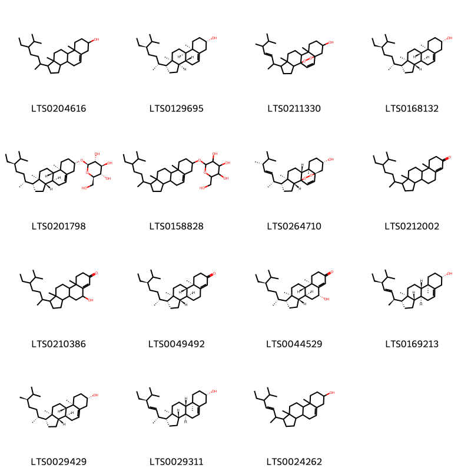{ width=100% }
    <figcaption>Hình ảnh cấu trúc hóa học của 15 hoạt chất thuộc nhóm Steroids and steroid derivatives gồm ['stigmast-5-en-3-ol, (3β)- (LTS0204616)', '(1r,3ar,3br,7s,9ar,9br,11ar)-1-[(2r,5r)-5-ethyl-6-methylheptan-2-yl]-9a,11a-dimethyl-1h,2h,3h,3ah,3bh,4h,6h,7h,8h,9h,9bh,10h,11h-cyclopenta[a]phenanthren-7-ol (LTS0129695)', '5-(5,6-dimethylhept-3-en-2-yl)-6,10-dimethyl-16,17-dioxapentacyclo[13.2.2.0¹,⁹.0²,⁶.0¹⁰,¹⁵]nonadec-18-en-13-ol (LTS0211330)', 'sitosterol (LTS0168132)', 'sitogluside (LTS0201798)', '2-{[1-(5-ethyl-6-methylheptan-2-yl)-9a,11a-dimethyl-1h,2h,3h,3ah,3bh,4h,6h,7h,8h,9h,9bh,10h,11h-cyclopenta[a]phenanthren-7-yl]oxy}-6-(hydroxymethyl)oxane-3,4,5-triol (LTS0158828)', 'ergosterol peroxide (LTS0264710)', '1-(5-ethyl-6-methylheptan-2-yl)-9a,11a-dimethyl-1h,2h,3h,3ah,3bh,4h,5h,8h,9h,9bh,10h,11h-cyclopenta[a]phenanthren-7-one (LTS0212002)', '1-(5-ethyl-6-methylheptan-2-yl)-5-hydroxy-9a,11a-dimethyl-1h,2h,3h,3ah,3bh,4h,5h,8h,9h,9bh,10h,11h-cyclopenta[a]phenanthren-7-one (LTS0210386)', 'β-sitostenone (LTS0049492)', '(1r,3as,3bs,5r,9ar,9bs,11ar)-1-[(2r,5r)-5-ethyl-6-methylheptan-2-yl]-5-hydroxy-9a,11a-dimethyl-1h,2h,3h,3ah,3bh,4h,5h,8h,9h,9bh,10h,11h-cyclopenta[a]phenanthren-7-one (LTS0044529)', '(1r,3as,3bs,7s,9ar,9bs,11ar)-1-[(2s,3e,5s)-5-ethyl-6-methylhept-3-en-2-yl]-9a,11a-dimethyl-1h,2h,3h,3ah,3bh,4h,6h,7h,8h,9h,9bh,10h,11h-cyclopenta[a]phenanthren-7-ol (LTS0169213)', 'campesterol (LTS0029429)', 'phytosterol (LTS0029311)', 'stigmasterol (LTS0024262)'].</figcaption>
</figure>
#### Nhóm Thiazines
<figure markdown="span">
    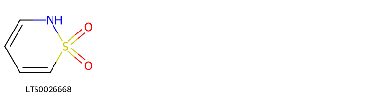{ width=100% }
    <figcaption>Hình ảnh cấu trúc hóa học của 1 hoạt chất thuộc nhóm Thiazines gồm ['2h-1λ⁶,2-thiazine-1,1-dione (LTS0026668)'].</figcaption>
</figure>
#### Nhóm Trioxanes
<figure markdown="span">
    { width=100% }
    <figcaption>Hình ảnh cấu trúc hóa học của 5 hoạt chất thuộc nhóm Trioxanes gồm ['(4r,8r)-2,12-dimethyl-7-methylidene-6-oxo-5,11,13,14-tetraoxatetracyclo[10.2.2.0¹,¹⁰.0⁴,⁸]hexadecan-15-yl acetate (LTS0082359)', '2,12-dimethyl-7-methylidene-6-oxo-5,11,13,14-tetraoxatetracyclo[10.2.2.0¹,¹⁰.0⁴,⁸]hexadecan-15-yl acetate (LTS0192450)', '(1r,2s,4r,8r,10s,12r,15s)-2,12-dimethyl-7-methylidene-6-oxo-5,11,13,14-tetraoxatetracyclo[10.2.2.0¹,¹⁰.0⁴,⁸]hexadecan-15-yl acetate (LTS0025046)', '2,12-dimethyl-7-methylidene-5,11,13,14-tetraoxatetracyclo[10.2.2.0¹,¹⁰.0⁴,⁸]hexadec-15-en-6-one (LTS0178258)', '(1s,2s,4s,8r,10r,12r)-2,12-dimethyl-7-methylidene-5,11,13,14-tetraoxatetracyclo[10.2.2.0¹,¹⁰.0⁴,⁸]hexadec-15-en-6-one (LTS0003442)'].</figcaption>
</figure>
#### Nhóm Unsaturated hydrocarbons
<figure markdown="span">
    { width=100% }
    <figcaption>Hình ảnh cấu trúc hóa học của 1 hoạt chất thuộc nhóm Unsaturated hydrocarbons gồm ['tridec-1-en-3,5,7,9,11-pentayne (LTS0085389)'].</figcaption>
</figure>

---

### Dược dân tộc học

Danh sách các quốc gia có sử dụng *Xanthium strumarium* trong điều trị các bệnh. 

| Country            | Disease                                                                                                                                                                              | Bệnh                                                                                                                                                                                                |
|:-------------------|:-------------------------------------------------------------------------------------------------------------------------------------------------------------------------------------|:----------------------------------------------------------------------------------------------------------------------------------------------------------------------------------------------------|
| China              | Diuretic, Diuretic, Diuretic, Diuretic, Laxative, Poison, Sedative, Tonic, Tonic, Sedative, Astringent, Hemostat, Poison, Sedative, Tonic                                            | MYMEMORY WARNING: YOU USED ALL AVAILABLE FREE TRANSLATIONS FOR TODAY. NEXT AVAILABLE IN  12 HOURS 37 MINUTES 19 SECONDS VISIT HTTPS://MYMEMORY.TRANSLATED.NET/DOC/USAGELIMITS.PHP TO TRANSLATE MORE |
| Dominican Republic | Astringent                                                                                                                                                                           | MYMEMORY WARNING: YOU USED ALL AVAILABLE FREE TRANSLATIONS FOR TODAY. NEXT AVAILABLE IN  12 HOURS 37 MINUTES 17 SECONDS VISIT HTTPS://MYMEMORY.TRANSLATED.NET/DOC/USAGELIMITS.PHP TO TRANSLATE MORE |
| Elsewhere          | Astringent, Diaphoretic, Diuretic, Emollient, Fungicide, Fungicide, Sedative, Styptic, Diaphoretic, nan, Poison, Sedative, nan, Demulcent, Diaphoretic, Diuretic, Emollient, Styptic | MYMEMORY WARNING: YOU USED ALL AVAILABLE FREE TRANSLATIONS FOR TODAY. NEXT AVAILABLE IN  12 HOURS 37 MINUTES 13 SECONDS VISIT HTTPS://MYMEMORY.TRANSLATED.NET/DOC/USAGELIMITS.PHP TO TRANSLATE MORE |
| India              | Demulcent, Diaphoretic, Poison, Sedative, Sialogogue, Sudorific                                                                                                                      | MYMEMORY WARNING: YOU USED ALL AVAILABLE FREE TRANSLATIONS FOR TODAY. NEXT AVAILABLE IN  12 HOURS 37 MINUTES 08 SECONDS VISIT HTTPS://MYMEMORY.TRANSLATED.NET/DOC/USAGELIMITS.PHP TO TRANSLATE MORE |
| Iraq               | Styptic                                                                                                                                                                              | MYMEMORY WARNING: YOU USED ALL AVAILABLE FREE TRANSLATIONS FOR TODAY. NEXT AVAILABLE IN  12 HOURS 37 MINUTES 05 SECONDS VISIT HTTPS://MYMEMORY.TRANSLATED.NET/DOC/USAGELIMITS.PHP TO TRANSLATE MORE |
| Turkey             | Demulcent, Diuretic, Sedative, Sudorific, Sialogogue, Refrigerant                                                                                                                    | MYMEMORY WARNING: YOU USED ALL AVAILABLE FREE TRANSLATIONS FOR TODAY. NEXT AVAILABLE IN  12 HOURS 37 MINUTES 02 SECONDS VISIT HTTPS://MYMEMORY.TRANSLATED.NET/DOC/USAGELIMITS.PHP TO TRANSLATE MORE |

---

---
## Xanthium strumonium
### Thông tin về thực vật

!!! info "Phân loại thực vật của *Xanthium strumarium* từ GIBF:"
    - **Kingdom:** Plantae
    - **Phylum:** Tracheophyta
    - **Order:** Asterales
    - **Family:** Asteraceae
    - **Genus:** Xanthium
    - **Species:** *Xanthium strumarium*

 

| Label (VI)   | Label (EN)   | Scientific Name     | Descriptions (VI)   | Descriptions (EN)   | Also Known As (VI)                                                                          | Also Known As (EN)                                                                                                                                                                                 |
|:-------------|:-------------|:--------------------|:--------------------|:--------------------|:--------------------------------------------------------------------------------------------|:---------------------------------------------------------------------------------------------------------------------------------------------------------------------------------------------------|
| N/A          | N/A          | Xanthium strumarium |                     | species of plant    | ['Xanthium strumarium', 'Xanthium inaequilaterum', 'Xanthium iaequilaterium', 'Thương nhĩ'] | ['Canada cockleburr', 'chayote', 'cockle bur', 'common cocklebur', 'large cocklebur', 'rough cocklebur', 'rough cockleburr', 'spiny cockleburr', 'Xanthium pensylvanicum', 'cocklebur', 'kikania'] |

#### Phân bố trên thế giới

**Từ CSDL GIBF** nan, South Africa, Australia, Germany, Namibia, Brazil, Spain, Argentina, Botswana, India, Uruguay, Anguilla, United States of America, Mexico, China, Greece, Israel, Canada

#### Phân bố tại Việt Nam

**Từ CSDL GIBF**: Không có ghi nhận ở Việt Nam

---
### Thành phần hóa học
        
- Theo cơ sở dữ liệu lotus: Từ loài *Xanthium strumarium* đã phân lập và xác định được Chưa có hoạt chất nào được phân lập. hoạt chất thuộc về các nhóm Không có hoạt chất nào được phân lập. 

Không có hình ảnh nào được tạo ra

---

### Dược dân tộc học

Danh sách các quốc gia có sử dụng *Xanthium strumarium* trong điều trị các bệnh. 

| Country   | Disease   | Bệnh                                                                                                                                                                                                |
|:----------|:----------|:----------------------------------------------------------------------------------------------------------------------------------------------------------------------------------------------------|
| US        | Diuretic  | MYMEMORY WARNING: YOU USED ALL AVAILABLE FREE TRANSLATIONS FOR TODAY. NEXT AVAILABLE IN  12 HOURS 36 MINUTES 14 SECONDS VISIT HTTPS://MYMEMORY.TRANSLATED.NET/DOC/USAGELIMITS.PHP TO TRANSLATE MORE |

---

# Chi Taraxacum

??? note "Danh sách các dược liệu thuộc chi"
    
	 - *Taraxacum albidum*
	 - *Taraxacum japonicum*
	 - *Taraxacum laevigatum*
	 - *Taraxacum mongolicum*
	 - *Taraxacum officinale*

---
## Taraxacum albidum
### Thông tin về thực vật

!!! info "Phân loại thực vật của *Taraxacum albidum* từ GIBF:"
    - **Kingdom:** Plantae
    - **Phylum:** Tracheophyta
    - **Order:** Asterales
    - **Family:** Asteraceae
    - **Genus:** Taraxacum
    - **Species:** *Taraxacum albidum*

 

| Label (VI)   | Label (EN)   | Scientific Name   | Descriptions (VI)   | Descriptions (EN)   | Also Known As (VI)   | Also Known As (EN)   |
|:-------------|:-------------|:------------------|:--------------------|:--------------------|:---------------------|:---------------------|
| N/A          | N/A          | Taraxacum albidum | loài thực vật       | species of plant    | ['']                 | ['']                 |

#### Phân bố trên thế giới

**Từ CSDL GIBF** nan, Czechia, Japan, Korea, Republic of, Norway

#### Phân bố tại Việt Nam

**Từ CSDL GIBF**: Không có ghi nhận ở Việt Nam

---
### Thành phần hóa học
        
- Theo cơ sở dữ liệu lotus: Từ loài *Taraxacum albidum* đã phân lập và xác định được Chưa có hoạt chất nào được phân lập. hoạt chất thuộc về các nhóm Không có hoạt chất nào được phân lập. 

Không có hình ảnh nào được tạo ra

---

### Dược dân tộc học

Danh sách các quốc gia có sử dụng *Taraxacum albidum* trong điều trị các bệnh. 

| Country   | Disease                            | Bệnh                                                                                                                                                                                                |
|:----------|:-----------------------------------|:----------------------------------------------------------------------------------------------------------------------------------------------------------------------------------------------------|
| Elsewhere | Stomachic                          | MYMEMORY WARNING: YOU USED ALL AVAILABLE FREE TRANSLATIONS FOR TODAY. NEXT AVAILABLE IN  12 HOURS 35 MINUTES 48 SECONDS VISIT HTTPS://MYMEMORY.TRANSLATED.NET/DOC/USAGELIMITS.PHP TO TRANSLATE MORE |
| Japan     | Diaphoretic, nan, Stomachic, Tonic | MYMEMORY WARNING: YOU USED ALL AVAILABLE FREE TRANSLATIONS FOR TODAY. NEXT AVAILABLE IN  12 HOURS 35 MINUTES 45 SECONDS VISIT HTTPS://MYMEMORY.TRANSLATED.NET/DOC/USAGELIMITS.PHP TO TRANSLATE MORE |

---

---
## Taraxacum japonicum
### Thông tin về thực vật

!!! info "Phân loại thực vật của *Taraxacum japonicum* từ GIBF:"
    - **Kingdom:** Plantae
    - **Phylum:** Tracheophyta
    - **Order:** Asterales
    - **Family:** Asteraceae
    - **Genus:** Taraxacum
    - **Species:** *Taraxacum japonicum*

 

| Label (VI)   | Label (EN)   | Scientific Name     | Descriptions (VI)   | Descriptions (EN)   | Also Known As (VI)   | Also Known As (EN)   |
|:-------------|:-------------|:--------------------|:--------------------|:--------------------|:---------------------|:---------------------|
| N/A          | N/A          | Taraxacum japonicum | loài thực vật       | species of plant    | ['']                 | ['']                 |

#### Phân bố trên thế giới

**Từ CSDL GIBF** nan, India, unknown or invalid, Japan

#### Phân bố tại Việt Nam

**Từ CSDL GIBF**: Không có ghi nhận ở Việt Nam

---
### Thành phần hóa học
        
- Theo cơ sở dữ liệu lotus: Từ loài *Taraxacum japonicum* đã phân lập và xác định được 35 hoạt chất thuộc về các nhóm Prenol lipids. 

|    | chemicalTaxonomyClassyfireClass   |   smiles_count |
|---:|:----------------------------------|---------------:|
|  0 | Prenol lipids                     |             35 |

#### Nhóm Prenol lipids
<figure markdown="span">
    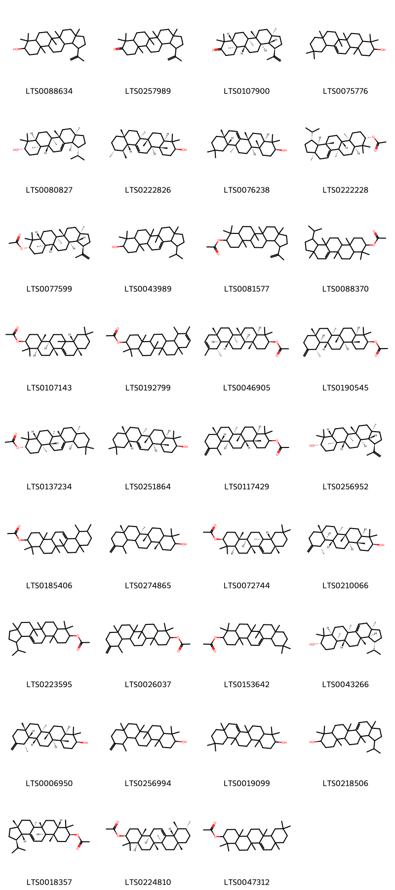{ width=100% }
    <figcaption>Hình ảnh cấu trúc hóa học của 35 hoạt chất thuộc nhóm Prenol lipids gồm ['lupeol (LTS0088634)', '3a,5a,5b,8,8,11a-hexamethyl-1-(prop-1-en-2-yl)-tetradecahydro-1h-cyclopenta[a]chrysen-9-one (LTS0257989)', 'lupenone (LTS0107900)', 'β-amyrin (LTS0075776)', '(1r,3ar,5as,5br,7as,9s,11ar,11br,13br)-1-isopropyl-3a,5a,5b,8,8,11a-hexamethyl-1h,2h,3h,4h,5h,6h,7h,7ah,9h,10h,11h,11bh,12h,13bh-cyclopenta[a]chrysen-9-ol (LTS0080827)', 'amyrin (LTS0222826)', 'alnulin (LTS0076238)', '(1r,3ar,5br,7as,9s,11ar,11br,13as,13br)-1-isopropyl-3a,5b,8,8,11a,13a-hexamethyl-1h,2h,3h,4h,6h,7h,7ah,9h,10h,11h,11bh,12h,13h,13bh-cyclopenta[a]chrysen-9-yl acetate (LTS0222228)', 'lupeol acetate (LTS0077599)', '1-isopropyl-3a,5a,5b,8,8,11a-hexamethyl-1h,2h,3h,4h,5h,6h,7h,7ah,9h,10h,11h,11bh,12h,13bh-cyclopenta[a]chrysen-9-ol (LTS0043989)', '3a,5a,5b,8,8,11a-hexamethyl-1-(prop-1-en-2-yl)-hexadecahydrocyclopenta[a]chrysen-9-yl acetate (LTS0081577)', '1-isopropyl-3a,5b,8,8,11a,13a-hexamethyl-1h,2h,3h,4h,6h,7h,7ah,9h,10h,11h,11bh,12h,13h,13bh-cyclopenta[a]chrysen-9-yl acetate (LTS0088370)', '(3s,4ar,6ar,8ar,12ar,14ar,14br)-4,4,6a,8a,11,11,12b,14b-octamethyl-1,2,3,4a,5,6,8,9,10,12,12a,13,14,14a-tetradecahydropicen-3-yl acetate (LTS0107143)', '4,4,6a,6b,8a,11,12,14b-octamethyl-2,3,4a,5,6,7,8,9,12,12a,12b,13,14,14a-tetradecahydro-1h-picen-3-yl acetate (LTS0192799)', '(3s,4ar,6ar,6br,8as,12s,12ar,12br,14ar,14br)-4,4,6a,6b,8a,11,12,14b-octamethyl-2,3,4a,5,6,7,8,9,12,12a,12b,13,14,14a-tetradecahydro-1h-picen-3-yl acetate (LTS0046905)', 'taraxasterol acetate (LTS0190545)', 'β-amyrin acetate (LTS0137234)', 'β-amyrin (LTS0251864)', '(4ar,6ar,6br,8ar,12as,12bs,14as,14br)-4,4,6a,6b,8a,12,14b-heptamethyl-11-methylidene-hexadecahydropicen-3-yl acetate (LTS0117429)', 'lupeol (LTS0256952)', '4,4,6a,6b,8a,11,12,14b-octamethyl-2,3,4a,5,6,7,8,9,10,11,12,12a,14,14a-tetradecahydro-1h-picen-3-yl acetate (LTS0185406)', '(6ar,6br,8ar,14br)-4,4,6a,6b,8a,12,14b-heptamethyl-11-methylidene-hexadecahydropicen-3-ol (LTS0274865)', '(3s,4ar,6ar,8ar,12ar,12bs,14ar,14br)-4,4,6a,8a,11,11,12b,14b-octamethyl-1,2,3,4a,5,6,8,9,10,12,12a,13,14,14a-tetradecahydropicen-3-yl acetate (LTS0072744)', 'taraxasterol (LTS0210066)', '1-isopropyl-3a,5a,5b,8,8,11a-hexamethyl-1h,2h,3h,4h,5h,6h,7h,7ah,9h,10h,11h,11bh,12h,13bh-cyclopenta[a]chrysen-9-yl acetate (LTS0223595)', '4,4,6a,6b,8a,12,14b-heptamethyl-11-methylidene-hexadecahydropicen-3-yl acetate (LTS0026037)', '4,4,6a,6b,8a,11,11,14b-octamethyl-1,2,3,4a,5,6,7,8,9,10,12,12a,14,14a-tetradecahydropicen-3-yl acetate (LTS0153642)', '(1r,3ar,5br,7as,9s,11ar,11br,13as,13br)-1-isopropyl-3a,5b,8,8,11a,13a-hexamethyl-1h,2h,3h,4h,6h,7h,7ah,9h,10h,11h,11bh,12h,13h,13bh-cyclopenta[a]chrysen-9-ol (LTS0043266)', 'taraxasterol (LTS0006950)', '4,4,6a,6b,8a,12,14b-heptamethyl-11-methylidene-hexadecahydropicen-3-ol (LTS0256994)', 'taraxerol (LTS0019099)', '1-isopropyl-3a,5b,8,8,11a,13a-hexamethyl-1h,2h,3h,4h,6h,7h,7ah,9h,10h,11h,11bh,12h,13h,13bh-cyclopenta[a]chrysen-9-ol (LTS0218506)', '(1r,3ar,5as,5br,7as,9s,11ar,11br,13br)-1-isopropyl-3a,5a,5b,8,8,11a-hexamethyl-1h,2h,3h,4h,5h,6h,7h,7ah,9h,10h,11h,11bh,12h,13bh-cyclopenta[a]chrysen-9-yl acetate (LTS0018357)', 'α-amyrin acetate (LTS0224810)', '4,4,6a,8a,11,11,12b,14b-octamethyl-1,2,3,4a,5,6,8,9,10,12,12a,13,14,14a-tetradecahydropicen-3-yl acetate (LTS0047312)'].</figcaption>
</figure>

---

### Dược dân tộc học

Danh sách các quốc gia có sử dụng *Taraxacum japonicum* trong điều trị các bệnh. 

| Country   | Disease   | Bệnh                                                                                                                                                                                                |
|:----------|:----------|:----------------------------------------------------------------------------------------------------------------------------------------------------------------------------------------------------|
| Elsewhere | Stomachic | MYMEMORY WARNING: YOU USED ALL AVAILABLE FREE TRANSLATIONS FOR TODAY. NEXT AVAILABLE IN  12 HOURS 35 MINUTES 18 SECONDS VISIT HTTPS://MYMEMORY.TRANSLATED.NET/DOC/USAGELIMITS.PHP TO TRANSLATE MORE |

---

---
## Taraxacum laevigatum
### Thông tin về thực vật

!!! info "Phân loại thực vật của *Taraxacum erythrospermum* từ GIBF:"
    - **Kingdom:** Plantae
    - **Phylum:** Tracheophyta
    - **Order:** Asterales
    - **Family:** Asteraceae
    - **Genus:** Taraxacum
    - **Species:** *Taraxacum erythrospermum*

 

| Label (VI)   | Label (EN)   | Scientific Name      | Descriptions (VI)   | Descriptions (EN)   | Also Known As (VI)   | Also Known As (EN)   |
|:-------------|:-------------|:---------------------|:--------------------|:--------------------|:---------------------|:---------------------|
| N/A          | N/A          | Taraxacum laevigatum | loài thực vật       | species of plant    | ['']                 | ['']                 |

#### Phân bố trên thế giới

**Từ CSDL GIBF** nan, Netherlands, Italy, Japan, Germany, Korea, Republic of, Spain, Poland, United States of America, Austria, France, United Kingdom of Great Britain and Northern Ireland

#### Phân bố tại Việt Nam

**Từ CSDL GIBF**: Không có ghi nhận ở Việt Nam

---
### Thành phần hóa học
        
- Theo cơ sở dữ liệu lotus: Từ loài *Taraxacum erythrospermum* đã phân lập và xác định được 19 hoạt chất thuộc về các nhóm Prenol lipids. 

|    | chemicalTaxonomyClassyfireClass   |   smiles_count |
|---:|:----------------------------------|---------------:|
|  0 | Prenol lipids                     |             19 |

#### Nhóm Prenol lipids
<figure markdown="span">
    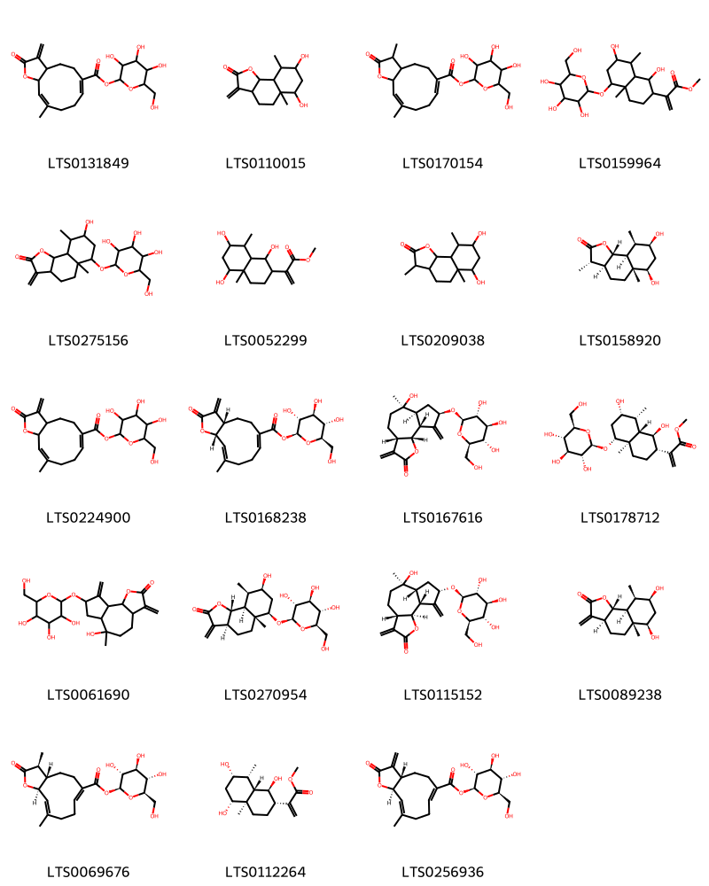{ width=100% }
    <figcaption>Hình ảnh cấu trúc hóa học của 19 hoạt chất thuộc nhóm Prenol lipids gồm ['3,4,5-trihydroxy-6-(hydroxymethyl)oxan-2-yl 10-methyl-3-methylidene-2-oxo-3ah,4h,5h,8h,9h,11ah-cyclodeca[b]furan-6-carboxylate (LTS0131849)', '6,8-dihydroxy-5a,9-dimethyl-3-methylidene-octahydro-3ah-naphtho[1,2-b]furan-2-one (LTS0110015)', '3,4,5-trihydroxy-6-(hydroxymethyl)oxan-2-yl 3,10-dimethyl-2-oxo-3h,3ah,4h,5h,8h,9h,11ah-cyclodeca[b]furan-6-carboxylate (LTS0170154)', 'methyl 2-(1,7-dihydroxy-4a,8-dimethyl-5-{[3,4,5-trihydroxy-6-(hydroxymethyl)oxan-2-yl]oxy}-octahydro-1h-naphthalen-2-yl)prop-2-enoate (LTS0159964)', '8-hydroxy-5a,9-dimethyl-3-methylidene-6-{[3,4,5-trihydroxy-6-(hydroxymethyl)oxan-2-yl]oxy}-octahydro-3ah-naphtho[1,2-b]furan-2-one (LTS0275156)', 'methyl 2-(1,5,7-trihydroxy-4a,8-dimethyl-octahydro-1h-naphthalen-2-yl)prop-2-enoate (LTS0052299)', '6,8-dihydroxy-3,5a,9-trimethyl-decahydronaphtho[1,2-b]furan-2-one (LTS0209038)', '(3s,3as,5ar,6r,8s,9r,9as,9bs)-6,8-dihydroxy-3,5a,9-trimethyl-decahydronaphtho[1,2-b]furan-2-one (LTS0158920)', '3,4,5-trihydroxy-6-(hydroxymethyl)oxan-2-yl 10-methyl-3-methylidene-2-oxo-3ah,4h,5h,8h,9h,11ah-cyclodeca[b]furan-6-carboxylate (LTS0224900)', '(2s,3r,4s,5s,6r)-3,4,5-trihydroxy-6-(hydroxymethyl)oxan-2-yl (3as,11as)-10-methyl-3-methylidene-2-oxo-3ah,4h,5h,8h,9h,11ah-cyclodeca[b]furan-6-carboxylate (LTS0168238)', '(3as,6r,6as,8r,9ar,9br)-6-hydroxy-6-methyl-3,9-dimethylidene-8-{[(2r,3r,4s,5s,6r)-3,4,5-trihydroxy-6-(hydroxymethyl)oxan-2-yl]oxy}-octahydroazuleno[4,5-b]furan-2-one (LTS0167616)', 'methyl 2-[(1s,2s,4ar,5r,7s,8r,8as)-1,7-dihydroxy-4a,8-dimethyl-5-{[(2r,3r,4s,5s,6r)-3,4,5-trihydroxy-6-(hydroxymethyl)oxan-2-yl]oxy}-octahydro-1h-naphthalen-2-yl]prop-2-enoate (LTS0178712)', '6-hydroxy-6-methyl-3,9-dimethylidene-8-{[3,4,5-trihydroxy-6-(hydroxymethyl)oxan-2-yl]oxy}-octahydroazuleno[4,5-b]furan-2-one (LTS0061690)', '(3as,5ar,6r,8s,9r,9as,9bs)-8-hydroxy-5a,9-dimethyl-3-methylidene-6-{[(2r,3r,4s,5s,6r)-3,4,5-trihydroxy-6-(hydroxymethyl)oxan-2-yl]oxy}-octahydro-3ah-naphtho[1,2-b]furan-2-one (LTS0270954)', '(3as,6r,6ar,8s,9ar,9bs)-6-hydroxy-6-methyl-3,9-dimethylidene-8-{[(2r,3r,4s,5s,6r)-3,4,5-trihydroxy-6-(hydroxymethyl)oxan-2-yl]oxy}-octahydroazuleno[4,5-b]furan-2-one (LTS0115152)', '(3as,5ar,6r,8s,9r,9as,9bs)-6,8-dihydroxy-5a,9-dimethyl-3-methylidene-octahydro-3ah-naphtho[1,2-b]furan-2-one (LTS0089238)', '(2s,3r,4s,5s,6r)-3,4,5-trihydroxy-6-(hydroxymethyl)oxan-2-yl (3s,3as,11as)-3,10-dimethyl-2-oxo-3h,3ah,4h,5h,8h,9h,11ah-cyclodeca[b]furan-6-carboxylate (LTS0069676)', 'methyl 2-[(1s,2s,4ar,5r,7s,8r,8as)-1,5,7-trihydroxy-4a,8-dimethyl-octahydro-1h-naphthalen-2-yl]prop-2-enoate (LTS0112264)', '(2s,3r,4s,5s,6r)-3,4,5-trihydroxy-6-(hydroxymethyl)oxan-2-yl (3as,11ar)-10-methyl-3-methylidene-2-oxo-3ah,4h,5h,8h,9h,11ah-cyclodeca[b]furan-6-carboxylate (LTS0256936)'].</figcaption>
</figure>

---

### Dược dân tộc học

Danh sách các quốc gia có sử dụng *Taraxacum erythrospermum* trong điều trị các bệnh. 

| Country   | Disease   | Bệnh                                                                                                                                                                                                |
|:----------|:----------|:----------------------------------------------------------------------------------------------------------------------------------------------------------------------------------------------------|
| Elsewhere | Stomachic | MYMEMORY WARNING: YOU USED ALL AVAILABLE FREE TRANSLATIONS FOR TODAY. NEXT AVAILABLE IN  12 HOURS 34 MINUTES 48 SECONDS VISIT HTTPS://MYMEMORY.TRANSLATED.NET/DOC/USAGELIMITS.PHP TO TRANSLATE MORE |

---

---
## Taraxacum mongolicum
### Thông tin về thực vật

!!! info "Phân loại thực vật của *Taraxacum mongolicum* từ GIBF:"
    - **Kingdom:** Plantae
    - **Phylum:** Tracheophyta
    - **Order:** Asterales
    - **Family:** Asteraceae
    - **Genus:** Taraxacum
    - **Species:** *Taraxacum mongolicum*

 

| Label (VI)   | Label (EN)   | Scientific Name      | Descriptions (VI)   | Descriptions (EN)   | Also Known As (VI)   | Also Known As (EN)   |
|:-------------|:-------------|:---------------------|:--------------------|:--------------------|:---------------------|:---------------------|
| N/A          | N/A          | Taraxacum mongolicum | loài thực vật       | species of plant    | ['']                 | ['']                 |

#### Phân bố trên thế giới

**Từ CSDL GIBF** nan, Hong Kong, Japan, Korea, Republic of, Russian Federation, Mongolia, China, Canada

#### Phân bố tại Việt Nam

**Từ CSDL GIBF**: Không có ghi nhận ở Việt Nam

---
### Thành phần hóa học
        
- Theo cơ sở dữ liệu lotus: Từ loài *Taraxacum mongolicum* đã phân lập và xác định được 78 hoạt chất thuộc về các nhóm Flavonoids, Indoles and derivatives, Steroids and steroid derivatives, Prenol lipids, Cinnamic acids and derivatives, Tetrapyrroles and derivatives, Benzene and substituted derivatives, Organooxygen compounds, Phenols, Coumarins and derivatives, Carboxylic acids and derivatives, Pyridines and derivatives. 

|    | chemicalTaxonomyClassyfireClass     |   smiles_count |
|---:|:------------------------------------|---------------:|
|  0 | Benzene and substituted derivatives |             10 |
|  1 | Carboxylic acids and derivatives    |              4 |
|  2 | Cinnamic acids and derivatives      |             10 |
|  3 | Coumarins and derivatives           |              1 |
|  4 | Flavonoids                          |              6 |
|  5 | Indoles and derivatives             |              9 |
|  6 | Organooxygen compounds              |              9 |
|  7 | Phenols                             |              6 |
|  8 | Prenol lipids                       |             10 |
|  9 | Pyridines and derivatives           |              1 |
| 10 | Steroids and steroid derivatives    |             11 |
| 11 | Tetrapyrroles and derivatives       |              1 |

#### Nhóm Benzene and substituted derivatives
<figure markdown="span">
    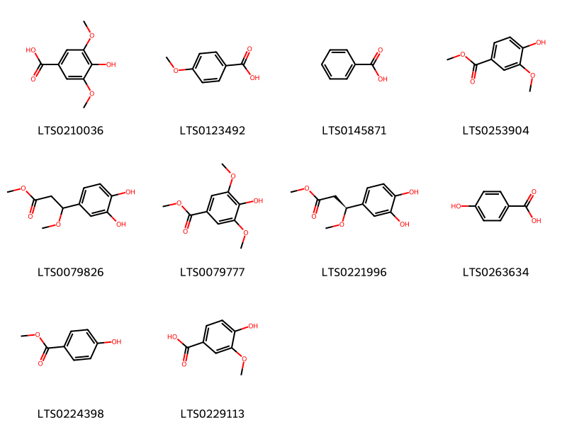{ width=100% }
    <figcaption>Hình ảnh cấu trúc hóa học của 10 hoạt chất thuộc nhóm Benzene and substituted derivatives gồm ['syringic acid (LTS0210036)', 'p-anisic acid (LTS0123492)', 'benzoic acid (LTS0145871)', 'vanillate (LTS0253904)', 'methyl 3-(3,4-dihydroxyphenyl)-3-methoxypropanoate (LTS0079826)', 'syringate (LTS0079777)', 'methyl (3s)-3-(3,4-dihydroxyphenyl)-3-methoxypropanoate (LTS0221996)', 'p-hydroxybenzoic acid (LTS0263634)', 'paraben (LTS0224398)', 'vanillic acid (LTS0229113)'].</figcaption>
</figure>
#### Nhóm Carboxylic acids and derivatives
<figure markdown="span">
    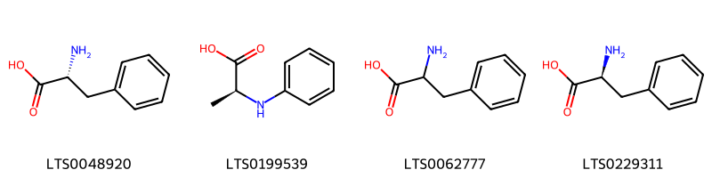{ width=100% }
    <figcaption>Hình ảnh cấu trúc hóa học của 4 hoạt chất thuộc nhóm Carboxylic acids and derivatives gồm ['d-phenylalanine (LTS0048920)', '(2s)-2-(phenylamino)propanoic acid (LTS0199539)', 'phenylalanin (LTS0062777)', 'l-phenylalanine (LTS0229311)'].</figcaption>
</figure>
#### Nhóm Cinnamic acids and derivatives
<figure markdown="span">
    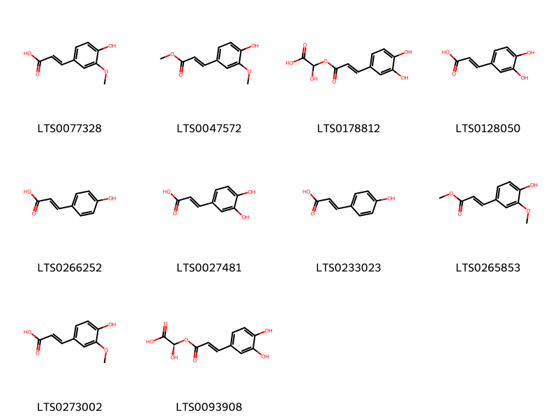{ width=100% }
    <figcaption>Hình ảnh cấu trúc hóa học của 10 hoạt chất thuộc nhóm Cinnamic acids and derivatives gồm ['ferulic acid (LTS0077328)', 'methyl ferulate (LTS0047572)', '{[3-(3,4-dihydroxyphenyl)prop-2-enoyl]oxy}(hydroxy)acetic acid (LTS0178812)', '3,4-dihydroxycinnamic acid (LTS0128050)', 'para-coumaric acid (LTS0266252)', 'caffeic acid (LTS0027481)', 'hydroxycinnamic acid (LTS0233023)', 'methyl ferulate (LTS0265853)', 'ferulic acid (LTS0273002)', '(r)-{[(2e)-3-(3,4-dihydroxyphenyl)prop-2-enoyl]oxy}(hydroxy)acetic acid (LTS0093908)'].</figcaption>
</figure>
#### Nhóm Coumarins and derivatives
<figure markdown="span">
    { width=100% }
    <figcaption>Hình ảnh cấu trúc hóa học của 1 hoạt chất thuộc nhóm Coumarins and derivatives gồm ['esculetin (LTS0067593)'].</figcaption>
</figure>
#### Nhóm Flavonoids
<figure markdown="span">
    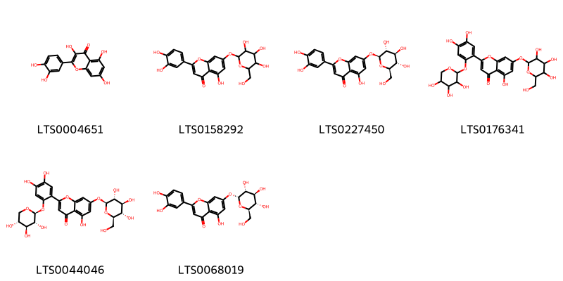{ width=100% }
    <figcaption>Hình ảnh cấu trúc hóa học của 6 hoạt chất thuộc nhóm Flavonoids gồm ['quercetin (LTS0004651)', '2-(3,4-dihydroxyphenyl)-5-hydroxy-7-{[3,4,5-trihydroxy-6-(hydroxymethyl)oxan-2-yl]oxy}chromen-4-one (LTS0158292)', 'luteolin 7-o-glucoside (LTS0227450)', '2-{4,5-dihydroxy-2-[(3,4,5-trihydroxyoxan-2-yl)oxy]phenyl}-5-hydroxy-7-{[3,4,5-trihydroxy-6-(hydroxymethyl)oxan-2-yl]oxy}chromen-4-one (LTS0176341)', '2-(4,5-dihydroxy-2-{[(2s,3r,4s,5r)-3,4,5-trihydroxyoxan-2-yl]oxy}phenyl)-5-hydroxy-7-{[(2s,3r,4s,5s,6r)-3,4,5-trihydroxy-6-(hydroxymethyl)oxan-2-yl]oxy}chromen-4-one (LTS0044046)', '2-(3,4-dihydroxyphenyl)-5-hydroxy-7-{[(2r,3r,4s,5s,6r)-3,4,5-trihydroxy-6-(hydroxymethyl)oxan-2-yl]oxy}chromen-4-one (LTS0068019)'].</figcaption>
</figure>
#### Nhóm Indoles and derivatives
<figure markdown="span">
    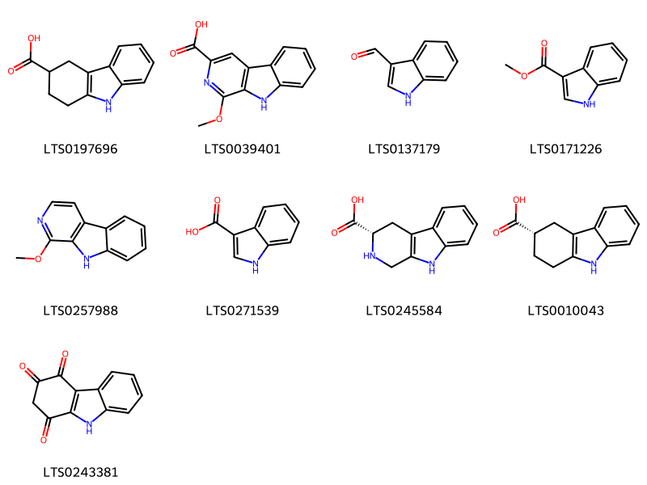{ width=100% }
    <figcaption>Hình ảnh cấu trúc hóa học của 9 hoạt chất thuộc nhóm Indoles and derivatives gồm ['2,3,4,9-tetrahydro-1h-carbazole-3-carboxylic acid (LTS0197696)', '1-methoxy-9h-pyrido[3,4-b]indole-3-carboxylic acid (LTS0039401)', 'indole-3-carboxaldehyde (LTS0137179)', 'methyl indole-3-carboxylate (LTS0171226)', '1-methoxy-9h-pyrido[3,4-b]indole (LTS0257988)', 'indole - 3 carboxylic acid (LTS0271539)', 'cyclomethyltryptophan (LTS0245584)', '(3s)-2,3,4,9-tetrahydro-1h-carbazole-3-carboxylic acid (LTS0010043)', '2,9-dihydrocarbazole-1,3,4-trione (LTS0243381)'].</figcaption>
</figure>
#### Nhóm Organooxygen compounds
<figure markdown="span">
    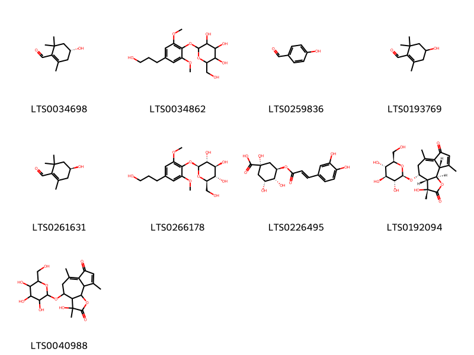{ width=100% }
    <figcaption>Hình ảnh cấu trúc hóa học của 9 hoạt chất thuộc nhóm Organooxygen compounds gồm ['hydroxy-β-cyclocitral (LTS0034698)', '2-(hydroxymethyl)-6-[4-(3-hydroxypropyl)-2,6-dimethoxyphenoxy]oxane-3,4,5-triol (LTS0034862)', 'p-hydroxybenzaldehyde (LTS0259836)', '4-hydroxy-2,6,6-trimethylcyclohex-1-ene-1-carbaldehyde (LTS0193769)', '(4s)-4-hydroxy-2,6,6-trimethylcyclohex-1-ene-1-carbaldehyde (LTS0261631)', '(2r,3s,4s,5r,6s)-2-(hydroxymethyl)-6-[4-(3-hydroxypropyl)-2,6-dimethoxyphenoxy]oxane-3,4,5-triol (LTS0266178)', 'chlorogenic acid (LTS0226495)', '(3r,3ar,4r,9as,9br)-3-hydroxy-3,6,9-trimethyl-4-{[(2r,3r,4s,5s,6r)-3,4,5-trihydroxy-6-(hydroxymethyl)oxan-2-yl]oxy}-3ah,4h,5h,9ah,9bh-azuleno[4,5-b]furan-2,7-dione (LTS0192094)', '3-hydroxy-3,6,9-trimethyl-4-{[3,4,5-trihydroxy-6-(hydroxymethyl)oxan-2-yl]oxy}-3ah,4h,5h,9ah,9bh-azuleno[4,5-b]furan-2,7-dione (LTS0040988)'].</figcaption>
</figure>
#### Nhóm Phenols
<figure markdown="span">
    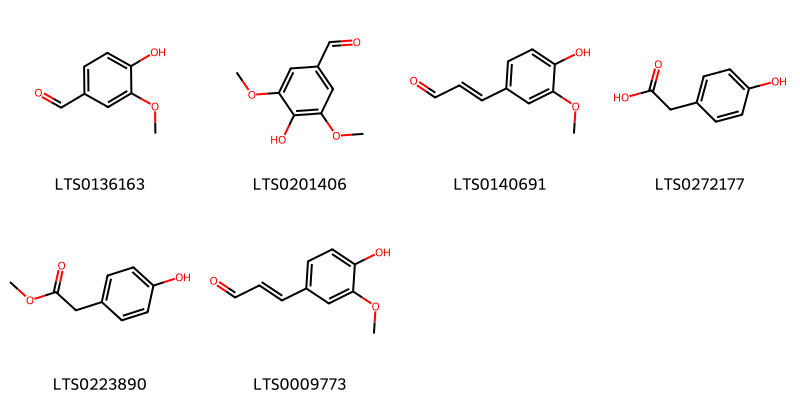{ width=100% }
    <figcaption>Hình ảnh cấu trúc hóa học của 6 hoạt chất thuộc nhóm Phenols gồm ['vanillin (LTS0136163)', 'syringaldehyde (LTS0201406)', 'coniferyl aldehyde (LTS0140691)', '4-hydroxyphenylacetic acid (LTS0272177)', 'methyl 2-(4-hydroxyphenyl)acetate (LTS0223890)', 'coniferaldehyde (LTS0009773)'].</figcaption>
</figure>
#### Nhóm Prenol lipids
<figure markdown="span">
    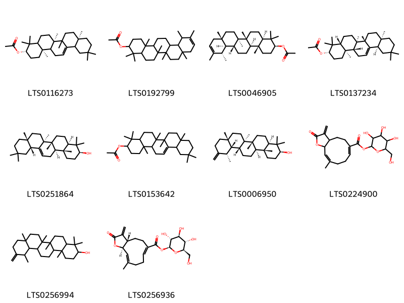{ width=100% }
    <figcaption>Hình ảnh cấu trúc hóa học của 10 hoạt chất thuộc nhóm Prenol lipids gồm ['(3s,6ar,8ar,14br)-4,4,6a,6b,8a,11,11,14b-octamethyl-1,2,3,4a,5,6,7,8,9,10,12,12a,14,14a-tetradecahydropicen-3-yl acetate (LTS0116273)', '4,4,6a,6b,8a,11,12,14b-octamethyl-2,3,4a,5,6,7,8,9,12,12a,12b,13,14,14a-tetradecahydro-1h-picen-3-yl acetate (LTS0192799)', '(3s,4ar,6ar,6br,8as,12s,12ar,12br,14ar,14br)-4,4,6a,6b,8a,11,12,14b-octamethyl-2,3,4a,5,6,7,8,9,12,12a,12b,13,14,14a-tetradecahydro-1h-picen-3-yl acetate (LTS0046905)', 'β-amyrin acetate (LTS0137234)', 'β-amyrin (LTS0251864)', '4,4,6a,6b,8a,11,11,14b-octamethyl-1,2,3,4a,5,6,7,8,9,10,12,12a,14,14a-tetradecahydropicen-3-yl acetate (LTS0153642)', 'taraxasterol (LTS0006950)', '3,4,5-trihydroxy-6-(hydroxymethyl)oxan-2-yl 10-methyl-3-methylidene-2-oxo-3ah,4h,5h,8h,9h,11ah-cyclodeca[b]furan-6-carboxylate (LTS0224900)', '4,4,6a,6b,8a,12,14b-heptamethyl-11-methylidene-hexadecahydropicen-3-ol (LTS0256994)', '(2s,3r,4s,5s,6r)-3,4,5-trihydroxy-6-(hydroxymethyl)oxan-2-yl (3as,11ar)-10-methyl-3-methylidene-2-oxo-3ah,4h,5h,8h,9h,11ah-cyclodeca[b]furan-6-carboxylate (LTS0256936)'].</figcaption>
</figure>
#### Nhóm Pyridines and derivatives
<figure markdown="span">
    { width=100% }
    <figcaption>Hình ảnh cấu trúc hóa học của 1 hoạt chất thuộc nhóm Pyridines and derivatives gồm ['vitamin b>3< (LTS0028908)'].</figcaption>
</figure>
#### Nhóm Steroids and steroid derivatives
<figure markdown="span">
    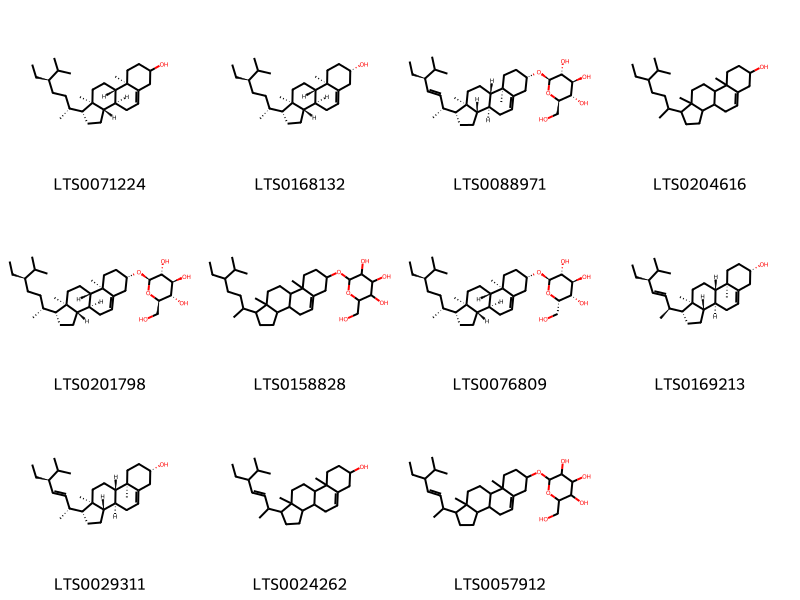{ width=100% }
    <figcaption>Hình ảnh cấu trúc hóa học của 11 hoạt chất thuộc nhóm Steroids and steroid derivatives gồm ['stigmast-5-en-3-ol (LTS0071224)', 'sitosterol (LTS0168132)', '(2r,3r,4s,5s,6r)-2-{[(1r,3as,3bs,7s,9ar,9bs,11ar)-1-[(2r,3e,5s)-5-ethyl-6-methylhept-3-en-2-yl]-9a,11a-dimethyl-1h,2h,3h,3ah,3bh,4h,6h,7h,8h,9h,9bh,10h,11h-cyclopenta[a]phenanthren-7-yl]oxy}-6-(hydroxymethyl)oxane-3,4,5-triol (LTS0088971)', 'stigmast-5-en-3-ol, (3β)- (LTS0204616)', 'sitogluside (LTS0201798)', '2-{[1-(5-ethyl-6-methylheptan-2-yl)-9a,11a-dimethyl-1h,2h,3h,3ah,3bh,4h,6h,7h,8h,9h,9bh,10h,11h-cyclopenta[a]phenanthren-7-yl]oxy}-6-(hydroxymethyl)oxane-3,4,5-triol (LTS0158828)', '(2r,3r,4s,5s,6s)-2-{[(1r,3as,3bs,7s,9ar,9bs,11ar)-1-[(2r,5r)-5-ethyl-6-methylheptan-2-yl]-9a,11a-dimethyl-1h,2h,3h,3ah,3bh,4h,6h,7h,8h,9h,9bh,10h,11h-cyclopenta[a]phenanthren-7-yl]oxy}-6-(hydroxymethyl)oxane-3,4,5-triol (LTS0076809)', '(1r,3as,3bs,7s,9ar,9bs,11ar)-1-[(2s,3e,5s)-5-ethyl-6-methylhept-3-en-2-yl]-9a,11a-dimethyl-1h,2h,3h,3ah,3bh,4h,6h,7h,8h,9h,9bh,10h,11h-cyclopenta[a]phenanthren-7-ol (LTS0169213)', 'phytosterol (LTS0029311)', 'stigmasterol (LTS0024262)', '2-{[1-(5-ethyl-6-methylhept-3-en-2-yl)-9a,11a-dimethyl-1h,2h,3h,3ah,3bh,4h,6h,7h,8h,9h,9bh,10h,11h-cyclopenta[a]phenanthren-7-yl]oxy}-6-(hydroxymethyl)oxane-3,4,5-triol (LTS0057912)'].</figcaption>
</figure>
#### Nhóm Tetrapyrroles and derivatives
<figure markdown="span">
    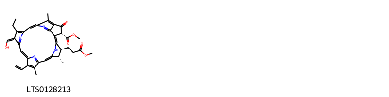{ width=100% }
    <figcaption>Hình ảnh cấu trúc hóa học của 1 hoạt chất thuộc nhóm Tetrapyrroles and derivatives gồm ['methyl (3r,21s,22s)-16-ethenyl-11-ethyl-12-(hydroxymethylidene)-22-(3-methoxy-3-oxopropyl)-17,21,26-trimethyl-4-oxo-7,23,24,25-tetraazahexacyclo[18.2.1.1⁵,⁸.1¹⁰,¹³.1¹⁵,¹⁸.0²,⁶]hexacosa-1,5(26),6,8,10,13(25),14,16,18(24),19-decaene-3-carboxylate (LTS0128213)'].</figcaption>
</figure>

---

### Dược dân tộc học

Danh sách các quốc gia có sử dụng *Taraxacum mongolicum* trong điều trị các bệnh. 

| Country   | Disease                | Bệnh                                                                                                                                                                                                |
|:----------|:-----------------------|:----------------------------------------------------------------------------------------------------------------------------------------------------------------------------------------------------|
| China     | Detoxicant, Detoxicant | MYMEMORY WARNING: YOU USED ALL AVAILABLE FREE TRANSLATIONS FOR TODAY. NEXT AVAILABLE IN  12 HOURS 34 MINUTES 20 SECONDS VISIT HTTPS://MYMEMORY.TRANSLATED.NET/DOC/USAGELIMITS.PHP TO TRANSLATE MORE |

---

---
## Taraxacum officinale
### Thông tin về thực vật

!!! info "Phân loại thực vật của *Taraxacum officinale* từ GIBF:"
    - **Kingdom:** Plantae
    - **Phylum:** Tracheophyta
    - **Order:** Asterales
    - **Family:** Asteraceae
    - **Genus:** Taraxacum
    - **Species:** *Taraxacum officinale*

 

| Label (VI)   | Label (EN)   | Scientific Name      | Descriptions (VI)          | Descriptions (EN)   | Also Known As (VI)   | Also Known As (EN)                    |
|:-------------|:-------------|:---------------------|:---------------------------|:--------------------|:---------------------|:--------------------------------------|
| N/A          | N/A          | Taraxacum officinale | trang định hướng Wikimedia | plant species       | ['']                 | ['dandelion', 'Taraxacum officinale'] |

#### Phân bố trên thế giới

**Từ CSDL GIBF** Italy, Australia, Argentina, Canada, South Georgia and the South Sandwich Islands, Netherlands, Chinese Taipei, Spain, Hungary, Portugal, Türkiye, Russian Federation, United States of America, South Africa, Germany, Brazil, Isle of Man, Mexico, France, United Kingdom of Great Britain and Northern Ireland, Ecuador, Colombia, Ireland, New Zealand

#### Phân bố tại Việt Nam

**Từ CSDL GIBF**: Không có ghi nhận ở Việt Nam

---
### Thành phần hóa học
        
- Theo cơ sở dữ liệu lotus: Từ loài *Taraxacum officinale* đã phân lập và xác định được 110 hoạt chất thuộc về các nhóm Fatty Acyls, Flavonoids, Prenol lipids, Steroids and steroid derivatives, Isoflavonoids, Cinnamic acids and derivatives, Benzene and substituted derivatives, Cycloheptafurans, Organooxygen compounds, Coumarins and derivatives, Carboxylic acids and derivatives. 

|    | chemicalTaxonomyClassyfireClass     |   smiles_count |
|---:|:------------------------------------|---------------:|
|  0 | Benzene and substituted derivatives |              2 |
|  1 | Carboxylic acids and derivatives    |              3 |
|  2 | Cinnamic acids and derivatives      |              3 |
|  3 | Coumarins and derivatives           |              2 |
|  4 | Cycloheptafurans                    |              1 |
|  5 | Fatty Acyls                         |             32 |
|  6 | Flavonoids                          |              7 |
|  7 | Isoflavonoids                       |              1 |
|  8 | Organooxygen compounds              |             14 |
|  9 | Prenol lipids                       |             34 |
| 10 | Steroids and steroid derivatives    |              9 |

#### Nhóm Benzene and substituted derivatives
<figure markdown="span">
    { width=100% }
    <figcaption>Hình ảnh cấu trúc hóa học của 2 hoạt chất thuộc nhóm Benzene and substituted derivatives gồm ['galop (LTS0222857)', '3,4-dihydroxybenzoic acid (LTS0018765)'].</figcaption>
</figure>
#### Nhóm Carboxylic acids and derivatives
<figure markdown="span">
    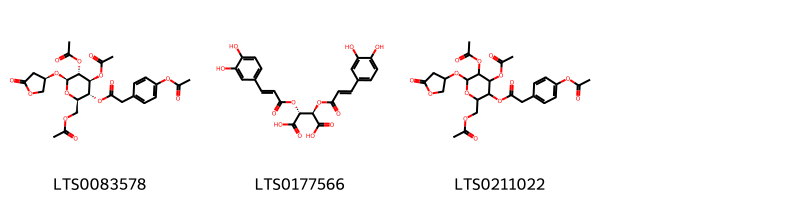{ width=100% }
    <figcaption>Hình ảnh cấu trúc hóa học của 3 hoạt chất thuộc nhóm Carboxylic acids and derivatives gồm ['[(2r,3r,4s,5r,6r)-4,5-bis(acetyloxy)-3-({2-[4-(acetyloxy)phenyl]acetyl}oxy)-6-{[(3r)-5-oxooxolan-3-yl]oxy}oxan-2-yl]methyl acetate (LTS0083578)', 'cichoric acid (LTS0177566)', '[4,5-bis(acetyloxy)-3-({2-[4-(acetyloxy)phenyl]acetyl}oxy)-6-[(5-oxooxolan-3-yl)oxy]oxan-2-yl]methyl acetate (LTS0211022)'].</figcaption>
</figure>
#### Nhóm Cinnamic acids and derivatives
<figure markdown="span">
    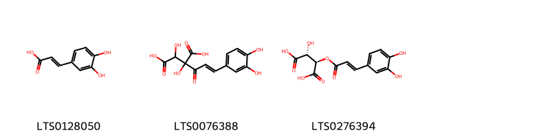{ width=100% }
    <figcaption>Hình ảnh cấu trúc hóa học của 3 hoạt chất thuộc nhóm Cinnamic acids and derivatives gồm ['3,4-dihydroxycinnamic acid (LTS0128050)', '2-[(2e)-3-(3,4-dihydroxyphenyl)prop-2-enoyl]-2,3-dihydroxybutanedioic acid (LTS0076388)', 'caftaric acid (LTS0276394)'].</figcaption>
</figure>
#### Nhóm Coumarins and derivatives
<figure markdown="span">
    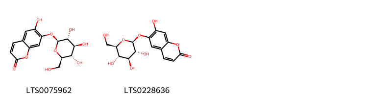{ width=100% }
    <figcaption>Hình ảnh cấu trúc hóa học của 2 hoạt chất thuộc nhóm Coumarins and derivatives gồm ['cichoriin (LTS0075962)', 'esculin (LTS0228636)'].</figcaption>
</figure>
#### Nhóm Cycloheptafurans
<figure markdown="span">
    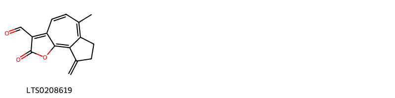{ width=100% }
    <figcaption>Hình ảnh cấu trúc hóa học của 1 hoạt chất thuộc nhóm Cycloheptafurans gồm ['6-methyl-9-methylidene-2-oxo-7h,8h-azuleno[4,5-b]furan-3-carbaldehyde (LTS0208619)'].</figcaption>
</figure>
#### Nhóm Fatty Acyls
<figure markdown="span">
    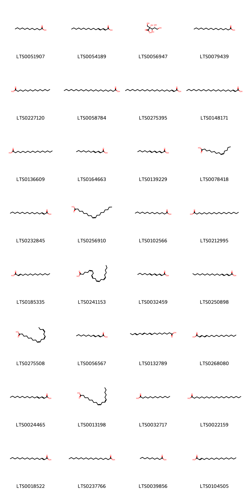{ width=100% }
    <figcaption>Hình ảnh cấu trúc hóa học của 32 hoạt chất thuộc nhóm Fatty Acyls gồm ['lauric acid (LTS0051907)', '(2e,4e)-hexadeca-2,4-dienoic acid (LTS0054189)', '2-carboxy-d-arabinitol (LTS0056947)', 'palmitic acid (LTS0079439)', 'pentadecanoic acid (LTS0227120)', 'behenic acid (LTS0058784)', '(2e)-docos-2-enoic acid (LTS0275395)', 'docos-2-enoic acid (LTS0148171)', 'heptadecanoic acid (LTS0136609)', 'dodeca-2,4-dienoic acid (LTS0164663)', '(2e,4e,6e)-dodeca-2,4,6-trienoic acid (LTS0139229)', 'myristoleic acid (LTS0078418)', 'hexadecenoic acid (LTS0232845)', 'oleic acid (LTS0256910)', 'myristic acid (LTS0102566)', 'nonadecanoic acid (LTS0212995)', 'pentadec-2-enoic acid (LTS0185335)', 'arachidonic acid (LTS0241153)', 'dodeca-2,4,6-trienoic acid (LTS0032459)', '(2e,4e)-heptadeca-2,4-dienoic acid (LTS0250898)', 'α-linolenic acid (LTS0275508)', '(2e,4e)-dodeca-2,4-dienoic acid (LTS0056567)', 'α linolenic acid (LTS0132789)', 'heptadeca-2,4-dienoic acid (LTS0268080)', 'hexadeca-2,4-dienoic acid (LTS0024465)', 'linoleic (LTS0013198)', 'n-tridecanoic acid (LTS0032717)', 'heneicosanoic acid (LTS0022159)', 't-2-hexadecenoic acid (LTS0018522)', 'stearic acid (LTS0237766)', 'capric acid (LTS0039856)', 'heptadec-2-enoic acid (LTS0104505)'].</figcaption>
</figure>
#### Nhóm Flavonoids
<figure markdown="span">
    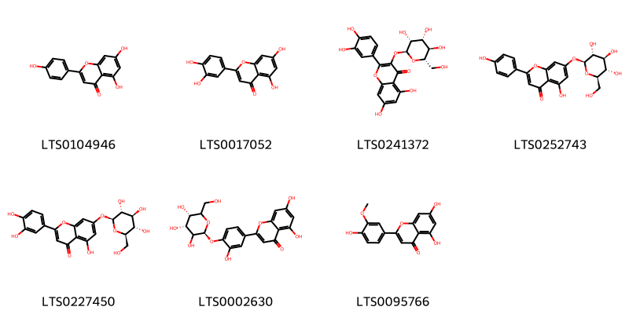{ width=100% }
    <figcaption>Hình ảnh cấu trúc hóa học của 7 hoạt chất thuộc nhóm Flavonoids gồm ['chamomile (LTS0104946)', 'luteolin (LTS0017052)', '2-(3,4-dihydroxyphenyl)-5,7-dihydroxy-3-{[(2s,3r,4r,5r,6s)-3,4,5-trihydroxy-6-(hydroxymethyl)oxan-2-yl]oxy}chromen-4-one (LTS0241372)', 'apigenin 7-o-β-glucoside (LTS0252743)', 'luteolin 7-o-glucoside (LTS0227450)', '5,7-dihydroxy-2-(3-hydroxy-4-{[(2s,4r,5s)-3,4,5-trihydroxy-6-(hydroxymethyl)oxan-2-yl]oxy}phenyl)chromen-4-one (LTS0002630)', 'chrysoeriol (LTS0095766)'].</figcaption>
</figure>
#### Nhóm Isoflavonoids
<figure markdown="span">
    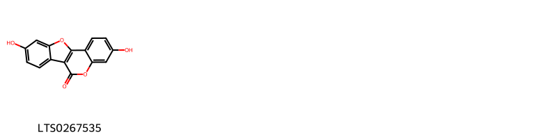{ width=100% }
    <figcaption>Hình ảnh cấu trúc hóa học của 1 hoạt chất thuộc nhóm Isoflavonoids gồm ['coumestrol (LTS0267535)'].</figcaption>
</figure>
#### Nhóm Organooxygen compounds
<figure markdown="span">
    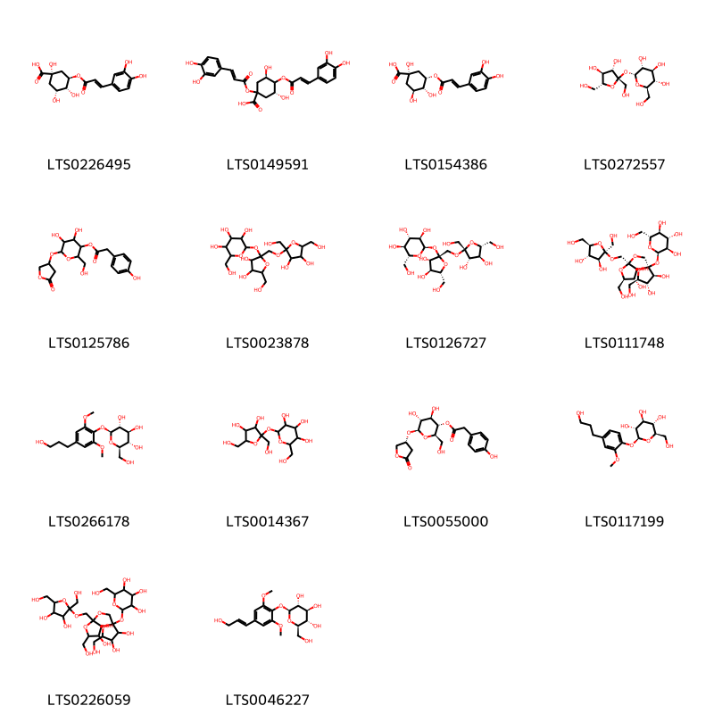{ width=100% }
    <figcaption>Hình ảnh cấu trúc hóa học của 14 hoạt chất thuộc nhóm Organooxygen compounds gồm ['chlorogenic acid (LTS0226495)', '(3r,5r)-1,4-bis({[(2e)-3-(3,4-dihydroxyphenyl)prop-2-enoyl]oxy})-3,5-dihydroxycyclohexane-1-carboxylic acid (LTS0149591)', '(1s,3s,4r,5s)-3-{[(2e)-3-(3,4-dihydroxyphenyl)prop-2-enoyl]oxy}-1,4,5-trihydroxycyclohexane-1-carboxylic acid (LTS0154386)', 'sucrose (LTS0272557)', '4,5-dihydroxy-2-(hydroxymethyl)-6-[(5-oxooxolan-3-yl)oxy]oxan-3-yl 2-(4-hydroxyphenyl)acetate (LTS0125786)', '2-{[2-({[3,4-dihydroxy-2,5-bis(hydroxymethyl)oxolan-2-yl]oxy}methyl)-3,4-dihydroxy-5-(hydroxymethyl)oxolan-2-yl]oxy}-6-(hydroxymethyl)oxane-3,4,5-triol (LTS0023878)', '1-kestose (LTS0126727)', 'nystose (LTS0111748)', '(2r,3s,4s,5r,6s)-2-(hydroxymethyl)-6-[4-(3-hydroxypropyl)-2,6-dimethoxyphenoxy]oxane-3,4,5-triol (LTS0266178)', 'granulated sugar (LTS0014367)', '(2r,3s,4r,5r,6r)-4,5-dihydroxy-2-(hydroxymethyl)-6-{[(3r)-5-oxooxolan-3-yl]oxy}oxan-3-yl 2-(4-hydroxyphenyl)acetate (LTS0055000)', '(2r,3s,4s,5r,6s)-2-(hydroxymethyl)-6-[4-(3-hydroxypropyl)-2-methoxyphenoxy]oxane-3,4,5-triol (LTS0117199)', '2-{[2-({[2-({[3,4-dihydroxy-2,5-bis(hydroxymethyl)oxolan-2-yl]oxy}methyl)-3,4-dihydroxy-5-(hydroxymethyl)oxolan-2-yl]oxy}methyl)-3,4-dihydroxy-5-(hydroxymethyl)oxolan-2-yl]oxy}-6-(hydroxymethyl)oxane-3,4,5-triol (LTS0226059)', 'syringin (LTS0046227)'].</figcaption>
</figure>
#### Nhóm Prenol lipids
<figure markdown="span">
    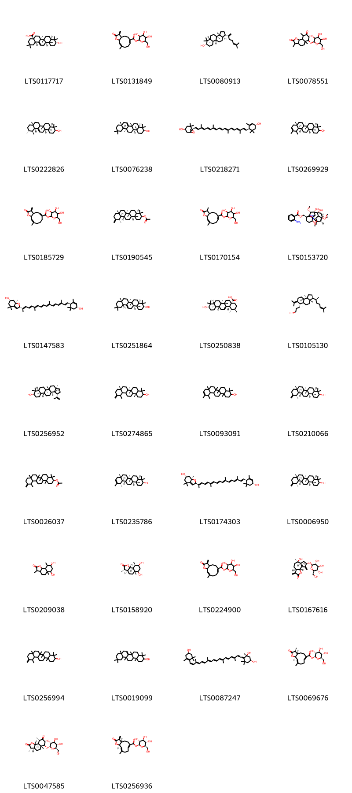{ width=100% }
    <figcaption>Hình ảnh cấu trúc hóa học của 34 hoạt chất thuộc nhóm Prenol lipids gồm ['oleanolic acid (LTS0117717)', '3,4,5-trihydroxy-6-(hydroxymethyl)oxan-2-yl 10-methyl-3-methylidene-2-oxo-3ah,4h,5h,8h,9h,11ah-cyclodeca[b]furan-6-carboxylate (LTS0131849)', 'dammaradienol (LTS0080913)', '3,5a,9-trimethyl-6-{[3,4,5-trihydroxy-6-(hydroxymethyl)oxan-2-yl]oxy}-octahydro-3h-naphtho[1,2-b]furan-2,8-dione (LTS0078551)', 'amyrin (LTS0222826)', 'alnulin (LTS0076238)', 'taraxanthin (LTS0218271)', '(4ar,6ar,6br,8as,12ar,12br,14ar,14br)-4,4,6a,6b,8a,11,12,14b-octamethyl-2,3,4a,5,6,7,8,9,12,12a,12b,13,14,14a-tetradecahydro-1h-picen-3-ol (LTS0269929)', '3,4,5-trihydroxy-6-(hydroxymethyl)oxan-2-yl 10-methyl-3-methylidene-2-oxo-3ah,4h,7h,8h,9h,11ah-cyclodeca[b]furan-6-carboxylate (LTS0185729)', 'taraxasterol acetate (LTS0190545)', '3,4,5-trihydroxy-6-(hydroxymethyl)oxan-2-yl 3,10-dimethyl-2-oxo-3h,3ah,4h,5h,8h,9h,11ah-cyclodeca[b]furan-6-carboxylate (LTS0170154)', '[(1s,4s,5r,6s,8r,9r,13s,16s,18s)-11-ethyl-8,9-dihydroxy-4,6,16,18-tetramethoxy-11-azahexacyclo[7.7.2.1²,⁵.0¹,¹⁰.0³,⁸.0¹³,¹⁷]nonadecan-13-yl]methyl 2-aminobenzoate (LTS0153720)', 'chrysanthemaxanthin (LTS0147583)', 'β-amyrin (LTS0251864)', 'ursolic acid (LTS0250838)', '3-[(3s,3as,5as,6s,9as,9br)-3a,5a,9b-trimethyl-3-[(2s)-6-methylhept-5-en-2-yl]-7-(propan-2-ylidene)-octahydro-1h-cyclopenta[a]naphthalen-6-yl]propan-1-ol (LTS0105130)', 'lupeol (LTS0256952)', '(6ar,6br,8ar,14br)-4,4,6a,6b,8a,12,14b-heptamethyl-11-methylidene-hexadecahydropicen-3-ol (LTS0274865)', '4,4,6a,6b,8a,11,12,14b-octamethyl-2,3,4a,5,6,7,8,9,12,12a,12b,13,14,14a-tetradecahydro-1h-picen-3-ol (LTS0093091)', 'taraxasterol (LTS0210066)', '4,4,6a,6b,8a,12,14b-heptamethyl-11-methylidene-hexadecahydropicen-3-yl acetate (LTS0026037)', '(3s,4ar,6ar,6br,8as,12s,12ar,12br,14ar,14br)-4,4,6a,6b,8a,11,12,14b-octamethyl-2,3,4a,5,6,7,8,9,12,12a,12b,13,14,14a-tetradecahydro-1h-picen-3-ol (LTS0235786)', 'flavoxanthin (LTS0174303)', 'taraxasterol (LTS0006950)', '6,8-dihydroxy-3,5a,9-trimethyl-decahydronaphtho[1,2-b]furan-2-one (LTS0209038)', '(3s,3as,5ar,6r,8s,9r,9as,9bs)-6,8-dihydroxy-3,5a,9-trimethyl-decahydronaphtho[1,2-b]furan-2-one (LTS0158920)', '3,4,5-trihydroxy-6-(hydroxymethyl)oxan-2-yl 10-methyl-3-methylidene-2-oxo-3ah,4h,5h,8h,9h,11ah-cyclodeca[b]furan-6-carboxylate (LTS0224900)', '(3as,6r,6as,8r,9ar,9br)-6-hydroxy-6-methyl-3,9-dimethylidene-8-{[(2r,3r,4s,5s,6r)-3,4,5-trihydroxy-6-(hydroxymethyl)oxan-2-yl]oxy}-octahydroazuleno[4,5-b]furan-2-one (LTS0167616)', '4,4,6a,6b,8a,12,14b-heptamethyl-11-methylidene-hexadecahydropicen-3-ol (LTS0256994)', 'taraxerol (LTS0019099)', '(1r,3s)-6-[(3e,5e,7e,9e,11e,13e,15e,17z)-18-[(4r)-4-hydroxy-2,6,6-trimethylcyclohex-1-en-1-yl]-3,7,12,16-tetramethyloctadeca-1,3,5,7,9,11,13,15,17-nonaen-1-ylidene]-1,5,5-trimethylcyclohexane-1,3-diol (LTS0087247)', '(2s,3r,4s,5s,6r)-3,4,5-trihydroxy-6-(hydroxymethyl)oxan-2-yl (3s,3as,11as)-3,10-dimethyl-2-oxo-3h,3ah,4h,5h,8h,9h,11ah-cyclodeca[b]furan-6-carboxylate (LTS0069676)', '(3s,3as,5ar,6r,9s,9as,9bs)-3,5a,9-trimethyl-6-{[(2r,3r,4s,5s,6r)-3,4,5-trihydroxy-6-(hydroxymethyl)oxan-2-yl]oxy}-octahydro-3h-naphtho[1,2-b]furan-2,8-dione (LTS0047585)', '(2s,3r,4s,5s,6r)-3,4,5-trihydroxy-6-(hydroxymethyl)oxan-2-yl (3as,11ar)-10-methyl-3-methylidene-2-oxo-3ah,4h,5h,8h,9h,11ah-cyclodeca[b]furan-6-carboxylate (LTS0256936)'].</figcaption>
</figure>
#### Nhóm Steroids and steroid derivatives
<figure markdown="span">
    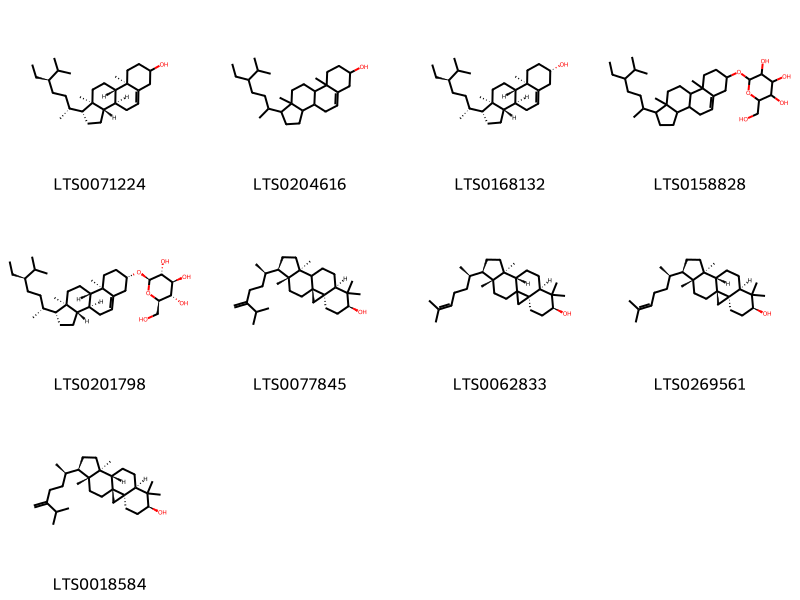{ width=100% }
    <figcaption>Hình ảnh cấu trúc hóa học của 9 hoạt chất thuộc nhóm Steroids and steroid derivatives gồm ['stigmast-5-en-3-ol (LTS0071224)', 'stigmast-5-en-3-ol, (3β)- (LTS0204616)', 'sitosterol (LTS0168132)', '2-{[1-(5-ethyl-6-methylheptan-2-yl)-9a,11a-dimethyl-1h,2h,3h,3ah,3bh,4h,6h,7h,8h,9h,9bh,10h,11h-cyclopenta[a]phenanthren-7-yl]oxy}-6-(hydroxymethyl)oxane-3,4,5-triol (LTS0158828)', 'sitogluside (LTS0201798)', '24-methylene-cycloartanol (LTS0077845)', '(3r,6s,8r,11s,12s,15r,16r)-7,7,12,16-tetramethyl-15-[(2r)-6-methylhept-5-en-2-yl]pentacyclo[9.7.0.0¹,³.0³,⁸.0¹²,¹⁶]octadecan-6-ol (LTS0062833)', 'cycloartenol (LTS0269561)', '24-methylenecycloartanol (LTS0018584)'].</figcaption>
</figure>

---

### Dược dân tộc học

Danh sách các quốc gia có sử dụng *Taraxacum officinale* trong điều trị các bệnh. 

| Country   | Disease                                                                     | Bệnh                                                                                                                                                                                                |
|:----------|:----------------------------------------------------------------------------|:----------------------------------------------------------------------------------------------------------------------------------------------------------------------------------------------------|
| China     | Tonic, Cholagogue, Stomachic                                                | MYMEMORY WARNING: YOU USED ALL AVAILABLE FREE TRANSLATIONS FOR TODAY. NEXT AVAILABLE IN  12 HOURS 33 MINUTES 42 SECONDS VISIT HTTPS://MYMEMORY.TRANSLATED.NET/DOC/USAGELIMITS.PHP TO TRANSLATE MORE |
| Elsewhere | nan, Intoxicant, Stomachic, Tonic                                           | MYMEMORY WARNING: YOU USED ALL AVAILABLE FREE TRANSLATIONS FOR TODAY. NEXT AVAILABLE IN  12 HOURS 33 MINUTES 39 SECONDS VISIT HTTPS://MYMEMORY.TRANSLATED.NET/DOC/USAGELIMITS.PHP TO TRANSLATE MORE |
| France    | Aperient                                                                    | MYMEMORY WARNING: YOU USED ALL AVAILABLE FREE TRANSLATIONS FOR TODAY. NEXT AVAILABLE IN  12 HOURS 33 MINUTES 36 SECONDS VISIT HTTPS://MYMEMORY.TRANSLATED.NET/DOC/USAGELIMITS.PHP TO TRANSLATE MORE |
| Mexico    | Laxative, Cholagogue                                                        | MYMEMORY WARNING: YOU USED ALL AVAILABLE FREE TRANSLATIONS FOR TODAY. NEXT AVAILABLE IN  12 HOURS 33 MINUTES 32 SECONDS VISIT HTTPS://MYMEMORY.TRANSLATED.NET/DOC/USAGELIMITS.PHP TO TRANSLATE MORE |
| Nepal     | Diuretic, Tonic, Diuretic, Tonic                                            | MYMEMORY WARNING: YOU USED ALL AVAILABLE FREE TRANSLATIONS FOR TODAY. NEXT AVAILABLE IN  12 HOURS 33 MINUTES 29 SECONDS VISIT HTTPS://MYMEMORY.TRANSLATED.NET/DOC/USAGELIMITS.PHP TO TRANSLATE MORE |
| Turkey    | Cholagogue, Laxative, Diuretic                                              | MYMEMORY WARNING: YOU USED ALL AVAILABLE FREE TRANSLATIONS FOR TODAY. NEXT AVAILABLE IN  12 HOURS 33 MINUTES 26 SECONDS VISIT HTTPS://MYMEMORY.TRANSLATED.NET/DOC/USAGELIMITS.PHP TO TRANSLATE MORE |
| US        | Aperient, Apertif, Diuretic, Diuretic, Intoxicant, Tonic, Tonic, Intoxicant | MYMEMORY WARNING: YOU USED ALL AVAILABLE FREE TRANSLATIONS FOR TODAY. NEXT AVAILABLE IN  12 HOURS 33 MINUTES 22 SECONDS VISIT HTTPS://MYMEMORY.TRANSLATED.NET/DOC/USAGELIMITS.PHP TO TRANSLATE MORE |

---

# Chi Ailia

??? note "Danh sách các dược liệu thuộc chi"
    
	 - *Ailia africana*
	 - *Ailia latifolia*

---
## Ailia africana
### Thông tin về thực vật

!!! info "Phân loại thực vật của *N/A* từ GIBF:"
    - **Kingdom:** Animalia
    - **Phylum:** Chordata
    - **Order:** Siluriformes
    - **Family:** Schilbeidae
    - **Genus:** Ailia
    - **Species:** *N/A*

 

| Label (VI)   | Label (EN)   | Scientific Name      | Descriptions (VI)          | Descriptions (EN)   | Also Known As (VI)   | Also Known As (EN)                    |
|:-------------|:-------------|:---------------------|:---------------------------|:--------------------|:---------------------|:--------------------------------------|
| N/A          | N/A          | Taraxacum officinale | trang định hướng Wikimedia | plant species       | ['']                 | ['dandelion', 'Taraxacum officinale'] |

#### Phân bố trên thế giới

**Từ CSDL GIBF** nan, Pakistan, India, Bangladesh, United States of America, Nepal

#### Phân bố tại Việt Nam

**Từ CSDL GIBF**: Không có ghi nhận ở Việt Nam

---
### Thành phần hóa học
        
- Theo cơ sở dữ liệu lotus: Từ loài *N/A* đã phân lập và xác định được Chưa có hoạt chất nào được phân lập. hoạt chất thuộc về các nhóm Không có hoạt chất nào được phân lập. 

Không có hình ảnh nào được tạo ra

---

### Dược dân tộc học

Danh sách các quốc gia có sử dụng *N/A* trong điều trị các bệnh. 

| Country   | Disease   | Bệnh                                                                                                                                                                                                |
|:----------|:----------|:----------------------------------------------------------------------------------------------------------------------------------------------------------------------------------------------------|
| Liberia   | Hemostat  | MYMEMORY WARNING: YOU USED ALL AVAILABLE FREE TRANSLATIONS FOR TODAY. NEXT AVAILABLE IN  12 HOURS 32 MINUTES 37 SECONDS VISIT HTTPS://MYMEMORY.TRANSLATED.NET/DOC/USAGELIMITS.PHP TO TRANSLATE MORE |

---

---
## Ailia latifolia
### Thông tin về thực vật

!!! info "Phân loại thực vật của *N/A* từ GIBF:"
    - **Kingdom:** Animalia
    - **Phylum:** Chordata
    - **Order:** Siluriformes
    - **Family:** Schilbeidae
    - **Genus:** Ailia
    - **Species:** *N/A*

 

| Label (VI)   | Label (EN)   | Scientific Name      | Descriptions (VI)          | Descriptions (EN)   | Also Known As (VI)   | Also Known As (EN)                    |
|:-------------|:-------------|:---------------------|:---------------------------|:--------------------|:---------------------|:--------------------------------------|
| N/A          | N/A          | Taraxacum officinale | trang định hướng Wikimedia | plant species       | ['']                 | ['dandelion', 'Taraxacum officinale'] |

#### Phân bố trên thế giới

**Từ CSDL GIBF** nan, Pakistan, India, Bangladesh, United States of America, Nepal

#### Phân bố tại Việt Nam

**Từ CSDL GIBF**: Không có ghi nhận ở Việt Nam

---
### Thành phần hóa học
        
- Theo cơ sở dữ liệu lotus: Từ loài *N/A* đã phân lập và xác định được Chưa có hoạt chất nào được phân lập. hoạt chất thuộc về các nhóm Không có hoạt chất nào được phân lập. 

Không có hình ảnh nào được tạo ra

---

### Dược dân tộc học

Danh sách các quốc gia có sử dụng *N/A* trong điều trị các bệnh. 

| Country   | Disease    | Bệnh                                                                                                                                                                                                |
|:----------|:-----------|:----------------------------------------------------------------------------------------------------------------------------------------------------------------------------------------------------|
| Elsewhere | Hemostatic | MYMEMORY WARNING: YOU USED ALL AVAILABLE FREE TRANSLATIONS FOR TODAY. NEXT AVAILABLE IN  12 HOURS 32 MINUTES 13 SECONDS VISIT HTTPS://MYMEMORY.TRANSLATED.NET/DOC/USAGELIMITS.PHP TO TRANSLATE MORE |
| Sudan     | Styptic    | MYMEMORY WARNING: YOU USED ALL AVAILABLE FREE TRANSLATIONS FOR TODAY. NEXT AVAILABLE IN  12 HOURS 32 MINUTES 08 SECONDS VISIT HTTPS://MYMEMORY.TRANSLATED.NET/DOC/USAGELIMITS.PHP TO TRANSLATE MORE |

---

# Chi Adenostemma

??? note "Danh sách các dược liệu thuộc chi"
    
	 - *Adenostemma lavenia*

---
## Adenostemma lavenia
### Thông tin về thực vật

!!! info "Phân loại thực vật của *Adenostemma lavenia* từ GIBF:"
    - **Kingdom:** Plantae
    - **Phylum:** Tracheophyta
    - **Order:** Asterales
    - **Family:** Asteraceae
    - **Genus:** Adenostemma
    - **Species:** *Adenostemma lavenia*

 

| Label (VI)   | Label (EN)   | Scientific Name     | Descriptions (VI)   | Descriptions (EN)   | Also Known As (VI)   | Also Known As (EN)   |
|:-------------|:-------------|:--------------------|:--------------------|:--------------------|:---------------------|:---------------------|
| N/A          | N/A          | Adenostemma lavenia | loài thực vật       | species of plant    | ['']                 | ['']                 |

#### Phân bố trên thế giới

**Từ CSDL GIBF** nan, Ecuador, Pakistan, Hong Kong, Australia, Japan, Madagascar, Korea, Republic of, Chinese Taipei, Myanmar, Macao, Papua New Guinea, Bhutan, India, Solomon Islands, Viet Nam, China, Nepal

#### Phân bố tại Việt Nam

**Từ CSDL GIBF**: Lào Cai

---
### Thành phần hóa học
        
- Theo cơ sở dữ liệu lotus: Từ loài *Adenostemma lavenia* đã phân lập và xác định được 34 hoạt chất thuộc về các nhóm Prenol lipids. 

|    | chemicalTaxonomyClassyfireClass   |   smiles_count |
|---:|:----------------------------------|---------------:|
|  0 | Prenol lipids                     |             34 |

#### Nhóm Prenol lipids
<figure markdown="span">
    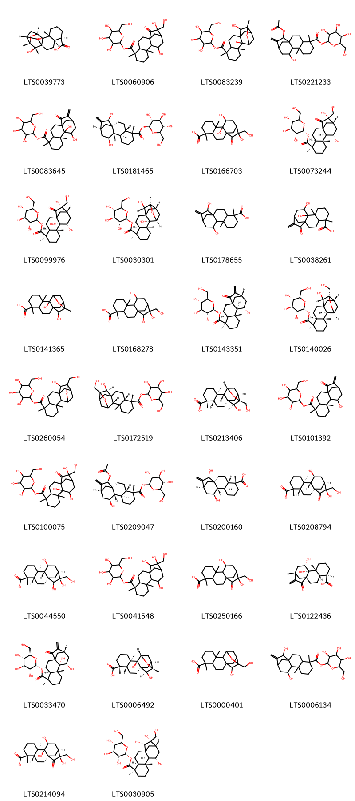{ width=100% }
    <figcaption>Hình ảnh cấu trúc hóa học của 34 hoạt chất thuộc nhóm Prenol lipids gồm ['(1s,4s,5r,9r,10r,11s,13s,14s,16s)-10,16-dihydroxy-5,9,13-trimethyl-12-oxapentacyclo[11.2.1.1¹¹,¹⁴.0¹,¹⁰.0⁴,⁹]heptadecane-5-carboxylic acid (LTS0039773)', '3,4,5-trihydroxy-6-(hydroxymethyl)oxan-2-yl 11,14-dihydroxy-14-(hydroxymethyl)-5,9-dimethyl-15-oxotetracyclo[11.2.1.0¹,¹⁰.0⁴,⁹]hexadecane-5-carboxylate (LTS0060906)', '3,4,5-trihydroxy-6-(hydroxymethyl)oxan-2-yl 10,16-dihydroxy-5,9,13-trimethyl-12-oxapentacyclo[11.2.1.1¹¹,¹⁴.0¹,¹⁰.0⁴,⁹]heptadecane-5-carboxylate (LTS0083239)', '3,4,5-trihydroxy-6-(hydroxymethyl)oxan-2-yl 15-(acetyloxy)-11-hydroxy-5,9-dimethyl-14-methylidenetetracyclo[11.2.1.0¹,¹⁰.0⁴,⁹]hexadecane-5-carboxylate (LTS0221233)', '3,4,5-trihydroxy-6-(hydroxymethyl)oxan-2-yl 10,11-dihydroxy-5,9-dimethyl-14-methylidene-15-oxotetracyclo[11.2.1.0¹,¹⁰.0⁴,⁹]hexadecane-5-carboxylate (LTS0083645)', '(2s,3r,4s,5s,6r)-3,4,5-trihydroxy-6-(hydroxymethyl)oxan-2-yl (1r,4s,5r,9r,10s,11s,13s,15r)-11,15-dihydroxy-5,9-dimethyl-14-methylidenetetracyclo[11.2.1.0¹,¹⁰.0⁴,⁹]hexadecane-5-carboxylate (LTS0181465)', '10,11,14-trihydroxy-14-(hydroxymethyl)-5,9-dimethyl-15-oxotetracyclo[11.2.1.0¹,¹⁰.0⁴,⁹]hexadecane-5-carboxylic acid (LTS0166703)', '(2r,3r,4s,5s,6r)-3,4,5-trihydroxy-6-(hydroxymethyl)oxan-2-yl (1r,4s,5r,9r,10s,11s,13s,14s)-11,14-dihydroxy-14-(hydroxymethyl)-5,9-dimethyl-15-oxotetracyclo[11.2.1.0¹,¹⁰.0⁴,⁹]hexadecane-5-carboxylate (LTS0073244)', '(2s,3r,4s,5s,6r)-3,4,5-trihydroxy-6-(hydroxymethyl)oxan-2-yl (1r,4s,5r,9r,10r,11s,13s,14s)-10,11,14-trihydroxy-14-(hydroxymethyl)-5,9-dimethyl-15-oxotetracyclo[11.2.1.0¹,¹⁰.0⁴,⁹]hexadecane-5-carboxylate (LTS0099976)', '(2s,3r,4s,5s,6r)-3,4,5-trihydroxy-6-(hydroxymethyl)oxan-2-yl (1s,4s,5r,9r,10r,11s,13r,14s,16s)-10,16-dihydroxy-5,9,13-trimethyl-12-oxapentacyclo[11.2.1.1¹¹,¹⁴.0¹,¹⁰.0⁴,⁹]heptadecane-5-carboxylate (LTS0030301)', '11,15-dihydroxy-5,9-dimethyl-14-methylidenetetracyclo[11.2.1.0¹,¹⁰.0⁴,⁹]hexadecane-5-carboxylic acid (LTS0178655)', '10,11-dihydroxy-5,9-dimethyl-14-methylidene-15-oxotetracyclo[11.2.1.0¹,¹⁰.0⁴,⁹]hexadecane-5-carboxylic acid (LTS0038261)', '10,16-dihydroxy-5,9,13-trimethyl-12-oxapentacyclo[11.2.1.1¹¹,¹⁴.0¹,¹⁰.0⁴,⁹]heptadecane-5-carboxylic acid (LTS0141365)', '11,14,15-trihydroxy-14-(hydroxymethyl)-5,9-dimethyltetracyclo[11.2.1.0¹,¹⁰.0⁴,⁹]hexadecane-5-carboxylic acid (LTS0168278)', '(2s,3r,4s,5s,6r)-3,4,5-trihydroxy-6-(hydroxymethyl)oxan-2-yl (1r,4s,5r,9r,10s,11s,13s)-11-hydroxy-5,9-dimethyl-14-methylidene-15-oxotetracyclo[11.2.1.0¹,¹⁰.0⁴,⁹]hexadecane-5-carboxylate (LTS0143351)', '(2r,3r,4s,5s,6r)-3,4,5-trihydroxy-6-(hydroxymethyl)oxan-2-yl (1r,4s,5r,9r,10s,11s,13s,14s,16s)-16-hydroxy-13-(hydroxymethyl)-5,9-dimethyl-12-oxapentacyclo[11.2.1.1¹¹,¹⁴.0¹,¹⁰.0⁴,⁹]heptadecane-5-carboxylate (LTS0140026)', '3,4,5-trihydroxy-6-(hydroxymethyl)oxan-2-yl 16-hydroxy-13-(hydroxymethyl)-5,9-dimethyl-12-oxapentacyclo[11.2.1.1¹¹,¹⁴.0¹,¹⁰.0⁴,⁹]heptadecane-5-carboxylate (LTS0260054)', '3,4,5-trihydroxy-6-(hydroxymethyl)oxan-2-yl (4s,5r,10s,16s)-16-hydroxy-13-(hydroxymethyl)-5,9-dimethyl-12-oxapentacyclo[11.2.1.1¹¹,¹⁴.0¹,¹⁰.0⁴,⁹]heptadecane-5-carboxylate (LTS0172519)', '(1r,4s,5r,9r,10s,11s,13s,14s,16s)-16-hydroxy-13-(hydroxymethyl)-5,9-dimethyl-12-oxapentacyclo[11.2.1.1¹¹,¹⁴.0¹,¹⁰.0⁴,⁹]heptadecane-5-carboxylic acid (LTS0213406)', '3,4,5-trihydroxy-6-(hydroxymethyl)oxan-2-yl 11-hydroxy-5,9-dimethyl-14-methylidene-15-oxotetracyclo[11.2.1.0¹,¹⁰.0⁴,⁹]hexadecane-5-carboxylate (LTS0101392)', '3,4,5-trihydroxy-6-(hydroxymethyl)oxan-2-yl 10,11,14-trihydroxy-14-(hydroxymethyl)-5,9-dimethyl-15-oxotetracyclo[11.2.1.0¹,¹⁰.0⁴,⁹]hexadecane-5-carboxylate (LTS0100075)', '(2s,3r,4s,5s,6r)-3,4,5-trihydroxy-6-(hydroxymethyl)oxan-2-yl (1r,4s,5r,9r,10s,11s,13s,15r)-15-(acetyloxy)-11-hydroxy-5,9-dimethyl-14-methylidenetetracyclo[11.2.1.0¹,¹⁰.0⁴,⁹]hexadecane-5-carboxylate (LTS0209047)', '(1r,4s,5r,9r,10s,11s,13s,15s)-11,15-dihydroxy-5,9-dimethyl-14-methylidenetetracyclo[11.2.1.0¹,¹⁰.0⁴,⁹]hexadecane-5-carboxylic acid (LTS0200160)', '(1r,4s,5r,9r,10s,11s,13s,14s)-11,14-dihydroxy-14-(hydroxymethyl)-5,9-dimethyl-15-oxotetracyclo[11.2.1.0¹,¹⁰.0⁴,⁹]hexadecane-5-carboxylic acid (LTS0208794)', '(1r,4s,5r,9r,10s,11s,13s,14s,15s)-11,14,15-trihydroxy-14-(hydroxymethyl)-5,9-dimethyltetracyclo[11.2.1.0¹,¹⁰.0⁴,⁹]hexadecane-5-carboxylic acid (LTS0044550)', '3,4,5-trihydroxy-6-(hydroxymethyl)oxan-2-yl 11,14,15-trihydroxy-14-(hydroxymethyl)-5,9-dimethyltetracyclo[11.2.1.0¹,¹⁰.0⁴,⁹]hexadecane-5-carboxylate (LTS0041548)', '11,14-dihydroxy-14-(hydroxymethyl)-5,9-dimethyl-15-oxotetracyclo[11.2.1.0¹,¹⁰.0⁴,⁹]hexadecane-5-carboxylic acid (LTS0250166)', '(1r,4s,5r,9r,10r,11s,13s)-10,11-dihydroxy-5,9-dimethyl-14-methylidene-15-oxotetracyclo[11.2.1.0¹,¹⁰.0⁴,⁹]hexadecane-5-carboxylic acid (LTS0122436)', '(2r,3r,4s,5s,6r)-3,4,5-trihydroxy-6-(hydroxymethyl)oxan-2-yl (1r,4s,5r,9r,10r,11s,13s)-10,11-dihydroxy-5,9-dimethyl-14-methylidene-15-oxotetracyclo[11.2.1.0¹,¹⁰.0⁴,⁹]hexadecane-5-carboxylate (LTS0033470)', '(1s,4s,5r,9r,10r,11s,13r,14s,16s)-10,16-dihydroxy-5,9,13-trimethyl-12-oxapentacyclo[11.2.1.1¹¹,¹⁴.0¹,¹⁰.0⁴,⁹]heptadecane-5-carboxylic acid (LTS0006492)', '16-hydroxy-13-(hydroxymethyl)-5,9-dimethyl-12-oxapentacyclo[11.2.1.1¹¹,¹⁴.0¹,¹⁰.0⁴,⁹]heptadecane-5-carboxylic acid (LTS0000401)', '3,4,5-trihydroxy-6-(hydroxymethyl)oxan-2-yl 11,15-dihydroxy-5,9-dimethyl-14-methylidenetetracyclo[11.2.1.0¹,¹⁰.0⁴,⁹]hexadecane-5-carboxylate (LTS0006134)', '(1r,4s,5r,9r,10r,11s,13s,14s)-10,11,14-trihydroxy-14-(hydroxymethyl)-5,9-dimethyl-15-oxotetracyclo[11.2.1.0¹,¹⁰.0⁴,⁹]hexadecane-5-carboxylic acid (LTS0214094)', '(2r,3r,4s,5s,6r)-3,4,5-trihydroxy-6-(hydroxymethyl)oxan-2-yl (1r,4s,5r,9r,10s,11s,13s,14s,15s)-11,14,15-trihydroxy-14-(hydroxymethyl)-5,9-dimethyltetracyclo[11.2.1.0¹,¹⁰.0⁴,⁹]hexadecane-5-carboxylate (LTS0030905)'].</figcaption>
</figure>

---

### Dược dân tộc học

Danh sách các quốc gia có sử dụng *Adenostemma lavenia* trong điều trị các bệnh. 

| Country   | Disease   | Bệnh                                                                                                                                                                                                |
|:----------|:----------|:----------------------------------------------------------------------------------------------------------------------------------------------------------------------------------------------------|
| Malaya    | Poultice  | MYMEMORY WARNING: YOU USED ALL AVAILABLE FREE TRANSLATIONS FOR TODAY. NEXT AVAILABLE IN  12 HOURS 31 MINUTES 45 SECONDS VISIT HTTPS://MYMEMORY.TRANSLATED.NET/DOC/USAGELIMITS.PHP TO TRANSLATE MORE |

---

# Chi Chrysothamnus

??? note "Danh sách các dược liệu thuộc chi"
    
	 - *Chrysothamnus nauseosus*

---
## Chrysothamnus nauseosus
### Thông tin về thực vật

!!! info "Phân loại thực vật của *Ericameria nauseosa* từ GIBF:"
    - **Kingdom:** Plantae
    - **Phylum:** Tracheophyta
    - **Order:** Asterales
    - **Family:** Asteraceae
    - **Genus:** Ericameria
    - **Species:** *Ericameria nauseosa*

 

| Label (VI)   | Label (EN)   | Scientific Name         | Descriptions (VI)   | Descriptions (EN)   | Also Known As (VI)   | Also Known As (EN)                           |
|:-------------|:-------------|:------------------------|:--------------------|:--------------------|:---------------------|:---------------------------------------------|
| N/A          | N/A          | Chrysothamnus nauseosus | loài thực vật       | species of plant    | ['']                 | ['common rabbit-brush', 'gray rabbit-brush'] |

#### Phân bố trên thế giới

**Từ CSDL GIBF** United States of America, Canada

#### Phân bố tại Việt Nam

**Từ CSDL GIBF**: Không có ghi nhận ở Việt Nam

---
### Thành phần hóa học
        
- Theo cơ sở dữ liệu lotus: Từ loài *Ericameria nauseosa* đã phân lập và xác định được Chưa có hoạt chất nào được phân lập. hoạt chất thuộc về các nhóm Không có hoạt chất nào được phân lập. 

Không có hình ảnh nào được tạo ra

---

### Dược dân tộc học

Danh sách các quốc gia có sử dụng *Ericameria nauseosa* trong điều trị các bệnh. 

| Country   | Disease   | Bệnh                                                                                                                                                                                                |
|:----------|:----------|:----------------------------------------------------------------------------------------------------------------------------------------------------------------------------------------------------|
| US        | Poison    | MYMEMORY WARNING: YOU USED ALL AVAILABLE FREE TRANSLATIONS FOR TODAY. NEXT AVAILABLE IN  12 HOURS 30 MINUTES 58 SECONDS VISIT HTTPS://MYMEMORY.TRANSLATED.NET/DOC/USAGELIMITS.PHP TO TRANSLATE MORE |

---

# Chi Microglossa

??? note "Danh sách các dược liệu thuộc chi"
    
	 - *Microglossa afzelii*
	 - *Microglossa pyrifolia*

---
## Microglossa afzelii
### Thông tin về thực vật

!!! info "Phân loại thực vật của *Microglossa afzelii* từ GIBF:"
    - **Kingdom:** Plantae
    - **Phylum:** Tracheophyta
    - **Order:** Asterales
    - **Family:** Asteraceae
    - **Genus:** Microglossa
    - **Species:** *Microglossa afzelii*

 

| Label (VI)   | Label (EN)   | Scientific Name     | Descriptions (VI)   | Descriptions (EN)   | Also Known As (VI)   | Also Known As (EN)   |
|:-------------|:-------------|:--------------------|:--------------------|:--------------------|:---------------------|:---------------------|
| N/A          | N/A          | Microglossa afzelii |                     | species of plant    | ['']                 | ['']                 |

#### Phân bố trên thế giới

**Từ CSDL GIBF** nan, Ghana, Central African Republic, Gabon, Rwanda, Sierra Leone, Tanzania, United Republic of, French Guiana, Togo, Nigeria, Sudan, Congo, Democratic Republic of the, Guinea, Liberia, Uganda, Côte d’Ivoire, Equatorial Guinea, Kenya, Cameroon

#### Phân bố tại Việt Nam

**Từ CSDL GIBF**: Không có ghi nhận ở Việt Nam

---
### Thành phần hóa học
        
- Theo cơ sở dữ liệu lotus: Từ loài *Microglossa afzelii* đã phân lập và xác định được Chưa có hoạt chất nào được phân lập. hoạt chất thuộc về các nhóm Không có hoạt chất nào được phân lập. 

Không có hình ảnh nào được tạo ra

---

### Dược dân tộc học

Danh sách các quốc gia có sử dụng *Microglossa afzelii* trong điều trị các bệnh. 

| Country      | Disease   | Bệnh                                                                                                                                                                                                |
|:-------------|:----------|:----------------------------------------------------------------------------------------------------------------------------------------------------------------------------------------------------|
| Africa       | Diuretic  | MYMEMORY WARNING: YOU USED ALL AVAILABLE FREE TRANSLATIONS FOR TODAY. NEXT AVAILABLE IN  12 HOURS 30 MINUTES 23 SECONDS VISIT HTTPS://MYMEMORY.TRANSLATED.NET/DOC/USAGELIMITS.PHP TO TRANSLATE MORE |
| Sierra Leone | Collyrium | MYMEMORY WARNING: YOU USED ALL AVAILABLE FREE TRANSLATIONS FOR TODAY. NEXT AVAILABLE IN  12 HOURS 30 MINUTES 20 SECONDS VISIT HTTPS://MYMEMORY.TRANSLATED.NET/DOC/USAGELIMITS.PHP TO TRANSLATE MORE |

---

---
## Microglossa pyrifolia
### Thông tin về thực vật

!!! info "Phân loại thực vật của *Microglossa pyrifolia* từ GIBF:"
    - **Kingdom:** Plantae
    - **Phylum:** Tracheophyta
    - **Order:** Asterales
    - **Family:** Asteraceae
    - **Genus:** Microglossa
    - **Species:** *Microglossa pyrifolia*

 

| Label (VI)   | Label (EN)   | Scientific Name       | Descriptions (VI)   | Descriptions (EN)   | Also Known As (VI)   | Also Known As (EN)   |
|:-------------|:-------------|:----------------------|:--------------------|:--------------------|:---------------------|:---------------------|
| N/A          | N/A          | Microglossa pyrifolia | loài thực vật       | species of plant    | ['']                 | ['']                 |

#### Phân bố trên thế giới

**Từ CSDL GIBF** nan, Gabon, Myanmar, Mozambique, Rwanda, Benin, Tanzania, United Republic of, Togo, Chinese Taipei, Papua New Guinea, Congo, Democratic Republic of the, Guinea, Uganda, Thailand, Brazil, Côte d’Ivoire, Mayotte, China, Comoros, Madagascar, Equatorial Guinea, Kenya, Cameroon, Malaysia, Ethiopia

#### Phân bố tại Việt Nam

**Từ CSDL GIBF**: Không có ghi nhận ở Việt Nam

---
### Thành phần hóa học
        
- Theo cơ sở dữ liệu lotus: Từ loài *Microglossa pyrifolia* đã phân lập và xác định được 75 hoạt chất thuộc về các nhóm Fatty Acyls, Flavonoids, Prenol lipids, Steroids and steroid derivatives, Oxepanes, Benzene and substituted derivatives, Heteroaromatic compounds, Organooxygen compounds, Lactones. 

|    | chemicalTaxonomyClassyfireClass     |   smiles_count |
|---:|:------------------------------------|---------------:|
|  0 | Benzene and substituted derivatives |             15 |
|  1 | Fatty Acyls                         |              1 |
|  2 | Flavonoids                          |              5 |
|  3 | Heteroaromatic compounds            |              1 |
|  4 | Lactones                            |              3 |
|  5 | Organooxygen compounds              |              1 |
|  6 | Oxepanes                            |              9 |
|  7 | Prenol lipids                       |             37 |
|  8 | Steroids and steroid derivatives    |              3 |

#### Nhóm Benzene and substituted derivatives
<figure markdown="span">
    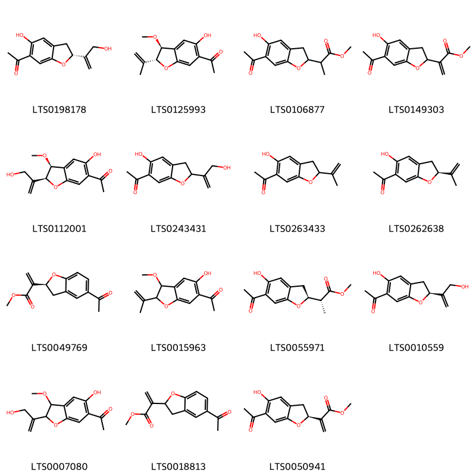{ width=100% }
    <figcaption>Hình ảnh cấu trúc hóa học của 15 hoạt chất thuộc nhóm Benzene and substituted derivatives gồm ['1-[(2r)-5-hydroxy-2-(3-hydroxyprop-1-en-2-yl)-2,3-dihydro-1-benzofuran-6-yl]ethanone (LTS0198178)', '1-[(2r,3s)-5-hydroxy-3-methoxy-2-(prop-1-en-2-yl)-2,3-dihydro-1-benzofuran-6-yl]ethanone (LTS0125993)', 'methyl 2-(6-acetyl-5-hydroxy-2,3-dihydro-1-benzofuran-2-yl)propanoate (LTS0106877)', 'methyl 2-(6-acetyl-5-hydroxy-2,3-dihydro-1-benzofuran-2-yl)prop-2-enoate (LTS0149303)', '1-[(2s,3s)-5-hydroxy-2-(3-hydroxyprop-1-en-2-yl)-3-methoxy-2,3-dihydro-1-benzofuran-6-yl]ethanone (LTS0112001)', '1-[5-hydroxy-2-(3-hydroxyprop-1-en-2-yl)-2,3-dihydro-1-benzofuran-6-yl]ethanone (LTS0243431)', '1-[5-hydroxy-2-(prop-1-en-2-yl)-2,3-dihydro-1-benzofuran-6-yl]ethanone (LTS0263433)', '1-[(2s)-5-hydroxy-2-(prop-1-en-2-yl)-2,3-dihydro-1-benzofuran-6-yl]ethanone (LTS0262638)', 'methyl 2-[(2s)-5-acetyl-2,3-dihydro-1-benzofuran-2-yl]prop-2-enoate (LTS0049769)', '1-[5-hydroxy-3-methoxy-2-(prop-1-en-2-yl)-2,3-dihydro-1-benzofuran-6-yl]ethanone (LTS0015963)', 'methyl (2r)-2-[(2s)-6-acetyl-5-hydroxy-2,3-dihydro-1-benzofuran-2-yl]propanoate (LTS0055971)', '1-[(2s)-5-hydroxy-2-(3-hydroxyprop-1-en-2-yl)-2,3-dihydro-1-benzofuran-6-yl]ethanone (LTS0010559)', '1-[5-hydroxy-2-(3-hydroxyprop-1-en-2-yl)-3-methoxy-2,3-dihydro-1-benzofuran-6-yl]ethanone (LTS0007080)', 'methyl 2-(5-acetyl-2,3-dihydro-1-benzofuran-2-yl)prop-2-enoate (LTS0018813)', 'methyl 2-[(2s)-6-acetyl-5-hydroxy-2,3-dihydro-1-benzofuran-2-yl]prop-2-enoate (LTS0050941)'].</figcaption>
</figure>
#### Nhóm Fatty Acyls
<figure markdown="span">
    { width=100% }
    <figcaption>Hình ảnh cấu trúc hóa học của 1 hoạt chất thuộc nhóm Fatty Acyls gồm ['linoleic (LTS0013198)'].</figcaption>
</figure>
#### Nhóm Flavonoids
<figure markdown="span">
    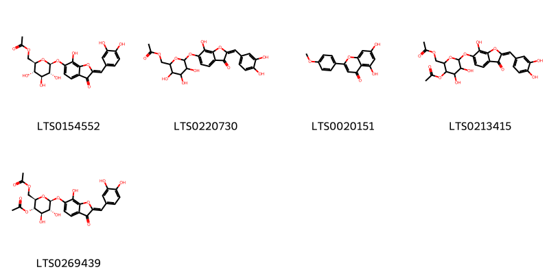{ width=100% }
    <figcaption>Hình ảnh cấu trúc hóa học của 5 hoạt chất thuộc nhóm Flavonoids gồm ['[(2r,3s,4s,5r,6s)-6-{[(2z)-2-[(3,4-dihydroxyphenyl)methylidene]-7-hydroxy-3-oxo-1-benzofuran-6-yl]oxy}-3,4,5-trihydroxyoxan-2-yl]methyl acetate (LTS0154552)', '[6-({2-[(3,4-dihydroxyphenyl)methylidene]-7-hydroxy-3-oxo-1-benzofuran-6-yl}oxy)-3,4,5-trihydroxyoxan-2-yl]methyl acetate (LTS0220730)', 'acacetin (LTS0020151)', '[3-(acetyloxy)-6-({2-[(3,4-dihydroxyphenyl)methylidene]-7-hydroxy-3-oxo-1-benzofuran-6-yl}oxy)-4,5-dihydroxyoxan-2-yl]methyl acetate (LTS0213415)', '[(2r,3s,4r,5r,6s)-3-(acetyloxy)-6-{[(2z)-2-[(3,4-dihydroxyphenyl)methylidene]-7-hydroxy-3-oxo-1-benzofuran-6-yl]oxy}-4,5-dihydroxyoxan-2-yl]methyl acetate (LTS0269439)'].</figcaption>
</figure>
#### Nhóm Heteroaromatic compounds
<figure markdown="span">
    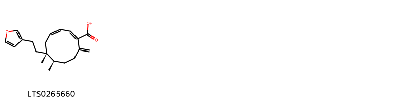{ width=100% }
    <figcaption>Hình ảnh cấu trúc hóa học của 1 hoạt chất thuộc nhóm Heteroaromatic compounds gồm ['(1e,3z,6r,7r)-6-[2-(furan-3-yl)ethyl]-6,7-dimethyl-10-methylidenecyclodeca-1,3-diene-1-carboxylic acid (LTS0265660)'].</figcaption>
</figure>
#### Nhóm Lactones
<figure markdown="span">
    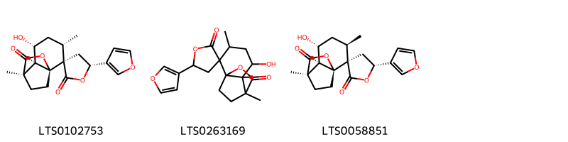{ width=100% }
    <figcaption>Hình ảnh cấu trúc hóa học của 3 hoạt chất thuộc nhóm Lactones gồm ["(1's,3r,3's,5r,5'r,6's,7'r)-5-(furan-3-yl)-5'-hydroxy-3',6',7'-trimethyl-9'-oxaspiro[oxolane-3,2'-tricyclo[5.2.2.0¹,⁶]undecane]-2,8'-dione (LTS0102753)", "5-(furan-3-yl)-5'-hydroxy-3',6',7'-trimethyl-9'-oxaspiro[oxolane-3,2'-tricyclo[5.2.2.0¹,⁶]undecane]-2,8'-dione (LTS0263169)", "(1's,3r,3'r,5r,5'r,6's,7'r)-5-(furan-3-yl)-5'-hydroxy-3',6',7'-trimethyl-9'-oxaspiro[oxolane-3,2'-tricyclo[5.2.2.0¹,⁶]undecane]-2,8'-dione (LTS0058851)"].</figcaption>
</figure>
#### Nhóm Organooxygen compounds
<figure markdown="span">
    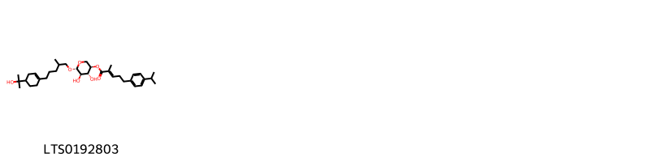{ width=100% }
    <figcaption>Hình ảnh cấu trúc hóa học của 1 hoạt chất thuộc nhóm Organooxygen compounds gồm ['(3r,4r,5r,6r)-4,5-dihydroxy-6-({5-[4-(2-hydroxypropan-2-yl)cyclohex-1-en-1-yl]-2-methylpentyl}oxy)oxan-3-yl (2e)-5-(4-isopropylphenyl)-2-methylpent-2-enoate (LTS0192803)'].</figcaption>
</figure>
#### Nhóm Oxepanes
<figure markdown="span">
    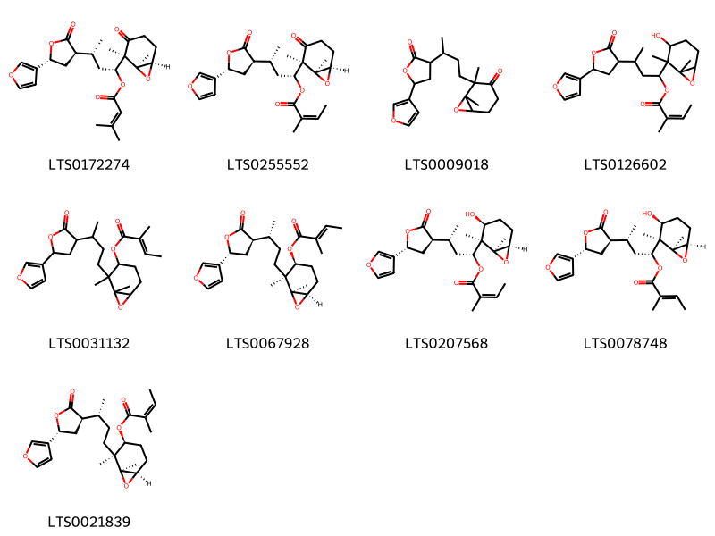{ width=100% }
    <figcaption>Hình ảnh cấu trúc hóa học của 9 hoạt chất thuộc nhóm Oxepanes gồm ['(1r,3r)-1-[(1s,2r,6r)-1,2-dimethyl-3-oxo-7-oxabicyclo[4.1.0]heptan-2-yl]-3-[(3r,5r)-5-(furan-3-yl)-2-oxooxolan-3-yl]butyl 3-methylbut-2-enoate (LTS0172274)', '(1r,3r)-1-[(1s,2r,6r)-1,2-dimethyl-3-oxo-7-oxabicyclo[4.1.0]heptan-2-yl]-3-[(3r,5r)-5-(furan-3-yl)-2-oxooxolan-3-yl]butyl (2z)-2-methylbut-2-enoate (LTS0255552)', '2-{3-[5-(furan-3-yl)-2-oxooxolan-3-yl]butyl}-1,2-dimethyl-7-oxabicyclo[4.1.0]heptan-3-one (LTS0009018)', '3-[5-(furan-3-yl)-2-oxooxolan-3-yl]-1-{3-hydroxy-1,2-dimethyl-7-oxabicyclo[4.1.0]heptan-2-yl}butyl 2-methylbut-2-enoate (LTS0126602)', '2-{3-[5-(furan-3-yl)-2-oxooxolan-3-yl]butyl}-1,2-dimethyl-7-oxabicyclo[4.1.0]heptan-3-yl 2-methylbut-2-enoate (LTS0031132)', '(1s,2s,3s,6r)-2-[(3r)-3-[(3r,5r)-5-(furan-3-yl)-2-oxooxolan-3-yl]butyl]-1,2-dimethyl-7-oxabicyclo[4.1.0]heptan-3-yl (2e)-2-methylbut-2-enoate (LTS0067928)', '(1r,3r)-3-[(3r,5r)-5-(furan-3-yl)-2-oxooxolan-3-yl]-1-[(1s,2r,3s,6r)-3-hydroxy-1,2-dimethyl-7-oxabicyclo[4.1.0]heptan-2-yl]butyl (2z)-2-methylbut-2-enoate (LTS0207568)', '(1r,3r)-3-[(3r,5r)-5-(furan-3-yl)-2-oxooxolan-3-yl]-1-[(1s,2r,3s,6r)-3-hydroxy-1,2-dimethyl-7-oxabicyclo[4.1.0]heptan-2-yl]butyl (2e)-2-methylbut-2-enoate (LTS0078748)', '(1s,2s,3s,6r)-2-[(3r)-3-[(3r,5r)-5-(furan-3-yl)-2-oxooxolan-3-yl]butyl]-1,2-dimethyl-7-oxabicyclo[4.1.0]heptan-3-yl (2z)-2-methylbut-2-enoate (LTS0021839)'].</figcaption>
</figure>
#### Nhóm Prenol lipids
<figure markdown="span">
    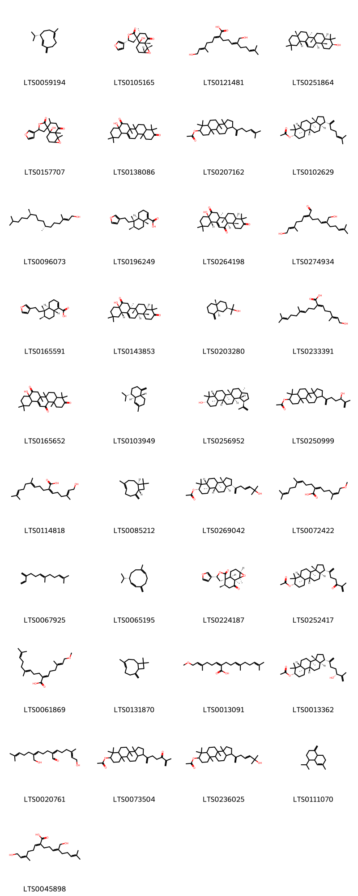{ width=100% }
    <figcaption>Hình ảnh cấu trúc hóa học của 37 hoạt chất thuộc nhóm Prenol lipids gồm ['(-)-germacrene d (LTS0059194)', "(1ar,3ar,4r,5r,5'r,7as,7bs)-5'-(furan-3-yl)-3a-hydroxy-5,7a,7b-trimethyl-tetrahydro-1ah-spiro[naphtho[1,2-b]oxirene-4,3'-oxolane]-2',7-dione (LTS0105165)", '(2e,5z)-2-[(4e)-6-hydroxy-4-methylhex-4-en-1-ylidene]-6-(hydroxymethyl)-10-methylundeca-5,9-dienoic acid (LTS0121481)', 'β-amyrin (LTS0251864)', "5'-(furan-3-yl)-3a-hydroxy-5,7a,7b-trimethyl-tetrahydro-1ah-spiro[naphtho[1,2-b]oxirene-4,3'-oxolane]-2',7-dione (LTS0157707)", '8a-hydroxy-4,4,6a,6b,11,11,14b-heptamethyl-1,2,4a,5,6,7,9,10,12,12a,14,14a-dodecahydropicene-3,8-dione (LTS0138086)', '3a,3b,6,6,9a-pentamethyl-1-(6-methylhepta-1,5-dien-2-yl)-dodecahydro-1h-cyclopenta[a]phenanthren-7-yl acetate (LTS0207162)', '(1s,3ar,3br,5ar,7s,9ar,9br,11ar)-3a,3b,6,6,9a-pentamethyl-1-(6-methylhepta-1,5-dien-2-yl)-dodecahydro-1h-cyclopenta[a]phenanthren-7-yl acetate (LTS0102629)', 'phytol (LTS0096073)', '(4ar,5s,6r,8ar)-5-[2-(furan-3-yl)ethyl]-5,6,8a-trimethyl-3,4,4a,6,7,8-hexahydronaphthalene-1-carboxylic acid (LTS0196249)', '(4ar,6ar,6bs,8ar,12as,14ar,14bs)-8a-hydroxy-4,4,6a,6b,11,11,14b-heptamethyl-2,4a,5,6,7,9,10,12,12a,14a-decahydro-1h-picene-3,8,14-trione (LTS0264198)', '(2e,5z)-2-[(4e)-6-hydroxy-4-methylhex-4-en-1-ylidene]-6-(hydroxymethyl)-10-methylundeca-5,9-dienal (LTS0274934)', '(4as,5s,6r,8ar)-5-[2-(furan-3-yl)ethyl]-5,6-dimethyl-4,4a,6,7,8,8a-hexahydro-3h-naphthalene-1-carboxylic acid (LTS0165591)', '(4ar,6ar,6bs,8ar,12as,14ar,14br)-8a-hydroxy-4,4,6a,6b,11,11,14b-heptamethyl-1,2,4a,5,6,7,9,10,12,12a,14,14a-dodecahydropicene-3,8-dione (LTS0143853)', 'β-eudesmol (LTS0203280)', '(2e,5e)-2-[(4e)-6-hydroxy-4-methylhex-4-en-1-ylidene]-6,10-dimethylundeca-5,9-dienoic acid (LTS0233391)', '8a-hydroxy-4,4,6a,6b,11,11,14b-heptamethyl-2,4a,5,6,7,9,10,12,12a,14a-decahydro-1h-picene-3,8,14-trione (LTS0165652)', '(+)-gamma-cadinene (LTS0103949)', 'lupeol (LTS0256952)', '1-(5-hydroxy-6-methylhepta-1,6-dien-2-yl)-3a,3b,6,6,9a-pentamethyl-dodecahydro-1h-cyclopenta[a]phenanthren-7-yl acetate (LTS0250999)', '2-(6-hydroxy-4-methylhex-4-en-1-ylidene)-6,10-dimethylundeca-5,9-dienoic acid (LTS0114818)', 'caryophyllene (LTS0085212)', '(1s,3ar,3br,5ar,7s,9ar,9br,11ar)-1-[(4e)-6-hydroxy-6-methylhepta-1,4-dien-2-yl]-3a,3b,6,6,9a-pentamethyl-dodecahydro-1h-cyclopenta[a]phenanthren-7-yl acetate (LTS0269042)', '2-(6-methoxy-4-methylhex-4-en-1-ylidene)-6,10-dimethylundeca-5,9-dienoic acid (LTS0072422)', 'β-farnesene (LTS0067925)', '(1z,6z,8s)-8-isopropyl-1-methyl-5-methylidenecyclodeca-1,6-diene (LTS0065195)', "(1ar,3as,4r,5r,5'r,7as,7bs)-5'-(furan-3-yl)-5,7a,7b-trimethyl-hexahydrospiro[naphtho[1,2-b]oxirene-4,3'-oxolane]-2',7-dione (LTS0224187)", '(1s,3ar,3br,5ar,7s,9ar,9br,11ar)-3a,3b,6,6,9a-pentamethyl-1-(6-methyl-5-oxohepta-1,6-dien-2-yl)-dodecahydro-1h-cyclopenta[a]phenanthren-7-yl acetate (LTS0252417)', '(2e,5e)-2-[(4e)-6-methoxy-4-methylhex-4-en-1-ylidene]-6,10-dimethylundeca-5,9-dienoic acid (LTS0061869)', 'caryophyllene (LTS0131870)', '(2z,5e)-2-[(4e)-6-methoxy-4-methylhex-4-en-1-ylidene]-6,10-dimethylundeca-5,9-dienoic acid (LTS0013091)', '(1s,3ar,3br,5ar,7s,9ar,9br,11ar)-1-[(5r)-5-hydroxy-6-methylhepta-1,6-dien-2-yl]-3a,3b,6,6,9a-pentamethyl-dodecahydro-1h-cyclopenta[a]phenanthren-7-yl acetate (LTS0013362)', '2-(6-hydroxy-4-methylhex-4-en-1-ylidene)-6-(hydroxymethyl)-10-methylundeca-5,9-dienal (LTS0020761)', '3a,3b,6,6,9a-pentamethyl-1-(6-methyl-5-oxohepta-1,6-dien-2-yl)-dodecahydro-1h-cyclopenta[a]phenanthren-7-yl acetate (LTS0073504)', '1-(6-hydroxy-6-methylhepta-1,4-dien-2-yl)-3a,3b,6,6,9a-pentamethyl-dodecahydro-1h-cyclopenta[a]phenanthren-7-yl acetate (LTS0236025)', '4-isopropyl-6-methyl-1-methylidene-3,4,4a,7,8,8a-hexahydro-2h-naphthalene (LTS0111070)', '(2e,5z)-2-[(4z)-6-hydroxy-4-methylhex-4-en-1-ylidene]-6-(hydroxymethyl)-10-methylundeca-5,9-dienoic acid (LTS0045898)'].</figcaption>
</figure>
#### Nhóm Steroids and steroid derivatives
<figure markdown="span">
    { width=100% }
    <figcaption>Hình ảnh cấu trúc hóa học của 3 hoạt chất thuộc nhóm Steroids and steroid derivatives gồm ['stigmast-5-en-3-ol (LTS0071224)', 'stigmast-5-en-3-ol, (3β)- (LTS0204616)', 'phytosterol (LTS0029311)'].</figcaption>
</figure>

---

### Dược dân tộc học

Danh sách các quốc gia có sử dụng *Microglossa pyrifolia* trong điều trị các bệnh. 

| Country   | Disease                  | Bệnh                                                                                                                                                                                                |
|:----------|:-------------------------|:----------------------------------------------------------------------------------------------------------------------------------------------------------------------------------------------------|
| Africa    | Sudorific, Abortifacient | MYMEMORY WARNING: YOU USED ALL AVAILABLE FREE TRANSLATIONS FOR TODAY. NEXT AVAILABLE IN  12 HOURS 29 MINUTES 51 SECONDS VISIT HTTPS://MYMEMORY.TRANSLATED.NET/DOC/USAGELIMITS.PHP TO TRANSLATE MORE |
| Elsewhere | Diaphoretic              | MYMEMORY WARNING: YOU USED ALL AVAILABLE FREE TRANSLATIONS FOR TODAY. NEXT AVAILABLE IN  12 HOURS 29 MINUTES 47 SECONDS VISIT HTTPS://MYMEMORY.TRANSLATED.NET/DOC/USAGELIMITS.PHP TO TRANSLATE MORE |
| Liberia   | Vermifuge                | MYMEMORY WARNING: YOU USED ALL AVAILABLE FREE TRANSLATIONS FOR TODAY. NEXT AVAILABLE IN  12 HOURS 29 MINUTES 43 SECONDS VISIT HTTPS://MYMEMORY.TRANSLATED.NET/DOC/USAGELIMITS.PHP TO TRANSLATE MORE |

---

# Chi Hymenoxys

??? note "Danh sách các dược liệu thuộc chi"
    
	 - *Hymenoxys cooperi*
	 - *Hymenoxys odorata*

---
## Hymenoxys cooperi
### Thông tin về thực vật

!!! info "Phân loại thực vật của *Hymenoxys cooperi* từ GIBF:"
    - **Kingdom:** Plantae
    - **Phylum:** Tracheophyta
    - **Order:** Asterales
    - **Family:** Asteraceae
    - **Genus:** Hymenoxys
    - **Species:** *Hymenoxys cooperi*

 

| Label (VI)   | Label (EN)   | Scientific Name   | Descriptions (VI)   | Descriptions (EN)   | Also Known As (VI)   | Also Known As (EN)   |
|:-------------|:-------------|:------------------|:--------------------|:--------------------|:---------------------|:---------------------|
| N/A          | N/A          | Hymenoxys cooperi | loài thực vật       | species of plant    | ['']                 | ['']                 |

#### Phân bố trên thế giới

**Từ CSDL GIBF** United States of America

#### Phân bố tại Việt Nam

**Từ CSDL GIBF**: Không có ghi nhận ở Việt Nam

---
### Thành phần hóa học
        
- Theo cơ sở dữ liệu lotus: Từ loài *Hymenoxys cooperi* đã phân lập và xác định được Chưa có hoạt chất nào được phân lập. hoạt chất thuộc về các nhóm Không có hoạt chất nào được phân lập. 

Không có hình ảnh nào được tạo ra

---

### Dược dân tộc học

Danh sách các quốc gia có sử dụng *Hymenoxys cooperi* trong điều trị các bệnh. 

| Country   | Disease   | Bệnh                                                                                                                                                                                                |
|:----------|:----------|:----------------------------------------------------------------------------------------------------------------------------------------------------------------------------------------------------|
| US(AZ)    | Poison    | MYMEMORY WARNING: YOU USED ALL AVAILABLE FREE TRANSLATIONS FOR TODAY. NEXT AVAILABLE IN  12 HOURS 29 MINUTES 07 SECONDS VISIT HTTPS://MYMEMORY.TRANSLATED.NET/DOC/USAGELIMITS.PHP TO TRANSLATE MORE |

---

---
## Hymenoxys odorata
### Thông tin về thực vật

!!! info "Phân loại thực vật của *Hymenoxys odorata* từ GIBF:"
    - **Kingdom:** Plantae
    - **Phylum:** Tracheophyta
    - **Order:** Asterales
    - **Family:** Asteraceae
    - **Genus:** Hymenoxys
    - **Species:** *Hymenoxys odorata*

 

| Label (VI)   | Label (EN)   | Scientific Name   | Descriptions (VI)   | Descriptions (EN)   | Also Known As (VI)   | Also Known As (EN)   |
|:-------------|:-------------|:------------------|:--------------------|:--------------------|:---------------------|:---------------------|
| N/A          | N/A          | Hymenoxys odorata | loài thực vật       | species of plant    | ['']                 | ['']                 |

#### Phân bố trên thế giới

**Từ CSDL GIBF** United States of America, Mexico

#### Phân bố tại Việt Nam

**Từ CSDL GIBF**: Không có ghi nhận ở Việt Nam

---
### Thành phần hóa học
        
- Theo cơ sở dữ liệu lotus: Từ loài *Hymenoxys odorata* đã phân lập và xác định được 29 hoạt chất thuộc về các nhóm Fatty Acyls, Flavonoids, Prenol lipids, Oxanes, Furofurans, Lactones. 

|    | chemicalTaxonomyClassyfireClass   |   smiles_count |
|---:|:----------------------------------|---------------:|
|  0 | Fatty Acyls                       |              3 |
|  1 | Flavonoids                        |              1 |
|  2 | Furofurans                        |              2 |
|  3 | Lactones                          |              7 |
|  4 | Oxanes                            |              6 |
|  5 | Prenol lipids                     |             10 |

#### Nhóm Fatty Acyls
<figure markdown="span">
    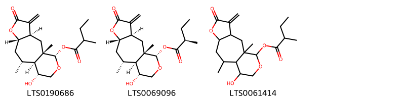{ width=100% }
    <figcaption>Hình ảnh cấu trúc hóa học của 3 hoạt chất thuộc nhóm Fatty Acyls gồm ['(1s,3r,7s,9r,10s,11r,14s)-11-hydroxy-1,9-dimethyl-4-methylidene-5-oxo-6,13-dioxatricyclo[8.4.0.0³,⁷]tetradecan-14-yl 2-methylbutanoate (LTS0190686)', '(1s,3r,7s,9r,10s,11r,14s)-11-hydroxy-1,9-dimethyl-4-methylidene-5-oxo-6,13-dioxatricyclo[8.4.0.0³,⁷]tetradecan-14-yl (2r)-2-methylbutanoate (LTS0069096)', '11-hydroxy-1,9-dimethyl-4-methylidene-5-oxo-6,13-dioxatricyclo[8.4.0.0³,⁷]tetradecan-14-yl 2-methylbutanoate (LTS0061414)'].</figcaption>
</figure>
#### Nhóm Flavonoids
<figure markdown="span">
    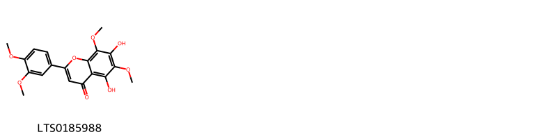{ width=100% }
    <figcaption>Hình ảnh cấu trúc hóa học của 1 hoạt chất thuộc nhóm Flavonoids gồm ['hymenoxin (LTS0185988)'].</figcaption>
</figure>
#### Nhóm Furofurans
<figure markdown="span">
    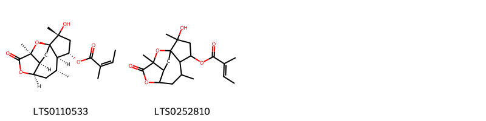{ width=100% }
    <figcaption>Hình ảnh cấu trúc hóa học của 2 hoạt chất thuộc nhóm Furofurans gồm ['(1r,2r,4s,5r,6r,8r,11s,12s)-2-hydroxy-2,6,11-trimethyl-10-oxo-9,14-dioxatetracyclo[9.2.1.0¹,⁵.0⁸,¹²]tetradecan-4-yl (2z)-2-methylbut-2-enoate (LTS0110533)', '2-hydroxy-2,6,11-trimethyl-10-oxo-9,14-dioxatetracyclo[9.2.1.0¹,⁵.0⁸,¹²]tetradecan-4-yl 2-methylbut-2-enoate (LTS0252810)'].</figcaption>
</figure>
#### Nhóm Lactones
<figure markdown="span">
    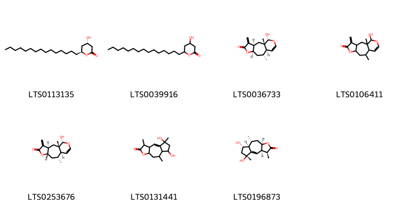{ width=100% }
    <figcaption>Hình ảnh cấu trúc hóa học của 7 hoạt chất thuộc nhóm Lactones gồm ['(4s,6s)-4-hydroxy-6-pentadecyloxan-2-one (LTS0113135)', '4-hydroxy-6-pentadecyloxan-2-one (LTS0039916)', '(1s,3r,7r,9r,10r,14r)-14-hydroxy-1,9-dimethyl-4-methylidene-6,13-dioxatricyclo[8.4.0.0³,⁷]tetradec-11-en-5-one (LTS0036733)', '14-hydroxy-1,9-dimethyl-4-methylidene-6,13-dioxatricyclo[8.4.0.0³,⁷]tetradec-11-en-5-one (LTS0106411)', '(1s,3r,7s,9r,10r,14r)-14-hydroxy-1,9-dimethyl-4-methylidene-6,13-dioxatricyclo[8.4.0.0³,⁷]tetradec-11-en-5-one (LTS0253676)', '5,7-dihydroxy-3,5,8-trimethyl-3h,3ah,6h,7h,7ah,8h,9h,9ah-azuleno[6,5-b]furan-2-one (LTS0131441)', '(3s,3ar,5r,7s,7as,8r,9ar)-5,7-dihydroxy-3,5,8-trimethyl-3h,3ah,6h,7h,7ah,8h,9h,9ah-azuleno[6,5-b]furan-2-one (LTS0196873)'].</figcaption>
</figure>
#### Nhóm Oxanes
<figure markdown="span">
    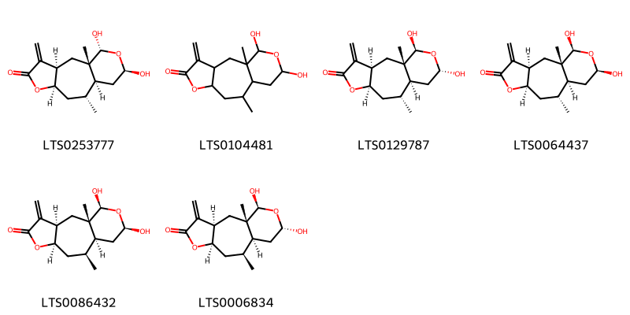{ width=100% }
    <figcaption>Hình ảnh cấu trúc hóa học của 6 hoạt chất thuộc nhóm Oxanes gồm ['hymenoxone (LTS0253777)', 'hymenovin (LTS0104481)', '(1s,3r,7r,9r,10s,12s,14s)-12,14-dihydroxy-1,9-dimethyl-4-methylidene-6,13-dioxatricyclo[8.4.0.0³,⁷]tetradecan-5-one (LTS0129787)', '(1s,3r,7r,9r,10s,12r,14s)-12,14-dihydroxy-1,9-dimethyl-4-methylidene-6,13-dioxatricyclo[8.4.0.0³,⁷]tetradecan-5-one (LTS0064437)', '(1s,3r,7r,9s,10s,12r,14s)-12,14-dihydroxy-1,9-dimethyl-4-methylidene-6,13-dioxatricyclo[8.4.0.0³,⁷]tetradecan-5-one (LTS0086432)', '(1s,3r,7r,9s,10s,12s,14s)-12,14-dihydroxy-1,9-dimethyl-4-methylidene-6,13-dioxatricyclo[8.4.0.0³,⁷]tetradecan-5-one (LTS0006834)'].</figcaption>
</figure>
#### Nhóm Prenol lipids
<figure markdown="span">
    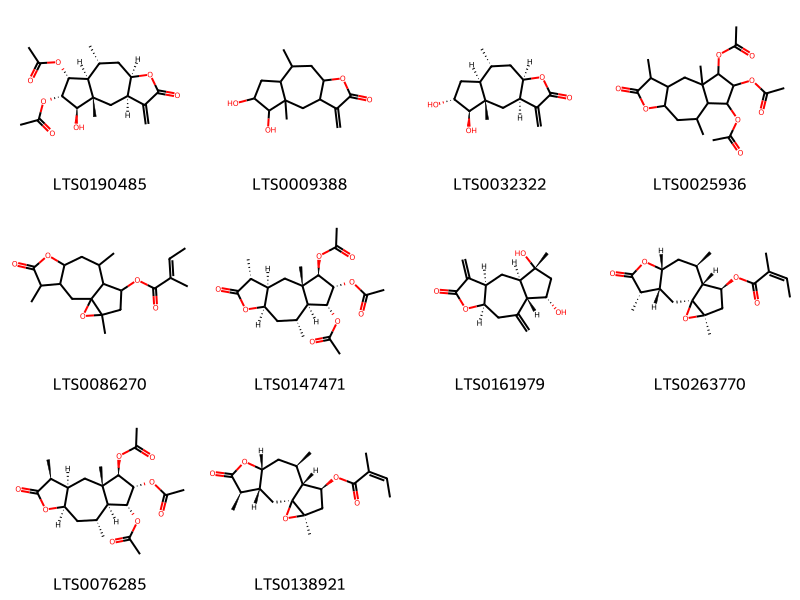{ width=100% }
    <figcaption>Hình ảnh cấu trúc hóa học của 10 hoạt chất thuộc nhóm Prenol lipids gồm ['(3ar,4as,5r,6s,7r,7as,8r,9ar)-6-(acetyloxy)-5-hydroxy-4a,8-dimethyl-3-methylidene-2-oxo-octahydro-3ah-azuleno[6,5-b]furan-7-yl acetate (LTS0190485)', '5,6-dihydroxy-4a,8-dimethyl-3-methylidene-octahydro-3ah-azuleno[6,5-b]furan-2-one (LTS0009388)', '(3ar,4as,5r,6r,7as,8r,9ar)-5,6-dihydroxy-4a,8-dimethyl-3-methylidene-octahydro-3ah-azuleno[6,5-b]furan-2-one (LTS0032322)', '5,6-bis(acetyloxy)-3,4a,8-trimethyl-2-oxo-decahydroazuleno[6,5-b]furan-7-yl acetate (LTS0025936)', '4,9,13-trimethyl-5-oxo-6,14-dioxatetracyclo[8.4.0.0¹,¹³.0³,⁷]tetradecan-11-yl 2-methylbut-2-enoate (LTS0086270)', '(3r,3ar,4as,5r,6r,7r,7as,8r,9ar)-6,7-bis(acetyloxy)-3,4a,8-trimethyl-2-oxo-decahydroazuleno[6,5-b]furan-5-yl acetate (LTS0147471)', 'florilenalin (LTS0161979)', '(1s,3r,4s,7r,9r,10r,11s,13r)-4,9,13-trimethyl-5-oxo-6,14-dioxatetracyclo[8.4.0.0¹,¹³.0³,⁷]tetradecan-11-yl (2z)-2-methylbut-2-enoate (LTS0263770)', '(3s,3ar,4as,5r,6r,7r,7as,8r,9ar)-6,7-bis(acetyloxy)-3,4a,8-trimethyl-2-oxo-decahydroazuleno[6,5-b]furan-5-yl acetate (LTS0076285)', '(1s,3r,4r,7r,9r,10r,11s,13r)-4,9,13-trimethyl-5-oxo-6,14-dioxatetracyclo[8.4.0.0¹,¹³.0³,⁷]tetradecan-11-yl (2z)-2-methylbut-2-enoate (LTS0138921)'].</figcaption>
</figure>

---

### Dược dân tộc học

Danh sách các quốc gia có sử dụng *Hymenoxys odorata* trong điều trị các bệnh. 

| Country   | Disease   | Bệnh                                                                                                                                                                                                |
|:----------|:----------|:----------------------------------------------------------------------------------------------------------------------------------------------------------------------------------------------------|
| US        | Poison    | MYMEMORY WARNING: YOU USED ALL AVAILABLE FREE TRANSLATIONS FOR TODAY. NEXT AVAILABLE IN  12 HOURS 28 MINUTES 38 SECONDS VISIT HTTPS://MYMEMORY.TRANSLATED.NET/DOC/USAGELIMITS.PHP TO TRANSLATE MORE |

---

# Chi Centratherum

??? note "Danh sách các dược liệu thuộc chi"
    
	 - *Centratherum anthelminticum*
	 - *Centratherum anthemlinticum*

---
## Centratherum anthelminticum
### Thông tin về thực vật

!!! info "Phân loại thực vật của *Baccharoides anthelmintica* từ GIBF:"
    - **Kingdom:** Plantae
    - **Phylum:** Tracheophyta
    - **Order:** Asterales
    - **Family:** Asteraceae
    - **Genus:** Baccharoides
    - **Species:** *Baccharoides anthelmintica*

 

| Label (VI)   | Label (EN)   | Scientific Name             | Descriptions (VI)   | Descriptions (EN)   | Also Known As (VI)   | Also Known As (EN)   |
|:-------------|:-------------|:----------------------------|:--------------------|:--------------------|:---------------------|:---------------------|
| N/A          | N/A          | Centratherum anthelminticum | loài thực vật       | species of plant    | ['']                 | ['']                 |

#### Phân bố trên thế giới

**Từ CSDL GIBF** United States of America, Mexico

#### Phân bố tại Việt Nam

**Từ CSDL GIBF**: Không có ghi nhận ở Việt Nam

---
### Thành phần hóa học
        
- Theo cơ sở dữ liệu lotus: Từ loài *Baccharoides anthelmintica* đã phân lập và xác định được Chưa có hoạt chất nào được phân lập. hoạt chất thuộc về các nhóm Không có hoạt chất nào được phân lập. 

Không có hình ảnh nào được tạo ra

---

### Dược dân tộc học

Danh sách các quốc gia có sử dụng *Baccharoides anthelmintica* trong điều trị các bệnh. 

| Country   | Disease             | Bệnh                                                                                                                                                                                                |
|:----------|:--------------------|:----------------------------------------------------------------------------------------------------------------------------------------------------------------------------------------------------|
| Elsewhere | Vermifuge           | MYMEMORY WARNING: YOU USED ALL AVAILABLE FREE TRANSLATIONS FOR TODAY. NEXT AVAILABLE IN  12 HOURS 28 MINUTES 09 SECONDS VISIT HTTPS://MYMEMORY.TRANSLATED.NET/DOC/USAGELIMITS.PHP TO TRANSLATE MORE |
| India     | Diuretic, Stimulant | MYMEMORY WARNING: YOU USED ALL AVAILABLE FREE TRANSLATIONS FOR TODAY. NEXT AVAILABLE IN  12 HOURS 28 MINUTES 06 SECONDS VISIT HTTPS://MYMEMORY.TRANSLATED.NET/DOC/USAGELIMITS.PHP TO TRANSLATE MORE |

---

---
## Centratherum anthemlinticum
### Thông tin về thực vật

!!! info "Phân loại thực vật của *Centratherum anthelmintica* từ GIBF:"
    - **Kingdom:** Plantae
    - **Phylum:** Tracheophyta
    - **Order:** Asterales
    - **Family:** Asteraceae
    - **Genus:** Centratherum
    - **Species:** *Centratherum anthelmintica*

 

| Label (VI)   | Label (EN)   | Scientific Name             | Descriptions (VI)   | Descriptions (EN)   | Also Known As (VI)   | Also Known As (EN)   |
|:-------------|:-------------|:----------------------------|:--------------------|:--------------------|:---------------------|:---------------------|
| N/A          | N/A          | Centratherum anthelminticum | loài thực vật       | species of plant    | ['']                 | ['']                 |

#### Phân bố trên thế giới

**Từ CSDL GIBF** United States of America, Mexico

#### Phân bố tại Việt Nam

**Từ CSDL GIBF**: Không có ghi nhận ở Việt Nam

---
### Thành phần hóa học
        
- Theo cơ sở dữ liệu lotus: Từ loài *Centratherum anthelmintica* đã phân lập và xác định được Chưa có hoạt chất nào được phân lập. hoạt chất thuộc về các nhóm Không có hoạt chất nào được phân lập. 

Không có hình ảnh nào được tạo ra

---

### Dược dân tộc học

Danh sách các quốc gia có sử dụng *Centratherum anthelmintica* trong điều trị các bệnh. 

| Country   | Disease    | Bệnh                                                                                                                                                                                                |
|:----------|:-----------|:----------------------------------------------------------------------------------------------------------------------------------------------------------------------------------------------------|
| India     | Antiseptic | MYMEMORY WARNING: YOU USED ALL AVAILABLE FREE TRANSLATIONS FOR TODAY. NEXT AVAILABLE IN  12 HOURS 27 MINUTES 40 SECONDS VISIT HTTPS://MYMEMORY.TRANSLATED.NET/DOC/USAGELIMITS.PHP TO TRANSLATE MORE |

---

# Chi Senecio

??? note "Danh sách các dược liệu thuộc chi"
    
	 - *Senecio ambavilla*
	 - *Senecio aureus*
	 - *Senecio campestris*
	 - *Senecio canicida*
	 - *Senecio coronatus*
	 - *Senecio densiflorus*
	 - *Senecio dregeanus*
	 - *Senecio jacobae*
	 - *Senecio jacobaea*
	 - *Senecio jacquemontianus*
	 - *Senecio palmatus*
	 - *Senecio scandens*
	 - *Senecio tenuifolius*
	 - *Senecio vulgaris*

---
## Senecio ambavilla
### Thông tin về thực vật

!!! info "Phân loại thực vật của *Hubertia ambavilla* từ GIBF:"
    - **Kingdom:** Plantae
    - **Phylum:** Tracheophyta
    - **Order:** Asterales
    - **Family:** Asteraceae
    - **Genus:** Hubertia
    - **Species:** *Hubertia ambavilla*

 

| Label (VI)   | Label (EN)   | Scientific Name   | Descriptions (VI)   | Descriptions (EN)   | Also Known As (VI)   | Also Known As (EN)   |
|:-------------|:-------------|:------------------|:--------------------|:--------------------|:---------------------|:---------------------|
| N/A          | N/A          | Senecio ambavilla |                     |                     | ['']                 | ['']                 |

#### Phân bố trên thế giới

**Từ CSDL GIBF** United States of America, Mexico

#### Phân bố tại Việt Nam

**Từ CSDL GIBF**: Không có ghi nhận ở Việt Nam

---
### Thành phần hóa học
        
- Theo cơ sở dữ liệu lotus: Từ loài *Hubertia ambavilla* đã phân lập và xác định được Chưa có hoạt chất nào được phân lập. hoạt chất thuộc về các nhóm Không có hoạt chất nào được phân lập. 

Không có hình ảnh nào được tạo ra

---

### Dược dân tộc học

Danh sách các quốc gia có sử dụng *Hubertia ambavilla* trong điều trị các bệnh. 

| Country   | Disease   | Bệnh                                                                                                                                                                                                |
|:----------|:----------|:----------------------------------------------------------------------------------------------------------------------------------------------------------------------------------------------------|
| Malagasy  | Diuretic  | MYMEMORY WARNING: YOU USED ALL AVAILABLE FREE TRANSLATIONS FOR TODAY. NEXT AVAILABLE IN  12 HOURS 27 MINUTES 21 SECONDS VISIT HTTPS://MYMEMORY.TRANSLATED.NET/DOC/USAGELIMITS.PHP TO TRANSLATE MORE |

---

---
## Senecio aureus
### Thông tin về thực vật

!!! info "Phân loại thực vật của *Senecio aureus* từ GIBF:"
    - **Kingdom:** Plantae
    - **Phylum:** Tracheophyta
    - **Order:** Asterales
    - **Family:** Asteraceae
    - **Genus:** Senecio
    - **Species:** *Senecio aureus*

 

| Label (VI)   | Label (EN)   | Scientific Name   | Descriptions (VI)   | Descriptions (EN)   | Also Known As (VI)   | Also Known As (EN)   |
|:-------------|:-------------|:------------------|:--------------------|:--------------------|:---------------------|:---------------------|
| N/A          | N/A          | Senecio aureus    |                     | species of plant    | ['']                 | ['']                 |

#### Phân bố trên thế giới

**Từ CSDL GIBF** nan, United States of America, Canada

#### Phân bố tại Việt Nam

**Từ CSDL GIBF**: Không có ghi nhận ở Việt Nam

---
### Thành phần hóa học
        
- Theo cơ sở dữ liệu lotus: Từ loài *Senecio aureus* đã phân lập và xác định được 15 hoạt chất thuộc về các nhóm Prenol lipids, Azaspirodecane derivatives, Macrolides and analogues, Carboxylic acids and derivatives. 

|    | chemicalTaxonomyClassyfireClass   |   smiles_count |
|---:|:----------------------------------|---------------:|
|  0 | Azaspirodecane derivatives        |              3 |
|  1 | Carboxylic acids and derivatives  |              1 |
|  2 | Macrolides and analogues          |              2 |
|  3 | Prenol lipids                     |              8 |

#### Nhóm Azaspirodecane derivatives
<figure markdown="span">
    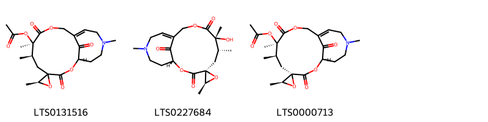{ width=100% }
    <figcaption>Hình ảnh cấu trúc hóa học của 3 hoạt chất thuộc nhóm Azaspirodecane derivatives gồm ["(1r,3's,6r,7r,11z)-3',6,7,14-tetramethyl-3,8,17-trioxo-2,9-dioxa-14-azaspiro[bicyclo[9.5.1]heptadecane-4,2'-oxiran]-11-en-7-yl acetate (LTS0131516)", 'otosenine (LTS0227684)', "(1r,3's,4s,6r,7r,11z)-3',6,7,14-tetramethyl-3,8,17-trioxo-2,9-dioxa-14-azaspiro[bicyclo[9.5.1]heptadecane-4,2'-oxiran]-11-en-7-yl acetate (LTS0000713)"].</figcaption>
</figure>
#### Nhóm Carboxylic acids and derivatives
<figure markdown="span">
    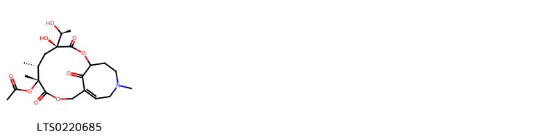{ width=100% }
    <figcaption>Hình ảnh cấu trúc hóa học của 1 hoạt chất thuộc nhóm Carboxylic acids and derivatives gồm ['(4s,6r,7r,11z)-4-hydroxy-4-[(1s)-1-hydroxyethyl]-6,7,14-trimethyl-3,8,17-trioxo-2,9-dioxa-14-azabicyclo[9.5.1]heptadec-11-en-7-yl acetate (LTS0220685)'].</figcaption>
</figure>
#### Nhóm Macrolides and analogues
<figure markdown="span">
    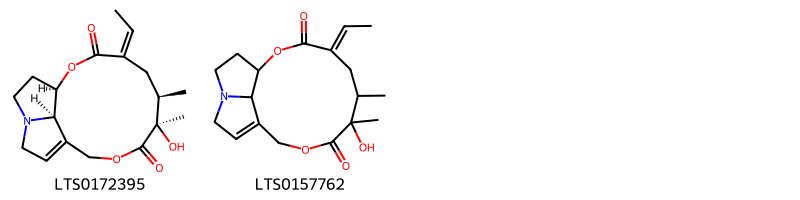{ width=100% }
    <figcaption>Hình ảnh cấu trúc hóa học của 2 hoạt chất thuộc nhóm Macrolides and analogues gồm ['senecionine (LTS0172395)', '4-ethylidene-7-hydroxy-6,7-dimethyl-2,9-dioxa-14-azatricyclo[9.5.1.0¹⁴,¹⁷]heptadec-11-ene-3,8-dione (LTS0157762)'].</figcaption>
</figure>
#### Nhóm Prenol lipids
<figure markdown="span">
    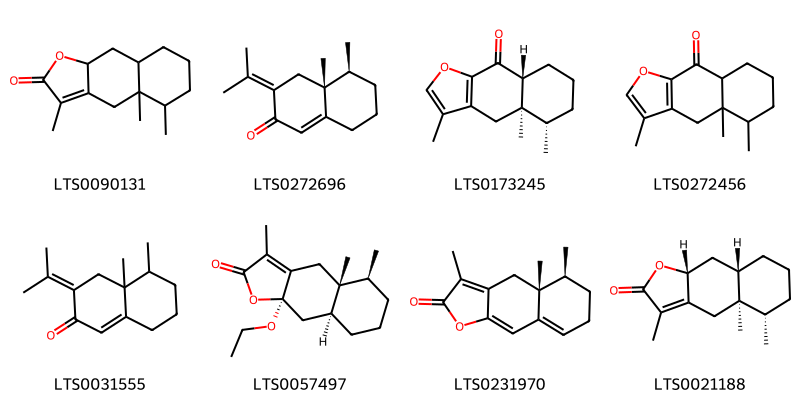{ width=100% }
    <figcaption>Hình ảnh cấu trúc hóa học của 8 hoạt chất thuộc nhóm Prenol lipids gồm ['3,4a,5-trimethyl-4h,5h,6h,7h,8h,8ah,9h,9ah-naphtho[2,3-b]furan-2-one (LTS0090131)', 'dehydrofukinone (LTS0272696)', '(4ar,5s,8ar)-3,4a,5-trimethyl-4h,5h,6h,7h,8h,8ah-naphtho[2,3-b]furan-9-one (LTS0173245)', '3,4a,5-trimethyl-4h,5h,6h,7h,8h,8ah-naphtho[2,3-b]furan-9-one (LTS0272456)', '4a,5-dimethyl-3-(propan-2-ylidene)-5,6,7,8-tetrahydro-4h-naphthalen-2-one (LTS0031555)', '(4ar,5s,8as,9ar)-9a-ethoxy-3,4a,5-trimethyl-4h,5h,6h,7h,8h,8ah,9h-naphtho[2,3-b]furan-2-one (LTS0057497)', '(4ar,5s)-3,4a,5-trimethyl-4h,5h,6h,7h-naphtho[2,3-b]furan-2-one (LTS0231970)', '(4ar,5s,8as,9ar)-3,4a,5-trimethyl-4h,5h,6h,7h,8h,8ah,9h,9ah-naphtho[2,3-b]furan-2-one (LTS0021188)'].</figcaption>
</figure>

---

### Dược dân tộc học

Danh sách các quốc gia có sử dụng *Senecio aureus* trong điều trị các bệnh. 

| Country   | Disease                                             | Bệnh                                                                                                                                                                                                |
|:----------|:----------------------------------------------------|:----------------------------------------------------------------------------------------------------------------------------------------------------------------------------------------------------|
| Turkey    | Astringent, Emmenagogue, Tonic, Vulnerary, Diuretic | MYMEMORY WARNING: YOU USED ALL AVAILABLE FREE TRANSLATIONS FOR TODAY. NEXT AVAILABLE IN  12 HOURS 27 MINUTES 00 SECONDS VISIT HTTPS://MYMEMORY.TRANSLATED.NET/DOC/USAGELIMITS.PHP TO TRANSLATE MORE |
| US        | Diuretic, Emmenagogue, Uterotonic, Stimulant        | MYMEMORY WARNING: YOU USED ALL AVAILABLE FREE TRANSLATIONS FOR TODAY. NEXT AVAILABLE IN  12 HOURS 26 MINUTES 58 SECONDS VISIT HTTPS://MYMEMORY.TRANSLATED.NET/DOC/USAGELIMITS.PHP TO TRANSLATE MORE |

---

---
## Senecio campestris
### Thông tin về thực vật

!!! info "Phân loại thực vật của *Senecio campestris* từ GIBF:"
    - **Kingdom:** Plantae
    - **Phylum:** Tracheophyta
    - **Order:** Asterales
    - **Family:** Asteraceae
    - **Genus:** Senecio
    - **Species:** *Senecio campestris*

 

| Label (VI)   | Label (EN)   | Scientific Name   | Descriptions (VI)   | Descriptions (EN)   | Also Known As (VI)   | Also Known As (EN)   |
|:-------------|:-------------|:------------------|:--------------------|:--------------------|:---------------------|:---------------------|
| N/A          | N/A          | Senecio aureus    |                     | species of plant    | ['']                 | ['']                 |

#### Phân bố trên thế giới

**Từ CSDL GIBF** nan, Italy, Japan, Slovakia, Belgium, Georgia, unknown or invalid, Ukraine, Chinese Taipei, Hungary, Russian Federation, Czechia, Germany, Romania, Iran (Islamic Republic of), Switzerland, France, United Kingdom of Great Britain and Northern Ireland, China, Korea (Democratic People’s Republic of)

#### Phân bố tại Việt Nam

**Từ CSDL GIBF**: Không có ghi nhận ở Việt Nam

---
### Thành phần hóa học
        
- Theo cơ sở dữ liệu lotus: Từ loài *Senecio campestris* đã phân lập và xác định được Chưa có hoạt chất nào được phân lập. hoạt chất thuộc về các nhóm Không có hoạt chất nào được phân lập. 

Không có hình ảnh nào được tạo ra

---

### Dược dân tộc học

Danh sách các quốc gia có sử dụng *Senecio campestris* trong điều trị các bệnh. 

| Country   | Disease              | Bệnh                                                                                                                                                                                                |
|:----------|:---------------------|:----------------------------------------------------------------------------------------------------------------------------------------------------------------------------------------------------|
| China     | Parasiticide, Poison | MYMEMORY WARNING: YOU USED ALL AVAILABLE FREE TRANSLATIONS FOR TODAY. NEXT AVAILABLE IN  12 HOURS 26 MINUTES 29 SECONDS VISIT HTTPS://MYMEMORY.TRANSLATED.NET/DOC/USAGELIMITS.PHP TO TRANSLATE MORE |

---

---
## Senecio canicida
### Thông tin về thực vật

!!! info "Phân loại thực vật của *Senecio canicida* từ GIBF:"
    - **Kingdom:** Plantae
    - **Phylum:** Tracheophyta
    - **Order:** Asterales
    - **Family:** Asteraceae
    - **Genus:** Senecio
    - **Species:** *Senecio canicida*

 

| Label (VI)   | Label (EN)   | Scientific Name   | Descriptions (VI)   | Descriptions (EN)   | Also Known As (VI)   | Also Known As (EN)   |
|:-------------|:-------------|:------------------|:--------------------|:--------------------|:---------------------|:---------------------|
| N/A          | N/A          | Senecio aureus    |                     | species of plant    | ['']                 | ['']                 |

#### Phân bố trên thế giới

**Từ CSDL GIBF** Mexico

#### Phân bố tại Việt Nam

**Từ CSDL GIBF**: Không có ghi nhận ở Việt Nam

---
### Thành phần hóa học
        
- Theo cơ sở dữ liệu lotus: Từ loài *Senecio canicida* đã phân lập và xác định được Chưa có hoạt chất nào được phân lập. hoạt chất thuộc về các nhóm Không có hoạt chất nào được phân lập. 

Không có hình ảnh nào được tạo ra

---

### Dược dân tộc học

Danh sách các quốc gia có sử dụng *Senecio canicida* trong điều trị các bệnh. 

| Country   | Disease          | Bệnh                                                                                                                                                                                                |
|:----------|:-----------------|:----------------------------------------------------------------------------------------------------------------------------------------------------------------------------------------------------|
| Mexico    | Poison, Canicide | MYMEMORY WARNING: YOU USED ALL AVAILABLE FREE TRANSLATIONS FOR TODAY. NEXT AVAILABLE IN  12 HOURS 26 MINUTES 04 SECONDS VISIT HTTPS://MYMEMORY.TRANSLATED.NET/DOC/USAGELIMITS.PHP TO TRANSLATE MORE |

---

---
## Senecio coronatus
### Thông tin về thực vật

!!! info "Phân loại thực vật của *Senecio coronatus* từ GIBF:"
    - **Kingdom:** Plantae
    - **Phylum:** Tracheophyta
    - **Order:** Asterales
    - **Family:** Asteraceae
    - **Genus:** Senecio
    - **Species:** *Senecio coronatus*

 

| Label (VI)   | Label (EN)   | Scientific Name   | Descriptions (VI)   | Descriptions (EN)   | Also Known As (VI)   | Also Known As (EN)   |
|:-------------|:-------------|:------------------|:--------------------|:--------------------|:---------------------|:---------------------|
| N/A          | N/A          | Senecio coronatus | loài thực vật       | species of plant    | ['']                 | ['']                 |

#### Phân bố trên thế giới

**Từ CSDL GIBF** nan, Zambia, South Africa, Lesotho, Zimbabwe, Tanzania, United Republic of, Eswatini

#### Phân bố tại Việt Nam

**Từ CSDL GIBF**: Không có ghi nhận ở Việt Nam

---
### Thành phần hóa học
        
- Theo cơ sở dữ liệu lotus: Từ loài *Senecio coronatus* đã phân lập và xác định được 27 hoạt chất thuộc về các nhóm Prenol lipids, Pyrrolizidines. 

|    | chemicalTaxonomyClassyfireClass   |   smiles_count |
|---:|:----------------------------------|---------------:|
|  0 | Prenol lipids                     |             25 |
|  1 | Pyrrolizidines                    |              2 |

#### Nhóm Prenol lipids
<figure markdown="span">
    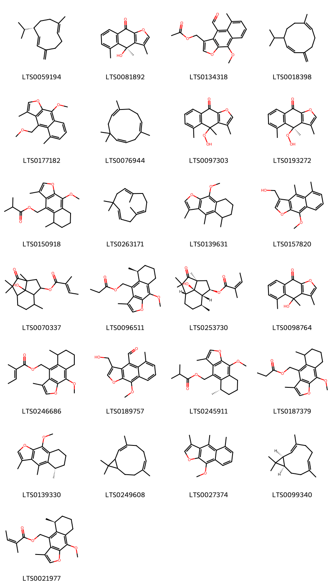{ width=100% }
    <figcaption>Hình ảnh cấu trúc hóa học của 25 hoạt chất thuộc nhóm Prenol lipids gồm ['(-)-germacrene d (LTS0059194)', '(4s)-4-hydroxy-3,4,5-trimethylnaphtho[2,3-b]furan-9-one (LTS0081892)', '{4-formyl-9-methoxy-5-methylnaphtho[2,3-b]furan-3-yl}methyl acetate (LTS0134318)', '8-isopropyl-1-methyl-5-methylidenecyclodeca-1,6-diene (LTS0018398)', '9-methoxy-4-(methoxymethyl)-3,5-dimethylnaphtho[2,3-b]furan (LTS0177182)', 'α-humulene (LTS0076944)', '4-hydroperoxy-3,4,5-trimethylnaphtho[2,3-b]furan-9-one (LTS0097303)', '(4s)-4-hydroperoxy-3,4,5-trimethylnaphtho[2,3-b]furan-9-one (LTS0193272)', '{9-methoxy-3,5-dimethyl-5h,6h,7h,8h-naphtho[2,3-b]furan-4-yl}methyl 2-methylpropanoate (LTS0150918)', 'humulene (LTS0263171)', '9-methoxy-3,4,5-trimethyl-5h,6h,7h,8h-naphtho[2,3-b]furan (LTS0139631)', '{9-methoxy-4,5-dimethylnaphtho[2,3-b]furan-3-yl}methanol (LTS0157820)', '11-hydroxy-4,6,6,10-tetramethyl-5-oxotricyclo[5.3.1.0⁴,¹¹]undecan-2-yl 2-methylbut-2-enoate (LTS0070337)', '[(5s)-9-methoxy-3,5-dimethyl-5h,6h,7h,8h-naphtho[2,3-b]furan-4-yl]methyl propanoate (LTS0096511)', '(1s,2r,4s,7r,10s,11r)-11-hydroxy-4,6,6,10-tetramethyl-5-oxotricyclo[5.3.1.0⁴,¹¹]undecan-2-yl (2z)-2-methylbut-2-enoate (LTS0253730)', '4-hydroxy-3,4,5-trimethylnaphtho[2,3-b]furan-9-one (LTS0098764)', '{9-methoxy-3,5-dimethyl-5h,6h,7h,8h-naphtho[2,3-b]furan-4-yl}methyl 2-methylbut-2-enoate (LTS0246686)', '3-(hydroxymethyl)-9-methoxy-5-methylnaphtho[2,3-b]furan-4-carbaldehyde (LTS0189757)', '[(5s)-9-methoxy-3,5-dimethyl-5h,6h,7h,8h-naphtho[2,3-b]furan-4-yl]methyl 2-methylpropanoate (LTS0245911)', '{9-methoxy-3,5-dimethyl-5h,6h,7h,8h-naphtho[2,3-b]furan-4-yl}methyl propanoate (LTS0187379)', '(5s)-9-methoxy-3,4,5-trimethyl-5h,6h,7h,8h-naphtho[2,3-b]furan (LTS0139330)', '3,7,11,11-tetramethylbicyclo[8.1.0]undeca-2,6-diene (LTS0249608)', '9-methoxy-3,4,5-trimethylnaphtho[2,3-b]furan (LTS0027374)', 'bicyclogermacrene (LTS0099340)', '[(5s)-9-methoxy-3,5-dimethyl-5h,6h,7h,8h-naphtho[2,3-b]furan-4-yl]methyl (2z)-2-methylbut-2-enoate (LTS0021977)'].</figcaption>
</figure>
#### Nhóm Pyrrolizidines
<figure markdown="span">
    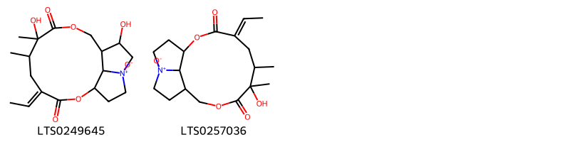{ width=100% }
    <figcaption>Hình ảnh cấu trúc hóa học của 2 hoạt chất thuộc nhóm Pyrrolizidines gồm ['4-ethylidene-7,12-dihydroxy-6,7-dimethyl-3,8-dioxo-2,9-dioxa-14-azatricyclo[9.5.1.0¹⁴,¹⁷]heptadecan-14-ium-14-olate (LTS0249645)', '4-ethylidene-7-hydroxy-6,7-dimethyl-3,8-dioxo-2,9-dioxa-14-azatricyclo[9.5.1.0¹⁴,¹⁷]heptadecan-14-ium-14-olate (LTS0257036)'].</figcaption>
</figure>

---

### Dược dân tộc học

Danh sách các quốc gia có sử dụng *Senecio coronatus* trong điều trị các bệnh. 

| Country   | Disease   | Bệnh                                                                                                                                                                                                |
|:----------|:----------|:----------------------------------------------------------------------------------------------------------------------------------------------------------------------------------------------------|
| Lesotho   | Emetic    | MYMEMORY WARNING: YOU USED ALL AVAILABLE FREE TRANSLATIONS FOR TODAY. NEXT AVAILABLE IN  12 HOURS 25 MINUTES 23 SECONDS VISIT HTTPS://MYMEMORY.TRANSLATED.NET/DOC/USAGELIMITS.PHP TO TRANSLATE MORE |

---

---
## Senecio densiflorus
### Thông tin về thực vật

!!! info "Phân loại thực vật của *N/A* từ GIBF:"
    - **Kingdom:** Plantae
    - **Phylum:** Tracheophyta
    - **Order:** Asterales
    - **Family:** Asteraceae
    - **Genus:** N/A
    - **Species:** *N/A*

 

| Label (VI)   | Label (EN)   | Scientific Name     | Descriptions (VI)   | Descriptions (EN)   | Also Known As (VI)   | Also Known As (EN)   |
|:-------------|:-------------|:--------------------|:--------------------|:--------------------|:---------------------|:---------------------|
| N/A          | N/A          | Senecio densiflorus |                     | species of plant    | ['']                 | ['']                 |

#### Phân bố trên thế giới

**Từ CSDL GIBF** Denmark, Australia, New Zealand, Chinese Taipei, Ireland, Isle of Man, Viet Nam, United Kingdom of Great Britain and Northern Ireland

#### Phân bố tại Việt Nam

**Từ CSDL GIBF**: Đà Nẵng

---
### Thành phần hóa học
        
- Theo cơ sở dữ liệu lotus: Từ loài *N/A* đã phân lập và xác định được Chưa có hoạt chất nào được phân lập. hoạt chất thuộc về các nhóm Không có hoạt chất nào được phân lập. 

Không có hình ảnh nào được tạo ra

---

### Dược dân tộc học

Danh sách các quốc gia có sử dụng *N/A* trong điều trị các bệnh. 

| Country   | Disease                | Bệnh                                                                                                                                                                                                |
|:----------|:-----------------------|:----------------------------------------------------------------------------------------------------------------------------------------------------------------------------------------------------|
| India     | Emollient, Suppurative | MYMEMORY WARNING: YOU USED ALL AVAILABLE FREE TRANSLATIONS FOR TODAY. NEXT AVAILABLE IN  12 HOURS 24 MINUTES 46 SECONDS VISIT HTTPS://MYMEMORY.TRANSLATED.NET/DOC/USAGELIMITS.PHP TO TRANSLATE MORE |

---

---
## Senecio dregeanus
### Thông tin về thực vật

!!! info "Phân loại thực vật của *Senecio dregeanus* từ GIBF:"
    - **Kingdom:** Plantae
    - **Phylum:** Tracheophyta
    - **Order:** Asterales
    - **Family:** Asteraceae
    - **Genus:** Senecio
    - **Species:** *Senecio dregeanus*

 

| Label (VI)   | Label (EN)   | Scientific Name   | Descriptions (VI)   | Descriptions (EN)   | Also Known As (VI)   | Also Known As (EN)   |
|:-------------|:-------------|:------------------|:--------------------|:--------------------|:---------------------|:---------------------|
| N/A          | N/A          | Senecio dregeanus |                     | species of plant    | ['']                 | ['']                 |

#### Phân bố trên thế giới

**Từ CSDL GIBF** nan, South Africa, unknown or invalid

#### Phân bố tại Việt Nam

**Từ CSDL GIBF**: Không có ghi nhận ở Việt Nam

---
### Thành phần hóa học
        
- Theo cơ sở dữ liệu lotus: Từ loài *Senecio dregeanus* đã phân lập và xác định được Chưa có hoạt chất nào được phân lập. hoạt chất thuộc về các nhóm Không có hoạt chất nào được phân lập. 

Không có hình ảnh nào được tạo ra

---

### Dược dân tộc học

Danh sách các quốc gia có sử dụng *Senecio dregeanus* trong điều trị các bệnh. 

| Country   | Disease   | Bệnh                                                                                                                                                                                                |
|:----------|:----------|:----------------------------------------------------------------------------------------------------------------------------------------------------------------------------------------------------|
| Lesotho   | Emetic    | MYMEMORY WARNING: YOU USED ALL AVAILABLE FREE TRANSLATIONS FOR TODAY. NEXT AVAILABLE IN  12 HOURS 24 MINUTES 13 SECONDS VISIT HTTPS://MYMEMORY.TRANSLATED.NET/DOC/USAGELIMITS.PHP TO TRANSLATE MORE |

---

---
## Senecio jacobae
### Thông tin về thực vật

!!! info "Phân loại thực vật của *Senecio jacobaea* từ GIBF:"
    - **Kingdom:** Plantae
    - **Phylum:** Tracheophyta
    - **Order:** Asterales
    - **Family:** Asteraceae
    - **Genus:** Senecio
    - **Species:** *Senecio jacobaea*

 

| Label (VI)   | Label (EN)   | Scientific Name   | Descriptions (VI)   | Descriptions (EN)   | Also Known As (VI)   | Also Known As (EN)   |
|:-------------|:-------------|:------------------|:--------------------|:--------------------|:---------------------|:---------------------|
| N/A          | N/A          | Senecio dregeanus |                     | species of plant    | ['']                 | ['']                 |

#### Phân bố trên thế giới

**Từ CSDL GIBF** Netherlands, Italy, Germany, Spain, Ireland, Austria, Kazakhstan, Norway, United Kingdom of Great Britain and Northern Ireland

#### Phân bố tại Việt Nam

**Từ CSDL GIBF**: Không có ghi nhận ở Việt Nam

---
### Thành phần hóa học
        
- Theo cơ sở dữ liệu lotus: Từ loài *Senecio jacobaea* đã phân lập và xác định được 55 hoạt chất thuộc về các nhóm Fatty Acyls, Flavonoids, Prenol lipids, Steroids and steroid derivatives, Organonitrogen compounds, Unsaturated hydrocarbons, Azaspirodecane derivatives, Macrolides and analogues. 

|    | chemicalTaxonomyClassyfireClass   |   smiles_count |
|---:|:----------------------------------|---------------:|
|  0 |                                   |             10 |
|  1 | Azaspirodecane derivatives        |              1 |
|  2 | Fatty Acyls                       |              6 |
|  3 | Flavonoids                        |              1 |
|  4 | Macrolides and analogues          |             16 |
|  5 | Organonitrogen compounds          |              2 |
|  6 | Prenol lipids                     |              8 |
|  7 | Steroids and steroid derivatives  |              5 |
|  8 | Unsaturated hydrocarbons          |              4 |

#### Nhóm 
<figure markdown="span">
    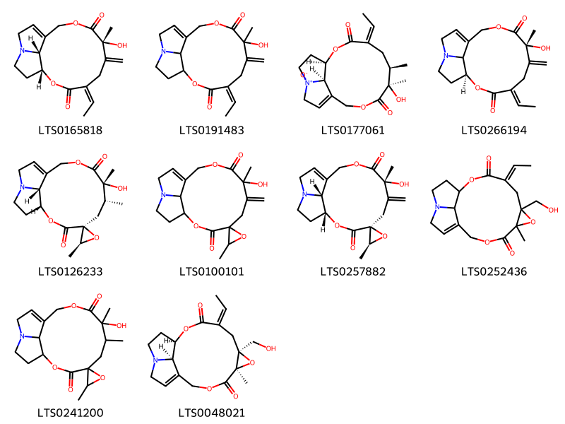{ width=100% }
    <figcaption>Hình ảnh cấu trúc hóa học của 10 hoạt chất thuộc nhóm  gồm ['seneciphylline (LTS0165818)', '4-ethylidene-7-hydroxy-7-methyl-6-methylidene-2,9-dioxa-14-azatricyclo[9.5.1.0¹⁴,¹⁷]heptadec-11-ene-3,8-dione (LTS0191483)', 'senecionine n-oxide (LTS0177061)', '(1s,4e,7r)-4-ethylidene-7-hydroxy-7-methyl-6-methylidene-2,9-dioxa-14-azatricyclo[9.5.1.0¹⁴,¹⁷]heptadec-11-ene-3,8-dione (LTS0266194)', 'jacobine (LTS0126233)', "7'-hydroxy-3,7'-dimethyl-6'-methylidene-2',9'-dioxa-14'-azaspiro[oxirane-2,4'-tricyclo[9.5.1.0¹⁴,¹⁷]heptadecan]-11'-ene-3',8'-dione (LTS0100101)", "(1'r,2s,3s,7'r,17'r)-7'-hydroxy-3,7'-dimethyl-6'-methylidene-2',9'-dioxa-14'-azaspiro[oxirane-2,4'-tricyclo[9.5.1.0¹⁴,¹⁷]heptadecan]-11'-ene-3',8'-dione (LTS0257882)", '9-ethylidene-7-(hydroxymethyl)-5-methyl-3,6,11-trioxa-15-azatetracyclo[10.5.1.0⁵,⁷.0¹⁵,¹⁸]octadec-1(17)-ene-4,10-dione (LTS0252436)', 'jacobine (LTS0241200)', '(5r,7s,9z,12r,18r)-9-ethylidene-7-(hydroxymethyl)-5-methyl-3,6,11-trioxa-15-azatetracyclo[10.5.1.0⁵,⁷.0¹⁵,¹⁸]octadec-1(17)-ene-4,10-dione (LTS0048021)'].</figcaption>
</figure>
#### Nhóm Azaspirodecane derivatives
<figure markdown="span">
    { width=100% }
    <figcaption>Hình ảnh cấu trúc hóa học của 1 hoạt chất thuộc nhóm Azaspirodecane derivatives gồm ['otosenine (LTS0227684)'].</figcaption>
</figure>
#### Nhóm Fatty Acyls
<figure markdown="span">
    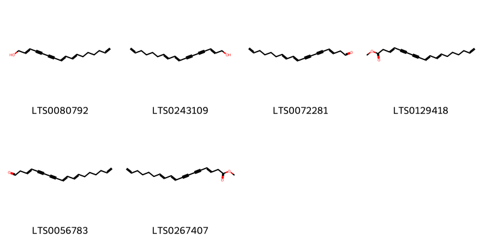{ width=100% }
    <figcaption>Hình ảnh cấu trúc hóa học của 6 hoạt chất thuộc nhóm Fatty Acyls gồm ['heptadeca-2,8,10,16-tetraen-4,6-diyn-1-ol (LTS0080792)', '(2e,8e,10e)-heptadeca-2,8,10,16-tetraen-4,6-diyn-1-ol (LTS0243109)', '(3e,9e,11e)-octadeca-3,9,11,17-tetraen-5,7-diynal (LTS0072281)', 'methyl octadeca-3,9,11,17-tetraen-5,7-diynoate (LTS0129418)', 'octadeca-3,9,11,17-tetraen-5,7-diynal (LTS0056783)', 'methyl (3e,9e,11e)-octadeca-3,9,11,17-tetraen-5,7-diynoate (LTS0267407)'].</figcaption>
</figure>
#### Nhóm Flavonoids
<figure markdown="span">
    { width=100% }
    <figcaption>Hình ảnh cấu trúc hóa học của 1 hoạt chất thuộc nhóm Flavonoids gồm ['quercetin (LTS0004651)'].</figcaption>
</figure>
#### Nhóm Macrolides and analogues
<figure markdown="span">
    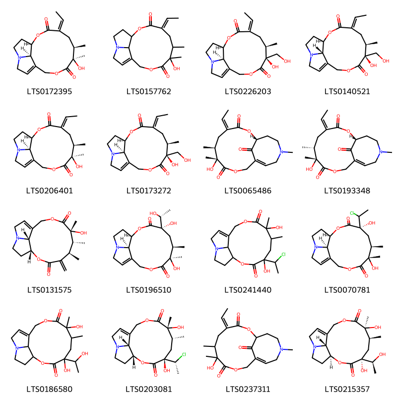{ width=100% }
    <figcaption>Hình ảnh cấu trúc hóa học của 16 hoạt chất thuộc nhóm Macrolides and analogues gồm ['senecionine (LTS0172395)', '4-ethylidene-7-hydroxy-6,7-dimethyl-2,9-dioxa-14-azatricyclo[9.5.1.0¹⁴,¹⁷]heptadec-11-ene-3,8-dione (LTS0157762)', 'retrorsine (LTS0226203)', '(1r,6r,7s,17s)-4-ethylidene-7-hydroxy-7-(hydroxymethyl)-6-methyl-2,9-dioxa-14-azatricyclo[9.5.1.0¹⁴,¹⁷]heptadec-11-ene-3,8-dione (LTS0140521)', 'integerrimine (LTS0206401)', 'usaramine (LTS0173272)', '(1r,4z,6s,7r,11z)-4-ethylidene-7-hydroxy-6,7,14-trimethyl-2,9-dioxa-14-azabicyclo[9.5.1]heptadec-11-ene-3,8,17-trione (LTS0065486)', 'senkirkine (LTS0193348)', 'senecivernine (LTS0131575)', '(1r,4s,6r,7r,17r)-4,7-dihydroxy-4-[(1r)-1-hydroxyethyl]-6,7-dimethyl-2,9-dioxa-14-azatricyclo[9.5.1.0¹⁴,¹⁷]heptadec-11-ene-3,8-dione (LTS0196510)', '4-(1-chloroethyl)-4,7-dihydroxy-6,7-dimethyl-2,9-dioxa-14-azatricyclo[9.5.1.0¹⁴,¹⁷]heptadec-11-ene-3,8-dione (LTS0241440)', '(1r,4r,6r,7s,17r)-4-(1-chloroethyl)-4,7-dihydroxy-6,7-dimethyl-2,9-dioxa-14-azatricyclo[9.5.1.0¹⁴,¹⁷]heptadec-11-ene-3,8-dione (LTS0070781)', '4,7-dihydroxy-4-(1-hydroxyethyl)-6,7-dimethyl-2,9-dioxa-14-azatricyclo[9.5.1.0¹⁴,¹⁷]heptadec-11-ene-3,8-dione (LTS0186580)', 'jaconine (LTS0203081)', '(4z,11z)-4-ethylidene-7-hydroxy-6,7,14-trimethyl-2,9-dioxa-14-azabicyclo[9.5.1]heptadec-11-ene-3,8,17-trione (LTS0237311)', '(1s,4r,6s,7s,17r)-4,7-dihydroxy-4-[(1s)-1-hydroxyethyl]-6,7-dimethyl-2,9-dioxa-14-azatricyclo[9.5.1.0¹⁴,¹⁷]heptadec-11-ene-3,8-dione (LTS0215357)'].</figcaption>
</figure>
#### Nhóm Organonitrogen compounds
<figure markdown="span">
    { width=100% }
    <figcaption>Hình ảnh cấu trúc hóa học của 2 hoạt chất thuộc nhóm Organonitrogen compounds gồm ['putrescine (LTS0238763)', 'spermidine (LTS0061428)'].</figcaption>
</figure>
#### Nhóm Prenol lipids
<figure markdown="span">
    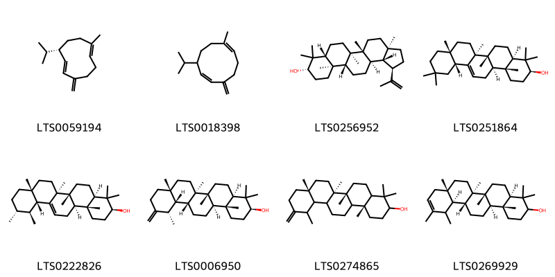{ width=100% }
    <figcaption>Hình ảnh cấu trúc hóa học của 8 hoạt chất thuộc nhóm Prenol lipids gồm ['(-)-germacrene d (LTS0059194)', '8-isopropyl-1-methyl-5-methylidenecyclodeca-1,6-diene (LTS0018398)', 'lupeol (LTS0256952)', 'β-amyrin (LTS0251864)', 'amyrin (LTS0222826)', 'taraxasterol (LTS0006950)', '(6ar,6br,8ar,14br)-4,4,6a,6b,8a,12,14b-heptamethyl-11-methylidene-hexadecahydropicen-3-ol (LTS0274865)', '(4ar,6ar,6br,8as,12ar,12br,14ar,14br)-4,4,6a,6b,8a,11,12,14b-octamethyl-2,3,4a,5,6,7,8,9,12,12a,12b,13,14,14a-tetradecahydro-1h-picen-3-ol (LTS0269929)'].</figcaption>
</figure>
#### Nhóm Steroids and steroid derivatives
<figure markdown="span">
    { width=100% }
    <figcaption>Hình ảnh cấu trúc hóa học của 5 hoạt chất thuộc nhóm Steroids and steroid derivatives gồm ['stigmast-5-en-3-ol, (3β)- (LTS0204616)', 'stigmast-5-en-3-ol (LTS0071224)', 'phytosterol (LTS0029311)', '(1r,3as,3bs,7s,9bs)-1-[(2r,5r)-5,6-dimethylheptan-2-yl]-9a,11a-dimethyl-1h,2h,3h,3ah,3bh,4h,6h,7h,8h,9h,9bh,10h,11h-cyclopenta[a]phenanthren-7-ol (LTS0057877)', 'campesterol (LTS0046755)'].</figcaption>
</figure>
#### Nhóm Unsaturated hydrocarbons
<figure markdown="span">
    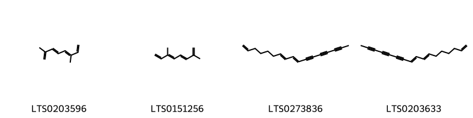{ width=100% }
    <figcaption>Hình ảnh cấu trúc hóa học của 4 hoạt chất thuộc nhóm Unsaturated hydrocarbons gồm ['2,6-dimethylocta-1,3,5,7-tetraene (LTS0203596)', 'cosmene (LTS0151256)', '(7e,9e)-heptadeca-1,7,9-trien-11,13,15-triyne (LTS0273836)', 'heptadeca-1,7,9-trien-11,13,15-triyne (LTS0203633)'].</figcaption>
</figure>

---

### Dược dân tộc học

Danh sách các quốc gia có sử dụng *Senecio jacobaea* trong điều trị các bệnh. 

| Country   | Disease                                                 | Bệnh                                                                                                                                                                                                |
|:----------|:--------------------------------------------------------|:----------------------------------------------------------------------------------------------------------------------------------------------------------------------------------------------------|
| Eurasia   | Astringent, Diaphoretic, Stimulant, Tonic, Parasiticide | MYMEMORY WARNING: YOU USED ALL AVAILABLE FREE TRANSLATIONS FOR TODAY. NEXT AVAILABLE IN  12 HOURS 23 MINUTES 43 SECONDS VISIT HTTPS://MYMEMORY.TRANSLATED.NET/DOC/USAGELIMITS.PHP TO TRANSLATE MORE |

---

---
## Senecio jacobaea
### Thông tin về thực vật

!!! info "Phân loại thực vật của *Senecio jacobaea* từ GIBF:"
    - **Kingdom:** Plantae
    - **Phylum:** Tracheophyta
    - **Order:** Asterales
    - **Family:** Asteraceae
    - **Genus:** Senecio
    - **Species:** *Senecio jacobaea*

 

| Label (VI)   | Label (EN)   | Scientific Name   | Descriptions (VI)   | Descriptions (EN)   | Also Known As (VI)   | Also Known As (EN)                                                                                                                                                                                                                      |
|:-------------|:-------------|:------------------|:--------------------|:--------------------|:---------------------|:----------------------------------------------------------------------------------------------------------------------------------------------------------------------------------------------------------------------------------------|
| N/A          | N/A          | Senecio jacobaea  | loài thực vật       | species of plant    | ['']                 | ['benweed', 'cankerwort', 'common ragwort', 'dog standard', 'Jacobaea vulgaris', 'ragwort', 'Saint James-wort', 'St. James-wort', 'staggerwort', 'stammerwort', 'stinking nanny', 'stinking ninny', 'stinking willie', 'tansy ragwort'] |

#### Phân bố trên thế giới

**Từ CSDL GIBF** Netherlands, Italy, Germany, Spain, Ireland, Austria, Kazakhstan, Norway, United Kingdom of Great Britain and Northern Ireland

#### Phân bố tại Việt Nam

**Từ CSDL GIBF**: Không có ghi nhận ở Việt Nam

---
### Thành phần hóa học
        
- Theo cơ sở dữ liệu lotus: Từ loài *Senecio jacobaea* đã phân lập và xác định được 55 hoạt chất thuộc về các nhóm Fatty Acyls, Flavonoids, Prenol lipids, Steroids and steroid derivatives, Organonitrogen compounds, Unsaturated hydrocarbons, Azaspirodecane derivatives, Macrolides and analogues. 

|    | chemicalTaxonomyClassyfireClass   |   smiles_count |
|---:|:----------------------------------|---------------:|
|  0 |                                   |             10 |
|  1 | Azaspirodecane derivatives        |              1 |
|  2 | Fatty Acyls                       |              6 |
|  3 | Flavonoids                        |              1 |
|  4 | Macrolides and analogues          |             16 |
|  5 | Organonitrogen compounds          |              2 |
|  6 | Prenol lipids                     |              8 |
|  7 | Steroids and steroid derivatives  |              5 |
|  8 | Unsaturated hydrocarbons          |              4 |

#### Nhóm 
<figure markdown="span">
    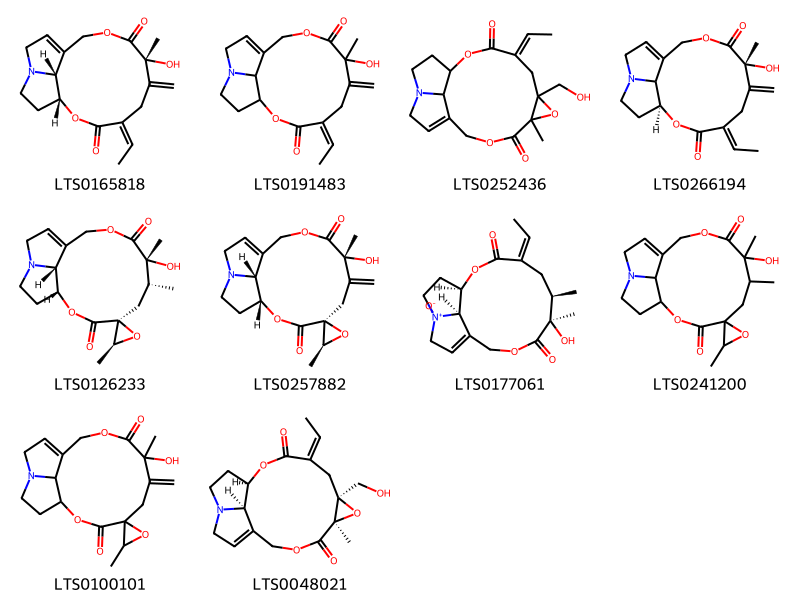{ width=100% }
    <figcaption>Hình ảnh cấu trúc hóa học của 10 hoạt chất thuộc nhóm  gồm ['seneciphylline (LTS0165818)', '4-ethylidene-7-hydroxy-7-methyl-6-methylidene-2,9-dioxa-14-azatricyclo[9.5.1.0¹⁴,¹⁷]heptadec-11-ene-3,8-dione (LTS0191483)', '9-ethylidene-7-(hydroxymethyl)-5-methyl-3,6,11-trioxa-15-azatetracyclo[10.5.1.0⁵,⁷.0¹⁵,¹⁸]octadec-1(17)-ene-4,10-dione (LTS0252436)', '(1s,4e,7r)-4-ethylidene-7-hydroxy-7-methyl-6-methylidene-2,9-dioxa-14-azatricyclo[9.5.1.0¹⁴,¹⁷]heptadec-11-ene-3,8-dione (LTS0266194)', 'jacobine (LTS0126233)', "(1'r,2s,3s,7'r,17'r)-7'-hydroxy-3,7'-dimethyl-6'-methylidene-2',9'-dioxa-14'-azaspiro[oxirane-2,4'-tricyclo[9.5.1.0¹⁴,¹⁷]heptadecan]-11'-ene-3',8'-dione (LTS0257882)", 'senecionine n-oxide (LTS0177061)', 'jacobine (LTS0241200)', "7'-hydroxy-3,7'-dimethyl-6'-methylidene-2',9'-dioxa-14'-azaspiro[oxirane-2,4'-tricyclo[9.5.1.0¹⁴,¹⁷]heptadecan]-11'-ene-3',8'-dione (LTS0100101)", '(5r,7s,9z,12r,18r)-9-ethylidene-7-(hydroxymethyl)-5-methyl-3,6,11-trioxa-15-azatetracyclo[10.5.1.0⁵,⁷.0¹⁵,¹⁸]octadec-1(17)-ene-4,10-dione (LTS0048021)'].</figcaption>
</figure>
#### Nhóm Azaspirodecane derivatives
<figure markdown="span">
    { width=100% }
    <figcaption>Hình ảnh cấu trúc hóa học của 1 hoạt chất thuộc nhóm Azaspirodecane derivatives gồm ['otosenine (LTS0227684)'].</figcaption>
</figure>
#### Nhóm Fatty Acyls
<figure markdown="span">
    { width=100% }
    <figcaption>Hình ảnh cấu trúc hóa học của 6 hoạt chất thuộc nhóm Fatty Acyls gồm ['heptadeca-2,8,10,16-tetraen-4,6-diyn-1-ol (LTS0080792)', '(2e,8e,10e)-heptadeca-2,8,10,16-tetraen-4,6-diyn-1-ol (LTS0243109)', '(3e,9e,11e)-octadeca-3,9,11,17-tetraen-5,7-diynal (LTS0072281)', 'methyl octadeca-3,9,11,17-tetraen-5,7-diynoate (LTS0129418)', 'octadeca-3,9,11,17-tetraen-5,7-diynal (LTS0056783)', 'methyl (3e,9e,11e)-octadeca-3,9,11,17-tetraen-5,7-diynoate (LTS0267407)'].</figcaption>
</figure>
#### Nhóm Flavonoids
<figure markdown="span">
    { width=100% }
    <figcaption>Hình ảnh cấu trúc hóa học của 1 hoạt chất thuộc nhóm Flavonoids gồm ['quercetin (LTS0004651)'].</figcaption>
</figure>
#### Nhóm Macrolides and analogues
<figure markdown="span">
    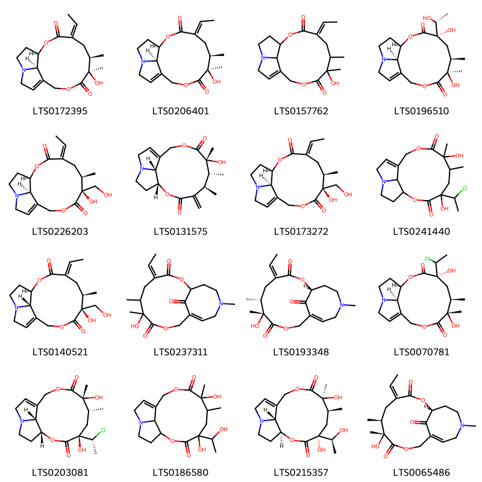{ width=100% }
    <figcaption>Hình ảnh cấu trúc hóa học của 16 hoạt chất thuộc nhóm Macrolides and analogues gồm ['senecionine (LTS0172395)', 'integerrimine (LTS0206401)', '4-ethylidene-7-hydroxy-6,7-dimethyl-2,9-dioxa-14-azatricyclo[9.5.1.0¹⁴,¹⁷]heptadec-11-ene-3,8-dione (LTS0157762)', '(1r,4s,6r,7r,17r)-4,7-dihydroxy-4-[(1r)-1-hydroxyethyl]-6,7-dimethyl-2,9-dioxa-14-azatricyclo[9.5.1.0¹⁴,¹⁷]heptadec-11-ene-3,8-dione (LTS0196510)', 'retrorsine (LTS0226203)', 'senecivernine (LTS0131575)', 'usaramine (LTS0173272)', '4-(1-chloroethyl)-4,7-dihydroxy-6,7-dimethyl-2,9-dioxa-14-azatricyclo[9.5.1.0¹⁴,¹⁷]heptadec-11-ene-3,8-dione (LTS0241440)', '(1r,6r,7s,17s)-4-ethylidene-7-hydroxy-7-(hydroxymethyl)-6-methyl-2,9-dioxa-14-azatricyclo[9.5.1.0¹⁴,¹⁷]heptadec-11-ene-3,8-dione (LTS0140521)', '(4z,11z)-4-ethylidene-7-hydroxy-6,7,14-trimethyl-2,9-dioxa-14-azabicyclo[9.5.1]heptadec-11-ene-3,8,17-trione (LTS0237311)', 'senkirkine (LTS0193348)', '(1r,4r,6r,7s,17r)-4-(1-chloroethyl)-4,7-dihydroxy-6,7-dimethyl-2,9-dioxa-14-azatricyclo[9.5.1.0¹⁴,¹⁷]heptadec-11-ene-3,8-dione (LTS0070781)', 'jaconine (LTS0203081)', '4,7-dihydroxy-4-(1-hydroxyethyl)-6,7-dimethyl-2,9-dioxa-14-azatricyclo[9.5.1.0¹⁴,¹⁷]heptadec-11-ene-3,8-dione (LTS0186580)', '(1s,4r,6s,7s,17r)-4,7-dihydroxy-4-[(1s)-1-hydroxyethyl]-6,7-dimethyl-2,9-dioxa-14-azatricyclo[9.5.1.0¹⁴,¹⁷]heptadec-11-ene-3,8-dione (LTS0215357)', '(1r,4z,6s,7r,11z)-4-ethylidene-7-hydroxy-6,7,14-trimethyl-2,9-dioxa-14-azabicyclo[9.5.1]heptadec-11-ene-3,8,17-trione (LTS0065486)'].</figcaption>
</figure>
#### Nhóm Organonitrogen compounds
<figure markdown="span">
    { width=100% }
    <figcaption>Hình ảnh cấu trúc hóa học của 2 hoạt chất thuộc nhóm Organonitrogen compounds gồm ['putrescine (LTS0238763)', 'spermidine (LTS0061428)'].</figcaption>
</figure>
#### Nhóm Prenol lipids
<figure markdown="span">
    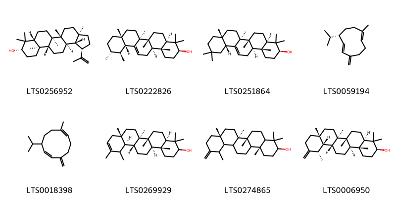{ width=100% }
    <figcaption>Hình ảnh cấu trúc hóa học của 8 hoạt chất thuộc nhóm Prenol lipids gồm ['lupeol (LTS0256952)', 'amyrin (LTS0222826)', 'β-amyrin (LTS0251864)', '(-)-germacrene d (LTS0059194)', '8-isopropyl-1-methyl-5-methylidenecyclodeca-1,6-diene (LTS0018398)', '(4ar,6ar,6br,8as,12ar,12br,14ar,14br)-4,4,6a,6b,8a,11,12,14b-octamethyl-2,3,4a,5,6,7,8,9,12,12a,12b,13,14,14a-tetradecahydro-1h-picen-3-ol (LTS0269929)', '(6ar,6br,8ar,14br)-4,4,6a,6b,8a,12,14b-heptamethyl-11-methylidene-hexadecahydropicen-3-ol (LTS0274865)', 'taraxasterol (LTS0006950)'].</figcaption>
</figure>
#### Nhóm Steroids and steroid derivatives
<figure markdown="span">
    { width=100% }
    <figcaption>Hình ảnh cấu trúc hóa học của 5 hoạt chất thuộc nhóm Steroids and steroid derivatives gồm ['stigmast-5-en-3-ol (LTS0071224)', 'stigmast-5-en-3-ol, (3β)- (LTS0204616)', 'phytosterol (LTS0029311)', '(1r,3as,3bs,7s,9bs)-1-[(2r,5r)-5,6-dimethylheptan-2-yl]-9a,11a-dimethyl-1h,2h,3h,3ah,3bh,4h,6h,7h,8h,9h,9bh,10h,11h-cyclopenta[a]phenanthren-7-ol (LTS0057877)', 'campesterol (LTS0046755)'].</figcaption>
</figure>
#### Nhóm Unsaturated hydrocarbons
<figure markdown="span">
    { width=100% }
    <figcaption>Hình ảnh cấu trúc hóa học của 4 hoạt chất thuộc nhóm Unsaturated hydrocarbons gồm ['2,6-dimethylocta-1,3,5,7-tetraene (LTS0203596)', 'cosmene (LTS0151256)', '(7e,9e)-heptadeca-1,7,9-trien-11,13,15-triyne (LTS0273836)', 'heptadeca-1,7,9-trien-11,13,15-triyne (LTS0203633)'].</figcaption>
</figure>

---

### Dược dân tộc học

Danh sách các quốc gia có sử dụng *Senecio jacobaea* trong điều trị các bệnh. 

| Country   | Disease                                    | Bệnh                                                                                                                                                                                                |
|:----------|:-------------------------------------------|:----------------------------------------------------------------------------------------------------------------------------------------------------------------------------------------------------|
| Turkey    | Hemostat, Laxative, Sudorific, Emmenagogue | MYMEMORY WARNING: YOU USED ALL AVAILABLE FREE TRANSLATIONS FOR TODAY. NEXT AVAILABLE IN  12 HOURS 23 MINUTES 01 SECONDS VISIT HTTPS://MYMEMORY.TRANSLATED.NET/DOC/USAGELIMITS.PHP TO TRANSLATE MORE |
| ain       | Vulnerary                                  | MYMEMORY WARNING: YOU USED ALL AVAILABLE FREE TRANSLATIONS FOR TODAY. NEXT AVAILABLE IN  12 HOURS 22 MINUTES 58 SECONDS VISIT HTTPS://MYMEMORY.TRANSLATED.NET/DOC/USAGELIMITS.PHP TO TRANSLATE MORE |

---

---
## Senecio jacquemontianus
### Thông tin về thực vật

!!! info "Phân loại thực vật của *Ligularia jacquemontiana* từ GIBF:"
    - **Kingdom:** Plantae
    - **Phylum:** Tracheophyta
    - **Order:** Asterales
    - **Family:** Asteraceae
    - **Genus:** Ligularia
    - **Species:** *Ligularia jacquemontiana*

 

| Label (VI)   | Label (EN)   | Scientific Name   | Descriptions (VI)   | Descriptions (EN)   | Also Known As (VI)   | Also Known As (EN)                                                                                                                                                                                                                      |
|:-------------|:-------------|:------------------|:--------------------|:--------------------|:---------------------|:----------------------------------------------------------------------------------------------------------------------------------------------------------------------------------------------------------------------------------------|
| N/A          | N/A          | Senecio jacobaea  | loài thực vật       | species of plant    | ['']                 | ['benweed', 'cankerwort', 'common ragwort', 'dog standard', 'Jacobaea vulgaris', 'ragwort', 'Saint James-wort', 'St. James-wort', 'staggerwort', 'stammerwort', 'stinking nanny', 'stinking ninny', 'stinking willie', 'tansy ragwort'] |

#### Phân bố trên thế giới

**Từ CSDL GIBF** Netherlands, Italy, Germany, Spain, Ireland, Austria, Kazakhstan, Norway, United Kingdom of Great Britain and Northern Ireland

#### Phân bố tại Việt Nam

**Từ CSDL GIBF**: Không có ghi nhận ở Việt Nam

---
### Thành phần hóa học
        
- Theo cơ sở dữ liệu lotus: Từ loài *Ligularia jacquemontiana* đã phân lập và xác định được Chưa có hoạt chất nào được phân lập. hoạt chất thuộc về các nhóm Không có hoạt chất nào được phân lập. 

Không có hình ảnh nào được tạo ra

---

### Dược dân tộc học

Danh sách các quốc gia có sử dụng *Ligularia jacquemontiana* trong điều trị các bệnh. 

| Country   | Disease        | Bệnh                                                                                                                                                                                                |
|:----------|:---------------|:----------------------------------------------------------------------------------------------------------------------------------------------------------------------------------------------------|
| Kashmir   | Tonic, Nervine | MYMEMORY WARNING: YOU USED ALL AVAILABLE FREE TRANSLATIONS FOR TODAY. NEXT AVAILABLE IN  12 HOURS 22 MINUTES 19 SECONDS VISIT HTTPS://MYMEMORY.TRANSLATED.NET/DOC/USAGELIMITS.PHP TO TRANSLATE MORE |

---

---
## Senecio palmatus
### Thông tin về thực vật

!!! info "Phân loại thực vật của *Senecio palmatus* từ GIBF:"
    - **Kingdom:** Plantae
    - **Phylum:** Tracheophyta
    - **Order:** Asterales
    - **Family:** Asteraceae
    - **Genus:** Senecio
    - **Species:** *Senecio palmatus*

 

| Label (VI)   | Label (EN)   | Scientific Name   | Descriptions (VI)   | Descriptions (EN)   | Also Known As (VI)   | Also Known As (EN)   |
|:-------------|:-------------|:------------------|:--------------------|:--------------------|:---------------------|:---------------------|
| N/A          | N/A          | Senecio palmatus  |                     |                     | ['']                 | ['']                 |

#### Phân bố trên thế giới

**Từ CSDL GIBF** unknown or invalid, Russian Federation, United States of America, Japan

#### Phân bố tại Việt Nam

**Từ CSDL GIBF**: Không có ghi nhận ở Việt Nam

---
### Thành phần hóa học
        
- Theo cơ sở dữ liệu lotus: Từ loài *Senecio palmatus* đã phân lập và xác định được 11 hoạt chất thuộc về các nhóm Fatty Acyls, Organooxygen compounds. 

|    | chemicalTaxonomyClassyfireClass   |   smiles_count |
|---:|:----------------------------------|---------------:|
|  0 |                                   |              2 |
|  1 | Fatty Acyls                       |              8 |
|  2 | Organooxygen compounds            |              1 |

#### Nhóm 
<figure markdown="span">
    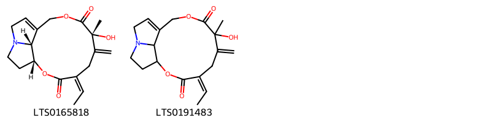{ width=100% }
    <figcaption>Hình ảnh cấu trúc hóa học của 2 hoạt chất thuộc nhóm  gồm ['seneciphylline (LTS0165818)', '4-ethylidene-7-hydroxy-7-methyl-6-methylidene-2,9-dioxa-14-azatricyclo[9.5.1.0¹⁴,¹⁷]heptadec-11-ene-3,8-dione (LTS0191483)'].</figcaption>
</figure>
#### Nhóm Fatty Acyls
<figure markdown="span">
    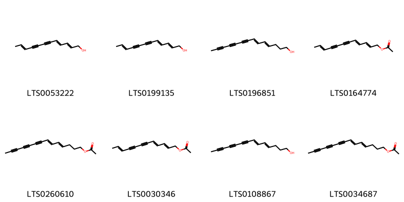{ width=100% }
    <figcaption>Hình ảnh cấu trúc hóa học của 8 hoạt chất thuộc nhóm Fatty Acyls gồm ['(2e,4e,10e)-dodeca-2,4,10-trien-6,8-diyn-1-ol (LTS0053222)', 'dodeca-2,4,10-trien-6,8-diyn-1-ol (LTS0199135)', 'tetradeca-4,6-dien-8,10,12-triyn-1-ol (LTS0196851)', 'dodeca-2,4,10-trien-6,8-diyn-1-yl acetate (LTS0164774)', '(4e,6e)-tetradeca-4,6-dien-8,10,12-triyn-1-yl acetate (LTS0260610)', '(2e,4e,10e)-dodeca-2,4,10-trien-6,8-diyn-1-yl acetate (LTS0030346)', '(4e,6e)-tetradeca-4,6-dien-8,10,12-triyn-1-ol (LTS0108867)', 'tetradeca-4,6-dien-8,10,12-triyn-1-yl acetate (LTS0034687)'].</figcaption>
</figure>
#### Nhóm Organooxygen compounds
<figure markdown="span">
    { width=100% }
    <figcaption>Hình ảnh cấu trúc hóa học của 1 hoạt chất thuộc nhóm Organooxygen compounds gồm ['methyl 2-(1-hydroxy-4-oxocyclohexa-2,5-dien-1-yl)acetate (LTS0033674)'].</figcaption>
</figure>

---

### Dược dân tộc học

Danh sách các quốc gia có sử dụng *Senecio palmatus* trong điều trị các bệnh. 

| Country   | Disease                                       | Bệnh                                                                                                                                                                                                |
|:----------|:----------------------------------------------|:----------------------------------------------------------------------------------------------------------------------------------------------------------------------------------------------------|
| China     | Carminative, Tonic, Astringent, Contraceptive | MYMEMORY WARNING: YOU USED ALL AVAILABLE FREE TRANSLATIONS FOR TODAY. NEXT AVAILABLE IN  12 HOURS 21 MINUTES 56 SECONDS VISIT HTTPS://MYMEMORY.TRANSLATED.NET/DOC/USAGELIMITS.PHP TO TRANSLATE MORE |

---

---
## Senecio scandens
### Thông tin về thực vật

!!! info "Phân loại thực vật của *Senecio scandens* từ GIBF:"
    - **Kingdom:** Plantae
    - **Phylum:** Tracheophyta
    - **Order:** Asterales
    - **Family:** Asteraceae
    - **Genus:** Senecio
    - **Species:** *Senecio scandens*

 

| Label (VI)   | Label (EN)   | Scientific Name   | Descriptions (VI)   | Descriptions (EN)   | Also Known As (VI)   | Also Known As (EN)   |
|:-------------|:-------------|:------------------|:--------------------|:--------------------|:---------------------|:---------------------|
| N/A          | N/A          | Senecio scandens  | loài thực vật       | species of plant    | ['']                 | ['']                 |

#### Phân bố trên thế giới

**Từ CSDL GIBF** Hong Kong, Korea, Republic of, Chinese Taipei, Bhutan, China, Nepal

#### Phân bố tại Việt Nam

**Từ CSDL GIBF**: Không có ghi nhận ở Việt Nam

---
### Thành phần hóa học
        
- Theo cơ sở dữ liệu lotus: Từ loài *Senecio scandens* đã phân lập và xác định được 19 hoạt chất thuộc về các nhóm Fatty Acyls, Flavonoids, Prenol lipids, Steroids and steroid derivatives, Benzene and substituted derivatives, Organooxygen compounds, Saccharolipids. 

|    | chemicalTaxonomyClassyfireClass     |   smiles_count |
|---:|:------------------------------------|---------------:|
|  0 | Benzene and substituted derivatives |              1 |
|  1 | Fatty Acyls                         |              1 |
|  2 | Flavonoids                          |              2 |
|  3 | Organooxygen compounds              |              5 |
|  4 | Prenol lipids                       |              2 |
|  5 | Saccharolipids                      |              4 |
|  6 | Steroids and steroid derivatives    |              2 |

#### Nhóm Benzene and substituted derivatives
<figure markdown="span">
    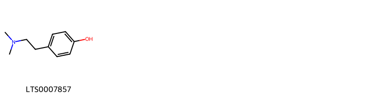{ width=100% }
    <figcaption>Hình ảnh cấu trúc hóa học của 1 hoạt chất thuộc nhóm Benzene and substituted derivatives gồm ['hordenine (LTS0007857)'].</figcaption>
</figure>
#### Nhóm Fatty Acyls
<figure markdown="span">
    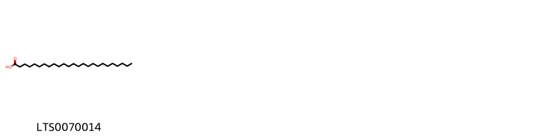{ width=100% }
    <figcaption>Hình ảnh cấu trúc hóa học của 1 hoạt chất thuộc nhóm Fatty Acyls gồm ['pentacosanoic acid (LTS0070014)'].</figcaption>
</figure>
#### Nhóm Flavonoids
<figure markdown="span">
    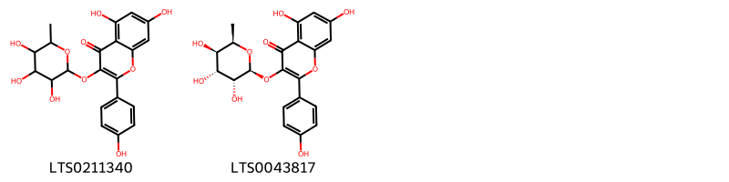{ width=100% }
    <figcaption>Hình ảnh cấu trúc hóa học của 2 hoạt chất thuộc nhóm Flavonoids gồm ['5,7-dihydroxy-2-(4-hydroxyphenyl)-3-[(3,4,5-trihydroxy-6-methyloxan-2-yl)oxy]chromen-4-one (LTS0211340)', '5,7-dihydroxy-2-(4-hydroxyphenyl)-3-{[(2s,3r,4r,5r,6r)-3,4,5-trihydroxy-6-methyloxan-2-yl]oxy}chromen-4-one (LTS0043817)'].</figcaption>
</figure>
#### Nhóm Organooxygen compounds
<figure markdown="span">
    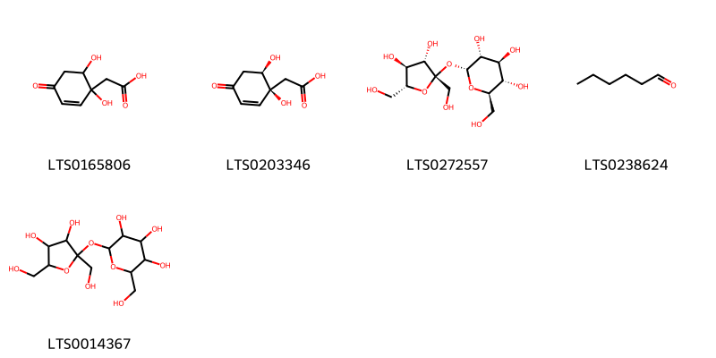{ width=100% }
    <figcaption>Hình ảnh cấu trúc hóa học của 5 hoạt chất thuộc nhóm Organooxygen compounds gồm ['(1,6-dihydroxy-4-oxocyclohex-2-en-1-yl)acetic acid (LTS0165806)', '[(1s,6r)-1,6-dihydroxy-4-oxocyclohex-2-en-1-yl]acetic acid (LTS0203346)', 'sucrose (LTS0272557)', 'hexanal (LTS0238624)', 'granulated sugar (LTS0014367)'].</figcaption>
</figure>
#### Nhóm Prenol lipids
<figure markdown="span">
    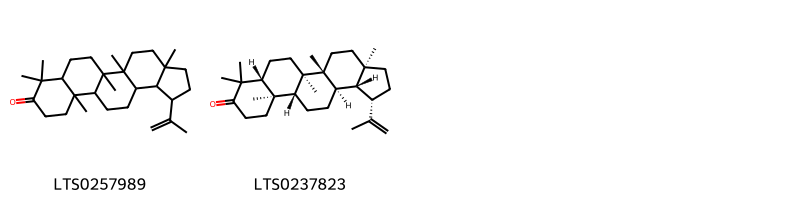{ width=100% }
    <figcaption>Hình ảnh cấu trúc hóa học của 2 hoạt chất thuộc nhóm Prenol lipids gồm ['3a,5a,5b,8,8,11a-hexamethyl-1-(prop-1-en-2-yl)-tetradecahydro-1h-cyclopenta[a]chrysen-9-one (LTS0257989)', '(1s,3ar,5ar,5br,7ar,11ar,11br,13ar,13br)-3a,5a,5b,8,8,11a-hexamethyl-1-(prop-1-en-2-yl)-tetradecahydro-1h-cyclopenta[a]chrysen-9-one (LTS0237823)'].</figcaption>
</figure>
#### Nhóm Saccharolipids
<figure markdown="span">
    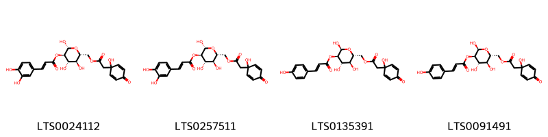{ width=100% }
    <figcaption>Hình ảnh cấu trúc hóa học của 4 hoạt chất thuộc nhóm Saccharolipids gồm ['(2r,3r,4s,5s,6r)-2,4,5-trihydroxy-6-({[2-(1-hydroxy-4-oxocyclohexa-2,5-dien-1-yl)acetyl]oxy}methyl)oxan-3-yl 3-(3,4-dihydroxyphenyl)prop-2-enoate (LTS0024112)', '(2r,3r,4s,5s,6r)-2,4,5-trihydroxy-6-({[2-(1-hydroxy-4-oxocyclohexa-2,5-dien-1-yl)acetyl]oxy}methyl)oxan-3-yl (2e)-3-(3,4-dihydroxyphenyl)prop-2-enoate (LTS0257511)', '(2s,3r,4s,5s,6r)-2,4,5-trihydroxy-6-({[2-(1-hydroxy-4-oxocyclohexa-2,5-dien-1-yl)acetyl]oxy}methyl)oxan-3-yl 3-(4-hydroxyphenyl)prop-2-enoate (LTS0135391)', '(2s,3r,4s,5s,6r)-2,4,5-trihydroxy-6-({[2-(1-hydroxy-4-oxocyclohexa-2,5-dien-1-yl)acetyl]oxy}methyl)oxan-3-yl (2e)-3-(4-hydroxyphenyl)prop-2-enoate (LTS0091491)'].</figcaption>
</figure>
#### Nhóm Steroids and steroid derivatives
<figure markdown="span">
    { width=100% }
    <figcaption>Hình ảnh cấu trúc hóa học của 2 hoạt chất thuộc nhóm Steroids and steroid derivatives gồm ['stigmast-5-en-3-ol, (3β)- (LTS0204616)', 'sitosterol (LTS0168132)'].</figcaption>
</figure>

---

### Dược dân tộc học

Danh sách các quốc gia có sử dụng *Senecio scandens* trong điều trị các bệnh. 

| Country     | Disease                                         | Bệnh                                                                                                                                                                                                |
|:------------|:------------------------------------------------|:----------------------------------------------------------------------------------------------------------------------------------------------------------------------------------------------------|
| China       | Alexiteric, Emetic, Poison, Refrigerant, Poison | MYMEMORY WARNING: YOU USED ALL AVAILABLE FREE TRANSLATIONS FOR TODAY. NEXT AVAILABLE IN  12 HOURS 21 MINUTES 25 SECONDS VISIT HTTPS://MYMEMORY.TRANSLATED.NET/DOC/USAGELIMITS.PHP TO TRANSLATE MORE |
| Philippines | Emetic                                          | MYMEMORY WARNING: YOU USED ALL AVAILABLE FREE TRANSLATIONS FOR TODAY. NEXT AVAILABLE IN  12 HOURS 21 MINUTES 22 SECONDS VISIT HTTPS://MYMEMORY.TRANSLATED.NET/DOC/USAGELIMITS.PHP TO TRANSLATE MORE |

---

---
## Senecio tenuifolius
### Thông tin về thực vật

!!! info "Phân loại thực vật của *Senecio tenuifolius* từ GIBF:"
    - **Kingdom:** Plantae
    - **Phylum:** Tracheophyta
    - **Order:** Asterales
    - **Family:** Asteraceae
    - **Genus:** Senecio
    - **Species:** *Senecio tenuifolius*

 

| Label (VI)   | Label (EN)   | Scientific Name     | Descriptions (VI)   | Descriptions (EN)   | Also Known As (VI)   | Also Known As (EN)   |
|:-------------|:-------------|:--------------------|:--------------------|:--------------------|:---------------------|:---------------------|
| N/A          | N/A          | Senecio tenuifolius | loài thực vật       | species of plant    | ['']                 | ['']                 |

#### Phân bố trên thế giới

**Từ CSDL GIBF** nan, South Africa, Netherlands, Germany, Romania, Hungary, India, unknown or invalid, Sweden, France, United Kingdom of Great Britain and Northern Ireland, Canada

#### Phân bố tại Việt Nam

**Từ CSDL GIBF**: Không có ghi nhận ở Việt Nam

---
### Thành phần hóa học
        
- Theo cơ sở dữ liệu lotus: Từ loài *Senecio tenuifolius* đã phân lập và xác định được 5 hoạt chất thuộc về các nhóm Macrolides and analogues. 

|    | chemicalTaxonomyClassyfireClass   |   smiles_count |
|---:|:----------------------------------|---------------:|
|  0 | Macrolides and analogues          |              4 |

#### Nhóm Macrolides and analogues
<figure markdown="span">
    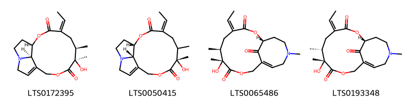{ width=100% }
    <figcaption>Hình ảnh cấu trúc hóa học của 4 hoạt chất thuộc nhóm Macrolides and analogues gồm ['senecionine (LTS0172395)', '(1s,4z,7s,17s)-4-ethylidene-7-hydroxy-6,7-dimethyl-2,9-dioxa-14-azatricyclo[9.5.1.0¹⁴,¹⁷]heptadec-11-ene-3,8-dione (LTS0050415)', '(1r,4z,6s,7r,11z)-4-ethylidene-7-hydroxy-6,7,14-trimethyl-2,9-dioxa-14-azabicyclo[9.5.1]heptadec-11-ene-3,8,17-trione (LTS0065486)', 'senkirkine (LTS0193348)'].</figcaption>
</figure>

---

### Dược dân tộc học

Danh sách các quốc gia có sử dụng *Senecio tenuifolius* trong điều trị các bệnh. 

| Country   | Disease              | Bệnh                                                                                                                                                                                                |
|:----------|:---------------------|:----------------------------------------------------------------------------------------------------------------------------------------------------------------------------------------------------|
| India     | Vulnerary, Emollient | MYMEMORY WARNING: YOU USED ALL AVAILABLE FREE TRANSLATIONS FOR TODAY. NEXT AVAILABLE IN  12 HOURS 20 MINUTES 48 SECONDS VISIT HTTPS://MYMEMORY.TRANSLATED.NET/DOC/USAGELIMITS.PHP TO TRANSLATE MORE |

---

---
## Senecio vulgaris
### Thông tin về thực vật

!!! info "Phân loại thực vật của *Senecio vulgaris* từ GIBF:"
    - **Kingdom:** Plantae
    - **Phylum:** Tracheophyta
    - **Order:** Asterales
    - **Family:** Asteraceae
    - **Genus:** Senecio
    - **Species:** *Senecio vulgaris*

 

| Label (VI)   | Label (EN)   | Scientific Name   | Descriptions (VI)   | Descriptions (EN)   | Also Known As (VI)   | Also Known As (EN)   |
|:-------------|:-------------|:------------------|:--------------------|:--------------------|:---------------------|:---------------------|
| N/A          | N/A          | Senecio vulgaris  | loài thực vật       | species of plant    | ['']                 | ['Groundsel']        |

#### Phân bố trên thế giới

**Từ CSDL GIBF** Italy, Australia, Japan, Argentina, Canada, Ukraine, Netherlands, Lithuania, Luxembourg, Spain, Hungary, Portugal, Türkiye, Russian Federation, United States of America, Chile, Greece, Czechia, Germany, Romania, Switzerland, Austria, France, United Kingdom of Great Britain and Northern Ireland, Colombia, Ireland, Poland, New Zealand

#### Phân bố tại Việt Nam

**Từ CSDL GIBF**: Không có ghi nhận ở Việt Nam

---
### Thành phần hóa học
        
- Theo cơ sở dữ liệu lotus: Từ loài *Senecio vulgaris* đã phân lập và xác định được 45 hoạt chất thuộc về các nhóm Fatty Acyls, Prenol lipids, Oxepanes, Organonitrogen compounds, Benzofurans, Benzene and substituted derivatives, Organooxygen compounds, Macrolides and analogues. 

|    | chemicalTaxonomyClassyfireClass     |   smiles_count |
|---:|:------------------------------------|---------------:|
|  0 |                                     |             10 |
|  1 | Benzene and substituted derivatives |              2 |
|  2 | Benzofurans                         |              2 |
|  3 | Fatty Acyls                         |              1 |
|  4 | Macrolides and analogues            |             12 |
|  5 | Organonitrogen compounds            |              3 |
|  6 | Organooxygen compounds              |              3 |
|  7 | Oxepanes                            |              2 |
|  8 | Prenol lipids                       |              8 |

#### Nhóm 
<figure markdown="span">
    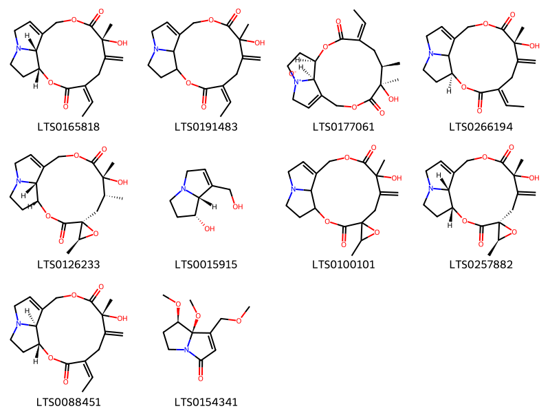{ width=100% }
    <figcaption>Hình ảnh cấu trúc hóa học của 10 hoạt chất thuộc nhóm  gồm ['seneciphylline (LTS0165818)', '4-ethylidene-7-hydroxy-7-methyl-6-methylidene-2,9-dioxa-14-azatricyclo[9.5.1.0¹⁴,¹⁷]heptadec-11-ene-3,8-dione (LTS0191483)', 'senecionine n-oxide (LTS0177061)', '(1s,4e,7r)-4-ethylidene-7-hydroxy-7-methyl-6-methylidene-2,9-dioxa-14-azatricyclo[9.5.1.0¹⁴,¹⁷]heptadec-11-ene-3,8-dione (LTS0266194)', 'jacobine (LTS0126233)', 'retronecine (LTS0015915)', "7'-hydroxy-3,7'-dimethyl-6'-methylidene-2',9'-dioxa-14'-azaspiro[oxirane-2,4'-tricyclo[9.5.1.0¹⁴,¹⁷]heptadecan]-11'-ene-3',8'-dione (LTS0100101)", "(1'r,2s,3s,7'r,17'r)-7'-hydroxy-3,7'-dimethyl-6'-methylidene-2',9'-dioxa-14'-azaspiro[oxirane-2,4'-tricyclo[9.5.1.0¹⁴,¹⁷]heptadecan]-11'-ene-3',8'-dione (LTS0257882)", '(1r,4z,7r,17s)-4-ethylidene-7-hydroxy-7-methyl-6-methylidene-2,9-dioxa-14-azatricyclo[9.5.1.0¹⁴,¹⁷]heptadec-11-ene-3,8-dione (LTS0088451)', '(7r,7ar)-7,7a-dimethoxy-1-(methoxymethyl)-6,7-dihydro-5h-pyrrolizin-3-one (LTS0154341)'].</figcaption>
</figure>
#### Nhóm Benzene and substituted derivatives
<figure markdown="span">
    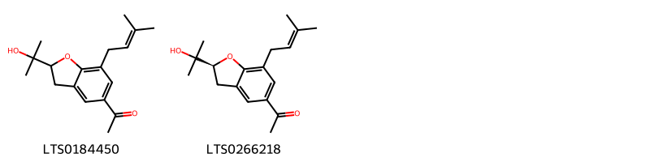{ width=100% }
    <figcaption>Hình ảnh cấu trúc hóa học của 2 hoạt chất thuộc nhóm Benzene and substituted derivatives gồm ['1-[2-(2-hydroxypropan-2-yl)-7-(3-methylbut-2-en-1-yl)-2,3-dihydro-1-benzofuran-5-yl]ethanone (LTS0184450)', '1-[(2s)-2-(2-hydroxypropan-2-yl)-7-(3-methylbut-2-en-1-yl)-2,3-dihydro-1-benzofuran-5-yl]ethanone (LTS0266218)'].</figcaption>
</figure>
#### Nhóm Benzofurans
<figure markdown="span">
    { width=100% }
    <figcaption>Hình ảnh cấu trúc hóa học của 2 hoạt chất thuộc nhóm Benzofurans gồm ['loliolide (LTS0254454)', 'loliolide (LTS0119422)'].</figcaption>
</figure>
#### Nhóm Fatty Acyls
<figure markdown="span">
    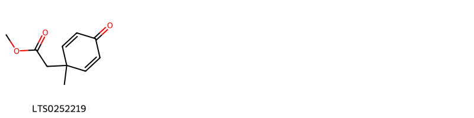{ width=100% }
    <figcaption>Hình ảnh cấu trúc hóa học của 1 hoạt chất thuộc nhóm Fatty Acyls gồm ['methyl 2-(1-methyl-4-oxocyclohexa-2,5-dien-1-yl)acetate (LTS0252219)'].</figcaption>
</figure>
#### Nhóm Macrolides and analogues
<figure markdown="span">
    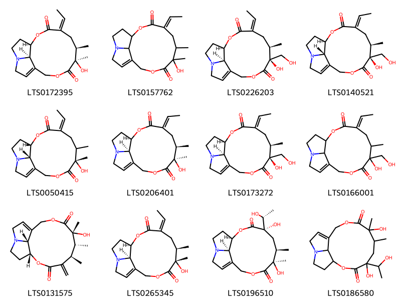{ width=100% }
    <figcaption>Hình ảnh cấu trúc hóa học của 12 hoạt chất thuộc nhóm Macrolides and analogues gồm ['senecionine (LTS0172395)', '4-ethylidene-7-hydroxy-6,7-dimethyl-2,9-dioxa-14-azatricyclo[9.5.1.0¹⁴,¹⁷]heptadec-11-ene-3,8-dione (LTS0157762)', 'retrorsine (LTS0226203)', '(1r,6r,7s,17s)-4-ethylidene-7-hydroxy-7-(hydroxymethyl)-6-methyl-2,9-dioxa-14-azatricyclo[9.5.1.0¹⁴,¹⁷]heptadec-11-ene-3,8-dione (LTS0140521)', '(1s,4z,7s,17s)-4-ethylidene-7-hydroxy-6,7-dimethyl-2,9-dioxa-14-azatricyclo[9.5.1.0¹⁴,¹⁷]heptadec-11-ene-3,8-dione (LTS0050415)', 'integerrimine (LTS0206401)', 'usaramine (LTS0173272)', '4-ethylidene-7-hydroxy-7-(hydroxymethyl)-6-methyl-2,9-dioxa-14-azatricyclo[9.5.1.0¹⁴,¹⁷]heptadec-11-ene-3,8-dione (LTS0166001)', 'senecivernine (LTS0131575)', 'intergerrimine (LTS0265345)', '(1r,4s,6r,7r,17r)-4,7-dihydroxy-4-[(1r)-1-hydroxyethyl]-6,7-dimethyl-2,9-dioxa-14-azatricyclo[9.5.1.0¹⁴,¹⁷]heptadec-11-ene-3,8-dione (LTS0196510)', '4,7-dihydroxy-4-(1-hydroxyethyl)-6,7-dimethyl-2,9-dioxa-14-azatricyclo[9.5.1.0¹⁴,¹⁷]heptadec-11-ene-3,8-dione (LTS0186580)'].</figcaption>
</figure>
#### Nhóm Organonitrogen compounds
<figure markdown="span">
    { width=100% }
    <figcaption>Hình ảnh cấu trúc hóa học của 3 hoạt chất thuộc nhóm Organonitrogen compounds gồm ['putrescine (LTS0238763)', 'spermidine (LTS0061428)', 'homospermidine (LTS0018298)'].</figcaption>
</figure>
#### Nhóm Organooxygen compounds
<figure markdown="span">
    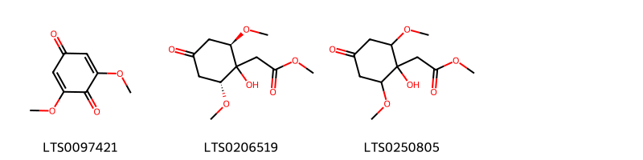{ width=100% }
    <figcaption>Hình ảnh cấu trúc hóa học của 3 hoạt chất thuộc nhóm Organooxygen compounds gồm ['2,6-dimethoxy-1,4-benzoquinone (LTS0097421)', 'methyl 2-[(2r,6r)-1-hydroxy-2,6-dimethoxy-4-oxocyclohexyl]acetate (LTS0206519)', 'methyl 2-(1-hydroxy-2,6-dimethoxy-4-oxocyclohexyl)acetate (LTS0250805)'].</figcaption>
</figure>
#### Nhóm Oxepanes
<figure markdown="span">
    { width=100% }
    <figcaption>Hình ảnh cấu trúc hóa học của 2 hoạt chất thuộc nhóm Oxepanes gồm ['(3e)-4-[(1s,4s,6r)-4-hydroxy-2,2,6-trimethyl-7-oxabicyclo[4.1.0]heptan-1-yl]but-3-en-2-one (LTS0081174)', '4-{4-hydroxy-2,2,6-trimethyl-7-oxabicyclo[4.1.0]heptan-1-yl}but-3-en-2-one (LTS0273299)'].</figcaption>
</figure>
#### Nhóm Prenol lipids
<figure markdown="span">
    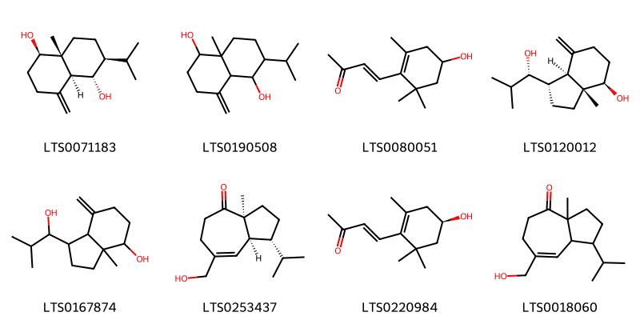{ width=100% }
    <figcaption>Hình ảnh cấu trúc hóa học của 8 hoạt chất thuộc nhóm Prenol lipids gồm ['(1s,2s,4ar,5r,8as)-2-isopropyl-4a-methyl-8-methylidene-octahydronaphthalene-1,5-diol (LTS0071183)', '2-isopropyl-4a-methyl-8-methylidene-octahydronaphthalene-1,5-diol (LTS0190508)', '4-(4-hydroxy-2,6,6-trimethylcyclohex-1-en-1-yl)but-3-en-2-one (LTS0080051)', '(1s,3ar,4r,7as)-1-[(1s)-1-hydroxy-2-methylpropyl]-3a-methyl-7-methylidene-hexahydro-1h-inden-4-ol (LTS0120012)', '1-(1-hydroxy-2-methylpropyl)-3a-methyl-7-methylidene-hexahydro-1h-inden-4-ol (LTS0167874)', '(1r,3as,8as)-7-(hydroxymethyl)-1-isopropyl-3a-methyl-1,2,3,5,6,8a-hexahydroazulen-4-one (LTS0253437)', '(3r)-hydroxy-β-ionone (LTS0220984)', '7-(hydroxymethyl)-1-isopropyl-3a-methyl-1,2,3,5,6,8a-hexahydroazulen-4-one (LTS0018060)'].</figcaption>
</figure>

---

### Dược dân tộc học

Danh sách các quốc gia có sử dụng *Senecio vulgaris* trong điều trị các bệnh. 

| Country   | Disease                                                                             | Bệnh                                                                                                                                                                                                |
|:----------|:------------------------------------------------------------------------------------|:----------------------------------------------------------------------------------------------------------------------------------------------------------------------------------------------------|
| Elsewhere | Emetic, Poison, Purgative, Vermifuge                                                | MYMEMORY WARNING: YOU USED ALL AVAILABLE FREE TRANSLATIONS FOR TODAY. NEXT AVAILABLE IN  12 HOURS 20 MINUTES 19 SECONDS VISIT HTTPS://MYMEMORY.TRANSLATED.NET/DOC/USAGELIMITS.PHP TO TRANSLATE MORE |
| Iraq      | Emmenagogue                                                                         | MYMEMORY WARNING: YOU USED ALL AVAILABLE FREE TRANSLATIONS FOR TODAY. NEXT AVAILABLE IN  12 HOURS 20 MINUTES 17 SECONDS VISIT HTTPS://MYMEMORY.TRANSLATED.NET/DOC/USAGELIMITS.PHP TO TRANSLATE MORE |
| Turkey    | Diuretic, Emmenagogue, Hemostat, Purgative, Sudorific, Vermifuge, Vulnerary, Emetic | MYMEMORY WARNING: YOU USED ALL AVAILABLE FREE TRANSLATIONS FOR TODAY. NEXT AVAILABLE IN  12 HOURS 20 MINUTES 12 SECONDS VISIT HTTPS://MYMEMORY.TRANSLATED.NET/DOC/USAGELIMITS.PHP TO TRANSLATE MORE |
| ain       | Emmenagogue                                                                         | MYMEMORY WARNING: YOU USED ALL AVAILABLE FREE TRANSLATIONS FOR TODAY. NEXT AVAILABLE IN  12 HOURS 20 MINUTES 09 SECONDS VISIT HTTPS://MYMEMORY.TRANSLATED.NET/DOC/USAGELIMITS.PHP TO TRANSLATE MORE |

---

# Chi Tridax

??? note "Danh sách các dược liệu thuộc chi"
    
	 - *Tridax procumbens*

---
## Tridax procumbens
### Thông tin về thực vật

!!! info "Phân loại thực vật của *Tridax procumbens* từ GIBF:"
    - **Kingdom:** Plantae
    - **Phylum:** Tracheophyta
    - **Order:** Asterales
    - **Family:** Asteraceae
    - **Genus:** Tridax
    - **Species:** *Tridax procumbens*

 

| Label (VI)   | Label (EN)   | Scientific Name   | Descriptions (VI)   | Descriptions (EN)   | Also Known As (VI)   | Also Known As (EN)                              |
|:-------------|:-------------|:------------------|:--------------------|:--------------------|:---------------------|:------------------------------------------------|
| N/A          | N/A          | Tridax procumbens | loài thực vật       | species of plant    | ['Cúc muôi']         | ['coat buttons', 'coatbuttons', 'Tridax daisy'] |

#### Phân bố trên thế giới

**Từ CSDL GIBF** Virgin Islands (U.S.), nan, Sri Lanka, Australia, Guadeloupe, Cambodia, Guatemala, Benin, Venezuela (Bolivarian Republic of), Panama, Malawi, Zambia, Puerto Rico, Pakistan, Réunion, Namibia, Chinese Taipei, Honduras, Jamaica, United States of America, El Salvador, Belize, South Africa, Hong Kong, Thailand, Turks and Caicos Islands, Brazil, Guam, Cuba, Mexico, Dominican Republic, Viet Nam, China, Curaçao, Ecuador, Niue, Cabo Verde, Equatorial Guinea, Colombia, Costa Rica, India, Indonesia, Antigua and Barbuda, Philippines, Cameroon, Malaysia

#### Phân bố tại Việt Nam

**Từ CSDL GIBF**: Quảng Nam

---
### Thành phần hóa học
        
- Theo cơ sở dữ liệu lotus: Từ loài *Tridax procumbens* đã phân lập và xác định được 105 hoạt chất thuộc về các nhóm Fatty Acyls, Flavonoids, Prenol lipids, Steroids and steroid derivatives, Oxepanes, Benzofurans, Benzene and substituted derivatives, Bi- and oligothiophenes, Organooxygen compounds, Coumarins and derivatives, Benzopyrans. 

|    | chemicalTaxonomyClassyfireClass     |   smiles_count |
|---:|:------------------------------------|---------------:|
|  0 | Benzene and substituted derivatives |              8 |
|  1 | Benzofurans                         |              2 |
|  2 | Benzopyrans                         |              2 |
|  3 | Bi- and oligothiophenes             |              1 |
|  4 | Coumarins and derivatives           |              2 |
|  5 | Fatty Acyls                         |             20 |
|  6 | Flavonoids                          |             17 |
|  7 | Organooxygen compounds              |              5 |
|  8 | Oxepanes                            |              4 |
|  9 | Prenol lipids                       |             27 |
| 10 | Steroids and steroid derivatives    |             17 |

#### Nhóm Benzene and substituted derivatives
<figure markdown="span">
    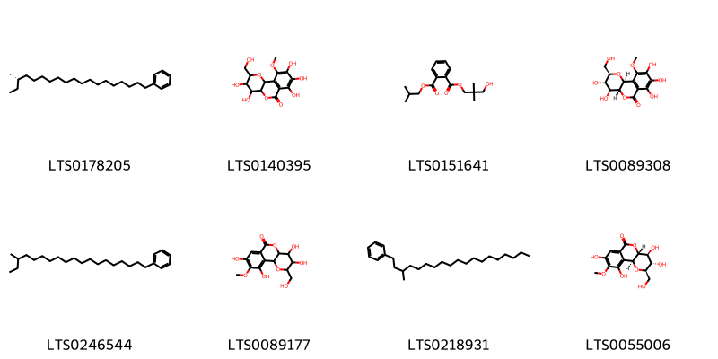{ width=100% }
    <figcaption>Hình ảnh cấu trúc hóa học của 8 hoạt chất thuộc nhóm Benzene and substituted derivatives gồm ['[(17s)-17-methylnonadecyl]benzene (LTS0178205)', '5,6,11,12,13-pentahydroxy-4-(hydroxymethyl)-14-methoxy-3,8-dioxatricyclo[8.4.0.0²,⁷]tetradeca-1(10),11,13-trien-9-one (LTS0140395)', '1-(3-hydroxy-2,2-dimethylpropyl) 2-(2-methylpropyl) phthalate (LTS0151641)', '(2s,4r,5s,6s,7r)-5,6,11,12,13-pentahydroxy-4-(hydroxymethyl)-14-methoxy-3,8-dioxatricyclo[8.4.0.0²,⁷]tetradeca-1(10),11,13-trien-9-one (LTS0089308)', '(17-methylnonadecyl)benzene (LTS0246544)', '5,6,12,14-tetrahydroxy-4-(hydroxymethyl)-13-methoxy-3,8-dioxatricyclo[8.4.0.0²,⁷]tetradeca-1(14),10,12-trien-9-one (LTS0089177)', '(3-methylnonadecyl)benzene (LTS0218931)', 'bergenin (LTS0055006)'].</figcaption>
</figure>
#### Nhóm Benzofurans
<figure markdown="span">
    { width=100% }
    <figcaption>Hình ảnh cấu trúc hóa học của 2 hoạt chất thuộc nhóm Benzofurans gồm ['loliolide (LTS0254454)', 'loliolide (LTS0119422)'].</figcaption>
</figure>
#### Nhóm Benzopyrans
<figure markdown="span">
    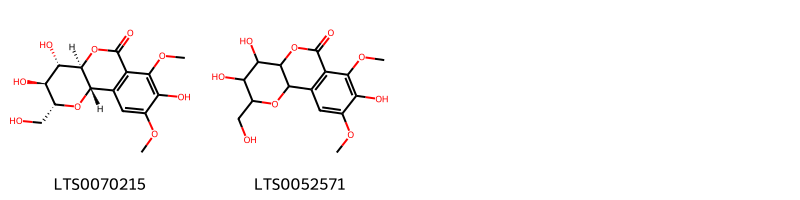{ width=100% }
    <figcaption>Hình ảnh cấu trúc hóa học của 2 hoạt chất thuộc nhóm Benzopyrans gồm ['(2s,4r,5s,6s,7r)-5,6,12-trihydroxy-4-(hydroxymethyl)-11,13-dimethoxy-3,8-dioxatricyclo[8.4.0.0²,⁷]tetradeca-1(10),11,13-trien-9-one (LTS0070215)', '5,6,12-trihydroxy-4-(hydroxymethyl)-11,13-dimethoxy-3,8-dioxatricyclo[8.4.0.0²,⁷]tetradeca-1(10),11,13-trien-9-one (LTS0052571)'].</figcaption>
</figure>
#### Nhóm Bi- and oligothiophenes
<figure markdown="span">
    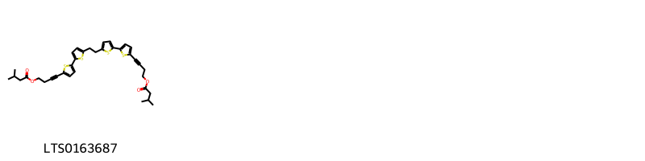{ width=100% }
    <figcaption>Hình ảnh cấu trúc hóa học của 1 hoạt chất thuộc nhóm Bi- and oligothiophenes gồm ["4-{5'-[2-(5'-{4-[(3-methylbutanoyl)oxy]but-1-yn-1-yl}-[2,2'-bithiophen]-5-yl)ethyl]-[2,2'-bithiophen]-5-yl}but-3-yn-1-yl 3-methylbutanoate (LTS0163687)"].</figcaption>
</figure>
#### Nhóm Coumarins and derivatives
<figure markdown="span">
    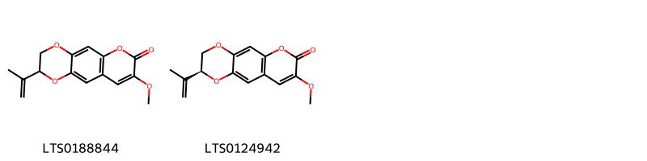{ width=100% }
    <figcaption>Hình ảnh cấu trúc hóa học của 2 hoạt chất thuộc nhóm Coumarins and derivatives gồm ['8-methoxy-2-(prop-1-en-2-yl)-2h,3h-[1,4]dioxino[2,3-g]chromen-7-one (LTS0188844)', '(2s)-8-methoxy-2-(prop-1-en-2-yl)-2h,3h-[1,4]dioxino[2,3-g]chromen-7-one (LTS0124942)'].</figcaption>
</figure>
#### Nhóm Fatty Acyls
<figure markdown="span">
    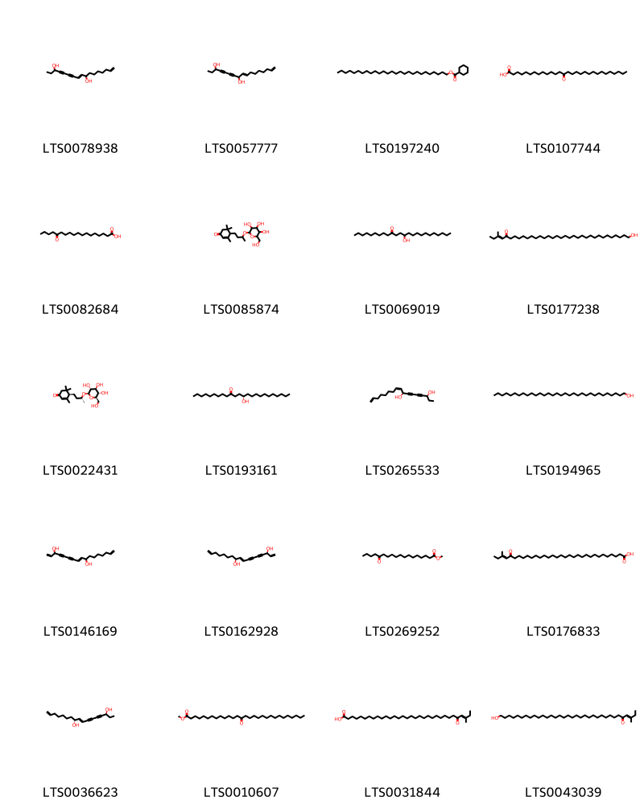{ width=100% }
    <figcaption>Hình ảnh cấu trúc hóa học của 20 hoạt chất thuộc nhóm Fatty Acyls gồm ['heptadeca-8,16-dien-4,6-diyne-3,10-diol (LTS0078938)', 'heptadeca-9,16-dien-4,6-diyne-3,8-diol (LTS0057777)', 'heptacosyl cyclohexanecarboxylate (LTS0197240)', '14-oxononacosanoic acid (LTS0107744)', '14-oxooctadecanoic acid (LTS0082684)', '3,5,5-trimethyl-4-(3-{[3,4,5-trihydroxy-6-(hydroxymethyl)oxan-2-yl]oxy}butyl)cyclohex-2-en-1-one (LTS0085874)', '13-hydroxytetracosan-10-one (LTS0069019)', '(3e)-34-hydroxy-3-methyltetratriacont-3-en-5-one (LTS0177238)', 'byzantionoside b (LTS0022431)', '(13s)-13-hydroxytetracosan-10-one (LTS0193161)', '(3s,8s,9z)-heptadeca-9,16-dien-4,6-diyne-3,8-diol (LTS0265533)', 'dotriacontanol (LTS0194965)', 'heptadeca-1,8,16-trien-4,6-diyne-3,10-diol (LTS0146169)', '(3s,8e,10s)-heptadeca-1,8,16-trien-4,6-diyne-3,10-diol (LTS0162928)', 'methyl 14-oxooctadecanoate (LTS0269252)', '(29e)-30-methyl-28-oxodotriacont-29-enoic acid (LTS0176833)', '(3s,8e,10r)-heptadeca-8,16-dien-4,6-diyne-3,10-diol (LTS0036623)', 'methyl 14-oxononacosanoate (LTS0010607)', '30-methyl-28-oxodotriacont-29-enoic acid (LTS0031844)', '34-hydroxy-3-methyltetratriacont-3-en-5-one (LTS0043039)'].</figcaption>
</figure>
#### Nhóm Flavonoids
<figure markdown="span">
    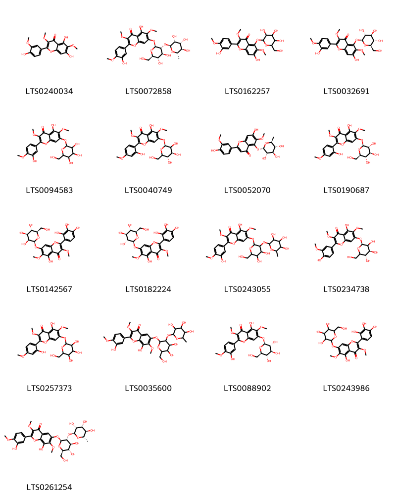{ width=100% }
    <figcaption>Hình ảnh cấu trúc hóa học của 17 hoạt chất thuộc nhóm Flavonoids gồm ['jaceidin (LTS0240034)', '7-{[(2s,3r,4s,5s,6r)-4,5-dihydroxy-6-(hydroxymethyl)-3-{[(2s,3r,4r,5r,6s)-3,4,5-trihydroxy-6-methyloxan-2-yl]oxy}oxan-2-yl]oxy}-5-hydroxy-2-(3-hydroxy-4-methoxyphenyl)-3,6-dimethoxychromen-4-one (LTS0072858)', '7-hydroxy-2-(3-hydroxy-4-methoxyphenyl)-3,6-dimethoxy-5-{[3,4,5-trihydroxy-6-(hydroxymethyl)oxan-2-yl]oxy}chromen-4-one (LTS0162257)', '7-hydroxy-2-(3-hydroxy-4-methoxyphenyl)-3,6-dimethoxy-5-{[(2s,3r,4s,5s,6r)-3,4,5-trihydroxy-6-(hydroxymethyl)oxan-2-yl]oxy}chromen-4-one (LTS0032691)', '5-hydroxy-2-(3-hydroxy-4-methoxyphenyl)-3,6-dimethoxy-7-{[3,4,5-trihydroxy-6-(hydroxymethyl)oxan-2-yl]oxy}chromen-4-one (LTS0094583)', 'tridaxidone (LTS0040749)', '7-hydroxy-2-(4-hydroxy-3-methoxyphenyl)-6-methoxy-5-{[(2s,3s,4r,5r,6s)-3,4,5-trihydroxy-6-methyloxan-2-yl]oxy}chromen-4-one (LTS0052070)', '5-hydroxy-2-(2-hydroxy-4-methoxyphenyl)-3,6-dimethoxy-7-{[(2s,3r,4s,5s,6r)-3,4,5-trihydroxy-6-(hydroxymethyl)oxan-2-yl]oxy}chromen-4-one (LTS0190687)', '5-hydroxy-3,6-dimethoxy-7-{[(2s,3s,4s,5s,6r)-3,4,5-trihydroxy-6-(hydroxymethyl)oxan-2-yl]oxy}-2-(2,3,4-trihydroxyphenyl)chromen-4-one (LTS0142567)', '5-hydroxy-3,6-dimethoxy-7-{[(2s,3r,4s,5s,6r)-3,4,5-trihydroxy-6-(hydroxymethyl)oxan-2-yl]oxy}-2-(2,3,4-trihydroxyphenyl)chromen-4-one (LTS0182224)', '7-{[4,5-dihydroxy-6-(hydroxymethyl)-3-[(3,4,5-trihydroxy-6-methyloxan-2-yl)oxy]oxan-2-yl]oxy}-5-hydroxy-2-(3-hydroxy-4-methoxyphenyl)-3,6-dimethoxychromen-4-one (LTS0243055)', 'jacein (LTS0234738)', '5-hydroxy-2-(2-hydroxy-4-methoxyphenyl)-3,6-dimethoxy-7-{[3,4,5-trihydroxy-6-(hydroxymethyl)oxan-2-yl]oxy}chromen-4-one (LTS0257373)', '6-{[4,5-dihydroxy-6-(hydroxymethyl)-3-[(3,4,5-trihydroxy-6-methyloxan-2-yl)oxy]oxan-2-yl]oxy}-8-hydroxy-2-(3-hydroxy-4-methoxyphenyl)-3,7-dimethoxychromen-4-one (LTS0035600)', 'centaurein (LTS0088902)', '5-hydroxy-3,6-dimethoxy-7-{[3,4,5-trihydroxy-6-(hydroxymethyl)oxan-2-yl]oxy}-2-(2,3,4-trihydroxyphenyl)chromen-4-one (LTS0243986)', '6-{[(2s,3r,4s,5s,6r)-4,5-dihydroxy-6-(hydroxymethyl)-3-{[(2s,3r,4r,5r,6s)-3,4,5-trihydroxy-6-methyloxan-2-yl]oxy}oxan-2-yl]oxy}-8-hydroxy-2-(3-hydroxy-4-methoxyphenyl)-3,7-dimethoxychromen-4-one (LTS0261254)'].</figcaption>
</figure>
#### Nhóm Organooxygen compounds
<figure markdown="span">
    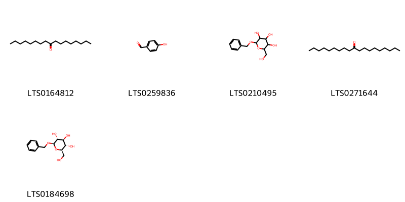{ width=100% }
    <figcaption>Hình ảnh cấu trúc hóa học của 5 hoạt chất thuộc nhóm Organooxygen compounds gồm ['9-heptadecanone (LTS0164812)', 'p-hydroxybenzaldehyde (LTS0259836)', 'benzyl glucopyranoside (LTS0210495)', '10-nonadecanone (LTS0271644)', 'benzyl β-d-glucoside (LTS0184698)'].</figcaption>
</figure>
#### Nhóm Oxepanes
<figure markdown="span">
    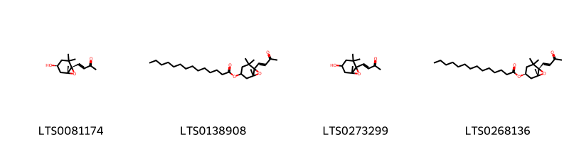{ width=100% }
    <figcaption>Hình ảnh cấu trúc hóa học của 4 hoạt chất thuộc nhóm Oxepanes gồm ['(3e)-4-[(1s,4s,6r)-4-hydroxy-2,2,6-trimethyl-7-oxabicyclo[4.1.0]heptan-1-yl]but-3-en-2-one (LTS0081174)', '1,5,5-trimethyl-6-(3-oxobut-1-en-1-yl)-7-oxabicyclo[4.1.0]heptan-3-yl tetradecanoate (LTS0138908)', '4-{4-hydroxy-2,2,6-trimethyl-7-oxabicyclo[4.1.0]heptan-1-yl}but-3-en-2-one (LTS0273299)', '(1r,3s,6s)-1,5,5-trimethyl-6-[(1e)-3-oxobut-1-en-1-yl]-7-oxabicyclo[4.1.0]heptan-3-yl tetradecanoate (LTS0268136)'].</figcaption>
</figure>
#### Nhóm Prenol lipids
<figure markdown="span">
    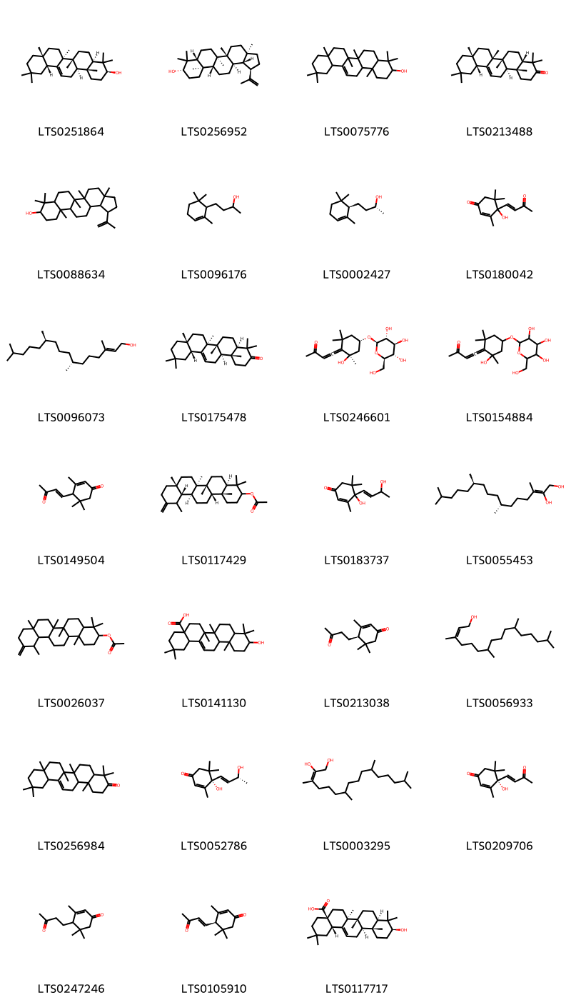{ width=100% }
    <figcaption>Hình ảnh cấu trúc hóa học của 27 hoạt chất thuộc nhóm Prenol lipids gồm ['β-amyrin (LTS0251864)', 'lupeol (LTS0256952)', 'β-amyrin (LTS0075776)', '(4as,6ar,6br,8ar,12ar,14ar,14br)-4,4,6a,6b,8a,11,11,14b-octamethyl-2,4a,5,6,7,8,9,10,12,12a,14,14a-dodecahydro-1h-picen-3-one (LTS0213488)', 'lupeol (LTS0088634)', '4-(2,6,6-trimethylcyclohex-2-en-1-yl)butan-2-ol (LTS0096176)', '(2r)-4-[(1r)-2,6,6-trimethylcyclohex-2-en-1-yl]butan-2-ol (LTS0002427)', '4-hydroxy-3,5,5-trimethyl-4-(3-oxobut-1-en-1-yl)cyclohex-2-en-1-one (LTS0180042)', 'phytol (LTS0096073)', '(4ar,6ar,6bs,8ar,12ar,14ar,14br)-4,4,6a,6b,8a,11,11,14b-octamethyl-2,4a,5,6,7,8,9,10,12,12a,14,14a-dodecahydro-1h-picen-3-one (LTS0175478)', '4-[(2r,4s)-2-hydroxy-2,6,6-trimethyl-4-{[(2r,3r,4s,5s,6r)-3,4,5-trihydroxy-6-(hydroxymethyl)oxan-2-yl]oxy}cyclohexylidene]but-3-en-2-one (LTS0246601)', '4-(2-hydroxy-2,6,6-trimethyl-4-{[3,4,5-trihydroxy-6-(hydroxymethyl)oxan-2-yl]oxy}cyclohexylidene)but-3-en-2-one (LTS0154884)', '3,5,5-trimethyl-4-(3-oxobut-1-en-1-yl)cyclohex-2-en-1-one (LTS0149504)', '(4ar,6ar,6br,8ar,12as,12bs,14as,14br)-4,4,6a,6b,8a,12,14b-heptamethyl-11-methylidene-hexadecahydropicen-3-yl acetate (LTS0117429)', '4-hydroxy-4-(3-hydroxybut-1-en-1-yl)-3,5,5-trimethylcyclohex-2-en-1-one (LTS0183737)', '(2z,7r,11r)-3,7,11,15-tetramethylhexadec-2-ene-1,2-diol (LTS0055453)', '4,4,6a,6b,8a,12,14b-heptamethyl-11-methylidene-hexadecahydropicen-3-yl acetate (LTS0026037)', 'oleanolic acid (LTS0141130)', '(4r)-3,5,5-trimethyl-4-(3-oxobutyl)cyclohex-2-en-1-one (LTS0213038)', '3,7,11,15-tetramethylhexadec-2-en-1-ol (LTS0056933)', '4,4,6a,6b,8a,11,11,14b-octamethyl-2,4a,5,6,7,8,9,10,12,12a,14,14a-dodecahydro-1h-picen-3-one (LTS0256984)', '(6s,9r)-vomifoliol (LTS0052786)', '3,7,11,15-tetramethylhexadec-2-ene-1,2-diol (LTS0003295)', 'dehydrovomifoliol (LTS0209706)', '3,5,5-trimethyl-4-(3-oxobutyl)cyclohex-2-en-1-one (LTS0247246)', '(4r)-3,5,5-trimethyl-4-[(1e)-3-oxobut-1-en-1-yl]cyclohex-2-en-1-one (LTS0105910)', 'oleanolic acid (LTS0117717)'].</figcaption>
</figure>
#### Nhóm Steroids and steroid derivatives
<figure markdown="span">
    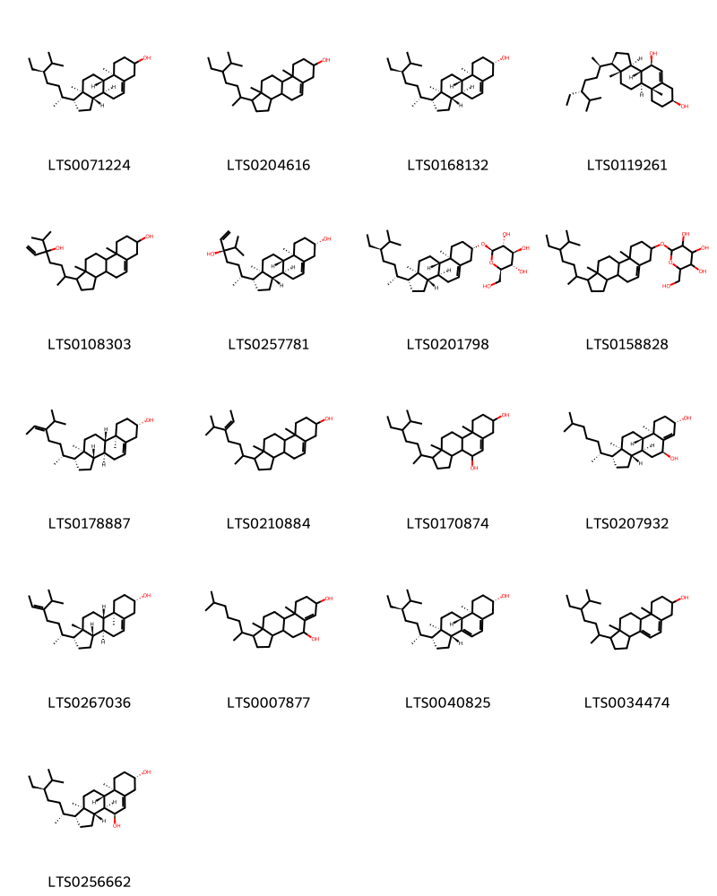{ width=100% }
    <figcaption>Hình ảnh cấu trúc hóa học của 17 hoạt chất thuộc nhóm Steroids and steroid derivatives gồm ['stigmast-5-en-3-ol (LTS0071224)', 'stigmast-5-en-3-ol, (3β)- (LTS0204616)', 'sitosterol (LTS0168132)', '7β-hydroxysitosterol (LTS0119261)', '1-(5-hydroxy-5-isopropylhept-6-en-2-yl)-9a,11a-dimethyl-1h,2h,3h,3ah,3bh,4h,6h,7h,8h,9h,9bh,10h,11h-cyclopenta[a]phenanthren-7-ol (LTS0108303)', '(1r,3as,3bs,7s,9ar,9bs,11ar)-1-[(2r,5r)-5-hydroxy-5-isopropylhept-6-en-2-yl]-9a,11a-dimethyl-1h,2h,3h,3ah,3bh,4h,6h,7h,8h,9h,9bh,10h,11h-cyclopenta[a]phenanthren-7-ol (LTS0257781)', 'sitogluside (LTS0201798)', '2-{[1-(5-ethyl-6-methylheptan-2-yl)-9a,11a-dimethyl-1h,2h,3h,3ah,3bh,4h,6h,7h,8h,9h,9bh,10h,11h-cyclopenta[a]phenanthren-7-yl]oxy}-6-(hydroxymethyl)oxane-3,4,5-triol (LTS0158828)', 'fucosterol (LTS0178887)', '1-(5-isopropylhept-5-en-2-yl)-9a,11a-dimethyl-1h,2h,3h,3ah,3bh,4h,6h,7h,8h,9h,9bh,10h,11h-cyclopenta[a]phenanthren-7-ol (LTS0210884)', '1-(5-ethyl-6-methylheptan-2-yl)-9a,11a-dimethyl-1h,2h,3h,3ah,3bh,4h,6h,7h,8h,9h,9bh,10h,11h-cyclopenta[a]phenanthrene-4,7-diol (LTS0170874)', '(1r,3as,3bs,5s,7s,9ar,9bs,11ar)-9a,11a-dimethyl-1-[(2r)-6-methylheptan-2-yl]-1h,2h,3h,3ah,3bh,4h,5h,7h,8h,9h,9bh,10h,11h-cyclopenta[a]phenanthrene-5,7-diol (LTS0207932)', '(1r,3as,3bs,7s,9ar,9bs,11as)-1-[(2r,5z)-5-isopropylhept-5-en-2-yl]-9a,11a-dimethyl-1h,2h,3h,3ah,3bh,4h,6h,7h,8h,9h,9bh,10h,11h-cyclopenta[a]phenanthren-7-ol (LTS0267036)', '9a,11a-dimethyl-1-(6-methylheptan-2-yl)-1h,2h,3h,3ah,3bh,4h,5h,7h,8h,9h,9bh,10h,11h-cyclopenta[a]phenanthrene-5,7-diol (LTS0007877)', '7-dehydrositosterol (LTS0040825)', '7-dehydrositosterol (LTS0034474)', '(1r,3as,3bs,4s,7s,9ar,9bs,11ar)-1-[(2r,5r)-5-ethyl-6-methylheptan-2-yl]-9a,11a-dimethyl-1h,2h,3h,3ah,3bh,4h,6h,7h,8h,9h,9bh,10h,11h-cyclopenta[a]phenanthrene-4,7-diol (LTS0256662)'].</figcaption>
</figure>

---

### Dược dân tộc học

Danh sách các quốc gia có sử dụng *Tridax procumbens* trong điều trị các bệnh. 

| Country   | Disease                                         | Bệnh                                                                                                                                                                                                |
|:----------|:------------------------------------------------|:----------------------------------------------------------------------------------------------------------------------------------------------------------------------------------------------------|
| Elsewhere | Antiseptic, Insecticide, Parasiticide, Hemostat | MYMEMORY WARNING: YOU USED ALL AVAILABLE FREE TRANSLATIONS FOR TODAY. NEXT AVAILABLE IN  12 HOURS 19 MINUTES 33 SECONDS VISIT HTTPS://MYMEMORY.TRANSLATED.NET/DOC/USAGELIMITS.PHP TO TRANSLATE MORE |
| Guatemala | Insecticide                                     | MYMEMORY WARNING: YOU USED ALL AVAILABLE FREE TRANSLATIONS FOR TODAY. NEXT AVAILABLE IN  12 HOURS 19 MINUTES 29 SECONDS VISIT HTTPS://MYMEMORY.TRANSLATED.NET/DOC/USAGELIMITS.PHP TO TRANSLATE MORE |
| Mexico    | Refrigerant                                     | MYMEMORY WARNING: YOU USED ALL AVAILABLE FREE TRANSLATIONS FOR TODAY. NEXT AVAILABLE IN  12 HOURS 19 MINUTES 27 SECONDS VISIT HTTPS://MYMEMORY.TRANSLATED.NET/DOC/USAGELIMITS.PHP TO TRANSLATE MORE |

---

# Chi Gynura

??? note "Danh sách các dược liệu thuộc chi"
    
	 - *Gynura crepidioides*
	 - *Gynura japonica*
	 - *Gynura ovalis*
	 - *Gynura pinnatatifida*
	 - *Gynura pinnatifida*
	 - *Gynura pseudo-china*
	 - *Gynura sarmentosa*
	 - *Gynura segetum*

---
## Gynura crepidioides
### Thông tin về thực vật

!!! info "Phân loại thực vật của *Crassocephalum crepidioides* từ GIBF:"
    - **Kingdom:** Plantae
    - **Phylum:** Tracheophyta
    - **Order:** Asterales
    - **Family:** Asteraceae
    - **Genus:** Crassocephalum
    - **Species:** *Crassocephalum crepidioides*

 

| Label (VI)   | Label (EN)   | Scientific Name     | Descriptions (VI)   | Descriptions (EN)   | Also Known As (VI)   | Also Known As (EN)   |
|:-------------|:-------------|:--------------------|:--------------------|:--------------------|:---------------------|:---------------------|
| N/A          | N/A          | Gynura crepidioides | loài thực vật       | species of plant    | ['']                 | ['']                 |

#### Phân bố trên thế giới

**Từ CSDL GIBF** nan, Sri Lanka, Uganda, Lao People’s Democratic Republic, Angola, Mozambique, Portugal, Indonesia, Philippines, Liberia, Tanzania, United Republic of, China, Cameroon

#### Phân bố tại Việt Nam

**Từ CSDL GIBF**: Không có ghi nhận ở Việt Nam

---
### Thành phần hóa học
        
- Theo cơ sở dữ liệu lotus: Từ loài *Crassocephalum crepidioides* đã phân lập và xác định được Chưa có hoạt chất nào được phân lập. hoạt chất thuộc về các nhóm Không có hoạt chất nào được phân lập. 

Không có hình ảnh nào được tạo ra

---

### Dược dân tộc học

Danh sách các quốc gia có sử dụng *Crassocephalum crepidioides* trong điều trị các bệnh. 

| Country   | Disease   | Bệnh                                                                                                                                                                                                |
|:----------|:----------|:----------------------------------------------------------------------------------------------------------------------------------------------------------------------------------------------------|
| Africa    | Stomachic | MYMEMORY WARNING: YOU USED ALL AVAILABLE FREE TRANSLATIONS FOR TODAY. NEXT AVAILABLE IN  12 HOURS 18 MINUTES 47 SECONDS VISIT HTTPS://MYMEMORY.TRANSLATED.NET/DOC/USAGELIMITS.PHP TO TRANSLATE MORE |
| China     | Diuretic  | MYMEMORY WARNING: YOU USED ALL AVAILABLE FREE TRANSLATIONS FOR TODAY. NEXT AVAILABLE IN  12 HOURS 18 MINUTES 45 SECONDS VISIT HTTPS://MYMEMORY.TRANSLATED.NET/DOC/USAGELIMITS.PHP TO TRANSLATE MORE |

---

---
## Gynura japonica
### Thông tin về thực vật

!!! info "Phân loại thực vật của *Gynura japonica* từ GIBF:"
    - **Kingdom:** Plantae
    - **Phylum:** Tracheophyta
    - **Order:** Asterales
    - **Family:** Asteraceae
    - **Genus:** Gynura
    - **Species:** *Gynura japonica*

 

| Label (VI)   | Label (EN)   | Scientific Name   | Descriptions (VI)   | Descriptions (EN)   | Also Known As (VI)   | Also Known As (EN)   |
|:-------------|:-------------|:------------------|:--------------------|:--------------------|:---------------------|:---------------------|
| N/A          | N/A          | Gynura japonica   | loài thực vật       | species of plant    | ['']                 | ['']                 |

#### Phân bố trên thế giới

**Từ CSDL GIBF** Hong Kong, Japan, Belgium, Chinese Taipei, Bangladesh, Viet Nam, China

#### Phân bố tại Việt Nam

**Từ CSDL GIBF**: Hà Giang

---
### Thành phần hóa học
        
- Theo cơ sở dữ liệu lotus: Từ loài *Gynura japonica* đã phân lập và xác định được 87 hoạt chất thuộc về các nhóm Fatty Acyls, Prenol lipids, Steroids and steroid derivatives, Sphingolipids, Benzene and substituted derivatives, Organooxygen compounds, Phenols, Macrolides and analogues, Glycerolipids, Benzopyrans. 

|    | chemicalTaxonomyClassyfireClass     |   smiles_count |
|---:|:------------------------------------|---------------:|
|  0 | Benzene and substituted derivatives |              3 |
|  1 | Benzopyrans                         |              2 |
|  2 | Fatty Acyls                         |             11 |
|  3 | Glycerolipids                       |              8 |
|  4 | Macrolides and analogues            |              1 |
|  5 | Organooxygen compounds              |              4 |
|  6 | Phenols                             |              1 |
|  7 | Prenol lipids                       |             14 |
|  8 | Sphingolipids                       |              5 |
|  9 | Steroids and steroid derivatives    |             38 |

#### Nhóm Benzene and substituted derivatives
<figure markdown="span">
    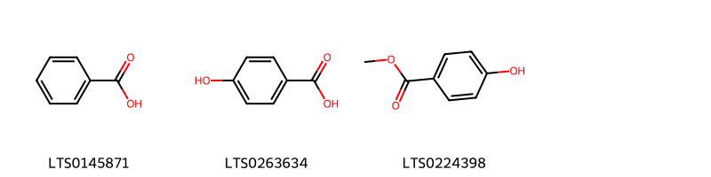{ width=100% }
    <figcaption>Hình ảnh cấu trúc hóa học của 3 hoạt chất thuộc nhóm Benzene and substituted derivatives gồm ['benzoic acid (LTS0145871)', 'p-hydroxybenzoic acid (LTS0263634)', 'paraben (LTS0224398)'].</figcaption>
</figure>
#### Nhóm Benzopyrans
<figure markdown="span">
    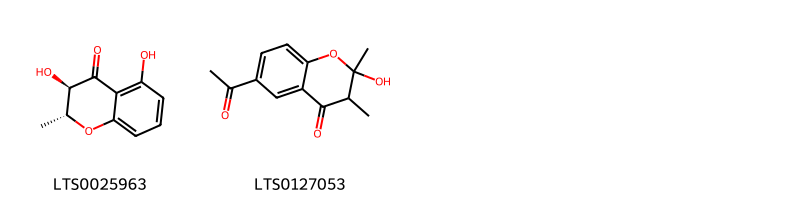{ width=100% }
    <figcaption>Hình ảnh cấu trúc hóa học của 2 hoạt chất thuộc nhóm Benzopyrans gồm ['(-)-gynuraone (LTS0025963)', '6-acetyl-2-hydroxy-2,3-dimethyl-3h-1-benzopyran-4-one (LTS0127053)'].</figcaption>
</figure>
#### Nhóm Fatty Acyls
<figure markdown="span">
    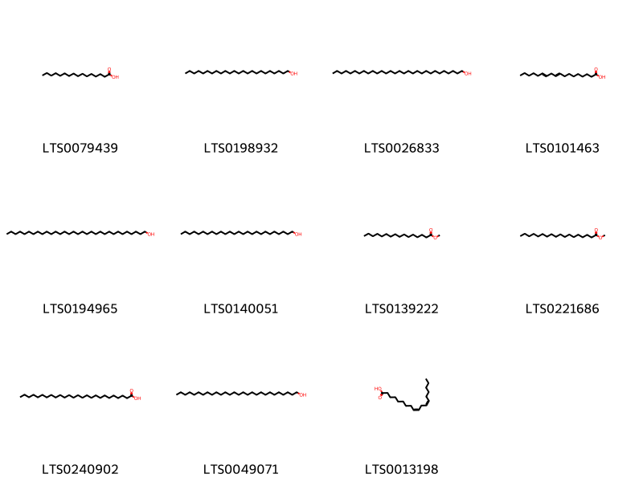{ width=100% }
    <figcaption>Hình ảnh cấu trúc hóa học của 11 hoạt chất thuộc nhóm Fatty Acyls gồm ['palmitic acid (LTS0079439)', '1-tetracosanol (LTS0198932)', 'triacontanol (LTS0026833)', '9,12-octadecadienoic acid (LTS0101463)', 'dotriacontanol (LTS0194965)', 'ceryl alcohol (LTS0140051)', 'methyl palmitate (LTS0139222)', 'methyl stearate (LTS0221686)', 'hexacosanoic acid (LTS0240902)', 'octacosanol (LTS0049071)', 'linoleic (LTS0013198)'].</figcaption>
</figure>
#### Nhóm Glycerolipids
<figure markdown="span">
    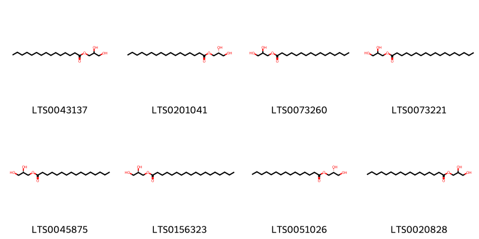{ width=100% }
    <figcaption>Hình ảnh cấu trúc hóa học của 8 hoạt chất thuộc nhóm Glycerolipids gồm ['glyceryl 1-pentadecanoate (LTS0043137)', '(2r)-2,3-dihydroxypropyl heptadecanoate (LTS0201041)', 'glyceryl palmitate (LTS0073260)', 'glyceryl stearate (LTS0073221)', '3-palmitoyl-sn-glycerol (LTS0045875)', '3-stearoyl-sn-glycerol (LTS0156323)', '(2r)-2,3-dihydroxypropyl pentadecanoate (LTS0051026)', '2,3-dihydroxypropyl heptadecanoate (LTS0020828)'].</figcaption>
</figure>
#### Nhóm Macrolides and analogues
<figure markdown="span">
    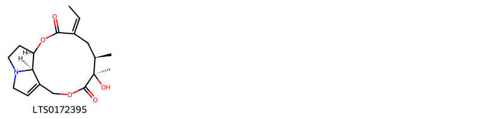{ width=100% }
    <figcaption>Hình ảnh cấu trúc hóa học của 1 hoạt chất thuộc nhóm Macrolides and analogues gồm ['senecionine (LTS0172395)'].</figcaption>
</figure>
#### Nhóm Organooxygen compounds
<figure markdown="span">
    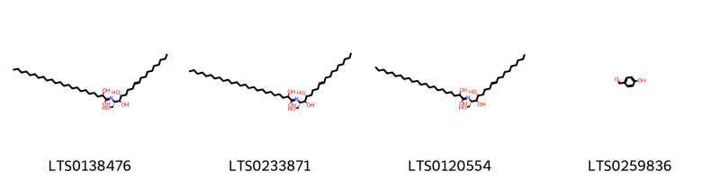{ width=100% }
    <figcaption>Hình ảnh cấu trúc hóa học của 4 hoạt chất thuộc nhóm Organooxygen compounds gồm ['(2r)-2-hydroxy-n-[(2s,3s,4r,8e)-1,3,4-trihydroxyoctadec-8-en-2-yl]tricosanimidic acid (LTS0138476)', '(2r)-2-hydroxy-n-[(2s,3s,4r,8e)-1,3,4-trihydroxyoctadec-8-en-2-yl]pentacosanimidic acid (LTS0233871)', '(2r)-2-hydroxy-n-[(2s,3s,4r,8e)-1,3,4-trihydroxyoctadec-8-en-2-yl]docosanimidic acid (LTS0120554)', 'p-hydroxybenzaldehyde (LTS0259836)'].</figcaption>
</figure>
#### Nhóm Phenols
<figure markdown="span">
    { width=100% }
    <figcaption>Hình ảnh cấu trúc hóa học của 1 hoạt chất thuộc nhóm Phenols gồm ['vanillin (LTS0136163)'].</figcaption>
</figure>
#### Nhóm Prenol lipids
<figure markdown="span">
    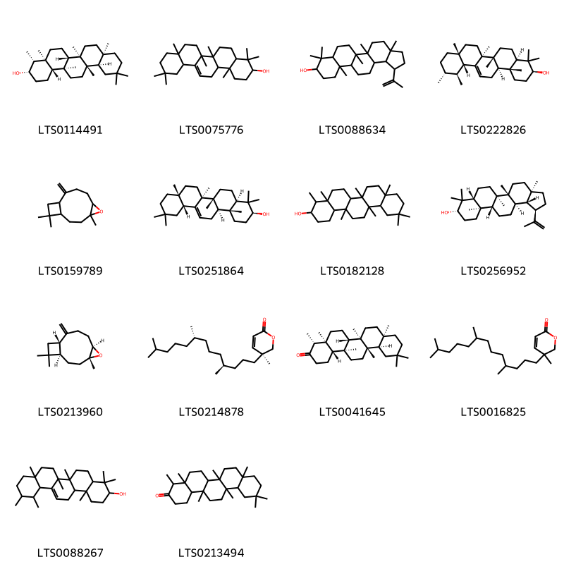{ width=100% }
    <figcaption>Hình ảnh cấu trúc hóa học của 14 hoạt chất thuộc nhóm Prenol lipids gồm ['epi-friedelanol (LTS0114491)', 'β-amyrin (LTS0075776)', 'lupeol (LTS0088634)', 'amyrin (LTS0222826)', 'caryophyllene oxide (LTS0159789)', 'β-amyrin (LTS0251864)', '4,4a,6b,8a,11,11,12b,14a-octamethyl-hexadecahydropicen-3-ol (LTS0182128)', 'lupeol (LTS0256952)', 'β-caryophyllene oxide (LTS0213960)', '(5s)-5-methyl-5-[(4s,8s)-4,8,12-trimethyltridecyl]-6h-pyran-2-one (LTS0214878)', '(-)-friedelin (LTS0041645)', '5-methyl-5-(4,8,12-trimethyltridecyl)-6h-pyran-2-one (LTS0016825)', 'α-amyrin (LTS0088267)', 'friedelin (LTS0213494)'].</figcaption>
</figure>
#### Nhóm Sphingolipids
<figure markdown="span">
    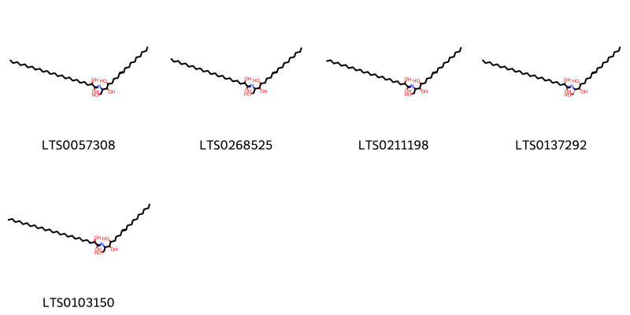{ width=100% }
    <figcaption>Hình ảnh cấu trúc hóa học của 5 hoạt chất thuộc nhóm Sphingolipids gồm ['2-hydroxy-n-(1,3,4-trihydroxyoctadec-8-en-2-yl)tetracosanimidic acid (LTS0057308)', '2-hydroxy-n-(1,3,4-trihydroxyoctadec-8-en-2-yl)docosanimidic acid (LTS0268525)', '2-hydroxy-n-(1,3,4-trihydroxyoctadec-8-en-2-yl)tricosanimidic acid (LTS0211198)', '(2r)-2-hydroxy-n-[(2s,3s,4r,8e)-1,3,4-trihydroxyoctadec-8-en-2-yl]tetracosanimidic acid (LTS0137292)', '2-hydroxy-n-(1,3,4-trihydroxyoctadec-8-en-2-yl)pentacosanimidic acid (LTS0103150)'].</figcaption>
</figure>
#### Nhóm Steroids and steroid derivatives
<figure markdown="span">
    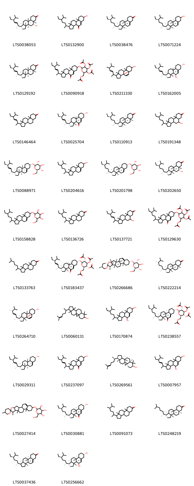{ width=100% }
    <figcaption>Hình ảnh cấu trúc hóa học của 38 hoạt chất thuộc nhóm Steroids and steroid derivatives gồm ['(1r,3as,3bs,5r,5as,9ar,9bs,11ar)-1-[(2r,3e,5s)-5-ethyl-6-methylhept-3-en-2-yl]-5-hydroxy-9a,11a-dimethyl-tetradecahydrocyclopenta[a]phenanthren-7-one (LTS0038053)', '1-(5-ethyl-6-methylheptan-2-yl)-7-hydroxy-9a,11a-dimethyl-1h,2h,3h,3ah,3bh,6h,7h,8h,9h,9bh,10h,11h-cyclopenta[a]phenanthren-4-one (LTS0132900)', '(1r,3as,3bs,9ar,9bs,11ar)-1-[(2r,5r)-5-ethyl-6-methylheptan-2-yl]-9a,11a-dimethyl-1h,2h,3h,3ah,3bh,4h,6h,8h,9h,9bh,10h,11h-cyclopenta[a]phenanthren-7-one (LTS0038476)', 'stigmast-5-en-3-ol (LTS0071224)', '(1r,3as,3br,5as,9as,9bs,11ar)-1-[(2r,3e,5s)-5-ethyl-6-methylhept-3-en-2-yl]-9a,11a-dimethyl-tetradecahydrocyclopenta[a]phenanthren-7-one (LTS0129192)', '[3,4,5-tris(acetyloxy)-6-{[1-(5-ethyl-6-methylhept-3-en-2-yl)-9a,11a-dimethyl-4-oxo-1h,2h,3h,3ah,3bh,6h,7h,8h,9h,9bh,10h,11h-cyclopenta[a]phenanthren-7-yl]oxy}oxan-2-yl]methyl acetate (LTS0090918)', '5-(5,6-dimethylhept-3-en-2-yl)-6,10-dimethyl-16,17-dioxapentacyclo[13.2.2.0¹,⁹.0²,⁶.0¹⁰,¹⁵]nonadec-18-en-13-ol (LTS0211330)', '(1r,3as,3bs,4s,7s,9ar,9bs,11ar)-1-[(2r,3e,5s)-5-ethyl-6-methylhept-3-en-2-yl]-9a,11a-dimethyl-1h,2h,3h,3ah,3bh,4h,6h,7h,8h,9h,9bh,10h,11h-cyclopenta[a]phenanthrene-4,7-diol (LTS0162005)', '1-(5-ethyl-6-methylhept-3-en-2-yl)-9a,11a-dimethyl-tetradecahydrocyclopenta[a]phenanthren-7-one (LTS0146464)', '(1r,3as,3bs,7s,9ar,9bs,11ar)-1-[(2r,3e,5s)-5-ethyl-6-methylhept-3-en-2-yl]-7-hydroxy-9a,11a-dimethyl-1h,2h,3h,3ah,3bh,6h,7h,8h,9h,9bh,10h,11h-cyclopenta[a]phenanthren-4-one (LTS0025704)', '(1r,3as,3br,5as,9as,9bs,11ar)-1-[(2r,5r)-5-ethyl-6-methylheptan-2-yl]-9a,11a-dimethyl-tetradecahydrocyclopenta[a]phenanthren-7-one (LTS0110913)', '1-(5-ethyl-6-methylheptan-2-yl)-5-hydroxy-9a,11a-dimethyl-tetradecahydrocyclopenta[a]phenanthren-7-one (LTS0191348)', '(2r,3r,4s,5s,6r)-2-{[(1r,3as,3bs,7s,9ar,9bs,11ar)-1-[(2r,3e,5s)-5-ethyl-6-methylhept-3-en-2-yl]-9a,11a-dimethyl-1h,2h,3h,3ah,3bh,4h,6h,7h,8h,9h,9bh,10h,11h-cyclopenta[a]phenanthren-7-yl]oxy}-6-(hydroxymethyl)oxane-3,4,5-triol (LTS0088971)', 'stigmast-5-en-3-ol, (3β)- (LTS0204616)', 'sitogluside (LTS0201798)', '(1r,3as,3bs,5r,5as,9ar,9bs,11ar)-1-[(2r,5r)-5-ethyl-6-methylheptan-2-yl]-5-hydroxy-9a,11a-dimethyl-tetradecahydrocyclopenta[a]phenanthren-7-one (LTS0202650)', '2-{[1-(5-ethyl-6-methylheptan-2-yl)-9a,11a-dimethyl-1h,2h,3h,3ah,3bh,4h,6h,7h,8h,9h,9bh,10h,11h-cyclopenta[a]phenanthren-7-yl]oxy}-6-(hydroxymethyl)oxane-3,4,5-triol (LTS0158828)', '1-(5-ethyl-6-methylheptan-2-yl)-9a,11a-dimethyl-tetradecahydrocyclopenta[a]phenanthren-7-one (LTS0136726)', '1-(5-ethyl-6-methylhept-3-en-2-yl)-5-hydroxy-9a,11a-dimethyl-tetradecahydrocyclopenta[a]phenanthren-7-one (LTS0137721)', '[3,4,5-tris(acetyloxy)-6-{[1-(5-ethyl-6-methylheptan-2-yl)-9a,11a-dimethyl-4-oxo-1h,2h,3h,3ah,3bh,6h,7h,8h,9h,9bh,10h,11h-cyclopenta[a]phenanthren-7-yl]oxy}oxan-2-yl]methyl acetate (LTS0129630)', '9a,11a-dimethyl-1-(6-methylheptan-2-yl)-tetradecahydrocyclopenta[a]phenanthren-7-one (LTS0133763)', '[(2r,3r,4s,5r,6r)-6-{[(1r,3as,3bs,7s,9ar,9bs,11ar)-1-[(2r,3e,5s)-5-ethyl-6-methylhept-3-en-2-yl]-9a,11a-dimethyl-4-oxo-1h,2h,3h,3ah,3bh,6h,7h,8h,9h,9bh,10h,11h-cyclopenta[a]phenanthren-7-yl]oxy}-3,4,5-tris(acetyloxy)oxan-2-yl]methyl acetate (LTS0183437)', "(2r,3s,4s,5r,6r)-2-(hydroxymethyl)-6-[(1's,2s,2'r,4'r,5s,7'r,8's,9's,12's,13'r,16'r)-5,7',9',13'-tetramethyl-5'-oxaspiro[oxane-2,6'-pentacyclo[10.8.0.0²,⁹.0⁴,⁸.0¹³,¹⁸]icosan]-18'-eneoxy]oxane-3,4,5-triol (LTS0266686)", '(1r,3as,3br,5as,9as,9bs,11ar)-1-[(2r,5s)-5,6-dimethylheptan-2-yl]-9a,11a-dimethyl-tetradecahydrocyclopenta[a]phenanthren-7-one (LTS0222214)', 'ergosterol peroxide (LTS0264710)', 'cycloartenol (LTS0060131)', '1-(5-ethyl-6-methylheptan-2-yl)-9a,11a-dimethyl-1h,2h,3h,3ah,3bh,4h,6h,7h,8h,9h,9bh,10h,11h-cyclopenta[a]phenanthrene-4,7-diol (LTS0170874)', '[(2r,3r,4s,5r,6r)-6-{[(1r,3as,3bs,7s,9ar,9bs,11ar)-1-[(2r,5r)-5-ethyl-6-methylheptan-2-yl]-9a,11a-dimethyl-4-oxo-1h,2h,3h,3ah,3bh,6h,7h,8h,9h,9bh,10h,11h-cyclopenta[a]phenanthren-7-yl]oxy}-3,4,5-tris(acetyloxy)oxan-2-yl]methyl acetate (LTS0238557)', 'phytosterol (LTS0029311)', '1-(5-ethyl-6-methylhept-3-en-2-yl)-7-hydroxy-9a,11a-dimethyl-1h,2h,3h,3ah,3bh,6h,7h,8h,9h,9bh,10h,11h-cyclopenta[a]phenanthren-4-one (LTS0237097)', 'cycloartenol (LTS0269561)', '1-(5-ethyl-6-methylhept-3-en-2-yl)-9a,11a-dimethyl-1h,2h,3h,3ah,3bh,4h,6h,7h,8h,9h,9bh,10h,11h-cyclopenta[a]phenanthrene-4,7-diol (LTS0007957)', "2-(hydroxymethyl)-6-{5,7',9',13'-tetramethyl-5'-oxaspiro[oxane-2,6'-pentacyclo[10.8.0.0²,⁹.0⁴,⁸.0¹³,¹⁸]icosan]-18'-eneoxy}oxane-3,4,5-triol (LTS0027414)", '(1r,3as,3bs,7s,9ar,9bs,11ar)-1-[(2r,5r)-5-ethyl-6-methylheptan-2-yl]-7-hydroxy-9a,11a-dimethyl-1h,2h,3h,3ah,3bh,6h,7h,8h,9h,9bh,10h,11h-cyclopenta[a]phenanthren-4-one (LTS0030881)', '1-(5,6-dimethylheptan-2-yl)-9a,11a-dimethyl-tetradecahydrocyclopenta[a]phenanthren-7-one (LTS0091073)', 'coprostanone (LTS0248219)', '(3as,3bs,9ar,9bs,11ar)-1-[(2r,5r)-5-ethyl-6-methylheptan-2-yl]-9a,11a-dimethyl-1h,2h,3h,3ah,3bh,4h,6h,8h,9h,9bh,10h,11h-cyclopenta[a]phenanthren-7-one (LTS0037436)', '(1r,3as,3bs,4s,7s,9ar,9bs,11ar)-1-[(2r,5r)-5-ethyl-6-methylheptan-2-yl]-9a,11a-dimethyl-1h,2h,3h,3ah,3bh,4h,6h,7h,8h,9h,9bh,10h,11h-cyclopenta[a]phenanthrene-4,7-diol (LTS0256662)'].</figcaption>
</figure>

---

### Dược dân tộc học

Danh sách các quốc gia có sử dụng *Gynura japonica* trong điều trị các bệnh. 

| Country   | Disease    | Bệnh                                                                                                                                                                                                |
|:----------|:-----------|:----------------------------------------------------------------------------------------------------------------------------------------------------------------------------------------------------|
| Elsewhere | Hemostatic | MYMEMORY WARNING: YOU USED ALL AVAILABLE FREE TRANSLATIONS FOR TODAY. NEXT AVAILABLE IN  12 HOURS 18 MINUTES 20 SECONDS VISIT HTTPS://MYMEMORY.TRANSLATED.NET/DOC/USAGELIMITS.PHP TO TRANSLATE MORE |

---

---
## Gynura ovalis
### Thông tin về thực vật

!!! info "Phân loại thực vật của *Gynura divaricata* từ GIBF:"
    - **Kingdom:** Plantae
    - **Phylum:** Tracheophyta
    - **Order:** Asterales
    - **Family:** Asteraceae
    - **Genus:** Gynura
    - **Species:** *Gynura divaricata*

 

| Label (VI)   | Label (EN)   | Scientific Name   | Descriptions (VI)   | Descriptions (EN)   | Also Known As (VI)   | Also Known As (EN)   |
|:-------------|:-------------|:------------------|:--------------------|:--------------------|:---------------------|:---------------------|
| N/A          | N/A          | Gynura ovalis     |                     |                     | ['']                 | ['']                 |

#### Phân bố trên thế giới

**Từ CSDL GIBF** nan, French Polynesia, Chinese Taipei, Indonesia, China

#### Phân bố tại Việt Nam

**Từ CSDL GIBF**: Không có ghi nhận ở Việt Nam

---
### Thành phần hóa học
        
- Theo cơ sở dữ liệu lotus: Từ loài *Gynura divaricata* đã phân lập và xác định được Chưa có hoạt chất nào được phân lập. hoạt chất thuộc về các nhóm Không có hoạt chất nào được phân lập. 

Không có hình ảnh nào được tạo ra

---

### Dược dân tộc học

Danh sách các quốc gia có sử dụng *Gynura divaricata* trong điều trị các bệnh. 

| Country   | Disease   | Bệnh                                                                                                                                                                                                |
|:----------|:----------|:----------------------------------------------------------------------------------------------------------------------------------------------------------------------------------------------------|
| Malaya    | Hemostat  | MYMEMORY WARNING: YOU USED ALL AVAILABLE FREE TRANSLATIONS FOR TODAY. NEXT AVAILABLE IN  12 HOURS 17 MINUTES 40 SECONDS VISIT HTTPS://MYMEMORY.TRANSLATED.NET/DOC/USAGELIMITS.PHP TO TRANSLATE MORE |

---

---
## Gynura pinnatatifida
### Thông tin về thực vật

!!! info "Phân loại thực vật của *Gynura japonica* từ GIBF:"
    - **Kingdom:** Plantae
    - **Phylum:** Tracheophyta
    - **Order:** Asterales
    - **Family:** Asteraceae
    - **Genus:** Gynura
    - **Species:** *Gynura japonica*

 

| Label (VI)   | Label (EN)   | Scientific Name   | Descriptions (VI)   | Descriptions (EN)   | Also Known As (VI)   | Also Known As (EN)   |
|:-------------|:-------------|:------------------|:--------------------|:--------------------|:---------------------|:---------------------|
| N/A          | N/A          | Gynura ovalis     |                     |                     | ['']                 | ['']                 |

#### Phân bố trên thế giới

**Từ CSDL GIBF** nan, Japan, Brazil, unknown or invalid, China

#### Phân bố tại Việt Nam

**Từ CSDL GIBF**: Không có ghi nhận ở Việt Nam

---
### Thành phần hóa học
        
- Theo cơ sở dữ liệu lotus: Từ loài *Gynura japonica* đã phân lập và xác định được Chưa có hoạt chất nào được phân lập. hoạt chất thuộc về các nhóm Không có hoạt chất nào được phân lập. 

Không có hình ảnh nào được tạo ra

---

### Dược dân tộc học

Danh sách các quốc gia có sử dụng *Gynura japonica* trong điều trị các bệnh. 

| Country   | Disease    | Bệnh                                                                                                                                                                                                |
|:----------|:-----------|:----------------------------------------------------------------------------------------------------------------------------------------------------------------------------------------------------|
| Elsewhere | Astringent | MYMEMORY WARNING: YOU USED ALL AVAILABLE FREE TRANSLATIONS FOR TODAY. NEXT AVAILABLE IN  12 HOURS 17 MINUTES 17 SECONDS VISIT HTTPS://MYMEMORY.TRANSLATED.NET/DOC/USAGELIMITS.PHP TO TRANSLATE MORE |

---

---
## Gynura pinnatifida
### Thông tin về thực vật

!!! info "Phân loại thực vật của *Gynura japonica* từ GIBF:"
    - **Kingdom:** Plantae
    - **Phylum:** Tracheophyta
    - **Order:** Asterales
    - **Family:** Asteraceae
    - **Genus:** Gynura
    - **Species:** *Gynura japonica*

 

| Label (VI)   | Label (EN)   | Scientific Name    | Descriptions (VI)   | Descriptions (EN)   | Also Known As (VI)   | Also Known As (EN)   |
|:-------------|:-------------|:-------------------|:--------------------|:--------------------|:---------------------|:---------------------|
| N/A          | N/A          | Gynura pinnatifida |                     | species of plant    | ['']                 | ['']                 |

#### Phân bố trên thế giới

**Từ CSDL GIBF** nan, Japan, Brazil, unknown or invalid, China

#### Phân bố tại Việt Nam

**Từ CSDL GIBF**: Không có ghi nhận ở Việt Nam

---
### Thành phần hóa học
        
- Theo cơ sở dữ liệu lotus: Từ loài *Gynura japonica* đã phân lập và xác định được Chưa có hoạt chất nào được phân lập. hoạt chất thuộc về các nhóm Không có hoạt chất nào được phân lập. 

Không có hình ảnh nào được tạo ra

---

### Dược dân tộc học

Danh sách các quốc gia có sử dụng *Gynura japonica* trong điều trị các bệnh. 

| Country   | Disease                                                       | Bệnh                                                                                                                                                                                                |
|:----------|:--------------------------------------------------------------|:----------------------------------------------------------------------------------------------------------------------------------------------------------------------------------------------------|
| China     | Astringent, Styptic, Vulnerary, Hemostat, Discutient, Styptic | MYMEMORY WARNING: YOU USED ALL AVAILABLE FREE TRANSLATIONS FOR TODAY. NEXT AVAILABLE IN  12 HOURS 16 MINUTES 53 SECONDS VISIT HTTPS://MYMEMORY.TRANSLATED.NET/DOC/USAGELIMITS.PHP TO TRANSLATE MORE |

---

---
## Gynura pseudochina
### Thông tin về thực vật

!!! info "Phân loại thực vật của *Gynura pseudochina* từ GIBF:"
    - **Kingdom:** Plantae
    - **Phylum:** Tracheophyta
    - **Order:** Asterales
    - **Family:** Asteraceae
    - **Genus:** Gynura
    - **Species:** *Gynura pseudochina*

 

| Label (VI)   | Label (EN)   | Scientific Name    | Descriptions (VI)   | Descriptions (EN)   | Also Known As (VI)   | Also Known As (EN)   |
|:-------------|:-------------|:-------------------|:--------------------|:--------------------|:---------------------|:---------------------|
| N/A          | N/A          | Gynura pseudochina | loài thực vật       | species of plant    | ['']                 | ['']                 |

#### Phân bố trên thế giới

**Từ CSDL GIBF** nan, Central African Republic, Gabon, Angola, Myanmar, unknown or invalid, Tanzania, United Republic of, Sierra Leone, Nigeria, United States of America, Guinea, Hong Kong, Thailand, Bhutan, Viet Nam, China, Burundi, India, Indonesia, Nepal, Kenya, Cameroon, Ethiopia

#### Phân bố tại Việt Nam

**Từ CSDL GIBF**: Kon Tum, 宁平, Lam Dong, Cao Bang

---
### Thành phần hóa học
        
- Theo cơ sở dữ liệu lotus: Từ loài *Gynura pseudochina* đã phân lập và xác định được Chưa có hoạt chất nào được phân lập. hoạt chất thuộc về các nhóm Không có hoạt chất nào được phân lập. 

Không có hình ảnh nào được tạo ra

---

### Dược dân tộc học

Danh sách các quốc gia có sử dụng *Gynura pseudochina* trong điều trị các bệnh. 

| Country   | Disease     | Bệnh                                                                                                                                                                                                |
|:----------|:------------|:----------------------------------------------------------------------------------------------------------------------------------------------------------------------------------------------------|
| India     | Refrigerant | MYMEMORY WARNING: YOU USED ALL AVAILABLE FREE TRANSLATIONS FOR TODAY. NEXT AVAILABLE IN  12 HOURS 16 MINUTES 30 SECONDS VISIT HTTPS://MYMEMORY.TRANSLATED.NET/DOC/USAGELIMITS.PHP TO TRANSLATE MORE |
| Indochina | Emollient   | MYMEMORY WARNING: YOU USED ALL AVAILABLE FREE TRANSLATIONS FOR TODAY. NEXT AVAILABLE IN  12 HOURS 16 MINUTES 27 SECONDS VISIT HTTPS://MYMEMORY.TRANSLATED.NET/DOC/USAGELIMITS.PHP TO TRANSLATE MORE |

---

---
## Gynura sarmentosa
### Thông tin về thực vật

!!! info "Phân loại thực vật của *Gynura procumbens* từ GIBF:"
    - **Kingdom:** Plantae
    - **Phylum:** Tracheophyta
    - **Order:** Asterales
    - **Family:** Asteraceae
    - **Genus:** Gynura
    - **Species:** *Gynura procumbens*

 

| Label (VI)   | Label (EN)   | Scientific Name   | Descriptions (VI)   | Descriptions (EN)   | Also Known As (VI)   | Also Known As (EN)   |
|:-------------|:-------------|:------------------|:--------------------|:--------------------|:---------------------|:---------------------|
| N/A          | N/A          | Gynura sarmentosa |                     | species of plant    | ['']                 | ['']                 |

#### Phân bố trên thế giới

**Từ CSDL GIBF** nan, Ghana, Central African Republic, Nigeria, Guadeloupe, Gabon, Côte d’Ivoire, unknown or invalid, Indonesia, Benin, Viet Nam, Guinea, Philippines, Malaysia

#### Phân bố tại Việt Nam

**Từ CSDL GIBF**: Hà Nội

---
### Thành phần hóa học
        
- Theo cơ sở dữ liệu lotus: Từ loài *Gynura procumbens* đã phân lập và xác định được Chưa có hoạt chất nào được phân lập. hoạt chất thuộc về các nhóm Không có hoạt chất nào được phân lập. 

Không có hình ảnh nào được tạo ra

---

### Dược dân tộc học

Danh sách các quốc gia có sử dụng *Gynura procumbens* trong điều trị các bệnh. 

| Country   |   Disease | Bệnh                                                                                                                                                                                                |
|:----------|----------:|:----------------------------------------------------------------------------------------------------------------------------------------------------------------------------------------------------|
| Elsewhere |       nan | MYMEMORY WARNING: YOU USED ALL AVAILABLE FREE TRANSLATIONS FOR TODAY. NEXT AVAILABLE IN  12 HOURS 15 MINUTES 57 SECONDS VISIT HTTPS://MYMEMORY.TRANSLATED.NET/DOC/USAGELIMITS.PHP TO TRANSLATE MORE |

---

---
## Gynura segetum
### Thông tin về thực vật

!!! info "Phân loại thực vật của *Gynura japonica* từ GIBF:"
    - **Kingdom:** Plantae
    - **Phylum:** Tracheophyta
    - **Order:** Asterales
    - **Family:** Asteraceae
    - **Genus:** Gynura
    - **Species:** *Gynura japonica*

 

| Label (VI)   | Label (EN)   | Scientific Name   | Descriptions (VI)   | Descriptions (EN)   | Also Known As (VI)   | Also Known As (EN)   |
|:-------------|:-------------|:------------------|:--------------------|:--------------------|:---------------------|:---------------------|
| N/A          | N/A          | Gynura segetum    |                     | species of plant    | ['']                 | ['']                 |

#### Phân bố trên thế giới

**Từ CSDL GIBF** nan, Chinese Taipei, China, Japan

#### Phân bố tại Việt Nam

**Từ CSDL GIBF**: Không có ghi nhận ở Việt Nam

---
### Thành phần hóa học
        
- Theo cơ sở dữ liệu lotus: Từ loài *Gynura japonica* đã phân lập và xác định được 1 hoạt chất thuộc về các nhóm Macrolides and analogues. 

|    | chemicalTaxonomyClassyfireClass   |   smiles_count |
|---:|:----------------------------------|---------------:|
|  0 | Macrolides and analogues          |              1 |

#### Nhóm Macrolides and analogues
<figure markdown="span">
    { width=100% }
    <figcaption>Hình ảnh cấu trúc hóa học của 1 hoạt chất thuộc nhóm Macrolides and analogues gồm ['senecionine (LTS0172395)'].</figcaption>
</figure>

---

### Dược dân tộc học

Danh sách các quốc gia có sử dụng *Gynura japonica* trong điều trị các bệnh. 

| Country   | Disease              | Bệnh                                                                                                                                                                                                |
|:----------|:---------------------|:----------------------------------------------------------------------------------------------------------------------------------------------------------------------------------------------------|
| China     | Alexiteric, Hemostat | MYMEMORY WARNING: YOU USED ALL AVAILABLE FREE TRANSLATIONS FOR TODAY. NEXT AVAILABLE IN  12 HOURS 15 MINUTES 35 SECONDS VISIT HTTPS://MYMEMORY.TRANSLATED.NET/DOC/USAGELIMITS.PHP TO TRANSLATE MORE |

---

# Chi Carlina

??? note "Danh sách các dược liệu thuộc chi"
    
	 - *Carlina acaulis*
	 - *Carlina axaulis*
	 - *Carlina vulgaris*

---
## Carlina acaulis
### Thông tin về thực vật

!!! info "Phân loại thực vật của *Carlina acaulis* từ GIBF:"
    - **Kingdom:** Plantae
    - **Phylum:** Tracheophyta
    - **Order:** Asterales
    - **Family:** Asteraceae
    - **Genus:** Carlina
    - **Species:** *Carlina acaulis*

 

| Label (VI)   | Label (EN)   | Scientific Name   | Descriptions (VI)   | Descriptions (EN)   | Also Known As (VI)   | Also Known As (EN)           |
|:-------------|:-------------|:------------------|:--------------------|:--------------------|:---------------------|:-----------------------------|
| N/A          | N/A          | Carlina acaulis   | loài thực vật       | species of plant    | ['']                 | ['stemless carline thistle'] |

#### Phân bố trên thế giới

**Từ CSDL GIBF** Ukraine, Italy, Czechia, Germany, Romania, Spain, Poland, Switzerland, Sweden, Austria, France, Slovenia, Croatia

#### Phân bố tại Việt Nam

**Từ CSDL GIBF**: Không có ghi nhận ở Việt Nam

---
### Thành phần hóa học
        
- Theo cơ sở dữ liệu lotus: Từ loài *Carlina acaulis* đã phân lập và xác định được 14 hoạt chất thuộc về các nhóm Fatty Acyls, Benzene and substituted derivatives. 

|    | chemicalTaxonomyClassyfireClass     |   smiles_count |
|---:|:------------------------------------|---------------:|
|  0 | Benzene and substituted derivatives |              1 |
|  1 | Fatty Acyls                         |             13 |

#### Nhóm Benzene and substituted derivatives
<figure markdown="span">
    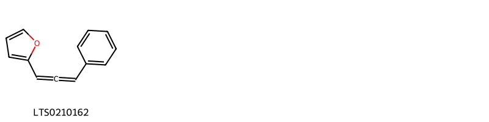{ width=100% }
    <figcaption>Hình ảnh cấu trúc hóa học của 1 hoạt chất thuộc nhóm Benzene and substituted derivatives gồm ['2-(3-phenylpropa-1,2-dien-1-yl)furan (LTS0210162)'].</figcaption>
</figure>
#### Nhóm Fatty Acyls
<figure markdown="span">
    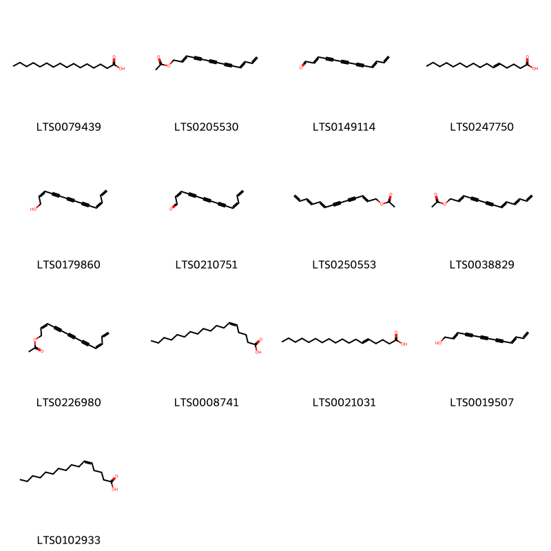{ width=100% }
    <figcaption>Hình ảnh cấu trúc hóa học của 13 hoạt chất thuộc nhóm Fatty Acyls gồm ['palmitic acid (LTS0079439)', 'trideca-2,10,12-trien-4,6,8-triyn-1-yl acetate (LTS0205530)', 'trideca-2,10,12-trien-4,6,8-triynal (LTS0149114)', 'hexadec-5-enoic acid (LTS0247750)', '(2z,10z)-trideca-2,10,12-trien-4,6,8-triyn-1-ol (LTS0179860)', '(2z,10z)-trideca-2,10,12-trien-4,6,8-triynal (LTS0210751)', '(2e,8e,10e)-trideca-2,8,10,12-tetraen-4,6-diyn-1-yl acetate (LTS0250553)', 'trideca-2,8,10,12-tetraen-4,6-diyn-1-yl acetate (LTS0038829)', '(2z,10z)-trideca-2,10,12-trien-4,6,8-triyn-1-yl acetate (LTS0226980)', '(5z)-octadec-5-enoic acid (LTS0008741)', 'octadec-5-enoic acid (LTS0021031)', 'trideca-2,10,12-trien-4,6,8-triyn-1-ol (LTS0019507)', '(5z)-hexadec-5-enoic acid (LTS0102933)'].</figcaption>
</figure>

---

### Dược dân tộc học

Danh sách các quốc gia có sử dụng *Carlina acaulis* trong điều trị các bệnh. 

| Country   | Disease                  | Bệnh                                                                                                                                                                                                |
|:----------|:-------------------------|:----------------------------------------------------------------------------------------------------------------------------------------------------------------------------------------------------|
| Elsewhere | Emmenagogue, Diaphoretic | MYMEMORY WARNING: YOU USED ALL AVAILABLE FREE TRANSLATIONS FOR TODAY. NEXT AVAILABLE IN  12 HOURS 15 MINUTES 00 SECONDS VISIT HTTPS://MYMEMORY.TRANSLATED.NET/DOC/USAGELIMITS.PHP TO TRANSLATE MORE |
| ain       | Cholagogue               | MYMEMORY WARNING: YOU USED ALL AVAILABLE FREE TRANSLATIONS FOR TODAY. NEXT AVAILABLE IN  12 HOURS 14 MINUTES 57 SECONDS VISIT HTTPS://MYMEMORY.TRANSLATED.NET/DOC/USAGELIMITS.PHP TO TRANSLATE MORE |

---

---
## Carlina axaulis
### Thông tin về thực vật

!!! info "Phân loại thực vật của *Carlina acaulis* từ GIBF:"
    - **Kingdom:** Plantae
    - **Phylum:** Tracheophyta
    - **Order:** Asterales
    - **Family:** Asteraceae
    - **Genus:** Carlina
    - **Species:** *Carlina acaulis*

 

| Label (VI)   | Label (EN)   | Scientific Name   | Descriptions (VI)   | Descriptions (EN)   | Also Known As (VI)   | Also Known As (EN)           |
|:-------------|:-------------|:------------------|:--------------------|:--------------------|:---------------------|:-----------------------------|
| N/A          | N/A          | Carlina acaulis   | loài thực vật       | species of plant    | ['']                 | ['stemless carline thistle'] |

#### Phân bố trên thế giới

**Từ CSDL GIBF** Ukraine, Italy, Czechia, Germany, Romania, Spain, Poland, Switzerland, Sweden, Austria, France, Slovenia, Croatia

#### Phân bố tại Việt Nam

**Từ CSDL GIBF**: Không có ghi nhận ở Việt Nam

---
### Thành phần hóa học
        
- Theo cơ sở dữ liệu lotus: Từ loài *Carlina acaulis* đã phân lập và xác định được Chưa có hoạt chất nào được phân lập. hoạt chất thuộc về các nhóm Không có hoạt chất nào được phân lập. 

Không có hình ảnh nào được tạo ra

---

### Dược dân tộc học

Danh sách các quốc gia có sử dụng *Carlina acaulis* trong điều trị các bệnh. 

| Country   | Disease              | Bệnh                                                                                                                                                                                                |
|:----------|:---------------------|:----------------------------------------------------------------------------------------------------------------------------------------------------------------------------------------------------|
| Elsewhere | Purgative, Stomachic | MYMEMORY WARNING: YOU USED ALL AVAILABLE FREE TRANSLATIONS FOR TODAY. NEXT AVAILABLE IN  12 HOURS 14 MINUTES 33 SECONDS VISIT HTTPS://MYMEMORY.TRANSLATED.NET/DOC/USAGELIMITS.PHP TO TRANSLATE MORE |

---

---
## Carlina vulgaris
### Thông tin về thực vật

!!! info "Phân loại thực vật của *Carlina vulgaris* từ GIBF:"
    - **Kingdom:** Plantae
    - **Phylum:** Tracheophyta
    - **Order:** Asterales
    - **Family:** Asteraceae
    - **Genus:** Carlina
    - **Species:** *Carlina vulgaris*

 

| Label (VI)   | Label (EN)   | Scientific Name   | Descriptions (VI)   | Descriptions (EN)   | Also Known As (VI)   | Also Known As (EN)   |
|:-------------|:-------------|:------------------|:--------------------|:--------------------|:---------------------|:---------------------|
| N/A          | N/A          | Carlina vulgaris  | loài thực vật       | species of plant    | ['']                 | ['']                 |

#### Phân bố trên thế giới

**Từ CSDL GIBF** nan, Italy, Belgium, Slovakia, Norway, Ukraine, Denmark, Netherlands, Luxembourg, Hungary, Portugal, Russian Federation, United States of America, Sweden, Slovenia, Czechia, Germany, Romania, Switzerland, Austria, France, United Kingdom of Great Britain and Northern Ireland, Ireland, Poland

#### Phân bố tại Việt Nam

**Từ CSDL GIBF**: Không có ghi nhận ở Việt Nam

---
### Thành phần hóa học
        
- Theo cơ sở dữ liệu lotus: Từ loài *Carlina vulgaris* đã phân lập và xác định được 14 hoạt chất thuộc về các nhóm Unsaturated hydrocarbons, Fatty Acyls. 

|    | chemicalTaxonomyClassyfireClass   |   smiles_count |
|---:|:----------------------------------|---------------:|
|  0 | Fatty Acyls                       |             12 |
|  1 | Unsaturated hydrocarbons          |              2 |

#### Nhóm Fatty Acyls
<figure markdown="span">
    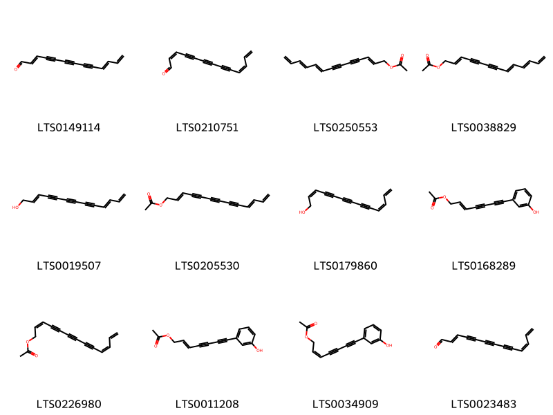{ width=100% }
    <figcaption>Hình ảnh cấu trúc hóa học của 12 hoạt chất thuộc nhóm Fatty Acyls gồm ['trideca-2,10,12-trien-4,6,8-triynal (LTS0149114)', '(2z,10z)-trideca-2,10,12-trien-4,6,8-triynal (LTS0210751)', '(2e,8e,10e)-trideca-2,8,10,12-tetraen-4,6-diyn-1-yl acetate (LTS0250553)', 'trideca-2,8,10,12-tetraen-4,6-diyn-1-yl acetate (LTS0038829)', 'trideca-2,10,12-trien-4,6,8-triyn-1-ol (LTS0019507)', 'trideca-2,10,12-trien-4,6,8-triyn-1-yl acetate (LTS0205530)', '(2z,10z)-trideca-2,10,12-trien-4,6,8-triyn-1-ol (LTS0179860)', '(2e)-7-(3-hydroxyphenyl)hept-2-en-4,6-diyn-1-yl acetate (LTS0168289)', '(2z,10z)-trideca-2,10,12-trien-4,6,8-triyn-1-yl acetate (LTS0226980)', '7-(3-hydroxyphenyl)hept-2-en-4,6-diyn-1-yl acetate (LTS0011208)', '(2z)-7-(3-hydroxyphenyl)hept-2-en-4,6-diyn-1-yl acetate (LTS0034909)', '(2e,10z)-trideca-2,10,12-trien-4,6,8-triynal (LTS0023483)'].</figcaption>
</figure>
#### Nhóm Unsaturated hydrocarbons
<figure markdown="span">
    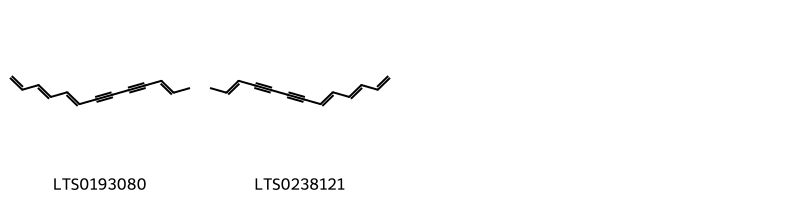{ width=100% }
    <figcaption>Hình ảnh cấu trúc hóa học của 2 hoạt chất thuộc nhóm Unsaturated hydrocarbons gồm ['(3e,5e,11e)-trideca-1,3,5,11-tetraen-7,9-diyne (LTS0193080)', 'trideca-1,3,5,11-tetraen-7,9-diyne (LTS0238121)'].</figcaption>
</figure>

---

### Dược dân tộc học

Danh sách các quốc gia có sử dụng *Carlina vulgaris* trong điều trị các bệnh. 

| Country   | Disease                                                                              | Bệnh                                                                                                                                                                                                |
|:----------|:-------------------------------------------------------------------------------------|:----------------------------------------------------------------------------------------------------------------------------------------------------------------------------------------------------|
| Turkey    | Cholagogue, Emetic, Laxative, Vermifuge, Sudorific, Diuretic, Emmenagogue, Stomachic | MYMEMORY WARNING: YOU USED ALL AVAILABLE FREE TRANSLATIONS FOR TODAY. NEXT AVAILABLE IN  12 HOURS 14 MINUTES 05 SECONDS VISIT HTTPS://MYMEMORY.TRANSLATED.NET/DOC/USAGELIMITS.PHP TO TRANSLATE MORE |

---

# Chi Dichrocephala

??? note "Danh sách các dược liệu thuộc chi"
    
	 - *Dichrocephala chrysanthemifolia*
	 - *Dichrocephala latifolia*

---
## Dichrocephala chrysanthemifolia
### Thông tin về thực vật

!!! info "Phân loại thực vật của *Dichrocephala chrysanthemifolia* từ GIBF:"
    - **Kingdom:** Plantae
    - **Phylum:** Tracheophyta
    - **Order:** Asterales
    - **Family:** Asteraceae
    - **Genus:** Dichrocephala
    - **Species:** *Dichrocephala chrysanthemifolia*

 

| Label (VI)   | Label (EN)   | Scientific Name                 | Descriptions (VI)   | Descriptions (EN)   | Also Known As (VI)   | Also Known As (EN)   |
|:-------------|:-------------|:--------------------------------|:--------------------|:--------------------|:---------------------|:---------------------|
| N/A          | N/A          | Dichrocephala chrysanthemifolia | loài thực vật       | species of plant    | ['']                 | ['']                 |

#### Phân bố trên thế giới

**Từ CSDL GIBF** Malawi, Uganda, Equatorial Guinea, Indonesia, Nepal, Kenya, Tanzania, United Republic of, China, Ethiopia

#### Phân bố tại Việt Nam

**Từ CSDL GIBF**: Không có ghi nhận ở Việt Nam

---
### Thành phần hóa học
        
- Theo cơ sở dữ liệu lotus: Từ loài *Dichrocephala chrysanthemifolia* đã phân lập và xác định được Chưa có hoạt chất nào được phân lập. hoạt chất thuộc về các nhóm Không có hoạt chất nào được phân lập. 

Không có hình ảnh nào được tạo ra

---

### Dược dân tộc học

Danh sách các quốc gia có sử dụng *Dichrocephala chrysanthemifolia* trong điều trị các bệnh. 

| Country   | Disease   | Bệnh                                                                                                                                                                                                |
|:----------|:----------|:----------------------------------------------------------------------------------------------------------------------------------------------------------------------------------------------------|
| Kenya     | Poison    | MYMEMORY WARNING: YOU USED ALL AVAILABLE FREE TRANSLATIONS FOR TODAY. NEXT AVAILABLE IN  12 HOURS 13 MINUTES 34 SECONDS VISIT HTTPS://MYMEMORY.TRANSLATED.NET/DOC/USAGELIMITS.PHP TO TRANSLATE MORE |

---

---
## Dichrocephala latifolia
### Thông tin về thực vật

!!! info "Phân loại thực vật của *Dichrocephala integrifolia* từ GIBF:"
    - **Kingdom:** Plantae
    - **Phylum:** Tracheophyta
    - **Order:** Asterales
    - **Family:** Asteraceae
    - **Genus:** Dichrocephala
    - **Species:** *Dichrocephala integrifolia*

 

| Label (VI)   | Label (EN)   | Scientific Name         | Descriptions (VI)   | Descriptions (EN)   | Also Known As (VI)   | Also Known As (EN)   |
|:-------------|:-------------|:------------------------|:--------------------|:--------------------|:---------------------|:---------------------|
| N/A          | N/A          | Dichrocephala latifolia |                     |                     | ['']                 | ['']                 |

#### Phân bố trên thế giới

**Từ CSDL GIBF** nan, Italy, Georgia, Myanmar, Philippines, unknown or invalid, Congo, Chinese Taipei, Azerbaijan, Türkiye, Portugal, United States of America, Congo, Democratic Republic of the, Ethiopia, Uganda, South Africa, Fiji, New Caledonia, Viet Nam, China, Comoros, Madagascar, India, Indonesia, Kenya, Malaysia, Nepal

#### Phân bố tại Việt Nam

**Từ CSDL GIBF**: Lạng Sơn, 东京, Hà Nội

---
### Thành phần hóa học
        
- Theo cơ sở dữ liệu lotus: Từ loài *Dichrocephala integrifolia* đã phân lập và xác định được Chưa có hoạt chất nào được phân lập. hoạt chất thuộc về các nhóm Không có hoạt chất nào được phân lập. 

Không có hình ảnh nào được tạo ra

---

### Dược dân tộc học

Danh sách các quốc gia có sử dụng *Dichrocephala integrifolia* trong điều trị các bệnh. 

| Country   | Disease                                  | Bệnh                                                                                                                                                                                                |
|:----------|:-----------------------------------------|:----------------------------------------------------------------------------------------------------------------------------------------------------------------------------------------------------|
| Java      | Diuretic, Sudorific, Diuretic, Sudorific | MYMEMORY WARNING: YOU USED ALL AVAILABLE FREE TRANSLATIONS FOR TODAY. NEXT AVAILABLE IN  12 HOURS 13 MINUTES 08 SECONDS VISIT HTTPS://MYMEMORY.TRANSLATED.NET/DOC/USAGELIMITS.PHP TO TRANSLATE MORE |

---

# Chi Haplopappus

??? note "Danh sách các dược liệu thuộc chi"
    
	 - *Haplopappus heterophyllus*
	 - *Haplopappus venetus*

---
## Haplopappus heterophyllus
### Thông tin về thực vật

!!! info "Phân loại thực vật của *Isocoma pluriflora* từ GIBF:"
    - **Kingdom:** Plantae
    - **Phylum:** Tracheophyta
    - **Order:** Asterales
    - **Family:** Asteraceae
    - **Genus:** Isocoma
    - **Species:** *Isocoma pluriflora*

 

| Label (VI)   | Label (EN)   | Scientific Name           | Descriptions (VI)   | Descriptions (EN)   | Also Known As (VI)   | Also Known As (EN)   |
|:-------------|:-------------|:--------------------------|:--------------------|:--------------------|:---------------------|:---------------------|
| N/A          | N/A          | Haplopappus heterophyllus |                     |                     | ['']                 | ['']                 |

#### Phân bố trên thế giới

**Từ CSDL GIBF** United States of America, Mexico

#### Phân bố tại Việt Nam

**Từ CSDL GIBF**: Không có ghi nhận ở Việt Nam

---
### Thành phần hóa học
        
- Theo cơ sở dữ liệu lotus: Từ loài *Isocoma pluriflora* đã phân lập và xác định được Chưa có hoạt chất nào được phân lập. hoạt chất thuộc về các nhóm Không có hoạt chất nào được phân lập. 

Không có hình ảnh nào được tạo ra

---

### Dược dân tộc học

Danh sách các quốc gia có sử dụng *Isocoma pluriflora* trong điều trị các bệnh. 

| Country   | Disease   | Bệnh                                                                                                                                                                                                |
|:----------|:----------|:----------------------------------------------------------------------------------------------------------------------------------------------------------------------------------------------------|
| US        | Poison    | MYMEMORY WARNING: YOU USED ALL AVAILABLE FREE TRANSLATIONS FOR TODAY. NEXT AVAILABLE IN  12 HOURS 12 MINUTES 39 SECONDS VISIT HTTPS://MYMEMORY.TRANSLATED.NET/DOC/USAGELIMITS.PHP TO TRANSLATE MORE |

---

---
## Haplopappus venetus
### Thông tin về thực vật

!!! info "Phân loại thực vật của *Isocoma veneta* từ GIBF:"
    - **Kingdom:** Plantae
    - **Phylum:** Tracheophyta
    - **Order:** Asterales
    - **Family:** Asteraceae
    - **Genus:** Isocoma
    - **Species:** *Isocoma veneta*

 

| Label (VI)   | Label (EN)   | Scientific Name     | Descriptions (VI)   | Descriptions (EN)   | Also Known As (VI)   | Also Known As (EN)   |
|:-------------|:-------------|:--------------------|:--------------------|:--------------------|:---------------------|:---------------------|
| N/A          | N/A          | Haplopappus venetus |                     |                     | ['']                 | ['']                 |

#### Phân bố trên thế giới

**Từ CSDL GIBF** nan, United States of America, Mexico

#### Phân bố tại Việt Nam

**Từ CSDL GIBF**: Không có ghi nhận ở Việt Nam

---
### Thành phần hóa học
        
- Theo cơ sở dữ liệu lotus: Từ loài *Isocoma veneta* đã phân lập và xác định được Chưa có hoạt chất nào được phân lập. hoạt chất thuộc về các nhóm Không có hoạt chất nào được phân lập. 

Không có hình ảnh nào được tạo ra

---

### Dược dân tộc học

Danh sách các quốc gia có sử dụng *Isocoma veneta* trong điều trị các bệnh. 

| Country   | Disease     | Bệnh                                                                                                                                                                                                |
|:----------|:------------|:----------------------------------------------------------------------------------------------------------------------------------------------------------------------------------------------------|
| Mexico    | Aphrodisiac | MYMEMORY WARNING: YOU USED ALL AVAILABLE FREE TRANSLATIONS FOR TODAY. NEXT AVAILABLE IN  12 HOURS 12 MINUTES 13 SECONDS VISIT HTTPS://MYMEMORY.TRANSLATED.NET/DOC/USAGELIMITS.PHP TO TRANSLATE MORE |

---

# Chi Echinacea

??? note "Danh sách các dược liệu thuộc chi"
    
	 - *Echinacea angustifolia*
	 - *Echinacea pallida*

---
## Echinacea angustifolia
### Thông tin về thực vật

!!! info "Phân loại thực vật của *Echinacea angustifolia* từ GIBF:"
    - **Kingdom:** Plantae
    - **Phylum:** Tracheophyta
    - **Order:** Asterales
    - **Family:** Asteraceae
    - **Genus:** Echinacea
    - **Species:** *Echinacea angustifolia*

 

| Label (VI)   | Label (EN)   | Scientific Name        | Descriptions (VI)   | Descriptions (EN)   | Also Known As (VI)   | Also Known As (EN)                                                                             |
|:-------------|:-------------|:-----------------------|:--------------------|:--------------------|:---------------------|:-----------------------------------------------------------------------------------------------|
| N/A          | N/A          | Echinacea angustifolia | loài thực vật       | species of plant    | ['']                 | ['blacksamson echinacea', 'purple coneflower', 'echinacea', 'narrow-leaved purple coneflower'] |

#### Phân bố trên thế giới

**Từ CSDL GIBF** nan, United States of America, Canada

#### Phân bố tại Việt Nam

**Từ CSDL GIBF**: Không có ghi nhận ở Việt Nam

---
### Thành phần hóa học
        
- Theo cơ sở dữ liệu lotus: Từ loài *Echinacea angustifolia* đã phân lập và xác định được 100 hoạt chất thuộc về các nhóm Fatty Acyls, Flavonoids, Prenol lipids, Steroids and steroid derivatives, Cinnamic acids and derivatives, Benzene and substituted derivatives, Organooxygen compounds, Saturated hydrocarbons, Carboximidic acids and derivatives, Carboxylic acids and derivatives. 

|    | chemicalTaxonomyClassyfireClass     |   smiles_count |
|---:|:------------------------------------|---------------:|
|  0 | Benzene and substituted derivatives |              3 |
|  1 | Carboximidic acids and derivatives  |             12 |
|  2 | Carboxylic acids and derivatives    |              2 |
|  3 | Cinnamic acids and derivatives      |              6 |
|  4 | Fatty Acyls                         |             33 |
|  5 | Flavonoids                          |              2 |
|  6 | Organooxygen compounds              |             15 |
|  7 | Prenol lipids                       |              9 |
|  8 | Saturated hydrocarbons              |             15 |
|  9 | Steroids and steroid derivatives    |              2 |

#### Nhóm Benzene and substituted derivatives
<figure markdown="span">
    { width=100% }
    <figcaption>Hình ảnh cấu trúc hóa học của 3 hoạt chất thuộc nhóm Benzene and substituted derivatives gồm ['p-hydroxybenzoic acid (LTS0263634)', '3,4-dihydroxybenzoic acid (LTS0018765)', 'vanillic acid (LTS0229113)'].</figcaption>
</figure>
#### Nhóm Carboximidic acids and derivatives
<figure markdown="span">
    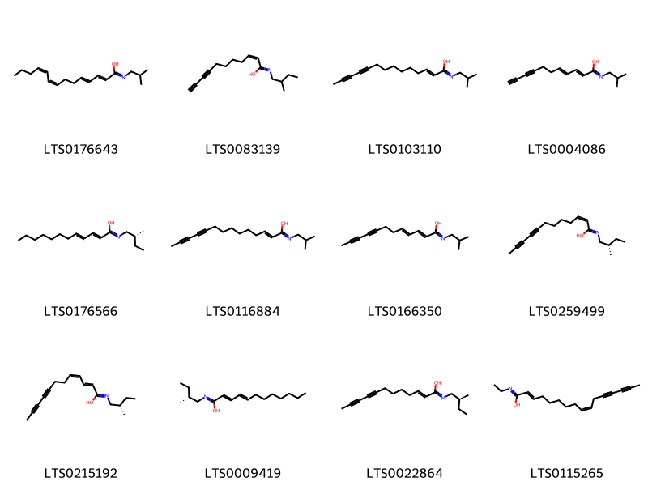{ width=100% }
    <figcaption>Hình ảnh cấu trúc hóa học của 12 hoạt chất thuộc nhóm Carboximidic acids and derivatives gồm ['(2e,4e,8z,10z)-n-(2-methylpropyl)tetradeca-2,4,8,10-tetraenimidic acid (LTS0176643)', '(2z)-n-(2-methylbutyl)undec-2-en-8,10-diynimidic acid (LTS0083139)', 'n-(2-methylpropyl)tetradec-2-en-10,12-diynimidic acid (LTS0103110)', '(4e)-n-(2-methylpropyl)undeca-2,4-dien-8,10-diynimidic acid (LTS0004086)', '(2e,4e)-n-[(2r)-2-methylbutyl]dodeca-2,4-dienimidic acid (LTS0176566)', '(2e)-n-(2-methylpropyl)tetradec-2-en-10,12-diynimidic acid (LTS0116884)', '(2e)-n-(2-methylpropyl)dodeca-2,4-dien-8,10-diynimidic acid (LTS0166350)', '(2z)-n-[(2s)-2-methylbutyl]dodec-2-en-8,10-diynimidic acid (LTS0259499)', '(2e,4z)-n-[(2s)-2-methylbutyl]dodeca-2,4-dien-8,10-diynimidic acid (LTS0215192)', 'n-[(2r)-2-methylbutyl]dodeca-2,4-dienimidic acid (LTS0009419)', '(2e)-n-[(2s)-2-methylbutyl]dodec-2-en-8,10-diynimidic acid (LTS0022864)', '(2e,9z)-n-ethylhexadeca-2,9-dien-12,14-diynimidic acid (LTS0115265)'].</figcaption>
</figure>
#### Nhóm Carboxylic acids and derivatives
<figure markdown="span">
    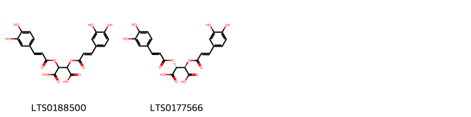{ width=100% }
    <figcaption>Hình ảnh cấu trúc hóa học của 2 hoạt chất thuộc nhóm Carboxylic acids and derivatives gồm ['2,3-bis({[3-(3,4-dihydroxyphenyl)prop-2-enoyl]oxy})butanedioic acid (LTS0188500)', 'cichoric acid (LTS0177566)'].</figcaption>
</figure>
#### Nhóm Cinnamic acids and derivatives
<figure markdown="span">
    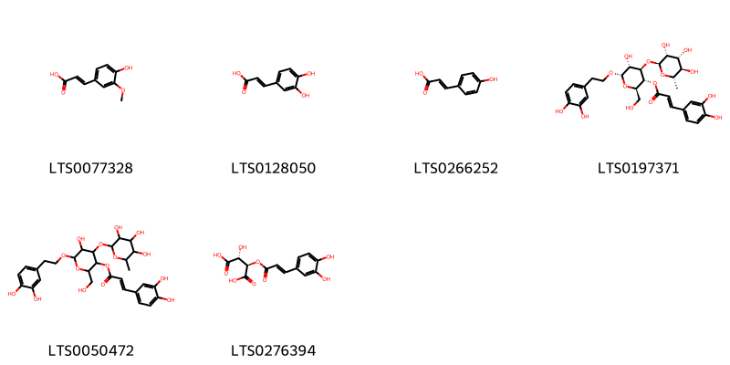{ width=100% }
    <figcaption>Hình ảnh cấu trúc hóa học của 6 hoạt chất thuộc nhóm Cinnamic acids and derivatives gồm ['ferulic acid (LTS0077328)', '3,4-dihydroxycinnamic acid (LTS0128050)', 'para-coumaric acid (LTS0266252)', '(2r,3r,4r,5r,6s)-6-[2-(3,4-dihydroxyphenyl)ethoxy]-5-hydroxy-2-(hydroxymethyl)-4-{[(2s,3r,4r,5r,6s)-3,4,5-trihydroxy-6-methyloxan-2-yl]oxy}oxan-3-yl (2e)-3-(3,4-dihydroxyphenyl)prop-2-enoate (LTS0197371)', '6-[2-(3,4-dihydroxyphenyl)ethoxy]-5-hydroxy-2-(hydroxymethyl)-4-[(3,4,5-trihydroxy-6-methyloxan-2-yl)oxy]oxan-3-yl 3-(3,4-dihydroxyphenyl)prop-2-enoate (LTS0050472)', 'caftaric acid (LTS0276394)'].</figcaption>
</figure>
#### Nhóm Fatty Acyls
<figure markdown="span">
    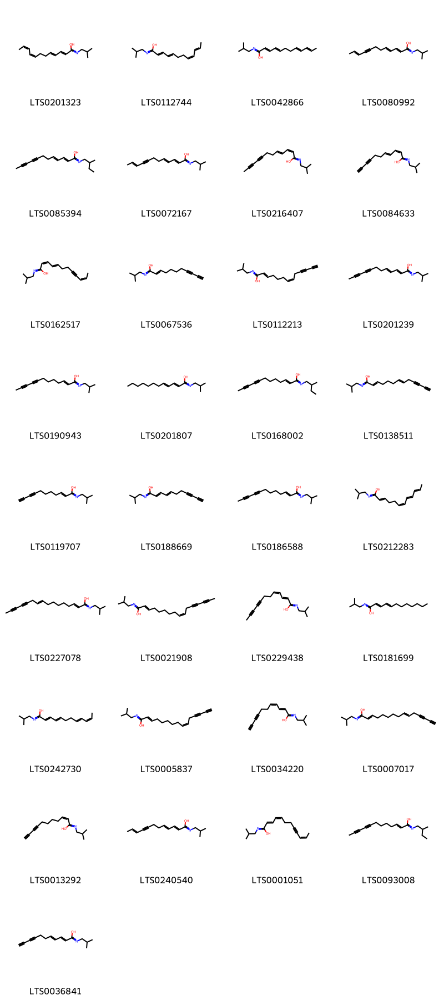{ width=100% }
    <figcaption>Hình ảnh cấu trúc hóa học của 33 hoạt chất thuộc nhóm Fatty Acyls gồm ['(2e,4e,8z,10z)-n-(2-methylpropyl)dodeca-2,4,8,10-tetraenimidic acid (LTS0201323)', '(2e,4e,8z,10e)-n-(2-methylpropyl)dodeca-2,4,8,10-tetraenimidic acid (LTS0112744)', 'n-(2-methylpropyl)dodeca-2,4,8,10-tetraenimidic acid (LTS0042866)', '(2e)-n-(2-methylpropyl)dodeca-2,4,10-trien-8-ynimidic acid (LTS0080992)', 'n-(2-methylbutyl)dodeca-2,4-dien-8,10-diynimidic acid (LTS0085394)', '(2e,4e,10e)-n-(2-methylpropyl)dodeca-2,4,10-trien-8-ynimidic acid (LTS0072167)', '(2z,4e)-n-(2-methylpropyl)dodeca-2,4-dien-8,10-diynimidic acid (LTS0216407)', '(2z,4e)-n-(2-methylpropyl)undeca-2,4-dien-8,10-diynimidic acid (LTS0084633)', '(2z,4e,10z)-n-(2-methylpropyl)dodeca-2,4,10-trien-8-ynimidic acid (LTS0162517)', 'n-(2-methylpropyl)undec-2-en-8,10-diynimidic acid (LTS0067536)', '(2e,7z)-n-(2-methylpropyl)trideca-2,7-dien-10,12-diynimidic acid (LTS0112213)', 'n-(2-methylpropyl)dodeca-2,4-dien-8,10-diynimidic acid (LTS0201239)', '(2e)-n-(2-methylpropyl)dodec-2-en-8,10-diynimidic acid (LTS0190943)', '(2e,4e)-n-(2-methylpropyl)dodeca-2,4-dienimidic acid (LTS0201807)', '(2e)-n-(2-methylbutyl)dodec-2-en-8,10-diynimidic acid (LTS0168002)', 'n-(2-methylpropyl)trideca-2,7-dien-10,12-diynimidic acid (LTS0138511)', '(2e)-n-(2-methylpropyl)undec-2-en-8,10-diynimidic acid (LTS0119707)', 'n-(2-methylpropyl)undeca-2,4-dien-8,10-diynimidic acid (LTS0188669)', 'n-(2-methylpropyl)dodec-2-en-8,10-diynimidic acid (LTS0186588)', '(2e,6z,8e,10e)-n-(2-methylpropyl)dodeca-2,6,8,10-tetraenimidic acid (LTS0212283)', 'n-(2-methylpropyl)hexadeca-2,9-dien-12,14-diynimidic acid (LTS0227078)', '(2e,9z)-n-(2-methylpropyl)hexadeca-2,9-dien-12,14-diynimidic acid (LTS0021908)', '(2e,4z)-n-(2-methylpropyl)dodeca-2,4-dien-8,10-diynimidic acid (LTS0229438)', 'n-(2-methylpropyl)dodeca-2,4-dienimidic acid (LTS0181699)', '(2e,4e,8e,10z)-n-(2-methylpropyl)dodeca-2,4,8,10-tetraenimidic acid (LTS0242730)', '(2e,9z)-n-(2-methylpropyl)pentadeca-2,9-dien-12,14-diynimidic acid (LTS0005837)', '(2e,4z)-n-(2-methylpropyl)undeca-2,4-dien-8,10-diynimidic acid (LTS0034220)', 'n-(2-methylpropyl)pentadeca-2,9-dien-12,14-diynimidic acid (LTS0007017)', '(2z)-n-(2-methylpropyl)undec-2-en-8,10-diynimidic acid (LTS0013292)', 'n-(2-methylpropyl)dodeca-2,4,10-trien-8-ynimidic acid (LTS0240540)', '(2e,4z,10z)-n-(2-methylpropyl)dodeca-2,4,10-trien-8-ynimidic acid (LTS0001051)', 'n-(2-methylbutyl)dodec-2-en-8,10-diynimidic acid (LTS0093008)', '(2e,4e)-n-(2-methylpropyl)undeca-2,4-dien-8,10-diynimidic acid (LTS0036841)'].</figcaption>
</figure>
#### Nhóm Flavonoids
<figure markdown="span">
    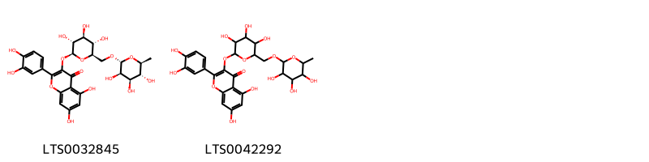{ width=100% }
    <figcaption>Hình ảnh cấu trúc hóa học của 2 hoạt chất thuộc nhóm Flavonoids gồm ['3-rutinosyl quercetin (LTS0032845)', 'rutin (LTS0042292)'].</figcaption>
</figure>
#### Nhóm Organooxygen compounds
<figure markdown="span">
    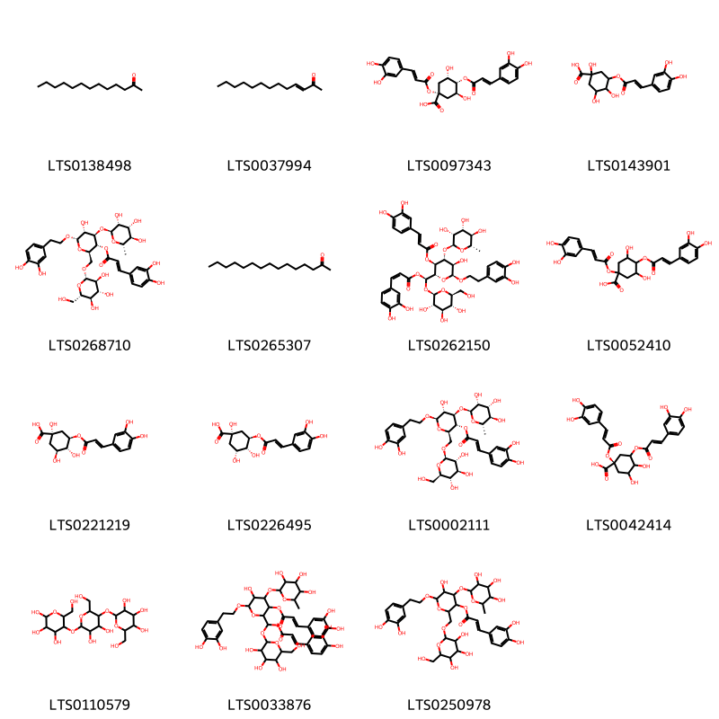{ width=100% }
    <figcaption>Hình ảnh cấu trúc hóa học của 15 hoạt chất thuộc nhóm Organooxygen compounds gồm ['2-tridecanone (LTS0138498)', 'tridec-3-en-2-one (LTS0037994)', '(1r,3s,4r,5s)-1,4-bis({[(2e)-3-(3,4-dihydroxyphenyl)prop-2-enoyl]oxy})-3,5-dihydroxycyclohexane-1-carboxylic acid (LTS0097343)', '3-{[3-(3,4-dihydroxyphenyl)prop-2-enoyl]oxy}-1,4,5-trihydroxycyclohexane-1-carboxylic acid (LTS0143901)', '(2r,3r,4r,5r,6s)-6-[2-(3,4-dihydroxyphenyl)ethoxy]-5-hydroxy-2-({[(2s,3s,4r,5r,6s)-3,4,5-trihydroxy-6-(hydroxymethyl)oxan-2-yl]oxy}methyl)-4-{[(2s,3r,4r,5r,6s)-3,4,5-trihydroxy-6-methyloxan-2-yl]oxy}oxan-3-yl (2e)-3-(3,4-dihydroxyphenyl)prop-2-enoate (LTS0268710)', '2-pentadecanone (LTS0265307)', '(s)-[(2s,3s,4r,5r,6s)-6-[2-(3,4-dihydroxyphenyl)ethoxy]-3-{[(2e)-3-(3,4-dihydroxyphenyl)prop-2-enoyl]oxy}-5-hydroxy-4-{[(2s,3r,4r,5r,6s)-3,4,5-trihydroxy-6-methyloxan-2-yl]oxy}oxan-2-yl]({[(2r,3s,4r,5r,6s)-3,4,5-trihydroxy-6-(hydroxymethyl)oxan-2-yl]oxy})methyl (2z)-3-(3,4-dihydroxyphenyl)prop-2-enoate (LTS0262150)', '1,4-bis({[3-(3,4-dihydroxyphenyl)prop-2-enoyl]oxy})-3,5-dihydroxycyclohexane-1-carboxylic acid (LTS0052410)', '(1s,3r,4r,5s)-3-{[(2e)-3-(3,4-dihydroxyphenyl)prop-2-enoyl]oxy}-1,4,5-trihydroxycyclohexane-1-carboxylic acid (LTS0221219)', 'chlorogenic acid (LTS0226495)', 'echinacoside (LTS0002111)', '(1r)-1,3-bis({[3-(3,4-dihydroxyphenyl)prop-2-enoyl]oxy})-4,5-dihydroxycyclohexane-1-carboxylic acid (LTS0042414)', 'amylose (LTS0110579)', '{6-[2-(3,4-dihydroxyphenyl)ethoxy]-3-{[3-(3,4-dihydroxyphenyl)prop-2-enoyl]oxy}-5-hydroxy-4-[(3,4,5-trihydroxy-6-methyloxan-2-yl)oxy]oxan-2-yl}({[3,4,5-trihydroxy-6-(hydroxymethyl)oxan-2-yl]oxy})methyl 3-(3,4-dihydroxyphenyl)prop-2-enoate (LTS0033876)', '6-[2-(3,4-dihydroxyphenyl)ethoxy]-5-hydroxy-2-({[3,4,5-trihydroxy-6-(hydroxymethyl)oxan-2-yl]oxy}methyl)-4-[(3,4,5-trihydroxy-6-methyloxan-2-yl)oxy]oxan-3-yl 3-(3,4-dihydroxyphenyl)prop-2-enoate (LTS0250978)'].</figcaption>
</figure>
#### Nhóm Prenol lipids
<figure markdown="span">
    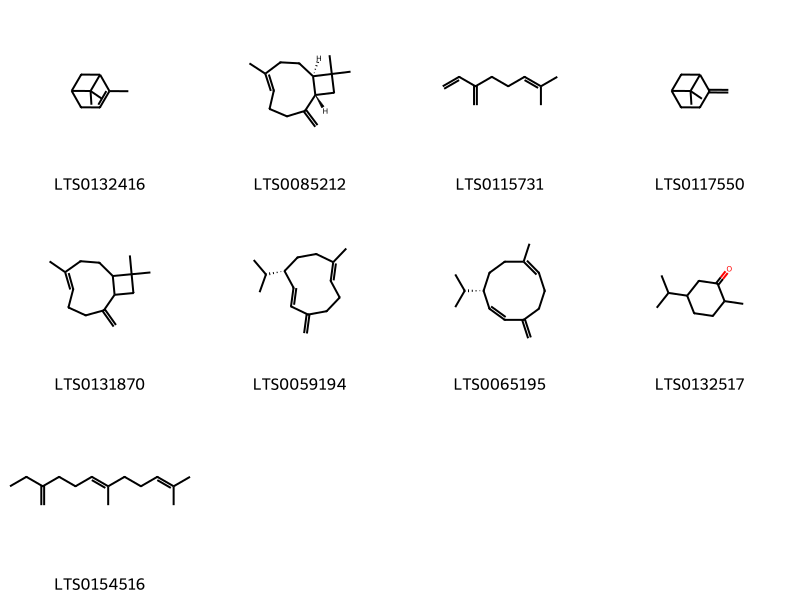{ width=100% }
    <figcaption>Hình ảnh cấu trúc hóa học của 9 hoạt chất thuộc nhóm Prenol lipids gồm ['α pinene (LTS0132416)', 'caryophyllene (LTS0085212)', 'α-myrcene (LTS0115731)', 'β-pinene (LTS0117550)', 'caryophyllene (LTS0131870)', '(-)-germacrene d (LTS0059194)', '(1z,6z,8s)-8-isopropyl-1-methyl-5-methylidenecyclodeca-1,6-diene (LTS0065195)', 'l-menthanone (LTS0132517)', '(6e)-2,6-dimethyl-10-methylidenedodeca-2,6-diene (LTS0154516)'].</figcaption>
</figure>
#### Nhóm Saturated hydrocarbons
<figure markdown="span">
    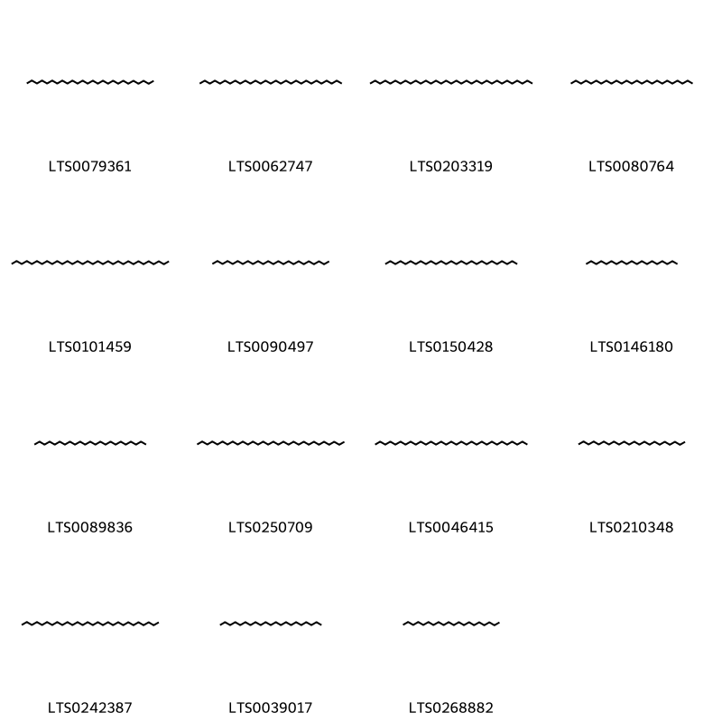{ width=100% }
    <figcaption>Hình ảnh cấu trúc hóa học của 15 hoạt chất thuộc nhóm Saturated hydrocarbons gồm ['hexacosane (LTS0079361)', 'nonacosane (LTS0062747)', 'tritriacontane (LTS0203319)', 'pentacosane (LTS0080764)', 'dotriacontane (LTS0101459)', 'tetracosane (LTS0090497)', 'heptacosane (LTS0150428)', 'nonadecane (LTS0146180)', 'tricosane (LTS0089836)', 'triacontane (LTS0250709)', 'hentriacontane (LTS0046415)', 'docosane (LTS0210348)', 'octacosane (LTS0242387)', 'heneicosane (LTS0039017)', 'eicosane (LTS0268882)'].</figcaption>
</figure>
#### Nhóm Steroids and steroid derivatives
<figure markdown="span">
    { width=100% }
    <figcaption>Hình ảnh cấu trúc hóa học của 2 hoạt chất thuộc nhóm Steroids and steroid derivatives gồm ['stigmast-5-en-3-ol, (3β)- (LTS0204616)', 'stigmast-5-en-3-ol (LTS0071224)'].</figcaption>
</figure>

---

### Dược dân tộc học

Danh sách các quốc gia có sử dụng *Echinacea angustifolia* trong điều trị các bệnh. 

| Country   | Disease                                                 | Bệnh                                                                                                                                                                                                |
|:----------|:--------------------------------------------------------|:----------------------------------------------------------------------------------------------------------------------------------------------------------------------------------------------------|
| Elsewhere | Sialogogue                                              | MYMEMORY WARNING: YOU USED ALL AVAILABLE FREE TRANSLATIONS FOR TODAY. NEXT AVAILABLE IN  12 HOURS 11 MINUTES 36 SECONDS VISIT HTTPS://MYMEMORY.TRANSLATED.NET/DOC/USAGELIMITS.PHP TO TRANSLATE MORE |
| German    | Digestive                                               | MYMEMORY WARNING: YOU USED ALL AVAILABLE FREE TRANSLATIONS FOR TODAY. NEXT AVAILABLE IN  12 HOURS 11 MINUTES 33 SECONDS VISIT HTTPS://MYMEMORY.TRANSLATED.NET/DOC/USAGELIMITS.PHP TO TRANSLATE MORE |
| Turkey    | Antiseptic, Aphrodisiac, Sudorific, Aperient, Digestive | MYMEMORY WARNING: YOU USED ALL AVAILABLE FREE TRANSLATIONS FOR TODAY. NEXT AVAILABLE IN  12 HOURS 11 MINUTES 30 SECONDS VISIT HTTPS://MYMEMORY.TRANSLATED.NET/DOC/USAGELIMITS.PHP TO TRANSLATE MORE |
| US        | Apertif, Sudorific, Antiseptic, Aphrodisiac             | MYMEMORY WARNING: YOU USED ALL AVAILABLE FREE TRANSLATIONS FOR TODAY. NEXT AVAILABLE IN  12 HOURS 11 MINUTES 26 SECONDS VISIT HTTPS://MYMEMORY.TRANSLATED.NET/DOC/USAGELIMITS.PHP TO TRANSLATE MORE |

---

---
## Echinacea pallida
### Thông tin về thực vật

!!! info "Phân loại thực vật của *Echinacea pallida* từ GIBF:"
    - **Kingdom:** Plantae
    - **Phylum:** Tracheophyta
    - **Order:** Asterales
    - **Family:** Asteraceae
    - **Genus:** Echinacea
    - **Species:** *Echinacea pallida*

 

| Label (VI)   | Label (EN)   | Scientific Name   | Descriptions (VI)   | Descriptions (EN)   | Also Known As (VI)   | Also Known As (EN)   |
|:-------------|:-------------|:------------------|:--------------------|:--------------------|:---------------------|:---------------------|
| N/A          | N/A          | Echinacea pallida | loài thực vật       | species of plant    | ['']                 | ['']                 |

#### Phân bố trên thế giới

**Từ CSDL GIBF** United States of America

#### Phân bố tại Việt Nam

**Từ CSDL GIBF**: Không có ghi nhận ở Việt Nam

---
### Thành phần hóa học
        
- Theo cơ sở dữ liệu lotus: Từ loài *Echinacea pallida* đã phân lập và xác định được 76 hoạt chất thuộc về các nhóm Fatty Acyls, Flavonoids, Prenol lipids, Steroids and steroid derivatives, Cinnamic acids and derivatives, Unsaturated hydrocarbons, Organooxygen compounds, Carboximidic acids and derivatives, Carboxylic acids and derivatives. 

|    | chemicalTaxonomyClassyfireClass    |   smiles_count |
|---:|:-----------------------------------|---------------:|
|  0 | Carboximidic acids and derivatives |              2 |
|  1 | Carboxylic acids and derivatives   |              2 |
|  2 | Cinnamic acids and derivatives     |              7 |
|  3 | Fatty Acyls                        |             20 |
|  4 | Flavonoids                         |              5 |
|  5 | Organooxygen compounds             |             23 |
|  6 | Prenol lipids                      |              9 |
|  7 | Steroids and steroid derivatives   |              2 |
|  8 | Unsaturated hydrocarbons           |              5 |

#### Nhóm Carboximidic acids and derivatives
<figure markdown="span">
    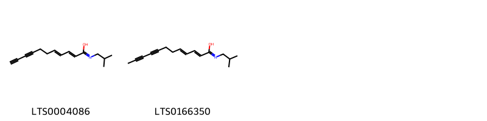{ width=100% }
    <figcaption>Hình ảnh cấu trúc hóa học của 2 hoạt chất thuộc nhóm Carboximidic acids and derivatives gồm ['(4e)-n-(2-methylpropyl)undeca-2,4-dien-8,10-diynimidic acid (LTS0004086)', '(2e)-n-(2-methylpropyl)dodeca-2,4-dien-8,10-diynimidic acid (LTS0166350)'].</figcaption>
</figure>
#### Nhóm Carboxylic acids and derivatives
<figure markdown="span">
    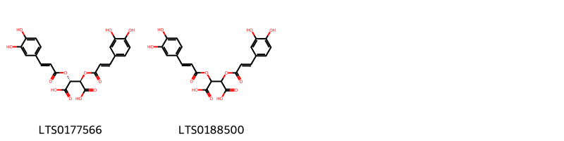{ width=100% }
    <figcaption>Hình ảnh cấu trúc hóa học của 2 hoạt chất thuộc nhóm Carboxylic acids and derivatives gồm ['cichoric acid (LTS0177566)', '2,3-bis({[3-(3,4-dihydroxyphenyl)prop-2-enoyl]oxy})butanedioic acid (LTS0188500)'].</figcaption>
</figure>
#### Nhóm Cinnamic acids and derivatives
<figure markdown="span">
    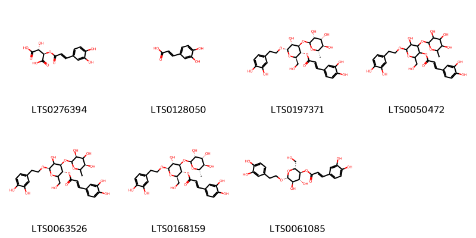{ width=100% }
    <figcaption>Hình ảnh cấu trúc hóa học của 7 hoạt chất thuộc nhóm Cinnamic acids and derivatives gồm ['caftaric acid (LTS0276394)', '3,4-dihydroxycinnamic acid (LTS0128050)', '(2r,3r,4r,5r,6s)-6-[2-(3,4-dihydroxyphenyl)ethoxy]-5-hydroxy-2-(hydroxymethyl)-4-{[(2s,3r,4r,5r,6s)-3,4,5-trihydroxy-6-methyloxan-2-yl]oxy}oxan-3-yl (2e)-3-(3,4-dihydroxyphenyl)prop-2-enoate (LTS0197371)', '6-[2-(3,4-dihydroxyphenyl)ethoxy]-5-hydroxy-2-(hydroxymethyl)-4-[(3,4,5-trihydroxy-6-methyloxan-2-yl)oxy]oxan-3-yl 3-(3,4-dihydroxyphenyl)prop-2-enoate (LTS0050472)', '(3r,4r,6r)-6-[2-(3,4-dihydroxyphenyl)ethoxy]-5-hydroxy-2-(hydroxymethyl)-4-{[(2s,3s,5r)-3,4,5-trihydroxy-6-methyloxan-2-yl]oxy}oxan-3-yl (2e)-3-(3,4-dihydroxyphenyl)prop-2-enoate (LTS0063526)', 'verbascoside (LTS0168159)', '(2r,3s,4r,5r,6r)-6-[2-(3,4-dihydroxyphenyl)ethoxy]-4,5-dihydroxy-2-(hydroxymethyl)oxan-3-yl (2e)-3-(3,4-dihydroxyphenyl)prop-2-enoate (LTS0061085)'].</figcaption>
</figure>
#### Nhóm Fatty Acyls
<figure markdown="span">
    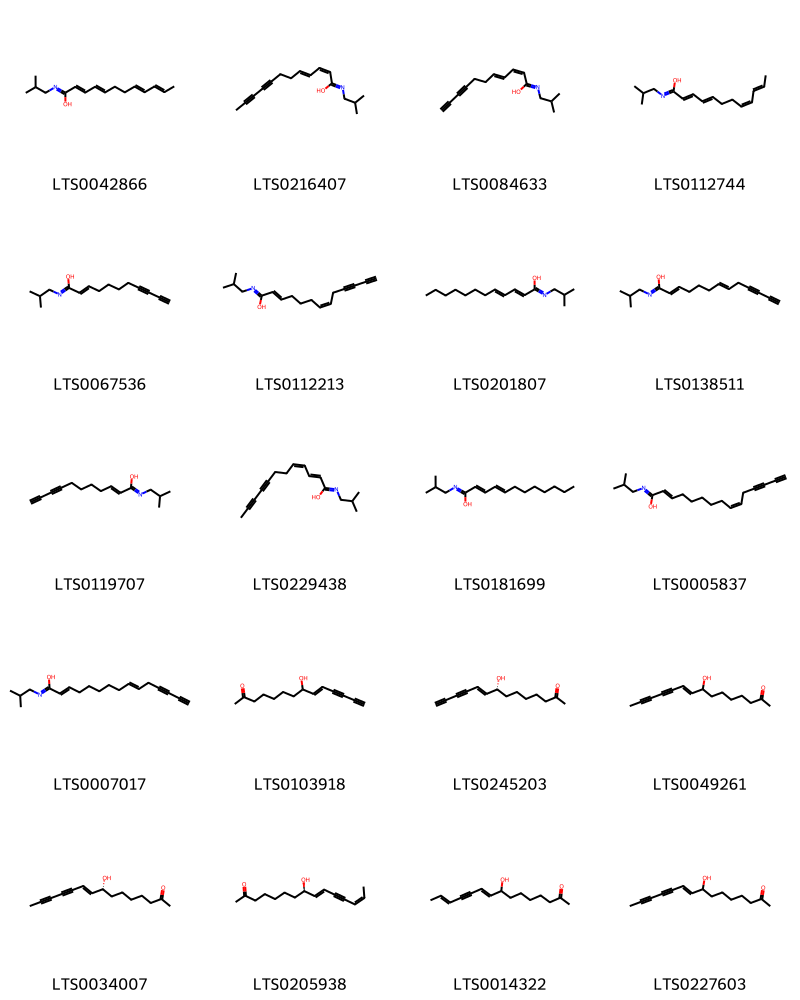{ width=100% }
    <figcaption>Hình ảnh cấu trúc hóa học của 20 hoạt chất thuộc nhóm Fatty Acyls gồm ['n-(2-methylpropyl)dodeca-2,4,8,10-tetraenimidic acid (LTS0042866)', '(2z,4e)-n-(2-methylpropyl)dodeca-2,4-dien-8,10-diynimidic acid (LTS0216407)', '(2z,4e)-n-(2-methylpropyl)undeca-2,4-dien-8,10-diynimidic acid (LTS0084633)', '(2e,4e,8z,10e)-n-(2-methylpropyl)dodeca-2,4,8,10-tetraenimidic acid (LTS0112744)', 'n-(2-methylpropyl)undec-2-en-8,10-diynimidic acid (LTS0067536)', '(2e,7z)-n-(2-methylpropyl)trideca-2,7-dien-10,12-diynimidic acid (LTS0112213)', '(2e,4e)-n-(2-methylpropyl)dodeca-2,4-dienimidic acid (LTS0201807)', 'n-(2-methylpropyl)trideca-2,7-dien-10,12-diynimidic acid (LTS0138511)', '(2e)-n-(2-methylpropyl)undec-2-en-8,10-diynimidic acid (LTS0119707)', '(2e,4z)-n-(2-methylpropyl)dodeca-2,4-dien-8,10-diynimidic acid (LTS0229438)', 'n-(2-methylpropyl)dodeca-2,4-dienimidic acid (LTS0181699)', '(2e,9z)-n-(2-methylpropyl)pentadeca-2,9-dien-12,14-diynimidic acid (LTS0005837)', 'n-(2-methylpropyl)pentadeca-2,9-dien-12,14-diynimidic acid (LTS0007017)', '8-hydroxytetradec-9-en-11,13-diyn-2-one (LTS0103918)', '(8r,9e)-8-hydroxytetradec-9-en-11,13-diyn-2-one (LTS0245203)', '8-hydroxypentadec-9-en-11,13-diyn-2-one (LTS0049261)', '(8r,9e)-8-hydroxypentadec-9-en-11,13-diyn-2-one (LTS0034007)', '(8r,9e,13z)-8-hydroxypentadeca-9,13-dien-11-yn-2-one (LTS0205938)', '8-hydroxypentadeca-9,13-dien-11-yn-2-one (LTS0014322)', '(9e)-8-hydroxypentadec-9-en-11,13-diyn-2-one (LTS0227603)'].</figcaption>
</figure>
#### Nhóm Flavonoids
<figure markdown="span">
    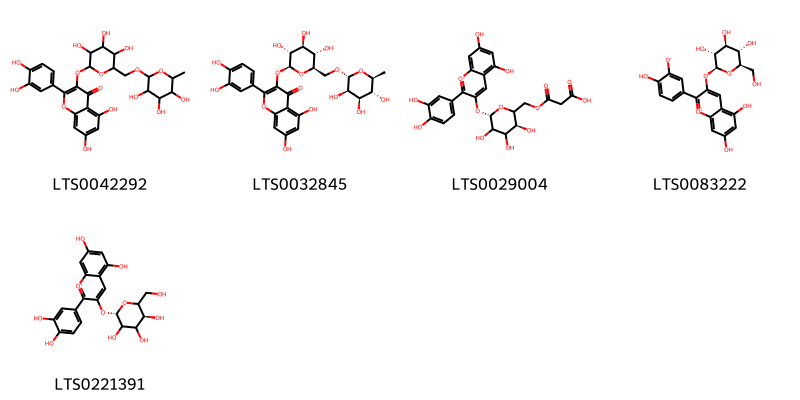{ width=100% }
    <figcaption>Hình ảnh cấu trúc hóa học của 5 hoạt chất thuộc nhóm Flavonoids gồm ['rutin (LTS0042292)', '3-rutinosyl quercetin (LTS0032845)', '3-{[(2s,5s)-6-{[(2-carboxyacetyl)oxy]methyl}-3,4,5-trihydroxyoxan-2-yl]oxy}-2-(3,4-dihydroxyphenyl)-5,7-dihydroxy-1λ⁴-chromen-1-ylium (LTS0029004)', '5,7-dihydroxy-2-(4-hydroxy-3-oxidophenyl)-3-{[(2s,3r,4s,5s,6r)-3,4,5-trihydroxy-6-(hydroxymethyl)oxan-2-yl]oxy}-1λ⁴-chromen-1-ylium (LTS0083222)', 'chrysanthemin (LTS0221391)'].</figcaption>
</figure>
#### Nhóm Organooxygen compounds
<figure markdown="span">
    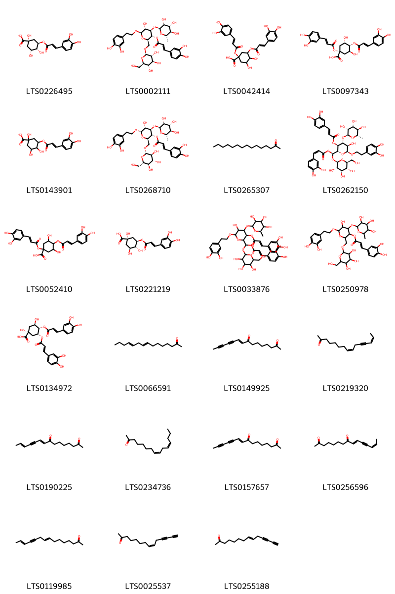{ width=100% }
    <figcaption>Hình ảnh cấu trúc hóa học của 23 hoạt chất thuộc nhóm Organooxygen compounds gồm ['chlorogenic acid (LTS0226495)', 'echinacoside (LTS0002111)', '(1r)-1,3-bis({[3-(3,4-dihydroxyphenyl)prop-2-enoyl]oxy})-4,5-dihydroxycyclohexane-1-carboxylic acid (LTS0042414)', '(1r,3s,4r,5s)-1,4-bis({[(2e)-3-(3,4-dihydroxyphenyl)prop-2-enoyl]oxy})-3,5-dihydroxycyclohexane-1-carboxylic acid (LTS0097343)', '3-{[3-(3,4-dihydroxyphenyl)prop-2-enoyl]oxy}-1,4,5-trihydroxycyclohexane-1-carboxylic acid (LTS0143901)', '(2r,3r,4r,5r,6s)-6-[2-(3,4-dihydroxyphenyl)ethoxy]-5-hydroxy-2-({[(2s,3s,4r,5r,6s)-3,4,5-trihydroxy-6-(hydroxymethyl)oxan-2-yl]oxy}methyl)-4-{[(2s,3r,4r,5r,6s)-3,4,5-trihydroxy-6-methyloxan-2-yl]oxy}oxan-3-yl (2e)-3-(3,4-dihydroxyphenyl)prop-2-enoate (LTS0268710)', '2-pentadecanone (LTS0265307)', '(s)-[(2s,3s,4r,5r,6s)-6-[2-(3,4-dihydroxyphenyl)ethoxy]-3-{[(2e)-3-(3,4-dihydroxyphenyl)prop-2-enoyl]oxy}-5-hydroxy-4-{[(2s,3r,4r,5r,6s)-3,4,5-trihydroxy-6-methyloxan-2-yl]oxy}oxan-2-yl]({[(2r,3s,4r,5r,6s)-3,4,5-trihydroxy-6-(hydroxymethyl)oxan-2-yl]oxy})methyl (2z)-3-(3,4-dihydroxyphenyl)prop-2-enoate (LTS0262150)', '1,4-bis({[3-(3,4-dihydroxyphenyl)prop-2-enoyl]oxy})-3,5-dihydroxycyclohexane-1-carboxylic acid (LTS0052410)', '(1s,3r,4r,5s)-3-{[(2e)-3-(3,4-dihydroxyphenyl)prop-2-enoyl]oxy}-1,4,5-trihydroxycyclohexane-1-carboxylic acid (LTS0221219)', '{6-[2-(3,4-dihydroxyphenyl)ethoxy]-3-{[3-(3,4-dihydroxyphenyl)prop-2-enoyl]oxy}-5-hydroxy-4-[(3,4,5-trihydroxy-6-methyloxan-2-yl)oxy]oxan-2-yl}({[3,4,5-trihydroxy-6-(hydroxymethyl)oxan-2-yl]oxy})methyl 3-(3,4-dihydroxyphenyl)prop-2-enoate (LTS0033876)', '6-[2-(3,4-dihydroxyphenyl)ethoxy]-5-hydroxy-2-({[3,4,5-trihydroxy-6-(hydroxymethyl)oxan-2-yl]oxy}methyl)-4-[(3,4,5-trihydroxy-6-methyloxan-2-yl)oxy]oxan-3-yl 3-(3,4-dihydroxyphenyl)prop-2-enoate (LTS0250978)', '3,4-dicaffeoylquinic acid (LTS0134972)', 'pentadeca-8,11-dien-2-one (LTS0066591)', 'pentadec-9-en-11,13-diyne-2,8-dione (LTS0149925)', '(8z,13z)-pentadeca-8,13-dien-11-yn-2-one (LTS0219320)', 'pentadeca-9,13-dien-11-yne-2,8-dione (LTS0190225)', '(8z,11z)-pentadeca-8,11-dien-2-one (LTS0234736)', '(9e)-pentadec-9-en-11,13-diyne-2,8-dione (LTS0157657)', '(9e,13z)-pentadeca-9,13-dien-11-yne-2,8-dione (LTS0256596)', 'pentadeca-8,13-dien-11-yn-2-one (LTS0119985)', '(8z)-tetradec-8-en-11,13-diyn-2-one (LTS0025537)', 'tetradec-8-en-11,13-diyn-2-one (LTS0255188)'].</figcaption>
</figure>
#### Nhóm Prenol lipids
<figure markdown="span">
    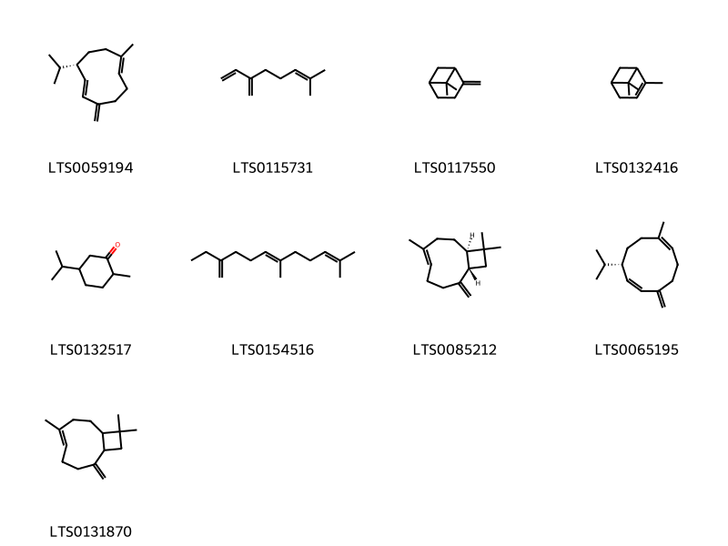{ width=100% }
    <figcaption>Hình ảnh cấu trúc hóa học của 9 hoạt chất thuộc nhóm Prenol lipids gồm ['(-)-germacrene d (LTS0059194)', 'α-myrcene (LTS0115731)', 'β-pinene (LTS0117550)', 'α pinene (LTS0132416)', 'l-menthanone (LTS0132517)', '(6e)-2,6-dimethyl-10-methylidenedodeca-2,6-diene (LTS0154516)', 'caryophyllene (LTS0085212)', '(1z,6z,8s)-8-isopropyl-1-methyl-5-methylidenecyclodeca-1,6-diene (LTS0065195)', 'caryophyllene (LTS0131870)'].</figcaption>
</figure>
#### Nhóm Steroids and steroid derivatives
<figure markdown="span">
    { width=100% }
    <figcaption>Hình ảnh cấu trúc hóa học của 2 hoạt chất thuộc nhóm Steroids and steroid derivatives gồm ['stigmast-5-en-3-ol (LTS0071224)', 'stigmast-5-en-3-ol, (3β)- (LTS0204616)'].</figcaption>
</figure>
#### Nhóm Unsaturated hydrocarbons
<figure markdown="span">
    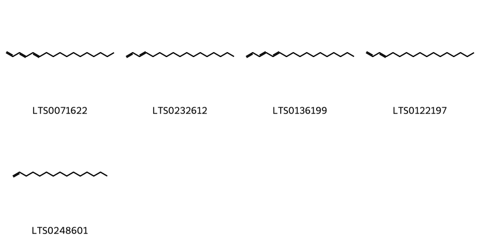{ width=100% }
    <figcaption>Hình ảnh cấu trúc hóa học của 5 hoạt chất thuộc nhóm Unsaturated hydrocarbons gồm ['(3e,5e)-heptadeca-1,3,5-triene (LTS0071622)', 'heptadeca-1,3-diene (LTS0232612)', 'heptadeca-1,3,5-triene (LTS0136199)', '(3e)-heptadeca-1,3-diene (LTS0122197)', '1-pentadecene (LTS0248601)'].</figcaption>
</figure>

---

### Dược dân tộc học

Danh sách các quốc gia có sử dụng *Echinacea pallida* trong điều trị các bệnh. 

| Country   | Disease     | Bệnh                                                                                                                                                                                                |
|:----------|:------------|:----------------------------------------------------------------------------------------------------------------------------------------------------------------------------------------------------|
| Elsewhere | Diaphoretic | MYMEMORY WARNING: YOU USED ALL AVAILABLE FREE TRANSLATIONS FOR TODAY. NEXT AVAILABLE IN  12 HOURS 10 MINUTES 40 SECONDS VISIT HTTPS://MYMEMORY.TRANSLATED.NET/DOC/USAGELIMITS.PHP TO TRANSLATE MORE |

---

# Chi Gerbera

??? note "Danh sách các dược liệu thuộc chi"
    
	 - *Gerbera piloselloides*

---
## Gerbera piloselloides
### Thông tin về thực vật

!!! info "Phân loại thực vật của *Piloselloides hirsuta* từ GIBF:"
    - **Kingdom:** Plantae
    - **Phylum:** Tracheophyta
    - **Order:** Asterales
    - **Family:** Asteraceae
    - **Genus:** Piloselloides
    - **Species:** *Piloselloides hirsuta*

 

| Label (VI)   | Label (EN)   | Scientific Name       | Descriptions (VI)   | Descriptions (EN)   | Also Known As (VI)   | Also Known As (EN)   |
|:-------------|:-------------|:----------------------|:--------------------|:--------------------|:---------------------|:---------------------|
| N/A          | N/A          | Gerbera piloselloides | loài thực vật       | species of plant    | ['']                 | ['']                 |

#### Phân bố trên thế giới

**Từ CSDL GIBF** Malawi, Zambia, South Africa, Mozambique, Zimbabwe, Eswatini, China

#### Phân bố tại Việt Nam

**Từ CSDL GIBF**: Không có ghi nhận ở Việt Nam

---
### Thành phần hóa học
        
- Theo cơ sở dữ liệu lotus: Từ loài *Piloselloides hirsuta* đã phân lập và xác định được 16 hoạt chất thuộc về các nhóm Coumarins and derivatives, Prenol lipids, Benzopyrans, Organooxygen compounds. 

|    | chemicalTaxonomyClassyfireClass   |   smiles_count |
|---:|:----------------------------------|---------------:|
|  0 | Benzopyrans                       |              2 |
|  1 | Coumarins and derivatives         |              5 |
|  2 | Organooxygen compounds            |              7 |
|  3 | Prenol lipids                     |              2 |

#### Nhóm Benzopyrans
<figure markdown="span">
    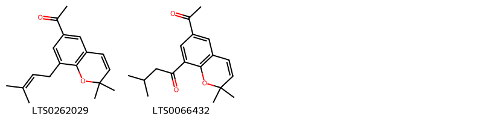{ width=100% }
    <figcaption>Hình ảnh cấu trúc hóa học của 2 hoạt chất thuộc nhóm Benzopyrans gồm ['1-[2,2-dimethyl-8-(3-methylbut-2-en-1-yl)chromen-6-yl]ethanone (LTS0262029)', '1-(6-acetyl-2,2-dimethylchromen-8-yl)-3-methylbutan-1-one (LTS0066432)'].</figcaption>
</figure>
#### Nhóm Coumarins and derivatives
<figure markdown="span">
    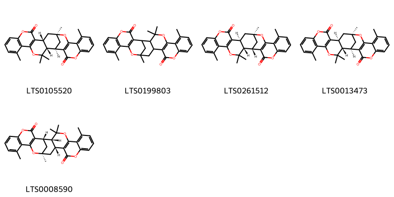{ width=100% }
    <figcaption>Hình ảnh cấu trúc hóa học của 5 hoạt chất thuộc nhóm Coumarins and derivatives gồm ['(1r,2r,15r,17s)-3,3,7,17,21-pentamethyl-4,12,18,26-tetraoxaheptacyclo[15.11.1.0²,¹⁵.0⁵,¹⁴.0⁶,¹¹.0¹⁹,²⁸.0²⁰,²⁵]nonacosa-5(14),6,8,10,19(28),20,22,24-octaene-13,27-dione (LTS0105520)', '3,3,7,17,21-pentamethyl-4,12,18,26-tetraoxaheptacyclo[15.11.1.0²,¹⁵.0⁵,¹⁴.0⁶,¹¹.0¹⁹,²⁸.0²⁰,²⁵]nonacosa-5(14),6,8,10,19(28),20,22,24-octaene-13,27-dione (LTS0199803)', '(1s,2r,15s,17s)-3,3,7,17,21-pentamethyl-4,12,18,26-tetraoxaheptacyclo[15.11.1.0²,¹⁵.0⁵,¹⁴.0⁶,¹¹.0¹⁹,²⁸.0²⁰,²⁵]nonacosa-5(14),6,8,10,19(28),20,22,24-octaene-13,27-dione (LTS0261512)', '(1r,2r,15s,17s)-3,3,7,17,21-pentamethyl-4,12,18,26-tetraoxaheptacyclo[15.11.1.0²,¹⁵.0⁵,¹⁴.0⁶,¹¹.0¹⁹,²⁸.0²⁰,²⁵]nonacosa-5(14),6,8,10,19(28),20,22,24-octaene-13,27-dione (LTS0013473)', '(1s,2r,15r,17s)-3,3,7,17,21-pentamethyl-4,12,18,26-tetraoxaheptacyclo[15.11.1.0²,¹⁵.0⁵,¹⁴.0⁶,¹¹.0¹⁹,²⁸.0²⁰,²⁵]nonacosa-5(14),6,8,10,19(28),20,22,24-octaene-13,27-dione (LTS0008590)'].</figcaption>
</figure>
#### Nhóm Organooxygen compounds
<figure markdown="span">
    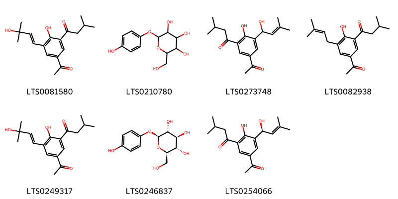{ width=100% }
    <figcaption>Hình ảnh cấu trúc hóa học của 7 hoạt chất thuộc nhóm Organooxygen compounds gồm ['1-[5-acetyl-2-hydroxy-3-(3-hydroxy-3-methylbut-1-en-1-yl)phenyl]-3-methylbutan-1-one (LTS0081580)', 'arbutin (LTS0210780)', '1-[5-acetyl-2-hydroxy-3-(1-hydroxy-3-methylbut-2-en-1-yl)phenyl]-3-methylbutan-1-one (LTS0273748)', '1-[5-acetyl-2-hydroxy-3-(3-methylbut-2-en-1-yl)phenyl]-3-methylbutan-1-one (LTS0082938)', '1-{5-acetyl-2-hydroxy-3-[(1e)-3-hydroxy-3-methylbut-1-en-1-yl]phenyl}-3-methylbutan-1-one (LTS0249317)', 'β-arbutin (LTS0246837)', '1-{5-acetyl-2-hydroxy-3-[(1s)-1-hydroxy-3-methylbut-2-en-1-yl]phenyl}-3-methylbutan-1-one (LTS0254066)'].</figcaption>
</figure>
#### Nhóm Prenol lipids
<figure markdown="span">
    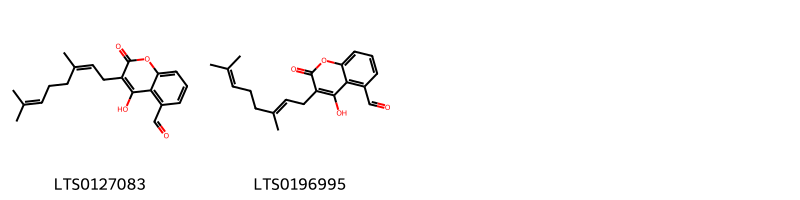{ width=100% }
    <figcaption>Hình ảnh cấu trúc hóa học của 2 hoạt chất thuộc nhóm Prenol lipids gồm ['3-(3,7-dimethylocta-2,6-dien-1-yl)-4-hydroxy-2-oxochromene-5-carbaldehyde (LTS0127083)', '3-[(2e)-3,7-dimethylocta-2,6-dien-1-yl]-4-hydroxy-2-oxochromene-5-carbaldehyde (LTS0196995)'].</figcaption>
</figure>

---

### Dược dân tộc học

Danh sách các quốc gia có sử dụng *Piloselloides hirsuta* trong điều trị các bệnh. 

| Country   | Disease             | Bệnh                                                                                                                                                                                                |
|:----------|:--------------------|:----------------------------------------------------------------------------------------------------------------------------------------------------------------------------------------------------|
| Lesotho   | Fumigant, Purgative | MYMEMORY WARNING: YOU USED ALL AVAILABLE FREE TRANSLATIONS FOR TODAY. NEXT AVAILABLE IN  12 HOURS 09 MINUTES 57 SECONDS VISIT HTTPS://MYMEMORY.TRANSLATED.NET/DOC/USAGELIMITS.PHP TO TRANSLATE MORE |

---

# Chi Calea

??? note "Danh sách các dược liệu thuộc chi"
    
	 - *Calea prunifolia*
	 - *Calea urticifolia*
	 - *Calea zacatechichi*

---
## Calea prunifolia
### Thông tin về thực vật

!!! info "Phân loại thực vật của *Calea prunifolia* từ GIBF:"
    - **Kingdom:** Plantae
    - **Phylum:** Tracheophyta
    - **Order:** Asterales
    - **Family:** Asteraceae
    - **Genus:** Calea
    - **Species:** *Calea prunifolia*

 

| Label (VI)   | Label (EN)   | Scientific Name   | Descriptions (VI)   | Descriptions (EN)   | Also Known As (VI)   | Also Known As (EN)   |
|:-------------|:-------------|:------------------|:--------------------|:--------------------|:---------------------|:---------------------|
| N/A          | N/A          | Calea prunifolia  |                     |                     | ['']                 | ['']                 |

#### Phân bố trên thế giới

**Từ CSDL GIBF** nan, Ecuador, Colombia, Costa Rica, unknown or invalid, Nicaragua, Mexico, Venezuela (Bolivarian Republic of), Panama

#### Phân bố tại Việt Nam

**Từ CSDL GIBF**: Không có ghi nhận ở Việt Nam

---
### Thành phần hóa học
        
- Theo cơ sở dữ liệu lotus: Từ loài *Calea prunifolia* đã phân lập và xác định được 57 hoạt chất thuộc về các nhóm Benzodioxanes, Flavonoids, Prenol lipids, Steroids and steroid derivatives, Benzofurans, Benzene and substituted derivatives, Unsaturated hydrocarbons, Naphthofurans, Organooxygen compounds, Phenols, Phenol esters, Benzopyrans. 

|    | chemicalTaxonomyClassyfireClass     |   smiles_count |
|---:|:------------------------------------|---------------:|
|  0 | Benzene and substituted derivatives |              1 |
|  1 | Benzodioxanes                       |              2 |
|  2 | Benzofurans                         |              5 |
|  3 | Benzopyrans                         |              2 |
|  4 | Flavonoids                          |              3 |
|  5 | Naphthofurans                       |              6 |
|  6 | Organooxygen compounds              |              3 |
|  7 | Phenol esters                       |              1 |
|  8 | Phenols                             |              2 |
|  9 | Prenol lipids                       |             26 |
| 10 | Steroids and steroid derivatives    |              3 |
| 11 | Unsaturated hydrocarbons            |              3 |

#### Nhóm Benzene and substituted derivatives
<figure markdown="span">
    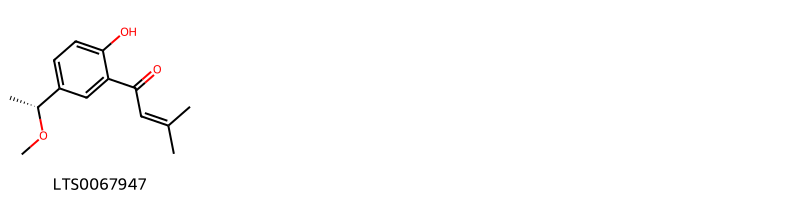{ width=100% }
    <figcaption>Hình ảnh cấu trúc hóa học của 1 hoạt chất thuộc nhóm Benzene and substituted derivatives gồm ['1-{2-hydroxy-5-[(1r)-1-methoxyethyl]phenyl}-3-methylbut-2-en-1-one (LTS0067947)'].</figcaption>
</figure>
#### Nhóm Benzodioxanes
<figure markdown="span">
    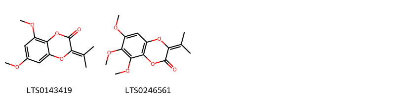{ width=100% }
    <figcaption>Hình ảnh cấu trúc hóa học của 2 hoạt chất thuộc nhóm Benzodioxanes gồm ['6,8-dimethoxy-3-(propan-2-ylidene)-1,4-benzodioxin-2-one (LTS0143419)', '6,7,8-trimethoxy-3-(propan-2-ylidene)-1,4-benzodioxin-2-one (LTS0246561)'].</figcaption>
</figure>
#### Nhóm Benzofurans
<figure markdown="span">
    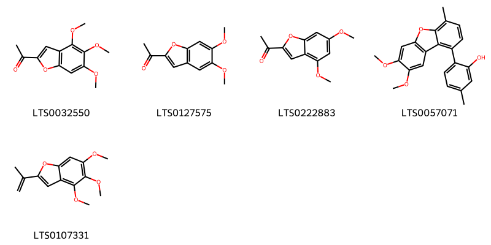{ width=100% }
    <figcaption>Hình ảnh cấu trúc hóa học của 5 hoạt chất thuộc nhóm Benzofurans gồm ['1-(4,5,6-trimethoxy-1-benzofuran-2-yl)ethanone (LTS0032550)', '1-(5,6-dimethoxy-1-benzofuran-2-yl)ethanone (LTS0127575)', '1-(4,6-dimethoxy-1-benzofuran-2-yl)ethanone (LTS0222883)', '2-{11,12-dimethoxy-6-methyl-8-oxatricyclo[7.4.0.0²,⁷]trideca-1(9),2(7),3,5,10,12-hexaen-3-yl}-5-methylphenol (LTS0057071)', '4,5,6-trimethoxy-2-(prop-1-en-2-yl)-1-benzofuran (LTS0107331)'].</figcaption>
</figure>
#### Nhóm Benzopyrans
<figure markdown="span">
    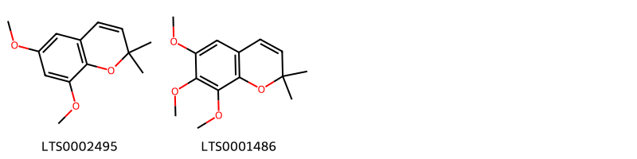{ width=100% }
    <figcaption>Hình ảnh cấu trúc hóa học của 2 hoạt chất thuộc nhóm Benzopyrans gồm ['6,8-dimethoxy-2,2-dimethylchromene (LTS0002495)', 'methylripariochromene a (LTS0001486)'].</figcaption>
</figure>
#### Nhóm Flavonoids
<figure markdown="span">
    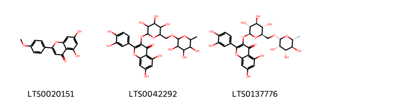{ width=100% }
    <figcaption>Hình ảnh cấu trúc hóa học của 3 hoạt chất thuộc nhóm Flavonoids gồm ['acacetin (LTS0020151)', 'rutin (LTS0042292)', '2-(3,4-dihydroxyphenyl)-5,7-dihydroxy-3-{[(2s,3r,4s,5s,6r)-3,4,5-trihydroxy-6-({[(2r,3s,4s,5s,6r)-3,4,5-trihydroxy-6-methyloxan-2-yl]oxy}methyl)oxan-2-yl]oxy}chromen-4-one (LTS0137776)'].</figcaption>
</figure>
#### Nhóm Naphthofurans
<figure markdown="span">
    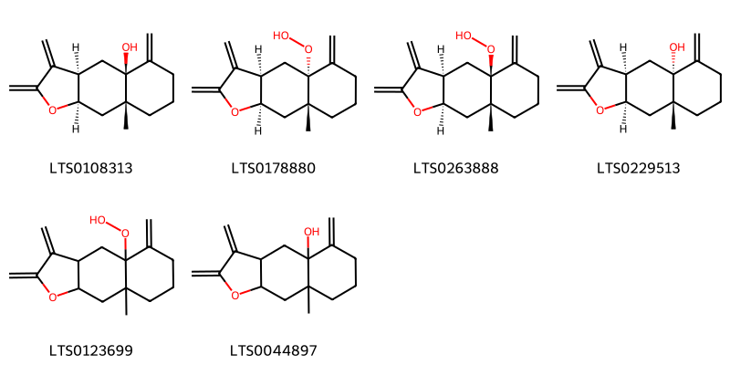{ width=100% }
    <figcaption>Hình ảnh cấu trúc hóa học của 6 hoạt chất thuộc nhóm Naphthofurans gồm ['(3ar,4as,8ar,9ar)-8a-methyl-2,3,5-trimethylidene-hexahydro-3ah-naphtho[2,3-b]furan-4a-ol (LTS0108313)', '(3ar,4ar,8ar,9ar)-8a-methyl-2,3,5-trimethylidene-hexahydro-3ah-naphtho[2,3-b]furan-4a-peroxol (LTS0178880)', '(3ar,4as,8ar,9ar)-8a-methyl-2,3,5-trimethylidene-hexahydro-3ah-naphtho[2,3-b]furan-4a-peroxol (LTS0263888)', '(3ar,4ar,8ar,9ar)-8a-methyl-2,3,5-trimethylidene-hexahydro-3ah-naphtho[2,3-b]furan-4a-ol (LTS0229513)', '8a-methyl-2,3,5-trimethylidene-hexahydro-3ah-naphtho[2,3-b]furan-4a-peroxol (LTS0123699)', '8a-methyl-2,3,5-trimethylidene-hexahydro-3ah-naphtho[2,3-b]furan-4a-ol (LTS0044897)'].</figcaption>
</figure>
#### Nhóm Organooxygen compounds
<figure markdown="span">
    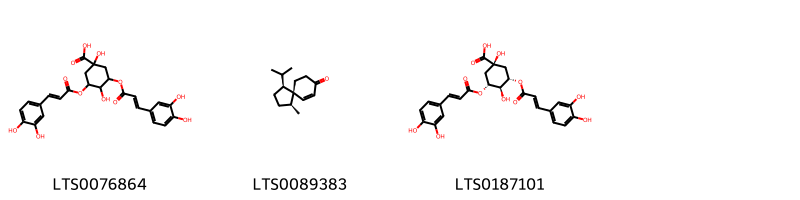{ width=100% }
    <figcaption>Hình ảnh cấu trúc hóa học của 3 hoạt chất thuộc nhóm Organooxygen compounds gồm ['3,5-bis({[3-(3,4-dihydroxyphenyl)prop-2-enoyl]oxy})-1,4-dihydroxycyclohexane-1-carboxylic acid (LTS0076864)', '(1s,4s,5s)-1-isopropyl-4-methylspiro[4.5]dec-6-en-8-one (LTS0089383)', '(1s,3r,4r,5s)-3,5-bis({[(2e)-3-(3,4-dihydroxyphenyl)prop-2-enoyl]oxy})-1,4-dihydroxycyclohexane-1-carboxylic acid (LTS0187101)'].</figcaption>
</figure>
#### Nhóm Phenol esters
<figure markdown="span">
    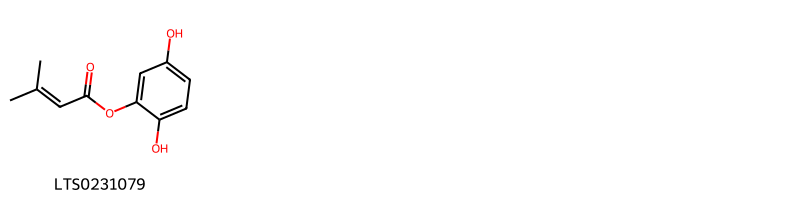{ width=100% }
    <figcaption>Hình ảnh cấu trúc hóa học của 1 hoạt chất thuộc nhóm Phenol esters gồm ['2,5-dihydroxyphenyl 3-methylbut-2-enoate (LTS0231079)'].</figcaption>
</figure>
#### Nhóm Phenols
<figure markdown="span">
    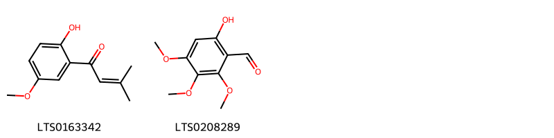{ width=100% }
    <figcaption>Hình ảnh cấu trúc hóa học của 2 hoạt chất thuộc nhóm Phenols gồm ['1-(2-hydroxy-5-methoxyphenyl)-3-methylbut-2-en-1-one (LTS0163342)', '6-hydroxy-2,3,4-trimethoxybenzaldehyde (LTS0208289)'].</figcaption>
</figure>
#### Nhóm Prenol lipids
<figure markdown="span">
    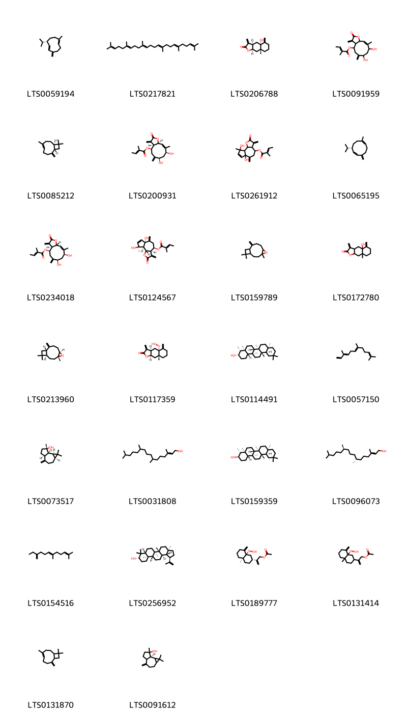{ width=100% }
    <figcaption>Hình ảnh cấu trúc hóa học của 26 hoạt chất thuộc nhóm Prenol lipids gồm ['(-)-germacrene d (LTS0059194)', 'squalene (LTS0217821)', '(3ar,4ar,8ar,9ar)-4a-hydroxy-8a-methyl-3,5-dimethylidene-hexahydro-3ah-naphtho[2,3-b]furan-2-one (LTS0206788)', '7,9-dihydroxy-10-methyl-3,6-dimethylidene-2-oxo-3ah,4h,5h,7h,8h,9h,11ah-cyclodeca[b]furan-4-yl 2-methylbut-2-enoate (LTS0091959)', 'caryophyllene (LTS0085212)', '(3ar,4r,7r,9s,11as)-7,9-dihydroxy-10-methyl-3,6-dimethylidene-2-oxo-3ah,4h,5h,7h,8h,9h,11ah-cyclodeca[b]furan-4-yl (2e)-2-methylbut-2-enoate (LTS0200931)', '6a,9-dihydroxy-9-methyl-3,6-dimethylidene-2-oxo-3ah,4h,5h,9ah,9bh-azuleno[4,5-b]furan-4-yl 2-methylbut-2-enoate (LTS0261912)', '(1z,6z,8s)-8-isopropyl-1-methyl-5-methylidenecyclodeca-1,6-diene (LTS0065195)', '(3ar,4r,7r,9s,11ar)-7,9-dihydroxy-10-methyl-3,6-dimethylidene-2-oxo-3ah,4h,5h,7h,8h,9h,11ah-cyclodeca[b]furan-4-yl (2e)-2-methylbut-2-enoate (LTS0234018)', '(3ar,4r,6as,9s,9as,9bs)-6a,9-dihydroxy-9-methyl-3,6-dimethylidene-2-oxo-3ah,4h,5h,9ah,9bh-azuleno[4,5-b]furan-4-yl (2e)-2-methylbut-2-enoate (LTS0124567)', 'caryophyllene oxide (LTS0159789)', '4a-hydroxy-8a-methyl-3,5-dimethylidene-hexahydro-3ah-naphtho[2,3-b]furan-2-one (LTS0172780)', 'β-caryophyllene oxide (LTS0213960)', '(3ar,4ar,8ar,9ar)-4a-hydroperoxy-8a-methyl-3,5-dimethylidene-hexahydro-3ah-naphtho[2,3-b]furan-2-one (LTS0117359)', 'epi-friedelanol (LTS0114491)', 'farnesene (LTS0057150)', '(1as,4as,7s,7ar,7bs)-1,1,7-trimethyl-4-methylidene-octahydrocyclopropa[e]azulen-7-ol (LTS0073517)', 'phytol (LTS0031808)', '(3r,4r,4as,6as,6br,8ar,12ar,12bs,14as,14bs)-4,4a,6b,8a,11,11,12b,14a-octamethyl-hexadecahydropicen-3-ol (LTS0159359)', 'phytol (LTS0096073)', '(6e)-2,6-dimethyl-10-methylidenedodeca-2,6-diene (LTS0154516)', 'lupeol (LTS0256952)', '2-[(2r,4ar,8ar)-8a-hydroperoxy-4a-methyl-8-methylidene-hexahydro-1h-naphthalen-2-yl]prop-2-en-1-yl acetate (LTS0189777)', '2-(8a-hydroperoxy-4a-methyl-8-methylidene-hexahydro-1h-naphthalen-2-yl)prop-2-en-1-yl acetate (LTS0131414)', 'caryophyllene (LTS0131870)', '(7ar)-1,1,7-trimethyl-4-methylidene-octahydrocyclopropa[e]azulen-7-ol (LTS0091612)'].</figcaption>
</figure>
#### Nhóm Steroids and steroid derivatives
<figure markdown="span">
    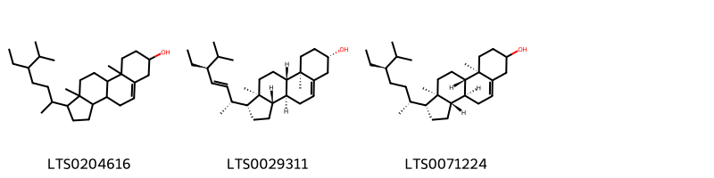{ width=100% }
    <figcaption>Hình ảnh cấu trúc hóa học của 3 hoạt chất thuộc nhóm Steroids and steroid derivatives gồm ['stigmast-5-en-3-ol, (3β)- (LTS0204616)', 'phytosterol (LTS0029311)', 'stigmast-5-en-3-ol (LTS0071224)'].</figcaption>
</figure>
#### Nhóm Unsaturated hydrocarbons
<figure markdown="span">
    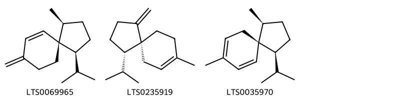{ width=100% }
    <figcaption>Hình ảnh cấu trúc hóa học của 3 hoạt chất thuộc nhóm Unsaturated hydrocarbons gồm ['(1s,4s,5s)-1-isopropyl-4-methyl-8-methylidenespiro[4.5]dec-6-ene (LTS0069965)', '(1s,5r)-1-isopropyl-8-methyl-4-methylidenespiro[4.5]dec-7-ene (LTS0235919)', '(1s,4s,5s)-1-isopropyl-4,8-dimethylspiro[4.5]deca-6,8-diene (LTS0035970)'].</figcaption>
</figure>

---

### Dược dân tộc học

Danh sách các quốc gia có sử dụng *Calea prunifolia* trong điều trị các bệnh. 

| Country   | Disease   | Bệnh                                                                                                                                                                                                |
|:----------|:----------|:----------------------------------------------------------------------------------------------------------------------------------------------------------------------------------------------------|
| Elsewhere | Sudorific | MYMEMORY WARNING: YOU USED ALL AVAILABLE FREE TRANSLATIONS FOR TODAY. NEXT AVAILABLE IN  12 HOURS 09 MINUTES 16 SECONDS VISIT HTTPS://MYMEMORY.TRANSLATED.NET/DOC/USAGELIMITS.PHP TO TRANSLATE MORE |

---

---
## Calea urticifolia
### Thông tin về thực vật

!!! info "Phân loại thực vật của *Calea urticifolia* từ GIBF:"
    - **Kingdom:** Plantae
    - **Phylum:** Tracheophyta
    - **Order:** Asterales
    - **Family:** Asteraceae
    - **Genus:** Calea
    - **Species:** *Calea urticifolia*

 

| Label (VI)   | Label (EN)   | Scientific Name   | Descriptions (VI)   | Descriptions (EN)   | Also Known As (VI)   | Also Known As (EN)   |
|:-------------|:-------------|:------------------|:--------------------|:--------------------|:---------------------|:---------------------|
| N/A          | N/A          | Calea urticifolia | loài thực vật       | species of plant    | ['']                 | ['']                 |

#### Phân bố trên thế giới

**Từ CSDL GIBF** Belgium, Guatemala, Costa Rica, Honduras, Nicaragua, Mexico, El Salvador, Panama

#### Phân bố tại Việt Nam

**Từ CSDL GIBF**: Không có ghi nhận ở Việt Nam

---
### Thành phần hóa học
        
- Theo cơ sở dữ liệu lotus: Từ loài *Calea urticifolia* đã phân lập và xác định được 49 hoạt chất thuộc về các nhóm Fatty Acyls, Prenol lipids, Phenol esters. 

|    | chemicalTaxonomyClassyfireClass   |   smiles_count |
|---:|:----------------------------------|---------------:|
|  0 | Fatty Acyls                       |              1 |
|  1 | Phenol esters                     |              2 |
|  2 | Prenol lipids                     |             46 |

#### Nhóm Fatty Acyls
<figure markdown="span">
    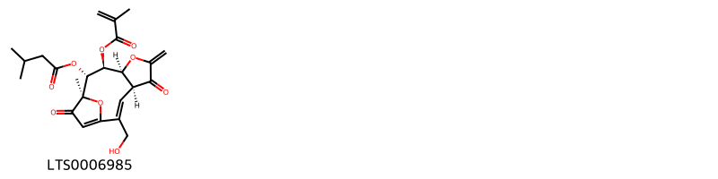{ width=100% }
    <figcaption>Hình ảnh cấu trúc hóa học của 1 hoạt chất thuộc nhóm Fatty Acyls gồm ['(1r,2r,3s,4s,8s,9e)-10-(hydroxymethyl)-1-methyl-6-methylidene-3-[(2-methylprop-2-enoyl)oxy]-7,13-dioxo-5,14-dioxatricyclo[9.2.1.0⁴,⁸]tetradeca-9,11-dien-2-yl 3-methylbutanoate (LTS0006985)'].</figcaption>
</figure>
#### Nhóm Phenol esters
<figure markdown="span">
    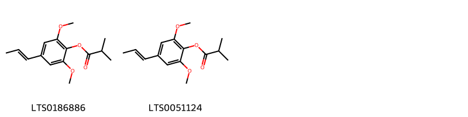{ width=100% }
    <figcaption>Hình ảnh cấu trúc hóa học của 2 hoạt chất thuộc nhóm Phenol esters gồm ['2,6-dimethoxy-4-(prop-1-en-1-yl)phenyl 2-methylpropanoate (LTS0186886)', '2,6-dimethoxy-4-[(1e)-prop-1-en-1-yl]phenyl 2-methylpropanoate (LTS0051124)'].</figcaption>
</figure>
#### Nhóm Prenol lipids
<figure markdown="span">
    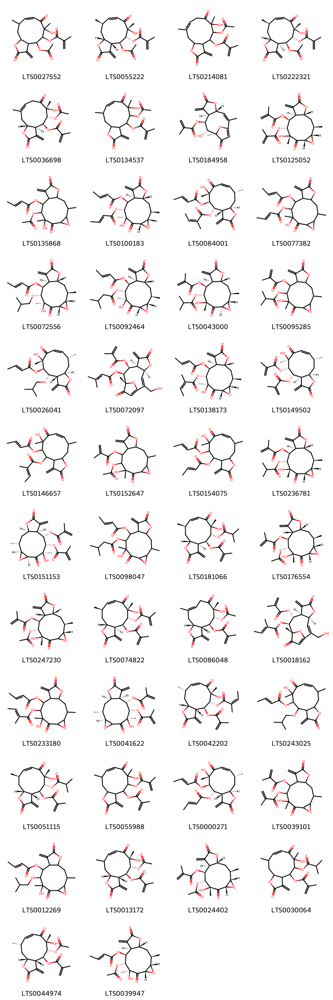{ width=100% }
    <figcaption>Hình ảnh cấu trúc hóa học của 46 hoạt chất thuộc nhóm Prenol lipids gồm ['4-(acetyloxy)-6-hydroxy-6,10-dimethyl-3-methylidene-2,7-dioxo-3ah,4h,5h,10h,11h,11ah-cyclodeca[b]furan-5-yl 2-methylprop-2-enoate (LTS0027552)', '(3ar,4s,5r,6r,10r,11ar)-4-(acetyloxy)-6-hydroxy-6,10-dimethyl-3-methylidene-2,7-dioxo-3ah,4h,5h,10h,11h,11ah-cyclodeca[b]furan-5-yl 2-methylprop-2-enoate (LTS0055222)', '5-(acetyloxy)-6-hydroxy-6,10-dimethyl-3-methylidene-2,7-dioxo-3ah,4h,5h,8h,11h,11ah-cyclodeca[b]furan-4-yl 2-methylprop-2-enoate (LTS0214081)', '(3as,4s,5r,6r,10r,11ar)-4-(acetyloxy)-6-hydroxy-6,10-dimethyl-3-methylidene-2,7-dioxo-3ah,4h,5h,10h,11h,11ah-cyclodeca[b]furan-5-yl 2-methylprop-2-enoate (LTS0222321)', '(3as,4s,5r,6r,11ar)-5-(acetyloxy)-6-hydroxy-6,10-dimethyl-3-methylidene-2,7-dioxo-3ah,4h,5h,8h,11h,11ah-cyclodeca[b]furan-4-yl 2-methylprop-2-enoate (LTS0036698)', '5-(acetyloxy)-6-hydroxy-6,10-dimethyl-3-methylidene-2,7-dioxo-3ah,4h,5h,10h,11h,11ah-cyclodeca[b]furan-4-yl 2-methylprop-2-enoate (LTS0134537)', '(2z,4r,8s,9s,10r,11r)-10-hydroxy-2,11-dimethyl-7-methylidene-6,12-dioxo-5,14-dioxatricyclo[9.2.1.0⁴,⁸]tetradeca-1(13),2-dien-9-yl 2-methylprop-2-enoate (LTS0184958)', '(1r,3r,4s,6s,8r,9r,10s,11s)-8-hydroxy-3,8-dimethyl-12-methylidene-10-[(2-methylprop-2-enoyl)oxy]-7,13-dioxo-5,14-dioxatricyclo[9.3.0.0⁴,⁶]tetradecan-9-yl 2-methylprop-2-enoate (LTS0125052)', '9-(acetyloxy)-8-hydroxy-3,8-dimethyl-12-methylidene-7,13-dioxo-5,14-dioxatricyclo[9.3.0.0⁴,⁶]tetradecan-10-yl but-2-enoate (LTS0135868)', '(1r,3r,4s,6s,8s,9r,10s,11s)-10-[(2e)-but-2-enoyloxy]-8-hydroxy-3,8-dimethyl-12-methylidene-7,13-dioxo-5,14-dioxatricyclo[9.3.0.0⁴,⁶]tetradecan-9-yl (2e)-but-2-enoate (LTS0100183)', '(3as,4s,5r,6s,10r,11ar)-5-[(2e)-but-2-enoyloxy]-6-hydroxy-6,10-dimethyl-3-methylidene-2,7-dioxo-3ah,4h,5h,10h,11h,11ah-cyclodeca[b]furan-4-yl (2z)-2-methylbut-2-enoate (LTS0084001)', '10-(but-2-enoyloxy)-8-hydroxy-3,8-dimethyl-12-methylidene-7,13-dioxo-5,14-dioxatricyclo[9.3.0.0⁴,⁶]tetradecan-9-yl but-2-enoate (LTS0077382)', '(1r,3r,4s,6s,8s,9r,10s,11s)-8-hydroxy-3,8-dimethyl-12-methylidene-9-(2-methylpropoxy)-7,13-dioxo-5,14-dioxatricyclo[9.3.0.0⁴,⁶]tetradecan-10-yl (2e)-but-2-enoate (LTS0072556)', '(1r,3r,4s,6s,8s,9r,10s,11s)-8-hydroxy-3,8-dimethyl-9-[(3-methylbutanoyl)oxy]-12-methylidene-7,13-dioxo-5,14-dioxatricyclo[9.3.0.0⁴,⁶]tetradecan-10-yl (2e)-but-2-enoate (LTS0092464)', '(1r,3r,4s,6r,8r,9r,10s,11s)-8-hydroxy-3,8-dimethyl-12-methylidene-9-[(2-methylpropanoyl)oxy]-7,13-dioxo-5,14-dioxatricyclo[9.3.0.0⁴,⁶]tetradecan-10-yl 2-methylprop-2-enoate (LTS0043000)', '8-hydroxy-3,8-dimethyl-12-methylidene-9-[(2-methylpropanoyl)oxy]-7,13-dioxo-5,14-dioxatricyclo[9.3.0.0⁴,⁶]tetradecan-10-yl 2-methylprop-2-enoate (LTS0095285)', '(3as,4s,5r,6s,10r,11ar)-6-hydroxy-6,10-dimethyl-3-methylidene-4-(2-methylpropoxy)-2,7-dioxo-3ah,4h,5h,10h,11h,11ah-cyclodeca[b]furan-5-yl (2e)-but-2-enoate (LTS0026041)', '(2e,4s,8s,9s,10s,11s)-2-(hydroxymethyl)-11-methyl-7-methylidene-9-[(2-methylprop-2-enoyl)oxy]-6,12-dioxo-5,14-dioxatricyclo[9.2.1.0⁴,⁸]tetradeca-1(13),2-dien-10-yl 3-methylbut-2-enoate (LTS0072097)', '(1r,3r,4s,6s,8s,9r,10s,11s)-10-[(2e)-but-2-enoyloxy]-8-hydroxy-3,8-dimethyl-12-methylidene-7,13-dioxo-5,14-dioxatricyclo[9.3.0.0⁴,⁶]tetradecan-9-yl (2z)-2-methylbut-2-enoate (LTS0138173)', '(3ar,4s,5s,6r,10r,11ar)-6-hydroxy-6,10-dimethyl-3-methylidene-4-[(2-methylprop-2-enoyl)oxy]-2,7-dioxo-3ah,4h,5h,10h,11h,11ah-cyclodeca[b]furan-5-yl 2-methylprop-2-enoate (LTS0149502)', '5-(but-2-enoyloxy)-6-hydroxy-6,10-dimethyl-3-methylidene-2,7-dioxo-3ah,4h,5h,10h,11h,11ah-cyclodeca[b]furan-4-yl 2-methylbut-2-enoate (LTS0146657)', '9-(acetyloxy)-8-hydroxy-3,8-dimethyl-12-methylidene-7,13-dioxo-5,14-dioxatricyclo[9.3.0.0⁴,⁶]tetradecan-10-yl 2-methylprop-2-enoate (LTS0152647)', '4-(but-2-enoyloxy)-6-hydroxy-6,10-dimethyl-3-methylidene-2,7-dioxo-3ah,4h,5h,10h,11h,11ah-cyclodeca[b]furan-5-yl but-2-enoate (LTS0154075)', '(1r,3r,4s,6s,8r,9r,10s,11s)-8-hydroxy-3,8-dimethyl-12-methylidene-9-[(2-methylpropanoyl)oxy]-7,13-dioxo-5,14-dioxatricyclo[9.3.0.0⁴,⁶]tetradecan-10-yl 2-methylprop-2-enoate (LTS0236781)', '(1r,3r,4s,6s,8r,9s,10s,11r)-8-hydroxy-3,8-dimethyl-12-methylidene-10-[(2-methylprop-2-enoyl)oxy]-7,13-dioxo-5,14-dioxatricyclo[9.3.0.0⁴,⁶]tetradecan-9-yl 2-methylprop-2-enoate (LTS0151153)', '8-hydroxy-3,8-dimethyl-9-[(3-methylbutanoyl)oxy]-12-methylidene-7,13-dioxo-5,14-dioxatricyclo[9.3.0.0⁴,⁶]tetradecan-10-yl but-2-enoate (LTS0098047)', '(3as,4s,5r,6r,10r,11ar)-6-hydroxy-6,10-dimethyl-3-methylidene-5-[(2-methylpropanoyl)oxy]-2,7-dioxo-3ah,4h,5h,10h,11h,11ah-cyclodeca[b]furan-4-yl 2-methylprop-2-enoate (LTS0181066)', '(1r,3r,4s,6s,8r,9r,10s,11r)-9-(acetyloxy)-8-hydroxy-3,8-dimethyl-12-methylidene-7,13-dioxo-5,14-dioxatricyclo[9.3.0.0⁴,⁶]tetradecan-10-yl 2-methylprop-2-enoate (LTS0176554)', '(1r,3r,4s,8r,9r,10s,11r)-9-(acetyloxy)-8-hydroxy-3,8-dimethyl-12-methylidene-7,13-dioxo-5,14-dioxatricyclo[9.3.0.0⁴,⁶]tetradecan-10-yl 2-methylprop-2-enoate (LTS0247230)', '(3as,4s,5r,6r,10r,11ar)-6-hydroxy-6,10-dimethyl-3-methylidene-4-[(2-methylprop-2-enoyl)oxy]-2,7-dioxo-3ah,4h,5h,10h,11h,11ah-cyclodeca[b]furan-5-yl 2-methylprop-2-enoate (LTS0074822)', '(3ar,4s,5r,6r,11ar)-5-(acetyloxy)-6-hydroxy-6,10-dimethyl-3-methylidene-2,7-dioxo-3ah,4h,5h,8h,11h,11ah-cyclodeca[b]furan-4-yl 2-methylprop-2-enoate (LTS0086048)', '(2e,4s,8s,9r,10s,11s)-2-(hydroxymethyl)-11-methyl-7-methylidene-9-[(2-methylprop-2-enoyl)oxy]-6,12-dioxo-5,14-dioxatricyclo[9.2.1.0⁴,⁸]tetradeca-1(13),2-dien-10-yl (2e)-2-methylbut-2-enoate (LTS0018162)', '10-(but-2-enoyloxy)-8-hydroxy-3,8-dimethyl-12-methylidene-7,13-dioxo-5,14-dioxatricyclo[9.3.0.0⁴,⁶]tetradecan-9-yl 2-methylbut-2-enoate (LTS0233180)', '(1r,3r,4s,8r,9s,10s,11r)-8-hydroxy-3,8-dimethyl-12-methylidene-10-[(2-methylprop-2-enoyl)oxy]-7,13-dioxo-5,14-dioxatricyclo[9.3.0.0⁴,⁶]tetradecan-9-yl 2-methylprop-2-enoate (LTS0041622)', '(3ar,4s,5r,6r,10s,11ar)-6-hydroxy-6,10-dimethyl-3-methylidene-4-[(2-methylprop-2-enoyl)oxy]-2,7-dioxo-3ah,4h,5h,10h,11h,11ah-cyclodeca[b]furan-5-yl (2z)-2-methylbut-2-enoate (LTS0042202)', '6-hydroxy-6,10-dimethyl-3-methylidene-4-(2-methylpropoxy)-2,7-dioxo-3ah,4h,5h,10h,11h,11ah-cyclodeca[b]furan-5-yl but-2-enoate (LTS0243025)', '(3ar,4s,5r,6r,10r,11ar)-6-hydroxy-6,10-dimethyl-3-methylidene-5-[(2-methylpropanoyl)oxy]-2,7-dioxo-3ah,4h,5h,10h,11h,11ah-cyclodeca[b]furan-4-yl 2-methylprop-2-enoate (LTS0051115)', '6-hydroxy-6,10-dimethyl-3-methylidene-4-[(2-methylprop-2-enoyl)oxy]-2,7-dioxo-3ah,4h,5h,10h,11h,11ah-cyclodeca[b]furan-5-yl 2-methylprop-2-enoate (LTS0055988)', '(3as,4s,5r,6s,10r,11ar)-4-[(2e)-but-2-enoyloxy]-6-hydroxy-6,10-dimethyl-3-methylidene-2,7-dioxo-3ah,4h,5h,10h,11h,11ah-cyclodeca[b]furan-5-yl (2e)-but-2-enoate (LTS0000271)', '8-hydroxy-3,8-dimethyl-12-methylidene-10-[(2-methylprop-2-enoyl)oxy]-7,13-dioxo-5,14-dioxatricyclo[9.3.0.0⁴,⁶]tetradecan-9-yl 2-methylprop-2-enoate (LTS0039101)', '8-hydroxy-3,8-dimethyl-12-methylidene-9-(2-methylpropoxy)-7,13-dioxo-5,14-dioxatricyclo[9.3.0.0⁴,⁶]tetradecan-10-yl but-2-enoate (LTS0012269)', '(3ar,4s,5r,6r,11ar)-5-(acetyloxy)-6-hydroxy-6,10-dimethyl-3-methylidene-2,7-dioxo-3ah,4h,5h,10h,11h,11ah-cyclodeca[b]furan-4-yl 2-methylprop-2-enoate (LTS0013172)', '(1r,3r,4s,6s,8r,9r,10s,11s)-9-(acetyloxy)-8-hydroxy-3,8-dimethyl-12-methylidene-7,13-dioxo-5,14-dioxatricyclo[9.3.0.0⁴,⁶]tetradecan-10-yl 2-methylprop-2-enoate (LTS0024402)', '6-hydroxy-6,10-dimethyl-3-methylidene-5-[(2-methylpropanoyl)oxy]-2,7-dioxo-3ah,4h,5h,10h,11h,11ah-cyclodeca[b]furan-4-yl 2-methylprop-2-enoate (LTS0030064)', '(3ar,4s,5r,6r,10s,11ar)-5-(acetyloxy)-6-hydroxy-6,10-dimethyl-3-methylidene-2,7-dioxo-3ah,4h,5h,10h,11h,11ah-cyclodeca[b]furan-4-yl 2-methylprop-2-enoate (LTS0044974)', '(1r,3r,4s,6s,8s,9r,10s,11s)-9-(acetyloxy)-8-hydroxy-3,8-dimethyl-12-methylidene-7,13-dioxo-5,14-dioxatricyclo[9.3.0.0⁴,⁶]tetradecan-10-yl (2e)-but-2-enoate (LTS0039947)'].</figcaption>
</figure>

---

### Dược dân tộc học

Danh sách các quốc gia có sử dụng *Calea urticifolia* trong điều trị các bệnh. 

| Country   | Disease    | Bệnh                                                                                                                                                                                                |
|:----------|:-----------|:----------------------------------------------------------------------------------------------------------------------------------------------------------------------------------------------------|
| Mexico    | Intoxicant | MYMEMORY WARNING: YOU USED ALL AVAILABLE FREE TRANSLATIONS FOR TODAY. NEXT AVAILABLE IN  12 HOURS 08 MINUTES 33 SECONDS VISIT HTTPS://MYMEMORY.TRANSLATED.NET/DOC/USAGELIMITS.PHP TO TRANSLATE MORE |

---

---
## Calea zacatechichi
### Thông tin về thực vật

!!! info "Phân loại thực vật của *Calea ternifolia* từ GIBF:"
    - **Kingdom:** Plantae
    - **Phylum:** Tracheophyta
    - **Order:** Asterales
    - **Family:** Asteraceae
    - **Genus:** Calea
    - **Species:** *Calea ternifolia*

 

| Label (VI)   | Label (EN)   | Scientific Name    | Descriptions (VI)   | Descriptions (EN)   | Also Known As (VI)   | Also Known As (EN)   |
|:-------------|:-------------|:-------------------|:--------------------|:--------------------|:---------------------|:---------------------|
| N/A          | N/A          | Calea zacatechichi | loài thực vật       | species of plant    | ['']                 | ['Calea ternifolia'] |

#### Phân bố trên thế giới

**Từ CSDL GIBF** Belize, nan, Guatemala, Honduras, unknown or invalid, United States of America, Mexico, El Salvador

#### Phân bố tại Việt Nam

**Từ CSDL GIBF**: Không có ghi nhận ở Việt Nam

---
### Thành phần hóa học
        
- Theo cơ sở dữ liệu lotus: Từ loài *Calea ternifolia* đã phân lập và xác định được Chưa có hoạt chất nào được phân lập. hoạt chất thuộc về các nhóm Không có hoạt chất nào được phân lập. 

Không có hình ảnh nào được tạo ra

---

### Dược dân tộc học

Danh sách các quốc gia có sử dụng *Calea ternifolia* trong điều trị các bệnh. 

| Country   | Disease      | Bệnh                                                                                                                                                                                                |
|:----------|:-------------|:----------------------------------------------------------------------------------------------------------------------------------------------------------------------------------------------------|
| Mexico    | Hallucinogen | MYMEMORY WARNING: YOU USED ALL AVAILABLE FREE TRANSLATIONS FOR TODAY. NEXT AVAILABLE IN  12 HOURS 07 MINUTES 49 SECONDS VISIT HTTPS://MYMEMORY.TRANSLATED.NET/DOC/USAGELIMITS.PHP TO TRANSLATE MORE |

---

# Chi Melanthera

??? note "Danh sách các dược liệu thuộc chi"
    
	 - *Melanthera nivea*

---
## Melanthera nivea
### Thông tin về thực vật

!!! info "Phân loại thực vật của *Melanthera nivea* từ GIBF:"
    - **Kingdom:** Plantae
    - **Phylum:** Tracheophyta
    - **Order:** Asterales
    - **Family:** Asteraceae
    - **Genus:** Melanthera
    - **Species:** *Melanthera nivea*

 

| Label (VI)   | Label (EN)   | Scientific Name   | Descriptions (VI)   | Descriptions (EN)   | Also Known As (VI)   | Also Known As (EN)   |
|:-------------|:-------------|:------------------|:--------------------|:--------------------|:---------------------|:---------------------|
| N/A          | N/A          | Melanthera nivea  | loài thực vật       | species of plant    | ['']                 | ['']                 |

#### Phân bố trên thế giới

**Từ CSDL GIBF** Belize, Nicaragua, Puerto Rico, Trinidad and Tobago, Barbados, Saint Vincent and the Grenadines, Guadeloupe, Haiti, Guatemala, Bahamas, Colombia, Costa Rica, United States of America, Mexico, Panama

#### Phân bố tại Việt Nam

**Từ CSDL GIBF**: Không có ghi nhận ở Việt Nam

---
### Thành phần hóa học
        
- Theo cơ sở dữ liệu lotus: Từ loài *Melanthera nivea* đã phân lập và xác định được Chưa có hoạt chất nào được phân lập. hoạt chất thuộc về các nhóm Không có hoạt chất nào được phân lập. 

Không có hình ảnh nào được tạo ra

---

### Dược dân tộc học

Danh sách các quốc gia có sử dụng *Melanthera nivea* trong điều trị các bệnh. 

| Country   | Disease   | Bệnh                                                                                                                                                                                                |
|:----------|:----------|:----------------------------------------------------------------------------------------------------------------------------------------------------------------------------------------------------|
| Ecuador   | Styptic   | MYMEMORY WARNING: YOU USED ALL AVAILABLE FREE TRANSLATIONS FOR TODAY. NEXT AVAILABLE IN  12 HOURS 07 MINUTES 24 SECONDS VISIT HTTPS://MYMEMORY.TRANSLATED.NET/DOC/USAGELIMITS.PHP TO TRANSLATE MORE |

---

# Chi Salmea

??? note "Danh sách các dược liệu thuộc chi"
    
	 - *Salmea eupatoria*
	 - *Salmea scandens*

---
## Salmea eupatoria
### Thông tin về thực vật

!!! info "Phân loại thực vật của *Salmea scandens* từ GIBF:"
    - **Kingdom:** Plantae
    - **Phylum:** Tracheophyta
    - **Order:** Asterales
    - **Family:** Asteraceae
    - **Genus:** Salmea
    - **Species:** *Salmea scandens*

 

| Label (VI)   | Label (EN)   | Scientific Name   | Descriptions (VI)   | Descriptions (EN)   | Also Known As (VI)   | Also Known As (EN)   |
|:-------------|:-------------|:------------------|:--------------------|:--------------------|:---------------------|:---------------------|
| N/A          | N/A          | Salmea eupatoria  |                     |                     | ['']                 | ['']                 |

#### Phân bố trên thế giới

**Từ CSDL GIBF** nan, Puerto Rico, Colombia, Guatemala, unknown or invalid, United States of America, Dominican Republic, Paraguay

#### Phân bố tại Việt Nam

**Từ CSDL GIBF**: Không có ghi nhận ở Việt Nam

---
### Thành phần hóa học
        
- Theo cơ sở dữ liệu lotus: Từ loài *Salmea scandens* đã phân lập và xác định được Chưa có hoạt chất nào được phân lập. hoạt chất thuộc về các nhóm Không có hoạt chất nào được phân lập. 

Không có hình ảnh nào được tạo ra

---

### Dược dân tộc học

Danh sách các quốc gia có sử dụng *Salmea scandens* trong điều trị các bệnh. 

| Country   | Disease               | Bệnh                                                                                                                                                                                                |
|:----------|:----------------------|:----------------------------------------------------------------------------------------------------------------------------------------------------------------------------------------------------|
| Mexico    | Anesthetic, Piscicide | MYMEMORY WARNING: YOU USED ALL AVAILABLE FREE TRANSLATIONS FOR TODAY. NEXT AVAILABLE IN  12 HOURS 06 MINUTES 57 SECONDS VISIT HTTPS://MYMEMORY.TRANSLATED.NET/DOC/USAGELIMITS.PHP TO TRANSLATE MORE |

---

---
## Salmea scandens
### Thông tin về thực vật

!!! info "Phân loại thực vật của *Salmea scandens* từ GIBF:"
    - **Kingdom:** Plantae
    - **Phylum:** Tracheophyta
    - **Order:** Asterales
    - **Family:** Asteraceae
    - **Genus:** Salmea
    - **Species:** *Salmea scandens*

 

| Label (VI)   | Label (EN)   | Scientific Name   | Descriptions (VI)   | Descriptions (EN)   | Also Known As (VI)   | Also Known As (EN)   |
|:-------------|:-------------|:------------------|:--------------------|:--------------------|:---------------------|:---------------------|
| N/A          | N/A          | Salmea scandens   | loài thực vật       | species of plant    | ['']                 | ['']                 |

#### Phân bố trên thế giới

**Từ CSDL GIBF** Nicaragua, Ecuador, Puerto Rico, Belize, Colombia, Guatemala, Brazil, Argentina, Costa Rica, Bolivia (Plurinational State of), Jamaica, Peru, Mexico, Dominican Republic, El Salvador, Panama

#### Phân bố tại Việt Nam

**Từ CSDL GIBF**: Không có ghi nhận ở Việt Nam

---
### Thành phần hóa học
        
- Theo cơ sở dữ liệu lotus: Từ loài *Salmea scandens* đã phân lập và xác định được 34 hoạt chất thuộc về các nhóm Fatty Acyls, Prenol lipids, Steroids and steroid derivatives, Benzene and substituted derivatives, Epoxides, Carboximidic acids and derivatives. 

|    | chemicalTaxonomyClassyfireClass     |   smiles_count |
|---:|:------------------------------------|---------------:|
|  0 | Benzene and substituted derivatives |              5 |
|  1 | Carboximidic acids and derivatives  |              1 |
|  2 | Epoxides                            |              1 |
|  3 | Fatty Acyls                         |             11 |
|  4 | Prenol lipids                       |             11 |
|  5 | Steroids and steroid derivatives    |              5 |

#### Nhóm Benzene and substituted derivatives
<figure markdown="span">
    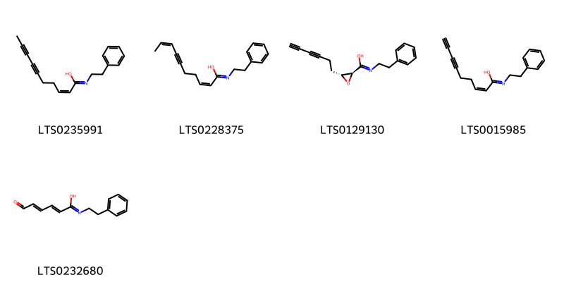{ width=100% }
    <figcaption>Hình ảnh cấu trúc hóa học của 5 hoạt chất thuộc nhóm Benzene and substituted derivatives gồm ['(2z)-n-(2-phenylethyl)dec-2-en-6,8-diynimidic acid (LTS0235991)', '(2z,8z)-n-(2-phenylethyl)deca-2,8-dien-6-ynimidic acid (LTS0228375)', '(2s,3r)-3-(hexa-3,5-diyn-1-yl)-n-(2-phenylethyl)oxirane-2-carboximidic acid (LTS0129130)', '(2z)-n-(2-phenylethyl)non-2-en-6,8-diynimidic acid (LTS0015985)', '(2e,4e)-6-oxo-n-(2-phenylethyl)hexa-2,4-dienimidic acid (LTS0232680)'].</figcaption>
</figure>
#### Nhóm Carboximidic acids and derivatives
<figure markdown="span">
    { width=100% }
    <figcaption>Hình ảnh cấu trúc hóa học của 1 hoạt chất thuộc nhóm Carboximidic acids and derivatives gồm ['(2e,4e,8z,10z)-n-(2-methylpropyl)tetradeca-2,4,8,10-tetraenimidic acid (LTS0176643)'].</figcaption>
</figure>
#### Nhóm Epoxides
<figure markdown="span">
    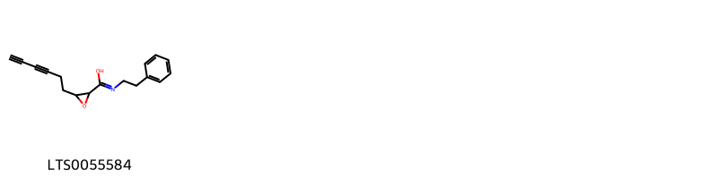{ width=100% }
    <figcaption>Hình ảnh cấu trúc hóa học của 1 hoạt chất thuộc nhóm Epoxides gồm ['3-(hexa-3,5-diyn-1-yl)-n-(2-phenylethyl)oxirane-2-carboximidic acid (LTS0055584)'].</figcaption>
</figure>
#### Nhóm Fatty Acyls
<figure markdown="span">
    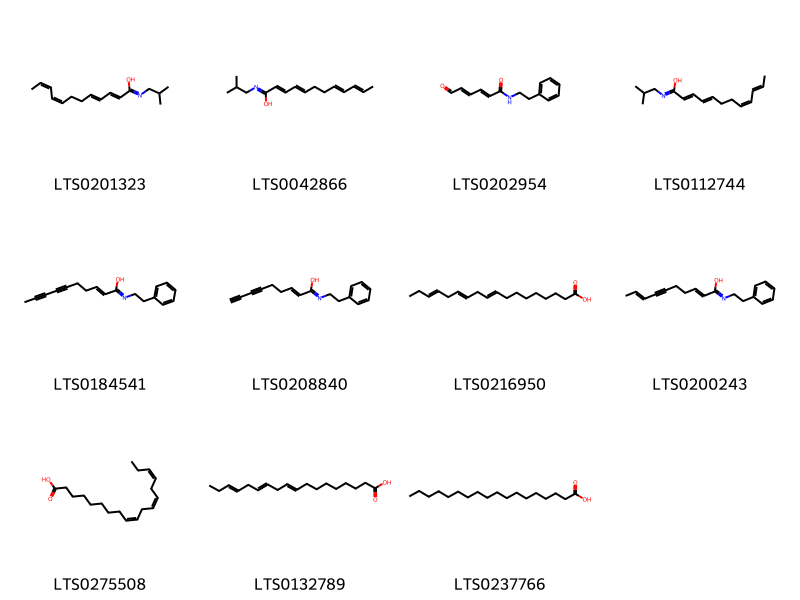{ width=100% }
    <figcaption>Hình ảnh cấu trúc hóa học của 11 hoạt chất thuộc nhóm Fatty Acyls gồm ['(2e,4e,8z,10z)-n-(2-methylpropyl)dodeca-2,4,8,10-tetraenimidic acid (LTS0201323)', 'n-(2-methylpropyl)dodeca-2,4,8,10-tetraenimidic acid (LTS0042866)', '6-oxo-n-(2-phenylethyl)hexa-2,4-dienamide (LTS0202954)', '(2e,4e,8z,10e)-n-(2-methylpropyl)dodeca-2,4,8,10-tetraenimidic acid (LTS0112744)', 'n-(2-phenylethyl)dec-2-en-6,8-diynimidic acid (LTS0184541)', 'n-(2-phenylethyl)non-2-en-6,8-diynimidic acid (LTS0208840)', 'octadeca-9,12,15-trienoic acid (LTS0216950)', 'n-(2-phenylethyl)deca-2,8-dien-6-ynimidic acid (LTS0200243)', 'α-linolenic acid (LTS0275508)', 'α linolenic acid (LTS0132789)', 'stearic acid (LTS0237766)'].</figcaption>
</figure>
#### Nhóm Prenol lipids
<figure markdown="span">
    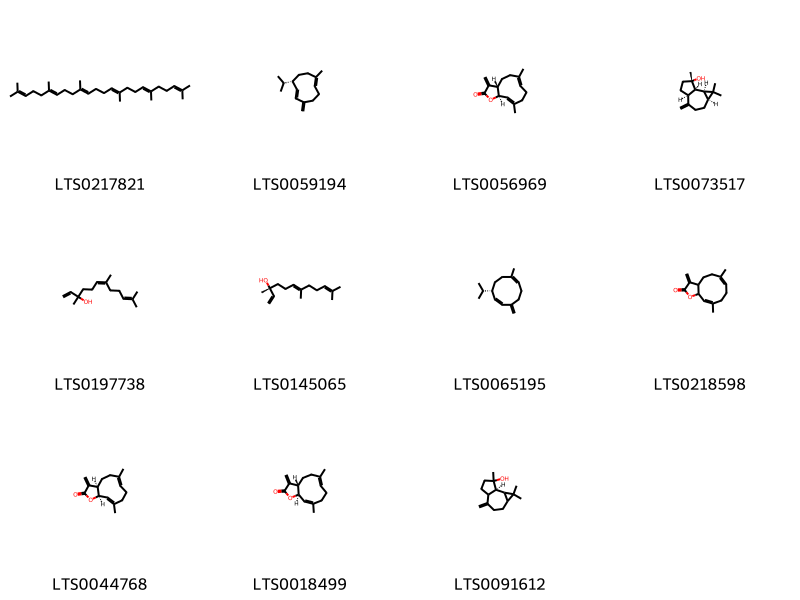{ width=100% }
    <figcaption>Hình ảnh cấu trúc hóa học của 11 hoạt chất thuộc nhóm Prenol lipids gồm ['squalene (LTS0217821)', '(-)-germacrene d (LTS0059194)', 'costunolide (LTS0056969)', '(1as,4as,7s,7ar,7bs)-1,1,7-trimethyl-4-methylidene-octahydrocyclopropa[e]azulen-7-ol (LTS0073517)', 'nerolidol (LTS0197738)', '(3r,6e)-nerolidol (LTS0145065)', '(1z,6z,8s)-8-isopropyl-1-methyl-5-methylidenecyclodeca-1,6-diene (LTS0065195)', '6,10-dimethyl-3-methylidene-3ah,4h,5h,8h,9h,11ah-cyclodeca[b]furan-2-one (LTS0218598)', '(3ar,11ar)-6,10-dimethyl-3-methylidene-3ah,4h,5h,8h,9h,11ah-cyclodeca[b]furan-2-one (LTS0044768)', 'costunolide (LTS0018499)', '(7ar)-1,1,7-trimethyl-4-methylidene-octahydrocyclopropa[e]azulen-7-ol (LTS0091612)'].</figcaption>
</figure>
#### Nhóm Steroids and steroid derivatives
<figure markdown="span">
    { width=100% }
    <figcaption>Hình ảnh cấu trúc hóa học của 5 hoạt chất thuộc nhóm Steroids and steroid derivatives gồm ['stigmast-5-en-3-ol (LTS0071224)', 'sitosterol (LTS0168132)', 'stigmast-5-en-3-ol, (3β)- (LTS0204616)', 'phytosterol (LTS0029311)', 'stigmasterol (LTS0024262)'].</figcaption>
</figure>

---

### Dược dân tộc học

Danh sách các quốc gia có sử dụng *Salmea scandens* trong điều trị các bệnh. 

| Country   | Disease   | Bệnh                                                                                                                                                                                                |
|:----------|:----------|:----------------------------------------------------------------------------------------------------------------------------------------------------------------------------------------------------|
| Panama    | Piscicide | MYMEMORY WARNING: YOU USED ALL AVAILABLE FREE TRANSLATIONS FOR TODAY. NEXT AVAILABLE IN  12 HOURS 06 MINUTES 29 SECONDS VISIT HTTPS://MYMEMORY.TRANSLATED.NET/DOC/USAGELIMITS.PHP TO TRANSLATE MORE |

---

# Chi Synedrella

??? note "Danh sách các dược liệu thuộc chi"
    
	 - *Synedrella nodiflora*

---
## Synedrella nodiflora
### Thông tin về thực vật

!!! info "Phân loại thực vật của *Synedrella nodiflora* từ GIBF:"
    - **Kingdom:** Plantae
    - **Phylum:** Tracheophyta
    - **Order:** Asterales
    - **Family:** Asteraceae
    - **Genus:** Synedrella
    - **Species:** *Synedrella nodiflora*

 

| Label (VI)   | Label (EN)   | Scientific Name      | Descriptions (VI)   | Descriptions (EN)   | Also Known As (VI)   | Also Known As (EN)   |
|:-------------|:-------------|:---------------------|:--------------------|:--------------------|:---------------------|:---------------------|
| N/A          | N/A          | Synedrella nodiflora | loài thực vật       | species of plant    | ['']                 | ['']                 |

#### Phân bố trên thế giới

**Từ CSDL GIBF** Sri Lanka, Ghana, Australia, Guadeloupe, Cook Islands, Saint Lucia, Philippines, French Guiana, Panama, Puerto Rico, Kiribati, Senegal, Nigeria, Chinese Taipei, Honduras, Jamaica, United States of America, Maldives, Trinidad and Tobago, South Africa, Fiji, Hong Kong, Thailand, Martinique, Brazil, Mexico, Dominica, Peru, China, Ecuador, Saint Kitts and Nevis, Niue, Cabo Verde, Colombia, Montserrat, India, Indonesia, Gambia, Antigua and Barbuda, Kenya, Malaysia

#### Phân bố tại Việt Nam

**Từ CSDL GIBF**: Không có ghi nhận ở Việt Nam

---
### Thành phần hóa học
        
- Theo cơ sở dữ liệu lotus: Từ loài *Synedrella nodiflora* đã phân lập và xác định được 5 hoạt chất thuộc về các nhóm Prenol lipids. 

|    | chemicalTaxonomyClassyfireClass   |   smiles_count |
|---:|:----------------------------------|---------------:|
|  0 | Prenol lipids                     |              5 |

#### Nhóm Prenol lipids
<figure markdown="span">
    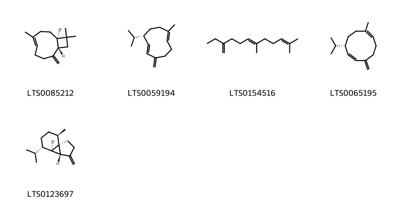{ width=100% }
    <figcaption>Hình ảnh cấu trúc hóa học của 5 hoạt chất thuộc nhóm Prenol lipids gồm ['caryophyllene (LTS0085212)', '(-)-germacrene d (LTS0059194)', '(6e)-2,6-dimethyl-10-methylidenedodeca-2,6-diene (LTS0154516)', '(1z,6z,8s)-8-isopropyl-1-methyl-5-methylidenecyclodeca-1,6-diene (LTS0065195)', '(-)-β-cubebene (LTS0123697)'].</figcaption>
</figure>

---

### Dược dân tộc học

Danh sách các quốc gia có sử dụng *Synedrella nodiflora* trong điều trị các bệnh. 

| Country   | Disease   | Bệnh                                                                                                                                                                                                |
|:----------|:----------|:----------------------------------------------------------------------------------------------------------------------------------------------------------------------------------------------------|
| Africa    | Laxative  | MYMEMORY WARNING: YOU USED ALL AVAILABLE FREE TRANSLATIONS FOR TODAY. NEXT AVAILABLE IN  12 HOURS 05 MINUTES 48 SECONDS VISIT HTTPS://MYMEMORY.TRANSLATED.NET/DOC/USAGELIMITS.PHP TO TRANSLATE MORE |
| Elsewhere | Laxative  | MYMEMORY WARNING: YOU USED ALL AVAILABLE FREE TRANSLATIONS FOR TODAY. NEXT AVAILABLE IN  12 HOURS 05 MINUTES 45 SECONDS VISIT HTTPS://MYMEMORY.TRANSLATED.NET/DOC/USAGELIMITS.PHP TO TRANSLATE MORE |

---

# Chi Tragopogon

??? note "Danh sách các dược liệu thuộc chi"
    
	 - *Tragopogon porrifolius*
	 - *Tragopogon pratensis*

---
## Tragopogon porrifolius
### Thông tin về thực vật

!!! info "Phân loại thực vật của *Tragopogon porrifolius* từ GIBF:"
    - **Kingdom:** Plantae
    - **Phylum:** Tracheophyta
    - **Order:** Asterales
    - **Family:** Asteraceae
    - **Genus:** Tragopogon
    - **Species:** *Tragopogon porrifolius*

 

| Label (VI)   | Label (EN)   | Scientific Name        | Descriptions (VI)   | Descriptions (EN)   | Also Known As (VI)   | Also Known As (EN)                                                                                                                                                                      |
|:-------------|:-------------|:-----------------------|:--------------------|:--------------------|:---------------------|:----------------------------------------------------------------------------------------------------------------------------------------------------------------------------------------|
| N/A          | N/A          | Tragopogon porrifolius | loài thực vật       | species of plant    | ['']                 | ['goatsbeard', 'salsify', 'common salsify', "goat's beard", "goat's beard salsify", 'Jerusalem star', 'oyster plant', 'purple salsify', 'vegetable oyster', 'kalapi', 'Jack go to bed'] |

#### Phân bố trên thế giới

**Từ CSDL GIBF** Netherlands, Italy, Australia, Cyprus, United Kingdom of Great Britain and Northern Ireland, New Zealand, Spain, Algeria, United States of America, Chile, Croatia, France, Greece, Canada

#### Phân bố tại Việt Nam

**Từ CSDL GIBF**: Không có ghi nhận ở Việt Nam

---
### Thành phần hóa học
        
- Theo cơ sở dữ liệu lotus: Từ loài *Tragopogon porrifolius* đã phân lập và xác định được 62 hoạt chất thuộc về các nhóm Flavonoids, Prenol lipids, Benzene and substituted derivatives, Stilbenes, Organooxygen compounds, Macrolides and analogues. 

|    | chemicalTaxonomyClassyfireClass     |   smiles_count |
|---:|:------------------------------------|---------------:|
|  0 | Benzene and substituted derivatives |              2 |
|  1 | Flavonoids                          |              4 |
|  2 | Macrolides and analogues            |              2 |
|  3 | Organooxygen compounds              |              4 |
|  4 | Prenol lipids                       |             44 |
|  5 | Stilbenes                           |              6 |

#### Nhóm Benzene and substituted derivatives
<figure markdown="span">
    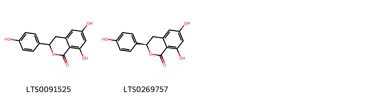{ width=100% }
    <figcaption>Hình ảnh cấu trúc hóa học của 2 hoạt chất thuộc nhóm Benzene and substituted derivatives gồm ['thunberginol c (LTS0091525)', '(3r)-6,8-dihydroxy-3-(4-hydroxyphenyl)-3,4-dihydro-2-benzopyran-1-one (LTS0269757)'].</figcaption>
</figure>
#### Nhóm Flavonoids
<figure markdown="span">
    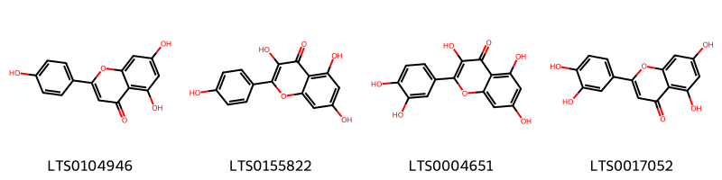{ width=100% }
    <figcaption>Hình ảnh cấu trúc hóa học của 4 hoạt chất thuộc nhóm Flavonoids gồm ['chamomile (LTS0104946)', 'kaempherol (LTS0155822)', 'quercetin (LTS0004651)', 'luteolin (LTS0017052)'].</figcaption>
</figure>
#### Nhóm Macrolides and analogues
<figure markdown="span">
    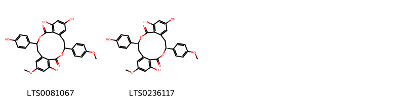{ width=100% }
    <figcaption>Hình ảnh cấu trúc hóa học của 2 hoạt chất thuộc nhóm Macrolides and analogues gồm ['8,10,20-trihydroxy-14-(4-hydroxyphenyl)-18-methoxy-4-(4-methoxyphenyl)-3,13-dioxatricyclo[14.4.0.0⁶,¹¹]icosa-1(20),6,8,10,16,18-hexaene-2,12-dione (LTS0081067)', '(4s,14s)-8,10,20-trihydroxy-14-(4-hydroxyphenyl)-18-methoxy-4-(4-methoxyphenyl)-3,13-dioxatricyclo[14.4.0.0⁶,¹¹]icosa-1(20),6,8,10,16,18-hexaene-2,12-dione (LTS0236117)'].</figcaption>
</figure>
#### Nhóm Organooxygen compounds
<figure markdown="span">
    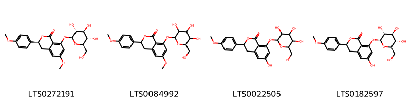{ width=100% }
    <figcaption>Hình ảnh cấu trúc hóa học của 4 hoạt chất thuộc nhóm Organooxygen compounds gồm ['(3s)-6-methoxy-3-(4-methoxyphenyl)-8-{[(2s,3r,4s,5s,6r)-3,4,5-trihydroxy-6-(hydroxymethyl)oxan-2-yl]oxy}-3,4-dihydro-2-benzopyran-1-one (LTS0272191)', '6-methoxy-3-(4-methoxyphenyl)-8-{[3,4,5-trihydroxy-6-(hydroxymethyl)oxan-2-yl]oxy}-3,4-dihydro-2-benzopyran-1-one (LTS0084992)', '6-hydroxy-3-(4-methoxyphenyl)-8-{[3,4,5-trihydroxy-6-(hydroxymethyl)oxan-2-yl]oxy}-3,4-dihydro-2-benzopyran-1-one (LTS0022505)', '(3s)-6-hydroxy-3-(4-methoxyphenyl)-8-{[(2s,3r,4s,5s,6r)-3,4,5-trihydroxy-6-(hydroxymethyl)oxan-2-yl]oxy}-3,4-dihydro-2-benzopyran-1-one (LTS0182597)'].</figcaption>
</figure>
#### Nhóm Prenol lipids
<figure markdown="span">
    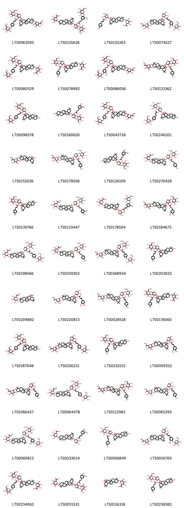{ width=100% }
    <figcaption>Hình ảnh cấu trúc hóa học của 44 hoạt chất thuộc nhóm Prenol lipids gồm ['methyl 3,4,5-trihydroxy-6-[(8-hydroxy-8a-{[(5-hydroxy-4-{[3,4,5-trihydroxy-6-(hydroxymethyl)oxan-2-yl]oxy}-3-{[3-(4-{[3,4,5-trihydroxy-6-(hydroxymethyl)oxan-2-yl]oxy}phenyl)prop-2-enoyl]oxy}oxan-2-yl)oxy]carbonyl}-4,4,6a,6b,11,11,14b-heptamethyl-1,2,3,4a,5,6,7,8,9,10,12,12a,14,14a-tetradecahydropicen-3-yl)oxy]oxane-2-carboxylate (LTS0063095)', '3,4,5-trihydroxy-6-[(8-hydroxy-8a-{[(5-hydroxy-3-{[3-(3-methoxy-4-{[3,4,5-trihydroxy-6-(hydroxymethyl)oxan-2-yl]oxy}phenyl)propanoyl]oxy}-4-{[3,4,5-trihydroxy-6-(hydroxymethyl)oxan-2-yl]oxy}oxan-2-yl)oxy]carbonyl}-4,4,6a,6b,11,11,14b-heptamethyl-1,2,3,4a,5,6,7,8,9,10,12,12a,14,14a-tetradecahydropicen-3-yl)oxy]oxane-2-carboxylic acid (LTS0135628)', '(2s,3s,4s,5r,6r)-6-{[(3s,6ar,6bs,8r,8ar,12as,14br)-8a-({[(2s,3r,4s,5r)-4,5-dihydroxy-3-{[(2e)-3-(4-hydroxyphenyl)prop-2-enoyl]oxy}oxan-2-yl]oxy}carbonyl)-8-hydroxy-4,4,6a,6b,11,11,14b-heptamethyl-1,2,3,4a,5,6,7,8,9,10,12,12a,14,14a-tetradecahydropicen-3-yl]oxy}-3,4,5-trihydroxyoxane-2-carboxylic acid (LTS0132263)', 'methyl (2s,3s,4s,5r,6r)-6-{[(3s,4ar,6ar,6bs,8r,8ar,12as,14ar,14br)-8a-({[(2s,3r,4s,5s)-4,5-dihydroxy-3-{[(2e)-3-(3-methoxy-4-{[(2s,3r,4s,5s,6r)-3,4,5-trihydroxy-6-(hydroxymethyl)oxan-2-yl]oxy}phenyl)prop-2-enoyl]oxy}oxan-2-yl]oxy}carbonyl)-8-hydroxy-4,4,6a,6b,11,11,14b-heptamethyl-1,2,3,4a,5,6,7,8,9,10,12,12a,14,14a-tetradecahydropicen-3-yl]oxy}-3,4,5-trihydroxyoxane-2-carboxylate (LTS0074527)', '3,4,5-trihydroxy-6-[(8-hydroxy-8a-{[(5-hydroxy-4-{[3,4,5-trihydroxy-6-(hydroxymethyl)oxan-2-yl]oxy}-3-{[3-(4-{[3,4,5-trihydroxy-6-(hydroxymethyl)oxan-2-yl]oxy}phenyl)propanoyl]oxy}oxan-2-yl)oxy]carbonyl}-4,4,6a,6b,11,11,14b-heptamethyl-1,2,3,4a,5,6,7,8,9,10,12,12a,14,14a-tetradecahydropicen-3-yl)oxy]oxane-2-carboxylic acid (LTS0080529)', '3,4,5-trihydroxy-6-[(8-hydroxy-8a-{[(5-hydroxy-3-{[3-(4-hydroxyphenyl)propanoyl]oxy}-4-{[3,4,5-trihydroxy-6-(hydroxymethyl)oxan-2-yl]oxy}oxan-2-yl)oxy]carbonyl}-4,4,6a,6b,11,11,14b-heptamethyl-1,2,3,4a,5,6,7,8,9,10,12,12a,14,14a-tetradecahydropicen-3-yl)oxy]oxane-2-carboxylic acid (LTS0078992)', 'methyl 3,4,5-trihydroxy-6-[(8-hydroxy-8a-{[(5-hydroxy-3-{[3-(3-methoxy-4-{[3,4,5-trihydroxy-6-(hydroxymethyl)oxan-2-yl]oxy}phenyl)propanoyl]oxy}-4-{[3,4,5-trihydroxy-6-(hydroxymethyl)oxan-2-yl]oxy}oxan-2-yl)oxy]carbonyl}-4,4,6a,6b,11,11,14b-heptamethyl-1,2,3,4a,5,6,7,8,9,10,12,12a,14,14a-tetradecahydropicen-3-yl)oxy]oxane-2-carboxylate (LTS0086056)', 'methyl 3,4,5-trihydroxy-6-[(8-hydroxy-8a-{[(5-hydroxy-3-{[3-(4-hydroxyphenyl)prop-2-enoyl]oxy}-4-{[3,4,5-trihydroxy-6-(hydroxymethyl)oxan-2-yl]oxy}oxan-2-yl)oxy]carbonyl}-4,4,6a,6b,11,11,14b-heptamethyl-1,2,3,4a,5,6,7,8,9,10,12,12a,14,14a-tetradecahydropicen-3-yl)oxy]oxane-2-carboxylate (LTS0123362)', '5-hydroxy-4-{[3,4,5-trihydroxy-6-(hydroxymethyl)oxan-2-yl]oxy}-3-{[(2e)-3-(4-{[3,4,5-trihydroxy-6-(hydroxymethyl)oxan-2-yl]oxy}phenyl)prop-2-enoyl]oxy}oxan-2-yl 5,10-dihydroxy-2,2,6a,6b,9,9,12a-heptamethyl-1,3,4,5,6,7,8,8a,10,11,12,12b,13,14b-tetradecahydropicene-4a-carboxylate (LTS0098378)', '5-hydroxy-3-{[3-(4-hydroxy-3-methoxyphenyl)propanoyl]oxy}-4-{[3,4,5-trihydroxy-6-(hydroxymethyl)oxan-2-yl]oxy}oxan-2-yl 5,10-dihydroxy-2,2,6a,6b,9,9,12a-heptamethyl-1,3,4,5,6,7,8,8a,10,11,12,12b,13,14b-tetradecahydropicene-4a-carboxylate (LTS0160620)', 'methyl 3,4,5-trihydroxy-6-[(8-hydroxy-8a-{[(5-hydroxy-4-{[3,4,5-trihydroxy-6-(hydroxymethyl)oxan-2-yl]oxy}-3-{[3-(4-{[3,4,5-trihydroxy-6-(hydroxymethyl)oxan-2-yl]oxy}phenyl)propanoyl]oxy}oxan-2-yl)oxy]carbonyl}-4,4,6a,6b,11,11,14b-heptamethyl-1,2,3,4a,5,6,7,8,9,10,12,12a,14,14a-tetradecahydropicen-3-yl)oxy]oxane-2-carboxylate (LTS0042718)', '(2s,3r,4s,5s)-5-hydroxy-4-{[(2s,3r,4s,5s,6r)-3,4,5-trihydroxy-6-(hydroxymethyl)oxan-2-yl]oxy}-3-{[(2e)-3-(4-{[(2s,3r,4s,5s,6r)-3,4,5-trihydroxy-6-(hydroxymethyl)oxan-2-yl]oxy}phenyl)prop-2-enoyl]oxy}oxan-2-yl (4ar,5r,6as,6br,8ar,10s,12ar,12br,14bs)-5,10-dihydroxy-2,2,6a,6b,9,9,12a-heptamethyl-1,3,4,5,6,7,8,8a,10,11,12,12b,13,14b-tetradecahydropicene-4a-carboxylate (LTS0246201)', '5-hydroxy-2,2,6a,6b,9,9,12a-heptamethyl-10-{[3,4,5-trihydroxy-6-(methoxycarbonyl)oxan-2-yl]oxy}-1,3,4,5,6,7,8,8a,10,11,12,12b,13,14b-tetradecahydropicene-4a-carboxylic acid (LTS0151026)', 'methyl (2s,3s,4s,5r,6r)-6-{[(3s,4ar,6ar,6bs,8r,8ar,12as,14ar,14br)-8-hydroxy-8a-({[(2s,3r,4s,5s)-5-hydroxy-3-{[(2e)-3-(4-hydroxyphenyl)prop-2-enoyl]oxy}-4-{[(2s,3r,4s,5s,6r)-3,4,5-trihydroxy-6-(hydroxymethyl)oxan-2-yl]oxy}oxan-2-yl]oxy}carbonyl)-4,4,6a,6b,11,11,14b-heptamethyl-1,2,3,4a,5,6,7,8,9,10,12,12a,14,14a-tetradecahydropicen-3-yl]oxy}-3,4,5-trihydroxyoxane-2-carboxylate (LTS0179058)', '(2s,3r,4s,5s)-5-hydroxy-3-{[3-(4-hydroxy-3-methoxyphenyl)propanoyl]oxy}-4-{[(2s,3r,4s,5s,6r)-3,4,5-trihydroxy-6-(hydroxymethyl)oxan-2-yl]oxy}oxan-2-yl (4ar,5r,6as,6br,8ar,10s,12ar,12br,14bs)-5,10-dihydroxy-2,2,6a,6b,9,9,12a-heptamethyl-1,3,4,5,6,7,8,8a,10,11,12,12b,13,14b-tetradecahydropicene-4a-carboxylate (LTS0126109)', 'methyl (2s,3s,4s,5r,6r)-6-{[(3s,4ar,6ar,6bs,8r,8ar,12as,14ar,14br)-8-hydroxy-8a-({[(2s,3r,4s,5r)-5-hydroxy-3-{[3-(4-hydroxyphenyl)propanoyl]oxy}-4-{[(2s,3r,4s,5s,6r)-3,4,5-trihydroxy-6-(hydroxymethyl)oxan-2-yl]oxy}oxan-2-yl]oxy}carbonyl)-4,4,6a,6b,11,11,14b-heptamethyl-1,2,3,4a,5,6,7,8,9,10,12,12a,14,14a-tetradecahydropicen-3-yl]oxy}-3,4,5-trihydroxyoxane-2-carboxylate (LTS0270428)', '5-hydroxy-3-{[(2e)-3-(4-hydroxyphenyl)prop-2-enoyl]oxy}-4-{[3,4,5-trihydroxy-6-(hydroxymethyl)oxan-2-yl]oxy}oxan-2-yl 5,10-dihydroxy-2,2,6a,6b,9,9,12a-heptamethyl-1,3,4,5,6,7,8,8a,10,11,12,12b,13,14b-tetradecahydropicene-4a-carboxylate (LTS0139766)', 'methyl (2s,3s,4s,5r,6r)-6-{[(3s,4ar,6ar,6bs,8r,8ar,12as,14ar,14br)-8-hydroxy-8a-({[(2s,3r,4s,5s)-5-hydroxy-3-{[3-(4-hydroxy-3-methoxyphenyl)propanoyl]oxy}-4-{[(2s,3r,4s,5s,6r)-3,4,5-trihydroxy-6-(hydroxymethyl)oxan-2-yl]oxy}oxan-2-yl]oxy}carbonyl)-4,4,6a,6b,11,11,14b-heptamethyl-1,2,3,4a,5,6,7,8,9,10,12,12a,14,14a-tetradecahydropicen-3-yl]oxy}-3,4,5-trihydroxyoxane-2-carboxylate (LTS0133447)', '(2s,3s,4s,5r,6r)-6-{[(3s,6ar,6bs,8r,8ar,12as,14br)-8a-({[(2s,3r,4s,5s)-4,5-dihydroxy-3-{[(2e)-3-(3-methoxy-4-{[(2s,3r,4s,5s,6r)-3,4,5-trihydroxy-6-(hydroxymethyl)oxan-2-yl]oxy}phenyl)prop-2-enoyl]oxy}oxan-2-yl]oxy}carbonyl)-8-hydroxy-4,4,6a,6b,11,11,14b-heptamethyl-1,2,3,4a,5,6,7,8,9,10,12,12a,14,14a-tetradecahydropicen-3-yl]oxy}-3,4,5-trihydroxyoxane-2-carboxylic acid (LTS0178504)', 'methyl 3,4,5-trihydroxy-6-[(8-hydroxy-8a-{[(5-hydroxy-3-{[3-(4-hydroxy-3-methoxyphenyl)propanoyl]oxy}-4-{[3,4,5-trihydroxy-6-(hydroxymethyl)oxan-2-yl]oxy}oxan-2-yl)oxy]carbonyl}-4,4,6a,6b,11,11,14b-heptamethyl-1,2,3,4a,5,6,7,8,9,10,12,12a,14,14a-tetradecahydropicen-3-yl)oxy]oxane-2-carboxylate (LTS0184675)', 'methyl (2s,3s,4s,5r,6r)-6-{[(3s,4ar,6ar,6bs,8r,8ar,12as,14ar,14br)-8-hydroxy-8a-({[(2s,3r,4s,5s)-5-hydroxy-4-{[(2s,3r,4s,5s,6r)-3,4,5-trihydroxy-6-(hydroxymethyl)oxan-2-yl]oxy}-3-{[3-(4-{[(2s,3r,4s,5s,6r)-3,4,5-trihydroxy-6-(hydroxymethyl)oxan-2-yl]oxy}phenyl)propanoyl]oxy}oxan-2-yl]oxy}carbonyl)-4,4,6a,6b,11,11,14b-heptamethyl-1,2,3,4a,5,6,7,8,9,10,12,12a,14,14a-tetradecahydropicen-3-yl]oxy}-3,4,5-trihydroxyoxane-2-carboxylate (LTS0198566)', 'methyl (2s,3s,4s,5r,6r)-6-{[(3s,4ar,6ar,6bs,8r,8ar,12as,14ar,14br)-8-hydroxy-8a-({[(2s,3r,4s,5s)-5-hydroxy-3-{[3-(4-hydroxyphenyl)propanoyl]oxy}-4-{[(2s,3r,4s,5s,6r)-3,4,5-trihydroxy-6-(hydroxymethyl)oxan-2-yl]oxy}oxan-2-yl]oxy}carbonyl)-4,4,6a,6b,11,11,14b-heptamethyl-1,2,3,4a,5,6,7,8,9,10,12,12a,14,14a-tetradecahydropicen-3-yl]oxy}-3,4,5-trihydroxyoxane-2-carboxylate (LTS0259302)', 'methyl (2s,3s,4s,5r,6r)-6-{[(3s,4ar,6ar,6bs,8r,8ar,12as,14ar,14br)-8-hydroxy-8a-({[(2s,3r,4s,5r)-5-hydroxy-4-{[(2s,3r,4s,5s,6r)-3,4,5-trihydroxy-6-(hydroxymethyl)oxan-2-yl]oxy}-3-{[(2e)-3-(4-{[(2s,3r,4s,5s,6r)-3,4,5-trihydroxy-6-(hydroxymethyl)oxan-2-yl]oxy}phenyl)prop-2-enoyl]oxy}oxan-2-yl]oxy}carbonyl)-4,4,6a,6b,11,11,14b-heptamethyl-1,2,3,4a,5,6,7,8,9,10,12,12a,14,14a-tetradecahydropicen-3-yl]oxy}-3,4,5-trihydroxyoxane-2-carboxylate (LTS0268934)', '5-hydroxy-3-{[3-(4-hydroxyphenyl)prop-2-enoyl]oxy}-4-{[3,4,5-trihydroxy-6-(hydroxymethyl)oxan-2-yl]oxy}oxan-2-yl 5,10-dihydroxy-2,2,6a,6b,9,9,12a-heptamethyl-1,3,4,5,6,7,8,8a,10,11,12,12b,13,14b-tetradecahydropicene-4a-carboxylate (LTS0202832)', '(4ar,5r,6as,6br,8ar,10s,12ar,12br,14bs)-5-hydroxy-2,2,6a,6b,9,9,12a-heptamethyl-10-{[(2r,3r,4s,5s,6s)-3,4,5-trihydroxy-6-(methoxycarbonyl)oxan-2-yl]oxy}-1,3,4,5,6,7,8,8a,10,11,12,12b,13,14b-tetradecahydropicene-4a-carboxylic acid (LTS0209882)', 'methyl (2s,3s,4s,5r,6r)-6-{[(3s,4ar,6ar,6bs,8r,8ar,12as,14ar,14br)-8a-({[(2s,3r,4s,5r)-4,5-dihydroxy-3-{[(2e)-3-(4-hydroxy-3-methoxyphenyl)prop-2-enoyl]oxy}oxan-2-yl]oxy}carbonyl)-8-hydroxy-4,4,6a,6b,11,11,14b-heptamethyl-1,2,3,4a,5,6,7,8,9,10,12,12a,14,14a-tetradecahydropicen-3-yl]oxy}-3,4,5-trihydroxyoxane-2-carboxylate (LTS0220813)', 'methyl (2s,3s,4s,5r,6r)-6-{[(3s,4ar,6ar,6bs,8r,8ar,12as,14ar,14br)-8-hydroxy-8a-({[(2s,3r,4s,5r)-5-hydroxy-3-{[(2e)-3-(4-hydroxyphenyl)prop-2-enoyl]oxy}-4-{[(2s,3r,4s,5s,6r)-3,4,5-trihydroxy-6-(hydroxymethyl)oxan-2-yl]oxy}oxan-2-yl]oxy}carbonyl)-4,4,6a,6b,11,11,14b-heptamethyl-1,2,3,4a,5,6,7,8,9,10,12,12a,14,14a-tetradecahydropicen-3-yl]oxy}-3,4,5-trihydroxyoxane-2-carboxylate (LTS0028518)', '3,4,5-trihydroxy-6-[(8-hydroxy-8a-{[(5-hydroxy-3-{[(2e)-3-(4-hydroxyphenyl)prop-2-enoyl]oxy}-4-{[3,4,5-trihydroxy-6-(hydroxymethyl)oxan-2-yl]oxy}oxan-2-yl)oxy]carbonyl}-4,4,6a,6b,11,11,14b-heptamethyl-1,2,3,4a,5,6,7,8,9,10,12,12a,14,14a-tetradecahydropicen-3-yl)oxy]oxane-2-carboxylic acid (LTS0176060)', '5-hydroxy-4-{[3,4,5-trihydroxy-6-(hydroxymethyl)oxan-2-yl]oxy}-3-{[3-(4-{[3,4,5-trihydroxy-6-(hydroxymethyl)oxan-2-yl]oxy}phenyl)prop-2-enoyl]oxy}oxan-2-yl 5,10-dihydroxy-2,2,6a,6b,9,9,12a-heptamethyl-1,3,4,5,6,7,8,8a,10,11,12,12b,13,14b-tetradecahydropicene-4a-carboxylate (LTS0187048)', 'methyl 6-[(8a-{[(4,5-dihydroxy-3-{[3-(3-methoxy-4-{[3,4,5-trihydroxy-6-(hydroxymethyl)oxan-2-yl]oxy}phenyl)prop-2-enoyl]oxy}oxan-2-yl)oxy]carbonyl}-8-hydroxy-4,4,6a,6b,11,11,14b-heptamethyl-1,2,3,4a,5,6,7,8,9,10,12,12a,14,14a-tetradecahydropicen-3-yl)oxy]-3,4,5-trihydroxyoxane-2-carboxylate (LTS0256231)', '5-hydroxy-3-{[3-(4-hydroxyphenyl)propanoyl]oxy}-4-{[3,4,5-trihydroxy-6-(hydroxymethyl)oxan-2-yl]oxy}oxan-2-yl 5,10-dihydroxy-2,2,6a,6b,9,9,12a-heptamethyl-1,3,4,5,6,7,8,8a,10,11,12,12b,13,14b-tetradecahydropicene-4a-carboxylate (LTS0232515)', 'methyl 6-[(8a-{[(4,5-dihydroxy-3-{[3-(4-hydroxy-3-methoxyphenyl)prop-2-enoyl]oxy}oxan-2-yl)oxy]carbonyl}-8-hydroxy-4,4,6a,6b,11,11,14b-heptamethyl-1,2,3,4a,5,6,7,8,9,10,12,12a,14,14a-tetradecahydropicen-3-yl)oxy]-3,4,5-trihydroxyoxane-2-carboxylate (LTS0009352)', 'methyl 6-[(8a-{[(4,5-dihydroxy-3-{[3-(4-hydroxyphenyl)prop-2-enoyl]oxy}oxan-2-yl)oxy]carbonyl}-8-hydroxy-4,4,6a,6b,11,11,14b-heptamethyl-1,2,3,4a,5,6,7,8,9,10,12,12a,14,14a-tetradecahydropicen-3-yl)oxy]-3,4,5-trihydroxyoxane-2-carboxylate (LTS0266427)', 'methyl (2s,3s,4s,5r,6r)-6-{[(3s,4ar,6ar,6bs,8r,8ar,12as,14ar,14br)-8-hydroxy-8a-({[(2s,3r,4s,5r)-5-hydroxy-4-{[(2s,3r,4s,5s,6r)-3,4,5-trihydroxy-6-(hydroxymethyl)oxan-2-yl]oxy}-3-{[3-(4-{[(2s,3r,4s,5s,6r)-3,4,5-trihydroxy-6-(hydroxymethyl)oxan-2-yl]oxy}phenyl)propanoyl]oxy}oxan-2-yl]oxy}carbonyl)-4,4,6a,6b,11,11,14b-heptamethyl-1,2,3,4a,5,6,7,8,9,10,12,12a,14,14a-tetradecahydropicen-3-yl]oxy}-3,4,5-trihydroxyoxane-2-carboxylate (LTS0064478)', 'methyl 3,4,5-trihydroxy-6-[(8-hydroxy-8a-{[(5-hydroxy-3-{[3-(4-hydroxyphenyl)propanoyl]oxy}-4-{[3,4,5-trihydroxy-6-(hydroxymethyl)oxan-2-yl]oxy}oxan-2-yl)oxy]carbonyl}-4,4,6a,6b,11,11,14b-heptamethyl-1,2,3,4a,5,6,7,8,9,10,12,12a,14,14a-tetradecahydropicen-3-yl)oxy]oxane-2-carboxylate (LTS0112982)', 'methyl (2s,3s,4s,5r,6r)-6-{[(3s,4ar,6ar,6bs,8r,8ar,12as,14ar,14br)-8a-({[(2s,3r,4s,5r)-4,5-dihydroxy-3-{[(2e)-3-(4-hydroxyphenyl)prop-2-enoyl]oxy}oxan-2-yl]oxy}carbonyl)-8-hydroxy-4,4,6a,6b,11,11,14b-heptamethyl-1,2,3,4a,5,6,7,8,9,10,12,12a,14,14a-tetradecahydropicen-3-yl]oxy}-3,4,5-trihydroxyoxane-2-carboxylate (LTS0065295)', 'methyl (2s,3s,4s,5r,6r)-6-{[(3s,4ar,6ar,6bs,8r,8ar,12as,14ar,14br)-8-hydroxy-8a-({[(2s,3r,4s,5s)-5-hydroxy-3-{[3-(3-methoxy-4-{[(2s,3r,4s,5s,6r)-3,4,5-trihydroxy-6-(hydroxymethyl)oxan-2-yl]oxy}phenyl)propanoyl]oxy}-4-{[(2s,3r,4s,5s,6r)-3,4,5-trihydroxy-6-(hydroxymethyl)oxan-2-yl]oxy}oxan-2-yl]oxy}carbonyl)-4,4,6a,6b,11,11,14b-heptamethyl-1,2,3,4a,5,6,7,8,9,10,12,12a,14,14a-tetradecahydropicen-3-yl]oxy}-3,4,5-trihydroxyoxane-2-carboxylate (LTS0060813)', '(2s,3s,4s,5r,6r)-6-{[(3s,6ar,6bs,8r,8ar,12as,14br)-8a-({[(2s,3r,4s,5r)-4,5-dihydroxy-3-{[(2e)-3-(4-hydroxy-3-methoxyphenyl)prop-2-enoyl]oxy}oxan-2-yl]oxy}carbonyl)-8-hydroxy-4,4,6a,6b,11,11,14b-heptamethyl-1,2,3,4a,5,6,7,8,9,10,12,12a,14,14a-tetradecahydropicen-3-yl]oxy}-3,4,5-trihydroxyoxane-2-carboxylic acid (LTS0033014)', '(2s,3r,4s,5s)-5-hydroxy-3-{[(2e)-3-(4-hydroxyphenyl)prop-2-enoyl]oxy}-4-{[(2s,3r,4s,5s,6r)-3,4,5-trihydroxy-6-(hydroxymethyl)oxan-2-yl]oxy}oxan-2-yl (4ar,5r,6as,6br,8ar,10s,12ar,12br,14bs)-5,10-dihydroxy-2,2,6a,6b,9,9,12a-heptamethyl-1,3,4,5,6,7,8,8a,10,11,12,12b,13,14b-tetradecahydropicene-4a-carboxylate (LTS0006849)', 'methyl (2s,3s,4s,5r,6r)-6-{[(3s,4ar,6ar,6bs,8r,8ar,12as,14ar,14br)-8a-({[(2s,3r,4s,5r)-4,5-dihydroxy-3-{[(2e)-3-(3-methoxy-4-{[(2s,3r,4s,5s,6r)-3,4,5-trihydroxy-6-(hydroxymethyl)oxan-2-yl]oxy}phenyl)prop-2-enoyl]oxy}oxan-2-yl]oxy}carbonyl)-8-hydroxy-4,4,6a,6b,11,11,14b-heptamethyl-1,2,3,4a,5,6,7,8,9,10,12,12a,14,14a-tetradecahydropicen-3-yl]oxy}-3,4,5-trihydroxyoxane-2-carboxylate (LTS0016769)', '3,4,5-trihydroxy-6-[(8-hydroxy-8a-{[(5-hydroxy-4-{[3,4,5-trihydroxy-6-(hydroxymethyl)oxan-2-yl]oxy}-3-{[(2e)-3-(4-{[3,4,5-trihydroxy-6-(hydroxymethyl)oxan-2-yl]oxy}phenyl)prop-2-enoyl]oxy}oxan-2-yl)oxy]carbonyl}-4,4,6a,6b,11,11,14b-heptamethyl-1,2,3,4a,5,6,7,8,9,10,12,12a,14,14a-tetradecahydropicen-3-yl)oxy]oxane-2-carboxylic acid (LTS0234062)', '3,4,5-trihydroxy-6-[(8-hydroxy-8a-{[(5-hydroxy-3-{[3-(4-hydroxy-3-methoxyphenyl)propanoyl]oxy}-4-{[3,4,5-trihydroxy-6-(hydroxymethyl)oxan-2-yl]oxy}oxan-2-yl)oxy]carbonyl}-4,4,6a,6b,11,11,14b-heptamethyl-1,2,3,4a,5,6,7,8,9,10,12,12a,14,14a-tetradecahydropicen-3-yl)oxy]oxane-2-carboxylic acid (LTS0031531)', '6-[(8a-carboxy-8-hydroxy-4,4,6a,6b,11,11,14b-heptamethyl-1,2,3,4a,5,6,7,8,9,10,12,12a,14,14a-tetradecahydropicen-3-yl)oxy]-3,4,5-trihydroxyoxane-2-carboxylic acid (LTS0116318)', '(2s,3r,4s,5s)-5-hydroxy-3-{[3-(4-hydroxyphenyl)propanoyl]oxy}-4-{[(2s,3r,4s,5s,6r)-3,4,5-trihydroxy-6-(hydroxymethyl)oxan-2-yl]oxy}oxan-2-yl (4ar,5r,6as,6br,8ar,10s,12ar,12br,14bs)-5,10-dihydroxy-2,2,6a,6b,9,9,12a-heptamethyl-1,3,4,5,6,7,8,8a,10,11,12,12b,13,14b-tetradecahydropicene-4a-carboxylate (LTS0238382)'].</figcaption>
</figure>
#### Nhóm Stilbenes
<figure markdown="span">
    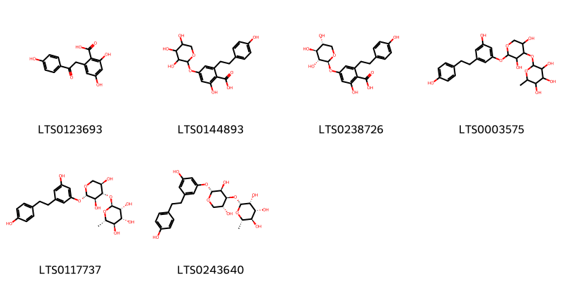{ width=100% }
    <figcaption>Hình ảnh cấu trúc hóa học của 6 hoạt chất thuộc nhóm Stilbenes gồm ['2,4-dihydroxy-6-[2-(4-hydroxyphenyl)-2-oxoethyl]benzoic acid (LTS0123693)', '2-hydroxy-6-[2-(4-hydroxyphenyl)ethyl]-4-[(3,4,5-trihydroxyoxan-2-yl)oxy]benzoic acid (LTS0144893)', '2-hydroxy-6-[2-(4-hydroxyphenyl)ethyl]-4-{[(2s,3r,4s,5r)-3,4,5-trihydroxyoxan-2-yl]oxy}benzoic acid (LTS0238726)', '2-[(3,5-dihydroxy-2-{3-hydroxy-5-[2-(4-hydroxyphenyl)ethyl]phenoxy}oxan-4-yl)oxy]-6-methyloxane-3,4,5-triol (LTS0003575)', '(2s,3r,4r,5r,6s)-2-{[(2s,3r,4s,5r)-3,5-dihydroxy-2-{3-hydroxy-5-[2-(4-hydroxyphenyl)ethyl]phenoxy}oxan-4-yl]oxy}-6-methyloxane-3,4,5-triol (LTS0117737)', '(2r,3r,4r,5r,6s)-2-{[(2r,3s,4s,5r)-3,5-dihydroxy-2-{3-hydroxy-5-[2-(4-hydroxyphenyl)ethyl]phenoxy}oxan-4-yl]oxy}-6-methyloxane-3,4,5-triol (LTS0243640)'].</figcaption>
</figure>

---

### Dược dân tộc học

Danh sách các quốc gia có sử dụng *Tragopogon porrifolius* trong điều trị các bệnh. 

| Country   | Disease               | Bệnh                                                                                                                                                                                                |
|:----------|:----------------------|:----------------------------------------------------------------------------------------------------------------------------------------------------------------------------------------------------|
| Elsewhere | Expectorant, Diuretic | MYMEMORY WARNING: YOU USED ALL AVAILABLE FREE TRANSLATIONS FOR TODAY. NEXT AVAILABLE IN  12 HOURS 05 MINUTES 09 SECONDS VISIT HTTPS://MYMEMORY.TRANSLATED.NET/DOC/USAGELIMITS.PHP TO TRANSLATE MORE |

---

---
## Tragopogon pratensis
### Thông tin về thực vật

!!! info "Phân loại thực vật của *Tragopogon pratensis* từ GIBF:"
    - **Kingdom:** Plantae
    - **Phylum:** Tracheophyta
    - **Order:** Asterales
    - **Family:** Asteraceae
    - **Genus:** Tragopogon
    - **Species:** *Tragopogon pratensis*

 

| Label (VI)   | Label (EN)   | Scientific Name      | Descriptions (VI)   | Descriptions (EN)   | Also Known As (VI)   | Also Known As (EN)   |
|:-------------|:-------------|:---------------------|:--------------------|:--------------------|:---------------------|:---------------------|
| N/A          | N/A          | Tragopogon pratensis | loài thực vật       | species of plant    | ['']                 | ['yellow salsify']   |

#### Phân bố trên thế giới

**Từ CSDL GIBF** Italy, Belgium, Georgia, Norway, Canada, Denmark, Netherlands, Belarus, Luxembourg, Spain, United States of America, Sweden, Slovenia, Germany, Switzerland, Austria, France, United Kingdom of Great Britain and Northern Ireland, Ireland, Poland

#### Phân bố tại Việt Nam

**Từ CSDL GIBF**: Không có ghi nhận ở Việt Nam

---
### Thành phần hóa học
        
- Theo cơ sở dữ liệu lotus: Từ loài *Tragopogon pratensis* đã phân lập và xác định được 80 hoạt chất thuộc về các nhóm Fatty Acyls, Flavonoids, Prenol lipids, Steroids and steroid derivatives, Cinnamic acids and derivatives, Benzofurans, Benzene and substituted derivatives, Stilbenes, Organooxygen compounds, Phenols, Saturated hydrocarbons, Lignan glycosides. 

|    | chemicalTaxonomyClassyfireClass     |   smiles_count |
|---:|:------------------------------------|---------------:|
|  0 | Benzene and substituted derivatives |              7 |
|  1 | Benzofurans                         |              3 |
|  2 | Cinnamic acids and derivatives      |              3 |
|  3 | Fatty Acyls                         |              2 |
|  4 | Flavonoids                          |              9 |
|  5 | Lignan glycosides                   |              2 |
|  6 | Organooxygen compounds              |              8 |
|  7 | Phenols                             |              2 |
|  8 | Prenol lipids                       |             33 |
|  9 | Saturated hydrocarbons              |              1 |
| 10 | Steroids and steroid derivatives    |              4 |
| 11 | Stilbenes                           |              6 |

#### Nhóm Benzene and substituted derivatives
<figure markdown="span">
    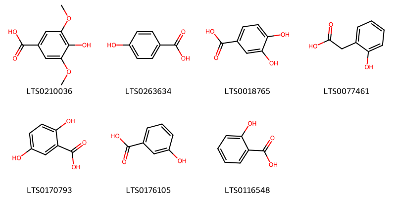{ width=100% }
    <figcaption>Hình ảnh cấu trúc hóa học của 7 hoạt chất thuộc nhóm Benzene and substituted derivatives gồm ['syringic acid (LTS0210036)', 'p-hydroxybenzoic acid (LTS0263634)', '3,4-dihydroxybenzoic acid (LTS0018765)', 'o-hydroxyphenylacetic acid (LTS0077461)', '2,5-dihydroxybenzoic acid (LTS0170793)', '3-hydroxybenzoic acid (LTS0176105)', 'salicyclic acid (LTS0116548)'].</figcaption>
</figure>
#### Nhóm Benzofurans
<figure markdown="span">
    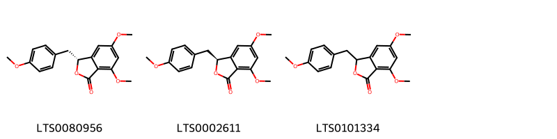{ width=100% }
    <figcaption>Hình ảnh cấu trúc hóa học của 3 hoạt chất thuộc nhóm Benzofurans gồm ['(3r)-5,7-dimethoxy-3-[(4-methoxyphenyl)methyl]-3h-2-benzofuran-1-one (LTS0080956)', '(3s)-5,7-dimethoxy-3-[(4-methoxyphenyl)methyl]-3h-2-benzofuran-1-one (LTS0002611)', '5,7-dimethoxy-3-[(4-methoxyphenyl)methyl]-3h-2-benzofuran-1-one (LTS0101334)'].</figcaption>
</figure>
#### Nhóm Cinnamic acids and derivatives
<figure markdown="span">
    { width=100% }
    <figcaption>Hình ảnh cấu trúc hóa học của 3 hoạt chất thuộc nhóm Cinnamic acids and derivatives gồm ['3,4-dihydroxycinnamic acid (LTS0128050)', 'ferulic acid (LTS0077328)', 'para-coumaric acid (LTS0266252)'].</figcaption>
</figure>
#### Nhóm Fatty Acyls
<figure markdown="span">
    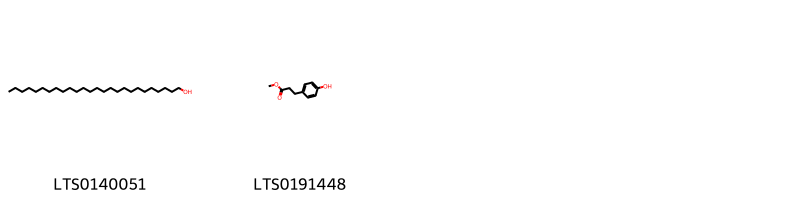{ width=100% }
    <figcaption>Hình ảnh cấu trúc hóa học của 2 hoạt chất thuộc nhóm Fatty Acyls gồm ['ceryl alcohol (LTS0140051)', 'methyl 3-(4-hydroxyphenyl)propanoate (LTS0191448)'].</figcaption>
</figure>
#### Nhóm Flavonoids
<figure markdown="span">
    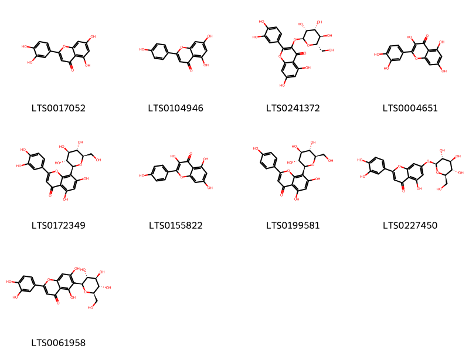{ width=100% }
    <figcaption>Hình ảnh cấu trúc hóa học của 9 hoạt chất thuộc nhóm Flavonoids gồm ['luteolin (LTS0017052)', 'chamomile (LTS0104946)', '2-(3,4-dihydroxyphenyl)-5,7-dihydroxy-3-{[(2s,3r,4r,5r,6s)-3,4,5-trihydroxy-6-(hydroxymethyl)oxan-2-yl]oxy}chromen-4-one (LTS0241372)', 'quercetin (LTS0004651)', 'orientin (LTS0172349)', 'kaempherol (LTS0155822)', 'vitexin (LTS0199581)', 'luteolin 7-o-glucoside (LTS0227450)', 'isoorientin (LTS0061958)'].</figcaption>
</figure>
#### Nhóm Lignan glycosides
<figure markdown="span">
    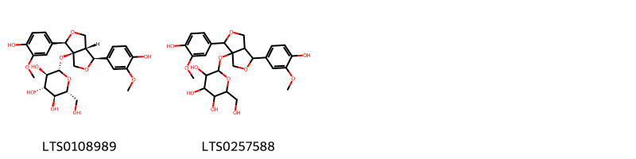{ width=100% }
    <figcaption>Hình ảnh cấu trúc hóa học của 2 hoạt chất thuộc nhóm Lignan glycosides gồm ['(2s,3r,4s,5s,6r)-2-{[(1s,3as,4r,6ar)-1,4-bis(4-hydroxy-3-methoxyphenyl)-tetrahydro-1h-furo[3,4-c]furan-3a-yl]oxy}-6-(hydroxymethyl)oxane-3,4,5-triol (LTS0108989)', '2-{[1,4-bis(4-hydroxy-3-methoxyphenyl)-tetrahydro-1h-furo[3,4-c]furan-3a-yl]oxy}-6-(hydroxymethyl)oxane-3,4,5-triol (LTS0257588)'].</figcaption>
</figure>
#### Nhóm Organooxygen compounds
<figure markdown="span">
    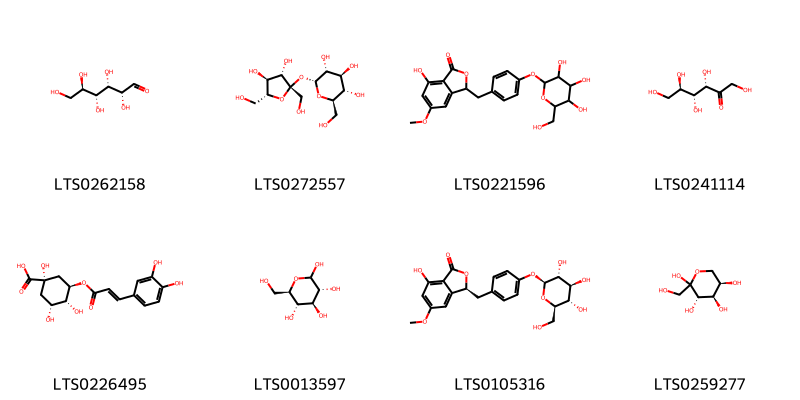{ width=100% }
    <figcaption>Hình ảnh cấu trúc hóa học của 8 hoạt chất thuộc nhóm Organooxygen compounds gồm ['(+)-glucose (LTS0262158)', 'sucrose (LTS0272557)', '7-hydroxy-5-methoxy-3-[(4-{[3,4,5-trihydroxy-6-(hydroxymethyl)oxan-2-yl]oxy}phenyl)methyl]-3h-2-benzofuran-1-one (LTS0221596)', 'keto-d-fructose (LTS0241114)', 'chlorogenic acid (LTS0226495)', 'glucose (LTS0013597)', '(3s)-7-hydroxy-5-methoxy-3-[(4-{[(2s,3r,4s,5s,6r)-3,4,5-trihydroxy-6-(hydroxymethyl)oxan-2-yl]oxy}phenyl)methyl]-3h-2-benzofuran-1-one (LTS0105316)', 'd-fructopyranose (LTS0259277)'].</figcaption>
</figure>
#### Nhóm Phenols
<figure markdown="span">
    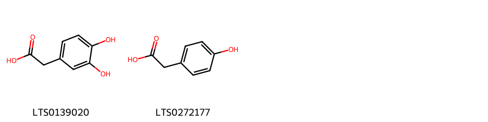{ width=100% }
    <figcaption>Hình ảnh cấu trúc hóa học của 2 hoạt chất thuộc nhóm Phenols gồm ['3,4 dihydroxyphenylacetic acid (LTS0139020)', '4-hydroxyphenylacetic acid (LTS0272177)'].</figcaption>
</figure>
#### Nhóm Prenol lipids
<figure markdown="span">
    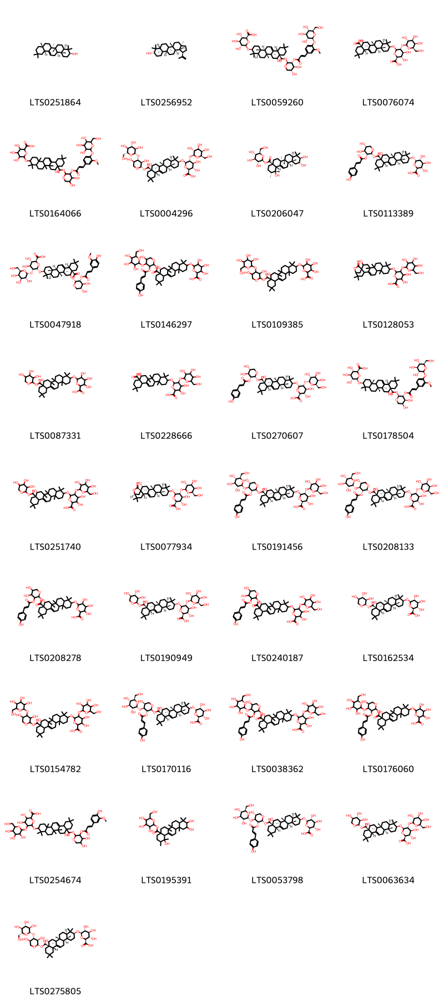{ width=100% }
    <figcaption>Hình ảnh cấu trúc hóa học của 33 hoạt chất thuộc nhóm Prenol lipids gồm ['β-amyrin (LTS0251864)', 'lupeol (LTS0256952)', '(2s,3s,4s,5r,6r)-6-{[(3s,4ar,6ar,6bs,8r,8ar,12as,14ar,14br)-8a-({[(2s,3r,4s,5r)-4,5-dihydroxy-3-{[(2e)-3-(3-methoxy-4-{[(2s,3r,4s,5s,6r)-3,4,5-trihydroxy-6-(hydroxymethyl)oxan-2-yl]oxy}phenyl)prop-2-enoyl]oxy}oxan-2-yl]oxy}carbonyl)-8-hydroxy-4,4,6a,6b,11,11,14b-heptamethyl-1,2,3,4a,5,6,7,8,9,10,12,12a,14,14a-tetradecahydropicen-3-yl]oxy}-3,4,5-trihydroxyoxane-2-carboxylic acid (LTS0059260)', '(2s,3s,4s,5r,6r)-6-{[(3s,4ar,6ar,6bs,8r,8ar,12as,14ar,14br)-8a-carboxy-8-hydroxy-4,4,6a,6b,11,11,14b-heptamethyl-1,2,3,4a,5,6,7,8,9,10,12,12a,14,14a-tetradecahydropicen-3-yl]oxy}-3,4-dihydroxy-5-{[(2s,3r,4s,5r,6r)-3,4,5-trihydroxy-6-(hydroxymethyl)oxan-2-yl]oxy}oxane-2-carboxylic acid (LTS0076074)', '6-[(8a-{[(4,5-dihydroxy-3-{[3-(3-methoxy-4-{[3,4,5-trihydroxy-6-(hydroxymethyl)oxan-2-yl]oxy}phenyl)prop-2-enoyl]oxy}oxan-2-yl)oxy]carbonyl}-8-hydroxy-4,4,6a,6b,11,11,14b-heptamethyl-1,2,3,4a,5,6,7,8,9,10,12,12a,14,14a-tetradecahydropicen-3-yl)oxy]-3,4,5-trihydroxyoxane-2-carboxylic acid (LTS0164066)', '(2s,3s,4s,5r,6r)-6-{[(3s,4ar,6ar,6bs,8r,8ar,12as,14ar,14br)-8a-({[(2s,3r,4s,5r)-3,5-dihydroxy-4-{[(2s,3r,4s,5s,6r)-3,4,5-trihydroxy-6-(hydroxymethyl)oxan-2-yl]oxy}oxan-2-yl]oxy}carbonyl)-8-hydroxy-4,4,6a,6b,11,11,14b-heptamethyl-1,2,3,4a,5,6,7,8,9,10,12,12a,14,14a-tetradecahydropicen-3-yl]oxy}-3,4-dihydroxy-5-{[(2s,3r,4s,5r,6r)-3,4,5-trihydroxy-6-(hydroxymethyl)oxan-2-yl]oxy}oxane-2-carboxylic acid (LTS0004296)', '(2s,3r,4s,5s,6r)-3,4,5-trihydroxy-6-(hydroxymethyl)oxan-2-yl (1r,2r,4as,6as,6br,8ar,10r,11r,12ar,12br,14bs)-1,10,11-trihydroxy-1,2,6a,6b,9,9,12a-heptamethyl-2,3,4,5,6,7,8,8a,10,11,12,12b,13,14b-tetradecahydropicene-4a-carboxylate (LTS0206047)', '(2s,3s,4s,5r,6s)-6-{[(3s,4ar,6ar,6bs,8r,8ar,12as,14ar,14br)-8a-({[(2r,3r,4s,5r)-4,5-dihydroxy-3-{[(2e)-3-(4-hydroxyphenyl)prop-2-enoyl]oxy}oxan-2-yl]oxy}carbonyl)-8-hydroxy-4,4,6a,6b,11,11,14b-heptamethyl-1,2,3,4a,5,6,7,8,9,10,12,12a,14,14a-tetradecahydropicen-3-yl]oxy}-3,4,5-trihydroxyoxane-2-carboxylic acid (LTS0113389)', '(2s,3s,4s,5r,6s)-6-{[(3s,4ar,6ar,6bs,8r,8ar,12as,14ar,14br)-8a-({[(2r,3r,4s,5r)-4,5-dihydroxy-3-{[(2e)-3-(4-hydroxy-3-methoxyphenyl)prop-2-enoyl]oxy}oxan-2-yl]oxy}carbonyl)-8-hydroxy-4,4,6a,6b,11,11,14b-heptamethyl-1,2,3,4a,5,6,7,8,9,10,12,12a,14,14a-tetradecahydropicen-3-yl]oxy}-3,4-dihydroxy-5-{[(2r,3r,4s,5r,6r)-3,4,5-trihydroxy-6-(hydroxymethyl)oxan-2-yl]oxy}oxane-2-carboxylic acid (LTS0047918)', '3,4,5-trihydroxy-6-[(8-hydroxy-8a-{[(5-hydroxy-3-{[3-(4-hydroxyphenyl)prop-2-enoyl]oxy}-4-{[3,4,5-trihydroxy-6-(hydroxymethyl)oxan-2-yl]oxy}oxan-2-yl)oxy]carbonyl}-4,4,6a,6b,11,11,14b-heptamethyl-1,2,3,4a,5,6,7,8,9,10,12,12a,14,14a-tetradecahydropicen-3-yl)oxy]oxane-2-carboxylic acid (LTS0146297)', '6-[(8a-{[(3,5-dihydroxy-4-{[3,4,5-trihydroxy-6-(hydroxymethyl)oxan-2-yl]oxy}oxan-2-yl)oxy]carbonyl}-8-hydroxy-4,4,6a,6b,11,11,14b-heptamethyl-1,2,3,4a,5,6,7,8,9,10,12,12a,14,14a-tetradecahydropicen-3-yl)oxy]-3,4,5-trihydroxyoxane-2-carboxylic acid (LTS0109385)', '3,4-dihydroxy-6-({2-hydroxy-4,5,9,9,13,20,20-heptamethyl-23-oxo-22-oxahexacyclo[19.2.1.0¹,¹⁸.0⁴,¹⁷.0⁵,¹⁴.0⁸,¹³]tetracos-16-en-10-yl}oxy)-5-{[3,4,5-trihydroxy-6-(hydroxymethyl)oxan-2-yl]oxy}oxane-2-carboxylic acid (LTS0128053)', '3,4,5-trihydroxy-6-[(8-hydroxy-4,4,6a,6b,11,11,14b-heptamethyl-8a-{[(3,4,5-trihydroxyoxan-2-yl)oxy]carbonyl}-1,2,3,4a,5,6,7,8,9,10,12,12a,14,14a-tetradecahydropicen-3-yl)oxy]oxane-2-carboxylic acid (LTS0087331)', '6-[(8a-carboxy-8-hydroxy-4,4,6a,6b,11,11,14b-heptamethyl-1,2,3,4a,5,6,7,8,9,10,12,12a,14,14a-tetradecahydropicen-3-yl)oxy]-3,4-dihydroxy-5-{[3,4,5-trihydroxy-6-(hydroxymethyl)oxan-2-yl]oxy}oxane-2-carboxylic acid (LTS0228666)', '(2s,3s,4s,5r,6s)-6-{[(3s,4ar,6ar,6bs,8r,8ar,12as,14ar,14br)-8a-({[(2r,3r,4s,5r)-4,5-dihydroxy-3-{[(2e)-3-(4-hydroxyphenyl)prop-2-enoyl]oxy}oxan-2-yl]oxy}carbonyl)-8-hydroxy-4,4,6a,6b,11,11,14b-heptamethyl-1,2,3,4a,5,6,7,8,9,10,12,12a,14,14a-tetradecahydropicen-3-yl]oxy}-3,4-dihydroxy-5-{[(2r,3r,4s,5r,6r)-3,4,5-trihydroxy-6-(hydroxymethyl)oxan-2-yl]oxy}oxane-2-carboxylic acid (LTS0270607)', '(2s,3s,4s,5r,6r)-6-{[(3s,6ar,6bs,8r,8ar,12as,14br)-8a-({[(2s,3r,4s,5s)-4,5-dihydroxy-3-{[(2e)-3-(3-methoxy-4-{[(2s,3r,4s,5s,6r)-3,4,5-trihydroxy-6-(hydroxymethyl)oxan-2-yl]oxy}phenyl)prop-2-enoyl]oxy}oxan-2-yl]oxy}carbonyl)-8-hydroxy-4,4,6a,6b,11,11,14b-heptamethyl-1,2,3,4a,5,6,7,8,9,10,12,12a,14,14a-tetradecahydropicen-3-yl]oxy}-3,4,5-trihydroxyoxane-2-carboxylic acid (LTS0178504)', '3,4-dihydroxy-6-[(8-hydroxy-4,4,6a,6b,11,11,14b-heptamethyl-8a-{[(3,4,5-trihydroxyoxan-2-yl)oxy]carbonyl}-1,2,3,4a,5,6,7,8,9,10,12,12a,14,14a-tetradecahydropicen-3-yl)oxy]-5-{[3,4,5-trihydroxy-6-(hydroxymethyl)oxan-2-yl]oxy}oxane-2-carboxylic acid (LTS0251740)', '(2s,3s,4s,5r,6r)-3,4-dihydroxy-6-{[(1r,2r,4s,5r,8r,10s,13r,14r,18s,21s)-2-hydroxy-4,5,9,9,13,20,20-heptamethyl-23-oxo-22-oxahexacyclo[19.2.1.0¹,¹⁸.0⁴,¹⁷.0⁵,¹⁴.0⁸,¹³]tetracos-16-en-10-yl]oxy}-5-{[(2s,3r,4s,5r,6r)-3,4,5-trihydroxy-6-(hydroxymethyl)oxan-2-yl]oxy}oxane-2-carboxylic acid (LTS0077934)', '(2s,3s,4s,5r,6r)-6-{[(3s,4ar,6ar,6bs,8r,8ar,12as,14ar,14br)-8-hydroxy-8a-({[(2s,3r,4s,5r)-5-hydroxy-3-{[(2e)-3-(4-hydroxyphenyl)prop-2-enoyl]oxy}-4-{[(2s,3r,4s,5s,6r)-3,4,5-trihydroxy-6-(hydroxymethyl)oxan-2-yl]oxy}oxan-2-yl]oxy}carbonyl)-4,4,6a,6b,11,11,14b-heptamethyl-1,2,3,4a,5,6,7,8,9,10,12,12a,14,14a-tetradecahydropicen-3-yl]oxy}-3,4-dihydroxy-5-{[(2s,3r,4s,5r,6r)-3,4,5-trihydroxy-6-(hydroxymethyl)oxan-2-yl]oxy}oxane-2-carboxylic acid (LTS0191456)', '(2s,3s,4s,5r,6s)-6-{[(3s,4ar,6ar,6bs,8r,8ar,12as,14ar,14br)-8-hydroxy-8a-({[(2r,3r,4s,5r)-5-hydroxy-3-{[(2e)-3-(4-hydroxyphenyl)prop-2-enoyl]oxy}-4-{[(2r,3r,4s,5s,6r)-3,4,5-trihydroxy-6-(hydroxymethyl)oxan-2-yl]oxy}oxan-2-yl]oxy}carbonyl)-4,4,6a,6b,11,11,14b-heptamethyl-1,2,3,4a,5,6,7,8,9,10,12,12a,14,14a-tetradecahydropicen-3-yl]oxy}-3,4-dihydroxy-5-{[(2r,3r,4s,5r,6r)-3,4,5-trihydroxy-6-(hydroxymethyl)oxan-2-yl]oxy}oxane-2-carboxylic acid (LTS0208133)', '6-[(8a-{[(4,5-dihydroxy-3-{[3-(4-hydroxyphenyl)prop-2-enoyl]oxy}oxan-2-yl)oxy]carbonyl}-8-hydroxy-4,4,6a,6b,11,11,14b-heptamethyl-1,2,3,4a,5,6,7,8,9,10,12,12a,14,14a-tetradecahydropicen-3-yl)oxy]-3,4,5-trihydroxyoxane-2-carboxylic acid (LTS0208278)', '(2s,3s,4s,5r,6r)-6-{[(3s,4ar,6ar,6bs,8r,8ar,12as,14ar,14br)-8-hydroxy-4,4,6a,6b,11,11,14b-heptamethyl-8a-({[(2r,3r,4s,5r)-3,4,5-trihydroxyoxan-2-yl]oxy}carbonyl)-1,2,3,4a,5,6,7,8,9,10,12,12a,14,14a-tetradecahydropicen-3-yl]oxy}-3,4-dihydroxy-5-{[(2s,3r,4s,5r,6r)-3,4,5-trihydroxy-6-(hydroxymethyl)oxan-2-yl]oxy}oxane-2-carboxylic acid (LTS0190949)', '6-[(8a-{[(4,5-dihydroxy-3-{[3-(4-hydroxyphenyl)prop-2-enoyl]oxy}oxan-2-yl)oxy]carbonyl}-8-hydroxy-4,4,6a,6b,11,11,14b-heptamethyl-1,2,3,4a,5,6,7,8,9,10,12,12a,14,14a-tetradecahydropicen-3-yl)oxy]-3,4-dihydroxy-5-{[3,4,5-trihydroxy-6-(hydroxymethyl)oxan-2-yl]oxy}oxane-2-carboxylic acid (LTS0240187)', '(2s,3s,4s,5r,6r)-6-{[(3s,4ar,6ar,6bs,8r,8ar,12as,14ar,14br)-8-hydroxy-4,4,6a,6b,11,11,14b-heptamethyl-8a-({[(2s,3r,4s,5r)-3,4,5-trihydroxyoxan-2-yl]oxy}carbonyl)-1,2,3,4a,5,6,7,8,9,10,12,12a,14,14a-tetradecahydropicen-3-yl]oxy}-3,4,5-trihydroxyoxane-2-carboxylic acid (LTS0162534)', '6-[(8a-{[(3,5-dihydroxy-4-{[3,4,5-trihydroxy-6-(hydroxymethyl)oxan-2-yl]oxy}oxan-2-yl)oxy]carbonyl}-8-hydroxy-4,4,6a,6b,11,11,14b-heptamethyl-1,2,3,4a,5,6,7,8,9,10,12,12a,14,14a-tetradecahydropicen-3-yl)oxy]-3,4-dihydroxy-5-{[3,4,5-trihydroxy-6-(hydroxymethyl)oxan-2-yl]oxy}oxane-2-carboxylic acid (LTS0154782)', '(2s,3s,4s,5r,6s)-6-{[(3s,4ar,6ar,6bs,8r,8ar,12as,14ar,14br)-8-hydroxy-8a-({[(2s,3r,4s,5s)-5-hydroxy-3-{[(2e)-3-(4-hydroxyphenyl)prop-2-enoyl]oxy}-4-{[(2r,3r,4s,5s,6r)-3,4,5-trihydroxy-6-(hydroxymethyl)oxan-2-yl]oxy}oxan-2-yl]oxy}carbonyl)-4,4,6a,6b,11,11,14b-heptamethyl-1,2,3,4a,5,6,7,8,9,10,12,12a,14,14a-tetradecahydropicen-3-yl]oxy}-3,4,5-trihydroxyoxane-2-carboxylic acid (LTS0170116)', '3,4-dihydroxy-6-[(8-hydroxy-8a-{[(5-hydroxy-3-{[3-(4-hydroxyphenyl)prop-2-enoyl]oxy}-4-{[3,4,5-trihydroxy-6-(hydroxymethyl)oxan-2-yl]oxy}oxan-2-yl)oxy]carbonyl}-4,4,6a,6b,11,11,14b-heptamethyl-1,2,3,4a,5,6,7,8,9,10,12,12a,14,14a-tetradecahydropicen-3-yl)oxy]-5-{[3,4,5-trihydroxy-6-(hydroxymethyl)oxan-2-yl]oxy}oxane-2-carboxylic acid (LTS0038362)', '3,4,5-trihydroxy-6-[(8-hydroxy-8a-{[(5-hydroxy-3-{[(2e)-3-(4-hydroxyphenyl)prop-2-enoyl]oxy}-4-{[3,4,5-trihydroxy-6-(hydroxymethyl)oxan-2-yl]oxy}oxan-2-yl)oxy]carbonyl}-4,4,6a,6b,11,11,14b-heptamethyl-1,2,3,4a,5,6,7,8,9,10,12,12a,14,14a-tetradecahydropicen-3-yl)oxy]oxane-2-carboxylic acid (LTS0176060)', '6-[(8a-{[(4,5-dihydroxy-3-{[3-(4-hydroxy-3-methoxyphenyl)prop-2-enoyl]oxy}oxan-2-yl)oxy]carbonyl}-8-hydroxy-4,4,6a,6b,11,11,14b-heptamethyl-1,2,3,4a,5,6,7,8,9,10,12,12a,14,14a-tetradecahydropicen-3-yl)oxy]-3,4-dihydroxy-5-{[3,4,5-trihydroxy-6-(hydroxymethyl)oxan-2-yl]oxy}oxane-2-carboxylic acid (LTS0254674)', '3,4,5-trihydroxy-6-(hydroxymethyl)oxan-2-yl 1,10,11-trihydroxy-1,2,6a,6b,9,9,12a-heptamethyl-2,3,4,5,6,7,8,8a,10,11,12,12b,13,14b-tetradecahydropicene-4a-carboxylate (LTS0195391)', '(2s,3s,4s,5r,6s)-6-{[(3s,4ar,6ar,6bs,8r,8ar,12as,14ar,14br)-8-hydroxy-8a-({[(2r,3r,4s,5r)-5-hydroxy-3-{[(2e)-3-(4-hydroxyphenyl)prop-2-enoyl]oxy}-4-{[(2r,3r,4s,5s,6r)-3,4,5-trihydroxy-6-(hydroxymethyl)oxan-2-yl]oxy}oxan-2-yl]oxy}carbonyl)-4,4,6a,6b,11,11,14b-heptamethyl-1,2,3,4a,5,6,7,8,9,10,12,12a,14,14a-tetradecahydropicen-3-yl]oxy}-3,4,5-trihydroxyoxane-2-carboxylic acid (LTS0053798)', '(2s,3s,4s,5r,6r)-6-{[(3s,4ar,6ar,6bs,8r,8ar,12as,14ar,14br)-8-hydroxy-4,4,6a,6b,11,11,14b-heptamethyl-8a-({[(2s,3r,4s,5r)-3,4,5-trihydroxyoxan-2-yl]oxy}carbonyl)-1,2,3,4a,5,6,7,8,9,10,12,12a,14,14a-tetradecahydropicen-3-yl]oxy}-3,4-dihydroxy-5-{[(2s,3r,4s,5r,6r)-3,4,5-trihydroxy-6-(hydroxymethyl)oxan-2-yl]oxy}oxane-2-carboxylic acid (LTS0063634)', '(2s,3s,4s,5r,6r)-6-{[(3s,4ar,6ar,6bs,8r,8ar,12as,14ar,14br)-8a-({[(2s,3r,4s,5r)-3,5-dihydroxy-4-{[(2s,3r,4s,5s,6r)-3,4,5-trihydroxy-6-(hydroxymethyl)oxan-2-yl]oxy}oxan-2-yl]oxy}carbonyl)-8-hydroxy-4,4,6a,6b,11,11,14b-heptamethyl-1,2,3,4a,5,6,7,8,9,10,12,12a,14,14a-tetradecahydropicen-3-yl]oxy}-3,4,5-trihydroxyoxane-2-carboxylic acid (LTS0275805)'].</figcaption>
</figure>
#### Nhóm Saturated hydrocarbons
<figure markdown="span">
    { width=100% }
    <figcaption>Hình ảnh cấu trúc hóa học của 1 hoạt chất thuộc nhóm Saturated hydrocarbons gồm ['triacontane (LTS0250709)'].</figcaption>
</figure>
#### Nhóm Steroids and steroid derivatives
<figure markdown="span">
    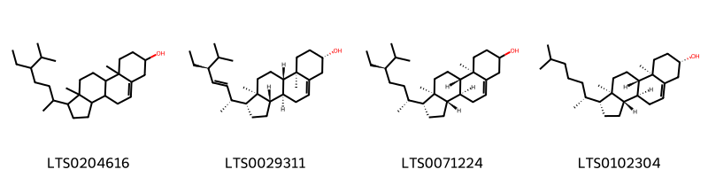{ width=100% }
    <figcaption>Hình ảnh cấu trúc hóa học của 4 hoạt chất thuộc nhóm Steroids and steroid derivatives gồm ['stigmast-5-en-3-ol, (3β)- (LTS0204616)', 'phytosterol (LTS0029311)', 'stigmast-5-en-3-ol (LTS0071224)', 'cholesterol (LTS0102304)'].</figcaption>
</figure>
#### Nhóm Stilbenes
<figure markdown="span">
    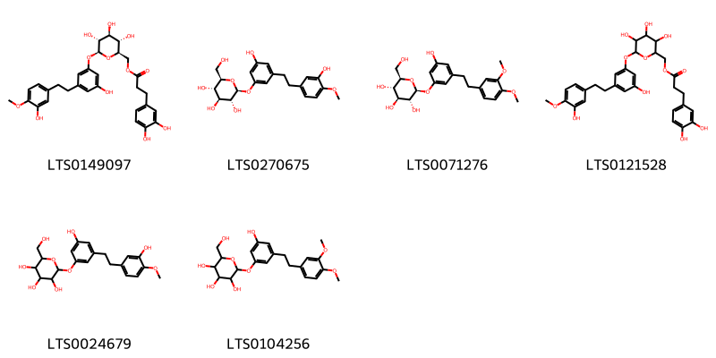{ width=100% }
    <figcaption>Hình ảnh cấu trúc hóa học của 6 hoạt chất thuộc nhóm Stilbenes gồm ['[(2r,3s,4s,5r,6s)-3,4,5-trihydroxy-6-{3-hydroxy-5-[2-(3-hydroxy-4-methoxyphenyl)ethyl]phenoxy}oxan-2-yl]methyl 3-(3,4-dihydroxyphenyl)propanoate (LTS0149097)', '(2s,3r,4s,5s,6r)-2-{3-hydroxy-5-[2-(3-hydroxy-4-methoxyphenyl)ethyl]phenoxy}-6-(hydroxymethyl)oxane-3,4,5-triol (LTS0270675)', '(2s,3r,4s,5s,6r)-2-{3-[2-(3,4-dimethoxyphenyl)ethyl]-5-hydroxyphenoxy}-6-(hydroxymethyl)oxane-3,4,5-triol (LTS0071276)', '(3,4,5-trihydroxy-6-{3-hydroxy-5-[2-(3-hydroxy-4-methoxyphenyl)ethyl]phenoxy}oxan-2-yl)methyl 3-(3,4-dihydroxyphenyl)propanoate (LTS0121528)', '2-{3-hydroxy-5-[2-(3-hydroxy-4-methoxyphenyl)ethyl]phenoxy}-6-(hydroxymethyl)oxane-3,4,5-triol (LTS0024679)', '2-{3-[2-(3,4-dimethoxyphenyl)ethyl]-5-hydroxyphenoxy}-6-(hydroxymethyl)oxane-3,4,5-triol (LTS0104256)'].</figcaption>
</figure>

---

### Dược dân tộc học

Danh sách các quốc gia có sử dụng *Tragopogon pratensis* trong điều trị các bệnh. 

| Country   | Disease     | Bệnh                                                                                                                                                                                                |
|:----------|:------------|:----------------------------------------------------------------------------------------------------------------------------------------------------------------------------------------------------|
| Elsewhere | Sudorific   | MYMEMORY WARNING: YOU USED ALL AVAILABLE FREE TRANSLATIONS FOR TODAY. NEXT AVAILABLE IN  12 HOURS 04 MINUTES 34 SECONDS VISIT HTTPS://MYMEMORY.TRANSLATED.NET/DOC/USAGELIMITS.PHP TO TRANSLATE MORE |
| English   | Sudorific   | MYMEMORY WARNING: YOU USED ALL AVAILABLE FREE TRANSLATIONS FOR TODAY. NEXT AVAILABLE IN  12 HOURS 04 MINUTES 30 SECONDS VISIT HTTPS://MYMEMORY.TRANSLATED.NET/DOC/USAGELIMITS.PHP TO TRANSLATE MORE |
| French    | Emollient   | MYMEMORY WARNING: YOU USED ALL AVAILABLE FREE TRANSLATIONS FOR TODAY. NEXT AVAILABLE IN  12 HOURS 04 MINUTES 27 SECONDS VISIT HTTPS://MYMEMORY.TRANSLATED.NET/DOC/USAGELIMITS.PHP TO TRANSLATE MORE |
| German    | Expectorant | MYMEMORY WARNING: YOU USED ALL AVAILABLE FREE TRANSLATIONS FOR TODAY. NEXT AVAILABLE IN  12 HOURS 04 MINUTES 24 SECONDS VISIT HTTPS://MYMEMORY.TRANSLATED.NET/DOC/USAGELIMITS.PHP TO TRANSLATE MORE |

---

# Chi Guizotia

??? note "Danh sách các dược liệu thuộc chi"
    
	 - *Guizotia abyssinica*

---
## Guizotia abyssinica
### Thông tin về thực vật

!!! info "Phân loại thực vật của *Guizotia abyssinica* từ GIBF:"
    - **Kingdom:** Plantae
    - **Phylum:** Tracheophyta
    - **Order:** Asterales
    - **Family:** Asteraceae
    - **Genus:** Guizotia
    - **Species:** *Guizotia abyssinica*

 

| Label (VI)   | Label (EN)   | Scientific Name     | Descriptions (VI)   | Descriptions (EN)   | Also Known As (VI)   | Also Known As (EN)   |
|:-------------|:-------------|:--------------------|:--------------------|:--------------------|:---------------------|:---------------------|
| N/A          | N/A          | Guizotia abyssinica | loài thực vật       | species of plant    | ['']                 | ['']                 |

#### Phân bố trên thế giới

**Từ CSDL GIBF** Denmark, Netherlands, Luxembourg, Germany, Belgium, Chinese Taipei, Spain, Portugal, Switzerland, Sweden, Austria, Norway, United Kingdom of Great Britain and Northern Ireland

#### Phân bố tại Việt Nam

**Từ CSDL GIBF**: Không có ghi nhận ở Việt Nam

---
### Thành phần hóa học
        
- Theo cơ sở dữ liệu lotus: Từ loài *Guizotia abyssinica* đã phân lập và xác định được Chưa có hoạt chất nào được phân lập. hoạt chất thuộc về các nhóm Không có hoạt chất nào được phân lập. 

Không có hình ảnh nào được tạo ra

---

### Dược dân tộc học

Danh sách các quốc gia có sử dụng *Guizotia abyssinica* trong điều trị các bệnh. 

| Country   | Disease   | Bệnh                                                                                                                                                                                                |
|:----------|:----------|:----------------------------------------------------------------------------------------------------------------------------------------------------------------------------------------------------|
| Elsewhere | Soap      | MYMEMORY WARNING: YOU USED ALL AVAILABLE FREE TRANSLATIONS FOR TODAY. NEXT AVAILABLE IN  12 HOURS 03 MINUTES 38 SECONDS VISIT HTTPS://MYMEMORY.TRANSLATED.NET/DOC/USAGELIMITS.PHP TO TRANSLATE MORE |

---

# Chi Tussilago

??? note "Danh sách các dược liệu thuộc chi"
    
	 - *Tussilago farfara*

---
## Tussilago farfara
### Thông tin về thực vật

!!! info "Phân loại thực vật của *Tussilago farfara* từ GIBF:"
    - **Kingdom:** Plantae
    - **Phylum:** Tracheophyta
    - **Order:** Asterales
    - **Family:** Asteraceae
    - **Genus:** Tussilago
    - **Species:** *Tussilago farfara*

 

| Label (VI)   | Label (EN)   | Scientific Name   | Descriptions (VI)   | Descriptions (EN)   | Also Known As (VI)   | Also Known As (EN)                  |
|:-------------|:-------------|:------------------|:--------------------|:--------------------|:---------------------|:------------------------------------|
| N/A          | N/A          | Tussilago farfara | loài thực vật       | species of plant    | ['']                 | ['Tussilago Farfarus', 'coltsfoot'] |

#### Phân bố trên thế giới

**Từ CSDL GIBF** Italy, Moldova, Republic of, Slovakia, Norway, Canada, Denmark, Netherlands, Spain, Türkiye, Hungary, Russian Federation, United States of America, Slovenia, Croatia, Montenegro, Czechia, Germany, Switzerland, Armenia, Austria, France, United Kingdom of Great Britain and Northern Ireland, Ireland, Serbia, Poland

#### Phân bố tại Việt Nam

**Từ CSDL GIBF**: Không có ghi nhận ở Việt Nam

---
### Thành phần hóa học
        
- Theo cơ sở dữ liệu lotus: Từ loài *Tussilago farfara* đã phân lập và xác định được 102 hoạt chất thuộc về các nhóm Fatty Acyls, Pyrrolidines, Prenol lipids, Steroids and steroid derivatives, Benzene and substituted derivatives, Unsaturated hydrocarbons, Organooxygen compounds, Pyrrolizidines, Macrolides and analogues. 

|    | chemicalTaxonomyClassyfireClass     |   smiles_count |
|---:|:------------------------------------|---------------:|
|  0 |                                     |              1 |
|  1 | Benzene and substituted derivatives |              4 |
|  2 | Fatty Acyls                         |             13 |
|  3 | Macrolides and analogues            |              5 |
|  4 | Organooxygen compounds              |              5 |
|  5 | Prenol lipids                       |             51 |
|  6 | Pyrrolidines                        |              3 |
|  7 | Pyrrolizidines                      |              8 |
|  8 | Steroids and steroid derivatives    |              5 |
|  9 | Unsaturated hydrocarbons            |              6 |

#### Nhóm 
<figure markdown="span">
    { width=100% }
    <figcaption>Hình ảnh cấu trúc hóa học của 1 hoạt chất thuộc nhóm  gồm ['seneciphylline (LTS0165818)'].</figcaption>
</figure>
#### Nhóm Benzene and substituted derivatives
<figure markdown="span">
    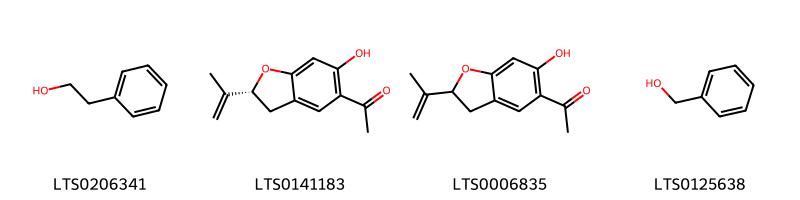{ width=100% }
    <figcaption>Hình ảnh cấu trúc hóa học của 4 hoạt chất thuộc nhóm Benzene and substituted derivatives gồm ['2-phenyl-ethanol (LTS0206341)', '6-hydroxytremetone (LTS0141183)', '1-[6-hydroxy-2-(prop-1-en-2-yl)-2,3-dihydro-1-benzofuran-5-yl]ethanone (LTS0006835)', 'benzyl alcohol (LTS0125638)'].</figcaption>
</figure>
#### Nhóm Fatty Acyls
<figure markdown="span">
    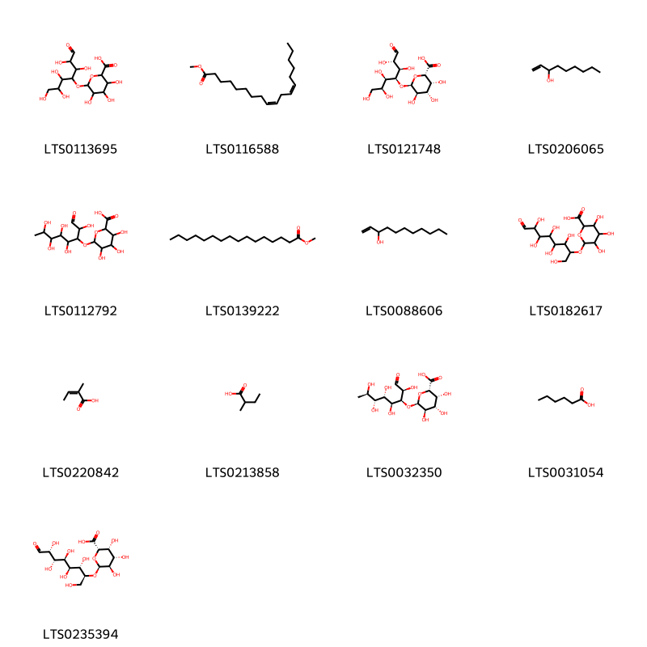{ width=100% }
    <figcaption>Hình ảnh cấu trúc hóa học của 13 hoạt chất thuộc nhóm Fatty Acyls gồm ['3,4,5-trihydroxy-6-[(1,2,3,5,6-pentahydroxy-7-oxoheptan-4-yl)oxy]oxane-2-carboxylic acid (LTS0113695)', 'methyl linoleate (LTS0116588)', '(2s,3r,4s,5r,6s)-3,4,5-trihydroxy-6-{[(2s,3r,4s,5r,6s)-1,2,3,5,6-pentahydroxy-7-oxoheptan-4-yl]oxy}oxane-2-carboxylic acid (LTS0121748)', '1-nonen-3-ol (LTS0206065)', '3,4,5-trihydroxy-6-[(2,4,5,6,7-pentahydroxy-1-oxooctan-3-yl)oxy]oxane-2-carboxylic acid (LTS0112792)', 'methyl palmitate (LTS0139222)', 'undec-1-en-3-ol (LTS0088606)', '6-[(1,3,4,5,6,7-hexahydroxy-8-oxooctan-2-yl)oxy]-3,4,5-trihydroxyoxane-2-carboxylic acid (LTS0182617)', 'angelic acid (LTS0220842)', '2-methylbutanoic acid (LTS0213858)', '(2s,3r,4s,5r,6s)-3,4,5-trihydroxy-6-{[(2s,3s,4s,5s,6r,7r)-2,4,5,6,7-pentahydroxy-1-oxooctan-3-yl]oxy}oxane-2-carboxylic acid (LTS0032350)', 'hexanoic acid (LTS0031054)', '(2s,3r,4s,5r,6s)-6-{[(2s,3s,4s,5s,6s,7r)-1,3,4,5,6,7-hexahydroxy-8-oxooctan-2-yl]oxy}-3,4,5-trihydroxyoxane-2-carboxylic acid (LTS0235394)'].</figcaption>
</figure>
#### Nhóm Macrolides and analogues
<figure markdown="span">
    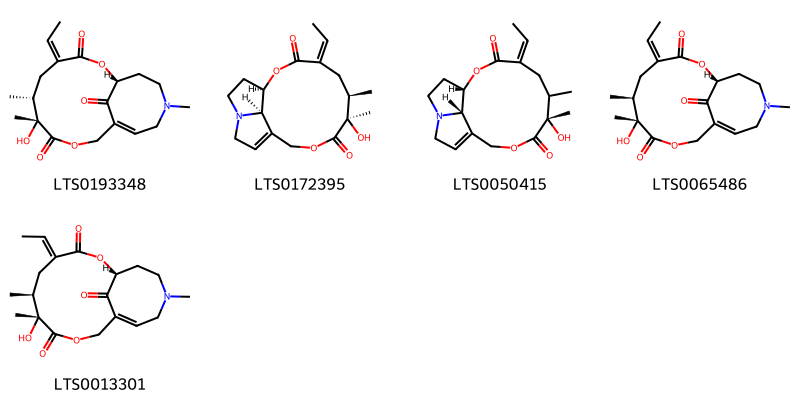{ width=100% }
    <figcaption>Hình ảnh cấu trúc hóa học của 5 hoạt chất thuộc nhóm Macrolides and analogues gồm ['senkirkine (LTS0193348)', 'senecionine (LTS0172395)', '(1s,4z,7s,17s)-4-ethylidene-7-hydroxy-6,7-dimethyl-2,9-dioxa-14-azatricyclo[9.5.1.0¹⁴,¹⁷]heptadec-11-ene-3,8-dione (LTS0050415)', '(1r,4z,6s,7r,11z)-4-ethylidene-7-hydroxy-6,7,14-trimethyl-2,9-dioxa-14-azabicyclo[9.5.1]heptadec-11-ene-3,8,17-trione (LTS0065486)', '(1r,4e,6s,7r,11z)-4-ethylidene-7-hydroxy-6,7,14-trimethyl-2,9-dioxa-14-azabicyclo[9.5.1]heptadec-11-ene-3,8,17-trione (LTS0013301)'].</figcaption>
</figure>
#### Nhóm Organooxygen compounds
<figure markdown="span">
    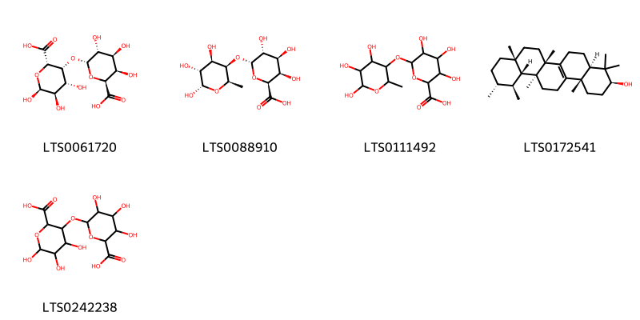{ width=100% }
    <figcaption>Hình ảnh cấu trúc hóa học của 5 hoạt chất thuộc nhóm Organooxygen compounds gồm ['(2s,3r,4s,5r,6s)-6-{[(2s,3r,4r,5r,6s)-2-carboxy-4,5,6-trihydroxyoxan-3-yl]oxy}-3,4,5-trihydroxyoxane-2-carboxylic acid (LTS0061720)', '(2s,3r,4s,5r,6s)-3,4,5-trihydroxy-6-{[(2r,3r,4r,5r,6s)-4,5,6-trihydroxy-2-methyloxan-3-yl]oxy}oxane-2-carboxylic acid (LTS0088910)', '3,4,5-trihydroxy-6-[(4,5,6-trihydroxy-2-methyloxan-3-yl)oxy]oxane-2-carboxylic acid (LTS0111492)', 'isobauerenol (LTS0172541)', '6-[(2-carboxy-4,5,6-trihydroxyoxan-3-yl)oxy]-3,4,5-trihydroxyoxane-2-carboxylic acid (LTS0242238)'].</figcaption>
</figure>
#### Nhóm Prenol lipids
<figure markdown="span">
    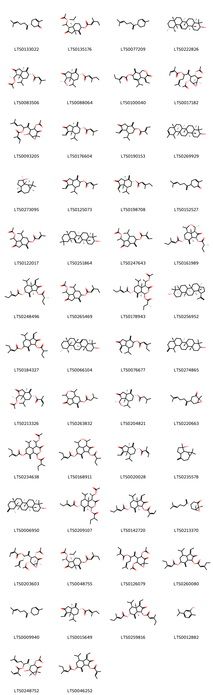{ width=100% }
    <figcaption>Hình ảnh cấu trúc hóa học của 51 hoạt chất thuộc nhóm Prenol lipids gồm ['(5r)-2-methyl-5-(6-methylhepta-1,5-dien-2-yl)cyclohex-2-en-1-one (LTS0133022)', '(1r,3ar,5r,7s,7as)-1-[1-(acetyloxy)ethyl]-7-isopropyl-4-methylidene-2-oxo-hexahydro-1h-inden-5-yl (2e)-3-methylpent-2-enoate (LTS0135176)', '(r)-β-bisabolene (LTS0077209)', 'amyrin (LTS0222826)', '(1s,3ar,5r,7s,7as)-1-[(1r)-1-(acetyloxy)ethyl]-7-isopropyl-4-methylidene-2-oxo-hexahydro-1h-inden-5-yl 3-methylbut-2-enoate (LTS0083506)', '(1s,3ar,5r,7s,7as)-1-[(1r)-1-hydroxyethyl]-7-isopropyl-4-methylidene-2-oxo-hexahydro-1h-inden-5-yl (2e)-3-methylpent-2-enoate (LTS0088064)', '(4z)-4-ethylidene-5-isopropyl-8-methylidene-3-oxo-1,4a,7,8a-tetrahydro-2-benzopyran-7-yl (2e)-3-methylpent-2-enoate (LTS0100040)', '2-[(1s,2r,4s,6s)-2,4-bis(acetyloxy)-6-methyl-5-oxo-7-oxabicyclo[4.1.0]heptan-3-yl]-6-methylhepta-1,5-dien-3-yl (2z)-2-methylbut-2-enoate (LTS0017182)', '2-[4-(acetyloxy)-2-hydroxy-6-methyl-5-oxo-7-oxabicyclo[4.1.0]heptan-3-yl]-6-methylhepta-1,5-dien-3-yl 2-methylbut-2-enoate (LTS0093205)', '(1z,3ar,5r,7s,7as)-1-ethylidene-7-isopropyl-4-methylidene-2-oxo-hexahydroinden-5-yl 3-methylbut-2-enoate (LTS0176604)', '1-ethylidene-7-isopropyl-4-methylidene-2-oxo-hexahydroinden-5-yl 2-methylbut-2-enoate (LTS0190153)', '(4ar,6ar,6br,8as,12ar,12br,14ar,14br)-4,4,6a,6b,8a,11,12,14b-octamethyl-2,3,4a,5,6,7,8,9,12,12a,12b,13,14,14a-tetradecahydro-1h-picen-3-ol (LTS0269929)', '(-)-spathulenol (LTS0273095)', '1-ethylidene-7-isopropyl-4-methylidene-2-oxo-hexahydroinden-5-yl 3-methylbut-2-enoate (LTS0125073)', '(1e,3ar,5r,7s,7as)-1-ethylidene-7-isopropyl-4-methylidene-2-oxo-hexahydroinden-5-yl (2e)-3-methylpent-2-enoate (LTS0198708)', '2-methyl-5-(6-methylhepta-1,5-dien-2-yl)cyclohex-2-en-1-one (LTS0152527)', '1-[1-(acetyloxy)ethyl]-7-isopropyl-4-methylidene-2-oxo-hexahydro-1h-inden-5-yl 3-methylbut-2-enoate (LTS0122017)', 'β-amyrin (LTS0251864)', '1-[1-(acetyloxy)ethyl]-7-isopropyl-4-methylidene-2-oxo-hexahydro-1h-inden-5-yl 2-methylbut-2-enoate (LTS0247643)', '(1s,3s,3ar,5r,7s,7as)-1-[(1r)-1-hydroxyethyl]-7-isopropyl-3-{[(2r)-2-methylbutanoyl]oxy}-4-methylidene-2-oxo-hexahydro-1h-inden-5-yl (2e)-3-methylpent-2-enoate (LTS0161989)', '(1z,3s,3ar,5r,7s,7as)-1-ethylidene-7-isopropyl-3-{[(2r)-2-methylbutanoyl]oxy}-4-methylidene-2-oxo-hexahydroinden-5-yl (2e)-3-methylpent-2-enoate (LTS0248496)', '1-[1-(acetyloxy)ethyl]-7-isopropyl-4-methylidene-2-oxo-hexahydro-1h-inden-5-yl (2e)-3-methylpent-2-enoate (LTS0265469)', '(1r,4s,4as,5s,7r,8ar)-4-[(1r)-1-(acetyloxy)ethyl]-5-isopropyl-1-{[(2r)-2-methylbutanoyl]oxy}-8-methylidene-3-oxo-hexahydro-1h-2-benzopyran-7-yl (2e)-3-methylpent-2-enoate (LTS0178943)', 'lupeol (LTS0256952)', '1-ethylidene-7-isopropyl-3-[(2-methylbutanoyl)oxy]-4-methylidene-2-oxo-hexahydroinden-5-yl 3-methylpent-2-enoate (LTS0184327)', '(3s,4ar,6bs,8ar,11r,12s,12ar,12bs,14ar,14br)-4,4,6b,8a,11,12,12b,14b-octamethyl-2,3,4a,5,7,8,9,10,11,12,12a,13,14,14a-tetradecahydro-1h-picen-3-ol (LTS0066104)', '(1e)-1-ethylidene-7-isopropyl-4-methylidene-2-oxo-hexahydroinden-5-yl 3-methylpent-2-enoate (LTS0076677)', '(6ar,6br,8ar,14br)-4,4,6a,6b,8a,12,14b-heptamethyl-11-methylidene-hexadecahydropicen-3-ol (LTS0274865)', '(1s,3ar,5r,7s,7as)-1-[(1r)-1-(acetyloxy)ethyl]-7-isopropyl-4-methylidene-2-oxo-hexahydro-1h-inden-5-yl (2z)-2-methylbut-2-enoate (LTS0213326)', '1-(1-hydroxyethyl)-7-isopropyl-4-methylidene-2-oxo-hexahydro-1h-inden-5-yl 3-methylbutanoate (LTS0263832)', '(1s,3ar,5r,7s,7as)-1-[(1r)-1-hydroxyethyl]-7-isopropyl-4-methylidene-2-oxo-hexahydro-1h-inden-5-yl 3-methylbutanoate (LTS0204821)', '1-methyl-4-(6-methylhepta-1,5-dien-2-yl)-7-oxabicyclo[4.1.0]heptan-2-one (LTS0220663)', '4-[1-(acetyloxy)ethyl]-5-isopropyl-1-[(2-methylbutanoyl)oxy]-8-methylidene-3-oxo-hexahydro-1h-2-benzopyran-7-yl 3-methylpent-2-enoate (LTS0234638)', '1-(1-hydroxyethyl)-7-isopropyl-3-[(2-methylbutanoyl)oxy]-4-methylidene-2-oxo-hexahydro-1h-inden-5-yl 3-methylpent-2-enoate (LTS0168911)', '(1z,3ar,5r,7s,7as)-1-ethylidene-7-isopropyl-4-methylidene-2-oxo-hexahydroinden-5-yl (2z)-2-methylbut-2-enoate (LTS0020028)', 'spathulenol (LTS0235578)', 'taraxasterol (LTS0006950)', '(1r,4s,4as,5s,7r,8ar)-4-[(1r)-1-(acetyloxy)ethyl]-5-isopropyl-1-[(2-methylbutanoyl)oxy]-8-methylidene-3-oxo-hexahydro-1h-2-benzopyran-7-yl (2e)-3-methylpent-2-enoate (LTS0209107)', '(1z,3s,3ar,5r,7s,7as)-1-ethylidene-7-isopropyl-3-{[(2z)-2-methylbut-2-enoyl]oxy}-4-methylidene-2-oxo-hexahydroinden-5-yl (2e)-3-methylpent-2-enoate (LTS0142720)', '(1r,4s,6r)-1-methyl-4-(6-methylhepta-1,5-dien-2-yl)-7-oxabicyclo[4.1.0]heptan-2-one (LTS0213370)', '(3s)-2-[(1s,2r,3r,4s,6s)-2,4-bis(acetyloxy)-6-methyl-5-oxo-7-oxabicyclo[4.1.0]heptan-3-yl]-6-methylhepta-1,5-dien-3-yl (2z)-2-methylbut-2-enoate (LTS0203603)', '(1r,3ar,5r,7s,7as)-1-[(1r)-1-(acetyloxy)ethyl]-7-isopropyl-4-methylidene-2-oxo-hexahydro-1h-inden-5-yl (2e)-3-methylpent-2-enoate (LTS0048755)', '2-[2,4-bis(acetyloxy)-6-methyl-5-oxo-7-oxabicyclo[4.1.0]heptan-3-yl]-6-methylhepta-1,5-dien-3-yl 2-methylbut-2-enoate (LTS0126079)', '3-ethylidene-4-isopropyl-7-methylidene-6-[(3-methylpent-2-enoyl)oxy]-2-oxo-hexahydroinden-1-yl 3-methylpent-2-enoate (LTS0260080)', '(-)-β-bisabolene (LTS0009940)', '(1z,3ar,5r,7s,7as)-1-ethylidene-7-isopropyl-4-methylidene-2-oxo-hexahydroinden-5-yl (2e)-3-methylpent-2-enoate (LTS0015649)', '(1s,3z,3as,4s,6r,7ar)-3-ethylidene-4-isopropyl-7-methylidene-6-{[(2e)-3-methylpent-2-enoyl]oxy}-2-oxo-hexahydroinden-1-yl (2e)-3-methylpent-2-enoate (LTS0259816)', 'carvacrol (LTS0012882)', '(3s)-2-[(1r,2s,3s,4r,6r)-4-(acetyloxy)-2-hydroxy-6-methyl-5-oxo-7-oxabicyclo[4.1.0]heptan-3-yl]-6-methylhepta-1,5-dien-3-yl (2z)-2-methylbut-2-enoate (LTS0248752)', '1-ethylidene-7-isopropyl-3-[(2-methylbut-2-enoyl)oxy]-4-methylidene-2-oxo-hexahydroinden-5-yl 3-methylpent-2-enoate (LTS0046252)', '1-(1-hydroxyethyl)-7-isopropyl-4-methylidene-2-oxo-hexahydro-1h-inden-5-yl 3-methylpent-2-enoate (LTS0108686)'].</figcaption>
</figure>
#### Nhóm Pyrrolidines
<figure markdown="span">
    { width=100% }
    <figcaption>Hình ảnh cấu trúc hóa học của 3 hoạt chất thuộc nhóm Pyrrolidines gồm ['(+)-homoproline (LTS0207662)', 'methyl 2-(pyrrolidin-2-yl)acetate (LTS0188189)', '(+/-)-homoproline (LTS0245282)'].</figcaption>
</figure>
#### Nhóm Pyrrolizidines
<figure markdown="span">
    { width=100% }
    <figcaption>Hình ảnh cấu trúc hóa học của 8 hoạt chất thuộc nhóm Pyrrolizidines gồm ['2-hydroxy-2-methyl-hexahydropyrrolizine-1-carboxylic acid (LTS0075470)', '(1s,2r,7as)-2-hydroxy-2-methyl-hexahydropyrrolizine-1-carboxylic acid (LTS0088823)', '(1s,2s,7as)-2-hydroxy-2-methyl-hexahydropyrrolizine-1-carboxylic acid (LTS0206744)', '(1r,2r,7as)-2-hydroxy-2-methyl-hexahydropyrrolizine-1-carboxylic acid (LTS0209287)', 'tussilagine (LTS0216274)', '(1r,2s,7as)-2-hydroxy-2-methyl-hexahydropyrrolizine-1-carboxylic acid (LTS0018628)', 'methyl 2-hydroxy-2-methyl-hexahydropyrrolizine-1-carboxylate (LTS0047218)', 'isotussilagine (LTS0013915)'].</figcaption>
</figure>
#### Nhóm Steroids and steroid derivatives
<figure markdown="span">
    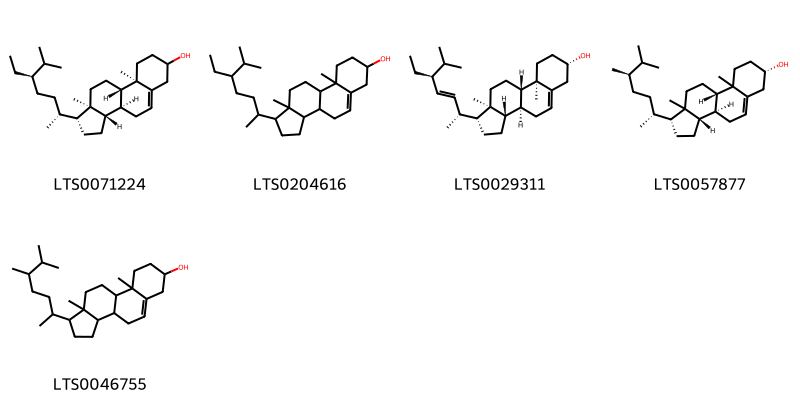{ width=100% }
    <figcaption>Hình ảnh cấu trúc hóa học của 5 hoạt chất thuộc nhóm Steroids and steroid derivatives gồm ['stigmast-5-en-3-ol (LTS0071224)', 'stigmast-5-en-3-ol, (3β)- (LTS0204616)', 'phytosterol (LTS0029311)', '(1r,3as,3bs,7s,9bs)-1-[(2r,5r)-5,6-dimethylheptan-2-yl]-9a,11a-dimethyl-1h,2h,3h,3ah,3bh,4h,6h,7h,8h,9h,9bh,10h,11h-cyclopenta[a]phenanthren-7-ol (LTS0057877)', 'campesterol (LTS0046755)'].</figcaption>
</figure>
#### Nhóm Unsaturated hydrocarbons
<figure markdown="span">
    { width=100% }
    <figcaption>Hình ảnh cấu trúc hóa học của 6 hoạt chất thuộc nhóm Unsaturated hydrocarbons gồm ['decene (LTS0069806)', '1-undecene (LTS0104325)', '1-dodecene (LTS0071043)', '1-tridecene (LTS0122180)', 'nonene (LTS0022235)', '1-pentadecene (LTS0248601)'].</figcaption>
</figure>

---

### Dược dân tộc học

Danh sách các quốc gia có sử dụng *Tussilago farfara* trong điều trị các bệnh. 

| Country    | Disease                                                                                                     | Bệnh                                                                                                                                                                                                |
|:-----------|:------------------------------------------------------------------------------------------------------------|:----------------------------------------------------------------------------------------------------------------------------------------------------------------------------------------------------|
| China      | Demulcent, Expectorant, Expectorant, Antitussive                                                            | MYMEMORY WARNING: YOU USED ALL AVAILABLE FREE TRANSLATIONS FOR TODAY. NEXT AVAILABLE IN  12 HOURS 03 MINUTES 14 SECONDS VISIT HTTPS://MYMEMORY.TRANSLATED.NET/DOC/USAGELIMITS.PHP TO TRANSLATE MORE |
| Elseewhere | nan                                                                                                         | MYMEMORY WARNING: YOU USED ALL AVAILABLE FREE TRANSLATIONS FOR TODAY. NEXT AVAILABLE IN  12 HOURS 03 MINUTES 12 SECONDS VISIT HTTPS://MYMEMORY.TRANSLATED.NET/DOC/USAGELIMITS.PHP TO TRANSLATE MORE |
| Elsewhere  | nan, Antitussive, Demulcent, Demulcent, Diuretic, Expectorant, Expectorant, Sudorific, Antitussive, Styptic | MYMEMORY WARNING: YOU USED ALL AVAILABLE FREE TRANSLATIONS FOR TODAY. NEXT AVAILABLE IN  12 HOURS 03 MINUTES 09 SECONDS VISIT HTTPS://MYMEMORY.TRANSLATED.NET/DOC/USAGELIMITS.PHP TO TRANSLATE MORE |
| Eurasia    | Emollient, Demulcent, Expectorant                                                                           | MYMEMORY WARNING: YOU USED ALL AVAILABLE FREE TRANSLATIONS FOR TODAY. NEXT AVAILABLE IN  12 HOURS 03 MINUTES 05 SECONDS VISIT HTTPS://MYMEMORY.TRANSLATED.NET/DOC/USAGELIMITS.PHP TO TRANSLATE MORE |
| France     | Expectorant                                                                                                 | MYMEMORY WARNING: YOU USED ALL AVAILABLE FREE TRANSLATIONS FOR TODAY. NEXT AVAILABLE IN  12 HOURS 03 MINUTES 02 SECONDS VISIT HTTPS://MYMEMORY.TRANSLATED.NET/DOC/USAGELIMITS.PHP TO TRANSLATE MORE |
| Turkey     | Diuretic, Expectorant, Demulcent, Sudorific                                                                 | MYMEMORY WARNING: YOU USED ALL AVAILABLE FREE TRANSLATIONS FOR TODAY. NEXT AVAILABLE IN  12 HOURS 02 MINUTES 58 SECONDS VISIT HTTPS://MYMEMORY.TRANSLATED.NET/DOC/USAGELIMITS.PHP TO TRANSLATE MORE |

---

# Chi Baccharis

??? note "Danh sách các dược liệu thuộc chi"
    
	 - *Baccharis cordifolia*
	 - *Baccharis floribunda*
	 - *Baccharis genistelloides*
	 - *Baccharis glutinosa*
	 - *Baccharis microphylla*
	 - *Baccharis pteronioides*
	 - *Baccharis tridentata*
	 - *Baccharis trimera*
	 - *Baccharis trinervis*

---
## Baccharis cordifolia
### Thông tin về thực vật

!!! info "Phân loại thực vật của *Baccharis coridifolia* từ GIBF:"
    - **Kingdom:** Plantae
    - **Phylum:** Tracheophyta
    - **Order:** Asterales
    - **Family:** Asteraceae
    - **Genus:** Baccharis
    - **Species:** *Baccharis coridifolia*

 

| Label (VI)   | Label (EN)   | Scientific Name   | Descriptions (VI)   | Descriptions (EN)   | Also Known As (VI)   | Also Known As (EN)                  |
|:-------------|:-------------|:------------------|:--------------------|:--------------------|:---------------------|:------------------------------------|
| N/A          | N/A          | Tussilago farfara | loài thực vật       | species of plant    | ['']                 | ['Tussilago Farfarus', 'coltsfoot'] |

#### Phân bố trên thế giới

**Từ CSDL GIBF** Brazil, Bolivia (Plurinational State of), Argentina, United States of America, Uruguay

#### Phân bố tại Việt Nam

**Từ CSDL GIBF**: Không có ghi nhận ở Việt Nam

---
### Thành phần hóa học
        
- Theo cơ sở dữ liệu lotus: Từ loài *Baccharis coridifolia* đã phân lập và xác định được Chưa có hoạt chất nào được phân lập. hoạt chất thuộc về các nhóm Không có hoạt chất nào được phân lập. 

Không có hình ảnh nào được tạo ra

---

### Dược dân tộc học

Danh sách các quốc gia có sử dụng *Baccharis coridifolia* trong điều trị các bệnh. 

| Country       | Disease   | Bệnh                                                                                                                                                                                                |
|:--------------|:----------|:----------------------------------------------------------------------------------------------------------------------------------------------------------------------------------------------------|
| South America | Poison    | MYMEMORY WARNING: YOU USED ALL AVAILABLE FREE TRANSLATIONS FOR TODAY. NEXT AVAILABLE IN  12 HOURS 02 MINUTES 18 SECONDS VISIT HTTPS://MYMEMORY.TRANSLATED.NET/DOC/USAGELIMITS.PHP TO TRANSLATE MORE |

---

---
## Baccharis floribunda
### Thông tin về thực vật

!!! info "Phân loại thực vật của *N/A* từ GIBF:"
    - **Kingdom:** Plantae
    - **Phylum:** Tracheophyta
    - **Order:** Asterales
    - **Family:** Asteraceae
    - **Genus:** Baccharis
    - **Species:** *N/A*

 

| Label (VI)   | Label (EN)   | Scientific Name      | Descriptions (VI)   | Descriptions (EN)   | Also Known As (VI)   | Also Known As (EN)   |
|:-------------|:-------------|:---------------------|:--------------------|:--------------------|:---------------------|:---------------------|
| N/A          | N/A          | Baccharis floribunda |                     |                     | ['']                 | ['']                 |

#### Phân bố trên thế giới

**Từ CSDL GIBF** Ecuador, Australia, Colombia, Brazil, Argentina, Bolivia (Plurinational State of), Uruguay, United States of America, Peru, Mexico, Chile, Falkland Islands (Malvinas)

#### Phân bố tại Việt Nam

**Từ CSDL GIBF**: Không có ghi nhận ở Việt Nam

---
### Thành phần hóa học
        
- Theo cơ sở dữ liệu lotus: Từ loài *N/A* đã phân lập và xác định được Chưa có hoạt chất nào được phân lập. hoạt chất thuộc về các nhóm Không có hoạt chất nào được phân lập. 

Không có hình ảnh nào được tạo ra

---

### Dược dân tộc học

Danh sách các quốc gia có sử dụng *N/A* trong điều trị các bệnh. 

| Country   | Disease   | Bệnh                                                                                                                                                                                                |
|:----------|:----------|:----------------------------------------------------------------------------------------------------------------------------------------------------------------------------------------------------|
| Venezuela | Vulnerary | MYMEMORY WARNING: YOU USED ALL AVAILABLE FREE TRANSLATIONS FOR TODAY. NEXT AVAILABLE IN  12 HOURS 01 MINUTES 50 SECONDS VISIT HTTPS://MYMEMORY.TRANSLATED.NET/DOC/USAGELIMITS.PHP TO TRANSLATE MORE |

---

---
## Baccharis genistelloides
### Thông tin về thực vật

!!! info "Phân loại thực vật của *Baccharis genistelloides* từ GIBF:"
    - **Kingdom:** Plantae
    - **Phylum:** Tracheophyta
    - **Order:** Asterales
    - **Family:** Asteraceae
    - **Genus:** Baccharis
    - **Species:** *Baccharis genistelloides*

 

| Label (VI)   | Label (EN)   | Scientific Name          | Descriptions (VI)   | Descriptions (EN)   | Also Known As (VI)   | Also Known As (EN)   |
|:-------------|:-------------|:-------------------------|:--------------------|:--------------------|:---------------------|:---------------------|
| N/A          | N/A          | Baccharis genistelloides | loài thực vật       | species of plant    | ['']                 | ['']                 |

#### Phân bố trên thế giới

**Từ CSDL GIBF** Ecuador, Colombia, Brazil, Bolivia (Plurinational State of), Peru

#### Phân bố tại Việt Nam

**Từ CSDL GIBF**: Không có ghi nhận ở Việt Nam

---
### Thành phần hóa học
        
- Theo cơ sở dữ liệu lotus: Từ loài *Baccharis genistelloides* đã phân lập và xác định được 68 hoạt chất thuộc về các nhóm Cinnamic acids and derivatives, Flavonoids, Prenol lipids, Benzene and substituted derivatives. 

|    | chemicalTaxonomyClassyfireClass     |   smiles_count |
|---:|:------------------------------------|---------------:|
|  0 | Benzene and substituted derivatives |              2 |
|  1 | Cinnamic acids and derivatives      |              2 |
|  2 | Flavonoids                          |             14 |
|  3 | Prenol lipids                       |             50 |

#### Nhóm Benzene and substituted derivatives
<figure markdown="span">
    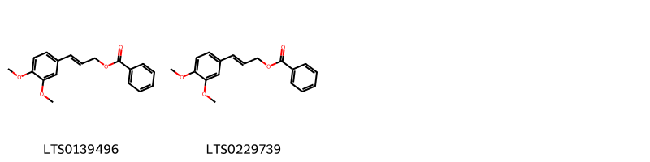{ width=100% }
    <figcaption>Hình ảnh cấu trúc hóa học của 2 hoạt chất thuộc nhóm Benzene and substituted derivatives gồm ['(2e)-3-(3,4-dimethoxyphenyl)prop-2-en-1-yl benzoate (LTS0139496)', '3-(3,4-dimethoxyphenyl)prop-2-en-1-yl benzoate (LTS0229739)'].</figcaption>
</figure>
#### Nhóm Cinnamic acids and derivatives
<figure markdown="span">
    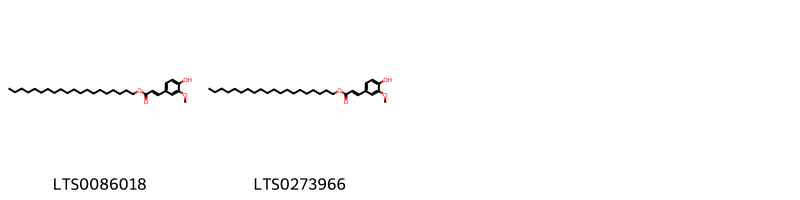{ width=100% }
    <figcaption>Hình ảnh cấu trúc hóa học của 2 hoạt chất thuộc nhóm Cinnamic acids and derivatives gồm ['icosyl (2e)-3-(4-hydroxy-3-methoxyphenyl)prop-2-enoate (LTS0086018)', 'icosyl 3-(4-hydroxy-3-methoxyphenyl)prop-2-enoate (LTS0273966)'].</figcaption>
</figure>
#### Nhóm Flavonoids
<figure markdown="span">
    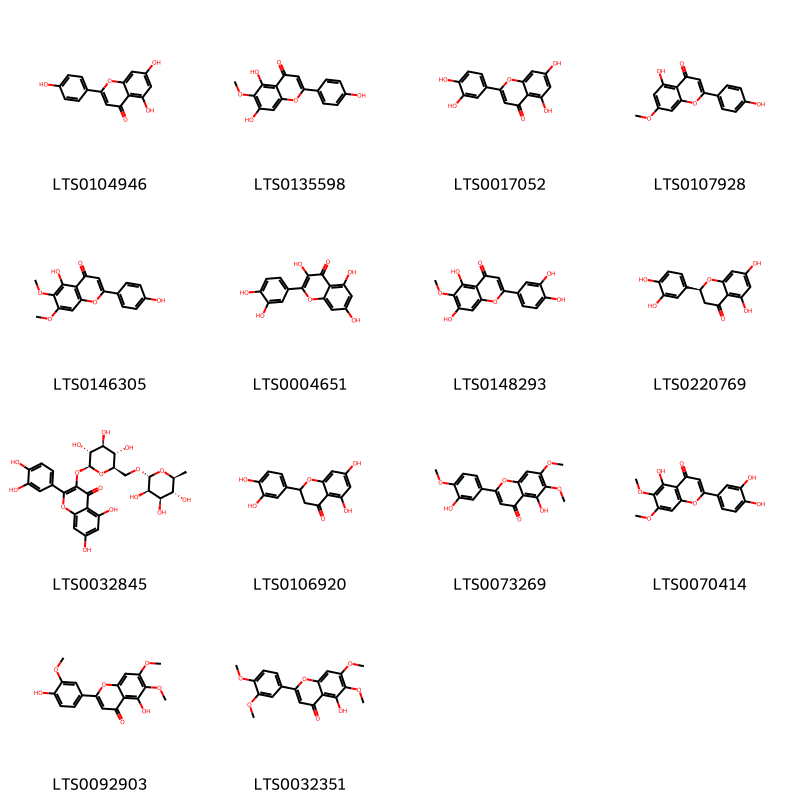{ width=100% }
    <figcaption>Hình ảnh cấu trúc hóa học của 14 hoạt chất thuộc nhóm Flavonoids gồm ['chamomile (LTS0104946)', 'hispidulin (LTS0135598)', 'luteolin (LTS0017052)', 'genkwanin (LTS0107928)', 'cirsimaritin (LTS0146305)', 'quercetin (LTS0004651)', 'nepetin (LTS0148293)', 'eriodictyol (LTS0220769)', '3-rutinosyl quercetin (LTS0032845)', '(+/-)-eriodictyol (LTS0106920)', 'eupatorin (LTS0073269)', 'cirsiliol (LTS0070414)', 'cirsilineol (LTS0092903)', '2-(3,4-dimethoxyphenyl)-5-hydroxy-6,7-dimethoxychromen-4-one (LTS0032351)'].</figcaption>
</figure>
#### Nhóm Prenol lipids
<figure markdown="span">
    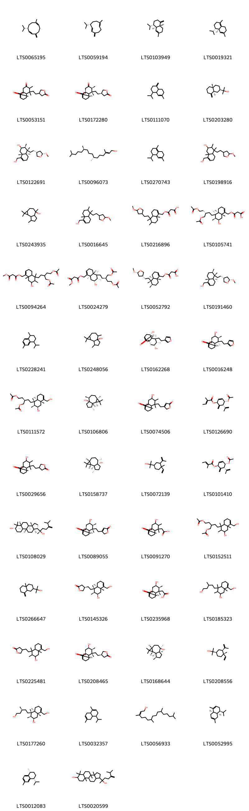{ width=100% }
    <figcaption>Hình ảnh cấu trúc hóa học của 50 hoạt chất thuộc nhóm Prenol lipids gồm ['(1z,6z,8s)-8-isopropyl-1-methyl-5-methylidenecyclodeca-1,6-diene (LTS0065195)', '(-)-germacrene d (LTS0059194)', '(+)-gamma-cadinene (LTS0103949)', 'delta-cadinene (LTS0019321)', '7,8-dimethyl-7-[2-(5-oxooxolan-3-yl)ethyl]-1h,5h,6h,6ah,8h,10h-naphtho[4,4a-c]furan-3,9-dione (LTS0053151)', '(6ar,7r,8s,10as)-7,8-dimethyl-7-{2-[(3r)-5-oxooxolan-3-yl]ethyl}-1h,5h,6h,6ah,8h,10h-naphtho[4,4a-c]furan-3,9-dione (LTS0172280)', '4-isopropyl-6-methyl-1-methylidene-3,4,4a,7,8,8a-hexahydro-2h-naphthalene (LTS0111070)', 'β-eudesmol (LTS0203280)', '(2r,3s,4r,4ar,8ar)-8-(hydroxymethyl)-4-{2-[(3r,5r)-5-methoxyoxolan-3-yl]ethyl}-3,4,8a-trimethyl-1,2,3,4a,5,6-hexahydronaphthalen-2-ol (LTS0122691)', 'phytol (LTS0096073)', '4-isopropyl-1,6-dimethyl-2,3,4,4a,7,8-hexahydronaphthalene (LTS0270743)', '8-(hydroxymethyl)-4-[2-(5-methoxyoxolan-3-yl)ethyl]-3,4,8a-trimethyl-1,2,3,4a,5,6-hexahydronaphthalen-2-ol (LTS0198916)', 'ledol (LTS0243935)', '{5-[2-(5-methoxyoxolan-3-yl)ethyl]-5,6,8a-trimethyl-3,4,4a,6,7,8-hexahydronaphthalen-1-yl}methanol (LTS0016645)', '3-({5-[2-(5-methoxyoxolan-3-yl)ethyl]-5,6,8a-trimethyl-3,4,4a,6,7,8-hexahydronaphthalen-1-yl}methoxy)-3-oxopropanoic acid (LTS0216896)', '3-{[(4ar,5s,6s,7r,8ar)-5-[(3s)-5-(acetyloxy)-3-[(acetyloxy)methyl]pentyl]-7-hydroxy-5,6,8a-trimethyl-3,4,4a,6,7,8-hexahydronaphthalen-1-yl]methoxy}-3-oxopropanoic acid (LTS0105741)', '1-{5-[5-(acetyloxy)-3-[(acetyloxy)methyl]pentyl]-7-hydroxy-5,6,8a-trimethyl-3,4,4a,6,7,8-hexahydronaphthalen-1-yl}methyl 3-methyl propanedioate (LTS0094264)', '1-[(4ar,5r,6s,7r,8ar)-5-[(3r)-5-(acetyloxy)-3-[(acetyloxy)methyl]pentyl]-7-hydroxy-5,6,8a-trimethyl-3,4,4a,6,7,8-hexahydronaphthalen-1-yl]methyl 3-methyl propanedioate (LTS0024279)', '3-{[(4ar,5s,6r,8ar)-5-{2-[(3r,5r)-5-methoxyoxolan-3-yl]ethyl}-5,6,8a-trimethyl-3,4,4a,6,7,8-hexahydronaphthalen-1-yl]methoxy}-3-oxopropanoic acid (LTS0052792)', '[(4ar,5s,6r,8ar)-5-{2-[(3r,5r)-5-methoxyoxolan-3-yl]ethyl}-5,6,8a-trimethyl-3,4,4a,6,7,8-hexahydronaphthalen-1-yl]methanol (LTS0191460)', '(e)-calamene (LTS0228241)', '1,1,4,7-tetramethyl-octahydro-1ah-cyclopropa[e]azulen-4a-ol (LTS0248056)', '(6s,6ar,7s,8s,9r,10as)-7-[2-(furan-3-yl)ethyl]-6,9-dihydroxy-7,8-dimethyl-1h,5h,6h,6ah,8h,9h,10h-naphtho[4,4a-c]furan-3-one (LTS0162268)', '(6ar,7s,8s,9r,10as)-7-[2-(furan-3-yl)ethyl]-9-hydroxy-7,8-dimethyl-1h,5h,6h,6ah,8h,9h,10h-naphtho[4,4a-c]furan-3-one (LTS0016248)', '(2r)-2-{2-[(1r,2s,3r,4ar,8ar)-3-hydroxy-5-(hydroxymethyl)-1,2,4a-trimethyl-2,3,4,7,8,8a-hexahydronaphthalen-1-yl]ethyl}-4-(acetyloxy)butyl acetate (LTS0111572)', '(1ar,4s,4as,7r,7as,7br)-1,1,4,7-tetramethyl-octahydro-1ah-cyclopropa[e]azulen-4a-ol (LTS0106806)', '4-(2-{9-hydroxy-7,8-dimethyl-3-oxo-1h,5h,6h,6ah,8h,9h,10h-naphtho[4,4a-c]furan-7-yl}ethyl)-5h-furan-2-one (LTS0074506)', '(1s,4s,5r)-4-(acetyloxy)-6-methylidene-5-(prop-1-en-2-yl)cyclohex-2-en-1-yl 2-methylbut-2-enoate (LTS0126690)', '4-(2-{9-hydroxy-7,8-dimethyl-3-oxo-1h,5h,6h,6ah,8h,9h,10h-naphtho[4,4a-c]furan-7-yl}ethyl)oxolan-2-one (LTS0029656)', '(1ar,4s,4as,7s,7as,7br)-1,1,4,7-tetramethyl-octahydro-1ah-cyclopropa[e]azulen-4a-ol (LTS0158737)', '2-[4-ethenyl-4-methyl-3-(prop-1-en-2-yl)cyclohexyl]propan-2-ol (LTS0072139)', '(1s,4s,5r)-4-(acetyloxy)-6-methylidene-5-(prop-1-en-2-yl)cyclohex-2-en-1-yl (2e)-2-methylbut-2-enoate (LTS0101410)', '(1s,3ar,3br,5ar,7s,9ar,9br,11ar)-1-[(2s)-2-hydroxy-6-methyl-5-methylideneheptan-2-yl]-3a,3b,6,6,9a-pentamethyl-dodecahydro-1h-cyclopenta[a]phenanthren-7-ol (LTS0108029)', '4-{2-[(6ar,7r,8s,9r,10as)-9-hydroxy-7,8-dimethyl-3-oxo-1h,5h,6h,6ah,8h,9h,10h-naphtho[4,4a-c]furan-7-yl]ethyl}-5h-furan-2-one (LTS0089055)', '{9-hydroxy-7,8-dimethyl-3-oxo-1h,5h,6h,6ah,8h,9h,10h-naphtho[4,4a-c]furan-7-yl}acetic acid (LTS0091270)', '4-(acetyloxy)-2-{2-[3-hydroxy-5-(hydroxymethyl)-1,2,4a-trimethyl-2,3,4,7,8,8a-hexahydronaphthalen-1-yl]ethyl}butyl acetate (LTS0152511)', 'β-eudesmol (LTS0266647)', '(4r)-4-{2-[(1r,2s,3r,4ar,8ar)-3-hydroxy-5-(hydroxymethyl)-1,2,4a-trimethyl-2,3,4,7,8,8a-hexahydronaphthalen-1-yl]ethyl}oxolan-2-one (LTS0145326)', '[(6ar,7r,8s,9r,10as)-9-hydroxy-7,8-dimethyl-3-oxo-1h,5h,6h,6ah,8h,9h,10h-naphtho[4,4a-c]furan-7-yl]acetic acid (LTS0235968)', '4-(5-hydroxy-3-methylpentyl)-8-(hydroxymethyl)-3,4,8a-trimethyl-1,2,3,4a,5,6-hexahydronaphthalen-2-ol (LTS0185323)', '4-{2-[3-hydroxy-5-(hydroxymethyl)-1,2,4a-trimethyl-2,3,4,7,8,8a-hexahydronaphthalen-1-yl]ethyl}oxolan-2-one (LTS0225481)', '(4r)-4-{2-[(6ar,7r,8s,9r,10as)-9-hydroxy-7,8-dimethyl-3-oxo-1h,5h,6h,6ah,8h,9h,10h-naphtho[4,4a-c]furan-7-yl]ethyl}oxolan-2-one (LTS0208465)', 'ledol (LTS0168644)', 'elemol (LTS0208556)', '(2r,3s,4r,4ar,8ar)-4-[(3s)-5-hydroxy-3-methylpentyl]-8-(hydroxymethyl)-3,4,8a-trimethyl-1,2,3,4a,5,6-hexahydronaphthalen-2-ol (LTS0177260)', '4-isopropyl-1,6-dimethyl-3,4,4a,5,8,8a-hexahydronaphthalene (LTS0032357)', '3,7,11,15-tetramethylhexadec-2-en-1-ol (LTS0056933)', '(4s,4ar,8ar)-4-isopropyl-1,6-dimethyl-3,4,4a,5,8,8a-hexahydronaphthalene (LTS0052995)', '(1r,4r)-4-isopropyl-1,6-dimethyl-1,2,3,4-tetrahydronaphthalene (LTS0012083)', '1-(2-hydroxy-6-methyl-5-methylideneheptan-2-yl)-3a,3b,6,6,9a-pentamethyl-dodecahydro-1h-cyclopenta[a]phenanthren-7-ol (LTS0020599)'].</figcaption>
</figure>

---

### Dược dân tộc học

Danh sách các quốc gia có sử dụng *Baccharis genistelloides* trong điều trị các bệnh. 

| Country       | Disease   | Bệnh                                                                                                                                                                                                |
|:--------------|:----------|:----------------------------------------------------------------------------------------------------------------------------------------------------------------------------------------------------|
| Brazil        | Tonic     | MYMEMORY WARNING: YOU USED ALL AVAILABLE FREE TRANSLATIONS FOR TODAY. NEXT AVAILABLE IN  12 HOURS 01 MINUTES 21 SECONDS VISIT HTTPS://MYMEMORY.TRANSLATED.NET/DOC/USAGELIMITS.PHP TO TRANSLATE MORE |
| South America | Tonic     | MYMEMORY WARNING: YOU USED ALL AVAILABLE FREE TRANSLATIONS FOR TODAY. NEXT AVAILABLE IN  12 HOURS 01 MINUTES 18 SECONDS VISIT HTTPS://MYMEMORY.TRANSLATED.NET/DOC/USAGELIMITS.PHP TO TRANSLATE MORE |

---

---
## Baccharis glutinosa
### Thông tin về thực vật

!!! info "Phân loại thực vật của *Baccharis glutinosa* từ GIBF:"
    - **Kingdom:** Plantae
    - **Phylum:** Tracheophyta
    - **Order:** Asterales
    - **Family:** Asteraceae
    - **Genus:** Baccharis
    - **Species:** *Baccharis glutinosa*

 

| Label (VI)   | Label (EN)   | Scientific Name     | Descriptions (VI)   | Descriptions (EN)   | Also Known As (VI)   | Also Known As (EN)   |
|:-------------|:-------------|:--------------------|:--------------------|:--------------------|:---------------------|:---------------------|
| N/A          | N/A          | Baccharis glutinosa | loài thực vật       | species of plant    | ['']                 | ['']                 |

#### Phân bố trên thế giới

**Từ CSDL GIBF** Brazil, Argentina, Bolivia (Plurinational State of), Uruguay, United States of America, Chile

#### Phân bố tại Việt Nam

**Từ CSDL GIBF**: Không có ghi nhận ở Việt Nam

---
### Thành phần hóa học
        
- Theo cơ sở dữ liệu lotus: Từ loài *Baccharis glutinosa* đã phân lập và xác định được 41 hoạt chất thuộc về các nhóm Cinnamic acids and derivatives, Flavonoids, Prenol lipids. 

|    | chemicalTaxonomyClassyfireClass   |   smiles_count |
|---:|:----------------------------------|---------------:|
|  0 | Cinnamic acids and derivatives    |              2 |
|  1 | Flavonoids                        |              2 |
|  2 | Prenol lipids                     |             37 |

#### Nhóm Cinnamic acids and derivatives
<figure markdown="span">
    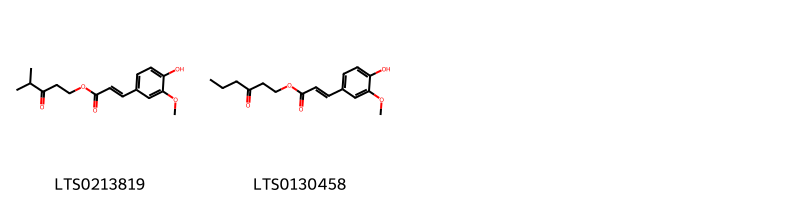{ width=100% }
    <figcaption>Hình ảnh cấu trúc hóa học của 2 hoạt chất thuộc nhóm Cinnamic acids and derivatives gồm ['4-methyl-3-oxopentyl (2e)-3-(4-hydroxy-3-methoxyphenyl)prop-2-enoate (LTS0213819)', '3-oxohexyl (2e)-3-(4-hydroxy-3-methoxyphenyl)prop-2-enoate (LTS0130458)'].</figcaption>
</figure>
#### Nhóm Flavonoids
<figure markdown="span">
    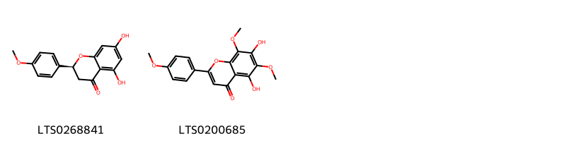{ width=100% }
    <figcaption>Hình ảnh cấu trúc hóa học của 2 hoạt chất thuộc nhóm Flavonoids gồm ['isosakuranetin (LTS0268841)', 'nevadensin (LTS0200685)'].</figcaption>
</figure>
#### Nhóm Prenol lipids
<figure markdown="span">
    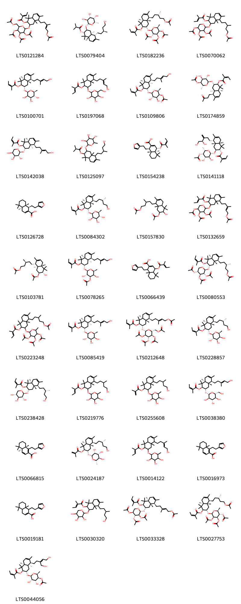{ width=100% }
    <figcaption>Hình ảnh cấu trúc hóa học của 37 hoạt chất thuộc nhóm Prenol lipids gồm ['5-[5-(acetyloxy)-3-methylpent-3-en-1-yl]-1,1,4a,6-tetramethyl-3-{[3,4,5-tris(acetyloxy)-6-[(acetyloxy)methyl]oxan-2-yl]oxy}-2,3,4,5,8,8a-hexahydronaphthalen-2-yl 2-methylbut-2-enoate (LTS0121284)', '(2s,3s,4as,5r,8as)-5-[(3s)-5-hydroxy-3-methylpentyl]-1,1,4a,6-tetramethyl-3-{[(2r,3s,4r,5s,6s)-3,4,5-trihydroxy-6-methyloxan-2-yl]oxy}-2,3,4,5,8,8a-hexahydronaphthalen-2-yl 2-methylpropanoate (LTS0079404)', '(2s,3s,4as,5r,8as)-5-[(3s)-5-(acetyloxy)-3-methylpentyl]-1,1,4a,6-tetramethyl-3-{[(2r,3s,4r,5r,6s)-3,4,5-tris(acetyloxy)-6-methyloxan-2-yl]oxy}-2,3,4,5,8,8a-hexahydronaphthalen-2-yl (2z)-2-methylbut-2-enoate (LTS0182236)', '5-[5-(acetyloxy)-3-methylpentyl]-1,1,4a,6-tetramethyl-3-{[3,4,5-tris(acetyloxy)oxan-2-yl]oxy}-2,3,4,5,8,8a-hexahydronaphthalen-2-yl 2-methylbut-2-enoate (LTS0070062)', '(2s,3s,4as,5r,8as)-5-[(3e)-5-hydroxy-3-methylpent-3-en-1-yl]-1,1,4a,6-tetramethyl-3-{[(2r,3r,4r,5r,6s)-3,4,5-trihydroxy-6-methyloxan-2-yl]oxy}-2,3,4,5,8,8a-hexahydronaphthalen-2-yl (2z)-2-methylbut-2-enoate (LTS0100701)', '5-(5-hydroxy-3-methylpent-3-en-1-yl)-1,1,4a,6-tetramethyl-3-{[3,4,5-trihydroxy-6-(hydroxymethyl)oxan-2-yl]oxy}-2,3,4,5,8,8a-hexahydronaphthalen-2-yl 2-methylbut-2-enoate (LTS0197068)', '(2s,3s,4ar,5r,8as)-3-{[(2r,3s,4s,5s,6s)-5-(acetyloxy)-3,4-dihydroxy-6-methyloxan-2-yl]oxy}-5-[(3e)-5-hydroxy-3-methylpent-3-en-1-yl]-1,1,4a,6-tetramethyl-2,3,4,5,8,8a-hexahydronaphthalen-2-yl (2z)-2-methylbut-2-enoate (LTS0109806)', '(2s,3s,4ar,5r,8as)-3-{[(2r,3s,4s,5s,6r)-5-(acetyloxy)-3,4-dihydroxy-6-methyloxan-2-yl]oxy}-1,1,4a,6-tetramethyl-5-(3-oxobutyl)-2,3,4,5,8,8a-hexahydronaphthalen-2-yl (2z)-2-methylbut-2-enoate (LTS0174859)', '(2s,3s,4ar,5r,8as)-5-[(3e)-5-hydroxy-3-methylpent-3-en-1-yl]-1,1,4a,6-tetramethyl-3-{[(2s,3r,4s,5s)-3,4,5-trihydroxyoxan-2-yl]oxy}-2,3,4,5,8,8a-hexahydronaphthalen-2-yl (2z)-2-methylbut-2-enoate (LTS0142038)', '5-(5-hydroxy-3-methylpentyl)-1,1,4a,6-tetramethyl-3-[(3,4,5-trihydroxy-6-methyloxan-2-yl)oxy]-2,3,4,5,8,8a-hexahydronaphthalen-2-yl 2-methylpropanoate (LTS0125097)', '(1r,4s,4as,8ar)-1-[2-(furan-3-yl)ethyl]-5,5,8a-trimethyl-4-{[(2z)-2-methylbut-2-enoyl]oxy}-1,4,4a,6,7,8-hexahydronaphthalene-2-carboxylic acid (LTS0154238)', '(2s,3s,4ar,5r,8as)-3-{[(2r,3s,4s,5s,6s)-5-(acetyloxy)-3,4-dihydroxy-6-methyloxan-2-yl]oxy}-5-[(4r)-4,5-dihydroxy-3-methylidenepentyl]-1,1,4a,6-tetramethyl-2,3,4,5,8,8a-hexahydronaphthalen-2-yl (2z)-2-methylbut-2-enoate (LTS0141118)', '(1r,4as,8as)-1-[2-(furan-3-yl)ethyl]-5,5,8a-trimethyl-1,4,4a,6,7,8-hexahydronaphthalene-2-carboxylic acid (LTS0126728)', '(2s,3s,4as,5r,8as)-5-[(3s)-5-hydroxy-3-methylpentyl]-1,1,4a,6-tetramethyl-3-{[(2r,3r,4r,5r,6s)-3,4,5-trihydroxy-6-methyloxan-2-yl]oxy}-2,3,4,5,8,8a-hexahydronaphthalen-2-yl (2z)-2-methylbut-2-enoate (LTS0084302)', '5-[7-(acetyloxy)-6-hydroxy-2,5,5,8a-tetramethyl-1,4,4a,6,7,8-hexahydronaphthalen-1-yl]-3-methylpentyl acetate (LTS0157830)', '5-[5-(acetyloxy)-3-methylpent-3-en-1-yl]-1,1,4a,6-tetramethyl-3-{[3,4,5-tris(acetyloxy)oxan-2-yl]oxy}-2,3,4,5,8,8a-hexahydronaphthalen-2-yl 2-methylbut-2-enoate (LTS0132659)', '(3s)-5-[(1r,4as,6s,7s,8as)-7-(acetyloxy)-6-hydroxy-2,5,5,8a-tetramethyl-1,4,4a,6,7,8-hexahydronaphthalen-1-yl]-3-methylpentyl acetate (LTS0103781)', '(2s,3s,4ar,5r,8as)-3-{[(2r,3s,4r,5r,6s)-4-(acetyloxy)-3,5-dihydroxy-6-methyloxan-2-yl]oxy}-5-[(3e)-5-hydroxy-3-methylpent-3-en-1-yl]-1,1,4a,6-tetramethyl-2,3,4,5,8,8a-hexahydronaphthalen-2-yl (2z)-2-methylbut-2-enoate (LTS0078265)', '1-[2-(furan-3-yl)ethyl]-5,5,8a-trimethyl-4-[(2-methylbut-2-enoyl)oxy]-1,4,4a,6,7,8-hexahydronaphthalene-2-carboxylic acid (LTS0066439)', '(2s,3s,4as,5r,8as)-5-[(3s)-5-(acetyloxy)-3-methylpentyl]-1,1,4a,6-tetramethyl-3-{[(2s,3r,4s,5r)-3,4,5-tris(acetyloxy)oxan-2-yl]oxy}-2,3,4,5,8,8a-hexahydronaphthalen-2-yl (2z)-2-methylbut-2-enoate (LTS0080553)', '5-[5-(acetyloxy)-3-methylpentyl]-1,1,4a,6-tetramethyl-3-{[3,4,5-tris(acetyloxy)-6-methyloxan-2-yl]oxy}-2,3,4,5,8,8a-hexahydronaphthalen-2-yl 2-methylbut-2-enoate (LTS0223248)', '(2s,3s,4ar,5r,8as)-5-[(3e)-5-hydroxy-3-methylpent-3-en-1-yl]-1,1,4a,6-tetramethyl-3-{[(2r,3s,4r,5s,6s)-3,4,5-trihydroxy-6-methyloxan-2-yl]oxy}-2,3,4,5,8,8a-hexahydronaphthalen-2-yl (2z)-2-methylbut-2-enoate (LTS0085419)', '(2s,3s,4as,5r,8as)-5-[(3e)-5-(acetyloxy)-3-methylpent-3-en-1-yl]-1,1,4a,6-tetramethyl-3-{[(2r,3r,4s,5r,6r)-3,4,5-tris(acetyloxy)-6-[(acetyloxy)methyl]oxan-2-yl]oxy}-2,3,4,5,8,8a-hexahydronaphthalen-2-yl (2z)-2-methylbut-2-enoate (LTS0212648)', '(2s,3s,4as,5r,8as)-5-[(3s)-5-hydroxy-3-methylpentyl]-1,1,4a,6-tetramethyl-3-{[(2r,3s,4r,5s,6s)-3,4,5-trihydroxy-6-methyloxan-2-yl]oxy}-2,3,4,5,8,8a-hexahydronaphthalen-2-yl (2z)-2-methylbut-2-enoate (LTS0228857)', '(2s,3s,4as,5r,8as)-5-[(3s)-5-hydroxy-3-methylpentyl]-1,1,4a,6-tetramethyl-3-{[(2s,3r,4s,5r)-3,4,5-trihydroxyoxan-2-yl]oxy}-2,3,4,5,8,8a-hexahydronaphthalen-2-yl (2z)-2-methylbut-2-enoate (LTS0238428)', '5-(5-hydroxy-3-methylpentyl)-1,1,4a,6-tetramethyl-3-[(3,4,5-trihydroxy-6-methyloxan-2-yl)oxy]-2,3,4,5,8,8a-hexahydronaphthalen-2-yl 2-methylbut-2-enoate (LTS0219776)', '5-(5-hydroxy-3-methylpentyl)-1,1,4a,6-tetramethyl-3-[(3,4,5-trihydroxy-6-methyloxan-2-yl)oxy]-2,3,4,5,8,8a-hexahydronaphthalen-2-yl 2-methylprop-2-enoate (LTS0255608)', '(2s,3s,4as,5r,8as)-5-[(3e)-5-hydroxy-3-methylpent-3-en-1-yl]-1,1,4a,6-tetramethyl-3-{[(2r,3r,4s,5s,6r)-3,4,5-trihydroxy-6-(hydroxymethyl)oxan-2-yl]oxy}-2,3,4,5,8,8a-hexahydronaphthalen-2-yl (2z)-2-methylbut-2-enoate (LTS0038380)', '(4as,8as)-1-[2-(furan-3-yl)ethyl]-5,5,8a-trimethyl-4a,6,7,8-tetrahydronaphthalene-2-carboxylic acid (LTS0066815)', '(2s,3s,4as,5r,8as)-5-[(3s)-5-hydroxy-3-methylpentyl]-1,1,4a,6-tetramethyl-3-{[(2r,3r,4r,5r,6s)-3,4,5-trihydroxy-6-methyloxan-2-yl]oxy}-2,3,4,5,8,8a-hexahydronaphthalen-2-yl 2-methylprop-2-enoate (LTS0024187)', '5-(5-hydroxy-3-methylpent-3-en-1-yl)-1,1,4a,6-tetramethyl-3-[(3,4,5-trihydroxy-6-methyloxan-2-yl)oxy]-2,3,4,5,8,8a-hexahydronaphthalen-2-yl 2-methylbut-2-enoate (LTS0014122)', '1-[2-(furan-3-yl)ethyl]-5,5,8a-trimethyl-4a,6,7,8-tetrahydronaphthalene-2-carboxylic acid (LTS0016973)', '1-[2-(furan-3-yl)ethyl]-5,5,8a-trimethyl-1,4,4a,6,7,8-hexahydronaphthalene-2-carboxylic acid (LTS0019181)', '5-(5-hydroxy-3-methylpentyl)-1,1,4a,6-tetramethyl-3-[(3,4,5-trihydroxyoxan-2-yl)oxy]-2,3,4,5,8,8a-hexahydronaphthalen-2-yl 2-methylbut-2-enoate (LTS0030320)', '(2s,3s,4as,5r,8as)-5-[(3e)-5-(acetyloxy)-3-methylpent-3-en-1-yl]-1,1,4a,6-tetramethyl-3-{[(2r,3s,4r,5s)-3,4,5-tris(acetyloxy)oxan-2-yl]oxy}-2,3,4,5,8,8a-hexahydronaphthalen-2-yl (2z)-2-methylbut-2-enoate (LTS0033328)', '(2s,3s,4as,5r,8as)-5-[(3s)-5-(acetyloxy)-3-methylpentyl]-1,1,4a,6-tetramethyl-3-{[(2r,3r,4r,5s,6s)-3,4,5-tris(acetyloxy)-6-methyloxan-2-yl]oxy}-2,3,4,5,8,8a-hexahydronaphthalen-2-yl (2z)-2-methylbut-2-enoate (LTS0027753)', '(2s,3s,4ar,5r,8as)-3-{[(2r,3s,4r,5s,6s)-5-(acetyloxy)-3,4-dihydroxy-6-methyloxan-2-yl]oxy}-5-[(3z)-5-hydroxy-3-(hydroxymethyl)pent-3-en-1-yl]-1,1,4a,6-tetramethyl-2,3,4,5,8,8a-hexahydronaphthalen-2-yl (2z)-2-methylbut-2-enoate (LTS0044056)'].</figcaption>
</figure>

---

### Dược dân tộc học

Danh sách các quốc gia có sử dụng *Baccharis glutinosa* trong điều trị các bệnh. 

| Country      | Disease                 | Bệnh                                                                                                                                                                                                |
|:-------------|:------------------------|:----------------------------------------------------------------------------------------------------------------------------------------------------------------------------------------------------|
| Elsewhere    | Collyrium, Poultice     | MYMEMORY WARNING: YOU USED ALL AVAILABLE FREE TRANSLATIONS FOR TODAY. NEXT AVAILABLE IN  12 HOURS 00 MINUTES 40 SECONDS VISIT HTTPS://MYMEMORY.TRANSLATED.NET/DOC/USAGELIMITS.PHP TO TRANSLATE MORE |
| Mexico(Seri) | Contraceptive, Hemostat | MYMEMORY WARNING: YOU USED ALL AVAILABLE FREE TRANSLATIONS FOR TODAY. NEXT AVAILABLE IN  12 HOURS 00 MINUTES 37 SECONDS VISIT HTTPS://MYMEMORY.TRANSLATED.NET/DOC/USAGELIMITS.PHP TO TRANSLATE MORE |

---

---
## Baccharis microphylla
### Thông tin về thực vật

!!! info "Phân loại thực vật của *N/A* từ GIBF:"
    - **Kingdom:** Plantae
    - **Phylum:** Tracheophyta
    - **Order:** Asterales
    - **Family:** Asteraceae
    - **Genus:** N/A
    - **Species:** *N/A*

 

| Label (VI)   | Label (EN)   | Scientific Name     | Descriptions (VI)   | Descriptions (EN)   | Also Known As (VI)   | Also Known As (EN)   |
|:-------------|:-------------|:--------------------|:--------------------|:--------------------|:---------------------|:---------------------|
| N/A          | N/A          | Baccharis glutinosa | loài thực vật       | species of plant    | ['']                 | ['']                 |

#### Phân bố trên thế giới

**Từ CSDL GIBF** Denmark, Australia, New Zealand, Chinese Taipei, Ireland, Isle of Man, Viet Nam, United Kingdom of Great Britain and Northern Ireland

#### Phân bố tại Việt Nam

**Từ CSDL GIBF**: Đà Nẵng

---
### Thành phần hóa học
        
- Theo cơ sở dữ liệu lotus: Từ loài *N/A* đã phân lập và xác định được Chưa có hoạt chất nào được phân lập. hoạt chất thuộc về các nhóm Không có hoạt chất nào được phân lập. 

Không có hình ảnh nào được tạo ra

---

### Dược dân tộc học

Danh sách các quốc gia có sử dụng *N/A* trong điều trị các bệnh. 

| Country   | Disease   | Bệnh                                                                                                                                                                                                |
|:----------|:----------|:----------------------------------------------------------------------------------------------------------------------------------------------------------------------------------------------------|
| Venezuela | Vulnerary | MYMEMORY WARNING: YOU USED ALL AVAILABLE FREE TRANSLATIONS FOR TODAY. NEXT AVAILABLE IN  12 HOURS 00 MINUTES 06 SECONDS VISIT HTTPS://MYMEMORY.TRANSLATED.NET/DOC/USAGELIMITS.PHP TO TRANSLATE MORE |

---

---
## Baccharis pteronioides
### Thông tin về thực vật

!!! info "Phân loại thực vật của *Baccharis pteronioides* từ GIBF:"
    - **Kingdom:** Plantae
    - **Phylum:** Tracheophyta
    - **Order:** Asterales
    - **Family:** Asteraceae
    - **Genus:** Baccharis
    - **Species:** *Baccharis pteronioides*

 

| Label (VI)   | Label (EN)   | Scientific Name        | Descriptions (VI)   | Descriptions (EN)   | Also Known As (VI)   | Also Known As (EN)   |
|:-------------|:-------------|:-----------------------|:--------------------|:--------------------|:---------------------|:---------------------|
| N/A          | N/A          | Baccharis pteronioides | loài thực vật       | species of plant    | ['']                 | ['']                 |

#### Phân bố trên thế giới

**Từ CSDL GIBF** United States of America, Mexico

#### Phân bố tại Việt Nam

**Từ CSDL GIBF**: Không có ghi nhận ở Việt Nam

---
### Thành phần hóa học
        
- Theo cơ sở dữ liệu lotus: Từ loài *Baccharis pteronioides* đã phân lập và xác định được 38 hoạt chất thuộc về các nhóm Flavonoids, Prenol lipids, Coumarins and derivatives. 

|    | chemicalTaxonomyClassyfireClass   |   smiles_count |
|---:|:----------------------------------|---------------:|
|  0 | Coumarins and derivatives         |              4 |
|  1 | Flavonoids                        |              8 |
|  2 | Prenol lipids                     |             26 |

#### Nhóm Coumarins and derivatives
<figure markdown="span">
    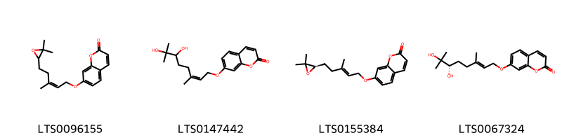{ width=100% }
    <figcaption>Hình ảnh cấu trúc hóa học của 4 hoạt chất thuộc nhóm Coumarins and derivatives gồm ['7-{[5-(3,3-dimethyloxiran-2-yl)-3-methylpent-2-en-1-yl]oxy}chromen-2-one (LTS0096155)', '7-[(6,7-dihydroxy-3,7-dimethyloct-2-en-1-yl)oxy]chromen-2-one (LTS0147442)', '7-{[(2e)-5-[(2r)-3,3-dimethyloxiran-2-yl]-3-methylpent-2-en-1-yl]oxy}chromen-2-one (LTS0155384)', '7-{[(2e,6s)-6,7-dihydroxy-3,7-dimethyloct-2-en-1-yl]oxy}chromen-2-one (LTS0067324)'].</figcaption>
</figure>
#### Nhóm Flavonoids
<figure markdown="span">
    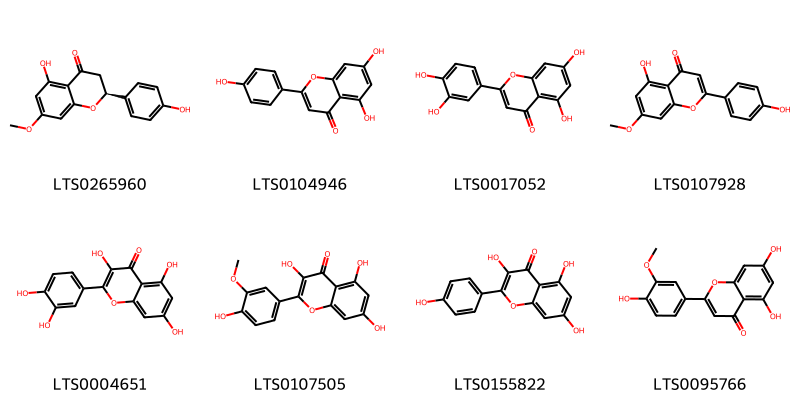{ width=100% }
    <figcaption>Hình ảnh cấu trúc hóa học của 8 hoạt chất thuộc nhóm Flavonoids gồm ['sakuranetin (LTS0265960)', 'chamomile (LTS0104946)', 'luteolin (LTS0017052)', 'genkwanin (LTS0107928)', 'quercetin (LTS0004651)', 'isorhamnetin (LTS0107505)', 'kaempherol (LTS0155822)', 'chrysoeriol (LTS0095766)'].</figcaption>
</figure>
#### Nhóm Prenol lipids
<figure markdown="span">
    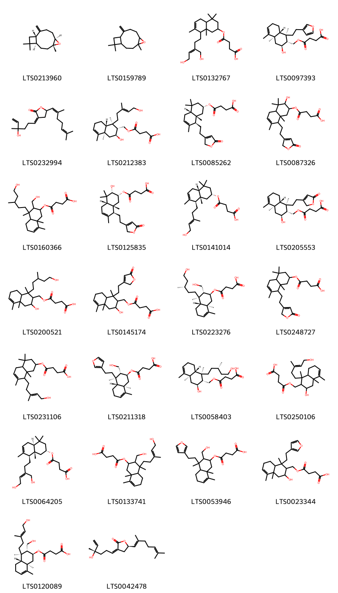{ width=100% }
    <figcaption>Hình ảnh cấu trúc hóa học của 26 hoạt chất thuộc nhóm Prenol lipids gồm ['β-caryophyllene oxide (LTS0213960)', 'caryophyllene oxide (LTS0159789)', '4-({8-[5-hydroxy-3-(hydroxymethyl)pent-3-en-1-yl]-4,4,7,8a-tetramethyl-1,2,3,4a,5,8-hexahydronaphthalen-2-yl}oxy)-4-oxobutanoic acid (LTS0132767)', '4-{[(1r,2r,3s,4ar,8ar)-1-[2-(furan-3-yl)ethyl]-3-hydroxy-1,4a,5-trimethyl-2,3,4,7,8,8a-hexahydronaphthalen-2-yl]methoxy}-4-oxobutanoic acid (LTS0097393)', '5-(2,6-dimethylhepta-1,5-dien-1-yl)-3-(4-hydroxy-4-methylhex-5-en-1-ylidene)oxolan-2-one (LTS0232994)', '4-{[(1r,2r,3s,4ar,8ar)-3-hydroxy-1-[(3e)-5-hydroxy-3-methylpent-3-en-1-yl]-1,4a,5-trimethyl-2,3,4,7,8,8a-hexahydronaphthalen-2-yl]methoxy}-4-oxobutanoic acid (LTS0212383)', '4-{[(2s,4ar,8s,8as)-4,4,7,8a-tetramethyl-8-[2-(5-oxo-2h-furan-3-yl)ethyl]-1,2,3,4a,5,8-hexahydronaphthalen-2-yl]oxy}-4-oxobutanoic acid (LTS0085262)', '4-({3-hydroxy-4,4,7,8a-tetramethyl-8-[2-(5-oxo-2h-furan-3-yl)ethyl]-1,2,3,4a,5,8-hexahydronaphthalen-2-yl}oxy)-4-oxobutanoic acid (LTS0087326)', '4-{[4-(5-hydroxy-3-methylpentyl)-3-(hydroxymethyl)-4,8,8a-trimethyl-1,2,3,4a,5,6-hexahydronaphthalen-2-yl]oxy}-4-oxobutanoic acid (LTS0160366)', '4-{[(2r,3s,4as,8s,8ar)-3-hydroxy-4,4,7,8a-tetramethyl-8-[2-(5-oxo-2h-furan-3-yl)ethyl]-1,2,3,4a,5,8-hexahydronaphthalen-2-yl]oxy}-4-oxobutanoic acid (LTS0125835)', '4-{[(2s,4ar,8s,8as)-8-[(3e)-5-hydroxy-3-methylpent-3-en-1-yl]-4,4,7,8a-tetramethyl-1,2,3,4a,5,8-hexahydronaphthalen-2-yl]oxy}-4-oxobutanoic acid (LTS0141014)', '4-{[(1r,2r,3s,4ar,8ar)-3-hydroxy-1,4a,5-trimethyl-1-[2-(5-oxo-2h-furan-3-yl)ethyl]-2,3,4,7,8,8a-hexahydronaphthalen-2-yl]methoxy}-4-oxobutanoic acid (LTS0205553)', '4-{[3-hydroxy-1-(5-hydroxy-3-methylpentyl)-1,4a,5-trimethyl-2,3,4,7,8,8a-hexahydronaphthalen-2-yl]methoxy}-4-oxobutanoic acid (LTS0200521)', '4-({3-hydroxy-1,4a,5-trimethyl-1-[2-(5-oxo-2h-furan-3-yl)ethyl]-2,3,4,7,8,8a-hexahydronaphthalen-2-yl}methoxy)-4-oxobutanoic acid (LTS0145174)', '4-{[(2s,3r,4r,4ar,8ar)-4-[(3s)-5-hydroxy-3-methylpentyl]-3-(hydroxymethyl)-4,8,8a-trimethyl-1,2,3,4a,5,6-hexahydronaphthalen-2-yl]oxy}-4-oxobutanoic acid (LTS0223276)', '4-({4,4,7,8a-tetramethyl-8-[2-(5-oxo-2h-furan-3-yl)ethyl]-1,2,3,4a,5,8-hexahydronaphthalen-2-yl}oxy)-4-oxobutanoic acid (LTS0248727)', '4-{[8-(5-hydroxy-3-methylpent-3-en-1-yl)-4,4,7,8a-tetramethyl-1,2,3,4a,5,8-hexahydronaphthalen-2-yl]oxy}-4-oxobutanoic acid (LTS0231106)', '4-{[(2s,3r,4r,4ar,8ar)-4-[2-(furan-3-yl)ethyl]-3-(hydroxymethyl)-4,8,8a-trimethyl-1,2,3,4a,5,6-hexahydronaphthalen-2-yl]oxy}-4-oxobutanoic acid (LTS0211318)', '4-{[(1r,2r,3s,4ar,8ar)-3-hydroxy-1-[(3s)-5-hydroxy-3-methylpentyl]-1,4a,5-trimethyl-2,3,4,7,8,8a-hexahydronaphthalen-2-yl]methoxy}-4-oxobutanoic acid (LTS0058403)', '4-{[3-hydroxy-1-(5-hydroxy-3-methylpent-3-en-1-yl)-1,4a,5-trimethyl-2,3,4,7,8,8a-hexahydronaphthalen-2-yl]methoxy}-4-oxobutanoic acid (LTS0250106)', '4-{[(2s,4as,8s,8as)-8-[(3z)-5-hydroxy-3-(hydroxymethyl)pent-3-en-1-yl]-4,4,7,8a-tetramethyl-1,2,3,4a,5,8-hexahydronaphthalen-2-yl]oxy}-4-oxobutanoic acid (LTS0064205)', '4-{[4-(5-hydroxy-3-methylpent-3-en-1-yl)-3-(hydroxymethyl)-4,8,8a-trimethyl-1,2,3,4a,5,6-hexahydronaphthalen-2-yl]oxy}-4-oxobutanoic acid (LTS0133741)', '4-({4-[2-(furan-3-yl)ethyl]-3-(hydroxymethyl)-4,8,8a-trimethyl-1,2,3,4a,5,6-hexahydronaphthalen-2-yl}oxy)-4-oxobutanoic acid (LTS0053946)', '4-({1-[2-(furan-3-yl)ethyl]-3-hydroxy-1,4a,5-trimethyl-2,3,4,7,8,8a-hexahydronaphthalen-2-yl}methoxy)-4-oxobutanoic acid (LTS0023344)', '4-{[(2s,3r,4r,4ar,8ar)-4-[(3e)-5-hydroxy-3-methylpent-3-en-1-yl]-3-(hydroxymethyl)-4,8,8a-trimethyl-1,2,3,4a,5,6-hexahydronaphthalen-2-yl]oxy}-4-oxobutanoic acid (LTS0120089)', '(3z,5r)-5-[(1e)-2,6-dimethylhepta-1,5-dien-1-yl]-3-[(4s)-4-hydroxy-4-methylhex-5-en-1-ylidene]oxolan-2-one (LTS0042478)'].</figcaption>
</figure>

---

### Dược dân tộc học

Danh sách các quốc gia có sử dụng *Baccharis pteronioides* trong điều trị các bệnh. 

| Country       | Disease   | Bệnh                                                                                                                                                                                                |
|:--------------|:----------|:----------------------------------------------------------------------------------------------------------------------------------------------------------------------------------------------------|
| Latin America | Poison    | MYMEMORY WARNING: YOU USED ALL AVAILABLE FREE TRANSLATIONS FOR TODAY. NEXT AVAILABLE IN  11 HOURS 59 MINUTES 40 SECONDS VISIT HTTPS://MYMEMORY.TRANSLATED.NET/DOC/USAGELIMITS.PHP TO TRANSLATE MORE |

---

---
## Baccharis tridentata
### Thông tin về thực vật

!!! info "Phân loại thực vật của *Baccharis tridentata* từ GIBF:"
    - **Kingdom:** Plantae
    - **Phylum:** Tracheophyta
    - **Order:** Asterales
    - **Family:** Asteraceae
    - **Genus:** Baccharis
    - **Species:** *Baccharis tridentata*

 

| Label (VI)   | Label (EN)   | Scientific Name      | Descriptions (VI)   | Descriptions (EN)   | Also Known As (VI)   | Also Known As (EN)   |
|:-------------|:-------------|:---------------------|:--------------------|:--------------------|:---------------------|:---------------------|
| N/A          | N/A          | Baccharis tridentata | loài thực vật       | species of plant    | ['']                 | ['']                 |

#### Phân bố trên thế giới

**Từ CSDL GIBF** Uruguay, Bolivia (Plurinational State of), Brazil, Argentina

#### Phân bố tại Việt Nam

**Từ CSDL GIBF**: Không có ghi nhận ở Việt Nam

---
### Thành phần hóa học
        
- Theo cơ sở dữ liệu lotus: Từ loài *Baccharis tridentata* đã phân lập và xác định được Chưa có hoạt chất nào được phân lập. hoạt chất thuộc về các nhóm Không có hoạt chất nào được phân lập. 

Không có hình ảnh nào được tạo ra

---

### Dược dân tộc học

Danh sách các quốc gia có sử dụng *Baccharis tridentata* trong điều trị các bệnh. 

| Country   | Disease       | Bệnh                                                                                                                                                                                                |
|:----------|:--------------|:----------------------------------------------------------------------------------------------------------------------------------------------------------------------------------------------------|
| Brazil    | Diuretic, nan | MYMEMORY WARNING: YOU USED ALL AVAILABLE FREE TRANSLATIONS FOR TODAY. NEXT AVAILABLE IN  11 HOURS 59 MINUTES 04 SECONDS VISIT HTTPS://MYMEMORY.TRANSLATED.NET/DOC/USAGELIMITS.PHP TO TRANSLATE MORE |

---

---
## Baccharis trimera
### Thông tin về thực vật

!!! info "Phân loại thực vật của *Baccharis trimera* từ GIBF:"
    - **Kingdom:** Plantae
    - **Phylum:** Tracheophyta
    - **Order:** Asterales
    - **Family:** Asteraceae
    - **Genus:** Baccharis
    - **Species:** *Baccharis trimera*

 

| Label (VI)   | Label (EN)   | Scientific Name   | Descriptions (VI)   | Descriptions (EN)   | Also Known As (VI)   | Also Known As (EN)   |
|:-------------|:-------------|:------------------|:--------------------|:--------------------|:---------------------|:---------------------|
| N/A          | N/A          | Baccharis trimera | loài thực vật       | species of plant    | ['']                 | ['']                 |

#### Phân bố trên thế giới

**Từ CSDL GIBF** Uruguay, Bolivia (Plurinational State of), Brazil, Argentina

#### Phân bố tại Việt Nam

**Từ CSDL GIBF**: Không có ghi nhận ở Việt Nam

---
### Thành phần hóa học
        
- Theo cơ sở dữ liệu lotus: Từ loài *Baccharis trimera* đã phân lập và xác định được 16 hoạt chất thuộc về các nhóm Flavonoids, Prenol lipids. 

|    | chemicalTaxonomyClassyfireClass   |   smiles_count |
|---:|:----------------------------------|---------------:|
|  0 | Flavonoids                        |              9 |
|  1 | Prenol lipids                     |              7 |

#### Nhóm Flavonoids
<figure markdown="span">
    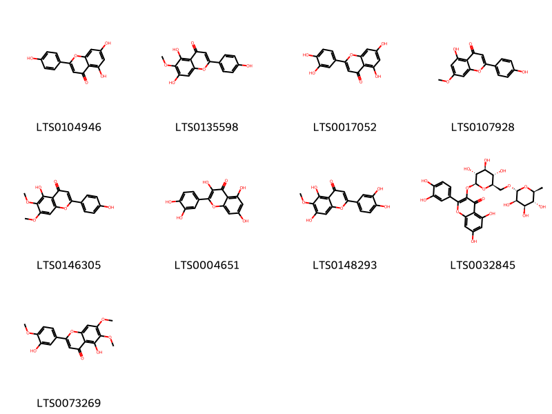{ width=100% }
    <figcaption>Hình ảnh cấu trúc hóa học của 9 hoạt chất thuộc nhóm Flavonoids gồm ['chamomile (LTS0104946)', 'hispidulin (LTS0135598)', 'luteolin (LTS0017052)', 'genkwanin (LTS0107928)', 'cirsimaritin (LTS0146305)', 'quercetin (LTS0004651)', 'nepetin (LTS0148293)', '3-rutinosyl quercetin (LTS0032845)', 'eupatorin (LTS0073269)'].</figcaption>
</figure>
#### Nhóm Prenol lipids
<figure markdown="span">
    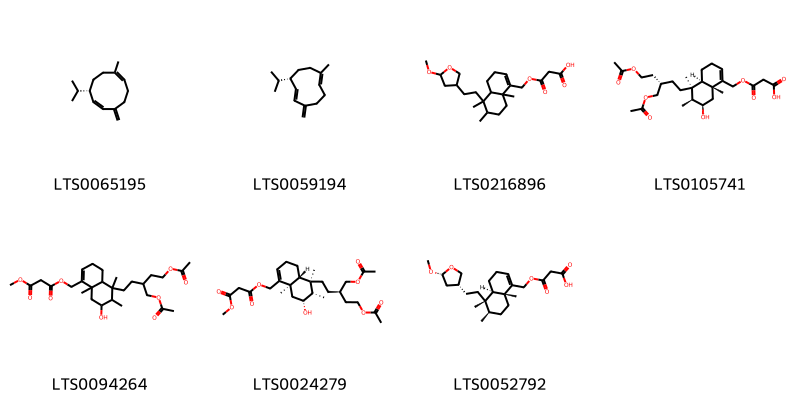{ width=100% }
    <figcaption>Hình ảnh cấu trúc hóa học của 7 hoạt chất thuộc nhóm Prenol lipids gồm ['(1z,6z,8s)-8-isopropyl-1-methyl-5-methylidenecyclodeca-1,6-diene (LTS0065195)', '(-)-germacrene d (LTS0059194)', '3-({5-[2-(5-methoxyoxolan-3-yl)ethyl]-5,6,8a-trimethyl-3,4,4a,6,7,8-hexahydronaphthalen-1-yl}methoxy)-3-oxopropanoic acid (LTS0216896)', '3-{[(4ar,5s,6s,7r,8ar)-5-[(3s)-5-(acetyloxy)-3-[(acetyloxy)methyl]pentyl]-7-hydroxy-5,6,8a-trimethyl-3,4,4a,6,7,8-hexahydronaphthalen-1-yl]methoxy}-3-oxopropanoic acid (LTS0105741)', '1-{5-[5-(acetyloxy)-3-[(acetyloxy)methyl]pentyl]-7-hydroxy-5,6,8a-trimethyl-3,4,4a,6,7,8-hexahydronaphthalen-1-yl}methyl 3-methyl propanedioate (LTS0094264)', '1-[(4ar,5r,6s,7r,8ar)-5-[(3r)-5-(acetyloxy)-3-[(acetyloxy)methyl]pentyl]-7-hydroxy-5,6,8a-trimethyl-3,4,4a,6,7,8-hexahydronaphthalen-1-yl]methyl 3-methyl propanedioate (LTS0024279)', '3-{[(4ar,5s,6r,8ar)-5-{2-[(3r,5r)-5-methoxyoxolan-3-yl]ethyl}-5,6,8a-trimethyl-3,4,4a,6,7,8-hexahydronaphthalen-1-yl]methoxy}-3-oxopropanoic acid (LTS0052792)'].</figcaption>
</figure>

---

### Dược dân tộc học

Danh sách các quốc gia có sử dụng *Baccharis trimera* trong điều trị các bệnh. 

| Country   | Disease       | Bệnh                                                                                                                                                                                                |
|:----------|:--------------|:----------------------------------------------------------------------------------------------------------------------------------------------------------------------------------------------------|
| Paraguay  | Antifertility | MYMEMORY WARNING: YOU USED ALL AVAILABLE FREE TRANSLATIONS FOR TODAY. NEXT AVAILABLE IN  11 HOURS 58 MINUTES 38 SECONDS VISIT HTTPS://MYMEMORY.TRANSLATED.NET/DOC/USAGELIMITS.PHP TO TRANSLATE MORE |

---

---
## Baccharis trinervis
### Thông tin về thực vật

!!! info "Phân loại thực vật của *Baccharis trinervis* từ GIBF:"
    - **Kingdom:** Plantae
    - **Phylum:** Tracheophyta
    - **Order:** Asterales
    - **Family:** Asteraceae
    - **Genus:** Baccharis
    - **Species:** *Baccharis trinervis*

 

| Label (VI)   | Label (EN)   | Scientific Name     | Descriptions (VI)   | Descriptions (EN)   | Also Known As (VI)   | Also Known As (EN)   |
|:-------------|:-------------|:--------------------|:--------------------|:--------------------|:---------------------|:---------------------|
| N/A          | N/A          | Baccharis trinervis | loài thực vật       | species of plant    | ['']                 | ['']                 |

#### Phân bố trên thế giới

**Từ CSDL GIBF** Nicaragua, Ecuador, nan, Colombia, Brazil, Guatemala, Bolivia (Plurinational State of), Costa Rica, Honduras, Peru, Mexico, El Salvador, Venezuela (Bolivarian Republic of), Panama

#### Phân bố tại Việt Nam

**Từ CSDL GIBF**: Không có ghi nhận ở Việt Nam

---
### Thành phần hóa học
        
- Theo cơ sở dữ liệu lotus: Từ loài *Baccharis trinervis* đã phân lập và xác định được 76 hoạt chất thuộc về các nhóm Fatty Acyls, Flavonoids, Prenol lipids, Cinnamic acids and derivatives, Lactones, Coumarins and derivatives. 

|    | chemicalTaxonomyClassyfireClass   |   smiles_count |
|---:|:----------------------------------|---------------:|
|  0 | Cinnamic acids and derivatives    |              2 |
|  1 | Coumarins and derivatives         |              1 |
|  2 | Fatty Acyls                       |             10 |
|  3 | Flavonoids                        |              3 |
|  4 | Lactones                          |              2 |
|  5 | Prenol lipids                     |             58 |

#### Nhóm Cinnamic acids and derivatives
<figure markdown="span">
    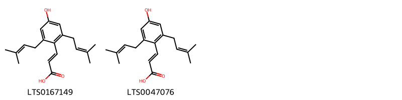{ width=100% }
    <figcaption>Hình ảnh cấu trúc hóa học của 2 hoạt chất thuộc nhóm Cinnamic acids and derivatives gồm ['(2e)-3-[4-hydroxy-2,6-bis(3-methylbut-2-en-1-yl)phenyl]prop-2-enoic acid (LTS0167149)', '3-[4-hydroxy-2,6-bis(3-methylbut-2-en-1-yl)phenyl]prop-2-enoic acid (LTS0047076)'].</figcaption>
</figure>
#### Nhóm Coumarins and derivatives
<figure markdown="span">
    { width=100% }
    <figcaption>Hình ảnh cấu trúc hóa học của 1 hoạt chất thuộc nhóm Coumarins and derivatives gồm ['umbelliferone (LTS0162728)'].</figcaption>
</figure>
#### Nhóm Fatty Acyls
<figure markdown="span">
    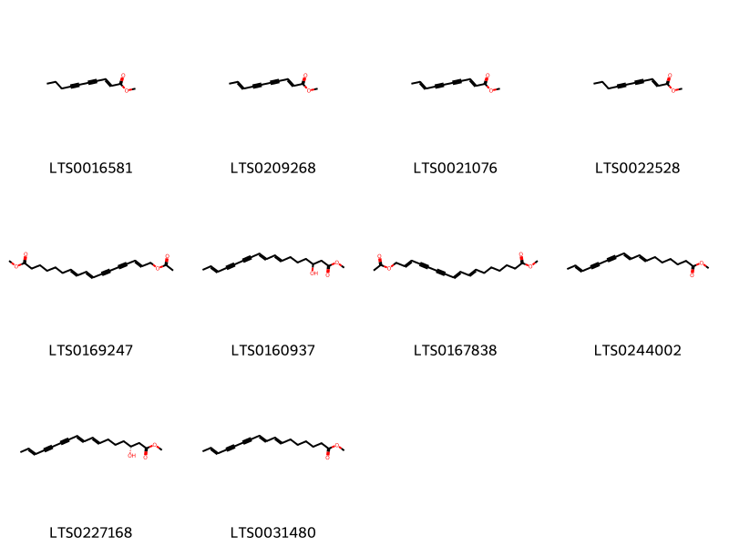{ width=100% }
    <figcaption>Hình ảnh cấu trúc hóa học của 10 hoạt chất thuộc nhóm Fatty Acyls gồm ['lachnophyllum ester (LTS0016581)', 'methyl deca-2,8-dien-4,6-diynoate (LTS0209268)', 'methyl (2e,8e)-deca-2,8-dien-4,6-diynoate (LTS0021076)', 'methyl dec-2-en-4,6-diynoate (LTS0022528)', 'methyl (7e,9e,15e)-17-(acetyloxy)heptadeca-7,9,15-trien-11,13-diynoate (LTS0169247)', 'methyl 3-hydroxyheptadeca-7,9,15-trien-11,13-diynoate (LTS0160937)', 'methyl 17-(acetyloxy)heptadeca-7,9,15-trien-11,13-diynoate (LTS0167838)', 'methyl heptadeca-7,9,15-trien-11,13-diynoate (LTS0244002)', 'methyl (3r,7e,9e,15e)-3-hydroxyheptadeca-7,9,15-trien-11,13-diynoate (LTS0227168)', 'methyl (7e,9e,15e)-heptadeca-7,9,15-trien-11,13-diynoate (LTS0031480)'].</figcaption>
</figure>
#### Nhóm Flavonoids
<figure markdown="span">
    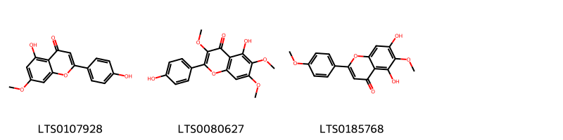{ width=100% }
    <figcaption>Hình ảnh cấu trúc hóa học của 3 hoạt chất thuộc nhóm Flavonoids gồm ['genkwanin (LTS0107928)', 'penduletin (LTS0080627)', 'pectolinarigenin (LTS0185768)'].</figcaption>
</figure>
#### Nhóm Lactones
<figure markdown="span">
    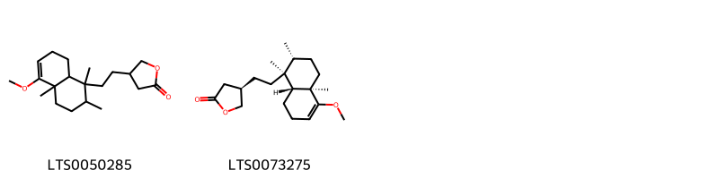{ width=100% }
    <figcaption>Hình ảnh cấu trúc hóa học của 2 hoạt chất thuộc nhóm Lactones gồm ['4-[2-(5-methoxy-1,2,4a-trimethyl-2,3,4,7,8,8a-hexahydronaphthalen-1-yl)ethyl]oxolan-2-one (LTS0050285)', '(4r)-4-{2-[(1s,2r,4ar,8ar)-5-methoxy-1,2,4a-trimethyl-2,3,4,7,8,8a-hexahydronaphthalen-1-yl]ethyl}oxolan-2-one (LTS0073275)'].</figcaption>
</figure>
#### Nhóm Prenol lipids
<figure markdown="span">
    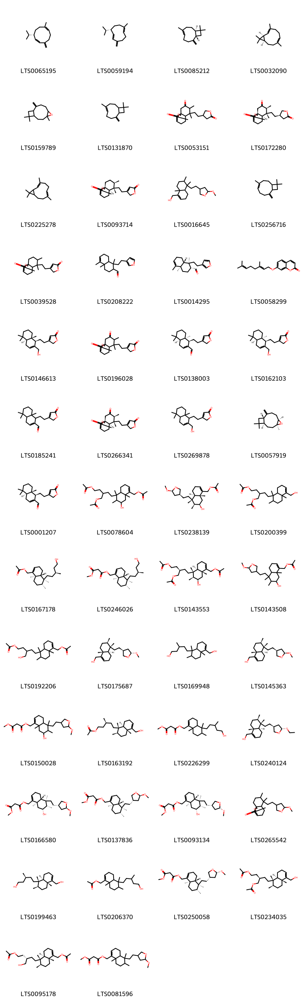{ width=100% }
    <figcaption>Hình ảnh cấu trúc hóa học của 58 hoạt chất thuộc nhóm Prenol lipids gồm ['(1z,6z,8s)-8-isopropyl-1-methyl-5-methylidenecyclodeca-1,6-diene (LTS0065195)', '(-)-germacrene d (LTS0059194)', 'caryophyllene (LTS0085212)', '(1s,2e,10r)-3,7,11,11-tetramethylbicyclo[8.1.0]undeca-2,6-diene (LTS0032090)', 'caryophyllene oxide (LTS0159789)', 'caryophyllene (LTS0131870)', '7,8-dimethyl-7-[2-(5-oxooxolan-3-yl)ethyl]-1h,5h,6h,6ah,8h,10h-naphtho[4,4a-c]furan-3,9-dione (LTS0053151)', '(6ar,7r,8s,10as)-7,8-dimethyl-7-{2-[(3r)-5-oxooxolan-3-yl]ethyl}-1h,5h,6h,6ah,8h,10h-naphtho[4,4a-c]furan-3,9-dione (LTS0172280)', '(2e,6e)-3,7,11,11-tetramethylbicyclo[8.1.0]undeca-2,6-diene (LTS0225278)', '4-{2-[(6ar,7s,8r,10as)-7,8-dimethyl-3-oxo-1h,5h,6h,6ah,8h,9h,10h-naphtho[4,4a-c]furan-7-yl]ethyl}-5h-furan-2-one (LTS0093714)', '{5-[2-(5-methoxyoxolan-3-yl)ethyl]-5,6,8a-trimethyl-3,4,4a,6,7,8-hexahydronaphthalen-1-yl}methanol (LTS0016645)', '4,11,11-trimethyl-8-methylidenebicyclo[7.2.0]undec-4-ene (LTS0256716)', '4-(2-{7,8-dimethyl-3-oxo-1h,5h,6h,6ah,8h,9h,10h-naphtho[4,4a-c]furan-7-yl}ethyl)-5h-furan-2-one (LTS0039528)', '1-[2-(furan-3-yl)ethyl]-1,4a,5-trimethyl-2,3,4,7,8,8a-hexahydronaphthalene-2-carbaldehyde (LTS0208222)', '(1r,2r,4ar,8ar)-1-[2-(furan-3-yl)ethyl]-1,4a,5-trimethyl-2,3,4,7,8,8a-hexahydronaphthalene-2-carbaldehyde (LTS0014295)', 'auraptene (LTS0058299)', '4-{2-[(1r,4as,8as)-2-(hydroxymethyl)-5,5,8a-trimethyl-1,4,4a,6,7,8-hexahydronaphthalen-1-yl]ethyl}-5h-furan-2-one (LTS0146613)', '7,8-dimethyl-7-[2-(5-oxo-2h-furan-3-yl)ethyl]-1h,5h,6h,6ah,8h,10h-naphtho[4,4a-c]furan-3,9-dione (LTS0196028)', '(1r,4as,8ar)-5,5,8a-trimethyl-1-[2-(5-oxo-2h-furan-3-yl)ethyl]-1,4,4a,6,7,8-hexahydronaphthalene-2-carbaldehyde (LTS0138003)', '4-{2-[(1r,4as,8ar)-2-(hydroxymethyl)-5,5,8a-trimethyl-1,4,4a,6,7,8-hexahydronaphthalen-1-yl]ethyl}-5h-furan-2-one (LTS0162103)', '5,5,8a-trimethyl-1-[2-(5-oxo-2h-furan-3-yl)ethyl]-1,4,4a,6,7,8-hexahydronaphthalene-2-carbaldehyde (LTS0185241)', '(6ar,7r,8s,10as)-7,8-dimethyl-7-[2-(5-oxo-2h-furan-3-yl)ethyl]-1h,5h,6h,6ah,8h,10h-naphtho[4,4a-c]furan-3,9-dione (LTS0266341)', '4-{2-[2-(hydroxymethyl)-5,5,8a-trimethyl-1,4,4a,6,7,8-hexahydronaphthalen-1-yl]ethyl}-5h-furan-2-one (LTS0269878)', '(1r,4s,6r,10s)-4,12,12-trimethyl-9-methylidene-5-oxatricyclo[8.2.0.0⁴,⁶]dodecane (LTS0057919)', '(1r,4as,8as)-5,5,8a-trimethyl-1-[2-(5-oxo-2h-furan-3-yl)ethyl]-1,4,4a,6,7,8-hexahydronaphthalene-2-carbaldehyde (LTS0001207)', '4-(acetyloxy)-2-(2-{5-[(acetyloxy)methyl]-3-hydroxy-1,2,4a-trimethyl-2,3,4,7,8,8a-hexahydronaphthalen-1-yl}ethyl)butyl acetate (LTS0078604)', '[(4ar,5r,6s,7r,8ar)-7-hydroxy-5-{2-[(3s,5s)-5-methoxyoxolan-3-yl]ethyl}-5,6,8a-trimethyl-3,4,4a,6,7,8-hexahydronaphthalen-1-yl]methyl acetate (LTS0238139)', '4-(acetyloxy)-2-{2-[5-(hydroxymethyl)-1,2,4a-trimethyl-2,3,4,7,8,8a-hexahydronaphthalen-1-yl]ethyl}butyl acetate (LTS0200399)', '[(4ar,5s,6r,8ar)-5-[(3s)-5-hydroxy-3-methylpentyl]-5,6,8a-trimethyl-3,4,4a,6,7,8-hexahydronaphthalen-1-yl]methyl acetate (LTS0167178)', '1-[(4ar,5s,6r,8ar)-5-[(3s)-5-hydroxy-3-methylpentyl]-5,6,8a-trimethyl-3,4,4a,6,7,8-hexahydronaphthalen-1-yl]methyl 3-methyl propanedioate (LTS0246026)', '(2r)-2-{2-[(1r,2s,3r,4ar,8ar)-5-[(acetyloxy)methyl]-3-hydroxy-1,2,4a-trimethyl-2,3,4,7,8,8a-hexahydronaphthalen-1-yl]ethyl}-4-(acetyloxy)butyl acetate (LTS0143553)', '{7-hydroxy-5-[2-(5-methoxyoxolan-3-yl)ethyl]-5,6,8a-trimethyl-3,4,4a,6,7,8-hexahydronaphthalen-1-yl}methyl acetate (LTS0143508)', '3-(2-{5-[(acetyloxy)methyl]-1,2,4a-trimethyl-2,3,4,7,8,8a-hexahydronaphthalen-1-yl}ethyl)-4-hydroxybutyl acetate (LTS0192206)', '[(4ar,5s,6r,8ar)-5-{2-[(3s,5r)-5-methoxyoxolan-3-yl]ethyl}-5,6,8a-trimethyl-3,4,4a,6,7,8-hexahydronaphthalen-1-yl]methanol (LTS0175687)', '5-[5-(hydroxymethyl)-1,2,4a-trimethyl-2,3,4,7,8,8a-hexahydronaphthalen-1-yl]-3-methylpentan-1-ol (LTS0169948)', '[(4ar,5s,6r,8ar)-5-{2-[(3s,5s)-5-methoxyoxolan-3-yl]ethyl}-5,6,8a-trimethyl-3,4,4a,6,7,8-hexahydronaphthalen-1-yl]methanol (LTS0145363)', '1-{7-hydroxy-5-[2-(5-methoxyoxolan-3-yl)ethyl]-5,6,8a-trimethyl-3,4,4a,6,7,8-hexahydronaphthalen-1-yl}methyl 3-methyl propanedioate (LTS0150028)', '(3s)-5-[(1s,2r,4ar,8ar)-5-(hydroxymethyl)-1,2,4a-trimethyl-2,3,4,7,8,8a-hexahydronaphthalen-1-yl]-3-methylpentyl acetate (LTS0163192)', '1-[5-(5-hydroxy-3-methylpentyl)-5,6,8a-trimethyl-3,4,4a,6,7,8-hexahydronaphthalen-1-yl]methyl 3-methyl propanedioate (LTS0226299)', '[(4ar,5s,6r,8ar)-5-{2-[(3s,5r)-5-ethoxyoxolan-3-yl]ethyl}-5,6,8a-trimethyl-3,4,4a,6,7,8-hexahydronaphthalen-1-yl]methanol (LTS0240124)', '1-[(4ar,5r,6s,7r,8ar)-7-hydroxy-5-{2-[(3s,5r)-5-methoxyoxolan-3-yl]ethyl}-5,6,8a-trimethyl-3,4,4a,6,7,8-hexahydronaphthalen-1-yl]methyl 3-methyl propanedioate (LTS0166580)', '1-[(4ar,5s,6r,8ar)-5-{2-[(3s,5r)-5-methoxyoxolan-3-yl]ethyl}-5,6,8a-trimethyl-3,4,4a,6,7,8-hexahydronaphthalen-1-yl]methyl 3-methyl propanedioate (LTS0137836)', '1-[(4ar,5r,6s,7r,8ar)-7-hydroxy-5-{2-[(3s,5s)-5-methoxyoxolan-3-yl]ethyl}-5,6,8a-trimethyl-3,4,4a,6,7,8-hexahydronaphthalen-1-yl]methyl 3-methyl propanedioate (LTS0093134)', '7-[2-(5-methoxyoxolan-3-yl)ethyl]-7,8-dimethyl-1h,5h,6h,6ah,8h,9h,10h-naphtho[4,4a-c]furan-3-one (LTS0265542)', '(3s)-5-[(1s,2r,4ar,8ar)-5-(hydroxymethyl)-1,2,4a-trimethyl-2,3,4,7,8,8a-hexahydronaphthalen-1-yl]-3-methylpentan-1-ol (LTS0199463)', '[5-(5-hydroxy-3-methylpentyl)-5,6,8a-trimethyl-3,4,4a,6,7,8-hexahydronaphthalen-1-yl]methyl acetate (LTS0206370)', '1-[(4ar,5s,6r,8ar)-5-{2-[(3s,5s)-5-methoxyoxolan-3-yl]ethyl}-5,6,8a-trimethyl-3,4,4a,6,7,8-hexahydronaphthalen-1-yl]methyl 3-methyl propanedioate (LTS0250058)', '(2r)-2-{2-[(1s,2r,4ar,8ar)-5-(hydroxymethyl)-1,2,4a-trimethyl-2,3,4,7,8,8a-hexahydronaphthalen-1-yl]ethyl}-4-(acetyloxy)butyl acetate (LTS0234035)', '(3s)-3-{2-[(1s,2r,4ar,8ar)-5-[(acetyloxy)methyl]-1,2,4a-trimethyl-2,3,4,7,8,8a-hexahydronaphthalen-1-yl]ethyl}-4-hydroxybutyl acetate (LTS0095178)', '1-{5-[2-(5-methoxyoxolan-3-yl)ethyl]-5,6,8a-trimethyl-3,4,4a,6,7,8-hexahydronaphthalen-1-yl}methyl 3-methyl propanedioate (LTS0081596)', '4-(2-{7,8-dimethyl-3-oxo-1h,5h,6h,6ah,8h,9h,10h-naphtho[4,4a-c]furan-7-yl}ethyl)oxolan-2-one (LTS0027227)', '[(4ar,5r,6s,7r,8ar)-7-hydroxy-5-{2-[(3s,5r)-5-methoxyoxolan-3-yl]ethyl}-5,6,8a-trimethyl-3,4,4a,6,7,8-hexahydronaphthalen-1-yl]methyl acetate (LTS0232820)', '[(4ar,5s,6r,8ar)-5-{2-[(3s,5s)-5-ethoxyoxolan-3-yl]ethyl}-5,6,8a-trimethyl-3,4,4a,6,7,8-hexahydronaphthalen-1-yl]methanol (LTS0064148)', '{5-[2-(5-ethoxyoxolan-3-yl)ethyl]-5,6,8a-trimethyl-3,4,4a,6,7,8-hexahydronaphthalen-1-yl}methanol (LTS0052826)', '5-[5-(hydroxymethyl)-1,2,4a-trimethyl-2,3,4,7,8,8a-hexahydronaphthalen-1-yl]-3-methylpentyl acetate (LTS0127657)', '(4r)-4-{2-[(6ar,7s,8r,10as)-7,8-dimethyl-3-oxo-1h,5h,6h,6ah,8h,9h,10h-naphtho[4,4a-c]furan-7-yl]ethyl}oxolan-2-one (LTS0061860)', '(6ar,7s,8r,10as)-7-{2-[(3s,5r)-5-methoxyoxolan-3-yl]ethyl}-7,8-dimethyl-1h,5h,6h,6ah,8h,9h,10h-naphtho[4,4a-c]furan-3-one (LTS0018202)', '(6ar,7s,8r,10as)-7-{2-[(3s,5s)-5-methoxyoxolan-3-yl]ethyl}-7,8-dimethyl-1h,5h,6h,6ah,8h,9h,10h-naphtho[4,4a-c]furan-3-one (LTS0056277)'].</figcaption>
</figure>

---

### Dược dân tộc học

Danh sách các quốc gia có sử dụng *Baccharis trinervis* trong điều trị các bệnh. 

| Country   | Disease               | Bệnh                                                                                                                                                                                                |
|:----------|:----------------------|:----------------------------------------------------------------------------------------------------------------------------------------------------------------------------------------------------|
| Panama    | Antiseptic, Digestive | MYMEMORY WARNING: YOU USED ALL AVAILABLE FREE TRANSLATIONS FOR TODAY. NEXT AVAILABLE IN  11 HOURS 58 MINUTES 06 SECONDS VISIT HTTPS://MYMEMORY.TRANSLATED.NET/DOC/USAGELIMITS.PHP TO TRANSLATE MORE |

---

# Chi Helenium

??? note "Danh sách các dược liệu thuộc chi"
    
	 - *Helenium autumnale*
	 - *Helenium hoopesii*
	 - *Helenium mexicanum*
	 - *Helenium puberulum*
	 - *Helenium quadridentatum*
	 - *Helenium scorzoneraefolium*

---
## Helenium autumnale
### Thông tin về thực vật

!!! info "Phân loại thực vật của *Helenium autumnale* từ GIBF:"
    - **Kingdom:** Plantae
    - **Phylum:** Tracheophyta
    - **Order:** Asterales
    - **Family:** Asteraceae
    - **Genus:** Helenium
    - **Species:** *Helenium autumnale*

 

| Label (VI)   | Label (EN)   | Scientific Name    | Descriptions (VI)   | Descriptions (EN)   | Also Known As (VI)   | Also Known As (EN)                                                                                           |
|:-------------|:-------------|:-------------------|:--------------------|:--------------------|:---------------------|:-------------------------------------------------------------------------------------------------------------|
| N/A          | N/A          | Helenium autumnale | loài thực vật       | species of plant    | ['']                 | ['sneezeweed', 'false sunflower', 'common sneezeweed', 'bitterweed', 'autumn sneezeweed', 'fall sneezeweed'] |

#### Phân bố trên thế giới

**Từ CSDL GIBF** United States of America, Canada

#### Phân bố tại Việt Nam

**Từ CSDL GIBF**: Không có ghi nhận ở Việt Nam

---
### Thành phần hóa học
        
- Theo cơ sở dữ liệu lotus: Từ loài *Helenium autumnale* đã phân lập và xác định được 54 hoạt chất thuộc về các nhóm Fatty Acyls, Flavonoids, Prenol lipids, Steroids and steroid derivatives, Unsaturated hydrocarbons, Lactones, Organooxygen compounds. 

|    | chemicalTaxonomyClassyfireClass   |   smiles_count |
|---:|:----------------------------------|---------------:|
|  0 | Fatty Acyls                       |              3 |
|  1 | Flavonoids                        |              1 |
|  2 | Lactones                          |              4 |
|  3 | Organooxygen compounds            |              3 |
|  4 | Prenol lipids                     |             40 |
|  5 | Steroids and steroid derivatives  |              2 |
|  6 | Unsaturated hydrocarbons          |              1 |

#### Nhóm Fatty Acyls
<figure markdown="span">
    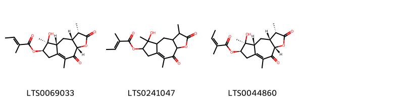{ width=100% }
    <figcaption>Hình ảnh cấu trúc hóa học của 3 hoạt chất thuộc nhóm Fatty Acyls gồm ['(3s,3ar,4ar,5s,6r,9as)-5-hydroxy-3,5,8-trimethyl-2,9-dioxo-3h,3ah,4h,4ah,6h,7h,9ah-azuleno[6,5-b]furan-6-yl (2e)-2-methylbut-2-enoate (LTS0069033)', '5-hydroxy-3,5,8-trimethyl-2,9-dioxo-3h,3ah,4h,4ah,6h,7h,9ah-azuleno[6,5-b]furan-6-yl 2-methylbut-2-enoate (LTS0241047)', '(3s,3ar,4ar,5s,6r,9as)-5-hydroxy-3,5,8-trimethyl-2,9-dioxo-3h,3ah,4h,4ah,6h,7h,9ah-azuleno[6,5-b]furan-6-yl (2z)-2-methylbut-2-enoate (LTS0044860)'].</figcaption>
</figure>
#### Nhóm Flavonoids
<figure markdown="span">
    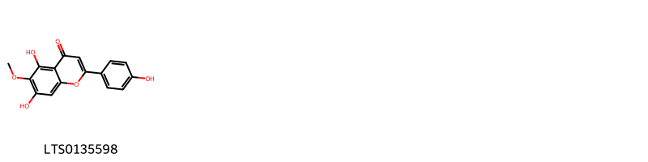{ width=100% }
    <figcaption>Hình ảnh cấu trúc hóa học của 1 hoạt chất thuộc nhóm Flavonoids gồm ['hispidulin (LTS0135598)'].</figcaption>
</figure>
#### Nhóm Lactones
<figure markdown="span">
    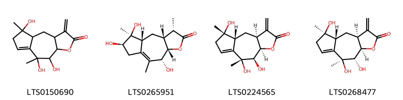{ width=100% }
    <figcaption>Hình ảnh cấu trúc hóa học của 4 hoạt chất thuộc nhóm Lactones gồm ['5,8,9-trihydroxy-5,8-dimethyl-3-methylidene-3ah,4h,4ah,6h,9h,9ah-azuleno[6,5-b]furan-2-one (LTS0150690)', '(3s,3ar,4ar,5s,6r,9r,9as)-5,6,9-trihydroxy-3,5,8-trimethyl-3h,3ah,4h,4ah,6h,7h,9h,9ah-azuleno[6,5-b]furan-2-one (LTS0265951)', '(3as,4ar,5s,8r,9r,9ar)-5,8,9-trihydroxy-5,8-dimethyl-3-methylidene-3ah,4h,4ah,6h,9h,9ah-azuleno[6,5-b]furan-2-one (LTS0224565)', '(3as,4ar,5r,8s,9s,9ar)-5,8,9-trihydroxy-5,8-dimethyl-3-methylidene-3ah,4h,4ah,6h,9h,9ah-azuleno[6,5-b]furan-2-one (LTS0268477)'].</figcaption>
</figure>
#### Nhóm Organooxygen compounds
<figure markdown="span">
    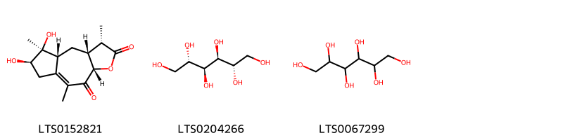{ width=100% }
    <figcaption>Hình ảnh cấu trúc hóa học của 3 hoạt chất thuộc nhóm Organooxygen compounds gồm ['(3s,3ar,4ar,5s,6r,9as)-5,6-dihydroxy-3,5,8-trimethyl-3h,3ah,4h,4ah,6h,7h,9ah-azuleno[6,5-b]furan-2,9-dione (LTS0152821)', 'mannite (LTS0204266)', 'sorbo (LTS0067299)'].</figcaption>
</figure>
#### Nhóm Prenol lipids
<figure markdown="span">
    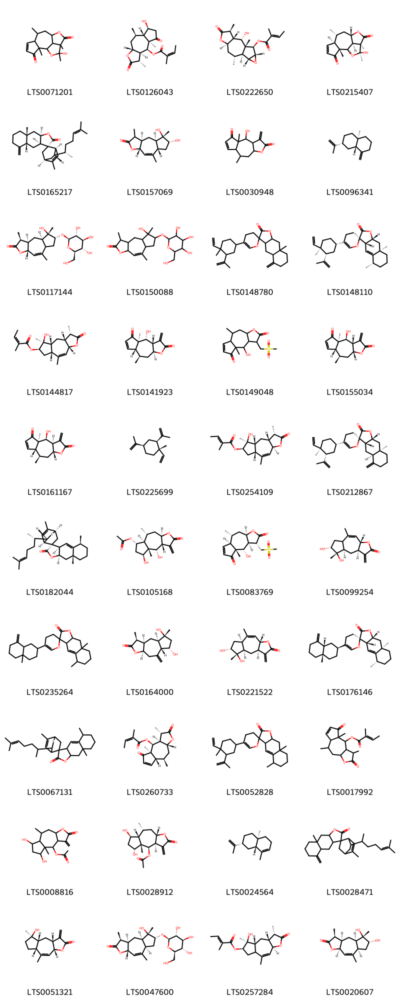{ width=100% }
    <figcaption>Hình ảnh cấu trúc hóa học của 40 hoạt chất thuộc nhóm Prenol lipids gồm ['tenulin (LTS0071201)', '(3s,3as,4s,4ar,7s,7as,8r,9ar)-7-hydroxy-3,4a,8-trimethyl-2,5-dioxo-octahydro-3h-azuleno[6,5-b]furan-4-yl (2z)-2-methylbut-2-enoate (LTS0126043)', '(1r,2s,3r,4s,7r,9r,10s,11r,13r,14r)-2-hydroxy-1,4,9-trimethyl-5-oxo-6,12-dioxatetracyclo[8.4.0.0³,⁷.0¹¹,¹³]tetradecan-14-yl (2e)-2-methylbut-2-enoate (LTS0222650)', '(1r,2r,6r,7r,9s,12r,13s,15r)-13-hydroxy-2,7,12,13-tetramethyl-10,14-dioxatetracyclo[7.5.1.0²,⁶.0¹²,¹⁵]pentadec-4-ene-3,11-dione (LTS0215407)', "(1r,2s,3'ar,4r,4'ar,7s,8'ar,9'ar)-5,8'a-dimethyl-7-[(2s)-6-methylhept-5-en-2-yl]-5'-methylidene-3'a,4',4'a,6',7',8',9',9'a-octahydrospiro[bicyclo[2.2.2]octane-2,3'-naphtho[2,3-b]fura]-5-en-2'-one (LTS0165217)", '(3ar,4ar,5s,6r,7as,9ar)-5,6-dihydroxy-3,5,8-trimethyl-3h,3ah,4h,4ah,6h,7h,7ah,9ah-azuleno[6,5-b]furan-2-one (LTS0157069)', 'mexicanin-1 (LTS0030948)', 'β-selinene (LTS0096341)', '(3s,3ar,4ar,5s,6r,9ar)-5-hydroxy-3,5,8-trimethyl-6-{[(2s,3r,4s,5s,6r)-3,4,5-trihydroxy-6-(hydroxymethyl)oxan-2-yl]oxy}-3h,3ah,4h,4ah,6h,7h,7ah,9ah-azuleno[6,5-b]furan-2-one (LTS0117144)', '5-hydroxy-3,5,8-trimethyl-6-{[3,4,5-trihydroxy-6-(hydroxymethyl)oxan-2-yl]oxy}-3h,3ah,4h,4ah,6h,7h,7ah,9ah-azuleno[6,5-b]furan-2-one (LTS0150088)', "5'-[4-ethenyl-4-methyl-3-(prop-1-en-2-yl)cyclohexyl]-8a-methyl-5-methylidene-3',3a,4,4',4a,6,7,8,9,9a-decahydrospiro[naphtho[2,3-b]furan-3,2'-pyran]-2-one (LTS0148780)", "(3r,3as,5s,8ar,9ar)-5'-[(1s,3r,4r)-4-ethenyl-4-methyl-3-(prop-1-en-2-yl)cyclohexyl]-5,8a-dimethyl-3',4',5,6,7,8,9,9a-octahydro-3ah-spiro[naphtho[2,3-b]furan-3,2'-pyran]-2-one (LTS0148110)", '(3s,3ar,4ar,5s,6r,7ar,9as)-5-hydroxy-3,5,8-trimethyl-2-oxo-3h,3ah,4h,4ah,6h,7h,7ah,9ah-azuleno[6,5-b]furan-6-yl (2z)-2-methylbut-2-enoate (LTS0144817)', 'mexicanin i (LTS0141923)', '4-hydroxy-3-(methanesulfonylmethyl)-4a,8-dimethyl-3h,3ah,4h,7ah,8h,9h,9ah-azuleno[6,5-b]furan-2,5-dione (LTS0149048)', 'helenalin (LTS0155034)', '(3ar,4s,4ar,7ar,8r,9ar)-4-hydroxy-4a,8-dimethyl-3-methylidene-3ah,4h,7ah,8h,9h,9ah-azuleno[6,5-b]furan-2,5-dione (LTS0161167)', 'β-elemene (LTS0225699)', '(3s,3ar,4ar,5s,6r,7ar,9ar)-5-hydroxy-3,5,8-trimethyl-2-oxo-3h,3ah,4h,4ah,6h,7h,7ah,9ah-azuleno[6,5-b]furan-6-yl (2e)-2-methylbut-2-enoate (LTS0254109)', "(3r,3as,4ar,8ar,9ar)-5'-[(1s,3r,4r)-4-ethenyl-4-methyl-3-(prop-1-en-2-yl)cyclohexyl]-8a-methyl-5-methylidene-3',3a,4,4',4a,6,7,8,9,9a-decahydrospiro[naphtho[2,3-b]furan-3,2'-pyran]-2-one (LTS0212867)", "(1r,2s,3'ar,4r,5's,7s,8'ar,9'ar)-5,5',8'a-trimethyl-7-[(2s)-6-methylhept-5-en-2-yl]-5',6',7',8',9',9'a-hexahydro-3'ah-spiro[bicyclo[2.2.2]octane-2,3'-naphtho[2,3-b]fura]-5-en-2'-one (LTS0182044)", '(3ar,4s,4as,5s,7s,7as,8r,9ar)-4,5-dihydroxy-4a,8-dimethyl-3-methylidene-2-oxo-octahydro-3ah-azuleno[6,5-b]furan-7-yl acetate (LTS0105168)', '(3r,3as,4s,4ar,7ar,8r,9ar)-4-hydroxy-3-(methanesulfonylmethyl)-4a,8-dimethyl-3h,3ah,4h,7ah,8h,9h,9ah-azuleno[6,5-b]furan-2,5-dione (LTS0083769)', '(3ar,4ar,5s,6r,9as)-5,6-dihydroxy-5,8-dimethyl-3-methylidene-3ah,4h,4ah,6h,7h,7ah,9ah-azuleno[6,5-b]furan-2-one (LTS0099254)', "5'-(4a-methyl-8-methylidene-octahydronaphthalen-2-yl)-5,8a-dimethyl-3',4',5,6,7,8,9,9a-octahydro-3ah-spiro[naphtho[2,3-b]furan-3,2'-pyran]-2-one (LTS0235264)", '(3s,3ar,4ar,5r,7s,7as,9ar)-5,7-dihydroxy-3,5-dimethyl-8-methylidene-octahydro-3h-azuleno[6,5-b]furan-2-one (LTS0164000)', '(3ar,4ar,5s,6r,7ar,9as)-5,6-dihydroxy-5,8-dimethyl-3-methylidene-3ah,4h,4ah,6h,7h,7ah,9ah-azuleno[6,5-b]furan-2-one (LTS0221522)', "(3r,3as,5s,8ar,9ar)-5'-[(2s,4as,8as)-4a-methyl-8-methylidene-octahydronaphthalen-2-yl]-5,8a-dimethyl-3',4',5,6,7,8,9,9a-octahydro-3ah-spiro[naphtho[2,3-b]furan-3,2'-pyran]-2-one (LTS0176146)", "5,5',8'a-trimethyl-7-(6-methylhept-5-en-2-yl)-5',6',7',8',9',9'a-hexahydro-3'ah-spiro[bicyclo[2.2.2]octane-2,3'-naphtho[2,3-b]fura]-5-en-2'-one (LTS0067131)", '(3s,3as,4s,4ar,7ar,8r,9ar)-3,4a,8-trimethyl-2,5-dioxo-3h,3ah,4h,7ah,8h,9h,9ah-azuleno[6,5-b]furan-4-yl (2z)-2-methylbut-2-enoate (LTS0260733)', "5'-[4-ethenyl-4-methyl-3-(prop-1-en-2-yl)cyclohexyl]-5,8a-dimethyl-3',4',5,6,7,8,9,9a-octahydro-3ah-spiro[naphtho[2,3-b]furan-3,2'-pyran]-2-one (LTS0052828)", '3,4a,8-trimethyl-2,5-dioxo-3h,3ah,4h,7ah,8h,9h,9ah-azuleno[6,5-b]furan-4-yl (2e)-2-methylbut-2-enoate (LTS0017992)', '5,7-dihydroxy-4a,8-dimethyl-3-methylidene-2-oxo-octahydro-3ah-azuleno[6,5-b]furan-4-yl acetate (LTS0008816)', '(3ar,4r,4as,5r,7r,7ar,8r,9as)-5,7-dihydroxy-4a,8-dimethyl-3-methylidene-2-oxo-octahydro-3ah-azuleno[6,5-b]furan-4-yl acetate (LTS0028912)', 'α-selinene (LTS0024564)', "5,8'a-dimethyl-7-(6-methylhept-5-en-2-yl)-5'-methylidene-3'a,4',4'a,6',7',8',9',9'a-octahydrospiro[bicyclo[2.2.2]octane-2,3'-naphtho[2,3-b]fura]-5-en-2'-one (LTS0028471)", '(3ar,4ar,5r,7ar,9ar)-5-hydroxy-5,8-dimethyl-3-methylidene-3ah,4h,4ah,6h,7h,7ah,9ah-azuleno[6,5-b]furan-2-one (LTS0051321)', '(3s,3ar,4ar,5s,6r,7ar,9ar)-5-hydroxy-3,5,8-trimethyl-6-{[(2s,3r,4s,5s,6r)-3,4,5-trihydroxy-6-(hydroxymethyl)oxan-2-yl]oxy}-3h,3ah,4h,4ah,6h,7h,7ah,9ah-azuleno[6,5-b]furan-2-one (LTS0047600)', '(3s,3ar,4ar,5s,6r,9ar)-5-hydroxy-3,5,8-trimethyl-2-oxo-3h,3ah,4h,4ah,6h,7h,7ah,9ah-azuleno[6,5-b]furan-6-yl (2e)-2-methylbut-2-enoate (LTS0257284)', '(3s,3ar,4ar,5s,6r,7ar,9as)-5,6-dihydroxy-3,5,8-trimethyl-3h,3ah,4h,4ah,6h,7h,7ah,9ah-azuleno[6,5-b]furan-2-one (LTS0020607)'].</figcaption>
</figure>
#### Nhóm Steroids and steroid derivatives
<figure markdown="span">
    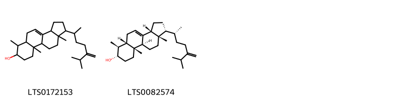{ width=100% }
    <figcaption>Hình ảnh cấu trúc hóa học của 2 hoạt chất thuộc nhóm Steroids and steroid derivatives gồm ['6,9a,11a-trimethyl-1-(6-methyl-5-methylideneheptan-2-yl)-1h,2h,3h,3ah,5h,5ah,6h,7h,8h,9h,9bh,10h,11h-cyclopenta[a]phenanthren-7-ol (LTS0172153)', '(1r,3ar,5as,6s,7s,9ar,9bs,11as)-6,9a,11a-trimethyl-1-[(2r)-6-methyl-5-methylideneheptan-2-yl]-1h,2h,3h,3ah,5h,5ah,6h,7h,8h,9h,9bh,10h,11h-cyclopenta[a]phenanthren-7-ol (LTS0082574)'].</figcaption>
</figure>
#### Nhóm Unsaturated hydrocarbons
<figure markdown="span">
    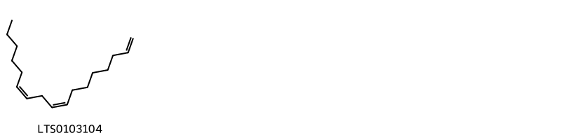{ width=100% }
    <figcaption>Hình ảnh cấu trúc hóa học của 1 hoạt chất thuộc nhóm Unsaturated hydrocarbons gồm ['(8z,11z)-heptadeca-1,8,11-triene (LTS0103104)'].</figcaption>
</figure>

---

### Dược dân tộc học

Danh sách các quốc gia có sử dụng *Helenium autumnale* trong điều trị các bệnh. 

| Country   | Disease                                                       | Bệnh                                                                                                                                                                                                |
|:----------|:--------------------------------------------------------------|:----------------------------------------------------------------------------------------------------------------------------------------------------------------------------------------------------|
| US        | Decongestant, Insecticide, Sternutatory, Vermifuge, Piscicide | MYMEMORY WARNING: YOU USED ALL AVAILABLE FREE TRANSLATIONS FOR TODAY. NEXT AVAILABLE IN  11 HOURS 57 MINUTES 33 SECONDS VISIT HTTPS://MYMEMORY.TRANSLATED.NET/DOC/USAGELIMITS.PHP TO TRANSLATE MORE |

---

---
## Helenium hoopesii
### Thông tin về thực vật

!!! info "Phân loại thực vật của *Hymenoxys hoopesii* từ GIBF:"
    - **Kingdom:** Plantae
    - **Phylum:** Tracheophyta
    - **Order:** Asterales
    - **Family:** Asteraceae
    - **Genus:** Hymenoxys
    - **Species:** *Hymenoxys hoopesii*

 

| Label (VI)   | Label (EN)   | Scientific Name   | Descriptions (VI)   | Descriptions (EN)   | Also Known As (VI)   | Also Known As (EN)   |
|:-------------|:-------------|:------------------|:--------------------|:--------------------|:---------------------|:---------------------|
| N/A          | N/A          | Helenium hoopesii | loài thực vật       | species of plant    | ['']                 | ['']                 |

#### Phân bố trên thế giới

**Từ CSDL GIBF** Belgium, Norway, United States of America, Mexico

#### Phân bố tại Việt Nam

**Từ CSDL GIBF**: Không có ghi nhận ở Việt Nam

---
### Thành phần hóa học
        
- Theo cơ sở dữ liệu lotus: Từ loài *Hymenoxys hoopesii* đã phân lập và xác định được Chưa có hoạt chất nào được phân lập. hoạt chất thuộc về các nhóm Không có hoạt chất nào được phân lập. 

Không có hình ảnh nào được tạo ra

---

### Dược dân tộc học

Danh sách các quốc gia có sử dụng *Hymenoxys hoopesii* trong điều trị các bệnh. 

| Country   | Disease   | Bệnh                                                                                                                                                                                                |
|:----------|:----------|:----------------------------------------------------------------------------------------------------------------------------------------------------------------------------------------------------|
| US        | Vermifuge | MYMEMORY WARNING: YOU USED ALL AVAILABLE FREE TRANSLATIONS FOR TODAY. NEXT AVAILABLE IN  11 HOURS 57 MINUTES 01 SECONDS VISIT HTTPS://MYMEMORY.TRANSLATED.NET/DOC/USAGELIMITS.PHP TO TRANSLATE MORE |

---

---
## Helenium mexicanum
### Thông tin về thực vật

!!! info "Phân loại thực vật của *Helenium mexicanum* từ GIBF:"
    - **Kingdom:** Plantae
    - **Phylum:** Tracheophyta
    - **Order:** Asterales
    - **Family:** Asteraceae
    - **Genus:** Helenium
    - **Species:** *Helenium mexicanum*

 

| Label (VI)   | Label (EN)   | Scientific Name    | Descriptions (VI)   | Descriptions (EN)   | Also Known As (VI)   | Also Known As (EN)   |
|:-------------|:-------------|:-------------------|:--------------------|:--------------------|:---------------------|:---------------------|
| N/A          | N/A          | Helenium mexicanum | loài thực vật       | species of plant    | ['']                 | ['']                 |

#### Phân bố trên thế giới

**Từ CSDL GIBF** nan, Portugal, Honduras, Mexico

#### Phân bố tại Việt Nam

**Từ CSDL GIBF**: Không có ghi nhận ở Việt Nam

---
### Thành phần hóa học
        
- Theo cơ sở dữ liệu lotus: Từ loài *Helenium mexicanum* đã phân lập và xác định được 13 hoạt chất thuộc về các nhóm Lactones, Prenol lipids. 

|    | chemicalTaxonomyClassyfireClass   |   smiles_count |
|---:|:----------------------------------|---------------:|
|  0 | Lactones                          |              1 |
|  1 | Prenol lipids                     |             12 |

#### Nhóm Lactones
<figure markdown="span">
    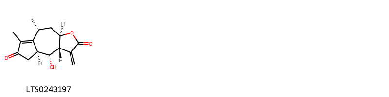{ width=100% }
    <figcaption>Hình ảnh cấu trúc hóa học của 1 hoạt chất thuộc nhóm Lactones gồm ['(3ar,4r,4as,8r,9ar)-4-hydroxy-7,8-dimethyl-3-methylidene-3ah,4h,4ah,5h,8h,9h,9ah-azuleno[6,5-b]furan-2,6-dione (LTS0243197)'].</figcaption>
</figure>
#### Nhóm Prenol lipids
<figure markdown="span">
    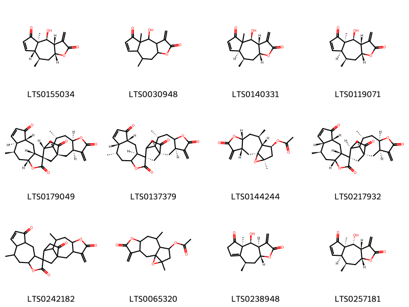{ width=100% }
    <figcaption>Hình ảnh cấu trúc hóa học của 12 hoạt chất thuộc nhóm Prenol lipids gồm ['helenalin (LTS0155034)', 'mexicanin-1 (LTS0030948)', '(3as,4s,7as,8r,9ar)-4-hydroxy-4a,8-dimethyl-3-methylidene-3ah,4h,7ah,8h,9h,9ah-azuleno[6,5-b]furan-2,5-dione (LTS0140331)', '(3as,4s,4ar,7as,8r,9ar)-4-hydroxy-4a,8-dimethyl-3-methylidene-3ah,4h,7ah,8h,9h,9ah-azuleno[6,5-b]furan-2,5-dione (LTS0119071)', "(1'r,3s,3'r,3ar,4ar,7'r,7as,8r,9'r,9ar,10's,11'r)-8,9'-dimethyl-4'-methylidene-4,4a,7a,8,9,9a-hexahydro-3ah-6'-oxaspiro[azuleno[6,5-b]furan-3,12'-tetracyclo[9.2.2.0¹,¹⁰.0³,⁷]pentadecane]-2,5,5',14'-tetrone (LTS0179049)", "(1's,3r,3'r,3as,4ar,7ar,8s,9'r,10'r)-8,9'-dimethyl-4'-methylidene-4,4a,7a,8,9,9a-hexahydro-3ah-6'-oxaspiro[azuleno[6,5-b]furan-3,12'-tetracyclo[9.2.2.0¹,¹⁰.0³,⁷]pentadecane]-2,5,5',14'-tetrone (LTS0137379)", '(1s,3r,7r,9r,10r,11s,13r)-9,13-dimethyl-4-methylidene-5-oxo-6,14-dioxatetracyclo[8.4.0.0¹,¹³.0³,⁷]tetradecan-11-yl acetate (LTS0144244)', "(1's,3r,3'r,3ar,4ar,7'r,7ar,8r,9'r,9ar,10'r,11's)-8,9'-dimethyl-4'-methylidene-4,4a,7a,8,9,9a-hexahydro-3ah-6'-oxaspiro[azuleno[6,5-b]furan-3,12'-tetracyclo[9.2.2.0¹,¹⁰.0³,⁷]pentadecane]-2,5,5',14'-tetrone (LTS0217932)", "8,9'-dimethyl-4'-methylidene-4,4a,7a,8,9,9a-hexahydro-3ah-6'-oxaspiro[azuleno[6,5-b]furan-3,12'-tetracyclo[9.2.2.0¹,¹⁰.0³,⁷]pentadecane]-2,5,5',14'-tetrone (LTS0242182)", '9,13-dimethyl-4-methylidene-5-oxo-6,14-dioxatetracyclo[8.4.0.0¹,¹³.0³,⁷]tetradecan-11-yl acetate (LTS0065320)', '(3ar,4s,4ar,8r,9ar)-4-hydroxy-4a,8-dimethyl-3-methylidene-3ah,4h,6h,8h,9h,9ah-azuleno[6,5-b]furan-2,5-dione (LTS0238948)', '(3as,4r,4ar,7as,8r,9ar)-4-hydroxy-4a,8-dimethyl-3-methylidene-3ah,4h,7ah,8h,9h,9ah-azuleno[6,5-b]furan-2,5-dione (LTS0257181)'].</figcaption>
</figure>

---

### Dược dân tộc học

Danh sách các quốc gia có sử dụng *Helenium mexicanum* trong điều trị các bệnh. 

| Country   | Disease                    | Bệnh                                                                                                                                                                                                |
|:----------|:---------------------------|:----------------------------------------------------------------------------------------------------------------------------------------------------------------------------------------------------|
| Mexico    | Pediculicide, Sternutatory | MYMEMORY WARNING: YOU USED ALL AVAILABLE FREE TRANSLATIONS FOR TODAY. NEXT AVAILABLE IN  11 HOURS 56 MINUTES 32 SECONDS VISIT HTTPS://MYMEMORY.TRANSLATED.NET/DOC/USAGELIMITS.PHP TO TRANSLATE MORE |

---

---
## Helenium puberulum
### Thông tin về thực vật

!!! info "Phân loại thực vật của *Helenium puberulum* từ GIBF:"
    - **Kingdom:** Plantae
    - **Phylum:** Tracheophyta
    - **Order:** Asterales
    - **Family:** Asteraceae
    - **Genus:** Helenium
    - **Species:** *Helenium puberulum*

 

| Label (VI)   | Label (EN)   | Scientific Name    | Descriptions (VI)   | Descriptions (EN)   | Also Known As (VI)   | Also Known As (EN)   |
|:-------------|:-------------|:-------------------|:--------------------|:--------------------|:---------------------|:---------------------|
| N/A          | N/A          | Helenium puberulum | loài thực vật       | species of plant    | ['']                 | ['rosilla']          |

#### Phân bố trên thế giới

**Từ CSDL GIBF** United States of America, Mexico

#### Phân bố tại Việt Nam

**Từ CSDL GIBF**: Không có ghi nhận ở Việt Nam

---
### Thành phần hóa học
        
- Theo cơ sở dữ liệu lotus: Từ loài *Helenium puberulum* đã phân lập và xác định được 17 hoạt chất thuộc về các nhóm Prenol lipids. 

|    | chemicalTaxonomyClassyfireClass   |   smiles_count |
|---:|:----------------------------------|---------------:|
|  0 | Prenol lipids                     |             17 |

#### Nhóm Prenol lipids
<figure markdown="span">
    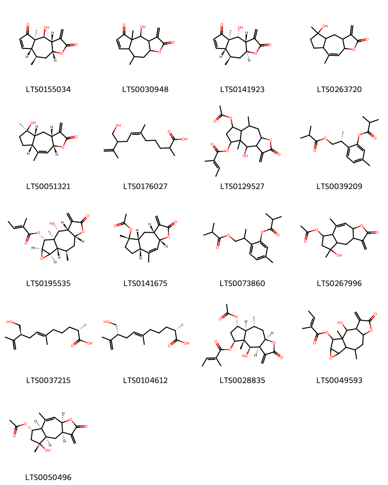{ width=100% }
    <figcaption>Hình ảnh cấu trúc hóa học của 17 hoạt chất thuộc nhóm Prenol lipids gồm ['helenalin (LTS0155034)', 'mexicanin-1 (LTS0030948)', 'mexicanin i (LTS0141923)', '5-hydroxy-5,8-dimethyl-3-methylidene-3ah,4h,4ah,6h,7h,7ah,9ah-azuleno[6,5-b]furan-2-one (LTS0263720)', '(3ar,4ar,5r,7ar,9ar)-5-hydroxy-5,8-dimethyl-3-methylidene-3ah,4h,4ah,6h,7h,7ah,9ah-azuleno[6,5-b]furan-2-one (LTS0051321)', '9-(hydroxymethyl)-2,6,10-trimethylundeca-6,10-dienoic acid (LTS0176027)', '7-(acetyloxy)-4-hydroxy-4a,8-dimethyl-3-methylidene-2-oxo-octahydro-3ah-azuleno[6,5-b]furan-5-yl 2-methylbut-2-enoate (LTS0129527)', '(2r)-2-{4-methyl-2-[(2-methylpropanoyl)oxy]phenyl}propyl 2-methylpropanoate (LTS0039209)', '(1r,2r,3s,7r,9r,10s,11r,13r,14r)-2-hydroxy-1,9-dimethyl-4-methylidene-5-oxo-6,12-dioxatetracyclo[8.4.0.0³,⁷.0¹¹,¹³]tetradecan-14-yl (2e)-2-methylbut-2-enoate (LTS0195535)', '(3ar,4ar,5s,7ar,9ar)-5,8-dimethyl-3-methylidene-2-oxo-3ah,4h,4ah,6h,7h,7ah,9ah-azuleno[6,5-b]furan-5-yl acetate (LTS0141675)', '2-{4-methyl-2-[(2-methylpropanoyl)oxy]phenyl}propyl 2-methylpropanoate (LTS0073860)', '5-hydroxy-5,8-dimethyl-3-methylidene-2-oxo-3ah,4h,4ah,6h,7h,7ah,9ah-azuleno[6,5-b]furan-7-yl acetate (LTS0267996)', '(2s,6e,9s)-9-(hydroxymethyl)-2,6,10-trimethylundeca-6,10-dienoic acid (LTS0037215)', '(2s,6e,9r)-9-(hydroxymethyl)-2,6,10-trimethylundeca-6,10-dienoic acid (LTS0104612)', '(3as,4r,4ar,5s,7s,7as,8r,9ar)-7-(acetyloxy)-4-hydroxy-4a,8-dimethyl-3-methylidene-2-oxo-octahydro-3ah-azuleno[6,5-b]furan-5-yl (2e)-2-methylbut-2-enoate (LTS0028835)', '2-hydroxy-1,9-dimethyl-4-methylidene-5-oxo-6,12-dioxatetracyclo[8.4.0.0³,⁷.0¹¹,¹³]tetradecan-14-yl 2-methylbut-2-enoate (LTS0049593)', '(3ar,4ar,5r,7s,7ar,9ar)-5-hydroxy-5,8-dimethyl-3-methylidene-2-oxo-3ah,4h,4ah,6h,7h,7ah,9ah-azuleno[6,5-b]furan-7-yl acetate (LTS0050496)'].</figcaption>
</figure>

---

### Dược dân tộc học

Danh sách các quốc gia có sử dụng *Helenium puberulum* trong điều trị các bệnh. 

| Country   | Disease              | Bệnh                                                                                                                                                                                                |
|:----------|:---------------------|:----------------------------------------------------------------------------------------------------------------------------------------------------------------------------------------------------|
| US        | Antiscorbutic, Tonic | MYMEMORY WARNING: YOU USED ALL AVAILABLE FREE TRANSLATIONS FOR TODAY. NEXT AVAILABLE IN  11 HOURS 55 MINUTES 57 SECONDS VISIT HTTPS://MYMEMORY.TRANSLATED.NET/DOC/USAGELIMITS.PHP TO TRANSLATE MORE |

---

---
## Helenium quadridentatum
### Thông tin về thực vật

!!! info "Phân loại thực vật của *Helenium quadridentatum* từ GIBF:"
    - **Kingdom:** Plantae
    - **Phylum:** Tracheophyta
    - **Order:** Asterales
    - **Family:** Asteraceae
    - **Genus:** Helenium
    - **Species:** *Helenium quadridentatum*

 

| Label (VI)   | Label (EN)   | Scientific Name         | Descriptions (VI)   | Descriptions (EN)   | Also Known As (VI)   | Also Known As (EN)   |
|:-------------|:-------------|:------------------------|:--------------------|:--------------------|:---------------------|:---------------------|
| N/A          | N/A          | Helenium quadridentatum | loài thực vật       | species of plant    | ['']                 | ['']                 |

#### Phân bố trên thế giới

**Từ CSDL GIBF** Cuba, United States of America, Mexico

#### Phân bố tại Việt Nam

**Từ CSDL GIBF**: Không có ghi nhận ở Việt Nam

---
### Thành phần hóa học
        
- Theo cơ sở dữ liệu lotus: Từ loài *Helenium quadridentatum* đã phân lập và xác định được 5 hoạt chất thuộc về các nhóm Prenol lipids. 

|    | chemicalTaxonomyClassyfireClass   |   smiles_count |
|---:|:----------------------------------|---------------:|
|  0 | Prenol lipids                     |              5 |

#### Nhóm Prenol lipids
<figure markdown="span">
    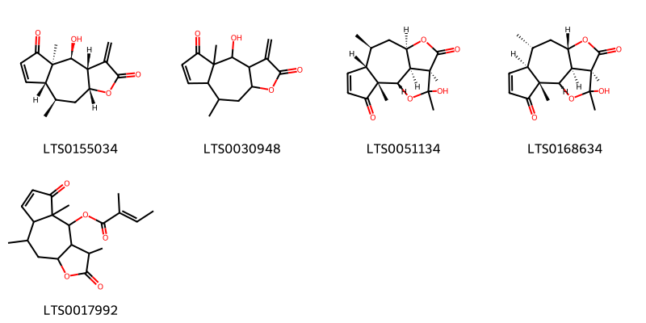{ width=100% }
    <figcaption>Hình ảnh cấu trúc hóa học của 5 hoạt chất thuộc nhóm Prenol lipids gồm ['helenalin (LTS0155034)', 'mexicanin-1 (LTS0030948)', '(1s,2r,6s,7s,9r,12r,15r)-13-hydroxy-2,7,12,13-tetramethyl-10,14-dioxatetracyclo[7.5.1.0²,⁶.0¹²,¹⁵]pentadec-4-ene-3,11-dione (LTS0051134)', 'tenulin (LTS0168634)', '3,4a,8-trimethyl-2,5-dioxo-3h,3ah,4h,7ah,8h,9h,9ah-azuleno[6,5-b]furan-4-yl (2e)-2-methylbut-2-enoate (LTS0017992)'].</figcaption>
</figure>

---

### Dược dân tộc học

Danh sách các quốc gia có sử dụng *Helenium quadridentatum* trong điều trị các bệnh. 

| Country   | Disease                | Bệnh                                                                                                                                                                                                |
|:----------|:-----------------------|:----------------------------------------------------------------------------------------------------------------------------------------------------------------------------------------------------|
| Mexico    | Diuretic, Sternutatory | MYMEMORY WARNING: YOU USED ALL AVAILABLE FREE TRANSLATIONS FOR TODAY. NEXT AVAILABLE IN  11 HOURS 55 MINUTES 27 SECONDS VISIT HTTPS://MYMEMORY.TRANSLATED.NET/DOC/USAGELIMITS.PHP TO TRANSLATE MORE |

---

---
## Helenium scorzoneraefolium
### Thông tin về thực vật

!!! info "Phân loại thực vật của *Helenium scorzonerifolium* từ GIBF:"
    - **Kingdom:** Plantae
    - **Phylum:** Tracheophyta
    - **Order:** Asterales
    - **Family:** Asteraceae
    - **Genus:** Helenium
    - **Species:** *Helenium scorzonerifolium*

 

| Label (VI)   | Label (EN)   | Scientific Name            | Descriptions (VI)   | Descriptions (EN)   | Also Known As (VI)   | Also Known As (EN)   |
|:-------------|:-------------|:---------------------------|:--------------------|:--------------------|:---------------------|:---------------------|
| N/A          | N/A          | Helenium scorzoneraefolium | loài thực vật       | species of plant    | ['']                 | ['']                 |

#### Phân bố trên thế giới

**Từ CSDL GIBF** nan, Mexico

#### Phân bố tại Việt Nam

**Từ CSDL GIBF**: Không có ghi nhận ở Việt Nam

---
### Thành phần hóa học
        
- Theo cơ sở dữ liệu lotus: Từ loài *Helenium scorzonerifolium* đã phân lập và xác định được Chưa có hoạt chất nào được phân lập. hoạt chất thuộc về các nhóm Không có hoạt chất nào được phân lập. 

Không có hình ảnh nào được tạo ra

---

### Dược dân tộc học

Danh sách các quốc gia có sử dụng *Helenium scorzonerifolium* trong điều trị các bệnh. 

| Country   | Disease      | Bệnh                                                                                                                                                                                                |
|:----------|:-------------|:----------------------------------------------------------------------------------------------------------------------------------------------------------------------------------------------------|
| Mexico    | Sternutatory | MYMEMORY WARNING: YOU USED ALL AVAILABLE FREE TRANSLATIONS FOR TODAY. NEXT AVAILABLE IN  11 HOURS 54 MINUTES 59 SECONDS VISIT HTTPS://MYMEMORY.TRANSLATED.NET/DOC/USAGELIMITS.PHP TO TRANSLATE MORE |

---

# Chi Hypochoeris

??? note "Danh sách các dược liệu thuộc chi"
    
	 - *Hypochoeris acaulis*
	 - *Hypochoeris glabra*
	 - *Hypochoeris microcephala*
	 - *Hypochoeris scorzonerae*

---
## Hypochoeris acaulis
### Thông tin về thực vật

!!! info "Phân loại thực vật của *Hypochaeris acaulis* từ GIBF:"
    - **Kingdom:** Plantae
    - **Phylum:** Tracheophyta
    - **Order:** Asterales
    - **Family:** Asteraceae
    - **Genus:** Hypochaeris
    - **Species:** *Hypochaeris acaulis*

 

| Label (VI)   | Label (EN)   | Scientific Name            | Descriptions (VI)   | Descriptions (EN)   | Also Known As (VI)   | Also Known As (EN)   |
|:-------------|:-------------|:---------------------------|:--------------------|:--------------------|:---------------------|:---------------------|
| N/A          | N/A          | Helenium scorzoneraefolium | loài thực vật       | species of plant    | ['']                 | ['']                 |

#### Phân bố trên thế giới

**Từ CSDL GIBF** nan, Bolivia (Plurinational State of), Argentina, Peru, Chile, China

#### Phân bố tại Việt Nam

**Từ CSDL GIBF**: Không có ghi nhận ở Việt Nam

---
### Thành phần hóa học
        
- Theo cơ sở dữ liệu lotus: Từ loài *Hypochaeris acaulis* đã phân lập và xác định được Chưa có hoạt chất nào được phân lập. hoạt chất thuộc về các nhóm Không có hoạt chất nào được phân lập. 

Không có hình ảnh nào được tạo ra

---

### Dược dân tộc học

Danh sách các quốc gia có sử dụng *Hypochaeris acaulis* trong điều trị các bệnh. 

| Country   | Disease                | Bệnh                                                                                                                                                                                                |
|:----------|:-----------------------|:----------------------------------------------------------------------------------------------------------------------------------------------------------------------------------------------------|
| Venezuela | Refrigerant, Sudorific | MYMEMORY WARNING: YOU USED ALL AVAILABLE FREE TRANSLATIONS FOR TODAY. NEXT AVAILABLE IN  11 HOURS 54 MINUTES 38 SECONDS VISIT HTTPS://MYMEMORY.TRANSLATED.NET/DOC/USAGELIMITS.PHP TO TRANSLATE MORE |

---

---
## Hypochoeris glabra
### Thông tin về thực vật

!!! info "Phân loại thực vật của *Hypochoeris glabra* từ GIBF:"
    - **Kingdom:** Plantae
    - **Phylum:** Tracheophyta
    - **Order:** Asterales
    - **Family:** Asteraceae
    - **Genus:** Hypochoeris
    - **Species:** *Hypochoeris glabra*

 

| Label (VI)   | Label (EN)   | Scientific Name            | Descriptions (VI)   | Descriptions (EN)   | Also Known As (VI)   | Also Known As (EN)   |
|:-------------|:-------------|:---------------------------|:--------------------|:--------------------|:---------------------|:---------------------|
| N/A          | N/A          | Helenium scorzoneraefolium | loài thực vật       | species of plant    | ['']                 | ['']                 |

#### Phân bố trên thế giới

**Từ CSDL GIBF** Bulgaria, Japan, Brazil, Spain, Portugal, Morocco, United States of America, Poland, France, Slovenia, Israel, Chile

#### Phân bố tại Việt Nam

**Từ CSDL GIBF**: Không có ghi nhận ở Việt Nam

---
### Thành phần hóa học
        
- Theo cơ sở dữ liệu lotus: Từ loài *Hypochoeris glabra* đã phân lập và xác định được Chưa có hoạt chất nào được phân lập. hoạt chất thuộc về các nhóm Không có hoạt chất nào được phân lập. 

Không có hình ảnh nào được tạo ra

---

### Dược dân tộc học

Danh sách các quốc gia có sử dụng *Hypochoeris glabra* trong điều trị các bệnh. 

| Country   | Disease                                          | Bệnh                                                                                                                                                                                                |
|:----------|:-------------------------------------------------|:----------------------------------------------------------------------------------------------------------------------------------------------------------------------------------------------------|
| Elsewhere | Aperient, Diuretic, Vulnerary, Astringent, Tonic | MYMEMORY WARNING: YOU USED ALL AVAILABLE FREE TRANSLATIONS FOR TODAY. NEXT AVAILABLE IN  11 HOURS 54 MINUTES 16 SECONDS VISIT HTTPS://MYMEMORY.TRANSLATED.NET/DOC/USAGELIMITS.PHP TO TRANSLATE MORE |

---

---
## Hypochoeris microcephala
### Thông tin về thực vật

!!! info "Phân loại thực vật của *Hypochaeris microcephala* từ GIBF:"
    - **Kingdom:** Plantae
    - **Phylum:** Tracheophyta
    - **Order:** Asterales
    - **Family:** Asteraceae
    - **Genus:** Hypochaeris
    - **Species:** *Hypochaeris microcephala*

 

| Label (VI)   | Label (EN)   | Scientific Name            | Descriptions (VI)   | Descriptions (EN)   | Also Known As (VI)   | Also Known As (EN)   |
|:-------------|:-------------|:---------------------------|:--------------------|:--------------------|:---------------------|:---------------------|
| N/A          | N/A          | Helenium scorzoneraefolium | loài thực vật       | species of plant    | ['']                 | ['']                 |

#### Phân bố trên thế giới

**Từ CSDL GIBF** nan, Ecuador, Puerto Rico, Australia, Brazil, Chinese Taipei, Argentina, Bolivia (Plurinational State of), United States of America, Uruguay, Paraguay, Chile

#### Phân bố tại Việt Nam

**Từ CSDL GIBF**: Không có ghi nhận ở Việt Nam

---
### Thành phần hóa học
        
- Theo cơ sở dữ liệu lotus: Từ loài *Hypochaeris microcephala* đã phân lập và xác định được Chưa có hoạt chất nào được phân lập. hoạt chất thuộc về các nhóm Không có hoạt chất nào được phân lập. 

Không có hình ảnh nào được tạo ra

---

### Dược dân tộc học

Danh sách các quốc gia có sử dụng *Hypochaeris microcephala* trong điều trị các bệnh. 

| Country   | Disease       | Bệnh                                                                                                                                                                                                |
|:----------|:--------------|:----------------------------------------------------------------------------------------------------------------------------------------------------------------------------------------------------|
| Paraguay  | Antifertility | MYMEMORY WARNING: YOU USED ALL AVAILABLE FREE TRANSLATIONS FOR TODAY. NEXT AVAILABLE IN  11 HOURS 53 MINUTES 45 SECONDS VISIT HTTPS://MYMEMORY.TRANSLATED.NET/DOC/USAGELIMITS.PHP TO TRANSLATE MORE |

---

---
## Hypochoeris scorzonerae
### Thông tin về thực vật

!!! info "Phân loại thực vật của *Hypochaeris scorzonerae* từ GIBF:"
    - **Kingdom:** Plantae
    - **Phylum:** Tracheophyta
    - **Order:** Asterales
    - **Family:** Asteraceae
    - **Genus:** Hypochaeris
    - **Species:** *Hypochaeris scorzonerae*

 

| Label (VI)   | Label (EN)   | Scientific Name            | Descriptions (VI)   | Descriptions (EN)   | Also Known As (VI)   | Also Known As (EN)   |
|:-------------|:-------------|:---------------------------|:--------------------|:--------------------|:---------------------|:---------------------|
| N/A          | N/A          | Helenium scorzoneraefolium | loài thực vật       | species of plant    | ['']                 | ['']                 |

#### Phân bố trên thế giới

**Từ CSDL GIBF** Chile, nan

#### Phân bố tại Việt Nam

**Từ CSDL GIBF**: Không có ghi nhận ở Việt Nam

---
### Thành phần hóa học
        
- Theo cơ sở dữ liệu lotus: Từ loài *Hypochaeris scorzonerae* đã phân lập và xác định được Chưa có hoạt chất nào được phân lập. hoạt chất thuộc về các nhóm Không có hoạt chất nào được phân lập. 

Không có hình ảnh nào được tạo ra

---

### Dược dân tộc học

Danh sách các quốc gia có sử dụng *Hypochaeris scorzonerae* trong điều trị các bệnh. 

| Country   | Disease   | Bệnh                                                                                                                                                                                                |
|:----------|:----------|:----------------------------------------------------------------------------------------------------------------------------------------------------------------------------------------------------|
| Chile     | Diuretic  | MYMEMORY WARNING: YOU USED ALL AVAILABLE FREE TRANSLATIONS FOR TODAY. NEXT AVAILABLE IN  11 HOURS 53 MINUTES 18 SECONDS VISIT HTTPS://MYMEMORY.TRANSLATED.NET/DOC/USAGELIMITS.PHP TO TRANSLATE MORE |

---

# Chi Chondrilla

??? note "Danh sách các dược liệu thuộc chi"
    
	 - *Chondrilla juncea*

---
## Chondrilla juncea
### Thông tin về thực vật

!!! info "Phân loại thực vật của *Chondrilla juncea* từ GIBF:"
    - **Kingdom:** Plantae
    - **Phylum:** Tracheophyta
    - **Order:** Asterales
    - **Family:** Asteraceae
    - **Genus:** Chondrilla
    - **Species:** *Chondrilla juncea*

 

| Label (VI)   | Label (EN)   | Scientific Name   | Descriptions (VI)   | Descriptions (EN)   | Also Known As (VI)   | Also Known As (EN)   |
|:-------------|:-------------|:------------------|:--------------------|:--------------------|:---------------------|:---------------------|
| N/A          | N/A          | Chondrilla juncea | loài thực vật       | species of plant    | ['']                 | ['gum succory']      |

#### Phân bố trên thế giới

**Từ CSDL GIBF** Italy, Australia, Moldova, Republic of, Belgium, Slovakia, Argentina, Canada, Ukraine, Netherlands, Spain, Hungary, Portugal, Russian Federation, United States of America, Croatia, Greece, Montenegro, Czechia, Germany, Switzerland, Austria, France, Poland

#### Phân bố tại Việt Nam

**Từ CSDL GIBF**: Không có ghi nhận ở Việt Nam

---
### Thành phần hóa học
        
- Theo cơ sở dữ liệu lotus: Từ loài *Chondrilla juncea* đã phân lập và xác định được 13 hoạt chất thuộc về các nhóm Flavonoids, Prenol lipids, Cinnamic acids and derivatives, Benzene and substituted derivatives, Organooxygen compounds, Coumarins and derivatives. 

|    | chemicalTaxonomyClassyfireClass     |   smiles_count |
|---:|:------------------------------------|---------------:|
|  0 | Benzene and substituted derivatives |              1 |
|  1 | Cinnamic acids and derivatives      |              3 |
|  2 | Coumarins and derivatives           |              2 |
|  3 | Flavonoids                          |              3 |
|  4 | Organooxygen compounds              |              2 |
|  5 | Prenol lipids                       |              2 |

#### Nhóm Benzene and substituted derivatives
<figure markdown="span">
    { width=100% }
    <figcaption>Hình ảnh cấu trúc hóa học của 1 hoạt chất thuộc nhóm Benzene and substituted derivatives gồm ['3,4-dihydroxybenzoic acid (LTS0018765)'].</figcaption>
</figure>
#### Nhóm Cinnamic acids and derivatives
<figure markdown="span">
    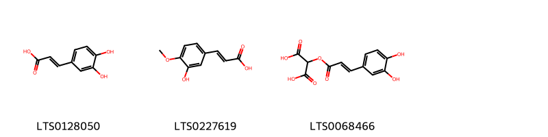{ width=100% }
    <figcaption>Hình ảnh cấu trúc hóa học của 3 hoạt chất thuộc nhóm Cinnamic acids and derivatives gồm ['3,4-dihydroxycinnamic acid (LTS0128050)', 'isoferulic acid (LTS0227619)', '2-{[(2e)-3-(3,4-dihydroxyphenyl)prop-2-enoyl]oxy}propanedioic acid (LTS0068466)'].</figcaption>
</figure>
#### Nhóm Coumarins and derivatives
<figure markdown="span">
    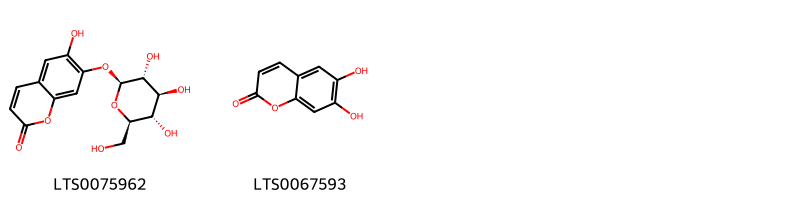{ width=100% }
    <figcaption>Hình ảnh cấu trúc hóa học của 2 hoạt chất thuộc nhóm Coumarins and derivatives gồm ['cichoriin (LTS0075962)', 'esculetin (LTS0067593)'].</figcaption>
</figure>
#### Nhóm Flavonoids
<figure markdown="span">
    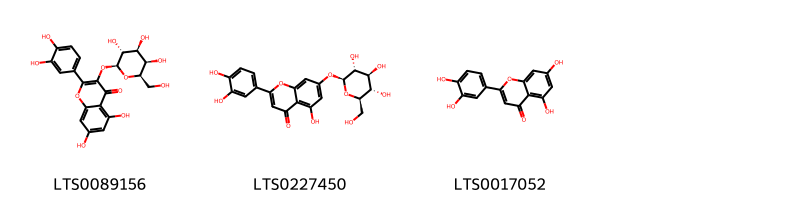{ width=100% }
    <figcaption>Hình ảnh cấu trúc hóa học của 3 hoạt chất thuộc nhóm Flavonoids gồm ['hyperoside (LTS0089156)', 'luteolin 7-o-glucoside (LTS0227450)', 'luteolin (LTS0017052)'].</figcaption>
</figure>
#### Nhóm Organooxygen compounds
<figure markdown="span">
    { width=100% }
    <figcaption>Hình ảnh cấu trúc hóa học của 2 hoạt chất thuộc nhóm Organooxygen compounds gồm ['(1s,3s,4r,5s)-3-{[(2e)-3-(3,4-dihydroxyphenyl)prop-2-enoyl]oxy}-1,4,5-trihydroxycyclohexane-1-carboxylic acid (LTS0154386)', 'chlorogenic acid (LTS0226495)'].</figcaption>
</figure>
#### Nhóm Prenol lipids
<figure markdown="span">
    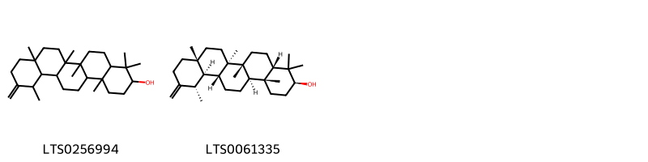{ width=100% }
    <figcaption>Hình ảnh cấu trúc hóa học của 2 hoạt chất thuộc nhóm Prenol lipids gồm ['4,4,6a,6b,8a,12,14b-heptamethyl-11-methylidene-hexadecahydropicen-3-ol (LTS0256994)', '(3s,4as,6ar,6br,8ar,12s,12ar,12br,14ar,14br)-4,4,6a,6b,8a,12,14b-heptamethyl-11-methylidene-hexadecahydropicen-3-ol (LTS0061335)'].</figcaption>
</figure>

---

### Dược dân tộc học

Danh sách các quốc gia có sử dụng *Chondrilla juncea* trong điều trị các bệnh. 

| Country   | Disease   | Bệnh                                                                                                                                                                                                |
|:----------|:----------|:----------------------------------------------------------------------------------------------------------------------------------------------------------------------------------------------------|
| ain       | Apertif   | MYMEMORY WARNING: YOU USED ALL AVAILABLE FREE TRANSLATIONS FOR TODAY. NEXT AVAILABLE IN  11 HOURS 52 MINUTES 52 SECONDS VISIT HTTPS://MYMEMORY.TRANSLATED.NET/DOC/USAGELIMITS.PHP TO TRANSLATE MORE |

---

# Chi Centipeda

??? note "Danh sách các dược liệu thuộc chi"
    
	 - *Centipeda minima*

---
## Centipeda minima
### Thông tin về thực vật

!!! info "Phân loại thực vật của *Centipeda minima* từ GIBF:"
    - **Kingdom:** Plantae
    - **Phylum:** Tracheophyta
    - **Order:** Asterales
    - **Family:** Asteraceae
    - **Genus:** Centipeda
    - **Species:** *Centipeda minima*

 

| Label (VI)   | Label (EN)   | Scientific Name   | Descriptions (VI)   | Descriptions (EN)   | Also Known As (VI)   | Also Known As (EN)            |
|:-------------|:-------------|:------------------|:--------------------|:--------------------|:---------------------|:------------------------------|
| N/A          | N/A          | Centipeda minima  | loài thực vật       | species of plant    | ['Centipeda minima'] | ['sneeize-wort', 'sneezweed'] |

#### Phân bố trên thế giới

**Từ CSDL GIBF** Australia, Japan, Korea, Republic of, Chinese Taipei, New Zealand, Russian Federation, China

#### Phân bố tại Việt Nam

**Từ CSDL GIBF**: Không có ghi nhận ở Việt Nam

---
### Thành phần hóa học
        
- Theo cơ sở dữ liệu lotus: Từ loài *Centipeda minima* đã phân lập và xác định được 87 hoạt chất thuộc về các nhóm Fatty Acyls, Flavonoids, Prenol lipids, Steroids and steroid derivatives, Isoflavonoids, 3,4-dihydrocoumarins, Benzofurans, Benzene and substituted derivatives, Stilbenes, Organooxygen compounds, Phenols, Furanoid lignans, Carboxylic acids and derivatives. 

|    | chemicalTaxonomyClassyfireClass     |   smiles_count |
|---:|:------------------------------------|---------------:|
|  0 | 3,4-dihydrocoumarins                |              1 |
|  1 | Benzene and substituted derivatives |              1 |
|  2 | Benzofurans                         |              1 |
|  3 | Carboxylic acids and derivatives    |              7 |
|  4 | Fatty Acyls                         |              5 |
|  5 | Flavonoids                          |              3 |
|  6 | Furanoid lignans                    |              2 |
|  7 | Isoflavonoids                       |              1 |
|  8 | Organooxygen compounds              |              6 |
|  9 | Phenols                             |              8 |
| 10 | Prenol lipids                       |             44 |
| 11 | Steroids and steroid derivatives    |              5 |
| 12 | Stilbenes                           |              2 |

#### Nhóm 3_4-dihydrocoumarins
<figure markdown="span">
    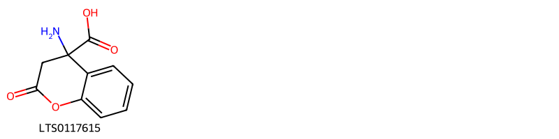{ width=100% }
    <figcaption>Hình ảnh cấu trúc hóa học của Không tìm thấy chú thích hoạt chất thuộc nhóm 3_4-dihydrocoumarins gồm Không tìm thấy chú thích.</figcaption>
</figure>
#### Nhóm Benzene and substituted derivatives
<figure markdown="span">
    { width=100% }
    <figcaption>Hình ảnh cấu trúc hóa học của 1 hoạt chất thuộc nhóm Benzene and substituted derivatives gồm ['benzyl alcohol (LTS0125638)'].</figcaption>
</figure>
#### Nhóm Benzofurans
<figure markdown="span">
    { width=100% }
    <figcaption>Hình ảnh cấu trúc hóa học của 1 hoạt chất thuộc nhóm Benzofurans gồm ['dihydroactinidiolide (LTS0041341)'].</figcaption>
</figure>
#### Nhóm Carboxylic acids and derivatives
<figure markdown="span">
    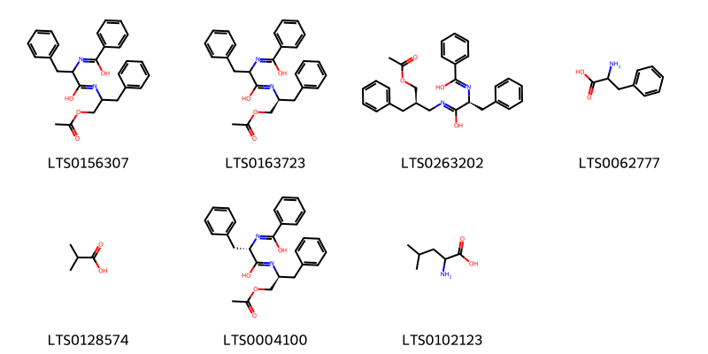{ width=100% }
    <figcaption>Hình ảnh cấu trúc hóa học của 7 hoạt chất thuộc nhóm Carboxylic acids and derivatives gồm ['n-[1-(acetyloxy)-3-phenylpropan-2-yl]-2-{[hydroxy(phenyl)methylidene]amino}-3-phenylpropanimidic acid (LTS0156307)', 'n-[(2s)-1-(acetyloxy)-3-phenylpropan-2-yl]-2-{[hydroxy(phenyl)methylidene]amino}-3-phenylpropanimidic acid (LTS0163723)', '(2s)-n-[(2r)-3-(acetyloxy)-2-benzylpropyl]-2-{[hydroxy(phenyl)methylidene]amino}-3-phenylpropanimidic acid (LTS0263202)', 'phenylalanin (LTS0062777)', 'isobutyric acid (LTS0128574)', '(2s)-n-[(2s)-1-(acetyloxy)-3-phenylpropan-2-yl]-2-{[hydroxy(phenyl)methylidene]amino}-3-phenylpropanimidic acid (LTS0004100)', 'leucine (LTS0102123)'].</figcaption>
</figure>
#### Nhóm Fatty Acyls
<figure markdown="span">
    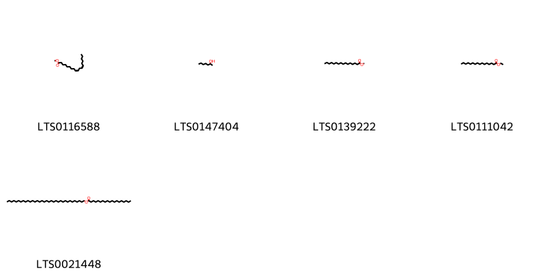{ width=100% }
    <figcaption>Hình ảnh cấu trúc hóa học của 5 hoạt chất thuộc nhóm Fatty Acyls gồm ['methyl linoleate (LTS0116588)', '2-heptanol (LTS0147404)', 'methyl palmitate (LTS0139222)', 'ethyl palmitate (LTS0111042)', 'tetratriacontyl nonadecanoate (LTS0021448)'].</figcaption>
</figure>
#### Nhóm Flavonoids
<figure markdown="span">
    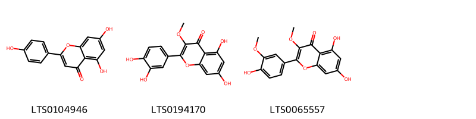{ width=100% }
    <figcaption>Hình ảnh cấu trúc hóa học của 3 hoạt chất thuộc nhóm Flavonoids gồm ['chamomile (LTS0104946)', 'quercetin 3-methyl ether (LTS0194170)', "3,3'-di-o-methylquercetin (LTS0065557)"].</figcaption>
</figure>
#### Nhóm Furanoid lignans
<figure markdown="span">
    { width=100% }
    <figcaption>Hình ảnh cấu trúc hóa học của 2 hoạt chất thuộc nhóm Furanoid lignans gồm ['pinoresinol (LTS0057431)', '4-[(1s,3ar,4r,6ar)-4-(4-hydroxy-3-methoxyphenyl)-hexahydrofuro[3,4-c]furan-1-yl]-2-methoxyphenol (LTS0014948)'].</figcaption>
</figure>
#### Nhóm Isoflavonoids
<figure markdown="span">
    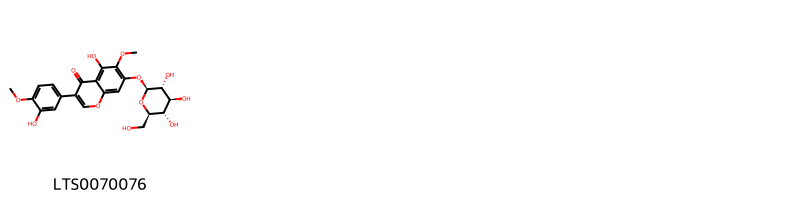{ width=100% }
    <figcaption>Hình ảnh cấu trúc hóa học của 1 hoạt chất thuộc nhóm Isoflavonoids gồm ['5-hydroxy-3-(3-hydroxy-4-methoxyphenyl)-6-methoxy-7-{[(2s,3r,4s,5s,6r)-3,4,5-trihydroxy-6-(hydroxymethyl)oxan-2-yl]oxy}chromen-4-one (LTS0070076)'].</figcaption>
</figure>
#### Nhóm Organooxygen compounds
<figure markdown="span">
    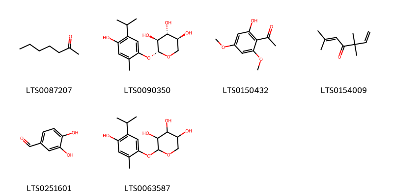{ width=100% }
    <figcaption>Hình ảnh cấu trúc hóa học của 6 hoạt chất thuộc nhóm Organooxygen compounds gồm ['2-heptanone (LTS0087207)', '(2r,3s,4r,5s)-2-(4-hydroxy-5-isopropyl-2-methylphenoxy)oxane-3,4,5-triol (LTS0090350)', 'xanthoxylin (LTS0150432)', 'isoartemisia ketone (LTS0154009)', '3,4-dihydroxybenzaldehyde (LTS0251601)', '2-(4-hydroxy-5-isopropyl-2-methylphenoxy)oxane-3,4,5-triol (LTS0063587)'].</figcaption>
</figure>
#### Nhóm Phenols
<figure markdown="span">
    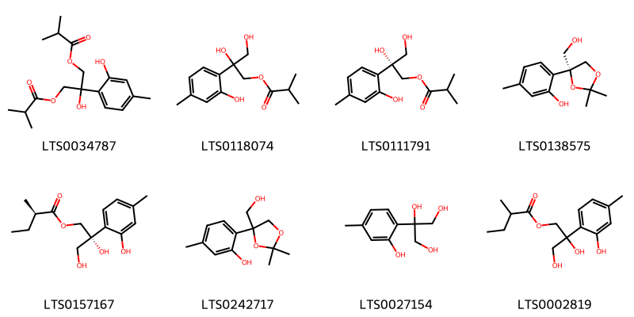{ width=100% }
    <figcaption>Hình ảnh cấu trúc hóa học của 8 hoạt chất thuộc nhóm Phenols gồm ['2-hydroxy-2-(2-hydroxy-4-methylphenyl)-3-[(2-methylpropanoyl)oxy]propyl 2-methylpropanoate (LTS0034787)', '2,3-dihydroxy-2-(2-hydroxy-4-methylphenyl)propyl 2-methylpropanoate (LTS0118074)', '(2r)-2,3-dihydroxy-2-(2-hydroxy-4-methylphenyl)propyl 2-methylpropanoate (LTS0111791)', '2-[(4r)-4-(hydroxymethyl)-2,2-dimethyl-1,3-dioxolan-4-yl]-5-methylphenol (LTS0138575)', '(2r)-2,3-dihydroxy-2-(2-hydroxy-4-methylphenyl)propyl (2r)-2-methylbutanoate (LTS0157167)', '2-[4-(hydroxymethyl)-2,2-dimethyl-1,3-dioxolan-4-yl]-5-methylphenol (LTS0242717)', '2-(2-hydroxy-4-methylphenyl)propane-1,2,3-triol (LTS0027154)', '2,3-dihydroxy-2-(2-hydroxy-4-methylphenyl)propyl 2-methylbutanoate (LTS0002819)'].</figcaption>
</figure>
#### Nhóm Prenol lipids
<figure markdown="span">
    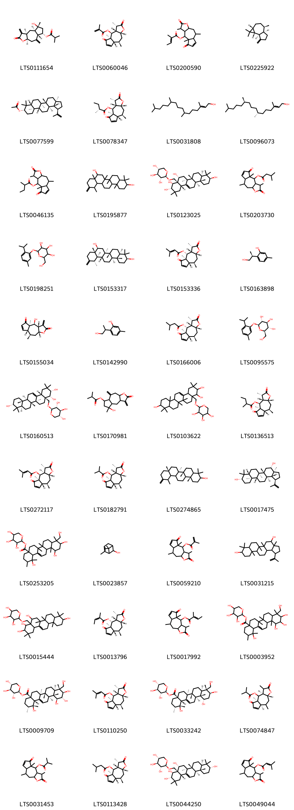{ width=100% }
    <figcaption>Hình ảnh cấu trúc hóa học của 44 hoạt chất thuộc nhóm Prenol lipids gồm ['(3ar,4ar,5r,7s,7as,9ar)-5-hydroxy-5-methyl-3,8-dimethylidene-2-oxo-octahydroazuleno[6,5-b]furan-7-yl 2-methylpropanoate (LTS0111654)', '(3s,3ar,4s,4ar,7ar,8r,9ar)-3,4a,8-trimethyl-2,5-dioxo-3h,3ah,4h,7ah,8h,9h,9ah-azuleno[6,5-b]furan-4-yl 2-methylprop-2-enoate (LTS0060046)', '3,4a,8-trimethyl-2,5-dioxo-3h,3ah,4h,7ah,8h,9h,9ah-azuleno[6,5-b]furan-4-yl 2-methylbut-2-enoate (LTS0200590)', 'β-gurjunene (LTS0225922)', 'lupeol acetate (LTS0077599)', '(3s,3ar,4s,4ar,7ar,8r,9ar)-3,4a,8-trimethyl-2,5-dioxo-3h,3ah,4h,7ah,8h,9h,9ah-azuleno[6,5-b]furan-4-yl (2r)-2-methylbutanoate (LTS0078347)', 'phytol (LTS0031808)', 'phytol (LTS0096073)', '3,4a,8-trimethyl-2,5-dioxo-3h,3ah,4h,7ah,8h,9h,9ah-azuleno[6,5-b]furan-4-yl 2-methylbutanoate (LTS0046135)', '4,4,6a,6b,8a,12,14b-heptamethyl-11-methylidene-hexadecahydropicene-3,8-diol (LTS0195877)', '(3s,4r,4ar,5r,6as,6br,8ar,10s,12ar,12br,14bs)-2,2,6a,6b,9,9,12a-heptamethyl-4a-({[(2r,3r,4s,5r)-3,4,5-trihydroxyoxan-2-yl]oxy}methyl)-1,3,4,5,6,7,8,8a,10,11,12,12b,13,14b-tetradecahydropicene-3,4,5,10-tetrol (LTS0123025)', '3,4a,8-trimethyl-2,5-dioxo-3h,3ah,4h,7ah,8h,9h,9ah-azuleno[6,5-b]furan-4-yl 3-methylbutanoate (LTS0203730)', '2-(hydroxymethyl)-6-(2-isopropyl-5-methylphenoxy)oxane-3,4,5-triol (LTS0198251)', 'arnidiol (LTS0153317)', '(3s,3ar,4r,4ar,7ar,8r,9ar)-3,4a,8-trimethyl-2,5-dioxo-3h,3ah,4h,7ah,8h,9h,9ah-azuleno[6,5-b]furan-4-yl 3-methylbut-2-enoate (LTS0153336)', '2-[(2s)-1-hydroxypropan-2-yl]-5-methylphenol (LTS0163898)', 'helenalin (LTS0155034)', '2-(1-hydroxypropan-2-yl)-5-methylphenol (LTS0142990)', '(3s,3ar,4r,4ar,7ar,8r,9ar)-3,4a,8-trimethyl-2,5-dioxo-3h,3ah,4h,7ah,8h,9h,9ah-azuleno[6,5-b]furan-4-yl 3-methylbutanoate (LTS0166006)', '(2r,3s,4s,5r,6s)-2-(hydroxymethyl)-6-(2-isopropyl-5-methylphenoxy)oxane-3,4,5-triol (LTS0095575)', '(2r,3r,4s,5r)-2-{[(3s,4r,4ar,6as,6br,8ar,10r,12ar,12br,14bs)-3,4,10-trihydroxy-2,2,6a,6b,9,9,12a-heptamethyl-1,3,4,5,6,7,8,8a,10,11,12,12b,13,14b-tetradecahydropicen-4a-yl]methoxy}oxane-3,4,5-triol (LTS0160513)', '5-hydroxy-5-methyl-3,8-dimethylidene-2-oxo-octahydroazuleno[6,5-b]furan-7-yl 2-methylpropanoate (LTS0170981)', '2-[(3,4,10-trihydroxy-2,2,6a,6b,9,9,12a-heptamethyl-1,3,4,5,6,7,8,8a,10,11,12,12b,13,14b-tetradecahydropicen-4a-yl)methoxy]oxane-3,4,5-triol (LTS0103622)', '(3s,3ar,4s,4ar,7ar,8r,9ar)-3,4a,8-trimethyl-2,5-dioxo-3h,3ah,4h,7ah,8h,9h,9ah-azuleno[6,5-b]furan-4-yl 2-methylbutanoate (LTS0136513)', '(3s,3as,4s,4ar,7ar,8r,9ar)-3,4a,8-trimethyl-2,5-dioxo-3h,3ah,4h,7ah,8h,9h,9ah-azuleno[6,5-b]furan-4-yl 3-methylbut-2-enoate (LTS0272117)', '(3s,3ar,4s,4ar,7ar,8r,9ar)-3,4a,8-trimethyl-2,5-dioxo-3h,3ah,4h,7ah,8h,9h,9ah-azuleno[6,5-b]furan-4-yl 2-methylpropanoate (LTS0182791)', '(6ar,6br,8ar,14br)-4,4,6a,6b,8a,12,14b-heptamethyl-11-methylidene-hexadecahydropicen-3-ol (LTS0274865)', 'calenduladiol (LTS0017475)', '3,4,5-trihydroxyoxan-2-yl 1,10,12-trihydroxy-9-(hydroxymethyl)-1,2,6a,6b,9,12a-hexamethyl-2,3,4,5,6,7,8,8a,10,11,12,12b,13,14b-tetradecahydropicene-4a-carboxylate (LTS0253205)', '2,7,7-trimethylbicyclo[3.1.1]hept-2-en-6-ol (LTS0023857)', '3,4a,8-trimethyl-2,5-dioxo-3h,3ah,4h,7ah,8h,9h,9ah-azuleno[6,5-b]furan-4-yl 2-methylprop-2-enoate (LTS0059210)', '3a,5a,5b,8,8,11a-hexamethyl-1-(prop-1-en-2-yl)-hexadecahydrocyclopenta[a]chrysene-4,9-diol (LTS0031215)', '2,2,6a,6b,9,9,12a-heptamethyl-4a-{[(3,4,5-trihydroxyoxan-2-yl)oxy]methyl}-1,3,4,5,6,7,8,8a,10,11,12,12b,13,14b-tetradecahydropicene-3,4,5,10-tetrol (LTS0015444)', '(3s,3ar,4r,4ar,7ar,8r,9ar)-3,4a,8-trimethyl-2,5-dioxo-3h,3ah,4h,7ah,8h,9h,9ah-azuleno[6,5-b]furan-4-yl (2z)-2-methylbut-2-enoate (LTS0013796)', '3,4a,8-trimethyl-2,5-dioxo-3h,3ah,4h,7ah,8h,9h,9ah-azuleno[6,5-b]furan-4-yl (2e)-2-methylbut-2-enoate (LTS0017992)', '3,4,5-trihydroxyoxan-2-yl 1,10,11,12-tetrahydroxy-9-(hydroxymethyl)-1,2,6a,6b,9,12a-hexamethyl-2,3,4,5,6,7,8,8a,10,11,12,12b,13,14b-tetradecahydropicene-4a-carboxylate (LTS0003952)', '(2s,3r,4s,5r)-3,4,5-trihydroxyoxan-2-yl (1r,2r,4as,6as,6br,8ar,9r,10r,11r,12s,12ar,12bs,14bs)-1,10,11,12-tetrahydroxy-9-(hydroxymethyl)-1,2,6a,6b,9,12a-hexamethyl-2,3,4,5,6,7,8,8a,10,11,12,12b,13,14b-tetradecahydropicene-4a-carboxylate (LTS0009709)', '(3s,3ar,4s,4ar,7ar,8r,9ar)-3,4a,8-trimethyl-2,5-dioxo-3h,3ah,4h,7ah,8h,9h,9ah-azuleno[6,5-b]furan-4-yl 3-methylbut-2-enoate (LTS0110250)', '(2s,3r,4s,5r)-3,4,5-trihydroxyoxan-2-yl (1r,2r,4as,6as,6br,8ar,9r,10s,12s,12ar,12bs,14bs)-1,10,12-trihydroxy-9-(hydroxymethyl)-1,2,6a,6b,9,12a-hexamethyl-2,3,4,5,6,7,8,8a,10,11,12,12b,13,14b-tetradecahydropicene-4a-carboxylate (LTS0033242)', '(3as,4ar,7as,9ar)-3,4a,8-trimethyl-2,5-dioxo-3h,3ah,4h,7ah,8h,9h,9ah-azuleno[6,5-b]furan-4-yl 2-methylpropanoate (LTS0074847)', '3,4a,8-trimethyl-2,5-dioxo-3h,3ah,4h,7ah,8h,9h,9ah-azuleno[6,5-b]furan-4-yl 2-methylpropanoate (LTS0031453)', '(3s,3ar,4s,4ar,7ar,8r,9ar)-3,4a,8-trimethyl-2,5-dioxo-3h,3ah,4h,7ah,8h,9h,9ah-azuleno[6,5-b]furan-4-yl 3-methylbutanoate (LTS0113428)', '(3s,4r,4ar,5r,6as,6br,8ar,10r,12ar,12br,14bs)-2,2,6a,6b,9,9,12a-heptamethyl-4a-({[(2r,3r,4s,5r)-3,4,5-trihydroxyoxan-2-yl]oxy}methyl)-1,3,4,5,6,7,8,8a,10,11,12,12b,13,14b-tetradecahydropicene-3,4,5,10-tetrol (LTS0044250)', '3,4a,8-trimethyl-2,5-dioxo-3h,3ah,4h,7ah,8h,9h,9ah-azuleno[6,5-b]furan-4-yl 3-methylbut-2-enoate (LTS0049044)'].</figcaption>
</figure>
#### Nhóm Steroids and steroid derivatives
<figure markdown="span">
    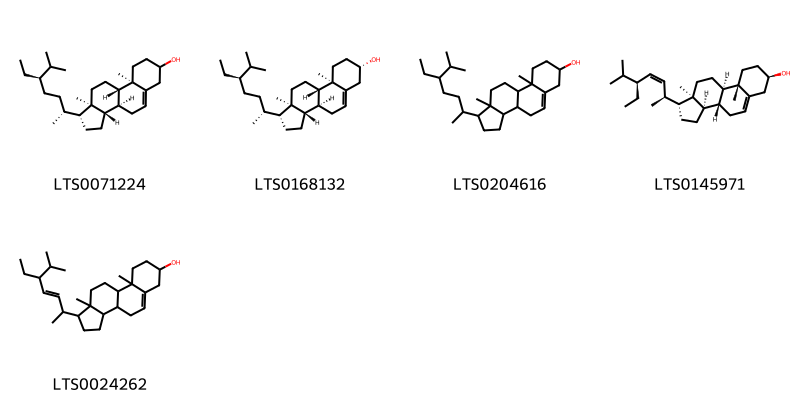{ width=100% }
    <figcaption>Hình ảnh cấu trúc hóa học của 5 hoạt chất thuộc nhóm Steroids and steroid derivatives gồm ['stigmast-5-en-3-ol (LTS0071224)', 'sitosterol (LTS0168132)', 'stigmast-5-en-3-ol, (3β)- (LTS0204616)', '(1r,3ar,3br,7r,9as,9br,11ar)-1-[(2s,3z,5s)-5-ethyl-6-methylhept-3-en-2-yl]-9a,11a-dimethyl-1h,2h,3h,3ah,3bh,4h,6h,7h,8h,9h,9bh,10h,11h-cyclopenta[a]phenanthren-7-ol (LTS0145971)', 'stigmasterol (LTS0024262)'].</figcaption>
</figure>
#### Nhóm Stilbenes
<figure markdown="span">
    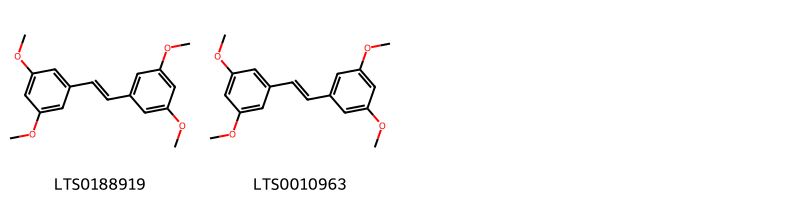{ width=100% }
    <figcaption>Hình ảnh cấu trúc hóa học của 2 hoạt chất thuộc nhóm Stilbenes gồm ['1-[2-(3,5-dimethoxyphenyl)ethenyl]-3,5-dimethoxybenzene (LTS0188919)', '1-[(1e)-2-(3,5-dimethoxyphenyl)ethenyl]-3,5-dimethoxybenzene (LTS0010963)'].</figcaption>
</figure>

---

### Dược dân tộc học

Danh sách các quốc gia có sử dụng *Centipeda minima* trong điều trị các bệnh. 

| Country   | Disease    | Bệnh                                                                                                                                                                                                |
|:----------|:-----------|:----------------------------------------------------------------------------------------------------------------------------------------------------------------------------------------------------|
| China     | Alexiteric | MYMEMORY WARNING: YOU USED ALL AVAILABLE FREE TRANSLATIONS FOR TODAY. NEXT AVAILABLE IN  11 HOURS 52 MINUTES 20 SECONDS VISIT HTTPS://MYMEMORY.TRANSLATED.NET/DOC/USAGELIMITS.PHP TO TRANSLATE MORE |
| Elsewhere | Vermifuge  | MYMEMORY WARNING: YOU USED ALL AVAILABLE FREE TRANSLATIONS FOR TODAY. NEXT AVAILABLE IN  11 HOURS 52 MINUTES 16 SECONDS VISIT HTTPS://MYMEMORY.TRANSLATED.NET/DOC/USAGELIMITS.PHP TO TRANSLATE MORE |

---

# Chi Corymbium

??? note "Danh sách các dược liệu thuộc chi"
    
	 - *Corymbium longiflora*

---
## Corymbium longiflora
### Thông tin về thực vật

!!! info "Phân loại thực vật của *N/A* từ GIBF:"
    - **Kingdom:** Plantae
    - **Phylum:** Tracheophyta
    - **Order:** Asterales
    - **Family:** Asteraceae
    - **Genus:** Corymbium
    - **Species:** *N/A*

 

| Label (VI)   | Label (EN)   | Scientific Name   | Descriptions (VI)   | Descriptions (EN)   | Also Known As (VI)   | Also Known As (EN)            |
|:-------------|:-------------|:------------------|:--------------------|:--------------------|:---------------------|:------------------------------|
| N/A          | N/A          | Centipeda minima  | loài thực vật       | species of plant    | ['Centipeda minima'] | ['sneeize-wort', 'sneezweed'] |

#### Phân bố trên thế giới

**Từ CSDL GIBF** South Africa

#### Phân bố tại Việt Nam

**Từ CSDL GIBF**: Không có ghi nhận ở Việt Nam

---
### Thành phần hóa học
        
- Theo cơ sở dữ liệu lotus: Từ loài *N/A* đã phân lập và xác định được Chưa có hoạt chất nào được phân lập. hoạt chất thuộc về các nhóm Không có hoạt chất nào được phân lập. 

Không có hình ảnh nào được tạo ra

---

### Dược dân tộc học

Danh sách các quốc gia có sử dụng *N/A* trong điều trị các bệnh. 

| Country   | Disease   | Bệnh                                                                                                                                                                                                |
|:----------|:----------|:----------------------------------------------------------------------------------------------------------------------------------------------------------------------------------------------------|
| Kelantan  | Emetic    | MYMEMORY WARNING: YOU USED ALL AVAILABLE FREE TRANSLATIONS FOR TODAY. NEXT AVAILABLE IN  11 HOURS 51 MINUTES 33 SECONDS VISIT HTTPS://MYMEMORY.TRANSLATED.NET/DOC/USAGELIMITS.PHP TO TRANSLATE MORE |

---

# Chi Dyssodia

??? note "Danh sách các dược liệu thuộc chi"
    
	 - *Dyssodia papposa*

---
## Dyssodia papposa
### Thông tin về thực vật

!!! info "Phân loại thực vật của *Dyssodia papposa* từ GIBF:"
    - **Kingdom:** Plantae
    - **Phylum:** Tracheophyta
    - **Order:** Asterales
    - **Family:** Asteraceae
    - **Genus:** Dyssodia
    - **Species:** *Dyssodia papposa*

 

| Label (VI)   | Label (EN)   | Scientific Name   | Descriptions (VI)   | Descriptions (EN)   | Also Known As (VI)   | Also Known As (EN)   |
|:-------------|:-------------|:------------------|:--------------------|:--------------------|:---------------------|:---------------------|
| N/A          | N/A          | Dyssodia papposa  | loài thực vật       | species of plant    | ['']                 | ['']                 |

#### Phân bố trên thế giới

**Từ CSDL GIBF** United States of America, Canada, Mexico

#### Phân bố tại Việt Nam

**Từ CSDL GIBF**: Không có ghi nhận ở Việt Nam

---
### Thành phần hóa học
        
- Theo cơ sở dữ liệu lotus: Từ loài *Dyssodia papposa* đã phân lập và xác định được Chưa có hoạt chất nào được phân lập. hoạt chất thuộc về các nhóm Không có hoạt chất nào được phân lập. 

Không có hình ảnh nào được tạo ra

---

### Dược dân tộc học

Danh sách các quốc gia có sử dụng *Dyssodia papposa* trong điều trị các bệnh. 

| Country   | Disease   | Bệnh                                                                                                                                                                                                |
|:----------|:----------|:----------------------------------------------------------------------------------------------------------------------------------------------------------------------------------------------------|
| US        | Vesicant  | MYMEMORY WARNING: YOU USED ALL AVAILABLE FREE TRANSLATIONS FOR TODAY. NEXT AVAILABLE IN  11 HOURS 51 MINUTES 02 SECONDS VISIT HTTPS://MYMEMORY.TRANSLATED.NET/DOC/USAGELIMITS.PHP TO TRANSLATE MORE |

---

# Chi Gnaphalium

??? note "Danh sách các dược liệu thuộc chi"
    
	 - *Gnaphalium affine*
	 - *Gnaphalium conoideum*
	 - *Gnaphalium dioicum*
	 - *Gnaphalium luteo-album*
	 - *Gnaphalium multiceps*
	 - *Gnaphalium semiamplexicaule*
	 - *Gnaphalium uligomosum*
	 - *Gnaphalium undulatum*
	 - *Gnaphalium viscosum*

---
## Gnaphalium affine
### Thông tin về thực vật

!!! info "Phân loại thực vật của *N/A* từ GIBF:"
    - **Kingdom:** Plantae
    - **Phylum:** Tracheophyta
    - **Order:** Asterales
    - **Family:** Asteraceae
    - **Genus:** N/A
    - **Species:** *N/A*

 

| Label (VI)   | Label (EN)   | Scientific Name   | Descriptions (VI)   | Descriptions (EN)   | Also Known As (VI)    | Also Known As (EN)   |
|:-------------|:-------------|:------------------|:--------------------|:--------------------|:----------------------|:---------------------|
| N/A          | N/A          | Gnaphalium affine | loài thực vật       | species of plant    | ['Gnaphalium affine'] | ['']                 |

#### Phân bố trên thế giới

**Từ CSDL GIBF** Denmark, Australia, New Zealand, Chinese Taipei, Ireland, Isle of Man, Viet Nam, United Kingdom of Great Britain and Northern Ireland

#### Phân bố tại Việt Nam

**Từ CSDL GIBF**: Đà Nẵng

---
### Thành phần hóa học
        
- Theo cơ sở dữ liệu lotus: Từ loài *N/A* đã phân lập và xác định được Chưa có hoạt chất nào được phân lập. hoạt chất thuộc về các nhóm Không có hoạt chất nào được phân lập. 

Không có hình ảnh nào được tạo ra

---

### Dược dân tộc học

Danh sách các quốc gia có sử dụng *N/A* trong điều trị các bệnh. 

| Country   | Disease                  | Bệnh                                                                                                                                                                                                |
|:----------|:-------------------------|:----------------------------------------------------------------------------------------------------------------------------------------------------------------------------------------------------|
| Elsewhere | Antitussive, Expectorant | MYMEMORY WARNING: YOU USED ALL AVAILABLE FREE TRANSLATIONS FOR TODAY. NEXT AVAILABLE IN  11 HOURS 50 MINUTES 31 SECONDS VISIT HTTPS://MYMEMORY.TRANSLATED.NET/DOC/USAGELIMITS.PHP TO TRANSLATE MORE |

---

---
## Gnaphalium conoideum
### Thông tin về thực vật

!!! info "Phân loại thực vật của *N/A* từ GIBF:"
    - **Kingdom:** Plantae
    - **Phylum:** Tracheophyta
    - **Order:** Asterales
    - **Family:** Asteraceae
    - **Genus:** Pseudognaphalium
    - **Species:** *N/A*

 

| Label (VI)   | Label (EN)   | Scientific Name   | Descriptions (VI)   | Descriptions (EN)   | Also Known As (VI)    | Also Known As (EN)   |
|:-------------|:-------------|:------------------|:--------------------|:--------------------|:----------------------|:---------------------|
| N/A          | N/A          | Gnaphalium affine | loài thực vật       | species of plant    | ['Gnaphalium affine'] | ['']                 |

#### Phân bố trên thế giới

**Từ CSDL GIBF** Korea, Republic of, Colombia, Chinese Taipei, Brazil, Argentina, United States of America, China, Mexico, Uruguay, Dominican Republic, New Zealand, Canada

#### Phân bố tại Việt Nam

**Từ CSDL GIBF**: Không có ghi nhận ở Việt Nam

---
### Thành phần hóa học
        
- Theo cơ sở dữ liệu lotus: Từ loài *N/A* đã phân lập và xác định được Chưa có hoạt chất nào được phân lập. hoạt chất thuộc về các nhóm Không có hoạt chất nào được phân lập. 

Không có hình ảnh nào được tạo ra

---

### Dược dân tộc học

Danh sách các quốc gia có sử dụng *N/A* trong điều trị các bệnh. 

| Country   | Disease   | Bệnh                                                                                                                                                                                                |
|:----------|:----------|:----------------------------------------------------------------------------------------------------------------------------------------------------------------------------------------------------|
| Mexico    | Emollient | MYMEMORY WARNING: YOU USED ALL AVAILABLE FREE TRANSLATIONS FOR TODAY. NEXT AVAILABLE IN  11 HOURS 50 MINUTES 07 SECONDS VISIT HTTPS://MYMEMORY.TRANSLATED.NET/DOC/USAGELIMITS.PHP TO TRANSLATE MORE |

---

---
## Gnaphalium dioicum
### Thông tin về thực vật

!!! info "Phân loại thực vật của *Antennaria dioica* từ GIBF:"
    - **Kingdom:** Plantae
    - **Phylum:** Tracheophyta
    - **Order:** Asterales
    - **Family:** Asteraceae
    - **Genus:** Antennaria
    - **Species:** *Antennaria dioica*

 

| Label (VI)   | Label (EN)   | Scientific Name    | Descriptions (VI)   | Descriptions (EN)   | Also Known As (VI)   | Also Known As (EN)   |
|:-------------|:-------------|:-------------------|:--------------------|:--------------------|:---------------------|:---------------------|
| N/A          | N/A          | Gnaphalium dioicum | loài thực vật       | species of plant    | ['']                 | ['']                 |

#### Phân bố trên thế giới

**Từ CSDL GIBF** nan, Italy, Estonia, unknown or invalid, Norway, Ukraine, Netherlands, Lithuania, Belarus, Luxembourg, Hungary, Russian Federation, United States of America, Sweden, Finland, Greenland, Germany, Romania, Switzerland, Austria, France, United Kingdom of Great Britain and Northern Ireland, Poland

#### Phân bố tại Việt Nam

**Từ CSDL GIBF**: Không có ghi nhận ở Việt Nam

---
### Thành phần hóa học
        
- Theo cơ sở dữ liệu lotus: Từ loài *Antennaria dioica* đã phân lập và xác định được Chưa có hoạt chất nào được phân lập. hoạt chất thuộc về các nhóm Không có hoạt chất nào được phân lập. 

Không có hình ảnh nào được tạo ra

---

### Dược dân tộc học

Danh sách các quốc gia có sử dụng *Antennaria dioica* trong điều trị các bệnh. 

| Country   | Disease                                                           | Bệnh                                                                                                                                                                                                |
|:----------|:------------------------------------------------------------------|:----------------------------------------------------------------------------------------------------------------------------------------------------------------------------------------------------|
| Turkey    | Astringent, Cholagogue, Discutient, Diuretic, Vulnerary, Hemostat | MYMEMORY WARNING: YOU USED ALL AVAILABLE FREE TRANSLATIONS FOR TODAY. NEXT AVAILABLE IN  11 HOURS 49 MINUTES 38 SECONDS VISIT HTTPS://MYMEMORY.TRANSLATED.NET/DOC/USAGELIMITS.PHP TO TRANSLATE MORE |

---

---
## Gnaphalium luteoalbum
### Thông tin về thực vật

!!! info "Phân loại thực vật của *Helichrysum luteoalbum* từ GIBF:"
    - **Kingdom:** Plantae
    - **Phylum:** Tracheophyta
    - **Order:** Asterales
    - **Family:** Asteraceae
    - **Genus:** Helichrysum
    - **Species:** *Helichrysum luteoalbum*

 

| Label (VI)   | Label (EN)   | Scientific Name       | Descriptions (VI)   | Descriptions (EN)   | Also Known As (VI)   | Also Known As (EN)   |
|:-------------|:-------------|:----------------------|:--------------------|:--------------------|:---------------------|:---------------------|
| N/A          | N/A          | Gnaphalium luteoalbum | loài thực vật       | species of plant    | ['']                 | ['']                 |

#### Phân bố trên thế giới

**Từ CSDL GIBF** Netherlands, Germany, Belgium, Switzerland, United Kingdom of Great Britain and Northern Ireland

#### Phân bố tại Việt Nam

**Từ CSDL GIBF**: Không có ghi nhận ở Việt Nam

---
### Thành phần hóa học
        
- Theo cơ sở dữ liệu lotus: Từ loài *Helichrysum luteoalbum* đã phân lập và xác định được Chưa có hoạt chất nào được phân lập. hoạt chất thuộc về các nhóm Không có hoạt chất nào được phân lập. 

Không có hình ảnh nào được tạo ra

---

### Dược dân tộc học

Danh sách các quốc gia có sử dụng *Helichrysum luteoalbum* trong điều trị các bệnh. 

| Country       | Disease                                | Bệnh                                                                                                                                                                                                |
|:--------------|:---------------------------------------|:----------------------------------------------------------------------------------------------------------------------------------------------------------------------------------------------------|
| India(Punjab) | Astringent, Vulnerary                  | MYMEMORY WARNING: YOU USED ALL AVAILABLE FREE TRANSLATIONS FOR TODAY. NEXT AVAILABLE IN  11 HOURS 49 MINUTES 14 SECONDS VISIT HTTPS://MYMEMORY.TRANSLATED.NET/DOC/USAGELIMITS.PHP TO TRANSLATE MORE |
| Iraq          | Astringent, Counterirritant, Vulnerary | MYMEMORY WARNING: YOU USED ALL AVAILABLE FREE TRANSLATIONS FOR TODAY. NEXT AVAILABLE IN  11 HOURS 49 MINUTES 11 SECONDS VISIT HTTPS://MYMEMORY.TRANSLATED.NET/DOC/USAGELIMITS.PHP TO TRANSLATE MORE |
| Lesotho       | Fumigant                               | MYMEMORY WARNING: YOU USED ALL AVAILABLE FREE TRANSLATIONS FOR TODAY. NEXT AVAILABLE IN  11 HOURS 49 MINUTES 06 SECONDS VISIT HTTPS://MYMEMORY.TRANSLATED.NET/DOC/USAGELIMITS.PHP TO TRANSLATE MORE |

---

---
## Gnaphalium multiceps
### Thông tin về thực vật

!!! info "Phân loại thực vật của *N/A* từ GIBF:"
    - **Kingdom:** Plantae
    - **Phylum:** Tracheophyta
    - **Order:** Asterales
    - **Family:** Asteraceae
    - **Genus:** N/A
    - **Species:** *N/A*

 

| Label (VI)   | Label (EN)   | Scientific Name      | Descriptions (VI)   | Descriptions (EN)   | Also Known As (VI)   | Also Known As (EN)   |
|:-------------|:-------------|:---------------------|:--------------------|:--------------------|:---------------------|:---------------------|
| N/A          | N/A          | Gnaphalium multiceps | loài thực vật       | species of plant    | ['']                 | ['']                 |

#### Phân bố trên thế giới

**Từ CSDL GIBF** Denmark, Australia, New Zealand, Chinese Taipei, Ireland, Isle of Man, Viet Nam, United Kingdom of Great Britain and Northern Ireland

#### Phân bố tại Việt Nam

**Từ CSDL GIBF**: Đà Nẵng

---
### Thành phần hóa học
        
- Theo cơ sở dữ liệu lotus: Từ loài *N/A* đã phân lập và xác định được Chưa có hoạt chất nào được phân lập. hoạt chất thuộc về các nhóm Không có hoạt chất nào được phân lập. 

Không có hình ảnh nào được tạo ra

---

### Dược dân tộc học

Danh sách các quốc gia có sử dụng *N/A* trong điều trị các bệnh. 

| Country   | Disease                  | Bệnh                                                                                                                                                                                                |
|:----------|:-------------------------|:----------------------------------------------------------------------------------------------------------------------------------------------------------------------------------------------------|
| China     | Antitussive, Expectorant | MYMEMORY WARNING: YOU USED ALL AVAILABLE FREE TRANSLATIONS FOR TODAY. NEXT AVAILABLE IN  11 HOURS 48 MINUTES 43 SECONDS VISIT HTTPS://MYMEMORY.TRANSLATED.NET/DOC/USAGELIMITS.PHP TO TRANSLATE MORE |

---

---
## Gnaphalium semiamplexicaule
### Thông tin về thực vật

!!! info "Phân loại thực vật của *Pseudognaphalium semiamplexicaule* từ GIBF:"
    - **Kingdom:** Plantae
    - **Phylum:** Tracheophyta
    - **Order:** Asterales
    - **Family:** Asteraceae
    - **Genus:** Pseudognaphalium
    - **Species:** *Pseudognaphalium semiamplexicaule*

 

| Label (VI)   | Label (EN)   | Scientific Name             | Descriptions (VI)   | Descriptions (EN)   | Also Known As (VI)   | Also Known As (EN)   |
|:-------------|:-------------|:----------------------------|:--------------------|:--------------------|:---------------------|:---------------------|
| N/A          | N/A          | Gnaphalium semiamplexicaule | loài thực vật       | species of plant    | ['']                 | ['']                 |

#### Phân bố trên thế giới

**Từ CSDL GIBF** Guatemala, Costa Rica, Honduras, Mexico, El Salvador

#### Phân bố tại Việt Nam

**Từ CSDL GIBF**: Không có ghi nhận ở Việt Nam

---
### Thành phần hóa học
        
- Theo cơ sở dữ liệu lotus: Từ loài *Pseudognaphalium semiamplexicaule* đã phân lập và xác định được Chưa có hoạt chất nào được phân lập. hoạt chất thuộc về các nhóm Không có hoạt chất nào được phân lập. 

Không có hình ảnh nào được tạo ra

---

### Dược dân tộc học

Danh sách các quốc gia có sử dụng *Pseudognaphalium semiamplexicaule* trong điều trị các bệnh. 

| Country   | Disease   | Bệnh                                                                                                                                                                                                |
|:----------|:----------|:----------------------------------------------------------------------------------------------------------------------------------------------------------------------------------------------------|
| Mexico    | Emollient | MYMEMORY WARNING: YOU USED ALL AVAILABLE FREE TRANSLATIONS FOR TODAY. NEXT AVAILABLE IN  11 HOURS 48 MINUTES 19 SECONDS VISIT HTTPS://MYMEMORY.TRANSLATED.NET/DOC/USAGELIMITS.PHP TO TRANSLATE MORE |

---

---
## Gnaphalium uligomosum
### Thông tin về thực vật

!!! info "Phân loại thực vật của *Gnaphalium uliginosum* từ GIBF:"
    - **Kingdom:** Plantae
    - **Phylum:** Tracheophyta
    - **Order:** Asterales
    - **Family:** Asteraceae
    - **Genus:** Gnaphalium
    - **Species:** *Gnaphalium uliginosum*

 

| Label (VI)   | Label (EN)   | Scientific Name             | Descriptions (VI)   | Descriptions (EN)   | Also Known As (VI)   | Also Known As (EN)   |
|:-------------|:-------------|:----------------------------|:--------------------|:--------------------|:---------------------|:---------------------|
| N/A          | N/A          | Gnaphalium semiamplexicaule | loài thực vật       | species of plant    | ['']                 | ['']                 |

#### Phân bố trên thế giới

**Từ CSDL GIBF** Italy, Belgium, Slovakia, Norway, Canada, Ukraine, Denmark, Netherlands, Luxembourg, Hungary, Russian Federation, United States of America, Sweden, Finland, Czechia, Germany, Switzerland, Austria, France, United Kingdom of Great Britain and Northern Ireland, Ireland, Poland

#### Phân bố tại Việt Nam

**Từ CSDL GIBF**: Không có ghi nhận ở Việt Nam

---
### Thành phần hóa học
        
- Theo cơ sở dữ liệu lotus: Từ loài *Gnaphalium uliginosum* đã phân lập và xác định được Chưa có hoạt chất nào được phân lập. hoạt chất thuộc về các nhóm Không có hoạt chất nào được phân lập. 

Không có hình ảnh nào được tạo ra

---

### Dược dân tộc học

Danh sách các quốc gia có sử dụng *Gnaphalium uliginosum* trong điều trị các bệnh. 

| Country   | Disease    | Bệnh                                                                                                                                                                                                |
|:----------|:-----------|:----------------------------------------------------------------------------------------------------------------------------------------------------------------------------------------------------|
| Elsewhere | Astringent | MYMEMORY WARNING: YOU USED ALL AVAILABLE FREE TRANSLATIONS FOR TODAY. NEXT AVAILABLE IN  11 HOURS 47 MINUTES 48 SECONDS VISIT HTTPS://MYMEMORY.TRANSLATED.NET/DOC/USAGELIMITS.PHP TO TRANSLATE MORE |

---

---
## Gnaphalium undulatum
### Thông tin về thực vật

!!! info "Phân loại thực vật của *N/A* từ GIBF:"
    - **Kingdom:** Plantae
    - **Phylum:** Tracheophyta
    - **Order:** Asterales
    - **Family:** Asteraceae
    - **Genus:** N/A
    - **Species:** *N/A*

 

| Label (VI)   | Label (EN)   | Scientific Name      | Descriptions (VI)   | Descriptions (EN)   | Also Known As (VI)   | Also Known As (EN)   |
|:-------------|:-------------|:---------------------|:--------------------|:--------------------|:---------------------|:---------------------|
| N/A          | N/A          | Gnaphalium undulatum | loài thực vật       | species of plant    | ['']                 | ['']                 |

#### Phân bố trên thế giới

**Từ CSDL GIBF** Denmark, Australia, New Zealand, Chinese Taipei, Ireland, Isle of Man, Viet Nam, United Kingdom of Great Britain and Northern Ireland

#### Phân bố tại Việt Nam

**Từ CSDL GIBF**: Đà Nẵng

---
### Thành phần hóa học
        
- Theo cơ sở dữ liệu lotus: Từ loài *N/A* đã phân lập và xác định được 14 hoạt chất thuộc về các nhóm Flavonoids, Prenol lipids, Pyrans. 

|    | chemicalTaxonomyClassyfireClass   |   smiles_count |
|---:|:----------------------------------|---------------:|
|  0 | Flavonoids                        |              1 |
|  1 | Prenol lipids                     |             11 |
|  2 | Pyrans                            |              2 |

#### Nhóm Flavonoids
<figure markdown="span">
    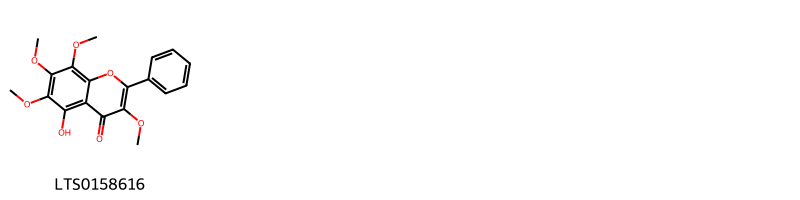{ width=100% }
    <figcaption>Hình ảnh cấu trúc hóa học của 1 hoạt chất thuộc nhóm Flavonoids gồm ['5-hydroxy-3,6,7,8-tetramethoxy-2-phenylchromen-4-one (LTS0158616)'].</figcaption>
</figure>
#### Nhóm Prenol lipids
<figure markdown="span">
    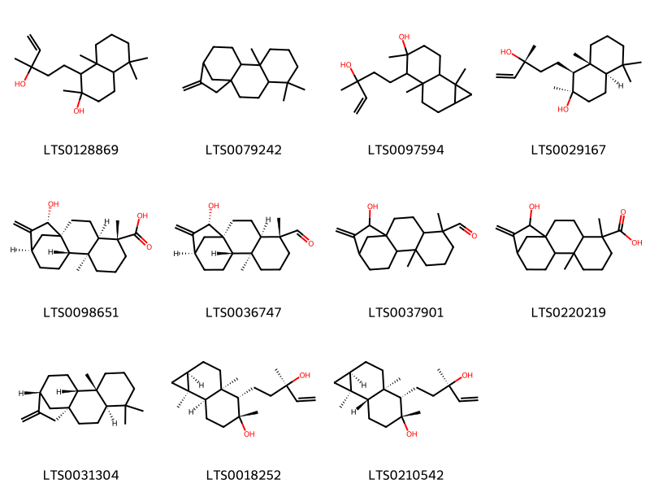{ width=100% }
    <figcaption>Hình ảnh cấu trúc hóa học của 11 hoạt chất thuộc nhóm Prenol lipids gồm ['sclareol (LTS0128869)', '5,5,9-trimethyl-14-methylidenetetracyclo[11.2.1.0¹,¹⁰.0⁴,⁹]hexadecane (LTS0079242)', '4-(3-hydroxy-3-methylpent-4-en-1-yl)-3a,5,7b-trimethyl-octahydrocyclopropa[a]naphthalen-5-ol (LTS0097594)', '(1s,2r,4ar,8ar)-1-[(3r)-3-hydroxy-3-methylpent-4-en-1-yl]-2,5,5,8a-tetramethyl-hexahydro-1h-naphthalen-2-ol (LTS0029167)', '(1r,4r,5r,9s,10s,13r,15s)-15-hydroxy-5,9-dimethyl-14-methylidenetetracyclo[11.2.1.0¹,¹⁰.0⁴,⁹]hexadecane-5-carboxylic acid (LTS0098651)', '(1r,4r,5r,9s,10s,13r,15s)-15-hydroxy-5,9-dimethyl-14-methylidenetetracyclo[11.2.1.0¹,¹⁰.0⁴,⁹]hexadecane-5-carbaldehyde (LTS0036747)', '15-hydroxy-5,9-dimethyl-14-methylidenetetracyclo[11.2.1.0¹,¹⁰.0⁴,⁹]hexadecane-5-carbaldehyde (LTS0037901)', '15-hydroxy-5,9-dimethyl-14-methylidenetetracyclo[11.2.1.0¹,¹⁰.0⁴,⁹]hexadecane-5-carboxylic acid (LTS0220219)', '(1s,4r,9r,10s,13r)-5,5,9-trimethyl-14-methylidenetetracyclo[11.2.1.0¹,¹⁰.0⁴,⁹]hexadecane (LTS0031304)', '(1ar,3ar,4s,5r,7as,7bs)-4-[(3r)-3-hydroxy-3-methylpent-4-en-1-yl]-3a,5,7b-trimethyl-octahydrocyclopropa[a]naphthalen-5-ol (LTS0018252)', '(1ar,3ar,4s,5r,7ar,7bs)-4-[(3r)-3-hydroxy-3-methylpent-4-en-1-yl]-3a,5,7b-trimethyl-octahydrocyclopropa[a]naphthalen-5-ol (LTS0210542)'].</figcaption>
</figure>
#### Nhóm Pyrans
<figure markdown="span">
    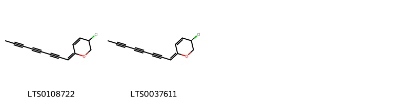{ width=100% }
    <figcaption>Hình ảnh cấu trúc hóa học của 2 hoạt chất thuộc nhóm Pyrans gồm ['5-chloro-2-(octa-2,4,6-triyn-1-ylidene)-5,6-dihydropyran (LTS0108722)', '(2e,5r)-5-chloro-2-(octa-2,4,6-triyn-1-ylidene)-5,6-dihydropyran (LTS0037611)'].</figcaption>
</figure>

---

### Dược dân tộc học

Danh sách các quốc gia có sử dụng *N/A* trong điều trị các bệnh. 

| Country   | Disease   | Bệnh                                                                                                                                                                                                |
|:----------|:----------|:----------------------------------------------------------------------------------------------------------------------------------------------------------------------------------------------------|
| Lesotho   | Fumigant  | MYMEMORY WARNING: YOU USED ALL AVAILABLE FREE TRANSLATIONS FOR TODAY. NEXT AVAILABLE IN  11 HOURS 47 MINUTES 19 SECONDS VISIT HTTPS://MYMEMORY.TRANSLATED.NET/DOC/USAGELIMITS.PHP TO TRANSLATE MORE |

---

---
## Gnaphalium viscosum
### Thông tin về thực vật

!!! info "Phân loại thực vật của *N/A* từ GIBF:"
    - **Kingdom:** Plantae
    - **Phylum:** Tracheophyta
    - **Order:** Asterales
    - **Family:** Asteraceae
    - **Genus:** Pseudognaphalium
    - **Species:** *N/A*

 

| Label (VI)   | Label (EN)   | Scientific Name     | Descriptions (VI)   | Descriptions (EN)   | Also Known As (VI)   | Also Known As (EN)   |
|:-------------|:-------------|:--------------------|:--------------------|:--------------------|:---------------------|:---------------------|
| N/A          | N/A          | Gnaphalium viscosum | loài thực vật       | species of plant    | ['']                 | ['']                 |

#### Phân bố trên thế giới

**Từ CSDL GIBF** Korea, Republic of, Colombia, Chinese Taipei, Brazil, Argentina, United States of America, China, Mexico, Uruguay, Dominican Republic, New Zealand, Canada

#### Phân bố tại Việt Nam

**Từ CSDL GIBF**: Không có ghi nhận ở Việt Nam

---
### Thành phần hóa học
        
- Theo cơ sở dữ liệu lotus: Từ loài *N/A* đã phân lập và xác định được 15 hoạt chất thuộc về các nhóm Flavonoids, Naphthofurans, Prenol lipids, Steroids and steroid derivatives. 

|    | chemicalTaxonomyClassyfireClass   |   smiles_count |
|---:|:----------------------------------|---------------:|
|  0 | Flavonoids                        |              1 |
|  1 | Naphthofurans                     |              2 |
|  2 | Prenol lipids                     |              7 |
|  3 | Steroids and steroid derivatives  |              5 |

#### Nhóm Flavonoids
<figure markdown="span">
    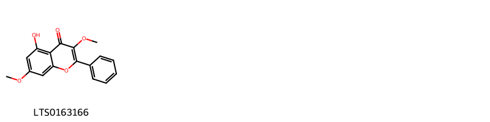{ width=100% }
    <figcaption>Hình ảnh cấu trúc hóa học của 1 hoạt chất thuộc nhóm Flavonoids gồm ['galangin 3,7-dimethyl ether (LTS0163166)'].</figcaption>
</figure>
#### Nhóm Naphthofurans
<figure markdown="span">
    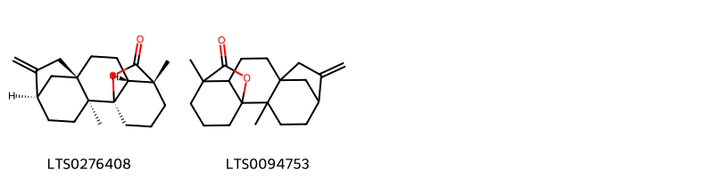{ width=100% }
    <figcaption>Hình ảnh cấu trúc hóa học của 2 hoạt chất thuộc nhóm Naphthofurans gồm ['(1s,2s,5r,8s,11r,12r)-2,12-dimethyl-6-methylidene-16-oxapentacyclo[10.3.2.1⁵,⁸.0¹,¹¹.0²,⁸]octadecan-17-one (LTS0276408)', '2,12-dimethyl-6-methylidene-16-oxapentacyclo[10.3.2.1⁵,⁸.0¹,¹¹.0²,⁸]octadecan-17-one (LTS0094753)'].</figcaption>
</figure>
#### Nhóm Prenol lipids
<figure markdown="span">
    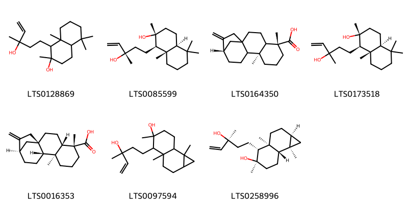{ width=100% }
    <figcaption>Hình ảnh cấu trúc hóa học của 7 hoạt chất thuộc nhóm Prenol lipids gồm ['sclareol (LTS0128869)', '(1r,2r,4as,8as)-1-[(3s)-3-hydroxy-3-methylpent-4-en-1-yl]-2,5,5,8a-tetramethyl-hexahydro-1h-naphthalen-2-ol (LTS0085599)', '(5r,9s,13s)-5,9-dimethyl-14-methylidenetetracyclo[11.2.1.0¹,¹⁰.0⁴,⁹]hexadecane-5-carboxylic acid (LTS0164350)', '(1r,2r,4as,8as)-1-(3-hydroxy-3-methylpent-4-en-1-yl)-2,5,5,8a-tetramethyl-hexahydro-1h-naphthalen-2-ol (LTS0173518)', 'ent-kaur-16-en-19-oic acid (LTS0016353)', '4-(3-hydroxy-3-methylpent-4-en-1-yl)-3a,5,7b-trimethyl-octahydrocyclopropa[a]naphthalen-5-ol (LTS0097594)', '(1as,3as,4r,5r,7as,7br)-4-[(3s)-3-hydroxy-3-methylpent-4-en-1-yl]-3a,5,7b-trimethyl-octahydrocyclopropa[a]naphthalen-5-ol (LTS0258996)'].</figcaption>
</figure>
#### Nhóm Steroids and steroid derivatives
<figure markdown="span">
    { width=100% }
    <figcaption>Hình ảnh cấu trúc hóa học của 5 hoạt chất thuộc nhóm Steroids and steroid derivatives gồm ['stigmast-5-en-3-ol (LTS0071224)', 'sitosterol (LTS0168132)', 'stigmast-5-en-3-ol, (3β)- (LTS0204616)', 'phytosterol (LTS0029311)', 'stigmasterol (LTS0024262)'].</figcaption>
</figure>

---

### Dược dân tộc học

Danh sách các quốc gia có sử dụng *N/A* trong điều trị các bệnh. 

| Country            | Disease                | Bệnh                                                                                                                                                                                                |
|:-------------------|:-----------------------|:----------------------------------------------------------------------------------------------------------------------------------------------------------------------------------------------------|
| Dominican Republic | Stomachic              | MYMEMORY WARNING: YOU USED ALL AVAILABLE FREE TRANSLATIONS FOR TODAY. NEXT AVAILABLE IN  11 HOURS 46 MINUTES 53 SECONDS VISIT HTTPS://MYMEMORY.TRANSLATED.NET/DOC/USAGELIMITS.PHP TO TRANSLATE MORE |
| Haiti              | Collyrium, Carminative | MYMEMORY WARNING: YOU USED ALL AVAILABLE FREE TRANSLATIONS FOR TODAY. NEXT AVAILABLE IN  11 HOURS 46 MINUTES 49 SECONDS VISIT HTTPS://MYMEMORY.TRANSLATED.NET/DOC/USAGELIMITS.PHP TO TRANSLATE MORE |

---

# Chi Cichorium

??? note "Danh sách các dược liệu thuộc chi"
    
	 - *Cichorium endivia*
	 - *Cichorium intybus*

---
## Cichorium endivia
### Thông tin về thực vật

!!! info "Phân loại thực vật của *Cichorium endivia* từ GIBF:"
    - **Kingdom:** Plantae
    - **Phylum:** Tracheophyta
    - **Order:** Asterales
    - **Family:** Asteraceae
    - **Genus:** Cichorium
    - **Species:** *Cichorium endivia*

 

| Label (VI)   | Label (EN)   | Scientific Name   | Descriptions (VI)   | Descriptions (EN)   | Also Known As (VI)   | Also Known As (EN)   |
|:-------------|:-------------|:------------------|:--------------------|:--------------------|:---------------------|:---------------------|
| N/A          | N/A          | Cichorium endivia | loài thực vật       | species of plant    | ['']                 | ['endive']           |

#### Phân bố trên thế giới

**Từ CSDL GIBF** Italy, Bulgaria, Japan, Belgium, Palestine, State of, Jordan, Israel, Canada, Netherlands, Belarus, Luxembourg, Spain, Sweden, Croatia, Greece, Germany, Brazil, Switzerland, Austria, France

#### Phân bố tại Việt Nam

**Từ CSDL GIBF**: Không có ghi nhận ở Việt Nam

---
### Thành phần hóa học
        
- Theo cơ sở dữ liệu lotus: Từ loài *Cichorium endivia* đã phân lập và xác định được 154 hoạt chất thuộc về các nhóm Phenol ethers, Fatty Acyls, Flavonoids, Prenol lipids, Cinnamic acids and derivatives, Benzodioxoles, Benzofurans, Benzene and substituted derivatives, Heteroaromatic compounds, Lactones, Phenols, Organooxygen compounds, Carboxylic acids and derivatives, Benzothiazoles. 

|    | chemicalTaxonomyClassyfireClass     |   smiles_count |
|---:|:------------------------------------|---------------:|
|  0 | Benzene and substituted derivatives |              9 |
|  1 | Benzodioxoles                       |              1 |
|  2 | Benzofurans                         |              1 |
|  3 | Benzothiazoles                      |              1 |
|  4 | Carboxylic acids and derivatives    |              2 |
|  5 | Cinnamic acids and derivatives      |              2 |
|  6 | Fatty Acyls                         |             11 |
|  7 | Flavonoids                          |              2 |
|  8 | Heteroaromatic compounds            |              2 |
|  9 | Lactones                            |             14 |
| 10 | Organooxygen compounds              |             45 |
| 11 | Phenol ethers                       |              2 |
| 12 | Phenols                             |             11 |
| 13 | Prenol lipids                       |             51 |

#### Nhóm Benzene and substituted derivatives
<figure markdown="span">
    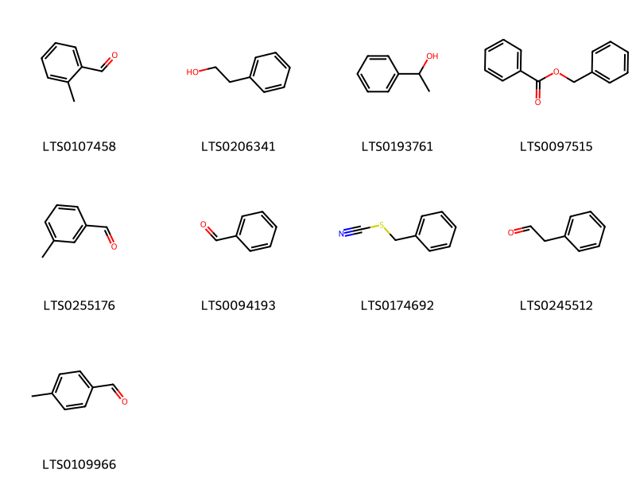{ width=100% }
    <figcaption>Hình ảnh cấu trúc hóa học của 9 hoạt chất thuộc nhóm Benzene and substituted derivatives gồm ['2-methylbenzaldehyde (LTS0107458)', '2-phenyl-ethanol (LTS0206341)', 'methylphenyl carbinol (LTS0193761)', 'benzyl benzoate (LTS0097515)', '3-methylbenzaldehyde (LTS0255176)', 'benzaldehyde (LTS0094193)', 'benzyl thiocyanate (LTS0174692)', 'phenylacetaldehyde (LTS0245512)', 'p-tolualdehyde (LTS0109966)'].</figcaption>
</figure>
#### Nhóm Benzodioxoles
<figure markdown="span">
    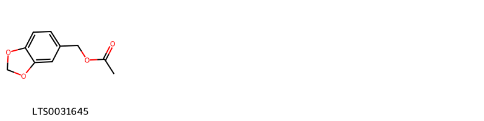{ width=100% }
    <figcaption>Hình ảnh cấu trúc hóa học của 1 hoạt chất thuộc nhóm Benzodioxoles gồm ['piperonyl acetate (LTS0031645)'].</figcaption>
</figure>
#### Nhóm Benzofurans
<figure markdown="span">
    { width=100% }
    <figcaption>Hình ảnh cấu trúc hóa học của 1 hoạt chất thuộc nhóm Benzofurans gồm ['dihydroactinidiolide (LTS0041341)'].</figcaption>
</figure>
#### Nhóm Benzothiazoles
<figure markdown="span">
    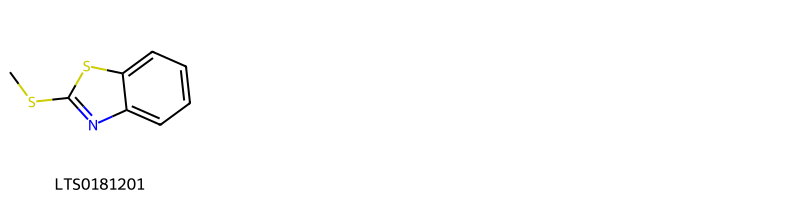{ width=100% }
    <figcaption>Hình ảnh cấu trúc hóa học của 1 hoạt chất thuộc nhóm Benzothiazoles gồm ['2-(methylthio)benzothiazole (LTS0181201)'].</figcaption>
</figure>
#### Nhóm Carboxylic acids and derivatives
<figure markdown="span">
    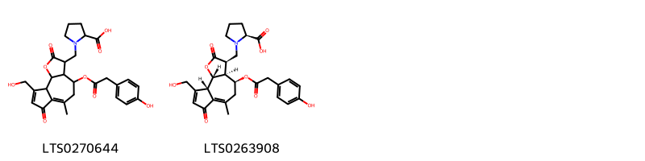{ width=100% }
    <figcaption>Hình ảnh cấu trúc hóa học của 2 hoạt chất thuộc nhóm Carboxylic acids and derivatives gồm ['1-{[9-(hydroxymethyl)-4-{[2-(4-hydroxyphenyl)acetyl]oxy}-6-methyl-2,7-dioxo-3h,3ah,4h,5h,9ah,9bh-azuleno[4,5-b]furan-3-yl]methyl}pyrrolidine-2-carboxylic acid (LTS0270644)', '(2s)-1-{[(3r,3as,4s,9as,9bs)-9-(hydroxymethyl)-4-{[2-(4-hydroxyphenyl)acetyl]oxy}-6-methyl-2,7-dioxo-3h,3ah,4h,5h,9ah,9bh-azuleno[4,5-b]furan-3-yl]methyl}pyrrolidine-2-carboxylic acid (LTS0263908)'].</figcaption>
</figure>
#### Nhóm Cinnamic acids and derivatives
<figure markdown="span">
    { width=100% }
    <figcaption>Hình ảnh cấu trúc hóa học của 2 hoạt chất thuộc nhóm Cinnamic acids and derivatives gồm ['ethyl caffeate (LTS0147324)', 'ethyl 3-(3,4-dihydroxyphenyl)prop-2-enoate (LTS0196241)'].</figcaption>
</figure>
#### Nhóm Fatty Acyls
<figure markdown="span">
    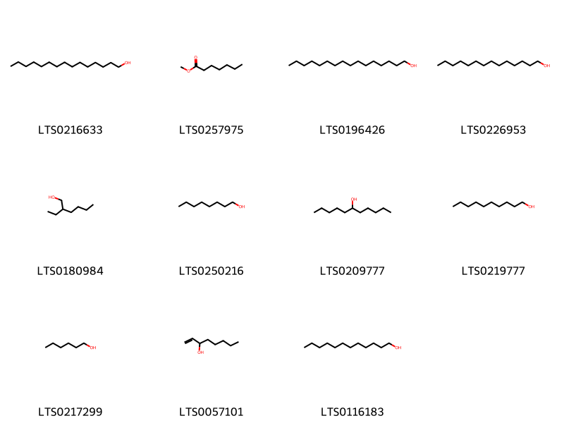{ width=100% }
    <figcaption>Hình ảnh cấu trúc hóa học của 11 hoạt chất thuộc nhóm Fatty Acyls gồm ['1-pentadecanol (LTS0216633)', 'methyl heptanoate (LTS0257975)', 'cetyl alcohol (LTS0196426)', 'myristyl alcohol (LTS0226953)', '2-ethylhexanol (LTS0180984)', 'octanol (LTS0250216)', '6-undecanol (LTS0209777)', 'decanol (LTS0219777)', 'hexanol (LTS0217299)', '1-octen-3-ol (LTS0057101)', '1-dodecanol (LTS0116183)'].</figcaption>
</figure>
#### Nhóm Flavonoids
<figure markdown="span">
    { width=100% }
    <figcaption>Hình ảnh cấu trúc hóa học của 2 hoạt chất thuộc nhóm Flavonoids gồm ['kaempherol (LTS0155822)', 'quercetin (LTS0004651)'].</figcaption>
</figure>
#### Nhóm Heteroaromatic compounds
<figure markdown="span">
    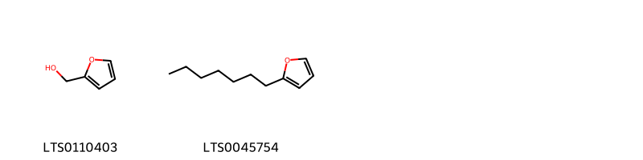{ width=100% }
    <figcaption>Hình ảnh cấu trúc hóa học của 2 hoạt chất thuộc nhóm Heteroaromatic compounds gồm ['furfuryl alcohol (LTS0110403)', '2-heptylfuran (LTS0045754)'].</figcaption>
</figure>
#### Nhóm Lactones
<figure markdown="span">
    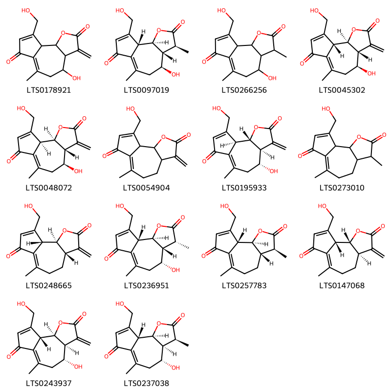{ width=100% }
    <figcaption>Hình ảnh cấu trúc hóa học của 14 hoạt chất thuộc nhóm Lactones gồm ['4-hydroxy-9-(hydroxymethyl)-6-methyl-3-methylidene-3ah,4h,5h,9ah,9bh-azuleno[4,5-b]furan-2,7-dione (LTS0178921)', '11β,13-dihydrolactucin (LTS0097019)', '4-hydroxy-9-(hydroxymethyl)-3,6-dimethyl-3h,3ah,4h,5h,9ah,9bh-azuleno[4,5-b]furan-2,7-dione (LTS0266256)', 'lactucin (LTS0045302)', '(3ar,4s,9ar,9br)-4-hydroxy-9-(hydroxymethyl)-6-methyl-3-methylidene-3ah,4h,5h,9ah,9bh-azuleno[4,5-b]furan-2,7-dione (LTS0048072)', '9-(hydroxymethyl)-6-methyl-3-methylidene-3ah,4h,5h,9ah,9bh-azuleno[4,5-b]furan-2,7-dione (LTS0054904)', '(3as,4r,9ar,9bs)-4-hydroxy-9-(hydroxymethyl)-6-methyl-3-methylidene-3ah,4h,5h,9ah,9bh-azuleno[4,5-b]furan-2,7-dione (LTS0195933)', '9-(hydroxymethyl)-3,6-dimethyl-3h,3ah,4h,5h,9ah,9bh-azuleno[4,5-b]furan-2,7-dione (LTS0273010)', '8-deoxylactucin (LTS0248665)', '(3r,3ar,4r,9as,9br)-4-hydroxy-9-(hydroxymethyl)-3,6-dimethyl-3h,3ah,4h,5h,9ah,9bh-azuleno[4,5-b]furan-2,7-dione (LTS0236951)', '(3s,3as,9as,9bs)-9-(hydroxymethyl)-3,6-dimethyl-3h,3ah,4h,5h,9ah,9bh-azuleno[4,5-b]furan-2,7-dione (LTS0257783)', '(3ar,9as,9br)-9-(hydroxymethyl)-6-methyl-3-methylidene-3ah,4h,5h,9ah,9bh-azuleno[4,5-b]furan-2,7-dione (LTS0147068)', '(3as,4r,9as,9br)-4-hydroxy-9-(hydroxymethyl)-6-methyl-3-methylidene-3ah,4h,5h,9ah,9bh-azuleno[4,5-b]furan-2,7-dione (LTS0243937)', '(3s,3as,4r,9as,9br)-4-hydroxy-9-(hydroxymethyl)-3,6-dimethyl-3h,3ah,4h,5h,9ah,9bh-azuleno[4,5-b]furan-2,7-dione (LTS0237038)'].</figcaption>
</figure>
#### Nhóm Organooxygen compounds
<figure markdown="span">
    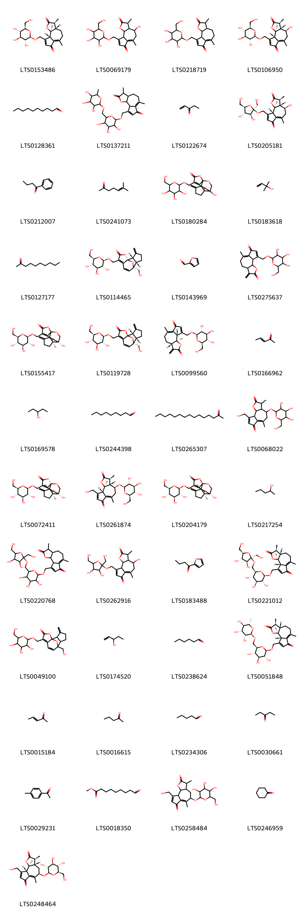{ width=100% }
    <figcaption>Hình ảnh cấu trúc hóa học của 45 hoạt chất thuộc nhóm Organooxygen compounds gồm ['(3s,3as,9as,9bs)-3,6-dimethyl-9-({[(2r,3r,4s,5s,6r)-3,4,5-trihydroxy-6-(hydroxymethyl)oxan-2-yl]oxy}methyl)-3h,3ah,4h,5h,9ah,9bh-azuleno[4,5-b]furan-2,7-dione (LTS0153486)', '4-hydroxy-3,6-dimethyl-9-({[3,4,5-trihydroxy-6-(hydroxymethyl)oxan-2-yl]oxy}methyl)-3h,3ah,4h,5h,9ah,9bh-azuleno[4,5-b]furan-2,7-dione (LTS0069179)', '3,6-dimethyl-9-({[3,4,5-trihydroxy-6-(hydroxymethyl)oxan-2-yl]oxy}methyl)-3h,3ah,4h,5h,9ah,9bh-azuleno[4,5-b]furan-2,7-dione (LTS0218719)', '(3s,3ar,4s,9as,9br)-4-hydroxy-3,6-dimethyl-9-({[(2r,3r,4s,5s,6r)-3,4,5-trihydroxy-6-(hydroxymethyl)oxan-2-yl]oxy}methyl)-3h,3ah,4h,5h,9ah,9bh-azuleno[4,5-b]furan-2,7-dione (LTS0106950)', 'decanal (LTS0128361)', '3,6-dimethyl-9-{[(3,4,5-trihydroxy-6-{[(3,4,5-trihydroxy-6-methyloxan-2-yl)oxy]methyl}oxan-2-yl)oxy]methyl}-3h,3ah,4h,5h,9ah,9bh-azuleno[4,5-b]furan-2,7-dione (LTS0137211)', '1-penten-3-one (LTS0122674)', '(3s,3ar,4s,9as,9br)-9-({[(2r,3s,4s,5r)-3,4-dihydroxy-2,5-bis(hydroxymethyl)oxolan-2-yl]oxy}methyl)-4-hydroxy-3,6-dimethyl-3h,3ah,4h,5h,9ah,9bh-azuleno[4,5-b]furan-2,7-dione (LTS0205181)', 'butyrophenone (LTS0212007)', '6-methyl-5-hepten-2-one (LTS0241073)', '8-hydroxy-12-methylidene-4-({[3,4,5-trihydroxy-6-(hydroxymethyl)oxan-2-yl]oxy}methyl)-2,14-dioxatetracyclo[6.5.2.0¹,⁵.0⁹,¹³]pentadeca-4,6-dien-3-one (LTS0180284)', '2-methyl-3-buten-2-ol (LTS0183618)', '2-decanone (LTS0127177)', '(1s,8r,9s,13s)-8-(hydroxymethyl)-12-methylidene-4-({[(2r,3r,4s,5s,6r)-3,4,5-trihydroxy-6-(hydroxymethyl)oxan-2-yl]oxy}methyl)-2,14-dioxatetracyclo[6.5.1.0¹,⁵.0⁹,¹³]tetradeca-4,6-dien-3-one (LTS0114465)', 'bran oil (LTS0143969)', '6-methyl-3-methylidene-9-({[3,4,5-trihydroxy-6-(hydroxymethyl)oxan-2-yl]oxy}methyl)-3ah,4h,5h,9ah,9bh-azuleno[4,5-b]furan-2,7-dione (LTS0275637)', '(8s,9s)-8-hydroxy-12-methylidene-4-({[(2r,3r,4s,5s,6r)-3,4,5-trihydroxy-6-(hydroxymethyl)oxan-2-yl]oxy}methyl)-2,14-dioxatetracyclo[6.5.2.0¹,⁵.0⁹,¹³]pentadeca-4,6-dien-3-one (LTS0155417)', '(1r,8r,9s,13s)-8-(hydroxymethyl)-12-methylidene-4-({[(2r,3r,4s,5s,6r)-3,4,5-trihydroxy-6-(hydroxymethyl)oxan-2-yl]oxy}methyl)-2,14-dioxatetracyclo[6.5.1.0¹,⁵.0⁹,¹³]tetradeca-4,6-dien-3-one (LTS0119728)', '(3as,9as,9bs)-6-methyl-3-methylidene-9-({[(2r,3r,4s,5s,6r)-3,4,5-trihydroxy-6-(hydroxymethyl)oxan-2-yl]oxy}methyl)-3ah,4h,5h,9ah,9bh-azuleno[4,5-b]furan-2,7-dione (LTS0099560)', '(e)-3-penten-2-one (LTS0166962)', '3-pentanol (LTS0169578)', 'nonanal (LTS0244398)', '2-pentadecanone (LTS0265307)', '9-(hydroxymethyl)-3,6-dimethyl-4-{[3,4,5-trihydroxy-6-(hydroxymethyl)oxan-2-yl]oxy}-3h,3ah,4h,5h,9ah,9bh-azuleno[4,5-b]furan-2,7-dione (LTS0068022)', '(1r,8s,9s,13s)-8-hydroxy-12-methylidene-4-({[(2r,3r,4s,5s,6r)-3,4,5-trihydroxy-6-(hydroxymethyl)oxan-2-yl]oxy}methyl)-2,14-dioxatetracyclo[6.5.2.0¹,⁵.0⁹,¹³]pentadeca-4,6-dien-3-one (LTS0072411)', '(3s,3ar,4s,9as,9br)-9-(hydroxymethyl)-3,6-dimethyl-4-{[(2r,3r,4s,5s,6r)-3,4,5-trihydroxy-6-(hydroxymethyl)oxan-2-yl]oxy}-3h,3ah,4h,5h,9ah,9bh-azuleno[4,5-b]furan-2,7-dione (LTS0261874)', '(1s,8s,9s,13s)-8-hydroxy-12-methylidene-4-({[(2r,3r,4s,5s,6r)-3,4,5-trihydroxy-6-(hydroxymethyl)oxan-2-yl]oxy}methyl)-2,14-dioxatetracyclo[6.5.2.0¹,⁵.0⁹,¹³]pentadeca-4,6-dien-3-one (LTS0204179)', '2-pentanol (LTS0217254)', '9-({[6-({[3,4-dihydroxy-2,5-bis(hydroxymethyl)oxolan-2-yl]oxy}methyl)-3,4,5-trihydroxyoxan-2-yl]oxy}methyl)-3,6-dimethyl-3h,3ah,4h,5h,9ah,9bh-azuleno[4,5-b]furan-2,7-dione (LTS0220768)', '9-({[3,4-dihydroxy-2,5-bis(hydroxymethyl)oxolan-2-yl]oxy}methyl)-4-hydroxy-3,6-dimethyl-3h,3ah,4h,5h,9ah,9bh-azuleno[4,5-b]furan-2,7-dione (LTS0262916)', '2-butyrylfuran (LTS0183488)', '(3s,3as,9as,9bs)-9-({[(2r,3r,4s,5s,6r)-6-({[(2r,3s,4s,5r)-3,4-dihydroxy-2,5-bis(hydroxymethyl)oxolan-2-yl]oxy}methyl)-3,4,5-trihydroxyoxan-2-yl]oxy}methyl)-3,6-dimethyl-3h,3ah,4h,5h,9ah,9bh-azuleno[4,5-b]furan-2,7-dione (LTS0221012)', '8-(hydroxymethyl)-12-methylidene-4-({[3,4,5-trihydroxy-6-(hydroxymethyl)oxan-2-yl]oxy}methyl)-2,14-dioxatetracyclo[6.5.1.0¹,⁵.0⁹,¹³]tetradeca-4,6-dien-3-one (LTS0049100)', '1-penten-3-ol (LTS0174520)', 'hexanal (LTS0238624)', '(3s,3as,9as,9bs)-3,6-dimethyl-9-({[(2r,3r,4s,5s,6r)-3,4,5-trihydroxy-6-({[(2r,3r,4r,5r,6s)-3,4,5-trihydroxy-6-methyloxan-2-yl]oxy}methyl)oxan-2-yl]oxy}methyl)-3h,3ah,4h,5h,9ah,9bh-azuleno[4,5-b]furan-2,7-dione (LTS0051848)', '3-penten-2-one (LTS0015184)', '2-pentanone (LTS0016615)', 'pentanal (LTS0234306)', '3-pentanone (LTS0030661)', 'p-methylacetophenone (LTS0029231)', 'methyl 9-oxononanoate (LTS0018350)', '9-(hydroxymethyl)-3,6-dimethyl-5-{[3,4,5-trihydroxy-6-(hydroxymethyl)oxan-2-yl]oxy}-3h,3ah,4h,5h,9ah,9bh-azuleno[4,5-b]furan-2,7-dione (LTS0258484)', 'cyclohexanone (LTS0246959)', '(3s,3as,5r,9as,9bs)-9-(hydroxymethyl)-3,6-dimethyl-5-{[(2r,3r,4s,5s,6r)-3,4,5-trihydroxy-6-(hydroxymethyl)oxan-2-yl]oxy}-3h,3ah,4h,5h,9ah,9bh-azuleno[4,5-b]furan-2,7-dione (LTS0248464)'].</figcaption>
</figure>
#### Nhóm Phenol ethers
<figure markdown="span">
    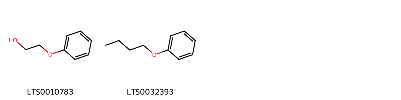{ width=100% }
    <figcaption>Hình ảnh cấu trúc hóa học của 2 hoạt chất thuộc nhóm Phenol ethers gồm ['phenoxyethanol (LTS0010783)', 'o-butylphenol (LTS0032393)'].</figcaption>
</figure>
#### Nhóm Phenols
<figure markdown="span">
    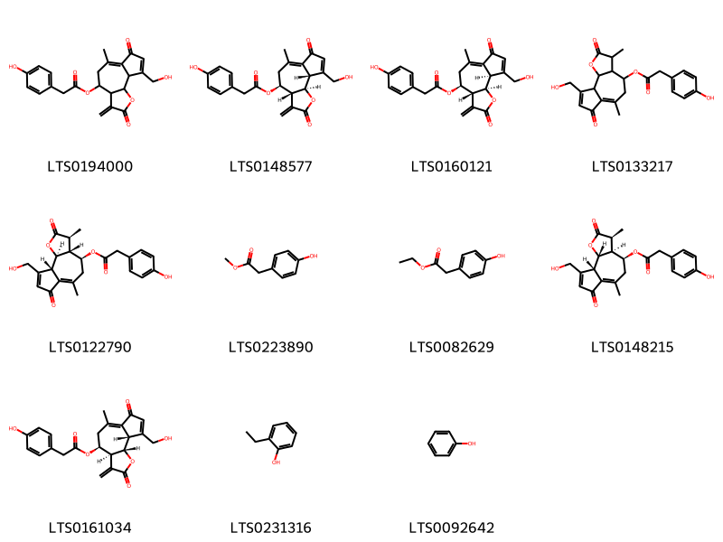{ width=100% }
    <figcaption>Hình ảnh cấu trúc hóa học của 11 hoạt chất thuộc nhóm Phenols gồm ['9-(hydroxymethyl)-6-methyl-3-methylidene-2,7-dioxo-3ah,4h,5h,9ah,9bh-azuleno[4,5-b]furan-4-yl 2-(4-hydroxyphenyl)acetate (LTS0194000)', 'lactupicrin (LTS0148577)', '(3ar,4s,9ar,9br)-9-(hydroxymethyl)-6-methyl-3-methylidene-2,7-dioxo-3ah,4h,5h,9ah,9bh-azuleno[4,5-b]furan-4-yl 2-(4-hydroxyphenyl)acetate (LTS0160121)', '9-(hydroxymethyl)-3,6-dimethyl-2,7-dioxo-3h,3ah,4h,5h,9ah,9bh-azuleno[4,5-b]furan-4-yl 2-(4-hydroxyphenyl)acetate (LTS0133217)', '11β,13-dihydrolactucopicrin (LTS0122790)', 'methyl 2-(4-hydroxyphenyl)acetate (LTS0223890)', 'ethyl 2-(4-hydroxyphenyl)acetate (LTS0082629)', '(3s,3as,4s,9as,9bs)-9-(hydroxymethyl)-3,6-dimethyl-2,7-dioxo-3h,3ah,4h,5h,9ah,9bh-azuleno[4,5-b]furan-4-yl 2-(4-hydroxyphenyl)acetate (LTS0148215)', '(3as,4s,9as,9bs)-9-(hydroxymethyl)-6-methyl-3-methylidene-2,7-dioxo-3ah,4h,5h,9ah,9bh-azuleno[4,5-b]furan-4-yl 2-(4-hydroxyphenyl)acetate (LTS0161034)', '2-ethylphenol (LTS0231316)', 'phenol (LTS0092642)'].</figcaption>
</figure>
#### Nhóm Prenol lipids
<figure markdown="span">
    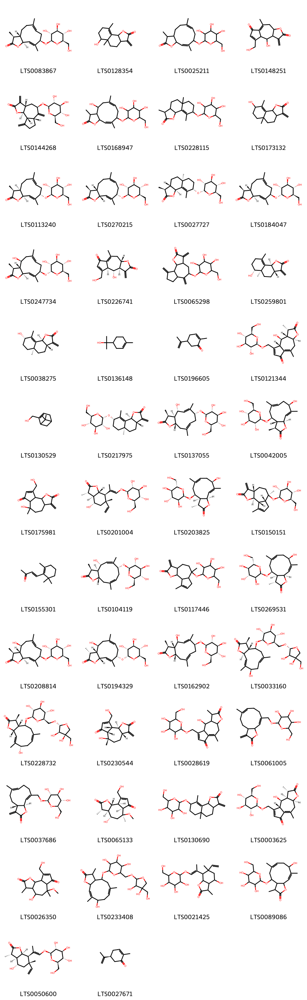{ width=100% }
    <figcaption>Hình ảnh cấu trúc hóa học của 51 hoạt chất thuộc nhóm Prenol lipids gồm ['(3s,3as,9r,11as)-3,6,10-trimethyl-9-{[(2r,3r,4s,5s,6r)-3,4,5-trihydroxy-6-(hydroxymethyl)oxan-2-yl]oxy}-3h,3ah,4h,5h,8h,9h,11ah-cyclodeca[b]furan-2-one (LTS0083867)', '6-hydroxy-5a,9-dimethyl-3-methylidene-3ah,4h,5h,6h,7h,8h,9bh-naphtho[1,2-b]furan-2-one (LTS0128354)', '3,6,10-trimethyl-9-{[3,4,5-trihydroxy-6-(hydroxymethyl)oxan-2-yl]oxy}-3h,3ah,4h,5h,8h,9h,11ah-cyclodeca[b]furan-2-one (LTS0025211)', '4-hydroxy-5-(hydroxymethyl)-8-methyl-3-methylidene-3ah,4h,4ah,9h,9ah-azuleno[6,5-b]furan-2,7-dione (LTS0148251)', '(3as,5r,6ar,9ar,9bs)-3,6,9-trimethylidene-5-{[(2r,3r,4s,5s,6r)-3,4,5-trihydroxy-6-(hydroxymethyl)oxan-2-yl]oxy}-octahydroazuleno[4,5-b]furan-2-one (LTS0144268)', '4-hydroxy-3,6,10-trimethyl-9-{[3,4,5-trihydroxy-6-(hydroxymethyl)oxan-2-yl]oxy}-3h,3ah,4h,5h,8h,9h,11ah-cyclodeca[b]furan-2-one (LTS0168947)', '3,5a,9-trimethyl-8-{[3,4,5-trihydroxy-6-(hydroxymethyl)oxan-2-yl]oxy}-3h,3ah,4h,5h,6h,7h,8h,9bh-naphtho[1,2-b]furan-2-one (LTS0228115)', '8-hydroxy-5a,9-dimethyl-3-methylidene-3ah,4h,5h,6h,7h,8h,9bh-naphtho[1,2-b]furan-2-one (LTS0173132)', '(3s,3ar,9s,11as)-3,6,10-trimethyl-9-{[(2r,3r,4s,5s,6r)-3,4,5-trihydroxy-6-(hydroxymethyl)oxan-2-yl]oxy}-3h,3ah,4h,5h,8h,9h,11ah-cyclodeca[b]furan-2-one (LTS0113240)', '(3s,3as,9s,11ar)-3,6,10-trimethyl-9-{[(2r,3r,4s,5s,6r)-3,4,5-trihydroxy-6-(hydroxymethyl)oxan-2-yl]oxy}-3h,3ah,4h,5h,8h,9h,11ah-cyclodeca[b]furan-2-one (LTS0270215)', '(3s,3as,5as,8s,9bs)-3,5a,9-trimethyl-8-{[(2s,3r,4s,5s,6r)-3,4,5-trihydroxy-6-(hydroxymethyl)oxan-2-yl]oxy}-3h,3ah,4h,5h,6h,7h,8h,9bh-naphtho[1,2-b]furan-2-one (LTS0027727)', '(3s,3as,9r,11as)-3,6,10-trimethyl-9-{[(2s,3r,4s,5s,6r)-3,4,5-trihydroxy-6-(hydroxymethyl)oxan-2-yl]oxy}-3h,3ah,4h,5h,8h,9h,11ah-cyclodeca[b]furan-2-one (LTS0184047)', '(3s,3ar,4s,9r,11ar)-4-hydroxy-3,6,10-trimethyl-9-{[(2s,3r,4s,5s,6r)-3,4,5-trihydroxy-6-(hydroxymethyl)oxan-2-yl]oxy}-3h,3ah,4h,5h,8h,9h,11ah-cyclodeca[b]furan-2-one (LTS0247734)', '(3as,4r,4as,9as)-4-hydroxy-5-(hydroxymethyl)-8-methyl-3-methylidene-3ah,4h,4ah,9h,9ah-azuleno[6,5-b]furan-2,7-dione (LTS0226741)', '3,6,9-trimethylidene-5-{[3,4,5-trihydroxy-6-(hydroxymethyl)oxan-2-yl]oxy}-octahydroazuleno[4,5-b]furan-2-one (LTS0065298)', '(3as,5ar,6r,9bs)-6-hydroxy-5a,9-dimethyl-3-methylidene-3ah,4h,5h,6h,7h,8h,9bh-naphtho[1,2-b]furan-2-one (LTS0259801)', '(3as,5as,8s,9bs)-8-hydroxy-5a,9-dimethyl-3-methylidene-3ah,4h,5h,6h,7h,8h,9bh-naphtho[1,2-b]furan-2-one (LTS0038275)', 'terpineol (LTS0136148)', 'carvone (LTS0196605)', '(3s,3as,4r,4as,9as)-4-hydroxy-3,8-dimethyl-5-({[(2r,3r,4s,5s,6r)-3,4,5-trihydroxy-6-(hydroxymethyl)oxan-2-yl]oxy}methyl)-3h,3ah,4h,4ah,9h,9ah-azuleno[6,5-b]furan-2,7-dione (LTS0121344)', 'myrtenol (LTS0130529)', '(3as,5as,8s,9bs)-5a,9-dimethyl-3-methylidene-8-{[(2s,3r,4s,5s,6r)-3,4,5-trihydroxy-6-(hydroxymethyl)oxan-2-yl]oxy}-3ah,4h,5h,6h,7h,8h,9bh-naphtho[1,2-b]furan-2-one (LTS0217975)', '(3s,3as,4r,7r,11as)-4-hydroxy-3,6,10-trimethyl-7-{[(2r,3r,4s,5s,6r)-3,4,5-trihydroxy-6-(hydroxymethyl)oxan-2-yl]oxy}-3h,3ah,4h,7h,8h,11h,11ah-cyclodeca[b]furan-2-one (LTS0137055)', '(3s,3ar,4s,9r,11ar)-9-hydroxy-3,6,10-trimethyl-4-{[(2r,3r,4s,5s,6r)-3,4,5-trihydroxy-6-(hydroxymethyl)oxan-2-yl]oxy}-3h,3ah,4h,5h,8h,9h,11ah-cyclodeca[b]furan-2-one (LTS0042005)', '6-hydroxy-9-(hydroxymethyl)-6-methyl-3-methylidene-3ah,4h,5h,6ah,9ah,9bh-azuleno[4,5-b]furan-2,7-dione (LTS0175981)', '(3s,3ar,4s,6s,7r,7ar)-6-ethenyl-4-hydroxy-3,6-dimethyl-7-[(1e)-1-{[(2r,3r,4s,5s,6r)-3,4,5-trihydroxy-6-(hydroxymethyl)oxan-2-yl]oxy}prop-1-en-2-yl]-hexahydro-1-benzofuran-2-one (LTS0201004)', '(3r,3as,4s,9r,11ar)-9-hydroxy-3,6,10-trimethyl-4-{[(2r,3s,4r,5r,6s)-3,4,5-trihydroxy-6-(hydroxymethyl)oxan-2-yl]oxy}-3h,3ah,4h,5h,8h,9h,11ah-cyclodeca[b]furan-2-one (LTS0203825)', '(3as,6r,6ar,9ar,9bs)-6,9-dimethyl-3-methylidene-6-{[(2s,3r,4s,5s,6r)-3,4,5-trihydroxy-6-(hydroxymethyl)oxan-2-yl]oxy}-3ah,4h,5h,6ah,7h,9ah,9bh-azuleno[4,5-b]furan-2-one (LTS0150151)', 'β-ionone (LTS0155301)', '(3s,3as,4r,7r,11as)-4-hydroxy-3,6,10-trimethyl-7-{[(2r,3r,4s,5s,6r)-3,4,5-trihydroxy-6-(hydroxymethyl)oxan-2-yl]oxy}-3h,3ah,4h,7h,8h,11h,11ah-cyclodeca[b]furan-2-one (LTS0104119)', '6,9-dimethyl-3-methylidene-6-{[3,4,5-trihydroxy-6-(hydroxymethyl)oxan-2-yl]oxy}-3ah,4h,5h,6ah,7h,9ah,9bh-azuleno[4,5-b]furan-2-one (LTS0117446)', '(3r,3as,4s,9r,11ar)-9-hydroxy-3,6,10-trimethyl-4-{[(2r,3s,4r,5r,6s)-3,4,5-trihydroxy-6-(hydroxymethyl)oxan-2-yl]oxy}-3h,3ah,4h,5h,8h,9h,11ah-cyclodeca[b]furan-2-one (LTS0269531)', '(3s,3ar,4s,9r,11ar)-4-hydroxy-3,6,10-trimethyl-9-{[(2r,3r,4s,5s,6r)-3,4,5-trihydroxy-6-(hydroxymethyl)oxan-2-yl]oxy}-3h,3ah,4h,5h,8h,9h,11ah-cyclodeca[b]furan-2-one (LTS0208814)', '(3r,3ar,4s,9s,11as)-4-hydroxy-3,6,10-trimethyl-9-{[(2s,3r,4s,5s,6r)-3,4,5-trihydroxy-6-(hydroxymethyl)oxan-2-yl]oxy}-3h,3ah,4h,5h,8h,9h,11ah-cyclodeca[b]furan-2-one (LTS0194329)', '(3s,3ar,4s,7s,11as)-4-hydroxy-3,6,10-trimethyl-7-{[(2r,3r,4s,5s,6r)-3,4,5-trihydroxy-6-(hydroxymethyl)oxan-2-yl]oxy}-3h,3ah,4h,7h,8h,11h,11ah-cyclodeca[b]furan-2-one (LTS0162902)', '(3s,3ar,4s,9r,11ar)-4-{[(2r,3r,4s,5s,6r)-6-({[(2r,3r,4r)-3,4-dihydroxy-4-(hydroxymethyl)oxolan-2-yl]oxy}methyl)-3,4,5-trihydroxyoxan-2-yl]oxy}-9-hydroxy-3,6,10-trimethyl-3h,3ah,4h,5h,8h,9h,11ah-cyclodeca[b]furan-2-one (LTS0033160)', '(3s,3ar,4s,9s,11as)-4-{[(2r,3r,4s,5s,6r)-6-({[(2r,3r,4r)-3,4-dihydroxy-4-(hydroxymethyl)oxolan-2-yl]oxy}methyl)-3,4,5-trihydroxyoxan-2-yl]oxy}-9-hydroxy-3,6,10-trimethyl-3h,3ah,4h,5h,8h,9h,11ah-cyclodeca[b]furan-2-one (LTS0228732)', '(3as,6s,6ar,9ar,9bs)-6-hydroxy-9-(hydroxymethyl)-6-methyl-3-methylidene-3ah,4h,5h,6ah,9ah,9bh-azuleno[4,5-b]furan-2,7-dione (LTS0230544)', '4-hydroxy-3,8-dimethyl-5-({[3,4,5-trihydroxy-6-(hydroxymethyl)oxan-2-yl]oxy}methyl)-3h,3ah,4h,4ah,9h,9ah-azuleno[6,5-b]furan-2,7-dione (LTS0028619)', '6-methyl-3-methylidene-10-({[3,4,5-trihydroxy-6-(hydroxymethyl)oxan-2-yl]oxy}methyl)-3ah,4h,5h,8h,9h,11ah-cyclodeca[b]furan-2-one (LTS0061005)', '(3as,11ar)-6-methyl-3-methylidene-10-({[(2r,3r,4s,5s,6r)-3,4,5-trihydroxy-6-(hydroxymethyl)oxan-2-yl]oxy}methyl)-3ah,4h,5h,8h,9h,11ah-cyclodeca[b]furan-2-one (LTS0037686)', '(3s,3ar,4s,6s,6ar,9ar,9br)-4-hydroxy-9-(hydroxymethyl)-6-methoxy-3,6-dimethyl-3h,3ah,4h,5h,6ah,9ah,9bh-azuleno[4,5-b]furan-2,7-dione (LTS0065133)', '5a,9-dimethyl-3-methylidene-8-{[3,4,5-trihydroxy-6-(hydroxymethyl)oxan-2-yl]oxy}-3ah,4h,5h,6h,7h,8h,9bh-naphtho[1,2-b]furan-2-one (LTS0130690)', '(3s,3ar,4r,4as,9as)-4-hydroxy-3,8-dimethyl-5-({[(2r,3r,4s,5s,6r)-3,4,5-trihydroxy-6-(hydroxymethyl)oxan-2-yl]oxy}methyl)-3h,3ah,4h,4ah,9h,9ah-azuleno[6,5-b]furan-2,7-dione (LTS0003625)', '4-hydroxy-9-(hydroxymethyl)-6-methoxy-3,6-dimethyl-3h,3ah,4h,5h,6ah,9ah,9bh-azuleno[4,5-b]furan-2,7-dione (LTS0026350)', '4-{[6-({[3,4-dihydroxy-4-(hydroxymethyl)oxolan-2-yl]oxy}methyl)-3,4,5-trihydroxyoxan-2-yl]oxy}-9-hydroxy-3,6,10-trimethyl-3h,3ah,4h,5h,8h,9h,11ah-cyclodeca[b]furan-2-one (LTS0233408)', '6-ethenyl-4-hydroxy-3,6-dimethyl-7-(1-{[3,4,5-trihydroxy-6-(hydroxymethyl)oxan-2-yl]oxy}prop-1-en-2-yl)-hexahydro-1-benzofuran-2-one (LTS0021425)', '9-hydroxy-3,6,10-trimethyl-4-{[3,4,5-trihydroxy-6-(hydroxymethyl)oxan-2-yl]oxy}-3h,3ah,4h,5h,8h,9h,11ah-cyclodeca[b]furan-2-one (LTS0089086)', '(3s,3ar,4s,6s,7r,7as)-6-ethenyl-4-hydroxy-3,6-dimethyl-7-[(1e)-1-{[(2r,3r,4s,5s,6r)-3,4,5-trihydroxy-6-(hydroxymethyl)oxan-2-yl]oxy}prop-1-en-2-yl]-hexahydro-1-benzofuran-2-one (LTS0050600)', 'carvone, (+)- (LTS0027671)', 'geranylacetone (LTS0231623)'].</figcaption>
</figure>

---

### Dược dân tộc học

Danh sách các quốc gia có sử dụng *Cichorium endivia* trong điều trị các bệnh. 

| Country   | Disease                                             | Bệnh                                                                                                                                                                                                |
|:----------|:----------------------------------------------------|:----------------------------------------------------------------------------------------------------------------------------------------------------------------------------------------------------|
| Elsewhere | Demulcent, Tonic                                    | MYMEMORY WARNING: YOU USED ALL AVAILABLE FREE TRANSLATIONS FOR TODAY. NEXT AVAILABLE IN  11 HOURS 46 MINUTES 18 SECONDS VISIT HTTPS://MYMEMORY.TRANSLATED.NET/DOC/USAGELIMITS.PHP TO TRANSLATE MORE |
| Turkey    | Carminative, Diuretic, Laxative, Tonic, Refrigerant | MYMEMORY WARNING: YOU USED ALL AVAILABLE FREE TRANSLATIONS FOR TODAY. NEXT AVAILABLE IN  11 HOURS 46 MINUTES 14 SECONDS VISIT HTTPS://MYMEMORY.TRANSLATED.NET/DOC/USAGELIMITS.PHP TO TRANSLATE MORE |

---

---
## Cichorium intybus
### Thông tin về thực vật

!!! info "Phân loại thực vật của *Cichorium intybus* từ GIBF:"
    - **Kingdom:** Plantae
    - **Phylum:** Tracheophyta
    - **Order:** Asterales
    - **Family:** Asteraceae
    - **Genus:** Cichorium
    - **Species:** *Cichorium intybus*

 

| Label (VI)   | Label (EN)   | Scientific Name   | Descriptions (VI)   | Descriptions (EN)   | Also Known As (VI)   | Also Known As (EN)            |
|:-------------|:-------------|:------------------|:--------------------|:--------------------|:---------------------|:------------------------------|
| N/A          | N/A          | Cichorium intybus | loài thực vật       | species of plant    | ['']                 | ['chicory', 'common chicory'] |

#### Phân bố trên thế giới

**Từ CSDL GIBF** nan, Australia, Argentina, Canada, Ukraine, Denmark, Netherlands, Spain, Hungary, Albania, Portugal, Russian Federation, United States of America, Sweden, Uruguay, Chile, Greece, South Africa, Germany, Brazil, Switzerland, Austria, France, Serbia, Poland, New Zealand

#### Phân bố tại Việt Nam

**Từ CSDL GIBF**: Không có ghi nhận ở Việt Nam

---
### Thành phần hóa học
        
- Theo cơ sở dữ liệu lotus: Từ loài *Cichorium intybus* đã phân lập và xác định được 152 hoạt chất thuộc về các nhóm Benzofurans, Phenols, Carboxylic acids and derivatives, Anthracenes, Cinnamic acids and derivatives, Dibenzylbutane lignans, Prenol lipids, Benzene and substituted derivatives, Naphthofurans, Organooxygen compounds, Dihydrofurans, Furanoid lignans, Flavonoids, Steroids and steroid derivatives, Organonitrogen compounds, Pyrans, Lactones, Coumarins and derivatives, Imidazopyrimidines. 

|    | chemicalTaxonomyClassyfireClass     |   smiles_count |
|---:|:------------------------------------|---------------:|
|  0 | Anthracenes                         |              3 |
|  1 | Benzene and substituted derivatives |              2 |
|  2 | Benzofurans                         |              3 |
|  3 | Carboxylic acids and derivatives    |              2 |
|  4 | Cinnamic acids and derivatives      |              3 |
|  5 | Coumarins and derivatives           |              7 |
|  6 | Dibenzylbutane lignans              |              2 |
|  7 | Dihydrofurans                       |              1 |
|  8 | Flavonoids                          |             16 |
|  9 | Furanoid lignans                    |              3 |
| 10 | Imidazopyrimidines                  |              3 |
| 11 | Lactones                            |             16 |
| 12 | Naphthofurans                       |              1 |
| 13 | Organonitrogen compounds            |              2 |
| 14 | Organooxygen compounds              |             16 |
| 15 | Phenols                             |             17 |
| 16 | Prenol lipids                       |             46 |
| 17 | Pyrans                              |              1 |
| 18 | Steroids and steroid derivatives    |              8 |

#### Nhóm Anthracenes
<figure markdown="span">
    { width=100% }
    <figcaption>Hình ảnh cấu trúc hóa học của 3 hoạt chất thuộc nhóm Anthracenes gồm ['emodin (LTS0163480)', 'turkey rhubarb (LTS0160968)', 'physcion (LTS0052688)'].</figcaption>
</figure>
#### Nhóm Benzene and substituted derivatives
<figure markdown="span">
    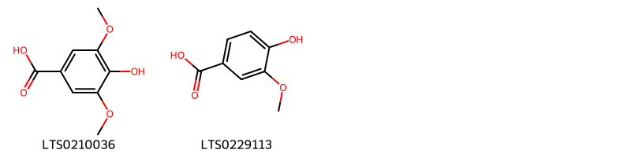{ width=100% }
    <figcaption>Hình ảnh cấu trúc hóa học của 2 hoạt chất thuộc nhóm Benzene and substituted derivatives gồm ['syringic acid (LTS0210036)', 'vanillic acid (LTS0229113)'].</figcaption>
</figure>
#### Nhóm Benzofurans
<figure markdown="span">
    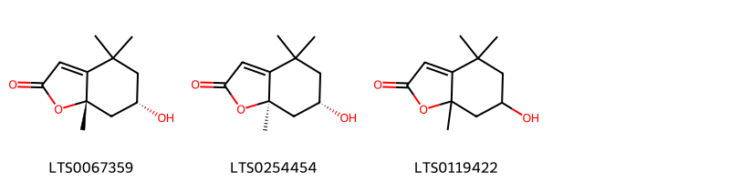{ width=100% }
    <figcaption>Hình ảnh cấu trúc hóa học của 3 hoạt chất thuộc nhóm Benzofurans gồm ['(6s,7as)-6-hydroxy-4,4,7a-trimethyl-6,7-dihydro-5h-1-benzofuran-2-one (LTS0067359)', 'loliolide (LTS0254454)', 'loliolide (LTS0119422)'].</figcaption>
</figure>
#### Nhóm Carboxylic acids and derivatives
<figure markdown="span">
    { width=100% }
    <figcaption>Hình ảnh cấu trúc hóa học của 2 hoạt chất thuộc nhóm Carboxylic acids and derivatives gồm ['2,3-bis({[3-(3,4-dihydroxyphenyl)prop-2-enoyl]oxy})butanedioic acid (LTS0188500)', 'cichoric acid (LTS0177566)'].</figcaption>
</figure>
#### Nhóm Cinnamic acids and derivatives
<figure markdown="span">
    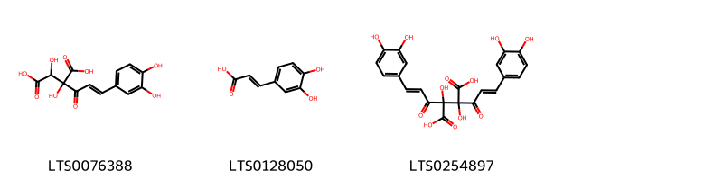{ width=100% }
    <figcaption>Hình ảnh cấu trúc hóa học của 3 hoạt chất thuộc nhóm Cinnamic acids and derivatives gồm ['2-[(2e)-3-(3,4-dihydroxyphenyl)prop-2-enoyl]-2,3-dihydroxybutanedioic acid (LTS0076388)', '3,4-dihydroxycinnamic acid (LTS0128050)', '2,3-bis[(2e)-3-(3,4-dihydroxyphenyl)prop-2-enoyl]-2,3-dihydroxybutanedioic acid (LTS0254897)'].</figcaption>
</figure>
#### Nhóm Coumarins and derivatives
<figure markdown="span">
    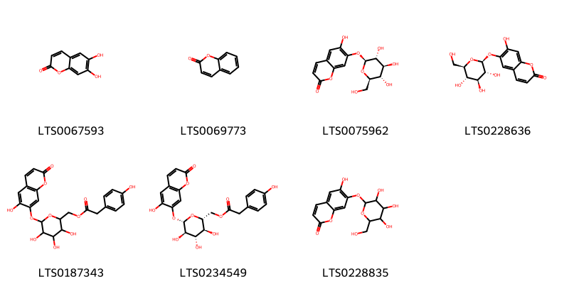{ width=100% }
    <figcaption>Hình ảnh cấu trúc hóa học của 7 hoạt chất thuộc nhóm Coumarins and derivatives gồm ['esculetin (LTS0067593)', '2h-1-benzopyran-2-one (LTS0069773)', 'cichoriin (LTS0075962)', 'esculin (LTS0228636)', '{3,4,5-trihydroxy-6-[(6-hydroxy-2-oxochromen-7-yl)oxy]oxan-2-yl}methyl 2-(4-hydroxyphenyl)acetate (LTS0187343)', '[(2r,3s,4s,5r,6s)-3,4,5-trihydroxy-6-[(6-hydroxy-2-oxochromen-7-yl)oxy]oxan-2-yl]methyl 2-(4-hydroxyphenyl)acetate (LTS0234549)', '6-hydroxy-7-{[3,4,5-trihydroxy-6-(hydroxymethyl)oxan-2-yl]oxy}chromen-2-one (LTS0228835)'].</figcaption>
</figure>
#### Nhóm Dibenzylbutane lignans
<figure markdown="span">
    { width=100% }
    <figcaption>Hình ảnh cấu trúc hóa học của 2 hoạt chất thuộc nhóm Dibenzylbutane lignans gồm ['(2s,3r)-2,3-bis[(4-hydroxy-3-methoxyphenyl)(¹³c)methyl](1-¹³c)butane-1,4-diol (LTS0268699)', 'secoisolariciresinol (LTS0086727)'].</figcaption>
</figure>
#### Nhóm Dihydrofurans
<figure markdown="span">
    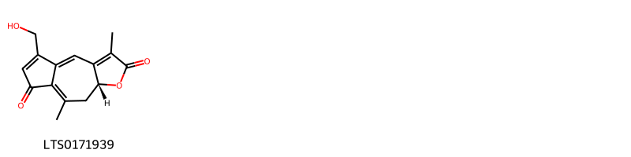{ width=100% }
    <figcaption>Hình ảnh cấu trúc hóa học của 1 hoạt chất thuộc nhóm Dihydrofurans gồm ['(9ar)-5-(hydroxymethyl)-3,8-dimethyl-9h,9ah-azuleno[6,5-b]furan-2,7-dione (LTS0171939)'].</figcaption>
</figure>
#### Nhóm Flavonoids
<figure markdown="span">
    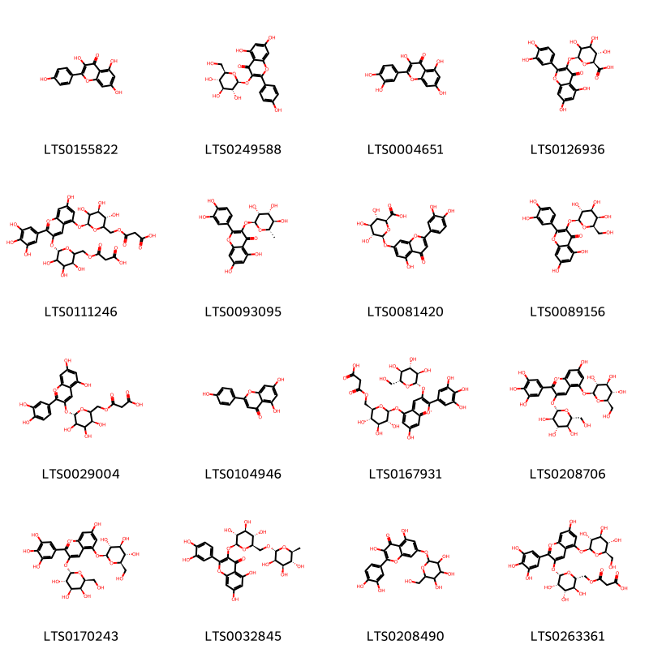{ width=100% }
    <figcaption>Hình ảnh cấu trúc hóa học của 16 hoạt chất thuộc nhóm Flavonoids gồm ['kaempherol (LTS0155822)', 'astragalin (LTS0249588)', 'quercetin (LTS0004651)', 'miquelianin (LTS0126936)', '5-{[(2s,4s,5s)-6-{[(2-carboxyacetyl)oxy]methyl}-3,4,5-trihydroxyoxan-2-yl]oxy}-3-{[(2s,5s)-6-{[(2-carboxyacetyl)oxy]methyl}-3,4,5-trihydroxyoxan-2-yl]oxy}-7-hydroxy-2-(3,4,5-trihydroxyphenyl)-1λ⁴-chromen-1-ylium (LTS0111246)', 'quercitrin (LTS0093095)', 'luteolin 7-o-glucuronide (LTS0081420)', 'hyperoside (LTS0089156)', '3-{[(2s,5s)-6-{[(2-carboxyacetyl)oxy]methyl}-3,4,5-trihydroxyoxan-2-yl]oxy}-2-(3,4-dihydroxyphenyl)-5,7-dihydroxy-1λ⁴-chromen-1-ylium (LTS0029004)', 'chamomile (LTS0104946)', '5-{[(2s,3r,4s,5s,6r)-6-{[(2-carboxyacetyl)oxy]methyl}-3,4,5-trihydroxyoxan-2-yl]oxy}-7-hydroxy-3-{[(2s,3r,4s,5s,6r)-3,4,5-trihydroxy-6-(hydroxymethyl)oxan-2-yl]oxy}-2-(3,4,5-trihydroxyphenyl)-1λ⁴-chromen-1-ylium (LTS0167931)', 'delphin (LTS0208706)', '7-hydroxy-5-{[(2s,3r,4s,5s,6r)-3,4,5-trihydroxy-6-(hydroxymethyl)oxan-2-yl]oxy}-3-{[(2s,3s,4r,5s,6s)-3,4,5-trihydroxy-6-(hydroxymethyl)oxan-2-yl]oxy}-2-(3,4,5-trihydroxyphenyl)-1λ⁴-chromen-1-ylium (LTS0170243)', '3-rutinosyl quercetin (LTS0032845)', 'quercimeritrin (LTS0208490)', '3-{[(2s,3s,4s,5s,6r)-6-{[(2-carboxyacetyl)oxy]methyl}-3,4,5-trihydroxyoxan-2-yl]oxy}-7-hydroxy-5-{[(2s,3r,4s,5s,6r)-3,4,5-trihydroxy-6-(hydroxymethyl)oxan-2-yl]oxy}-2-(3,4,5-trihydroxyphenyl)-1λ⁴-chromen-1-ylium (LTS0263361)'].</figcaption>
</figure>
#### Nhóm Furanoid lignans
<figure markdown="span">
    { width=100% }
    <figcaption>Hình ảnh cấu trúc hóa học của 3 hoạt chất thuộc nhóm Furanoid lignans gồm ['pinoresinol (LTS0057431)', 'matairesinol (LTS0193475)', 'lariciresinol (LTS0010950)'].</figcaption>
</figure>
#### Nhóm Imidazopyrimidines
<figure markdown="span">
    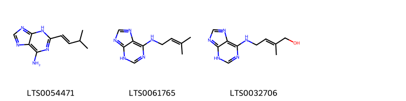{ width=100% }
    <figcaption>Hình ảnh cấu trúc hóa học của 3 hoạt chất thuộc nhóm Imidazopyrimidines gồm ['2-(3-methylbut-1-en-1-yl)-3h-purin-6-amine (LTS0054471)', '2ip (LTS0061765)', 'zeatine (LTS0032706)'].</figcaption>
</figure>
#### Nhóm Lactones
<figure markdown="span">
    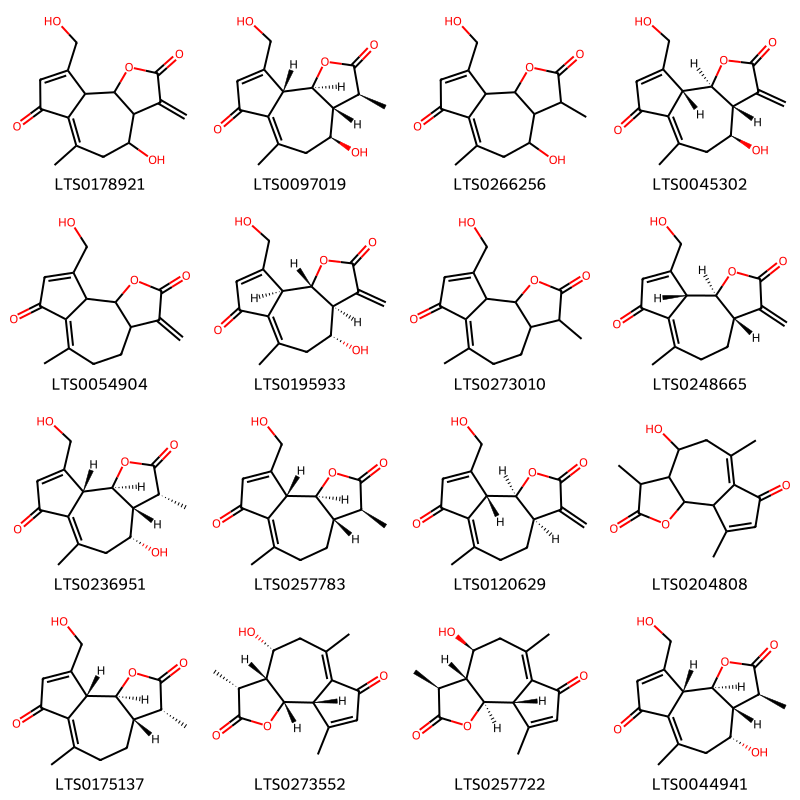{ width=100% }
    <figcaption>Hình ảnh cấu trúc hóa học của 16 hoạt chất thuộc nhóm Lactones gồm ['4-hydroxy-9-(hydroxymethyl)-6-methyl-3-methylidene-3ah,4h,5h,9ah,9bh-azuleno[4,5-b]furan-2,7-dione (LTS0178921)', '11β,13-dihydrolactucin (LTS0097019)', '4-hydroxy-9-(hydroxymethyl)-3,6-dimethyl-3h,3ah,4h,5h,9ah,9bh-azuleno[4,5-b]furan-2,7-dione (LTS0266256)', 'lactucin (LTS0045302)', '9-(hydroxymethyl)-6-methyl-3-methylidene-3ah,4h,5h,9ah,9bh-azuleno[4,5-b]furan-2,7-dione (LTS0054904)', '(3as,4r,9ar,9bs)-4-hydroxy-9-(hydroxymethyl)-6-methyl-3-methylidene-3ah,4h,5h,9ah,9bh-azuleno[4,5-b]furan-2,7-dione (LTS0195933)', '9-(hydroxymethyl)-3,6-dimethyl-3h,3ah,4h,5h,9ah,9bh-azuleno[4,5-b]furan-2,7-dione (LTS0273010)', '8-deoxylactucin (LTS0248665)', '(3r,3ar,4r,9as,9br)-4-hydroxy-9-(hydroxymethyl)-3,6-dimethyl-3h,3ah,4h,5h,9ah,9bh-azuleno[4,5-b]furan-2,7-dione (LTS0236951)', '(3s,3as,9as,9bs)-9-(hydroxymethyl)-3,6-dimethyl-3h,3ah,4h,5h,9ah,9bh-azuleno[4,5-b]furan-2,7-dione (LTS0257783)', '(3ar,9as,9bs)-9-(hydroxymethyl)-6-methyl-3-methylidene-3ah,4h,5h,9ah,9bh-azuleno[4,5-b]furan-2,7-dione (LTS0120629)', '4-hydroxy-3,6,9-trimethyl-3h,3ah,4h,5h,9ah,9bh-azuleno[4,5-b]furan-2,7-dione (LTS0204808)', '(3r,3as,9as,9bs)-9-(hydroxymethyl)-3,6-dimethyl-3h,3ah,4h,5h,9ah,9bh-azuleno[4,5-b]furan-2,7-dione (LTS0175137)', '(3r,3ar,4r,9as,9bs)-4-hydroxy-3,6,9-trimethyl-3h,3ah,4h,5h,9ah,9bh-azuleno[4,5-b]furan-2,7-dione (LTS0273552)', '(3s,3ar,4s,9as,9br)-4-hydroxy-3,6,9-trimethyl-3h,3ah,4h,5h,9ah,9bh-azuleno[4,5-b]furan-2,7-dione (LTS0257722)', '(3s,3ar,4r,9as,9br)-4-hydroxy-9-(hydroxymethyl)-3,6-dimethyl-3h,3ah,4h,5h,9ah,9bh-azuleno[4,5-b]furan-2,7-dione (LTS0044941)'].</figcaption>
</figure>
#### Nhóm Naphthofurans
<figure markdown="span">
    { width=100% }
    <figcaption>Hình ảnh cấu trúc hóa học của 1 hoạt chất thuộc nhóm Naphthofurans gồm ['3,5a-dimethyl-9-{[3,4,5-trihydroxy-6-(hydroxymethyl)oxan-2-yl]oxy}-3h,3ah,4h,5h,6h,7h,8h,9bh-naphtho[1,2-b]furan-2-one (LTS0044603)'].</figcaption>
</figure>
#### Nhóm Organonitrogen compounds
<figure markdown="span">
    { width=100% }
    <figcaption>Hình ảnh cấu trúc hóa học của 2 hoạt chất thuộc nhóm Organonitrogen compounds gồm ['putrescine (LTS0238763)', 'spermidine (LTS0061428)'].</figcaption>
</figure>
#### Nhóm Organooxygen compounds
<figure markdown="span">
    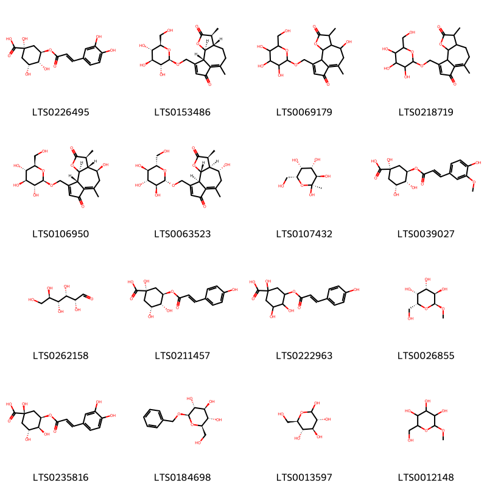{ width=100% }
    <figcaption>Hình ảnh cấu trúc hóa học của 16 hoạt chất thuộc nhóm Organooxygen compounds gồm ['chlorogenic acid (LTS0226495)', '(3s,3as,9as,9bs)-3,6-dimethyl-9-({[(2r,3r,4s,5s,6r)-3,4,5-trihydroxy-6-(hydroxymethyl)oxan-2-yl]oxy}methyl)-3h,3ah,4h,5h,9ah,9bh-azuleno[4,5-b]furan-2,7-dione (LTS0153486)', '4-hydroxy-3,6-dimethyl-9-({[3,4,5-trihydroxy-6-(hydroxymethyl)oxan-2-yl]oxy}methyl)-3h,3ah,4h,5h,9ah,9bh-azuleno[4,5-b]furan-2,7-dione (LTS0069179)', '3,6-dimethyl-9-({[3,4,5-trihydroxy-6-(hydroxymethyl)oxan-2-yl]oxy}methyl)-3h,3ah,4h,5h,9ah,9bh-azuleno[4,5-b]furan-2,7-dione (LTS0218719)', '(3s,3ar,4s,9as,9br)-4-hydroxy-3,6-dimethyl-9-({[(2r,3r,4s,5s,6r)-3,4,5-trihydroxy-6-(hydroxymethyl)oxan-2-yl]oxy}methyl)-3h,3ah,4h,5h,9ah,9bh-azuleno[4,5-b]furan-2,7-dione (LTS0106950)', '(3s,3as,4r,9ar,9bs)-4-hydroxy-3,6-dimethyl-9-({[(2s,3s,4r,5r,6s)-3,4,5-trihydroxy-6-(hydroxymethyl)oxan-2-yl]oxy}methyl)-3h,3ah,4h,5h,9ah,9bh-azuleno[4,5-b]furan-2,7-dione (LTS0063523)', '(2s,3r,4s,5r,6r)-6-(hydroxymethyl)-2-methyloxane-2,3,4,5-tetrol (LTS0107432)', '3-o-feruloyl-d-quinic acid (LTS0039027)', '(+)-glucose (LTS0262158)', '(1s,3r,4r,5r)-1,3,4-trihydroxy-5-{[(2e)-3-(4-hydroxyphenyl)prop-2-enoyl]oxy}cyclohexane-1-carboxylic acid (LTS0211457)', '1,3,4-trihydroxy-5-{[3-(4-hydroxyphenyl)prop-2-enoyl]oxy}cyclohexane-1-carboxylic acid (LTS0222963)', 'methyl α-galactoside (LTS0026855)', 'neochlorogenic acid (LTS0235816)', 'benzyl β-d-glucoside (LTS0184698)', 'glucose (LTS0013597)', 'methyl-α-d-mannoside (LTS0012148)'].</figcaption>
</figure>
#### Nhóm Phenols
<figure markdown="span">
    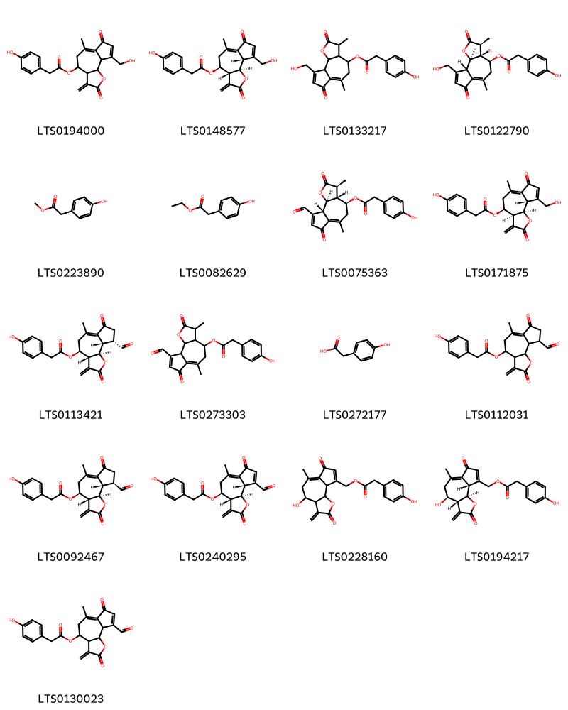{ width=100% }
    <figcaption>Hình ảnh cấu trúc hóa học của 17 hoạt chất thuộc nhóm Phenols gồm ['9-(hydroxymethyl)-6-methyl-3-methylidene-2,7-dioxo-3ah,4h,5h,9ah,9bh-azuleno[4,5-b]furan-4-yl 2-(4-hydroxyphenyl)acetate (LTS0194000)', 'lactupicrin (LTS0148577)', '9-(hydroxymethyl)-3,6-dimethyl-2,7-dioxo-3h,3ah,4h,5h,9ah,9bh-azuleno[4,5-b]furan-4-yl 2-(4-hydroxyphenyl)acetate (LTS0133217)', '11β,13-dihydrolactucopicrin (LTS0122790)', 'methyl 2-(4-hydroxyphenyl)acetate (LTS0223890)', 'ethyl 2-(4-hydroxyphenyl)acetate (LTS0082629)', '(3s,3ar,4s,9as,9br)-9-formyl-3,6-dimethyl-2,7-dioxo-3h,3ah,4h,5h,9ah,9bh-azuleno[4,5-b]furan-4-yl 2-(4-hydroxyphenyl)acetate (LTS0075363)', '(3as,4s,9as,9br)-9-(hydroxymethyl)-6-methyl-3-methylidene-2,7-dioxo-3ah,4h,5h,9ah,9bh-azuleno[4,5-b]furan-4-yl 2-(4-hydroxyphenyl)acetate (LTS0171875)', '(3ar,4s,9s,9as,9br)-9-formyl-6-methyl-3-methylidene-2,7-dioxo-3ah,4h,5h,8h,9h,9ah,9bh-azuleno[4,5-b]furan-4-yl 2-(4-hydroxyphenyl)acetate (LTS0113421)', '9-formyl-3,6-dimethyl-2,7-dioxo-3h,3ah,4h,5h,9ah,9bh-azuleno[4,5-b]furan-4-yl 2-(4-hydroxyphenyl)acetate (LTS0273303)', '4-hydroxyphenylacetic acid (LTS0272177)', '9-formyl-6-methyl-3-methylidene-2,7-dioxo-3ah,4h,5h,8h,9h,9ah,9bh-azuleno[4,5-b]furan-4-yl 2-(4-hydroxyphenyl)acetate (LTS0112031)', '(3ar,4s,9r,9as,9br)-9-formyl-6-methyl-3-methylidene-2,7-dioxo-3ah,4h,5h,8h,9h,9ah,9bh-azuleno[4,5-b]furan-4-yl 2-(4-hydroxyphenyl)acetate (LTS0092467)', '(3ar,4s,9as,9br)-9-formyl-6-methyl-3-methylidene-2,7-dioxo-3ah,4h,5h,9ah,9bh-azuleno[4,5-b]furan-4-yl 2-(4-hydroxyphenyl)acetate (LTS0240295)', '{4-hydroxy-6-methyl-3-methylidene-2,7-dioxo-3ah,4h,5h,9ah,9bh-azuleno[4,5-b]furan-9-yl}methyl 2-(4-hydroxyphenyl)acetate (LTS0228160)', 'lactucopicrin (LTS0194217)', '9-formyl-6-methyl-3-methylidene-2,7-dioxo-3ah,4h,5h,9ah,9bh-azuleno[4,5-b]furan-4-yl 2-(4-hydroxyphenyl)acetate (LTS0130023)'].</figcaption>
</figure>
#### Nhóm Prenol lipids
<figure markdown="span">
    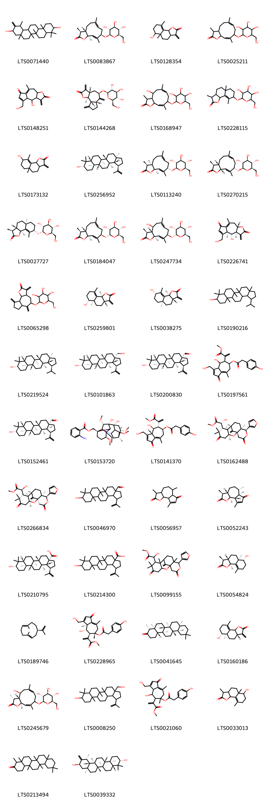{ width=100% }
    <figcaption>Hình ảnh cấu trúc hóa học của 46 hoạt chất thuộc nhóm Prenol lipids gồm ['1,4a,6a,6b,9,9,12a-heptamethyl-2-methylidene-hexadecahydropicene-3,10-diol (LTS0071440)', '(3s,3as,9r,11as)-3,6,10-trimethyl-9-{[(2r,3r,4s,5s,6r)-3,4,5-trihydroxy-6-(hydroxymethyl)oxan-2-yl]oxy}-3h,3ah,4h,5h,8h,9h,11ah-cyclodeca[b]furan-2-one (LTS0083867)', '6-hydroxy-5a,9-dimethyl-3-methylidene-3ah,4h,5h,6h,7h,8h,9bh-naphtho[1,2-b]furan-2-one (LTS0128354)', '3,6,10-trimethyl-9-{[3,4,5-trihydroxy-6-(hydroxymethyl)oxan-2-yl]oxy}-3h,3ah,4h,5h,8h,9h,11ah-cyclodeca[b]furan-2-one (LTS0025211)', '4-hydroxy-5-(hydroxymethyl)-8-methyl-3-methylidene-3ah,4h,4ah,9h,9ah-azuleno[6,5-b]furan-2,7-dione (LTS0148251)', '(3as,5r,6ar,9ar,9bs)-3,6,9-trimethylidene-5-{[(2r,3r,4s,5s,6r)-3,4,5-trihydroxy-6-(hydroxymethyl)oxan-2-yl]oxy}-octahydroazuleno[4,5-b]furan-2-one (LTS0144268)', '4-hydroxy-3,6,10-trimethyl-9-{[3,4,5-trihydroxy-6-(hydroxymethyl)oxan-2-yl]oxy}-3h,3ah,4h,5h,8h,9h,11ah-cyclodeca[b]furan-2-one (LTS0168947)', '3,5a,9-trimethyl-8-{[3,4,5-trihydroxy-6-(hydroxymethyl)oxan-2-yl]oxy}-3h,3ah,4h,5h,6h,7h,8h,9bh-naphtho[1,2-b]furan-2-one (LTS0228115)', '8-hydroxy-5a,9-dimethyl-3-methylidene-3ah,4h,5h,6h,7h,8h,9bh-naphtho[1,2-b]furan-2-one (LTS0173132)', 'lupeol (LTS0256952)', '(3s,3ar,9s,11as)-3,6,10-trimethyl-9-{[(2r,3r,4s,5s,6r)-3,4,5-trihydroxy-6-(hydroxymethyl)oxan-2-yl]oxy}-3h,3ah,4h,5h,8h,9h,11ah-cyclodeca[b]furan-2-one (LTS0113240)', '(3s,3as,9s,11ar)-3,6,10-trimethyl-9-{[(2r,3r,4s,5s,6r)-3,4,5-trihydroxy-6-(hydroxymethyl)oxan-2-yl]oxy}-3h,3ah,4h,5h,8h,9h,11ah-cyclodeca[b]furan-2-one (LTS0270215)', '(3s,3as,5as,8s,9bs)-3,5a,9-trimethyl-8-{[(2s,3r,4s,5s,6r)-3,4,5-trihydroxy-6-(hydroxymethyl)oxan-2-yl]oxy}-3h,3ah,4h,5h,6h,7h,8h,9bh-naphtho[1,2-b]furan-2-one (LTS0027727)', '(3s,3as,9r,11as)-3,6,10-trimethyl-9-{[(2s,3r,4s,5s,6r)-3,4,5-trihydroxy-6-(hydroxymethyl)oxan-2-yl]oxy}-3h,3ah,4h,5h,8h,9h,11ah-cyclodeca[b]furan-2-one (LTS0184047)', '(3s,3ar,4s,9r,11ar)-4-hydroxy-3,6,10-trimethyl-9-{[(2s,3r,4s,5s,6r)-3,4,5-trihydroxy-6-(hydroxymethyl)oxan-2-yl]oxy}-3h,3ah,4h,5h,8h,9h,11ah-cyclodeca[b]furan-2-one (LTS0247734)', '(3as,4r,4as,9as)-4-hydroxy-5-(hydroxymethyl)-8-methyl-3-methylidene-3ah,4h,4ah,9h,9ah-azuleno[6,5-b]furan-2,7-dione (LTS0226741)', '3,6,9-trimethylidene-5-{[3,4,5-trihydroxy-6-(hydroxymethyl)oxan-2-yl]oxy}-octahydroazuleno[4,5-b]furan-2-one (LTS0065298)', '(3as,5ar,6r,9bs)-6-hydroxy-5a,9-dimethyl-3-methylidene-3ah,4h,5h,6h,7h,8h,9bh-naphtho[1,2-b]furan-2-one (LTS0259801)', '(3as,5as,8s,9bs)-8-hydroxy-5a,9-dimethyl-3-methylidene-3ah,4h,5h,6h,7h,8h,9bh-naphtho[1,2-b]furan-2-one (LTS0038275)', '1-isopropyl-3a,5a,5b,8,8,11a-hexamethyl-hexadecahydrocyclopenta[a]chrysen-9-ol (LTS0190216)', '(1s,3ar,5ar,5br,7ar,9s,11ar,11br,13ar,13br)-1-isopropyl-3a,5a,5b,8,8,11a-hexamethyl-hexadecahydrocyclopenta[a]chrysen-9-ol (LTS0219524)', 'betulin (LTS0101863)', '(1r,3as,5ar,5br,7ar,9s,11ar,11br,13ar,13br)-9-hydroxy-5a,5b,8,8,11a-pentamethyl-1-(prop-1-en-2-yl)-hexadecahydrocyclopenta[a]chrysene-3a-carbaldehyde (LTS0200830)', 'methyl 2-[4-hydroxy-3-(hydroxymethyl)-6-{[2-(4-hydroxyphenyl)acetyl]oxy}-8-methyl-1-oxo-4,5,6,7-tetrahydro-3ah-azulen-5-yl]prop-2-enoate (LTS0197561)', '(1r,3as,5ar,5br,7ar,9s,11ar,11br,13ar,13bs)-9-hydroxy-5a,5b,8,8,11a-pentamethyl-1-(prop-1-en-2-yl)-hexadecahydrocyclopenta[a]chrysene-3a-carbaldehyde (LTS0152461)', '[(1s,4s,5r,6s,8r,9r,13s,16s,18s)-11-ethyl-8,9-dihydroxy-4,6,16,18-tetramethoxy-11-azahexacyclo[7.7.2.1²,⁵.0¹,¹⁰.0³,⁸.0¹³,¹⁷]nonadecan-13-yl]methyl 2-aminobenzoate (LTS0153720)', 'methyl 2-[(3as,4r,5s,6s)-4-hydroxy-3-(hydroxymethyl)-6-{[2-(4-hydroxyphenyl)acetyl]oxy}-8-methyl-1-oxo-4,5,6,7-tetrahydro-3ah-azulen-5-yl]prop-2-enoate (LTS0141370)', 'methyl (2r)-2-[(1r,3s,7r,8r,9r,12s,13r)-13-(furan-3-yl)-6,6,8,12-tetramethyl-17-methylidene-5,15-dioxo-2,14-dioxatetracyclo[7.7.1.0¹,¹².0³,⁸]heptadecan-7-yl]-2-hydroxyacetate (LTS0162488)', 'intybusoloid (LTS0266834)', 'betulinaldehyde (LTS0046970)', '3,6,9-trimethyl-3h,3ah,4h,5h,6h,6ah,9ah,9bh-azuleno[4,5-b]furan-2,7-dione (LTS0056957)', '(3s,3as,6s,6ar,9ar,9bs)-3,6,9-trimethyl-3h,3ah,4h,5h,6h,6ah,9ah,9bh-azuleno[4,5-b]furan-2,7-dione (LTS0052243)', 'betulinic acid (LTS0210795)', '9-hydroxy-5a,5b,8,8,11a-pentamethyl-1-(prop-1-en-2-yl)-hexadecahydrocyclopenta[a]chrysene-3a-carboxylic acid (LTS0214300)', 'methyl 2-[13-(furan-3-yl)-6,6,8,12-tetramethyl-17-methylidene-5,15-dioxo-2,14-dioxatetracyclo[7.7.1.0¹,¹².0³,⁸]heptadecan-7-yl]-2-hydroxyacetate (LTS0099155)', '(3s,3as,5ar,6r,9bs)-6-hydroxy-3,5a,9-trimethyl-3h,3ah,4h,5h,6h,7h,8h,9bh-naphtho[1,2-b]furan-2-one (LTS0054824)', '(+) germacrene a (LTS0189746)', 'methyl 2-[(3as,4r,5s,6s)-4-hydroxy-3-(hydroxymethyl)-6-{[2-(4-hydroxyphenyl)acetyl]oxy}-6,8-dimethyl-1-oxo-3a,4,5,7-tetrahydroazulen-5-yl]prop-2-enoate (LTS0228965)', '(-)-friedelin (LTS0041645)', '(3as,5ar,6r)-6-hydroxy-5a,9-dimethyl-3-methylidene-3ah,4h,5h,6h,7h,8h,9bh-naphtho[1,2-b]furan-2-one (LTS0160186)', '(3r,3ar,4s,11ar)-4-hydroxy-3,6,10-trimethyl-9-{[(2r,3r,4s,5s,6r)-3,4,5-trihydroxy-6-(hydroxymethyl)oxan-2-yl]oxy}-3h,3ah,4h,5h,8h,9h,11ah-cyclodeca[b]furan-2-one (LTS0245679)', '3a-(hydroxymethyl)-5a,5b,8,8,11a-pentamethyl-1-(prop-1-en-2-yl)-hexadecahydrocyclopenta[a]chrysen-9-ol (LTS0008250)', 'methyl 2-[4-hydroxy-3-(hydroxymethyl)-6-{[2-(4-hydroxyphenyl)acetyl]oxy}-6,8-dimethyl-1-oxo-3a,4,5,7-tetrahydroazulen-5-yl]prop-2-enoate (LTS0021060)', '6-hydroxy-3,5a,9-trimethyl-3h,3ah,4h,5h,6h,7h,8h,9bh-naphtho[1,2-b]furan-2-one (LTS0033013)', 'friedelin (LTS0213494)', 'cichoridiol (LTS0039332)'].</figcaption>
</figure>
#### Nhóm Pyrans
<figure markdown="span">
    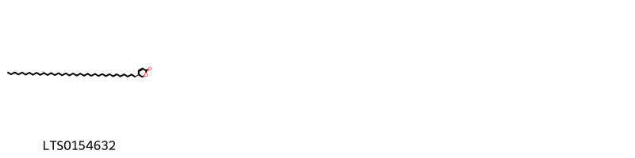{ width=100% }
    <figcaption>Hình ảnh cấu trúc hóa học của 1 hoạt chất thuộc nhóm Pyrans gồm ['(5s)-5-hexatriacontyl-5,6-dihydropyran-2-one (LTS0154632)'].</figcaption>
</figure>
#### Nhóm Steroids and steroid derivatives
<figure markdown="span">
    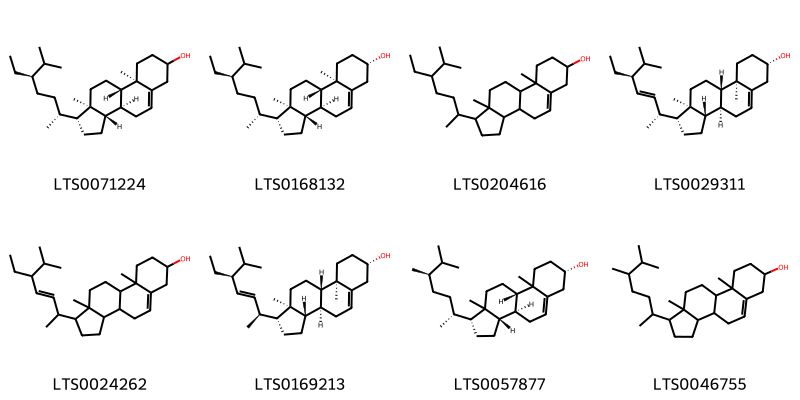{ width=100% }
    <figcaption>Hình ảnh cấu trúc hóa học của 8 hoạt chất thuộc nhóm Steroids and steroid derivatives gồm ['stigmast-5-en-3-ol (LTS0071224)', 'sitosterol (LTS0168132)', 'stigmast-5-en-3-ol, (3β)- (LTS0204616)', 'phytosterol (LTS0029311)', 'stigmasterol (LTS0024262)', '(1r,3as,3bs,7s,9ar,9bs,11ar)-1-[(2s,3e,5s)-5-ethyl-6-methylhept-3-en-2-yl]-9a,11a-dimethyl-1h,2h,3h,3ah,3bh,4h,6h,7h,8h,9h,9bh,10h,11h-cyclopenta[a]phenanthren-7-ol (LTS0169213)', '(1r,3as,3bs,7s,9bs)-1-[(2r,5r)-5,6-dimethylheptan-2-yl]-9a,11a-dimethyl-1h,2h,3h,3ah,3bh,4h,6h,7h,8h,9h,9bh,10h,11h-cyclopenta[a]phenanthren-7-ol (LTS0057877)', 'campesterol (LTS0046755)'].</figcaption>
</figure>

---

### Dược dân tộc học

Danh sách các quốc gia có sử dụng *Cichorium intybus* trong điều trị các bệnh. 

| Country   | Disease                                                                         | Bệnh                                                                                                                                                                                                |
|:----------|:--------------------------------------------------------------------------------|:----------------------------------------------------------------------------------------------------------------------------------------------------------------------------------------------------|
| Danish    | Sudorific                                                                       | MYMEMORY WARNING: YOU USED ALL AVAILABLE FREE TRANSLATIONS FOR TODAY. NEXT AVAILABLE IN  11 HOURS 45 MINUTES 35 SECONDS VISIT HTTPS://MYMEMORY.TRANSLATED.NET/DOC/USAGELIMITS.PHP TO TRANSLATE MORE |
| Dutch     | Stomachic                                                                       | MYMEMORY WARNING: YOU USED ALL AVAILABLE FREE TRANSLATIONS FOR TODAY. NEXT AVAILABLE IN  11 HOURS 45 MINUTES 32 SECONDS VISIT HTTPS://MYMEMORY.TRANSLATED.NET/DOC/USAGELIMITS.PHP TO TRANSLATE MORE |
| Elsewhere | Diuretic, Stomachic, Tonic                                                      | MYMEMORY WARNING: YOU USED ALL AVAILABLE FREE TRANSLATIONS FOR TODAY. NEXT AVAILABLE IN  11 HOURS 45 MINUTES 28 SECONDS VISIT HTTPS://MYMEMORY.TRANSLATED.NET/DOC/USAGELIMITS.PHP TO TRANSLATE MORE |
| France    | Laxative, Aperient                                                              | MYMEMORY WARNING: YOU USED ALL AVAILABLE FREE TRANSLATIONS FOR TODAY. NEXT AVAILABLE IN  11 HOURS 45 MINUTES 25 SECONDS VISIT HTTPS://MYMEMORY.TRANSLATED.NET/DOC/USAGELIMITS.PHP TO TRANSLATE MORE |
| French    | Sedative                                                                        | MYMEMORY WARNING: YOU USED ALL AVAILABLE FREE TRANSLATIONS FOR TODAY. NEXT AVAILABLE IN  11 HOURS 45 MINUTES 22 SECONDS VISIT HTTPS://MYMEMORY.TRANSLATED.NET/DOC/USAGELIMITS.PHP TO TRANSLATE MORE |
| German    | Aperient                                                                        | MYMEMORY WARNING: YOU USED ALL AVAILABLE FREE TRANSLATIONS FOR TODAY. NEXT AVAILABLE IN  11 HOURS 45 MINUTES 19 SECONDS VISIT HTTPS://MYMEMORY.TRANSLATED.NET/DOC/USAGELIMITS.PHP TO TRANSLATE MORE |
| India     | Tonic                                                                           | MYMEMORY WARNING: YOU USED ALL AVAILABLE FREE TRANSLATIONS FOR TODAY. NEXT AVAILABLE IN  11 HOURS 45 MINUTES 16 SECONDS VISIT HTTPS://MYMEMORY.TRANSLATED.NET/DOC/USAGELIMITS.PHP TO TRANSLATE MORE |
| Iran      | Tonic                                                                           | MYMEMORY WARNING: YOU USED ALL AVAILABLE FREE TRANSLATIONS FOR TODAY. NEXT AVAILABLE IN  11 HOURS 45 MINUTES 11 SECONDS VISIT HTTPS://MYMEMORY.TRANSLATED.NET/DOC/USAGELIMITS.PHP TO TRANSLATE MORE |
| Iraq      | Aperient, Cholagogue, Diuretic, Stomachic, Sudorific, Laxative, Tonic, Sedative | MYMEMORY WARNING: YOU USED ALL AVAILABLE FREE TRANSLATIONS FOR TODAY. NEXT AVAILABLE IN  11 HOURS 45 MINUTES 08 SECONDS VISIT HTTPS://MYMEMORY.TRANSLATED.NET/DOC/USAGELIMITS.PHP TO TRANSLATE MORE |
| US        | Diuretic                                                                        | MYMEMORY WARNING: YOU USED ALL AVAILABLE FREE TRANSLATIONS FOR TODAY. NEXT AVAILABLE IN  11 HOURS 45 MINUTES 04 SECONDS VISIT HTTPS://MYMEMORY.TRANSLATED.NET/DOC/USAGELIMITS.PHP TO TRANSLATE MORE |
| USSR      | Cholagogue                                                                      | MYMEMORY WARNING: YOU USED ALL AVAILABLE FREE TRANSLATIONS FOR TODAY. NEXT AVAILABLE IN  11 HOURS 45 MINUTES 01 SECONDS VISIT HTTPS://MYMEMORY.TRANSLATED.NET/DOC/USAGELIMITS.PHP TO TRANSLATE MORE |
| Venezuela | Refrigerant, Sudorific                                                          | MYMEMORY WARNING: YOU USED ALL AVAILABLE FREE TRANSLATIONS FOR TODAY. NEXT AVAILABLE IN  11 HOURS 44 MINUTES 56 SECONDS VISIT HTTPS://MYMEMORY.TRANSLATED.NET/DOC/USAGELIMITS.PHP TO TRANSLATE MORE |
| ain       | Tonic                                                                           | MYMEMORY WARNING: YOU USED ALL AVAILABLE FREE TRANSLATIONS FOR TODAY. NEXT AVAILABLE IN  11 HOURS 44 MINUTES 52 SECONDS VISIT HTTPS://MYMEMORY.TRANSLATED.NET/DOC/USAGELIMITS.PHP TO TRANSLATE MORE |

---

# Chi Isocarpha

??? note "Danh sách các dược liệu thuộc chi"
    
	 - *Isocarpha oppositifolia*

---
## Isocarpha oppositifolia
### Thông tin về thực vật

!!! info "Phân loại thực vật của *Isocarpha oppositifolia* từ GIBF:"
    - **Kingdom:** Plantae
    - **Phylum:** Tracheophyta
    - **Order:** Asterales
    - **Family:** Asteraceae
    - **Genus:** Isocarpha
    - **Species:** *Isocarpha oppositifolia*

 

| Label (VI)   | Label (EN)   | Scientific Name         | Descriptions (VI)   | Descriptions (EN)   | Also Known As (VI)   | Also Known As (EN)   |
|:-------------|:-------------|:------------------------|:--------------------|:--------------------|:---------------------|:---------------------|
| N/A          | N/A          | Isocarpha oppositifolia | loài thực vật       | species of plant    | ['']                 | ['']                 |

#### Phân bố trên thế giới

**Từ CSDL GIBF** Curaçao, Nicaragua, Colombia, Guatemala, Costa Rica, Honduras, Jamaica, United States of America, Cuba, Mexico, Bonaire, Sint Eustatius and Saba, El Salvador, Venezuela (Bolivarian Republic of)

#### Phân bố tại Việt Nam

**Từ CSDL GIBF**: Không có ghi nhận ở Việt Nam

---
### Thành phần hóa học
        
- Theo cơ sở dữ liệu lotus: Từ loài *Isocarpha oppositifolia* đã phân lập và xác định được 10 hoạt chất thuộc về các nhóm Prenol lipids, Benzene and substituted derivatives. 

|    | chemicalTaxonomyClassyfireClass     |   smiles_count |
|---:|:------------------------------------|---------------:|
|  0 | Benzene and substituted derivatives |              2 |
|  1 | Prenol lipids                       |              8 |

#### Nhóm Benzene and substituted derivatives
<figure markdown="span">
    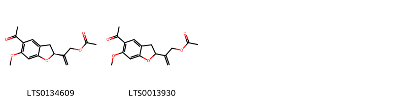{ width=100% }
    <figcaption>Hình ảnh cấu trúc hóa học của 2 hoạt chất thuộc nhóm Benzene and substituted derivatives gồm ['2-[(2s)-5-acetyl-6-methoxy-2,3-dihydro-1-benzofuran-2-yl]prop-2-en-1-yl acetate (LTS0134609)', '2-(5-acetyl-6-methoxy-2,3-dihydro-1-benzofuran-2-yl)prop-2-en-1-yl acetate (LTS0013930)'].</figcaption>
</figure>
#### Nhóm Prenol lipids
<figure markdown="span">
    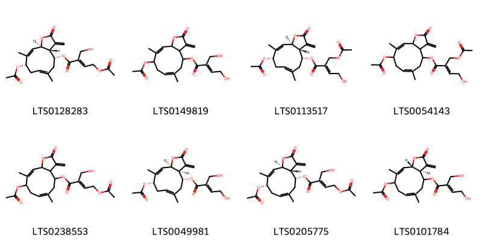{ width=100% }
    <figcaption>Hình ảnh cấu trúc hóa học của 8 hoạt chất thuộc nhóm Prenol lipids gồm ['(3ar,4r,9s,11ar)-9-(acetyloxy)-6,10-dimethyl-3-methylidene-2-oxo-3ah,4h,5h,8h,9h,11ah-cyclodeca[b]furan-4-yl (2e)-4-(acetyloxy)-2-(hydroxymethyl)but-2-enoate (LTS0128283)', '9-(acetyloxy)-6,10-dimethyl-3-methylidene-2-oxo-3ah,4h,5h,8h,9h,11ah-cyclodeca[b]furan-4-yl 4-hydroxy-2-(hydroxymethyl)but-2-enoate (LTS0149819)', '(3ar,4r,9s,11ar)-9-(acetyloxy)-6,10-dimethyl-3-methylidene-2-oxo-3ah,4h,5h,8h,9h,11ah-cyclodeca[b]furan-4-yl (2e)-2-[(acetyloxy)methyl]-4-hydroxybut-2-enoate (LTS0113517)', '9-(acetyloxy)-6,10-dimethyl-3-methylidene-2-oxo-3ah,4h,5h,8h,9h,11ah-cyclodeca[b]furan-4-yl 2-[(acetyloxy)methyl]-4-hydroxybut-2-enoate (LTS0054143)', '9-(acetyloxy)-6,10-dimethyl-3-methylidene-2-oxo-3ah,4h,5h,8h,9h,11ah-cyclodeca[b]furan-4-yl 4-(acetyloxy)-2-(hydroxymethyl)but-2-enoate (LTS0238553)', '(3as,4r,9s,11ar)-9-(acetyloxy)-6,10-dimethyl-3-methylidene-2-oxo-3ah,4h,5h,8h,9h,11ah-cyclodeca[b]furan-4-yl (2e)-4-hydroxy-2-(hydroxymethyl)but-2-enoate (LTS0049981)', '(3ar,4r,9s,11ar)-9-(acetyloxy)-6,10-dimethyl-3-methylidene-2-oxo-3ah,4h,5h,8h,9h,11ah-cyclodeca[b]furan-4-yl (2e)-4-(acetyloxy)-2-(hydroxymethyl)but-2-enoate (LTS0205775)', '(3as,11as)-9-(acetyloxy)-6,10-dimethyl-3-methylidene-2-oxo-3ah,4h,5h,8h,9h,11ah-cyclodeca[b]furan-4-yl 4-hydroxy-2-(hydroxymethyl)but-2-enoate (LTS0101784)'].</figcaption>
</figure>

---

### Dược dân tộc học

Danh sách các quốc gia có sử dụng *Isocarpha oppositifolia* trong điều trị các bệnh. 

| Country   | Disease   | Bệnh                                                                                                                                                                                                |
|:----------|:----------|:----------------------------------------------------------------------------------------------------------------------------------------------------------------------------------------------------|
| Bahamas   | Apertif   | MYMEMORY WARNING: YOU USED ALL AVAILABLE FREE TRANSLATIONS FOR TODAY. NEXT AVAILABLE IN  11 HOURS 44 MINUTES 06 SECONDS VISIT HTTPS://MYMEMORY.TRANSLATED.NET/DOC/USAGELIMITS.PHP TO TRANSLATE MORE |
| Venezuela | Vulnerary | MYMEMORY WARNING: YOU USED ALL AVAILABLE FREE TRANSLATIONS FOR TODAY. NEXT AVAILABLE IN  11 HOURS 44 MINUTES 04 SECONDS VISIT HTTPS://MYMEMORY.TRANSLATED.NET/DOC/USAGELIMITS.PHP TO TRANSLATE MORE |

---

# Chi Heterothalamus

??? note "Danh sách các dược liệu thuộc chi"
    
	 - *Heterothalamus brunoides*

---
## Heterothalamus brunoides
### Thông tin về thực vật

!!! info "Phân loại thực vật của *Baccharis aliena* từ GIBF:"
    - **Kingdom:** Plantae
    - **Phylum:** Tracheophyta
    - **Order:** Asterales
    - **Family:** Asteraceae
    - **Genus:** Baccharis
    - **Species:** *Baccharis aliena*

 

| Label (VI)   | Label (EN)   | Scientific Name         | Descriptions (VI)   | Descriptions (EN)   | Also Known As (VI)   | Also Known As (EN)   |
|:-------------|:-------------|:------------------------|:--------------------|:--------------------|:---------------------|:---------------------|
| N/A          | N/A          | Isocarpha oppositifolia | loài thực vật       | species of plant    | ['']                 | ['']                 |

#### Phân bố trên thế giới

**Từ CSDL GIBF** nan, Brazil, Argentina, unknown or invalid, Uruguay

#### Phân bố tại Việt Nam

**Từ CSDL GIBF**: Không có ghi nhận ở Việt Nam

---
### Thành phần hóa học
        
- Theo cơ sở dữ liệu lotus: Từ loài *Baccharis aliena* đã phân lập và xác định được Chưa có hoạt chất nào được phân lập. hoạt chất thuộc về các nhóm Không có hoạt chất nào được phân lập. 

Không có hình ảnh nào được tạo ra

---

### Dược dân tộc học

Danh sách các quốc gia có sử dụng *Baccharis aliena* trong điều trị các bệnh. 

| Country   |   Disease | Bệnh                                                                                                                                                                                                |
|:----------|----------:|:----------------------------------------------------------------------------------------------------------------------------------------------------------------------------------------------------|
| Brazil    |       nan | MYMEMORY WARNING: YOU USED ALL AVAILABLE FREE TRANSLATIONS FOR TODAY. NEXT AVAILABLE IN  11 HOURS 43 MINUTES 35 SECONDS VISIT HTTPS://MYMEMORY.TRANSLATED.NET/DOC/USAGELIMITS.PHP TO TRANSLATE MORE |

---

# Chi Flourensia

??? note "Danh sách các dược liệu thuộc chi"
    
	 - *Flourensia cernua*

---
## Flourensia cernua
### Thông tin về thực vật

!!! info "Phân loại thực vật của *Flourensia cernua* từ GIBF:"
    - **Kingdom:** Plantae
    - **Phylum:** Tracheophyta
    - **Order:** Asterales
    - **Family:** Asteraceae
    - **Genus:** Flourensia
    - **Species:** *Flourensia cernua*

 

| Label (VI)   | Label (EN)   | Scientific Name   | Descriptions (VI)   | Descriptions (EN)   | Also Known As (VI)   | Also Known As (EN)   |
|:-------------|:-------------|:------------------|:--------------------|:--------------------|:---------------------|:---------------------|
| N/A          | N/A          | Flourensia cernua | loài thực vật       | species of plant    | ['']                 | ['']                 |

#### Phân bố trên thế giới

**Từ CSDL GIBF** United States of America, Mexico

#### Phân bố tại Việt Nam

**Từ CSDL GIBF**: Không có ghi nhận ở Việt Nam

---
### Thành phần hóa học
        
- Theo cơ sở dữ liệu lotus: Từ loài *Flourensia cernua* đã phân lập và xác định được 46 hoạt chất thuộc về các nhóm Flavonoids, Prenol lipids, Benzene and substituted derivatives, Lactones, Organooxygen compounds, Glycerolipids. 

|    | chemicalTaxonomyClassyfireClass     |   smiles_count |
|---:|:------------------------------------|---------------:|
|  0 | Benzene and substituted derivatives |              1 |
|  1 | Flavonoids                          |              4 |
|  2 | Glycerolipids                       |              2 |
|  3 | Lactones                            |             14 |
|  4 | Organooxygen compounds              |              2 |
|  5 | Prenol lipids                       |             23 |

#### Nhóm Benzene and substituted derivatives
<figure markdown="span">
    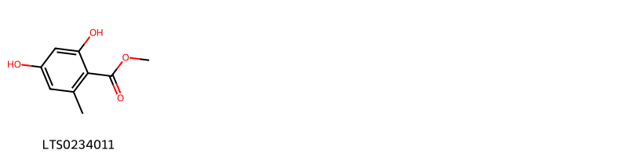{ width=100% }
    <figcaption>Hình ảnh cấu trúc hóa học của 1 hoạt chất thuộc nhóm Benzene and substituted derivatives gồm ['orsellinic acid methyl ester (LTS0234011)'].</figcaption>
</figure>
#### Nhóm Flavonoids
<figure markdown="span">
    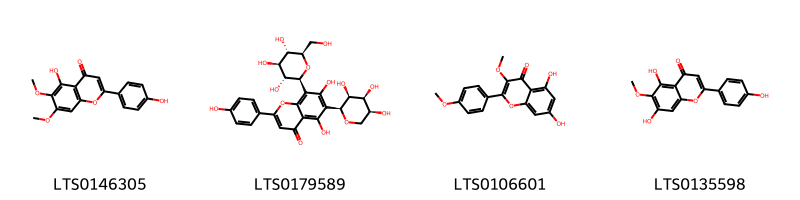{ width=100% }
    <figcaption>Hình ảnh cấu trúc hóa học của 4 hoạt chất thuộc nhóm Flavonoids gồm ['cirsimaritin (LTS0146305)', '5,7-dihydroxy-2-(4-hydroxyphenyl)-8-[(2s,3r,4r,5s,6r)-3,4,5-trihydroxy-6-(hydroxymethyl)oxan-2-yl]-6-[(2s,3s,4s,5s)-3,4,5-trihydroxyoxan-2-yl]chromen-4-one (LTS0179589)', 'ermanin (LTS0106601)', 'hispidulin (LTS0135598)'].</figcaption>
</figure>
#### Nhóm Glycerolipids
<figure markdown="span">
    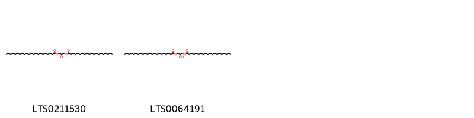{ width=100% }
    <figcaption>Hình ảnh cấu trúc hóa học của 2 hoạt chất thuộc nhóm Glycerolipids gồm ['2-hydroxy-3-(icosanoyloxy)propyl docosanoate (LTS0211530)', '(2r)-2-hydroxy-3-(icosanoyloxy)propyl docosanoate (LTS0064191)'].</figcaption>
</figure>
#### Nhóm Lactones
<figure markdown="span">
    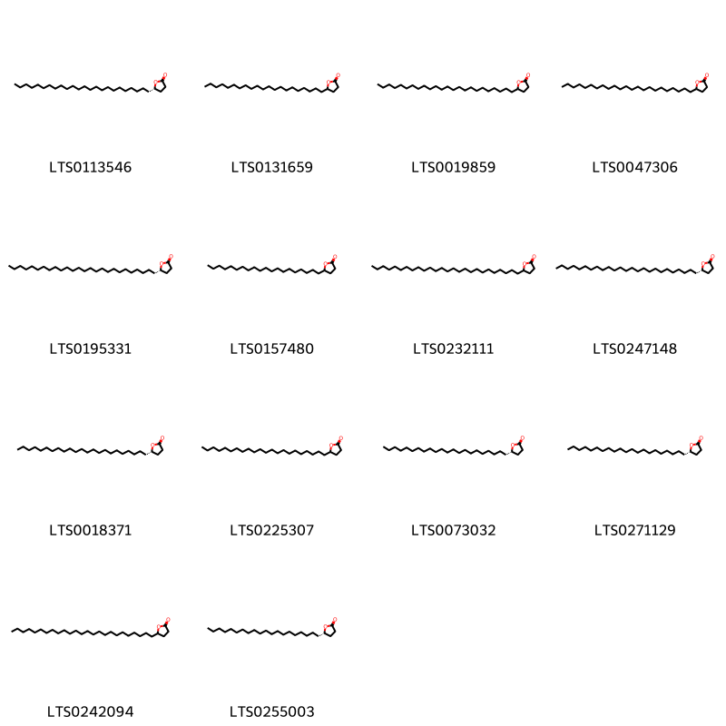{ width=100% }
    <figcaption>Hình ảnh cấu trúc hóa học của 14 hoạt chất thuộc nhóm Lactones gồm ['(5s)-5-tetracosyloxolan-2-one (LTS0113546)', '5-henicosyloxolan-2-one (LTS0131659)', '5-tetracosyloxolan-2-one (LTS0019859)', '5-tricosyloxolan-2-one (LTS0047306)', '(5s)-5-hexacosyloxolan-2-one (LTS0195331)', '5-icosyloxolan-2-one (LTS0157480)', '5-hexacosyloxolan-2-one (LTS0232111)', '(5s)-5-pentacosyloxolan-2-one (LTS0247148)', '(5s)-5-tricosyloxolan-2-one (LTS0018371)', '5-docosyloxolan-2-one (LTS0225307)', '(5s)-5-docosyloxolan-2-one (LTS0073032)', '(5s)-5-henicosyloxolan-2-one (LTS0271129)', '5-pentacosyloxolan-2-one (LTS0242094)', '(5s)-5-icosyloxolan-2-one (LTS0255003)'].</figcaption>
</figure>
#### Nhóm Organooxygen compounds
<figure markdown="span">
    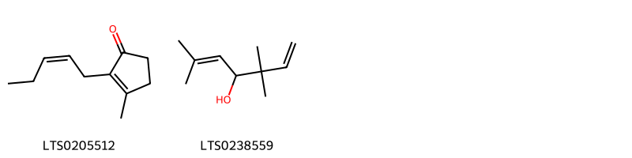{ width=100% }
    <figcaption>Hình ảnh cấu trúc hóa học của 2 hoạt chất thuộc nhóm Organooxygen compounds gồm ['jasmone (LTS0205512)', '3,3,6-trimethylhepta-1,5-dien-4-ol (LTS0238559)'].</figcaption>
</figure>
#### Nhóm Prenol lipids
<figure markdown="span">
    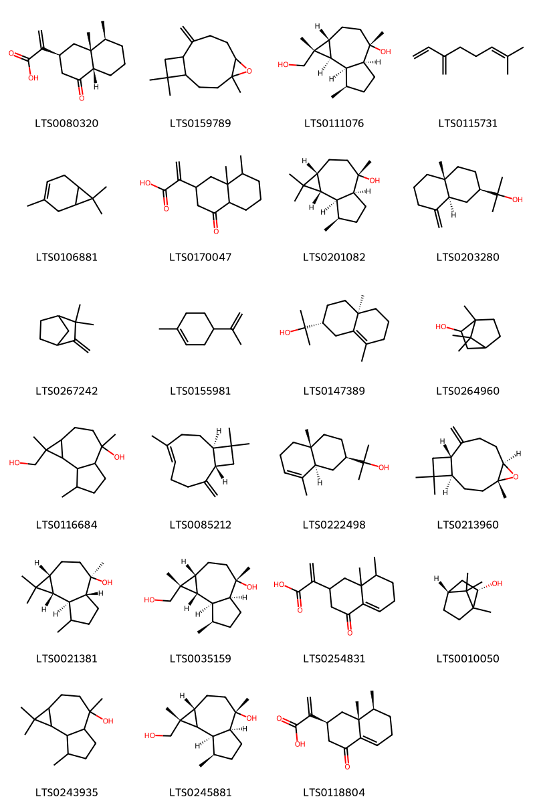{ width=100% }
    <figcaption>Hình ảnh cấu trúc hóa học của 23 hoạt chất thuộc nhóm Prenol lipids gồm ['2-[(2s,4as,8s,8ar)-8,8a-dimethyl-4-oxo-octahydronaphthalen-2-yl]prop-2-enoic acid (LTS0080320)', 'caryophyllene oxide (LTS0159789)', '(1r,1ar,4s,4as,7r,7as,7br)-1-(hydroxymethyl)-1,4,7-trimethyl-octahydro-1ah-cyclopropa[e]azulen-4-ol (LTS0111076)', 'α-myrcene (LTS0115731)', 'monoterpenes (LTS0106881)', '2-(8,8a-dimethyl-4-oxo-octahydronaphthalen-2-yl)prop-2-enoic acid (LTS0170047)', '(+)-ledol (LTS0201082)', 'β-eudesmol (LTS0203280)', 'camphene (LTS0267242)', 'limonene,  (LTS0155981)', 'gamma-eudesmol (LTS0147389)', 'borneol (LTS0264960)', '1-(hydroxymethyl)-1,4,7-trimethyl-octahydro-1ah-cyclopropa[e]azulen-4-ol (LTS0116684)', 'caryophyllene (LTS0085212)', 'α-eudesmol (LTS0222498)', 'β-caryophyllene oxide (LTS0213960)', '(1ar,4r,4ar,7as,7bs)-1,1,4,7-tetramethyl-octahydro-1ah-cyclopropa[e]azulen-4-ol (LTS0021381)', '(1r,1ar,4s,4as,7r,7as,7bs)-1-(hydroxymethyl)-1,4,7-trimethyl-octahydro-1ah-cyclopropa[e]azulen-4-ol (LTS0035159)', '2-(8,8a-dimethyl-4-oxo-1,2,3,6,7,8-hexahydronaphthalen-2-yl)prop-2-enoic acid (LTS0254831)', '(2s,4r)-1,7,7-trimethylbicyclo[2.2.1]heptan-2-ol (LTS0010050)', 'ledol (LTS0243935)', '(1r,1ar,4s,4as,7r,7as)-1-(hydroxymethyl)-1,4,7-trimethyl-octahydro-1ah-cyclopropa[e]azulen-4-ol (LTS0245881)', '2-[(2s,8s,8ar)-8,8a-dimethyl-4-oxo-1,2,3,6,7,8-hexahydronaphthalen-2-yl]prop-2-enoic acid (LTS0118804)'].</figcaption>
</figure>

---

### Dược dân tộc học

Danh sách các quốc gia có sử dụng *Flourensia cernua* trong điều trị các bệnh. 

| Country   | Disease   | Bệnh                                                                                                                                                                                                |
|:----------|:----------|:----------------------------------------------------------------------------------------------------------------------------------------------------------------------------------------------------|
| US        | Poison    | MYMEMORY WARNING: YOU USED ALL AVAILABLE FREE TRANSLATIONS FOR TODAY. NEXT AVAILABLE IN  11 HOURS 43 MINUTES 09 SECONDS VISIT HTTPS://MYMEMORY.TRANSLATED.NET/DOC/USAGELIMITS.PHP TO TRANSLATE MORE |

---

# Chi Tanacetum

??? note "Danh sách các dược liệu thuộc chi"
    
	 - *Tanacetum balsamita*
	 - *Tanacetum fruticulosum*
	 - *Tanacetum umbelliferum*
	 - *Tanacetum vulgare*

---
## Tanacetum balsamita
### Thông tin về thực vật

!!! info "Phân loại thực vật của *Tanacetum balsamita* từ GIBF:"
    - **Kingdom:** Plantae
    - **Phylum:** Tracheophyta
    - **Order:** Asterales
    - **Family:** Asteraceae
    - **Genus:** Tanacetum
    - **Species:** *Tanacetum balsamita*

 

| Label (VI)   | Label (EN)   | Scientific Name     | Descriptions (VI)   | Descriptions (EN)                   | Also Known As (VI)   | Also Known As (EN)                                                                                                     |
|:-------------|:-------------|:--------------------|:--------------------|:------------------------------------|:---------------------|:-----------------------------------------------------------------------------------------------------------------------|
| N/A          | N/A          | Tanacetum balsamita |                     | species of perennial temperate herb | ['']                 | ['alecost', 'balsam herb', 'Balsamita vulgaris', 'bible leaf', 'Chrysanthemum balsamita', 'costmary', 'mint geranium'] |

#### Phân bố trên thế giới

**Từ CSDL GIBF** Italy, Bulgaria, Belgium, Canada, Ukraine, Netherlands, Belarus, Spain, Türkiye, Hungary, Russian Federation, United States of America, Sweden, Slovenia, Croatia, Bosnia and Herzegovina, Germany, Switzerland, Austria, France, United Kingdom of Great Britain and Northern Ireland, Serbia, Poland

#### Phân bố tại Việt Nam

**Từ CSDL GIBF**: Không có ghi nhận ở Việt Nam

---
### Thành phần hóa học
        
- Theo cơ sở dữ liệu lotus: Từ loài *Tanacetum balsamita* đã phân lập và xác định được 34 hoạt chất thuộc về các nhóm Fatty Acyls, Flavonoids, Prenol lipids, Organooxygen compounds. 

|    | chemicalTaxonomyClassyfireClass   |   smiles_count |
|---:|:----------------------------------|---------------:|
|  0 | Fatty Acyls                       |              2 |
|  1 | Flavonoids                        |              5 |
|  2 | Organooxygen compounds            |              8 |
|  3 | Prenol lipids                     |             19 |

#### Nhóm Fatty Acyls
<figure markdown="span">
    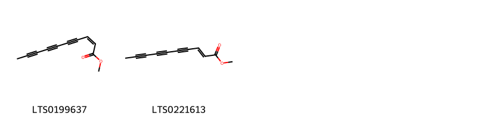{ width=100% }
    <figcaption>Hình ảnh cấu trúc hóa học của 2 hoạt chất thuộc nhóm Fatty Acyls gồm ['dehydromatricaria ester (LTS0199637)', 'methyl dec-2-en-4,6,8-triynoate (LTS0221613)'].</figcaption>
</figure>
#### Nhóm Flavonoids
<figure markdown="span">
    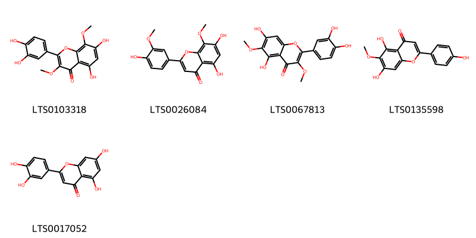{ width=100% }
    <figcaption>Hình ảnh cấu trúc hóa học của 5 hoạt chất thuộc nhóm Flavonoids gồm ['gossypetin 3,8-dimethyl ether (LTS0103318)', "hypolaetin 8,3'-dimethyl ether (LTS0026084)", 'axillarin (LTS0067813)', 'hispidulin (LTS0135598)', 'luteolin (LTS0017052)'].</figcaption>
</figure>
#### Nhóm Organooxygen compounds
<figure markdown="span">
    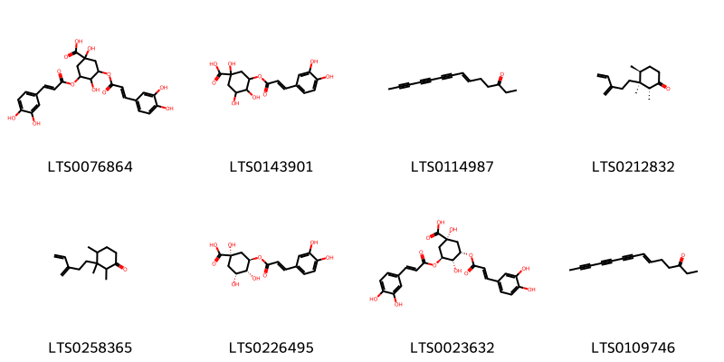{ width=100% }
    <figcaption>Hình ảnh cấu trúc hóa học của 8 hoạt chất thuộc nhóm Organooxygen compounds gồm ['3,5-bis({[3-(3,4-dihydroxyphenyl)prop-2-enoyl]oxy})-1,4-dihydroxycyclohexane-1-carboxylic acid (LTS0076864)', '3-{[3-(3,4-dihydroxyphenyl)prop-2-enoyl]oxy}-1,4,5-trihydroxycyclohexane-1-carboxylic acid (LTS0143901)', '(6e)-tetradec-6-en-8,10,12-triyn-3-one (LTS0114987)', '(2r,3s,4s)-2,3,4-trimethyl-3-(3-methylidenepent-4-en-1-yl)cyclohexan-1-one (LTS0212832)', '2,3,4-trimethyl-3-(3-methylidenepent-4-en-1-yl)cyclohexan-1-one (LTS0258365)', 'chlorogenic acid (LTS0226495)', '(1r,3s,4r,5s)-3,5-bis({[(2e)-3-(3,4-dihydroxyphenyl)prop-2-enoyl]oxy})-1,4-dihydroxycyclohexane-1-carboxylic acid (LTS0023632)', 'tetradec-6-en-8,10,12-triyn-3-one (LTS0109746)'].</figcaption>
</figure>
#### Nhóm Prenol lipids
<figure markdown="span">
    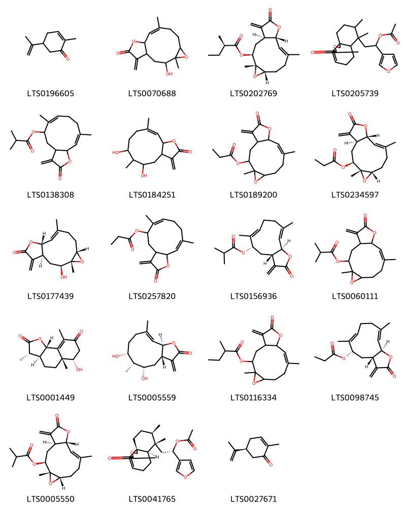{ width=100% }
    <figcaption>Hình ảnh cấu trúc hóa học của 19 hoạt chất thuộc nhóm Prenol lipids gồm ['carvone (LTS0196605)', '3-hydroxy-4,9-dimethyl-14-methylidene-5,12-dioxatricyclo[9.3.0.0⁴,⁶]tetradec-9-en-13-one (LTS0070688)', '(1s,3s,4s,6s,9e,11r)-4,9-dimethyl-14-methylidene-13-oxo-5,12-dioxatricyclo[9.3.0.0⁴,⁶]tetradec-9-en-3-yl (2r)-2-methylbutanoate (LTS0202769)', '2-{7,8-dimethyl-3-oxo-1h,5h,6h,6ah,8h,9h,10h-naphtho[4,4a-c]furan-7-yl}-1-(furan-3-yl)ethyl acetate (LTS0205739)', '6,10-dimethyl-3-methylidene-2-oxo-3ah,4h,5h,8h,9h,11ah-cyclodeca[b]furan-5-yl 2-methylpropanoate (LTS0138308)', '5,7-dihydroxy-6,10-dimethyl-3-methylidene-3ah,4h,5h,6h,7h,8h,9h,11ah-cyclodeca[b]furan-2-one (LTS0184251)', '4,9-dimethyl-14-methylidene-13-oxo-5,12-dioxatricyclo[9.3.0.0⁴,⁶]tetradec-9-en-3-yl propanoate (LTS0189200)', '(1s,3s,4s,6s,9e,11r)-4,9-dimethyl-14-methylidene-13-oxo-5,12-dioxatricyclo[9.3.0.0⁴,⁶]tetradec-9-en-3-yl propanoate (LTS0234597)', '(1s,3s,4r,6s,9e,11r)-3-hydroxy-4,9-dimethyl-14-methylidene-5,12-dioxatricyclo[9.3.0.0⁴,⁶]tetradec-9-en-13-one (LTS0177439)', '6,10-dimethyl-3-methylidene-2-oxo-3ah,4h,5h,8h,9h,11ah-cyclodeca[b]furan-5-yl propanoate (LTS0257820)', '(3as,5s,11ar)-6,10-dimethyl-3-methylidene-2-oxo-3ah,4h,5h,8h,9h,11ah-cyclodeca[b]furan-5-yl 2-methylpropanoate (LTS0156936)', '4,9-dimethyl-14-methylidene-13-oxo-5,12-dioxatricyclo[9.3.0.0⁴,⁶]tetradec-9-en-3-yl 2-methylpropanoate (LTS0060111)', '(3s,3as,5ar,6s,9bs)-6-hydroxy-3,5a,9-trimethyl-3h,3ah,4h,5h,6h,7h,9bh-naphtho[1,2-b]furan-2,8-dione (LTS0001449)', '(3as,5s,6r,7r,11ar)-5,7-dihydroxy-6,10-dimethyl-3-methylidene-3ah,4h,5h,6h,7h,8h,9h,11ah-cyclodeca[b]furan-2-one (LTS0005559)', '4,9-dimethyl-14-methylidene-13-oxo-5,12-dioxatricyclo[9.3.0.0⁴,⁶]tetradec-9-en-3-yl 2-methylbutanoate (LTS0116334)', '(3as,5s,11ar)-6,10-dimethyl-3-methylidene-2-oxo-3ah,4h,5h,8h,9h,11ah-cyclodeca[b]furan-5-yl propanoate (LTS0098745)', '(1s,3s,4s,6s,9e,11r)-4,9-dimethyl-14-methylidene-13-oxo-5,12-dioxatricyclo[9.3.0.0⁴,⁶]tetradec-9-en-3-yl 2-methylpropanoate (LTS0005550)', '(1s)-2-[(6ar,7s,8r,10as)-7,8-dimethyl-3-oxo-1h,5h,6h,6ah,8h,9h,10h-naphtho[4,4a-c]furan-7-yl]-1-(furan-3-yl)ethyl acetate (LTS0041765)', 'carvone, (+)- (LTS0027671)'].</figcaption>
</figure>

---

### Dược dân tộc học

Danh sách các quốc gia có sử dụng *Tanacetum balsamita* trong điều trị các bệnh. 

| Country   | Disease   | Bệnh                                                                                                                                                                                                |
|:----------|:----------|:----------------------------------------------------------------------------------------------------------------------------------------------------------------------------------------------------|
| ain       | Vermifuge | MYMEMORY WARNING: YOU USED ALL AVAILABLE FREE TRANSLATIONS FOR TODAY. NEXT AVAILABLE IN  11 HOURS 42 MINUTES 36 SECONDS VISIT HTTPS://MYMEMORY.TRANSLATED.NET/DOC/USAGELIMITS.PHP TO TRANSLATE MORE |

---

---
## Tanacetum fruticulosum
### Thông tin về thực vật

!!! info "Phân loại thực vật của *N/A* từ GIBF:"
    - **Kingdom:** Plantae
    - **Phylum:** Tracheophyta
    - **Order:** Asterales
    - **Family:** Asteraceae
    - **Genus:** Ajania
    - **Species:** *N/A*

 

| Label (VI)   | Label (EN)   | Scientific Name        | Descriptions (VI)   | Descriptions (EN)   | Also Known As (VI)   | Also Known As (EN)   |
|:-------------|:-------------|:-----------------------|:--------------------|:--------------------|:---------------------|:---------------------|
| N/A          | N/A          | Tanacetum fruticulosum |                     | species of plant    | ['']                 | ['']                 |

#### Phân bố trên thế giới

**Từ CSDL GIBF** Tajikistan, nan, South Africa, Japan, Germany, Korea, Republic of, Kyrgyzstan, New Zealand, Spain, Argentina, Bhutan, India, Russian Federation, United States of America, Kazakhstan, Mongolia, China, Nepal

#### Phân bố tại Việt Nam

**Từ CSDL GIBF**: Không có ghi nhận ở Việt Nam

---
### Thành phần hóa học
        
- Theo cơ sở dữ liệu lotus: Từ loài *N/A* đã phân lập và xác định được Chưa có hoạt chất nào được phân lập. hoạt chất thuộc về các nhóm Không có hoạt chất nào được phân lập. 

Không có hình ảnh nào được tạo ra

---

### Dược dân tộc học

Danh sách các quốc gia có sử dụng *N/A* trong điều trị các bệnh. 

| Country   | Disease          | Bệnh                                                                                                                                                                                                |
|:----------|:-----------------|:----------------------------------------------------------------------------------------------------------------------------------------------------------------------------------------------------|
| India     | Vermifuge, Tonic | MYMEMORY WARNING: YOU USED ALL AVAILABLE FREE TRANSLATIONS FOR TODAY. NEXT AVAILABLE IN  11 HOURS 42 MINUTES 08 SECONDS VISIT HTTPS://MYMEMORY.TRANSLATED.NET/DOC/USAGELIMITS.PHP TO TRANSLATE MORE |

---

---
## Tanacetum umbelliferum
### Thông tin về thực vật

!!! info "Phân loại thực vật của *Pseudohandelia umbellifera* từ GIBF:"
    - **Kingdom:** Plantae
    - **Phylum:** Tracheophyta
    - **Order:** Asterales
    - **Family:** Asteraceae
    - **Genus:** Pseudohandelia
    - **Species:** *Pseudohandelia umbellifera*

 

| Label (VI)   | Label (EN)   | Scientific Name        | Descriptions (VI)   | Descriptions (EN)   | Also Known As (VI)   | Also Known As (EN)   |
|:-------------|:-------------|:-----------------------|:--------------------|:--------------------|:---------------------|:---------------------|
| N/A          | N/A          | Tanacetum umbelliferum | loài thực vật       | species of plant    | ['']                 | ['']                 |

#### Phân bố trên thế giới

**Từ CSDL GIBF** Tajikistan, nan, South Africa, Japan, Germany, Korea, Republic of, Kyrgyzstan, New Zealand, Spain, Argentina, Bhutan, India, Russian Federation, United States of America, Kazakhstan, Mongolia, China, Nepal

#### Phân bố tại Việt Nam

**Từ CSDL GIBF**: Không có ghi nhận ở Việt Nam

---
### Thành phần hóa học
        
- Theo cơ sở dữ liệu lotus: Từ loài *Pseudohandelia umbellifera* đã phân lập và xác định được Chưa có hoạt chất nào được phân lập. hoạt chất thuộc về các nhóm Không có hoạt chất nào được phân lập. 

Không có hình ảnh nào được tạo ra

---

### Dược dân tộc học

Danh sách các quốc gia có sử dụng *Pseudohandelia umbellifera* trong điều trị các bệnh. 

| Country   | Disease            | Bệnh                                                                                                                                                                                                |
|:----------|:-------------------|:----------------------------------------------------------------------------------------------------------------------------------------------------------------------------------------------------|
| Elsewhere | Aphrodisiac, Tonic | MYMEMORY WARNING: YOU USED ALL AVAILABLE FREE TRANSLATIONS FOR TODAY. NEXT AVAILABLE IN  11 HOURS 41 MINUTES 38 SECONDS VISIT HTTPS://MYMEMORY.TRANSLATED.NET/DOC/USAGELIMITS.PHP TO TRANSLATE MORE |

---

---
## Tanacetum vulgare
### Thông tin về thực vật

!!! info "Phân loại thực vật của *Tanacetum vulgare* từ GIBF:"
    - **Kingdom:** Plantae
    - **Phylum:** Tracheophyta
    - **Order:** Asterales
    - **Family:** Asteraceae
    - **Genus:** Tanacetum
    - **Species:** *Tanacetum vulgare*

 

| Label (VI)   | Label (EN)   | Scientific Name   | Descriptions (VI)   | Descriptions (EN)   | Also Known As (VI)   | Also Known As (EN)          |
|:-------------|:-------------|:------------------|:--------------------|:--------------------|:---------------------|:----------------------------|
| N/A          | N/A          | Tanacetum vulgare | loài thực vật       | species of plant    | ['']                 | ['bitter buttons', 'tansy'] |

#### Phân bố trên thế giới

**Từ CSDL GIBF** Italy, Australia, Slovakia, Belgium, Argentina, Norway, Canada, Ukraine, Denmark, Netherlands, Luxembourg, Spain, Russian Federation, United States of America, Sweden, Finland, Chile, Germany, Austria, France, United Kingdom of Great Britain and Northern Ireland, Serbia, Poland

#### Phân bố tại Việt Nam

**Từ CSDL GIBF**: Không có ghi nhận ở Việt Nam

---
### Thành phần hóa học
        
- Theo cơ sở dữ liệu lotus: Từ loài *Tanacetum vulgare* đã phân lập và xác định được 228 hoạt chất thuộc về các nhóm Fatty Acyls, Flavonoids, Prenol lipids, Steroids and steroid derivatives, Oxanes, Tetrahydrofurans, Oxolanes, Unsaturated hydrocarbons, Organooxygen compounds, Phenols, Coumarins and derivatives, Carboxylic acids and derivatives. 

|    | chemicalTaxonomyClassyfireClass   |   smiles_count |
|---:|:----------------------------------|---------------:|
|  0 | Carboxylic acids and derivatives  |              3 |
|  1 | Coumarins and derivatives         |              2 |
|  2 | Fatty Acyls                       |             13 |
|  3 | Flavonoids                        |             26 |
|  4 | Organooxygen compounds            |             14 |
|  5 | Oxanes                            |              6 |
|  6 | Oxolanes                          |              6 |
|  7 | Phenols                           |              1 |
|  8 | Prenol lipids                     |            133 |
|  9 | Steroids and steroid derivatives  |             12 |
| 10 | Tetrahydrofurans                  |              5 |
| 11 | Unsaturated hydrocarbons          |              2 |

#### Nhóm Carboxylic acids and derivatives
<figure markdown="span">
    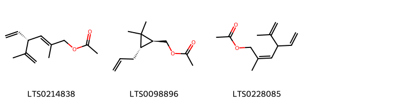{ width=100% }
    <figcaption>Hình ảnh cấu trúc hóa học của 3 hoạt chất thuộc nhóm Carboxylic acids and derivatives gồm ['(2e,4r)-4-ethenyl-2,5-dimethylhexa-2,5-dien-1-yl acetate (LTS0214838)', '[(1s,3s)-2,2-dimethyl-3-(prop-2-en-1-yl)cyclopropyl]methyl acetate (LTS0098896)', '4-ethenyl-2,5-dimethylhexa-2,5-dien-1-yl acetate (LTS0228085)'].</figcaption>
</figure>
#### Nhóm Coumarins and derivatives
<figure markdown="span">
    { width=100% }
    <figcaption>Hình ảnh cấu trúc hóa học của 2 hoạt chất thuộc nhóm Coumarins and derivatives gồm ['isofraxidin (LTS0073081)', 'scopoletin (LTS0193112)'].</figcaption>
</figure>
#### Nhóm Fatty Acyls
<figure markdown="span">
    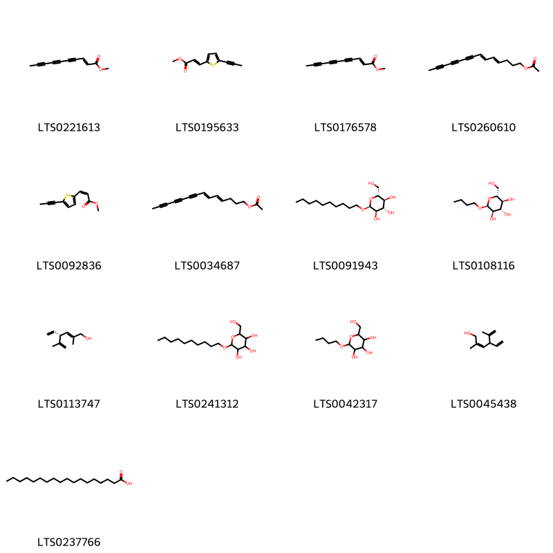{ width=100% }
    <figcaption>Hình ảnh cấu trúc hóa học của 13 hoạt chất thuộc nhóm Fatty Acyls gồm ['methyl dec-2-en-4,6,8-triynoate (LTS0221613)', 'methyl 3-[5-(prop-1-yn-1-yl)thiophen-2-yl]prop-2-enoate (LTS0195633)', 'dehydromatricaria ester (LTS0176578)', '(4e,6e)-tetradeca-4,6-dien-8,10,12-triyn-1-yl acetate (LTS0260610)', 'methyl (2z)-3-[5-(prop-1-yn-1-yl)thiophen-2-yl]prop-2-enoate (LTS0092836)', 'tetradeca-4,6-dien-8,10,12-triyn-1-yl acetate (LTS0034687)', '(2s,3r,4s,5s,6r)-2-(decyloxy)-6-(hydroxymethyl)oxane-3,4,5-triol (LTS0091943)', '(2s,3r,4s,5s,6r)-2-butoxy-6-(hydroxymethyl)oxane-3,4,5-triol (LTS0108116)', '(2e,4r)-4-ethenyl-2,5-dimethylhexa-2,5-dien-1-ol (LTS0113747)', 'caprylyl/capryl glucoside (LTS0241312)', '1-butylgalactopyranoside (LTS0042317)', '4-ethenyl-2,5-dimethylhexa-2,5-dien-1-ol (LTS0045438)', 'stearic acid (LTS0237766)'].</figcaption>
</figure>
#### Nhóm Flavonoids
<figure markdown="span">
    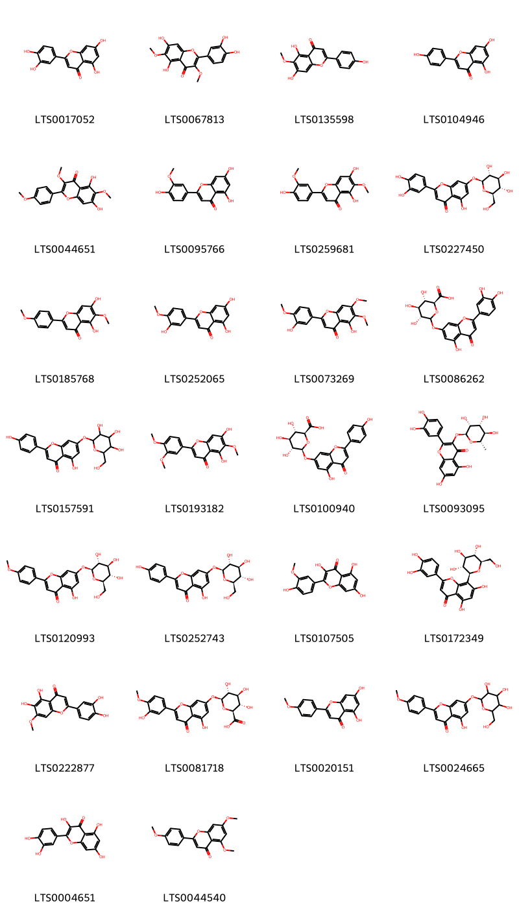{ width=100% }
    <figcaption>Hình ảnh cấu trúc hóa học của 26 hoạt chất thuộc nhóm Flavonoids gồm ['luteolin (LTS0017052)', 'axillarin (LTS0067813)', 'hispidulin (LTS0135598)', 'chamomile (LTS0104946)', 'santin (LTS0044651)', 'chrysoeriol (LTS0095766)', 'jaceosidin (LTS0259681)', 'luteolin 7-o-glucoside (LTS0227450)', 'pectolinarigenin (LTS0185768)', 'diosmetin (LTS0252065)', 'eupatorin (LTS0073269)', '(2s,3s,4s,5r)-6-{[2-(3,4-dihydroxyphenyl)-5-hydroxy-4-oxochromen-7-yl]oxy}-3,4,5-trihydroxyoxane-2-carboxylic acid (LTS0086262)', 'apigetrin (LTS0157591)', 'eupatilin (LTS0193182)', '(2s,3s,4s,5r,6s)-3,4,5-trihydroxy-6-{[5-hydroxy-2-(4-hydroxyphenyl)-4-oxochromen-7-yl]oxy}oxane-2-carboxylic acid (LTS0100940)', 'quercitrin (LTS0093095)', '5-hydroxy-2-(4-methoxyphenyl)-7-{[(2s,3r,4s,5s,6r)-3,4,5-trihydroxy-6-(hydroxymethyl)oxan-2-yl]oxy}chromen-4-one (LTS0120993)', 'apigenin 7-o-β-glucoside (LTS0252743)', 'isorhamnetin (LTS0107505)', 'orientin (LTS0172349)', 'pedalitin (LTS0222877)', '(2s,3s,4s,5r,6s)-3,4,5-trihydroxy-6-{[5-hydroxy-2-(3-hydroxy-4-methoxyphenyl)-4-oxochromen-7-yl]oxy}oxane-2-carboxylic acid (LTS0081718)', 'acacetin (LTS0020151)', '5-hydroxy-2-(4-methoxyphenyl)-7-{[3,4,5-trihydroxy-6-(hydroxymethyl)oxan-2-yl]oxy}chromen-4-one (LTS0024665)', 'quercetin (LTS0004651)', 'apigenin trimethyl ether (LTS0044540)'].</figcaption>
</figure>
#### Nhóm Organooxygen compounds
<figure markdown="span">
    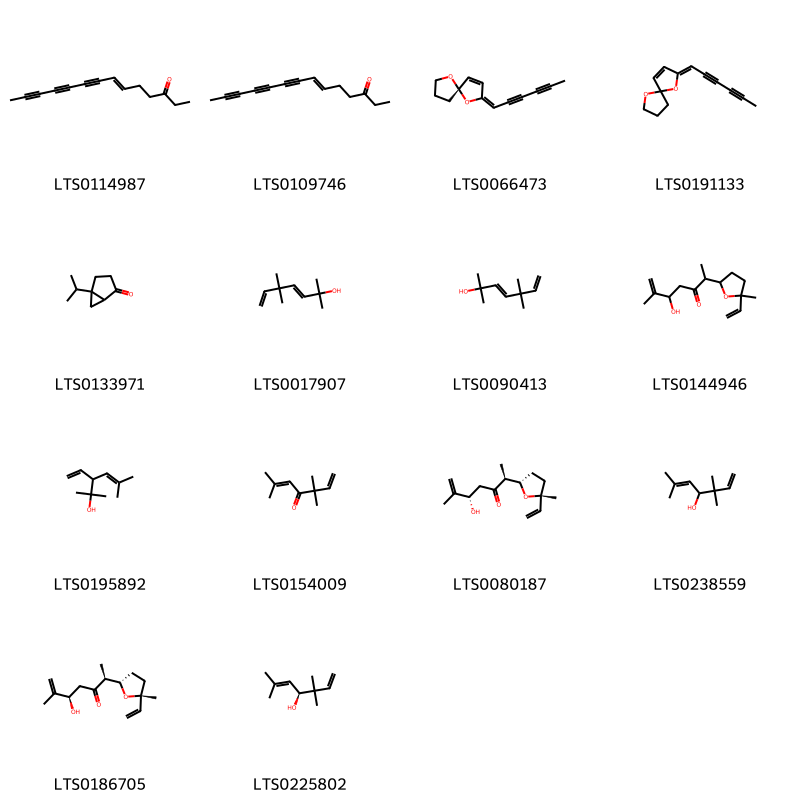{ width=100% }
    <figcaption>Hình ảnh cấu trúc hóa học của 14 hoạt chất thuộc nhóm Organooxygen compounds gồm ['(6e)-tetradec-6-en-8,10,12-triyn-3-one (LTS0114987)', 'tetradec-6-en-8,10,12-triyn-3-one (LTS0109746)', '(2e,5s)-2-(hexa-2,4-diyn-1-ylidene)-1,6-dioxaspiro[4.4]non-3-ene (LTS0066473)', '2-(hexa-2,4-diyn-1-ylidene)-1,6-dioxaspiro[4.4]non-3-ene (LTS0191133)', 'sabinaketone (LTS0133971)', '(3e)-2,5,5-trimethylhepta-3,6-dien-2-ol (LTS0017907)', '2,5,5-trimethylhepta-3,6-dien-2-ol (LTS0090413)', '2-(5-ethenyl-5-methyloxolan-2-yl)-5-hydroxy-6-methylhept-6-en-3-one (LTS0144946)', '3-ethenyl-2,5-dimethylhex-4-en-2-ol (LTS0195892)', 'isoartemisia ketone (LTS0154009)', '(2s,5s)-2-[(2s,5r)-5-ethenyl-5-methyloxolan-2-yl]-5-hydroxy-6-methylhept-6-en-3-one (LTS0080187)', '3,3,6-trimethylhepta-1,5-dien-4-ol (LTS0238559)', '(2s,5r)-2-[(2s,5r)-5-ethenyl-5-methyloxolan-2-yl]-5-hydroxy-6-methylhept-6-en-3-one (LTS0186705)', '(4s)-3,3,6-trimethylhepta-1,5-dien-4-ol (LTS0225802)'].</figcaption>
</figure>
#### Nhóm Oxanes
<figure markdown="span">
    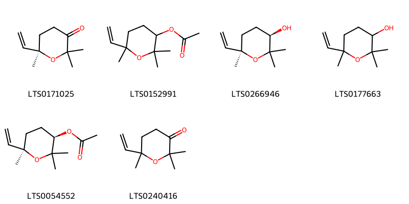{ width=100% }
    <figcaption>Hình ảnh cấu trúc hóa học của 6 hoạt chất thuộc nhóm Oxanes gồm ['(6r)-6-ethenyl-2,2,6-trimethyloxan-3-one (LTS0171025)', '6-ethenyl-2,2,6-trimethyloxan-3-yl acetate (LTS0152991)', '(3r,6r)-6-ethenyl-2,2,6-trimethyloxan-3-ol (LTS0266946)', '6-ethenyl-2,2,6-trimethyloxan-3-ol (LTS0177663)', '(3r,6r)-6-ethenyl-2,2,6-trimethyloxan-3-yl acetate (LTS0054552)', '6-ethenyl-2,2,6-trimethyloxan-3-one (LTS0240416)'].</figcaption>
</figure>
#### Nhóm Oxolanes
<figure markdown="span">
    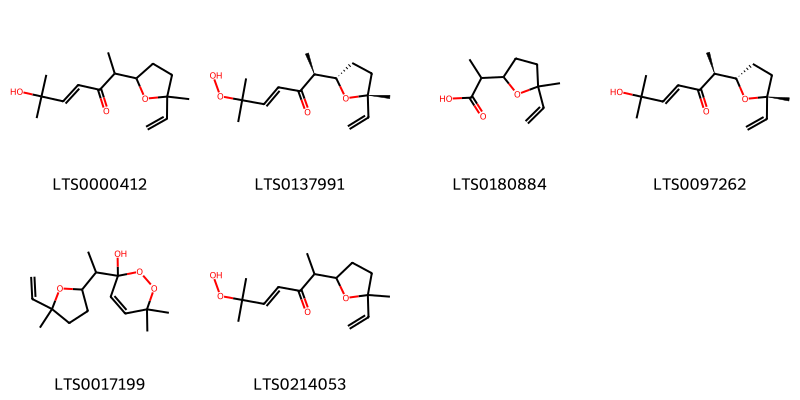{ width=100% }
    <figcaption>Hình ảnh cấu trúc hóa học của 6 hoạt chất thuộc nhóm Oxolanes gồm ['2-(5-ethenyl-5-methyloxolan-2-yl)-6-hydroxy-6-methylhept-4-en-3-one (LTS0000412)', '(2s,4e)-2-[(2s,5r)-5-ethenyl-5-methyloxolan-2-yl]-6-hydroperoxy-6-methylhept-4-en-3-one (LTS0137991)', '2-(5-ethenyl-5-methyloxolan-2-yl)propanoic acid (LTS0180884)', '(2s,4e)-2-[(2s,5r)-5-ethenyl-5-methyloxolan-2-yl]-6-hydroxy-6-methylhept-4-en-3-one (LTS0097262)', '3-[1-(5-ethenyl-5-methyloxolan-2-yl)ethyl]-6,6-dimethyl-1,2-dioxin-3-ol (LTS0017199)', '2-(5-ethenyl-5-methyloxolan-2-yl)-6-hydroperoxy-6-methylhept-4-en-3-one (LTS0214053)'].</figcaption>
</figure>
#### Nhóm Phenols
<figure markdown="span">
    { width=100% }
    <figcaption>Hình ảnh cấu trúc hóa học của 1 hoạt chất thuộc nhóm Phenols gồm ['eugenol (LTS0052342)'].</figcaption>
</figure>
#### Nhóm Prenol lipids
<figure markdown="span">
    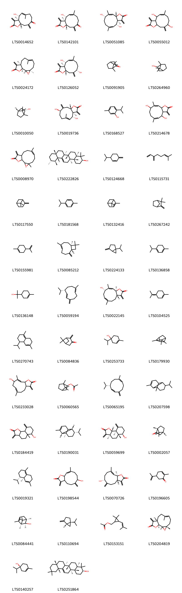{ width=100% }
    <figcaption>Hình ảnh cấu trúc hóa học của 133 hoạt chất thuộc nhóm Prenol lipids gồm ['(3as,4r,11as)-4-hydroxy-6-methyl-3,10-dimethylidene-3ah,4h,7h,8h,11h,11ah-cyclodeca[b]furan-2,9-dione (LTS0014652)', '(3as,4r,11as)-4-hydroxy-6-methyl-3,10-dimethylidene-3ah,4h,7h,8h,11h,11ah-cyclodeca[b]furan-2,9-dione (LTS0142101)', 'tatridin a (LTS0051085)', '4,9-dihydroxy-6-methyl-3,10-dimethylidene-3ah,4h,7h,8h,9h,11h,11ah-cyclodeca[b]furan-2-one (LTS0055012)', '(1s,2r,4r,7e,11r)-4,8-dimethyl-12-methylidene-3,14-dioxatricyclo[9.3.0.0²,⁴]tetradec-7-en-13-one (LTS0024172)', '1-epi-tatridin b (LTS0126052)', 'camphor (LTS0091905)', 'borneol (LTS0264960)', '(2s,4r)-1,7,7-trimethylbicyclo[2.2.1]heptan-2-ol (LTS0010050)', 'tatridin b (LTS0019736)', 'thymol (LTS0168527)', '4,9-dihydroxy-6,10-dimethyl-3-methylidene-3ah,4h,7h,8h,9h,11ah-cyclodeca[b]furan-2-one (LTS0214678)', '4,8-dimethyl-12-methylidene-3,14-dioxatricyclo[9.3.0.0²,⁴]tetradec-7-en-13-one (LTS0008970)', 'amyrin (LTS0222826)', 'β phellandrene (LTS0124668)', 'α-myrcene (LTS0115731)', 'β-pinene (LTS0117550)', 'cymene (LTS0181568)', 'α pinene (LTS0132416)', 'camphene (LTS0267242)', 'limonene,  (LTS0155981)', 'caryophyllene (LTS0085212)', 'sabinene (LTS0224133)', 'terpinene (LTS0136858)', 'terpineol (LTS0136148)', '(-)-germacrene d (LTS0059194)', '(3as,9s,11ar)-9-hydroxy-6,10-dimethyl-3-methylidene-3ah,4h,5h,8h,9h,11ah-cyclodeca[b]furan-2-one (LTS0022145)', 'terpinolene (LTS0104525)', '4-isopropyl-1,6-dimethyl-2,3,4,4a,7,8-hexahydronaphthalene (LTS0270743)', 'pinocarvone (LTS0084836)', '4-terpineol (LTS0253733)', 'tricyclene (LTS0179930)', '9-hydroxy-6,10-dimethyl-3-methylidene-3ah,4h,5h,8h,9h,11ah-cyclodeca[b]furan-2-one (LTS0233028)', 'bornyl acetate (LTS0060565)', '(1z,6z,8s)-8-isopropyl-1-methyl-5-methylidenecyclodeca-1,6-diene (LTS0065195)', 'α-copaene (LTS0207598)', '6-hydroxy-5a-methyl-3,9-dimethylidene-octahydronaphtho[1,2-b]furan-2-one (LTS0184419)', '(1r,2s,7s,8s)-8-isopropyl-1,3-dimethyltricyclo[4.4.0.0²,⁷]dec-3-ene (LTS0190031)', 'reynosin (LTS0059699)', 'd-camphor (LTS0002057)', 'delta-cadinene (LTS0019321)', '7-hydroxy-10-methyl-3,6-dimethylidene-3ah,4h,5h,7h,8h,9h,11ah-cyclodeca[b]furan-2-one (LTS0198544)', 'artemorin (LTS0070726)', 'carvone (LTS0196605)', '(1s,5r,6r)-2,7,7-trimethylbicyclo[3.1.1]hept-2-en-6-ol (LTS0084441)', '(+)-sabinene (LTS0110694)', '[2,2-dimethyl-3-(2-methylprop-1-en-1-yl)cyclopropyl]methyl acetate (LTS0153151)', '(1s,2r,4s,7e,11s)-4,8-dimethyl-12-methylidene-3,14-dioxatricyclo[9.3.0.0²,⁴]tetradec-7-en-13-one (LTS0204819)', '(+)-4-terpineol (LTS0140257)', 'β-amyrin (LTS0251864)', '[(1r,3r)-2,2-dimethyl-3-(2-methylprop-1-en-1-yl)cyclopropyl]methyl acetate (LTS0171011)', '(-)-β-pinene (LTS0108757)', '(+)-gamma-cadinene (LTS0103949)', '(6ar,6br,8ar,14br)-4,4,6a,6b,8a,12,14b-heptamethyl-11-methylidene-hexadecahydropicen-3-ol (LTS0274865)', 'α-limonene (LTS0244943)', 'thujone (LTS0197087)', '(+)-α-pinene (LTS0211102)', 'α-thujene (LTS0185078)', 'taraxasterol (LTS0006950)', 'curcumene (LTS0190074)', '(3r)-6,6-dimethyl-2-methylidenebicyclo[3.1.1]heptan-3-ol (LTS0009265)', '(3ar,11as)-10-methyl-3,6-dimethylidene-3ah,7h,8h,11h,11ah-cyclodeca[b]furan-2-one (LTS0068198)', 'pinocarveol (LTS0090950)', '(+-)-camphor (LTS0212276)', '10-methyl-3,6-dimethylidene-3ah,7h,8h,11h,11ah-cyclodeca[b]furan-2-one (LTS0261881)', '(1r,2s,7s,10s)-2,6,6,9-tetramethyltricyclo[5.4.0.0²,¹⁰]undec-8-en-11-one (LTS0223861)', '(1s,2r,3s,7r,9z,11r)-11-hydroperoxy-2-hydroxy-1-methyl-6-methylidene-4-oxatricyclo[8.3.1.0³,⁷]tetradec-9-en-5-one (LTS0187182)', '(1s,2s,7r,8s)-2,6,6,11-tetramethyltricyclo[5.4.0.0²,⁸]undec-10-en-9-one (LTS0189373)', '11-hydroperoxy-2-hydroxy-1-methyl-6-methylidene-4-oxatricyclo[8.3.1.0³,⁷]tetradec-9-en-5-one (LTS0147164)', '2,6,6,9-tetramethyltricyclo[5.4.0.0²,¹⁰]undec-8-en-11-one (LTS0260076)', '(1s,2s,4r,7e,11r)-4,8-dimethyl-12-methylidene-3,14-dioxatricyclo[9.3.0.0²,⁴]tetradec-7-en-13-one (LTS0221905)', '(-)-chrysanthenone (LTS0047554)', '2,6,6,11-tetramethyltricyclo[5.4.0.0²,⁸]undec-10-en-9-one (LTS0251252)', 'chrysanthenone (LTS0001245)', '1β-hydroxy arbusculin a (LTS0115888)', '(3ar,4s,9r,11ar)-4,9-dihydroxy-6,10-dimethyl-3-methylidene-3ah,4h,7h,8h,9h,11ah-cyclodeca[b]furan-2-one (LTS0073902)', '(1r,2r,3s,7r,11s)-11-hydroperoxy-2-hydroxy-1-methyl-6-methylidene-4-oxatricyclo[8.3.1.0³,⁷]tetradec-9-en-5-one (LTS0213754)', '(1s,2s)-1-ethenyl-1-methyl-2-(prop-1-en-2-yl)-4-(propan-2-ylidene)cyclohexane (LTS0135613)', '5-isopropyl-2-methylcyclohex-2-en-1-one (LTS0076097)', '(3ar,5s,8s,11ar)-5,8-dihydroxy-6,10-dimethyl-3-methylidene-3ah,5h,8h,9h,11ah-cyclodeca[b]furan-2,4-dione (LTS0078851)', 'β-gurjunene (LTS0225922)', '1-{3-hydroxy-2,6-dimethylbicyclo[3.1.1]heptan-6-yl}-4-methylpent-3-en-2-one (LTS0073110)', '10-hydroxy-6,10,11-trimethyl-3-methylidene-3ah,4h,5h,8h,9h,11h,11ah-cyclodeca[b]furan-2-one (LTS0099107)', '1-[(1s,2s,3s,5r,6s)-3-hydroxy-2,6-dimethylbicyclo[3.1.1]heptan-6-yl]-4-methylpent-3-en-2-one (LTS0183111)', '(+)-cis-sabinol (LTS0081558)', '2-[(1r)-2,2,4-trimethylcyclopent-3-en-1-yl]ethanol (LTS0103106)', '(-)-camphene (LTS0067556)', 'phytol (LTS0096073)', '4,5-dihydroxy-6,10-dimethyl-3-methylidene-3ah,4h,5h,8h,9h,11ah-cyclodeca[b]furan-2-one (LTS0112827)', '3,3,7,9-tetramethyltricyclo[5.4.0.0²,⁸]undecane-4,10-dione (LTS0037328)', 'β-selinene (LTS0096341)', '6-(2-hydroxypropan-2-yl)-3-methyl-9-methylidene-8-oxocyclodec-2-en-1-yl acetate (LTS0050711)', '(4ar,6ar,6br,8as,12ar,12br,14ar,14br)-4,4,6a,6b,8a,11,12,14b-octamethyl-2,3,4a,5,6,7,8,9,12,12a,12b,13,14,14a-tetradecahydro-1h-picen-3-ol (LTS0269929)', '(r)-(-)-carvotanacetone (LTS0150094)', 'myrtenal (LTS0202475)', '(3ar,10r,11s,11as)-10-hydroxy-6,10,11-trimethyl-3-methylidene-3ah,4h,5h,8h,9h,11h,11ah-cyclodeca[b]furan-2-one (LTS0272787)', '(1s,4s)-4-isopropyl-1,6-dimethyl-1,2,3,4-tetrahydronaphthalene (LTS0139634)', 'umbellulone (LTS0242520)', '(1r,2r,3s,7r,9e,11s)-11-hydroperoxy-2-hydroxy-1-methyl-6-methylidene-4-oxatricyclo[8.3.1.0³,⁷]tetradec-9-en-5-one (LTS0153473)', '(3as,4r,5r,11ar)-4,5-dihydroxy-6,10-dimethyl-3-methylidene-3ah,4h,5h,8h,9h,11ah-cyclodeca[b]furan-2-one (LTS0142141)', '(1r,4r,5s)-thujan-3-one (LTS0258679)', 'β-elemene (LTS0225699)', '1-isopropyl-4-methylidenebicyclo[3.1.0]hexan-2-yl acetate (LTS0105393)', '(+)-thujone (LTS0165508)', '3-isothujone (LTS0158119)', 'lupeol (LTS0256952)', 'tanacetin (LTS0239240)', '(+)-borneol (LTS0059936)', '(1s,3r,4s,5r)-1-isopropyl-4-methylbicyclo[3.1.0]hexan-3-ol (LTS0226752)', '5,8-dihydroxy-6,10-dimethyl-3-methylidene-3ah,5h,8h,9h,11ah-cyclodeca[b]furan-2,4-dione (LTS0240036)', '(1s,2r)-8-isopropyl-1,3-dimethyltricyclo[4.4.0.0²,⁷]dec-3-ene (LTS0167051)', '(1r,5s)-1-isopropyl-4-methylbicyclo[3.1.0]hex-3-en-2-one (LTS0213292)', '1-isopropyl-4-methylbicyclo[3.1.0]hexan-3-ol (LTS0051406)', '(3s,3as,5ar,6r,9r,9as,9bs)-6,9-dihydroxy-3,5a,9-trimethyl-octahydro-3h-naphtho[1,2-b]furan-2-one (LTS0199954)', '(+)-β-thujone (LTS0180873)', 'geraniol (LTS0258838)', 'tanacetol b (LTS0196185)', 'tanacetol a (LTS0044765)', 'β-cadinene (LTS0049088)', '(1r,2r,7s,8r,9r)-3,3,7,9-tetramethyltricyclo[5.4.0.0²,⁸]undecane-4,10-dione (LTS0052748)', '6,9a-dihydroxy-5a-methyl-3,9-dimethylidene-hexahydro-3ah-naphtho[1,2-b]furan-2-one (LTS0065810)', '6,9-dihydroxy-5a,9-dimethyl-3-methylidene-octahydronaphtho[1,2-b]furan-2-one (LTS0066052)', '(1s,3s,4s,5r)-1-isopropyl-4-methylbicyclo[3.1.0]hexan-3-ol (LTS0011445)', '1-[(1r,2s,3s,5s,6s)-3-hydroxy-2,6-dimethylbicyclo[3.1.1]heptan-6-yl]-4-methylpent-3-en-2-one (LTS0032369)', '(3as,4s,9r,11ar)-4,9-dihydroxy-6,10-dimethyl-3-methylidene-3ah,4h,7h,8h,9h,11ah-cyclodeca[b]furan-2-one (LTS0027147)', 'nerol (LTS0244289)', '2-(2,2,4-trimethylcyclopent-3-en-1-yl)ethanol (LTS0235183)', '(1r,2r,5s)-1-isopropyl-4-methylidenebicyclo[3.1.0]hexan-2-yl acetate (LTS0237150)', '(1r,2s,7s,8s,9s,10s)-2,6,6,9-tetramethyltetracyclo[5.4.0.0²,⁹.0⁸,¹⁰]undecane (LTS0128494)', '(+)-α-thujene (LTS0272912)', '8-hydroxy-6-(2-hydroxypropan-2-yl)-3-methyl-9-methylidenecyclodec-2-en-1-yl acetate (LTS0243037)', '(3ar,4s,9s,11ar)-4,9-dihydroxy-6-methyl-3,10-dimethylidene-3ah,4h,7h,8h,9h,11h,11ah-cyclodeca[b]furan-2-one (LTS0020959)', '(+)-sabinone (LTS0035033)'].</figcaption>
</figure>
#### Nhóm Steroids and steroid derivatives
<figure markdown="span">
    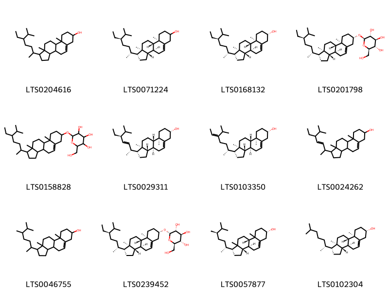{ width=100% }
    <figcaption>Hình ảnh cấu trúc hóa học của 12 hoạt chất thuộc nhóm Steroids and steroid derivatives gồm ['stigmast-5-en-3-ol, (3β)- (LTS0204616)', 'stigmast-5-en-3-ol (LTS0071224)', 'sitosterol (LTS0168132)', 'sitogluside (LTS0201798)', '2-{[1-(5-ethyl-6-methylheptan-2-yl)-9a,11a-dimethyl-1h,2h,3h,3ah,3bh,4h,6h,7h,8h,9h,9bh,10h,11h-cyclopenta[a]phenanthren-7-yl]oxy}-6-(hydroxymethyl)oxane-3,4,5-triol (LTS0158828)', 'phytosterol (LTS0029311)', 'avenasterol (LTS0103350)', 'stigmasterol (LTS0024262)', 'campesterol (LTS0046755)', '(2s,3r,4s,5s,6r)-2-{[(1r,3as,3bs,7s,9ar,9bs,11ar)-1-[(2r,5r)-5-ethyl-6-methylheptan-2-yl]-9a,11a-dimethyl-1h,2h,3h,3ah,3bh,4h,6h,7h,8h,9h,9bh,10h,11h-cyclopenta[a]phenanthren-7-yl]oxy}-6-(hydroxymethyl)oxane-3,4,5-triol (LTS0239452)', '(1r,3as,3bs,7s,9bs)-1-[(2r,5r)-5,6-dimethylheptan-2-yl]-9a,11a-dimethyl-1h,2h,3h,3ah,3bh,4h,6h,7h,8h,9h,9bh,10h,11h-cyclopenta[a]phenanthren-7-ol (LTS0057877)', 'cholesterol (LTS0102304)'].</figcaption>
</figure>
#### Nhóm Tetrahydrofurans
<figure markdown="span">
    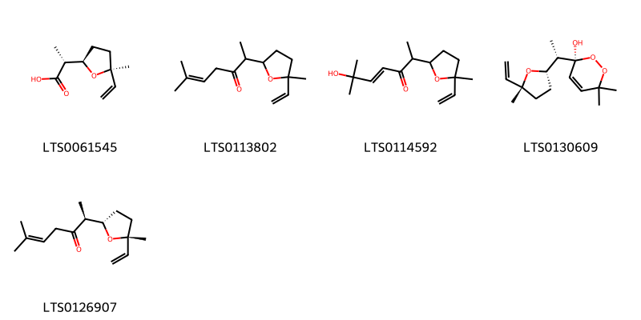{ width=100% }
    <figcaption>Hình ảnh cấu trúc hóa học của 5 hoạt chất thuộc nhóm Tetrahydrofurans gồm ['(2r)-2-[(2r,5s)-5-ethenyl-5-methyloxolan-2-yl]propanoic acid (LTS0061545)', '2-(5-ethenyl-5-methyloxolan-2-yl)-6-methylhept-5-en-3-one (LTS0113802)', '(4e)-2-(5-ethenyl-5-methyloxolan-2-yl)-6-hydroxy-6-methylhept-4-en-3-one (LTS0114592)', '(3s)-3-[(1s)-1-[(2s,5r)-5-ethenyl-5-methyloxolan-2-yl]ethyl]-6,6-dimethyl-1,2-dioxin-3-ol (LTS0130609)', '(2s)-2-[(2s,5r)-5-ethenyl-5-methyloxolan-2-yl]-6-methylhept-5-en-3-one (LTS0126907)'].</figcaption>
</figure>
#### Nhóm Unsaturated hydrocarbons
<figure markdown="span">
    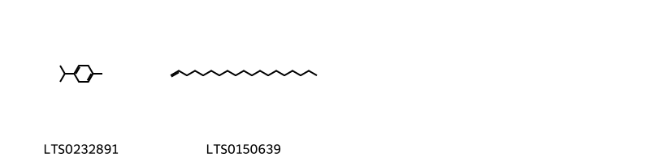{ width=100% }
    <figcaption>Hình ảnh cấu trúc hóa học của 2 hoạt chất thuộc nhóm Unsaturated hydrocarbons gồm ['α terpinene (LTS0232891)', '1-nonadecene (LTS0150639)'].</figcaption>
</figure>

---

### Dược dân tộc học

Danh sách các quốc gia có sử dụng *Tanacetum vulgare* trong điều trị các bệnh. 

| Country      | Disease                                                                                                                              | Bệnh                                                                                                                                                                                                |
|:-------------|:-------------------------------------------------------------------------------------------------------------------------------------|:----------------------------------------------------------------------------------------------------------------------------------------------------------------------------------------------------|
| Elsewhere    | Abortifacient, Abortifacient, Ascaricide, Diaphoretic, Emmenagogue, Poison, Stomachic, Vermifuge, Emmenagogue, Antibiotic, Stimulant | MYMEMORY WARNING: YOU USED ALL AVAILABLE FREE TRANSLATIONS FOR TODAY. NEXT AVAILABLE IN  11 HOURS 41 MINUTES 21 SECONDS VISIT HTTPS://MYMEMORY.TRANSLATED.NET/DOC/USAGELIMITS.PHP TO TRANSLATE MORE |
| Europe       | Stimulant                                                                                                                            | MYMEMORY WARNING: YOU USED ALL AVAILABLE FREE TRANSLATIONS FOR TODAY. NEXT AVAILABLE IN  11 HOURS 41 MINUTES 19 SECONDS VISIT HTTPS://MYMEMORY.TRANSLATED.NET/DOC/USAGELIMITS.PHP TO TRANSLATE MORE |
| Turkey       | Antiseptic, Narcotic, Poison, Stimulant, Stomachic, Vermifuge, Vulnerary, Tonic, Emmenagogue, Sudorific                              | MYMEMORY WARNING: YOU USED ALL AVAILABLE FREE TRANSLATIONS FOR TODAY. NEXT AVAILABLE IN  11 HOURS 41 MINUTES 15 SECONDS VISIT HTTPS://MYMEMORY.TRANSLATED.NET/DOC/USAGELIMITS.PHP TO TRANSLATE MORE |
| US           | Abortifacient, Acaricide, Emmenagogue, Insecticide, Poison, Antioxidant, Pulicide, Vermifuge                                         | MYMEMORY WARNING: YOU USED ALL AVAILABLE FREE TRANSLATIONS FOR TODAY. NEXT AVAILABLE IN  11 HOURS 41 MINUTES 12 SECONDS VISIT HTTPS://MYMEMORY.TRANSLATED.NET/DOC/USAGELIMITS.PHP TO TRANSLATE MORE |
| US(Colonial) | Sedative                                                                                                                             | MYMEMORY WARNING: YOU USED ALL AVAILABLE FREE TRANSLATIONS FOR TODAY. NEXT AVAILABLE IN  11 HOURS 41 MINUTES 09 SECONDS VISIT HTTPS://MYMEMORY.TRANSLATED.NET/DOC/USAGELIMITS.PHP TO TRANSLATE MORE |
| ain          | Vermifuge                                                                                                                            | MYMEMORY WARNING: YOU USED ALL AVAILABLE FREE TRANSLATIONS FOR TODAY. NEXT AVAILABLE IN  11 HOURS 41 MINUTES 05 SECONDS VISIT HTTPS://MYMEMORY.TRANSLATED.NET/DOC/USAGELIMITS.PHP TO TRANSLATE MORE |

---

# Chi Schistostephium

??? note "Danh sách các dược liệu thuộc chi"
    
	 - *Schistostephium crataegifolium*

---
## Schistostephium crataegifolium
### Thông tin về thực vật

!!! info "Phân loại thực vật của *Schistostephium crataegifolium* từ GIBF:"
    - **Kingdom:** Plantae
    - **Phylum:** Tracheophyta
    - **Order:** Asterales
    - **Family:** Asteraceae
    - **Genus:** Schistostephium
    - **Species:** *Schistostephium crataegifolium*

 

| Label (VI)   | Label (EN)   | Scientific Name                | Descriptions (VI)   | Descriptions (EN)   | Also Known As (VI)   | Also Known As (EN)   |
|:-------------|:-------------|:-------------------------------|:--------------------|:--------------------|:---------------------|:---------------------|
| N/A          | N/A          | Schistostephium crataegifolium | loài thực vật       | species of plant    | ['']                 | ['']                 |

#### Phân bố trên thế giới

**Từ CSDL GIBF** Malawi, Zambia, South Africa, Malaysia, nan, Mozambique, Congo, Democratic Republic of the, Tanzania, United Republic of, Zimbabwe, Eswatini

#### Phân bố tại Việt Nam

**Từ CSDL GIBF**: Không có ghi nhận ở Việt Nam

---
### Thành phần hóa học
        
- Theo cơ sở dữ liệu lotus: Từ loài *Schistostephium crataegifolium* đã phân lập và xác định được 125 hoạt chất thuộc về các nhóm Fatty Acyls, Flavonoids, Prenol lipids, Lactones, Organooxygen compounds. 

|    | chemicalTaxonomyClassyfireClass   |   smiles_count |
|---:|:----------------------------------|---------------:|
|  0 | Fatty Acyls                       |             10 |
|  1 | Flavonoids                        |              1 |
|  2 | Lactones                          |              3 |
|  3 | Organooxygen compounds            |              8 |
|  4 | Prenol lipids                     |            103 |

#### Nhóm Fatty Acyls
<figure markdown="span">
    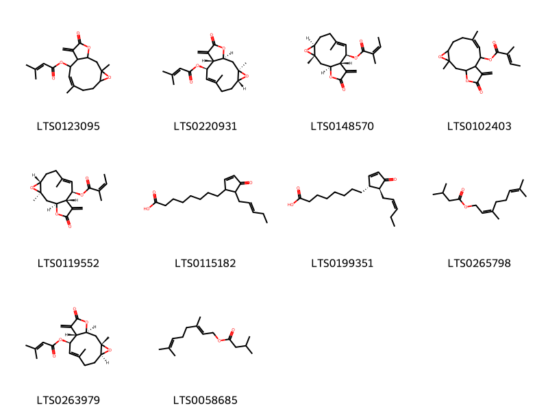{ width=100% }
    <figcaption>Hình ảnh cấu trúc hóa học của 10 hoạt chất thuộc nhóm Fatty Acyls gồm ['3,8-dimethyl-12-methylidene-13-oxo-4,14-dioxatricyclo[9.3.0.0³,⁵]tetradec-8-en-10-yl 3-methylbut-2-enoate (LTS0123095)', '(1s,3r,5r,8e,10r,11r)-3,8-dimethyl-12-methylidene-13-oxo-4,14-dioxatricyclo[9.3.0.0³,⁵]tetradec-8-en-10-yl 3-methylbut-2-enoate (LTS0220931)', '(1s,3s,5s,8e,10r,11r)-3,8-dimethyl-12-methylidene-13-oxo-4,14-dioxatricyclo[9.3.0.0³,⁵]tetradec-8-en-10-yl (2z)-2-methylbut-2-enoate (LTS0148570)', '3,8-dimethyl-12-methylidene-13-oxo-4,14-dioxatricyclo[9.3.0.0³,⁵]tetradec-8-en-10-yl 2-methylbut-2-enoate (LTS0102403)', '(1s,3r,5r,8e,10r,11r)-3,8-dimethyl-12-methylidene-13-oxo-4,14-dioxatricyclo[9.3.0.0³,⁵]tetradec-8-en-10-yl (2z)-2-methylbut-2-enoate (LTS0119552)', '8-[4-oxo-5-(pent-2-en-1-yl)cyclopent-2-en-1-yl]octanoic acid (LTS0115182)', '8-[(1r,5s)-4-oxo-5-[(2z)-pent-2-en-1-yl]cyclopent-2-en-1-yl]octanoic acid (LTS0199351)', 'neryl isovalerate (LTS0265798)', '(1s,3s,5s,8e,10r,11r)-3,8-dimethyl-12-methylidene-13-oxo-4,14-dioxatricyclo[9.3.0.0³,⁵]tetradec-8-en-10-yl 3-methylbut-2-enoate (LTS0263979)', '3,7-dimethylocta-2,6-dien-1-yl 3-methylbutanoate (LTS0058685)'].</figcaption>
</figure>
#### Nhóm Flavonoids
<figure markdown="span">
    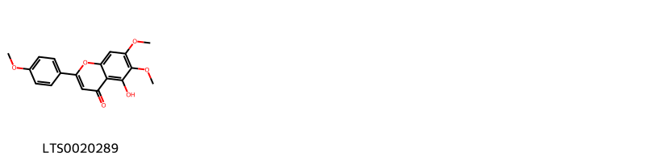{ width=100% }
    <figcaption>Hình ảnh cấu trúc hóa học của 1 hoạt chất thuộc nhóm Flavonoids gồm ['salvigenin (LTS0020289)'].</figcaption>
</figure>
#### Nhóm Lactones
<figure markdown="span">
    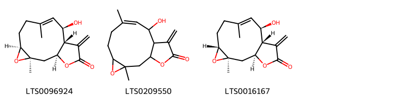{ width=100% }
    <figcaption>Hình ảnh cấu trúc hóa học của 3 hoạt chất thuộc nhóm Lactones gồm ['(1s,3r,5s,8e,10r,11s)-10-hydroxy-3,8-dimethyl-12-methylidene-4,14-dioxatricyclo[9.3.0.0³,⁵]tetradec-8-en-13-one (LTS0096924)', '10-hydroxy-3,8-dimethyl-12-methylidene-4,14-dioxatricyclo[9.3.0.0³,⁵]tetradec-8-en-13-one (LTS0209550)', '(1s,3r,5r,8e,10r,11s)-10-hydroxy-3,8-dimethyl-12-methylidene-4,14-dioxatricyclo[9.3.0.0³,⁵]tetradec-8-en-13-one (LTS0016167)'].</figcaption>
</figure>
#### Nhóm Organooxygen compounds
<figure markdown="span">
    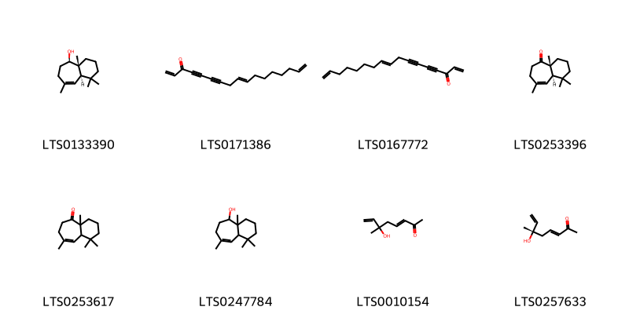{ width=100% }
    <figcaption>Hình ảnh cấu trúc hóa học của 8 hoạt chất thuộc nhóm Organooxygen compounds gồm ['(4ar,5r,9ar)-1,1,4a,8-tetramethyl-3,4,5,6,7,9a-hexahydro-2h-benzo[7]annulen-5-ol (LTS0133390)', 'heptadeca-1,9,16-trien-4,6-diyn-3-one (LTS0171386)', 'dehydrofalcarinone (LTS0167772)', '(4ar,9ar)-1,1,4a,8-tetramethyl-2,3,4,6,7,9a-hexahydrobenzo[7]annulen-5-one (LTS0253396)', '1,1,4a,8-tetramethyl-2,3,4,6,7,9a-hexahydrobenzo[7]annulen-5-one (LTS0253617)', '1,1,4a,8-tetramethyl-3,4,5,6,7,9a-hexahydro-2h-benzo[7]annulen-5-ol (LTS0247784)', '6-hydroxy-6-methylocta-3,7-dien-2-one (LTS0010154)', '(3e,6s)-6-hydroxy-6-methylocta-3,7-dien-2-one (LTS0257633)'].</figcaption>
</figure>
#### Nhóm Prenol lipids
<figure markdown="span">
    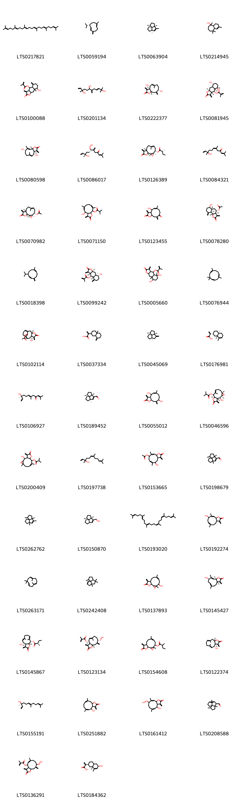{ width=100% }
    <figcaption>Hình ảnh cấu trúc hóa học của 103 hoạt chất thuộc nhóm Prenol lipids gồm ['squalene (LTS0217821)', '(-)-germacrene d (LTS0059194)', '(-)-isocomene (LTS0063904)', '2,5,9,9-tetramethyl-4,4a,6,7,8,9a-hexahydro-3h-benzo[7]annulen-5-ol (LTS0214945)', '8-hydroxy-8a-methyl-3,5-dimethylidene-2-oxo-octahydronaphtho[2,3-b]furan-4-yl 2-methylprop-2-enoate (LTS0100088)', '2,10-dimethyl-6-methylidenedodeca-3,11-diene-2,7,10-triol (LTS0201134)', '1-epi-tatridin b (LTS0222377)', '(3ar,4s,4as,5s,8r,8ar,9as)-5,8-dihydroxy-5,8a-dimethyl-3-methylidene-2-oxo-octahydronaphtho[2,3-b]furan-4-yl 2-methylprop-2-enoate (LTS0081945)', 'tatridin a (LTS0080598)', '(7s,10s)-7-hydroperoxy-10-hydroxy-2,10-dimethyl-6-methylidenedodeca-2,11-dien-4-one (LTS0086017)', '(1s,2r,4r,5s,7e,11s)-4,8-dimethyl-12-methylidene-13-oxo-3,14-dioxatricyclo[9.3.0.0²,⁴]tetradec-7-en-5-yl (2r)-2-methylbutanoate (LTS0126389)', '10-hydroxy-2,6,10-trimethyldodeca-2,6,11-trien-4-one (LTS0084321)', '(1s,2r,4r,5s,7e,11s)-4,8-dimethyl-12-methylidene-13-oxo-3,14-dioxatricyclo[9.3.0.0²,⁴]tetradec-7-en-5-yl acetate (LTS0070982)', '4-hydroxy-6,10-dimethyl-3-methylidene-2-oxo-3ah,4h,7h,8h,11h,11ah-cyclodeca[b]furan-11-yl 2-methylpropanoate (LTS0071150)', '4-hydroxy-6-methyl-3,10-dimethylidene-3ah,4h,7h,8h,11h,11ah-cyclodeca[b]furan-2,9-dione (LTS0123455)', '(3ar,4s,5ar,6r,9as,9br)-6-hydroxy-5a-methyl-3,9-dimethylidene-2-oxo-octahydronaphtho[1,2-b]furan-4-yl acetate (LTS0078280)', '8-isopropyl-1-methyl-5-methylidenecyclodeca-1,6-diene (LTS0018398)', '(3ar,4r,4as,8r,8ar,9as)-8-hydroxy-8a-methyl-3,5-dimethylidene-2-oxo-octahydronaphtho[2,3-b]furan-4-yl 2-methylprop-2-enoate (LTS0099242)', '5,8-dihydroxy-5,8a-dimethyl-3-methylidene-2-oxo-octahydronaphtho[2,3-b]furan-4-yl 2-methylprop-2-enoate (LTS0005660)', 'α-humulene (LTS0076944)', '[(3as,4r,11as)-4-hydroxy-6-methyl-3-methylidene-2-oxo-3ah,4h,7h,8h,11h,11ah-cyclodeca[b]furan-10-yl]methyl acetate (LTS0102114)', '2-(4a-methyl-8-methylidene-octahydronaphthalen-2-yl)prop-2-enoic acid (LTS0037334)', '(1s,2s,5r,8r)-2,5,8-trimethyl-6-methylidenetricyclo[6.3.0.0¹,⁵]undecane (LTS0045069)', '2-[(2r,4ar,8ar)-4a,8-dimethyl-2,3,4,5,6,8a-hexahydro-1h-naphthalen-2-yl]prop-2-enoic acid (LTS0176981)', '(6e,10s)-10-hydroxy-2,6,10-trimethyldodeca-2,6,11-trien-4-one (LTS0106927)', '(1s,2s,5s,8r)-2,5,8-trimethyltricyclo[6.3.0.0¹,⁵]undec-6-ene-6-carbaldehyde (LTS0189452)', '4,9-dihydroxy-6-methyl-3,10-dimethylidene-3ah,4h,7h,8h,9h,11h,11ah-cyclodeca[b]furan-2-one (LTS0055012)', '(1s,2s,3s,5s,8e,10s,11r)-2-hydroxy-5,9-dimethyl-14-methylidene-13-oxo-4,12-dioxatricyclo[9.3.0.0³,⁵]tetradec-8-en-10-yl 2-methylpropanoate (LTS0046596)', '2-hydroxy-5,9-dimethyl-14-methylidene-13-oxo-4,12-dioxatricyclo[9.3.0.0³,⁵]tetradec-8-en-10-yl 2-methylpropanoate (LTS0200409)', 'nerolidol (LTS0197738)', '5-hydroxy-6,10-dimethyl-3-methylidene-2-oxo-3ah,4h,5h,8h,9h,11ah-cyclodeca[b]furan-9-yl acetate (LTS0153665)', '2,5,8-trimethyltricyclo[6.3.0.0¹,⁵]undec-6-ene-6-carbaldehyde (LTS0198679)', '2,5,6,8-tetramethyltricyclo[6.3.0.0¹,⁵]undec-6-ene (LTS0262762)', '[(1s,2s,5s,8r)-2,5,8-trimethyltricyclo[6.3.0.0¹,⁵]undec-6-en-6-yl]methanol (LTS0150870)', '2,6,10,15,19,23-hexamethyltetracosa-2,6,10,14,18,22-hexaene (LTS0193020)', '9-hydroxy-6,10-dimethyl-3-methylidene-3ah,4h,5h,8h,9h,11ah-cyclodeca[b]furan-2-one (LTS0192274)', 'humulene (LTS0263171)', '5,7,7,11-tetramethyltricyclo[6.3.0.0¹,⁵]undec-2-ene (LTS0242408)', '5-hydroxy-4,8-dimethyl-12-methylidene-3,14-dioxatricyclo[9.3.0.0²,⁴]tetradec-7-en-13-one (LTS0137893)', '(3as,9r,11ar)-9-hydroxy-6,10-dimethyl-3-methylidene-3ah,4h,5h,8h,9h,11ah-cyclodeca[b]furan-2-one (LTS0145427)', '(3as,4r,11s,11ar)-4-hydroxy-6,10-dimethyl-3-methylidene-2-oxo-3ah,4h,7h,8h,11h,11ah-cyclodeca[b]furan-11-yl (2r)-2-methylbutanoate (LTS0145867)', '(3ar,4r,9s,11as)-9-hydroperoxy-6-methyl-3,10-dimethylidene-2-oxo-3ah,4h,7h,8h,9h,11h,11ah-cyclodeca[b]furan-4-yl 2-methylprop-2-enoate (LTS0123134)', '4,8-dimethyl-12-methylidene-13-oxo-3,14-dioxatricyclo[9.3.0.0²,⁴]tetradec-7-en-5-yl 2-methylbutanoate (LTS0154608)', '(3as,4r,11as)-4-hydroxy-6,10-dimethyl-3-methylidene-3ah,4h,7h,8h,11h,11ah-cyclodeca[b]furan-2-one (LTS0122374)', 'nerolidol (LTS0155191)', '4-hydroxy-6,10-dimethyl-3-methylidene-3ah,4h,7h,8h,11h,11ah-cyclodeca[b]furan-2-one (LTS0251882)', '9-hydroperoxy-4-hydroxy-6,10-dimethyl-3-methylidene-3ah,4h,7h,8h,9h,11ah-cyclodeca[b]furan-2-one (LTS0161412)', '5,8,11-trimethyltetracyclo[6.3.0.0¹,⁵.0⁴,⁶]undecane-7-carbaldehyde (LTS0208588)', '9-hydroperoxy-6-methyl-3,10-dimethylidene-2-oxo-3ah,4h,7h,8h,9h,11h,11ah-cyclodeca[b]furan-4-yl 2-methylprop-2-enoate (LTS0136291)', '2-[(2s,4as,6r,8ar)-6-hydroxy-4a,8-dimethyl-2,3,4,5,6,8a-hexahydro-1h-naphthalen-2-yl]prop-2-enoic acid (LTS0184362)', '(3as,5s,9s,11ar)-5-hydroxy-6,10-dimethyl-3-methylidene-2-oxo-3ah,4h,5h,8h,9h,11ah-cyclodeca[b]furan-9-yl acetate (LTS0179348)', 'costic acid (LTS0263923)', '(3ar,4r,4as,8r,8ar,9as)-8-hydroxy-8a-methyl-3,5-dimethylidene-2-oxo-octahydronaphtho[2,3-b]furan-4-yl 3-methylbut-2-enoate (LTS0253863)', '{5,8,11-trimethyltetracyclo[6.3.0.0¹,⁵.0⁴,⁶]undecan-7-yl}methanol (LTS0259165)', '(3as,4r,9s,11as)-9-hydroperoxy-4-hydroxy-6,10-dimethyl-3-methylidene-3ah,4h,7h,8h,9h,11ah-cyclodeca[b]furan-2-one (LTS0221711)', '4-hydroxy-6,10-dimethyl-3-methylidene-2-oxo-3ah,4h,7h,8h,11h,11ah-cyclodeca[b]furan-11-yl 2-methylbutanoate (LTS0210442)', '(2s,4e)-6-hydroperoxy-6-methyl-2-[(1s)-4-methylcyclohex-3-en-1-yl]hept-4-en-2-ol (LTS0260213)', '11α-himachal-4-en-11-ol (LTS0192818)', '4,9-dihydroxy-6,10-dimethyl-3-methylidene-3ah,4h,7h,8h,9h,11ah-cyclodeca[b]furan-2-one (LTS0214678)', '(1s,2r,4r,5s,7e,11s)-5-hydroxy-4,8-dimethyl-12-methylidene-3,14-dioxatricyclo[9.3.0.0²,⁴]tetradec-7-en-13-one (LTS0095975)', '6-hydroperoxy-6-methyl-2-(4-methylcyclohex-3-en-1-yl)hept-4-en-2-ol (LTS0062400)', '2-[(2r,4as,8ar)-4a,8-dimethyl-6-oxo-1,2,3,4,5,8a-hexahydronaphthalen-2-yl]prop-2-enoic acid (LTS0085418)', '(3e,7r,10s)-2,10-dimethyl-6-methylidenedodeca-3,11-diene-2,7,10-triol (LTS0224057)', '(1s,2r,4r,5s,7e,11s)-4,8-dimethyl-12-methylidene-13-oxo-3,14-dioxatricyclo[9.3.0.0²,⁴]tetradec-7-en-5-yl 3-methylbutanoate (LTS0208928)', '4-hydroxy-6,10-dimethyl-3-methylidene-2-oxo-3ah,4h,7h,8h,11h,11ah-cyclodeca[b]furan-11-yl 3-methylbutanoate (LTS0085579)', '5-hydroxy-6,10-dimethyl-3-methylidene-2-oxo-3ah,4h,5h,8h,9h,11ah-cyclodeca[b]furan-9-yl 2-methylpropanoate (LTS0223718)', '(2r,5s)-5-hydroperoxy-6-methyl-2-[(1r)-4-methylcyclohex-3-en-1-yl]hept-6-en-2-ol (LTS0032667)', '5,8-dihydroxy-5,8a-dimethyl-3-methylidene-2-oxo-octahydronaphtho[2,3-b]furan-4-yl 2-methylbut-2-enoate (LTS0234861)', '5,8-dihydroxy-5,8a-dimethyl-3-methylidene-2-oxo-octahydronaphtho[2,3-b]furan-4-yl 3-methylbut-2-enoate (LTS0209930)', 'spathulenol (LTS0235578)', '(3as,5s,9s,11ar)-5-hydroxy-6,10-dimethyl-3-methylidene-2-oxo-3ah,4h,5h,8h,9h,11ah-cyclodeca[b]furan-9-yl 2-methylpropanoate (LTS0044770)', '(3as,4r,9r,11as)-9-hydroperoxy-4-hydroxy-6-methyl-3,10-dimethylidene-3ah,4h,7h,8h,9h,11h,11ah-cyclodeca[b]furan-2-one (LTS0182260)', '2,5,8-trimethyl-6-methylidenetricyclo[6.3.0.0¹,⁵]undecane (LTS0256158)', '[(1s,2s,3s,5s,8z,11s)-2-hydroxy-5-methyl-14-methylidene-13-oxo-4,12-dioxatricyclo[9.3.0.0³,⁵]tetradec-8-en-9-yl]methyl acetate (LTS0048153)', '2-(4a,8-dimethyl-6-oxo-1,2,3,4,5,8a-hexahydronaphthalen-2-yl)prop-2-enoic acid (LTS0242466)', '7-hydroperoxy-10-hydroxy-2,10-dimethyl-6-methylidenedodeca-2,11-dien-4-one (LTS0173700)', '(3as,4r,9s,11as)-9-hydroperoxy-4-hydroxy-6-methyl-3,10-dimethylidene-3ah,4h,7h,8h,9h,11h,11ah-cyclodeca[b]furan-2-one (LTS0195627)', '(3as,4r,11s,11ar)-4-hydroxy-6,10-dimethyl-3-methylidene-2-oxo-3ah,4h,7h,8h,11h,11ah-cyclodeca[b]furan-11-yl 3-methylbutanoate (LTS0019807)', '9-hydroperoxy-4-hydroxy-6-methyl-3,10-dimethylidene-3ah,4h,7h,8h,9h,11h,11ah-cyclodeca[b]furan-2-one (LTS0046667)', '(3ar,4s,4as,5s,8r,8ar,9as)-5,8-dihydroxy-5,8a-dimethyl-3-methylidene-2-oxo-octahydronaphtho[2,3-b]furan-4-yl (2z)-2-methylbut-2-enoate (LTS0054798)', '(3ar,4r,4as,8r,8ar,9as)-8-hydroxy-8a-methyl-3,5-dimethylidene-2-oxo-octahydronaphtho[2,3-b]furan-4-yl (2z)-2-methylbut-2-enoate (LTS0001595)', '4,8-dimethyl-12-methylidene-13-oxo-3,14-dioxatricyclo[9.3.0.0²,⁴]tetradec-7-en-5-yl acetate (LTS0068568)', '(3as,4r,11as)-4-hydroxy-6-methyl-3,10-dimethylidene-3ah,4h,7h,8h,11h,11ah-cyclodeca[b]furan-2,9-dione (LTS0014652)', '8-hydroxy-8a-methyl-3,5-dimethylidene-2-oxo-octahydronaphtho[2,3-b]furan-4-yl 2-methylbut-2-enoate (LTS0005752)', '8-hydroxy-8a-methyl-3,5-dimethylidene-2-oxo-octahydronaphtho[2,3-b]furan-4-yl 3-methylbut-2-enoate (LTS0015565)', '(3ar,4s,4as,5s,8r,8ar,9as)-5,8-dihydroxy-5,8a-dimethyl-3-methylidene-2-oxo-octahydronaphtho[2,3-b]furan-4-yl 3-methylbut-2-enoate (LTS0003422)', '4,8-dimethyl-12-methylidene-13-oxo-3,14-dioxatricyclo[9.3.0.0²,⁴]tetradec-7-en-5-yl 3-methylbutanoate (LTS0004986)', 'spathulenol (LTS0011974)', '2-(4a,8-dimethyl-2,3,4,5,6,8a-hexahydro-1h-naphthalen-2-yl)prop-2-enoic acid (LTS0022778)', '{2-hydroxy-5-methyl-14-methylidene-13-oxo-4,12-dioxatricyclo[9.3.0.0³,⁵]tetradec-8-en-9-yl}methyl acetate (LTS0011448)', '{2,5,8-trimethyltricyclo[6.3.0.0¹,⁵]undec-6-en-6-yl}methanol (LTS0095946)', '(3as,4r,11s,11ar)-4-hydroxy-6,10-dimethyl-3-methylidene-2-oxo-3ah,4h,7h,8h,11h,11ah-cyclodeca[b]furan-11-yl 2-methylpropanoate (LTS0015853)', '6-hydroxy-5a-methyl-3,9-dimethylidene-2-oxo-octahydronaphtho[1,2-b]furan-4-yl acetate (LTS0028803)', '2,5,8-trimethyltricyclo[6.3.0.0¹,⁵]undec-6-ene-6-carboxylic acid (LTS0087420)', '(3ar,4r,9r,11as)-9-hydroperoxy-6-methyl-3,10-dimethylidene-2-oxo-3ah,4h,7h,8h,9h,11h,11ah-cyclodeca[b]furan-4-yl 2-methylprop-2-enoate (LTS0235485)', '(1s,2s,5s,8r)-2,5,8-trimethyltricyclo[6.3.0.0¹,⁵]undec-6-ene-6-carboxylic acid (LTS0109891)', 'tatridin b (LTS0019736)', '(1r,4r,5r,6r,7r,8r,11s)-5,8,11-trimethyltetracyclo[6.3.0.0¹,⁵.0⁴,⁶]undecane-7-carbaldehyde (LTS0224658)', '5-hydroperoxy-6-methyl-2-(4-methylcyclohex-3-en-1-yl)hept-6-en-2-ol (LTS0098039)', '(1s,5r,8r,11s)-5,7,7,11-tetramethyltricyclo[6.3.0.0¹,⁵]undec-2-ene (LTS0120832)', '{4-hydroxy-6-methyl-3-methylidene-2-oxo-3ah,4h,7h,8h,11h,11ah-cyclodeca[b]furan-10-yl}methyl acetate (LTS0225819)', '2-(6-hydroxy-4a,8-dimethyl-2,3,4,5,6,8a-hexahydro-1h-naphthalen-2-yl)prop-2-enoic acid (LTS0124320)', '[(1r,4r,5r,6r,7r,8r,11s)-5,8,11-trimethyltetracyclo[6.3.0.0¹,⁵.0⁴,⁶]undecan-7-yl]methanol (LTS0037195)'].</figcaption>
</figure>

---

### Dược dân tộc học

Danh sách các quốc gia có sử dụng *Schistostephium crataegifolium* trong điều trị các bệnh. 

| Country   | Disease           | Bệnh                                                                                                                                                                                                |
|:----------|:------------------|:----------------------------------------------------------------------------------------------------------------------------------------------------------------------------------------------------|
| Lesotho   | Collyrium, Emetic | MYMEMORY WARNING: YOU USED ALL AVAILABLE FREE TRANSLATIONS FOR TODAY. NEXT AVAILABLE IN  11 HOURS 40 MINUTES 15 SECONDS VISIT HTTPS://MYMEMORY.TRANSLATED.NET/DOC/USAGELIMITS.PHP TO TRANSLATE MORE |

---

# Chi Cnicus

??? note "Danh sách các dược liệu thuộc chi"
    
	 - *Cnicus benedictus*
	 - *Cnicus japonicus*
	 - *Cnicus segetum*

---
## Cnicus benedictus
### Thông tin về thực vật

!!! info "Phân loại thực vật của *Centaurea benedicta* từ GIBF:"
    - **Kingdom:** Plantae
    - **Phylum:** Tracheophyta
    - **Order:** Asterales
    - **Family:** Asteraceae
    - **Genus:** Centaurea
    - **Species:** *Centaurea benedicta*

 

| Label (VI)   | Label (EN)   | Scientific Name   | Descriptions (VI)   | Descriptions (EN)   | Also Known As (VI)   | Also Known As (EN)   |
|:-------------|:-------------|:------------------|:--------------------|:--------------------|:---------------------|:---------------------|
| N/A          | N/A          | Cnicus benedictus | loài thực vật       | species of plant    | ['']                 | ['']                 |

#### Phân bố trên thế giới

**Từ CSDL GIBF** Tajikistan, Germany, Belgium, Spain, Azerbaijan, Portugal, Armenia, United States of America, France, Greece

#### Phân bố tại Việt Nam

**Từ CSDL GIBF**: Không có ghi nhận ở Việt Nam

---
### Thành phần hóa học
        
- Theo cơ sở dữ liệu lotus: Từ loài *Centaurea benedicta* đã phân lập và xác định được Chưa có hoạt chất nào được phân lập. hoạt chất thuộc về các nhóm Không có hoạt chất nào được phân lập. 

Không có hình ảnh nào được tạo ra

---

### Dược dân tộc học

Danh sách các quốc gia có sử dụng *Centaurea benedicta* trong điều trị các bệnh. 

| Country        | Disease                                                                                              | Bệnh                                                                                                                                                                                                |
|:---------------|:-----------------------------------------------------------------------------------------------------|:----------------------------------------------------------------------------------------------------------------------------------------------------------------------------------------------------|
| Elsewhere      | Apertif, Cholagogue, Diaphoretic, Diuretic, Tonic                                                    | MYMEMORY WARNING: YOU USED ALL AVAILABLE FREE TRANSLATIONS FOR TODAY. NEXT AVAILABLE IN  11 HOURS 39 MINUTES 36 SECONDS VISIT HTTPS://MYMEMORY.TRANSLATED.NET/DOC/USAGELIMITS.PHP TO TRANSLATE MORE |
| Iraq           | Intoxicant                                                                                           | MYMEMORY WARNING: YOU USED ALL AVAILABLE FREE TRANSLATIONS FOR TODAY. NEXT AVAILABLE IN  11 HOURS 39 MINUTES 33 SECONDS VISIT HTTPS://MYMEMORY.TRANSLATED.NET/DOC/USAGELIMITS.PHP TO TRANSLATE MORE |
| Kurdistan      | Emmenagogue                                                                                          | MYMEMORY WARNING: YOU USED ALL AVAILABLE FREE TRANSLATIONS FOR TODAY. NEXT AVAILABLE IN  11 HOURS 39 MINUTES 30 SECONDS VISIT HTTPS://MYMEMORY.TRANSLATED.NET/DOC/USAGELIMITS.PHP TO TRANSLATE MORE |
| Turkey         | Apertif, Diuretic, Emetic, Emmenagogue, Hemostat, Stomachic, Tonic, Vermifuge, Sudorific, Intoxicant | MYMEMORY WARNING: YOU USED ALL AVAILABLE FREE TRANSLATIONS FOR TODAY. NEXT AVAILABLE IN  11 HOURS 39 MINUTES 27 SECONDS VISIT HTTPS://MYMEMORY.TRANSLATED.NET/DOC/USAGELIMITS.PHP TO TRANSLATE MORE |
| US             | Diuretic, Emetic, Sudorific, Vermifuge                                                               | MYMEMORY WARNING: YOU USED ALL AVAILABLE FREE TRANSLATIONS FOR TODAY. NEXT AVAILABLE IN  11 HOURS 39 MINUTES 23 SECONDS VISIT HTTPS://MYMEMORY.TRANSLATED.NET/DOC/USAGELIMITS.PHP TO TRANSLATE MORE |
| US(Amerindian) | Contraceptive                                                                                        | MYMEMORY WARNING: YOU USED ALL AVAILABLE FREE TRANSLATIONS FOR TODAY. NEXT AVAILABLE IN  11 HOURS 39 MINUTES 19 SECONDS VISIT HTTPS://MYMEMORY.TRANSLATED.NET/DOC/USAGELIMITS.PHP TO TRANSLATE MORE |
| ain            | Apertif                                                                                              | MYMEMORY WARNING: YOU USED ALL AVAILABLE FREE TRANSLATIONS FOR TODAY. NEXT AVAILABLE IN  11 HOURS 39 MINUTES 15 SECONDS VISIT HTTPS://MYMEMORY.TRANSLATED.NET/DOC/USAGELIMITS.PHP TO TRANSLATE MORE |

---

---
## Cnicus japonicus
### Thông tin về thực vật

!!! info "Phân loại thực vật của *Cirsium japonicum* từ GIBF:"
    - **Kingdom:** Plantae
    - **Phylum:** Tracheophyta
    - **Order:** Asterales
    - **Family:** Asteraceae
    - **Genus:** Cirsium
    - **Species:** *Cirsium japonicum*

 

| Label (VI)   | Label (EN)   | Scientific Name   | Descriptions (VI)   | Descriptions (EN)   | Also Known As (VI)   | Also Known As (EN)   |
|:-------------|:-------------|:------------------|:--------------------|:--------------------|:---------------------|:---------------------|
| N/A          | N/A          | Cnicus japonicus  |                     |                     | ['']                 | ['']                 |

#### Phân bố trên thế giới

**Từ CSDL GIBF** nan, Japan, Chinese Taipei, France, Singapore, China

#### Phân bố tại Việt Nam

**Từ CSDL GIBF**: Không có ghi nhận ở Việt Nam

---
### Thành phần hóa học
        
- Theo cơ sở dữ liệu lotus: Từ loài *Cirsium japonicum* đã phân lập và xác định được Chưa có hoạt chất nào được phân lập. hoạt chất thuộc về các nhóm Không có hoạt chất nào được phân lập. 

Không có hình ảnh nào được tạo ra

---

### Dược dân tộc học

Danh sách các quốc gia có sử dụng *Cirsium japonicum* trong điều trị các bệnh. 

| Country   | Disease    | Bệnh                                                                                                                                                                                                |
|:----------|:-----------|:----------------------------------------------------------------------------------------------------------------------------------------------------------------------------------------------------|
| China     | Tonic      | MYMEMORY WARNING: YOU USED ALL AVAILABLE FREE TRANSLATIONS FOR TODAY. NEXT AVAILABLE IN  11 HOURS 38 MINUTES 48 SECONDS VISIT HTTPS://MYMEMORY.TRANSLATED.NET/DOC/USAGELIMITS.PHP TO TRANSLATE MORE |
| Chinese   | Hemostatic | MYMEMORY WARNING: YOU USED ALL AVAILABLE FREE TRANSLATIONS FOR TODAY. NEXT AVAILABLE IN  11 HOURS 38 MINUTES 44 SECONDS VISIT HTTPS://MYMEMORY.TRANSLATED.NET/DOC/USAGELIMITS.PHP TO TRANSLATE MORE |

---

---
## Cnicus segetum
### Thông tin về thực vật

!!! info "Phân loại thực vật của *Cirsium arvense* từ GIBF:"
    - **Kingdom:** Plantae
    - **Phylum:** Tracheophyta
    - **Order:** Asterales
    - **Family:** Asteraceae
    - **Genus:** Cirsium
    - **Species:** *Cirsium arvense*

 

| Label (VI)   | Label (EN)   | Scientific Name   | Descriptions (VI)   | Descriptions (EN)   | Also Known As (VI)   | Also Known As (EN)   |
|:-------------|:-------------|:------------------|:--------------------|:--------------------|:---------------------|:---------------------|
| N/A          | N/A          | Cnicus segetum    |                     |                     | ['']                 | ['']                 |

#### Phân bố trên thế giới

**Từ CSDL GIBF** nan, China

#### Phân bố tại Việt Nam

**Từ CSDL GIBF**: Không có ghi nhận ở Việt Nam

---
### Thành phần hóa học
        
- Theo cơ sở dữ liệu lotus: Từ loài *Cirsium arvense* đã phân lập và xác định được Chưa có hoạt chất nào được phân lập. hoạt chất thuộc về các nhóm Không có hoạt chất nào được phân lập. 

Không có hình ảnh nào được tạo ra

---

### Dược dân tộc học

Danh sách các quốc gia có sử dụng *Cirsium arvense* trong điều trị các bệnh. 

| Country   | Disease                           | Bệnh                                                                                                                                                                                                |
|:----------|:----------------------------------|:----------------------------------------------------------------------------------------------------------------------------------------------------------------------------------------------------|
| China     | Alexiteric, Refrigerant, Hemostat | MYMEMORY WARNING: YOU USED ALL AVAILABLE FREE TRANSLATIONS FOR TODAY. NEXT AVAILABLE IN  11 HOURS 38 MINUTES 17 SECONDS VISIT HTTPS://MYMEMORY.TRANSLATED.NET/DOC/USAGELIMITS.PHP TO TRANSLATE MORE |

---

# Chi Sanvitalia

??? note "Danh sách các dược liệu thuộc chi"
    
	 - *Sanvitalia procumbens*

---
## Sanvitalia procumbens
### Thông tin về thực vật

!!! info "Phân loại thực vật của *Sanvitalia procumbens* từ GIBF:"
    - **Kingdom:** Plantae
    - **Phylum:** Tracheophyta
    - **Order:** Asterales
    - **Family:** Asteraceae
    - **Genus:** Sanvitalia
    - **Species:** *Sanvitalia procumbens*

 

| Label (VI)   | Label (EN)   | Scientific Name       | Descriptions (VI)   | Descriptions (EN)   | Also Known As (VI)   | Also Known As (EN)   |
|:-------------|:-------------|:----------------------|:--------------------|:--------------------|:---------------------|:---------------------|
| N/A          | N/A          | Sanvitalia procumbens | loài thực vật       | species of plant    | ['']                 | ['']                 |

#### Phân bố trên thế giới

**Từ CSDL GIBF** Germany, Mexico

#### Phân bố tại Việt Nam

**Từ CSDL GIBF**: Không có ghi nhận ở Việt Nam

---
### Thành phần hóa học
        
- Theo cơ sở dữ liệu lotus: Từ loài *Sanvitalia procumbens* đã phân lập và xác định được 6 hoạt chất thuộc về các nhóm Fatty Acyls, Prenol lipids. 

|    | chemicalTaxonomyClassyfireClass   |   smiles_count |
|---:|:----------------------------------|---------------:|
|  0 | Fatty Acyls                       |              2 |
|  1 | Prenol lipids                     |              4 |

#### Nhóm Fatty Acyls
<figure markdown="span">
    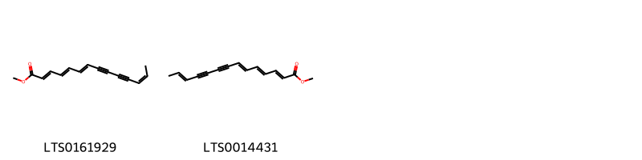{ width=100% }
    <figcaption>Hình ảnh cấu trúc hóa học của 2 hoạt chất thuộc nhóm Fatty Acyls gồm ['methyl (2e,4e,6e,12z)-tetradeca-2,4,6,12-tetraen-8,10-diynoate (LTS0161929)', 'methyl tetradeca-2,4,6,12-tetraen-8,10-diynoate (LTS0014431)'].</figcaption>
</figure>
#### Nhóm Prenol lipids
<figure markdown="span">
    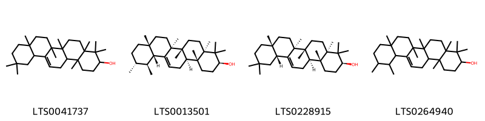{ width=100% }
    <figcaption>Hình ảnh cấu trúc hóa học của 4 hoạt chất thuộc nhóm Prenol lipids gồm ['4,4,4a,6a,6b,8a,11,11,14b-nonamethyl-2,3,5,6,7,8,9,10,12,12a,14,14a-dodecahydro-1h-picen-3-ol (LTS0041737)', '(3s,4ar,6ar,6bs,8ar,11r,12s,12ar,14as,14br)-4,4,4a,6a,6b,8a,11,12,14b-nonamethyl-1,2,3,5,6,7,8,9,10,11,12,12a,14,14a-tetradecahydropicen-3-ol (LTS0013501)', '(3s,4ar,6ar,6bs,8ar,12ar,14as,14br)-4,4,4a,6a,6b,8a,11,11,14b-nonamethyl-2,3,5,6,7,8,9,10,12,12a,14,14a-dodecahydro-1h-picen-3-ol (LTS0228915)', '4,4,4a,6a,6b,8a,11,12,14b-nonamethyl-1,2,3,5,6,7,8,9,10,11,12,12a,14,14a-tetradecahydropicen-3-ol (LTS0264940)'].</figcaption>
</figure>

---

### Dược dân tộc học

Danh sách các quốc gia có sử dụng *Sanvitalia procumbens* trong điều trị các bệnh. 

| Country   | Disease   | Bệnh                                                                                                                                                                                                |
|:----------|:----------|:----------------------------------------------------------------------------------------------------------------------------------------------------------------------------------------------------|
| Mexico    | Laxative  | MYMEMORY WARNING: YOU USED ALL AVAILABLE FREE TRANSLATIONS FOR TODAY. NEXT AVAILABLE IN  11 HOURS 37 MINUTES 55 SECONDS VISIT HTTPS://MYMEMORY.TRANSLATED.NET/DOC/USAGELIMITS.PHP TO TRANSLATE MORE |

---

# Chi Laggera

??? note "Danh sách các dược liệu thuộc chi"
    
	 - *Laggera alata*
	 - *Laggera aurita*

---
## Laggera alata
### Thông tin về thực vật

!!! info "Phân loại thực vật của *Laggera alata* từ GIBF:"
    - **Kingdom:** Plantae
    - **Phylum:** Tracheophyta
    - **Order:** Asterales
    - **Family:** Asteraceae
    - **Genus:** Laggera
    - **Species:** *Laggera alata*

 

| Label (VI)   | Label (EN)   | Scientific Name   | Descriptions (VI)   | Descriptions (EN)   | Also Known As (VI)   | Also Known As (EN)   |
|:-------------|:-------------|:------------------|:--------------------|:--------------------|:---------------------|:---------------------|
| N/A          | N/A          | Laggera alata     | loài thực vật       | species of plant    | ['']                 | ['']                 |

#### Phân bố trên thế giới

**Từ CSDL GIBF** nan, Ghana, Sri Lanka, Gabon, Argentina, Mozambique, Rwanda, Benin, Tanzania, United Republic of, Yemen, Togo, Malawi, Zambia, Pakistan, Nigeria, Chinese Taipei, Congo, Democratic Republic of the, Zimbabwe, Saudi Arabia, South Africa, Uganda, Hong Kong, Thailand, Côte d’Ivoire, Viet Nam, Eswatini, China, Madagascar, Equatorial Guinea, Botswana, Burundi, India, Nepal, Indonesia, Burkina Faso, Kenya, Cameroon, Malaysia, Ethiopia

#### Phân bố tại Việt Nam

**Từ CSDL GIBF**: Lam Dong (林同省)

---
### Thành phần hóa học
        
- Theo cơ sở dữ liệu lotus: Từ loài *Laggera alata* đã phân lập và xác định được 106 hoạt chất thuộc về các nhóm Fatty Acyls, Flavonoids, Prenol lipids, Steroids and steroid derivatives, Benzene and substituted derivatives, Organooxygen compounds, Phenol esters, Epoxides. 

|    | chemicalTaxonomyClassyfireClass     |   smiles_count |
|---:|:------------------------------------|---------------:|
|  0 | Benzene and substituted derivatives |              1 |
|  1 | Epoxides                            |              2 |
|  2 | Fatty Acyls                         |              3 |
|  3 | Flavonoids                          |              3 |
|  4 | Organooxygen compounds              |              1 |
|  5 | Phenol esters                       |              1 |
|  6 | Prenol lipids                       |             83 |
|  7 | Steroids and steroid derivatives    |             12 |

#### Nhóm Benzene and substituted derivatives
<figure markdown="span">
    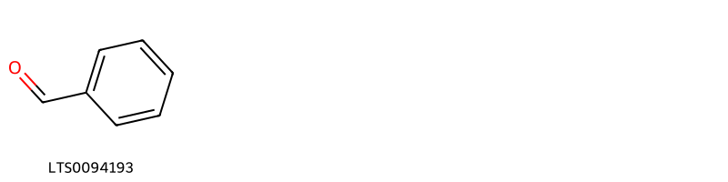{ width=100% }
    <figcaption>Hình ảnh cấu trúc hóa học của 1 hoạt chất thuộc nhóm Benzene and substituted derivatives gồm ['benzaldehyde (LTS0094193)'].</figcaption>
</figure>
#### Nhóm Epoxides
<figure markdown="span">
    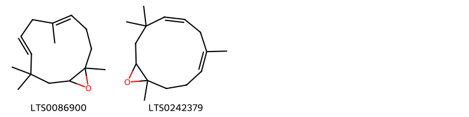{ width=100% }
    <figcaption>Hình ảnh cấu trúc hóa học của 2 hoạt chất thuộc nhóm Epoxides gồm ['(4e,7e)-1,5,9,9-tetramethyl-12-oxabicyclo[9.1.0]dodeca-4,7-diene (LTS0086900)', '(4z,7z)-1,5,9,9-tetramethyl-12-oxabicyclo[9.1.0]dodeca-4,7-diene (LTS0242379)'].</figcaption>
</figure>
#### Nhóm Fatty Acyls
<figure markdown="span">
    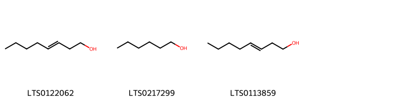{ width=100% }
    <figcaption>Hình ảnh cấu trúc hóa học của 3 hoạt chất thuộc nhóm Fatty Acyls gồm ['3-octenol (LTS0122062)', 'hexanol (LTS0217299)', '(3e)-oct-3-en-1-ol (LTS0113859)'].</figcaption>
</figure>
#### Nhóm Flavonoids
<figure markdown="span">
    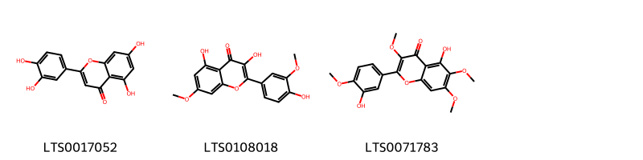{ width=100% }
    <figcaption>Hình ảnh cấu trúc hóa học của 3 hoạt chất thuộc nhóm Flavonoids gồm ['luteolin (LTS0017052)', 'rhamnazin (LTS0108018)', 'casticin (LTS0071783)'].</figcaption>
</figure>
#### Nhóm Organooxygen compounds
<figure markdown="span">
    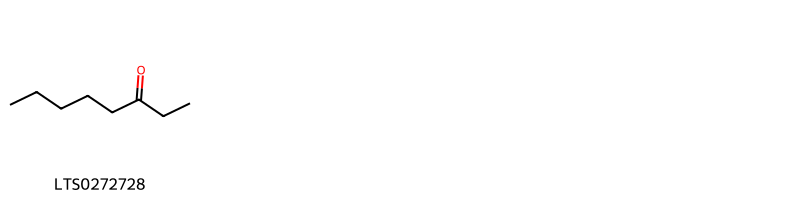{ width=100% }
    <figcaption>Hình ảnh cấu trúc hóa học của 1 hoạt chất thuộc nhóm Organooxygen compounds gồm ['3-octanone (LTS0272728)'].</figcaption>
</figure>
#### Nhóm Phenol esters
<figure markdown="span">
    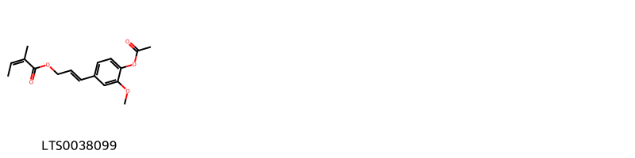{ width=100% }
    <figcaption>Hình ảnh cấu trúc hóa học của 1 hoạt chất thuộc nhóm Phenol esters gồm ['3-[4-(acetyloxy)-3-methoxyphenyl]prop-2-en-1-yl (2z)-2-methylbut-2-enoate (LTS0038099)'].</figcaption>
</figure>
#### Nhóm Prenol lipids
<figure markdown="span">
    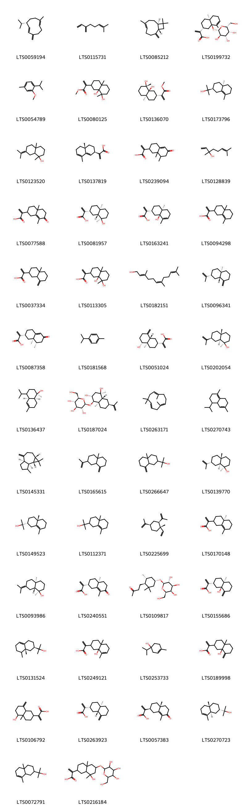{ width=100% }
    <figcaption>Hình ảnh cấu trúc hóa học của 83 hoạt chất thuộc nhóm Prenol lipids gồm ['(-)-germacrene d (LTS0059194)', 'α-myrcene (LTS0115731)', 'caryophyllene (LTS0085212)', '2-[(2r,4ar,8as)-4a,8-dimethyl-8a-{[(2s,3r,4s,5r,6r)-3,4,5-trihydroxy-6-(hydroxymethyl)oxan-2-yl]oxy}-1,2,3,4,5,6-hexahydronaphthalen-2-yl]prop-2-enoic acid (LTS0199732)', '2-isopropyl-5-methylanisole (LTS0054789)', 'methyl 2-(8,8a-dihydroxy-4a,8-dimethyl-hexahydro-1h-naphthalen-2-yl)prop-2-enoate (LTS0080125)', 'methyl 2-[(2r,4ar,8s,8as)-8,8a-dihydroxy-4a,8-dimethyl-hexahydro-1h-naphthalen-2-yl]prop-2-enoate (LTS0136070)', '2-[(2s,4ar)-4a,8-dimethyl-2,3,4,5,6,7-hexahydro-1h-naphthalen-2-yl]propan-2-ol (LTS0173796)', '1,4a-dimethyl-7-(propan-2-ylidene)-hexahydro-2h-naphthalen-1-ol (LTS0123520)', '2-[(2r,4ar)-4a,8-dimethyl-3,4,5,6-tetrahydro-2h-naphthalen-2-yl]prop-2-enoic acid (LTS0137819)', '2-(8,8a-dimethyl-6-oxo-1,2,3,4,7,8-hexahydronaphthalen-2-yl)prop-2-enoic acid (LTS0239094)', 'linalool, (+-)- (LTS0128839)', '2-(4a,8-dimethyl-7-oxo-1,2,3,4,5,6-hexahydronaphthalen-2-yl)prop-2-enoic acid (LTS0077588)', '2-[(2r,4ar,8r,8ar)-8-hydroxy-4a,8-dimethyl-octahydronaphthalen-2-yl]prop-2-enoic acid (LTS0081957)', '2-[(2r,4ar,8as)-8a-hydroxy-4a,8-dimethyl-1,2,3,4,5,6-hexahydronaphthalen-2-yl]prop-2-enoic acid (LTS0163241)', '2-(4a,8-dimethyl-2,3,4,5,6,7-hexahydro-1h-naphthalen-2-yl)prop-2-enoic acid (LTS0094298)', '2-(4a-methyl-8-methylidene-octahydronaphthalen-2-yl)prop-2-enoic acid (LTS0037334)', '2-(8,8a-dihydroxy-4a,8-dimethyl-hexahydro-1h-naphthalen-2-yl)prop-2-enoic acid (LTS0113305)', '(e,z)-farnesol (LTS0182151)', 'β-selinene (LTS0096341)', '2-[(2r,8s,8ar)-8,8a-dimethyl-6-oxo-1,2,3,4,7,8-hexahydronaphthalen-2-yl]prop-2-enoic acid (LTS0087358)', 'cymene (LTS0181568)', '2-[(2r,4ar,5r,8as)-5-hydroxy-4a-methyl-8-methylidene-octahydronaphthalen-2-yl]prop-2-enoic acid (LTS0051024)', '(1r,4as,7s,8as)-1,4a-dimethyl-7-(prop-1-en-2-yl)-octahydronaphthalen-1-ol (LTS0202054)', '(1r,4ar,8as)-4-isopropyl-1,6-dimethyl-3,4,4a,7,8,8a-hexahydro-2h-naphthalen-1-ol (LTS0136437)', '(2r,3r,4s,5s,6r)-2-{[(1r,2r,4r,4ar,6s,8ar)-2,4-dihydroxy-4,8a-dimethyl-6-(prop-1-en-2-yl)-octahydronaphthalen-1-yl]oxy}-6-(hydroxymethyl)oxane-3,4,5-triol (LTS0187024)', 'humulene (LTS0263171)', '4-isopropyl-1,6-dimethyl-2,3,4,4a,7,8-hexahydronaphthalene (LTS0270743)', '(1as,4ar,7as,7br)-1,1,7-trimethyl-4-methylidene-octahydro-1ah-cyclopropa[e]azulene (LTS0145331)', '4a-methyl-1-methylidene-7-(prop-1-en-2-yl)-octahydronaphthalene (LTS0165615)', 'β-eudesmol (LTS0266647)', '(1r,4as,7r,8as)-1,4a-dimethyl-7-(prop-1-en-2-yl)-octahydronaphthalen-1-ol (LTS0139770)', '10-epi-gamma-eudesmol (LTS0149523)', '2-(4a,8-dimethyl-2,3,4,5,6,7-hexahydro-1h-naphthalen-2-yl)propan-2-ol (LTS0112371)', 'β-elemene (LTS0225699)', '2-[(4ar)-4a,8-dimethyl-2,3,4,5,6,7-hexahydro-1h-naphthalen-2-yl]prop-2-enoic acid (LTS0170148)', '(1r,4ar,8ar)-1,4a-dimethyl-7-(propan-2-ylidene)-hexahydro-2h-naphthalen-1-ol (LTS0093986)', '2-[(2r,4as)-4a,8-dimethyl-7-oxo-1,2,3,4,5,6-hexahydronaphthalen-2-yl]prop-2-enoic acid (LTS0240551)', '4-[(1s,4s,6r)-2,2,6-trimethyl-4-{[(2r,3r,4s,5r,6r)-3,4,5-trihydroxy-6-(hydroxymethyl)oxan-2-yl]oxy}cyclohexyl]butan-2-one (LTS0109817)', '2-[(2r,4ar,8ar)-8a-hydroxy-4a-methyl-8-methylidene-hexahydro-1h-naphthalen-2-yl]prop-2-enoic acid (LTS0155686)', '2-[(2r,8ar)-8,8a-dimethyl-2,3,4,6,7,8-hexahydro-1h-naphthalen-2-yl]propan-2-ol (LTS0131524)', '2-(8a-hydroxy-4a,8-dimethyl-1,2,3,4,5,6-hexahydronaphthalen-2-yl)prop-2-enoic acid (LTS0249121)', '4-terpineol (LTS0253733)', '2-(8a-hydroxy-4a-methyl-8-methylidene-hexahydro-1h-naphthalen-2-yl)prop-2-enoic acid (LTS0189998)', '2-(5-hydroxy-4a-methyl-8-methylidene-octahydronaphthalen-2-yl)prop-2-enoic acid (LTS0106792)', 'costic acid (LTS0263923)', '2-[(2s,4ar)-4a,8-dimethyl-7-oxo-1,2,3,4,5,6-hexahydronaphthalen-2-yl]prop-2-enoic acid (LTS0057383)', '2-[(2s,4ar,8ar)-4a,8-dimethyl-2,3,4,5,6,8a-hexahydro-1h-naphthalen-2-yl]propan-2-ol (LTS0270723)', '2-(4a,8-dimethyl-2,3,4,5,6,8a-hexahydro-1h-naphthalen-2-yl)propan-2-ol (LTS0072791)', '2-(8-hydroxy-4a,8-dimethyl-6-{[3,4,5-trihydroxy-6-(hydroxymethyl)oxan-2-yl]oxy}-octahydronaphthalen-2-yl)prop-2-enoic acid (LTS0216184)', '2-(4a,8-dimethyl-8a-{[3,4,5-trihydroxy-6-(hydroxymethyl)oxan-2-yl]oxy}-1,2,3,4,5,6-hexahydronaphthalen-2-yl)prop-2-enoic acid (LTS0268987)', '(1z,6z,8s)-8-isopropyl-1-methyl-5-methylidenecyclodeca-1,6-diene (LTS0065195)', 'selinene (LTS0197809)', 'sabinene (LTS0224133)', '2-[(4ar,8r,8ar)-8-hydroxy-4a,8-dimethyl-octahydronaphthalen-2-yl]prop-2-enoic acid (LTS0224400)', '4-[(1s,4s,6r)-2,2,6-trimethyl-4-{[(2r,3r,4s,5s,6r)-3,4,5-trihydroxy-6-(hydroxymethyl)oxan-2-yl]oxy}cyclohexyl]butan-2-one (LTS0262887)', '2-[(2r,4ar,8as)-4a-methyl-8-methylidene-8a-{[(2s,3r,4s,5s,6r)-3,4,5-trihydroxy-6-(hydroxymethyl)oxan-2-yl]oxy}-hexahydro-1h-naphthalen-2-yl]prop-2-enoic acid (LTS0222108)', '4-(2,2,6-trimethyl-4-{[3,4,5-trihydroxy-6-(hydroxymethyl)oxan-2-yl]oxy}cyclohexyl)butan-2-one (LTS0148013)', 'thymol (LTS0168527)', 'delta-cadinol (LTS0008282)', '2-(4a-methyl-8-methylidene-8a-{[3,4,5-trihydroxy-6-(hydroxymethyl)oxan-2-yl]oxy}-hexahydro-1h-naphthalen-2-yl)prop-2-enoic acid (LTS0234489)', '2,5-dimethoxy-p-cymene (LTS0238396)', '2-[(8ar)-2,4a-dimethyl-8-methylidene-hexahydro-1h-naphthalen-2-yl]prop-2-enoic acid (LTS0251948)', '2-[(2r,4ar,8as)-4a,8-dimethyl-8a-{[(2s,3r,4s,5s,6r)-3,4,5-trihydroxy-6-(hydroxymethyl)oxan-2-yl]oxy}-1,2,3,4,5,6-hexahydronaphthalen-2-yl]prop-2-enoic acid (LTS0156988)', '2-(4a,8-dimethyl-3,4,5,6-tetrahydro-2h-naphthalen-2-yl)prop-2-enoic acid (LTS0049285)', '2-(5,8-dihydroxy-4a,8-dimethyl-octahydronaphthalen-2-yl)prop-2-enoic acid (LTS0045137)', 'farnesol (LTS0059667)', '2-[(2r,4ar,8as)-8a-hydroxy-4a-methyl-8-methylidene-hexahydro-1h-naphthalen-2-yl]prop-2-enoic acid (LTS0062105)', '2-[(2r,4ar,5r,8r,8ar)-5,8-dihydroxy-4a,8-dimethyl-octahydronaphthalen-2-yl]prop-2-enoic acid (LTS0065234)', '2-[(2r,4as)-4a,8-dimethyl-2,3,4,5,6,7-hexahydro-1h-naphthalen-2-yl]prop-2-enoic acid (LTS0020507)', 'caryophyllene (LTS0131870)', '6-hydroxy-5-isopropyl-2-methylcyclohex-2-en-1-one (LTS0028328)', '1,4a-dimethyl-7-(prop-1-en-2-yl)-octahydronaphthalen-1-ol (LTS0000681)', '2-[(2s,4ar,8as)-4a-methyl-8-methylidene-octahydronaphthalen-2-yl]propan-2-ol (LTS0005179)', '2-[(2r,4ar,8r,8ar)-8,8a-dihydroxy-4a,8-dimethyl-hexahydro-1h-naphthalen-2-yl]prop-2-enoic acid (LTS0033893)', '2-[(2r,4as,7r,8s,8ar)-7,8-dihydroxy-4a,8-dimethyl-octahydronaphthalen-2-yl]prop-2-enoic acid (LTS0025925)', 'delta-cadinene (LTS0019321)', '2-{[2,4-dihydroxy-4,8a-dimethyl-6-(prop-1-en-2-yl)-octahydronaphthalen-1-yl]oxy}-6-(hydroxymethyl)oxane-3,4,5-triol (LTS0088048)', '2-[(2r,4as,6s,8r,8ar)-8-hydroxy-4a,8-dimethyl-6-{[(2r,3r,4s,5s,6r)-3,4,5-trihydroxy-6-(hydroxymethyl)oxan-2-yl]oxy}-octahydronaphthalen-2-yl]prop-2-enoic acid (LTS0033649)', 'α-selinene (LTS0024564)', '2-[(8as)-8,8a-dimethyl-2,3,4,6,7,8-hexahydro-1h-naphthalen-2-yl]propan-2-ol (LTS0032697)', '2-(8-hydroxy-4a,8-dimethyl-octahydronaphthalen-2-yl)prop-2-enoic acid (LTS0120127)', '2-(7,8-dihydroxy-4a,8-dimethyl-octahydronaphthalen-2-yl)prop-2-enoic acid (LTS0039437)'].</figcaption>
</figure>
#### Nhóm Steroids and steroid derivatives
<figure markdown="span">
    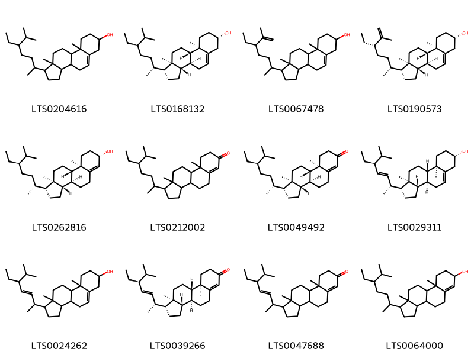{ width=100% }
    <figcaption>Hình ảnh cấu trúc hóa học của 12 hoạt chất thuộc nhóm Steroids and steroid derivatives gồm ['stigmast-5-en-3-ol, (3β)- (LTS0204616)', 'sitosterol (LTS0168132)', '1-(5-ethyl-6-methylhept-6-en-2-yl)-9a,11a-dimethyl-1h,2h,3h,3ah,3bh,4h,6h,7h,8h,9h,9bh,10h,11h-cyclopenta[a]phenanthren-7-ol (LTS0067478)', '(1r,3as,3bs,7s,9ar,9bs,11ar)-1-[(2r,5s)-5-ethyl-6-methylhept-6-en-2-yl]-9a,11a-dimethyl-1h,2h,3h,3ah,3bh,4h,6h,7h,8h,9h,9bh,10h,11h-cyclopenta[a]phenanthren-7-ol (LTS0190573)', '(1r,3as,3bs,7s,9ar,9bs,11ar)-1-[(2r,5r)-5-ethyl-6-methylheptan-2-yl]-9a,11a-dimethyl-1h,2h,3h,3ah,3bh,4h,5h,7h,8h,9h,9bh,10h,11h-cyclopenta[a]phenanthren-7-ol (LTS0262816)', '1-(5-ethyl-6-methylheptan-2-yl)-9a,11a-dimethyl-1h,2h,3h,3ah,3bh,4h,5h,8h,9h,9bh,10h,11h-cyclopenta[a]phenanthren-7-one (LTS0212002)', 'β-sitostenone (LTS0049492)', 'phytosterol (LTS0029311)', 'stigmasterol (LTS0024262)', '(1r,3as,3bs,9ar,9bs,11ar)-1-[(2r,3e,5s)-5-ethyl-6-methylhept-3-en-2-yl]-9a,11a-dimethyl-1h,2h,3h,3ah,3bh,4h,5h,8h,9h,9bh,10h,11h-cyclopenta[a]phenanthren-7-one (LTS0039266)', '1-(5-ethyl-6-methylhept-3-en-2-yl)-9a,11a-dimethyl-1h,2h,3h,3ah,3bh,4h,5h,8h,9h,9bh,10h,11h-cyclopenta[a]phenanthren-7-one (LTS0047688)', '1-(5-ethyl-6-methylheptan-2-yl)-9a,11a-dimethyl-1h,2h,3h,3ah,3bh,4h,5h,7h,8h,9h,9bh,10h,11h-cyclopenta[a]phenanthren-7-ol (LTS0064000)'].</figcaption>
</figure>

---

### Dược dân tộc học

Danh sách các quốc gia có sử dụng *Laggera alata* trong điều trị các bệnh. 

| Country   | Disease      | Bệnh                                                                                                                                                                                                |
|:----------|:-------------|:----------------------------------------------------------------------------------------------------------------------------------------------------------------------------------------------------|
| Malagasy  | Disinfectant | MYMEMORY WARNING: YOU USED ALL AVAILABLE FREE TRANSLATIONS FOR TODAY. NEXT AVAILABLE IN  11 HOURS 37 MINUTES 26 SECONDS VISIT HTTPS://MYMEMORY.TRANSLATED.NET/DOC/USAGELIMITS.PHP TO TRANSLATE MORE |

---

---
## Laggera aurita
### Thông tin về thực vật

!!! info "Phân loại thực vật của *Pseudoconyza viscosa* từ GIBF:"
    - **Kingdom:** Plantae
    - **Phylum:** Tracheophyta
    - **Order:** Asterales
    - **Family:** Asteraceae
    - **Genus:** Pseudoconyza
    - **Species:** *Pseudoconyza viscosa*

 

| Label (VI)   | Label (EN)   | Scientific Name   | Descriptions (VI)   | Descriptions (EN)   | Also Known As (VI)   | Also Known As (EN)   |
|:-------------|:-------------|:------------------|:--------------------|:--------------------|:---------------------|:---------------------|
| N/A          | N/A          | Laggera aurita    | loài thực vật       | species of plant    | ['']                 | ['']                 |

#### Phân bố trên thế giới

**Từ CSDL GIBF** nan, Ghana, Lao People’s Democratic Republic, Angola, unknown or invalid, Benin, Tanzania, United Republic of, Togo, Sudan, Guinea, Thailand, Eritrea, Côte d’Ivoire, Egypt, Mayotte, Viet Nam, Comoros, Madagascar, India, Kenya, Ethiopia

#### Phân bố tại Việt Nam

**Từ CSDL GIBF**: Không có ghi nhận ở Việt Nam

---
### Thành phần hóa học
        
- Theo cơ sở dữ liệu lotus: Từ loài *Pseudoconyza viscosa* đã phân lập và xác định được Chưa có hoạt chất nào được phân lập. hoạt chất thuộc về các nhóm Không có hoạt chất nào được phân lập. 

Không có hình ảnh nào được tạo ra

---

### Dược dân tộc học

Danh sách các quốc gia có sử dụng *Pseudoconyza viscosa* trong điều trị các bệnh. 

| Country      | Disease   | Bệnh                                                                                                                                                                                                |
|:-------------|:----------|:----------------------------------------------------------------------------------------------------------------------------------------------------------------------------------------------------|
| India(Munda) | Styptic   | MYMEMORY WARNING: YOU USED ALL AVAILABLE FREE TRANSLATIONS FOR TODAY. NEXT AVAILABLE IN  11 HOURS 36 MINUTES 52 SECONDS VISIT HTTPS://MYMEMORY.TRANSLATED.NET/DOC/USAGELIMITS.PHP TO TRANSLATE MORE |

---

# Chi Matricaria

??? note "Danh sách các dược liệu thuộc chi"
    
	 - *Matricaria chamomilla*
	 - *Matricaria discoidea*
	 - *Matricaria indica*
	 - *Matricaria matricarioides*
	 - *Matricaria multiflora*

---
## Matricaria chamomilla
### Thông tin về thực vật

!!! info "Phân loại thực vật của *Matricaria chamomilla* từ GIBF:"
    - **Kingdom:** Plantae
    - **Phylum:** Tracheophyta
    - **Order:** Asterales
    - **Family:** Asteraceae
    - **Genus:** Matricaria
    - **Species:** *Matricaria chamomilla*

 

| Label (VI)   | Label (EN)   | Scientific Name       | Descriptions (VI)   | Descriptions (EN)   | Also Known As (VI)   | Also Known As (EN)                                                                                              |
|:-------------|:-------------|:----------------------|:--------------------|:--------------------|:---------------------|:----------------------------------------------------------------------------------------------------------------|
| N/A          | N/A          | Matricaria chamomilla | loài thực vật       | species of plant    | ['']                 | ['mayweed', 'chamomile', 'German chamomile', 'camomile', 'blue chamomile', 'scented mayweed', 'wild chamomile'] |

#### Phân bố trên thế giới

**Từ CSDL GIBF** Italy, Moldova, Republic of, Belgium, Argentina, Latvia, Canada, Ukraine, Denmark, Netherlands, Lithuania, Belarus, Spain, Bolivia (Plurinational State of), Hungary, Portugal, Türkiye, Russian Federation, United States of America, Sweden, Kazakhstan, Slovenia, Croatia, Greece, Saudi Arabia, Montenegro, Czechia, Germany, Romania, Switzerland, Mexico, France, Austria, United Kingdom of Great Britain and Northern Ireland, Ecuador, Serbia, Poland

#### Phân bố tại Việt Nam

**Từ CSDL GIBF**: Không có ghi nhận ở Việt Nam

---
### Thành phần hóa học
        
- Theo cơ sở dữ liệu lotus: Từ loài *Matricaria chamomilla* đã phân lập và xác định được 129 hoạt chất thuộc về các nhóm Fatty Acyls, Flavonoids, Prenol lipids, Steroids and steroid derivatives, Cinnamic acids and derivatives, Oxanes, Organonitrogen compounds, Tetrahydrofurans, Benzene and substituted derivatives, Unsaturated hydrocarbons, Organooxygen compounds, Lactones, Coumarins and derivatives. 

|    | chemicalTaxonomyClassyfireClass     |   smiles_count |
|---:|:------------------------------------|---------------:|
|  0 | Benzene and substituted derivatives |              6 |
|  1 | Cinnamic acids and derivatives      |              6 |
|  2 | Coumarins and derivatives           |              6 |
|  3 | Fatty Acyls                         |              1 |
|  4 | Flavonoids                          |             30 |
|  5 | Lactones                            |              3 |
|  6 | Organonitrogen compounds            |              1 |
|  7 | Organooxygen compounds              |             13 |
|  8 | Oxanes                              |              3 |
|  9 | Prenol lipids                       |             49 |
| 10 | Steroids and steroid derivatives    |              6 |
| 11 | Tetrahydrofurans                    |              1 |
| 12 | Unsaturated hydrocarbons            |              3 |

#### Nhóm Benzene and substituted derivatives
<figure markdown="span">
    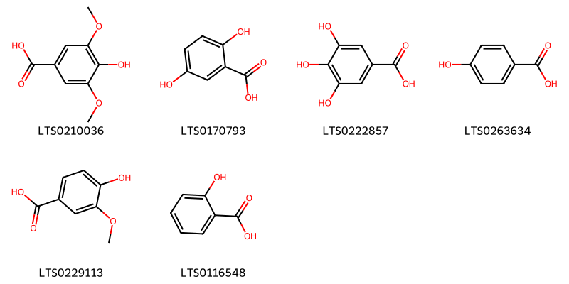{ width=100% }
    <figcaption>Hình ảnh cấu trúc hóa học của 6 hoạt chất thuộc nhóm Benzene and substituted derivatives gồm ['syringic acid (LTS0210036)', '2,5-dihydroxybenzoic acid (LTS0170793)', 'galop (LTS0222857)', 'p-hydroxybenzoic acid (LTS0263634)', 'vanillic acid (LTS0229113)', 'salicyclic acid (LTS0116548)'].</figcaption>
</figure>
#### Nhóm Cinnamic acids and derivatives
<figure markdown="span">
    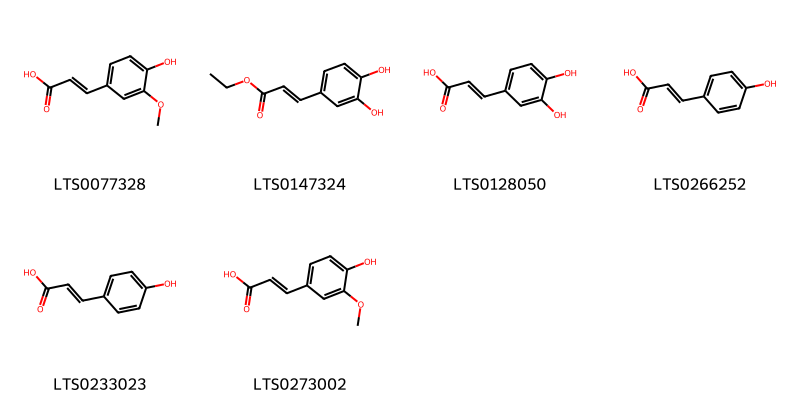{ width=100% }
    <figcaption>Hình ảnh cấu trúc hóa học của 6 hoạt chất thuộc nhóm Cinnamic acids and derivatives gồm ['ferulic acid (LTS0077328)', 'ethyl caffeate (LTS0147324)', '3,4-dihydroxycinnamic acid (LTS0128050)', 'para-coumaric acid (LTS0266252)', 'hydroxycinnamic acid (LTS0233023)', 'ferulic acid (LTS0273002)'].</figcaption>
</figure>
#### Nhóm Coumarins and derivatives
<figure markdown="span">
    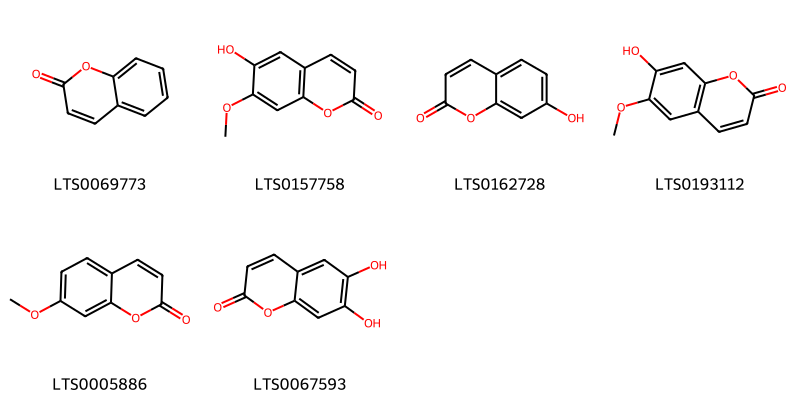{ width=100% }
    <figcaption>Hình ảnh cấu trúc hóa học của 6 hoạt chất thuộc nhóm Coumarins and derivatives gồm ['2h-1-benzopyran-2-one (LTS0069773)', 'isoscopoletin (LTS0157758)', 'umbelliferone (LTS0162728)', 'scopoletin (LTS0193112)', 'methylumbelliferone (LTS0005886)', 'esculetin (LTS0067593)'].</figcaption>
</figure>
#### Nhóm Fatty Acyls
<figure markdown="span">
    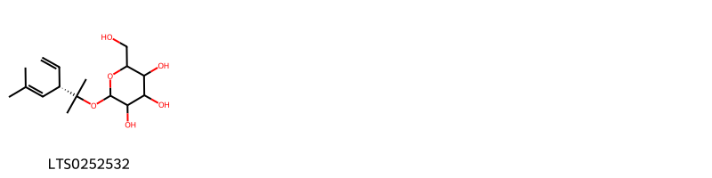{ width=100% }
    <figcaption>Hình ảnh cấu trúc hóa học của 1 hoạt chất thuộc nhóm Fatty Acyls gồm ['2-{[(3s)-3-ethenyl-2,5-dimethylhex-4-en-2-yl]oxy}-6-(hydroxymethyl)oxane-3,4,5-triol (LTS0252532)'].</figcaption>
</figure>
#### Nhóm Flavonoids
<figure markdown="span">
    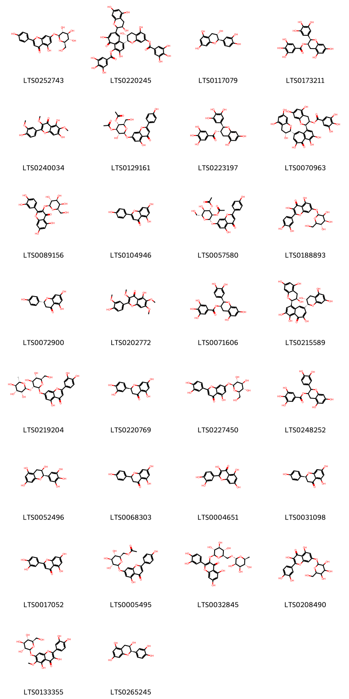{ width=100% }
    <figcaption>Hình ảnh cấu trúc hóa học của 30 hoạt chất thuộc nhóm Flavonoids gồm ['apigenin 7-o-β-glucoside (LTS0252743)', '4-[(2r,3r)-3,5-dihydroxy-7-(3,4,5-trihydroxybenzoyloxy)-3,4-dihydro-2h-1-benzopyran-2-yl]-2,8-dihydroxy-9-oxo-6-[(3r)-3,5,7-trihydroxy-3,4-dihydro-2h-1-benzopyran-2-yl]benzo[7]annulen-1-yl 3,4,5-trihydroxybenzoate (LTS0220245)', '(+)-catechol (LTS0117079)', '(-)-epigallocatechin gallate (LTS0173211)', 'jaceidin (LTS0240034)', '(2r,3r,4r,5r,6s)-3-(acetyloxy)-5-hydroxy-6-{[5-hydroxy-2-(4-hydroxyphenyl)-4-oxochromen-7-yl]oxy}-2-(hydroxymethyl)oxan-4-yl acetate (LTS0129161)', 'gallocatechin 3-o-gallate (LTS0223197)', '(2r,3r)-5,7-dihydroxy-2-{3,4,6-trihydroxy-5-oxo-8-[(2r,3r)-3,5,7-trihydroxy-3,4-dihydro-2h-1-benzopyran-2-yl]benzo[7]annulen-1-yl}-3,4-dihydro-2h-1-benzopyran-3-yl 3,4,5-trihydroxybenzoate (LTS0070963)', 'hyperoside (LTS0089156)', 'chamomile (LTS0104946)', '(2s,3r,4s,5r,6r)-4-(acetyloxy)-5-hydroxy-2-{[5-hydroxy-2-(4-hydroxyphenyl)-4-oxochromen-7-yl]oxy}-6-(hydroxymethyl)oxan-3-yl acetate (LTS0057580)', 'quercimeritrin (LTS0188893)', '(-)-naringenin (LTS0072900)', 'chrysosplenetin (LTS0202772)', 'epicatechin gallate (LTS0071606)', 'theaflavin (LTS0215589)', 'lonicerin (LTS0219204)', 'eriodictyol (LTS0220769)', 'luteolin 7-o-glucoside (LTS0227450)', '2-(3,4-dihydroxyphenyl)-5,7-dihydroxy-3,4-dihydro-2h-1-benzopyran-3-yl 3,4,5-trihydroxybenzoate (LTS0248252)', 'epigallocatechin (LTS0052496)', 'asahina (LTS0068303)', 'quercetin (LTS0004651)', 'naringenin (LTS0031098)', 'luteolin (LTS0017052)', '[(2r,3s,4s,5r,6s)-3,4,5-trihydroxy-6-{[5-hydroxy-2-(4-hydroxyphenyl)-4-oxochromen-7-yl]oxy}oxan-2-yl]methyl acetate (LTS0005495)', '3-rutinosyl quercetin (LTS0032845)', 'quercimeritrin (LTS0208490)', '2-(3,4-dihydroxyphenyl)-3,5-dihydroxy-6-methoxy-7-{[(2s,3r,4s,5s,6r)-3,4,5-trihydroxy-6-(hydroxymethyl)oxan-2-yl]oxy}chromen-4-one (LTS0133355)', 'ent-epicatechin (LTS0265245)'].</figcaption>
</figure>
#### Nhóm Lactones
<figure markdown="span">
    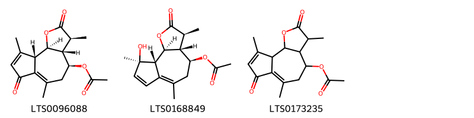{ width=100% }
    <figcaption>Hình ảnh cấu trúc hóa học của 3 hoạt chất thuộc nhóm Lactones gồm ['matricarin (LTS0096088)', 'matricin (LTS0168849)', '3,6,9-trimethyl-2,7-dioxo-3h,3ah,4h,5h,9ah,9bh-azuleno[4,5-b]furan-4-yl acetate (LTS0173235)'].</figcaption>
</figure>
#### Nhóm Organonitrogen compounds
<figure markdown="span">
    { width=100% }
    <figcaption>Hình ảnh cấu trúc hóa học của 1 hoạt chất thuộc nhóm Organonitrogen compounds gồm ['choline (LTS0170307)'].</figcaption>
</figure>
#### Nhóm Organooxygen compounds
<figure markdown="span">
    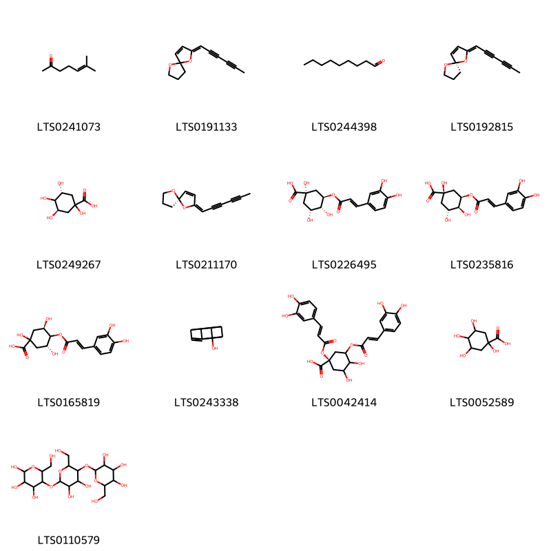{ width=100% }
    <figcaption>Hình ảnh cấu trúc hóa học của 13 hoạt chất thuộc nhóm Organooxygen compounds gồm ['6-methyl-5-hepten-2-one (LTS0241073)', '2-(hexa-2,4-diyn-1-ylidene)-1,6-dioxaspiro[4.4]non-3-ene (LTS0191133)', 'nonanal (LTS0244398)', '(2z,5r)-2-(hexa-2,4-diyn-1-ylidene)-1,6-dioxaspiro[4.4]non-3-ene (LTS0192815)', '(3r,5r)-1,3,4,5-tetrahydroxycyclohexane-1-carboxylic acid (LTS0249267)', '(2e,5r)-2-(hexa-2,4-diyn-1-ylidene)-1,6-dioxaspiro[4.4]non-3-ene (LTS0211170)', 'chlorogenic acid (LTS0226495)', 'neochlorogenic acid (LTS0235816)', '(3r,5r)-4-{[(2e)-3-(3,4-dihydroxyphenyl)prop-2-enoyl]oxy}-1,3,5-trihydroxycyclohexane-1-carboxylic acid (LTS0165819)', '3,4,5,8-tetrahydro-2h-cuban-1-ol (LTS0243338)', '(1r)-1,3-bis({[3-(3,4-dihydroxyphenyl)prop-2-enoyl]oxy})-4,5-dihydroxycyclohexane-1-carboxylic acid (LTS0042414)', 'quinic acid (LTS0052589)', 'amylose (LTS0110579)'].</figcaption>
</figure>
#### Nhóm Oxanes
<figure markdown="span">
    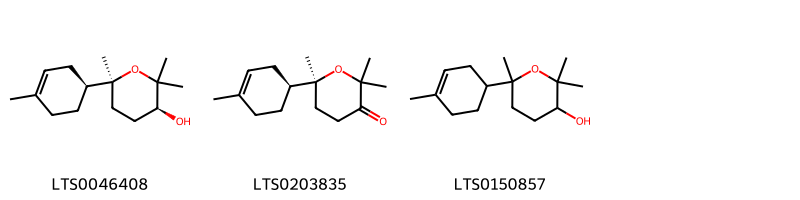{ width=100% }
    <figcaption>Hình ảnh cấu trúc hóa học của 3 hoạt chất thuộc nhóm Oxanes gồm ['bisabolol oxide a (LTS0046408)', '(6s)-2,2,6-trimethyl-6-[(1s)-4-methylcyclohex-3-en-1-yl]oxan-3-one (LTS0203835)', '2,2,6-trimethyl-6-(4-methylcyclohex-3-en-1-yl)oxan-3-ol (LTS0150857)'].</figcaption>
</figure>
#### Nhóm Prenol lipids
<figure markdown="span">
    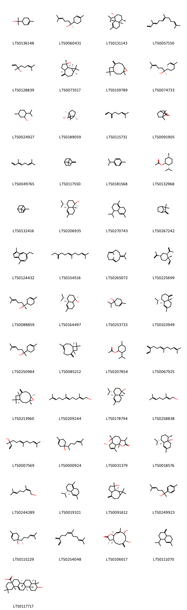{ width=100% }
    <figcaption>Hình ảnh cấu trúc hóa học của 49 hoạt chất thuộc nhóm Prenol lipids gồm ['terpineol (LTS0136148)', '(2s)-6-methyl-2-(4-methylcyclohex-3-en-1-yl)hept-5-en-2-ol (LTS0060431)', '(1s,4r,4as,8ar)-1-isopropyl-4,7-dimethyl-3,4,4a,5,6,8a-hexahydro-2h-naphthalen-1-ol (LTS0131143)', 'farnesene (LTS0057150)', 'linalool, (+-)- (LTS0128839)', '(1as,4as,7s,7ar,7bs)-1,1,7-trimethyl-4-methylidene-octahydrocyclopropa[e]azulen-7-ol (LTS0073517)', 'caryophyllene oxide (LTS0159789)', 'bisabolol (LTS0074733)', 'menthol natural (LTS0024927)', '(+)-borneol (LTS0189059)', 'α-myrcene (LTS0115731)', 'camphor (LTS0091905)', 'trans-β-ocimene (LTS0049765)', 'β-pinene (LTS0117550)', 'cymene (LTS0181568)', 'menthyl acetate (LTS0132968)', 'α pinene (LTS0132416)', 'α-cadinol (LTS0206935)', '4-isopropyl-1,6-dimethyl-2,3,4,4a,7,8-hexahydronaphthalene (LTS0270743)', 'camphene (LTS0267242)', 'chamazulene (LTS0124432)', '(6e)-2,6-dimethyl-10-methylidenedodeca-2,6-diene (LTS0154516)', 'germacrene b (LTS0265072)', 'β-elemene (LTS0225699)', '(2r)-6-methyl-2-(4-methylcyclohex-3-en-1-yl)hept-5-en-2-ol (LTS0088859)', '(1r,4s,4ar)-4-isopropyl-1,6-dimethyl-3,4,4a,7,8,8a-hexahydro-2h-naphthalen-1-ol (LTS0164497)', '4-terpineol (LTS0253733)', '(+)-gamma-cadinene (LTS0103949)', 'α-bisabolol (LTS0250984)', 'caryophyllene (LTS0085212)', 'l-menthyl acetate (LTS0207854)', 'β-farnesene (LTS0067925)', 'β-caryophyllene oxide (LTS0213960)', 'polyprenol (LTS0209244)', 'α-cadinol (LTS0178794)', 'geraniol (LTS0258838)', 'nerolidol isomers (LTS0007569)', '4-methyl-1-(6-methylhept-5-en-2-yl)cyclohex-3-en-1-ol (LTS0000924)', '(1r,3r,10s,14s)-14-hydroxy-3,7,12-trimethyl-2,9-dioxatetracyclo[9.3.0.0¹,³.0⁶,¹⁰]tetradec-12-en-8-one (LTS0031379)', '(1s,4r,4ar,8ar)-1-isopropyl-4,7-dimethyl-2,3,4,5,6,8a-hexahydro-1h-naphthalen-4a-ol (LTS0018576)', 'nerol (LTS0244289)', 'delta-cadinene (LTS0019321)', '(7ar)-1,1,7-trimethyl-4-methylidene-octahydrocyclopropa[e]azulen-7-ol (LTS0091612)', '6-methyl-2-(4-methylphenyl)hept-5-en-2-ol (LTS0249923)', 'β-bisabolol (LTS0115229)', '(z)-β-farnesene (LTS0254048)', '(3s,3as,7r,9s,11ar)-7,9-dihydroxy-3,10-dimethyl-6-methylidene-3h,3ah,4h,5h,7h,8h,9h,11ah-cyclodeca[b]furan-2-one (LTS0106017)', '4-isopropyl-6-methyl-1-methylidene-3,4,4a,7,8,8a-hexahydro-2h-naphthalene (LTS0111070)', 'oleanolic acid (LTS0117717)'].</figcaption>
</figure>
#### Nhóm Steroids and steroid derivatives
<figure markdown="span">
    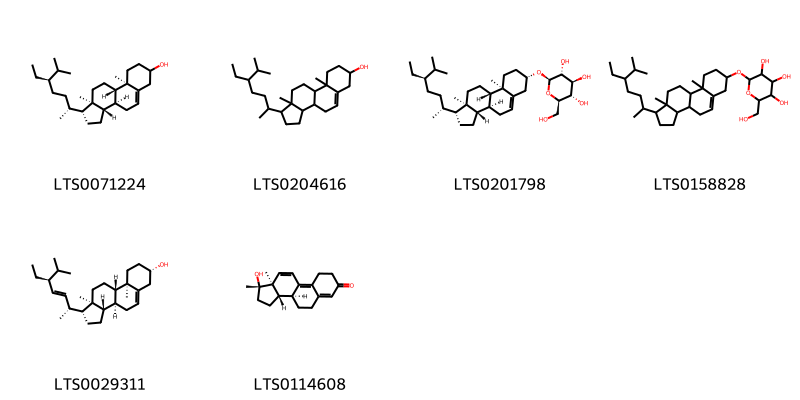{ width=100% }
    <figcaption>Hình ảnh cấu trúc hóa học của 6 hoạt chất thuộc nhóm Steroids and steroid derivatives gồm ['stigmast-5-en-3-ol (LTS0071224)', 'stigmast-5-en-3-ol, (3β)- (LTS0204616)', 'sitogluside (LTS0201798)', '2-{[1-(5-ethyl-6-methylheptan-2-yl)-9a,11a-dimethyl-1h,2h,3h,3ah,3bh,4h,6h,7h,8h,9h,9bh,10h,11h-cyclopenta[a]phenanthren-7-yl]oxy}-6-(hydroxymethyl)oxane-3,4,5-triol (LTS0158828)', 'phytosterol (LTS0029311)', 'methyltrienolone (LTS0114608)'].</figcaption>
</figure>
#### Nhóm Tetrahydrofurans
<figure markdown="span">
    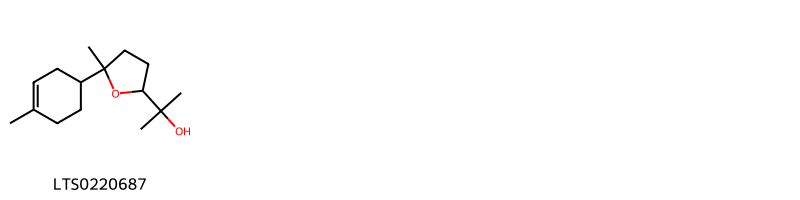{ width=100% }
    <figcaption>Hình ảnh cấu trúc hóa học của 1 hoạt chất thuộc nhóm Tetrahydrofurans gồm ['bisabolol oxide b (LTS0220687)'].</figcaption>
</figure>
#### Nhóm Unsaturated hydrocarbons
<figure markdown="span">
    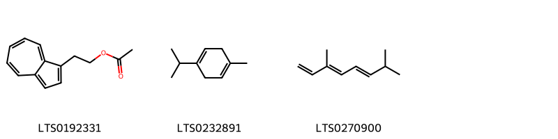{ width=100% }
    <figcaption>Hình ảnh cấu trúc hóa học của 3 hoạt chất thuộc nhóm Unsaturated hydrocarbons gồm ['2-(azulen-1-yl)ethyl acetate (LTS0192331)', 'α terpinene (LTS0232891)', '(3e,5e)-3,7-dimethylocta-1,3,5-triene (LTS0270900)'].</figcaption>
</figure>

---

### Dược dân tộc học

Danh sách các quốc gia có sử dụng *Matricaria chamomilla* trong điều trị các bệnh. 

| Country            | Disease                                                                                                                                                                                         | Bệnh                                                                                                                                                                                                |
|:-------------------|:------------------------------------------------------------------------------------------------------------------------------------------------------------------------------------------------|:----------------------------------------------------------------------------------------------------------------------------------------------------------------------------------------------------|
| Dominican Republic | Carminative, Cicatrizant                                                                                                                                                                        | MYMEMORY WARNING: YOU USED ALL AVAILABLE FREE TRANSLATIONS FOR TODAY. NEXT AVAILABLE IN  11 HOURS 36 MINUTES 19 SECONDS VISIT HTTPS://MYMEMORY.TRANSLATED.NET/DOC/USAGELIMITS.PHP TO TRANSLATE MORE |
| Elsewhere          | Antiphlogistic, Antiseptic, Carminative, Diaphoretic, Diuretic, Diuretic, Expectorant, Sedative, Vermifuge, Carminative, Expectorant, Poultice, Sedative, Antiphlogistic, Antiseptic, Vermifuge | MYMEMORY WARNING: YOU USED ALL AVAILABLE FREE TRANSLATIONS FOR TODAY. NEXT AVAILABLE IN  11 HOURS 36 MINUTES 15 SECONDS VISIT HTTPS://MYMEMORY.TRANSLATED.NET/DOC/USAGELIMITS.PHP TO TRANSLATE MORE |
| Europe             | Carminative, Diaphoretic, Nervine, Stimulant, Vermifuge, Perfume                                                                                                                                | MYMEMORY WARNING: YOU USED ALL AVAILABLE FREE TRANSLATIONS FOR TODAY. NEXT AVAILABLE IN  11 HOURS 36 MINUTES 11 SECONDS VISIT HTTPS://MYMEMORY.TRANSLATED.NET/DOC/USAGELIMITS.PHP TO TRANSLATE MORE |
| Iraq               | Antiseptic                                                                                                                                                                                      | MYMEMORY WARNING: YOU USED ALL AVAILABLE FREE TRANSLATIONS FOR TODAY. NEXT AVAILABLE IN  11 HOURS 36 MINUTES 08 SECONDS VISIT HTTPS://MYMEMORY.TRANSLATED.NET/DOC/USAGELIMITS.PHP TO TRANSLATE MORE |
| Kurdistan          | Nervine                                                                                                                                                                                         | MYMEMORY WARNING: YOU USED ALL AVAILABLE FREE TRANSLATIONS FOR TODAY. NEXT AVAILABLE IN  11 HOURS 36 MINUTES 05 SECONDS VISIT HTTPS://MYMEMORY.TRANSLATED.NET/DOC/USAGELIMITS.PHP TO TRANSLATE MORE |
| Mexico             | Sudorific, Stomachic, Tonic                                                                                                                                                                     | MYMEMORY WARNING: YOU USED ALL AVAILABLE FREE TRANSLATIONS FOR TODAY. NEXT AVAILABLE IN  11 HOURS 36 MINUTES 02 SECONDS VISIT HTTPS://MYMEMORY.TRANSLATED.NET/DOC/USAGELIMITS.PHP TO TRANSLATE MORE |
| Turkey             | Antiphlogistic, Antiseptic, Carminative, Digestive, Discutient, Emollient, Expectorant, Sedative, Tonic, Diuretic                                                                               | MYMEMORY WARNING: YOU USED ALL AVAILABLE FREE TRANSLATIONS FOR TODAY. NEXT AVAILABLE IN  11 HOURS 35 MINUTES 58 SECONDS VISIT HTTPS://MYMEMORY.TRANSLATED.NET/DOC/USAGELIMITS.PHP TO TRANSLATE MORE |
| Venezuela          | Stomachic, Tonic                                                                                                                                                                                | MYMEMORY WARNING: YOU USED ALL AVAILABLE FREE TRANSLATIONS FOR TODAY. NEXT AVAILABLE IN  11 HOURS 35 MINUTES 54 SECONDS VISIT HTTPS://MYMEMORY.TRANSLATED.NET/DOC/USAGELIMITS.PHP TO TRANSLATE MORE |
| ain                | Sedative                                                                                                                                                                                        | MYMEMORY WARNING: YOU USED ALL AVAILABLE FREE TRANSLATIONS FOR TODAY. NEXT AVAILABLE IN  11 HOURS 35 MINUTES 50 SECONDS VISIT HTTPS://MYMEMORY.TRANSLATED.NET/DOC/USAGELIMITS.PHP TO TRANSLATE MORE |

---

---
## Matricaria discoidea
### Thông tin về thực vật

!!! info "Phân loại thực vật của *Matricaria discoidea* từ GIBF:"
    - **Kingdom:** Plantae
    - **Phylum:** Tracheophyta
    - **Order:** Asterales
    - **Family:** Asteraceae
    - **Genus:** Matricaria
    - **Species:** *Matricaria discoidea*

 

| Label (VI)   | Label (EN)   | Scientific Name      | Descriptions (VI)   | Descriptions (EN)   | Also Known As (VI)   | Also Known As (EN)   |
|:-------------|:-------------|:---------------------|:--------------------|:--------------------|:---------------------|:---------------------|
| N/A          | N/A          | Matricaria discoidea |                     | species of plant    | ['']                 | ['']                 |

#### Phân bố trên thế giới

**Từ CSDL GIBF** nan, Belgium, Argentina, Canada, Netherlands, Luxembourg, Spain, Bolivia (Plurinational State of), Russian Federation, United States of America, Chile, Falkland Islands (Malvinas), Germany, Switzerland, Isle of Man, Mexico, France, United Kingdom of Great Britain and Northern Ireland, Ireland, Poland, New Zealand

#### Phân bố tại Việt Nam

**Từ CSDL GIBF**: Không có ghi nhận ở Việt Nam

---
### Thành phần hóa học
        
- Theo cơ sở dữ liệu lotus: Từ loài *Matricaria discoidea* đã phân lập và xác định được 51 hoạt chất thuộc về các nhóm Fatty Acyls, Flavonoids, Prenol lipids, Steroids and steroid derivatives, Oxanes, Organonitrogen compounds, Benzene and substituted derivatives, Coumarins and derivatives. 

|    | chemicalTaxonomyClassyfireClass     |   smiles_count |
|---:|:------------------------------------|---------------:|
|  0 | Benzene and substituted derivatives |              1 |
|  1 | Coumarins and derivatives           |              2 |
|  2 | Fatty Acyls                         |              9 |
|  3 | Flavonoids                          |              5 |
|  4 | Organonitrogen compounds            |              1 |
|  5 | Oxanes                              |              2 |
|  6 | Prenol lipids                       |             26 |
|  7 | Steroids and steroid derivatives    |              4 |

#### Nhóm Benzene and substituted derivatives
<figure markdown="span">
    { width=100% }
    <figcaption>Hình ảnh cấu trúc hóa học của 1 hoạt chất thuộc nhóm Benzene and substituted derivatives gồm ['galop (LTS0222857)'].</figcaption>
</figure>
#### Nhóm Coumarins and derivatives
<figure markdown="span">
    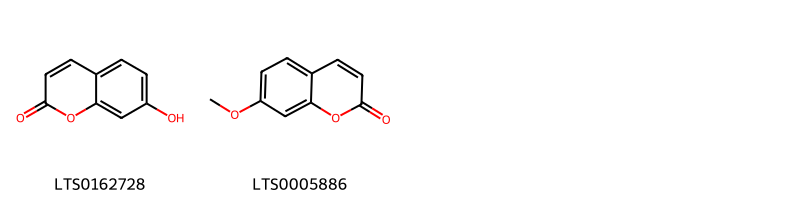{ width=100% }
    <figcaption>Hình ảnh cấu trúc hóa học của 2 hoạt chất thuộc nhóm Coumarins and derivatives gồm ['umbelliferone (LTS0162728)', 'methylumbelliferone (LTS0005886)'].</figcaption>
</figure>
#### Nhóm Fatty Acyls
<figure markdown="span">
    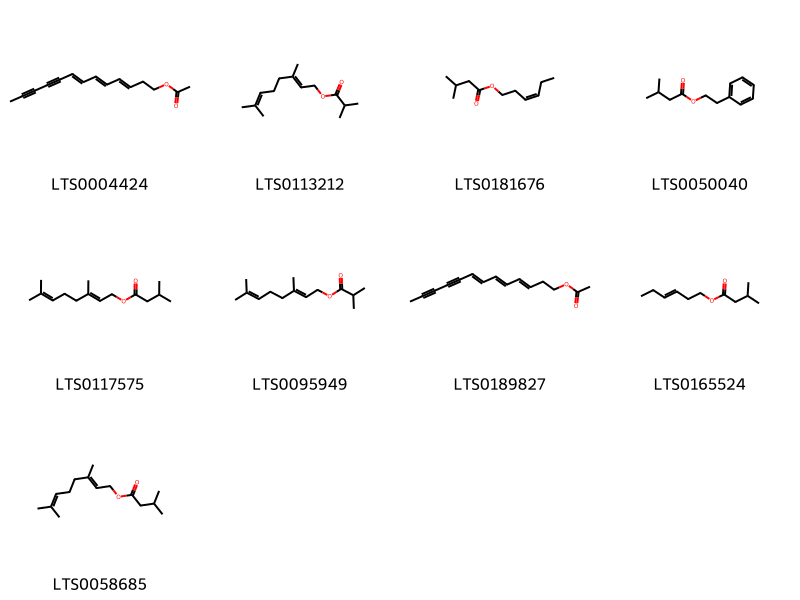{ width=100% }
    <figcaption>Hình ảnh cấu trúc hóa học của 9 hoạt chất thuộc nhóm Fatty Acyls gồm ['trideca-3,5,7-trien-9,11-diyn-1-yl acetate (LTS0004424)', '3,7-dimethylocta-2,6-dien-1-yl 2-methylpropanoate (LTS0113212)', 'cis-3-hexenyl isovalerate (LTS0181676)', 'phenethyl isovalerate (LTS0050040)', 'geranyl isovalerate (LTS0117575)', 'geranyl isobutyrate (LTS0095949)', '(3e,5e,7e)-trideca-3,5,7-trien-9,11-diyn-1-yl acetate (LTS0189827)', 'hex-3-en-1-yl 3-methylbutanoate (LTS0165524)', '3,7-dimethylocta-2,6-dien-1-yl 3-methylbutanoate (LTS0058685)'].</figcaption>
</figure>
#### Nhóm Flavonoids
<figure markdown="span">
    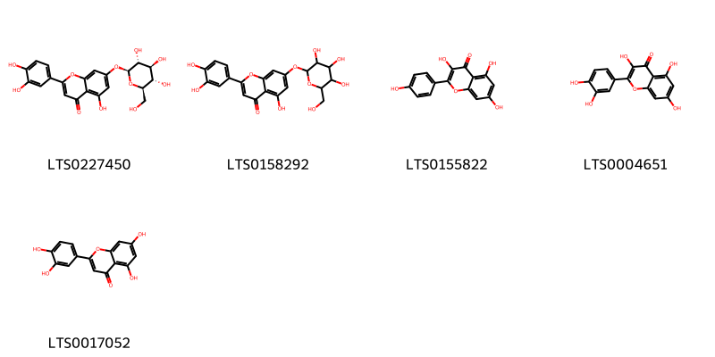{ width=100% }
    <figcaption>Hình ảnh cấu trúc hóa học của 5 hoạt chất thuộc nhóm Flavonoids gồm ['luteolin 7-o-glucoside (LTS0227450)', '2-(3,4-dihydroxyphenyl)-5-hydroxy-7-{[3,4,5-trihydroxy-6-(hydroxymethyl)oxan-2-yl]oxy}chromen-4-one (LTS0158292)', 'kaempherol (LTS0155822)', 'quercetin (LTS0004651)', 'luteolin (LTS0017052)'].</figcaption>
</figure>
#### Nhóm Organonitrogen compounds
<figure markdown="span">
    { width=100% }
    <figcaption>Hình ảnh cấu trúc hóa học của 1 hoạt chất thuộc nhóm Organonitrogen compounds gồm ['choline (LTS0170307)'].</figcaption>
</figure>
#### Nhóm Oxanes
<figure markdown="span">
    { width=100% }
    <figcaption>Hình ảnh cấu trúc hóa học của 2 hoạt chất thuộc nhóm Oxanes gồm ['1,8-cineole (LTS0166505)', 'eucalyptol (LTS0051374)'].</figcaption>
</figure>
#### Nhóm Prenol lipids
<figure markdown="span">
    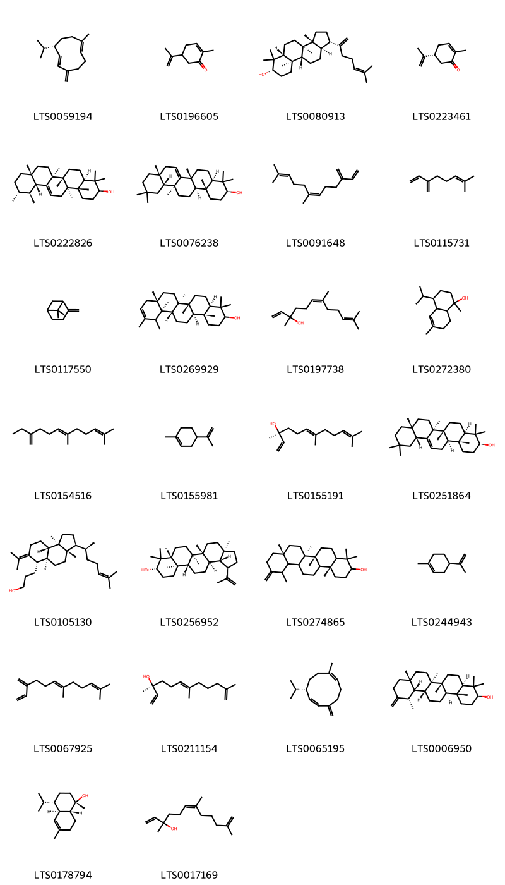{ width=100% }
    <figcaption>Hình ảnh cấu trúc hóa học của 26 hoạt chất thuộc nhóm Prenol lipids gồm ['(-)-germacrene d (LTS0059194)', 'carvone (LTS0196605)', 'dammaradienol (LTS0080913)', '(-)-carvone (LTS0223461)', 'amyrin (LTS0222826)', 'alnulin (LTS0076238)', 'β-farnesene (LTS0091648)', 'α-myrcene (LTS0115731)', 'β-pinene (LTS0117550)', '(4ar,6ar,6br,8as,12ar,12br,14ar,14br)-4,4,6a,6b,8a,11,12,14b-octamethyl-2,3,4a,5,6,7,8,9,12,12a,12b,13,14,14a-tetradecahydro-1h-picen-3-ol (LTS0269929)', 'nerolidol (LTS0197738)', 'delta-cadinol (LTS0272380)', '(6e)-2,6-dimethyl-10-methylidenedodeca-2,6-diene (LTS0154516)', 'limonene,  (LTS0155981)', 'nerolidol (LTS0155191)', 'β-amyrin (LTS0251864)', '3-[(3s,3as,5as,6s,9as,9br)-3a,5a,9b-trimethyl-3-[(2s)-6-methylhept-5-en-2-yl]-7-(propan-2-ylidene)-octahydro-1h-cyclopenta[a]naphthalen-6-yl]propan-1-ol (LTS0105130)', 'lupeol (LTS0256952)', '(6ar,6br,8ar,14br)-4,4,6a,6b,8a,12,14b-heptamethyl-11-methylidene-hexadecahydropicen-3-ol (LTS0274865)', 'α-limonene (LTS0244943)', 'β-farnesene (LTS0067925)', '(3s,6e)-3,7,11-trimethyldodeca-1,6,11-trien-3-ol (LTS0211154)', '(1z,6z,8s)-8-isopropyl-1-methyl-5-methylidenecyclodeca-1,6-diene (LTS0065195)', 'taraxasterol (LTS0006950)', 'α-cadinol (LTS0178794)', '3,7,11-trimethyldodeca-1,6,11-trien-3-ol (LTS0017169)'].</figcaption>
</figure>
#### Nhóm Steroids and steroid derivatives
<figure markdown="span">
    { width=100% }
    <figcaption>Hình ảnh cấu trúc hóa học của 4 hoạt chất thuộc nhóm Steroids and steroid derivatives gồm ['24-methylene-cycloartanol (LTS0077845)', '(3r,6s,8r,11s,12s,15r,16r)-7,7,12,16-tetramethyl-15-[(2r)-6-methylhept-5-en-2-yl]pentacyclo[9.7.0.0¹,³.0³,⁸.0¹²,¹⁶]octadecan-6-ol (LTS0062833)', 'cycloartenol (LTS0269561)', '24-methylenecycloartanol (LTS0018584)'].</figcaption>
</figure>

---

### Dược dân tộc học

Danh sách các quốc gia có sử dụng *Matricaria discoidea* trong điều trị các bệnh. 

| Country   | Disease     | Bệnh                                                                                                                                                                                                |
|:----------|:------------|:----------------------------------------------------------------------------------------------------------------------------------------------------------------------------------------------------|
| English   | Vermifuge   | MYMEMORY WARNING: YOU USED ALL AVAILABLE FREE TRANSLATIONS FOR TODAY. NEXT AVAILABLE IN  11 HOURS 34 MINUTES 55 SECONDS VISIT HTTPS://MYMEMORY.TRANSLATED.NET/DOC/USAGELIMITS.PHP TO TRANSLATE MORE |
| German    | Carminative | MYMEMORY WARNING: YOU USED ALL AVAILABLE FREE TRANSLATIONS FOR TODAY. NEXT AVAILABLE IN  11 HOURS 34 MINUTES 52 SECONDS VISIT HTTPS://MYMEMORY.TRANSLATED.NET/DOC/USAGELIMITS.PHP TO TRANSLATE MORE |

---

---
## Matricaria indica
### Thông tin về thực vật

!!! info "Phân loại thực vật của *Matricaria indica* từ GIBF:"
    - **Kingdom:** Plantae
    - **Phylum:** Tracheophyta
    - **Order:** Asterales
    - **Family:** Asteraceae
    - **Genus:** Matricaria
    - **Species:** *Matricaria indica*

 

| Label (VI)   | Label (EN)   | Scientific Name      | Descriptions (VI)   | Descriptions (EN)   | Also Known As (VI)   | Also Known As (EN)   |
|:-------------|:-------------|:---------------------|:--------------------|:--------------------|:---------------------|:---------------------|
| N/A          | N/A          | Matricaria discoidea |                     | species of plant    | ['']                 | ['']                 |

#### Phân bố trên thế giới

**Từ CSDL GIBF** nan, Belgium, Argentina, Canada, Netherlands, Luxembourg, Spain, Bolivia (Plurinational State of), Russian Federation, United States of America, Chile, Falkland Islands (Malvinas), Germany, Switzerland, Isle of Man, Mexico, France, United Kingdom of Great Britain and Northern Ireland, Ireland, Poland, New Zealand

#### Phân bố tại Việt Nam

**Từ CSDL GIBF**: Không có ghi nhận ở Việt Nam

---
### Thành phần hóa học
        
- Theo cơ sở dữ liệu lotus: Từ loài *Matricaria indica* đã phân lập và xác định được Chưa có hoạt chất nào được phân lập. hoạt chất thuộc về các nhóm Không có hoạt chất nào được phân lập. 

Không có hình ảnh nào được tạo ra

---

### Dược dân tộc học

Danh sách các quốc gia có sử dụng *Matricaria indica* trong điều trị các bệnh. 

| Country   | Disease                                                             | Bệnh                                                                                                                                                                                                |
|:----------|:--------------------------------------------------------------------|:----------------------------------------------------------------------------------------------------------------------------------------------------------------------------------------------------|
| China     | Diuretic, Pediculicide, Pulicide, Sedative, Vermifuge, Parasiticide | MYMEMORY WARNING: YOU USED ALL AVAILABLE FREE TRANSLATIONS FOR TODAY. NEXT AVAILABLE IN  11 HOURS 34 MINUTES 06 SECONDS VISIT HTTPS://MYMEMORY.TRANSLATED.NET/DOC/USAGELIMITS.PHP TO TRANSLATE MORE |

---

---
## Matricaria matricarioides
### Thông tin về thực vật

!!! info "Phân loại thực vật của *Matricaria discoidea* từ GIBF:"
    - **Kingdom:** Plantae
    - **Phylum:** Tracheophyta
    - **Order:** Asterales
    - **Family:** Asteraceae
    - **Genus:** Matricaria
    - **Species:** *Matricaria discoidea*

 

| Label (VI)   | Label (EN)   | Scientific Name           | Descriptions (VI)   | Descriptions (EN)   | Also Known As (VI)   | Also Known As (EN)   |
|:-------------|:-------------|:--------------------------|:--------------------|:--------------------|:---------------------|:---------------------|
| N/A          | N/A          | Matricaria matricarioides | loài thực vật       | species of plant    | ['']                 | ['']                 |

#### Phân bố trên thế giới

**Từ CSDL GIBF** Japan, Estonia, Guatemala, Norway, Venezuela (Bolivarian Republic of), Canada, Denmark, Chinese Taipei, Spain, Portugal, Russian Federation, United States of America, Sweden, Finland, Kazakhstan, Greenland, Brazil, Austria, France

#### Phân bố tại Việt Nam

**Từ CSDL GIBF**: Không có ghi nhận ở Việt Nam

---
### Thành phần hóa học
        
- Theo cơ sở dữ liệu lotus: Từ loài *Matricaria discoidea* đã phân lập và xác định được 48 hoạt chất thuộc về các nhóm Fatty Acyls, Flavonoids, Prenol lipids, Steroids and steroid derivatives, Oxanes, Organonitrogen compounds, Benzene and substituted derivatives, Coumarins and derivatives. 

|    | chemicalTaxonomyClassyfireClass     |   smiles_count |
|---:|:------------------------------------|---------------:|
|  0 | Benzene and substituted derivatives |              1 |
|  1 | Coumarins and derivatives           |              2 |
|  2 | Fatty Acyls                         |              7 |
|  3 | Flavonoids                          |              4 |
|  4 | Organonitrogen compounds            |              1 |
|  5 | Oxanes                              |              2 |
|  6 | Prenol lipids                       |             26 |
|  7 | Steroids and steroid derivatives    |              4 |

#### Nhóm Benzene and substituted derivatives
<figure markdown="span">
    { width=100% }
    <figcaption>Hình ảnh cấu trúc hóa học của 1 hoạt chất thuộc nhóm Benzene and substituted derivatives gồm ['galop (LTS0222857)'].</figcaption>
</figure>
#### Nhóm Coumarins and derivatives
<figure markdown="span">
    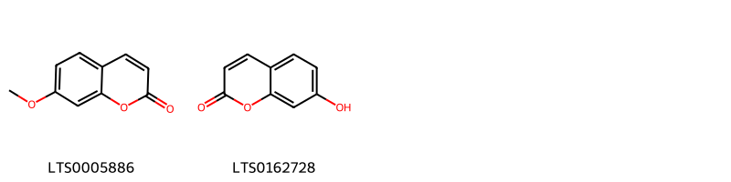{ width=100% }
    <figcaption>Hình ảnh cấu trúc hóa học của 2 hoạt chất thuộc nhóm Coumarins and derivatives gồm ['methylumbelliferone (LTS0005886)', 'umbelliferone (LTS0162728)'].</figcaption>
</figure>
#### Nhóm Fatty Acyls
<figure markdown="span">
    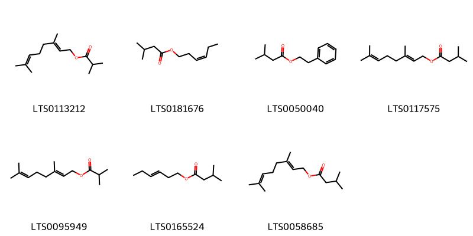{ width=100% }
    <figcaption>Hình ảnh cấu trúc hóa học của 7 hoạt chất thuộc nhóm Fatty Acyls gồm ['3,7-dimethylocta-2,6-dien-1-yl 2-methylpropanoate (LTS0113212)', 'cis-3-hexenyl isovalerate (LTS0181676)', 'phenethyl isovalerate (LTS0050040)', 'geranyl isovalerate (LTS0117575)', 'geranyl isobutyrate (LTS0095949)', 'hex-3-en-1-yl 3-methylbutanoate (LTS0165524)', '3,7-dimethylocta-2,6-dien-1-yl 3-methylbutanoate (LTS0058685)'].</figcaption>
</figure>
#### Nhóm Flavonoids
<figure markdown="span">
    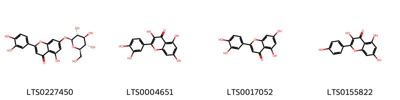{ width=100% }
    <figcaption>Hình ảnh cấu trúc hóa học của 4 hoạt chất thuộc nhóm Flavonoids gồm ['luteolin 7-o-glucoside (LTS0227450)', 'quercetin (LTS0004651)', 'luteolin (LTS0017052)', 'kaempherol (LTS0155822)'].</figcaption>
</figure>
#### Nhóm Organonitrogen compounds
<figure markdown="span">
    { width=100% }
    <figcaption>Hình ảnh cấu trúc hóa học của 1 hoạt chất thuộc nhóm Organonitrogen compounds gồm ['choline (LTS0170307)'].</figcaption>
</figure>
#### Nhóm Oxanes
<figure markdown="span">
    { width=100% }
    <figcaption>Hình ảnh cấu trúc hóa học của 2 hoạt chất thuộc nhóm Oxanes gồm ['1,8-cineole (LTS0166505)', 'eucalyptol (LTS0051374)'].</figcaption>
</figure>
#### Nhóm Prenol lipids
<figure markdown="span">
    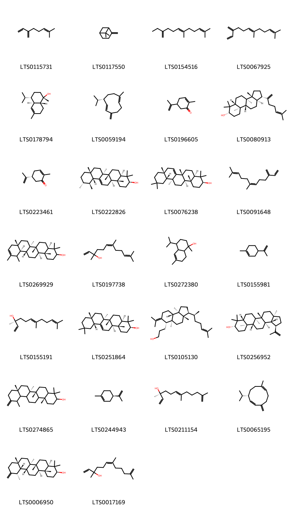{ width=100% }
    <figcaption>Hình ảnh cấu trúc hóa học của 26 hoạt chất thuộc nhóm Prenol lipids gồm ['α-myrcene (LTS0115731)', 'β-pinene (LTS0117550)', '(6e)-2,6-dimethyl-10-methylidenedodeca-2,6-diene (LTS0154516)', 'β-farnesene (LTS0067925)', 'α-cadinol (LTS0178794)', '(-)-germacrene d (LTS0059194)', 'carvone (LTS0196605)', 'dammaradienol (LTS0080913)', '(-)-carvone (LTS0223461)', 'amyrin (LTS0222826)', 'alnulin (LTS0076238)', 'β-farnesene (LTS0091648)', '(4ar,6ar,6br,8as,12ar,12br,14ar,14br)-4,4,6a,6b,8a,11,12,14b-octamethyl-2,3,4a,5,6,7,8,9,12,12a,12b,13,14,14a-tetradecahydro-1h-picen-3-ol (LTS0269929)', 'nerolidol (LTS0197738)', 'delta-cadinol (LTS0272380)', 'limonene,  (LTS0155981)', 'nerolidol (LTS0155191)', 'β-amyrin (LTS0251864)', '3-[(3s,3as,5as,6s,9as,9br)-3a,5a,9b-trimethyl-3-[(2s)-6-methylhept-5-en-2-yl]-7-(propan-2-ylidene)-octahydro-1h-cyclopenta[a]naphthalen-6-yl]propan-1-ol (LTS0105130)', 'lupeol (LTS0256952)', '(6ar,6br,8ar,14br)-4,4,6a,6b,8a,12,14b-heptamethyl-11-methylidene-hexadecahydropicen-3-ol (LTS0274865)', 'α-limonene (LTS0244943)', '(3s,6e)-3,7,11-trimethyldodeca-1,6,11-trien-3-ol (LTS0211154)', '(1z,6z,8s)-8-isopropyl-1-methyl-5-methylidenecyclodeca-1,6-diene (LTS0065195)', 'taraxasterol (LTS0006950)', '3,7,11-trimethyldodeca-1,6,11-trien-3-ol (LTS0017169)'].</figcaption>
</figure>
#### Nhóm Steroids and steroid derivatives
<figure markdown="span">
    { width=100% }
    <figcaption>Hình ảnh cấu trúc hóa học của 4 hoạt chất thuộc nhóm Steroids and steroid derivatives gồm ['24-methylene-cycloartanol (LTS0077845)', '(3r,6s,8r,11s,12s,15r,16r)-7,7,12,16-tetramethyl-15-[(2r)-6-methylhept-5-en-2-yl]pentacyclo[9.7.0.0¹,³.0³,⁸.0¹²,¹⁶]octadecan-6-ol (LTS0062833)', 'cycloartenol (LTS0269561)', '24-methylenecycloartanol (LTS0018584)'].</figcaption>
</figure>

---

### Dược dân tộc học

Danh sách các quốc gia có sử dụng *Matricaria discoidea* trong điều trị các bệnh. 

| Country       | Disease   | Bệnh                                                                                                                                                                                                |
|:--------------|:----------|:----------------------------------------------------------------------------------------------------------------------------------------------------------------------------------------------------|
| US(Blackfoot) | Perfume   | MYMEMORY WARNING: YOU USED ALL AVAILABLE FREE TRANSLATIONS FOR TODAY. NEXT AVAILABLE IN  11 HOURS 33 MINUTES 44 SECONDS VISIT HTTPS://MYMEMORY.TRANSLATED.NET/DOC/USAGELIMITS.PHP TO TRANSLATE MORE |

---

---
## Matricaria multiflora
### Thông tin về thực vật

!!! info "Phân loại thực vật của *Matricaria multiflora* từ GIBF:"
    - **Kingdom:** Plantae
    - **Phylum:** Tracheophyta
    - **Order:** Asterales
    - **Family:** Asteraceae
    - **Genus:** Matricaria
    - **Species:** *Matricaria multiflora*

 

| Label (VI)   | Label (EN)   | Scientific Name           | Descriptions (VI)   | Descriptions (EN)   | Also Known As (VI)   | Also Known As (EN)   |
|:-------------|:-------------|:--------------------------|:--------------------|:--------------------|:---------------------|:---------------------|
| N/A          | N/A          | Matricaria matricarioides | loài thực vật       | species of plant    | ['']                 | ['']                 |

#### Phân bố trên thế giới

**Từ CSDL GIBF** nan, South Africa

#### Phân bố tại Việt Nam

**Từ CSDL GIBF**: Không có ghi nhận ở Việt Nam

---
### Thành phần hóa học
        
- Theo cơ sở dữ liệu lotus: Từ loài *Matricaria multiflora* đã phân lập và xác định được Chưa có hoạt chất nào được phân lập. hoạt chất thuộc về các nhóm Không có hoạt chất nào được phân lập. 

Không có hình ảnh nào được tạo ra

---

### Dược dân tộc học

Danh sách các quốc gia có sử dụng *Matricaria multiflora* trong điều trị các bệnh. 

| Country      | Disease          | Bệnh                                                                                                                                                                                                |
|:-------------|:-----------------|:----------------------------------------------------------------------------------------------------------------------------------------------------------------------------------------------------|
| South Africa | Vermifuge, Tonic | MYMEMORY WARNING: YOU USED ALL AVAILABLE FREE TRANSLATIONS FOR TODAY. NEXT AVAILABLE IN  11 HOURS 32 MINUTES 50 SECONDS VISIT HTTPS://MYMEMORY.TRANSLATED.NET/DOC/USAGELIMITS.PHP TO TRANSLATE MORE |

---

# Chi Iostephane

??? note "Danh sách các dược liệu thuộc chi"
    
	 - *Iostephane heterophylla*

---
## Iostephane heterophylla
### Thông tin về thực vật

!!! info "Phân loại thực vật của *Iostephane heterophylla* từ GIBF:"
    - **Kingdom:** Plantae
    - **Phylum:** Tracheophyta
    - **Order:** Asterales
    - **Family:** Asteraceae
    - **Genus:** Iostephane
    - **Species:** *Iostephane heterophylla*

 

| Label (VI)   | Label (EN)   | Scientific Name         | Descriptions (VI)   | Descriptions (EN)   | Also Known As (VI)   | Also Known As (EN)   |
|:-------------|:-------------|:------------------------|:--------------------|:--------------------|:---------------------|:---------------------|
| N/A          | N/A          | Iostephane heterophylla | loài thực vật       | species of plant    | ['']                 | ['']                 |

#### Phân bố trên thế giới

**Từ CSDL GIBF** Mexico

#### Phân bố tại Việt Nam

**Từ CSDL GIBF**: Không có ghi nhận ở Việt Nam

---
### Thành phần hóa học
        
- Theo cơ sở dữ liệu lotus: Từ loài *Iostephane heterophylla* đã phân lập và xác định được 42 hoạt chất thuộc về các nhóm Prenol lipids, Steroids and steroid derivatives, Organooxygen compounds, Phenols, Coumarins and derivatives, Benzopyrans. 

|    | chemicalTaxonomyClassyfireClass   |   smiles_count |
|---:|:----------------------------------|---------------:|
|  0 | Benzopyrans                       |              1 |
|  1 | Coumarins and derivatives         |              1 |
|  2 | Organooxygen compounds            |              1 |
|  3 | Phenols                           |              2 |
|  4 | Prenol lipids                     |             32 |
|  5 | Steroids and steroid derivatives  |              5 |

#### Nhóm Benzopyrans
<figure markdown="span">
    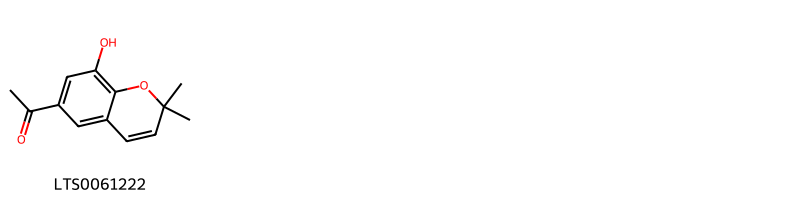{ width=100% }
    <figcaption>Hình ảnh cấu trúc hóa học của 1 hoạt chất thuộc nhóm Benzopyrans gồm ['1-(8-hydroxy-2,2-dimethylchromen-6-yl)ethanone (LTS0061222)'].</figcaption>
</figure>
#### Nhóm Coumarins and derivatives
<figure markdown="span">
    { width=100% }
    <figcaption>Hình ảnh cấu trúc hóa học của 1 hoạt chất thuộc nhóm Coumarins and derivatives gồm ['scopoletin (LTS0193112)'].</figcaption>
</figure>
#### Nhóm Organooxygen compounds
<figure markdown="span">
    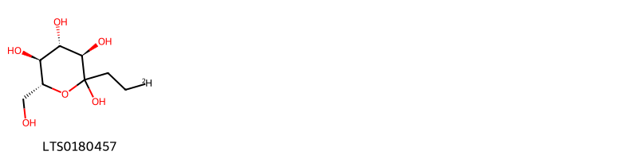{ width=100% }
    <figcaption>Hình ảnh cấu trúc hóa học của 1 hoạt chất thuộc nhóm Organooxygen compounds gồm ['(3r,4s,5s,6r)-2-[(2-²h₁)ethyl]-6-(hydroxymethyl)oxane-2,3,4,5-tetrol (LTS0180457)'].</figcaption>
</figure>
#### Nhóm Phenols
<figure markdown="span">
    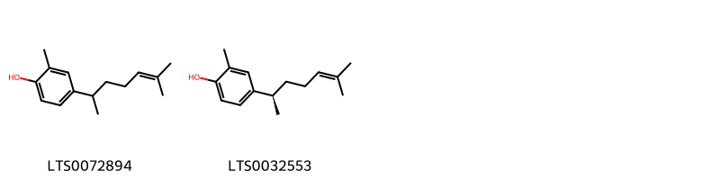{ width=100% }
    <figcaption>Hình ảnh cấu trúc hóa học của 2 hoạt chất thuộc nhóm Phenols gồm ['2-methyl-4-(6-methylhept-5-en-2-yl)phenol (LTS0072894)', '2-methyl-4-[(2r)-6-methylhept-5-en-2-yl]phenol (LTS0032553)'].</figcaption>
</figure>
#### Nhóm Prenol lipids
<figure markdown="span">
    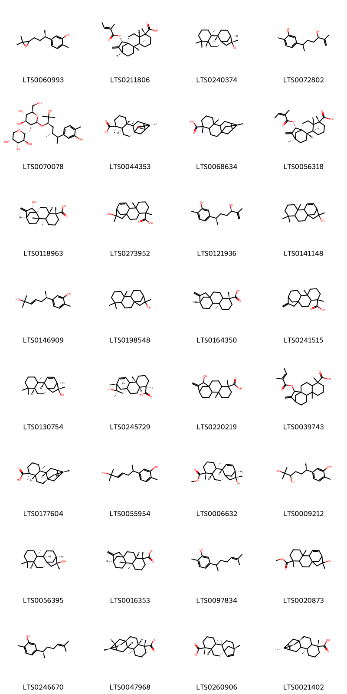{ width=100% }
    <figcaption>Hình ảnh cấu trúc hóa học của 32 hoạt chất thuộc nhóm Prenol lipids gồm ['5-[(2r)-4-(3,3-dimethyloxiran-2-yl)butan-2-yl]-2-methylphenol (LTS0060993)', '(1r,4s,5r,9s,10s,13r,15s)-5,9-dimethyl-15-{[(2e)-2-methylbut-2-enoyl]oxy}-14-methylidenetetracyclo[11.2.1.0¹,¹⁰.0⁴,⁹]hexadecane-5-carboxylic acid (LTS0211806)', '(1s,4r,9r,10r,13r,14r)-5,5,9,14-tetramethyltetracyclo[11.2.1.0¹,¹⁰.0⁴,⁹]hexadecan-14-ol (LTS0240374)', '5-(5-hydroxy-6-methylhept-6-en-2-yl)-2-methylphenol (LTS0072802)', '(2r,3s,4r,5r)-2-{[(2s,3r,4s,5s,6r)-4,5-dihydroxy-2-{[(3r,5r)-2-hydroxy-6-(3-hydroxy-4-methylphenyl)-2,5-dimethylheptan-3-yl]oxy}-6-(hydroxymethyl)oxan-3-yl]oxy}oxane-3,4,5-triol (LTS0070078)', '(1r,4r,5s,9r,10s,12s,13s,14r)-5,9,13-trimethylpentacyclo[11.2.1.0¹,¹⁰.0⁴,⁹.0¹²,¹⁴]hexadecane-5-carboxylic acid (LTS0044353)', '5,9,13-trimethylpentacyclo[11.2.1.0¹,¹⁰.0⁴,⁹.0¹²,¹⁴]hexadecane-5-carboxylic acid (LTS0068634)', '(1r,4s,5r,9s,10s,13r,15s)-5,9-dimethyl-15-{[(2z)-2-methylbut-2-enoyl]oxy}-14-methylidenetetracyclo[11.2.1.0¹,¹⁰.0⁴,⁹]hexadecane-5-carboxylic acid (LTS0056318)', '(1r,4s,5r,9s,10s,13r,15s)-15-hydroxy-5,9-dimethyl-14-methylidenetetracyclo[11.2.1.0¹,¹⁰.0⁴,⁹]hexadecane-5-carboxylic acid (LTS0118963)', '14-hydroxy-5,9,14-trimethyltetracyclo[11.2.1.0¹,¹⁰.0⁴,⁹]hexadec-11-ene-5-carboxylic acid (LTS0273952)', '5-[(2r,5r)-5-hydroxy-6-methylhept-6-en-2-yl]-2-methylphenol (LTS0121936)', '5,5,9,14-tetramethyltetracyclo[11.2.1.0¹,¹⁰.0⁴,⁹]hexadec-11-en-14-ol (LTS0141148)', '5-[(2r,4e)-6-hydroxy-6-methylhept-4-en-2-yl]-2-methylphenol (LTS0146909)', '5,5,9,14-tetramethyltetracyclo[11.2.1.0¹,¹⁰.0⁴,⁹]hexadecan-14-ol (LTS0198548)', '(5r,9s,13s)-5,9-dimethyl-14-methylidenetetracyclo[11.2.1.0¹,¹⁰.0⁴,⁹]hexadecane-5-carboxylic acid (LTS0164350)', '5,9-dimethyl-14-methylidenetetracyclo[11.2.1.0¹,¹⁰.0⁴,⁹]hexadecane-5-carboxylic acid (LTS0241515)', '(1s,4r,9r,10r,13s,14r)-5,5,9,14-tetramethyltetracyclo[11.2.1.0¹,¹⁰.0⁴,⁹]hexadec-11-en-14-ol (LTS0130754)', '(1s,4s,5r,9r,10r,13s,14r)-14-hydroxy-5,9,14-trimethyltetracyclo[11.2.1.0¹,¹⁰.0⁴,⁹]hexadec-11-ene-5-carboxylic acid (LTS0245729)', '15-hydroxy-5,9-dimethyl-14-methylidenetetracyclo[11.2.1.0¹,¹⁰.0⁴,⁹]hexadecane-5-carboxylic acid (LTS0220219)', '5,9-dimethyl-15-[(2-methylbut-2-enoyl)oxy]-14-methylidenetetracyclo[11.2.1.0¹,¹⁰.0⁴,⁹]hexadecane-5-carboxylic acid (LTS0039743)', '(1s,4s,5s,9s,10r,12r,13r,14s)-5,9,13-trimethylpentacyclo[11.2.1.0¹,¹⁰.0⁴,⁹.0¹²,¹⁴]hexadecane-5-carboxylic acid (LTS0177604)', '5-(6-hydroxy-6-methylhept-4-en-2-yl)-2-methylphenol (LTS0055954)', 'methyl (1s,4s,5r,9r,10r,13s,14r)-14-hydroxy-5,9,14-trimethyltetracyclo[11.2.1.0¹,¹⁰.0⁴,⁹]hexadec-11-ene-5-carboxylate (LTS0006632)', '(6r)-6-(3-hydroxy-4-methylphenyl)-2-methylheptane-2,3-diol (LTS0009212)', '(1s,4r,9r,10s,13r,14r)-5,5,9,14-tetramethyltetracyclo[11.2.1.0¹,¹⁰.0⁴,⁹]hexadecan-14-ol (LTS0056395)', 'ent-kaur-16-en-19-oic acid (LTS0016353)', '2-methyl-5-(6-methylhept-5-en-2-yl)phenol (LTS0097834)', 'methyl 14-hydroxy-5,9,14-trimethyltetracyclo[11.2.1.0¹,¹⁰.0⁴,⁹]hexadec-11-ene-5-carboxylate (LTS0020873)', '2-methyl-5-[(2r)-6-methylhept-5-en-2-yl]phenol (LTS0246670)', '(1s,4s,5r,9s,10r,12r,13r,14r)-5,9,13-trimethylpentacyclo[11.2.1.0¹,¹⁰.0⁴,⁹.0¹²,¹⁴]hexadecane-5-carboxylic acid (LTS0047968)', '(1s,4s,5r,9s,10r,13s)-5,9,13-trimethyltetracyclo[11.2.1.0¹,¹⁰.0⁴,⁹]hexadec-14-ene-5-carboxylic acid (LTS0260906)', '(1s,5r,9s,12r,13s)-5,9,13-trimethylpentacyclo[11.2.1.0¹,¹⁰.0⁴,⁹.0¹²,¹⁴]hexadecane-5-carboxylic acid (LTS0021402)'].</figcaption>
</figure>
#### Nhóm Steroids and steroid derivatives
<figure markdown="span">
    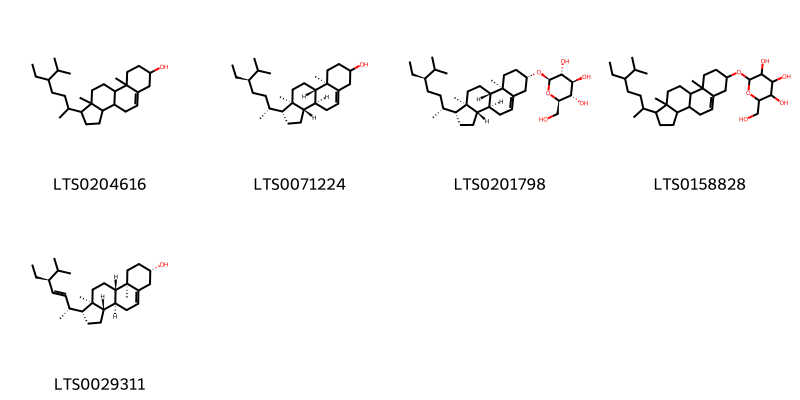{ width=100% }
    <figcaption>Hình ảnh cấu trúc hóa học của 5 hoạt chất thuộc nhóm Steroids and steroid derivatives gồm ['stigmast-5-en-3-ol, (3β)- (LTS0204616)', 'stigmast-5-en-3-ol (LTS0071224)', 'sitogluside (LTS0201798)', '2-{[1-(5-ethyl-6-methylheptan-2-yl)-9a,11a-dimethyl-1h,2h,3h,3ah,3bh,4h,6h,7h,8h,9h,9bh,10h,11h-cyclopenta[a]phenanthren-7-yl]oxy}-6-(hydroxymethyl)oxane-3,4,5-triol (LTS0158828)', 'phytosterol (LTS0029311)'].</figcaption>
</figure>

---

### Dược dân tộc học

Danh sách các quốc gia có sử dụng *Iostephane heterophylla* trong điều trị các bệnh. 

| Country   | Disease   | Bệnh                                                                                                                                                                                                |
|:----------|:----------|:----------------------------------------------------------------------------------------------------------------------------------------------------------------------------------------------------|
| Mexico    | Vulnerary | MYMEMORY WARNING: YOU USED ALL AVAILABLE FREE TRANSLATIONS FOR TODAY. NEXT AVAILABLE IN  11 HOURS 32 MINUTES 27 SECONDS VISIT HTTPS://MYMEMORY.TRANSLATED.NET/DOC/USAGELIMITS.PHP TO TRANSLATE MORE |

---

# Chi Echinops

??? note "Danh sách các dược liệu thuộc chi"
    
	 - *Echinops dahuricus*
	 - *Echinops echinatus*

---
## Echinops dahuricus
### Thông tin về thực vật

!!! info "Phân loại thực vật của *N/A* từ GIBF:"
    - **Kingdom:** Plantae
    - **Phylum:** Tracheophyta
    - **Order:** Asterales
    - **Family:** Asteraceae
    - **Genus:** Echinops
    - **Species:** *N/A*

 

| Label (VI)   | Label (EN)   | Scientific Name         | Descriptions (VI)   | Descriptions (EN)   | Also Known As (VI)   | Also Known As (EN)   |
|:-------------|:-------------|:------------------------|:--------------------|:--------------------|:---------------------|:---------------------|
| N/A          | N/A          | Iostephane heterophylla | loài thực vật       | species of plant    | ['']                 | ['']                 |

#### Phân bố trên thế giới

**Từ CSDL GIBF** United Arab Emirates, Italy, Belgium, Palestine, State of, Tunisia, Israel, Ukraine, Denmark, Netherlands, Cyprus, Spain, Türkiye, Hungary, Algeria, Russian Federation, Morocco, Portugal, Sweden, United States of America, Kazakhstan, Greece, Czechia, Germany, Switzerland, Austria, France, United Kingdom of Great Britain and Northern Ireland, Iraq, India, New Zealand, Ethiopia

#### Phân bố tại Việt Nam

**Từ CSDL GIBF**: Không có ghi nhận ở Việt Nam

---
### Thành phần hóa học
        
- Theo cơ sở dữ liệu lotus: Từ loài *N/A* đã phân lập và xác định được Chưa có hoạt chất nào được phân lập. hoạt chất thuộc về các nhóm Không có hoạt chất nào được phân lập. 

Không có hình ảnh nào được tạo ra

---

### Dược dân tộc học

Danh sách các quốc gia có sử dụng *N/A* trong điều trị các bệnh. 

| Country   | Disease   | Bệnh                                                                                                                                                                                                |
|:----------|:----------|:----------------------------------------------------------------------------------------------------------------------------------------------------------------------------------------------------|
| China     | Hemostat  | MYMEMORY WARNING: YOU USED ALL AVAILABLE FREE TRANSLATIONS FOR TODAY. NEXT AVAILABLE IN  11 HOURS 31 MINUTES 39 SECONDS VISIT HTTPS://MYMEMORY.TRANSLATED.NET/DOC/USAGELIMITS.PHP TO TRANSLATE MORE |

---

---
## Echinops echinatus
### Thông tin về thực vật

!!! info "Phân loại thực vật của *Echinops echinatus* từ GIBF:"
    - **Kingdom:** Plantae
    - **Phylum:** Tracheophyta
    - **Order:** Asterales
    - **Family:** Asteraceae
    - **Genus:** Echinops
    - **Species:** *Echinops echinatus*

 

| Label (VI)   | Label (EN)   | Scientific Name    | Descriptions (VI)   | Descriptions (EN)   | Also Known As (VI)   | Also Known As (EN)   |
|:-------------|:-------------|:-------------------|:--------------------|:--------------------|:---------------------|:---------------------|
| N/A          | N/A          | Echinops echinatus | loài thực vật       | species of plant    | ['']                 | ['']                 |

#### Phân bố trên thế giới

**Từ CSDL GIBF** nan, Pakistan, Afghanistan, India, unknown or invalid, Jordan, China

#### Phân bố tại Việt Nam

**Từ CSDL GIBF**: Không có ghi nhận ở Việt Nam

---
### Thành phần hóa học
        
- Theo cơ sở dữ liệu lotus: Từ loài *Echinops echinatus* đã phân lập và xác định được 27 hoạt chất thuộc về các nhóm Fatty Acyls, Flavonoids, Prenol lipids, Steroids and steroid derivatives, Quinolines and derivatives, Diazanaphthalenes. 

|    | chemicalTaxonomyClassyfireClass   |   smiles_count |
|---:|:----------------------------------|---------------:|
|  0 | Diazanaphthalenes                 |              2 |
|  1 | Fatty Acyls                       |              1 |
|  2 | Flavonoids                        |             11 |
|  3 | Prenol lipids                     |              7 |
|  4 | Quinolines and derivatives        |              4 |
|  5 | Steroids and steroid derivatives  |              2 |

#### Nhóm Diazanaphthalenes
<figure markdown="span">
    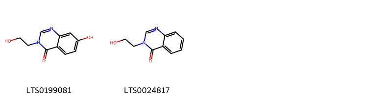{ width=100% }
    <figcaption>Hình ảnh cấu trúc hóa học của 2 hoạt chất thuộc nhóm Diazanaphthalenes gồm ['7-hydroxy-3-(2-hydroxyethyl)quinazolin-4-one (LTS0199081)', '3-(2-hydroxyethyl)quinazolin-4-one (LTS0024817)'].</figcaption>
</figure>
#### Nhóm Fatty Acyls
<figure markdown="span">
    { width=100% }
    <figcaption>Hình ảnh cấu trúc hóa học của 1 hoạt chất thuộc nhóm Fatty Acyls gồm ['ethyl palmitate (LTS0111042)'].</figcaption>
</figure>
#### Nhóm Flavonoids
<figure markdown="span">
    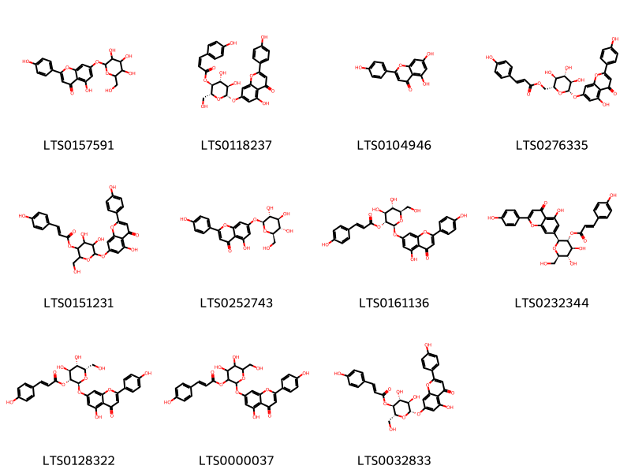{ width=100% }
    <figcaption>Hình ảnh cấu trúc hóa học của 11 hoạt chất thuộc nhóm Flavonoids gồm ['apigetrin (LTS0157591)', '(2r,3s,4r,5r,6s)-4,5-dihydroxy-6-{[5-hydroxy-2-(4-hydroxyphenyl)-4-oxochromen-7-yl]oxy}-2-(hydroxymethyl)oxan-3-yl (2z)-3-(4-hydroxyphenyl)prop-2-enoate (LTS0118237)', 'chamomile (LTS0104946)', 'echinacin (LTS0276335)', '4,5-dihydroxy-6-{[5-hydroxy-2-(4-hydroxyphenyl)-4-oxochromen-7-yl]oxy}-2-(hydroxymethyl)oxan-3-yl 3-(4-hydroxyphenyl)prop-2-enoate (LTS0151231)', 'apigenin 7-o-β-glucoside (LTS0252743)', '(2s,3r,4s,5s,6r)-4,5-dihydroxy-2-{[5-hydroxy-2-(4-hydroxyphenyl)-4-oxochromen-7-yl]oxy}-6-(hydroxymethyl)oxan-3-yl (2e)-3-(4-hydroxyphenyl)prop-2-enoate (LTS0161136)', '(2s,3r,4s,5s,6r)-4,5-dihydroxy-2-[5-hydroxy-2-(4-hydroxyphenyl)-4-oxochromen-7-yl]-6-(hydroxymethyl)oxan-3-yl (2e)-3-(4-hydroxyphenyl)prop-2-enoate (LTS0232344)', '(2s,3r,4s,5s,6s)-4,5-dihydroxy-2-{[5-hydroxy-2-(4-hydroxyphenyl)-4-oxochromen-7-yl]oxy}-6-(hydroxymethyl)oxan-3-yl (2e)-3-(4-hydroxyphenyl)prop-2-enoate (LTS0128322)', '4,5-dihydroxy-2-{[5-hydroxy-2-(4-hydroxyphenyl)-4-oxochromen-7-yl]oxy}-6-(hydroxymethyl)oxan-3-yl 3-(4-hydroxyphenyl)prop-2-enoate (LTS0000037)', '(2r,3s,4r,5r,6s)-4,5-dihydroxy-6-{[5-hydroxy-2-(4-hydroxyphenyl)-4-oxochromen-7-yl]oxy}-2-(hydroxymethyl)oxan-3-yl (2e)-3-(4-hydroxyphenyl)prop-2-enoate (LTS0032833)'].</figcaption>
</figure>
#### Nhóm Prenol lipids
<figure markdown="span">
    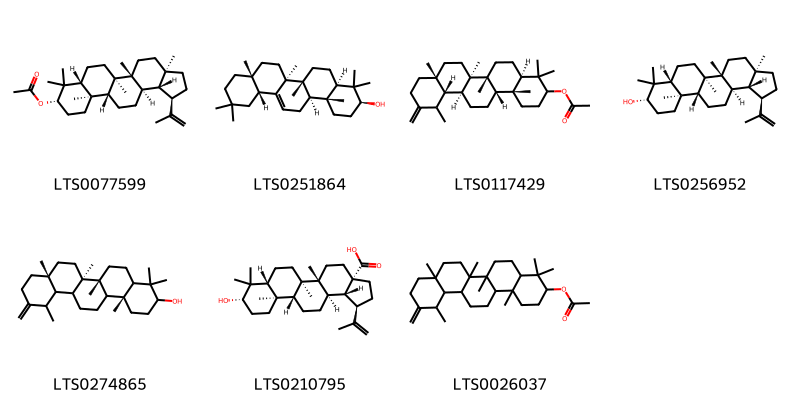{ width=100% }
    <figcaption>Hình ảnh cấu trúc hóa học của 7 hoạt chất thuộc nhóm Prenol lipids gồm ['lupeol acetate (LTS0077599)', 'β-amyrin (LTS0251864)', '(4ar,6ar,6br,8ar,12as,12bs,14as,14br)-4,4,6a,6b,8a,12,14b-heptamethyl-11-methylidene-hexadecahydropicen-3-yl acetate (LTS0117429)', 'lupeol (LTS0256952)', '(6ar,6br,8ar,14br)-4,4,6a,6b,8a,12,14b-heptamethyl-11-methylidene-hexadecahydropicen-3-ol (LTS0274865)', 'betulinic acid (LTS0210795)', '4,4,6a,6b,8a,12,14b-heptamethyl-11-methylidene-hexadecahydropicen-3-yl acetate (LTS0026037)'].</figcaption>
</figure>
#### Nhóm Quinolines and derivatives
<figure markdown="span">
    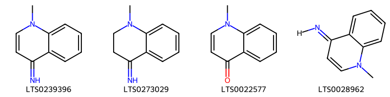{ width=100% }
    <figcaption>Hình ảnh cấu trúc hóa học của 4 hoạt chất thuộc nhóm Quinolines and derivatives gồm ['echinopsidine (LTS0239396)', 'echinopsidine (LTS0273029)', 'echinopsine (LTS0022577)', 'echinopsidine (LTS0028962)'].</figcaption>
</figure>
#### Nhóm Steroids and steroid derivatives
<figure markdown="span">
    { width=100% }
    <figcaption>Hình ảnh cấu trúc hóa học của 2 hoạt chất thuộc nhóm Steroids and steroid derivatives gồm ['stigmast-5-en-3-ol, (3β)- (LTS0204616)', 'sitogluside (LTS0201798)'].</figcaption>
</figure>

---

### Dược dân tộc học

Danh sách các quốc gia có sử dụng *Echinops echinatus* trong điều trị các bệnh. 

| Country   | Disease         | Bệnh                                                                                                                                                                                                |
|:----------|:----------------|:----------------------------------------------------------------------------------------------------------------------------------------------------------------------------------------------------|
| India     | Diuretic, Tonic | MYMEMORY WARNING: YOU USED ALL AVAILABLE FREE TRANSLATIONS FOR TODAY. NEXT AVAILABLE IN  11 HOURS 31 MINUTES 11 SECONDS VISIT HTTPS://MYMEMORY.TRANSLATED.NET/DOC/USAGELIMITS.PHP TO TRANSLATE MORE |

---

# Chi Macroclinidium

??? note "Danh sách các dược liệu thuộc chi"
    
	 - *Macroclinidium verticillatum*

---
## Macroclinidium verticillatum
### Thông tin về thực vật

!!! info "Phân loại thực vật của *Macroclinidium verticillatum* từ GIBF:"
    - **Kingdom:** Plantae
    - **Phylum:** Tracheophyta
    - **Order:** Asterales
    - **Family:** Asteraceae
    - **Genus:** Pertya
    - **Species:** *Macroclinidium verticillatum*

 

| Label (VI)   | Label (EN)   | Scientific Name              | Descriptions (VI)   | Descriptions (EN)   | Also Known As (VI)   | Also Known As (EN)   |
|:-------------|:-------------|:-----------------------------|:--------------------|:--------------------|:---------------------|:---------------------|
| N/A          | N/A          | Macroclinidium verticillatum |                     |                     | ['']                 | ['']                 |

#### Phân bố trên thế giới

**Từ CSDL GIBF** nan, Pakistan, Afghanistan, India, unknown or invalid, Jordan, China

#### Phân bố tại Việt Nam

**Từ CSDL GIBF**: Không có ghi nhận ở Việt Nam

---
### Thành phần hóa học
        
- Theo cơ sở dữ liệu lotus: Từ loài *Macroclinidium verticillatum* đã phân lập và xác định được Chưa có hoạt chất nào được phân lập. hoạt chất thuộc về các nhóm Không có hoạt chất nào được phân lập. 

Không có hình ảnh nào được tạo ra

---

### Dược dân tộc học

Danh sách các quốc gia có sử dụng *Macroclinidium verticillatum* trong điều trị các bệnh. 

| Country   | Disease   | Bệnh                                                                                                                                                                                                |
|:----------|:----------|:----------------------------------------------------------------------------------------------------------------------------------------------------------------------------------------------------|
| China     | Antidote  | MYMEMORY WARNING: YOU USED ALL AVAILABLE FREE TRANSLATIONS FOR TODAY. NEXT AVAILABLE IN  11 HOURS 30 MINUTES 35 SECONDS VISIT HTTPS://MYMEMORY.TRANSLATED.NET/DOC/USAGELIMITS.PHP TO TRANSLATE MORE |

---

# Chi Cacalia

??? note "Danh sách các dược liệu thuộc chi"
    
	 - *Cacalia descomposita*

---
## Cacalia descomposita
### Thông tin về thực vật

!!! info "Phân loại thực vật của *N/A* từ GIBF:"
    - **Kingdom:** Plantae
    - **Phylum:** Tracheophyta
    - **Order:** Asterales
    - **Family:** Asteraceae
    - **Genus:** Cacalia
    - **Species:** *N/A*

 

| Label (VI)   | Label (EN)   | Scientific Name              | Descriptions (VI)   | Descriptions (EN)   | Also Known As (VI)   | Also Known As (EN)   |
|:-------------|:-------------|:-----------------------------|:--------------------|:--------------------|:---------------------|:---------------------|
| N/A          | N/A          | Macroclinidium verticillatum |                     |                     | ['']                 | ['']                 |

#### Phân bố trên thế giới

**Từ CSDL GIBF** Malawi, nan, South Africa, Ecuador, Hong Kong, Suriname, Japan, Korea, Republic of, Brazil, Chinese Taipei, Korea (Democratic People’s Republic of), Russian Federation, Switzerland, United States of America, Mexico, Norway, China, Austria

#### Phân bố tại Việt Nam

**Từ CSDL GIBF**: Không có ghi nhận ở Việt Nam

---
### Thành phần hóa học
        
- Theo cơ sở dữ liệu lotus: Từ loài *N/A* đã phân lập và xác định được Chưa có hoạt chất nào được phân lập. hoạt chất thuộc về các nhóm Không có hoạt chất nào được phân lập. 

Không có hình ảnh nào được tạo ra

---

### Dược dân tộc học

Danh sách các quốc gia có sử dụng *N/A* trong điều trị các bệnh. 

| Country   | Disease   | Bệnh                                                                                                                                                                                                |
|:----------|:----------|:----------------------------------------------------------------------------------------------------------------------------------------------------------------------------------------------------|
| Mexico    | Vulnerary | MYMEMORY WARNING: YOU USED ALL AVAILABLE FREE TRANSLATIONS FOR TODAY. NEXT AVAILABLE IN  11 HOURS 30 MINUTES 13 SECONDS VISIT HTTPS://MYMEMORY.TRANSLATED.NET/DOC/USAGELIMITS.PHP TO TRANSLATE MORE |

---

# Chi Calendula

??? note "Danh sách các dược liệu thuộc chi"
    
	 - *Calendula arvensis*
	 - *Calendula officinalis*

---
## Calendula arvensis
### Thông tin về thực vật

!!! info "Phân loại thực vật của *Calendula arvensis* từ GIBF:"
    - **Kingdom:** Plantae
    - **Phylum:** Tracheophyta
    - **Order:** Asterales
    - **Family:** Asteraceae
    - **Genus:** Calendula
    - **Species:** *Calendula arvensis*

 

| Label (VI)   | Label (EN)   | Scientific Name    | Descriptions (VI)   | Descriptions (EN)   | Also Known As (VI)   | Also Known As (EN)   |
|:-------------|:-------------|:-------------------|:--------------------|:--------------------|:---------------------|:---------------------|
| N/A          | N/A          | Calendula arvensis | loài thực vật       | species of plant    | ['']                 | ['Field marigold']   |

#### Phân bố trên thế giới

**Từ CSDL GIBF** nan, Italy, Malta, Spain, Palestine, State of, Türkiye, Portugal, Switzerland, United States of America, France, Croatia, Greece, Israel

#### Phân bố tại Việt Nam

**Từ CSDL GIBF**: Không có ghi nhận ở Việt Nam

---
### Thành phần hóa học
        
- Theo cơ sở dữ liệu lotus: Từ loài *Calendula arvensis* đã phân lập và xác định được 40 hoạt chất thuộc về các nhóm Flavonoids, Prenol lipids, Benzofurans. 

|    | chemicalTaxonomyClassyfireClass   |   smiles_count |
|---:|:----------------------------------|---------------:|
|  0 | Benzofurans                       |              1 |
|  1 | Flavonoids                        |              2 |
|  2 | Prenol lipids                     |             37 |

#### Nhóm Benzofurans
<figure markdown="span">
    { width=100% }
    <figcaption>Hình ảnh cấu trúc hóa học của 1 hoạt chất thuộc nhóm Benzofurans gồm ['dihydroactinidiolide (LTS0041341)'].</figcaption>
</figure>
#### Nhóm Flavonoids
<figure markdown="span">
    { width=100% }
    <figcaption>Hình ảnh cấu trúc hóa học của 2 hoạt chất thuộc nhóm Flavonoids gồm ['isorhamnetin 3-galactoside (LTS0087575)', 'isorhamnetin 3-o-glucoside (LTS0137002)'].</figcaption>
</figure>
#### Nhóm Prenol lipids
<figure markdown="span">
    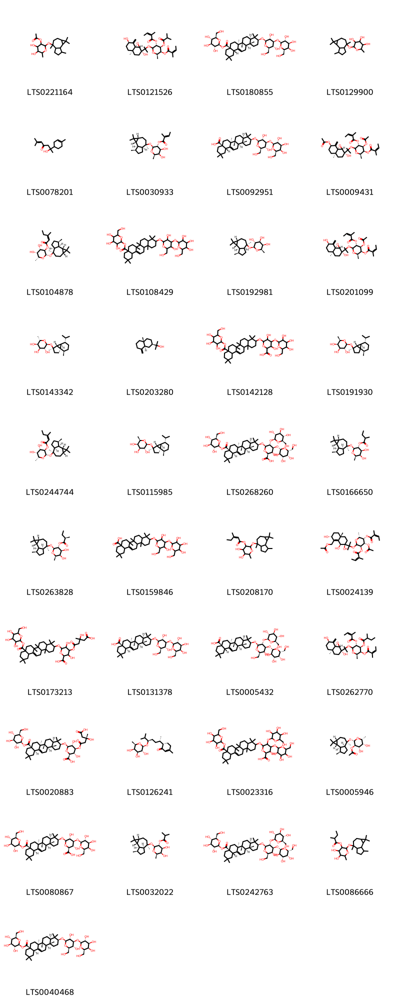{ width=100% }
    <figcaption>Hình ảnh cấu trúc hóa học của 37 hoạt chất thuộc nhóm Prenol lipids gồm ['4,5-dihydroxy-6-methyl-2-({1,1,4,7-tetramethyl-octahydro-1ah-cyclopropa[e]azulen-4-yl}oxy)oxan-3-yl acetate (LTS0221164)', '(2r,3s,4s,5r)-6-({2-[(1ar,2r,4ar,7r,8ar)-2,7-dihydroxy-4a-methyl-8-methylidene-hexahydronaphtho[1,8a-b]oxiren-2-yl]propan-2-yl}oxy)-2-methyl-5-{[(2z)-2-methylbut-2-enoyl]oxy}-4-[(2-methylpropanoyl)oxy]oxan-3-yl (2z)-2-methylbut-2-enoate (LTS0121526)', 'arvensoside a (LTS0180855)', '2-methyl-6-({1,1,4,7-tetramethyl-octahydro-1ah-cyclopropa[e]azulen-4-yl}oxy)oxane-3,4,5-triol (LTS0129900)', '6-hydroxy-2-methyl-6-(4-methylcyclohex-3-en-1-yl)hept-2-en-4-one (LTS0078201)', '(2s,3r,4s,5r,6r)-2-{[(1ar,4r,4as,7r,7as,7bs)-1,1,4,7-tetramethyl-octahydro-1ah-cyclopropa[e]azulen-4-yl]oxy}-4,5-dihydroxy-6-methyloxan-3-yl (2e)-2-methylbut-2-enoate (LTS0030933)', '(4as,6as,6br,8ar,10s,12ar,12br,14bs)-10-{[(2r,3r,4s,5r,6r)-3,5-dihydroxy-6-(hydroxymethyl)-4-{[(2s,3r,4s,5r,6r)-3,4,5-trihydroxy-6-(hydroxymethyl)oxan-2-yl]oxy}oxan-2-yl]oxy}-2,2,6a,6b,9,9,12a-heptamethyl-1,3,4,5,6,7,8,8a,10,11,12,12b,13,14b-tetradecahydropicene-4a-carboxylic acid (LTS0092951)', '(2r,3s,4s,5r)-6-({2-[(1ar,2r,4ar,7r,8ar)-7-(acetyloxy)-2-hydroxy-4a-methyl-8-methylidene-hexahydronaphtho[1,8a-b]oxiren-2-yl]propan-2-yl}oxy)-4-(acetyloxy)-2-methyl-5-{[(2z)-2-methylbut-2-enoyl]oxy}oxan-3-yl (2z)-2-methylbut-2-enoate (LTS0009431)', '(2s,3r,4s,5r,6r)-2-{[(1ar,4r,4as,7r,7as,7bs)-1,1,4,7-tetramethyl-octahydro-1ah-cyclopropa[e]azulen-4-yl]oxy}-4,5-dihydroxy-6-methyloxan-3-yl (2z)-3-methylpent-2-enoate (LTS0104878)', '3,4,5-trihydroxy-6-(hydroxymethyl)oxan-2-yl 10-{[3,5-dihydroxy-6-(hydroxymethyl)-4-{[3,4,5-trihydroxy-6-(hydroxymethyl)oxan-2-yl]oxy}oxan-2-yl]oxy}-2,2,6a,6b,9,9,12a-heptamethyl-1,3,4,5,6,7,8,8a,10,11,12,12b,13,14b-tetradecahydropicene-4a-carboxylate (LTS0108429)', '(2s,3r,4s,5r,6r)-2-{[(1ar,4r,4as,7r,7as,7bs)-1,1,4,7-tetramethyl-octahydro-1ah-cyclopropa[e]azulen-4-yl]oxy}-6-methyloxane-3,4,5-triol (LTS0192981)', '(2r,3s,4s,5r)-6-({2-[(1ar,2r,4ar,7r,8ar)-2,7-dihydroxy-4a-methyl-8-methylidene-hexahydronaphtho[1,8a-b]oxiren-2-yl]propan-2-yl}oxy)-4-(acetyloxy)-2-methyl-5-{[(2z)-2-methylbut-2-enoyl]oxy}oxan-3-yl (2z)-2-methylbut-2-enoate (LTS0201099)', '(2s,3r,4s,5r,6s)-2-{[(1r,4r,5r,6r,7s,10r)-7-isopropyl-4,10-dimethyltricyclo[4.4.0.0¹,⁵]decan-4-yl]oxy}-6-methyloxane-3,4,5-triol (LTS0143342)', 'β-eudesmol (LTS0203280)', '6-{[4,4,6a,6b,11,11,14b-heptamethyl-8a-({[3,4,5-trihydroxy-6-(hydroxymethyl)oxan-2-yl]oxy}carbonyl)-1,2,3,4a,5,6,7,8,9,10,12,12a,14,14a-tetradecahydropicen-3-yl]oxy}-3,5-dihydroxy-4-{[3,4,5-trihydroxy-6-(hydroxymethyl)oxan-2-yl]oxy}oxane-2-carboxylic acid (LTS0142128)', '(2s,3r,4s,5r,6r)-2-{[(4r,5r,6r,7s,10r)-7-isopropyl-4,10-dimethyltricyclo[4.4.0.0¹,⁵]decan-4-yl]oxy}-6-methyloxane-3,4,5-triol (LTS0191930)', '(2s,3r,4s,5r,6r)-2-{[(1ar,4r,4as,7r,7as,7bs)-1,1,4,7-tetramethyl-octahydro-1ah-cyclopropa[e]azulen-4-yl]oxy}-4,5-dihydroxy-6-methyloxan-3-yl 3-methylpent-2-enoate (LTS0244744)', 'arvoside a (LTS0115985)', '(2s,3s,4s,5r,6r)-6-{[(3s,4ar,6ar,6bs,8as,12ar,14ar,14br)-4,4,6a,6b,11,11,14b-heptamethyl-8a-({[(2s,3r,4s,5s,6r)-3,4,5-trihydroxy-6-(hydroxymethyl)oxan-2-yl]oxy}carbonyl)-1,2,3,4a,5,6,7,8,9,10,12,12a,14,14a-tetradecahydropicen-3-yl]oxy}-3-hydroxy-4-{[(2s,3r,4s,5r,6r)-3,4,5-trihydroxy-6-(hydroxymethyl)oxan-2-yl]oxy}-5-{[(2s,3r,4s,5s,6r)-3,4,5-trihydroxy-6-(hydroxymethyl)oxan-2-yl]oxy}oxane-2-carboxylic acid (LTS0268260)', '(2s,3r,4s,5r,6r)-2-{[(1ar,4r,4as,7r,7as,7bs)-1,1,4,7-tetramethyl-octahydro-1ah-cyclopropa[e]azulen-4-yl]oxy}-4,5-dihydroxy-6-methyloxan-3-yl 2-methylbutanoate (LTS0166650)', '(2s,3r,4s,5r,6r)-2-{[(1ar,4r,4as,7r,7as,7bs)-1,1,4,7-tetramethyl-octahydro-1ah-cyclopropa[e]azulen-4-yl]oxy}-4,5-dihydroxy-6-methyloxan-3-yl (2r)-2-methylbutanoate (LTS0263828)', '10-{[3,5-dihydroxy-6-(hydroxymethyl)-4-{[3,4,5-trihydroxy-6-(hydroxymethyl)oxan-2-yl]oxy}oxan-2-yl]oxy}-2,2,6a,6b,9,9,12a-heptamethyl-1,3,4,5,6,7,8,8a,10,11,12,12b,13,14b-tetradecahydropicene-4a-carboxylic acid (LTS0159846)', '4,5-dihydroxy-6-methyl-2-({1,1,4,7-tetramethyl-octahydro-1ah-cyclopropa[e]azulen-4-yl}oxy)oxan-3-yl 3-methylpent-2-enoate (LTS0208170)', '(3r,4s,5s,6r)-2-({2-[(1s,2r,4ar,7r)-8-[(acetyloxy)methyl]-1,2,7-trihydroxy-4a-methyl-1,3,4,5,6,7-hexahydronaphthalen-2-yl]propan-2-yl}oxy)-4-(acetyloxy)-6-methyl-5-{[(2z)-2-methylbut-2-enoyl]oxy}oxan-3-yl (2z)-2-methylbut-2-enoate (LTS0024139)', '6-{[4,4,6a,6b,11,11,14b-heptamethyl-8a-({[3,4,5-trihydroxy-6-(hydroxymethyl)oxan-2-yl]oxy}carbonyl)-1,2,3,4a,5,6,7,8,9,10,12,12a,14,14a-tetradecahydropicen-3-yl]oxy}-4-[(4-carboxy-3-hydroxy-3-methylbutanoyl)oxy]-3,5-dihydroxyoxane-2-carboxylic acid (LTS0173213)', '(4as,6as,6br,8ar,10s,12ar,12br,14br)-10-{[(2r,3r,4s,5r,6r)-3,5-dihydroxy-6-(hydroxymethyl)-4-{[(2s,3r,4s,5r,6r)-3,4,5-trihydroxy-6-(hydroxymethyl)oxan-2-yl]oxy}oxan-2-yl]oxy}-2,2,6a,6b,9,9,12a-heptamethyl-1,3,4,5,6,7,8,8a,10,11,12,12b,13,14b-tetradecahydropicene-4a-carboxylic acid (LTS0131378)', 'calenduloside c (LTS0005432)', '(2r,3s,4s,5r)-6-({2-[(1ar,2r,4ar,7r,8ar)-2,7-dihydroxy-4a-methyl-8-methylidene-hexahydronaphtho[1,8a-b]oxiren-2-yl]propan-2-yl}oxy)-2-methyl-5-{[(2z)-2-methylbut-2-enoyl]oxy}-4-[(2-methylbutanoyl)oxy]oxan-3-yl (2z)-2-methylbut-2-enoate (LTS0262770)', '(2s,3s,4s,5r,6r)-6-{[(3s,4ar,6ar,6bs,8as,12ar,14ar,14br)-4,4,6a,6b,11,11,14b-heptamethyl-8a-({[(2s,3r,4s,5s,6r)-3,4,5-trihydroxy-6-(hydroxymethyl)oxan-2-yl]oxy}carbonyl)-1,2,3,4a,5,6,7,8,9,10,12,12a,14,14a-tetradecahydropicen-3-yl]oxy}-4-{[(3s)-4-carboxy-3-hydroxy-3-methylbutanoyl]oxy}-3,5-dihydroxyoxane-2-carboxylic acid (LTS0020883)', '(6s)-3-methyl-6-[(2s,5r)-6-methyl-5-{[(2r,3r,4s,5r,6r)-3,4,5-trihydroxy-6-methyloxan-2-yl]oxy}heptan-2-yl]cyclohex-2-en-1-one (LTS0126241)', '6-{[4,4,6a,6b,11,11,14b-heptamethyl-8a-({[3,4,5-trihydroxy-6-(hydroxymethyl)oxan-2-yl]oxy}carbonyl)-1,2,3,4a,5,6,7,8,9,10,12,12a,14,14a-tetradecahydropicen-3-yl]oxy}-3-hydroxy-4,5-bis({[3,4,5-trihydroxy-6-(hydroxymethyl)oxan-2-yl]oxy})oxane-2-carboxylic acid (LTS0023316)', '(2s,3r,4s,5r,6r)-2-{[(1ar,4r,4as,7r,7as,7bs)-1,1,4,7-tetramethyl-octahydro-1ah-cyclopropa[e]azulen-4-yl]oxy}-4,5-dihydroxy-6-methyloxan-3-yl acetate (LTS0005946)', '(2s,3s,4s,5r,6r)-6-{[(3s,4ar,6ar,6bs,8as,12ar,14ar,14br)-4,4,6a,6b,11,11,14b-heptamethyl-8a-({[(2s,3r,4s,5s,6r)-3,4,5-trihydroxy-6-(hydroxymethyl)oxan-2-yl]oxy}carbonyl)-1,2,3,4a,5,6,7,8,9,10,12,12a,14,14a-tetradecahydropicen-3-yl]oxy}-3,5-dihydroxy-4-{[(2s,3r,4s,5r,6r)-3,4,5-trihydroxy-6-(hydroxymethyl)oxan-2-yl]oxy}oxane-2-carboxylic acid (LTS0080867)', '(2s,3r,4s,5r,6r)-2-{[(1ar,4r,4as,7r,7as,7bs)-1,1,4,7-tetramethyl-octahydro-1ah-cyclopropa[e]azulen-4-yl]oxy}-4,5-dihydroxy-6-methyloxan-3-yl 2-methylpropanoate (LTS0032022)', 'calenduloside d (LTS0242763)', '4,5-dihydroxy-6-methyl-2-({1,1,4,7-tetramethyl-octahydro-1ah-cyclopropa[e]azulen-4-yl}oxy)oxan-3-yl 2-methylbutanoate (LTS0086666)', '(2s,3r,4s,5s,6r)-3,4,5-trihydroxy-6-(hydroxymethyl)oxan-2-yl (4as,6as,6br,8ar,10s,12ar,12br,14br)-10-{[(2r,3r,4s,5r,6r)-3,5-dihydroxy-6-(hydroxymethyl)-4-{[(2s,3r,4s,5r,6r)-3,4,5-trihydroxy-6-(hydroxymethyl)oxan-2-yl]oxy}oxan-2-yl]oxy}-2,2,6a,6b,9,9,12a-heptamethyl-1,3,4,5,6,7,8,8a,10,11,12,12b,13,14b-tetradecahydropicene-4a-carboxylate (LTS0040468)'].</figcaption>
</figure>

---

### Dược dân tộc học

Danh sách các quốc gia có sử dụng *Calendula arvensis* trong điều trị các bệnh. 

| Country   | Disease   | Bệnh                                                                                                                                                                                                |
|:----------|:----------|:----------------------------------------------------------------------------------------------------------------------------------------------------------------------------------------------------|
| ain       | Sudorific | MYMEMORY WARNING: YOU USED ALL AVAILABLE FREE TRANSLATIONS FOR TODAY. NEXT AVAILABLE IN  11 HOURS 29 MINUTES 46 SECONDS VISIT HTTPS://MYMEMORY.TRANSLATED.NET/DOC/USAGELIMITS.PHP TO TRANSLATE MORE |

---

# Chi Pulicaria

??? note "Danh sách các dược liệu thuộc chi"
    
	 - *Pulicaria cria*
	 - *Pulicaria dysenterica*

---
## Pulicaria cria
### Thông tin về thực vật

!!! info "Phân loại thực vật của *Pulicaria crispa* từ GIBF:"
    - **Kingdom:** Plantae
    - **Phylum:** Tracheophyta
    - **Order:** Asterales
    - **Family:** Asteraceae
    - **Genus:** Pulicaria
    - **Species:** *Pulicaria crispa*

 

| Label (VI)   | Label (EN)   | Scientific Name    | Descriptions (VI)   | Descriptions (EN)   | Also Known As (VI)   | Also Known As (EN)   |
|:-------------|:-------------|:-------------------|:--------------------|:--------------------|:---------------------|:---------------------|
| N/A          | N/A          | Calendula arvensis | loài thực vật       | species of plant    | ['']                 | ['Field marigold']   |

#### Phân bố trên thế giới

**Từ CSDL GIBF** nan, Palestine, State of, Tunisia, Israel, Yemen, Afghanistan, Sudan, Türkiye, Algeria, Morocco, Saudi Arabia, Eritrea, Iran (Islamic Republic of), Niger, Egypt, Iraq, India, Cameroon, Ethiopia

#### Phân bố tại Việt Nam

**Từ CSDL GIBF**: Không có ghi nhận ở Việt Nam

---
### Thành phần hóa học
        
- Theo cơ sở dữ liệu lotus: Từ loài *Pulicaria crispa* đã phân lập và xác định được Chưa có hoạt chất nào được phân lập. hoạt chất thuộc về các nhóm Không có hoạt chất nào được phân lập. 

Không có hình ảnh nào được tạo ra

---

### Dược dân tộc học

Danh sách các quốc gia có sử dụng *Pulicaria crispa* trong điều trị các bệnh. 

| Country   | Disease   | Bệnh                                                                                                                                                                                                |
|:----------|:----------|:----------------------------------------------------------------------------------------------------------------------------------------------------------------------------------------------------|
| Elsewhere | Vulnerary | MYMEMORY WARNING: YOU USED ALL AVAILABLE FREE TRANSLATIONS FOR TODAY. NEXT AVAILABLE IN  11 HOURS 27 MINUTES 49 SECONDS VISIT HTTPS://MYMEMORY.TRANSLATED.NET/DOC/USAGELIMITS.PHP TO TRANSLATE MORE |

---

---
## Pulicaria dysenterica
### Thông tin về thực vật

!!! info "Phân loại thực vật của *Pulicaria dysenterica* từ GIBF:"
    - **Kingdom:** Plantae
    - **Phylum:** Tracheophyta
    - **Order:** Asterales
    - **Family:** Asteraceae
    - **Genus:** Pulicaria
    - **Species:** *Pulicaria dysenterica*

 

| Label (VI)   | Label (EN)   | Scientific Name       | Descriptions (VI)   | Descriptions (EN)   | Also Known As (VI)   | Also Known As (EN)              |
|:-------------|:-------------|:----------------------|:--------------------|:--------------------|:---------------------|:--------------------------------|
| N/A          | N/A          | Pulicaria dysenterica | loài thực vật       | species of plant    | ['']                 | ['common fleabane', 'fleabane'] |

#### Phân bố trên thế giới

**Từ CSDL GIBF** Netherlands, Italy, Germany, Belgium, Spain, Hungary, Portugal, Switzerland, Austria, France, United Kingdom of Great Britain and Northern Ireland

#### Phân bố tại Việt Nam

**Từ CSDL GIBF**: Không có ghi nhận ở Việt Nam

---
### Thành phần hóa học
        
- Theo cơ sở dữ liệu lotus: Từ loài *Pulicaria dysenterica* đã phân lập và xác định được 64 hoạt chất thuộc về các nhóm Fatty Acyls, Flavonoids, Prenol lipids, Steroids and steroid derivatives, Unsaturated hydrocarbons, Phenol esters, Carboxylic acids and derivatives. 

|    | chemicalTaxonomyClassyfireClass   |   smiles_count |
|---:|:----------------------------------|---------------:|
|  0 | Carboxylic acids and derivatives  |              4 |
|  1 | Fatty Acyls                       |              1 |
|  2 | Flavonoids                        |              2 |
|  3 | Phenol esters                     |              2 |
|  4 | Prenol lipids                     |             53 |
|  5 | Steroids and steroid derivatives  |              1 |
|  6 | Unsaturated hydrocarbons          |              1 |

#### Nhóm Carboxylic acids and derivatives
<figure markdown="span">
    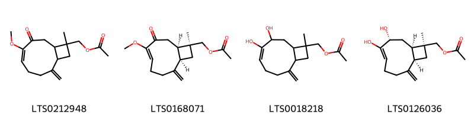{ width=100% }
    <figcaption>Hình ảnh cấu trúc hóa học của 4 hoạt chất thuộc nhóm Carboxylic acids and derivatives gồm ['{6-methoxy-10-methyl-2-methylidene-7-oxobicyclo[7.2.0]undec-5-en-10-yl}methyl acetate (LTS0212948)', '[(1r,5z,9r,10s)-6-methoxy-10-methyl-2-methylidene-7-oxobicyclo[7.2.0]undec-5-en-10-yl]methyl acetate (LTS0168071)', '{6,7-dihydroxy-10-methyl-2-methylidenebicyclo[7.2.0]undec-5-en-10-yl}methyl acetate (LTS0018218)', '[(1r,5z,7r,9r,10s)-6,7-dihydroxy-10-methyl-2-methylidenebicyclo[7.2.0]undec-5-en-10-yl]methyl acetate (LTS0126036)'].</figcaption>
</figure>
#### Nhóm Fatty Acyls
<figure markdown="span">
    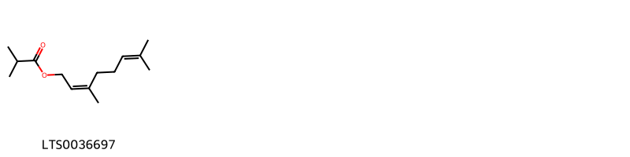{ width=100% }
    <figcaption>Hình ảnh cấu trúc hóa học của 1 hoạt chất thuộc nhóm Fatty Acyls gồm ['neryl isobutyrate (LTS0036697)'].</figcaption>
</figure>
#### Nhóm Flavonoids
<figure markdown="span">
    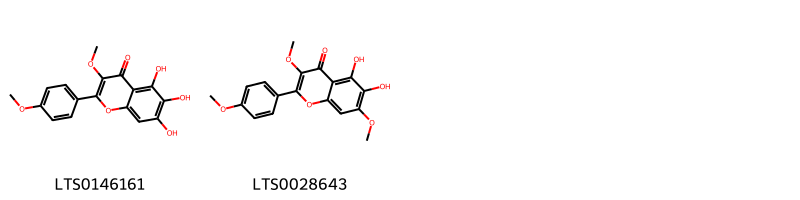{ width=100% }
    <figcaption>Hình ảnh cấu trúc hóa học của 2 hoạt chất thuộc nhóm Flavonoids gồm ['5,6,7-trihydroxy-3-methoxy-2-(4-methoxyphenyl)chromen-4-one (LTS0146161)', 'tanetin (LTS0028643)'].</figcaption>
</figure>
#### Nhóm Phenol esters
<figure markdown="span">
    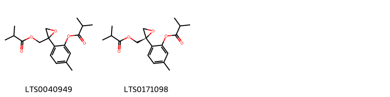{ width=100% }
    <figcaption>Hình ảnh cấu trúc hóa học của 2 hoạt chất thuộc nhóm Phenol esters gồm ['(2-{4-methyl-2-[(2-methylpropanoyl)oxy]phenyl}oxiran-2-yl)methyl 2-methylpropanoate (LTS0040949)', '[(2r)-2-{4-methyl-2-[(2-methylpropanoyl)oxy]phenyl}oxiran-2-yl]methyl 2-methylpropanoate (LTS0171098)'].</figcaption>
</figure>
#### Nhóm Prenol lipids
<figure markdown="span">
    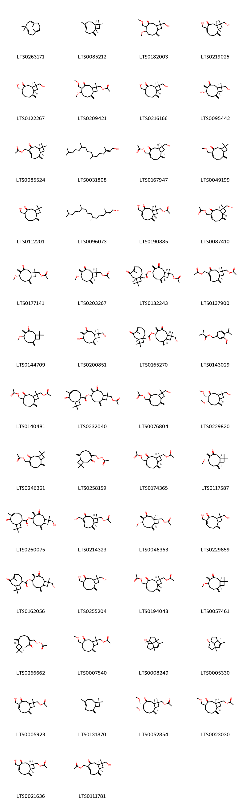{ width=100% }
    <figcaption>Hình ảnh cấu trúc hóa học của 53 hoạt chất thuộc nhóm Prenol lipids gồm ['humulene (LTS0263171)', 'caryophyllene (LTS0085212)', '11-(hydroxymethyl)-5-methoxy-4-(methoxymethyl)-11-methyl-8-methylidenebicyclo[7.2.0]undecan-3-one (LTS0182003)', '(1r,4z,9s,11r)-4,11-bis(hydroxymethyl)-11-methyl-8-methylidenebicyclo[7.2.0]undec-4-en-3-one (LTS0219025)', '(1r,4r,9r,11r)-4,11-bis(hydroxymethyl)-11-methyl-8-methylidenebicyclo[7.2.0]undecan-3-one (LTS0122267)', '[5-methoxy-6-(methoxymethyl)-10-methyl-2-methylidene-7-oxobicyclo[7.2.0]undecan-10-yl]methyl acetate (LTS0209421)', '(1r,4z,9r,11s)-4,11-bis(hydroxymethyl)-11-methyl-8-methylidenebicyclo[7.2.0]undec-4-en-3-one (LTS0216166)', '(1r,5r,9r,11r)-5-hydroxy-11-(hydroxymethyl)-11-methyl-4,8-dimethylidenebicyclo[7.2.0]undecan-3-one (LTS0095442)', '[(1r,4e,9r)-11,11-dimethyl-8-methylidene-3-oxobicyclo[7.2.0]undec-4-en-4-yl]methyl acetate (LTS0085524)', 'phytol (LTS0031808)', '[(1r,4z,9r,11s)-11-(hydroxymethyl)-11-methyl-8-methylidene-3-oxobicyclo[7.2.0]undec-4-en-4-yl]methyl acetate (LTS0167947)', '4-(methoxymethyl)-11,11-dimethyl-8-methylidenebicyclo[7.2.0]undec-4-en-3-one (LTS0049199)', '4-(hydroxymethyl)-11,11-dimethyl-8-methylidenebicyclo[7.2.0]undecan-3-one (LTS0112201)', 'phytol (LTS0096073)', '[(1s,5z,9r,10r)-6-(hydroxymethyl)-10-methyl-2-methylidene-7-oxobicyclo[7.2.0]undec-5-en-10-yl]methyl acetate (LTS0190885)', '[(1r,4z,9s,11r)-11-(hydroxymethyl)-11-methyl-8-methylidene-3-oxobicyclo[7.2.0]undec-4-en-4-yl]methyl acetate (LTS0087410)', '{5-methoxy-10-methyl-2,6-dimethylidene-7-oxobicyclo[7.2.0]undecan-10-yl}methyl acetate (LTS0177141)', '[(1r,5r,9r,10s)-5-methoxy-10-methyl-2,6-dimethylidene-7-oxobicyclo[7.2.0]undecan-10-yl]methyl acetate (LTS0203267)', '(1r,5r,9r,10r)-10-[(acetyloxy)methyl]-10-methyl-2,6-dimethylidene-7-oxobicyclo[7.2.0]undecan-5-yl (1r,2s,5e,9r)-6,10,10-trimethyl-7-oxobicyclo[7.2.0]undec-5-ene-2-carboxylate (LTS0132243)', '[(1r,5e,9r,10r)-6-[(acetyloxy)methyl]-10-methyl-2-methylidene-7-oxobicyclo[7.2.0]undec-5-en-10-yl]methyl acetate (LTS0137900)', '5-methoxy-11,11-dimethyl-4,8-dimethylidenebicyclo[7.2.0]undecan-3-one (LTS0144709)', '(1r,5r,9r,11s)-5-hydroxy-11-(hydroxymethyl)-11-methyl-4,8-dimethylidenebicyclo[7.2.0]undecan-3-one (LTS0200851)', '(1r,5r,9r,10r)-10-(hydroxymethyl)-10-methyl-2,6-dimethylidene-7-oxobicyclo[7.2.0]undecan-5-yl (1r,2s,5e,9r)-6,10,10-trimethyl-7-oxobicyclo[7.2.0]undec-5-ene-2-carboxylate (LTS0165270)', '(4-isopropyl-3-methoxyphenyl)methyl 2-methylpropanoate (LTS0143029)', '{6-[(acetyloxy)methyl]-10-methyl-2-methylidene-7-oxobicyclo[7.2.0]undec-5-en-10-yl}methyl acetate (LTS0140481)', '10-[(acetyloxy)methyl]-10-methyl-2,6-dimethylidene-7-oxobicyclo[7.2.0]undecan-5-yl 6,10,10-trimethyl-7-oxobicyclo[7.2.0]undec-5-ene-2-carboxylate (LTS0232040)', '[11-(hydroxymethyl)-11-methyl-8-methylidene-3-oxobicyclo[7.2.0]undec-4-en-4-yl]methyl acetate (LTS0076804)', '(1r,4s,5s,9r,11s)-11-(hydroxymethyl)-5-methoxy-4-(methoxymethyl)-11-methyl-8-methylidenebicyclo[7.2.0]undecan-3-one (LTS0229820)', '{11,11-dimethyl-8-methylidene-3-oxobicyclo[7.2.0]undec-4-en-4-yl}methyl acetate (LTS0246361)', '{11,11-dimethyl-8-methylidene-3-oxobicyclo[7.2.0]undec-4-en-4-yl}methyl ethaneperoxoate (LTS0258159)', '[(1r,5z,9r,10s)-6-[(acetyloxy)methyl]-10-methyl-2-methylidene-7-oxobicyclo[7.2.0]undec-5-en-10-yl]methyl acetate (LTS0174365)', '(1r,5s,9r)-5-methoxy-11,11-dimethyl-4,8-dimethylidenebicyclo[7.2.0]undecan-3-one (LTS0117587)', '10-(hydroxymethyl)-10-methyl-2,6-dimethylidene-7-oxobicyclo[7.2.0]undecan-5-yl 6,10,10-trimethyl-7-oxobicyclo[7.2.0]undec-5-ene-2-carboxylate (LTS0260075)', '[(1r,5e,9r,10r)-6-(hydroxymethyl)-10-methyl-2-methylidene-7-oxobicyclo[7.2.0]undec-5-en-10-yl]methyl acetate (LTS0214323)', '[(1r,5s,9r,10s)-5-methoxy-10-methyl-2,6-dimethylidene-7-oxobicyclo[7.2.0]undecan-10-yl]methyl acetate (LTS0046363)', '4,11-bis(hydroxymethyl)-11-methyl-8-methylidenebicyclo[7.2.0]undec-4-en-3-one (LTS0229859)', '10-(hydroxymethyl)-10-methyl-2,6-dimethylidene-7-oxobicyclo[7.2.0]undecan-5-yl (5e)-6,10,10-trimethyl-7-oxobicyclo[7.2.0]undec-5-ene-2-carboxylate (LTS0162056)', '4,11-bis(hydroxymethyl)-11-methyl-8-methylidenebicyclo[7.2.0]undecan-3-one (LTS0255204)', '[(1s,5z,9r,10r)-6-[(acetyloxy)methyl]-10-methyl-2-methylidene-7-oxobicyclo[7.2.0]undec-5-en-10-yl]methyl acetate (LTS0194043)', '(1r,5r,9r)-5-methoxy-11,11-dimethyl-4,8-dimethylidenebicyclo[7.2.0]undecan-3-one (LTS0057461)', '[(1r,4z,9r)-11,11-dimethyl-8-methylidene-3-oxobicyclo[7.2.0]undec-4-en-4-yl]methyl ethaneperoxoate (LTS0266662)', '[6-(methoxymethyl)-10-methyl-2-methylidene-7-oxobicyclo[7.2.0]undec-5-en-10-yl]methyl acetate (LTS0007540)', '5,7,8,11-tetramethyltricyclo[6.3.0.0¹,⁵]undec-6-en-2-ol (LTS0008249)', '(1s,2r,5s,8s,11r)-5,7,8,11-tetramethyltricyclo[6.3.0.0¹,⁵]undec-6-en-2-ol (LTS0005330)', '[6-(hydroxymethyl)-10-methyl-2-methylidene-7-oxobicyclo[7.2.0]undec-5-en-10-yl]methyl acetate (LTS0005923)', 'caryophyllene (LTS0131870)', '[(1r,5s,6s,9r,10s)-5-methoxy-6-(methoxymethyl)-10-methyl-2-methylidene-7-oxobicyclo[7.2.0]undecan-10-yl]methyl acetate (LTS0052854)', '[(1r,5z,9r,10s)-6-(methoxymethyl)-10-methyl-2-methylidene-7-oxobicyclo[7.2.0]undec-5-en-10-yl]methyl acetate (LTS0023030)', '[(1r,5z,9r,10s)-6-(hydroxymethyl)-10-methyl-2-methylidene-7-oxobicyclo[7.2.0]undec-5-en-10-yl]methyl acetate (LTS0021636)', '[(1r,4e,9r,11r)-11-(hydroxymethyl)-11-methyl-8-methylidene-3-oxobicyclo[7.2.0]undec-4-en-4-yl]methyl acetate (LTS0111781)', '(1r,4z,9r)-4-(methoxymethyl)-11,11-dimethyl-8-methylidenebicyclo[7.2.0]undec-4-en-3-one (LTS0034653)', '5-hydroxy-11-(hydroxymethyl)-11-methyl-4,8-dimethylidenebicyclo[7.2.0]undecan-3-one (LTS0025598)', '(1r,4r,9r)-4-(hydroxymethyl)-11,11-dimethyl-8-methylidenebicyclo[7.2.0]undecan-3-one (LTS0046734)'].</figcaption>
</figure>
#### Nhóm Steroids and steroid derivatives
<figure markdown="span">
    { width=100% }
    <figcaption>Hình ảnh cấu trúc hóa học của 1 hoạt chất thuộc nhóm Steroids and steroid derivatives gồm ['phytosterol (LTS0029311)'].</figcaption>
</figure>
#### Nhóm Unsaturated hydrocarbons
<figure markdown="span">
    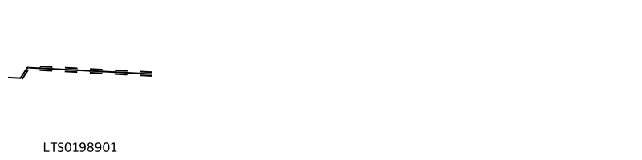{ width=100% }
    <figcaption>Hình ảnh cấu trúc hóa học của 1 hoạt chất thuộc nhóm Unsaturated hydrocarbons gồm ['tridec-11-en-1,3,5,7,9-pentayne (LTS0198901)'].</figcaption>
</figure>

---

### Dược dân tộc học

Danh sách các quốc gia có sử dụng *Pulicaria dysenterica* trong điều trị các bệnh. 

| Country   | Disease                     | Bệnh                                                                                                                                                                                                |
|:----------|:----------------------------|:----------------------------------------------------------------------------------------------------------------------------------------------------------------------------------------------------|
| Elsewhere | Astringent, Diuretic, Tonic | MYMEMORY WARNING: YOU USED ALL AVAILABLE FREE TRANSLATIONS FOR TODAY. NEXT AVAILABLE IN  11 HOURS 27 MINUTES 08 SECONDS VISIT HTTPS://MYMEMORY.TRANSLATED.NET/DOC/USAGELIMITS.PHP TO TRANSLATE MORE |
| Turkey    | Astringent, Diuretic, Tonic | MYMEMORY WARNING: YOU USED ALL AVAILABLE FREE TRANSLATIONS FOR TODAY. NEXT AVAILABLE IN  11 HOURS 27 MINUTES 05 SECONDS VISIT HTTPS://MYMEMORY.TRANSLATED.NET/DOC/USAGELIMITS.PHP TO TRANSLATE MORE |

---

# Chi Erigeron

??? note "Danh sách các dược liệu thuộc chi"
    
	 - *Erigeron affinis*
	 - *Erigeron canadensis*
	 - *Erigeron pusillus*

---
## Erigeron affinis
### Thông tin về thực vật

!!! info "Phân loại thực vật của *N/A* từ GIBF:"
    - **Kingdom:** Plantae
    - **Phylum:** Tracheophyta
    - **Order:** Asterales
    - **Family:** Asteraceae
    - **Genus:** N/A
    - **Species:** *N/A*

 

| Label (VI)   | Label (EN)   | Scientific Name       | Descriptions (VI)   | Descriptions (EN)   | Also Known As (VI)   | Also Known As (EN)              |
|:-------------|:-------------|:----------------------|:--------------------|:--------------------|:---------------------|:--------------------------------|
| N/A          | N/A          | Pulicaria dysenterica | loài thực vật       | species of plant    | ['']                 | ['common fleabane', 'fleabane'] |

#### Phân bố trên thế giới

**Từ CSDL GIBF** Denmark, Australia, New Zealand, Chinese Taipei, Ireland, Isle of Man, Viet Nam, United Kingdom of Great Britain and Northern Ireland

#### Phân bố tại Việt Nam

**Từ CSDL GIBF**: Đà Nẵng

---
### Thành phần hóa học
        
- Theo cơ sở dữ liệu lotus: Từ loài *N/A* đã phân lập và xác định được Chưa có hoạt chất nào được phân lập. hoạt chất thuộc về các nhóm Không có hoạt chất nào được phân lập. 

Không có hình ảnh nào được tạo ra

---

### Dược dân tộc học

Danh sách các quốc gia có sử dụng *N/A* trong điều trị các bệnh. 

| Country   | Disease               | Bệnh                                                                                                                                                                                                |
|:----------|:----------------------|:----------------------------------------------------------------------------------------------------------------------------------------------------------------------------------------------------|
| Elsewhere | Dentifrice, Stimulant | MYMEMORY WARNING: YOU USED ALL AVAILABLE FREE TRANSLATIONS FOR TODAY. NEXT AVAILABLE IN  11 HOURS 26 MINUTES 12 SECONDS VISIT HTTPS://MYMEMORY.TRANSLATED.NET/DOC/USAGELIMITS.PHP TO TRANSLATE MORE |

---

---
## Erigeron canadensis
### Thông tin về thực vật

!!! info "Phân loại thực vật của *Erigeron canadensis* từ GIBF:"
    - **Kingdom:** Plantae
    - **Phylum:** Tracheophyta
    - **Order:** Asterales
    - **Family:** Asteraceae
    - **Genus:** Erigeron
    - **Species:** *Erigeron canadensis*

 

| Label (VI)   | Label (EN)   | Scientific Name     | Descriptions (VI)   | Descriptions (EN)   | Also Known As (VI)   | Also Known As (EN)                                                                        |
|:-------------|:-------------|:--------------------|:--------------------|:--------------------|:---------------------|:------------------------------------------------------------------------------------------|
| N/A          | N/A          | Erigeron canadensis | loài thực vật       | species of plant    | ['']                 | ['Canadian horseweed', 'Conyza canadensis', 'Horseweed', 'Fleabane', 'Canadian fleabane'] |

#### Phân bố trên thế giới

**Từ CSDL GIBF** Italy, Australia, Guadeloupe, Belgium, Canada, Ukraine, Puerto Rico, Netherlands, Chinese Taipei, Spain, Portugal, Russian Federation, United States of America, Sweden, South Africa, Germany, Switzerland, Austria, Mexico, France, United Kingdom of Great Britain and Northern Ireland, China, Ecuador, New Zealand

#### Phân bố tại Việt Nam

**Từ CSDL GIBF**: Không có ghi nhận ở Việt Nam

---
### Thành phần hóa học
        
- Theo cơ sở dữ liệu lotus: Từ loài *Erigeron canadensis* đã phân lập và xác định được 122 hoạt chất thuộc về các nhóm Fatty Acyls, Flavonoids, Prenol lipids, Steroids and steroid derivatives, Cinnamic acids and derivatives, Harmala alkaloids, Sphingolipids, Benzene and substituted derivatives, Unsaturated hydrocarbons, Heteroaromatic compounds, Organooxygen compounds, Dihydrofurans, Carboxylic acids and derivatives. 

|    | chemicalTaxonomyClassyfireClass     |   smiles_count |
|---:|:------------------------------------|---------------:|
|  0 | Benzene and substituted derivatives |              6 |
|  1 | Carboxylic acids and derivatives    |              1 |
|  2 | Cinnamic acids and derivatives      |              5 |
|  3 | Dihydrofurans                       |              3 |
|  4 | Fatty Acyls                         |              6 |
|  5 | Flavonoids                          |             13 |
|  6 | Harmala alkaloids                   |              1 |
|  7 | Heteroaromatic compounds            |              1 |
|  8 | Organooxygen compounds              |              8 |
|  9 | Prenol lipids                       |             60 |
| 10 | Sphingolipids                       |              7 |
| 11 | Steroids and steroid derivatives    |             10 |
| 12 | Unsaturated hydrocarbons            |              1 |

#### Nhóm Benzene and substituted derivatives
<figure markdown="span">
    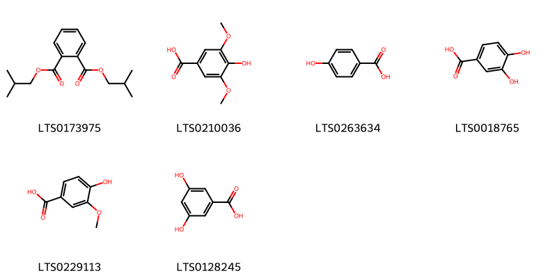{ width=100% }
    <figcaption>Hình ảnh cấu trúc hóa học của 6 hoạt chất thuộc nhóm Benzene and substituted derivatives gồm ['diisobutyl phthalate (LTS0173975)', 'syringic acid (LTS0210036)', 'p-hydroxybenzoic acid (LTS0263634)', '3,4-dihydroxybenzoic acid (LTS0018765)', 'vanillic acid (LTS0229113)', '3,5-dihydroxybenzoic acid (LTS0128245)'].</figcaption>
</figure>
#### Nhóm Carboxylic acids and derivatives
<figure markdown="span">
    { width=100% }
    <figcaption>Hình ảnh cấu trúc hóa học của 1 hoạt chất thuộc nhóm Carboxylic acids and derivatives gồm ['succinic acid (LTS0237204)'].</figcaption>
</figure>
#### Nhóm Cinnamic acids and derivatives
<figure markdown="span">
    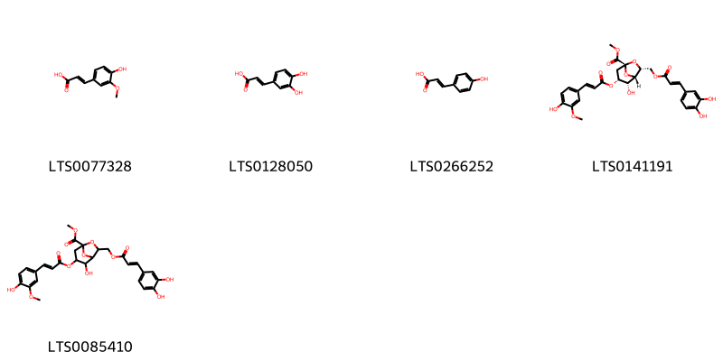{ width=100% }
    <figcaption>Hình ảnh cấu trúc hóa học của 5 hoạt chất thuộc nhóm Cinnamic acids and derivatives gồm ['ferulic acid (LTS0077328)', '3,4-dihydroxycinnamic acid (LTS0128050)', 'para-coumaric acid (LTS0266252)', 'methyl (1s,2r,3r,5s,7r)-7-({[(2e)-3-(3,4-dihydroxyphenyl)prop-2-enoyl]oxy}methyl)-2-hydroxy-3-{[(2e)-3-(4-hydroxy-3-methoxyphenyl)prop-2-enoyl]oxy}-6,8-dioxabicyclo[3.2.1]octane-5-carboxylate (LTS0141191)', 'methyl 7-({[3-(3,4-dihydroxyphenyl)prop-2-enoyl]oxy}methyl)-2-hydroxy-3-{[3-(4-hydroxy-3-methoxyphenyl)prop-2-enoyl]oxy}-6,8-dioxabicyclo[3.2.1]octane-5-carboxylate (LTS0085410)'].</figcaption>
</figure>
#### Nhóm Dihydrofurans
<figure markdown="span">
    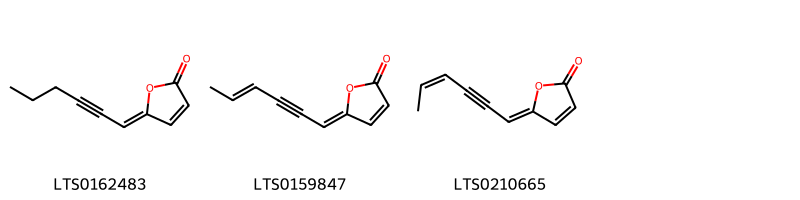{ width=100% }
    <figcaption>Hình ảnh cấu trúc hóa học của 3 hoạt chất thuộc nhóm Dihydrofurans gồm ['(5z)-5-(hex-2-yn-1-ylidene)furan-2-one (LTS0162483)', '(5z)-5-(hex-4-en-2-yn-1-ylidene)furan-2-one (LTS0159847)', '(5z)-5-[(4z)-hex-4-en-2-yn-1-ylidene]furan-2-one (LTS0210665)'].</figcaption>
</figure>
#### Nhóm Fatty Acyls
<figure markdown="span">
    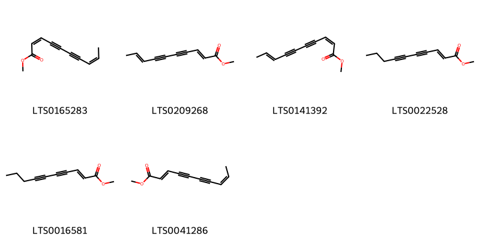{ width=100% }
    <figcaption>Hình ảnh cấu trúc hóa học của 6 hoạt chất thuộc nhóm Fatty Acyls gồm ['methyl (2z,8z)-deca-2,8-dien-4,6-diynoate (LTS0165283)', 'methyl deca-2,8-dien-4,6-diynoate (LTS0209268)', 'methyl (2z,8e)-deca-2,8-dien-4,6-diynoate (LTS0141392)', 'methyl dec-2-en-4,6-diynoate (LTS0022528)', 'lachnophyllum ester (LTS0016581)', 'methyl (2e,8z)-deca-2,8-dien-4,6-diynoate (LTS0041286)'].</figcaption>
</figure>
#### Nhóm Flavonoids
<figure markdown="span">
    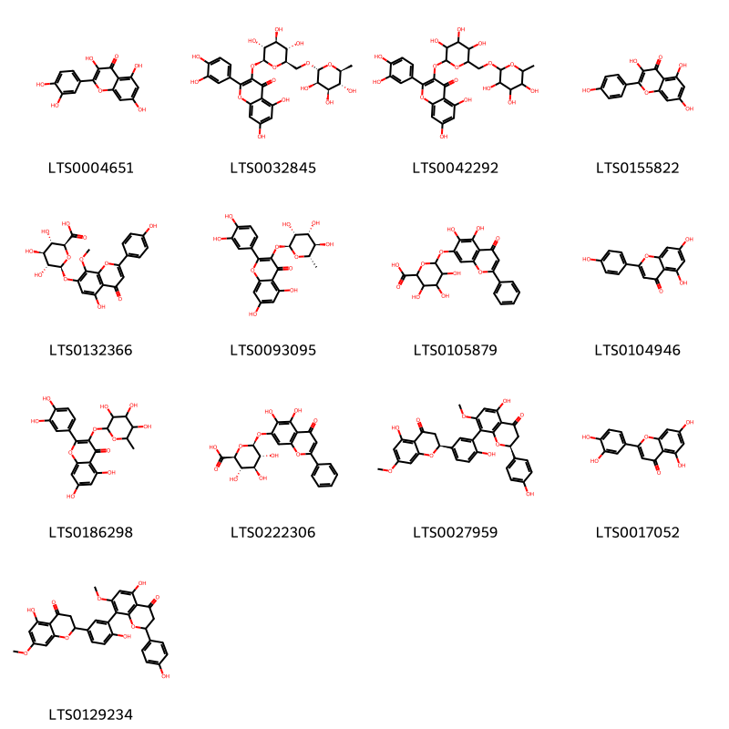{ width=100% }
    <figcaption>Hình ảnh cấu trúc hóa học của 13 hoạt chất thuộc nhóm Flavonoids gồm ['quercetin (LTS0004651)', '3-rutinosyl quercetin (LTS0032845)', 'rutin (LTS0042292)', 'kaempherol (LTS0155822)', '(2s,3s,4s,5r,6s)-3,4,5-trihydroxy-6-{[5-hydroxy-2-(4-hydroxyphenyl)-8-methoxy-4-oxochromen-7-yl]oxy}oxane-2-carboxylic acid (LTS0132366)', 'quercitrin (LTS0093095)', '6-[(5,6-dihydroxy-4-oxo-2-phenylchromen-7-yl)oxy]-3,4,5-trihydroxyoxane-2-carboxylic acid (LTS0105879)', 'chamomile (LTS0104946)', 'quercitrin (LTS0186298)', 'baicalin (LTS0222306)', '(2s)-5-hydroxy-8-{2-hydroxy-5-[(2s)-5-hydroxy-7-methoxy-4-oxo-2,3-dihydro-1-benzopyran-2-yl]phenyl}-2-(4-hydroxyphenyl)-7-methoxy-2,3-dihydro-1-benzopyran-4-one (LTS0027959)', 'luteolin (LTS0017052)', '5-hydroxy-8-[2-hydroxy-5-(5-hydroxy-7-methoxy-4-oxo-2,3-dihydro-1-benzopyran-2-yl)phenyl]-2-(4-hydroxyphenyl)-7-methoxy-2,3-dihydro-1-benzopyran-4-one (LTS0129234)'].</figcaption>
</figure>
#### Nhóm Harmala alkaloids
<figure markdown="span">
    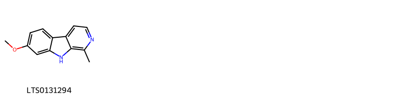{ width=100% }
    <figcaption>Hình ảnh cấu trúc hóa học của 1 hoạt chất thuộc nhóm Harmala alkaloids gồm ['harmine (LTS0131294)'].</figcaption>
</figure>
#### Nhóm Heteroaromatic compounds
<figure markdown="span">
    { width=100% }
    <figcaption>Hình ảnh cấu trúc hóa học của 1 hoạt chất thuộc nhóm Heteroaromatic compounds gồm ['perillene (LTS0083458)'].</figcaption>
</figure>
#### Nhóm Organooxygen compounds
<figure markdown="span">
    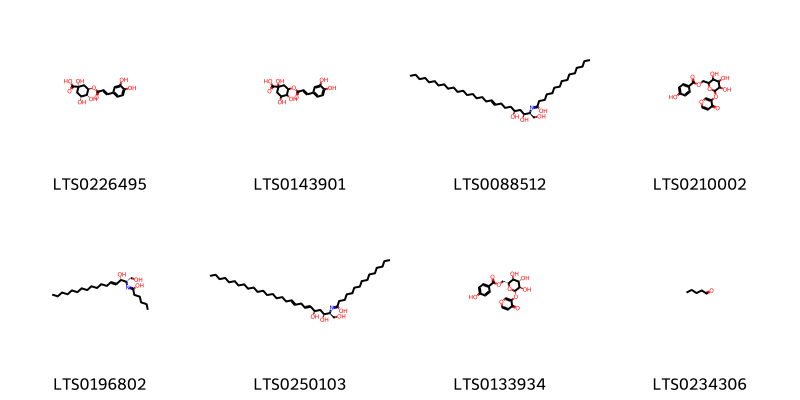{ width=100% }
    <figcaption>Hình ảnh cấu trúc hóa học của 8 hoạt chất thuộc nhóm Organooxygen compounds gồm ['chlorogenic acid (LTS0226495)', '3-{[3-(3,4-dihydroxyphenyl)prop-2-enoyl]oxy}-1,4,5-trihydroxycyclohexane-1-carboxylic acid (LTS0143901)', 'n-[(2s,3s,5s,9e)-1,3,5-trihydroxyheptacos-9-en-2-yl]pentadecanimidic acid (LTS0088512)', '{3,4,5-trihydroxy-6-[(4-oxopyran-3-yl)oxy]oxan-2-yl}methyl 4-hydroxybenzoate (LTS0210002)', 'n-[(2s,3s,4e)-1,3-dihydroxyheptadec-4-en-2-yl]hexanimidic acid (LTS0196802)', 'n-[(2s,3s,5r,6e,9e)-1,3,5-trihydroxyheptacosa-6,9-dien-2-yl]pentadecanimidic acid (LTS0250103)', '[(2r,3s,4s,5r,6s)-3,4,5-trihydroxy-6-[(4-oxopyran-3-yl)oxy]oxan-2-yl]methyl 4-hydroxybenzoate (LTS0133934)', 'pentanal (LTS0234306)'].</figcaption>
</figure>
#### Nhóm Prenol lipids
<figure markdown="span">
    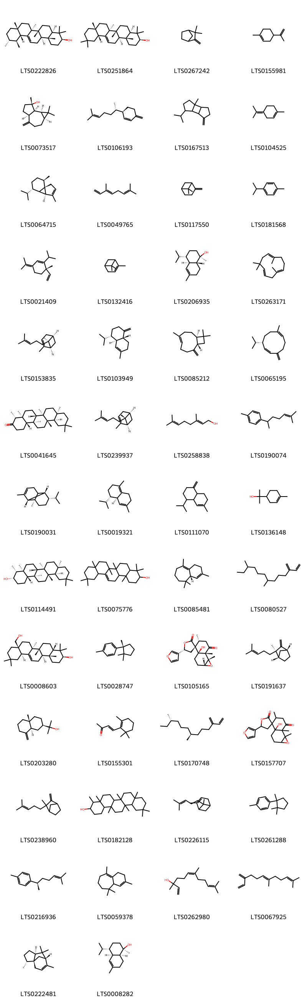{ width=100% }
    <figcaption>Hình ảnh cấu trúc hóa học của 60 hoạt chất thuộc nhóm Prenol lipids gồm ['amyrin (LTS0222826)', 'β-amyrin (LTS0251864)', 'camphene (LTS0267242)', 'limonene,  (LTS0155981)', '(1as,4as,7s,7ar,7bs)-1,1,7-trimethyl-4-methylidene-octahydrocyclopropa[e]azulen-7-ol (LTS0073517)', 'β-sesquiphellandrene (LTS0106193)', 'β-bourbonene (LTS0167513)', 'terpinolene (LTS0104525)', '(1s,5r,7s,10r)-7-isopropyl-4,10-dimethyltricyclo[4.4.0.0¹,⁵]dec-3-ene (LTS0064715)', 'trans-β-ocimene (LTS0049765)', 'β-pinene (LTS0117550)', 'cymene (LTS0181568)', 'elemene (LTS0021409)', 'α pinene (LTS0132416)', 'α-cadinol (LTS0206935)', 'humulene (LTS0263171)', '(-)-endo-α-bergamotene (LTS0153835)', '(+)-gamma-cadinene (LTS0103949)', 'caryophyllene (LTS0085212)', '(1z,6z,8s)-8-isopropyl-1-methyl-5-methylidenecyclodeca-1,6-diene (LTS0065195)', '(-)-friedelin (LTS0041645)', '(-)-trans-α-bergamotene (LTS0239937)', 'geraniol (LTS0258838)', 'curcumene (LTS0190074)', '(1r,2s,7s,8s)-8-isopropyl-1,3-dimethyltricyclo[4.4.0.0²,⁷]dec-3-ene (LTS0190031)', 'delta-cadinene (LTS0019321)', '4-isopropyl-6-methyl-1-methylidene-3,4,4a,7,8,8a-hexahydro-2h-naphthalene (LTS0111070)', 'terpineol (LTS0136148)', 'epi-friedelanol (LTS0114491)', 'β-amyrin (LTS0075776)', '(r)-β-himachalene (LTS0085481)', '7,11-dimethyl-3-methylidenetridec-1-ene (LTS0080527)', '(3s,4as,6ar,6bs,8as,12ar,14ar,14br)-8a-(hydroxymethyl)-4,4,6a,6b,11,11,14b-heptamethyl-1,2,3,4a,5,6,7,8,9,10,12,12a,14,14a-tetradecahydropicen-3-ol (LTS0008603)', 'cuparene (LTS0028747)', "(1ar,3ar,4r,5r,5'r,7as,7bs)-5'-(furan-3-yl)-3a-hydroxy-5,7a,7b-trimethyl-tetrahydro-1ah-spiro[naphtho[1,2-b]oxirene-4,3'-oxolane]-2',7-dione (LTS0105165)", 'β-santalene (LTS0191637)', 'β-eudesmol (LTS0203280)', 'β-ionone (LTS0155301)', '(7s,11s)-7,11-dimethyl-3-methylidenetridec-1-ene (LTS0170748)', "5'-(furan-3-yl)-3a-hydroxy-5,7a,7b-trimethyl-tetrahydro-1ah-spiro[naphtho[1,2-b]oxirene-4,3'-oxolane]-2',7-dione (LTS0157707)", 'β-santalene (LTS0238960)', '4,4a,6b,8a,11,11,12b,14a-octamethyl-hexadecahydropicen-3-ol (LTS0182128)', 'α-bergamotene (LTS0226115)', '1-methyl-4-(1,2,2-trimethylcyclopentyl)benzene (LTS0261288)', '(-)-α-curcumene (LTS0216936)', 'β-himachalene (LTS0059378)', 'nerolidol (LTS0262980)', 'β-farnesene (LTS0067925)', 'levo-α-cedrene (LTS0222481)', 'delta-cadinol (LTS0008282)', 'oleanolic acid (LTS0141130)', 'β-ocimene (LTS0242381)', '(1r,5r,6r)-2,6-dimethyl-6-(4-methylpent-3-en-1-yl)bicyclo[3.1.1]hept-2-ene (LTS0012288)', '(1s,4r,4ar,8ar)-1-isopropyl-4,7-dimethyl-2,3,4,5,6,8a-hexahydro-1h-naphthalen-4a-ol (LTS0018576)', 'nerol (LTS0244289)', 'α-amyrin (LTS0088267)', '(-)-β-curcumene (LTS0027873)', 'friedelin (LTS0213494)', '(z)-β-farnesene (LTS0254048)', 'oleanolic acid (LTS0117717)'].</figcaption>
</figure>
#### Nhóm Sphingolipids
<figure markdown="span">
    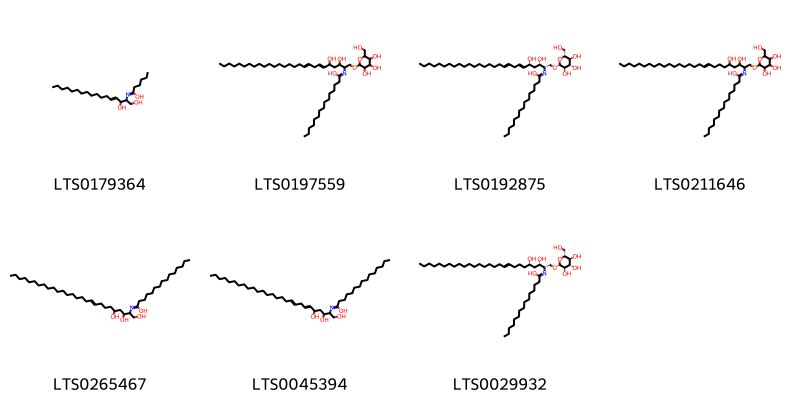{ width=100% }
    <figcaption>Hình ảnh cấu trúc hóa học của 7 hoạt chất thuộc nhóm Sphingolipids gồm ['n-(1,3-dihydroxyheptadec-4-en-2-yl)hexanimidic acid (LTS0179364)', 'n-(3,5-dihydroxy-1-{[3,4,5-trihydroxy-6-(hydroxymethyl)oxan-2-yl]oxy}heptacosa-6,9-dien-2-yl)pentadecanimidic acid (LTS0197559)', 'n-[(2s,3s,5r,6e,9e)-3,5-dihydroxy-1-{[(2r,3r,4s,5s,6r)-3,4,5-trihydroxy-6-(hydroxymethyl)oxan-2-yl]oxy}heptacosa-6,9-dien-2-yl]pentadecanimidic acid (LTS0192875)', 'n-(3,5-dihydroxy-1-{[3,4,5-trihydroxy-6-(hydroxymethyl)oxan-2-yl]oxy}heptacos-9-en-2-yl)pentadecanimidic acid (LTS0211646)', 'n-(1,3,5-trihydroxyheptacos-9-en-2-yl)pentadecanimidic acid (LTS0265467)', 'n-(1,3,5-trihydroxyheptacosa-6,9-dien-2-yl)pentadecanimidic acid (LTS0045394)', 'n-[(2s,3s,5s,9e)-3,5-dihydroxy-1-{[(2r,3r,4s,5s,6r)-3,4,5-trihydroxy-6-(hydroxymethyl)oxan-2-yl]oxy}heptacos-9-en-2-yl]pentadecanimidic acid (LTS0029932)'].</figcaption>
</figure>
#### Nhóm Steroids and steroid derivatives
<figure markdown="span">
    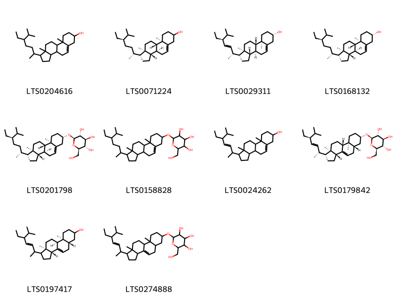{ width=100% }
    <figcaption>Hình ảnh cấu trúc hóa học của 10 hoạt chất thuộc nhóm Steroids and steroid derivatives gồm ['stigmast-5-en-3-ol, (3β)- (LTS0204616)', 'stigmast-5-en-3-ol (LTS0071224)', 'phytosterol (LTS0029311)', 'sitosterol (LTS0168132)', 'sitogluside (LTS0201798)', '2-{[1-(5-ethyl-6-methylheptan-2-yl)-9a,11a-dimethyl-1h,2h,3h,3ah,3bh,4h,6h,7h,8h,9h,9bh,10h,11h-cyclopenta[a]phenanthren-7-yl]oxy}-6-(hydroxymethyl)oxane-3,4,5-triol (LTS0158828)', 'stigmasterol (LTS0024262)', '(2r,3r,4s,5s,6r)-2-{[(1r,3ar,5as,7s,9as,9br,11ar)-1-[(2r,3e,5s)-5-ethyl-6-methylhept-3-en-2-yl]-9a,11a-dimethyl-1h,2h,3h,3ah,5h,5ah,6h,7h,8h,9h,9bh,10h,11h-cyclopenta[a]phenanthren-7-yl]oxy}-6-(hydroxymethyl)oxane-3,4,5-triol (LTS0179842)', '(3ar,5as,9as,9bs,11ar)-1-(5-ethyl-6-methylhept-3-en-2-yl)-9a,11a-dimethyl-1h,2h,3h,3ah,5h,5ah,6h,7h,8h,9h,9bh,10h,11h-cyclopenta[a]phenanthren-7-ol (LTS0197417)', '2-{[1-(5-ethyl-6-methylhept-3-en-2-yl)-9a,11a-dimethyl-1h,2h,3h,3ah,5h,5ah,6h,7h,8h,9h,9bh,10h,11h-cyclopenta[a]phenanthren-7-yl]oxy}-6-(hydroxymethyl)oxane-3,4,5-triol (LTS0274888)'].</figcaption>
</figure>
#### Nhóm Unsaturated hydrocarbons
<figure markdown="span">
    { width=100% }
    <figcaption>Hình ảnh cấu trúc hóa học của 1 hoạt chất thuộc nhóm Unsaturated hydrocarbons gồm ['α terpinene (LTS0232891)'].</figcaption>
</figure>

---

### Dược dân tộc học

Danh sách các quốc gia có sử dụng *Erigeron canadensis* trong điều trị các bệnh. 

| Country   | Disease                                         | Bệnh                                                                                                                                                                                                |
|:----------|:------------------------------------------------|:----------------------------------------------------------------------------------------------------------------------------------------------------------------------------------------------------|
| Turkey    | Astringent, Diuretic, Hemostat, Sedative, Tonic | MYMEMORY WARNING: YOU USED ALL AVAILABLE FREE TRANSLATIONS FOR TODAY. NEXT AVAILABLE IN  11 HOURS 25 MINUTES 43 SECONDS VISIT HTTPS://MYMEMORY.TRANSLATED.NET/DOC/USAGELIMITS.PHP TO TRANSLATE MORE |

---

---
## Erigeron pusillus
### Thông tin về thực vật

!!! info "Phân loại thực vật của *N/A* từ GIBF:"
    - **Kingdom:** Plantae
    - **Phylum:** Tracheophyta
    - **Order:** Asterales
    - **Family:** Asteraceae
    - **Genus:** N/A
    - **Species:** *N/A*

 

| Label (VI)   | Label (EN)   | Scientific Name   | Descriptions (VI)   | Descriptions (EN)   | Also Known As (VI)   | Also Known As (EN)   |
|:-------------|:-------------|:------------------|:--------------------|:--------------------|:---------------------|:---------------------|
| N/A          | N/A          | Erigeron pusillus | loài thực vật       | species of plant    | ['']                 | ['']                 |

#### Phân bố trên thế giới

**Từ CSDL GIBF** Denmark, Australia, New Zealand, Chinese Taipei, Ireland, Isle of Man, Viet Nam, United Kingdom of Great Britain and Northern Ireland

#### Phân bố tại Việt Nam

**Từ CSDL GIBF**: Đà Nẵng

---
### Thành phần hóa học
        
- Theo cơ sở dữ liệu lotus: Từ loài *N/A* đã phân lập và xác định được Chưa có hoạt chất nào được phân lập. hoạt chất thuộc về các nhóm Không có hoạt chất nào được phân lập. 

Không có hình ảnh nào được tạo ra

---

### Dược dân tộc học

Danh sách các quốc gia có sử dụng *N/A* trong điều trị các bệnh. 

| Country   | Disease                               | Bệnh                                                                                                                                                                                                |
|:----------|:--------------------------------------|:----------------------------------------------------------------------------------------------------------------------------------------------------------------------------------------------------|
| Mexico    | Astringent, Diuretic, Tonic, Hemostat | MYMEMORY WARNING: YOU USED ALL AVAILABLE FREE TRANSLATIONS FOR TODAY. NEXT AVAILABLE IN  11 HOURS 24 MINUTES 21 SECONDS VISIT HTTPS://MYMEMORY.TRANSLATED.NET/DOC/USAGELIMITS.PHP TO TRANSLATE MORE |

---

# Chi Rudbeckia

??? note "Danh sách các dược liệu thuộc chi"
    
	 - *Rudbeckia hirta*
	 - *Rudbeckia laciniata*

---
## Rudbeckia hirta
### Thông tin về thực vật

!!! info "Phân loại thực vật của *Rudbeckia hirta* từ GIBF:"
    - **Kingdom:** Plantae
    - **Phylum:** Tracheophyta
    - **Order:** Asterales
    - **Family:** Asteraceae
    - **Genus:** Rudbeckia
    - **Species:** *Rudbeckia hirta*

 

| Label (VI)   | Label (EN)   | Scientific Name   | Descriptions (VI)   | Descriptions (EN)   | Also Known As (VI)   | Also Known As (EN)   |
|:-------------|:-------------|:------------------|:--------------------|:--------------------|:---------------------|:---------------------|
| N/A          | N/A          | Rudbeckia hirta   | loài thực vật       | species of plant    | ['']                 | ['black-eyed Susan'] |

#### Phân bố trên thế giới

**Từ CSDL GIBF** Ukraine, Denmark, Netherlands, Russian Federation, United States of America, New Zealand, Canada

#### Phân bố tại Việt Nam

**Từ CSDL GIBF**: Không có ghi nhận ở Việt Nam

---
### Thành phần hóa học
        
- Theo cơ sở dữ liệu lotus: Từ loài *Rudbeckia hirta* đã phân lập và xác định được 24 hoạt chất thuộc về các nhóm Flavonoids, Prenol lipids, Steroids and steroid derivatives, Thiophenes, Bi- and oligothiophenes, Benzene and substituted derivatives, Unsaturated hydrocarbons, Dithiins. 

|    | chemicalTaxonomyClassyfireClass     |   smiles_count |
|---:|:------------------------------------|---------------:|
|  0 | Benzene and substituted derivatives |              1 |
|  1 | Bi- and oligothiophenes             |              1 |
|  2 | Dithiins                            |              3 |
|  3 | Flavonoids                          |              3 |
|  4 | Prenol lipids                       |              6 |
|  5 | Steroids and steroid derivatives    |              5 |
|  6 | Thiophenes                          |              4 |
|  7 | Unsaturated hydrocarbons            |              1 |

#### Nhóm Benzene and substituted derivatives
<figure markdown="span">
    { width=100% }
    <figcaption>Hình ảnh cấu trúc hóa học của 1 hoạt chất thuộc nhóm Benzene and substituted derivatives gồm ['salicyclic acid (LTS0116548)'].</figcaption>
</figure>
#### Nhóm Bi- and oligothiophenes
<figure markdown="span">
    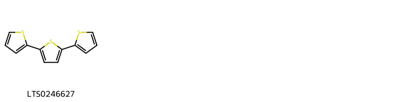{ width=100% }
    <figcaption>Hình ảnh cấu trúc hóa học của 1 hoạt chất thuộc nhóm Bi- and oligothiophenes gồm ['terthiophene (LTS0246627)'].</figcaption>
</figure>
#### Nhóm Dithiins
<figure markdown="span">
    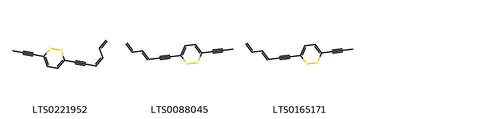{ width=100% }
    <figcaption>Hình ảnh cấu trúc hóa học của 3 hoạt chất thuộc nhóm Dithiins gồm ['(z)-thiarubrine c (LTS0221952)', '(e)-thiarubrine c (LTS0088045)', '3-(hexa-3,5-dien-1-yn-1-yl)-6-(prop-1-yn-1-yl)-1,2-dithiine (LTS0165171)'].</figcaption>
</figure>
#### Nhóm Flavonoids
<figure markdown="span">
    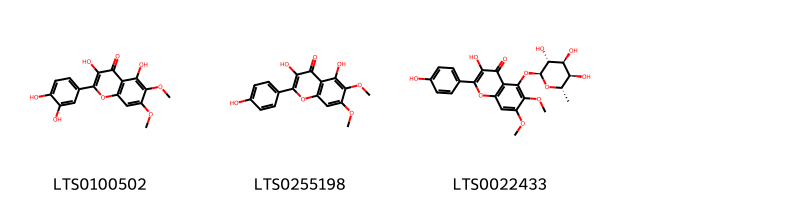{ width=100% }
    <figcaption>Hình ảnh cấu trúc hóa học của 3 hoạt chất thuộc nhóm Flavonoids gồm ['eupatolitin (LTS0100502)', 'eupalitin (LTS0255198)', '3-hydroxy-2-(4-hydroxyphenyl)-6,7-dimethoxy-5-{[(2s,3r,4s,5r,6s)-3,4,5-trihydroxy-6-methyloxan-2-yl]oxy}chromen-4-one (LTS0022433)'].</figcaption>
</figure>
#### Nhóm Prenol lipids
<figure markdown="span">
    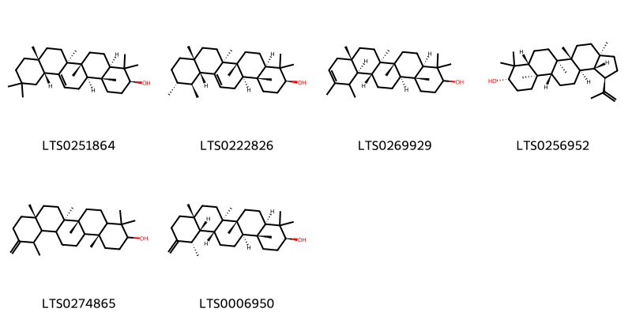{ width=100% }
    <figcaption>Hình ảnh cấu trúc hóa học của 6 hoạt chất thuộc nhóm Prenol lipids gồm ['β-amyrin (LTS0251864)', 'amyrin (LTS0222826)', '(4ar,6ar,6br,8as,12ar,12br,14ar,14br)-4,4,6a,6b,8a,11,12,14b-octamethyl-2,3,4a,5,6,7,8,9,12,12a,12b,13,14,14a-tetradecahydro-1h-picen-3-ol (LTS0269929)', 'lupeol (LTS0256952)', '(6ar,6br,8ar,14br)-4,4,6a,6b,8a,12,14b-heptamethyl-11-methylidene-hexadecahydropicen-3-ol (LTS0274865)', 'taraxasterol (LTS0006950)'].</figcaption>
</figure>
#### Nhóm Steroids and steroid derivatives
<figure markdown="span">
    { width=100% }
    <figcaption>Hình ảnh cấu trúc hóa học của 5 hoạt chất thuộc nhóm Steroids and steroid derivatives gồm ['stigmast-5-en-3-ol (LTS0071224)', 'stigmast-5-en-3-ol, (3β)- (LTS0204616)', 'phytosterol (LTS0029311)', '(1r,3as,3bs,7s,9bs)-1-[(2r,5r)-5,6-dimethylheptan-2-yl]-9a,11a-dimethyl-1h,2h,3h,3ah,3bh,4h,6h,7h,8h,9h,9bh,10h,11h-cyclopenta[a]phenanthren-7-ol (LTS0057877)', 'campesterol (LTS0046755)'].</figcaption>
</figure>
#### Nhóm Thiophenes
<figure markdown="span">
    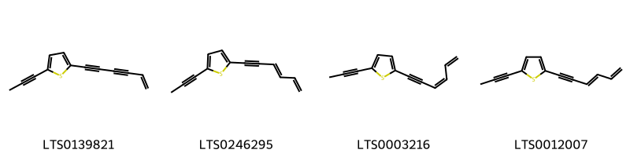{ width=100% }
    <figcaption>Hình ảnh cấu trúc hóa học của 4 hoạt chất thuộc nhóm Thiophenes gồm ['2-(hex-5-en-1,3-diyn-1-yl)-5-(prop-1-yn-1-yl)thiophene (LTS0139821)', '2-(hexa-3,5-dien-1-yn-1-yl)-5-(prop-1-yn-1-yl)thiophene (LTS0246295)', '2-[(3z)-hexa-3,5-dien-1-yn-1-yl]-5-(prop-1-yn-1-yl)thiophene (LTS0003216)', '2-[(3e)-hexa-3,5-dien-1-yn-1-yl]-5-(prop-1-yn-1-yl)thiophene (LTS0012007)'].</figcaption>
</figure>
#### Nhóm Unsaturated hydrocarbons
<figure markdown="span">
    { width=100% }
    <figcaption>Hình ảnh cấu trúc hóa học của 1 hoạt chất thuộc nhóm Unsaturated hydrocarbons gồm ['tridec-1-en-3,5,7,9,11-pentayne (LTS0085389)'].</figcaption>
</figure>

---

### Dược dân tộc học

Danh sách các quốc gia có sử dụng *Rudbeckia hirta* trong điều trị các bệnh. 

| Country   | Disease   | Bệnh                                                                                                                                                                                                |
|:----------|:----------|:----------------------------------------------------------------------------------------------------------------------------------------------------------------------------------------------------|
| US        | Poison    | MYMEMORY WARNING: YOU USED ALL AVAILABLE FREE TRANSLATIONS FOR TODAY. NEXT AVAILABLE IN  11 HOURS 23 MINUTES 58 SECONDS VISIT HTTPS://MYMEMORY.TRANSLATED.NET/DOC/USAGELIMITS.PHP TO TRANSLATE MORE |

---

---
## Rudbeckia laciniata
### Thông tin về thực vật

!!! info "Phân loại thực vật của *Rudbeckia laciniata* từ GIBF:"
    - **Kingdom:** Plantae
    - **Phylum:** Tracheophyta
    - **Order:** Asterales
    - **Family:** Asteraceae
    - **Genus:** Rudbeckia
    - **Species:** *Rudbeckia laciniata*

 

| Label (VI)   | Label (EN)   | Scientific Name     | Descriptions (VI)   | Descriptions (EN)   | Also Known As (VI)   | Also Known As (EN)                                                                                                       |
|:-------------|:-------------|:--------------------|:--------------------|:--------------------|:---------------------|:-------------------------------------------------------------------------------------------------------------------------|
| N/A          | N/A          | Rudbeckia laciniata |                     | species of plant    | ['']                 | ['cutleaf coneflower', 'greenheaded coneflower', 'brown-eyed Susan', 'green-head coneflower', 'golden glow thimbleweed'] |

#### Phân bố trên thế giới

**Từ CSDL GIBF** Belarus, Russian Federation, United States of America, Austria, Slovenia, Canada

#### Phân bố tại Việt Nam

**Từ CSDL GIBF**: Không có ghi nhận ở Việt Nam

---
### Thành phần hóa học
        
- Theo cơ sở dữ liệu lotus: Từ loài *Rudbeckia laciniata* đã phân lập và xác định được 13 hoạt chất thuộc về các nhóm Prenol lipids, Organooxygen compounds, Benzene and substituted derivatives, Coumarins and derivatives. 

|    | chemicalTaxonomyClassyfireClass     |   smiles_count |
|---:|:------------------------------------|---------------:|
|  0 | Benzene and substituted derivatives |              1 |
|  1 | Coumarins and derivatives           |              1 |
|  2 | Organooxygen compounds              |              7 |
|  3 | Prenol lipids                       |              4 |

#### Nhóm Benzene and substituted derivatives
<figure markdown="span">
    { width=100% }
    <figcaption>Hình ảnh cấu trúc hóa học của 1 hoạt chất thuộc nhóm Benzene and substituted derivatives gồm ['3,4-dihydroxybenzoic acid (LTS0018765)'].</figcaption>
</figure>
#### Nhóm Coumarins and derivatives
<figure markdown="span">
    { width=100% }
    <figcaption>Hình ảnh cấu trúc hóa học của 1 hoạt chất thuộc nhóm Coumarins and derivatives gồm ['2h-1-benzopyran-2-one (LTS0069773)'].</figcaption>
</figure>
#### Nhóm Organooxygen compounds
<figure markdown="span">
    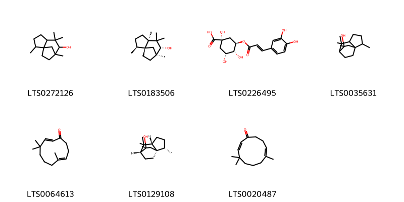{ width=100% }
    <figcaption>Hình ảnh cấu trúc hóa học của 7 hoạt chất thuộc nhóm Organooxygen compounds gồm ['2,6,6,8-tetramethyltricyclo[6.2.1.0¹,⁵]undecan-7-ol (LTS0272126)', '(1r,2s,5r,7r,8s)-2,6,6,8-tetramethyltricyclo[6.2.1.0¹,⁵]undecan-7-ol (LTS0183506)', 'chlorogenic acid (LTS0226495)', '2,6,6,8-tetramethyltricyclo[5.2.2.0¹,⁵]undecan-8-ol (LTS0035631)', '(2e,8e)-4,4,8-trimethylcycloundeca-2,8-dien-1-one (LTS0064613)', '(1r,2s,5s,7r,8r)-2,6,6,8-tetramethyltricyclo[5.2.2.0¹,⁵]undecan-8-ol (LTS0129108)', '4,4,8-trimethylcycloundeca-2,8-dien-1-one (LTS0020487)'].</figcaption>
</figure>
#### Nhóm Prenol lipids
<figure markdown="span">
    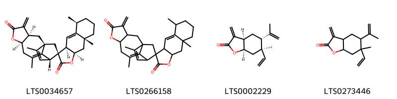{ width=100% }
    <figcaption>Hình ảnh cấu trúc hóa học của 4 hoạt chất thuộc nhóm Prenol lipids gồm ["(1's,3r,3'r,3ar,5s,7'r,8ar,9ar,11'r)-5,8a,9',14'-tetramethyl-4'-methylidene-5,6,7,8,9,9a-hexahydro-3ah-6'-oxaspiro[naphtho[2,3-b]furan-3,12'-tetracyclo[9.2.2.0¹,¹⁰.0³,⁷]pentadecane]-9',14'-diene-2,5'-dione (LTS0034657)", "5,8a,9',14'-tetramethyl-4'-methylidene-5,6,7,8,9,9a-hexahydro-3ah-6'-oxaspiro[naphtho[2,3-b]furan-3,12'-tetracyclo[9.2.2.0¹,¹⁰.0³,⁷]pentadecane]-9',14'-diene-2,5'-dione (LTS0266158)", 'igalan (LTS0002229)', '6-ethenyl-6-methyl-3-methylidene-5-(prop-1-en-2-yl)-tetrahydro-3ah-1-benzofuran-2-one (LTS0273446)'].</figcaption>
</figure>

---

### Dược dân tộc học

Danh sách các quốc gia có sử dụng *Rudbeckia laciniata* trong điều trị các bệnh. 

| Country   | Disease          | Bệnh                                                                                                                                                                                                |
|:----------|:-----------------|:----------------------------------------------------------------------------------------------------------------------------------------------------------------------------------------------------|
| US        | Poison, Diuretic | MYMEMORY WARNING: YOU USED ALL AVAILABLE FREE TRANSLATIONS FOR TODAY. NEXT AVAILABLE IN  11 HOURS 23 MINUTES 08 SECONDS VISIT HTTPS://MYMEMORY.TRANSLATED.NET/DOC/USAGELIMITS.PHP TO TRANSLATE MORE |
| US(NM)    | Emmenagogue      | MYMEMORY WARNING: YOU USED ALL AVAILABLE FREE TRANSLATIONS FOR TODAY. NEXT AVAILABLE IN  11 HOURS 23 MINUTES 05 SECONDS VISIT HTTPS://MYMEMORY.TRANSLATED.NET/DOC/USAGELIMITS.PHP TO TRANSLATE MORE |

---

# Chi Anthemis

??? note "Danh sách các dược liệu thuộc chi"
    
	 - *Anthemis arvensis*
	 - *Anthemis cotula*
	 - *Anthemis nobilis*
	 - *Anthemis wiedemanniana*

---
## Anthemis arvensis
### Thông tin về thực vật

!!! info "Phân loại thực vật của *Anthemis arvensis* từ GIBF:"
    - **Kingdom:** Plantae
    - **Phylum:** Tracheophyta
    - **Order:** Asterales
    - **Family:** Asteraceae
    - **Genus:** Anthemis
    - **Species:** *Anthemis arvensis*

 

| Label (VI)   | Label (EN)   | Scientific Name   | Descriptions (VI)   | Descriptions (EN)   | Also Known As (VI)   | Also Known As (EN)                                                                                      |
|:-------------|:-------------|:------------------|:--------------------|:--------------------|:---------------------|:--------------------------------------------------------------------------------------------------------|
| N/A          | N/A          | Anthemis arvensis | loài thực vật       | species of plant    | ['']                 | ['Anthe-matricaria gruetteriana', 'Corn Chamomile', 'Field chamomile', 'Matricaria inodora', 'Mayweed'] |

#### Phân bố trên thế giới

**Từ CSDL GIBF** Italy, Bulgaria, Slovakia, Belgium, Estonia, Latvia, Norway, Ukraine, Denmark, Netherlands, Lithuania, Belarus, Luxembourg, Spain, Hungary, Portugal, Russian Federation, United States of America, Sweden, Slovenia, Croatia, Greece, Montenegro, Czechia, Germany, Romania, Switzerland, Austria, France, United Kingdom of Great Britain and Northern Ireland, Poland

#### Phân bố tại Việt Nam

**Từ CSDL GIBF**: Không có ghi nhận ở Việt Nam

---
### Thành phần hóa học
        
- Theo cơ sở dữ liệu lotus: Từ loài *Anthemis arvensis* đã phân lập và xác định được 2 hoạt chất thuộc về các nhóm Lactones, Prenol lipids. 

|    | chemicalTaxonomyClassyfireClass   |   smiles_count |
|---:|:----------------------------------|---------------:|
|  0 | Lactones                          |              1 |
|  1 | Prenol lipids                     |              1 |

#### Nhóm Lactones
<figure markdown="span">
    { width=100% }
    <figcaption>Hình ảnh cấu trúc hóa học của 1 hoạt chất thuộc nhóm Lactones gồm ['(5r)-5-[(2r)-2-methyl-4-[(3r)-4-methylidene-5-oxooxolan-3-yl]-3-oxobutyl]-3-methylideneoxolan-2-one (LTS0047856)'].</figcaption>
</figure>
#### Nhóm Prenol lipids
<figure markdown="span">
    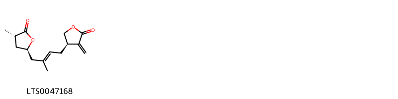{ width=100% }
    <figcaption>Hình ảnh cấu trúc hóa học của 1 hoạt chất thuộc nhóm Prenol lipids gồm ['(4r)-4-[(2e)-3-methyl-4-[(2r,4s)-4-methyl-5-oxooxolan-2-yl]but-2-en-1-yl]-3-methylideneoxolan-2-one (LTS0047168)'].</figcaption>
</figure>

---

### Dược dân tộc học

Danh sách các quốc gia có sử dụng *Anthemis arvensis* trong điều trị các bệnh. 

| Country   | Disease   | Bệnh                                                                                                                                                                                                |
|:----------|:----------|:----------------------------------------------------------------------------------------------------------------------------------------------------------------------------------------------------|
| German    | Vermifuge | MYMEMORY WARNING: YOU USED ALL AVAILABLE FREE TRANSLATIONS FOR TODAY. NEXT AVAILABLE IN  11 HOURS 22 MINUTES 34 SECONDS VISIT HTTPS://MYMEMORY.TRANSLATED.NET/DOC/USAGELIMITS.PHP TO TRANSLATE MORE |
| ain       | Tonic     | MYMEMORY WARNING: YOU USED ALL AVAILABLE FREE TRANSLATIONS FOR TODAY. NEXT AVAILABLE IN  11 HOURS 22 MINUTES 30 SECONDS VISIT HTTPS://MYMEMORY.TRANSLATED.NET/DOC/USAGELIMITS.PHP TO TRANSLATE MORE |

---

---
## Anthemis cotula
### Thông tin về thực vật

!!! info "Phân loại thực vật của *Anthemis cotula* từ GIBF:"
    - **Kingdom:** Plantae
    - **Phylum:** Tracheophyta
    - **Order:** Asterales
    - **Family:** Asteraceae
    - **Genus:** Anthemis
    - **Species:** *Anthemis cotula*

 

| Label (VI)   | Label (EN)   | Scientific Name   | Descriptions (VI)   | Descriptions (EN)   | Also Known As (VI)   | Also Known As (EN)                                    |
|:-------------|:-------------|:------------------|:--------------------|:--------------------|:---------------------|:------------------------------------------------------|
| N/A          | N/A          | Anthemis cotula   | loài thực vật       | species of plant    | ['']                 | ['mayweed', 'stinking chamomile', 'stinking mayweed'] |

#### Phân bố trên thế giới

**Từ CSDL GIBF** Italy, Argentina, Israel, Canada, Ukraine, Denmark, Netherlands, Spain, Türkiye, Portugal, Hungary, United States of America, Sweden, Chile, Uruguay, Greece, Czechia, Germany, Switzerland, Mexico, France, United Kingdom of Great Britain and Northern Ireland, New Zealand

#### Phân bố tại Việt Nam

**Từ CSDL GIBF**: Không có ghi nhận ở Việt Nam

---
### Thành phần hóa học
        
- Theo cơ sở dữ liệu lotus: Từ loài *Anthemis cotula* đã phân lập và xác định được 36 hoạt chất thuộc về các nhóm Flavonoids, Prenol lipids, Steroids and steroid derivatives, Lactones, Benzopyrans. 

|    | chemicalTaxonomyClassyfireClass   |   smiles_count |
|---:|:----------------------------------|---------------:|
|  0 | Benzopyrans                       |              1 |
|  1 | Flavonoids                        |              8 |
|  2 | Lactones                          |              1 |
|  3 | Prenol lipids                     |             23 |
|  4 | Steroids and steroid derivatives  |              3 |

#### Nhóm Benzopyrans
<figure markdown="span">
    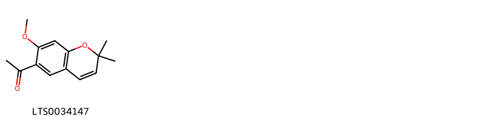{ width=100% }
    <figcaption>Hình ảnh cấu trúc hóa học của 1 hoạt chất thuộc nhóm Benzopyrans gồm ['encecalin (LTS0034147)'].</figcaption>
</figure>
#### Nhóm Flavonoids
<figure markdown="span">
    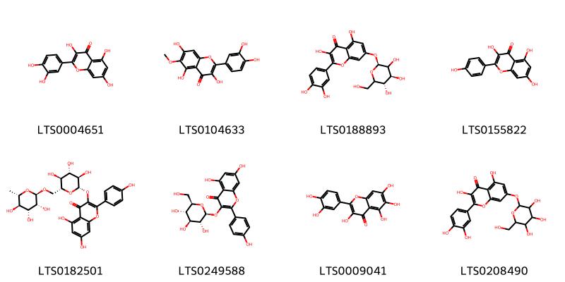{ width=100% }
    <figcaption>Hình ảnh cấu trúc hóa học của 8 hoạt chất thuộc nhóm Flavonoids gồm ['quercetin (LTS0004651)', 'patuletin (LTS0104633)', 'quercimeritrin (LTS0188893)', 'kaempherol (LTS0155822)', 'nictoflorin (LTS0182501)', 'astragalin (LTS0249588)', 'quercetagetin (LTS0009041)', 'quercimeritrin (LTS0208490)'].</figcaption>
</figure>
#### Nhóm Lactones
<figure markdown="span">
    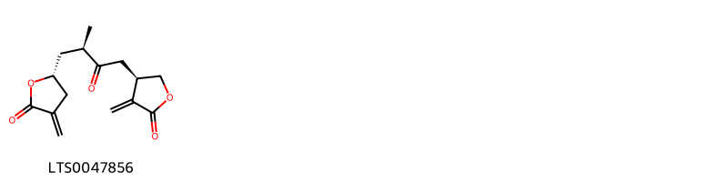{ width=100% }
    <figcaption>Hình ảnh cấu trúc hóa học của 1 hoạt chất thuộc nhóm Lactones gồm ['(5r)-5-[(2r)-2-methyl-4-[(3r)-4-methylidene-5-oxooxolan-3-yl]-3-oxobutyl]-3-methylideneoxolan-2-one (LTS0047856)'].</figcaption>
</figure>
#### Nhóm Prenol lipids
<figure markdown="span">
    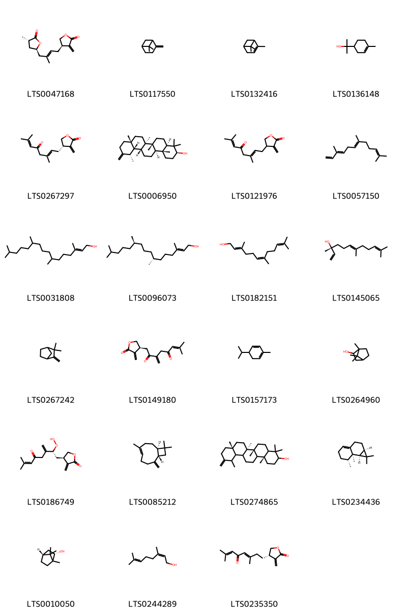{ width=100% }
    <figcaption>Hình ảnh cấu trúc hóa học của 23 hoạt chất thuộc nhóm Prenol lipids gồm ['(4r)-4-[(2e)-3-methyl-4-[(2r,4s)-4-methyl-5-oxooxolan-2-yl]but-2-en-1-yl]-3-methylideneoxolan-2-one (LTS0047168)', 'β-pinene (LTS0117550)', 'α pinene (LTS0132416)', 'terpineol (LTS0136148)', '(4s)-4-[(2e)-3,7-dimethyl-5-oxoocta-2,6-dien-1-yl]-3-methylideneoxolan-2-one (LTS0267297)', 'taraxasterol (LTS0006950)', '4-[(2e)-3,7-dimethyl-5-oxoocta-2,6-dien-1-yl]-3-methylideneoxolan-2-one (LTS0121976)', 'farnesene (LTS0057150)', 'phytol (LTS0031808)', 'phytol (LTS0096073)', '(e,z)-farnesol (LTS0182151)', '(3r,6e)-nerolidol (LTS0145065)', 'camphene (LTS0267242)', '7-methyl-3-methylidene-1-[(3s)-4-methylidene-5-oxooxolan-3-yl]oct-6-ene-2,5-dione (LTS0149180)', 'phellandrene (LTS0157173)', 'borneol (LTS0264960)', '(4r)-4-[(2r)-2-hydroperoxy-7-methyl-3-methylidene-5-oxooct-6-en-1-yl]-3-methylideneoxolan-2-one (LTS0186749)', 'caryophyllene (LTS0085212)', '(6ar,6br,8ar,14br)-4,4,6a,6b,8a,12,14b-heptamethyl-11-methylidene-hexadecahydropicen-3-ol (LTS0274865)', '(1ar,7r,7ar,7bs)-1,1,7,7a-tetramethyl-1ah,2h,3h,5h,6h,7h,7bh-cyclopropa[a]naphthalene (LTS0234436)', '(2s,4r)-1,7,7-trimethylbicyclo[2.2.1]heptan-2-ol (LTS0010050)', 'nerol (LTS0244289)', '(4s)-4-[(3e)-3,7-dimethyl-5-oxoocta-3,6-dien-1-yl]-3-methylideneoxolan-2-one (LTS0235350)'].</figcaption>
</figure>
#### Nhóm Steroids and steroid derivatives
<figure markdown="span">
    { width=100% }
    <figcaption>Hình ảnh cấu trúc hóa học của 3 hoạt chất thuộc nhóm Steroids and steroid derivatives gồm ['stigmast-5-en-3-ol (LTS0071224)', 'stigmast-5-en-3-ol, (3β)- (LTS0204616)', 'phytosterol (LTS0029311)'].</figcaption>
</figure>

---

### Dược dân tộc học

Danh sách các quốc gia có sử dụng *Anthemis cotula* trong điều trị các bệnh. 

| Country    | Disease     | Bệnh                                                                                                                                                                                                |
|:-----------|:------------|:----------------------------------------------------------------------------------------------------------------------------------------------------------------------------------------------------|
| Dutch      | Emmenagogue | MYMEMORY WARNING: YOU USED ALL AVAILABLE FREE TRANSLATIONS FOR TODAY. NEXT AVAILABLE IN  11 HOURS 22 MINUTES 03 SECONDS VISIT HTTPS://MYMEMORY.TRANSLATED.NET/DOC/USAGELIMITS.PHP TO TRANSLATE MORE |
| Elsewhere  | Insecticide | MYMEMORY WARNING: YOU USED ALL AVAILABLE FREE TRANSLATIONS FOR TODAY. NEXT AVAILABLE IN  11 HOURS 21 MINUTES 59 SECONDS VISIT HTTPS://MYMEMORY.TRANSLATED.NET/DOC/USAGELIMITS.PHP TO TRANSLATE MORE |
| English    | Vulnerary   | MYMEMORY WARNING: YOU USED ALL AVAILABLE FREE TRANSLATIONS FOR TODAY. NEXT AVAILABLE IN  11 HOURS 21 MINUTES 55 SECONDS VISIT HTTPS://MYMEMORY.TRANSLATED.NET/DOC/USAGELIMITS.PHP TO TRANSLATE MORE |
| French     | Tonic       | MYMEMORY WARNING: YOU USED ALL AVAILABLE FREE TRANSLATIONS FOR TODAY. NEXT AVAILABLE IN  11 HOURS 21 MINUTES 52 SECONDS VISIT HTTPS://MYMEMORY.TRANSLATED.NET/DOC/USAGELIMITS.PHP TO TRANSLATE MORE |
| German     | Emetic      | MYMEMORY WARNING: YOU USED ALL AVAILABLE FREE TRANSLATIONS FOR TODAY. NEXT AVAILABLE IN  11 HOURS 21 MINUTES 45 SECONDS VISIT HTTPS://MYMEMORY.TRANSLATED.NET/DOC/USAGELIMITS.PHP TO TRANSLATE MORE |
| Portuguese | Vermifuge   | MYMEMORY WARNING: YOU USED ALL AVAILABLE FREE TRANSLATIONS FOR TODAY. NEXT AVAILABLE IN  11 HOURS 21 MINUTES 41 SECONDS VISIT HTTPS://MYMEMORY.TRANSLATED.NET/DOC/USAGELIMITS.PHP TO TRANSLATE MORE |
| anish      | Carminative | MYMEMORY WARNING: YOU USED ALL AVAILABLE FREE TRANSLATIONS FOR TODAY. NEXT AVAILABLE IN  11 HOURS 21 MINUTES 38 SECONDS VISIT HTTPS://MYMEMORY.TRANSLATED.NET/DOC/USAGELIMITS.PHP TO TRANSLATE MORE |

---

---
## Anthemis nobilis
### Thông tin về thực vật

!!! info "Phân loại thực vật của *Chamaemelum nobile* từ GIBF:"
    - **Kingdom:** Plantae
    - **Phylum:** Tracheophyta
    - **Order:** Asterales
    - **Family:** Asteraceae
    - **Genus:** Chamaemelum
    - **Species:** *Chamaemelum nobile*

 

| Label (VI)   | Label (EN)   | Scientific Name   | Descriptions (VI)   | Descriptions (EN)   | Also Known As (VI)   | Also Known As (EN)                |
|:-------------|:-------------|:------------------|:--------------------|:--------------------|:---------------------|:----------------------------------|
| N/A          | N/A          | Anthemis nobilis  | loài thực vật       | species of plant    | ['']                 | ['chamomile', 'common chamomile'] |

#### Phân bố trên thế giới

**Từ CSDL GIBF** France, Belgium, Spain

#### Phân bố tại Việt Nam

**Từ CSDL GIBF**: Không có ghi nhận ở Việt Nam

---
### Thành phần hóa học
        
- Theo cơ sở dữ liệu lotus: Từ loài *Chamaemelum nobile* đã phân lập và xác định được Chưa có hoạt chất nào được phân lập. hoạt chất thuộc về các nhóm Không có hoạt chất nào được phân lập. 

Không có hình ảnh nào được tạo ra

---

### Dược dân tộc học

Danh sách các quốc gia có sử dụng *Chamaemelum nobile* trong điều trị các bệnh. 

| Country   | Disease                                                                        | Bệnh                                                                                                                                                                                                |
|:----------|:-------------------------------------------------------------------------------|:----------------------------------------------------------------------------------------------------------------------------------------------------------------------------------------------------|
| Arabic    | Sudorific                                                                      | MYMEMORY WARNING: YOU USED ALL AVAILABLE FREE TRANSLATIONS FOR TODAY. NEXT AVAILABLE IN  11 HOURS 20 MINUTES 46 SECONDS VISIT HTTPS://MYMEMORY.TRANSLATED.NET/DOC/USAGELIMITS.PHP TO TRANSLATE MORE |
| Elsewhere | Carminative, Nervine, Stimulant, Tonic, Tonic, Carminative, Nervine, Stimulant | MYMEMORY WARNING: YOU USED ALL AVAILABLE FREE TRANSLATIONS FOR TODAY. NEXT AVAILABLE IN  11 HOURS 20 MINUTES 43 SECONDS VISIT HTTPS://MYMEMORY.TRANSLATED.NET/DOC/USAGELIMITS.PHP TO TRANSLATE MORE |
| France    | Antiseptic                                                                     | MYMEMORY WARNING: YOU USED ALL AVAILABLE FREE TRANSLATIONS FOR TODAY. NEXT AVAILABLE IN  11 HOURS 20 MINUTES 40 SECONDS VISIT HTTPS://MYMEMORY.TRANSLATED.NET/DOC/USAGELIMITS.PHP TO TRANSLATE MORE |
| Turkey    | Digestive, Stomachic, Sudorific, Tonic, Carminative                            | MYMEMORY WARNING: YOU USED ALL AVAILABLE FREE TRANSLATIONS FOR TODAY. NEXT AVAILABLE IN  11 HOURS 20 MINUTES 38 SECONDS VISIT HTTPS://MYMEMORY.TRANSLATED.NET/DOC/USAGELIMITS.PHP TO TRANSLATE MORE |

---

---
## Anthemis wiedemanniana
### Thông tin về thực vật

!!! info "Phân loại thực vật của *Cota wiedemanniana* từ GIBF:"
    - **Kingdom:** Plantae
    - **Phylum:** Tracheophyta
    - **Order:** Asterales
    - **Family:** Asteraceae
    - **Genus:** Cota
    - **Species:** *Cota wiedemanniana*

 

| Label (VI)   | Label (EN)   | Scientific Name        | Descriptions (VI)   | Descriptions (EN)   | Also Known As (VI)   | Also Known As (EN)   |
|:-------------|:-------------|:-----------------------|:--------------------|:--------------------|:---------------------|:---------------------|
| N/A          | N/A          | Anthemis wiedemanniana | loài thực vật       | species of plant    | ['']                 | ['']                 |

#### Phân bố trên thế giới

**Từ CSDL GIBF** nan, Iran (Islamic Republic of), Türkiye, unknown or invalid, Armenia, United Kingdom of Great Britain and Northern Ireland

#### Phân bố tại Việt Nam

**Từ CSDL GIBF**: Không có ghi nhận ở Việt Nam

---
### Thành phần hóa học
        
- Theo cơ sở dữ liệu lotus: Từ loài *Cota wiedemanniana* đã phân lập và xác định được Chưa có hoạt chất nào được phân lập. hoạt chất thuộc về các nhóm Không có hoạt chất nào được phân lập. 

Không có hình ảnh nào được tạo ra

---

### Dược dân tộc học

Danh sách các quốc gia có sử dụng *Cota wiedemanniana* trong điều trị các bệnh. 

| Country   | Disease          | Bệnh                                                                                                                                                                                                |
|:----------|:-----------------|:----------------------------------------------------------------------------------------------------------------------------------------------------------------------------------------------------|
| Iran      | Carminative, nan | MYMEMORY WARNING: YOU USED ALL AVAILABLE FREE TRANSLATIONS FOR TODAY. NEXT AVAILABLE IN  11 HOURS 20 MINUTES 03 SECONDS VISIT HTTPS://MYMEMORY.TRANSLATED.NET/DOC/USAGELIMITS.PHP TO TRANSLATE MORE |

---

# Chi Cotula

??? note "Danh sách các dược liệu thuộc chi"
    
	 - *Cotula anthemoides*

---
## Cotula anthemoides
### Thông tin về thực vật

!!! info "Phân loại thực vật của *Cotula anthemoides* từ GIBF:"
    - **Kingdom:** Plantae
    - **Phylum:** Tracheophyta
    - **Order:** Asterales
    - **Family:** Asteraceae
    - **Genus:** Cotula
    - **Species:** *Cotula anthemoides*

 

| Label (VI)   | Label (EN)   | Scientific Name    | Descriptions (VI)   | Descriptions (EN)   | Also Known As (VI)   | Also Known As (EN)   |
|:-------------|:-------------|:-------------------|:--------------------|:--------------------|:---------------------|:---------------------|
| N/A          | N/A          | Cotula anthemoides |                     | species of plant    | ['']                 | ['']                 |

#### Phân bố trên thế giới

**Từ CSDL GIBF** nan, Belgium, Cambodia, Angola, Mozambique, unknown or invalid, Benin, Tanzania, United Republic of, Pakistan, Zambia, Mali, Senegal, Namibia, Sudan, Spain, Lesotho, Morocco, Zimbabwe, Saudi Arabia, South Africa, Eritrea, Niger, Egypt, France, Viet Nam, Eswatini, United Kingdom of Great Britain and Northern Ireland, China, Botswana, Kenya, Mauritania, Ethiopia

#### Phân bố tại Việt Nam

**Từ CSDL GIBF**: Không có ghi nhận ở Việt Nam

---
### Thành phần hóa học
        
- Theo cơ sở dữ liệu lotus: Từ loài *Cotula anthemoides* đã phân lập và xác định được Chưa có hoạt chất nào được phân lập. hoạt chất thuộc về các nhóm Không có hoạt chất nào được phân lập. 

Không có hình ảnh nào được tạo ra

---

### Dược dân tộc học

Danh sách các quốc gia có sử dụng *Cotula anthemoides* trong điều trị các bệnh. 

| Country   | Disease   | Bệnh                                                                                                                                                                                                |
|:----------|:----------|:----------------------------------------------------------------------------------------------------------------------------------------------------------------------------------------------------|
| Elsewhere | Collyrium | MYMEMORY WARNING: YOU USED ALL AVAILABLE FREE TRANSLATIONS FOR TODAY. NEXT AVAILABLE IN  11 HOURS 19 MINUTES 39 SECONDS VISIT HTTPS://MYMEMORY.TRANSLATED.NET/DOC/USAGELIMITS.PHP TO TRANSLATE MORE |

---

# Chi Stevia

??? note "Danh sách các dược liệu thuộc chi"
    
	 - *Stevia eupatoria*
	 - *Stevia rebaudiana*

---
## Stevia eupatoria
### Thông tin về thực vật

!!! info "Phân loại thực vật của *Stevia eupatoria* từ GIBF:"
    - **Kingdom:** Plantae
    - **Phylum:** Tracheophyta
    - **Order:** Asterales
    - **Family:** Asteraceae
    - **Genus:** Stevia
    - **Species:** *Stevia eupatoria*

 

| Label (VI)   | Label (EN)   | Scientific Name   | Descriptions (VI)   | Descriptions (EN)   | Also Known As (VI)   | Also Known As (EN)   |
|:-------------|:-------------|:------------------|:--------------------|:--------------------|:---------------------|:---------------------|
| N/A          | N/A          | Stevia eupatoria  | loài thực vật       | species of plant    | ['']                 | ['']                 |

#### Phân bố trên thế giới

**Từ CSDL GIBF** nan, Australia, Portugal, unknown or invalid, Mexico, Chile

#### Phân bố tại Việt Nam

**Từ CSDL GIBF**: Không có ghi nhận ở Việt Nam

---
### Thành phần hóa học
        
- Theo cơ sở dữ liệu lotus: Từ loài *Stevia eupatoria* đã phân lập và xác định được 28 hoạt chất thuộc về các nhóm Carboxylic acids and derivatives, Prenol lipids, Benzopyrans, Organooxygen compounds. 

|    | chemicalTaxonomyClassyfireClass   |   smiles_count |
|---:|:----------------------------------|---------------:|
|  0 | Benzopyrans                       |              1 |
|  1 | Carboxylic acids and derivatives  |              2 |
|  2 | Organooxygen compounds            |              1 |
|  3 | Prenol lipids                     |             24 |

#### Nhóm Benzopyrans
<figure markdown="span">
    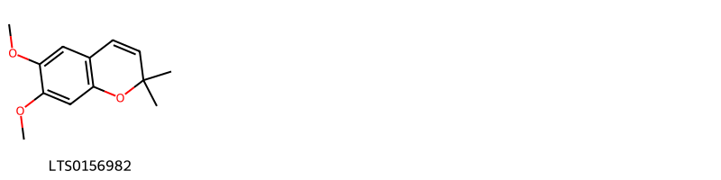{ width=100% }
    <figcaption>Hình ảnh cấu trúc hóa học của 1 hoạt chất thuộc nhóm Benzopyrans gồm ['precocene ii (LTS0156982)'].</figcaption>
</figure>
#### Nhóm Carboxylic acids and derivatives
<figure markdown="span">
    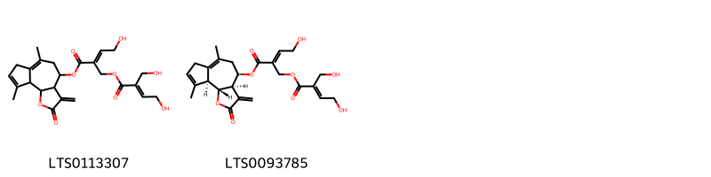{ width=100% }
    <figcaption>Hình ảnh cấu trúc hóa học của 2 hoạt chất thuộc nhóm Carboxylic acids and derivatives gồm ['3-({6,9-dimethyl-3-methylidene-2-oxo-3ah,4h,5h,7h,9ah,9bh-azuleno[4,5-b]furan-4-yl}oxy)-2-(2-hydroxyethylidene)-3-oxopropyl 4-hydroxy-2-(hydroxymethyl)but-2-enoate (LTS0113307)', '(2e)-3-{[(3ar,4r,9as,9br)-6,9-dimethyl-3-methylidene-2-oxo-3ah,4h,5h,7h,9ah,9bh-azuleno[4,5-b]furan-4-yl]oxy}-2-(2-hydroxyethylidene)-3-oxopropyl (2e)-4-hydroxy-2-(hydroxymethyl)but-2-enoate (LTS0093785)'].</figcaption>
</figure>
#### Nhóm Organooxygen compounds
<figure markdown="span">
    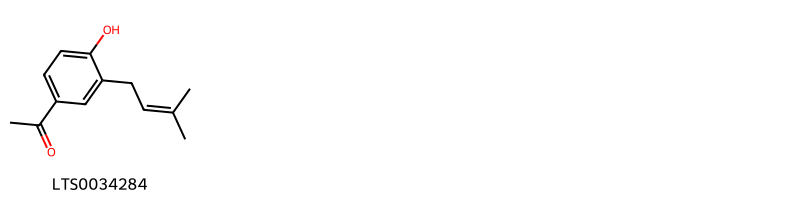{ width=100% }
    <figcaption>Hình ảnh cấu trúc hóa học của 1 hoạt chất thuộc nhóm Organooxygen compounds gồm ['1-[4-hydroxy-3-(3-methylbut-2-en-1-yl)phenyl]ethanone (LTS0034284)'].</figcaption>
</figure>
#### Nhóm Prenol lipids
<figure markdown="span">
    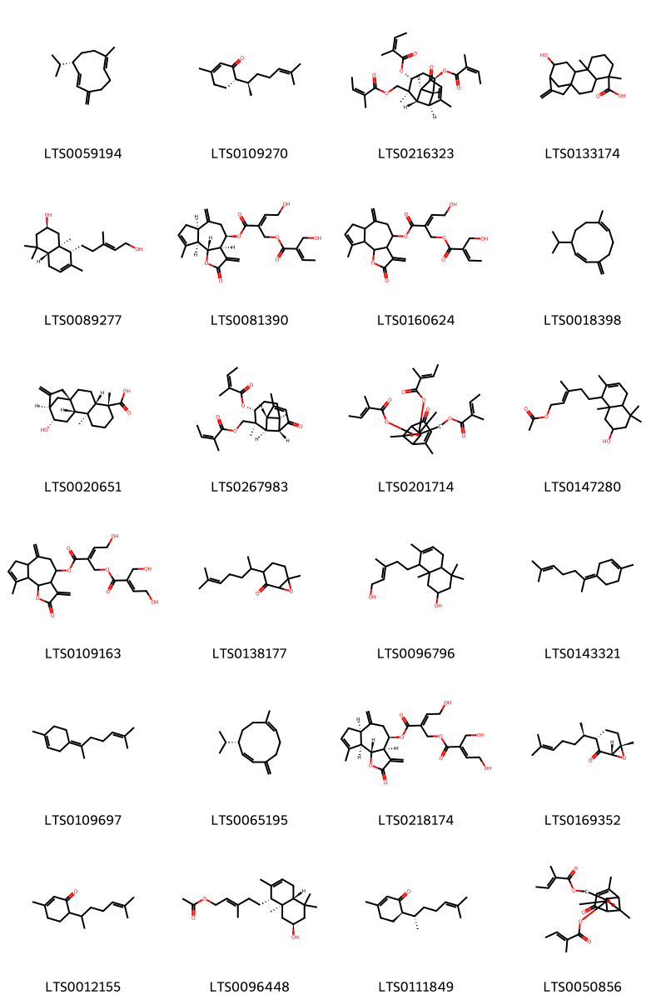{ width=100% }
    <figcaption>Hình ảnh cấu trúc hóa học của 24 hoạt chất thuộc nhóm Prenol lipids gồm ['(-)-germacrene d (LTS0059194)', '(6s)-3-methyl-6-[(2r)-6-methylhept-5-en-2-yl]cyclohex-2-en-1-one (LTS0109270)', '[(1r,2s,3s,4r,6r,7r,8r)-3,7,9-trimethyl-4,6-bis({[(2z)-2-methylbut-2-enoyl]oxy})-11-oxotricyclo[5.4.0.0²,⁸]undec-9-en-3-yl]methyl (2z)-2-methylbut-2-enoate (LTS0216323)', '12-hydroxy-5,9-dimethyl-14-methylidenetetracyclo[11.2.1.0¹,¹⁰.0⁴,⁹]hexadecane-5-carboxylic acid (LTS0133174)', '(2r,4ar,8r,8ar)-8-[(3e)-5-hydroxy-3-methylpent-3-en-1-yl]-4,4,7,8a-tetramethyl-1,2,3,4a,5,8-hexahydronaphthalen-2-ol (LTS0089277)', '(3ar,4r,6ar,9ar,9br)-9-methyl-3,6-dimethylidene-2-oxo-3ah,4h,5h,6ah,7h,9ah,9bh-azuleno[4,5-b]furan-4-yl (2e)-4-hydroxy-2-({[(2e)-2-(hydroxymethyl)but-2-enoyl]oxy}methyl)but-2-enoate (LTS0081390)', '9-methyl-3,6-dimethylidene-2-oxo-3ah,4h,5h,6ah,7h,9ah,9bh-azuleno[4,5-b]furan-4-yl 4-hydroxy-2-({[2-(hydroxymethyl)but-2-enoyl]oxy}methyl)but-2-enoate (LTS0160624)', '8-isopropyl-1-methyl-5-methylidenecyclodeca-1,6-diene (LTS0018398)', '(1s,4s,5r,9s,10r,12s,13r)-12-hydroxy-5,9-dimethyl-14-methylidenetetracyclo[11.2.1.0¹,¹⁰.0⁴,⁹]hexadecane-5-carboxylic acid (LTS0020651)', '[(1r,2s,3s,4r,7r,8r)-3,7,9-trimethyl-4-{[(2z)-2-methylbut-2-enoyl]oxy}-11-oxotricyclo[5.4.0.0²,⁸]undec-9-en-3-yl]methyl (2z)-2-methylbut-2-enoate (LTS0267983)', '{3,7,9-trimethyl-4,6-bis[(2-methylbut-2-enoyl)oxy]-11-oxotricyclo[5.4.0.0²,⁸]undec-9-en-3-yl}methyl 2-methylbut-2-enoate (LTS0201714)', '5-(7-hydroxy-2,5,5,8a-tetramethyl-1,4,4a,6,7,8-hexahydronaphthalen-1-yl)-3-methylpent-2-en-1-yl acetate (LTS0147280)', '2-(2-hydroxyethylidene)-3-({9-methyl-3,6-dimethylidene-2-oxo-3ah,4h,5h,6ah,7h,9ah,9bh-azuleno[4,5-b]furan-4-yl}oxy)-3-oxopropyl 4-hydroxy-2-(hydroxymethyl)but-2-enoate (LTS0109163)', '6-methyl-3-(6-methylhept-5-en-2-yl)-7-oxabicyclo[4.1.0]heptan-2-one (LTS0138177)', '8-(5-hydroxy-3-methylpent-3-en-1-yl)-4,4,7,8a-tetramethyl-1,2,3,4a,5,8-hexahydronaphthalen-2-ol (LTS0096796)', '(z)-γ-bisabolene (LTS0143321)', 'bisabolene (LTS0109697)', '(1z,6z,8s)-8-isopropyl-1-methyl-5-methylidenecyclodeca-1,6-diene (LTS0065195)', '(2e)-3-{[(3ar,4r,6ar,9ar,9br)-9-methyl-3,6-dimethylidene-2-oxo-3ah,4h,5h,6ah,7h,9ah,9bh-azuleno[4,5-b]furan-4-yl]oxy}-2-(2-hydroxyethylidene)-3-oxopropyl (2e)-4-hydroxy-2-(hydroxymethyl)but-2-enoate (LTS0218174)', '(1s,3s,6s)-6-methyl-3-[(2r)-6-methylhept-5-en-2-yl]-7-oxabicyclo[4.1.0]heptan-2-one (LTS0169352)', '3-methyl-6-(6-methylhept-5-en-2-yl)cyclohex-2-en-1-one (LTS0012155)', '(2e)-5-[(1r,4ar,7r,8ar)-7-hydroxy-2,5,5,8a-tetramethyl-1,4,4a,6,7,8-hexahydronaphthalen-1-yl]-3-methylpent-2-en-1-yl acetate (LTS0096448)', '(6r)-3-methyl-6-[(2s)-6-methylhept-5-en-2-yl]cyclohex-2-en-1-one (LTS0111849)', '{3,7,9-trimethyl-4-[(2-methylbut-2-enoyl)oxy]-11-oxotricyclo[5.4.0.0²,⁸]undec-9-en-3-yl}methyl 2-methylbut-2-enoate (LTS0050856)'].</figcaption>
</figure>

---

### Dược dân tộc học

Danh sách các quốc gia có sử dụng *Stevia eupatoria* trong điều trị các bệnh. 

| Country   | Disease   | Bệnh                                                                                                                                                                                                |
|:----------|:----------|:----------------------------------------------------------------------------------------------------------------------------------------------------------------------------------------------------|
| Mexico    | Diuretic  | MYMEMORY WARNING: YOU USED ALL AVAILABLE FREE TRANSLATIONS FOR TODAY. NEXT AVAILABLE IN  11 HOURS 19 MINUTES 10 SECONDS VISIT HTTPS://MYMEMORY.TRANSLATED.NET/DOC/USAGELIMITS.PHP TO TRANSLATE MORE |

---

---
## Stevia rebaudiana
### Thông tin về thực vật

!!! info "Phân loại thực vật của *Stevia rebaudiana* từ GIBF:"
    - **Kingdom:** Plantae
    - **Phylum:** Tracheophyta
    - **Order:** Asterales
    - **Family:** Asteraceae
    - **Genus:** Stevia
    - **Species:** *Stevia rebaudiana*

 

| Label (VI)   | Label (EN)   | Scientific Name   | Descriptions (VI)   | Descriptions (EN)           | Also Known As (VI)   | Also Known As (EN)                              |
|:-------------|:-------------|:------------------|:--------------------|:----------------------------|:---------------------|:------------------------------------------------|
| N/A          | N/A          | Stevia rebaudiana |                     | species of the genus Stevia | ['']                 | ['sweetleaf', 'Stevia rebaudiana', 'sugarleaf'] |

#### Phân bố trên thế giới

**Từ CSDL GIBF** nan, Italy, Australia, Japan, Belgium, Estonia, Guatemala, Argentina, unknown or invalid, Norway, Pakistan, Korea, Republic of, Chinese Taipei, Spain, Bolivia (Plurinational State of), Portugal, United States of America, Chile, Paraguay, El Salvador, Germany, Brazil, Cuba, Singapore, China, Ecuador, Colombia, India, Malaysia, New Zealand

#### Phân bố tại Việt Nam

**Từ CSDL GIBF**: Không có ghi nhận ở Việt Nam

---
### Thành phần hóa học
        
- Theo cơ sở dữ liệu lotus: Từ loài *Stevia rebaudiana* đã phân lập và xác định được 168 hoạt chất thuộc về các nhóm Phenol ethers, Fatty Acyls, Flavonoids, Prenol lipids, Indolizidines, Benzene and substituted derivatives, Unsaturated hydrocarbons, Heteroaromatic compounds, Organooxygen compounds, Phenols. 

|    | chemicalTaxonomyClassyfireClass     |   smiles_count |
|---:|:------------------------------------|---------------:|
|  0 | Benzene and substituted derivatives |              1 |
|  1 | Fatty Acyls                         |              5 |
|  2 | Flavonoids                          |             17 |
|  3 | Heteroaromatic compounds            |              1 |
|  4 | Indolizidines                       |              2 |
|  5 | Organooxygen compounds              |              2 |
|  6 | Phenol ethers                       |              2 |
|  7 | Phenols                             |              1 |
|  8 | Prenol lipids                       |            135 |
|  9 | Unsaturated hydrocarbons            |              1 |

#### Nhóm Benzene and substituted derivatives
<figure markdown="span">
    { width=100% }
    <figcaption>Hình ảnh cấu trúc hóa học của 1 hoạt chất thuộc nhóm Benzene and substituted derivatives gồm ['methyl eugenol (LTS0098881)'].</figcaption>
</figure>
#### Nhóm Fatty Acyls
<figure markdown="span">
    { width=100% }
    <figcaption>Hình ảnh cấu trúc hóa học của 5 hoạt chất thuộc nhóm Fatty Acyls gồm ['2-methylbutanoic acid; 3-hexenol (LTS0131967)', '3-octanol (LTS0055953)', 'phenethyl valerate (LTS0225639)', '1-octen-3-ol (LTS0057101)', 'n-valeric acid (LTS0025746)'].</figcaption>
</figure>
#### Nhóm Flavonoids
<figure markdown="span">
    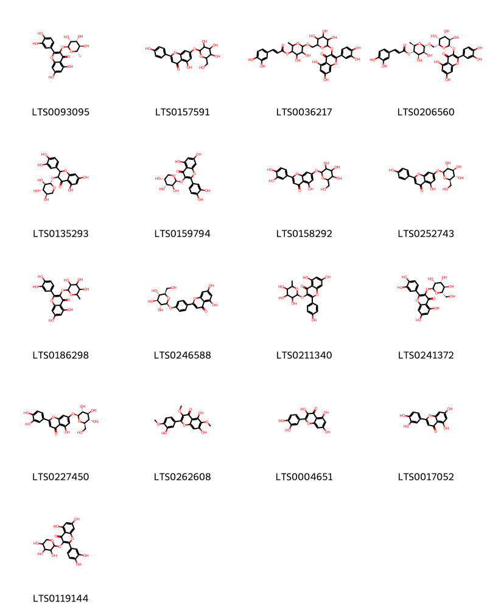{ width=100% }
    <figcaption>Hình ảnh cấu trúc hóa học của 17 hoạt chất thuộc nhóm Flavonoids gồm ['quercitrin (LTS0093095)', 'apigetrin (LTS0157591)', '6-[(6-{[2-(3,4-dihydroxyphenyl)-5,7-dihydroxy-4-oxochromen-3-yl]oxy}-3,4,5-trihydroxyoxan-2-yl)methoxy]-4,5-dihydroxy-2-methyloxan-3-yl 3-(3,4-dihydroxyphenyl)prop-2-enoate (LTS0036217)', '(2r,3s,4r,5s,6s)-6-{[(2r,3r,4s,5r,6s)-6-{[2-(3,4-dihydroxyphenyl)-5,7-dihydroxy-4-oxochromen-3-yl]oxy}-3,4,5-trihydroxyoxan-2-yl]methoxy}-4,5-dihydroxy-2-methyloxan-3-yl (2e)-3-(3,4-dihydroxyphenyl)prop-2-enoate (LTS0206560)', '2-(3,4-dihydroxyphenyl)-5,7-dihydroxy-3-{[(2s,3r,4s,5r)-3,4,5-trihydroxyoxan-2-yl]oxy}-2,3-dihydro-1-benzopyran-4-one (LTS0135293)', '2-(3,4-dihydroxyphenyl)-5,7-dihydroxy-3-{[(2s,3s,4r,5r)-3,4,5-trihydroxyoxan-2-yl]oxy}chromen-4-one (LTS0159794)', '2-(3,4-dihydroxyphenyl)-5-hydroxy-7-{[3,4,5-trihydroxy-6-(hydroxymethyl)oxan-2-yl]oxy}chromen-4-one (LTS0158292)', 'apigenin 7-o-β-glucoside (LTS0252743)', 'quercitrin (LTS0186298)', '5,7-dihydroxy-2-(4-{[(2s,3r,4s,5s,6r)-3,4,5-trihydroxy-6-(hydroxymethyl)oxan-2-yl]oxy}phenyl)chromen-4-one (LTS0246588)', '5,7-dihydroxy-2-(4-hydroxyphenyl)-3-[(3,4,5-trihydroxy-6-methyloxan-2-yl)oxy]chromen-4-one (LTS0211340)', '2-(3,4-dihydroxyphenyl)-5,7-dihydroxy-3-{[(2s,3r,4r,5r,6s)-3,4,5-trihydroxy-6-(hydroxymethyl)oxan-2-yl]oxy}chromen-4-one (LTS0241372)', 'luteolin 7-o-glucoside (LTS0227450)', 'centaureidin (LTS0262608)', 'quercetin (LTS0004651)', 'luteolin (LTS0017052)', 'guaijaverin (LTS0119144)'].</figcaption>
</figure>
#### Nhóm Heteroaromatic compounds
<figure markdown="span">
    { width=100% }
    <figcaption>Hình ảnh cấu trúc hóa học của 1 hoạt chất thuộc nhóm Heteroaromatic compounds gồm ['amylfuran (LTS0044471)'].</figcaption>
</figure>
#### Nhóm Indolizidines
<figure markdown="span">
    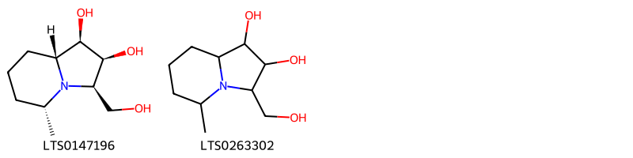{ width=100% }
    <figcaption>Hình ảnh cấu trúc hóa học của 2 hoạt chất thuộc nhóm Indolizidines gồm ['(1r,2s,3r,5r,8ar)-3-(hydroxymethyl)-5-methyl-octahydroindolizine-1,2-diol (LTS0147196)', '3-(hydroxymethyl)-5-methyl-octahydroindolizine-1,2-diol (LTS0263302)'].</figcaption>
</figure>
#### Nhóm Organooxygen compounds
<figure markdown="span">
    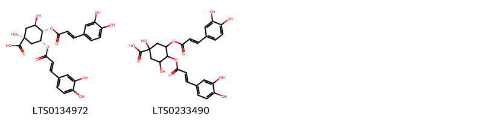{ width=100% }
    <figcaption>Hình ảnh cấu trúc hóa học của 2 hoạt chất thuộc nhóm Organooxygen compounds gồm ['3,4-dicaffeoylquinic acid (LTS0134972)', '3,4-bis({[3-(3,4-dihydroxyphenyl)prop-2-enoyl]oxy})-1,5-dihydroxycyclohexane-1-carboxylic acid (LTS0233490)'].</figcaption>
</figure>
#### Nhóm Phenol ethers
<figure markdown="span">
    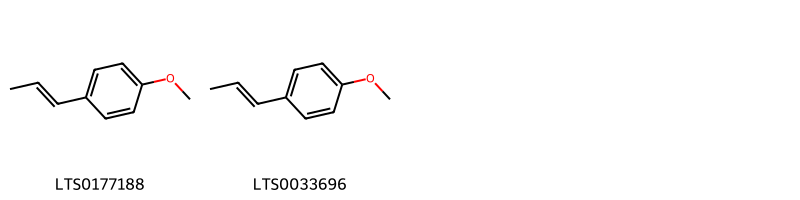{ width=100% }
    <figcaption>Hình ảnh cấu trúc hóa học của 2 hoạt chất thuộc nhóm Phenol ethers gồm ['p-propenylanisole (LTS0177188)', 'anethole (LTS0033696)'].</figcaption>
</figure>
#### Nhóm Phenols
<figure markdown="span">
    { width=100% }
    <figcaption>Hình ảnh cấu trúc hóa học của 1 hoạt chất thuộc nhóm Phenols gồm ['eugenol (LTS0052342)'].</figcaption>
</figure>
#### Nhóm Prenol lipids
<figure markdown="span">
    { width=100% }
    <figcaption>Hình ảnh cấu trúc hóa học của 135 hoạt chất thuộc nhóm Prenol lipids gồm ['rebaudioside a (LTS0056777)', 'terpineol (LTS0136148)', '(-)-germacrene d (LTS0059194)', '(2s,3s,4s,5s,6r)-3,4,5-trihydroxy-6-(hydroxymethyl)oxan-2-yl (1r,4s,5r,9s,10r,13s)-13-{[(2s,3r,4s,5r,6r)-5-hydroxy-6-(hydroxymethyl)-3,4-bis({[(2s,3r,4s,5s,6r)-3,4,5-trihydroxy-6-(hydroxymethyl)oxan-2-yl]oxy})oxan-2-yl]oxy}-5,9-dimethyl-14-methylidenetetracyclo[11.2.1.0¹,¹⁰.0⁴,⁹]hexadecane-5-carboxylate (LTS0189651)', '(1r,2s,5r)-4,6,6-trimethylbicyclo[3.1.1]hept-3-en-2-ol (LTS0122167)', '(1r,2s,3s,4r,4as,8as)-4-[(1e,4s)-4,5-dihydroxy-3-methylidenepent-1-en-1-yl]-3,4a,8,8-tetramethyl-hexahydro-1h-naphthalene-1,2,3-triol (LTS0123036)', 'stevioside (LTS0176468)', 'steviol (LTS0206657)', '1-ethenyl-1,2-dimethyl-2-(prop-1-en-2-yl)-4-(propan-2-ylidene)cyclohexane (LTS0102139)', '(1s,2s)-1-ethenyl-1-methyl-2-(prop-1-en-2-yl)-4-(propan-2-ylidene)cyclohexane (LTS0135613)', 'myrtenol (LTS0130529)', '{3-ethenyl-3,4a,7,10a-tetramethyl-octahydro-1h-naphtho[2,1-b]pyran-7-yl}methanol (LTS0219124)', '3,4,5-trihydroxy-6-(hydroxymethyl)oxan-2-yl 13-{[5-hydroxy-6-(hydroxymethyl)-4-{[3,4,5-trihydroxy-6-(hydroxymethyl)oxan-2-yl]oxy}-3-[(3,4,5-trihydroxy-6-methyloxan-2-yl)oxy]oxan-2-yl]oxy}-5,9-dimethyl-14-methylidenetetracyclo[11.2.1.0¹,¹⁰.0⁴,⁹]hexadecane-5-carboxylate (LTS0135154)', '1,3-dihydroxy-3,4a,8,8-tetramethyl-4-[(1e)-3-oxobut-1-en-1-yl]-hexahydro-1h-naphthalen-2-yl acetate (LTS0081254)', 'linalool, (+-)- (LTS0128839)', '1,3-dihydroxy-3,4a,8,8-tetramethyl-4-(3-methylpenta-2,4-dien-1-yl)-hexahydro-1h-naphthalen-2-yl acetate (LTS0099328)', '(2e,4e)-5-[(1r,2s,3s,4r,4as,8ar)-2,3,4-trihydroxy-2,5,5,8a-tetramethyl-hexahydro-1h-naphthalen-1-yl]-3-methylpenta-2,4-dienal (LTS0085323)', 'dulcoside a (LTS0087416)', '(2s,3r,4s,5s,6r)-3,4,5-trihydroxy-6-(hydroxymethyl)oxan-2-yl (1r,4s,5r,9s,10r,13s)-13-{[(2r,3r,4s,5s,6r)-4,5-dihydroxy-6-(hydroxymethyl)-3-{[(2s,3r,4s,5s,6r)-3,4,5-trihydroxy-6-(hydroxymethyl)oxan-2-yl]oxy}oxan-2-yl]oxy}-5,9-dimethyl-14-methylidenetetracyclo[11.2.1.0¹,¹⁰.0⁴,⁹]hexadecane-5-carboxylate (LTS0071885)', '(e)-calamene (LTS0228241)', '(2s,3r,4s,5s,6r)-3,4,5-trihydroxy-6-(hydroxymethyl)oxan-2-yl (1r,4r,5r,9s,10s,13s)-13-{[(2r,3r,4s,5r,6r)-5-hydroxy-6-(hydroxymethyl)-3,4-bis({[(2s,3r,4s,5s,6r)-3,4,5-trihydroxy-6-(hydroxymethyl)oxan-2-yl]oxy})oxan-2-yl]oxy}-5,9-dimethyl-14-methylidenetetracyclo[11.2.1.0¹,¹⁰.0⁴,⁹]hexadecane-5-carboxylate (LTS0073532)', '(2z,4e)-5-[(1r,2s,3s,4r,4as,8ar)-2,3,4-trihydroxy-2,5,5,8a-tetramethyl-hexahydro-1h-naphthalen-1-yl]-3-methylpenta-2,4-dienal (LTS0075297)', '(1as,4as,7s,7ar,7bs)-1,1,7-trimethyl-4-methylidene-octahydrocyclopropa[e]azulen-7-ol (LTS0073517)', '3,4,5-trihydroxy-6-(hydroxymethyl)oxan-2-yl 13-{[5-hydroxy-6-(hydroxymethyl)-3-{[3,4,5-trihydroxy-6-(hydroxymethyl)oxan-2-yl]oxy}-4-[(3,4,5-trihydroxyoxan-2-yl)oxy]oxan-2-yl]oxy}-5,9-dimethyl-14-methylidenetetracyclo[11.2.1.0¹,¹⁰.0⁴,⁹]hexadecane-5-carboxylate (LTS0100337)', '1,3-dihydroxy-3,4a,8,8-tetramethyl-4-(3-oxobut-1-en-1-yl)-hexahydro-1h-naphthalen-2-yl acetate (LTS0029009)', '(1r,2s,3s,4r,4as,8as)-2,3-dihydroxy-3,4a,8,8-tetramethyl-4-[(1e)-3-oxobut-1-en-1-yl]-hexahydro-1h-naphthalen-1-yl acetate (LTS0097866)', 'caryophyllene oxide (LTS0159789)', 'β-bourbonene (LTS0074484)', '(2s,3r,4r,5s,6r)-3,4,5-trihydroxy-6-(hydroxymethyl)oxan-2-yl (1r,4s,5r,9s,10r,13s)-13-{[(2s,3r,4s,5s,6r)-4,5-dihydroxy-6-(hydroxymethyl)-3-{[(2s,3r,4s,5s,6r)-3,4,5-trihydroxy-6-(hydroxymethyl)oxan-2-yl]oxy}oxan-2-yl]oxy}-5,9-dimethyl-14-methylidenetetracyclo[11.2.1.0¹,¹⁰.0⁴,⁹]hexadecane-5-carboxylate (LTS0036984)', '2,3-dihydroxy-3,4a,8,8-tetramethyl-4-(3-methylpenta-2,4-dien-1-yl)-hexahydro-1h-naphthalen-1-yl acetate (LTS0166534)', '(2s,3r,4s,5s,6r)-3,4,5-trihydroxy-6-(hydroxymethyl)oxan-2-yl (1r,4s,5r,9s,10r,13s)-13-{[(2s,3r,4s,5r,6r)-5-hydroxy-6-(hydroxymethyl)-3-{[(2s,3r,4s,5s,6r)-3,4,5-trihydroxy-6-(hydroxymethyl)oxan-2-yl]oxy}-4-{[(2s,3r,4s,5r)-3,4,5-trihydroxyoxan-2-yl]oxy}oxan-2-yl]oxy}-5,9-dimethyl-14-methylidenetetracyclo[11.2.1.0¹,¹⁰.0⁴,⁹]hexadecane-5-carboxylate (LTS0074854)', 'rebaudioside b (LTS0021693)', 'α-myrcene (LTS0115731)', 'β-bourbonene (LTS0167513)', 'terpinolene (LTS0104525)', '(1s,5r,7s,10r)-7-isopropyl-4,10-dimethyltricyclo[4.4.0.0¹,⁵]dec-3-ene (LTS0064715)', 'rebaudioside e (LTS0174145)', '2,3-dihydroxy-3,4a,8,8-tetramethyl-4-(3-oxobut-1-en-1-yl)-hexahydro-1h-naphthalen-1-yl acetate (LTS0193982)', '(2s,3r,4s,5s,6r)-3,4,5-trihydroxy-6-(hydroxymethyl)oxan-2-yl (1r,4s,5r,9s,10r,13s)-13-{[(2s,3r,4s,5r,6r)-5-hydroxy-6-(hydroxymethyl)-3-{[(2r,3s,4r,5r,6s)-3,4,5-trihydroxy-6-(hydroxymethyl)oxan-2-yl]oxy}-4-{[(2s,3r,4s,5s,6r)-3,4,5-trihydroxy-6-(hydroxymethyl)oxan-2-yl]oxy}oxan-2-yl]oxy}-5,9-dimethyl-14-methylidenetetracyclo[11.2.1.0¹,¹⁰.0⁴,⁹]hexadecane-5-carboxylate (LTS0194439)', '(2s,3s,4s,5s,6r)-3,4,5-trihydroxy-6-(hydroxymethyl)oxan-2-yl (1r,4s,5r,9s,10r,13s)-13-{[(2s,3r,4s,5r,6r)-4,5-dihydroxy-6-(hydroxymethyl)-3-{[(2s,3s,4s,5s,6r)-3,4,5-trihydroxy-6-(hydroxymethyl)oxan-2-yl]oxy}oxan-2-yl]oxy}-5,9-dimethyl-14-methylidenetetracyclo[11.2.1.0¹,¹⁰.0⁴,⁹]hexadecane-5-carboxylate (LTS0036234)', 'β-pinene (LTS0117550)', '4-[(1e,3z)-5-hydroxy-3-methylpenta-1,3-dien-1-yl]-3,4a,8,8-tetramethyl-hexahydro-1h-naphthalene-1,2,3-triol (LTS0115951)', 'cymene (LTS0181568)', '(2s,3r,4s,5s,6r)-3,4,5-trihydroxy-6-(hydroxymethyl)oxan-2-yl (1r,4s,5r,9s,10r,13s)-13-{[(2s,3r,4s,5r,6r)-5-hydroxy-6-(hydroxymethyl)-4-{[(2s,3r,4s,5s,6r)-3,4,5-trihydroxy-6-(hydroxymethyl)oxan-2-yl]oxy}-3-{[(2r,3s,4s,5s,6r)-3,4,5-trihydroxy-6-methyloxan-2-yl]oxy}oxan-2-yl]oxy}-5,9-dimethyl-14-methylidenetetracyclo[11.2.1.0¹,¹⁰.0⁴,⁹]hexadecane-5-carboxylate (LTS0148066)', 'nerolidol (LTS0197738)', '(1r,4ar,8as)-4-isopropyl-1,6-dimethyl-3,4,4a,7,8,8a-hexahydro-2h-naphthalen-1-ol (LTS0136437)', '(1r,5r,9s,13s)-13-{[(2r,3s,4r,5s,6s)-5-hydroxy-6-(hydroxymethyl)-3,4-bis({[(2r,3s,4r,5r,6s)-3,4,5-trihydroxy-6-(hydroxymethyl)oxan-2-yl]oxy})oxan-2-yl]oxy}-5,9-dimethyl-14-methylidenetetracyclo[11.2.1.0¹,¹⁰.0⁴,⁹]hexadecane-5-carboxylic acid (LTS0194967)', 'α pinene (LTS0132416)', '4-[(1e)-4,5-dihydroxy-3-methylidenepent-1-en-1-yl]-3,4a,8,8-tetramethyl-hexahydro-1h-naphthalene-1,2,3-triol (LTS0273112)', 'rebaudioside d (LTS0152415)', 'myrtenal (LTS0202475)', '(1s,4s)-4-isopropyl-1,6-dimethyl-1,2,3,4-tetrahydronaphthalene (LTS0139634)', 'α-cadinol (LTS0206935)', 'humulene (LTS0263171)', '4-(5-hydroxy-3-methylpenta-1,3-dien-1-yl)-3,4a,8,8-tetramethyl-hexahydro-1h-naphthalene-1,2,3-triol (LTS0246531)', '(1r,2s,3s,4r,4as,8as)-4-[(1e,3e)-5-methoxy-3-methylpenta-1,3-dien-1-yl]-3,4a,8,8-tetramethyl-hexahydro-1h-naphthalene-1,2,3-triol (LTS0174562)', '(3e)-4-(2,3-dihydroxy-2,5,5,8a-tetramethyl-hexahydro-1h-naphthalen-1-yl)but-3-en-2-one (LTS0106068)', '4-isopropyl-1,6-dimethyl-2,3,4,4a,7,8-hexahydronaphthalene (LTS0270743)', '(3r,6e)-nerolidol (LTS0145065)', 'limonene,  (LTS0155981)', '(3e)-4-(2,3,4-trihydroxy-2,5,5,8a-tetramethyl-hexahydro-1h-naphthalen-1-yl)but-3-en-2-one (LTS0143840)', 'β-ionone (LTS0155301)', '2,3-dihydroxy-3,4a,8,8-tetramethyl-4-[(1e)-3-oxobut-1-en-1-yl]-hexahydro-1h-naphthalen-1-yl acetate (LTS0138522)', 'pinocarvone (LTS0084836)', 'rebaudioside c (LTS0172455)', 'β-elemene (LTS0225699)', '(z)-γ-bisabolene (LTS0143321)', '(1r,4s,4ar)-4-isopropyl-1,6-dimethyl-3,4,4a,7,8,8a-hexahydro-2h-naphthalen-1-ol (LTS0164497)', 'austroinulin (LTS0257641)', '(2r,3r,4s,5s,6r)-3,4,5-trihydroxy-6-(hydroxymethyl)oxan-2-yl (1r,4s,5r,9s,10r,13s)-13-{[(2s,3r,4s,5r,6r)-5-hydroxy-6-(hydroxymethyl)-4-{[(2s,3r,4s,5s,6r)-3,4,5-trihydroxy-6-(hydroxymethyl)oxan-2-yl]oxy}-3-{[(2s,3r,4s,5r)-3,4,5-trihydroxyoxan-2-yl]oxy}oxan-2-yl]oxy}-5,9-dimethyl-14-methylidenetetracyclo[11.2.1.0¹,¹⁰.0⁴,⁹]hexadecane-5-carboxylate (LTS0183429)', 'borneol (LTS0264960)', '(+)-gamma-cadinene (LTS0103949)', 'α-bergamotene (LTS0226115)', '(1r,4s,5r,9s,10s,13s)-13-{[(2r,3s,4r,5s,6s)-5-hydroxy-6-(hydroxymethyl)-3,4-bis({[(2r,3s,4r,5r,6s)-3,4,5-trihydroxy-6-(hydroxymethyl)oxan-2-yl]oxy})oxan-2-yl]oxy}-5,9-dimethyl-14-methylidenetetracyclo[11.2.1.0¹,¹⁰.0⁴,⁹]hexadecane-5-carboxylic acid (LTS0105616)', '(1r,2s,3s,4r,4as,8as)-1,3-dihydroxy-3,4a,8,8-tetramethyl-4-[(1e)-3-oxobut-1-en-1-yl]-hexahydro-1h-naphthalen-2-yl acetate (LTS0261155)', '(2s,3r,4s,5s,6r)-3,4,5-trihydroxy-6-(hydroxymethyl)oxan-2-yl (1r,4s,5r,9s,10r,13s)-13-{[(2s,3r,4s,5s,6r)-4,5-dihydroxy-6-(hydroxymethyl)-3-{[(2r,3r,4s,5s,6r)-3,4,5-trihydroxy-6-(hydroxymethyl)oxan-2-yl]oxy}oxan-2-yl]oxy}-4,5,9,10-tetramethyl-14-methylidenetetracyclo[11.2.1.0¹,¹⁰.0⁴,⁹]hexadecane-5-carboxylate (LTS0178833)', 'caryophyllene (LTS0085212)', '4-(2,3-dihydroxy-2,5,5,8a-tetramethyl-hexahydro-1h-naphthalen-1-yl)but-3-en-2-one (LTS0268038)', '(1r,2s,3s,4r,4ar,8as)-4-[(1e,3r)-3-hydroxy-3-methylpenta-1,4-dien-1-yl]-3,4a,8,8-tetramethyl-hexahydro-1h-naphthalene-1,2,3-triol (LTS0082319)', 'stevioside (LTS0071721)', '(1r,2s,3s,4r,4ar,8as)-4-[(1e,3s)-3-hydroxy-3-methylpenta-1,4-dien-1-yl]-3,4a,8,8-tetramethyl-hexahydro-1h-naphthalene-1,2,3-triol (LTS0209970)', '(2e,4e)-5-[(1r,2s,3s,4r,4as,8as)-2,3,4-trihydroxy-2,5,5,8a-tetramethyl-hexahydro-1h-naphthalen-1-yl]-3-methylpenta-2,4-dienal (LTS0073547)', 'β-farnesene (LTS0067925)', '3,4a,8,8-tetramethyl-4-(3-methylpenta-2,4-dien-1-yl)-hexahydro-1h-naphthalene-1,2,3-triol (LTS0272012)', '(1z,6z,8s)-8-isopropyl-1-methyl-5-methylidenecyclodeca-1,6-diene (LTS0065195)', '(1r,2s,3s,4r,4as,8ar)-4-[(1e,3z)-5-hydroxy-3-methylpenta-1,3-dien-1-yl]-3,4a,8,8-tetramethyl-hexahydro-1h-naphthalene-1,2,3-triol (LTS0225216)', 'β-caryophyllene oxide (LTS0213960)', 'α-copaene (LTS0207598)', 'sabinene (LTS0224133)', '(3e)-2-oxo-4-(2,6,6-trimethylcyclohex-1-en-1-yl)but-3-enal (LTS0198571)', '4-(4,5-dihydroxy-3-methylidenepent-1-en-1-yl)-3,4a,8,8-tetramethyl-hexahydro-1h-naphthalene-1,2,3-triol (LTS0009844)', '3,4,5-trihydroxy-6-(hydroxymethyl)oxan-2-yl 13-{[5-hydroxy-6-(hydroxymethyl)-3,4-bis({[3,4,5-trihydroxy-6-(hydroxymethyl)oxan-2-yl]oxy})oxan-2-yl]oxy}-5,9-dimethyl-14-methylidenetetracyclo[11.2.1.0¹,¹⁰.0⁴,⁹]hexadecane-5-carboxylate (LTS0033223)', '3,4,5-trihydroxy-6-(hydroxymethyl)oxan-2-yl 13-{[4,5-dihydroxy-6-(hydroxymethyl)-3-{[3,4,5-trihydroxy-6-(hydroxymethyl)oxan-2-yl]oxy}oxan-2-yl]oxy}-4,5,9,10-tetramethyl-14-methylidenetetracyclo[11.2.1.0¹,¹⁰.0⁴,⁹]hexadecane-5-carboxylate (LTS0019036)', '(1r,2s,3s,4r,4as,8as)-4-[(1e,3e)-5-hydroxy-3-methylpenta-1,3-dien-1-yl]-3,4a,8,8-tetramethyl-hexahydro-1h-naphthalene-1,2,3-triol (LTS0226145)', '(2s,3r,4s,5s,6r)-3,4,5-trihydroxy-6-(hydroxymethyl)oxan-2-yl (1r,4s,5r,9s,10s,13s)-13-{[(2r,3s,4r,5s,6s)-5-hydroxy-6-(hydroxymethyl)-3,4-bis({[(2r,3s,4r,5r,6s)-3,4,5-trihydroxy-6-(hydroxymethyl)oxan-2-yl]oxy})oxan-2-yl]oxy}-5,9-dimethyl-14-methylidenetetracyclo[11.2.1.0¹,¹⁰.0⁴,⁹]hexadecane-5-carboxylate (LTS0159793)', 'delta-cadinol (LTS0008282)', 'cuminaldehyde (LTS0037806)', '4-(5-methoxy-3-methylpenta-1,3-dien-1-yl)-3,4a,8,8-tetramethyl-hexahydro-1h-naphthalene-1,2,3-triol (LTS0226732)', '(1r,2s,3s,4r,4as,8as)-4-[(1e,3z)-5-methoxy-3-methylpenta-1,3-dien-1-yl]-3,4a,8,8-tetramethyl-hexahydro-1h-naphthalene-1,2,3-triol (LTS0255667)', '(2s,3r,4s,5s,6r)-3,4,5-trihydroxy-6-(hydroxymethyl)oxan-2-yl (1r,4s,5r,9s,10r,13s)-13-{[(2s,3r,4s,5r,6r)-5-hydroxy-6-(hydroxymethyl)-4-{[(2s,3r,4s,5s,6r)-3,4,5-trihydroxy-6-(hydroxymethyl)oxan-2-yl]oxy}-3-{[(2r,3r,4r,5r,6s)-3,4,5-trihydroxy-6-methyloxan-2-yl]oxy}oxan-2-yl]oxy}-5,9-dimethyl-14-methylidenetetracyclo[11.2.1.0¹,¹⁰.0⁴,⁹]hexadecane-5-carboxylate (LTS0018871)', '(s)-trans-verbenol (LTS0175186)', '(1r,2s,7s,8s)-8-isopropyl-1,3-dimethyltricyclo[4.4.0.0²,⁷]dec-3-ene (LTS0190031)', '(2s,4r)-1,7,7-trimethylbicyclo[2.2.1]heptan-2-ol (LTS0010050)', '3,4,5-trihydroxy-6-(hydroxymethyl)oxan-2-yl 13-{[5-hydroxy-6-(hydroxymethyl)-4-{[3,4,5-trihydroxy-6-(hydroxymethyl)oxan-2-yl]oxy}-3-[(3,4,5-trihydroxyoxan-2-yl)oxy]oxan-2-yl]oxy}-5,9-dimethyl-14-methylidenetetracyclo[11.2.1.0¹,¹⁰.0⁴,⁹]hexadecane-5-carboxylate (LTS0270663)', '(1r,2s,3s,4r,4as,8as)-4-[(1e,4r)-4,5-dihydroxy-3-methylidenepent-1-en-1-yl]-3,4a,8,8-tetramethyl-hexahydro-1h-naphthalene-1,2,3-triol (LTS0061952)', '(2z,4e)-5-[(1r,2s,3s,4r,4as,8as)-2,3,4-trihydroxy-2,5,5,8a-tetramethyl-hexahydro-1h-naphthalen-1-yl]-3-methylpenta-2,4-dienal (LTS0041295)', '(3e)-4-[(1r,2s,3s,4r,4as,8as)-2,3,4-trihydroxy-2,5,5,8a-tetramethyl-hexahydro-1h-naphthalen-1-yl]but-3-en-2-one (LTS0125515)', '3-methyl-5-(2,3,4-trihydroxy-2,5,5,8a-tetramethyl-hexahydro-1h-naphthalen-1-yl)penta-2,4-dienal (LTS0037670)', 'carvacrol (LTS0012882)', '(1r,2s,3s,4r,4as,8as)-4-[(1e,3z)-5-hydroxy-3-methylpenta-1,3-dien-1-yl]-3,4a,8,8-tetramethyl-hexahydro-1h-naphthalene-1,2,3-triol (LTS0005788)', '3,4-dihydrocadalene (LTS0015523)', '(1s,2r,3r,4s,4ar,8as)-2,3-dihydroxy-3,4a,8,8-tetramethyl-4-[(2z)-3-methylpenta-2,4-dien-1-yl]-hexahydro-1h-naphthalen-1-yl acetate (LTS0091509)', 'rebaudioside f (LTS0083118)', '(1s,2r,3r,4s,4ar,8ar)-1,3-dihydroxy-3,4a,8,8-tetramethyl-4-[(2z)-3-methylpenta-2,4-dien-1-yl]-hexahydro-1h-naphthalen-2-yl acetate (LTS0233331)', '(1r,2s,3s,4r,4as,8as)-3,4a,8,8-tetramethyl-4-[(2z)-3-methylpenta-2,4-dien-1-yl]-hexahydro-1h-naphthalene-1,2,3-triol (LTS0080139)', 'delta-cadinene (LTS0019321)', 'pinocarveol (LTS0090950)', '(7ar)-1,1,7-trimethyl-4-methylidene-octahydrocyclopropa[e]azulen-7-ol (LTS0091612)', '(1r,4s,5r,9s,10r,13s)-13-{[(2s)-4,5-dihydroxy-6-(hydroxymethyl)-3-{[(2s)-3,4,5-trihydroxy-6-(hydroxymethyl)oxan-2-yl]oxy}oxan-2-yl]oxy}-5,9-dimethyl-14-methylidenetetracyclo[11.2.1.0¹,¹⁰.0⁴,⁹]hexadecane-5-carboxylic acid (LTS0020884)', 'rebaudioside c (LTS0029436)', '[(3r,4ar,6ar,7r,10as,10bs)-3-ethenyl-3,4a,7,10a-tetramethyl-octahydro-1h-naphtho[2,1-b]pyran-7-yl]methanol (LTS0239734)', '(3ar,5ar,5br,7ar,11ar,11br,13ar,13br)-3a,5a,5b,8,8,11a-hexamethyl-1-(prop-1-en-2-yl)-hexadecahydrocyclopenta[a]chrysen-9-yl hexadecanoate (LTS0228586)', '13-{[5-hydroxy-6-(hydroxymethyl)-3,4-bis({[3,4,5-trihydroxy-6-(hydroxymethyl)oxan-2-yl]oxy})oxan-2-yl]oxy}-5,9-dimethyl-14-methylidenetetracyclo[11.2.1.0¹,¹⁰.0⁴,⁹]hexadecane-5-carboxylic acid (LTS0134379)', '(2s,3r,4s,5s,6r)-3,4,5-trihydroxy-6-(hydroxymethyl)oxan-2-yl (1r,5r,13s)-13-{[(2s,3r,4s,5r,6r)-5-hydroxy-6-(hydroxymethyl)-4-{[(2s,3r,4s,5s,6r)-3,4,5-trihydroxy-6-(hydroxymethyl)oxan-2-yl]oxy}-3-{[(2s,3r,4s,5r)-3,4,5-trihydroxyoxan-2-yl]oxy}oxan-2-yl]oxy}-5,9-dimethyl-14-methylidenetetracyclo[11.2.1.0¹,¹⁰.0⁴,⁹]hexadecane-5-carboxylate (LTS0269689)', '4-(2,3,4-trihydroxy-2,5,5,8a-tetramethyl-hexahydro-1h-naphthalen-1-yl)but-3-en-2-one (LTS0029484)', '(1s,2r,3r,4s,4ar,8as)-3,4a,8,8-tetramethyl-4-[(2z)-3-methylpenta-2,4-dien-1-yl]-hexahydro-1h-naphthalene-1,2,3-triol (LTS0097063)', '(-)-α-cubebene (LTS0042045)', '(1r,2s,3s,4r,4as,8as)-2,3-dihydroxy-3,4a,8,8-tetramethyl-4-[(2z)-3-methylpenta-2,4-dien-1-yl]-hexahydro-1h-naphthalen-1-yl acetate (LTS0268787)', '(3e)-4-[(1r,2s,3s,4as,8as)-2,3-dihydroxy-2,5,5,8a-tetramethyl-hexahydro-1h-naphthalen-1-yl]but-3-en-2-one (LTS0026252)', '4-isopropyl-6-methyl-1-methylidene-3,4,4a,7,8,8a-hexahydro-2h-naphthalene (LTS0111070)', '4-[(1e)-5-methoxy-3-methylpenta-1,3-dien-1-yl]-3,4a,8,8-tetramethyl-hexahydro-1h-naphthalene-1,2,3-triol (LTS0042719)', 'steviol (LTS0036571)', '(-)-β-cubebene (LTS0123697)', '[(3r,4ar,6ar,7r,10as,10br)-3-ethenyl-3,4a,7,10a-tetramethyl-octahydro-1h-naphtho[2,1-b]pyran-7-yl]methanol (LTS0041383)', '(2r,3s,4r,5r,6s)-3,4,5-trihydroxy-6-(hydroxymethyl)oxan-2-yl (1s,4r,5s,9r,10s,13r)-13-{[(2r,3s,4r,5s,6s)-5-hydroxy-6-(hydroxymethyl)-4-{[(2r,3s,4r,5r,6s)-3,4,5-trihydroxy-6-(hydroxymethyl)oxan-2-yl]oxy}-3-{[(2r,3s,4r,5s)-3,4,5-trihydroxyoxan-2-yl]oxy}oxan-2-yl]oxy}-5,9-dimethyl-14-methylidenetetracyclo[11.2.1.0¹,¹⁰.0⁴,⁹]hexadecane-5-carboxylate (LTS0258184)'].</figcaption>
</figure>
#### Nhóm Unsaturated hydrocarbons
<figure markdown="span">
    { width=100% }
    <figcaption>Hình ảnh cấu trúc hóa học của 1 hoạt chất thuộc nhóm Unsaturated hydrocarbons gồm ['α terpinene (LTS0232891)'].</figcaption>
</figure>

---

### Dược dân tộc học

Danh sách các quốc gia có sử dụng *Stevia rebaudiana* trong điều trị các bệnh. 

| Country   | Disease                             | Bệnh                                                                                                                                                                                                |
|:----------|:------------------------------------|:----------------------------------------------------------------------------------------------------------------------------------------------------------------------------------------------------|
| Paraguay  | Sweetener, Sweetener, Contraceptive | MYMEMORY WARNING: YOU USED ALL AVAILABLE FREE TRANSLATIONS FOR TODAY. NEXT AVAILABLE IN  11 HOURS 18 MINUTES 30 SECONDS VISIT HTTPS://MYMEMORY.TRANSLATED.NET/DOC/USAGELIMITS.PHP TO TRANSLATE MORE |

---

# Chi Picris

??? note "Danh sách các dược liệu thuộc chi"
    
	 - *Picris repens*

---
## Picris repens
### Thông tin về thực vật

!!! info "Phân loại thực vật của *Ixeris japonica* từ GIBF:"
    - **Kingdom:** Plantae
    - **Phylum:** Tracheophyta
    - **Order:** Asterales
    - **Family:** Asteraceae
    - **Genus:** Ixeris
    - **Species:** *Ixeris japonica*

 

| Label (VI)   | Label (EN)   | Scientific Name   | Descriptions (VI)   | Descriptions (EN)   | Also Known As (VI)   | Also Known As (EN)   |
|:-------------|:-------------|:------------------|:--------------------|:--------------------|:---------------------|:---------------------|
| N/A          | N/A          | Picris repens     |                     | species of plant    | ['']                 | ['']                 |

#### Phân bố trên thế giới

**Từ CSDL GIBF** nan, Italy, Australia, Japan, Belgium, Estonia, Guatemala, Argentina, unknown or invalid, Norway, Pakistan, Korea, Republic of, Chinese Taipei, Spain, Bolivia (Plurinational State of), Portugal, United States of America, Chile, Paraguay, El Salvador, Germany, Brazil, Cuba, Singapore, China, Ecuador, Colombia, India, Malaysia, New Zealand

#### Phân bố tại Việt Nam

**Từ CSDL GIBF**: Không có ghi nhận ở Việt Nam

---
### Thành phần hóa học
        
- Theo cơ sở dữ liệu lotus: Từ loài *Ixeris japonica* đã phân lập và xác định được Chưa có hoạt chất nào được phân lập. hoạt chất thuộc về các nhóm Không có hoạt chất nào được phân lập. 

Không có hình ảnh nào được tạo ra

---

### Dược dân tộc học

Danh sách các quốc gia có sử dụng *Ixeris japonica* trong điều trị các bệnh. 

| Country   | Disease           | Bệnh                                                                                                                                                                                                |
|:----------|:------------------|:----------------------------------------------------------------------------------------------------------------------------------------------------------------------------------------------------|
| China     | Astringent, Tonic | MYMEMORY WARNING: YOU USED ALL AVAILABLE FREE TRANSLATIONS FOR TODAY. NEXT AVAILABLE IN  11 HOURS 17 MINUTES 11 SECONDS VISIT HTTPS://MYMEMORY.TRANSLATED.NET/DOC/USAGELIMITS.PHP TO TRANSLATE MORE |

---

# Chi Zinnia

??? note "Danh sách các dược liệu thuộc chi"
    
	 - *Zinnia angustifolia*
	 - *Zinnia peruviana*

---
## Zinnia angustifolia
### Thông tin về thực vật

!!! info "Phân loại thực vật của *Zinnia angustifolia* từ GIBF:"
    - **Kingdom:** Plantae
    - **Phylum:** Tracheophyta
    - **Order:** Asterales
    - **Family:** Asteraceae
    - **Genus:** Zinnia
    - **Species:** *Zinnia angustifolia*

 

| Label (VI)   | Label (EN)   | Scientific Name     | Descriptions (VI)   | Descriptions (EN)   | Also Known As (VI)   | Also Known As (EN)   |
|:-------------|:-------------|:--------------------|:--------------------|:--------------------|:---------------------|:---------------------|
| N/A          | N/A          | Zinnia angustifolia | loài thực vật       | species of plant    | ['']                 | ['']                 |

#### Phân bố trên thế giới

**Từ CSDL GIBF** Netherlands, Australia, Brazil, Papua New Guinea, India, Indonesia, United States of America, Mexico, Latvia

#### Phân bố tại Việt Nam

**Từ CSDL GIBF**: Không có ghi nhận ở Việt Nam

---
### Thành phần hóa học
        
- Theo cơ sở dữ liệu lotus: Từ loài *Zinnia angustifolia* đã phân lập và xác định được 42 hoạt chất thuộc về các nhóm Flavonoids, Prenol lipids, Unsaturated hydrocarbons, Organooxygen compounds, Aurone flavonoids. 

|    | chemicalTaxonomyClassyfireClass   |   smiles_count |
|---:|:----------------------------------|---------------:|
|  0 | Aurone flavonoids                 |              4 |
|  1 | Flavonoids                        |              8 |
|  2 | Organooxygen compounds            |              2 |
|  3 | Prenol lipids                     |             27 |
|  4 | Unsaturated hydrocarbons          |              1 |

#### Nhóm Aurone flavonoids
<figure markdown="span">
    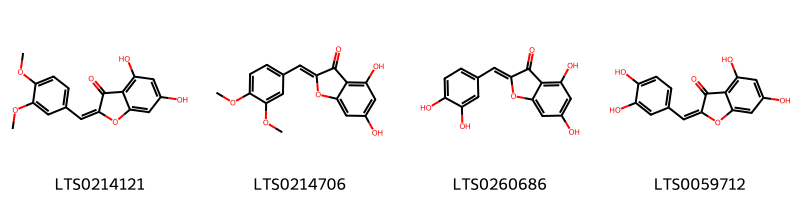{ width=100% }
    <figcaption>Hình ảnh cấu trúc hóa học của 4 hoạt chất thuộc nhóm Aurone flavonoids gồm ['2-[(3,4-dimethoxyphenyl)methylidene]-4,6-dihydroxy-1-benzofuran-3-one (LTS0214121)', '(2z)-2-[(3,4-dimethoxyphenyl)methylidene]-4,6-dihydroxy-1-benzofuran-3-one (LTS0214706)', 'aureusidin (LTS0260686)', 'aureusidin (LTS0059712)'].</figcaption>
</figure>
#### Nhóm Flavonoids
<figure markdown="span">
    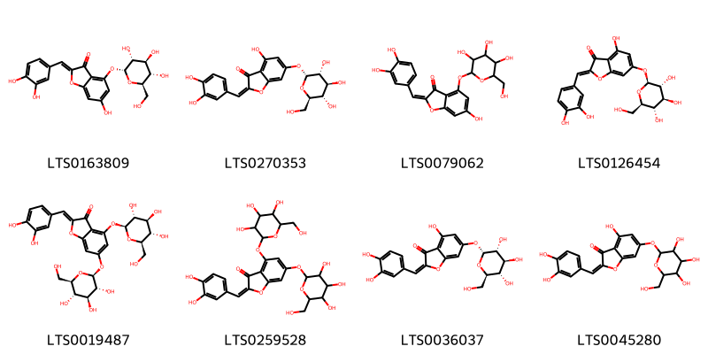{ width=100% }
    <figcaption>Hình ảnh cấu trúc hóa học của 8 hoạt chất thuộc nhóm Flavonoids gồm ['(2z)-2-[(3,4-dihydroxyphenyl)methylidene]-6-hydroxy-4-{[(2r,3r,4s,5s,6r)-3,4,5-trihydroxy-6-(hydroxymethyl)oxan-2-yl]oxy}-1-benzofuran-3-one (LTS0163809)', '(2e)-2-[(3,4-dihydroxyphenyl)methylidene]-4-hydroxy-6-{[(2r,3r,4s,5s,6r)-3,4,5-trihydroxy-6-(hydroxymethyl)oxan-2-yl]oxy}-1-benzofuran-3-one (LTS0270353)', '2-[(3,4-dihydroxyphenyl)methylidene]-6-hydroxy-4-{[3,4,5-trihydroxy-6-(hydroxymethyl)oxan-2-yl]oxy}-1-benzofuran-3-one (LTS0079062)', 'aureusidin 6-o-glucoside (LTS0126454)', '(2z)-2-[(3,4-dihydroxyphenyl)methylidene]-4,6-bis({[(2s,3r,4s,5s,6r)-3,4,5-trihydroxy-6-(hydroxymethyl)oxan-2-yl]oxy})-1-benzofuran-3-one (LTS0019487)', '2-[(3,4-dihydroxyphenyl)methylidene]-4,6-bis({[3,4,5-trihydroxy-6-(hydroxymethyl)oxan-2-yl]oxy})-1-benzofuran-3-one (LTS0259528)', '2-[(3,4-dihydroxyphenyl)methylidene]-4-hydroxy-6-{[(2r,3r,4s,5s,6r)-3,4,5-trihydroxy-6-(hydroxymethyl)oxan-2-yl]oxy}-1-benzofuran-3-one (LTS0036037)', '2-[(3,4-dihydroxyphenyl)methylidene]-4-hydroxy-6-{[3,4,5-trihydroxy-6-(hydroxymethyl)oxan-2-yl]oxy}-1-benzofuran-3-one (LTS0045280)'].</figcaption>
</figure>
#### Nhóm Organooxygen compounds
<figure markdown="span">
    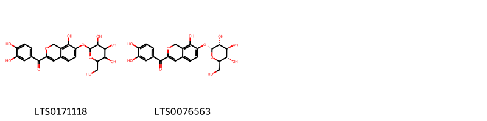{ width=100% }
    <figcaption>Hình ảnh cấu trúc hóa học của 2 hoạt chất thuộc nhóm Organooxygen compounds gồm ['2-{[3-(3,4-dihydroxybenzoyl)-8-hydroxy-1h-isochromen-7-yl]oxy}-6-(hydroxymethyl)oxane-3,4,5-triol (LTS0171118)', '(2r,3r,4s,5s,6r)-2-{[3-(3,4-dihydroxybenzoyl)-8-hydroxy-1h-isochromen-7-yl]oxy}-6-(hydroxymethyl)oxane-3,4,5-triol (LTS0076563)'].</figcaption>
</figure>
#### Nhóm Prenol lipids
<figure markdown="span">
    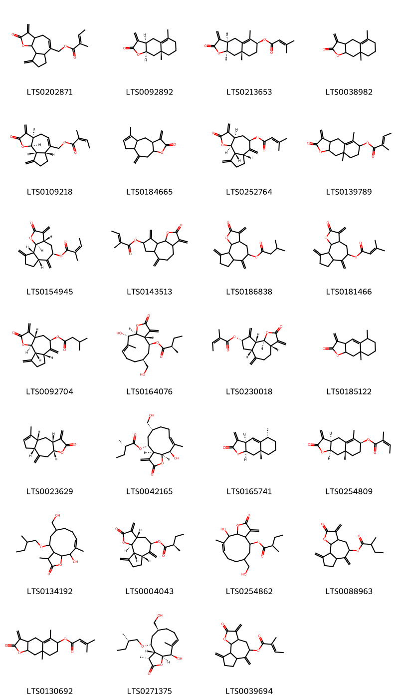{ width=100% }
    <figcaption>Hình ảnh cấu trúc hóa học của 27 hoạt chất thuộc nhóm Prenol lipids gồm ['{3,9-dimethylidene-2-oxo-3ah,4h,6ah,7h,8h,9ah,9bh-azuleno[4,5-b]furan-6-yl}methyl 2-methylbut-2-enoate (LTS0202871)', '(3ar,8ar,9ar)-5,8a-dimethyl-3-methylidene-3ah,4h,6h,7h,8h,9h,9ah-naphtho[2,3-b]furan-2-one (LTS0092892)', '(3ar,6s,8ar,9ar)-5,8a-dimethyl-3-methylidene-2-oxo-3ah,4h,6h,7h,8h,9h,9ah-naphtho[2,3-b]furan-6-yl 3-methylbut-2-enoate (LTS0213653)', '5,8a-dimethyl-3-methylidene-3ah,4h,6h,7h,8h,9h,9ah-naphtho[2,3-b]furan-2-one (LTS0038982)', '[(3ar,6ar,9ar,9bs)-3,9-dimethylidene-2-oxo-3ah,4h,6ah,7h,8h,9ah,9bh-azuleno[4,5-b]furan-6-yl]methyl (2z)-2-methylbut-2-enoate (LTS0109218)', '5-methyl-3,8-dimethylidene-3ah,4h,4ah,7h,7ah,9h,9ah-azuleno[6,5-b]furan-2-one (LTS0184665)', '(3ar,5r,6ar,9ar,9bs)-3,6,9-trimethylidene-2-oxo-octahydroazuleno[4,5-b]furan-5-yl 3-methylbut-2-enoate (LTS0252764)', '5,8a-dimethyl-3-methylidene-2-oxo-3ah,4h,6h,7h,8h,9h,9ah-naphtho[2,3-b]furan-6-yl 2-methylbut-2-enoate (LTS0139789)', '(3as,5r,6ar,9ar,9bs)-3,6,9-trimethylidene-2-oxo-octahydroazuleno[4,5-b]furan-5-yl (2z)-2-methylbut-2-enoate (LTS0154945)', '3,6,9-trimethylidene-2-oxo-octahydroazuleno[4,5-b]furan-8-yl 2-methylbut-2-enoate (LTS0143513)', '3,6,9-trimethylidene-2-oxo-octahydroazuleno[4,5-b]furan-5-yl 3-methylbutanoate (LTS0186838)', '3,6,9-trimethylidene-2-oxo-octahydroazuleno[4,5-b]furan-5-yl 3-methylbut-2-enoate (LTS0181466)', '(3as,5r,6ar,9ar,9bs)-3,6,9-trimethylidene-2-oxo-octahydroazuleno[4,5-b]furan-5-yl 3-methylbutanoate (LTS0092704)', '(3ar,4s,6s,11s,11as)-11-hydroxy-6-(hydroxymethyl)-10-methyl-3-methylidene-2-oxo-3ah,4h,5h,6h,7h,8h,11h,11ah-cyclodeca[b]furan-4-yl (2r)-2-methylbutanoate (LTS0164076)', '(3as,6ar,8s,9ar,9bs)-3,6,9-trimethylidene-2-oxo-octahydroazuleno[4,5-b]furan-8-yl (2z)-2-methylbut-2-enoate (LTS0230018)', 'alantolactone (LTS0185122)', '(3ar,4ar,7ar,9ar)-5-methyl-3,8-dimethylidene-3ah,4h,4ah,7h,7ah,9h,9ah-azuleno[6,5-b]furan-2-one (LTS0023629)', '(3as,4r,6r,11r,11as)-11-hydroxy-6-(hydroxymethyl)-10-methyl-3-methylidene-2-oxo-3ah,4h,5h,6h,7h,8h,11h,11ah-cyclodeca[b]furan-4-yl (2s)-2-methylbutanoate (LTS0042165)', '(3ar,5r,8ar,9ar)-5,8a-dimethyl-3-methylidene-3ah,5h,6h,7h,8h,9h,9ah-naphtho[2,3-b]furan-2-one (LTS0165741)', '(3ar,6s,8ar,9ar)-5,8a-dimethyl-3-methylidene-2-oxo-3ah,4h,6h,7h,8h,9h,9ah-naphtho[2,3-b]furan-6-yl (2z)-2-methylbut-2-enoate (LTS0254809)', '11-hydroxy-6-(hydroxymethyl)-3,10-dimethyl-4-(2-methylbutoxy)-3h,3ah,4h,5h,6h,7h,8h,11h,11ah-cyclodeca[b]furan-2-one (LTS0134192)', '(3as,5r,6ar,9ar,9bs)-3,6,9-trimethylidene-2-oxo-octahydroazuleno[4,5-b]furan-5-yl (2r)-2-methylbutanoate (LTS0004043)', '11-hydroxy-6-(hydroxymethyl)-10-methyl-3-methylidene-2-oxo-3ah,4h,5h,6h,7h,8h,11h,11ah-cyclodeca[b]furan-4-yl 2-methylbutanoate (LTS0254862)', '3,6,9-trimethylidene-2-oxo-octahydroazuleno[4,5-b]furan-5-yl 2-methylbutanoate (LTS0088963)', '5,8a-dimethyl-3-methylidene-2-oxo-3ah,4h,6h,7h,8h,9h,9ah-naphtho[2,3-b]furan-6-yl 3-methylbut-2-enoate (LTS0130692)', '(3r,3ar,4r,6s,11r,11as)-11-hydroxy-6-(hydroxymethyl)-3,10-dimethyl-4-[(2s)-2-methylbutoxy]-3h,3ah,4h,5h,6h,7h,8h,11h,11ah-cyclodeca[b]furan-2-one (LTS0271375)', '3,6,9-trimethylidene-2-oxo-octahydroazuleno[4,5-b]furan-5-yl 2-methylbut-2-enoate (LTS0039694)'].</figcaption>
</figure>
#### Nhóm Unsaturated hydrocarbons
<figure markdown="span">
    { width=100% }
    <figcaption>Hình ảnh cấu trúc hóa học của 1 hoạt chất thuộc nhóm Unsaturated hydrocarbons gồm ['tridec-1-en-3,5,7,9,11-pentayne (LTS0085389)'].</figcaption>
</figure>

---

### Dược dân tộc học

Danh sách các quốc gia có sử dụng *Zinnia angustifolia* trong điều trị các bệnh. 

| Country   | Disease   | Bệnh                                                                                                                                                                                                |
|:----------|:----------|:----------------------------------------------------------------------------------------------------------------------------------------------------------------------------------------------------|
| Elsewhere | Poison    | MYMEMORY WARNING: YOU USED ALL AVAILABLE FREE TRANSLATIONS FOR TODAY. NEXT AVAILABLE IN  11 HOURS 16 MINUTES 47 SECONDS VISIT HTTPS://MYMEMORY.TRANSLATED.NET/DOC/USAGELIMITS.PHP TO TRANSLATE MORE |

---

---
## Zinnia peruviana
### Thông tin về thực vật

!!! info "Phân loại thực vật của *Zinnia peruviana* từ GIBF:"
    - **Kingdom:** Plantae
    - **Phylum:** Tracheophyta
    - **Order:** Asterales
    - **Family:** Asteraceae
    - **Genus:** Zinnia
    - **Species:** *Zinnia peruviana*

 

| Label (VI)   | Label (EN)   | Scientific Name   | Descriptions (VI)   | Descriptions (EN)   | Also Known As (VI)   | Also Known As (EN)   |
|:-------------|:-------------|:------------------|:--------------------|:--------------------|:---------------------|:---------------------|
| N/A          | N/A          | Zinnia peruviana  | loài thực vật       | species of plant    | ['']                 | ['Peruvian zinnia']  |

#### Phân bố trên thế giới

**Từ CSDL GIBF** nan, Ecuador, South Africa, Australia, Brazil, Argentina, Bolivia (Plurinational State of), Botswana, United States of America, Peru, Kenya, Mexico, Zimbabwe, Eswatini

#### Phân bố tại Việt Nam

**Từ CSDL GIBF**: Không có ghi nhận ở Việt Nam

---
### Thành phần hóa học
        
- Theo cơ sở dữ liệu lotus: Từ loài *Zinnia peruviana* đã phân lập và xác định được 44 hoạt chất thuộc về các nhóm Unsaturated hydrocarbons, Oxepanes, Prenol lipids, Benzofurans. 

|    | chemicalTaxonomyClassyfireClass   |   smiles_count |
|---:|:----------------------------------|---------------:|
|  0 | Benzofurans                       |              3 |
|  1 | Oxepanes                          |              8 |
|  2 | Prenol lipids                     |             32 |
|  3 | Unsaturated hydrocarbons          |              1 |

#### Nhóm Benzofurans
<figure markdown="span">
    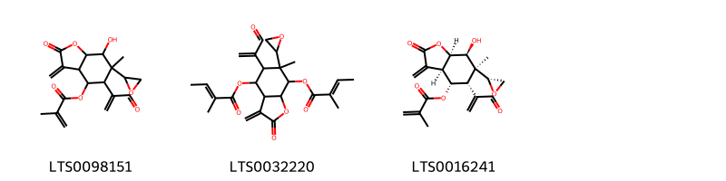{ width=100% }
    <figcaption>Hình ảnh cấu trúc hóa học của 3 hoạt chất thuộc nhóm Benzofurans gồm ['7-hydroxy-6-methyl-3-methylidene-6-(oxiran-2-yl)-2-oxo-5-(3-oxoprop-1-en-2-yl)-tetrahydro-3ah-1-benzofuran-4-yl 2-methylprop-2-enoate (LTS0098151)', '6-methyl-7-[(2-methylbut-2-enoyl)oxy]-3-methylidene-6-(oxiran-2-yl)-2-oxo-5-(3-oxoprop-1-en-2-yl)-tetrahydro-3ah-1-benzofuran-4-yl 2-methylbut-2-enoate (LTS0032220)', '(3ar,4s,5r,6s,7s,7ar)-7-hydroxy-6-methyl-3-methylidene-6-[(2r)-oxiran-2-yl]-2-oxo-5-(3-oxoprop-1-en-2-yl)-tetrahydro-3ah-1-benzofuran-4-yl 2-methylprop-2-enoate (LTS0016241)'].</figcaption>
</figure>
#### Nhóm Oxepanes
<figure markdown="span">
    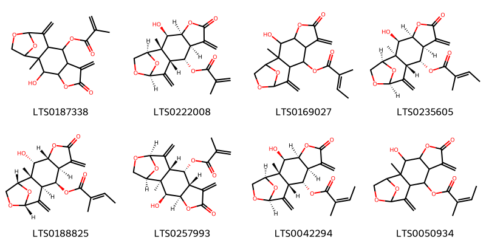{ width=100% }
    <figcaption>Hình ảnh cấu trúc hóa học của 8 hoạt chất thuộc nhóm Oxepanes gồm ['3-hydroxy-2-methyl-7,11-dimethylidene-6-oxo-5,13,15-trioxatetracyclo[10.2.1.0²,¹⁰.0⁴,⁸]pentadecan-9-yl 2-methylprop-2-enoate (LTS0187338)', '(1r,2s,3r,4s,8s,9r,10s,12s)-3-hydroxy-2-methyl-7,11-dimethylidene-6-oxo-5,13,15-trioxatetracyclo[10.2.1.0²,¹⁰.0⁴,⁸]pentadecan-9-yl 2-methylprop-2-enoate (LTS0222008)', '3-hydroxy-2-methyl-7,11-dimethylidene-6-oxo-5,13,15-trioxatetracyclo[10.2.1.0²,¹⁰.0⁴,⁸]pentadecan-9-yl 2-methylbut-2-enoate (LTS0169027)', '(1r,2r,3r,4s,8s,9r,10s,12s)-3-hydroxy-2-methyl-7,11-dimethylidene-6-oxo-5,13,15-trioxatetracyclo[10.2.1.0²,¹⁰.0⁴,⁸]pentadecan-9-yl (2e)-2-methylbut-2-enoate (LTS0235605)', '(1s,2s,3s,4r,8s,9s,10r,12r)-3-hydroxy-2-methyl-7,11-dimethylidene-6-oxo-5,13,15-trioxatetracyclo[10.2.1.0²,¹⁰.0⁴,⁸]pentadecan-9-yl (2e)-2-methylbut-2-enoate (LTS0188825)', '(1s,2s,3s,4r,8s,9s,10r,12r)-3-hydroxy-2-methyl-7,11-dimethylidene-6-oxo-5,13,15-trioxatetracyclo[10.2.1.0²,¹⁰.0⁴,⁸]pentadecan-9-yl 2-methylprop-2-enoate (LTS0257993)', '(1r,2s,3r,4s,8s,9r,10s,12s)-3-hydroxy-2-methyl-7,11-dimethylidene-6-oxo-5,13,15-trioxatetracyclo[10.2.1.0²,¹⁰.0⁴,⁸]pentadecan-9-yl (2z)-2-methylbut-2-enoate (LTS0042294)', '3-hydroxy-2-methyl-7,11-dimethylidene-6-oxo-5,13,15-trioxatetracyclo[10.2.1.0²,¹⁰.0⁴,⁸]pentadecan-9-yl (2z)-2-methylbut-2-enoate (LTS0050934)'].</figcaption>
</figure>
#### Nhóm Prenol lipids
<figure markdown="span">
    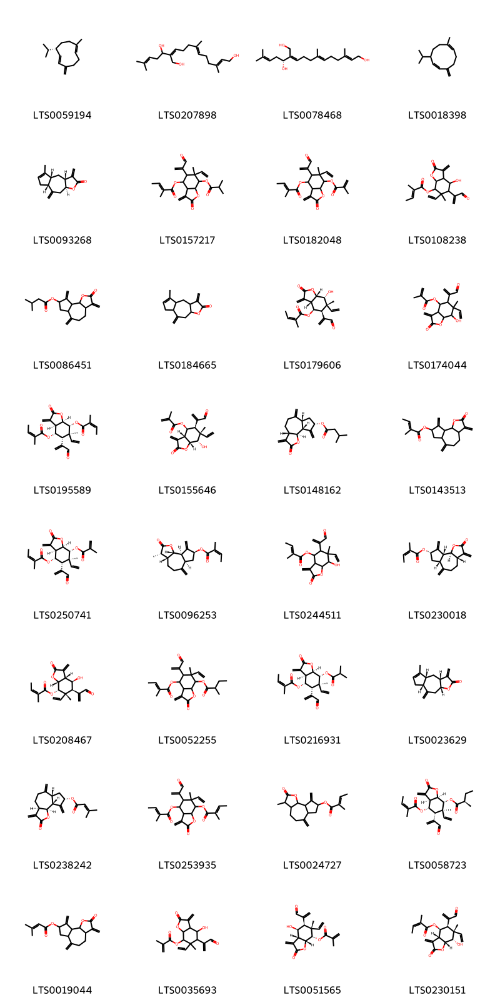{ width=100% }
    <figcaption>Hình ảnh cấu trúc hóa học của 32 hoạt chất thuộc nhóm Prenol lipids gồm ['(-)-germacrene d (LTS0059194)', '11-(hydroxymethyl)-3,7,15-trimethylhexadeca-2,6,10,14-tetraene-1,12-diol (LTS0207898)', '(2e,6e,10e,12r)-11-(hydroxymethyl)-3,7,15-trimethylhexadeca-2,6,10,14-tetraene-1,12-diol (LTS0078468)', '8-isopropyl-1-methyl-5-methylidenecyclodeca-1,6-diene (LTS0018398)', '(3ar,4ar,7ar,9as)-5-methyl-3,8-dimethylidene-3ah,4h,4ah,7h,7ah,9h,9ah-azuleno[6,5-b]furan-2-one (LTS0093268)', '6-ethenyl-6-methyl-3-methylidene-7-[(2-methylpropanoyl)oxy]-2-oxo-5-(3-oxoprop-1-en-2-yl)-tetrahydro-3ah-1-benzofuran-4-yl 2-methylbut-2-enoate (LTS0157217)', '6-ethenyl-6-methyl-3-methylidene-7-[(2-methylprop-2-enoyl)oxy]-2-oxo-5-(3-oxoprop-1-en-2-yl)-tetrahydro-3ah-1-benzofuran-4-yl 2-methylbut-2-enoate (LTS0182048)', '6-ethenyl-4-hydroxy-6-methyl-3-methylidene-2-oxo-5-(3-oxoprop-1-en-2-yl)-tetrahydro-3ah-1-benzofuran-7-yl 2-methylbut-2-enoate (LTS0108238)', '3,6,9-trimethylidene-2-oxo-octahydroazuleno[4,5-b]furan-8-yl 3-methylbutanoate (LTS0086451)', '5-methyl-3,8-dimethylidene-3ah,4h,4ah,7h,7ah,9h,9ah-azuleno[6,5-b]furan-2-one (LTS0184665)', '(3as,4r,5s,6r,7r,7as)-6-ethenyl-7-hydroxy-6-methyl-3-methylidene-2-oxo-5-(3-oxoprop-1-en-2-yl)-tetrahydro-3ah-1-benzofuran-4-yl (2z)-2-methylbut-2-enoate (LTS0179606)', '6-ethenyl-7-hydroxy-6-methyl-3-methylidene-2-oxo-5-(3-oxoprop-1-en-2-yl)-tetrahydro-3ah-1-benzofuran-4-yl 2-methylprop-2-enoate (LTS0174044)', '(3ar,4s,5r,6s,7r,7ar)-6-ethenyl-6-methyl-7-{[(2z)-2-methylbut-2-enoyl]oxy}-3-methylidene-2-oxo-5-(3-oxoprop-1-en-2-yl)-tetrahydro-3ah-1-benzofuran-4-yl (2z)-2-methylbut-2-enoate (LTS0195589)', '(3ar,4s,5r,6s,7s,7ar)-6-ethenyl-7-hydroxy-6-methyl-3-methylidene-2-oxo-5-(3-oxoprop-1-en-2-yl)-tetrahydro-3ah-1-benzofuran-4-yl 2-methylprop-2-enoate (LTS0155646)', '(3as,6ar,8s,9ar,9bs)-3,6,9-trimethylidene-2-oxo-octahydroazuleno[4,5-b]furan-8-yl 3-methylbutanoate (LTS0148162)', '3,6,9-trimethylidene-2-oxo-octahydroazuleno[4,5-b]furan-8-yl 2-methylbut-2-enoate (LTS0143513)', '(3ar,4s,5r,6s,7r,7ar)-6-ethenyl-6-methyl-3-methylidene-7-[(2-methylprop-2-enoyl)oxy]-2-oxo-5-(3-oxoprop-1-en-2-yl)-tetrahydro-3ah-1-benzofuran-4-yl (2z)-2-methylbut-2-enoate (LTS0250741)', '(3s,3ar,6ar,8s,9ar,9bs)-3-methyl-6,9-dimethylidene-2-oxo-octahydro-3h-azuleno[4,5-b]furan-8-yl (2z)-2-methylbut-2-enoate (LTS0096253)', '6-ethenyl-7-hydroxy-6-methyl-3-methylidene-2-oxo-5-(3-oxoprop-1-en-2-yl)-tetrahydro-3ah-1-benzofuran-4-yl 2-methylbut-2-enoate (LTS0244511)', '(3as,6ar,8s,9ar,9bs)-3,6,9-trimethylidene-2-oxo-octahydroazuleno[4,5-b]furan-8-yl (2z)-2-methylbut-2-enoate (LTS0230018)', '(3ar,4s,5r,6s,7s,7ar)-6-ethenyl-4-hydroxy-6-methyl-3-methylidene-2-oxo-5-(3-oxoprop-1-en-2-yl)-tetrahydro-3ah-1-benzofuran-7-yl (2z)-2-methylbut-2-enoate (LTS0208467)', '6-ethenyl-6-methyl-7-[(2-methylbutanoyl)oxy]-3-methylidene-2-oxo-5-(3-oxoprop-1-en-2-yl)-tetrahydro-3ah-1-benzofuran-4-yl 2-methylbut-2-enoate (LTS0052255)', '(3ar,4s,5r,6s,7r,7ar)-6-ethenyl-6-methyl-3-methylidene-7-[(2-methylpropanoyl)oxy]-2-oxo-5-(3-oxoprop-1-en-2-yl)-tetrahydro-3ah-1-benzofuran-4-yl (2z)-2-methylbut-2-enoate (LTS0216931)', '(3ar,4ar,7ar,9ar)-5-methyl-3,8-dimethylidene-3ah,4h,4ah,7h,7ah,9h,9ah-azuleno[6,5-b]furan-2-one (LTS0023629)', '(3ar,6ar,8s,9ar,9bs)-3,6,9-trimethylidene-2-oxo-octahydroazuleno[4,5-b]furan-8-yl 3-methylbut-2-enoate (LTS0238242)', '6-ethenyl-6-methyl-4-[(2-methylbut-2-enoyl)oxy]-3-methylidene-2-oxo-5-(3-oxoprop-1-en-2-yl)-tetrahydro-3ah-1-benzofuran-7-yl 2-methylbut-2-enoate (LTS0253935)', '3-methyl-6,9-dimethylidene-2-oxo-octahydro-3h-azuleno[4,5-b]furan-8-yl 2-methylbut-2-enoate (LTS0024727)', '(3ar,4s,5r,6s,7r,7ar)-6-ethenyl-6-methyl-7-{[(2r)-2-methylbutanoyl]oxy}-3-methylidene-2-oxo-5-(3-oxoprop-1-en-2-yl)-tetrahydro-3ah-1-benzofuran-4-yl (2z)-2-methylbut-2-enoate (LTS0058723)', '3,6,9-trimethylidene-2-oxo-octahydroazuleno[4,5-b]furan-8-yl 3-methylbut-2-enoate (LTS0019044)', '6-ethenyl-4-hydroxy-6-methyl-3-methylidene-2-oxo-5-(3-oxoprop-1-en-2-yl)-tetrahydro-3ah-1-benzofuran-7-yl 2-methylprop-2-enoate (LTS0035693)', '(3ar,4s,5r,6s,7s,7ar)-6-ethenyl-4-hydroxy-6-methyl-3-methylidene-2-oxo-5-(3-oxoprop-1-en-2-yl)-tetrahydro-3ah-1-benzofuran-7-yl 2-methylprop-2-enoate (LTS0051565)', '(3ar,4s,5r,6s,7s,7ar)-6-ethenyl-7-hydroxy-6-methyl-3-methylidene-2-oxo-5-(3-oxoprop-1-en-2-yl)-tetrahydro-3ah-1-benzofuran-4-yl (2z)-2-methylbut-2-enoate (LTS0230151)'].</figcaption>
</figure>
#### Nhóm Unsaturated hydrocarbons
<figure markdown="span">
    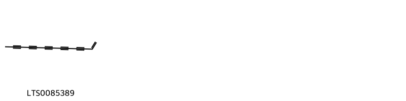{ width=100% }
    <figcaption>Hình ảnh cấu trúc hóa học của 1 hoạt chất thuộc nhóm Unsaturated hydrocarbons gồm ['tridec-1-en-3,5,7,9,11-pentayne (LTS0085389)'].</figcaption>
</figure>

---

### Dược dân tộc học

Danh sách các quốc gia có sử dụng *Zinnia peruviana* trong điều trị các bệnh. 

| Country   | Disease   | Bệnh                                                                                                                                                                                                |
|:----------|:----------|:----------------------------------------------------------------------------------------------------------------------------------------------------------------------------------------------------|
| Haiti     | Digestive | MYMEMORY WARNING: YOU USED ALL AVAILABLE FREE TRANSLATIONS FOR TODAY. NEXT AVAILABLE IN  11 HOURS 16 MINUTES 14 SECONDS VISIT HTTPS://MYMEMORY.TRANSLATED.NET/DOC/USAGELIMITS.PHP TO TRANSLATE MORE |

---

# Chi Atractylis

??? note "Danh sách các dược liệu thuộc chi"
    
	 - *Atractylis chinensis*
	 - *Atractylis gummifera*
	 - *Atractylis ovata*
	 - *Atractylis sinensis*

---
## Atractylis chinensis
### Thông tin về thực vật

!!! info "Phân loại thực vật của *Atractylodes lancea* từ GIBF:"
    - **Kingdom:** Plantae
    - **Phylum:** Tracheophyta
    - **Order:** Asterales
    - **Family:** Asteraceae
    - **Genus:** Atractylodes
    - **Species:** *Atractylodes lancea*

 

| Label (VI)   | Label (EN)   | Scientific Name      | Descriptions (VI)   | Descriptions (EN)   | Also Known As (VI)   | Also Known As (EN)   |
|:-------------|:-------------|:---------------------|:--------------------|:--------------------|:---------------------|:---------------------|
| N/A          | N/A          | Atractylis chinensis |                     |                     | ['']                 | ['']                 |

#### Phân bố trên thế giới

**Từ CSDL GIBF** nan, Korea, Republic of, Russian Federation, China

#### Phân bố tại Việt Nam

**Từ CSDL GIBF**: Không có ghi nhận ở Việt Nam

---
### Thành phần hóa học
        
- Theo cơ sở dữ liệu lotus: Từ loài *Atractylodes lancea* đã phân lập và xác định được Chưa có hoạt chất nào được phân lập. hoạt chất thuộc về các nhóm Không có hoạt chất nào được phân lập. 

Không có hình ảnh nào được tạo ra

---

### Dược dân tộc học

Danh sách các quốc gia có sử dụng *Atractylodes lancea* trong điều trị các bệnh. 

| Country   | Disease                               | Bệnh                                                                                                                                                                                                |
|:----------|:--------------------------------------|:----------------------------------------------------------------------------------------------------------------------------------------------------------------------------------------------------|
| China     | Diuretic, Stomachic, Stimulant, Tonic | MYMEMORY WARNING: YOU USED ALL AVAILABLE FREE TRANSLATIONS FOR TODAY. NEXT AVAILABLE IN  11 HOURS 15 MINUTES 41 SECONDS VISIT HTTPS://MYMEMORY.TRANSLATED.NET/DOC/USAGELIMITS.PHP TO TRANSLATE MORE |

---

---
## Atractylis gummifera
### Thông tin về thực vật

!!! info "Phân loại thực vật của *Atractylis gummifera* từ GIBF:"
    - **Kingdom:** Plantae
    - **Phylum:** Tracheophyta
    - **Order:** Asterales
    - **Family:** Asteraceae
    - **Genus:** Atractylis
    - **Species:** *Atractylis gummifera*

 

| Label (VI)   | Label (EN)   | Scientific Name      | Descriptions (VI)   | Descriptions (EN)   | Also Known As (VI)   | Also Known As (EN)   |
|:-------------|:-------------|:---------------------|:--------------------|:--------------------|:---------------------|:---------------------|
| N/A          | N/A          | Atractylis gummifera | loài thực vật       | species of plant    | ['']                 | ['']                 |

#### Phân bố trên thế giới

**Từ CSDL GIBF** nan, Italy, Greece

#### Phân bố tại Việt Nam

**Từ CSDL GIBF**: Không có ghi nhận ở Việt Nam

---
### Thành phần hóa học
        
- Theo cơ sở dữ liệu lotus: Từ loài *Atractylis gummifera* đã phân lập và xác định được 7 hoạt chất thuộc về các nhóm Flavonoids, Prenol lipids. 

|    | chemicalTaxonomyClassyfireClass   |   smiles_count |
|---:|:----------------------------------|---------------:|
|  0 | Flavonoids                        |              3 |
|  1 | Prenol lipids                     |              4 |

#### Nhóm Flavonoids
<figure markdown="span">
    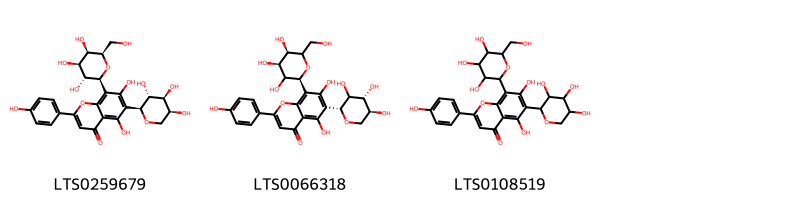{ width=100% }
    <figcaption>Hình ảnh cấu trúc hóa học của 3 hoạt chất thuộc nhóm Flavonoids gồm ['5,7-dihydroxy-2-(4-hydroxyphenyl)-8-[(2s,3r,4r,5r,6r)-3,4,5-trihydroxy-6-(hydroxymethyl)oxan-2-yl]-6-[(2s,3r,4s,5s)-3,4,5-trihydroxyoxan-2-yl]chromen-4-one (LTS0259679)', 'neocorymboside (LTS0066318)', '5,7-dihydroxy-2-(4-hydroxyphenyl)-8-[3,4,5-trihydroxy-6-(hydroxymethyl)oxan-2-yl]-6-(3,4,5-trihydroxyoxan-2-yl)chromen-4-one (LTS0108519)'].</figcaption>
</figure>
#### Nhóm Prenol lipids
<figure markdown="span">
    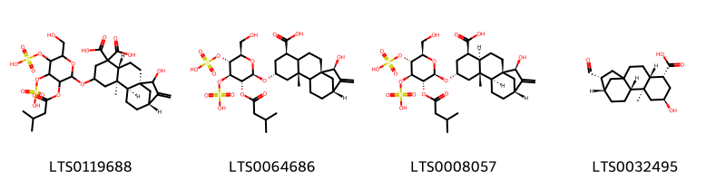{ width=100% }
    <figcaption>Hình ảnh cấu trúc hóa học của 4 hoạt chất thuộc nhóm Prenol lipids gồm ['(1s,4r,9r,10s,13r)-15-hydroxy-7-{[6-(hydroxymethyl)-3-[(3-methylbutanoyl)oxy]-4,5-bis(sulfooxy)oxan-2-yl]oxy}-9-methyl-14-methylidenetetracyclo[11.2.1.0¹,¹⁰.0⁴,⁹]hexadecane-5,5-dicarboxylic acid (LTS0119688)', '(1r,5r,7r,9r,13r,15s)-15-hydroxy-7-{[(2r,3r,4r,5r,6r)-6-(hydroxymethyl)-3-[(3-methylbutanoyl)oxy]-4,5-bis(sulfooxy)oxan-2-yl]oxy}-9-methyl-14-methylidenetetracyclo[11.2.1.0¹,¹⁰.0⁴,⁹]hexadecane-5-carboxylic acid (LTS0064686)', 'atractyloside (LTS0008057)', '(4r,5r,7r,9r,10r,13s,14r)-14-formyl-7-hydroxy-9-methyltetracyclo[11.2.1.0¹,¹⁰.0⁴,⁹]hexadecane-5-carboxylic acid (LTS0032495)'].</figcaption>
</figure>

---

### Dược dân tộc học

Danh sách các quốc gia có sử dụng *Atractylis gummifera* trong điều trị các bệnh. 

| Country   | Disease   | Bệnh                                                                                                                                                                                                |
|:----------|:----------|:----------------------------------------------------------------------------------------------------------------------------------------------------------------------------------------------------|
| ain       | Vermifuge | MYMEMORY WARNING: YOU USED ALL AVAILABLE FREE TRANSLATIONS FOR TODAY. NEXT AVAILABLE IN  11 HOURS 15 MINUTES 18 SECONDS VISIT HTTPS://MYMEMORY.TRANSLATED.NET/DOC/USAGELIMITS.PHP TO TRANSLATE MORE |

---

---
## Atractylis ovata
### Thông tin về thực vật

!!! info "Phân loại thực vật của *Atractylodes lancea* từ GIBF:"
    - **Kingdom:** Plantae
    - **Phylum:** Tracheophyta
    - **Order:** Asterales
    - **Family:** Asteraceae
    - **Genus:** Atractylodes
    - **Species:** *Atractylodes lancea*

 

| Label (VI)   | Label (EN)   | Scientific Name   | Descriptions (VI)   | Descriptions (EN)   | Also Known As (VI)   | Also Known As (EN)   |
|:-------------|:-------------|:------------------|:--------------------|:--------------------|:---------------------|:---------------------|
| N/A          | N/A          | Atractylis ovata  | loài thực vật       | species of plant    | ['']                 | ['']                 |

#### Phân bố trên thế giới

**Từ CSDL GIBF** nan, Hong Kong, Japan, Korea (Democratic People’s Republic of), Russian Federation, unknown or invalid, Singapore, China

#### Phân bố tại Việt Nam

**Từ CSDL GIBF**: Không có ghi nhận ở Việt Nam

---
### Thành phần hóa học
        
- Theo cơ sở dữ liệu lotus: Từ loài *Atractylodes lancea* đã phân lập và xác định được Chưa có hoạt chất nào được phân lập. hoạt chất thuộc về các nhóm Không có hoạt chất nào được phân lập. 

Không có hình ảnh nào được tạo ra

---

### Dược dân tộc học

Danh sách các quốc gia có sử dụng *Atractylodes lancea* trong điều trị các bệnh. 

| Country   | Disease            | Bệnh                                                                                                                                                                                                |
|:----------|:-------------------|:----------------------------------------------------------------------------------------------------------------------------------------------------------------------------------------------------|
| China     | Carminative, Tonic | MYMEMORY WARNING: YOU USED ALL AVAILABLE FREE TRANSLATIONS FOR TODAY. NEXT AVAILABLE IN  11 HOURS 14 MINUTES 47 SECONDS VISIT HTTPS://MYMEMORY.TRANSLATED.NET/DOC/USAGELIMITS.PHP TO TRANSLATE MORE |
| Chinese   | Diuretic           | MYMEMORY WARNING: YOU USED ALL AVAILABLE FREE TRANSLATIONS FOR TODAY. NEXT AVAILABLE IN  11 HOURS 14 MINUTES 44 SECONDS VISIT HTTPS://MYMEMORY.TRANSLATED.NET/DOC/USAGELIMITS.PHP TO TRANSLATE MORE |

---

---
## Atractylis sinensis
### Thông tin về thực vật

!!! info "Phân loại thực vật của *N/A* từ GIBF:"
    - **Kingdom:** N/A
    - **Phylum:** N/A
    - **Order:** N/A
    - **Family:** N/A
    - **Genus:** N/A
    - **Species:** *N/A*

 

| Label (VI)   | Label (EN)   | Scientific Name   | Descriptions (VI)   | Descriptions (EN)   | Also Known As (VI)   | Also Known As (EN)   |
|:-------------|:-------------|:------------------|:--------------------|:--------------------|:---------------------|:---------------------|
| N/A          | N/A          | Atractylis ovata  | loài thực vật       | species of plant    | ['']                 | ['']                 |

#### Phân bố trên thế giới

**Từ CSDL GIBF** Không có kết quả phù hợp

#### Phân bố tại Việt Nam

**Từ CSDL GIBF**: Không có ghi nhận ở Việt Nam

---
### Thành phần hóa học
        
- Theo cơ sở dữ liệu lotus: Từ loài *N/A* đã phân lập và xác định được Chưa có hoạt chất nào được phân lập. hoạt chất thuộc về các nhóm Không có hoạt chất nào được phân lập. 

Không có hình ảnh nào được tạo ra

---

### Dược dân tộc học

Danh sách các quốc gia có sử dụng *N/A* trong điều trị các bệnh. 

| Country   | Disease     | Bệnh                                                                                                                                                                                                |
|:----------|:------------|:----------------------------------------------------------------------------------------------------------------------------------------------------------------------------------------------------|
| China     | Aphrodisiac | MYMEMORY WARNING: YOU USED ALL AVAILABLE FREE TRANSLATIONS FOR TODAY. NEXT AVAILABLE IN  11 HOURS 14 MINUTES 20 SECONDS VISIT HTTPS://MYMEMORY.TRANSLATED.NET/DOC/USAGELIMITS.PHP TO TRANSLATE MORE |

---

# Chi Scolymus

??? note "Danh sách các dược liệu thuộc chi"
    
	 - *Scolymus hianicus*

---
## Scolymus hianicus
### Thông tin về thực vật

!!! info "Phân loại thực vật của *N/A* từ GIBF:"
    - **Kingdom:** N/A
    - **Phylum:** N/A
    - **Order:** N/A
    - **Family:** N/A
    - **Genus:** N/A
    - **Species:** *N/A*

 

| Label (VI)   | Label (EN)   | Scientific Name   | Descriptions (VI)   | Descriptions (EN)   | Also Known As (VI)   | Also Known As (EN)   |
|:-------------|:-------------|:------------------|:--------------------|:--------------------|:---------------------|:---------------------|
| N/A          | N/A          | Atractylis ovata  | loài thực vật       | species of plant    | ['']                 | ['']                 |

#### Phân bố trên thế giới

**Từ CSDL GIBF** Không có kết quả phù hợp

#### Phân bố tại Việt Nam

**Từ CSDL GIBF**: Không có ghi nhận ở Việt Nam

---
### Thành phần hóa học
        
- Theo cơ sở dữ liệu lotus: Từ loài *N/A* đã phân lập và xác định được Chưa có hoạt chất nào được phân lập. hoạt chất thuộc về các nhóm Không có hoạt chất nào được phân lập. 

Không có hình ảnh nào được tạo ra

---

### Dược dân tộc học

Danh sách các quốc gia có sử dụng *N/A* trong điều trị các bệnh. 

| Country   | Disease   | Bệnh                                                                                                                                                                                                |
|:----------|:----------|:----------------------------------------------------------------------------------------------------------------------------------------------------------------------------------------------------|
| ain       | Diuretic  | MYMEMORY WARNING: YOU USED ALL AVAILABLE FREE TRANSLATIONS FOR TODAY. NEXT AVAILABLE IN  11 HOURS 14 MINUTES 03 SECONDS VISIT HTTPS://MYMEMORY.TRANSLATED.NET/DOC/USAGELIMITS.PHP TO TRANSLATE MORE |

---

# Chi Conyza

??? note "Danh sách các dược liệu thuộc chi"
    
	 - *Conyza obscura*
	 - *Conyza pinnata*
	 - *Conyza squarrosa*

---
## Conyza obscura
### Thông tin về thực vật

!!! info "Phân loại thực vật của *Nidorella obscura* từ GIBF:"
    - **Kingdom:** Plantae
    - **Phylum:** Tracheophyta
    - **Order:** Asterales
    - **Family:** Asteraceae
    - **Genus:** Nidorella
    - **Species:** *Nidorella obscura*

 

| Label (VI)   | Label (EN)   | Scientific Name   | Descriptions (VI)   | Descriptions (EN)   | Also Known As (VI)   | Also Known As (EN)   |
|:-------------|:-------------|:------------------|:--------------------|:--------------------|:---------------------|:---------------------|
| N/A          | N/A          | Conyza obscura    | loài thực vật       | species of plant    | ['']                 | ['']                 |

#### Phân bố trên thế giới

**Từ CSDL GIBF** nan, Zambia, South Africa, Lesotho, unknown or invalid, Tanzania, United Republic of, Zimbabwe, Eswatini

#### Phân bố tại Việt Nam

**Từ CSDL GIBF**: Không có ghi nhận ở Việt Nam

---
### Thành phần hóa học
        
- Theo cơ sở dữ liệu lotus: Từ loài *Nidorella obscura* đã phân lập và xác định được Chưa có hoạt chất nào được phân lập. hoạt chất thuộc về các nhóm Không có hoạt chất nào được phân lập. 

Không có hình ảnh nào được tạo ra

---

### Dược dân tộc học

Danh sách các quốc gia có sử dụng *Nidorella obscura* trong điều trị các bệnh. 

| Country   | Disease   | Bệnh                                                                                                                                                                                                |
|:----------|:----------|:----------------------------------------------------------------------------------------------------------------------------------------------------------------------------------------------------|
| Lesotho   | Fumigant  | MYMEMORY WARNING: YOU USED ALL AVAILABLE FREE TRANSLATIONS FOR TODAY. NEXT AVAILABLE IN  11 HOURS 13 MINUTES 49 SECONDS VISIT HTTPS://MYMEMORY.TRANSLATED.NET/DOC/USAGELIMITS.PHP TO TRANSLATE MORE |

---

---
## Conyza pinnata
### Thông tin về thực vật

!!! info "Phân loại thực vật của *Conyza pinnata* từ GIBF:"
    - **Kingdom:** Plantae
    - **Phylum:** Tracheophyta
    - **Order:** Asterales
    - **Family:** Asteraceae
    - **Genus:** Conyza
    - **Species:** *Conyza pinnata*

 

| Label (VI)   | Label (EN)   | Scientific Name   | Descriptions (VI)   | Descriptions (EN)   | Also Known As (VI)   | Also Known As (EN)   |
|:-------------|:-------------|:------------------|:--------------------|:--------------------|:---------------------|:---------------------|
| N/A          | N/A          | Conyza pinnata    | loài thực vật       | species of plant    | ['']                 | ['']                 |

#### Phân bố trên thế giới

**Từ CSDL GIBF** nan, South Africa

#### Phân bố tại Việt Nam

**Từ CSDL GIBF**: Không có ghi nhận ở Việt Nam

---
### Thành phần hóa học
        
- Theo cơ sở dữ liệu lotus: Từ loài *Conyza pinnata* đã phân lập và xác định được Chưa có hoạt chất nào được phân lập. hoạt chất thuộc về các nhóm Không có hoạt chất nào được phân lập. 

Không có hình ảnh nào được tạo ra

---

### Dược dân tộc học

Danh sách các quốc gia có sử dụng *Conyza pinnata* trong điều trị các bệnh. 

| Country   | Disease   | Bệnh                                                                                                                                                                                                |
|:----------|:----------|:----------------------------------------------------------------------------------------------------------------------------------------------------------------------------------------------------|
| Lesotho   | Fumigant  | MYMEMORY WARNING: YOU USED ALL AVAILABLE FREE TRANSLATIONS FOR TODAY. NEXT AVAILABLE IN  11 HOURS 13 MINUTES 25 SECONDS VISIT HTTPS://MYMEMORY.TRANSLATED.NET/DOC/USAGELIMITS.PHP TO TRANSLATE MORE |

---

---
## Conyza squarrosa
### Thông tin về thực vật

!!! info "Phân loại thực vật của *Conyza squarrosa* từ GIBF:"
    - **Kingdom:** Plantae
    - **Phylum:** Tracheophyta
    - **Order:** Asterales
    - **Family:** Asteraceae
    - **Genus:** Conyza
    - **Species:** *Conyza squarrosa*

 

| Label (VI)   | Label (EN)   | Scientific Name   | Descriptions (VI)   | Descriptions (EN)   | Also Known As (VI)   | Also Known As (EN)   |
|:-------------|:-------------|:------------------|:--------------------|:--------------------|:---------------------|:---------------------|
| N/A          | N/A          | Conyza squarrosa  | loài thực vật       | species of plant    | ['']                 | ['']                 |

#### Phân bố trên thế giới

**Từ CSDL GIBF** France, nan, Germany

#### Phân bố tại Việt Nam

**Từ CSDL GIBF**: Không có ghi nhận ở Việt Nam

---
### Thành phần hóa học
        
- Theo cơ sở dữ liệu lotus: Từ loài *Conyza squarrosa* đã phân lập và xác định được Chưa có hoạt chất nào được phân lập. hoạt chất thuộc về các nhóm Không có hoạt chất nào được phân lập. 

Không có hình ảnh nào được tạo ra

---

### Dược dân tộc học

Danh sách các quốc gia có sử dụng *Conyza squarrosa* trong điều trị các bệnh. 

| Country   | Disease                                                | Bệnh                                                                                                                                                                                                |
|:----------|:-------------------------------------------------------|:----------------------------------------------------------------------------------------------------------------------------------------------------------------------------------------------------|
| Turkey    | Emmenagogue, Stomachic, Sudorific, Vulnerary, Diuretic | MYMEMORY WARNING: YOU USED ALL AVAILABLE FREE TRANSLATIONS FOR TODAY. NEXT AVAILABLE IN  11 HOURS 13 MINUTES 03 SECONDS VISIT HTTPS://MYMEMORY.TRANSLATED.NET/DOC/USAGELIMITS.PHP TO TRANSLATE MORE |

---

# Chi Ethulia

??? note "Danh sách các dược liệu thuộc chi"
    
	 - *Ethulia conyzoides*

---
## Ethulia conyzoides
### Thông tin về thực vật

!!! info "Phân loại thực vật của *Ethulia conyzoides* từ GIBF:"
    - **Kingdom:** Plantae
    - **Phylum:** Tracheophyta
    - **Order:** Asterales
    - **Family:** Asteraceae
    - **Genus:** Ethulia
    - **Species:** *Ethulia conyzoides*

 

| Label (VI)   | Label (EN)   | Scientific Name    | Descriptions (VI)   | Descriptions (EN)   | Also Known As (VI)   | Also Known As (EN)   |
|:-------------|:-------------|:-------------------|:--------------------|:--------------------|:---------------------|:---------------------|
| N/A          | N/A          | Ethulia conyzoides | loài thực vật       | species of plant    | ['']                 | ['']                 |

#### Phân bố trên thế giới

**Từ CSDL GIBF** nan, Ghana, Australia, Gabon, Lao People’s Democratic Republic, Angola, Benin, Sierra Leone, Tanzania, United Republic of, Togo, Zambia, Mali, Senegal, Nigeria, Namibia, Chad, Papua New Guinea, Congo, Democratic Republic of the, Guinea, Zimbabwe, South Africa, Uganda, Thailand, Brazil, Egypt, Côte d’Ivoire, Viet Nam, Eswatini, Madagascar, Equatorial Guinea, Botswana, Burundi, Burkina Faso, Kenya, Cameroon

#### Phân bố tại Việt Nam

**Từ CSDL GIBF**: Không có ghi nhận ở Việt Nam

---
### Thành phần hóa học
        
- Theo cơ sở dữ liệu lotus: Từ loài *Ethulia conyzoides* đã phân lập và xác định được 51 hoạt chất thuộc về các nhóm Prenol lipids, Steroids and steroid derivatives, Organooxygen compounds, Coumarins and derivatives, Benzopyrans. 

|    | chemicalTaxonomyClassyfireClass   |   smiles_count |
|---:|:----------------------------------|---------------:|
|  0 | Benzopyrans                       |              3 |
|  1 | Coumarins and derivatives         |             36 |
|  2 | Organooxygen compounds            |              6 |
|  3 | Prenol lipids                     |              4 |
|  4 | Steroids and steroid derivatives  |              2 |

#### Nhóm Benzopyrans
<figure markdown="span">
    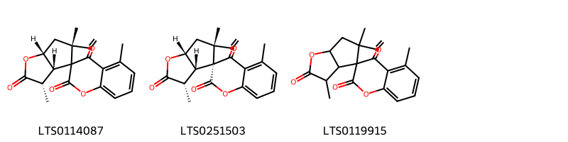{ width=100% }
    <figcaption>Hình ảnh cấu trúc hóa học của 3 hoạt chất thuộc nhóm Benzopyrans gồm ["(3's,3'as,5'r,6'ar)-5'-ethenyl-3',5,5'-trimethyl-3',3'a,6',6'a-tetrahydrospiro[1-benzopyran-3,4'-cyclopenta[b]furan]-2,2',4-trione (LTS0114087)", "(3r,3's,3'as,5'r,6'ar)-5'-ethenyl-3',5,5'-trimethyl-3',3'a,6',6'a-tetrahydrospiro[1-benzopyran-3,4'-cyclopenta[b]furan]-2,2',4-trione (LTS0251503)", "5'-ethenyl-3',5,5'-trimethyl-3',3'a,6',6'a-tetrahydrospiro[1-benzopyran-3,4'-cyclopenta[b]furan]-2,2',4-trione (LTS0119915)"].</figcaption>
</figure>
#### Nhóm Coumarins and derivatives
<figure markdown="span">
    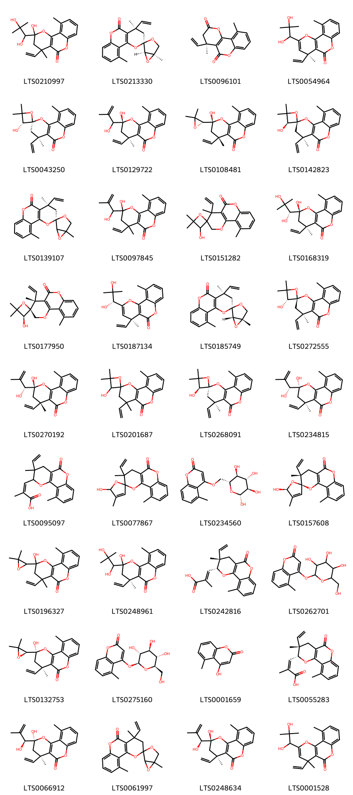{ width=100% }
    <figcaption>Hình ảnh cấu trúc hóa học của 36 hoạt chất thuộc nhóm Coumarins and derivatives gồm ['2-(1,2-dihydroxy-2-methylpropyl)-4-ethenyl-2-hydroxy-4,10-dimethyl-3h-pyrano[3,2-c]chromen-5-one (LTS0210997)', "(1r,2r,4'r,5r)-4'-ethenyl-4',5,10'-trimethyl-3'h-3,6-dioxaspiro[bicyclo[3.1.0]hexane-2,2'-pyrano[3,2-c]chromen]-5'-one (LTS0213330)", '(4r)-4-ethenyl-4,10-dimethyl-3h-pyrano[3,2-c]chromene-2,5-dione (LTS0096101)', '(4s)-2-(1,2-dihydroxy-2-methylpropyl)-4-ethenyl-4,10-dimethylpyrano[3,2-c]chromen-5-one (LTS0054964)', "(2r,3r,4'r)-4'-ethenyl-3-hydroxy-4,4,4',10'-tetramethyl-3'h-spiro[oxetane-2,2'-pyrano[3,2-c]chromen]-5'-one (LTS0043250)", '(2r,4r)-4-ethenyl-2-hydroxy-2-(1-hydroxy-2-methylprop-2-en-1-yl)-4,10-dimethyl-3h-pyrano[3,2-c]chromen-5-one (LTS0129722)', '(2r,4s)-2-[(2r)-3,3-dimethyloxiran-2-yl]-4-ethenyl-2-hydroxy-4,10-dimethyl-3h-pyrano[3,2-c]chromen-5-one (LTS0108481)', "(2s,3s,4'r)-4'-ethenyl-3-hydroxy-4,4,4',10'-tetramethyl-3'h-spiro[oxetane-2,2'-pyrano[3,2-c]chromen]-5'-one (LTS0142823)", "(2r,4'r)-4'-ethenyl-4',5,10'-trimethyl-3'h-3,6-dioxaspiro[bicyclo[3.1.0]hexane-2,2'-pyrano[3,2-c]chromen]-5'-one (LTS0139107)", '4-ethenyl-2-hydroxy-2-(1-hydroxy-2-methylprop-2-en-1-yl)-4,10-dimethyl-3h-pyrano[3,2-c]chromen-5-one (LTS0097845)', "4'-ethenyl-3-hydroxy-4,4,4',10'-tetramethyl-2'h-spiro[oxetane-2,3'-pyrano[3,2-c]chromen]-5'-one (LTS0151282)", '(2r,4r)-2-[(1r)-1,2-dihydroxy-2-methylpropyl]-4-ethenyl-2-hydroxy-4,10-dimethyl-3h-pyrano[3,2-c]chromen-5-one (LTS0168319)', "(2s,3s,4'r)-4'-ethenyl-3-hydroxy-4,4,4',10'-tetramethyl-2'h-spiro[oxetane-2,3'-pyrano[3,2-c]chromen]-5'-one (LTS0177950)", '(4s)-2-[(1r)-1,2-dihydroxy-2-methylpropyl]-4-ethenyl-4,10-dimethylpyrano[3,2-c]chromen-5-one (LTS0187134)', "(1s,2r,4'r,5s)-4'-ethenyl-4',5,10'-trimethyl-3'h-3,6-dioxaspiro[bicyclo[3.1.0]hexane-2,2'-pyrano[3,2-c]chromen]-5'-one (LTS0185749)", "(2s,3r,4'r)-4'-ethenyl-3-hydroxy-4,4,4',10'-tetramethyl-3'h-spiro[oxetane-2,2'-pyrano[3,2-c]chromen]-5'-one (LTS0272555)", '(2r,4s)-4-ethenyl-2-hydroxy-2-[(1r)-1-hydroxy-2-methylprop-2-en-1-yl]-4,10-dimethyl-3h-pyrano[3,2-c]chromen-5-one (LTS0270192)', "4'-ethenyl-3-hydroxy-4,4,4',10'-tetramethyl-3'h-spiro[oxetane-2,2'-pyrano[3,2-c]chromen]-5'-one (LTS0201687)", "(2r,3s,4'r)-4'-ethenyl-3-hydroxy-4,4,4',10'-tetramethyl-3'h-spiro[oxetane-2,2'-pyrano[3,2-c]chromen]-5'-one (LTS0268091)", '(2s,4r)-4-ethenyl-2-hydroxy-2-[(1r)-1-hydroxy-2-methylprop-2-en-1-yl]-4,10-dimethyl-3h-pyrano[3,2-c]chromen-5-one (LTS0234815)', '3-{3-ethenyl-3,10-dimethyl-5-oxo-2h,4h-pyrano[3,2-c]chromen-2-yl}-2-methylprop-2-enoic acid (LTS0095097)', "3'-ethenyl-5-hydroxy-3',4,10'-trimethyl-4'h,5h-spiro[furan-2,2'-pyrano[3,2-c]chromen]-5'-one (LTS0077867)", '5-methyl-4-{[(2r,3s,4s,5r,6r)-3,4,5,6-tetrahydroxyoxan-2-yl]methoxy}chromen-2-one (LTS0234560)', "(2s,3's,5s)-3'-ethenyl-5-hydroxy-3',4,10'-trimethyl-4'h,5h-spiro[furan-2,2'-pyrano[3,2-c]chromen]-5'-one (LTS0157608)", '2-(3,3-dimethyloxiran-2-yl)-4-ethenyl-2-hydroxy-4,10-dimethyl-3h-pyrano[3,2-c]chromen-5-one (LTS0196327)', '(4r)-2-(1,2-dihydroxy-2-methylpropyl)-4-ethenyl-2-hydroxy-4,10-dimethyl-3h-pyrano[3,2-c]chromen-5-one (LTS0248961)', '(2e)-3-[(2r,3s)-3-ethenyl-3,10-dimethyl-5-oxo-2h,4h-pyrano[3,2-c]chromen-2-yl]-2-methylprop-2-enoic acid (LTS0242816)', '5-methyl-4-{[3,4,5-trihydroxy-6-(hydroxymethyl)oxan-2-yl]oxy}chromen-2-one (LTS0262701)', '(2s,4r)-2-[(2s)-3,3-dimethyloxiran-2-yl]-4-ethenyl-2-hydroxy-4,10-dimethyl-3h-pyrano[3,2-c]chromen-5-one (LTS0132753)', '5-methyl-4-{[(2s,3r,4s,5s,6r)-3,4,5-trihydroxy-6-(hydroxymethyl)oxan-2-yl]oxy}chromen-2-one (LTS0275160)', '4-hydroxy-5-methylchromen-2-one (LTS0001659)', '(2z)-3-[(2r,3s)-3-ethenyl-3,10-dimethyl-5-oxo-2h,4h-pyrano[3,2-c]chromen-2-yl]-2-methylprop-2-enoic acid (LTS0055283)', '(2s,4r)-4-ethenyl-2-hydroxy-2-[(1s)-1-hydroxy-2-methylprop-2-en-1-yl]-4,10-dimethyl-3h-pyrano[3,2-c]chromen-5-one (LTS0066912)', "4'-ethenyl-4',5,10'-trimethyl-3'h-3,6-dioxaspiro[bicyclo[3.1.0]hexane-2,2'-pyrano[3,2-c]chromen]-5'-one (LTS0061997)", '(2r,4r)-4-ethenyl-2-hydroxy-2-[(1s)-1-hydroxy-2-methylprop-2-en-1-yl]-4,10-dimethyl-3h-pyrano[3,2-c]chromen-5-one (LTS0248634)', '2-(1,2-dihydroxy-2-methylpropyl)-4-ethenyl-4,10-dimethylpyrano[3,2-c]chromen-5-one (LTS0001528)'].</figcaption>
</figure>
#### Nhóm Organooxygen compounds
<figure markdown="span">
    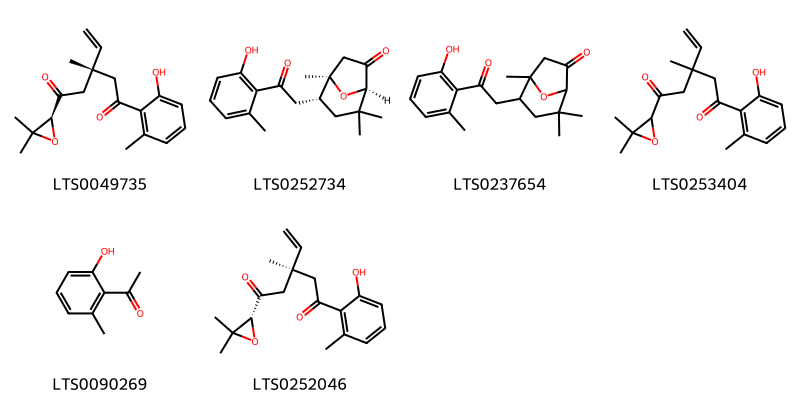{ width=100% }
    <figcaption>Hình ảnh cấu trúc hóa học của 6 hoạt chất thuộc nhóm Organooxygen compounds gồm ['(3r)-1-[(2s)-3,3-dimethyloxiran-2-yl]-3-ethenyl-5-(2-hydroxy-6-methylphenyl)-3-methylpentane-1,5-dione (LTS0049735)', '(1r,2r,5r)-2-[2-(2-hydroxy-6-methylphenyl)-2-oxoethyl]-1,4,4-trimethyl-8-oxabicyclo[3.2.1]octan-6-one (LTS0252734)', '2-[2-(2-hydroxy-6-methylphenyl)-2-oxoethyl]-1,4,4-trimethyl-8-oxabicyclo[3.2.1]octan-6-one (LTS0237654)', '1-(3,3-dimethyloxiran-2-yl)-3-ethenyl-5-(2-hydroxy-6-methylphenyl)-3-methylpentane-1,5-dione (LTS0253404)', '1-(2-hydroxy-6-methylphenyl)ethanone (LTS0090269)', '(3s)-1-[(2r)-3,3-dimethyloxiran-2-yl]-3-ethenyl-5-(2-hydroxy-6-methylphenyl)-3-methylpentane-1,5-dione (LTS0252046)'].</figcaption>
</figure>
#### Nhóm Prenol lipids
<figure markdown="span">
    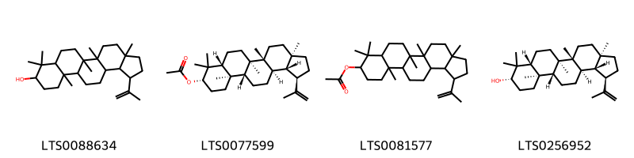{ width=100% }
    <figcaption>Hình ảnh cấu trúc hóa học của 4 hoạt chất thuộc nhóm Prenol lipids gồm ['lupeol (LTS0088634)', 'lupeol acetate (LTS0077599)', '3a,5a,5b,8,8,11a-hexamethyl-1-(prop-1-en-2-yl)-hexadecahydrocyclopenta[a]chrysen-9-yl acetate (LTS0081577)', 'lupeol (LTS0256952)'].</figcaption>
</figure>
#### Nhóm Steroids and steroid derivatives
<figure markdown="span">
    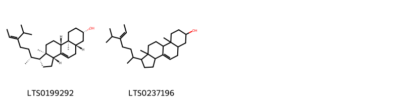{ width=100% }
    <figcaption>Hình ảnh cấu trúc hóa học của 2 hoạt chất thuộc nhóm Steroids and steroid derivatives gồm ['delta7-avenasterol (LTS0199292)', 'avenasterol (LTS0237196)'].</figcaption>
</figure>

---

### Dược dân tộc học

Danh sách các quốc gia có sử dụng *Ethulia conyzoides* trong điều trị các bệnh. 

| Country   | Disease   | Bệnh                                                                                                                                                                                                |
|:----------|:----------|:----------------------------------------------------------------------------------------------------------------------------------------------------------------------------------------------------|
| Africa    | Vermifuge | MYMEMORY WARNING: YOU USED ALL AVAILABLE FREE TRANSLATIONS FOR TODAY. NEXT AVAILABLE IN  11 HOURS 12 MINUTES 40 SECONDS VISIT HTTPS://MYMEMORY.TRANSLATED.NET/DOC/USAGELIMITS.PHP TO TRANSLATE MORE |

---

# Chi Tagetes

??? note "Danh sách các dược liệu thuộc chi"
    
	 - *Tagetes erecta*
	 - *Tagetes filifolia*
	 - *Tagetes lucida*
	 - *Tagetes minuta*
	 - *Tagetes multifida*
	 - *Tagetes patula*
	 - *Tagetes pusilla*
	 - *Tagetes subulata*
	 - *Tagetes terniflora*

---
## Tagetes erecta
### Thông tin về thực vật

!!! info "Phân loại thực vật của *Tagetes erecta* từ GIBF:"
    - **Kingdom:** Plantae
    - **Phylum:** Tracheophyta
    - **Order:** Asterales
    - **Family:** Asteraceae
    - **Genus:** Tagetes
    - **Species:** *Tagetes erecta*

 

| Label (VI)   | Label (EN)   | Scientific Name   | Descriptions (VI)   | Descriptions (EN)   | Also Known As (VI)   | Also Known As (EN)                                                       |
|:-------------|:-------------|:------------------|:--------------------|:--------------------|:---------------------|:-------------------------------------------------------------------------|
| N/A          | N/A          | Tagetes erecta    | loài thực vật       | species of plant    | ['vạn thọ']          | ['African marigold', 'Aztec mariwanol relagantus', 'Tagetes', 'Gumitir'] |

#### Phân bố trên thế giới

**Từ CSDL GIBF** nan, United Arab Emirates, Sri Lanka, Italy, Australia, Japan, Lao People’s Democratic Republic, Estonia, Belgium, Slovakia, Guatemala, Canada, Panama, Ukraine, Denmark, Puerto Rico, Netherlands, Lithuania, Belarus, Nigeria, Korea, Republic of, Spain, Portugal, Russian Federation, Jamaica, United States of America, Sweden, Kazakhstan, Croatia, Bosnia and Herzegovina, Greece, South Africa, Hong Kong, Saint Vincent and the Grenadines, Czechia, Germany, Thailand, Montenegro, Brazil, North Macedonia, Mexico, Austria, Dominican Republic, France, Singapore, China, United Kingdom of Great Britain and Northern Ireland, Colombia, Macao, India, Indonesia, Poland, Kenya, Malaysia, New Zealand, Nepal

#### Phân bố tại Việt Nam

**Từ CSDL GIBF**: Không có ghi nhận ở Việt Nam

---
### Thành phần hóa học
        
- Theo cơ sở dữ liệu lotus: Từ loài *Tagetes erecta* đã phân lập và xác định được 92 hoạt chất thuộc về các nhóm Fatty Acyls, Flavonoids, Prenol lipids, Steroids and steroid derivatives, Harmala alkaloids, Quinolines and derivatives, Bi- and oligothiophenes, Benzene and substituted derivatives, Benzofurans, Unsaturated hydrocarbons, Hydroxy acids and derivatives, Organooxygen compounds, Saturated hydrocarbons, Glycerolipids, Carboxylic acids and derivatives, Pyridines and derivatives. 

|    | chemicalTaxonomyClassyfireClass     |   smiles_count |
|---:|:------------------------------------|---------------:|
|  0 | Benzene and substituted derivatives |              8 |
|  1 | Benzofurans                         |              3 |
|  2 | Bi- and oligothiophenes             |              5 |
|  3 | Carboxylic acids and derivatives    |              4 |
|  4 | Fatty Acyls                         |              2 |
|  5 | Flavonoids                          |             15 |
|  6 | Glycerolipids                       |              1 |
|  7 | Harmala alkaloids                   |              2 |
|  8 | Hydroxy acids and derivatives       |              2 |
|  9 | Organooxygen compounds              |              2 |
| 10 | Prenol lipids                       |             37 |
| 11 | Pyridines and derivatives           |              1 |
| 12 | Quinolines and derivatives          |              1 |
| 13 | Saturated hydrocarbons              |              1 |
| 14 | Steroids and steroid derivatives    |              7 |
| 15 | Unsaturated hydrocarbons            |              1 |

#### Nhóm Benzene and substituted derivatives
<figure markdown="span">
    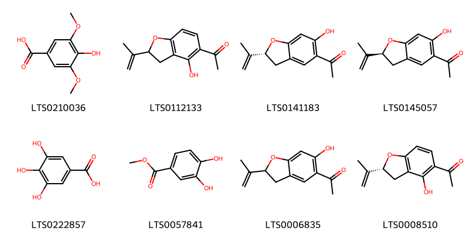{ width=100% }
    <figcaption>Hình ảnh cấu trúc hóa học của 8 hoạt chất thuộc nhóm Benzene and substituted derivatives gồm ['syringic acid (LTS0210036)', '1-[4-hydroxy-2-(prop-1-en-2-yl)-2,3-dihydro-1-benzofuran-5-yl]ethanone (LTS0112133)', '6-hydroxytremetone (LTS0141183)', '1-[(2s)-6-hydroxy-2-(prop-1-en-2-yl)-2,3-dihydro-1-benzofuran-5-yl]ethanone (LTS0145057)', 'galop (LTS0222857)', 'methyl 3,4-dihydroxybenzoate (LTS0057841)', '1-[6-hydroxy-2-(prop-1-en-2-yl)-2,3-dihydro-1-benzofuran-5-yl]ethanone (LTS0006835)', '1-[(2r)-4-hydroxy-2-(prop-1-en-2-yl)-2,3-dihydro-1-benzofuran-5-yl]ethanone (LTS0008510)'].</figcaption>
</figure>
#### Nhóm Benzofurans
<figure markdown="span">
    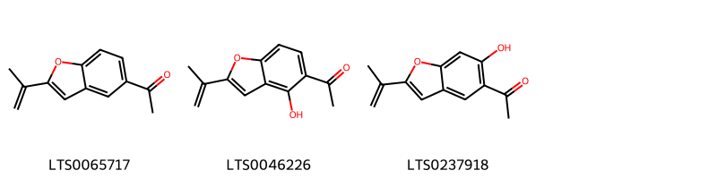{ width=100% }
    <figcaption>Hình ảnh cấu trúc hóa học của 3 hoạt chất thuộc nhóm Benzofurans gồm ['dehydrotremetone (LTS0065717)', '1-[4-hydroxy-2-(prop-1-en-2-yl)-1-benzofuran-5-yl]ethanone (LTS0046226)', 'euparin (LTS0237918)'].</figcaption>
</figure>
#### Nhóm Bi- and oligothiophenes
<figure markdown="span">
    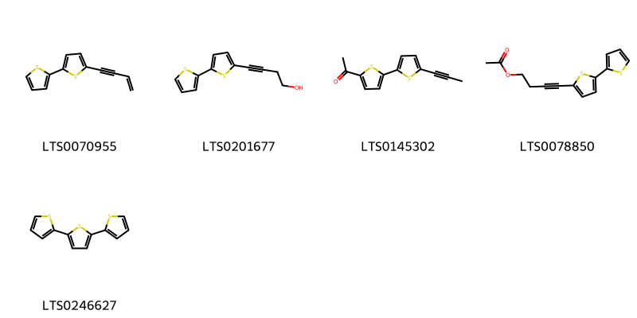{ width=100% }
    <figcaption>Hình ảnh cấu trúc hóa học của 5 hoạt chất thuộc nhóm Bi- and oligothiophenes gồm ["5-(but-3-en-1-yn-1-yl)-2,2'-bithiophene (LTS0070955)", "4-{[2,2'-bithiophen]-5-yl}but-3-yn-1-ol (LTS0201677)", 'arctinone b (LTS0145302)', "4-{[2,2'-bithiophen]-5-yl}but-3-yn-1-yl acetate (LTS0078850)", 'terthiophene (LTS0246627)'].</figcaption>
</figure>
#### Nhóm Carboxylic acids and derivatives
<figure markdown="span">
    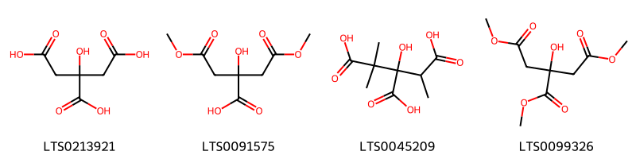{ width=100% }
    <figcaption>Hình ảnh cấu trúc hóa học của 4 hoạt chất thuộc nhóm Carboxylic acids and derivatives gồm ['citric acid (LTS0213921)', '2-hydroxy-4-methoxy-2-(2-methoxy-2-oxoethyl)-4-oxobutanoic acid (LTS0091575)', '2-hydroxy-1,1,3-trimethylpropane-1,2,3-tricarboxylic acid (LTS0045209)', 'trimethyl citrate (LTS0099326)'].</figcaption>
</figure>
#### Nhóm Fatty Acyls
<figure markdown="span">
    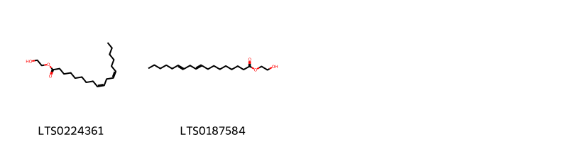{ width=100% }
    <figcaption>Hình ảnh cấu trúc hóa học của 2 hoạt chất thuộc nhóm Fatty Acyls gồm ['2-hydroxyethyl (9z,12z)-octadeca-9,12-dienoate (LTS0224361)', '2-hydroxyethyl octadeca-9,12-dienoate (LTS0187584)'].</figcaption>
</figure>
#### Nhóm Flavonoids
<figure markdown="span">
    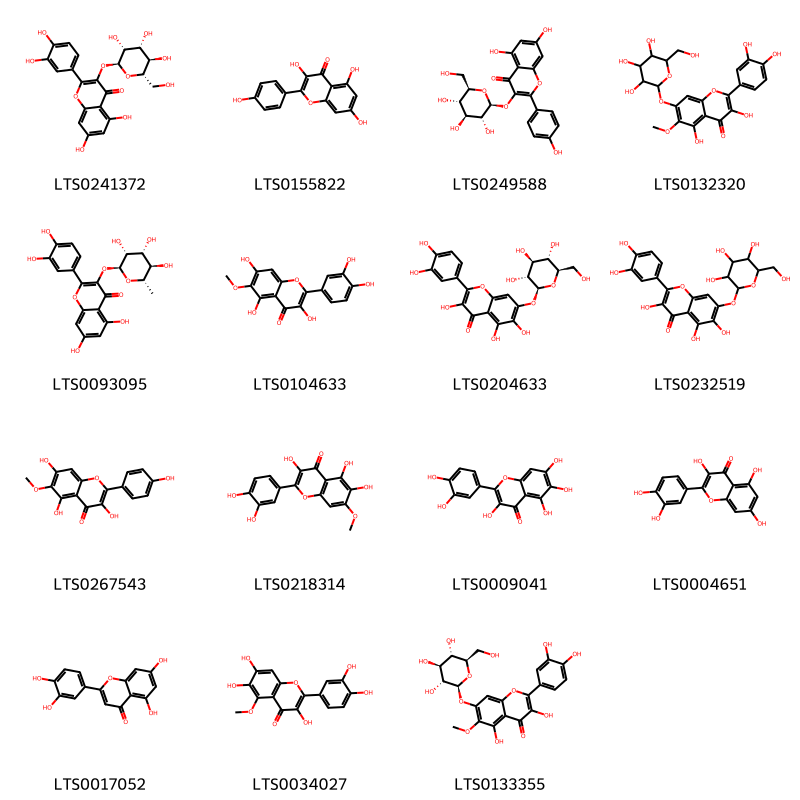{ width=100% }
    <figcaption>Hình ảnh cấu trúc hóa học của 15 hoạt chất thuộc nhóm Flavonoids gồm ['2-(3,4-dihydroxyphenyl)-5,7-dihydroxy-3-{[(2s,3r,4r,5r,6s)-3,4,5-trihydroxy-6-(hydroxymethyl)oxan-2-yl]oxy}chromen-4-one (LTS0241372)', 'kaempherol (LTS0155822)', 'astragalin (LTS0249588)', '2-(3,4-dihydroxyphenyl)-3,5-dihydroxy-6-methoxy-7-{[3,4,5-trihydroxy-6-(hydroxymethyl)oxan-2-yl]oxy}chromen-4-one (LTS0132320)', 'quercitrin (LTS0093095)', 'patuletin (LTS0104633)', 'quercetagitrin (LTS0204633)', '2-(3,4-dihydroxyphenyl)-3,5,6-trihydroxy-7-{[3,4,5-trihydroxy-6-(hydroxymethyl)oxan-2-yl]oxy}chromen-4-one (LTS0232519)', '6-methoxykaempferol (LTS0267543)', 'quercetagetin 7-methyl ether (LTS0218314)', 'quercetagetin (LTS0009041)', 'quercetin (LTS0004651)', 'luteolin (LTS0017052)', 'allopatuletin (LTS0034027)', '2-(3,4-dihydroxyphenyl)-3,5-dihydroxy-6-methoxy-7-{[(2s,3r,4s,5s,6r)-3,4,5-trihydroxy-6-(hydroxymethyl)oxan-2-yl]oxy}chromen-4-one (LTS0133355)'].</figcaption>
</figure>
#### Nhóm Glycerolipids
<figure markdown="span">
    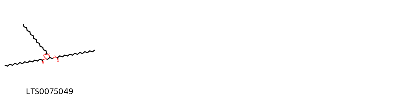{ width=100% }
    <figcaption>Hình ảnh cấu trúc hóa học của 1 hoạt chất thuộc nhóm Glycerolipids gồm ['tripalmitin (LTS0075049)'].</figcaption>
</figure>
#### Nhóm Harmala alkaloids
<figure markdown="span">
    { width=100% }
    <figcaption>Hình ảnh cấu trúc hóa học của 2 hoạt chất thuộc nhóm Harmala alkaloids gồm ['1-{2-acetyl-7-methoxy-1-methyl-1h,3h,4h,9h-pyrido[3,4-b]indol-6-yl}hexan-1-one (LTS0131042)', '1-[(1r)-2-acetyl-7-methoxy-1-methyl-1h,3h,4h,9h-pyrido[3,4-b]indol-6-yl]hexan-1-one (LTS0131993)'].</figcaption>
</figure>
#### Nhóm Hydroxy acids and derivatives
<figure markdown="span">
    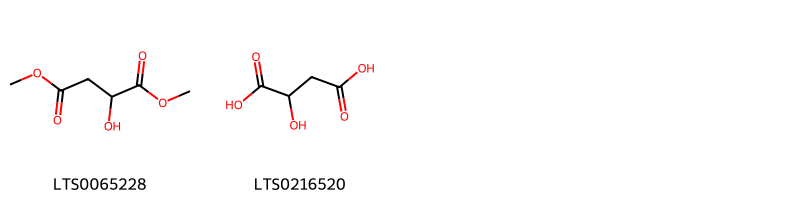{ width=100% }
    <figcaption>Hình ảnh cấu trúc hóa học của 2 hoạt chất thuộc nhóm Hydroxy acids and derivatives gồm ['1,4-dimethyl 2-hydroxybutanedioate (LTS0065228)', 'malic acid (LTS0216520)'].</figcaption>
</figure>
#### Nhóm Organooxygen compounds
<figure markdown="span">
    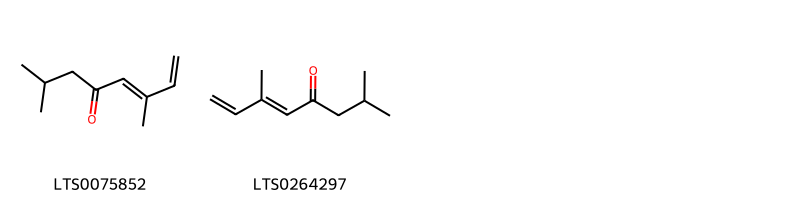{ width=100% }
    <figcaption>Hình ảnh cấu trúc hóa học của 2 hoạt chất thuộc nhóm Organooxygen compounds gồm ['2,6-dimethylocta-5,7-dien-4-one (LTS0075852)', '(e)-tagetone (LTS0264297)'].</figcaption>
</figure>
#### Nhóm Prenol lipids
<figure markdown="span">
    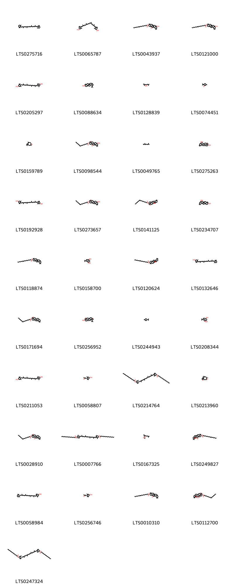{ width=100% }
    <figcaption>Hình ảnh cấu trúc hóa học của 37 hoạt chất thuộc nhóm Prenol lipids gồm ['β-carotene (LTS0275716)', 'xanthophyll (LTS0065787)', '8a-(hydroxymethyl)-4,4,6a,6b,11,11,14b-heptamethyl-14-oxo-2,3,4a,5,6,7,8,9,10,12,12a,14a-dodecahydro-1h-picen-3-yl hexadec-9-enoate (LTS0043937)', '8a-(hydroxymethyl)-4,4,6a,6b,11,11,14b-heptamethyl-1,2,3,4a,5,6,7,8,9,10,12,12a,14,14a-tetradecahydropicen-3-yl hexadec-9-enoate (LTS0121000)', 'carotenoid (LTS0205297)', 'lupeol (LTS0088634)', 'linalool, (+-)- (LTS0128839)', 'piperitenone (LTS0074451)', 'caryophyllene oxide (LTS0159789)', '(3s,4ar,6ar,6bs,8as,12as,14ar,14bs)-8a-(hydroxymethyl)-4,4,6a,6b,11,11,14b-heptamethyl-14-oxo-2,3,4a,5,6,7,8,9,10,12,12a,14a-dodecahydro-1h-picen-3-yl (9z)-hexadec-9-enoate (LTS0098544)', 'trans-β-ocimene (LTS0049765)', '(3s,4ar,6ar,6bs,8as,12ar,14ar,14br)-8a-(hydroxymethyl)-4,4,6a,6b,11,11,14b-heptamethyl-1,2,3,4a,5,6,7,8,9,10,12,12a,14,14a-tetradecahydropicen-3-ol (LTS0275263)', 'zeaxanthin (LTS0192928)', '(3s,4ar,6ar,6bs,8as,12as,14ar,14br)-8a-(hydroxymethyl)-4,4,6a,6b,11,11,14b-heptamethyl-1,2,3,4a,5,6,7,8,9,10,12,12a,14,14a-tetradecahydropicen-3-yl (9z)-hexadec-9-enoate (LTS0273657)', '(1s,4s,5r,8r,10s,13s,14r,17s,18r)-4,5,9,9,13,20,20-heptamethyl-24-oxahexacyclo[15.5.2.0¹,¹⁸.0⁴,¹⁷.0⁵,¹⁴.0⁸,¹³]tetracos-15-en-10-yl (9z)-hexadec-9-enoate (LTS0141125)', '8a-(hydroxymethyl)-4,4,6a,6b,11,11,14b-heptamethyl-1,2,3,4a,5,6,7,8,9,10,12,12a,14,14a-tetradecahydropicen-3-ol (LTS0234707)', '4,4,6a,6b,8a,11,11,14b-octamethyl-1,2,3,4a,5,6,7,8,9,10,12,12a,14,14a-tetradecahydropicen-3-yl hexadec-9-enoate (LTS0118874)', '7-isopropyl-1,4a-dimethyl-2,3,4,5,8,8a-hexahydronaphthalene-1,4-diol (LTS0158700)', '4,5,9,9,13,20,20-heptamethyl-24-oxahexacyclo[15.5.2.0¹,¹⁸.0⁴,¹⁷.0⁵,¹⁴.0⁸,¹³]tetracos-15-en-10-yl hexadec-9-enoate (LTS0120624)', 'cryptoxanthin (LTS0132646)', '(3s,4ar,6ar,6bs,8ar,12ar,14ar,14br)-4,4,6a,6b,8a,11,11,14b-octamethyl-1,2,3,4a,5,6,7,8,9,10,12,12a,14,14a-tetradecahydropicen-3-yl (9z)-hexadec-9-enoate (LTS0171694)', 'lupeol (LTS0256952)', 'α-limonene (LTS0244943)', '(1s,4r,4ar,8ar)-7-isopropyl-1,4a-dimethyl-2,3,4,5,8,8a-hexahydronaphthalene-1,4-diol (LTS0208344)', '(4r)-4-[(1e,3e,5e,7e,9e,11e,13e,15e,17e)-18-[(4r)-4-hydroxy-2,6,6-trimethylcyclohex-1-en-1-yl]-3,7,12,16-tetramethyloctadeca-1,3,5,7,9,11,13,15,17-nonaen-1-yl]-3,5,5-trimethylcyclohex-2-en-1-ol (LTS0211053)', '4-[(1r,4s)-4-hydroxy-2,6,6-trimethylcyclohex-2-en-1-yl]but-3-en-2-one (LTS0058807)', 'xantofyl palmitate (LTS0214764)', 'β-caryophyllene oxide (LTS0213960)', '(3s,4ar,6ar,6bs,8ar,12ar,14ar,14bs)-4,4,6a,6b,8a,11,11,14b-octamethyl-14-oxo-2,3,4a,5,6,7,8,9,10,12,12a,14a-dodecahydro-1h-picen-3-yl (9z)-hexadec-9-enoate (LTS0028910)', '4-[(1e,3e,5e,7e,9e,11e,13e,15e,17e)-18-[4-(hexadecanoyloxy)-2,6,6-trimethylcyclohex-1-en-1-yl]-3,7,12,16-tetramethyloctadeca-1,3,5,7,9,11,13,15,17-nonaen-1-yl]-3,5,5-trimethylcyclohex-2-en-1-yl hexadecanoate (LTS0007766)', 'linalyl acetate (LTS0167325)', '6,10,10,14,15,21,21-heptamethyl-3,24-dioxaheptacyclo[16.5.2.0¹,¹⁵.0²,⁴.0⁵,¹⁴.0⁶,¹¹.0¹⁸,²³]pentacosan-9-yl hexadec-9-enoate (LTS0249827)', 'zeinoxanthin (LTS0058984)', '(3e)-4-[(1r,4s)-4-hydroxy-2,6,6-trimethylcyclohex-2-en-1-yl]but-3-en-2-one (LTS0256746)', '4,4,6a,6b,8a,11,11,14b-octamethyl-14-oxo-2,3,4a,5,6,7,8,9,10,12,12a,14a-dodecahydro-1h-picen-3-yl hexadec-9-enoate (LTS0010310)', '(1s,2s,4s,5r,6s,9s,11r,14r,15s,18s,23r)-6,10,10,14,15,21,21-heptamethyl-3,24-dioxaheptacyclo[16.5.2.0¹,¹⁵.0²,⁴.0⁵,¹⁴.0⁶,¹¹.0¹⁸,²³]pentacosan-9-yl (9z)-hexadec-9-enoate (LTS0112700)', '(1r)-3,5,5-trimethyl-4-[(1e,3e,5e,7e,9e,11e,13e,15e,17e)-3,7,12,16-tetramethyl-18-[(1r,4r)-2,6,6-trimethyl-4-(tetradecanoyloxy)cyclohex-2-en-1-yl]octadeca-1,3,5,7,9,11,13,15,17-nonaen-1-yl]cyclohex-3-en-1-yl tetradecanoate (LTS0247324)'].</figcaption>
</figure>
#### Nhóm Pyridines and derivatives
<figure markdown="span">
    { width=100% }
    <figcaption>Hình ảnh cấu trúc hóa học của 1 hoạt chất thuộc nhóm Pyridines and derivatives gồm ['pyridine (LTS0108275)'].</figcaption>
</figure>
#### Nhóm Quinolines and derivatives
<figure markdown="span">
    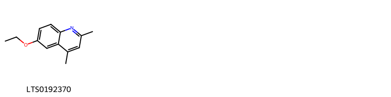{ width=100% }
    <figcaption>Hình ảnh cấu trúc hóa học của 1 hoạt chất thuộc nhóm Quinolines and derivatives gồm ['2,4-dimethyl-6-ethoxyquinoline (LTS0192370)'].</figcaption>
</figure>
#### Nhóm Saturated hydrocarbons
<figure markdown="span">
    { width=100% }
    <figcaption>Hình ảnh cấu trúc hóa học của 1 hoạt chất thuộc nhóm Saturated hydrocarbons gồm ['cetane (LTS0134950)'].</figcaption>
</figure>
#### Nhóm Steroids and steroid derivatives
<figure markdown="span">
    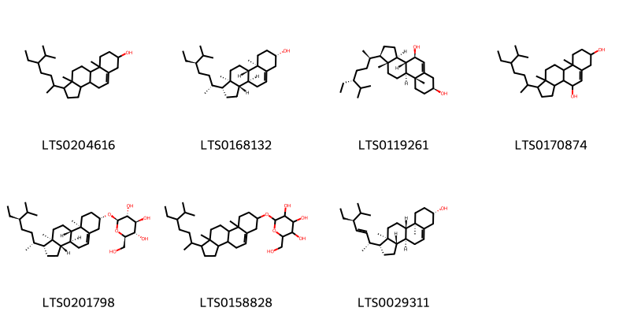{ width=100% }
    <figcaption>Hình ảnh cấu trúc hóa học của 7 hoạt chất thuộc nhóm Steroids and steroid derivatives gồm ['stigmast-5-en-3-ol, (3β)- (LTS0204616)', 'sitosterol (LTS0168132)', '7β-hydroxysitosterol (LTS0119261)', '1-(5-ethyl-6-methylheptan-2-yl)-9a,11a-dimethyl-1h,2h,3h,3ah,3bh,4h,6h,7h,8h,9h,9bh,10h,11h-cyclopenta[a]phenanthrene-4,7-diol (LTS0170874)', 'sitogluside (LTS0201798)', '2-{[1-(5-ethyl-6-methylheptan-2-yl)-9a,11a-dimethyl-1h,2h,3h,3ah,3bh,4h,6h,7h,8h,9h,9bh,10h,11h-cyclopenta[a]phenanthren-7-yl]oxy}-6-(hydroxymethyl)oxane-3,4,5-triol (LTS0158828)', 'phytosterol (LTS0029311)'].</figcaption>
</figure>
#### Nhóm Unsaturated hydrocarbons
<figure markdown="span">
    { width=100% }
    <figcaption>Hình ảnh cấu trúc hóa học của 1 hoạt chất thuộc nhóm Unsaturated hydrocarbons gồm ['(3e,5e)-3,7-dimethylocta-1,3,5-triene (LTS0270900)'].</figcaption>
</figure>

---

### Dược dân tộc học

Danh sách các quốc gia có sử dụng *Tagetes erecta* trong điều trị các bệnh. 

| Country            | Disease                                                                            | Bệnh                                                                                                                                                                                                |
|:-------------------|:-----------------------------------------------------------------------------------|:----------------------------------------------------------------------------------------------------------------------------------------------------------------------------------------------------|
| Brazil             | Laxative, Vermifuge                                                                | MYMEMORY WARNING: YOU USED ALL AVAILABLE FREE TRANSLATIONS FOR TODAY. NEXT AVAILABLE IN  11 HOURS 11 MINUTES 57 SECONDS VISIT HTTPS://MYMEMORY.TRANSLATED.NET/DOC/USAGELIMITS.PHP TO TRANSLATE MORE |
| Dominican Republic | Vulnerary                                                                          | MYMEMORY WARNING: YOU USED ALL AVAILABLE FREE TRANSLATIONS FOR TODAY. NEXT AVAILABLE IN  11 HOURS 11 MINUTES 54 SECONDS VISIT HTTPS://MYMEMORY.TRANSLATED.NET/DOC/USAGELIMITS.PHP TO TRANSLATE MORE |
| Elsewhere          | nan, Nematicide                                                                    | MYMEMORY WARNING: YOU USED ALL AVAILABLE FREE TRANSLATIONS FOR TODAY. NEXT AVAILABLE IN  11 HOURS 11 MINUTES 49 SECONDS VISIT HTTPS://MYMEMORY.TRANSLATED.NET/DOC/USAGELIMITS.PHP TO TRANSLATE MORE |
| Haiti              | Diaphoretic, Emmenagogue                                                           | MYMEMORY WARNING: YOU USED ALL AVAILABLE FREE TRANSLATIONS FOR TODAY. NEXT AVAILABLE IN  11 HOURS 11 MINUTES 47 SECONDS VISIT HTTPS://MYMEMORY.TRANSLATED.NET/DOC/USAGELIMITS.PHP TO TRANSLATE MORE |
| Mexico             | Diuretic, Emmenagogue, Stimulant, Vermifuge, Carminative, Diaphoretic, Emmenagogue | MYMEMORY WARNING: YOU USED ALL AVAILABLE FREE TRANSLATIONS FOR TODAY. NEXT AVAILABLE IN  11 HOURS 11 MINUTES 42 SECONDS VISIT HTTPS://MYMEMORY.TRANSLATED.NET/DOC/USAGELIMITS.PHP TO TRANSLATE MORE |
| US                 | Emmenagogue, Vermifuge                                                             | MYMEMORY WARNING: YOU USED ALL AVAILABLE FREE TRANSLATIONS FOR TODAY. NEXT AVAILABLE IN  11 HOURS 11 MINUTES 40 SECONDS VISIT HTTPS://MYMEMORY.TRANSLATED.NET/DOC/USAGELIMITS.PHP TO TRANSLATE MORE |

---

---
## Tagetes filifolia
### Thông tin về thực vật

!!! info "Phân loại thực vật của *Tagetes filifolia* từ GIBF:"
    - **Kingdom:** Plantae
    - **Phylum:** Tracheophyta
    - **Order:** Asterales
    - **Family:** Asteraceae
    - **Genus:** Tagetes
    - **Species:** *Tagetes filifolia*

 

| Label (VI)   | Label (EN)   | Scientific Name   | Descriptions (VI)   | Descriptions (EN)   | Also Known As (VI)   | Also Known As (EN)   |
|:-------------|:-------------|:------------------|:--------------------|:--------------------|:---------------------|:---------------------|
| N/A          | N/A          | Tagetes filifolia | loài thực vật       | species of plant    | ['']                 | ['']                 |

#### Phân bố trên thế giới

**Từ CSDL GIBF** Nicaragua, Ecuador, Guatemala, Colombia, Argentina, Bolivia (Plurinational State of), Honduras, Costa Rica, Peru, Mexico, El Salvador

#### Phân bố tại Việt Nam

**Từ CSDL GIBF**: Không có ghi nhận ở Việt Nam

---
### Thành phần hóa học
        
- Theo cơ sở dữ liệu lotus: Từ loài *Tagetes filifolia* đã phân lập và xác định được 17 hoạt chất thuộc về các nhóm Phenol ethers, Prenol lipids, Bi- and oligothiophenes, Benzene and substituted derivatives. 

|    | chemicalTaxonomyClassyfireClass     |   smiles_count |
|---:|:------------------------------------|---------------:|
|  0 | Benzene and substituted derivatives |              4 |
|  1 | Bi- and oligothiophenes             |              1 |
|  2 | Phenol ethers                       |              2 |
|  3 | Prenol lipids                       |             10 |

#### Nhóm Benzene and substituted derivatives
<figure markdown="span">
    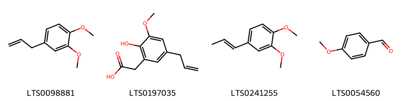{ width=100% }
    <figcaption>Hình ảnh cấu trúc hóa học của 4 hoạt chất thuộc nhóm Benzene and substituted derivatives gồm ['methyl eugenol (LTS0098881)', '[2-hydroxy-3-methoxy-5-(prop-2-en-1-yl)phenyl]acetic acid (LTS0197035)', 'isoeugenyl methyl ether (LTS0241255)', 'anisaldehyde (LTS0054560)'].</figcaption>
</figure>
#### Nhóm Bi- and oligothiophenes
<figure markdown="span">
    { width=100% }
    <figcaption>Hình ảnh cấu trúc hóa học của 1 hoạt chất thuộc nhóm Bi- and oligothiophenes gồm ['terthiophene (LTS0246627)'].</figcaption>
</figure>
#### Nhóm Phenol ethers
<figure markdown="span">
    { width=100% }
    <figcaption>Hình ảnh cấu trúc hóa học của 2 hoạt chất thuộc nhóm Phenol ethers gồm ['tarragon (LTS0245226)', 'anethole (LTS0033696)'].</figcaption>
</figure>
#### Nhóm Prenol lipids
<figure markdown="span">
    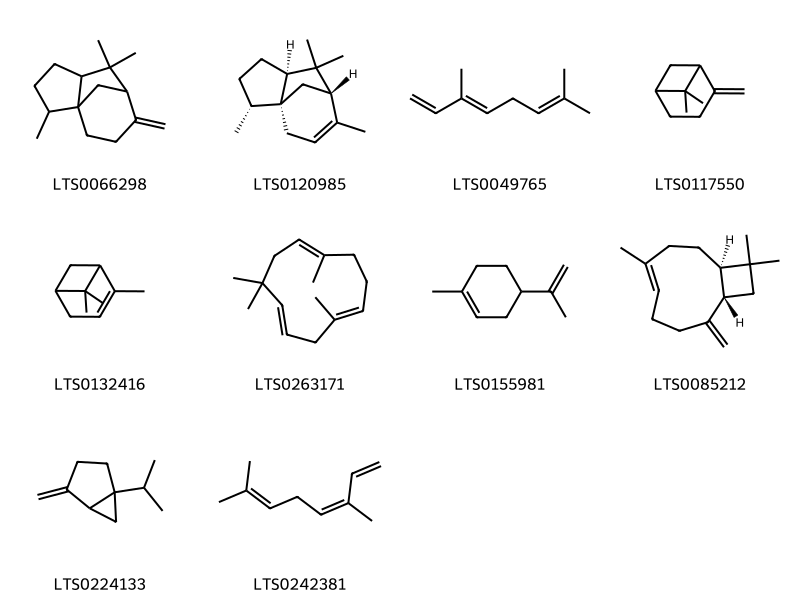{ width=100% }
    <figcaption>Hình ảnh cấu trúc hóa học của 10 hoạt chất thuộc nhóm Prenol lipids gồm ['2,6,6-trimethyl-8-methylidenetricyclo[5.3.1.0¹,⁵]undecane (LTS0066298)', 'cedrene (LTS0120985)', 'trans-β-ocimene (LTS0049765)', 'β-pinene (LTS0117550)', 'α pinene (LTS0132416)', 'humulene (LTS0263171)', 'limonene,  (LTS0155981)', 'caryophyllene (LTS0085212)', 'sabinene (LTS0224133)', 'β-ocimene (LTS0242381)'].</figcaption>
</figure>

---

### Dược dân tộc học

Danh sách các quốc gia có sử dụng *Tagetes filifolia* trong điều trị các bệnh. 

| Country    | Disease                       | Bệnh                                                                                                                                                                                                |
|:-----------|:------------------------------|:----------------------------------------------------------------------------------------------------------------------------------------------------------------------------------------------------|
| Colombia   | Emollient                     | MYMEMORY WARNING: YOU USED ALL AVAILABLE FREE TRANSLATIONS FOR TODAY. NEXT AVAILABLE IN  11 HOURS 10 MINUTES 29 SECONDS VISIT HTTPS://MYMEMORY.TRANSLATED.NET/DOC/USAGELIMITS.PHP TO TRANSLATE MORE |
| Costa Rica | Diuretic                      | MYMEMORY WARNING: YOU USED ALL AVAILABLE FREE TRANSLATIONS FOR TODAY. NEXT AVAILABLE IN  11 HOURS 10 MINUTES 26 SECONDS VISIT HTTPS://MYMEMORY.TRANSLATED.NET/DOC/USAGELIMITS.PHP TO TRANSLATE MORE |
| Ecuador    | Carminative, Tonic, Stomachic | MYMEMORY WARNING: YOU USED ALL AVAILABLE FREE TRANSLATIONS FOR TODAY. NEXT AVAILABLE IN  11 HOURS 10 MINUTES 23 SECONDS VISIT HTTPS://MYMEMORY.TRANSLATED.NET/DOC/USAGELIMITS.PHP TO TRANSLATE MORE |
| Mexico     | Diuretic                      | MYMEMORY WARNING: YOU USED ALL AVAILABLE FREE TRANSLATIONS FOR TODAY. NEXT AVAILABLE IN  11 HOURS 10 MINUTES 19 SECONDS VISIT HTTPS://MYMEMORY.TRANSLATED.NET/DOC/USAGELIMITS.PHP TO TRANSLATE MORE |
| Peru       | Carminative                   | MYMEMORY WARNING: YOU USED ALL AVAILABLE FREE TRANSLATIONS FOR TODAY. NEXT AVAILABLE IN  11 HOURS 10 MINUTES 16 SECONDS VISIT HTTPS://MYMEMORY.TRANSLATED.NET/DOC/USAGELIMITS.PHP TO TRANSLATE MORE |

---

---
## Tagetes lucida
### Thông tin về thực vật

!!! info "Phân loại thực vật của *Tagetes lucida* từ GIBF:"
    - **Kingdom:** Plantae
    - **Phylum:** Tracheophyta
    - **Order:** Asterales
    - **Family:** Asteraceae
    - **Genus:** Tagetes
    - **Species:** *Tagetes lucida*

 

| Label (VI)   | Label (EN)   | Scientific Name   | Descriptions (VI)   | Descriptions (EN)   | Also Known As (VI)   | Also Known As (EN)   |
|:-------------|:-------------|:------------------|:--------------------|:--------------------|:---------------------|:---------------------|
| N/A          | N/A          | Tagetes lucida    | loài thực vật       | species of plant    | ['']                 | ['pericón']          |

#### Phân bố trên thế giới

**Từ CSDL GIBF** Puerto Rico, Colombia, Guatemala, Costa Rica, United States of America, Cuba, Mexico

#### Phân bố tại Việt Nam

**Từ CSDL GIBF**: Không có ghi nhận ở Việt Nam

---
### Thành phần hóa học
        
- Theo cơ sở dữ liệu lotus: Từ loài *Tagetes lucida* đã phân lập và xác định được 72 hoạt chất thuộc về các nhóm Phenol ethers, Flavonoids, Prenol lipids, Steroids and steroid derivatives, Cinnamic acids and derivatives, Benzofurans, Benzene and substituted derivatives, Cinnamaldehydes, Polycyclic hydrocarbons, Organooxygen compounds, Phenols, Coumarins and derivatives, Benzopyrans. 

|    | chemicalTaxonomyClassyfireClass     |   smiles_count |
|---:|:------------------------------------|---------------:|
|  0 | Benzene and substituted derivatives |              2 |
|  1 | Benzofurans                         |              1 |
|  2 | Benzopyrans                         |              1 |
|  3 | Cinnamaldehydes                     |              1 |
|  4 | Cinnamic acids and derivatives      |              4 |
|  5 | Coumarins and derivatives           |              8 |
|  6 | Flavonoids                          |             12 |
|  7 | Organooxygen compounds              |              7 |
|  8 | Phenol ethers                       |              2 |
|  9 | Phenols                             |              3 |
| 10 | Polycyclic hydrocarbons             |              1 |
| 11 | Prenol lipids                       |             29 |
| 12 | Steroids and steroid derivatives    |              1 |

#### Nhóm Benzene and substituted derivatives
<figure markdown="span">
    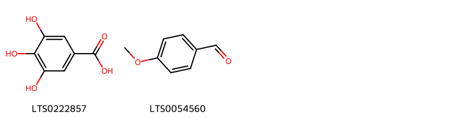{ width=100% }
    <figcaption>Hình ảnh cấu trúc hóa học của 2 hoạt chất thuộc nhóm Benzene and substituted derivatives gồm ['galop (LTS0222857)', 'anisaldehyde (LTS0054560)'].</figcaption>
</figure>
#### Nhóm Benzofurans
<figure markdown="span">
    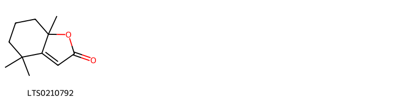{ width=100% }
    <figcaption>Hình ảnh cấu trúc hóa học của 1 hoạt chất thuộc nhóm Benzofurans gồm ['(+/-)-dihydroactinidiolide (LTS0210792)'].</figcaption>
</figure>
#### Nhóm Benzopyrans
<figure markdown="span">
    { width=100% }
    <figcaption>Hình ảnh cấu trúc hóa học của 1 hoạt chất thuộc nhóm Benzopyrans gồm ['mellein (LTS0027076)'].</figcaption>
</figure>
#### Nhóm Cinnamaldehydes
<figure markdown="span">
    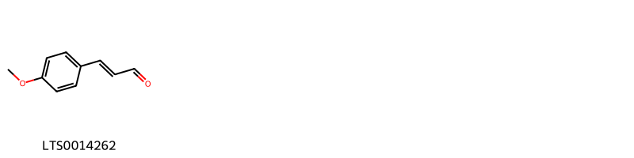{ width=100% }
    <figcaption>Hình ảnh cấu trúc hóa học của 1 hoạt chất thuộc nhóm Cinnamaldehydes gồm ['3-(4-methoxyphenyl)-2-propenal (LTS0014262)'].</figcaption>
</figure>
#### Nhóm Cinnamic acids and derivatives
<figure markdown="span">
    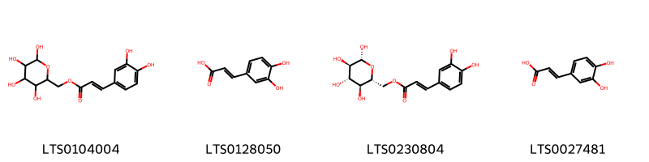{ width=100% }
    <figcaption>Hình ảnh cấu trúc hóa học của 4 hoạt chất thuộc nhóm Cinnamic acids and derivatives gồm ['(3,4,5,6-tetrahydroxyoxan-2-yl)methyl 3-(3,4-dihydroxyphenyl)prop-2-enoate (LTS0104004)', '3,4-dihydroxycinnamic acid (LTS0128050)', '[(2r,3s,4s,5r,6r)-3,4,5,6-tetrahydroxyoxan-2-yl]methyl (2e)-3-(3,4-dihydroxyphenyl)prop-2-enoate (LTS0230804)', 'caffeic acid (LTS0027481)'].</figcaption>
</figure>
#### Nhóm Coumarins and derivatives
<figure markdown="span">
    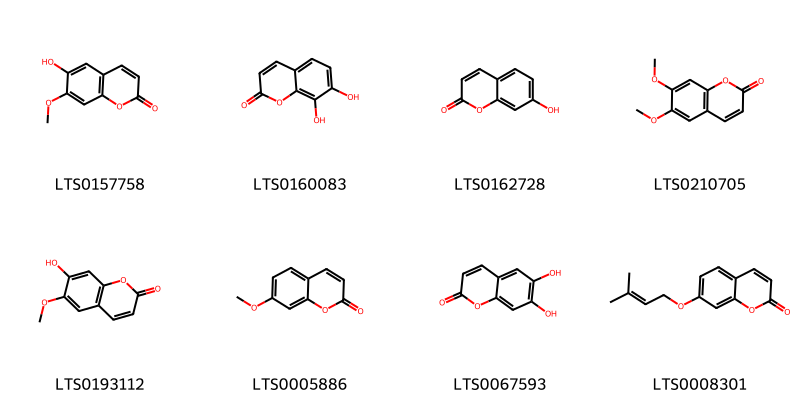{ width=100% }
    <figcaption>Hình ảnh cấu trúc hóa học của 8 hoạt chất thuộc nhóm Coumarins and derivatives gồm ['isoscopoletin (LTS0157758)', 'daphnetin (LTS0160083)', 'umbelliferone (LTS0162728)', 'scoparone (LTS0210705)', 'scopoletin (LTS0193112)', 'methylumbelliferone (LTS0005886)', 'esculetin (LTS0067593)', '7-[(3-methylbut-2-en-1-yl)oxy]chromen-2-one (LTS0008301)'].</figcaption>
</figure>
#### Nhóm Flavonoids
<figure markdown="span">
    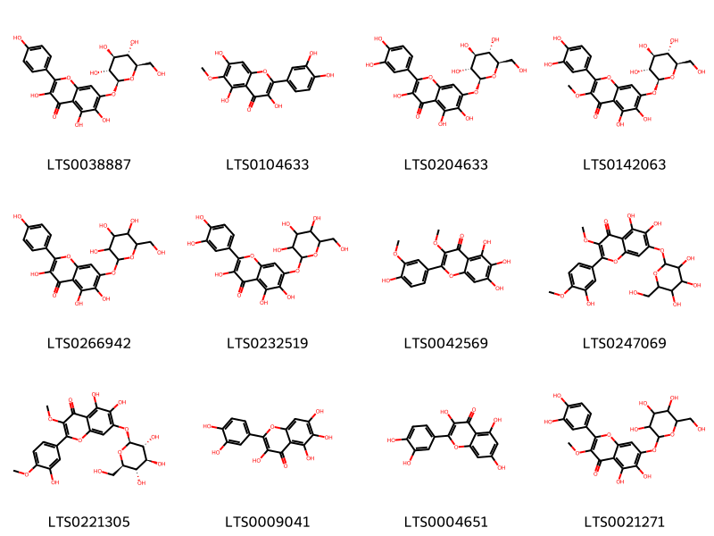{ width=100% }
    <figcaption>Hình ảnh cấu trúc hóa học của 12 hoạt chất thuộc nhóm Flavonoids gồm ['3,5,6-trihydroxy-2-(4-hydroxyphenyl)-7-{[(2s,3r,4s,5s,6r)-3,4,5-trihydroxy-6-(hydroxymethyl)oxan-2-yl]oxy}chromen-4-one (LTS0038887)', 'patuletin (LTS0104633)', 'quercetagitrin (LTS0204633)', '2-(3,4-dihydroxyphenyl)-5,6-dihydroxy-3-methoxy-7-{[(2s,3r,4s,5s,6r)-3,4,5-trihydroxy-6-(hydroxymethyl)oxan-2-yl]oxy}chromen-4-one (LTS0142063)', '3,5,6-trihydroxy-2-(4-hydroxyphenyl)-7-{[3,4,5-trihydroxy-6-(hydroxymethyl)oxan-2-yl]oxy}chromen-4-one (LTS0266942)', '2-(3,4-dihydroxyphenyl)-3,5,6-trihydroxy-7-{[3,4,5-trihydroxy-6-(hydroxymethyl)oxan-2-yl]oxy}chromen-4-one (LTS0232519)', '5,6,7-trihydroxy-2-(4-hydroxy-3-methoxyphenyl)-3-methoxychromen-4-one (LTS0042569)', '5,6-dihydroxy-2-(3-hydroxy-4-methoxyphenyl)-3-methoxy-7-{[3,4,5-trihydroxy-6-(hydroxymethyl)oxan-2-yl]oxy}chromen-4-one (LTS0247069)', '5,6-dihydroxy-2-(3-hydroxy-4-methoxyphenyl)-3-methoxy-7-{[(2s,3r,4s,5s,6r)-3,4,5-trihydroxy-6-(hydroxymethyl)oxan-2-yl]oxy}chromen-4-one (LTS0221305)', 'quercetagetin (LTS0009041)', 'quercetin (LTS0004651)', '2-(3,4-dihydroxyphenyl)-5,6-dihydroxy-3-methoxy-7-{[3,4,5-trihydroxy-6-(hydroxymethyl)oxan-2-yl]oxy}chromen-4-one (LTS0021271)'].</figcaption>
</figure>
#### Nhóm Organooxygen compounds
<figure markdown="span">
    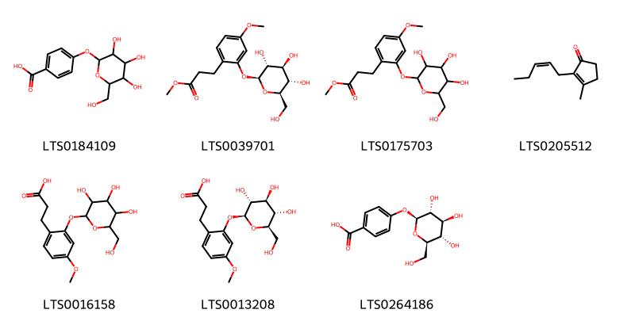{ width=100% }
    <figcaption>Hình ảnh cấu trúc hóa học của 7 hoạt chất thuộc nhóm Organooxygen compounds gồm ['4-{[3,4,5-trihydroxy-6-(hydroxymethyl)oxan-2-yl]oxy}benzoic acid (LTS0184109)', 'methyl 3-(4-methoxy-2-{[(2s,3r,4s,5s,6r)-3,4,5-trihydroxy-6-(hydroxymethyl)oxan-2-yl]oxy}phenyl)propanoate (LTS0039701)', 'methyl 3-(4-methoxy-2-{[3,4,5-trihydroxy-6-(hydroxymethyl)oxan-2-yl]oxy}phenyl)propanoate (LTS0175703)', 'jasmone (LTS0205512)', '3-(4-methoxy-2-{[3,4,5-trihydroxy-6-(hydroxymethyl)oxan-2-yl]oxy}phenyl)propanoic acid (LTS0016158)', '3-(4-methoxy-2-{[(2s,3r,4s,5s,6r)-3,4,5-trihydroxy-6-(hydroxymethyl)oxan-2-yl]oxy}phenyl)propanoic acid (LTS0013208)', '4-(β-d-glucosyloxy)benzoate (LTS0264186)'].</figcaption>
</figure>
#### Nhóm Phenol ethers
<figure markdown="span">
    { width=100% }
    <figcaption>Hình ảnh cấu trúc hóa học của 2 hoạt chất thuộc nhóm Phenol ethers gồm ['tarragon (LTS0245226)', 'anethole (LTS0033696)'].</figcaption>
</figure>
#### Nhóm Phenols
<figure markdown="span">
    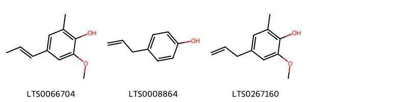{ width=100% }
    <figcaption>Hình ảnh cấu trúc hóa học của 3 hoạt chất thuộc nhóm Phenols gồm ['6-methylisoeugenol (LTS0066704)', 'chavicol (LTS0008864)', '6-methyleugenol (LTS0267160)'].</figcaption>
</figure>
#### Nhóm Polycyclic hydrocarbons
<figure markdown="span">
    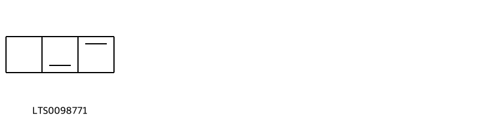{ width=100% }
    <figcaption>Hình ảnh cấu trúc hóa học của 1 hoạt chất thuộc nhóm Polycyclic hydrocarbons gồm ['1,2,3,6-tetrahydrocubane (LTS0098771)'].</figcaption>
</figure>
#### Nhóm Prenol lipids
<figure markdown="span">
    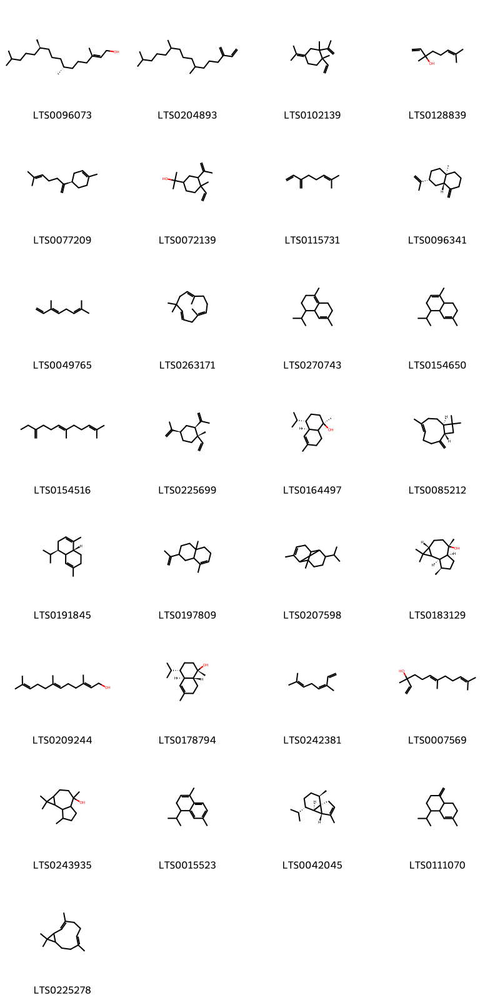{ width=100% }
    <figcaption>Hình ảnh cấu trúc hóa học của 29 hoạt chất thuộc nhóm Prenol lipids gồm ['phytol (LTS0096073)', '7,11,15-trimethyl-3-methylidenehexadec-1-ene (LTS0204893)', '1-ethenyl-1,2-dimethyl-2-(prop-1-en-2-yl)-4-(propan-2-ylidene)cyclohexane (LTS0102139)', 'linalool, (+-)- (LTS0128839)', '(r)-β-bisabolene (LTS0077209)', '2-[4-ethenyl-4-methyl-3-(prop-1-en-2-yl)cyclohexyl]propan-2-ol (LTS0072139)', 'α-myrcene (LTS0115731)', 'β-selinene (LTS0096341)', 'trans-β-ocimene (LTS0049765)', 'humulene (LTS0263171)', '4-isopropyl-1,6-dimethyl-2,3,4,4a,7,8-hexahydronaphthalene (LTS0270743)', '4-isopropyl-1,6-dimethyl-3,4,4a,7,8,8a-hexahydronaphthalene (LTS0154650)', '(6e)-2,6-dimethyl-10-methylidenedodeca-2,6-diene (LTS0154516)', 'β-elemene (LTS0225699)', '(1r,4s,4ar)-4-isopropyl-1,6-dimethyl-3,4,4a,7,8,8a-hexahydro-2h-naphthalen-1-ol (LTS0164497)', 'caryophyllene (LTS0085212)', '(4r,8ar)-4-isopropyl-1,6-dimethyl-3,4,4a,7,8,8a-hexahydronaphthalene (LTS0191845)', 'selinene (LTS0197809)', 'α-copaene (LTS0207598)', 'viridiflorol (LTS0183129)', 'polyprenol (LTS0209244)', 'α-cadinol (LTS0178794)', 'β-ocimene (LTS0242381)', 'nerolidol isomers (LTS0007569)', 'ledol (LTS0243935)', '3,4-dihydrocadalene (LTS0015523)', '(-)-α-cubebene (LTS0042045)', '4-isopropyl-6-methyl-1-methylidene-3,4,4a,7,8,8a-hexahydro-2h-naphthalene (LTS0111070)', '(2e,6e)-3,7,11,11-tetramethylbicyclo[8.1.0]undeca-2,6-diene (LTS0225278)'].</figcaption>
</figure>
#### Nhóm Steroids and steroid derivatives
<figure markdown="span">
    { width=100% }
    <figcaption>Hình ảnh cấu trúc hóa học của 1 hoạt chất thuộc nhóm Steroids and steroid derivatives gồm ['ethinyl estradiol (LTS0197831)'].</figcaption>
</figure>

---

### Dược dân tộc học

Danh sách các quốc gia có sử dụng *Tagetes lucida* trong điều trị các bệnh. 

| Country   | Disease                          | Bệnh                                                                                                                                                                                                |
|:----------|:---------------------------------|:----------------------------------------------------------------------------------------------------------------------------------------------------------------------------------------------------|
| Aztec     | Anesthetic                       | MYMEMORY WARNING: YOU USED ALL AVAILABLE FREE TRANSLATIONS FOR TODAY. NEXT AVAILABLE IN  11 HOURS 09 MINUTES 36 SECONDS VISIT HTTPS://MYMEMORY.TRANSLATED.NET/DOC/USAGELIMITS.PHP TO TRANSLATE MORE |
| Mexico    | Hallucinogen, Sedative, Fumigant | MYMEMORY WARNING: YOU USED ALL AVAILABLE FREE TRANSLATIONS FOR TODAY. NEXT AVAILABLE IN  11 HOURS 09 MINUTES 33 SECONDS VISIT HTTPS://MYMEMORY.TRANSLATED.NET/DOC/USAGELIMITS.PHP TO TRANSLATE MORE |

---

---
## Tagetes minuta
### Thông tin về thực vật

!!! info "Phân loại thực vật của *Tagetes minuta* từ GIBF:"
    - **Kingdom:** Plantae
    - **Phylum:** Tracheophyta
    - **Order:** Asterales
    - **Family:** Asteraceae
    - **Genus:** Tagetes
    - **Species:** *Tagetes minuta*

 

| Label (VI)   | Label (EN)   | Scientific Name   | Descriptions (VI)   | Descriptions (EN)                                  | Also Known As (VI)   | Also Known As (EN)                                                             |
|:-------------|:-------------|:------------------|:--------------------|:---------------------------------------------------|:---------------------|:-------------------------------------------------------------------------------|
| N/A          | N/A          | Tagetes minuta    |                     | Tall upright marigold plant from the genus Tagetes | ['']                 | ['black mint', 'black mint paste', 'southern cone marigold', 'stinking roger'] |

#### Phân bố trên thế giới

**Từ CSDL GIBF** Ecuador, South Africa, Zambia, Australia, Namibia, Cabo Verde, Angola, Argentina, Botswana, Dominican Republic, Uruguay, Kenya, Tanzania, United Republic of, Yemen

#### Phân bố tại Việt Nam

**Từ CSDL GIBF**: Không có ghi nhận ở Việt Nam

---
### Thành phần hóa học
        
- Theo cơ sở dữ liệu lotus: Từ loài *Tagetes minuta* đã phân lập và xác định được 79 hoạt chất thuộc về các nhóm Fatty Acyls, Flavonoids, Prenol lipids, Oxepanes, Bi- and oligothiophenes, Benzene and substituted derivatives, Unsaturated hydrocarbons, Organooxygen compounds, Carboxylic acids and derivatives. 

|    | chemicalTaxonomyClassyfireClass     |   smiles_count |
|---:|:------------------------------------|---------------:|
|  0 | Benzene and substituted derivatives |              3 |
|  1 | Bi- and oligothiophenes             |              1 |
|  2 | Carboxylic acids and derivatives    |              2 |
|  3 | Fatty Acyls                         |              6 |
|  4 | Flavonoids                          |              4 |
|  5 | Organooxygen compounds              |             12 |
|  6 | Oxepanes                            |              1 |
|  7 | Prenol lipids                       |             49 |
|  8 | Unsaturated hydrocarbons            |              1 |

#### Nhóm Benzene and substituted derivatives
<figure markdown="span">
    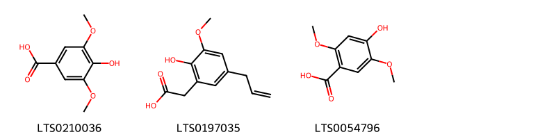{ width=100% }
    <figcaption>Hình ảnh cấu trúc hóa học của 3 hoạt chất thuộc nhóm Benzene and substituted derivatives gồm ['syringic acid (LTS0210036)', '[2-hydroxy-3-methoxy-5-(prop-2-en-1-yl)phenyl]acetic acid (LTS0197035)', '4-hydroxy-2,5-dimethoxybenzoic acid (LTS0054796)'].</figcaption>
</figure>
#### Nhóm Bi- and oligothiophenes
<figure markdown="span">
    { width=100% }
    <figcaption>Hình ảnh cấu trúc hóa học của 1 hoạt chất thuộc nhóm Bi- and oligothiophenes gồm ['terthiophene (LTS0246627)'].</figcaption>
</figure>
#### Nhóm Carboxylic acids and derivatives
<figure markdown="span">
    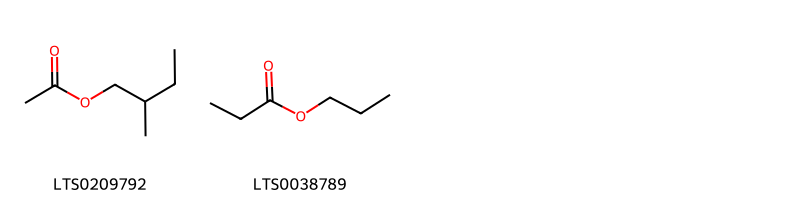{ width=100% }
    <figcaption>Hình ảnh cấu trúc hóa học của 2 hoạt chất thuộc nhóm Carboxylic acids and derivatives gồm ['β-methylbutyl acetate (LTS0209792)', 'propyl propanoate (LTS0038789)'].</figcaption>
</figure>
#### Nhóm Fatty Acyls
<figure markdown="span">
    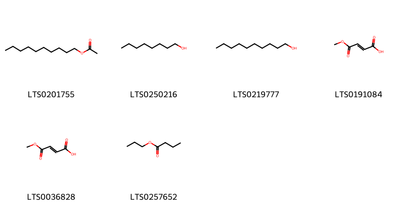{ width=100% }
    <figcaption>Hình ảnh cấu trúc hóa học của 6 hoạt chất thuộc nhóm Fatty Acyls gồm ['decyl acetate (LTS0201755)', 'octanol (LTS0250216)', 'decanol (LTS0219777)', '4-methoxy-4-oxobut-2-enoic acid (LTS0191084)', 'monomethyl fumarate (LTS0036828)', 'propyl butyrate (LTS0257652)'].</figcaption>
</figure>
#### Nhóm Flavonoids
<figure markdown="span">
    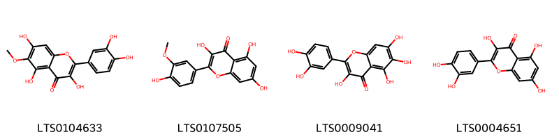{ width=100% }
    <figcaption>Hình ảnh cấu trúc hóa học của 4 hoạt chất thuộc nhóm Flavonoids gồm ['patuletin (LTS0104633)', 'isorhamnetin (LTS0107505)', 'quercetagetin (LTS0009041)', 'quercetin (LTS0004651)'].</figcaption>
</figure>
#### Nhóm Organooxygen compounds
<figure markdown="span">
    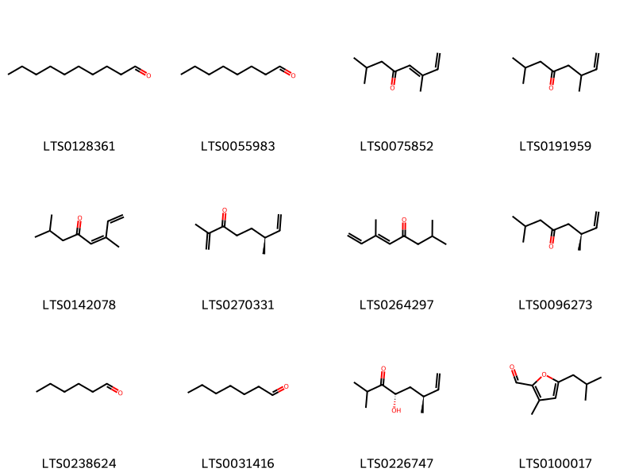{ width=100% }
    <figcaption>Hình ảnh cấu trúc hóa học của 12 hoạt chất thuộc nhóm Organooxygen compounds gồm ['decanal (LTS0128361)', 'octanal (LTS0055983)', '2,6-dimethylocta-5,7-dien-4-one (LTS0075852)', '2,6-dimethyloct-7-en-4-one (LTS0191959)', '(z)-tagetone (LTS0142078)', '(6s)-2,6-dimethylocta-1,7-dien-3-one (LTS0270331)', '(e)-tagetone (LTS0264297)', '(6s)-2,6-dimethyloct-7-en-4-one (LTS0096273)', 'hexanal (LTS0238624)', 'heptanal (LTS0031416)', '(4s,6s)-4-hydroxy-2,6-dimethyloct-7-en-3-one (LTS0226747)', '3-methyl-5-(2-methylpropyl)furan-2-carbaldehyde (LTS0100017)'].</figcaption>
</figure>
#### Nhóm Oxepanes
<figure markdown="span">
    { width=100% }
    <figcaption>Hình ảnh cấu trúc hóa học của 1 hoạt chất thuộc nhóm Oxepanes gồm ['limonene-1,2-epoxide (LTS0225957)'].</figcaption>
</figure>
#### Nhóm Prenol lipids
<figure markdown="span">
    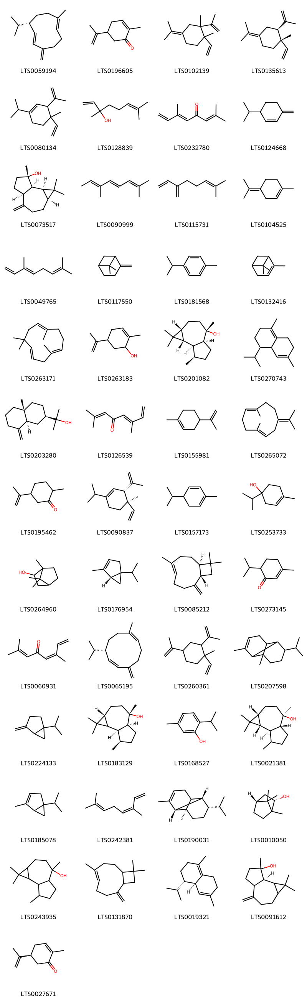{ width=100% }
    <figcaption>Hình ảnh cấu trúc hóa học của 49 hoạt chất thuộc nhóm Prenol lipids gồm ['(-)-germacrene d (LTS0059194)', 'carvone (LTS0196605)', '1-ethenyl-1,2-dimethyl-2-(prop-1-en-2-yl)-4-(propan-2-ylidene)cyclohexane (LTS0102139)', '(1s,2s)-1-ethenyl-1-methyl-2-(prop-1-en-2-yl)-4-(propan-2-ylidene)cyclohexane (LTS0135613)', '4-ethenyl-1-isopropyl-4-methyl-3-(prop-1-en-2-yl)cyclohex-1-ene (LTS0080134)', 'linalool, (+-)- (LTS0128839)', '(5e)-2,6-dimethylocta-2,5,7-trien-4-one (LTS0232780)', 'β phellandrene (LTS0124668)', '(1as,4as,7s,7ar,7bs)-1,1,7-trimethyl-4-methylidene-octahydrocyclopropa[e]azulen-7-ol (LTS0073517)', 'allo-ocimene (LTS0090999)', 'α-myrcene (LTS0115731)', 'terpinolene (LTS0104525)', 'trans-β-ocimene (LTS0049765)', 'β-pinene (LTS0117550)', 'cymene (LTS0181568)', 'α pinene (LTS0132416)', 'humulene (LTS0263171)', 'carveol (LTS0263183)', '(+)-ledol (LTS0201082)', '4-isopropyl-1,6-dimethyl-2,3,4,4a,7,8-hexahydronaphthalene (LTS0270743)', 'β-eudesmol (LTS0203280)', '2,6-dimethylocta-2,5,7-trien-4-one (LTS0126539)', 'limonene,  (LTS0155981)', 'germacrene b (LTS0265072)', 'dihydrocarvone (LTS0195462)', 'elemene (LTS0090837)', 'phellandrene (LTS0157173)', '4-terpineol (LTS0253733)', 'borneol (LTS0264960)', 'α-thujene (LTS0176954)', 'caryophyllene (LTS0085212)', 'piperitone (LTS0273145)', '(5z)-2,6-dimethylocta-2,5,7-trien-4-one (LTS0060931)', '(1z,6z,8s)-8-isopropyl-1-methyl-5-methylidenecyclodeca-1,6-diene (LTS0065195)', 'β-elemene (LTS0260361)', 'α-copaene (LTS0207598)', 'sabinene (LTS0224133)', 'viridiflorol (LTS0183129)', 'thymol (LTS0168527)', '(1ar,4r,4ar,7as,7bs)-1,1,4,7-tetramethyl-octahydro-1ah-cyclopropa[e]azulen-4-ol (LTS0021381)', 'α-thujene (LTS0185078)', 'β-ocimene (LTS0242381)', '(1r,2s,7s,8s)-8-isopropyl-1,3-dimethyltricyclo[4.4.0.0²,⁷]dec-3-ene (LTS0190031)', '(2s,4r)-1,7,7-trimethylbicyclo[2.2.1]heptan-2-ol (LTS0010050)', 'ledol (LTS0243935)', 'caryophyllene (LTS0131870)', 'delta-cadinene (LTS0019321)', '(7ar)-1,1,7-trimethyl-4-methylidene-octahydrocyclopropa[e]azulen-7-ol (LTS0091612)', 'carvone, (+)- (LTS0027671)'].</figcaption>
</figure>
#### Nhóm Unsaturated hydrocarbons
<figure markdown="span">
    { width=100% }
    <figcaption>Hình ảnh cấu trúc hóa học của 1 hoạt chất thuộc nhóm Unsaturated hydrocarbons gồm ['α terpinene (LTS0232891)'].</figcaption>
</figure>

---

### Dược dân tộc học

Danh sách các quốc gia có sử dụng *Tagetes minuta* trong điều trị các bệnh. 

| Country       | Disease                                                                                                         | Bệnh                                                                                                                                                                                                |
|:--------------|:----------------------------------------------------------------------------------------------------------------|:----------------------------------------------------------------------------------------------------------------------------------------------------------------------------------------------------|
| Argentina     | Emmenagogue, Purgative, Stimulant, Stomachic, Diaphoretic                                                       | MYMEMORY WARNING: YOU USED ALL AVAILABLE FREE TRANSLATIONS FOR TODAY. NEXT AVAILABLE IN  11 HOURS 08 MINUTES 48 SECONDS VISIT HTTPS://MYMEMORY.TRANSLATED.NET/DOC/USAGELIMITS.PHP TO TRANSLATE MORE |
| Brazil        | Vermifuge                                                                                                       | MYMEMORY WARNING: YOU USED ALL AVAILABLE FREE TRANSLATIONS FOR TODAY. NEXT AVAILABLE IN  11 HOURS 08 MINUTES 46 SECONDS VISIT HTTPS://MYMEMORY.TRANSLATED.NET/DOC/USAGELIMITS.PHP TO TRANSLATE MORE |
| Elsewhere     | Bronchodilator, Diaphoretic, Diaphoretic, Diuretic, Larvicide, Poison, Stomachic, Tranquilizer, nan, Nematicide | MYMEMORY WARNING: YOU USED ALL AVAILABLE FREE TRANSLATIONS FOR TODAY. NEXT AVAILABLE IN  11 HOURS 08 MINUTES 43 SECONDS VISIT HTTPS://MYMEMORY.TRANSLATED.NET/DOC/USAGELIMITS.PHP TO TRANSLATE MORE |
| Latin America | Carminative, Diaphoretic, Diuretic, Stomachic, Larvicide                                                        | MYMEMORY WARNING: YOU USED ALL AVAILABLE FREE TRANSLATIONS FOR TODAY. NEXT AVAILABLE IN  11 HOURS 08 MINUTES 40 SECONDS VISIT HTTPS://MYMEMORY.TRANSLATED.NET/DOC/USAGELIMITS.PHP TO TRANSLATE MORE |
| Lesotho       | Fumigant                                                                                                        | MYMEMORY WARNING: YOU USED ALL AVAILABLE FREE TRANSLATIONS FOR TODAY. NEXT AVAILABLE IN  11 HOURS 08 MINUTES 37 SECONDS VISIT HTTPS://MYMEMORY.TRANSLATED.NET/DOC/USAGELIMITS.PHP TO TRANSLATE MORE |
| Peru          | Aperient                                                                                                        | MYMEMORY WARNING: YOU USED ALL AVAILABLE FREE TRANSLATIONS FOR TODAY. NEXT AVAILABLE IN  11 HOURS 08 MINUTES 34 SECONDS VISIT HTTPS://MYMEMORY.TRANSLATED.NET/DOC/USAGELIMITS.PHP TO TRANSLATE MORE |
| Southafrica   | Larvicide                                                                                                       | MYMEMORY WARNING: YOU USED ALL AVAILABLE FREE TRANSLATIONS FOR TODAY. NEXT AVAILABLE IN  11 HOURS 08 MINUTES 32 SECONDS VISIT HTTPS://MYMEMORY.TRANSLATED.NET/DOC/USAGELIMITS.PHP TO TRANSLATE MORE |
| ain           | Fungicide                                                                                                       | MYMEMORY WARNING: YOU USED ALL AVAILABLE FREE TRANSLATIONS FOR TODAY. NEXT AVAILABLE IN  11 HOURS 08 MINUTES 29 SECONDS VISIT HTTPS://MYMEMORY.TRANSLATED.NET/DOC/USAGELIMITS.PHP TO TRANSLATE MORE |

---

---
## Tagetes multifida
### Thông tin về thực vật

!!! info "Phân loại thực vật của *Tagetes filifolia* từ GIBF:"
    - **Kingdom:** Plantae
    - **Phylum:** Tracheophyta
    - **Order:** Asterales
    - **Family:** Asteraceae
    - **Genus:** Tagetes
    - **Species:** *Tagetes filifolia*

 

| Label (VI)   | Label (EN)   | Scientific Name   | Descriptions (VI)   | Descriptions (EN)   | Also Known As (VI)   | Also Known As (EN)   |
|:-------------|:-------------|:------------------|:--------------------|:--------------------|:---------------------|:---------------------|
| N/A          | N/A          | Tagetes multifida |                     |                     | ['']                 | ['']                 |

#### Phân bố trên thế giới

**Từ CSDL GIBF** nan, Mexico

#### Phân bố tại Việt Nam

**Từ CSDL GIBF**: Không có ghi nhận ở Việt Nam

---
### Thành phần hóa học
        
- Theo cơ sở dữ liệu lotus: Từ loài *Tagetes filifolia* đã phân lập và xác định được Chưa có hoạt chất nào được phân lập. hoạt chất thuộc về các nhóm Không có hoạt chất nào được phân lập. 

Không có hình ảnh nào được tạo ra

---

### Dược dân tộc học

Danh sách các quốc gia có sử dụng *Tagetes filifolia* trong điều trị các bệnh. 

| Country   | Disease   | Bệnh                                                                                                                                                                                                |
|:----------|:----------|:----------------------------------------------------------------------------------------------------------------------------------------------------------------------------------------------------|
| Mexico    | Diuretic  | MYMEMORY WARNING: YOU USED ALL AVAILABLE FREE TRANSLATIONS FOR TODAY. NEXT AVAILABLE IN  11 HOURS 07 MINUTES 40 SECONDS VISIT HTTPS://MYMEMORY.TRANSLATED.NET/DOC/USAGELIMITS.PHP TO TRANSLATE MORE |

---

---
## Tagetes patula
### Thông tin về thực vật

!!! info "Phân loại thực vật của *Tagetes erecta* từ GIBF:"
    - **Kingdom:** Plantae
    - **Phylum:** Tracheophyta
    - **Order:** Asterales
    - **Family:** Asteraceae
    - **Genus:** Tagetes
    - **Species:** *Tagetes erecta*

 

| Label (VI)   | Label (EN)   | Scientific Name   | Descriptions (VI)   | Descriptions (EN)                        | Also Known As (VI)         | Also Known As (EN)                    |
|:-------------|:-------------|:------------------|:--------------------|:-----------------------------------------|:---------------------------|:--------------------------------------|
| N/A          | N/A          | Tagetes patula    | thực vật có hoa     | species in the daisy family (Asteraceae) | ['vạn thọ', 'cúc vạn thọ'] | ["French marigold 'Dainty Marietta'"] |

#### Phân bố trên thế giới

**Từ CSDL GIBF** nan, United Arab Emirates, Italy, Australia, Japan, Cook Islands, Belgium, Estonia, Slovakia, Canada, Ukraine, Denmark, Lithuania, Belarus, Nigeria, Namibia, Korea, Republic of, Spain, Türkiye, Portugal, Honduras, Russian Federation, United States of America, Sweden, Finland, Chile, Croatia, Bosnia and Herzegovina, Greece, South Africa, Uganda, Montenegro, Czechia, Germany, Brazil, North Macedonia, Switzerland, Armenia, Mexico, Austria, France, China, United Kingdom of Great Britain and Northern Ireland, Ecuador, Cabo Verde, Iraq, Botswana, Costa Rica, India, Indonesia, Poland, Kenya, New Zealand, Nepal

#### Phân bố tại Việt Nam

**Từ CSDL GIBF**: Không có ghi nhận ở Việt Nam

---
### Thành phần hóa học
        
- Theo cơ sở dữ liệu lotus: Từ loài *Tagetes erecta* đã phân lập và xác định được 38 hoạt chất thuộc về các nhóm Flavonoids, Prenol lipids, Steroids and steroid derivatives, Harmala alkaloids, Bi- and oligothiophenes, Benzofurans, Benzene and substituted derivatives, Hydroxy acids and derivatives, Carboxylic acids and derivatives, Pyridines and derivatives. 

|    | chemicalTaxonomyClassyfireClass     |   smiles_count |
|---:|:------------------------------------|---------------:|
|  0 | Benzene and substituted derivatives |              6 |
|  1 | Benzofurans                         |              3 |
|  2 | Bi- and oligothiophenes             |              4 |
|  3 | Carboxylic acids and derivatives    |              4 |
|  4 | Flavonoids                          |              9 |
|  5 | Harmala alkaloids                   |              2 |
|  6 | Hydroxy acids and derivatives       |              2 |
|  7 | Prenol lipids                       |              6 |
|  8 | Pyridines and derivatives           |              1 |
|  9 | Steroids and steroid derivatives    |              1 |

#### Nhóm Benzene and substituted derivatives
<figure markdown="span">
    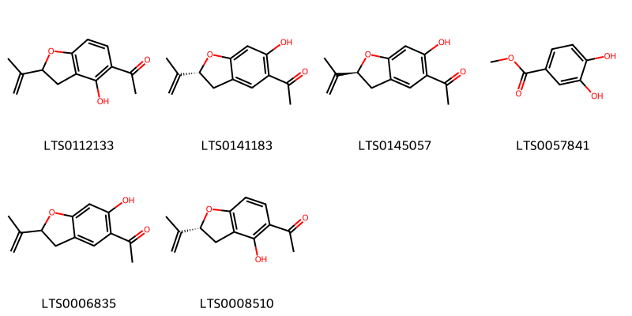{ width=100% }
    <figcaption>Hình ảnh cấu trúc hóa học của 6 hoạt chất thuộc nhóm Benzene and substituted derivatives gồm ['1-[4-hydroxy-2-(prop-1-en-2-yl)-2,3-dihydro-1-benzofuran-5-yl]ethanone (LTS0112133)', '6-hydroxytremetone (LTS0141183)', '1-[(2s)-6-hydroxy-2-(prop-1-en-2-yl)-2,3-dihydro-1-benzofuran-5-yl]ethanone (LTS0145057)', 'methyl 3,4-dihydroxybenzoate (LTS0057841)', '1-[6-hydroxy-2-(prop-1-en-2-yl)-2,3-dihydro-1-benzofuran-5-yl]ethanone (LTS0006835)', '1-[(2r)-4-hydroxy-2-(prop-1-en-2-yl)-2,3-dihydro-1-benzofuran-5-yl]ethanone (LTS0008510)'].</figcaption>
</figure>
#### Nhóm Benzofurans
<figure markdown="span">
    { width=100% }
    <figcaption>Hình ảnh cấu trúc hóa học của 3 hoạt chất thuộc nhóm Benzofurans gồm ['dehydrotremetone (LTS0065717)', '1-[4-hydroxy-2-(prop-1-en-2-yl)-1-benzofuran-5-yl]ethanone (LTS0046226)', 'euparin (LTS0237918)'].</figcaption>
</figure>
#### Nhóm Bi- and oligothiophenes
<figure markdown="span">
    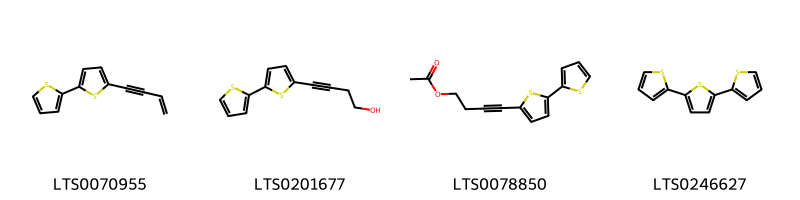{ width=100% }
    <figcaption>Hình ảnh cấu trúc hóa học của 4 hoạt chất thuộc nhóm Bi- and oligothiophenes gồm ["5-(but-3-en-1-yn-1-yl)-2,2'-bithiophene (LTS0070955)", "4-{[2,2'-bithiophen]-5-yl}but-3-yn-1-ol (LTS0201677)", "4-{[2,2'-bithiophen]-5-yl}but-3-yn-1-yl acetate (LTS0078850)", 'terthiophene (LTS0246627)'].</figcaption>
</figure>
#### Nhóm Carboxylic acids and derivatives
<figure markdown="span">
    { width=100% }
    <figcaption>Hình ảnh cấu trúc hóa học của 4 hoạt chất thuộc nhóm Carboxylic acids and derivatives gồm ['citric acid (LTS0213921)', '2-hydroxy-4-methoxy-2-(2-methoxy-2-oxoethyl)-4-oxobutanoic acid (LTS0091575)', '2-hydroxy-1,1,3-trimethylpropane-1,2,3-tricarboxylic acid (LTS0045209)', 'trimethyl citrate (LTS0099326)'].</figcaption>
</figure>
#### Nhóm Flavonoids
<figure markdown="span">
    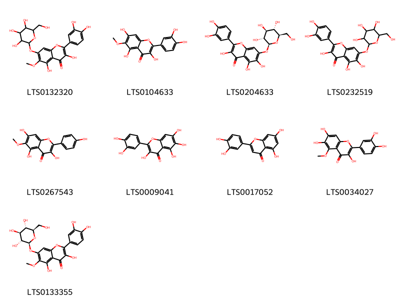{ width=100% }
    <figcaption>Hình ảnh cấu trúc hóa học của 9 hoạt chất thuộc nhóm Flavonoids gồm ['2-(3,4-dihydroxyphenyl)-3,5-dihydroxy-6-methoxy-7-{[3,4,5-trihydroxy-6-(hydroxymethyl)oxan-2-yl]oxy}chromen-4-one (LTS0132320)', 'patuletin (LTS0104633)', 'quercetagitrin (LTS0204633)', '2-(3,4-dihydroxyphenyl)-3,5,6-trihydroxy-7-{[3,4,5-trihydroxy-6-(hydroxymethyl)oxan-2-yl]oxy}chromen-4-one (LTS0232519)', '6-methoxykaempferol (LTS0267543)', 'quercetagetin (LTS0009041)', 'luteolin (LTS0017052)', 'allopatuletin (LTS0034027)', '2-(3,4-dihydroxyphenyl)-3,5-dihydroxy-6-methoxy-7-{[(2s,3r,4s,5s,6r)-3,4,5-trihydroxy-6-(hydroxymethyl)oxan-2-yl]oxy}chromen-4-one (LTS0133355)'].</figcaption>
</figure>
#### Nhóm Harmala alkaloids
<figure markdown="span">
    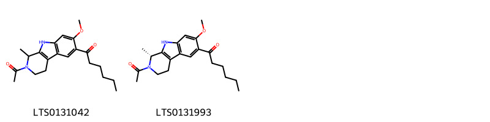{ width=100% }
    <figcaption>Hình ảnh cấu trúc hóa học của 2 hoạt chất thuộc nhóm Harmala alkaloids gồm ['1-{2-acetyl-7-methoxy-1-methyl-1h,3h,4h,9h-pyrido[3,4-b]indol-6-yl}hexan-1-one (LTS0131042)', '1-[(1r)-2-acetyl-7-methoxy-1-methyl-1h,3h,4h,9h-pyrido[3,4-b]indol-6-yl]hexan-1-one (LTS0131993)'].</figcaption>
</figure>
#### Nhóm Hydroxy acids and derivatives
<figure markdown="span">
    { width=100% }
    <figcaption>Hình ảnh cấu trúc hóa học của 2 hoạt chất thuộc nhóm Hydroxy acids and derivatives gồm ['1,4-dimethyl 2-hydroxybutanedioate (LTS0065228)', 'malic acid (LTS0216520)'].</figcaption>
</figure>
#### Nhóm Prenol lipids
<figure markdown="span">
    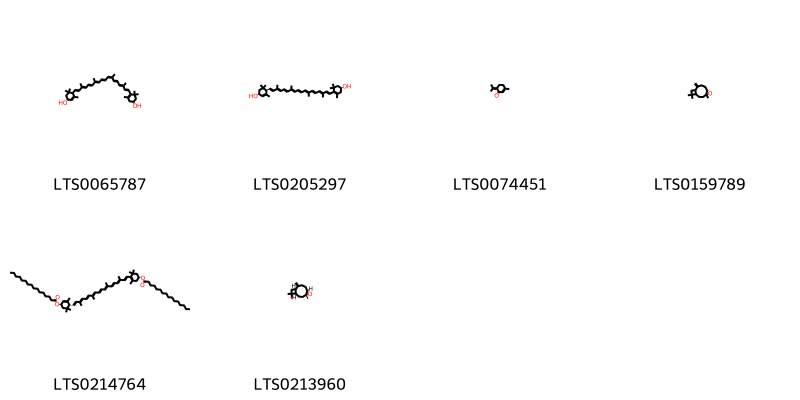{ width=100% }
    <figcaption>Hình ảnh cấu trúc hóa học của 6 hoạt chất thuộc nhóm Prenol lipids gồm ['xanthophyll (LTS0065787)', 'carotenoid (LTS0205297)', 'piperitenone (LTS0074451)', 'caryophyllene oxide (LTS0159789)', 'xantofyl palmitate (LTS0214764)', 'β-caryophyllene oxide (LTS0213960)'].</figcaption>
</figure>
#### Nhóm Pyridines and derivatives
<figure markdown="span">
    { width=100% }
    <figcaption>Hình ảnh cấu trúc hóa học của 1 hoạt chất thuộc nhóm Pyridines and derivatives gồm ['pyridine (LTS0108275)'].</figcaption>
</figure>
#### Nhóm Steroids and steroid derivatives
<figure markdown="span">
    { width=100% }
    <figcaption>Hình ảnh cấu trúc hóa học của 1 hoạt chất thuộc nhóm Steroids and steroid derivatives gồm ['phytosterol (LTS0029311)'].</figcaption>
</figure>

---

### Dược dân tộc học

Danh sách các quốc gia có sử dụng *Tagetes erecta* trong điều trị các bệnh. 

| Country            | Disease                                                                                           | Bệnh                                                                                                                                                                                                |
|:-------------------|:--------------------------------------------------------------------------------------------------|:----------------------------------------------------------------------------------------------------------------------------------------------------------------------------------------------------|
| Argentina          | Diuretic, Stomachic                                                                               | MYMEMORY WARNING: YOU USED ALL AVAILABLE FREE TRANSLATIONS FOR TODAY. NEXT AVAILABLE IN  11 HOURS 07 MINUTES 23 SECONDS VISIT HTTPS://MYMEMORY.TRANSLATED.NET/DOC/USAGELIMITS.PHP TO TRANSLATE MORE |
| Colombia           | Collyrium                                                                                         | MYMEMORY WARNING: YOU USED ALL AVAILABLE FREE TRANSLATIONS FOR TODAY. NEXT AVAILABLE IN  11 HOURS 07 MINUTES 20 SECONDS VISIT HTTPS://MYMEMORY.TRANSLATED.NET/DOC/USAGELIMITS.PHP TO TRANSLATE MORE |
| Dominican Republic | Diaphoretic, Emmenagogue                                                                          | MYMEMORY WARNING: YOU USED ALL AVAILABLE FREE TRANSLATIONS FOR TODAY. NEXT AVAILABLE IN  11 HOURS 07 MINUTES 17 SECONDS VISIT HTTPS://MYMEMORY.TRANSLATED.NET/DOC/USAGELIMITS.PHP TO TRANSLATE MORE |
| Elsewhere          | nan, Herbicide, Insecticide, Nematicide, Purgative, Stimulant, Antiseptic, Carminative, Vermifuge | MYMEMORY WARNING: YOU USED ALL AVAILABLE FREE TRANSLATIONS FOR TODAY. NEXT AVAILABLE IN  11 HOURS 07 MINUTES 14 SECONDS VISIT HTTPS://MYMEMORY.TRANSLATED.NET/DOC/USAGELIMITS.PHP TO TRANSLATE MORE |
| Haiti              | Emmenagogue, Vulnerary                                                                            | MYMEMORY WARNING: YOU USED ALL AVAILABLE FREE TRANSLATIONS FOR TODAY. NEXT AVAILABLE IN  11 HOURS 07 MINUTES 11 SECONDS VISIT HTTPS://MYMEMORY.TRANSLATED.NET/DOC/USAGELIMITS.PHP TO TRANSLATE MORE |
| Iraq               | Astringent                                                                                        | MYMEMORY WARNING: YOU USED ALL AVAILABLE FREE TRANSLATIONS FOR TODAY. NEXT AVAILABLE IN  11 HOURS 07 MINUTES 06 SECONDS VISIT HTTPS://MYMEMORY.TRANSLATED.NET/DOC/USAGELIMITS.PHP TO TRANSLATE MORE |
| Kurdistan          | Hemostat                                                                                          | MYMEMORY WARNING: YOU USED ALL AVAILABLE FREE TRANSLATIONS FOR TODAY. NEXT AVAILABLE IN  11 HOURS 07 MINUTES 03 SECONDS VISIT HTTPS://MYMEMORY.TRANSLATED.NET/DOC/USAGELIMITS.PHP TO TRANSLATE MORE |
| Philippines        | Carminative                                                                                       | MYMEMORY WARNING: YOU USED ALL AVAILABLE FREE TRANSLATIONS FOR TODAY. NEXT AVAILABLE IN  11 HOURS 07 MINUTES 00 SECONDS VISIT HTTPS://MYMEMORY.TRANSLATED.NET/DOC/USAGELIMITS.PHP TO TRANSLATE MORE |

---

---
## Tagetes pusilla
### Thông tin về thực vật

!!! info "Phân loại thực vật của *Tagetes filifolia* từ GIBF:"
    - **Kingdom:** Plantae
    - **Phylum:** Tracheophyta
    - **Order:** Asterales
    - **Family:** Asteraceae
    - **Genus:** Tagetes
    - **Species:** *Tagetes filifolia*

 

| Label (VI)   | Label (EN)   | Scientific Name   | Descriptions (VI)   | Descriptions (EN)   | Also Known As (VI)   | Also Known As (EN)   |
|:-------------|:-------------|:------------------|:--------------------|:--------------------|:---------------------|:---------------------|
| N/A          | N/A          | Tagetes pusilla   | loài thực vật       | species of plant    | ['']                 | ['']                 |

#### Phân bố trên thế giới

**Từ CSDL GIBF** nan, Ecuador, Colombia, Brazil, Bolivia (Plurinational State of), Argentina, unknown or invalid, United States of America, Peru, Mexico, Venezuela (Bolivarian Republic of)

#### Phân bố tại Việt Nam

**Từ CSDL GIBF**: Không có ghi nhận ở Việt Nam

---
### Thành phần hóa học
        
- Theo cơ sở dữ liệu lotus: Từ loài *Tagetes filifolia* đã phân lập và xác định được Chưa có hoạt chất nào được phân lập. hoạt chất thuộc về các nhóm Không có hoạt chất nào được phân lập. 

Không có hình ảnh nào được tạo ra

---

### Dược dân tộc học

Danh sách các quốc gia có sử dụng *Tagetes filifolia* trong điều trị các bệnh. 

| Country   | Disease   | Bệnh                                                                                                                                                                                                |
|:----------|:----------|:----------------------------------------------------------------------------------------------------------------------------------------------------------------------------------------------------|
| Venezuela | Emollient | MYMEMORY WARNING: YOU USED ALL AVAILABLE FREE TRANSLATIONS FOR TODAY. NEXT AVAILABLE IN  11 HOURS 06 MINUTES 25 SECONDS VISIT HTTPS://MYMEMORY.TRANSLATED.NET/DOC/USAGELIMITS.PHP TO TRANSLATE MORE |

---

---
## Tagetes subulata
### Thông tin về thực vật

!!! info "Phân loại thực vật của *Tagetes subulata* từ GIBF:"
    - **Kingdom:** Plantae
    - **Phylum:** Tracheophyta
    - **Order:** Asterales
    - **Family:** Asteraceae
    - **Genus:** Tagetes
    - **Species:** *Tagetes subulata*

 

| Label (VI)   | Label (EN)   | Scientific Name   | Descriptions (VI)   | Descriptions (EN)   | Also Known As (VI)   | Also Known As (EN)   |
|:-------------|:-------------|:------------------|:--------------------|:--------------------|:---------------------|:---------------------|
| N/A          | N/A          | Tagetes subulata  | loài thực vật       | species of plant    | ['']                 | ['']                 |

#### Phân bố trên thế giới

**Từ CSDL GIBF** Guatemala, Costa Rica, Honduras, Nicaragua, Mexico, El Salvador, Venezuela (Bolivarian Republic of)

#### Phân bố tại Việt Nam

**Từ CSDL GIBF**: Không có ghi nhận ở Việt Nam

---
### Thành phần hóa học
        
- Theo cơ sở dữ liệu lotus: Từ loài *Tagetes subulata* đã phân lập và xác định được 2 hoạt chất thuộc về các nhóm Flavonoids. 

|    | chemicalTaxonomyClassyfireClass   |   smiles_count |
|---:|:----------------------------------|---------------:|
|  0 | Flavonoids                        |              2 |

#### Nhóm Flavonoids
<figure markdown="span">
    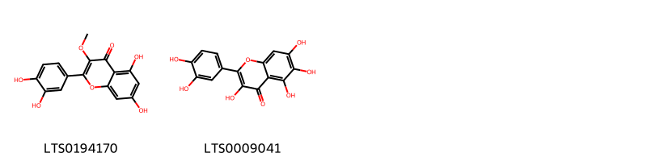{ width=100% }
    <figcaption>Hình ảnh cấu trúc hóa học của 2 hoạt chất thuộc nhóm Flavonoids gồm ['quercetin 3-methyl ether (LTS0194170)', 'quercetagetin (LTS0009041)'].</figcaption>
</figure>

---

### Dược dân tộc học

Danh sách các quốc gia có sử dụng *Tagetes subulata* trong điều trị các bệnh. 

| Country   | Disease     | Bệnh                                                                                                                                                                                                |
|:----------|:------------|:----------------------------------------------------------------------------------------------------------------------------------------------------------------------------------------------------|
| Mexico    | Insecticide | MYMEMORY WARNING: YOU USED ALL AVAILABLE FREE TRANSLATIONS FOR TODAY. NEXT AVAILABLE IN  11 HOURS 05 MINUTES 59 SECONDS VISIT HTTPS://MYMEMORY.TRANSLATED.NET/DOC/USAGELIMITS.PHP TO TRANSLATE MORE |

---

---
## Tagetes terniflora
### Thông tin về thực vật

!!! info "Phân loại thực vật của *Tagetes terniflora* từ GIBF:"
    - **Kingdom:** Plantae
    - **Phylum:** Tracheophyta
    - **Order:** Asterales
    - **Family:** Asteraceae
    - **Genus:** Tagetes
    - **Species:** *Tagetes terniflora*

 

| Label (VI)   | Label (EN)   | Scientific Name    | Descriptions (VI)   | Descriptions (EN)   | Also Known As (VI)   | Also Known As (EN)   |
|:-------------|:-------------|:-------------------|:--------------------|:--------------------|:---------------------|:---------------------|
| N/A          | N/A          | Tagetes terniflora | loài thực vật       | species of plant    | ['']                 | ['']                 |

#### Phân bố trên thế giới

**Từ CSDL GIBF** nan, Ecuador, Puerto Rico, Colombia, Brazil, Bolivia (Plurinational State of), Argentina, Honduras, unknown or invalid, United States of America, Peru, Mexico, Venezuela (Bolivarian Republic of)

#### Phân bố tại Việt Nam

**Từ CSDL GIBF**: Không có ghi nhận ở Việt Nam

---
### Thành phần hóa học
        
- Theo cơ sở dữ liệu lotus: Từ loài *Tagetes terniflora* đã phân lập và xác định được Chưa có hoạt chất nào được phân lập. hoạt chất thuộc về các nhóm Không có hoạt chất nào được phân lập. 

Không có hình ảnh nào được tạo ra

---

### Dược dân tộc học

Danh sách các quốc gia có sử dụng *Tagetes terniflora* trong điều trị các bệnh. 

| Country   | Disease     | Bệnh                                                                                                                                                                                                |
|:----------|:------------|:----------------------------------------------------------------------------------------------------------------------------------------------------------------------------------------------------|
| Colombia  | Insecticide | MYMEMORY WARNING: YOU USED ALL AVAILABLE FREE TRANSLATIONS FOR TODAY. NEXT AVAILABLE IN  11 HOURS 05 MINUTES 28 SECONDS VISIT HTTPS://MYMEMORY.TRANSLATED.NET/DOC/USAGELIMITS.PHP TO TRANSLATE MORE |

---

# Chi Schkuhria

??? note "Danh sách các dược liệu thuộc chi"
    
	 - *Schkuhria anthemoidea*
	 - *Schkuhria pinnata*
	 - *Schkuhria virgata*

---
## Schkuhria anthemoidea
### Thông tin về thực vật

!!! info "Phân loại thực vật của *Schkuhria pinnata* từ GIBF:"
    - **Kingdom:** Plantae
    - **Phylum:** Tracheophyta
    - **Order:** Asterales
    - **Family:** Asteraceae
    - **Genus:** Schkuhria
    - **Species:** *Schkuhria pinnata*

 

| Label (VI)   | Label (EN)   | Scientific Name       | Descriptions (VI)   | Descriptions (EN)   | Also Known As (VI)   | Also Known As (EN)   |
|:-------------|:-------------|:----------------------|:--------------------|:--------------------|:---------------------|:---------------------|
| N/A          | N/A          | Schkuhria anthemoidea | loài thực vật       | species of plant    | ['']                 | ['']                 |

#### Phân bố trên thế giới

**Từ CSDL GIBF** Guatemala, United States of America, Mexico

#### Phân bố tại Việt Nam

**Từ CSDL GIBF**: Không có ghi nhận ở Việt Nam

---
### Thành phần hóa học
        
- Theo cơ sở dữ liệu lotus: Từ loài *Schkuhria pinnata* đã phân lập và xác định được Chưa có hoạt chất nào được phân lập. hoạt chất thuộc về các nhóm Không có hoạt chất nào được phân lập. 

Không có hình ảnh nào được tạo ra

---

### Dược dân tộc học

Danh sách các quốc gia có sử dụng *Schkuhria pinnata* trong điều trị các bệnh. 

| Country   | Disease               | Bệnh                                                                                                                                                                                                |
|:----------|:----------------------|:----------------------------------------------------------------------------------------------------------------------------------------------------------------------------------------------------|
| Salvador  | Pulicide, Insecticide | MYMEMORY WARNING: YOU USED ALL AVAILABLE FREE TRANSLATIONS FOR TODAY. NEXT AVAILABLE IN  11 HOURS 05 MINUTES 00 SECONDS VISIT HTTPS://MYMEMORY.TRANSLATED.NET/DOC/USAGELIMITS.PHP TO TRANSLATE MORE |

---

---
## Schkuhria pinnata
### Thông tin về thực vật

!!! info "Phân loại thực vật của *Schkuhria pinnata* từ GIBF:"
    - **Kingdom:** Plantae
    - **Phylum:** Tracheophyta
    - **Order:** Asterales
    - **Family:** Asteraceae
    - **Genus:** Schkuhria
    - **Species:** *Schkuhria pinnata*

 

| Label (VI)   | Label (EN)   | Scientific Name   | Descriptions (VI)   | Descriptions (EN)   | Also Known As (VI)   | Also Known As (EN)   |
|:-------------|:-------------|:------------------|:--------------------|:--------------------|:---------------------|:---------------------|
| N/A          | N/A          | Schkuhria pinnata | loài thực vật       | species of plant    | ['']                 | ['']                 |

#### Phân bố trên thế giới

**Từ CSDL GIBF** nan, Australia, Belgium, Argentina, Tanzania, United Republic of, Namibia, Bolivia (Plurinational State of), United States of America, Uruguay, El Salvador, Zimbabwe, South Africa, Peru, France, Mexico, Eswatini, Ecuador, Madagascar, Botswana, Kenya

#### Phân bố tại Việt Nam

**Từ CSDL GIBF**: Không có ghi nhận ở Việt Nam

---
### Thành phần hóa học
        
- Theo cơ sở dữ liệu lotus: Từ loài *Schkuhria pinnata* đã phân lập và xác định được 47 hoạt chất thuộc về các nhóm Flavonoids, Benzofurans, Prenol lipids. 

|    | chemicalTaxonomyClassyfireClass   |   smiles_count |
|---:|:----------------------------------|---------------:|
|  0 | Benzofurans                       |              1 |
|  1 | Flavonoids                        |              1 |
|  2 | Prenol lipids                     |             41 |

#### Nhóm Benzofurans
<figure markdown="span">
    { width=100% }
    <figcaption>Hình ảnh cấu trúc hóa học của 1 hoạt chất thuộc nhóm Benzofurans gồm ['loliolide (LTS0254454)'].</figcaption>
</figure>
#### Nhóm Flavonoids
<figure markdown="span">
    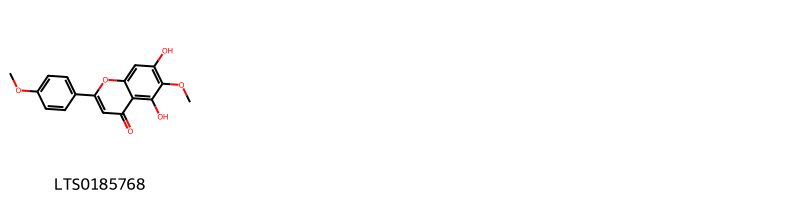{ width=100% }
    <figcaption>Hình ảnh cấu trúc hóa học của 1 hoạt chất thuộc nhóm Flavonoids gồm ['pectolinarigenin (LTS0185768)'].</figcaption>
</figure>
#### Nhóm Prenol lipids
<figure markdown="span">
    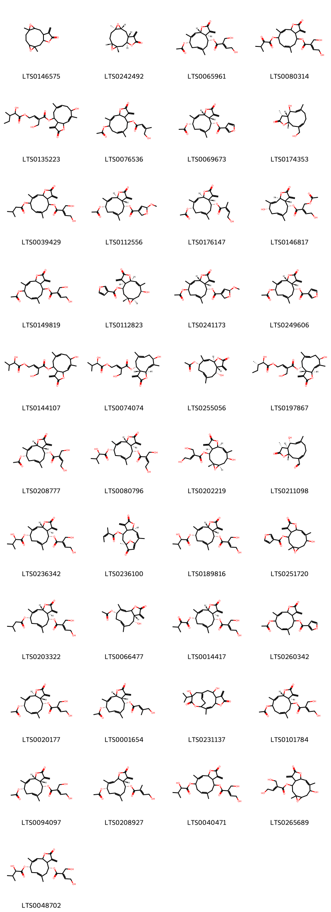{ width=100% }
    <figcaption>Hình ảnh cấu trúc hóa học của 41 hoạt chất thuộc nhóm Prenol lipids gồm ['5,10-dimethyl-15-methylidene-4,9,13-trioxatetracyclo[10.3.0.0³,⁵.0⁸,¹⁰]pentadecan-14-one (LTS0146575)', '(1r,3r,5r,8r,10s,12s)-5,10-dimethyl-15-methylidene-4,9,13-trioxatetracyclo[10.3.0.0³,⁵.0⁸,¹⁰]pentadecan-14-one (LTS0242492)', '(3as,4r,9s,11as)-9-(acetyloxy)-6,10-dimethyl-3-methylidene-2-oxo-3ah,4h,5h,8h,9h,11ah-cyclodeca[b]furan-4-yl (2e)-4-hydroxy-2-(hydroxymethyl)but-2-enoate (LTS0065961)', '6,10-dimethyl-9-[(3-methyl-2-oxobutanoyl)oxy]-3-methylidene-2-oxo-3ah,4h,5h,8h,9h,11ah-cyclodeca[b]furan-4-yl 4-hydroxy-2-(hydroxymethyl)but-2-enoate (LTS0080314)', '4-({9-hydroxy-6,10-dimethyl-3-methylidene-2-oxo-3ah,4h,5h,8h,9h,11ah-cyclodeca[b]furan-4-yl}oxy)-3-(hydroxymethyl)-4-oxobut-2-en-1-yl 2-hydroxy-3-methylpentanoate (LTS0135223)', '9-(acetyloxy)-6,10-dimethyl-3-methylidene-2-oxo-3ah,4h,5h,8h,9h,11ah-cyclodeca[b]furan-4-yl 4-hydroxy-3-methylbut-2-enoate (LTS0076536)', '(3ar,4r,9s,11as)-9-(acetyloxy)-6,10-dimethyl-3-methylidene-2-oxo-3ah,4h,5h,8h,9h,11ah-cyclodeca[b]furan-4-yl furan-3-carboxylate (LTS0069673)', '(3r,3ar,4s,11as)-4-hydroxy-10-(hydroxymethyl)-3,6-dimethyl-3h,3ah,4h,7h,8h,11h,11ah-cyclodeca[b]furan-2-one (LTS0174353)', '6,10-dimethyl-9-[(3-methylbutanoyl)oxy]-3-methylidene-2-oxo-3ah,4h,5h,8h,9h,11ah-cyclodeca[b]furan-4-yl 4-hydroxy-2-(hydroxymethyl)but-2-enoate (LTS0039429)', '(3ar,4r,9s,11ar)-9-(acetyloxy)-6,10-dimethyl-3-methylidene-2-oxo-3ah,4h,5h,8h,9h,11ah-cyclodeca[b]furan-4-yl (5s)-5-methoxy-2,5-dihydrofuran-3-carboxylate (LTS0112556)', '(3ar,4r,9s,11ar)-9-(acetyloxy)-6,10-dimethyl-3-methylidene-2-oxo-3ah,4h,5h,8h,9h,11ah-cyclodeca[b]furan-4-yl (2z)-4-hydroxy-2-methylbut-2-enoate (LTS0176147)', '(3ar,4r,9s,11ar)-9-hydroxy-6,10-dimethyl-3-methylidene-2-oxo-3ah,4h,5h,8h,9h,11ah-cyclodeca[b]furan-4-yl (2e)-2-[(acetyloxy)methyl]-4-hydroxybut-2-enoate (LTS0146817)', '9-(acetyloxy)-6,10-dimethyl-3-methylidene-2-oxo-3ah,4h,5h,8h,9h,11ah-cyclodeca[b]furan-4-yl 4-hydroxy-2-(hydroxymethyl)but-2-enoate (LTS0149819)', '(1r,2r,4r,6r,8s,9z,11s)-8-hydroxy-4,9-dimethyl-14-methylidene-13-oxo-5,12-dioxatricyclo[9.3.0.0⁴,⁶]tetradec-9-en-2-yl furan-3-carboxylate (LTS0112823)', '(3ar,4r,9r,11as)-9-(acetyloxy)-6,10-dimethyl-3-methylidene-2-oxo-3ah,4h,5h,8h,9h,11ah-cyclodeca[b]furan-4-yl (5s)-5-methoxy-2,5-dihydrofuran-3-carboxylate (LTS0241173)', '(3ar,4r,9r,11as)-9-(acetyloxy)-6,10-dimethyl-3-methylidene-2-oxo-3ah,4h,5h,8h,9h,11ah-cyclodeca[b]furan-4-yl furan-3-carboxylate (LTS0249606)', '9-hydroxy-6,10-dimethyl-3-methylidene-2-oxo-3ah,4h,5h,8h,9h,11ah-cyclodeca[b]furan-4-yl 4-[(2-hydroxy-3-methylbutanoyl)oxy]-2-(hydroxymethyl)but-2-enoate (LTS0144107)', '(3ar,4r,9r,11ar)-9-hydroxy-6,10-dimethyl-3-methylidene-2-oxo-3ah,4h,5h,8h,9h,11ah-cyclodeca[b]furan-4-yl (2e)-4-{[(2r)-2-hydroxy-3-methylbutanoyl]oxy}-2-(hydroxymethyl)but-2-enoate (LTS0074074)', '(3ar,4r,9s,11ar)-4-hydroxy-6,10-dimethyl-3-methylidene-2-oxo-3ah,4h,5h,8h,9h,11ah-cyclodeca[b]furan-9-yl acetate (LTS0255056)', '(2e)-4-{[(3ar,4r,9r,11ar)-9-hydroxy-6,10-dimethyl-3-methylidene-2-oxo-3ah,4h,5h,8h,9h,11ah-cyclodeca[b]furan-4-yl]oxy}-3-(hydroxymethyl)-4-oxobut-2-en-1-yl (2r,3s)-2-hydroxy-3-methylpentanoate (LTS0197867)', '(3ar,4r,9s,11as)-9-(acetyloxy)-6,10-dimethyl-3-methylidene-2-oxo-3ah,4h,5h,8h,9h,11ah-cyclodeca[b]furan-4-yl (2z)-4-hydroxy-2-(hydroxymethyl)but-2-enoate (LTS0208777)', '(3as,4r,9s,11as)-9-{[(2r)-2-hydroxy-3-methylbutanoyl]oxy}-6,10-dimethyl-3-methylidene-2-oxo-3ah,4h,5h,8h,9h,11ah-cyclodeca[b]furan-4-yl (2z)-4-hydroxy-2-(hydroxymethyl)but-2-enoate (LTS0080796)', '(1r,2r,4r,6r,8s,9z,11s)-8-hydroxy-4,9-dimethyl-14-methylidene-13-oxo-5,12-dioxatricyclo[9.3.0.0⁴,⁶]tetradec-9-en-2-yl (2e)-4-hydroxy-2-(hydroxymethyl)but-2-enoate (LTS0202219)', '(3r,3as,4r,11as)-4-hydroxy-3,6-dimethyl-2-oxo-3h,3ah,4h,7h,8h,11h,11ah-cyclodeca[b]furan-10-carbaldehyde (LTS0211098)', '(3as,4r,9s,11as)-9-{[(2r)-2-hydroxy-3-methylbutanoyl]oxy}-6,10-dimethyl-3-methylidene-2-oxo-3ah,4h,5h,8h,9h,11ah-cyclodeca[b]furan-4-yl (2e)-4-hydroxy-2-(hydroxymethyl)but-2-enoate (LTS0236342)', '(2z,4s,9r,11r)-2,11-dimethyl-7-methylidene-6,12-dioxo-5,14-dioxatricyclo[9.2.1.0⁴,⁸]tetradeca-1(13),2-dien-9-yl (2z)-2-methylbut-2-enoate (LTS0236100)', '(3ar,4r,9s,11as)-9-{[(2r)-2-hydroxy-3-methylbutanoyl]oxy}-6,10-dimethyl-3-methylidene-2-oxo-3ah,4h,5h,8h,9h,11ah-cyclodeca[b]furan-4-yl (2e)-4-hydroxy-2-(hydroxymethyl)but-2-enoate (LTS0189816)', '8-hydroxy-4,9-dimethyl-14-methylidene-13-oxo-5,12-dioxatricyclo[9.3.0.0⁴,⁶]tetradec-9-en-2-yl furan-3-carboxylate (LTS0251720)', '(3as,4r,9s,11as)-6,10-dimethyl-9-[(3-methylbutanoyl)oxy]-3-methylidene-2-oxo-3ah,4h,5h,8h,9h,11ah-cyclodeca[b]furan-4-yl (2e)-4-hydroxy-2-(hydroxymethyl)but-2-enoate (LTS0203322)', '(3ar,4r,9s)-4-hydroxy-6,10-dimethyl-3-methylidene-2-oxo-3ah,4h,5h,8h,9h,11ah-cyclodeca[b]furan-9-yl acetate (LTS0066477)', '(3as,4r,9s,11as)-6,10-dimethyl-9-[(3-methyl-2-oxobutanoyl)oxy]-3-methylidene-2-oxo-3ah,4h,5h,8h,9h,11ah-cyclodeca[b]furan-4-yl (2e)-4-hydroxy-2-(hydroxymethyl)but-2-enoate (LTS0014417)', '9-(acetyloxy)-6,10-dimethyl-3-methylidene-2-oxo-3ah,4h,5h,8h,9h,11ah-cyclodeca[b]furan-4-yl furan-3-carboxylate (LTS0260342)', 'eucannabinolide (LTS0020177)', '(3ar,4r,9s,11as)-9-(acetyloxy)-6,10-dimethyl-3-methylidene-2-oxo-3ah,4h,5h,8h,9h,11ah-cyclodeca[b]furan-4-yl (2e)-4-hydroxy-3-methylbut-2-enoate (LTS0001654)', '(11e)-9,13-dihydroxy-13-isopropyl-2-methyl-7-methylidene-5,15-dioxatricyclo[9.4.2.0⁴,⁸]heptadeca-2,11(17)-diene-6,14-dione (LTS0231137)', '(3as,11as)-9-(acetyloxy)-6,10-dimethyl-3-methylidene-2-oxo-3ah,4h,5h,8h,9h,11ah-cyclodeca[b]furan-4-yl 4-hydroxy-2-(hydroxymethyl)but-2-enoate (LTS0101784)', '(3ar,4r,9s,11as)-9-(acetyloxy)-6,10-dimethyl-3-methylidene-2-oxo-3ah,4h,5h,8h,9h,11ah-cyclodeca[b]furan-4-yl (2e)-4-hydroxy-2-(hydroxymethyl)but-2-enoate (LTS0094097)', '(3ar,4r,9s)-9-(acetyloxy)-6,10-dimethyl-3-methylidene-2-oxo-3ah,4h,5h,8h,9h,11ah-cyclodeca[b]furan-4-yl (2e)-4-hydroxy-2-methylbut-2-enoate (LTS0208927)', '9-[(2-hydroxy-3-methylbutanoyl)oxy]-6,10-dimethyl-3-methylidene-2-oxo-3ah,4h,5h,8h,9h,11ah-cyclodeca[b]furan-4-yl 4-hydroxy-2-(hydroxymethyl)but-2-enoate (LTS0040471)', '8-hydroxy-4,9-dimethyl-14-methylidene-13-oxo-5,12-dioxatricyclo[9.3.0.0⁴,⁶]tetradec-9-en-2-yl 4-hydroxy-2-(hydroxymethyl)but-2-enoate (LTS0265689)', '(4r,9s)-9-[(2-hydroxy-3-methylbutanoyl)oxy]-6,10-dimethyl-3-methylidene-2-oxo-3ah,4h,5h,8h,9h,11ah-cyclodeca[b]furan-4-yl (2e)-4-hydroxy-2-(hydroxymethyl)but-2-enoate (LTS0048702)'].</figcaption>
</figure>

---

### Dược dân tộc học

Danh sách các quốc gia có sử dụng *Schkuhria pinnata* trong điều trị các bệnh. 

| Country   | Disease               | Bệnh                                                                                                                                                                                                |
|:----------|:----------------------|:----------------------------------------------------------------------------------------------------------------------------------------------------------------------------------------------------|
| Bolivia   | Pulicide              | MYMEMORY WARNING: YOU USED ALL AVAILABLE FREE TRANSLATIONS FOR TODAY. NEXT AVAILABLE IN  11 HOURS 04 MINUTES 32 SECONDS VISIT HTTPS://MYMEMORY.TRANSLATED.NET/DOC/USAGELIMITS.PHP TO TRANSLATE MORE |
| Peru      | Pediculicide, Styptic | MYMEMORY WARNING: YOU USED ALL AVAILABLE FREE TRANSLATIONS FOR TODAY. NEXT AVAILABLE IN  11 HOURS 04 MINUTES 29 SECONDS VISIT HTTPS://MYMEMORY.TRANSLATED.NET/DOC/USAGELIMITS.PHP TO TRANSLATE MORE |

---

---
## Schkuhria virgata
### Thông tin về thực vật

!!! info "Phân loại thực vật của *Schkuhria pinnata* từ GIBF:"
    - **Kingdom:** Plantae
    - **Phylum:** Tracheophyta
    - **Order:** Asterales
    - **Family:** Asteraceae
    - **Genus:** Schkuhria
    - **Species:** *Schkuhria pinnata*

 

| Label (VI)   | Label (EN)   | Scientific Name   | Descriptions (VI)   | Descriptions (EN)   | Also Known As (VI)   | Also Known As (EN)   |
|:-------------|:-------------|:------------------|:--------------------|:--------------------|:---------------------|:---------------------|
| N/A          | N/A          | Schkuhria virgata |                     | species of plant    | ['']                 | ['']                 |

#### Phân bố trên thế giới

**Từ CSDL GIBF** nan, Ecuador, Guatemala, Costa Rica, Honduras, unknown or invalid, United States of America, Nicaragua, Mexico, El Salvador

#### Phân bố tại Việt Nam

**Từ CSDL GIBF**: Không có ghi nhận ở Việt Nam

---
### Thành phần hóa học
        
- Theo cơ sở dữ liệu lotus: Từ loài *Schkuhria pinnata* đã phân lập và xác định được 5 hoạt chất thuộc về các nhóm Flavonoids, Prenol lipids. 

|    | chemicalTaxonomyClassyfireClass   |   smiles_count |
|---:|:----------------------------------|---------------:|
|  0 | Flavonoids                        |              1 |
|  1 | Prenol lipids                     |              4 |

#### Nhóm Flavonoids
<figure markdown="span">
    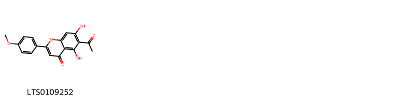{ width=100% }
    <figcaption>Hình ảnh cấu trúc hóa học của 1 hoạt chất thuộc nhóm Flavonoids gồm ['6-acetyl-5,7-dihydroxy-2-(4-methoxyphenyl)chromen-4-one (LTS0109252)'].</figcaption>
</figure>
#### Nhóm Prenol lipids
<figure markdown="span">
    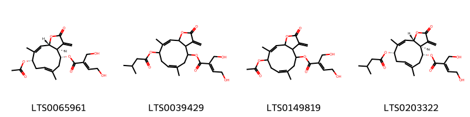{ width=100% }
    <figcaption>Hình ảnh cấu trúc hóa học của 4 hoạt chất thuộc nhóm Prenol lipids gồm ['(3as,4r,9s,11as)-9-(acetyloxy)-6,10-dimethyl-3-methylidene-2-oxo-3ah,4h,5h,8h,9h,11ah-cyclodeca[b]furan-4-yl (2e)-4-hydroxy-2-(hydroxymethyl)but-2-enoate (LTS0065961)', '6,10-dimethyl-9-[(3-methylbutanoyl)oxy]-3-methylidene-2-oxo-3ah,4h,5h,8h,9h,11ah-cyclodeca[b]furan-4-yl 4-hydroxy-2-(hydroxymethyl)but-2-enoate (LTS0039429)', '9-(acetyloxy)-6,10-dimethyl-3-methylidene-2-oxo-3ah,4h,5h,8h,9h,11ah-cyclodeca[b]furan-4-yl 4-hydroxy-2-(hydroxymethyl)but-2-enoate (LTS0149819)', '(3as,4r,9s,11as)-6,10-dimethyl-9-[(3-methylbutanoyl)oxy]-3-methylidene-2-oxo-3ah,4h,5h,8h,9h,11ah-cyclodeca[b]furan-4-yl (2e)-4-hydroxy-2-(hydroxymethyl)but-2-enoate (LTS0203322)'].</figcaption>
</figure>

---

### Dược dân tộc học

Danh sách các quốc gia có sử dụng *Schkuhria pinnata* trong điều trị các bệnh. 

| Country   | Disease   | Bệnh                                                                                                                                                                                                |
|:----------|:----------|:----------------------------------------------------------------------------------------------------------------------------------------------------------------------------------------------------|
| Mexico    | Tonic     | MYMEMORY WARNING: YOU USED ALL AVAILABLE FREE TRANSLATIONS FOR TODAY. NEXT AVAILABLE IN  11 HOURS 03 MINUTES 55 SECONDS VISIT HTTPS://MYMEMORY.TRANSLATED.NET/DOC/USAGELIMITS.PHP TO TRANSLATE MORE |

---

# Chi Helianthus

??? note "Danh sách các dược liệu thuộc chi"
    
	 - *Helianthus annuus*
	 - *Helianthus strumosus*
	 - *Helianthus tuberosus*

---
## Helianthus annuus
### Thông tin về thực vật

!!! info "Phân loại thực vật của *Helianthus annuus* từ GIBF:"
    - **Kingdom:** Plantae
    - **Phylum:** Tracheophyta
    - **Order:** Asterales
    - **Family:** Asteraceae
    - **Genus:** Helianthus
    - **Species:** *Helianthus annuus*

 

| Label (VI)   | Label (EN)   | Scientific Name   | Descriptions (VI)                  | Descriptions (EN)                                      | Also Known As (VI)          | Also Known As (EN)                 |
|:-------------|:-------------|:------------------|:-----------------------------------|:-------------------------------------------------------|:----------------------------|:-----------------------------------|
| N/A          | N/A          | Helianthus annuus | loài hoa thuộc họ Cúc (Asteraceae) | species of flowering plant in the family of Asteraceae | ['hoa quỳ', 'hoa mặt trời'] | ['Helianthus annuus', 'sunflower'] |

#### Phân bố trên thế giới

**Từ CSDL GIBF** Italy, Australia, Belgium, Argentina, Israel, Pakistan, Netherlands, Spain, Bolivia (Plurinational State of), Portugal, Russian Federation, United States of America, Sweden, South Africa, Hong Kong, Germany, Brazil, Bahamas, Mexico, Austria, Dominican Republic, United Kingdom of Great Britain and Northern Ireland, Ecuador, Philippines, New Zealand

#### Phân bố tại Việt Nam

**Từ CSDL GIBF**: Không có ghi nhận ở Việt Nam

---
### Thành phần hóa học
        
- Theo cơ sở dữ liệu lotus: Từ loài *Helianthus annuus* đã phân lập và xác định được 388 hoạt chất thuộc về các nhóm Benzofurans, Phenols, Carboxylic acids and derivatives, Fatty Acyls, Indoles and derivatives, Cinnamic acids and derivatives, Glycerophospholipids, Dibenzylbutane lignans, Oxocins, Prenol lipids, Linear 1,3-diarylpropanoids, Organic phosphoric acids and derivatives, Benzene and substituted derivatives, Organooxygen compounds, Aurone flavonoids, Furanoid lignans, Flavonoids, Steroids and steroid derivatives, Oxepanes, Organonitrogen compounds, Dioxanes, 2-arylbenzofuran flavonoids, Lactones, Coumarins and derivatives, Benzoxepines, Benzopyrans, Imidazopyrimidines. 

|    | chemicalTaxonomyClassyfireClass          |   smiles_count |
|---:|:-----------------------------------------|---------------:|
|  0 |                                          |              2 |
|  1 | 2-arylbenzofuran flavonoids              |              2 |
|  2 | Aurone flavonoids                        |              2 |
|  3 | Benzene and substituted derivatives      |              2 |
|  4 | Benzofurans                              |              2 |
|  5 | Benzopyrans                              |              4 |
|  6 | Benzoxepines                             |              9 |
|  7 | Carboxylic acids and derivatives         |              1 |
|  8 | Cinnamic acids and derivatives           |              2 |
|  9 | Coumarins and derivatives                |              2 |
| 10 | Dibenzylbutane lignans                   |              2 |
| 11 | Dioxanes                                 |              1 |
| 12 | Fatty Acyls                              |             15 |
| 13 | Flavonoids                               |             15 |
| 14 | Furanoid lignans                         |             16 |
| 15 | Glycerophospholipids                     |              1 |
| 16 | Imidazopyrimidines                       |              1 |
| 17 | Indoles and derivatives                  |              2 |
| 18 | Lactones                                 |              2 |
| 19 | Linear 1,3-diarylpropanoids              |              5 |
| 20 | Organic phosphoric acids and derivatives |              1 |
| 21 | Organonitrogen compounds                 |              1 |
| 22 | Organooxygen compounds                   |             39 |
| 23 | Oxepanes                                 |              8 |
| 24 | Oxocins                                  |              7 |
| 25 | Phenols                                  |              3 |
| 26 | Prenol lipids                            |            198 |
| 27 | Steroids and steroid derivatives         |             41 |

#### Nhóm 
<figure markdown="span">
    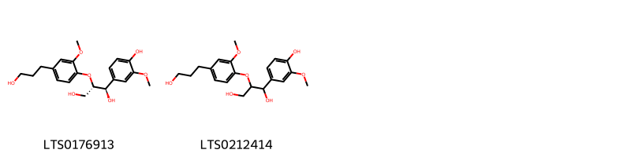{ width=100% }
    <figcaption>Hình ảnh cấu trúc hóa học của 2 hoạt chất thuộc nhóm  gồm ['(1r,2s)-1-(4-hydroxy-3-methoxyphenyl)-2-[4-(3-hydroxypropyl)-2-methoxyphenoxy]propane-1,3-diol (LTS0176913)', '1-(4-hydroxy-3-methoxyphenyl)-2-[4-(3-hydroxypropyl)-2-methoxyphenoxy]propane-1,3-diol (LTS0212414)'].</figcaption>
</figure>
#### Nhóm 2-arylbenzofuran flavonoids
<figure markdown="span">
    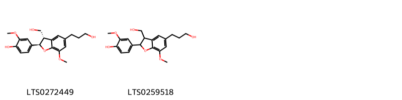{ width=100% }
    <figcaption>Hình ảnh cấu trúc hóa học của 2 hoạt chất thuộc nhóm 2-arylbenzofuran flavonoids gồm ['4-[(2r,3s)-3-(hydroxymethyl)-5-(3-hydroxypropyl)-7-methoxy-2,3-dihydro-1-benzofuran-2-yl]-2-methoxyphenol (LTS0272449)', '4-[3-(hydroxymethyl)-5-(3-hydroxypropyl)-7-methoxy-2,3-dihydro-1-benzofuran-2-yl]-2-methoxyphenol (LTS0259518)'].</figcaption>
</figure>
#### Nhóm Aurone flavonoids
<figure markdown="span">
    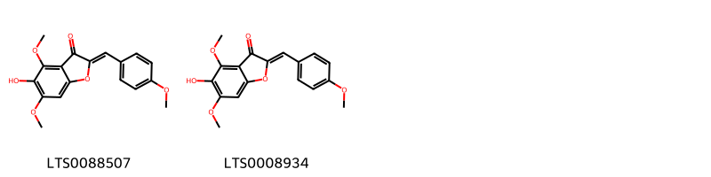{ width=100% }
    <figcaption>Hình ảnh cấu trúc hóa học của 2 hoạt chất thuộc nhóm Aurone flavonoids gồm ['5-hydroxy-4,6-dimethoxy-2-[(4-methoxyphenyl)methylidene]-1-benzofuran-3-one (LTS0088507)', '(2z)-5-hydroxy-4,6-dimethoxy-2-[(4-methoxyphenyl)methylidene]-1-benzofuran-3-one (LTS0008934)'].</figcaption>
</figure>
#### Nhóm Benzene and substituted derivatives
<figure markdown="span">
    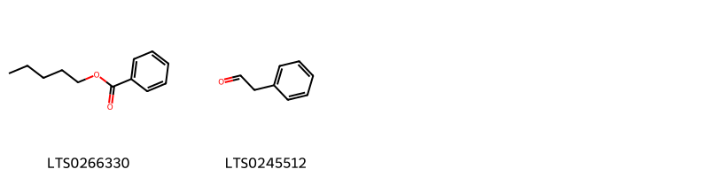{ width=100% }
    <figcaption>Hình ảnh cấu trúc hóa học của 2 hoạt chất thuộc nhóm Benzene and substituted derivatives gồm ['amyl benzoate (LTS0266330)', 'phenylacetaldehyde (LTS0245512)'].</figcaption>
</figure>
#### Nhóm Benzofurans
<figure markdown="span">
    { width=100% }
    <figcaption>Hình ảnh cấu trúc hóa học của 2 hoạt chất thuộc nhóm Benzofurans gồm ['loliolide (LTS0254454)', 'loliolide (LTS0119422)'].</figcaption>
</figure>
#### Nhóm Benzopyrans
<figure markdown="span">
    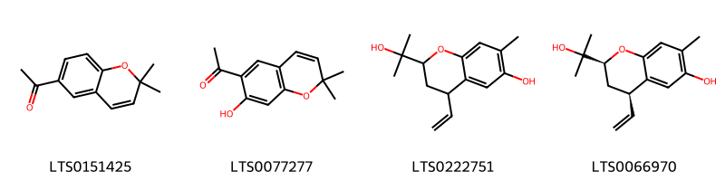{ width=100% }
    <figcaption>Hình ảnh cấu trúc hóa học của 4 hoạt chất thuộc nhóm Benzopyrans gồm ['1-(2,2-dimethylchromen-6-yl)ethanone (LTS0151425)', 'eupatoriochromene (LTS0077277)', '4-ethenyl-2-(2-hydroxypropan-2-yl)-7-methyl-3,4-dihydro-2h-1-benzopyran-6-ol (LTS0222751)', '(2s,4r)-4-ethenyl-2-(2-hydroxypropan-2-yl)-7-methyl-3,4-dihydro-2h-1-benzopyran-6-ol (LTS0066970)'].</figcaption>
</figure>
#### Nhóm Benzoxepines
<figure markdown="span">
    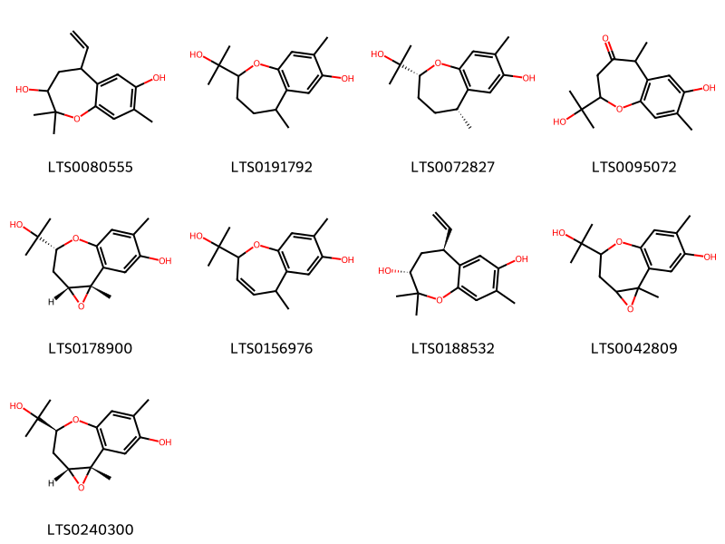{ width=100% }
    <figcaption>Hình ảnh cấu trúc hóa học của 9 hoạt chất thuộc nhóm Benzoxepines gồm ['5-ethenyl-2,2,8-trimethyl-4,5-dihydro-3h-1-benzoxepine-3,7-diol (LTS0080555)', '2-(2-hydroxypropan-2-yl)-5,8-dimethyl-2,3,4,5-tetrahydro-1-benzoxepin-7-ol (LTS0191792)', '(2r,5r)-2-(2-hydroxypropan-2-yl)-5,8-dimethyl-2,3,4,5-tetrahydro-1-benzoxepin-7-ol (LTS0072827)', '7-hydroxy-2-(2-hydroxypropan-2-yl)-5,8-dimethyl-3,5-dihydro-2h-1-benzoxepin-4-one (LTS0095072)', '(2s,4r,6r)-6-(2-hydroxypropan-2-yl)-2,10-dimethyl-3,7-dioxatricyclo[6.4.0.0²,⁴]dodeca-1(8),9,11-trien-11-ol (LTS0178900)', '2-(2-hydroxypropan-2-yl)-5,8-dimethyl-2,5-dihydro-1-benzoxepin-7-ol (LTS0156976)', '(3r,5s)-5-ethenyl-2,2,8-trimethyl-4,5-dihydro-3h-1-benzoxepine-3,7-diol (LTS0188532)', '6-(2-hydroxypropan-2-yl)-2,10-dimethyl-3,7-dioxatricyclo[6.4.0.0²,⁴]dodeca-1(8),9,11-trien-11-ol (LTS0042809)', '(2s,4r,6s)-6-(2-hydroxypropan-2-yl)-2,10-dimethyl-3,7-dioxatricyclo[6.4.0.0²,⁴]dodeca-1(8),9,11-trien-11-ol (LTS0240300)'].</figcaption>
</figure>
#### Nhóm Carboxylic acids and derivatives
<figure markdown="span">
    { width=100% }
    <figcaption>Hình ảnh cấu trúc hóa học của 1 hoạt chất thuộc nhóm Carboxylic acids and derivatives gồm ['ethyl acetate (LTS0196824)'].</figcaption>
</figure>
#### Nhóm Cinnamic acids and derivatives
<figure markdown="span">
    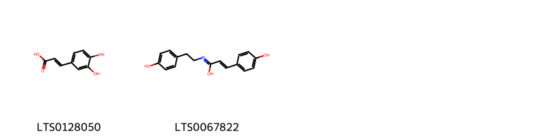{ width=100% }
    <figcaption>Hình ảnh cấu trúc hóa học của 2 hoạt chất thuộc nhóm Cinnamic acids and derivatives gồm ['3,4-dihydroxycinnamic acid (LTS0128050)', '(2e)-3-(4-hydroxyphenyl)-n-[2-(4-hydroxyphenyl)ethyl]prop-2-enimidic acid (LTS0067822)'].</figcaption>
</figure>
#### Nhóm Coumarins and derivatives
<figure markdown="span">
    { width=100% }
    <figcaption>Hình ảnh cấu trúc hóa học của 2 hoạt chất thuộc nhóm Coumarins and derivatives gồm ['ayapin (LTS0103003)', 'scopoletin (LTS0193112)'].</figcaption>
</figure>
#### Nhóm Dibenzylbutane lignans
<figure markdown="span">
    { width=100% }
    <figcaption>Hình ảnh cấu trúc hóa học của 2 hoạt chất thuộc nhóm Dibenzylbutane lignans gồm ['(2s,3r)-2,3-bis[(4-hydroxy-3-methoxyphenyl)(¹³c)methyl](1-¹³c)butane-1,4-diol (LTS0268699)', 'secoisolariciresinol (LTS0086727)'].</figcaption>
</figure>
#### Nhóm Dioxanes
<figure markdown="span">
    { width=100% }
    <figcaption>Hình ảnh cấu trúc hóa học của 1 hoạt chất thuộc nhóm Dioxanes gồm ['ascaridole (LTS0041598)'].</figcaption>
</figure>
#### Nhóm Fatty Acyls
<figure markdown="span">
    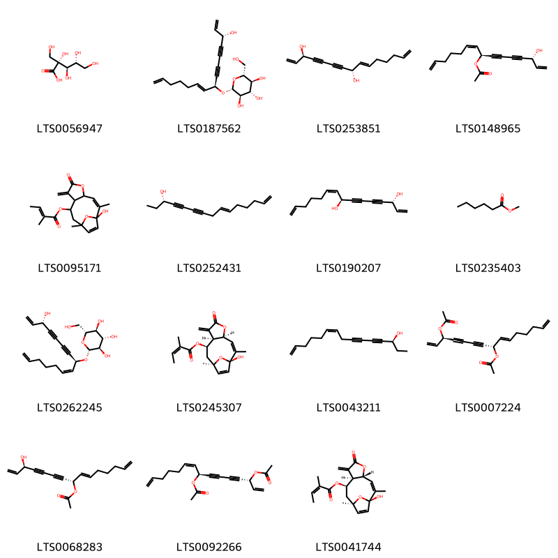{ width=100% }
    <figcaption>Hình ảnh cấu trúc hóa học của 15 hoạt chất thuộc nhóm Fatty Acyls gồm ['2-carboxy-d-arabinitol (LTS0056947)', '(2r,3s,4s,5r,6r)-2-(hydroxymethyl)-6-{[(3s,8s)-3-hydroxypentadeca-1,9,14-trien-4,6-diyn-8-yl]oxy}oxane-3,4,5-triol (LTS0187562)', '(3r,8s)-pentadeca-1,9,14-trien-4,6-diyne-3,8-diol (LTS0253851)', '(3r,8s,9z)-3-hydroxypentadeca-1,9,14-trien-4,6-diyn-8-yl acetate (LTS0148965)', '1-hydroxy-2,11-dimethyl-7-methylidene-6-oxo-5,14-dioxatricyclo[9.2.1.0⁴,⁸]tetradeca-2,12-dien-9-yl 2-methylbut-2-enoate (LTS0095171)', '(3s)-pentadeca-9,14-dien-4,6-diyn-3-ol (LTS0252431)', '(3r,8s,9z)-pentadeca-1,9,14-trien-4,6-diyne-3,8-diol (LTS0190207)', 'methyl caproate (LTS0235403)', '(2r,3s,4s,5r,6r)-2-(hydroxymethyl)-6-{[(3s,8s,9z)-3-hydroxypentadeca-1,9,14-trien-4,6-diyn-8-yl]oxy}oxane-3,4,5-triol (LTS0262245)', '(1s,2z,4s,8r,9r,11r)-1-hydroxy-2,11-dimethyl-7-methylidene-6-oxo-5,14-dioxatricyclo[9.2.1.0⁴,⁸]tetradeca-2,12-dien-9-yl (2z)-2-methylbut-2-enoate (LTS0245307)', '(3s,9z)-pentadeca-9,14-dien-4,6-diyn-3-ol (LTS0043211)', '(3r,8s)-3-(acetyloxy)pentadeca-1,9,14-trien-4,6-diyn-8-yl acetate (LTS0007224)', '(3r,8s)-3-hydroxypentadeca-1,9,14-trien-4,6-diyn-8-yl acetate (LTS0068283)', '(3r,8s,9z)-3-(acetyloxy)pentadeca-1,9,14-trien-4,6-diyn-8-yl acetate (LTS0092266)', '(1s,2z,4r,8r,9r,11r)-1-hydroxy-2,11-dimethyl-7-methylidene-6-oxo-5,14-dioxatricyclo[9.2.1.0⁴,⁸]tetradeca-2,12-dien-9-yl (2z)-2-methylbut-2-enoate (LTS0041744)'].</figcaption>
</figure>
#### Nhóm Flavonoids
<figure markdown="span">
    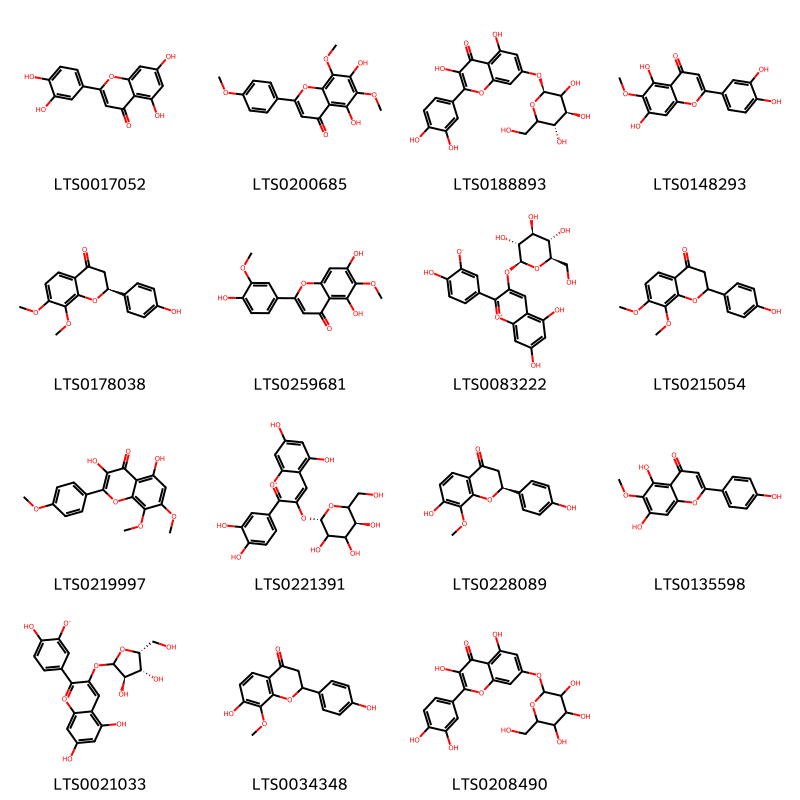{ width=100% }
    <figcaption>Hình ảnh cấu trúc hóa học của 15 hoạt chất thuộc nhóm Flavonoids gồm ['luteolin (LTS0017052)', 'nevadensin (LTS0200685)', 'quercimeritrin (LTS0188893)', 'nepetin (LTS0148293)', '(2s)-2-(4-hydroxyphenyl)-7,8-dimethoxy-2,3-dihydro-1-benzopyran-4-one (LTS0178038)', 'jaceosidin (LTS0259681)', '5,7-dihydroxy-2-(4-hydroxy-3-oxidophenyl)-3-{[(2s,3r,4s,5s,6r)-3,4,5-trihydroxy-6-(hydroxymethyl)oxan-2-yl]oxy}-1λ⁴-chromen-1-ylium (LTS0083222)', '2-(4-hydroxyphenyl)-7,8-dimethoxy-2,3-dihydro-1-benzopyran-4-one (LTS0215054)', 'tambulin (LTS0219997)', 'chrysanthemin (LTS0221391)', '(2s)-7-hydroxy-2-(4-hydroxyphenyl)-8-methoxy-2,3-dihydro-1-benzopyran-4-one (LTS0228089)', 'hispidulin (LTS0135598)', '3-{[(3r,4r,5r)-3,4-dihydroxy-5-(hydroxymethyl)oxolan-2-yl]oxy}-5,7-dihydroxy-2-(4-hydroxy-3-oxidophenyl)-1λ⁴-chromen-1-ylium (LTS0021033)', '7-hydroxy-2-(4-hydroxyphenyl)-8-methoxy-2,3-dihydro-1-benzopyran-4-one (LTS0034348)', 'quercimeritrin (LTS0208490)'].</figcaption>
</figure>
#### Nhóm Furanoid lignans
<figure markdown="span">
    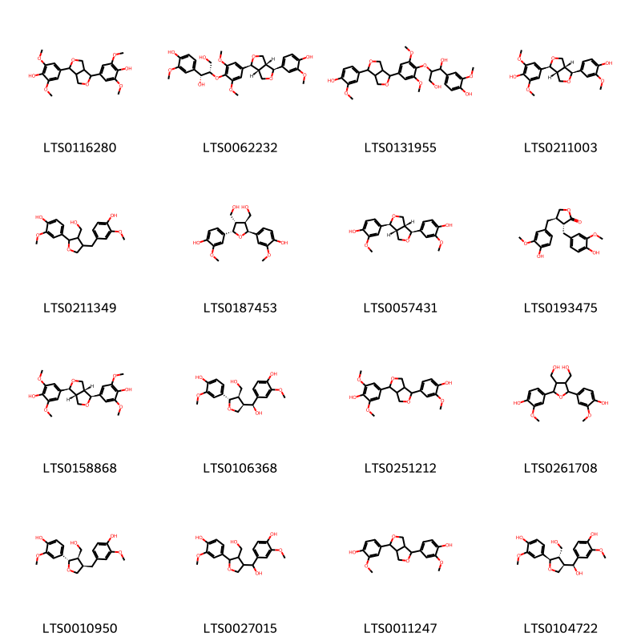{ width=100% }
    <figcaption>Hình ảnh cấu trúc hóa học của 16 hoạt chất thuộc nhóm Furanoid lignans gồm ['syringaresinol (LTS0116280)', '(1r,2s)-2-{4-[(1s,3ar,4s,6ar)-4-(4-hydroxy-3-methoxyphenyl)-hexahydrofuro[3,4-c]furan-1-yl]-2,6-dimethoxyphenoxy}-1-(4-hydroxy-3-methoxyphenyl)propane-1,3-diol (LTS0062232)', 'buddlenol e (LTS0131955)', '(-)-medioresinol (LTS0211003)', '4-{4-[(4-hydroxy-3-methoxyphenyl)methyl]-3-(hydroxymethyl)oxolan-2-yl}-2-methoxyphenol (LTS0211349)', '4-[(2s,3s,4s,5s)-5-(4-hydroxy-3-methoxyphenyl)-3,4-bis(hydroxymethyl)oxolan-2-yl]-2-methoxyphenol (LTS0187453)', 'pinoresinol (LTS0057431)', 'matairesinol (LTS0193475)', '(+)-syringaresinol (LTS0158868)', '4-[(2s,3r,4r)-4-[(s)-hydroxy(4-hydroxy-3-methoxyphenyl)methyl]-3-(hydroxymethyl)oxolan-2-yl]-2-methoxyphenol (LTS0106368)', '4-[4-(4-hydroxy-3-methoxyphenyl)-hexahydrofuro[3,4-c]furan-1-yl]-2,6-dimethoxyphenol (LTS0251212)', '4-[5-(4-hydroxy-3-methoxyphenyl)-3,4-bis(hydroxymethyl)oxolan-2-yl]-2-methoxyphenol (LTS0261708)', 'lariciresinol (LTS0010950)', '4-{4-[hydroxy(4-hydroxy-3-methoxyphenyl)methyl]-3-(hydroxymethyl)oxolan-2-yl}-2-methoxyphenol (LTS0027015)', 'pinoresinol (LTS0011247)', '4-[(2r,3s,4r)-4-[(s)-hydroxy(4-hydroxy-3-methoxyphenyl)methyl]-3-(hydroxymethyl)oxolan-2-yl]-2-methoxyphenol (LTS0104722)'].</figcaption>
</figure>
#### Nhóm Glycerophospholipids
<figure markdown="span">
    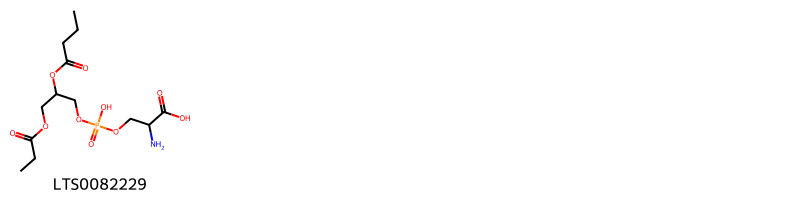{ width=100% }
    <figcaption>Hình ảnh cấu trúc hóa học của 1 hoạt chất thuộc nhóm Glycerophospholipids gồm ['2-amino-3-{[2-(butanoyloxy)-3-(propanoyloxy)propoxy(hydroxy)phosphoryl]oxy}propanoic acid (LTS0082229)'].</figcaption>
</figure>
#### Nhóm Imidazopyrimidines
<figure markdown="span">
    { width=100% }
    <figcaption>Hình ảnh cấu trúc hóa học của 1 hoạt chất thuộc nhóm Imidazopyrimidines gồm ['zeatine (LTS0032706)'].</figcaption>
</figure>
#### Nhóm Indoles and derivatives
<figure markdown="span">
    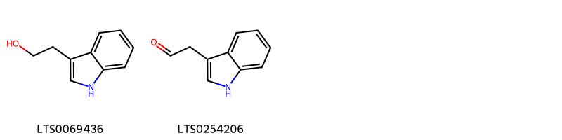{ width=100% }
    <figcaption>Hình ảnh cấu trúc hóa học của 2 hoạt chất thuộc nhóm Indoles and derivatives gồm ['tryptophol (LTS0069436)', 'indole-3-acetaldehyde (LTS0254206)'].</figcaption>
</figure>
#### Nhóm Lactones
<figure markdown="span">
    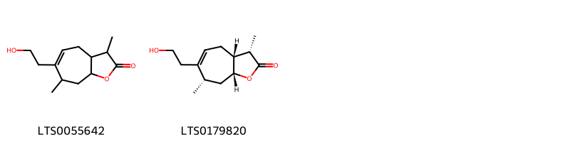{ width=100% }
    <figcaption>Hình ảnh cấu trúc hóa học của 2 hoạt chất thuộc nhóm Lactones gồm ['6-(2-hydroxyethyl)-3,7-dimethyl-3h,3ah,4h,7h,8h,8ah-cyclohepta[b]furan-2-one (LTS0055642)', '(3s,3ar,7s,8ar)-6-(2-hydroxyethyl)-3,7-dimethyl-3h,3ah,4h,7h,8h,8ah-cyclohepta[b]furan-2-one (LTS0179820)'].</figcaption>
</figure>
#### Nhóm Linear 1_3-diarylpropanoids
<figure markdown="span">
    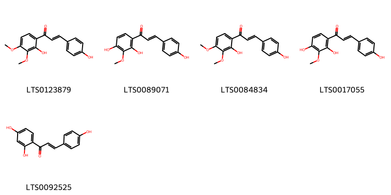{ width=100% }
    <figcaption>Hình ảnh cấu trúc hóa học của Không tìm thấy chú thích hoạt chất thuộc nhóm Linear 1_3-diarylpropanoids gồm Không tìm thấy chú thích.</figcaption>
</figure>
#### Nhóm Organic phosphoric acids and derivatives
<figure markdown="span">
    { width=100% }
    <figcaption>Hình ảnh cấu trúc hóa học của 1 hoạt chất thuộc nhóm Organic phosphoric acids and derivatives gồm ['o-phosphoethanolamine; bis(nonane) (LTS0249963)'].</figcaption>
</figure>
#### Nhóm Organonitrogen compounds
<figure markdown="span">
    { width=100% }
    <figcaption>Hình ảnh cấu trúc hóa học của 1 hoạt chất thuộc nhóm Organonitrogen compounds gồm ['1h-imidazole-5-ethanamine (LTS0016235)'].</figcaption>
</figure>
#### Nhóm Organooxygen compounds
<figure markdown="span">
    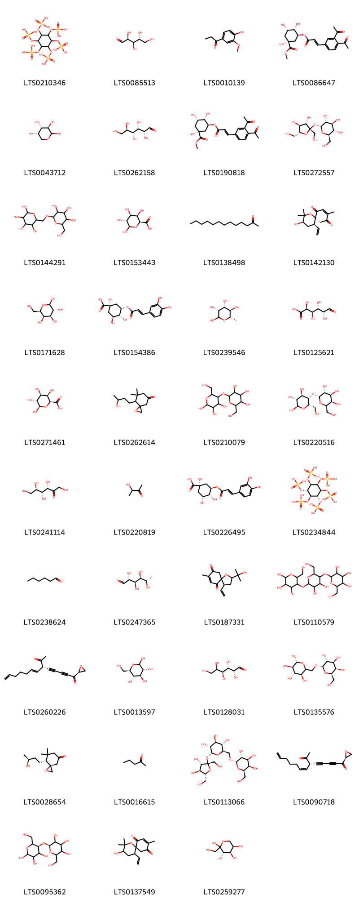{ width=100% }
    <figcaption>Hình ảnh cấu trúc hóa học của 39 hoạt chất thuộc nhóm Organooxygen compounds gồm ['phytic acid (LTS0210346)', 'arabinose (LTS0085513)', '1-(4-hydroxy-3-methoxyphenyl)propan-1-one (LTS0010139)', 'methyl (1r,3s,4s,5s)-3-{[(2e)-3-(3,4-diacetylphenyl)prop-2-enoyl]oxy}-1,4,5-trihydroxycyclohexane-1-carboxylate (LTS0086647)', 'l-arabinopyranose (LTS0043712)', '(+)-glucose (LTS0262158)', 'methyl (1r,3s,4s,5s)-3-{[3-(3,4-diacetylphenyl)prop-2-enoyl]oxy}-1,4,5-trihydroxycyclohexane-1-carboxylate (LTS0190818)', 'sucrose (LTS0272557)', 'polydextrose (LTS0144291)', 'd-galacturonic acid (LTS0153443)', '2-tridecanone (LTS0138498)', '(3r,5r,6r)-5-ethenyl-3-hydroxy-2,2,9-trimethyl-1-oxaspiro[5.5]undec-8-ene-7,10-dione (LTS0142130)', 'galactose (LTS0171628)', '(1s,3s,4r,5s)-3-{[(2e)-3-(3,4-dihydroxyphenyl)prop-2-enoyl]oxy}-1,4,5-trihydroxycyclohexane-1-carboxylic acid (LTS0154386)', 'l-rhamnose (LTS0239546)', 'galacturonic acid (LTS0125621)', 'β-d-galactopyranuronic acid (LTS0271461)', '8-(3-hydroxybutyl)-7,7-dimethyl-1-oxaspiro[2.5]octan-5-one (LTS0262614)', 'starch (LTS0210079)', '(2r,3r,4r,5s,6s)-6-(hydroxymethyl)-5-{[(2r,3r,4s,5r,6r)-3,4,5-trihydroxy-6-(hydroxymethyl)oxan-2-yl]oxy}oxane-2,3,4-triol (LTS0220516)', 'keto-d-fructose (LTS0241114)', 'acetoin (LTS0220819)', 'chlorogenic acid (LTS0226495)', '[(1r,2r,3s,4r,5s,6s)-2,3,4,5,6-pentakis(phosphonooxy)cyclohexyl]oxyphosphonic acid (LTS0234844)', 'hexanal (LTS0238624)', 'rhamnose (LTS0247365)', '4-ethenyl-2-(2-hydroxypropan-2-yl)-8-methyl-1-oxaspiro[4.5]dec-7-ene-6,9-dione (LTS0187331)', 'amylose (LTS0110579)', '(6s)-6-(hepta-1,6-dien-1-yl)-1-[(2s)-oxiran-2-yl]octa-2,4-diyne-1,7-dione (LTS0260226)', 'glucose (LTS0013597)', 'aldehydo-d-galactose (LTS0128031)', '(2r,3r,4s,5s)-6-({[(2s,3r,4s,5r,6r)-3,4,5-trihydroxy-6-(hydroxymethyl)oxan-2-yl]oxy}methyl)oxane-2,3,4,5-tetrol (LTS0135576)', '(3r,8r)-8-[(3s)-3-hydroxybutyl]-7,7-dimethyl-1-oxaspiro[2.5]octan-5-one (LTS0028654)', '2-pentanone (LTS0016615)', 'raffinose (LTS0113066)', '(6s)-6-[(1z)-hepta-1,6-dien-1-yl]-1-[(2s)-oxiran-2-yl]octa-2,4-diyne-1,7-dione (LTS0090718)', '(6s)-2-(hydroxymethyl)-6-{[(3s)-4,5,6-trihydroxy-2-(hydroxymethyl)oxan-3-yl]oxy}oxane-3,4,5-triol (LTS0095362)', '5-ethenyl-3-hydroxy-2,2,9-trimethyl-1-oxaspiro[5.5]undec-8-ene-7,10-dione (LTS0137549)', 'd-fructopyranose (LTS0259277)'].</figcaption>
</figure>
#### Nhóm Oxepanes
<figure markdown="span">
    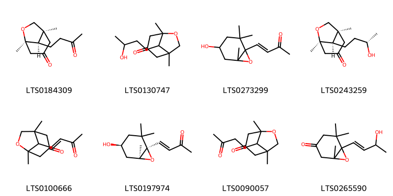{ width=100% }
    <figcaption>Hình ảnh cấu trúc hóa học của 8 hoạt chất thuộc nhóm Oxepanes gồm ['(1s,5r,8r)-1,5-dimethyl-8-(3-oxobutyl)-6-oxabicyclo[3.2.1]octan-3-one (LTS0184309)', '8-(3-hydroxybutyl)-1,5-dimethyl-6-oxabicyclo[3.2.1]octan-3-one (LTS0130747)', '4-{4-hydroxy-2,2,6-trimethyl-7-oxabicyclo[4.1.0]heptan-1-yl}but-3-en-2-one (LTS0273299)', '(1s,5r,8r)-8-[(3s)-3-hydroxybutyl]-1,5-dimethyl-6-oxabicyclo[3.2.1]octan-3-one (LTS0243259)', '1,5-dimethyl-8-[(1e)-3-oxobut-1-en-1-yl]-6-oxabicyclo[3.2.1]octan-3-one (LTS0100666)', 'annuionone d (LTS0197974)', '1,5-dimethyl-8-(3-oxobutyl)-6-oxabicyclo[3.2.1]octan-3-one (LTS0090057)', '6-[(1e)-3-hydroxybut-1-en-1-yl]-1,5,5-trimethyl-7-oxabicyclo[4.1.0]heptan-3-one (LTS0265590)'].</figcaption>
</figure>
#### Nhóm Oxocins
<figure markdown="span">
    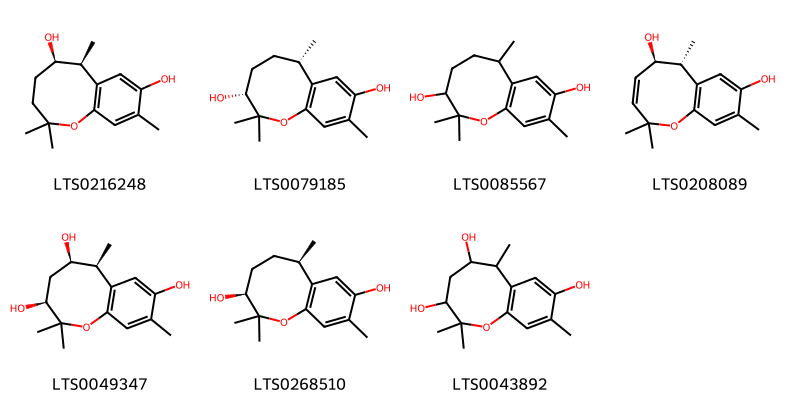{ width=100% }
    <figcaption>Hình ảnh cấu trúc hóa học của 7 hoạt chất thuộc nhóm Oxocins gồm ['(5r,6s)-2,2,6,9-tetramethyl-3,4,5,6-tetrahydro-1-benzoxocine-5,8-diol (LTS0216248)', '(3r,6s)-2,2,6,9-tetramethyl-3,4,5,6-tetrahydro-1-benzoxocine-3,8-diol (LTS0079185)', '2,2,6,9-tetramethyl-3,4,5,6-tetrahydro-1-benzoxocine-3,8-diol (LTS0085567)', '(3z,5r,6r)-2,2,6,9-tetramethyl-5,6-dihydro-1-benzoxocine-5,8-diol (LTS0208089)', '(3s,5r,6s)-2,2,6,9-tetramethyl-3,4,5,6-tetrahydro-1-benzoxocine-3,5,8-triol (LTS0049347)', '(3s,6r)-2,2,6,9-tetramethyl-3,4,5,6-tetrahydro-1-benzoxocine-3,8-diol (LTS0268510)', '2,2,6,9-tetramethyl-3,4,5,6-tetrahydro-1-benzoxocine-3,5,8-triol (LTS0043892)'].</figcaption>
</figure>
#### Nhóm Phenols
<figure markdown="span">
    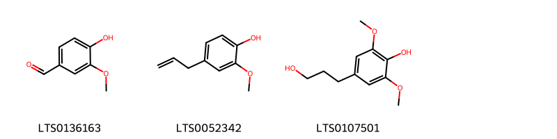{ width=100% }
    <figcaption>Hình ảnh cấu trúc hóa học của 3 hoạt chất thuộc nhóm Phenols gồm ['vanillin (LTS0136163)', 'eugenol (LTS0052342)', '4-(3-hydroxypropyl)-2,6-dimethoxyphenol (LTS0107501)'].</figcaption>
</figure>
#### Nhóm Prenol lipids
<figure markdown="span">
    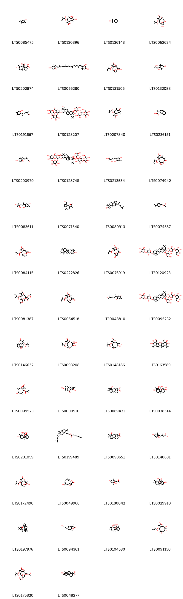{ width=100% }
    <figcaption>Hình ảnh cấu trúc hóa học của 198 hoạt chất thuộc nhóm Prenol lipids gồm ['sabinol (LTS0085475)', '6,8-dihydroxy-6,9-dimethyl-3-methylidene-2,7-dioxo-3ah,4h,5h,6ah,9ah,9bh-azuleno[4,5-b]furan-4-yl 2-methylbut-2-enoate (LTS0130896)', 'terpineol (LTS0136148)', '(1s,2s,4r,8s,9r,11s,12s)-1,12-dihydroxy-2,11-dimethyl-7-methylidene-6-oxo-5,14-dioxatricyclo[9.2.1.0⁴,⁸]tetradecan-9-yl 2-methylpropanoate (LTS0062634)', '(1s,2s,3s,4r,8s,9s,12s,14s)-12,14-dihydroxy-4,8-dimethyl-13-methylidenetetracyclo[10.2.1.0¹,⁹.0³,⁸]pentadecane-2,4-dicarboxylic acid (LTS0202874)', '(1s,3s)-6-[(3e,5e,7e,9e,11e,13e,15e,17e)-18-[(1r,4s,6s)-4-hydroxy-2,2,6-trimethyl-7-oxabicyclo[4.1.0]heptan-1-yl]-3,7,12,16-tetramethyloctadeca-1,3,5,7,9,11,13,15,17-nonaen-1-ylidene]-1,5,5-trimethylcyclohexane-1,3-diol (LTS0065280)', '(1s,2z,4s,8r,9r,11s)-1-hydroxy-2-(hydroxymethyl)-11-methyl-7-methylidene-6-oxo-5,14-dioxatricyclo[9.2.1.0⁴,⁸]tetradec-2-en-9-yl (2z)-2-methylbut-2-enoate (LTS0131505)', '6-(3-hydroxybut-1-en-1-ylidene)-1,5,5-trimethylcyclohexane-1,3-diol (LTS0132088)', '6-(6-hydroxy-4-methyl-3-oxocyclohexa-1,4-dien-1-yl)-2-methylhept-2-enal (LTS0191667)', '3-[(3,4-dihydroxy-6-methyl-5-{[3,4,5-trihydroxy-6-(hydroxymethyl)oxan-2-yl]oxy}oxan-2-yl)oxy]-4,5-dihydroxyoxan-2-yl 5-hydroxy-10-{[3-hydroxy-6-(hydroxymethyl)-4-[(3,4,5-trihydroxy-6-methyloxan-2-yl)oxy]-5-[(3,4,5-trihydroxyoxan-2-yl)oxy]oxan-2-yl]oxy}-9-(hydroxymethyl)-2,2,6a,6b,9,12a-hexamethyl-1,3,4,5,6,7,8,8a,10,11,12,12b,13,14b-tetradecahydropicene-4a-carboxylate (LTS0128207)', '7-hydroxy-9-methyl-3,6-dimethylidene-2-oxo-3ah,4h,5h,6ah,7h,9ah,9bh-azuleno[4,5-b]furan-4-yl 2-methylbut-2-enoate (LTS0207840)', '2-(4a,8-dimethyl-2,3,4,8a-tetrahydro-1h-naphthalen-2-yl)prop-2-enoic acid (LTS0236151)', 'xanthoxin (LTS0200970)', '3-[(3,4-dihydroxy-6-methyl-5-{[3,4,5-trihydroxy-6-(hydroxymethyl)oxan-2-yl]oxy}oxan-2-yl)oxy]-4,5-dihydroxyoxan-2-yl 5-hydroxy-10-{[3-hydroxy-6-(hydroxymethyl)-4-[(3,4,5-trihydroxy-6-methyloxan-2-yl)oxy]-5-[(3,4,5-trihydroxyoxan-2-yl)oxy]oxan-2-yl]oxy}-2,2,6a,6b,9,9,12a-heptamethyl-1,3,4,5,6,7,8,8a,10,11,12,12b,13,14b-tetradecahydropicene-4a-carboxylate (LTS0128748)', '2-[(2r,5s)-5,6-dihydroxy-6-methylheptan-2-yl]-5-methylbenzene-1,4-diol (LTS0213534)', '(1r,2r,4r,5r,7r,9z,11r)-4-hydroxy-4,9-dimethyl-14-methylidene-8,13-dioxo-6,12-dioxatricyclo[9.3.0.0⁵,⁷]tetradec-9-en-2-yl (2z)-2-methylbut-2-enoate (LTS0074942)', '2-(5,6-dihydroxy-6-methylheptan-2-yl)-5-methylbenzene-1,4-diol (LTS0083611)', '9-(hydroxymethyl)-3,6-dimethylidene-3ah,4h,5h,6ah,7h,9ah,9bh-azuleno[4,5-b]furan-2-one (LTS0071540)', 'dammaradienol (LTS0080913)', '[4-(prop-1-en-2-yl)cyclohex-1-en-1-yl]methyl acetate (LTS0074587)', '1-hydroxy-2-(hydroxymethyl)-11-methyl-7-methylidene-6-oxo-5,14-dioxatricyclo[9.2.1.0⁴,⁸]tetradec-2-en-9-yl 2-methylbut-2-enoate (LTS0084115)', 'amyrin (LTS0222826)', '(1r,2z,4s,8s,9r,11s,12r)-1,12-dihydroxy-2,11-dimethyl-7-methylidene-6-oxo-5,14-dioxatricyclo[9.2.1.0⁴,⁸]tetradec-2-en-9-yl (2z)-2-methylbut-2-enoate (LTS0076919)', '(2s,3r,4s,5s)-3-{[(2s,3r,4s,5r,6s)-3,4-dihydroxy-6-methyl-5-{[(2s,3r,4s,5s,6r)-3,4,5-trihydroxy-6-(hydroxymethyl)oxan-2-yl]oxy}oxan-2-yl]oxy}-4,5-dihydroxyoxan-2-yl (4ar,5r,6as,6br,8ar,10s,12ar,12br,14bs)-10-{[(2r,3r,4s,5r,6s)-3,4-dihydroxy-6-methyl-5-{[(2s,3r,4s,5r)-3,4,5-trihydroxyoxan-2-yl]oxy}oxan-2-yl]oxy}-5-hydroxy-2,2,6a,6b,9,9,12a-heptamethyl-1,3,4,5,6,7,8,8a,10,11,12,12b,13,14b-tetradecahydropicene-4a-carboxylate (LTS0120923)', '1,12-bis(acetyloxy)-2-[(acetyloxy)methyl]-11-methyl-7-methylidene-6-oxo-5,14-dioxatricyclo[9.2.1.0⁴,⁸]tetradecan-9-yl 2-methylbut-2-enoate (LTS0081387)', '(1r,2z,4r,8r,9r,11s)-1-hydroxy-2-(hydroxymethyl)-11-methyl-7-methylidene-6-oxo-5,14-dioxatricyclo[9.2.1.0⁴,⁸]tetradec-2-en-9-yl (2z)-2-methylbut-2-enoate (LTS0054518)', '(2e,6s)-2-methyl-6-(4-methyl-3,6-dioxocyclohexa-1,4-dien-1-yl)hept-2-enal (LTS0048810)', '(3s,4r,5r)-3-{[(2s,3r,4s,5r,6s)-3,4-dihydroxy-6-methyl-5-{[(2s,3r,4s,5s,6r)-3,4,5-trihydroxy-6-(hydroxymethyl)oxan-2-yl]oxy}oxan-2-yl]oxy}-4,5-dihydroxyoxan-2-yl (4ar,5r,6as,6br,8ar,10s,12ar,12br,14bs)-10-{[(2r,3r,4s,5r,6s)-3,4-dihydroxy-6-methyl-5-{[(3r,4s,5r)-3,4,5-trihydroxyoxan-2-yl]oxy}oxan-2-yl]oxy}-5-hydroxy-2,2,6a,6b,9,9,12a-heptamethyl-1,3,4,5,6,7,8,8a,10,11,12,12b,13,14b-tetradecahydropicene-4a-carboxylate (LTS0095232)', '(3ar,4r,6r,6ar,9ar,9br)-6-hydroxy-6,9-dimethyl-3-methylidene-2-oxo-3ah,4h,5h,6ah,7h,9ah,9bh-azuleno[4,5-b]furan-4-yl (2z)-2-methylbut-2-enoate (LTS0146632)', '8,9-dihydroxy-9-(hydroxymethyl)-4-methyl-14-methylidene-13-oxo-5,12-dioxatricyclo[9.3.0.0⁴,⁶]tetradecan-2-yl 2-methylbut-2-enoate (LTS0093208)', '(9z)-8-hydroxy-9-(hydroxymethyl)-4-methyl-14-methylidene-13-oxo-5,12-dioxatricyclo[9.3.0.0⁴,⁶]tetradec-9-en-2-yl (2z)-2-methylbut-2-enoate (LTS0148186)', '(-)-gossypol (LTS0163589)', '8-hydroxy-6,10-dimethyl-3-methylidene-2-oxo-3ah,4h,5h,8h,9h,11ah-cyclodeca[b]furan-4-yl 2-methylbut-2-enoate (LTS0099523)', '16-hydroxy-5-(hydroxymethyl)-5,9,13-trimethylpentacyclo[11.2.1.0¹,¹⁰.0⁴,⁹.0¹²,¹⁴]hexadecan-2-one (LTS0000510)', 'methyl (1r,4s,5r,9s,10s,13r,15s)-15-hydroxy-5,9-dimethyl-14-methylidenetetracyclo[11.2.1.0¹,¹⁰.0⁴,⁹]hexadecane-5-carboxylate (LTS0069421)', '(1s,2s,3s,4r,8r,9r,12s,14s)-8-formyl-12,14-dihydroxy-4-methyl-13-methylidenetetracyclo[10.2.1.0¹,⁹.0³,⁸]pentadecane-2,4-dicarboxylic acid (LTS0038514)', '(1s,2s,5s,7s,9s,10s,11s)-5,7-dihydroxy-11-methyl-6-methylidene-12-oxo-13-oxapentacyclo[9.3.3.1⁵,⁸.0¹,¹⁰.0²,⁸]octadecane-9-carboxylic acid (LTS0201059)', '3-[(3s,3as,5as,6s,9as,9br)-3a,5a,9b-trimethyl-3-[(2s)-6-methylhept-5-en-2-yl]-7-(propan-2-ylidene)-octahydro-1h-cyclopenta[a]naphthalen-6-yl]propyl octanoate (LTS0159489)', '(1r,4r,5r,9s,10s,13r,15s)-15-hydroxy-5,9-dimethyl-14-methylidenetetracyclo[11.2.1.0¹,¹⁰.0⁴,⁹]hexadecane-5-carboxylic acid (LTS0098651)', 'abscisic acid,  (LTS0140631)', '(1r,2z,4s,8r,9r,11s)-1-ethoxy-2-(hydroxymethyl)-11-methyl-7-methylidene-6-oxo-5,14-dioxatricyclo[9.2.1.0⁴,⁸]tetradec-2-en-9-yl (2z)-2-methylbut-2-enoate (LTS0172490)', '(3ar,4r,11ar)-4-hydroxy-10-methyl-3-methylidene-2-oxo-3ah,4h,5h,8h,9h,11ah-cyclodeca[b]furan-6-carbaldehyde (LTS0049966)', '4-hydroxy-3,5,5-trimethyl-4-(3-oxobut-1-en-1-yl)cyclohex-2-en-1-one (LTS0180042)', 'gibberellin a4 (LTS0029910)', '4,6,6-trimethyl-3-(2,6,6-trimethyl-3-{2,6,6-trimethylbicyclo[3.1.1]hept-1-en-3-yl}bicyclo[3.1.1]hept-1-en-3-yl)bicyclo[3.1.1]hept-4-en-2-ol (LTS0197976)', 'sundiversifolide (LTS0094361)', '(1r,2r,5r,7r,8r,9s,10r,11r)-7-hydroxy-11-methyl-6-methylidene-16-oxo-15-oxapentacyclo[9.3.2.1⁵,⁸.0¹,¹⁰.0²,⁸]heptadecane-9-carboxylic acid (LTS0104530)', '8,9-dihydroxy-4,9-dimethyl-14-methylidene-13-oxo-5,12-dioxatricyclo[9.3.0.0⁴,⁶]tetradecan-2-yl (2e)-2-methylbut-2-enoate (LTS0091150)', '(1s,2s,4r,8s,9r,11s,12s)-12-(acetyloxy)-2-[(acetyloxy)methyl]-1-hydroxy-11-methyl-7-methylidene-6-oxo-5,14-dioxatricyclo[9.2.1.0⁴,⁸]tetradecan-9-yl (2z)-2-methylbut-2-enoate (LTS0176820)', '(1r,4s,5r,9s,10s,12r,13r,14s,16r)-16-hydroxy-5,9,13-trimethylpentacyclo[11.2.1.0¹,¹⁰.0⁴,⁹.0¹²,¹⁴]hexadecane-5-carboxylic acid (LTS0048277)', '(2e,5z)-2-methyl-6-(4-methyl-3,6-dioxocyclohexa-1,4-dien-1-yl)hepta-2,5-dienal (LTS0118503)', '(4ar,6ar,6br,8as,12ar,12br,14ar,14br)-4,4,6a,6b,8a,11,12,14b-octamethyl-2,3,4a,5,6,7,8,9,12,12a,12b,13,14,14a-tetradecahydro-1h-picen-3-ol (LTS0269929)', '(1r,2z,4r,8r,9r,11r)-1-hydroxy-2-(hydroxymethyl)-11-methyl-7-methylidene-6-oxo-5,14-dioxatricyclo[9.2.1.0⁴,⁸]tetradec-2-en-9-yl (2z)-2-methylbut-2-enoate (LTS0197797)', '2-(5,6-dihydroxy-6-methylhept-3-en-2-yl)-5-methylbenzene-1,4-diol (LTS0128481)', '(1r,4ar,8as)-4-isopropyl-1,6-dimethyl-3,4,4a,7,8,8a-hexahydro-2h-naphthalen-1-ol (LTS0136437)', '1-(3-hydroxybut-1-en-1-yl)-2,2,6-trimethylcyclohexane-1,4-diol (LTS0251419)', '(4s,5r)-4-hydroxy-4-[(1e,3r)-3-hydroxybut-1-en-1-yl]-3,3,5-trimethylcyclohexan-1-one (LTS0256959)', '(1r,2s,3r,4r,8r,9r,12r,14r)-14-hydroxy-4-methyl-13-methylidenetetracyclo[10.2.1.0¹,⁹.0³,⁸]pentadecane-2,4,8-tricarboxylic acid (LTS0175852)', '(2r,3r,4r,5s,6r)-3-{[(2r,3r,4s,5r,6r)-3,4-dihydroxy-6-methyl-5-{[(2s,3r,4s,5r,6s)-3,4,5-trihydroxy-6-(hydroxymethyl)oxan-2-yl]oxy}oxan-2-yl]oxy}-4,5-dihydroxy-6-(hydroxymethyl)oxan-2-yl (4as,5r,6as,6bs,8as,10r,12ar,12bs,14br)-5-hydroxy-10-{[(2r,3r,4s,5s,6r)-4-hydroxy-6-(hydroxymethyl)-3-{[(2r,3r,4s,5r,6s)-3,4,5-trihydroxy-6-methyloxan-2-yl]oxy}-5-{[(2s,3r,4r,5r)-3,4,5-trihydroxyoxan-2-yl]oxy}oxan-2-yl]oxy}-2,2,6a,6b,9,9,12a-heptamethyl-1,3,4,5,6,7,8,8a,10,11,12,12b,13,14b-tetradecahydropicene-4a-carboxylate (LTS0200372)', 'myrtenal (LTS0202475)', '(3as,4r,7r,9s,11ar)-7,9-dihydroxy-6,10-dimethyl-3-methylidene-2-oxo-3ah,4h,7h,8h,9h,11ah-cyclodeca[b]furan-4-yl (2z)-2-methylbut-2-enoate (LTS0142731)', '(1s,2r,4r,6r,8s,9s,11r)-8,9-dihydroxy-4,9-dimethyl-14-methylidene-13-oxo-5,12-dioxatricyclo[9.3.0.0⁴,⁶]tetradecan-2-yl (2z)-2-methylbut-2-enoate (LTS0197669)', 'carveol (LTS0263183)', 'ent-kaur-16-en-19-al (LTS0174068)', '(2s,3r,4s,5r)-3-{[(2s,3r,4s,5r,6s)-3,4-dihydroxy-6-methyl-5-{[(2s,3r,4s,5s,6r)-3,4,5-trihydroxy-6-(hydroxymethyl)oxan-2-yl]oxy}oxan-2-yl]oxy}-4,5-dihydroxyoxan-2-yl (4ar,5r,6as,6br,8ar,9s,10s,12ar,12br,14bs)-5-hydroxy-10-{[(2r,3r,4r,5r,6r)-3-hydroxy-6-(hydroxymethyl)-4-{[(2s,3r,4r,5r,6s)-3,4,5-trihydroxy-6-methyloxan-2-yl]oxy}-5-{[(2s,3r,4s,5r)-3,4,5-trihydroxyoxan-2-yl]oxy}oxan-2-yl]oxy}-9-(hydroxymethyl)-2,2,6a,6b,9,12a-hexamethyl-1,3,4,5,6,7,8,8a,10,11,12,12b,13,14b-tetradecahydropicene-4a-carboxylate (LTS0269987)', '3-[(3s,3as,5ar,6s,9as,9br)-3a,5a,9b-trimethyl-3-[(2s)-6-methylhept-5-en-2-yl]-7-(propan-2-ylidene)-octahydro-1h-cyclopenta[a]naphthalen-6-yl]propyl octanoate (LTS0180519)', '(2e,5e)-2-methyl-6-(4-methyl-3,6-dioxocyclohexa-1,4-dien-1-yl)hepta-2,5-dienal (LTS0202771)', 'methyl (1r,4r,5r,9s,10s,13r,15s)-15-hydroxy-5,9-dimethyl-14-methylidenetetracyclo[11.2.1.0¹,¹⁰.0⁴,⁹]hexadecane-5-carboxylate (LTS0135666)', '2-methyl-6-(4-methyl-3,6-dioxocyclohexa-1,4-dien-1-yl)hept-2-enal (LTS0144617)', '(1s,4s,5r,9r,10s,12r,13r,14s,16s)-16-hydroxy-5-(hydroxymethyl)-5,9,13-trimethylpentacyclo[11.2.1.0¹,¹⁰.0⁴,⁹.0¹²,¹⁴]hexadecan-2-one (LTS0265234)', '(1r,2z,4r,8r,9r,11r,12s)-1,12-dihydroxy-2-(hydroxymethyl)-11-methyl-7-methylidene-6-oxo-5,14-dioxatricyclo[9.2.1.0⁴,⁸]tetradec-2-en-9-yl (2z)-2-methylbut-2-enoate (LTS0149664)', '2-[(2r,3e,5r)-5,6-dihydroxy-6-methylhept-3-en-2-yl]-5-methylbenzene-1,4-diol (LTS0169975)', '4-hydroxy-4,9-dimethyl-14-methylidene-8,13-dioxo-6,12-dioxatricyclo[9.3.0.0⁵,⁷]tetradec-9-en-2-yl 2-methylbut-2-enoate (LTS0143226)', '(3as,6ar,9ar,9bs)-9-(hydroxymethyl)-3,6-dimethylidene-3ah,4h,5h,6ah,7h,9ah,9bh-azuleno[4,5-b]furan-2-one (LTS0154196)', '5-hydroxy-3-methyl-6,9-dimethylidene-octahydro-3h-azuleno[4,5-b]furan-2-one (LTS0141584)', 'limonene,  (LTS0155981)', '(1s,2z,4s,8r,9r,11r,12r)-1,12-dihydroxy-2,11-dimethyl-7-methylidene-6-oxo-5,14-dioxatricyclo[9.2.1.0⁴,⁸]tetradec-2-en-9-yl (2z)-2-methylbut-2-enoate (LTS0149653)', '3-[3a,5a,9b-trimethyl-3-(6-methylhept-5-en-2-yl)-7-(propan-2-ylidene)-octahydro-1h-cyclopenta[a]naphthalen-6-yl]propyl octanoate (LTS0149302)', '1,12-dihydroxy-2,11-dimethyl-7-methylidene-6-oxo-5,14-dioxatricyclo[9.2.1.0⁴,⁸]tetradec-2-en-9-yl 2-methylbut-2-enoate (LTS0156564)', '(1r,2r,4s,6r,8s,9z,11s)-8-hydroxy-4,9-dimethyl-14-methylidene-13-oxo-5,12-dioxatricyclo[9.3.0.0⁴,⁶]tetradec-9-en-2-yl (2z)-2-methylbut-2-enoate (LTS0146151)', 'β-amyrin (LTS0251864)', '(5r,9s,13s)-5,9-dimethyl-14-methylidenetetracyclo[11.2.1.0¹,¹⁰.0⁴,⁹]hexadecane-5-carboxylic acid (LTS0164350)', '7,9-dihydroxy-6,10-dimethyl-3-methylidene-2-oxo-3ah,4h,7h,8h,9h,11ah-cyclodeca[b]furan-4-yl 2-methylbut-2-enoate (LTS0164036)', '(2s,3r,4s,5s)-3-{[(2s,3r,4s,5r,6s)-3,4-dihydroxy-6-methyl-5-{[(2s,3r,4s,5s,6r)-3,4,5-trihydroxy-6-(hydroxymethyl)oxan-2-yl]oxy}oxan-2-yl]oxy}-4,5-dihydroxyoxan-2-yl (4as,6as,6br,8ar,10s,12ar,12br,14bs)-10-{[(2r,3r,4s,5s,6r)-4-hydroxy-6-(hydroxymethyl)-3-{[(2s,3r,4r,5r,6s)-3,4,5-trihydroxy-6-methyloxan-2-yl]oxy}-5-{[(2s,3r,4s,5r)-3,4,5-trihydroxyoxan-2-yl]oxy}oxan-2-yl]oxy}-2,2,6a,6b,9,9,12a-heptamethyl-1,3,4,5,6,7,8,8a,10,11,12,12b,13,14b-tetradecahydropicene-4a-carboxylate (LTS0239035)', '2-[(2r,4as,8as)-4a,8-dimethyl-2,3,4,8a-tetrahydro-1h-naphthalen-2-yl]prop-2-enoic acid (LTS0170278)', '5,9-dimethyl-14-methylidenetetracyclo[11.2.1.0¹,¹⁰.0⁴,⁹]hexadecane-5-carboxylic acid (LTS0241515)', 'grandifloric acid (LTS0168787)', '(4r)-4-[(3r)-3-hydroxybutyl]-3,5,5-trimethylcyclohex-2-en-1-one (LTS0232551)', '(1r,2r,4r,6r,8s,9e,11r)-8-hydroxy-4,9-dimethyl-14-methylidene-13-oxo-5,12-dioxatricyclo[9.3.0.0⁴,⁶]tetradec-9-en-2-yl (2z)-2-methylbut-2-enoate (LTS0136255)', '(2r,3s,4s,5r)-3-{[(2s,3r,4r,5r,6s)-3,4-dihydroxy-6-methyl-5-{[(2s,3r,4s,5s,6r)-3,4,5-trihydroxy-6-(hydroxymethyl)oxan-2-yl]oxy}oxan-2-yl]oxy}-4,5-dihydroxyoxan-2-yl (4ar,5r,6as,6br,8ar,9s,10s,12ar,12br,14bs)-5-hydroxy-10-{[(2r,3r,4s,5r,6r)-3-hydroxy-6-(hydroxymethyl)-4-{[(2s,3r,4r,5r,6s)-3,4,5-trihydroxy-6-methyloxan-2-yl]oxy}-5-{[(2s,3r,4s,5r)-3,4,5-trihydroxyoxan-2-yl]oxy}oxan-2-yl]oxy}-9-(hydroxymethyl)-2,2,6a,6b,9,12a-hexamethyl-1,3,4,5,6,7,8,8a,10,11,12,12b,13,14b-tetradecahydropicene-4a-carboxylate (LTS0268021)', '(1s,2s,4r,8s,9r,11s,12s)-1,12-dihydroxy-2-(hydroxymethyl)-11-methyl-7-methylidene-6-oxo-5,14-dioxatricyclo[9.2.1.0⁴,⁸]tetradecan-9-yl (2z)-2-methylbut-2-enoate (LTS0177973)', 'borneol (LTS0264960)', '(2r,3s,4r,5r)-3-{[(2s,3s,4r,5s,6r)-3,4-dihydroxy-6-methyl-5-{[(2r,3r,4r,5r,6r)-3,4,5-trihydroxy-6-(hydroxymethyl)oxan-2-yl]oxy}oxan-2-yl]oxy}-4,5-dihydroxyoxan-2-yl (4ar,5s,6ar,6bs,8ar,10r,12as,12bs,14bs)-10-{[(2s,3s,4r,5r,6s)-3,4-dihydroxy-6-methyl-5-{[(2r,3r,4r,5r)-3,4,5-trihydroxyoxan-2-yl]oxy}oxan-2-yl]oxy}-5-hydroxy-2,2,6a,6b,9,9,12a-heptamethyl-1,3,4,5,6,7,8,8a,10,11,12,12b,13,14b-tetradecahydropicene-4a-carboxylate (LTS0242920)', '(1r,2r,4r,6r,8s,9z,11r)-8-hydroxy-4,9-dimethyl-14-methylidene-13-oxo-5,12-dioxatricyclo[9.3.0.0⁴,⁶]tetradec-9-en-2-yl (2z)-2-methylbut-2-enoate (LTS0179421)', '16-hydroxy-5,9,13-trimethylpentacyclo[11.2.1.0¹,¹⁰.0⁴,⁹.0¹²,¹⁴]hexadecane-5-carboxylic acid (LTS0129274)', '3-[(3s,3as,5as,6s,9as,9br)-3a,5a,9b-trimethyl-3-[(2s)-6-methylhept-5-en-2-yl]-7-(propan-2-ylidene)-octahydro-1h-cyclopenta[a]naphthalen-6-yl]propan-1-ol (LTS0105130)', 'lupeol (LTS0256952)', '(3as,4r,6r,7s,10r,11as)-10-(hydroxymethyl)-6,7-dimethoxy-6-methyl-3-methylidene-2,9-dioxo-octahydrocyclodeca[b]furan-4-yl (2z)-2-methylbut-2-enoate (LTS0112474)', '(1r,5s)-4,6,6-trimethylbicyclo[3.1.1]hept-3-en-2-one (LTS0177954)', '4-hydroxy-4-(3-hydroxybut-1-en-1-yl)-3,5,5-trimethylcyclohex-2-en-1-one (LTS0183737)', '(1s,2z,4s,8r,9r,11s,12s)-12-hydroxy-2-(hydroxymethyl)-1-methoxy-11-methyl-7-methylidene-6-oxo-5,14-dioxatricyclo[9.2.1.0⁴,⁸]tetradec-2-en-9-yl (2z)-2-methylbut-2-enoate (LTS0114609)', '2-methyl-6-(4-methyl-3,6-dioxocyclohexa-1,4-dien-1-yl)hepta-2,5-dienal (LTS0273573)', '(3ar,4r,6ar,7s,9ar,9br)-7-hydroxy-9-methyl-3,6-dimethylidene-2-oxo-3ah,4h,5h,6ah,7h,9ah,9bh-azuleno[4,5-b]furan-4-yl (2z)-2-methylbut-2-enoate (LTS0222517)', '4-hydroxy-4-(3-hydroxybut-1-en-1-yl)-3-(hydroxymethyl)-3,5-dimethylcyclohexan-1-one (LTS0271354)', '(1s,2z,4s,8r,9r,11r,12s)-1,12-dihydroxy-2,11-dimethyl-7-methylidene-6-oxo-5,14-dioxatricyclo[9.2.1.0⁴,⁸]tetradec-2-en-9-yl (2z)-2-methylbut-2-enoate (LTS0073986)', '(1s,3ar,5as,7r,9ar,9bs,11as)-1-[(2r,5r)-5-ethyl-6-methylheptan-2-yl]-9a,11a-dimethyl-1h,2h,3h,3ah,5h,5ah,6h,7h,8h,9h,9bh,10h,11h-cyclopenta[a]phenanthren-7-yl acetate (LTS0175174)', 'verbenone (LTS0264577)', 'methyl 14-(hydroxymethyl)-5,9-dimethyltetracyclo[11.2.1.0¹,¹⁰.0⁴,⁹]hexadec-14-ene-5-carboxylate (LTS0214117)', '4-hydroxy-10-methyl-3-methylidene-2-oxo-3ah,4h,5h,8h,9h,11ah-cyclodeca[b]furan-6-carbaldehyde (LTS0207019)', '(6ar,6br,8ar,14br)-4,4,6a,6b,8a,12,14b-heptamethyl-11-methylidene-hexadecahydropicen-3-ol (LTS0274865)', '(2s,3r,4s,5s,6r)-3-{[(2s,3r,4s,5r,6s)-3,4-dihydroxy-6-methyl-5-{[(2s,3r,4s,5s,6r)-3,4,5-trihydroxy-6-(hydroxymethyl)oxan-2-yl]oxy}oxan-2-yl]oxy}-4,5-dihydroxy-6-(hydroxymethyl)oxan-2-yl (4ar,5r,6as,6br,8ar,10s,12ar,12br,14bs)-5-hydroxy-10-{[(2r,3r,4s,5s,6r)-4-hydroxy-6-(hydroxymethyl)-3-{[(2s,3r,4r,5r,6s)-3,4,5-trihydroxy-6-methyloxan-2-yl]oxy}-5-{[(2s,3r,4s,5r)-3,4,5-trihydroxyoxan-2-yl]oxy}oxan-2-yl]oxy}-2,2,6a,6b,9,9,12a-heptamethyl-1,3,4,5,6,7,8,8a,10,11,12,12b,13,14b-tetradecahydropicene-4a-carboxylate (LTS0192642)', '(1s,4s,5r,9s,10r,13r)-5,9-dimethyl-14-methylidenetetracyclo[11.2.1.0¹,¹⁰.0⁴,⁹]hexadecane-5-carbaldehyde (LTS0193683)', '(1s,2r,4r,6r,8s,9s,11r)-8-hydroxy-9-(hydroxymethyl)-4-methyl-14-methylidene-13-oxo-5,12-dioxatricyclo[9.3.0.0⁴,⁶]tetradecan-2-yl (2z)-2-methylbut-2-enoate (LTS0268876)', '(2s,3s,4s,5s)-3-{[(2s,3r,4s,5r,6s)-3,4-dihydroxy-6-methyl-5-{[(2s,3r,4s,5s,6r)-3,4,5-trihydroxy-6-(hydroxymethyl)oxan-2-yl]oxy}oxan-2-yl]oxy}-4,5-dihydroxyoxan-2-yl (4ar,5r,6as,6br,8ar,10s,12ar,12br,14bs)-5-hydroxy-10-{[(2r,3r,4r,5r,6r)-3-hydroxy-6-(hydroxymethyl)-4-{[(2s,3r,4r,5r,6s)-3,4,5-trihydroxy-6-methyloxan-2-yl]oxy}-5-{[(2s,3r,4s,5r)-3,4,5-trihydroxyoxan-2-yl]oxy}oxan-2-yl]oxy}-2,2,6a,6b,9,9,12a-heptamethyl-1,3,4,5,6,7,8,8a,10,11,12,12b,13,14b-tetradecahydropicene-4a-carboxylate (LTS0102942)', '(3ar,4r,6s,6ar,9ar,9br)-6-hydroxy-6,9-dimethyl-3-methylidene-2-oxo-3ah,4h,5h,6ah,7h,9ah,9bh-azuleno[4,5-b]furan-4-yl (2z)-2-methylbut-2-enoate (LTS0222467)', '4,4,6a,6b,8a,11,12,14b-octamethyl-2,3,4a,5,6,7,8,9,12,12a,12b,13,14,14a-tetradecahydro-1h-picen-3-ol (LTS0093091)', 'gibberellin a44 (LTS0078749)', 'bornyl acetate (LTS0060565)', '(3ar,4r,6r,6ar,9ar,9br)-6,8-dihydroxy-6,9-dimethyl-3-methylidene-2,7-dioxo-3ah,4h,5h,6ah,9ah,9bh-azuleno[4,5-b]furan-4-yl (2z)-2-methylbut-2-enoate (LTS0208801)', '4,5-dihydroxy-6-(hydroxymethyl)-3-[(3,4,5-trihydroxy-6-methyloxan-2-yl)oxy]oxan-2-yl 5-hydroxy-10-{[3-hydroxy-6-(hydroxymethyl)-4-[(3,4,5-trihydroxy-6-methyloxan-2-yl)oxy]-5-[(3,4,5-trihydroxyoxan-2-yl)oxy]oxan-2-yl]oxy}-2,2,6a,6b,9,9,12a-heptamethyl-1,3,4,5,6,7,8,8a,10,11,12,12b,13,14b-tetradecahydropicene-4a-carboxylate (LTS0081996)', '(1s,4s,5r,9s,10s,13r)-14-(hydroxymethyl)-5,9-dimethyltetracyclo[11.2.1.0¹,¹⁰.0⁴,⁹]hexadec-14-ene-5-carboxylic acid (LTS0197678)', '(1s,2s,3s,4r,8s,9s,14s)-12,14-dihydroxy-4,8-dimethyl-13-methylidenetetracyclo[10.2.1.0¹,⁹.0³,⁸]pentadecane-2,4-dicarboxylic acid (LTS0208593)', 'taraxasterol (LTS0210066)', '5-hydroxy-3,6,9-trimethylidene-octahydroazuleno[4,5-b]furan-2-one (LTS0218602)', '15-hydroxy-5,9-dimethyl-14-methylidenetetracyclo[11.2.1.0¹,¹⁰.0⁴,⁹]hexadecane-5-carboxylic acid (LTS0220219)', '(1s,2s,3s,4r,8r,9r,14s)-8-formyl-12,14-dihydroxy-4-methyl-13-methylidenetetracyclo[10.2.1.0¹,⁹.0³,⁸]pentadecane-2,4-dicarboxylic acid (LTS0091858)', '3-[(3,4-dihydroxy-6-methyl-5-{[3,4,5-trihydroxy-6-(hydroxymethyl)oxan-2-yl]oxy}oxan-2-yl)oxy]-4,5-dihydroxyoxan-2-yl 10-{[4-hydroxy-6-(hydroxymethyl)-3-[(3,4,5-trihydroxy-6-methyloxan-2-yl)oxy]-5-[(3,4,5-trihydroxyoxan-2-yl)oxy]oxan-2-yl]oxy}-2,2,6a,6b,9,9,12a-heptamethyl-1,3,4,5,6,7,8,8a,10,11,12,12b,13,14b-tetradecahydropicene-4a-carboxylate (LTS0213708)', '(4s)-4-hydroxy-4-(3-hydroxybut-1-en-1-yl)-3,5,5-trimethylcyclohex-2-en-1-one (LTS0225700)', '(3s,4ar,6ar,6br,8as,12s,12ar,12br,14ar,14br)-4,4,6a,6b,8a,11,12,14b-octamethyl-2,3,4a,5,6,7,8,9,12,12a,12b,13,14,14a-tetradecahydro-1h-picen-3-ol (LTS0235786)', 'delta-cadinol (LTS0008282)', '(2r,3r,4s,5s,6r)-4,5-dihydroxy-6-(hydroxymethyl)-3-{[(2s,3r,4r,5r,6s)-3,4,5-trihydroxy-6-methyloxan-2-yl]oxy}oxan-2-yl (4ar,5r,6as,6br,8ar,10s,12ar,12br,14bs)-5-hydroxy-10-{[(2r,3r,4r,5r,6r)-3-hydroxy-6-(hydroxymethyl)-4-{[(2s,3r,4r,5r,6s)-3,4,5-trihydroxy-6-methyloxan-2-yl]oxy}-5-{[(2s,3r,4s,5r)-3,4,5-trihydroxyoxan-2-yl]oxy}oxan-2-yl]oxy}-2,2,6a,6b,9,9,12a-heptamethyl-1,3,4,5,6,7,8,8a,10,11,12,12b,13,14b-tetradecahydropicene-4a-carboxylate (LTS0240946)', '2-[(2r,3e,5s)-5,6-dihydroxy-6-methylhept-3-en-2-yl]-5-methylbenzene-1,4-diol (LTS0228376)', 'taraxasterol (LTS0006950)', '1,12-dihydroxy-2-(hydroxymethyl)-11-methyl-7-methylidene-6-oxo-5,14-dioxatricyclo[9.2.1.0⁴,⁸]tetradecan-9-yl 2-methylbut-2-enoate (LTS0236234)', '(2s,3r,4s,5s)-3-{[(2s,3r,4r,5r,6s)-3,4-dihydroxy-6-methyl-5-{[(2s,3r,4s,5s,6r)-3,4,5-trihydroxy-6-(hydroxymethyl)oxan-2-yl]oxy}oxan-2-yl]oxy}-4,5-dihydroxyoxan-2-yl (4as,6as,6br,10s,12ar,14bs)-10-{[(2r,3r,4s,5s,6r)-4-hydroxy-6-(hydroxymethyl)-3-{[(2s,3r,4r,5r,6s)-3,4,5-trihydroxy-6-methyloxan-2-yl]oxy}-5-{[(2s,3r,4s,5r)-3,4,5-trihydroxyoxan-2-yl]oxy}oxan-2-yl]oxy}-2,2,6a,6b,9,9,12a-heptamethyl-1,3,4,5,6,7,8,8a,10,11,12,12b,13,14b-tetradecahydropicene-4a-carboxylate (LTS0236540)', 'gibberellin a19 (LTS0044672)', '(2s,3r,4r,5r)-3-{[(2s,3r,4r,5s,6r)-3,4-dihydroxy-6-methyl-5-{[(2s,3r,4s,5s,6s)-3,4,5-trihydroxy-6-(hydroxymethyl)oxan-2-yl]oxy}oxan-2-yl]oxy}-4,5-dihydroxyoxan-2-yl (4ar,6ar,6br,8as,10r,12ar,12bs,14br)-10-{[(2s,3s,4s,5r,6s)-4-hydroxy-6-(hydroxymethyl)-3-{[(2s,3r,4s,5s,6s)-3,4,5-trihydroxy-6-methyloxan-2-yl]oxy}-5-{[(2r,3s,4s,5r)-3,4,5-trihydroxyoxan-2-yl]oxy}oxan-2-yl]oxy}-2,2,6a,6b,9,9,12a-heptamethyl-1,3,4,5,6,7,8,8a,10,11,12,12b,13,14b-tetradecahydropicene-4a-carboxylate (LTS0248333)', '13-(hydroxymethyl)-9-methyl-5-methylidene-4,10-dioxo-3,14-dioxatricyclo[7.4.1.0²,⁶]tetradec-11-en-7-yl 2-methylbut-2-enoate (LTS0162769)', '12-hydroxy-2-(hydroxymethyl)-1-methoxy-11-methyl-7-methylidene-6-oxo-5,14-dioxatricyclo[9.2.1.0⁴,⁸]tetradec-2-en-9-yl 2-methylbut-2-enoate (LTS0175602)', '(2e)-2-methyl-6-(4-methyl-3,6-dioxocyclohexa-1,4-dien-1-yl)hept-2-enal (LTS0037676)', '(3ar,4r,6s,11as)-6-hydroxy-10-(hydroxymethyl)-6-methyl-3-methylidene-2,9-dioxo-3ah,4h,5h,11ah-cyclodeca[b]furan-4-yl (2z)-2-methylbut-2-enoate (LTS0171293)', '(1s,4s,5s,9s,10r,12r,13r,14s)-5,9,13-trimethylpentacyclo[11.2.1.0¹,¹⁰.0⁴,⁹.0¹²,¹⁴]hexadecane-5-carboxylic acid (LTS0177604)', '(2e,6s)-6-[(6s)-6-hydroxy-4-methyl-3-oxocyclohexa-1,4-dien-1-yl]-2-methylhept-2-enal (LTS0173827)', '4,4,6a,6b,8a,12,14b-heptamethyl-11-methylidene-hexadecahydropicen-3-ol (LTS0256994)', '1-(5-ethyl-6-methylheptan-2-yl)-9a,11a-dimethyl-1h,2h,3h,3ah,5h,5ah,6h,7h,8h,9h,9bh,10h,11h-cyclopenta[a]phenanthren-7-yl acetate (LTS0159669)', 'dihydrophaseic acid (LTS0019935)', '(1r,2r,4s,5r,9s,10s,12r,13r,14s)-2-hydroxy-5,9,13-trimethylpentacyclo[11.2.1.0¹,¹⁰.0⁴,⁹.0¹²,¹⁴]hexadecane-5-carboxylic acid (LTS0044074)', '(-)-trans-carveol (LTS0156471)', '(3e)-6-(2,5-dihydroxy-4-methylphenyl)-5-hydroxyhept-3-en-2-one (LTS0254214)', '12-(acetyloxy)-2-[(acetyloxy)methyl]-1-hydroxy-11-methyl-7-methylidene-6-oxo-5,14-dioxatricyclo[9.2.1.0⁴,⁸]tetradecan-9-yl 2-methylbut-2-enoate (LTS0186036)', '(3as,5r,6ar,9ar,9bs)-5-hydroxy-3,6,9-trimethylidene-octahydroazuleno[4,5-b]furan-2-one (LTS0015154)', '(2z)-1,12-dihydroxy-2-(hydroxymethyl)-11-methyl-7-methylidene-6-oxo-5,14-dioxatricyclo[9.2.1.0⁴,⁸]tetradec-2-en-9-yl (2e)-2-methylbut-2-enoate (LTS0051678)', '(1s,4s,6r)-1-[(1e,3r)-3-hydroxybut-1-en-1-yl]-2,2,6-trimethylcyclohexane-1,4-diol (LTS0014888)', '(2s,4r)-1,7,7-trimethylbicyclo[2.2.1]heptan-2-ol (LTS0010050)', '6-hydroxy-10-(hydroxymethyl)-6-methyl-3-methylidene-2,9-dioxo-3ah,4h,5h,11ah-cyclodeca[b]furan-4-yl 2-methylbut-2-enoate (LTS0049179)', 'methyl 15-hydroxy-5,9-dimethyl-14-methylidenetetracyclo[11.2.1.0¹,¹⁰.0⁴,⁹]hexadecane-5-carboxylate (LTS0124850)', '(2z)-12-hydroxy-2-(hydroxymethyl)-1-methoxy-11-methyl-7-methylidene-6-oxo-5,14-dioxatricyclo[9.2.1.0⁴,⁸]tetradec-2-en-9-yl (2z)-2-methylbut-2-enoate (LTS0120766)', '(3r,4s,5r)-4-hydroxy-4-[(1e,3r)-3-hydroxybut-1-en-1-yl]-3-(hydroxymethyl)-3,5-dimethylcyclohexan-1-one (LTS0005084)', '(1s,2s,5s,7s,8s,9s,10s,11s)-5,7-dihydroxy-11-methyl-6-methylidene-12-oxo-13-oxapentacyclo[9.3.3.1⁵,⁸.0¹,¹⁰.0²,⁸]octadecane-9-carboxylic acid (LTS0064507)', '(6s,9r)-vomifoliol (LTS0052786)', '(1r,2s,6r,7r,9s,13r)-13-(hydroxymethyl)-9-methyl-5-methylidene-4,10-dioxo-3,14-dioxatricyclo[7.4.1.0²,⁶]tetradec-11-en-7-yl (2z)-2-methylbut-2-enoate (LTS0026729)', '(1s,2r,4s,6r,8s,9r,11r)-8,9-dihydroxy-9-(hydroxymethyl)-4-methyl-14-methylidene-13-oxo-5,12-dioxatricyclo[9.3.0.0⁴,⁶]tetradecan-2-yl (2z)-2-methylbut-2-enoate (LTS0015833)', '(1r,2r,4r,8s,9r,11s,12s)-1,12-bis(acetyloxy)-2-[(acetyloxy)methyl]-11-methyl-7-methylidene-6-oxo-5,14-dioxatricyclo[9.2.1.0⁴,⁸]tetradecan-9-yl (2z)-2-methylbut-2-enoate (LTS0004282)', '(1r,2s,5r,7r,8r,9s,10s,11r)-7-hydroxy-11-methyl-6-methylidene-12-oxo-13-oxapentacyclo[9.3.3.1⁵,⁸.0¹,¹⁰.0²,⁸]octadecane-9-carboxylic acid (LTS0014683)', '(3ar,4r,8r,11ar)-8-hydroxy-6,10-dimethyl-3-methylidene-2-oxo-3ah,4h,5h,8h,9h,11ah-cyclodeca[b]furan-4-yl (2z)-2-methylbut-2-enoate (LTS0015203)', 'ent-kaur-16-en-19-oic acid (LTS0016353)', '(1r,2r,5s,7s,8r,9s,10r,11s,12s)-5,7,12-trihydroxy-11-methyl-6-methylidene-16-oxo-15-oxapentacyclo[9.3.2.1⁵,⁸.0¹,¹⁰.0²,⁸]heptadecane-9-carboxylic acid (LTS0260465)', 'gibberellin a1 (LTS0013777)', '(1r,2r,4s,6r,8s,9z,11s)-8-hydroxy-4,9-dimethyl-14-methylidene-13-oxo-5,12-dioxatricyclo[9.3.0.0⁴,⁶]tetradec-9-en-2-yl (2e)-2-methylbut-2-enoate (LTS0261613)', '(2s,3r,4s,5s,6r)-4,5-dihydroxy-6-(hydroxymethyl)-3-{[(2s,3r,4r,5r,6s)-3,4,5-trihydroxy-6-methyloxan-2-yl]oxy}oxan-2-yl (4ar,5r,6as,6br,8ar,10s,12ar,12br,14bs)-5-hydroxy-10-{[(2r,3r,4r,5r,6r)-3-hydroxy-6-(hydroxymethyl)-4-{[(2s,3r,4r,5r,6s)-3,4,5-trihydroxy-6-methyloxan-2-yl]oxy}-5-{[(2s,3r,4s,5r)-3,4,5-trihydroxyoxan-2-yl]oxy}oxan-2-yl]oxy}-2,2,6a,6b,9,9,12a-heptamethyl-1,3,4,5,6,7,8,8a,10,11,12,12b,13,14b-tetradecahydropicene-4a-carboxylate (LTS0023884)', '8-hydroxy-4,9-dimethyl-14-methylidene-13-oxo-5,12-dioxatricyclo[9.3.0.0⁴,⁶]tetradec-9-en-2-yl 2-methylbut-2-enoate (LTS0078009)', '(4s,5r,9s,10s,13s,15s)-5,9-dimethyl-15-{[(2z)-2-methylbut-2-enoyl]oxy}-14-methylidenetetracyclo[11.2.1.0¹,¹⁰.0⁴,⁹]hexadecane-5-carboxylic acid (LTS0251124)', '(3s,4as,6ar,6bs,8ar,11r,12s,12as,14ar,14br)-4,4,6a,6b,8a,11,12,14b-octamethyl-2,3,4a,5,6,7,8,9,10,11,12,12a,14,14a-tetradecahydro-1h-picen-3-ol (LTS0227808)', '(1s,2r,4s,6r,8s,9s,11r)-8,9-dihydroxy-4,9-dimethyl-14-methylidene-13-oxo-5,12-dioxatricyclo[9.3.0.0⁴,⁶]tetradecan-2-yl (2z)-2-methylbut-2-enoate (LTS0254910)', '(1r,2s,3s,4r,8r,9r,12r,14r)-8-formyl-14-hydroxy-4-methyl-13-methylidenetetracyclo[10.2.1.0¹,⁹.0³,⁸]pentadecane-2,4-dicarboxylic acid (LTS0116314)', '(1r,3s)-6-[(3e,5e,7e,9e,11e,13e,15e,17z)-18-[(4r)-4-hydroxy-2,6,6-trimethylcyclohex-1-en-1-yl]-3,7,12,16-tetramethyloctadeca-1,3,5,7,9,11,13,15,17-nonaen-1-ylidene]-1,5,5-trimethylcyclohexane-1,3-diol (LTS0087247)', 'cuminol (LTS0021403)', '4-hydroxy-4-(3-hydroxybut-1-en-1-yl)-3,3,5-trimethylcyclohexan-1-one (LTS0023393)', '(2s,3r,4s,5s)-3-{[(2s,3r,4s,5r,6s)-3,4-dihydroxy-6-methyl-5-{[(2s,3r,4s,5s,6r)-3,4,5-trihydroxy-6-(hydroxymethyl)oxan-2-yl]oxy}oxan-2-yl]oxy}-4,5-dihydroxyoxan-2-yl (4ar,5r,6as,6br,8ar,10s,12ar,12br,14bs)-5-hydroxy-10-{[(2r,3r,4r,5r,6r)-3-hydroxy-6-(hydroxymethyl)-4-{[(2s,3r,4r,5r,6s)-3,4,5-trihydroxy-6-methyloxan-2-yl]oxy}-5-{[(2s,3r,4s,5r)-3,4,5-trihydroxyoxan-2-yl]oxy}oxan-2-yl]oxy}-2,2,6a,6b,9,9,12a-heptamethyl-1,3,4,5,6,7,8,8a,10,11,12,12b,13,14b-tetradecahydropicene-4a-carboxylate (LTS0024989)', 'methyl (1s,4s,5r,9s,10s,13r)-14-(hydroxymethyl)-5,9-dimethyltetracyclo[11.2.1.0¹,¹⁰.0⁴,⁹]hexadec-14-ene-5-carboxylate (LTS0228090)', '8,9-dihydroxy-4,9-dimethyl-14-methylidene-13-oxo-5,12-dioxatricyclo[9.3.0.0⁴,⁶]tetradecan-2-yl 2-methylbut-2-enoate (LTS0000972)', 'α-amyrin (LTS0088267)', '2-trans,4-trans-xanthoxin (LTS0019226)', 'dehydrovomifoliol (LTS0209706)', '(1r,3s)-6-[(3r)-3-hydroxybut-1-en-1-ylidene]-1,5,5-trimethylcyclohexane-1,3-diol (LTS0111917)', '10-(hydroxymethyl)-6,7-dimethoxy-6-methyl-3-methylidene-2,9-dioxo-octahydrocyclodeca[b]furan-4-yl 2-methylbut-2-enoate (LTS0266227)', 'gibberellin a20 (LTS0041124)', '(4e)-5-[(1s)-1-hydroxy-2,6,6-trimethyl-4-oxocyclohex-2-en-1-yl]-3-methylpenta-2,4-dienoic acid (LTS0268716)', '6-[(3e,5e,7e,9e)-18-{4-hydroxy-2,2,6-trimethyl-7-oxabicyclo[4.1.0]heptan-1-yl}-3,7,12,16-tetramethyloctadeca-1,3,5,7,9,11,13,15,17-nonaen-1-ylidene]-1,5,5-trimethylcyclohexane-1,3-diol (LTS0114386)', '14-(hydroxymethyl)-5,9-dimethyltetracyclo[11.2.1.0¹,¹⁰.0⁴,⁹]hexadec-14-ene-5-carboxylic acid (LTS0264299)', '(2s,3r,4s,5r)-3-{[(2s,3r,4s,5r,6s)-3,4-dihydroxy-6-methyl-5-{[(2s,3r,4s,5s,6r)-3,4,5-trihydroxy-6-(hydroxymethyl)oxan-2-yl]oxy}oxan-2-yl]oxy}-4,5-dihydroxyoxan-2-yl (4ar,5r,6as,6br,8ar,9r,10s,12ar,12br,14bs)-5-hydroxy-10-{[(2r,3r,4r,5r,6r)-3-hydroxy-6-(hydroxymethyl)-4-{[(2s,3r,4r,5r,6s)-3,4,5-trihydroxy-6-methyloxan-2-yl]oxy}-5-{[(2s,3r,4s,5r)-3,4,5-trihydroxyoxan-2-yl]oxy}oxan-2-yl]oxy}-9-(hydroxymethyl)-2,2,6a,6b,9,12a-hexamethyl-1,3,4,5,6,7,8,8a,10,11,12,12b,13,14b-tetradecahydropicene-4a-carboxylate (LTS0125797)', '3-[(3,4-dihydroxy-6-methyl-5-{[3,4,5-trihydroxy-6-(hydroxymethyl)oxan-2-yl]oxy}oxan-2-yl)oxy]-4,5-dihydroxyoxan-2-yl 10-({3,4-dihydroxy-6-methyl-5-[(3,4,5-trihydroxyoxan-2-yl)oxy]oxan-2-yl}oxy)-5-hydroxy-2,2,6a,6b,9,9,12a-heptamethyl-1,3,4,5,6,7,8,8a,10,11,12,12b,13,14b-tetradecahydropicene-4a-carboxylate (LTS0119572)', 'geranylacetone (LTS0231623)', '1,12-dihydroxy-2,11-dimethyl-7-methylidene-6-oxo-5,14-dioxatricyclo[9.2.1.0⁴,⁸]tetradecan-9-yl 2-methylpropanoate (LTS0035463)', '6-hydroxy-6,9-dimethyl-3-methylidene-2-oxo-3ah,4h,5h,6ah,7h,9ah,9bh-azuleno[4,5-b]furan-4-yl 2-methylbut-2-enoate (LTS0038412)', '1-ethoxy-2-(hydroxymethyl)-11-methyl-7-methylidene-6-oxo-5,14-dioxatricyclo[9.2.1.0⁴,⁸]tetradec-2-en-9-yl 2-methylbut-2-enoate (LTS0265049)', '(3ar,4r,6s,11as)-6-hydroxy-10-(hydroxymethyl)-6-methyl-3-methylidene-2,9-dioxo-3ah,4h,5h,11ah-cyclodeca[b]furan-4-yl (2z)-2-methylbut-2-enoate (LTS0045878)', 'niveusin c (LTS0246990)'].</figcaption>
</figure>
#### Nhóm Steroids and steroid derivatives
<figure markdown="span">
    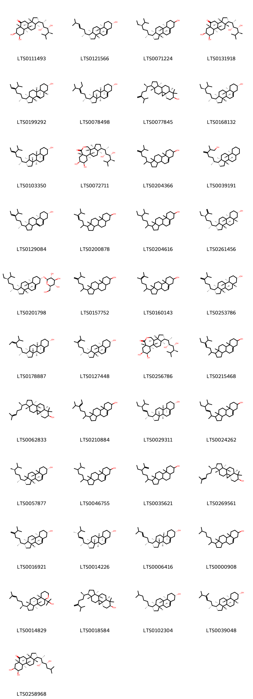{ width=100% }
    <figcaption>Hình ảnh cấu trúc hóa học của 41 hoạt chất thuộc nhóm Steroids and steroid derivatives gồm ['castasterone (LTS0111493)', '(1r,3as,3bs,7s,9ar,9bs,11ar)-9a,11a-dimethyl-1-[(2r)-6-methylhept-4-en-2-yl]-1h,2h,3h,3ah,3bh,4h,6h,7h,8h,9h,9bh,10h,11h-cyclopenta[a]phenanthren-7-ol (LTS0121566)', 'stigmast-5-en-3-ol (LTS0071224)', '(1r,3as,3bs,5as,7s,8r,9ar,9bs,11ar)-1-[(2s,3r,4r,5s)-3,4-dihydroxy-5,6-dimethylheptan-2-yl]-7,8-dihydroxy-9a,11a-dimethyl-tetradecahydrocyclopenta[a]phenanthren-5-one (LTS0131918)', 'delta7-avenasterol (LTS0199292)', '(1r,3as,3bs,7s,9ar,9bs,11ar)-1-[(2r,4e)-5-ethyl-6-methylhept-4-en-2-yl]-9a,11a-dimethyl-1h,2h,3h,3ah,3bh,4h,6h,7h,8h,9h,9bh,10h,11h-cyclopenta[a]phenanthren-7-ol (LTS0078498)', '24-methylene-cycloartanol (LTS0077845)', 'sitosterol (LTS0168132)', 'avenasterol (LTS0103350)', '(1s,2r,4r,5s,7s,11r,12r,15s,16s)-15-[(2s,3r,4r,5s)-3,4-dihydroxy-5,6-dimethylheptan-2-yl]-4,5-dihydroxy-2,16-dimethyl-9-oxatetracyclo[9.7.0.0²,⁷.0¹²,¹⁶]octadecan-8-one (LTS0072711)', '9a,11a-dimethyl-1-(6-methyl-5-methylideneheptan-2-yl)-1h,2h,3h,3ah,3bh,4h,6h,7h,8h,9h,9bh,10h,11h-cyclopenta[a]phenanthren-7-ol (LTS0204366)', '(6r)-6-[(1r,3as,3br,9as,9bs,11ar)-9a,11a-dimethyl-tetradecahydro-1h-cyclopenta[a]phenanthren-1-yl]-2-methyl-3-methylideneheptan-1-ol (LTS0039191)', '5-dehydroavenasterol (LTS0129084)', '1-(5,6-dimethylhept-4-en-2-yl)-9a,11a-dimethyl-tetradecahydro-1h-cyclopenta[a]phenanthren-7-ol (LTS0200878)', 'stigmast-5-en-3-ol, (3β)- (LTS0204616)', '(1r,3as,3br,5as,7s,9as,9bs,11ar)-1-[(2r,5r)-5-ethyl-6-methylhept-6-en-2-yl]-9a,11a-dimethyl-tetradecahydro-1h-cyclopenta[a]phenanthren-7-ol (LTS0261456)', 'sitogluside (LTS0201798)', '9a,11a-dimethyl-1-(6-methyl-5-methylideneheptan-2-yl)-tetradecahydro-1h-cyclopenta[a]phenanthren-7-ol (LTS0157752)', '1-(5,6-dimethylhept-5-en-2-yl)-9a,11a-dimethyl-1h,2h,3h,3ah,3bh,4h,6h,7h,8h,9h,9bh,10h,11h-cyclopenta[a]phenanthren-7-ol (LTS0160143)', '(1r,3as,3br,5as,7s,9as,9bs,11ar)-9a,11a-dimethyl-1-[(2r)-6-methyl-5-methylideneheptan-2-yl]-tetradecahydro-1h-cyclopenta[a]phenanthren-7-ol (LTS0253786)', 'fucosterol (LTS0178887)', '(1r,3as,3bs,7s,9ar,9bs,11ar)-1-[(2r)-5,6-dimethylhept-5-en-2-yl]-9a,11a-dimethyl-1h,2h,3h,3ah,3bh,4h,6h,7h,8h,9h,9bh,10h,11h-cyclopenta[a]phenanthren-7-ol (LTS0127448)', 'brassinolide (LTS0256786)', '1-(5-ethyl-6-methylhept-4-en-2-yl)-9a,11a-dimethyl-1h,2h,3h,3ah,3bh,4h,6h,7h,8h,9h,9bh,10h,11h-cyclopenta[a]phenanthren-7-ol (LTS0215468)', '(3r,6s,8r,11s,12s,15r,16r)-7,7,12,16-tetramethyl-15-[(2r)-6-methylhept-5-en-2-yl]pentacyclo[9.7.0.0¹,³.0³,⁸.0¹²,¹⁶]octadecan-6-ol (LTS0062833)', '1-(5-isopropylhept-5-en-2-yl)-9a,11a-dimethyl-1h,2h,3h,3ah,3bh,4h,6h,7h,8h,9h,9bh,10h,11h-cyclopenta[a]phenanthren-7-ol (LTS0210884)', 'phytosterol (LTS0029311)', 'stigmasterol (LTS0024262)', '(1r,3as,3bs,7s,9bs)-1-[(2r,5r)-5,6-dimethylheptan-2-yl]-9a,11a-dimethyl-1h,2h,3h,3ah,3bh,4h,6h,7h,8h,9h,9bh,10h,11h-cyclopenta[a]phenanthren-7-ol (LTS0057877)', 'campesterol (LTS0046755)', '1-(5-ethyl-6-methylhept-6-en-2-yl)-9a,11a-dimethyl-tetradecahydro-1h-cyclopenta[a]phenanthren-7-ol (LTS0035621)', 'cycloartenol (LTS0269561)', '24-methylenecholesterol (LTS0016921)', 'brassicasterol (LTS0014226)', '(1r,3as,3bs,7s,9ar,9bs,11ar)-9a,11a-dimethyl-1-[(2r,4e)-6-methylhept-4-en-2-yl]-1h,2h,3h,3ah,3bh,4h,6h,7h,8h,9h,9bh,10h,11h-cyclopenta[a]phenanthren-7-ol (LTS0006416)', 'epicholestrol (LTS0000908)', '2-[(1r,2s,7r,10s,11r,14s,15s)-1,11,15-trimethyl-14-[(2s)-6-methylhept-5-en-2-yl]-6-oxatetracyclo[8.7.0.0²,⁷.0¹¹,¹⁵]heptadecan-7-yl]propan-2-ol (LTS0014829)', '24-methylenecycloartanol (LTS0018584)', 'cholesterol (LTS0102304)', '(1r,3as,3br,5as,7s,9as,9bs,11ar)-1-[(2r,4e)-5,6-dimethylhept-4-en-2-yl]-9a,11a-dimethyl-tetradecahydro-1h-cyclopenta[a]phenanthren-7-ol (LTS0039048)', '(1r,3as,3bs,5as,7s,8r,9ar,9bs,11ar)-1-[(2s,3r,4r)-3,4-dihydroxy-6-methylheptan-2-yl]-7,8-dihydroxy-9a,11a-dimethyl-tetradecahydrocyclopenta[a]phenanthren-5-one (LTS0258968)'].</figcaption>
</figure>

---

### Dược dân tộc học

Danh sách các quốc gia có sử dụng *Helianthus annuus* trong điều trị các bệnh. 

| Country            | Disease                                                 | Bệnh                                                                                                                                                                                                |
|:-------------------|:--------------------------------------------------------|:----------------------------------------------------------------------------------------------------------------------------------------------------------------------------------------------------|
| Dominican Republic | Soap, Antiseptic                                        | MYMEMORY WARNING: YOU USED ALL AVAILABLE FREE TRANSLATIONS FOR TODAY. NEXT AVAILABLE IN  11 HOURS 03 MINUTES 30 SECONDS VISIT HTTPS://MYMEMORY.TRANSLATED.NET/DOC/USAGELIMITS.PHP TO TRANSLATE MORE |
| Elsewhere          | Diuretic, Diuretic, Expectorant, nan, Expectorant, Soap | MYMEMORY WARNING: YOU USED ALL AVAILABLE FREE TRANSLATIONS FOR TODAY. NEXT AVAILABLE IN  11 HOURS 03 MINUTES 27 SECONDS VISIT HTTPS://MYMEMORY.TRANSLATED.NET/DOC/USAGELIMITS.PHP TO TRANSLATE MORE |
| Haiti              | Antiseptic, Aphrodisiac, Diuretic, Diuretic             | MYMEMORY WARNING: YOU USED ALL AVAILABLE FREE TRANSLATIONS FOR TODAY. NEXT AVAILABLE IN  11 HOURS 03 MINUTES 25 SECONDS VISIT HTTPS://MYMEMORY.TRANSLATED.NET/DOC/USAGELIMITS.PHP TO TRANSLATE MORE |
| Mexico             | Aphrodisiac                                             | MYMEMORY WARNING: YOU USED ALL AVAILABLE FREE TRANSLATIONS FOR TODAY. NEXT AVAILABLE IN  11 HOURS 03 MINUTES 22 SECONDS VISIT HTTPS://MYMEMORY.TRANSLATED.NET/DOC/USAGELIMITS.PHP TO TRANSLATE MORE |
| Turkey             | Diuretic, Emollient, Expectorant                        | MYMEMORY WARNING: YOU USED ALL AVAILABLE FREE TRANSLATIONS FOR TODAY. NEXT AVAILABLE IN  11 HOURS 03 MINUTES 18 SECONDS VISIT HTTPS://MYMEMORY.TRANSLATED.NET/DOC/USAGELIMITS.PHP TO TRANSLATE MORE |
| UK                 | Aphrodisiac                                             | MYMEMORY WARNING: YOU USED ALL AVAILABLE FREE TRANSLATIONS FOR TODAY. NEXT AVAILABLE IN  11 HOURS 03 MINUTES 15 SECONDS VISIT HTTPS://MYMEMORY.TRANSLATED.NET/DOC/USAGELIMITS.PHP TO TRANSLATE MORE |
| US                 | Insecticide                                             | MYMEMORY WARNING: YOU USED ALL AVAILABLE FREE TRANSLATIONS FOR TODAY. NEXT AVAILABLE IN  11 HOURS 03 MINUTES 11 SECONDS VISIT HTTPS://MYMEMORY.TRANSLATED.NET/DOC/USAGELIMITS.PHP TO TRANSLATE MORE |

---

---
## Helianthus strumosus
### Thông tin về thực vật

!!! info "Phân loại thực vật của *Helianthus strumosus* từ GIBF:"
    - **Kingdom:** Plantae
    - **Phylum:** Tracheophyta
    - **Order:** Asterales
    - **Family:** Asteraceae
    - **Genus:** Helianthus
    - **Species:** *Helianthus strumosus*

 

| Label (VI)   | Label (EN)   | Scientific Name      | Descriptions (VI)   | Descriptions (EN)   | Also Known As (VI)   | Also Known As (EN)   |
|:-------------|:-------------|:---------------------|:--------------------|:--------------------|:---------------------|:---------------------|
| N/A          | N/A          | Helianthus strumosus | loài thực vật       | species of plant    | ['']                 | ['']                 |

#### Phân bố trên thế giới

**Từ CSDL GIBF** Germany, United States of America, Sweden, France, Canada

#### Phân bố tại Việt Nam

**Từ CSDL GIBF**: Không có ghi nhận ở Việt Nam

---
### Thành phần hóa học
        
- Theo cơ sở dữ liệu lotus: Từ loài *Helianthus strumosus* đã phân lập và xác định được 12 hoạt chất thuộc về các nhóm Flavonoids, Prenol lipids. 

|    | chemicalTaxonomyClassyfireClass   |   smiles_count |
|---:|:----------------------------------|---------------:|
|  0 | Flavonoids                        |              4 |
|  1 | Prenol lipids                     |              8 |

#### Nhóm Flavonoids
<figure markdown="span">
    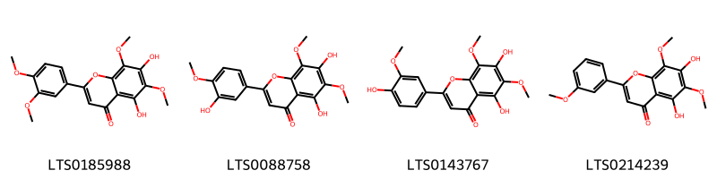{ width=100% }
    <figcaption>Hình ảnh cấu trúc hóa học của 4 hoạt chất thuộc nhóm Flavonoids gồm ['hymenoxin (LTS0185988)', 'acerosin (LTS0088758)', 'sudachitin (LTS0143767)', '5,7-dihydroxy-6,8-dimethoxy-2-(3-methoxyphenyl)chromen-4-one (LTS0214239)'].</figcaption>
</figure>
#### Nhóm Prenol lipids
<figure markdown="span">
    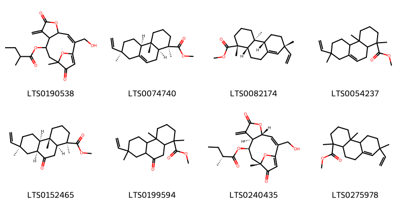{ width=100% }
    <figcaption>Hình ảnh cấu trúc hóa học của 8 hoạt chất thuộc nhóm Prenol lipids gồm ['2-(hydroxymethyl)-11-methyl-7-methylidene-6,12-dioxo-5,14-dioxatricyclo[9.2.1.0⁴,⁸]tetradeca-1(13),2-dien-9-yl 2-methylbutanoate (LTS0190538)', 'methyl (1r,4as,4br,7s,10as)-7-ethenyl-1,4a,7-trimethyl-3,4,4b,5,6,8,10,10a-octahydro-2h-phenanthrene-1-carboxylate (LTS0074740)', 'methyl (1r,4as,4br,7r,10as)-7-ethenyl-1,4a,7-trimethyl-3,4,4b,5,6,9,10,10a-octahydro-2h-phenanthrene-1-carboxylate (LTS0082174)', 'methyl 7-ethenyl-1,4a,7-trimethyl-3,4,4b,5,6,8,10,10a-octahydro-2h-phenanthrene-1-carboxylate (LTS0054237)', 'methyl (1r,4as,4br,7s,8as,10as)-7-ethenyl-1,4a,7-trimethyl-9-oxo-decahydrophenanthrene-1-carboxylate (LTS0152465)', 'methyl 7-ethenyl-1,4a,7-trimethyl-9-oxo-decahydrophenanthrene-1-carboxylate (LTS0199594)', '(2z,4r,8r,9r,11s)-2-(hydroxymethyl)-11-methyl-7-methylidene-6,12-dioxo-5,14-dioxatricyclo[9.2.1.0⁴,⁸]tetradeca-1(13),2-dien-9-yl (2r)-2-methylbutanoate (LTS0240435)', 'methyl 7-ethenyl-1,4a,7-trimethyl-3,4,4b,5,6,9,10,10a-octahydro-2h-phenanthrene-1-carboxylate (LTS0275978)'].</figcaption>
</figure>

---

### Dược dân tộc học

Danh sách các quốc gia có sử dụng *Helianthus strumosus* trong điều trị các bệnh. 

| Country   | Disease               | Bệnh                                                                                                                                                                                                |
|:----------|:----------------------|:----------------------------------------------------------------------------------------------------------------------------------------------------------------------------------------------------|
| US        | Expectorant, Diuretic | MYMEMORY WARNING: YOU USED ALL AVAILABLE FREE TRANSLATIONS FOR TODAY. NEXT AVAILABLE IN  11 HOURS 02 MINUTES 16 SECONDS VISIT HTTPS://MYMEMORY.TRANSLATED.NET/DOC/USAGELIMITS.PHP TO TRANSLATE MORE |

---

---
## Helianthus tuberosus
### Thông tin về thực vật

!!! info "Phân loại thực vật của *Helianthus tuberosus* từ GIBF:"
    - **Kingdom:** Plantae
    - **Phylum:** Tracheophyta
    - **Order:** Asterales
    - **Family:** Asteraceae
    - **Genus:** Helianthus
    - **Species:** *Helianthus tuberosus*

 

| Label (VI)   | Label (EN)   | Scientific Name      | Descriptions (VI)   | Descriptions (EN)                                                                           | Also Known As (VI)       | Also Known As (EN)                                                                                                             |
|:-------------|:-------------|:---------------------|:--------------------|:--------------------------------------------------------------------------------------------|:-------------------------|:-------------------------------------------------------------------------------------------------------------------------------|
| N/A          | N/A          | Helianthus tuberosus |                     | species of sunflower native to eastern North America (for the root vegetable use Q55706475) | ['Helianthus tuberosus'] | ['topinambur', 'lambchoke', 'topinambour', 'Canadian sunflower', 'earth apple', 'Helianthus tuberosus', 'sunchoke', 'sunroot'] |

#### Phân bố trên thế giới

**Từ CSDL GIBF** Italy, Australia, Belgium, Estonia, Argentina, Norway, Canada, Ukraine, Netherlands, Belarus, Russian Federation, United States of America, Sweden, Uruguay, Chile, Croatia, Kazakhstan, South Africa, Czechia, Germany, Romania, Switzerland, Austria, France, Poland, New Zealand

#### Phân bố tại Việt Nam

**Từ CSDL GIBF**: Không có ghi nhận ở Việt Nam

---
### Thành phần hóa học
        
- Theo cơ sở dữ liệu lotus: Từ loài *Helianthus tuberosus* đã phân lập và xác định được 123 hoạt chất thuộc về các nhóm Phenol ethers, Fatty Acyls, Purine nucleotides, Pyridines and derivatives, Prenol lipids, Benzene and substituted derivatives, Unsaturated hydrocarbons, Pyrimidine nucleotides, Heteroaromatic compounds, Lactones, Organooxygen compounds, Saturated hydrocarbons, Coumarins and derivatives, Ribonucleoside 3'-phosphates, Imidazopyrimidines. 

|    | chemicalTaxonomyClassyfireClass     |   smiles_count |
|---:|:------------------------------------|---------------:|
|  0 | Benzene and substituted derivatives |              5 |
|  1 | Coumarins and derivatives           |              2 |
|  2 | Fatty Acyls                         |             20 |
|  3 | Heteroaromatic compounds            |              1 |
|  4 | Imidazopyrimidines                  |              1 |
|  5 | Lactones                            |              6 |
|  6 | Organooxygen compounds              |              7 |
|  7 | Phenol ethers                       |              1 |
|  8 | Prenol lipids                       |             42 |
|  9 | Purine nucleotides                  |             14 |
| 10 | Pyridines and derivatives           |              1 |
| 11 | Pyrimidine nucleotides              |             13 |
| 12 | Ribonucleoside 3'-phosphates        |              4 |
| 13 | Saturated hydrocarbons              |              5 |
| 14 | Unsaturated hydrocarbons            |              1 |

#### Nhóm Benzene and substituted derivatives
<figure markdown="span">
    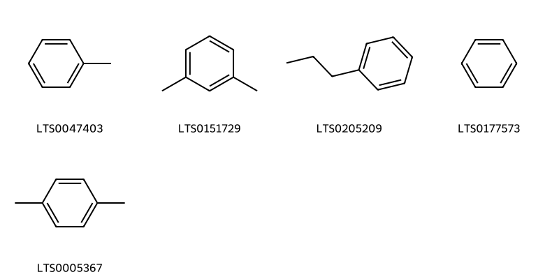{ width=100% }
    <figcaption>Hình ảnh cấu trúc hóa học của 5 hoạt chất thuộc nhóm Benzene and substituted derivatives gồm ['toluene (LTS0047403)', 'm-xylene (LTS0151729)', 'propylbenzene (LTS0205209)', 'benzene (LTS0177573)', 'para-xylene (LTS0005367)'].</figcaption>
</figure>
#### Nhóm Coumarins and derivatives
<figure markdown="span">
    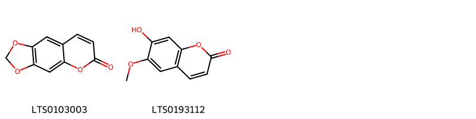{ width=100% }
    <figcaption>Hình ảnh cấu trúc hóa học của 2 hoạt chất thuộc nhóm Coumarins and derivatives gồm ['ayapin (LTS0103003)', 'scopoletin (LTS0193112)'].</figcaption>
</figure>
#### Nhóm Fatty Acyls
<figure markdown="span">
    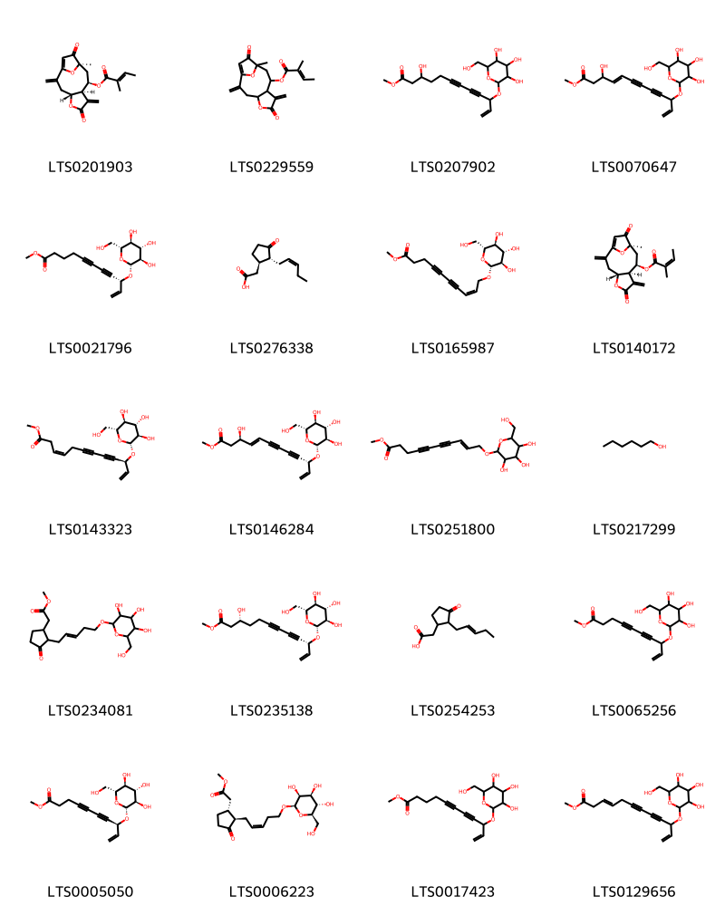{ width=100% }
    <figcaption>Hình ảnh cấu trúc hóa học của 20 hoạt chất thuộc nhóm Fatty Acyls gồm ['(4r,8s,9r,11r)-11-methyl-2,7-dimethylidene-6,12-dioxo-5,14-dioxatricyclo[9.2.1.0⁴,⁸]tetradec-1(13)-en-9-yl (2e)-2-methylbut-2-enoate (LTS0201903)', '11-methyl-2,7-dimethylidene-6,12-dioxo-5,14-dioxatricyclo[9.2.1.0⁴,⁸]tetradec-1(13)-en-9-yl 2-methylbut-2-enoate (LTS0229559)', 'methyl 3-hydroxy-10-{[3,4,5-trihydroxy-6-(hydroxymethyl)oxan-2-yl]oxy}dodec-11-en-6,8-diynoate (LTS0207902)', 'methyl 3-hydroxy-10-{[3,4,5-trihydroxy-6-(hydroxymethyl)oxan-2-yl]oxy}dodeca-4,11-dien-6,8-diynoate (LTS0070647)', 'methyl (9r)-9-{[(2r,3r,4s,5s,6r)-3,4,5-trihydroxy-6-(hydroxymethyl)oxan-2-yl]oxy}undec-10-en-5,7-diynoate (LTS0021796)', 'jasmonic acid (LTS0276338)', 'methyl (8z)-10-{[(2r,3r,4s,5s,6r)-3,4,5-trihydroxy-6-(hydroxymethyl)oxan-2-yl]oxy}dec-8-en-4,6-diynoate (LTS0165987)', '(4r,8s,9r,11r)-11-methyl-2,7-dimethylidene-6,12-dioxo-5,14-dioxatricyclo[9.2.1.0⁴,⁸]tetradec-1(13)-en-9-yl (2z)-2-methylbut-2-enoate (LTS0140172)', 'methyl (3z,10s)-10-{[(2r,3r,4s,5s,6r)-3,4,5-trihydroxy-6-(hydroxymethyl)oxan-2-yl]oxy}dodeca-3,11-dien-6,8-diynoate (LTS0143323)', 'methyl (3r,4e,10r)-3-hydroxy-10-{[(2r,3r,4s,5s,6r)-3,4,5-trihydroxy-6-(hydroxymethyl)oxan-2-yl]oxy}dodeca-4,11-dien-6,8-diynoate (LTS0146284)', 'methyl 10-{[3,4,5-trihydroxy-6-(hydroxymethyl)oxan-2-yl]oxy}dec-8-en-4,6-diynoate (LTS0251800)', 'hexanol (LTS0217299)', 'methyl 2-[3-oxo-2-(5-{[3,4,5-trihydroxy-6-(hydroxymethyl)oxan-2-yl]oxy}pent-2-en-1-yl)cyclopentyl]acetate (LTS0234081)', 'methyl (3r,10r)-3-hydroxy-10-{[(2r,3r,4s,5s,6r)-3,4,5-trihydroxy-6-(hydroxymethyl)oxan-2-yl]oxy}dodec-11-en-6,8-diynoate (LTS0235138)', '[3-oxo-2-(pent-2-en-1-yl)cyclopentyl]acetic acid (LTS0254253)', 'methyl 8-{[3,4,5-trihydroxy-6-(hydroxymethyl)oxan-2-yl]oxy}dec-9-en-4,6-diynoate (LTS0065256)', 'methyl (8s)-8-{[(2r,3r,4s,5s,6r)-3,4,5-trihydroxy-6-(hydroxymethyl)oxan-2-yl]oxy}dec-9-en-4,6-diynoate (LTS0005050)', 'methyl 2-[(1r,2r)-3-oxo-2-[(2z)-5-{[(2r,3s,4s,5s,6r)-3,4,5-trihydroxy-6-(hydroxymethyl)oxan-2-yl]oxy}pent-2-en-1-yl]cyclopentyl]acetate (LTS0006223)', 'methyl 9-{[3,4,5-trihydroxy-6-(hydroxymethyl)oxan-2-yl]oxy}undec-10-en-5,7-diynoate (LTS0017423)', 'methyl 10-{[3,4,5-trihydroxy-6-(hydroxymethyl)oxan-2-yl]oxy}dodeca-3,11-dien-6,8-diynoate (LTS0129656)'].</figcaption>
</figure>
#### Nhóm Heteroaromatic compounds
<figure markdown="span">
    { width=100% }
    <figcaption>Hình ảnh cấu trúc hóa học của 1 hoạt chất thuộc nhóm Heteroaromatic compounds gồm ['amylfuran (LTS0044471)'].</figcaption>
</figure>
#### Nhóm Imidazopyrimidines
<figure markdown="span">
    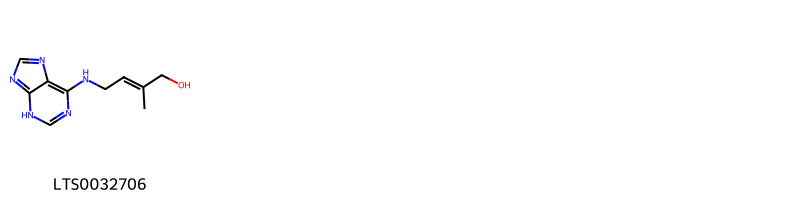{ width=100% }
    <figcaption>Hình ảnh cấu trúc hóa học của 1 hoạt chất thuộc nhóm Imidazopyrimidines gồm ['zeatine (LTS0032706)'].</figcaption>
</figure>
#### Nhóm Lactones
<figure markdown="span">
    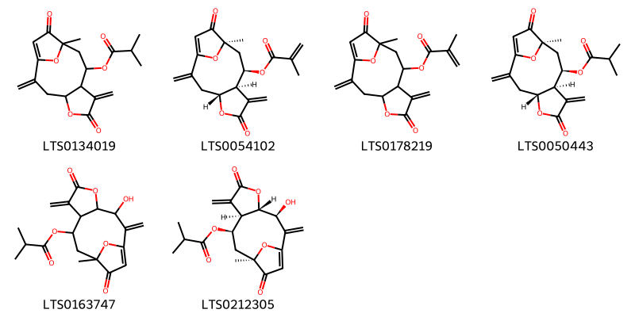{ width=100% }
    <figcaption>Hình ảnh cấu trúc hóa học của 6 hoạt chất thuộc nhóm Lactones gồm ['11-methyl-2,7-dimethylidene-6,12-dioxo-5,14-dioxatricyclo[9.2.1.0⁴,⁸]tetradec-1(13)-en-9-yl 2-methylpropanoate (LTS0134019)', '(4r,8s,9r,11r)-11-methyl-2,7-dimethylidene-6,12-dioxo-5,14-dioxatricyclo[9.2.1.0⁴,⁸]tetradec-1(13)-en-9-yl 2-methylprop-2-enoate (LTS0054102)', '11-methyl-2,7-dimethylidene-6,12-dioxo-5,14-dioxatricyclo[9.2.1.0⁴,⁸]tetradec-1(13)-en-9-yl 2-methylprop-2-enoate (LTS0178219)', '(4r,8s,9r,11r)-11-methyl-2,7-dimethylidene-6,12-dioxo-5,14-dioxatricyclo[9.2.1.0⁴,⁸]tetradec-1(13)-en-9-yl 2-methylpropanoate (LTS0050443)', '3-hydroxy-11-methyl-2,7-dimethylidene-6,12-dioxo-5,14-dioxatricyclo[9.2.1.0⁴,⁸]tetradec-1(13)-en-9-yl 2-methylpropanoate (LTS0163747)', '(3s,4s,8r,9r,11r)-3-hydroxy-11-methyl-2,7-dimethylidene-6,12-dioxo-5,14-dioxatricyclo[9.2.1.0⁴,⁸]tetradec-1(13)-en-9-yl 2-methylpropanoate (LTS0212305)'].</figcaption>
</figure>
#### Nhóm Organooxygen compounds
<figure markdown="span">
    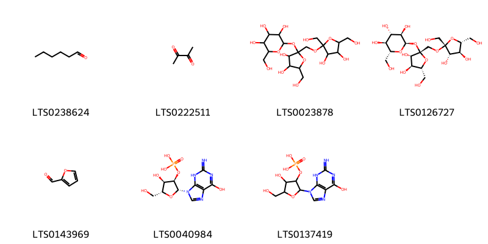{ width=100% }
    <figcaption>Hình ảnh cấu trúc hóa học của 7 hoạt chất thuộc nhóm Organooxygen compounds gồm ['hexanal (LTS0238624)', 'diacetyl (LTS0222511)', '2-{[2-({[3,4-dihydroxy-2,5-bis(hydroxymethyl)oxolan-2-yl]oxy}methyl)-3,4-dihydroxy-5-(hydroxymethyl)oxolan-2-yl]oxy}-6-(hydroxymethyl)oxane-3,4,5-triol (LTS0023878)', '1-kestose (LTS0126727)', 'bran oil (LTS0143969)', '[(2r,3r,4r,5r)-4-hydroxy-2-(6-hydroxy-2-imino-3h-purin-9-yl)-5-(hydroxymethyl)oxolan-3-yl]oxyphosphonic acid (LTS0040984)', '[4-hydroxy-2-(6-hydroxy-2-imino-3h-purin-9-yl)-5-(hydroxymethyl)oxolan-3-yl]oxyphosphonic acid (LTS0137419)'].</figcaption>
</figure>
#### Nhóm Phenol ethers
<figure markdown="span">
    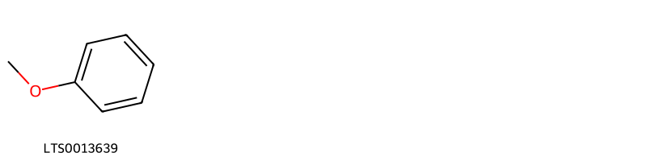{ width=100% }
    <figcaption>Hình ảnh cấu trúc hóa học của 1 hoạt chất thuộc nhóm Phenol ethers gồm ['anisole (LTS0013639)'].</figcaption>
</figure>
#### Nhóm Prenol lipids
<figure markdown="span">
    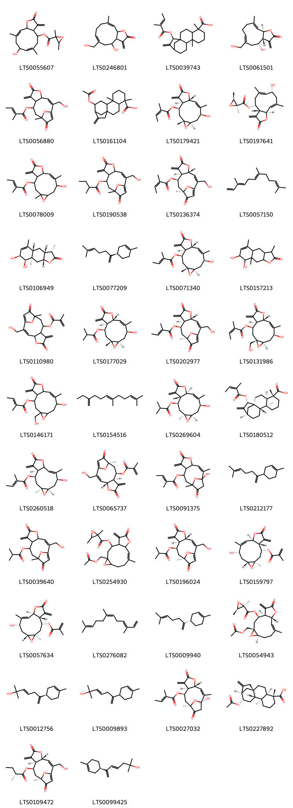{ width=100% }
    <figcaption>Hình ảnh cấu trúc hóa học của 42 hoạt chất thuộc nhóm Prenol lipids gồm ['8-hydroxy-6,10-dimethyl-3-methylidene-2-oxo-3ah,4h,5h,8h,9h,11ah-cyclodeca[b]furan-4-yl 2,3-dimethyloxirane-2-carboxylate (LTS0055607)', '4-hydroxy-6-(hydroxymethyl)-10-methyl-3-methylidene-3ah,4h,5h,8h,9h,11ah-cyclodeca[b]furan-2-one (LTS0246801)', '5,9-dimethyl-15-[(2-methylbut-2-enoyl)oxy]-14-methylidenetetracyclo[11.2.1.0¹,¹⁰.0⁴,⁹]hexadecane-5-carboxylic acid (LTS0039743)', '(3ar,4r,11ar)-4-hydroxy-6-(hydroxymethyl)-10-methyl-3-methylidene-3ah,4h,5h,8h,9h,11ah-cyclodeca[b]furan-2-one (LTS0061501)', '2-(hydroxymethyl)-11-methyl-7-methylidene-6,12-dioxo-5,14-dioxatricyclo[9.2.1.0⁴,⁸]tetradeca-1(13),2-dien-9-yl 2-methylbut-2-enoate (LTS0056880)', '12-(acetyloxy)-5,9-dimethyl-14-methylidenetetracyclo[11.2.1.0¹,¹⁰.0⁴,⁹]hexadecane-5-carboxylic acid (LTS0161104)', '(1r,2r,4r,6r,8s,9z,11r)-8-hydroxy-4,9-dimethyl-14-methylidene-13-oxo-5,12-dioxatricyclo[9.3.0.0⁴,⁶]tetradec-9-en-2-yl (2z)-2-methylbut-2-enoate (LTS0179421)', '(3ar,4r,8r,11ar)-8-hydroxy-6,10-dimethyl-3-methylidene-2-oxo-3ah,4h,5h,8h,9h,11ah-cyclodeca[b]furan-4-yl (2s,3s)-2,3-dimethyloxirane-2-carboxylate (LTS0197641)', '8-hydroxy-4,9-dimethyl-14-methylidene-13-oxo-5,12-dioxatricyclo[9.3.0.0⁴,⁶]tetradec-9-en-2-yl 2-methylbut-2-enoate (LTS0078009)', '2-(hydroxymethyl)-11-methyl-7-methylidene-6,12-dioxo-5,14-dioxatricyclo[9.2.1.0⁴,⁸]tetradeca-1(13),2-dien-9-yl 2-methylbutanoate (LTS0190538)', 'budlein a (LTS0136374)', 'farnesene (LTS0057150)', '(3s,3ar,4as,7s,8r,8ar,9ar)-7,8-dihydroxy-3,5,8a-trimethyl-3h,3ah,4h,4ah,7h,8h,9h,9ah-naphtho[2,3-b]furan-2-one (LTS0106949)', '(r)-β-bisabolene (LTS0077209)', '(1r,2r,4r,6r,8s,9z,11r)-8-hydroxy-4,9-dimethyl-14-methylidene-13-oxo-5,12-dioxatricyclo[9.3.0.0⁴,⁶]tetradec-9-en-2-yl (2e)-2-methylbut-2-enoate (LTS0071340)', '7,8-dihydroxy-3,5,8a-trimethyl-3h,3ah,4h,4ah,7h,8h,9h,9ah-naphtho[2,3-b]furan-2-one (LTS0157213)', '2-(hydroxymethyl)-11-methyl-7-methylidene-6,12-dioxo-5,14-dioxatricyclo[9.2.1.0⁴,⁸]tetradeca-1(13),2-dien-9-yl 2-methylprop-2-enoate (LTS0110980)', '(1r,2r,4r,6r,8s,9z,11r)-8-hydroxy-4,9-dimethyl-14-methylidene-13-oxo-5,12-dioxatricyclo[9.3.0.0⁴,⁶]tetradec-9-en-2-yl 2-methylpropanoate (LTS0177029)', '(2z,4r,8r,9r,11r)-2-(hydroxymethyl)-11-methyl-7-methylidene-6,12-dioxo-5,14-dioxatricyclo[9.2.1.0⁴,⁸]tetradeca-1(13),2-dien-9-yl (2e)-2-methylbut-2-enoate (LTS0202977)', '(1r,2r,4s,6r,8s,9z,11r)-8-hydroxy-4-(hydroxymethyl)-9-methyl-14-methylidene-13-oxo-5,12-dioxatricyclo[9.3.0.0⁴,⁶]tetradec-9-en-2-yl (2z)-2-methylbut-2-enoate (LTS0131986)', '8-hydroxy-4-(hydroxymethyl)-9-methyl-14-methylidene-13-oxo-5,12-dioxatricyclo[9.3.0.0⁴,⁶]tetradec-9-en-2-yl 2-methylbut-2-enoate (LTS0146171)', '(6e)-2,6-dimethyl-10-methylidenedodeca-2,6-diene (LTS0154516)', '(1s,2r,4s,6r,8s,9z,11s)-8-hydroxy-4,9-dimethyl-14-methylidene-13-oxo-5,12-dioxatricyclo[9.3.0.0⁴,⁶]tetradec-9-en-2-yl 2-methylpropanoate (LTS0269604)', '(1r,4r,5r,9s,10s,13r,15s)-5,9-dimethyl-15-{[(2z)-2-methylbut-2-enoyl]oxy}-14-methylidenetetracyclo[11.2.1.0¹,¹⁰.0⁴,⁹]hexadecane-5-carboxylic acid (LTS0180512)', '(1r,2r,4s,6r,8s,9e)-8-hydroxy-4,9-dimethyl-14-methylidene-13-oxo-5,12-dioxatricyclo[9.3.0.0⁴,⁶]tetradec-9-en-2-yl (2e)-2-methylbut-2-enoate (LTS0260518)', '(2z,4r,8r,9r,11r)-2-(hydroxymethyl)-11-methyl-7-methylidene-6,12-dioxo-5,14-dioxatricyclo[9.2.1.0⁴,⁸]tetradeca-1(13),2-dien-9-yl 2-methylprop-2-enoate (LTS0065737)', '1-hydroxy-2,11-dimethyl-7-methylidene-6,12-dioxo-5,14-dioxatricyclo[9.2.1.0⁴,⁸]tetradec-2-en-9-yl 2-methylbut-2-enoate (LTS0091375)', 'β-bisabolene (LTS0212177)', '2-(hydroxymethyl)-11-methyl-7-methylidene-6,12-dioxo-5,14-dioxatricyclo[9.2.1.0⁴,⁸]tetradeca-1(13),2-dien-9-yl 2-methylpropanoate (LTS0039640)', '4-[(acetyloxy)methyl]-9-methyl-14-methylidene-13-oxo-5,12-dioxatricyclo[9.3.0.0⁴,⁶]tetradec-9-en-2-yl 2,3-dimethyloxirane-2-carboxylate (LTS0254930)', '(2z,4r,8r,9r,11r)-2-(hydroxymethyl)-11-methyl-7-methylidene-6,12-dioxo-5,14-dioxatricyclo[9.2.1.0⁴,⁸]tetradeca-1(13),2-dien-9-yl 2-methylpropanoate (LTS0196024)', '(1r,2r,4r,6r,8s,9z,11r)-8-hydroxy-4,9-dimethyl-14-methylidene-13-oxo-5,12-dioxatricyclo[9.3.0.0⁴,⁶]tetradec-9-en-2-yl 2-methylprop-2-enoate (LTS0159797)', '(1r,2r,4r,6r,8s,9e,11r)-8-hydroxy-4,9-dimethyl-14-methylidene-13-oxo-5,12-dioxatricyclo[9.3.0.0⁴,⁶]tetradec-9-en-2-yl 2-methylprop-2-enoate (LTS0057634)', 'α-farnesene (LTS0276082)', '(-)-β-bisabolene (LTS0009940)', '(1r,2r,4s,6r,9e,11r)-4-[(acetyloxy)methyl]-9-methyl-14-methylidene-13-oxo-5,12-dioxatricyclo[9.3.0.0⁴,⁶]tetradec-9-en-2-yl (2r,3r)-2,3-dimethyloxirane-2-carboxylate (LTS0054943)', '(3e)-2-methyl-6-[(1r)-4-methylcyclohex-3-en-1-yl]hepta-3,6-dien-2-ol (LTS0012756)', '2-methyl-6-(4-methylcyclohex-3-en-1-yl)hepta-3,6-dien-2-ol (LTS0009893)', '(1r,2z,4r,8r,9r,11r)-1-hydroxy-2,11-dimethyl-7-methylidene-6,12-dioxo-5,14-dioxatricyclo[9.2.1.0⁴,⁸]tetradec-2-en-9-yl (2e)-2-methylbut-2-enoate (LTS0027032)', '(1s,4r,5r,9s,10r,12s,13r)-12-(acetyloxy)-5,9-dimethyl-14-methylidenetetracyclo[11.2.1.0¹,¹⁰.0⁴,⁹]hexadecane-5-carboxylic acid (LTS0227892)', '(2z,4r,8r,9r,11r)-2-(hydroxymethyl)-11-methyl-7-methylidene-6,12-dioxo-5,14-dioxatricyclo[9.2.1.0⁴,⁸]tetradeca-1(13),2-dien-9-yl (2r)-2-methylbutanoate (LTS0109472)', '(4e)-2-methyl-6-[(1r)-4-methylcyclohex-3-en-1-yl]hepta-4,6-dien-2-ol (LTS0099425)'].</figcaption>
</figure>
#### Nhóm Purine nucleotides
<figure markdown="span">
    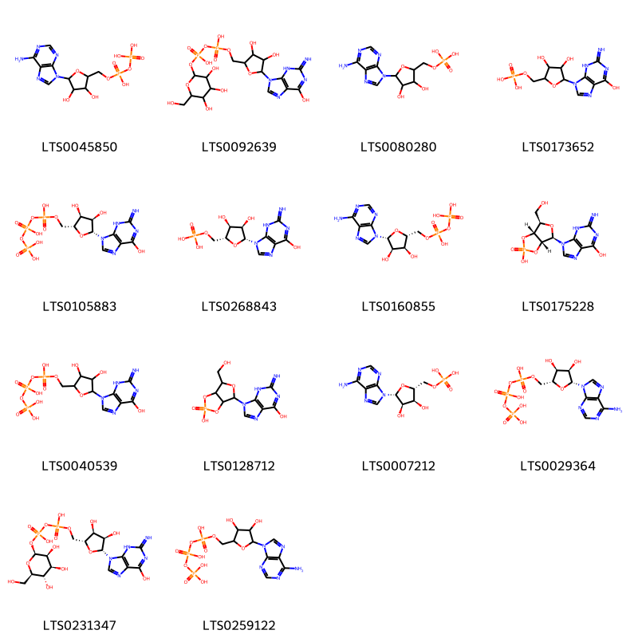{ width=100% }
    <figcaption>Hình ảnh cấu trúc hóa học của 14 hoạt chất thuộc nhóm Purine nucleotides gồm ['adenosine diphosphate (LTS0045850)', '{[3,4-dihydroxy-5-(6-hydroxy-2-imino-3h-purin-9-yl)oxolan-2-yl]methoxy(hydroxy)phosphoryl}oxy([3,4,5-trihydroxy-6-(hydroxymethyl)oxan-2-yl]oxy)phosphinic acid (LTS0092639)', 'adenosine monophosphate (LTS0080280)', '[3,4-dihydroxy-5-(6-hydroxy-2-imino-3h-purin-9-yl)oxolan-2-yl]methoxyphosphonic acid (LTS0173652)', 'guanosine triphosphate (LTS0105883)', '[(2r,3s,4r,5r)-3,4-dihydroxy-5-(6-hydroxy-2-imino-3h-purin-9-yl)oxolan-2-yl]methoxyphosphonic acid (LTS0268843)', 'adenosine-diphosphate (LTS0160855)', "2',3'-cyclic gmp (LTS0175228)", '({[3,4-dihydroxy-5-(6-hydroxy-2-imino-3h-purin-9-yl)oxolan-2-yl]methoxy(hydroxy)phosphoryl}oxy(hydroxy)phosphoryl)oxyphosphonic acid (LTS0040539)', '2-hydroxy-4-(6-hydroxy-2-imino-3h-purin-9-yl)-6-(hydroxymethyl)-tetrahydro-2λ⁵-furo[3,4-d][1,3,2]dioxaphosphol-2-one (LTS0128712)', 'adenosine monophosphate (LTS0007212)', 'adenosine triphosphate (LTS0029364)', '{[(2r,3s,4r,5r)-3,4-dihydroxy-5-(6-hydroxy-2-imino-3h-purin-9-yl)oxolan-2-yl]methoxy(hydroxy)phosphoryl}oxy([(2s,3s,4s,5s,6r)-3,4,5-trihydroxy-6-(hydroxymethyl)oxan-2-yl]oxy)phosphinic acid (LTS0231347)', 'adenosine triphosphate (LTS0259122)'].</figcaption>
</figure>
#### Nhóm Pyridines and derivatives
<figure markdown="span">
    { width=100% }
    <figcaption>Hình ảnh cấu trúc hóa học của 1 hoạt chất thuộc nhóm Pyridines and derivatives gồm ['pyridine (LTS0108275)'].</figcaption>
</figure>
#### Nhóm Pyrimidine nucleotides
<figure markdown="span">
    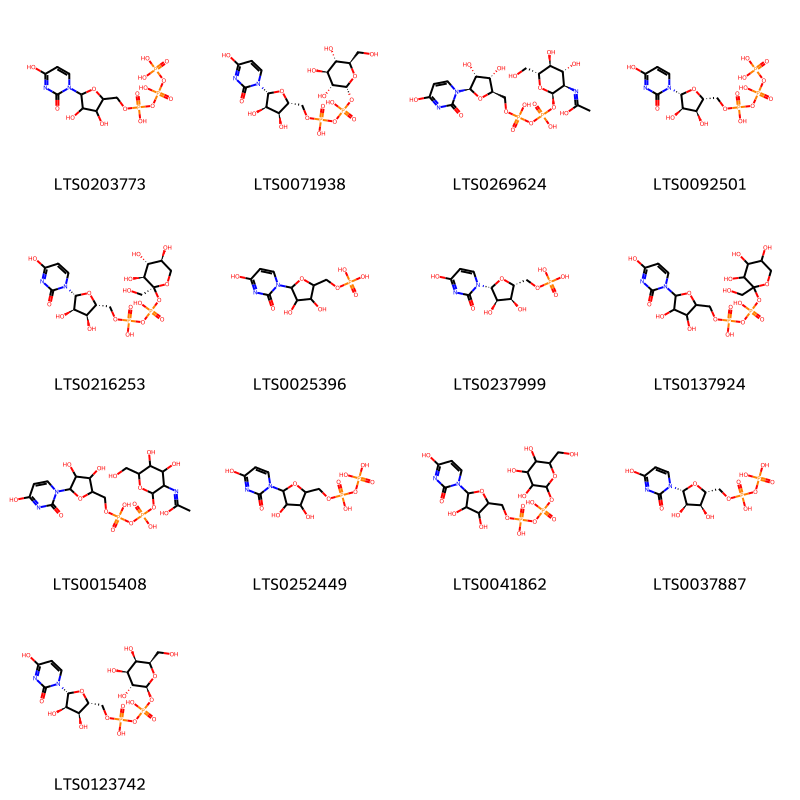{ width=100% }
    <figcaption>Hình ảnh cấu trúc hóa học của 13 hoạt chất thuộc nhóm Pyrimidine nucleotides gồm ['({[3,4-dihydroxy-5-(4-hydroxy-2-oxopyrimidin-1-yl)oxolan-2-yl]methoxy(hydroxy)phosphoryl}oxy(hydroxy)phosphoryl)oxyphosphonic acid (LTS0203773)', 'uridine diphosphate glucose (LTS0071938)', 'n-[(2r,3r,4r,5s,6r)-2-[({[(2r,3s,4r,5r)-3,4-dihydroxy-5-(4-hydroxy-2-oxopyrimidin-1-yl)oxolan-2-yl]methoxy(hydroxy)phosphoryl}oxy(hydroxy)phosphoryl)oxy]-4,5-dihydroxy-6-(hydroxymethyl)oxan-3-yl]ethanimidic acid (LTS0269624)', '({[(2r,3s,4r,5r)-3,4-dihydroxy-5-(4-hydroxy-2-oxopyrimidin-1-yl)oxolan-2-yl]methoxy(hydroxy)phosphoryl}oxy(hydroxy)phosphoryl)oxyphosphonic acid (LTS0092501)', '{[(2r,3s,4r,5r)-3,4-dihydroxy-5-(4-hydroxy-2-oxopyrimidin-1-yl)oxolan-2-yl]methoxy(hydroxy)phosphoryl}oxy([(2s,3s,4r,5s)-3,4,5-trihydroxy-2-(hydroxymethyl)oxan-2-yl]oxy)phosphinic acid (LTS0216253)', '[3,4-dihydroxy-5-(4-hydroxy-2-oxopyrimidin-1-yl)oxolan-2-yl]methoxyphosphonic acid (LTS0025396)', 'uridine monophosphate (LTS0237999)', '{[3,4-dihydroxy-5-(4-hydroxy-2-oxopyrimidin-1-yl)oxolan-2-yl]methoxy(hydroxy)phosphoryl}oxy([3,4,5-trihydroxy-2-(hydroxymethyl)oxan-2-yl]oxy)phosphinic acid (LTS0137924)', 'n-{2-[({[3,4-dihydroxy-5-(4-hydroxy-2-oxopyrimidin-1-yl)oxolan-2-yl]methoxy(hydroxy)phosphoryl}oxy(hydroxy)phosphoryl)oxy]-4,5-dihydroxy-6-(hydroxymethyl)oxan-3-yl}ethanimidic acid (LTS0015408)', '{[3,4-dihydroxy-5-(4-hydroxy-2-oxopyrimidin-1-yl)oxolan-2-yl]methoxy(hydroxy)phosphoryl}oxyphosphonic acid (LTS0252449)', '{[3,4-dihydroxy-5-(4-hydroxy-2-oxopyrimidin-1-yl)oxolan-2-yl]methoxy(hydroxy)phosphoryl}oxy([3,4,5-trihydroxy-6-(hydroxymethyl)oxan-2-yl]oxy)phosphinic acid (LTS0041862)', 'diphosphate, uridine (LTS0037887)', '{[(2r,3s,4r,5r)-3,4-dihydroxy-5-(4-hydroxy-2-oxopyrimidin-1-yl)oxolan-2-yl]methoxy(hydroxy)phosphoryl}oxy([(2s,3r,4s,5r,6r)-3,4,5-trihydroxy-6-(hydroxymethyl)oxan-2-yl]oxy)phosphinic acid (LTS0123742)'].</figcaption>
</figure>
#### Nhóm Ribonucleoside 3_-phosphates
<figure markdown="span">
    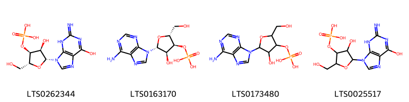{ width=100% }
    <figcaption>Hình ảnh cấu trúc hóa học của Không tìm thấy chú thích hoạt chất thuộc nhóm Ribonucleoside 3_-phosphates gồm Không tìm thấy chú thích.</figcaption>
</figure>
#### Nhóm Saturated hydrocarbons
<figure markdown="span">
    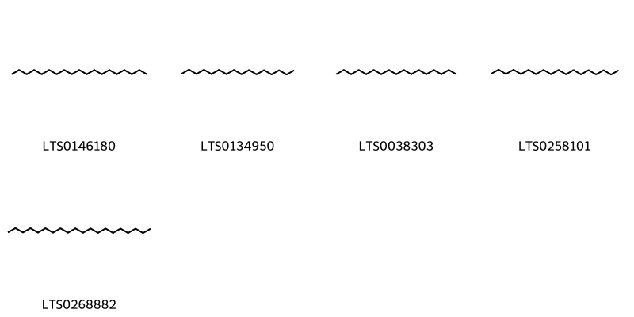{ width=100% }
    <figcaption>Hình ảnh cấu trúc hóa học của 5 hoạt chất thuộc nhóm Saturated hydrocarbons gồm ['nonadecane (LTS0146180)', 'cetane (LTS0134950)', 'heptadecane (LTS0038303)', 'octadecane (LTS0258101)', 'eicosane (LTS0268882)'].</figcaption>
</figure>
#### Nhóm Unsaturated hydrocarbons
<figure markdown="span">
    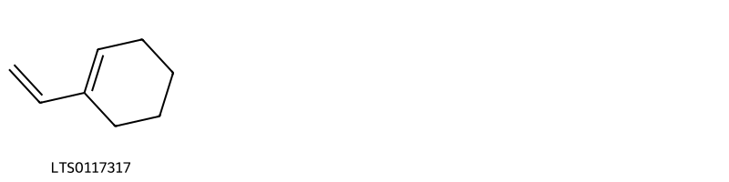{ width=100% }
    <figcaption>Hình ảnh cấu trúc hóa học của 1 hoạt chất thuộc nhóm Unsaturated hydrocarbons gồm ['cyclohexene, 1-ethenyl- (LTS0117317)'].</figcaption>
</figure>

---

### Dược dân tộc học

Danh sách các quốc gia có sử dụng *Helianthus tuberosus* trong điều trị các bệnh. 

| Country   | Disease                                                       | Bệnh                                                                                                                                                                                                |
|:----------|:--------------------------------------------------------------|:----------------------------------------------------------------------------------------------------------------------------------------------------------------------------------------------------|
| Iraq      | Androgenic, Aphrodisiac                                       | MYMEMORY WARNING: YOU USED ALL AVAILABLE FREE TRANSLATIONS FOR TODAY. NEXT AVAILABLE IN  11 HOURS 01 MINUTES 43 SECONDS VISIT HTTPS://MYMEMORY.TRANSLATED.NET/DOC/USAGELIMITS.PHP TO TRANSLATE MORE |
| Turkey    | Aphrodisiac, Stomachic, Tonic, Aperient, Cholagogue, Diuretic | MYMEMORY WARNING: YOU USED ALL AVAILABLE FREE TRANSLATIONS FOR TODAY. NEXT AVAILABLE IN  11 HOURS 01 MINUTES 40 SECONDS VISIT HTTPS://MYMEMORY.TRANSLATED.NET/DOC/USAGELIMITS.PHP TO TRANSLATE MORE |

---

# Chi Neurolaena

??? note "Danh sách các dược liệu thuộc chi"
    
	 - *Neurolaena lobata*

---
## Neurolaena lobata
### Thông tin về thực vật

!!! info "Phân loại thực vật của *Neurolaena lobata* từ GIBF:"
    - **Kingdom:** Plantae
    - **Phylum:** Tracheophyta
    - **Order:** Asterales
    - **Family:** Asteraceae
    - **Genus:** Neurolaena
    - **Species:** *Neurolaena lobata*

 

| Label (VI)   | Label (EN)   | Scientific Name   | Descriptions (VI)   | Descriptions (EN)   | Also Known As (VI)   | Also Known As (EN)   |
|:-------------|:-------------|:------------------|:--------------------|:--------------------|:---------------------|:---------------------|
| N/A          | N/A          | Neurolaena lobata | loài thực vật       | species of plant    | ['']                 | ['']                 |

#### Phân bố trên thế giới

**Từ CSDL GIBF** nan, Guadeloupe, Guatemala, Nicaragua, Venezuela (Bolivarian Republic of), Panama, Puerto Rico, Honduras, United States of America, El Salvador, Belize, Trinidad and Tobago, Saint Vincent and the Grenadines, Martinique, Cuba, Dominican Republic, Dominica, Mexico, Ecuador, Haiti, Colombia, Costa Rica

#### Phân bố tại Việt Nam

**Từ CSDL GIBF**: Không có ghi nhận ở Việt Nam

---
### Thành phần hóa học
        
- Theo cơ sở dữ liệu lotus: Từ loài *Neurolaena lobata* đã phân lập và xác định được 81 hoạt chất thuộc về các nhóm Cyclobutane lignans, Fatty Acyls, Flavonoids, Prenol lipids, Thiophenes, Organooxygen compounds, Pyrrolizidines, Carboxylic acids and derivatives. 

|    | chemicalTaxonomyClassyfireClass   |   smiles_count |
|---:|:----------------------------------|---------------:|
|  0 | Carboxylic acids and derivatives  |              4 |
|  1 | Cyclobutane lignans               |              2 |
|  2 | Fatty Acyls                       |              3 |
|  3 | Flavonoids                        |             15 |
|  4 | Organooxygen compounds            |              9 |
|  5 | Prenol lipids                     |             44 |
|  6 | Pyrrolizidines                    |              2 |
|  7 | Thiophenes                        |              2 |

#### Nhóm Carboxylic acids and derivatives
<figure markdown="span">
    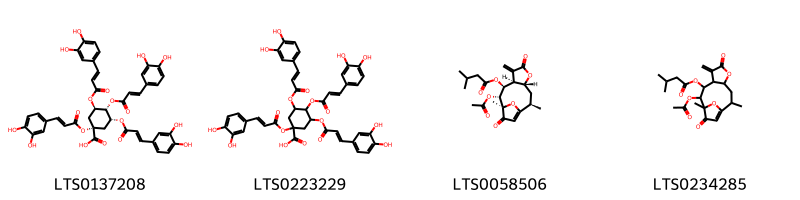{ width=100% }
    <figcaption>Hình ảnh cấu trúc hóa học của 4 hoạt chất thuộc nhóm Carboxylic acids and derivatives gồm ['(1s,3r,4s,5r)-1,3,4,5-tetrakis({[(2e)-3-(3,4-dihydroxyphenyl)prop-2-enoyl]oxy})cyclohexane-1-carboxylic acid (LTS0137208)', '1,3,4,5-tetrakis({[3-(3,4-dihydroxyphenyl)prop-2-enoyl]oxy})cyclohexane-1-carboxylic acid (LTS0223229)', '(2r,4r,8s,9s,10r,11r)-10-(acetyloxy)-2,11-dimethyl-7-methylidene-6,12-dioxo-5,14-dioxatricyclo[9.2.1.0⁴,⁸]tetradec-1(13)-en-9-yl 3-methylbutanoate (LTS0058506)', '10-(acetyloxy)-2,11-dimethyl-7-methylidene-6,12-dioxo-5,14-dioxatricyclo[9.2.1.0⁴,⁸]tetradec-1(13)-en-9-yl 3-methylbutanoate (LTS0234285)'].</figcaption>
</figure>
#### Nhóm Cyclobutane lignans
<figure markdown="span">
    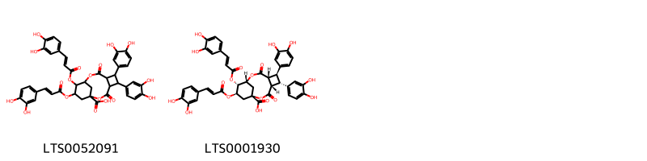{ width=100% }
    <figcaption>Hình ảnh cấu trúc hóa học của 2 hoạt chất thuộc nhóm Cyclobutane lignans gồm ['5,6-bis(3,4-dihydroxyphenyl)-11,12-bis({[3-(3,4-dihydroxyphenyl)prop-2-enoyl]oxy})-3,8-dioxo-2,9-dioxatricyclo[8.3.1.0⁴,⁷]tetradecane-1-carboxylic acid (LTS0052091)', '(1r,4s,5s,6s,7r,10r,11s,12r)-5,6-bis(3,4-dihydroxyphenyl)-11,12-bis({[(2e)-3-(3,4-dihydroxyphenyl)prop-2-enoyl]oxy})-3,8-dioxo-2,9-dioxatricyclo[8.3.1.0⁴,⁷]tetradecane-1-carboxylic acid (LTS0001930)'].</figcaption>
</figure>
#### Nhóm Fatty Acyls
<figure markdown="span">
    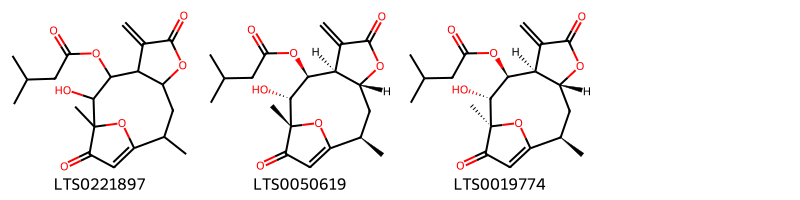{ width=100% }
    <figcaption>Hình ảnh cấu trúc hóa học của 3 hoạt chất thuộc nhóm Fatty Acyls gồm ['10-hydroxy-2,11-dimethyl-7-methylidene-6,12-dioxo-5,14-dioxatricyclo[9.2.1.0⁴,⁸]tetradec-1(13)-en-9-yl 3-methylbutanoate (LTS0221897)', '(2r,4r,8s,9s,10r,11s)-10-hydroxy-2,11-dimethyl-7-methylidene-6,12-dioxo-5,14-dioxatricyclo[9.2.1.0⁴,⁸]tetradec-1(13)-en-9-yl 3-methylbutanoate (LTS0050619)', '(2r,4r,8s,9s,10r,11r)-10-hydroxy-2,11-dimethyl-7-methylidene-6,12-dioxo-5,14-dioxatricyclo[9.2.1.0⁴,⁸]tetradec-1(13)-en-9-yl 3-methylbutanoate (LTS0019774)'].</figcaption>
</figure>
#### Nhóm Flavonoids
<figure markdown="span">
    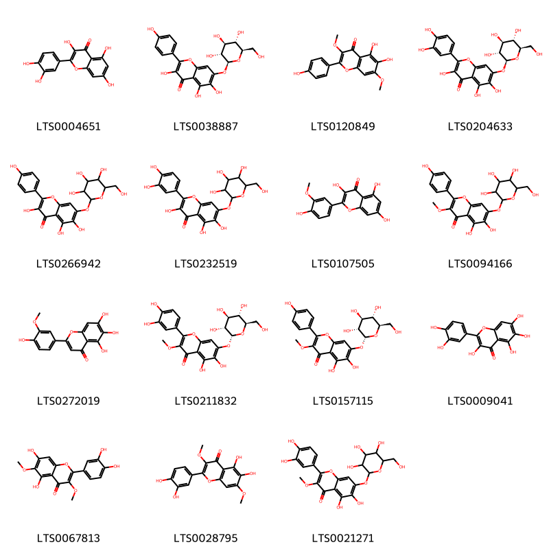{ width=100% }
    <figcaption>Hình ảnh cấu trúc hóa học của 15 hoạt chất thuộc nhóm Flavonoids gồm ['quercetin (LTS0004651)', '3,5,6-trihydroxy-2-(4-hydroxyphenyl)-7-{[(2s,3r,4s,5s,6r)-3,4,5-trihydroxy-6-(hydroxymethyl)oxan-2-yl]oxy}chromen-4-one (LTS0038887)', '5,6-dihydroxy-2-(4-hydroxyphenyl)-3,7-dimethoxychromen-4-one (LTS0120849)', 'quercetagitrin (LTS0204633)', '3,5,6-trihydroxy-2-(4-hydroxyphenyl)-7-{[3,4,5-trihydroxy-6-(hydroxymethyl)oxan-2-yl]oxy}chromen-4-one (LTS0266942)', '2-(3,4-dihydroxyphenyl)-3,5,6-trihydroxy-7-{[3,4,5-trihydroxy-6-(hydroxymethyl)oxan-2-yl]oxy}chromen-4-one (LTS0232519)', 'isorhamnetin (LTS0107505)', '5,6-dihydroxy-2-(4-hydroxyphenyl)-3-methoxy-7-{[3,4,5-trihydroxy-6-(hydroxymethyl)oxan-2-yl]oxy}chromen-4-one (LTS0094166)', 'nodifloretin (LTS0272019)', '2-(3,4-dihydroxyphenyl)-5,6-dihydroxy-3-methoxy-7-{[(2r,3r,4s,5s,6r)-3,4,5-trihydroxy-6-(hydroxymethyl)oxan-2-yl]oxy}chromen-4-one (LTS0211832)', '5,6-dihydroxy-2-(4-hydroxyphenyl)-3-methoxy-7-{[(2r,3r,4s,5s,6r)-3,4,5-trihydroxy-6-(hydroxymethyl)oxan-2-yl]oxy}chromen-4-one (LTS0157115)', 'quercetagetin (LTS0009041)', 'axillarin (LTS0067813)', 'tomentin (LTS0028795)', '2-(3,4-dihydroxyphenyl)-5,6-dihydroxy-3-methoxy-7-{[3,4,5-trihydroxy-6-(hydroxymethyl)oxan-2-yl]oxy}chromen-4-one (LTS0021271)'].</figcaption>
</figure>
#### Nhóm Organooxygen compounds
<figure markdown="span">
    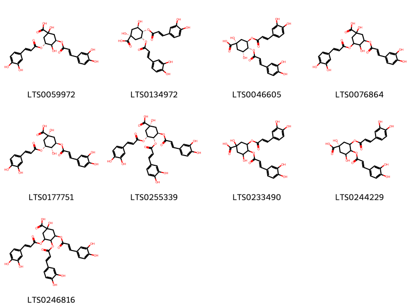{ width=100% }
    <figcaption>Hình ảnh cấu trúc hóa học của 9 hoạt chất thuộc nhóm Organooxygen compounds gồm ['(3r,5r)-3,5-bis({[(2e)-3-(3,4-dihydroxyphenyl)prop-2-enoyl]oxy})-1,4-dihydroxycyclohexane-1-carboxylic acid (LTS0059972)', '3,4-dicaffeoylquinic acid (LTS0134972)', '4,5-dicaffeoylquinic acid (LTS0046605)', '3,5-bis({[3-(3,4-dihydroxyphenyl)prop-2-enoyl]oxy})-1,4-dihydroxycyclohexane-1-carboxylic acid (LTS0076864)', '3,5-dicaffeoylquinic acid (LTS0177751)', '(1s,3r,4s,5r)-3,4,5-tris({[(2e)-3-(3,4-dihydroxyphenyl)prop-2-enoyl]oxy})-1-hydroxycyclohexane-1-carboxylic acid (LTS0255339)', '3,4-bis({[3-(3,4-dihydroxyphenyl)prop-2-enoyl]oxy})-1,5-dihydroxycyclohexane-1-carboxylic acid (LTS0233490)', '(1s)-3,4-bis({[3-(3,4-dihydroxyphenyl)prop-2-enoyl]oxy})-1,5-dihydroxycyclohexane-1-carboxylic acid (LTS0244229)', '3,4,5-tris({[3-(3,4-dihydroxyphenyl)prop-2-enoyl]oxy})-1-hydroxycyclohexane-1-carboxylic acid (LTS0246816)'].</figcaption>
</figure>
#### Nhóm Prenol lipids
<figure markdown="span">
    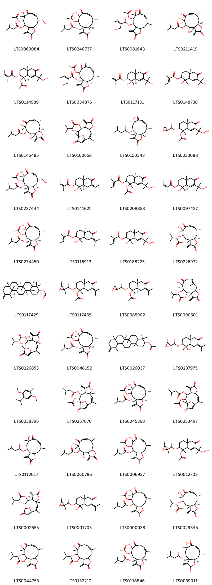{ width=100% }
    <figcaption>Hình ảnh cấu trúc hóa học của 44 hoạt chất thuộc nhóm Prenol lipids gồm ['5-(acetyloxy)-6-hydroxy-10-(hydroxymethyl)-6-methyl-3-methylidene-2,7-dioxo-3ah,4h,5h,10h,11h,11ah-cyclodeca[b]furan-4-yl 3-methylbutanoate (LTS0060084)', '(3ar,4s,5r,6r,10r,11ar)-5-(acetyloxy)-6-hydroxy-6,10-dimethyl-3-methylidene-2,7-dioxo-3ah,4h,5h,10h,11h,11ah-cyclodeca[b]furan-4-yl 3-methylbutanoate (LTS0240737)', '5-(acetyloxy)-6-hydroxy-6,10-dimethyl-3-methylidene-2,7-dioxo-3ah,4h,5h,10h,11h,11ah-cyclodeca[b]furan-4-yl 2-(hydroxymethyl)but-2-enoate (LTS0081643)', '(3ar,4s,5r,6r,10r,11ar)-4,6-dihydroxy-6,10-dimethyl-3-methylidene-2,7-dioxo-3ah,4h,5h,10h,11h,11ah-cyclodeca[b]furan-5-yl 3-methylbutanoate (LTS0211419)', '(1s,2r,4ar,8ar)-1-(acetyloxy)-7-(2-hydroperoxypropan-2-yl)-1,4a-dimethyl-6-oxo-3,4,5,8a-tetrahydro-2h-naphthalen-2-yl (2z)-2-methylbut-2-enoate (LTS0114989)', '(3as,4s,5r,6r,10r,11ar)-5-(acetyloxy)-6-hydroxy-6,10-dimethyl-3-methylidene-2,7-dioxo-3ah,4h,5h,10h,11h,11ah-cyclodeca[b]furan-4-yl (2e)-2-(hydroxymethyl)but-2-enoate (LTS0034876)', '(1s,2r,4ar,8ar)-1-hydroxy-7-(2-hydroxypropan-2-yl)-1,4a-dimethyl-6-oxo-3,4,5,8a-tetrahydro-2h-naphthalen-2-yl (2z)-2-methylbut-2-enoate (LTS0117131)', '1-hydroxy-7-(2-hydroxypropan-2-yl)-1,4a-dimethyl-6-oxo-3,4,5,8a-tetrahydro-2h-naphthalen-2-yl 2-methylbut-2-enoate (LTS0148738)', 'neurolenin c (LTS0145485)', '10-hydroxy-2,11-dimethyl-7-methylidene-6,12-dioxo-5,14-dioxatricyclo[9.2.1.0⁴,⁸]tetradeca-1(13),2-dien-9-yl 3-methylbutanoate (LTS0160658)', '(3as,4r,6r,10r,11ar)-6-hydroxy-6,10-dimethyl-3-methylidene-2,7-dioxo-3ah,4h,5h,10h,11h,11ah-cyclodeca[b]furan-4-yl 3-methylbutanoate (LTS0150343)', '(1s,2r,4ar,8ar)-1-(acetyloxy)-7-(2-hydroperoxypropan-2-yl)-1,4a-dimethyl-6-oxo-3,4,5,8a-tetrahydro-2h-naphthalen-2-yl (2s,3r)-2,3-dimethyloxirane-2-carboxylate (LTS0223088)', '(3as,4s,5r,6r,10r,11ar)-5-(acetyloxy)-6-hydroxy-10-(hydroxymethyl)-6-methyl-3-methylidene-2,7-dioxo-3ah,4h,5h,10h,11h,11ah-cyclodeca[b]furan-4-yl 3-methylbutanoate (LTS0237444)', '(1s,2s,4ar,8ar)-1-hydroxy-1,4a-dimethyl-6-oxo-7-(propan-2-ylidene)-hexahydronaphthalen-2-yl (2z)-2-methylbut-2-enoate (LTS0141622)', '1-(acetyloxy)-7-(2-hydroperoxypropan-2-yl)-1,4a-dimethyl-6-oxo-3,4,5,8a-tetrahydro-2h-naphthalen-2-yl 2-methylbut-2-enoate (LTS0208858)', '(1s,2s,4ar,8ar)-7-(2-hydroperoxypropan-2-yl)-1-hydroxy-1,4a-dimethyl-6-oxo-3,4,5,8a-tetrahydro-2h-naphthalen-2-yl (2z)-2-methylbut-2-enoate (LTS0097437)', '(3as,4s,5r,6r,10r,11ar)-5-(acetyloxy)-6-hydroxy-6,10-dimethyl-3-methylidene-2,7-dioxo-3ah,4h,5h,10h,11h,11ah-cyclodeca[b]furan-4-yl 3-methylbutanoate (LTS0274450)', '1-hydroxy-1,4a-dimethyl-6-oxo-7-(propan-2-ylidene)-hexahydronaphthalen-2-yl 2-methylbut-2-enoate (LTS0116913)', '7-(2-hydroperoxypropan-2-yl)-1-hydroxy-1,4a-dimethyl-6-oxo-3,4,5,8a-tetrahydro-2h-naphthalen-2-yl 2-methylbut-2-enoate (LTS0188225)', '(3as,4s,5r,6r,10r,11ar)-5,6-dihydroxy-6,10-dimethyl-3-methylidene-2,7-dioxo-3ah,4h,5h,10h,11h,11ah-cyclodeca[b]furan-4-yl 3-methylbutanoate (LTS0226972)', '(4ar,6ar,6br,8ar,12as,12bs,14as,14br)-4,4,6a,6b,8a,12,14b-heptamethyl-11-methylidene-hexadecahydropicen-3-yl acetate (LTS0117429)', '1-(acetyloxy)-1,4a-dimethyl-6-oxo-7-(propan-2-ylidene)-hexahydronaphthalen-2-yl 2,3-dimethyloxirane-2-carboxylate (LTS0117465)', '(1s,2r,4ar,8ar)-1-(acetyloxy)-1,4a-dimethyl-6-oxo-7-(propan-2-ylidene)-hexahydronaphthalen-2-yl (2s,3r)-2,3-dimethyloxirane-2-carboxylate (LTS0085902)', '(3ar,4s,5r,6r,11ar)-5,6-dihydroxy-6,10-dimethyl-3-methylidene-2,7-dioxo-3ah,4h,5h,8h,11h,11ah-cyclodeca[b]furan-4-yl 3-methylbutanoate (LTS0090501)', '(2z,4r,8s,9s,10r,11s)-10-hydroxy-2,11-dimethyl-7-methylidene-6,12-dioxo-5,14-dioxatricyclo[9.2.1.0⁴,⁸]tetradeca-1(13),2-dien-9-yl 3-methylbutanoate (LTS0226853)', '(3as,4s,5r,6s,10r,11ar)-5-(acetyloxy)-6-hydroxy-6,10-dimethyl-3-methylidene-2,7-dioxo-3ah,4h,5h,10h,11h,11ah-cyclodeca[b]furan-4-yl 3-methylbutanoate (LTS0048152)', '4,4,6a,6b,8a,12,14b-heptamethyl-11-methylidene-hexadecahydropicen-3-yl acetate (LTS0026037)', '(1s,2r,4ar,8ar)-1-hydroxy-1,4a-dimethyl-6-oxo-7-(propan-2-ylidene)-hexahydronaphthalen-2-yl (2s,3r)-2,3-dimethyloxirane-2-carboxylate (LTS0237975)', '2,5-dimethoxy-p-cymene (LTS0238396)', '(2z,4r,8s,9s,10r,11r)-10-(acetyloxy)-2,11-dimethyl-7-methylidene-6,12-dioxo-5,14-dioxatricyclo[9.2.1.0⁴,⁸]tetradeca-1(13),2-dien-9-yl 3-methylbutanoate (LTS0257870)', '(3as,4s,5r,6s,10r,11ar)-5-(acetyloxy)-6-hydroxy-6,10-dimethyl-3-methylidene-2,7-dioxo-3ah,4h,5h,10h,11h,11ah-cyclodeca[b]furan-4-yl 3-methylbutanoate (LTS0245368)', '10-(acetyloxy)-2,11-dimethyl-7-methylidene-6,12-dioxo-5,14-dioxatricyclo[9.2.1.0⁴,⁸]tetradeca-1(13),2-dien-9-yl 3-methylbutanoate (LTS0253497)', '6-hydroxy-6,10-dimethyl-3-methylidene-2,7-dioxo-3ah,4h,5h,10h,11h,11ah-cyclodeca[b]furan-4-yl 3-methylbutanoate (LTS0112017)', '4,6-dihydroxy-6,10-dimethyl-3-methylidene-2,7-dioxo-3ah,4h,5h,10h,11h,11ah-cyclodeca[b]furan-5-yl 3-methylbutanoate (LTS0060786)', 'neurolenin b (LTS0006937)', '1-(acetyloxy)-7-(2-hydroperoxypropan-2-yl)-1,4a-dimethyl-6-oxo-3,4,5,8a-tetrahydro-2h-naphthalen-2-yl 2,3-dimethyloxirane-2-carboxylate (LTS0012703)', '(2z,4r,8s,9s,10r,11r)-10-hydroxy-2,11-dimethyl-7-methylidene-6,12-dioxo-5,14-dioxatricyclo[9.2.1.0⁴,⁸]tetradeca-1(13),2-dien-9-yl 3-methylbutanoate (LTS0002655)', '1-hydroxy-1,4a-dimethyl-6-oxo-7-(propan-2-ylidene)-hexahydronaphthalen-2-yl 2,3-dimethyloxirane-2-carboxylate (LTS0001705)', '5-(acetyloxy)-6-hydroxy-6,10-dimethyl-3-methylidene-2,7-dioxo-3ah,4h,5h,8h,11h,11ah-cyclodeca[b]furan-4-yl 3-methylbutanoate (LTS0000038)', 'neurolenin d (LTS0029345)', '5,6-dihydroxy-6,10-dimethyl-3-methylidene-2,7-dioxo-3ah,4h,5h,10h,11h,11ah-cyclodeca[b]furan-4-yl 3-methylbutanoate (LTS0044753)', '5,6-dihydroxy-6,10-dimethyl-3-methylidene-2,7-dioxo-3ah,4h,5h,8h,11h,11ah-cyclodeca[b]furan-4-yl 3-methylbutanoate (LTS0132212)', '(3as,4s,5r,6r,11ar)-5-(acetyloxy)-6-hydroxy-6,10-dimethyl-3-methylidene-2,7-dioxo-3ah,4h,5h,8h,11h,11ah-cyclodeca[b]furan-4-yl 3-methylbutanoate (LTS0118846)', 'neurolenin a (LTS0039011)'].</figcaption>
</figure>
#### Nhóm Pyrrolizidines
<figure markdown="span">
    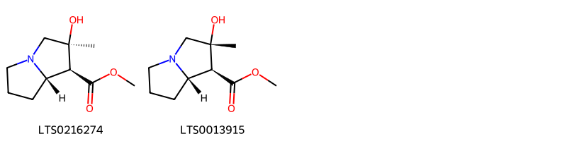{ width=100% }
    <figcaption>Hình ảnh cấu trúc hóa học của 2 hoạt chất thuộc nhóm Pyrrolizidines gồm ['tussilagine (LTS0216274)', 'isotussilagine (LTS0013915)'].</figcaption>
</figure>
#### Nhóm Thiophenes
<figure markdown="span">
    { width=100% }
    <figcaption>Hình ảnh cấu trúc hóa học của 2 hoạt chất thuộc nhóm Thiophenes gồm ['2-(hex-5-en-1,3-diyn-1-yl)-5-(prop-1-yn-1-yl)thiophene (LTS0139821)', '2-(but-3-en-1-yn-1-yl)-5-(penta-1,3-diyn-1-yl)thiophene (LTS0266139)'].</figcaption>
</figure>

---

### Dược dân tộc học

Danh sách các quốc gia có sử dụng *Neurolaena lobata* trong điều trị các bệnh. 

| Country            | Disease                | Bệnh                                                                                                                                                                                                |
|:-------------------|:-----------------------|:----------------------------------------------------------------------------------------------------------------------------------------------------------------------------------------------------|
| Dominican Republic | Stomachic              | MYMEMORY WARNING: YOU USED ALL AVAILABLE FREE TRANSLATIONS FOR TODAY. NEXT AVAILABLE IN  11 HOURS 00 MINUTES 56 SECONDS VISIT HTTPS://MYMEMORY.TRANSLATED.NET/DOC/USAGELIMITS.PHP TO TRANSLATE MORE |
| Elsewhere          | Antiseptic             | MYMEMORY WARNING: YOU USED ALL AVAILABLE FREE TRANSLATIONS FOR TODAY. NEXT AVAILABLE IN  11 HOURS 00 MINUTES 53 SECONDS VISIT HTTPS://MYMEMORY.TRANSLATED.NET/DOC/USAGELIMITS.PHP TO TRANSLATE MORE |
| Trinidad           | Apertif, Apertif       | MYMEMORY WARNING: YOU USED ALL AVAILABLE FREE TRANSLATIONS FOR TODAY. NEXT AVAILABLE IN  11 HOURS 00 MINUTES 49 SECONDS VISIT HTTPS://MYMEMORY.TRANSLATED.NET/DOC/USAGELIMITS.PHP TO TRANSLATE MORE |
| West Indies        | Insecticide, Piscicide | MYMEMORY WARNING: YOU USED ALL AVAILABLE FREE TRANSLATIONS FOR TODAY. NEXT AVAILABLE IN  11 HOURS 00 MINUTES 45 SECONDS VISIT HTTPS://MYMEMORY.TRANSLATED.NET/DOC/USAGELIMITS.PHP TO TRANSLATE MORE |

---

# Chi Pseudelephantopus

??? note "Danh sách các dược liệu thuộc chi"
    
	 - *Pseudelephantopus icatus*

---
## Pseudelephantopus icatus
### Thông tin về thực vật

!!! info "Phân loại thực vật của *N/A* từ GIBF:"
    - **Kingdom:** Plantae
    - **Phylum:** Tracheophyta
    - **Order:** Asterales
    - **Family:** Asteraceae
    - **Genus:** Pseudelephantopus
    - **Species:** *N/A*

 

| Label (VI)   | Label (EN)   | Scientific Name   | Descriptions (VI)   | Descriptions (EN)   | Also Known As (VI)   | Also Known As (EN)   |
|:-------------|:-------------|:------------------|:--------------------|:--------------------|:---------------------|:---------------------|
| N/A          | N/A          | Neurolaena lobata | loài thực vật       | species of plant    | ['']                 | ['']                 |

#### Phân bố trên thế giới

**Từ CSDL GIBF** Australia, Guadeloupe, Guatemala, Nicaragua, Venezuela (Bolivarian Republic of), French Guiana, Panama, Puerto Rico, Chinese Taipei, Bolivia (Plurinational State of), Honduras, Jamaica, United States of America, El Salvador, Belize, Martinique, Brazil, Cuba, Dominican Republic, Peru, Mexico, Ecuador, French Polynesia, Madagascar, Haiti, Colombia, Costa Rica, Vanuatu, Indonesia, Antigua and Barbuda, Philippines

#### Phân bố tại Việt Nam

**Từ CSDL GIBF**: Không có ghi nhận ở Việt Nam

---
### Thành phần hóa học
        
- Theo cơ sở dữ liệu lotus: Từ loài *N/A* đã phân lập và xác định được Chưa có hoạt chất nào được phân lập. hoạt chất thuộc về các nhóm Không có hoạt chất nào được phân lập. 

Không có hình ảnh nào được tạo ra

---

### Dược dân tộc học

Danh sách các quốc gia có sử dụng *N/A* trong điều trị các bệnh. 

| Country   | Disease              | Bệnh                                                                                                                                                                                                |
|:----------|:---------------------|:----------------------------------------------------------------------------------------------------------------------------------------------------------------------------------------------------|
| Haiti     | Soap                 | MYMEMORY WARNING: YOU USED ALL AVAILABLE FREE TRANSLATIONS FOR TODAY. NEXT AVAILABLE IN  10 HOURS 59 MINUTES 54 SECONDS VISIT HTTPS://MYMEMORY.TRANSLATED.NET/DOC/USAGELIMITS.PHP TO TRANSLATE MORE |
| Trinidad  | Collyrium, Collyrium | MYMEMORY WARNING: YOU USED ALL AVAILABLE FREE TRANSLATIONS FOR TODAY. NEXT AVAILABLE IN  10 HOURS 59 MINUTES 51 SECONDS VISIT HTTPS://MYMEMORY.TRANSLATED.NET/DOC/USAGELIMITS.PHP TO TRANSLATE MORE |

---

# Chi Helichrysum

??? note "Danh sách các dược liệu thuộc chi"
    
	 - *Helichrysum arenarium*
	 - *Helichrysum caeititium*
	 - *Helichrysum odoratissimum*

---
## Helichrysum arenarium
### Thông tin về thực vật

!!! info "Phân loại thực vật của *Helichrysum arenarium* từ GIBF:"
    - **Kingdom:** Plantae
    - **Phylum:** Tracheophyta
    - **Order:** Asterales
    - **Family:** Asteraceae
    - **Genus:** Helichrysum
    - **Species:** *Helichrysum arenarium*

 

| Label (VI)   | Label (EN)   | Scientific Name       | Descriptions (VI)   | Descriptions (EN)   | Also Known As (VI)   | Also Known As (EN)   |
|:-------------|:-------------|:----------------------|:--------------------|:--------------------|:---------------------|:---------------------|
| N/A          | N/A          | Helichrysum arenarium | loài thực vật       | species of plant    | ['']                 | ['']                 |

#### Phân bố trên thế giới

**Từ CSDL GIBF** Ukraine, Denmark, Netherlands, Lithuania, Belarus, Czechia, Germany, Estonia, Hungary, Türkiye, Russian Federation, Sweden, Poland, Austria

#### Phân bố tại Việt Nam

**Từ CSDL GIBF**: Không có ghi nhận ở Việt Nam

---
### Thành phần hóa học
        
- Theo cơ sở dữ liệu lotus: Từ loài *Helichrysum arenarium* đã phân lập và xác định được 184 hoạt chất thuộc về các nhóm Phenol ethers, Fatty Acyls, Flavonoids, Prenol lipids, Steroids and steroid derivatives, Cinnamic acids and derivatives, Isocoumarans, Pyrans, Benzene and substituted derivatives, 2-arylbenzofuran flavonoids, Purine nucleosides, Organooxygen compounds, Saccharolipids, Glycerolipids, Lignan glycosides, Coumarins and derivatives. 

|    | chemicalTaxonomyClassyfireClass     |   smiles_count |
|---:|:------------------------------------|---------------:|
|  0 | 2-arylbenzofuran flavonoids         |              2 |
|  1 | Benzene and substituted derivatives |              1 |
|  2 | Cinnamic acids and derivatives      |              5 |
|  3 | Coumarins and derivatives           |              6 |
|  4 | Fatty Acyls                         |              4 |
|  5 | Flavonoids                          |             74 |
|  6 | Glycerolipids                       |              2 |
|  7 | Isocoumarans                        |              1 |
|  8 | Lignan glycosides                   |              2 |
|  9 | Organooxygen compounds              |             56 |
| 10 | Phenol ethers                       |              2 |
| 11 | Prenol lipids                       |              5 |
| 12 | Purine nucleosides                  |              2 |
| 13 | Pyrans                              |              6 |
| 14 | Saccharolipids                      |              4 |
| 15 | Steroids and steroid derivatives    |             10 |

#### Nhóm 2-arylbenzofuran flavonoids
<figure markdown="span">
    { width=100% }
    <figcaption>Hình ảnh cấu trúc hóa học của 2 hoạt chất thuộc nhóm 2-arylbenzofuran flavonoids gồm ['(2r,3s,4s,5r,6s)-2-(hydroxymethyl)-6-{4-[(2r,3s)-3-(hydroxymethyl)-5-(3-hydroxypropyl)-7-methoxy-2,3-dihydro-1-benzofuran-2-yl]-2-methoxyphenoxy}oxane-3,4,5-triol (LTS0133507)', '2-(hydroxymethyl)-6-{4-[3-(hydroxymethyl)-5-(3-hydroxypropyl)-7-methoxy-2,3-dihydro-1-benzofuran-2-yl]-2-methoxyphenoxy}oxane-3,4,5-triol (LTS0214372)'].</figcaption>
</figure>
#### Nhóm Benzene and substituted derivatives
<figure markdown="span">
    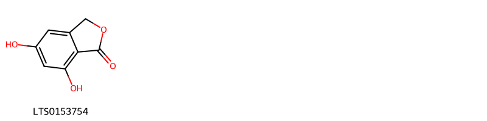{ width=100% }
    <figcaption>Hình ảnh cấu trúc hóa học của 1 hoạt chất thuộc nhóm Benzene and substituted derivatives gồm ['5,7-dihydroxy-3h-2-benzofuran-1-one (LTS0153754)'].</figcaption>
</figure>
#### Nhóm Cinnamic acids and derivatives
<figure markdown="span">
    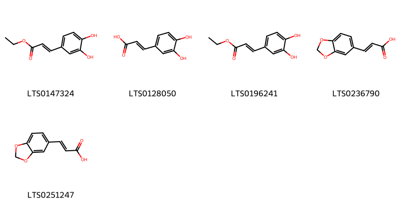{ width=100% }
    <figcaption>Hình ảnh cấu trúc hóa học của 5 hoạt chất thuộc nhóm Cinnamic acids and derivatives gồm ['ethyl caffeate (LTS0147324)', '3,4-dihydroxycinnamic acid (LTS0128050)', 'ethyl 3-(3,4-dihydroxyphenyl)prop-2-enoate (LTS0196241)', '(2e)-3-(2h-1,3-benzodioxol-5-yl)prop-2-enoic acid (LTS0236790)', '3-(2h-1,3-benzodioxol-5-yl)prop-2-enoic acid (LTS0251247)'].</figcaption>
</figure>
#### Nhóm Coumarins and derivatives
<figure markdown="span">
    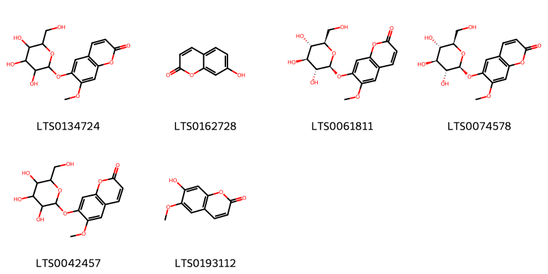{ width=100% }
    <figcaption>Hình ảnh cấu trúc hóa học của 6 hoạt chất thuộc nhóm Coumarins and derivatives gồm ['7-methoxy-6-{[3,4,5-trihydroxy-6-(hydroxymethyl)oxan-2-yl]oxy}chromen-2-one (LTS0134724)', 'umbelliferone (LTS0162728)', 'scopolin (LTS0061811)', '7-methoxy-6-{[(2s,3r,4s,5s,6r)-3,4,5-trihydroxy-6-(hydroxymethyl)oxan-2-yl]oxy}chromen-2-one (LTS0074578)', '6-methoxy-7-{[3,4,5-trihydroxy-6-(hydroxymethyl)oxan-2-yl]oxy}chromen-2-one (LTS0042457)', 'scopoletin (LTS0193112)'].</figcaption>
</figure>
#### Nhóm Fatty Acyls
<figure markdown="span">
    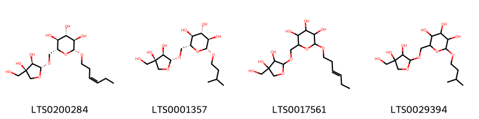{ width=100% }
    <figcaption>Hình ảnh cấu trúc hóa học của 4 hoạt chất thuộc nhóm Fatty Acyls gồm ['(2r,3s,4s,5r,6r)-2-({[(2r,3r,4r)-3,4-dihydroxy-4-(hydroxymethyl)oxolan-2-yl]oxy}methyl)-6-[(3z)-hex-3-en-1-yloxy]oxane-3,4,5-triol (LTS0200284)', '(2r,3s,4s,5r,6r)-2-({[(2r,3r,4r)-3,4-dihydroxy-4-(hydroxymethyl)oxolan-2-yl]oxy}methyl)-6-(3-methylbutoxy)oxane-3,4,5-triol (LTS0001357)', '2-({[3,4-dihydroxy-4-(hydroxymethyl)oxolan-2-yl]oxy}methyl)-6-(hex-3-en-1-yloxy)oxane-3,4,5-triol (LTS0017561)', '2-({[3,4-dihydroxy-4-(hydroxymethyl)oxolan-2-yl]oxy}methyl)-6-(3-methylbutoxy)oxane-3,4,5-triol (LTS0029394)'].</figcaption>
</figure>
#### Nhóm Flavonoids
<figure markdown="span">
    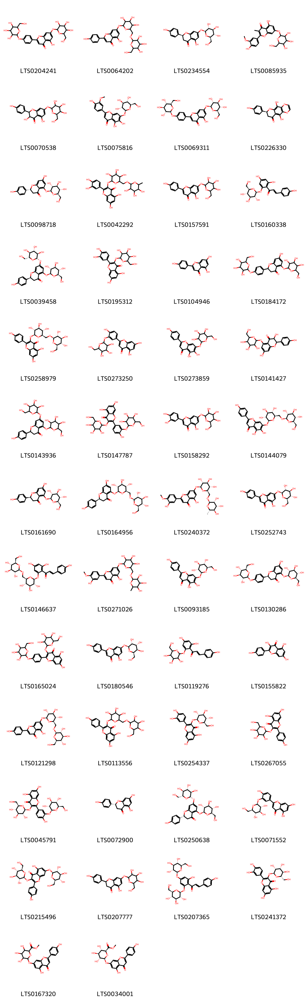{ width=100% }
    <figcaption>Hình ảnh cấu trúc hóa học của 74 hoạt chất thuộc nhóm Flavonoids gồm ['5-hydroxy-7-{[3,4,5-trihydroxy-6-(hydroxymethyl)oxan-2-yl]oxy}-2-(4-{[3,4,5-trihydroxy-6-(hydroxymethyl)oxan-2-yl]oxy}phenyl)chromen-4-one (LTS0204241)', '5-hydroxy-2-(4-hydroxyphenyl)-7-{[3,4,5-trihydroxy-6-({[3,4,5-trihydroxy-6-(hydroxymethyl)oxan-2-yl]oxy}methyl)oxan-2-yl]oxy}chromen-4-one (LTS0064202)', 'prunin (LTS0234554)', '5-hydroxy-2-(4-hydroxy-3-methoxyphenyl)-3-methyl-7-{[3,4,5-trihydroxy-6-(hydroxymethyl)oxan-2-yl]oxy}chromen-4-one (LTS0085935)', '3,5-dihydroxy-2-(4-hydroxyphenyl)-7-{[3,4,5-trihydroxy-6-(hydroxymethyl)oxan-2-yl]oxy}-2,3-dihydro-1-benzopyran-4-one (LTS0070538)', '5,6-dihydroxy-2-(4-hydroxy-3-methoxyphenyl)-7-{[(2s,3r,4s,5s,6r)-3,4,5-trihydroxy-6-(hydroxymethyl)oxan-2-yl]oxy}chromen-4-one (LTS0075816)', '5-hydroxy-7-{[(2s,3r,4s,5s,6r)-3,4,5-trihydroxy-6-(hydroxymethyl)oxan-2-yl]oxy}-2-(4-{[(2s,3r,4s,5s,6r)-3,4,5-trihydroxy-6-(hydroxymethyl)oxan-2-yl]oxy}phenyl)chromen-4-one (LTS0069311)', '(12s)-2,9-dihydroxy-12-(4-hydroxyphenyl)-4,7,11-trioxatricyclo[8.4.0.0³,⁸]tetradeca-1,3(8),5,9-tetraen-14-one (LTS0226330)', '(2r)-7-hydroxy-2-(4-hydroxyphenyl)-5-{[(2s,3r,4s,5s,6r)-3,4,5-trihydroxy-6-(hydroxymethyl)oxan-2-yl]oxy}-2,3-dihydro-1-benzopyran-4-one (LTS0098718)', 'rutin (LTS0042292)', 'apigetrin (LTS0157591)', 'phlorizin chalcone (LTS0160338)', '(2s)-2-(4-hydroxyphenyl)-5,7-bis({[(2s,3r,4s,5s,6r)-3,4,5-trihydroxy-6-(hydroxymethyl)oxan-2-yl]oxy})-2,3-dihydro-1-benzopyran-4-one (LTS0039458)', '2-(3,4-dihydroxyphenyl)-5,7-dihydroxy-3-{[3,4,5-trihydroxy-6-(hydroxymethyl)oxan-2-yl]oxy}chromen-4-one (LTS0195312)', 'chamomile (LTS0104946)', '7-hydroxy-5-{[3,4,5-trihydroxy-6-(hydroxymethyl)oxan-2-yl]oxy}-2-(4-{[3,4,5-trihydroxy-6-(hydroxymethyl)oxan-2-yl]oxy}phenyl)-2,3-dihydro-1-benzopyran-4-one (LTS0184172)', '5,7-dihydroxy-2-(4-hydroxyphenyl)-3-{[(2s,3r,4s,5s,6r)-3,4,5-trihydroxy-6-({[(2r,3r,4s,5s,6r)-3,4,5-trihydroxy-6-(hydroxymethyl)oxan-2-yl]oxy}methyl)oxan-2-yl]oxy}chromen-4-one (LTS0258979)', '5,7-dihydroxy-2-(4-hydroxy-3-{[3,4,5-trihydroxy-6-(hydroxymethyl)oxan-2-yl]oxy}phenyl)chromen-4-one (LTS0273250)', '5,6-dihydroxy-2-(4-hydroxyphenyl)-7-{[3,4,5-trihydroxy-6-(hydroxymethyl)oxan-2-yl]oxy}chromen-4-one (LTS0273859)', '3,7-dihydroxy-2-(4-hydroxyphenyl)-5-{[3,4,5-trihydroxy-6-(hydroxymethyl)oxan-2-yl]oxy}-2,3-dihydro-1-benzopyran-4-one (LTS0141427)', 'naringenin 5,7-di-o-glucoside (LTS0143936)', '5,7-dihydroxy-2-(4-hydroxy-3-{[3,4,5-trihydroxy-6-(hydroxymethyl)oxan-2-yl]oxy}phenyl)-3-{[3,4,5-trihydroxy-6-(hydroxymethyl)oxan-2-yl]oxy}chromen-4-one (LTS0147787)', '2-(3,4-dihydroxyphenyl)-5-hydroxy-7-{[3,4,5-trihydroxy-6-(hydroxymethyl)oxan-2-yl]oxy}chromen-4-one (LTS0158292)', '5,6-dihydroxy-2-(4-hydroxyphenyl)-7-{[(2s,3r,4s,5s,6r)-3,4,5-trihydroxy-6-({[(2r,3r,4s,5s,6r)-3,4,5-trihydroxy-6-(hydroxymethyl)oxan-2-yl]oxy}methyl)oxan-2-yl]oxy}chromen-4-one (LTS0144079)', '(2s)-7-hydroxy-2-(4-hydroxyphenyl)-5-{[(2s,3r,4s,5s,6r)-3,4,5-trihydroxy-6-(hydroxymethyl)oxan-2-yl]oxy}-2,3-dihydro-1-benzopyran-4-one (LTS0161690)', '(2s)-7-hydroxy-2-(4-hydroxyphenyl)-5-{[(2s,3r,4s,5s,6r)-3,4,5-trihydroxy-6-({[(2r,3r,4s,5s,6r)-3,4,5-trihydroxy-6-(hydroxymethyl)oxan-2-yl]oxy}methyl)oxan-2-yl]oxy}-2,3-dihydro-1-benzopyran-4-one (LTS0164956)', 'diosmin (LTS0240372)', 'apigenin 7-o-β-glucoside (LTS0252743)', '(2e)-1-(2,4-dihydroxy-6-{[(2s,3r,4s,5s,6r)-3,4,5-trihydroxy-6-({[(2r,3r,4s,5s,6r)-3,4,5-trihydroxy-6-(hydroxymethyl)oxan-2-yl]oxy}methyl)oxan-2-yl]oxy}phenyl)-3-(4-hydroxyphenyl)prop-2-en-1-one (LTS0146637)', 'diosmine (LTS0271026)', 'plantaginin (LTS0093185)', '(2s)-7-hydroxy-5-{[(2s,3r,4s,5s,6r)-3,4,5-trihydroxy-6-(hydroxymethyl)oxan-2-yl]oxy}-2-(4-{[(2s,3r,4s,5s,6r)-3,4,5-trihydroxy-6-(hydroxymethyl)oxan-2-yl]oxy}phenyl)-2,3-dihydro-1-benzopyran-4-one (LTS0130286)', '5,7-dihydroxy-3-{[3,4,5-trihydroxy-6-(hydroxymethyl)oxan-2-yl]oxy}-2-(4-{[3,4,5-trihydroxy-6-(hydroxymethyl)oxan-2-yl]oxy}phenyl)chromen-4-one (LTS0165024)', '5-hydroxy-2-(4-hydroxyphenyl)-7-{[(2s,3r,4r,5r,6r)-3,4,5-trihydroxy-6-(hydroxymethyl)oxan-2-yl]oxy}chromen-4-one (LTS0180546)', '1-(2,4-dihydroxy-6-{[3,4,5-trihydroxy-6-(hydroxymethyl)oxan-2-yl]oxy}phenyl)-3-(4-hydroxyphenyl)prop-2-en-1-one (LTS0119276)', 'kaempherol (LTS0155822)', '5-hydroxy-2-(4-hydroxyphenyl)-7-{[(2s,3r,4s,5s,6r)-3,4,5-trihydroxy-6-({[(2r,3r,4s,5s,6r)-3,4,5-trihydroxy-6-(hydroxymethyl)oxan-2-yl]oxy}methyl)oxan-2-yl]oxy}chromen-4-one (LTS0121298)', '5,7-dihydroxy-2-(4-hydroxyphenyl)-3-{[3,4,5-trihydroxy-6-({[3,4,5-trihydroxy-6-(hydroxymethyl)oxan-2-yl]oxy}methyl)oxan-2-yl]oxy}chromen-4-one (LTS0113556)', 'isoquercetin (LTS0254337)', 'trifolin (LTS0267055)', '5,7-dihydroxy-2-(4-hydroxy-3-{[(2s,3r,4s,5s,6r)-3,4,5-trihydroxy-6-(hydroxymethyl)oxan-2-yl]oxy}phenyl)-3-{[(2s,3r,4s,5s,6r)-3,4,5-trihydroxy-6-(hydroxymethyl)oxan-2-yl]oxy}chromen-4-one (LTS0045791)', '(-)-naringenin (LTS0072900)', '(2r)-2-(4-hydroxyphenyl)-5,7-bis({[(2s,3r,4s,5s,6r)-3,4,5-trihydroxy-6-(hydroxymethyl)oxan-2-yl]oxy})-2,3-dihydro-1-benzopyran-4-one (LTS0250638)', "luteolin 3'-glucoside (LTS0071552)", '5-hydroxy-2-(4-hydroxyphenyl)-3,7-bis({[(2s,3r,4s,5s,6r)-3,4,5-trihydroxy-6-(hydroxymethyl)oxan-2-yl]oxy})chromen-4-one (LTS0215496)', '5-hydroxy-2-(4-hydroxyphenyl)-7-{[3,4,5-trihydroxy-6-(hydroxymethyl)oxan-2-yl]oxy}-2,3-dihydro-1-benzopyran-4-one (LTS0207777)', '(2e)-1-[2-hydroxy-4,6-bis({[(2s,3r,4s,5s,6r)-3,4,5-trihydroxy-6-(hydroxymethyl)oxan-2-yl]oxy})phenyl]-3-(4-hydroxyphenyl)prop-2-en-1-one (LTS0207365)', '2-(3,4-dihydroxyphenyl)-5,7-dihydroxy-3-{[(2s,3r,4r,5r,6s)-3,4,5-trihydroxy-6-(hydroxymethyl)oxan-2-yl]oxy}chromen-4-one (LTS0241372)', 'methyl 3,4,5-trihydroxy-6-{[5-hydroxy-2-(4-hydroxyphenyl)-4-oxochromen-7-yl]oxy}oxane-2-carboxylate (LTS0167320)', 'methyl (2s,3s,4s,5r,6s)-3,4,5-trihydroxy-6-{[5-hydroxy-2-(4-hydroxyphenyl)-4-oxochromen-7-yl]oxy}oxane-2-carboxylate (LTS0034001)', '1-[2-hydroxy-4,6-bis({[3,4,5-trihydroxy-6-(hydroxymethyl)oxan-2-yl]oxy})phenyl]-3-(4-hydroxyphenyl)prop-2-en-1-one (LTS0025173)', '5-hydroxy-2-(4-hydroxy-3-{[3,4,5-trihydroxy-6-(hydroxymethyl)oxan-2-yl]oxy}phenyl)-7-{[3,4,5-trihydroxy-6-(hydroxymethyl)oxan-2-yl]oxy}chromen-4-one (LTS0156996)', 'luteolin 7-o-glucoside (LTS0227450)', '5-hydroxy-2-(4-hydroxy-3-methoxyphenyl)-3-methyl-7-{[(2s,3r,4s,5s,6r)-3,4,5-trihydroxy-6-(hydroxymethyl)oxan-2-yl]oxy}chromen-4-one (LTS0037594)', '5-hydroxy-2-(4-hydroxyphenyl)-3,7-bis({[3,4,5-trihydroxy-6-(hydroxymethyl)oxan-2-yl]oxy})chromen-4-one (LTS0033278)', 'astragalin (LTS0249588)', '5-hydroxy-2-(4-hydroxy-3-{[(2s,3r,4s,5s,6r)-3,4,5-trihydroxy-6-(hydroxymethyl)oxan-2-yl]oxy}phenyl)-7-{[(2s,3r,4s,5s,6r)-3,4,5-trihydroxy-6-(hydroxymethyl)oxan-2-yl]oxy}chromen-4-one (LTS0231329)', 'helichrysin (LTS0126816)', 'aureusidin 6-o-glucoside (LTS0126454)', '7-hydroxy-2-(4-hydroxyphenyl)-5-{[3,4,5-trihydroxy-6-({[3,4,5-trihydroxy-6-(hydroxymethyl)oxan-2-yl]oxy}methyl)oxan-2-yl]oxy}-2,3-dihydro-1-benzopyran-4-one (LTS0036477)', 'asahina (LTS0068303)', '5,6-dihydroxy-2-(4-hydroxyphenyl)-7-{[3,4,5-trihydroxy-6-({[3,4,5-trihydroxy-6-(hydroxymethyl)oxan-2-yl]oxy}methyl)oxan-2-yl]oxy}chromen-4-one (LTS0068223)', '(2r,3r)-3,5-dihydroxy-2-(4-hydroxyphenyl)-7-{[(2s,3r,4s,5s,6r)-3,4,5-trihydroxy-6-(hydroxymethyl)oxan-2-yl]oxy}-2,3-dihydro-1-benzopyran-4-one (LTS0058080)', '5,6-dihydroxy-2-(4-hydroxy-3-methoxyphenyl)-7-{[3,4,5-trihydroxy-6-(hydroxymethyl)oxan-2-yl]oxy}chromen-4-one (LTS0026514)', 'quercetin (LTS0004651)', 'naringenin (LTS0031098)', '3,5-dihydroxy-6,7,8-trimethoxy-2-phenylchromen-4-one (LTS0004442)', '(2r,3r)-3,7-dihydroxy-2-(4-hydroxyphenyl)-5-{[(2s,3r,4s,5s,6r)-3,4,5-trihydroxy-6-(hydroxymethyl)oxan-2-yl]oxy}-2,3-dihydro-1-benzopyran-4-one (LTS0004918)', 'luteolin (LTS0017052)', '(2r)-7-hydroxy-2-(4-hydroxyphenyl)-5-{[(2s,3r,4s,5s,6r)-3,4,5-trihydroxy-6-({[(2r,3r,4s,5s,6r)-3,4,5-trihydroxy-6-(hydroxymethyl)oxan-2-yl]oxy}methyl)oxan-2-yl]oxy}-2,3-dihydro-1-benzopyran-4-one (LTS0234988)', '3-rutinosyl quercetin (LTS0032845)', '7-hydroxy-2-(4-hydroxyphenyl)-5-{[3,4,5-trihydroxy-6-(hydroxymethyl)oxan-2-yl]oxy}-2,3-dihydro-1-benzopyran-4-one (LTS0024760)', '2-[(3,4-dihydroxyphenyl)methylidene]-4-hydroxy-6-{[3,4,5-trihydroxy-6-(hydroxymethyl)oxan-2-yl]oxy}-1-benzofuran-3-one (LTS0045280)', '5,7-dihydroxy-3-{[(2s,3r,4s,5s,6r)-3,4,5-trihydroxy-6-(hydroxymethyl)oxan-2-yl]oxy}-2-(4-{[(2s,3r,4s,5s,6r)-3,4,5-trihydroxy-6-(hydroxymethyl)oxan-2-yl]oxy}phenyl)chromen-4-one (LTS0048732)'].</figcaption>
</figure>
#### Nhóm Glycerolipids
<figure markdown="span">
    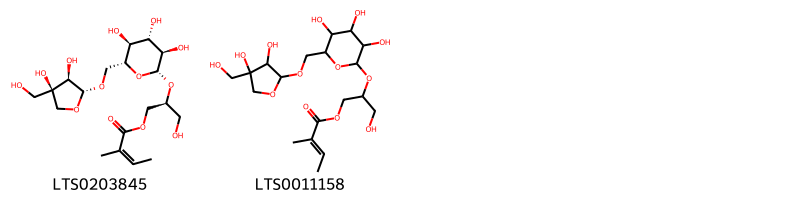{ width=100% }
    <figcaption>Hình ảnh cấu trúc hóa học của 2 hoạt chất thuộc nhóm Glycerolipids gồm ['(2s)-2-{[(2r,3r,4s,5s,6r)-6-({[(2r,3r,4r)-3,4-dihydroxy-4-(hydroxymethyl)oxolan-2-yl]oxy}methyl)-3,4,5-trihydroxyoxan-2-yl]oxy}-3-hydroxypropyl (2z)-2-methylbut-2-enoate (LTS0203845)', '2-{[6-({[3,4-dihydroxy-4-(hydroxymethyl)oxolan-2-yl]oxy}methyl)-3,4,5-trihydroxyoxan-2-yl]oxy}-3-hydroxypropyl 2-methylbut-2-enoate (LTS0011158)'].</figcaption>
</figure>
#### Nhóm Isocoumarans
<figure markdown="span">
    { width=100% }
    <figcaption>Hình ảnh cấu trúc hóa học của 1 hoạt chất thuộc nhóm Isocoumarans gồm ['7-hydroxy-5-methoxy-3h-2-benzofuran-1-one (LTS0022742)'].</figcaption>
</figure>
#### Nhóm Lignan glycosides
<figure markdown="span">
    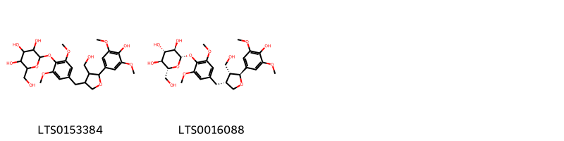{ width=100% }
    <figcaption>Hình ảnh cấu trúc hóa học của 2 hoạt chất thuộc nhóm Lignan glycosides gồm ['2-(4-{[5-(4-hydroxy-3,5-dimethoxyphenyl)-4-(hydroxymethyl)oxolan-3-yl]methyl}-2,6-dimethoxyphenoxy)-6-(hydroxymethyl)oxane-3,4,5-triol (LTS0153384)', '(2s,3r,4s,5s,6r)-2-(4-{[(3r,4r,5s)-5-(4-hydroxy-3,5-dimethoxyphenyl)-4-(hydroxymethyl)oxolan-3-yl]methyl}-2,6-dimethoxyphenoxy)-6-(hydroxymethyl)oxane-3,4,5-triol (LTS0016088)'].</figcaption>
</figure>
#### Nhóm Organooxygen compounds
<figure markdown="span">
    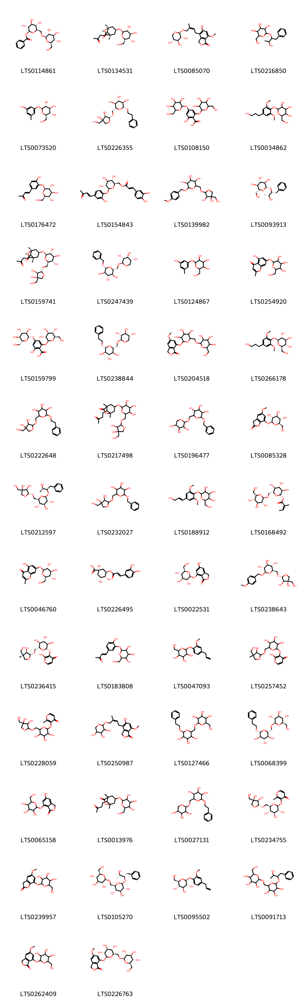{ width=100% }
    <figcaption>Hình ảnh cấu trúc hóa học của 56 hoạt chất thuộc nhóm Organooxygen compounds gồm ['(2s,3r,4s,5s,6r)-3,4,5-trihydroxy-6-({[(2r,3r,4s,5s,6r)-3,4,5-trihydroxy-6-(hydroxymethyl)oxan-2-yl]oxy}methyl)oxan-2-yl benzoate (LTS0114861)', '(1s,3s,5r,8r)-1,5-dimethyl-8-(3-oxobutyl)-3-{[(2r,3r,4s,5s,6r)-3,4,5-trihydroxy-6-(hydroxymethyl)oxan-2-yl]oxy}-6-oxabicyclo[3.2.1]octan-7-one (LTS0134531)', '5-hydroxy-7-methoxy-4-[(2z)-3-methyl-4-{[(2r,3r,4s,5r)-3,4,5-trihydroxyoxan-2-yl]oxy}but-2-en-1-yl]-3h-2-benzofuran-1-one (LTS0085070)', '2-[(3-hydroxy-1-phenylbutan-2-yl)oxy]-6-(hydroxymethyl)oxane-3,4,5-triol (LTS0216850)', '(2s,3r,4s,5s,6r)-2-(3-hydroxy-5-methylphenoxy)-6-(hydroxymethyl)oxane-3,4,5-triol (LTS0073520)', '(2r,3s,4s,5r,6r)-2-({[(2r,3r,4r)-3,4-dihydroxy-4-(hydroxymethyl)oxolan-2-yl]oxy}methyl)-6-(2-phenylethoxy)oxane-3,4,5-triol (LTS0226355)', '2-hydroxy-4,6-bis({[3,4,5-trihydroxy-6-(hydroxymethyl)oxan-2-yl]oxy})benzoic acid (LTS0108150)', '2-(hydroxymethyl)-6-[4-(3-hydroxypropyl)-2,6-dimethoxyphenoxy]oxane-3,4,5-triol (LTS0034862)', '(3e)-4-(4-hydroxy-3-{[(2s,3r,4s,5s,6r)-3,4,5-trihydroxy-6-(hydroxymethyl)oxan-2-yl]oxy}phenyl)but-3-en-2-one (LTS0176472)', '[(2r,3s,4s,5r,6s)-3,4,5-trihydroxy-6-{2-hydroxy-4-[(1e)-3-oxobut-1-en-1-yl]phenoxy}oxan-2-yl]methyl (2e)-3-(3,4-dihydroxyphenyl)prop-2-enoate (LTS0154843)', '2-({[3,4-dihydroxy-4-(hydroxymethyl)oxolan-2-yl]oxy}methyl)-6-[(4-methoxyphenyl)methoxy]oxane-3,4,5-triol (LTS0139982)', '(2r,3r,4s,5s,6r)-2-{[(2r,3r)-3-hydroxy-1-phenylbutan-2-yl]oxy}-6-(hydroxymethyl)oxane-3,4,5-triol (LTS0093913)', '(1s,3s,5r,8r)-3-{[(2r,3r,4s,5s,6r)-6-({[(2r,3r,4r)-3,4-dihydroxy-4-(hydroxymethyl)oxolan-2-yl]oxy}methyl)-3,4,5-trihydroxyoxan-2-yl]oxy}-1,5-dimethyl-8-(3-oxobutyl)-6-oxabicyclo[3.2.1]octan-7-one (LTS0159741)', '(2r,3r,4s,5s,6r)-2-(benzyloxy)-6-({[(2s,3r,4s,5r)-3,4,5-trihydroxyoxan-2-yl]oxy}methyl)oxane-3,4,5-triol (LTS0247439)', '2-(3-hydroxy-5-methylphenoxy)-6-(hydroxymethyl)oxane-3,4,5-triol (LTS0124867)', '5-hydroxy-2-methyl-7-{[3,4,5-trihydroxy-6-(hydroxymethyl)oxan-2-yl]oxy}chromen-4-one (LTS0254920)', '2-hydroxy-4,6-bis({[(2s,3r,4s,5s,6r)-3,4,5-trihydroxy-6-(hydroxymethyl)oxan-2-yl]oxy})benzoic acid (LTS0159799)', '(2r,3r,4s,5s,6r)-2-(2-phenylethoxy)-6-({[(2s,3r,4s,5r)-3,4,5-trihydroxyoxan-2-yl]oxy}methyl)oxane-3,4,5-triol (LTS0238844)', '5-methoxy-7-{[3,4,5-trihydroxy-6-({[3,4,5-trihydroxy-6-(hydroxymethyl)oxan-2-yl]oxy}methyl)oxan-2-yl]oxy}-3h-2-benzofuran-1-one (LTS0204518)', '(2r,3s,4s,5r,6s)-2-(hydroxymethyl)-6-[4-(3-hydroxypropyl)-2,6-dimethoxyphenoxy]oxane-3,4,5-triol (LTS0266178)', '2-({[3,4-dihydroxy-4-(hydroxymethyl)oxolan-2-yl]oxy}methyl)-6-(2-phenylethoxy)oxane-3,4,5-triol (LTS0222648)', '3-{[6-({[3,4-dihydroxy-4-(hydroxymethyl)oxolan-2-yl]oxy}methyl)-3,4,5-trihydroxyoxan-2-yl]oxy}-1,5-dimethyl-8-(3-oxobutyl)-6-oxabicyclo[3.2.1]octan-7-one (LTS0217498)', '2-(benzyloxy)-6-{[(3,4,5-trihydroxyoxan-2-yl)oxy]methyl}oxane-3,4,5-triol (LTS0196477)', '5-methoxy-7-{[(2s,3r,4s,5s,6r)-3,4,5-trihydroxy-6-(hydroxymethyl)oxan-2-yl]oxy}-3h-1-benzofuran-2-one (LTS0085328)', '(2r,3s,4s,5r,6r)-2-({[(2r,3r,4r)-3,4-dihydroxy-4-(hydroxymethyl)oxolan-2-yl]oxy}methyl)-6-{[(2r,3r)-3-hydroxy-1-phenylbutan-2-yl]oxy}oxane-3,4,5-triol (LTS0212597)', '2-(benzyloxy)-6-({[3,4-dihydroxy-4-(hydroxymethyl)oxolan-2-yl]oxy}methyl)oxane-3,4,5-triol (LTS0232027)', '2-(hydroxymethyl)-6-[4-(3-hydroxyprop-1-en-1-yl)-2,6-dimethoxyphenoxy]oxane-3,4,5-triol (LTS0188912)', '(2s,3r,4s,5s,6r)-3,4,5-trihydroxy-6-({[(2r,3r,4s,5s,6r)-3,4,5-trihydroxy-6-(hydroxymethyl)oxan-2-yl]oxy}methyl)oxan-2-yl (2z)-2-methylbut-2-enoate (LTS0168492)', '5-hydroxy-2-methyl-7-{[(2s,3r,4s,5s,6r)-3,4,5-trihydroxy-6-(hydroxymethyl)oxan-2-yl]oxy}chromen-4-one (LTS0046760)', 'chlorogenic acid (LTS0226495)', '5-hydroxy-7-{[(2s,3r,4s,5s,6r)-3,4,5-trihydroxy-6-(hydroxymethyl)oxan-2-yl]oxy}-3h-2-benzofuran-1-one (LTS0022531)', '(2r,3s,4s,5r,6r)-2-({[(2r,3r,4r)-3,4-dihydroxy-4-(hydroxymethyl)oxolan-2-yl]oxy}methyl)-6-[(4-methoxyphenyl)methoxy]oxane-3,4,5-triol (LTS0238643)', '2-hydroxy-3-{[(2s,3r,4s,5s,6r)-3,4,5-trihydroxy-6-({[(2s,3r,4s)-3-hydroxy-4-(hydroxymethyl)-4-methyloxolan-2-yl]oxy}methyl)oxan-2-yl]oxy}pyran-4-one (LTS0236415)', '4-(4-hydroxy-3-{[3,4,5-trihydroxy-6-(hydroxymethyl)oxan-2-yl]oxy}phenyl)but-3-en-2-one (LTS0183808)', '2-(hydroxymethyl)-6-[2-methoxy-4-(prop-2-en-1-yl)phenoxy]oxane-3,4,5-triol (LTS0047093)', '2-hydroxy-3-{[3,4,5-trihydroxy-6-({[3-hydroxy-4-(hydroxymethyl)-4-methyloxolan-2-yl]oxy}methyl)oxan-2-yl]oxy}pyran-4-one (LTS0257452)', '3-{[6-({[3,4-dihydroxy-4-(hydroxymethyl)oxolan-2-yl]oxy}methyl)-3,4,5-trihydroxyoxan-2-yl]oxy}-2-methylpyran-4-one (LTS0228059)', '5-hydroxy-7-methoxy-4-{3-methyl-4-[(3,4,5-trihydroxyoxan-2-yl)oxy]but-2-en-1-yl}-3h-2-benzofuran-1-one (LTS0250987)', '2-(hydroxymethyl)-6-{[3,4,5-trihydroxy-6-(2-phenylethoxy)oxan-2-yl]methoxy}oxane-3,4,5-triol (LTS0127466)', '(2r,3s,4s,5r,6r)-2-(hydroxymethyl)-6-{[(2r,3s,4s,5r,6r)-3,4,5-trihydroxy-6-(2-phenylethoxy)oxan-2-yl]methoxy}oxane-3,4,5-triol (LTS0068399)', '5-hydroxy-7-{[3,4,5-trihydroxy-6-(hydroxymethyl)oxan-2-yl]oxy}-3h-2-benzofuran-1-one (LTS0065158)', '1,5-dimethyl-8-(3-oxobutyl)-3-{[3,4,5-trihydroxy-6-(hydroxymethyl)oxan-2-yl]oxy}-6-oxabicyclo[3.2.1]octan-7-one (LTS0013976)', '2-(2-phenylethoxy)-6-{[(3,4,5-trihydroxyoxan-2-yl)oxy]methyl}oxane-3,4,5-triol (LTS0027131)', '3-{[(2s,3r,4s,5s,6r)-6-({[(2r,3r,4r)-3,4-dihydroxy-4-(hydroxymethyl)oxolan-2-yl]oxy}methyl)-3,4,5-trihydroxyoxan-2-yl]oxy}-2-methylpyran-4-one (LTS0234755)', '5-methoxy-7-{[3,4,5-trihydroxy-6-(hydroxymethyl)oxan-2-yl]oxy}-3h-1-benzofuran-2-one (LTS0239957)', '(2r,3r,4s,5s,6r)-2-{[(2s,3s)-3-hydroxy-1-phenylbutan-2-yl]oxy}-6-({[(2r,3r,4s,5s,6r)-3,4,5-trihydroxy-6-(hydroxymethyl)oxan-2-yl]oxy}methyl)oxane-3,4,5-triol (LTS0105270)', 'eugenyl glucoside (LTS0095502)', '2-[(3-hydroxy-1-phenylbutan-2-yl)oxy]-6-({[3,4,5-trihydroxy-6-(hydroxymethyl)oxan-2-yl]oxy}methyl)oxane-3,4,5-triol (LTS0091713)', '5-methoxy-7-{[3,4,5-trihydroxy-6-(hydroxymethyl)oxan-2-yl]oxy}-3h-2-benzofuran-1-one (LTS0262409)', '5-methoxy-7-{[(2s,3r,4s,5s,6r)-3,4,5-trihydroxy-6-({[(2r,3r,4s,5s,6r)-3,4,5-trihydroxy-6-(hydroxymethyl)oxan-2-yl]oxy}methyl)oxan-2-yl]oxy}-3h-2-benzofuran-1-one (LTS0226763)', '2-({[3,4-dihydroxy-4-(hydroxymethyl)oxolan-2-yl]oxy}methyl)-6-[(3-hydroxy-1-phenylbutan-2-yl)oxy]oxane-3,4,5-triol (LTS0127952)', '(2r,3r,4s,5s,6r)-2-(benzyloxy)-6-({[(2r,3r,4r)-3,4-dihydroxy-4-(hydroxymethyl)oxolan-2-yl]oxy}methyl)oxane-3,4,5-triol (LTS0041825)', '5-methoxy-7-{[(2s,3r,4s,5s,6r)-3,4,5-trihydroxy-6-(hydroxymethyl)oxan-2-yl]oxy}-3h-2-benzofuran-1-one (LTS0246237)', 'syringin (LTS0046227)', '3,4,5-trihydroxy-6-({[3,4,5-trihydroxy-6-(hydroxymethyl)oxan-2-yl]oxy}methyl)oxan-2-yl benzoate (LTS0091461)', '3,4,5-trihydroxy-6-({[3,4,5-trihydroxy-6-(hydroxymethyl)oxan-2-yl]oxy}methyl)oxan-2-yl 2-methylbut-2-enoate (LTS0228913)'].</figcaption>
</figure>
#### Nhóm Phenol ethers
<figure markdown="span">
    { width=100% }
    <figcaption>Hình ảnh cấu trúc hóa học của 2 hoạt chất thuộc nhóm Phenol ethers gồm ['p-propenylanisole (LTS0177188)', 'anethole (LTS0033696)'].</figcaption>
</figure>
#### Nhóm Prenol lipids
<figure markdown="span">
    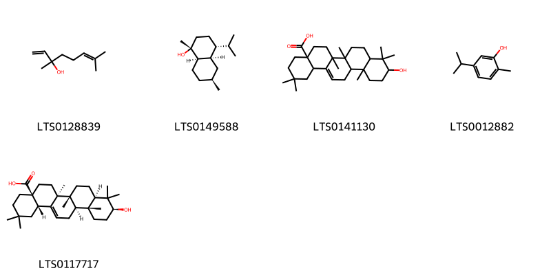{ width=100% }
    <figcaption>Hình ảnh cấu trúc hóa học của 5 hoạt chất thuộc nhóm Prenol lipids gồm ['linalool, (+-)- (LTS0128839)', '(1r,4r,4ar,6s,8ar)-4-isopropyl-1,6-dimethyl-octahydro-2h-naphthalen-1-ol (LTS0149588)', 'oleanolic acid (LTS0141130)', 'carvacrol (LTS0012882)', 'oleanolic acid (LTS0117717)'].</figcaption>
</figure>
#### Nhóm Purine nucleosides
<figure markdown="span">
    { width=100% }
    <figcaption>Hình ảnh cấu trúc hóa học của 2 hoạt chất thuộc nhóm Purine nucleosides gồm ['adenosine (LTS0052576)', 'adenosine (LTS0014061)'].</figcaption>
</figure>
#### Nhóm Pyrans
<figure markdown="span">
    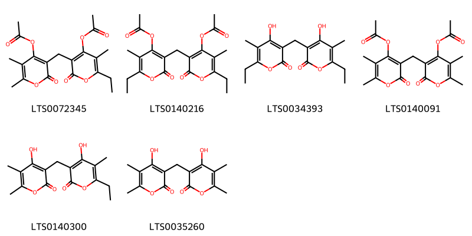{ width=100% }
    <figcaption>Hình ảnh cấu trúc hóa học của 6 hoạt chất thuộc nhóm Pyrans gồm ['3-{[4-(acetyloxy)-5,6-dimethyl-2-oxopyran-3-yl]methyl}-6-ethyl-5-methyl-2-oxopyran-4-yl acetate (LTS0072345)', '3-{[4-(acetyloxy)-6-ethyl-5-methyl-2-oxopyran-3-yl]methyl}-6-ethyl-5-methyl-2-oxopyran-4-yl acetate (LTS0140216)', '6-ethyl-3-[(6-ethyl-4-hydroxy-5-methyl-2-oxopyran-3-yl)methyl]-4-hydroxy-5-methylpyran-2-one (LTS0034393)', '3-{[4-(acetyloxy)-5,6-dimethyl-2-oxopyran-3-yl]methyl}-5,6-dimethyl-2-oxopyran-4-yl acetate (LTS0140091)', '6-ethyl-4-hydroxy-3-[(4-hydroxy-5,6-dimethyl-2-oxopyran-3-yl)methyl]-5-methylpyran-2-one (LTS0140300)', '4-hydroxy-3-[(4-hydroxy-5,6-dimethyl-2-oxopyran-3-yl)methyl]-5,6-dimethylpyran-2-one (LTS0035260)'].</figcaption>
</figure>
#### Nhóm Saccharolipids
<figure markdown="span">
    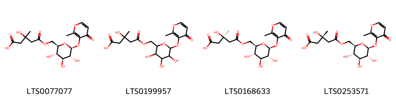{ width=100% }
    <figcaption>Hình ảnh cấu trúc hóa học của 4 hoạt chất thuộc nhóm Saccharolipids gồm ['3-hydroxy-3-methyl-5-oxo-5-{[(2r,3s,4s,5r,6s)-3,4,5-trihydroxy-6-[(2-methyl-4-oxopyran-3-yl)oxy]oxan-2-yl]methoxy}pentanoic acid (LTS0077077)', '3-hydroxy-3-methyl-5-oxo-5-({3,4,5-trihydroxy-6-[(2-methyl-4-oxopyran-3-yl)oxy]oxan-2-yl}methoxy)pentanoic acid (LTS0199957)', '(3r)-3-hydroxy-3-methyl-5-oxo-5-{[(2r,3s,4s,5r,6s)-3,4,5-trihydroxy-6-[(2-methyl-4-oxopyran-3-yl)oxy]oxan-2-yl]methoxy}pentanoic acid (LTS0168633)', '(3s)-3-hydroxy-3-methyl-5-oxo-5-{[(2r,3s,4s,5r,6s)-3,4,5-trihydroxy-6-[(2-methyl-4-oxopyran-3-yl)oxy]oxan-2-yl]methoxy}pentanoic acid (LTS0253571)'].</figcaption>
</figure>
#### Nhóm Steroids and steroid derivatives
<figure markdown="span">
    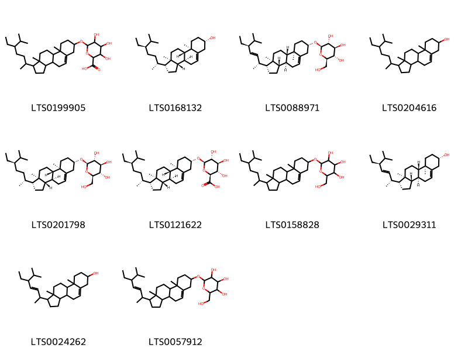{ width=100% }
    <figcaption>Hình ảnh cấu trúc hóa học của 10 hoạt chất thuộc nhóm Steroids and steroid derivatives gồm ['6-{[1-(5-ethyl-6-methylheptan-2-yl)-9a,11a-dimethyl-1h,2h,3h,3ah,3bh,4h,6h,7h,8h,9h,9bh,10h,11h-cyclopenta[a]phenanthren-7-yl]oxy}-3,4,5-trihydroxyoxane-2-carboxylic acid (LTS0199905)', 'sitosterol (LTS0168132)', '(2r,3r,4s,5s,6r)-2-{[(1r,3as,3bs,7s,9ar,9bs,11ar)-1-[(2r,3e,5s)-5-ethyl-6-methylhept-3-en-2-yl]-9a,11a-dimethyl-1h,2h,3h,3ah,3bh,4h,6h,7h,8h,9h,9bh,10h,11h-cyclopenta[a]phenanthren-7-yl]oxy}-6-(hydroxymethyl)oxane-3,4,5-triol (LTS0088971)', 'stigmast-5-en-3-ol, (3β)- (LTS0204616)', 'sitogluside (LTS0201798)', '(2s,3s,4s,5r,6r)-6-{[(1r,3as,3bs,7s,9ar,9bs,11ar)-1-[(2r,5r)-5-ethyl-6-methylheptan-2-yl]-9a,11a-dimethyl-1h,2h,3h,3ah,3bh,4h,6h,7h,8h,9h,9bh,10h,11h-cyclopenta[a]phenanthren-7-yl]oxy}-3,4,5-trihydroxyoxane-2-carboxylic acid (LTS0121622)', '2-{[1-(5-ethyl-6-methylheptan-2-yl)-9a,11a-dimethyl-1h,2h,3h,3ah,3bh,4h,6h,7h,8h,9h,9bh,10h,11h-cyclopenta[a]phenanthren-7-yl]oxy}-6-(hydroxymethyl)oxane-3,4,5-triol (LTS0158828)', 'phytosterol (LTS0029311)', 'stigmasterol (LTS0024262)', '2-{[1-(5-ethyl-6-methylhept-3-en-2-yl)-9a,11a-dimethyl-1h,2h,3h,3ah,3bh,4h,6h,7h,8h,9h,9bh,10h,11h-cyclopenta[a]phenanthren-7-yl]oxy}-6-(hydroxymethyl)oxane-3,4,5-triol (LTS0057912)'].</figcaption>
</figure>

---

### Dược dân tộc học

Danh sách các quốc gia có sử dụng *Helichrysum arenarium* trong điều trị các bệnh. 

| Country   | Disease                                       | Bệnh                                                                                                                                                                                                |
|:----------|:----------------------------------------------|:----------------------------------------------------------------------------------------------------------------------------------------------------------------------------------------------------|
| Elsewhere | Diuretic                                      | MYMEMORY WARNING: YOU USED ALL AVAILABLE FREE TRANSLATIONS FOR TODAY. NEXT AVAILABLE IN  10 HOURS 59 MINUTES 22 SECONDS VISIT HTTPS://MYMEMORY.TRANSLATED.NET/DOC/USAGELIMITS.PHP TO TRANSLATE MORE |
| Turkey    | Cholagogue, Diuretic, Astringent, Insecticide | MYMEMORY WARNING: YOU USED ALL AVAILABLE FREE TRANSLATIONS FOR TODAY. NEXT AVAILABLE IN  10 HOURS 59 MINUTES 19 SECONDS VISIT HTTPS://MYMEMORY.TRANSLATED.NET/DOC/USAGELIMITS.PHP TO TRANSLATE MORE |

---

---
## Helichrysum caeititium
### Thông tin về thực vật

!!! info "Phân loại thực vật của *Helichrysum caespititium* từ GIBF:"
    - **Kingdom:** Plantae
    - **Phylum:** Tracheophyta
    - **Order:** Asterales
    - **Family:** Asteraceae
    - **Genus:** Helichrysum
    - **Species:** *Helichrysum caespititium*

 

| Label (VI)   | Label (EN)   | Scientific Name       | Descriptions (VI)   | Descriptions (EN)   | Also Known As (VI)   | Also Known As (EN)   |
|:-------------|:-------------|:----------------------|:--------------------|:--------------------|:---------------------|:---------------------|
| N/A          | N/A          | Helichrysum arenarium | loài thực vật       | species of plant    | ['']                 | ['']                 |

#### Phân bố trên thế giới

**Từ CSDL GIBF** Zambia, South Africa, Mauritius, Lesotho, Zimbabwe, Eswatini

#### Phân bố tại Việt Nam

**Từ CSDL GIBF**: Không có ghi nhận ở Việt Nam

---
### Thành phần hóa học
        
- Theo cơ sở dữ liệu lotus: Từ loài *Helichrysum caespititium* đã phân lập và xác định được Chưa có hoạt chất nào được phân lập. hoạt chất thuộc về các nhóm Không có hoạt chất nào được phân lập. 

Không có hình ảnh nào được tạo ra

---

### Dược dân tộc học

Danh sách các quốc gia có sử dụng *Helichrysum caespititium* trong điều trị các bệnh. 

| Country   | Disease   | Bệnh                                                                                                                                                                                                |
|:----------|:----------|:----------------------------------------------------------------------------------------------------------------------------------------------------------------------------------------------------|
| Lesotho   | Emetic    | MYMEMORY WARNING: YOU USED ALL AVAILABLE FREE TRANSLATIONS FOR TODAY. NEXT AVAILABLE IN  10 HOURS 58 MINUTES 01 SECONDS VISIT HTTPS://MYMEMORY.TRANSLATED.NET/DOC/USAGELIMITS.PHP TO TRANSLATE MORE |

---

---
## Helichrysum odoratissimum
### Thông tin về thực vật

!!! info "Phân loại thực vật của *Helichrysum odoratissimum* từ GIBF:"
    - **Kingdom:** Plantae
    - **Phylum:** Tracheophyta
    - **Order:** Asterales
    - **Family:** Asteraceae
    - **Genus:** Helichrysum
    - **Species:** *Helichrysum odoratissimum*

 

| Label (VI)   | Label (EN)   | Scientific Name           | Descriptions (VI)   | Descriptions (EN)   | Also Known As (VI)           | Also Known As (EN)   |
|:-------------|:-------------|:--------------------------|:--------------------|:--------------------|:-----------------------------|:---------------------|
| N/A          | N/A          | Helichrysum odoratissimum | loài thực vật       | species of plant    | ['Helichrysum odoratissima'] | ['']                 |

#### Phân bố trên thế giới

**Từ CSDL GIBF** Malawi, South Africa, Angola, Mozambique, Zimbabwe, Kenya, Tanzania, United Republic of, Eswatini

#### Phân bố tại Việt Nam

**Từ CSDL GIBF**: Không có ghi nhận ở Việt Nam

---
### Thành phần hóa học
        
- Theo cơ sở dữ liệu lotus: Từ loài *Helichrysum odoratissimum* đã phân lập và xác định được 86 hoạt chất thuộc về các nhóm Fatty Acyls, Flavonoids, Prenol lipids, Unsaturated hydrocarbons, Organooxygen compounds, Saturated hydrocarbons. 

|    | chemicalTaxonomyClassyfireClass   |   smiles_count |
|---:|:----------------------------------|---------------:|
|  0 | Fatty Acyls                       |              1 |
|  1 | Flavonoids                        |              1 |
|  2 | Organooxygen compounds            |              7 |
|  3 | Prenol lipids                     |             72 |
|  4 | Saturated hydrocarbons            |              1 |
|  5 | Unsaturated hydrocarbons          |              2 |

#### Nhóm Fatty Acyls
<figure markdown="span">
    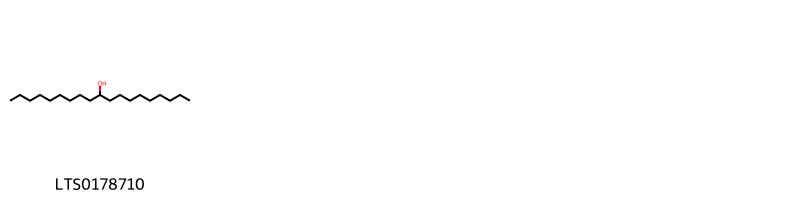{ width=100% }
    <figcaption>Hình ảnh cấu trúc hóa học của 1 hoạt chất thuộc nhóm Fatty Acyls gồm ['nonadecan-10-ol (LTS0178710)'].</figcaption>
</figure>
#### Nhóm Flavonoids
<figure markdown="span">
    { width=100% }
    <figcaption>Hình ảnh cấu trúc hóa học của 1 hoạt chất thuộc nhóm Flavonoids gồm ['chrysoeriol (LTS0095766)'].</figcaption>
</figure>
#### Nhóm Organooxygen compounds
<figure markdown="span">
    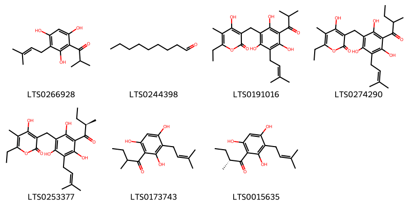{ width=100% }
    <figcaption>Hình ảnh cấu trúc hóa học của 7 hoạt chất thuộc nhóm Organooxygen compounds gồm ['2-methyl-1-[2,4,6-trihydroxy-3-(3-methylbut-2-en-1-yl)phenyl]propan-1-one (LTS0266928)', 'nonanal (LTS0244398)', '6-ethyl-4-hydroxy-5-methyl-3-{[2,4,6-trihydroxy-3-(3-methylbut-2-en-1-yl)-5-(2-methylpropanoyl)phenyl]methyl}pyran-2-one (LTS0191016)', '6-ethyl-4-hydroxy-5-methyl-3-{[2,4,6-trihydroxy-3-(3-methylbut-2-en-1-yl)-5-(2-methylbutanoyl)phenyl]methyl}pyran-2-one (LTS0274290)', '6-ethyl-4-hydroxy-5-methyl-3-{[2,4,6-trihydroxy-3-(3-methylbut-2-en-1-yl)-5-[(2r)-2-methylbutanoyl]phenyl]methyl}pyran-2-one (LTS0253377)', '2-methyl-1-[2,4,6-trihydroxy-3-(3-methylbut-2-en-1-yl)phenyl]butan-1-one (LTS0173743)', '(2r)-2-methyl-1-[2,4,6-trihydroxy-3-(3-methylbut-2-en-1-yl)phenyl]butan-1-one (LTS0015635)'].</figcaption>
</figure>
#### Nhóm Prenol lipids
<figure markdown="span">
    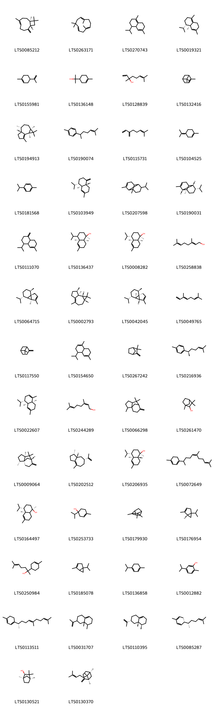{ width=100% }
    <figcaption>Hình ảnh cấu trúc hóa học của 72 hoạt chất thuộc nhóm Prenol lipids gồm ['caryophyllene (LTS0085212)', 'humulene (LTS0263171)', '4-isopropyl-1,6-dimethyl-2,3,4,4a,7,8-hexahydronaphthalene (LTS0270743)', 'delta-cadinene (LTS0019321)', 'limonene,  (LTS0155981)', 'terpineol (LTS0136148)', 'linalool, (+-)- (LTS0128839)', 'α pinene (LTS0132416)', '(-)-α-gurjunene (LTS0194913)', 'curcumene (LTS0190074)', 'α-myrcene (LTS0115731)', 'terpinolene (LTS0104525)', 'cymene (LTS0181568)', '(+)-gamma-cadinene (LTS0103949)', 'α-copaene (LTS0207598)', '(1r,2s,7s,8s)-8-isopropyl-1,3-dimethyltricyclo[4.4.0.0²,⁷]dec-3-ene (LTS0190031)', '4-isopropyl-6-methyl-1-methylidene-3,4,4a,7,8,8a-hexahydro-2h-naphthalene (LTS0111070)', '(1r,4ar,8as)-4-isopropyl-1,6-dimethyl-3,4,4a,7,8,8a-hexahydro-2h-naphthalen-1-ol (LTS0136437)', 'delta-cadinol (LTS0008282)', 'geraniol (LTS0258838)', '(1s,5r,7s,10r)-7-isopropyl-4,10-dimethyltricyclo[4.4.0.0¹,⁵]dec-3-ene (LTS0064715)', 'leden (LTS0002793)', '(-)-α-cubebene (LTS0042045)', 'trans-β-ocimene (LTS0049765)', 'β-pinene (LTS0117550)', '4-isopropyl-1,6-dimethyl-3,4,4a,7,8,8a-hexahydronaphthalene (LTS0154650)', 'camphene (LTS0267242)', '(-)-α-curcumene (LTS0216936)', 'α-muurolene (LTS0022607)', 'nerol (LTS0244289)', '2,6,6-trimethyl-8-methylidenetricyclo[5.3.1.0¹,⁵]undecane (LTS0066298)', 'fenchol (LTS0261470)', '(+)-β-cedrene (LTS0009064)', 'α-bulnesene (LTS0202512)', 'α-cadinol (LTS0206935)', '1-(6,10-dimethylundeca-5,9-dien-2-yl)-4-methylcyclohexa-1,3-diene (LTS0072649)', '(1r,4s,4ar)-4-isopropyl-1,6-dimethyl-3,4,4a,7,8,8a-hexahydro-2h-naphthalen-1-ol (LTS0164497)', '4-terpineol (LTS0253733)', 'tricyclene (LTS0179930)', 'α-thujene (LTS0176954)', 'α-bisabolol (LTS0250984)', 'α-thujene (LTS0185078)', 'terpinene (LTS0136858)', 'carvacrol (LTS0012882)', '1-[(2s,5e)-6,10-dimethylundeca-5,9-dien-2-yl]-4-methylcyclohexa-1,3-diene (LTS0113511)', 'valencene (LTS0031707)', 'valencene (LTS0110395)', 'zingiberene (LTS0085287)', '(1r,2r,4s)-1,3,3-trimethylbicyclo[2.2.1]heptan-2-ol (LTS0130521)', '(1s,5s,6r)-6-methyl-2-methylidene-6-(4-methylpent-3-en-1-yl)bicyclo[3.1.1]heptane (LTS0130370)', '1-methyl-4-(6-methylhept-6-en-2-yl)cyclohexa-1,4-diene (LTS0134146)', 'β-gurjunene (LTS0225922)', '(r)-β-himachalene (LTS0085481)', '2-[4-ethenyl-4-methyl-3-(prop-1-en-2-yl)cyclohexyl]propan-2-ol (LTS0072139)', '(4z,8z)-2,6,6,9-tetramethylcycloundeca-4,8-dien-1-one (LTS0027071)', '(+)-borneol (LTS0189059)', 'β-sesquiphellandrene (LTS0106193)', '3-[(2s)-6-methylhept-5-en-2-yl]-6-methylidenecyclohex-1-ene (LTS0195839)', 'citronella (LTS0151257)', '1-(6,10-dimethylundeca-5,9-dien-2-yl)-4-methylbenzene (LTS0168390)', '(4e,8e)-β-humulene (LTS0193661)', '(2r)-6-methyl-2-(4-methylcyclohex-3-en-1-yl)hept-5-en-2-ol (LTS0088859)', 'β-himachalene (LTS0059378)', 'elemol (LTS0208556)', 'β-humulene (LTS0207418)', 'cedrol (LTS0251071)', 'linalyl acetate (LTS0167325)', 'β-ocimene (LTS0242381)', 'pinocarveol (LTS0090950)', '(-)-β-curcumene (LTS0027873)', '1-[(2r,5e)-6,10-dimethylundeca-5,9-dien-2-yl]-4-methylbenzene (LTS0250852)', 'α-citral (LTS0246122)'].</figcaption>
</figure>
#### Nhóm Saturated hydrocarbons
<figure markdown="span">
    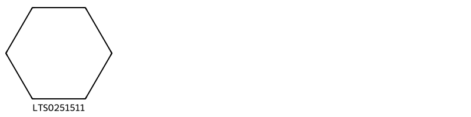{ width=100% }
    <figcaption>Hình ảnh cấu trúc hóa học của 1 hoạt chất thuộc nhóm Saturated hydrocarbons gồm ['cyclohexane (LTS0251511)'].</figcaption>
</figure>
#### Nhóm Unsaturated hydrocarbons
<figure markdown="span">
    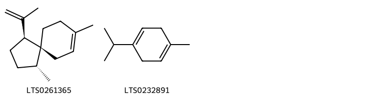{ width=100% }
    <figcaption>Hình ảnh cấu trúc hóa học của 2 hoạt chất thuộc nhóm Unsaturated hydrocarbons gồm ['(1r,4s,5s)-1,8-dimethyl-4-(prop-1-en-2-yl)spiro[4.5]dec-7-ene (LTS0261365)', 'α terpinene (LTS0232891)'].</figcaption>
</figure>

---

### Dược dân tộc học

Danh sách các quốc gia có sử dụng *Helichrysum odoratissimum* trong điều trị các bệnh. 

| Country   | Disease   | Bệnh                                                                                                                                                                                                |
|:----------|:----------|:----------------------------------------------------------------------------------------------------------------------------------------------------------------------------------------------------|
| Lesotho   | Fumigant  | MYMEMORY WARNING: YOU USED ALL AVAILABLE FREE TRANSLATIONS FOR TODAY. NEXT AVAILABLE IN  10 HOURS 57 MINUTES 29 SECONDS VISIT HTTPS://MYMEMORY.TRANSLATED.NET/DOC/USAGELIMITS.PHP TO TRANSLATE MORE |

---

# Chi Ambrosia

??? note "Danh sách các dược liệu thuộc chi"
    
	 - *Ambrosia artemesiaefolia*
	 - *Ambrosia artemisiaefolia*
	 - *Ambrosia cumanensis*
	 - *Ambrosia elatior*
	 - *Ambrosia hiida*
	 - *Ambrosia maritima*
	 - *Ambrosia paniculata*
	 - *Ambrosia peruviana*
	 - *Ambrosia psilotstachya*

---
## Ambrosia artemesiaefolia
### Thông tin về thực vật

!!! info "Phân loại thực vật của *Ambrosia artemisiaefolia* từ GIBF:"
    - **Kingdom:** Plantae
    - **Phylum:** Tracheophyta
    - **Order:** Asterales
    - **Family:** Asteraceae
    - **Genus:** Ambrosia
    - **Species:** *Ambrosia artemisiaefolia*

 

| Label (VI)   | Label (EN)   | Scientific Name           | Descriptions (VI)   | Descriptions (EN)   | Also Known As (VI)           | Also Known As (EN)   |
|:-------------|:-------------|:--------------------------|:--------------------|:--------------------|:-----------------------------|:---------------------|
| N/A          | N/A          | Helichrysum odoratissimum | loài thực vật       | species of plant    | ['Helichrysum odoratissima'] | ['']                 |

#### Phân bố trên thế giới

**Từ CSDL GIBF** nan, Ukraine, Japan, Brazil, Russian Federation, United States of America, Peru, Austria, Paraguay, Canada

#### Phân bố tại Việt Nam

**Từ CSDL GIBF**: Không có ghi nhận ở Việt Nam

---
### Thành phần hóa học
        
- Theo cơ sở dữ liệu lotus: Từ loài *Ambrosia artemisiaefolia* đã phân lập và xác định được Chưa có hoạt chất nào được phân lập. hoạt chất thuộc về các nhóm Không có hoạt chất nào được phân lập. 

Không có hình ảnh nào được tạo ra

---

### Dược dân tộc học

Danh sách các quốc gia có sử dụng *Ambrosia artemisiaefolia* trong điều trị các bệnh. 

| Country   | Disease   | Bệnh                                                                                                                                                                                                |
|:----------|:----------|:----------------------------------------------------------------------------------------------------------------------------------------------------------------------------------------------------|
| Mexico    | Vermifuge | MYMEMORY WARNING: YOU USED ALL AVAILABLE FREE TRANSLATIONS FOR TODAY. NEXT AVAILABLE IN  10 HOURS 56 MINUTES 30 SECONDS VISIT HTTPS://MYMEMORY.TRANSLATED.NET/DOC/USAGELIMITS.PHP TO TRANSLATE MORE |

---

---
## Ambrosia artemisiaefolia
### Thông tin về thực vật

!!! info "Phân loại thực vật của *Ambrosia artemisiaefolia* từ GIBF:"
    - **Kingdom:** Plantae
    - **Phylum:** Tracheophyta
    - **Order:** Asterales
    - **Family:** Asteraceae
    - **Genus:** Ambrosia
    - **Species:** *Ambrosia artemisiaefolia*

 

| Label (VI)   | Label (EN)   | Scientific Name           | Descriptions (VI)   | Descriptions (EN)   | Also Known As (VI)           | Also Known As (EN)   |
|:-------------|:-------------|:--------------------------|:--------------------|:--------------------|:-----------------------------|:---------------------|
| N/A          | N/A          | Helichrysum odoratissimum | loài thực vật       | species of plant    | ['Helichrysum odoratissima'] | ['']                 |

#### Phân bố trên thế giới

**Từ CSDL GIBF** nan, Ukraine, Japan, Brazil, Russian Federation, United States of America, Peru, Austria, Paraguay, Canada

#### Phân bố tại Việt Nam

**Từ CSDL GIBF**: Không có ghi nhận ở Việt Nam

---
### Thành phần hóa học
        
- Theo cơ sở dữ liệu lotus: Từ loài *Ambrosia artemisiaefolia* đã phân lập và xác định được Chưa có hoạt chất nào được phân lập. hoạt chất thuộc về các nhóm Không có hoạt chất nào được phân lập. 

Không có hình ảnh nào được tạo ra

---

### Dược dân tộc học

Danh sách các quốc gia có sử dụng *Ambrosia artemisiaefolia* trong điều trị các bệnh. 

| Country   | Disease              | Bệnh                                                                                                                                                                                                |
|:----------|:---------------------|:----------------------------------------------------------------------------------------------------------------------------------------------------------------------------------------------------|
| Mexico    | Digestive, Stimulant | MYMEMORY WARNING: YOU USED ALL AVAILABLE FREE TRANSLATIONS FOR TODAY. NEXT AVAILABLE IN  10 HOURS 56 MINUTES 07 SECONDS VISIT HTTPS://MYMEMORY.TRANSLATED.NET/DOC/USAGELIMITS.PHP TO TRANSLATE MORE |

---

---
## Ambrosia cumanensis
### Thông tin về thực vật

!!! info "Phân loại thực vật của *Ambrosia cumanensis* từ GIBF:"
    - **Kingdom:** Plantae
    - **Phylum:** Tracheophyta
    - **Order:** Asterales
    - **Family:** Asteraceae
    - **Genus:** Ambrosia
    - **Species:** *Ambrosia cumanensis*

 

| Label (VI)   | Label (EN)   | Scientific Name     | Descriptions (VI)   | Descriptions (EN)   | Also Known As (VI)   | Also Known As (EN)   |
|:-------------|:-------------|:--------------------|:--------------------|:--------------------|:---------------------|:---------------------|
| N/A          | N/A          | Ambrosia cumanensis | loài thực vật       | species of plant    | ['']                 | ['']                 |

#### Phân bố trên thế giới

**Từ CSDL GIBF** Nicaragua, Ecuador, Guadeloupe, Colombia, Guatemala, Costa Rica, United States of America, Peru, Mexico, France, El Salvador, Venezuela (Bolivarian Republic of), Panama

#### Phân bố tại Việt Nam

**Từ CSDL GIBF**: Không có ghi nhận ở Việt Nam

---
### Thành phần hóa học
        
- Theo cơ sở dữ liệu lotus: Từ loài *Ambrosia cumanensis* đã phân lập và xác định được 16 hoạt chất thuộc về các nhóm Prenol lipids, Pyrans, Lactones, Phenols, Benzopyrans. 

|    | chemicalTaxonomyClassyfireClass   |   smiles_count |
|---:|:----------------------------------|---------------:|
|  0 | Benzopyrans                       |              1 |
|  1 | Lactones                          |              2 |
|  2 | Phenols                           |              3 |
|  3 | Prenol lipids                     |              9 |
|  4 | Pyrans                            |              1 |

#### Nhóm Benzopyrans
<figure markdown="span">
    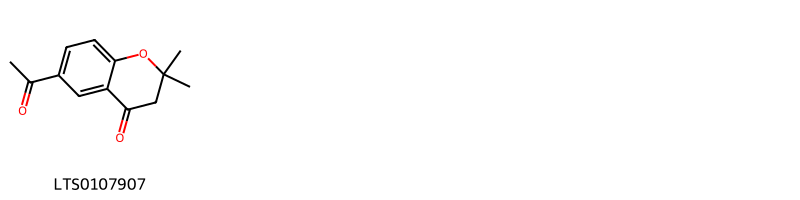{ width=100% }
    <figcaption>Hình ảnh cấu trúc hóa học của 1 hoạt chất thuộc nhóm Benzopyrans gồm ['6-acetyl-2,2-dimethyl-3h-1-benzopyran-4-one (LTS0107907)'].</figcaption>
</figure>
#### Nhóm Lactones
<figure markdown="span">
    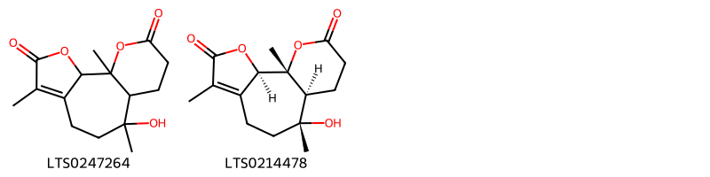{ width=100% }
    <figcaption>Hình ảnh cấu trúc hóa học của 2 hoạt chất thuộc nhóm Lactones gồm ['9-hydroxy-1,5,9-trimethyl-3,14-dioxatricyclo[8.4.0.0²,⁶]tetradec-5-ene-4,13-dione (LTS0247264)', '(1r,2r,9r,10s)-9-hydroxy-1,5,9-trimethyl-3,14-dioxatricyclo[8.4.0.0²,⁶]tetradec-5-ene-4,13-dione (LTS0214478)'].</figcaption>
</figure>
#### Nhóm Phenols
<figure markdown="span">
    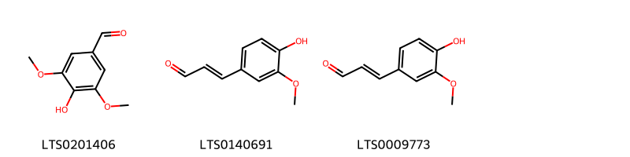{ width=100% }
    <figcaption>Hình ảnh cấu trúc hóa học của 3 hoạt chất thuộc nhóm Phenols gồm ['syringaldehyde (LTS0201406)', 'coniferyl aldehyde (LTS0140691)', 'coniferaldehyde (LTS0009773)'].</figcaption>
</figure>
#### Nhóm Prenol lipids
<figure markdown="span">
    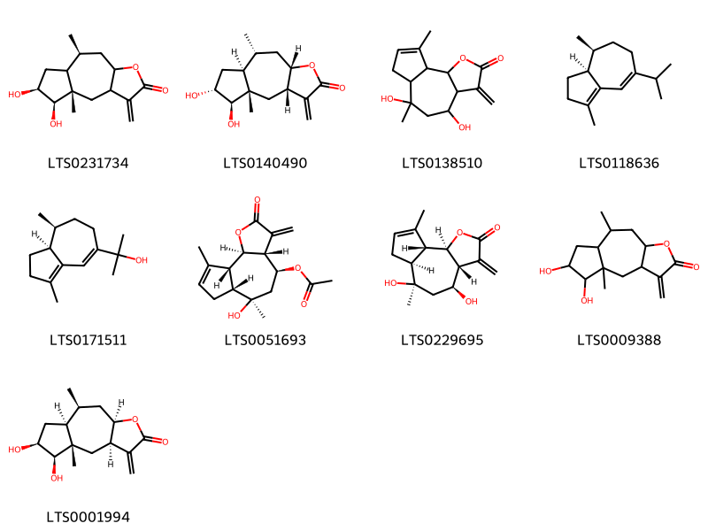{ width=100% }
    <figcaption>Hình ảnh cấu trúc hóa học của 9 hoạt chất thuộc nhóm Prenol lipids gồm ['(4as,5r,6s,8s)-5,6-dihydroxy-4a,8-dimethyl-3-methylidene-octahydro-3ah-azuleno[6,5-b]furan-2-one (LTS0231734)', '(3as,4as,5r,6r,7as,8r,9as)-5,6-dihydroxy-4a,8-dimethyl-3-methylidene-octahydro-3ah-azuleno[6,5-b]furan-2-one (LTS0140490)', '4,6-dihydroxy-6,9-dimethyl-3-methylidene-3ah,4h,5h,6ah,7h,9ah,9bh-azuleno[4,5-b]furan-2-one (LTS0138510)', '(3as,4s)-7-isopropyl-1,4-dimethyl-2,3,3a,4,5,6-hexahydroazulene (LTS0118636)', '2-[(8s,8as)-3,8-dimethyl-1,2,6,7,8,8a-hexahydroazulen-5-yl]propan-2-ol (LTS0171511)', '(3ar,4s,6r,6ar,9ar,9br)-6-hydroxy-6,9-dimethyl-3-methylidene-2-oxo-3ah,4h,5h,6ah,7h,9ah,9bh-azuleno[4,5-b]furan-4-yl acetate (LTS0051693)', '(3ar,4s,6r,6as,9ar,9br)-4,6-dihydroxy-6,9-dimethyl-3-methylidene-3ah,4h,5h,6ah,7h,9ah,9bh-azuleno[4,5-b]furan-2-one (LTS0229695)', '5,6-dihydroxy-4a,8-dimethyl-3-methylidene-octahydro-3ah-azuleno[6,5-b]furan-2-one (LTS0009388)', '(3ar,4as,5r,6s,7as,8s,9ar)-5,6-dihydroxy-4a,8-dimethyl-3-methylidene-octahydro-3ah-azuleno[6,5-b]furan-2-one (LTS0001994)'].</figcaption>
</figure>
#### Nhóm Pyrans
<figure markdown="span">
    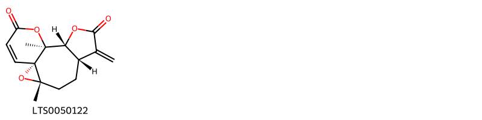{ width=100% }
    <figcaption>Hình ảnh cấu trúc hóa học của 1 hoạt chất thuộc nhóm Pyrans gồm ['(1s,3s,6s,10r,11s)-3,11-dimethyl-7-methylidene-2,9,12-trioxatetracyclo[9.4.0.0¹,³.0⁶,¹⁰]pentadec-14-ene-8,13-dione (LTS0050122)'].</figcaption>
</figure>

---

### Dược dân tộc học

Danh sách các quốc gia có sử dụng *Ambrosia cumanensis* trong điều trị các bệnh. 

| Country   | Disease   | Bệnh                                                                                                                                                                                                |
|:----------|:----------|:----------------------------------------------------------------------------------------------------------------------------------------------------------------------------------------------------|
| Elsewhere | nan, nan  | MYMEMORY WARNING: YOU USED ALL AVAILABLE FREE TRANSLATIONS FOR TODAY. NEXT AVAILABLE IN  10 HOURS 55 MINUTES 43 SECONDS VISIT HTTPS://MYMEMORY.TRANSLATED.NET/DOC/USAGELIMITS.PHP TO TRANSLATE MORE |

---

---
## Ambrosia elatior
### Thông tin về thực vật

!!! info "Phân loại thực vật của *N/A* từ GIBF:"
    - **Kingdom:** Plantae
    - **Phylum:** Tracheophyta
    - **Order:** Asterales
    - **Family:** Asteraceae
    - **Genus:** Ambrosia
    - **Species:** *N/A*

 

| Label (VI)   | Label (EN)   | Scientific Name   | Descriptions (VI)   | Descriptions (EN)   | Also Known As (VI)   | Also Known As (EN)   |
|:-------------|:-------------|:------------------|:--------------------|:--------------------|:---------------------|:---------------------|
| N/A          | N/A          | Ambrosia elatior  | loài thực vật       | species of plant    | ['']                 | ['']                 |

#### Phân bố trên thế giới

**Từ CSDL GIBF** nan, Australia, Turks and Caicos Islands, Romania, Bahamas, Argentina, Russian Federation, United States of America, Mexico, Chile

#### Phân bố tại Việt Nam

**Từ CSDL GIBF**: Không có ghi nhận ở Việt Nam

---
### Thành phần hóa học
        
- Theo cơ sở dữ liệu lotus: Từ loài *N/A* đã phân lập và xác định được Chưa có hoạt chất nào được phân lập. hoạt chất thuộc về các nhóm Không có hoạt chất nào được phân lập. 

Không có hình ảnh nào được tạo ra

---

### Dược dân tộc học

Danh sách các quốc gia có sử dụng *N/A* trong điều trị các bệnh. 

| Country   | Disease              | Bệnh                                                                                                                                                                                                |
|:----------|:---------------------|:----------------------------------------------------------------------------------------------------------------------------------------------------------------------------------------------------|
| Elsewhere | Vermifuge            | MYMEMORY WARNING: YOU USED ALL AVAILABLE FREE TRANSLATIONS FOR TODAY. NEXT AVAILABLE IN  10 HOURS 55 MINUTES 16 SECONDS VISIT HTTPS://MYMEMORY.TRANSLATED.NET/DOC/USAGELIMITS.PHP TO TRANSLATE MORE |
| Mexico    | Digestive, Stimulant | MYMEMORY WARNING: YOU USED ALL AVAILABLE FREE TRANSLATIONS FOR TODAY. NEXT AVAILABLE IN  10 HOURS 55 MINUTES 13 SECONDS VISIT HTTPS://MYMEMORY.TRANSLATED.NET/DOC/USAGELIMITS.PHP TO TRANSLATE MORE |
| Paraguay  | Antifertility        | MYMEMORY WARNING: YOU USED ALL AVAILABLE FREE TRANSLATIONS FOR TODAY. NEXT AVAILABLE IN  10 HOURS 55 MINUTES 09 SECONDS VISIT HTTPS://MYMEMORY.TRANSLATED.NET/DOC/USAGELIMITS.PHP TO TRANSLATE MORE |

---

---
## Ambrosia hiida
### Thông tin về thực vật

!!! info "Phân loại thực vật của *N/A* từ GIBF:"
    - **Kingdom:** Plantae
    - **Phylum:** Tracheophyta
    - **Order:** Asterales
    - **Family:** Asteraceae
    - **Genus:** Ambrosia
    - **Species:** *N/A*

 

| Label (VI)   | Label (EN)   | Scientific Name   | Descriptions (VI)   | Descriptions (EN)   | Also Known As (VI)   | Also Known As (EN)   |
|:-------------|:-------------|:------------------|:--------------------|:--------------------|:---------------------|:---------------------|
| N/A          | N/A          | Ambrosia elatior  | loài thực vật       | species of plant    | ['']                 | ['']                 |

#### Phân bố trên thế giới

**Từ CSDL GIBF** nan, Australia, Turks and Caicos Islands, Romania, Bahamas, Argentina, Russian Federation, United States of America, Mexico, Chile

#### Phân bố tại Việt Nam

**Từ CSDL GIBF**: Không có ghi nhận ở Việt Nam

---
### Thành phần hóa học
        
- Theo cơ sở dữ liệu lotus: Từ loài *N/A* đã phân lập và xác định được Chưa có hoạt chất nào được phân lập. hoạt chất thuộc về các nhóm Không có hoạt chất nào được phân lập. 

Không có hình ảnh nào được tạo ra

---

### Dược dân tộc học

Danh sách các quốc gia có sử dụng *N/A* trong điều trị các bệnh. 

| Country   | Disease            | Bệnh                                                                                                                                                                                                |
|:----------|:-------------------|:----------------------------------------------------------------------------------------------------------------------------------------------------------------------------------------------------|
| Bahamas   | Cathartic, Apertif | MYMEMORY WARNING: YOU USED ALL AVAILABLE FREE TRANSLATIONS FOR TODAY. NEXT AVAILABLE IN  10 HOURS 54 MINUTES 25 SECONDS VISIT HTTPS://MYMEMORY.TRANSLATED.NET/DOC/USAGELIMITS.PHP TO TRANSLATE MORE |

---

---
## Ambrosia maritima
### Thông tin về thực vật

!!! info "Phân loại thực vật của *Ambrosia maritima* từ GIBF:"
    - **Kingdom:** Plantae
    - **Phylum:** Tracheophyta
    - **Order:** Asterales
    - **Family:** Asteraceae
    - **Genus:** Ambrosia
    - **Species:** *Ambrosia maritima*

 

| Label (VI)   | Label (EN)   | Scientific Name   | Descriptions (VI)   | Descriptions (EN)   | Also Known As (VI)   | Also Known As (EN)   |
|:-------------|:-------------|:------------------|:--------------------|:--------------------|:---------------------|:---------------------|
| N/A          | N/A          | Ambrosia maritima | loài thực vật       | species of plant    | ['']                 | ['']                 |

#### Phân bố trên thế giới

**Từ CSDL GIBF** nan, Italy, Central African Republic, Mozambique, Tunisia, Tanzania, United Republic of, Israel, Zambia, Mali, Senegal, Nigeria, Namibia, Chad, Malta, Spain, Türkiye, Portugal, Congo, Democratic Republic of the, Chile, Guinea, Zimbabwe, Greece, Saudi Arabia, South Africa, Uganda, Niger, Brazil, Egypt, Côte d’Ivoire, Peru, France, Madagascar, Botswana, Burundi, Burkina Faso, Cameroon, Ethiopia

#### Phân bố tại Việt Nam

**Từ CSDL GIBF**: Không có ghi nhận ở Việt Nam

---
### Thành phần hóa học
        
- Theo cơ sở dữ liệu lotus: Từ loài *Ambrosia maritima* đã phân lập và xác định được 28 hoạt chất thuộc về các nhóm Thiophenes, Flavonoids, Prenol lipids. 

|    | chemicalTaxonomyClassyfireClass   |   smiles_count |
|---:|:----------------------------------|---------------:|
|  0 | Flavonoids                        |              1 |
|  1 | Prenol lipids                     |             24 |
|  2 | Thiophenes                        |              3 |

#### Nhóm Flavonoids
<figure markdown="span">
    { width=100% }
    <figcaption>Hình ảnh cấu trúc hóa học của 1 hoạt chất thuộc nhóm Flavonoids gồm ['chamomile (LTS0104946)'].</figcaption>
</figure>
#### Nhóm Prenol lipids
<figure markdown="span">
    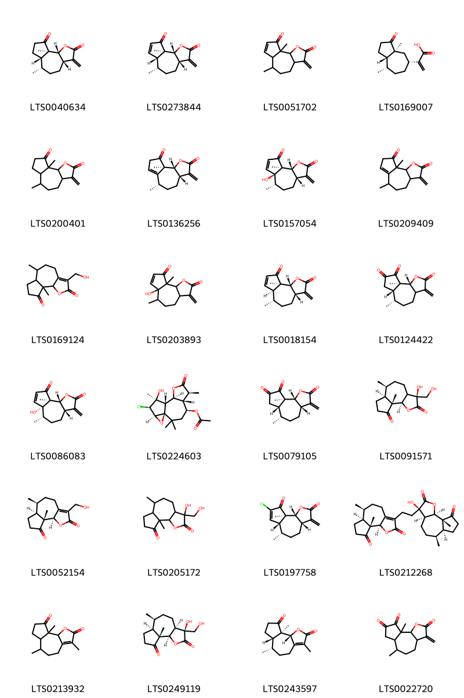{ width=100% }
    <figcaption>Hình ảnh cấu trúc hóa học của 24 hoạt chất thuộc nhóm Prenol lipids gồm ['damsin (LTS0040634)', 'ambrosin (LTS0273844)', 'ambrosin (LTS0051702)', '2-[(3as,5r,8s,8as)-3a,8-dimethyl-3-oxo-octahydroazulen-5-yl]prop-2-enoic acid (LTS0169007)', '6,9a-dimethyl-3-methylidene-octahydroazuleno[4,5-b]furan-2,9-dione (LTS0200401)', '(3as,6s,9ar,9br)-6,9a-dimethyl-3-methylidene-3ah,4h,5h,6h,8h,9bh-azuleno[4,5-b]furan-2,9-dione (LTS0136256)', 'parthenin (LTS0157054)', '6,9a-dimethyl-3-methylidene-3ah,4h,5h,6h,8h,9bh-azuleno[4,5-b]furan-2,9-dione (LTS0209409)', '3-(hydroxymethyl)-6,9a-dimethyl-4h,5h,6h,6ah,7h,8h,9bh-azuleno[4,5-b]furan-2,9-dione (LTS0169124)', 'parthenin (LTS0203893)', '(3as,6s,6as,9ar,9br)-6,9a-dimethyl-3-methylidene-3ah,4h,5h,6h,6ah,9bh-azuleno[4,5-b]furan-2,9-dione (LTS0018154)', '(6s,6as,9ar,9br)-6,9a-dimethyl-3-methylidene-hexahydro-3ah-azuleno[4,5-b]furan-2,8,9-trione (LTS0124422)', '(3as,6s,6ar,9as,9br)-6a-hydroxy-6,9a-dimethyl-3-methylidene-3ah,4h,5h,6h,9bh-azuleno[4,5-b]furan-2,9-dione (LTS0086083)', '(1s,4s,5r,6s,9s,10s,11s,12r,13r)-12-chloro-11-hydroxy-2,2,6,11-tetramethyl-7-oxo-8,14-dioxatetracyclo[8.4.0.0¹,¹³.0⁵,⁹]tetradecan-4-yl acetate (LTS0224603)', '(3as,6s,6as,9ar,9br)-6,9a-dimethyl-3-methylidene-hexahydro-3ah-azuleno[4,5-b]furan-2,8,9-trione (LTS0079105)', '(3s,6s,6as,9ar,9br)-3-hydroxy-3-(hydroxymethyl)-6,9a-dimethyl-octahydroazuleno[4,5-b]furan-2,9-dione (LTS0091571)', '(6s,6as,9ar,9br)-3-(hydroxymethyl)-6,9a-dimethyl-4h,5h,6h,6ah,7h,8h,9bh-azuleno[4,5-b]furan-2,9-dione (LTS0052154)', '3-hydroxy-3-(hydroxymethyl)-6,9a-dimethyl-octahydroazuleno[4,5-b]furan-2,9-dione (LTS0205172)', '(3as,6s,6ar,9ar,9br)-8-chloro-6,9a-dimethyl-3-methylidene-3ah,4h,5h,6h,6ah,9bh-azuleno[4,5-b]furan-2,9-dione (LTS0197758)', '(3r,3ar,6s,6as,9ar,9br)-3-{2-[(6s,6as,9ar,9br)-6,9a-dimethyl-2,9-dioxo-4h,5h,6h,6ah,7h,8h,9bh-azuleno[4,5-b]furan-3-yl]ethyl}-3-hydroxy-6,9a-dimethyl-octahydroazuleno[4,5-b]furan-2,9-dione (LTS0212268)', '3,6,9a-trimethyl-4h,5h,6h,6ah,7h,8h,9bh-azuleno[4,5-b]furan-2,9-dione (LTS0213932)', '(3s,3ar,6s,6as,9ar,9br)-3-hydroxy-3-(hydroxymethyl)-6,9a-dimethyl-octahydroazuleno[4,5-b]furan-2,9-dione (LTS0249119)', '(6s,6as,9ar,9br)-3,6,9a-trimethyl-4h,5h,6h,6ah,7h,8h,9bh-azuleno[4,5-b]furan-2,9-dione (LTS0243597)', '6,9a-dimethyl-3-methylidene-hexahydro-3ah-azuleno[4,5-b]furan-2,8,9-trione (LTS0022720)'].</figcaption>
</figure>
#### Nhóm Thiophenes
<figure markdown="span">
    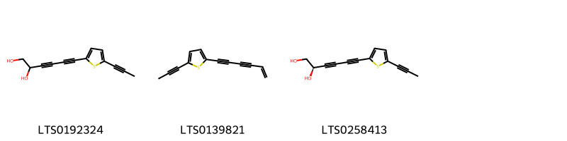{ width=100% }
    <figcaption>Hình ảnh cấu trúc hóa học của 3 hoạt chất thuộc nhóm Thiophenes gồm ['6-[5-(prop-1-yn-1-yl)thiophen-2-yl]hexa-3,5-diyne-1,2-diol (LTS0192324)', '2-(hex-5-en-1,3-diyn-1-yl)-5-(prop-1-yn-1-yl)thiophene (LTS0139821)', '(2r)-6-[5-(prop-1-yn-1-yl)thiophen-2-yl]hexa-3,5-diyne-1,2-diol (LTS0258413)'].</figcaption>
</figure>

---

### Dược dân tộc học

Danh sách các quốc gia có sử dụng *Ambrosia maritima* trong điều trị các bệnh. 

| Country   | Disease   | Bệnh                                                                                                                                                                                                |
|:----------|:----------|:----------------------------------------------------------------------------------------------------------------------------------------------------------------------------------------------------|
| Venezuela | Stimulant | MYMEMORY WARNING: YOU USED ALL AVAILABLE FREE TRANSLATIONS FOR TODAY. NEXT AVAILABLE IN  10 HOURS 53 MINUTES 49 SECONDS VISIT HTTPS://MYMEMORY.TRANSLATED.NET/DOC/USAGELIMITS.PHP TO TRANSLATE MORE |

---

---
## Ambrosia paniculata
### Thông tin về thực vật

!!! info "Phân loại thực vật của *Ambrosia artemisiifolia* từ GIBF:"
    - **Kingdom:** Plantae
    - **Phylum:** Tracheophyta
    - **Order:** Asterales
    - **Family:** Asteraceae
    - **Genus:** Ambrosia
    - **Species:** *Ambrosia artemisiifolia*

 

| Label (VI)   | Label (EN)   | Scientific Name     | Descriptions (VI)   | Descriptions (EN)   | Also Known As (VI)   | Also Known As (EN)   |
|:-------------|:-------------|:--------------------|:--------------------|:--------------------|:---------------------|:---------------------|
| N/A          | N/A          | Ambrosia paniculata | loài thực vật       | species of plant    | ['']                 | ['']                 |

#### Phân bố trên thế giới

**Từ CSDL GIBF** Curaçao, nan, Guadeloupe, Haiti, Jamaica, Cuba, United States of America, Dominican Republic

#### Phân bố tại Việt Nam

**Từ CSDL GIBF**: Không có ghi nhận ở Việt Nam

---
### Thành phần hóa học
        
- Theo cơ sở dữ liệu lotus: Từ loài *Ambrosia artemisiifolia* đã phân lập và xác định được Chưa có hoạt chất nào được phân lập. hoạt chất thuộc về các nhóm Không có hoạt chất nào được phân lập. 

Không có hình ảnh nào được tạo ra

---

### Dược dân tộc học

Danh sách các quốc gia có sử dụng *Ambrosia artemisiifolia* trong điều trị các bệnh. 

| Country         |   Disease | Bệnh                                                                                                                                                                                                |
|:----------------|----------:|:----------------------------------------------------------------------------------------------------------------------------------------------------------------------------------------------------|
| Dominica(Carib) |       nan | MYMEMORY WARNING: YOU USED ALL AVAILABLE FREE TRANSLATIONS FOR TODAY. NEXT AVAILABLE IN  10 HOURS 53 MINUTES 14 SECONDS VISIT HTTPS://MYMEMORY.TRANSLATED.NET/DOC/USAGELIMITS.PHP TO TRANSLATE MORE |

---

---
## Ambrosia peruviana
### Thông tin về thực vật

!!! info "Phân loại thực vật của *N/A* từ GIBF:"
    - **Kingdom:** Plantae
    - **Phylum:** Tracheophyta
    - **Order:** Asterales
    - **Family:** Asteraceae
    - **Genus:** Ambrosia
    - **Species:** *N/A*

 

| Label (VI)   | Label (EN)   | Scientific Name    | Descriptions (VI)   | Descriptions (EN)   | Also Known As (VI)   | Also Known As (EN)   |
|:-------------|:-------------|:-------------------|:--------------------|:--------------------|:---------------------|:---------------------|
| N/A          | N/A          | Ambrosia peruviana | loài thực vật       | species of plant    | ['']                 | ['']                 |

#### Phân bố trên thế giới

**Từ CSDL GIBF** nan, Australia, Turks and Caicos Islands, Romania, Bahamas, Argentina, Russian Federation, United States of America, Mexico, Chile

#### Phân bố tại Việt Nam

**Từ CSDL GIBF**: Không có ghi nhận ở Việt Nam

---
### Thành phần hóa học
        
- Theo cơ sở dữ liệu lotus: Từ loài *N/A* đã phân lập và xác định được 17 hoạt chất thuộc về các nhóm Prenol lipids. 

|    | chemicalTaxonomyClassyfireClass   |   smiles_count |
|---:|:----------------------------------|---------------:|
|  0 | Prenol lipids                     |             17 |

#### Nhóm Prenol lipids
<figure markdown="span">
    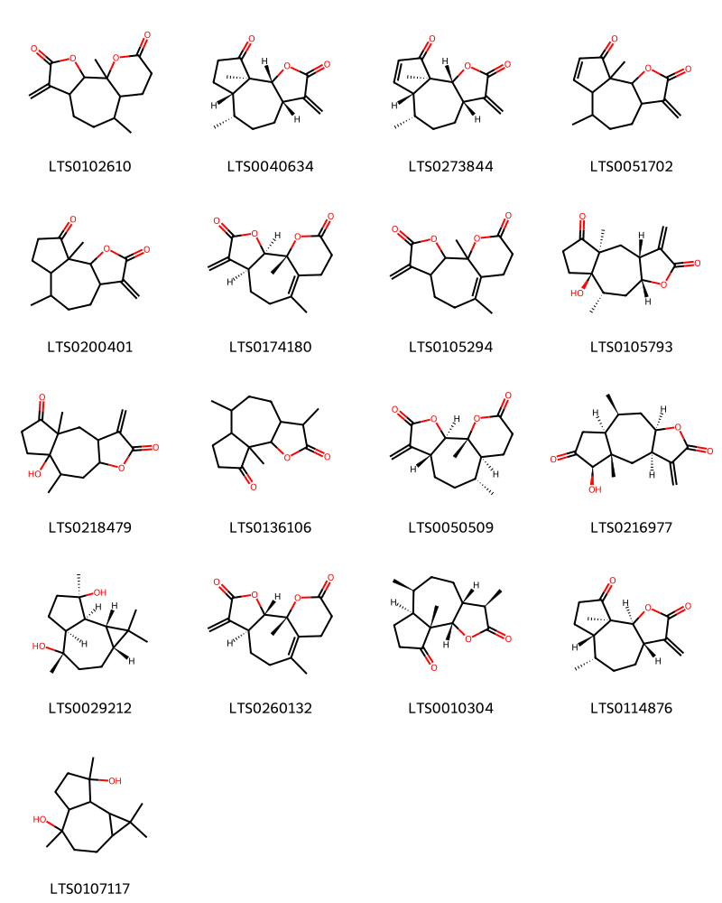{ width=100% }
    <figcaption>Hình ảnh cấu trúc hóa học của 17 hoạt chất thuộc nhóm Prenol lipids gồm ['1,9-dimethyl-5-methylidene-3,14-dioxatricyclo[8.4.0.0²,⁶]tetradecane-4,13-dione (LTS0102610)', 'damsin (LTS0040634)', 'ambrosin (LTS0273844)', 'ambrosin (LTS0051702)', '6,9a-dimethyl-3-methylidene-octahydroazuleno[4,5-b]furan-2,9-dione (LTS0200401)', '(1r,2r,6s)-1,9-dimethyl-5-methylidene-3,14-dioxatricyclo[8.4.0.0²,⁶]tetradec-9-ene-4,13-dione (LTS0174180)', '1,9-dimethyl-5-methylidene-3,14-dioxatricyclo[8.4.0.0²,⁶]tetradec-9-ene-4,13-dione (LTS0105294)', '(3ar,4as,7ar,8s,9ar)-7a-hydroxy-4a,8-dimethyl-3-methylidene-hexahydro-3ah-azuleno[6,5-b]furan-2,5-dione (LTS0105793)', '7a-hydroxy-4a,8-dimethyl-3-methylidene-hexahydro-3ah-azuleno[6,5-b]furan-2,5-dione (LTS0218479)', '3,6,9a-trimethyl-octahydro-3h-azuleno[4,5-b]furan-2,9-dione (LTS0136106)', '(1r,2r,6r,9r,10s)-1,9-dimethyl-5-methylidene-3,14-dioxatricyclo[8.4.0.0²,⁶]tetradecane-4,13-dione (LTS0050509)', '(3ar,4as,5r,7as,8s,9ar)-5-hydroxy-4a,8-dimethyl-3-methylidene-octahydroazuleno[6,5-b]furan-2,6-dione (LTS0216977)', '(1ar,4s,4as,7r,7as,7br)-1,1,4,7-tetramethyl-octahydrocyclopropa[e]azulene-4,7-diol (LTS0029212)', '(1r,2s,6s)-1,9-dimethyl-5-methylidene-3,14-dioxatricyclo[8.4.0.0²,⁶]tetradec-9-ene-4,13-dione (LTS0260132)', '(3r,3ar,6s,6as,9ar,9bs)-3,6,9a-trimethyl-octahydro-3h-azuleno[4,5-b]furan-2,9-dione (LTS0010304)', '(3as,6s,6as,9ar,9bs)-6,9a-dimethyl-3-methylidene-octahydroazuleno[4,5-b]furan-2,9-dione (LTS0114876)', '1,1,4,7-tetramethyl-octahydrocyclopropa[e]azulene-4,7-diol (LTS0107117)'].</figcaption>
</figure>

---

### Dược dân tộc học

Danh sách các quốc gia có sử dụng *N/A* trong điều trị các bệnh. 

| Country   | Disease           | Bệnh                                                                                                                                                                                                |
|:----------|:------------------|:----------------------------------------------------------------------------------------------------------------------------------------------------------------------------------------------------|
| Cuba      | Tonic, Astringent | MYMEMORY WARNING: YOU USED ALL AVAILABLE FREE TRANSLATIONS FOR TODAY. NEXT AVAILABLE IN  10 HOURS 52 MINUTES 51 SECONDS VISIT HTTPS://MYMEMORY.TRANSLATED.NET/DOC/USAGELIMITS.PHP TO TRANSLATE MORE |

---

---
## Ambrosia psilotstachya
### Thông tin về thực vật

!!! info "Phân loại thực vật của *Ambrosia psilostachya* từ GIBF:"
    - **Kingdom:** Plantae
    - **Phylum:** Tracheophyta
    - **Order:** Asterales
    - **Family:** Asteraceae
    - **Genus:** Ambrosia
    - **Species:** *Ambrosia psilostachya*

 

| Label (VI)   | Label (EN)   | Scientific Name    | Descriptions (VI)   | Descriptions (EN)   | Also Known As (VI)   | Also Known As (EN)   |
|:-------------|:-------------|:-------------------|:--------------------|:--------------------|:---------------------|:---------------------|
| N/A          | N/A          | Ambrosia peruviana | loài thực vật       | species of plant    | ['']                 | ['']                 |

#### Phân bố trên thế giới

**Từ CSDL GIBF** South Africa, United States of America, Spain, Mexico

#### Phân bố tại Việt Nam

**Từ CSDL GIBF**: Không có ghi nhận ở Việt Nam

---
### Thành phần hóa học
        
- Theo cơ sở dữ liệu lotus: Từ loài *Ambrosia psilostachya* đã phân lập và xác định được Chưa có hoạt chất nào được phân lập. hoạt chất thuộc về các nhóm Không có hoạt chất nào được phân lập. 

Không có hình ảnh nào được tạo ra

---

### Dược dân tộc học

Danh sách các quốc gia có sử dụng *Ambrosia psilostachya* trong điều trị các bệnh. 

| Country   | Disease     | Bệnh                                                                                                                                                                                                |
|:----------|:------------|:----------------------------------------------------------------------------------------------------------------------------------------------------------------------------------------------------|
| US(Kiowa) | Diaphoretic | MYMEMORY WARNING: YOU USED ALL AVAILABLE FREE TRANSLATIONS FOR TODAY. NEXT AVAILABLE IN  10 HOURS 52 MINUTES 20 SECONDS VISIT HTTPS://MYMEMORY.TRANSLATED.NET/DOC/USAGELIMITS.PHP TO TRANSLATE MORE |

---

# Chi Enydra

??? note "Danh sách các dược liệu thuộc chi"
    
	 - *Enydra fluctuans*

---
## Enydra fluctuans
### Thông tin về thực vật

!!! info "Phân loại thực vật của *Enydra fluctuans* từ GIBF:"
    - **Kingdom:** Plantae
    - **Phylum:** Tracheophyta
    - **Order:** Asterales
    - **Family:** Asteraceae
    - **Genus:** Enydra
    - **Species:** *Enydra fluctuans*

 

| Label (VI)   | Label (EN)   | Scientific Name   | Descriptions (VI)   | Descriptions (EN)   | Also Known As (VI)                                                           | Also Known As (EN)               |
|:-------------|:-------------|:------------------|:--------------------|:--------------------|:-----------------------------------------------------------------------------|:---------------------------------|
| N/A          | N/A          | Enydra fluctuans  | loài thực vật       | species of plant    | ['Rau ngổ trâu', 'Rau ngổ đắng', 'Ngổ cộng', 'Enydra fluctuans', 'Cúc nước'] | ['Water Cress', 'Water Spinach'] |

#### Phân bố trên thế giới

**Từ CSDL GIBF** Australia, Brazil, Argentina, Rwanda, India, Benin, United States of America, Congo, Democratic Republic of the, Uruguay, Paraguay, Tanzania, United Republic of

#### Phân bố tại Việt Nam

**Từ CSDL GIBF**: Không có ghi nhận ở Việt Nam

---
### Thành phần hóa học
        
- Theo cơ sở dữ liệu lotus: Từ loài *Enydra fluctuans* đã phân lập và xác định được 27 hoạt chất thuộc về các nhóm Fatty Acyls, Prenol lipids. 

|    | chemicalTaxonomyClassyfireClass   |   smiles_count |
|---:|:----------------------------------|---------------:|
|  0 | Fatty Acyls                       |              1 |
|  1 | Prenol lipids                     |             26 |

#### Nhóm Fatty Acyls
<figure markdown="span">
    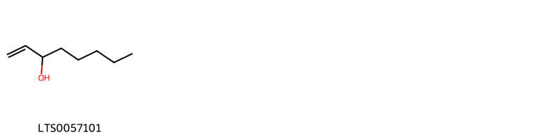{ width=100% }
    <figcaption>Hình ảnh cấu trúc hóa học của 1 hoạt chất thuộc nhóm Fatty Acyls gồm ['1-octen-3-ol (LTS0057101)'].</figcaption>
</figure>
#### Nhóm Prenol lipids
<figure markdown="span">
    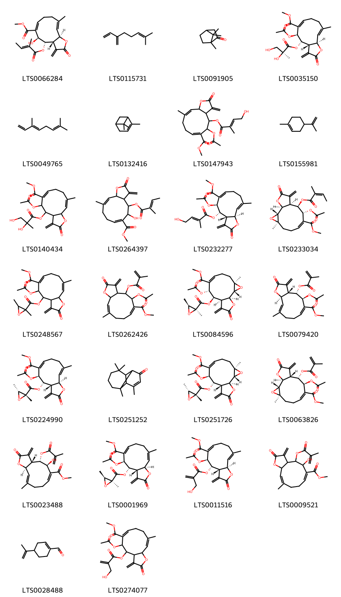{ width=100% }
    <figcaption>Hình ảnh cấu trúc hóa học của 26 hoạt chất thuộc nhóm Prenol lipids gồm ['methyl (3as,4s,5s,11ar)-5-hydroxy-10-methyl-4-{[(2e)-2-methylbut-2-enoyl]oxy}-3-methylidene-2-oxo-3ah,4h,5h,8h,9h,11ah-cyclodeca[b]furan-6-carboxylate (LTS0066284)', 'α-myrcene (LTS0115731)', 'camphor (LTS0091905)', 'methyl (3as,4s,5s,11ar)-5-(acetyloxy)-4-{[(2s)-2,3-dihydroxy-2-methylpropanoyl]oxy}-10-methyl-3-methylidene-2-oxo-3ah,4h,5h,8h,9h,11ah-cyclodeca[b]furan-6-carboxylate (LTS0035150)', 'trans-β-ocimene (LTS0049765)', 'α pinene (LTS0132416)', 'methyl 5-(acetyloxy)-4-[(4-hydroxy-2-methylbut-2-enoyl)oxy]-10-methyl-3-methylidene-2-oxo-3ah,4h,5h,8h,9h,11ah-cyclodeca[b]furan-6-carboxylate (LTS0147943)', 'limonene,  (LTS0155981)', 'methyl 5-(acetyloxy)-4-[(2,3-dihydroxy-2-methylpropanoyl)oxy]-10-methyl-3-methylidene-2-oxo-3ah,4h,5h,8h,9h,11ah-cyclodeca[b]furan-6-carboxylate (LTS0140434)', 'methyl 5-hydroxy-10-methyl-4-[(2-methylbut-2-enoyl)oxy]-3-methylidene-2-oxo-3ah,4h,5h,8h,9h,11ah-cyclodeca[b]furan-6-carboxylate (LTS0264397)', 'methyl (3as,4s,5s,11ar)-5-(acetyloxy)-4-{[(2e)-4-hydroxy-2-methylbut-2-enoyl]oxy}-10-methyl-3-methylidene-2-oxo-3ah,4h,5h,8h,9h,11ah-cyclodeca[b]furan-6-carboxylate (LTS0232277)', 'methyl (1s,2r,4r,7e,9r,10r,11s)-9-(acetyloxy)-4-methyl-10-{[(2z)-2-methylbut-2-enoyl]oxy}-12-methylidene-13-oxo-3,14-dioxatricyclo[9.3.0.0²,⁴]tetradec-7-ene-8-carboxylate (LTS0233034)', '5-(acetyloxy)-6-(methoxycarbonyl)-10-methyl-3-methylidene-2-oxo-3ah,4h,5h,8h,9h,11ah-cyclodeca[b]furan-4-yl 2,3-dimethyloxirane-2-carboxylate (LTS0248567)', 'methyl 5-(acetyloxy)-10-methyl-3-methylidene-4-[(2-methylprop-2-enoyl)oxy]-2-oxo-3ah,4h,5h,8h,9h,11ah-cyclodeca[b]furan-6-carboxylate (LTS0262426)', 'methyl (1s,2r,4r,7e,9r,10r,11s)-9-(acetyloxy)-10-[(2s,3s)-2,3-dimethyloxirane-2-carbonyloxy]-4-methyl-12-methylidene-13-oxo-3,14-dioxatricyclo[9.3.0.0²,⁴]tetradec-7-ene-8-carboxylate (LTS0084596)', 'methyl (3as,4s,5s,11ar)-5-(acetyloxy)-10-methyl-3-methylidene-4-[(2-methylprop-2-enoyl)oxy]-2-oxo-3ah,4h,5h,8h,9h,11ah-cyclodeca[b]furan-6-carboxylate (LTS0079420)', '(3as,4s,5s,11ar)-5-(acetyloxy)-6-(methoxycarbonyl)-10-methyl-3-methylidene-2-oxo-3ah,4h,5h,8h,9h,11ah-cyclodeca[b]furan-4-yl (2r,3r)-2,3-dimethyloxirane-2-carboxylate (LTS0224990)', '2,6,6,11-tetramethyltricyclo[5.4.0.0²,⁸]undec-10-en-9-one (LTS0251252)', 'enhydrin (LTS0251726)', 'methyl (1s,2r,4r,7e,9s,10s,11r)-9-(acetyloxy)-4-methyl-12-methylidene-10-[(2-methylprop-2-enoyl)oxy]-13-oxo-3,14-dioxatricyclo[9.3.0.0²,⁴]tetradec-7-ene-8-carboxylate (LTS0063826)', 'methyl (3as,4s,5s,11ar)-5-hydroxy-10-methyl-3-methylidene-4-[(2-methylprop-2-enoyl)oxy]-2-oxo-3ah,4h,5h,8h,9h,11ah-cyclodeca[b]furan-6-carboxylate (LTS0023488)', '(3as,4s,5s,11ar)-5-(acetyloxy)-6-(methoxycarbonyl)-10-methyl-3-methylidene-2-oxo-3ah,4h,5h,8h,9h,11ah-cyclodeca[b]furan-4-yl (2s,3s)-2,3-dimethyloxirane-2-carboxylate (LTS0001969)', 'methyl (3as,4s,5s,11ar)-5-(acetyloxy)-4-{[2-(hydroxymethyl)prop-2-enoyl]oxy}-10-methyl-3-methylidene-2-oxo-3ah,4h,5h,8h,9h,11ah-cyclodeca[b]furan-6-carboxylate (LTS0011516)', 'methyl 5-hydroxy-10-methyl-3-methylidene-4-[(2-methylprop-2-enoyl)oxy]-2-oxo-3ah,4h,5h,8h,9h,11ah-cyclodeca[b]furan-6-carboxylate (LTS0009521)', 'perillaldehyde,  (LTS0028488)', 'methyl 5-(acetyloxy)-4-{[2-(hydroxymethyl)prop-2-enoyl]oxy}-10-methyl-3-methylidene-2-oxo-3ah,4h,5h,8h,9h,11ah-cyclodeca[b]furan-6-carboxylate (LTS0274077)'].</figcaption>
</figure>

---

### Dược dân tộc học

Danh sách các quốc gia có sử dụng *Enydra fluctuans* trong điều trị các bệnh. 

| Country   | Disease                                            | Bệnh                                                                                                                                                                                                |
|:----------|:---------------------------------------------------|:----------------------------------------------------------------------------------------------------------------------------------------------------------------------------------------------------|
| India     | Demulcent, Demulcent, Laxative, Laxative, Laxative | MYMEMORY WARNING: YOU USED ALL AVAILABLE FREE TRANSLATIONS FOR TODAY. NEXT AVAILABLE IN  10 HOURS 51 MINUTES 45 SECONDS VISIT HTTPS://MYMEMORY.TRANSLATED.NET/DOC/USAGELIMITS.PHP TO TRANSLATE MORE |
| Malaya    | Laxative                                           | MYMEMORY WARNING: YOU USED ALL AVAILABLE FREE TRANSLATIONS FOR TODAY. NEXT AVAILABLE IN  10 HOURS 51 MINUTES 42 SECONDS VISIT HTTPS://MYMEMORY.TRANSLATED.NET/DOC/USAGELIMITS.PHP TO TRANSLATE MORE |
| Malaysia  | Laxative                                           | MYMEMORY WARNING: YOU USED ALL AVAILABLE FREE TRANSLATIONS FOR TODAY. NEXT AVAILABLE IN  10 HOURS 51 MINUTES 40 SECONDS VISIT HTTPS://MYMEMORY.TRANSLATED.NET/DOC/USAGELIMITS.PHP TO TRANSLATE MORE |
| Sudan     | Laxative                                           | MYMEMORY WARNING: YOU USED ALL AVAILABLE FREE TRANSLATIONS FOR TODAY. NEXT AVAILABLE IN  10 HOURS 51 MINUTES 37 SECONDS VISIT HTTPS://MYMEMORY.TRANSLATED.NET/DOC/USAGELIMITS.PHP TO TRANSLATE MORE |

---

# Chi Borrichia

??? note "Danh sách các dược liệu thuộc chi"
    
	 - *Borrichia arborescens*

---
## Borrichia arborescens
### Thông tin về thực vật

!!! info "Phân loại thực vật của *Borrichia arborescens* từ GIBF:"
    - **Kingdom:** Plantae
    - **Phylum:** Tracheophyta
    - **Order:** Asterales
    - **Family:** Asteraceae
    - **Genus:** Borrichia
    - **Species:** *Borrichia arborescens*

 

| Label (VI)   | Label (EN)   | Scientific Name       | Descriptions (VI)   | Descriptions (EN)   | Also Known As (VI)   | Also Known As (EN)                   |
|:-------------|:-------------|:----------------------|:--------------------|:--------------------|:---------------------|:-------------------------------------|
| N/A          | N/A          | Borrichia arborescens | loài thực vật       | species of plant    | ['']                 | ['tree oxeye', 'tree seaside tansy'] |

#### Phân bố trên thế giới

**Từ CSDL GIBF** Virgin Islands (U.S.), Bermuda, Puerto Rico, Guadeloupe, Turks and Caicos Islands, Saint Barthélemy, Haiti, Bahamas, Sint Maarten (Dutch part), Jamaica, Anguilla, United States of America, Cayman Islands, Mexico, Antigua and Barbuda, Cuba, Dominican Republic

#### Phân bố tại Việt Nam

**Từ CSDL GIBF**: Không có ghi nhận ở Việt Nam

---
### Thành phần hóa học
        
- Theo cơ sở dữ liệu lotus: Từ loài *Borrichia arborescens* đã phân lập và xác định được Chưa có hoạt chất nào được phân lập. hoạt chất thuộc về các nhóm Không có hoạt chất nào được phân lập. 

Không có hình ảnh nào được tạo ra

---

### Dược dân tộc học

Danh sách các quốc gia có sử dụng *Borrichia arborescens* trong điều trị các bệnh. 

| Country   | Disease   | Bệnh                                                                                                                                                                                                |
|:----------|:----------|:----------------------------------------------------------------------------------------------------------------------------------------------------------------------------------------------------|
| Barbuda   | Antidote  | MYMEMORY WARNING: YOU USED ALL AVAILABLE FREE TRANSLATIONS FOR TODAY. NEXT AVAILABLE IN  10 HOURS 50 MINUTES 53 SECONDS VISIT HTTPS://MYMEMORY.TRANSLATED.NET/DOC/USAGELIMITS.PHP TO TRANSLATE MORE |

---

# Chi Eclipta

??? note "Danh sách các dược liệu thuộc chi"
    
	 - *Eclipta alba*
	 - *Eclipta prostrata*

---
## Eclipta alba
### Thông tin về thực vật

!!! info "Phân loại thực vật của *Eclipta alba* từ GIBF:"
    - **Kingdom:** Plantae
    - **Phylum:** Tracheophyta
    - **Order:** Asterales
    - **Family:** Asteraceae
    - **Genus:** Eclipta
    - **Species:** *Eclipta alba*

 

| Label (VI)   | Label (EN)   | Scientific Name   | Descriptions (VI)   | Descriptions (EN)   | Also Known As (VI)   | Also Known As (EN)   |
|:-------------|:-------------|:------------------|:--------------------|:--------------------|:---------------------|:---------------------|
| N/A          | N/A          | Eclipta alba      | loài thực vật       | species of plant    | ['']                 | ['']                 |

#### Phân bố trên thế giới

**Từ CSDL GIBF** nan, Pakistan, Nigeria, Japan, Madagascar, Korea, Republic of, Colombia, Brazil, Chinese Taipei, Costa Rica, Vanuatu, India, United States of America, Peru, Mexico, Malaysia

#### Phân bố tại Việt Nam

**Từ CSDL GIBF**: Không có ghi nhận ở Việt Nam

---
### Thành phần hóa học
        
- Theo cơ sở dữ liệu lotus: Từ loài *Eclipta alba* đã phân lập và xác định được 91 hoạt chất thuộc về các nhóm Fatty Acyls, Flavonoids, Prenol lipids, Steroids and steroid derivatives, Isoflavonoids, Thiophenes, Bi- and oligothiophenes, Benzene and substituted derivatives, Saturated hydrocarbons. 

|    | chemicalTaxonomyClassyfireClass     |   smiles_count |
|---:|:------------------------------------|---------------:|
|  0 | Benzene and substituted derivatives |              1 |
|  1 | Bi- and oligothiophenes             |             22 |
|  2 | Fatty Acyls                         |              3 |
|  3 | Flavonoids                          |              2 |
|  4 | Isoflavonoids                       |              2 |
|  5 | Prenol lipids                       |             27 |
|  6 | Saturated hydrocarbons              |              1 |
|  7 | Steroids and steroid derivatives    |             23 |
|  8 | Thiophenes                          |              9 |

#### Nhóm Benzene and substituted derivatives
<figure markdown="span">
    { width=100% }
    <figcaption>Hình ảnh cấu trúc hóa học của 1 hoạt chất thuộc nhóm Benzene and substituted derivatives gồm ['3,4-dihydroxybenzoic acid (LTS0018765)'].</figcaption>
</figure>
#### Nhóm Bi- and oligothiophenes
<figure markdown="span">
    { width=100% }
    <figcaption>Hình ảnh cấu trúc hóa học của 22 hoạt chất thuộc nhóm Bi- and oligothiophenes gồm ["(2-{[2,3'-bithiophen]-2'-yl}-2h-thiophen-3-ylidene)methyl (2e)-2-methylbut-2-enoate (LTS0106487)", "(2-{[2,3'-bithiophen]-2'-yl}-2h-thiophen-3-ylidene)methyl 3-methylbut-2-enoate (LTS0168234)", "[5'-(but-3-en-1-yn-1-yl)-[2,2'-bithiophen]-5-yl]methyl 3-methylbut-2-enoate (LTS0044563)", "(5-{[2,2'-bithiophen]-5-yl}thiophen-2-yl)methyl (2z)-2-methylbut-2-enoate (LTS0071410)", "4-(5'-{[(3-methylbutanoyl)oxy]methyl}-[2,2'-bithiophen]-5-yl)but-3-yn-1-yl 3-methylbutanoate (LTS0164335)", "(5-{[2,2'-bithiophen]-5-yl}thiophen-2-yl)methyl acetate (LTS0063704)", "[5'-(but-3-en-1-yn-1-yl)-[2,2'-bithiophen]-5-yl]methyl 2-methylpropanoate (LTS0205040)", "(5-{[2,2'-bithiophen]-5-yl}thiophen-2-yl)methyl 2-methylpropanoate (LTS0155288)", "[5'-(but-3-en-1-yn-1-yl)-[2,2'-bithiophen]-5-yl]methyl 2-methylbut-2-enoate (LTS0165842)", "(5'-{4-[(3-methylbutanoyl)oxy]but-1-yn-1-yl}-[2,2'-bithiophen]-5-yl)methyl (2e)-2-methylbut-2-enoate (LTS0170762)", "[5'-(but-3-en-1-yn-1-yl)-[2,2'-bithiophen]-5-yl]methyl (2z)-2-methylbut-2-enoate (LTS0242749)", "(5-{[2,2'-bithiophen]-5-yl}thiophen-2-yl)methyl 2-methylbut-2-enoate (LTS0239473)", "2-{[2,3'-bithiophen]-2'-yl}-1-methylidene-1λ⁴-thiophen-3-yl acetate (LTS0245807)", "5-{1λ⁴-[2,2'-bithiophen]-5'-yl}thiophene-2-carbaldehyde (LTS0133432)", "5-(5-methylthiophen-2-yl)-2,2'-bithiophene (LTS0267682)", "3-(thiophen-2-yl)-2,2'-bithiophene (LTS0046293)", "[5'-(but-3-en-1-yn-1-yl)-[2,2'-bithiophen]-5-yl]methyl (2e)-2-methylbut-2-enoate (LTS0158704)", "(5-{[2,2'-bithiophen]-5-yl}thiophen-2-yl)methyl 3-methylbut-2-enoate (LTS0019795)", "(5-{[2,2'-bithiophen]-5-yl}thiophen-2-yl)methyl (2e)-2-methylbut-2-enoate (LTS0127100)", "(5'-{4-[(3-methylbutanoyl)oxy]but-1-yn-1-yl}-[2,2'-bithiophen]-5-yl)methyl 2-methylbut-2-enoate (LTS0056007)", 'terthiophene (LTS0246627)', "(2-{[2,3'-bithiophen]-2'-yl}-2h-thiophen-3-ylidene)methyl (2z)-2-methylbut-2-enoate (LTS0270739)"].</figcaption>
</figure>
#### Nhóm Fatty Acyls
<figure markdown="span">
    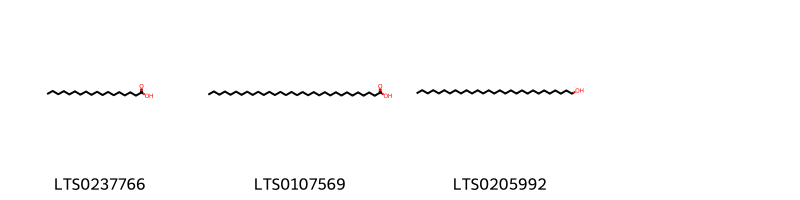{ width=100% }
    <figcaption>Hình ảnh cấu trúc hóa học của 3 hoạt chất thuộc nhóm Fatty Acyls gồm ['stearic acid (LTS0237766)', 'lacceroic acid (LTS0107569)', 'nonacosanol (LTS0205992)'].</figcaption>
</figure>
#### Nhóm Flavonoids
<figure markdown="span">
    { width=100% }
    <figcaption>Hình ảnh cấu trúc hóa học của 2 hoạt chất thuộc nhóm Flavonoids gồm ['chamomile (LTS0104946)', 'quercetin (LTS0004651)'].</figcaption>
</figure>
#### Nhóm Isoflavonoids
<figure markdown="span">
    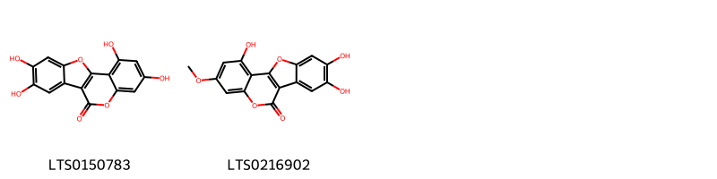{ width=100% }
    <figcaption>Hình ảnh cấu trúc hóa học của 2 hoạt chất thuộc nhóm Isoflavonoids gồm ['demethylwedelolactone (LTS0150783)', 'wedelolactone (LTS0216902)'].</figcaption>
</figure>
#### Nhóm Prenol lipids
<figure markdown="span">
    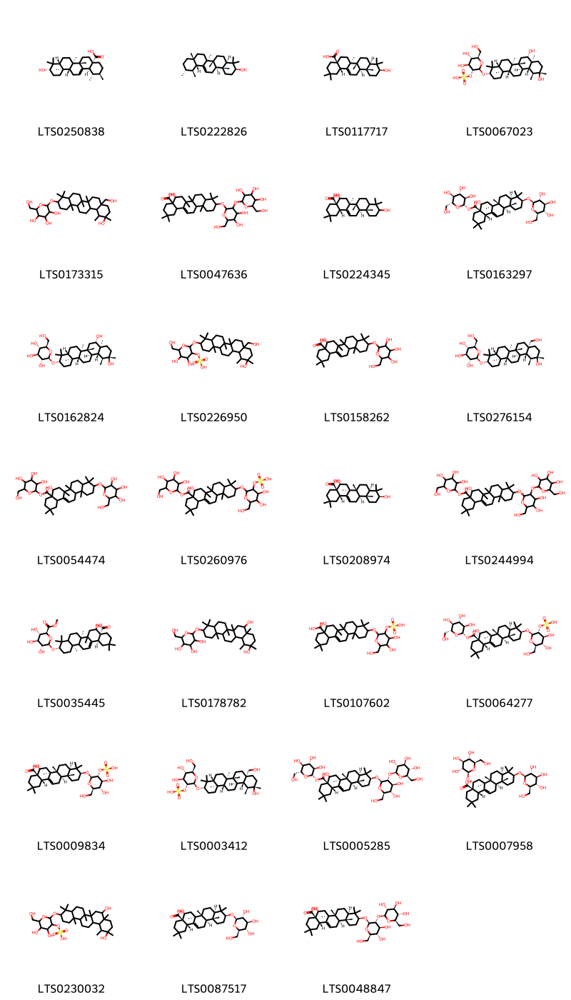{ width=100% }
    <figcaption>Hình ảnh cấu trúc hóa học của 27 hoạt chất thuộc nhóm Prenol lipids gồm ['ursolic acid (LTS0250838)', 'amyrin (LTS0222826)', 'oleanolic acid (LTS0117717)', '[(2r,3r,4s,5s,6r)-2-{[(3s,4ar,6ar,6br,8s,8as,11s,12s,12as,12br,14ar,14br)-8,11-dihydroxy-4,4,6a,6b,8a,11,12,14b-octamethyl-hexadecahydropicen-3-yl]oxy}-4,5-dihydroxy-6-(hydroxymethyl)oxan-3-yl]oxidanesulfonic acid (LTS0067023)', '2-{[11-hydroxy-8a-(hydroxymethyl)-4,4,6a,6b,11,12,14b-heptamethyl-hexadecahydropicen-3-yl]oxy}-6-(hydroxymethyl)oxane-3,4,5-triol (LTS0173315)', '10-{[4,5-dihydroxy-6-(hydroxymethyl)-3-{[3,4,5-trihydroxy-6-(hydroxymethyl)oxan-2-yl]oxy}oxan-2-yl]oxy}-5-hydroxy-2,2,6a,6b,9,9,12a-heptamethyl-1,3,4,5,6,7,8,8a,10,11,12,12b,13,14b-tetradecahydropicene-4a-carboxylic acid (LTS0047636)', '(4ar,6as,6br,12ar,12br,14bs)-5,10-dihydroxy-2,2,6a,6b,9,9,12a-heptamethyl-1,3,4,5,6,7,8,8a,10,11,12,12b,13,14b-tetradecahydropicene-4a-carboxylic acid (LTS0224345)', '(2s,3r,4s,5s,6r)-3,4,5-trihydroxy-6-(hydroxymethyl)oxan-2-yl (4ar,5r,6as,6br,8ar,10s,12ar,12br,14bs)-5-hydroxy-2,2,6a,6b,9,9,12a-heptamethyl-10-{[(2r,3r,4s,5s,6r)-3,4,5-trihydroxy-6-(hydroxymethyl)oxan-2-yl]oxy}-1,3,4,5,6,7,8,8a,10,11,12,12b,13,14b-tetradecahydropicene-4a-carboxylate (LTS0163297)', '(2r,3r,4s,5s,6r)-2-{[(3s,4ar,6ar,6br,8s,8as,11s,12s,12as,12br,14ar,14br)-8,11-dihydroxy-4,4,6a,6b,8a,11,12,14b-octamethyl-hexadecahydropicen-3-yl]oxy}-6-(hydroxymethyl)oxane-3,4,5-triol (LTS0162824)', '(4,5-dihydroxy-2-{[11-hydroxy-8a-(hydroxymethyl)-4,4,6a,6b,11,12,14b-heptamethyl-hexadecahydropicen-3-yl]oxy}-6-(hydroxymethyl)oxan-3-yl)oxidanesulfonic acid (LTS0226950)', '5-hydroxy-2,2,6a,6b,9,9,12a-heptamethyl-10-{[3,4,5-trihydroxy-6-(hydroxymethyl)oxan-2-yl]oxy}-1,3,4,5,6,7,8,8a,10,11,12,12b,13,14b-tetradecahydropicene-4a-carboxylic acid (LTS0158262)', '(2r,3r,4s,5s,6r)-2-{[(3s,4ar,6ar,6br,8ar,11s,12s,12as,12br,14ar,14br)-11-hydroxy-8a-(hydroxymethyl)-4,4,6a,6b,11,12,14b-heptamethyl-hexadecahydropicen-3-yl]oxy}-6-(hydroxymethyl)oxane-3,4,5-triol (LTS0276154)', '3,4,5-trihydroxy-6-(hydroxymethyl)oxan-2-yl 5-hydroxy-2,2,6a,6b,9,9,12a-heptamethyl-10-{[3,4,5-trihydroxy-6-(hydroxymethyl)oxan-2-yl]oxy}-1,3,4,5,6,7,8,8a,10,11,12,12b,13,14b-tetradecahydropicene-4a-carboxylate (LTS0054474)', '(4,5-dihydroxy-2-{[8-hydroxy-4,4,6a,6b,11,11,14b-heptamethyl-8a-({[3,4,5-trihydroxy-6-(hydroxymethyl)oxan-2-yl]oxy}carbonyl)-1,2,3,4a,5,6,7,8,9,10,12,12a,14,14a-tetradecahydropicen-3-yl]oxy}-6-(hydroxymethyl)oxan-3-yl)oxidanesulfonic acid (LTS0260976)', 'echinocystic acid (LTS0208974)', '3,4,5-trihydroxy-6-(hydroxymethyl)oxan-2-yl 10-{[4,5-dihydroxy-6-(hydroxymethyl)-3-{[3,4,5-trihydroxy-6-(hydroxymethyl)oxan-2-yl]oxy}oxan-2-yl]oxy}-5-hydroxy-2,2,6a,6b,9,9,12a-heptamethyl-1,3,4,5,6,7,8,8a,10,11,12,12b,13,14b-tetradecahydropicene-4a-carboxylate (LTS0244994)', '(4ar,6br,10s,12ar,14bs)-5-hydroxy-2,2,6a,6b,9,9,12a-heptamethyl-10-{[(2r,3r,4s,5s,6s)-3,4,5-trihydroxy-6-(methoxycarbonyl)oxan-2-yl]oxy}-1,3,4,5,6,7,8,8a,10,11,12,12b,13,14b-tetradecahydropicene-4a-carboxylic acid (LTS0035445)', '2-[(8,11-dihydroxy-4,4,6a,6b,8a,11,12,14b-octamethyl-hexadecahydropicen-3-yl)oxy]-6-(hydroxymethyl)oxane-3,4,5-triol (LTS0178782)', '10-{[4,5-dihydroxy-6-(hydroxymethyl)-3-(sulfooxy)oxan-2-yl]oxy}-5-hydroxy-2,2,6a,6b,9,9,12a-heptamethyl-1,3,4,5,6,7,8,8a,10,11,12,12b,13,14b-tetradecahydropicene-4a-carboxylic acid (LTS0107602)', '[(2r,3r,4s,5s,6r)-2-{[(3s,4ar,6ar,6bs,8r,8ar,12as,14ar,14br)-8-hydroxy-4,4,6a,6b,11,11,14b-heptamethyl-8a-({[(2s,3r,4s,5s,6r)-3,4,5-trihydroxy-6-(hydroxymethyl)oxan-2-yl]oxy}carbonyl)-1,2,3,4a,5,6,7,8,9,10,12,12a,14,14a-tetradecahydropicen-3-yl]oxy}-4,5-dihydroxy-6-(hydroxymethyl)oxan-3-yl]oxidanesulfonic acid (LTS0064277)', '(4ar,5r,6as,6br,8ar,10s,12ar,12br,14bs)-10-{[(2r,3r,4s,5s,6r)-4,5-dihydroxy-6-(hydroxymethyl)-3-(sulfooxy)oxan-2-yl]oxy}-5-hydroxy-2,2,6a,6b,9,9,12a-heptamethyl-1,3,4,5,6,7,8,8a,10,11,12,12b,13,14b-tetradecahydropicene-4a-carboxylic acid (LTS0009834)', '[(2r,3r,4s,5s,6r)-2-{[(3s,4ar,6ar,6br,8ar,11s,12s,12as,12br,14ar,14br)-11-hydroxy-8a-(hydroxymethyl)-4,4,6a,6b,11,12,14b-heptamethyl-hexadecahydropicen-3-yl]oxy}-4,5-dihydroxy-6-(hydroxymethyl)oxan-3-yl]oxidanesulfonic acid (LTS0003412)', '(2s,3r,4s,5s,6r)-3,4,5-trihydroxy-6-(hydroxymethyl)oxan-2-yl (4ar,5r,6as,6br,8ar,10s,12ar,12br,14bs)-10-{[(2r,3r,4s,5s,6r)-4,5-dihydroxy-6-(hydroxymethyl)-3-{[(2s,3r,4s,5s,6r)-3,4,5-trihydroxy-6-(hydroxymethyl)oxan-2-yl]oxy}oxan-2-yl]oxy}-5-hydroxy-2,2,6a,6b,9,9,12a-heptamethyl-1,3,4,5,6,7,8,8a,10,11,12,12b,13,14b-tetradecahydropicene-4a-carboxylate (LTS0005285)', '(4ar,5r,6as,6br,8ar,10s,12ar,12br,14bs)-2,2,6a,6b,9,9,12a-heptamethyl-5,10-bis({[(2r,3r,4s,5s,6r)-3,4,5-trihydroxy-6-(hydroxymethyl)oxan-2-yl]oxy})-1,3,4,5,6,7,8,8a,10,11,12,12b,13,14b-tetradecahydropicene-4a-carboxylic acid (LTS0007958)', '{2-[(8,11-dihydroxy-4,4,6a,6b,8a,11,12,14b-octamethyl-hexadecahydropicen-3-yl)oxy]-4,5-dihydroxy-6-(hydroxymethyl)oxan-3-yl}oxidanesulfonic acid (LTS0230032)', '(4ar,5r,6as,6br,8ar,10s,12ar,12br,14bs)-5-hydroxy-2,2,6a,6b,9,9,12a-heptamethyl-10-{[(2r,3r,4s,5s,6r)-3,4,5-trihydroxy-6-(hydroxymethyl)oxan-2-yl]oxy}-1,3,4,5,6,7,8,8a,10,11,12,12b,13,14b-tetradecahydropicene-4a-carboxylic acid (LTS0087517)', '(4ar,5r,6as,6br,8ar,10s,12ar,12br,14bs)-10-{[(2r,3r,4s,5s,6r)-4,5-dihydroxy-6-(hydroxymethyl)-3-{[(2s,3r,4s,5s,6r)-3,4,5-trihydroxy-6-(hydroxymethyl)oxan-2-yl]oxy}oxan-2-yl]oxy}-5-hydroxy-2,2,6a,6b,9,9,12a-heptamethyl-1,3,4,5,6,7,8,8a,10,11,12,12b,13,14b-tetradecahydropicene-4a-carboxylic acid (LTS0048847)'].</figcaption>
</figure>
#### Nhóm Saturated hydrocarbons
<figure markdown="span">
    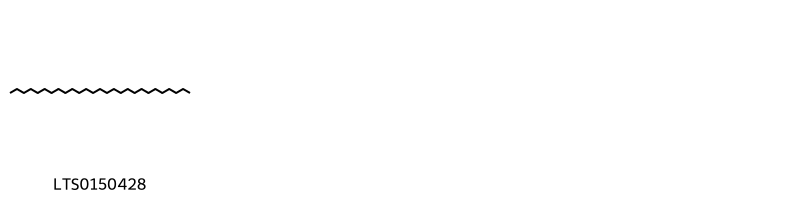{ width=100% }
    <figcaption>Hình ảnh cấu trúc hóa học của 1 hoạt chất thuộc nhóm Saturated hydrocarbons gồm ['heptacosane (LTS0150428)'].</figcaption>
</figure>
#### Nhóm Steroids and steroid derivatives
<figure markdown="span">
    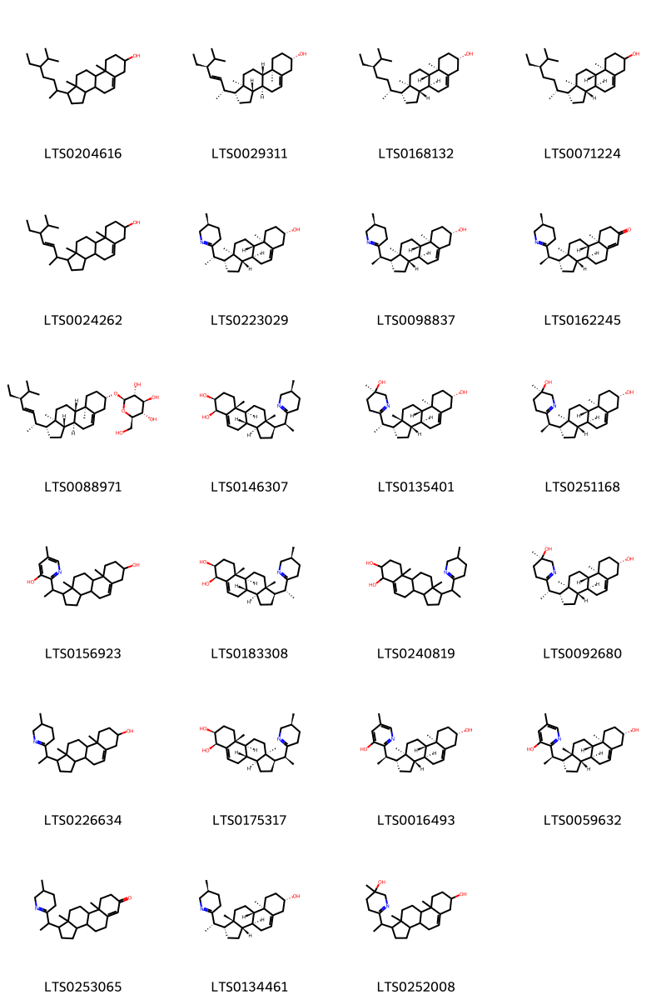{ width=100% }
    <figcaption>Hình ảnh cấu trúc hóa học của 23 hoạt chất thuộc nhóm Steroids and steroid derivatives gồm ['stigmast-5-en-3-ol, (3β)- (LTS0204616)', 'phytosterol (LTS0029311)', 'sitosterol (LTS0168132)', 'stigmast-5-en-3-ol (LTS0071224)', 'stigmasterol (LTS0024262)', '(1r,3as,3bs,7s,9ar,9bs,11as)-9a,11a-dimethyl-1-[(1s)-1-[(5s)-5-methyl-3,4,5,6-tetrahydropyridin-2-yl]ethyl]-1h,2h,3h,3ah,3bh,4h,6h,7h,8h,9h,9bh,10h,11h-cyclopenta[a]phenanthren-7-ol (LTS0223029)', '(1r,3as,3bs,7s,9ar,9bs,11as)-9a,11a-dimethyl-1-[(1r)-1-[(5s)-5-methyl-3,4,5,6-tetrahydropyridin-2-yl]ethyl]-1h,2h,3h,3ah,3bh,4h,6h,7h,8h,9h,9bh,10h,11h-cyclopenta[a]phenanthren-7-ol (LTS0098837)', '(1r,3as,3bs,9ar,9bs,11as)-9a,11a-dimethyl-1-[(1r)-1-[(5s)-5-methyl-3,4,5,6-tetrahydropyridin-2-yl]ethyl]-1h,2h,3h,3ah,3bh,4h,5h,8h,9h,9bh,10h,11h-cyclopenta[a]phenanthren-7-one (LTS0162245)', '(2r,3r,4s,5s,6r)-2-{[(1r,3as,3bs,7s,9ar,9bs,11ar)-1-[(2r,3e,5s)-5-ethyl-6-methylhept-3-en-2-yl]-9a,11a-dimethyl-1h,2h,3h,3ah,3bh,4h,6h,7h,8h,9h,9bh,10h,11h-cyclopenta[a]phenanthren-7-yl]oxy}-6-(hydroxymethyl)oxane-3,4,5-triol (LTS0088971)', '(1r,3as,3bs,6r,7s,9ar,9bs,11as)-9a,11a-dimethyl-1-[(1s)-1-[(5s)-5-methyl-3,4,5,6-tetrahydropyridin-2-yl]ethyl]-1h,2h,3h,3ah,3bh,4h,6h,7h,8h,9h,9bh,10h,11h-cyclopenta[a]phenanthrene-6,7-diol (LTS0146307)', '(3r)-6-[(1s)-1-[(1r,3as,3bs,7s,9ar,9bs,11ar)-7-hydroxy-9a,11a-dimethyl-1h,2h,3h,3ah,3bh,4h,6h,7h,8h,9h,9bh,10h,11h-cyclopenta[a]phenanthren-1-yl]ethyl]-3-methyl-4,5-dihydro-2h-pyridin-3-ol (LTS0135401)', '(3r)-6-[(1r)-1-[(1r,3as,3bs,7s,9ar,9bs,11as)-7-hydroxy-9a,11a-dimethyl-1h,2h,3h,3ah,3bh,4h,6h,7h,8h,9h,9bh,10h,11h-cyclopenta[a]phenanthren-1-yl]ethyl]-3-methyl-4,5-dihydro-2h-pyridin-3-ol (LTS0251168)', '2-(1-{7-hydroxy-9a,11a-dimethyl-1h,2h,3h,3ah,3bh,4h,6h,7h,8h,9h,9bh,10h,11h-cyclopenta[a]phenanthren-1-yl}ethyl)-5-methylpyridin-3-ol (LTS0156923)', '(1r,3as,3bs,6r,7s,9ar,9bs,11as)-9a,11a-dimethyl-1-[(1r)-1-[(5s)-5-methyl-3,4,5,6-tetrahydropyridin-2-yl]ethyl]-1h,2h,3h,3ah,3bh,4h,6h,7h,8h,9h,9bh,10h,11h-cyclopenta[a]phenanthrene-6,7-diol (LTS0183308)', '9a,11a-dimethyl-1-[1-(5-methyl-3,4,5,6-tetrahydropyridin-2-yl)ethyl]-1h,2h,3h,3ah,3bh,4h,6h,7h,8h,9h,9bh,10h,11h-cyclopenta[a]phenanthrene-6,7-diol (LTS0240819)', '(3r)-6-[(1s)-1-[(1r,3as,3bs,7s,9ar,9bs,11as)-7-hydroxy-9a,11a-dimethyl-1h,2h,3h,3ah,3bh,4h,6h,7h,8h,9h,9bh,10h,11h-cyclopenta[a]phenanthren-1-yl]ethyl]-3-methyl-4,5-dihydro-2h-pyridin-3-ol (LTS0092680)', '9a,11a-dimethyl-1-[1-(5-methyl-3,4,5,6-tetrahydropyridin-2-yl)ethyl]-1h,2h,3h,3ah,3bh,4h,6h,7h,8h,9h,9bh,10h,11h-cyclopenta[a]phenanthren-7-ol (LTS0226634)', '(1r,3as,3bs,6r,7s,9ar,9bs,11ar)-9a,11a-dimethyl-1-[(1s)-1-[(5s)-5-methyl-3,4,5,6-tetrahydropyridin-2-yl]ethyl]-1h,2h,3h,3ah,3bh,4h,6h,7h,8h,9h,9bh,10h,11h-cyclopenta[a]phenanthrene-6,7-diol (LTS0175317)', '2-[(1r)-1-[(1r,3as,3bs,7s,9ar,9bs,11as)-7-hydroxy-9a,11a-dimethyl-1h,2h,3h,3ah,3bh,4h,6h,7h,8h,9h,9bh,10h,11h-cyclopenta[a]phenanthren-1-yl]ethyl]-5-methylpyridin-3-ol (LTS0016493)', '2-[(1r)-1-[(1r,3as,3bs,7s,9ar,9bs,11ar)-7-hydroxy-9a,11a-dimethyl-1h,2h,3h,3ah,3bh,4h,6h,7h,8h,9h,9bh,10h,11h-cyclopenta[a]phenanthren-1-yl]ethyl]-5-methylpyridin-3-ol (LTS0059632)', '9a,11a-dimethyl-1-[1-(5-methyl-3,4,5,6-tetrahydropyridin-2-yl)ethyl]-1h,2h,3h,3ah,3bh,4h,5h,8h,9h,9bh,10h,11h-cyclopenta[a]phenanthren-7-one (LTS0253065)', '(1r,3as,3bs,7s,9ar,9bs,11ar)-9a,11a-dimethyl-1-[(1s)-1-[(5s)-5-methyl-3,4,5,6-tetrahydropyridin-2-yl]ethyl]-1h,2h,3h,3ah,3bh,4h,6h,7h,8h,9h,9bh,10h,11h-cyclopenta[a]phenanthren-7-ol (LTS0134461)', '6-(1-{7-hydroxy-9a,11a-dimethyl-1h,2h,3h,3ah,3bh,4h,6h,7h,8h,9h,9bh,10h,11h-cyclopenta[a]phenanthren-1-yl}ethyl)-3-methyl-4,5-dihydro-2h-pyridin-3-ol (LTS0252008)'].</figcaption>
</figure>
#### Nhóm Thiophenes
<figure markdown="span">
    { width=100% }
    <figcaption>Hình ảnh cấu trúc hóa học của 9 hoạt chất thuộc nhóm Thiophenes gồm ['(2s)-2-hydroxy-4-[5-(penta-1,3-diyn-1-yl)thiophen-2-yl]but-3-yn-1-yl acetate (LTS0128137)', '(2r)-4-[5-(buta-1,3-diyn-1-yl)thiophen-2-yl]-1-chlorobut-3-yn-2-ol (LTS0156553)', '1-chloro-4-[5-(penta-1,3-diyn-1-yl)thiophen-2-yl]but-3-yn-2-ol (LTS0242829)', '4-[5-(buta-1,3-diyn-1-yl)thiophen-2-yl]-1-chlorobut-3-yn-2-ol (LTS0134945)', '2-(but-3-en-1-yn-1-yl)-5-(buta-1,3-diyn-1-yl)thiophene (LTS0220041)', '(2s)-1-chloro-4-[5-(penta-1,3-diyn-1-yl)thiophen-2-yl]but-3-yn-2-ol (LTS0157076)', '(2r)-1-chloro-4-[5-(penta-1,3-diyn-1-yl)thiophen-2-yl]but-3-yn-2-yl acetate (LTS0267183)', '1-chloro-4-[5-(penta-1,3-diyn-1-yl)thiophen-2-yl]but-3-yn-2-yl acetate (LTS0005759)', '2-hydroxy-4-[5-(penta-1,3-diyn-1-yl)thiophen-2-yl]but-3-yn-1-yl acetate (LTS0234776)'].</figcaption>
</figure>

---

### Dược dân tộc học

Danh sách các quốc gia có sử dụng *Eclipta alba* trong điều trị các bệnh. 

| Country   | Disease                                                       | Bệnh                                                                                                                                                                                                |
|:----------|:--------------------------------------------------------------|:----------------------------------------------------------------------------------------------------------------------------------------------------------------------------------------------------|
| China     | Hemostat                                                      | MYMEMORY WARNING: YOU USED ALL AVAILABLE FREE TRANSLATIONS FOR TODAY. NEXT AVAILABLE IN  10 HOURS 50 MINUTES 31 SECONDS VISIT HTTPS://MYMEMORY.TRANSLATED.NET/DOC/USAGELIMITS.PHP TO TRANSLATE MORE |
| Elsewhere | Antiseptic, Insecticide, Purgative, Tonic, Emetic, Estrogenic | MYMEMORY WARNING: YOU USED ALL AVAILABLE FREE TRANSLATIONS FOR TODAY. NEXT AVAILABLE IN  10 HOURS 50 MINUTES 28 SECONDS VISIT HTTPS://MYMEMORY.TRANSLATED.NET/DOC/USAGELIMITS.PHP TO TRANSLATE MORE |

---

---
## Eclipta prostrata
### Thông tin về thực vật

!!! info "Phân loại thực vật của *Eclipta prostrata* từ GIBF:"
    - **Kingdom:** Plantae
    - **Phylum:** Tracheophyta
    - **Order:** Asterales
    - **Family:** Asteraceae
    - **Genus:** Eclipta
    - **Species:** *Eclipta prostrata*

 

| Label (VI)   | Label (EN)   | Scientific Name   | Descriptions (VI)   | Descriptions (EN)   | Also Known As (VI)                                                                             | Also Known As (EN)   |
|:-------------|:-------------|:------------------|:--------------------|:--------------------|:-----------------------------------------------------------------------------------------------|:---------------------|
| N/A          | N/A          | Eclipta prostrata | loài thực vật       | species of plant    | ['Nhọ nồi', 'Hàn liên thảo', 'Eclipta prostrata', 'Eclipta alba', 'Cỏ nhọ nồi', 'Cây nhọ nồi'] | ['false daisy']      |

#### Phân bố trên thế giới

**Từ CSDL GIBF** nan, Sri Lanka, Australia, Argentina, Benin, Panama, French Guiana, Pakistan, Puerto Rico, Namibia, Chinese Taipei, Honduras, United States of America, Uruguay, Saudi Arabia, South Africa, Hong Kong, Thailand, Martinique, Brazil, Dominican Republic, Mexico, Peru, Singapore, Viet Nam, China, Curaçao, Ecuador, Seychelles, Colombia, Costa Rica, India, Indonesia, Philippines, Malaysia, Nepal

#### Phân bố tại Việt Nam

**Từ CSDL GIBF**: Ninh Bình, Quảng Ninh

---
### Thành phần hóa học
        
- Theo cơ sở dữ liệu lotus: Từ loài *Eclipta prostrata* đã phân lập và xác định được 97 hoạt chất thuộc về các nhóm Fatty Acyls, Flavonoids, Prenol lipids, Steroids and steroid derivatives, Isoflavonoids, Thiophenes, Bi- and oligothiophenes, Benzene and substituted derivatives, Saturated hydrocarbons. 

|    | chemicalTaxonomyClassyfireClass     |   smiles_count |
|---:|:------------------------------------|---------------:|
|  0 | Benzene and substituted derivatives |              1 |
|  1 | Bi- and oligothiophenes             |             22 |
|  2 | Fatty Acyls                         |              3 |
|  3 | Flavonoids                          |              2 |
|  4 | Isoflavonoids                       |              2 |
|  5 | Prenol lipids                       |             29 |
|  6 | Saturated hydrocarbons              |              1 |
|  7 | Steroids and steroid derivatives    |             23 |
|  8 | Thiophenes                          |              9 |

#### Nhóm Benzene and substituted derivatives
<figure markdown="span">
    { width=100% }
    <figcaption>Hình ảnh cấu trúc hóa học của 1 hoạt chất thuộc nhóm Benzene and substituted derivatives gồm ['3,4-dihydroxybenzoic acid (LTS0018765)'].</figcaption>
</figure>
#### Nhóm Bi- and oligothiophenes
<figure markdown="span">
    { width=100% }
    <figcaption>Hình ảnh cấu trúc hóa học của 22 hoạt chất thuộc nhóm Bi- and oligothiophenes gồm ["(2-{[2,3'-bithiophen]-2'-yl}-2h-thiophen-3-ylidene)methyl (2e)-2-methylbut-2-enoate (LTS0106487)", "(2-{[2,3'-bithiophen]-2'-yl}-2h-thiophen-3-ylidene)methyl 3-methylbut-2-enoate (LTS0168234)", "[5'-(but-3-en-1-yn-1-yl)-[2,2'-bithiophen]-5-yl]methyl 3-methylbut-2-enoate (LTS0044563)", "(5-{[2,2'-bithiophen]-5-yl}thiophen-2-yl)methyl (2z)-2-methylbut-2-enoate (LTS0071410)", "4-(5'-{[(3-methylbutanoyl)oxy]methyl}-[2,2'-bithiophen]-5-yl)but-3-yn-1-yl 3-methylbutanoate (LTS0164335)", "(5-{[2,2'-bithiophen]-5-yl}thiophen-2-yl)methyl acetate (LTS0063704)", "[5'-(but-3-en-1-yn-1-yl)-[2,2'-bithiophen]-5-yl]methyl 2-methylpropanoate (LTS0205040)", "(5-{[2,2'-bithiophen]-5-yl}thiophen-2-yl)methyl 2-methylpropanoate (LTS0155288)", "[5'-(but-3-en-1-yn-1-yl)-[2,2'-bithiophen]-5-yl]methyl 2-methylbut-2-enoate (LTS0165842)", "(5'-{4-[(3-methylbutanoyl)oxy]but-1-yn-1-yl}-[2,2'-bithiophen]-5-yl)methyl (2e)-2-methylbut-2-enoate (LTS0170762)", "[5'-(but-3-en-1-yn-1-yl)-[2,2'-bithiophen]-5-yl]methyl (2z)-2-methylbut-2-enoate (LTS0242749)", "(5-{[2,2'-bithiophen]-5-yl}thiophen-2-yl)methyl 2-methylbut-2-enoate (LTS0239473)", "2-{[2,3'-bithiophen]-2'-yl}-1-methylidene-1λ⁴-thiophen-3-yl acetate (LTS0245807)", "5-{1λ⁴-[2,2'-bithiophen]-5'-yl}thiophene-2-carbaldehyde (LTS0133432)", "5-(5-methylthiophen-2-yl)-2,2'-bithiophene (LTS0267682)", "3-(thiophen-2-yl)-2,2'-bithiophene (LTS0046293)", "[5'-(but-3-en-1-yn-1-yl)-[2,2'-bithiophen]-5-yl]methyl (2e)-2-methylbut-2-enoate (LTS0158704)", "(5-{[2,2'-bithiophen]-5-yl}thiophen-2-yl)methyl 3-methylbut-2-enoate (LTS0019795)", "(5-{[2,2'-bithiophen]-5-yl}thiophen-2-yl)methyl (2e)-2-methylbut-2-enoate (LTS0127100)", "(5'-{4-[(3-methylbutanoyl)oxy]but-1-yn-1-yl}-[2,2'-bithiophen]-5-yl)methyl 2-methylbut-2-enoate (LTS0056007)", 'terthiophene (LTS0246627)', "(2-{[2,3'-bithiophen]-2'-yl}-2h-thiophen-3-ylidene)methyl (2z)-2-methylbut-2-enoate (LTS0270739)"].</figcaption>
</figure>
#### Nhóm Fatty Acyls
<figure markdown="span">
    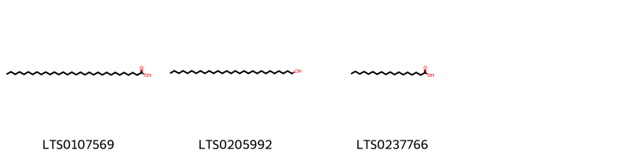{ width=100% }
    <figcaption>Hình ảnh cấu trúc hóa học của 3 hoạt chất thuộc nhóm Fatty Acyls gồm ['lacceroic acid (LTS0107569)', 'nonacosanol (LTS0205992)', 'stearic acid (LTS0237766)'].</figcaption>
</figure>
#### Nhóm Flavonoids
<figure markdown="span">
    { width=100% }
    <figcaption>Hình ảnh cấu trúc hóa học của 2 hoạt chất thuộc nhóm Flavonoids gồm ['chamomile (LTS0104946)', 'quercetin (LTS0004651)'].</figcaption>
</figure>
#### Nhóm Isoflavonoids
<figure markdown="span">
    { width=100% }
    <figcaption>Hình ảnh cấu trúc hóa học của 2 hoạt chất thuộc nhóm Isoflavonoids gồm ['demethylwedelolactone (LTS0150783)', 'wedelolactone (LTS0216902)'].</figcaption>
</figure>
#### Nhóm Prenol lipids
<figure markdown="span">
    { width=100% }
    <figcaption>Hình ảnh cấu trúc hóa học của 29 hoạt chất thuộc nhóm Prenol lipids gồm ['amyrin (LTS0222826)', '[(2r,3r,4s,5s,6r)-2-{[(3s,4ar,6ar,6br,8s,8as,11s,12s,12as,12br,14ar,14br)-8,11-dihydroxy-4,4,6a,6b,8a,11,12,14b-octamethyl-hexadecahydropicen-3-yl]oxy}-4,5-dihydroxy-6-(hydroxymethyl)oxan-3-yl]oxidanesulfonic acid (LTS0067023)', '2-{[11-hydroxy-8a-(hydroxymethyl)-4,4,6a,6b,11,12,14b-heptamethyl-hexadecahydropicen-3-yl]oxy}-6-(hydroxymethyl)oxane-3,4,5-triol (LTS0173315)', '10-{[4,5-dihydroxy-6-(hydroxymethyl)-3-{[3,4,5-trihydroxy-6-(hydroxymethyl)oxan-2-yl]oxy}oxan-2-yl]oxy}-5-hydroxy-2,2,6a,6b,9,9,12a-heptamethyl-1,3,4,5,6,7,8,8a,10,11,12,12b,13,14b-tetradecahydropicene-4a-carboxylic acid (LTS0047636)', 'ursolic acid (LTS0250838)', '(4ar,6as,6br,12ar,12br,14bs)-5,10-dihydroxy-2,2,6a,6b,9,9,12a-heptamethyl-1,3,4,5,6,7,8,8a,10,11,12,12b,13,14b-tetradecahydropicene-4a-carboxylic acid (LTS0224345)', '(2s,3r,4s,5s,6r)-3,4,5-trihydroxy-6-(hydroxymethyl)oxan-2-yl (4ar,5r,6as,6br,8ar,10s,12ar,12br,14bs)-5-hydroxy-2,2,6a,6b,9,9,12a-heptamethyl-10-{[(2r,3r,4s,5s,6r)-3,4,5-trihydroxy-6-(hydroxymethyl)oxan-2-yl]oxy}-1,3,4,5,6,7,8,8a,10,11,12,12b,13,14b-tetradecahydropicene-4a-carboxylate (LTS0163297)', '(2r,3r,4s,5s,6r)-2-{[(3s,4ar,6ar,6br,8s,8as,11s,12s,12as,12br,14ar,14br)-8,11-dihydroxy-4,4,6a,6b,8a,11,12,14b-octamethyl-hexadecahydropicen-3-yl]oxy}-6-(hydroxymethyl)oxane-3,4,5-triol (LTS0162824)', '(4,5-dihydroxy-2-{[11-hydroxy-8a-(hydroxymethyl)-4,4,6a,6b,11,12,14b-heptamethyl-hexadecahydropicen-3-yl]oxy}-6-(hydroxymethyl)oxan-3-yl)oxidanesulfonic acid (LTS0226950)', '5-hydroxy-2,2,6a,6b,9,9,12a-heptamethyl-10-{[3,4,5-trihydroxy-6-(hydroxymethyl)oxan-2-yl]oxy}-1,3,4,5,6,7,8,8a,10,11,12,12b,13,14b-tetradecahydropicene-4a-carboxylic acid (LTS0158262)', '(2r,3r,4s,5s,6r)-2-{[(3s,4ar,6ar,6br,8ar,11s,12s,12as,12br,14ar,14br)-11-hydroxy-8a-(hydroxymethyl)-4,4,6a,6b,11,12,14b-heptamethyl-hexadecahydropicen-3-yl]oxy}-6-(hydroxymethyl)oxane-3,4,5-triol (LTS0276154)', '3,4,5-trihydroxy-6-(hydroxymethyl)oxan-2-yl 5-hydroxy-2,2,6a,6b,9,9,12a-heptamethyl-10-{[3,4,5-trihydroxy-6-(hydroxymethyl)oxan-2-yl]oxy}-1,3,4,5,6,7,8,8a,10,11,12,12b,13,14b-tetradecahydropicene-4a-carboxylate (LTS0054474)', '(4,5-dihydroxy-2-{[8-hydroxy-4,4,6a,6b,11,11,14b-heptamethyl-8a-({[3,4,5-trihydroxy-6-(hydroxymethyl)oxan-2-yl]oxy}carbonyl)-1,2,3,4a,5,6,7,8,9,10,12,12a,14,14a-tetradecahydropicen-3-yl]oxy}-6-(hydroxymethyl)oxan-3-yl)oxidanesulfonic acid (LTS0260976)', 'echinocystic acid (LTS0208974)', '3,4,5-trihydroxy-6-(hydroxymethyl)oxan-2-yl 10-{[4,5-dihydroxy-6-(hydroxymethyl)-3-{[3,4,5-trihydroxy-6-(hydroxymethyl)oxan-2-yl]oxy}oxan-2-yl]oxy}-5-hydroxy-2,2,6a,6b,9,9,12a-heptamethyl-1,3,4,5,6,7,8,8a,10,11,12,12b,13,14b-tetradecahydropicene-4a-carboxylate (LTS0244994)', '(4ar,6br,10s,12ar,14bs)-5-hydroxy-2,2,6a,6b,9,9,12a-heptamethyl-10-{[(2r,3r,4s,5s,6s)-3,4,5-trihydroxy-6-(methoxycarbonyl)oxan-2-yl]oxy}-1,3,4,5,6,7,8,8a,10,11,12,12b,13,14b-tetradecahydropicene-4a-carboxylic acid (LTS0035445)', '2-[(8,11-dihydroxy-4,4,6a,6b,8a,11,12,14b-octamethyl-hexadecahydropicen-3-yl)oxy]-6-(hydroxymethyl)oxane-3,4,5-triol (LTS0178782)', '10-{[4,5-dihydroxy-6-(hydroxymethyl)-3-(sulfooxy)oxan-2-yl]oxy}-5-hydroxy-2,2,6a,6b,9,9,12a-heptamethyl-1,3,4,5,6,7,8,8a,10,11,12,12b,13,14b-tetradecahydropicene-4a-carboxylic acid (LTS0107602)', '[(2r,3r,4s,5s,6r)-2-{[(3s,4ar,6ar,6bs,8r,8ar,12as,14ar,14br)-8-hydroxy-4,4,6a,6b,11,11,14b-heptamethyl-8a-({[(2s,3r,4s,5s,6r)-3,4,5-trihydroxy-6-(hydroxymethyl)oxan-2-yl]oxy}carbonyl)-1,2,3,4a,5,6,7,8,9,10,12,12a,14,14a-tetradecahydropicen-3-yl]oxy}-4,5-dihydroxy-6-(hydroxymethyl)oxan-3-yl]oxidanesulfonic acid (LTS0064277)', '(4ar,5r,6as,6br,8ar,10s,12ar,12br,14bs)-10-{[(2r,3r,4s,5s,6r)-4,5-dihydroxy-6-(hydroxymethyl)-3-(sulfooxy)oxan-2-yl]oxy}-5-hydroxy-2,2,6a,6b,9,9,12a-heptamethyl-1,3,4,5,6,7,8,8a,10,11,12,12b,13,14b-tetradecahydropicene-4a-carboxylic acid (LTS0009834)', '[(2r,3r,4s,5s,6r)-2-{[(3s,4ar,6ar,6br,8ar,11s,12s,12as,12br,14ar,14br)-11-hydroxy-8a-(hydroxymethyl)-4,4,6a,6b,11,12,14b-heptamethyl-hexadecahydropicen-3-yl]oxy}-4,5-dihydroxy-6-(hydroxymethyl)oxan-3-yl]oxidanesulfonic acid (LTS0003412)', '(2s,3r,4s,5s,6r)-3,4,5-trihydroxy-6-(hydroxymethyl)oxan-2-yl (4ar,5r,6as,6br,8ar,10s,12ar,12br,14bs)-10-{[(2r,3r,4s,5s,6r)-4,5-dihydroxy-6-(hydroxymethyl)-3-{[(2s,3r,4s,5s,6r)-3,4,5-trihydroxy-6-(hydroxymethyl)oxan-2-yl]oxy}oxan-2-yl]oxy}-5-hydroxy-2,2,6a,6b,9,9,12a-heptamethyl-1,3,4,5,6,7,8,8a,10,11,12,12b,13,14b-tetradecahydropicene-4a-carboxylate (LTS0005285)', '(4ar,5r,6as,6br,8ar,10s,12ar,12br,14bs)-2,2,6a,6b,9,9,12a-heptamethyl-5,10-bis({[(2r,3r,4s,5s,6r)-3,4,5-trihydroxy-6-(hydroxymethyl)oxan-2-yl]oxy})-1,3,4,5,6,7,8,8a,10,11,12,12b,13,14b-tetradecahydropicene-4a-carboxylic acid (LTS0007958)', '{2-[(8,11-dihydroxy-4,4,6a,6b,8a,11,12,14b-octamethyl-hexadecahydropicen-3-yl)oxy]-4,5-dihydroxy-6-(hydroxymethyl)oxan-3-yl}oxidanesulfonic acid (LTS0230032)', '(4ar,5r,6as,6br,8ar,10s,12ar,12br,14bs)-5-hydroxy-2,2,6a,6b,9,9,12a-heptamethyl-10-{[(2r,3r,4s,5s,6r)-3,4,5-trihydroxy-6-(hydroxymethyl)oxan-2-yl]oxy}-1,3,4,5,6,7,8,8a,10,11,12,12b,13,14b-tetradecahydropicene-4a-carboxylic acid (LTS0087517)', '(4ar,5r,6as,6br,8ar,10s,12ar,12br,14bs)-10-{[(2r,3r,4s,5s,6r)-4,5-dihydroxy-6-(hydroxymethyl)-3-{[(2s,3r,4s,5s,6r)-3,4,5-trihydroxy-6-(hydroxymethyl)oxan-2-yl]oxy}oxan-2-yl]oxy}-5-hydroxy-2,2,6a,6b,9,9,12a-heptamethyl-1,3,4,5,6,7,8,8a,10,11,12,12b,13,14b-tetradecahydropicene-4a-carboxylic acid (LTS0048847)', 'oleanolic acid (LTS0117717)', '5-hydroxy-2,2,6a,6b,9,9,12a-heptamethyl-10-{[(2r,3r,4s,5s,6r)-3,4,5-trihydroxy-6-(hydroxymethyl)oxan-2-yl]oxy}-1,3,4,5,6,7,8,8a,10,11,12,12b,13,14b-tetradecahydropicene-4a-carboxylic acid (LTS0117977)', '(2s,3r,4s,5r,6s)-3,4,5-trihydroxy-6-(hydroxymethyl)oxan-2-yl (4ar,5r,6ar,6br,8as,10r,12ar,12bs,14br)-10-{[(2r,3s,4s,5r,6r)-4,5-dihydroxy-6-(hydroxymethyl)-3-{[(2s,3s,4r,5s,6r)-3,4,5-trihydroxy-6-(hydroxymethyl)oxan-2-yl]oxy}oxan-2-yl]oxy}-5-hydroxy-2,2,6a,6b,9,9,12a-heptamethyl-1,3,4,5,6,7,8,8a,10,11,12,12b,13,14b-tetradecahydropicene-4a-carboxylate (LTS0274109)'].</figcaption>
</figure>
#### Nhóm Saturated hydrocarbons
<figure markdown="span">
    { width=100% }
    <figcaption>Hình ảnh cấu trúc hóa học của 1 hoạt chất thuộc nhóm Saturated hydrocarbons gồm ['heptacosane (LTS0150428)'].</figcaption>
</figure>
#### Nhóm Steroids and steroid derivatives
<figure markdown="span">
    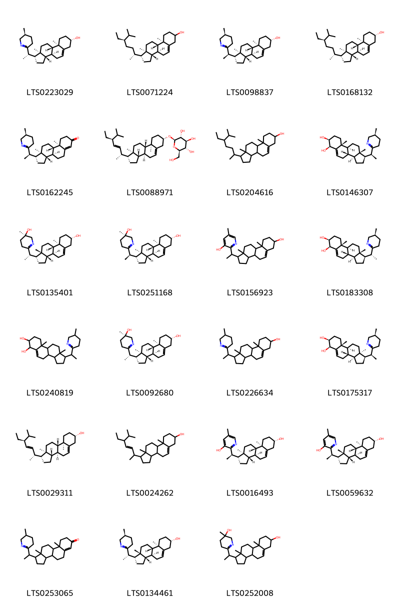{ width=100% }
    <figcaption>Hình ảnh cấu trúc hóa học của 23 hoạt chất thuộc nhóm Steroids and steroid derivatives gồm ['(1r,3as,3bs,7s,9ar,9bs,11as)-9a,11a-dimethyl-1-[(1s)-1-[(5s)-5-methyl-3,4,5,6-tetrahydropyridin-2-yl]ethyl]-1h,2h,3h,3ah,3bh,4h,6h,7h,8h,9h,9bh,10h,11h-cyclopenta[a]phenanthren-7-ol (LTS0223029)', 'stigmast-5-en-3-ol (LTS0071224)', '(1r,3as,3bs,7s,9ar,9bs,11as)-9a,11a-dimethyl-1-[(1r)-1-[(5s)-5-methyl-3,4,5,6-tetrahydropyridin-2-yl]ethyl]-1h,2h,3h,3ah,3bh,4h,6h,7h,8h,9h,9bh,10h,11h-cyclopenta[a]phenanthren-7-ol (LTS0098837)', 'sitosterol (LTS0168132)', '(1r,3as,3bs,9ar,9bs,11as)-9a,11a-dimethyl-1-[(1r)-1-[(5s)-5-methyl-3,4,5,6-tetrahydropyridin-2-yl]ethyl]-1h,2h,3h,3ah,3bh,4h,5h,8h,9h,9bh,10h,11h-cyclopenta[a]phenanthren-7-one (LTS0162245)', '(2r,3r,4s,5s,6r)-2-{[(1r,3as,3bs,7s,9ar,9bs,11ar)-1-[(2r,3e,5s)-5-ethyl-6-methylhept-3-en-2-yl]-9a,11a-dimethyl-1h,2h,3h,3ah,3bh,4h,6h,7h,8h,9h,9bh,10h,11h-cyclopenta[a]phenanthren-7-yl]oxy}-6-(hydroxymethyl)oxane-3,4,5-triol (LTS0088971)', 'stigmast-5-en-3-ol, (3β)- (LTS0204616)', '(1r,3as,3bs,6r,7s,9ar,9bs,11as)-9a,11a-dimethyl-1-[(1s)-1-[(5s)-5-methyl-3,4,5,6-tetrahydropyridin-2-yl]ethyl]-1h,2h,3h,3ah,3bh,4h,6h,7h,8h,9h,9bh,10h,11h-cyclopenta[a]phenanthrene-6,7-diol (LTS0146307)', '(3r)-6-[(1s)-1-[(1r,3as,3bs,7s,9ar,9bs,11ar)-7-hydroxy-9a,11a-dimethyl-1h,2h,3h,3ah,3bh,4h,6h,7h,8h,9h,9bh,10h,11h-cyclopenta[a]phenanthren-1-yl]ethyl]-3-methyl-4,5-dihydro-2h-pyridin-3-ol (LTS0135401)', '(3r)-6-[(1r)-1-[(1r,3as,3bs,7s,9ar,9bs,11as)-7-hydroxy-9a,11a-dimethyl-1h,2h,3h,3ah,3bh,4h,6h,7h,8h,9h,9bh,10h,11h-cyclopenta[a]phenanthren-1-yl]ethyl]-3-methyl-4,5-dihydro-2h-pyridin-3-ol (LTS0251168)', '2-(1-{7-hydroxy-9a,11a-dimethyl-1h,2h,3h,3ah,3bh,4h,6h,7h,8h,9h,9bh,10h,11h-cyclopenta[a]phenanthren-1-yl}ethyl)-5-methylpyridin-3-ol (LTS0156923)', '(1r,3as,3bs,6r,7s,9ar,9bs,11as)-9a,11a-dimethyl-1-[(1r)-1-[(5s)-5-methyl-3,4,5,6-tetrahydropyridin-2-yl]ethyl]-1h,2h,3h,3ah,3bh,4h,6h,7h,8h,9h,9bh,10h,11h-cyclopenta[a]phenanthrene-6,7-diol (LTS0183308)', '9a,11a-dimethyl-1-[1-(5-methyl-3,4,5,6-tetrahydropyridin-2-yl)ethyl]-1h,2h,3h,3ah,3bh,4h,6h,7h,8h,9h,9bh,10h,11h-cyclopenta[a]phenanthrene-6,7-diol (LTS0240819)', '(3r)-6-[(1s)-1-[(1r,3as,3bs,7s,9ar,9bs,11as)-7-hydroxy-9a,11a-dimethyl-1h,2h,3h,3ah,3bh,4h,6h,7h,8h,9h,9bh,10h,11h-cyclopenta[a]phenanthren-1-yl]ethyl]-3-methyl-4,5-dihydro-2h-pyridin-3-ol (LTS0092680)', '9a,11a-dimethyl-1-[1-(5-methyl-3,4,5,6-tetrahydropyridin-2-yl)ethyl]-1h,2h,3h,3ah,3bh,4h,6h,7h,8h,9h,9bh,10h,11h-cyclopenta[a]phenanthren-7-ol (LTS0226634)', '(1r,3as,3bs,6r,7s,9ar,9bs,11ar)-9a,11a-dimethyl-1-[(1s)-1-[(5s)-5-methyl-3,4,5,6-tetrahydropyridin-2-yl]ethyl]-1h,2h,3h,3ah,3bh,4h,6h,7h,8h,9h,9bh,10h,11h-cyclopenta[a]phenanthrene-6,7-diol (LTS0175317)', 'phytosterol (LTS0029311)', 'stigmasterol (LTS0024262)', '2-[(1r)-1-[(1r,3as,3bs,7s,9ar,9bs,11as)-7-hydroxy-9a,11a-dimethyl-1h,2h,3h,3ah,3bh,4h,6h,7h,8h,9h,9bh,10h,11h-cyclopenta[a]phenanthren-1-yl]ethyl]-5-methylpyridin-3-ol (LTS0016493)', '2-[(1r)-1-[(1r,3as,3bs,7s,9ar,9bs,11ar)-7-hydroxy-9a,11a-dimethyl-1h,2h,3h,3ah,3bh,4h,6h,7h,8h,9h,9bh,10h,11h-cyclopenta[a]phenanthren-1-yl]ethyl]-5-methylpyridin-3-ol (LTS0059632)', '9a,11a-dimethyl-1-[1-(5-methyl-3,4,5,6-tetrahydropyridin-2-yl)ethyl]-1h,2h,3h,3ah,3bh,4h,5h,8h,9h,9bh,10h,11h-cyclopenta[a]phenanthren-7-one (LTS0253065)', '(1r,3as,3bs,7s,9ar,9bs,11ar)-9a,11a-dimethyl-1-[(1s)-1-[(5s)-5-methyl-3,4,5,6-tetrahydropyridin-2-yl]ethyl]-1h,2h,3h,3ah,3bh,4h,6h,7h,8h,9h,9bh,10h,11h-cyclopenta[a]phenanthren-7-ol (LTS0134461)', '6-(1-{7-hydroxy-9a,11a-dimethyl-1h,2h,3h,3ah,3bh,4h,6h,7h,8h,9h,9bh,10h,11h-cyclopenta[a]phenanthren-1-yl}ethyl)-3-methyl-4,5-dihydro-2h-pyridin-3-ol (LTS0252008)'].</figcaption>
</figure>
#### Nhóm Thiophenes
<figure markdown="span">
    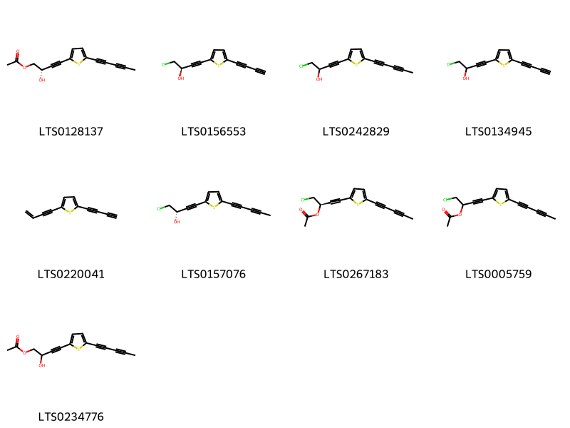{ width=100% }
    <figcaption>Hình ảnh cấu trúc hóa học của 9 hoạt chất thuộc nhóm Thiophenes gồm ['(2s)-2-hydroxy-4-[5-(penta-1,3-diyn-1-yl)thiophen-2-yl]but-3-yn-1-yl acetate (LTS0128137)', '(2r)-4-[5-(buta-1,3-diyn-1-yl)thiophen-2-yl]-1-chlorobut-3-yn-2-ol (LTS0156553)', '1-chloro-4-[5-(penta-1,3-diyn-1-yl)thiophen-2-yl]but-3-yn-2-ol (LTS0242829)', '4-[5-(buta-1,3-diyn-1-yl)thiophen-2-yl]-1-chlorobut-3-yn-2-ol (LTS0134945)', '2-(but-3-en-1-yn-1-yl)-5-(buta-1,3-diyn-1-yl)thiophene (LTS0220041)', '(2s)-1-chloro-4-[5-(penta-1,3-diyn-1-yl)thiophen-2-yl]but-3-yn-2-ol (LTS0157076)', '(2r)-1-chloro-4-[5-(penta-1,3-diyn-1-yl)thiophen-2-yl]but-3-yn-2-yl acetate (LTS0267183)', '1-chloro-4-[5-(penta-1,3-diyn-1-yl)thiophen-2-yl]but-3-yn-2-yl acetate (LTS0005759)', '2-hydroxy-4-[5-(penta-1,3-diyn-1-yl)thiophen-2-yl]but-3-yn-1-yl acetate (LTS0234776)'].</figcaption>
</figure>

---

### Dược dân tộc học

Danh sách các quốc gia có sử dụng *Eclipta prostrata* trong điều trị các bệnh. 

| Country   | Disease                     | Bệnh                                                                                                                                                                                                |
|:----------|:----------------------------|:----------------------------------------------------------------------------------------------------------------------------------------------------------------------------------------------------|
| China     | Alexiteric, Hemostat, Tonic | MYMEMORY WARNING: YOU USED ALL AVAILABLE FREE TRANSLATIONS FOR TODAY. NEXT AVAILABLE IN  10 HOURS 49 MINUTES 44 SECONDS VISIT HTTPS://MYMEMORY.TRANSLATED.NET/DOC/USAGELIMITS.PHP TO TRANSLATE MORE |
| Elsewhere | Hemostatic                  | MYMEMORY WARNING: YOU USED ALL AVAILABLE FREE TRANSLATIONS FOR TODAY. NEXT AVAILABLE IN  10 HOURS 49 MINUTES 41 SECONDS VISIT HTTPS://MYMEMORY.TRANSLATED.NET/DOC/USAGELIMITS.PHP TO TRANSLATE MORE |
| India     | Tonic                       | MYMEMORY WARNING: YOU USED ALL AVAILABLE FREE TRANSLATIONS FOR TODAY. NEXT AVAILABLE IN  10 HOURS 49 MINUTES 35 SECONDS VISIT HTTPS://MYMEMORY.TRANSLATED.NET/DOC/USAGELIMITS.PHP TO TRANSLATE MORE |

---

# Chi Achillea

??? note "Danh sách các dược liệu thuộc chi"
    
	 - *Achillea atrata*
	 - *Achillea lanulosa*
	 - *Achillea millefolia*
	 - *Achillea millefolium*
	 - *Achillea moschata*
	 - *Achillea nobilis*
	 - *Achillea ptarmica*
	 - *Achillea sibirica*

---
## Achillea atrata
### Thông tin về thực vật

!!! info "Phân loại thực vật của *Achillea atrata* từ GIBF:"
    - **Kingdom:** Plantae
    - **Phylum:** Tracheophyta
    - **Order:** Asterales
    - **Family:** Asteraceae
    - **Genus:** Achillea
    - **Species:** *Achillea atrata*

 

| Label (VI)   | Label (EN)   | Scientific Name   | Descriptions (VI)   | Descriptions (EN)   | Also Known As (VI)   | Also Known As (EN)   |
|:-------------|:-------------|:------------------|:--------------------|:--------------------|:---------------------|:---------------------|
| N/A          | N/A          | Achillea atrata   | loài thực vật       | species of plant    | ['']                 | ['black yarrow']     |

#### Phân bố trên thế giới

**Từ CSDL GIBF** Italy, Germany, Switzerland, Austria, Slovenia

#### Phân bố tại Việt Nam

**Từ CSDL GIBF**: Không có ghi nhận ở Việt Nam

---
### Thành phần hóa học
        
- Theo cơ sở dữ liệu lotus: Từ loài *Achillea atrata* đã phân lập và xác định được 24 hoạt chất thuộc về các nhóm Flavonoids, Prenol lipids. 

|    | chemicalTaxonomyClassyfireClass   |   smiles_count |
|---:|:----------------------------------|---------------:|
|  0 | Flavonoids                        |              7 |
|  1 | Prenol lipids                     |             17 |

#### Nhóm Flavonoids
<figure markdown="span">
    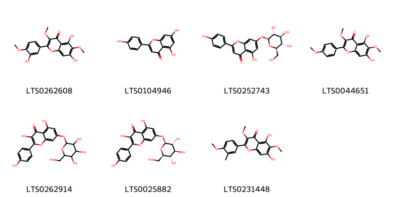{ width=100% }
    <figcaption>Hình ảnh cấu trúc hóa học của 7 hoạt chất thuộc nhóm Flavonoids gồm ['centaureidin (LTS0262608)', 'chamomile (LTS0104946)', 'apigenin 7-o-β-glucoside (LTS0252743)', 'santin (LTS0044651)', '3,5-dihydroxy-2-(4-hydroxyphenyl)-7-{[3,4,5-trihydroxy-6-(hydroxymethyl)oxan-2-yl]oxy}chromen-4-one (LTS0262914)', 'kaempferol 7-o-glucoside (LTS0025882)', '5,7-dihydroxy-3,6-dimethoxy-2-(4-methoxy-3-methylphenyl)chromen-4-one (LTS0231448)'].</figcaption>
</figure>
#### Nhóm Prenol lipids
<figure markdown="span">
    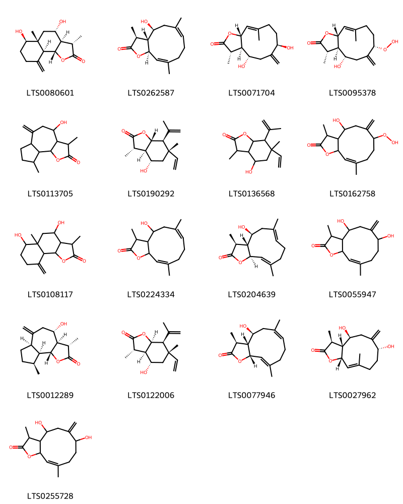{ width=100% }
    <figcaption>Hình ảnh cấu trúc hóa học của 17 hoạt chất thuộc nhóm Prenol lipids gồm ['(3s,3ar,4s,5ar,6r,9as,9br)-4,6-dihydroxy-3,5a-dimethyl-9-methylidene-octahydro-3h-naphtho[1,2-b]furan-2-one (LTS0080601)', '(3s,3ar,4s,11ar)-4-hydroxy-3,6,10-trimethyl-3h,3ah,4h,5h,8h,9h,11ah-cyclodeca[b]furan-2-one (LTS0262587)', '(3s,3ar,4s,7r,11ar)-4,7-dihydroxy-3,10-dimethyl-6-methylidene-3h,3ah,4h,5h,7h,8h,9h,11ah-cyclodeca[b]furan-2-one (LTS0071704)', '(3s,3ar,4s,7s,11ar)-7-hydroperoxy-4-hydroxy-3,10-dimethyl-6-methylidene-3h,3ah,4h,5h,7h,8h,9h,11ah-cyclodeca[b]furan-2-one (LTS0095378)', '4-hydroxy-3,9-dimethyl-6-methylidene-decahydroazuleno[4,5-b]furan-2-one (LTS0113705)', '(3s,3ar,4s,6s,7s,7ar)-6-ethenyl-4-hydroxy-3,6-dimethyl-7-(prop-1-en-2-yl)-hexahydro-1-benzofuran-2-one (LTS0190292)', '6-ethenyl-4-hydroxy-3,6-dimethyl-7-(prop-1-en-2-yl)-hexahydro-1-benzofuran-2-one (LTS0136568)', '7-hydroperoxy-4-hydroxy-3,10-dimethyl-6-methylidene-3h,3ah,4h,5h,7h,8h,9h,11ah-cyclodeca[b]furan-2-one (LTS0162758)', '4,6-dihydroxy-3,5a-dimethyl-9-methylidene-octahydro-3h-naphtho[1,2-b]furan-2-one (LTS0108117)', '4-hydroxy-3,6,10-trimethyl-3h,3ah,4h,5h,8h,9h,11ah-cyclodeca[b]furan-2-one (LTS0224334)', '(3s,3ar,4s,11ar)-4-hydroxy-3,6,10-trimethyl-3h,3ah,4h,5h,8h,9h,11ah-cyclodeca[b]furan-2-one (LTS0204639)', '4,7-dihydroxy-3,10-dimethyl-6-methylidene-3h,3ah,4h,5h,7h,8h,9h,11ah-cyclodeca[b]furan-2-one (LTS0055947)', '(3s,3ar,4s,6ar,9s,9as,9br)-4-hydroxy-3,9-dimethyl-6-methylidene-decahydroazuleno[4,5-b]furan-2-one (LTS0012289)', '(3s,3ar,4s,6s,7s,7as)-6-ethenyl-4-hydroxy-3,6-dimethyl-7-(prop-1-en-2-yl)-hexahydro-1-benzofuran-2-one (LTS0122006)', '(3s,3ar,4s,11as)-4-hydroxy-3,6,10-trimethyl-3h,3ah,4h,5h,8h,9h,11ah-cyclodeca[b]furan-2-one (LTS0077946)', '(3s,3ar,4s,7r,11as)-4,7-dihydroxy-3,10-dimethyl-6-methylidene-3h,3ah,4h,5h,7h,8h,9h,11ah-cyclodeca[b]furan-2-one (LTS0027962)', '4,7-dihydroxy-3,10-dimethyl-6-methylidene-3h,3ah,4h,5h,7h,8h,9h,11ah-cyclodeca[b]furan-2-one (LTS0255728)'].</figcaption>
</figure>

---

### Dược dân tộc học

Danh sách các quốc gia có sử dụng *Achillea atrata* trong điều trị các bệnh. 

| Country   | Disease          | Bệnh                                                                                                                                                                                                |
|:----------|:-----------------|:----------------------------------------------------------------------------------------------------------------------------------------------------------------------------------------------------|
| Denmark   | Vulnerary, Tonic | MYMEMORY WARNING: YOU USED ALL AVAILABLE FREE TRANSLATIONS FOR TODAY. NEXT AVAILABLE IN  10 HOURS 48 MINUTES 55 SECONDS VISIT HTTPS://MYMEMORY.TRANSLATED.NET/DOC/USAGELIMITS.PHP TO TRANSLATE MORE |

---

---
## Achillea lanulosa
### Thông tin về thực vật

!!! info "Phân loại thực vật của *Achillea millefolium* từ GIBF:"
    - **Kingdom:** Plantae
    - **Phylum:** Tracheophyta
    - **Order:** Asterales
    - **Family:** Asteraceae
    - **Genus:** Achillea
    - **Species:** *Achillea millefolium*

 

| Label (VI)   | Label (EN)   | Scientific Name   | Descriptions (VI)   | Descriptions (EN)   | Also Known As (VI)   | Also Known As (EN)   |
|:-------------|:-------------|:------------------|:--------------------|:--------------------|:---------------------|:---------------------|
| N/A          | N/A          | Achillea lanulosa |                     |                     | ['']                 | ['']                 |

#### Phân bố trên thế giới

**Từ CSDL GIBF** nan, United States of America, Austria, Mexico, Canada

#### Phân bố tại Việt Nam

**Từ CSDL GIBF**: Không có ghi nhận ở Việt Nam

---
### Thành phần hóa học
        
- Theo cơ sở dữ liệu lotus: Từ loài *Achillea millefolium* đã phân lập và xác định được Chưa có hoạt chất nào được phân lập. hoạt chất thuộc về các nhóm Không có hoạt chất nào được phân lập. 

Không có hình ảnh nào được tạo ra

---

### Dược dân tộc học

Danh sách các quốc gia có sử dụng *Achillea millefolium* trong điều trị các bệnh. 

| Country          | Disease     | Bệnh                                                                                                                                                                                                |
|:-----------------|:------------|:----------------------------------------------------------------------------------------------------------------------------------------------------------------------------------------------------|
| Mexico(Kickapoo) | Suppurative | MYMEMORY WARNING: YOU USED ALL AVAILABLE FREE TRANSLATIONS FOR TODAY. NEXT AVAILABLE IN  10 HOURS 48 MINUTES 23 SECONDS VISIT HTTPS://MYMEMORY.TRANSLATED.NET/DOC/USAGELIMITS.PHP TO TRANSLATE MORE |

---

---
## Achillea millefolia
### Thông tin về thực vật

!!! info "Phân loại thực vật của *Achillea millefolium* từ GIBF:"
    - **Kingdom:** Plantae
    - **Phylum:** Tracheophyta
    - **Order:** Asterales
    - **Family:** Asteraceae
    - **Genus:** Achillea
    - **Species:** *Achillea millefolium*

 

| Label (VI)   | Label (EN)   | Scientific Name   | Descriptions (VI)   | Descriptions (EN)   | Also Known As (VI)   | Also Known As (EN)   |
|:-------------|:-------------|:------------------|:--------------------|:--------------------|:---------------------|:---------------------|
| N/A          | N/A          | Achillea lanulosa |                     |                     | ['']                 | ['']                 |

#### Phân bố trên thế giới

**Từ CSDL GIBF** Italy, Australia, Argentina, Canada, Ukraine, Denmark, Netherlands, Luxembourg, Spain, Russian Federation, United States of America, Chile, Czechia, Germany, Austria, France, Mexico, United Kingdom of Great Britain and Northern Ireland, Ireland, Poland, New Zealand

#### Phân bố tại Việt Nam

**Từ CSDL GIBF**: Không có ghi nhận ở Việt Nam

---
### Thành phần hóa học
        
- Theo cơ sở dữ liệu lotus: Từ loài *Achillea millefolium* đã phân lập và xác định được Chưa có hoạt chất nào được phân lập. hoạt chất thuộc về các nhóm Không có hoạt chất nào được phân lập. 

Không có hình ảnh nào được tạo ra

---

### Dược dân tộc học

Danh sách các quốc gia có sử dụng *Achillea millefolium* trong điều trị các bệnh. 

| Country   | Disease   | Bệnh                                                                                                                                                                                                |
|:----------|:----------|:----------------------------------------------------------------------------------------------------------------------------------------------------------------------------------------------------|
| ain       | Vulnerary | MYMEMORY WARNING: YOU USED ALL AVAILABLE FREE TRANSLATIONS FOR TODAY. NEXT AVAILABLE IN  10 HOURS 47 MINUTES 52 SECONDS VISIT HTTPS://MYMEMORY.TRANSLATED.NET/DOC/USAGELIMITS.PHP TO TRANSLATE MORE |

---

---
## Achillea millefolium
### Thông tin về thực vật

!!! info "Phân loại thực vật của *Achillea millefolium* từ GIBF:"
    - **Kingdom:** Plantae
    - **Phylum:** Tracheophyta
    - **Order:** Asterales
    - **Family:** Asteraceae
    - **Genus:** Achillea
    - **Species:** *Achillea millefolium*

 

| Label (VI)   | Label (EN)   | Scientific Name      | Descriptions (VI)   | Descriptions (EN)   | Also Known As (VI)   | Also Known As (EN)                     |
|:-------------|:-------------|:---------------------|:--------------------|:--------------------|:---------------------|:---------------------------------------|
| N/A          | N/A          | Achillea millefolium | loài thực vật       | species of plant    | ['']                 | ['yarrow', 'common yarrow', 'milfoil'] |

#### Phân bố trên thế giới

**Từ CSDL GIBF** Italy, Australia, Argentina, Canada, Ukraine, Denmark, Netherlands, Luxembourg, Spain, Russian Federation, United States of America, Chile, Czechia, Germany, Austria, France, Mexico, United Kingdom of Great Britain and Northern Ireland, Ireland, Poland, New Zealand

#### Phân bố tại Việt Nam

**Từ CSDL GIBF**: Không có ghi nhận ở Việt Nam

---
### Thành phần hóa học
        
- Theo cơ sở dữ liệu lotus: Từ loài *Achillea millefolium* đã phân lập và xác định được 273 hoạt chất thuộc về các nhóm Piperidines, Cycloheptafurans, Phenols, Carboxylic acids and derivatives, Fatty Acyls, Cinnamic acids and derivatives, Tannins, Prenol lipids, Benzene and substituted derivatives, Organooxygen compounds, Furanoid lignans, Pyridines and derivatives, Phenol ethers, Flavonoids, Steroids and steroid derivatives, Organonitrogen compounds, Dioxanes, Unsaturated hydrocarbons, Lactones, Keto acids and derivatives, Imidazopyrimidines. 

|    | chemicalTaxonomyClassyfireClass     |   smiles_count |
|---:|:------------------------------------|---------------:|
|  0 |                                     |              1 |
|  1 | Benzene and substituted derivatives |              5 |
|  2 | Carboxylic acids and derivatives    |             18 |
|  3 | Cinnamic acids and derivatives      |              2 |
|  4 | Cycloheptafurans                    |              5 |
|  5 | Dioxanes                            |              1 |
|  6 | Fatty Acyls                         |             25 |
|  7 | Flavonoids                          |             27 |
|  8 | Furanoid lignans                    |              2 |
|  9 | Imidazopyrimidines                  |              1 |
| 10 | Keto acids and derivatives          |              1 |
| 11 | Lactones                            |             16 |
| 12 | Organonitrogen compounds            |              1 |
| 13 | Organooxygen compounds              |              9 |
| 14 | Phenol ethers                       |              2 |
| 15 | Phenols                             |              6 |
| 16 | Piperidines                         |              5 |
| 17 | Prenol lipids                       |            114 |
| 18 | Pyridines and derivatives           |             14 |
| 19 | Steroids and steroid derivatives    |             12 |
| 20 | Tannins                             |              2 |
| 21 | Unsaturated hydrocarbons            |              3 |

#### Nhóm 
<figure markdown="span">
    { width=100% }
    <figcaption>Hình ảnh cấu trúc hóa học của 1 hoạt chất thuộc nhóm  gồm ['trigonelline (LTS0040106)'].</figcaption>
</figure>
#### Nhóm Benzene and substituted derivatives
<figure markdown="span">
    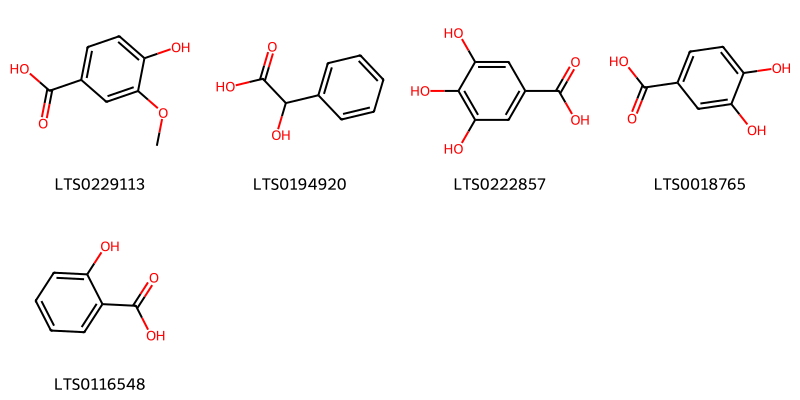{ width=100% }
    <figcaption>Hình ảnh cấu trúc hóa học của 5 hoạt chất thuộc nhóm Benzene and substituted derivatives gồm ['vanillic acid (LTS0229113)', 'mandelic acid (LTS0194920)', 'galop (LTS0222857)', '3,4-dihydroxybenzoic acid (LTS0018765)', 'salicyclic acid (LTS0116548)'].</figcaption>
</figure>
#### Nhóm Carboxylic acids and derivatives
<figure markdown="span">
    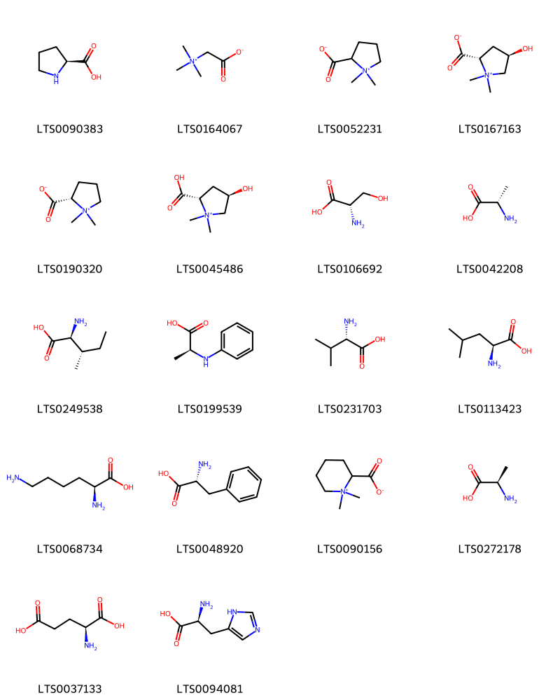{ width=100% }
    <figcaption>Hình ảnh cấu trúc hóa học của 18 hoạt chất thuộc nhóm Carboxylic acids and derivatives gồm ['l-proline (LTS0090383)', 'bet (LTS0164067)', '1,1-dimethylpyrrolidin-1-ium-2-carboxylate (LTS0052231)', '(-)-betonicine (LTS0167163)', 'stachydrine (LTS0190320)', '(2s,4r)-2-carboxy-4-hydroxy-1,1-dimethylpyrrolidin-1-ium (LTS0045486)', 'l-serine (LTS0106692)', 'l-alanine (LTS0042208)', 'l-isoleucine (LTS0249538)', '(2s)-2-(phenylamino)propanoic acid (LTS0199539)', 'l-valine (LTS0231703)', 'l-leucine (LTS0113423)', 'l-lysine (LTS0068734)', 'd-phenylalanine (LTS0048920)', 'homostachydrine (LTS0090156)', 'd-alanine (LTS0272178)', 'l-glutamic acid (LTS0037133)', 'l-histidine (LTS0094081)'].</figcaption>
</figure>
#### Nhóm Cinnamic acids and derivatives
<figure markdown="span">
    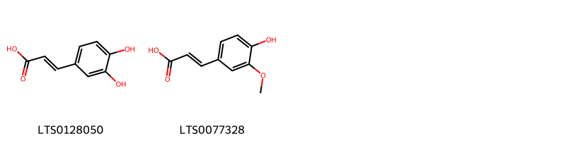{ width=100% }
    <figcaption>Hình ảnh cấu trúc hóa học của 2 hoạt chất thuộc nhóm Cinnamic acids and derivatives gồm ['3,4-dihydroxycinnamic acid (LTS0128050)', 'ferulic acid (LTS0077328)'].</figcaption>
</figure>
#### Nhóm Cycloheptafurans
<figure markdown="span">
    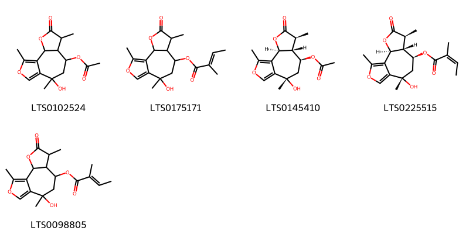{ width=100% }
    <figcaption>Hình ảnh cấu trúc hóa học của 5 hoạt chất thuộc nhóm Cycloheptafurans gồm ['9-hydroxy-5,9,13-trimethyl-4-oxo-3,12-dioxatricyclo[8.3.0.0²,⁶]trideca-1(13),10-dien-7-yl acetate (LTS0102524)', '9-hydroxy-5,9,13-trimethyl-4-oxo-3,12-dioxatricyclo[8.3.0.0²,⁶]trideca-1(13),10-dien-7-yl 2-methylbut-2-enoate (LTS0175171)', '(2s,5s,6r,7s,9s)-9-hydroxy-5,9,13-trimethyl-4-oxo-3,12-dioxatricyclo[8.3.0.0²,⁶]trideca-1(13),10-dien-7-yl acetate (LTS0145410)', '(2s,5s,6r,7s,9s)-9-hydroxy-5,9,13-trimethyl-4-oxo-3,12-dioxatricyclo[8.3.0.0²,⁶]trideca-1(13),10-dien-7-yl (2z)-2-methylbut-2-enoate (LTS0225515)', '9-hydroxy-5,9,13-trimethyl-4-oxo-3,12-dioxatricyclo[8.3.0.0²,⁶]trideca-1(13),10-dien-7-yl (2e)-2-methylbut-2-enoate (LTS0098805)'].</figcaption>
</figure>
#### Nhóm Dioxanes
<figure markdown="span">
    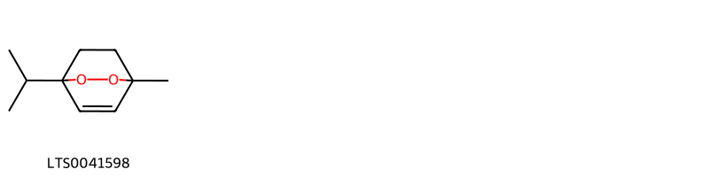{ width=100% }
    <figcaption>Hình ảnh cấu trúc hóa học của 1 hoạt chất thuộc nhóm Dioxanes gồm ['ascaridole (LTS0041598)'].</figcaption>
</figure>
#### Nhóm Fatty Acyls
<figure markdown="span">
    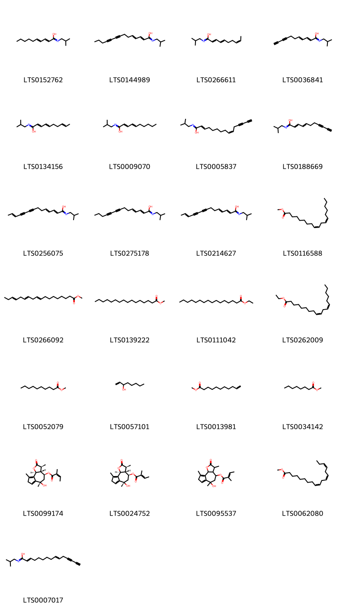{ width=100% }
    <figcaption>Hình ảnh cấu trúc hóa học của 25 hoạt chất thuộc nhóm Fatty Acyls gồm ['(2e,4e)-n-(2-methylpropyl)deca-2,4-dienimidic acid (LTS0152762)', '(2e,4e)-n-(2-methylpropyl)tetradeca-2,4-dien-8,10-diynimidic acid (LTS0144989)', '(2e,4e,8z)-n-(2-methylpropyl)deca-2,4,8-trienimidic acid (LTS0266611)', '(2e,4e)-n-(2-methylpropyl)undeca-2,4-dien-8,10-diynimidic acid (LTS0036841)', 'n-(2-methylpropyl)deca-2,4,8-trienimidic acid (LTS0134156)', 'n-(2-methylpropyl)deca-2,4-dienimidic acid (LTS0009070)', '(2e,9z)-n-(2-methylpropyl)pentadeca-2,9-dien-12,14-diynimidic acid (LTS0005837)', 'n-(2-methylpropyl)undeca-2,4-dien-8,10-diynimidic acid (LTS0188669)', 'n-(2-methylpropyl)tetradeca-2,4,12-trien-8,10-diynimidic acid (LTS0256075)', 'n-(2-methylpropyl)tetradeca-2,4-dien-8,10-diynimidic acid (LTS0275178)', '(2e,4e,12e)-n-(2-methylpropyl)tetradeca-2,4,12-trien-8,10-diynimidic acid (LTS0214627)', 'methyl linoleate (LTS0116588)', 'methyl elaidolinolenate (LTS0266092)', 'methyl palmitate (LTS0139222)', 'ethyl palmitate (LTS0111042)', 'ethyl linoleate (LTS0262009)', 'methyl caprate (LTS0052079)', '1-octen-3-ol (LTS0057101)', 'methyl undecenoate (LTS0013981)', 'methyl caprylate (LTS0034142)', '(3s,3ar,4s,6s,9bs)-6-hydroxy-3,6,9-trimethyl-2-oxo-3h,3ah,4h,5h,8h,9bh-azuleno[4,5-b]furan-4-yl (2z)-2-methylbut-2-enoate (LTS0099174)', '(3s,3ar,4s,6s,9bs)-6-hydroxy-3,6,9-trimethyl-2-oxo-3h,3ah,4h,5h,8h,9bh-azuleno[4,5-b]furan-4-yl (2e)-2-methylbut-2-enoate (LTS0024752)', '6-hydroxy-3,6,9-trimethyl-2-oxo-3h,3ah,4h,5h,8h,9bh-azuleno[4,5-b]furan-4-yl 2-methylbut-2-enoate (LTS0095537)', 'methyl linolenate (LTS0062080)', 'n-(2-methylpropyl)pentadeca-2,9-dien-12,14-diynimidic acid (LTS0007017)'].</figcaption>
</figure>
#### Nhóm Flavonoids
<figure markdown="span">
    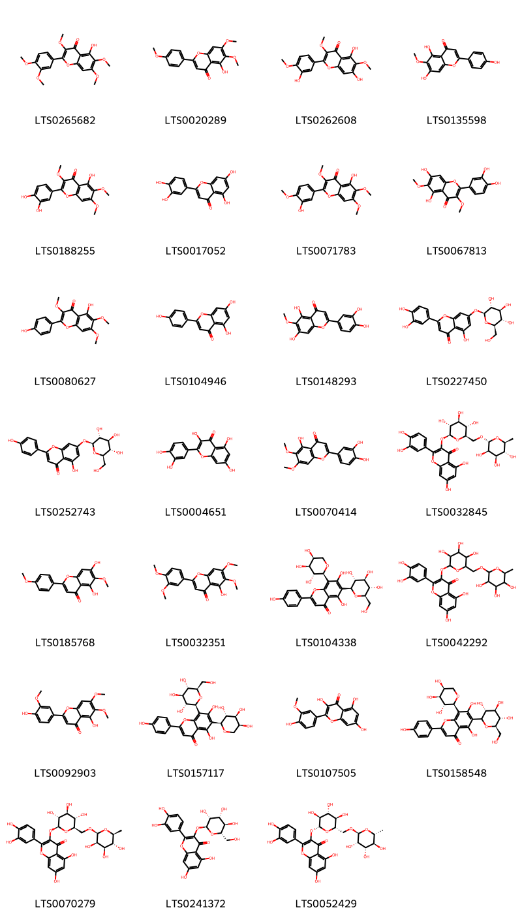{ width=100% }
    <figcaption>Hình ảnh cấu trúc hóa học của 27 hoạt chất thuộc nhóm Flavonoids gồm ['artemetin (LTS0265682)', 'salvigenin (LTS0020289)', 'centaureidin (LTS0262608)', 'hispidulin (LTS0135598)', 'chrysosplenol d (LTS0188255)', 'luteolin (LTS0017052)', 'casticin (LTS0071783)', 'axillarin (LTS0067813)', 'penduletin (LTS0080627)', 'chamomile (LTS0104946)', 'nepetin (LTS0148293)', 'luteolin 7-o-glucoside (LTS0227450)', 'apigenin 7-o-β-glucoside (LTS0252743)', 'quercetin (LTS0004651)', 'cirsiliol (LTS0070414)', '3-rutinosyl quercetin (LTS0032845)', 'pectolinarigenin (LTS0185768)', '2-(3,4-dimethoxyphenyl)-5-hydroxy-6,7-dimethoxychromen-4-one (LTS0032351)', 'schaftoside (LTS0104338)', 'rutin (LTS0042292)', 'cirsilineol (LTS0092903)', 'isoschaftoside (LTS0157117)', 'isorhamnetin (LTS0107505)', '5,7-dihydroxy-2-(4-hydroxyphenyl)-6-[(3r,4r,5s,6r)-3,4,5-trihydroxy-6-(hydroxymethyl)oxan-2-yl]-8-[(2s,3r,4s,5s)-3,4,5-trihydroxyoxan-2-yl]chromen-4-one (LTS0158548)', '2-(3,4-dihydroxyphenyl)-5,7-dihydroxy-3-{[(2s,3r,4s,5s,6r)-3,4,5-trihydroxy-6-({[(2s,3r,4r,5r,6s)-3,4,5-trihydroxy-6-methyloxan-2-yl]oxy}methyl)oxan-2-yl]oxy}chromen-4-one (LTS0070279)', '2-(3,4-dihydroxyphenyl)-5,7-dihydroxy-3-{[(2s,3r,4r,5r,6s)-3,4,5-trihydroxy-6-(hydroxymethyl)oxan-2-yl]oxy}chromen-4-one (LTS0241372)', '2-(3,4-dihydroxyphenyl)-5,7-dihydroxy-3-{[(2r,3s,4r,5r,6s)-3,4,5-trihydroxy-6-({[(2s,3s,4s,5s,6r)-3,4,5-trihydroxy-6-methyloxan-2-yl]oxy}methyl)oxan-2-yl]oxy}chromen-4-one (LTS0052429)'].</figcaption>
</figure>
#### Nhóm Furanoid lignans
<figure markdown="span">
    { width=100% }
    <figcaption>Hình ảnh cấu trúc hóa học của 2 hoạt chất thuộc nhóm Furanoid lignans gồm ['sesamin (LTS0120161)', 'sesamin (LTS0228898)'].</figcaption>
</figure>
#### Nhóm Imidazopyrimidines
<figure markdown="span">
    { width=100% }
    <figcaption>Hình ảnh cấu trúc hóa học của 1 hoạt chất thuộc nhóm Imidazopyrimidines gồm ['leucon (LTS0114351)'].</figcaption>
</figure>
#### Nhóm Keto acids and derivatives
<figure markdown="span">
    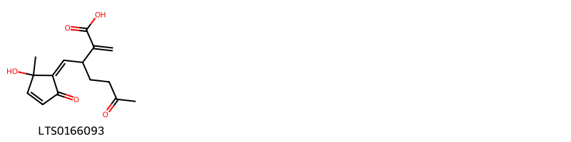{ width=100% }
    <figcaption>Hình ảnh cấu trúc hóa học của 1 hoạt chất thuộc nhóm Keto acids and derivatives gồm ['3-{[(1z)-2-hydroxy-2-methyl-5-oxocyclopent-3-en-1-ylidene]methyl}-2-methylidene-6-oxoheptanoic acid (LTS0166093)'].</figcaption>
</figure>
#### Nhóm Lactones
<figure markdown="span">
    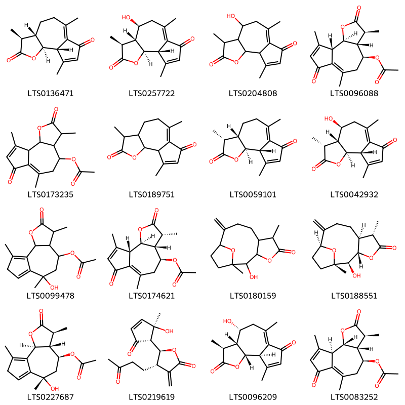{ width=100% }
    <figcaption>Hình ảnh cấu trúc hóa học của 16 hoạt chất thuộc nhóm Lactones gồm ['leucodin (LTS0136471)', '(3s,3ar,4s,9as,9br)-4-hydroxy-3,6,9-trimethyl-3h,3ah,4h,5h,9ah,9bh-azuleno[4,5-b]furan-2,7-dione (LTS0257722)', '4-hydroxy-3,6,9-trimethyl-3h,3ah,4h,5h,9ah,9bh-azuleno[4,5-b]furan-2,7-dione (LTS0204808)', 'matricarin (LTS0096088)', '3,6,9-trimethyl-2,7-dioxo-3h,3ah,4h,5h,9ah,9bh-azuleno[4,5-b]furan-4-yl acetate (LTS0173235)', '3,6,9-trimethyl-3h,3ah,4h,5h,9ah,9bh-azuleno[4,5-b]furan-2,7-dione (LTS0189751)', 'achillin (LTS0059101)', 'hydroxyachillin (LTS0042932)', '6-hydroxy-3,6,9-trimethyl-2-oxo-3h,3ah,4h,5h,8h,9bh-azuleno[4,5-b]furan-4-yl acetate (LTS0099478)', '(3r,3ar,4s,9as,9br)-3,6,9-trimethyl-2,7-dioxo-3h,3ah,4h,5h,9ah,9bh-azuleno[4,5-b]furan-4-yl acetate (LTS0174621)', '2-hydroxy-1,6-dimethyl-10-methylidene-4,14-dioxatricyclo[9.2.1.0³,⁷]tetradecan-5-one (LTS0180159)', '(1s,2r,3s,6s,7s,11s)-2-hydroxy-1,6-dimethyl-10-methylidene-4,14-dioxatricyclo[9.2.1.0³,⁷]tetradecan-5-one (LTS0188551)', '(3s,3ar,4s,6s,9bs)-6-hydroxy-3,6,9-trimethyl-2-oxo-3h,3ah,4h,5h,8h,9bh-azuleno[4,5-b]furan-4-yl acetate (LTS0227687)', '(4s,5s)-5-[(1s,2r)-2-hydroxy-2-methyl-5-oxocyclopent-3-en-1-yl]-3-methylidene-4-(3-oxobutyl)oxolan-2-one (LTS0219619)', '(3s,3ar,4r,9ar,9bs)-4-hydroxy-3,6,9-trimethyl-3h,3ah,4h,5h,9ah,9bh-azuleno[4,5-b]furan-2,7-dione (LTS0096209)', '(3s,3ar,4s,9ar,9bs)-3,6,9-trimethyl-2,7-dioxo-3h,3ah,4h,5h,9ah,9bh-azuleno[4,5-b]furan-4-yl acetate (LTS0083252)'].</figcaption>
</figure>
#### Nhóm Organonitrogen compounds
<figure markdown="span">
    { width=100% }
    <figcaption>Hình ảnh cấu trúc hóa học của 1 hoạt chất thuộc nhóm Organonitrogen compounds gồm ['choline (LTS0170307)'].</figcaption>
</figure>
#### Nhóm Organooxygen compounds
<figure markdown="span">
    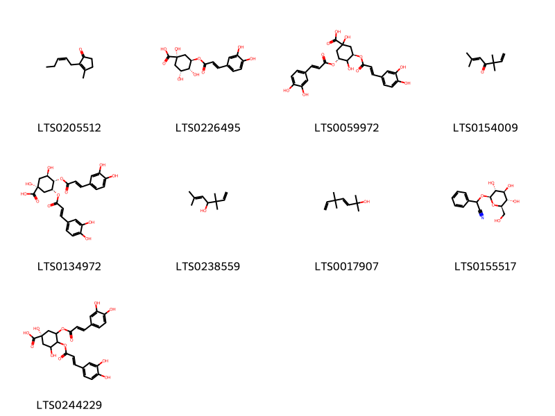{ width=100% }
    <figcaption>Hình ảnh cấu trúc hóa học của 9 hoạt chất thuộc nhóm Organooxygen compounds gồm ['jasmone (LTS0205512)', 'chlorogenic acid (LTS0226495)', '(3r,5r)-3,5-bis({[(2e)-3-(3,4-dihydroxyphenyl)prop-2-enoyl]oxy})-1,4-dihydroxycyclohexane-1-carboxylic acid (LTS0059972)', 'isoartemisia ketone (LTS0154009)', '3,4-dicaffeoylquinic acid (LTS0134972)', '3,3,6-trimethylhepta-1,5-dien-4-ol (LTS0238559)', '(3e)-2,5,5-trimethylhepta-3,6-dien-2-ol (LTS0017907)', 'prulaurasin (LTS0155517)', '(1s)-3,4-bis({[3-(3,4-dihydroxyphenyl)prop-2-enoyl]oxy})-1,5-dihydroxycyclohexane-1-carboxylic acid (LTS0244229)'].</figcaption>
</figure>
#### Nhóm Phenol ethers
<figure markdown="span">
    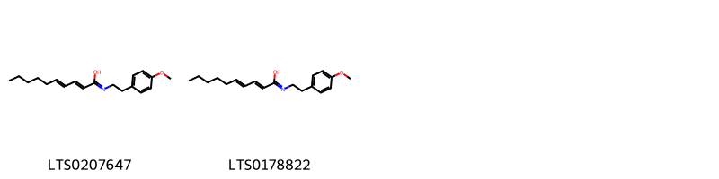{ width=100% }
    <figcaption>Hình ảnh cấu trúc hóa học của 2 hoạt chất thuộc nhóm Phenol ethers gồm ['n-[2-(4-methoxyphenyl)ethyl]deca-2,4-dienimidic acid (LTS0207647)', '(2e,4e)-n-[2-(4-methoxyphenyl)ethyl]deca-2,4-dienimidic acid (LTS0178822)'].</figcaption>
</figure>
#### Nhóm Phenols
<figure markdown="span">
    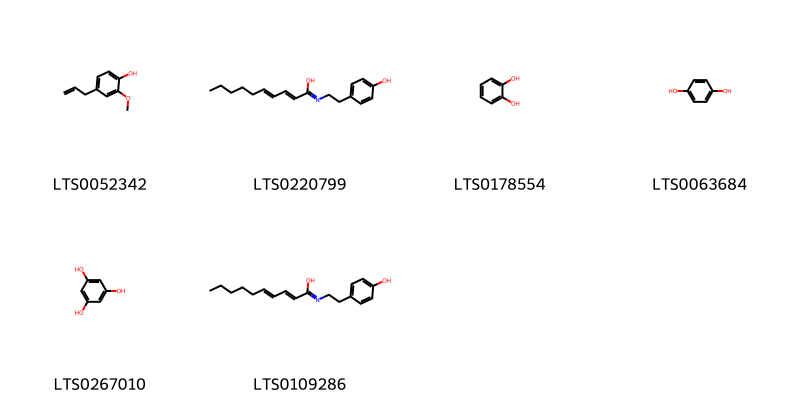{ width=100% }
    <figcaption>Hình ảnh cấu trúc hóa học của 6 hoạt chất thuộc nhóm Phenols gồm ['eugenol (LTS0052342)', '(2e,4e)-n-[2-(4-hydroxyphenyl)ethyl]deca-2,4-dienimidic acid (LTS0220799)', 'catechol (LTS0178554)', 'α-hydroquinone (LTS0063684)', 'phloroglucinol (LTS0267010)', 'n-[2-(4-hydroxyphenyl)ethyl]deca-2,4-dienimidic acid (LTS0109286)'].</figcaption>
</figure>
#### Nhóm Piperidines
<figure markdown="span">
    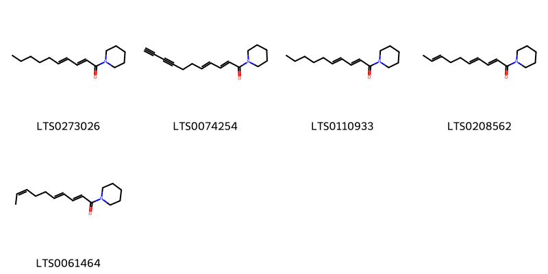{ width=100% }
    <figcaption>Hình ảnh cấu trúc hóa học của 5 hoạt chất thuộc nhóm Piperidines gồm ['(2e,4e)-1-(piperidin-1-yl)deca-2,4-dien-1-one (LTS0273026)', '(2e,4e)-1-(piperidin-1-yl)undeca-2,4-dien-8,10-diyn-1-one (LTS0074254)', '1-(piperidin-1-yl)deca-2,4-dien-1-one (LTS0110933)', '1-(piperidin-1-yl)deca-2,4,8-trien-1-one (LTS0208562)', '(2e,4e,8z)-1-(piperidin-1-yl)deca-2,4,8-trien-1-one (LTS0061464)'].</figcaption>
</figure>
#### Nhóm Prenol lipids
<figure markdown="span">
    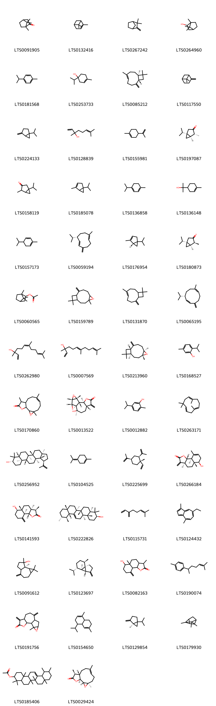{ width=100% }
    <figcaption>Hình ảnh cấu trúc hóa học của 114 hoạt chất thuộc nhóm Prenol lipids gồm ['camphor (LTS0091905)', 'α pinene (LTS0132416)', 'camphene (LTS0267242)', 'borneol (LTS0264960)', 'cymene (LTS0181568)', '4-terpineol (LTS0253733)', 'caryophyllene (LTS0085212)', 'β-pinene (LTS0117550)', 'sabinene (LTS0224133)', 'linalool, (+-)- (LTS0128839)', 'limonene,  (LTS0155981)', 'thujone (LTS0197087)', '3-isothujone (LTS0158119)', 'α-thujene (LTS0185078)', 'terpinene (LTS0136858)', 'terpineol (LTS0136148)', 'phellandrene (LTS0157173)', '(-)-germacrene d (LTS0059194)', 'α-thujene (LTS0176954)', '(+)-β-thujone (LTS0180873)', 'bornyl acetate (LTS0060565)', 'caryophyllene oxide (LTS0159789)', 'caryophyllene (LTS0131870)', '(1z,6z,8s)-8-isopropyl-1-methyl-5-methylidenecyclodeca-1,6-diene (LTS0065195)', 'nerolidol (LTS0262980)', 'nerolidol isomers (LTS0007569)', 'β-caryophyllene oxide (LTS0213960)', 'thymol (LTS0168527)', '4,8,12-trimethyl-3,14-dioxatricyclo[9.3.0.0²,⁴]tetradec-7-en-13-one (LTS0170860)', 'artecanin (LTS0013522)', 'carvacrol (LTS0012882)', 'humulene (LTS0263171)', 'lupeol (LTS0256952)', 'terpinolene (LTS0104525)', 'β-elemene (LTS0225699)', '(+)-santamarine (LTS0266184)', '(3r,3as,5ar,6r,9as,9bs)-6-hydroxy-3,5a-dimethyl-9-methylidene-octahydro-3h-naphtho[1,2-b]furan-2-one (LTS0141593)', 'amyrin (LTS0222826)', 'α-myrcene (LTS0115731)', 'chamazulene (LTS0124432)', '(7ar)-1,1,7-trimethyl-4-methylidene-octahydrocyclopropa[e]azulen-7-ol (LTS0091612)', '(-)-β-cubebene (LTS0123697)', '6-hydroxy-3,5a-dimethyl-9-methylidene-octahydro-3h-naphtho[1,2-b]furan-2-one (LTS0082163)', 'curcumene (LTS0190074)', '14-methyl-5,9-dimethylidene-3,13-dioxatetracyclo[8.4.0.0²,⁶.0¹²,¹⁴]tetradecan-4-one (LTS0191756)', '4-isopropyl-1,6-dimethyl-3,4,4a,7,8,8a-hexahydronaphthalene (LTS0154650)', '(5s)-1-isopropyl-4-methylidenebicyclo[3.1.0]hexane (LTS0129854)', 'tricyclene (LTS0179930)', '4,4,6a,6b,8a,11,12,14b-octamethyl-2,3,4a,5,6,7,8,9,10,11,12,12a,14,14a-tetradecahydro-1h-picen-3-yl acetate (LTS0185406)', '(1s,2r,4r,7e,11s,12s)-4,8,12-trimethyl-3,14-dioxatricyclo[9.3.0.0²,⁴]tetradec-7-en-13-one (LTS0029424)', '(3s,3as,5ar,6r,9as,9bs)-6-hydroxy-3,5a-dimethyl-9-methylidene-octahydro-3h-naphtho[1,2-b]furan-2-one (LTS0172581)', 'α-amyrin acetate (LTS0224810)', 'vulgarin (LTS0062007)', '(1as,4as,7s,7ar,7bs)-1,1,7-trimethyl-4-methylidene-octahydrocyclopropa[e]azulen-7-ol (LTS0073517)', '(3s,3as,5ar,9r,9as)-9-hydroxy-3,5a,9-trimethyl-3h,3ah,4h,5h,9ah,9bh-naphtho[1,2-b]furan-2,6-dione (LTS0139835)', '(6ar,6br,8ar,14br)-4,4,6a,6b,8a,12,14b-heptamethyl-11-methylidene-hexadecahydropicen-3-ol (LTS0274865)', '(3s,3ar,4s,11ar)-4-hydroxy-3,6,10-trimethyl-3h,3ah,4h,5h,8h,9h,11ah-cyclodeca[b]furan-2-one (LTS0262587)', 'β-farnesene (LTS0067925)', '(2r,3r,5s,11s)-3-hydroxy-2,11-dimethyl-6-methylidene-7-oxo-8,12,13-trioxatetracyclo[9.2.2.0¹,¹⁰.0⁵,⁹]pentadec-14-en-2-yl (2e)-2-methylbut-2-enoate (LTS0029929)', '2,7,7-trimethylbicyclo[3.1.1]hept-2-en-6-yl acetate (LTS0201063)', '4-isopropyl-1,6-dimethyl-2,3,4,4a,7,8-hexahydronaphthalene (LTS0270743)', 'β-amyrin (LTS0251864)', '(1r,4s,4ar)-4-isopropyl-1,6-dimethyl-3,4,4a,7,8,8a-hexahydro-2h-naphthalen-1-ol (LTS0164497)', 'α-bisabolol (LTS0250984)', 'α-copaene (LTS0207598)', 'taraxasterol (LTS0006950)', 'α-cadinol (LTS0178794)', 'lavandulol (LTS0111607)', 'α-citral (LTS0246122)', '4-isopropyl-6-methyl-1-methylidene-3,4,4a,7,8,8a-hexahydro-2h-naphthalene (LTS0111070)', '(-)-cis-carveol (LTS0048903)', 'judaicin (LTS0070208)', '(1s,2s,10s,12r,14s)-14-methyl-5,9-dimethylidene-3,13-dioxatetracyclo[8.4.0.0²,⁶.0¹²,¹⁴]tetradecan-4-one (LTS0226728)', '3-hydroxy-2,11-dimethyl-6-methylidene-7-oxo-8,12,13-trioxatetracyclo[9.2.2.0¹,¹⁰.0⁵,⁹]pentadec-14-en-2-yl acetate (LTS0108154)', '6-hydroxy-5a,9-dimethyl-3-methylidene-3ah,4h,5h,6h,7h,9ah,9bh-naphtho[1,2-b]furan-2-one (LTS0183420)', '(3as,5ar,9r,9as,9bs)-9-hydroperoxy-5a,9-dimethyl-3-methylidene-3ah,4h,5h,9ah,9bh-naphtho[1,2-b]furan-2,6-dione (LTS0170247)', '9-hydroperoxy-5a,9-dimethyl-3-methylidene-3ah,4h,5h,9ah,9bh-naphtho[1,2-b]furan-2,6-dione (LTS0260567)', '(+)-α-pinene (LTS0211102)', '(3as,5ar,9r,9as,9bs)-9-hydroxy-5a,9-dimethyl-3-methylidene-3ah,4h,5h,9ah,9bh-naphtho[1,2-b]furan-2,6-dione (LTS0032236)', '9-hydroxy-5a,9-dimethyl-3-methylidene-3ah,4h,5h,9ah,9bh-naphtho[1,2-b]furan-2,6-dione (LTS0172183)', '(3as,5ar,9s,9as,9bs)-9-hydroxy-5a,9-dimethyl-3-methylidene-3ah,4h,5h,9ah,9bh-naphtho[1,2-b]furan-2,6-dione (LTS0000790)', 'α-muurolene (LTS0022607)', '(1s,2r,3r,5s,9s,10s,11r)-3-hydroxy-2,11-dimethyl-6-methylidene-7-oxo-8,12,13-trioxatetracyclo[9.2.2.0¹,¹⁰.0⁵,⁹]pentadec-14-en-2-yl acetate (LTS0241457)', 'β-amyrin (LTS0075776)', '3,6,10-trimethyl-2-oxo-3h,3ah,4h,5h,8h,9h,11ah-cyclodeca[b]furan-4-yl acetate (LTS0135824)', '(3r,3ar,4s,11ar)-3,6,10-trimethyl-2-oxo-3h,3ah,4h,5h,8h,9h,11ah-cyclodeca[b]furan-4-yl acetate (LTS0092578)', '9-(acetyloxy)-3,6,10-trimethyl-2-oxo-3h,3ah,4h,5h,8h,9h,11ah-cyclodeca[b]furan-4-yl acetate (LTS0168252)', '(+)-borneol (LTS0189059)', '(4ar,6ar,6br,8as,12ar,12br,14ar,14br)-4,4,6a,6b,8a,11,12,14b-octamethyl-2,3,4a,5,6,7,8,9,12,12a,12b,13,14,14a-tetradecahydro-1h-picen-3-ol (LTS0269929)', '(-)-lavandulol (LTS0182567)', 'α-cadinol (LTS0206935)', '(2r)-6-methyl-2-(4-methylcyclohex-3-en-1-yl)hept-5-en-2-ol (LTS0088859)', '(-)-β-pinene (LTS0108757)', '(+)-thujone (LTS0165508)', '(+)-gamma-cadinene (LTS0103949)', '(-)-bornyl acetate (LTS0267397)', '4,4,6a,6b,8a,11,12,14b-octamethyl-2,3,4a,5,6,7,8,9,12,12a,12b,13,14,14a-tetradecahydro-1h-picen-3-ol (LTS0093091)', '(3r,3ar,4r,9s,11as)-9-(acetyloxy)-3,6,10-trimethyl-2-oxo-3h,3ah,4h,5h,8h,9h,11ah-cyclodeca[b]furan-4-yl acetate (LTS0064158)', '(+)-borneol (LTS0059936)', '(3s,4ar,6ar,6br,8as,12s,12ar,12br,14ar,14br)-4,4,6a,6b,8a,11,12,14b-octamethyl-2,3,4a,5,6,7,8,9,12,12a,12b,13,14,14a-tetradecahydro-1h-picen-3-ol (LTS0235786)', '4,4,6a,6b,8a,12,14b-heptamethyl-11-methylidene-hexadecahydropicen-3-ol (LTS0256994)', '2,7,7-trimethylbicyclo[3.1.1]hept-2-en-6-ol (LTS0023857)', '2-hydroxy-2,11-dimethyl-6-methylidene-7-oxo-8,12,13-trioxatetracyclo[9.2.2.0¹,¹⁰.0⁵,⁹]pentadec-14-en-4-yl 2-methylbut-2-enoate (LTS0225022)', '(+)-caryophyllene (LTS0046179)', '9-(acetyloxy)-3,6,10-trimethyl-2-oxo-3h,3ah,4h,5h,8h,9h,11ah-cyclodeca[b]furan-4-yl acetate (LTS0059802)', '(1r,2s,7s,8s)-8-isopropyl-1,3-dimethyltricyclo[4.4.0.0²,⁷]dec-3-ene (LTS0190031)', 'lily of valley (LTS0051762)', 'gamma-muurolene (LTS0052920)', '(1s,2r,4s,5r,9s,10s,11r)-2-hydroxy-2,11-dimethyl-6-methylidene-7-oxo-8,12,13-trioxatetracyclo[9.2.2.0¹,¹⁰.0⁵,⁹]pentadec-14-en-4-yl (2e)-2-methylbut-2-enoate (LTS0022691)', 'α-multijugenol (LTS0240518)', 'delta-cadinene (LTS0019321)', '4,11,11-trimethyl-8-methylidenebicyclo[7.2.0]undec-4-ene (LTS0256716)', 'α-amyrin (LTS0088267)', '(3s,3ar,4s,9r,11ar)-4-(acetyloxy)-3,6,10-trimethyl-2-oxo-3h,3ah,4h,5h,8h,9h,11ah-cyclodeca[b]furan-9-yl acetate (LTS0050567)'].</figcaption>
</figure>
#### Nhóm Pyridines and derivatives
<figure markdown="span">
    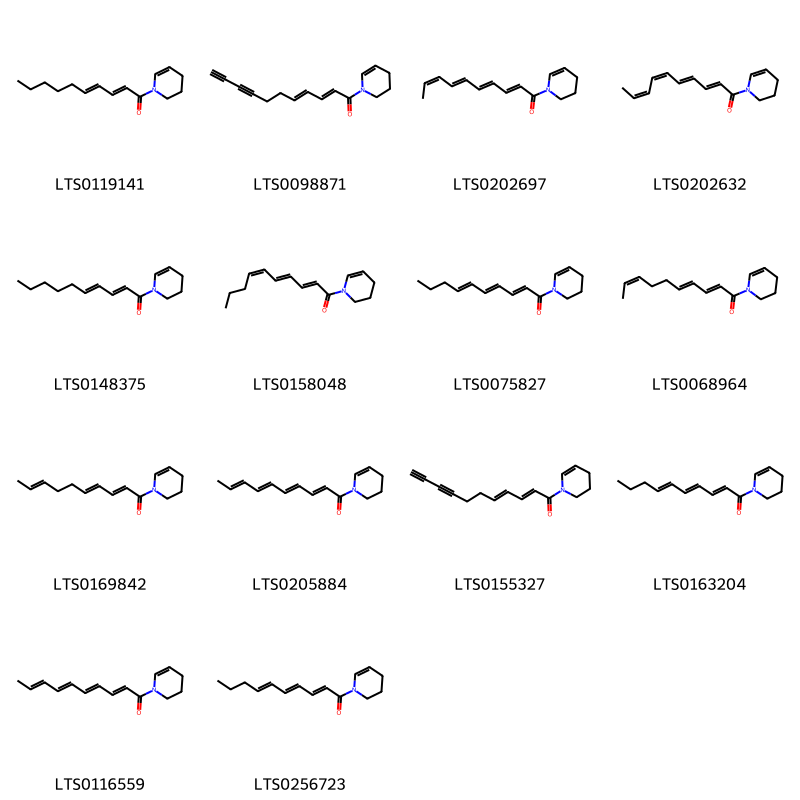{ width=100% }
    <figcaption>Hình ảnh cấu trúc hóa học của 14 hoạt chất thuộc nhóm Pyridines and derivatives gồm ['(2e,4e)-1-(3,4-dihydro-2h-pyridin-1-yl)deca-2,4-dien-1-one (LTS0119141)', '(2e,4e)-1-(3,4-dihydro-2h-pyridin-1-yl)undeca-2,4-dien-8,10-diyn-1-one (LTS0098871)', '(2e,4e,6e,8z)-1-(3,4-dihydro-2h-pyridin-1-yl)deca-2,4,6,8-tetraen-1-one (LTS0202697)', '(2e,4e,6z,8z)-1-(3,4-dihydro-2h-pyridin-1-yl)deca-2,4,6,8-tetraen-1-one (LTS0202632)', '1-(3,4-dihydro-2h-pyridin-1-yl)deca-2,4-dien-1-one (LTS0148375)', '(2e,4e,6z)-1-(3,4-dihydro-2h-pyridin-1-yl)deca-2,4,6-trien-1-one (LTS0158048)', '(2e,4e)-1-(3,4-dihydro-2h-pyridin-1-yl)deca-2,4,6-trien-1-one (LTS0075827)', '(2e,4e,8z)-1-(3,4-dihydro-2h-pyridin-1-yl)deca-2,4,8-trien-1-one (LTS0068964)', '1-(3,4-dihydro-2h-pyridin-1-yl)deca-2,4,8-trien-1-one (LTS0169842)', '(2e,4e,6e)-1-(3,4-dihydro-2h-pyridin-1-yl)deca-2,4,6,8-tetraen-1-one (LTS0205884)', '1-(3,4-dihydro-2h-pyridin-1-yl)undeca-2,4-dien-8,10-diyn-1-one (LTS0155327)', '1-(3,4-dihydro-2h-pyridin-1-yl)deca-2,4,6-trien-1-one (LTS0163204)', '1-(3,4-dihydro-2h-pyridin-1-yl)deca-2,4,6,8-tetraen-1-one (LTS0116559)', '(2e,4e,6e)-1-(3,4-dihydro-2h-pyridin-1-yl)deca-2,4,6-trien-1-one (LTS0256723)'].</figcaption>
</figure>
#### Nhóm Steroids and steroid derivatives
<figure markdown="span">
    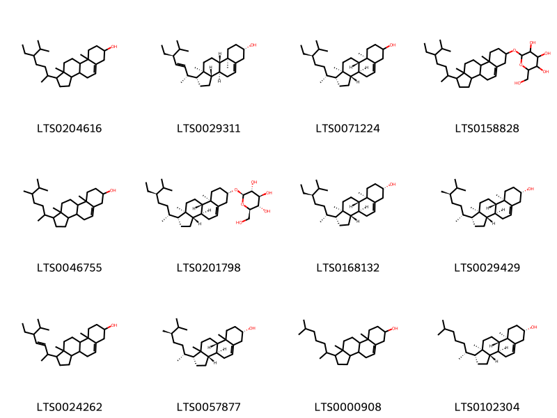{ width=100% }
    <figcaption>Hình ảnh cấu trúc hóa học của 12 hoạt chất thuộc nhóm Steroids and steroid derivatives gồm ['stigmast-5-en-3-ol, (3β)- (LTS0204616)', 'phytosterol (LTS0029311)', 'stigmast-5-en-3-ol (LTS0071224)', '2-{[1-(5-ethyl-6-methylheptan-2-yl)-9a,11a-dimethyl-1h,2h,3h,3ah,3bh,4h,6h,7h,8h,9h,9bh,10h,11h-cyclopenta[a]phenanthren-7-yl]oxy}-6-(hydroxymethyl)oxane-3,4,5-triol (LTS0158828)', 'campesterol (LTS0046755)', 'sitogluside (LTS0201798)', 'sitosterol (LTS0168132)', 'campesterol (LTS0029429)', 'stigmasterol (LTS0024262)', '(1r,3as,3bs,7s,9bs)-1-[(2r,5r)-5,6-dimethylheptan-2-yl]-9a,11a-dimethyl-1h,2h,3h,3ah,3bh,4h,6h,7h,8h,9h,9bh,10h,11h-cyclopenta[a]phenanthren-7-ol (LTS0057877)', 'epicholestrol (LTS0000908)', 'cholesterol (LTS0102304)'].</figcaption>
</figure>
#### Nhóm Tannins
<figure markdown="span">
    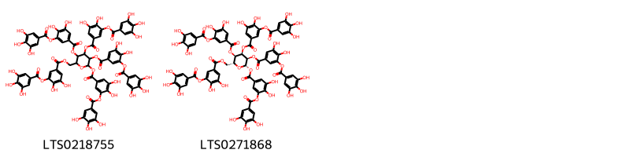{ width=100% }
    <figcaption>Hình ảnh cấu trúc hóa học của 2 hoạt chất thuộc nhóm Tannins gồm ['3,4,5-tris[3,4-dihydroxy-5-(3,4,5-trihydroxybenzoyloxy)benzoyloxy]-6-{[3,4-dihydroxy-5-(3,4,5-trihydroxybenzoyloxy)benzoyloxy]methyl}oxan-2-yl 3,4-dihydroxy-5-(3,4,5-trihydroxybenzoyloxy)benzoate (LTS0218755)', '(2s,3r,4r,5r,6r)-3,4,5-tris[3,4-dihydroxy-5-(3,4,5-trihydroxybenzoyloxy)benzoyloxy]-6-{[3,4-dihydroxy-5-(3,4,5-trihydroxybenzoyloxy)benzoyloxy]methyl}oxan-2-yl 3,4-dihydroxy-5-(3,4,5-trihydroxybenzoyloxy)benzoate (LTS0271868)'].</figcaption>
</figure>
#### Nhóm Unsaturated hydrocarbons
<figure markdown="span">
    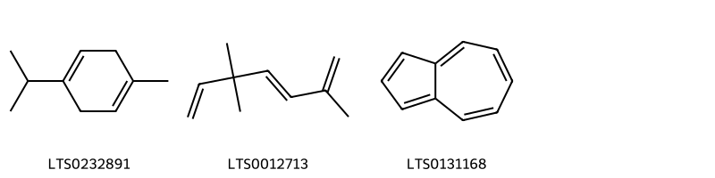{ width=100% }
    <figcaption>Hình ảnh cấu trúc hóa học của 3 hoạt chất thuộc nhóm Unsaturated hydrocarbons gồm ['α terpinene (LTS0232891)', '(3e)-2,5,5-trimethylhepta-1,3,6-triene (LTS0012713)', 'azulene (LTS0131168)'].</figcaption>
</figure>

---

### Dược dân tộc học

Danh sách các quốc gia có sử dụng *Achillea millefolium* trong điều trị các bệnh. 

| Country          | Disease                                                                   | Bệnh                                                                                                                                                                                                |
|:-----------------|:--------------------------------------------------------------------------|:----------------------------------------------------------------------------------------------------------------------------------------------------------------------------------------------------|
| Canada(Kwakiutl) | Poultice                                                                  | MYMEMORY WARNING: YOU USED ALL AVAILABLE FREE TRANSLATIONS FOR TODAY. NEXT AVAILABLE IN  10 HOURS 47 MINUTES 20 SECONDS VISIT HTTPS://MYMEMORY.TRANSLATED.NET/DOC/USAGELIMITS.PHP TO TRANSLATE MORE |
| Canada(Salish)   | Poultice                                                                  | MYMEMORY WARNING: YOU USED ALL AVAILABLE FREE TRANSLATIONS FOR TODAY. NEXT AVAILABLE IN  10 HOURS 47 MINUTES 17 SECONDS VISIT HTTPS://MYMEMORY.TRANSLATED.NET/DOC/USAGELIMITS.PHP TO TRANSLATE MORE |
| China            | Apertif, Hemostat, Tonic, Carminative                                     | MYMEMORY WARNING: YOU USED ALL AVAILABLE FREE TRANSLATIONS FOR TODAY. NEXT AVAILABLE IN  10 HOURS 47 MINUTES 14 SECONDS VISIT HTTPS://MYMEMORY.TRANSLATED.NET/DOC/USAGELIMITS.PHP TO TRANSLATE MORE |
| Danish           | Astringent                                                                | MYMEMORY WARNING: YOU USED ALL AVAILABLE FREE TRANSLATIONS FOR TODAY. NEXT AVAILABLE IN  10 HOURS 47 MINUTES 11 SECONDS VISIT HTTPS://MYMEMORY.TRANSLATED.NET/DOC/USAGELIMITS.PHP TO TRANSLATE MORE |
| Elsewhere        | Tonic                                                                     | MYMEMORY WARNING: YOU USED ALL AVAILABLE FREE TRANSLATIONS FOR TODAY. NEXT AVAILABLE IN  10 HOURS 47 MINUTES 07 SECONDS VISIT HTTPS://MYMEMORY.TRANSLATED.NET/DOC/USAGELIMITS.PHP TO TRANSLATE MORE |
| Europe           | Carminative, Stimulant, Tonic                                             | MYMEMORY WARNING: YOU USED ALL AVAILABLE FREE TRANSLATIONS FOR TODAY. NEXT AVAILABLE IN  10 HOURS 47 MINUTES 04 SECONDS VISIT HTTPS://MYMEMORY.TRANSLATED.NET/DOC/USAGELIMITS.PHP TO TRANSLATE MORE |
| German           | Hemostat                                                                  | MYMEMORY WARNING: YOU USED ALL AVAILABLE FREE TRANSLATIONS FOR TODAY. NEXT AVAILABLE IN  10 HOURS 47 MINUTES 01 SECONDS VISIT HTTPS://MYMEMORY.TRANSLATED.NET/DOC/USAGELIMITS.PHP TO TRANSLATE MORE |
| Hungary          | Emmenagogue                                                               | MYMEMORY WARNING: YOU USED ALL AVAILABLE FREE TRANSLATIONS FOR TODAY. NEXT AVAILABLE IN  10 HOURS 46 MINUTES 58 SECONDS VISIT HTTPS://MYMEMORY.TRANSLATED.NET/DOC/USAGELIMITS.PHP TO TRANSLATE MORE |
| India            | Expectorant, Stimulant                                                    | MYMEMORY WARNING: YOU USED ALL AVAILABLE FREE TRANSLATIONS FOR TODAY. NEXT AVAILABLE IN  10 HOURS 46 MINUTES 55 SECONDS VISIT HTTPS://MYMEMORY.TRANSLATED.NET/DOC/USAGELIMITS.PHP TO TRANSLATE MORE |
| Italian          | Tonic                                                                     | MYMEMORY WARNING: YOU USED ALL AVAILABLE FREE TRANSLATIONS FOR TODAY. NEXT AVAILABLE IN  10 HOURS 46 MINUTES 52 SECONDS VISIT HTTPS://MYMEMORY.TRANSLATED.NET/DOC/USAGELIMITS.PHP TO TRANSLATE MORE |
| Mexico           | Hemostat, Tonic                                                           | MYMEMORY WARNING: YOU USED ALL AVAILABLE FREE TRANSLATIONS FOR TODAY. NEXT AVAILABLE IN  10 HOURS 46 MINUTES 48 SECONDS VISIT HTTPS://MYMEMORY.TRANSLATED.NET/DOC/USAGELIMITS.PHP TO TRANSLATE MORE |
| Portuguese       | Sudorific                                                                 | MYMEMORY WARNING: YOU USED ALL AVAILABLE FREE TRANSLATIONS FOR TODAY. NEXT AVAILABLE IN  10 HOURS 46 MINUTES 46 SECONDS VISIT HTTPS://MYMEMORY.TRANSLATED.NET/DOC/USAGELIMITS.PHP TO TRANSLATE MORE |
| Turkey           | Carminative                                                               | MYMEMORY WARNING: YOU USED ALL AVAILABLE FREE TRANSLATIONS FOR TODAY. NEXT AVAILABLE IN  10 HOURS 46 MINUTES 43 SECONDS VISIT HTTPS://MYMEMORY.TRANSLATED.NET/DOC/USAGELIMITS.PHP TO TRANSLATE MORE |
| US               | Diaphoretic, Litholytic, Poultice, Stimulant, Stimulant, Tonic, Vulnerary | MYMEMORY WARNING: YOU USED ALL AVAILABLE FREE TRANSLATIONS FOR TODAY. NEXT AVAILABLE IN  10 HOURS 46 MINUTES 39 SECONDS VISIT HTTPS://MYMEMORY.TRANSLATED.NET/DOC/USAGELIMITS.PHP TO TRANSLATE MORE |
| US(Blackfoot)    | Cathartic, Poultice                                                       | MYMEMORY WARNING: YOU USED ALL AVAILABLE FREE TRANSLATIONS FOR TODAY. NEXT AVAILABLE IN  10 HOURS 46 MINUTES 36 SECONDS VISIT HTTPS://MYMEMORY.TRANSLATED.NET/DOC/USAGELIMITS.PHP TO TRANSLATE MORE |
| US(Flathead)     | Deodorant, Antiseptic, Hemostat                                           | MYMEMORY WARNING: YOU USED ALL AVAILABLE FREE TRANSLATIONS FOR TODAY. NEXT AVAILABLE IN  10 HOURS 46 MINUTES 32 SECONDS VISIT HTTPS://MYMEMORY.TRANSLATED.NET/DOC/USAGELIMITS.PHP TO TRANSLATE MORE |
| USSR             | nan                                                                       | MYMEMORY WARNING: YOU USED ALL AVAILABLE FREE TRANSLATIONS FOR TODAY. NEXT AVAILABLE IN  10 HOURS 46 MINUTES 29 SECONDS VISIT HTTPS://MYMEMORY.TRANSLATED.NET/DOC/USAGELIMITS.PHP TO TRANSLATE MORE |

---

---
## Achillea moschata
### Thông tin về thực vật

!!! info "Phân loại thực vật của *Achillea erba-rotta* từ GIBF:"
    - **Kingdom:** Plantae
    - **Phylum:** Tracheophyta
    - **Order:** Asterales
    - **Family:** Asteraceae
    - **Genus:** Achillea
    - **Species:** *Achillea erba-rotta*

 

| Label (VI)   | Label (EN)   | Scientific Name   | Descriptions (VI)   | Descriptions (EN)   | Also Known As (VI)   | Also Known As (EN)   |
|:-------------|:-------------|:------------------|:--------------------|:--------------------|:---------------------|:---------------------|
| N/A          | N/A          | Achillea moschata | loài thực vật       | species of plant    | ['']                 | ['']                 |

#### Phân bố trên thế giới

**Từ CSDL GIBF** nan, Italy, Hungary, Switzerland, unknown or invalid, United States of America, Austria, France

#### Phân bố tại Việt Nam

**Từ CSDL GIBF**: Không có ghi nhận ở Việt Nam

---
### Thành phần hóa học
        
- Theo cơ sở dữ liệu lotus: Từ loài *Achillea erba-rotta* đã phân lập và xác định được 43 hoạt chất thuộc về các nhóm Unsaturated hydrocarbons, Fatty Acyls, Prenol lipids, Organooxygen compounds. 

|    | chemicalTaxonomyClassyfireClass   |   smiles_count |
|---:|:----------------------------------|---------------:|
|  0 | Fatty Acyls                       |              3 |
|  1 | Organooxygen compounds            |              1 |
|  2 | Prenol lipids                     |             38 |
|  3 | Unsaturated hydrocarbons          |              1 |

#### Nhóm Fatty Acyls
<figure markdown="span">
    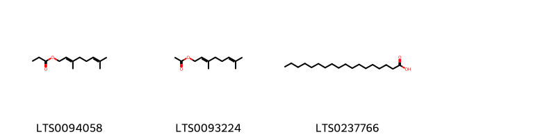{ width=100% }
    <figcaption>Hình ảnh cấu trúc hóa học của 3 hoạt chất thuộc nhóm Fatty Acyls gồm ['geranyl propionate (LTS0094058)', 'geranyl acetate (LTS0093224)', 'stearic acid (LTS0237766)'].</figcaption>
</figure>
#### Nhóm Organooxygen compounds
<figure markdown="span">
    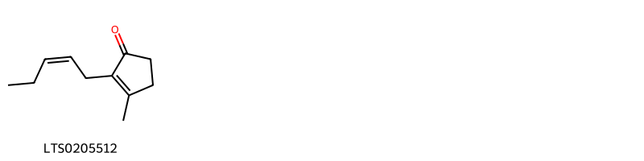{ width=100% }
    <figcaption>Hình ảnh cấu trúc hóa học của 1 hoạt chất thuộc nhóm Organooxygen compounds gồm ['jasmone (LTS0205512)'].</figcaption>
</figure>
#### Nhóm Prenol lipids
<figure markdown="span">
    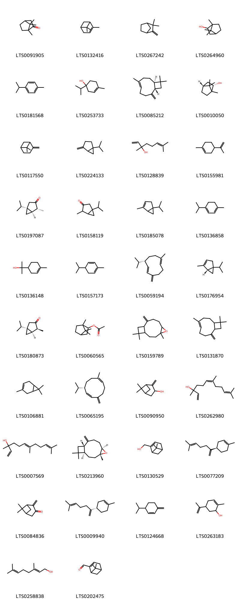{ width=100% }
    <figcaption>Hình ảnh cấu trúc hóa học của 38 hoạt chất thuộc nhóm Prenol lipids gồm ['camphor (LTS0091905)', 'α pinene (LTS0132416)', 'camphene (LTS0267242)', 'borneol (LTS0264960)', 'cymene (LTS0181568)', '4-terpineol (LTS0253733)', 'caryophyllene (LTS0085212)', '(2s,4r)-1,7,7-trimethylbicyclo[2.2.1]heptan-2-ol (LTS0010050)', 'β-pinene (LTS0117550)', 'sabinene (LTS0224133)', 'linalool, (+-)- (LTS0128839)', 'limonene,  (LTS0155981)', 'thujone (LTS0197087)', '3-isothujone (LTS0158119)', 'α-thujene (LTS0185078)', 'terpinene (LTS0136858)', 'terpineol (LTS0136148)', 'phellandrene (LTS0157173)', '(-)-germacrene d (LTS0059194)', 'α-thujene (LTS0176954)', '(+)-β-thujone (LTS0180873)', 'bornyl acetate (LTS0060565)', 'caryophyllene oxide (LTS0159789)', 'caryophyllene (LTS0131870)', 'monoterpenes (LTS0106881)', '(1z,6z,8s)-8-isopropyl-1-methyl-5-methylidenecyclodeca-1,6-diene (LTS0065195)', 'pinocarveol (LTS0090950)', 'nerolidol (LTS0262980)', 'nerolidol isomers (LTS0007569)', 'β-caryophyllene oxide (LTS0213960)', 'myrtenol (LTS0130529)', '(r)-β-bisabolene (LTS0077209)', 'pinocarvone (LTS0084836)', '(-)-β-bisabolene (LTS0009940)', 'β phellandrene (LTS0124668)', 'carveol (LTS0263183)', 'geraniol (LTS0258838)', 'myrtenal (LTS0202475)'].</figcaption>
</figure>
#### Nhóm Unsaturated hydrocarbons
<figure markdown="span">
    { width=100% }
    <figcaption>Hình ảnh cấu trúc hóa học của 1 hoạt chất thuộc nhóm Unsaturated hydrocarbons gồm ['α terpinene (LTS0232891)'].</figcaption>
</figure>

---

### Dược dân tộc học

Danh sách các quốc gia có sử dụng *Achillea erba-rotta* trong điều trị các bệnh. 

| Country   | Disease   | Bệnh                                                                                                                                                                                                |
|:----------|:----------|:----------------------------------------------------------------------------------------------------------------------------------------------------------------------------------------------------|
| German    | Vulnerary | MYMEMORY WARNING: YOU USED ALL AVAILABLE FREE TRANSLATIONS FOR TODAY. NEXT AVAILABLE IN  10 HOURS 45 MINUTES 28 SECONDS VISIT HTTPS://MYMEMORY.TRANSLATED.NET/DOC/USAGELIMITS.PHP TO TRANSLATE MORE |
| Turkey    | Sudorific | MYMEMORY WARNING: YOU USED ALL AVAILABLE FREE TRANSLATIONS FOR TODAY. NEXT AVAILABLE IN  10 HOURS 45 MINUTES 24 SECONDS VISIT HTTPS://MYMEMORY.TRANSLATED.NET/DOC/USAGELIMITS.PHP TO TRANSLATE MORE |

---

---
## Achillea nobilis
### Thông tin về thực vật

!!! info "Phân loại thực vật của *Achillea nobilis* từ GIBF:"
    - **Kingdom:** Plantae
    - **Phylum:** Tracheophyta
    - **Order:** Asterales
    - **Family:** Asteraceae
    - **Genus:** Achillea
    - **Species:** *Achillea nobilis*

 

| Label (VI)   | Label (EN)   | Scientific Name   | Descriptions (VI)   | Descriptions (EN)   | Also Known As (VI)   | Also Known As (EN)   |
|:-------------|:-------------|:------------------|:--------------------|:--------------------|:---------------------|:---------------------|
| N/A          | N/A          | Achillea nobilis  | loài thực vật       | species of plant    | ['']                 | ['']                 |

#### Phân bố trên thế giới

**Từ CSDL GIBF** Ukraine, Italy, Czechia, Germany, Slovakia, Belgium, Georgia, Azerbaijan, Hungary, Switzerland, Russian Federation, Kazakhstan, Norway

#### Phân bố tại Việt Nam

**Từ CSDL GIBF**: Không có ghi nhận ở Việt Nam

---
### Thành phần hóa học
        
- Theo cơ sở dữ liệu lotus: Từ loài *Achillea nobilis* đã phân lập và xác định được 122 hoạt chất thuộc về các nhóm Fatty Acyls, Flavonoids, Prenol lipids, Steroids and steroid derivatives, Organonitrogen compounds, Unsaturated hydrocarbons, Diazanaphthalenes, Organooxygen compounds, Lactones, Carboxylic acids and derivatives. 

|    | chemicalTaxonomyClassyfireClass   |   smiles_count |
|---:|:----------------------------------|---------------:|
|  0 | Carboxylic acids and derivatives  |              8 |
|  1 | Diazanaphthalenes                 |              1 |
|  2 | Fatty Acyls                       |              2 |
|  3 | Flavonoids                        |             19 |
|  4 | Lactones                          |              2 |
|  5 | Organonitrogen compounds          |              1 |
|  6 | Organooxygen compounds            |              1 |
|  7 | Prenol lipids                     |             84 |
|  8 | Steroids and steroid derivatives  |              3 |
|  9 | Unsaturated hydrocarbons          |              1 |

#### Nhóm Carboxylic acids and derivatives
<figure markdown="span">
    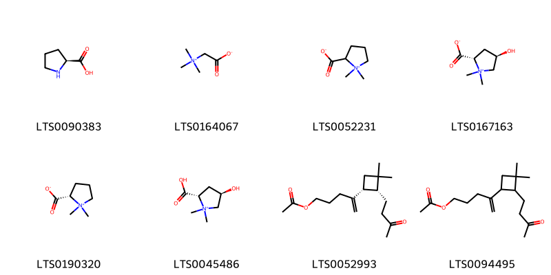{ width=100% }
    <figcaption>Hình ảnh cấu trúc hóa học của 8 hoạt chất thuộc nhóm Carboxylic acids and derivatives gồm ['l-proline (LTS0090383)', 'bet (LTS0164067)', '1,1-dimethylpyrrolidin-1-ium-2-carboxylate (LTS0052231)', '(-)-betonicine (LTS0167163)', 'stachydrine (LTS0190320)', '(2s,4r)-2-carboxy-4-hydroxy-1,1-dimethylpyrrolidin-1-ium (LTS0045486)', '4-[(1r,2r)-3,3-dimethyl-2-(3-oxobutyl)cyclobutyl]pent-4-en-1-yl acetate (LTS0052993)', '4-[3,3-dimethyl-2-(3-oxobutyl)cyclobutyl]pent-4-en-1-yl acetate (LTS0094495)'].</figcaption>
</figure>
#### Nhóm Diazanaphthalenes
<figure markdown="span">
    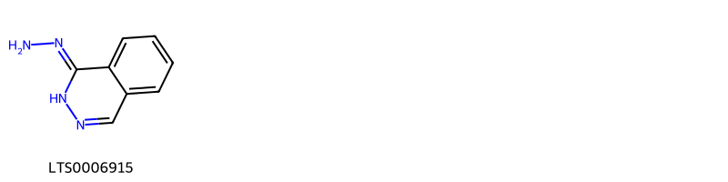{ width=100% }
    <figcaption>Hình ảnh cấu trúc hóa học của 1 hoạt chất thuộc nhóm Diazanaphthalenes gồm ['1(2h)-phthalazinone hydrazone (LTS0006915)'].</figcaption>
</figure>
#### Nhóm Fatty Acyls
<figure markdown="span">
    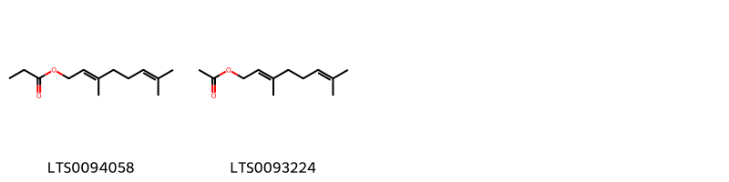{ width=100% }
    <figcaption>Hình ảnh cấu trúc hóa học của 2 hoạt chất thuộc nhóm Fatty Acyls gồm ['geranyl propionate (LTS0094058)', 'geranyl acetate (LTS0093224)'].</figcaption>
</figure>
#### Nhóm Flavonoids
<figure markdown="span">
    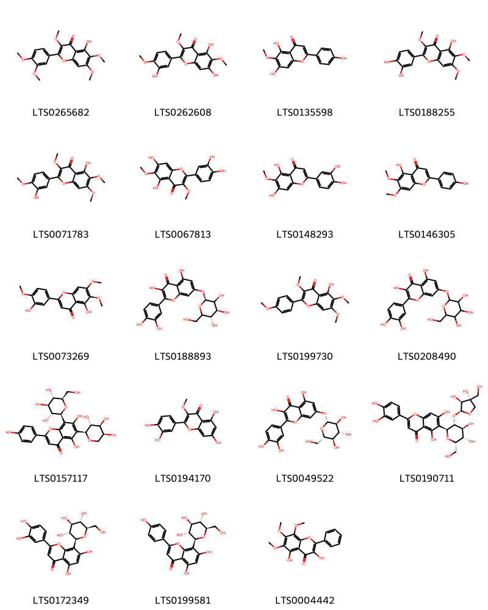{ width=100% }
    <figcaption>Hình ảnh cấu trúc hóa học của 19 hoạt chất thuộc nhóm Flavonoids gồm ['artemetin (LTS0265682)', 'centaureidin (LTS0262608)', 'hispidulin (LTS0135598)', 'chrysosplenol d (LTS0188255)', 'casticin (LTS0071783)', 'axillarin (LTS0067813)', 'nepetin (LTS0148293)', 'cirsimaritin (LTS0146305)', 'eupatorin (LTS0073269)', 'quercimeritrin (LTS0188893)', "penduletin 4'-methyl ether (LTS0199730)", 'quercimeritrin (LTS0208490)', 'isoschaftoside (LTS0157117)', 'quercetin 3-methyl ether (LTS0194170)', '2-(3,4-dihydroxyphenyl)-3,5-dihydroxy-7-{[(2r,3s,4r,5r,6s)-3,4,5-trihydroxy-6-(hydroxymethyl)oxan-2-yl]oxy}chromen-4-one (LTS0049522)', '6-[(2s,3r,4s,5s,6s)-3-{[(2s,3s,4r)-3,4-dihydroxy-4-(hydroxymethyl)oxolan-2-yl]oxy}-4,5-dihydroxy-6-(hydroxymethyl)oxan-2-yl]-2-(3,4-dihydroxyphenyl)-5,7-dihydroxychromen-4-one (LTS0190711)', 'orientin (LTS0172349)', 'vitexin (LTS0199581)', '3,5-dihydroxy-6,7,8-trimethoxy-2-phenylchromen-4-one (LTS0004442)'].</figcaption>
</figure>
#### Nhóm Lactones
<figure markdown="span">
    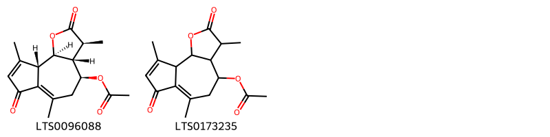{ width=100% }
    <figcaption>Hình ảnh cấu trúc hóa học của 2 hoạt chất thuộc nhóm Lactones gồm ['matricarin (LTS0096088)', '3,6,9-trimethyl-2,7-dioxo-3h,3ah,4h,5h,9ah,9bh-azuleno[4,5-b]furan-4-yl acetate (LTS0173235)'].</figcaption>
</figure>
#### Nhóm Organonitrogen compounds
<figure markdown="span">
    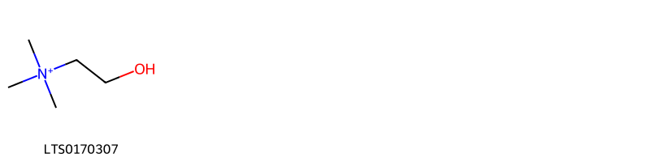{ width=100% }
    <figcaption>Hình ảnh cấu trúc hóa học của 1 hoạt chất thuộc nhóm Organonitrogen compounds gồm ['choline (LTS0170307)'].</figcaption>
</figure>
#### Nhóm Organooxygen compounds
<figure markdown="span">
    { width=100% }
    <figcaption>Hình ảnh cấu trúc hóa học của 1 hoạt chất thuộc nhóm Organooxygen compounds gồm ['jasmone (LTS0205512)'].</figcaption>
</figure>
#### Nhóm Prenol lipids
<figure markdown="span">
    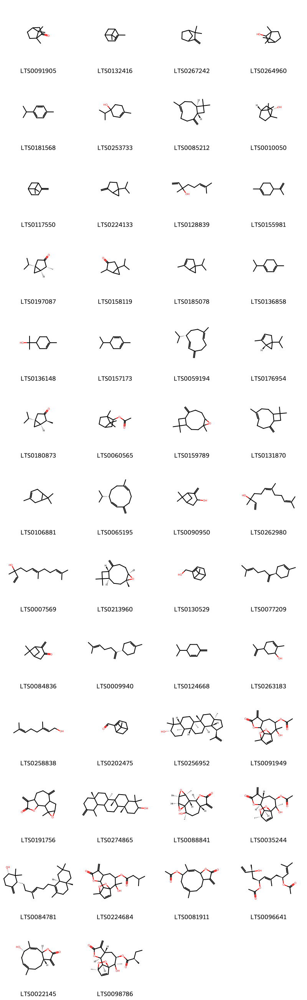{ width=100% }
    <figcaption>Hình ảnh cấu trúc hóa học của 84 hoạt chất thuộc nhóm Prenol lipids gồm ['camphor (LTS0091905)', 'α pinene (LTS0132416)', 'camphene (LTS0267242)', 'borneol (LTS0264960)', 'cymene (LTS0181568)', '4-terpineol (LTS0253733)', 'caryophyllene (LTS0085212)', '(2s,4r)-1,7,7-trimethylbicyclo[2.2.1]heptan-2-ol (LTS0010050)', 'β-pinene (LTS0117550)', 'sabinene (LTS0224133)', 'linalool, (+-)- (LTS0128839)', 'limonene,  (LTS0155981)', 'thujone (LTS0197087)', '3-isothujone (LTS0158119)', 'α-thujene (LTS0185078)', 'terpinene (LTS0136858)', 'terpineol (LTS0136148)', 'phellandrene (LTS0157173)', '(-)-germacrene d (LTS0059194)', 'α-thujene (LTS0176954)', '(+)-β-thujone (LTS0180873)', 'bornyl acetate (LTS0060565)', 'caryophyllene oxide (LTS0159789)', 'caryophyllene (LTS0131870)', 'monoterpenes (LTS0106881)', '(1z,6z,8s)-8-isopropyl-1-methyl-5-methylidenecyclodeca-1,6-diene (LTS0065195)', 'pinocarveol (LTS0090950)', 'nerolidol (LTS0262980)', 'nerolidol isomers (LTS0007569)', 'β-caryophyllene oxide (LTS0213960)', 'myrtenol (LTS0130529)', '(r)-β-bisabolene (LTS0077209)', 'pinocarvone (LTS0084836)', '(-)-β-bisabolene (LTS0009940)', 'β phellandrene (LTS0124668)', 'carveol (LTS0263183)', 'geraniol (LTS0258838)', 'myrtenal (LTS0202475)', 'lupeol (LTS0256952)', '2-hydroxy-2,11-dimethyl-6-methylidene-7-oxo-8,12,13-trioxatetracyclo[9.2.2.0¹,¹⁰.0⁵,⁹]pentadec-14-en-3-yl acetate (LTS0091949)', '14-methyl-5,9-dimethylidene-3,13-dioxatetracyclo[8.4.0.0²,⁶.0¹²,¹⁴]tetradecan-4-one (LTS0191756)', '(6ar,6br,8ar,14br)-4,4,6a,6b,8a,12,14b-heptamethyl-11-methylidene-hexadecahydropicen-3-ol (LTS0274865)', 'canin (LTS0088841)', '(1s,2r,3r,5s,9s,10r,11r)-2-hydroxy-2,11-dimethyl-6-methylidene-7-oxo-8,12,13-trioxatetracyclo[9.2.2.0¹,¹⁰.0⁵,⁹]pentadec-14-en-3-yl acetate (LTS0035244)', '(1s,3r)-3-[(3e)-6-[(4ar,8as)-2,4a,7,7-tetramethyl-3,4,5,6,8,8a-hexahydronaphthalen-1-yl]-3-methylhex-3-en-1-yl]-2,2-dimethyl-4-methylidenecyclohexan-1-ol (LTS0084781)', '2-hydroxy-2,11-dimethyl-6-methylidene-7-oxo-8,12,13-trioxatetracyclo[9.2.2.0¹,¹⁰.0⁵,⁹]pentadec-14-en-3-yl 3-methylbutanoate (LTS0224684)', '6,10-dimethyl-3-methylidene-2-oxo-3ah,4h,5h,8h,9h,11ah-cyclodeca[b]furan-9-yl acetate (LTS0081911)', '(3r,5s,6e,9s)-9-(acetyloxy)-3-hydroxy-3,7,11-trimethyldodeca-1,6,10-trien-5-yl acetate (LTS0096641)', '(3as,9s,11ar)-9-hydroxy-6,10-dimethyl-3-methylidene-3ah,4h,5h,8h,9h,11ah-cyclodeca[b]furan-2-one (LTS0022145)', '(1s,2r,3r,5s,9s,10r,11r)-2-hydroxy-2,11-dimethyl-6-methylidene-7-oxo-8,12,13-trioxatetracyclo[9.2.2.0¹,¹⁰.0⁵,⁹]pentadec-14-en-3-yl (2r)-2-methylbutanoate (LTS0098786)', 'bisabolol (LTS0074733)', '(2s,5r)-6-methyl-2-[(1r)-4-methylcyclohex-3-en-1-yl]hept-6-ene-2,5-diol (LTS0088464)', '6-(5-hydroxy-6-methylhept-6-en-2-yl)-3-methylcyclohex-2-en-1-ol (LTS0167173)', '2-methyl-6-(4-methylcyclohex-3-en-1-yl)hept-3-ene-2,6-diol (LTS0192451)', '(1s,3r)-2,2-dimethyl-4-methylidene-3-[(3e,7e,11e)-3,8,12,16-tetramethylheptadeca-3,7,11,15-tetraen-1-yl]cyclohexan-1-ol (LTS0170381)', '(1s,2s,10s,12r,14s)-14-methyl-5,9-dimethylidene-3,13-dioxatetracyclo[8.4.0.0²,⁶.0¹²,¹⁴]tetradecan-4-one (LTS0226728)', '(3e,6s)-2-methyl-6-[(1r)-4-methylcyclohex-3-en-1-yl]hept-3-ene-2,6-diol (LTS0106670)', '(1r,6r)-6-[(2r,5r)-5-hydroxy-6-methylhept-6-en-2-yl]-3-methylcyclohex-2-en-1-ol (LTS0271055)', '8,10-dihydroxy-2,6,10-trimethyldodeca-2,6,11-trien-4-yl acetate (LTS0257961)', '6-methyl-2-(4-methylcyclohex-3-en-1-yl)hept-6-ene-2,5-diol (LTS0175727)', '(3as,9s,11ar)-6,10-dimethyl-3-methylidene-2-oxo-3ah,4h,5h,8h,9h,11ah-cyclodeca[b]furan-9-yl acetate (LTS0118339)', 'achilleol b (LTS0200920)', '(4s,6e,8s,10r)-8,10-dihydroxy-2,6,10-trimethyldodeca-2,6,11-trien-4-yl acetate (LTS0259704)', '(1s,2r,3r,5s,9s,10r,11r)-2-hydroxy-2,11-dimethyl-6-methylidene-7-oxo-8,12,13-trioxatetracyclo[9.2.2.0¹,¹⁰.0⁵,⁹]pentadec-14-en-3-yl 3-methylbutanoate (LTS0267441)', '2-hydroxy-2,11-dimethyl-6-methylidene-7-oxo-8,12,13-trioxatetracyclo[9.2.2.0¹,¹⁰.0⁵,⁹]pentadec-14-en-3-yl 2-methylbutanoate (LTS0183461)', '7-isopropyl-4,10-dimethylidenecyclodec-5-en-1-ol (LTS0149321)', '3-[6-(2,4a,7,7-tetramethyl-3,4,5,6,8,8a-hexahydronaphthalen-1-yl)-3-methylhex-3-en-1-yl]-2,2-dimethyl-4-methylidenecyclohexan-1-ol (LTS0179533)', '8-(acetyloxy)-10-hydroxy-2,6,10-trimethyldodeca-2,6,11-trien-4-yl acetate (LTS0009661)', '2,2-dimethyl-4-methylidene-3-(3,8,12,16-tetramethylheptadeca-3,7,11,15-tetraen-1-yl)cyclohexan-1-ol (LTS0009552)', '(1s,5e,7s)-7-isopropyl-4,10-dimethylidenecyclodec-5-en-1-ol (LTS0055235)', '(1s,2s,6s,9r,10s,11r,13r,14s)-9,14-dihydroxy-9,14-dimethyl-5-methylidene-3,12-dioxatetracyclo[8.4.0.0²,⁶.0¹¹,¹³]tetradecan-4-one (LTS0136405)', '(1r,2r,5s,9s,10s,11s)-2-hydroxy-2,11-dimethyl-6-methylidene-8,12,13-trioxatetracyclo[9.2.2.0¹,¹⁰.0⁵,⁹]pentadec-14-en-7-one (LTS0077191)', '(1s,2s,6s,10r,12r,14s)-14-methyl-5,9-dimethylidene-3,13-dioxatetracyclo[8.4.0.0²,⁶.0¹²,¹⁴]tetradecan-4-one (LTS0075667)', '[(1s,3s)-3-[(1r)-1-hydroperoxy-2-methylprop-2-en-1-yl]-2,2-dimethylcyclopropyl]methyl acetate (LTS0214554)', '(1r,2s,6s,9r,10r,11r,13r,14s)-9,14-dihydroxy-9,14-dimethyl-5-methylidene-3,12-dioxatetracyclo[8.4.0.0²,⁶.0¹¹,¹³]tetradecan-4-one (LTS0172741)', '(3ar,9s,11as)-9-hydroxy-6,10-dimethyl-3-methylidene-3ah,4h,5h,8h,9h,11ah-cyclodeca[b]furan-2-one (LTS0063986)', '[(1r,3s)-3-[(1r)-1-hydroperoxy-2-methylprop-2-en-1-yl]-2,2-dimethylcyclopropyl]methyl acetate (LTS0188013)', '9-hydroxy-6,10-dimethyl-3-methylidene-3ah,4h,5h,8h,9h,11ah-cyclodeca[b]furan-2-one (LTS0192274)', '9,14-dihydroxy-9,14-dimethyl-5-methylidene-3,12-dioxatetracyclo[8.4.0.0²,⁶.0¹¹,¹³]tetradecan-4-one (LTS0141116)', '2-hydroxy-2,11-dimethyl-6-methylidene-8,12,13-trioxatetracyclo[9.2.2.0¹,¹⁰.0⁵,⁹]pentadec-14-en-7-one (LTS0160220)', '9-hydroxy-6,10-dimethyl-3-methylidene-3ah,4h,5h,8h,9h,11ah-cyclodeca[b]furan-2-one (LTS0233028)', '8,9-dihydroxy-9-methyl-3,6-dimethylidene-octahydroazuleno[4,5-b]furan-2-one (LTS0085005)', '(3as,6ar,8r,9r,9as,9bs)-8,9-dihydroxy-9-methyl-3,6-dimethylidene-octahydroazuleno[4,5-b]furan-2-one (LTS0199768)', '[3-(1-hydroperoxy-2-methylprop-2-en-1-yl)-2,2-dimethylcyclopropyl]methyl acetate (LTS0256961)'].</figcaption>
</figure>
#### Nhóm Steroids and steroid derivatives
<figure markdown="span">
    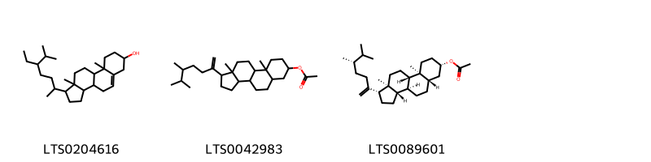{ width=100% }
    <figcaption>Hình ảnh cấu trúc hóa học của 3 hoạt chất thuộc nhóm Steroids and steroid derivatives gồm ['stigmast-5-en-3-ol, (3β)- (LTS0204616)', '1-(5,6-dimethylhept-1-en-2-yl)-9a,11a-dimethyl-tetradecahydro-1h-cyclopenta[a]phenanthren-7-yl acetate (LTS0042983)', '(1r,3as,3br,5as,7s,9as,9bs,11as)-1-[(5s)-5,6-dimethylhept-1-en-2-yl]-9a,11a-dimethyl-tetradecahydro-1h-cyclopenta[a]phenanthren-7-yl acetate (LTS0089601)'].</figcaption>
</figure>
#### Nhóm Unsaturated hydrocarbons
<figure markdown="span">
    { width=100% }
    <figcaption>Hình ảnh cấu trúc hóa học của 1 hoạt chất thuộc nhóm Unsaturated hydrocarbons gồm ['α terpinene (LTS0232891)'].</figcaption>
</figure>

---

### Dược dân tộc học

Danh sách các quốc gia có sử dụng *Achillea nobilis* trong điều trị các bệnh. 

| Country   | Disease                                                                     | Bệnh                                                                                                                                                                                                |
|:----------|:----------------------------------------------------------------------------|:----------------------------------------------------------------------------------------------------------------------------------------------------------------------------------------------------|
| Denmark   | Stomachic                                                                   | MYMEMORY WARNING: YOU USED ALL AVAILABLE FREE TRANSLATIONS FOR TODAY. NEXT AVAILABLE IN  10 HOURS 44 MINUTES 31 SECONDS VISIT HTTPS://MYMEMORY.TRANSLATED.NET/DOC/USAGELIMITS.PHP TO TRANSLATE MORE |
| Dutch     | Carminative                                                                 | MYMEMORY WARNING: YOU USED ALL AVAILABLE FREE TRANSLATIONS FOR TODAY. NEXT AVAILABLE IN  10 HOURS 44 MINUTES 28 SECONDS VISIT HTTPS://MYMEMORY.TRANSLATED.NET/DOC/USAGELIMITS.PHP TO TRANSLATE MORE |
| English   | Astringent, Emmenagogue, Expectorant, Hemostat, Stimulant, Sudorific, Tonic | MYMEMORY WARNING: YOU USED ALL AVAILABLE FREE TRANSLATIONS FOR TODAY. NEXT AVAILABLE IN  10 HOURS 44 MINUTES 25 SECONDS VISIT HTTPS://MYMEMORY.TRANSLATED.NET/DOC/USAGELIMITS.PHP TO TRANSLATE MORE |
| German    | Vulnerary                                                                   | MYMEMORY WARNING: YOU USED ALL AVAILABLE FREE TRANSLATIONS FOR TODAY. NEXT AVAILABLE IN  10 HOURS 44 MINUTES 22 SECONDS VISIT HTTPS://MYMEMORY.TRANSLATED.NET/DOC/USAGELIMITS.PHP TO TRANSLATE MORE |
| Turkey    | Litholytic                                                                  | MYMEMORY WARNING: YOU USED ALL AVAILABLE FREE TRANSLATIONS FOR TODAY. NEXT AVAILABLE IN  10 HOURS 44 MINUTES 18 SECONDS VISIT HTTPS://MYMEMORY.TRANSLATED.NET/DOC/USAGELIMITS.PHP TO TRANSLATE MORE |

---

---
## Achillea ptarmica
### Thông tin về thực vật

!!! info "Phân loại thực vật của *Achillea ptarmica* từ GIBF:"
    - **Kingdom:** Plantae
    - **Phylum:** Tracheophyta
    - **Order:** Asterales
    - **Family:** Asteraceae
    - **Genus:** Achillea
    - **Species:** *Achillea ptarmica*

 

| Label (VI)   | Label (EN)   | Scientific Name   | Descriptions (VI)   | Descriptions (EN)   | Also Known As (VI)   | Also Known As (EN)   |
|:-------------|:-------------|:------------------|:--------------------|:--------------------|:---------------------|:---------------------|
| N/A          | N/A          | Achillea ptarmica | loài thực vật       | species of plant    | ['']                 | ['sneezewort']       |

#### Phân bố trên thế giới

**Từ CSDL GIBF** Denmark, Netherlands, Belarus, Czechia, Germany, Belgium, Estonia, Poland, Ireland, Russian Federation, Sweden, Finland, France, Norway, United Kingdom of Great Britain and Northern Ireland, Austria

#### Phân bố tại Việt Nam

**Từ CSDL GIBF**: Không có ghi nhận ở Việt Nam

---
### Thành phần hóa học
        
- Theo cơ sở dữ liệu lotus: Từ loài *Achillea ptarmica* đã phân lập và xác định được 64 hoạt chất thuộc về các nhóm Fatty Acyls, Prenol lipids, Unsaturated hydrocarbons, Organooxygen compounds, Furanoid lignans. 

|    | chemicalTaxonomyClassyfireClass   |   smiles_count |
|---:|:----------------------------------|---------------:|
|  0 | Fatty Acyls                       |              6 |
|  1 | Furanoid lignans                  |              1 |
|  2 | Organooxygen compounds            |              1 |
|  3 | Prenol lipids                     |             54 |
|  4 | Unsaturated hydrocarbons          |              1 |

#### Nhóm Fatty Acyls
<figure markdown="span">
    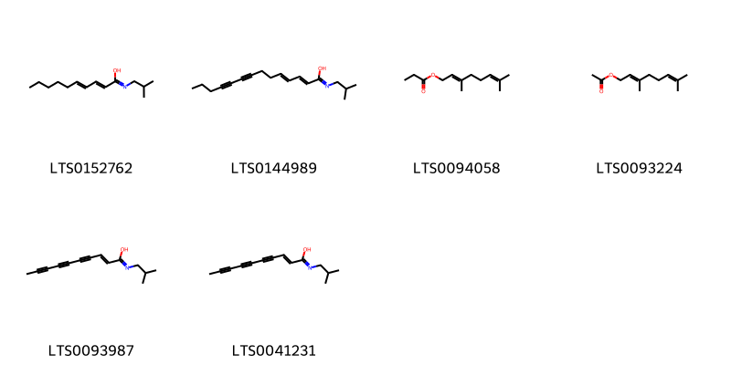{ width=100% }
    <figcaption>Hình ảnh cấu trúc hóa học của 6 hoạt chất thuộc nhóm Fatty Acyls gồm ['(2e,4e)-n-(2-methylpropyl)deca-2,4-dienimidic acid (LTS0152762)', '(2e,4e)-n-(2-methylpropyl)tetradeca-2,4-dien-8,10-diynimidic acid (LTS0144989)', 'geranyl propionate (LTS0094058)', 'geranyl acetate (LTS0093224)', '(2e)-n-(2-methylpropyl)dec-2-en-4,6,8-triynimidic acid (LTS0093987)', 'n-(2-methylpropyl)dec-2-en-4,6,8-triynimidic acid (LTS0041231)'].</figcaption>
</figure>
#### Nhóm Furanoid lignans
<figure markdown="span">
    { width=100% }
    <figcaption>Hình ảnh cấu trúc hóa học của 1 hoạt chất thuộc nhóm Furanoid lignans gồm ['sesamin (LTS0120161)'].</figcaption>
</figure>
#### Nhóm Organooxygen compounds
<figure markdown="span">
    { width=100% }
    <figcaption>Hình ảnh cấu trúc hóa học của 1 hoạt chất thuộc nhóm Organooxygen compounds gồm ['jasmone (LTS0205512)'].</figcaption>
</figure>
#### Nhóm Prenol lipids
<figure markdown="span">
    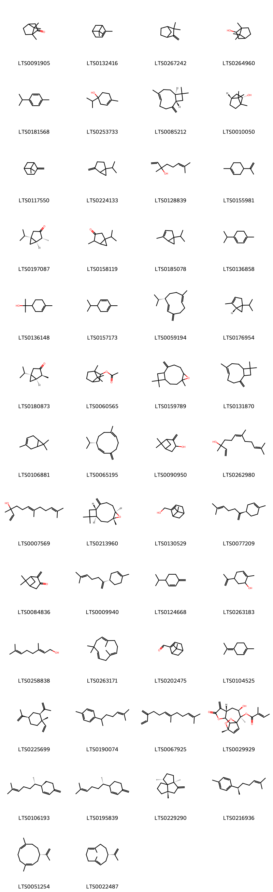{ width=100% }
    <figcaption>Hình ảnh cấu trúc hóa học của 54 hoạt chất thuộc nhóm Prenol lipids gồm ['camphor (LTS0091905)', 'α pinene (LTS0132416)', 'camphene (LTS0267242)', 'borneol (LTS0264960)', 'cymene (LTS0181568)', '4-terpineol (LTS0253733)', 'caryophyllene (LTS0085212)', '(2s,4r)-1,7,7-trimethylbicyclo[2.2.1]heptan-2-ol (LTS0010050)', 'β-pinene (LTS0117550)', 'sabinene (LTS0224133)', 'linalool, (+-)- (LTS0128839)', 'limonene,  (LTS0155981)', 'thujone (LTS0197087)', '3-isothujone (LTS0158119)', 'α-thujene (LTS0185078)', 'terpinene (LTS0136858)', 'terpineol (LTS0136148)', 'phellandrene (LTS0157173)', '(-)-germacrene d (LTS0059194)', 'α-thujene (LTS0176954)', '(+)-β-thujone (LTS0180873)', 'bornyl acetate (LTS0060565)', 'caryophyllene oxide (LTS0159789)', 'caryophyllene (LTS0131870)', 'monoterpenes (LTS0106881)', '(1z,6z,8s)-8-isopropyl-1-methyl-5-methylidenecyclodeca-1,6-diene (LTS0065195)', 'pinocarveol (LTS0090950)', 'nerolidol (LTS0262980)', 'nerolidol isomers (LTS0007569)', 'β-caryophyllene oxide (LTS0213960)', 'myrtenol (LTS0130529)', '(r)-β-bisabolene (LTS0077209)', 'pinocarvone (LTS0084836)', '(-)-β-bisabolene (LTS0009940)', 'β phellandrene (LTS0124668)', 'carveol (LTS0263183)', 'geraniol (LTS0258838)', 'humulene (LTS0263171)', 'myrtenal (LTS0202475)', 'terpinolene (LTS0104525)', 'β-elemene (LTS0225699)', 'curcumene (LTS0190074)', 'β-farnesene (LTS0067925)', '(2r,3r,5s,11s)-3-hydroxy-2,11-dimethyl-6-methylidene-7-oxo-8,12,13-trioxatetracyclo[9.2.2.0¹,¹⁰.0⁵,⁹]pentadec-14-en-2-yl (2e)-2-methylbut-2-enoate (LTS0029929)', 'β-sesquiphellandrene (LTS0106193)', '3-[(2s)-6-methylhept-5-en-2-yl]-6-methylidenecyclohex-1-ene (LTS0195839)', '(2r,5s,8s)-2,5,8-trimethyl-6-methylidenetricyclo[6.3.0.0¹,⁵]undecane (LTS0229290)', '(-)-α-curcumene (LTS0216936)', 'germacrene (LTS0051254)', '(-)-germacrene a (LTS0022487)', '6,10,14-trimethylpentadecan-2-one (LTS0258077)', 'isocomene (LTS0257188)', '(1s,2e,10r)-3,7,11,11-tetramethylbicyclo[8.1.0]undeca-2,6-diene (LTS0032090)', '(2e,6e)-3,7,11,11-tetramethylbicyclo[8.1.0]undeca-2,6-diene (LTS0225278)'].</figcaption>
</figure>
#### Nhóm Unsaturated hydrocarbons
<figure markdown="span">
    { width=100% }
    <figcaption>Hình ảnh cấu trúc hóa học của 1 hoạt chất thuộc nhóm Unsaturated hydrocarbons gồm ['α terpinene (LTS0232891)'].</figcaption>
</figure>

---

### Dược dân tộc học

Danh sách các quốc gia có sử dụng *Achillea ptarmica* trong điều trị các bệnh. 

| Country   | Disease      | Bệnh                                                                                                                                                                                                |
|:----------|:-------------|:----------------------------------------------------------------------------------------------------------------------------------------------------------------------------------------------------|
| Dutch     | Astringent   | MYMEMORY WARNING: YOU USED ALL AVAILABLE FREE TRANSLATIONS FOR TODAY. NEXT AVAILABLE IN  10 HOURS 43 MINUTES 29 SECONDS VISIT HTTPS://MYMEMORY.TRANSLATED.NET/DOC/USAGELIMITS.PHP TO TRANSLATE MORE |
| English   | Hemostat     | MYMEMORY WARNING: YOU USED ALL AVAILABLE FREE TRANSLATIONS FOR TODAY. NEXT AVAILABLE IN  10 HOURS 43 MINUTES 26 SECONDS VISIT HTTPS://MYMEMORY.TRANSLATED.NET/DOC/USAGELIMITS.PHP TO TRANSLATE MORE |
| French    | Sialogogue   | MYMEMORY WARNING: YOU USED ALL AVAILABLE FREE TRANSLATIONS FOR TODAY. NEXT AVAILABLE IN  10 HOURS 43 MINUTES 23 SECONDS VISIT HTTPS://MYMEMORY.TRANSLATED.NET/DOC/USAGELIMITS.PHP TO TRANSLATE MORE |
| German    | Sternutatory | MYMEMORY WARNING: YOU USED ALL AVAILABLE FREE TRANSLATIONS FOR TODAY. NEXT AVAILABLE IN  10 HOURS 43 MINUTES 21 SECONDS VISIT HTTPS://MYMEMORY.TRANSLATED.NET/DOC/USAGELIMITS.PHP TO TRANSLATE MORE |
| Turkey    | Tonic        | MYMEMORY WARNING: YOU USED ALL AVAILABLE FREE TRANSLATIONS FOR TODAY. NEXT AVAILABLE IN  10 HOURS 43 MINUTES 17 SECONDS VISIT HTTPS://MYMEMORY.TRANSLATED.NET/DOC/USAGELIMITS.PHP TO TRANSLATE MORE |

---

---
## Achillea sibirica
### Thông tin về thực vật

!!! info "Phân loại thực vật của *Achillea sibirica* từ GIBF:"
    - **Kingdom:** Plantae
    - **Phylum:** Tracheophyta
    - **Order:** Asterales
    - **Family:** Asteraceae
    - **Genus:** Achillea
    - **Species:** *Achillea sibirica*

 

| Label (VI)   | Label (EN)   | Scientific Name   | Descriptions (VI)   | Descriptions (EN)   | Also Known As (VI)   | Also Known As (EN)   |
|:-------------|:-------------|:------------------|:--------------------|:--------------------|:---------------------|:---------------------|
| N/A          | N/A          | Achillea sibirica | loài thực vật       | species of plant    | ['']                 | ['']                 |

#### Phân bố trên thế giới

**Từ CSDL GIBF** nan, Japan, Korea, Republic of, Korea (Democratic People’s Republic of), Russian Federation, unknown or invalid, United States of America, Sweden, Norway, China, Canada

#### Phân bố tại Việt Nam

**Từ CSDL GIBF**: Không có ghi nhận ở Việt Nam

---
### Thành phần hóa học
        
- Theo cơ sở dữ liệu lotus: Từ loài *Achillea sibirica* đã phân lập và xác định được 17 hoạt chất thuộc về các nhóm Flavonoids, Organonitrogen compounds, Unsaturated hydrocarbons, Lactones, Organooxygen compounds, Carboxylic acids and derivatives. 

|    | chemicalTaxonomyClassyfireClass   |   smiles_count |
|---:|:----------------------------------|---------------:|
|  0 | Carboxylic acids and derivatives  |              6 |
|  1 | Flavonoids                        |              4 |
|  2 | Lactones                          |              3 |
|  3 | Organonitrogen compounds          |              1 |
|  4 | Organooxygen compounds            |              2 |
|  5 | Unsaturated hydrocarbons          |              1 |

#### Nhóm Carboxylic acids and derivatives
<figure markdown="span">
    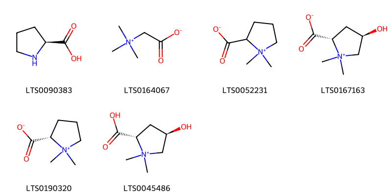{ width=100% }
    <figcaption>Hình ảnh cấu trúc hóa học của 6 hoạt chất thuộc nhóm Carboxylic acids and derivatives gồm ['l-proline (LTS0090383)', 'bet (LTS0164067)', '1,1-dimethylpyrrolidin-1-ium-2-carboxylate (LTS0052231)', '(-)-betonicine (LTS0167163)', 'stachydrine (LTS0190320)', '(2s,4r)-2-carboxy-4-hydroxy-1,1-dimethylpyrrolidin-1-ium (LTS0045486)'].</figcaption>
</figure>
#### Nhóm Flavonoids
<figure markdown="span">
    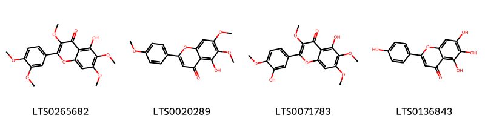{ width=100% }
    <figcaption>Hình ảnh cấu trúc hóa học của 4 hoạt chất thuộc nhóm Flavonoids gồm ['artemetin (LTS0265682)', 'salvigenin (LTS0020289)', 'casticin (LTS0071783)', 'scutellarein (LTS0136843)'].</figcaption>
</figure>
#### Nhóm Lactones
<figure markdown="span">
    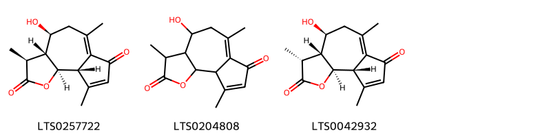{ width=100% }
    <figcaption>Hình ảnh cấu trúc hóa học của 3 hoạt chất thuộc nhóm Lactones gồm ['(3s,3ar,4s,9as,9br)-4-hydroxy-3,6,9-trimethyl-3h,3ah,4h,5h,9ah,9bh-azuleno[4,5-b]furan-2,7-dione (LTS0257722)', '4-hydroxy-3,6,9-trimethyl-3h,3ah,4h,5h,9ah,9bh-azuleno[4,5-b]furan-2,7-dione (LTS0204808)', 'hydroxyachillin (LTS0042932)'].</figcaption>
</figure>
#### Nhóm Organonitrogen compounds
<figure markdown="span">
    { width=100% }
    <figcaption>Hình ảnh cấu trúc hóa học của 1 hoạt chất thuộc nhóm Organonitrogen compounds gồm ['choline (LTS0170307)'].</figcaption>
</figure>
#### Nhóm Organooxygen compounds
<figure markdown="span">
    { width=100% }
    <figcaption>Hình ảnh cấu trúc hóa học của 2 hoạt chất thuộc nhóm Organooxygen compounds gồm ['chlorogenic acid (LTS0226495)', '(3r,5r)-3,5-bis({[(2e)-3-(3,4-dihydroxyphenyl)prop-2-enoyl]oxy})-1,4-dihydroxycyclohexane-1-carboxylic acid (LTS0059972)'].</figcaption>
</figure>
#### Nhóm Unsaturated hydrocarbons
<figure markdown="span">
    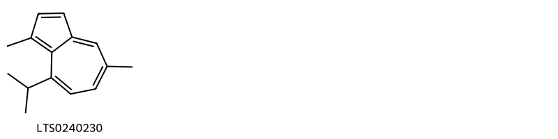{ width=100% }
    <figcaption>Hình ảnh cấu trúc hóa học của 1 hoạt chất thuộc nhóm Unsaturated hydrocarbons gồm ['8-isopropyl-1,5-dimethylazulene (LTS0240230)'].</figcaption>
</figure>

---

### Dược dân tộc học

Danh sách các quốc gia có sử dụng *Achillea sibirica* trong điều trị các bệnh. 

| Country   | Disease                                          | Bệnh                                                                                                                                                                                                |
|:----------|:-------------------------------------------------|:----------------------------------------------------------------------------------------------------------------------------------------------------------------------------------------------------|
| China     | Antiseptic, Carminative, Stomachic, Tonic, Tonic | MYMEMORY WARNING: YOU USED ALL AVAILABLE FREE TRANSLATIONS FOR TODAY. NEXT AVAILABLE IN  10 HOURS 42 MINUTES 34 SECONDS VISIT HTTPS://MYMEMORY.TRANSLATED.NET/DOC/USAGELIMITS.PHP TO TRANSLATE MORE |

---

# Chi Silybum

??? note "Danh sách các dược liệu thuộc chi"
    
	 - *Silybum marianum*

---
## Silybum marianum
### Thông tin về thực vật

!!! info "Phân loại thực vật của *Silybum marianum* từ GIBF:"
    - **Kingdom:** Plantae
    - **Phylum:** Tracheophyta
    - **Order:** Asterales
    - **Family:** Asteraceae
    - **Genus:** Silybum
    - **Species:** *Silybum marianum*

 

| Label (VI)   | Label (EN)   | Scientific Name   | Descriptions (VI)   | Descriptions (EN)                                      | Also Known As (VI)   | Also Known As (EN)                                                                                                                                                                                                                                                                     |
|:-------------|:-------------|:------------------|:--------------------|:-------------------------------------------------------|:---------------------|:---------------------------------------------------------------------------------------------------------------------------------------------------------------------------------------------------------------------------------------------------------------------------------------|
| N/A          | N/A          | Silybum marianum  | loài thực vật       | species of plant of genus Silybum in family Asteraceae | ['']                 | ['milk thistle', 'blessed milkthistle', 'Blessed thistle', 'Carduus marianus', 'Holy thistle', 'Marian thistle', 'Mariana mariana', 'Mary thistle', 'Mediterranean milk thistle', 'milkthistle', "Saint Mary's thistle", 'Scotch thistle', "St. Mary's thistle", 'variegated thistle'] |

#### Phân bố trên thế giới

**Từ CSDL GIBF** nan, Italy, Australia, Belgium, Palestine, State of, Jordan, Israel, Canada, Pakistan, Netherlands, Spain, Türkiye, Portugal, Albania, United States of America, Chile, Greece, Germany, Iran (Islamic Republic of), Switzerland, Mexico, France, United Kingdom of Great Britain and Northern Ireland, New Zealand

#### Phân bố tại Việt Nam

**Từ CSDL GIBF**: Không có ghi nhận ở Việt Nam

---
### Thành phần hóa học
        
- Theo cơ sở dữ liệu lotus: Từ loài *Silybum marianum* đã phân lập và xác định được 87 hoạt chất thuộc về các nhóm Fatty Acyls, Flavonoids, Prenol lipids, Steroids and steroid derivatives, 2-arylbenzofuran flavonoids, Flavonolignans. 

|    | chemicalTaxonomyClassyfireClass   |   smiles_count |
|---:|:----------------------------------|---------------:|
|  0 | 2-arylbenzofuran flavonoids       |             10 |
|  1 | Fatty Acyls                       |              4 |
|  2 | Flavonoids                        |             31 |
|  3 | Flavonolignans                    |             17 |
|  4 | Prenol lipids                     |             22 |
|  5 | Steroids and steroid derivatives  |              3 |

#### Nhóm 2-arylbenzofuran flavonoids
<figure markdown="span">
    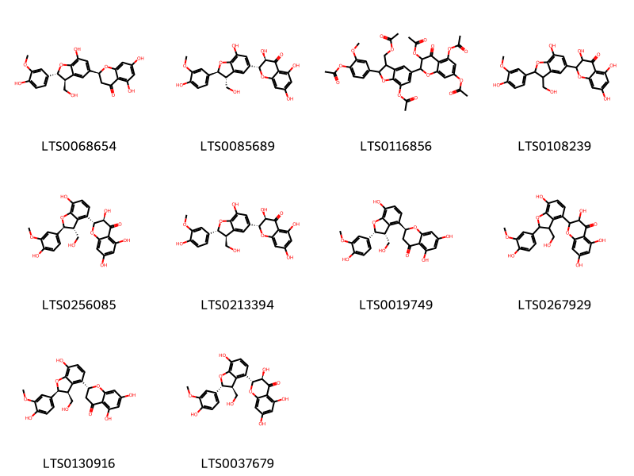{ width=100% }
    <figcaption>Hình ảnh cấu trúc hóa học của 10 hoạt chất thuộc nhóm 2-arylbenzofuran flavonoids gồm ['(2s)-5,7-dihydroxy-2-[(2r,3s)-7-hydroxy-2-(4-hydroxy-3-methoxyphenyl)-3-(hydroxymethyl)-2,3-dihydro-1-benzofuran-5-yl]-2,3-dihydro-1-benzopyran-4-one (LTS0068654)', '(2r,3r)-3,5,7-trihydroxy-2-[(2s,3r)-7-hydroxy-2-(4-hydroxy-3-methoxyphenyl)-3-(hydroxymethyl)-2,3-dihydro-1-benzofuran-5-yl]-2,3-dihydro-1-benzopyran-4-one (LTS0085689)', '[7-(acetyloxy)-2-[4-(acetyloxy)-3-methoxyphenyl]-5-[3,5,7-tris(acetyloxy)-4-oxo-2,3-dihydro-1-benzopyran-2-yl]-2,3-dihydro-1-benzofuran-3-yl]methyl acetate (LTS0116856)', '3,5,7-trihydroxy-2-[7-hydroxy-2-(4-hydroxy-3-methoxyphenyl)-3-(hydroxymethyl)-2,3-dihydro-1-benzofuran-5-yl]-2,3-dihydro-1-benzopyran-4-one (LTS0108239)', '(2r,3r)-3,5,7-trihydroxy-2-[(2s,3r)-7-hydroxy-2-(4-hydroxy-3-methoxyphenyl)-3-(hydroxymethyl)-2,3-dihydro-1-benzofuran-4-yl]-2,3-dihydro-1-benzopyran-4-one (LTS0256085)', 'silychristin (LTS0213394)', '(2s)-5,7-dihydroxy-2-[(2r,3r)-7-hydroxy-2-(4-hydroxy-3-methoxyphenyl)-3-(hydroxymethyl)-2,3-dihydro-1-benzofuran-4-yl]-2,3-dihydro-1-benzopyran-4-one (LTS0019749)', '3,5,7-trihydroxy-2-[7-hydroxy-2-(4-hydroxy-3-methoxyphenyl)-3-(hydroxymethyl)-2,3-dihydro-1-benzofuran-4-yl]-2,3-dihydro-1-benzopyran-4-one (LTS0267929)', '(2r)-5,7-dihydroxy-2-[(2s,3s)-7-hydroxy-2-(4-hydroxy-3-methoxyphenyl)-3-(hydroxymethyl)-2,3-dihydro-1-benzofuran-4-yl]-2,3-dihydro-1-benzopyran-4-one (LTS0130916)', '(2r,3r)-3,5,7-trihydroxy-2-[(2r,3s)-7-hydroxy-2-(4-hydroxy-3-methoxyphenyl)-3-(hydroxymethyl)-2,3-dihydro-1-benzofuran-4-yl]-2,3-dihydro-1-benzopyran-4-one (LTS0037679)'].</figcaption>
</figure>
#### Nhóm Fatty Acyls
<figure markdown="span">
    { width=100% }
    <figcaption>Hình ảnh cấu trúc hóa học của 4 hoạt chất thuộc nhóm Fatty Acyls gồm ['palmitic acid (LTS0079439)', 'oleic acid (LTS0256910)', 'myristic acid (LTS0102566)', 'stearic acid (LTS0237766)'].</figcaption>
</figure>
#### Nhóm Flavonoids
<figure markdown="span">
    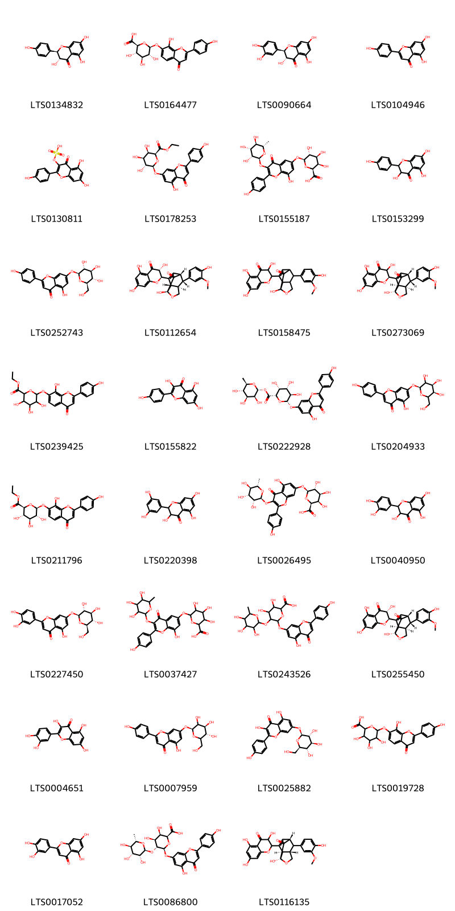{ width=100% }
    <figcaption>Hình ảnh cấu trúc hóa học của 31 hoạt chất thuộc nhóm Flavonoids gồm ['(+)-dihydrokaempferol (LTS0134832)', '(2s,3s,4s,5r,6s)-3,4,5-trihydroxy-6-{[8-hydroxy-2-(4-hydroxyphenyl)-4-oxochromen-7-yl]oxy}oxane-2-carboxylic acid (LTS0164477)', '(+)-taxifolin (LTS0090664)', 'chamomile (LTS0104946)', 'kaempferol 3-o-sulfate (LTS0130811)', 'ethyl (2s,3r,4s,5r,6s)-3,4,5-trihydroxy-6-{[5-hydroxy-2-(4-hydroxyphenyl)-4-oxochromen-7-yl]oxy}oxane-2-carboxylate (LTS0178253)', '(2s,3r,4s,5r,6s)-3,4,5-trihydroxy-6-{[8-hydroxy-2-(4-hydroxyphenyl)-4-oxo-3-{[(2s,3r,4r,5r,6s)-3,4,5-trihydroxy-6-methyloxan-2-yl]oxy}chromen-6-yl]oxy}oxane-2-carboxylic acid (LTS0155187)', 'aromadendrin (LTS0153299)', 'apigenin 7-o-β-glucoside (LTS0252743)', '(1r,3s,6r,7s,10r)-3-hydroxy-10-(4-hydroxy-3-methoxyphenyl)-8-[(2r,3r)-3,5,7-trihydroxy-4-oxo-2,3-dihydro-1-benzopyran-2-yl]-4-oxatricyclo[4.3.1.0³,⁷]dec-8-en-2-one (LTS0112654)', '3-hydroxy-10-(4-hydroxy-3-methoxyphenyl)-8-(3,5,7-trihydroxy-4-oxo-2,3-dihydro-1-benzopyran-2-yl)-4-oxatricyclo[4.3.1.0³,⁷]dec-8-en-2-one (LTS0158475)', '(1r,3r,6r,7r,10r)-3-hydroxy-10-(4-hydroxy-3-methoxyphenyl)-8-[(2r)-3,5,7-trihydroxy-4-oxo-2,3-dihydro-1-benzopyran-2-yl]-4-oxatricyclo[4.3.1.0³,⁷]dec-8-en-2-one (LTS0273069)', 'ethyl 3,4,5-trihydroxy-6-{[8-hydroxy-2-(4-hydroxyphenyl)-4-oxochromen-7-yl]oxy}oxane-2-carboxylate (LTS0239425)', 'kaempherol (LTS0155822)', '(2r,3s,4s,5s,6r)-3,4,5-trihydroxy-6-methyloxan-2-yl (2s,3r,4s,5r,6s)-3,4,5-trihydroxy-6-{[5-hydroxy-2-(4-hydroxyphenyl)-4-oxochromen-7-yl]oxy}oxane-2-carboxylate (LTS0222928)', 'apigenin 7-galactoside (LTS0204933)', 'ethyl (2s,3s,4s,5r,6s)-3,4,5-trihydroxy-6-{[8-hydroxy-2-(4-hydroxyphenyl)-4-oxochromen-7-yl]oxy}oxane-2-carboxylate (LTS0211796)', '2-(3,5-dihydroxyphenyl)-3,5,7-trihydroxy-2,3-dihydro-1-benzopyran-4-one (LTS0220398)', '(2s,3r,4s,5r,6s)-3,4,5-trihydroxy-6-{[5-hydroxy-2-(4-hydroxyphenyl)-4-oxo-3-{[(2s,3r,4r,5r,6s)-3,4,5-trihydroxy-6-methyloxan-2-yl]oxy}chromen-7-yl]oxy}oxane-2-carboxylic acid (LTS0026495)', '2,3-dihydroquercetin (LTS0040950)', 'luteolin 7-o-glucoside (LTS0227450)', '3,4,5-trihydroxy-6-{[8-hydroxy-2-(4-hydroxyphenyl)-4-oxo-3-[(3,4,5-trihydroxy-6-methyloxan-2-yl)oxy]chromen-6-yl]oxy}oxane-2-carboxylic acid (LTS0037427)', '3,4-dihydroxy-6-{[5-hydroxy-2-(4-hydroxyphenyl)-4-oxochromen-7-yl]oxy}-5-[(3,4,5-trihydroxy-6-methyloxan-2-yl)oxy]oxane-2-carboxylic acid (LTS0243526)', 'silidianin (LTS0255450)', 'quercetin (LTS0004651)', 'apigenin 7-o-glucoside (LTS0007959)', 'kaempferol 7-o-glucoside (LTS0025882)', '3,4,5-trihydroxy-6-{[8-hydroxy-2-(4-hydroxyphenyl)-4-oxochromen-7-yl]oxy}oxane-2-carboxylic acid (LTS0019728)', 'luteolin (LTS0017052)', '(2s,3r,4s,5r,6s)-3,4-dihydroxy-6-{[5-hydroxy-2-(4-hydroxyphenyl)-4-oxochromen-7-yl]oxy}-5-{[(2s,3r,4r,5r,6s)-3,4,5-trihydroxy-6-methyloxan-2-yl]oxy}oxane-2-carboxylic acid (LTS0086800)', '(1r,3r,6s,7r)-3-hydroxy-10-(4-hydroxy-3-methoxyphenyl)-8-(3,5,7-trihydroxy-4-oxo-2,3-dihydro-1-benzopyran-2-yl)-4-oxatricyclo[4.3.1.0³,⁷]dec-8-en-2-one (LTS0116135)'].</figcaption>
</figure>
#### Nhóm Flavonolignans
<figure markdown="span">
    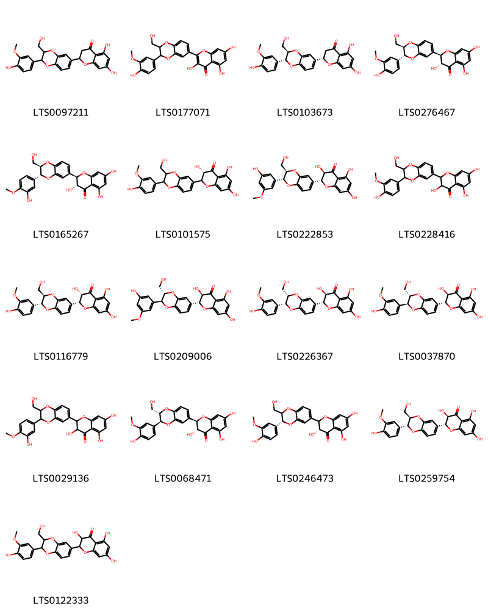{ width=100% }
    <figcaption>Hình ảnh cấu trúc hóa học của 17 hoạt chất thuộc nhóm Flavonolignans gồm ['5,7-dihydroxy-2-[2-(4-hydroxy-3-methoxyphenyl)-3-(hydroxymethyl)-2,3-dihydro-1,4-benzodioxin-6-yl]-2,3-dihydro-1-benzopyran-4-one (LTS0097211)', '3,5,7-trihydroxy-2-[3-(4-hydroxy-3-methoxyphenyl)-2-(hydroxymethyl)-2,3-dihydro-1,4-benzodioxin-6-yl]chromen-4-one (LTS0177071)', 'silandrin (LTS0103673)', 'silibinin (LTS0276467)', '(2r,3r)-3,5,7-trihydroxy-2-[(2r,3r)-3-(3-hydroxy-4-methoxyphenyl)-2-(hydroxymethyl)-2,3-dihydro-1,4-benzodioxin-6-yl]-2,3-dihydro-1-benzopyran-4-one (LTS0165267)', '(3s)-3,5,7-trihydroxy-2-[2-(4-hydroxy-3-methoxyphenyl)-3-(hydroxymethyl)-2,3-dihydro-1,4-benzodioxin-6-yl]-2,3-dihydro-1-benzopyran-4-one (LTS0101575)', '(2r,3r)-3,5,7-trihydroxy-2-[(2r,3r)-2-(3-hydroxy-5-methoxyphenyl)-3-(hydroxymethyl)-2,3-dihydro-1,4-benzodioxin-6-yl]-2,3-dihydro-1-benzopyran-4-one (LTS0222853)', 'silymarin (LTS0228416)', '(2r,3s)-3,5,7-trihydroxy-2-[(2r,3r)-2-(4-hydroxy-3-methoxyphenyl)-3-(hydroxymethyl)-2,3-dihydro-1,4-benzodioxin-6-yl]-2,3-dihydro-1-benzopyran-4-one (LTS0116779)', '(2r,3r)-3,5,7-trihydroxy-2-[(2s,3s)-2-(3-hydroxy-5-methoxyphenyl)-3-(hydroxymethyl)-2,3-dihydro-1,4-benzodioxin-6-yl]-2,3-dihydro-1-benzopyran-4-one (LTS0209006)', '(2r,3r)-3,5,7-trihydroxy-2-[(2r,3s)-2-(4-hydroxy-3-methoxyphenyl)-3-(hydroxymethyl)-2,3-dihydro-1,4-benzodioxin-6-yl]-2,3-dihydro-1-benzopyran-4-one (LTS0226367)', 'isosilybin b (LTS0037870)', '3,5,7-trihydroxy-2-[3-(3-hydroxy-4-methoxyphenyl)-2-(hydroxymethyl)-2,3-dihydro-1,4-benzodioxin-6-yl]-2,3-dihydro-1-benzopyran-4-one (LTS0029136)', 'silibinin b (LTS0068471)', '(3r)-3,5,7-trihydroxy-2-[(3r)-3-(4-hydroxy-3-methoxyphenyl)-2-(hydroxymethyl)-2,3-dihydro-1,4-benzodioxin-6-yl]-2,3-dihydro-1-benzopyran-4-one (LTS0246473)', 'isosilybin a (LTS0259754)', '3,5,7-trihydroxy-2-[2-(4-hydroxy-3-methoxyphenyl)-3-(hydroxymethyl)-2,3-dihydro-1,4-benzodioxin-6-yl]-2,3-dihydro-1-benzopyran-4-one (LTS0122333)'].</figcaption>
</figure>
#### Nhóm Prenol lipids
<figure markdown="span">
    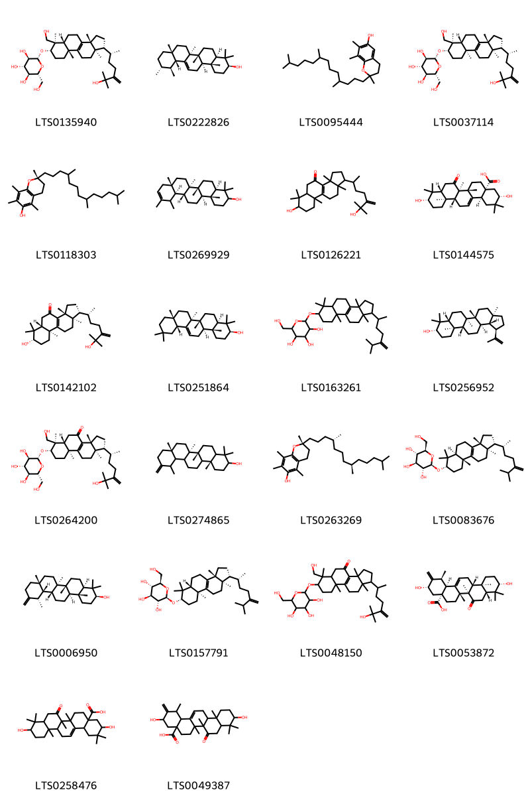{ width=100% }
    <figcaption>Hình ảnh cấu trúc hóa học của 22 hoạt chất thuộc nhóm Prenol lipids gồm ['(2r,3r,4s,5s,6r)-2-{[(1r,3ar,5ar,6r,7s,9ar,11ar)-1-[(2r)-6-hydroxy-6-methyl-5-methylideneheptan-2-yl]-6-(hydroxymethyl)-3a,6,9a,11a-tetramethyl-1h,2h,3h,4h,5h,5ah,7h,8h,9h,10h,11h-cyclopenta[a]phenanthren-7-yl]oxy}-6-(hydroxymethyl)oxane-3,4,5-triol (LTS0135940)', 'amyrin (LTS0222826)', '2,7,8-trimethyl-2-(4,8,12-trimethyltridecyl)-3,4-dihydro-1-benzopyran-6-ol (LTS0095444)', 'marianoside a (LTS0037114)', '(2r)-2,5,7,8-tetramethyl-2-(4,8,12-trimethyltridecyl)-3,4-dihydro-1-benzopyran-6-ol (LTS0118303)', '(4ar,6ar,6br,8as,12ar,12br,14ar,14br)-4,4,6a,6b,8a,11,12,14b-octamethyl-2,3,4a,5,6,7,8,9,12,12a,12b,13,14,14a-tetradecahydro-1h-picen-3-ol (LTS0269929)', '7-hydroxy-1-(6-hydroxy-6-methyl-5-methylideneheptan-2-yl)-3a,6,6,9a,11a-pentamethyl-1h,2h,3h,5h,5ah,7h,8h,9h,10h,11h-cyclopenta[a]phenanthren-4-one (LTS0126221)', '(3s,4ar,6ar,6br,8ar,10s,12as,12br,14bs)-3,10-dihydroxy-2,2,6a,6b,9,9,12a-heptamethyl-7-oxo-3,4,5,6,8,8a,10,11,12,12b,13,14b-dodecahydro-1h-picene-4a-carboxylic acid (LTS0144575)', 'marianine (LTS0142102)', 'β-amyrin (LTS0251864)', '2-{[3a,6,6,9a,11a-pentamethyl-1-(6-methyl-5-methylideneheptan-2-yl)-1h,2h,3h,4h,5h,5ah,7h,8h,9h,10h,11h-cyclopenta[a]phenanthren-7-yl]oxy}-6-(hydroxymethyl)oxane-3,4,5-triol (LTS0163261)', 'lupeol (LTS0256952)', '(1r,3ar,5ar,6r,7s,9as,11ar)-1-[(2r)-6-hydroxy-6-methyl-5-methylideneheptan-2-yl]-6-(hydroxymethyl)-3a,6,9a,11a-tetramethyl-7-{[(2r,3r,4s,5s,6r)-3,4,5-trihydroxy-6-(hydroxymethyl)oxan-2-yl]oxy}-1h,2h,3h,5h,5ah,7h,8h,9h,10h,11h-cyclopenta[a]phenanthren-4-one (LTS0264200)', '(6ar,6br,8ar,14br)-4,4,6a,6b,8a,12,14b-heptamethyl-11-methylidene-hexadecahydropicen-3-ol (LTS0274865)', 'vitamin e (LTS0263269)', '(2r,3r,4s,5s,6r)-2-{[(1r,3ar,5as,7s,9ar,11ar)-3a,6,6,9a,11a-pentamethyl-1-[(2r)-6-methyl-5-methylideneheptan-2-yl]-1h,2h,3h,4h,5h,5ah,7h,8h,9h,10h,11h-cyclopenta[a]phenanthren-7-yl]oxy}-6-(hydroxymethyl)oxane-3,4,5-triol (LTS0083676)', 'taraxasterol (LTS0006950)', 'marianoside b (LTS0157791)', '1-(6-hydroxy-6-methyl-5-methylideneheptan-2-yl)-6-(hydroxymethyl)-3a,6,9a,11a-tetramethyl-7-{[3,4,5-trihydroxy-6-(hydroxymethyl)oxan-2-yl]oxy}-1h,2h,3h,5h,5ah,7h,8h,9h,10h,11h-cyclopenta[a]phenanthren-4-one (LTS0048150)', '(1s,3s,4ar,6ar,6br,8ar,10s,12as,12br,14bs)-3,10-dihydroxy-1,6a,6b,9,9,12a-hexamethyl-2-methylidene-7-oxo-3,4,5,6,8,8a,10,11,12,12b,13,14b-dodecahydro-1h-picene-4a-carboxylic acid (LTS0053872)', '3,10-dihydroxy-2,2,6a,6b,9,9,12a-heptamethyl-7-oxo-3,4,5,6,8,8a,10,11,12,12b,13,14b-dodecahydro-1h-picene-4a-carboxylic acid (LTS0258476)', '3,10-dihydroxy-1,6a,6b,9,9,12a-hexamethyl-2-methylidene-7-oxo-3,4,5,6,8,8a,10,11,12,12b,13,14b-dodecahydro-1h-picene-4a-carboxylic acid (LTS0049387)'].</figcaption>
</figure>
#### Nhóm Steroids and steroid derivatives
<figure markdown="span">
    { width=100% }
    <figcaption>Hình ảnh cấu trúc hóa học của 3 hoạt chất thuộc nhóm Steroids and steroid derivatives gồm ['24-methylene-cycloartanol (LTS0077845)', 'stigmast-5-en-3-ol, (3β)- (LTS0204616)', '24-methylenecycloartanol (LTS0018584)'].</figcaption>
</figure>

---

### Dược dân tộc học

Danh sách các quốc gia có sử dụng *Silybum marianum* trong điều trị các bệnh. 

| Country   | Disease                                                         | Bệnh                                                                                                                                                                                                |
|:----------|:----------------------------------------------------------------|:----------------------------------------------------------------------------------------------------------------------------------------------------------------------------------------------------|
| Elsewhere | Hemostat, Poison, Purgative, Cholagogue                         | MYMEMORY WARNING: YOU USED ALL AVAILABLE FREE TRANSLATIONS FOR TODAY. NEXT AVAILABLE IN  10 HOURS 42 MINUTES 00 SECONDS VISIT HTTPS://MYMEMORY.TRANSLATED.NET/DOC/USAGELIMITS.PHP TO TRANSLATE MORE |
| Kurdistan | Emmenagogue                                                     | MYMEMORY WARNING: YOU USED ALL AVAILABLE FREE TRANSLATIONS FOR TODAY. NEXT AVAILABLE IN  10 HOURS 41 MINUTES 56 SECONDS VISIT HTTPS://MYMEMORY.TRANSLATED.NET/DOC/USAGELIMITS.PHP TO TRANSLATE MORE |
| Turkey    | Cholagogue, Emmenagogue, Stimulant, Sudorific, Tonic, Sudorific | MYMEMORY WARNING: YOU USED ALL AVAILABLE FREE TRANSLATIONS FOR TODAY. NEXT AVAILABLE IN  10 HOURS 41 MINUTES 52 SECONDS VISIT HTTPS://MYMEMORY.TRANSLATED.NET/DOC/USAGELIMITS.PHP TO TRANSLATE MORE |
| US        | Poison                                                          | MYMEMORY WARNING: YOU USED ALL AVAILABLE FREE TRANSLATIONS FOR TODAY. NEXT AVAILABLE IN  10 HOURS 41 MINUTES 49 SECONDS VISIT HTTPS://MYMEMORY.TRANSLATED.NET/DOC/USAGELIMITS.PHP TO TRANSLATE MORE |

---

# Chi Baileya

??? note "Danh sách các dược liệu thuộc chi"
    
	 - *Baileya multiradiata*

---
## Baileya multiradiata
### Thông tin về thực vật

!!! info "Phân loại thực vật của *Baileya multiradiata* từ GIBF:"
    - **Kingdom:** Plantae
    - **Phylum:** Tracheophyta
    - **Order:** Asterales
    - **Family:** Asteraceae
    - **Genus:** Baileya
    - **Species:** *Baileya multiradiata*

 

| Label (VI)   | Label (EN)   | Scientific Name      | Descriptions (VI)   | Descriptions (EN)   | Also Known As (VI)   | Also Known As (EN)   |
|:-------------|:-------------|:---------------------|:--------------------|:--------------------|:---------------------|:---------------------|
| N/A          | N/A          | Baileya multiradiata | loài thực vật       | species of plant    | ['']                 | ['']                 |

#### Phân bố trên thế giới

**Từ CSDL GIBF** United States of America, Mexico

#### Phân bố tại Việt Nam

**Từ CSDL GIBF**: Không có ghi nhận ở Việt Nam

---
### Thành phần hóa học
        
- Theo cơ sở dữ liệu lotus: Từ loài *Baileya multiradiata* đã phân lập và xác định được 6 hoạt chất thuộc về các nhóm Oxanes, Prenol lipids. 

|    | chemicalTaxonomyClassyfireClass   |   smiles_count |
|---:|:----------------------------------|---------------:|
|  0 | Oxanes                            |              1 |
|  1 | Prenol lipids                     |              5 |

#### Nhóm Oxanes
<figure markdown="span">
    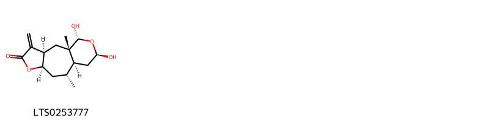{ width=100% }
    <figcaption>Hình ảnh cấu trúc hóa học của 1 hoạt chất thuộc nhóm Oxanes gồm ['hymenoxone (LTS0253777)'].</figcaption>
</figure>
#### Nhóm Prenol lipids
<figure markdown="span">
    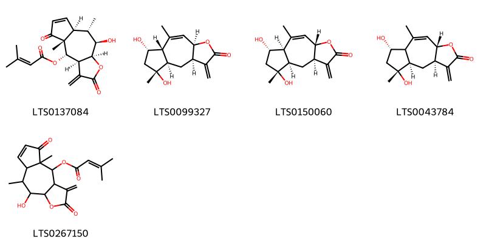{ width=100% }
    <figcaption>Hình ảnh cấu trúc hóa học của 5 hoạt chất thuộc nhóm Prenol lipids gồm ['fastigilin c (LTS0137084)', 'pleniradin (LTS0099327)', '(3ar,4ar,5r,7s,7ar,9as)-5,7-dihydroxy-5,8-dimethyl-3-methylidene-3ah,4h,4ah,6h,7h,7ah,9ah-azuleno[6,5-b]furan-2-one (LTS0150060)', '(3ar,4ar,5r,7s,9as)-5,7-dihydroxy-5,8-dimethyl-3-methylidene-3ah,4h,4ah,6h,7h,7ah,9ah-azuleno[6,5-b]furan-2-one (LTS0043784)', '9-hydroxy-4a,8-dimethyl-3-methylidene-2,5-dioxo-3ah,4h,7ah,8h,9h,9ah-azuleno[6,5-b]furan-4-yl 3-methylbut-2-enoate (LTS0267150)'].</figcaption>
</figure>

---

### Dược dân tộc học

Danh sách các quốc gia có sử dụng *Baileya multiradiata* trong điều trị các bệnh. 

| Country   | Disease   | Bệnh                                                                                                                                                                                                |
|:----------|:----------|:----------------------------------------------------------------------------------------------------------------------------------------------------------------------------------------------------|
| US        | Poison    | MYMEMORY WARNING: YOU USED ALL AVAILABLE FREE TRANSLATIONS FOR TODAY. NEXT AVAILABLE IN  10 HOURS 41 MINUTES 05 SECONDS VISIT HTTPS://MYMEMORY.TRANSLATED.NET/DOC/USAGELIMITS.PHP TO TRANSLATE MORE |

---

# Chi Launaea

??? note "Danh sách các dược liệu thuộc chi"
    
	 - *Launaea mucronata*
	 - *Launaea sarmentosa*

---
## Launaea mucronata
### Thông tin về thực vật

!!! info "Phân loại thực vật của *Launaea mucronata* từ GIBF:"
    - **Kingdom:** Plantae
    - **Phylum:** Tracheophyta
    - **Order:** Asterales
    - **Family:** Asteraceae
    - **Genus:** Launaea
    - **Species:** *Launaea mucronata*

 

| Label (VI)   | Label (EN)   | Scientific Name   | Descriptions (VI)   | Descriptions (EN)   | Also Known As (VI)   | Also Known As (EN)   |
|:-------------|:-------------|:------------------|:--------------------|:--------------------|:---------------------|:---------------------|
| N/A          | N/A          | Launaea mucronata | loài thực vật       | species of plant    | ['']                 | ['']                 |

#### Phân bố trên thế giới

**Từ CSDL GIBF** United Arab Emirates, Iran (Islamic Republic of), Western Sahara, Spain, Palestine, State of, Algeria, Morocco, Jordan, Kuwait, Israel, Saudi Arabia

#### Phân bố tại Việt Nam

**Từ CSDL GIBF**: Không có ghi nhận ở Việt Nam

---
### Thành phần hóa học
        
- Theo cơ sở dữ liệu lotus: Từ loài *Launaea mucronata* đã phân lập và xác định được 15 hoạt chất thuộc về các nhóm Flavonoids, Lactones. 

|    | chemicalTaxonomyClassyfireClass   |   smiles_count |
|---:|:----------------------------------|---------------:|
|  0 | Flavonoids                        |              6 |
|  1 | Lactones                          |              9 |

#### Nhóm Flavonoids
<figure markdown="span">
    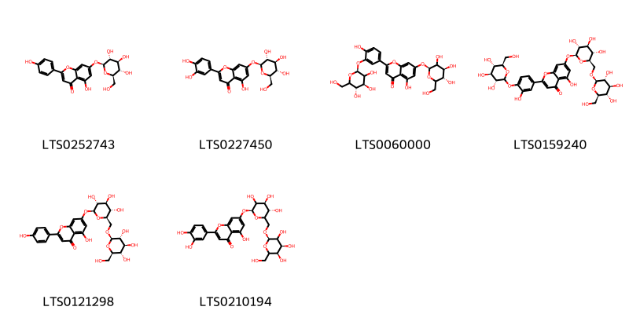{ width=100% }
    <figcaption>Hình ảnh cấu trúc hóa học của 6 hoạt chất thuộc nhóm Flavonoids gồm ['apigenin 7-o-β-glucoside (LTS0252743)', 'luteolin 7-o-glucoside (LTS0227450)', "luteolin 7,3'-diglucoside (LTS0060000)", '5-hydroxy-2-(3-hydroxy-4-{[(3r,4s,5s,6r)-3,4,5-trihydroxy-6-(hydroxymethyl)oxan-2-yl]oxy}phenyl)-7-{[(2s,3r,4s,5s,6r)-3,4,5-trihydroxy-6-({[(2r,3r,4s,5s,6r)-3,4,5-trihydroxy-6-(hydroxymethyl)oxan-2-yl]oxy}methyl)oxan-2-yl]oxy}chromen-4-one (LTS0159240)', '5-hydroxy-2-(4-hydroxyphenyl)-7-{[(2s,3r,4s,5s,6r)-3,4,5-trihydroxy-6-({[(2r,3r,4s,5s,6r)-3,4,5-trihydroxy-6-(hydroxymethyl)oxan-2-yl]oxy}methyl)oxan-2-yl]oxy}chromen-4-one (LTS0121298)', 'luteolin 7-gentiobioside (LTS0210194)'].</figcaption>
</figure>
#### Nhóm Lactones
<figure markdown="span">
    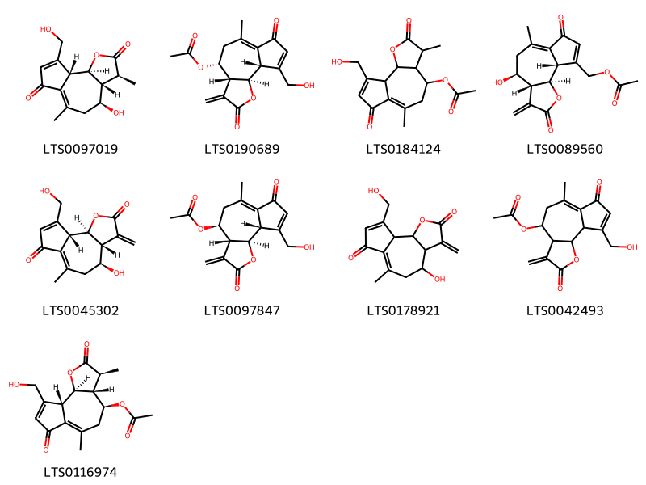{ width=100% }
    <figcaption>Hình ảnh cấu trúc hóa học của 9 hoạt chất thuộc nhóm Lactones gồm ['11β,13-dihydrolactucin (LTS0097019)', '(3ar,4r,9as,9br)-9-(hydroxymethyl)-6-methyl-3-methylidene-2,7-dioxo-3ah,4h,5h,9ah,9bh-azuleno[4,5-b]furan-4-yl acetate (LTS0190689)', '9-(hydroxymethyl)-3,6-dimethyl-2,7-dioxo-3h,3ah,4h,5h,9ah,9bh-azuleno[4,5-b]furan-4-yl acetate (LTS0184124)', '[(3ar,4s,9as,9br)-4-hydroxy-6-methyl-3-methylidene-2,7-dioxo-3ah,4h,5h,9ah,9bh-azuleno[4,5-b]furan-9-yl]methyl acetate (LTS0089560)', 'lactucin (LTS0045302)', '(3ar,4s,9as,9br)-9-(hydroxymethyl)-6-methyl-3-methylidene-2,7-dioxo-3ah,4h,5h,9ah,9bh-azuleno[4,5-b]furan-4-yl acetate (LTS0097847)', '4-hydroxy-9-(hydroxymethyl)-6-methyl-3-methylidene-3ah,4h,5h,9ah,9bh-azuleno[4,5-b]furan-2,7-dione (LTS0178921)', '9-(hydroxymethyl)-6-methyl-3-methylidene-2,7-dioxo-3ah,4h,5h,9ah,9bh-azuleno[4,5-b]furan-4-yl acetate (LTS0042493)', '(3s,3ar,4s,9as,9br)-9-(hydroxymethyl)-3,6-dimethyl-2,7-dioxo-3h,3ah,4h,5h,9ah,9bh-azuleno[4,5-b]furan-4-yl acetate (LTS0116974)'].</figcaption>
</figure>

---

### Dược dân tộc học

Danh sách các quốc gia có sử dụng *Launaea mucronata* trong điều trị các bệnh. 

| Country   | Disease              | Bệnh                                                                                                                                                                                                |
|:----------|:---------------------|:----------------------------------------------------------------------------------------------------------------------------------------------------------------------------------------------------|
| Elsewhere | Lactagogue, Laxative | MYMEMORY WARNING: YOU USED ALL AVAILABLE FREE TRANSLATIONS FOR TODAY. NEXT AVAILABLE IN  10 HOURS 40 MINUTES 31 SECONDS VISIT HTTPS://MYMEMORY.TRANSLATED.NET/DOC/USAGELIMITS.PHP TO TRANSLATE MORE |

---

---
## Launaea sarmentosa
### Thông tin về thực vật

!!! info "Phân loại thực vật của *Launaea sarmentosa* từ GIBF:"
    - **Kingdom:** Plantae
    - **Phylum:** Tracheophyta
    - **Order:** Asterales
    - **Family:** Asteraceae
    - **Genus:** Launaea
    - **Species:** *Launaea sarmentosa*

 

| Label (VI)   | Label (EN)   | Scientific Name    | Descriptions (VI)   | Descriptions (EN)   | Also Known As (VI)   | Also Known As (EN)   |
|:-------------|:-------------|:-------------------|:--------------------|:--------------------|:---------------------|:---------------------|
| N/A          | N/A          | Launaea sarmentosa | loài thực vật       | species of plant    | ['']                 | ['']                 |

#### Phân bố trên thế giới

**Từ CSDL GIBF** French Southern Territories, nan, Sri Lanka, Australia, Lao People’s Democratic Republic, Mauritius, Myanmar, Mozambique, Tanzania, United Republic of, Pakistan, Réunion, Chinese Taipei, Maldives, South Africa, Thailand, Viet Nam, China, Madagascar, Seychelles, India, Kenya

#### Phân bố tại Việt Nam

**Từ CSDL GIBF**: Đà Nẵng, Ninh Thuan

---
### Thành phần hóa học
        
- Theo cơ sở dữ liệu lotus: Từ loài *Launaea sarmentosa* đã phân lập và xác định được Chưa có hoạt chất nào được phân lập. hoạt chất thuộc về các nhóm Không có hoạt chất nào được phân lập. 

Không có hình ảnh nào được tạo ra

---

### Dược dân tộc học

Danh sách các quốc gia có sử dụng *Launaea sarmentosa* trong điều trị các bệnh. 

| Country   | Disease                              | Bệnh                                                                                                                                                                                                |
|:----------|:-------------------------------------|:----------------------------------------------------------------------------------------------------------------------------------------------------------------------------------------------------|
| Elsewhere | Aperient, Soporific, Diuretic, Tonic | MYMEMORY WARNING: YOU USED ALL AVAILABLE FREE TRANSLATIONS FOR TODAY. NEXT AVAILABLE IN  10 HOURS 40 MINUTES 02 SECONDS VISIT HTTPS://MYMEMORY.TRANSLATED.NET/DOC/USAGELIMITS.PHP TO TRANSLATE MORE |

---

# Chi Farfugium

??? note "Danh sách các dược liệu thuộc chi"
    
	 - *Farfugium japonicum*

---
## Farfugium japonicum
### Thông tin về thực vật

!!! info "Phân loại thực vật của *Farfugium japonicum* từ GIBF:"
    - **Kingdom:** Plantae
    - **Phylum:** Tracheophyta
    - **Order:** Asterales
    - **Family:** Asteraceae
    - **Genus:** Farfugium
    - **Species:** *Farfugium japonicum*

 

| Label (VI)   | Label (EN)   | Scientific Name     | Descriptions (VI)   | Descriptions (EN)   | Also Known As (VI)   | Also Known As (EN)   |
|:-------------|:-------------|:--------------------|:--------------------|:--------------------|:---------------------|:---------------------|
| N/A          | N/A          | Farfugium japonicum | loài thực vật       | species of plant    | ['']                 | ['leopard plant']    |

#### Phân bố trên thế giới

**Từ CSDL GIBF** South Africa, Hong Kong, Japan, Korea, Republic of, New Zealand, Chinese Taipei, Portugal, United States of America, China

#### Phân bố tại Việt Nam

**Từ CSDL GIBF**: Không có ghi nhận ở Việt Nam

---
### Thành phần hóa học
        
- Theo cơ sở dữ liệu lotus: Từ loài *Farfugium japonicum* đã phân lập và xác định được 92 hoạt chất thuộc về các nhóm Fatty Acyls, Prenol lipids, Indoles and derivatives, Benzofurans, Azaspirodecane derivatives, Naphthofurans, Organooxygen compounds, Pyrrolizidines, Macrolides and analogues. 

|    | chemicalTaxonomyClassyfireClass   |   smiles_count |
|---:|:----------------------------------|---------------:|
|  0 | Azaspirodecane derivatives        |              1 |
|  1 | Benzofurans                       |              2 |
|  2 | Fatty Acyls                       |              3 |
|  3 | Indoles and derivatives           |              2 |
|  4 | Macrolides and analogues          |              1 |
|  5 | Naphthofurans                     |              8 |
|  6 | Organooxygen compounds            |              5 |
|  7 | Prenol lipids                     |             68 |
|  8 | Pyrrolizidines                    |              2 |

#### Nhóm Azaspirodecane derivatives
<figure markdown="span">
    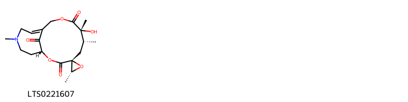{ width=100% }
    <figcaption>Hình ảnh cấu trúc hóa học của 1 hoạt chất thuộc nhóm Azaspirodecane derivatives gồm ["(1r,3'r,4r,6r,7r,11e)-7-hydroxy-3',6,7,14-tetramethyl-2,9-dioxa-14-azaspiro[bicyclo[9.5.1]heptadecane-4,2'-oxiran]-11-ene-3,8,17-trione (LTS0221607)"].</figcaption>
</figure>
#### Nhóm Benzofurans
<figure markdown="span">
    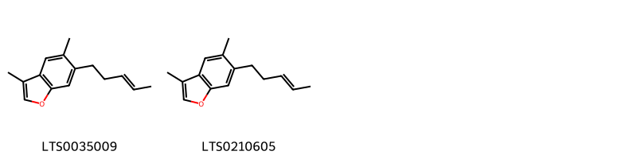{ width=100% }
    <figcaption>Hình ảnh cấu trúc hóa học của 2 hoạt chất thuộc nhóm Benzofurans gồm ['3,5-dimethyl-6-(pent-3-en-1-yl)-1-benzofuran (LTS0035009)', '3,5-dimethyl-6-[(3e)-pent-3-en-1-yl]-1-benzofuran (LTS0210605)'].</figcaption>
</figure>
#### Nhóm Fatty Acyls
<figure markdown="span">
    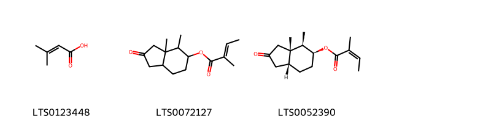{ width=100% }
    <figcaption>Hình ảnh cấu trúc hóa học của 3 hoạt chất thuộc nhóm Fatty Acyls gồm ['β,β-dimethacrylate (LTS0123448)', '3a,4-dimethyl-2-oxo-hexahydro-1h-inden-5-yl 2-methylbut-2-enoate (LTS0072127)', '(3as,4r,5s,7ar)-3a,4-dimethyl-2-oxo-hexahydro-1h-inden-5-yl (2z)-2-methylbut-2-enoate (LTS0052390)'].</figcaption>
</figure>
#### Nhóm Indoles and derivatives
<figure markdown="span">
    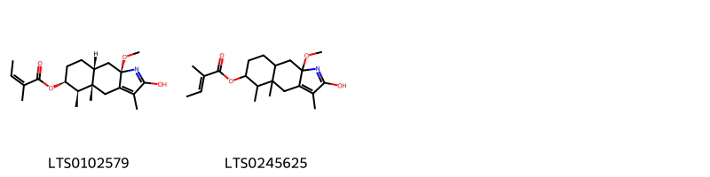{ width=100% }
    <figcaption>Hình ảnh cấu trúc hóa học của 2 hoạt chất thuộc nhóm Indoles and derivatives gồm ['(4as,5r,6s,8ar,9ar)-2-hydroxy-9a-methoxy-3,4a,5-trimethyl-4h,5h,6h,7h,8h,8ah,9h-cyclohexa[f]indol-6-yl (2z)-2-methylbut-2-enoate (LTS0102579)', '2-hydroxy-9a-methoxy-3,4a,5-trimethyl-4h,5h,6h,7h,8h,8ah,9h-cyclohexa[f]indol-6-yl 2-methylbut-2-enoate (LTS0245625)'].</figcaption>
</figure>
#### Nhóm Macrolides and analogues
<figure markdown="span">
    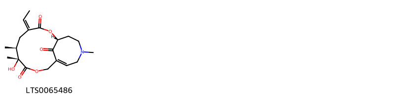{ width=100% }
    <figcaption>Hình ảnh cấu trúc hóa học của 1 hoạt chất thuộc nhóm Macrolides and analogues gồm ['(1r,4z,6s,7r,11z)-4-ethylidene-7-hydroxy-6,7,14-trimethyl-2,9-dioxa-14-azabicyclo[9.5.1]heptadec-11-ene-3,8,17-trione (LTS0065486)'].</figcaption>
</figure>
#### Nhóm Naphthofurans
<figure markdown="span">
    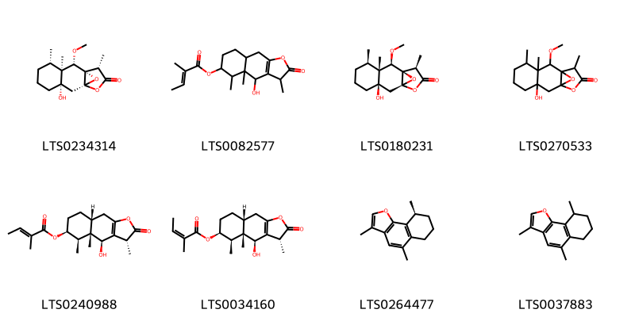{ width=100% }
    <figcaption>Hình ảnh cấu trúc hóa học của 8 hoạt chất thuộc nhóm Naphthofurans gồm ['(1s,2s,3s,4s,8s,10s,13s)-8-hydroxy-2-methoxy-3,4,13-trimethyl-11,14-dioxatetracyclo[8.3.1.0¹,¹⁰.0³,⁸]tetradecan-12-one (LTS0234314)', '4-hydroxy-3,4a,5-trimethyl-2-oxo-3h,4h,5h,6h,7h,8h,8ah,9h-naphtho[2,3-b]furan-6-yl 2-methylbut-2-enoate (LTS0082577)', '(1r,2r,3r,4r,8r,10r,13r)-8-hydroxy-2-methoxy-3,4,13-trimethyl-11,14-dioxatetracyclo[8.3.1.0¹,¹⁰.0³,⁸]tetradecan-12-one (LTS0180231)', '8-hydroxy-2-methoxy-3,4,13-trimethyl-11,14-dioxatetracyclo[8.3.1.0¹,¹⁰.0³,⁸]tetradecan-12-one (LTS0270533)', '(3r,4s,4as,5r,6s,8ar)-4-hydroxy-3,4a,5-trimethyl-2-oxo-3h,4h,5h,6h,7h,8h,8ah,9h-naphtho[2,3-b]furan-6-yl (2e)-2-methylbut-2-enoate (LTS0240988)', '(3r,4s,4as,5r,6s,8ar)-4-hydroxy-3,4a,5-trimethyl-2-oxo-3h,4h,5h,6h,7h,8h,8ah,9h-naphtho[2,3-b]furan-6-yl (2z)-2-methylbut-2-enoate (LTS0034160)', '(9s)-3,5,9-trimethyl-6h,7h,8h,9h-naphtho[1,2-b]furan (LTS0264477)', '3,5,9-trimethyl-6h,7h,8h,9h-naphtho[1,2-b]furan (LTS0037883)'].</figcaption>
</figure>
#### Nhóm Organooxygen compounds
<figure markdown="span">
    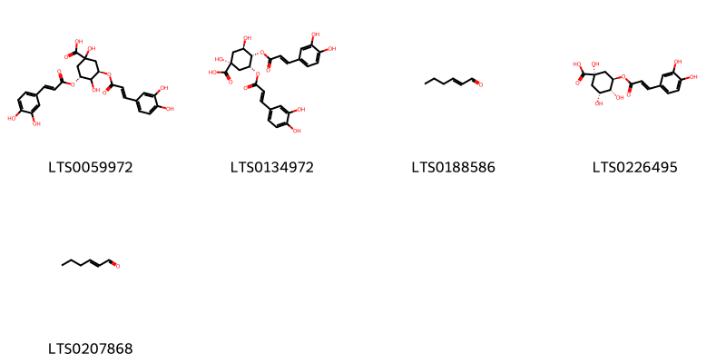{ width=100% }
    <figcaption>Hình ảnh cấu trúc hóa học của 5 hoạt chất thuộc nhóm Organooxygen compounds gồm ['(3r,5r)-3,5-bis({[(2e)-3-(3,4-dihydroxyphenyl)prop-2-enoyl]oxy})-1,4-dihydroxycyclohexane-1-carboxylic acid (LTS0059972)', '3,4-dicaffeoylquinic acid (LTS0134972)', 'hexenal (LTS0188586)', 'chlorogenic acid (LTS0226495)', '(e)-2-hexenal (LTS0207868)'].</figcaption>
</figure>
#### Nhóm Prenol lipids
<figure markdown="span">
    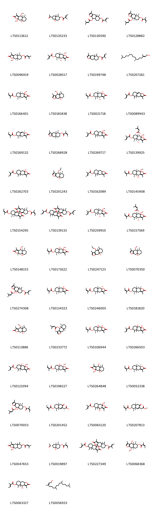{ width=100% }
    <figcaption>Hình ảnh cấu trúc hóa học của 68 hoạt chất thuộc nhóm Prenol lipids gồm ['(4s,4as,5s,8as,9as)-8a-hydroxy-4,9a-dimethoxy-3,4a,5-trimethyl-4h,5h,6h,7h,8h,9h-naphtho[2,3-b]furan-2-one (LTS0113612)', '2-acetyl-7a-hydroxy-3a,4-dimethyl-hexahydro-1h-inden-5-yl 2-methylbut-2-enoate (LTS0135233)', '3,4a,5-trimethyl-6-[(2-methylbut-2-enoyl)oxy]-4h,5h,6h,7h,8h,8ah,9h-naphtho[2,3-b]furan-9-yl 3-methylbut-2-enoate (LTS0130590)', '(4ar,5r,6s,8as,9r)-3,4a,5-trimethyl-6-{[(2z)-2-methylbut-2-enoyl]oxy}-4h,5h,6h,7h,8h,8ah,9h-naphtho[2,3-b]furan-9-yl 3-methylbut-2-enoate (LTS0128882)', '(4as,5r,6s,8ar,9ar)-9a-methoxy-3,4a,5-trimethyl-2-oxo-4h,5h,6h,7h,8h,8ah,9h-naphtho[2,3-b]furan-6-yl 3-methylbut-2-enoate (LTS0096919)', '(4r,4as,5r,6s,8ar,9ar)-4-hydroxy-9a-methoxy-3,4a,5-trimethyl-2-oxo-4h,5h,6h,7h,8h,8ah,9h-naphtho[2,3-b]furan-6-yl 2-methylbut-2-enoate (LTS0028517)', '3,4a,5-trimethyl-4h,5h,6h,7h,8h,8ah,9h-naphtho[2,3-b]furan-6-yl 2-methylbut-2-enoate (LTS0199748)', '(2e,7s,11s)-3,7,11,15-tetramethylhexadec-2-en-1-ol (LTS0207261)', '(4as,5r,6s,8ar,9as)-9a-methoxy-3,4a,5-trimethyl-2-oxo-4h,5h,6h,7h,8h,8ah,9h-naphtho[2,3-b]furan-6-yl (2z)-2-methylbut-2-enoate (LTS0166401)', '4-methoxy-3,4a,5-trimethyl-4h,5h,6h,7h,8h,9h-naphtho[2,3-b]furan-8a-ol (LTS0181838)', '(4r,4as,5r,6s,8ar,9as)-4,9a-dihydroxy-3,4a,5-trimethyl-2-oxo-4h,5h,6h,7h,8h,8ah,9h-naphtho[2,3-b]furan-6-yl (2z)-2-methylbut-2-enoate (LTS0021718)', '3,4a,5-trimethyl-2-oxo-4h,5h,6h,7h,8h,9ah-naphtho[2,3-b]furan-6-yl 2-methylbut-2-enoate (LTS0089943)', '(4ar,5r,6s,9ar)-3,4a,5-trimethyl-2-oxo-4h,5h,6h,7h,8h,9ah-naphtho[2,3-b]furan-6-yl (2z)-2-methylbut-2-enoate (LTS0269132)', '(4as,5r,6s,8ar)-3,4a,5-trimethyl-4h,5h,6h,7h,8h,8ah,9h-naphtho[2,3-b]furan-6-yl (2z)-2-methylbut-2-enoate (LTS0268928)', '9a-methoxy-3,4a,5-trimethyl-2-oxo-4h,5h,6h,7h,8h,8ah,9h-naphtho[2,3-b]furan-6-yl 2-methylbut-2-enoate (LTS0269717)', '(4r,4ar,5r,6s,8as,9s,9ar)-4-hydroxy-9a-methoxy-3,4a,5-trimethyl-6-[(2-methylbut-2-enoyl)oxy]-2-oxo-4h,5h,6h,7h,8h,8ah,9h-naphtho[2,3-b]furan-9-yl 3-methylbut-2-enoate (LTS0139925)', '9a-hydroxy-3,4a,5-trimethyl-2-oxo-4h,5h,6h,7h,8h,8ah,9h-naphtho[2,3-b]furan-6-yl 2-methylbut-2-enoate (LTS0262703)', '(4s,4as,5s,8as)-4-ethoxy-3,4a,5-trimethyl-4h,5h,6h,7h,8h,9h-naphtho[2,3-b]furan-8a-ol (LTS0201243)', '3,4a,5-trimethyl-2-oxo-4h,5h,6h,7h,8h,8ah,9h,9ah-naphtho[2,3-b]furan-6-yl 2-methylbut-2-enoate (LTS0162089)', '(4s,4as,5r,6s,8ar,9as)-4-hydroxy-9a-methoxy-3,4a,5-trimethyl-2-oxo-4h,5h,6h,7h,8h,8ah,9h-naphtho[2,3-b]furan-6-yl (2z)-2-methylbut-2-enoate (LTS0145408)', '(4ar,5r,6s,9ar)-9a-[(4ar,5r,6s,9ar)-3,4a,5-trimethyl-6-{[(2z)-2-methylbut-2-enoyl]oxy}-2-oxo-4h,5h,6h,7h,8h-naphtho[2,3-b]furan-9a-yl]-3,4a,5-trimethyl-2-oxo-4h,5h,6h,7h,8h-naphtho[2,3-b]furan-6-yl (2z)-2-methylbut-2-enoate (LTS0154295)', '9a-{3,4a,5-trimethyl-6-[(2-methylbut-2-enoyl)oxy]-2-oxo-4h,5h,6h,7h,8h-naphtho[2,3-b]furan-9a-yl}-3,4a,5-trimethyl-2-oxo-4h,5h,6h,7h,8h-naphtho[2,3-b]furan-6-yl 2-methylbut-2-enoate (LTS0139133)', '(4r,4as,5r,6s,8ar,9as)-4-hydroxy-9a-methoxy-3,4a,5-trimethyl-2-oxo-4h,5h,6h,7h,8h,8ah,9h-naphtho[2,3-b]furan-6-yl 2-methylbut-2-enoate (LTS0259910)', '(4r,4ar,5r,6s,8as,9s,9ar)-4-hydroxy-9a-methoxy-3,4a,5-trimethyl-6-{[(2z)-2-methylbut-2-enoyl]oxy}-2-oxo-4h,5h,6h,7h,8h,8ah,9h-naphtho[2,3-b]furan-9-yl 3-methylbut-2-enoate (LTS0157569)', '(4r,4as,5s,8as,9as)-8a-hydroxy-4-methoxy-3,4a,5-trimethyl-4h,5h,6h,7h,8h,9h,9ah-naphtho[2,3-b]furan-2-one (LTS0148153)', '(4ar,5r,6s,8as,9as)-8a-hydroxy-9a-methoxy-3,4a,5-trimethyl-2-oxo-4h,5h,6h,7h,8h,9h-naphtho[2,3-b]furan-6-yl (2z)-2-methylbut-2-enoate (LTS0171622)', '4-ethoxy-3,4a,5-trimethyl-4h,5h,6h,7h,8h,9h-naphtho[2,3-b]furan-8a-ol (LTS0247123)', '(4s,4as,5s,8as)-4-methoxy-3,4a,5-trimethyl-4h,5h,6h,7h,8h,9h-naphtho[2,3-b]furan-8a-ol (LTS0070350)', '8a-hydroxy-3,4a,5-trimethyl-6-[(2-methylbut-2-enoyl)oxy]-4h,5h,6h,7h,8h,9h-naphtho[2,3-b]furan-9-yl 3-methylbut-2-enoate (LTS0274308)', '(4as,5r,6s,8ar,9as)-9a-hydroxy-3,4a,5-trimethyl-2-oxo-4h,5h,6h,7h,8h,8ah,9h-naphtho[2,3-b]furan-6-yl (2z)-2-methylbut-2-enoate (LTS0134323)', '(4as,5r,6s,8ar,9ar)-9a-hydroxy-3,4a,5-trimethyl-2-oxo-4h,5h,6h,7h,8h,8ah,9h-naphtho[2,3-b]furan-6-yl (2z)-2-methylbut-2-enoate (LTS0246005)', '(4as,5r,6s,8ar,9as)-3,4a,5-trimethyl-2-oxo-4h,5h,6h,7h,8h,8ah,9h,9ah-naphtho[2,3-b]furan-6-yl (2z)-2-methylbut-2-enoate (LTS0181820)', '8a-hydroxy-4-methoxy-3,4a,5-trimethyl-4h,5h,6h,7h,8h,9h,9ah-naphtho[2,3-b]furan-2-one (LTS0113886)', '(4s,4ar,5s,8ar)-3,4a,5-trimethyl-4h,5h,6h,7h,8h,8ah,9h-naphtho[2,3-b]furan-4-yl 3-methylbut-2-enoate (LTS0233772)', '(4ar,5r,6s,8as,9as)-8a,9a-dihydroxy-3,4a,5-trimethyl-2-oxo-4h,5h,6h,7h,8h,9h-naphtho[2,3-b]furan-6-yl (2z)-2-methylbut-2-enoate (LTS0106944)', '8a,9a-dihydroxy-3,4a,5-trimethyl-2-oxo-4h,5h,6h,7h,8h,9h-naphtho[2,3-b]furan-6-yl 2-methylbut-2-enoate (LTS0266503)', '8a-hydroxy-9a-methoxy-3,4a,5-trimethyl-2-oxo-4h,5h,6h,7h,8h,9h-naphtho[2,3-b]furan-6-yl 2-methylbut-2-enoate (LTS0121094)', '(4ar,5r,6s,8as,9ar)-8a-hydroxy-9a-methoxy-3,4a,5-trimethyl-2-oxo-4h,5h,6h,7h,8h,9h-naphtho[2,3-b]furan-6-yl (2z)-2-methylbut-2-enoate (LTS0198227)', '4,8a-dihydroxy-9a-methoxy-3,4a,5-trimethyl-4h,5h,6h,7h,8h,9h-naphtho[2,3-b]furan-2-one (LTS0264848)', '(4as,5r,6s,8ar,9ar)-3,4a,5-trimethyl-2-oxo-4h,5h,6h,7h,8h,8ah,9h,9ah-naphtho[2,3-b]furan-6-yl (2z)-2-methylbut-2-enoate (LTS0052338)', '(4ar,5r,6s,8ar,9r)-8a-hydroxy-3,4a,5-trimethyl-6-{[(2z)-2-methylbut-2-enoyl]oxy}-4h,5h,6h,7h,8h,9h-naphtho[2,3-b]furan-9-yl 3-methylbut-2-enoate (LTS0070053)', '(2r)-2-[(4ar,7s,8r,8ar)-8,8a-dimethyl-7-{[(2z)-2-methylbut-2-enoyl]oxy}-3-oxo-4,4a,5,6,7,8-hexahydronaphthalen-2-yl]propanoic acid (LTS0201452)', '4-hydroxy-9a-methoxy-3,4a,5-trimethyl-2-oxo-4h,5h,6h,7h,8h,8ah,9h-naphtho[2,3-b]furan-6-yl 2-methylbut-2-enoate (LTS0065120)', '(1r,2s,4ar,8ar)-7-[(2r)-1-methoxy-1-oxopropan-2-yl]-1,8a-dimethyl-6-oxo-1,2,3,4,4a,5-hexahydronaphthalen-2-yl (2z)-2-methylbut-2-enoate (LTS0207813)', '9a-methoxy-3,4a,5-trimethyl-2-oxo-4h,5h,6h,7h,8h,8ah,9h-naphtho[2,3-b]furan-6-yl 3-methylbut-2-enoate (LTS0047653)', '(2r,3ar,4r,5s,7as)-2-acetyl-7a-hydroxy-3a,4-dimethyl-hexahydro-1h-inden-5-yl (2z)-2-methylbut-2-enoate (LTS0019897)', '9a-{3,4a,5-trimethyl-6-[(2-methylbut-2-enoyl)oxy]-2-oxo-4h,5h,6h,7h,8h,8ah,9h-naphtho[2,3-b]furan-9a-yl}-3,4a,5-trimethyl-2-oxo-4h,5h,6h,7h,8h,8ah,9h-naphtho[2,3-b]furan-6-yl 2-methylbut-2-enoate (LTS0227349)', '(4s,4ar,5r,6s,8as,9r)-4-hydroxy-9-methoxy-3,4a,5-trimethyl-4h,5h,6h,7h,8h,8ah,9h-naphtho[2,3-b]furan-6-yl (2z)-2-methylbut-2-enoate (LTS0068368)', '4-hydroxy-3,4a,5-trimethyl-2-oxo-4h,5h,6h,7h,8h,8ah,9h,9ah-naphtho[2,3-b]furan-6-yl 2-methylbut-2-enoate (LTS0063327)', '3,7,11,15-tetramethylhexadec-2-en-1-ol (LTS0056933)', '(4s,4as,5s,8as,9as)-4,8a-dihydroxy-9a-methoxy-3,4a,5-trimethyl-4h,5h,6h,7h,8h,9h-naphtho[2,3-b]furan-2-one (LTS0204393)', '4-hydroxy-9-methoxy-3,4a,5-trimethyl-4h,5h,6h,7h,8h,8ah,9h-naphtho[2,3-b]furan-6-yl 2-methylbut-2-enoate (LTS0186179)', '(4r,4as,5r,6s,8ar,9as)-4,9a-dihydroxy-3,4a,5-trimethyl-2-oxo-4h,5h,6h,7h,8h,8ah,9h-naphtho[2,3-b]furan-6-yl 2-methylbut-2-enoate (LTS0011352)', '(4s,4as,5r,6s,8ar,9as)-4-hydroxy-3,4a,5-trimethyl-2-oxo-4h,5h,6h,7h,8h,8ah,9h,9ah-naphtho[2,3-b]furan-6-yl (2z)-2-methylbut-2-enoate (LTS0057439)', '(4s,4as,5s,8as)-8a-hydroxy-3,4a,5-trimethyl-4h,5h,6h,7h,8h,9h-naphtho[2,3-b]furan-4-yl 3-methylbut-2-enoate (LTS0136413)', '7-hydroxy-4,4a-dimethyl-6-(prop-1-en-2-yl)-octahydronaphthalen-2-one (LTS0001667)', '2-{8,8a-dimethyl-7-[(2-methylbut-2-enoyl)oxy]-3-oxo-4,4a,5,6,7,8-hexahydronaphthalen-2-yl}propanoic acid (LTS0022765)', '(4r,4as,6r,7r,8as)-7-hydroxy-4,4a-dimethyl-6-(prop-1-en-2-yl)-octahydronaphthalen-2-one (LTS0028235)', '(4s,4as,5r,6s,8ar,9ar)-4-hydroxy-3,4a,5-trimethyl-2-oxo-4h,5h,6h,7h,8h,8ah,9h,9ah-naphtho[2,3-b]furan-6-yl (2z)-2-methylbut-2-enoate (LTS0011946)', '(4r,4as,5r,6s,8ar,9ar)-4-hydroxy-9a-methoxy-3,4a,5-trimethyl-2-oxo-4h,5h,6h,7h,8h,8ah,9h-naphtho[2,3-b]furan-6-yl (2z)-2-methylbut-2-enoate (LTS0022489)', '8a-hydroxy-4,9a-dimethoxy-3,4a,5-trimethyl-4h,5h,6h,7h,8h,9h-naphtho[2,3-b]furan-2-one (LTS0208596)', '7-(1-methoxy-1-oxopropan-2-yl)-1,8a-dimethyl-6-oxo-1,2,3,4,4a,5-hexahydronaphthalen-2-yl 2-methylbut-2-enoate (LTS0242934)', '3,4a,5-trimethyl-4h,5h,6h,7h,8h,8ah,9h-naphtho[2,3-b]furan-4-yl 3-methylbut-2-enoate (LTS0086769)', '8a-hydroxy-3,4a,5-trimethyl-4h,5h,6h,7h,8h,9h-naphtho[2,3-b]furan-4-yl 3-methylbut-2-enoate (LTS0132505)', '(4r,4as,5r,6s,8ar,9as)-4-hydroxy-9a-methoxy-3,4a,5-trimethyl-2-oxo-4h,5h,6h,7h,8h,8ah,9h-naphtho[2,3-b]furan-6-yl (2z)-2-methylbut-2-enoate (LTS0254359)', '(4as,5r,6s,8ar,9as)-9a-[(4as,5r,6s,8ar,9as)-3,4a,5-trimethyl-6-{[(2z)-2-methylbut-2-enoyl]oxy}-2-oxo-4h,5h,6h,7h,8h,8ah,9h-naphtho[2,3-b]furan-9a-yl]-3,4a,5-trimethyl-2-oxo-4h,5h,6h,7h,8h,8ah,9h-naphtho[2,3-b]furan-6-yl (2z)-2-methylbut-2-enoate (LTS0254530)', '(4as,5r,6s,8ar,9ar)-9a-methoxy-3,4a,5-trimethyl-2-oxo-4h,5h,6h,7h,8h,8ah,9h-naphtho[2,3-b]furan-6-yl (2z)-2-methylbut-2-enoate (LTS0267011)', '(4as,5r,6s,8ar,9ar)-9a-[(4as,5r,6s,8ar,9ar)-3,4a,5-trimethyl-6-{[(2z)-2-methylbut-2-enoyl]oxy}-2-oxo-4h,5h,6h,7h,8h,8ah,9h-naphtho[2,3-b]furan-9a-yl]-3,4a,5-trimethyl-2-oxo-4h,5h,6h,7h,8h,8ah,9h-naphtho[2,3-b]furan-6-yl (2z)-2-methylbut-2-enoate (LTS0090359)'].</figcaption>
</figure>
#### Nhóm Pyrrolizidines
<figure markdown="span">
    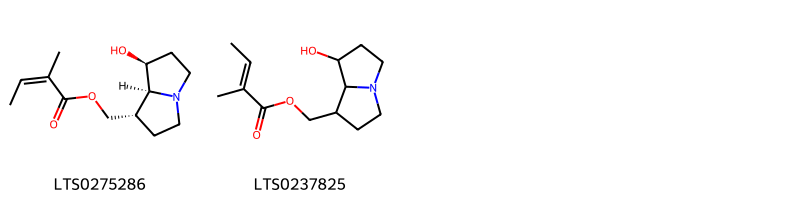{ width=100% }
    <figcaption>Hình ảnh cấu trúc hóa học của 2 hoạt chất thuộc nhóm Pyrrolizidines gồm ['[(1s,7s,7as)-7-hydroxy-hexahydro-1h-pyrrolizin-1-yl]methyl (2z)-2-methylbut-2-enoate (LTS0275286)', '(7-hydroxy-hexahydro-1h-pyrrolizin-1-yl)methyl 2-methylbut-2-enoate (LTS0237825)'].</figcaption>
</figure>

---

### Dược dân tộc học

Danh sách các quốc gia có sử dụng *Farfugium japonicum* trong điều trị các bệnh. 

| Country   | Disease   | Bệnh                                                                                                                                                                                                |
|:----------|:----------|:----------------------------------------------------------------------------------------------------------------------------------------------------------------------------------------------------|
| Elsewhere | Antidote  | MYMEMORY WARNING: YOU USED ALL AVAILABLE FREE TRANSLATIONS FOR TODAY. NEXT AVAILABLE IN  10 HOURS 39 MINUTES 33 SECONDS VISIT HTTPS://MYMEMORY.TRANSLATED.NET/DOC/USAGELIMITS.PHP TO TRANSLATE MORE |

---

# Chi Pectis

??? note "Danh sách các dược liệu thuộc chi"
    
	 - *Pectis capillaris*

---
## Pectis capillaris
### Thông tin về thực vật

!!! info "Phân loại thực vật của *Pectis linearis* từ GIBF:"
    - **Kingdom:** Plantae
    - **Phylum:** Tracheophyta
    - **Order:** Asterales
    - **Family:** Asteraceae
    - **Genus:** Pectis
    - **Species:** *Pectis linearis*

 

| Label (VI)   | Label (EN)   | Scientific Name   | Descriptions (VI)   | Descriptions (EN)   | Also Known As (VI)   | Also Known As (EN)   |
|:-------------|:-------------|:------------------|:--------------------|:--------------------|:---------------------|:---------------------|
| N/A          | N/A          | Pectis capillaris |                     |                     | ['']                 | ['']                 |

#### Phân bố trên thế giới

**Từ CSDL GIBF** nan, Panama, Mexico

#### Phân bố tại Việt Nam

**Từ CSDL GIBF**: Không có ghi nhận ở Việt Nam

---
### Thành phần hóa học
        
- Theo cơ sở dữ liệu lotus: Từ loài *Pectis linearis* đã phân lập và xác định được Chưa có hoạt chất nào được phân lập. hoạt chất thuộc về các nhóm Không có hoạt chất nào được phân lập. 

Không có hình ảnh nào được tạo ra

---

### Dược dân tộc học

Danh sách các quốc gia có sử dụng *Pectis linearis* trong điều trị các bệnh. 

| Country   | Disease   | Bệnh                                                                                                                                                                                                |
|:----------|:----------|:----------------------------------------------------------------------------------------------------------------------------------------------------------------------------------------------------|
| Mexico    | Stomachic | MYMEMORY WARNING: YOU USED ALL AVAILABLE FREE TRANSLATIONS FOR TODAY. NEXT AVAILABLE IN  10 HOURS 39 MINUTES 01 SECONDS VISIT HTTPS://MYMEMORY.TRANSLATED.NET/DOC/USAGELIMITS.PHP TO TRANSLATE MORE |

---

# Chi Jasonia

??? note "Danh sách các dược liệu thuộc chi"
    
	 - *Jasonia glutinosa*

---
## Jasonia glutinosa
### Thông tin về thực vật

!!! info "Phân loại thực vật của *Chiliadenus glutinosus* từ GIBF:"
    - **Kingdom:** Plantae
    - **Phylum:** Tracheophyta
    - **Order:** Asterales
    - **Family:** Asteraceae
    - **Genus:** Chiliadenus
    - **Species:** *Chiliadenus glutinosus*

 

| Label (VI)   | Label (EN)   | Scientific Name   | Descriptions (VI)   | Descriptions (EN)   | Also Known As (VI)   | Also Known As (EN)   |
|:-------------|:-------------|:------------------|:--------------------|:--------------------|:---------------------|:---------------------|
| N/A          | N/A          | Jasonia glutinosa | loài thực vật       | species of plant    | ['']                 | ['']                 |

#### Phân bố trên thế giới

**Từ CSDL GIBF** Spain

#### Phân bố tại Việt Nam

**Từ CSDL GIBF**: Không có ghi nhận ở Việt Nam

---
### Thành phần hóa học
        
- Theo cơ sở dữ liệu lotus: Từ loài *Chiliadenus glutinosus* đã phân lập và xác định được Chưa có hoạt chất nào được phân lập. hoạt chất thuộc về các nhóm Không có hoạt chất nào được phân lập. 

Không có hình ảnh nào được tạo ra

---

### Dược dân tộc học

Danh sách các quốc gia có sử dụng *Chiliadenus glutinosus* trong điều trị các bệnh. 

| Country   | Disease   | Bệnh                                                                                                                                                                                                |
|:----------|:----------|:----------------------------------------------------------------------------------------------------------------------------------------------------------------------------------------------------|
| ain       | Stomachic | MYMEMORY WARNING: YOU USED ALL AVAILABLE FREE TRANSLATIONS FOR TODAY. NEXT AVAILABLE IN  10 HOURS 38 MINUTES 39 SECONDS VISIT HTTPS://MYMEMORY.TRANSLATED.NET/DOC/USAGELIMITS.PHP TO TRANSLATE MORE |

---

# Chi Iva

??? note "Danh sách các dược liệu thuộc chi"
    
	 - *Iva acerosa*
	 - *Iva axillaris*

---
## Iva acerosa
### Thông tin về thực vật

!!! info "Phân loại thực vật của *Euphrosyne acerosa* từ GIBF:"
    - **Kingdom:** Plantae
    - **Phylum:** Tracheophyta
    - **Order:** Asterales
    - **Family:** Asteraceae
    - **Genus:** Euphrosyne
    - **Species:** *Euphrosyne acerosa*

 

| Label (VI)   | Label (EN)   | Scientific Name   | Descriptions (VI)   | Descriptions (EN)   | Also Known As (VI)   | Also Known As (EN)   |
|:-------------|:-------------|:------------------|:--------------------|:--------------------|:---------------------|:---------------------|
| N/A          | N/A          | Iva acerosa       |                     | species of plant    | ['']                 | ['']                 |

#### Phân bố trên thế giới

**Từ CSDL GIBF** nan, United States of America

#### Phân bố tại Việt Nam

**Từ CSDL GIBF**: Không có ghi nhận ở Việt Nam

---
### Thành phần hóa học
        
- Theo cơ sở dữ liệu lotus: Từ loài *Euphrosyne acerosa* đã phân lập và xác định được Chưa có hoạt chất nào được phân lập. hoạt chất thuộc về các nhóm Không có hoạt chất nào được phân lập. 

Không có hình ảnh nào được tạo ra

---

### Dược dân tộc học

Danh sách các quốc gia có sử dụng *Euphrosyne acerosa* trong điều trị các bệnh. 

| Country   | Disease   | Bệnh                                                                                                                                                                                                |
|:----------|:----------|:----------------------------------------------------------------------------------------------------------------------------------------------------------------------------------------------------|
| US(UT)    | Poison    | MYMEMORY WARNING: YOU USED ALL AVAILABLE FREE TRANSLATIONS FOR TODAY. NEXT AVAILABLE IN  10 HOURS 38 MINUTES 11 SECONDS VISIT HTTPS://MYMEMORY.TRANSLATED.NET/DOC/USAGELIMITS.PHP TO TRANSLATE MORE |

---

---
## Iva axillaris
### Thông tin về thực vật

!!! info "Phân loại thực vật của *Iva axillaris* từ GIBF:"
    - **Kingdom:** Plantae
    - **Phylum:** Tracheophyta
    - **Order:** Asterales
    - **Family:** Asteraceae
    - **Genus:** Iva
    - **Species:** *Iva axillaris*

 

| Label (VI)   | Label (EN)   | Scientific Name   | Descriptions (VI)   | Descriptions (EN)   | Also Known As (VI)   | Also Known As (EN)   |
|:-------------|:-------------|:------------------|:--------------------|:--------------------|:---------------------|:---------------------|
| N/A          | N/A          | Iva axillaris     | loài thực vật       | species of plant    | ['']                 | ['']                 |

#### Phân bố trên thế giới

**Từ CSDL GIBF** United States of America, Canada

#### Phân bố tại Việt Nam

**Từ CSDL GIBF**: Không có ghi nhận ở Việt Nam

---
### Thành phần hóa học
        
- Theo cơ sở dữ liệu lotus: Từ loài *Iva axillaris* đã phân lập và xác định được 11 hoạt chất thuộc về các nhóm Prenol lipids, Lactones. 

|    | chemicalTaxonomyClassyfireClass   |   smiles_count |
|---:|:----------------------------------|---------------:|
|  0 | Lactones                          |              6 |
|  1 | Prenol lipids                     |              5 |

#### Nhóm Lactones
<figure markdown="span">
    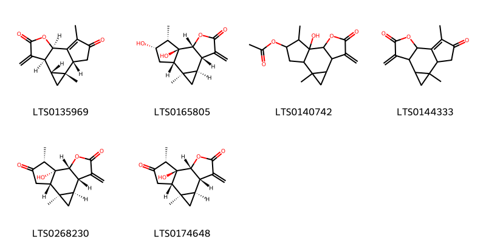{ width=100% }
    <figcaption>Hình ảnh cấu trúc hóa học của 6 hoạt chất thuộc nhóm Lactones gồm ['(1r,2r,4r,5s,9r)-2,11-dimethyl-6-methylidene-8-oxatetracyclo[8.3.0.0²,⁴.0⁵,⁹]tridec-10-ene-7,12-dione (LTS0135969)', '(1s,2r,4r,5s,9r,10s,11s,12s)-10,12-dihydroxy-2,11-dimethyl-6-methylidene-8-oxatetracyclo[8.3.0.0²,⁴.0⁵,⁹]tridecan-7-one (LTS0165805)', '10-hydroxy-2,11-dimethyl-6-methylidene-7-oxo-8-oxatetracyclo[8.3.0.0²,⁴.0⁵,⁹]tridecan-12-yl acetate (LTS0140742)', '2,11-dimethyl-6-methylidene-8-oxatetracyclo[8.3.0.0²,⁴.0⁵,⁹]tridec-10-ene-7,12-dione (LTS0144333)', '(1s,2r,4r,5s,9r,10r,11r)-10-hydroxy-2,11-dimethyl-6-methylidene-8-oxatetracyclo[8.3.0.0²,⁴.0⁵,⁹]tridecane-7,12-dione (LTS0268230)', '(1s,2r,4r,5s,9r,10s,11r)-10-hydroxy-2,11-dimethyl-6-methylidene-8-oxatetracyclo[8.3.0.0²,⁴.0⁵,⁹]tridecane-7,12-dione (LTS0174648)'].</figcaption>
</figure>
#### Nhóm Prenol lipids
<figure markdown="span">
    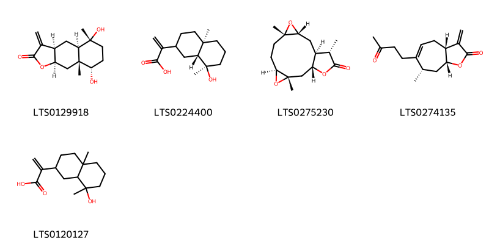{ width=100% }
    <figcaption>Hình ảnh cấu trúc hóa học của 5 hoạt chất thuộc nhóm Prenol lipids gồm ['(3ar,4ar,5r,8s,8ar,9ar)-5,8-dihydroxy-5,8a-dimethyl-3-methylidene-octahydronaphtho[2,3-b]furan-2-one (LTS0129918)', '2-[(4ar,8r,8ar)-8-hydroxy-4a,8-dimethyl-octahydronaphthalen-2-yl]prop-2-enoic acid (LTS0224400)', '(1s,3r,5s,8s,10s,12r,15s)-5,10,15-trimethyl-4,9,13-trioxatetracyclo[10.3.0.0³,⁵.0⁸,¹⁰]pentadecan-14-one (LTS0275230)', 'tomentosin (LTS0274135)', '2-(8-hydroxy-4a,8-dimethyl-octahydronaphthalen-2-yl)prop-2-enoic acid (LTS0120127)'].</figcaption>
</figure>

---

### Dược dân tộc học

Danh sách các quốc gia có sử dụng *Iva axillaris* trong điều trị các bệnh. 

| Country   | Disease   | Bệnh                                                                                                                                                                                                |
|:----------|:----------|:----------------------------------------------------------------------------------------------------------------------------------------------------------------------------------------------------|
| Elsewhere | Stomachic | MYMEMORY WARNING: YOU USED ALL AVAILABLE FREE TRANSLATIONS FOR TODAY. NEXT AVAILABLE IN  10 HOURS 37 MINUTES 50 SECONDS VISIT HTTPS://MYMEMORY.TRANSLATED.NET/DOC/USAGELIMITS.PHP TO TRANSLATE MORE |

---

# Chi Tricholepis

??? note "Danh sách các dược liệu thuộc chi"
    
	 - *Tricholepis glaberrima*
	 - *Tricholepis glaberrimum*

---
## Tricholepis glaberrima
### Thông tin về thực vật

!!! info "Phân loại thực vật của *Tricholepis glaberrima* từ GIBF:"
    - **Kingdom:** Plantae
    - **Phylum:** Tracheophyta
    - **Order:** Asterales
    - **Family:** Asteraceae
    - **Genus:** Tricholepis
    - **Species:** *Tricholepis glaberrima*

 

| Label (VI)   | Label (EN)   | Scientific Name        | Descriptions (VI)   | Descriptions (EN)   | Also Known As (VI)   | Also Known As (EN)   |
|:-------------|:-------------|:-----------------------|:--------------------|:--------------------|:---------------------|:---------------------|
| N/A          | N/A          | Tricholepis glaberrima | loài thực vật       | species of plant    | ['']                 | ['']                 |

#### Phân bố trên thế giới

**Từ CSDL GIBF** nan, India, unknown or invalid

#### Phân bố tại Việt Nam

**Từ CSDL GIBF**: Không có ghi nhận ở Việt Nam

---
### Thành phần hóa học
        
- Theo cơ sở dữ liệu lotus: Từ loài *Tricholepis glaberrima* đã phân lập và xác định được 12 hoạt chất thuộc về các nhóm Prenol lipids, Steroids and steroid derivatives. 

|    | chemicalTaxonomyClassyfireClass   |   smiles_count |
|---:|:----------------------------------|---------------:|
|  0 | Prenol lipids                     |              6 |
|  1 | Steroids and steroid derivatives  |              6 |

#### Nhóm Prenol lipids
<figure markdown="span">
    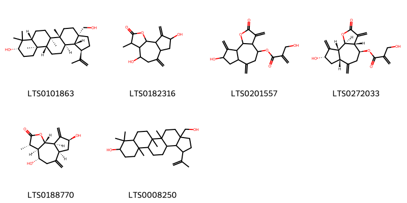{ width=100% }
    <figcaption>Hình ảnh cấu trúc hóa học của 6 hoạt chất thuộc nhóm Prenol lipids gồm ['betulin (LTS0101863)', '4,8-dihydroxy-3-methyl-6,9-dimethylidene-octahydro-3h-azuleno[4,5-b]furan-2-one (LTS0182316)', 'saupirin (LTS0201557)', 'cynaropicrin (LTS0272033)', '(3s,3ar,4s,6ar,8s,9ar,9br)-4,8-dihydroxy-3-methyl-6,9-dimethylidene-octahydro-3h-azuleno[4,5-b]furan-2-one (LTS0188770)', '3a-(hydroxymethyl)-5a,5b,8,8,11a-pentamethyl-1-(prop-1-en-2-yl)-hexadecahydrocyclopenta[a]chrysen-9-ol (LTS0008250)'].</figcaption>
</figure>
#### Nhóm Steroids and steroid derivatives
<figure markdown="span">
    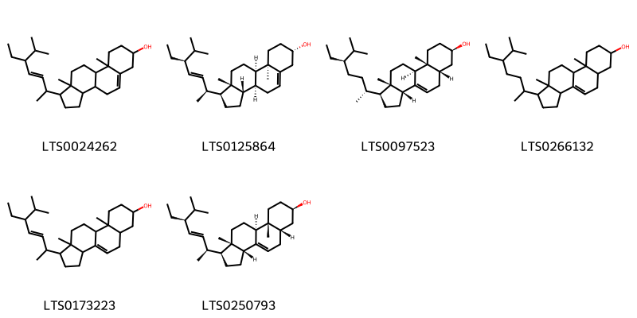{ width=100% }
    <figcaption>Hình ảnh cấu trúc hóa học của 6 hoạt chất thuộc nhóm Steroids and steroid derivatives gồm ['stigmasterol (LTS0024262)', '(1s,3as,3bs,7s,9ar,9br,11as)-1-[(2s,3e,5s)-5-ethyl-6-methylhept-3-en-2-yl]-9a,11a-dimethyl-1h,2h,3h,3ah,3bh,4h,6h,7h,8h,9h,9bh,10h,11h-cyclopenta[a]phenanthren-7-ol (LTS0125864)', '(1s,3ar,5as,7r,9ar,9bs,11as)-1-[(2r,5r)-5-ethyl-6-methylheptan-2-yl]-9a,11a-dimethyl-1h,2h,3h,3ah,5h,5ah,6h,7h,8h,9h,9bh,10h,11h-cyclopenta[a]phenanthren-7-ol (LTS0097523)', '1-(5-ethyl-6-methylheptan-2-yl)-9a,11a-dimethyl-1h,2h,3h,3ah,5h,5ah,6h,7h,8h,9h,9bh,10h,11h-cyclopenta[a]phenanthren-7-ol (LTS0266132)', '1-(5-ethyl-6-methylhept-3-en-2-yl)-9a,11a-dimethyl-1h,2h,3h,3ah,5h,5ah,6h,7h,8h,9h,9bh,10h,11h-cyclopenta[a]phenanthren-7-ol (LTS0173223)', '(1s,3ar,5as,7r,9ar,9bs,11as)-1-[(2s,3e,5s)-5-ethyl-6-methylhept-3-en-2-yl]-9a,11a-dimethyl-1h,2h,3h,3ah,5h,5ah,6h,7h,8h,9h,9bh,10h,11h-cyclopenta[a]phenanthren-7-ol (LTS0250793)'].</figcaption>
</figure>

---

### Dược dân tộc học

Danh sách các quốc gia có sử dụng *Tricholepis glaberrima* trong điều trị các bệnh. 

| Country   | Disease                    | Bệnh                                                                                                                                                                                                |
|:----------|:---------------------------|:----------------------------------------------------------------------------------------------------------------------------------------------------------------------------------------------------|
| Elsewhere | Tonic, Antiseptic, Nervine | MYMEMORY WARNING: YOU USED ALL AVAILABLE FREE TRANSLATIONS FOR TODAY. NEXT AVAILABLE IN  10 HOURS 37 MINUTES 14 SECONDS VISIT HTTPS://MYMEMORY.TRANSLATED.NET/DOC/USAGELIMITS.PHP TO TRANSLATE MORE |

---

---
## Tricholepis glaberrimum
### Thông tin về thực vật

!!! info "Phân loại thực vật của *Tricholepis glaberrima* từ GIBF:"
    - **Kingdom:** Plantae
    - **Phylum:** Tracheophyta
    - **Order:** Asterales
    - **Family:** Asteraceae
    - **Genus:** Tricholepis
    - **Species:** *Tricholepis glaberrima*

 

| Label (VI)   | Label (EN)   | Scientific Name        | Descriptions (VI)   | Descriptions (EN)   | Also Known As (VI)   | Also Known As (EN)   |
|:-------------|:-------------|:-----------------------|:--------------------|:--------------------|:---------------------|:---------------------|
| N/A          | N/A          | Tricholepis glaberrima | loài thực vật       | species of plant    | ['']                 | ['']                 |

#### Phân bố trên thế giới

**Từ CSDL GIBF** nan, India, unknown or invalid

#### Phân bố tại Việt Nam

**Từ CSDL GIBF**: Không có ghi nhận ở Việt Nam

---
### Thành phần hóa học
        
- Theo cơ sở dữ liệu lotus: Từ loài *Tricholepis glaberrima* đã phân lập và xác định được Chưa có hoạt chất nào được phân lập. hoạt chất thuộc về các nhóm Không có hoạt chất nào được phân lập. 

Không có hình ảnh nào được tạo ra

---

### Dược dân tộc học

Danh sách các quốc gia có sử dụng *Tricholepis glaberrima* trong điều trị các bệnh. 

| Country      | Disease                     | Bệnh                                                                                                                                                                                                |
|:-------------|:----------------------------|:----------------------------------------------------------------------------------------------------------------------------------------------------------------------------------------------------|
| India(Hindu) | Aphrodisiac, Nervine, Tonic | MYMEMORY WARNING: YOU USED ALL AVAILABLE FREE TRANSLATIONS FOR TODAY. NEXT AVAILABLE IN  10 HOURS 36 MINUTES 48 SECONDS VISIT HTTPS://MYMEMORY.TRANSLATED.NET/DOC/USAGELIMITS.PHP TO TRANSLATE MORE |

---

# Chi Anaphalis

??? note "Danh sách các dược liệu thuộc chi"
    
	 - *Anaphalis adnata*
	 - *Anaphalis margaritacea*

---
## Anaphalis adnata
### Thông tin về thực vật

!!! info "Phân loại thực vật của *Pseudognaphalium adnatum* từ GIBF:"
    - **Kingdom:** Plantae
    - **Phylum:** Tracheophyta
    - **Order:** Asterales
    - **Family:** Asteraceae
    - **Genus:** Pseudognaphalium
    - **Species:** *Pseudognaphalium adnatum*

 

| Label (VI)   | Label (EN)   | Scientific Name   | Descriptions (VI)   | Descriptions (EN)   | Also Known As (VI)   | Also Known As (EN)   |
|:-------------|:-------------|:------------------|:--------------------|:--------------------|:---------------------|:---------------------|
| N/A          | N/A          | Anaphalis adnata  | loài thực vật       | species of plant    | ['']                 | ['']                 |

#### Phân bố trên thế giới

**Từ CSDL GIBF** nan, Pakistan, Thailand, Lao People’s Democratic Republic, Chinese Taipei, Myanmar, Bhutan, India, unknown or invalid, Bangladesh, Philippines, Viet Nam, China, Nepal

#### Phân bố tại Việt Nam

**Từ CSDL GIBF**: Kon Tum, Kontum, Lam Dong

---
### Thành phần hóa học
        
- Theo cơ sở dữ liệu lotus: Từ loài *Pseudognaphalium adnatum* đã phân lập và xác định được Chưa có hoạt chất nào được phân lập. hoạt chất thuộc về các nhóm Không có hoạt chất nào được phân lập. 

Không có hình ảnh nào được tạo ra

---

### Dược dân tộc học

Danh sách các quốc gia có sử dụng *Pseudognaphalium adnatum* trong điều trị các bệnh. 

| Country   | Disease   | Bệnh                                                                                                                                                                                                |
|:----------|:----------|:----------------------------------------------------------------------------------------------------------------------------------------------------------------------------------------------------|
| India     | Hemostat  | MYMEMORY WARNING: YOU USED ALL AVAILABLE FREE TRANSLATIONS FOR TODAY. NEXT AVAILABLE IN  10 HOURS 36 MINUTES 23 SECONDS VISIT HTTPS://MYMEMORY.TRANSLATED.NET/DOC/USAGELIMITS.PHP TO TRANSLATE MORE |

---

---
## Anaphalis margaritacea
### Thông tin về thực vật

!!! info "Phân loại thực vật của *Anaphalis margaritacea* từ GIBF:"
    - **Kingdom:** Plantae
    - **Phylum:** Tracheophyta
    - **Order:** Asterales
    - **Family:** Asteraceae
    - **Genus:** Anaphalis
    - **Species:** *Anaphalis margaritacea*

 

| Label (VI)   | Label (EN)   | Scientific Name        | Descriptions (VI)   | Descriptions (EN)   | Also Known As (VI)   | Also Known As (EN)                                   |
|:-------------|:-------------|:-----------------------|:--------------------|:--------------------|:---------------------|:-----------------------------------------------------|
| N/A          | N/A          | Anaphalis margaritacea | loài thực vật       | species of plant    | ['']                 | ['pearly everlasting', 'western pearly everlasting'] |

#### Phân bố trên thế giới

**Từ CSDL GIBF** Switzerland, United States of America, Sweden, Norway, Canada

#### Phân bố tại Việt Nam

**Từ CSDL GIBF**: Không có ghi nhận ở Việt Nam

---
### Thành phần hóa học
        
- Theo cơ sở dữ liệu lotus: Từ loài *Anaphalis margaritacea* đã phân lập và xác định được 41 hoạt chất thuộc về các nhóm Flavonoids, Prenol lipids, Steroids and steroid derivatives, Pyrans, Lactones. 

|    | chemicalTaxonomyClassyfireClass   |   smiles_count |
|---:|:----------------------------------|---------------:|
|  0 | Flavonoids                        |             16 |
|  1 | Lactones                          |              4 |
|  2 | Prenol lipids                     |             14 |
|  3 | Pyrans                            |              2 |
|  4 | Steroids and steroid derivatives  |              5 |

#### Nhóm Flavonoids
<figure markdown="span">
    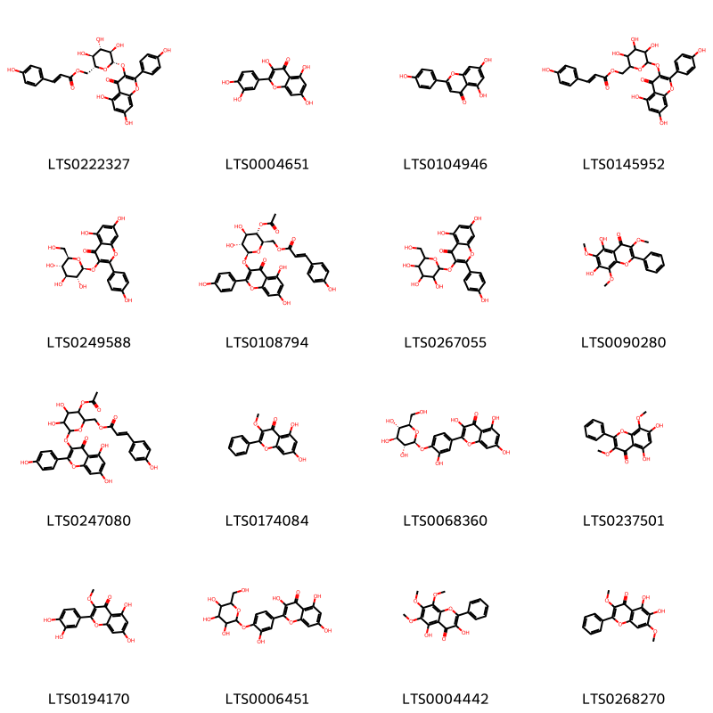{ width=100% }
    <figcaption>Hình ảnh cấu trúc hóa học của 16 hoạt chất thuộc nhóm Flavonoids gồm ['tiliroside (LTS0222327)', 'quercetin (LTS0004651)', 'chamomile (LTS0104946)', '(6-{[5,7-dihydroxy-2-(4-hydroxyphenyl)-4-oxochromen-3-yl]oxy}-3,4,5-trihydroxyoxan-2-yl)methyl 3-(4-hydroxyphenyl)prop-2-enoate (LTS0145952)', 'astragalin (LTS0249588)', '[(2r,3s,4r,5r,6s)-3-(acetyloxy)-6-{[5,7-dihydroxy-2-(4-hydroxyphenyl)-4-oxochromen-3-yl]oxy}-4,5-dihydroxyoxan-2-yl]methyl (2e)-3-(4-hydroxyphenyl)prop-2-enoate (LTS0108794)', 'trifolin (LTS0267055)', 'araneol (LTS0090280)', '[3-(acetyloxy)-6-{[5,7-dihydroxy-2-(4-hydroxyphenyl)-4-oxochromen-3-yl]oxy}-4,5-dihydroxyoxan-2-yl]methyl 3-(4-hydroxyphenyl)prop-2-enoate (LTS0247080)', 'galangin 3-methyl ether (LTS0174084)', 'spiraeoside (LTS0068360)', 'gnaphaliin (LTS0237501)', 'quercetin 3-methyl ether (LTS0194170)', '3,5,7-trihydroxy-2-(3-hydroxy-4-{[3,4,5-trihydroxy-6-(hydroxymethyl)oxan-2-yl]oxy}phenyl)chromen-4-one (LTS0006451)', '3,5-dihydroxy-6,7,8-trimethoxy-2-phenylchromen-4-one (LTS0004442)', '5,6-dihydroxy-3,7-dimethoxy-2-phenylchromen-4-one (LTS0268270)'].</figcaption>
</figure>
#### Nhóm Lactones
<figure markdown="span">
    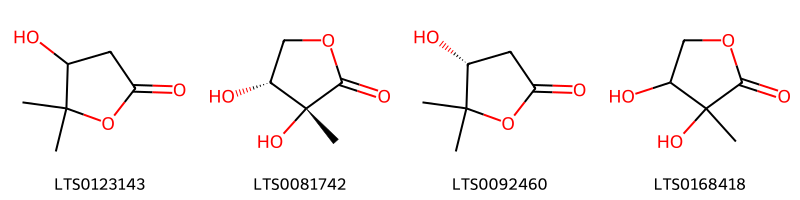{ width=100% }
    <figcaption>Hình ảnh cấu trúc hóa học của 4 hoạt chất thuộc nhóm Lactones gồm ['4-hydroxy-5,5-dimethyloxolan-2-one (LTS0123143)', '(3r,4r)-3,4-dihydroxy-3-methyloxolan-2-one (LTS0081742)', '(4r)-4-hydroxy-5,5-dimethyloxolan-2-one (LTS0092460)', '3,4-dihydroxy-3-methyloxolan-2-one (LTS0168418)'].</figcaption>
</figure>
#### Nhóm Prenol lipids
<figure markdown="span">
    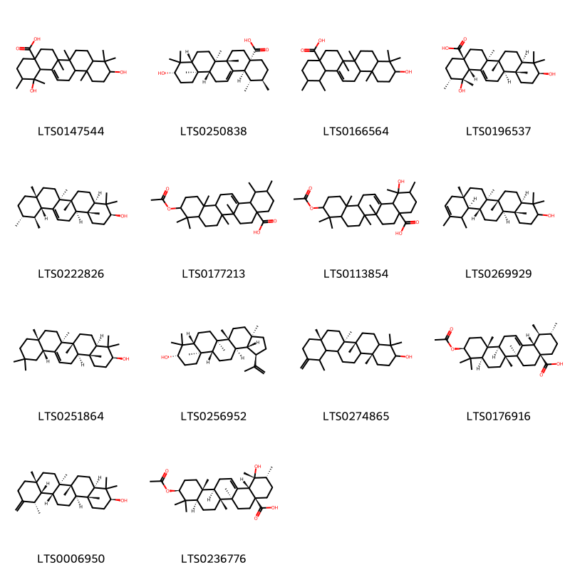{ width=100% }
    <figcaption>Hình ảnh cấu trúc hóa học của 14 hoạt chất thuộc nhóm Prenol lipids gồm ['1,10-dihydroxy-1,2,6a,6b,9,9,12a-heptamethyl-2,3,4,5,6,7,8,8a,10,11,12,12b,13,14b-tetradecahydropicene-4a-carboxylic acid (LTS0147544)', 'ursolic acid (LTS0250838)', '10-hydroxy-1,2,6a,6b,9,9,12a-heptamethyl-2,3,4,5,6,7,8,8a,10,11,12,12b,13,14b-tetradecahydro-1h-picene-4a-carboxylic acid (LTS0166564)', 'pomolic acid (LTS0196537)', 'amyrin (LTS0222826)', '10-(acetyloxy)-1,2,6a,6b,9,9,12a-heptamethyl-2,3,4,5,6,7,8,8a,10,11,12,12b,13,14b-tetradecahydro-1h-picene-4a-carboxylic acid (LTS0177213)', '10-(acetyloxy)-1-hydroxy-1,2,6a,6b,9,9,12a-heptamethyl-2,3,4,5,6,7,8,8a,10,11,12,12b,13,14b-tetradecahydropicene-4a-carboxylic acid (LTS0113854)', '(4ar,6ar,6br,8as,12ar,12br,14ar,14br)-4,4,6a,6b,8a,11,12,14b-octamethyl-2,3,4a,5,6,7,8,9,12,12a,12b,13,14,14a-tetradecahydro-1h-picen-3-ol (LTS0269929)', 'β-amyrin (LTS0251864)', 'lupeol (LTS0256952)', '(6ar,6br,8ar,14br)-4,4,6a,6b,8a,12,14b-heptamethyl-11-methylidene-hexadecahydropicen-3-ol (LTS0274865)', '(1s,2r,4as,6as,6br,8ar,10s,12ar,12br,14bs)-10-(acetyloxy)-1,2,6a,6b,9,9,12a-heptamethyl-2,3,4,5,6,7,8,8a,10,11,12,12b,13,14b-tetradecahydro-1h-picene-4a-carboxylic acid (LTS0176916)', 'taraxasterol (LTS0006950)', '(1r,2r,4as,6as,6br,8ar,10s,12ar,12br,14bs)-10-(acetyloxy)-1-hydroxy-1,2,6a,6b,9,9,12a-heptamethyl-2,3,4,5,6,7,8,8a,10,11,12,12b,13,14b-tetradecahydropicene-4a-carboxylic acid (LTS0236776)'].</figcaption>
</figure>
#### Nhóm Pyrans
<figure markdown="span">
    { width=100% }
    <figcaption>Hình ảnh cấu trúc hóa học của 2 hoạt chất thuộc nhóm Pyrans gồm ['5-chloro-2-(octa-2,4,6-triyn-1-ylidene)-5,6-dihydropyran (LTS0108722)', '(2e,5r)-5-chloro-2-(octa-2,4,6-triyn-1-ylidene)-5,6-dihydropyran (LTS0037611)'].</figcaption>
</figure>
#### Nhóm Steroids and steroid derivatives
<figure markdown="span">
    { width=100% }
    <figcaption>Hình ảnh cấu trúc hóa học của 5 hoạt chất thuộc nhóm Steroids and steroid derivatives gồm ['stigmast-5-en-3-ol (LTS0071224)', 'stigmast-5-en-3-ol, (3β)- (LTS0204616)', 'phytosterol (LTS0029311)', '(1r,3as,3bs,7s,9bs)-1-[(2r,5r)-5,6-dimethylheptan-2-yl]-9a,11a-dimethyl-1h,2h,3h,3ah,3bh,4h,6h,7h,8h,9h,9bh,10h,11h-cyclopenta[a]phenanthren-7-ol (LTS0057877)', 'campesterol (LTS0046755)'].</figcaption>
</figure>

---

### Dược dân tộc học

Danh sách các quốc gia có sử dụng *Anaphalis margaritacea* trong điều trị các bệnh. 

| Country          | Disease   | Bệnh                                                                                                                                                                                                |
|:-----------------|:----------|:----------------------------------------------------------------------------------------------------------------------------------------------------------------------------------------------------|
| Canada(Kwakiutl) | Poultice  | MYMEMORY WARNING: YOU USED ALL AVAILABLE FREE TRANSLATIONS FOR TODAY. NEXT AVAILABLE IN  10 HOURS 35 MINUTES 55 SECONDS VISIT HTTPS://MYMEMORY.TRANSLATED.NET/DOC/USAGELIMITS.PHP TO TRANSLATE MORE |

---

# Chi Amblyolepis

??? note "Danh sách các dược liệu thuộc chi"
    
	 - *Amblyolepis setigera*

---
## Amblyolepis setigera
### Thông tin về thực vật

!!! info "Phân loại thực vật của *Amblyolepis setigera* từ GIBF:"
    - **Kingdom:** Plantae
    - **Phylum:** Tracheophyta
    - **Order:** Asterales
    - **Family:** Asteraceae
    - **Genus:** Amblyolepis
    - **Species:** *Amblyolepis setigera*

 

| Label (VI)   | Label (EN)   | Scientific Name      | Descriptions (VI)   | Descriptions (EN)   | Also Known As (VI)   | Also Known As (EN)   |
|:-------------|:-------------|:---------------------|:--------------------|:--------------------|:---------------------|:---------------------|
| N/A          | N/A          | Amblyolepis setigera | loài thực vật       | species of plant    | ['']                 | ['']                 |

#### Phân bố trên thế giới

**Từ CSDL GIBF** United States of America, Mexico

#### Phân bố tại Việt Nam

**Từ CSDL GIBF**: Không có ghi nhận ở Việt Nam

---
### Thành phần hóa học
        
- Theo cơ sở dữ liệu lotus: Từ loài *Amblyolepis setigera* đã phân lập và xác định được Chưa có hoạt chất nào được phân lập. hoạt chất thuộc về các nhóm Không có hoạt chất nào được phân lập. 

Không có hình ảnh nào được tạo ra

---

### Dược dân tộc học

Danh sách các quốc gia có sử dụng *Amblyolepis setigera* trong điều trị các bệnh. 

| Country   | Disease   | Bệnh                                                                                                                                                                                                |
|:----------|:----------|:----------------------------------------------------------------------------------------------------------------------------------------------------------------------------------------------------|
| US(TX)    | Sudorific | MYMEMORY WARNING: YOU USED ALL AVAILABLE FREE TRANSLATIONS FOR TODAY. NEXT AVAILABLE IN  10 HOURS 35 MINUTES 13 SECONDS VISIT HTTPS://MYMEMORY.TRANSLATED.NET/DOC/USAGELIMITS.PHP TO TRANSLATE MORE |

---

# Chi Sonchus

??? note "Danh sách các dược liệu thuộc chi"
    
	 - *Sonchus aer*
	 - *Sonchus arvensis*
	 - *Sonchus oleraceus*

---
## Sonchus aer
### Thông tin về thực vật

!!! info "Phân loại thực vật của *N/A* từ GIBF:"
    - **Kingdom:** Plantae
    - **Phylum:** Tracheophyta
    - **Order:** Asterales
    - **Family:** Asteraceae
    - **Genus:** Sonchus
    - **Species:** *N/A*

 

| Label (VI)   | Label (EN)   | Scientific Name      | Descriptions (VI)   | Descriptions (EN)   | Also Known As (VI)   | Also Known As (EN)   |
|:-------------|:-------------|:---------------------|:--------------------|:--------------------|:---------------------|:---------------------|
| N/A          | N/A          | Amblyolepis setigera | loài thực vật       | species of plant    | ['']                 | ['']                 |

#### Phân bố trên thế giới

**Từ CSDL GIBF** nan, Italy, Australia, Japan, Argentina, Israel, Canada, Ukraine, Chinese Taipei, Spain, Portugal, Russian Federation, Morocco, United States of America, Greece, South Africa, Czechia, Germany, Brazil, Austria, Mexico, France, United Kingdom of Great Britain and Northern Ireland, Ireland, Kuwait, New Zealand

#### Phân bố tại Việt Nam

**Từ CSDL GIBF**: Không có ghi nhận ở Việt Nam

---
### Thành phần hóa học
        
- Theo cơ sở dữ liệu lotus: Từ loài *N/A* đã phân lập và xác định được Chưa có hoạt chất nào được phân lập. hoạt chất thuộc về các nhóm Không có hoạt chất nào được phân lập. 

Không có hình ảnh nào được tạo ra

---

### Dược dân tộc học

Danh sách các quốc gia có sử dụng *N/A* trong điều trị các bệnh. 

| Country   | Disease   | Bệnh                                                                                                                                                                                                |
|:----------|:----------|:----------------------------------------------------------------------------------------------------------------------------------------------------------------------------------------------------|
| Elsewhere | Emollient | MYMEMORY WARNING: YOU USED ALL AVAILABLE FREE TRANSLATIONS FOR TODAY. NEXT AVAILABLE IN  10 HOURS 34 MINUTES 43 SECONDS VISIT HTTPS://MYMEMORY.TRANSLATED.NET/DOC/USAGELIMITS.PHP TO TRANSLATE MORE |

---

---
## Sonchus arvensis
### Thông tin về thực vật

!!! info "Phân loại thực vật của *Sonchus arvensis* từ GIBF:"
    - **Kingdom:** Plantae
    - **Phylum:** Tracheophyta
    - **Order:** Asterales
    - **Family:** Asteraceae
    - **Genus:** Sonchus
    - **Species:** *Sonchus arvensis*

 

| Label (VI)   | Label (EN)   | Scientific Name   | Descriptions (VI)   | Descriptions (EN)   | Also Known As (VI)   | Also Known As (EN)                             |
|:-------------|:-------------|:------------------|:--------------------|:--------------------|:---------------------|:-----------------------------------------------|
| N/A          | N/A          | Sonchus arvensis  | loài thực vật       | species of plant    | ['']                 | ['Common Sow Thistle', 'perennial sowthistle'] |

#### Phân bố trên thế giới

**Từ CSDL GIBF** Jersey, Denmark, Netherlands, Hong Kong, Germany, Belgium, Romania, Chinese Taipei, Ireland, India, Switzerland, Russian Federation, United States of America, Sweden, Austria, Kazakhstan, United Kingdom of Great Britain and Northern Ireland, Canada

#### Phân bố tại Việt Nam

**Từ CSDL GIBF**: Không có ghi nhận ở Việt Nam

---
### Thành phần hóa học
        
- Theo cơ sở dữ liệu lotus: Từ loài *Sonchus arvensis* đã phân lập và xác định được 83 hoạt chất thuộc về các nhóm Isoindoles and derivatives, Flavonoids, Prenol lipids, Steroids and steroid derivatives, Macrolactams, Cytochalasans, Macrolide lactams, Benzofurans, Organooxygen compounds, Coumarins and derivatives, Macrolides and analogues, Glycerolipids, Benzopyrans. 

|    | chemicalTaxonomyClassyfireClass   |   smiles_count |
|---:|:----------------------------------|---------------:|
|  0 | Benzofurans                       |              2 |
|  1 | Benzopyrans                       |              2 |
|  2 | Coumarins and derivatives         |              2 |
|  3 | Cytochalasans                     |              2 |
|  4 | Flavonoids                        |             12 |
|  5 | Glycerolipids                     |              6 |
|  6 | Isoindoles and derivatives        |              4 |
|  7 | Macrolactams                      |              1 |
|  8 | Macrolide lactams                 |              1 |
|  9 | Macrolides and analogues          |              2 |
| 10 | Organooxygen compounds            |              2 |
| 11 | Prenol lipids                     |             30 |
| 12 | Steroids and steroid derivatives  |              5 |

#### Nhóm Benzofurans
<figure markdown="span">
    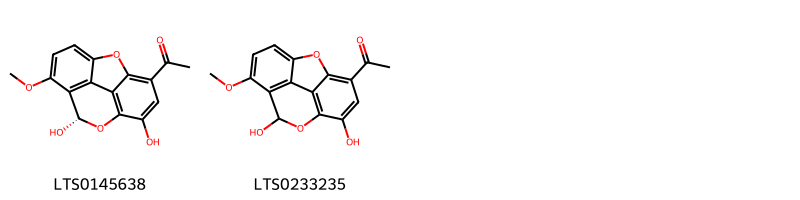{ width=100% }
    <figcaption>Hình ảnh cấu trúc hóa học của 2 hoạt chất thuộc nhóm Benzofurans gồm ['1-[(7s)-4,7-dihydroxy-9-methoxy-6,15-dioxatetracyclo[10.2.1.0⁵,¹⁴.0⁸,¹³]pentadeca-1(14),2,4,8,10,12-hexaen-2-yl]ethanone (LTS0145638)', '1-{4,7-dihydroxy-9-methoxy-6,15-dioxatetracyclo[10.2.1.0⁵,¹⁴.0⁸,¹³]pentadeca-1(14),2,4,8,10,12-hexaen-2-yl}ethanone (LTS0233235)'].</figcaption>
</figure>
#### Nhóm Benzopyrans
<figure markdown="span">
    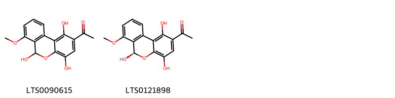{ width=100% }
    <figcaption>Hình ảnh cấu trúc hóa học của 2 hoạt chất thuộc nhóm Benzopyrans gồm ['1-{1,4,6-trihydroxy-7-methoxy-6h-benzo[c]chromen-2-yl}ethanone (LTS0090615)', '1-[(6r)-1,4,6-trihydroxy-7-methoxy-6h-benzo[c]chromen-2-yl]ethanone (LTS0121898)'].</figcaption>
</figure>
#### Nhóm Coumarins and derivatives
<figure markdown="span">
    { width=100% }
    <figcaption>Hình ảnh cấu trúc hóa học của 2 hoạt chất thuộc nhóm Coumarins and derivatives gồm ['scopoletin (LTS0193112)', 'esculetin (LTS0067593)'].</figcaption>
</figure>
#### Nhóm Cytochalasans
<figure markdown="span">
    { width=100% }
    <figcaption>Hình ảnh cấu trúc hóa học của 2 hoạt chất thuộc nhóm Cytochalasans gồm ['16-benzyl-5,13,18-trihydroxy-9,15-dimethyl-14-methylidene-5h,6h,7h,8h,9h,10h,12ah,13h,15h,15ah,16h-oxacyclotetradeca[2,3-d]isoindol-2-one (LTS0245084)', '(5r,9r,12as,13s,15s,15as,16s,18as)-16-benzyl-5,13,18-trihydroxy-9,15-dimethyl-14-methylidene-5h,6h,7h,8h,9h,10h,12ah,13h,15h,15ah,16h-oxacyclotetradeca[2,3-d]isoindol-2-one (LTS0242278)'].</figcaption>
</figure>
#### Nhóm Flavonoids
<figure markdown="span">
    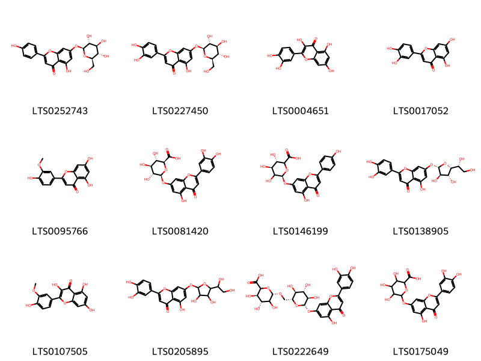{ width=100% }
    <figcaption>Hình ảnh cấu trúc hóa học của 12 hoạt chất thuộc nhóm Flavonoids gồm ['apigenin 7-o-β-glucoside (LTS0252743)', 'luteolin 7-o-glucoside (LTS0227450)', 'quercetin (LTS0004651)', 'luteolin (LTS0017052)', 'chrysoeriol (LTS0095766)', 'luteolin 7-o-glucuronide (LTS0081420)', 'apigenin 7-glucuronide (LTS0146199)', '7-{[(2s,3r,4r,5r)-5-[(1r)-1,2-dihydroxyethyl]-3,4-dihydroxyoxolan-2-yl]oxy}-2-(3,4-dihydroxyphenyl)-5-hydroxychromen-4-one (LTS0138905)', 'isorhamnetin (LTS0107505)', '7-{[5-(1,2-dihydroxyethyl)-3,4-dihydroxyoxolan-2-yl]oxy}-2-(3,4-dihydroxyphenyl)-5-hydroxychromen-4-one (LTS0205895)', '(3r,4r,6s)-6-{[(2r,3s,4s,5r,6s)-6-{[2-(3,4-dihydroxyphenyl)-5-hydroxy-4-oxochromen-7-yl]oxy}-3,4,5-trihydroxyoxan-2-yl]methoxy}-3,4,5-trihydroxyoxane-2-carboxylic acid (LTS0222649)', '6-{[2-(3,4-dihydroxyphenyl)-5-hydroxy-4-oxochromen-7-yl]oxy}-3,4,5-trihydroxyoxane-2-carboxylic acid (LTS0175049)'].</figcaption>
</figure>
#### Nhóm Glycerolipids
<figure markdown="span">
    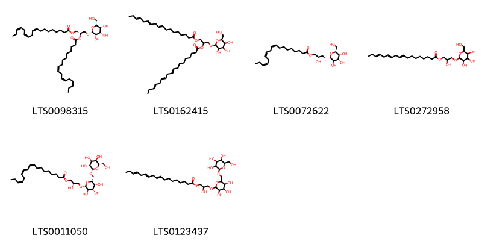{ width=100% }
    <figcaption>Hình ảnh cấu trúc hóa học của 6 hoạt chất thuộc nhóm Glycerolipids gồm ['(2s)-1-[(9z,12z,15z)-octadeca-9,12,15-trienoyloxy]-3-{[(2r,3r,4s,5r,6r)-3,4,5-trihydroxy-6-(hydroxymethyl)oxan-2-yl]oxy}propan-2-yl (9z,12z,15z)-octadeca-9,12,15-trienoate (LTS0098315)', '1-(octadeca-9,12,15-trienoyloxy)-3-{[3,4,5-trihydroxy-6-(hydroxymethyl)oxan-2-yl]oxy}propan-2-yl octadeca-9,12,15-trienoate (LTS0162415)', '(2s)-2-hydroxy-3-{[(2r,3r,4s,5r,6r)-3,4,5-trihydroxy-6-(hydroxymethyl)oxan-2-yl]oxy}propyl (9z,12z,15z)-octadeca-9,12,15-trienoate (LTS0072622)', '2-hydroxy-3-{[3,4,5-trihydroxy-6-(hydroxymethyl)oxan-2-yl]oxy}propyl octadeca-9,12,15-trienoate (LTS0272958)', '(2s)-2-hydroxy-3-{[(2r,3r,4s,5r,6r)-3,4,5-trihydroxy-6-({[(2s,3r,4s,5r,6r)-3,4,5-trihydroxy-6-(hydroxymethyl)oxan-2-yl]oxy}methyl)oxan-2-yl]oxy}propyl (9z,12z,15z)-octadeca-9,12,15-trienoate (LTS0011050)', '2-hydroxy-3-{[3,4,5-trihydroxy-6-({[3,4,5-trihydroxy-6-(hydroxymethyl)oxan-2-yl]oxy}methyl)oxan-2-yl]oxy}propyl octadeca-9,12,15-trienoate (LTS0123437)'].</figcaption>
</figure>
#### Nhóm Isoindoles and derivatives
<figure markdown="span">
    { width=100% }
    <figcaption>Hình ảnh cấu trúc hóa học của 4 hoạt chất thuộc nhóm Isoindoles and derivatives gồm ['(1s,4z,7s,8r,9r,10r,11s,17r,19e,21s,22s,24s,25s,26s)-26-benzyl-8,9,22,28-tetrahydroxy-11-methoxy-17,24-dimethyl-23-methylidene-3,13-dioxo-2-oxa-27-azapentacyclo[19.7.0.0¹,²⁵.0⁶,¹².0⁷,¹⁰]octacosa-4,6(12),19,27-tetraene-7-carboximidic acid (LTS0123627)', '(1s,3z,6s,7r,8s,9r,10r,16r,18e,20r,21s,23s,24r,25s)-25-benzyl-7,8,21,27-tetrahydroxy-10-methoxy-16,23-dimethyl-22-methylidene-2,12-dioxo-26-azapentacyclo[18.7.0.0¹,²⁴.0⁵,¹¹.0⁶,⁹]heptacosa-3,5(11),18,26-tetraene-6-carboximidic acid (LTS0139817)', '(3s,3ar,4s,6s,6ar,10r,14r,17as)-3-benzyl-1,6,14-trihydroxy-4,10-dimethyl-5-methylidene-3h,3ah,4h,6h,6ah,9h,10h,11h,12h,13h,14h-cyclotrideca[d]isoindol-17-one (LTS0149290)', '3-benzyl-1,6,14-trihydroxy-4,10-dimethyl-5-methylidene-3h,3ah,4h,6h,6ah,9h,10h,11h,12h,13h,14h-cyclotrideca[d]isoindol-17-one (LTS0173425)'].</figcaption>
</figure>
#### Nhóm Macrolactams
<figure markdown="span">
    { width=100% }
    <figcaption>Hình ảnh cấu trúc hóa học của 1 hoạt chất thuộc nhóm Macrolactams gồm ['25-benzyl-7,8,21,27-tetrahydroxy-10-methoxy-16,23-dimethyl-22-methylidene-2,12-dioxo-26-azapentacyclo[18.7.0.0¹,²⁴.0⁵,¹¹.0⁶,⁹]heptacosa-3,5(11),18,26-tetraene-6-carboximidic acid (LTS0131950)'].</figcaption>
</figure>
#### Nhóm Macrolide lactams
<figure markdown="span">
    { width=100% }
    <figcaption>Hình ảnh cấu trúc hóa học của 1 hoạt chất thuộc nhóm Macrolide lactams gồm ['26-benzyl-8,9,22,28-tetrahydroxy-11-methoxy-17,24-dimethyl-23-methylidene-3,13-dioxo-2-oxa-27-azapentacyclo[19.7.0.0¹,²⁵.0⁶,¹².0⁷,¹⁰]octacosa-4,6(12),19,27-tetraene-7-carboximidic acid (LTS0069207)'].</figcaption>
</figure>
#### Nhóm Macrolides and analogues
<figure markdown="span">
    { width=100% }
    <figcaption>Hình ảnh cấu trúc hóa học của 2 hoạt chất thuộc nhóm Macrolides and analogues gồm ['(1s,4e,6r,12e,14s,15s,17r,18s,19s,20s)-20-benzyl-6,22-dihydroxy-17,18-dimethyl-2,16-dioxa-21-azatetracyclo[12.8.0.0¹,¹⁹.0¹⁵,¹⁷]docosa-4,12,21-trien-3-one (LTS0160978)', '20-benzyl-6,22-dihydroxy-17,18-dimethyl-2,16-dioxa-21-azatetracyclo[12.8.0.0¹,¹⁹.0¹⁵,¹⁷]docosa-4,12,21-trien-3-one (LTS0264224)'].</figcaption>
</figure>
#### Nhóm Organooxygen compounds
<figure markdown="span">
    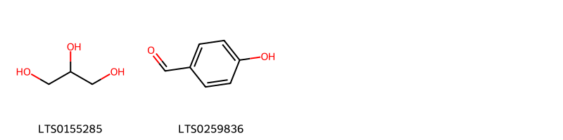{ width=100% }
    <figcaption>Hình ảnh cấu trúc hóa học của 2 hoạt chất thuộc nhóm Organooxygen compounds gồm ['glycerol (LTS0155285)', 'p-hydroxybenzaldehyde (LTS0259836)'].</figcaption>
</figure>
#### Nhóm Prenol lipids
<figure markdown="span">
    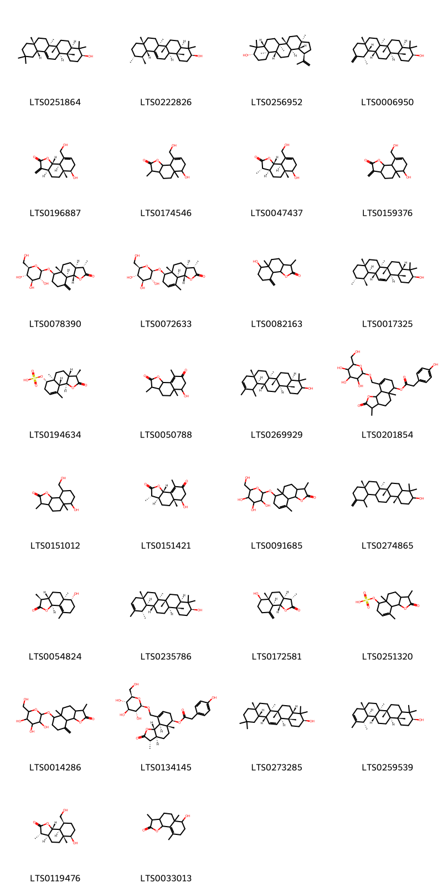{ width=100% }
    <figcaption>Hình ảnh cấu trúc hóa học của 30 hoạt chất thuộc nhóm Prenol lipids gồm ['β-amyrin (LTS0251864)', 'amyrin (LTS0222826)', 'lupeol (LTS0256952)', 'taraxasterol (LTS0006950)', '(3as,5ar,6r,9as,9bs)-6-hydroxy-9-(hydroxymethyl)-5a-methyl-3-methylidene-3ah,4h,5h,6h,7h,9ah,9bh-naphtho[1,2-b]furan-2-one (LTS0196887)', '6-hydroxy-9-(hydroxymethyl)-3,5a-dimethyl-3h,3ah,4h,5h,6h,7h,9ah,9bh-naphtho[1,2-b]furan-2-one (LTS0174546)', '(3s,3as,5ar,6r,9as,9bs)-6-hydroxy-9-(hydroxymethyl)-3,5a-dimethyl-3h,3ah,4h,5h,6h,7h,9ah,9bh-naphtho[1,2-b]furan-2-one (LTS0047437)', '6-hydroxy-9-(hydroxymethyl)-5a-methyl-3-methylidene-3ah,4h,5h,6h,7h,9ah,9bh-naphtho[1,2-b]furan-2-one (LTS0159376)', '(3s,3as,5ar,6r,9as,9bs)-3,5a-dimethyl-9-methylidene-6-{[(2r,3r,4s,5s,6r)-3,4,5-trihydroxy-6-(hydroxymethyl)oxan-2-yl]oxy}-octahydro-3h-naphtho[1,2-b]furan-2-one (LTS0078390)', '(3s,3as,5ar,6r,9as,9bs)-3,5a,9-trimethyl-6-{[(2r,3r,4s,5s,6r)-3,4,5-trihydroxy-6-(hydroxymethyl)oxan-2-yl]oxy}-3h,3ah,4h,5h,6h,7h,9ah,9bh-naphtho[1,2-b]furan-2-one (LTS0072633)', '6-hydroxy-3,5a-dimethyl-9-methylidene-octahydro-3h-naphtho[1,2-b]furan-2-one (LTS0082163)', '(3s,4as,6ar,6br,8ar,11r,12s,12ar,12br,14ar,14bs)-4,4,6a,6b,8a,11,12,14b-octamethyl-2,3,4a,5,6,7,8,9,10,11,12,12a,12b,14a-tetradecahydro-1h-picen-3-ol (LTS0017325)', '[(3r,3ar,5as,6s,9ar,9br)-3,5a,9-trimethyl-2-oxo-3h,3ah,4h,5h,6h,7h,9ah,9bh-naphtho[1,2-b]furan-6-yl]oxidanesulfonic acid (LTS0194634)', '6-hydroxy-3,5a,9-trimethyl-3h,3ah,4h,5h,6h,7h,9bh-naphtho[1,2-b]furan-2,8-dione (LTS0050788)', '(4ar,6ar,6br,8as,12ar,12br,14ar,14br)-4,4,6a,6b,8a,11,12,14b-octamethyl-2,3,4a,5,6,7,8,9,12,12a,12b,13,14,14a-tetradecahydro-1h-picen-3-ol (LTS0269929)', '3,5a-dimethyl-2-oxo-9-({[3,4,5-trihydroxy-6-(hydroxymethyl)oxan-2-yl]oxy}methyl)-3h,3ah,4h,5h,6h,7h,9ah,9bh-naphtho[1,2-b]furan-6-yl 2-(4-hydroxyphenyl)acetate (LTS0201854)', '6-hydroxy-9-(hydroxymethyl)-3,5a-dimethyl-decahydronaphtho[1,2-b]furan-2-one (LTS0151012)', '(3s,3as,5ar,6r,9bs)-6-hydroxy-3,5a,9-trimethyl-3h,3ah,4h,5h,6h,7h,9bh-naphtho[1,2-b]furan-2,8-dione (LTS0151421)', '3,5a,9-trimethyl-6-{[3,4,5-trihydroxy-6-(hydroxymethyl)oxan-2-yl]oxy}-3h,3ah,4h,5h,6h,7h,9ah,9bh-naphtho[1,2-b]furan-2-one (LTS0091685)', '(6ar,6br,8ar,14br)-4,4,6a,6b,8a,12,14b-heptamethyl-11-methylidene-hexadecahydropicen-3-ol (LTS0274865)', '(3s,3as,5ar,6r,9bs)-6-hydroxy-3,5a,9-trimethyl-3h,3ah,4h,5h,6h,7h,8h,9bh-naphtho[1,2-b]furan-2-one (LTS0054824)', '(3s,4ar,6ar,6br,8as,12s,12ar,12br,14ar,14br)-4,4,6a,6b,8a,11,12,14b-octamethyl-2,3,4a,5,6,7,8,9,12,12a,12b,13,14,14a-tetradecahydro-1h-picen-3-ol (LTS0235786)', '(3s,3as,5ar,6r,9as,9bs)-6-hydroxy-3,5a-dimethyl-9-methylidene-octahydro-3h-naphtho[1,2-b]furan-2-one (LTS0172581)', '{3,5a,9-trimethyl-2-oxo-3h,3ah,4h,5h,6h,7h,9ah,9bh-naphtho[1,2-b]furan-6-yl}oxidanesulfonic acid (LTS0251320)', '3,5a-dimethyl-9-methylidene-6-{[3,4,5-trihydroxy-6-(hydroxymethyl)oxan-2-yl]oxy}-octahydro-3h-naphtho[1,2-b]furan-2-one (LTS0014286)', '(3s,3as,5ar,6r,9as,9bs)-3,5a-dimethyl-2-oxo-9-({[(2r,3r,4s,5s,6r)-3,4,5-trihydroxy-6-(hydroxymethyl)oxan-2-yl]oxy}methyl)-3h,3ah,4h,5h,6h,7h,9ah,9bh-naphtho[1,2-b]furan-6-yl 2-(4-hydroxyphenyl)acetate (LTS0134145)', '(3s,4as,6ar,6br,8ar,12as,12br,14ar,14bs)-4,4,6a,6b,8a,11,11,14b-octamethyl-1,2,3,4a,5,6,7,8,9,10,12,12a,12b,14a-tetradecahydropicen-3-ol (LTS0273285)', '(3s,6ar,6br,8as,12s,12ar,12br,14ar,14br)-4,4,6a,6b,8a,11,12,14b-octamethyl-2,3,4a,5,6,7,8,9,12,12a,12b,13,14,14a-tetradecahydro-1h-picen-3-ol (LTS0259539)', '(3s,3as,5ar,6r,9s,9as,9bs)-6-hydroxy-9-(hydroxymethyl)-3,5a-dimethyl-decahydronaphtho[1,2-b]furan-2-one (LTS0119476)', '6-hydroxy-3,5a,9-trimethyl-3h,3ah,4h,5h,6h,7h,8h,9bh-naphtho[1,2-b]furan-2-one (LTS0033013)'].</figcaption>
</figure>
#### Nhóm Steroids and steroid derivatives
<figure markdown="span">
    { width=100% }
    <figcaption>Hình ảnh cấu trúc hóa học của 5 hoạt chất thuộc nhóm Steroids and steroid derivatives gồm ['stigmast-5-en-3-ol, (3β)- (LTS0204616)', 'stigmast-5-en-3-ol (LTS0071224)', 'phytosterol (LTS0029311)', 'campesterol (LTS0046755)', '(1r,3as,3bs,7s,9bs)-1-[(2r,5r)-5,6-dimethylheptan-2-yl]-9a,11a-dimethyl-1h,2h,3h,3ah,3bh,4h,6h,7h,8h,9h,9bh,10h,11h-cyclopenta[a]phenanthren-7-ol (LTS0057877)'].</figcaption>
</figure>

---

### Dược dân tộc học

Danh sách các quốc gia có sử dụng *Sonchus arvensis* trong điều trị các bệnh. 

| Country   | Disease   | Bệnh                                                                                                                                                                                                |
|:----------|:----------|:----------------------------------------------------------------------------------------------------------------------------------------------------------------------------------------------------|
| Elsewhere | Soporific | MYMEMORY WARNING: YOU USED ALL AVAILABLE FREE TRANSLATIONS FOR TODAY. NEXT AVAILABLE IN  10 HOURS 34 MINUTES 20 SECONDS VISIT HTTPS://MYMEMORY.TRANSLATED.NET/DOC/USAGELIMITS.PHP TO TRANSLATE MORE |

---

---
## Sonchus oleraceus
### Thông tin về thực vật

!!! info "Phân loại thực vật của *Sonchus oleraceus* từ GIBF:"
    - **Kingdom:** Plantae
    - **Phylum:** Tracheophyta
    - **Order:** Asterales
    - **Family:** Asteraceae
    - **Genus:** Sonchus
    - **Species:** *Sonchus oleraceus*

 

| Label (VI)   | Label (EN)   | Scientific Name   | Descriptions (VI)   | Descriptions (EN)   | Also Known As (VI)   | Also Known As (EN)                                                                                                                                                              |
|:-------------|:-------------|:------------------|:--------------------|:--------------------|:---------------------|:--------------------------------------------------------------------------------------------------------------------------------------------------------------------------------|
| N/A          | N/A          | Sonchus oleraceus | loài thực vật       | species of plant    | ['']                 | ['annual sow thistle', 'common sowthistle', "hare's colwort", "hare's thistle", 'milk thistle', 'milky tassel', 'smooth sow thistle', 'soft thistle', 'sow thistle', 'swinies'] |

#### Phân bố trên thế giới

**Từ CSDL GIBF** nan, Italy, Australia, Japan, Belgium, Argentina, Israel, Canada, Netherlands, Chinese Taipei, Spain, Portugal, Russian Federation, United States of America, Greece, South Africa, Germany, Brazil, Austria, Mexico, France, United Kingdom of Great Britain and Northern Ireland, Ireland, Kuwait, New Zealand

#### Phân bố tại Việt Nam

**Từ CSDL GIBF**: Không có ghi nhận ở Việt Nam

---
### Thành phần hóa học
        
- Theo cơ sở dữ liệu lotus: Từ loài *Sonchus oleraceus* đã phân lập và xác định được 40 hoạt chất thuộc về các nhóm Flavonoids, Prenol lipids, Naphthofurans, Organooxygen compounds, Coumarins and derivatives. 

|    | chemicalTaxonomyClassyfireClass   |   smiles_count |
|---:|:----------------------------------|---------------:|
|  0 | Coumarins and derivatives         |              2 |
|  1 | Flavonoids                        |             13 |
|  2 | Naphthofurans                     |              1 |
|  3 | Organooxygen compounds            |              4 |
|  4 | Prenol lipids                     |             20 |

#### Nhóm Coumarins and derivatives
<figure markdown="span">
    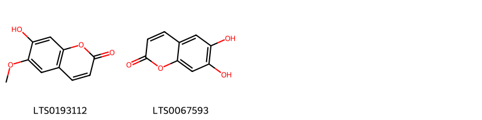{ width=100% }
    <figcaption>Hình ảnh cấu trúc hóa học của 2 hoạt chất thuộc nhóm Coumarins and derivatives gồm ['scopoletin (LTS0193112)', 'esculetin (LTS0067593)'].</figcaption>
</figure>
#### Nhóm Flavonoids
<figure markdown="span">
    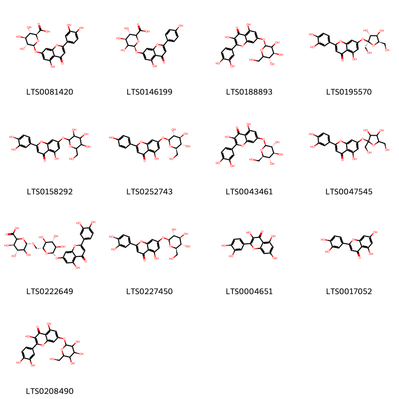{ width=100% }
    <figcaption>Hình ảnh cấu trúc hóa học của 13 hoạt chất thuộc nhóm Flavonoids gồm ['luteolin 7-o-glucuronide (LTS0081420)', 'apigenin 7-glucuronide (LTS0146199)', 'quercimeritrin (LTS0188893)', '7-{[(2s,3r,4r,5r)-3,4-dihydroxy-2,5-bis(hydroxymethyl)oxolan-2-yl]oxy}-2-(3,4-dihydroxyphenyl)-5-hydroxychromen-4-one (LTS0195570)', '2-(3,4-dihydroxyphenyl)-5-hydroxy-7-{[3,4,5-trihydroxy-6-(hydroxymethyl)oxan-2-yl]oxy}chromen-4-one (LTS0158292)', 'apigenin 7-o-β-glucoside (LTS0252743)', 'quercimeritrin (LTS0043461)', '7-{[3,4-dihydroxy-2,5-bis(hydroxymethyl)oxolan-2-yl]oxy}-2-(3,4-dihydroxyphenyl)-5-hydroxychromen-4-one (LTS0047545)', '(3r,4r,6s)-6-{[(2r,3s,4s,5r,6s)-6-{[2-(3,4-dihydroxyphenyl)-5-hydroxy-4-oxochromen-7-yl]oxy}-3,4,5-trihydroxyoxan-2-yl]methoxy}-3,4,5-trihydroxyoxane-2-carboxylic acid (LTS0222649)', 'luteolin 7-o-glucoside (LTS0227450)', 'quercetin (LTS0004651)', 'luteolin (LTS0017052)', 'quercimeritrin (LTS0208490)'].</figcaption>
</figure>
#### Nhóm Naphthofurans
<figure markdown="span">
    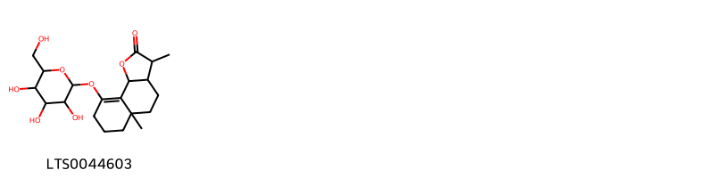{ width=100% }
    <figcaption>Hình ảnh cấu trúc hóa học của 1 hoạt chất thuộc nhóm Naphthofurans gồm ['3,5a-dimethyl-9-{[3,4,5-trihydroxy-6-(hydroxymethyl)oxan-2-yl]oxy}-3h,3ah,4h,5h,6h,7h,8h,9bh-naphtho[1,2-b]furan-2-one (LTS0044603)'].</figcaption>
</figure>
#### Nhóm Organooxygen compounds
<figure markdown="span">
    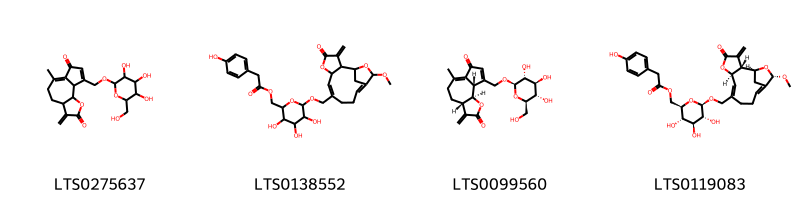{ width=100% }
    <figcaption>Hình ảnh cấu trúc hóa học của 4 hoạt chất thuộc nhóm Organooxygen compounds gồm ['6-methyl-3-methylidene-9-({[3,4,5-trihydroxy-6-(hydroxymethyl)oxan-2-yl]oxy}methyl)-3ah,4h,5h,9ah,9bh-azuleno[4,5-b]furan-2,7-dione (LTS0275637)', '(3,4,5-trihydroxy-6-{[(11z)-13-methoxy-3-methylidene-4-oxo-5,14-dioxatricyclo[10.2.1.0²,⁶]pentadeca-7,11-dien-8-yl]methoxy}oxan-2-yl)methyl 2-(4-hydroxyphenyl)acetate (LTS0138552)', '(3as,9as,9bs)-6-methyl-3-methylidene-9-({[(2r,3r,4s,5s,6r)-3,4,5-trihydroxy-6-(hydroxymethyl)oxan-2-yl]oxy}methyl)-3ah,4h,5h,9ah,9bh-azuleno[4,5-b]furan-2,7-dione (LTS0099560)', '[(2r,3s,4s,5r,6r)-3,4,5-trihydroxy-6-{[(1s,2r,6r,7z,11z,13s)-13-methoxy-3-methylidene-4-oxo-5,14-dioxatricyclo[10.2.1.0²,⁶]pentadeca-7,11-dien-8-yl]methoxy}oxan-2-yl]methyl 2-(4-hydroxyphenyl)acetate (LTS0119083)'].</figcaption>
</figure>
#### Nhóm Prenol lipids
<figure markdown="span">
    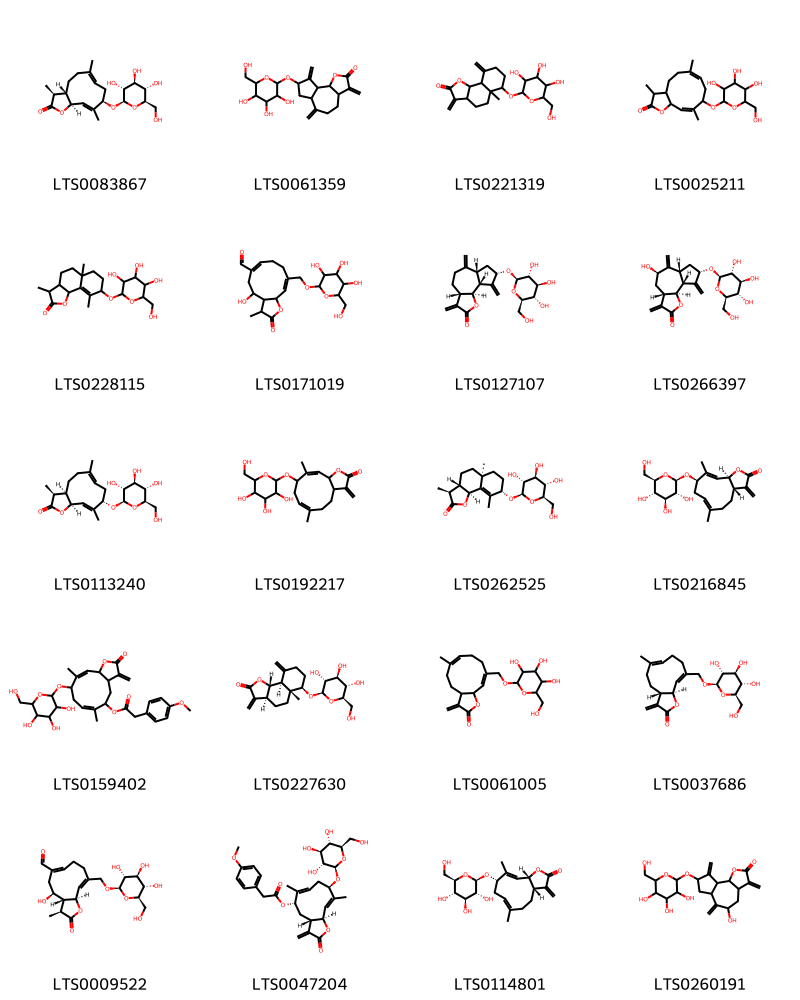{ width=100% }
    <figcaption>Hình ảnh cấu trúc hóa học của 20 hoạt chất thuộc nhóm Prenol lipids gồm ['(3s,3as,9r,11as)-3,6,10-trimethyl-9-{[(2r,3r,4s,5s,6r)-3,4,5-trihydroxy-6-(hydroxymethyl)oxan-2-yl]oxy}-3h,3ah,4h,5h,8h,9h,11ah-cyclodeca[b]furan-2-one (LTS0083867)', '3,6,9-trimethylidene-8-{[3,4,5-trihydroxy-6-(hydroxymethyl)oxan-2-yl]oxy}-octahydroazuleno[4,5-b]furan-2-one (LTS0061359)', '5a-methyl-3,9-dimethylidene-6-{[3,4,5-trihydroxy-6-(hydroxymethyl)oxan-2-yl]oxy}-octahydronaphtho[1,2-b]furan-2-one (LTS0221319)', '3,6,10-trimethyl-9-{[3,4,5-trihydroxy-6-(hydroxymethyl)oxan-2-yl]oxy}-3h,3ah,4h,5h,8h,9h,11ah-cyclodeca[b]furan-2-one (LTS0025211)', '3,5a,9-trimethyl-8-{[3,4,5-trihydroxy-6-(hydroxymethyl)oxan-2-yl]oxy}-3h,3ah,4h,5h,6h,7h,8h,9bh-naphtho[1,2-b]furan-2-one (LTS0228115)', '4-hydroxy-3-methyl-2-oxo-10-({[3,4,5-trihydroxy-6-(hydroxymethyl)oxan-2-yl]oxy}methyl)-3h,3ah,4h,5h,8h,9h,11ah-cyclodeca[b]furan-6-carbaldehyde (LTS0171019)', 'vernoflexuoside (LTS0127107)', '(3as,5r,6ar,8s,9ar,9bs)-5-hydroxy-3,6,9-trimethylidene-8-{[(2r,3r,4s,5s,6r)-3,4,5-trihydroxy-6-(hydroxymethyl)oxan-2-yl]oxy}-octahydroazuleno[4,5-b]furan-2-one (LTS0266397)', '(3s,3ar,9s,11as)-3,6,10-trimethyl-9-{[(2r,3r,4s,5s,6r)-3,4,5-trihydroxy-6-(hydroxymethyl)oxan-2-yl]oxy}-3h,3ah,4h,5h,8h,9h,11ah-cyclodeca[b]furan-2-one (LTS0113240)', '6,10-dimethyl-3-methylidene-9-{[3,4,5-trihydroxy-6-(hydroxymethyl)oxan-2-yl]oxy}-3ah,4h,5h,8h,9h,11ah-cyclodeca[b]furan-2-one (LTS0192217)', '(3s,3as,5as,8s,9bs)-3,5a,9-trimethyl-8-{[(2r,3r,4s,5s,6r)-3,4,5-trihydroxy-6-(hydroxymethyl)oxan-2-yl]oxy}-3h,3ah,4h,5h,6h,7h,8h,9bh-naphtho[1,2-b]furan-2-one (LTS0262525)', '(3as,9r,11ar)-6,10-dimethyl-3-methylidene-9-{[(2r,3r,4s,5s,6r)-3,4,5-trihydroxy-6-(hydroxymethyl)oxan-2-yl]oxy}-3ah,4h,5h,8h,9h,11ah-cyclodeca[b]furan-2-one (LTS0216845)', '6,10-dimethyl-3-methylidene-2-oxo-9-{[3,4,5-trihydroxy-6-(hydroxymethyl)oxan-2-yl]oxy}-3ah,4h,5h,8h,9h,11ah-cyclodeca[b]furan-5-yl 2-(4-methoxyphenyl)acetate (LTS0159402)', '(3as,5ar,6r,9as,9bs)-5a-methyl-3,9-dimethylidene-6-{[(2r,3r,4s,5s,6r)-3,4,5-trihydroxy-6-(hydroxymethyl)oxan-2-yl]oxy}-octahydronaphtho[1,2-b]furan-2-one (LTS0227630)', '6-methyl-3-methylidene-10-({[3,4,5-trihydroxy-6-(hydroxymethyl)oxan-2-yl]oxy}methyl)-3ah,4h,5h,8h,9h,11ah-cyclodeca[b]furan-2-one (LTS0061005)', '(3as,11ar)-6-methyl-3-methylidene-10-({[(2r,3r,4s,5s,6r)-3,4,5-trihydroxy-6-(hydroxymethyl)oxan-2-yl]oxy}methyl)-3ah,4h,5h,8h,9h,11ah-cyclodeca[b]furan-2-one (LTS0037686)', '(3s,3ar,4s,11ar)-4-hydroxy-3-methyl-2-oxo-10-({[(2r,3r,4s,5s,6r)-3,4,5-trihydroxy-6-(hydroxymethyl)oxan-2-yl]oxy}methyl)-3h,3ah,4h,5h,8h,9h,11ah-cyclodeca[b]furan-6-carbaldehyde (LTS0009522)', '(3as,5s,9r,11ar)-6,10-dimethyl-3-methylidene-2-oxo-9-{[(2r,3r,4s,5s,6r)-3,4,5-trihydroxy-6-(hydroxymethyl)oxan-2-yl]oxy}-3ah,4h,5h,8h,9h,11ah-cyclodeca[b]furan-5-yl 2-(4-methoxyphenyl)acetate (LTS0047204)', '(3as,9s,11as)-6,10-dimethyl-3-methylidene-9-{[(2r,3r,4s,5s,6r)-3,4,5-trihydroxy-6-(hydroxymethyl)oxan-2-yl]oxy}-3ah,4h,5h,8h,9h,11ah-cyclodeca[b]furan-2-one (LTS0114801)', '5-hydroxy-3,6,9-trimethylidene-8-{[3,4,5-trihydroxy-6-(hydroxymethyl)oxan-2-yl]oxy}-octahydroazuleno[4,5-b]furan-2-one (LTS0260191)'].</figcaption>
</figure>

---

### Dược dân tộc học

Danh sách các quốc gia có sử dụng *Sonchus oleraceus* trong điều trị các bệnh. 

| Country   | Disease                                                   | Bệnh                                                                                                                                                                                                |
|:----------|:----------------------------------------------------------|:----------------------------------------------------------------------------------------------------------------------------------------------------------------------------------------------------|
| China     | Sedative                                                  | MYMEMORY WARNING: YOU USED ALL AVAILABLE FREE TRANSLATIONS FOR TODAY. NEXT AVAILABLE IN  10 HOURS 33 MINUTES 38 SECONDS VISIT HTTPS://MYMEMORY.TRANSLATED.NET/DOC/USAGELIMITS.PHP TO TRANSLATE MORE |
| Chinese   | Narcotic                                                  | MYMEMORY WARNING: YOU USED ALL AVAILABLE FREE TRANSLATIONS FOR TODAY. NEXT AVAILABLE IN  10 HOURS 33 MINUTES 35 SECONDS VISIT HTTPS://MYMEMORY.TRANSLATED.NET/DOC/USAGELIMITS.PHP TO TRANSLATE MORE |
| Elsewhere | Cathartic, Lactagogue, Vermifuge, Tonic, Poison, Sedative | MYMEMORY WARNING: YOU USED ALL AVAILABLE FREE TRANSLATIONS FOR TODAY. NEXT AVAILABLE IN  10 HOURS 33 MINUTES 32 SECONDS VISIT HTTPS://MYMEMORY.TRANSLATED.NET/DOC/USAGELIMITS.PHP TO TRANSLATE MORE |
| Haiti     | Emollient                                                 | MYMEMORY WARNING: YOU USED ALL AVAILABLE FREE TRANSLATIONS FOR TODAY. NEXT AVAILABLE IN  10 HOURS 33 MINUTES 28 SECONDS VISIT HTTPS://MYMEMORY.TRANSLATED.NET/DOC/USAGELIMITS.PHP TO TRANSLATE MORE |
| Sudan     | Tonic                                                     | MYMEMORY WARNING: YOU USED ALL AVAILABLE FREE TRANSLATIONS FOR TODAY. NEXT AVAILABLE IN  10 HOURS 33 MINUTES 24 SECONDS VISIT HTTPS://MYMEMORY.TRANSLATED.NET/DOC/USAGELIMITS.PHP TO TRANSLATE MORE |
| Turkey    | Cathartic, Refrigerant, Diuretic, Tonic                   | MYMEMORY WARNING: YOU USED ALL AVAILABLE FREE TRANSLATIONS FOR TODAY. NEXT AVAILABLE IN  10 HOURS 33 MINUTES 21 SECONDS VISIT HTTPS://MYMEMORY.TRANSLATED.NET/DOC/USAGELIMITS.PHP TO TRANSLATE MORE |
| ain       | Refrigerant                                               | MYMEMORY WARNING: YOU USED ALL AVAILABLE FREE TRANSLATIONS FOR TODAY. NEXT AVAILABLE IN  10 HOURS 33 MINUTES 16 SECONDS VISIT HTTPS://MYMEMORY.TRANSLATED.NET/DOC/USAGELIMITS.PHP TO TRANSLATE MORE |

---

# Chi Culcitium

??? note "Danh sách các dược liệu thuộc chi"
    
	 - *Culcitium reflexum*

---
## Culcitium reflexum
### Thông tin về thực vật

!!! info "Phân loại thực vật của *Lasiocephalus ovatus* từ GIBF:"
    - **Kingdom:** Plantae
    - **Phylum:** Tracheophyta
    - **Order:** Asterales
    - **Family:** Asteraceae
    - **Genus:** Lasiocephalus
    - **Species:** *Lasiocephalus ovatus*

 

| Label (VI)   | Label (EN)   | Scientific Name    | Descriptions (VI)   | Descriptions (EN)   | Also Known As (VI)   | Also Known As (EN)   |
|:-------------|:-------------|:-------------------|:--------------------|:--------------------|:---------------------|:---------------------|
| N/A          | N/A          | Culcitium reflexum |                     |                     | ['']                 | ['']                 |

#### Phân bố trên thế giới

**Từ CSDL GIBF** nan, Ecuador, Colombia, Peru

#### Phân bố tại Việt Nam

**Từ CSDL GIBF**: Không có ghi nhận ở Việt Nam

---
### Thành phần hóa học
        
- Theo cơ sở dữ liệu lotus: Từ loài *Lasiocephalus ovatus* đã phân lập và xác định được Chưa có hoạt chất nào được phân lập. hoạt chất thuộc về các nhóm Không có hoạt chất nào được phân lập. 

Không có hình ảnh nào được tạo ra

---

### Dược dân tộc học

Danh sách các quốc gia có sử dụng *Lasiocephalus ovatus* trong điều trị các bệnh. 

| Country   | Disease   | Bệnh                                                                                                                                                                                                |
|:----------|:----------|:----------------------------------------------------------------------------------------------------------------------------------------------------------------------------------------------------|
| Ecuador   | Diuretic  | MYMEMORY WARNING: YOU USED ALL AVAILABLE FREE TRANSLATIONS FOR TODAY. NEXT AVAILABLE IN  10 HOURS 32 MINUTES 34 SECONDS VISIT HTTPS://MYMEMORY.TRANSLATED.NET/DOC/USAGELIMITS.PHP TO TRANSLATE MORE |

---

# Chi Blumea

??? note "Danh sách các dược liệu thuộc chi"
    
	 - *Blumea balsamifera*
	 - *Blumea lacera*

---
## Blumea balsamifera
### Thông tin về thực vật

!!! info "Phân loại thực vật của *Blumea balsamifera* từ GIBF:"
    - **Kingdom:** Plantae
    - **Phylum:** Tracheophyta
    - **Order:** Asterales
    - **Family:** Asteraceae
    - **Genus:** Blumea
    - **Species:** *Blumea balsamifera*

 

| Label (VI)   | Label (EN)   | Scientific Name    | Descriptions (VI)   | Descriptions (EN)   | Also Known As (VI)     | Also Known As (EN)   |
|:-------------|:-------------|:-------------------|:--------------------|:--------------------|:-----------------------|:---------------------|
| N/A          | N/A          | Blumea balsamifera | loài thực vật       | species of plant    | ['Blumea balsamifera'] | ['']                 |

#### Phân bố trên thế giới

**Từ CSDL GIBF** nan, Lao People’s Democratic Republic, Cambodia, Myanmar, unknown or invalid, Chinese Taipei, Bangladesh, United States of America, Timor-Leste, Hong Kong, Thailand, Bhutan, Viet Nam, China, India, Indonesia, Philippines, Malaysia, Brunei Darussalam

#### Phân bố tại Việt Nam

**Từ CSDL GIBF**: Thanh Hoa, Dak Lak, Hà Tĩnh, Dac Lac

---
### Thành phần hóa học
        
- Theo cơ sở dữ liệu lotus: Từ loài *Blumea balsamifera* đã phân lập và xác định được 44 hoạt chất thuộc về các nhóm Flavonoids, Prenol lipids. 

|    | chemicalTaxonomyClassyfireClass   |   smiles_count |
|---:|:----------------------------------|---------------:|
|  0 | Flavonoids                        |             18 |
|  1 | Prenol lipids                     |             26 |

#### Nhóm Flavonoids
<figure markdown="span">
    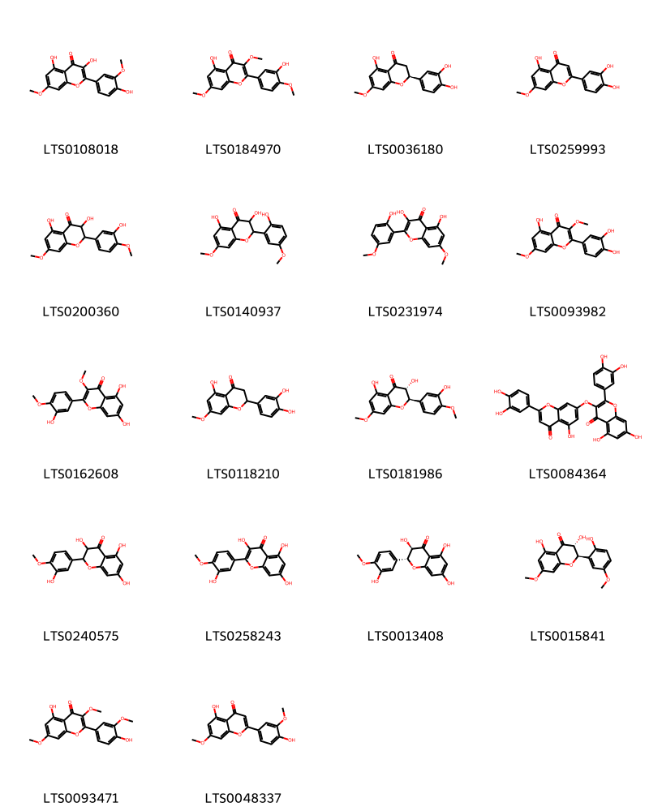{ width=100% }
    <figcaption>Hình ảnh cấu trúc hóa học của 18 hoạt chất thuộc nhóm Flavonoids gồm ['rhamnazin (LTS0108018)', 'ayanin (LTS0184970)', 'sterubin (LTS0036180)', 'luteolin 7-methyl ether (LTS0259993)', '3,5-dihydroxy-2-(3-hydroxy-4-methoxyphenyl)-7-methoxy-2,3-dihydro-1-benzopyran-4-one (LTS0200360)', '3,5-dihydroxy-2-(2-hydroxy-5-methoxyphenyl)-7-methoxy-2,3-dihydro-1-benzopyran-4-one (LTS0140937)', '3,5-dihydroxy-2-(2-hydroxy-5-methoxyphenyl)-7-methoxychromen-4-one (LTS0231974)', 'dthf (LTS0093982)', "quercetin 3,4'-dimethyl ether (LTS0162608)", 'sternbin (LTS0118210)', '(2r,3r)-3,5-dihydroxy-2-(3-hydroxy-4-methoxyphenyl)-7-methoxy-2,3-dihydro-1-benzopyran-4-one (LTS0181986)', '2-(3,4-dihydroxyphenyl)-3-{[2-(3,4-dihydroxyphenyl)-5-hydroxy-4-oxochromen-7-yl]oxy}-5,7-dihydroxychromen-4-one (LTS0084364)', "quercetin 4'-methyl ether (LTS0240575)", 'tamarixetin (LTS0258243)', '(2r,3r)-3,5,7-trihydroxy-2-(3-hydroxy-4-methoxyphenyl)-2,3-dihydro-1-benzopyran-4-one (LTS0013408)', '(2r,3r)-3,5-dihydroxy-2-(2-hydroxy-5-methoxyphenyl)-7-methoxy-2,3-dihydro-1-benzopyran-4-one (LTS0015841)', 'pachypodol (LTS0093471)', 'velutin (LTS0048337)'].</figcaption>
</figure>
#### Nhóm Prenol lipids
<figure markdown="span">
    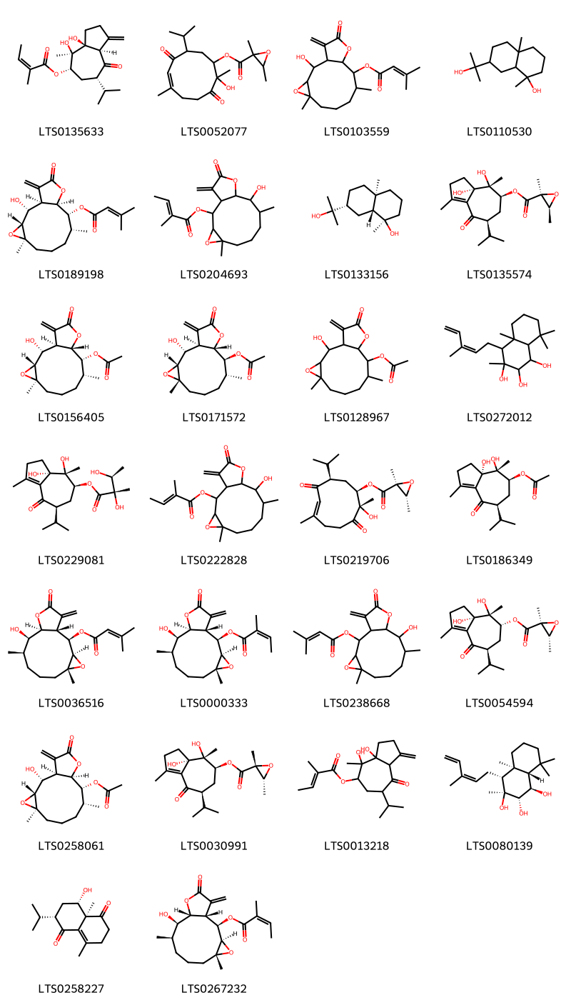{ width=100% }
    <figcaption>Hình ảnh cấu trúc hóa học của 26 hoạt chất thuộc nhóm Prenol lipids gồm ['(3as,4r,5s,7s,8ar)-3a,4-dihydroxy-7-isopropyl-4-methyl-1-methylidene-8-oxo-hexahydroazulen-5-yl (2z)-2-methylbut-2-enoate (LTS0135633)', '10-hydroxy-3-isopropyl-6,10-dimethyl-4,9-dioxocyclodec-5-en-1-yl 2,3-dimethyloxirane-2-carboxylate (LTS0052077)', '2-hydroxy-5,9-dimethyl-14-methylidene-13-oxo-4,12-dioxatricyclo[9.3.0.0³,⁵]tetradecan-10-yl 3-methylbut-2-enoate (LTS0103559)', '7-(2-hydroxypropan-2-yl)-1,4a-dimethyl-octahydronaphthalen-1-ol (LTS0110530)', '(1r,2r,3r,5r,9r,10r,11r)-2-hydroxy-5,9-dimethyl-14-methylidene-13-oxo-4,12-dioxatricyclo[9.3.0.0³,⁵]tetradecan-10-yl 3-methylbut-2-enoate (LTS0189198)', '10-hydroxy-5,9-dimethyl-14-methylidene-13-oxo-4,12-dioxatricyclo[9.3.0.0³,⁵]tetradecan-2-yl 2-methylbut-2-enoate (LTS0204693)', 'proximadiol (LTS0133156)', 'blumeaene e1 (LTS0135574)', '(1r,2r,3r,5r,9r,10r,11s)-2-hydroxy-5,9-dimethyl-14-methylidene-13-oxo-4,12-dioxatricyclo[9.3.0.0³,⁵]tetradecan-10-yl acetate (LTS0156405)', '(1r,2r,3r,5s,9r,10s,11s)-2-hydroxy-5,9-dimethyl-14-methylidene-13-oxo-4,12-dioxatricyclo[9.3.0.0³,⁵]tetradecan-10-yl acetate (LTS0171572)', '2-hydroxy-5,9-dimethyl-14-methylidene-13-oxo-4,12-dioxatricyclo[9.3.0.0³,⁵]tetradecan-10-yl acetate (LTS0128967)', '3,4a,8,8-tetramethyl-4-(3-methylpenta-2,4-dien-1-yl)-hexahydro-1h-naphthalene-1,2,3-triol (LTS0272012)', '(3as,4r,5s,7s)-3a,4-dihydroxy-7-isopropyl-1,4-dimethyl-8-oxo-3,5,6,7-tetrahydro-2h-azulen-5-yl (2s,3s)-2,3-dihydroxy-2-methylbutanoate (LTS0229081)', '10-hydroxy-5,9-dimethyl-14-methylidene-13-oxo-4,12-dioxatricyclo[9.3.0.0³,⁵]tetradecan-2-yl (2e)-2-methylbut-2-enoate (LTS0222828)', '(1r,3r,5e,10s)-10-hydroxy-3-isopropyl-6,10-dimethyl-4,9-dioxocyclodec-5-en-1-yl (2s,3r)-2,3-dimethyloxirane-2-carboxylate (LTS0219706)', 'blumeaene l (LTS0186349)', '(1s,2r,3r,5r,9r,10r,11s)-10-hydroxy-5,9-dimethyl-14-methylidene-13-oxo-4,12-dioxatricyclo[9.3.0.0³,⁵]tetradecan-2-yl 3-methylbut-2-enoate (LTS0036516)', '(1s,2r,3r,5r,9r,10r,11s)-10-hydroxy-5,9-dimethyl-14-methylidene-13-oxo-4,12-dioxatricyclo[9.3.0.0³,⁵]tetradecan-2-yl (2z)-2-methylbut-2-enoate (LTS0000333)', '10-hydroxy-5,9-dimethyl-14-methylidene-13-oxo-4,12-dioxatricyclo[9.3.0.0³,⁵]tetradecan-2-yl 3-methylbut-2-enoate (LTS0238668)', '(3as,4r,5r,7s)-3a,4-dihydroxy-7-isopropyl-1,4-dimethyl-8-oxo-3,5,6,7-tetrahydro-2h-azulen-5-yl (2s,3r)-2,3-dimethyloxirane-2-carboxylate (LTS0054594)', '(1r,2r,3r,5r,9r,10r,11r)-2-hydroxy-5,9-dimethyl-14-methylidene-13-oxo-4,12-dioxatricyclo[9.3.0.0³,⁵]tetradecan-10-yl acetate (LTS0258061)', 'blumeaene e2 (LTS0030991)', '3a,4-dihydroxy-7-isopropyl-4-methyl-1-methylidene-8-oxo-hexahydroazulen-5-yl 2-methylbut-2-enoate (LTS0013218)', '(1r,2s,3s,4r,4as,8as)-3,4a,8,8-tetramethyl-4-[(2z)-3-methylpenta-2,4-dien-1-yl]-hexahydro-1h-naphthalene-1,2,3-triol (LTS0080139)', 'samboginone, (rel)- (LTS0258227)', '(1s,2r,3r,5r,9r,10r,11r)-10-hydroxy-5,9-dimethyl-14-methylidene-13-oxo-4,12-dioxatricyclo[9.3.0.0³,⁵]tetradecan-2-yl (2z)-2-methylbut-2-enoate (LTS0267232)'].</figcaption>
</figure>

---

### Dược dân tộc học

Danh sách các quốc gia có sử dụng *Blumea balsamifera* trong điều trị các bệnh. 

| Country     | Disease              | Bệnh                                                                                                                                                                                                |
|:------------|:---------------------|:----------------------------------------------------------------------------------------------------------------------------------------------------------------------------------------------------|
| Java        | Vermifuge            | MYMEMORY WARNING: YOU USED ALL AVAILABLE FREE TRANSLATIONS FOR TODAY. NEXT AVAILABLE IN  10 HOURS 32 MINUTES 13 SECONDS VISIT HTTPS://MYMEMORY.TRANSLATED.NET/DOC/USAGELIMITS.PHP TO TRANSLATE MORE |
| Malaya      | Stomachic, Sudorific | MYMEMORY WARNING: YOU USED ALL AVAILABLE FREE TRANSLATIONS FOR TODAY. NEXT AVAILABLE IN  10 HOURS 32 MINUTES 10 SECONDS VISIT HTTPS://MYMEMORY.TRANSLATED.NET/DOC/USAGELIMITS.PHP TO TRANSLATE MORE |
| Philippines | Piscicide            | MYMEMORY WARNING: YOU USED ALL AVAILABLE FREE TRANSLATIONS FOR TODAY. NEXT AVAILABLE IN  10 HOURS 32 MINUTES 06 SECONDS VISIT HTTPS://MYMEMORY.TRANSLATED.NET/DOC/USAGELIMITS.PHP TO TRANSLATE MORE |

---

---
## Blumea lacera
### Thông tin về thực vật

!!! info "Phân loại thực vật của *Blumea lacera* từ GIBF:"
    - **Kingdom:** Plantae
    - **Phylum:** Tracheophyta
    - **Order:** Asterales
    - **Family:** Asteraceae
    - **Genus:** Blumea
    - **Species:** *Blumea lacera*

 

| Label (VI)   | Label (EN)   | Scientific Name   | Descriptions (VI)   | Descriptions (EN)   | Also Known As (VI)   | Also Known As (EN)   |
|:-------------|:-------------|:------------------|:--------------------|:--------------------|:---------------------|:---------------------|
| N/A          | N/A          | Blumea lacera     |                     | species of plant    | ['']                 | ['Malay Blumea']     |

#### Phân bố trên thế giới

**Từ CSDL GIBF** nan, Australia, Japan, Cambodia, Myanmar, Mozambique, Pakistan, Réunion, Chinese Taipei, Papua New Guinea, Bangladesh, Timor-Leste, Slovenia, South Africa, Germany, Thailand, Oman, Singapore, Viet Nam, China, Madagascar, Botswana, India, Indonesia, Kenya, Nepal

#### Phân bố tại Việt Nam

**Từ CSDL GIBF**: Lai Chau, Ninh Binh

---
### Thành phần hóa học
        
- Theo cơ sở dữ liệu lotus: Từ loài *Blumea lacera* đã phân lập và xác định được 17 hoạt chất thuộc về các nhóm Flavonoids, Prenol lipids, Steroids and steroid derivatives, Unsaturated hydrocarbons, Phenol esters. 

|    | chemicalTaxonomyClassyfireClass   |   smiles_count |
|---:|:----------------------------------|---------------:|
|  0 | Flavonoids                        |              1 |
|  1 | Phenol esters                     |              8 |
|  2 | Prenol lipids                     |              5 |
|  3 | Steroids and steroid derivatives  |              2 |
|  4 | Unsaturated hydrocarbons          |              1 |

#### Nhóm Flavonoids
<figure markdown="span">
    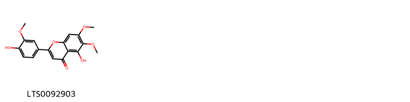{ width=100% }
    <figcaption>Hình ảnh cấu trúc hóa học của 1 hoạt chất thuộc nhóm Flavonoids gồm ['cirsilineol (LTS0092903)'].</figcaption>
</figure>
#### Nhóm Phenol esters
<figure markdown="span">
    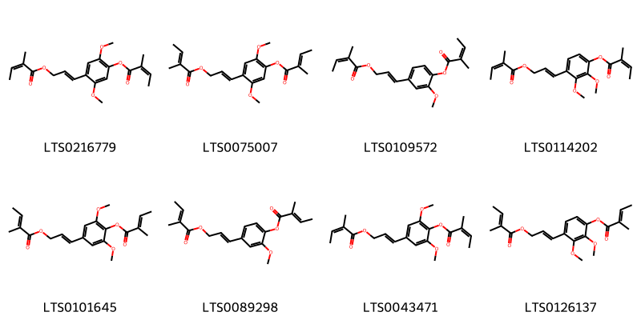{ width=100% }
    <figcaption>Hình ảnh cấu trúc hóa học của 8 hoạt chất thuộc nhóm Phenol esters gồm ['(2e)-3-(2,5-dimethoxy-4-{[(2z)-2-methylbut-2-enoyl]oxy}phenyl)prop-2-en-1-yl (2z)-2-methylbut-2-enoate (LTS0216779)', '3-{2,5-dimethoxy-4-[(2-methylbut-2-enoyl)oxy]phenyl}prop-2-en-1-yl 2-methylbut-2-enoate (LTS0075007)', '(2e)-3-(3-methoxy-4-{[(2z)-2-methylbut-2-enoyl]oxy}phenyl)prop-2-en-1-yl (2z)-2-methylbut-2-enoate (LTS0109572)', '(2e)-3-(2,3-dimethoxy-4-{[(2z)-2-methylbut-2-enoyl]oxy}phenyl)prop-2-en-1-yl (2z)-2-methylbut-2-enoate (LTS0114202)', '3-{3,5-dimethoxy-4-[(2-methylbut-2-enoyl)oxy]phenyl}prop-2-en-1-yl 2-methylbut-2-enoate (LTS0101645)', '3-{3-methoxy-4-[(2-methylbut-2-enoyl)oxy]phenyl}prop-2-en-1-yl 2-methylbut-2-enoate (LTS0089298)', '(2e)-3-(3,5-dimethoxy-4-{[(2z)-2-methylbut-2-enoyl]oxy}phenyl)prop-2-en-1-yl (2z)-2-methylbut-2-enoate (LTS0043471)', '3-{2,3-dimethoxy-4-[(2-methylbut-2-enoyl)oxy]phenyl}prop-2-en-1-yl 2-methylbut-2-enoate (LTS0126137)'].</figcaption>
</figure>
#### Nhóm Prenol lipids
<figure markdown="span">
    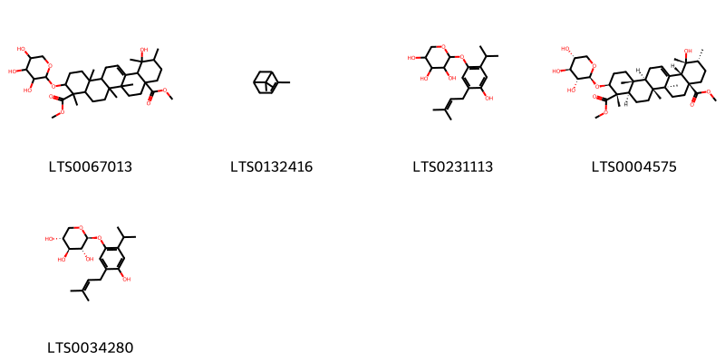{ width=100% }
    <figcaption>Hình ảnh cấu trúc hóa học của 5 hoạt chất thuộc nhóm Prenol lipids gồm ['4,8a-dimethyl 12-hydroxy-4,6a,6b,11,12,14b-hexamethyl-3-[(3,4,5-trihydroxyoxan-2-yl)oxy]-1,2,3,4a,5,6,7,8,9,10,11,12a,14,14a-tetradecahydropicene-4,8a-dicarboxylate (LTS0067013)', 'α pinene (LTS0132416)', '2-[4-hydroxy-2-isopropyl-5-(3-methylbut-2-en-1-yl)phenoxy]oxane-3,4,5-triol (LTS0231113)', '4,8a-dimethyl (3s,4s,4ar,6ar,6bs,8as,11r,12r,12as,14ar,14br)-12-hydroxy-4,6a,6b,11,12,14b-hexamethyl-3-{[(2s,3r,4s,5r)-3,4,5-trihydroxyoxan-2-yl]oxy}-1,2,3,4a,5,6,7,8,9,10,11,12a,14,14a-tetradecahydropicene-4,8a-dicarboxylate (LTS0004575)', '(2s,3r,4s,5r)-2-[4-hydroxy-2-isopropyl-5-(3-methylbut-2-en-1-yl)phenoxy]oxane-3,4,5-triol (LTS0034280)'].</figcaption>
</figure>
#### Nhóm Steroids and steroid derivatives
<figure markdown="span">
    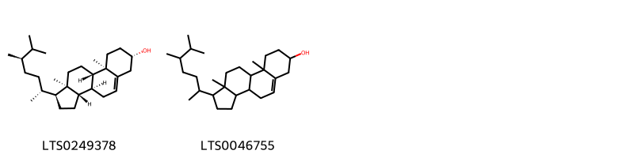{ width=100% }
    <figcaption>Hình ảnh cấu trúc hóa học của 2 hoạt chất thuộc nhóm Steroids and steroid derivatives gồm ['(1s,3as,3bs,7s,9ar,9bs,11ar)-1-[(2r,5r)-5,6-dimethylheptan-2-yl]-9a,11a-dimethyl-1h,2h,3h,3ah,3bh,4h,6h,7h,8h,9h,9bh,10h,11h-cyclopenta[a]phenanthren-7-ol (LTS0249378)', 'campesterol (LTS0046755)'].</figcaption>
</figure>
#### Nhóm Unsaturated hydrocarbons
<figure markdown="span">
    { width=100% }
    <figcaption>Hình ảnh cấu trúc hóa học của 1 hoạt chất thuộc nhóm Unsaturated hydrocarbons gồm ['tridec-1-en-3,5,7,9,11-pentayne (LTS0085389)'].</figcaption>
</figure>

---

### Dược dân tộc học

Danh sách các quốc gia có sử dụng *Blumea lacera* trong điều trị các bệnh. 

| Country   | Disease                              | Bệnh                                                                                                                                                                                                |
|:----------|:-------------------------------------|:----------------------------------------------------------------------------------------------------------------------------------------------------------------------------------------------------|
| Elsewhere | Diuretic, nan, Stimulant, Astringent | MYMEMORY WARNING: YOU USED ALL AVAILABLE FREE TRANSLATIONS FOR TODAY. NEXT AVAILABLE IN  10 HOURS 31 MINUTES 31 SECONDS VISIT HTTPS://MYMEMORY.TRANSLATED.NET/DOC/USAGELIMITS.PHP TO TRANSLATE MORE |
| Java      | Vermifuge, Insectifuge               | MYMEMORY WARNING: YOU USED ALL AVAILABLE FREE TRANSLATIONS FOR TODAY. NEXT AVAILABLE IN  10 HOURS 31 MINUTES 28 SECONDS VISIT HTTPS://MYMEMORY.TRANSLATED.NET/DOC/USAGELIMITS.PHP TO TRANSLATE MORE |
| Sudan     | Collyrium, Styptic                   | MYMEMORY WARNING: YOU USED ALL AVAILABLE FREE TRANSLATIONS FOR TODAY. NEXT AVAILABLE IN  10 HOURS 31 MINUTES 24 SECONDS VISIT HTTPS://MYMEMORY.TRANSLATED.NET/DOC/USAGELIMITS.PHP TO TRANSLATE MORE |

---

# Chi Cirsium

??? note "Danh sách các dược liệu thuộc chi"
    
	 - *Cirsium arvense*
	 - *Cirsium japonicum*
	 - *Cirsium sinense*

---
## Cirsium arvense
### Thông tin về thực vật

!!! info "Phân loại thực vật của *Cirsium arvense* từ GIBF:"
    - **Kingdom:** Plantae
    - **Phylum:** Tracheophyta
    - **Order:** Asterales
    - **Family:** Asteraceae
    - **Genus:** Cirsium
    - **Species:** *Cirsium arvense*

 

| Label (VI)   | Label (EN)   | Scientific Name   | Descriptions (VI)   | Descriptions (EN)   | Also Known As (VI)   | Also Known As (EN)                                                                                                                                                                                                                                                        |
|:-------------|:-------------|:------------------|:--------------------|:--------------------|:---------------------|:--------------------------------------------------------------------------------------------------------------------------------------------------------------------------------------------------------------------------------------------------------------------------|
| N/A          | N/A          | Cirsium arvense   | loài thực vật       | species of plant    | ['']                 | ['Canadian thistle', 'California thistle', 'Canada thistle', 'corn thistle', 'creeping thistle', 'Creeping Thistle', 'cursed thistle', 'field thistle', 'green thistle', 'hard thistle', 'perennial thistle', 'prickly thistle', 'small-flowered thistle', 'way thistle'] |

#### Phân bố trên thế giới

**Từ CSDL GIBF** Italy, Australia, Belgium, Norway, Canada, Denmark, Netherlands, Spain, Russian Federation, United States of America, Sweden, Chile, Kazakhstan, Germany, Switzerland, Austria, France, United Kingdom of Great Britain and Northern Ireland, New Zealand

#### Phân bố tại Việt Nam

**Từ CSDL GIBF**: Không có ghi nhận ở Việt Nam

---
### Thành phần hóa học
        
- Theo cơ sở dữ liệu lotus: Từ loài *Cirsium arvense* đã phân lập và xác định được 80 hoạt chất thuộc về các nhóm Isoindoles and derivatives, Fatty Acyls, Oxocins, Flavonoids, Prenol lipids, Macrolactams, Steroids and steroid derivatives, Cytochalasans, Macrolide lactams, Glycerolipids, Piperidines, Benzene and substituted derivatives, Unsaturated hydrocarbons, Organooxygen compounds, Lactones, Macrolides and analogues, Epoxides. 

|    | chemicalTaxonomyClassyfireClass     |   smiles_count |
|---:|:------------------------------------|---------------:|
|  0 | Benzene and substituted derivatives |              1 |
|  1 | Cytochalasans                       |              2 |
|  2 | Epoxides                            |              2 |
|  3 | Fatty Acyls                         |              4 |
|  4 | Flavonoids                          |             21 |
|  5 | Glycerolipids                       |              1 |
|  6 | Isoindoles and derivatives          |              4 |
|  7 | Lactones                            |              2 |
|  8 | Macrolactams                        |              1 |
|  9 | Macrolide lactams                   |              1 |
| 10 | Macrolides and analogues            |              2 |
| 11 | Organooxygen compounds              |              9 |
| 12 | Oxocins                             |              8 |
| 13 | Piperidines                         |              2 |
| 14 | Prenol lipids                       |             13 |
| 15 | Steroids and steroid derivatives    |              2 |
| 16 | Unsaturated hydrocarbons            |              5 |

#### Nhóm Benzene and substituted derivatives
<figure markdown="span">
    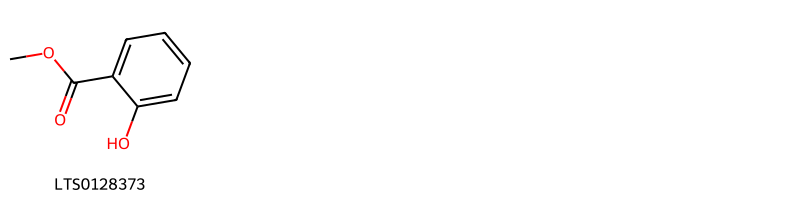{ width=100% }
    <figcaption>Hình ảnh cấu trúc hóa học của 1 hoạt chất thuộc nhóm Benzene and substituted derivatives gồm ['methyl salicylate (LTS0128373)'].</figcaption>
</figure>
#### Nhóm Cytochalasans
<figure markdown="span">
    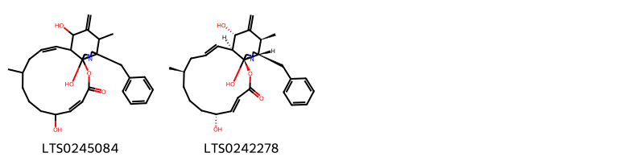{ width=100% }
    <figcaption>Hình ảnh cấu trúc hóa học của 2 hoạt chất thuộc nhóm Cytochalasans gồm ['16-benzyl-5,13,18-trihydroxy-9,15-dimethyl-14-methylidene-5h,6h,7h,8h,9h,10h,12ah,13h,15h,15ah,16h-oxacyclotetradeca[2,3-d]isoindol-2-one (LTS0245084)', '(5r,9r,12as,13s,15s,15as,16s,18as)-16-benzyl-5,13,18-trihydroxy-9,15-dimethyl-14-methylidene-5h,6h,7h,8h,9h,10h,12ah,13h,15h,15ah,16h-oxacyclotetradeca[2,3-d]isoindol-2-one (LTS0242278)'].</figcaption>
</figure>
#### Nhóm Epoxides
<figure markdown="span">
    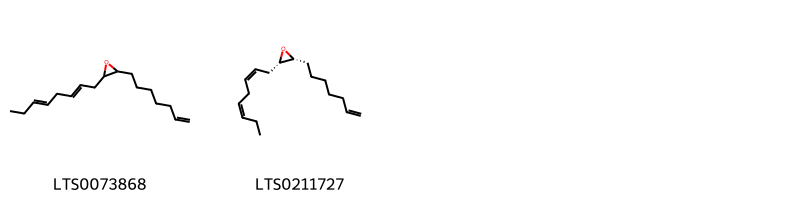{ width=100% }
    <figcaption>Hình ảnh cấu trúc hóa học của 2 hoạt chất thuộc nhóm Epoxides gồm ['2-(hept-6-en-1-yl)-3-(octa-2,5-dien-1-yl)oxirane (LTS0073868)', '(2r,3s)-2-(hept-6-en-1-yl)-3-[(2z,5z)-octa-2,5-dien-1-yl]oxirane (LTS0211727)'].</figcaption>
</figure>
#### Nhóm Fatty Acyls
<figure markdown="span">
    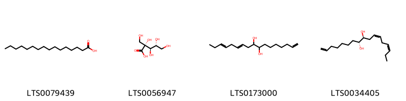{ width=100% }
    <figcaption>Hình ảnh cấu trúc hóa học của 4 hoạt chất thuộc nhóm Fatty Acyls gồm ['palmitic acid (LTS0079439)', '2-carboxy-d-arabinitol (LTS0056947)', 'heptadeca-1,11,14-triene-8,9-diol (LTS0173000)', '(8r,9s,11z,14z)-heptadeca-1,11,14-triene-8,9-diol (LTS0034405)'].</figcaption>
</figure>
#### Nhóm Flavonoids
<figure markdown="span">
    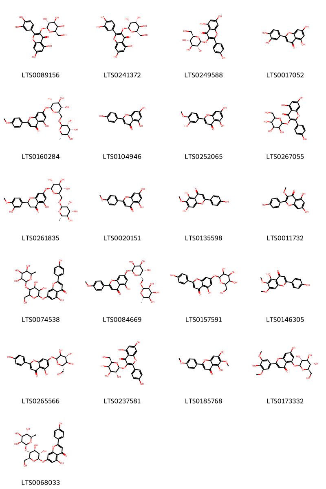{ width=100% }
    <figcaption>Hình ảnh cấu trúc hóa học của 21 hoạt chất thuộc nhóm Flavonoids gồm ['hyperoside (LTS0089156)', '2-(3,4-dihydroxyphenyl)-5,7-dihydroxy-3-{[(2s,3r,4r,5r,6s)-3,4,5-trihydroxy-6-(hydroxymethyl)oxan-2-yl]oxy}chromen-4-one (LTS0241372)', 'astragalin (LTS0249588)', 'luteolin (LTS0017052)', 'linarin (LTS0160284)', 'chamomile (LTS0104946)', 'diosmetin (LTS0252065)', 'trifolin (LTS0267055)', 'hesperidin (LTS0261835)', 'acacetin (LTS0020151)', 'hispidulin (LTS0135598)', 'isokaempferide (LTS0011732)', '7-{[3,4-dihydroxy-6-(hydroxymethyl)-5-[(3,4,5-trihydroxy-6-methyloxan-2-yl)oxy]oxan-2-yl]oxy}-5-hydroxy-2-(4-hydroxyphenyl)chromen-4-one (LTS0074538)', '5-hydroxy-2-(4-methoxyphenyl)-7-{[(2s,3s,4s,5s,6s)-3,4,5-trihydroxy-6-({[(2r,3s,4s,5r,6s)-3,4,5-trihydroxy-6-methyloxan-2-yl]oxy}methyl)oxan-2-yl]oxy}chromen-4-one (LTS0084669)', 'apigetrin (LTS0157591)', 'cirsimaritin (LTS0146305)', '5-hydroxy-2-(4-hydroxyphenyl)-7-{[(2s,3s,4r,5r,6s)-3,4,5-trihydroxy-6-(hydroxymethyl)oxan-2-yl]oxy}chromen-4-one (LTS0265566)', 'trifolin (LTS0237581)', 'pectolinarigenin (LTS0185768)', '7-hydroxy-2-(4-hydroxy-3,5-dimethoxyphenyl)-5-{[(2s,3r,4s,5s,6r)-3,4,5-trihydroxy-6-(hydroxymethyl)oxan-2-yl]oxy}chromen-4-one (LTS0173332)', '7-{[(2r,3s,4s,5r,6s)-3,4-dihydroxy-6-(hydroxymethyl)-5-{[(2s,3s,4s,5s,6r)-3,4,5-trihydroxy-6-methyloxan-2-yl]oxy}oxan-2-yl]oxy}-5-hydroxy-2-(4-hydroxyphenyl)chromen-4-one (LTS0068033)'].</figcaption>
</figure>
#### Nhóm Glycerolipids
<figure markdown="span">
    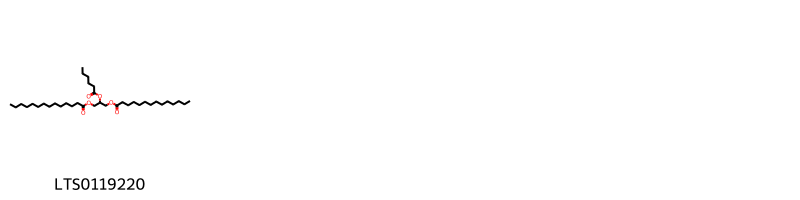{ width=100% }
    <figcaption>Hình ảnh cấu trúc hóa học của 1 hoạt chất thuộc nhóm Glycerolipids gồm ['2-(hexanoyloxy)-3-(tetradecanoyloxy)propyl tetradecanoate (LTS0119220)'].</figcaption>
</figure>
#### Nhóm Isoindoles and derivatives
<figure markdown="span">
    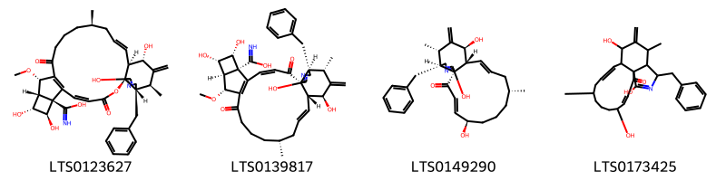{ width=100% }
    <figcaption>Hình ảnh cấu trúc hóa học của 4 hoạt chất thuộc nhóm Isoindoles and derivatives gồm ['(1s,4z,7s,8r,9r,10r,11s,17r,19e,21s,22s,24s,25s,26s)-26-benzyl-8,9,22,28-tetrahydroxy-11-methoxy-17,24-dimethyl-23-methylidene-3,13-dioxo-2-oxa-27-azapentacyclo[19.7.0.0¹,²⁵.0⁶,¹².0⁷,¹⁰]octacosa-4,6(12),19,27-tetraene-7-carboximidic acid (LTS0123627)', '(1s,3z,6s,7r,8s,9r,10r,16r,18e,20r,21s,23s,24r,25s)-25-benzyl-7,8,21,27-tetrahydroxy-10-methoxy-16,23-dimethyl-22-methylidene-2,12-dioxo-26-azapentacyclo[18.7.0.0¹,²⁴.0⁵,¹¹.0⁶,⁹]heptacosa-3,5(11),18,26-tetraene-6-carboximidic acid (LTS0139817)', '(3s,3ar,4s,6s,6ar,10r,14r,17as)-3-benzyl-1,6,14-trihydroxy-4,10-dimethyl-5-methylidene-3h,3ah,4h,6h,6ah,9h,10h,11h,12h,13h,14h-cyclotrideca[d]isoindol-17-one (LTS0149290)', '3-benzyl-1,6,14-trihydroxy-4,10-dimethyl-5-methylidene-3h,3ah,4h,6h,6ah,9h,10h,11h,12h,13h,14h-cyclotrideca[d]isoindol-17-one (LTS0173425)'].</figcaption>
</figure>
#### Nhóm Lactones
<figure markdown="span">
    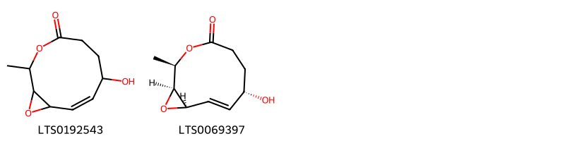{ width=100% }
    <figcaption>Hình ảnh cấu trúc hóa học của 2 hoạt chất thuộc nhóm Lactones gồm ['7-hydroxy-2-methyl-3,11-dioxabicyclo[8.1.0]undec-8-en-4-one (LTS0192543)', '(1s,2r,7s,8e,10r)-7-hydroxy-2-methyl-3,11-dioxabicyclo[8.1.0]undec-8-en-4-one (LTS0069397)'].</figcaption>
</figure>
#### Nhóm Macrolactams
<figure markdown="span">
    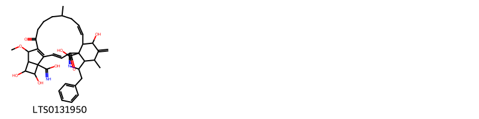{ width=100% }
    <figcaption>Hình ảnh cấu trúc hóa học của 1 hoạt chất thuộc nhóm Macrolactams gồm ['25-benzyl-7,8,21,27-tetrahydroxy-10-methoxy-16,23-dimethyl-22-methylidene-2,12-dioxo-26-azapentacyclo[18.7.0.0¹,²⁴.0⁵,¹¹.0⁶,⁹]heptacosa-3,5(11),18,26-tetraene-6-carboximidic acid (LTS0131950)'].</figcaption>
</figure>
#### Nhóm Macrolide lactams
<figure markdown="span">
    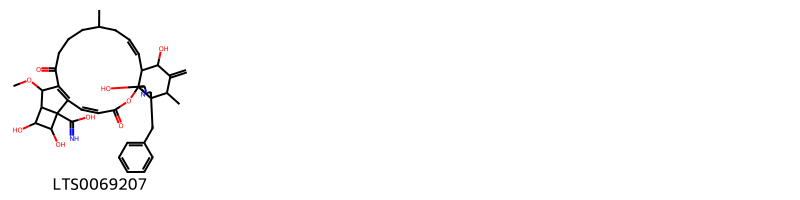{ width=100% }
    <figcaption>Hình ảnh cấu trúc hóa học của 1 hoạt chất thuộc nhóm Macrolide lactams gồm ['26-benzyl-8,9,22,28-tetrahydroxy-11-methoxy-17,24-dimethyl-23-methylidene-3,13-dioxo-2-oxa-27-azapentacyclo[19.7.0.0¹,²⁵.0⁶,¹².0⁷,¹⁰]octacosa-4,6(12),19,27-tetraene-7-carboximidic acid (LTS0069207)'].</figcaption>
</figure>
#### Nhóm Macrolides and analogues
<figure markdown="span">
    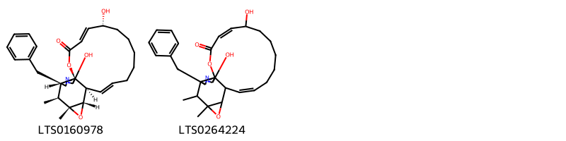{ width=100% }
    <figcaption>Hình ảnh cấu trúc hóa học của 2 hoạt chất thuộc nhóm Macrolides and analogues gồm ['(1s,4e,6r,12e,14s,15s,17r,18s,19s,20s)-20-benzyl-6,22-dihydroxy-17,18-dimethyl-2,16-dioxa-21-azatetracyclo[12.8.0.0¹,¹⁹.0¹⁵,¹⁷]docosa-4,12,21-trien-3-one (LTS0160978)', '20-benzyl-6,22-dihydroxy-17,18-dimethyl-2,16-dioxa-21-azatetracyclo[12.8.0.0¹,¹⁹.0¹⁵,¹⁷]docosa-4,12,21-trien-3-one (LTS0264224)'].</figcaption>
</figure>
#### Nhóm Organooxygen compounds
<figure markdown="span">
    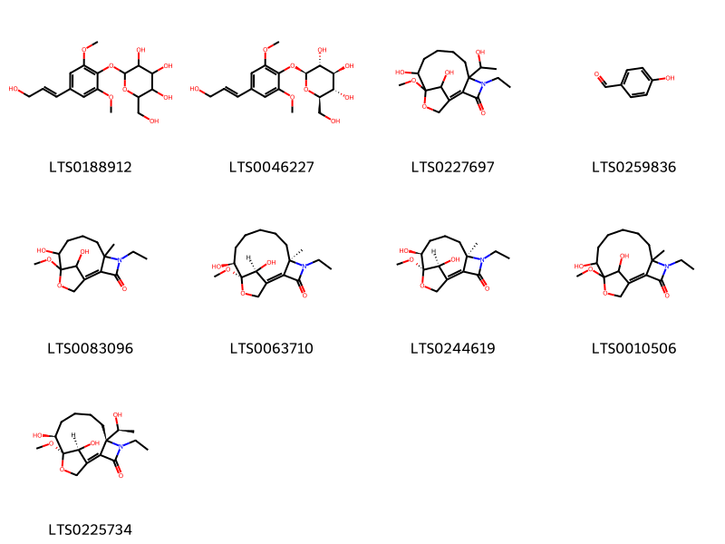{ width=100% }
    <figcaption>Hình ảnh cấu trúc hóa học của 9 hoạt chất thuộc nhóm Organooxygen compounds gồm ['2-(hydroxymethyl)-6-[4-(3-hydroxyprop-1-en-1-yl)-2,6-dimethoxyphenoxy]oxane-3,4,5-triol (LTS0188912)', 'syringin (LTS0046227)', '4-ethyl-10,14-dihydroxy-5-(1-hydroxyethyl)-11-methoxy-12-oxa-4-azatricyclo[9.2.1.0²,⁵]tetradec-1-en-3-one (LTS0227697)', 'p-hydroxybenzaldehyde (LTS0259836)', '4-ethyl-9,13-dihydroxy-10-methoxy-5-methyl-11-oxa-4-azatricyclo[8.2.1.0²,⁵]tridec-1-en-3-one (LTS0083096)', '(1e,5r,11s,12s,15s)-4-ethyl-11,15-dihydroxy-12-methoxy-5-methyl-13-oxa-4-azatricyclo[10.2.1.0²,⁵]pentadec-1-en-3-one (LTS0063710)', '(1e,5r,9s,10s,13s)-4-ethyl-9,13-dihydroxy-10-methoxy-5-methyl-11-oxa-4-azatricyclo[8.2.1.0²,⁵]tridec-1-en-3-one (LTS0244619)', '4-ethyl-11,15-dihydroxy-12-methoxy-5-methyl-13-oxa-4-azatricyclo[10.2.1.0²,⁵]pentadec-1-en-3-one (LTS0010506)', '(1e,5r,10s,11s,14s)-4-ethyl-10,14-dihydroxy-5-[(1s)-1-hydroxyethyl]-11-methoxy-12-oxa-4-azatricyclo[9.2.1.0²,⁵]tetradec-1-en-3-one (LTS0225734)'].</figcaption>
</figure>
#### Nhóm Oxocins
<figure markdown="span">
    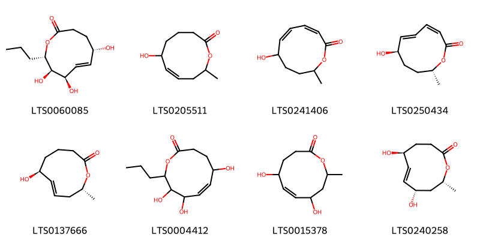{ width=100% }
    <figcaption>Hình ảnh cấu trúc hóa học của 8 hoạt chất thuộc nhóm Oxocins gồm ['(5s,6e,8r,9r,10s)-5,8,9-trihydroxy-10-propyl-3,4,5,8,9,10-hexahydrooxecin-2-one (LTS0060085)', '6-hydroxy-10-methyl-3,4,5,6,9,10-hexahydrooxecin-2-one (LTS0205511)', '7-hydroxy-10-methyl-7,8,9,10-tetrahydrooxecin-2-one (LTS0241406)', 'stagonolide e (LTS0250434)', 'stagonolide f (LTS0137666)', '5,8,9-trihydroxy-10-propyl-3,4,5,8,9,10-hexahydrooxecin-2-one (LTS0004412)', '5,8-dihydroxy-10-methyl-3,4,5,8,9,10-hexahydrooxecin-2-one (LTS0015378)', 'stagonolide c (LTS0240258)'].</figcaption>
</figure>
#### Nhóm Piperidines
<figure markdown="span">
    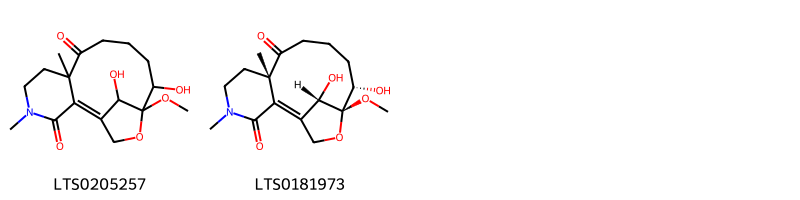{ width=100% }
    <figcaption>Hình ảnh cấu trúc hóa học của 2 hoạt chất thuộc nhóm Piperidines gồm ['12,16-dihydroxy-13-methoxy-4,7-dimethyl-14-oxa-4-azatricyclo[11.2.1.0²,⁷]hexadec-1-ene-3,8-dione (LTS0205257)', '(1e,7s,12s,13s,16s)-12,16-dihydroxy-13-methoxy-4,7-dimethyl-14-oxa-4-azatricyclo[11.2.1.0²,⁷]hexadec-1-ene-3,8-dione (LTS0181973)'].</figcaption>
</figure>
#### Nhóm Prenol lipids
<figure markdown="span">
    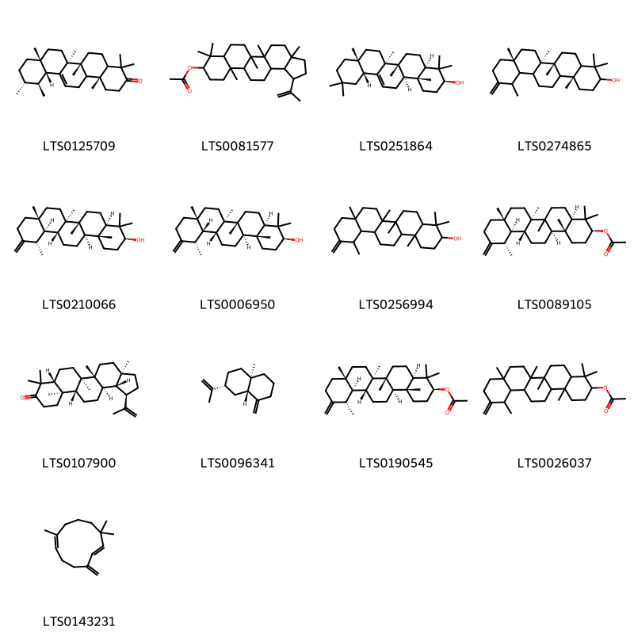{ width=100% }
    <figcaption>Hình ảnh cấu trúc hóa học của 13 hoạt chất thuộc nhóm Prenol lipids gồm ['(6ar,6bs,8ar,11r,12s,12ar,14br)-4,4,6a,6b,8a,11,12,14b-octamethyl-1,2,4a,5,6,7,8,9,10,11,12,12a,14,14a-tetradecahydropicen-3-one (LTS0125709)', '3a,5a,5b,8,8,11a-hexamethyl-1-(prop-1-en-2-yl)-hexadecahydrocyclopenta[a]chrysen-9-yl acetate (LTS0081577)', 'β-amyrin (LTS0251864)', '(6ar,6br,8ar,14br)-4,4,6a,6b,8a,12,14b-heptamethyl-11-methylidene-hexadecahydropicen-3-ol (LTS0274865)', 'taraxasterol (LTS0210066)', 'taraxasterol (LTS0006950)', '4,4,6a,6b,8a,12,14b-heptamethyl-11-methylidene-hexadecahydropicen-3-ol (LTS0256994)', '(3s,4ar,6br,8ar,12s,12ar,12br,14ar,14br)-4,4,6a,6b,8a,12,14b-heptamethyl-11-methylidene-hexadecahydropicen-3-yl acetate (LTS0089105)', 'lupenone (LTS0107900)', 'β-selinene (LTS0096341)', 'taraxasterol acetate (LTS0190545)', '4,4,6a,6b,8a,12,14b-heptamethyl-11-methylidene-hexadecahydropicen-3-yl acetate (LTS0026037)', '(1z,6e)-gamma-humulene (LTS0143231)'].</figcaption>
</figure>
#### Nhóm Steroids and steroid derivatives
<figure markdown="span">
    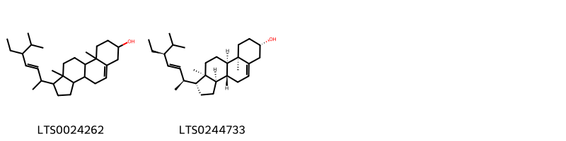{ width=100% }
    <figcaption>Hình ảnh cấu trúc hóa học của 2 hoạt chất thuộc nhóm Steroids and steroid derivatives gồm ['stigmasterol (LTS0024262)', '(1r,3ar,3br,7s,9ar,9br,11ar)-1-[(2s,3e,5s)-5-ethyl-6-methylhept-3-en-2-yl]-9a,11a-dimethyl-1h,2h,3h,3ah,3bh,4h,6h,7h,8h,9h,9bh,10h,11h-cyclopenta[a]phenanthren-7-ol (LTS0244733)'].</figcaption>
</figure>
#### Nhóm Unsaturated hydrocarbons
<figure markdown="span">
    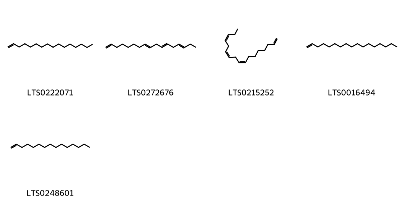{ width=100% }
    <figcaption>Hình ảnh cấu trúc hóa học của 5 hoạt chất thuộc nhóm Unsaturated hydrocarbons gồm ['hexadecene (LTS0222071)', '(8e,11e,14e)-heptadeca-1,8,11,14-tetraene (LTS0272676)', 'aplotaxene (LTS0215252)', 'heptadecene (LTS0016494)', '1-pentadecene (LTS0248601)'].</figcaption>
</figure>

---

### Dược dân tộc học

Danh sách các quốc gia có sử dụng *Cirsium arvense* trong điều trị các bệnh. 

| Country   | Disease                                 | Bệnh                                                                                                                                                                                                |
|:----------|:----------------------------------------|:----------------------------------------------------------------------------------------------------------------------------------------------------------------------------------------------------|
| Elsewhere | Diaphoretic, Emetic, Emmenagogue, Tonic | MYMEMORY WARNING: YOU USED ALL AVAILABLE FREE TRANSLATIONS FOR TODAY. NEXT AVAILABLE IN  10 HOURS 30 MINUTES 56 SECONDS VISIT HTTPS://MYMEMORY.TRANSLATED.NET/DOC/USAGELIMITS.PHP TO TRANSLATE MORE |

---

---
## Cirsium japonicum
### Thông tin về thực vật

!!! info "Phân loại thực vật của *Cirsium japonicum* từ GIBF:"
    - **Kingdom:** Plantae
    - **Phylum:** Tracheophyta
    - **Order:** Asterales
    - **Family:** Asteraceae
    - **Genus:** Cirsium
    - **Species:** *Cirsium japonicum*

 

| Label (VI)   | Label (EN)   | Scientific Name   | Descriptions (VI)   | Descriptions (EN)   | Also Known As (VI)   | Also Known As (EN)   |
|:-------------|:-------------|:------------------|:--------------------|:--------------------|:---------------------|:---------------------|
| N/A          | N/A          | Cirsium japonicum | loài thực vật       | species of plant    | ['Đại kế']           | ['']                 |

#### Phân bố trên thế giới

**Từ CSDL GIBF** Hong Kong, Japan, Korea, Republic of, Chinese Taipei, China

#### Phân bố tại Việt Nam

**Từ CSDL GIBF**: Không có ghi nhận ở Việt Nam

---
### Thành phần hóa học
        
- Theo cơ sở dữ liệu lotus: Từ loài *Cirsium japonicum* đã phân lập và xác định được 41 hoạt chất thuộc về các nhóm Fatty Acyls, Flavonoids, Steroids and steroid derivatives, Unsaturated hydrocarbons, Halohydrins. 

|    | chemicalTaxonomyClassyfireClass   |   smiles_count |
|---:|:----------------------------------|---------------:|
|  0 |                                   |              2 |
|  1 | Fatty Acyls                       |             13 |
|  2 | Flavonoids                        |             17 |
|  3 | Halohydrins                       |              2 |
|  4 | Steroids and steroid derivatives  |              2 |
|  5 | Unsaturated hydrocarbons          |              5 |

#### Nhóm 
<figure markdown="span">
    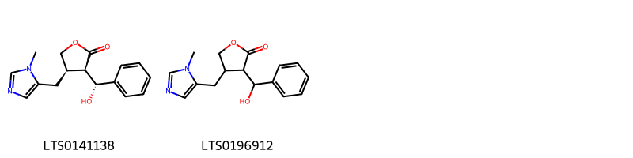{ width=100% }
    <figcaption>Hình ảnh cấu trúc hóa học của 2 hoạt chất thuộc nhóm  gồm ['pilosine (LTS0141138)', 'isopilosine (LTS0196912)'].</figcaption>
</figure>
#### Nhóm Fatty Acyls
<figure markdown="span">
    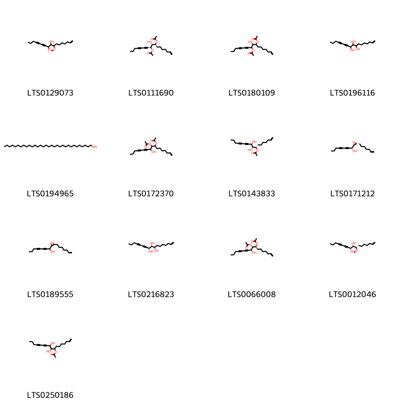{ width=100% }
    <figcaption>Hình ảnh cấu trúc hóa học của 13 hoạt chất thuộc nhóm Fatty Acyls gồm ['10-methoxyheptadec-16-en-4,6-diyne-8,9-diol (LTS0129073)', '(8s,9r,10s)-10-(acetyloxy)-9-hydroxyheptadec-1-en-11,13-diyn-8-yl acetate (LTS0111690)', '10-(acetyloxy)-9-hydroxyheptadec-1-en-11,13-diyn-8-yl acetate (LTS0180109)', 'heptadec-1-en-11,13-diyne-8,9,10-triol (LTS0196116)', 'dotriacontanol (LTS0194965)', '8-(acetyloxy)-10-hydroxyheptadec-1-en-11,13-diyn-9-yl acetate (LTS0172370)', '(8s,9s,10r)-9,10-dihydroxyheptadec-1-en-11,13-diyn-8-yl acetate (LTS0143833)', '(1r)-1-[(2s,3r)-3-(hept-6-en-1-yl)oxiran-2-yl]octa-2,4-diyn-1-ol (LTS0171212)', '1-[3-(hept-6-en-1-yl)oxiran-2-yl]octa-2,4-diyn-1-ol (LTS0189555)', '(8r,9r,10r)-heptadec-1-en-11,13-diyne-8,9,10-triol (LTS0216823)', '(8s,9r,10s)-8-(acetyloxy)-10-hydroxyheptadec-1-en-11,13-diyn-9-yl acetate (LTS0066008)', '(8r,9s,10s)-10-methoxyheptadec-16-en-4,6-diyne-8,9-diol (LTS0012046)', '9,10-dihydroxyheptadec-1-en-11,13-diyn-8-yl acetate (LTS0250186)'].</figcaption>
</figure>
#### Nhóm Flavonoids
<figure markdown="span">
    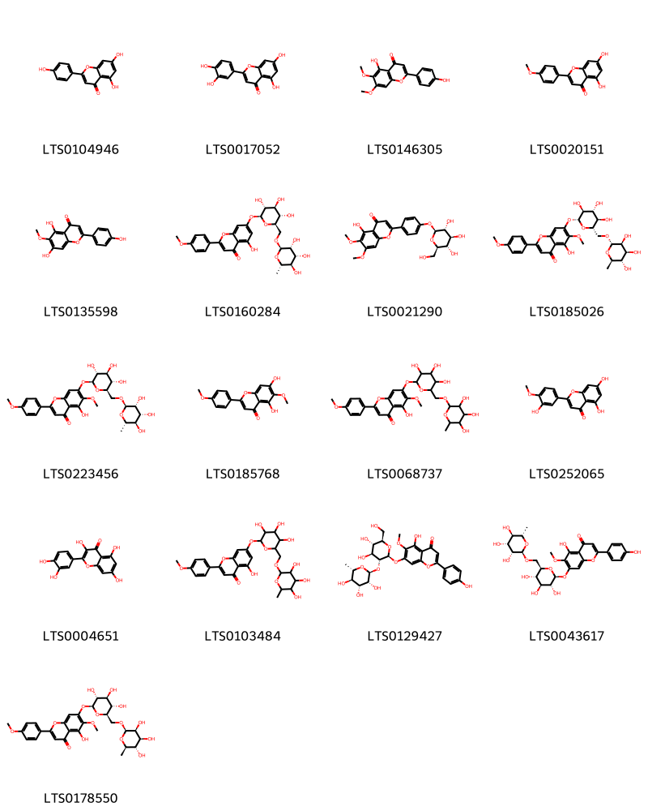{ width=100% }
    <figcaption>Hình ảnh cấu trúc hóa học của 17 hoạt chất thuộc nhóm Flavonoids gồm ['chamomile (LTS0104946)', 'luteolin (LTS0017052)', 'cirsimaritin (LTS0146305)', 'acacetin (LTS0020151)', 'hispidulin (LTS0135598)', 'linarin (LTS0160284)', '5-hydroxy-6,7-dimethoxy-2-(4-{[(2s,3r,4s,5s,6r)-3,4,5-trihydroxy-6-(hydroxymethyl)oxan-2-yl]oxy}phenyl)chromen-4-one (LTS0021290)', '5-hydroxy-6-methoxy-2-(4-methoxyphenyl)-7-{[(2r,3s,4r,5r,6s)-3,4,5-trihydroxy-6-({[(2s,3s,4s,5s,6r)-3,4,5-trihydroxy-6-methyloxan-2-yl]oxy}methyl)oxan-2-yl]oxy}chromen-4-one (LTS0185026)', 'pectolinarin (LTS0223456)', 'pectolinarigenin (LTS0185768)', '5-hydroxy-6-methoxy-2-(4-methoxyphenyl)-7-[(3,4,5-trihydroxy-6-{[(3,4,5-trihydroxy-6-methyloxan-2-yl)oxy]methyl}oxan-2-yl)oxy]chromen-4-one (LTS0068737)', 'diosmetin (LTS0252065)', 'quercetin (LTS0004651)', '5-hydroxy-2-(4-methoxyphenyl)-7-[(3,4,5-trihydroxy-6-{[(3,4,5-trihydroxy-6-methyloxan-2-yl)oxy]methyl}oxan-2-yl)oxy]chromen-4-one (LTS0103484)', '7-{[(2s,3r,4s,5s,6r)-4,5-dihydroxy-6-(hydroxymethyl)-3-{[(2s,3r,4r,5r,6s)-3,4,5-trihydroxy-6-methyloxan-2-yl]oxy}oxan-2-yl]oxy}-5-hydroxy-2-(4-hydroxyphenyl)-6-methoxychromen-4-one (LTS0129427)', '5-hydroxy-2-(4-hydroxyphenyl)-6-methoxy-7-{[(2s,3r,4s,5s,6r)-3,4,5-trihydroxy-6-({[(2r,3r,4r,5r,6s)-3,4,5-trihydroxy-6-methyloxan-2-yl]oxy}methyl)oxan-2-yl]oxy}chromen-4-one (LTS0043617)', '5-hydroxy-6-methoxy-2-(4-methoxyphenyl)-7-{[(2s,3r,4s,5s,6r)-3,4,5-trihydroxy-6-({[(2r,3s,4s,5s,6r)-3,4,5-trihydroxy-6-methyloxan-2-yl]oxy}methyl)oxan-2-yl]oxy}chromen-4-one (LTS0178550)'].</figcaption>
</figure>
#### Nhóm Halohydrins
<figure markdown="span">
    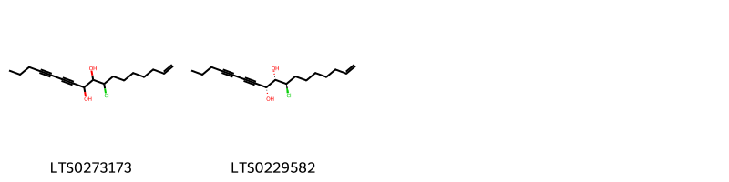{ width=100% }
    <figcaption>Hình ảnh cấu trúc hóa học của 2 hoạt chất thuộc nhóm Halohydrins gồm ['10-chloroheptadec-16-en-4,6-diyne-8,9-diol (LTS0273173)', '(8r,9s,10r)-10-chloroheptadec-16-en-4,6-diyne-8,9-diol (LTS0229582)'].</figcaption>
</figure>
#### Nhóm Steroids and steroid derivatives
<figure markdown="span">
    { width=100% }
    <figcaption>Hình ảnh cấu trúc hóa học của 2 hoạt chất thuộc nhóm Steroids and steroid derivatives gồm ['stigmast-5-en-3-ol, (3β)- (LTS0204616)', 'phytosterol (LTS0029311)'].</figcaption>
</figure>
#### Nhóm Unsaturated hydrocarbons
<figure markdown="span">
    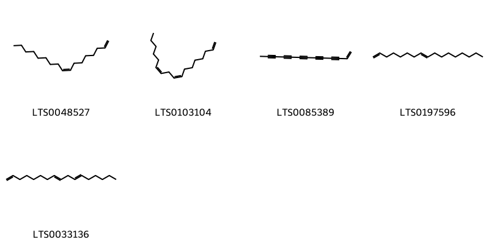{ width=100% }
    <figcaption>Hình ảnh cấu trúc hóa học của 5 hoạt chất thuộc nhóm Unsaturated hydrocarbons gồm ['(8z)-heptadeca-1,8-diene (LTS0048527)', '(8z,11z)-heptadeca-1,8,11-triene (LTS0103104)', 'tridec-1-en-3,5,7,9,11-pentayne (LTS0085389)', 'heptadeca-1,8-diene (LTS0197596)', 'heptadeca-1,8,11-triene (LTS0033136)'].</figcaption>
</figure>

---

### Dược dân tộc học

Danh sách các quốc gia có sử dụng *Cirsium japonicum* trong điều trị các bệnh. 

| Country   | Disease   | Bệnh                                                                                                                                                                                                |
|:----------|:----------|:----------------------------------------------------------------------------------------------------------------------------------------------------------------------------------------------------|
| China     | Hemostat  | MYMEMORY WARNING: YOU USED ALL AVAILABLE FREE TRANSLATIONS FOR TODAY. NEXT AVAILABLE IN  10 HOURS 30 MINUTES 06 SECONDS VISIT HTTPS://MYMEMORY.TRANSLATED.NET/DOC/USAGELIMITS.PHP TO TRANSLATE MORE |

---

---
## Cirsium sinense
### Thông tin về thực vật

!!! info "Phân loại thực vật của *Cirsium lineare* từ GIBF:"
    - **Kingdom:** Plantae
    - **Phylum:** Tracheophyta
    - **Order:** Asterales
    - **Family:** Asteraceae
    - **Genus:** Cirsium
    - **Species:** *Cirsium lineare*

 

| Label (VI)   | Label (EN)   | Scientific Name   | Descriptions (VI)   | Descriptions (EN)   | Also Known As (VI)   | Also Known As (EN)   |
|:-------------|:-------------|:------------------|:--------------------|:--------------------|:---------------------|:---------------------|
| N/A          | N/A          | Cirsium sinense   |                     |                     | ['']                 | ['']                 |

#### Phân bố trên thế giới

**Từ CSDL GIBF** Hong Kong, Japan, Korea, Republic of, Chinese Taipei, China

#### Phân bố tại Việt Nam

**Từ CSDL GIBF**: Không có ghi nhận ở Việt Nam

---
### Thành phần hóa học
        
- Theo cơ sở dữ liệu lotus: Từ loài *Cirsium lineare* đã phân lập và xác định được Chưa có hoạt chất nào được phân lập. hoạt chất thuộc về các nhóm Không có hoạt chất nào được phân lập. 

Không có hình ảnh nào được tạo ra

---

### Dược dân tộc học

Danh sách các quốc gia có sử dụng *Cirsium lineare* trong điều trị các bệnh. 

| Country   | Disease     | Bệnh                                                                                                                                                                                                |
|:----------|:------------|:----------------------------------------------------------------------------------------------------------------------------------------------------------------------------------------------------|
| Elsewhere | Carminative | MYMEMORY WARNING: YOU USED ALL AVAILABLE FREE TRANSLATIONS FOR TODAY. NEXT AVAILABLE IN  10 HOURS 29 MINUTES 25 SECONDS VISIT HTTPS://MYMEMORY.TRANSLATED.NET/DOC/USAGELIMITS.PHP TO TRANSLATE MORE |

---

# Chi Lactuca

??? note "Danh sách các dược liệu thuộc chi"
    
	 - *Lactuca indica*
	 - *Lactuca intybac*
	 - *Lactuca intybacea*
	 - *Lactuca muralis*
	 - *Lactuca quercina*
	 - *Lactuca sativa*
	 - *Lactuca scariola*
	 - *Lactuca serriola*
	 - *Lactuca virosa*

---
## Lactuca indica
### Thông tin về thực vật

!!! info "Phân loại thực vật của *Lactuca indica* từ GIBF:"
    - **Kingdom:** Plantae
    - **Phylum:** Tracheophyta
    - **Order:** Asterales
    - **Family:** Asteraceae
    - **Genus:** Lactuca
    - **Species:** *Lactuca indica*

 

| Label (VI)   | Label (EN)   | Scientific Name   | Descriptions (VI)   | Descriptions (EN)   | Also Known As (VI)                                                                                            | Also Known As (EN)   |
|:-------------|:-------------|:------------------|:--------------------|:--------------------|:--------------------------------------------------------------------------------------------------------------|:---------------------|
| N/A          | N/A          | Lactuca indica    | loài thực vật       | species of plant    | ['Pterocypsela indica', 'Lactuca indica', 'Diếp hoang', 'Diếp dại', 'Bồ công anh Việt Nam', 'Bồ công anh ta'] | ['Indian lettuce']   |

#### Phân bố trên thế giới

**Từ CSDL GIBF** South Africa, Réunion, Japan, Korea, Republic of, Brazil, Chinese Taipei, Russian Federation, China

#### Phân bố tại Việt Nam

**Từ CSDL GIBF**: Không có ghi nhận ở Việt Nam

---
### Thành phần hóa học
        
- Theo cơ sở dữ liệu lotus: Từ loài *Lactuca indica* đã phân lập và xác định được 96 hoạt chất thuộc về các nhóm Flavonoids, Prenol lipids, Benzene and substituted derivatives, Organooxygen compounds, Lactones, Lignan glycosides, Carboxylic acids and derivatives. 

|    | chemicalTaxonomyClassyfireClass     |   smiles_count |
|---:|:------------------------------------|---------------:|
|  0 | Benzene and substituted derivatives |              2 |
|  1 | Carboxylic acids and derivatives    |              2 |
|  2 | Flavonoids                          |             22 |
|  3 | Lactones                            |              7 |
|  4 | Lignan glycosides                   |              4 |
|  5 | Organooxygen compounds              |             18 |
|  6 | Prenol lipids                       |             41 |

#### Nhóm Benzene and substituted derivatives
<figure markdown="span">
    { width=100% }
    <figcaption>Hình ảnh cấu trúc hóa học của 2 hoạt chất thuộc nhóm Benzene and substituted derivatives gồm ['3,4-dihydroxybenzoic acid (LTS0018765)', 'paraben (LTS0224398)'].</figcaption>
</figure>
#### Nhóm Carboxylic acids and derivatives
<figure markdown="span">
    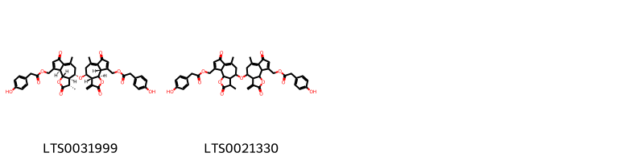{ width=100% }
    <figcaption>Hình ảnh cấu trúc hóa học của 2 hoạt chất thuộc nhóm Carboxylic acids and derivatives gồm ['[(3ar,4s,9as,9br)-4-{[(3s,3ar,4s,9as,9br)-9-({[2-(4-hydroxyphenyl)acetyl]oxy}methyl)-3,6-dimethyl-2,7-dioxo-3h,3ah,4h,5h,9ah,9bh-azuleno[4,5-b]furan-4-yl]oxy}-6-methyl-3-methylidene-2,7-dioxo-3ah,4h,5h,9ah,9bh-azuleno[4,5-b]furan-9-yl]methyl 2-(4-hydroxyphenyl)acetate (LTS0031999)', '(4-{[9-({[2-(4-hydroxyphenyl)acetyl]oxy}methyl)-3,6-dimethyl-2,7-dioxo-3h,3ah,4h,5h,9ah,9bh-azuleno[4,5-b]furan-4-yl]oxy}-6-methyl-3-methylidene-2,7-dioxo-3ah,4h,5h,9ah,9bh-azuleno[4,5-b]furan-9-yl)methyl 2-(4-hydroxyphenyl)acetate (LTS0021330)'].</figcaption>
</figure>
#### Nhóm Flavonoids
<figure markdown="span">
    { width=100% }
    <figcaption>Hình ảnh cấu trúc hóa học của 22 hoạt chất thuộc nhóm Flavonoids gồm ['quercetin (LTS0004651)', '3-rutinosyl quercetin (LTS0032845)', 'chamomile (LTS0104946)', '2-(3,4-dihydroxyphenyl)-5,7-dihydroxy-3-{[(2s,3r,4r,5r,6s)-3,4,5-trihydroxy-6-(hydroxymethyl)oxan-2-yl]oxy}chromen-4-one (LTS0241372)', 'isoquercetin (LTS0254337)', '2-(3,4-dihydroxyphenyl)-5,7-dihydroxy-3-{[3,4,5-trihydroxy-6-(hydroxymethyl)oxan-2-yl]oxy}chromen-4-one (LTS0195312)', 'luteolin (LTS0017052)', 'rutin (LTS0042292)', 'quercitrin (LTS0186298)', '2-(3,4-dihydroxyphenyl)-5,7-dihydroxy-3-{[(2s,3r,4r,5s,6r)-3,4,5-trihydroxy-6-(hydroxymethyl)oxan-2-yl]oxy}chromen-4-one (LTS0220665)', '(2s,3s,4s,5r,6r)-6-{[2-(3,4-dihydroxyphenyl)-5-hydroxy-4-oxochromen-7-yl]oxy}-3,4,5-trihydroxyoxane-2-carboxylic acid (LTS0135773)', '2-(3,4-dihydroxyphenyl)-3,7-dihydroxy-5-{[(2s,3r,4s,5s,6r)-3,4,5-trihydroxy-6-(hydroxymethyl)oxan-2-yl]oxy}chromen-4-one (LTS0079602)', '2-(3,4-dihydroxyphenyl)-5,7-dihydroxy-3-{[(2s,3r,4s,5s,6r)-3,4,5-trihydroxy-6-({[(2r,3s,4s,5r,6s)-3,4,5-trihydroxy-6-methyloxan-2-yl]oxy}methyl)oxan-2-yl]oxy}chromen-4-one (LTS0218865)', '2-(3,4-dihydroxyphenyl)-5,7-dihydroxy-3-{[(2s,3s,4r,5r,6s)-3,4,5-trihydroxy-6-methyloxan-2-yl]oxy}chromen-4-one (LTS0083664)', 'luteolin 7-o-glucuronide (LTS0081420)', '2-(3,4-dihydroxyphenyl)-5,7-dihydroxy-3-{[4,5,6-trihydroxy-3-(hydroxymethyl)oxan-2-yl]oxy}chromen-4-one (LTS0172516)', '3,4,5-trihydroxy-6-{[5-hydroxy-2-(2-hydroxyphenyl)-4-oxochromen-7-yl]oxy}oxane-2-carboxylic acid (LTS0171838)', '2-(3,4-dihydroxyphenyl)-3,7-dihydroxy-5-{[3,4,5-trihydroxy-6-(hydroxymethyl)oxan-2-yl]oxy}chromen-4-one (LTS0261519)', '2-(3,4-dihydroxyphenyl)-5,7-dihydroxy-3-{[(2s,3r,4r,5s,6s)-4,5,6-trihydroxy-3-(hydroxymethyl)oxan-2-yl]oxy}chromen-4-one (LTS0209800)', '6-{[2-(3,4-dihydroxyphenyl)-5-hydroxy-4-oxochromen-7-yl]oxy}-3,4,5-trihydroxyoxane-2-carboxylic acid (LTS0175049)', 'luteolin 7-o-glucoside (LTS0227450)', '(2s,3s,4s,5r,6s)-3,4,5-trihydroxy-6-{[5-hydroxy-2-(2-hydroxyphenyl)-4-oxochromen-7-yl]oxy}oxane-2-carboxylic acid (LTS0000129)'].</figcaption>
</figure>
#### Nhóm Lactones
<figure markdown="span">
    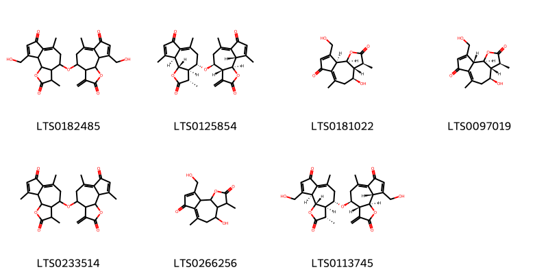{ width=100% }
    <figcaption>Hình ảnh cấu trúc hóa học của 7 hoạt chất thuộc nhóm Lactones gồm ['9-(hydroxymethyl)-4-{[9-(hydroxymethyl)-3,6-dimethyl-2,7-dioxo-3h,3ah,4h,5h,9ah,9bh-azuleno[4,5-b]furan-4-yl]oxy}-6-methyl-3-methylidene-3ah,4h,5h,9ah,9bh-azuleno[4,5-b]furan-2,7-dione (LTS0182485)', '(3ar,4s,9as,9br)-4-{[(3s,3ar,4s,9as,9br)-3,6,9-trimethyl-2,7-dioxo-3h,3ah,4h,5h,9ah,9bh-azuleno[4,5-b]furan-4-yl]oxy}-6,9-dimethyl-3-methylidene-3ah,4h,5h,9ah,9bh-azuleno[4,5-b]furan-2,7-dione (LTS0125854)', '(3s,3ar,4s,9ar,9br)-4-hydroxy-9-(hydroxymethyl)-3,6-dimethyl-3h,3ah,4h,5h,9ah,9bh-azuleno[4,5-b]furan-2,7-dione (LTS0181022)', '11β,13-dihydrolactucin (LTS0097019)', '6,9-dimethyl-3-methylidene-4-({3,6,9-trimethyl-2,7-dioxo-3h,3ah,4h,5h,9ah,9bh-azuleno[4,5-b]furan-4-yl}oxy)-3ah,4h,5h,9ah,9bh-azuleno[4,5-b]furan-2,7-dione (LTS0233514)', '4-hydroxy-9-(hydroxymethyl)-3,6-dimethyl-3h,3ah,4h,5h,9ah,9bh-azuleno[4,5-b]furan-2,7-dione (LTS0266256)', '(3ar,4s,9as,9br)-4-{[(3s,3ar,4s,9as,9br)-9-(hydroxymethyl)-3,6-dimethyl-2,7-dioxo-3h,3ah,4h,5h,9ah,9bh-azuleno[4,5-b]furan-4-yl]oxy}-9-(hydroxymethyl)-6-methyl-3-methylidene-3ah,4h,5h,9ah,9bh-azuleno[4,5-b]furan-2,7-dione (LTS0113745)'].</figcaption>
</figure>
#### Nhóm Lignan glycosides
<figure markdown="span">
    { width=100% }
    <figcaption>Hình ảnh cấu trúc hóa học của 4 hoạt chất thuộc nhóm Lignan glycosides gồm ['2-{[4-hydroxy-3,6-bis(4-hydroxy-3-methoxyphenyl)-hexahydrofuro[3,4-c]furan-1-yl]oxy}-6-(hydroxymethyl)oxane-3,4,5-triol (LTS0125585)', '(2s,3r,4s,5r,6r)-2-{[(1s,3s,3as,4r,6s,6as)-4-hydroxy-3,6-bis(4-hydroxy-3-methoxyphenyl)-hexahydrofuro[3,4-c]furan-1-yl]oxy}-6-(hydroxymethyl)oxane-3,4,5-triol (LTS0127613)', '(2s,3r,4s,5s,6r)-2-{[(1s,3s,3ar,4r,6s,6ar)-4-hydroxy-3,6-bis(4-hydroxy-3-methoxyphenyl)-hexahydrofuro[3,4-c]furan-1-yl]oxy}-6-(hydroxymethyl)oxane-3,4,5-triol (LTS0184754)', '(2s,3r,4s,5s,6r)-2-{[(1s,3s,3as,4r,6s,6as)-4-hydroxy-3,6-bis(4-hydroxy-3-methoxyphenyl)-hexahydrofuro[3,4-c]furan-1-yl]oxy}-6-(hydroxymethyl)oxane-3,4,5-triol (LTS0238147)'].</figcaption>
</figure>
#### Nhóm Organooxygen compounds
<figure markdown="span">
    { width=100% }
    <figcaption>Hình ảnh cấu trúc hóa học của 18 hoạt chất thuộc nhóm Organooxygen compounds gồm ['chlorogenic acid (LTS0226495)', '(3r,5r)-3,5-bis({[(2e)-3-(3,4-dihydroxyphenyl)prop-2-enoyl]oxy})-1,4-dihydroxycyclohexane-1-carboxylic acid (LTS0059972)', '3,4-dicaffeoylquinic acid (LTS0134972)', '(3s,3as,4r,9ar,9bs)-4-hydroxy-3,6-dimethyl-9-({[(2s,3s,4r,5r,6s)-3,4,5-trihydroxy-6-(hydroxymethyl)oxan-2-yl]oxy}methyl)-3h,3ah,4h,5h,9ah,9bh-azuleno[4,5-b]furan-2,7-dione (LTS0063523)', '4,5-dicaffeoylquinic acid (LTS0046605)', '3,5-bis({[3-(3,4-dihydroxyphenyl)prop-2-enoyl]oxy})-1,4-dihydroxycyclohexane-1-carboxylic acid (LTS0076864)', '(1r,3s,4s,5r)-3-[(3e)-4-(3,4-dihydroxyphenyl)-2-oxobut-3-en-1-yl]-1,4,5-trihydroxycyclohexane-1-carboxylic acid (LTS0105183)', '3-{[3-(3,4-dihydroxyphenyl)prop-2-enoyl]oxy}-1,4,5-trihydroxycyclohexane-1-carboxylic acid (LTS0143901)', '(1r,3s,4s,5r)-3-[4-(3,4-dihydroxyphenyl)-2-oxobut-3-en-1-yl]-1,4,5-trihydroxycyclohexane-1-carboxylic acid (LTS0263783)', '3,5-dicaffeoylquinic acid (LTS0177751)', '(1r,3r,4r,5r)-3,5-bis({[(2e)-3-(3,4-dihydroxyphenyl)prop-2-enoyl]oxy})-1,4-dihydroxycyclohexane-1-carboxylic acid (LTS0119567)', '6-methyl-3-methylidene-2,7-dioxo-9-({[3,4,5-trihydroxy-6-(hydroxymethyl)oxan-2-yl]oxy}methyl)-3ah,4h,5h,9ah,9bh-azuleno[4,5-b]furan-4-yl 2-(4-hydroxyphenyl)acetate (LTS0218678)', '(1s,3r,4r,5r)-1,3,4-trihydroxy-5-{[(2e)-3-(4-hydroxyphenyl)prop-2-enoyl]oxy}cyclohexane-1-carboxylic acid (LTS0211457)', '1,3,4-trihydroxy-5-{[3-(4-hydroxyphenyl)prop-2-enoyl]oxy}cyclohexane-1-carboxylic acid (LTS0222963)', 'neochlorogenic acid (LTS0235816)', '3,4-bis({[3-(3,4-dihydroxyphenyl)prop-2-enoyl]oxy})-1,5-dihydroxycyclohexane-1-carboxylic acid (LTS0233490)', '(3ar,4r,9ar,9bs)-6-methyl-3-methylidene-2,7-dioxo-9-({[(2r,3s,4s,5s,6s)-3,4,5-trihydroxy-6-(hydroxymethyl)oxan-2-yl]oxy}methyl)-3ah,4h,5h,9ah,9bh-azuleno[4,5-b]furan-4-yl 2-(4-hydroxyphenyl)acetate (LTS0232240)', '(3ar,4s,9as,9br)-6-methyl-3-methylidene-2,7-dioxo-9-({[(2r,3r,4s,5s,6r)-3,4,5-trihydroxy-6-(hydroxymethyl)oxan-2-yl]oxy}methyl)-3ah,4h,5h,9ah,9bh-azuleno[4,5-b]furan-4-yl 2-(4-hydroxyphenyl)acetate (LTS0029408)'].</figcaption>
</figure>
#### Nhóm Prenol lipids
<figure markdown="span">
    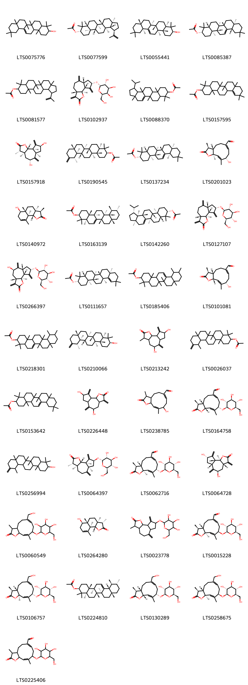{ width=100% }
    <figcaption>Hình ảnh cấu trúc hóa học của 41 hoạt chất thuộc nhóm Prenol lipids gồm ['β-amyrin (LTS0075776)', 'lupeol acetate (LTS0077599)', '(3s,4ar,6ar,6bs,8ar,12as,14ar,14br)-4,4,6a,6b,8a,11,11,14b-octamethyl-1,2,3,4a,5,6,7,8,9,10,12,12a,14,14a-tetradecahydropicen-3-ol (LTS0055441)', '(3s,4ar,6ar,6bs,8ar,12as,14ar,14br)-4,4,6a,6b,8a,11,11,14b-octamethyl-1,2,3,4a,5,6,7,8,9,10,12,12a,14,14a-tetradecahydropicen-3-yl acetate (LTS0085387)', '3a,5a,5b,8,8,11a-hexamethyl-1-(prop-1-en-2-yl)-hexadecahydrocyclopenta[a]chrysen-9-yl acetate (LTS0081577)', '(3as,6ar,8s,9ar,9bs)-3,6,9-trimethylidene-8-{[(2s,3r,4s,5r,6r)-3,4,5-trihydroxy-6-(hydroxymethyl)oxan-2-yl]oxy}-octahydroazuleno[4,5-b]furan-2-one (LTS0102937)', '1-isopropyl-3a,5b,8,8,11a,13a-hexamethyl-1h,2h,3h,4h,6h,7h,7ah,9h,10h,11h,11bh,12h,13h,13bh-cyclopenta[a]chrysen-9-yl acetate (LTS0088370)', '4,4,6a,6b,8a,11,11,14b-octamethyl-1,2,3,4a,5,6,7,8,9,10,12b,13,14,14a-tetradecahydropicen-3-yl acetate (LTS0157595)', '(3s,3as,5r,6ar,8s,9ar,9bs)-5,8-dihydroxy-3-methyl-6,9-dimethylidene-octahydro-3h-azuleno[4,5-b]furan-2-one (LTS0157918)', 'taraxasterol acetate (LTS0190545)', 'β-amyrin acetate (LTS0137234)', '(3s,3as,9s,11as)-9-hydroxy-3,10-dimethyl-2-oxo-3h,3ah,4h,5h,8h,9h,11ah-cyclodeca[b]furan-6-carbaldehyde (LTS0201023)', '(3r,3as,5ar,6r,9as,9bs)-6-hydroxy-3,5a,9-trimethyl-3h,3ah,4h,5h,6h,7h,9ah,9bh-naphtho[1,2-b]furan-2-one (LTS0140972)', '(3s,4ar,6bs,8ar,11r,12s,12ar,12bs,14ar,14br)-4,4,6b,8a,11,12,12b,14b-octamethyl-2,3,4a,5,7,8,9,10,11,12,12a,13,14,14a-tetradecahydro-1h-picen-3-yl acetate (LTS0163139)', '(1r,3ar,5br,7ar,9s,11ar,11br,13as,13br)-1-isopropyl-3a,5b,8,8,11a,13a-hexamethyl-1h,2h,3h,4h,6h,7h,7ah,9h,10h,11h,11bh,12h,13h,13bh-cyclopenta[a]chrysen-9-yl acetate (LTS0142260)', 'vernoflexuoside (LTS0127107)', '(3as,5r,6ar,8s,9ar,9bs)-5-hydroxy-3,6,9-trimethylidene-8-{[(2r,3r,4s,5s,6r)-3,4,5-trihydroxy-6-(hydroxymethyl)oxan-2-yl]oxy}-octahydroazuleno[4,5-b]furan-2-one (LTS0266397)', '(3s,4ar,6ar,6br,8ar,12bs,14ar,14br)-4,4,6a,6b,8a,11,11,14b-octamethyl-1,2,3,4a,5,6,7,8,9,10,12b,13,14,14a-tetradecahydropicen-3-yl acetate (LTS0111657)', '4,4,6a,6b,8a,11,12,14b-octamethyl-2,3,4a,5,6,7,8,9,10,11,12,12a,14,14a-tetradecahydro-1h-picen-3-yl acetate (LTS0185406)', '(3s,3as,9s,11ar)-9-hydroxy-3,10-dimethyl-2-oxo-3h,3ah,4h,5h,8h,9h,11ah-cyclodeca[b]furan-6-carbaldehyde (LTS0101081)', '4,4,6b,8a,11,12,12b,14b-octamethyl-2,3,4a,5,7,8,9,10,11,12,12a,13,14,14a-tetradecahydro-1h-picen-3-yl acetate (LTS0218301)', 'taraxasterol (LTS0210066)', '5,8-dihydroxy-3-methyl-6,9-dimethylidene-octahydro-3h-azuleno[4,5-b]furan-2-one (LTS0213242)', '4,4,6a,6b,8a,12,14b-heptamethyl-11-methylidene-hexadecahydropicen-3-yl acetate (LTS0026037)', '4,4,6a,6b,8a,11,11,14b-octamethyl-1,2,3,4a,5,6,7,8,9,10,12,12a,14,14a-tetradecahydropicen-3-yl acetate (LTS0153642)', '5,8-dihydroxy-3,6,9-trimethylidene-octahydroazuleno[4,5-b]furan-2-one (LTS0226448)', '9-hydroxy-3,10-dimethyl-2-oxo-3h,3ah,4h,5h,8h,9h,11ah-cyclodeca[b]furan-6-carbaldehyde (LTS0238785)', '(3s,3as,9s,11ar)-3,10-dimethyl-2-oxo-9-{[(2r,3r,4s,5s,6r)-3,4,5-trihydroxy-6-(hydroxymethyl)oxan-2-yl]oxy}-3h,3ah,4h,5h,8h,9h,11ah-cyclodeca[b]furan-6-carbaldehyde (LTS0164758)', '4,4,6a,6b,8a,12,14b-heptamethyl-11-methylidene-hexadecahydropicen-3-ol (LTS0256994)', '(3s,3as,6ar,8s,9ar,9bs)-3-methyl-6,9-dimethylidene-8-{[(2s,3r,4s,5s,6r)-3,4,5-trihydroxy-6-(hydroxymethyl)oxan-2-yl]oxy}-octahydro-3h-azuleno[4,5-b]furan-2-one (LTS0064397)', '(3s,3as,9s,11as)-3,10-dimethyl-2-oxo-9-{[(2r,3r,4s,5s,6r)-3,4,5-trihydroxy-6-(hydroxymethyl)oxan-2-yl]oxy}-3h,3ah,4h,5h,8h,9h,11ah-cyclodeca[b]furan-6-carbaldehyde (LTS0062716)', '(3as,5r,6ar,8s,9ar,9bs)-5,8-dihydroxy-3,6,9-trimethylidene-octahydroazuleno[4,5-b]furan-2-one (LTS0064728)', '6-(hydroxymethyl)-3,10-dimethyl-9-{[3,4,5-trihydroxy-6-(hydroxymethyl)oxan-2-yl]oxy}-3h,3ah,4h,5h,8h,9h,11ah-cyclodeca[b]furan-2-one (LTS0060549)', '(3s,3as,5ar,6r,9as,9bs)-6-hydroxy-3,5a,9-trimethyl-3h,3ah,4h,5h,6h,7h,9ah,9bh-naphtho[1,2-b]furan-2-one (LTS0264280)', '3-methyl-6,9-dimethylidene-8-{[3,4,5-trihydroxy-6-(hydroxymethyl)oxan-2-yl]oxy}-octahydro-3h-azuleno[4,5-b]furan-2-one (LTS0023778)', '(3s,3as,9r,11as)-3,10-dimethyl-2-oxo-9-{[(2r,3r,4s,5s,6r)-3,4,5-trihydroxy-6-(hydroxymethyl)oxan-2-yl]oxy}-3h,3ah,4h,5h,8h,9h,11ah-cyclodeca[b]furan-6-carbaldehyde (LTS0015228)', '(3s,3as,9s,11as)-6-(hydroxymethyl)-3,10-dimethyl-9-{[(2r,3r,4s,5s,6r)-3,4,5-trihydroxy-6-(hydroxymethyl)oxan-2-yl]oxy}-3h,3ah,4h,5h,8h,9h,11ah-cyclodeca[b]furan-2-one (LTS0106757)', 'α-amyrin acetate (LTS0224810)', '(3s,3as,9s,11ar)-6-(hydroxymethyl)-3,10-dimethyl-9-{[(2r,3r,4s,5s,6r)-3,4,5-trihydroxy-6-(hydroxymethyl)oxan-2-yl]oxy}-3h,3ah,4h,5h,8h,9h,11ah-cyclodeca[b]furan-2-one (LTS0130289)', '(3s,3as,9r,11as)-6-(hydroxymethyl)-3,10-dimethyl-9-{[(2r,3r,4s,5s,6r)-3,4,5-trihydroxy-6-(hydroxymethyl)oxan-2-yl]oxy}-3h,3ah,4h,5h,8h,9h,11ah-cyclodeca[b]furan-2-one (LTS0258675)', '3,10-dimethyl-2-oxo-9-{[3,4,5-trihydroxy-6-(hydroxymethyl)oxan-2-yl]oxy}-3h,3ah,4h,5h,8h,9h,11ah-cyclodeca[b]furan-6-carbaldehyde (LTS0225406)'].</figcaption>
</figure>

---

### Dược dân tộc học

Danh sách các quốc gia có sử dụng *Lactuca indica* trong điều trị các bệnh. 

| Country   | Disease          | Bệnh                                                                                                                                                                                                |
|:----------|:-----------------|:----------------------------------------------------------------------------------------------------------------------------------------------------------------------------------------------------|
| Elsewhere | Digestive, Tonic | MYMEMORY WARNING: YOU USED ALL AVAILABLE FREE TRANSLATIONS FOR TODAY. NEXT AVAILABLE IN  10 HOURS 28 MINUTES 56 SECONDS VISIT HTTPS://MYMEMORY.TRANSLATED.NET/DOC/USAGELIMITS.PHP TO TRANSLATE MORE |

---

---
## Lactuca intybac
### Thông tin về thực vật

!!! info "Phân loại thực vật của *Lactuca intybacea* từ GIBF:"
    - **Kingdom:** Plantae
    - **Phylum:** Tracheophyta
    - **Order:** Asterales
    - **Family:** Asteraceae
    - **Genus:** Lactuca
    - **Species:** *Lactuca intybacea*

 

| Label (VI)   | Label (EN)   | Scientific Name   | Descriptions (VI)   | Descriptions (EN)   | Also Known As (VI)                                                                                            | Also Known As (EN)   |
|:-------------|:-------------|:------------------|:--------------------|:--------------------|:--------------------------------------------------------------------------------------------------------------|:---------------------|
| N/A          | N/A          | Lactuca indica    | loài thực vật       | species of plant    | ['Pterocypsela indica', 'Lactuca indica', 'Diếp hoang', 'Diếp dại', 'Bồ công anh Việt Nam', 'Bồ công anh ta'] | ['Indian lettuce']   |

#### Phân bố trên thế giới

**Từ CSDL GIBF** nan, Puerto Rico, Guatemala, Colombia, Jamaica, United States of America, Cuba, Mexico, Venezuela (Bolivarian Republic of)

#### Phân bố tại Việt Nam

**Từ CSDL GIBF**: Không có ghi nhận ở Việt Nam

---
### Thành phần hóa học
        
- Theo cơ sở dữ liệu lotus: Từ loài *Lactuca intybacea* đã phân lập và xác định được Chưa có hoạt chất nào được phân lập. hoạt chất thuộc về các nhóm Không có hoạt chất nào được phân lập. 

Không có hình ảnh nào được tạo ra

---

### Dược dân tộc học

Danh sách các quốc gia có sử dụng *Lactuca intybacea* trong điều trị các bệnh. 

| Country   | Disease   | Bệnh                                                                                                                                                                                                |
|:----------|:----------|:----------------------------------------------------------------------------------------------------------------------------------------------------------------------------------------------------|
| Haiti     | Stomachic | MYMEMORY WARNING: YOU USED ALL AVAILABLE FREE TRANSLATIONS FOR TODAY. NEXT AVAILABLE IN  10 HOURS 28 MINUTES 14 SECONDS VISIT HTTPS://MYMEMORY.TRANSLATED.NET/DOC/USAGELIMITS.PHP TO TRANSLATE MORE |

---

---
## Lactuca intybacea
### Thông tin về thực vật

!!! info "Phân loại thực vật của *Lactuca intybacea* từ GIBF:"
    - **Kingdom:** Plantae
    - **Phylum:** Tracheophyta
    - **Order:** Asterales
    - **Family:** Asteraceae
    - **Genus:** Lactuca
    - **Species:** *Lactuca intybacea*

 

| Label (VI)   | Label (EN)   | Scientific Name   | Descriptions (VI)   | Descriptions (EN)   | Also Known As (VI)   | Also Known As (EN)   |
|:-------------|:-------------|:------------------|:--------------------|:--------------------|:---------------------|:---------------------|
| N/A          | N/A          | Lactuca intybacea | loài thực vật       | species of plant    | ['']                 | ['']                 |

#### Phân bố trên thế giới

**Từ CSDL GIBF** nan, Puerto Rico, Guatemala, Colombia, Jamaica, United States of America, Cuba, Mexico, Venezuela (Bolivarian Republic of)

#### Phân bố tại Việt Nam

**Từ CSDL GIBF**: Không có ghi nhận ở Việt Nam

---
### Thành phần hóa học
        
- Theo cơ sở dữ liệu lotus: Từ loài *Lactuca intybacea* đã phân lập và xác định được Chưa có hoạt chất nào được phân lập. hoạt chất thuộc về các nhóm Không có hoạt chất nào được phân lập. 

Không có hình ảnh nào được tạo ra

---

### Dược dân tộc học

Danh sách các quốc gia có sử dụng *Lactuca intybacea* trong điều trị các bệnh. 

| Country   | Disease                       | Bệnh                                                                                                                                                                                                |
|:----------|:------------------------------|:----------------------------------------------------------------------------------------------------------------------------------------------------------------------------------------------------|
| Haiti     | Decongestant, Laxative, Tonic | MYMEMORY WARNING: YOU USED ALL AVAILABLE FREE TRANSLATIONS FOR TODAY. NEXT AVAILABLE IN  10 HOURS 27 MINUTES 50 SECONDS VISIT HTTPS://MYMEMORY.TRANSLATED.NET/DOC/USAGELIMITS.PHP TO TRANSLATE MORE |

---

---
## Lactuca muralis
### Thông tin về thực vật

!!! info "Phân loại thực vật của *Mycelis muralis* từ GIBF:"
    - **Kingdom:** Plantae
    - **Phylum:** Tracheophyta
    - **Order:** Asterales
    - **Family:** Asteraceae
    - **Genus:** Mycelis
    - **Species:** *Mycelis muralis*

 

| Label (VI)   | Label (EN)   | Scientific Name   | Descriptions (VI)   | Descriptions (EN)   | Also Known As (VI)   | Also Known As (EN)   |
|:-------------|:-------------|:------------------|:--------------------|:--------------------|:---------------------|:---------------------|
| N/A          | N/A          | Lactuca muralis   | loài thực vật       | species of plant    | ['']                 | ['']                 |

#### Phân bố trên thế giới

**Từ CSDL GIBF** Denmark, Sweden, Finland, France, Austria

#### Phân bố tại Việt Nam

**Từ CSDL GIBF**: Không có ghi nhận ở Việt Nam

---
### Thành phần hóa học
        
- Theo cơ sở dữ liệu lotus: Từ loài *Mycelis muralis* đã phân lập và xác định được 21 hoạt chất thuộc về các nhóm Flavonoids, Prenol lipids, Cinnamic acids and derivatives, Lactones, Organooxygen compounds. 

|    | chemicalTaxonomyClassyfireClass   |   smiles_count |
|---:|:----------------------------------|---------------:|
|  0 | Cinnamic acids and derivatives    |              2 |
|  1 | Flavonoids                        |              1 |
|  2 | Lactones                          |              4 |
|  3 | Organooxygen compounds            |              2 |
|  4 | Prenol lipids                     |             12 |

#### Nhóm Cinnamic acids and derivatives
<figure markdown="span">
    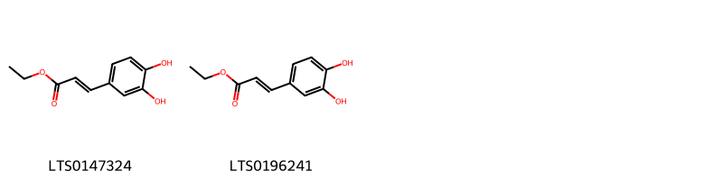{ width=100% }
    <figcaption>Hình ảnh cấu trúc hóa học của 2 hoạt chất thuộc nhóm Cinnamic acids and derivatives gồm ['ethyl caffeate (LTS0147324)', 'ethyl 3-(3,4-dihydroxyphenyl)prop-2-enoate (LTS0196241)'].</figcaption>
</figure>
#### Nhóm Flavonoids
<figure markdown="span">
    { width=100% }
    <figcaption>Hình ảnh cấu trúc hóa học của 1 hoạt chất thuộc nhóm Flavonoids gồm ['chamomile (LTS0104946)'].</figcaption>
</figure>
#### Nhóm Lactones
<figure markdown="span">
    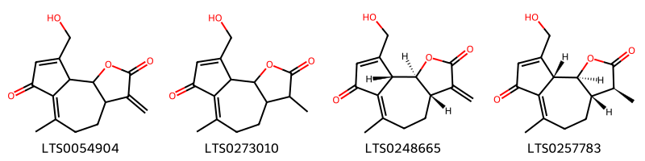{ width=100% }
    <figcaption>Hình ảnh cấu trúc hóa học của 4 hoạt chất thuộc nhóm Lactones gồm ['9-(hydroxymethyl)-6-methyl-3-methylidene-3ah,4h,5h,9ah,9bh-azuleno[4,5-b]furan-2,7-dione (LTS0054904)', '9-(hydroxymethyl)-3,6-dimethyl-3h,3ah,4h,5h,9ah,9bh-azuleno[4,5-b]furan-2,7-dione (LTS0273010)', '8-deoxylactucin (LTS0248665)', '(3s,3as,9as,9bs)-9-(hydroxymethyl)-3,6-dimethyl-3h,3ah,4h,5h,9ah,9bh-azuleno[4,5-b]furan-2,7-dione (LTS0257783)'].</figcaption>
</figure>
#### Nhóm Organooxygen compounds
<figure markdown="span">
    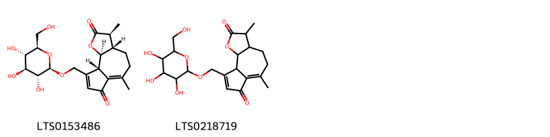{ width=100% }
    <figcaption>Hình ảnh cấu trúc hóa học của 2 hoạt chất thuộc nhóm Organooxygen compounds gồm ['(3s,3as,9as,9bs)-3,6-dimethyl-9-({[(2r,3r,4s,5s,6r)-3,4,5-trihydroxy-6-(hydroxymethyl)oxan-2-yl]oxy}methyl)-3h,3ah,4h,5h,9ah,9bh-azuleno[4,5-b]furan-2,7-dione (LTS0153486)', '3,6-dimethyl-9-({[3,4,5-trihydroxy-6-(hydroxymethyl)oxan-2-yl]oxy}methyl)-3h,3ah,4h,5h,9ah,9bh-azuleno[4,5-b]furan-2,7-dione (LTS0218719)'].</figcaption>
</figure>
#### Nhóm Prenol lipids
<figure markdown="span">
    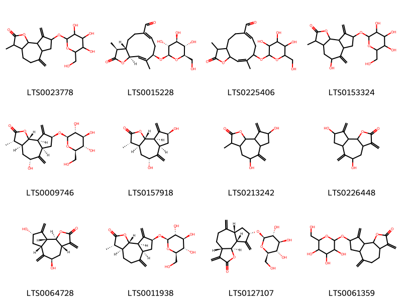{ width=100% }
    <figcaption>Hình ảnh cấu trúc hóa học của 12 hoạt chất thuộc nhóm Prenol lipids gồm ['3-methyl-6,9-dimethylidene-8-{[3,4,5-trihydroxy-6-(hydroxymethyl)oxan-2-yl]oxy}-octahydro-3h-azuleno[4,5-b]furan-2-one (LTS0023778)', '(3s,3as,9r,11as)-3,10-dimethyl-2-oxo-9-{[(2r,3r,4s,5s,6r)-3,4,5-trihydroxy-6-(hydroxymethyl)oxan-2-yl]oxy}-3h,3ah,4h,5h,8h,9h,11ah-cyclodeca[b]furan-6-carbaldehyde (LTS0015228)', '3,10-dimethyl-2-oxo-9-{[3,4,5-trihydroxy-6-(hydroxymethyl)oxan-2-yl]oxy}-3h,3ah,4h,5h,8h,9h,11ah-cyclodeca[b]furan-6-carbaldehyde (LTS0225406)', '5-hydroxy-3-methyl-6,9-dimethylidene-8-{[3,4,5-trihydroxy-6-(hydroxymethyl)oxan-2-yl]oxy}-octahydro-3h-azuleno[4,5-b]furan-2-one (LTS0153324)', '(3s,3as,5r,6ar,8s,9ar,9bs)-5-hydroxy-3-methyl-6,9-dimethylidene-8-{[(2r,3r,4s,5s,6r)-3,4,5-trihydroxy-6-(hydroxymethyl)oxan-2-yl]oxy}-octahydro-3h-azuleno[4,5-b]furan-2-one (LTS0009746)', '(3s,3as,5r,6ar,8s,9ar,9bs)-5,8-dihydroxy-3-methyl-6,9-dimethylidene-octahydro-3h-azuleno[4,5-b]furan-2-one (LTS0157918)', '5,8-dihydroxy-3-methyl-6,9-dimethylidene-octahydro-3h-azuleno[4,5-b]furan-2-one (LTS0213242)', '5,8-dihydroxy-3,6,9-trimethylidene-octahydroazuleno[4,5-b]furan-2-one (LTS0226448)', '(3as,5r,6ar,8s,9ar,9bs)-5,8-dihydroxy-3,6,9-trimethylidene-octahydroazuleno[4,5-b]furan-2-one (LTS0064728)', '(3s,3as,6ar,8s,9ar,9bs)-3-methyl-6,9-dimethylidene-8-{[(2r,3r,4s,5s,6r)-3,4,5-trihydroxy-6-(hydroxymethyl)oxan-2-yl]oxy}-octahydro-3h-azuleno[4,5-b]furan-2-one (LTS0011938)', 'vernoflexuoside (LTS0127107)', '3,6,9-trimethylidene-8-{[3,4,5-trihydroxy-6-(hydroxymethyl)oxan-2-yl]oxy}-octahydroazuleno[4,5-b]furan-2-one (LTS0061359)'].</figcaption>
</figure>

---

### Dược dân tộc học

Danh sách các quốc gia có sử dụng *Mycelis muralis* trong điều trị các bệnh. 

| Country   | Disease   | Bệnh                                                                                                                                                                                                |
|:----------|:----------|:----------------------------------------------------------------------------------------------------------------------------------------------------------------------------------------------------|
| English   | Sedative  | MYMEMORY WARNING: YOU USED ALL AVAILABLE FREE TRANSLATIONS FOR TODAY. NEXT AVAILABLE IN  10 HOURS 27 MINUTES 26 SECONDS VISIT HTTPS://MYMEMORY.TRANSLATED.NET/DOC/USAGELIMITS.PHP TO TRANSLATE MORE |
| French    | Hypnotic  | MYMEMORY WARNING: YOU USED ALL AVAILABLE FREE TRANSLATIONS FOR TODAY. NEXT AVAILABLE IN  10 HOURS 27 MINUTES 21 SECONDS VISIT HTTPS://MYMEMORY.TRANSLATED.NET/DOC/USAGELIMITS.PHP TO TRANSLATE MORE |
| German    | Emollient | MYMEMORY WARNING: YOU USED ALL AVAILABLE FREE TRANSLATIONS FOR TODAY. NEXT AVAILABLE IN  10 HOURS 27 MINUTES 17 SECONDS VISIT HTTPS://MYMEMORY.TRANSLATED.NET/DOC/USAGELIMITS.PHP TO TRANSLATE MORE |
| Italian   | Narcotic  | MYMEMORY WARNING: YOU USED ALL AVAILABLE FREE TRANSLATIONS FOR TODAY. NEXT AVAILABLE IN  10 HOURS 27 MINUTES 14 SECONDS VISIT HTTPS://MYMEMORY.TRANSLATED.NET/DOC/USAGELIMITS.PHP TO TRANSLATE MORE |

---

---
## Lactuca quercina
### Thông tin về thực vật

!!! info "Phân loại thực vật của *Lactuca quercina* từ GIBF:"
    - **Kingdom:** Plantae
    - **Phylum:** Tracheophyta
    - **Order:** Asterales
    - **Family:** Asteraceae
    - **Genus:** Lactuca
    - **Species:** *Lactuca quercina*

 

| Label (VI)   | Label (EN)   | Scientific Name   | Descriptions (VI)   | Descriptions (EN)   | Also Known As (VI)   | Also Known As (EN)   |
|:-------------|:-------------|:------------------|:--------------------|:--------------------|:---------------------|:---------------------|
| N/A          | N/A          | Lactuca quercina  | loài thực vật       | species of plant    | ['']                 | ['']                 |

#### Phân bố trên thế giới

**Từ CSDL GIBF** Ukraine, Italy, Czechia, Germany, Slovakia, Hungary, Russian Federation, United States of America, Sweden, Austria, France, Uzbekistan

#### Phân bố tại Việt Nam

**Từ CSDL GIBF**: Không có ghi nhận ở Việt Nam

---
### Thành phần hóa học
        
- Theo cơ sở dữ liệu lotus: Từ loài *Lactuca quercina* đã phân lập và xác định được 32 hoạt chất thuộc về các nhóm Lactones, Flavonoids, Prenol lipids, Phenols. 

|    | chemicalTaxonomyClassyfireClass   |   smiles_count |
|---:|:----------------------------------|---------------:|
|  0 | Flavonoids                        |              4 |
|  1 | Lactones                          |              9 |
|  2 | Phenols                           |              2 |
|  3 | Prenol lipids                     |             17 |

#### Nhóm Flavonoids
<figure markdown="span">
    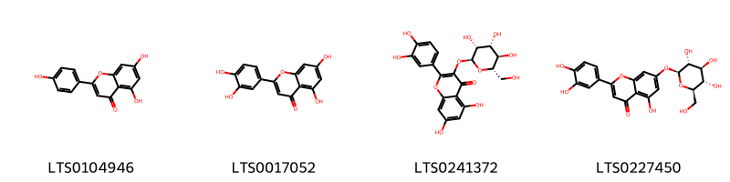{ width=100% }
    <figcaption>Hình ảnh cấu trúc hóa học của 4 hoạt chất thuộc nhóm Flavonoids gồm ['chamomile (LTS0104946)', 'luteolin (LTS0017052)', '2-(3,4-dihydroxyphenyl)-5,7-dihydroxy-3-{[(2s,3r,4r,5r,6s)-3,4,5-trihydroxy-6-(hydroxymethyl)oxan-2-yl]oxy}chromen-4-one (LTS0241372)', 'luteolin 7-o-glucoside (LTS0227450)'].</figcaption>
</figure>
#### Nhóm Lactones
<figure markdown="span">
    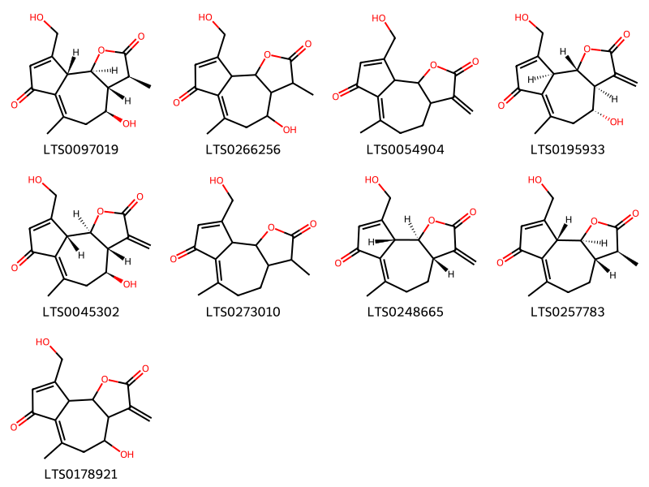{ width=100% }
    <figcaption>Hình ảnh cấu trúc hóa học của 9 hoạt chất thuộc nhóm Lactones gồm ['11β,13-dihydrolactucin (LTS0097019)', '4-hydroxy-9-(hydroxymethyl)-3,6-dimethyl-3h,3ah,4h,5h,9ah,9bh-azuleno[4,5-b]furan-2,7-dione (LTS0266256)', '9-(hydroxymethyl)-6-methyl-3-methylidene-3ah,4h,5h,9ah,9bh-azuleno[4,5-b]furan-2,7-dione (LTS0054904)', '(3as,4r,9ar,9bs)-4-hydroxy-9-(hydroxymethyl)-6-methyl-3-methylidene-3ah,4h,5h,9ah,9bh-azuleno[4,5-b]furan-2,7-dione (LTS0195933)', 'lactucin (LTS0045302)', '9-(hydroxymethyl)-3,6-dimethyl-3h,3ah,4h,5h,9ah,9bh-azuleno[4,5-b]furan-2,7-dione (LTS0273010)', '8-deoxylactucin (LTS0248665)', '(3s,3as,9as,9bs)-9-(hydroxymethyl)-3,6-dimethyl-3h,3ah,4h,5h,9ah,9bh-azuleno[4,5-b]furan-2,7-dione (LTS0257783)', '4-hydroxy-9-(hydroxymethyl)-6-methyl-3-methylidene-3ah,4h,5h,9ah,9bh-azuleno[4,5-b]furan-2,7-dione (LTS0178921)'].</figcaption>
</figure>
#### Nhóm Phenols
<figure markdown="span">
    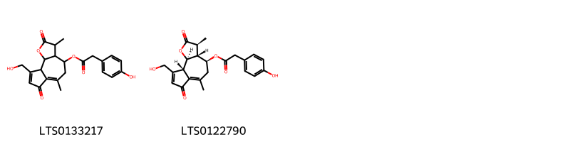{ width=100% }
    <figcaption>Hình ảnh cấu trúc hóa học của 2 hoạt chất thuộc nhóm Phenols gồm ['9-(hydroxymethyl)-3,6-dimethyl-2,7-dioxo-3h,3ah,4h,5h,9ah,9bh-azuleno[4,5-b]furan-4-yl 2-(4-hydroxyphenyl)acetate (LTS0133217)', '11β,13-dihydrolactucopicrin (LTS0122790)'].</figcaption>
</figure>
#### Nhóm Prenol lipids
<figure markdown="span">
    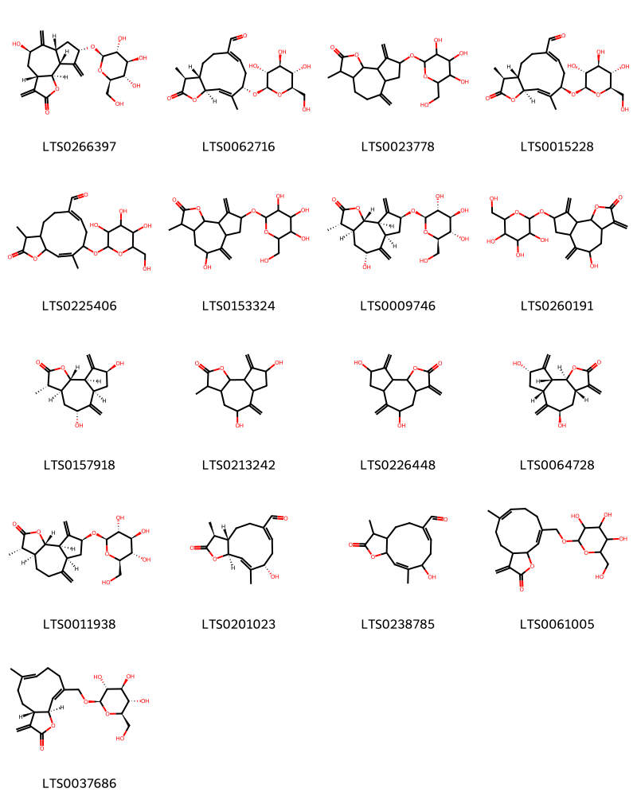{ width=100% }
    <figcaption>Hình ảnh cấu trúc hóa học của 17 hoạt chất thuộc nhóm Prenol lipids gồm ['(3as,5r,6ar,8s,9ar,9bs)-5-hydroxy-3,6,9-trimethylidene-8-{[(2r,3r,4s,5s,6r)-3,4,5-trihydroxy-6-(hydroxymethyl)oxan-2-yl]oxy}-octahydroazuleno[4,5-b]furan-2-one (LTS0266397)', '(3s,3as,9s,11as)-3,10-dimethyl-2-oxo-9-{[(2r,3r,4s,5s,6r)-3,4,5-trihydroxy-6-(hydroxymethyl)oxan-2-yl]oxy}-3h,3ah,4h,5h,8h,9h,11ah-cyclodeca[b]furan-6-carbaldehyde (LTS0062716)', '3-methyl-6,9-dimethylidene-8-{[3,4,5-trihydroxy-6-(hydroxymethyl)oxan-2-yl]oxy}-octahydro-3h-azuleno[4,5-b]furan-2-one (LTS0023778)', '(3s,3as,9r,11as)-3,10-dimethyl-2-oxo-9-{[(2r,3r,4s,5s,6r)-3,4,5-trihydroxy-6-(hydroxymethyl)oxan-2-yl]oxy}-3h,3ah,4h,5h,8h,9h,11ah-cyclodeca[b]furan-6-carbaldehyde (LTS0015228)', '3,10-dimethyl-2-oxo-9-{[3,4,5-trihydroxy-6-(hydroxymethyl)oxan-2-yl]oxy}-3h,3ah,4h,5h,8h,9h,11ah-cyclodeca[b]furan-6-carbaldehyde (LTS0225406)', '5-hydroxy-3-methyl-6,9-dimethylidene-8-{[3,4,5-trihydroxy-6-(hydroxymethyl)oxan-2-yl]oxy}-octahydro-3h-azuleno[4,5-b]furan-2-one (LTS0153324)', '(3s,3as,5r,6ar,8s,9ar,9bs)-5-hydroxy-3-methyl-6,9-dimethylidene-8-{[(2r,3r,4s,5s,6r)-3,4,5-trihydroxy-6-(hydroxymethyl)oxan-2-yl]oxy}-octahydro-3h-azuleno[4,5-b]furan-2-one (LTS0009746)', '5-hydroxy-3,6,9-trimethylidene-8-{[3,4,5-trihydroxy-6-(hydroxymethyl)oxan-2-yl]oxy}-octahydroazuleno[4,5-b]furan-2-one (LTS0260191)', '(3s,3as,5r,6ar,8s,9ar,9bs)-5,8-dihydroxy-3-methyl-6,9-dimethylidene-octahydro-3h-azuleno[4,5-b]furan-2-one (LTS0157918)', '5,8-dihydroxy-3-methyl-6,9-dimethylidene-octahydro-3h-azuleno[4,5-b]furan-2-one (LTS0213242)', '5,8-dihydroxy-3,6,9-trimethylidene-octahydroazuleno[4,5-b]furan-2-one (LTS0226448)', '(3as,5r,6ar,8s,9ar,9bs)-5,8-dihydroxy-3,6,9-trimethylidene-octahydroazuleno[4,5-b]furan-2-one (LTS0064728)', '(3s,3as,6ar,8s,9ar,9bs)-3-methyl-6,9-dimethylidene-8-{[(2r,3r,4s,5s,6r)-3,4,5-trihydroxy-6-(hydroxymethyl)oxan-2-yl]oxy}-octahydro-3h-azuleno[4,5-b]furan-2-one (LTS0011938)', '(3s,3as,9s,11as)-9-hydroxy-3,10-dimethyl-2-oxo-3h,3ah,4h,5h,8h,9h,11ah-cyclodeca[b]furan-6-carbaldehyde (LTS0201023)', '9-hydroxy-3,10-dimethyl-2-oxo-3h,3ah,4h,5h,8h,9h,11ah-cyclodeca[b]furan-6-carbaldehyde (LTS0238785)', '6-methyl-3-methylidene-10-({[3,4,5-trihydroxy-6-(hydroxymethyl)oxan-2-yl]oxy}methyl)-3ah,4h,5h,8h,9h,11ah-cyclodeca[b]furan-2-one (LTS0061005)', '(3as,11ar)-6-methyl-3-methylidene-10-({[(2r,3r,4s,5s,6r)-3,4,5-trihydroxy-6-(hydroxymethyl)oxan-2-yl]oxy}methyl)-3ah,4h,5h,8h,9h,11ah-cyclodeca[b]furan-2-one (LTS0037686)'].</figcaption>
</figure>

---

### Dược dân tộc học

Danh sách các quốc gia có sử dụng *Lactuca quercina* trong điều trị các bệnh. 

| Country   | Disease            | Bệnh                                                                                                                                                                                                |
|:----------|:-------------------|:----------------------------------------------------------------------------------------------------------------------------------------------------------------------------------------------------|
| Elsewhere | Hypnotic, Sedative | MYMEMORY WARNING: YOU USED ALL AVAILABLE FREE TRANSLATIONS FOR TODAY. NEXT AVAILABLE IN  10 HOURS 26 MINUTES 48 SECONDS VISIT HTTPS://MYMEMORY.TRANSLATED.NET/DOC/USAGELIMITS.PHP TO TRANSLATE MORE |

---

---
## Lactuca sativa
### Thông tin về thực vật

!!! info "Phân loại thực vật của *Lactuca sativa* từ GIBF:"
    - **Kingdom:** Plantae
    - **Phylum:** Tracheophyta
    - **Order:** Asterales
    - **Family:** Asteraceae
    - **Genus:** Lactuca
    - **Species:** *Lactuca sativa*

 

| Label (VI)   | Label (EN)   | Scientific Name   | Descriptions (VI)   | Descriptions (EN)   | Also Known As (VI)             | Also Known As (EN)   |
|:-------------|:-------------|:------------------|:--------------------|:--------------------|:-------------------------------|:---------------------|
| N/A          | N/A          | Lactuca sativa    | thực vật có hoa     | plant series        | ['rau diếp', 'Lactuca sativa'] | ['Lactuca sativa']   |

#### Phân bố trên thế giới

**Từ CSDL GIBF** nan, Italy, Belgium, Argentina, Norway, Canada, Ukraine, Pakistan, Denmark, Netherlands, Belarus, Chinese Taipei, Spain, Hungary, Portugal, Türkiye, Russian Federation, Jamaica, United States of America, Sweden, Bosnia and Herzegovina, South Africa, Czechia, Germany, Romania, Egypt, Switzerland, Cuba, Austria, France, Peru, Mexico, Viet Nam, United Kingdom of Great Britain and Northern Ireland, China, Ecuador, Niue, Colombia, Cameroon, Malaysia, New Zealand

#### Phân bố tại Việt Nam

**Từ CSDL GIBF**: Không có ghi nhận ở Việt Nam

---
### Thành phần hóa học
        
- Theo cơ sở dữ liệu lotus: Từ loài *Lactuca sativa* đã phân lập và xác định được 110 hoạt chất thuộc về các nhóm Flavonoids, Prenol lipids, Steroids and steroid derivatives, Tetrapyrroles and derivatives, Dibenzylbutane lignans, Cycloheptafurans, Dihydrofurans, Lactones, Phenols, Organooxygen compounds, Coumarins and derivatives, Furanoid lignans, Carboxylic acids and derivatives, Anthracenes. 

|    | chemicalTaxonomyClassyfireClass   |   smiles_count |
|---:|:----------------------------------|---------------:|
|  0 |                                   |              1 |
|  1 | Anthracenes                       |              3 |
|  2 | Carboxylic acids and derivatives  |              1 |
|  3 | Coumarins and derivatives         |              1 |
|  4 | Cycloheptafurans                  |              1 |
|  5 | Dibenzylbutane lignans            |              2 |
|  6 | Dihydrofurans                     |              1 |
|  7 | Flavonoids                        |             26 |
|  8 | Furanoid lignans                  |              3 |
|  9 | Lactones                          |              5 |
| 10 | Organooxygen compounds            |              6 |
| 11 | Phenols                           |              6 |
| 12 | Prenol lipids                     |             46 |
| 13 | Steroids and steroid derivatives  |              5 |
| 14 | Tetrapyrroles and derivatives     |              2 |

#### Nhóm 
<figure markdown="span">
    { width=100% }
    <figcaption>Hình ảnh cấu trúc hóa học của 1 hoạt chất thuộc nhóm  gồm ['trigonelline (LTS0040106)'].</figcaption>
</figure>
#### Nhóm Anthracenes
<figure markdown="span">
    { width=100% }
    <figcaption>Hình ảnh cấu trúc hóa học của 3 hoạt chất thuộc nhóm Anthracenes gồm ['emodin (LTS0163480)', 'turkey rhubarb (LTS0160968)', 'physcion (LTS0052688)'].</figcaption>
</figure>
#### Nhóm Carboxylic acids and derivatives
<figure markdown="span">
    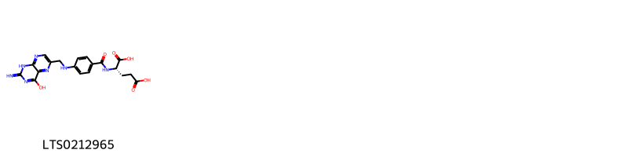{ width=100% }
    <figcaption>Hình ảnh cấu trúc hóa học của 1 hoạt chất thuộc nhóm Carboxylic acids and derivatives gồm ['acid, folic (LTS0212965)'].</figcaption>
</figure>
#### Nhóm Coumarins and derivatives
<figure markdown="span">
    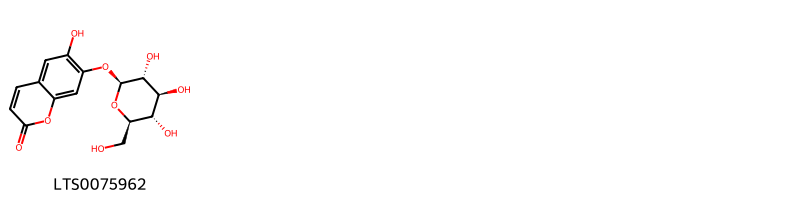{ width=100% }
    <figcaption>Hình ảnh cấu trúc hóa học của 1 hoạt chất thuộc nhóm Coumarins and derivatives gồm ['cichoriin (LTS0075962)'].</figcaption>
</figure>
#### Nhóm Cycloheptafurans
<figure markdown="span">
    { width=100% }
    <figcaption>Hình ảnh cấu trúc hóa học của 1 hoạt chất thuộc nhóm Cycloheptafurans gồm ['6-methyl-9-methylidene-2-oxo-7h,8h-azuleno[4,5-b]furan-3-carbaldehyde (LTS0208619)'].</figcaption>
</figure>
#### Nhóm Dibenzylbutane lignans
<figure markdown="span">
    { width=100% }
    <figcaption>Hình ảnh cấu trúc hóa học của 2 hoạt chất thuộc nhóm Dibenzylbutane lignans gồm ['(2s,3r)-2,3-bis[(4-hydroxy-3-methoxyphenyl)(¹³c)methyl](1-¹³c)butane-1,4-diol (LTS0268699)', 'secoisolariciresinol (LTS0086727)'].</figcaption>
</figure>
#### Nhóm Dihydrofurans
<figure markdown="span">
    { width=100% }
    <figcaption>Hình ảnh cấu trúc hóa học của 1 hoạt chất thuộc nhóm Dihydrofurans gồm ['vitamin c (LTS0022555)'].</figcaption>
</figure>
#### Nhóm Flavonoids
<figure markdown="span">
    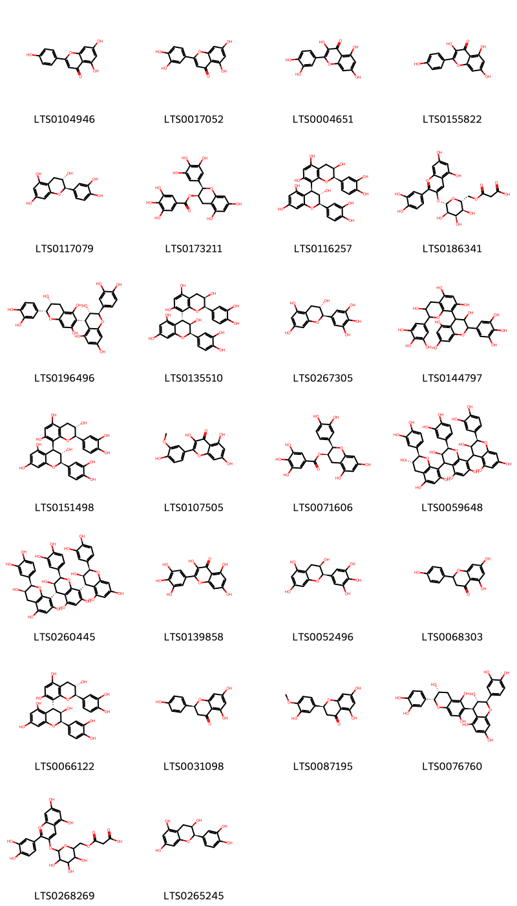{ width=100% }
    <figcaption>Hình ảnh cấu trúc hóa học của 26 hoạt chất thuộc nhóm Flavonoids gồm ['chamomile (LTS0104946)', 'luteolin (LTS0017052)', 'quercetin (LTS0004651)', 'kaempherol (LTS0155822)', '(+)-catechol (LTS0117079)', '(-)-epigallocatechin gallate (LTS0173211)', '(2r,3s,4s)-2-(3,4-dihydroxyphenyl)-4-[(2r,3r)-2-(3,4-dihydroxyphenyl)-3,5,7-trihydroxy-3,4-dihydro-2h-1-benzopyran-8-yl]-3,4-dihydro-2h-1-benzopyran-3,5,7-triol (LTS0116257)', '3-{[(2s,3r,4r,5s,6r)-6-{[(2-carboxyacetyl)oxy]methyl}-3,4,5-trihydroxyoxan-2-yl]oxy}-2-(3,4-dihydroxyphenyl)-5,7-dihydroxy-1λ⁴-chromen-1-ylium (LTS0186341)', '(2r,3s,4s)-2-(3,4-dihydroxyphenyl)-4-[(2r,3r)-2-(3,4-dihydroxyphenyl)-3,5,7-trihydroxy-3,4-dihydro-2h-1-benzopyran-6-yl]-3,4-dihydro-2h-1-benzopyran-3,5,7-triol (LTS0196496)', '(2r,3r,4r)-2-(3,4-dihydroxyphenyl)-4-[(2r,3r)-2-(3,4-dihydroxyphenyl)-3,5,7-trihydroxy-3,4-dihydro-2h-1-benzopyran-8-yl]-3,4-dihydro-2h-1-benzopyran-3,5,7-triol (LTS0135510)', 'gallocatechol (LTS0267305)', '4-[3,5,7-trihydroxy-2-(3,4,5-trihydroxyphenyl)-3,4-dihydro-2h-1-benzopyran-8-yl]-2-(3,4,5-trihydroxyphenyl)-3,4-dihydro-2h-1-benzopyran-3,5,7-triol (LTS0144797)', '(2r,3s,4s)-2-(3,4-dihydroxyphenyl)-4-[(2r,3s)-2-(3,4-dihydroxyphenyl)-3,5,7-trihydroxy-3,4-dihydro-2h-1-benzopyran-8-yl]-3,4-dihydro-2h-1-benzopyran-3,5,7-triol (LTS0151498)', 'isorhamnetin (LTS0107505)', 'epicatechin gallate (LTS0071606)', '(2r,3r)-2-(3,4-dihydroxyphenyl)-8-[(2r,3r)-2-(3,4-dihydroxyphenyl)-3,5,7-trihydroxy-3,4-dihydro-2h-1-benzopyran-4-yl]-4-[(2r,3s)-2-(3,4-dihydroxyphenyl)-3,5,7-trihydroxy-3,4-dihydro-2h-1-benzopyran-8-yl]-3,4-dihydro-2h-1-benzopyran-3,5,7-triol (LTS0059648)', 'procyanidin c1 (LTS0260445)', 'myricetin (LTS0139858)', 'epigallocatechin (LTS0052496)', 'asahina (LTS0068303)', '(2r,3r,4r)-2-(3,4-dihydroxyphenyl)-4-[(2r,3s)-2-(3,4-dihydroxyphenyl)-3,5,7-trihydroxy-3,4-dihydro-2h-1-benzopyran-8-yl]-3,4-dihydro-2h-1-benzopyran-3,5,7-triol (LTS0066122)', 'naringenin (LTS0031098)', 'hesperetin (LTS0087195)', '(2r,3s,4r)-2-(3,4-dihydroxyphenyl)-4-[(2r,3r)-2-(3,4-dihydroxyphenyl)-3,5,7-trihydroxy-3,4-dihydro-2h-1-benzopyran-6-yl]-3,4-dihydro-2h-1-benzopyran-3,5,7-triol (LTS0076760)', '3-[(6-{[(2-carboxyacetyl)oxy]methyl}-3,4,5-trihydroxyoxan-2-yl)oxy]-2-(3,4-dihydroxyphenyl)-5,7-dihydroxy-1λ⁴-chromen-1-ylium (LTS0268269)', 'ent-epicatechin (LTS0265245)'].</figcaption>
</figure>
#### Nhóm Furanoid lignans
<figure markdown="span">
    { width=100% }
    <figcaption>Hình ảnh cấu trúc hóa học của 3 hoạt chất thuộc nhóm Furanoid lignans gồm ['pinoresinol (LTS0057431)', 'matairesinol (LTS0193475)', 'lariciresinol (LTS0010950)'].</figcaption>
</figure>
#### Nhóm Lactones
<figure markdown="span">
    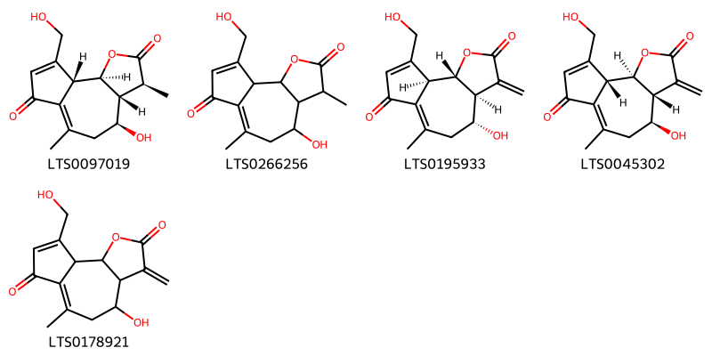{ width=100% }
    <figcaption>Hình ảnh cấu trúc hóa học của 5 hoạt chất thuộc nhóm Lactones gồm ['11β,13-dihydrolactucin (LTS0097019)', '4-hydroxy-9-(hydroxymethyl)-3,6-dimethyl-3h,3ah,4h,5h,9ah,9bh-azuleno[4,5-b]furan-2,7-dione (LTS0266256)', '(3as,4r,9ar,9bs)-4-hydroxy-9-(hydroxymethyl)-6-methyl-3-methylidene-3ah,4h,5h,9ah,9bh-azuleno[4,5-b]furan-2,7-dione (LTS0195933)', 'lactucin (LTS0045302)', '4-hydroxy-9-(hydroxymethyl)-6-methyl-3-methylidene-3ah,4h,5h,9ah,9bh-azuleno[4,5-b]furan-2,7-dione (LTS0178921)'].</figcaption>
</figure>
#### Nhóm Organooxygen compounds
<figure markdown="span">
    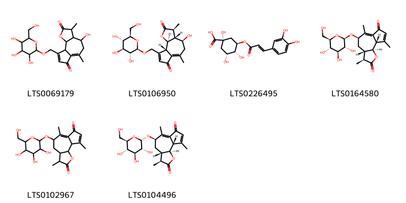{ width=100% }
    <figcaption>Hình ảnh cấu trúc hóa học của 6 hoạt chất thuộc nhóm Organooxygen compounds gồm ['4-hydroxy-3,6-dimethyl-9-({[3,4,5-trihydroxy-6-(hydroxymethyl)oxan-2-yl]oxy}methyl)-3h,3ah,4h,5h,9ah,9bh-azuleno[4,5-b]furan-2,7-dione (LTS0069179)', '(3s,3ar,4s,9as,9br)-4-hydroxy-3,6-dimethyl-9-({[(2r,3r,4s,5s,6r)-3,4,5-trihydroxy-6-(hydroxymethyl)oxan-2-yl]oxy}methyl)-3h,3ah,4h,5h,9ah,9bh-azuleno[4,5-b]furan-2,7-dione (LTS0106950)', 'chlorogenic acid (LTS0226495)', '(3s,3as,5r,9as,9bs)-3,6,9-trimethyl-5-{[(2r,3r,4s,5s,6r)-3,4,5-trihydroxy-6-(hydroxymethyl)oxan-2-yl]oxy}-3h,3ah,4h,5h,9ah,9bh-azuleno[4,5-b]furan-2,7-dione (LTS0164580)', '3,6,9-trimethyl-5-{[3,4,5-trihydroxy-6-(hydroxymethyl)oxan-2-yl]oxy}-3h,3ah,4h,5h,9ah,9bh-azuleno[4,5-b]furan-2,7-dione (LTS0102967)', '(3s,3as,5r,9as,9bs)-3,6,9-trimethyl-5-{[(2s,3r,4s,5s,6r)-3,4,5-trihydroxy-6-(hydroxymethyl)oxan-2-yl]oxy}-3h,3ah,4h,5h,9ah,9bh-azuleno[4,5-b]furan-2,7-dione (LTS0104496)'].</figcaption>
</figure>
#### Nhóm Phenols
<figure markdown="span">
    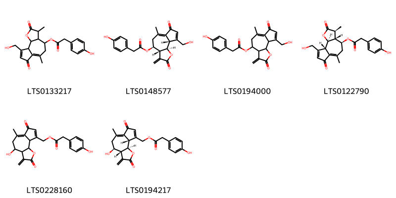{ width=100% }
    <figcaption>Hình ảnh cấu trúc hóa học của 6 hoạt chất thuộc nhóm Phenols gồm ['9-(hydroxymethyl)-3,6-dimethyl-2,7-dioxo-3h,3ah,4h,5h,9ah,9bh-azuleno[4,5-b]furan-4-yl 2-(4-hydroxyphenyl)acetate (LTS0133217)', 'lactupicrin (LTS0148577)', '9-(hydroxymethyl)-6-methyl-3-methylidene-2,7-dioxo-3ah,4h,5h,9ah,9bh-azuleno[4,5-b]furan-4-yl 2-(4-hydroxyphenyl)acetate (LTS0194000)', '11β,13-dihydrolactucopicrin (LTS0122790)', '{4-hydroxy-6-methyl-3-methylidene-2,7-dioxo-3ah,4h,5h,9ah,9bh-azuleno[4,5-b]furan-9-yl}methyl 2-(4-hydroxyphenyl)acetate (LTS0228160)', 'lactucopicrin (LTS0194217)'].</figcaption>
</figure>
#### Nhóm Prenol lipids
<figure markdown="span">
    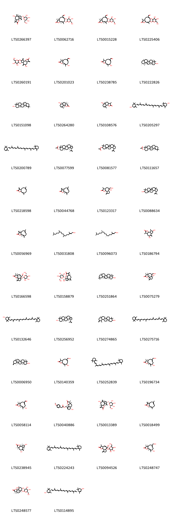{ width=100% }
    <figcaption>Hình ảnh cấu trúc hóa học của 46 hoạt chất thuộc nhóm Prenol lipids gồm ['(3as,5r,6ar,8s,9ar,9bs)-5-hydroxy-3,6,9-trimethylidene-8-{[(2r,3r,4s,5s,6r)-3,4,5-trihydroxy-6-(hydroxymethyl)oxan-2-yl]oxy}-octahydroazuleno[4,5-b]furan-2-one (LTS0266397)', '(3s,3as,9s,11as)-3,10-dimethyl-2-oxo-9-{[(2r,3r,4s,5s,6r)-3,4,5-trihydroxy-6-(hydroxymethyl)oxan-2-yl]oxy}-3h,3ah,4h,5h,8h,9h,11ah-cyclodeca[b]furan-6-carbaldehyde (LTS0062716)', '(3s,3as,9r,11as)-3,10-dimethyl-2-oxo-9-{[(2r,3r,4s,5s,6r)-3,4,5-trihydroxy-6-(hydroxymethyl)oxan-2-yl]oxy}-3h,3ah,4h,5h,8h,9h,11ah-cyclodeca[b]furan-6-carbaldehyde (LTS0015228)', '3,10-dimethyl-2-oxo-9-{[3,4,5-trihydroxy-6-(hydroxymethyl)oxan-2-yl]oxy}-3h,3ah,4h,5h,8h,9h,11ah-cyclodeca[b]furan-6-carbaldehyde (LTS0225406)', '5-hydroxy-3,6,9-trimethylidene-8-{[3,4,5-trihydroxy-6-(hydroxymethyl)oxan-2-yl]oxy}-octahydroazuleno[4,5-b]furan-2-one (LTS0260191)', '(3s,3as,9s,11as)-9-hydroxy-3,10-dimethyl-2-oxo-3h,3ah,4h,5h,8h,9h,11ah-cyclodeca[b]furan-6-carbaldehyde (LTS0201023)', '9-hydroxy-3,10-dimethyl-2-oxo-3h,3ah,4h,5h,8h,9h,11ah-cyclodeca[b]furan-6-carbaldehyde (LTS0238785)', 'amyrin (LTS0222826)', 'germanicol (LTS0151098)', '(3s,3as,5ar,6r,9as,9bs)-6-hydroxy-3,5a,9-trimethyl-3h,3ah,4h,5h,6h,7h,9ah,9bh-naphtho[1,2-b]furan-2-one (LTS0264280)', '6-hydroxy-3,5a,9-trimethyl-3h,3ah,4h,5h,6h,7h,9ah,9bh-naphtho[1,2-b]furan-2-one (LTS0108576)', 'carotenoid (LTS0205297)', '(+)-α-carotene (LTS0200789)', 'lupeol acetate (LTS0077599)', '3a,5a,5b,8,8,11a-hexamethyl-1-(prop-1-en-2-yl)-hexadecahydrocyclopenta[a]chrysen-9-yl acetate (LTS0081577)', '(3s,4ar,6ar,6br,8ar,12bs,14ar,14br)-4,4,6a,6b,8a,11,11,14b-octamethyl-1,2,3,4a,5,6,7,8,9,10,12b,13,14,14a-tetradecahydropicen-3-yl acetate (LTS0111657)', '6,10-dimethyl-3-methylidene-3ah,4h,5h,8h,9h,11ah-cyclodeca[b]furan-2-one (LTS0218598)', '(3ar,11ar)-6,10-dimethyl-3-methylidene-3ah,4h,5h,8h,9h,11ah-cyclodeca[b]furan-2-one (LTS0044768)', '6-hydroxy-6-(hydroxymethyl)-3-methyl-9-methylidene-octahydro-3h-azuleno[4,5-b]furan-2-one (LTS0123317)', 'lupeol (LTS0088634)', 'costunolide (LTS0056969)', 'phytol (LTS0031808)', 'phytol (LTS0096073)', '5,8-dihydroxy-3,9-dimethyl-6-methylidene-decahydroazuleno[4,5-b]furan-2-one (LTS0186794)', '(3s,3as,6s,6ar,9ar,9bs)-6-(hydroxymethyl)-3-methyl-9-methylidene-6-{[(2s,3r,4s,5s,6r)-3,4,5-trihydroxy-6-(hydroxymethyl)oxan-2-yl]oxy}-3h,3ah,6ah,7h,8h,9ah,9bh-azuleno[4,5-b]furan-2-one (LTS0166598)', '(3as,6ar,9r,9as,9bs)-9-(hydroxymethyl)-3,6-dimethylidene-9-{[(2s,3r,4s,5s,6r)-3,4,5-trihydroxy-6-(hydroxymethyl)oxan-2-yl]oxy}-octahydroazuleno[4,5-b]furan-2-one (LTS0158879)', 'β-amyrin (LTS0251864)', '(3s,3as,6s,6ar,9ar,9bs)-6-hydroxy-6-(hydroxymethyl)-3-methyl-9-methylidene-octahydro-3h-azuleno[4,5-b]furan-2-one (LTS0075279)', 'cryptoxanthin (LTS0132646)', 'lupeol (LTS0256952)', '(6ar,6br,8ar,14br)-4,4,6a,6b,8a,12,14b-heptamethyl-11-methylidene-hexadecahydropicen-3-ol (LTS0274865)', 'β-carotene (LTS0275716)', 'taraxasterol (LTS0006950)', '9-hydroxy-6-(hydroxymethyl)-3,10-dimethyl-3h,3ah,4h,5h,8h,9h,11ah-cyclodeca[b]furan-2-one (LTS0140359)', '(9z)-β-carotene (LTS0252839)', '(3s,3ar,9r,11as)-9-hydroxy-6-(hydroxymethyl)-3,10-dimethyl-3h,3ah,4h,5h,8h,9h,11ah-cyclodeca[b]furan-2-one (LTS0196734)', '(3s,3as,9s,11as)-9-hydroxy-3,10-dimethyl-2-oxo-3h,3ah,4h,5h,8h,9h,11ah-cyclodeca[b]furan-6-carbaldehyde (LTS0058114)', '[(3s,3as,5ar,6r,9as,9bs)-6-hydroxy-3,5a-dimethyl-2-oxo-3h,3ah,4h,5h,6h,7h,9ah,9bh-naphtho[1,2-b]furan-9-yl]methyl 2-(4-methoxyphenyl)acetate (LTS0040886)', '(3as,5r,6ar,8s,9ar,9bs)-5-hydroxy-3,6,9-trimethylidene-8-{[(2s,3r,4s,5s,6r)-3,4,5-trihydroxy-6-(hydroxymethyl)oxan-2-yl]oxy}-octahydroazuleno[4,5-b]furan-2-one (LTS0013389)', 'costunolide (LTS0018499)', '(3s,3as,5r,6ar,8s,9s,9ar,9bs)-5,8-dihydroxy-3,9-dimethyl-6-methylidene-decahydroazuleno[4,5-b]furan-2-one (LTS0238945)', 'α-carotene (LTS0224243)', '6-(hydroxymethyl)-3-methyl-9-methylidene-6-{[3,4,5-trihydroxy-6-(hydroxymethyl)oxan-2-yl]oxy}-3h,3ah,6ah,7h,8h,9ah,9bh-azuleno[4,5-b]furan-2-one (LTS0094526)', '(3s,3as,9s,11as)-9-hydroxy-6-(hydroxymethyl)-3,10-dimethyl-3h,3ah,4h,5h,8h,9h,11ah-cyclodeca[b]furan-2-one (LTS0248747)', '(3s,3as,5ar,6r,9r,9as,9bs)-9-hydroxy-3,5a,9-trimethyl-6-{[(2r,3r,4s,5s,6r)-3,4,5-trihydroxy-6-(hydroxymethyl)oxan-2-yl]oxy}-octahydro-3h-naphtho[1,2-b]furan-2-one (LTS0248577)', 'lactucaxanthin (LTS0114895)'].</figcaption>
</figure>
#### Nhóm Steroids and steroid derivatives
<figure markdown="span">
    { width=100% }
    <figcaption>Hình ảnh cấu trúc hóa học của 5 hoạt chất thuộc nhóm Steroids and steroid derivatives gồm ['stigmast-5-en-3-ol (LTS0071224)', 'sitosterol (LTS0168132)', 'stigmast-5-en-3-ol, (3β)- (LTS0204616)', 'sitogluside (LTS0201798)', '2-{[1-(5-ethyl-6-methylheptan-2-yl)-9a,11a-dimethyl-1h,2h,3h,3ah,3bh,4h,6h,7h,8h,9h,9bh,10h,11h-cyclopenta[a]phenanthren-7-yl]oxy}-6-(hydroxymethyl)oxane-3,4,5-triol (LTS0158828)'].</figcaption>
</figure>
#### Nhóm Tetrapyrroles and derivatives
<figure markdown="span">
    { width=100% }
    <figcaption>Hình ảnh cấu trúc hóa học của 2 hoạt chất thuộc nhóm Tetrapyrroles and derivatives gồm ['methyl (3r,21s,22s)-16-ethenyl-11-ethyl-12,17,21,26-tetramethyl-4-oxo-22-(3-oxo-3-{[(2e,7r,11r)-3,7,11,15-tetramethylhexadec-2-en-1-yl]oxy}propyl)-7,23,24,25-tetraazahexacyclo[18.2.1.1⁵,⁸.1¹⁰,¹³.1¹⁵,¹⁸.0²,⁶]hexacosa-1(23),2(6),5(26),7,9,11,13,15,17,19-decaene-3-carboxylate (LTS0200273)', 'methyl (3r,21s,22s)-16-ethenyl-11-ethyl-12,17,21,26-tetramethyl-4-oxo-22-(3-oxo-3-{[(2e)-3,7,11,15-tetramethylhexadec-2-en-1-yl]oxy}propyl)-7,23,24,25-tetraazahexacyclo[18.2.1.1⁵,⁸.1¹⁰,¹³.1¹⁵,¹⁸.0²,⁶]hexacosa-1(23),2(6),5(26),7,9,11,13,15,17,19-decaene-3-carboxylate (LTS0272109)'].</figcaption>
</figure>

---

### Dược dân tộc học

Danh sách các quốc gia có sử dụng *Lactuca sativa* trong điều trị các bệnh. 

| Country            | Disease                                                   | Bệnh                                                                                                                                                                                                |
|:-------------------|:----------------------------------------------------------|:----------------------------------------------------------------------------------------------------------------------------------------------------------------------------------------------------|
| China              | Antidote, Carminative, Refrigerant                        | MYMEMORY WARNING: YOU USED ALL AVAILABLE FREE TRANSLATIONS FOR TODAY. NEXT AVAILABLE IN  10 HOURS 26 MINUTES 13 SECONDS VISIT HTTPS://MYMEMORY.TRANSLATED.NET/DOC/USAGELIMITS.PHP TO TRANSLATE MORE |
| Dominican Republic | Narcotic                                                  | MYMEMORY WARNING: YOU USED ALL AVAILABLE FREE TRANSLATIONS FOR TODAY. NEXT AVAILABLE IN  10 HOURS 26 MINUTES 08 SECONDS VISIT HTTPS://MYMEMORY.TRANSLATED.NET/DOC/USAGELIMITS.PHP TO TRANSLATE MORE |
| Elsewhere          | Hypnotic                                                  | MYMEMORY WARNING: YOU USED ALL AVAILABLE FREE TRANSLATIONS FOR TODAY. NEXT AVAILABLE IN  10 HOURS 26 MINUTES 05 SECONDS VISIT HTTPS://MYMEMORY.TRANSLATED.NET/DOC/USAGELIMITS.PHP TO TRANSLATE MORE |
| Haiti              | Anaphrodisiac, Cardiac, Sedative                          | MYMEMORY WARNING: YOU USED ALL AVAILABLE FREE TRANSLATIONS FOR TODAY. NEXT AVAILABLE IN  10 HOURS 26 MINUTES 02 SECONDS VISIT HTTPS://MYMEMORY.TRANSLATED.NET/DOC/USAGELIMITS.PHP TO TRANSLATE MORE |
| Turkey             | Diuretic, Emollient, Hypnotic, Poison, Sedative, Narcotic | MYMEMORY WARNING: YOU USED ALL AVAILABLE FREE TRANSLATIONS FOR TODAY. NEXT AVAILABLE IN  10 HOURS 25 MINUTES 58 SECONDS VISIT HTTPS://MYMEMORY.TRANSLATED.NET/DOC/USAGELIMITS.PHP TO TRANSLATE MORE |

---

---
## Lactuca scariola
### Thông tin về thực vật

!!! info "Phân loại thực vật của *Lactuca serriola* từ GIBF:"
    - **Kingdom:** Plantae
    - **Phylum:** Tracheophyta
    - **Order:** Asterales
    - **Family:** Asteraceae
    - **Genus:** Lactuca
    - **Species:** *Lactuca serriola*

 

| Label (VI)   | Label (EN)   | Scientific Name   | Descriptions (VI)   | Descriptions (EN)   | Also Known As (VI)   | Also Known As (EN)   |
|:-------------|:-------------|:------------------|:--------------------|:--------------------|:---------------------|:---------------------|
| N/A          | N/A          | Lactuca scariola  |                     |                     | ['']                 | ['']                 |

#### Phân bố trên thế giới

**Từ CSDL GIBF** Luxembourg, Germany, Belgium, Korea, Republic of, Japan, Estonia, United States of America, France

#### Phân bố tại Việt Nam

**Từ CSDL GIBF**: Không có ghi nhận ở Việt Nam

---
### Thành phần hóa học
        
- Theo cơ sở dữ liệu lotus: Từ loài *Lactuca serriola* đã phân lập và xác định được Chưa có hoạt chất nào được phân lập. hoạt chất thuộc về các nhóm Không có hoạt chất nào được phân lập. 

Không có hình ảnh nào được tạo ra

---

### Dược dân tộc học

Danh sách các quốc gia có sử dụng *Lactuca serriola* trong điều trị các bệnh. 

| Country      | Disease                  | Bệnh                                                                                                                                                                                                |
|:-------------|:-------------------------|:----------------------------------------------------------------------------------------------------------------------------------------------------------------------------------------------------|
| Elsewhere    | Antiphlogistic           | MYMEMORY WARNING: YOU USED ALL AVAILABLE FREE TRANSLATIONS FOR TODAY. NEXT AVAILABLE IN  10 HOURS 25 MINUTES 11 SECONDS VISIT HTTPS://MYMEMORY.TRANSLATED.NET/DOC/USAGELIMITS.PHP TO TRANSLATE MORE |
| English      | Diuretic                 | MYMEMORY WARNING: YOU USED ALL AVAILABLE FREE TRANSLATIONS FOR TODAY. NEXT AVAILABLE IN  10 HOURS 25 MINUTES 04 SECONDS VISIT HTTPS://MYMEMORY.TRANSLATED.NET/DOC/USAGELIMITS.PHP TO TRANSLATE MORE |
| French       | Emollient                | MYMEMORY WARNING: YOU USED ALL AVAILABLE FREE TRANSLATIONS FOR TODAY. NEXT AVAILABLE IN  10 HOURS 24 MINUTES 59 SECONDS VISIT HTTPS://MYMEMORY.TRANSLATED.NET/DOC/USAGELIMITS.PHP TO TRANSLATE MORE |
| German       | Sedative                 | MYMEMORY WARNING: YOU USED ALL AVAILABLE FREE TRANSLATIONS FOR TODAY. NEXT AVAILABLE IN  10 HOURS 24 MINUTES 55 SECONDS VISIT HTTPS://MYMEMORY.TRANSLATED.NET/DOC/USAGELIMITS.PHP TO TRANSLATE MORE |
| Iraq         | Sedative                 | MYMEMORY WARNING: YOU USED ALL AVAILABLE FREE TRANSLATIONS FOR TODAY. NEXT AVAILABLE IN  10 HOURS 24 MINUTES 52 SECONDS VISIT HTTPS://MYMEMORY.TRANSLATED.NET/DOC/USAGELIMITS.PHP TO TRANSLATE MORE |
| Italian      | Poison                   | MYMEMORY WARNING: YOU USED ALL AVAILABLE FREE TRANSLATIONS FOR TODAY. NEXT AVAILABLE IN  10 HOURS 24 MINUTES 49 SECONDS VISIT HTTPS://MYMEMORY.TRANSLATED.NET/DOC/USAGELIMITS.PHP TO TRANSLATE MORE |
| US           | Poison, Diuretic         | MYMEMORY WARNING: YOU USED ALL AVAILABLE FREE TRANSLATIONS FOR TODAY. NEXT AVAILABLE IN  10 HOURS 24 MINUTES 46 SECONDS VISIT HTTPS://MYMEMORY.TRANSLATED.NET/DOC/USAGELIMITS.PHP TO TRANSLATE MORE |
| US(Colonial) | Nervine, Sedative, Tonic | MYMEMORY WARNING: YOU USED ALL AVAILABLE FREE TRANSLATIONS FOR TODAY. NEXT AVAILABLE IN  10 HOURS 24 MINUTES 43 SECONDS VISIT HTTPS://MYMEMORY.TRANSLATED.NET/DOC/USAGELIMITS.PHP TO TRANSLATE MORE |

---

---
## Lactuca serriola
### Thông tin về thực vật

!!! info "Phân loại thực vật của *Lactuca serriola* từ GIBF:"
    - **Kingdom:** Plantae
    - **Phylum:** Tracheophyta
    - **Order:** Asterales
    - **Family:** Asteraceae
    - **Genus:** Lactuca
    - **Species:** *Lactuca serriola*

 

| Label (VI)   | Label (EN)   | Scientific Name   | Descriptions (VI)   | Descriptions (EN)   | Also Known As (VI)   | Also Known As (EN)                     |
|:-------------|:-------------|:------------------|:--------------------|:--------------------|:---------------------|:---------------------------------------|
| N/A          | N/A          | Lactuca serriola  | loài thực vật       | species of plant    | ['']                 | ['Lactuca seriola', 'Prickly lettuce'] |

#### Phân bố trên thế giới

**Từ CSDL GIBF** Italy, Australia, Belgium, Argentina, Israel, Canada, Ukraine, Netherlands, Spain, Russian Federation, United States of America, Sweden, Chile, Greece, South Africa, Germany, Romania, Brazil, Switzerland, Peru, Austria, Mexico, Qatar, France, Dominican Republic, United Kingdom of Great Britain and Northern Ireland, New Zealand

#### Phân bố tại Việt Nam

**Từ CSDL GIBF**: Không có ghi nhận ở Việt Nam

---
### Thành phần hóa học
        
- Theo cơ sở dữ liệu lotus: Từ loài *Lactuca serriola* đã phân lập và xác định được 59 hoạt chất thuộc về các nhóm Fatty Acyls, Flavonoids, Prenol lipids, Benzofurans, Lactones, Phenols, Organooxygen compounds, Coumarins and derivatives, Carboxylic acids and derivatives. 

|    | chemicalTaxonomyClassyfireClass   |   smiles_count |
|---:|:----------------------------------|---------------:|
|  0 | Benzofurans                       |              1 |
|  1 | Carboxylic acids and derivatives  |              1 |
|  2 | Coumarins and derivatives         |              1 |
|  3 | Fatty Acyls                       |              6 |
|  4 | Flavonoids                        |              6 |
|  5 | Lactones                          |              7 |
|  6 | Organooxygen compounds            |              3 |
|  7 | Phenols                           |              1 |
|  8 | Prenol lipids                     |             33 |

#### Nhóm Benzofurans
<figure markdown="span">
    { width=100% }
    <figcaption>Hình ảnh cấu trúc hóa học của 1 hoạt chất thuộc nhóm Benzofurans gồm ['loliolide (LTS0254454)'].</figcaption>
</figure>
#### Nhóm Carboxylic acids and derivatives
<figure markdown="span">
    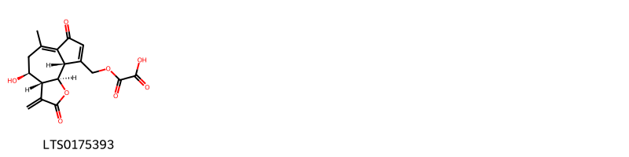{ width=100% }
    <figcaption>Hình ảnh cấu trúc hóa học của 1 hoạt chất thuộc nhóm Carboxylic acids and derivatives gồm ['lactucin 15-oxalate (LTS0175393)'].</figcaption>
</figure>
#### Nhóm Coumarins and derivatives
<figure markdown="span">
    { width=100% }
    <figcaption>Hình ảnh cấu trúc hóa học của 1 hoạt chất thuộc nhóm Coumarins and derivatives gồm ['cichoriin (LTS0075962)'].</figcaption>
</figure>
#### Nhóm Fatty Acyls
<figure markdown="span">
    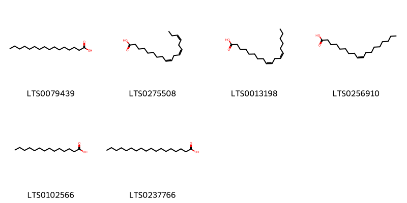{ width=100% }
    <figcaption>Hình ảnh cấu trúc hóa học của 6 hoạt chất thuộc nhóm Fatty Acyls gồm ['palmitic acid (LTS0079439)', 'α-linolenic acid (LTS0275508)', 'linoleic (LTS0013198)', 'oleic acid (LTS0256910)', 'myristic acid (LTS0102566)', 'stearic acid (LTS0237766)'].</figcaption>
</figure>
#### Nhóm Flavonoids
<figure markdown="span">
    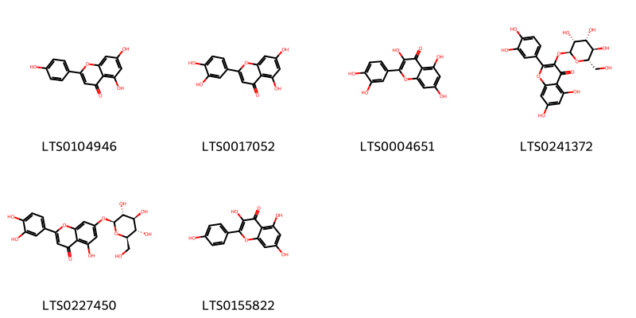{ width=100% }
    <figcaption>Hình ảnh cấu trúc hóa học của 6 hoạt chất thuộc nhóm Flavonoids gồm ['chamomile (LTS0104946)', 'luteolin (LTS0017052)', 'quercetin (LTS0004651)', '2-(3,4-dihydroxyphenyl)-5,7-dihydroxy-3-{[(2s,3r,4r,5r,6s)-3,4,5-trihydroxy-6-(hydroxymethyl)oxan-2-yl]oxy}chromen-4-one (LTS0241372)', 'luteolin 7-o-glucoside (LTS0227450)', 'kaempherol (LTS0155822)'].</figcaption>
</figure>
#### Nhóm Lactones
<figure markdown="span">
    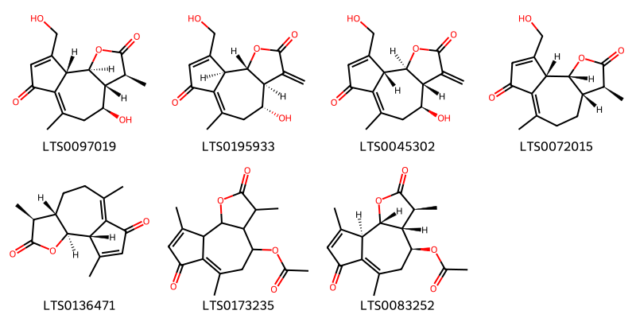{ width=100% }
    <figcaption>Hình ảnh cấu trúc hóa học của 7 hoạt chất thuộc nhóm Lactones gồm ['11β,13-dihydrolactucin (LTS0097019)', '(3as,4r,9ar,9bs)-4-hydroxy-9-(hydroxymethyl)-6-methyl-3-methylidene-3ah,4h,5h,9ah,9bh-azuleno[4,5-b]furan-2,7-dione (LTS0195933)', 'lactucin (LTS0045302)', '(3s,3as,9as,9br)-9-(hydroxymethyl)-3,6-dimethyl-3h,3ah,4h,5h,9ah,9bh-azuleno[4,5-b]furan-2,7-dione (LTS0072015)', 'leucodin (LTS0136471)', '3,6,9-trimethyl-2,7-dioxo-3h,3ah,4h,5h,9ah,9bh-azuleno[4,5-b]furan-4-yl acetate (LTS0173235)', '(3s,3ar,4s,9ar,9bs)-3,6,9-trimethyl-2,7-dioxo-3h,3ah,4h,5h,9ah,9bh-azuleno[4,5-b]furan-4-yl acetate (LTS0083252)'].</figcaption>
</figure>
#### Nhóm Organooxygen compounds
<figure markdown="span">
    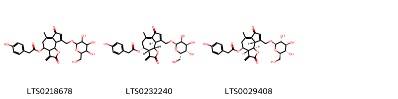{ width=100% }
    <figcaption>Hình ảnh cấu trúc hóa học của 3 hoạt chất thuộc nhóm Organooxygen compounds gồm ['6-methyl-3-methylidene-2,7-dioxo-9-({[3,4,5-trihydroxy-6-(hydroxymethyl)oxan-2-yl]oxy}methyl)-3ah,4h,5h,9ah,9bh-azuleno[4,5-b]furan-4-yl 2-(4-hydroxyphenyl)acetate (LTS0218678)', '(3ar,4r,9ar,9bs)-6-methyl-3-methylidene-2,7-dioxo-9-({[(2r,3s,4s,5s,6s)-3,4,5-trihydroxy-6-(hydroxymethyl)oxan-2-yl]oxy}methyl)-3ah,4h,5h,9ah,9bh-azuleno[4,5-b]furan-4-yl 2-(4-hydroxyphenyl)acetate (LTS0232240)', '(3ar,4s,9as,9br)-6-methyl-3-methylidene-2,7-dioxo-9-({[(2r,3r,4s,5s,6r)-3,4,5-trihydroxy-6-(hydroxymethyl)oxan-2-yl]oxy}methyl)-3ah,4h,5h,9ah,9bh-azuleno[4,5-b]furan-4-yl 2-(4-hydroxyphenyl)acetate (LTS0029408)'].</figcaption>
</figure>
#### Nhóm Phenols
<figure markdown="span">
    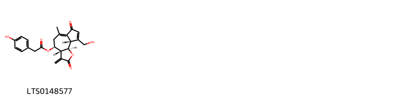{ width=100% }
    <figcaption>Hình ảnh cấu trúc hóa học của 1 hoạt chất thuộc nhóm Phenols gồm ['lactupicrin (LTS0148577)'].</figcaption>
</figure>
#### Nhóm Prenol lipids
<figure markdown="span">
    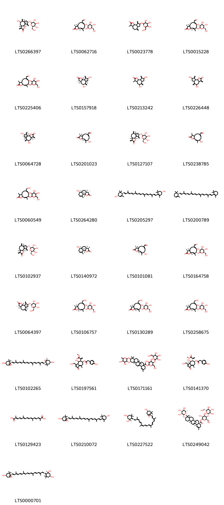{ width=100% }
    <figcaption>Hình ảnh cấu trúc hóa học của 33 hoạt chất thuộc nhóm Prenol lipids gồm ['(3as,5r,6ar,8s,9ar,9bs)-5-hydroxy-3,6,9-trimethylidene-8-{[(2r,3r,4s,5s,6r)-3,4,5-trihydroxy-6-(hydroxymethyl)oxan-2-yl]oxy}-octahydroazuleno[4,5-b]furan-2-one (LTS0266397)', '(3s,3as,9s,11as)-3,10-dimethyl-2-oxo-9-{[(2r,3r,4s,5s,6r)-3,4,5-trihydroxy-6-(hydroxymethyl)oxan-2-yl]oxy}-3h,3ah,4h,5h,8h,9h,11ah-cyclodeca[b]furan-6-carbaldehyde (LTS0062716)', '3-methyl-6,9-dimethylidene-8-{[3,4,5-trihydroxy-6-(hydroxymethyl)oxan-2-yl]oxy}-octahydro-3h-azuleno[4,5-b]furan-2-one (LTS0023778)', '(3s,3as,9r,11as)-3,10-dimethyl-2-oxo-9-{[(2r,3r,4s,5s,6r)-3,4,5-trihydroxy-6-(hydroxymethyl)oxan-2-yl]oxy}-3h,3ah,4h,5h,8h,9h,11ah-cyclodeca[b]furan-6-carbaldehyde (LTS0015228)', '3,10-dimethyl-2-oxo-9-{[3,4,5-trihydroxy-6-(hydroxymethyl)oxan-2-yl]oxy}-3h,3ah,4h,5h,8h,9h,11ah-cyclodeca[b]furan-6-carbaldehyde (LTS0225406)', '(3s,3as,5r,6ar,8s,9ar,9bs)-5,8-dihydroxy-3-methyl-6,9-dimethylidene-octahydro-3h-azuleno[4,5-b]furan-2-one (LTS0157918)', '5,8-dihydroxy-3-methyl-6,9-dimethylidene-octahydro-3h-azuleno[4,5-b]furan-2-one (LTS0213242)', '5,8-dihydroxy-3,6,9-trimethylidene-octahydroazuleno[4,5-b]furan-2-one (LTS0226448)', '(3as,5r,6ar,8s,9ar,9bs)-5,8-dihydroxy-3,6,9-trimethylidene-octahydroazuleno[4,5-b]furan-2-one (LTS0064728)', '(3s,3as,9s,11as)-9-hydroxy-3,10-dimethyl-2-oxo-3h,3ah,4h,5h,8h,9h,11ah-cyclodeca[b]furan-6-carbaldehyde (LTS0201023)', 'vernoflexuoside (LTS0127107)', '9-hydroxy-3,10-dimethyl-2-oxo-3h,3ah,4h,5h,8h,9h,11ah-cyclodeca[b]furan-6-carbaldehyde (LTS0238785)', '6-(hydroxymethyl)-3,10-dimethyl-9-{[3,4,5-trihydroxy-6-(hydroxymethyl)oxan-2-yl]oxy}-3h,3ah,4h,5h,8h,9h,11ah-cyclodeca[b]furan-2-one (LTS0060549)', '(3s,3as,5ar,6r,9as,9bs)-6-hydroxy-3,5a,9-trimethyl-3h,3ah,4h,5h,6h,7h,9ah,9bh-naphtho[1,2-b]furan-2-one (LTS0264280)', 'carotenoid (LTS0205297)', '(+)-α-carotene (LTS0200789)', '(3as,6ar,8s,9ar,9bs)-3,6,9-trimethylidene-8-{[(2s,3r,4s,5r,6r)-3,4,5-trihydroxy-6-(hydroxymethyl)oxan-2-yl]oxy}-octahydroazuleno[4,5-b]furan-2-one (LTS0102937)', '(3r,3as,5ar,6r,9as,9bs)-6-hydroxy-3,5a,9-trimethyl-3h,3ah,4h,5h,6h,7h,9ah,9bh-naphtho[1,2-b]furan-2-one (LTS0140972)', '(3s,3as,9s,11ar)-9-hydroxy-3,10-dimethyl-2-oxo-3h,3ah,4h,5h,8h,9h,11ah-cyclodeca[b]furan-6-carbaldehyde (LTS0101081)', '(3s,3as,9s,11ar)-3,10-dimethyl-2-oxo-9-{[(2r,3r,4s,5s,6r)-3,4,5-trihydroxy-6-(hydroxymethyl)oxan-2-yl]oxy}-3h,3ah,4h,5h,8h,9h,11ah-cyclodeca[b]furan-6-carbaldehyde (LTS0164758)', '(3s,3as,6ar,8s,9ar,9bs)-3-methyl-6,9-dimethylidene-8-{[(2s,3r,4s,5s,6r)-3,4,5-trihydroxy-6-(hydroxymethyl)oxan-2-yl]oxy}-octahydro-3h-azuleno[4,5-b]furan-2-one (LTS0064397)', '(3s,3as,9s,11as)-6-(hydroxymethyl)-3,10-dimethyl-9-{[(2r,3r,4s,5s,6r)-3,4,5-trihydroxy-6-(hydroxymethyl)oxan-2-yl]oxy}-3h,3ah,4h,5h,8h,9h,11ah-cyclodeca[b]furan-2-one (LTS0106757)', '(3s,3as,9s,11ar)-6-(hydroxymethyl)-3,10-dimethyl-9-{[(2r,3r,4s,5s,6r)-3,4,5-trihydroxy-6-(hydroxymethyl)oxan-2-yl]oxy}-3h,3ah,4h,5h,8h,9h,11ah-cyclodeca[b]furan-2-one (LTS0130289)', '(3s,3as,9r,11as)-6-(hydroxymethyl)-3,10-dimethyl-9-{[(2r,3r,4s,5s,6r)-3,4,5-trihydroxy-6-(hydroxymethyl)oxan-2-yl]oxy}-3h,3ah,4h,5h,8h,9h,11ah-cyclodeca[b]furan-2-one (LTS0258675)', 'violaxanthin (LTS0102265)', 'methyl 2-[4-hydroxy-3-(hydroxymethyl)-6-{[2-(4-hydroxyphenyl)acetyl]oxy}-8-methyl-1-oxo-4,5,6,7-tetrahydro-3ah-azulen-5-yl]prop-2-enoate (LTS0197561)', '3,4-dihydroxy-6-(hydroxymethyl)-5-{[3,4,5-trihydroxy-6-(hydroxymethyl)oxan-2-yl]oxy}oxan-2-yl 2,6a,6b,9,9,12a-hexamethyl-10-[(3,4,5-trihydroxy-6-methyloxan-2-yl)oxy]-4,5,6,7,8,8a,10,11,12,12b,13,14b-dodecahydro-3h-picene-4a-carboxylate (LTS0171161)', 'methyl 2-[(3as,4r,5s,6s)-4-hydroxy-3-(hydroxymethyl)-6-{[2-(4-hydroxyphenyl)acetyl]oxy}-8-methyl-1-oxo-4,5,6,7-tetrahydro-3ah-azulen-5-yl]prop-2-enoate (LTS0141370)', 'crocetin (LTS0129423)', 'antheraxanthin (LTS0210072)', 'neoxanthin (LTS0227522)', '(2s,3r,4r,5r,6r)-3,4-dihydroxy-6-(hydroxymethyl)-5-{[(2s,3r,4s,5s,6r)-3,4,5-trihydroxy-6-(hydroxymethyl)oxan-2-yl]oxy}oxan-2-yl (4as,6as,6br,8ar,10s,12ar,12br,14bs)-2,6a,6b,9,9,12a-hexamethyl-10-{[(2r,3r,4r,5r,6s)-3,4,5-trihydroxy-6-methyloxan-2-yl]oxy}-4,5,6,7,8,8a,10,11,12,12b,13,14b-dodecahydro-3h-picene-4a-carboxylate (LTS0249042)', 'neoxanthin (LTS0000701)'].</figcaption>
</figure>

---

### Dược dân tộc học

Danh sách các quốc gia có sử dụng *Lactuca serriola* trong điều trị các bệnh. 

| Country   | Disease   | Bệnh                                                                                                                                                                                                |
|:----------|:----------|:----------------------------------------------------------------------------------------------------------------------------------------------------------------------------------------------------|
| Elsewhere | Hypnotic  | MYMEMORY WARNING: YOU USED ALL AVAILABLE FREE TRANSLATIONS FOR TODAY. NEXT AVAILABLE IN  10 HOURS 24 MINUTES 07 SECONDS VISIT HTTPS://MYMEMORY.TRANSLATED.NET/DOC/USAGELIMITS.PHP TO TRANSLATE MORE |

---

---
## Lactuca virosa
### Thông tin về thực vật

!!! info "Phân loại thực vật của *Lactuca virosa* từ GIBF:"
    - **Kingdom:** Plantae
    - **Phylum:** Tracheophyta
    - **Order:** Asterales
    - **Family:** Asteraceae
    - **Genus:** Lactuca
    - **Species:** *Lactuca virosa*

 

| Label (VI)   | Label (EN)   | Scientific Name   | Descriptions (VI)   | Descriptions (EN)   | Also Known As (VI)   | Also Known As (EN)   |
|:-------------|:-------------|:------------------|:--------------------|:--------------------|:---------------------|:---------------------|
| N/A          | N/A          | Lactuca virosa    | loài thực vật       | species of plant    | ['']                 | ['']                 |

#### Phân bố trên thế giới

**Từ CSDL GIBF** Netherlands, Italy, Luxembourg, Germany, New Zealand, Spain, Portugal, Switzerland, India, United States of America, France, Greece, United Kingdom of Great Britain and Northern Ireland

#### Phân bố tại Việt Nam

**Từ CSDL GIBF**: Không có ghi nhận ở Việt Nam

---
### Thành phần hóa học
        
- Theo cơ sở dữ liệu lotus: Từ loài *Lactuca virosa* đã phân lập và xác định được 53 hoạt chất thuộc về các nhóm Flavonoids, Prenol lipids, Lactones, Organooxygen compounds, Phenols, Coumarins and derivatives. 

|    | chemicalTaxonomyClassyfireClass   |   smiles_count |
|---:|:----------------------------------|---------------:|
|  0 | Coumarins and derivatives         |              1 |
|  1 | Flavonoids                        |              3 |
|  2 | Lactones                          |             11 |
|  3 | Organooxygen compounds            |              7 |
|  4 | Phenols                           |              5 |
|  5 | Prenol lipids                     |             26 |

#### Nhóm Coumarins and derivatives
<figure markdown="span">
    { width=100% }
    <figcaption>Hình ảnh cấu trúc hóa học của 1 hoạt chất thuộc nhóm Coumarins and derivatives gồm ['cichoriin (LTS0075962)'].</figcaption>
</figure>
#### Nhóm Flavonoids
<figure markdown="span">
    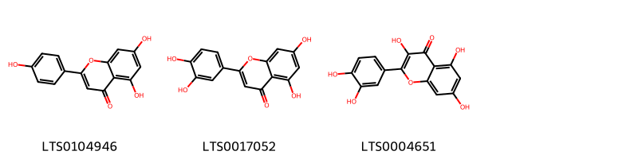{ width=100% }
    <figcaption>Hình ảnh cấu trúc hóa học của 3 hoạt chất thuộc nhóm Flavonoids gồm ['chamomile (LTS0104946)', 'luteolin (LTS0017052)', 'quercetin (LTS0004651)'].</figcaption>
</figure>
#### Nhóm Lactones
<figure markdown="span">
    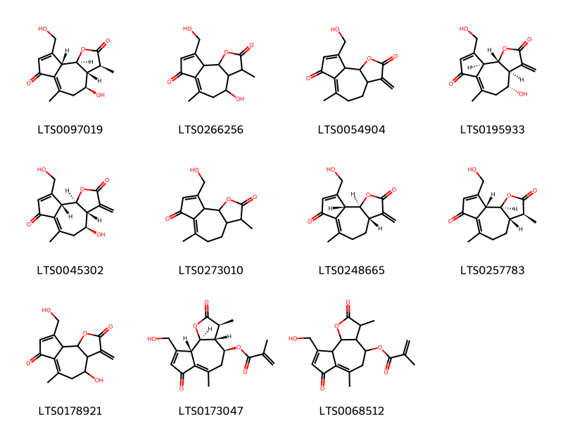{ width=100% }
    <figcaption>Hình ảnh cấu trúc hóa học của 11 hoạt chất thuộc nhóm Lactones gồm ['11β,13-dihydrolactucin (LTS0097019)', '4-hydroxy-9-(hydroxymethyl)-3,6-dimethyl-3h,3ah,4h,5h,9ah,9bh-azuleno[4,5-b]furan-2,7-dione (LTS0266256)', '9-(hydroxymethyl)-6-methyl-3-methylidene-3ah,4h,5h,9ah,9bh-azuleno[4,5-b]furan-2,7-dione (LTS0054904)', '(3as,4r,9ar,9bs)-4-hydroxy-9-(hydroxymethyl)-6-methyl-3-methylidene-3ah,4h,5h,9ah,9bh-azuleno[4,5-b]furan-2,7-dione (LTS0195933)', 'lactucin (LTS0045302)', '9-(hydroxymethyl)-3,6-dimethyl-3h,3ah,4h,5h,9ah,9bh-azuleno[4,5-b]furan-2,7-dione (LTS0273010)', '8-deoxylactucin (LTS0248665)', '(3s,3as,9as,9bs)-9-(hydroxymethyl)-3,6-dimethyl-3h,3ah,4h,5h,9ah,9bh-azuleno[4,5-b]furan-2,7-dione (LTS0257783)', '4-hydroxy-9-(hydroxymethyl)-6-methyl-3-methylidene-3ah,4h,5h,9ah,9bh-azuleno[4,5-b]furan-2,7-dione (LTS0178921)', '(3s,3ar,4s,9as,9br)-9-(hydroxymethyl)-3,6-dimethyl-2,7-dioxo-3h,3ah,4h,5h,9ah,9bh-azuleno[4,5-b]furan-4-yl 2-methylprop-2-enoate (LTS0173047)', '9-(hydroxymethyl)-3,6-dimethyl-2,7-dioxo-3h,3ah,4h,5h,9ah,9bh-azuleno[4,5-b]furan-4-yl 2-methylprop-2-enoate (LTS0068512)'].</figcaption>
</figure>
#### Nhóm Organooxygen compounds
<figure markdown="span">
    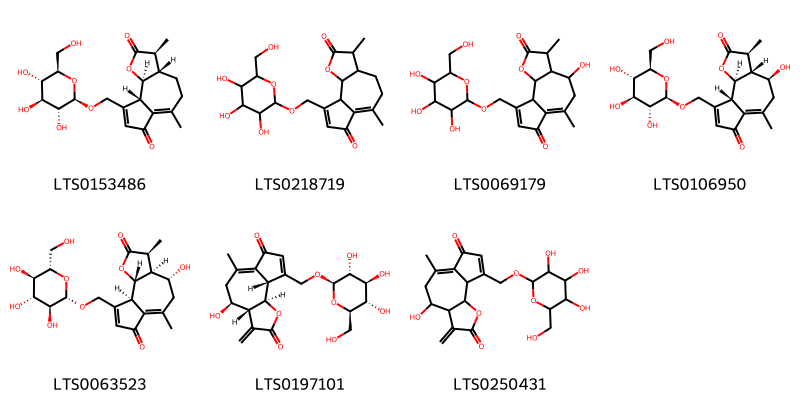{ width=100% }
    <figcaption>Hình ảnh cấu trúc hóa học của 7 hoạt chất thuộc nhóm Organooxygen compounds gồm ['(3s,3as,9as,9bs)-3,6-dimethyl-9-({[(2r,3r,4s,5s,6r)-3,4,5-trihydroxy-6-(hydroxymethyl)oxan-2-yl]oxy}methyl)-3h,3ah,4h,5h,9ah,9bh-azuleno[4,5-b]furan-2,7-dione (LTS0153486)', '3,6-dimethyl-9-({[3,4,5-trihydroxy-6-(hydroxymethyl)oxan-2-yl]oxy}methyl)-3h,3ah,4h,5h,9ah,9bh-azuleno[4,5-b]furan-2,7-dione (LTS0218719)', '4-hydroxy-3,6-dimethyl-9-({[3,4,5-trihydroxy-6-(hydroxymethyl)oxan-2-yl]oxy}methyl)-3h,3ah,4h,5h,9ah,9bh-azuleno[4,5-b]furan-2,7-dione (LTS0069179)', '(3s,3ar,4s,9as,9br)-4-hydroxy-3,6-dimethyl-9-({[(2r,3r,4s,5s,6r)-3,4,5-trihydroxy-6-(hydroxymethyl)oxan-2-yl]oxy}methyl)-3h,3ah,4h,5h,9ah,9bh-azuleno[4,5-b]furan-2,7-dione (LTS0106950)', '(3s,3as,4r,9ar,9bs)-4-hydroxy-3,6-dimethyl-9-({[(2s,3s,4r,5r,6s)-3,4,5-trihydroxy-6-(hydroxymethyl)oxan-2-yl]oxy}methyl)-3h,3ah,4h,5h,9ah,9bh-azuleno[4,5-b]furan-2,7-dione (LTS0063523)', '(3ar,4s,9as,9br)-4-hydroxy-6-methyl-3-methylidene-9-({[(2r,3r,4s,5s,6r)-3,4,5-trihydroxy-6-(hydroxymethyl)oxan-2-yl]oxy}methyl)-3ah,4h,5h,9ah,9bh-azuleno[4,5-b]furan-2,7-dione (LTS0197101)', '4-hydroxy-6-methyl-3-methylidene-9-({[3,4,5-trihydroxy-6-(hydroxymethyl)oxan-2-yl]oxy}methyl)-3ah,4h,5h,9ah,9bh-azuleno[4,5-b]furan-2,7-dione (LTS0250431)'].</figcaption>
</figure>
#### Nhóm Phenols
<figure markdown="span">
    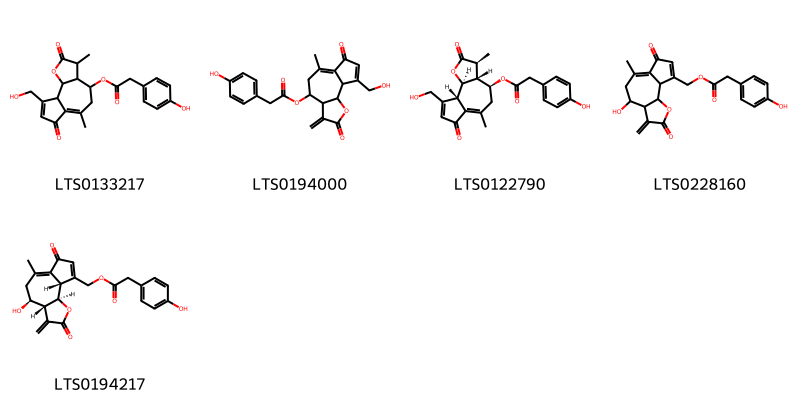{ width=100% }
    <figcaption>Hình ảnh cấu trúc hóa học của 5 hoạt chất thuộc nhóm Phenols gồm ['9-(hydroxymethyl)-3,6-dimethyl-2,7-dioxo-3h,3ah,4h,5h,9ah,9bh-azuleno[4,5-b]furan-4-yl 2-(4-hydroxyphenyl)acetate (LTS0133217)', '9-(hydroxymethyl)-6-methyl-3-methylidene-2,7-dioxo-3ah,4h,5h,9ah,9bh-azuleno[4,5-b]furan-4-yl 2-(4-hydroxyphenyl)acetate (LTS0194000)', '11β,13-dihydrolactucopicrin (LTS0122790)', '{4-hydroxy-6-methyl-3-methylidene-2,7-dioxo-3ah,4h,5h,9ah,9bh-azuleno[4,5-b]furan-9-yl}methyl 2-(4-hydroxyphenyl)acetate (LTS0228160)', 'lactucopicrin (LTS0194217)'].</figcaption>
</figure>
#### Nhóm Prenol lipids
<figure markdown="span">
    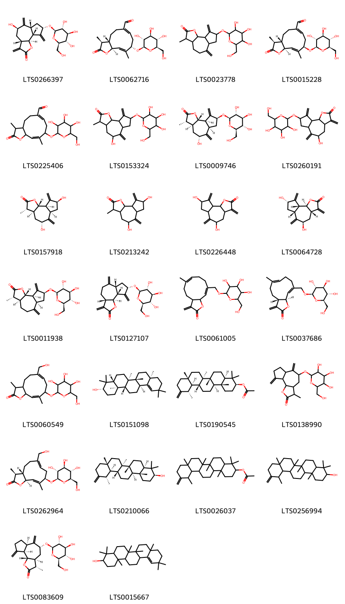{ width=100% }
    <figcaption>Hình ảnh cấu trúc hóa học của 26 hoạt chất thuộc nhóm Prenol lipids gồm ['(3as,5r,6ar,8s,9ar,9bs)-5-hydroxy-3,6,9-trimethylidene-8-{[(2r,3r,4s,5s,6r)-3,4,5-trihydroxy-6-(hydroxymethyl)oxan-2-yl]oxy}-octahydroazuleno[4,5-b]furan-2-one (LTS0266397)', '(3s,3as,9s,11as)-3,10-dimethyl-2-oxo-9-{[(2r,3r,4s,5s,6r)-3,4,5-trihydroxy-6-(hydroxymethyl)oxan-2-yl]oxy}-3h,3ah,4h,5h,8h,9h,11ah-cyclodeca[b]furan-6-carbaldehyde (LTS0062716)', '3-methyl-6,9-dimethylidene-8-{[3,4,5-trihydroxy-6-(hydroxymethyl)oxan-2-yl]oxy}-octahydro-3h-azuleno[4,5-b]furan-2-one (LTS0023778)', '(3s,3as,9r,11as)-3,10-dimethyl-2-oxo-9-{[(2r,3r,4s,5s,6r)-3,4,5-trihydroxy-6-(hydroxymethyl)oxan-2-yl]oxy}-3h,3ah,4h,5h,8h,9h,11ah-cyclodeca[b]furan-6-carbaldehyde (LTS0015228)', '3,10-dimethyl-2-oxo-9-{[3,4,5-trihydroxy-6-(hydroxymethyl)oxan-2-yl]oxy}-3h,3ah,4h,5h,8h,9h,11ah-cyclodeca[b]furan-6-carbaldehyde (LTS0225406)', '5-hydroxy-3-methyl-6,9-dimethylidene-8-{[3,4,5-trihydroxy-6-(hydroxymethyl)oxan-2-yl]oxy}-octahydro-3h-azuleno[4,5-b]furan-2-one (LTS0153324)', '(3s,3as,5r,6ar,8s,9ar,9bs)-5-hydroxy-3-methyl-6,9-dimethylidene-8-{[(2r,3r,4s,5s,6r)-3,4,5-trihydroxy-6-(hydroxymethyl)oxan-2-yl]oxy}-octahydro-3h-azuleno[4,5-b]furan-2-one (LTS0009746)', '5-hydroxy-3,6,9-trimethylidene-8-{[3,4,5-trihydroxy-6-(hydroxymethyl)oxan-2-yl]oxy}-octahydroazuleno[4,5-b]furan-2-one (LTS0260191)', '(3s,3as,5r,6ar,8s,9ar,9bs)-5,8-dihydroxy-3-methyl-6,9-dimethylidene-octahydro-3h-azuleno[4,5-b]furan-2-one (LTS0157918)', '5,8-dihydroxy-3-methyl-6,9-dimethylidene-octahydro-3h-azuleno[4,5-b]furan-2-one (LTS0213242)', '5,8-dihydroxy-3,6,9-trimethylidene-octahydroazuleno[4,5-b]furan-2-one (LTS0226448)', '(3as,5r,6ar,8s,9ar,9bs)-5,8-dihydroxy-3,6,9-trimethylidene-octahydroazuleno[4,5-b]furan-2-one (LTS0064728)', '(3s,3as,6ar,8s,9ar,9bs)-3-methyl-6,9-dimethylidene-8-{[(2r,3r,4s,5s,6r)-3,4,5-trihydroxy-6-(hydroxymethyl)oxan-2-yl]oxy}-octahydro-3h-azuleno[4,5-b]furan-2-one (LTS0011938)', 'vernoflexuoside (LTS0127107)', '6-methyl-3-methylidene-10-({[3,4,5-trihydroxy-6-(hydroxymethyl)oxan-2-yl]oxy}methyl)-3ah,4h,5h,8h,9h,11ah-cyclodeca[b]furan-2-one (LTS0061005)', '(3as,11ar)-6-methyl-3-methylidene-10-({[(2r,3r,4s,5s,6r)-3,4,5-trihydroxy-6-(hydroxymethyl)oxan-2-yl]oxy}methyl)-3ah,4h,5h,8h,9h,11ah-cyclodeca[b]furan-2-one (LTS0037686)', '6-(hydroxymethyl)-3,10-dimethyl-9-{[3,4,5-trihydroxy-6-(hydroxymethyl)oxan-2-yl]oxy}-3h,3ah,4h,5h,8h,9h,11ah-cyclodeca[b]furan-2-one (LTS0060549)', 'germanicol (LTS0151098)', 'taraxasterol acetate (LTS0190545)', '3-methyl-6,9-dimethylidene-5-{[3,4,5-trihydroxy-6-(hydroxymethyl)oxan-2-yl]oxy}-octahydro-3h-azuleno[4,5-b]furan-2-one (LTS0138990)', '(3s,3as,9r,11as)-6-(hydroxymethyl)-3,10-dimethyl-9-{[(2r,3r,4s,5s,6r)-3,4,5-trihydroxy-6-(hydroxymethyl)oxan-2-yl]oxy}-3h,3ah,4h,5h,8h,9h,11ah-cyclodeca[b]furan-2-one (LTS0262964)', 'taraxasterol (LTS0210066)', '4,4,6a,6b,8a,12,14b-heptamethyl-11-methylidene-hexadecahydropicen-3-yl acetate (LTS0026037)', '4,4,6a,6b,8a,12,14b-heptamethyl-11-methylidene-hexadecahydropicen-3-ol (LTS0256994)', '(3s,3as,5r,6ar,9ar,9bs)-3-methyl-6,9-dimethylidene-5-{[(2r,3r,4s,5s,6r)-3,4,5-trihydroxy-6-(hydroxymethyl)oxan-2-yl]oxy}-octahydro-3h-azuleno[4,5-b]furan-2-one (LTS0083609)', '4,4,6a,6b,8a,11,11,14b-octamethyl-1,2,3,4a,5,6,7,8,9,10,12b,13,14,14a-tetradecahydropicen-3-ol (LTS0015667)'].</figcaption>
</figure>

---

### Dược dân tộc học

Danh sách các quốc gia có sử dụng *Lactuca virosa* trong điều trị các bệnh. 

| Country   | Disease                                                                               | Bệnh                                                                                                                                                                                                |
|:----------|:--------------------------------------------------------------------------------------|:----------------------------------------------------------------------------------------------------------------------------------------------------------------------------------------------------|
| Elsewhere | Diuretic, Expectorant, Hypnotic, Sedative, Sedative, Antitussive, Diuretic, Soporific | MYMEMORY WARNING: YOU USED ALL AVAILABLE FREE TRANSLATIONS FOR TODAY. NEXT AVAILABLE IN  10 HOURS 23 MINUTES 31 SECONDS VISIT HTTPS://MYMEMORY.TRANSLATED.NET/DOC/USAGELIMITS.PHP TO TRANSLATE MORE |
| Turkey    | Expectorant, Hypnotic, Laxative, Narcotic, Sedative, Diuretic, Poison, Sudorific      | MYMEMORY WARNING: YOU USED ALL AVAILABLE FREE TRANSLATIONS FOR TODAY. NEXT AVAILABLE IN  10 HOURS 23 MINUTES 28 SECONDS VISIT HTTPS://MYMEMORY.TRANSLATED.NET/DOC/USAGELIMITS.PHP TO TRANSLATE MORE |
| ain       | Hypnotic                                                                              | MYMEMORY WARNING: YOU USED ALL AVAILABLE FREE TRANSLATIONS FOR TODAY. NEXT AVAILABLE IN  10 HOURS 23 MINUTES 24 SECONDS VISIT HTTPS://MYMEMORY.TRANSLATED.NET/DOC/USAGELIMITS.PHP TO TRANSLATE MORE |

---

# Chi Artemisia

??? note "Danh sách các dược liệu thuộc chi"
    
	 - *Artemisia abrotanum*
	 - *Artemisia absinthium*
	 - *Artemisia absinthum*
	 - *Artemisia afra*
	 - *Artemisia annua*
	 - *Artemisia apiacea*
	 - *Artemisia arborescens*
	 - *Artemisia campestris*
	 - *Artemisia cana*
	 - *Artemisia capillaris*
	 - *Artemisia carvifolia*
	 - *Artemisia cina*
	 - *Artemisia dracunculus*
	 - *Artemisia filifolia*
	 - *Artemisia frigida*
	 - *Artemisia granatensis*
	 - *Artemisia herba-alba*
	 - *Artemisia inescens*
	 - *Artemisia laxa*
	 - *Artemisia maciverae*
	 - *Artemisia maritima*
	 - *Artemisia mendozana*
	 - *Artemisia mexicana*
	 - *Artemisia mutellina*
	 - *Artemisia pontica*
	 - *Artemisia princeps*
	 - *Artemisia stelleriana*
	 - *Artemisia tridentata*
	 - *Artemisia vallesiaca*
	 - *Artemisia vulgaris*

---
## Artemisia abrotanum
### Thông tin về thực vật

!!! info "Phân loại thực vật của *Artemisia abrotanum* từ GIBF:"
    - **Kingdom:** Plantae
    - **Phylum:** Tracheophyta
    - **Order:** Asterales
    - **Family:** Asteraceae
    - **Genus:** Artemisia
    - **Species:** *Artemisia abrotanum*

 

| Label (VI)   | Label (EN)   | Scientific Name     | Descriptions (VI)   | Descriptions (EN)   | Also Known As (VI)   | Also Known As (EN)          |
|:-------------|:-------------|:--------------------|:--------------------|:--------------------|:---------------------|:----------------------------|
| N/A          | N/A          | Artemisia abrotanum | loài thực vật       | species of plant    | ['']                 | ['old man', 'southernwood'] |

#### Phân bố trên thế giới

**Từ CSDL GIBF** Ukraine, Russian Federation, Sweden, Austria, Kazakhstan

#### Phân bố tại Việt Nam

**Từ CSDL GIBF**: Không có ghi nhận ở Việt Nam

---
### Thành phần hóa học
        
- Theo cơ sở dữ liệu lotus: Từ loài *Artemisia abrotanum* đã phân lập và xác định được 40 hoạt chất thuộc về các nhóm Flavonoids, Prenol lipids, Tetrahydrofurans, Oxolanes, Lactones, Coumarins and derivatives, Dioxolanes. 

|    | chemicalTaxonomyClassyfireClass   |   smiles_count |
|---:|:----------------------------------|---------------:|
|  0 | Coumarins and derivatives         |              5 |
|  1 | Dioxolanes                        |              3 |
|  2 | Flavonoids                        |              6 |
|  3 | Lactones                          |              4 |
|  4 | Oxolanes                          |              4 |
|  5 | Prenol lipids                     |             13 |
|  6 | Tetrahydrofurans                  |              5 |

#### Nhóm Coumarins and derivatives
<figure markdown="span">
    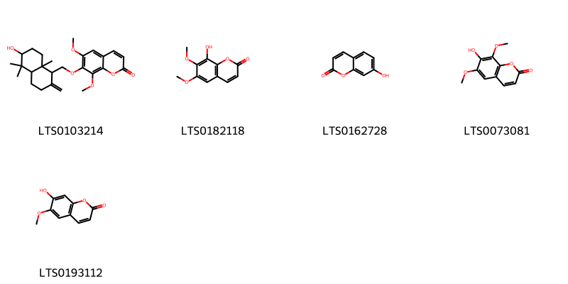{ width=100% }
    <figcaption>Hình ảnh cấu trúc hóa học của 5 hoạt chất thuộc nhóm Coumarins and derivatives gồm ['7-[(6-hydroxy-5,5,8a-trimethyl-2-methylidene-hexahydro-1h-naphthalen-1-yl)methoxy]-6,8-dimethoxychromen-2-one (LTS0103214)', 'fraxidin (LTS0182118)', 'umbelliferone (LTS0162728)', 'isofraxidin (LTS0073081)', 'scopoletin (LTS0193112)'].</figcaption>
</figure>
#### Nhóm Dioxolanes
<figure markdown="span">
    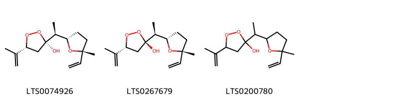{ width=100% }
    <figcaption>Hình ảnh cấu trúc hóa học của 3 hoạt chất thuộc nhóm Dioxolanes gồm ['(3r,5r)-3-[(1s)-1-[(2s,5r)-5-ethenyl-5-methyloxolan-2-yl]ethyl]-5-(prop-1-en-2-yl)-1,2-dioxolan-3-ol (LTS0074926)', '(3s,5r)-3-[(1s)-1-[(2s,5r)-5-ethenyl-5-methyloxolan-2-yl]ethyl]-5-(prop-1-en-2-yl)-1,2-dioxolan-3-ol (LTS0267679)', '3-[1-(5-ethenyl-5-methyloxolan-2-yl)ethyl]-5-(prop-1-en-2-yl)-1,2-dioxolan-3-ol (LTS0200780)'].</figcaption>
</figure>
#### Nhóm Flavonoids
<figure markdown="span">
    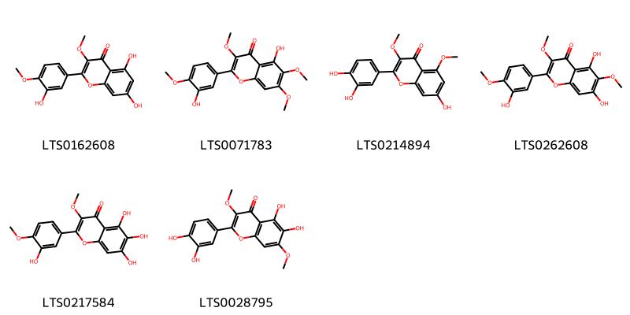{ width=100% }
    <figcaption>Hình ảnh cấu trúc hóa học của 6 hoạt chất thuộc nhóm Flavonoids gồm ["quercetin 3,4'-dimethyl ether (LTS0162608)", 'casticin (LTS0071783)', 'caryatin (LTS0214894)', 'centaureidin (LTS0262608)', '5,6,7-trihydroxy-2-(3-hydroxy-4-methoxyphenyl)-3-methoxychromen-4-one (LTS0217584)', 'tomentin (LTS0028795)'].</figcaption>
</figure>
#### Nhóm Lactones
<figure markdown="span">
    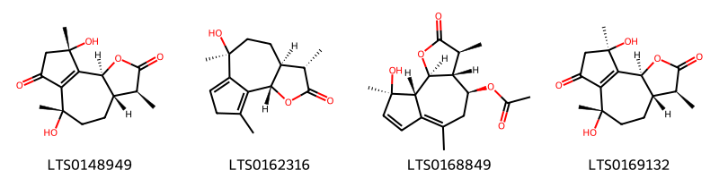{ width=100% }
    <figcaption>Hình ảnh cấu trúc hóa học của 4 hoạt chất thuộc nhóm Lactones gồm ['(3s,3as,6s,9s,9bs)-6,9-dihydroxy-3,6,9-trimethyl-3h,3ah,4h,5h,8h,9bh-azuleno[4,5-b]furan-2,7-dione (LTS0148949)', 'artabsin (LTS0162316)', 'matricin (LTS0168849)', '(3s,3as,6s,9r,9bs)-6,9-dihydroxy-3,6,9-trimethyl-3h,3ah,4h,5h,8h,9bh-azuleno[4,5-b]furan-2,7-dione (LTS0169132)'].</figcaption>
</figure>
#### Nhóm Oxolanes
<figure markdown="span">
    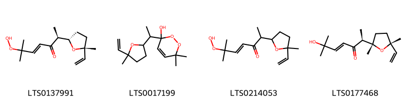{ width=100% }
    <figcaption>Hình ảnh cấu trúc hóa học của 4 hoạt chất thuộc nhóm Oxolanes gồm ['(2s,4e)-2-[(2s,5r)-5-ethenyl-5-methyloxolan-2-yl]-6-hydroperoxy-6-methylhept-4-en-3-one (LTS0137991)', '3-[1-(5-ethenyl-5-methyloxolan-2-yl)ethyl]-6,6-dimethyl-1,2-dioxin-3-ol (LTS0017199)', '2-(5-ethenyl-5-methyloxolan-2-yl)-6-hydroperoxy-6-methylhept-4-en-3-one (LTS0214053)', '(2s,4e)-2-[(2s,5r)-5-ethenyl-2,5-dimethyloxolan-2-yl]-6-hydroxy-6-methylhept-4-en-3-one (LTS0177468)'].</figcaption>
</figure>
#### Nhóm Prenol lipids
<figure markdown="span">
    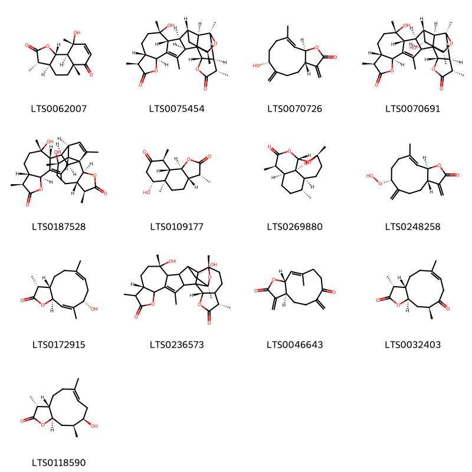{ width=100% }
    <figcaption>Hình ảnh cấu trúc hóa học của 13 hoạt chất thuộc nhóm Prenol lipids gồm ['vulgarin (LTS0062007)', 'anabsinthin (LTS0075454)', 'artemorin (LTS0070726)', '(1s,2r,5s,8s,9s,12s,13r,14r,15r,16r,17s,19s,22s,23s,26s,27r)-12,16-dihydroxy-3,8,12,17,19,23-hexamethyl-6,18,25-trioxaoctacyclo[13.11.1.0¹,¹⁷.0²,¹⁴.0⁴,¹³.0⁵,⁹.0¹⁹,²⁷.0²²,²⁶]heptacos-3-ene-7,24-dione (LTS0070691)', '(+)-absinthin (LTS0187528)', '(3r,3as,5ar,6r,9s,9as,9bs)-6-hydroxy-3,5a,9-trimethyl-octahydro-3h-naphtho[1,2-b]furan-2,8-dione (LTS0109177)', '(+)-artemisinin (LTS0269880)', 'verlotorin (LTS0248258)', '(3r,3as,9s,11as)-9-hydroxy-3,6,10-trimethyl-3h,3ah,4h,5h,8h,9h,11ah-cyclodeca[b]furan-2-one (LTS0172915)', '(9s,12s,16r,17s,19s,23s,26s)-12,16-dihydroxy-3,8,12,17,19,23-hexamethyl-6,18,25-trioxaoctacyclo[13.11.1.0¹,¹⁷.0²,¹⁴.0⁴,¹³.0⁵,⁹.0¹⁹,²⁷.0²²,²⁶]heptacos-3-ene-7,24-dione (LTS0236573)', '(3as,11ar)-10-methyl-3,6-dimethylidene-3ah,4h,5h,8h,9h,11ah-cyclodeca[b]furan-2,7-dione (LTS0046643)', 'ketopelenolide a (LTS0032403)', '(3r,3as,9r,10s,11ar)-9-hydroxy-3,6,10-trimethyl-3h,3ah,4h,5h,8h,9h,10h,11h,11ah-cyclodeca[b]furan-2-one (LTS0118590)'].</figcaption>
</figure>
#### Nhóm Tetrahydrofurans
<figure markdown="span">
    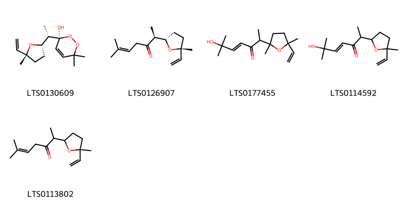{ width=100% }
    <figcaption>Hình ảnh cấu trúc hóa học của 5 hoạt chất thuộc nhóm Tetrahydrofurans gồm ['(3s)-3-[(1s)-1-[(2s,5r)-5-ethenyl-5-methyloxolan-2-yl]ethyl]-6,6-dimethyl-1,2-dioxin-3-ol (LTS0130609)', '(2s)-2-[(2s,5r)-5-ethenyl-5-methyloxolan-2-yl]-6-methylhept-5-en-3-one (LTS0126907)', '2-(5-ethenyl-2,5-dimethyloxolan-2-yl)-6-hydroxy-6-methylhept-4-en-3-one (LTS0177455)', '(4e)-2-(5-ethenyl-5-methyloxolan-2-yl)-6-hydroxy-6-methylhept-4-en-3-one (LTS0114592)', '2-(5-ethenyl-5-methyloxolan-2-yl)-6-methylhept-5-en-3-one (LTS0113802)'].</figcaption>
</figure>

---

### Dược dân tộc học

Danh sách các quốc gia có sử dụng *Artemisia abrotanum* trong điều trị các bệnh. 

| Country   | Disease                                                                      | Bệnh                                                                                                                                                                                                |
|:----------|:-----------------------------------------------------------------------------|:----------------------------------------------------------------------------------------------------------------------------------------------------------------------------------------------------|
| Turkey    | Antiseptic, Vulnerary, Emmenagogue, Expectorant, Stimulant, Tonic, Vermifuge | MYMEMORY WARNING: YOU USED ALL AVAILABLE FREE TRANSLATIONS FOR TODAY. NEXT AVAILABLE IN  10 HOURS 22 MINUTES 53 SECONDS VISIT HTTPS://MYMEMORY.TRANSLATED.NET/DOC/USAGELIMITS.PHP TO TRANSLATE MORE |

---

---
## Artemisia absinthium
### Thông tin về thực vật

!!! info "Phân loại thực vật của *Artemisia absinthium* từ GIBF:"
    - **Kingdom:** Plantae
    - **Phylum:** Tracheophyta
    - **Order:** Asterales
    - **Family:** Asteraceae
    - **Genus:** Artemisia
    - **Species:** *Artemisia absinthium*

 

| Label (VI)   | Label (EN)   | Scientific Name      | Descriptions (VI)   | Descriptions (EN)   | Also Known As (VI)   | Also Known As (EN)                                                                                                               |
|:-------------|:-------------|:---------------------|:--------------------|:--------------------|:---------------------|:---------------------------------------------------------------------------------------------------------------------------------|
| N/A          | N/A          | Artemisia absinthium |                     | species of plant    | ['']                 | ['absinthe', 'wormwood', 'absinthe wormwood', 'absinthium', 'grand wormwood', 'wermout', 'wermud', 'wormid', 'wormit', 'wormod'] |

#### Phân bố trên thế giới

**Từ CSDL GIBF** Italy, Bulgaria, Canada, Ukraine, Netherlands, Belarus, Spain, Hungary, Russian Federation, United States of America, Sweden, Kazakhstan, Czechia, Germany, Switzerland, Armenia, Austria, France, United Kingdom of Great Britain and Northern Ireland, Poland

#### Phân bố tại Việt Nam

**Từ CSDL GIBF**: Không có ghi nhận ở Việt Nam

---
### Thành phần hóa học
        
- Theo cơ sở dữ liệu lotus: Từ loài *Artemisia absinthium* đã phân lập và xác định được 145 hoạt chất thuộc về các nhóm Fatty Acyls, Flavonoids, Prenol lipids, Indoles and derivatives, Cinnamic acids and derivatives, Tetrahydrofurans, Oxolanes, Benzene and substituted derivatives, Unsaturated hydrocarbons, Lactones, Saturated hydrocarbons, Organooxygen compounds, Coumarins and derivatives, Epoxides, Furanoid lignans, Carboxylic acids and derivatives. 

|    | chemicalTaxonomyClassyfireClass     |   smiles_count |
|---:|:------------------------------------|---------------:|
|  0 | Benzene and substituted derivatives |              3 |
|  1 | Carboxylic acids and derivatives    |              9 |
|  2 | Cinnamic acids and derivatives      |              2 |
|  3 | Coumarins and derivatives           |              4 |
|  4 | Epoxides                            |              2 |
|  5 | Fatty Acyls                         |              7 |
|  6 | Flavonoids                          |              2 |
|  7 | Furanoid lignans                    |             21 |
|  8 | Indoles and derivatives             |              1 |
|  9 | Lactones                            |              9 |
| 10 | Organooxygen compounds              |              7 |
| 11 | Oxolanes                            |              1 |
| 12 | Prenol lipids                       |             74 |
| 13 | Saturated hydrocarbons              |              1 |
| 14 | Tetrahydrofurans                    |              1 |
| 15 | Unsaturated hydrocarbons            |              1 |

#### Nhóm Benzene and substituted derivatives
<figure markdown="span">
    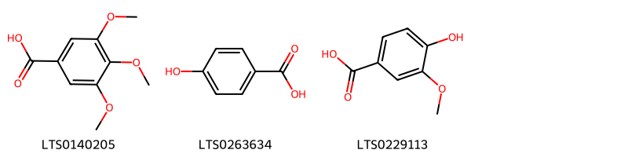{ width=100% }
    <figcaption>Hình ảnh cấu trúc hóa học của 3 hoạt chất thuộc nhóm Benzene and substituted derivatives gồm ['3,4,5-trimethoxybenzoic acid (LTS0140205)', 'p-hydroxybenzoic acid (LTS0263634)', 'vanillic acid (LTS0229113)'].</figcaption>
</figure>
#### Nhóm Carboxylic acids and derivatives
<figure markdown="span">
    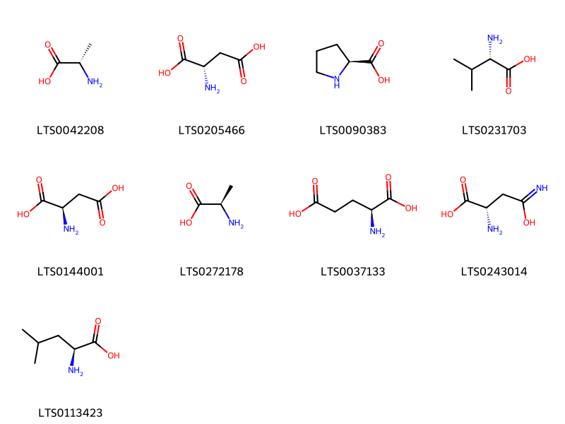{ width=100% }
    <figcaption>Hình ảnh cấu trúc hóa học của 9 hoạt chất thuộc nhóm Carboxylic acids and derivatives gồm ['l-alanine (LTS0042208)', 'l-aspartic acid (LTS0205466)', 'l-proline (LTS0090383)', 'l-valine (LTS0231703)', 'd-aspartic acid (LTS0144001)', 'd-alanine (LTS0272178)', 'l-glutamic acid (LTS0037133)', 'aspartamate (LTS0243014)', 'l-leucine (LTS0113423)'].</figcaption>
</figure>
#### Nhóm Cinnamic acids and derivatives
<figure markdown="span">
    { width=100% }
    <figcaption>Hình ảnh cấu trúc hóa học của 2 hoạt chất thuộc nhóm Cinnamic acids and derivatives gồm ['ferulic acid (LTS0077328)', '3,4-dihydroxycinnamic acid (LTS0128050)'].</figcaption>
</figure>
#### Nhóm Coumarins and derivatives
<figure markdown="span">
    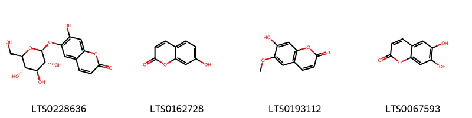{ width=100% }
    <figcaption>Hình ảnh cấu trúc hóa học của 4 hoạt chất thuộc nhóm Coumarins and derivatives gồm ['esculin (LTS0228636)', 'umbelliferone (LTS0162728)', 'scopoletin (LTS0193112)', 'esculetin (LTS0067593)'].</figcaption>
</figure>
#### Nhóm Epoxides
<figure markdown="span">
    { width=100% }
    <figcaption>Hình ảnh cấu trúc hóa học của 2 hoạt chất thuộc nhóm Epoxides gồm ['(2r,3s)-2-ethenyl-2-methyl-3-(3-methylbut-2-en-1-yl)oxirane (LTS0227173)', '(e)-β-ocimene epoxide (LTS0093824)'].</figcaption>
</figure>
#### Nhóm Fatty Acyls
<figure markdown="span">
    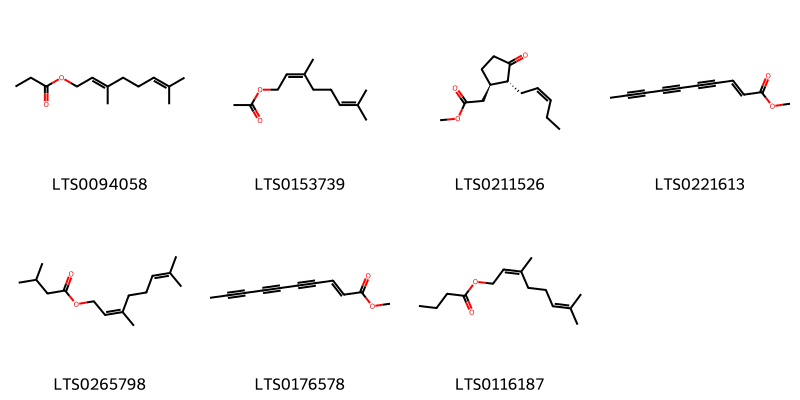{ width=100% }
    <figcaption>Hình ảnh cấu trúc hóa học của 7 hoạt chất thuộc nhóm Fatty Acyls gồm ['geranyl propionate (LTS0094058)', 'neryl acetate (LTS0153739)', '(-)-methyl jasmonate (LTS0211526)', 'methyl dec-2-en-4,6,8-triynoate (LTS0221613)', 'neryl isovalerate (LTS0265798)', 'dehydromatricaria ester (LTS0176578)', 'neryl butyrate (LTS0116187)'].</figcaption>
</figure>
#### Nhóm Flavonoids
<figure markdown="span">
    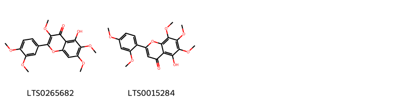{ width=100% }
    <figcaption>Hình ảnh cấu trúc hóa học của 2 hoạt chất thuộc nhóm Flavonoids gồm ['artemetin (LTS0265682)', '2-(2,4-dimethoxyphenyl)-5-hydroxy-6,7,8-trimethoxychromen-4-one (LTS0015284)'].</figcaption>
</figure>
#### Nhóm Furanoid lignans
<figure markdown="span">
    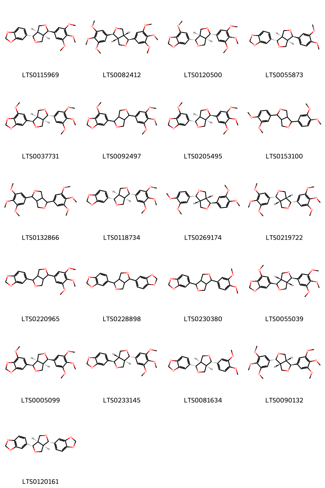{ width=100% }
    <figcaption>Hình ảnh cấu trúc hóa học của 21 hoạt chất thuộc nhóm Furanoid lignans gồm ['5-[(1s,3ar,4r,6ar)-4-(3,4,5-trimethoxyphenyl)-hexahydrofuro[3,4-c]furan-1-yl]-2h-1,3-benzodioxole (LTS0115969)', '( )-yangabin (LTS0082412)', 'sesartemin (LTS0120500)', '5-[(1s,3ar,4r,6ar)-4-(3,4-dimethoxyphenyl)-hexahydrofuro[3,4-c]furan-1-yl]-2h-1,3-benzodioxole (LTS0055873)', '6-[(1r,3ar,4s,6ar)-4-(3,4,5-trimethoxyphenyl)-hexahydrofuro[3,4-c]furan-1-yl]-4-methoxy-2h-1,3-benzodioxole (LTS0037731)', '4-methoxy-6-[4-(3,4,5-trimethoxyphenyl)-hexahydrofuro[3,4-c]furan-1-yl]-2h-1,3-benzodioxole (LTS0092497)', '6-[(1s,3ar,4r,6ar)-4-(3,4,5-trimethoxyphenyl)-hexahydrofuro[3,4-c]furan-1-yl]-4-methoxy-2h-1,3-benzodioxole (LTS0205495)', '1,4-bis(3,4-dimethoxyphenyl)-hexahydrofuro[3,4-c]furan (LTS0153100)', '1,4-bis(3,4,5-trimethoxyphenyl)-hexahydrofuro[3,4-c]furan (LTS0132866)', '5-[(1s,3ar,4s,6ar)-4-(3,4,5-trimethoxyphenyl)-hexahydrofuro[3,4-c]furan-1-yl]-2h-1,3-benzodioxole (LTS0118734)', 'epipinoresinol (LTS0269174)', '(1r,3ar,4r,6ar)-1,4-bis(3,4,5-trimethoxyphenyl)-hexahydrofuro[3,4-c]furan (LTS0219722)', '5-[4-(3,4,5-trimethoxyphenyl)-hexahydrofuro[3,4-c]furan-1-yl]-2h-1,3-benzodioxole (LTS0220965)', 'sesamin (LTS0228898)', '5-[4-(3,4-dimethoxyphenyl)-hexahydrofuro[3,4-c]furan-1-yl]-2h-1,3-benzodioxole (LTS0230380)', '6-[(1r,3as,4r,6as)-4-(3,4,5-trimethoxyphenyl)-hexahydrofuro[3,4-c]furan-1-yl]-4-methoxy-2h-1,3-benzodioxole (LTS0055039)', '6-[(1r,3ar,4r,6ar)-4-(3,4,5-trimethoxyphenyl)-hexahydrofuro[3,4-c]furan-1-yl]-4-methoxy-2h-1,3-benzodioxole (LTS0005099)', '5-[(1r,3ar,4s,6as)-4-(3,4,5-trimethoxyphenyl)-hexahydrofuro[3,4-c]furan-1-yl]-2h-1,3-benzodioxole (LTS0233145)', '5-[(1s,3ar,4s,6ar)-4-(3,4-dimethoxyphenyl)-hexahydrofuro[3,4-c]furan-1-yl]-2h-1,3-benzodioxole (LTS0081634)', '(1r,3ar,4s,6ar)-1,4-bis(3,4,5-trimethoxyphenyl)-hexahydrofuro[3,4-c]furan (LTS0090132)', 'sesamin (LTS0120161)'].</figcaption>
</figure>
#### Nhóm Indoles and derivatives
<figure markdown="span">
    { width=100% }
    <figcaption>Hình ảnh cấu trúc hóa học của 1 hoạt chất thuộc nhóm Indoles and derivatives gồm ['l-tryptophan (LTS0263809)'].</figcaption>
</figure>
#### Nhóm Lactones
<figure markdown="span">
    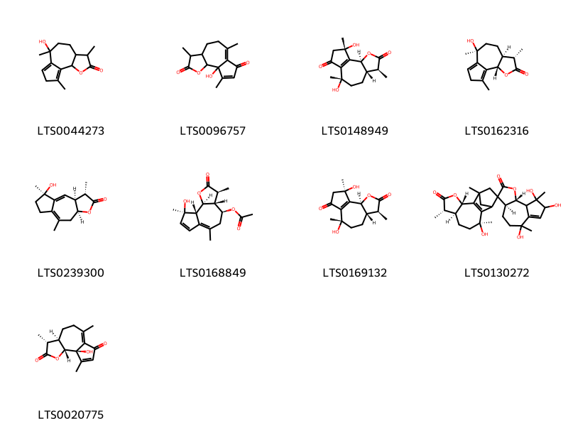{ width=100% }
    <figcaption>Hình ảnh cấu trúc hóa học của 9 hoạt chất thuộc nhóm Lactones gồm ['6-hydroxy-3,6,9-trimethyl-3h,3ah,4h,5h,8h,9bh-azuleno[4,5-b]furan-2-one (LTS0044273)', '9a-hydroxy-3,6,9-trimethyl-3h,3ah,4h,5h,9bh-azuleno[4,5-b]furan-2,7-dione (LTS0096757)', '(3s,3as,6s,9s,9bs)-6,9-dihydroxy-3,6,9-trimethyl-3h,3ah,4h,5h,8h,9bh-azuleno[4,5-b]furan-2,7-dione (LTS0148949)', 'artabsin (LTS0162316)', '(3s,3as,5r,9as)-5-hydroxy-3,5,8-trimethyl-3h,3ah,6h,7h,9h,9ah-azuleno[6,5-b]furan-2-one (LTS0239300)', 'matricin (LTS0168849)', '(3s,3as,6s,9r,9bs)-6,9-dihydroxy-3,6,9-trimethyl-3h,3ah,4h,5h,8h,9bh-azuleno[4,5-b]furan-2,7-dione (LTS0169132)', "(3's,3as,6's,7's,9bs,10's)-6,8,9,10'-tetrahydroxy-1',6,6',9,10'-pentamethyl-3a,4,5,8,9a,9b-hexahydro-4'-oxaspiro[azuleno[4,5-b]furan-3,13'-tetracyclo[10.2.1.0²,¹¹.0³,⁷]pentadecan]-2'(11')-ene-2,5'-dione (LTS0130272)", '(3r,3ar,9ar,9br)-9a-hydroxy-3,6,9-trimethyl-3h,3ah,4h,5h,9bh-azuleno[4,5-b]furan-2,7-dione (LTS0020775)'].</figcaption>
</figure>
#### Nhóm Organooxygen compounds
<figure markdown="span">
    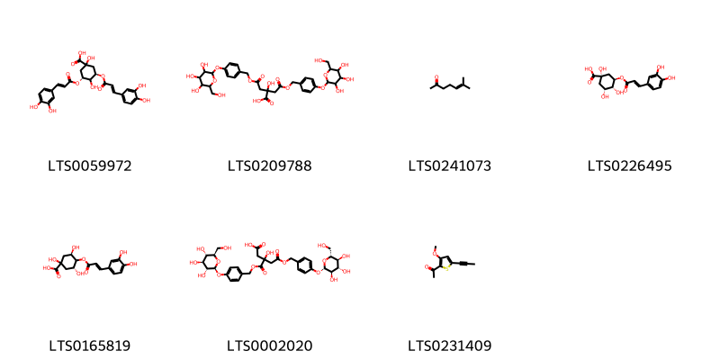{ width=100% }
    <figcaption>Hình ảnh cấu trúc hóa học của 7 hoạt chất thuộc nhóm Organooxygen compounds gồm ['(3r,5r)-3,5-bis({[(2e)-3-(3,4-dihydroxyphenyl)prop-2-enoyl]oxy})-1,4-dihydroxycyclohexane-1-carboxylic acid (LTS0059972)', '2-hydroxy-4-oxo-2-{2-oxo-2-[(4-{[3,4,5-trihydroxy-6-(hydroxymethyl)oxan-2-yl]oxy}phenyl)methoxy]ethyl}-4-[(4-{[3,4,5-trihydroxy-6-(hydroxymethyl)oxan-2-yl]oxy}phenyl)methoxy]butanoic acid (LTS0209788)', '6-methyl-5-hepten-2-one (LTS0241073)', 'chlorogenic acid (LTS0226495)', '(3r,5r)-4-{[(2e)-3-(3,4-dihydroxyphenyl)prop-2-enoyl]oxy}-1,3,5-trihydroxycyclohexane-1-carboxylic acid (LTS0165819)', 'parishin b (LTS0002020)', '1-[3-methoxy-5-(prop-1-yn-1-yl)thiophen-2-yl]ethanone (LTS0231409)'].</figcaption>
</figure>
#### Nhóm Oxolanes
<figure markdown="span">
    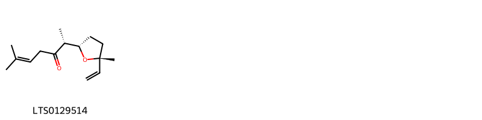{ width=100% }
    <figcaption>Hình ảnh cấu trúc hóa học của 1 hoạt chất thuộc nhóm Oxolanes gồm ['(2r)-2-[(2s,5r)-5-ethenyl-5-methyloxolan-2-yl]-6-methylhept-5-en-3-one (LTS0129514)'].</figcaption>
</figure>
#### Nhóm Prenol lipids
<figure markdown="span">
    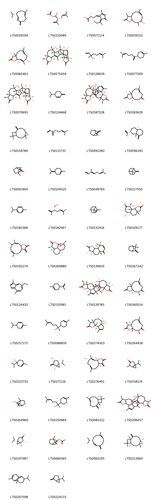{ width=100% }
    <figcaption>Hình ảnh cấu trúc hóa học của 74 hoạt chất thuộc nhóm Prenol lipids gồm ['(-)-germacrene d (LTS0059194)', '(2r)-1-hydroxy-5-methyl-2-(prop-1-en-2-yl)hex-4-en-1-yl acetate (LTS0210089)', '(2r)-2-[(5s)-3,8-dimethyl-1-oxo-6,7-dihydro-5h-azulen-5-yl]propanoic acid (LTS0071114)', '9-hydroxy-3,6,10-trimethyl-3h,3ah,4h,5h,8h,9h,10h,11h,11ah-cyclodeca[b]furan-2-one (LTS0039152)', '(3r,3as,9s,11as)-9-hydroxy-3,6,10-trimethyl-3h,3ah,4h,5h,8h,9h,11ah-cyclodeca[b]furan-2-one (LTS0060401)', 'anabsinthin (LTS0075454)', 'linalool, (+-)- (LTS0128839)', '(r)-β-bisabolene (LTS0077209)', '(1s,2r,5s,8s,9s,12s,13r,14r,15r,16r,17s,19s,22s,23s,26s,27r)-12,16-dihydroxy-3,8,12,17,19,23-hexamethyl-6,18,25-trioxaoctacyclo[13.11.1.0¹,¹⁷.0²,¹⁴.0⁴,¹³.0⁵,⁹.0¹⁹,²⁷.0²²,²⁶]heptacos-3-ene-7,24-dione (LTS0070691)', 'β phellandrene (LTS0124668)', '(+)-absinthin (LTS0187528)', '(3r,3as,10r,11ar)-3,6,10-trimethyl-3h,3ah,4h,5h,8h,10h,11h,11ah-cyclodeca[b]furan-2,9-dione (LTS0183629)', 'caryophyllene oxide (LTS0159789)', 'α-myrcene (LTS0115731)', '7,7-dimethyl-2-methylidenebicyclo[2.2.1]heptane (LTS0092282)', 'β-selinene (LTS0096341)', 'camphor (LTS0091905)', 'terpinolene (LTS0104525)', 'trans-β-ocimene (LTS0049765)', 'β-pinene (LTS0117550)', 'cymene (LTS0181568)', '(-)-lavandulol (LTS0182567)', 'α pinene (LTS0132416)', '(3r,3as,5ar,6r,9s,9as,9bs)-6-hydroxy-3,5a,9-trimethyl-octahydro-3h-naphtho[1,2-b]furan-2,8-dione (LTS0109177)', '9-hydroxy-6,10-dimethyl-3-methylidene-3ah,4h,5h,8h,9h,11ah-cyclodeca[b]furan-2-one (LTS0192274)', '(+)-artemisinin (LTS0269880)', '(3s,3as,5ar,9r,9as)-9-hydroxy-3,5a,9-trimethyl-3h,3ah,4h,5h,9ah,9bh-naphtho[1,2-b]furan-2,6-dione (LTS0139835)', 'camphene (LTS0267242)', 'chamazulene (LTS0124432)', 'limonene,  (LTS0155981)', '(1r,2s,3r,6s,7s,10s,11r,14s,15s,17s,20s,21s,24s)-3,24-dihydroxy-3,7,12,15,20,24-hexamethyl-9,18-dioxaheptacyclo[13.10.1.0²,¹¹.0²,¹⁴.0⁶,¹⁰.0¹⁶,²⁵.0¹⁷,²¹]hexacosa-12,16(25)-diene-8,19-dione (LTS0139785)', 'ketopelenolide a (LTS0160514)', 'phellandrene (LTS0157173)', '(2r)-6-methyl-2-(4-methylcyclohex-3-en-1-yl)hept-5-en-2-ol (LTS0088859)', '(3s,3as,6r,6as,9as,9br)-6,6a-dihydroxy-3,6,9-trimethyl-3h,3ah,4h,5h,7h,9ah,9bh-azuleno[4,5-b]furan-2-one (LTS0274503)', '(3s,3ar,10s,11as)-3,6,10-trimethyl-3h,3ah,4h,5h,8h,10h,11h,11ah-cyclodeca[b]furan-2,9-dione (LTS0164418)', '4-terpineol (LTS0253733)', '(-)-cis-sabinol (LTS0271116)', '(3ar,9s,11ar)-9-hydroxy-6,10-dimethyl-3-methylidene-3ah,4h,5h,8h,9h,11ah-cyclodeca[b]furan-2-one (LTS0276491)', '3-isothujone (LTS0158119)', 'borneol (LTS0264960)', 'α-bisabolol (LTS0250984)', 'caryophyllene (LTS0085212)', '3,24-dihydroxy-3,7,12,15,20,24-hexamethyl-9,18-dioxaheptacyclo[13.10.1.0²,¹¹.0²,¹⁴.0⁶,¹⁰.0¹⁶,²⁵.0¹⁷,²¹]hexacosa-12,16(25)-diene-8,19-dione (LTS0206057)', 'thujone (LTS0197087)', 'bornyl acetate (LTS0060565)', '(1z,6z,8s)-8-isopropyl-1-methyl-5-methylidenecyclodeca-1,6-diene (LTS0065195)', 'β-caryophyllene oxide (LTS0213960)', 'α-copaene (LTS0207598)', 'sabinene (LTS0224133)', '(3r,3as,9s,11as)-9-hydroxy-3,6,10-trimethyl-3h,3ah,4h,5h,8h,9h,11ah-cyclodeca[b]furan-2-one (LTS0172915)', '(9s,12s,16r,17s,19s,23s,26s)-12,16-dihydroxy-3,8,12,17,19,23-hexamethyl-6,18,25-trioxaoctacyclo[13.11.1.0¹,¹⁷.0²,¹⁴.0⁴,¹³.0⁵,⁹.0¹⁹,²⁷.0²²,²⁶]heptacos-3-ene-7,24-dione (LTS0236573)', '(+)-β-thujone (LTS0180873)', '(1s,2r,4s,7s,8s,11s,13s,14s,15r,17s,20s,21s,24s)-11,13,24-trihydroxy-2,7,11,15,20,24-hexamethyl-5,18-dioxaheptacyclo[13.10.1.0²,¹⁴.0³,¹².0⁴,⁸.0¹⁶,²⁵.0¹⁷,²¹]hexacosa-3(12),16(25)-diene-6,19,26-trione (LTS0041636)', '2,7,7-trimethylbicyclo[3.1.1]hept-2-en-6-ol (LTS0023857)', 'geraniol (LTS0258838)', 'β-ocimene (LTS0242381)', '(1r,2s,7s,8s)-8-isopropyl-1,3-dimethyltricyclo[4.4.0.0²,⁷]dec-3-ene (LTS0190031)', 'lavandulol (LTS0111607)', '4,8-dihydroxy-3,6-dimethyl-9-methylidene-decahydroazuleno[4,5-b]furan-2-one (LTS0010107)', 'absinthin (LTS0123295)', '2-(3,8-dimethyl-1-oxo-6,7-dihydro-5h-azulen-5-yl)propanoic acid (LTS0030820)', 'terpinene (LTS0136858)', '(1s,3r,5s,6r,7s,10r,11r)-5-hydroxy-3,7,12-trimethyl-2,9-dioxatetracyclo[9.3.0.0¹,³.0⁶,¹⁰]tetradec-12-en-8-one (LTS0135092)', '(-)-β-bisabolene (LTS0009940)', '(1r,2r,5r,8s,9s,12s,13r,14s,15s,16r,17s,20s,21s,24s)-12,17-dihydroxy-3,8,12,17,21,25-hexamethyl-6,23-dioxaheptacyclo[13.9.2.0¹,¹⁶.0²,¹⁴.0⁴,¹³.0⁵,⁹.0²⁰,²⁴]hexacosa-3,25-diene-7,22-dione (LTS0059412)', '6,6a-dihydroxy-3,6,9-trimethyl-3h,3ah,4h,5h,7h,9ah,9bh-azuleno[4,5-b]furan-2-one (LTS0013863)', 'ketopelenolide a (LTS0032403)', 'nerol (LTS0244289)', '3,6,10-trimethyl-3h,3ah,4h,5h,8h,10h,11h,11ah-cyclodeca[b]furan-2,9-dione (LTS0244197)', '9-hydroxy-3,6,10-trimethyl-3h,3ah,4h,5h,8h,9h,11ah-cyclodeca[b]furan-2-one (LTS0039069)', '5-hydroxy-3,7,12-trimethyl-2,9-dioxatetracyclo[9.3.0.0¹,³.0⁶,¹⁰]tetradec-12-en-8-one (LTS0020789)', '(3r,3as,9r,10s,11ar)-9-hydroxy-3,6,10-trimethyl-3h,3ah,4h,5h,8h,9h,10h,11h,11ah-cyclodeca[b]furan-2-one (LTS0118590)', '(3s,3ar,4s,6r,6as,8s,9as,9br)-4,8-dihydroxy-3,6-dimethyl-9-methylidene-decahydroazuleno[4,5-b]furan-2-one (LTS0113881)'].</figcaption>
</figure>
#### Nhóm Saturated hydrocarbons
<figure markdown="span">
    { width=100% }
    <figcaption>Hình ảnh cấu trúc hóa học của 1 hoạt chất thuộc nhóm Saturated hydrocarbons gồm ['nonacosane (LTS0062747)'].</figcaption>
</figure>
#### Nhóm Tetrahydrofurans
<figure markdown="span">
    { width=100% }
    <figcaption>Hình ảnh cấu trúc hóa học của 1 hoạt chất thuộc nhóm Tetrahydrofurans gồm ['2-(5-ethenyl-5-methyloxolan-2-yl)-6-methylhept-5-en-3-one (LTS0113802)'].</figcaption>
</figure>
#### Nhóm Unsaturated hydrocarbons
<figure markdown="span">
    { width=100% }
    <figcaption>Hình ảnh cấu trúc hóa học của 1 hoạt chất thuộc nhóm Unsaturated hydrocarbons gồm ['α terpinene (LTS0232891)'].</figcaption>
</figure>

---

### Dược dân tộc học

Danh sách các quốc gia có sử dụng *Artemisia absinthium* trong điều trị các bệnh. 

| Country   | Disease                                                                                                       | Bệnh                                                                                                                                                                                                |
|:----------|:--------------------------------------------------------------------------------------------------------------|:----------------------------------------------------------------------------------------------------------------------------------------------------------------------------------------------------|
| Elsewhere | Digestive, nan, Stimulant, Stomachic, Tonic, Tonic, Stomachic                                                 | MYMEMORY WARNING: YOU USED ALL AVAILABLE FREE TRANSLATIONS FOR TODAY. NEXT AVAILABLE IN  10 HOURS 22 MINUTES 22 SECONDS VISIT HTTPS://MYMEMORY.TRANSLATED.NET/DOC/USAGELIMITS.PHP TO TRANSLATE MORE |
| Haiti     | Digestive                                                                                                     | MYMEMORY WARNING: YOU USED ALL AVAILABLE FREE TRANSLATIONS FOR TODAY. NEXT AVAILABLE IN  10 HOURS 22 MINUTES 19 SECONDS VISIT HTTPS://MYMEMORY.TRANSLATED.NET/DOC/USAGELIMITS.PHP TO TRANSLATE MORE |
| Paraguay  | Antifertility                                                                                                 | MYMEMORY WARNING: YOU USED ALL AVAILABLE FREE TRANSLATIONS FOR TODAY. NEXT AVAILABLE IN  10 HOURS 22 MINUTES 16 SECONDS VISIT HTTPS://MYMEMORY.TRANSLATED.NET/DOC/USAGELIMITS.PHP TO TRANSLATE MORE |
| Turkey    | Antiseptic, Narcotic, Stomachic, Sudorific, Vermifuge, Diuretic, Abortifacient, Digestive, Tonic, Emmenagogue | MYMEMORY WARNING: YOU USED ALL AVAILABLE FREE TRANSLATIONS FOR TODAY. NEXT AVAILABLE IN  10 HOURS 22 MINUTES 13 SECONDS VISIT HTTPS://MYMEMORY.TRANSLATED.NET/DOC/USAGELIMITS.PHP TO TRANSLATE MORE |
| ain       | Apertif                                                                                                       | MYMEMORY WARNING: YOU USED ALL AVAILABLE FREE TRANSLATIONS FOR TODAY. NEXT AVAILABLE IN  10 HOURS 22 MINUTES 09 SECONDS VISIT HTTPS://MYMEMORY.TRANSLATED.NET/DOC/USAGELIMITS.PHP TO TRANSLATE MORE |

---

---
## Artemisia absinthum
### Thông tin về thực vật

!!! info "Phân loại thực vật của *Artemisia absinthium* từ GIBF:"
    - **Kingdom:** Plantae
    - **Phylum:** Tracheophyta
    - **Order:** Asterales
    - **Family:** Asteraceae
    - **Genus:** Artemisia
    - **Species:** *Artemisia absinthium*

 

| Label (VI)   | Label (EN)   | Scientific Name      | Descriptions (VI)   | Descriptions (EN)   | Also Known As (VI)   | Also Known As (EN)                                                                                                               |
|:-------------|:-------------|:---------------------|:--------------------|:--------------------|:---------------------|:---------------------------------------------------------------------------------------------------------------------------------|
| N/A          | N/A          | Artemisia absinthium |                     | species of plant    | ['']                 | ['absinthe', 'wormwood', 'absinthe wormwood', 'absinthium', 'grand wormwood', 'wermout', 'wermud', 'wormid', 'wormit', 'wormod'] |

#### Phân bố trên thế giới

**Từ CSDL GIBF** Italy, Bulgaria, Canada, Ukraine, Netherlands, Belarus, Spain, Hungary, Russian Federation, United States of America, Sweden, Kazakhstan, Czechia, Germany, Switzerland, Armenia, Austria, France, United Kingdom of Great Britain and Northern Ireland, Poland

#### Phân bố tại Việt Nam

**Từ CSDL GIBF**: Không có ghi nhận ở Việt Nam

---
### Thành phần hóa học
        
- Theo cơ sở dữ liệu lotus: Từ loài *Artemisia absinthium* đã phân lập và xác định được Chưa có hoạt chất nào được phân lập. hoạt chất thuộc về các nhóm Không có hoạt chất nào được phân lập. 

Không có hình ảnh nào được tạo ra

---

### Dược dân tộc học

Danh sách các quốc gia có sử dụng *Artemisia absinthium* trong điều trị các bệnh. 

| Country   | Disease                                     | Bệnh                                                                                                                                                                                                |
|:----------|:--------------------------------------------|:----------------------------------------------------------------------------------------------------------------------------------------------------------------------------------------------------|
| Haiti     | Diuretic, Stomachic, Vermifuge, Carminative | MYMEMORY WARNING: YOU USED ALL AVAILABLE FREE TRANSLATIONS FOR TODAY. NEXT AVAILABLE IN  10 HOURS 21 MINUTES 24 SECONDS VISIT HTTPS://MYMEMORY.TRANSLATED.NET/DOC/USAGELIMITS.PHP TO TRANSLATE MORE |

---

---
## Artemisia afra
### Thông tin về thực vật

!!! info "Phân loại thực vật của *Artemisia afra* từ GIBF:"
    - **Kingdom:** Plantae
    - **Phylum:** Tracheophyta
    - **Order:** Asterales
    - **Family:** Asteraceae
    - **Genus:** Artemisia
    - **Species:** *Artemisia afra*

 

| Label (VI)   | Label (EN)   | Scientific Name   | Descriptions (VI)   | Descriptions (EN)   | Also Known As (VI)   | Also Known As (EN)   |
|:-------------|:-------------|:------------------|:--------------------|:--------------------|:---------------------|:---------------------|
| N/A          | N/A          | Artemisia afra    | loài thực vật       | species of plant    | ['']                 | ['']                 |

#### Phân bố trên thế giới

**Từ CSDL GIBF** South Africa, Lesotho, Zimbabwe, Tanzania, United Republic of, Eswatini, Ethiopia

#### Phân bố tại Việt Nam

**Từ CSDL GIBF**: Không có ghi nhận ở Việt Nam

---
### Thành phần hóa học
        
- Theo cơ sở dữ liệu lotus: Từ loài *Artemisia afra* đã phân lập và xác định được 56 hoạt chất thuộc về các nhóm Flavonoids, Prenol lipids, Benzene and substituted derivatives, Unsaturated hydrocarbons, Organic sulfonic acids and derivatives, Naphthofurans, Organooxygen compounds, Coumarins and derivatives. 

|    | chemicalTaxonomyClassyfireClass        |   smiles_count |
|---:|:---------------------------------------|---------------:|
|  0 | Benzene and substituted derivatives    |              1 |
|  1 | Coumarins and derivatives              |              1 |
|  2 | Flavonoids                             |              5 |
|  3 | Naphthofurans                          |              2 |
|  4 | Organic sulfonic acids and derivatives |              1 |
|  5 | Organooxygen compounds                 |              4 |
|  6 | Prenol lipids                          |             41 |
|  7 | Unsaturated hydrocarbons               |              1 |

#### Nhóm Benzene and substituted derivatives
<figure markdown="span">
    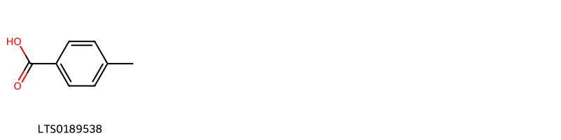{ width=100% }
    <figcaption>Hình ảnh cấu trúc hóa học của 1 hoạt chất thuộc nhóm Benzene and substituted derivatives gồm ['p-toluic acid (LTS0189538)'].</figcaption>
</figure>
#### Nhóm Coumarins and derivatives
<figure markdown="span">
    { width=100% }
    <figcaption>Hình ảnh cấu trúc hóa học của 1 hoạt chất thuộc nhóm Coumarins and derivatives gồm ['scopoletin (LTS0193112)'].</figcaption>
</figure>
#### Nhóm Flavonoids
<figure markdown="span">
    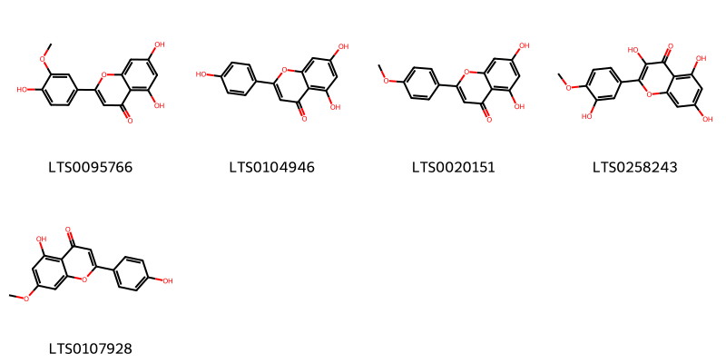{ width=100% }
    <figcaption>Hình ảnh cấu trúc hóa học của 5 hoạt chất thuộc nhóm Flavonoids gồm ['chrysoeriol (LTS0095766)', 'chamomile (LTS0104946)', 'acacetin (LTS0020151)', 'tamarixetin (LTS0258243)', 'genkwanin (LTS0107928)'].</figcaption>
</figure>
#### Nhóm Naphthofurans
<figure markdown="span">
    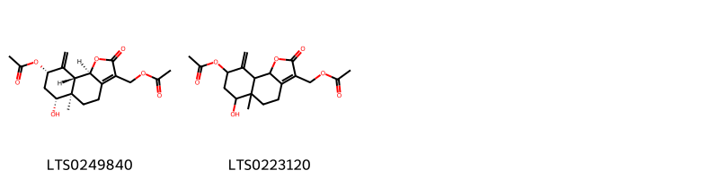{ width=100% }
    <figcaption>Hình ảnh cấu trúc hóa học của 2 hoạt chất thuộc nhóm Naphthofurans gồm ['[(5ar,6r,8s,9as,9br)-8-(acetyloxy)-6-hydroxy-5a-methyl-9-methylidene-2-oxo-4h,5h,6h,7h,8h,9ah,9bh-naphtho[1,2-b]furan-3-yl]methyl acetate (LTS0249840)', '[8-(acetyloxy)-6-hydroxy-5a-methyl-9-methylidene-2-oxo-4h,5h,6h,7h,8h,9ah,9bh-naphtho[1,2-b]furan-3-yl]methyl acetate (LTS0223120)'].</figcaption>
</figure>
#### Nhóm Organic sulfonic acids and derivatives
<figure markdown="span">
    { width=100% }
    <figcaption>Hình ảnh cấu trúc hóa học của 1 hoạt chất thuộc nhóm Organic sulfonic acids and derivatives gồm ['2-aminoethanesulfonic acid (LTS0101689)'].</figcaption>
</figure>
#### Nhóm Organooxygen compounds
<figure markdown="span">
    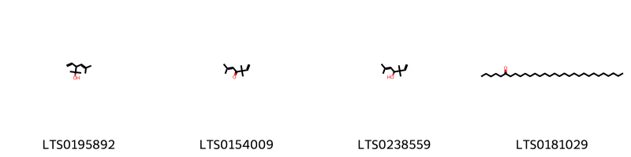{ width=100% }
    <figcaption>Hình ảnh cấu trúc hóa học của 4 hoạt chất thuộc nhóm Organooxygen compounds gồm ['3-ethenyl-2,5-dimethylhex-4-en-2-ol (LTS0195892)', 'isoartemisia ketone (LTS0154009)', '3,3,6-trimethylhepta-1,5-dien-4-ol (LTS0238559)', 'triacontan-6-one (LTS0181029)'].</figcaption>
</figure>
#### Nhóm Prenol lipids
<figure markdown="span">
    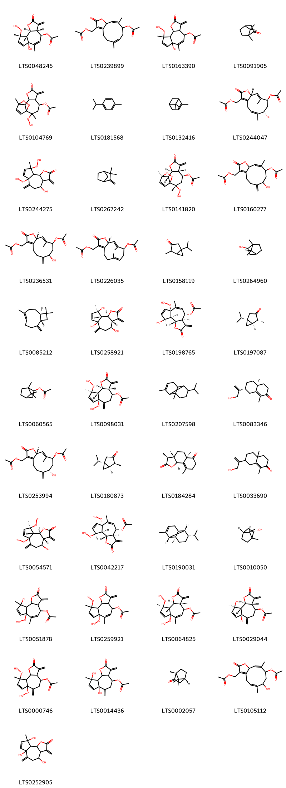{ width=100% }
    <figcaption>Hình ảnh cấu trúc hóa học của 41 hoạt chất thuộc nhóm Prenol lipids gồm ['(3ar,4s,6as,9s,9ar,9bs)-9-hydroperoxy-6a-hydroxy-6,9-dimethyl-3-methylidene-2-oxo-3ah,4h,9ah,9bh-azuleno[4,5-b]furan-4-yl acetate (LTS0048245)', '[9-(acetyloxy)-6,10-dimethyl-2-oxo-4h,5h,8h,9h,11ah-cyclodeca[b]furan-3-yl]methyl acetate (LTS0239899)', '9-hydroperoxy-6a-hydroxy-6,9-dimethyl-3-methylidene-2-oxo-3ah,4h,9ah,9bh-azuleno[4,5-b]furan-4-yl acetate (LTS0163390)', 'camphor (LTS0091905)', '2-hydroperoxy-2,11-dimethyl-6-methylidene-7-oxo-8,12,13-trioxatetracyclo[9.2.2.0¹,¹⁰.0⁵,⁹]pentadec-14-en-4-yl acetate (LTS0104769)', 'cymene (LTS0181568)', 'α pinene (LTS0132416)', '[(7s,9s,11ar)-9-(acetyloxy)-7-hydroxy-6,10-dimethyl-2-oxo-4h,7h,8h,9h,11ah-cyclodeca[b]furan-3-yl]methyl acetate (LTS0244047)', '6a,9-dihydroperoxy-4-hydroxy-9-methyl-3,6-dimethylidene-3ah,4h,5h,9ah,9bh-azuleno[4,5-b]furan-2-one (LTS0244275)', 'camphene (LTS0267242)', '(1s,2s,4s,5r,9s,10s,11r)-2-hydroperoxy-2,11-dimethyl-6-methylidene-7-oxo-8,12,13-trioxatetracyclo[9.2.2.0¹,¹⁰.0⁵,⁹]pentadec-14-en-4-yl acetate (LTS0141820)', '[9-(acetyloxy)-7-hydroxy-10-methyl-6-methylidene-2-oxo-4h,5h,7h,8h,9h,11ah-cyclodeca[b]furan-3-yl]methyl acetate (LTS0160277)', '[(7r,9s,11ar)-9-(acetyloxy)-7-hydroxy-10-methyl-6-methylidene-2-oxo-4h,5h,7h,8h,9h,11ah-cyclodeca[b]furan-3-yl]methyl acetate (LTS0236531)', '[(9s,11ar)-9-(acetyloxy)-6,10-dimethyl-2-oxo-4h,5h,8h,9h,11ah-cyclodeca[b]furan-3-yl]methyl acetate (LTS0226035)', '3-isothujone (LTS0158119)', 'borneol (LTS0264960)', 'caryophyllene (LTS0085212)', '(3ar,4s,6as,9r,9as,9bs)-4,6a,9-trihydroxy-9-methyl-3,6-dimethylidene-3ah,4h,5h,9ah,9bh-azuleno[4,5-b]furan-2-one (LTS0258921)', '(3ar,4s,6as,9s,9as,9bs)-6a-hydroperoxy-9-hydroxy-6,9-dimethyl-3-methylidene-2-oxo-3ah,4h,9ah,9bh-azuleno[4,5-b]furan-4-yl acetate (LTS0198765)', 'thujone (LTS0197087)', 'bornyl acetate (LTS0060565)', '(3ar,4s,6as,9r,9as,9bs)-6a,9-dihydroperoxy-9-methyl-3,6-dimethylidene-2-oxo-3ah,4h,5h,9ah,9bh-azuleno[4,5-b]furan-4-yl acetate (LTS0098031)', 'α-copaene (LTS0207598)', '(4as,7r)-7-(3-hydroxyprop-1-en-2-yl)-1,4a-dimethyl-3,4,5,6,7,8-hexahydronaphthalen-2-one (LTS0083346)', '[(7s,9s,11ar)-9-(acetyloxy)-7-hydroxy-10-methyl-6-methylidene-2-oxo-4h,5h,7h,8h,9h,11ah-cyclodeca[b]furan-3-yl]methyl acetate (LTS0253994)', '(+)-β-thujone (LTS0180873)', 'gracilin (LTS0184284)', '7-(3-hydroxyprop-1-en-2-yl)-1,4a-dimethyl-3,4,5,6,7,8-hexahydronaphthalen-2-one (LTS0033690)', '(3ar,4s,6as,9r,9as,9bs)-6a,9-dihydroperoxy-4-hydroxy-9-methyl-3,6-dimethylidene-3ah,4h,5h,9ah,9bh-azuleno[4,5-b]furan-2-one (LTS0054571)', '(3ar,4s,6as,9s,9as,9bs)-6a,9-dihydroperoxy-6,9-dimethyl-3-methylidene-2-oxo-3ah,4h,9ah,9bh-azuleno[4,5-b]furan-4-yl acetate (LTS0042217)', '(1r,2s,7s,8s)-8-isopropyl-1,3-dimethyltricyclo[4.4.0.0²,⁷]dec-3-ene (LTS0190031)', '(2s,4r)-1,7,7-trimethylbicyclo[2.2.1]heptan-2-ol (LTS0010050)', '6a-hydroperoxy-9-hydroxy-6,9-dimethyl-3-methylidene-2-oxo-3ah,4h,9ah,9bh-azuleno[4,5-b]furan-4-yl acetate (LTS0051878)', '6a,9-dihydroperoxy-6,9-dimethyl-3-methylidene-2-oxo-3ah,4h,9ah,9bh-azuleno[4,5-b]furan-4-yl acetate (LTS0259921)', '(3ar,4s,6as,9r,9as,9bs)-6a,9-dihydroperoxy-6,9-dimethyl-3-methylidene-2-oxo-3ah,4h,9ah,9bh-azuleno[4,5-b]furan-4-yl acetate (LTS0064825)', '(3ar,4s,6as,9r,9as,9bs)-6a,9-dihydroxy-9-methyl-3,6-dimethylidene-2-oxo-3ah,4h,5h,9ah,9bh-azuleno[4,5-b]furan-4-yl acetate (LTS0029044)', '6a,9-dihydroperoxy-9-methyl-3,6-dimethylidene-2-oxo-3ah,4h,5h,9ah,9bh-azuleno[4,5-b]furan-4-yl acetate (LTS0000746)', '6a,9-dihydroxy-9-methyl-3,6-dimethylidene-2-oxo-3ah,4h,5h,9ah,9bh-azuleno[4,5-b]furan-4-yl acetate (LTS0014436)', 'd-camphor (LTS0002057)', '[9-(acetyloxy)-7-hydroxy-6,10-dimethyl-2-oxo-4h,7h,8h,9h,11ah-cyclodeca[b]furan-3-yl]methyl acetate (LTS0105112)', '4,6a,9-trihydroxy-9-methyl-3,6-dimethylidene-3ah,4h,5h,9ah,9bh-azuleno[4,5-b]furan-2-one (LTS0252905)'].</figcaption>
</figure>
#### Nhóm Unsaturated hydrocarbons
<figure markdown="span">
    { width=100% }
    <figcaption>Hình ảnh cấu trúc hóa học của 1 hoạt chất thuộc nhóm Unsaturated hydrocarbons gồm ['α terpinene (LTS0232891)'].</figcaption>
</figure>

---

### Dược dân tộc học

Danh sách các quốc gia có sử dụng *Artemisia afra* trong điều trị các bệnh. 

| Country   | Disease                     | Bệnh                                                                                                                                                                                                |
|:----------|:----------------------------|:----------------------------------------------------------------------------------------------------------------------------------------------------------------------------------------------------|
| Africa    | Stimulant, Tonic, Stomachic | MYMEMORY WARNING: YOU USED ALL AVAILABLE FREE TRANSLATIONS FOR TODAY. NEXT AVAILABLE IN  10 HOURS 20 MINUTES 58 SECONDS VISIT HTTPS://MYMEMORY.TRANSLATED.NET/DOC/USAGELIMITS.PHP TO TRANSLATE MORE |

---

---
## Artemisia annua
### Thông tin về thực vật

!!! info "Phân loại thực vật của *Artemisia annua* từ GIBF:"
    - **Kingdom:** Plantae
    - **Phylum:** Tracheophyta
    - **Order:** Asterales
    - **Family:** Asteraceae
    - **Genus:** Artemisia
    - **Species:** *Artemisia annua*

 

| Label (VI)   | Label (EN)   | Scientific Name   | Descriptions (VI)   | Descriptions (EN)   | Also Known As (VI)                        | Also Known As (EN)                |
|:-------------|:-------------|:------------------|:--------------------|:--------------------|:------------------------------------------|:----------------------------------|
| N/A          | N/A          | Artemisia annua   | loài thực vật       | species of plant    | ['Thanh hao hoa vàng', 'Artemisia annua'] | ['Artemisia annua L. (Linnaeus)'] |

#### Phân bố trên thế giới

**Từ CSDL GIBF** nan, Italy, Slovakia, Belgium, Georgia, Argentina, Ukraine, Netherlands, Korea, Republic of, Spain, Hungary, Russian Federation, United States of America, Kazakhstan, Uzbekistan, Germany, Romania, Switzerland, France, China, Poland, Mongolia

#### Phân bố tại Việt Nam

**Từ CSDL GIBF**: Không có ghi nhận ở Việt Nam

---
### Thành phần hóa học
        
- Theo cơ sở dữ liệu lotus: Từ loài *Artemisia annua* đã phân lập và xác định được 427 hoạt chất thuộc về các nhóm Tetralins, Oxacyclic compounds, Phenols, Carboxylic acids and derivatives, Anthracenes, Fatty Acyls, Indoles and derivatives, Oxanes, Cinnamic acids and derivatives, Cinnamaldehydes, Saturated hydrocarbons, Prenol lipids, Quinolines and derivatives, Benzene and substituted derivatives, Dihydrofurans, Organooxygen compounds, Phenol ethers, Flavonoids, Steroids and steroid derivatives, Dioxolopyrans, Oxepanes, Pyrans, Unsaturated hydrocarbons, 2-arylbenzofuran flavonoids, Lactones, Coumarins and derivatives, Epoxides, Benzopyrans, Imidazopyrimidines. 

|    | chemicalTaxonomyClassyfireClass     |   smiles_count |
|---:|:------------------------------------|---------------:|
|  0 | 2-arylbenzofuran flavonoids         |              3 |
|  1 | Anthracenes                         |              3 |
|  2 | Benzene and substituted derivatives |              4 |
|  3 | Benzopyrans                         |              2 |
|  4 | Carboxylic acids and derivatives    |              8 |
|  5 | Cinnamaldehydes                     |              6 |
|  6 | Cinnamic acids and derivatives      |              1 |
|  7 | Coumarins and derivatives           |              3 |
|  8 | Dihydrofurans                       |              4 |
|  9 | Dioxolopyrans                       |              5 |
| 10 | Epoxides                            |              1 |
| 11 | Fatty Acyls                         |             19 |
| 12 | Flavonoids                          |             52 |
| 13 | Imidazopyrimidines                  |              1 |
| 14 | Indoles and derivatives             |              1 |
| 15 | Lactones                            |             19 |
| 16 | Organooxygen compounds              |             11 |
| 17 | Oxacyclic compounds                 |              1 |
| 18 | Oxanes                              |              2 |
| 19 | Oxepanes                            |              4 |
| 20 | Phenol ethers                       |              1 |
| 21 | Phenols                             |              5 |
| 22 | Prenol lipids                       |            251 |
| 23 | Pyrans                              |              1 |
| 24 | Quinolines and derivatives          |              1 |
| 25 | Saturated hydrocarbons              |              9 |
| 26 | Steroids and steroid derivatives    |              5 |
| 27 | Tetralins                           |              1 |
| 28 | Unsaturated hydrocarbons            |              3 |

#### Nhóm 2-arylbenzofuran flavonoids
<figure markdown="span">
    { width=100% }
    <figcaption>Hình ảnh cấu trúc hóa học của 3 hoạt chất thuộc nhóm 2-arylbenzofuran flavonoids gồm ['balanophonin (LTS0039496)', '(2e)-3-[(2r,3s)-2-(4-hydroxy-3-methoxyphenyl)-3-(hydroxymethyl)-7-methoxy-2,3-dihydro-1-benzofuran-5-yl]prop-2-enal (LTS0130349)', '3-[2-(4-hydroxy-3-methoxyphenyl)-3-(hydroxymethyl)-7-methoxy-2,3-dihydro-1-benzofuran-5-yl]prop-2-enal (LTS0233365)'].</figcaption>
</figure>
#### Nhóm Anthracenes
<figure markdown="span">
    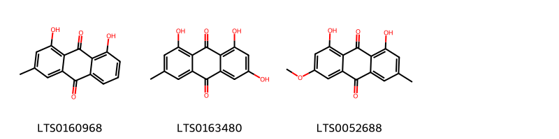{ width=100% }
    <figcaption>Hình ảnh cấu trúc hóa học của 3 hoạt chất thuộc nhóm Anthracenes gồm ['turkey rhubarb (LTS0160968)', 'emodin (LTS0163480)', 'physcion (LTS0052688)'].</figcaption>
</figure>
#### Nhóm Benzene and substituted derivatives
<figure markdown="span">
    { width=100% }
    <figcaption>Hình ảnh cấu trúc hóa học của 4 hoạt chất thuộc nhóm Benzene and substituted derivatives gồm ['lavendustin c (LTS0195252)', '4-biphenylaldehyde (LTS0057438)', 'methyl salicylate (LTS0128373)', "[1,1'-biphenyl]-2-carbaldehyde (LTS0064008)"].</figcaption>
</figure>
#### Nhóm Benzopyrans
<figure markdown="span">
    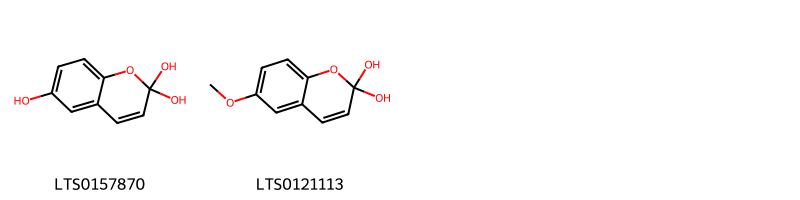{ width=100% }
    <figcaption>Hình ảnh cấu trúc hóa học của 2 hoạt chất thuộc nhóm Benzopyrans gồm ['chromene-2,2,6-triol (LTS0157870)', '6-methoxychromene-2,2-diol (LTS0121113)'].</figcaption>
</figure>
#### Nhóm Carboxylic acids and derivatives
<figure markdown="span">
    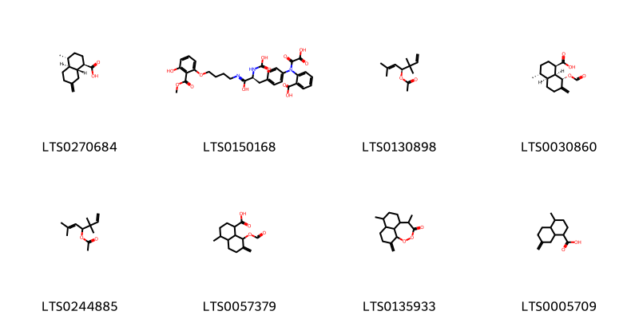{ width=100% }
    <figcaption>Hình ảnh cấu trúc hóa học của 8 hoạt chất thuộc nhóm Carboxylic acids and derivatives gồm ['(1r,4r,4as,8ar)-4-methyl-7-methylidene-octahydro-1h-naphthalene-1-carboxylic acid (LTS0270684)', '2-(1-carboxy-n-{4-[(2s)-2-(carboxyamino)-2-({4-[3-hydroxy-2-(methoxycarbonyl)phenoxy]butyl}-c-hydroxycarbonimidoyl)ethyl]phenyl}formamido)benzoic acid (LTS0150168)', '(4s)-3,3,6-trimethylhepta-1,5-dien-4-yl acetate (LTS0130898)', '(1r,4r,4as,8s,8as)-8-(formyloxy)-4-methyl-7-methylidene-octahydro-1h-naphthalene-1-carboxylic acid (LTS0030860)', '3,3,6-trimethylhepta-1,5-dien-4-yl acetate (LTS0244885)', '8-(formyloxy)-4-methyl-7-methylidene-octahydro-1h-naphthalene-1-carboxylic acid (LTS0057379)', '4,13-dimethyl-8-methylidene-10,11-dioxatricyclo[7.4.1.0⁵,¹⁴]tetradecan-12-one (LTS0135933)', '4-methyl-7-methylidene-octahydro-1h-naphthalene-1-carboxylic acid (LTS0005709)'].</figcaption>
</figure>
#### Nhóm Cinnamaldehydes
<figure markdown="span">
    { width=100% }
    <figcaption>Hình ảnh cấu trúc hóa học của 6 hoạt chất thuộc nhóm Cinnamaldehydes gồm ['2-[2-methoxy-4-(3-oxoprop-1-en-1-yl)phenoxy]prop-2-enal (LTS0134665)', '3-{4-[(1,3-dihydroxypropan-2-yl)oxy]-3-methoxyphenyl}prop-2-enal (LTS0124815)', '2-{2-methoxy-4-[(1e)-3-oxoprop-1-en-1-yl]phenoxy}prop-2-enal (LTS0251744)', '4-methoxycinnamaldehyde (LTS0219729)', '(2e)-3-{4-[(1,3-dihydroxypropan-2-yl)oxy]-3-methoxyphenyl}prop-2-enal (LTS0038781)', '3-(4-methoxyphenyl)-2-propenal (LTS0014262)'].</figcaption>
</figure>
#### Nhóm Cinnamic acids and derivatives
<figure markdown="span">
    { width=100% }
    <figcaption>Hình ảnh cấu trúc hóa học của 1 hoạt chất thuộc nhóm Cinnamic acids and derivatives gồm ['para-coumaric acid (LTS0266252)'].</figcaption>
</figure>
#### Nhóm Coumarins and derivatives
<figure markdown="span">
    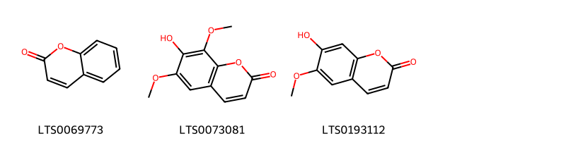{ width=100% }
    <figcaption>Hình ảnh cấu trúc hóa học của 3 hoạt chất thuộc nhóm Coumarins and derivatives gồm ['2h-1-benzopyran-2-one (LTS0069773)', 'isofraxidin (LTS0073081)', 'scopoletin (LTS0193112)'].</figcaption>
</figure>
#### Nhóm Dihydrofurans
<figure markdown="span">
    { width=100% }
    <figcaption>Hình ảnh cấu trúc hóa học của 4 hoạt chất thuộc nhóm Dihydrofurans gồm ['(3r)-5-(2,5-dihydrofuran-3-yl)-2-methylpent-1-en-3-ol (LTS0112627)', '5-(2,5-dihydrofuran-3-yl)-2-methylpent-3-en-2-ol (LTS0246689)', '(3e)-5-(2,5-dihydrofuran-3-yl)-2-methylpent-3-en-2-ol (LTS0221588)', '5-(2,5-dihydrofuran-3-yl)-2-methylpent-1-en-3-ol (LTS0118643)'].</figcaption>
</figure>
#### Nhóm Dioxolopyrans
<figure markdown="span">
    { width=100% }
    <figcaption>Hình ảnh cấu trúc hóa học của 5 hoạt chất thuộc nhóm Dioxolopyrans gồm ['1,5,9-trimethyl-11,14,15-trioxatetracyclo[10.2.1.0⁴,¹³.0⁸,¹³]pentadecan-10-one (LTS0198939)', '(4s,5r,8s,9r,12s,13r)-1,5,9-trimethyl-11,14,15-trioxatetracyclo[10.2.1.0⁴,¹³.0⁸,¹³]pentadecan-10-one (LTS0215855)', '2-deoxyartemisinin (LTS0090782)', '2-hydroxy-1,5,9-trimethyl-11,14,15-trioxatetracyclo[10.2.1.0⁴,¹³.0⁸,¹³]pentadecan-10-one (LTS0211892)', '(1s,2r,4s,5r,8s,9r,12s,13r)-2-hydroxy-1,5,9-trimethyl-11,14,15-trioxatetracyclo[10.2.1.0⁴,¹³.0⁸,¹³]pentadecan-10-one (LTS0099364)'].</figcaption>
</figure>
#### Nhóm Epoxides
<figure markdown="span">
    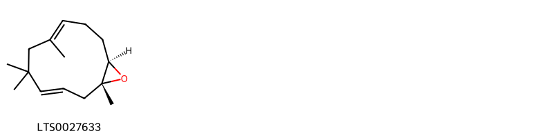{ width=100% }
    <figcaption>Hình ảnh cấu trúc hóa học của 1 hoạt chất thuộc nhóm Epoxides gồm ['(1r,3e,7e,11r)-1,5,5,7-tetramethyl-12-oxabicyclo[9.1.0]dodeca-3,7-diene (LTS0027633)'].</figcaption>
</figure>
#### Nhóm Fatty Acyls
<figure markdown="span">
    { width=100% }
    <figcaption>Hình ảnh cấu trúc hóa học của 19 hoạt chất thuộc nhóm Fatty Acyls gồm ['(2r,4r)-5-methyl-2-(prop-1-en-2-yl)hex-5-ene-1,4-diol (LTS0112418)', '5-methyl-2-(prop-1-en-2-yl)hex-3-ene-1,5-diol (LTS0057789)', 'ethyl (2r)-2-methylbutanoate (LTS0233405)', '5-methyl-2-(prop-1-en-2-yl)hex-5-ene-1,4-diol (LTS0208964)', 'hexyl (2e)-2-methylbut-2-enoate (LTS0082952)', '(2s,3e)-5-methyl-2-(prop-1-en-2-yl)hex-3-ene-1,5-diol (LTS0103356)', 'cis-3-hexenyl isovalerate (LTS0181676)', 'cis-3-hexenol (LTS0132156)', '9-decen-1-ol (LTS0161213)', 'ceryl alcohol (LTS0140051)', 'methyl palmitate (LTS0139222)', 'oct-1-en-3s-ol (LTS0173025)', 'methyl stearate (LTS0221686)', 'hexanol (LTS0217299)', 'hexyl (2s)-2-methylbutanoate (LTS0164349)', 'nonacosanol (LTS0205992)', 'octacosanol (LTS0049071)', '1-octen-3-ol (LTS0057101)', '(3z)-hex-3-en-1-yl (2r)-2-methylbutanoate (LTS0005286)'].</figcaption>
</figure>
#### Nhóm Flavonoids
<figure markdown="span">
    { width=100% }
    <figcaption>Hình ảnh cấu trúc hóa học của 52 hoạt chất thuộc nhóm Flavonoids gồm ['quercetin (LTS0004651)', '3-rutinosyl quercetin (LTS0032845)', 'eupatorin (LTS0073269)', 'bonanzin (LTS0123079)', '(2r)-2-(2,4-dihydroxyphenyl)-5-hydroxy-6,7-dimethoxy-2,3-dihydro-1-benzopyran-4-one (LTS0238093)', 'chrysoeriol (LTS0095766)', 'penduletin (LTS0080627)', '5,7,8-trihydroxy-2-(3-hydroxy-4-methoxyphenyl)-3-methoxy-2,3-dihydro-1-benzopyran-4-one (LTS0072712)', '3,5,7-trihydroxy-2-(4-hydroxy-3-{[(2s,3r,4s,5s,6r)-3,4,5-trihydroxy-6-(hydroxymethyl)oxan-2-yl]oxy}phenyl)chromen-4-one (LTS0094454)', '2-(3,4-dihydroxyphenyl)-5,7-dihydroxy-3-{[3,4,5-trihydroxy-6-(hydroxymethyl)oxan-2-yl]oxy}chromen-4-one (LTS0195312)', 'patuletin (LTS0104633)', 'chamomile (LTS0104946)', 'luteolin 7-methyl ether (LTS0259993)', '2-(2,4-dihydroxyphenyl)-5-hydroxy-6,7-dimethoxy-2,3-dihydro-1-benzopyran-4-one (LTS0108962)', 'quercimeritrin (LTS0188893)', 'artemetin (LTS0265682)', 'cirsimaritin (LTS0146305)', '2-(3,4-dihydroxyphenyl)-5-hydroxy-7-{[3,4,5-trihydroxy-6-(hydroxymethyl)oxan-2-yl]oxy}chromen-4-one (LTS0158292)', 'cirsilineol (LTS0092903)', 'isorhamnetin (LTS0107505)', 'eupalitin (LTS0255198)', 'kaempherol (LTS0155822)', 'isoquercetin (LTS0254337)', 'trifolin (LTS0267055)', 'quercimeritrin (LTS0043461)', 'chrysosplenol c (LTS0217158)', 'chrysosplenetin (LTS0202772)', 'casticin (LTS0071783)', 'quercetagetin 3-methyl ether (LTS0212838)', 'cirsiliol (LTS0070414)', '2-(3,4-dihydroxyphenyl)-5,7-dihydroxy-3-{[(2s,3r,4r,5r,6s)-3,4,5-trihydroxy-6-(hydroxymethyl)oxan-2-yl]oxy}chromen-4-one (LTS0241372)', 'retusin (LTS0236094)', 'arcapillin (LTS0002317)', '2-(3,4-dimethoxyphenyl)-3,5-dihydroxy-6,7-dimethoxychromen-4-one (LTS0179185)', '2-(3,4-dimethoxyphenyl)-5-hydroxy-6,7-dimethoxychromen-4-one (LTS0032351)', 'luteolin 7-o-glucoside (LTS0227450)', 'rhamnocitrin (LTS0198024)', 'astragalin (LTS0249588)', 'chrysosplenol d (LTS0188255)', "quercetagetin 4'-methyl ether (LTS0048116)", 'tamarixetin (LTS0258243)', 'quercetin 3-methyl ether (LTS0194170)', '(2s,3r)-5,7,8-trihydroxy-2-(3-hydroxy-4-methoxyphenyl)-3-methoxy-2,3-dihydro-1-benzopyran-4-one (LTS0244620)', 'axillarin (LTS0067813)', '2-(3,4-dihydroxyphenyl)-5,7-dihydroxy-6-methoxy-3-{[3,4,5-trihydroxy-6-(hydroxymethyl)oxan-2-yl]oxy}chromen-4-one (LTS0010167)', 'isokaempferide (LTS0011732)', 'luteolin (LTS0017052)', 'pachypodol (LTS0093471)', '5,6,7-trihydroxy-2-(3-hydroxy-4-methoxyphenyl)-3-methoxychromen-4-one (LTS0217584)', 'quercimeritrin (LTS0208490)', '3,5,7-trihydroxy-2-(4-hydroxy-3-{[3,4,5-trihydroxy-6-(hydroxymethyl)oxan-2-yl]oxy}phenyl)chromen-4-one (LTS0105577)', 'tomentin (LTS0028795)'].</figcaption>
</figure>
#### Nhóm Imidazopyrimidines
<figure markdown="span">
    { width=100% }
    <figcaption>Hình ảnh cấu trúc hóa học của 1 hoạt chất thuộc nhóm Imidazopyrimidines gồm ['zeatine (LTS0032706)'].</figcaption>
</figure>
#### Nhóm Indoles and derivatives
<figure markdown="span">
    { width=100% }
    <figcaption>Hình ảnh cấu trúc hóa học của 1 hoạt chất thuộc nhóm Indoles and derivatives gồm ['n-[2-(5-methoxy-1h-indol-3-yl)ethyl]ethanimidic acid (LTS0219322)'].</figcaption>
</figure>
#### Nhóm Lactones
<figure markdown="span">
    { width=100% }
    <figcaption>Hình ảnh cấu trúc hóa học của 19 hoạt chất thuộc nhóm Lactones gồm ['(1s,5r,8r,9s,13s)-8,12-dimethyl-4-methylidene-2-oxatricyclo[7.3.1.0⁵,¹³]tridec-11-en-3-one (LTS0107775)', '(1r,5s,8s,9r,13r)-8,12-dimethyl-4-methylidene-2-oxatricyclo[7.3.1.0⁵,¹³]tridec-11-en-3-one (LTS0070167)', '(1s,4r,5r,8r,9s,13s)-4,8-dimethyl-12-methylidene-2-oxatricyclo[7.3.1.0⁵,¹³]tridecan-3-one (LTS0069926)', '(1r,4r,7r,8s,12r)-7-methyl-11-methylidene-2-oxatricyclo[6.3.1.0⁴,¹²]dodecan-3-one (LTS0188899)', '4,8,12-trimethyl-2-oxatricyclo[7.3.1.0⁵,¹³]tridec-11-en-3-one (LTS0019112)', '8-methyl-4,12-dimethylidene-2-oxatricyclo[7.3.1.0⁵,¹³]tridecan-3-one (LTS0149475)', '(1r,5s,6r,9s,10r,13s)-6,10-dimethyl-11-oxo-2,12-dioxatricyclo[7.4.0.0¹,⁵]tridecan-13-yl acetate (LTS0148990)', '(3s,3as,6s,9s,9bs)-6,9-dihydroxy-3,6,9-trimethyl-3h,3ah,4h,5h,8h,9bh-azuleno[4,5-b]furan-2,7-dione (LTS0148949)', '7-methyl-11-methylidene-2-oxatricyclo[6.3.1.0⁴,¹²]dodecan-3-one (LTS0190498)', 'artabsin (LTS0162316)', 'matricin (LTS0168849)', '(1s,4r,5r,8r,9s,13s)-4,8,12-trimethyl-2-oxatricyclo[7.3.1.0⁵,¹³]tridec-11-en-3-one (LTS0191104)', '(1s,5r,8r,9s,13s)-8-methyl-4,12-dimethylidene-2-oxatricyclo[7.3.1.0⁵,¹³]tridecan-3-one (LTS0266131)', '6,10-dimethyl-11-oxo-2,12-dioxatricyclo[7.4.0.0¹,⁵]tridecan-13-yl acetate (LTS0270413)', '8,12-dimethyl-4-methylidene-2-oxatricyclo[7.3.1.0⁵,¹³]tridec-11-en-3-one (LTS0239249)', '(3s,3as,6s,9r,9bs)-6,9-dihydroxy-3,6,9-trimethyl-3h,3ah,4h,5h,8h,9bh-azuleno[4,5-b]furan-2,7-dione (LTS0169132)', '(1r,4r,7r,8s,12r)-7,11-dimethyl-2-oxatricyclo[6.3.1.0⁴,¹²]dodec-10-en-3-one (LTS0055054)', '7,11-dimethyl-2-oxatricyclo[6.3.1.0⁴,¹²]dodec-10-en-3-one (LTS0075194)', '4,8-dimethyl-12-methylidene-2-oxatricyclo[7.3.1.0⁵,¹³]tridecan-3-one (LTS0047434)'].</figcaption>
</figure>
#### Nhóm Organooxygen compounds
<figure markdown="span">
    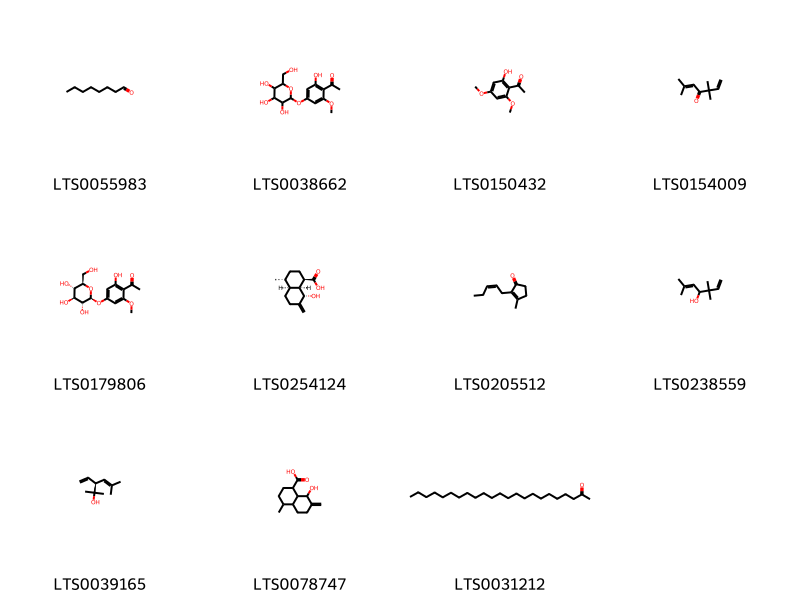{ width=100% }
    <figcaption>Hình ảnh cấu trúc hóa học của 11 hoạt chất thuộc nhóm Organooxygen compounds gồm ['octanal (LTS0055983)', '1-(2-hydroxy-6-methoxy-4-{[3,4,5-trihydroxy-6-(hydroxymethyl)oxan-2-yl]oxy}phenyl)ethanone (LTS0038662)', 'xanthoxylin (LTS0150432)', 'isoartemisia ketone (LTS0154009)', '1-(2-hydroxy-6-methoxy-4-{[(2s,3r,4s,5s,6r)-3,4,5-trihydroxy-6-(hydroxymethyl)oxan-2-yl]oxy}phenyl)ethanone (LTS0179806)', '(1r,4r,4as,8s,8as)-8-hydroxy-4-methyl-7-methylidene-octahydro-1h-naphthalene-1-carboxylic acid (LTS0254124)', 'jasmone (LTS0205512)', '3,3,6-trimethylhepta-1,5-dien-4-ol (LTS0238559)', '(3s)-3-ethenyl-2,5-dimethylhex-4-en-2-ol (LTS0039165)', '8-hydroxy-4-methyl-7-methylidene-octahydro-1h-naphthalene-1-carboxylic acid (LTS0078747)', 'tricosan-2-one (LTS0031212)'].</figcaption>
</figure>
#### Nhóm Oxacyclic compounds
<figure markdown="span">
    { width=100% }
    <figcaption>Hình ảnh cấu trúc hóa học của 1 hoạt chất thuộc nhóm Oxacyclic compounds gồm ['(1r,4r,5s,9s,13r,14s)-4,13-dimethyl-8-methylidene-10,11-dioxatricyclo[7.4.1.0⁵,¹⁴]tetradecan-12-one (LTS0229266)'].</figcaption>
</figure>
#### Nhóm Oxanes
<figure markdown="span">
    { width=100% }
    <figcaption>Hình ảnh cấu trúc hóa học của 2 hoạt chất thuộc nhóm Oxanes gồm ['1,8-cineole (LTS0166505)', 'eucalyptol (LTS0051374)'].</figcaption>
</figure>
#### Nhóm Oxepanes
<figure markdown="span">
    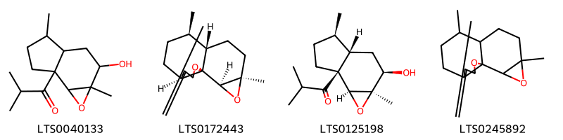{ width=100% }
    <figcaption>Hình ảnh cấu trúc hóa học của 4 hoạt chất thuộc nhóm Oxepanes gồm ['1-{2-hydroxy-1a,4-dimethyl-hexahydro-2h-indeno[4,5-b]oxiren-6a-yl}-2-methylpropan-1-one (LTS0040133)', '(1r,5s,8r,9s,12r,14r)-8,12-dimethyl-4-methylidene-2,13-dioxatetracyclo[7.5.0.0¹,⁵.0¹²,¹⁴]tetradecane (LTS0172443)', '1-[(1ar,2r,3as,4r,6as,6bs)-2-hydroxy-1a,4-dimethyl-hexahydro-2h-indeno[4,5-b]oxiren-6a-yl]-2-methylpropan-1-one (LTS0125198)', '8,12-dimethyl-4-methylidene-2,13-dioxatetracyclo[7.5.0.0¹,⁵.0¹²,¹⁴]tetradecane (LTS0245892)'].</figcaption>
</figure>
#### Nhóm Phenol ethers
<figure markdown="span">
    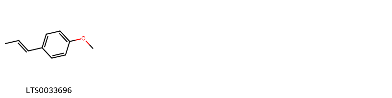{ width=100% }
    <figcaption>Hình ảnh cấu trúc hóa học của 1 hoạt chất thuộc nhóm Phenol ethers gồm ['anethole (LTS0033696)'].</figcaption>
</figure>
#### Nhóm Phenols
<figure markdown="span">
    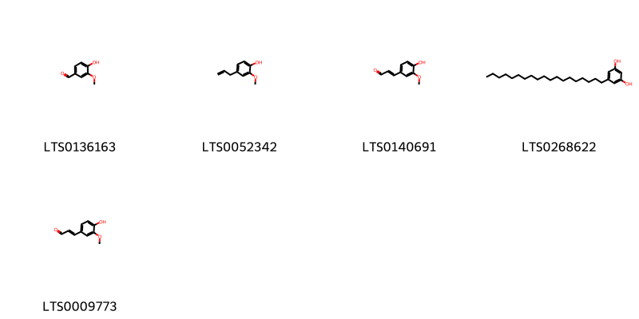{ width=100% }
    <figcaption>Hình ảnh cấu trúc hóa học của 5 hoạt chất thuộc nhóm Phenols gồm ['vanillin (LTS0136163)', 'eugenol (LTS0052342)', 'coniferyl aldehyde (LTS0140691)', '5-nonadecylbenzene-1,3-diol (LTS0268622)', 'coniferaldehyde (LTS0009773)'].</figcaption>
</figure>
#### Nhóm Prenol lipids
<figure markdown="span">
    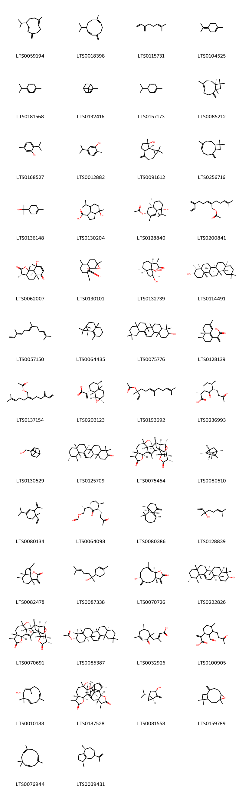{ width=100% }
    <figcaption>Hình ảnh cấu trúc hóa học của 251 hoạt chất thuộc nhóm Prenol lipids gồm ['(-)-germacrene d (LTS0059194)', '8-isopropyl-1-methyl-5-methylidenecyclodeca-1,6-diene (LTS0018398)', 'α-myrcene (LTS0115731)', 'terpinolene (LTS0104525)', 'cymene (LTS0181568)', 'α pinene (LTS0132416)', 'phellandrene (LTS0157173)', 'caryophyllene (LTS0085212)', 'thymol (LTS0168527)', 'carvacrol (LTS0012882)', '(7ar)-1,1,7-trimethyl-4-methylidene-octahydrocyclopropa[e]azulen-7-ol (LTS0091612)', '4,11,11-trimethyl-8-methylidenebicyclo[7.2.0]undec-4-ene (LTS0256716)', 'terpineol (LTS0136148)', '4-hydroxy-7-isopropyl-4-methyl-octahydroindene-1-carboxylic acid (LTS0130204)', '(2r,4ar,5r,8r,8as)-5-hydroxy-5-isopropyl-3,8-dimethyl-2,4a,6,7,8,8a-hexahydro-1h-naphthalen-2-yl acetate (LTS0128840)', '(2z)-6-methylidene-2-(4-methylpent-3-en-1-yl)octa-2,7-dien-1-yl acetate (LTS0200841)', 'vulgarin (LTS0062007)', '4,8,12-trimethyl-2,13-dioxatetracyclo[7.5.0.0¹,⁵.0¹²,¹⁴]tetradecan-3-one (LTS0130101)', '(3r,3as,6r,6as,9s,10r,10as)-9,10-dihydroxy-3,6,9-trimethyl-octahydro-3h-naphtho[4a,4-b]furan-2-one (LTS0132739)', 'epi-friedelanol (LTS0114491)', 'farnesene (LTS0057150)', '(1ar,3as,7bs)-1,1,3a,7-tetramethyl-1ah,2h,3h,4h,5h,6h,7bh-cyclopropa[a]naphthalene (LTS0064435)', 'β-amyrin (LTS0075776)', '2-[(4r,4as)-4,7-dimethyl-2,3,4,4a,5,6-hexahydronaphthalen-1-yl]prop-2-enoic acid (LTS0128139)', '6-methylidene-2-(4-methylpent-3-en-1-yl)octa-2,7-dien-1-yl acetate (LTS0137154)', '2-[(1ar,3as,4r,7r,7as,7bs)-1a,4-dimethyl-octahydro-2h-naphtho[1,2-b]oxiren-7-yl]prop-2-enoic acid (LTS0203123)', '(6e)-3,7,11-trimethyldodeca-1,6,10-trien-3-yl acetate (LTS0193692)', '(2r)-2-[(1s,3s,4r)-4-methyl-2-oxo-3-(3-oxobutyl)cyclohexyl]propanoic acid (LTS0236993)', 'myrtenol (LTS0130529)', '(6ar,6bs,8ar,11r,12s,12ar,14br)-4,4,6a,6b,8a,11,12,14b-octamethyl-1,2,4a,5,6,7,8,9,10,11,12,12a,14,14a-tetradecahydropicen-3-one (LTS0125709)', 'anabsinthin (LTS0075454)', '(1s,2r,4r,6s)-1,7,7-trimethyltricyclo[2.2.1.0²,⁶]heptane (LTS0080510)', '4-ethenyl-1-isopropyl-4-methyl-3-(prop-1-en-2-yl)cyclohex-1-ene (LTS0080134)', '(2r)-2-[(1s,3s,4r)-4-methyl-2-oxo-3-(3-oxobutyl)cyclohexyl]propyl formate (LTS0064098)', '(1r,2r,7s,8r)-2,6,6-trimethyl-9-methylidenetricyclo[5.4.0.0²,⁸]undecane (LTS0080386)', 'linalool, (+-)- (LTS0128839)', '(3as,6r,6as,10ar)-6,9-dimethyl-3-methylidene-3ah,4h,5h,6h,6ah,7h,8h-naphtho[4a,4-b]furan-2-one (LTS0082478)', '(2r)-6-methyl-2-[(1r)-4-methylcyclohex-3-en-1-yl]hept-5-en-2-ol (LTS0087338)', 'artemorin (LTS0070726)', 'amyrin (LTS0222826)', '(1s,2r,5s,8s,9s,12s,13r,14r,15r,16r,17s,19s,22s,23s,26s,27r)-12,16-dihydroxy-3,8,12,17,19,23-hexamethyl-6,18,25-trioxaoctacyclo[13.11.1.0¹,¹⁷.0²,¹⁴.0⁴,¹³.0⁵,⁹.0¹⁹,²⁷.0²²,²⁶]heptacos-3-ene-7,24-dione (LTS0070691)', '(3s,4ar,6ar,6bs,8ar,12as,14ar,14br)-4,4,6a,6b,8a,11,11,14b-octamethyl-1,2,3,4a,5,6,7,8,9,10,12,12a,14,14a-tetradecahydropicen-3-yl acetate (LTS0085387)', '3-methyl-4-(1,4,6-trimethyl-2-oxocyclohept-3-en-1-yl)but-2-enoic acid (LTS0032926)', '2-[2-formyl-4-methyl-3-(3-oxobutyl)cyclohexyl]prop-2-enoic acid (LTS0100905)', '(1r,2e,6z,9e)-3,7,11,11-tetramethylcycloundeca-2,6,9-trien-1-ol (LTS0010188)', '(+)-absinthin (LTS0187528)', '(+)-cis-sabinol (LTS0081558)', 'caryophyllene oxide (LTS0159789)', 'α-humulene (LTS0076944)', 'guaiene (LTS0039431)', '(1s,2s,4ar,5r,8as)-2-isopropyl-4a-methyl-8-methylidene-octahydronaphthalene-1,5-diol (LTS0071183)', '6-isopropyl-8a-methyl-4-methylidene-1,2,3,4a,5,8-hexahydronaphthalen-1-ol (LTS0097356)', '(1s,5r,9r)-10,10-dimethyl-2,6-dimethylidenebicyclo[7.2.0]undecan-5-ol (LTS0065243)', '2-(4,7-dimethyl-8-oxo-2,3,4,4a,5,8a-hexahydro-1h-naphthalen-1-yl)propanoic acid (LTS0110166)', '(+)-borneol (LTS0189059)', '(2r)-2-[(1r,4r,4as,8as)-4,7-dimethyl-8-oxo-2,3,4,4a,5,8a-hexahydro-1h-naphthalen-1-yl]propanoic acid (LTS0028902)', 'phytol (LTS0096073)', '(3as,6as,9r,10as)-9,10-dihydroxy-3,6,9-trimethyl-octahydro-3h-naphtho[4a,4-b]furan-2-one (LTS0027371)', '(1s,2s,5r,8r)-2,5,8-trimethyl-6-methylidenetricyclo[6.3.0.0¹,⁵]undecane (LTS0045069)', 'β-selinene (LTS0096341)', 'camphor (LTS0091905)', '(3r,3as,6r,6as,10r,10as)-10-hydroxy-3,6,9-trimethyl-3h,3ah,4h,5h,6h,6ah,7h,10h-naphtho[4a,4-b]furan-2-one (LTS0042443)', '(-)-α-pinene (LTS0032699)', '2-(7-hydroperoxy-4,7-dimethyl-2,3,4,4a,5,6-hexahydro-1h-naphthalen-1-yl)propanoic acid (LTS0196212)', '2-(4,7-dimethyl-3,4,4a,5,6,8a-hexahydro-2h-naphthalen-1-ylidene)propanal (LTS0119584)', 'trans-β-ocimene (LTS0049765)', '(3ar,6s,6ar,10as)-6,9-dimethyl-3-methylidene-3ah,4h,5h,6h,6ah,7h,8h-naphtho[4a,4-b]furan-2-one (LTS0086792)', '(3r,4ar,8ar)-8a-methyl-5-methylidene-3-(prop-1-en-2-yl)-hexahydro-1h-naphthalene-4a-peroxol (LTS0045343)', 'β-pinene (LTS0117550)', '5-(2-hydroxypropan-2-yl)-3,8-dimethyl-1,2,4a,5,6,7,8,8a-octahydronaphthalen-2-yl 2-methylpropanoate (LTS0090869)', '(1s,2s,7s,8s)-2,6,6,9-tetramethyltricyclo[5.4.0.0²,⁸]undec-9-ene (LTS0049232)', 'artemisinin (LTS0118909)', '2-[2-formyl-4-methyl-3-(3-oxobutyl)cyclohexyl]propanoic acid (LTS0130561)', '(3r,3as,5ar,6r,9s,9as,9bs)-6-hydroxy-3,5a,9-trimethyl-octahydro-3h-naphtho[1,2-b]furan-2,8-dione (LTS0109177)', 'myrtenal (LTS0202475)', '(3r,3as,6r,6as,9r,10s,10as)-9,10-dihydroxy-3,6,9-trimethyl-octahydro-3h-naphtho[4a,4-b]furan-2-one (LTS0203931)', '2-isopropyl-4a-methyl-8-methylidene-octahydronaphthalene-1,5-diol (LTS0190508)', 'fenchol (LTS0261470)', 'humulene (LTS0263171)', '8a-methyl-5-methylidene-3-(prop-1-en-2-yl)-hexahydro-1h-naphthalene-4a-peroxol (LTS0141428)', '(1r,4r,5s,9s,13r,14s)-4,13-dimethyl-8-(propan-2-ylidene)-10,11-dioxatricyclo[7.4.1.0⁵,¹⁴]tetradecan-12-one (LTS0261182)', '4-isopropyl-1,6-dimethyl-2,3,4,4a,7,8-hexahydronaphthalene (LTS0270743)', '(1r,3s,5r)-6,6-dimethyl-2-methylidenebicyclo[3.1.1]heptan-3-ol (LTS0165758)', '(3r,6e)-nerolidol (LTS0145065)', '(5s)-1-isopropyl-4-methylidenebicyclo[3.1.0]hexane (LTS0129854)', '4,4,6b,8a,11,12,12b,14b-octamethyl-2,3,4a,5,7,8,9,10,11,12,12a,13,14,14a-tetradecahydro-1h-picen-3-ol (LTS0151229)', '(+)-artemisinin (LTS0269880)', 'cedryl acetate (LTS0152860)', 'camphene (LTS0267242)', '(6e)-2,6-dimethyl-10-methylidenedodeca-2,6-diene (LTS0154516)', '(2r)-2-[(1s,4r,4as,7r)-7-hydroperoxy-4,7-dimethyl-2,3,4,4a,5,6-hexahydro-1h-naphthalen-1-yl]propanoic acid (LTS0159217)', 'limonene,  (LTS0155981)', '(+)-4-terpineol (LTS0140257)', '2-[4-methyl-2-oxo-3-(3-oxobutyl)cyclohexyl]propanoic acid (LTS0150052)', '10-epi-gamma-eudesmol (LTS0149523)', '(1s,4r,4ar,8ar)-1-methyl-6-methylidene-4-(prop-1-en-2-yl)-octahydronaphthalen-2-one (LTS0159951)', 'pinocarvone (LTS0084836)', 'β-amyrin (LTS0251864)', 'elemene (LTS0090837)', '2-[(1z,4r,4as,8as)-4,7-dimethyl-3,4,4a,5,6,8a-hexahydro-2h-naphthalen-1-ylidene]propanal (LTS0112609)', '(1r,5s,8r,9s,12r,14r)-8,12-dimethyl-4-methylidene-2,13-dioxatetracyclo[7.5.0.0¹,⁵.0¹²,¹⁴]tetradecan-3-one (LTS0160646)', 'β-elemene (LTS0225699)', 'gamma-eudesmol (LTS0147389)', '2-[4-methyl-2-oxo-3-(3-oxobutyl)cyclohexyl]propyl formate (LTS0089919)', '(2s,7r,11r)-7,11,15-trimethyl-3-methylidenehexadecane-1,2-diol (LTS0086258)', '(1ar,4ar,7s,7as,7br)-1,1,7-trimethyl-4-methylidene-octahydrocyclopropa[e]azulen-7-ol (LTS0243368)', '(-)-β-pinene (LTS0108757)', '(1s,4r,5r,8r,9s,12r,13s)-1,5,9-trimethyl-11,14,15,16-tetraoxatetracyclo[10.3.1.0⁴,¹³.0⁸,¹³]hexadecan-10-one (LTS0099690)', '(3r,3as,6r,6as,10ar)-3,6,9-trimethyl-3h,3ah,4h,5h,6h,6ah,7h,8h-naphtho[4a,4-b]furan-2-one (LTS0165121)', 'methyl 2-(4,7-dimethyl-1,2,3,4,4a,5,6,8a-octahydronaphthalen-1-yl)prop-2-enoate (LTS0178783)', '(+)-delta(3)-carene (LTS0250199)', '4-terpineol (LTS0253733)', '(+)-artemisinic alcohol (LTS0185402)', '(-)-cis-sabinol (LTS0271116)', '4,4a,6b,8a,11,11,12b,14a-octamethyl-hexadecahydropicen-3-ol (LTS0182128)', '(1r,2s,5r,7r,9r)-2,6,6-trimethyl-8-methylidenetricyclo[5.3.1.0¹,⁵]undecan-9-ol (LTS0233369)', '2-[(1s,4r,4as,8r,8ar)-8,8a-dihydroxy-4,7-dimethyl-2,3,4,4a,5,8-hexahydro-1h-naphthalen-1-yl]prop-2-enoic acid (LTS0095441)', 'verlotorin (LTS0248258)', '10-hydroxy-3,6-dimethyl-9-methylidene-octahydro-3h-naphtho[4a,4-b]furan-2-one (LTS0105920)', 'borneol (LTS0264960)', '(3r,3as,6r,6as,10as)-3,6,6a,9-tetramethyl-3h,3ah,4h,5h,6h,7h,8h-naphtho[4a,4-b]furan-2-one (LTS0178355)', '5-hydroxy-5-isopropyl-3,8-dimethyl-2,4a,6,7,8,8a-hexahydro-1h-naphthalen-2-yl acetate (LTS0167018)', '(1r,4s,5s,8r,9s,12r,14r)-4,8,12-trimethyl-2,13-dioxatetracyclo[7.5.0.0¹,⁵.0¹²,¹⁴]tetradecan-3-one (LTS0095172)', '10-hydroxy-3,6,9-trimethyl-3h,3ah,4h,5h,6h,6ah,7h,10h-naphtho[4a,4-b]furan-2-one (LTS0182327)', 'tricyclene (LTS0179930)', '(2r)-2-[(1r,4r,4as,8as)-4,7-dimethyl-1,2,3,4,4a,5,6,8a-octahydronaphthalen-1-yl]propanoic acid (LTS0243876)', '(2r)-2-[(1ar,3as,4r,7r,7as,7bs)-1a,4-dimethyl-octahydro-2h-naphtho[1,2-b]oxiren-7-yl]propanoic acid (LTS0155791)', 'α-thujene (LTS0176954)', '(1s,4r,5s,8r,9s,12r,14r)-4,8,12-trimethyl-2,13-dioxatetracyclo[7.5.0.0¹,⁵.0¹²,¹⁴]tetradecan-3-one (LTS0125930)', '(3r,3as,6r,6as,10s,10as)-10-hydroxy-3,6,9-trimethyl-3h,3ah,4h,5h,6h,6ah,7h,10h-naphtho[4a,4-b]furan-2-one (LTS0116392)', 'α-bisabolol (LTS0250984)', '1,1,3a,7-tetramethyl-1ah,2h,3h,4h,5h,6h,7bh-cyclopropa[a]naphthalene (LTS0273480)', 'artemisinic acid (LTS0061450)', 'cedrol (LTS0221015)', '2-[(1r,4r,4as,8as)-4,7-dimethyl-1,2,3,4,4a,5,6,8a-octahydronaphthalen-1-yl]prop-2-enoic acid (LTS0247705)', '(1r,4as,8ar)-6-isopropyl-8a-methyl-4-methylidene-1,2,3,4a,5,8-hexahydronaphthalen-1-ol (LTS0242811)', '(1s,4s)-1-methyl-4-(prop-1-en-2-yl)cyclohex-2-en-1-ol (LTS0243152)', '4,4,6a,6b,8a,11,12,14b-octamethyl-1,2,4a,5,6,7,8,9,10,11,12,12a,14,14a-tetradecahydropicen-3-one (LTS0264434)', '(2z)-3-methyl-4-[(1s,6s)-1,4,6-trimethyl-2-oxocyclohept-3-en-1-yl]but-2-enoic acid (LTS0037452)', 'methyl 2-[(1r,4r,4as,8ar)-4,7-dimethyl-1,2,3,4,4a,5,6,8a-octahydronaphthalen-1-yl]prop-2-enoate (LTS0072904)', '2-[(2r,4as,8as)-4a,8-dimethyl-2,3,4,8a-tetrahydro-1h-naphthalen-2-yl]propan-2-yl acetate (LTS0266861)', 'β-farnesene (LTS0067925)', 'thujone (LTS0197087)', '2-[(1s,4s,4as,8r,8ar)-8,8a-dihydroxy-4,7-dimethyl-2,3,4,4a,5,8-hexahydro-1h-naphthalen-1-yl]prop-2-enoic acid (LTS0217677)', '(1s,2s,5r)-5-isopropyl-2-methylbicyclo[3.1.0]hexan-2-ol (LTS0071189)', '(1r,4r,5s,8r,9s,12r,14r)-4,8,12-trimethyl-2,13-dioxatetracyclo[7.5.0.0¹,⁵.0¹²,¹⁴]tetradecan-3-one (LTS0201404)', 'camphene hydrate (LTS0071319)', '(1z,6z,8s)-8-isopropyl-1-methyl-5-methylidenecyclodeca-1,6-diene (LTS0065195)', 'β-caryophyllene oxide (LTS0213960)', 'artemisinic acid (LTS0224622)', 'α-copaene (LTS0207598)', '(3as,6r,6as,10as)-6,9-dimethyl-3-methylidene-3ah,4h,5h,6h,6ah,7h,8h-naphtho[4a,4-b]furan-2-one (LTS0090953)', '1-methyl-6-methylidene-4-(prop-1-en-2-yl)-octahydronaphthalen-2-one (LTS0087578)', '(2r)-2-[(1r,2r,3s,4r)-2-formyl-4-methyl-3-(3-oxobutyl)cyclohexyl]propanoic acid (LTS0218235)', 'sabinene (LTS0224133)', '(3r,7r,11s)-3,7,11,15-tetramethylhexadec-1-en-3-ol (LTS0263568)', '2-[(1r,4s)-4,7-dimethyl-1,2,3,4,4a,5,6,8a-octahydronaphthalen-1-yl]prop-2-en-1-ol (LTS0212183)', '4,4,6a,6b,8a,11,11,14b-octamethyl-1,2,3,4a,5,6,7,8,9,10,12,12a,14,14a-tetradecahydropicen-3-yl acetate (LTS0153642)', '(1s,2r)-8-isopropyl-1,3-dimethyltricyclo[4.4.0.0²,⁷]dec-3-ene (LTS0167051)', 'spathulenol (LTS0235578)', 'α-thujene (LTS0185078)', '(-)-chrysanthenone (LTS0047554)', 'elemol (LTS0208556)', '(4ar,6ar,6br,8ar,12s,12ar,12br,14ar,14br)-4,4,6a,6b,8a,12,14b-heptamethyl-11-methylidene-tetradecahydro-1h-picen-3-one (LTS0139052)', 'oleanolic acid (LTS0141130)', '(2z)-5-[(1s,5s,6r)-2,6-dimethylbicyclo[3.1.1]hept-2-en-6-yl]-2-methylpent-2-en-1-yl acetate (LTS0160691)', '(3r,3as,9s,11as)-9-hydroxy-3,6,10-trimethyl-3h,3ah,4h,5h,8h,9h,11ah-cyclodeca[b]furan-2-one (LTS0172915)', 'cuminaldehyde (LTS0037806)', '3,6,9-trimethyl-3h,3ah,4h,5h,6h,6ah,7h,8h-naphtho[4a,4-b]furan-2-one (LTS0238243)', 'cedrenol (LTS0063661)', '(-)-friedelin (LTS0041645)', '[(8s,8ar)-8-isopropyl-5-methyl-3,4,6,7,8,8a-hexahydronaphthalen-2-yl]methanol (LTS0189246)', '2-[(1r,3s)-2,2-dimethyl-3-(3-oxobutyl)cyclopropyl]cyclopent-2-en-1-one (LTS0162412)', '8a-methyl-5-methylidene-3-(prop-1-en-2-yl)-hexahydro-1h-naphthalen-4a-ol (LTS0042822)', '(9s,12s,16r,17s,19s,23s,26s)-12,16-dihydroxy-3,8,12,17,19,23-hexamethyl-6,18,25-trioxaoctacyclo[13.11.1.0¹,¹⁷.0²,¹⁴.0⁴,¹³.0⁵,⁹.0¹⁹,²⁷.0²²,²⁶]heptacos-3-ene-7,24-dione (LTS0236573)', 'cedrol (LTS0251071)', '(+)-β-thujone (LTS0180873)', '7-(1-hydroxypropan-2-yl)-1a,4-dimethyl-octahydronaphtho[1,2-b]oxiren-7a-ol (LTS0235284)', '(-)-α-phellandrene (LTS0226766)', '(2r)-2-[(1ar,3as,4r,7s,7ar,7bs)-7a-hydroxy-1a,4-dimethyl-octahydronaphtho[1,2-b]oxiren-7-yl]propanoic acid (LTS0045344)', '(1r,4s,6r,10s)-4,12,12-trimethyl-9-methylidene-5-oxatricyclo[8.2.0.0⁴,⁶]dodecane (LTS0057919)', '3,7,11,15-tetramethylhexadec-2-en-1-ol (LTS0056933)', '(2z)-5-[(1s,5s,6r)-2,6-dimethylbicyclo[3.1.1]hept-2-en-6-yl]-2-methylpent-2-en-1-ol (LTS0036359)', '(2e,6e)-farnesyl acetate (LTS0257483)', 'β-ocimene (LTS0242381)', '2-{7a-hydroxy-1a,4-dimethyl-octahydronaphtho[1,2-b]oxiren-7-yl}propanoic acid (LTS0053581)', '6-isopropyl-8a-methyl-4-methylidene-1,2,3,6,7,8-hexahydronaphthalen-1-ol (LTS0177653)', '(3as,11ar)-10-methyl-3,6-dimethylidene-3ah,4h,5h,8h,9h,11ah-cyclodeca[b]furan-2,7-dione (LTS0046643)', '(1r,2s,7s,8s)-8-isopropyl-1,3-dimethyltricyclo[4.4.0.0²,⁷]dec-3-ene (LTS0190031)', '(+)-α-terpineol (LTS0258249)', '(+)-β-cedrene (LTS0009064)', '(2s,4r)-1,7,7-trimethylbicyclo[2.2.1]heptan-2-ol (LTS0010050)', '(2r,4as,5r,8r,8as)-5-(2-hydroxypropan-2-yl)-3,8-dimethyl-1,2,4a,5,6,7,8,8a-octahydronaphthalen-2-yl 2-methylpropanoate (LTS0058663)', '(3r,3as,6r,6as,10s,10as)-10-hydroxy-3,6-dimethyl-9-methylidene-octahydro-3h-naphtho[4a,4-b]furan-2-one (LTS0011993)', '(1r,5s,8r,9s,12s,14s)-8,12-dimethyl-4-methylidene-2,13-dioxatetracyclo[7.5.0.0¹,⁵.0¹²,¹⁴]tetradecan-3-one (LTS0064525)', 'β-cadinene (LTS0049088)', '(2s)-2-[(1ar,3as,4r,7r,7as,7bs)-1a,4-dimethyl-octahydro-2h-naphtho[1,2-b]oxiren-7-yl]propanoic acid (LTS0111222)', '9,10-dihydroxy-3,6,9-trimethyl-octahydro-3h-naphtho[4a,4-b]furan-2-one (LTS0049131)', '(3r,3as,6r,6as,10as)-3,6,9-trimethyl-3h,3ah,4h,5h,6h,6ah,7h,8h-naphtho[4a,4-b]furan-2-one (LTS0135022)', '(1r,4s,5r,8s,12s,13r)-1,5-dimethyl-9-methylidene-11,14,15,16-tetraoxatetracyclo[10.3.1.0⁴,¹³.0⁸,¹³]hexadecan-10-one (LTS0261320)', '2-(4,7-dimethyl-1,2,3,4,4a,5,6,8a-octahydronaphthalen-1-yl)prop-2-enoic acid (LTS0006574)', '(3r,4ar,8ar)-8a-methyl-5-methylidene-3-(prop-1-en-2-yl)-hexahydro-1h-naphthalen-4a-ol (LTS0136167)', 'α-amyrenone (LTS0040451)', 'terpinene (LTS0136858)', '(1ar,3as,4r,7s,7ar,7bs)-7-[(2r)-1-hydroxypropan-2-yl]-1a,4-dimethyl-octahydronaphtho[1,2-b]oxiren-7a-ol (LTS0061729)', '(1r,13r)-1,5,9-trimethyl-11,14,15,16-tetraoxatetracyclo[10.3.1.0⁴,¹³.0⁸,¹³]hexadecan-10-one (LTS0006080)', '(3r)-6,6-dimethyl-2-methylidenebicyclo[3.1.1]heptan-3-ol (LTS0009265)', '2-{1a,4-dimethyl-octahydro-2h-naphtho[1,2-b]oxiren-7-yl}propanoic acid (LTS0013765)', 'd-camphor (LTS0002057)', '(3r,3as,6r,6as,9r,10r,10as)-9,10-dihydroxy-3,6,9-trimethyl-octahydro-3h-naphtho[4a,4-b]furan-2-one (LTS0260822)', 'fenchone (LTS0126716)', '4,4,6a,6b,8a,12,14b-heptamethyl-11-methylidene-tetradecahydro-1h-picen-3-one (LTS0018560)', '2-[(1r,2r,3s,4r)-2-formyl-4-methyl-3-(3-oxobutyl)cyclohexyl]prop-2-enoic acid (LTS0014968)', 'isophytol (LTS0015331)', 'chrysanthenone (LTS0001245)', '8,12-dimethyl-4-methylidene-2,13-dioxatetracyclo[7.5.0.0¹,⁵.0¹²,¹⁴]tetradecan-3-one (LTS0004732)', '(1s,5s,9r)-10,10-dimethyl-2,6-dimethylidenebicyclo[7.2.0]undecan-5-ol (LTS0261777)', '(1r,8r)-2,6,6-trimethyl-9-methylidenetricyclo[5.4.0.0²,⁸]undecane (LTS0053574)', '(1r,4ar,7r,8ar)-1,4a-dimethyl-7-(prop-1-en-2-yl)-octahydronaphthalen-1-ol (LTS0233803)', 'ketopelenolide a (LTS0032403)', '(3as,6as,10as)-10-hydroxy-3,6-dimethyl-9-methylidene-octahydro-3h-naphtho[4a,4-b]furan-2-one (LTS0252561)', '2-[(2r,4as)-4a,8-dimethyl-2,3,4,8a-tetrahydro-1h-naphthalen-2-yl]propan-2-ol (LTS0233882)', '(1r,2r,5s,7r,9s)-2,6,6-trimethyl-8-methylidenetricyclo[5.3.1.0¹,⁵]undecan-9-yl acetate (LTS0084847)', 'dihydroartemisinic acid (LTS0028805)', 'bicyclogermacrene (LTS0099340)', '2-[(2r,4as,8as)-4a,8-dimethyl-2,3,4,8a-tetrahydro-1h-naphthalen-2-yl]propan-2-ol (LTS0025074)', 'delta-cadinene (LTS0019321)', '(1s,2r,5s,7r,8s)-8-(hydroxymethyl)-2,6,6-trimethyltricyclo[5.3.1.0¹,⁵]undecan-8-ol (LTS0098176)', '6,9-dimethyl-3-methylidene-3ah,4h,5h,6h,6ah,7h,8h-naphtho[4a,4-b]furan-2-one (LTS0240471)', 'pinocarveol (LTS0090950)', '(3r,6r,6as,9s,10r,10as)-9,10-dihydroxy-3,6,9-trimethyl-octahydro-3h-naphtho[4a,4-b]furan-2-one (LTS0020541)', 'α-selinene (LTS0024564)', '(1s,4s,6s,10r)-4,12,12-trimethyl-9-methylidene-5-oxatricyclo[8.2.0.0⁴,⁶]dodecane (LTS0111074)', 'α-amyrin (LTS0088267)', 'friedelin (LTS0213494)', '3,6,6a,9-tetramethyl-3h,3ah,4h,5h,6h,7h,8h-naphtho[4a,4-b]furan-2-one (LTS0233671)', '(3s,6e)-3,7,11-trimethyldodeca-1,6,10-trien-3-yl acetate (LTS0098607)', '(8r)-8,12-dimethyl-4-methylidene-2,13-dioxatetracyclo[7.5.0.0¹,⁵.0¹²,¹⁴]tetradecan-3-one (LTS0256603)', '(z)-β-farnesene (LTS0254048)', '8-(hydroxymethyl)-2,6,6-trimethyltricyclo[5.3.1.0¹,⁵]undecan-8-ol (LTS0242914)', '(1s,5r,8r,11s)-5,7,7,11-tetramethyltricyclo[6.3.0.0¹,⁵]undec-2-ene (LTS0120832)', '(-)-β-cubebene (LTS0123697)', 'β-guaiene (LTS0017269)', '2-{1a,4-dimethyl-octahydro-2h-naphtho[1,2-b]oxiren-7-yl}prop-2-enoic acid (LTS0018695)', '(3r,3as,9r,10s,11ar)-9-hydroxy-3,6,10-trimethyl-3h,3ah,4h,5h,8h,9h,10h,11h,11ah-cyclodeca[b]furan-2-one (LTS0118590)', '(1s,3ar,4r,7s,7as)-4-hydroxy-7-isopropyl-4-methyl-octahydroindene-1-carboxylic acid (LTS0048589)', '(3s,3ar,6s,6ar,10ar)-3,6,9-trimethyl-3h,3ah,4h,5h,6h,6ah,7h,8h-naphtho[4a,4-b]furan-2-one (LTS0022469)', 'oleanolic acid (LTS0117717)', '7,11,15-trimethyl-3-methylidenehexadecane-1,2-diol (LTS0023467)', '(1r,6s,8ar)-6-isopropyl-8a-methyl-4-methylidene-1,2,3,6,7,8-hexahydronaphthalen-1-ol (LTS0256879)', 'e,e-farnesal (LTS0118407)'].</figcaption>
</figure>
#### Nhóm Pyrans
<figure markdown="span">
    { width=100% }
    <figcaption>Hình ảnh cấu trúc hóa học của 1 hoạt chất thuộc nhóm Pyrans gồm ['(1s,4r)-1,3,3-trimethyl-2-oxabicyclo[2.2.2]oct-5-ene (LTS0013606)'].</figcaption>
</figure>
#### Nhóm Quinolines and derivatives
<figure markdown="span">
    { width=100% }
    <figcaption>Hình ảnh cấu trúc hóa học của 1 hoạt chất thuộc nhóm Quinolines and derivatives gồm ['(2e)-3-(1h-1,3-benzodiazol-2-yl)-1-(6-chloro-2-hydroxy-4-phenylquinolin-3-yl)prop-2-en-1-one (LTS0134094)'].</figcaption>
</figure>
#### Nhóm Saturated hydrocarbons
<figure markdown="span">
    { width=100% }
    <figcaption>Hình ảnh cấu trúc hóa học của 9 hoạt chất thuộc nhóm Saturated hydrocarbons gồm ['nonacosane (LTS0062747)', 'pentacosane (LTS0080764)', 'tetracosane (LTS0090497)', 'nonadecane (LTS0146180)', 'tricosane (LTS0089836)', 'heptadecane (LTS0038303)', 'octadecane (LTS0258101)', 'heneicosane (LTS0039017)', 'eicosane (LTS0268882)'].</figcaption>
</figure>
#### Nhóm Steroids and steroid derivatives
<figure markdown="span">
    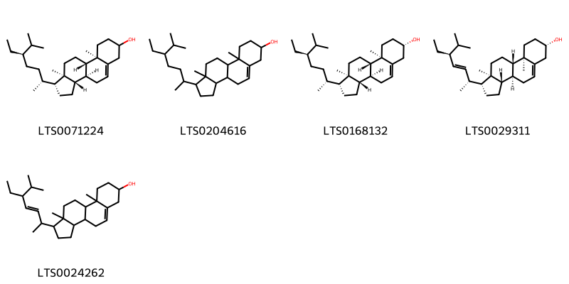{ width=100% }
    <figcaption>Hình ảnh cấu trúc hóa học của 5 hoạt chất thuộc nhóm Steroids and steroid derivatives gồm ['stigmast-5-en-3-ol (LTS0071224)', 'stigmast-5-en-3-ol, (3β)- (LTS0204616)', 'sitosterol (LTS0168132)', 'phytosterol (LTS0029311)', 'stigmasterol (LTS0024262)'].</figcaption>
</figure>
#### Nhóm Tetralins
<figure markdown="span">
    { width=100% }
    <figcaption>Hình ảnh cấu trúc hóa học của 1 hoạt chất thuộc nhóm Tetralins gồm ['2-[(2s)-5,8-dimethyl-1,2,3,4-tetrahydronaphthalen-2-yl]propan-2-ol (LTS0275773)'].</figcaption>
</figure>
#### Nhóm Unsaturated hydrocarbons
<figure markdown="span">
    { width=100% }
    <figcaption>Hình ảnh cấu trúc hóa học của 3 hoạt chất thuộc nhóm Unsaturated hydrocarbons gồm ['α terpinene (LTS0232891)', '2-methyl-6-methylideneocta-1,7-diene (LTS0213612)', '1-tetracosene; tetracosane (LTS0253964)'].</figcaption>
</figure>

---

### Dược dân tộc học

Danh sách các quốc gia có sử dụng *Artemisia annua* trong điều trị các bệnh. 

| Country   | Disease          | Bệnh                                                                                                                                                                                                |
|:----------|:-----------------|:----------------------------------------------------------------------------------------------------------------------------------------------------------------------------------------------------|
| China     | nan, Carminative | MYMEMORY WARNING: YOU USED ALL AVAILABLE FREE TRANSLATIONS FOR TODAY. NEXT AVAILABLE IN  10 HOURS 20 MINUTES 20 SECONDS VISIT HTTPS://MYMEMORY.TRANSLATED.NET/DOC/USAGELIMITS.PHP TO TRANSLATE MORE |
| Elsewhere | Stomachic        | MYMEMORY WARNING: YOU USED ALL AVAILABLE FREE TRANSLATIONS FOR TODAY. NEXT AVAILABLE IN  10 HOURS 20 MINUTES 17 SECONDS VISIT HTTPS://MYMEMORY.TRANSLATED.NET/DOC/USAGELIMITS.PHP TO TRANSLATE MORE |
| Indochina | Stomachic        | MYMEMORY WARNING: YOU USED ALL AVAILABLE FREE TRANSLATIONS FOR TODAY. NEXT AVAILABLE IN  10 HOURS 20 MINUTES 13 SECONDS VISIT HTTPS://MYMEMORY.TRANSLATED.NET/DOC/USAGELIMITS.PHP TO TRANSLATE MORE |

---

---
## Artemisia apiacea
### Thông tin về thực vật

!!! info "Phân loại thực vật của *Artemisia caruifolia* từ GIBF:"
    - **Kingdom:** Plantae
    - **Phylum:** Tracheophyta
    - **Order:** Asterales
    - **Family:** Asteraceae
    - **Genus:** Artemisia
    - **Species:** *Artemisia caruifolia*

 

| Label (VI)   | Label (EN)   | Scientific Name   | Descriptions (VI)   | Descriptions (EN)   | Also Known As (VI)   | Also Known As (EN)   |
|:-------------|:-------------|:------------------|:--------------------|:--------------------|:---------------------|:---------------------|
| N/A          | N/A          | Artemisia apiacea | loài thực vật       | species of plant    | ['']                 | ['']                 |

#### Phân bố trên thế giới

**Từ CSDL GIBF** nan, Luxembourg, Japan, Korea, Republic of, Chinese Taipei, unknown or invalid, Viet Nam, China

#### Phân bố tại Việt Nam

**Từ CSDL GIBF**: Không có ghi nhận ở Việt Nam

---
### Thành phần hóa học
        
- Theo cơ sở dữ liệu lotus: Từ loài *Artemisia caruifolia* đã phân lập và xác định được 35 hoạt chất thuộc về các nhóm Fatty Acyls, Flavonoids, Prenol lipids, Dioxolopyrans, Oxepanes, Benzene and substituted derivatives, Coumarins and derivatives, Carboxylic acids and derivatives. 

|    | chemicalTaxonomyClassyfireClass     |   smiles_count |
|---:|:------------------------------------|---------------:|
|  0 | Benzene and substituted derivatives |              2 |
|  1 | Carboxylic acids and derivatives    |              1 |
|  2 | Coumarins and derivatives           |              5 |
|  3 | Dioxolopyrans                       |              1 |
|  4 | Fatty Acyls                         |              3 |
|  5 | Flavonoids                          |              5 |
|  6 | Oxepanes                            |              1 |
|  7 | Prenol lipids                       |             14 |

#### Nhóm Benzene and substituted derivatives
<figure markdown="span">
    { width=100% }
    <figcaption>Hình ảnh cấu trúc hóa học của 2 hoạt chất thuộc nhóm Benzene and substituted derivatives gồm ['benzyl valerate (LTS0201215)', '3-isopropyl-2-methylphenol (LTS0213988)'].</figcaption>
</figure>
#### Nhóm Carboxylic acids and derivatives
<figure markdown="span">
    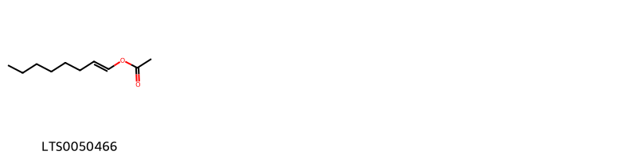{ width=100% }
    <figcaption>Hình ảnh cấu trúc hóa học của 1 hoạt chất thuộc nhóm Carboxylic acids and derivatives gồm ['(1e)-oct-1-en-1-yl acetate (LTS0050466)'].</figcaption>
</figure>
#### Nhóm Coumarins and derivatives
<figure markdown="span">
    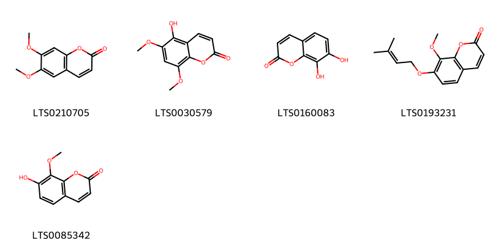{ width=100% }
    <figcaption>Hình ảnh cấu trúc hóa học của 5 hoạt chất thuộc nhóm Coumarins and derivatives gồm ['scoparone (LTS0210705)', '5-hydroxy-6,8-dimethoxychromen-2-one (LTS0030579)', 'daphnetin (LTS0160083)', '8-methoxy-7-[(3-methylbut-2-en-1-yl)oxy]chromen-2-one (LTS0193231)', '7-hydroxy-8-methoxychromen-2-one (LTS0085342)'].</figcaption>
</figure>
#### Nhóm Dioxolopyrans
<figure markdown="span">
    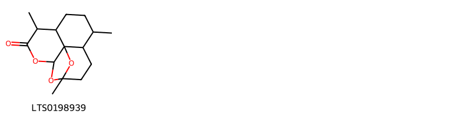{ width=100% }
    <figcaption>Hình ảnh cấu trúc hóa học của 1 hoạt chất thuộc nhóm Dioxolopyrans gồm ['1,5,9-trimethyl-11,14,15-trioxatetracyclo[10.2.1.0⁴,¹³.0⁸,¹³]pentadecan-10-one (LTS0198939)'].</figcaption>
</figure>
#### Nhóm Fatty Acyls
<figure markdown="span">
    { width=100% }
    <figcaption>Hình ảnh cấu trúc hóa học của 3 hoạt chất thuộc nhóm Fatty Acyls gồm ['isovaleric acid (LTS0156600)', '1-tricosanol (LTS0173093)', 'bullatacin (LTS0009710)'].</figcaption>
</figure>
#### Nhóm Flavonoids
<figure markdown="span">
    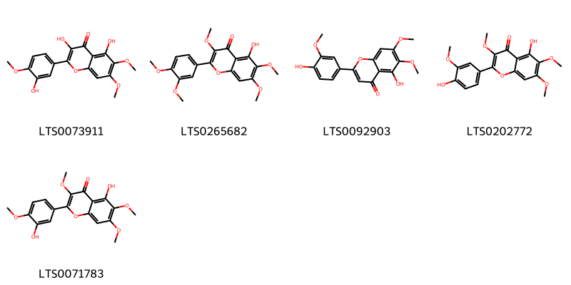{ width=100% }
    <figcaption>Hình ảnh cấu trúc hóa học của 5 hoạt chất thuộc nhóm Flavonoids gồm ['eupatin (LTS0073911)', 'artemetin (LTS0265682)', 'cirsilineol (LTS0092903)', 'chrysosplenetin (LTS0202772)', 'casticin (LTS0071783)'].</figcaption>
</figure>
#### Nhóm Oxepanes
<figure markdown="span">
    { width=100% }
    <figcaption>Hình ảnh cấu trúc hóa học của 1 hoạt chất thuộc nhóm Oxepanes gồm ['(1r,4r,5s,8r,9s,12s)-12-hydroxy-4,8,12-trimethyl-2,13-dioxatricyclo[7.4.1.0⁵,¹⁴]tetradec-6-en-3-one (LTS0040131)'].</figcaption>
</figure>
#### Nhóm Prenol lipids
<figure markdown="span">
    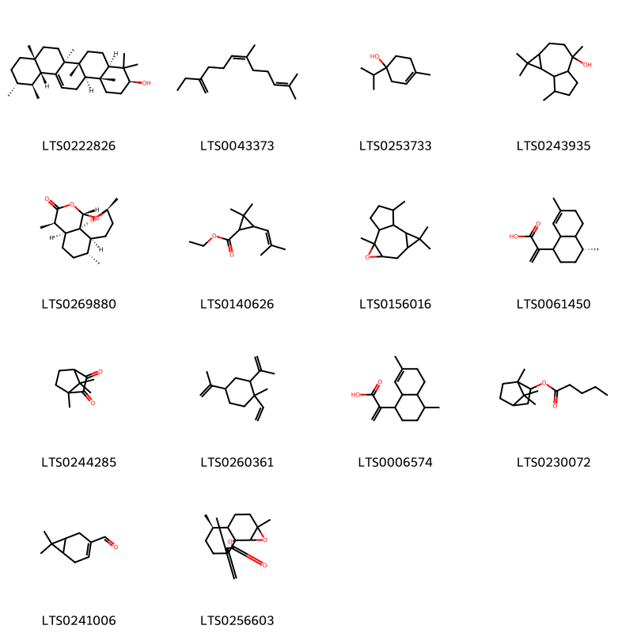{ width=100% }
    <figcaption>Hình ảnh cấu trúc hóa học của 14 hoạt chất thuộc nhóm Prenol lipids gồm ['amyrin (LTS0222826)', '(6z)-2,6-dimethyl-10-methylidenedodeca-2,6-diene (LTS0043373)', '4-terpineol (LTS0253733)', 'ledol (LTS0243935)', '(+)-artemisinin (LTS0269880)', 'ethyl chrysanthemate (LTS0140626)', '2,7,7,10-tetramethyl-3-oxatetracyclo[7.3.0.0²,⁴.0⁶,⁸]dodecane (LTS0156016)', 'artemisinic acid (LTS0061450)', 'camphorquinone (LTS0244285)', 'β-elemene (LTS0260361)', '2-(4,7-dimethyl-1,2,3,4,4a,5,6,8a-octahydronaphthalen-1-yl)prop-2-enoic acid (LTS0006574)', '1,7,7-trimethylbicyclo[2.2.1]heptan-2-yl pentanoate (LTS0230072)', '7,7-dimethylbicyclo[4.1.0]hept-3-ene-3-carbaldehyde (LTS0241006)', '(8r)-8,12-dimethyl-4-methylidene-2,13-dioxatetracyclo[7.5.0.0¹,⁵.0¹²,¹⁴]tetradecan-3-one (LTS0256603)'].</figcaption>
</figure>

---

### Dược dân tộc học

Danh sách các quốc gia có sử dụng *Artemisia caruifolia* trong điều trị các bệnh. 

| Country   | Disease                                 | Bệnh                                                                                                                                                                                                |
|:----------|:----------------------------------------|:----------------------------------------------------------------------------------------------------------------------------------------------------------------------------------------------------|
| China     | Alexiteric, Tonic, Vermifuge, Stomachic | MYMEMORY WARNING: YOU USED ALL AVAILABLE FREE TRANSLATIONS FOR TODAY. NEXT AVAILABLE IN  10 HOURS 19 MINUTES 21 SECONDS VISIT HTTPS://MYMEMORY.TRANSLATED.NET/DOC/USAGELIMITS.PHP TO TRANSLATE MORE |

---

---
## Artemisia arborescens
### Thông tin về thực vật

!!! info "Phân loại thực vật của *Artemisia arborescens* từ GIBF:"
    - **Kingdom:** Plantae
    - **Phylum:** Tracheophyta
    - **Order:** Asterales
    - **Family:** Asteraceae
    - **Genus:** Artemisia
    - **Species:** *Artemisia arborescens*

 

| Label (VI)   | Label (EN)   | Scientific Name       | Descriptions (VI)   | Descriptions (EN)   | Also Known As (VI)   | Also Known As (EN)   |
|:-------------|:-------------|:----------------------|:--------------------|:--------------------|:---------------------|:---------------------|
| N/A          | N/A          | Artemisia arborescens |                     | species of plant    | ['']                 | ['tree wormwood']    |

#### Phân bố trên thế giới

**Từ CSDL GIBF** Italy, Australia, New Zealand, Spain, France, Greece

#### Phân bố tại Việt Nam

**Từ CSDL GIBF**: Không có ghi nhận ở Việt Nam

---
### Thành phần hóa học
        
- Theo cơ sở dữ liệu lotus: Từ loài *Artemisia arborescens* đã phân lập và xác định được 127 hoạt chất thuộc về các nhóm Fatty Acyls, Flavonoids, Prenol lipids, Steroids and steroid derivatives, Benzene and substituted derivatives, Unsaturated hydrocarbons, Organooxygen compounds, Lactones, Coumarins and derivatives, Epoxides, Furanoid lignans. 

|    | chemicalTaxonomyClassyfireClass     |   smiles_count |
|---:|:------------------------------------|---------------:|
|  0 | Benzene and substituted derivatives |              1 |
|  1 | Coumarins and derivatives           |              3 |
|  2 | Epoxides                            |              2 |
|  3 | Fatty Acyls                         |              6 |
|  4 | Flavonoids                          |              3 |
|  5 | Furanoid lignans                    |             22 |
|  6 | Lactones                            |              5 |
|  7 | Organooxygen compounds              |              3 |
|  8 | Prenol lipids                       |             79 |
|  9 | Steroids and steroid derivatives    |              2 |
| 10 | Unsaturated hydrocarbons            |              1 |

#### Nhóm Benzene and substituted derivatives
<figure markdown="span">
    { width=100% }
    <figcaption>Hình ảnh cấu trúc hóa học của 1 hoạt chất thuộc nhóm Benzene and substituted derivatives gồm ['methyl eugenol (LTS0098881)'].</figcaption>
</figure>
#### Nhóm Coumarins and derivatives
<figure markdown="span">
    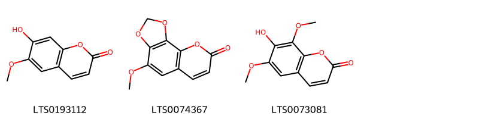{ width=100% }
    <figcaption>Hình ảnh cấu trúc hóa học của 3 hoạt chất thuộc nhóm Coumarins and derivatives gồm ['scopoletin (LTS0193112)', '4-methoxy-2h-[1,3]dioxolo[4,5-h]chromen-8-one (LTS0074367)', 'isofraxidin (LTS0073081)'].</figcaption>
</figure>
#### Nhóm Epoxides
<figure markdown="span">
    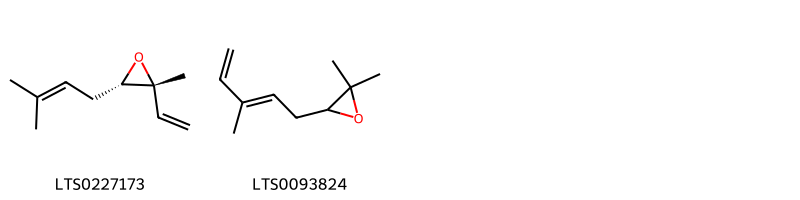{ width=100% }
    <figcaption>Hình ảnh cấu trúc hóa học của 2 hoạt chất thuộc nhóm Epoxides gồm ['(2r,3s)-2-ethenyl-2-methyl-3-(3-methylbut-2-en-1-yl)oxirane (LTS0227173)', '(e)-β-ocimene epoxide (LTS0093824)'].</figcaption>
</figure>
#### Nhóm Fatty Acyls
<figure markdown="span">
    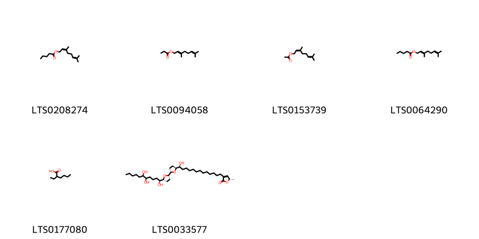{ width=100% }
    <figcaption>Hình ảnh cấu trúc hóa học của 6 hoạt chất thuộc nhóm Fatty Acyls gồm ['(2z)-3,7-dimethylocta-2,6-dien-1-yl pentanoate (LTS0208274)', 'geranyl propionate (LTS0094058)', 'neryl acetate (LTS0153739)', 'geranyl valerate (LTS0064290)', '2-ethylhexanoic acid (LTS0177080)', "(5s)-3-[(13s)-13-hydroxy-13-[(2s,2's,5s,5'r)-5'-[(1s)-1,5,6-trihydroxyundecyl]-[2,2'-bioxolan]-5-yl]tridecyl]-5-methyl-5h-furan-2-one (LTS0033577)"].</figcaption>
</figure>
#### Nhóm Flavonoids
<figure markdown="span">
    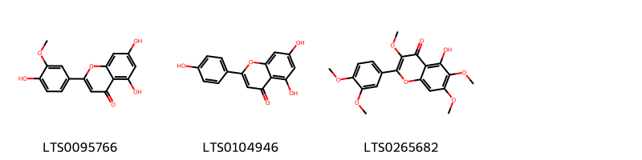{ width=100% }
    <figcaption>Hình ảnh cấu trúc hóa học của 3 hoạt chất thuộc nhóm Flavonoids gồm ['chrysoeriol (LTS0095766)', 'chamomile (LTS0104946)', 'artemetin (LTS0265682)'].</figcaption>
</figure>
#### Nhóm Furanoid lignans
<figure markdown="span">
    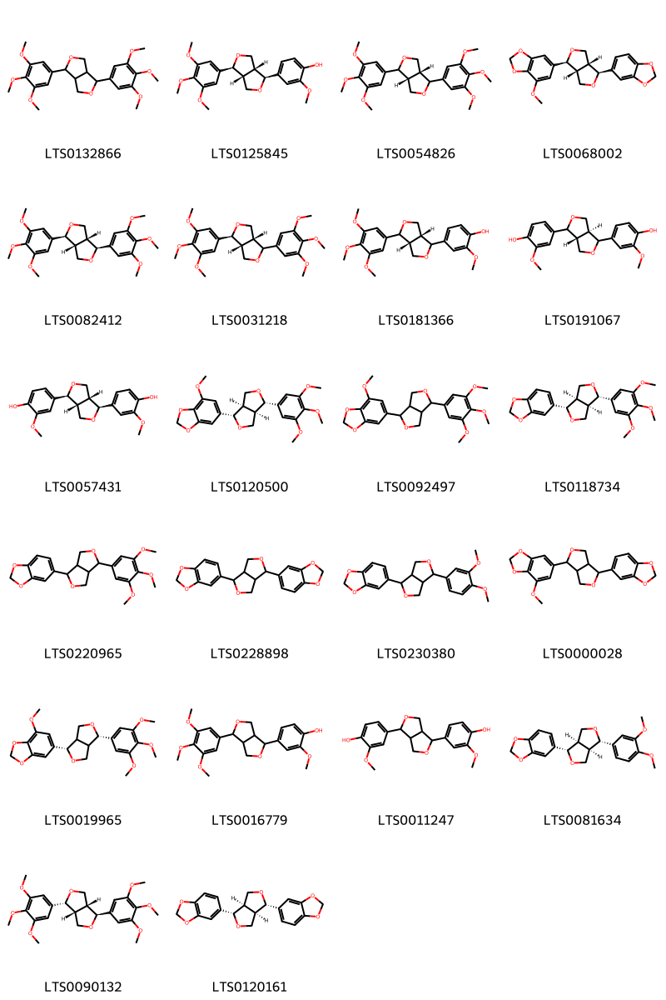{ width=100% }
    <figcaption>Hình ảnh cấu trúc hóa học của 22 hoạt chất thuộc nhóm Furanoid lignans gồm ['1,4-bis(3,4,5-trimethoxyphenyl)-hexahydrofuro[3,4-c]furan (LTS0132866)', '4-[(1s,3ar,4s,6ar)-4-(3,4,5-trimethoxyphenyl)-hexahydrofuro[3,4-c]furan-1-yl]-2-methoxyphenol (LTS0125845)', '(3ar,6ar)-1,4-bis(3,4,5-trimethoxyphenyl)-hexahydrofuro[3,4-c]furan (LTS0054826)', '6-[(1s,3ar,4s,6ar)-4-(2h-1,3-benzodioxol-5-yl)-hexahydrofuro[3,4-c]furan-1-yl]-4-methoxy-2h-1,3-benzodioxole (LTS0068002)', '( )-yangabin (LTS0082412)', '(1s,3ar,6ar)-1,4-bis(3,4,5-trimethoxyphenyl)-hexahydrofuro[3,4-c]furan (LTS0031218)', '4-[(3ar,6ar)-4-(3,4,5-trimethoxyphenyl)-hexahydrofuro[3,4-c]furan-1-yl]-2-methoxyphenol (LTS0181366)', '4-[(3ar,6as)-4-(4-hydroxy-3-methoxyphenyl)-hexahydrofuro[3,4-c]furan-1-yl]-2-methoxyphenol (LTS0191067)', 'pinoresinol (LTS0057431)', 'sesartemin (LTS0120500)', '4-methoxy-6-[4-(3,4,5-trimethoxyphenyl)-hexahydrofuro[3,4-c]furan-1-yl]-2h-1,3-benzodioxole (LTS0092497)', '5-[(1s,3ar,4s,6ar)-4-(3,4,5-trimethoxyphenyl)-hexahydrofuro[3,4-c]furan-1-yl]-2h-1,3-benzodioxole (LTS0118734)', '5-[4-(3,4,5-trimethoxyphenyl)-hexahydrofuro[3,4-c]furan-1-yl]-2h-1,3-benzodioxole (LTS0220965)', 'sesamin (LTS0228898)', '5-[4-(3,4-dimethoxyphenyl)-hexahydrofuro[3,4-c]furan-1-yl]-2h-1,3-benzodioxole (LTS0230380)', '6-[4-(2h-1,3-benzodioxol-5-yl)-hexahydrofuro[3,4-c]furan-1-yl]-4-methoxy-2h-1,3-benzodioxole (LTS0000028)', '4-methoxy-6-[(1s,4s)-4-(3,4,5-trimethoxyphenyl)-hexahydrofuro[3,4-c]furan-1-yl]-2h-1,3-benzodioxole (LTS0019965)', '2-methoxy-4-[4-(3,4,5-trimethoxyphenyl)-hexahydrofuro[3,4-c]furan-1-yl]phenol (LTS0016779)', 'pinoresinol (LTS0011247)', '5-[(1s,3ar,4s,6ar)-4-(3,4-dimethoxyphenyl)-hexahydrofuro[3,4-c]furan-1-yl]-2h-1,3-benzodioxole (LTS0081634)', '(1r,3ar,4s,6ar)-1,4-bis(3,4,5-trimethoxyphenyl)-hexahydrofuro[3,4-c]furan (LTS0090132)', 'sesamin (LTS0120161)'].</figcaption>
</figure>
#### Nhóm Lactones
<figure markdown="span">
    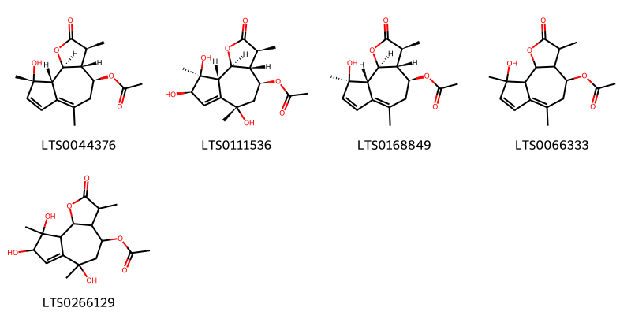{ width=100% }
    <figcaption>Hình ảnh cấu trúc hóa học của 5 hoạt chất thuộc nhóm Lactones gồm ['matricine (LTS0044376)', '(3s,3ar,4s,6s,8r,9s,9as,9bs)-6,8,9-trihydroxy-3,6,9-trimethyl-2-oxo-3h,3ah,4h,5h,8h,9ah,9bh-azuleno[4,5-b]furan-4-yl acetate (LTS0111536)', 'matricin (LTS0168849)', '9-hydroxy-3,6,9-trimethyl-2-oxo-3h,3ah,4h,5h,9ah,9bh-azuleno[4,5-b]furan-4-yl acetate (LTS0066333)', '6,8,9-trihydroxy-3,6,9-trimethyl-2-oxo-3h,3ah,4h,5h,8h,9ah,9bh-azuleno[4,5-b]furan-4-yl acetate (LTS0266129)'].</figcaption>
</figure>
#### Nhóm Organooxygen compounds
<figure markdown="span">
    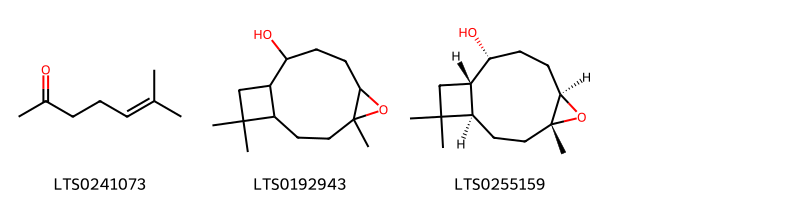{ width=100% }
    <figcaption>Hình ảnh cấu trúc hóa học của 3 hoạt chất thuộc nhóm Organooxygen compounds gồm ['6-methyl-5-hepten-2-one (LTS0241073)', '4,12,12-trimethyl-5-oxatricyclo[8.2.0.0⁴,⁶]dodecan-9-ol (LTS0192943)', '(1r,4r,6r,9r,10s)-4,12,12-trimethyl-5-oxatricyclo[8.2.0.0⁴,⁶]dodecan-9-ol (LTS0255159)'].</figcaption>
</figure>
#### Nhóm Prenol lipids
<figure markdown="span">
    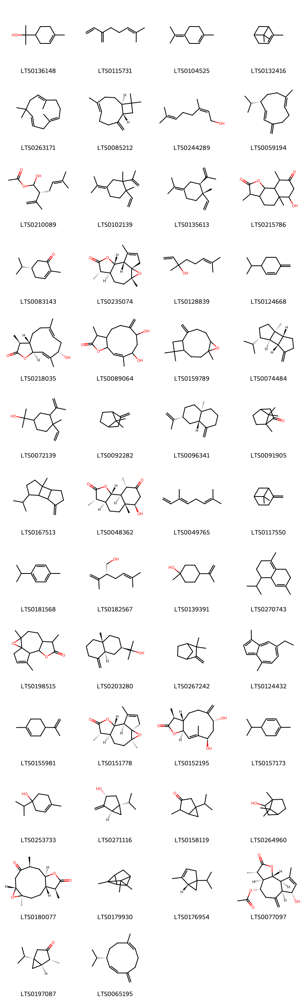{ width=100% }
    <figcaption>Hình ảnh cấu trúc hóa học của 79 hoạt chất thuộc nhóm Prenol lipids gồm ['terpineol (LTS0136148)', 'α-myrcene (LTS0115731)', 'terpinolene (LTS0104525)', 'α pinene (LTS0132416)', 'humulene (LTS0263171)', 'caryophyllene (LTS0085212)', 'nerol (LTS0244289)', '(-)-germacrene d (LTS0059194)', '(2r)-1-hydroxy-5-methyl-2-(prop-1-en-2-yl)hex-4-en-1-yl acetate (LTS0210089)', '1-ethenyl-1,2-dimethyl-2-(prop-1-en-2-yl)-4-(propan-2-ylidene)cyclohexane (LTS0102139)', '(1s,2s)-1-ethenyl-1-methyl-2-(prop-1-en-2-yl)-4-(propan-2-ylidene)cyclohexane (LTS0135613)', '6-hydroxy-3,5a,9-trimethyl-octahydro-3h-naphtho[1,2-b]furan-2,8-dione (LTS0215786)', '(5s)-5-isopropyl-2-methylcyclohex-2-en-1-one (LTS0083143)', '(1s,3r,6s,7s,10s,11s)-3,7,12-trimethyl-2,9-dioxatetracyclo[9.3.0.0¹,³.0⁶,¹⁰]tetradec-12-en-8-one (LTS0235074)', 'linalool, (+-)- (LTS0128839)', 'β phellandrene (LTS0124668)', '(3s,3as,9s,11as)-9-hydroxy-3,6,10-trimethyl-3h,3ah,4h,5h,8h,9h,11ah-cyclodeca[b]furan-2-one (LTS0218035)', '7,9-dihydroxy-3,10-dimethyl-6-methylidene-3h,3ah,4h,5h,7h,8h,9h,11ah-cyclodeca[b]furan-2-one (LTS0089064)', 'caryophyllene oxide (LTS0159789)', 'β-bourbonene (LTS0074484)', '2-[4-ethenyl-4-methyl-3-(prop-1-en-2-yl)cyclohexyl]propan-2-ol (LTS0072139)', '7,7-dimethyl-2-methylidenebicyclo[2.2.1]heptane (LTS0092282)', 'β-selinene (LTS0096341)', 'camphor (LTS0091905)', 'β-bourbonene (LTS0167513)', '(3s,3as,5ar,6r,9s,9as,9bs)-6-hydroxy-3,5a,9-trimethyl-octahydro-3h-naphtho[1,2-b]furan-2,8-dione (LTS0048362)', 'trans-β-ocimene (LTS0049765)', 'β-pinene (LTS0117550)', 'cymene (LTS0181568)', '(-)-lavandulol (LTS0182567)', 'terpineols (LTS0139391)', '4-isopropyl-1,6-dimethyl-2,3,4,4a,7,8-hexahydronaphthalene (LTS0270743)', '3,7,12-trimethyl-2,9-dioxatetracyclo[9.3.0.0¹,³.0⁶,¹⁰]tetradec-12-en-8-one (LTS0198515)', 'β-eudesmol (LTS0203280)', 'camphene (LTS0267242)', 'chamazulene (LTS0124432)', 'limonene,  (LTS0155981)', 'arborescin (LTS0151778)', '(3s,3as,7r,9r,11as)-7,9-dihydroxy-3,10-dimethyl-6-methylidene-3h,3ah,4h,5h,7h,8h,9h,11ah-cyclodeca[b]furan-2-one (LTS0152195)', 'phellandrene (LTS0157173)', '4-terpineol (LTS0253733)', '(-)-cis-sabinol (LTS0271116)', '3-isothujone (LTS0158119)', 'borneol (LTS0264960)', '(1s,4r,6r,9s,11r,14s)-4,9,14-trimethyl-5,12-dioxatricyclo[9.3.0.0⁴,⁶]tetradecane-8,13-dione (LTS0180077)', 'tricyclene (LTS0179930)', 'α-thujene (LTS0176954)', '(3s,3ar,4s,6ar,7s,9ar,9br)-7-hydroxy-3,9-dimethyl-6-methylidene-2-oxo-3h,3ah,4h,5h,6ah,7h,9ah,9bh-azuleno[4,5-b]furan-4-yl acetate (LTS0077097)', 'thujone (LTS0197087)', '(1z,6z,8s)-8-isopropyl-1-methyl-5-methylidenecyclodeca-1,6-diene (LTS0065195)', 'β-caryophyllene oxide (LTS0213960)', 'α-copaene (LTS0207598)', 'methyl 2-(4a-methyl-8-methylidene-octahydronaphthalen-2-yl)prop-2-enoate (LTS0085582)', 'sabinene (LTS0224133)', '6,8-dihydroxy-3,5a-dimethyl-9-methylidene-octahydro-3h-naphtho[1,2-b]furan-2-one (LTS0026765)', '7-hydroxy-3,9-dimethyl-6-methylidene-2-oxo-3h,3ah,4h,5h,6ah,7h,9ah,9bh-azuleno[4,5-b]furan-4-yl acetate (LTS0009247)', '(3s,3as,5ar,6r,8s,9as,9bs)-6,8-dihydroxy-3,5a-dimethyl-9-methylidene-octahydro-3h-naphtho[1,2-b]furan-2-one (LTS0220189)', 'α-thujene (LTS0185078)', 'elemol (LTS0208556)', 'neral (LTS0165243)', '(+)-β-thujone (LTS0180873)', '(2s,7s,11s)-7,11,15-trimethyl-3-methylidenehexadecane-1,2-diol (LTS0042785)', 'geraniol (LTS0258838)', 'β-ocimene (LTS0242381)', '(1r,2s,7s,8s)-8-isopropyl-1,3-dimethyltricyclo[4.4.0.0²,⁷]dec-3-ene (LTS0190031)', 'lavandulol (LTS0111607)', '(2s,4r)-1,7,7-trimethylbicyclo[2.2.1]heptan-2-ol (LTS0010050)', '(3s,3as,9r,11as)-9-hydroxy-3,6,10-trimethyl-3h,3ah,4h,5h,8h,9h,11ah-cyclodeca[b]furan-2-one (LTS0068919)', 'terpinene (LTS0136858)', '1-(3,8-dimethylazulen-5-yl)ethanone (LTS0275374)', '(3s,3as,7s,10s,11ar)-7-hydroxy-3,6,10-trimethyl-3h,3ah,4h,7h,8h,10h,11h,11ah-cyclodeca[b]furan-2,9-dione (LTS0224420)', 'delta-cadinene (LTS0019321)', 'perillaldehyde,  (LTS0028488)', '1-[(5e)-6,10-dimethyl-9-methylideneundec-5-en-2-yl]-4-methyl-2,3-dioxabicyclo[2.2.2]oct-5-ene (LTS0021714)', 'methyl 2-[(2r,4ar,8as)-4a-methyl-8-methylidene-octahydronaphthalen-2-yl]prop-2-enoate (LTS0098485)', '(3s,3as,7r,9s,11ar)-7,9-dihydroxy-3,10-dimethyl-6-methylidene-3h,3ah,4h,5h,7h,8h,9h,11ah-cyclodeca[b]furan-2-one (LTS0106017)', '9-hydroxy-3,6,10-trimethyl-3h,3ah,4h,5h,8h,9h,11ah-cyclodeca[b]furan-2-one (LTS0039069)', '(-)-β-cubebene (LTS0123697)', '7,11,15-trimethyl-3-methylidenehexadecane-1,2-diol (LTS0023467)'].</figcaption>
</figure>
#### Nhóm Steroids and steroid derivatives
<figure markdown="span">
    { width=100% }
    <figcaption>Hình ảnh cấu trúc hóa học của 2 hoạt chất thuộc nhóm Steroids and steroid derivatives gồm ['sitogluside (LTS0201798)', '2-{[1-(5-ethyl-6-methylheptan-2-yl)-9a,11a-dimethyl-1h,2h,3h,3ah,3bh,4h,6h,7h,8h,9h,9bh,10h,11h-cyclopenta[a]phenanthren-7-yl]oxy}-6-(hydroxymethyl)oxane-3,4,5-triol (LTS0158828)'].</figcaption>
</figure>
#### Nhóm Unsaturated hydrocarbons
<figure markdown="span">
    { width=100% }
    <figcaption>Hình ảnh cấu trúc hóa học của 1 hoạt chất thuộc nhóm Unsaturated hydrocarbons gồm ['α terpinene (LTS0232891)'].</figcaption>
</figure>

---

### Dược dân tộc học

Danh sách các quốc gia có sử dụng *Artemisia arborescens* trong điều trị các bệnh. 

| Country   | Disease   | Bệnh                                                                                                                                                                                                |
|:----------|:----------|:----------------------------------------------------------------------------------------------------------------------------------------------------------------------------------------------------|
| ain       | Apertif   | MYMEMORY WARNING: YOU USED ALL AVAILABLE FREE TRANSLATIONS FOR TODAY. NEXT AVAILABLE IN  10 HOURS 18 MINUTES 52 SECONDS VISIT HTTPS://MYMEMORY.TRANSLATED.NET/DOC/USAGELIMITS.PHP TO TRANSLATE MORE |

---

---
## Artemisia campestris
### Thông tin về thực vật

!!! info "Phân loại thực vật của *Artemisia campestris* từ GIBF:"
    - **Kingdom:** Plantae
    - **Phylum:** Tracheophyta
    - **Order:** Asterales
    - **Family:** Asteraceae
    - **Genus:** Artemisia
    - **Species:** *Artemisia campestris*

 

| Label (VI)   | Label (EN)   | Scientific Name      | Descriptions (VI)   | Descriptions (EN)   | Also Known As (VI)   | Also Known As (EN)   |
|:-------------|:-------------|:---------------------|:--------------------|:--------------------|:---------------------|:---------------------|
| N/A          | N/A          | Artemisia campestris | loài thực vật       | species of plant    | ['']                 | ['']                 |

#### Phân bố trên thế giới

**Từ CSDL GIBF** Ukraine, Denmark, Netherlands, Italy, Belarus, Czechia, Germany, Spain, Poland, Hungary, Portugal, Switzerland, Russian Federation, United States of America, Sweden, Austria, Norway, Canada

#### Phân bố tại Việt Nam

**Từ CSDL GIBF**: Không có ghi nhận ở Việt Nam

---
### Thành phần hóa học
        
- Theo cơ sở dữ liệu lotus: Từ loài *Artemisia campestris* đã phân lập và xác định được 126 hoạt chất thuộc về các nhóm Fatty Acyls, Flavonoids, Prenol lipids, Linear 1,3-diarylpropanoids, Isocoumarins and derivatives, Lactones, Organooxygen compounds, Coumarins and derivatives, Benzopyrans. 

|    | chemicalTaxonomyClassyfireClass   |   smiles_count |
|---:|:----------------------------------|---------------:|
|  0 | Benzopyrans                       |              9 |
|  1 | Coumarins and derivatives         |              3 |
|  2 | Fatty Acyls                       |              5 |
|  3 | Flavonoids                        |             36 |
|  4 | Isocoumarins and derivatives      |              3 |
|  5 | Lactones                          |              4 |
|  6 | Linear 1,3-diarylpropanoids       |              2 |
|  7 | Organooxygen compounds            |             16 |
|  8 | Prenol lipids                     |             46 |

#### Nhóm Benzopyrans
<figure markdown="span">
    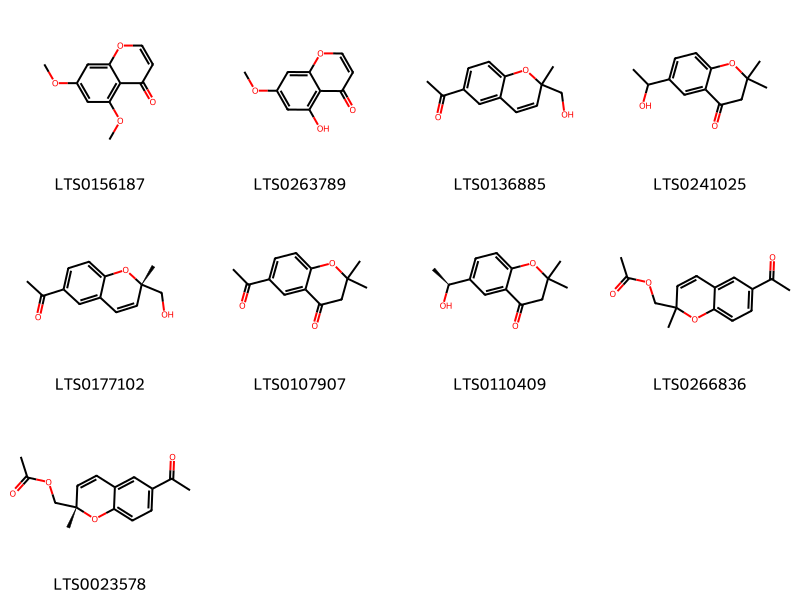{ width=100% }
    <figcaption>Hình ảnh cấu trúc hóa học của 9 hoạt chất thuộc nhóm Benzopyrans gồm ['5,7-dimethoxychromen-4-one (LTS0156187)', '5-hydroxy-7-methoxychromen-4-one (LTS0263789)', '1-[2-(hydroxymethyl)-2-methylchromen-6-yl]ethanone (LTS0136885)', '6-(1-hydroxyethyl)-2,2-dimethyl-3h-1-benzopyran-4-one (LTS0241025)', '1-[(2s)-2-(hydroxymethyl)-2-methylchromen-6-yl]ethanone (LTS0177102)', '6-acetyl-2,2-dimethyl-3h-1-benzopyran-4-one (LTS0107907)', '6-[(1s)-1-hydroxyethyl]-2,2-dimethyl-3h-1-benzopyran-4-one (LTS0110409)', '(6-acetyl-2-methylchromen-2-yl)methyl acetate (LTS0266836)', '[(2s)-6-acetyl-2-methylchromen-2-yl]methyl acetate (LTS0023578)'].</figcaption>
</figure>
#### Nhóm Coumarins and derivatives
<figure markdown="span">
    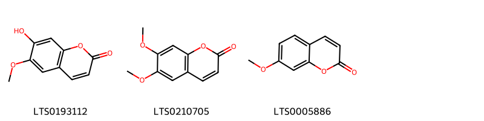{ width=100% }
    <figcaption>Hình ảnh cấu trúc hóa học của 3 hoạt chất thuộc nhóm Coumarins and derivatives gồm ['scopoletin (LTS0193112)', 'scoparone (LTS0210705)', 'methylumbelliferone (LTS0005886)'].</figcaption>
</figure>
#### Nhóm Fatty Acyls
<figure markdown="span">
    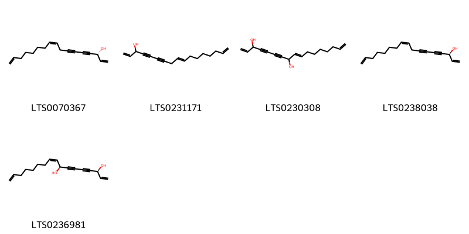{ width=100% }
    <figcaption>Hình ảnh cấu trúc hóa học của 5 hoạt chất thuộc nhóm Fatty Acyls gồm ['dehydrofalcarinol (LTS0070367)', 'heptadeca-1,9,16-trien-4,6-diyn-3-ol (LTS0231171)', 'heptadeca-1,9,16-trien-4,6-diyne-3,8-diol (LTS0230308)', '(3s,9z)-heptadeca-1,9,16-trien-4,6-diyn-3-ol (LTS0238038)', '(3s,8s,9z)-heptadeca-1,9,16-trien-4,6-diyne-3,8-diol (LTS0236981)'].</figcaption>
</figure>
#### Nhóm Flavonoids
<figure markdown="span">
    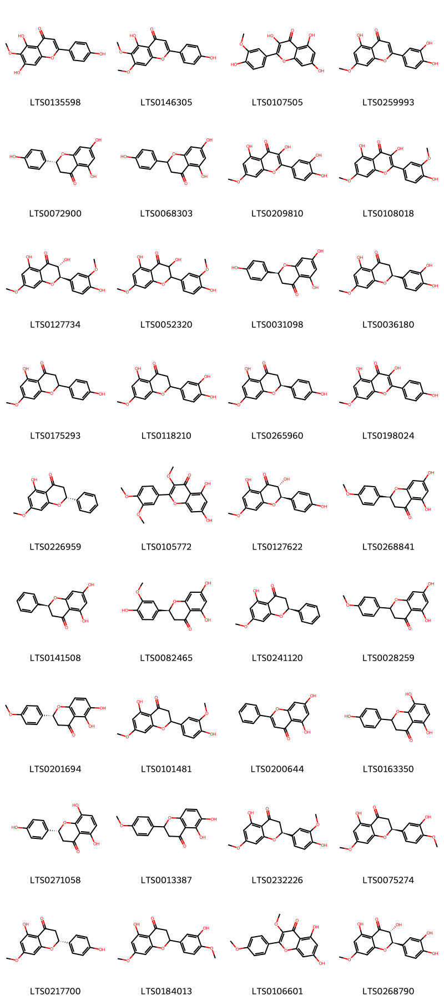{ width=100% }
    <figcaption>Hình ảnh cấu trúc hóa học của 36 hoạt chất thuộc nhóm Flavonoids gồm ['hispidulin (LTS0135598)', 'cirsimaritin (LTS0146305)', 'isorhamnetin (LTS0107505)', 'luteolin 7-methyl ether (LTS0259993)', '(-)-naringenin (LTS0072900)', 'asahina (LTS0068303)', 'rhamnetin (LTS0209810)', 'rhamnazin (LTS0108018)', '(2r,3r)-3,5-dihydroxy-2-(4-hydroxy-3-methoxyphenyl)-7-methoxy-2,3-dihydro-1-benzopyran-4-one (LTS0127734)', '3,5-dihydroxy-2-(4-hydroxy-3-methoxyphenyl)-7-methoxy-2,3-dihydro-1-benzopyran-4-one (LTS0052320)', 'naringenin (LTS0031098)', 'sterubin (LTS0036180)', 'sakuranetin (LTS0175293)', 'sternbin (LTS0118210)', 'sakuranetin (LTS0265960)', 'rhamnocitrin (LTS0198024)', '(2r)-5-hydroxy-7-methoxy-2-phenyl-2,3-dihydro-1-benzopyran-4-one (LTS0226959)', '2-(3,4-dimethoxyphenyl)-5,7-dihydroxy-3-methoxychromen-4-one (LTS0105772)', '(2r,3r)-3,5-dihydroxy-2-(4-hydroxyphenyl)-7-methoxy-2,3-dihydro-1-benzopyran-4-one (LTS0127622)', 'isosakuranetin (LTS0268841)', 'pinocembrine (LTS0141508)', 'homoeriodictyol (LTS0082465)', 'pinostrobin (LTS0241120)', 'isosakuranetin (LTS0028259)', '(2r)-5,6-dihydroxy-2-(4-methoxyphenyl)-2,3-dihydro-1-benzopyran-4-one (LTS0201694)', '5-hydroxy-2-(4-hydroxy-3-methoxyphenyl)-7-methoxy-2,3-dihydro-1-benzopyran-4-one (LTS0101481)', 'chrysin (LTS0200644)', '5,8-dihydroxy-2-(4-hydroxyphenyl)-2,3-dihydro-1-benzopyran-4-one (LTS0163350)', '(2r)-5,8-dihydroxy-2-(4-hydroxyphenyl)-2,3-dihydro-1-benzopyran-4-one (LTS0271058)', '5,6-dihydroxy-2-(4-methoxyphenyl)-2,3-dihydro-1-benzopyran-4-one (LTS0013387)', '(2s)-5-hydroxy-2-(4-hydroxy-3-methoxyphenyl)-7-methoxy-2,3-dihydro-1-benzopyran-4-one (LTS0232226)', '(2s)-5-hydroxy-2-(3-hydroxy-4-methoxyphenyl)-7-methoxy-2,3-dihydro-1-benzopyran-4-one (LTS0075274)', '(2r)-5-hydroxy-2-(4-hydroxyphenyl)-7-methoxy-2,3-dihydro-1-benzopyran-4-one (LTS0217700)', 'persicogenin (LTS0184013)', 'ermanin (LTS0106601)', '(2r,3r)-2-(3,4-dihydroxyphenyl)-3,5-dihydroxy-7-methoxy-2,3-dihydro-1-benzopyran-4-one (LTS0268790)'].</figcaption>
</figure>
#### Nhóm Isocoumarins and derivatives
<figure markdown="span">
    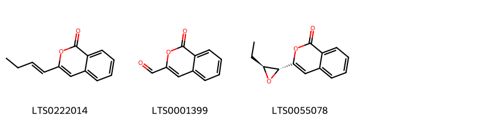{ width=100% }
    <figcaption>Hình ảnh cấu trúc hóa học của 3 hoạt chất thuộc nhóm Isocoumarins and derivatives gồm ['3-[(1e)-but-1-en-1-yl]isochromen-1-one (LTS0222014)', '1-oxoisochromene-3-carbaldehyde (LTS0001399)', '3-[(2r,3s)-3-ethyloxiran-2-yl]isochromen-1-one (LTS0055078)'].</figcaption>
</figure>
#### Nhóm Lactones
<figure markdown="span">
    { width=100% }
    <figcaption>Hình ảnh cấu trúc hóa học của 4 hoạt chất thuộc nhóm Lactones gồm ['(3s,3as,6s,9s,9bs)-6,9-dihydroxy-3,6,9-trimethyl-3h,3ah,4h,5h,8h,9bh-azuleno[4,5-b]furan-2,7-dione (LTS0148949)', 'matricin (LTS0168849)', '(3s,3as,6s,9r,9bs)-6,9-dihydroxy-3,6,9-trimethyl-3h,3ah,4h,5h,8h,9bh-azuleno[4,5-b]furan-2,7-dione (LTS0169132)', 'artabsin (LTS0162316)'].</figcaption>
</figure>
#### Nhóm Linear 1_3-diarylpropanoids
<figure markdown="span">
    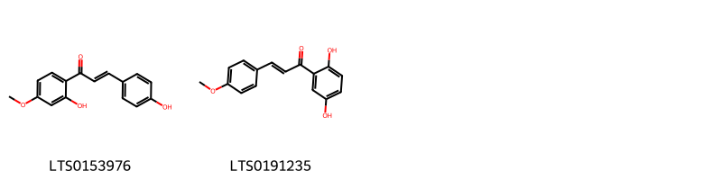{ width=100% }
    <figcaption>Hình ảnh cấu trúc hóa học của Không tìm thấy chú thích hoạt chất thuộc nhóm Linear 1_3-diarylpropanoids gồm Không tìm thấy chú thích.</figcaption>
</figure>
#### Nhóm Organooxygen compounds
<figure markdown="span">
    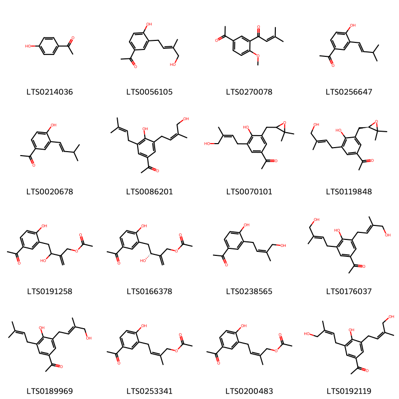{ width=100% }
    <figcaption>Hình ảnh cấu trúc hóa học của 16 hoạt chất thuộc nhóm Organooxygen compounds gồm ['hydroxyacetophenone (LTS0214036)', '1-{4-hydroxy-3-[(2e)-4-hydroxy-3-methylbut-2-en-1-yl]phenyl}ethanone (LTS0056105)', '1-(5-acetyl-2-methoxyphenyl)-3-methylbut-2-en-1-one (LTS0270078)', '1-{4-hydroxy-3-[(1e)-3-methylbut-1-en-1-yl]phenyl}ethanone (LTS0256647)', '1-[4-hydroxy-3-(3-methylbut-1-en-1-yl)phenyl]ethanone (LTS0020678)', '1-[4-hydroxy-3-(4-hydroxy-3-methylbut-2-en-1-yl)-5-(3-methylbut-2-en-1-yl)phenyl]ethanone (LTS0086201)', '1-{3-[(3,3-dimethyloxiran-2-yl)methyl]-4-hydroxy-5-(4-hydroxy-3-methylbut-2-en-1-yl)phenyl}ethanone (LTS0070101)', '1-(3-{[(2r)-3,3-dimethyloxiran-2-yl]methyl}-4-hydroxy-5-[(2e)-4-hydroxy-3-methylbut-2-en-1-yl]phenyl)ethanone (LTS0119848)', '4-(5-acetyl-2-hydroxyphenyl)-3-hydroxy-2-methylidenebutyl acetate (LTS0191258)', '(3r)-4-(5-acetyl-2-hydroxyphenyl)-3-hydroxy-2-methylidenebutyl acetate (LTS0166378)', '1-[4-hydroxy-3-(4-hydroxy-3-methylbut-2-en-1-yl)phenyl]ethanone (LTS0238565)', '1-{4-hydroxy-3,5-bis[(2e)-4-hydroxy-3-methylbut-2-en-1-yl]phenyl}ethanone (LTS0176037)', '1-{4-hydroxy-3-[(2e)-4-hydroxy-3-methylbut-2-en-1-yl]-5-(3-methylbut-2-en-1-yl)phenyl}ethanone (LTS0189969)', '(2z)-4-(5-acetyl-2-hydroxyphenyl)-2-methylbut-2-en-1-yl acetate (LTS0253341)', '4-(5-acetyl-2-hydroxyphenyl)-2-methylbut-2-en-1-yl acetate (LTS0200483)', '1-[4-hydroxy-3,5-bis(4-hydroxy-3-methylbut-2-en-1-yl)phenyl]ethanone (LTS0192119)'].</figcaption>
</figure>
#### Nhóm Prenol lipids
<figure markdown="span">
    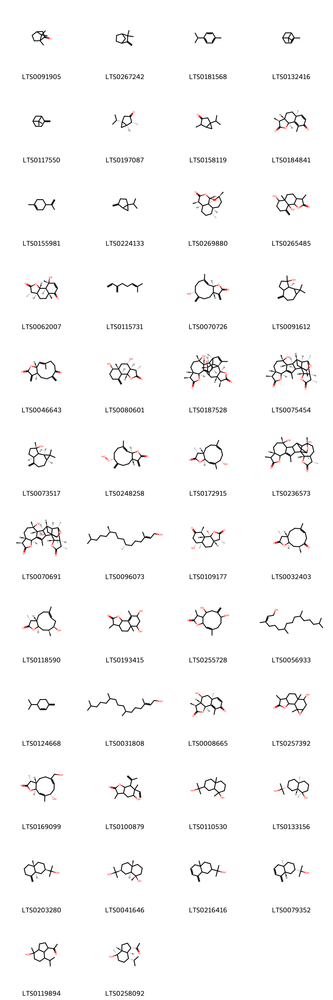{ width=100% }
    <figcaption>Hình ảnh cấu trúc hóa học của 46 hoạt chất thuộc nhóm Prenol lipids gồm ['camphor (LTS0091905)', 'camphene (LTS0267242)', 'cymene (LTS0181568)', 'α pinene (LTS0132416)', 'β-pinene (LTS0117550)', 'thujone (LTS0197087)', '3-isothujone (LTS0158119)', 'santonin (LTS0184841)', 'limonene,  (LTS0155981)', 'sabinene (LTS0224133)', '(+)-artemisinin (LTS0269880)', '6,9a-dihydroxy-3,5a-dimethyl-9-methylidene-octahydronaphtho[1,2-b]furan-2-one (LTS0265485)', 'vulgarin (LTS0062007)', 'α-myrcene (LTS0115731)', 'artemorin (LTS0070726)', '(7ar)-1,1,7-trimethyl-4-methylidene-octahydrocyclopropa[e]azulen-7-ol (LTS0091612)', '(3as,11ar)-10-methyl-3,6-dimethylidene-3ah,4h,5h,8h,9h,11ah-cyclodeca[b]furan-2,7-dione (LTS0046643)', '(3s,3ar,4s,5ar,6r,9as,9br)-4,6-dihydroxy-3,5a-dimethyl-9-methylidene-octahydro-3h-naphtho[1,2-b]furan-2-one (LTS0080601)', '(+)-absinthin (LTS0187528)', 'anabsinthin (LTS0075454)', '(1as,4as,7s,7ar,7bs)-1,1,7-trimethyl-4-methylidene-octahydrocyclopropa[e]azulen-7-ol (LTS0073517)', 'verlotorin (LTS0248258)', '(3r,3as,9s,11as)-9-hydroxy-3,6,10-trimethyl-3h,3ah,4h,5h,8h,9h,11ah-cyclodeca[b]furan-2-one (LTS0172915)', '(9s,12s,16r,17s,19s,23s,26s)-12,16-dihydroxy-3,8,12,17,19,23-hexamethyl-6,18,25-trioxaoctacyclo[13.11.1.0¹,¹⁷.0²,¹⁴.0⁴,¹³.0⁵,⁹.0¹⁹,²⁷.0²²,²⁶]heptacos-3-ene-7,24-dione (LTS0236573)', '(1s,2r,5s,8s,9s,12s,13r,14r,15r,16r,17s,19s,22s,23s,26s,27r)-12,16-dihydroxy-3,8,12,17,19,23-hexamethyl-6,18,25-trioxaoctacyclo[13.11.1.0¹,¹⁷.0²,¹⁴.0⁴,¹³.0⁵,⁹.0¹⁹,²⁷.0²²,²⁶]heptacos-3-ene-7,24-dione (LTS0070691)', 'phytol (LTS0096073)', '(3r,3as,5ar,6r,9s,9as,9bs)-6-hydroxy-3,5a,9-trimethyl-octahydro-3h-naphtho[1,2-b]furan-2,8-dione (LTS0109177)', 'ketopelenolide a (LTS0032403)', '(3r,3as,9r,10s,11ar)-9-hydroxy-3,6,10-trimethyl-3h,3ah,4h,5h,8h,9h,10h,11h,11ah-cyclodeca[b]furan-2-one (LTS0118590)', '6,8-dihydroxy-3,5a,9-trimethyl-3h,3ah,4h,5h,6h,7h,8h,9bh-naphtho[1,2-b]furan-2-one (LTS0193415)', '4,7-dihydroxy-3,10-dimethyl-6-methylidene-3h,3ah,4h,5h,7h,8h,9h,11ah-cyclodeca[b]furan-2-one (LTS0255728)', '3,7,11,15-tetramethylhexadec-2-en-1-ol (LTS0056933)', 'β phellandrene (LTS0124668)', 'phytol (LTS0031808)', 'artemisin (LTS0008665)', '10-hydroxy-5,9,14-trimethyl-3,13-dioxatetracyclo[7.5.0.0²,⁶.0¹²,¹⁴]tetradecan-4-one (LTS0257392)', '(3r,3as,9s,11as)-9-hydroxy-6-(hydroxymethyl)-3,10-dimethyl-3h,3ah,4h,5h,8h,9h,11ah-cyclodeca[b]furan-2-one (LTS0169099)', '6-ethenyl-5-hydroxy-3,6-dimethyl-7-(prop-1-en-2-yl)-hexahydro-1-benzofuran-2-one (LTS0100879)', '7-(2-hydroxypropan-2-yl)-1,4a-dimethyl-octahydronaphthalen-1-ol (LTS0110530)', 'proximadiol (LTS0133156)', 'β-eudesmol (LTS0203280)', '(+)-4-epi-cryptomeridiol (LTS0041646)', '2-(4a-methyl-8-methylidene-1,2,3,4,5,8a-hexahydronaphthalen-2-yl)propan-2-ol (LTS0216416)', '2-[(2s,4ar,8as)-4a-methyl-8-methylidene-1,2,3,4,5,8a-hexahydronaphthalen-2-yl]propan-2-ol (LTS0079352)', '1-(4-hydroxy-7-isopropyl-4-methyl-octahydroinden-1-yl)ethanone (LTS0119894)', '1-[(1s,3ar,4r,7s,7as)-4-hydroxy-7-isopropyl-4-methyl-octahydroinden-1-yl]ethanone (LTS0258092)'].</figcaption>
</figure>

---

### Dược dân tộc học

Danh sách các quốc gia có sử dụng *Artemisia campestris* trong điều trị các bệnh. 

| Country   | Disease                                                                      | Bệnh                                                                                                                                                                                                |
|:----------|:-----------------------------------------------------------------------------|:----------------------------------------------------------------------------------------------------------------------------------------------------------------------------------------------------|
| Dutch     | Tonic                                                                        | MYMEMORY WARNING: YOU USED ALL AVAILABLE FREE TRANSLATIONS FOR TODAY. NEXT AVAILABLE IN  10 HOURS 18 MINUTES 18 SECONDS VISIT HTTPS://MYMEMORY.TRANSLATED.NET/DOC/USAGELIMITS.PHP TO TRANSLATE MORE |
| French    | Vermifuge                                                                    | MYMEMORY WARNING: YOU USED ALL AVAILABLE FREE TRANSLATIONS FOR TODAY. NEXT AVAILABLE IN  10 HOURS 18 MINUTES 13 SECONDS VISIT HTTPS://MYMEMORY.TRANSLATED.NET/DOC/USAGELIMITS.PHP TO TRANSLATE MORE |
| German    | Expectorant, Vulnerary                                                       | MYMEMORY WARNING: YOU USED ALL AVAILABLE FREE TRANSLATIONS FOR TODAY. NEXT AVAILABLE IN  10 HOURS 18 MINUTES 09 SECONDS VISIT HTTPS://MYMEMORY.TRANSLATED.NET/DOC/USAGELIMITS.PHP TO TRANSLATE MORE |
| Iraq      | Emmenagogue, Expectorant, Vermifuge, Vulnerary, Antiseptic, Stimulant, Tonic | MYMEMORY WARNING: YOU USED ALL AVAILABLE FREE TRANSLATIONS FOR TODAY. NEXT AVAILABLE IN  10 HOURS 18 MINUTES 06 SECONDS VISIT HTTPS://MYMEMORY.TRANSLATED.NET/DOC/USAGELIMITS.PHP TO TRANSLATE MORE |
| Italian   | Antiseptic                                                                   | MYMEMORY WARNING: YOU USED ALL AVAILABLE FREE TRANSLATIONS FOR TODAY. NEXT AVAILABLE IN  10 HOURS 18 MINUTES 04 SECONDS VISIT HTTPS://MYMEMORY.TRANSLATED.NET/DOC/USAGELIMITS.PHP TO TRANSLATE MORE |
| US        | Stomachic                                                                    | MYMEMORY WARNING: YOU USED ALL AVAILABLE FREE TRANSLATIONS FOR TODAY. NEXT AVAILABLE IN  10 HOURS 18 MINUTES 01 SECONDS VISIT HTTPS://MYMEMORY.TRANSLATED.NET/DOC/USAGELIMITS.PHP TO TRANSLATE MORE |
| anish     | Emmenagogue                                                                  | MYMEMORY WARNING: YOU USED ALL AVAILABLE FREE TRANSLATIONS FOR TODAY. NEXT AVAILABLE IN  10 HOURS 17 MINUTES 59 SECONDS VISIT HTTPS://MYMEMORY.TRANSLATED.NET/DOC/USAGELIMITS.PHP TO TRANSLATE MORE |

---

---
## Artemisia cana
### Thông tin về thực vật

!!! info "Phân loại thực vật của *Artemisia cana* từ GIBF:"
    - **Kingdom:** Plantae
    - **Phylum:** Tracheophyta
    - **Order:** Asterales
    - **Family:** Asteraceae
    - **Genus:** Artemisia
    - **Species:** *Artemisia cana*

 

| Label (VI)   | Label (EN)   | Scientific Name   | Descriptions (VI)   | Descriptions (EN)   | Also Known As (VI)   | Also Known As (EN)   |
|:-------------|:-------------|:------------------|:--------------------|:--------------------|:---------------------|:---------------------|
| N/A          | N/A          | Artemisia cana    | loài thực vật       | species of plant    | ['']                 | ['']                 |

#### Phân bố trên thế giới

**Từ CSDL GIBF** United States of America, Canada

#### Phân bố tại Việt Nam

**Từ CSDL GIBF**: Không có ghi nhận ở Việt Nam

---
### Thành phần hóa học
        
- Theo cơ sở dữ liệu lotus: Từ loài *Artemisia cana* đã phân lập và xác định được 81 hoạt chất thuộc về các nhóm Fatty Acyls, Flavonoids, Prenol lipids, Oxanes, Tetrahydrofurans, Pyrans, Unsaturated hydrocarbons, Lactones, Carboxylic acids and derivatives. 

|    | chemicalTaxonomyClassyfireClass   |   smiles_count |
|---:|:----------------------------------|---------------:|
|  0 | Carboxylic acids and derivatives  |              1 |
|  1 | Fatty Acyls                       |              4 |
|  2 | Flavonoids                        |              1 |
|  3 | Lactones                          |              8 |
|  4 | Oxanes                            |              3 |
|  5 | Prenol lipids                     |             54 |
|  6 | Pyrans                            |              2 |
|  7 | Tetrahydrofurans                  |              1 |
|  8 | Unsaturated hydrocarbons          |              2 |

#### Nhóm Carboxylic acids and derivatives
<figure markdown="span">
    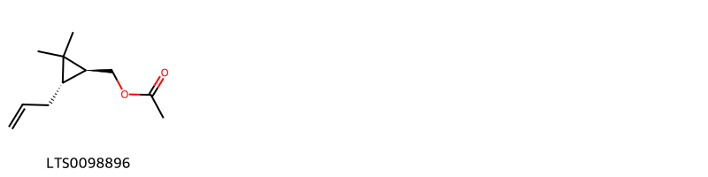{ width=100% }
    <figcaption>Hình ảnh cấu trúc hóa học của 1 hoạt chất thuộc nhóm Carboxylic acids and derivatives gồm ['[(1s,3s)-2,2-dimethyl-3-(prop-2-en-1-yl)cyclopropyl]methyl acetate (LTS0098896)'].</figcaption>
</figure>
#### Nhóm Fatty Acyls
<figure markdown="span">
    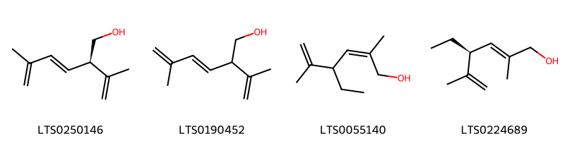{ width=100% }
    <figcaption>Hình ảnh cấu trúc hóa học của 4 hoạt chất thuộc nhóm Fatty Acyls gồm ['(2r,3e)-5-methyl-2-(prop-1-en-2-yl)hexa-3,5-dien-1-ol (LTS0250146)', '5-methyl-2-(prop-1-en-2-yl)hexa-3,5-dien-1-ol (LTS0190452)', '4-ethyl-2,5-dimethylhexa-2,5-dien-1-ol (LTS0055140)', '(2e,4s)-4-ethyl-2,5-dimethylhexa-2,5-dien-1-ol (LTS0224689)'].</figcaption>
</figure>
#### Nhóm Flavonoids
<figure markdown="span">
    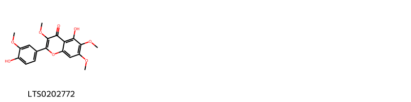{ width=100% }
    <figcaption>Hình ảnh cấu trúc hóa học của 1 hoạt chất thuộc nhóm Flavonoids gồm ['chrysosplenetin (LTS0202772)'].</figcaption>
</figure>
#### Nhóm Lactones
<figure markdown="span">
    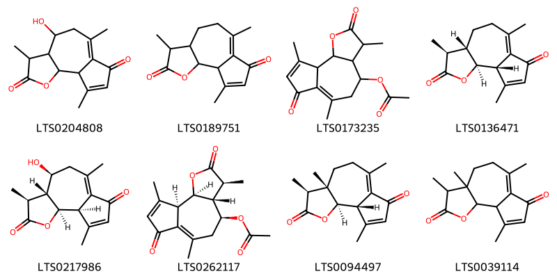{ width=100% }
    <figcaption>Hình ảnh cấu trúc hóa học của 8 hoạt chất thuộc nhóm Lactones gồm ['4-hydroxy-3,6,9-trimethyl-3h,3ah,4h,5h,9ah,9bh-azuleno[4,5-b]furan-2,7-dione (LTS0204808)', '3,6,9-trimethyl-3h,3ah,4h,5h,9ah,9bh-azuleno[4,5-b]furan-2,7-dione (LTS0189751)', '3,6,9-trimethyl-2,7-dioxo-3h,3ah,4h,5h,9ah,9bh-azuleno[4,5-b]furan-4-yl acetate (LTS0173235)', 'leucodin (LTS0136471)', '(3s,3ar,4s,9ar,9br)-4-hydroxy-3,6,9-trimethyl-3h,3ah,4h,5h,9ah,9bh-azuleno[4,5-b]furan-2,7-dione (LTS0217986)', '(3s,3ar,4s,9ar,9br)-3,6,9-trimethyl-2,7-dioxo-3h,3ah,4h,5h,9ah,9bh-azuleno[4,5-b]furan-4-yl acetate (LTS0262117)', '(3s,3as,9as,9br)-3,3a,6,9-tetramethyl-3h,4h,5h,9ah,9bh-azuleno[4,5-b]furan-2,7-dione (LTS0094497)', '3,3a,6,9-tetramethyl-3h,4h,5h,9ah,9bh-azuleno[4,5-b]furan-2,7-dione (LTS0039114)'].</figcaption>
</figure>
#### Nhóm Oxanes
<figure markdown="span">
    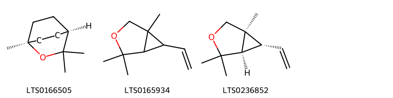{ width=100% }
    <figcaption>Hình ảnh cấu trúc hóa học của 3 hoạt chất thuộc nhóm Oxanes gồm ['1,8-cineole (LTS0166505)', '6-ethenyl-1,4,4-trimethyl-3-oxabicyclo[3.1.0]hexane (LTS0165934)', '(1s,5r,6r)-6-ethenyl-1,4,4-trimethyl-3-oxabicyclo[3.1.0]hexane (LTS0236852)'].</figcaption>
</figure>
#### Nhóm Prenol lipids
<figure markdown="span">
    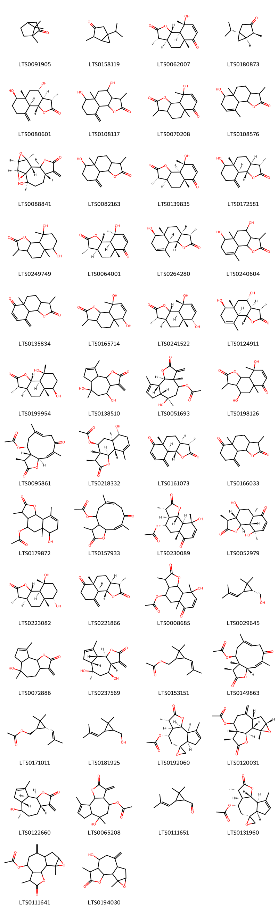{ width=100% }
    <figcaption>Hình ảnh cấu trúc hóa học của 54 hoạt chất thuộc nhóm Prenol lipids gồm ['camphor (LTS0091905)', '3-isothujone (LTS0158119)', 'vulgarin (LTS0062007)', '(+)-β-thujone (LTS0180873)', '(3s,3ar,4s,5ar,6r,9as,9br)-4,6-dihydroxy-3,5a-dimethyl-9-methylidene-octahydro-3h-naphtho[1,2-b]furan-2-one (LTS0080601)', '4,6-dihydroxy-3,5a-dimethyl-9-methylidene-octahydro-3h-naphtho[1,2-b]furan-2-one (LTS0108117)', 'judaicin (LTS0070208)', '6-hydroxy-3,5a,9-trimethyl-3h,3ah,4h,5h,6h,7h,9ah,9bh-naphtho[1,2-b]furan-2-one (LTS0108576)', 'canin (LTS0088841)', '6-hydroxy-3,5a-dimethyl-9-methylidene-octahydro-3h-naphtho[1,2-b]furan-2-one (LTS0082163)', '(3s,3as,5ar,9r,9as)-9-hydroxy-3,5a,9-trimethyl-3h,3ah,4h,5h,9ah,9bh-naphtho[1,2-b]furan-2,6-dione (LTS0139835)', '(3s,3as,5ar,6r,9as,9bs)-6-hydroxy-3,5a-dimethyl-9-methylidene-octahydro-3h-naphtho[1,2-b]furan-2-one (LTS0172581)', '6,9-dihydroxy-3,5a,9-trimethyl-octahydro-3h-naphtho[1,2-b]furan-2-one (LTS0249749)', '(3s,3as,5ar,9s,9as,9bs)-9-hydroxy-3,5a,9-trimethyl-3h,3ah,4h,5h,9ah,9bh-naphtho[1,2-b]furan-2,6-dione (LTS0064001)', '(3s,3as,5ar,6r,9as,9bs)-6-hydroxy-3,5a,9-trimethyl-3h,3ah,4h,5h,6h,7h,9ah,9bh-naphtho[1,2-b]furan-2-one (LTS0264280)', '4,6-dihydroxy-3,5a,9-trimethyl-3h,3ah,4h,5h,6h,7h,9ah,9bh-naphtho[1,2-b]furan-2-one (LTS0240604)', '3,5a-dimethyl-9-methylidene-3h,3ah,4h,5h,9ah,9bh-naphtho[1,2-b]furan-2,6-dione (LTS0135834)', '6,9-dihydroxy-3,5a,9-trimethyl-3h,3ah,4h,5h,6h,9ah,9bh-naphtho[1,2-b]furan-2-one (LTS0165714)', '(3s,3as,5ar,6s,9r,9as,9bs)-6,9-dihydroxy-3,5a,9-trimethyl-3h,3ah,4h,5h,6h,9ah,9bh-naphtho[1,2-b]furan-2-one (LTS0241522)', '(3s,3ar,4s,5ar,6r,9as,9br)-4,6-dihydroxy-3,5a,9-trimethyl-3h,3ah,4h,5h,6h,7h,9ah,9bh-naphtho[1,2-b]furan-2-one (LTS0124911)', '(3s,3as,5ar,6r,9r,9as,9bs)-6,9-dihydroxy-3,5a,9-trimethyl-octahydro-3h-naphtho[1,2-b]furan-2-one (LTS0199954)', '4,6-dihydroxy-6,9-dimethyl-3-methylidene-3ah,4h,5h,6ah,7h,9ah,9bh-azuleno[4,5-b]furan-2-one (LTS0138510)', '(3ar,4s,6r,6ar,9ar,9br)-6-hydroxy-6,9-dimethyl-3-methylidene-2-oxo-3ah,4h,5h,6ah,7h,9ah,9bh-azuleno[4,5-b]furan-4-yl acetate (LTS0051693)', '4,9-dihydroxy-3,5a,9-trimethyl-3h,3ah,4h,5h,9ah,9bh-naphtho[1,2-b]furan-2,6-dione (LTS0198126)', '(3s,3ar,4s,11ar)-3,6,10-trimethyl-2,9-dioxo-3h,3ah,4h,5h,8h,11ah-cyclodeca[b]furan-4-yl acetate (LTS0095861)', '(3s,3ar,4s,5ar,6r,9as,9br)-6-hydroxy-3,5a,9-trimethyl-2-oxo-3h,3ah,4h,5h,6h,7h,9ah,9bh-naphtho[1,2-b]furan-4-yl acetate (LTS0218332)', '(3s,3as,5ar,9as,9bs)-3,5a-dimethyl-9-methylidene-3h,3ah,4h,5h,9ah,9bh-naphtho[1,2-b]furan-2,6-dione (LTS0161073)', '3,5a-dimethyl-9-methylidene-octahydronaphtho[1,2-b]furan-2,6-dione (LTS0166033)', '6-hydroxy-3,5a,9-trimethyl-2-oxo-3h,3ah,4h,5h,6h,7h,9ah,9bh-naphtho[1,2-b]furan-4-yl acetate (LTS0179872)', '3,6,10-trimethyl-2,9-dioxo-3h,3ah,4h,5h,8h,11ah-cyclodeca[b]furan-4-yl acetate (LTS0157933)', '(3s,3ar,4s,5ar,9r,9as,9bs)-9-hydroxy-3,5a,9-trimethyl-2,6-dioxo-3h,3ah,4h,5h,9ah,9bh-naphtho[1,2-b]furan-4-yl acetate (LTS0230089)', '(3s,3ar,4s,5ar,9r,9as,9bs)-4,9-dihydroxy-3,5a,9-trimethyl-3h,3ah,4h,5h,9ah,9bh-naphtho[1,2-b]furan-2,6-dione (LTS0052979)', '(3s,3as,5ar,6s,9r,9as,9bs)-6,9-dihydroxy-3,5a,9-trimethyl-octahydro-3h-naphtho[1,2-b]furan-2-one (LTS0223082)', '(3s,3as,5ar,9as,9bs)-3,5a-dimethyl-9-methylidene-octahydronaphtho[1,2-b]furan-2,6-dione (LTS0221866)', '9-hydroxy-3,5a,9-trimethyl-2,6-dioxo-3h,3ah,4h,5h,9ah,9bh-naphtho[1,2-b]furan-4-yl acetate (LTS0008685)', '[(1r,3r)-2,2-dimethyl-3-(2-methylprop-1-en-1-yl)cyclopropyl]methanol (LTS0029645)', '6-hydroxy-6,9-dimethyl-3-methylidene-3ah,4h,5h,6ah,7h,9ah,9bh-azuleno[4,5-b]furan-2-one (LTS0072886)', '(3ar,4s,6r,6ar,9ar,9br)-4,6-dihydroxy-6,9-dimethyl-3-methylidene-3ah,4h,5h,6ah,7h,9ah,9bh-azuleno[4,5-b]furan-2-one (LTS0237569)', '[2,2-dimethyl-3-(2-methylprop-1-en-1-yl)cyclopropyl]methyl acetate (LTS0153151)', '(3s,3ar,4s,11as)-3,6,10-trimethyl-2,9-dioxo-3h,3ah,4h,5h,8h,11ah-cyclodeca[b]furan-4-yl acetate (LTS0149863)', '[(1r,3r)-2,2-dimethyl-3-(2-methylprop-1-en-1-yl)cyclopropyl]methyl acetate (LTS0171011)', 'chrysanthemol (LTS0181925)', "(3s,3ar,4s,6s,6ar,9ar,9bs)-3,9-dimethyl-2-oxo-3,3a,4,5,6a,7,9a,9b-octahydrospiro[azuleno[4,5-b]furan-6,2'-oxiran]-4-yl acetate (LTS0192060)", '(1s,2s,5s,6r,7s,10r,12s,14r)-5,14-dimethyl-9-methylidene-4-oxo-3,13-dioxatetracyclo[8.4.0.0²,⁶.0¹²,¹⁴]tetradecan-7-yl acetate (LTS0120031)', '(3as,6r,6ar,9as,9bs)-6-hydroxy-6,9-dimethyl-3-methylidene-3ah,4h,5h,6ah,7h,9ah,9bh-azuleno[4,5-b]furan-2-one (LTS0122660)', '6-hydroxy-6,9-dimethyl-3-methylidene-2-oxo-3ah,4h,5h,6ah,7h,9ah,9bh-azuleno[4,5-b]furan-4-yl acetate (LTS0065208)', '2,2-dimethyl-3-(2-methylprop-1-en-1-yl)cyclopropane-1-carbaldehyde (LTS0111651)', "(3s,3ar,4s,6s,6ar,9ar,9br)-3,9-dimethyl-2-oxo-3,3a,4,5,6a,7,9a,9b-octahydrospiro[azuleno[4,5-b]furan-6,2'-oxiran]-4-yl acetate (LTS0131960)", '5,14-dimethyl-9-methylidene-4-oxo-3,13-dioxatetracyclo[8.4.0.0²,⁶.0¹²,¹⁴]tetradecan-7-yl acetate (LTS0111641)', '7-hydroxy-5,14-dimethyl-9-methylidene-3,13-dioxatetracyclo[8.4.0.0²,⁶.0¹²,¹⁴]tetradecan-4-one (LTS0194030)', '(1r,3s)-2,2-dimethyl-3-(2-methylprop-1-en-1-yl)cyclopropane-1-carbaldehyde (LTS0117071)', '(1s,2s,5s,6r,7s,10r,12s,14r)-7-hydroxy-5,14-dimethyl-9-methylidene-3,13-dioxatetracyclo[8.4.0.0²,⁶.0¹²,¹⁴]tetradecan-4-one (LTS0088802)', "3,9-dimethyl-2-oxo-3,3a,4,5,6a,7,9a,9b-octahydrospiro[azuleno[4,5-b]furan-6,2'-oxiran]-4-yl acetate (LTS0028607)", '[(1r,3s)-2,2-dimethyl-3-(2-methylprop-1-en-1-yl)cyclopropyl]methanol (LTS0135186)'].</figcaption>
</figure>
#### Nhóm Pyrans
<figure markdown="span">
    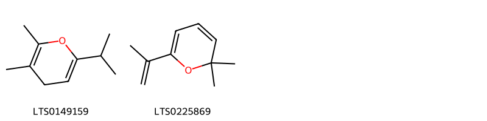{ width=100% }
    <figcaption>Hình ảnh cấu trúc hóa học của 2 hoạt chất thuộc nhóm Pyrans gồm ['6-isopropyl-2,3-dimethyl-4h-pyran (LTS0149159)', '2,2-dimethyl-6-(prop-1-en-2-yl)pyran (LTS0225869)'].</figcaption>
</figure>
#### Nhóm Tetrahydrofurans
<figure markdown="span">
    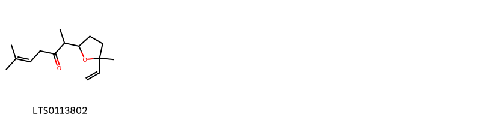{ width=100% }
    <figcaption>Hình ảnh cấu trúc hóa học của 1 hoạt chất thuộc nhóm Tetrahydrofurans gồm ['2-(5-ethenyl-5-methyloxolan-2-yl)-6-methylhept-5-en-3-one (LTS0113802)'].</figcaption>
</figure>
#### Nhóm Unsaturated hydrocarbons
<figure markdown="span">
    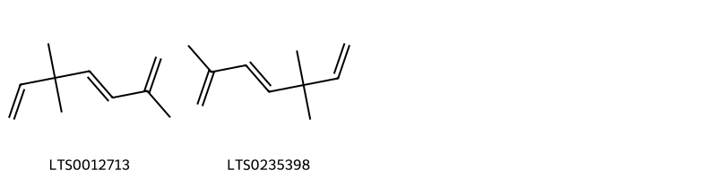{ width=100% }
    <figcaption>Hình ảnh cấu trúc hóa học của 2 hoạt chất thuộc nhóm Unsaturated hydrocarbons gồm ['(3e)-2,5,5-trimethylhepta-1,3,6-triene (LTS0012713)', '2,5,5-trimethylhepta-1,3,6-triene (LTS0235398)'].</figcaption>
</figure>

---

### Dược dân tộc học

Danh sách các quốc gia có sử dụng *Artemisia cana* trong điều trị các bệnh. 

| Country       | Disease   | Bệnh                                                                                                                                                                                                |
|:--------------|:----------|:----------------------------------------------------------------------------------------------------------------------------------------------------------------------------------------------------|
| US(Blackfoot) | Tonic     | MYMEMORY WARNING: YOU USED ALL AVAILABLE FREE TRANSLATIONS FOR TODAY. NEXT AVAILABLE IN  10 HOURS 17 MINUTES 19 SECONDS VISIT HTTPS://MYMEMORY.TRANSLATED.NET/DOC/USAGELIMITS.PHP TO TRANSLATE MORE |

---

---
## Artemisia capillaris
### Thông tin về thực vật

!!! info "Phân loại thực vật của *Artemisia capillaris* từ GIBF:"
    - **Kingdom:** Plantae
    - **Phylum:** Tracheophyta
    - **Order:** Asterales
    - **Family:** Asteraceae
    - **Genus:** Artemisia
    - **Species:** *Artemisia capillaris*

 

| Label (VI)   | Label (EN)   | Scientific Name      | Descriptions (VI)   | Descriptions (EN)   | Also Known As (VI)   | Also Known As (EN)   |
|:-------------|:-------------|:---------------------|:--------------------|:--------------------|:---------------------|:---------------------|
| N/A          | N/A          | Artemisia capillaris | loài thực vật       | species of plant    | ['']                 | ['']                 |

#### Phân bố trên thế giới

**Từ CSDL GIBF** Hong Kong, Japan, Korea, Republic of, Chinese Taipei, China

#### Phân bố tại Việt Nam

**Từ CSDL GIBF**: Không có ghi nhận ở Việt Nam

---
### Thành phần hóa học
        
- Theo cơ sở dữ liệu lotus: Từ loài *Artemisia capillaris* đã phân lập và xác định được 197 hoạt chất thuộc về các nhóm Diarylheptanoids, Lignan lactones, Stilbenes, Phenols, Fatty Acyls, Cinnamic acids and derivatives, 3,4-dihydrocoumarins, Isocoumarins and derivatives, Acenaphthylenes, Saturated hydrocarbons, Tetrapyrroles and derivatives, Coumarans, Prenol lipids, Benzene and substituted derivatives, Organooxygen compounds, Furanoid lignans, Phenol ethers, Flavonoids, Phenylpropanoic acids, Unsaturated hydrocarbons, Lactones, Coumarins and derivatives, Epoxides, Benzopyrans, Imidazopyrimidines. 

|    | chemicalTaxonomyClassyfireClass     |   smiles_count |
|---:|:------------------------------------|---------------:|
|  0 | 3,4-dihydrocoumarins                |              2 |
|  1 | Acenaphthylenes                     |              1 |
|  2 | Benzene and substituted derivatives |             15 |
|  3 | Benzopyrans                         |              2 |
|  4 | Cinnamic acids and derivatives      |             23 |
|  5 | Coumarans                           |              1 |
|  6 | Coumarins and derivatives           |             23 |
|  7 | Diarylheptanoids                    |              1 |
|  8 | Epoxides                            |              1 |
|  9 | Fatty Acyls                         |              8 |
| 10 | Flavonoids                          |             41 |
| 11 | Furanoid lignans                    |              2 |
| 12 | Imidazopyrimidines                  |              2 |
| 13 | Isocoumarins and derivatives        |              1 |
| 14 | Lactones                            |              1 |
| 15 | Lignan lactones                     |              2 |
| 16 | Organooxygen compounds              |             22 |
| 17 | Phenol ethers                       |              1 |
| 18 | Phenols                             |              8 |
| 19 | Phenylpropanoic acids               |              2 |
| 20 | Prenol lipids                       |             26 |
| 21 | Saturated hydrocarbons              |              1 |
| 22 | Stilbenes                           |              4 |
| 23 | Tetrapyrroles and derivatives       |              4 |
| 24 | Unsaturated hydrocarbons            |              2 |

#### Nhóm 3_4-dihydrocoumarins
<figure markdown="span">
    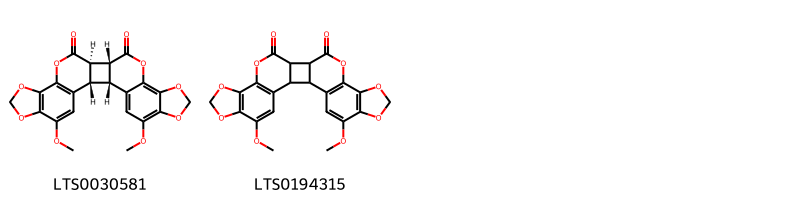{ width=100% }
    <figcaption>Hình ảnh cấu trúc hóa học của Không tìm thấy chú thích hoạt chất thuộc nhóm 3_4-dihydrocoumarins gồm Không tìm thấy chú thích.</figcaption>
</figure>
#### Nhóm Acenaphthylenes
<figure markdown="span">
    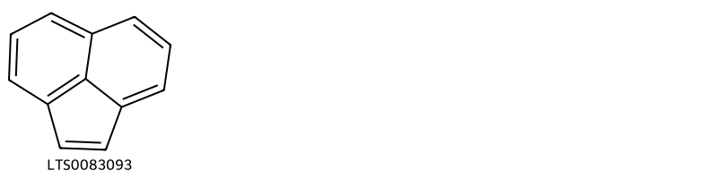{ width=100% }
    <figcaption>Hình ảnh cấu trúc hóa học của 1 hoạt chất thuộc nhóm Acenaphthylenes gồm ['acenaphthylene (LTS0083093)'].</figcaption>
</figure>
#### Nhóm Benzene and substituted derivatives
<figure markdown="span">
    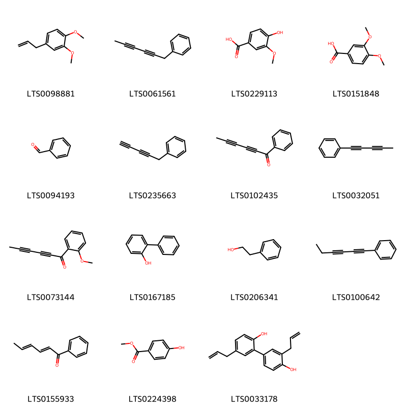{ width=100% }
    <figcaption>Hình ảnh cấu trúc hóa học của 15 hoạt chất thuộc nhóm Benzene and substituted derivatives gồm ['methyl eugenol (LTS0098881)', 'capillene (LTS0061561)', 'vanillic acid (LTS0229113)', 'veratric acid (LTS0151848)', 'benzaldehyde (LTS0094193)', '5-phenyl-1,3-pentadiyne (LTS0235663)', 'capillin (LTS0102435)', 'norcapillene (LTS0032051)', '1-(2-methoxyphenyl)hexa-2,4-diyn-1-one (LTS0073144)', 'o-phenylphenol (LTS0167185)', '2-phenyl-ethanol (LTS0206341)', 'hexa-1,3-diyn-1-ylbenzene (LTS0100642)', 'capillone (LTS0155933)', 'paraben (LTS0224398)', 'honokiol (LTS0033178)'].</figcaption>
</figure>
#### Nhóm Benzopyrans
<figure markdown="span">
    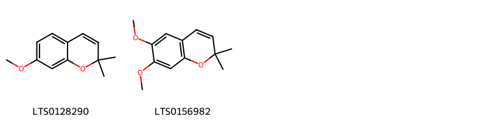{ width=100% }
    <figcaption>Hình ảnh cấu trúc hóa học của 2 hoạt chất thuộc nhóm Benzopyrans gồm ['precocene i (LTS0128290)', 'precocene ii (LTS0156982)'].</figcaption>
</figure>
#### Nhóm Cinnamic acids and derivatives
<figure markdown="span">
    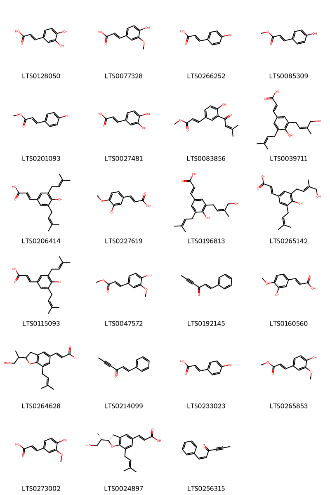{ width=100% }
    <figcaption>Hình ảnh cấu trúc hóa học của 23 hoạt chất thuộc nhóm Cinnamic acids and derivatives gồm ['3,4-dihydroxycinnamic acid (LTS0128050)', 'ferulic acid (LTS0077328)', 'para-coumaric acid (LTS0266252)', 'methyl (2e)-3-(4-hydroxyphenyl)prop-2-enoate (LTS0085309)', 'methyl hydroxycinnamate (LTS0201093)', 'caffeic acid (LTS0027481)', 'methyl (2e)-3-[4-hydroxy-3-(3-methylbut-2-enoyl)phenyl]prop-2-enoate (LTS0083856)', 'capillartemisin b (LTS0039711)', '3-[4-hydroxy-3,5-bis(3-methylbut-2-en-1-yl)phenyl]prop-2-enoic acid (LTS0206414)', 'isoferulic acid (LTS0227619)', '3-[4-hydroxy-3-(4-hydroxy-3-methylbut-2-en-1-yl)-5-(3-methylbut-2-en-1-yl)phenyl]prop-2-enoic acid (LTS0196813)', 'capillartemisin a (LTS0265142)', 'artepillin c (LTS0115093)', 'methyl ferulate (LTS0047572)', '1-phenylhex-1-en-4-yn-3-one (LTS0192145)', 'isoferulic acid (LTS0160560)', '(2e)-3-[2-(1-hydroxypropan-2-yl)-7-(3-methylbut-2-en-1-yl)-2,3-dihydro-1-benzofuran-5-yl]prop-2-enoic acid (LTS0264628)', '(1e)-1-phenylhex-1-en-4-yn-3-one (LTS0214099)', 'hydroxycinnamic acid (LTS0233023)', 'methyl ferulate (LTS0265853)', 'ferulic acid (LTS0273002)', '(2e)-3-[(2s)-2-[(2s)-1-hydroxypropan-2-yl]-7-(3-methylbut-2-en-1-yl)-2,3-dihydro-1-benzofuran-5-yl]prop-2-enoic acid (LTS0024897)', '(1z)-1-phenylhex-1-en-4-yn-3-one (LTS0256315)'].</figcaption>
</figure>
#### Nhóm Coumarans
<figure markdown="span">
    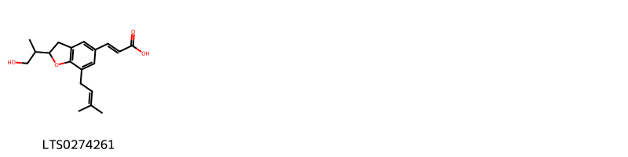{ width=100% }
    <figcaption>Hình ảnh cấu trúc hóa học của 1 hoạt chất thuộc nhóm Coumarans gồm ['3-[2-(1-hydroxypropan-2-yl)-7-(3-methylbut-2-en-1-yl)-2,3-dihydro-1-benzofuran-5-yl]prop-2-enoic acid (LTS0274261)'].</figcaption>
</figure>
#### Nhóm Coumarins and derivatives
<figure markdown="span">
    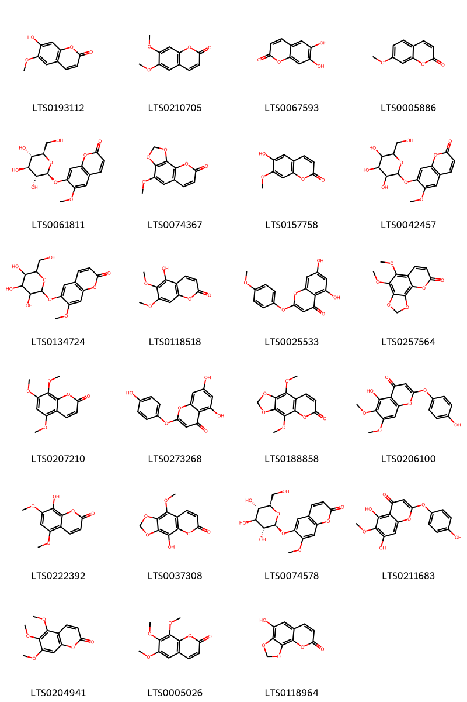{ width=100% }
    <figcaption>Hình ảnh cấu trúc hóa học của 23 hoạt chất thuộc nhóm Coumarins and derivatives gồm ['scopoletin (LTS0193112)', 'scoparone (LTS0210705)', 'esculetin (LTS0067593)', 'methylumbelliferone (LTS0005886)', 'scopolin (LTS0061811)', '4-methoxy-2h-[1,3]dioxolo[4,5-h]chromen-8-one (LTS0074367)', 'isoscopoletin (LTS0157758)', '6-methoxy-7-{[3,4,5-trihydroxy-6-(hydroxymethyl)oxan-2-yl]oxy}chromen-2-one (LTS0042457)', '7-methoxy-6-{[3,4,5-trihydroxy-6-(hydroxymethyl)oxan-2-yl]oxy}chromen-2-one (LTS0134724)', '5-hydroxy-6,7-dimethoxychromen-2-one (LTS0118518)', '5,7-dihydroxy-2-(4-methoxyphenoxy)chromen-4-one (LTS0025533)', '4,5-dimethoxy-2h-[1,3]dioxolo[4,5-h]chromen-8-one (LTS0257564)', '5,7,8-trimethoxychromen-2-one (LTS0207210)', '6-demethoxycapillarisin (LTS0273268)', '4,9-dimethoxy-2h-[1,3]dioxolo[4,5-g]chromen-6-one (LTS0188858)', '5-hydroxy-2-(4-hydroxyphenoxy)-6,7-dimethoxychromen-4-one (LTS0206100)', 'leptodactylone (LTS0222392)', '4-hydroxy-9-methoxy-2h-[1,3]dioxolo[4,5-g]chromen-6-one (LTS0037308)', '7-methoxy-6-{[(2s,3r,4s,5s,6r)-3,4,5-trihydroxy-6-(hydroxymethyl)oxan-2-yl]oxy}chromen-2-one (LTS0074578)', 'capillarisin (LTS0211683)', '5,6,7-trimethoxycoumarin (LTS0204941)', '6,7,8-trimethoxychromen-2-one (LTS0005026)', '4-hydroxy-2h-[1,3]dioxolo[4,5-h]chromen-8-one (LTS0118964)'].</figcaption>
</figure>
#### Nhóm Diarylheptanoids
<figure markdown="span">
    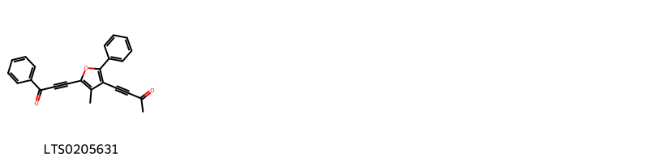{ width=100% }
    <figcaption>Hình ảnh cấu trúc hóa học của 1 hoạt chất thuộc nhóm Diarylheptanoids gồm ['4-[4-methyl-5-(3-oxo-3-phenylprop-1-yn-1-yl)-2-phenylfuran-3-yl]but-3-yn-2-one (LTS0205631)'].</figcaption>
</figure>
#### Nhóm Epoxides
<figure markdown="span">
    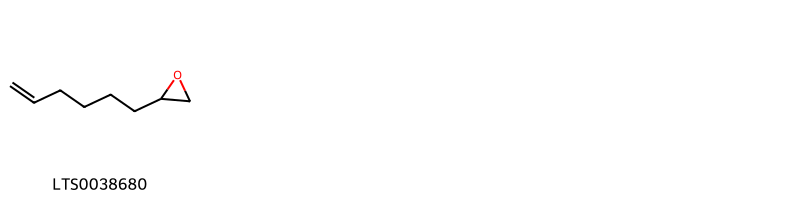{ width=100% }
    <figcaption>Hình ảnh cấu trúc hóa học của 1 hoạt chất thuộc nhóm Epoxides gồm ['2-(hex-5-en-1-yl)oxirane (LTS0038680)'].</figcaption>
</figure>
#### Nhóm Fatty Acyls
<figure markdown="span">
    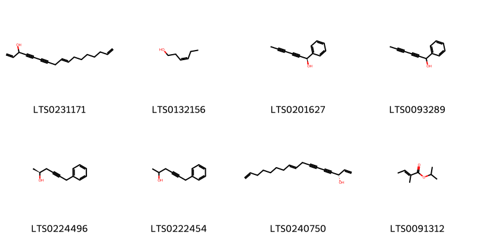{ width=100% }
    <figcaption>Hình ảnh cấu trúc hóa học của 8 hoạt chất thuộc nhóm Fatty Acyls gồm ['heptadeca-1,9,16-trien-4,6-diyn-3-ol (LTS0231171)', 'cis-3-hexenol (LTS0132156)', '(1r)-1-phenylhexa-2,4-diyn-1-ol (LTS0201627)', '1-phenylhexa-2,4-diyn-1-ol (LTS0093289)', '(2s)-6-phenylhex-4-yn-2-ol (LTS0224496)', 'capillanol (LTS0222454)', '(3s,9e)-heptadeca-1,9,16-trien-4,6-diyn-3-ol (LTS0240750)', 'isopropyl tiglate (LTS0091312)'].</figcaption>
</figure>
#### Nhóm Flavonoids
<figure markdown="span">
    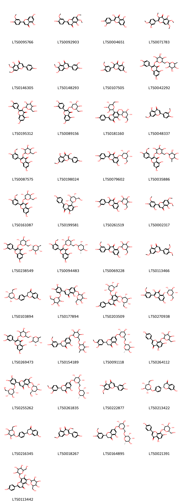{ width=100% }
    <figcaption>Hình ảnh cấu trúc hóa học của 41 hoạt chất thuộc nhóm Flavonoids gồm ['chrysoeriol (LTS0095766)', 'cirsilineol (LTS0092903)', 'quercetin (LTS0004651)', 'casticin (LTS0071783)', 'cirsimaritin (LTS0146305)', 'nepetin (LTS0148293)', 'isorhamnetin (LTS0107505)', 'rutin (LTS0042292)', '2-(3,4-dihydroxyphenyl)-5,7-dihydroxy-3-{[3,4,5-trihydroxy-6-(hydroxymethyl)oxan-2-yl]oxy}chromen-4-one (LTS0195312)', 'hyperoside (LTS0089156)', 'vicenin 2 (LTS0181160)', 'velutin (LTS0048337)', 'isorhamnetin 3-galactoside (LTS0087575)', 'rhamnocitrin (LTS0198024)', '2-(3,4-dihydroxyphenyl)-3,7-dihydroxy-5-{[(2s,3r,4s,5s,6r)-3,4,5-trihydroxy-6-(hydroxymethyl)oxan-2-yl]oxy}chromen-4-one (LTS0079602)', '5,7-dihydroxy-2-(4-hydroxy-3-methoxyphenyl)-3-[(3,4,5-trihydroxy-6-{[(3,4,5-trihydroxy-6-methyloxan-2-yl)oxy]methyl}oxan-2-yl)oxy]chromen-4-one (LTS0035886)', 'cacticin (LTS0161087)', 'vitexin (LTS0199581)', '2-(3,4-dihydroxyphenyl)-3,7-dihydroxy-5-{[3,4,5-trihydroxy-6-(hydroxymethyl)oxan-2-yl]oxy}chromen-4-one (LTS0261519)', 'arcapillin (LTS0002317)', '2-(3,4-dihydroxyphenyl)-5,7-dihydroxy-3-{[(2s,3r,4s,5r,6r)-3,4,5-trihydroxy-6-({[(2r,3r,4r,5r,6s)-3,4,5-trihydroxy-6-methyloxan-2-yl]oxy}methyl)oxan-2-yl]oxy}chromen-4-one (LTS0238549)', '5,7-dihydroxy-2-(4-hydroxy-3-methoxyphenyl)-3-{[(2s,3r,4s,5r,6r)-3,4,5-trihydroxy-6-({[(2r,3r,4r,5r,6s)-3,4,5-trihydroxy-6-methyloxan-2-yl]oxy}methyl)oxan-2-yl]oxy}chromen-4-one (LTS0094483)', '3,7-dihydroxy-2-(4-hydroxy-3-methoxyphenyl)-5-{[3,4,5-trihydroxy-6-(hydroxymethyl)oxan-2-yl]oxy}chromen-4-one (LTS0069228)', '2-(3,4-dimethoxyphenyl)-5-hydroxy-7-methoxychromen-4-one (LTS0113466)', 'liquiritin (LTS0103894)', '2-(4,5-dihydroxy-2-{[3,4,5-trihydroxy-6-(hydroxymethyl)oxan-2-yl]oxy}phenyl)-5,7-dihydroxy-6-{[3,4,5-trihydroxy-6-(hydroxymethyl)oxan-2-yl]oxy}chromen-4-one (LTS0177894)', '5,7-dihydroxy-2-(4-hydroxyphenyl)-6,8-bis({[(2s,3r,4s,5s,6r)-3,4,5-trihydroxy-6-(hydroxymethyl)oxan-2-yl]oxy})chromen-4-one (LTS0203509)', '3,7-dihydroxy-2-(4-hydroxy-3-methoxyphenyl)-5-{[(2r,3r,4s,5s,6r)-3,4,5-trihydroxy-6-(hydroxymethyl)oxan-2-yl]oxy}chromen-4-one (LTS0270938)', 'quercetin 3-robinobioside (LTS0269473)', '5-hydroxy-2-(4-hydroxy-3-methoxyphenyl)-7-[(3,4,5-trihydroxy-6-{[(3,4,5-trihydroxy-6-methyloxan-2-yl)oxy]methyl}oxan-2-yl)oxy]-2,3-dihydro-1-benzopyran-4-one (LTS0154189)', '(2s)-5-hydroxy-2-(3-hydroxy-4-methoxyphenyl)-7-{[(2s,3r,4s,5s,6r)-3,4,5-trihydroxy-6-({[(2r,3r,4s,5r,6s)-3,4,5-trihydroxy-6-methyloxan-2-yl]oxy}methyl)oxan-2-yl]oxy}-2,3-dihydro-1-benzopyran-4-one (LTS0091118)', '5,7-dihydroxy-2-(4-hydroxyphenyl)-8-{[3,4,5-trihydroxy-6-(hydroxymethyl)oxan-2-yl]oxy}chromen-4-one (LTS0264112)', '2-(4,5-dihydroxy-2-{[(2s,3r,4s,5s,6r)-3,4,5-trihydroxy-6-(hydroxymethyl)oxan-2-yl]oxy}phenyl)-5,7-dihydroxy-6-{[(2s,3r,4s,5s,6r)-3,4,5-trihydroxy-6-(hydroxymethyl)oxan-2-yl]oxy}chromen-4-one (LTS0255262)', 'hesperidin (LTS0261835)', 'pedalitin (LTS0222877)', 'liquiritin (LTS0213422)', '7-hydroxy-2-(4-{[3,4,5-trihydroxy-6-(hydroxymethyl)oxan-2-yl]oxy}phenyl)-2,3-dihydro-1-benzopyran-4-one (LTS0216345)', 'kumatakenin (LTS0018267)', '(2s)-5-hydroxy-2-(4-hydroxy-3-methoxyphenyl)-7-{[(2s,3r,4s,5s,6r)-3,4,5-trihydroxy-6-({[(2r,3r,4r,5r,6s)-3,4,5-trihydroxy-6-methyloxan-2-yl]oxy}methyl)oxan-2-yl]oxy}-2,3-dihydro-1-benzopyran-4-one (LTS0164895)', '5,7-dihydroxy-2-(4-hydroxyphenyl)-8-{[(2s,3r,4s,5s,6r)-3,4,5-trihydroxy-6-(hydroxymethyl)oxan-2-yl]oxy}chromen-4-one (LTS0021391)', '5,7-dihydroxy-2-(4-hydroxyphenyl)-6,8-bis({[3,4,5-trihydroxy-6-(hydroxymethyl)oxan-2-yl]oxy})chromen-4-one (LTS0113442)'].</figcaption>
</figure>
#### Nhóm Furanoid lignans
<figure markdown="span">
    { width=100% }
    <figcaption>Hình ảnh cấu trúc hóa học của 2 hoạt chất thuộc nhóm Furanoid lignans gồm ['sesamin (LTS0120161)', 'sesamin (LTS0228898)'].</figcaption>
</figure>
#### Nhóm Imidazopyrimidines
<figure markdown="span">
    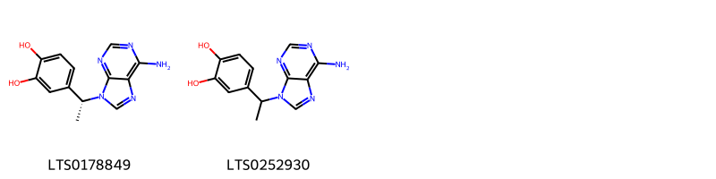{ width=100% }
    <figcaption>Hình ảnh cấu trúc hóa học của 2 hoạt chất thuộc nhóm Imidazopyrimidines gồm ['4-[(1r)-1-(6-aminopurin-9-yl)ethyl]benzene-1,2-diol (LTS0178849)', '4-[1-(6-aminopurin-9-yl)ethyl]benzene-1,2-diol (LTS0252930)'].</figcaption>
</figure>
#### Nhóm Isocoumarins and derivatives
<figure markdown="span">
    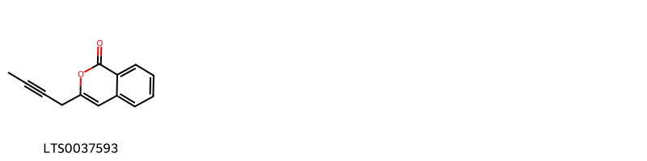{ width=100% }
    <figcaption>Hình ảnh cấu trúc hóa học của 1 hoạt chất thuộc nhóm Isocoumarins and derivatives gồm ['capillarin (LTS0037593)'].</figcaption>
</figure>
#### Nhóm Lactones
<figure markdown="span">
    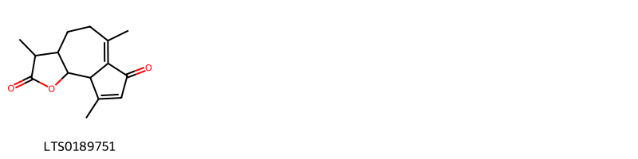{ width=100% }
    <figcaption>Hình ảnh cấu trúc hóa học của 1 hoạt chất thuộc nhóm Lactones gồm ['3,6,9-trimethyl-3h,3ah,4h,5h,9ah,9bh-azuleno[4,5-b]furan-2,7-dione (LTS0189751)'].</figcaption>
</figure>
#### Nhóm Lignan lactones
<figure markdown="span">
    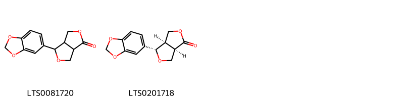{ width=100% }
    <figcaption>Hình ảnh cấu trúc hóa học của 2 hoạt chất thuộc nhóm Lignan lactones gồm ['4-(2h-1,3-benzodioxol-5-yl)-tetrahydro-3h-furo[3,4-c]furan-1-one (LTS0081720)', '(3ar,4s,6ar)-4-(2h-1,3-benzodioxol-5-yl)-tetrahydro-3h-furo[3,4-c]furan-1-one (LTS0201718)'].</figcaption>
</figure>
#### Nhóm Organooxygen compounds
<figure markdown="span">
    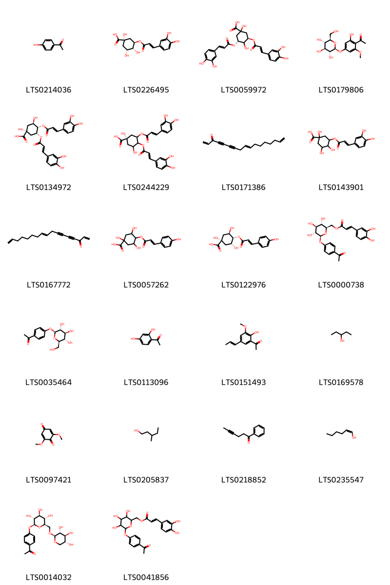{ width=100% }
    <figcaption>Hình ảnh cấu trúc hóa học của 22 hoạt chất thuộc nhóm Organooxygen compounds gồm ['hydroxyacetophenone (LTS0214036)', 'chlorogenic acid (LTS0226495)', '(3r,5r)-3,5-bis({[(2e)-3-(3,4-dihydroxyphenyl)prop-2-enoyl]oxy})-1,4-dihydroxycyclohexane-1-carboxylic acid (LTS0059972)', '1-(2-hydroxy-6-methoxy-4-{[(2s,3r,4s,5s,6r)-3,4,5-trihydroxy-6-(hydroxymethyl)oxan-2-yl]oxy}phenyl)ethanone (LTS0179806)', '3,4-dicaffeoylquinic acid (LTS0134972)', '(1s)-3,4-bis({[3-(3,4-dihydroxyphenyl)prop-2-enoyl]oxy})-1,5-dihydroxycyclohexane-1-carboxylic acid (LTS0244229)', 'heptadeca-1,9,16-trien-4,6-diyn-3-one (LTS0171386)', '3-{[3-(3,4-dihydroxyphenyl)prop-2-enoyl]oxy}-1,4,5-trihydroxycyclohexane-1-carboxylic acid (LTS0143901)', 'dehydrofalcarinone (LTS0167772)', '1,3,5-trihydroxy-4-{[3-(4-hydroxyphenyl)prop-2-enoyl]oxy}cyclohexane-1-carboxylic acid (LTS0057262)', '(1s,3r,4s,5r)-1,3,5-trihydroxy-4-{[(2e)-3-(4-hydroxyphenyl)prop-2-enoyl]oxy}cyclohexane-1-carboxylic acid (LTS0122976)', '[(2r,3s,4s,5r,6s)-6-(4-acetylphenoxy)-3,4,5-trihydroxyoxan-2-yl]methyl (2e)-3-(3,4-dihydroxyphenyl)prop-2-enoate (LTS0000738)', 'picein (LTS0035464)', "2',4'-dihydroxyacetophenone (LTS0113096)", '1-[2-hydroxy-3-methoxy-5-(prop-1-en-1-yl)phenyl]ethanone (LTS0151493)', '3-pentanol (LTS0169578)', '2,6-dimethoxy-1,4-benzoquinone (LTS0097421)', '3-methyl-1-pentanol (LTS0205837)', '1-phenylhex-4-yn-1-one (LTS0218852)', '(1z)-hex-1-en-1-ol (LTS0235547)', '1-(4-{[(2s,3r,4s,5s,6r)-3,4,5-trihydroxy-6-({[(2s,3r,4s,5r)-3,4,5-trihydroxyoxan-2-yl]oxy}methyl)oxan-2-yl]oxy}phenyl)ethanone (LTS0014032)', '[6-(4-acetylphenoxy)-3,4,5-trihydroxyoxan-2-yl]methyl 3-(3,4-dihydroxyphenyl)prop-2-enoate (LTS0041856)'].</figcaption>
</figure>
#### Nhóm Phenol ethers
<figure markdown="span">
    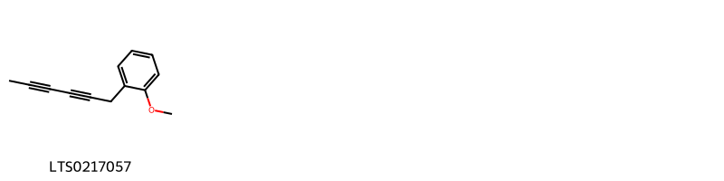{ width=100% }
    <figcaption>Hình ảnh cấu trúc hóa học của 1 hoạt chất thuộc nhóm Phenol ethers gồm ['1-(hexa-2,4-diyn-1-yl)-2-methoxybenzene (LTS0217057)'].</figcaption>
</figure>
#### Nhóm Phenols
<figure markdown="span">
    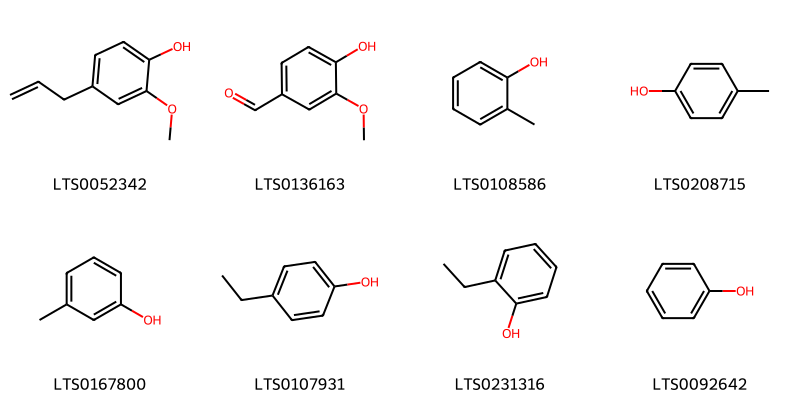{ width=100% }
    <figcaption>Hình ảnh cấu trúc hóa học của 8 hoạt chất thuộc nhóm Phenols gồm ['eugenol (LTS0052342)', 'vanillin (LTS0136163)', 'o-cresol (LTS0108586)', 'p-cresol (LTS0208715)', 'm-cresol (LTS0167800)', 'ethylphenol (LTS0107931)', '2-ethylphenol (LTS0231316)', 'phenol (LTS0092642)'].</figcaption>
</figure>
#### Nhóm Phenylpropanoic acids
<figure markdown="span">
    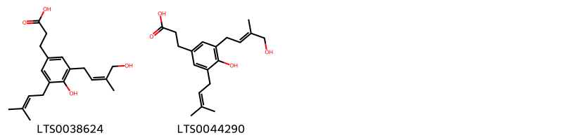{ width=100% }
    <figcaption>Hình ảnh cấu trúc hóa học của 2 hoạt chất thuộc nhóm Phenylpropanoic acids gồm ['3-{4-hydroxy-3-[(2z)-4-hydroxy-3-methylbut-2-en-1-yl]-5-(3-methylbut-2-en-1-yl)phenyl}propanoic acid (LTS0038624)', '3-{4-hydroxy-3-[(2e)-4-hydroxy-3-methylbut-2-en-1-yl]-5-(3-methylbut-2-en-1-yl)phenyl}propanoic acid (LTS0044290)'].</figcaption>
</figure>
#### Nhóm Prenol lipids
<figure markdown="span">
    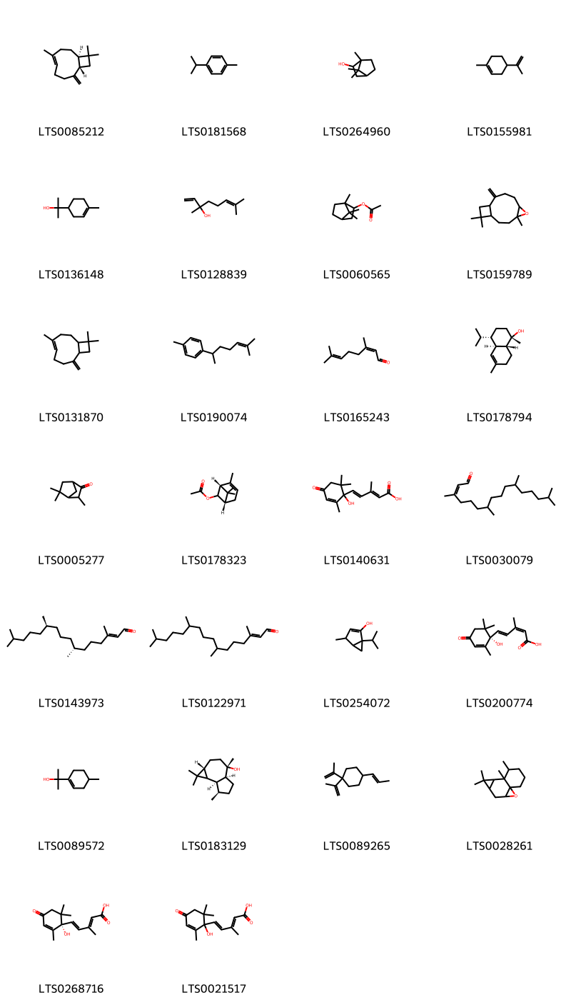{ width=100% }
    <figcaption>Hình ảnh cấu trúc hóa học của 26 hoạt chất thuộc nhóm Prenol lipids gồm ['caryophyllene (LTS0085212)', 'cymene (LTS0181568)', 'borneol (LTS0264960)', 'limonene,  (LTS0155981)', 'terpineol (LTS0136148)', 'linalool, (+-)- (LTS0128839)', 'bornyl acetate (LTS0060565)', 'caryophyllene oxide (LTS0159789)', 'caryophyllene (LTS0131870)', 'curcumene (LTS0190074)', 'neral (LTS0165243)', 'α-cadinol (LTS0178794)', '3,5,5-trimethylbicyclo[2.2.1]heptan-2-one (LTS0005277)', '(1r,5s)-2,7,7-trimethylbicyclo[3.1.1]hept-2-en-6-yl acetate (LTS0178323)', 'abscisic acid,  (LTS0140631)', '3,7,11,15-tetramethylhexadec-2-enal (LTS0030079)', 'phyton (LTS0143973)', '(2e)-3,7,11,15-tetramethylhexadec-2-enal (LTS0122971)', '1-isopropyl-4-methylbicyclo[3.1.0]hex-2-en-2-ol (LTS0254072)', 'abscisic acid (LTS0200774)', '2-(4-methylcyclohex-1-en-1-yl)propan-2-ol (LTS0089572)', 'viridiflorol (LTS0183129)', '4-(prop-1-en-1-yl)-1,1-bis(prop-1-en-2-yl)cyclohexane (LTS0089265)', '6,6,8,9-tetramethyl-2-oxatetracyclo[6.4.0.0¹,³.0⁵,⁷]dodecane (LTS0028261)', '(4e)-5-[(1s)-1-hydroxy-2,6,6-trimethyl-4-oxocyclohex-2-en-1-yl]-3-methylpenta-2,4-dienoic acid (LTS0268716)', '5-(1-hydroxy-2,6,6-trimethyl-4-oxocyclohex-2-en-1-yl)-3-methylpenta-2,4-dienoic acid (LTS0021517)'].</figcaption>
</figure>
#### Nhóm Saturated hydrocarbons
<figure markdown="span">
    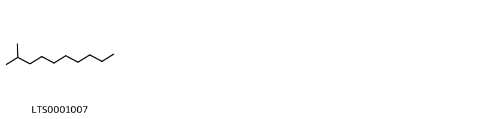{ width=100% }
    <figcaption>Hình ảnh cấu trúc hóa học của 1 hoạt chất thuộc nhóm Saturated hydrocarbons gồm ['2-methyldecane (LTS0001007)'].</figcaption>
</figure>
#### Nhóm Stilbenes
<figure markdown="span">
    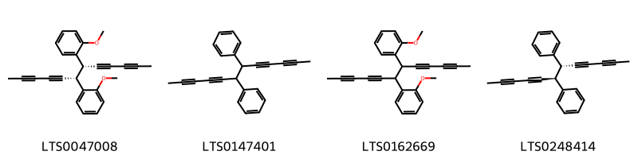{ width=100% }
    <figcaption>Hình ảnh cấu trúc hóa học của 4 hoạt chất thuộc nhóm Stilbenes gồm ['1-methoxy-2-[(6s,7s)-7-(2-methoxyphenyl)dodeca-2,4,8,10-tetrayn-6-yl]benzene (LTS0047008)', '(7-phenyldodeca-2,4,8,10-tetrayn-6-yl)benzene (LTS0147401)', '1-methoxy-2-[7-(2-methoxyphenyl)dodeca-2,4,8,10-tetrayn-6-yl]benzene (LTS0162669)', '[(6s,7r)-7-phenyldodeca-2,4,8,10-tetrayn-6-yl]benzene (LTS0248414)'].</figcaption>
</figure>
#### Nhóm Tetrapyrroles and derivatives
<figure markdown="span">
    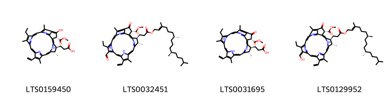{ width=100% }
    <figcaption>Hình ảnh cấu trúc hóa học của 4 hoạt chất thuộc nhóm Tetrapyrroles and derivatives gồm ['3-[(3r,21s,22s)-16-ethenyl-11-ethyl-4-hydroxy-3-(methoxycarbonyl)-12,17,21,26-tetramethyl-7,23,24,25-tetraazahexacyclo[18.2.1.1⁵,⁸.1¹⁰,¹³.1¹⁵,¹⁸.0²,⁶]hexacosa-1,4,6,8(26),9,11,13(25),14,16,18(24),19-undecaen-22-yl]propanoic acid (LTS0159450)', 'methyl (3r,21s,22s)-16-ethenyl-11-ethyl-12-formyl-17,21,26-trimethyl-4-oxo-22-(3-oxo-3-{[(2e,7r,11r)-3,7,11,15-tetramethylhexadec-2-en-1-yl]oxy}propyl)-7,23,24,25-tetraazahexacyclo[18.2.1.1⁵,⁸.1¹⁰,¹³.1¹⁵,¹⁸.0²,⁶]hexacosa-1(23),2(6),5(26),7,9,11,13,15,17,19-decaene-3-carboxylate (LTS0032451)', '3-[(3r,21s,22s)-16-ethenyl-11-ethyl-3-(methoxycarbonyl)-12,17,21,26-tetramethyl-4-oxo-7,23,24,25-tetraazahexacyclo[18.2.1.1⁵,⁸.1¹⁰,¹³.1¹⁵,¹⁸.0²,⁶]hexacosa-1(23),2(6),5(26),7,9,11,13,15,17,19-decaen-22-yl]propanoic acid (LTS0031695)', 'methyl (3r,21s,22s)-16-ethenyl-11-ethyl-12-(hydroxymethylidene)-17,21,26-trimethyl-4-oxo-22-(3-oxo-3-{[(2e,7s,11s)-3,7,11,15-tetramethylhexadec-2-en-1-yl]oxy}propyl)-7,23,24,25-tetraazahexacyclo[18.2.1.1⁵,⁸.1¹⁰,¹³.1¹⁵,¹⁸.0²,⁶]hexacosa-1,5(26),6,8,10,13(25),14,16,18(24),19-decaene-3-carboxylate (LTS0129952)'].</figcaption>
</figure>
#### Nhóm Unsaturated hydrocarbons
<figure markdown="span">
    { width=100% }
    <figcaption>Hình ảnh cấu trúc hóa học của 2 hoạt chất thuộc nhóm Unsaturated hydrocarbons gồm ['α terpinene (LTS0232891)', 'hexadecene (LTS0222071)'].</figcaption>
</figure>

---

### Dược dân tộc học

Danh sách các quốc gia có sử dụng *Artemisia capillaris* trong điều trị các bệnh. 

| Country   | Disease                           | Bệnh                                                                                                                                                                                                |
|:----------|:----------------------------------|:----------------------------------------------------------------------------------------------------------------------------------------------------------------------------------------------------|
| China     | nan, Diuretic, Diuretic, Diuretic | MYMEMORY WARNING: YOU USED ALL AVAILABLE FREE TRANSLATIONS FOR TODAY. NEXT AVAILABLE IN  10 HOURS 16 MINUTES 46 SECONDS VISIT HTTPS://MYMEMORY.TRANSLATED.NET/DOC/USAGELIMITS.PHP TO TRANSLATE MORE |
| Chinese   | Antiphlogistic                    | MYMEMORY WARNING: YOU USED ALL AVAILABLE FREE TRANSLATIONS FOR TODAY. NEXT AVAILABLE IN  10 HOURS 16 MINUTES 42 SECONDS VISIT HTTPS://MYMEMORY.TRANSLATED.NET/DOC/USAGELIMITS.PHP TO TRANSLATE MORE |
| Elsewhere | Fungicide                         | MYMEMORY WARNING: YOU USED ALL AVAILABLE FREE TRANSLATIONS FOR TODAY. NEXT AVAILABLE IN  10 HOURS 16 MINUTES 36 SECONDS VISIT HTTPS://MYMEMORY.TRANSLATED.NET/DOC/USAGELIMITS.PHP TO TRANSLATE MORE |
| Japan     | Antiphlogistic, Diuretic          | MYMEMORY WARNING: YOU USED ALL AVAILABLE FREE TRANSLATIONS FOR TODAY. NEXT AVAILABLE IN  10 HOURS 16 MINUTES 33 SECONDS VISIT HTTPS://MYMEMORY.TRANSLATED.NET/DOC/USAGELIMITS.PHP TO TRANSLATE MORE |

---

---
## Artemisia carvifolia
### Thông tin về thực vật

!!! info "Phân loại thực vật của *Artemisia carvifolia* từ GIBF:"
    - **Kingdom:** Plantae
    - **Phylum:** Tracheophyta
    - **Order:** Asterales
    - **Family:** Asteraceae
    - **Genus:** Artemisia
    - **Species:** *Artemisia carvifolia*

 

| Label (VI)   | Label (EN)   | Scientific Name      | Descriptions (VI)   | Descriptions (EN)   | Also Known As (VI)   | Also Known As (EN)   |
|:-------------|:-------------|:---------------------|:--------------------|:--------------------|:---------------------|:---------------------|
| N/A          | N/A          | Artemisia carvifolia | loài thực vật       | species of plant    | ['']                 | ['']                 |

#### Phân bố trên thế giới

**Từ CSDL GIBF** nan, Japan, Thailand, Korea, Republic of, Korea (Democratic People’s Republic of), India, Bangladesh, United States of America, unknown or invalid, Viet Nam, China, Nepal

#### Phân bố tại Việt Nam

**Từ CSDL GIBF**: Không có ghi nhận ở Việt Nam

---
### Thành phần hóa học
        
- Theo cơ sở dữ liệu lotus: Từ loài *Artemisia carvifolia* đã phân lập và xác định được 35 hoạt chất thuộc về các nhóm Fatty Acyls, Flavonoids, Prenol lipids, Dioxolopyrans, Oxepanes, Benzene and substituted derivatives, Coumarins and derivatives, Carboxylic acids and derivatives. 

|    | chemicalTaxonomyClassyfireClass     |   smiles_count |
|---:|:------------------------------------|---------------:|
|  0 | Benzene and substituted derivatives |              2 |
|  1 | Carboxylic acids and derivatives    |              1 |
|  2 | Coumarins and derivatives           |              5 |
|  3 | Dioxolopyrans                       |              1 |
|  4 | Fatty Acyls                         |              3 |
|  5 | Flavonoids                          |              5 |
|  6 | Oxepanes                            |              1 |
|  7 | Prenol lipids                       |             14 |

#### Nhóm Benzene and substituted derivatives
<figure markdown="span">
    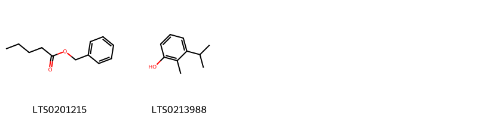{ width=100% }
    <figcaption>Hình ảnh cấu trúc hóa học của 2 hoạt chất thuộc nhóm Benzene and substituted derivatives gồm ['benzyl valerate (LTS0201215)', '3-isopropyl-2-methylphenol (LTS0213988)'].</figcaption>
</figure>
#### Nhóm Carboxylic acids and derivatives
<figure markdown="span">
    { width=100% }
    <figcaption>Hình ảnh cấu trúc hóa học của 1 hoạt chất thuộc nhóm Carboxylic acids and derivatives gồm ['(1e)-oct-1-en-1-yl acetate (LTS0050466)'].</figcaption>
</figure>
#### Nhóm Coumarins and derivatives
<figure markdown="span">
    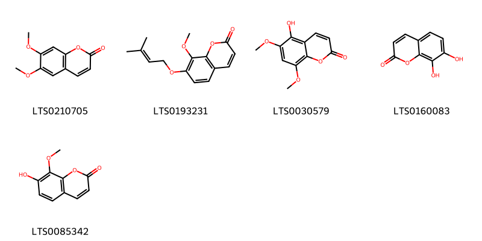{ width=100% }
    <figcaption>Hình ảnh cấu trúc hóa học của 5 hoạt chất thuộc nhóm Coumarins and derivatives gồm ['scoparone (LTS0210705)', '8-methoxy-7-[(3-methylbut-2-en-1-yl)oxy]chromen-2-one (LTS0193231)', '5-hydroxy-6,8-dimethoxychromen-2-one (LTS0030579)', 'daphnetin (LTS0160083)', '7-hydroxy-8-methoxychromen-2-one (LTS0085342)'].</figcaption>
</figure>
#### Nhóm Dioxolopyrans
<figure markdown="span">
    { width=100% }
    <figcaption>Hình ảnh cấu trúc hóa học của 1 hoạt chất thuộc nhóm Dioxolopyrans gồm ['1,5,9-trimethyl-11,14,15-trioxatetracyclo[10.2.1.0⁴,¹³.0⁸,¹³]pentadecan-10-one (LTS0198939)'].</figcaption>
</figure>
#### Nhóm Fatty Acyls
<figure markdown="span">
    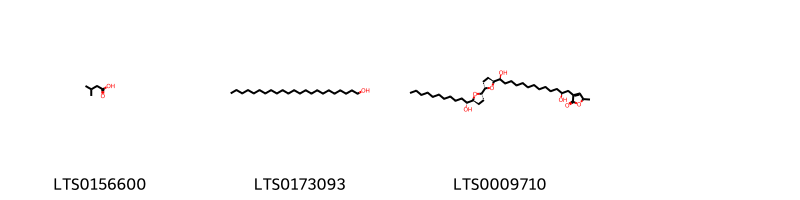{ width=100% }
    <figcaption>Hình ảnh cấu trúc hóa học của 3 hoạt chất thuộc nhóm Fatty Acyls gồm ['isovaleric acid (LTS0156600)', '1-tricosanol (LTS0173093)', 'bullatacin (LTS0009710)'].</figcaption>
</figure>
#### Nhóm Flavonoids
<figure markdown="span">
    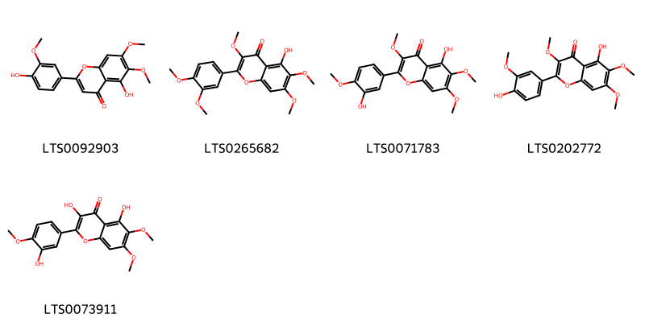{ width=100% }
    <figcaption>Hình ảnh cấu trúc hóa học của 5 hoạt chất thuộc nhóm Flavonoids gồm ['cirsilineol (LTS0092903)', 'artemetin (LTS0265682)', 'casticin (LTS0071783)', 'chrysosplenetin (LTS0202772)', 'eupatin (LTS0073911)'].</figcaption>
</figure>
#### Nhóm Oxepanes
<figure markdown="span">
    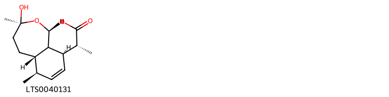{ width=100% }
    <figcaption>Hình ảnh cấu trúc hóa học của 1 hoạt chất thuộc nhóm Oxepanes gồm ['(1r,4r,5s,8r,9s,12s)-12-hydroxy-4,8,12-trimethyl-2,13-dioxatricyclo[7.4.1.0⁵,¹⁴]tetradec-6-en-3-one (LTS0040131)'].</figcaption>
</figure>
#### Nhóm Prenol lipids
<figure markdown="span">
    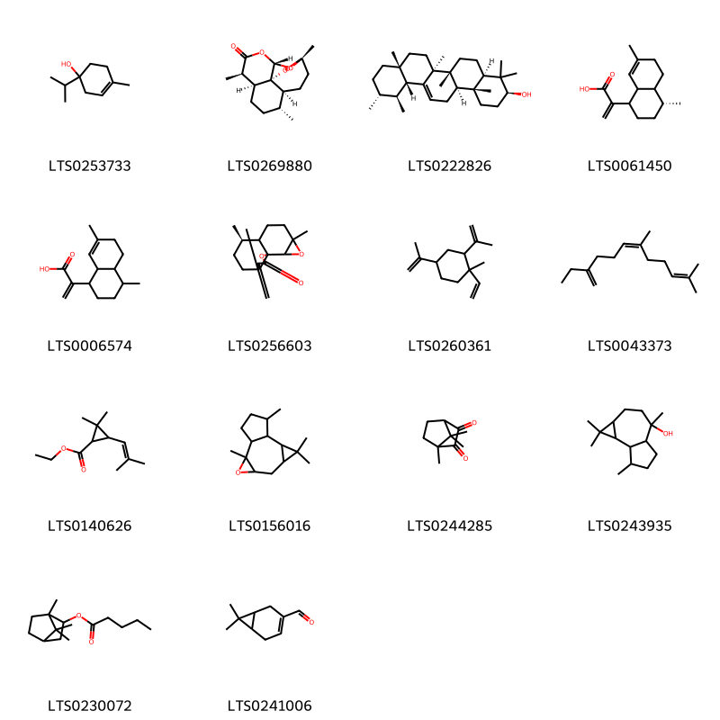{ width=100% }
    <figcaption>Hình ảnh cấu trúc hóa học của 14 hoạt chất thuộc nhóm Prenol lipids gồm ['4-terpineol (LTS0253733)', '(+)-artemisinin (LTS0269880)', 'amyrin (LTS0222826)', 'artemisinic acid (LTS0061450)', '2-(4,7-dimethyl-1,2,3,4,4a,5,6,8a-octahydronaphthalen-1-yl)prop-2-enoic acid (LTS0006574)', '(8r)-8,12-dimethyl-4-methylidene-2,13-dioxatetracyclo[7.5.0.0¹,⁵.0¹²,¹⁴]tetradecan-3-one (LTS0256603)', 'β-elemene (LTS0260361)', '(6z)-2,6-dimethyl-10-methylidenedodeca-2,6-diene (LTS0043373)', 'ethyl chrysanthemate (LTS0140626)', '2,7,7,10-tetramethyl-3-oxatetracyclo[7.3.0.0²,⁴.0⁶,⁸]dodecane (LTS0156016)', 'camphorquinone (LTS0244285)', 'ledol (LTS0243935)', '1,7,7-trimethylbicyclo[2.2.1]heptan-2-yl pentanoate (LTS0230072)', '7,7-dimethylbicyclo[4.1.0]hept-3-ene-3-carbaldehyde (LTS0241006)'].</figcaption>
</figure>

---

### Dược dân tộc học

Danh sách các quốc gia có sử dụng *Artemisia carvifolia* trong điều trị các bệnh. 

| Country   | Disease   | Bệnh                                                                                                                                                                                                |
|:----------|:----------|:----------------------------------------------------------------------------------------------------------------------------------------------------------------------------------------------------|
| Vietnam   | Tonic     | MYMEMORY WARNING: YOU USED ALL AVAILABLE FREE TRANSLATIONS FOR TODAY. NEXT AVAILABLE IN  10 HOURS 15 MINUTES 52 SECONDS VISIT HTTPS://MYMEMORY.TRANSLATED.NET/DOC/USAGELIMITS.PHP TO TRANSLATE MORE |

---

---
## Artemisia cina
### Thông tin về thực vật

!!! info "Phân loại thực vật của *Artemisia cina* từ GIBF:"
    - **Kingdom:** Plantae
    - **Phylum:** Tracheophyta
    - **Order:** Asterales
    - **Family:** Asteraceae
    - **Genus:** Artemisia
    - **Species:** *Artemisia cina*

 

| Label (VI)   | Label (EN)   | Scientific Name   | Descriptions (VI)   | Descriptions (EN)   | Also Known As (VI)   | Also Known As (EN)                           |
|:-------------|:-------------|:------------------|:--------------------|:--------------------|:---------------------|:---------------------------------------------|
| N/A          | N/A          | Artemisia cina    | loài thực vật       | species of plant    | ['']                 | ['santonica', 'wormseed', 'Levant wormseed'] |

#### Phân bố trên thế giới

**Từ CSDL GIBF** nan, Pakistan, Tajikistan, Netherlands, Japan, Iran (Islamic Republic of), Afghanistan, Turkmenistan, India, Indonesia, unknown or invalid, United States of America, Kazakhstan, China, Uzbekistan

#### Phân bố tại Việt Nam

**Từ CSDL GIBF**: Không có ghi nhận ở Việt Nam

---
### Thành phần hóa học
        
- Theo cơ sở dữ liệu lotus: Từ loài *Artemisia cina* đã phân lập và xác định được 6 hoạt chất thuộc về các nhóm Cinnamic acids and derivatives, Flavonoids. 

|    | chemicalTaxonomyClassyfireClass   |   smiles_count |
|---:|:----------------------------------|---------------:|
|  0 | Cinnamic acids and derivatives    |              2 |
|  1 | Flavonoids                        |              4 |

#### Nhóm Cinnamic acids and derivatives
<figure markdown="span">
    { width=100% }
    <figcaption>Hình ảnh cấu trúc hóa học của 2 hoạt chất thuộc nhóm Cinnamic acids and derivatives gồm ['3,4-dihydroxycinnamic acid (LTS0128050)', 'caffeic acid (LTS0027481)'].</figcaption>
</figure>
#### Nhóm Flavonoids
<figure markdown="span">
    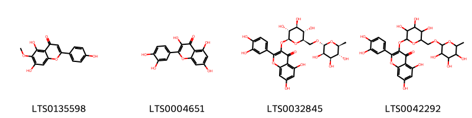{ width=100% }
    <figcaption>Hình ảnh cấu trúc hóa học của 4 hoạt chất thuộc nhóm Flavonoids gồm ['hispidulin (LTS0135598)', 'quercetin (LTS0004651)', '3-rutinosyl quercetin (LTS0032845)', 'rutin (LTS0042292)'].</figcaption>
</figure>

---

### Dược dân tộc học

Danh sách các quốc gia có sử dụng *Artemisia cina* trong điều trị các bệnh. 

| Country   | Disease               | Bệnh                                                                                                                                                                                                |
|:----------|:----------------------|:----------------------------------------------------------------------------------------------------------------------------------------------------------------------------------------------------|
| Turkey    | Ascaricide, Vermifuge | MYMEMORY WARNING: YOU USED ALL AVAILABLE FREE TRANSLATIONS FOR TODAY. NEXT AVAILABLE IN  10 HOURS 15 MINUTES 18 SECONDS VISIT HTTPS://MYMEMORY.TRANSLATED.NET/DOC/USAGELIMITS.PHP TO TRANSLATE MORE |

---

---
## Artemisia dracunculus
### Thông tin về thực vật

!!! info "Phân loại thực vật của *Artemisia dracunculus* từ GIBF:"
    - **Kingdom:** Plantae
    - **Phylum:** Tracheophyta
    - **Order:** Asterales
    - **Family:** Asteraceae
    - **Genus:** Artemisia
    - **Species:** *Artemisia dracunculus*

 

| Label (VI)   | Label (EN)   | Scientific Name       | Descriptions (VI)   | Descriptions (EN)                                                  | Also Known As (VI)   | Also Known As (EN)        |
|:-------------|:-------------|:----------------------|:--------------------|:-------------------------------------------------------------------|:---------------------|:--------------------------|
| N/A          | N/A          | Artemisia dracunculus | loài thực vật       | species of plant, tarragon; for the food ingredient use Q103554747 | ['']                 | ['Artemisia dracunculus'] |

#### Phân bố trên thế giới

**Từ CSDL GIBF** Germany, Belgium, Estonia, Canada, Hungary, Russian Federation, United States of America, Sweden, Kazakhstan, Mongolia, French Guiana

#### Phân bố tại Việt Nam

**Từ CSDL GIBF**: Không có ghi nhận ở Việt Nam

---
### Thành phần hóa học
        
- Theo cơ sở dữ liệu lotus: Từ loài *Artemisia dracunculus* đã phân lập và xác định được 118 hoạt chất thuộc về các nhóm Phenol ethers, Fatty Acyls, Flavonoids, Prenol lipids, Linear 1,3-diarylpropanoids, Cinnamic acids and derivatives, Piperidines, Isocoumarins and derivatives, Benzene and substituted derivatives, Unsaturated hydrocarbons, 2-arylbenzofuran flavonoids, Lactones, Phenols, Organooxygen compounds, Coumarins and derivatives, Carboximidic acids and derivatives, Benzodiazepines. 

|    | chemicalTaxonomyClassyfireClass     |   smiles_count |
|---:|:------------------------------------|---------------:|
|  0 | 2-arylbenzofuran flavonoids         |              1 |
|  1 | Benzene and substituted derivatives |              6 |
|  2 | Benzodiazepines                     |              1 |
|  3 | Carboximidic acids and derivatives  |              2 |
|  4 | Cinnamic acids and derivatives      |              2 |
|  5 | Coumarins and derivatives           |              9 |
|  6 | Fatty Acyls                         |             14 |
|  7 | Flavonoids                          |             29 |
|  8 | Isocoumarins and derivatives        |              5 |
|  9 | Lactones                            |              2 |
| 10 | Linear 1,3-diarylpropanoids         |              2 |
| 11 | Organooxygen compounds              |              2 |
| 12 | Phenol ethers                       |              3 |
| 13 | Phenols                             |              2 |
| 14 | Piperidines                         |              6 |
| 15 | Prenol lipids                       |             31 |
| 16 | Unsaturated hydrocarbons            |              1 |

#### Nhóm 2-arylbenzofuran flavonoids
<figure markdown="span">
    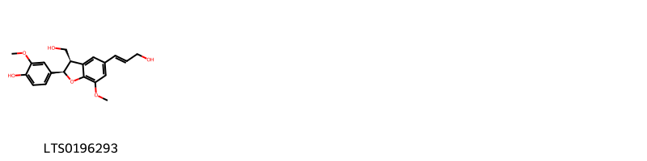{ width=100% }
    <figcaption>Hình ảnh cấu trúc hóa học của 1 hoạt chất thuộc nhóm 2-arylbenzofuran flavonoids gồm ['4-[(2r,3r)-3-(hydroxymethyl)-5-[(1e)-3-hydroxyprop-1-en-1-yl]-7-methoxy-2,3-dihydro-1-benzofuran-2-yl]-2-methoxyphenol (LTS0196293)'].</figcaption>
</figure>
#### Nhóm Benzene and substituted derivatives
<figure markdown="span">
    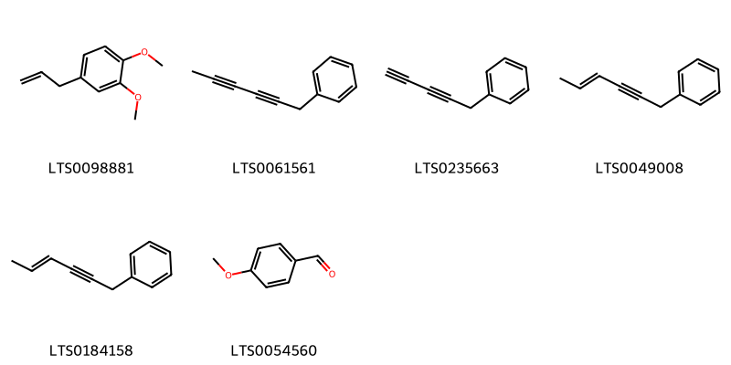{ width=100% }
    <figcaption>Hình ảnh cấu trúc hóa học của 6 hoạt chất thuộc nhóm Benzene and substituted derivatives gồm ['methyl eugenol (LTS0098881)', 'capillene (LTS0061561)', '5-phenyl-1,3-pentadiyne (LTS0235663)', 'hex-4-en-2-yn-1-ylbenzene (LTS0049008)', '(4e)-hex-4-en-2-yn-1-ylbenzene (LTS0184158)', 'anisaldehyde (LTS0054560)'].</figcaption>
</figure>
#### Nhóm Benzodiazepines
<figure markdown="span">
    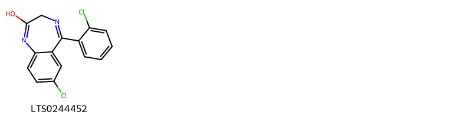{ width=100% }
    <figcaption>Hình ảnh cấu trúc hóa học của 1 hoạt chất thuộc nhóm Benzodiazepines gồm ['delorazepam (LTS0244452)'].</figcaption>
</figure>
#### Nhóm Carboximidic acids and derivatives
<figure markdown="span">
    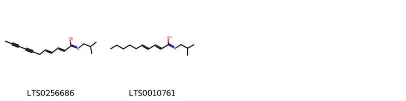{ width=100% }
    <figcaption>Hình ảnh cấu trúc hóa học của 2 hoạt chất thuộc nhóm Carboximidic acids and derivatives gồm ['(2e)-n-(2-methylpropyl)undeca-2,4-dien-7,9-diynimidic acid (LTS0256686)', '(2e)-n-(2-methylpropyl)deca-2,4-dienimidic acid (LTS0010761)'].</figcaption>
</figure>
#### Nhóm Cinnamic acids and derivatives
<figure markdown="span">
    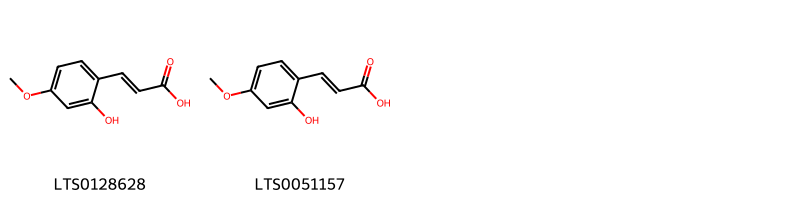{ width=100% }
    <figcaption>Hình ảnh cấu trúc hóa học của 2 hoạt chất thuộc nhóm Cinnamic acids and derivatives gồm ['(2e)-3-(2-hydroxy-4-methoxyphenyl)prop-2-enoic acid (LTS0128628)', '3-(2-hydroxy-4-methoxyphenyl)prop-2-enoic acid (LTS0051157)'].</figcaption>
</figure>
#### Nhóm Coumarins and derivatives
<figure markdown="span">
    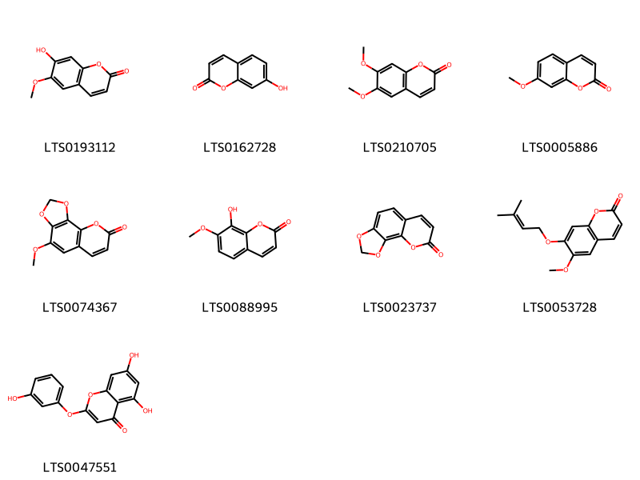{ width=100% }
    <figcaption>Hình ảnh cấu trúc hóa học của 9 hoạt chất thuộc nhóm Coumarins and derivatives gồm ['scopoletin (LTS0193112)', 'umbelliferone (LTS0162728)', 'scoparone (LTS0210705)', 'methylumbelliferone (LTS0005886)', '4-methoxy-2h-[1,3]dioxolo[4,5-h]chromen-8-one (LTS0074367)', '8-hydroxy-7-methoxychromen-2-one (LTS0088995)', '2h-[1,3]dioxolo[4,5-h]chromen-8-one (LTS0023737)', '6-methoxy-7-[(3-methylbut-2-en-1-yl)oxy]chromen-2-one (LTS0053728)', '5,7-dihydroxy-2-(3-hydroxyphenoxy)chromen-4-one (LTS0047551)'].</figcaption>
</figure>
#### Nhóm Fatty Acyls
<figure markdown="span">
    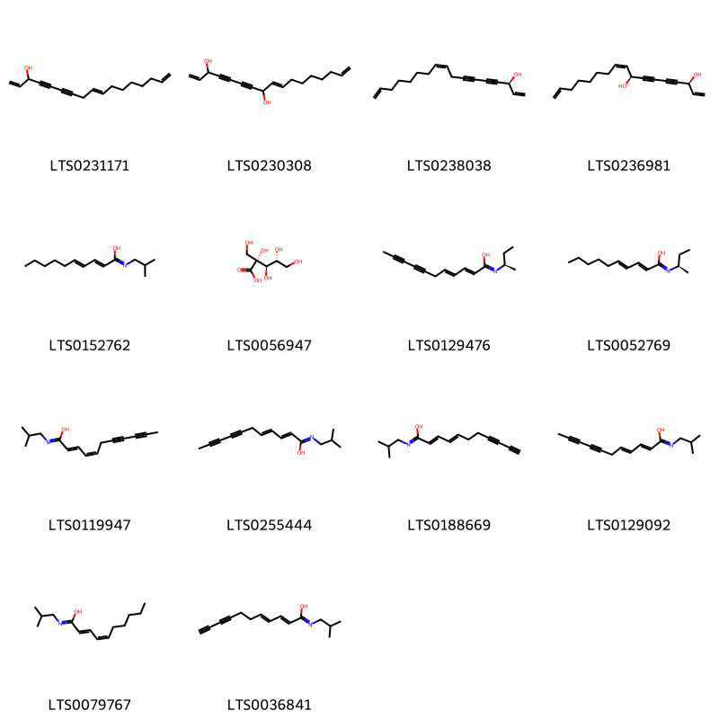{ width=100% }
    <figcaption>Hình ảnh cấu trúc hóa học của 14 hoạt chất thuộc nhóm Fatty Acyls gồm ['heptadeca-1,9,16-trien-4,6-diyn-3-ol (LTS0231171)', 'heptadeca-1,9,16-trien-4,6-diyne-3,8-diol (LTS0230308)', '(3s,9z)-heptadeca-1,9,16-trien-4,6-diyn-3-ol (LTS0238038)', '(3s,8s,9z)-heptadeca-1,9,16-trien-4,6-diyne-3,8-diol (LTS0236981)', '(2e,4e)-n-(2-methylpropyl)deca-2,4-dienimidic acid (LTS0152762)', '2-carboxy-d-arabinitol (LTS0056947)', '(2e,4e)-n-[(2r)-butan-2-yl]undeca-2,4-dien-7,9-diynimidic acid (LTS0129476)', '(2e,4e)-n-[(2r)-butan-2-yl]deca-2,4-dienimidic acid (LTS0052769)', '(2e,4z)-n-(2-methylpropyl)undeca-2,4-dien-7,9-diynimidic acid (LTS0119947)', 'n-(2-methylpropyl)undeca-2,4-dien-7,9-diynimidic acid (LTS0255444)', 'n-(2-methylpropyl)undeca-2,4-dien-8,10-diynimidic acid (LTS0188669)', '(2e,4e)-n-(2-methylpropyl)undeca-2,4-dien-7,9-diynimidic acid (LTS0129092)', '(2e,4z)-n-(2-methylpropyl)deca-2,4-dienimidic acid (LTS0079767)', '(2e,4e)-n-(2-methylpropyl)undeca-2,4-dien-8,10-diynimidic acid (LTS0036841)'].</figcaption>
</figure>
#### Nhóm Flavonoids
<figure markdown="span">
    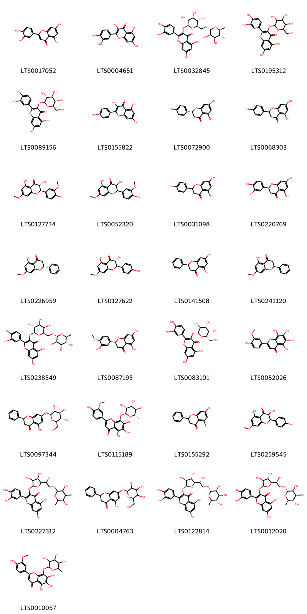{ width=100% }
    <figcaption>Hình ảnh cấu trúc hóa học của 29 hoạt chất thuộc nhóm Flavonoids gồm ['luteolin (LTS0017052)', 'quercetin (LTS0004651)', '3-rutinosyl quercetin (LTS0032845)', '2-(3,4-dihydroxyphenyl)-5,7-dihydroxy-3-{[3,4,5-trihydroxy-6-(hydroxymethyl)oxan-2-yl]oxy}chromen-4-one (LTS0195312)', 'hyperoside (LTS0089156)', 'kaempherol (LTS0155822)', '(-)-naringenin (LTS0072900)', 'asahina (LTS0068303)', '(2r,3r)-3,5-dihydroxy-2-(4-hydroxy-3-methoxyphenyl)-7-methoxy-2,3-dihydro-1-benzopyran-4-one (LTS0127734)', '3,5-dihydroxy-2-(4-hydroxy-3-methoxyphenyl)-7-methoxy-2,3-dihydro-1-benzopyran-4-one (LTS0052320)', 'naringenin (LTS0031098)', 'eriodictyol (LTS0220769)', '(2r)-5-hydroxy-7-methoxy-2-phenyl-2,3-dihydro-1-benzopyran-4-one (LTS0226959)', '(2r,3r)-3,5-dihydroxy-2-(4-hydroxyphenyl)-7-methoxy-2,3-dihydro-1-benzopyran-4-one (LTS0127622)', 'pinocembrine (LTS0141508)', 'pinostrobin (LTS0241120)', '2-(3,4-dihydroxyphenyl)-5,7-dihydroxy-3-{[(2s,3r,4s,5r,6r)-3,4,5-trihydroxy-6-({[(2r,3r,4r,5r,6s)-3,4,5-trihydroxy-6-methyloxan-2-yl]oxy}methyl)oxan-2-yl]oxy}chromen-4-one (LTS0238549)', 'hesperetin (LTS0087195)', '2-(3,4-dihydroxyphenyl)-5,7-dihydroxy-3-{[(2r,3s,4r,5s,6s)-3,4,5-trihydroxy-6-(hydroxymethyl)oxan-2-yl]oxy}chromen-4-one (LTS0083101)', '5,6,7,8-tetrahydroxy-2-(4-hydroxy-3-methoxyphenyl)chromen-4-one (LTS0052026)', '(2s)-5-hydroxy-2-phenyl-7-{[(2s,3r,4s,5s,6r)-3,4,5-trihydroxy-6-(hydroxymethyl)oxan-2-yl]oxy}-2,3-dihydro-1-benzopyran-4-one (LTS0097344)', '5,6,7-trihydroxy-2-(4-hydroxy-3-methoxyphenyl)-8-{[(2s,3r,4r,5r,6s)-3,4,5-trihydroxy-6-methyloxan-2-yl]oxy}chromen-4-one (LTS0115189)', 'pinocembrin (LTS0155292)', '3,5-dihydroxy-2-(4-hydroxyphenyl)-7-methoxy-2,3-dihydro-1-benzopyran-4-one (LTS0259545)', '3-[(3,4-dihydroxy-5-{1-hydroxy-2-[(3,4,5-trihydroxy-6-methyloxan-2-yl)oxy]ethyl}oxolan-2-yl)oxy]-2-(3,4-dihydroxyphenyl)-5,7-dihydroxychromen-4-one (LTS0227312)', '5-hydroxy-2-phenyl-7-{[3,4,5-trihydroxy-6-(hydroxymethyl)oxan-2-yl]oxy}-2,3-dihydro-1-benzopyran-4-one (LTS0004763)', '3-{[(2s,3s,4s,5r)-3,4-dihydroxy-5-[(1r)-1-hydroxy-2-{[(2s,3s,4s,5s,6r)-3,4,5-trihydroxy-6-methyloxan-2-yl]oxy}ethyl]oxolan-2-yl]oxy}-2-(3,4-dihydroxyphenyl)-5,7-dihydroxychromen-4-one (LTS0122814)', '3-{[(2s,3s,4s,5r)-3,4-dihydroxy-5-[(1s)-1-hydroxy-2-{[(2s,3s,4s,5s,6r)-3,4,5-trihydroxy-6-methyloxan-2-yl]oxy}ethyl]oxolan-2-yl]oxy}-2-(3,4-dihydroxyphenyl)-5,7-dihydroxychromen-4-one (LTS0012020)', '5,6,7-trihydroxy-2-(4-hydroxy-3-methoxyphenyl)-8-[(3,4,5-trihydroxy-6-methyloxan-2-yl)oxy]chromen-4-one (LTS0010057)'].</figcaption>
</figure>
#### Nhóm Isocoumarins and derivatives
<figure markdown="span">
    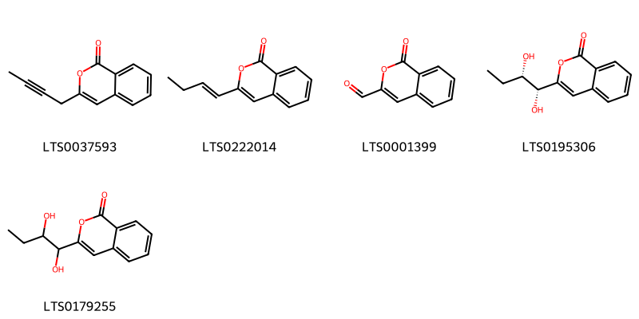{ width=100% }
    <figcaption>Hình ảnh cấu trúc hóa học của 5 hoạt chất thuộc nhóm Isocoumarins and derivatives gồm ['capillarin (LTS0037593)', '3-[(1e)-but-1-en-1-yl]isochromen-1-one (LTS0222014)', '1-oxoisochromene-3-carbaldehyde (LTS0001399)', '3-[(1r,2s)-1,2-dihydroxybutyl]isochromen-1-one (LTS0195306)', '3-(1,2-dihydroxybutyl)isochromen-1-one (LTS0179255)'].</figcaption>
</figure>
#### Nhóm Lactones
<figure markdown="span">
    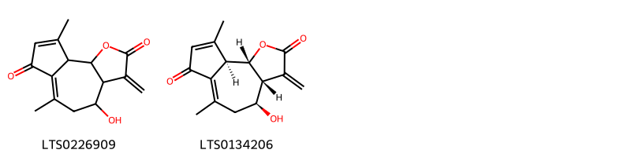{ width=100% }
    <figcaption>Hình ảnh cấu trúc hóa học của 2 hoạt chất thuộc nhóm Lactones gồm ['4-hydroxy-6,9-dimethyl-3-methylidene-3ah,4h,5h,9ah,9bh-azuleno[4,5-b]furan-2,7-dione (LTS0226909)', '(3ar,4s,9ar,9bs)-4-hydroxy-6,9-dimethyl-3-methylidene-3ah,4h,5h,9ah,9bh-azuleno[4,5-b]furan-2,7-dione (LTS0134206)'].</figcaption>
</figure>
#### Nhóm Linear 1_3-diarylpropanoids
<figure markdown="span">
    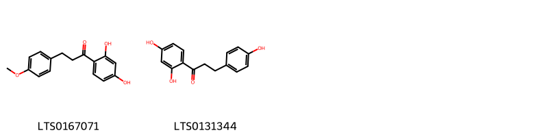{ width=100% }
    <figcaption>Hình ảnh cấu trúc hóa học của Không tìm thấy chú thích hoạt chất thuộc nhóm Linear 1_3-diarylpropanoids gồm Không tìm thấy chú thích.</figcaption>
</figure>
#### Nhóm Organooxygen compounds
<figure markdown="span">
    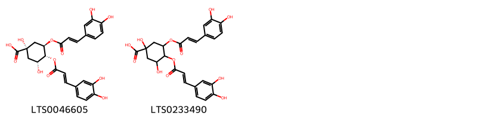{ width=100% }
    <figcaption>Hình ảnh cấu trúc hóa học của 2 hoạt chất thuộc nhóm Organooxygen compounds gồm ['4,5-dicaffeoylquinic acid (LTS0046605)', '3,4-bis({[3-(3,4-dihydroxyphenyl)prop-2-enoyl]oxy})-1,5-dihydroxycyclohexane-1-carboxylic acid (LTS0233490)'].</figcaption>
</figure>
#### Nhóm Phenol ethers
<figure markdown="span">
    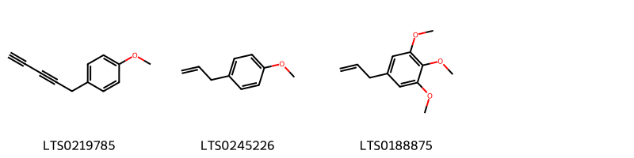{ width=100% }
    <figcaption>Hình ảnh cấu trúc hóa học của 3 hoạt chất thuộc nhóm Phenol ethers gồm ['1-methoxy-4-(penta-2,4-diyn-1-yl)benzene (LTS0219785)', 'tarragon (LTS0245226)', 'elemicin (LTS0188875)'].</figcaption>
</figure>
#### Nhóm Phenols
<figure markdown="span">
    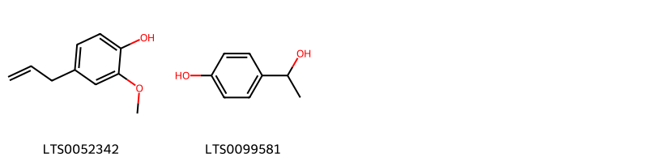{ width=100% }
    <figcaption>Hình ảnh cấu trúc hóa học của 2 hoạt chất thuộc nhóm Phenols gồm ['eugenol (LTS0052342)', "1-(4'-hydroxyphenyl)ethanol (LTS0099581)"].</figcaption>
</figure>
#### Nhóm Piperidines
<figure markdown="span">
    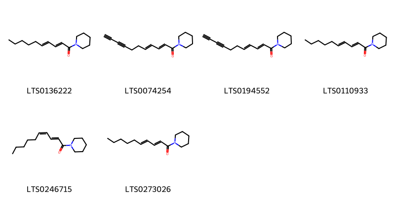{ width=100% }
    <figcaption>Hình ảnh cấu trúc hóa học của 6 hoạt chất thuộc nhóm Piperidines gồm ['(2e)-1-(piperidin-1-yl)deca-2,4-dien-1-one (LTS0136222)', '(2e,4e)-1-(piperidin-1-yl)undeca-2,4-dien-8,10-diyn-1-one (LTS0074254)', '1-(piperidin-1-yl)undeca-2,4-dien-8,10-diyn-1-one (LTS0194552)', '1-(piperidin-1-yl)deca-2,4-dien-1-one (LTS0110933)', '(2e,4z)-1-(piperidin-1-yl)deca-2,4-dien-1-one (LTS0246715)', '(2e,4e)-1-(piperidin-1-yl)deca-2,4-dien-1-one (LTS0273026)'].</figcaption>
</figure>
#### Nhóm Prenol lipids
<figure markdown="span">
    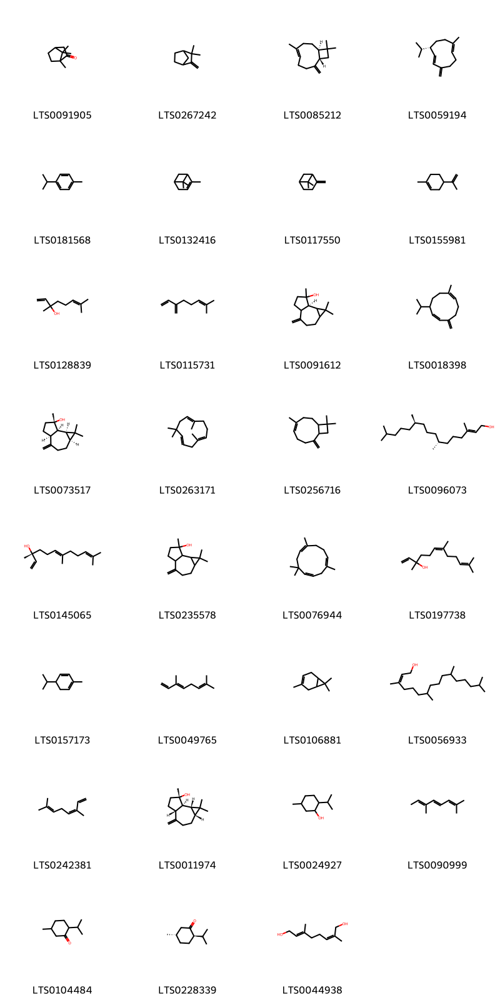{ width=100% }
    <figcaption>Hình ảnh cấu trúc hóa học của 31 hoạt chất thuộc nhóm Prenol lipids gồm ['camphor (LTS0091905)', 'camphene (LTS0267242)', 'caryophyllene (LTS0085212)', '(-)-germacrene d (LTS0059194)', 'cymene (LTS0181568)', 'α pinene (LTS0132416)', 'β-pinene (LTS0117550)', 'limonene,  (LTS0155981)', 'linalool, (+-)- (LTS0128839)', 'α-myrcene (LTS0115731)', '(7ar)-1,1,7-trimethyl-4-methylidene-octahydrocyclopropa[e]azulen-7-ol (LTS0091612)', '8-isopropyl-1-methyl-5-methylidenecyclodeca-1,6-diene (LTS0018398)', '(1as,4as,7s,7ar,7bs)-1,1,7-trimethyl-4-methylidene-octahydrocyclopropa[e]azulen-7-ol (LTS0073517)', 'humulene (LTS0263171)', '4,11,11-trimethyl-8-methylidenebicyclo[7.2.0]undec-4-ene (LTS0256716)', 'phytol (LTS0096073)', '(3r,6e)-nerolidol (LTS0145065)', 'spathulenol (LTS0235578)', 'α-humulene (LTS0076944)', 'nerolidol (LTS0197738)', 'phellandrene (LTS0157173)', 'trans-β-ocimene (LTS0049765)', 'monoterpenes (LTS0106881)', '3,7,11,15-tetramethylhexadec-2-en-1-ol (LTS0056933)', 'β-ocimene (LTS0242381)', 'spathulenol (LTS0011974)', 'menthol natural (LTS0024927)', 'allo-ocimene (LTS0090999)', 'menthone (LTS0104484)', '(+)-menthone (LTS0228339)', '8-hydroxygeraniol (LTS0044938)'].</figcaption>
</figure>
#### Nhóm Unsaturated hydrocarbons
<figure markdown="span">
    { width=100% }
    <figcaption>Hình ảnh cấu trúc hóa học của 1 hoạt chất thuộc nhóm Unsaturated hydrocarbons gồm ['α terpinene (LTS0232891)'].</figcaption>
</figure>

---

### Dược dân tộc học

Danh sách các quốc gia có sử dụng *Artemisia dracunculus* trong điều trị các bệnh. 

| Country   | Disease                                                                        | Bệnh                                                                                                                                                                                                |
|:----------|:-------------------------------------------------------------------------------|:----------------------------------------------------------------------------------------------------------------------------------------------------------------------------------------------------|
| Elsewhere | Apertif, Diuretic, Emmenagogue                                                 | MYMEMORY WARNING: YOU USED ALL AVAILABLE FREE TRANSLATIONS FOR TODAY. NEXT AVAILABLE IN  10 HOURS 14 MINUTES 50 SECONDS VISIT HTTPS://MYMEMORY.TRANSLATED.NET/DOC/USAGELIMITS.PHP TO TRANSLATE MORE |
| Turkey    | Carminative, Emmenagogue, Refrigerant, Stomachic, Vermifuge, Apertif, Diuretic | MYMEMORY WARNING: YOU USED ALL AVAILABLE FREE TRANSLATIONS FOR TODAY. NEXT AVAILABLE IN  10 HOURS 14 MINUTES 46 SECONDS VISIT HTTPS://MYMEMORY.TRANSLATED.NET/DOC/USAGELIMITS.PHP TO TRANSLATE MORE |

---

---
## Artemisia filifolia
### Thông tin về thực vật

!!! info "Phân loại thực vật của *Artemisia filifolia* từ GIBF:"
    - **Kingdom:** Plantae
    - **Phylum:** Tracheophyta
    - **Order:** Asterales
    - **Family:** Asteraceae
    - **Genus:** Artemisia
    - **Species:** *Artemisia filifolia*

 

| Label (VI)   | Label (EN)   | Scientific Name     | Descriptions (VI)   | Descriptions (EN)   | Also Known As (VI)   | Also Known As (EN)   |
|:-------------|:-------------|:--------------------|:--------------------|:--------------------|:---------------------|:---------------------|
| N/A          | N/A          | Artemisia filifolia | loài thực vật       | species of plant    | ['']                 | ['sand sage']        |

#### Phân bố trên thế giới

**Từ CSDL GIBF** United States of America

#### Phân bố tại Việt Nam

**Từ CSDL GIBF**: Không có ghi nhận ở Việt Nam

---
### Thành phần hóa học
        
- Theo cơ sở dữ liệu lotus: Từ loài *Artemisia filifolia* đã phân lập và xác định được 27 hoạt chất thuộc về các nhóm Fatty Acyls, Prenol lipids, Tetrahydrofurans, Lactones, Organooxygen compounds. 

|    | chemicalTaxonomyClassyfireClass   |   smiles_count |
|---:|:----------------------------------|---------------:|
|  0 | Fatty Acyls                       |              2 |
|  1 | Lactones                          |              2 |
|  2 | Organooxygen compounds            |              5 |
|  3 | Prenol lipids                     |             15 |
|  4 | Tetrahydrofurans                  |              3 |

#### Nhóm Fatty Acyls
<figure markdown="span">
    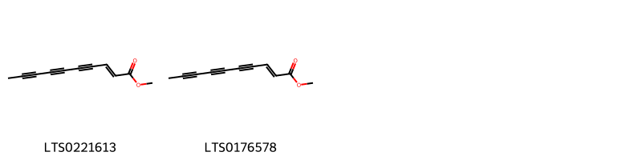{ width=100% }
    <figcaption>Hình ảnh cấu trúc hóa học của 2 hoạt chất thuộc nhóm Fatty Acyls gồm ['methyl dec-2-en-4,6,8-triynoate (LTS0221613)', 'dehydromatricaria ester (LTS0176578)'].</figcaption>
</figure>
#### Nhóm Lactones
<figure markdown="span">
    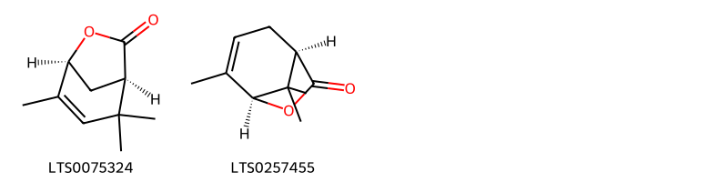{ width=100% }
    <figcaption>Hình ảnh cấu trúc hóa học của 2 hoạt chất thuộc nhóm Lactones gồm ['(1r,5s)-2,2,4-trimethyl-6-oxabicyclo[3.2.1]oct-3-en-7-one (LTS0075324)', '(1r,5s)-4,8,8-trimethyl-6-oxabicyclo[3.2.1]oct-3-en-7-one (LTS0257455)'].</figcaption>
</figure>
#### Nhóm Organooxygen compounds
<figure markdown="span">
    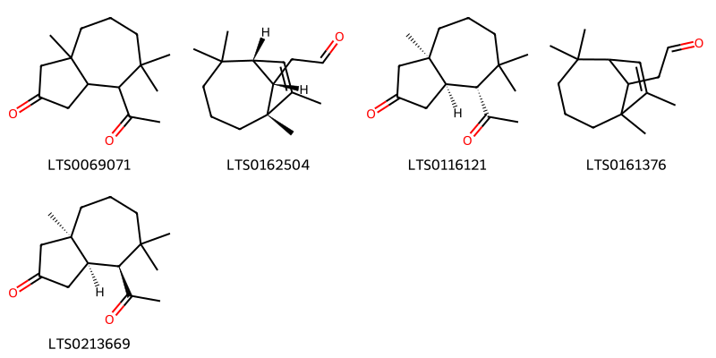{ width=100% }
    <figcaption>Hình ảnh cấu trúc hóa học của 5 hoạt chất thuộc nhóm Organooxygen compounds gồm ['8-acetyl-3a,7,7-trimethyl-hexahydro-1h-azulen-2-one (LTS0069071)', '2-[(1r,6r,9s)-1,5,5,8-tetramethylbicyclo[4.2.1]non-7-en-9-yl]acetaldehyde (LTS0162504)', '(3ar,8r,8ar)-8-acetyl-3a,7,7-trimethyl-hexahydro-1h-azulen-2-one (LTS0116121)', '2-{1,5,5,8-tetramethylbicyclo[4.2.1]non-7-en-9-yl}acetaldehyde (LTS0161376)', '(3ar,8s,8ar)-8-acetyl-3a,7,7-trimethyl-hexahydro-1h-azulen-2-one (LTS0213669)'].</figcaption>
</figure>
#### Nhóm Prenol lipids
<figure markdown="span">
    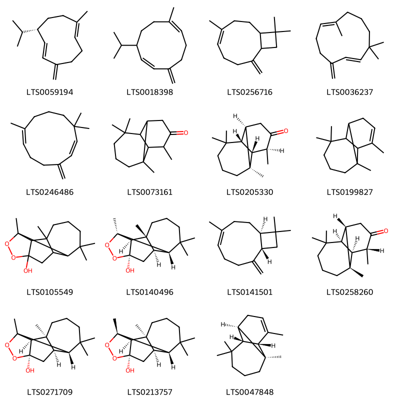{ width=100% }
    <figcaption>Hình ảnh cấu trúc hóa học của 15 hoạt chất thuộc nhóm Prenol lipids gồm ['(-)-germacrene d (LTS0059194)', '8-isopropyl-1-methyl-5-methylidenecyclodeca-1,6-diene (LTS0018398)', '4,11,11-trimethyl-8-methylidenebicyclo[7.2.0]undec-4-ene (LTS0256716)', '(1e,6e)-gamma-humulene (LTS0036237)', 'gamma-humulene (LTS0246486)', '2,6,6,9-tetramethyltricyclo[5.4.0.0²,⁸]undecan-10-one (LTS0073161)', '(1r,2s,7r,8r,9s)-2,6,6,9-tetramethyltricyclo[5.4.0.0²,⁸]undecan-10-one (LTS0205330)', 'α-longipinene (LTS0199827)', '1,3,10,10-tetramethyl-4,5-dioxatetracyclo[6.5.0.0²,⁶.0³,⁹]tridecan-6-ol (LTS0105549)', '(1r,2r,3s,6r,8r,9s)-1,3,10,10-tetramethyl-4,5-dioxatetracyclo[6.5.0.0²,⁶.0³,⁹]tridecan-6-ol (LTS0140496)', 'β-caryophyllen (LTS0141501)', '(1s,2r,7s,8s,9r)-2,6,6,9-tetramethyltricyclo[5.4.0.0²,⁸]undecan-10-one (LTS0258260)', '(1s,2r,6r,8r,9s)-1,3,10,10-tetramethyl-4,5-dioxatetracyclo[6.5.0.0²,⁶.0³,⁹]tridecan-6-ol (LTS0271709)', '(1s,2r,3r,6r,8r,9s)-1,3,10,10-tetramethyl-4,5-dioxatetracyclo[6.5.0.0²,⁶.0³,⁹]tridecan-6-ol (LTS0213757)', '(+)-α-longipinene (LTS0047848)'].</figcaption>
</figure>
#### Nhóm Tetrahydrofurans
<figure markdown="span">
    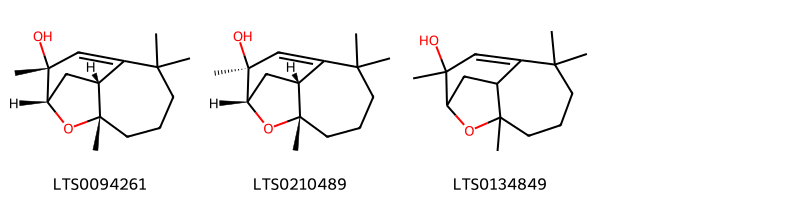{ width=100% }
    <figcaption>Hình ảnh cấu trúc hóa học của 3 hoạt chất thuộc nhóm Tetrahydrofurans gồm ['(1s,2r,9s,10r)-2,5,5,9-tetramethyl-12-oxatricyclo[7.2.1.0⁴,¹⁰]dodec-3-en-2-ol (LTS0094261)', '(1s,2s,9s,10r)-2,5,5,9-tetramethyl-12-oxatricyclo[7.2.1.0⁴,¹⁰]dodec-3-en-2-ol (LTS0210489)', '2,5,5,9-tetramethyl-12-oxatricyclo[7.2.1.0⁴,¹⁰]dodec-3-en-2-ol (LTS0134849)'].</figcaption>
</figure>

---

### Dược dân tộc học

Danh sách các quốc gia có sử dụng *Artemisia filifolia* trong điều trị các bệnh. 

| Country   | Disease   | Bệnh                                                                                                                                                                                                |
|:----------|:----------|:----------------------------------------------------------------------------------------------------------------------------------------------------------------------------------------------------|
| Mexico    | Vermifuge | MYMEMORY WARNING: YOU USED ALL AVAILABLE FREE TRANSLATIONS FOR TODAY. NEXT AVAILABLE IN  10 HOURS 14 MINUTES 04 SECONDS VISIT HTTPS://MYMEMORY.TRANSLATED.NET/DOC/USAGELIMITS.PHP TO TRANSLATE MORE |

---

---
## Artemisia frigida
### Thông tin về thực vật

!!! info "Phân loại thực vật của *Artemisia frigida* từ GIBF:"
    - **Kingdom:** Plantae
    - **Phylum:** Tracheophyta
    - **Order:** Asterales
    - **Family:** Asteraceae
    - **Genus:** Artemisia
    - **Species:** *Artemisia frigida*

 

| Label (VI)   | Label (EN)   | Scientific Name   | Descriptions (VI)   | Descriptions (EN)   | Also Known As (VI)   | Also Known As (EN)   |
|:-------------|:-------------|:------------------|:--------------------|:--------------------|:---------------------|:---------------------|
| N/A          | N/A          | Artemisia frigida | loài thực vật       | species of plant    | ['']                 | ['']                 |

#### Phân bố trên thế giới

**Từ CSDL GIBF** Russian Federation, United States of America, Kazakhstan, Mongolia, Canada

#### Phân bố tại Việt Nam

**Từ CSDL GIBF**: Không có ghi nhận ở Việt Nam

---
### Thành phần hóa học
        
- Theo cơ sở dữ liệu lotus: Từ loài *Artemisia frigida* đã phân lập và xác định được 47 hoạt chất thuộc về các nhóm Lactones, Flavonoids, Prenol lipids. 

|    | chemicalTaxonomyClassyfireClass   |   smiles_count |
|---:|:----------------------------------|---------------:|
|  0 | Flavonoids                        |             22 |
|  1 | Lactones                          |              4 |
|  2 | Prenol lipids                     |             21 |

#### Nhóm Flavonoids
<figure markdown="span">
    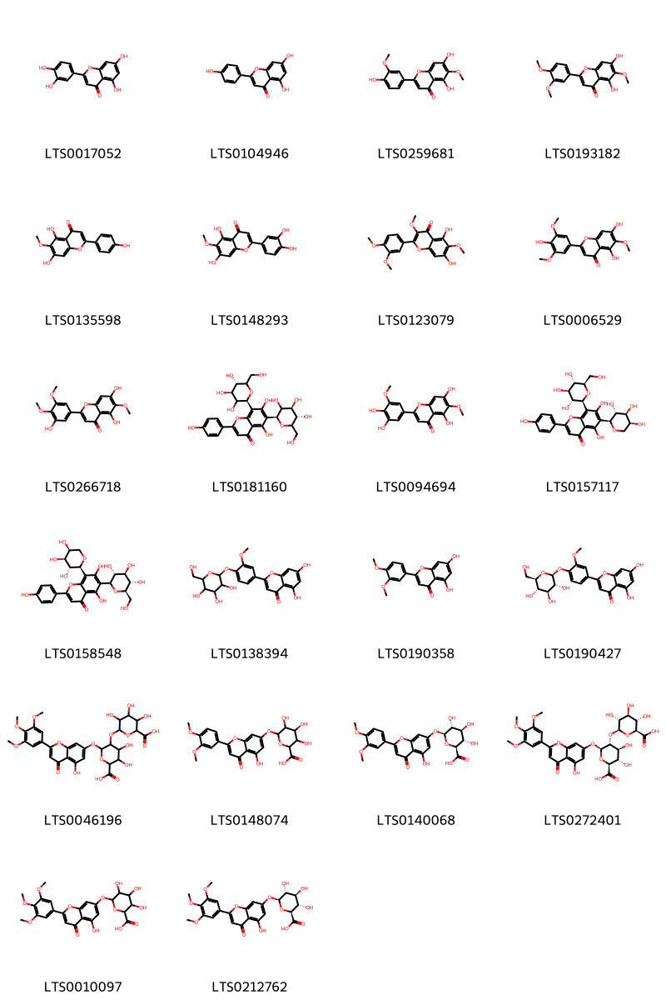{ width=100% }
    <figcaption>Hình ảnh cấu trúc hóa học của 22 hoạt chất thuộc nhóm Flavonoids gồm ['luteolin (LTS0017052)', 'chamomile (LTS0104946)', 'jaceosidin (LTS0259681)', 'eupatilin (LTS0193182)', 'hispidulin (LTS0135598)', 'nepetin (LTS0148293)', 'bonanzin (LTS0123079)', '6-methoxytricin (LTS0006529)', '5,7-dihydroxy-2-(3-hydroxy-4,5-dimethoxyphenyl)-6-methoxychromen-4-one (LTS0266718)', 'vicenin 2 (LTS0181160)', '2-(3,4-dihydroxy-5-methoxyphenyl)-5,7-dihydroxy-6-methoxychromen-4-one (LTS0094694)', 'isoschaftoside (LTS0157117)', '5,7-dihydroxy-2-(4-hydroxyphenyl)-6-[(3r,4r,5s,6r)-3,4,5-trihydroxy-6-(hydroxymethyl)oxan-2-yl]-8-[(2s,3r,4s,5s)-3,4,5-trihydroxyoxan-2-yl]chromen-4-one (LTS0158548)', '5,7-dihydroxy-2-(3-methoxy-4-{[3,4,5-trihydroxy-6-(hydroxymethyl)oxan-2-yl]oxy}phenyl)chromen-4-one (LTS0138394)', "luteolin 3',4'-dimethyl ether (LTS0190358)", '5,7-dihydroxy-2-(3-methoxy-4-{[(2s,3r,4s,5s,6r)-3,4,5-trihydroxy-6-(hydroxymethyl)oxan-2-yl]oxy}phenyl)chromen-4-one (LTS0190427)', '5-[(6-carboxy-3,4,5-trihydroxyoxan-2-yl)oxy]-3,4-dihydroxy-6-{[5-hydroxy-4-oxo-2-(3,4,5-trimethoxyphenyl)chromen-7-yl]oxy}oxane-2-carboxylic acid (LTS0046196)', '6-{[2-(3,4-dimethoxyphenyl)-5-hydroxy-4-oxochromen-7-yl]oxy}-3,4,5-trihydroxyoxane-2-carboxylic acid (LTS0148074)', '(2s,3s,4s,5r,6s)-6-{[2-(3,4-dimethoxyphenyl)-5-hydroxy-4-oxochromen-7-yl]oxy}-3,4,5-trihydroxyoxane-2-carboxylic acid (LTS0140068)', '(2s,3s,4s,5r,6s)-5-{[(2r,3r,4s,5s,6s)-6-carboxy-3,4,5-trihydroxyoxan-2-yl]oxy}-3,4-dihydroxy-6-{[5-hydroxy-4-oxo-2-(3,4,5-trimethoxyphenyl)chromen-7-yl]oxy}oxane-2-carboxylic acid (LTS0272401)', '3,4,5-trihydroxy-6-{[5-hydroxy-4-oxo-2-(3,4,5-trimethoxyphenyl)chromen-7-yl]oxy}oxane-2-carboxylic acid (LTS0010097)', '(2s,3s,4s,5r,6s)-3,4,5-trihydroxy-6-{[5-hydroxy-4-oxo-2-(3,4,5-trimethoxyphenyl)chromen-7-yl]oxy}oxane-2-carboxylic acid (LTS0212762)'].</figcaption>
</figure>
#### Nhóm Lactones
<figure markdown="span">
    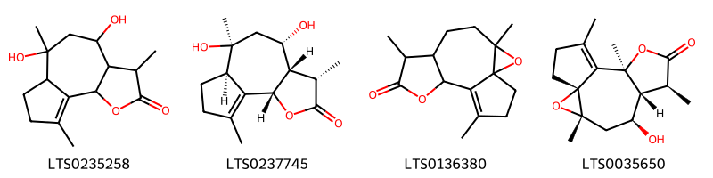{ width=100% }
    <figcaption>Hình ảnh cấu trúc hóa học của 4 hoạt chất thuộc nhóm Lactones gồm ['4,6-dihydroxy-3,6,9-trimethyl-3h,3ah,4h,5h,6ah,7h,8h,9bh-azuleno[4,5-b]furan-2-one (LTS0235258)', '(3s,3as,4s,6s,6ar,9bs)-4,6-dihydroxy-3,6,9-trimethyl-3h,3ah,4h,5h,6ah,7h,8h,9bh-azuleno[4,5-b]furan-2-one (LTS0237745)', '3,7,12-trimethyl-2,9-dioxatetracyclo[9.3.0.0¹,³.0⁶,¹⁰]tetradec-11-en-8-one (LTS0136380)', '(1r,3s,5s,6r,7s,10s)-5-hydroxy-3,7,10,12-tetramethyl-2,9-dioxatetracyclo[9.3.0.0¹,³.0⁶,¹⁰]tetradec-11-en-8-one (LTS0035650)'].</figcaption>
</figure>
#### Nhóm Prenol lipids
<figure markdown="span">
    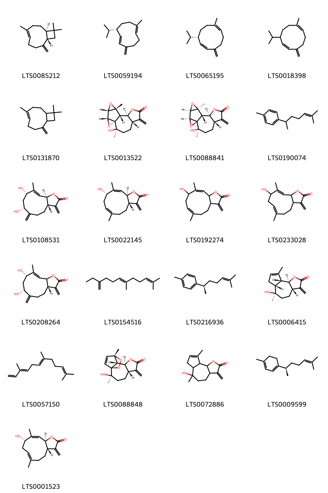{ width=100% }
    <figcaption>Hình ảnh cấu trúc hóa học của 21 hoạt chất thuộc nhóm Prenol lipids gồm ['caryophyllene (LTS0085212)', '(-)-germacrene d (LTS0059194)', '(1z,6z,8s)-8-isopropyl-1-methyl-5-methylidenecyclodeca-1,6-diene (LTS0065195)', '8-isopropyl-1-methyl-5-methylidenecyclodeca-1,6-diene (LTS0018398)', 'caryophyllene (LTS0131870)', 'artecanin (LTS0013522)', 'canin (LTS0088841)', 'curcumene (LTS0190074)', 'ridentin (LTS0108531)', '(3as,9s,11ar)-9-hydroxy-6,10-dimethyl-3-methylidene-3ah,4h,5h,8h,9h,11ah-cyclodeca[b]furan-2-one (LTS0022145)', '9-hydroxy-6,10-dimethyl-3-methylidene-3ah,4h,5h,8h,9h,11ah-cyclodeca[b]furan-2-one (LTS0192274)', '9-hydroxy-6,10-dimethyl-3-methylidene-3ah,4h,5h,8h,9h,11ah-cyclodeca[b]furan-2-one (LTS0233028)', '(3as,7r,9s)-7,9-dihydroxy-10-methyl-3,6-dimethylidene-3ah,4h,5h,7h,8h,9h,11ah-cyclodeca[b]furan-2-one (LTS0208264)', '(6e)-2,6-dimethyl-10-methylidenedodeca-2,6-diene (LTS0154516)', '(-)-α-curcumene (LTS0216936)', '(3as,6r,6ar,9ar,9bs)-6-hydroxy-6,9-dimethyl-3-methylidene-3ah,4h,5h,6ah,7h,9ah,9bh-azuleno[4,5-b]furan-2-one (LTS0006415)', 'farnesene (LTS0057150)', '(1s,2r,5s,9s,10s,11s)-2-hydroxy-2,11-dimethyl-6-methylidene-8,12,13-trioxatetracyclo[9.2.2.0¹,¹⁰.0⁵,⁹]pentadec-14-en-7-one (LTS0088848)', '6-hydroxy-6,9-dimethyl-3-methylidene-3ah,4h,5h,6ah,7h,9ah,9bh-azuleno[4,5-b]furan-2-one (LTS0072886)', 'gamma-curcumene (LTS0009599)', '(3as,9s,11ar)-9-hydroxy-6,10-dimethyl-3-methylidene-3ah,4h,5h,8h,9h,11ah-cyclodeca[b]furan-2-one (LTS0001523)'].</figcaption>
</figure>

---

### Dược dân tộc học

Danh sách các quốc gia có sử dụng *Artemisia frigida* trong điều trị các bệnh. 

| Country   | Disease   | Bệnh                                                                                                                                                                                                |
|:----------|:----------|:----------------------------------------------------------------------------------------------------------------------------------------------------------------------------------------------------|
| German    | Diuretic  | MYMEMORY WARNING: YOU USED ALL AVAILABLE FREE TRANSLATIONS FOR TODAY. NEXT AVAILABLE IN  10 HOURS 13 MINUTES 25 SECONDS VISIT HTTPS://MYMEMORY.TRANSLATED.NET/DOC/USAGELIMITS.PHP TO TRANSLATE MORE |
| US        | Sudorific | MYMEMORY WARNING: YOU USED ALL AVAILABLE FREE TRANSLATIONS FOR TODAY. NEXT AVAILABLE IN  10 HOURS 13 MINUTES 19 SECONDS VISIT HTTPS://MYMEMORY.TRANSLATED.NET/DOC/USAGELIMITS.PHP TO TRANSLATE MORE |

---

---
## Artemisia granatensis
### Thông tin về thực vật

!!! info "Phân loại thực vật của *Artemisia granatensis* từ GIBF:"
    - **Kingdom:** Plantae
    - **Phylum:** Tracheophyta
    - **Order:** Asterales
    - **Family:** Asteraceae
    - **Genus:** Artemisia
    - **Species:** *Artemisia granatensis*

 

| Label (VI)   | Label (EN)   | Scientific Name       | Descriptions (VI)   | Descriptions (EN)   | Also Known As (VI)   | Also Known As (EN)   |
|:-------------|:-------------|:----------------------|:--------------------|:--------------------|:---------------------|:---------------------|
| N/A          | N/A          | Artemisia granatensis |                     | species of plant    | ['']                 | ['']                 |

#### Phân bố trên thế giới

**Từ CSDL GIBF** nan, Germany, Spain, unknown or invalid, Sweden, France, Kazakhstan

#### Phân bố tại Việt Nam

**Từ CSDL GIBF**: Không có ghi nhận ở Việt Nam

---
### Thành phần hóa học
        
- Theo cơ sở dữ liệu lotus: Từ loài *Artemisia granatensis* đã phân lập và xác định được Chưa có hoạt chất nào được phân lập. hoạt chất thuộc về các nhóm Không có hoạt chất nào được phân lập. 

Không có hình ảnh nào được tạo ra

---

### Dược dân tộc học

Danh sách các quốc gia có sử dụng *Artemisia granatensis* trong điều trị các bệnh. 

| Country   | Disease   | Bệnh                                                                                                                                                                                                |
|:----------|:----------|:----------------------------------------------------------------------------------------------------------------------------------------------------------------------------------------------------|
| ain       | Stomachic | MYMEMORY WARNING: YOU USED ALL AVAILABLE FREE TRANSLATIONS FOR TODAY. NEXT AVAILABLE IN  10 HOURS 12 MINUTES 45 SECONDS VISIT HTTPS://MYMEMORY.TRANSLATED.NET/DOC/USAGELIMITS.PHP TO TRANSLATE MORE |

---

---
## Artemisia herbaalba
### Thông tin về thực vật

!!! info "Phân loại thực vật của *Artemisia herba-alba* từ GIBF:"
    - **Kingdom:** Plantae
    - **Phylum:** Tracheophyta
    - **Order:** Asterales
    - **Family:** Asteraceae
    - **Genus:** Artemisia
    - **Species:** *Artemisia herba-alba*

 

| Label (VI)   | Label (EN)   | Scientific Name       | Descriptions (VI)   | Descriptions (EN)   | Also Known As (VI)   | Also Known As (EN)   |
|:-------------|:-------------|:----------------------|:--------------------|:--------------------|:---------------------|:---------------------|
| N/A          | N/A          | Artemisia granatensis |                     | species of plant    | ['']                 | ['']                 |

#### Phân bố trên thế giới

**Từ CSDL GIBF** Algeria, Morocco, Spain

#### Phân bố tại Việt Nam

**Từ CSDL GIBF**: Không có ghi nhận ở Việt Nam

---
### Thành phần hóa học
        
- Theo cơ sở dữ liệu lotus: Từ loài *Artemisia herba-alba* đã phân lập và xác định được Chưa có hoạt chất nào được phân lập. hoạt chất thuộc về các nhóm Không có hoạt chất nào được phân lập. 

Không có hình ảnh nào được tạo ra

---

### Dược dân tộc học

Danh sách các quốc gia có sử dụng *Artemisia herba-alba* trong điều trị các bệnh. 

| Country   | Disease                | Bệnh                                                                                                                                                                                                |
|:----------|:-----------------------|:----------------------------------------------------------------------------------------------------------------------------------------------------------------------------------------------------|
| Africa    | Vermifuge, Emmenagogue | MYMEMORY WARNING: YOU USED ALL AVAILABLE FREE TRANSLATIONS FOR TODAY. NEXT AVAILABLE IN  10 HOURS 12 MINUTES 10 SECONDS VISIT HTTPS://MYMEMORY.TRANSLATED.NET/DOC/USAGELIMITS.PHP TO TRANSLATE MORE |
| ain       | Vermifuge              | MYMEMORY WARNING: YOU USED ALL AVAILABLE FREE TRANSLATIONS FOR TODAY. NEXT AVAILABLE IN  10 HOURS 12 MINUTES 06 SECONDS VISIT HTTPS://MYMEMORY.TRANSLATED.NET/DOC/USAGELIMITS.PHP TO TRANSLATE MORE |

---

---
## Artemisia inescens
### Thông tin về thực vật

!!! info "Phân loại thực vật của *N/A* từ GIBF:"
    - **Kingdom:** N/A
    - **Phylum:** N/A
    - **Order:** N/A
    - **Family:** N/A
    - **Genus:** N/A
    - **Species:** *N/A*

 

| Label (VI)   | Label (EN)   | Scientific Name       | Descriptions (VI)   | Descriptions (EN)   | Also Known As (VI)   | Also Known As (EN)   |
|:-------------|:-------------|:----------------------|:--------------------|:--------------------|:---------------------|:---------------------|
| N/A          | N/A          | Artemisia granatensis |                     | species of plant    | ['']                 | ['']                 |

#### Phân bố trên thế giới

**Từ CSDL GIBF** Không có kết quả phù hợp

#### Phân bố tại Việt Nam

**Từ CSDL GIBF**: Không có ghi nhận ở Việt Nam

---
### Thành phần hóa học
        
- Theo cơ sở dữ liệu lotus: Từ loài *N/A* đã phân lập và xác định được Chưa có hoạt chất nào được phân lập. hoạt chất thuộc về các nhóm Không có hoạt chất nào được phân lập. 

Không có hình ảnh nào được tạo ra

---

### Dược dân tộc học

Danh sách các quốc gia có sử dụng *N/A* trong điều trị các bệnh. 

| Country   | Disease   | Bệnh                                                                                                                                                                                                |
|:----------|:----------|:----------------------------------------------------------------------------------------------------------------------------------------------------------------------------------------------------|
| US        | Poison    | MYMEMORY WARNING: YOU USED ALL AVAILABLE FREE TRANSLATIONS FOR TODAY. NEXT AVAILABLE IN  10 HOURS 11 MINUTES 38 SECONDS VISIT HTTPS://MYMEMORY.TRANSLATED.NET/DOC/USAGELIMITS.PHP TO TRANSLATE MORE |

---

---
## Artemisia laxa
### Thông tin về thực vật

!!! info "Phân loại thực vật của *Artemisia mutellina* từ GIBF:"
    - **Kingdom:** Plantae
    - **Phylum:** Tracheophyta
    - **Order:** Asterales
    - **Family:** Asteraceae
    - **Genus:** Artemisia
    - **Species:** *Artemisia mutellina*

 

| Label (VI)   | Label (EN)   | Scientific Name   | Descriptions (VI)   | Descriptions (EN)   | Also Known As (VI)   | Also Known As (EN)   |
|:-------------|:-------------|:------------------|:--------------------|:--------------------|:---------------------|:---------------------|
| N/A          | N/A          | Artemisia laxa    | loài thực vật       | species of plant    | ['']                 | ['']                 |

#### Phân bố trên thế giới

**Từ CSDL GIBF** nan, Italy, Germany, Korea, Republic of, Spain, Hungary, Switzerland, unknown or invalid, Russian Federation, Austria, France

#### Phân bố tại Việt Nam

**Từ CSDL GIBF**: Không có ghi nhận ở Việt Nam

---
### Thành phần hóa học
        
- Theo cơ sở dữ liệu lotus: Từ loài *Artemisia mutellina* đã phân lập và xác định được Chưa có hoạt chất nào được phân lập. hoạt chất thuộc về các nhóm Không có hoạt chất nào được phân lập. 

Không có hình ảnh nào được tạo ra

---

### Dược dân tộc học

Danh sách các quốc gia có sử dụng *Artemisia mutellina* trong điều trị các bệnh. 

| Country      | Disease   | Bệnh                                                                                                                                                                                                |
|:-------------|:----------|:----------------------------------------------------------------------------------------------------------------------------------------------------------------------------------------------------|
| Europe(Alps) | Stomachic | MYMEMORY WARNING: YOU USED ALL AVAILABLE FREE TRANSLATIONS FOR TODAY. NEXT AVAILABLE IN  10 HOURS 11 MINUTES 25 SECONDS VISIT HTTPS://MYMEMORY.TRANSLATED.NET/DOC/USAGELIMITS.PHP TO TRANSLATE MORE |

---

---
## Artemisia maciverae
### Thông tin về thực vật

!!! info "Phân loại thực vật của *Artemisia macivarae* từ GIBF:"
    - **Kingdom:** Plantae
    - **Phylum:** Tracheophyta
    - **Order:** Asterales
    - **Family:** Asteraceae
    - **Genus:** Artemisia
    - **Species:** *Artemisia macivarae*

 

| Label (VI)   | Label (EN)   | Scientific Name   | Descriptions (VI)   | Descriptions (EN)   | Also Known As (VI)   | Also Known As (EN)   |
|:-------------|:-------------|:------------------|:--------------------|:--------------------|:---------------------|:---------------------|
| N/A          | N/A          | Artemisia laxa    | loài thực vật       | species of plant    | ['']                 | ['']                 |

#### Phân bố trên thế giới

**Từ CSDL GIBF** nan, Italy, Germany, Korea, Republic of, Spain, Hungary, Switzerland, unknown or invalid, Russian Federation, Austria, France

#### Phân bố tại Việt Nam

**Từ CSDL GIBF**: Không có ghi nhận ở Việt Nam

---
### Thành phần hóa học
        
- Theo cơ sở dữ liệu lotus: Từ loài *Artemisia macivarae* đã phân lập và xác định được Chưa có hoạt chất nào được phân lập. hoạt chất thuộc về các nhóm Không có hoạt chất nào được phân lập. 

Không có hình ảnh nào được tạo ra

---

### Dược dân tộc học

Danh sách các quốc gia có sử dụng *Artemisia macivarae* trong điều trị các bệnh. 

| Country   | Disease   | Bệnh                                                                                                                                                                                                |
|:----------|:----------|:----------------------------------------------------------------------------------------------------------------------------------------------------------------------------------------------------|
| Arab      | Vermifuge | MYMEMORY WARNING: YOU USED ALL AVAILABLE FREE TRANSLATIONS FOR TODAY. NEXT AVAILABLE IN  10 HOURS 10 MINUTES 58 SECONDS VISIT HTTPS://MYMEMORY.TRANSLATED.NET/DOC/USAGELIMITS.PHP TO TRANSLATE MORE |

---

---
## Artemisia maritima
### Thông tin về thực vật

!!! info "Phân loại thực vật của *Artemisia maritima* từ GIBF:"
    - **Kingdom:** Plantae
    - **Phylum:** Tracheophyta
    - **Order:** Asterales
    - **Family:** Asteraceae
    - **Genus:** Artemisia
    - **Species:** *Artemisia maritima*

 

| Label (VI)   | Label (EN)   | Scientific Name    | Descriptions (VI)   | Descriptions (EN)   | Also Known As (VI)     | Also Known As (EN)   |
|:-------------|:-------------|:-------------------|:--------------------|:--------------------|:-----------------------|:---------------------|
| N/A          | N/A          | Artemisia maritima | loài thực vật       | species of plant    | ['Artemisia maritima'] | ['Sea Wormwood']     |

#### Phân bố trên thế giới

**Từ CSDL GIBF** Denmark, South Africa, Netherlands, Germany, Sweden, France, Norway, United Kingdom of Great Britain and Northern Ireland

#### Phân bố tại Việt Nam

**Từ CSDL GIBF**: Không có ghi nhận ở Việt Nam

---
### Thành phần hóa học
        
- Theo cơ sở dữ liệu lotus: Từ loài *Artemisia maritima* đã phân lập và xác định được 41 hoạt chất thuộc về các nhóm Flavonoids, Prenol lipids, Tetrahydrofurans, Oxolanes, Naphthofurans, Organooxygen compounds, Saturated hydrocarbons. 

|    | chemicalTaxonomyClassyfireClass   |   smiles_count |
|---:|:----------------------------------|---------------:|
|  0 | Flavonoids                        |              1 |
|  1 | Naphthofurans                     |              2 |
|  2 | Organooxygen compounds            |              5 |
|  3 | Oxolanes                          |              5 |
|  4 | Prenol lipids                     |             26 |
|  5 | Saturated hydrocarbons            |              1 |
|  6 | Tetrahydrofurans                  |              1 |

#### Nhóm Flavonoids
<figure markdown="span">
    { width=100% }
    <figcaption>Hình ảnh cấu trúc hóa học của 1 hoạt chất thuộc nhóm Flavonoids gồm ['quercetin (LTS0004651)'].</figcaption>
</figure>
#### Nhóm Naphthofurans
<figure markdown="span">
    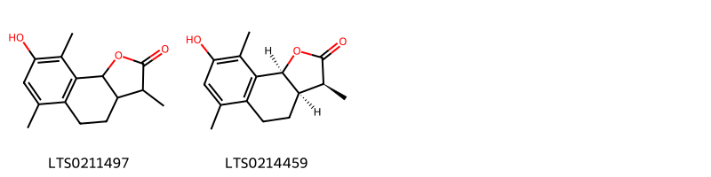{ width=100% }
    <figcaption>Hình ảnh cấu trúc hóa học của 2 hoạt chất thuộc nhóm Naphthofurans gồm ['8-hydroxy-3,6,9-trimethyl-3h,3ah,4h,5h,9bh-naphtho[1,2-b]furan-2-one (LTS0211497)', '(3s,3ar,9bs)-8-hydroxy-3,6,9-trimethyl-3h,3ah,4h,5h,9bh-naphtho[1,2-b]furan-2-one (LTS0214459)'].</figcaption>
</figure>
#### Nhóm Organooxygen compounds
<figure markdown="span">
    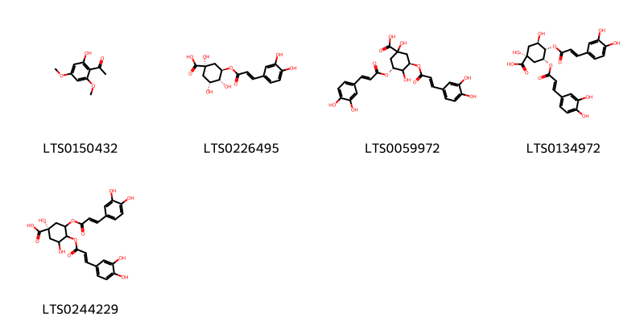{ width=100% }
    <figcaption>Hình ảnh cấu trúc hóa học của 5 hoạt chất thuộc nhóm Organooxygen compounds gồm ['xanthoxylin (LTS0150432)', 'chlorogenic acid (LTS0226495)', '(3r,5r)-3,5-bis({[(2e)-3-(3,4-dihydroxyphenyl)prop-2-enoyl]oxy})-1,4-dihydroxycyclohexane-1-carboxylic acid (LTS0059972)', '3,4-dicaffeoylquinic acid (LTS0134972)', '(1s)-3,4-bis({[3-(3,4-dihydroxyphenyl)prop-2-enoyl]oxy})-1,5-dihydroxycyclohexane-1-carboxylic acid (LTS0244229)'].</figcaption>
</figure>
#### Nhóm Oxolanes
<figure markdown="span">
    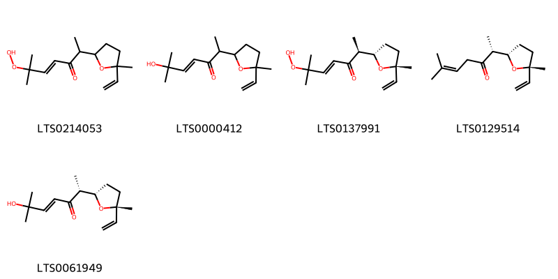{ width=100% }
    <figcaption>Hình ảnh cấu trúc hóa học của 5 hoạt chất thuộc nhóm Oxolanes gồm ['2-(5-ethenyl-5-methyloxolan-2-yl)-6-hydroperoxy-6-methylhept-4-en-3-one (LTS0214053)', '2-(5-ethenyl-5-methyloxolan-2-yl)-6-hydroxy-6-methylhept-4-en-3-one (LTS0000412)', '(2s,4e)-2-[(2s,5r)-5-ethenyl-5-methyloxolan-2-yl]-6-hydroperoxy-6-methylhept-4-en-3-one (LTS0137991)', '(2r)-2-[(2s,5r)-5-ethenyl-5-methyloxolan-2-yl]-6-methylhept-5-en-3-one (LTS0129514)', '(2r,4e)-2-[(2s,5r)-5-ethenyl-5-methyloxolan-2-yl]-6-hydroxy-6-methylhept-4-en-3-one (LTS0061949)'].</figcaption>
</figure>
#### Nhóm Prenol lipids
<figure markdown="span">
    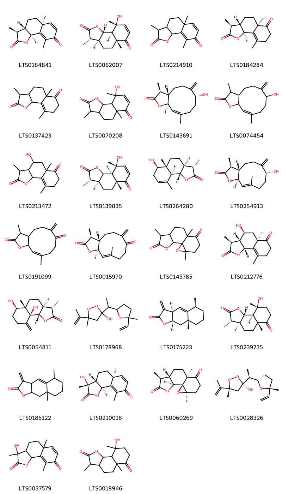{ width=100% }
    <figcaption>Hình ảnh cấu trúc hóa học của 26 hoạt chất thuộc nhóm Prenol lipids gồm ['santonin (LTS0184841)', 'vulgarin (LTS0062007)', '3,5a,9-trimethyl-3h,3ah,4h,5h,9bh-naphtho[1,2-b]furan-2,8-dione (LTS0214910)', 'gracilin (LTS0184284)', '3,5a,9-trimethyl-3h,3ah,4h,5h,7h,8h,9bh-naphtho[1,2-b]furan-2,6-dione (LTS0137423)', 'judaicin (LTS0070208)', '(3s,3as,7r,11as)-7-hydroxy-3,10-dimethyl-6-methylidene-3h,3ah,4h,5h,7h,8h,9h,11ah-cyclodeca[b]furan-2-one (LTS0143691)', '7-hydroxy-3,10-dimethyl-6-methylidene-3h,3ah,4h,5h,7h,8h,9h,11ah-cyclodeca[b]furan-2-one (LTS0074454)', '4-hydroxy-3,5a,9-trimethyl-3h,3ah,4h,5h,7h,8h,9bh-naphtho[1,2-b]furan-2,6-dione (LTS0213472)', '(3s,3as,5ar,9r,9as)-9-hydroxy-3,5a,9-trimethyl-3h,3ah,4h,5h,9ah,9bh-naphtho[1,2-b]furan-2,6-dione (LTS0139835)', '(3s,3as,5ar,6r,9as,9bs)-6-hydroxy-3,5a,9-trimethyl-3h,3ah,4h,5h,6h,7h,9ah,9bh-naphtho[1,2-b]furan-2-one (LTS0264280)', '(3s,3as,7r,11as)-7-hydroxy-3,10-dimethyl-6-methylidene-3h,3ah,4h,5h,7h,8h,9h,11ah-cyclodeca[b]furan-2-one (LTS0254913)', '3,10-dimethyl-6-methylidene-3h,3ah,4h,5h,8h,9h,11ah-cyclodeca[b]furan-2,7-dione (LTS0191099)', '(3s,3as,11as)-3,10-dimethyl-6-methylidene-3h,3ah,4h,5h,8h,9h,11ah-cyclodeca[b]furan-2,7-dione (LTS0015970)', '5,9,13-trimethyl-3,14-dioxatetracyclo[7.5.0.0¹,¹³.0²,⁶]tetradecane-4,10-dione (LTS0143785)', '(3s,3ar,4s,5ar,9br)-4-hydroxy-3,5a,9-trimethyl-3h,3ah,4h,5h,7h,8h,9bh-naphtho[1,2-b]furan-2,6-dione (LTS0212776)', '(3s,3as,5as,6r,9as,9bs)-6,9a-dihydroxy-3,5a-dimethyl-9-methylidene-octahydronaphtho[1,2-b]furan-2-one (LTS0054811)', '3-[1-(5-ethenyl-5-methyloxolan-2-yl)ethyl]-5-methyl-5-(prop-1-en-2-yl)-1,2-dioxolan-3-ol (LTS0178968)', 'alantolactone (LTS0175223)', '(3s,3as,5ar,9r,9as,9bs)-9-hydroxy-3,5a,9-trimethyl-octahydronaphtho[1,2-b]furan-2,6-dione (LTS0239735)', 'alantolactone (LTS0185122)', '(3r,3ar,5as,9bs)-3-hydroxy-3,5a,9-trimethyl-3ah,4h,5h,9bh-naphtho[1,2-b]furan-2,8-dione (LTS0210018)', '(1r,2s,5s,6s,9r,13r)-5,9,13-trimethyl-3,14-dioxatetracyclo[7.5.0.0¹,¹³.0²,⁶]tetradecane-4,10-dione (LTS0060269)', '(3r,5r)-3-[(1s)-1-[(2s,5r)-5-ethenyl-5-methyloxolan-2-yl]ethyl]-5-methyl-5-(prop-1-en-2-yl)-1,2-dioxolan-3-ol (LTS0028326)', '3-hydroxy-3,5a,9-trimethyl-3ah,4h,5h,9bh-naphtho[1,2-b]furan-2,8-dione (LTS0037579)', '9-hydroxy-3,5a,9-trimethyl-octahydronaphtho[1,2-b]furan-2,6-dione (LTS0018946)'].</figcaption>
</figure>
#### Nhóm Saturated hydrocarbons
<figure markdown="span">
    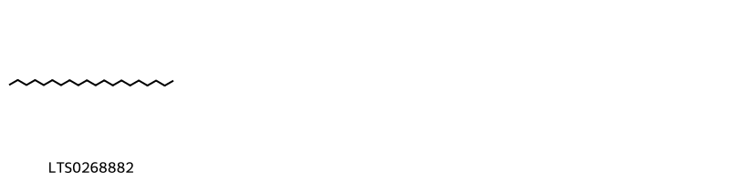{ width=100% }
    <figcaption>Hình ảnh cấu trúc hóa học của 1 hoạt chất thuộc nhóm Saturated hydrocarbons gồm ['eicosane (LTS0268882)'].</figcaption>
</figure>
#### Nhóm Tetrahydrofurans
<figure markdown="span">
    { width=100% }
    <figcaption>Hình ảnh cấu trúc hóa học của 1 hoạt chất thuộc nhóm Tetrahydrofurans gồm ['2-(5-ethenyl-5-methyloxolan-2-yl)-6-methylhept-5-en-3-one (LTS0113802)'].</figcaption>
</figure>

---

### Dược dân tộc học

Danh sách các quốc gia có sử dụng *Artemisia maritima* trong điều trị các bệnh. 

| Country   | Disease                                           | Bệnh                                                                                                                                                                                                |
|:----------|:--------------------------------------------------|:----------------------------------------------------------------------------------------------------------------------------------------------------------------------------------------------------|
| Elsewhere | Stomachic, Tonic, Vermifuge, Vermifuge, Vermifuge | MYMEMORY WARNING: YOU USED ALL AVAILABLE FREE TRANSLATIONS FOR TODAY. NEXT AVAILABLE IN  10 HOURS 10 MINUTES 36 SECONDS VISIT HTTPS://MYMEMORY.TRANSLATED.NET/DOC/USAGELIMITS.PHP TO TRANSLATE MORE |
| Turkey    | Vermifuge, Ascaricide                             | MYMEMORY WARNING: YOU USED ALL AVAILABLE FREE TRANSLATIONS FOR TODAY. NEXT AVAILABLE IN  10 HOURS 10 MINUTES 33 SECONDS VISIT HTTPS://MYMEMORY.TRANSLATED.NET/DOC/USAGELIMITS.PHP TO TRANSLATE MORE |
| ain       | Vermifuge                                         | MYMEMORY WARNING: YOU USED ALL AVAILABLE FREE TRANSLATIONS FOR TODAY. NEXT AVAILABLE IN  10 HOURS 10 MINUTES 30 SECONDS VISIT HTTPS://MYMEMORY.TRANSLATED.NET/DOC/USAGELIMITS.PHP TO TRANSLATE MORE |

---

---
## Artemisia mendozana
### Thông tin về thực vật

!!! info "Phân loại thực vật của *Artemisia mendozana* từ GIBF:"
    - **Kingdom:** Plantae
    - **Phylum:** Tracheophyta
    - **Order:** Asterales
    - **Family:** Asteraceae
    - **Genus:** Artemisia
    - **Species:** *Artemisia mendozana*

 

| Label (VI)   | Label (EN)   | Scientific Name     | Descriptions (VI)   | Descriptions (EN)   | Also Known As (VI)   | Also Known As (EN)   |
|:-------------|:-------------|:--------------------|:--------------------|:--------------------|:---------------------|:---------------------|
| N/A          | N/A          | Artemisia mendozana | loài thực vật       | species of plant    | ['']                 | ['']                 |

#### Phân bố trên thế giới

**Từ CSDL GIBF** nan, Brazil, Argentina, unknown or invalid, United States of America

#### Phân bố tại Việt Nam

**Từ CSDL GIBF**: Không có ghi nhận ở Việt Nam

---
### Thành phần hóa học
        
- Theo cơ sở dữ liệu lotus: Từ loài *Artemisia mendozana* đã phân lập và xác định được Chưa có hoạt chất nào được phân lập. hoạt chất thuộc về các nhóm Không có hoạt chất nào được phân lập. 

Không có hình ảnh nào được tạo ra

---

### Dược dân tộc học

Danh sách các quốc gia có sử dụng *Artemisia mendozana* trong điều trị các bệnh. 

| Country   | Disease                | Bệnh                                                                                                                                                                                                |
|:----------|:-----------------------|:----------------------------------------------------------------------------------------------------------------------------------------------------------------------------------------------------|
| Argentina | Stomachic, Carminative | MYMEMORY WARNING: YOU USED ALL AVAILABLE FREE TRANSLATIONS FOR TODAY. NEXT AVAILABLE IN  10 HOURS 09 MINUTES 52 SECONDS VISIT HTTPS://MYMEMORY.TRANSLATED.NET/DOC/USAGELIMITS.PHP TO TRANSLATE MORE |

---

---
## Artemisia mexicana
### Thông tin về thực vật

!!! info "Phân loại thực vật của *Artemisia mexicana* từ GIBF:"
    - **Kingdom:** Plantae
    - **Phylum:** Tracheophyta
    - **Order:** Asterales
    - **Family:** Asteraceae
    - **Genus:** Artemisia
    - **Species:** *Artemisia mexicana*

 

| Label (VI)   | Label (EN)   | Scientific Name    | Descriptions (VI)   | Descriptions (EN)   | Also Known As (VI)   | Also Known As (EN)   |
|:-------------|:-------------|:-------------------|:--------------------|:--------------------|:---------------------|:---------------------|
| N/A          | N/A          | Artemisia mexicana | loài thực vật       | species of plant    | ['']                 | ['']                 |

#### Phân bố trên thế giới

**Từ CSDL GIBF** nan, United States of America, Mexico

#### Phân bố tại Việt Nam

**Từ CSDL GIBF**: Không có ghi nhận ở Việt Nam

---
### Thành phần hóa học
        
- Theo cơ sở dữ liệu lotus: Từ loài *Artemisia mexicana* đã phân lập và xác định được 21 hoạt chất thuộc về các nhóm Prenol lipids. 

|    | chemicalTaxonomyClassyfireClass   |   smiles_count |
|---:|:----------------------------------|---------------:|
|  0 | Prenol lipids                     |             21 |

#### Nhóm Prenol lipids
<figure markdown="span">
    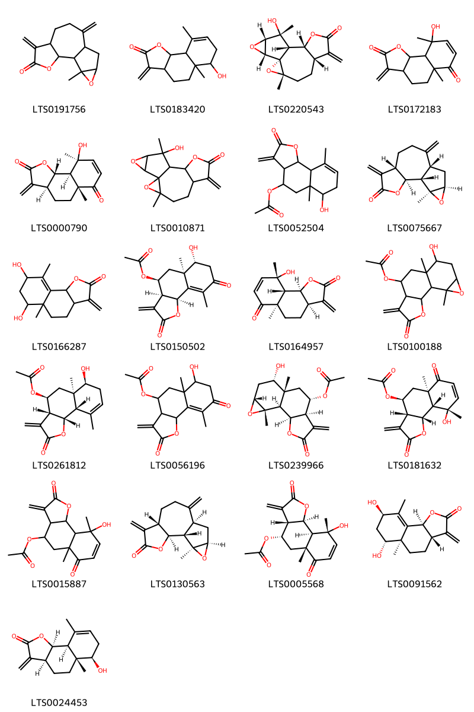{ width=100% }
    <figcaption>Hình ảnh cấu trúc hóa học của 21 hoạt chất thuộc nhóm Prenol lipids gồm ['14-methyl-5,9-dimethylidene-3,13-dioxatetracyclo[8.4.0.0²,⁶.0¹²,¹⁴]tetradecan-4-one (LTS0191756)', '6-hydroxy-5a,9-dimethyl-3-methylidene-3ah,4h,5h,6h,7h,9ah,9bh-naphtho[1,2-b]furan-2-one (LTS0183420)', '(1s,3s,6s,10r,11s,12r,13s,15r)-12-hydroxy-3,12-dimethyl-7-methylidene-2,9,14-trioxapentacyclo[9.4.0.0¹,³.0⁶,¹⁰.0¹³,¹⁵]pentadecan-8-one (LTS0220543)', '9-hydroxy-5a,9-dimethyl-3-methylidene-3ah,4h,5h,9ah,9bh-naphtho[1,2-b]furan-2,6-dione (LTS0172183)', '(3as,5ar,9s,9as,9bs)-9-hydroxy-5a,9-dimethyl-3-methylidene-3ah,4h,5h,9ah,9bh-naphtho[1,2-b]furan-2,6-dione (LTS0000790)', '12-hydroxy-3,12-dimethyl-7-methylidene-2,9,14-trioxapentacyclo[9.4.0.0¹,³.0⁶,¹⁰.0¹³,¹⁵]pentadecan-8-one (LTS0010871)', '6-hydroxy-5a,9-dimethyl-3-methylidene-2-oxo-3ah,4h,5h,6h,7h,9ah,9bh-naphtho[1,2-b]furan-4-yl acetate (LTS0052504)', '(1s,2s,6s,10r,12r,14s)-14-methyl-5,9-dimethylidene-3,13-dioxatetracyclo[8.4.0.0²,⁶.0¹²,¹⁴]tetradecan-4-one (LTS0075667)', '6,8-dihydroxy-5a,9-dimethyl-3-methylidene-3ah,4h,5h,6h,7h,8h,9bh-naphtho[1,2-b]furan-2-one (LTS0166287)', '(3as,4s,5ar,6r,9bs)-6-hydroxy-5a,9-dimethyl-3-methylidene-2,8-dioxo-3ah,4h,5h,6h,7h,9bh-naphtho[1,2-b]furan-4-yl acetate (LTS0150502)', '(3ar,5ar,9s,9as,9bs)-9-hydroxy-5a,9-dimethyl-3-methylidene-3ah,4h,5h,9ah,9bh-naphtho[1,2-b]furan-2,6-dione (LTS0164957)', '10-hydroxy-9,14-dimethyl-5-methylidene-4-oxo-3,13-dioxatetracyclo[7.5.0.0²,⁶.0¹²,¹⁴]tetradecan-7-yl acetate (LTS0100188)', '(3ar,4s,5ar,6s,9as,9bs)-6-hydroxy-5a,9-dimethyl-3-methylidene-2-oxo-3ah,4h,5h,6h,7h,9ah,9bh-naphtho[1,2-b]furan-4-yl acetate (LTS0261812)', '6-hydroxy-5a,9-dimethyl-3-methylidene-2,8-dioxo-3ah,4h,5h,6h,7h,9bh-naphtho[1,2-b]furan-4-yl acetate (LTS0056196)', '(1s,2r,6r,7s,9r,10s,12r,14s)-10-hydroxy-9,14-dimethyl-5-methylidene-4-oxo-3,13-dioxatetracyclo[7.5.0.0²,⁶.0¹²,¹⁴]tetradecan-7-yl acetate (LTS0239966)', '(3ar,4s,5ar,9s,9as,9br)-9-hydroxy-5a,9-dimethyl-3-methylidene-2,6-dioxo-3ah,4h,5h,9ah,9bh-naphtho[1,2-b]furan-4-yl acetate (LTS0181632)', '9-hydroxy-5a,9-dimethyl-3-methylidene-2,6-dioxo-3ah,4h,5h,9ah,9bh-naphtho[1,2-b]furan-4-yl acetate (LTS0015887)', '(1s,2s,6s,10s,12r,14s)-14-methyl-5,9-dimethylidene-3,13-dioxatetracyclo[8.4.0.0²,⁶.0¹²,¹⁴]tetradecan-4-one (LTS0130563)', '(3as,4s,5ar,9r,9as,9br)-9-hydroxy-5a,9-dimethyl-3-methylidene-2,6-dioxo-3ah,4h,5h,9ah,9bh-naphtho[1,2-b]furan-4-yl acetate (LTS0005568)', '(3as,5ar,6r,8r,9bs)-6,8-dihydroxy-5a,9-dimethyl-3-methylidene-3ah,4h,5h,6h,7h,8h,9bh-naphtho[1,2-b]furan-2-one (LTS0091562)', '(3as,5ar,6r,9as,9br)-6-hydroxy-5a,9-dimethyl-3-methylidene-3ah,4h,5h,6h,7h,9ah,9bh-naphtho[1,2-b]furan-2-one (LTS0024453)'].</figcaption>
</figure>

---

### Dược dân tộc học

Danh sách các quốc gia có sử dụng *Artemisia mexicana* trong điều trị các bệnh. 

| Country        | Disease                            | Bệnh                                                                                                                                                                                                |
|:---------------|:-----------------------------------|:----------------------------------------------------------------------------------------------------------------------------------------------------------------------------------------------------|
| Mexico         | Stupefacient, Vermifuge, Stomachic | MYMEMORY WARNING: YOU USED ALL AVAILABLE FREE TRANSLATIONS FOR TODAY. NEXT AVAILABLE IN  10 HOURS 09 MINUTES 25 SECONDS VISIT HTTPS://MYMEMORY.TRANSLATED.NET/DOC/USAGELIMITS.PHP TO TRANSLATE MORE |
| US(Amerindian) | Emmenagogue, Stimulant             | MYMEMORY WARNING: YOU USED ALL AVAILABLE FREE TRANSLATIONS FOR TODAY. NEXT AVAILABLE IN  10 HOURS 09 MINUTES 22 SECONDS VISIT HTTPS://MYMEMORY.TRANSLATED.NET/DOC/USAGELIMITS.PHP TO TRANSLATE MORE |

---

---
## Artemisia mutellina
### Thông tin về thực vật

!!! info "Phân loại thực vật của *Artemisia mutellina* từ GIBF:"
    - **Kingdom:** Plantae
    - **Phylum:** Tracheophyta
    - **Order:** Asterales
    - **Family:** Asteraceae
    - **Genus:** Artemisia
    - **Species:** *Artemisia mutellina*

 

| Label (VI)   | Label (EN)   | Scientific Name    | Descriptions (VI)   | Descriptions (EN)   | Also Known As (VI)   | Also Known As (EN)   |
|:-------------|:-------------|:-------------------|:--------------------|:--------------------|:---------------------|:---------------------|
| N/A          | N/A          | Artemisia mexicana | loài thực vật       | species of plant    | ['']                 | ['']                 |

#### Phân bố trên thế giới

**Từ CSDL GIBF** Italy, Germany, Switzerland, Austria, France

#### Phân bố tại Việt Nam

**Từ CSDL GIBF**: Không có ghi nhận ở Việt Nam

---
### Thành phần hóa học
        
- Theo cơ sở dữ liệu lotus: Từ loài *Artemisia mutellina* đã phân lập và xác định được 3 hoạt chất thuộc về các nhóm Flavonoids. 

|    | chemicalTaxonomyClassyfireClass   |   smiles_count |
|---:|:----------------------------------|---------------:|
|  0 | Flavonoids                        |              3 |

#### Nhóm Flavonoids
<figure markdown="span">
    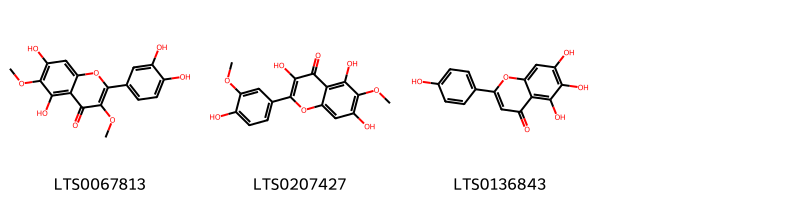{ width=100% }
    <figcaption>Hình ảnh cấu trúc hóa học của 3 hoạt chất thuộc nhóm Flavonoids gồm ['axillarin (LTS0067813)', 'spinacetin (LTS0207427)', 'scutellarein (LTS0136843)'].</figcaption>
</figure>

---

### Dược dân tộc học

Danh sách các quốc gia có sử dụng *Artemisia mutellina* trong điều trị các bệnh. 

| Country   | Disease   | Bệnh                                                                                                                                                                                                |
|:----------|:----------|:----------------------------------------------------------------------------------------------------------------------------------------------------------------------------------------------------|
| Denmark   | Sudorific | MYMEMORY WARNING: YOU USED ALL AVAILABLE FREE TRANSLATIONS FOR TODAY. NEXT AVAILABLE IN  10 HOURS 08 MINUTES 50 SECONDS VISIT HTTPS://MYMEMORY.TRANSLATED.NET/DOC/USAGELIMITS.PHP TO TRANSLATE MORE |
| French    | Stomachic | MYMEMORY WARNING: YOU USED ALL AVAILABLE FREE TRANSLATIONS FOR TODAY. NEXT AVAILABLE IN  10 HOURS 08 MINUTES 46 SECONDS VISIT HTTPS://MYMEMORY.TRANSLATED.NET/DOC/USAGELIMITS.PHP TO TRANSLATE MORE |
| Italian   | Sudorific | MYMEMORY WARNING: YOU USED ALL AVAILABLE FREE TRANSLATIONS FOR TODAY. NEXT AVAILABLE IN  10 HOURS 08 MINUTES 43 SECONDS VISIT HTTPS://MYMEMORY.TRANSLATED.NET/DOC/USAGELIMITS.PHP TO TRANSLATE MORE |

---

---
## Artemisia pontica
### Thông tin về thực vật

!!! info "Phân loại thực vật của *Artemisia pontica* từ GIBF:"
    - **Kingdom:** Plantae
    - **Phylum:** Tracheophyta
    - **Order:** Asterales
    - **Family:** Asteraceae
    - **Genus:** Artemisia
    - **Species:** *Artemisia pontica*

 

| Label (VI)   | Label (EN)   | Scientific Name   | Descriptions (VI)   | Descriptions (EN)   | Also Known As (VI)   | Also Known As (EN)                    |
|:-------------|:-------------|:------------------|:--------------------|:--------------------|:---------------------|:--------------------------------------|
| N/A          | N/A          | Artemisia pontica | loài thực vật       | species of plant    | ['']                 | ['Pontic wormwood', 'Roman wormwood'] |

#### Phân bố trên thế giới

**Từ CSDL GIBF** Ukraine, Netherlands, Czechia, Germany, Romania, Slovakia, Poland, Hungary, Switzerland, Russian Federation, United States of America, Sweden, Austria, France, Kazakhstan, Norway

#### Phân bố tại Việt Nam

**Từ CSDL GIBF**: Không có ghi nhận ở Việt Nam

---
### Thành phần hóa học
        
- Theo cơ sở dữ liệu lotus: Từ loài *Artemisia pontica* đã phân lập và xác định được 44 hoạt chất thuộc về các nhóm Flavonoids, Prenol lipids, Organooxygen compounds. 

|    | chemicalTaxonomyClassyfireClass   |   smiles_count |
|---:|:----------------------------------|---------------:|
|  0 | Flavonoids                        |              2 |
|  1 | Organooxygen compounds            |              1 |
|  2 | Prenol lipids                     |             41 |

#### Nhóm Flavonoids
<figure markdown="span">
    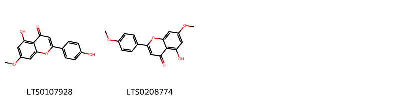{ width=100% }
    <figcaption>Hình ảnh cấu trúc hóa học của 2 hoạt chất thuộc nhóm Flavonoids gồm ['genkwanin (LTS0107928)', "apigenin 7,4'-dimethyl ether (LTS0208774)"].</figcaption>
</figure>
#### Nhóm Organooxygen compounds
<figure markdown="span">
    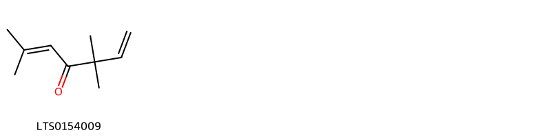{ width=100% }
    <figcaption>Hình ảnh cấu trúc hóa học của 1 hoạt chất thuộc nhóm Organooxygen compounds gồm ['isoartemisia ketone (LTS0154009)'].</figcaption>
</figure>
#### Nhóm Prenol lipids
<figure markdown="span">
    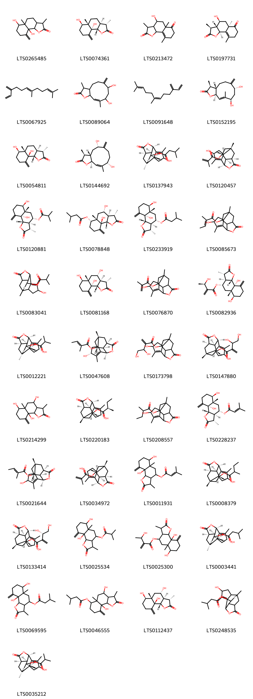{ width=100% }
    <figcaption>Hình ảnh cấu trúc hóa học của 41 hoạt chất thuộc nhóm Prenol lipids gồm ['6,9a-dihydroxy-3,5a-dimethyl-9-methylidene-octahydronaphtho[1,2-b]furan-2-one (LTS0265485)', '(3s,3as,5as,6r,9ar,9bs)-6,9a-dihydroxy-3,5a-dimethyl-9-methylidene-octahydronaphtho[1,2-b]furan-2-one (LTS0074361)', '4-hydroxy-3,5a,9-trimethyl-3h,3ah,4h,5h,7h,8h,9bh-naphtho[1,2-b]furan-2,6-dione (LTS0213472)', '(3s,3ar,4s,5ar,9bs)-4-hydroxy-3,5a,9-trimethyl-3h,3ah,4h,5h,7h,8h,9bh-naphtho[1,2-b]furan-2,6-dione (LTS0197731)', 'β-farnesene (LTS0067925)', '7,9-dihydroxy-3,10-dimethyl-6-methylidene-3h,3ah,4h,5h,7h,8h,9h,11ah-cyclodeca[b]furan-2-one (LTS0089064)', 'β-farnesene (LTS0091648)', '(3s,3as,7r,9r,11as)-7,9-dihydroxy-3,10-dimethyl-6-methylidene-3h,3ah,4h,5h,7h,8h,9h,11ah-cyclodeca[b]furan-2-one (LTS0152195)', '(3s,3as,5as,6r,9as,9bs)-6,9a-dihydroxy-3,5a-dimethyl-9-methylidene-octahydronaphtho[1,2-b]furan-2-one (LTS0054811)', '(3s,3as,5s,9s,11as)-5,9-dihydroxy-3,10-dimethyl-6-methylidene-3h,3ah,4h,5h,7h,8h,9h,11ah-cyclodeca[b]furan-2-one (LTS0144692)', '(1s,2s,7r,10r,11r,12r)-4-hydroxy-1,5-dimethyl-9-oxo-8-oxatetracyclo[8.3.1.0²,⁶.0⁷,¹¹]tetradec-5-en-12-yl 3-methylbutanoate (LTS0137943)', '(1s,2s,7r,10r,11r,12r)-4-hydroxy-1,5-dimethyl-9-oxo-8-oxatetracyclo[8.3.1.0²,⁶.0⁷,¹¹]tetradec-5-en-12-yl 2-methylprop-2-enoate (LTS0120457)', '(3s,3ar,4s,5as,6r,9ar,9bs)-6,9a-dihydroxy-3,5a-dimethyl-9-methylidene-2-oxo-octahydronaphtho[1,2-b]furan-4-yl 2-methylpropanoate (LTS0120881)', '(3s,3ar,4s,5as,6s,9as,9bs)-4,9a-dihydroxy-3,5a-dimethyl-9-methylidene-2-oxo-octahydronaphtho[1,2-b]furan-6-yl 3-methylbutanoate (LTS0078848)', '(3s,3ar,4s,5as,6r,9ar,9bs)-6,9a-dihydroxy-3,5a-dimethyl-9-methylidene-2-oxo-octahydronaphtho[1,2-b]furan-4-yl 3-methylbutanoate (LTS0233919)', '4-hydroxy-1,5-dimethyl-9-oxo-8-oxatetracyclo[8.3.1.0²,⁶.0⁷,¹¹]tetradec-5-en-12-yl 2-methylbut-2-enoate (LTS0085673)', '4-hydroxy-1,5-dimethyl-9-oxo-8-oxatetracyclo[8.3.1.0²,⁶.0⁷,¹¹]tetradec-5-en-12-yl 2-methylpropanoate (LTS0083041)', '(3s,3ar,4s,5as,6r,9ar,9bs)-4,6,9a-trihydroxy-3,5a-dimethyl-9-methylidene-octahydronaphtho[1,2-b]furan-2-one (LTS0081168)', '4-hydroxy-1,5-dimethyl-9-oxo-8-oxatetracyclo[8.3.1.0²,⁶.0⁷,¹¹]tetradec-5-en-12-yl 2-methylprop-2-enoate (LTS0076870)', '(3s,3ar,4s,5as,6r,9ar,9bs)-6,9a-dihydroxy-3,5a-dimethyl-9-methylidene-2-oxo-octahydronaphtho[1,2-b]furan-4-yl (3r)-3-hydroxy-2-methylidenebutanoate (LTS0082936)', '(1s,2s,4r,7r,10r,11r,12r)-4-hydroxy-1,5-dimethyl-9-oxo-8-oxatetracyclo[8.3.1.0²,⁶.0⁷,¹¹]tetradec-5-en-12-yl 2-methylpropanoate (LTS0012221)', '(1s,2s,4r,7r,10r,11r,12r)-4-hydroxy-1,5-dimethyl-9-oxo-8-oxatetracyclo[8.3.1.0²,⁶.0⁷,¹¹]tetradec-5-en-12-yl (2e)-2-methylbut-2-enoate (LTS0047608)', '4-hydroxy-1,5-dimethyl-9-oxo-8-oxatetracyclo[8.3.1.0²,⁶.0⁷,¹¹]tetradec-5-en-12-yl 3,4-dihydroxy-2-methylidenebutanoate (LTS0173798)', '(1s,2s,7r,10r,11r,12r)-4-hydroxy-1,5-dimethyl-9-oxo-8-oxatetracyclo[8.3.1.0²,⁶.0⁷,¹¹]tetradec-5-en-12-yl 3,4-dihydroxy-2-methylidenebutanoate (LTS0147880)', '4,6,9a-trihydroxy-3,5a-dimethyl-9-methylidene-octahydronaphtho[1,2-b]furan-2-one (LTS0214299)', '(1s,2s,4r,7r,10r,11r,12r)-4-hydroxy-1,5-dimethyl-9-oxo-8-oxatetracyclo[8.3.1.0²,⁶.0⁷,¹¹]tetradec-5-en-12-yl (2r)-2-methylbutanoate (LTS0220183)', '4-hydroxy-1,5-dimethyl-9-oxo-8-oxatetracyclo[8.3.1.0²,⁶.0⁷,¹¹]tetradec-5-en-12-yl 2-methylbutanoate (LTS0208557)', '(3s,3ar,4s,5as,6r,9ar,9bs)-6,9a-dihydroxy-3,5a-dimethyl-9-methylidene-2-oxo-octahydronaphtho[1,2-b]furan-4-yl 3-methylbut-2-enoate (LTS0228237)', '(1s,2s,7r,10r,11r,12r)-4-hydroxy-1,5-dimethyl-9-oxo-8-oxatetracyclo[8.3.1.0²,⁶.0⁷,¹¹]tetradec-5-en-12-yl (2e)-2-methylbut-2-enoate (LTS0021644)', '(1s,2s,4r,7r,10r,11r,12r)-4-hydroxy-1,5-dimethyl-9-oxo-8-oxatetracyclo[8.3.1.0²,⁶.0⁷,¹¹]tetradec-5-en-12-yl 2-methylprop-2-enoate (LTS0034972)', '6,9a-dihydroxy-3,5a-dimethyl-9-methylidene-2-oxo-octahydronaphtho[1,2-b]furan-4-yl 3-methylbut-2-enoate (LTS0011931)', '(1s,2s,7r,10r,11r,12r)-4-hydroxy-1,5-dimethyl-9-oxo-8-oxatetracyclo[8.3.1.0²,⁶.0⁷,¹¹]tetradec-5-en-12-yl 2-methylbutanoate (LTS0008379)', '(1s,2s,4r,7r,10r,11r,12r)-4-hydroxy-1,5-dimethyl-9-oxo-8-oxatetracyclo[8.3.1.0²,⁶.0⁷,¹¹]tetradec-5-en-12-yl (3s)-3,4-dihydroxy-2-methylidenebutanoate (LTS0133414)', '6,9a-dihydroxy-3,5a-dimethyl-9-methylidene-2-oxo-octahydronaphtho[1,2-b]furan-4-yl 2-methylpropanoate (LTS0025534)', '6,9a-dihydroxy-3,5a-dimethyl-9-methylidene-2-oxo-octahydronaphtho[1,2-b]furan-4-yl 3-hydroxy-2-methylidenebutanoate (LTS0025300)', '(1s,2s,4r,7r,10r,11r,12r)-4-hydroxy-1,5-dimethyl-9-oxo-8-oxatetracyclo[8.3.1.0²,⁶.0⁷,¹¹]tetradec-5-en-12-yl 3-methylbutanoate (LTS0003441)', '6,9a-dihydroxy-3,5a-dimethyl-9-methylidene-2-oxo-octahydronaphtho[1,2-b]furan-4-yl 3-methylbutanoate (LTS0069595)', '4,9a-dihydroxy-3,5a-dimethyl-9-methylidene-2-oxo-octahydronaphtho[1,2-b]furan-6-yl 3-methylbutanoate (LTS0046555)', '(3s,3ar,4s,5as,6r,9as,9bs)-4,6,9a-trihydroxy-3,5a-dimethyl-9-methylidene-octahydronaphtho[1,2-b]furan-2-one (LTS0112437)', '4-hydroxy-1,5-dimethyl-9-oxo-8-oxatetracyclo[8.3.1.0²,⁶.0⁷,¹¹]tetradec-5-en-12-yl 3-methylbutanoate (LTS0248535)', '(1s,2s,7r,10r,11r,12r)-4-hydroxy-1,5-dimethyl-9-oxo-8-oxatetracyclo[8.3.1.0²,⁶.0⁷,¹¹]tetradec-5-en-12-yl 2-methylpropanoate (LTS0035212)'].</figcaption>
</figure>

---

### Dược dân tộc học

Danh sách các quốc gia có sử dụng *Artemisia pontica* trong điều trị các bệnh. 

| Country   | Disease                                                                                                       | Bệnh                                                                                                                                                                                                |
|:----------|:--------------------------------------------------------------------------------------------------------------|:----------------------------------------------------------------------------------------------------------------------------------------------------------------------------------------------------|
| Turkey    | Abortifacient, Antiseptic, Digestive, Diuretic, Emmenagogue, Narcotic, Stomachic, Sudorific, Tonic, Vermifuge | MYMEMORY WARNING: YOU USED ALL AVAILABLE FREE TRANSLATIONS FOR TODAY. NEXT AVAILABLE IN  10 HOURS 08 MINUTES 16 SECONDS VISIT HTTPS://MYMEMORY.TRANSLATED.NET/DOC/USAGELIMITS.PHP TO TRANSLATE MORE |

---

---
## Artemisia princeps
### Thông tin về thực vật

!!! info "Phân loại thực vật của *Artemisia princeps* từ GIBF:"
    - **Kingdom:** Plantae
    - **Phylum:** Tracheophyta
    - **Order:** Asterales
    - **Family:** Asteraceae
    - **Genus:** Artemisia
    - **Species:** *Artemisia princeps*

 

| Label (VI)   | Label (EN)   | Scientific Name    | Descriptions (VI)   | Descriptions (EN)   | Also Known As (VI)   | Also Known As (EN)                    |
|:-------------|:-------------|:-------------------|:--------------------|:--------------------|:---------------------|:--------------------------------------|
| N/A          | N/A          | Artemisia princeps | loài thực vật       | species of plant    | ['']                 | ['Korean mugwort', 'Korean wormwood'] |

#### Phân bố trên thế giới

**Từ CSDL GIBF** Belgium, Korea, Republic of, Netherlands, Japan

#### Phân bố tại Việt Nam

**Từ CSDL GIBF**: Không có ghi nhận ở Việt Nam

---
### Thành phần hóa học
        
- Theo cơ sở dữ liệu lotus: Từ loài *Artemisia princeps* đã phân lập và xác định được 26 hoạt chất thuộc về các nhóm Flavonoids, Prenol lipids, Organooxygen compounds, Lactones, Coumarins and derivatives. 

|    | chemicalTaxonomyClassyfireClass   |   smiles_count |
|---:|:----------------------------------|---------------:|
|  0 | Coumarins and derivatives         |              2 |
|  1 | Flavonoids                        |              4 |
|  2 | Lactones                          |              3 |
|  3 | Organooxygen compounds            |              4 |
|  4 | Prenol lipids                     |             13 |

#### Nhóm Coumarins and derivatives
<figure markdown="span">
    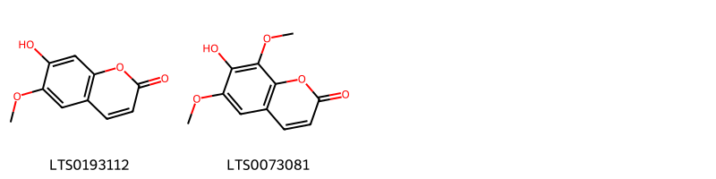{ width=100% }
    <figcaption>Hình ảnh cấu trúc hóa học của 2 hoạt chất thuộc nhóm Coumarins and derivatives gồm ['scopoletin (LTS0193112)', 'isofraxidin (LTS0073081)'].</figcaption>
</figure>
#### Nhóm Flavonoids
<figure markdown="span">
    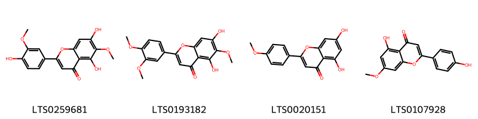{ width=100% }
    <figcaption>Hình ảnh cấu trúc hóa học của 4 hoạt chất thuộc nhóm Flavonoids gồm ['jaceosidin (LTS0259681)', 'eupatilin (LTS0193182)', 'acacetin (LTS0020151)', 'genkwanin (LTS0107928)'].</figcaption>
</figure>
#### Nhóm Lactones
<figure markdown="span">
    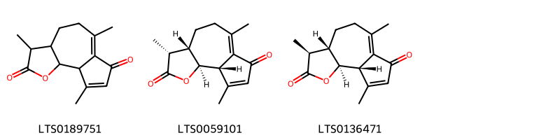{ width=100% }
    <figcaption>Hình ảnh cấu trúc hóa học của 3 hoạt chất thuộc nhóm Lactones gồm ['3,6,9-trimethyl-3h,3ah,4h,5h,9ah,9bh-azuleno[4,5-b]furan-2,7-dione (LTS0189751)', 'achillin (LTS0059101)', 'leucodin (LTS0136471)'].</figcaption>
</figure>
#### Nhóm Organooxygen compounds
<figure markdown="span">
    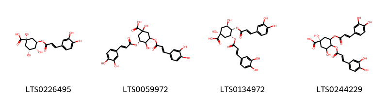{ width=100% }
    <figcaption>Hình ảnh cấu trúc hóa học của 4 hoạt chất thuộc nhóm Organooxygen compounds gồm ['chlorogenic acid (LTS0226495)', '(3r,5r)-3,5-bis({[(2e)-3-(3,4-dihydroxyphenyl)prop-2-enoyl]oxy})-1,4-dihydroxycyclohexane-1-carboxylic acid (LTS0059972)', '3,4-dicaffeoylquinic acid (LTS0134972)', '(1s)-3,4-bis({[3-(3,4-dihydroxyphenyl)prop-2-enoyl]oxy})-1,5-dihydroxycyclohexane-1-carboxylic acid (LTS0244229)'].</figcaption>
</figure>
#### Nhóm Prenol lipids
<figure markdown="span">
    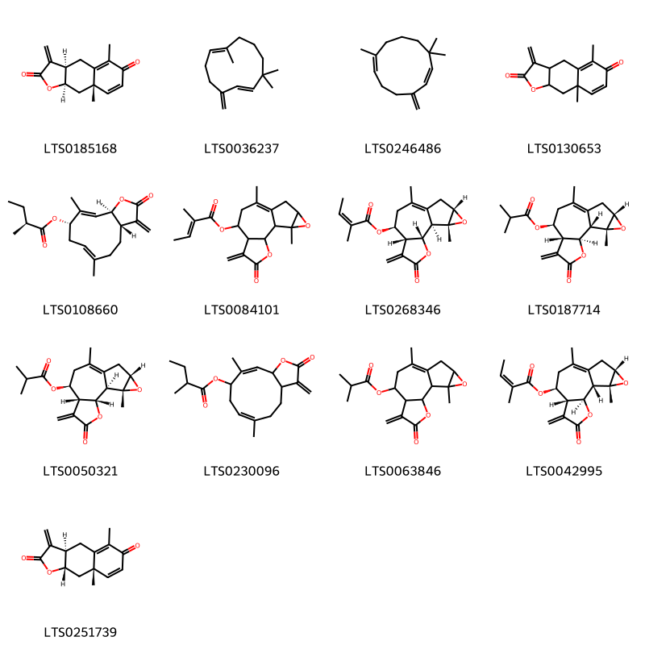{ width=100% }
    <figcaption>Hình ảnh cấu trúc hóa học của 13 hoạt chất thuộc nhóm Prenol lipids gồm ['(3ar,8as,9ar)-5,8a-dimethyl-3-methylidene-3ah,4h,9h,9ah-naphtho[2,3-b]furan-2,6-dione (LTS0185168)', '(1e,6e)-gamma-humulene (LTS0036237)', 'gamma-humulene (LTS0246486)', '5,8a-dimethyl-3-methylidene-3ah,4h,9h,9ah-naphtho[2,3-b]furan-2,6-dione (LTS0130653)', '(3as,9s,11ar)-6,10-dimethyl-3-methylidene-2-oxo-3ah,4h,5h,8h,9h,11ah-cyclodeca[b]furan-9-yl (2s)-2-methylbutanoate (LTS0108660)', '9,14-dimethyl-5-methylidene-4-oxo-3,13-dioxatetracyclo[8.4.0.0²,⁶.0¹²,¹⁴]tetradec-9-en-7-yl 2-methylbut-2-enoate (LTS0084101)', '(1r,2r,6r,7s,12s,14r)-9,14-dimethyl-5-methylidene-4-oxo-3,13-dioxatetracyclo[8.4.0.0²,⁶.0¹²,¹⁴]tetradec-9-en-7-yl (2z)-2-methylbut-2-enoate (LTS0268346)', '(1s,2s,6r,7s,12s,14r)-9,14-dimethyl-5-methylidene-4-oxo-3,13-dioxatetracyclo[8.4.0.0²,⁶.0¹²,¹⁴]tetradec-9-en-7-yl 2-methylpropanoate (LTS0187714)', '(1r,2r,6r,7s,12s,14r)-9,14-dimethyl-5-methylidene-4-oxo-3,13-dioxatetracyclo[8.4.0.0²,⁶.0¹²,¹⁴]tetradec-9-en-7-yl 2-methylpropanoate (LTS0050321)', '6,10-dimethyl-3-methylidene-2-oxo-3ah,4h,5h,8h,9h,11ah-cyclodeca[b]furan-9-yl 2-methylbutanoate (LTS0230096)', '9,14-dimethyl-5-methylidene-4-oxo-3,13-dioxatetracyclo[8.4.0.0²,⁶.0¹²,¹⁴]tetradec-9-en-7-yl 2-methylpropanoate (LTS0063846)', '(1s,2s,6r,7s,12s,14r)-9,14-dimethyl-5-methylidene-4-oxo-3,13-dioxatetracyclo[8.4.0.0²,⁶.0¹²,¹⁴]tetradec-9-en-7-yl (2z)-2-methylbut-2-enoate (LTS0042995)', '(3ar,8as,9as)-5,8a-dimethyl-3-methylidene-3ah,4h,9h,9ah-naphtho[2,3-b]furan-2,6-dione (LTS0251739)'].</figcaption>
</figure>

---

### Dược dân tộc học

Danh sách các quốc gia có sử dụng *Artemisia princeps* trong điều trị các bệnh. 

| Country   | Disease            | Bệnh                                                                                                                                                                                                |
|:----------|:-------------------|:----------------------------------------------------------------------------------------------------------------------------------------------------------------------------------------------------|
| Elsewhere | Hemostatic, Emetic | MYMEMORY WARNING: YOU USED ALL AVAILABLE FREE TRANSLATIONS FOR TODAY. NEXT AVAILABLE IN  10 HOURS 07 MINUTES 40 SECONDS VISIT HTTPS://MYMEMORY.TRANSLATED.NET/DOC/USAGELIMITS.PHP TO TRANSLATE MORE |

---

---
## Artemisia stelleriana
### Thông tin về thực vật

!!! info "Phân loại thực vật của *Artemisia stelleriana* từ GIBF:"
    - **Kingdom:** Plantae
    - **Phylum:** Tracheophyta
    - **Order:** Asterales
    - **Family:** Asteraceae
    - **Genus:** Artemisia
    - **Species:** *Artemisia stelleriana*

 

| Label (VI)   | Label (EN)   | Scientific Name       | Descriptions (VI)   | Descriptions (EN)   | Also Known As (VI)   | Also Known As (EN)   |
|:-------------|:-------------|:----------------------|:--------------------|:--------------------|:---------------------|:---------------------|
| N/A          | N/A          | Artemisia stelleriana | loài thực vật       | species of plant    | ['']                 | ['']                 |

#### Phân bố trên thế giới

**Từ CSDL GIBF** Russian Federation, United States of America, Canada

#### Phân bố tại Việt Nam

**Từ CSDL GIBF**: Không có ghi nhận ở Việt Nam

---
### Thành phần hóa học
        
- Theo cơ sở dữ liệu lotus: Từ loài *Artemisia stelleriana* đã phân lập và xác định được 2 hoạt chất thuộc về các nhóm Organooxygen compounds. 

|    | chemicalTaxonomyClassyfireClass   |   smiles_count |
|---:|:----------------------------------|---------------:|
|  0 | Organooxygen compounds            |              2 |

#### Nhóm Organooxygen compounds
<figure markdown="span">
    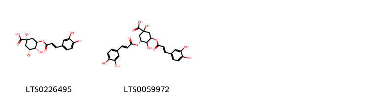{ width=100% }
    <figcaption>Hình ảnh cấu trúc hóa học của 2 hoạt chất thuộc nhóm Organooxygen compounds gồm ['chlorogenic acid (LTS0226495)', '(3r,5r)-3,5-bis({[(2e)-3-(3,4-dihydroxyphenyl)prop-2-enoyl]oxy})-1,4-dihydroxycyclohexane-1-carboxylic acid (LTS0059972)'].</figcaption>
</figure>

---

### Dược dân tộc học

Danh sách các quốc gia có sử dụng *Artemisia stelleriana* trong điều trị các bệnh. 

| Country   | Disease                         | Bệnh                                                                                                                                                                                                |
|:----------|:--------------------------------|:----------------------------------------------------------------------------------------------------------------------------------------------------------------------------------------------------|
| China     | Carminative, Nervine, Stomachic | MYMEMORY WARNING: YOU USED ALL AVAILABLE FREE TRANSLATIONS FOR TODAY. NEXT AVAILABLE IN  10 HOURS 07 MINUTES 10 SECONDS VISIT HTTPS://MYMEMORY.TRANSLATED.NET/DOC/USAGELIMITS.PHP TO TRANSLATE MORE |

---

---
## Artemisia tridentata
### Thông tin về thực vật

!!! info "Phân loại thực vật của *Artemisia tridentata* từ GIBF:"
    - **Kingdom:** Plantae
    - **Phylum:** Tracheophyta
    - **Order:** Asterales
    - **Family:** Asteraceae
    - **Genus:** Artemisia
    - **Species:** *Artemisia tridentata*

 

| Label (VI)   | Label (EN)   | Scientific Name      | Descriptions (VI)   | Descriptions (EN)   | Also Known As (VI)   | Also Known As (EN)   |
|:-------------|:-------------|:---------------------|:--------------------|:--------------------|:---------------------|:---------------------|
| N/A          | N/A          | Artemisia tridentata | loài thực vật       | species of plant    | ['']                 | ['Sagebrush']        |

#### Phân bố trên thế giới

**Từ CSDL GIBF** United States of America, Canada, Mexico

#### Phân bố tại Việt Nam

**Từ CSDL GIBF**: Không có ghi nhận ở Việt Nam

---
### Thành phần hóa học
        
- Theo cơ sở dữ liệu lotus: Từ loài *Artemisia tridentata* đã phân lập và xác định được 89 hoạt chất thuộc về các nhóm Fatty Acyls, Flavonoids, Prenol lipids, Oxanes, Pyrans, Unsaturated hydrocarbons, Lactones, Organooxygen compounds, Coumarins and derivatives, Carboxylic acids and derivatives. 

|    | chemicalTaxonomyClassyfireClass   |   smiles_count |
|---:|:----------------------------------|---------------:|
|  0 | Carboxylic acids and derivatives  |              2 |
|  1 | Coumarins and derivatives         |              6 |
|  2 | Fatty Acyls                       |              9 |
|  3 | Flavonoids                        |              8 |
|  4 | Lactones                          |              4 |
|  5 | Organooxygen compounds            |              2 |
|  6 | Oxanes                            |              1 |
|  7 | Prenol lipids                     |             51 |
|  8 | Pyrans                            |              3 |
|  9 | Unsaturated hydrocarbons          |              1 |

#### Nhóm Carboxylic acids and derivatives
<figure markdown="span">
    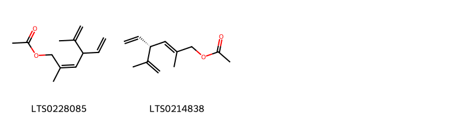{ width=100% }
    <figcaption>Hình ảnh cấu trúc hóa học của 2 hoạt chất thuộc nhóm Carboxylic acids and derivatives gồm ['4-ethenyl-2,5-dimethylhexa-2,5-dien-1-yl acetate (LTS0228085)', '(2e,4r)-4-ethenyl-2,5-dimethylhexa-2,5-dien-1-yl acetate (LTS0214838)'].</figcaption>
</figure>
#### Nhóm Coumarins and derivatives
<figure markdown="span">
    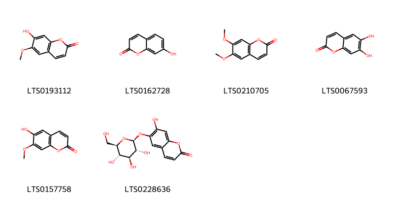{ width=100% }
    <figcaption>Hình ảnh cấu trúc hóa học của 6 hoạt chất thuộc nhóm Coumarins and derivatives gồm ['scopoletin (LTS0193112)', 'umbelliferone (LTS0162728)', 'scoparone (LTS0210705)', 'esculetin (LTS0067593)', 'isoscopoletin (LTS0157758)', 'esculin (LTS0228636)'].</figcaption>
</figure>
#### Nhóm Fatty Acyls
<figure markdown="span">
    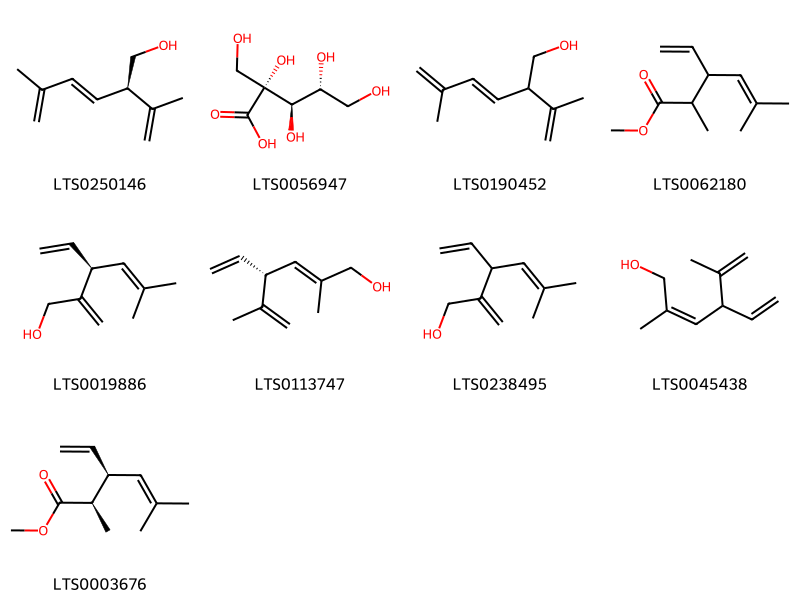{ width=100% }
    <figcaption>Hình ảnh cấu trúc hóa học của 9 hoạt chất thuộc nhóm Fatty Acyls gồm ['(2r,3e)-5-methyl-2-(prop-1-en-2-yl)hexa-3,5-dien-1-ol (LTS0250146)', '2-carboxy-d-arabinitol (LTS0056947)', '5-methyl-2-(prop-1-en-2-yl)hexa-3,5-dien-1-ol (LTS0190452)', 'methyl 3-ethenyl-2,5-dimethylhex-4-enoate (LTS0062180)', '(3s)-3-ethenyl-5-methyl-2-methylidenehex-4-en-1-ol (LTS0019886)', '(2e,4r)-4-ethenyl-2,5-dimethylhexa-2,5-dien-1-ol (LTS0113747)', '3-ethenyl-5-methyl-2-methylidenehex-4-en-1-ol (LTS0238495)', '4-ethenyl-2,5-dimethylhexa-2,5-dien-1-ol (LTS0045438)', 'methyl (2r,3s)-3-ethenyl-2,5-dimethylhex-4-enoate (LTS0003676)'].</figcaption>
</figure>
#### Nhóm Flavonoids
<figure markdown="span">
    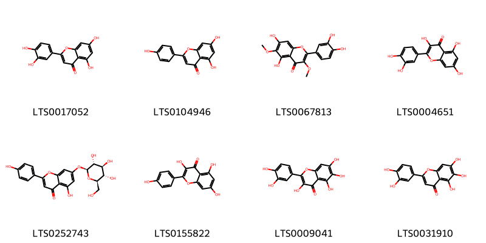{ width=100% }
    <figcaption>Hình ảnh cấu trúc hóa học của 8 hoạt chất thuộc nhóm Flavonoids gồm ['luteolin (LTS0017052)', 'chamomile (LTS0104946)', 'axillarin (LTS0067813)', 'quercetin (LTS0004651)', 'apigenin 7-o-β-glucoside (LTS0252743)', 'kaempherol (LTS0155822)', 'quercetagetin (LTS0009041)', '6-hydroxyluteolin (LTS0031910)'].</figcaption>
</figure>
#### Nhóm Lactones
<figure markdown="span">
    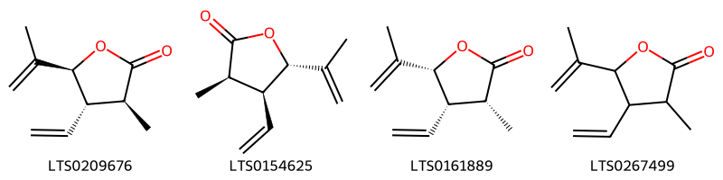{ width=100% }
    <figcaption>Hình ảnh cấu trúc hóa học của 4 hoạt chất thuộc nhóm Lactones gồm ['(3s,4s,5s)-4-ethenyl-3-methyl-5-(prop-1-en-2-yl)oxolan-2-one (LTS0209676)', '(3r,4s,5s)-4-ethenyl-3-methyl-5-(prop-1-en-2-yl)oxolan-2-one (LTS0154625)', '(3r,4s,5r)-4-ethenyl-3-methyl-5-(prop-1-en-2-yl)oxolan-2-one (LTS0161889)', '4-ethenyl-3-methyl-5-(prop-1-en-2-yl)oxolan-2-one (LTS0267499)'].</figcaption>
</figure>
#### Nhóm Organooxygen compounds
<figure markdown="span">
    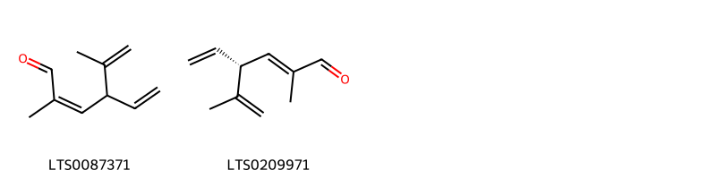{ width=100% }
    <figcaption>Hình ảnh cấu trúc hóa học của 2 hoạt chất thuộc nhóm Organooxygen compounds gồm ['4-ethenyl-2,5-dimethylhexa-2,5-dienal (LTS0087371)', '(2e,4r)-4-ethenyl-2,5-dimethylhexa-2,5-dienal (LTS0209971)'].</figcaption>
</figure>
#### Nhóm Oxanes
<figure markdown="span">
    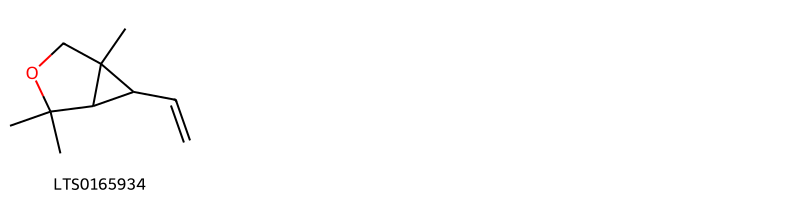{ width=100% }
    <figcaption>Hình ảnh cấu trúc hóa học của 1 hoạt chất thuộc nhóm Oxanes gồm ['6-ethenyl-1,4,4-trimethyl-3-oxabicyclo[3.1.0]hexane (LTS0165934)'].</figcaption>
</figure>
#### Nhóm Prenol lipids
<figure markdown="span">
    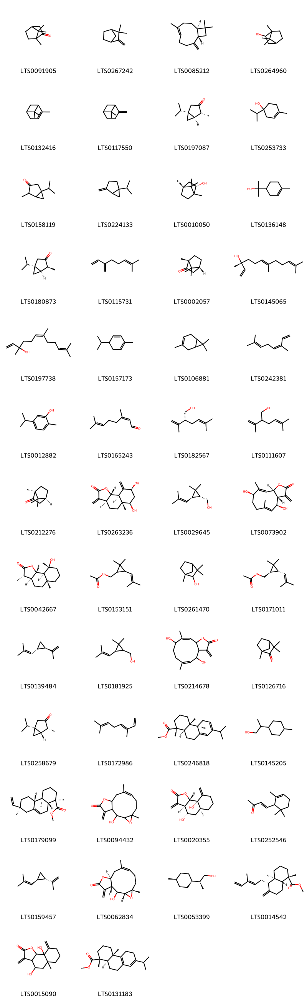{ width=100% }
    <figcaption>Hình ảnh cấu trúc hóa học của 51 hoạt chất thuộc nhóm Prenol lipids gồm ['camphor (LTS0091905)', 'camphene (LTS0267242)', 'caryophyllene (LTS0085212)', 'borneol (LTS0264960)', 'α pinene (LTS0132416)', 'β-pinene (LTS0117550)', 'thujone (LTS0197087)', '4-terpineol (LTS0253733)', '3-isothujone (LTS0158119)', 'sabinene (LTS0224133)', '(2s,4r)-1,7,7-trimethylbicyclo[2.2.1]heptan-2-ol (LTS0010050)', 'terpineol (LTS0136148)', '(+)-β-thujone (LTS0180873)', 'α-myrcene (LTS0115731)', 'd-camphor (LTS0002057)', '(3r,6e)-nerolidol (LTS0145065)', 'nerolidol (LTS0197738)', 'phellandrene (LTS0157173)', 'monoterpenes (LTS0106881)', 'β-ocimene (LTS0242381)', 'carvacrol (LTS0012882)', 'neral (LTS0165243)', '(-)-lavandulol (LTS0182567)', 'lavandulol (LTS0111607)', '(+-)-camphor (LTS0212276)', '(3as,5ar,6r,8s,9as,9bs)-6,8-dihydroxy-5a-methyl-3,9-dimethylidene-octahydronaphtho[1,2-b]furan-2-one (LTS0263236)', '[(1r,3r)-2,2-dimethyl-3-(2-methylprop-1-en-1-yl)cyclopropyl]methanol (LTS0029645)', '(3ar,4s,9r,11ar)-4,9-dihydroxy-6,10-dimethyl-3-methylidene-3ah,4h,7h,8h,9h,11ah-cyclodeca[b]furan-2-one (LTS0073902)', '(3s,3as,5ar,9r,9as,9bs)-9-hydroxy-3,5a,9-trimethyl-octahydro-3h-naphtho[1,2-b]furan-2-one (LTS0042667)', '[2,2-dimethyl-3-(2-methylprop-1-en-1-yl)cyclopropyl]methyl acetate (LTS0153151)', 'fenchol (LTS0261470)', '[(1r,3r)-2,2-dimethyl-3-(2-methylprop-1-en-1-yl)cyclopropyl]methyl acetate (LTS0171011)', '(1s,2r)-1-(2-methylprop-1-en-1-yl)-2-(prop-1-en-2-yl)cyclopropane (LTS0139484)', 'chrysanthemol (LTS0181925)', '4,9-dihydroxy-6,10-dimethyl-3-methylidene-3ah,4h,7h,8h,9h,11ah-cyclodeca[b]furan-2-one (LTS0214678)', 'fenchone (LTS0126716)', '(1r,4r,5s)-thujan-3-one (LTS0258679)', '3,7-dimethyl-1,3,6-octatriene (LTS0172986)', 'methyl levopimarate (LTS0246818)', '2-(4-methylcyclohexyl)propan-1-ol (LTS0145205)', 'methyl (1r,4ar,4bs,7s,10ar)-7-ethenyl-1,4a,7-trimethyl-3,4,4b,5,6,8,10,10a-octahydro-2h-phenanthrene-1-carboxylate (LTS0179099)', '2-hydroxy-5,9-dimethyl-14-methylidene-4,12-dioxatricyclo[9.3.0.0³,⁵]tetradec-8-en-13-one (LTS0094432)', '(3ar,4s,5as,9ar,9bs)-4,9a-dihydroxy-5a-methyl-3,9-dimethylidene-hexahydro-3ah-naphtho[1,2-b]furan-2-one (LTS0020355)', 'ionone (LTS0252546)', '(1r,2s)-1-(2-methylprop-1-en-1-yl)-2-(prop-1-en-2-yl)cyclopropane (LTS0159457)', '(1s,2s,3r,5s,8z,11s)-2-hydroxy-5,9-dimethyl-14-methylidene-4,12-dioxatricyclo[9.3.0.0³,⁵]tetradec-8-en-13-one (LTS0062834)', '(2s)-2-[(1s,4r)-4-methylcyclohexyl]propan-1-ol (LTS0053399)', 'methyl (1s,4ar,5s,8ar)-1,4a-dimethyl-6-methylidene-5-[(2e)-3-methylpenta-2,4-dien-1-yl]-hexahydro-2h-naphthalene-1-carboxylate (LTS0014542)', '4,9a-dihydroxy-5a-methyl-3,9-dimethylidene-hexahydro-3ah-naphtho[1,2-b]furan-2-one (LTS0015090)', 'methyl esterpalustric acid (LTS0131183)', '1-(2-methylprop-1-en-1-yl)-2-(prop-1-en-2-yl)cyclopropane (LTS0127021)'].</figcaption>
</figure>
#### Nhóm Pyrans
<figure markdown="span">
    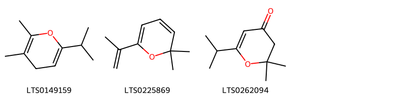{ width=100% }
    <figcaption>Hình ảnh cấu trúc hóa học của 3 hoạt chất thuộc nhóm Pyrans gồm ['6-isopropyl-2,3-dimethyl-4h-pyran (LTS0149159)', '2,2-dimethyl-6-(prop-1-en-2-yl)pyran (LTS0225869)', '6-isopropyl-2,2-dimethyl-3h-pyran-4-one (LTS0262094)'].</figcaption>
</figure>
#### Nhóm Unsaturated hydrocarbons
<figure markdown="span">
    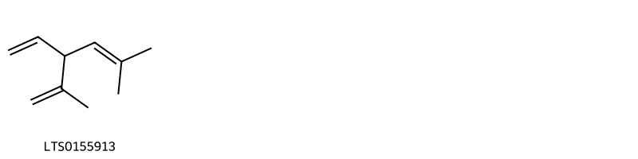{ width=100% }
    <figcaption>Hình ảnh cấu trúc hóa học của 1 hoạt chất thuộc nhóm Unsaturated hydrocarbons gồm ['santolina triene (LTS0155913)'].</figcaption>
</figure>

---

### Dược dân tộc học

Danh sách các quốc gia có sử dụng *Artemisia tridentata* trong điều trị các bệnh. 

| Country        | Disease                                              | Bệnh                                                                                                                                                                                                |
|:---------------|:-----------------------------------------------------|:----------------------------------------------------------------------------------------------------------------------------------------------------------------------------------------------------|
| US             | Antidote, Emmenagogue, Fumigant, Vermifuge, Poultice | MYMEMORY WARNING: YOU USED ALL AVAILABLE FREE TRANSLATIONS FOR TODAY. NEXT AVAILABLE IN  10 HOURS 06 MINUTES 37 SECONDS VISIT HTTPS://MYMEMORY.TRANSLATED.NET/DOC/USAGELIMITS.PHP TO TRANSLATE MORE |
| US(Amerindian) | Carminative                                          | MYMEMORY WARNING: YOU USED ALL AVAILABLE FREE TRANSLATIONS FOR TODAY. NEXT AVAILABLE IN  10 HOURS 06 MINUTES 34 SECONDS VISIT HTTPS://MYMEMORY.TRANSLATED.NET/DOC/USAGELIMITS.PHP TO TRANSLATE MORE |

---

---
## Artemisia vallesiaca
### Thông tin về thực vật

!!! info "Phân loại thực vật của *Artemisia vallesiaca* từ GIBF:"
    - **Kingdom:** Plantae
    - **Phylum:** Tracheophyta
    - **Order:** Asterales
    - **Family:** Asteraceae
    - **Genus:** Artemisia
    - **Species:** *Artemisia vallesiaca*

 

| Label (VI)   | Label (EN)   | Scientific Name      | Descriptions (VI)   | Descriptions (EN)   | Also Known As (VI)   | Also Known As (EN)   |
|:-------------|:-------------|:---------------------|:--------------------|:--------------------|:---------------------|:---------------------|
| N/A          | N/A          | Artemisia vallesiaca | loài thực vật       | species of plant    | ['']                 | ['']                 |

#### Phân bố trên thế giới

**Từ CSDL GIBF** Switzerland, Italy, Croatia

#### Phân bố tại Việt Nam

**Từ CSDL GIBF**: Không có ghi nhận ở Việt Nam

---
### Thành phần hóa học
        
- Theo cơ sở dữ liệu lotus: Từ loài *Artemisia vallesiaca* đã phân lập và xác định được 19 hoạt chất thuộc về các nhóm Lactones, Prenol lipids. 

|    | chemicalTaxonomyClassyfireClass   |   smiles_count |
|---:|:----------------------------------|---------------:|
|  0 | Lactones                          |              4 |
|  1 | Prenol lipids                     |             15 |

#### Nhóm Lactones
<figure markdown="span">
    { width=100% }
    <figcaption>Hình ảnh cấu trúc hóa học của 4 hoạt chất thuộc nhóm Lactones gồm ['(3s,3as,6s,9s,9bs)-6,9-dihydroxy-3,6,9-trimethyl-3h,3ah,4h,5h,8h,9bh-azuleno[4,5-b]furan-2,7-dione (LTS0148949)', 'matricin (LTS0168849)', '(3s,3as,6s,9r,9bs)-6,9-dihydroxy-3,6,9-trimethyl-3h,3ah,4h,5h,8h,9bh-azuleno[4,5-b]furan-2,7-dione (LTS0169132)', 'artabsin (LTS0162316)'].</figcaption>
</figure>
#### Nhóm Prenol lipids
<figure markdown="span">
    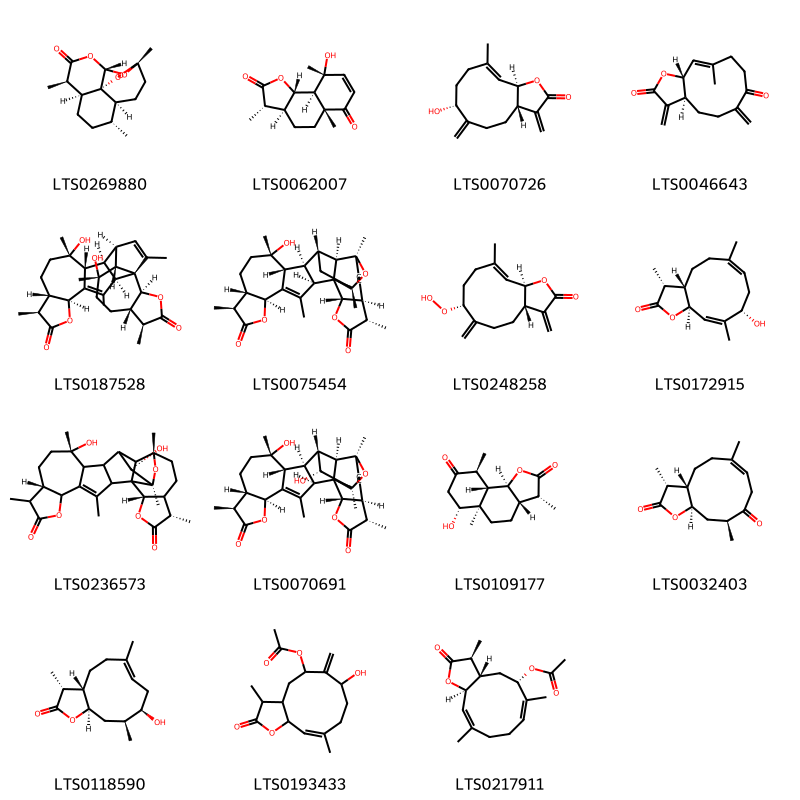{ width=100% }
    <figcaption>Hình ảnh cấu trúc hóa học của 15 hoạt chất thuộc nhóm Prenol lipids gồm ['(+)-artemisinin (LTS0269880)', 'vulgarin (LTS0062007)', 'artemorin (LTS0070726)', '(3as,11ar)-10-methyl-3,6-dimethylidene-3ah,4h,5h,8h,9h,11ah-cyclodeca[b]furan-2,7-dione (LTS0046643)', '(+)-absinthin (LTS0187528)', 'anabsinthin (LTS0075454)', 'verlotorin (LTS0248258)', '(3r,3as,9s,11as)-9-hydroxy-3,6,10-trimethyl-3h,3ah,4h,5h,8h,9h,11ah-cyclodeca[b]furan-2-one (LTS0172915)', '(9s,12s,16r,17s,19s,23s,26s)-12,16-dihydroxy-3,8,12,17,19,23-hexamethyl-6,18,25-trioxaoctacyclo[13.11.1.0¹,¹⁷.0²,¹⁴.0⁴,¹³.0⁵,⁹.0¹⁹,²⁷.0²²,²⁶]heptacos-3-ene-7,24-dione (LTS0236573)', '(1s,2r,5s,8s,9s,12s,13r,14r,15r,16r,17s,19s,22s,23s,26s,27r)-12,16-dihydroxy-3,8,12,17,19,23-hexamethyl-6,18,25-trioxaoctacyclo[13.11.1.0¹,¹⁷.0²,¹⁴.0⁴,¹³.0⁵,⁹.0¹⁹,²⁷.0²²,²⁶]heptacos-3-ene-7,24-dione (LTS0070691)', '(3r,3as,5ar,6r,9s,9as,9bs)-6-hydroxy-3,5a,9-trimethyl-octahydro-3h-naphtho[1,2-b]furan-2,8-dione (LTS0109177)', 'ketopelenolide a (LTS0032403)', '(3r,3as,9r,10s,11ar)-9-hydroxy-3,6,10-trimethyl-3h,3ah,4h,5h,8h,9h,10h,11h,11ah-cyclodeca[b]furan-2-one (LTS0118590)', '7-hydroxy-3,10-dimethyl-6-methylidene-2-oxo-3h,3ah,4h,5h,7h,8h,9h,11ah-cyclodeca[b]furan-5-yl acetate (LTS0193433)', '(3s,3as,5s,11as)-3,6,10-trimethyl-2-oxo-3h,3ah,4h,5h,8h,9h,11ah-cyclodeca[b]furan-5-yl acetate (LTS0217911)'].</figcaption>
</figure>

---

### Dược dân tộc học

Danh sách các quốc gia có sử dụng *Artemisia vallesiaca* trong điều trị các bệnh. 

| Country   | Disease   | Bệnh                                                                                                                                                                                                |
|:----------|:----------|:----------------------------------------------------------------------------------------------------------------------------------------------------------------------------------------------------|
| French    | Sudorific | MYMEMORY WARNING: YOU USED ALL AVAILABLE FREE TRANSLATIONS FOR TODAY. NEXT AVAILABLE IN  10 HOURS 05 MINUTES 55 SECONDS VISIT HTTPS://MYMEMORY.TRANSLATED.NET/DOC/USAGELIMITS.PHP TO TRANSLATE MORE |

---

---
## Artemisia vulgaris
### Thông tin về thực vật

!!! info "Phân loại thực vật của *Artemisia vulgaris* từ GIBF:"
    - **Kingdom:** Plantae
    - **Phylum:** Tracheophyta
    - **Order:** Asterales
    - **Family:** Asteraceae
    - **Genus:** Artemisia
    - **Species:** *Artemisia vulgaris*

 

| Label (VI)   | Label (EN)   | Scientific Name    | Descriptions (VI)   | Descriptions (EN)   | Also Known As (VI)                                                                   | Also Known As (EN)             |
|:-------------|:-------------|:-------------------|:--------------------|:--------------------|:-------------------------------------------------------------------------------------|:-------------------------------|
| N/A          | N/A          | Artemisia vulgaris | loài thực vật       | species of plant    | ['Thuốc cứu', 'Quá sú', 'Nhả ngải', 'Ngải diệp', 'Co linh li', 'Artemisia vulgaris'] | ['mugwort', 'common wormwood'] |

#### Phân bố trên thế giới

**Từ CSDL GIBF** Ukraine, Finland, Denmark, Netherlands, Germany, Spain, Poland, Switzerland, Russian Federation, United States of America, Austria, France, United Kingdom of Great Britain and Northern Ireland, Canada

#### Phân bố tại Việt Nam

**Từ CSDL GIBF**: Không có ghi nhận ở Việt Nam

---
### Thành phần hóa học
        
- Theo cơ sở dữ liệu lotus: Từ loài *Artemisia vulgaris* đã phân lập và xác định được 199 hoạt chất thuộc về các nhóm Fatty Acyls, Flavonoids, Prenol lipids, Steroids and steroid derivatives, Pyrans, Unsaturated hydrocarbons, Organooxygen compounds, Lactones, Phenols, Coumarins and derivatives, Epoxides, Carboxylic acids and derivatives. 

|    | chemicalTaxonomyClassyfireClass   |   smiles_count |
|---:|:----------------------------------|---------------:|
|  0 | Carboxylic acids and derivatives  |             12 |
|  1 | Coumarins and derivatives         |              7 |
|  2 | Epoxides                          |              2 |
|  3 | Fatty Acyls                       |             17 |
|  4 | Flavonoids                        |             30 |
|  5 | Lactones                          |              4 |
|  6 | Organooxygen compounds            |             10 |
|  7 | Phenols                           |              1 |
|  8 | Prenol lipids                     |            104 |
|  9 | Pyrans                            |              2 |
| 10 | Steroids and steroid derivatives  |              2 |
| 11 | Unsaturated hydrocarbons          |              8 |

#### Nhóm Carboxylic acids and derivatives
<figure markdown="span">
    { width=100% }
    <figcaption>Hình ảnh cấu trúc hóa học của 12 hoạt chất thuộc nhóm Carboxylic acids and derivatives gồm ['4-ethenyl-2,5-dimethylhexa-2,5-dien-1-yl acetate (LTS0228085)', '(3s)-3-ethenyl-5-methyl-2-methylidenehex-4-en-1-yl acetate (LTS0134381)', '3-ethenyl-2,5-dimethylhex-4-en-2-yl acetate (LTS0131708)', '(3s,4r)-3-ethenyl-4-hydroxy-2,5-dimethylhex-5-en-2-yl acetate (LTS0133619)', '(2e,4s)-4-ethenyl-2,5-dimethylhexa-2,5-dien-1-yl propanoate (LTS0030623)', '3,3,6-trimethylhepta-1,5-dien-4-yl propanoate (LTS0046094)', '4-ethenyl-2,5-dimethylhexa-2,5-dien-1-yl propanoate (LTS0152905)', '3-ethenyl-5-methyl-2-methylidenehex-4-en-1-yl acetate (LTS0167382)', '3-ethenyl-4-hydroxy-2,5-dimethylhex-5-en-2-yl acetate (LTS0163091)', '(3s)-3-ethenyl-2,5-dimethylhex-4-en-2-yl acetate (LTS0264379)', '(4s)-3,3,6-trimethylhepta-1,5-dien-4-yl propanoate (LTS0111925)', '(2z,4r)-4-ethenyl-2,5-dimethylhexa-2,5-dien-1-yl acetate (LTS0047961)'].</figcaption>
</figure>
#### Nhóm Coumarins and derivatives
<figure markdown="span">
    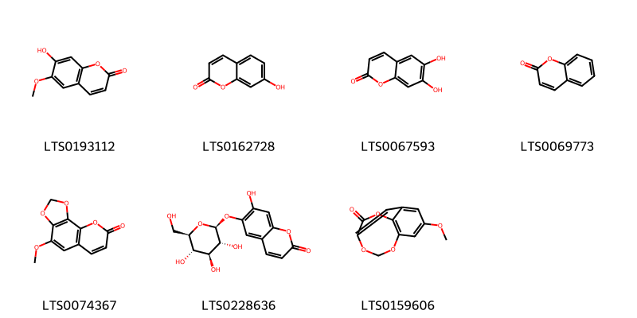{ width=100% }
    <figcaption>Hình ảnh cấu trúc hóa học của 7 hoạt chất thuộc nhóm Coumarins and derivatives gồm ['scopoletin (LTS0193112)', 'umbelliferone (LTS0162728)', 'esculetin (LTS0067593)', '2h-1-benzopyran-2-one (LTS0069773)', '4-methoxy-2h-[1,3]dioxolo[4,5-h]chromen-8-one (LTS0074367)', 'esculin (LTS0228636)', '7-methoxy-2,4,11-trioxatricyclo[7.3.1.0⁵,¹⁰]trideca-1(13),5(10),6,8-tetraen-12-one (LTS0159606)'].</figcaption>
</figure>
#### Nhóm Epoxides
<figure markdown="span">
    { width=100% }
    <figcaption>Hình ảnh cấu trúc hóa học của 2 hoạt chất thuộc nhóm Epoxides gồm ['(3z,7e)-1,5,5,8-tetramethyl-12-oxabicyclo[9.1.0]dodeca-3,7-diene (LTS0107049)', '(1r,11s)-1,5,5,8-tetramethyl-12-oxabicyclo[9.1.0]dodeca-3,7-diene (LTS0195579)'].</figcaption>
</figure>
#### Nhóm Fatty Acyls
<figure markdown="span">
    { width=100% }
    <figcaption>Hình ảnh cấu trúc hóa học của 17 hoạt chất thuộc nhóm Fatty Acyls gồm ['methyl dec-2-en-4,6,8-triynoate (LTS0221613)', 'dehydromatricaria ester (LTS0176578)', 'dehydromatricaria ester (LTS0199637)', '(4e,6e)-tetradeca-4,6-dien-8,10,12-triyn-1-yl acetate (LTS0260610)', 'tetradeca-4,6-dien-8,10,12-triyn-1-yl acetate (LTS0034687)', 'palmitic acid (LTS0079439)', '(3s,6e)-tetradec-6-en-8,10,12-triyn-3-ol (LTS0078416)', 'tetradeca-4,6-dien-8,10,12-triyn-1-ol (LTS0196851)', 'heptadeca-1,7,9-trien-11,13,15-triyn-6-ol (LTS0177490)', 'heptadeca-1,9-dien-11,13,15-triyn-8-ol (LTS0067361)', '(8r,9e)-heptadeca-1,9-dien-11,13,15-triyn-8-ol (LTS0210717)', '(6r,7e,9e)-heptadeca-1,7,9-trien-11,13,15-triyn-6-ol (LTS0098850)', '(4e,6e)-tetradeca-4,6-dien-8,10,12-triyn-1-ol (LTS0108867)', 'tetradec-6-en-8,10,12-triyn-3-ol (LTS0034278)', 'stearyl alcohol (LTS0222463)', '3-oxotetradec-6-en-8,10,12-triyn-1-yl 3-methylbutanoate (LTS0135860)', '(6e)-3-oxotetradec-6-en-8,10,12-triyn-1-yl 3-methylbutanoate (LTS0047886)'].</figcaption>
</figure>
#### Nhóm Flavonoids
<figure markdown="span">
    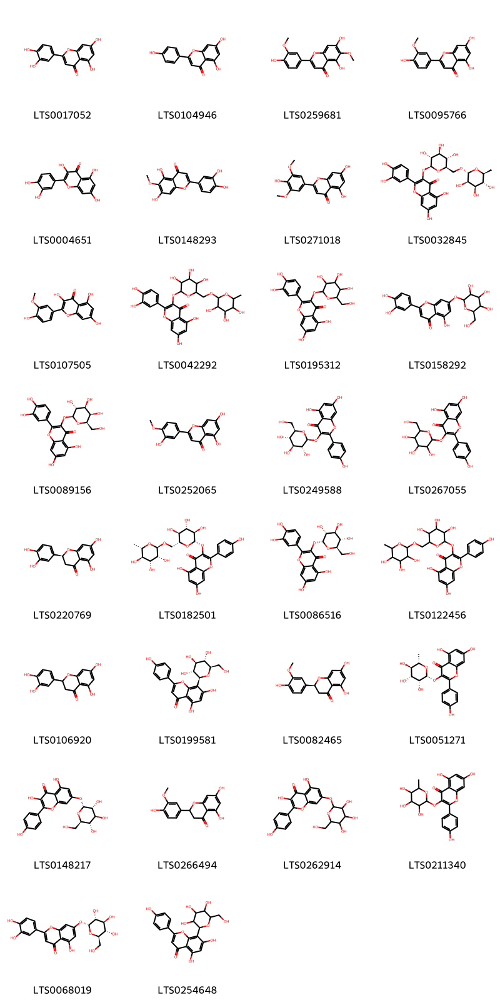{ width=100% }
    <figcaption>Hình ảnh cấu trúc hóa học của 30 hoạt chất thuộc nhóm Flavonoids gồm ['luteolin (LTS0017052)', 'chamomile (LTS0104946)', 'jaceosidin (LTS0259681)', 'chrysoeriol (LTS0095766)', 'quercetin (LTS0004651)', 'nepetin (LTS0148293)', 'tricin (LTS0271018)', '3-rutinosyl quercetin (LTS0032845)', 'isorhamnetin (LTS0107505)', 'rutin (LTS0042292)', '2-(3,4-dihydroxyphenyl)-5,7-dihydroxy-3-{[3,4,5-trihydroxy-6-(hydroxymethyl)oxan-2-yl]oxy}chromen-4-one (LTS0195312)', '2-(3,4-dihydroxyphenyl)-5-hydroxy-7-{[3,4,5-trihydroxy-6-(hydroxymethyl)oxan-2-yl]oxy}chromen-4-one (LTS0158292)', 'hyperoside (LTS0089156)', 'diosmetin (LTS0252065)', 'astragalin (LTS0249588)', 'trifolin (LTS0267055)', 'eriodictyol (LTS0220769)', 'nictoflorin (LTS0182501)', '2-(3,4-dihydroxyphenyl)-5,7-dihydroxy-3-{[(2r,3r,4s,5s,6r)-3,4,5-trihydroxy-6-(hydroxymethyl)oxan-2-yl]oxy}chromen-4-one (LTS0086516)', '5,7-dihydroxy-2-(4-hydroxyphenyl)-3-[(3,4,5-trihydroxy-6-{[(3,4,5-trihydroxy-6-methyloxan-2-yl)oxy]methyl}oxan-2-yl)oxy]chromen-4-one (LTS0122456)', '(+/-)-eriodictyol (LTS0106920)', 'vitexin (LTS0199581)', 'homoeriodictyol (LTS0082465)', '5,7-dihydroxy-2-(4-hydroxyphenyl)-3-{[(2r,3r,4r,5r,6s)-3,4,5-trihydroxy-6-methyloxan-2-yl]oxy}chromen-4-one (LTS0051271)', '3,5-dihydroxy-2-(4-hydroxyphenyl)-7-{[(2r,3r,4s,5s,6r)-3,4,5-trihydroxy-6-(hydroxymethyl)oxan-2-yl]oxy}chromen-4-one (LTS0148217)', 'homoeriodictyol (+/-)- (LTS0266494)', '3,5-dihydroxy-2-(4-hydroxyphenyl)-7-{[3,4,5-trihydroxy-6-(hydroxymethyl)oxan-2-yl]oxy}chromen-4-one (LTS0262914)', '5,7-dihydroxy-2-(4-hydroxyphenyl)-3-[(3,4,5-trihydroxy-6-methyloxan-2-yl)oxy]chromen-4-one (LTS0211340)', '2-(3,4-dihydroxyphenyl)-5-hydroxy-7-{[(2r,3r,4s,5s,6r)-3,4,5-trihydroxy-6-(hydroxymethyl)oxan-2-yl]oxy}chromen-4-one (LTS0068019)', 'vitexin (LTS0254648)'].</figcaption>
</figure>
#### Nhóm Lactones
<figure markdown="span">
    { width=100% }
    <figcaption>Hình ảnh cấu trúc hóa học của 4 hoạt chất thuộc nhóm Lactones gồm ['(3s,3as,6s,9s,9bs)-6,9-dihydroxy-3,6,9-trimethyl-3h,3ah,4h,5h,8h,9bh-azuleno[4,5-b]furan-2,7-dione (LTS0148949)', 'matricin (LTS0168849)', '(3s,3as,6s,9r,9bs)-6,9-dihydroxy-3,6,9-trimethyl-3h,3ah,4h,5h,8h,9bh-azuleno[4,5-b]furan-2,7-dione (LTS0169132)', 'artabsin (LTS0162316)'].</figcaption>
</figure>
#### Nhóm Organooxygen compounds
<figure markdown="span">
    { width=100% }
    <figcaption>Hình ảnh cấu trúc hóa học của 10 hoạt chất thuộc nhóm Organooxygen compounds gồm ['isoartemisia ketone (LTS0154009)', '(6e)-tetradec-6-en-8,10,12-triyn-3-one (LTS0114987)', 'tetradec-6-en-8,10,12-triyn-3-one (LTS0109746)', '2-heptadecanone (LTS0236296)', 'prunasin (LTS0130138)', '1-(3,3-dimethyloxiran-2-yl)-2,2-dimethylbut-3-en-1-one (LTS0154579)', '(3r)-3-ethenyl-2,5-dimethyl-4-oxohex-5-en-2-yl acetate (LTS0110645)', '3-ethenyl-2,5-dimethyl-4-oxohex-5-en-2-yl acetate (LTS0080163)', '3-nonanone (LTS0066371)', '1-[(2s)-3,3-dimethyloxiran-2-yl]-2,2-dimethylbut-3-en-1-one (LTS0041545)'].</figcaption>
</figure>
#### Nhóm Phenols
<figure markdown="span">
    { width=100% }
    <figcaption>Hình ảnh cấu trúc hóa học của 1 hoạt chất thuộc nhóm Phenols gồm ['eugenol (LTS0052342)'].</figcaption>
</figure>
#### Nhóm Prenol lipids
<figure markdown="span">
    { width=100% }
    <figcaption>Hình ảnh cấu trúc hóa học của 104 hoạt chất thuộc nhóm Prenol lipids gồm ['camphor (LTS0091905)', 'camphene (LTS0267242)', 'caryophyllene (LTS0085212)', 'cymene (LTS0181568)', 'borneol (LTS0264960)', 'α pinene (LTS0132416)', 'β-pinene (LTS0117550)', 'thujone (LTS0197087)', '4-terpineol (LTS0253733)', '3-isothujone (LTS0158119)', 'limonene,  (LTS0155981)', 'sabinene (LTS0224133)', '(2s,4r)-1,7,7-trimethylbicyclo[2.2.1]heptan-2-ol (LTS0010050)', '(+)-artemisinin (LTS0269880)', 'terpineol (LTS0136148)', 'vulgarin (LTS0062007)', 'linalool, (+-)- (LTS0128839)', '(+)-β-thujone (LTS0180873)', 'α-myrcene (LTS0115731)', 'artemorin (LTS0070726)', 'bornyl acetate (LTS0060565)', '(7ar)-1,1,7-trimethyl-4-methylidene-octahydrocyclopropa[e]azulen-7-ol (LTS0091612)', '(3as,11ar)-10-methyl-3,6-dimethylidene-3ah,4h,5h,8h,9h,11ah-cyclodeca[b]furan-2,7-dione (LTS0046643)', 'd-camphor (LTS0002057)', 'caryophyllene oxide (LTS0159789)', '(+)-absinthin (LTS0187528)', 'terpinene (LTS0136858)', 'anabsinthin (LTS0075454)', 'humulene (LTS0263171)', 'verlotorin (LTS0248258)', 'β-caryophyllene oxide (LTS0213960)', '(3r,3as,9s,11as)-9-hydroxy-3,6,10-trimethyl-3h,3ah,4h,5h,8h,9h,11ah-cyclodeca[b]furan-2-one (LTS0172915)', '(9s,12s,16r,17s,19s,23s,26s)-12,16-dihydroxy-3,8,12,17,19,23-hexamethyl-6,18,25-trioxaoctacyclo[13.11.1.0¹,¹⁷.0²,¹⁴.0⁴,¹³.0⁵,⁹.0¹⁹,²⁷.0²²,²⁶]heptacos-3-ene-7,24-dione (LTS0236573)', 'caryophyllene (LTS0131870)', 'α-copaene (LTS0207598)', '4,11,11-trimethyl-8-methylidenebicyclo[7.2.0]undec-4-ene (LTS0256716)', '(1s,2r,5s,8s,9s,12s,13r,14r,15r,16r,17s,19s,22s,23s,26s,27r)-12,16-dihydroxy-3,8,12,17,19,23-hexamethyl-6,18,25-trioxaoctacyclo[13.11.1.0¹,¹⁷.0²,¹⁴.0⁴,¹³.0⁵,⁹.0¹⁹,²⁷.0²²,²⁶]heptacos-3-ene-7,24-dione (LTS0070691)', 'phytol (LTS0096073)', '(3r,3as,5ar,6r,9s,9as,9bs)-6-hydroxy-3,5a,9-trimethyl-octahydro-3h-naphtho[1,2-b]furan-2,8-dione (LTS0109177)', 'spathulenol (LTS0235578)', 'ketopelenolide a (LTS0032403)', '(3r,3as,9r,10s,11ar)-9-hydroxy-3,6,10-trimethyl-3h,3ah,4h,5h,8h,9h,10h,11h,11ah-cyclodeca[b]furan-2-one (LTS0118590)', 'α-humulene (LTS0076944)', 'phellandrene (LTS0157173)', 'α-thujene (LTS0185078)', '(1r,2s,7s,8s)-8-isopropyl-1,3-dimethyltricyclo[4.4.0.0²,⁷]dec-3-ene (LTS0190031)', '(2e,6e)-3,7,11,11-tetramethylbicyclo[8.1.0]undeca-2,6-diene (LTS0225278)', 'monoterpenes (LTS0106881)', 'α-thujene (LTS0176954)', 'phytol (LTS0031808)', '(+)-borneol (LTS0059936)', '(1s,2e,10r)-3,7,11,11-tetramethylbicyclo[8.1.0]undeca-2,6-diene (LTS0032090)', '(+)-4-terpineol (LTS0140257)', '(-)-β-cubebene (LTS0123697)', '(+)-borneol (LTS0189059)', 'geraniol (LTS0258838)', '4-isopropyl-6-methyl-1-methylidene-3,4,4a,7,8,8a-hexahydro-2h-naphthalene (LTS0111070)', '(1s,2s)-1-ethenyl-1-methyl-2-(prop-1-en-2-yl)-4-(propan-2-ylidene)cyclohexane (LTS0135613)', '(5s)-1-isopropyl-4-methylidenebicyclo[3.1.0]hexane (LTS0129854)', 'β-elemene (LTS0225699)', 'β-farnesene (LTS0067925)', '(+)-α-pinene (LTS0211102)', 'gamma-muurolene (LTS0052920)', '(1s,2s,4ar,5r,8as)-2-isopropyl-4a-methyl-8-methylidene-octahydronaphthalene-1,5-diol (LTS0071183)', '2-isopropyl-4a-methyl-8-methylidene-octahydronaphthalene-1,5-diol (LTS0190508)', '(1ar,4ar,7s,7as,7br)-1,1,7-trimethyl-4-methylidene-octahydrocyclopropa[e]azulen-7-ol (LTS0243368)', '(-)-β-pinene (LTS0108757)', '(+-)-camphor (LTS0212276)', 'β-farnesene (LTS0091648)', '(-)-camphene (LTS0067556)', '(-)-trans-carveol (LTS0156471)', 'lily of valley (LTS0051762)', 'squalene (LTS0217821)', '4-ethenyl-1-isopropyl-4-methyl-3-(prop-1-en-2-yl)cyclohex-1-ene (LTS0080134)', '(+)-sabinene (LTS0110694)', 'α-cadinol (LTS0206935)', 'elemene (LTS0090837)', '(+)-delta(3)-carene (LTS0250199)', '(+)-gamma-cadinene (LTS0103949)', 'α-limonene (LTS0244943)', '2,2,3-trimethylbicyclo[2.2.1]heptane (LTS0134167)', '(3s,6ar,8ar,12s,14br)-4,4,6a,6b,8a,11,12,14b-octamethyl-2,3,4a,5,6,7,8,9,10,11,12,12a,14,14a-tetradecahydro-1h-picen-3-yl acetate (LTS0206994)', '(-)-α-gurjunene (LTS0194913)', '2-(4a,8-dimethyl-7-oxo-1,2,3,4-tetrahydronaphthalen-2-yl)prop-2-enoic acid (LTS0095236)', '2-[(2r,4ar,5s,8as)-5-hydroxy-4a-methyl-8-methylidene-1,2,3,4,5,8a-hexahydronaphthalen-2-yl]prop-2-enoic acid (LTS0216388)', '(3s,4as,6ar,6br,8ar,11r,12s,12ar,12br,14ar,14bs)-4,4,6a,6b,8a,11,12,14b-octamethyl-2,3,4a,5,6,7,8,9,10,11,12,12a,12b,14a-tetradecahydro-1h-picen-3-ol (LTS0017325)', '2-(5-hydroxy-4a-methyl-8-methylidene-1,2,3,4,5,8a-hexahydronaphthalen-2-yl)prop-2-enoic acid (LTS0028536)', '(+)-camphene (LTS0109845)', '(1r,4as,8as)-4-isopropyl-1,6-dimethyl-1,2,4a,5,8,8a-hexahydronaphthalene (LTS0107137)', '(1s,2r,3s,4r)-3-hydroxy-1,7,7-trimethylbicyclo[2.2.1]heptan-2-yl acetate (LTS0166065)', '(+)-thujone (LTS0165508)', '(-)-bornyl acetate (LTS0267397)', '(1s,3s,4r)-2,2,3-trimethylbicyclo[2.2.1]heptane (LTS0070372)', 'fernenol (LTS0072493)', 'sabinene hydrate (LTS0215494)', 'delta-cadinol (LTS0008282)', '2-[(2r,4as)-4a,8-dimethyl-7-oxo-1,2,3,4-tetrahydronaphthalen-2-yl]prop-2-enoic acid (LTS0064483)', '(+)-caryophyllene (LTS0046179)', 'delta-cadinol (LTS0013807)', '(1r,2s,6s,7s,8r)-8-isopropyl-1,3-dimethyltricyclo[4.4.0.0²,⁷]dec-3-ene (LTS0106607)', 'α-amyrin acetate (LTS0224810)', 'sabinene hydrate (LTS0236165)', '3-isopropyl-3a,5a,8,8,11a,13a-hexamethyl-1h,2h,3h,4h,5h,5bh,6h,7h,7ah,9h,10h,11h,13h,13bh-cyclopenta[a]chrysen-9-ol (LTS0119990)', '4-isopropyl-1,6-dimethyl-1,2,4a,5,8,8a-hexahydronaphthalene (LTS0036509)'].</figcaption>
</figure>
#### Nhóm Pyrans
<figure markdown="span">
    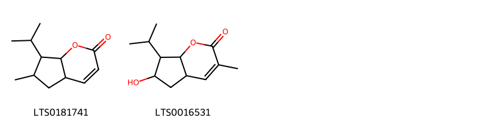{ width=100% }
    <figcaption>Hình ảnh cấu trúc hóa học của 2 hoạt chất thuộc nhóm Pyrans gồm ['7-isopropyl-6-methyl-4ah,5h,6h,7h,7ah-cyclopenta[b]pyran-2-one (LTS0181741)', '6-hydroxy-7-isopropyl-3-methyl-4ah,5h,6h,7h,7ah-cyclopenta[b]pyran-2-one (LTS0016531)'].</figcaption>
</figure>
#### Nhóm Steroids and steroid derivatives
<figure markdown="span">
    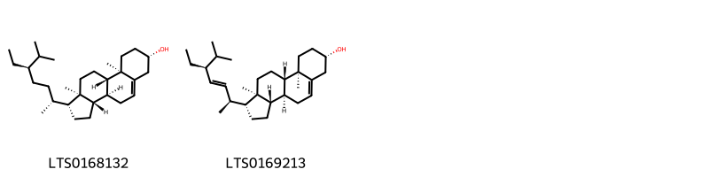{ width=100% }
    <figcaption>Hình ảnh cấu trúc hóa học của 2 hoạt chất thuộc nhóm Steroids and steroid derivatives gồm ['sitosterol (LTS0168132)', '(1r,3as,3bs,7s,9ar,9bs,11ar)-1-[(2s,3e,5s)-5-ethyl-6-methylhept-3-en-2-yl]-9a,11a-dimethyl-1h,2h,3h,3ah,3bh,4h,6h,7h,8h,9h,9bh,10h,11h-cyclopenta[a]phenanthren-7-ol (LTS0169213)'].</figcaption>
</figure>
#### Nhóm Unsaturated hydrocarbons
<figure markdown="span">
    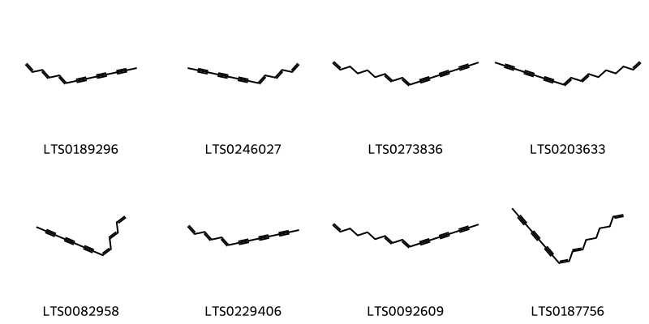{ width=100% }
    <figcaption>Hình ảnh cấu trúc hóa học của 8 hoạt chất thuộc nhóm Unsaturated hydrocarbons gồm ['(3e,5e)-trideca-1,3,5-trien-7,9,11-triyne (LTS0189296)', 'trideca-1,3,5-trien-7,9,11-triyne (LTS0246027)', '(7e,9e)-heptadeca-1,7,9-trien-11,13,15-triyne (LTS0273836)', 'heptadeca-1,7,9-trien-11,13,15-triyne (LTS0203633)', '(3e,5z)-trideca-1,3,5-trien-7,9,11-triyne (LTS0082958)', '(3e)-trideca-1,3,5-trien-7,9,11-triyne (LTS0229406)', '(7e)-heptadeca-1,7,9-trien-11,13,15-triyne (LTS0092609)', '(7e,9z)-heptadeca-1,7,9-trien-11,13,15-triyne (LTS0187756)'].</figcaption>
</figure>

---

### Dược dân tộc học

Danh sách các quốc gia có sử dụng *Artemisia vulgaris* trong điều trị các bệnh. 

| Country     | Disease                                                                                              | Bệnh                                                                                                                                                                                                |
|:------------|:-----------------------------------------------------------------------------------------------------|:----------------------------------------------------------------------------------------------------------------------------------------------------------------------------------------------------|
| China       | Antiseptic, Hemostat, Stomachic, Hemostat, Carminative, Counterirritant, Hemostat, Carminative       | MYMEMORY WARNING: YOU USED ALL AVAILABLE FREE TRANSLATIONS FOR TODAY. NEXT AVAILABLE IN  10 HOURS 05 MINUTES 22 SECONDS VISIT HTTPS://MYMEMORY.TRANSLATED.NET/DOC/USAGELIMITS.PHP TO TRANSLATE MORE |
| Elsewhere   | Aphrodisiac, Emmenagogue, Insecticide, Larvicide, Uterotonic, Vermifuge                              | MYMEMORY WARNING: YOU USED ALL AVAILABLE FREE TRANSLATIONS FOR TODAY. NEXT AVAILABLE IN  10 HOURS 05 MINUTES 18 SECONDS VISIT HTTPS://MYMEMORY.TRANSLATED.NET/DOC/USAGELIMITS.PHP TO TRANSLATE MORE |
| Haiti       | Emmenagogue, Sedative, Stimulant, Tonic                                                              | MYMEMORY WARNING: YOU USED ALL AVAILABLE FREE TRANSLATIONS FOR TODAY. NEXT AVAILABLE IN  10 HOURS 05 MINUTES 14 SECONDS VISIT HTTPS://MYMEMORY.TRANSLATED.NET/DOC/USAGELIMITS.PHP TO TRANSLATE MORE |
| India       | Vermifuge, Antiseptic, Expectorant                                                                   | MYMEMORY WARNING: YOU USED ALL AVAILABLE FREE TRANSLATIONS FOR TODAY. NEXT AVAILABLE IN  10 HOURS 05 MINUTES 11 SECONDS VISIT HTTPS://MYMEMORY.TRANSLATED.NET/DOC/USAGELIMITS.PHP TO TRANSLATE MORE |
| Mexico      | Emmenagogue, Tonic, Vermifuge                                                                        | MYMEMORY WARNING: YOU USED ALL AVAILABLE FREE TRANSLATIONS FOR TODAY. NEXT AVAILABLE IN  10 HOURS 05 MINUTES 08 SECONDS VISIT HTTPS://MYMEMORY.TRANSLATED.NET/DOC/USAGELIMITS.PHP TO TRANSLATE MORE |
| Philippines | Emmenagogue                                                                                          | MYMEMORY WARNING: YOU USED ALL AVAILABLE FREE TRANSLATIONS FOR TODAY. NEXT AVAILABLE IN  10 HOURS 05 MINUTES 05 SECONDS VISIT HTTPS://MYMEMORY.TRANSLATED.NET/DOC/USAGELIMITS.PHP TO TRANSLATE MORE |
| Turkey      | Digestive, Emmenagogue, Stomachic, Sudorific, Tonic, Vermifuge, Nervine, Poison, Stimulant, Diuretic | MYMEMORY WARNING: YOU USED ALL AVAILABLE FREE TRANSLATIONS FOR TODAY. NEXT AVAILABLE IN  10 HOURS 05 MINUTES 02 SECONDS VISIT HTTPS://MYMEMORY.TRANSLATED.NET/DOC/USAGELIMITS.PHP TO TRANSLATE MORE |
| ain         | Emmenagogue                                                                                          | MYMEMORY WARNING: YOU USED ALL AVAILABLE FREE TRANSLATIONS FOR TODAY. NEXT AVAILABLE IN  10 HOURS 04 MINUTES 59 SECONDS VISIT HTTPS://MYMEMORY.TRANSLATED.NET/DOC/USAGELIMITS.PHP TO TRANSLATE MORE |

---

# Chi Melampodium

??? note "Danh sách các dược liệu thuộc chi"
    
	 - *Melampodium divaricatum*

---
## Melampodium divaricatum
### Thông tin về thực vật

!!! info "Phân loại thực vật của *Melampodium divaricatum* từ GIBF:"
    - **Kingdom:** Plantae
    - **Phylum:** Tracheophyta
    - **Order:** Asterales
    - **Family:** Asteraceae
    - **Genus:** Melampodium
    - **Species:** *Melampodium divaricatum*

 

| Label (VI)   | Label (EN)   | Scientific Name         | Descriptions (VI)   | Descriptions (EN)   | Also Known As (VI)   | Also Known As (EN)   |
|:-------------|:-------------|:------------------------|:--------------------|:--------------------|:---------------------|:---------------------|
| N/A          | N/A          | Melampodium divaricatum | loài thực vật       | species of plant    | ['']                 | ['butter daisy']     |

#### Phân bố trên thế giới

**Từ CSDL GIBF** Nicaragua, Hong Kong, Thailand, Germany, Guatemala, Brazil, Colombia, Bolivia (Plurinational State of), Costa Rica, Honduras, India, Indonesia, United States of America, Mexico, Philippines, Panama

#### Phân bố tại Việt Nam

**Từ CSDL GIBF**: Không có ghi nhận ở Việt Nam

---
### Thành phần hóa học
        
- Theo cơ sở dữ liệu lotus: Từ loài *Melampodium divaricatum* đã phân lập và xác định được 43 hoạt chất thuộc về các nhóm Pyrrolidines, Prenol lipids, Pyrrolizidines, Coumarins and derivatives. 

|    | chemicalTaxonomyClassyfireClass   |   smiles_count |
|---:|:----------------------------------|---------------:|
|  0 | Coumarins and derivatives         |              2 |
|  1 | Prenol lipids                     |             37 |
|  2 | Pyrrolidines                      |              1 |
|  3 | Pyrrolizidines                    |              3 |

#### Nhóm Coumarins and derivatives
<figure markdown="span">
    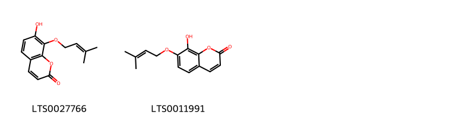{ width=100% }
    <figcaption>Hình ảnh cấu trúc hóa học của 2 hoạt chất thuộc nhóm Coumarins and derivatives gồm ['7-hydroxy-8-[(3-methylbut-2-en-1-yl)oxy]chromen-2-one (LTS0027766)', '8-hydroxy-7-[(3-methylbut-2-en-1-yl)oxy]chromen-2-one (LTS0011991)'].</figcaption>
</figure>
#### Nhóm Prenol lipids
<figure markdown="span">
    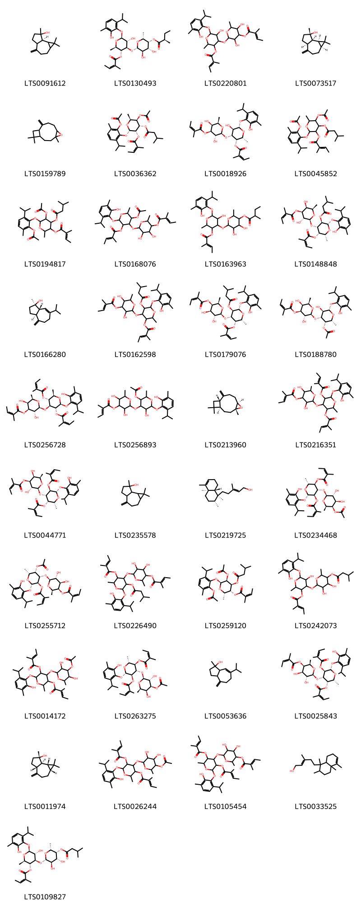{ width=100% }
    <figcaption>Hình ảnh cấu trúc hóa học của 37 hoạt chất thuộc nhóm Prenol lipids gồm ['(7ar)-1,1,7-trimethyl-4-methylidene-octahydrocyclopropa[e]azulen-7-ol (LTS0091612)', '(2r,3r,4r,5r,6s)-4-{[(2s,3r,4r,5r,6r)-3,4-dihydroxy-6-methyl-5-{[(2r)-2-methylbutanoyl]oxy}oxan-2-yl]oxy}-5-hydroxy-6-(2-hydroxy-6-isopropyl-3-methylphenoxy)-2-methyloxan-3-yl (2z)-2-methylbut-2-enoate (LTS0130493)', '3,5-dihydroxy-2-{[3-hydroxy-2-(2-hydroxy-6-isopropyl-3-methylphenoxy)-6-methyl-5-[(2-methylbut-2-enoyl)oxy]oxan-4-yl]oxy}-6-methyloxan-4-yl 2-methylbut-2-enoate (LTS0220801)', '(1as,4as,7s,7ar,7bs)-1,1,7-trimethyl-4-methylidene-octahydrocyclopropa[e]azulen-7-ol (LTS0073517)', 'caryophyllene oxide (LTS0159789)', '(2s,3s,4s,5r,6s)-5-(acetyloxy)-2-[2-(acetyloxy)-6-isopropyl-3-methylphenoxy]-6-methyl-4-[(3-methylbutanoyl)oxy]oxan-3-yl (2z)-2-methylbut-2-enoate (LTS0036362)', '(2s,3r,4s,5s,6r)-3,5-dihydroxy-2-{[(2s,3r,4r,5s,6r)-3-hydroxy-2-(2-hydroxy-6-isopropyl-3-methylphenoxy)-6-methyl-5-{[(2z)-2-methylbut-2-enoyl]oxy}oxan-4-yl]oxy}-6-methyloxan-4-yl (2z)-2-methylbut-2-enoate (LTS0018926)', '5-(acetyloxy)-2-[2-(acetyloxy)-6-isopropyl-3-methylphenoxy]-6-methyl-4-[(3-methylbutanoyl)oxy]oxan-3-yl 2-methylbut-2-enoate (LTS0045852)', '5-(acetyloxy)-6-[2-(acetyloxy)-6-isopropyl-3-methylphenoxy]-2-methyl-4-[(3-methylbutanoyl)oxy]oxan-3-yl 2-methylbut-2-enoate (LTS0194817)', '6-{[3-(acetyloxy)-6-(2-hydroxy-6-isopropyl-3-methylphenoxy)-2-methyl-5-[(2-methylbut-2-enoyl)oxy]oxan-4-yl]oxy}-4,5-dihydroxy-2-methyloxan-3-yl 2-methylbut-2-enoate (LTS0168076)', '4-({3,4-dihydroxy-6-methyl-5-[(2-methylbutanoyl)oxy]oxan-2-yl}oxy)-5-hydroxy-6-(2-hydroxy-6-isopropyl-3-methylphenoxy)-2-methyloxan-3-yl 2-methylbut-2-enoate (LTS0163963)', '(2r,3s,4s,5r,6s)-4-{[(2s,3r,4s,5s,6r)-3,5-dihydroxy-6-methyl-4-{[(2z)-2-methylbut-2-enoyl]oxy}oxan-2-yl]oxy}-6-(2-hydroxy-6-isopropyl-3-methylphenoxy)-2-methyl-5-[(3-methylbutanoyl)oxy]oxan-3-yl (2z)-2-methylbut-2-enoate (LTS0148848)', '(1r,3as,8ar)-7-isopropyl-1-methyl-4-methylidene-2,3,3a,5,6,8a-hexahydroazulen-1-ol (LTS0166280)', '3,5-dihydroxy-2-{[2-(2-hydroxy-6-isopropyl-3-methylphenoxy)-6-methyl-5-[(2-methylbut-2-enoyl)oxy]-3-[(3-methylbutanoyl)oxy]oxan-4-yl]oxy}-6-methyloxan-4-yl 2-methylbut-2-enoate (LTS0162598)', '(2r,3s,4s,5r,6s)-4-{[(2s,3r,4r,5r,6r)-3,4-dihydroxy-6-methyl-5-{[(2z)-2-methylbut-2-enoyl]oxy}oxan-2-yl]oxy}-6-(2-hydroxy-6-isopropyl-3-methylphenoxy)-2-methyl-5-[(3-methylbutanoyl)oxy]oxan-3-yl (2z)-2-methylbut-2-enoate (LTS0179076)', '(2s,3r,4s,5s,6r)-2-{[(2r,3s,4r,5r,6s)-3-(acetyloxy)-5-hydroxy-6-(2-hydroxy-6-isopropyl-3-methylphenoxy)-2-methyloxan-4-yl]oxy}-3,5-dihydroxy-6-methyloxan-4-yl (2z)-2-methylbut-2-enoate (LTS0188780)', '(2s,3r,4s,5s,6r)-3,5-dihydroxy-2-{[(2s,3r,4s,5r,6r)-2-(2-hydroxy-6-isopropyl-3-methylphenoxy)-6-methyl-3,5-bis({[(2z)-2-methylbut-2-enoyl]oxy})oxan-4-yl]oxy}-6-methyloxan-4-yl (2z)-2-methylbut-2-enoate (LTS0256728)', '2-{[3-(acetyloxy)-5-hydroxy-6-(2-hydroxy-6-isopropyl-3-methylphenoxy)-2-methyloxan-4-yl]oxy}-3,5-dihydroxy-6-methyloxan-4-yl 2-methylbut-2-enoate (LTS0256893)', 'β-caryophyllene oxide (LTS0213960)', '3,5-dihydroxy-2-{[2-(2-hydroxy-6-isopropyl-3-methylphenoxy)-6-methyl-3,5-bis[(2-methylbut-2-enoyl)oxy]oxan-4-yl]oxy}-6-methyloxan-4-yl 2-methylbut-2-enoate (LTS0216351)', '(2s,3r,4s,5s,6r)-4-{[(2s,3r,4s,5s,6r)-3,5-dihydroxy-6-methyl-4-{[(2z)-2-methylbut-2-enoyl]oxy}oxan-2-yl]oxy}-2-(2-hydroxy-6-isopropyl-3-methylphenoxy)-6-methyl-5-{[(2z)-2-methylbut-2-enoyl]oxy}oxan-3-yl (2z)-2-methylbut-2-enoate (LTS0044771)', 'spathulenol (LTS0235578)', '(2e)-5-[(1s,2r,4ar,8ar)-1,2,4a,5-tetramethyl-2,3,4,7,8,8a-hexahydronaphthalen-1-yl]-3-methylpent-2-en-1-ol (LTS0219725)', '(2r,3r,4s,5r,6s)-4-{[(2s,3r,4r,5r,6r)-5-(acetyloxy)-3,4-dihydroxy-6-methyloxan-2-yl]oxy}-6-(2-hydroxy-6-isopropyl-3-methylphenoxy)-2-methyl-5-{[(2z)-2-methylbut-2-enoyl]oxy}oxan-3-yl (2z)-2-methylbut-2-enoate (LTS0234468)', '(2s,3r,4s,5s,6r)-5-(acetyloxy)-4-{[(2s,3r,4r,5r,6r)-3,4-dihydroxy-6-methyl-5-{[(2z)-2-methylbut-2-enoyl]oxy}oxan-2-yl]oxy}-2-(2-hydroxy-6-isopropyl-3-methylphenoxy)-6-methyloxan-3-yl (2z)-2-methylbut-2-enoate (LTS0255712)', '4,5-dihydroxy-6-{[2-(2-hydroxy-6-isopropyl-3-methylphenoxy)-6-methyl-5-[(2-methylbut-2-enoyl)oxy]-3-[(3-methylbutanoyl)oxy]oxan-4-yl]oxy}-2-methyloxan-3-yl 2-methylbut-2-enoate (LTS0226490)', '(2s,3r,4s,5s,6s)-5-(acetyloxy)-6-[2-(acetyloxy)-6-isopropyl-3-methylphenoxy]-2-methyl-4-[(3-methylbutanoyl)oxy]oxan-3-yl (2z)-2-methylbut-2-enoate (LTS0259120)', '4-({3,4-dihydroxy-6-methyl-5-[(3-methylbutanoyl)oxy]oxan-2-yl}oxy)-5-hydroxy-6-(2-hydroxy-6-isopropyl-3-methylphenoxy)-2-methyloxan-3-yl 2-methylbut-2-enoate (LTS0242073)', '4-{[4-(acetyloxy)-3,5-dihydroxy-6-methyloxan-2-yl]oxy}-2-(2-hydroxy-6-isopropyl-3-methylphenoxy)-6-methyl-5-[(2-methylbut-2-enoyl)oxy]oxan-3-yl 2-methylbut-2-enoate (LTS0014172)', '(2r,3r,4s,5r,6s)-4-{[(2s,3r,4s,5s,6r)-4-(acetyloxy)-3,5-dihydroxy-6-methyloxan-2-yl]oxy}-6-(2-hydroxy-6-isopropyl-3-methylphenoxy)-2-methyl-5-{[(2z)-2-methylbut-2-enoyl]oxy}oxan-3-yl (2z)-2-methylbut-2-enoate (LTS0263275)', '7-isopropyl-1-methyl-4-methylidene-2,3,3a,5,6,8a-hexahydroazulen-1-ol (LTS0053636)', '(2s,3r,4s,5s,6r)-4-{[(2s,3r,4r,5r,6r)-3,4-dihydroxy-6-methyl-5-{[(2z)-2-methylbut-2-enoyl]oxy}oxan-2-yl]oxy}-2-(2-hydroxy-6-isopropyl-3-methylphenoxy)-6-methyl-5-{[(2z)-2-methylbut-2-enoyl]oxy}oxan-3-yl (2z)-2-methylbut-2-enoate (LTS0025843)', 'spathulenol (LTS0011974)', '4-{[5-(acetyloxy)-3,4-dihydroxy-6-methyloxan-2-yl]oxy}-2-(2-hydroxy-6-isopropyl-3-methylphenoxy)-6-methyl-5-[(2-methylbut-2-enoyl)oxy]oxan-3-yl 2-methylbut-2-enoate (LTS0026244)', '4,5-dihydroxy-6-{[2-(2-hydroxy-6-isopropyl-3-methylphenoxy)-6-methyl-3,5-bis[(2-methylbut-2-enoyl)oxy]oxan-4-yl]oxy}-2-methyloxan-3-yl 2-methylbut-2-enoate (LTS0105454)', '5-(1,2,4a,5-tetramethyl-2,3,4,7,8,8a-hexahydronaphthalen-1-yl)-3-methylpent-2-en-1-ol (LTS0033525)', '(2r,3r,4r,5r,6s)-4-{[(2s,3r,4r,5r,6r)-3,4-dihydroxy-6-methyl-5-[(3-methylbutanoyl)oxy]oxan-2-yl]oxy}-5-hydroxy-6-(2-hydroxy-6-isopropyl-3-methylphenoxy)-2-methyloxan-3-yl (2z)-2-methylbut-2-enoate (LTS0109827)'].</figcaption>
</figure>
#### Nhóm Pyrrolidines
<figure markdown="span">
    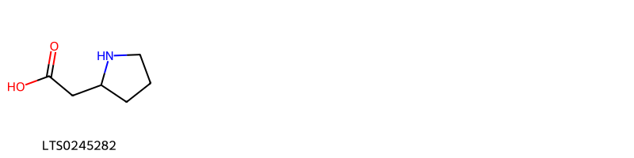{ width=100% }
    <figcaption>Hình ảnh cấu trúc hóa học của 1 hoạt chất thuộc nhóm Pyrrolidines gồm ['(+/-)-homoproline (LTS0245282)'].</figcaption>
</figure>
#### Nhóm Pyrrolizidines
<figure markdown="span">
    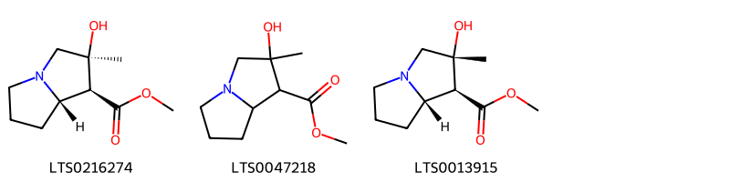{ width=100% }
    <figcaption>Hình ảnh cấu trúc hóa học của 3 hoạt chất thuộc nhóm Pyrrolizidines gồm ['tussilagine (LTS0216274)', 'methyl 2-hydroxy-2-methyl-hexahydropyrrolizine-1-carboxylate (LTS0047218)', 'isotussilagine (LTS0013915)'].</figcaption>
</figure>

---

### Dược dân tộc học

Danh sách các quốc gia có sử dụng *Melampodium divaricatum* trong điều trị các bệnh. 

| Country   | Disease              | Bệnh                                                                                                                                                                                                |
|:----------|:---------------------|:----------------------------------------------------------------------------------------------------------------------------------------------------------------------------------------------------|
| Cuba      | Stomachic, Stimulant | MYMEMORY WARNING: YOU USED ALL AVAILABLE FREE TRANSLATIONS FOR TODAY. NEXT AVAILABLE IN  10 HOURS 04 MINUTES 09 SECONDS VISIT HTTPS://MYMEMORY.TRANSLATED.NET/DOC/USAGELIMITS.PHP TO TRANSLATE MORE |
| Mexico    | Diaphoretic          | MYMEMORY WARNING: YOU USED ALL AVAILABLE FREE TRANSLATIONS FOR TODAY. NEXT AVAILABLE IN  10 HOURS 04 MINUTES 05 SECONDS VISIT HTTPS://MYMEMORY.TRANSLATED.NET/DOC/USAGELIMITS.PHP TO TRANSLATE MORE |

---

# Chi Egletes

??? note "Danh sách các dược liệu thuộc chi"
    
	 - *Egletes humifusa*

---
## Egletes humifusa
### Thông tin về thực vật

!!! info "Phân loại thực vật của *Egletes humifusa* từ GIBF:"
    - **Kingdom:** Plantae
    - **Phylum:** Tracheophyta
    - **Order:** Asterales
    - **Family:** Asteraceae
    - **Genus:** Egletes
    - **Species:** *Egletes humifusa*

 

| Label (VI)   | Label (EN)   | Scientific Name   | Descriptions (VI)   | Descriptions (EN)   | Also Known As (VI)   | Also Known As (EN)   |
|:-------------|:-------------|:------------------|:--------------------|:--------------------|:---------------------|:---------------------|
| N/A          | N/A          | Egletes humifusa  | loài thực vật       | species of plant    | ['']                 | ['']                 |

#### Phân bố trên thế giới

**Từ CSDL GIBF** nan, Ecuador, Colombia, unknown or invalid, Anguilla

#### Phân bố tại Việt Nam

**Từ CSDL GIBF**: Không có ghi nhận ở Việt Nam

---
### Thành phần hóa học
        
- Theo cơ sở dữ liệu lotus: Từ loài *Egletes humifusa* đã phân lập và xác định được Chưa có hoạt chất nào được phân lập. hoạt chất thuộc về các nhóm Không có hoạt chất nào được phân lập. 

Không có hình ảnh nào được tạo ra

---

### Dược dân tộc học

Danh sách các quốc gia có sử dụng *Egletes humifusa* trong điều trị các bệnh. 

| Country   | Disease          | Bệnh                                                                                                                                                                                                |
|:----------|:-----------------|:----------------------------------------------------------------------------------------------------------------------------------------------------------------------------------------------------|
| Venezuela | Stomachic, Tonic | MYMEMORY WARNING: YOU USED ALL AVAILABLE FREE TRANSLATIONS FOR TODAY. NEXT AVAILABLE IN  10 HOURS 03 MINUTES 14 SECONDS VISIT HTTPS://MYMEMORY.TRANSLATED.NET/DOC/USAGELIMITS.PHP TO TRANSLATE MORE |

---

# Chi Eriocephalus

??? note "Danh sách các dược liệu thuộc chi"
    
	 - *Eriocephalus punctula*

---
## Eriocephalus punctula
### Thông tin về thực vật

!!! info "Phân loại thực vật của *Eriocephalus punctulatus* từ GIBF:"
    - **Kingdom:** Plantae
    - **Phylum:** Tracheophyta
    - **Order:** Asterales
    - **Family:** Asteraceae
    - **Genus:** Eriocephalus
    - **Species:** *Eriocephalus punctulatus*

 

| Label (VI)   | Label (EN)   | Scientific Name   | Descriptions (VI)   | Descriptions (EN)   | Also Known As (VI)   | Also Known As (EN)   |
|:-------------|:-------------|:------------------|:--------------------|:--------------------|:---------------------|:---------------------|
| N/A          | N/A          | Egletes humifusa  | loài thực vật       | species of plant    | ['']                 | ['']                 |

#### Phân bố trên thế giới

**Từ CSDL GIBF** nan, Lesotho, South Africa, unknown or invalid

#### Phân bố tại Việt Nam

**Từ CSDL GIBF**: Không có ghi nhận ở Việt Nam

---
### Thành phần hóa học
        
- Theo cơ sở dữ liệu lotus: Từ loài *Eriocephalus punctulatus* đã phân lập và xác định được 6 hoạt chất thuộc về các nhóm Prenol lipids, Organooxygen compounds. 

|    | chemicalTaxonomyClassyfireClass   |   smiles_count |
|---:|:----------------------------------|---------------:|
|  0 | Organooxygen compounds            |              2 |
|  1 | Prenol lipids                     |              4 |

#### Nhóm Organooxygen compounds
<figure markdown="span">
    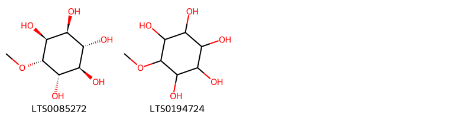{ width=100% }
    <figcaption>Hình ảnh cấu trúc hóa học của 2 hoạt chất thuộc nhóm Organooxygen compounds gồm ['(1s,2r,3r,4s,5s,6s)-6-methoxycyclohexane-1,2,3,4,5-pentol (LTS0085272)', 'pinitol (LTS0194724)'].</figcaption>
</figure>
#### Nhóm Prenol lipids
<figure markdown="span">
    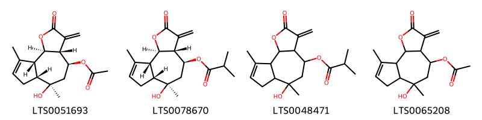{ width=100% }
    <figcaption>Hình ảnh cấu trúc hóa học của 4 hoạt chất thuộc nhóm Prenol lipids gồm ['(3ar,4s,6r,6ar,9ar,9br)-6-hydroxy-6,9-dimethyl-3-methylidene-2-oxo-3ah,4h,5h,6ah,7h,9ah,9bh-azuleno[4,5-b]furan-4-yl acetate (LTS0051693)', '(3ar,4s,6r,6ar,9ar,9br)-6-hydroxy-6,9-dimethyl-3-methylidene-2-oxo-3ah,4h,5h,6ah,7h,9ah,9bh-azuleno[4,5-b]furan-4-yl 2-methylpropanoate (LTS0078670)', '6-hydroxy-6,9-dimethyl-3-methylidene-2-oxo-3ah,4h,5h,6ah,7h,9ah,9bh-azuleno[4,5-b]furan-4-yl 2-methylpropanoate (LTS0048471)', '6-hydroxy-6,9-dimethyl-3-methylidene-2-oxo-3ah,4h,5h,6ah,7h,9ah,9bh-azuleno[4,5-b]furan-4-yl acetate (LTS0065208)'].</figcaption>
</figure>

---

### Dược dân tộc học

Danh sách các quốc gia có sử dụng *Eriocephalus punctulatus* trong điều trị các bệnh. 

| Country   | Disease   | Bệnh                                                                                                                                                                                                |
|:----------|:----------|:----------------------------------------------------------------------------------------------------------------------------------------------------------------------------------------------------|
| Lesotho   | Fumigant  | MYMEMORY WARNING: YOU USED ALL AVAILABLE FREE TRANSLATIONS FOR TODAY. NEXT AVAILABLE IN  10 HOURS 02 MINUTES 50 SECONDS VISIT HTTPS://MYMEMORY.TRANSLATED.NET/DOC/USAGELIMITS.PHP TO TRANSLATE MORE |

---

# Chi Porophyllum

??? note "Danh sách các dược liệu thuộc chi"
    
	 - *Porophyllum macrocephalum*
	 - *Porophyllum ruderale*

---
## Porophyllum macrocephalum
### Thông tin về thực vật

!!! info "Phân loại thực vật của *Porophyllum ruderale* từ GIBF:"
    - **Kingdom:** Plantae
    - **Phylum:** Tracheophyta
    - **Order:** Asterales
    - **Family:** Asteraceae
    - **Genus:** Porophyllum
    - **Species:** *Porophyllum ruderale*

 

| Label (VI)   | Label (EN)   | Scientific Name           | Descriptions (VI)   | Descriptions (EN)   | Also Known As (VI)   | Also Known As (EN)   |
|:-------------|:-------------|:--------------------------|:--------------------|:--------------------|:---------------------|:---------------------|
| N/A          | N/A          | Porophyllum macrocephalum | loài thực vật       | species of plant    | ['']                 | ['']                 |

#### Phân bố trên thế giới

**Từ CSDL GIBF** Guatemala, Colombia, United States of America, Mexico

#### Phân bố tại Việt Nam

**Từ CSDL GIBF**: Không có ghi nhận ở Việt Nam

---
### Thành phần hóa học
        
- Theo cơ sở dữ liệu lotus: Từ loài *Porophyllum ruderale* đã phân lập và xác định được Chưa có hoạt chất nào được phân lập. hoạt chất thuộc về các nhóm Không có hoạt chất nào được phân lập. 

Không có hình ảnh nào được tạo ra

---

### Dược dân tộc học

Danh sách các quốc gia có sử dụng *Porophyllum ruderale* trong điều trị các bệnh. 

| Country   | Disease              | Bệnh                                                                                                                                                                                                |
|:----------|:---------------------|:----------------------------------------------------------------------------------------------------------------------------------------------------------------------------------------------------|
| Curacao   | Apertif, Carminative | MYMEMORY WARNING: YOU USED ALL AVAILABLE FREE TRANSLATIONS FOR TODAY. NEXT AVAILABLE IN  10 HOURS 02 MINUTES 23 SECONDS VISIT HTTPS://MYMEMORY.TRANSLATED.NET/DOC/USAGELIMITS.PHP TO TRANSLATE MORE |

---

---
## Porophyllum ruderale
### Thông tin về thực vật

!!! info "Phân loại thực vật của *Porophyllum ruderale* từ GIBF:"
    - **Kingdom:** Plantae
    - **Phylum:** Tracheophyta
    - **Order:** Asterales
    - **Family:** Asteraceae
    - **Genus:** Porophyllum
    - **Species:** *Porophyllum ruderale*

 

| Label (VI)   | Label (EN)   | Scientific Name      | Descriptions (VI)   | Descriptions (EN)   | Also Known As (VI)   | Also Known As (EN)     |
|:-------------|:-------------|:---------------------|:--------------------|:--------------------|:---------------------|:-----------------------|
| N/A          | N/A          | Porophyllum ruderale | loài thực vật       | species of plant    | ['']                 | ['Bolivian coriander'] |

#### Phân bố trên thế giới

**Từ CSDL GIBF** Ghana, Australia, Argentina, French Guiana, Spain, Bolivia (Plurinational State of), United States of America, Bonaire, Sint Eustatius and Saba, Uruguay, Paraguay, El Salvador, South Africa, Brazil, Dominican Republic, Peru, Mexico, Singapore, Curaçao, Ecuador, French Polynesia, Costa Rica, Indonesia, Anguilla

#### Phân bố tại Việt Nam

**Từ CSDL GIBF**: Không có ghi nhận ở Việt Nam

---
### Thành phần hóa học
        
- Theo cơ sở dữ liệu lotus: Từ loài *Porophyllum ruderale* đã phân lập và xác định được 39 hoạt chất thuộc về các nhóm Phenol ethers, Fatty Acyls, Prenol lipids, Steroids and steroid derivatives, Bi- and oligothiophenes, Unsaturated hydrocarbons, Organooxygen compounds, Coumarins and derivatives. 

|    | chemicalTaxonomyClassyfireClass   |   smiles_count |
|---:|:----------------------------------|---------------:|
|  0 | Bi- and oligothiophenes           |              4 |
|  1 | Coumarins and derivatives         |              1 |
|  2 | Fatty Acyls                       |              3 |
|  3 | Organooxygen compounds            |              2 |
|  4 | Phenol ethers                     |              1 |
|  5 | Prenol lipids                     |             18 |
|  6 | Steroids and steroid derivatives  |              6 |
|  7 | Unsaturated hydrocarbons          |              4 |

#### Nhóm Bi- and oligothiophenes
<figure markdown="span">
    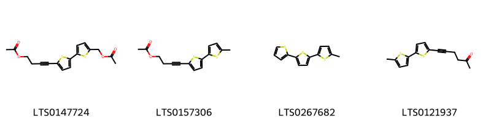{ width=100% }
    <figcaption>Hình ảnh cấu trúc hóa học của 4 hoạt chất thuộc nhóm Bi- and oligothiophenes gồm ["4-{5'-[(acetyloxy)methyl]-[2,2'-bithiophen]-5-yl}but-3-yn-1-yl acetate (LTS0147724)", "4-{5'-methyl-[2,2'-bithiophen]-5-yl}but-3-yn-1-yl acetate (LTS0157306)", "5-(5-methylthiophen-2-yl)-2,2'-bithiophene (LTS0267682)", "6-{5'-methyl-[2,2'-bithiophen]-5-yl}hex-5-yn-2-one (LTS0121937)"].</figcaption>
</figure>
#### Nhóm Coumarins and derivatives
<figure markdown="span">
    { width=100% }
    <figcaption>Hình ảnh cấu trúc hóa học của 1 hoạt chất thuộc nhóm Coumarins and derivatives gồm ['isoscopoletin (LTS0157758)'].</figcaption>
</figure>
#### Nhóm Fatty Acyls
<figure markdown="span">
    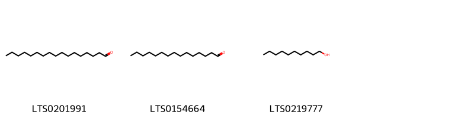{ width=100% }
    <figcaption>Hình ảnh cấu trúc hóa học của 3 hoạt chất thuộc nhóm Fatty Acyls gồm ['heptadecanal (LTS0201991)', 'pentadecanal (LTS0154664)', 'decanol (LTS0219777)'].</figcaption>
</figure>
#### Nhóm Organooxygen compounds
<figure markdown="span">
    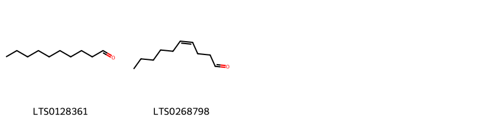{ width=100% }
    <figcaption>Hình ảnh cấu trúc hóa học của 2 hoạt chất thuộc nhóm Organooxygen compounds gồm ['decanal (LTS0128361)', 'cis-4-decenal (LTS0268798)'].</figcaption>
</figure>
#### Nhóm Phenol ethers
<figure markdown="span">
    { width=100% }
    <figcaption>Hình ảnh cấu trúc hóa học của 1 hoạt chất thuộc nhóm Phenol ethers gồm ['anethole (LTS0033696)'].</figcaption>
</figure>
#### Nhóm Prenol lipids
<figure markdown="span">
    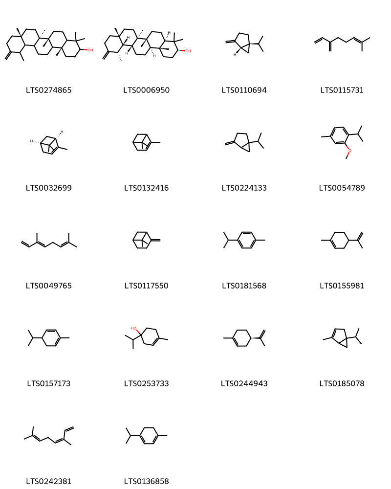{ width=100% }
    <figcaption>Hình ảnh cấu trúc hóa học của 18 hoạt chất thuộc nhóm Prenol lipids gồm ['(6ar,6br,8ar,14br)-4,4,6a,6b,8a,12,14b-heptamethyl-11-methylidene-hexadecahydropicen-3-ol (LTS0274865)', 'taraxasterol (LTS0006950)', '(+)-sabinene (LTS0110694)', 'α-myrcene (LTS0115731)', '(-)-α-pinene (LTS0032699)', 'α pinene (LTS0132416)', 'sabinene (LTS0224133)', '2-isopropyl-5-methylanisole (LTS0054789)', 'trans-β-ocimene (LTS0049765)', 'β-pinene (LTS0117550)', 'cymene (LTS0181568)', 'limonene,  (LTS0155981)', 'phellandrene (LTS0157173)', '4-terpineol (LTS0253733)', 'α-limonene (LTS0244943)', 'α-thujene (LTS0185078)', 'β-ocimene (LTS0242381)', 'terpinene (LTS0136858)'].</figcaption>
</figure>
#### Nhóm Steroids and steroid derivatives
<figure markdown="span">
    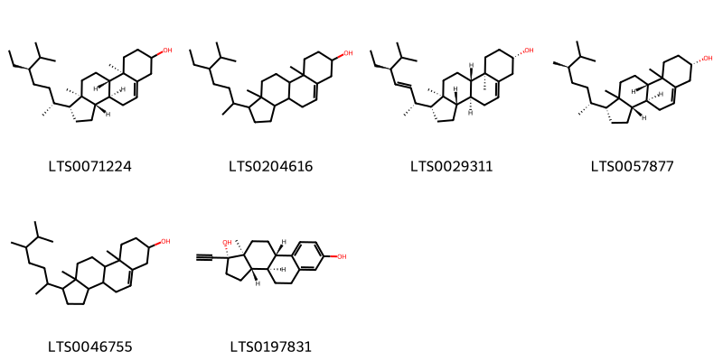{ width=100% }
    <figcaption>Hình ảnh cấu trúc hóa học của 6 hoạt chất thuộc nhóm Steroids and steroid derivatives gồm ['stigmast-5-en-3-ol (LTS0071224)', 'stigmast-5-en-3-ol, (3β)- (LTS0204616)', 'phytosterol (LTS0029311)', '(1r,3as,3bs,7s,9bs)-1-[(2r,5r)-5,6-dimethylheptan-2-yl]-9a,11a-dimethyl-1h,2h,3h,3ah,3bh,4h,6h,7h,8h,9h,9bh,10h,11h-cyclopenta[a]phenanthren-7-ol (LTS0057877)', 'campesterol (LTS0046755)', 'ethinyl estradiol (LTS0197831)'].</figcaption>
</figure>
#### Nhóm Unsaturated hydrocarbons
<figure markdown="span">
    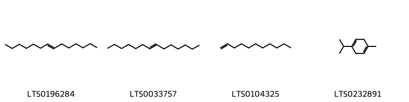{ width=100% }
    <figcaption>Hình ảnh cấu trúc hóa học của 4 hoạt chất thuộc nhóm Unsaturated hydrocarbons gồm ['(7e)-7-tetradecene (LTS0196284)', 'tetradec-7-ene (LTS0033757)', '1-undecene (LTS0104325)', 'α terpinene (LTS0232891)'].</figcaption>
</figure>

---

### Dược dân tộc học

Danh sách các quốc gia có sử dụng *Porophyllum ruderale* trong điều trị các bệnh. 

| Country   | Disease   | Bệnh                                                                                                                                                                                                |
|:----------|:----------|:----------------------------------------------------------------------------------------------------------------------------------------------------------------------------------------------------|
| Venezuela | Sudorific | MYMEMORY WARNING: YOU USED ALL AVAILABLE FREE TRANSLATIONS FOR TODAY. NEXT AVAILABLE IN  10 HOURS 02 MINUTES 02 SECONDS VISIT HTTPS://MYMEMORY.TRANSLATED.NET/DOC/USAGELIMITS.PHP TO TRANSLATE MORE |

---

# Chi Cynara

??? note "Danh sách các dược liệu thuộc chi"
    
	 - *Cynara cardunculus*
	 - *Cynara scolymus*

---
## Cynara cardunculus
### Thông tin về thực vật

!!! info "Phân loại thực vật của *Cynara cardunculus* từ GIBF:"
    - **Kingdom:** Plantae
    - **Phylum:** Tracheophyta
    - **Order:** Asterales
    - **Family:** Asteraceae
    - **Genus:** Cynara
    - **Species:** *Cynara cardunculus*

 

| Label (VI)   | Label (EN)   | Scientific Name    | Descriptions (VI)   | Descriptions (EN)   | Also Known As (VI)   | Also Known As (EN)   |
|:-------------|:-------------|:-------------------|:--------------------|:--------------------|:---------------------|:---------------------|
| N/A          | N/A          | Cynara cardunculus | loài thực vật       | species of plant    | ['']                 | ['cardoon']          |

#### Phân bố trên thế giới

**Từ CSDL GIBF** Italy, Australia, United Kingdom of Great Britain and Northern Ireland, Belgium, Malta, Spain, Argentina, Portugal, Uruguay, Algeria, United States of America, Greece, Mexico, Chile, France, New Zealand

#### Phân bố tại Việt Nam

**Từ CSDL GIBF**: Không có ghi nhận ở Việt Nam

---
### Thành phần hóa học
        
- Theo cơ sở dữ liệu lotus: Từ loài *Cynara cardunculus* đã phân lập và xác định được 152 hoạt chất thuộc về các nhóm Fatty Acyls, Flavonoids, Prenol lipids, Steroids and steroid derivatives, Cinnamic acids and derivatives, Benzene and substituted derivatives, Dihydrofurans, Organooxygen compounds, Saturated hydrocarbons, Furanoid lignans, Lignan glycosides, Carboxylic acids and derivatives, Pyridines and derivatives. 

|    | chemicalTaxonomyClassyfireClass     |   smiles_count |
|---:|:------------------------------------|---------------:|
|  0 | Benzene and substituted derivatives |              7 |
|  1 | Carboxylic acids and derivatives    |              2 |
|  2 | Cinnamic acids and derivatives      |              1 |
|  3 | Dihydrofurans                       |              1 |
|  4 | Fatty Acyls                         |              7 |
|  5 | Flavonoids                          |             21 |
|  6 | Furanoid lignans                    |              2 |
|  7 | Lignan glycosides                   |              1 |
|  8 | Organooxygen compounds              |             15 |
|  9 | Prenol lipids                       |             87 |
| 10 | Pyridines and derivatives           |              1 |
| 11 | Saturated hydrocarbons              |              3 |
| 12 | Steroids and steroid derivatives    |              2 |

#### Nhóm Benzene and substituted derivatives
<figure markdown="span">
    { width=100% }
    <figcaption>Hình ảnh cấu trúc hóa học của 7 hoạt chất thuộc nhóm Benzene and substituted derivatives gồm ['2-phenyl-ethanol (LTS0206341)', 'm-xylene (LTS0151729)', 'ortho-xylene (LTS0161849)', 'phenylacetaldehyde (LTS0245512)', 'benzene (LTS0177573)', 'para-xylene (LTS0005367)', 'benzyl alcohol (LTS0125638)'].</figcaption>
</figure>
#### Nhóm Carboxylic acids and derivatives
<figure markdown="span">
    { width=100% }
    <figcaption>Hình ảnh cấu trúc hóa học của 2 hoạt chất thuộc nhóm Carboxylic acids and derivatives gồm ['(2e,4e)-2,3-dihydroxyoctadeca-2,4-dieneperoxoic acid (LTS0044390)', '(2e)-2,3-dihydroxyoctadec-2-eneperoxoic acid (LTS0034820)'].</figcaption>
</figure>
#### Nhóm Cinnamic acids and derivatives
<figure markdown="span">
    { width=100% }
    <figcaption>Hình ảnh cấu trúc hóa học của 1 hoạt chất thuộc nhóm Cinnamic acids and derivatives gồm ['3,4-dihydroxycinnamic acid (LTS0128050)'].</figcaption>
</figure>
#### Nhóm Dihydrofurans
<figure markdown="span">
    { width=100% }
    <figcaption>Hình ảnh cấu trúc hóa học của 1 hoạt chất thuộc nhóm Dihydrofurans gồm ['2-methyl-3h-furan-2-carbaldehyde (LTS0245708)'].</figcaption>
</figure>
#### Nhóm Fatty Acyls
<figure markdown="span">
    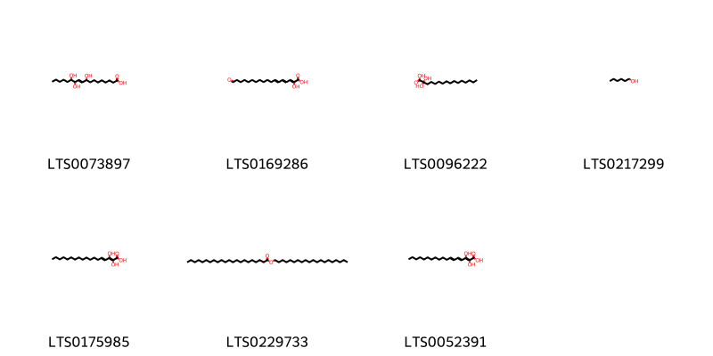{ width=100% }
    <figcaption>Hình ảnh cấu trúc hóa học của 7 hoạt chất thuộc nhóm Fatty Acyls gồm ['9,12,13-trihydroxyoctadec-10-enoic acid (LTS0073897)', '(2z,4e,6e)-2-hydroxy-18-oxooctadeca-2,4,6-trienoic acid (LTS0169286)', '2,2-dihydroxyhexadecanoic acid (LTS0096222)', 'hexanol (LTS0217299)', '(2e,4e)-2,3-dihydroxyoctadeca-2,4-dienoic acid (LTS0175985)', 'arachidyl behenate (LTS0229733)', '(2e,4e,6e)-2,3-dihydroxyoctadeca-2,4,6-trienoic acid (LTS0052391)'].</figcaption>
</figure>
#### Nhóm Flavonoids
<figure markdown="span">
    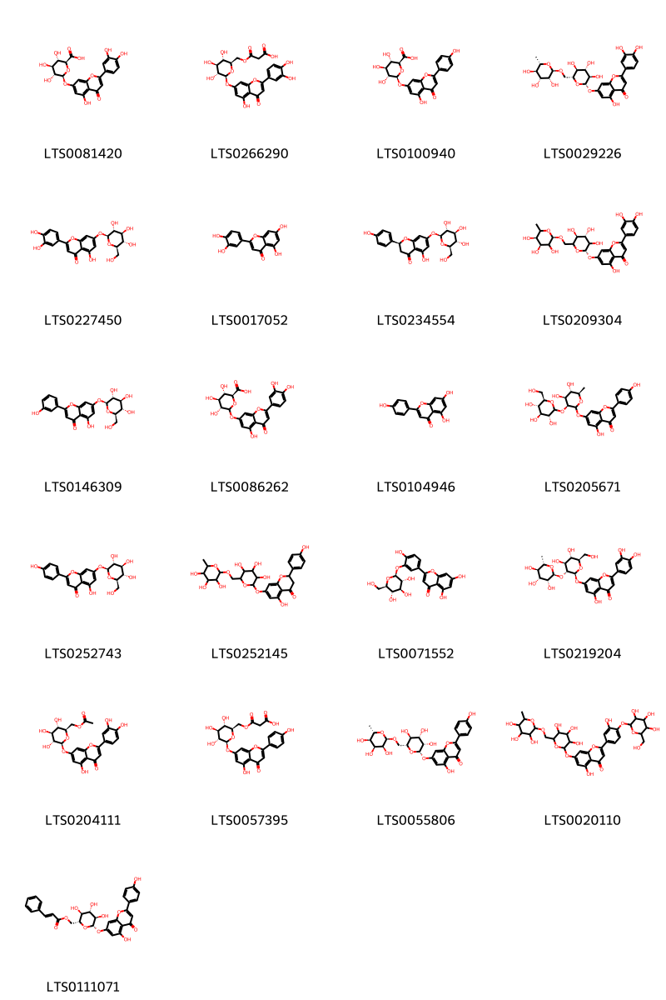{ width=100% }
    <figcaption>Hình ảnh cấu trúc hóa học của 21 hoạt chất thuộc nhóm Flavonoids gồm ['luteolin 7-o-glucuronide (LTS0081420)', '3-{[(2r,3s,4s,5r,6s)-6-{[2-(3,4-dihydroxyphenyl)-5-hydroxy-4-oxochromen-7-yl]oxy}-3,4,5-trihydroxyoxan-2-yl]methoxy}-3-oxopropanoic acid (LTS0266290)', '(2s,3s,4s,5r,6s)-3,4,5-trihydroxy-6-{[5-hydroxy-2-(4-hydroxyphenyl)-4-oxochromen-7-yl]oxy}oxane-2-carboxylic acid (LTS0100940)', '2-(3,4-dihydroxyphenyl)-5-hydroxy-7-{[(2s,3r,4s,5s,6r)-3,4,5-trihydroxy-6-({[(2r,3r,4r,5r,6s)-3,4,5-trihydroxy-6-methyloxan-2-yl]oxy}methyl)oxan-2-yl]oxy}chromen-4-one (LTS0029226)', 'luteolin 7-o-glucoside (LTS0227450)', 'luteolin (LTS0017052)', 'prunin (LTS0234554)', 'luteolin 7-rutinoside (LTS0209304)', '5-hydroxy-2-(3-hydroxyphenyl)-7-{[(2s,3r,4s,5s,6r)-3,4,5-trihydroxy-6-(hydroxymethyl)oxan-2-yl]oxy}chromen-4-one (LTS0146309)', '(2s,3s,4s,5r)-6-{[2-(3,4-dihydroxyphenyl)-5-hydroxy-4-oxochromen-7-yl]oxy}-3,4,5-trihydroxyoxane-2-carboxylic acid (LTS0086262)', 'chamomile (LTS0104946)', '7-{[(3s,4s,5s,6r)-4,5-dihydroxy-6-methyl-3-{[(3r,4s,5s,6r)-3,4,5-trihydroxy-6-(hydroxymethyl)oxan-2-yl]oxy}oxan-2-yl]oxy}-5-hydroxy-2-(4-hydroxyphenyl)chromen-4-one (LTS0205671)', 'apigenin 7-o-β-glucoside (LTS0252743)', '5-hydroxy-2-(4-hydroxyphenyl)-7-[(3,4,5-trihydroxy-6-{[(3,4,5-trihydroxy-6-methyloxan-2-yl)oxy]methyl}oxan-2-yl)oxy]-2,3-dihydro-1-benzopyran-4-one (LTS0252145)', "luteolin 3'-glucoside (LTS0071552)", 'lonicerin (LTS0219204)', '[(2r,3s,4s,5r,6s)-6-{[2-(3,4-dihydroxyphenyl)-5-hydroxy-4-oxochromen-7-yl]oxy}-3,4,5-trihydroxyoxan-2-yl]methyl acetate (LTS0204111)', '3-oxo-3-{[(2r,3s,4s,5r,6s)-3,4,5-trihydroxy-6-{[5-hydroxy-2-(4-hydroxyphenyl)-4-oxochromen-7-yl]oxy}oxan-2-yl]methoxy}propanoic acid (LTS0057395)', 'apigenin 7-rutinoside (LTS0055806)', '5-hydroxy-2-(3-hydroxy-4-{[3,4,5-trihydroxy-6-(hydroxymethyl)oxan-2-yl]oxy}phenyl)-7-[(3,4,5-trihydroxy-6-{[(3,4,5-trihydroxy-6-methyloxan-2-yl)oxy]methyl}oxan-2-yl)oxy]chromen-4-one (LTS0020110)', '[(2r,3s,4s,5r,6s)-3,4,5-trihydroxy-6-{[5-hydroxy-2-(4-hydroxyphenyl)-4-oxochromen-7-yl]oxy}oxan-2-yl]methyl (2e)-3-phenylprop-2-enoate (LTS0111071)'].</figcaption>
</figure>
#### Nhóm Furanoid lignans
<figure markdown="span">
    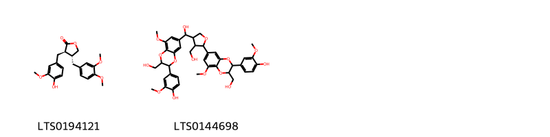{ width=100% }
    <figcaption>Hình ảnh cấu trúc hóa học của 2 hoạt chất thuộc nhóm Furanoid lignans gồm ['(-)-arctigenin (LTS0194121)', '4-{7-[hydroxy({5-[3-(4-hydroxy-3-methoxyphenyl)-2-(hydroxymethyl)-8-methoxy-2,3-dihydro-1,4-benzodioxin-6-yl]-4-(hydroxymethyl)oxolan-3-yl})methyl]-3-(hydroxymethyl)-5-methoxy-2,3-dihydro-1,4-benzodioxin-2-yl}-2-methoxyphenol (LTS0144698)'].</figcaption>
</figure>
#### Nhóm Lignan glycosides
<figure markdown="span">
    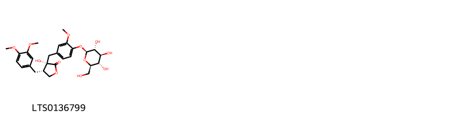{ width=100% }
    <figcaption>Hình ảnh cấu trúc hóa học của 1 hoạt chất thuộc nhóm Lignan glycosides gồm ['tracheloside (LTS0136799)'].</figcaption>
</figure>
#### Nhóm Organooxygen compounds
<figure markdown="span">
    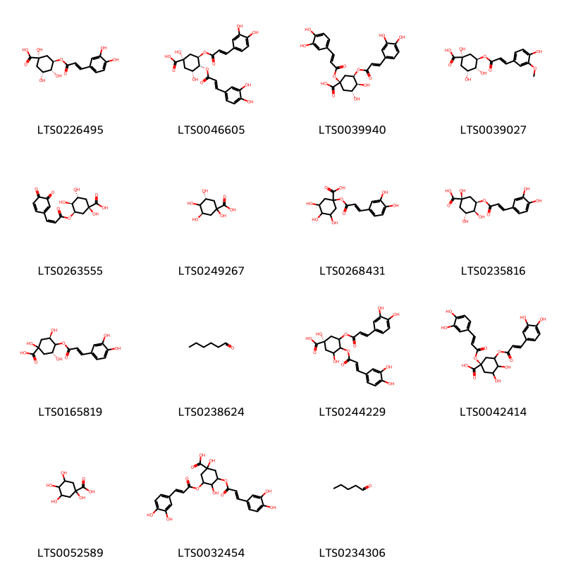{ width=100% }
    <figcaption>Hình ảnh cấu trúc hóa học của 15 hoạt chất thuộc nhóm Organooxygen compounds gồm ['chlorogenic acid (LTS0226495)', '4,5-dicaffeoylquinic acid (LTS0046605)', 'cynarine (LTS0039940)', '3-o-feruloyl-d-quinic acid (LTS0039027)', '(1r,3r,4s,5r)-3-{[(2z)-3-(3,4-dioxocyclohexa-1,5-dien-1-yl)prop-2-enoyl]oxy}-1,4,5-trihydroxycyclohexane-1-carboxylic acid (LTS0263555)', '(3r,5r)-1,3,4,5-tetrahydroxycyclohexane-1-carboxylic acid (LTS0249267)', '1-{[(2e)-3-(3,4-dihydroxyphenyl)prop-2-enoyl]oxy}-3,4,5-trihydroxycyclohexane-1-carboxylic acid (LTS0268431)', 'neochlorogenic acid (LTS0235816)', '(3r,5r)-4-{[(2e)-3-(3,4-dihydroxyphenyl)prop-2-enoyl]oxy}-1,3,5-trihydroxycyclohexane-1-carboxylic acid (LTS0165819)', 'hexanal (LTS0238624)', '(1s)-3,4-bis({[3-(3,4-dihydroxyphenyl)prop-2-enoyl]oxy})-1,5-dihydroxycyclohexane-1-carboxylic acid (LTS0244229)', '(1r)-1,3-bis({[3-(3,4-dihydroxyphenyl)prop-2-enoyl]oxy})-4,5-dihydroxycyclohexane-1-carboxylic acid (LTS0042414)', 'quinic acid (LTS0052589)', '3,5-bis({[(2e)-3-(3,4-dihydroxyphenyl)prop-2-enoyl]oxy})-1,4-dihydroxycyclohexane-1-carboxylic acid (LTS0032454)', 'pentanal (LTS0234306)'].</figcaption>
</figure>
#### Nhóm Prenol lipids
<figure markdown="span">
    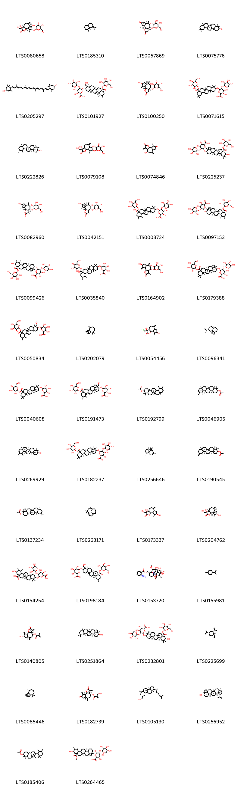{ width=100% }
    <figcaption>Hình ảnh cấu trúc hóa học của 87 hoạt chất thuộc nhóm Prenol lipids gồm ['(3r,3ar,6ar,8s,9s,9ar,9br)-3-hydroxy-3-(hydroxymethyl)-9-methyl-6-methylidene-8-{[(2r,3r,4s,5s,6r)-3,4,5-trihydroxy-6-(hydroxymethyl)oxan-2-yl]oxy}-octahydro-3ah-azuleno[4,5-b]furan-2-one (LTS0080658)', '1,1,7,7a-tetramethyl-1ah,2h,3h,5h,6h,7h,7bh-cyclopropa[a]naphthalene (LTS0185310)', '(3s,3ar,4s,6ar,9s,9ar,9br)-3,9-dimethyl-6-methylidene-4-{[(2r,3r,4s,5s,6r)-3,4,5-trihydroxy-6-(hydroxymethyl)oxan-2-yl]oxy}-octahydro-3h-azuleno[4,5-b]furan-2,8-dione (LTS0057869)', 'β-amyrin (LTS0075776)', 'carotenoid (LTS0205297)', '(2s,3s,4s,5r,6r)-6-{[(3s,4r,4ar,6ar,6bs,8as,11r,12s,12as,14ar,14br)-4-(hydroxymethyl)-4,6a,6b,11,12,14b-hexamethyl-8a-({[(2s,3r,4s,5s,6r)-3,4,5-trihydroxy-6-(hydroxymethyl)oxan-2-yl]oxy}carbonyl)-2,3,4a,5,6,7,8,9,10,11,12,12a,14,14a-tetradecahydro-1h-picen-3-yl]oxy}-3,4-dihydroxy-5-{[(2r,3r,4s,5s)-3,4,5-trihydroxyoxan-2-yl]oxy}oxane-2-carboxylic acid (LTS0101927)', '(3s,3ar,4s,6ar,8s,9ar,9br)-8-hydroxy-3-methyl-6,9-dimethylidene-4-{[(2r,3r,4s,5s,6r)-3,4,5-trihydroxy-6-(hydroxymethyl)oxan-2-yl]oxy}-octahydro-3h-azuleno[4,5-b]furan-2-one (LTS0100250)', '6-{[4,4,6a,6b,11,11,14b-heptamethyl-8a-({[3,4,5-trihydroxy-6-(hydroxymethyl)oxan-2-yl]oxy}carbonyl)-1,2,3,4a,5,6,7,8,9,10,12,12a,14,14a-tetradecahydropicen-3-yl]oxy}-3,4-dihydroxy-5-[(3,4,5-trihydroxyoxan-2-yl)oxy]oxane-2-carboxylic acid (LTS0071615)', 'amyrin (LTS0222826)', '3-hydroxy-3-(hydroxymethyl)-9-methyl-6-methylidene-8-{[3,4,5-trihydroxy-6-(hydroxymethyl)oxan-2-yl]oxy}-octahydro-3ah-azuleno[4,5-b]furan-2-one (LTS0079108)', '4-hydroxy-9-methyl-3,6-dimethylidene-octahydroazuleno[4,5-b]furan-2,8-dione (LTS0074846)', '(2s,3s,4s,5r,6r)-6-{[(3s,4ar,6ar,6bs,8ar,10s,12as,14ar,14br)-10-hydroxy-4,4,6a,6b,11,11,14b-heptamethyl-8a-({[(2s,3r,4s,5s,6r)-3,4,5-trihydroxy-6-(hydroxymethyl)oxan-2-yl]oxy}carbonyl)-1,2,3,4a,5,6,7,8,9,10,12,12a,14,14a-tetradecahydropicen-3-yl]oxy}-3,4-dihydroxy-5-{[(2r,3r,4s,5s)-3,4,5-trihydroxyoxan-2-yl]oxy}oxane-2-carboxylic acid (LTS0225237)', '(3s,3ar,4s,6ar,8s,9s,9ar,9br)-8-hydroxy-3,9-dimethyl-6-methylidene-4-{[(2r,3r,4s,5s,6r)-3,4,5-trihydroxy-6-(hydroxymethyl)oxan-2-yl]oxy}-decahydroazuleno[4,5-b]furan-2-one (LTS0082960)', '(3s,3ar,4s,6ar,8r,9s,9ar,9br)-8-hydroxy-3,9-dimethyl-6-methylidene-4-{[(2r,3r,4s,5s,6r)-3,4,5-trihydroxy-6-(hydroxymethyl)oxan-2-yl]oxy}-decahydroazuleno[4,5-b]furan-2-one (LTS0042151)', '6-{[4,4,6a,6b,11,12,14b-heptamethyl-8a-({[3,4,5-trihydroxy-6-(hydroxymethyl)oxan-2-yl]oxy}carbonyl)-2,3,4a,5,6,7,8,9,10,11,12,12a,14,14a-tetradecahydro-1h-picen-3-yl]oxy}-3,4-dihydroxy-5-[(3,4,5-trihydroxyoxan-2-yl)oxy]oxane-2-carboxylic acid (LTS0003724)', '(2s,3s,4s,5r,6r)-6-{[(3s,4ar,6ar,6bs,8as,11r,12s,12as,14ar,14br)-4,4,6a,6b,11,12,14b-heptamethyl-8a-({[(2s,3r,4s,5s,6r)-3,4,5-trihydroxy-6-(hydroxymethyl)oxan-2-yl]oxy}carbonyl)-2,3,4a,5,6,7,8,9,10,11,12,12a,14,14a-tetradecahydro-1h-picen-3-yl]oxy}-3,4-dihydroxy-5-{[(2s,3r,4s,5s)-3,4,5-trihydroxyoxan-2-yl]oxy}oxane-2-carboxylic acid (LTS0097153)', '(2s,3s,4s,5r,6r)-6-{[(3s,4ar,6ar,6bs,8ar,10s,11s,12r,12as,14ar,14br)-10-hydroxy-4,4,6a,6b,11,12,14b-heptamethyl-8a-({[(2s,3r,4s,5s,6r)-3,4,5-trihydroxy-6-(hydroxymethyl)oxan-2-yl]oxy}carbonyl)-2,3,4a,5,6,7,8,9,10,11,12,12a,14,14a-tetradecahydro-1h-picen-3-yl]oxy}-3,4-dihydroxy-5-{[(2r,3r,4s,5s)-3,4,5-trihydroxyoxan-2-yl]oxy}oxane-2-carboxylic acid (LTS0099426)', '6-{[4,4,6a,6b,11,12,14b-heptamethyl-8a-({[3,4,5-trihydroxy-6-(hydroxymethyl)oxan-2-yl]oxy}carbonyl)-2,3,4a,5,6,7,8,9,10,11,12,12a,14,14a-tetradecahydro-1h-picen-3-yl]oxy}-3,4,5-trihydroxyoxane-2-carboxylic acid (LTS0035840)', '8-hydroxy-3-methyl-6,9-dimethylidene-4-{[3,4,5-trihydroxy-6-(hydroxymethyl)oxan-2-yl]oxy}-octahydro-3h-azuleno[4,5-b]furan-2-one (LTS0164902)', '(2s,3s,4s,5r,6r)-6-{[(3s,4ar,6ar,6bs,8as,12as,14ar,14br)-4,4,6a,6b,11,11,14b-heptamethyl-8a-({[(2s,3r,4s,5s,6r)-3,4,5-trihydroxy-6-(hydroxymethyl)oxan-2-yl]oxy}carbonyl)-1,2,3,4a,5,6,7,8,9,10,12,12a,14,14a-tetradecahydropicen-3-yl]oxy}-3,4-dihydroxy-5-{[(2s,3r,4s,5s)-3,4,5-trihydroxyoxan-2-yl]oxy}oxane-2-carboxylic acid (LTS0179388)', '3,4,5-trihydroxy-6-{[4-(hydroxymethyl)-4,6a,6b,11,12,14b-hexamethyl-8a-({[3,4,5-trihydroxy-6-(hydroxymethyl)oxan-2-yl]oxy}carbonyl)-2,3,4a,5,6,7,8,9,10,11,12,12a,14,14a-tetradecahydro-1h-picen-3-yl]oxy}oxane-2-carboxylic acid (LTS0050834)', 'longifolene (LTS0202079)', '3-(chloromethyl)-3-hydroxy-9-methyl-6-methylidene-octahydroazuleno[4,5-b]furan-2,8-dione (LTS0054456)', 'β-selinene (LTS0096341)', 'calenduloside f (LTS0040608)', '(2s,3s,4s,5r,6r)-6-{[(3s,4ar,6ar,6bs,8as,12as,14ar,14br)-4-(hydroxymethyl)-4,6a,6b,11,12,14b-hexamethyl-8a-({[(2s,3r,4s,5s,6r)-3,4,5-trihydroxy-6-(hydroxymethyl)oxan-2-yl]oxy}carbonyl)-2,3,4a,5,6,7,8,9,10,11,12,12a,14,14a-tetradecahydro-1h-picen-3-yl]oxy}-3,4,5-trihydroxyoxane-2-carboxylic acid (LTS0191473)', '4,4,6a,6b,8a,11,12,14b-octamethyl-2,3,4a,5,6,7,8,9,12,12a,12b,13,14,14a-tetradecahydro-1h-picen-3-yl acetate (LTS0192799)', '(3s,4ar,6ar,6br,8as,12s,12ar,12br,14ar,14br)-4,4,6a,6b,8a,11,12,14b-octamethyl-2,3,4a,5,6,7,8,9,12,12a,12b,13,14,14a-tetradecahydro-1h-picen-3-yl acetate (LTS0046905)', '(4ar,6ar,6br,8as,12ar,12br,14ar,14br)-4,4,6a,6b,8a,11,12,14b-octamethyl-2,3,4a,5,6,7,8,9,12,12a,12b,13,14,14a-tetradecahydro-1h-picen-3-ol (LTS0269929)', '(2s,3s,4s,5r,6r)-6-{[(3s,4ar,6ar,6bs,8as,12as,14ar,14br)-4,4,6a,6b,11,11,14b-heptamethyl-8a-({[(2s,3r,4s,5s,6r)-3,4,5-trihydroxy-6-(hydroxymethyl)oxan-2-yl]oxy}carbonyl)-1,2,3,4a,5,6,7,8,9,10,12,12a,14,14a-tetradecahydropicen-3-yl]oxy}-3,4-dihydroxy-5-{[(2r,3r,4s,5s)-3,4,5-trihydroxyoxan-2-yl]oxy}oxane-2-carboxylic acid (LTS0182237)', 'cedrene (LTS0256646)', 'taraxasterol acetate (LTS0190545)', 'β-amyrin acetate (LTS0137234)', 'humulene (LTS0263171)', '3,8-dihydroxy-3-(hydroxymethyl)-9-methyl-6-methylidene-octahydro-3ah-azuleno[4,5-b]furan-2-one (LTS0173337)', '(3r,3ar,6ar,8s,9s,9ar,9bs)-3,8-dihydroxy-3-(hydroxymethyl)-9-methyl-6-methylidene-octahydro-3ah-azuleno[4,5-b]furan-2-one (LTS0204762)', '6-[(8a-carboxy-10-hydroxy-4,4,6a,6b,11,12,14b-heptamethyl-2,3,4a,5,6,7,8,9,10,11,12,12a,14,14a-tetradecahydro-1h-picen-3-yl)oxy]-3,4-dihydroxy-5-[(3,4,5-trihydroxyoxan-2-yl)oxy]oxane-2-carboxylic acid (LTS0154254)', '(2r,3r,4r,5s,6s)-6-{[(3s,4r,4ar,6ar,6bs,8as,11r,12s,12as,14ar,14br)-4-(hydroxymethyl)-4,6a,6b,11,12,14b-hexamethyl-8a-({[(2s,3r,4s,5s,6r)-3,4,5-trihydroxy-6-(hydroxymethyl)oxan-2-yl]oxy}carbonyl)-2,3,4a,5,6,7,8,9,10,11,12,12a,14,14a-tetradecahydro-1h-picen-3-yl]oxy}-3,4,5-trihydroxyoxane-2-carboxylic acid (LTS0198184)', '[(1s,4s,5r,6s,8r,9r,13s,16s,18s)-11-ethyl-8,9-dihydroxy-4,6,16,18-tetramethoxy-11-azahexacyclo[7.7.2.1²,⁵.0¹,¹⁰.0³,⁸.0¹³,¹⁷]nonadecan-13-yl]methyl 2-aminobenzoate (LTS0153720)', 'limonene,  (LTS0155981)', '(3ar,4s,6ar,8s,9ar,9br)-8-hydroxy-3,6,9-trimethylidene-2-oxo-octahydroazuleno[4,5-b]furan-4-yl 2-methylprop-2-enoate (LTS0140805)', 'β-amyrin (LTS0251864)', '(2s,3s,4s,5r,6r)-6-{[(3s,4ar,6ar,6bs,8ar,10s,12as,14ar,14br)-10-hydroxy-4,4,6a,6b,11,11,14b-heptamethyl-8a-({[(2s,3r,4s,5s,6r)-3,4,5-trihydroxy-6-(hydroxymethyl)oxan-2-yl]oxy}carbonyl)-1,2,3,4a,5,6,7,8,9,10,12,12a,14,14a-tetradecahydropicen-3-yl]oxy}-3,4-dihydroxy-5-{[(2s,3r,4s,5s)-3,4,5-trihydroxyoxan-2-yl]oxy}oxane-2-carboxylic acid (LTS0232801)', 'β-elemene (LTS0225699)', '(2s,7s)-3,3,7-trimethyl-8-methylidenetricyclo[5.4.0.0²,⁹]undecane (LTS0085446)', '(3ar,4s,6ar,9ar,9br)-3,6,9-trimethylidene-2,8-dioxo-hexahydro-3ah-azuleno[4,5-b]furan-4-yl 2-(hydroxymethyl)prop-2-enoate (LTS0182739)', '3-[(3s,3as,5as,6s,9as,9br)-3a,5a,9b-trimethyl-3-[(2s)-6-methylhept-5-en-2-yl]-7-(propan-2-ylidene)-octahydro-1h-cyclopenta[a]naphthalen-6-yl]propan-1-ol (LTS0105130)', 'lupeol (LTS0256952)', '4,4,6a,6b,8a,11,12,14b-octamethyl-2,3,4a,5,6,7,8,9,10,11,12,12a,14,14a-tetradecahydro-1h-picen-3-yl acetate (LTS0185406)', '(2s,3s,4s,5r,6r)-6-{[(3s,4ar,6ar,6bs,8ar,10s,11s,12r,12as,14ar,14br)-10-hydroxy-8a-(methoxycarbonyl)-4,4,6a,6b,11,12,14b-heptamethyl-2,3,4a,5,6,7,8,9,10,11,12,12a,14,14a-tetradecahydro-1h-picen-3-yl]oxy}-3,4-dihydroxy-5-{[(2r,3r,4s,5s)-3,4,5-trihydroxyoxan-2-yl]oxy}oxane-2-carboxylic acid (LTS0264465)', 'saupirin (LTS0201557)', 'cynaropicrin (LTS0272033)', '(6ar,6br,8ar,14br)-4,4,6a,6b,8a,12,14b-heptamethyl-11-methylidene-hexadecahydropicen-3-ol (LTS0274865)', 'β-carotene (LTS0275716)', 'levo-α-cedrene (LTS0222481)', '4,4,6a,6b,8a,11,12,14b-octamethyl-2,3,4a,5,6,7,8,9,12,12a,12b,13,14,14a-tetradecahydro-1h-picen-3-ol (LTS0093091)', '3,4-dihydroxy-6-{[10-hydroxy-8a-(methoxycarbonyl)-4,4,6a,6b,11,11,14b-heptamethyl-1,2,3,4a,5,6,7,8,9,10,12,12a,14,14a-tetradecahydropicen-3-yl]oxy}-5-[(3,4,5-trihydroxyoxan-2-yl)oxy]oxane-2-carboxylic acid (LTS0271463)', '3,4-dihydroxy-6-{[4-(hydroxymethyl)-4,6a,6b,11,12,14b-hexamethyl-8a-({[3,4,5-trihydroxy-6-(hydroxymethyl)oxan-2-yl]oxy}carbonyl)-2,3,4a,5,6,7,8,9,10,11,12,12a,14,14a-tetradecahydro-1h-picen-3-yl]oxy}-5-[(3,4,5-trihydroxyoxan-2-yl)oxy]oxane-2-carboxylic acid (LTS0235242)', '(2s,3s,4s,5r,6r)-6-{[(3s,4ar,6ar,6bs,8as,11r,12s,12as,14ar,14br)-4,4,6a,6b,11,12,14b-heptamethyl-8a-({[(2s,3r,4s,5s,6r)-3,4,5-trihydroxy-6-(hydroxymethyl)oxan-2-yl]oxy}carbonyl)-2,3,4a,5,6,7,8,9,10,11,12,12a,14,14a-tetradecahydro-1h-picen-3-yl]oxy}-3,4-dihydroxy-5-{[(2r,3r,4s,5s)-3,4,5-trihydroxyoxan-2-yl]oxy}oxane-2-carboxylic acid (LTS0224156)', 'grosheimin (LTS0260185)', 'taraxasterol (LTS0210066)', '(3s,4ar,6as,6br,8as,9r,10s,12as,12br)-10-{[(2r,3r,4s,5s,6r)-3-{[(2s,3s,4s,5r)-3,4-dihydroxy-5-(hydroxymethyl)oxolan-2-yl]oxy}-4,5-dihydroxy-6-(hydroxymethyl)oxan-2-yl]oxy}-3-hydroxy-2,2,6a,6b,9,12a-hexamethyl-3,4,5,6,7,8,8a,9,10,11,12,12b,13,14b-tetradecahydro-1h-picene-4a-carboxylic acid (LTS0082143)', '(1ar,7r,7ar,7bs)-1,1,7,7a-tetramethyl-1ah,2h,3h,5h,6h,7h,7bh-cyclopropa[a]naphthalene (LTS0234436)', '4,4,6a,6b,8a,12,14b-heptamethyl-11-methylidene-hexadecahydropicen-3-yl acetate (LTS0026037)', '4,4,6a,6b,8a,11,11,14b-octamethyl-1,2,3,4a,5,6,7,8,9,10,12,12a,14,14a-tetradecahydropicen-3-yl acetate (LTS0153642)', '(3as,4s,6as,9r,9as,9bs)-4-hydroxy-9-methyl-3,6-dimethylidene-octahydroazuleno[4,5-b]furan-2,8-dione (LTS0233750)', '(3s,4ar,6ar,6br,8as,12s,12ar,12br,14ar,14br)-4,4,6a,6b,8a,11,12,14b-octamethyl-2,3,4a,5,6,7,8,9,12,12a,12b,13,14,14a-tetradecahydro-1h-picen-3-ol (LTS0235786)', '4-hydroxy-3-(methanesulfonylmethyl)-9-methyl-6-methylidene-octahydro-3h-azuleno[4,5-b]furan-2,8-dione (LTS0227230)', 'taraxasterol (LTS0006950)', '(3r,3ar,6ar,8s,9s,9ar,9br)-3,8-dihydroxy-3-(hydroxymethyl)-9-methyl-6-methylidene-octahydro-3ah-azuleno[4,5-b]furan-2-one (LTS0258087)', '(2s,3s,4s,5r,6r)-6-{[(3s,4ar,6ar,6bs,8as,11r,12s,12as,14ar,14br)-4,4,6a,6b,11,12,14b-heptamethyl-8a-({[(2s,3r,4s,5s,6r)-3,4,5-trihydroxy-6-(hydroxymethyl)oxan-2-yl]oxy}carbonyl)-2,3,4a,5,6,7,8,9,10,11,12,12a,14,14a-tetradecahydro-1h-picen-3-yl]oxy}-3,4,5-trihydroxyoxane-2-carboxylic acid (LTS0254481)', 'dehydrocostus lactone (LTS0202421)', '4,4,6a,6b,8a,12,14b-heptamethyl-11-methylidene-hexadecahydropicen-3-ol (LTS0256994)', '(2s,3s,4s,5r,6r)-6-{[(3s,4ar,6ar,6bs,8ar,10s,12as,14ar,14br)-10-hydroxy-8a-(methoxycarbonyl)-4,4,6a,6b,11,11,14b-heptamethyl-1,2,3,4a,5,6,7,8,9,10,12,12a,14,14a-tetradecahydropicen-3-yl]oxy}-3,4-dihydroxy-5-{[(2r,3r,4s,5s)-3,4,5-trihydroxyoxan-2-yl]oxy}oxane-2-carboxylic acid (LTS0248491)', '4-isopropyl-1,6-dimethylidene-octahydronaphthalene (LTS0155478)', '6-{[4,4,6a,6b,11,11,14b-heptamethyl-8a-({[3,4,5-trihydroxy-6-(hydroxymethyl)oxan-2-yl]oxy}carbonyl)-1,2,3,4a,5,6,7,8,9,10,12,12a,14,14a-tetradecahydropicen-3-yl]oxy}-3,4,5-trihydroxyoxane-2-carboxylic acid (LTS0051408)', '(1r,2s,3s,4ar,6as,6br,8as,9r,10s,12as,12br)-10-{[(2r,3r,4s,5s,6r)-3-{[(2s,3s,4s,5r)-3,4-dihydroxy-5-(hydroxymethyl)oxolan-2-yl]oxy}-4,5-dihydroxy-6-(hydroxymethyl)oxan-2-yl]oxy}-3-hydroxy-1,2,6a,6b,9,12a-hexamethyl-1,2,3,4,5,6,7,8,8a,9,10,11,12,12b,13,14b-hexadecahydropicene-4a-carboxylic acid (LTS0259702)', '3,4-dihydroxy-6-{[10-hydroxy-4,4,6a,6b,11,12,14b-heptamethyl-8a-({[3,4,5-trihydroxy-6-(hydroxymethyl)oxan-2-yl]oxy}carbonyl)-2,3,4a,5,6,7,8,9,10,11,12,12a,14,14a-tetradecahydro-1h-picen-3-yl]oxy}-5-[(3,4,5-trihydroxyoxan-2-yl)oxy]oxane-2-carboxylic acid (LTS0008005)', '3,4-dihydroxy-6-{[10-hydroxy-8a-(methoxycarbonyl)-4,4,6a,6b,11,12,14b-heptamethyl-2,3,4a,5,6,7,8,9,10,11,12,12a,14,14a-tetradecahydro-1h-picen-3-yl]oxy}-5-[(3,4,5-trihydroxyoxan-2-yl)oxy]oxane-2-carboxylic acid (LTS0134026)', '(2s,3s,4s,5r,6r)-6-{[(3s,4r,4ar,6ar,6bs,8as,11r,12s,12as,14ar,14br)-4-(hydroxymethyl)-4,6a,6b,11,12,14b-hexamethyl-8a-({[(2s,3r,4s,5s,6r)-3,4,5-trihydroxy-6-(hydroxymethyl)oxan-2-yl]oxy}carbonyl)-2,3,4a,5,6,7,8,9,10,11,12,12a,14,14a-tetradecahydro-1h-picen-3-yl]oxy}-3,4,5-trihydroxyoxane-2-carboxylic acid (LTS0013988)', '3,4-dihydroxy-6-{[10-hydroxy-4,4,6a,6b,11,11,14b-heptamethyl-8a-({[3,4,5-trihydroxy-6-(hydroxymethyl)oxan-2-yl]oxy}carbonyl)-1,2,3,4a,5,6,7,8,9,10,12,12a,14,14a-tetradecahydropicen-3-yl]oxy}-5-[(3,4,5-trihydroxyoxan-2-yl)oxy]oxane-2-carboxylic acid (LTS0108158)', 'valencene (LTS0031707)', 'α-amyrin acetate (LTS0224810)', 'α-amyrin (LTS0088267)', '6-[(8a-carboxy-4,4,6a,6b,11,12,14b-heptamethyl-2,3,4a,5,6,7,8,9,10,11,12,12a,14,14a-tetradecahydro-1h-picen-3-yl)oxy]-3,4-dihydroxy-5-[(3,4,5-trihydroxyoxan-2-yl)oxy]oxane-2-carboxylic acid (LTS0023026)', 'valencene (LTS0110395)', '(2s,3s,4s,5r,6r)-6-{[(3s,4ar,6ar,6bs,8as,11r,12s,12as,14ar,14br)-8a-carboxy-4,4,6a,6b,11,12,14b-heptamethyl-2,3,4a,5,6,7,8,9,10,11,12,12a,14,14a-tetradecahydro-1h-picen-3-yl]oxy}-3,4-dihydroxy-5-{[(2r,3r,4s,5s)-3,4,5-trihydroxyoxan-2-yl]oxy}oxane-2-carboxylic acid (LTS0229644)'].</figcaption>
</figure>
#### Nhóm Pyridines and derivatives
<figure markdown="span">
    { width=100% }
    <figcaption>Hình ảnh cấu trúc hóa học của 1 hoạt chất thuộc nhóm Pyridines and derivatives gồm ['pyridine (LTS0108275)'].</figcaption>
</figure>
#### Nhóm Saturated hydrocarbons
<figure markdown="span">
    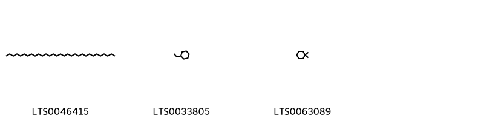{ width=100% }
    <figcaption>Hình ảnh cấu trúc hóa học của 3 hoạt chất thuộc nhóm Saturated hydrocarbons gồm ['hentriacontane (LTS0046415)', 'ethylcyclohexane (LTS0033805)', '1,1-dimethylcyclohexane (LTS0063089)'].</figcaption>
</figure>
#### Nhóm Steroids and steroid derivatives
<figure markdown="span">
    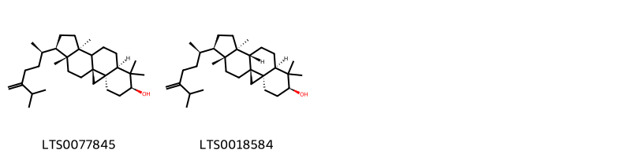{ width=100% }
    <figcaption>Hình ảnh cấu trúc hóa học của 2 hoạt chất thuộc nhóm Steroids and steroid derivatives gồm ['24-methylene-cycloartanol (LTS0077845)', '24-methylenecycloartanol (LTS0018584)'].</figcaption>
</figure>

---

### Dược dân tộc học

Danh sách các quốc gia có sử dụng *Cynara cardunculus* trong điều trị các bệnh. 

| Country   | Disease            | Bệnh                                                                                                                                                                                                |
|:----------|:-------------------|:----------------------------------------------------------------------------------------------------------------------------------------------------------------------------------------------------|
| Turkey    | Diuretic, Aperient | MYMEMORY WARNING: YOU USED ALL AVAILABLE FREE TRANSLATIONS FOR TODAY. NEXT AVAILABLE IN  10 HOURS 01 MINUTES 26 SECONDS VISIT HTTPS://MYMEMORY.TRANSLATED.NET/DOC/USAGELIMITS.PHP TO TRANSLATE MORE |

---

---
## Cynara scolymus
### Thông tin về thực vật

!!! info "Phân loại thực vật của *Cynara scolymus* từ GIBF:"
    - **Kingdom:** Plantae
    - **Phylum:** Tracheophyta
    - **Order:** Asterales
    - **Family:** Asteraceae
    - **Genus:** Cynara
    - **Species:** *Cynara scolymus*

 

| Label (VI)   | Label (EN)   | Scientific Name   | Descriptions (VI)   | Descriptions (EN)   | Also Known As (VI)                        | Also Known As (EN)   |
|:-------------|:-------------|:------------------|:--------------------|:--------------------|:------------------------------------------|:---------------------|
| N/A          | N/A          | Cynara scolymus   | loài thực vật       | species of plant    | ['Cynara scolymus', 'Atiso', 'Artichoke'] | ['artichoke plant']  |

#### Phân bố trên thế giới

**Từ CSDL GIBF** Italy, Belgium, Guatemala, Norway, Ukraine, Denmark, Pakistan, Netherlands, Réunion, Spain, Portugal, Russian Federation, United States of America, Chile, Greece, Germany, Brazil, Switzerland, Mexico, France, United Kingdom of Great Britain and Northern Ireland, Ecuador, Colombia, New Zealand, Nepal

#### Phân bố tại Việt Nam

**Từ CSDL GIBF**: Không có ghi nhận ở Việt Nam

---
### Thành phần hóa học
        
- Theo cơ sở dữ liệu lotus: Từ loài *Cynara scolymus* đã phân lập và xác định được 75 hoạt chất thuộc về các nhóm Fatty Acyls, Flavonoids, Prenol lipids, Cinnamic acids and derivatives, Benzene and substituted derivatives, Dihydrofurans, Organooxygen compounds, Saturated hydrocarbons, Carboxylic acids and derivatives, Pyridines and derivatives. 

|    | chemicalTaxonomyClassyfireClass     |   smiles_count |
|---:|:------------------------------------|---------------:|
|  0 | Benzene and substituted derivatives |              7 |
|  1 | Carboxylic acids and derivatives    |              2 |
|  2 | Cinnamic acids and derivatives      |              1 |
|  3 | Dihydrofurans                       |              1 |
|  4 | Fatty Acyls                         |              1 |
|  5 | Flavonoids                          |             15 |
|  6 | Organooxygen compounds              |             12 |
|  7 | Prenol lipids                       |             31 |
|  8 | Pyridines and derivatives           |              1 |
|  9 | Saturated hydrocarbons              |              2 |

#### Nhóm Benzene and substituted derivatives
<figure markdown="span">
    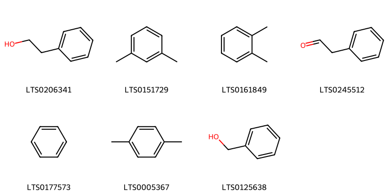{ width=100% }
    <figcaption>Hình ảnh cấu trúc hóa học của 7 hoạt chất thuộc nhóm Benzene and substituted derivatives gồm ['2-phenyl-ethanol (LTS0206341)', 'm-xylene (LTS0151729)', 'ortho-xylene (LTS0161849)', 'phenylacetaldehyde (LTS0245512)', 'benzene (LTS0177573)', 'para-xylene (LTS0005367)', 'benzyl alcohol (LTS0125638)'].</figcaption>
</figure>
#### Nhóm Carboxylic acids and derivatives
<figure markdown="span">
    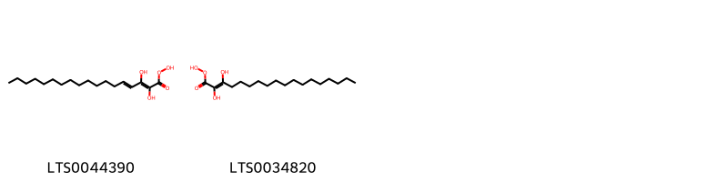{ width=100% }
    <figcaption>Hình ảnh cấu trúc hóa học của 2 hoạt chất thuộc nhóm Carboxylic acids and derivatives gồm ['(2e,4e)-2,3-dihydroxyoctadeca-2,4-dieneperoxoic acid (LTS0044390)', '(2e)-2,3-dihydroxyoctadec-2-eneperoxoic acid (LTS0034820)'].</figcaption>
</figure>
#### Nhóm Cinnamic acids and derivatives
<figure markdown="span">
    { width=100% }
    <figcaption>Hình ảnh cấu trúc hóa học của 1 hoạt chất thuộc nhóm Cinnamic acids and derivatives gồm ['3,4-dihydroxycinnamic acid (LTS0128050)'].</figcaption>
</figure>
#### Nhóm Dihydrofurans
<figure markdown="span">
    { width=100% }
    <figcaption>Hình ảnh cấu trúc hóa học của 1 hoạt chất thuộc nhóm Dihydrofurans gồm ['2-methyl-3h-furan-2-carbaldehyde (LTS0245708)'].</figcaption>
</figure>
#### Nhóm Fatty Acyls
<figure markdown="span">
    { width=100% }
    <figcaption>Hình ảnh cấu trúc hóa học của 1 hoạt chất thuộc nhóm Fatty Acyls gồm ['hexanol (LTS0217299)'].</figcaption>
</figure>
#### Nhóm Flavonoids
<figure markdown="span">
    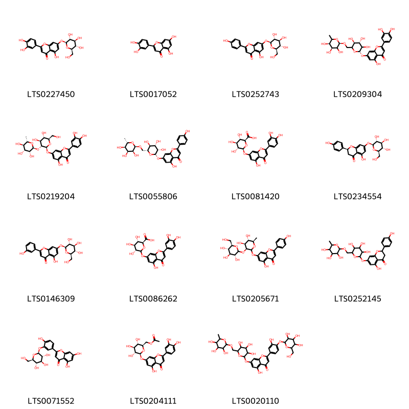{ width=100% }
    <figcaption>Hình ảnh cấu trúc hóa học của 15 hoạt chất thuộc nhóm Flavonoids gồm ['luteolin 7-o-glucoside (LTS0227450)', 'luteolin (LTS0017052)', 'apigenin 7-o-β-glucoside (LTS0252743)', 'luteolin 7-rutinoside (LTS0209304)', 'lonicerin (LTS0219204)', 'apigenin 7-rutinoside (LTS0055806)', 'luteolin 7-o-glucuronide (LTS0081420)', 'prunin (LTS0234554)', '5-hydroxy-2-(3-hydroxyphenyl)-7-{[(2s,3r,4s,5s,6r)-3,4,5-trihydroxy-6-(hydroxymethyl)oxan-2-yl]oxy}chromen-4-one (LTS0146309)', '(2s,3s,4s,5r)-6-{[2-(3,4-dihydroxyphenyl)-5-hydroxy-4-oxochromen-7-yl]oxy}-3,4,5-trihydroxyoxane-2-carboxylic acid (LTS0086262)', '7-{[(3s,4s,5s,6r)-4,5-dihydroxy-6-methyl-3-{[(3r,4s,5s,6r)-3,4,5-trihydroxy-6-(hydroxymethyl)oxan-2-yl]oxy}oxan-2-yl]oxy}-5-hydroxy-2-(4-hydroxyphenyl)chromen-4-one (LTS0205671)', '5-hydroxy-2-(4-hydroxyphenyl)-7-[(3,4,5-trihydroxy-6-{[(3,4,5-trihydroxy-6-methyloxan-2-yl)oxy]methyl}oxan-2-yl)oxy]-2,3-dihydro-1-benzopyran-4-one (LTS0252145)', "luteolin 3'-glucoside (LTS0071552)", '[(2r,3s,4s,5r,6s)-6-{[2-(3,4-dihydroxyphenyl)-5-hydroxy-4-oxochromen-7-yl]oxy}-3,4,5-trihydroxyoxan-2-yl]methyl acetate (LTS0204111)', '5-hydroxy-2-(3-hydroxy-4-{[3,4,5-trihydroxy-6-(hydroxymethyl)oxan-2-yl]oxy}phenyl)-7-[(3,4,5-trihydroxy-6-{[(3,4,5-trihydroxy-6-methyloxan-2-yl)oxy]methyl}oxan-2-yl)oxy]chromen-4-one (LTS0020110)'].</figcaption>
</figure>
#### Nhóm Organooxygen compounds
<figure markdown="span">
    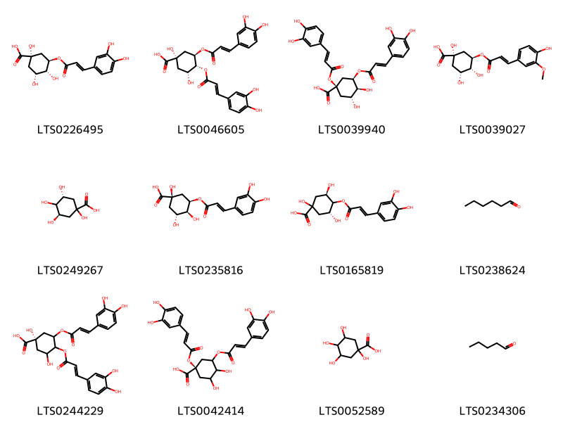{ width=100% }
    <figcaption>Hình ảnh cấu trúc hóa học của 12 hoạt chất thuộc nhóm Organooxygen compounds gồm ['chlorogenic acid (LTS0226495)', '4,5-dicaffeoylquinic acid (LTS0046605)', 'cynarine (LTS0039940)', '3-o-feruloyl-d-quinic acid (LTS0039027)', '(3r,5r)-1,3,4,5-tetrahydroxycyclohexane-1-carboxylic acid (LTS0249267)', 'neochlorogenic acid (LTS0235816)', '(3r,5r)-4-{[(2e)-3-(3,4-dihydroxyphenyl)prop-2-enoyl]oxy}-1,3,5-trihydroxycyclohexane-1-carboxylic acid (LTS0165819)', 'hexanal (LTS0238624)', '(1s)-3,4-bis({[3-(3,4-dihydroxyphenyl)prop-2-enoyl]oxy})-1,5-dihydroxycyclohexane-1-carboxylic acid (LTS0244229)', '(1r)-1,3-bis({[3-(3,4-dihydroxyphenyl)prop-2-enoyl]oxy})-4,5-dihydroxycyclohexane-1-carboxylic acid (LTS0042414)', 'quinic acid (LTS0052589)', 'pentanal (LTS0234306)'].</figcaption>
</figure>
#### Nhóm Prenol lipids
<figure markdown="span">
    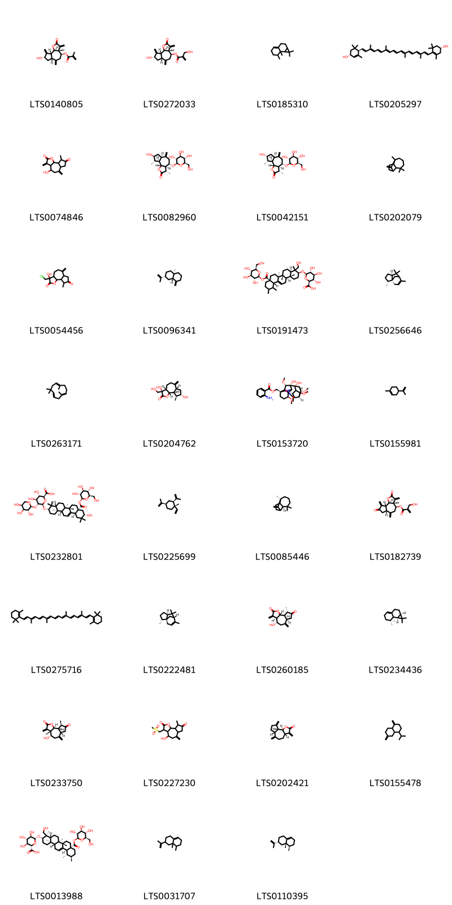{ width=100% }
    <figcaption>Hình ảnh cấu trúc hóa học của 31 hoạt chất thuộc nhóm Prenol lipids gồm ['(3ar,4s,6ar,8s,9ar,9br)-8-hydroxy-3,6,9-trimethylidene-2-oxo-octahydroazuleno[4,5-b]furan-4-yl 2-methylprop-2-enoate (LTS0140805)', 'cynaropicrin (LTS0272033)', '1,1,7,7a-tetramethyl-1ah,2h,3h,5h,6h,7h,7bh-cyclopropa[a]naphthalene (LTS0185310)', 'carotenoid (LTS0205297)', '4-hydroxy-9-methyl-3,6-dimethylidene-octahydroazuleno[4,5-b]furan-2,8-dione (LTS0074846)', '(3s,3ar,4s,6ar,8s,9s,9ar,9br)-8-hydroxy-3,9-dimethyl-6-methylidene-4-{[(2r,3r,4s,5s,6r)-3,4,5-trihydroxy-6-(hydroxymethyl)oxan-2-yl]oxy}-decahydroazuleno[4,5-b]furan-2-one (LTS0082960)', '(3s,3ar,4s,6ar,8r,9s,9ar,9br)-8-hydroxy-3,9-dimethyl-6-methylidene-4-{[(2r,3r,4s,5s,6r)-3,4,5-trihydroxy-6-(hydroxymethyl)oxan-2-yl]oxy}-decahydroazuleno[4,5-b]furan-2-one (LTS0042151)', 'longifolene (LTS0202079)', '3-(chloromethyl)-3-hydroxy-9-methyl-6-methylidene-octahydroazuleno[4,5-b]furan-2,8-dione (LTS0054456)', 'β-selinene (LTS0096341)', '(2s,3s,4s,5r,6r)-6-{[(3s,4ar,6ar,6bs,8as,12as,14ar,14br)-4-(hydroxymethyl)-4,6a,6b,11,12,14b-hexamethyl-8a-({[(2s,3r,4s,5s,6r)-3,4,5-trihydroxy-6-(hydroxymethyl)oxan-2-yl]oxy}carbonyl)-2,3,4a,5,6,7,8,9,10,11,12,12a,14,14a-tetradecahydro-1h-picen-3-yl]oxy}-3,4,5-trihydroxyoxane-2-carboxylic acid (LTS0191473)', 'cedrene (LTS0256646)', 'humulene (LTS0263171)', '(3r,3ar,6ar,8s,9s,9ar,9bs)-3,8-dihydroxy-3-(hydroxymethyl)-9-methyl-6-methylidene-octahydro-3ah-azuleno[4,5-b]furan-2-one (LTS0204762)', '[(1s,4s,5r,6s,8r,9r,13s,16s,18s)-11-ethyl-8,9-dihydroxy-4,6,16,18-tetramethoxy-11-azahexacyclo[7.7.2.1²,⁵.0¹,¹⁰.0³,⁸.0¹³,¹⁷]nonadecan-13-yl]methyl 2-aminobenzoate (LTS0153720)', 'limonene,  (LTS0155981)', '(2s,3s,4s,5r,6r)-6-{[(3s,4ar,6ar,6bs,8ar,10s,12as,14ar,14br)-10-hydroxy-4,4,6a,6b,11,11,14b-heptamethyl-8a-({[(2s,3r,4s,5s,6r)-3,4,5-trihydroxy-6-(hydroxymethyl)oxan-2-yl]oxy}carbonyl)-1,2,3,4a,5,6,7,8,9,10,12,12a,14,14a-tetradecahydropicen-3-yl]oxy}-3,4-dihydroxy-5-{[(2s,3r,4s,5s)-3,4,5-trihydroxyoxan-2-yl]oxy}oxane-2-carboxylic acid (LTS0232801)', 'β-elemene (LTS0225699)', '(2s,7s)-3,3,7-trimethyl-8-methylidenetricyclo[5.4.0.0²,⁹]undecane (LTS0085446)', '(3ar,4s,6ar,9ar,9br)-3,6,9-trimethylidene-2,8-dioxo-hexahydro-3ah-azuleno[4,5-b]furan-4-yl 2-(hydroxymethyl)prop-2-enoate (LTS0182739)', 'β-carotene (LTS0275716)', 'levo-α-cedrene (LTS0222481)', 'grosheimin (LTS0260185)', '(1ar,7r,7ar,7bs)-1,1,7,7a-tetramethyl-1ah,2h,3h,5h,6h,7h,7bh-cyclopropa[a]naphthalene (LTS0234436)', '(3as,4s,6as,9r,9as,9bs)-4-hydroxy-9-methyl-3,6-dimethylidene-octahydroazuleno[4,5-b]furan-2,8-dione (LTS0233750)', '4-hydroxy-3-(methanesulfonylmethyl)-9-methyl-6-methylidene-octahydro-3h-azuleno[4,5-b]furan-2,8-dione (LTS0227230)', 'dehydrocostus lactone (LTS0202421)', '4-isopropyl-1,6-dimethylidene-octahydronaphthalene (LTS0155478)', '(2s,3s,4s,5r,6r)-6-{[(3s,4r,4ar,6ar,6bs,8as,11r,12s,12as,14ar,14br)-4-(hydroxymethyl)-4,6a,6b,11,12,14b-hexamethyl-8a-({[(2s,3r,4s,5s,6r)-3,4,5-trihydroxy-6-(hydroxymethyl)oxan-2-yl]oxy}carbonyl)-2,3,4a,5,6,7,8,9,10,11,12,12a,14,14a-tetradecahydro-1h-picen-3-yl]oxy}-3,4,5-trihydroxyoxane-2-carboxylic acid (LTS0013988)', 'valencene (LTS0031707)', 'valencene (LTS0110395)'].</figcaption>
</figure>
#### Nhóm Pyridines and derivatives
<figure markdown="span">
    { width=100% }
    <figcaption>Hình ảnh cấu trúc hóa học của 1 hoạt chất thuộc nhóm Pyridines and derivatives gồm ['pyridine (LTS0108275)'].</figcaption>
</figure>
#### Nhóm Saturated hydrocarbons
<figure markdown="span">
    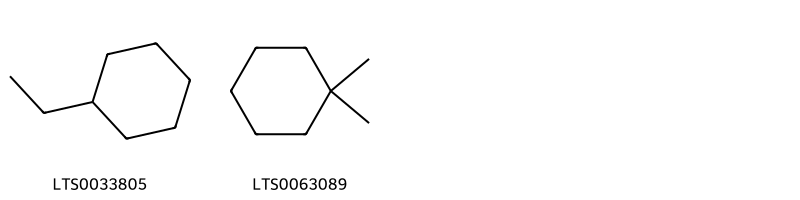{ width=100% }
    <figcaption>Hình ảnh cấu trúc hóa học của 2 hoạt chất thuộc nhóm Saturated hydrocarbons gồm ['ethylcyclohexane (LTS0033805)', '1,1-dimethylcyclohexane (LTS0063089)'].</figcaption>
</figure>

---

### Dược dân tộc học

Danh sách các quốc gia có sử dụng *Cynara scolymus* trong điều trị các bệnh. 

| Country            | Disease                   | Bệnh                                                                                                                                                                                                |
|:-------------------|:--------------------------|:----------------------------------------------------------------------------------------------------------------------------------------------------------------------------------------------------|
| Dominican Republic | Cholagogue                | MYMEMORY WARNING: YOU USED ALL AVAILABLE FREE TRANSLATIONS FOR TODAY. NEXT AVAILABLE IN  10 HOURS 00 MINUTES 47 SECONDS VISIT HTTPS://MYMEMORY.TRANSLATED.NET/DOC/USAGELIMITS.PHP TO TRANSLATE MORE |
| Elsewhere          | Diuretic, Diuretic, Tonic | MYMEMORY WARNING: YOU USED ALL AVAILABLE FREE TRANSLATIONS FOR TODAY. NEXT AVAILABLE IN  10 HOURS 00 MINUTES 44 SECONDS VISIT HTTPS://MYMEMORY.TRANSLATED.NET/DOC/USAGELIMITS.PHP TO TRANSLATE MORE |
| Haiti              | Diuretic, Diuretic        | MYMEMORY WARNING: YOU USED ALL AVAILABLE FREE TRANSLATIONS FOR TODAY. NEXT AVAILABLE IN  10 HOURS 00 MINUTES 41 SECONDS VISIT HTTPS://MYMEMORY.TRANSLATED.NET/DOC/USAGELIMITS.PHP TO TRANSLATE MORE |

---

# Chi Parthenium

??? note "Danh sách các dược liệu thuộc chi"
    
	 - *Parthenium hysterophorus*

---
## Parthenium hysterophorus
### Thông tin về thực vật

!!! info "Phân loại thực vật của *Parthenium hysterophorus* từ GIBF:"
    - **Kingdom:** Plantae
    - **Phylum:** Tracheophyta
    - **Order:** Asterales
    - **Family:** Asteraceae
    - **Genus:** Parthenium
    - **Species:** *Parthenium hysterophorus*

 

| Label (VI)   | Label (EN)   | Scientific Name          | Descriptions (VI)   | Descriptions (EN)   | Also Known As (VI)   | Also Known As (EN)           |
|:-------------|:-------------|:-------------------------|:--------------------|:--------------------|:---------------------|:-----------------------------|
| N/A          | N/A          | Parthenium hysterophorus | loài thực vật       | species of plant    | ['']                 | ['mugwort', 'wild wormwood'] |

#### Phân bố trên thế giới

**Từ CSDL GIBF** nan, Australia, Guadeloupe, Argentina, Tanzania, United Republic of, Puerto Rico, Réunion, Chinese Taipei, Honduras, Jamaica, United States of America, Belize, South Africa, Thailand, Brazil, Mexico, Dominican Republic, Peru, China, Curaçao, Haiti, India, Anguilla, Antigua and Barbuda, Kenya, Ethiopia

#### Phân bố tại Việt Nam

**Từ CSDL GIBF**: Không có ghi nhận ở Việt Nam

---
### Thành phần hóa học
        
- Theo cơ sở dữ liệu lotus: Từ loài *Parthenium hysterophorus* đã phân lập và xác định được 137 hoạt chất thuộc về các nhóm Fatty Acyls, Flavonoids, Prenol lipids, Steroids and steroid derivatives, Oxanes, Benzene and substituted derivatives, Unsaturated hydrocarbons, Dihydrofurans, Lactones, Organooxygen compounds, Furanoid lignans, Carboxylic acids and derivatives. 

|    | chemicalTaxonomyClassyfireClass     |   smiles_count |
|---:|:------------------------------------|---------------:|
|  0 | Benzene and substituted derivatives |              2 |
|  1 | Carboxylic acids and derivatives    |              1 |
|  2 | Dihydrofurans                       |              2 |
|  3 | Fatty Acyls                         |              1 |
|  4 | Flavonoids                          |              1 |
|  5 | Furanoid lignans                    |              3 |
|  6 | Lactones                            |              2 |
|  7 | Organooxygen compounds              |              1 |
|  8 | Oxanes                              |              2 |
|  9 | Prenol lipids                       |            115 |
| 10 | Steroids and steroid derivatives    |              4 |
| 11 | Unsaturated hydrocarbons            |              3 |

#### Nhóm Benzene and substituted derivatives
<figure markdown="span">
    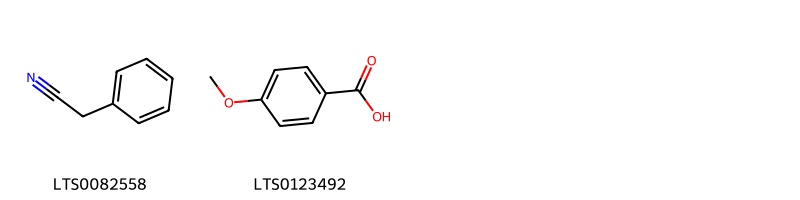{ width=100% }
    <figcaption>Hình ảnh cấu trúc hóa học của 2 hoạt chất thuộc nhóm Benzene and substituted derivatives gồm ['phenylacetonitrile (LTS0082558)', 'p-anisic acid (LTS0123492)'].</figcaption>
</figure>
#### Nhóm Carboxylic acids and derivatives
<figure markdown="span">
    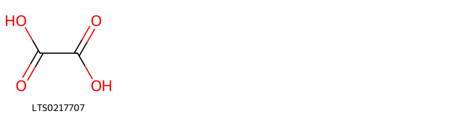{ width=100% }
    <figcaption>Hình ảnh cấu trúc hóa học của 1 hoạt chất thuộc nhóm Carboxylic acids and derivatives gồm ['oxalic acid (LTS0217707)'].</figcaption>
</figure>
#### Nhóm Dihydrofurans
<figure markdown="span">
    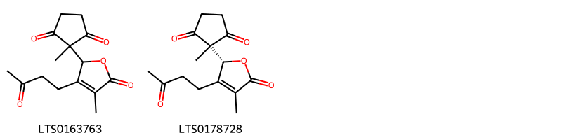{ width=100% }
    <figcaption>Hình ảnh cấu trúc hóa học của 2 hoạt chất thuộc nhóm Dihydrofurans gồm ['2-methyl-2-[4-methyl-5-oxo-3-(3-oxobutyl)-2h-furan-2-yl]cyclopentane-1,3-dione (LTS0163763)', '2-methyl-2-[(2r)-4-methyl-5-oxo-3-(3-oxobutyl)-2h-furan-2-yl]cyclopentane-1,3-dione (LTS0178728)'].</figcaption>
</figure>
#### Nhóm Fatty Acyls
<figure markdown="span">
    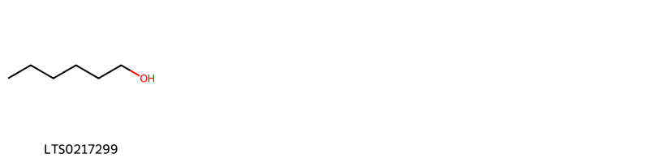{ width=100% }
    <figcaption>Hình ảnh cấu trúc hóa học của 1 hoạt chất thuộc nhóm Fatty Acyls gồm ['hexanol (LTS0217299)'].</figcaption>
</figure>
#### Nhóm Flavonoids
<figure markdown="span">
    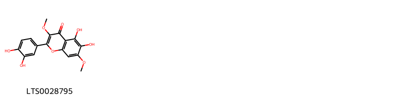{ width=100% }
    <figcaption>Hình ảnh cấu trúc hóa học của 1 hoạt chất thuộc nhóm Flavonoids gồm ['tomentin (LTS0028795)'].</figcaption>
</figure>
#### Nhóm Furanoid lignans
<figure markdown="span">
    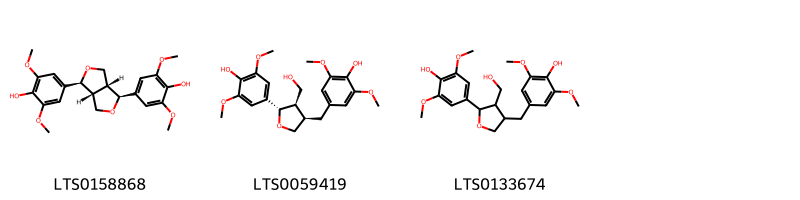{ width=100% }
    <figcaption>Hình ảnh cấu trúc hóa học của 3 hoạt chất thuộc nhóm Furanoid lignans gồm ['(+)-syringaresinol (LTS0158868)', '4-[(2s,3r,4r)-4-[(4-hydroxy-3,5-dimethoxyphenyl)methyl]-3-(hydroxymethyl)oxolan-2-yl]-2,6-dimethoxyphenol (LTS0059419)', '4-{4-[(4-hydroxy-3,5-dimethoxyphenyl)methyl]-3-(hydroxymethyl)oxolan-2-yl}-2,6-dimethoxyphenol (LTS0133674)'].</figcaption>
</figure>
#### Nhóm Lactones
<figure markdown="span">
    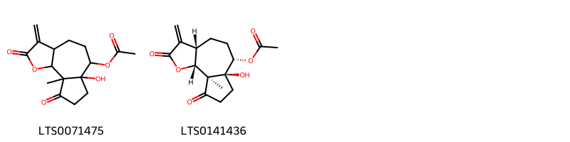{ width=100% }
    <figcaption>Hình ảnh cấu trúc hóa học của 2 hoạt chất thuộc nhóm Lactones gồm ['6a-hydroxy-9a-methyl-3-methylidene-2,9-dioxo-hexahydro-3ah-azuleno[4,5-b]furan-6-yl acetate (LTS0071475)', '(3as,6s,6as,9as,9br)-6a-hydroxy-9a-methyl-3-methylidene-2,9-dioxo-hexahydro-3ah-azuleno[4,5-b]furan-6-yl acetate (LTS0141436)'].</figcaption>
</figure>
#### Nhóm Organooxygen compounds
<figure markdown="span">
    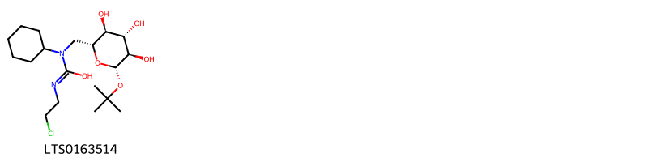{ width=100% }
    <figcaption>Hình ảnh cấu trúc hóa học của 1 hoạt chất thuộc nhóm Organooxygen compounds gồm ["n-{[(2r,3s,4s,5r,6s)-6-(tert-butoxy)-3,4,5-trihydroxyoxan-2-yl]methyl}-n'-(2-chloroethyl)-n-cyclohexylcarbamimidic acid (LTS0163514)"].</figcaption>
</figure>
#### Nhóm Oxanes
<figure markdown="span">
    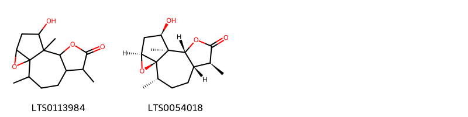{ width=100% }
    <figcaption>Hình ảnh cấu trúc hóa học của 2 hoạt chất thuộc nhóm Oxanes gồm ['11-hydroxy-2,6,10-trimethyl-8,14-dioxatetracyclo[8.4.0.0¹,¹³.0⁵,⁹]tetradecan-7-one (LTS0113984)', '(1r,2s,5s,6s,9r,10s,11r,13s)-11-hydroxy-2,6,10-trimethyl-8,14-dioxatetracyclo[8.4.0.0¹,¹³.0⁵,⁹]tetradecan-7-one (LTS0054018)'].</figcaption>
</figure>
#### Nhóm Prenol lipids
<figure markdown="span">
    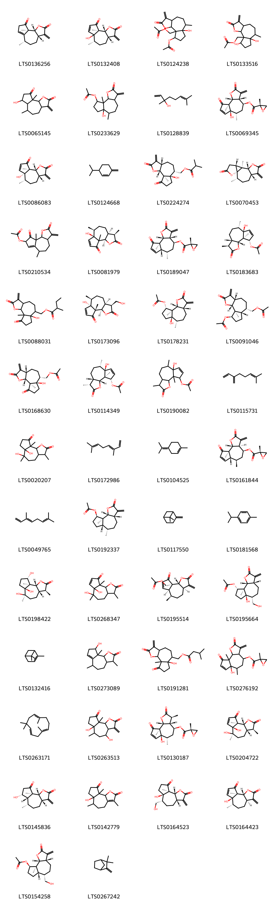{ width=100% }
    <figcaption>Hình ảnh cấu trúc hóa học của 115 hoạt chất thuộc nhóm Prenol lipids gồm ['(3as,6s,9ar,9br)-6,9a-dimethyl-3-methylidene-3ah,4h,5h,6h,8h,9bh-azuleno[4,5-b]furan-2,9-dione (LTS0136256)', '(3as,6s,9as,9br)-6a-hydroxy-6,9a-dimethyl-3-methylidene-3ah,4h,5h,6h,9bh-azuleno[4,5-b]furan-2,9-dione (LTS0132408)', '[9-(acetyloxy)-6a-hydroxy-6-methyl-3-methylidene-2-oxo-octahydroazuleno[4,5-b]furan-9a-yl]methyl acetate (LTS0124238)', '{6a,9-dihydroxy-6-methyl-3-methylidene-2-oxo-octahydroazuleno[4,5-b]furan-9a-yl}methyl acetate (LTS0133516)', '7-hydroxy-6,9a-dimethyl-3-methylidene-octahydroazuleno[4,5-b]furan-2,9-dione (LTS0065145)', '6a-hydroxy-6,9a-dimethyl-3-methylidene-2-oxo-octahydroazuleno[4,5-b]furan-9-yl acetate (LTS0233629)', 'linalool, (+-)- (LTS0128839)', '(3ar,4s,6s,6as,9as,9br)-6a-hydroxy-6,9a-dimethyl-3-methylidene-2,9-dioxo-3ah,4h,5h,6h,9bh-azuleno[4,5-b]furan-4-yl (2s)-2-methyloxirane-2-carboxylate (LTS0069345)', '(3as,6s,6ar,9as,9br)-6a-hydroxy-6,9a-dimethyl-3-methylidene-3ah,4h,5h,6h,9bh-azuleno[4,5-b]furan-2,9-dione (LTS0086083)', 'β phellandrene (LTS0124668)', '[(3as,6r,6ar,9as,9br)-6a-hydroxy-9a-methyl-3-methylidene-2,9-dioxo-hexahydro-3ah-azuleno[4,5-b]furan-6-yl]methyl 2-methylpropanoate (LTS0224274)', '(1r,2s,5s,9r,10s,11r)-2,10-dimethyl-6-methylidene-8,14-dioxatetracyclo[8.4.0.0¹,¹¹.0⁵,⁹]tetradecane-7,13-dione (LTS0070453)', '6,9a-dimethyl-3-methylidene-2,9-dioxo-3ah,4h,5h,6h,8h,9bh-azuleno[4,5-b]furan-8-yl acetate (LTS0210534)', '(3r,3as,6s,6ar,9br)-6a-hydroxy-3,6,9a-trimethyl-3h,3ah,4h,5h,6h,9bh-azuleno[4,5-b]furan-2,9-dione (LTS0081979)', '(3ar,4s,6s,6ar,9ar,9br)-6,9a-dimethyl-3-methylidene-2,9-dioxo-3ah,4h,5h,6h,6ah,9bh-azuleno[4,5-b]furan-4-yl (2s)-2-methyloxirane-2-carboxylate (LTS0189047)', '(3s,3as,6s,6as,9s,9as,9br)-6a-hydroxy-3,6,9a-trimethyl-2-oxo-3h,3ah,4h,5h,6h,9h,9bh-azuleno[4,5-b]furan-9-yl acetate (LTS0183683)', '{6a-hydroxy-9a-methyl-3-methylidene-2,9-dioxo-hexahydro-3ah-azuleno[4,5-b]furan-6-yl}methyl 2-methylbutanoate (LTS0088031)', '(3s,3as,6s,6as,9as,9br)-6a-hydroxy-3-(hydroxymethyl)-6,9a-dimethyl-3h,3ah,4h,5h,6h,9bh-azuleno[4,5-b]furan-2,9-dione (LTS0173096)', '(3as,6s,6ar,9s,9as,9br)-6a-hydroxy-6,9a-dimethyl-3-methylidene-2-oxo-octahydroazuleno[4,5-b]furan-9-yl acetate (LTS0178231)', '[(3as,6s,6as,9r,9as,9br)-9-(acetyloxy)-9a-methyl-3-methylidene-2-oxo-octahydro-3ah-azuleno[4,5-b]furan-6-yl]methyl acetate (LTS0091046)', 'tetraneurin a (LTS0168630)', '(3r,3as,6s,6as,9s,9as,9br)-6a-hydroxy-3,6,9a-trimethyl-2-oxo-3h,3ah,4h,5h,6h,9h,9bh-azuleno[4,5-b]furan-9-yl acetate (LTS0114349)', '6a-hydroxy-3,6,9a-trimethyl-2-oxo-3h,3ah,4h,5h,6h,9h,9bh-azuleno[4,5-b]furan-9-yl acetate (LTS0190082)', 'α-myrcene (LTS0115731)', '6,6a-dihydroxy-3,6,9a-trimethyl-hexahydro-3h-azuleno[4,5-b]furan-2,9-dione (LTS0020207)', '3,7-dimethyl-1,3,6-octatriene (LTS0172986)', 'terpinolene (LTS0104525)', '(3as,4s,6r,6ar,9ar,9br)-6,9a-dimethyl-3-methylidene-2,9-dioxo-3ah,4h,5h,6h,6ah,9bh-azuleno[4,5-b]furan-4-yl (2s)-2-methyloxirane-2-carboxylate (LTS0161844)', 'trans-β-ocimene (LTS0049765)', '(3as,6s,6as,9r,9as,9br)-6,9a-dimethyl-3-methylidene-2-oxo-octahydro-3ah-azuleno[4,5-b]furan-9-yl acetate (LTS0192337)', 'β-pinene (LTS0117550)', 'cymene (LTS0181568)', '(3s,3as,6r,6as,9s,9as,9br)-6,6a,9-trihydroxy-3,6,9a-trimethyl-octahydroazuleno[4,5-b]furan-2-one (LTS0198422)', '6,6a-dihydroxy-3,6,9a-trimethyl-3h,3ah,4h,5h,9bh-azuleno[4,5-b]furan-2,9-dione (LTS0268347)', '[(3ar,6r,6as,9as,9br)-6-methyl-3-methylidene-2,9-dioxo-3ah,4h,5h,6h,6ah,9bh-azuleno[4,5-b]furan-9a-yl]methyl acetate (LTS0195514)', 'tetraneurin e (LTS0195664)', 'α pinene (LTS0132416)', '9-hydroxy-3,6,9a-trimethyl-3h,3ah,4h,5h,6h,8h,9h,9bh-azuleno[4,5-b]furan-2-one (LTS0273089)', '{6a-hydroxy-9a-methyl-3-methylidene-2,9-dioxo-hexahydro-3ah-azuleno[4,5-b]furan-6-yl}methyl 3-methylbutanoate (LTS0191281)', '6a-hydroxy-6,9a-dimethyl-3-methylidene-2,9-dioxo-3ah,4h,5h,6h,9bh-azuleno[4,5-b]furan-4-yl 2-methyloxirane-2-carboxylate (LTS0276192)', 'humulene (LTS0263171)', '4,6a-dihydroxy-6,9a-dimethyl-3-methylidene-hexahydro-3ah-azuleno[4,5-b]furan-2,9-dione (LTS0263513)', '(3s,3ar,4s,6s,6as,9as,9br)-6a-hydroxy-3,6,9a-trimethyl-2,9-dioxo-3h,3ah,4h,5h,6h,9bh-azuleno[4,5-b]furan-4-yl (2s)-2-methyloxirane-2-carboxylate (LTS0130187)', '(3s,3as,6r,6as,9as,9br)-6,6a-dihydroxy-3,6,9a-trimethyl-3h,3ah,4h,5h,9bh-azuleno[4,5-b]furan-2,9-dione (LTS0204722)', '(3as,6s,6as,7r,9ar,9br)-7-hydroxy-6,9a-dimethyl-3-methylidene-octahydroazuleno[4,5-b]furan-2,9-dione (LTS0145836)', '6a-hydroxy-3,6,9a-trimethyl-4h,5h,6h,7h,8h,9bh-azuleno[4,5-b]furan-2,9-dione (LTS0142779)', '(3as,6r,6ar,9as,9br)-6a-hydroxy-6-(hydroxymethyl)-9a-methyl-3-methylidene-hexahydro-3ah-azuleno[4,5-b]furan-2,9-dione (LTS0164523)', '(3ar,6s,6as,9as,9br)-6a-hydroxy-6,9a-dimethyl-3-methylidene-3ah,4h,5h,6h,9bh-azuleno[4,5-b]furan-2,9-dione (LTS0164423)', '(3as,6s,6as,9r,9as,9br)-6-(hydroxymethyl)-9a-methyl-3-methylidene-2-oxo-octahydro-3ah-azuleno[4,5-b]furan-9-yl acetate (LTS0154258)', 'camphene (LTS0267242)', 'limonene,  (LTS0155981)', '(6s,6ar,9as,9br)-6a-hydroxy-3,6,9a-trimethyl-4h,5h,6h,7h,8h,9bh-azuleno[4,5-b]furan-2,9-dione (LTS0142217)', '[(3as,6r,6ar,9as,9br)-6a-hydroxy-9a-methyl-3-methylidene-2,9-dioxo-hexahydro-3ah-azuleno[4,5-b]furan-6-yl]methyl (2r)-2-methylbutanoate (LTS0147914)', '[(3ar,6r,6ar,9as,9br)-6a-hydroxy-9a-methyl-3-methylidene-2,9-dioxo-hexahydro-3ah-azuleno[4,5-b]furan-6-yl]methyl acetate (LTS0212713)', '6-(hydroxymethyl)-9a-methyl-3-methylidene-2-oxo-octahydro-3ah-azuleno[4,5-b]furan-9-yl acetate (LTS0171100)', '(3ar,4r,6s,6ar,9as,9br)-4,6a-dihydroxy-6,9a-dimethyl-3-methylidene-hexahydro-3ah-azuleno[4,5-b]furan-2,9-dione (LTS0178339)', '(3as,4s)-7-isopropyl-1,4-dimethyl-2,3,3a,4,5,6-hexahydroazulene (LTS0118636)', '4-terpineol (LTS0253733)', '6a-hydroxy-6-(hydroxymethyl)-9a-methyl-3-methylidene-hexahydro-3ah-azuleno[4,5-b]furan-2,9-dione (LTS0265293)', '6,6a,9-trihydroxy-3,6,9a-trimethyl-octahydroazuleno[4,5-b]furan-2-one (LTS0166746)', 'borneol (LTS0264960)', 'coronopilin (LTS0111750)', '(3s,3as,6r,6as,9as,9br)-6,6a-dihydroxy-3,6,9a-trimethyl-hexahydro-3h-azuleno[4,5-b]furan-2,9-dione (LTS0242159)', 'parthenin (LTS0157054)', '7-isopropyl-1,4-dimethyl-2,3,3a,4,5,6-hexahydroazulene (LTS0250551)', 'caryophyllene (LTS0085212)', 'thujene (LTS0268450)', '(3as,6s,8s,9ar,9br)-6,9a-dimethyl-3-methylidene-2,9-dioxo-3ah,4h,5h,6h,8h,9bh-azuleno[4,5-b]furan-8-yl acetate (LTS0267507)', '(3as,6s,6ar,7r,9s,9as,9br)-6a,7,9-trihydroxy-6,9a-dimethyl-3-methylidene-octahydroazuleno[4,5-b]furan-2-one (LTS0202838)', '(3as,6s,6ar,7r,9as,9br)-6a,7-dihydroxy-6,9a-dimethyl-3-methylidene-hexahydro-3ah-azuleno[4,5-b]furan-2,9-dione (LTS0250005)', '6a-hydroxy-6,9a-dimethyl-3-methylidene-hexahydro-3ah-azuleno[4,5-b]furan-2,9-dione (LTS0272595)', '6a,7-dihydroxy-6,9a-dimethyl-3-methylidene-hexahydro-3ah-azuleno[4,5-b]furan-2,9-dione (LTS0054414)', '(3r,3as,6s,6ar,9as,9br)-6a-hydroxy-3,6,9a-trimethyl-3h,3ah,4h,5h,6h,9bh-azuleno[4,5-b]furan-2,9-dione (LTS0260620)', 'bornyl acetate (LTS0060565)', '2,10-dimethyl-6-methylidene-8,14-dioxatetracyclo[8.4.0.0¹,¹¹.0⁵,⁹]tetradecane-7,13-dione (LTS0219859)', '(3s,3ar,4r,6r,6as,9s,9as,9br)-6,6a,9-trihydroxy-3,6,9a-trimethyl-2-oxo-3h,3ah,4h,5h,9h,9bh-azuleno[4,5-b]furan-4-yl acetate (LTS0210187)', 'sabinene (LTS0224133)', '2-[(8s,8as)-3,8-dimethyl-1,2,6,7,8,8a-hexahydroazulen-5-yl]propan-2-ol (LTS0171511)', '(3s,3as,6s,9s,9as,9br)-9-hydroxy-3,6,9a-trimethyl-3h,3ah,4h,5h,6h,8h,9h,9bh-azuleno[4,5-b]furan-2-one (LTS0045239)', '6,6a,9-trihydroxy-3,6,9a-trimethyl-3h,3ah,4h,5h,9h,9bh-azuleno[4,5-b]furan-2-one (LTS0226821)', '[(3as,6s,6ar,9s,9as,9br)-6a,9-dihydroxy-6-methyl-3-methylidene-2-oxo-octahydroazuleno[4,5-b]furan-9a-yl]methyl acetate (LTS0040981)', '6,9a-dimethyl-3-methylidene-2-oxo-octahydro-3ah-azuleno[4,5-b]furan-9-yl acetate (LTS0156152)', '15-hydroxy-1-methyl-5-methylidene-3,11-dioxatetracyclo[7.5.1.0²,⁶.0¹²,¹⁵]pentadecane-4,14-dione (LTS0142390)', '[(3as,6r,6ar,9as,9br)-6a-hydroxy-9a-methyl-3-methylidene-2,9-dioxo-hexahydro-3ah-azuleno[4,5-b]furan-6-yl]methyl 3-methylbutanoate (LTS0259270)', '6,9a-dimethyl-3-methylidene-2,9-dioxo-3ah,4h,5h,6h,6ah,9bh-azuleno[4,5-b]furan-4-yl 2-methyloxirane-2-carboxylate (LTS0243590)', '{6a-hydroxy-9a-methyl-3-methylidene-2,9-dioxo-hexahydro-3ah-azuleno[4,5-b]furan-6-yl}methyl acetate (LTS0035572)', '(3s,3as,6r,6as,9s,9as,9br)-6,6a,9-trihydroxy-3,6,9a-trimethyl-3h,3ah,4h,5h,9h,9bh-azuleno[4,5-b]furan-2-one (LTS0174308)', 'parthenin (LTS0203893)', '(3as,6r,6as,9as,9bs)-6a-hydroxy-6,9a-dimethyl-3-methylidene-3ah,4h,5h,6h,9bh-azuleno[4,5-b]furan-2,9-dione (LTS0249024)', 'β-ocimene (LTS0242381)', '(3as,6s,8r,9ar,9br)-6,9a-dimethyl-3-methylidene-2,9-dioxo-3ah,4h,5h,6h,8h,9bh-azuleno[4,5-b]furan-8-yl acetate (LTS0013914)', '6a,7,9-trihydroxy-6,9a-dimethyl-3-methylidene-octahydroazuleno[4,5-b]furan-2-one (LTS0001903)', '6a-hydroxy-3-(hydroxymethyl)-6,9a-dimethyl-3h,3ah,4h,5h,6h,9bh-azuleno[4,5-b]furan-2,9-dione (LTS0053722)', 'ambrosin (LTS0273844)', 'terpinene (LTS0136858)', '(3s,3as,6s,8s,9r,9as,9br)-8,9-dihydroxy-3,6,9a-trimethyl-3h,3ah,4h,5h,6h,8h,9h,9bh-azuleno[4,5-b]furan-2-one (LTS0008849)', 'caryophyllene (LTS0131870)', 'conchosin a (LTS0011149)', '6a-hydroxy-3,6,9a-trimethyl-2,9-dioxo-3h,3ah,4h,5h,6h,9bh-azuleno[4,5-b]furan-4-yl 2-methyloxirane-2-carboxylate (LTS0016243)', '(3r,3as,6r,6as,9s,9as,9br)-6,6a,9-trihydroxy-3,6,9a-trimethyl-octahydroazuleno[4,5-b]furan-2-one (LTS0012937)', '[(3as,6s,6ar,9s,9as,9br)-9-(acetyloxy)-6a-hydroxy-6-methyl-3-methylidene-2-oxo-octahydroazuleno[4,5-b]furan-9a-yl]methyl acetate (LTS0027175)', '2-(3,8-dimethyl-1,2,6,7,8,8a-hexahydroazulen-5-yl)propan-2-ol (LTS0232627)', '(3r,3as,6s,6as,9as,9br)-6a-hydroxy-3,6,9a-trimethyl-3h,3ah,4h,5h,6h,9bh-azuleno[4,5-b]furan-2,9-dione (LTS0019770)', '8,9-dihydroxy-3,6,9a-trimethyl-3h,3ah,4h,5h,6h,8h,9h,9bh-azuleno[4,5-b]furan-2-one (LTS0105267)', '(3as,6s,6as,9ar,9br)-6,9a-dimethyl-3-methylidene-3ah,4h,5h,6h,6ah,9bh-azuleno[4,5-b]furan-2,9-dione (LTS0018154)', '6,6a,9-trihydroxy-3,6,9a-trimethyl-2-oxo-3h,3ah,4h,5h,9h,9bh-azuleno[4,5-b]furan-4-yl acetate (LTS0137954)', 'valencene (LTS0031707)', 'valencene (LTS0110395)', '(3ar,6s,6ar,9as,9br)-6a-hydroxy-6,9a-dimethyl-3-methylidene-hexahydro-3ah-azuleno[4,5-b]furan-2,9-dione (LTS0275167)', '{6-methyl-3-methylidene-2,9-dioxo-3ah,4h,5h,6h,6ah,9bh-azuleno[4,5-b]furan-9a-yl}methyl acetate (LTS0036614)', '(3as,6s,6as,9s,9as,9br)-6-(hydroxymethyl)-9a-methyl-3-methylidene-2-oxo-octahydro-3ah-azuleno[4,5-b]furan-9-yl acetate (LTS0241977)', '(3r,6s,6as,9as)-6a-hydroxy-3,6,9a-trimethyl-3h,3ah,4h,5h,6h,9bh-azuleno[4,5-b]furan-2,9-dione (LTS0265139)', 'ambrosin (LTS0051702)', '{6a-hydroxy-9a-methyl-3-methylidene-2,9-dioxo-hexahydro-3ah-azuleno[4,5-b]furan-6-yl}methyl 2-methylpropanoate (LTS0045259)', 'damsin (LTS0040634)'].</figcaption>
</figure>
#### Nhóm Steroids and steroid derivatives
<figure markdown="span">
    { width=100% }
    <figcaption>Hình ảnh cấu trúc hóa học của 4 hoạt chất thuộc nhóm Steroids and steroid derivatives gồm ['sitosterol (LTS0168132)', 'stigmast-5-en-3-ol, (3β)- (LTS0204616)', 'sitogluside (LTS0201798)', '2-{[1-(5-ethyl-6-methylheptan-2-yl)-9a,11a-dimethyl-1h,2h,3h,3ah,3bh,4h,6h,7h,8h,9h,9bh,10h,11h-cyclopenta[a]phenanthren-7-yl]oxy}-6-(hydroxymethyl)oxane-3,4,5-triol (LTS0158828)'].</figcaption>
</figure>
#### Nhóm Unsaturated hydrocarbons
<figure markdown="span">
    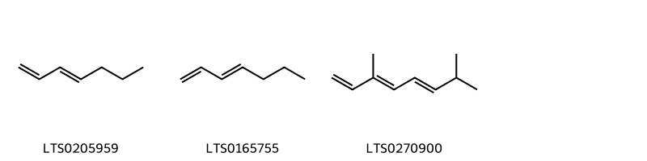{ width=100% }
    <figcaption>Hình ảnh cấu trúc hóa học của 3 hoạt chất thuộc nhóm Unsaturated hydrocarbons gồm ['(3e)-hepta-1,3-diene (LTS0205959)', 'hepta-1,3-diene (LTS0165755)', '(3e,5e)-3,7-dimethylocta-1,3,5-triene (LTS0270900)'].</figcaption>
</figure>

---

### Dược dân tộc học

Danh sách các quốc gia có sử dụng *Parthenium hysterophorus* trong điều trị các bệnh. 

| Country            | Disease                       | Bệnh                                                                                                                                                                                                |
|:-------------------|:------------------------------|:----------------------------------------------------------------------------------------------------------------------------------------------------------------------------------------------------|
| Bahamas            | Carminative                   | MYMEMORY WARNING: YOU USED ALL AVAILABLE FREE TRANSLATIONS FOR TODAY. NEXT AVAILABLE IN  10 HOURS 00 MINUTES 02 SECONDS VISIT HTTPS://MYMEMORY.TRANSLATED.NET/DOC/USAGELIMITS.PHP TO TRANSLATE MORE |
| Dominican Republic | Analgesic                     | MYMEMORY WARNING: YOU USED ALL AVAILABLE FREE TRANSLATIONS FOR TODAY. NEXT AVAILABLE IN  09 HOURS 59 MINUTES 59 SECONDS VISIT HTTPS://MYMEMORY.TRANSLATED.NET/DOC/USAGELIMITS.PHP TO TRANSLATE MORE |
| Elsewhere          | Analgesic, Emmenagogue, Tonic | MYMEMORY WARNING: YOU USED ALL AVAILABLE FREE TRANSLATIONS FOR TODAY. NEXT AVAILABLE IN  09 HOURS 59 MINUTES 53 SECONDS VISIT HTTPS://MYMEMORY.TRANSLATED.NET/DOC/USAGELIMITS.PHP TO TRANSLATE MORE |
| Haiti              | Antiseptic                    | MYMEMORY WARNING: YOU USED ALL AVAILABLE FREE TRANSLATIONS FOR TODAY. NEXT AVAILABLE IN  09 HOURS 59 MINUTES 48 SECONDS VISIT HTTPS://MYMEMORY.TRANSLATED.NET/DOC/USAGELIMITS.PHP TO TRANSLATE MORE |
| Mexico             | Analgesic, Apertif            | MYMEMORY WARNING: YOU USED ALL AVAILABLE FREE TRANSLATIONS FOR TODAY. NEXT AVAILABLE IN  09 HOURS 59 MINUTES 45 SECONDS VISIT HTTPS://MYMEMORY.TRANSLATED.NET/DOC/USAGELIMITS.PHP TO TRANSLATE MORE |

---

# Chi Erechtites

??? note "Danh sách các dược liệu thuộc chi"
    
	 - *Erechtites hieracifolia*

---
## Erechtites hieracifolia
### Thông tin về thực vật

!!! info "Phân loại thực vật của *Erechtites hieraciifolius* từ GIBF:"
    - **Kingdom:** Plantae
    - **Phylum:** Tracheophyta
    - **Order:** Asterales
    - **Family:** Asteraceae
    - **Genus:** Erechtites
    - **Species:** *Erechtites hieraciifolius*

 

| Label (VI)   | Label (EN)   | Scientific Name         | Descriptions (VI)   | Descriptions (EN)   | Also Known As (VI)   | Also Known As (EN)   |
|:-------------|:-------------|:------------------------|:--------------------|:--------------------|:---------------------|:---------------------|
| N/A          | N/A          | Erechtites hieracifolia | loài thực vật       | species of plant    | ['']                 | ['']                 |

#### Phân bố trên thế giới

**Từ CSDL GIBF** Japan, Argentina, Venezuela (Bolivarian Republic of), Canada, Ukraine, Korea, Republic of, Chinese Taipei, Spain, Jamaica, United States of America, Uruguay, Germany, Brazil, Peru, Austria, Mexico, China, Ecuador, Colombia, Poland

#### Phân bố tại Việt Nam

**Từ CSDL GIBF**: Không có ghi nhận ở Việt Nam

---
### Thành phần hóa học
        
- Theo cơ sở dữ liệu lotus: Từ loài *Erechtites hieraciifolius* đã phân lập và xác định được 4 hoạt chất thuộc về các nhóm Macrolides and analogues, Benzene and substituted derivatives. 

|    | chemicalTaxonomyClassyfireClass     |   smiles_count |
|---:|:------------------------------------|---------------:|
|  0 | Benzene and substituted derivatives |              2 |
|  1 | Macrolides and analogues            |              2 |

#### Nhóm Benzene and substituted derivatives
<figure markdown="span">
    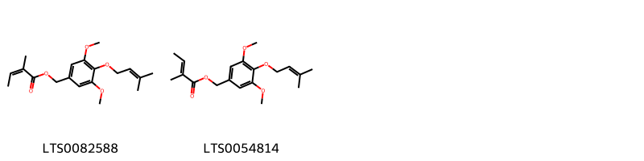{ width=100% }
    <figcaption>Hình ảnh cấu trúc hóa học của 2 hoạt chất thuộc nhóm Benzene and substituted derivatives gồm ['{3,5-dimethoxy-4-[(3-methylbut-2-en-1-yl)oxy]phenyl}methyl (2z)-2-methylbut-2-enoate (LTS0082588)', '{3,5-dimethoxy-4-[(3-methylbut-2-en-1-yl)oxy]phenyl}methyl 2-methylbut-2-enoate (LTS0054814)'].</figcaption>
</figure>
#### Nhóm Macrolides and analogues
<figure markdown="span">
    { width=100% }
    <figcaption>Hình ảnh cấu trúc hóa học của 2 hoạt chất thuộc nhóm Macrolides and analogues gồm ['senecionine (LTS0172395)', '4-ethylidene-7-hydroxy-6,7-dimethyl-2,9-dioxa-14-azatricyclo[9.5.1.0¹⁴,¹⁷]heptadec-11-ene-3,8-dione (LTS0157762)'].</figcaption>
</figure>

---

### Dược dân tộc học

Danh sách các quốc gia có sử dụng *Erechtites hieraciifolius* trong điều trị các bệnh. 

| Country            | Disease                   | Bệnh                                                                                                                                                                                                |
|:-------------------|:--------------------------|:----------------------------------------------------------------------------------------------------------------------------------------------------------------------------------------------------|
| Dominican Republic | Tonic                     | MYMEMORY WARNING: YOU USED ALL AVAILABLE FREE TRANSLATIONS FOR TODAY. NEXT AVAILABLE IN  09 HOURS 59 MINUTES 05 SECONDS VISIT HTTPS://MYMEMORY.TRANSLATED.NET/DOC/USAGELIMITS.PHP TO TRANSLATE MORE |
| Haiti              | Astringent                | MYMEMORY WARNING: YOU USED ALL AVAILABLE FREE TRANSLATIONS FOR TODAY. NEXT AVAILABLE IN  09 HOURS 59 MINUTES 02 SECONDS VISIT HTTPS://MYMEMORY.TRANSLATED.NET/DOC/USAGELIMITS.PHP TO TRANSLATE MORE |
| Panama             | Laxative, Vermifuge       | MYMEMORY WARNING: YOU USED ALL AVAILABLE FREE TRANSLATIONS FOR TODAY. NEXT AVAILABLE IN  09 HOURS 58 MINUTES 58 SECONDS VISIT HTTPS://MYMEMORY.TRANSLATED.NET/DOC/USAGELIMITS.PHP TO TRANSLATE MORE |
| US                 | Emetic, Tonic, Astringent | MYMEMORY WARNING: YOU USED ALL AVAILABLE FREE TRANSLATIONS FOR TODAY. NEXT AVAILABLE IN  09 HOURS 58 MINUTES 55 SECONDS VISIT HTTPS://MYMEMORY.TRANSLATED.NET/DOC/USAGELIMITS.PHP TO TRANSLATE MORE |

---

# Chi Gaillardia

??? note "Danh sách các dược liệu thuộc chi"
    
	 - *Gaillardia pinnatifida*

---
## Gaillardia pinnatifida
### Thông tin về thực vật

!!! info "Phân loại thực vật của *Gaillardia pinnatifida* từ GIBF:"
    - **Kingdom:** Plantae
    - **Phylum:** Tracheophyta
    - **Order:** Asterales
    - **Family:** Asteraceae
    - **Genus:** Gaillardia
    - **Species:** *Gaillardia pinnatifida*

 

| Label (VI)   | Label (EN)   | Scientific Name        | Descriptions (VI)   | Descriptions (EN)   | Also Known As (VI)   | Also Known As (EN)                          |
|:-------------|:-------------|:-----------------------|:--------------------|:--------------------|:---------------------|:--------------------------------------------|
| N/A          | N/A          | Gaillardia pinnatifida | loài thực vật       | species of plant    | ['']                 | ['blanketflower', 'red dome blanketflower'] |

#### Phân bố trên thế giới

**Từ CSDL GIBF** United States of America, Mexico

#### Phân bố tại Việt Nam

**Từ CSDL GIBF**: Không có ghi nhận ở Việt Nam

---
### Thành phần hóa học
        
- Theo cơ sở dữ liệu lotus: Từ loài *Gaillardia pinnatifida* đã phân lập và xác định được 3 hoạt chất thuộc về các nhóm Prenol lipids. 

|    | chemicalTaxonomyClassyfireClass   |   smiles_count |
|---:|:----------------------------------|---------------:|
|  0 | Prenol lipids                     |              3 |

#### Nhóm Prenol lipids
<figure markdown="span">
    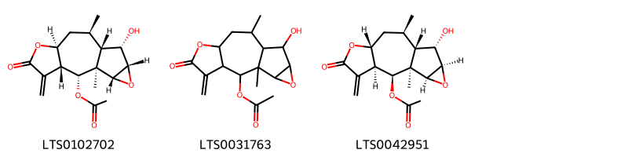{ width=100% }
    <figcaption>Hình ảnh cấu trúc hóa học của 3 hoạt chất thuộc nhóm Prenol lipids gồm ['(1r,2r,3r,7s,9r,10s,11s,12s,14r)-11-hydroxy-1,9-dimethyl-4-methylidene-5-oxo-6,13-dioxatetracyclo[8.4.0.0³,⁷.0¹²,¹⁴]tetradecan-2-yl acetate (LTS0102702)', '11-hydroxy-1,9-dimethyl-4-methylidene-5-oxo-6,13-dioxatetracyclo[8.4.0.0³,⁷.0¹²,¹⁴]tetradecan-2-yl acetate (LTS0031763)', '(1r,2s,3s,7r,9r,10s,11s,12r,14s)-11-hydroxy-1,9-dimethyl-4-methylidene-5-oxo-6,13-dioxatetracyclo[8.4.0.0³,⁷.0¹²,¹⁴]tetradecan-2-yl acetate (LTS0042951)'].</figcaption>
</figure>

---

### Dược dân tộc học

Danh sách các quốc gia có sử dụng *Gaillardia pinnatifida* trong điều trị các bệnh. 

| Country   | Disease   | Bệnh                                                                                                                                                                                                |
|:----------|:----------|:----------------------------------------------------------------------------------------------------------------------------------------------------------------------------------------------------|
| US(Hopi)  | Diuretic  | MYMEMORY WARNING: YOU USED ALL AVAILABLE FREE TRANSLATIONS FOR TODAY. NEXT AVAILABLE IN  09 HOURS 58 MINUTES 30 SECONDS VISIT HTTPS://MYMEMORY.TRANSLATED.NET/DOC/USAGELIMITS.PHP TO TRANSLATE MORE |

---

# Chi Brachylaena

??? note "Danh sách các dược liệu thuộc chi"
    
	 - *Brachylaena hutchinsii*

---
## Brachylaena hutchinsii
### Thông tin về thực vật

!!! info "Phân loại thực vật của *Brachylaena huillensis* từ GIBF:"
    - **Kingdom:** Plantae
    - **Phylum:** Tracheophyta
    - **Order:** Asterales
    - **Family:** Asteraceae
    - **Genus:** Brachylaena
    - **Species:** *Brachylaena huillensis*

 

| Label (VI)   | Label (EN)   | Scientific Name        | Descriptions (VI)   | Descriptions (EN)   | Also Known As (VI)   | Also Known As (EN)   |
|:-------------|:-------------|:-----------------------|:--------------------|:--------------------|:---------------------|:---------------------|
| N/A          | N/A          | Brachylaena hutchinsii |                     | species of plant    | ['']                 | ['']                 |

#### Phân bố trên thế giới

**Từ CSDL GIBF** nan, Uganda, unknown or invalid, Kenya, Tanzania, United Republic of

#### Phân bố tại Việt Nam

**Từ CSDL GIBF**: Không có ghi nhận ở Việt Nam

---
### Thành phần hóa học
        
- Theo cơ sở dữ liệu lotus: Từ loài *Brachylaena huillensis* đã phân lập và xác định được Chưa có hoạt chất nào được phân lập. hoạt chất thuộc về các nhóm Không có hoạt chất nào được phân lập. 

Không có hình ảnh nào được tạo ra

---

### Dược dân tộc học

Danh sách các quốc gia có sử dụng *Brachylaena huillensis* trong điều trị các bệnh. 

| Country   | Disease   | Bệnh                                                                                                                                                                                                |
|:----------|:----------|:----------------------------------------------------------------------------------------------------------------------------------------------------------------------------------------------------|
| Elsewhere | Soap      | MYMEMORY WARNING: YOU USED ALL AVAILABLE FREE TRANSLATIONS FOR TODAY. NEXT AVAILABLE IN  09 HOURS 58 MINUTES 04 SECONDS VISIT HTTPS://MYMEMORY.TRANSLATED.NET/DOC/USAGELIMITS.PHP TO TRANSLATE MORE |

---

# Chi Vernonia

??? note "Danh sách các dược liệu thuộc chi"
    
	 - *Vernonia amygdalina*
	 - *Vernonia anthelmintica*
	 - *Vernonia cinerea*
	 - *Vernonia javanica*
	 - *Vernonia nigritiana*
	 - *Vernonia patens*
	 - *Vernonia pectoralis*
	 - *Vernonia scabra*
	 - *Vernonia scorpioides*
	 - *Vernonia senegalensis*
	 - *Vernonia teres*
	 - *Vernonia woodii*

---
## Vernonia amygdalina
### Thông tin về thực vật

!!! info "Phân loại thực vật của *Gymnanthemum amygdalinum* từ GIBF:"
    - **Kingdom:** Plantae
    - **Phylum:** Tracheophyta
    - **Order:** Asterales
    - **Family:** Asteraceae
    - **Genus:** Gymnanthemum
    - **Species:** *Gymnanthemum amygdalinum*

 

| Label (VI)   | Label (EN)   | Scientific Name     | Descriptions (VI)   | Descriptions (EN)   | Also Known As (VI)   | Also Known As (EN)   |
|:-------------|:-------------|:--------------------|:--------------------|:--------------------|:---------------------|:---------------------|
| N/A          | N/A          | Vernonia amygdalina | loài thực vật       | species of plant    | ['']                 | ['']                 |

#### Phân bố trên thế giới

**Từ CSDL GIBF** Malawi, Zambia, Ghana, Mali, Nigeria, Gabon, Equatorial Guinea, Angola, Chinese Taipei, Brazil, Mozambique, Rwanda, Benin, United States of America, Ethiopia, Guinea, Tanzania, United Republic of, Togo

#### Phân bố tại Việt Nam

**Từ CSDL GIBF**: Không có ghi nhận ở Việt Nam

---
### Thành phần hóa học
        
- Theo cơ sở dữ liệu lotus: Từ loài *Gymnanthemum amygdalinum* đã phân lập và xác định được Chưa có hoạt chất nào được phân lập. hoạt chất thuộc về các nhóm Không có hoạt chất nào được phân lập. 

Không có hình ảnh nào được tạo ra

---

### Dược dân tộc học

Danh sách các quốc gia có sử dụng *Gymnanthemum amygdalinum* trong điều trị các bệnh. 

| Country   | Disease                                                            | Bệnh                                                                                                                                                                                                |
|:----------|:-------------------------------------------------------------------|:----------------------------------------------------------------------------------------------------------------------------------------------------------------------------------------------------|
| Africa    | Apertif, Dentifrice, Digestive, Stomachic, Stomachic, Tonic, Tonic | MYMEMORY WARNING: YOU USED ALL AVAILABLE FREE TRANSLATIONS FOR TODAY. NEXT AVAILABLE IN  09 HOURS 57 MINUTES 33 SECONDS VISIT HTTPS://MYMEMORY.TRANSLATED.NET/DOC/USAGELIMITS.PHP TO TRANSLATE MORE |
| Ghana     | Apertif, Purgative                                                 | MYMEMORY WARNING: YOU USED ALL AVAILABLE FREE TRANSLATIONS FOR TODAY. NEXT AVAILABLE IN  09 HOURS 57 MINUTES 29 SECONDS VISIT HTTPS://MYMEMORY.TRANSLATED.NET/DOC/USAGELIMITS.PHP TO TRANSLATE MORE |
| Guinea    | Tonic                                                              | MYMEMORY WARNING: YOU USED ALL AVAILABLE FREE TRANSLATIONS FOR TODAY. NEXT AVAILABLE IN  09 HOURS 57 MINUTES 26 SECONDS VISIT HTTPS://MYMEMORY.TRANSLATED.NET/DOC/USAGELIMITS.PHP TO TRANSLATE MORE |
| Tanzania  | Antidote                                                           | MYMEMORY WARNING: YOU USED ALL AVAILABLE FREE TRANSLATIONS FOR TODAY. NEXT AVAILABLE IN  09 HOURS 57 MINUTES 20 SECONDS VISIT HTTPS://MYMEMORY.TRANSLATED.NET/DOC/USAGELIMITS.PHP TO TRANSLATE MORE |
| W Africa  | Laxative, Diuretic                                                 | MYMEMORY WARNING: YOU USED ALL AVAILABLE FREE TRANSLATIONS FOR TODAY. NEXT AVAILABLE IN  09 HOURS 57 MINUTES 16 SECONDS VISIT HTTPS://MYMEMORY.TRANSLATED.NET/DOC/USAGELIMITS.PHP TO TRANSLATE MORE |

---

---
## Vernonia anthelmintica
### Thông tin về thực vật

!!! info "Phân loại thực vật của *Baccharoides anthelmintica* từ GIBF:"
    - **Kingdom:** Plantae
    - **Phylum:** Tracheophyta
    - **Order:** Asterales
    - **Family:** Asteraceae
    - **Genus:** Baccharoides
    - **Species:** *Baccharoides anthelmintica*

 

| Label (VI)   | Label (EN)   | Scientific Name        | Descriptions (VI)   | Descriptions (EN)   | Also Known As (VI)   | Also Known As (EN)   |
|:-------------|:-------------|:-----------------------|:--------------------|:--------------------|:---------------------|:---------------------|
| N/A          | N/A          | Vernonia anthelmintica | loài thực vật       | species of plant    | ['']                 | ['']                 |

#### Phân bố trên thế giới

**Từ CSDL GIBF** nan, Sri Lanka, Belgium, Myanmar, Mozambique, unknown or invalid, Tanzania, United Republic of, Norway, Malawi, Pakistan, Zambia, Réunion, Namibia, Afghanistan, Spain, Jamaica, Bangladesh, United States of America, Congo, Democratic Republic of the, Zimbabwe, Brazil, Mexico, Viet Nam, China, Botswana, Costa Rica, India, Kenya, Nepal

#### Phân bố tại Việt Nam

**Từ CSDL GIBF**: Lai Chau

---
### Thành phần hóa học
        
- Theo cơ sở dữ liệu lotus: Từ loài *Baccharoides anthelmintica* đã phân lập và xác định được 65 hoạt chất thuộc về các nhóm Fatty Acyls, Prenol lipids, Steroids and steroid derivatives, Unsaturated hydrocarbons, Carboxylic acids and derivatives. 

|    | chemicalTaxonomyClassyfireClass   |   smiles_count |
|---:|:----------------------------------|---------------:|
|  0 | Carboxylic acids and derivatives  |              4 |
|  1 | Fatty Acyls                       |              2 |
|  2 | Prenol lipids                     |             33 |
|  3 | Steroids and steroid derivatives  |             25 |
|  4 | Unsaturated hydrocarbons          |              1 |

#### Nhóm Carboxylic acids and derivatives
<figure markdown="span">
    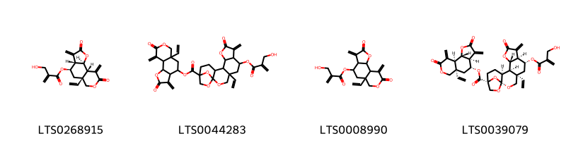{ width=100% }
    <figcaption>Hình ảnh cấu trúc hóa học của 4 hoạt chất thuộc nhóm Carboxylic acids and derivatives gồm ['(1s,2s,6s,7r,9s)-9-ethenyl-5,13-dimethylidene-4,12-dioxo-3,11-dioxatricyclo[7.4.0.0²,⁶]tridecan-7-yl 2-(hydroxymethyl)prop-2-enoate (LTS0268915)', '9-ethenyl-5,13-dimethylidene-4,12-dioxo-3,11-dioxatricyclo[7.4.0.0²,⁶]tridecan-7-yl 4-ethenyl-6-{[2-(hydroxymethyl)prop-2-enoyl]oxy}-8-methylidene-9-oxo-2,10,18,19-tetraoxapentacyclo[14.2.1.0¹,¹³.0⁴,¹².0⁷,¹¹]nonadecane-16-carboxylate (LTS0044283)', '9-ethenyl-5,13-dimethylidene-4,12-dioxo-3,11-dioxatricyclo[7.4.0.0²,⁶]tridecan-7-yl 2-(hydroxymethyl)prop-2-enoate (LTS0008990)', '(1s,2s,6s,7r,9s)-9-ethenyl-5,13-dimethylidene-4,12-dioxo-3,11-dioxatricyclo[7.4.0.0²,⁶]tridecan-7-yl (1r,4s,6r,7s,11s,12r,13s,16r)-4-ethenyl-6-{[2-(hydroxymethyl)prop-2-enoyl]oxy}-8-methylidene-9-oxo-2,10,18,19-tetraoxapentacyclo[14.2.1.0¹,¹³.0⁴,¹².0⁷,¹¹]nonadecane-16-carboxylate (LTS0039079)'].</figcaption>
</figure>
#### Nhóm Fatty Acyls
<figure markdown="span">
    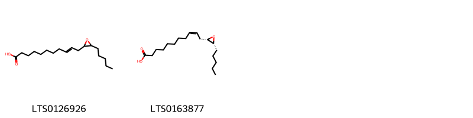{ width=100% }
    <figcaption>Hình ảnh cấu trúc hóa học của 2 hoạt chất thuộc nhóm Fatty Acyls gồm ['11-(3-pentyloxiran-2-yl)undec-9-enoic acid (LTS0126926)', '(+)-vernolic acid (LTS0163877)'].</figcaption>
</figure>
#### Nhóm Prenol lipids
<figure markdown="span">
    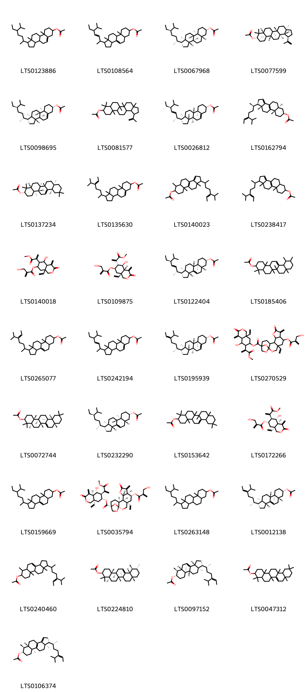{ width=100% }
    <figcaption>Hình ảnh cấu trúc hóa học của 33 hoạt chất thuộc nhóm Prenol lipids gồm ['1-(5-ethyl-6-methylheptan-2-yl)-9a,11a-dimethyl-1h,2h,3h,3ah,3bh,4h,6h,7h,8h,9h,9bh,10h,11h-cyclopenta[a]phenanthren-7-yl acetate (LTS0123886)', '1-(5-ethyl-6-methylhept-3-en-2-yl)-9a,11a-dimethyl-1h,2h,3h,3ah,5h,5ah,6h,7h,8h,9h,9bh,10h,11h-cyclopenta[a]phenanthren-7-yl acetate (LTS0108564)', 'stigmastanol acetate (LTS0067968)', 'lupeol acetate (LTS0077599)', 'β-sitosteryl acetate (LTS0098695)', '3a,5a,5b,8,8,11a-hexamethyl-1-(prop-1-en-2-yl)-hexadecahydrocyclopenta[a]chrysen-9-yl acetate (LTS0081577)', 'stigmasteryl acetate (LTS0026812)', '(1r,5as,7s,9as,11ar)-1-[(2r,5z)-5-isopropylhept-5-en-2-yl]-9a,11a-dimethyl-1h,2h,4h,5h,5ah,6h,7h,8h,9h,10h,11h-cyclopenta[a]phenanthren-7-yl acetate (LTS0162794)', 'β-amyrin acetate (LTS0137234)', '1-(5-isopropylhept-5-en-2-yl)-9a,11a-dimethyl-1h,2h,3h,3ah,3bh,4h,6h,7h,8h,9h,9bh,10h,11h-cyclopenta[a]phenanthren-7-yl acetate (LTS0135630)', '1-(5-isopropylhept-5-en-2-yl)-6,9a,11a-trimethyl-1h,2h,4h,5h,5ah,6h,7h,8h,9h,10h,11h-cyclopenta[a]phenanthren-7-yl acetate (LTS0140023)', '1-(5-isopropylhept-5-en-2-yl)-9a,11a-dimethyl-1h,2h,4h,5h,5ah,6h,7h,8h,9h,10h,11h-cyclopenta[a]phenanthren-7-yl acetate (LTS0238417)', '8a-ethenyl-5-hydroxy-6-(3-methoxy-3-oxoprop-1-en-2-yl)-4-methylidene-3-oxo-hexahydro-2-benzopyran-7-yl 2-(hydroxymethyl)prop-2-enoate (LTS0140018)', '(4as,5s,6r,7r,8as)-8a-ethenyl-5-hydroxy-6-(3-methoxy-3-oxoprop-1-en-2-yl)-4-methylidene-3-oxo-hexahydro-2-benzopyran-7-yl 2-(hydroxymethyl)prop-2-enoate (LTS0109875)', '(1r,3ar,5as,7s,9as,9br,11ar)-1-[(2r,3e,5s)-5-ethyl-6-methylhept-3-en-2-yl]-9a,11a-dimethyl-1h,2h,3h,3ah,5h,5ah,6h,7h,8h,9h,9bh,10h,11h-cyclopenta[a]phenanthren-7-yl acetate (LTS0122404)', '4,4,6a,6b,8a,11,12,14b-octamethyl-2,3,4a,5,6,7,8,9,10,11,12,12a,14,14a-tetradecahydro-1h-picen-3-yl acetate (LTS0185406)', '1-(5-isopropylhept-5-en-2-yl)-9a,11a-dimethyl-1h,2h,3h,3ah,5h,5ah,6h,7h,8h,9h,9bh,10h,11h-cyclopenta[a]phenanthren-7-yl acetate (LTS0265077)', '1-(5-ethyl-6-methylhept-3-en-2-yl)-9a,11a-dimethyl-1h,2h,3h,3ah,3bh,4h,6h,7h,8h,9h,9bh,10h,11h-cyclopenta[a]phenanthren-7-yl acetate (LTS0242194)', '(1r,3as,3bs,7s,9ar,9bs,11ar)-1-[(2r,5z)-5-isopropylhept-5-en-2-yl]-9a,11a-dimethyl-1h,2h,3h,3ah,3bh,4h,6h,7h,8h,9h,9bh,10h,11h-cyclopenta[a]phenanthren-7-yl acetate (LTS0195939)', '8a-ethenyl-5-hydroxy-6-(3-methoxy-3-oxoprop-1-en-2-yl)-4-methylidene-3-oxo-hexahydro-2-benzopyran-7-yl 4-ethenyl-6-{[2-(hydroxymethyl)prop-2-enoyl]oxy}-8-methylidene-9-oxo-2,10,18,19-tetraoxapentacyclo[14.2.1.0¹,¹³.0⁴,¹².0⁷,¹¹]nonadecane-16-carboxylate (LTS0270529)', '(3s,4ar,6ar,8ar,12ar,12bs,14ar,14br)-4,4,6a,8a,11,11,12b,14b-octamethyl-1,2,3,4a,5,6,8,9,10,12,12a,13,14,14a-tetradecahydropicen-3-yl acetate (LTS0072744)', '(1r,3ar,5as,7s,9as,9br,11ar)-1-[(2r,5r)-5-ethyl-6-methylheptan-2-yl]-9a,11a-dimethyl-1h,2h,3h,3ah,5h,5ah,6h,7h,8h,9h,9bh,10h,11h-cyclopenta[a]phenanthren-7-yl acetate (LTS0232290)', '4,4,6a,6b,8a,11,11,14b-octamethyl-1,2,3,4a,5,6,7,8,9,10,12,12a,14,14a-tetradecahydropicen-3-yl acetate (LTS0153642)', 'vernodalol (LTS0172266)', '1-(5-ethyl-6-methylheptan-2-yl)-9a,11a-dimethyl-1h,2h,3h,3ah,5h,5ah,6h,7h,8h,9h,9bh,10h,11h-cyclopenta[a]phenanthren-7-yl acetate (LTS0159669)', '(4as,5s,6r,7r,8as)-8a-ethenyl-5-hydroxy-6-(3-methoxy-3-oxoprop-1-en-2-yl)-4-methylidene-3-oxo-hexahydro-2-benzopyran-7-yl (1r,4s,6r,7s,11s,12r,13s,16r)-4-ethenyl-6-{[2-(hydroxymethyl)prop-2-enoyl]oxy}-8-methylidene-9-oxo-2,10,18,19-tetraoxapentacyclo[14.2.1.0¹,¹³.0⁴,¹².0⁷,¹¹]nonadecane-16-carboxylate (LTS0035794)', '1-(5-ethyl-6-methylheptan-2-yl)-9a,11a-dimethyl-tetradecahydro-1h-cyclopenta[a]phenanthren-7-yl acetate (LTS0263148)', '(1r,3ar,5as,7s,9as,9br,11ar)-1-[(2r,5z)-5-isopropylhept-5-en-2-yl]-9a,11a-dimethyl-1h,2h,3h,3ah,5h,5ah,6h,7h,8h,9h,9bh,10h,11h-cyclopenta[a]phenanthren-7-yl acetate (LTS0012138)', '1-(5-isopropylhept-5-en-2-yl)-6,9a,11a-trimethyl-1h,2h,3h,3ah,5h,5ah,6h,7h,8h,9h,9bh,10h,11h-cyclopenta[a]phenanthren-7-yl acetate (LTS0240460)', 'α-amyrin acetate (LTS0224810)', '(1r,3ar,5as,6s,7s,9as,9br,11ar)-1-[(2r,5z)-5-isopropylhept-5-en-2-yl]-6,9a,11a-trimethyl-1h,2h,3h,3ah,5h,5ah,6h,7h,8h,9h,9bh,10h,11h-cyclopenta[a]phenanthren-7-yl acetate (LTS0097152)', '4,4,6a,8a,11,11,12b,14b-octamethyl-1,2,3,4a,5,6,8,9,10,12,12a,13,14,14a-tetradecahydropicen-3-yl acetate (LTS0047312)', '(1r,5as,6s,7s,9as,11ar)-1-[(2r,5z)-5-isopropylhept-5-en-2-yl]-6,9a,11a-trimethyl-1h,2h,4h,5h,5ah,6h,7h,8h,9h,10h,11h-cyclopenta[a]phenanthren-7-yl acetate (LTS0106374)'].</figcaption>
</figure>
#### Nhóm Steroids and steroid derivatives
<figure markdown="span">
    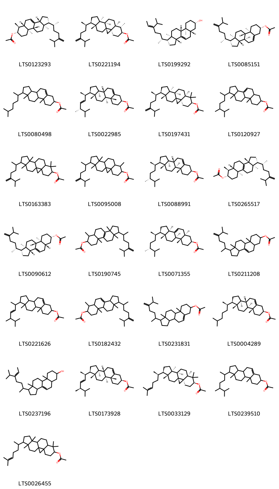{ width=100% }
    <figcaption>Hình ảnh cấu trúc hóa học của 25 hoạt chất thuộc nhóm Steroids and steroid derivatives gồm ['(1r,3ar,5as,6s,7s,9as,9br,11ar)-6,9a,11a-trimethyl-1-[(2r)-6-methyl-5-methylideneheptan-2-yl]-1h,2h,3h,3ah,5h,5ah,6h,7h,8h,9h,9bh,10h,11h-cyclopenta[a]phenanthren-7-yl acetate (LTS0123293)', '(1s,3r,6s,7s,8s,11r,12s,15r,16r)-7,12,16-trimethyl-15-[(2r)-6-methyl-5-methylideneheptan-2-yl]pentacyclo[9.7.0.0¹,³.0³,⁸.0¹²,¹⁶]octadecan-6-yl acetate (LTS0221194)', 'delta7-avenasterol (LTS0199292)', '(1r,3as,3bs,7s,9ar,9bs,11ar)-9a,11a-dimethyl-1-[(2r)-6-methyl-5-methylideneheptan-2-yl]-1h,2h,3h,3ah,3bh,4h,6h,7h,8h,9h,9bh,10h,11h-cyclopenta[a]phenanthren-7-yl acetate (LTS0085151)', 'cholesteryl acetate (LTS0080498)', '(1r,3as,3bs,7s,9ar,9bs,11ar)-1-[(2r,3e,5s)-5,6-dimethylhept-3-en-2-yl]-9a,11a-dimethyl-1h,2h,3h,3ah,3bh,4h,6h,7h,8h,9h,9bh,10h,11h-cyclopenta[a]phenanthren-7-yl acetate (LTS0022985)', '(1s,3r,6s,8r,11r,12s,15r,16r)-7,7,12,16-tetramethyl-15-[(2r)-6-methyl-5-methylideneheptan-2-yl]pentacyclo[9.7.0.0¹,³.0³,⁸.0¹²,¹⁶]octadecan-6-yl acetate (LTS0197431)', '1-(5,6-dimethylheptan-2-yl)-9a,11a-dimethyl-1h,2h,3h,3ah,5h,5ah,6h,7h,8h,9h,9bh,10h,11h-cyclopenta[a]phenanthren-7-yl acetate (LTS0120927)', '7,7,12,16-tetramethyl-15-(6-methyl-5-methylideneheptan-2-yl)pentacyclo[9.7.0.0¹,³.0³,⁸.0¹²,¹⁶]octadecan-6-yl acetate (LTS0163383)', '7,12,16-trimethyl-15-(6-methyl-5-methylideneheptan-2-yl)pentacyclo[9.7.0.0¹,³.0³,⁸.0¹²,¹⁶]octadecan-6-yl acetate (LTS0095008)', 'campesteryl acetate (LTS0088991)', '(1r,3ar,5as,6s,7s,9as,11ar)-3a,6,9a,11a-tetramethyl-1-[(2r)-6-methyl-5-methylideneheptan-2-yl]-1h,2h,3h,4h,5h,5ah,6h,7h,8h,9h,10h,11h-cyclopenta[a]phenanthren-7-yl acetate (LTS0265517)', '(1r,3ar,5as,7s,9as,9br,11ar)-9a,11a-dimethyl-1-[(2r)-6-methyl-5-methylideneheptan-2-yl]-1h,2h,3h,3ah,5h,5ah,6h,7h,8h,9h,9bh,10h,11h-cyclopenta[a]phenanthren-7-yl acetate (LTS0090612)', '3a,6,9a,11a-tetramethyl-1-(6-methyl-5-methylideneheptan-2-yl)-1h,2h,3h,4h,5h,5ah,6h,7h,8h,9h,10h,11h-cyclopenta[a]phenanthren-7-yl acetate (LTS0190745)', '(1r,3ar,5as,7s,9as,9br,11ar)-1-[(2r,5r)-5,6-dimethylheptan-2-yl]-9a,11a-dimethyl-1h,2h,3h,3ah,5h,5ah,6h,7h,8h,9h,9bh,10h,11h-cyclopenta[a]phenanthren-7-yl acetate (LTS0071355)', '9a,11a-dimethyl-1-(6-methyl-5-methylideneheptan-2-yl)-1h,2h,3h,3ah,5h,5ah,6h,7h,8h,9h,9bh,10h,11h-cyclopenta[a]phenanthren-7-yl acetate (LTS0211208)', '1-(5,6-dimethylhept-3-en-2-yl)-9a,11a-dimethyl-1h,2h,3h,3ah,3bh,4h,6h,7h,8h,9h,9bh,10h,11h-cyclopenta[a]phenanthren-7-yl acetate (LTS0221626)', '6,9a,11a-trimethyl-1-(6-methyl-5-methylideneheptan-2-yl)-1h,2h,3h,3ah,5h,5ah,6h,7h,8h,9h,9bh,10h,11h-cyclopenta[a]phenanthren-7-yl acetate (LTS0182432)', '9a,11a-dimethyl-1-(6-methyl-5-methylideneheptan-2-yl)-1h,2h,3h,3ah,3bh,4h,6h,7h,8h,9h,9bh,10h,11h-cyclopenta[a]phenanthren-7-yl acetate (LTS0231831)', 'cholesteryl acetate (LTS0004289)', 'avenasterol (LTS0237196)', '(1r,3as,3bs,7s,9ar,9bs,11ar)-1-[(2r,3e,5r)-5,6-dimethylhept-3-en-2-yl]-9a,11a-dimethyl-1h,2h,3h,3ah,3bh,4h,6h,7h,8h,9h,9bh,10h,11h-cyclopenta[a]phenanthren-7-yl acetate (LTS0173928)', '(1s,3r,6s,8r,11r,12s,15r,16r)-7,7,12,16-tetramethyl-15-[(2r)-6-methylhept-5-en-2-yl]pentacyclo[9.7.0.0¹,³.0³,⁸.0¹²,¹⁶]octadecan-6-yl acetate (LTS0033129)', '1-(5,6-dimethylheptan-2-yl)-9a,11a-dimethyl-1h,2h,3h,3ah,3bh,4h,6h,7h,8h,9h,9bh,10h,11h-cyclopenta[a]phenanthren-7-yl acetate (LTS0239510)', '7,7,12,16-tetramethyl-15-(6-methylhept-5-en-2-yl)pentacyclo[9.7.0.0¹,³.0³,⁸.0¹²,¹⁶]octadecan-6-yl acetate (LTS0026455)'].</figcaption>
</figure>
#### Nhóm Unsaturated hydrocarbons
<figure markdown="span">
    { width=100% }
    <figcaption>Hình ảnh cấu trúc hóa học của 1 hoạt chất thuộc nhóm Unsaturated hydrocarbons gồm ['tridec-1-en-3,5,7,9,11-pentayne (LTS0085389)'].</figcaption>
</figure>

---

### Dược dân tộc học

Danh sách các quốc gia có sử dụng *Baccharoides anthelmintica* trong điều trị các bệnh. 

| Country       | Disease       | Bệnh                                                                                                                                                                                                |
|:--------------|:--------------|:----------------------------------------------------------------------------------------------------------------------------------------------------------------------------------------------------|
| India         | Abortifacient | MYMEMORY WARNING: YOU USED ALL AVAILABLE FREE TRANSLATIONS FOR TODAY. NEXT AVAILABLE IN  09 HOURS 56 MINUTES 50 SECONDS VISIT HTTPS://MYMEMORY.TRANSLATED.NET/DOC/USAGELIMITS.PHP TO TRANSLATE MORE |
| India(Santal) | Laxative      | MYMEMORY WARNING: YOU USED ALL AVAILABLE FREE TRANSLATIONS FOR TODAY. NEXT AVAILABLE IN  09 HOURS 56 MINUTES 47 SECONDS VISIT HTTPS://MYMEMORY.TRANSLATED.NET/DOC/USAGELIMITS.PHP TO TRANSLATE MORE |

---

---
## Vernonia cinerea
### Thông tin về thực vật

!!! info "Phân loại thực vật của *Cyanthillium cinereum* từ GIBF:"
    - **Kingdom:** Plantae
    - **Phylum:** Tracheophyta
    - **Order:** Asterales
    - **Family:** Asteraceae
    - **Genus:** Cyanthillium
    - **Species:** *Cyanthillium cinereum*

 

| Label (VI)   | Label (EN)   | Scientific Name   | Descriptions (VI)   | Descriptions (EN)   | Also Known As (VI)   | Also Known As (EN)   |
|:-------------|:-------------|:------------------|:--------------------|:--------------------|:---------------------|:---------------------|
| N/A          | N/A          | Vernonia cinerea  | loài thực vật       | species of plant    | ['']                 | ['']                 |

#### Phân bố trên thế giới

**Từ CSDL GIBF** Japan, Benin, Tanzania, United Republic of, Malawi, Réunion, Nigeria, Chinese Taipei, Solomon Islands, Sao Tome and Principe, Martinique, Brazil, Cuba, Mayotte, Viet Nam, China, Madagascar, Vanuatu, India, Kenya

#### Phân bố tại Việt Nam

**Từ CSDL GIBF**: Không có ghi nhận ở Việt Nam

---
### Thành phần hóa học
        
- Theo cơ sở dữ liệu lotus: Từ loài *Cyanthillium cinereum* đã phân lập và xác định được Chưa có hoạt chất nào được phân lập. hoạt chất thuộc về các nhóm Không có hoạt chất nào được phân lập. 

Không có hình ảnh nào được tạo ra

---

### Dược dân tộc học

Danh sách các quốc gia có sử dụng *Cyanthillium cinereum* trong điều trị các bệnh. 

| Country   | Disease                                        | Bệnh                                                                                                                                                                                                |
|:----------|:-----------------------------------------------|:----------------------------------------------------------------------------------------------------------------------------------------------------------------------------------------------------|
| Elsewhere | Antidote, Diaphoretic, Pediculicide, Vermifuge | MYMEMORY WARNING: YOU USED ALL AVAILABLE FREE TRANSLATIONS FOR TODAY. NEXT AVAILABLE IN  09 HOURS 56 MINUTES 18 SECONDS VISIT HTTPS://MYMEMORY.TRANSLATED.NET/DOC/USAGELIMITS.PHP TO TRANSLATE MORE |
| Malaya    | Vermifuge                                      | MYMEMORY WARNING: YOU USED ALL AVAILABLE FREE TRANSLATIONS FOR TODAY. NEXT AVAILABLE IN  09 HOURS 56 MINUTES 15 SECONDS VISIT HTTPS://MYMEMORY.TRANSLATED.NET/DOC/USAGELIMITS.PHP TO TRANSLATE MORE |

---

---
## Vernonia javanica
### Thông tin về thực vật

!!! info "Phân loại thực vật của *Strobocalyx arborea* từ GIBF:"
    - **Kingdom:** Plantae
    - **Phylum:** Tracheophyta
    - **Order:** Asterales
    - **Family:** Asteraceae
    - **Genus:** Strobocalyx
    - **Species:** *Strobocalyx arborea*

 

| Label (VI)   | Label (EN)   | Scientific Name   | Descriptions (VI)   | Descriptions (EN)   | Also Known As (VI)   | Also Known As (EN)   |
|:-------------|:-------------|:------------------|:--------------------|:--------------------|:---------------------|:---------------------|
| N/A          | N/A          | Vernonia javanica | loài thực vật       | species of plant    | ['']                 | ['']                 |

#### Phân bố trên thế giới

**Từ CSDL GIBF** Japan, Benin, Tanzania, United Republic of, Malawi, Réunion, Nigeria, Chinese Taipei, Solomon Islands, Sao Tome and Principe, Martinique, Brazil, Cuba, Mayotte, Viet Nam, China, Madagascar, Vanuatu, India, Kenya

#### Phân bố tại Việt Nam

**Từ CSDL GIBF**: Không có ghi nhận ở Việt Nam

---
### Thành phần hóa học
        
- Theo cơ sở dữ liệu lotus: Từ loài *Strobocalyx arborea* đã phân lập và xác định được Chưa có hoạt chất nào được phân lập. hoạt chất thuộc về các nhóm Không có hoạt chất nào được phân lập. 

Không có hình ảnh nào được tạo ra

---

### Dược dân tộc học

Danh sách các quốc gia có sử dụng *Strobocalyx arborea* trong điều trị các bệnh. 

| Country   | Disease   | Bệnh                                                                                                                                                                                                |
|:----------|:----------|:----------------------------------------------------------------------------------------------------------------------------------------------------------------------------------------------------|
| Java      | Vermifuge | MYMEMORY WARNING: YOU USED ALL AVAILABLE FREE TRANSLATIONS FOR TODAY. NEXT AVAILABLE IN  09 HOURS 55 MINUTES 47 SECONDS VISIT HTTPS://MYMEMORY.TRANSLATED.NET/DOC/USAGELIMITS.PHP TO TRANSLATE MORE |

---

---
## Vernonia nigritiana
### Thông tin về thực vật

!!! info "Phân loại thực vật của *Linzia nigritiana* từ GIBF:"
    - **Kingdom:** Plantae
    - **Phylum:** Tracheophyta
    - **Order:** Asterales
    - **Family:** Asteraceae
    - **Genus:** Linzia
    - **Species:** *Linzia nigritiana*

 

| Label (VI)   | Label (EN)   | Scientific Name     | Descriptions (VI)   | Descriptions (EN)   | Also Known As (VI)   | Also Known As (EN)   |
|:-------------|:-------------|:--------------------|:--------------------|:--------------------|:---------------------|:---------------------|
| N/A          | N/A          | Vernonia nigritiana | loài thực vật       | species of plant    | ['']                 | ['']                 |

#### Phân bố trên thế giới

**Từ CSDL GIBF** nan, Ghana, Guinea-Bissau, Mali, Senegal, Nigeria, Côte d’Ivoire, Benin, Burkina Faso, Guinea, Cameroon, Togo

#### Phân bố tại Việt Nam

**Từ CSDL GIBF**: Không có ghi nhận ở Việt Nam

---
### Thành phần hóa học
        
- Theo cơ sở dữ liệu lotus: Từ loài *Linzia nigritiana* đã phân lập và xác định được Chưa có hoạt chất nào được phân lập. hoạt chất thuộc về các nhóm Không có hoạt chất nào được phân lập. 

Không có hình ảnh nào được tạo ra

---

### Dược dân tộc học

Danh sách các quốc gia có sử dụng *Linzia nigritiana* trong điều trị các bệnh. 

| Country       | Disease          | Bệnh                                                                                                                                                                                                |
|:--------------|:-----------------|:----------------------------------------------------------------------------------------------------------------------------------------------------------------------------------------------------|
| Africa        | Emetic           | MYMEMORY WARNING: YOU USED ALL AVAILABLE FREE TRANSLATIONS FOR TODAY. NEXT AVAILABLE IN  09 HOURS 55 MINUTES 23 SECONDS VISIT HTTPS://MYMEMORY.TRANSLATED.NET/DOC/USAGELIMITS.PHP TO TRANSLATE MORE |
| French Guinea | Emetic, Laxative | MYMEMORY WARNING: YOU USED ALL AVAILABLE FREE TRANSLATIONS FOR TODAY. NEXT AVAILABLE IN  09 HOURS 55 MINUTES 20 SECONDS VISIT HTTPS://MYMEMORY.TRANSLATED.NET/DOC/USAGELIMITS.PHP TO TRANSLATE MORE |

---

---
## Vernonia patens
### Thông tin về thực vật

!!! info "Phân loại thực vật của *N/A* từ GIBF:"
    - **Kingdom:** Plantae
    - **Phylum:** Tracheophyta
    - **Order:** Asterales
    - **Family:** Asteraceae
    - **Genus:** Vernonanthura
    - **Species:** *N/A*

 

| Label (VI)   | Label (EN)   | Scientific Name   | Descriptions (VI)   | Descriptions (EN)   | Also Known As (VI)   | Also Known As (EN)   |
|:-------------|:-------------|:------------------|:--------------------|:--------------------|:---------------------|:---------------------|
| N/A          | N/A          | Vernonia patens   | loài thực vật       | species of plant    | ['']                 | ['']                 |

#### Phân bố trên thế giới

**Từ CSDL GIBF** Nicaragua, Ecuador, Guatemala, Brazil, Colombia, Argentina, Bolivia (Plurinational State of), Costa Rica, Honduras, Cuba, Peru, Mexico, Uruguay, Zimbabwe, Panama

#### Phân bố tại Việt Nam

**Từ CSDL GIBF**: Không có ghi nhận ở Việt Nam

---
### Thành phần hóa học
        
- Theo cơ sở dữ liệu lotus: Từ loài *N/A* đã phân lập và xác định được Chưa có hoạt chất nào được phân lập. hoạt chất thuộc về các nhóm Không có hoạt chất nào được phân lập. 

Không có hình ảnh nào được tạo ra

---

### Dược dân tộc học

Danh sách các quốc gia có sử dụng *N/A* trong điều trị các bệnh. 

| Country   | Disease   | Bệnh                                                                                                                                                                                                |
|:----------|:----------|:----------------------------------------------------------------------------------------------------------------------------------------------------------------------------------------------------|
| Elsewhere | Styptic   | MYMEMORY WARNING: YOU USED ALL AVAILABLE FREE TRANSLATIONS FOR TODAY. NEXT AVAILABLE IN  09 HOURS 54 MINUTES 56 SECONDS VISIT HTTPS://MYMEMORY.TRANSLATED.NET/DOC/USAGELIMITS.PHP TO TRANSLATE MORE |

---

---
## Vernonia pectoralis
### Thông tin về thực vật

!!! info "Phân loại thực vật của *Gymnanthemum pectorale* từ GIBF:"
    - **Kingdom:** Plantae
    - **Phylum:** Tracheophyta
    - **Order:** Asterales
    - **Family:** Asteraceae
    - **Genus:** Gymnanthemum
    - **Species:** *Gymnanthemum pectorale*

 

| Label (VI)   | Label (EN)   | Scientific Name     | Descriptions (VI)   | Descriptions (EN)   | Also Known As (VI)   | Also Known As (EN)   |
|:-------------|:-------------|:--------------------|:--------------------|:--------------------|:---------------------|:---------------------|
| N/A          | N/A          | Vernonia pectoralis | loài thực vật       | species of plant    | ['']                 | ['']                 |

#### Phân bố trên thế giới

**Từ CSDL GIBF** nan, Madagascar

#### Phân bố tại Việt Nam

**Từ CSDL GIBF**: Không có ghi nhận ở Việt Nam

---
### Thành phần hóa học
        
- Theo cơ sở dữ liệu lotus: Từ loài *Gymnanthemum pectorale* đã phân lập và xác định được Chưa có hoạt chất nào được phân lập. hoạt chất thuộc về các nhóm Không có hoạt chất nào được phân lập. 

Không có hình ảnh nào được tạo ra

---

### Dược dân tộc học

Danh sách các quốc gia có sử dụng *Gymnanthemum pectorale* trong điều trị các bệnh. 

| Country   | Disease   | Bệnh                                                                                                                                                                                                |
|:----------|:----------|:----------------------------------------------------------------------------------------------------------------------------------------------------------------------------------------------------|
| Malagasy  | Tonic     | MYMEMORY WARNING: YOU USED ALL AVAILABLE FREE TRANSLATIONS FOR TODAY. NEXT AVAILABLE IN  09 HOURS 54 MINUTES 26 SECONDS VISIT HTTPS://MYMEMORY.TRANSLATED.NET/DOC/USAGELIMITS.PHP TO TRANSLATE MORE |

---

---
## Vernonia scabra
### Thông tin về thực vật

!!! info "Phân loại thực vật của *N/A* từ GIBF:"
    - **Kingdom:** Plantae
    - **Phylum:** Tracheophyta
    - **Order:** Asterales
    - **Family:** Asteraceae
    - **Genus:** N/A
    - **Species:** *N/A*

 

| Label (VI)   | Label (EN)   | Scientific Name   | Descriptions (VI)   | Descriptions (EN)   | Also Known As (VI)   | Also Known As (EN)   |
|:-------------|:-------------|:------------------|:--------------------|:--------------------|:---------------------|:---------------------|
| N/A          | N/A          | Vernonia scabra   |                     |                     | ['']                 | ['']                 |

#### Phân bố trên thế giới

**Từ CSDL GIBF** Denmark, Australia, New Zealand, Chinese Taipei, Ireland, Isle of Man, Viet Nam, United Kingdom of Great Britain and Northern Ireland

#### Phân bố tại Việt Nam

**Từ CSDL GIBF**: Đà Nẵng

---
### Thành phần hóa học
        
- Theo cơ sở dữ liệu lotus: Từ loài *N/A* đã phân lập và xác định được Chưa có hoạt chất nào được phân lập. hoạt chất thuộc về các nhóm Không có hoạt chất nào được phân lập. 

Không có hình ảnh nào được tạo ra

---

### Dược dân tộc học

Danh sách các quốc gia có sử dụng *N/A* trong điều trị các bệnh. 

| Country   | Disease   | Bệnh                                                                                                                                                                                                |
|:----------|:----------|:----------------------------------------------------------------------------------------------------------------------------------------------------------------------------------------------------|
| Venezuela | Vermifuge | MYMEMORY WARNING: YOU USED ALL AVAILABLE FREE TRANSLATIONS FOR TODAY. NEXT AVAILABLE IN  09 HOURS 54 MINUTES 03 SECONDS VISIT HTTPS://MYMEMORY.TRANSLATED.NET/DOC/USAGELIMITS.PHP TO TRANSLATE MORE |

---

---
## Vernonia scorpioides
### Thông tin về thực vật

!!! info "Phân loại thực vật của *Cyrtocymura scorpioides* từ GIBF:"
    - **Kingdom:** Plantae
    - **Phylum:** Tracheophyta
    - **Order:** Asterales
    - **Family:** Asteraceae
    - **Genus:** Cyrtocymura
    - **Species:** *Cyrtocymura scorpioides*

 

| Label (VI)   | Label (EN)   | Scientific Name      | Descriptions (VI)   | Descriptions (EN)   | Also Known As (VI)   | Also Known As (EN)   |
|:-------------|:-------------|:---------------------|:--------------------|:--------------------|:---------------------|:---------------------|
| N/A          | N/A          | Vernonia scorpioides | loài thực vật       | species of plant    | ['']                 | ['']                 |

#### Phân bố trên thế giới

**Từ CSDL GIBF** nan, Colombia, Brazil, Bolivia (Plurinational State of), Argentina, Paraguay

#### Phân bố tại Việt Nam

**Từ CSDL GIBF**: Không có ghi nhận ở Việt Nam

---
### Thành phần hóa học
        
- Theo cơ sở dữ liệu lotus: Từ loài *Cyrtocymura scorpioides* đã phân lập và xác định được Chưa có hoạt chất nào được phân lập. hoạt chất thuộc về các nhóm Không có hoạt chất nào được phân lập. 

Không có hình ảnh nào được tạo ra

---

### Dược dân tộc học

Danh sách các quốc gia có sử dụng *Cyrtocymura scorpioides* trong điều trị các bệnh. 

| Country   | Disease                  | Bệnh                                                                                                                                                                                                |
|:----------|:-------------------------|:----------------------------------------------------------------------------------------------------------------------------------------------------------------------------------------------------|
| Trinidad  | Aphrodisiac, Aphrodisiac | MYMEMORY WARNING: YOU USED ALL AVAILABLE FREE TRANSLATIONS FOR TODAY. NEXT AVAILABLE IN  09 HOURS 53 MINUTES 32 SECONDS VISIT HTTPS://MYMEMORY.TRANSLATED.NET/DOC/USAGELIMITS.PHP TO TRANSLATE MORE |

---

---
## Vernonia senegalensis
### Thông tin về thực vật

!!! info "Phân loại thực vật của *N/A* từ GIBF:"
    - **Kingdom:** Plantae
    - **Phylum:** Tracheophyta
    - **Order:** Asterales
    - **Family:** Asteraceae
    - **Genus:** Vernonia
    - **Species:** *N/A*

 

| Label (VI)   | Label (EN)   | Scientific Name      | Descriptions (VI)   | Descriptions (EN)   | Also Known As (VI)   | Also Known As (EN)   |
|:-------------|:-------------|:---------------------|:--------------------|:--------------------|:---------------------|:---------------------|
| N/A          | N/A          | Vernonia scorpioides | loài thực vật       | species of plant    | ['']                 | ['']                 |

#### Phân bố trên thế giới

**Từ CSDL GIBF** South Africa, Madagascar, Brazil, Argentina, Mozambique, United States of America, Peru, Mexico, Kenya, Tanzania, United Republic of, Yemen

#### Phân bố tại Việt Nam

**Từ CSDL GIBF**: Không có ghi nhận ở Việt Nam

---
### Thành phần hóa học
        
- Theo cơ sở dữ liệu lotus: Từ loài *N/A* đã phân lập và xác định được Chưa có hoạt chất nào được phân lập. hoạt chất thuộc về các nhóm Không có hoạt chất nào được phân lập. 

Không có hình ảnh nào được tạo ra

---

### Dược dân tộc học

Danh sách các quốc gia có sử dụng *N/A* trong điều trị các bệnh. 

| Country   | Disease    | Bệnh                                                                                                                                                                                                |
|:----------|:-----------|:----------------------------------------------------------------------------------------------------------------------------------------------------------------------------------------------------|
| Angola    | Tonic      | MYMEMORY WARNING: YOU USED ALL AVAILABLE FREE TRANSLATIONS FOR TODAY. NEXT AVAILABLE IN  09 HOURS 53 MINUTES 09 SECONDS VISIT HTTPS://MYMEMORY.TRANSLATED.NET/DOC/USAGELIMITS.PHP TO TRANSLATE MORE |
| Gambia    | Astringent | MYMEMORY WARNING: YOU USED ALL AVAILABLE FREE TRANSLATIONS FOR TODAY. NEXT AVAILABLE IN  09 HOURS 53 MINUTES 04 SECONDS VISIT HTTPS://MYMEMORY.TRANSLATED.NET/DOC/USAGELIMITS.PHP TO TRANSLATE MORE |

---

---
## Vernonia teres
### Thông tin về thực vật

!!! info "Phân loại thực vật của *Acilepis squarrosa* từ GIBF:"
    - **Kingdom:** Plantae
    - **Phylum:** Tracheophyta
    - **Order:** Asterales
    - **Family:** Asteraceae
    - **Genus:** Acilepis
    - **Species:** *Acilepis squarrosa*

 

| Label (VI)   | Label (EN)   | Scientific Name   | Descriptions (VI)   | Descriptions (EN)   | Also Known As (VI)   | Also Known As (EN)   |
|:-------------|:-------------|:------------------|:--------------------|:--------------------|:---------------------|:---------------------|
| N/A          | N/A          | Vernonia teres    |                     |                     | ['']                 | ['']                 |

#### Phân bố trên thế giới

**Từ CSDL GIBF** South Africa, Madagascar, Brazil, Argentina, Mozambique, United States of America, Peru, Mexico, Kenya, Tanzania, United Republic of, Yemen

#### Phân bố tại Việt Nam

**Từ CSDL GIBF**: Không có ghi nhận ở Việt Nam

---
### Thành phần hóa học
        
- Theo cơ sở dữ liệu lotus: Từ loài *Acilepis squarrosa* đã phân lập và xác định được Chưa có hoạt chất nào được phân lập. hoạt chất thuộc về các nhóm Không có hoạt chất nào được phân lập. 

Không có hình ảnh nào được tạo ra

---

### Dược dân tộc học

Danh sách các quốc gia có sử dụng *Acilepis squarrosa* trong điều trị các bệnh. 

| Country   | Disease    | Bệnh                                                                                                                                                                                                |
|:----------|:-----------|:----------------------------------------------------------------------------------------------------------------------------------------------------------------------------------------------------|
| Elsewhere | Ascaricide | MYMEMORY WARNING: YOU USED ALL AVAILABLE FREE TRANSLATIONS FOR TODAY. NEXT AVAILABLE IN  09 HOURS 52 MINUTES 38 SECONDS VISIT HTTPS://MYMEMORY.TRANSLATED.NET/DOC/USAGELIMITS.PHP TO TRANSLATE MORE |

---

---
## Vernonia woodii
### Thông tin về thực vật

!!! info "Phân loại thực vật của *Baccharoides adoensis* từ GIBF:"
    - **Kingdom:** Plantae
    - **Phylum:** Tracheophyta
    - **Order:** Asterales
    - **Family:** Asteraceae
    - **Genus:** Baccharoides
    - **Species:** *Baccharoides adoensis*

 

| Label (VI)   | Label (EN)   | Scientific Name   | Descriptions (VI)   | Descriptions (EN)   | Also Known As (VI)   | Also Known As (EN)   |
|:-------------|:-------------|:------------------|:--------------------|:--------------------|:---------------------|:---------------------|
| N/A          | N/A          | Vernonia woodii   |                     |                     | ['']                 | ['']                 |

#### Phân bố trên thế giới

**Từ CSDL GIBF** nan, Rwanda, South Africa

#### Phân bố tại Việt Nam

**Từ CSDL GIBF**: Không có ghi nhận ở Việt Nam

---
### Thành phần hóa học
        
- Theo cơ sở dữ liệu lotus: Từ loài *Baccharoides adoensis* đã phân lập và xác định được Chưa có hoạt chất nào được phân lập. hoạt chất thuộc về các nhóm Không có hoạt chất nào được phân lập. 

Không có hình ảnh nào được tạo ra

---

### Dược dân tộc học

Danh sách các quốc gia có sử dụng *Baccharoides adoensis* trong điều trị các bệnh. 

| Country              | Disease   | Bệnh                                                                                                                                                                                                |
|:---------------------|:----------|:----------------------------------------------------------------------------------------------------------------------------------------------------------------------------------------------------|
| South Africa(Kaffir) | Stomachic | MYMEMORY WARNING: YOU USED ALL AVAILABLE FREE TRANSLATIONS FOR TODAY. NEXT AVAILABLE IN  09 HOURS 52 MINUTES 16 SECONDS VISIT HTTPS://MYMEMORY.TRANSLATED.NET/DOC/USAGELIMITS.PHP TO TRANSLATE MORE |

---

# Chi Montanoa

??? note "Danh sách các dược liệu thuộc chi"
    
	 - *Montanoa tomentosa*

---
## Montanoa tomentosa
### Thông tin về thực vật

!!! info "Phân loại thực vật của *Montanoa tomentosa* từ GIBF:"
    - **Kingdom:** Plantae
    - **Phylum:** Tracheophyta
    - **Order:** Asterales
    - **Family:** Asteraceae
    - **Genus:** Montanoa
    - **Species:** *Montanoa tomentosa*

 

| Label (VI)   | Label (EN)   | Scientific Name    | Descriptions (VI)   | Descriptions (EN)   | Also Known As (VI)   | Also Known As (EN)   |
|:-------------|:-------------|:-------------------|:--------------------|:--------------------|:---------------------|:---------------------|
| N/A          | N/A          | Montanoa tomentosa | loài thực vật       | species of plant    | ['']                 | ['']                 |

#### Phân bố trên thế giới

**Từ CSDL GIBF** Nicaragua, Mexico

#### Phân bố tại Việt Nam

**Từ CSDL GIBF**: Không có ghi nhận ở Việt Nam

---
### Thành phần hóa học
        
- Theo cơ sở dữ liệu lotus: Từ loài *Montanoa tomentosa* đã phân lập và xác định được 150 hoạt chất thuộc về các nhóm Fatty Acyls, Flavonoids, Prenol lipids, Steroids and steroid derivatives, Cinnamic acids and derivatives, Oxepanes, Unsaturated hydrocarbons, Phenols, Carboxylic acids and derivatives. 

|    | chemicalTaxonomyClassyfireClass   |   smiles_count |
|---:|:----------------------------------|---------------:|
|  0 | Carboxylic acids and derivatives  |              6 |
|  1 | Cinnamic acids and derivatives    |              1 |
|  2 | Fatty Acyls                       |              4 |
|  3 | Flavonoids                        |              2 |
|  4 | Oxepanes                          |              9 |
|  5 | Phenols                           |              1 |
|  6 | Prenol lipids                     |            119 |
|  7 | Steroids and steroid derivatives  |              7 |
|  8 | Unsaturated hydrocarbons          |              1 |

#### Nhóm Carboxylic acids and derivatives
<figure markdown="span">
    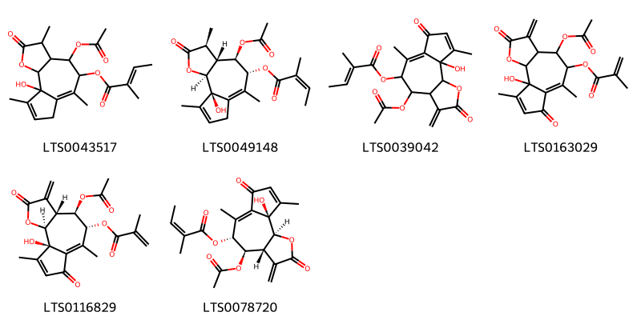{ width=100% }
    <figcaption>Hình ảnh cấu trúc hóa học của 6 hoạt chất thuộc nhóm Carboxylic acids and derivatives gồm ['4-(acetyloxy)-9a-hydroxy-3,6,9-trimethyl-2-oxo-3h,3ah,4h,5h,7h,9bh-azuleno[4,5-b]furan-5-yl 2-methylbut-2-enoate (LTS0043517)', '(3s,3ar,4r,5r,9ar,9bs)-4-(acetyloxy)-9a-hydroxy-3,6,9-trimethyl-2-oxo-3h,3ah,4h,5h,7h,9bh-azuleno[4,5-b]furan-5-yl (2z)-2-methylbut-2-enoate (LTS0049148)', '4-(acetyloxy)-9a-hydroxy-6,9-dimethyl-3-methylidene-2,7-dioxo-3ah,4h,5h,9bh-azuleno[4,5-b]furan-5-yl 2-methylbut-2-enoate (LTS0039042)', '4-(acetyloxy)-9a-hydroxy-6,9-dimethyl-3-methylidene-2,7-dioxo-3ah,4h,5h,9bh-azuleno[4,5-b]furan-5-yl 2-methylprop-2-enoate (LTS0163029)', '(3ar,4r,5r,9ar,9bs)-4-(acetyloxy)-9a-hydroxy-6,9-dimethyl-3-methylidene-2,7-dioxo-3ah,4h,5h,9bh-azuleno[4,5-b]furan-5-yl 2-methylprop-2-enoate (LTS0116829)', '(3ar,4r,5r,9ar,9bs)-4-(acetyloxy)-9a-hydroxy-6,9-dimethyl-3-methylidene-2,7-dioxo-3ah,4h,5h,9bh-azuleno[4,5-b]furan-5-yl (2z)-2-methylbut-2-enoate (LTS0078720)'].</figcaption>
</figure>
#### Nhóm Cinnamic acids and derivatives
<figure markdown="span">
    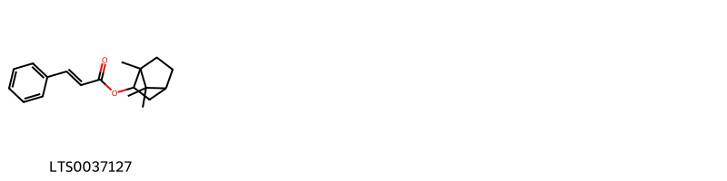{ width=100% }
    <figcaption>Hình ảnh cấu trúc hóa học của 1 hoạt chất thuộc nhóm Cinnamic acids and derivatives gồm ['1,7,7-trimethylbicyclo[2.2.1]heptan-2-yl 3-phenylprop-2-enoate (LTS0037127)'].</figcaption>
</figure>
#### Nhóm Fatty Acyls
<figure markdown="span">
    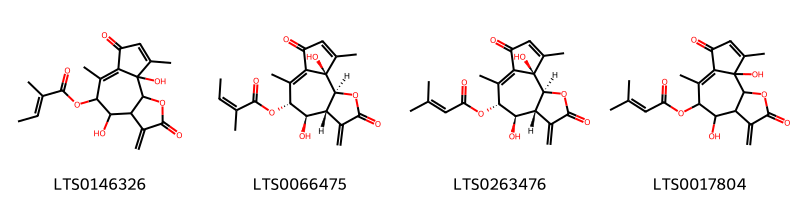{ width=100% }
    <figcaption>Hình ảnh cấu trúc hóa học của 4 hoạt chất thuộc nhóm Fatty Acyls gồm ['4,9a-dihydroxy-6,9-dimethyl-3-methylidene-2,7-dioxo-3ah,4h,5h,9bh-azuleno[4,5-b]furan-5-yl 2-methylbut-2-enoate (LTS0146326)', '(3ar,4r,5r,9ar,9bs)-4,9a-dihydroxy-6,9-dimethyl-3-methylidene-2,7-dioxo-3ah,4h,5h,9bh-azuleno[4,5-b]furan-5-yl (2z)-2-methylbut-2-enoate (LTS0066475)', '(3ar,4r,5r,9ar,9bs)-4,9a-dihydroxy-6,9-dimethyl-3-methylidene-2,7-dioxo-3ah,4h,5h,9bh-azuleno[4,5-b]furan-5-yl 3-methylbut-2-enoate (LTS0263476)', '4,9a-dihydroxy-6,9-dimethyl-3-methylidene-2,7-dioxo-3ah,4h,5h,9bh-azuleno[4,5-b]furan-5-yl 3-methylbut-2-enoate (LTS0017804)'].</figcaption>
</figure>
#### Nhóm Flavonoids
<figure markdown="span">
    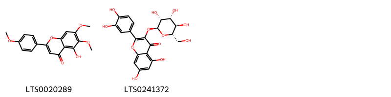{ width=100% }
    <figcaption>Hình ảnh cấu trúc hóa học của 2 hoạt chất thuộc nhóm Flavonoids gồm ['salvigenin (LTS0020289)', '2-(3,4-dihydroxyphenyl)-5,7-dihydroxy-3-{[(2s,3r,4r,5r,6s)-3,4,5-trihydroxy-6-(hydroxymethyl)oxan-2-yl]oxy}chromen-4-one (LTS0241372)'].</figcaption>
</figure>
#### Nhóm Oxepanes
<figure markdown="span">
    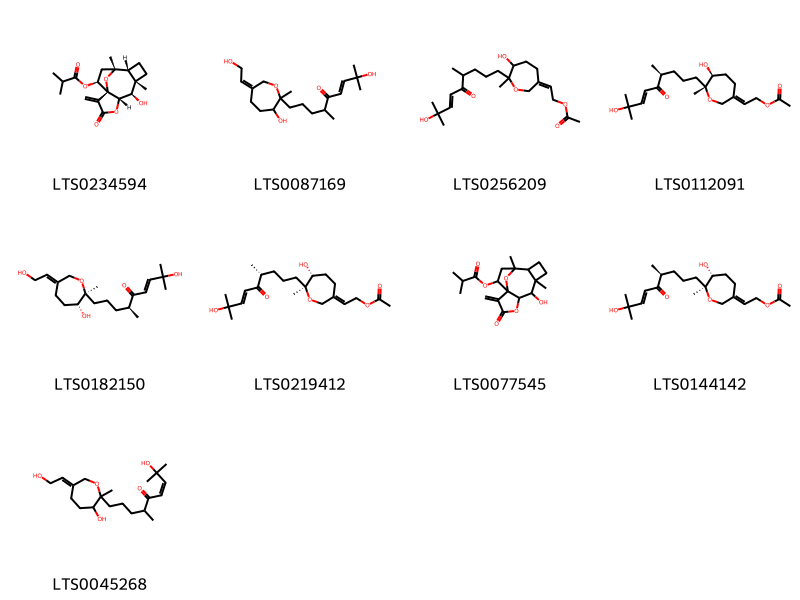{ width=100% }
    <figcaption>Hình ảnh cấu trúc hóa học của 9 hoạt chất thuộc nhóm Oxepanes gồm ['(1s,5s,6r,7s,10r,11r,13s)-6-hydroxy-7,11-dimethyl-2-methylidene-3-oxo-4,14-dioxatetracyclo[9.2.1.0¹,⁵.0⁷,¹⁰]tetradecan-13-yl 2-methylpropanoate (LTS0234594)', '2-hydroxy-9-[3-hydroxy-6-(2-hydroxyethylidene)-2-methyloxepan-2-yl]-2,6-dimethylnon-3-en-5-one (LTS0087169)', '2-[6-hydroxy-7-(8-hydroxy-4,8-dimethyl-5-oxonon-6-en-1-yl)-7-methyloxepan-3-ylidene]ethyl acetate (LTS0256209)', '2-[(3e,6s,7r)-6-hydroxy-7-[(4s,6e)-8-hydroxy-4,8-dimethyl-5-oxonon-6-en-1-yl]-7-methyloxepan-3-ylidene]ethyl acetate (LTS0112091)', '(3e,6s)-2-hydroxy-9-[(2s,3r,6e)-3-hydroxy-6-(2-hydroxyethylidene)-2-methyloxepan-2-yl]-2,6-dimethylnon-3-en-5-one (LTS0182150)', '2-[(3e,6r,7s)-6-hydroxy-7-[(4r,6e)-8-hydroxy-4,8-dimethyl-5-oxonon-6-en-1-yl]-7-methyloxepan-3-ylidene]ethyl acetate (LTS0219412)', '6-hydroxy-7,11-dimethyl-2-methylidene-3-oxo-4,14-dioxatetracyclo[9.2.1.0¹,⁵.0⁷,¹⁰]tetradecan-13-yl 2-methylpropanoate (LTS0077545)', '2-[(3e,6r,7s)-6-hydroxy-7-[(4s,6e)-8-hydroxy-4,8-dimethyl-5-oxonon-6-en-1-yl]-7-methyloxepan-3-ylidene]ethyl acetate (LTS0144142)', '(3z)-2-hydroxy-9-[(6e)-3-hydroxy-6-(2-hydroxyethylidene)-2-methyloxepan-2-yl]-2,6-dimethylnon-3-en-5-one (LTS0045268)'].</figcaption>
</figure>
#### Nhóm Phenols
<figure markdown="span">
    { width=100% }
    <figcaption>Hình ảnh cấu trúc hóa học của 1 hoạt chất thuộc nhóm Phenols gồm ['eugenol (LTS0052342)'].</figcaption>
</figure>
#### Nhóm Prenol lipids
<figure markdown="span">
    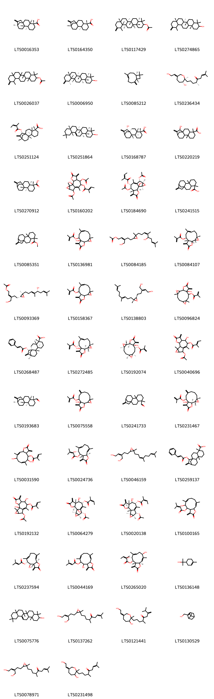{ width=100% }
    <figcaption>Hình ảnh cấu trúc hóa học của 119 hoạt chất thuộc nhóm Prenol lipids gồm ['ent-kaur-16-en-19-oic acid (LTS0016353)', '(5r,9s,13s)-5,9-dimethyl-14-methylidenetetracyclo[11.2.1.0¹,¹⁰.0⁴,⁹]hexadecane-5-carboxylic acid (LTS0164350)', '(4ar,6ar,6br,8ar,12as,12bs,14as,14br)-4,4,6a,6b,8a,12,14b-heptamethyl-11-methylidene-hexadecahydropicen-3-yl acetate (LTS0117429)', '(6ar,6br,8ar,14br)-4,4,6a,6b,8a,12,14b-heptamethyl-11-methylidene-hexadecahydropicen-3-ol (LTS0274865)', '4,4,6a,6b,8a,12,14b-heptamethyl-11-methylidene-hexadecahydropicen-3-yl acetate (LTS0026037)', 'taraxasterol (LTS0006950)', 'caryophyllene (LTS0085212)', 'zoapatanol (LTS0236434)', '(4s,5r,9s,10s,13s,15s)-5,9-dimethyl-15-{[(2z)-2-methylbut-2-enoyl]oxy}-14-methylidenetetracyclo[11.2.1.0¹,¹⁰.0⁴,⁹]hexadecane-5-carboxylic acid (LTS0251124)', 'β-amyrin (LTS0251864)', 'grandifloric acid (LTS0168787)', '15-hydroxy-5,9-dimethyl-14-methylidenetetracyclo[11.2.1.0¹,¹⁰.0⁴,⁹]hexadecane-5-carboxylic acid (LTS0220219)', '(1s,4r,5r,9s,10r)-5,9-dimethyl-14-methylidenetetracyclo[11.2.1.0¹,¹⁰.0⁴,⁹]hexadecane-5-carboxylic acid (LTS0270912)', '7,11-bis(acetyloxy)-1-hydroxy-9,14-dimethyl-5-methylidene-4-oxo-3,13-dioxatetracyclo[8.4.0.0²,⁶.0¹²,¹⁴]tetradec-9-en-8-yl 2-methylbut-2-enoate (LTS0160202)', '(1r,2s,6r,7r,8r,11s,12r,14r)-7,11-bis(acetyloxy)-1-hydroxy-9,14-dimethyl-5-methylidene-4-oxo-3,13-dioxatetracyclo[8.4.0.0²,⁶.0¹²,¹⁴]tetradec-9-en-8-yl (2z)-2-methylbut-2-enoate (LTS0184690)', '5,9-dimethyl-14-methylidenetetracyclo[11.2.1.0¹,¹⁰.0⁴,⁹]hexadecane-5-carboxylic acid (LTS0241515)', 'methyl 5,9-dimethyl-14-methylidenetetracyclo[11.2.1.0¹,¹⁰.0⁴,⁹]hexadecane-5-carboxylate (LTS0085351)', '11-hydroxy-4,8-dimethyl-12-methylidene-13-oxo-3,14-dioxatricyclo[9.3.0.0²,⁴]tetradec-7-en-10-yl 2-methylprop-2-enoate (LTS0136981)', '4-hydroxy-3-{2-[3-(5-hydroxy-4,8-dimethylnona-3,7-dien-1-yl)-3-methyloxiran-2-yl]ethyl}but-2-en-1-yl acetate (LTS0084185)', '(1r,2r,4s,7e,10s,11r)-4,8-dimethyl-12-methylidene-13-oxo-3,14-dioxatricyclo[9.3.0.0²,⁴]tetradec-7-en-10-yl 2-methylprop-2-enoate (LTS0084107)', '(2e)-4-hydroxy-3-{2-[(2r,3r)-3-[(3e,5r)-5-hydroxy-4,8-dimethylnona-3,7-dien-1-yl]-3-methyloxiran-2-yl]ethyl}but-2-en-1-yl acetate (LTS0093369)', '4,8-dimethyl-12-methylidene-13-oxo-3,14-dioxatricyclo[9.3.0.0²,⁴]tetradec-7-en-10-yl 2-methylprop-2-enoate (LTS0158367)', '(2e)-2-{2-[(2r,3r)-3-[(3e)-4,8-dimethylnona-3,7-dien-1-yl]-3-methyloxiran-2-yl]ethyl}but-2-ene-1,4-diol (LTS0138803)', '12-hydroxy-4,9-dimethyl-13-methylidene-14-oxo-3,8,15-trioxatetracyclo[10.3.0.0²,⁴.0⁷,⁹]pentadecan-11-yl 2-methylprop-2-enoate (LTS0096824)', '(1r,4s,5r,9s,10s,13r,15s)-5,9-dimethyl-14-methylidene-15-{[(2e)-3-phenylprop-2-enoyl]oxy}tetracyclo[11.2.1.0¹,¹⁰.0⁴,⁹]hexadecane-5-carboxylic acid (LTS0268487)', '(1r,2r,4s,7e,10r,11s)-11-hydroxy-4,8-dimethyl-12-methylidene-13-oxo-3,14-dioxatricyclo[9.3.0.0²,⁴]tetradec-7-en-10-yl 2-methylprop-2-enoate (LTS0272485)', '(1r,2r,4r,7s,9r,11r,12s)-12-hydroxy-4,9-dimethyl-13-methylidene-14-oxo-3,8,15-trioxatetracyclo[10.3.0.0²,⁴.0⁷,⁹]pentadecan-11-yl 2-methylprop-2-enoate (LTS0192074)', '11-(acetyloxy)-7-hydroxy-9,14-dimethyl-5-methylidene-4-oxo-3,13-dioxatetracyclo[8.4.0.0²,⁶.0¹²,¹⁴]tetradec-9-en-8-yl 2-methylbut-2-enoate (LTS0040696)', '(1s,4s,5r,9s,10r,13r)-5,9-dimethyl-14-methylidenetetracyclo[11.2.1.0¹,¹⁰.0⁴,⁹]hexadecane-5-carbaldehyde (LTS0193683)', '11-hydroxy-4-methyl-8,12-dimethylidene-13-oxo-3,14-dioxatricyclo[9.3.0.0²,⁴]tetradecan-10-yl 2-methylprop-2-enoate (LTS0075558)', '5,9-dimethyl-14-methylidenetetracyclo[11.2.1.0¹,¹⁰.0⁴,⁹]hexadecane-5-carbaldehyde (LTS0241733)', '(1r,2r,4s,10s,11s)-11-hydroxy-4-methyl-8,12-dimethylidene-13-oxo-3,14-dioxatricyclo[9.3.0.0²,⁴]tetradecan-10-yl 2-methylprop-2-enoate (LTS0231467)', '5,9-dihydroxy-6,10-dimethyl-3-methylidene-2-oxo-3ah,4h,5h,8h,9h,11ah-cyclodeca[b]furan-4-yl 2-methylbut-2-enoate (LTS0031590)', '(3as,4r,5r,11ar)-5-hydroxy-6,10-dimethyl-3-methylidene-2-oxo-3ah,4h,5h,8h,9h,11ah-cyclodeca[b]furan-4-yl 3-methylbut-2-enoate (LTS0024736)', '2-{2-[3-(4,8-dimethylnona-3,7-dien-1-yl)-3-methyloxiran-2-yl]ethyl}but-2-ene-1,4-diol (LTS0046159)', '5,9-dimethyl-14-methylidene-15-[(3-phenylprop-2-enoyl)oxy]tetracyclo[11.2.1.0¹,¹⁰.0⁴,⁹]hexadecane-5-carboxylic acid (LTS0259137)', '11-(acetyloxy)-1,7-dihydroxy-9,14-dimethyl-5-methylidene-4-oxo-3,13-dioxatetracyclo[8.4.0.0²,⁶.0¹²,¹⁴]tetradec-9-en-8-yl 2-methylbut-2-enoate (LTS0192132)', '(1r,2s,6r,7r,8r,11s,12r,14r)-11-(acetyloxy)-1,7-dihydroxy-9,14-dimethyl-5-methylidene-4-oxo-3,13-dioxatetracyclo[8.4.0.0²,⁶.0¹²,¹⁴]tetradec-9-en-8-yl (2z)-2-methylbut-2-enoate (LTS0064279)', '(1s,2s,6r,7r,8r,11s,12r,14s)-11-(acetyloxy)-7-hydroxy-9,14-dimethyl-5-methylidene-4-oxo-3,13-dioxatetracyclo[8.4.0.0²,⁶.0¹²,¹⁴]tetradec-9-en-8-yl (2z)-2-methylbut-2-enoate (LTS0020138)', '5-hydroxy-6,10-dimethyl-3-methylidene-2-oxo-3ah,4h,5h,8h,9h,11ah-cyclodeca[b]furan-4-yl 3-methylbut-2-enoate (LTS0100165)', '(3ar,4r,5r,11ar)-4-hydroxy-6,10-dimethyl-3-methylidene-2-oxo-3ah,4h,5h,8h,9h,11ah-cyclodeca[b]furan-5-yl 3-methylbut-2-enoate (LTS0237594)', '4-hydroxy-6,10-dimethyl-3-methylidene-2-oxo-3ah,4h,5h,8h,9h,11ah-cyclodeca[b]furan-5-yl 3-methylbut-2-enoate (LTS0044169)', '(3as,4r,5r,9r,11ar)-5,9-dihydroxy-6,10-dimethyl-3-methylidene-2-oxo-3ah,4h,5h,8h,9h,11ah-cyclodeca[b]furan-4-yl (2z)-2-methylbut-2-enoate (LTS0265020)', 'terpineol (LTS0136148)', 'β-amyrin (LTS0075776)', '9-{3-[5-hydroxy-3-(hydroxymethyl)pent-3-en-1-yl]-2-methyloxiran-2-yl}-2,6-dimethylnon-2-en-5-one (LTS0137262)', '1-[3-hydroxy-6-(2-hydroxyethylidene)-2-methyloxepan-2-yl]-4,8-dimethyl-7-methylidenenonan-5-one (LTS0121441)', 'myrtenol (LTS0130529)', '9-{3-[(3z)-5-hydroxy-3-(hydroxymethyl)pent-3-en-1-yl]-2-methyloxiran-2-yl}-2,6-dimethylnon-2-en-5-one (LTS0078971)', '9-[3-hydroxy-6-(2-hydroxyethylidene)-2-methyloxepan-2-yl]-2,6-dimethylnon-2-en-5-one (LTS0231498)', 'linalool, (+-)- (LTS0128839)', '(2z)-4-hydroxy-3-(2-{3-[(3e)-5-hydroxy-4,8-dimethylnona-3,7-dien-1-yl]-3-methyloxiran-2-yl}ethyl)but-2-en-1-yl acetate (LTS0077766)', '(4r)-1-[(2s,3s)-3-[(3e)-5-hydroxy-3-(hydroxymethyl)pent-3-en-1-yl]-2-methyloxiran-2-yl]-4,8-dimethyl-7-methylidenenonan-5-one (LTS0021833)', 'α-myrcene (LTS0115731)', '9-[(6z)-3-hydroxy-6-(2-hydroxyethylidene)-2-methyloxepan-2-yl]-2,3,6-trimethylnon-1-en-5-one (LTS0038156)', 'trans-β-ocimene (LTS0049765)', '9-[3-hydroxy-6-(2-hydroxyethylidene)-2-methyloxepan-2-yl]-2,3,6-trimethylnon-1-en-5-one (LTS0104503)', '(3ar,4s,5s,9s,11ar)-5,9-dihydroxy-6,10-dimethyl-3-methylidene-2-oxo-3ah,4h,5h,8h,9h,11ah-cyclodeca[b]furan-4-yl (2e)-2-methylbut-2-enoate (LTS0188527)', '(1r,2r,6r,7r,8r,12r,14r)-1,7-dihydroxy-9,14-dimethyl-5-methylidene-4-oxo-3,13-dioxatetracyclo[8.4.0.0²,⁶.0¹²,¹⁴]tetradec-9-en-8-yl 3-methylbut-2-enoate (LTS0157490)', '11-hydroxy-4,8-dimethyl-12-methylidene-13-oxo-3,14-dioxatricyclo[9.3.0.0²,⁴]tetradec-7-en-10-yl 2-methylpropanoate (LTS0054492)', 'β-pinene (LTS0117550)', '(3as,4r,5r,9r,11ar)-5,9-dihydroxy-6,10-dimethyl-3-methylidene-2-oxo-3ah,4h,5h,8h,9h,11ah-cyclodeca[b]furan-4-yl 2-[(acetyloxy)methyl]prop-2-enoate (LTS0186835)', 'α pinene (LTS0132416)', '(6s)-9-[(2s,3r)-3-[(3e)-5-hydroxy-3-(hydroxymethyl)pent-3-en-1-yl]-2-methyloxiran-2-yl]-2,6-dimethylnon-2-en-5-one (LTS0178000)', '5,9,13-trimethyltetracyclo[11.2.1.0¹,¹⁰.0⁴,⁹]hexadec-14-ene-5-carboxylic acid (LTS0127446)', '1-{3-[(3z)-5-hydroxy-3-(hydroxymethyl)pent-3-en-1-yl]-2-methyloxiran-2-yl}-4,8-dimethyl-7-methylidenenonan-5-one (LTS0172093)', '(1s,4s,5r,9r,10r,13r)-5,9-dimethyl-14-methylidenetetracyclo[11.2.1.0¹,¹⁰.0⁴,⁹]hexadecane-5-carboxylic acid (LTS0242050)', 'ent-kaur-16-en-19-al (LTS0174068)', '(1s,2s,6s,7r,8r,11s,12r,14s)-11-(acetyloxy)-7-hydroxy-9,14-dimethyl-5-methylidene-4-oxo-3,13-dioxatetracyclo[8.4.0.0²,⁶.0¹²,¹⁴]tetradec-9-en-8-yl (2z)-2-methylbut-2-enoate (LTS0144040)', '(4r)-1-[(2s,3r,6e)-3-hydroxy-6-(2-hydroxyethylidene)-2-methyloxepan-2-yl]-4,8-dimethyl-7-methylidenenonan-5-one (LTS0148060)', '7-(acetyloxy)-1-hydroxy-9,14-dimethyl-5-methylidene-4,11-dioxo-3,13-dioxatetracyclo[8.4.0.0²,⁶.0¹²,¹⁴]tetradec-9-en-8-yl 2-methylbut-2-enoate (LTS0152492)', 'camphene (LTS0267242)', 'limonene,  (LTS0155981)', '(1r,2s,6r,7r,8r,11r,12r,14r)-11-(acetyloxy)-1,7-dihydroxy-9,14-dimethyl-5-methylidene-4-oxo-3,13-dioxatetracyclo[8.4.0.0²,⁶.0¹²,¹⁴]tetradec-9-en-8-yl (2z)-2-methylbut-2-enoate (LTS0149500)', '2-hydroxy-9-{3-[5-hydroxy-3-(hydroxymethyl)pent-3-en-1-yl]-2-methyloxiran-2-yl}-2,6-dimethylnon-3-en-5-one (LTS0167571)', '(1s,2s,6r,7r,8r,12r,14s)-7,8-dihydroxy-9,14-dimethyl-5-methylidene-3,13-dioxatetracyclo[8.4.0.0²,⁶.0¹²,¹⁴]tetradec-9-en-4-one (LTS0148366)', '4-terpineol (LTS0253733)', '5,9-dihydroxy-6,10-dimethyl-3-methylidene-2-oxo-3ah,4h,5h,8h,9h,11ah-cyclodeca[b]furan-4-yl 2-[(acetyloxy)methyl]but-2-enoate (LTS0174605)', 'borneol (LTS0264960)', '(3e,6s)-2-hydroxy-9-[(2s,3r)-3-[(3e)-5-hydroxy-3-(hydroxymethyl)pent-3-en-1-yl]-2-methyloxiran-2-yl]-2,6-dimethylnon-3-en-5-one (LTS0262244)', '9-[3-hydroxy-6-(2-hydroxyethylidene)-2-methyloxepan-2-yl]-2,3,6-trimethylnon-3-en-5-one (LTS0229793)', 'α-thujene (LTS0176954)', '(1s,2r,4s,7e,10s,11s)-11-hydroxy-4,8-dimethyl-12-methylidene-13-oxo-3,14-dioxatricyclo[9.3.0.0²,⁴]tetradec-7-en-10-yl 2-methylpropanoate (LTS0186836)', '(6s)-9-[(2s,3r,6e)-3-hydroxy-6-(2-hydroxyethylidene)-2-methyloxepan-2-yl]-2,6-dimethylnon-2-en-5-one (LTS0215491)', '(2z)-2-(2-{3-[(3e)-4,8-dimethylnona-3,7-dien-1-yl]-3-methyloxiran-2-yl}ethyl)but-2-ene-1,4-diol (LTS0263722)', '(3e,6r)-2-hydroxy-9-[(2r,3r)-3-[(3e)-5-hydroxy-3-(hydroxymethyl)pent-3-en-1-yl]-2-methyloxiran-2-yl]-2,6-dimethylnon-3-en-5-one (LTS0183702)', '1,7-dihydroxy-9,14-dimethyl-5-methylidene-4-oxo-3,13-dioxatetracyclo[8.4.0.0²,⁶.0¹²,¹⁴]tetradec-9-en-8-yl 3-methylbut-2-enoate (LTS0082544)', 'bornyl acetate (LTS0060565)', '(1r,4r,5r,9s,10r,13s)-5,9,13-trimethyltetracyclo[11.2.1.0¹,¹⁰.0⁴,⁹]hexadec-14-ene-5-carboxylic acid (LTS0224371)', 'α-copaene (LTS0207598)', '(1r,2s,6r,7r,8r,12s,14r)-7-(acetyloxy)-1-hydroxy-9,14-dimethyl-5-methylidene-4,11-dioxo-3,13-dioxatetracyclo[8.4.0.0²,⁶.0¹²,¹⁴]tetradec-9-en-8-yl (2z)-2-methylbut-2-enoate (LTS0261651)', '4,4,6a,6b,8a,11,11,14b-octamethyl-1,2,3,4a,5,6,7,8,9,10,12,12a,14,14a-tetradecahydropicen-3-yl acetate (LTS0153642)', '(3as,4r,5r,9r,11as)-5,9-dihydroxy-6,10-dimethyl-3-methylidene-2-oxo-3ah,4h,5h,8h,9h,11ah-cyclodeca[b]furan-4-yl (2z)-2-methylbut-2-enoate (LTS0234969)', 'α-thujene (LTS0185078)', '(1r,2r,4s,7e,10s,11r)-4,8-dimethyl-12-methylidene-13-oxo-3,14-dioxatricyclo[9.3.0.0²,⁴]tetradec-7-en-10-yl 2-methylpropanoate (LTS0165647)', '(1r,2s,6r,7r,8r,11s,12r,14r)-1,7,11-trihydroxy-9,14-dimethyl-5-methylidene-4-oxo-3,13-dioxatetracyclo[8.4.0.0²,⁶.0¹²,¹⁴]tetradec-9-en-8-yl (2z)-2-methylbut-2-enoate (LTS0184001)', 'montanol (LTS0226822)', '(3as,4r,5r,9r,11ar)-5,9-dihydroxy-6,10-dimethyl-3-methylidene-2-oxo-3ah,4h,5h,8h,9h,11ah-cyclodeca[b]furan-4-yl (2e)-2-[(acetyloxy)methyl]but-2-enoate (LTS0242011)', '(4s)-1-[(2r,3r)-3-[(3e)-5-hydroxy-3-(hydroxymethyl)pent-3-en-1-yl]-2-methyloxiran-2-yl]-4,8-dimethyl-7-methylidenenonan-5-one (LTS0040829)', '(1r,2s,7s,8s)-8-isopropyl-1,3-dimethyltricyclo[4.4.0.0²,⁷]dec-3-ene (LTS0190031)', '(2s,4r)-1,7,7-trimethylbicyclo[2.2.1]heptan-2-ol (LTS0010050)', '1-[(6z)-3-hydroxy-6-(2-hydroxyethylidene)-2-methyloxepan-2-yl]-4,8-dimethyl-7-methylidenenonan-5-one (LTS0068661)', '5,9-dihydroxy-6,10-dimethyl-3-methylidene-2-oxo-3ah,4h,5h,8h,9h,11ah-cyclodeca[b]furan-4-yl 2-[(acetyloxy)methyl]prop-2-enoate (LTS0012649)', '(3e)-2-hydroxy-9-{3-[(3z)-5-hydroxy-3-(hydroxymethyl)pent-3-en-1-yl]-2-methyloxiran-2-yl}-2,6-dimethylnon-3-en-5-one (LTS0263273)', 'tomentosin (LTS0274135)', '(1s,4s,5r,9r)-5,9-dimethyl-14-methylidenetetracyclo[11.2.1.0¹,¹⁰.0⁴,⁹]hexadec-10-ene-5-carboxylic acid (LTS0007878)', '1,7,11-trihydroxy-9,14-dimethyl-5-methylidene-4-oxo-3,13-dioxatetracyclo[8.4.0.0²,⁶.0¹²,¹⁴]tetradec-9-en-8-yl 2-methylbut-2-enoate (LTS0027096)', '(3r,6s)-9-[(2s,3r,6e)-3-hydroxy-6-(2-hydroxyethylidene)-2-methyloxepan-2-yl]-2,3,6-trimethylnon-1-en-5-one (LTS0224056)', '1-{3-[5-hydroxy-3-(hydroxymethyl)pent-3-en-1-yl]-2-methyloxiran-2-yl}-4,8-dimethyl-7-methylidenenonan-5-one (LTS0080645)', '(3s,4as,6ar,6bs,8ar,12ar,14as,14br)-4,4,6a,6b,8a,11,11,14b-octamethyl-1,2,3,4a,5,6,7,8,9,10,12,12a,14,14a-tetradecahydropicen-3-yl acetate (LTS0004736)', '4,8-dimethyl-12-methylidene-13-oxo-3,14-dioxatricyclo[9.3.0.0²,⁴]tetradec-7-en-10-yl 2-methylpropanoate (LTS0250264)', '(3s,4as,6ar,6bs,8ar,12ar,14as,14br)-4,4,6a,6b,8a,11,11,14b-octamethyl-1,2,3,4a,5,6,7,8,9,10,12,12a,14,14a-tetradecahydropicen-3-ol (LTS0090246)', '(3as)-5,9-dihydroxy-6,10-dimethyl-3-methylidene-2-oxo-3ah,4h,5h,8h,9h,11ah-cyclodeca[b]furan-4-yl (2e)-2-methylbut-2-enoate (LTS0102611)', '(4s,5r,9r)-5,9-dimethyl-14-methylidenetetracyclo[11.2.1.0¹,¹⁰.0⁴,⁹]hexadec-10-ene-5-carboxylic acid (LTS0035366)', '(1s,2s,6r,7r,8r,12r,14s)-7-hydroxy-9,14-dimethyl-5-methylidene-4-oxo-3,13-dioxatetracyclo[8.4.0.0²,⁶.0¹²,¹⁴]tetradec-9-en-8-yl 3-methylbut-2-enoate (LTS0105159)', '(-)-β-cubebene (LTS0123697)', '7-hydroxy-9,14-dimethyl-5-methylidene-4-oxo-3,13-dioxatetracyclo[8.4.0.0²,⁶.0¹²,¹⁴]tetradec-9-en-8-yl 3-methylbut-2-enoate (LTS0242774)', '(3r,6s)-9-[(2r,3s,6e)-3-hydroxy-6-(2-hydroxyethylidene)-2-methyloxepan-2-yl]-2,3,6-trimethylnon-1-en-5-one (LTS0036176)', '(6r)-9-[(2r,3s)-3-[(3e)-5-hydroxy-3-(hydroxymethyl)pent-3-en-1-yl]-2-methyloxiran-2-yl]-2,6-dimethylnon-2-en-5-one (LTS0115747)'].</figcaption>
</figure>
#### Nhóm Steroids and steroid derivatives
<figure markdown="span">
    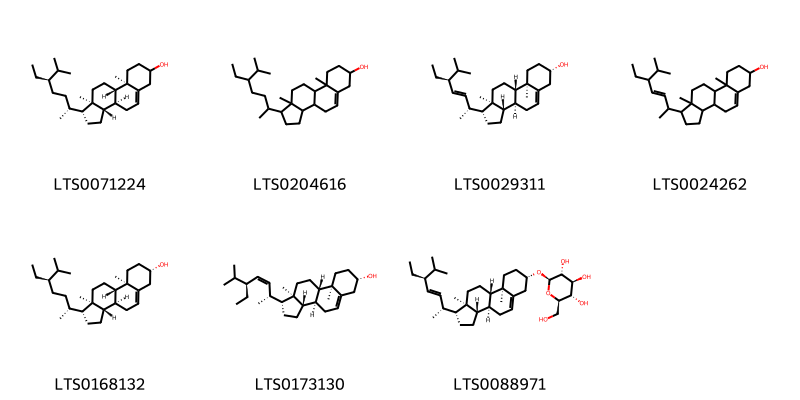{ width=100% }
    <figcaption>Hình ảnh cấu trúc hóa học của 7 hoạt chất thuộc nhóm Steroids and steroid derivatives gồm ['stigmast-5-en-3-ol (LTS0071224)', 'stigmast-5-en-3-ol, (3β)- (LTS0204616)', 'phytosterol (LTS0029311)', 'stigmasterol (LTS0024262)', 'sitosterol (LTS0168132)', '(1r,3as,3bs,7s,9ar,9bs,11ar)-1-[(2r,3z,5s)-5-ethyl-6-methylhept-3-en-2-yl]-9a,11a-dimethyl-1h,2h,3h,3ah,3bh,4h,6h,7h,8h,9h,9bh,10h,11h-cyclopenta[a]phenanthren-7-ol (LTS0173130)', '(2r,3r,4s,5s,6r)-2-{[(1r,3as,3bs,7s,9ar,9bs,11ar)-1-[(2r,3e,5s)-5-ethyl-6-methylhept-3-en-2-yl]-9a,11a-dimethyl-1h,2h,3h,3ah,3bh,4h,6h,7h,8h,9h,9bh,10h,11h-cyclopenta[a]phenanthren-7-yl]oxy}-6-(hydroxymethyl)oxane-3,4,5-triol (LTS0088971)'].</figcaption>
</figure>
#### Nhóm Unsaturated hydrocarbons
<figure markdown="span">
    { width=100% }
    <figcaption>Hình ảnh cấu trúc hóa học của 1 hoạt chất thuộc nhóm Unsaturated hydrocarbons gồm ['(3e,5e)-3,7-dimethylocta-1,3,5-triene (LTS0270900)'].</figcaption>
</figure>

---

### Dược dân tộc học

Danh sách các quốc gia có sử dụng *Montanoa tomentosa* trong điều trị các bệnh. 

| Country   | Disease                                                    | Bệnh                                                                                                                                                                                                |
|:----------|:-----------------------------------------------------------|:----------------------------------------------------------------------------------------------------------------------------------------------------------------------------------------------------|
| Mexico    | Diuretic, Diuretic, Stomachic, Stomachic, Diuretic, Poison | MYMEMORY WARNING: YOU USED ALL AVAILABLE FREE TRANSLATIONS FOR TODAY. NEXT AVAILABLE IN  09 HOURS 51 MINUTES 50 SECONDS VISIT HTTPS://MYMEMORY.TRANSLATED.NET/DOC/USAGELIMITS.PHP TO TRANSLATE MORE |

---

# Chi Siegesbeckia

??? note "Danh sách các dược liệu thuộc chi"
    
	 - *Siegesbeckia glabrescens*
	 - *Siegesbeckia orientalis*
	 - *Siegesbeckia pubescens*

---
## Siegesbeckia glabrescens
### Thông tin về thực vật

!!! info "Phân loại thực vật của *Sigesbeckia glabrescens* từ GIBF:"
    - **Kingdom:** Plantae
    - **Phylum:** Tracheophyta
    - **Order:** Asterales
    - **Family:** Asteraceae
    - **Genus:** Sigesbeckia
    - **Species:** *Sigesbeckia glabrescens*

 

| Label (VI)   | Label (EN)   | Scientific Name    | Descriptions (VI)   | Descriptions (EN)   | Also Known As (VI)   | Also Known As (EN)   |
|:-------------|:-------------|:-------------------|:--------------------|:--------------------|:---------------------|:---------------------|
| N/A          | N/A          | Montanoa tomentosa | loài thực vật       | species of plant    | ['']                 | ['']                 |

#### Phân bố trên thế giới

**Từ CSDL GIBF** Korea, Republic of, Russian Federation, China, Japan

#### Phân bố tại Việt Nam

**Từ CSDL GIBF**: Không có ghi nhận ở Việt Nam

---
### Thành phần hóa học
        
- Theo cơ sở dữ liệu lotus: Từ loài *Sigesbeckia glabrescens* đã phân lập và xác định được Chưa có hoạt chất nào được phân lập. hoạt chất thuộc về các nhóm Không có hoạt chất nào được phân lập. 

Không có hình ảnh nào được tạo ra

---

### Dược dân tộc học

Danh sách các quốc gia có sử dụng *Sigesbeckia glabrescens* trong điều trị các bệnh. 

| Country   | Disease   | Bệnh                                                                                                                                                                                                |
|:----------|:----------|:----------------------------------------------------------------------------------------------------------------------------------------------------------------------------------------------------|
| Elsewhere | Antidote  | MYMEMORY WARNING: YOU USED ALL AVAILABLE FREE TRANSLATIONS FOR TODAY. NEXT AVAILABLE IN  09 HOURS 51 MINUTES 10 SECONDS VISIT HTTPS://MYMEMORY.TRANSLATED.NET/DOC/USAGELIMITS.PHP TO TRANSLATE MORE |

---

---
## Siegesbeckia orientalis
### Thông tin về thực vật

!!! info "Phân loại thực vật của *Sigesbeckia orientalis* từ GIBF:"
    - **Kingdom:** Plantae
    - **Phylum:** Tracheophyta
    - **Order:** Asterales
    - **Family:** Asteraceae
    - **Genus:** Sigesbeckia
    - **Species:** *Sigesbeckia orientalis*

 

| Label (VI)   | Label (EN)   | Scientific Name    | Descriptions (VI)   | Descriptions (EN)   | Also Known As (VI)   | Also Known As (EN)   |
|:-------------|:-------------|:-------------------|:--------------------|:--------------------|:---------------------|:---------------------|
| N/A          | N/A          | Montanoa tomentosa | loài thực vật       | species of plant    | ['']                 | ['']                 |

#### Phân bố trên thế giới

**Từ CSDL GIBF** Japan, Mauritius, Georgia, Rwanda, Tanzania, United Republic of, Réunion, Korea, Republic of, Chinese Taipei, Paraguay, Uganda, Thailand, Brazil, Bhutan, Viet Nam, China, Madagascar, Costa Rica, Vanuatu, India, Indonesia, Nepal

#### Phân bố tại Việt Nam

**Từ CSDL GIBF**: Cao Bang, Ha Tinh

---
### Thành phần hóa học
        
- Theo cơ sở dữ liệu lotus: Từ loài *Sigesbeckia orientalis* đã phân lập và xác định được 4 hoạt chất thuộc về các nhóm Prenol lipids. 

|    | chemicalTaxonomyClassyfireClass   |   smiles_count |
|---:|:----------------------------------|---------------:|
|  0 | Prenol lipids                     |              1 |

#### Nhóm Prenol lipids
<figure markdown="span">
    { width=100% }
    <figcaption>Hình ảnh cấu trúc hóa học của 1 hoạt chất thuộc nhóm Prenol lipids gồm ['kirenol (LTS0147247)'].</figcaption>
</figure>

---

### Dược dân tộc học

Danh sách các quốc gia có sử dụng *Sigesbeckia orientalis* trong điều trị các bệnh. 

| Country      | Disease                                                               | Bệnh                                                                                                                                                                                                |
|:-------------|:----------------------------------------------------------------------|:----------------------------------------------------------------------------------------------------------------------------------------------------------------------------------------------------|
| China        | Analgesic, Apertif, Carminative, Emetic, Poison, Stomachic, Vermifuge | MYMEMORY WARNING: YOU USED ALL AVAILABLE FREE TRANSLATIONS FOR TODAY. NEXT AVAILABLE IN  09 HOURS 50 MINUTES 47 SECONDS VISIT HTTPS://MYMEMORY.TRANSLATED.NET/DOC/USAGELIMITS.PHP TO TRANSLATE MORE |
| Elsewhere    | Cardiotonic, Diaphoretic, Sialogogue, Vermifuge, nan, Insecticide     | MYMEMORY WARNING: YOU USED ALL AVAILABLE FREE TRANSLATIONS FOR TODAY. NEXT AVAILABLE IN  09 HOURS 50 MINUTES 44 SECONDS VISIT HTTPS://MYMEMORY.TRANSLATED.NET/DOC/USAGELIMITS.PHP TO TRANSLATE MORE |
| English      | Tonic                                                                 | MYMEMORY WARNING: YOU USED ALL AVAILABLE FREE TRANSLATIONS FOR TODAY. NEXT AVAILABLE IN  09 HOURS 50 MINUTES 40 SECONDS VISIT HTTPS://MYMEMORY.TRANSLATED.NET/DOC/USAGELIMITS.PHP TO TRANSLATE MORE |
| India(Hindu) | Parasiticide                                                          | MYMEMORY WARNING: YOU USED ALL AVAILABLE FREE TRANSLATIONS FOR TODAY. NEXT AVAILABLE IN  09 HOURS 50 MINUTES 37 SECONDS VISIT HTTPS://MYMEMORY.TRANSLATED.NET/DOC/USAGELIMITS.PHP TO TRANSLATE MORE |
| Philippines  | Styptic                                                               | MYMEMORY WARNING: YOU USED ALL AVAILABLE FREE TRANSLATIONS FOR TODAY. NEXT AVAILABLE IN  09 HOURS 50 MINUTES 35 SECONDS VISIT HTTPS://MYMEMORY.TRANSLATED.NET/DOC/USAGELIMITS.PHP TO TRANSLATE MORE |

---

---
## Siegesbeckia pubescens
### Thông tin về thực vật

!!! info "Phân loại thực vật của *Sigesbeckia pubescens* từ GIBF:"
    - **Kingdom:** Plantae
    - **Phylum:** Tracheophyta
    - **Order:** Asterales
    - **Family:** Asteraceae
    - **Genus:** Sigesbeckia
    - **Species:** *Sigesbeckia pubescens*

 

| Label (VI)   | Label (EN)   | Scientific Name    | Descriptions (VI)   | Descriptions (EN)   | Also Known As (VI)   | Also Known As (EN)   |
|:-------------|:-------------|:-------------------|:--------------------|:--------------------|:---------------------|:---------------------|
| N/A          | N/A          | Montanoa tomentosa | loài thực vật       | species of plant    | ['']                 | ['']                 |

#### Phân bố trên thế giới

**Từ CSDL GIBF** nan, Japan, Korea, Republic of, Russian Federation, China

#### Phân bố tại Việt Nam

**Từ CSDL GIBF**: Không có ghi nhận ở Việt Nam

---
### Thành phần hóa học
        
- Theo cơ sở dữ liệu lotus: Từ loài *Sigesbeckia pubescens* đã phân lập và xác định được Chưa có hoạt chất nào được phân lập. hoạt chất thuộc về các nhóm Không có hoạt chất nào được phân lập. 

Không có hình ảnh nào được tạo ra

---

### Dược dân tộc học

Danh sách các quốc gia có sử dụng *Sigesbeckia pubescens* trong điều trị các bệnh. 

| Country   | Disease   | Bệnh                                                                                                                                                                                                |
|:----------|:----------|:----------------------------------------------------------------------------------------------------------------------------------------------------------------------------------------------------|
| Elsewhere | Antidote  | MYMEMORY WARNING: YOU USED ALL AVAILABLE FREE TRANSLATIONS FOR TODAY. NEXT AVAILABLE IN  09 HOURS 50 MINUTES 06 SECONDS VISIT HTTPS://MYMEMORY.TRANSLATED.NET/DOC/USAGELIMITS.PHP TO TRANSLATE MORE |

---

# Chi Carthamus

??? note "Danh sách các dược liệu thuộc chi"
    
	 - *Carthamus lanatus*
	 - *Carthamus tinctorius*

---
## Carthamus lanatus
### Thông tin về thực vật

!!! info "Phân loại thực vật của *Carthamus lanatus* từ GIBF:"
    - **Kingdom:** Plantae
    - **Phylum:** Tracheophyta
    - **Order:** Asterales
    - **Family:** Asteraceae
    - **Genus:** Carthamus
    - **Species:** *Carthamus lanatus*

 

| Label (VI)   | Label (EN)   | Scientific Name   | Descriptions (VI)   | Descriptions (EN)   | Also Known As (VI)   | Also Known As (EN)   |
|:-------------|:-------------|:------------------|:--------------------|:--------------------|:---------------------|:---------------------|
| N/A          | N/A          | Carthamus lanatus | loài thực vật       | species of plant    | ['']                 | ['']                 |

#### Phân bố trên thế giới

**Từ CSDL GIBF** Italy, Bulgaria, Australia, Slovakia, Argentina, Ukraine, Spain, Hungary, Portugal, Algeria, Russian Federation, United States of America, Uruguay, Kazakhstan, Croatia, Chile, Uzbekistan, Romania, Iran (Islamic Republic of), France

#### Phân bố tại Việt Nam

**Từ CSDL GIBF**: Không có ghi nhận ở Việt Nam

---
### Thành phần hóa học
        
- Theo cơ sở dữ liệu lotus: Từ loài *Carthamus lanatus* đã phân lập và xác định được 47 hoạt chất thuộc về các nhóm Fatty Acyls, Flavonoids, Prenol lipids, Unsaturated hydrocarbons, Organooxygen compounds, Epoxides, Carboxylic acids and derivatives. 

|    | chemicalTaxonomyClassyfireClass   |   smiles_count |
|---:|:----------------------------------|---------------:|
|  0 | Carboxylic acids and derivatives  |              2 |
|  1 | Epoxides                          |              2 |
|  2 | Fatty Acyls                       |             14 |
|  3 | Flavonoids                        |             18 |
|  4 | Organooxygen compounds            |              2 |
|  5 | Prenol lipids                     |              5 |
|  6 | Unsaturated hydrocarbons          |              4 |

#### Nhóm Carboxylic acids and derivatives
<figure markdown="span">
    { width=100% }
    <figcaption>Hình ảnh cấu trúc hóa học của 2 hoạt chất thuộc nhóm Carboxylic acids and derivatives gồm ['2-chlorotrideca-3,11-dien-5,7,9-triyn-1-yl acetate (LTS0164955)', '(2s,3e,11e)-2-chlorotrideca-3,11-dien-5,7,9-triyn-1-yl acetate (LTS0101345)'].</figcaption>
</figure>
#### Nhóm Epoxides
<figure markdown="span">
    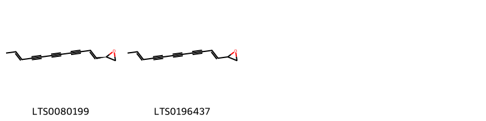{ width=100% }
    <figcaption>Hình ảnh cấu trúc hóa học của 2 hoạt chất thuộc nhóm Epoxides gồm ['(2r)-2-[(1e,9e)-undeca-1,9-dien-3,5,7-triyn-1-yl]oxirane (LTS0080199)', '2-(undeca-1,9-dien-3,5,7-triyn-1-yl)oxirane (LTS0196437)'].</figcaption>
</figure>
#### Nhóm Fatty Acyls
<figure markdown="span">
    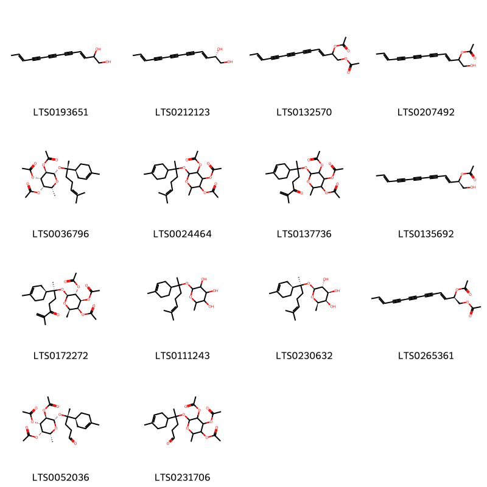{ width=100% }
    <figcaption>Hình ảnh cấu trúc hóa học của 14 hoạt chất thuộc nhóm Fatty Acyls gồm ['trideca-3,11-dien-5,7,9-triyne-1,2-diol (LTS0193651)', 'safynol (LTS0212123)', '1-(acetyloxy)trideca-3,11-dien-5,7,9-triyn-2-yl acetate (LTS0132570)', '1-hydroxytrideca-3,11-dien-5,7,9-triyn-2-yl acetate (LTS0207492)', '(2r,3s,4s,5r,6s)-3,5-bis(acetyloxy)-2-methyl-6-{[(2s)-6-methyl-2-[(1s)-4-methylcyclohex-3-en-1-yl]hept-5-en-2-yl]oxy}oxan-4-yl acetate (LTS0036796)', '4,5-bis(acetyloxy)-6-methyl-2-{[6-methyl-2-(4-methylcyclohex-3-en-1-yl)hept-5-en-2-yl]oxy}oxan-3-yl acetate (LTS0024464)', '4,5-bis(acetyloxy)-2-methyl-6-{[6-methyl-2-(4-methylcyclohex-3-en-1-yl)-5-oxohept-6-en-2-yl]oxy}oxan-3-yl acetate (LTS0137736)', '(2r,3e,11e)-1-hydroxytrideca-3,11-dien-5,7,9-triyn-2-yl acetate (LTS0135692)', '(2r,3s,4s,5r,6s)-4,5-bis(acetyloxy)-2-methyl-6-{[(2s)-6-methyl-2-[(1s)-4-methylcyclohex-3-en-1-yl]-5-oxohept-6-en-2-yl]oxy}oxan-3-yl acetate (LTS0172272)', '2-methyl-6-{[6-methyl-2-(4-methylcyclohex-3-en-1-yl)hept-5-en-2-yl]oxy}oxane-3,4,5-triol (LTS0111243)', '(2r,3r,4s,5r,6s)-2-methyl-6-{[(2s)-6-methyl-2-[(1s)-4-methylcyclohex-3-en-1-yl]hept-5-en-2-yl]oxy}oxane-3,4,5-triol (LTS0230632)', '(2r,3e,11e)-1-(acetyloxy)trideca-3,11-dien-5,7,9-triyn-2-yl acetate (LTS0265361)', '(2r,3s,4s,5r,6s)-3,5-bis(acetyloxy)-2-methyl-6-{[(2s)-2-[(1s)-4-methylcyclohex-3-en-1-yl]-5-oxopentan-2-yl]oxy}oxan-4-yl acetate (LTS0052036)', '4,5-bis(acetyloxy)-6-methyl-2-{[2-(4-methylcyclohex-3-en-1-yl)-5-oxopentan-2-yl]oxy}oxan-3-yl acetate (LTS0231706)'].</figcaption>
</figure>
#### Nhóm Flavonoids
<figure markdown="span">
    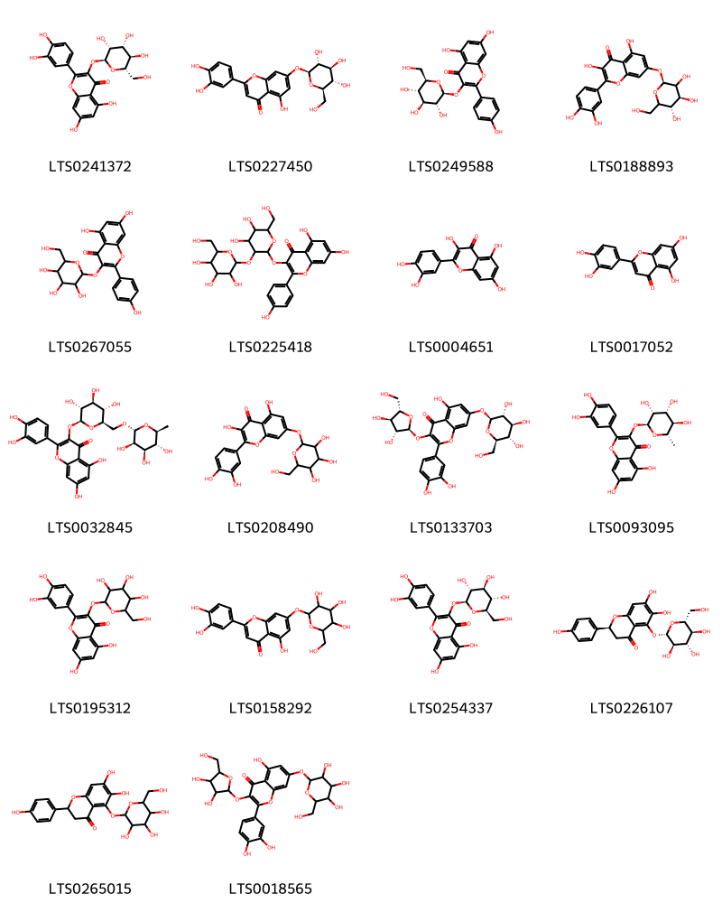{ width=100% }
    <figcaption>Hình ảnh cấu trúc hóa học của 18 hoạt chất thuộc nhóm Flavonoids gồm ['2-(3,4-dihydroxyphenyl)-5,7-dihydroxy-3-{[(2s,3r,4r,5r,6s)-3,4,5-trihydroxy-6-(hydroxymethyl)oxan-2-yl]oxy}chromen-4-one (LTS0241372)', 'luteolin 7-o-glucoside (LTS0227450)', 'astragalin (LTS0249588)', 'quercimeritrin (LTS0188893)', 'trifolin (LTS0267055)', '3-{[4,5-dihydroxy-6-(hydroxymethyl)-3-{[3,4,5-trihydroxy-6-(hydroxymethyl)oxan-2-yl]oxy}oxan-2-yl]oxy}-5,7-dihydroxy-2-(4-hydroxyphenyl)chromen-4-one (LTS0225418)', 'quercetin (LTS0004651)', 'luteolin (LTS0017052)', '3-rutinosyl quercetin (LTS0032845)', 'quercimeritrin (LTS0208490)', '3-{[(2s,3r,4r,5s)-3,4-dihydroxy-5-(hydroxymethyl)oxolan-2-yl]oxy}-2-(3,4-dihydroxyphenyl)-5-hydroxy-7-{[(2s,3r,4s,5s,6r)-3,4,5-trihydroxy-6-(hydroxymethyl)oxan-2-yl]oxy}chromen-4-one (LTS0133703)', 'quercitrin (LTS0093095)', '2-(3,4-dihydroxyphenyl)-5,7-dihydroxy-3-{[3,4,5-trihydroxy-6-(hydroxymethyl)oxan-2-yl]oxy}chromen-4-one (LTS0195312)', '2-(3,4-dihydroxyphenyl)-5-hydroxy-7-{[3,4,5-trihydroxy-6-(hydroxymethyl)oxan-2-yl]oxy}chromen-4-one (LTS0158292)', 'isoquercetin (LTS0254337)', 'neocarthamin (LTS0226107)', '6,7-dihydroxy-2-(4-hydroxyphenyl)-5-{[3,4,5-trihydroxy-6-(hydroxymethyl)oxan-2-yl]oxy}-2,3-dihydro-1-benzopyran-4-one (LTS0265015)', '3-{[3,4-dihydroxy-5-(hydroxymethyl)oxolan-2-yl]oxy}-2-(3,4-dihydroxyphenyl)-5-hydroxy-7-{[3,4,5-trihydroxy-6-(hydroxymethyl)oxan-2-yl]oxy}chromen-4-one (LTS0018565)'].</figcaption>
</figure>
#### Nhóm Organooxygen compounds
<figure markdown="span">
    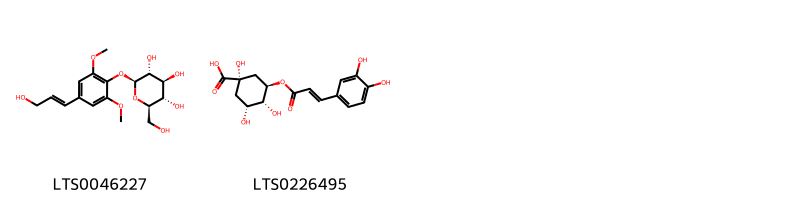{ width=100% }
    <figcaption>Hình ảnh cấu trúc hóa học của 2 hoạt chất thuộc nhóm Organooxygen compounds gồm ['syringin (LTS0046227)', 'chlorogenic acid (LTS0226495)'].</figcaption>
</figure>
#### Nhóm Prenol lipids
<figure markdown="span">
    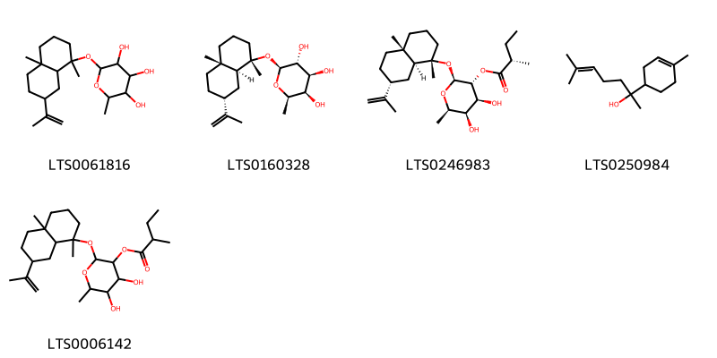{ width=100% }
    <figcaption>Hình ảnh cấu trúc hóa học của 5 hoạt chất thuộc nhóm Prenol lipids gồm ['2-{[1,4a-dimethyl-7-(prop-1-en-2-yl)-octahydronaphthalen-1-yl]oxy}-6-methyloxane-3,4,5-triol (LTS0061816)', '(2s,3r,4s,5r,6r)-2-{[(1s,4as,7r,8as)-1,4a-dimethyl-7-(prop-1-en-2-yl)-octahydronaphthalen-1-yl]oxy}-6-methyloxane-3,4,5-triol (LTS0160328)', '(2s,3r,4s,5r,6r)-2-{[(1s,4as,7r,8as)-1,4a-dimethyl-7-(prop-1-en-2-yl)-octahydronaphthalen-1-yl]oxy}-4,5-dihydroxy-6-methyloxan-3-yl (2s)-2-methylbutanoate (LTS0246983)', 'α-bisabolol (LTS0250984)', '2-{[1,4a-dimethyl-7-(prop-1-en-2-yl)-octahydronaphthalen-1-yl]oxy}-4,5-dihydroxy-6-methyloxan-3-yl 2-methylbutanoate (LTS0006142)'].</figcaption>
</figure>
#### Nhóm Unsaturated hydrocarbons
<figure markdown="span">
    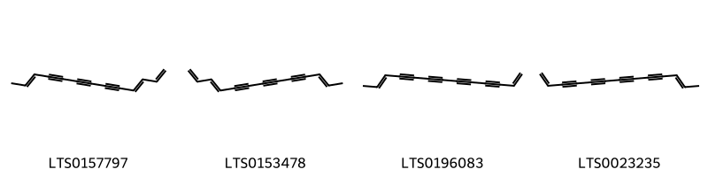{ width=100% }
    <figcaption>Hình ảnh cấu trúc hóa học của 4 hoạt chất thuộc nhóm Unsaturated hydrocarbons gồm ['trideca-1,3,11-trien-5,7,9-triyne (LTS0157797)', '(3e,11e)-trideca-1,3,11-trien-5,7,9-triyne (LTS0153478)', 'trideca-1,11-dien-3,5,7,9-tetrayne (LTS0196083)', '(11e)-trideca-1,11-dien-3,5,7,9-tetrayne (LTS0023235)'].</figcaption>
</figure>

---

### Dược dân tộc học

Danh sách các quốc gia có sử dụng *Carthamus lanatus* trong điều trị các bệnh. 

| Country   | Disease                   | Bệnh                                                                                                                                                                                                |
|:----------|:--------------------------|:----------------------------------------------------------------------------------------------------------------------------------------------------------------------------------------------------|
| Elsewhere | nan, Sudorific, Vermifuge | MYMEMORY WARNING: YOU USED ALL AVAILABLE FREE TRANSLATIONS FOR TODAY. NEXT AVAILABLE IN  09 HOURS 49 MINUTES 44 SECONDS VISIT HTTPS://MYMEMORY.TRANSLATED.NET/DOC/USAGELIMITS.PHP TO TRANSLATE MORE |

---

---
## Carthamus tinctorius
### Thông tin về thực vật

!!! info "Phân loại thực vật của *Carthamus tinctorius* từ GIBF:"
    - **Kingdom:** Plantae
    - **Phylum:** Tracheophyta
    - **Order:** Asterales
    - **Family:** Asteraceae
    - **Genus:** Carthamus
    - **Species:** *Carthamus tinctorius*

 

| Label (VI)   | Label (EN)   | Scientific Name      | Descriptions (VI)   | Descriptions (EN)           | Also Known As (VI)       | Also Known As (EN)   |
|:-------------|:-------------|:---------------------|:--------------------|:----------------------------|:-------------------------|:---------------------|
| N/A          | N/A          | Carthamus tinctorius | loài thực vật       | species of plant, safflower | ['Carthamus tinctorius'] | ['Safflower']        |

#### Phân bố trên thế giới

**Từ CSDL GIBF** United Arab Emirates, Italy, Australia, Belgium, Guatemala, Argentina, Tunisia, Norway, Israel, Canada, Denmark, Pakistan, Netherlands, Chinese Taipei, Spain, Türkiye, Portugal, Algeria, Russian Federation, Morocco, United States of America, Sweden, Kazakhstan, Croatia, Uzbekistan, Czechia, Germany, Oman, Switzerland, Mexico, France, Austria, United Kingdom of Great Britain and Northern Ireland, Iraq, India, Poland, Ethiopia

#### Phân bố tại Việt Nam

**Từ CSDL GIBF**: Không có ghi nhận ở Việt Nam

---
### Thành phần hóa học
        
- Theo cơ sở dữ liệu lotus: Từ loài *Carthamus tinctorius* đã phân lập và xác định được 248 hoạt chất thuộc về các nhóm Diarylheptanoids, Phenols, Carboxylic acids and derivatives, Fatty Acyls, Indoles and derivatives, Cinnamic acids and derivatives, Prenol lipids, Purine nucleosides, Organooxygen compounds, Halohydrins, Furanoid lignans, Lignan glycosides, Flavonoids, Steroids and steroid derivatives, Pyrans, Unsaturated hydrocarbons, 2-arylbenzofuran flavonoids, Coumarins and derivatives. 

|    | chemicalTaxonomyClassyfireClass   |   smiles_count |
|---:|:----------------------------------|---------------:|
|  0 | 2-arylbenzofuran flavonoids       |              2 |
|  1 | Carboxylic acids and derivatives  |              2 |
|  2 | Cinnamic acids and derivatives    |             32 |
|  3 | Coumarins and derivatives         |              2 |
|  4 | Diarylheptanoids                  |              3 |
|  5 | Fatty Acyls                       |             52 |
|  6 | Flavonoids                        |             47 |
|  7 | Furanoid lignans                  |              2 |
|  8 | Halohydrins                       |              6 |
|  9 | Indoles and derivatives           |              8 |
| 10 | Lignan glycosides                 |              5 |
| 11 | Organooxygen compounds            |             13 |
| 12 | Phenols                           |              2 |
| 13 | Prenol lipids                     |             17 |
| 14 | Purine nucleosides                |              1 |
| 15 | Pyrans                            |              2 |
| 16 | Steroids and steroid derivatives  |             29 |
| 17 | Unsaturated hydrocarbons          |             20 |

#### Nhóm 2-arylbenzofuran flavonoids
<figure markdown="span">
    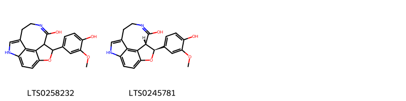{ width=100% }
    <figcaption>Hình ảnh cấu trúc hóa học của 2 hoạt chất thuộc nhóm 2-arylbenzofuran flavonoids gồm ['3-(4-hydroxy-3-methoxyphenyl)-2-oxa-6,11-diazatetracyclo[7.5.2.0⁴,¹⁵.0¹²,¹⁶]hexadeca-1(14),5,9,12,15-pentaen-5-ol (LTS0258232)', '(3s,4s)-3-(4-hydroxy-3-methoxyphenyl)-2-oxa-6,11-diazatetracyclo[7.5.2.0⁴,¹⁵.0¹²,¹⁶]hexadeca-1(14),5,9,12,15-pentaen-5-ol (LTS0245781)'].</figcaption>
</figure>
#### Nhóm Carboxylic acids and derivatives
<figure markdown="span">
    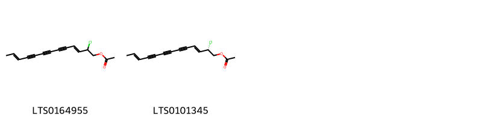{ width=100% }
    <figcaption>Hình ảnh cấu trúc hóa học của 2 hoạt chất thuộc nhóm Carboxylic acids and derivatives gồm ['2-chlorotrideca-3,11-dien-5,7,9-triyn-1-yl acetate (LTS0164955)', '(2s,3e,11e)-2-chlorotrideca-3,11-dien-5,7,9-triyn-1-yl acetate (LTS0101345)'].</figcaption>
</figure>
#### Nhóm Cinnamic acids and derivatives
<figure markdown="span">
    { width=100% }
    <figcaption>Hình ảnh cấu trúc hóa học của 32 hoạt chất thuộc nhóm Cinnamic acids and derivatives gồm ['5-{[3,4-dihydroxy-5-(hydroxymethyl)pyrrolidin-2-ylidene](hydroxy)methyl}-3,4-dihydroxy-2-[3-(4-hydroxyphenyl)prop-2-enoyl]-4-[3,4,5-trihydroxy-6-(hydroxymethyl)oxan-2-yl]cyclohexa-2,5-dien-1-one (LTS0062412)', '3,4,5-trihydroxy-2-[3-(4-hydroxyphenyl)prop-2-enoyl]-4,6-bis[3,4,5-trihydroxy-6-(hydroxymethyl)oxan-2-yl]cyclohexa-2,5-dien-1-one (LTS0061783)', '(6e)-4-[(2s,3r)-4,7-dihydroxy-5-[(2e)-3-(4-hydroxyphenyl)prop-2-enoyl]-6-oxo-2-[(1s,2r,3r)-1,2,3,4-tetrahydroxybutyl]-7-[(2r,3r,4s,5s,6r)-3,4,5-trihydroxy-6-(hydroxymethyl)oxan-2-yl]-2,3-dihydro-1-benzofuran-3-yl]-2,5-dihydroxy-6-[(2e)-1-hydroxy-3-(4-hydroxyphenyl)prop-2-en-1-ylidene]-2-[(2r,3r,4s,5s,6r)-3,4,5-trihydroxy-6-(hydroxymethyl)oxan-2-yl]cyclohex-4-ene-1,3-dione (LTS0126857)', '(2e,6s)-4-[(2s,3s,7s)-7-[(2s,3s,4r,5r,6s)-3,5-dihydroxy-4,6-bis(hydroxymethyl)oxan-2-yl]-4,7-dihydroxy-5-[(2e)-3-(4-hydroxyphenyl)prop-2-enoyl]-6-oxo-2-[(1s,2r,3r)-1,2,3,4-tetrahydroxybutyl]-2,3-dihydro-1-benzofuran-3-yl]-5,6-dihydroxy-2-[(2e)-1-hydroxy-3-(4-hydroxyphenyl)prop-2-en-1-ylidene]-6-[(2r,3r,4s,5s,6r)-3,4,5-trihydroxy-6-(hydroxymethyl)oxan-2-yl]cyclohex-4-ene-1,3-dione (LTS0177338)', '(2s,3s,7r)-6,7-dihydroxy-5-[(2e)-3-(4-hydroxyphenyl)prop-2-enoyl]-2-[(1r,2r,3r)-1,2,3,4-tetrahydroxybutyl]-3-[(3s)-2,3,4-trihydroxy-5-[(2e)-3-(4-hydroxyphenyl)prop-2-enoyl]-6-oxo-3-[(2r,3s,4r,5r,6r)-3,4,5-trihydroxy-6-(hydroxymethyl)oxan-2-yl]cyclohexa-1,4-dien-1-yl]-7-[(2r,3s,4s,5r,6s)-3,4,5-trihydroxy-6-(hydroxymethyl)oxan-2-yl]-2,3-dihydro-1-benzofuran-4-one (LTS0238406)', '4-{6,7-dihydroxy-5-[3-(4-hydroxyphenyl)prop-2-enoyl]-4-oxo-2-(1,2,3,4-tetrahydroxybutyl)-7-[3,4,5-trihydroxy-6-(hydroxymethyl)oxan-2-yl]-2,3-dihydro-1-benzofuran-3-yl}-5,6-dihydroxy-2-[1-hydroxy-3-(4-hydroxyphenyl)prop-2-en-1-ylidene]-6-[3,4,5-trihydroxy-6-(hydroxymethyl)oxan-2-yl]cyclohex-4-ene-1,3-dione (LTS0082050)', '(2e)-3-(4-hydroxyphenyl)-n-[2-(1h-indol-3-yl)ethyl]prop-2-enimidic acid (LTS0176591)', '3-(4-hydroxyphenyl)-n-[2-(1h-indol-3-yl)ethyl]prop-2-enimidic acid (LTS0106364)', '(4r)-3,4,5-trihydroxy-2-[(2e)-3-(4-hydroxyphenyl)prop-2-enoyl]-4-[(2r,3r,4r,5s,6s)-3,5,6-trihydroxy-4-(hydroxymethyl)oxan-2-yl]-6-[(2s,3r,4r,5s,6r)-3,4,5-trihydroxy-6-(hydroxymethyl)oxan-2-yl]cyclohexa-2,5-dien-1-one (LTS0190198)', '(4r)-3,4,5-trihydroxy-2-[(2e)-3-(4-hydroxyphenyl)prop-2-enoyl]-4-[(2r,3r,4s,5s,6r)-3,4,5-trihydroxy-6-(hydroxymethyl)oxan-2-yl]-6-[(2s,3r,4r,5s,6r)-3,4,5-trihydroxy-6-(hydroxymethyl)oxan-2-yl]cyclohexa-2,5-dien-1-one (LTS0105282)', '(4s)-5-{[(2z,3r,4r,5r)-3,4-dihydroxy-5-(hydroxymethyl)pyrrolidin-2-ylidene](hydroxy)methyl}-3,4-dihydroxy-2-[(2e)-3-(4-hydroxyphenyl)prop-2-enoyl]-4-[(2r,3r,4s,5r,6r)-3,4,5-trihydroxy-6-(hydroxymethyl)oxan-2-yl]cyclohexa-2,5-dien-1-one (LTS0187169)', '5-{[3,4-dihydroxy-5-(hydroxymethyl)pyrrolidin-2-ylidene](hydroxy)methyl}-3,4-dihydroxy-2-[3-(4-hydroxyphenyl)prop-2-enoyl]-4-[3,5,6-trihydroxy-4-(hydroxymethyl)oxan-2-yl]cyclohexa-2,5-dien-1-one (LTS0113328)', '(4r)-5-{[(2z,3r,4r,5r)-3,4-dihydroxy-5-(hydroxymethyl)pyrrolidin-2-ylidene](hydroxy)methyl}-3,4-dihydroxy-2-[(2e)-3-(4-hydroxyphenyl)prop-2-enoyl]-4-[(2r,3r,4s,5s,6r)-3,4,5-trihydroxy-6-(hydroxymethyl)oxan-2-yl]cyclohexa-2,5-dien-1-one (LTS0138480)', '3,4,5-trihydroxy-2-[3-(4-hydroxyphenyl)prop-2-enoyl]-4-[3,5,6-trihydroxy-4-(hydroxymethyl)oxan-2-yl]-6-[3,4,5-trihydroxy-6-(hydroxymethyl)oxan-2-yl]cyclohexa-2,5-dien-1-one (LTS0199301)', '5,6-dihydroxy-4-[3-(4-hydroxyphenyl)prop-2-enoyl]-2-({2,3,4-trihydroxy-5-[3-(4-hydroxyphenyl)prop-2-enoyl]-6-oxo-3-[3,4,5-trihydroxy-6-(hydroxymethyl)oxan-2-yl]cyclohexa-1,4-dien-1-yl}methylidene)-6-[3,4,5-trihydroxy-6-(hydroxymethyl)oxan-2-yl]cyclohex-4-ene-1,3-dione (LTS0142832)', '(4s)-5-{[(2z,3r,4r,5r)-3,4-dihydroxy-5-(hydroxymethyl)pyrrolidin-2-ylidene](hydroxy)methyl}-3,4-dihydroxy-2-[(2e)-3-(4-hydroxyphenyl)prop-2-enoyl]-4-[(2r,3r,4r,5s,6s)-3,5,6-trihydroxy-4-(hydroxymethyl)oxan-2-yl]cyclohexa-2,5-dien-1-one (LTS0139559)', '3,4-dihydroxycinnamic acid (LTS0128050)', '(6s)-3,5,6-trihydroxy-2-[(2e)-3-(4-hydroxyphenyl)prop-2-enoyl]-6-[(2r,3r,4s,5s,6r)-3,4,5-trihydroxy-6-(hydroxymethyl)oxan-2-yl]-4-[(2s,3r,4r,5s,6r)-3,4,5-trihydroxy-6-(hydroxymethyl)oxan-2-yl]cyclohexa-2,4-dien-1-one (LTS0250697)', '2-(3,4-dihydroxyoxolan-2-yl)-4,7-dihydroxy-5-[(2e)-3-(4-hydroxyphenyl)prop-2-enoyl]-7-[3,4,5-trihydroxy-6-(hydroxymethyl)oxan-2-yl]-1h-indol-6-one (LTS0099307)', '(4r)-4-hydroxy-2-[(2e)-3-(4-hydroxyphenyl)prop-2-enoyl]-4-[(2r,3r,4s,5s,6r)-3,4,5-trihydroxy-6-(hydroxymethyl)oxan-2-yl]-6-[(2s,3r,4r,5s,6r)-3,4,5-trihydroxy-6-(hydroxymethyl)oxan-2-yl]cyclohexa-2,5-dien-1-one (LTS0135265)', '(2z,6r)-4-[(2s,3r,7r)-6,7-dihydroxy-5-[(2e)-3-(4-hydroxyphenyl)prop-2-enoyl]-4-oxo-2-[(1s,2r,3r)-1,2,3,4-tetrahydroxybutyl]-7-[(2r,3r,4s,5s,6r)-3,4,5-trihydroxy-6-(hydroxymethyl)oxan-2-yl]-2,3-dihydro-1-benzofuran-3-yl]-5,6-dihydroxy-2-[(2e)-1-hydroxy-3-(4-hydroxyphenyl)prop-2-en-1-ylidene]-6-[(2r,3r,4s,5s,6r)-3,4,5-trihydroxy-6-(hydroxymethyl)oxan-2-yl]cyclohex-4-ene-1,3-dione (LTS0107910)', '(2e)-3-(4-hydroxy-3-methoxyphenyl)-n-[2-(1h-indol-3-yl)ethyl]prop-2-enimidic acid (LTS0119446)', '3,5,6-trihydroxy-2-[3-(4-hydroxyphenyl)prop-2-enoyl]-4,6-bis[3,4,5-trihydroxy-6-(hydroxymethyl)oxan-2-yl]cyclohexa-2,4-dien-1-one (LTS0094739)', '4-{7-[3,5-dihydroxy-4,6-bis(hydroxymethyl)oxan-2-yl]-4,7-dihydroxy-5-[3-(4-hydroxyphenyl)prop-2-enoyl]-6-oxo-2-(1,2,3,4-tetrahydroxybutyl)-2,3-dihydro-1-benzofuran-3-yl}-5,6-dihydroxy-2-[(2e)-1-hydroxy-3-(4-hydroxyphenyl)prop-2-en-1-ylidene]-6-[3,4,5-trihydroxy-6-(hydroxymethyl)oxan-2-yl]cyclohex-4-ene-1,3-dione (LTS0223223)', 'para-coumaric acid (LTS0266252)', 'caffeic acid (LTS0027481)', '(2z,6s)-5,6-dihydroxy-4-[(2e)-3-(4-hydroxyphenyl)prop-2-enoyl]-2-{[(3r)-2,3,4-trihydroxy-5-[(2e)-3-(4-hydroxyphenyl)prop-2-enoyl]-6-oxo-3-[(2r,3r,4s,5s,6r)-3,4,5-trihydroxy-6-(hydroxymethyl)oxan-2-yl]cyclohexa-1,4-dien-1-yl]methylidene}-6-[(2r,3r,4s,5s,6r)-3,4,5-trihydroxy-6-(hydroxymethyl)oxan-2-yl]cyclohex-4-ene-1,3-dione (LTS0021672)', 'hydroxycinnamic acid (LTS0233023)', '4-hydroxy-2-[3-(4-hydroxyphenyl)prop-2-enoyl]-4,6-bis[3,4,5-trihydroxy-6-(hydroxymethyl)oxan-2-yl]cyclohexa-2,5-dien-1-one (LTS0105322)', '3-(4-hydroxy-3-methoxyphenyl)-n-[2-(1h-indol-3-yl)ethyl]prop-2-enimidic acid (LTS0000934)', '(2z,6s)-5,6-dihydroxy-4-[(2e)-3-(4-hydroxyphenyl)prop-2-enoyl]-2-({2,3,4-trihydroxy-5-[(2e)-3-(4-hydroxyphenyl)prop-2-enoyl]-6-oxo-3-[(2r,3r,4s,5s,6r)-3,4,5-trihydroxy-6-(hydroxymethyl)oxan-2-yl]cyclohexa-1,4-dien-1-yl}methylidene)-6-[(2r,3r,4s,5s,6r)-3,4,5-trihydroxy-6-(hydroxymethyl)oxan-2-yl]cyclohex-4-ene-1,3-dione (LTS0004753)', '(4s)-3,4,5-trihydroxy-2-[(2e)-3-(4-hydroxyphenyl)prop-2-enoyl]-4-[(2r,3s,4s,5s,6r)-3,4,5-trihydroxy-6-(hydroxymethyl)oxan-2-yl]-6-[(2s,3s,4r,5s,6r)-3,4,5-trihydroxy-6-(hydroxymethyl)oxan-2-yl]cyclohexa-2,5-dien-1-one (LTS0121279)'].</figcaption>
</figure>
#### Nhóm Coumarins and derivatives
<figure markdown="span">
    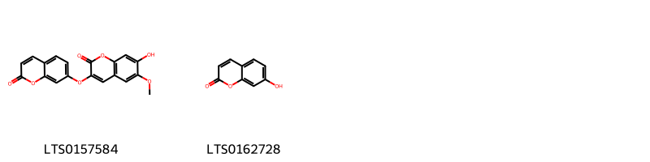{ width=100% }
    <figcaption>Hình ảnh cấu trúc hóa học của 2 hoạt chất thuộc nhóm Coumarins and derivatives gồm ['daphnoretin (LTS0157584)', 'umbelliferone (LTS0162728)'].</figcaption>
</figure>
#### Nhóm Diarylheptanoids
<figure markdown="span">
    { width=100% }
    <figcaption>Hình ảnh cấu trúc hóa học của 3 hoạt chất thuộc nhóm Diarylheptanoids gồm ['(2s,4r,6e)-2-hydroxy-6-[(2e)-1-hydroxy-3-(4-hydroxyphenyl)prop-2-en-1-ylidene]-4-[(4-hydroxyphenyl)methyl]-2-[(2r,3r,4s,5s,6r)-3,4,5-trihydroxy-6-(hydroxymethyl)oxan-2-yl]-4-[(2s,3r,4r,5s,6r)-3,4,5-trihydroxy-6-(hydroxymethyl)oxan-2-yl]cyclohexane-1,3,5-trione (LTS0154810)', '2-hydroxy-6-[(2e)-1-hydroxy-3-(4-hydroxyphenyl)prop-2-en-1-ylidene]-4-[(4-hydroxyphenyl)methyl]-2,4-bis[3,4,5-trihydroxy-6-(hydroxymethyl)oxan-2-yl]cyclohexane-1,3,5-trione (LTS0188156)', '3-{2,5-dihydroxy-3-[(2e)-1-hydroxy-3-(4-hydroxyphenyl)prop-2-en-1-ylidene]-4,6-dioxo-5-[(2r,3r,4s,5s,6r)-3,4,5-trihydroxy-6-(hydroxymethyl)oxan-2-yl]cyclohex-1-en-1-yl}-3-(4-hydroxyphenyl)propanoic acid (LTS0236401)'].</figcaption>
</figure>
#### Nhóm Fatty Acyls
<figure markdown="span">
    { width=100% }
    <figcaption>Hình ảnh cấu trúc hóa học của 52 hoạt chất thuộc nhóm Fatty Acyls gồm ['trideca-3,11-dien-5,7,9-triyne-1,2-diol (LTS0193651)', 'safynol (LTS0212123)', 'linoleic (LTS0013198)', '(6r,8s)-tricosane-6,8-diol (LTS0132691)', 'dotriacontane-6,8-diol (LTS0186247)', '(6r,8s)-dotriacontane-6,8-diol (LTS0121457)', '(6r,8s)-hentriacontane-6,8-diol (LTS0109963)', 'palmitic acid (LTS0079439)', '(3e,11z)-trideca-3,11-dien-5,7,9-triyne-1,2-diol (LTS0197904)', '2-(dec-8-en-4,6-diyn-1-yloxy)-6-(hydroxymethyl)oxane-3,4,5-triol (LTS0166779)', 'dec-8-en-4,6-diyn-1-yl 3-methylbutanoate (LTS0113130)', 'henicosane-6,8-diol (LTS0022325)', '(2r,3r,4s,5s,6r)-2-{[(12r)-12,14-dihydroxytetradeca-2,8-dien-4,6-diyn-1-yl]oxy}-6-(hydroxymethyl)oxane-3,4,5-triol (LTS0139249)', 'pentatriacontane-6,8-diol (LTS0170962)', '(6r,8s)-nonacosane-6,8-diol (LTS0130306)', 'tricosane-6,8-diol (LTS0146514)', 'tetradeca-6,12-dien-8,10-diyne-1,3,14-triol (LTS0268971)', '(4ar,6r,7r,8s,8as)-6-[(8z)-dec-8-en-4,6-diyn-1-yloxy]-2,2-dimethyl-hexahydropyrano[3,2-d][1,3]dioxine-7,8-diol (LTS0170133)', '(6r,8s)-henicosane-6,8-diol (LTS0142393)', '(6r,8s)-triacontane-6,8-diol (LTS0160805)', '(2r,3r,4s,5s,6r)-2-{[(10r)-10,14-dihydroxytetradec-2-en-4,6-diyn-1-yl]oxy}-6-(hydroxymethyl)oxane-3,4,5-triol (LTS0148220)', '(2r,3r,4s,5s,6r)-2-{[(2e,10r)-10,14-dihydroxytetradec-2-en-4,6-diyn-1-yl]oxy}-6-(hydroxymethyl)oxane-3,4,5-triol (LTS0161747)', 'hentriacontane-6,8-diol (LTS0080367)', '(6r,8s)-tetratriacontane-6,8-diol (LTS0144648)', 'heptacosane-6,8-diol (LTS0086799)', '(2r,3r,4s,5s,6r)-2-{[(2z,8e,12r)-12,14-dihydroxytetradeca-2,8-dien-4,6-diyn-1-yl]oxy}-6-(hydroxymethyl)oxane-3,4,5-triol (LTS0173154)', '(2r,3r,4s,5s,6r)-2-{[(2e,8e,10e,12r)-12,13-dihydroxytrideca-2,8,10-trien-4,6-diyn-1-yl]oxy}-6-(hydroxymethyl)oxane-3,4,5-triol (LTS0182178)', '(2r,3r,4s,5s,6r)-2-{[(12r)-12,13-dihydroxytrideca-2,8,10-trien-4,6-diyn-1-yl]oxy}-6-(hydroxymethyl)oxane-3,4,5-triol (LTS0266226)', 'oleic acid (LTS0256910)', '(2r,3r,4s,5s,6r)-2-{[(2e,8e,12r)-12,14-dihydroxytetradeca-2,8-dien-4,6-diyn-1-yl]oxy}-6-(hydroxymethyl)oxane-3,4,5-triol (LTS0270866)', '(6r,8s)-pentatriacontane-6,8-diol (LTS0250526)', '(2r,3r,4s,5s,6r)-2-(deca-2,8-dien-4,6-diyn-1-yloxy)-6-(hydroxymethyl)oxane-3,4,5-triol (LTS0216189)', 'nonacosane-6,8-diol (LTS0220690)', '(2r,3r,4s,5s,6r)-2-[(2e,8z)-deca-2,8-dien-4,6-diyn-1-yloxy]-6-(hydroxymethyl)oxane-3,4,5-triol (LTS0044951)', '(6r,8s)-pentacosane-6,8-diol (LTS0226756)', 'pentacosane-6,8-diol (LTS0029280)', '(2r,3r,4s,5s,6r)-2-{[(2z,8z,12r)-12,14-dihydroxytetradeca-2,8-dien-4,6-diyn-1-yl]oxy}-6-(hydroxymethyl)oxane-3,4,5-triol (LTS0067935)', '(6r,8s)-tritriacontane-6,8-diol (LTS0047083)', '(2r,3r,4s,5s,6r)-2-[(8z)-dec-8-en-4,6-diyn-1-yloxy]-6-(hydroxymethyl)oxane-3,4,5-triol (LTS0045179)', '1-(acetyloxy)tetradeca-4,6,12-trien-8,10-diyn-3-yl acetate (LTS0273113)', '(6r,8s)-octacosane-6,8-diol (LTS0014157)', '(3r,6e,12e)-tetradeca-6,12-dien-8,10-diyne-1,3,14-triol (LTS0270379)', 'tetratriacontane-6,8-diol (LTS0053056)', 'dehydrosafynol (LTS0046866)', '(2r,3r,4s,5s,6r)-2-[(8e)-dec-8-en-4,6-diyn-1-yloxy]-6-(hydroxymethyl)oxane-3,4,5-triol (LTS0008873)', '(3s,4e,6e,12e)-1-(acetyloxy)tetradeca-4,6,12-trien-8,10-diyn-3-yl acetate (LTS0052541)', 'octacosane-6,8-diol (LTS0001021)', '(8z)-dec-8-en-4,6-diyn-1-yl 3-methylbutanoate (LTS0047082)', '(2r,3r,4s,5s,6r)-2-{[(2e,8z,12r)-12,14-dihydroxytetradeca-2,8-dien-4,6-diyn-1-yl]oxy}-6-(hydroxymethyl)oxane-3,4,5-triol (LTS0268029)', '(6r,8s)-heptacosane-6,8-diol (LTS0041838)', 'triacontane-6,8-diol (LTS0034465)', 'tritriacontane-6,8-diol (LTS0022494)'].</figcaption>
</figure>
#### Nhóm Flavonoids
<figure markdown="span">
    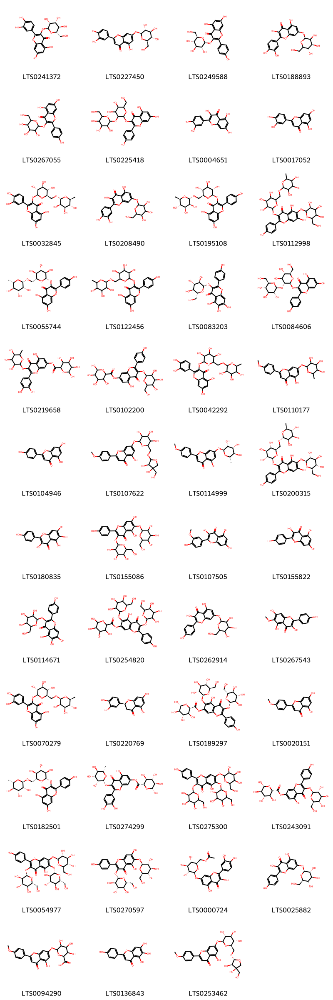{ width=100% }
    <figcaption>Hình ảnh cấu trúc hóa học của 47 hoạt chất thuộc nhóm Flavonoids gồm ['2-(3,4-dihydroxyphenyl)-5,7-dihydroxy-3-{[(2s,3r,4r,5r,6s)-3,4,5-trihydroxy-6-(hydroxymethyl)oxan-2-yl]oxy}chromen-4-one (LTS0241372)', 'luteolin 7-o-glucoside (LTS0227450)', 'astragalin (LTS0249588)', 'quercimeritrin (LTS0188893)', 'trifolin (LTS0267055)', '3-{[4,5-dihydroxy-6-(hydroxymethyl)-3-{[3,4,5-trihydroxy-6-(hydroxymethyl)oxan-2-yl]oxy}oxan-2-yl]oxy}-5,7-dihydroxy-2-(4-hydroxyphenyl)chromen-4-one (LTS0225418)', 'quercetin (LTS0004651)', 'luteolin (LTS0017052)', '3-rutinosyl quercetin (LTS0032845)', 'quercimeritrin (LTS0208490)', '5,7-dihydroxy-2-(4-hydroxyphenyl)-3-{[(2r,3s,4r,5r,6s)-3,4,5-trihydroxy-6-({[(2s,3s,4s,5s,6r)-3,4,5-trihydroxy-6-methyloxan-2-yl]oxy}methyl)oxan-2-yl]oxy}chromen-4-one (LTS0195108)', '5,7-dihydroxy-2-(4-hydroxyphenyl)-6-{[3,4,5-trihydroxy-6-(hydroxymethyl)oxan-2-yl]oxy}-3-[(3,4,5-trihydroxy-6-{[(3,4,5-trihydroxy-6-methyloxan-2-yl)oxy]methyl}oxan-2-yl)oxy]chromen-4-one (LTS0112998)', '5,7-dihydroxy-2-(4-hydroxyphenyl)-3-{[(2s,3r,4s,5s,6r)-3,4,5-trihydroxy-6-({[(2s,3r,4r,5r,6s)-3,4,5-trihydroxy-6-methyloxan-2-yl]oxy}methyl)oxan-2-yl]oxy}chromen-4-one (LTS0055744)', '5,7-dihydroxy-2-(4-hydroxyphenyl)-3-[(3,4,5-trihydroxy-6-{[(3,4,5-trihydroxy-6-methyloxan-2-yl)oxy]methyl}oxan-2-yl)oxy]chromen-4-one (LTS0122456)', '5,6,7-trihydroxy-2-(4-hydroxyphenyl)-3-{[(2s,3r,4s,5s,6r)-3,4,5-trihydroxy-6-(hydroxymethyl)oxan-2-yl]oxy}chromen-4-one (LTS0083203)', 'kaempferol 3-o-sophoroside (LTS0084606)', '2-(3,4-dihydroxyphenyl)-5-hydroxy-4-oxo-3-[(3,4,5-trihydroxy-6-methyloxan-2-yl)oxy]chromen-7-yl 3,4,5,6-tetrahydroxyoxane-2-carboxylate (LTS0219658)', '5-hydroxy-2-(4-hydroxyphenyl)-4-oxo-3-{[3,4,5-trihydroxy-6-(hydroxymethyl)oxan-2-yl]oxy}chromen-7-yl 3,4,5,6-tetrahydroxyoxane-2-carboxylate (LTS0102200)', 'rutin (LTS0042292)', '5-hydroxy-2-(4-methoxyphenyl)-7-[(3,4,5-trihydroxy-6-methyloxan-2-yl)oxy]chromen-4-one (LTS0110177)', 'chamomile (LTS0104946)', '7-{[6-({[3,4-dihydroxy-4-(hydroxymethyl)oxolan-2-yl]oxy}methyl)-3,4,5-trihydroxyoxan-2-yl]oxy}-5-hydroxy-2-(4-methoxyphenyl)chromen-4-one (LTS0107622)', '5-hydroxy-2-(4-methoxyphenyl)-7-{[(2s,3r,4r,5r,6s)-3,4,5-trihydroxy-6-methyloxan-2-yl]oxy}chromen-4-one (LTS0114999)', '5,7-dihydroxy-2-(4-hydroxyphenyl)-6-{[(2s,3r,4s,5s,6r)-3,4,5-trihydroxy-6-(hydroxymethyl)oxan-2-yl]oxy}-3-{[(2s,3r,4s,5s,6r)-3,4,5-trihydroxy-6-({[(2r,3r,4r,5r,6s)-3,4,5-trihydroxy-6-methyloxan-2-yl]oxy}methyl)oxan-2-yl]oxy}chromen-4-one (LTS0200315)', '6-hydroxykaempferol (LTS0180835)', '5,7-dihydroxy-2-(4-hydroxyphenyl)-3,6-bis({[3,4,5-trihydroxy-6-(hydroxymethyl)oxan-2-yl]oxy})chromen-4-one (LTS0155086)', 'isorhamnetin (LTS0107505)', 'kaempherol (LTS0155822)', '5,6,7-trihydroxy-2-(4-hydroxyphenyl)-3-{[3,4,5-trihydroxy-6-(hydroxymethyl)oxan-2-yl]oxy}chromen-4-one (LTS0114671)', '5-hydroxy-2-(4-hydroxyphenyl)-4-oxo-3,6-bis({[3,4,5-trihydroxy-6-(hydroxymethyl)oxan-2-yl]oxy})chromen-7-yl 3,4,5,6-tetrahydroxyoxane-2-carboxylate (LTS0254820)', '3,5-dihydroxy-2-(4-hydroxyphenyl)-7-{[3,4,5-trihydroxy-6-(hydroxymethyl)oxan-2-yl]oxy}chromen-4-one (LTS0262914)', '6-methoxykaempferol (LTS0267543)', '2-(3,4-dihydroxyphenyl)-5,7-dihydroxy-3-{[(2s,3r,4s,5s,6r)-3,4,5-trihydroxy-6-({[(2s,3r,4r,5r,6s)-3,4,5-trihydroxy-6-methyloxan-2-yl]oxy}methyl)oxan-2-yl]oxy}chromen-4-one (LTS0070279)', 'eriodictyol (LTS0220769)', '5-hydroxy-2-(4-hydroxyphenyl)-4-oxo-3,6-bis({[(2s,3r,4s,5s,6r)-3,4,5-trihydroxy-6-(hydroxymethyl)oxan-2-yl]oxy})chromen-7-yl (2s,3s,4s,5r,6r)-3,4,5,6-tetrahydroxyoxane-2-carboxylate (LTS0189297)', 'acacetin (LTS0020151)', 'nictoflorin (LTS0182501)', '2-(3,4-dihydroxyphenyl)-5-hydroxy-4-oxo-3-{[(2r,3r,4r,5r,6s)-3,4,5-trihydroxy-6-methyloxan-2-yl]oxy}chromen-7-yl (2s,3s,4s,5r,6r)-3,4,5,6-tetrahydroxyoxane-2-carboxylate (LTS0274299)', '5-hydroxy-2-(4-hydroxyphenyl)-3,6,7-tris({[3,4,5-trihydroxy-6-(hydroxymethyl)oxan-2-yl]oxy})chromen-4-one (LTS0275300)', '5-hydroxy-2-(4-hydroxyphenyl)-4-oxo-3-{[(2s,3r,4s,5s,6r)-3,4,5-trihydroxy-6-(hydroxymethyl)oxan-2-yl]oxy}chromen-7-yl (2s,3s,4s,5r,6r)-3,4,5,6-tetrahydroxyoxane-2-carboxylate (LTS0243091)', '5-hydroxy-2-(4-hydroxyphenyl)-3,6,7-tris({[(2s,3r,4s,5s,6r)-3,4,5-trihydroxy-6-(hydroxymethyl)oxan-2-yl]oxy})chromen-4-one (LTS0054977)', '5,7-dihydroxy-2-(4-hydroxyphenyl)-3,6-bis({[(2s,3r,4s,5s,6r)-3,4,5-trihydroxy-6-(hydroxymethyl)oxan-2-yl]oxy})chromen-4-one (LTS0270597)', '[(2r,3s,4s,5r,6s)-6-{[2-(3,4-dihydroxyphenyl)-3,5-dihydroxy-4-oxochromen-7-yl]oxy}-3,4,5-trihydroxyoxan-2-yl]methyl acetate (LTS0000724)', 'kaempferol 7-o-glucoside (LTS0025882)', '3,4,5-trihydroxy-6-{[5-hydroxy-2-(4-methoxyphenyl)-4-oxochromen-7-yl]oxy}oxane-2-carboxylic acid (LTS0094290)', 'scutellarein (LTS0136843)', '7-{[(2s,3r,4s,5s,6r)-6-({[(2r,3r,4r)-3,4-dihydroxy-4-(hydroxymethyl)oxolan-2-yl]oxy}methyl)-3,4,5-trihydroxyoxan-2-yl]oxy}-5-hydroxy-2-(4-methoxyphenyl)chromen-4-one (LTS0253462)'].</figcaption>
</figure>
#### Nhóm Furanoid lignans
<figure markdown="span">
    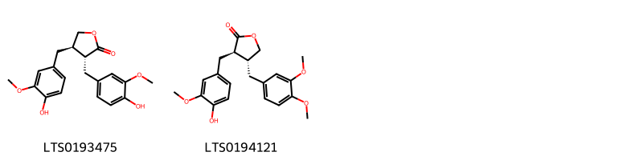{ width=100% }
    <figcaption>Hình ảnh cấu trúc hóa học của 2 hoạt chất thuộc nhóm Furanoid lignans gồm ['matairesinol (LTS0193475)', '(-)-arctigenin (LTS0194121)'].</figcaption>
</figure>
#### Nhóm Halohydrins
<figure markdown="span">
    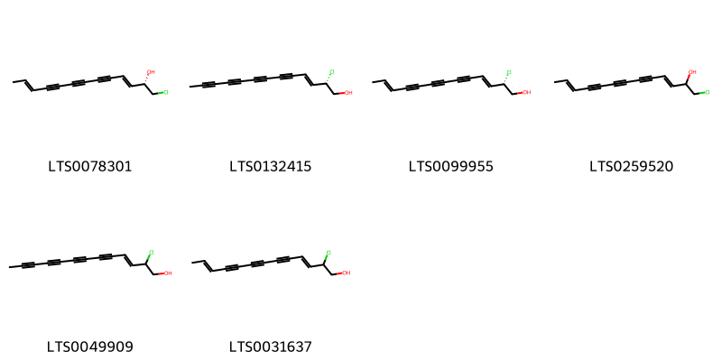{ width=100% }
    <figcaption>Hình ảnh cấu trúc hóa học của 6 hoạt chất thuộc nhóm Halohydrins gồm ['(2s,3e,11e)-1-chlorotrideca-3,11-dien-5,7,9-triyn-2-ol (LTS0078301)', '(2s,3e)-2-chlorotridec-3-en-5,7,9,11-tetrayn-1-ol (LTS0132415)', '(2s,3e,11e)-2-chlorotrideca-3,11-dien-5,7,9-triyn-1-ol (LTS0099955)', '1-chlorotrideca-3,11-dien-5,7,9-triyn-2-ol (LTS0259520)', '2-chlorotridec-3-en-5,7,9,11-tetrayn-1-ol (LTS0049909)', '2-chlorotrideca-3,11-dien-5,7,9-triyn-1-ol (LTS0031637)'].</figcaption>
</figure>
#### Nhóm Indoles and derivatives
<figure markdown="span">
    { width=100% }
    <figcaption>Hình ảnh cấu trúc hóa học của 8 hoạt chất thuộc nhóm Indoles and derivatives gồm ['n-[2-(5-hydroxy-1h-indol-3-yl)ethyl]-3-(4-hydroxy-3-methoxyphenyl)prop-2-enimidic acid (LTS0081491)', 'n-[2-(5-hydroxy-1h-indol-3-yl)ethyl]-3-(4-hydroxyphenyl)prop-2-enimidic acid (LTS0258118)', "(2e)-n-{2-[5,5'-dihydroxy-3'-(2-{[(2e)-1-hydroxy-3-(4-hydroxy-3-methoxyphenyl)prop-2-en-1-ylidene]amino}ethyl)-1h,1'h-[4,4'-biindol]-3-yl]ethyl}-3-(4-hydroxy-3-methoxyphenyl)prop-2-enimidic acid (LTS0220267)", '(2e)-n-[2-(5-hydroxy-1h-indol-3-yl)ethyl]-3-(4-hydroxy-3-methoxyphenyl)prop-2-enimidic acid (LTS0064948)', "(2e)-n-{2-[5,5'-dihydroxy-3'-(2-{[(2e)-1-hydroxy-3-(4-hydroxyphenyl)prop-2-en-1-ylidene]amino}ethyl)-1h,1'h-[4,4'-biindol]-3-yl]ethyl}-3-(4-hydroxy-3-methoxyphenyl)prop-2-enimidic acid (LTS0000435)", '(2e)-n-[2-(5-hydroxy-1h-indol-3-yl)ethyl]-3-(4-hydroxyphenyl)prop-2-enimidic acid (LTS0267871)', "(2e)-n-{2-[5,5'-dihydroxy-3'-(2-{[(2e)-1-hydroxy-3-(4-hydroxyphenyl)prop-2-en-1-ylidene]amino}ethyl)-1h,1'h-[4,4'-biindol]-3-yl]ethyl}-3-(4-hydroxyphenyl)prop-2-enimidic acid (LTS0237066)", "n-{2-[5,5'-dihydroxy-3'-(2-{[1-hydroxy-3-(4-hydroxyphenyl)prop-2-en-1-ylidene]amino}ethyl)-1h,1'h-[4,4'-biindol]-3-yl]ethyl}-3-(4-hydroxyphenyl)prop-2-enimidic acid (LTS0038585)"].</figcaption>
</figure>
#### Nhóm Lignan glycosides
<figure markdown="span">
    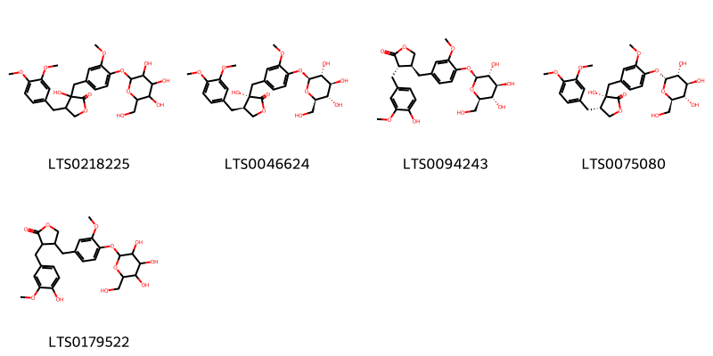{ width=100% }
    <figcaption>Hình ảnh cấu trúc hóa học của 5 hoạt chất thuộc nhóm Lignan glycosides gồm ['4-[(3,4-dimethoxyphenyl)methyl]-3-hydroxy-3-[(3-methoxy-4-{[3,4,5-trihydroxy-6-(hydroxymethyl)oxan-2-yl]oxy}phenyl)methyl]oxolan-2-one (LTS0218225)', '(3s,4r)-4-[(3,4-dimethoxyphenyl)methyl]-3-hydroxy-3-[(3-methoxy-4-{[(2s,3r,4s,5s,6r)-3,4,5-trihydroxy-6-(hydroxymethyl)oxan-2-yl]oxy}phenyl)methyl]oxolan-2-one (LTS0046624)', '(3s,4s)-3-[(4-hydroxy-3-methoxyphenyl)methyl]-4-[(3-methoxy-4-{[(2s,3r,4s,5s,6r)-3,4,5-trihydroxy-6-(hydroxymethyl)oxan-2-yl]oxy}phenyl)methyl]oxolan-2-one (LTS0094243)', '(3s,4s)-4-[(3,4-dimethoxyphenyl)methyl]-3-hydroxy-3-[(3-methoxy-4-{[(2r,3r,4s,5s,6r)-3,4,5-trihydroxy-6-(hydroxymethyl)oxan-2-yl]oxy}phenyl)methyl]oxolan-2-one (LTS0075080)', '3-[(4-hydroxy-3-methoxyphenyl)methyl]-4-[(3-methoxy-4-{[3,4,5-trihydroxy-6-(hydroxymethyl)oxan-2-yl]oxy}phenyl)methyl]oxolan-2-one (LTS0179522)'].</figcaption>
</figure>
#### Nhóm Organooxygen compounds
<figure markdown="span">
    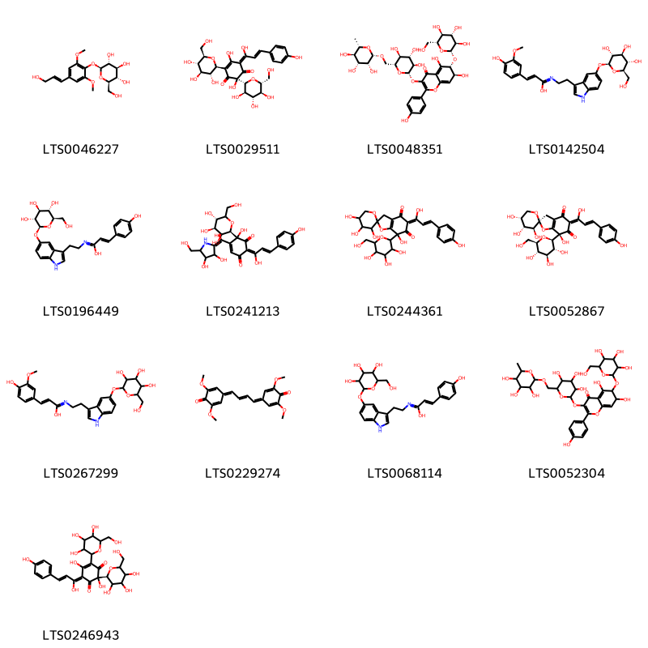{ width=100% }
    <figcaption>Hình ảnh cấu trúc hóa học của 13 hoạt chất thuộc nhóm Organooxygen compounds gồm ['syringin (LTS0046227)', '(6e)-2,5-dihydroxy-6-[(2e)-1-hydroxy-3-(4-hydroxyphenyl)prop-2-en-1-ylidene]-2-[(2r,3r,4s,5s,6r)-3,4,5-trihydroxy-6-(hydroxymethyl)oxan-2-yl]-4-[(2s,3r,4r,5s,6r)-3,4,5-trihydroxy-6-(hydroxymethyl)oxan-2-yl]cyclohex-4-ene-1,3-dione (LTS0029511)', '(6r,7s)-5,7-dihydroxy-2-(4-hydroxyphenyl)-6-{[(2s,3r,4s,5s,6r)-3,4,5-trihydroxy-6-(hydroxymethyl)oxan-2-yl]oxy}-3-{[(2s,3r,4s,5s,6r)-3,4,5-trihydroxy-6-({[(2s,3r,4r,5r,6s)-3,4,5-trihydroxy-6-methyloxan-2-yl]oxy}methyl)oxan-2-yl]oxy}-6,7-dihydrochromen-4-one (LTS0048351)', '(2e)-3-(4-hydroxy-3-methoxyphenyl)-n-[2-(5-{[(2s,3r,4s,5s,6r)-3,4,5-trihydroxy-6-(hydroxymethyl)oxan-2-yl]oxy}-1h-indol-3-yl)ethyl]prop-2-enimidic acid (LTS0142504)', '(2e)-3-(4-hydroxyphenyl)-n-[2-(5-{[(2s,3r,4s,5s,6r)-3,4,5-trihydroxy-6-(hydroxymethyl)oxan-2-yl]oxy}-1h-indol-3-yl)ethyl]prop-2-enimidic acid (LTS0196449)', '(2e)-5-{[(2z)-3,4-dihydroxy-5-(hydroxymethyl)pyrrolidin-2-ylidene](hydroxy)methyl}-6-hydroxy-2-[(2e)-1-hydroxy-3-(4-hydroxyphenyl)prop-2-en-1-ylidene]-6-[(2r,4s,5s)-3,4,5-trihydroxy-6-(hydroxymethyl)oxan-2-yl]cyclohex-4-ene-1,3-dione (LTS0241213)', "3',4',5',7-tetrahydroxy-5-[(2e)-1-hydroxy-3-(4-hydroxyphenyl)prop-2-en-1-ylidene]-7-[3,4,5-trihydroxy-6-(hydroxymethyl)oxan-2-yl]-3h-spiro[1-benzofuran-2,2'-oxane]-4,6-dione (LTS0244361)", "(2s,3's,4'r,5e,5'r,7s)-3',4',5',7-tetrahydroxy-5-[(2e)-1-hydroxy-3-(4-hydroxyphenyl)prop-2-en-1-ylidene]-7-[(2r,3r,4s,5s,6r)-3,4,5-trihydroxy-6-(hydroxymethyl)oxan-2-yl]-3h-spiro[1-benzofuran-2,2'-oxane]-4,6-dione (LTS0052867)", '3-(4-hydroxy-3-methoxyphenyl)-n-[2-(5-{[3,4,5-trihydroxy-6-(hydroxymethyl)oxan-2-yl]oxy}-1h-indol-3-yl)ethyl]prop-2-enimidic acid (LTS0267299)', '4-[(2e)-4-(3,5-dimethoxy-4-oxocyclohexa-2,5-dien-1-ylidene)but-2-en-1-ylidene]-2,6-dimethoxycyclohexa-2,5-dien-1-one (LTS0229274)', '3-(4-hydroxyphenyl)-n-[2-(5-{[3,4,5-trihydroxy-6-(hydroxymethyl)oxan-2-yl]oxy}-1h-indol-3-yl)ethyl]prop-2-enimidic acid (LTS0068114)', '5,7-dihydroxy-2-(4-hydroxyphenyl)-6-{[3,4,5-trihydroxy-6-(hydroxymethyl)oxan-2-yl]oxy}-3-[(3,4,5-trihydroxy-6-{[(3,4,5-trihydroxy-6-methyloxan-2-yl)oxy]methyl}oxan-2-yl)oxy]-6,7-dihydrochromen-4-one (LTS0052304)', '2,5-dihydroxy-6-[1-hydroxy-3-(4-hydroxyphenyl)prop-2-en-1-ylidene]-2-[(2s)-3,4,5-trihydroxy-6-(hydroxymethyl)oxan-2-yl]-4-[3,4,5-trihydroxy-6-(hydroxymethyl)oxan-2-yl]cyclohex-4-ene-1,3-dione (LTS0246943)'].</figcaption>
</figure>
#### Nhóm Phenols
<figure markdown="span">
    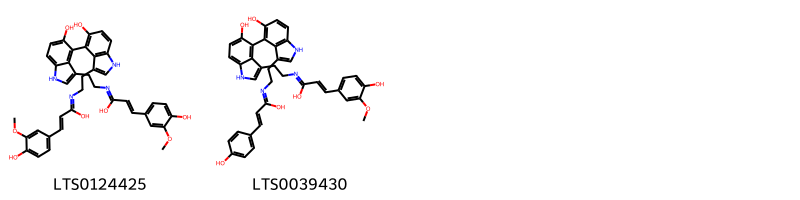{ width=100% }
    <figcaption>Hình ảnh cấu trúc hóa học của 2 hoạt chất thuộc nhóm Phenols gồm ["n-{2-[5,5'-dihydroxy-3'-(2-{[1-hydroxy-3-(4-hydroxy-3-methoxyphenyl)prop-2-en-1-ylidene]amino}ethyl)-1h,1'h-[4,4'-biindol]-3-yl]ethyl}-3-(4-hydroxy-3-methoxyphenyl)prop-2-enimidic acid (LTS0124425)", "n-{2-[5,5'-dihydroxy-3'-(2-{[1-hydroxy-3-(4-hydroxyphenyl)prop-2-en-1-ylidene]amino}ethyl)-1h,1'h-[4,4'-biindol]-3-yl]ethyl}-3-(4-hydroxy-3-methoxyphenyl)prop-2-enimidic acid (LTS0039430)"].</figcaption>
</figure>
#### Nhóm Prenol lipids
<figure markdown="span">
    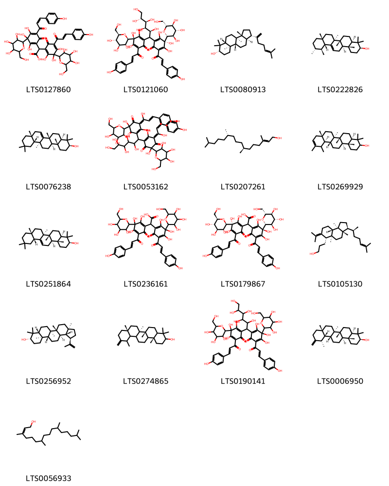{ width=100% }
    <figcaption>Hình ảnh cấu trúc hóa học của 17 hoạt chất thuộc nhóm Prenol lipids gồm ['{2,3,4-trihydroxy-5-[(2e)-3-(4-hydroxyphenyl)prop-2-enoyl]-6-oxo-3-[3,4,5-trihydroxy-6-(hydroxymethyl)oxan-2-yl]cyclohexa-1,4-dien-1-yl}({2,3,4-trihydroxy-5-[(2z)-3-(4-hydroxyphenyl)prop-2-enoyl]-6-oxo-3-[3,4,5-trihydroxy-6-(hydroxymethyl)oxan-2-yl]cyclohexa-1,4-dien-1-yl})acetic acid (LTS0127860)', '(4s)-3,4,5-trihydroxy-2-[(2e)-3-(4-hydroxyphenyl)prop-2-enoyl]-6-[(2s,3r,4r,5r)-2,3,4,5,6-pentahydroxy-1-[(3s)-2,3,4-trihydroxy-5-[(2e)-3-(4-hydroxyphenyl)prop-2-enoyl]-6-oxo-3-[(2r,3r,4s,5s,6r)-3,4,5-trihydroxy-6-(hydroxymethyl)oxan-2-yl]cyclohexa-1,4-dien-1-yl]hexyl]-4-[(2r,3r,4s,5s,6r)-3,4,5-trihydroxy-6-(hydroxymethyl)oxan-2-yl]cyclohexa-2,5-dien-1-one (LTS0121060)', 'dammaradienol (LTS0080913)', 'amyrin (LTS0222826)', 'alnulin (LTS0076238)', '(6z)-4-{1-[(3z)-2,5-dihydroxy-3-[(2e)-1-hydroxy-3-(4-hydroxyphenyl)prop-2-en-1-ylidene]-4,6-dioxo-5-[3,4,5-trihydroxy-6-(hydroxymethyl)oxan-2-yl]cyclohex-1-en-1-yl]-2,3,4,5,6-pentahydroxyhexyl}-2,5-dihydroxy-6-[(2z)-1-hydroxy-3-(4-hydroxyphenyl)prop-2-en-1-ylidene]-2-[3,4,5-trihydroxy-6-(hydroxymethyl)oxan-2-yl]cyclohex-4-ene-1,3-dione (LTS0053162)', '(2e,7s,11s)-3,7,11,15-tetramethylhexadec-2-en-1-ol (LTS0207261)', '(4ar,6ar,6br,8as,12ar,12br,14ar,14br)-4,4,6a,6b,8a,11,12,14b-octamethyl-2,3,4a,5,6,7,8,9,12,12a,12b,13,14,14a-tetradecahydro-1h-picen-3-ol (LTS0269929)', 'β-amyrin (LTS0251864)', 'bis({2,3,4-trihydroxy-5-[3-(4-hydroxyphenyl)prop-2-enoyl]-6-oxo-3-[3,4,5-trihydroxy-6-(hydroxymethyl)oxan-2-yl]cyclohexa-1,4-dien-1-yl})acetic acid (LTS0236161)', 'bis[(3r)-2,3,4-trihydroxy-5-[(2e)-3-(4-hydroxyphenyl)prop-2-enoyl]-6-oxo-3-[(2r,3r,4s,5s,6r)-3,4,5-trihydroxy-6-(hydroxymethyl)oxan-2-yl]cyclohexa-1,4-dien-1-yl]acetic acid (LTS0179867)', '3-[(3s,3as,5as,6s,9as,9br)-3a,5a,9b-trimethyl-3-[(2s)-6-methylhept-5-en-2-yl]-7-(propan-2-ylidene)-octahydro-1h-cyclopenta[a]naphthalen-6-yl]propan-1-ol (LTS0105130)', 'lupeol (LTS0256952)', '(6ar,6br,8ar,14br)-4,4,6a,6b,8a,12,14b-heptamethyl-11-methylidene-hexadecahydropicen-3-ol (LTS0274865)', '3,4,5-trihydroxy-2-[3-(4-hydroxyphenyl)prop-2-enoyl]-6-(2,3,4,5,6-pentahydroxy-1-{2,3,4-trihydroxy-5-[3-(4-hydroxyphenyl)prop-2-enoyl]-6-oxo-3-[3,4,5-trihydroxy-6-(hydroxymethyl)oxan-2-yl]cyclohexa-1,4-dien-1-yl}hexyl)-4-[3,4,5-trihydroxy-6-(hydroxymethyl)oxan-2-yl]cyclohexa-2,5-dien-1-one (LTS0190141)', 'taraxasterol (LTS0006950)', '3,7,11,15-tetramethylhexadec-2-en-1-ol (LTS0056933)'].</figcaption>
</figure>
#### Nhóm Purine nucleosides
<figure markdown="span">
    { width=100% }
    <figcaption>Hình ảnh cấu trúc hóa học của 1 hoạt chất thuộc nhóm Purine nucleosides gồm ['adenosine (LTS0014061)'].</figcaption>
</figure>
#### Nhóm Pyrans
<figure markdown="span">
    { width=100% }
    <figcaption>Hình ảnh cấu trúc hóa học của 2 hoạt chất thuộc nhóm Pyrans gồm ['(1r,5r,6r,7s)-1-(hydroxymethyl)-7-(4-hydroxyphenyl)-4-oxo-8-oxabicyclo[3.2.1]oct-2-ene-6-carboxylic acid (LTS0163714)', '1-(hydroxymethyl)-7-(4-hydroxyphenyl)-4-oxo-8-oxabicyclo[3.2.1]oct-2-ene-6-carboxylic acid (LTS0067792)'].</figcaption>
</figure>
#### Nhóm Steroids and steroid derivatives
<figure markdown="span">
    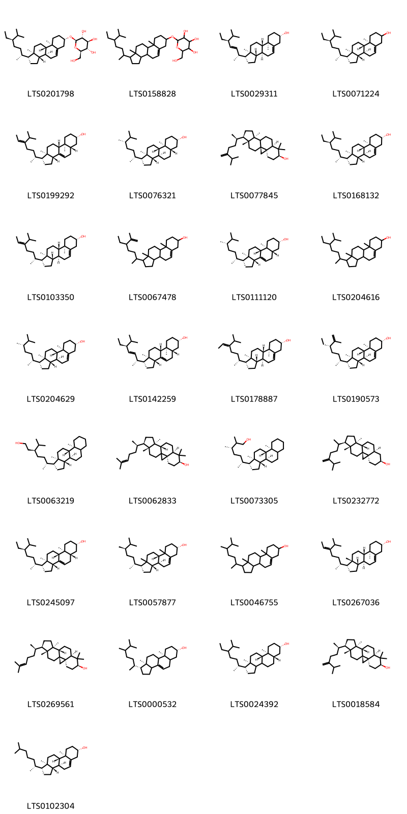{ width=100% }
    <figcaption>Hình ảnh cấu trúc hóa học của 29 hoạt chất thuộc nhóm Steroids and steroid derivatives gồm ['sitogluside (LTS0201798)', '2-{[1-(5-ethyl-6-methylheptan-2-yl)-9a,11a-dimethyl-1h,2h,3h,3ah,3bh,4h,6h,7h,8h,9h,9bh,10h,11h-cyclopenta[a]phenanthren-7-yl]oxy}-6-(hydroxymethyl)oxane-3,4,5-triol (LTS0158828)', 'phytosterol (LTS0029311)', 'stigmast-5-en-3-ol (LTS0071224)', 'delta7-avenasterol (LTS0199292)', 'ergostanol (LTS0076321)', '24-methylene-cycloartanol (LTS0077845)', 'sitosterol (LTS0168132)', 'avenasterol (LTS0103350)', '1-(5-ethyl-6-methylhept-6-en-2-yl)-9a,11a-dimethyl-1h,2h,3h,3ah,3bh,4h,6h,7h,8h,9h,9bh,10h,11h-cyclopenta[a]phenanthren-7-ol (LTS0067478)', 'fungisterol (LTS0111120)', 'stigmast-5-en-3-ol, (3β)- (LTS0204616)', '22,23-dihydrobrassicasterol (LTS0204629)', 'chondrillasterol (LTS0142259)', 'fucosterol (LTS0178887)', '(1r,3as,3bs,7s,9ar,9bs,11ar)-1-[(2r,5s)-5-ethyl-6-methylhept-6-en-2-yl]-9a,11a-dimethyl-1h,2h,3h,3ah,3bh,4h,6h,7h,8h,9h,9bh,10h,11h-cyclopenta[a]phenanthren-7-ol (LTS0190573)', '(3s,6r)-6-[(1r,3as,3br,9as,9bs,11ar)-9a,11a-dimethyl-tetradecahydro-1h-cyclopenta[a]phenanthren-1-yl]-3-isopropylheptan-1-ol (LTS0063219)', '(3r,6s,8r,11s,12s,15r,16r)-7,7,12,16-tetramethyl-15-[(2r)-6-methylhept-5-en-2-yl]pentacyclo[9.7.0.0¹,³.0³,⁸.0¹²,¹⁶]octadecan-6-ol (LTS0062833)', '(3s,6r)-6-[(1r,3as,3br,9as,9bs,11ar)-9a,11a-dimethyl-tetradecahydro-1h-cyclopenta[a]phenanthren-1-yl]-2,3-dimethylheptan-1-ol (LTS0073305)', '(1s,3r,6s,8s,11s,12s,15r,16r)-12,16-dimethyl-15-(6-methyl-5-methylideneheptan-2-yl)pentacyclo[9.7.0.0¹,³.0³,⁸.0¹²,¹⁶]octadecan-6-ol (LTS0232772)', '(3β,5α)-stigmast-7-en-3-ol (LTS0245097)', '(1r,3as,3bs,7s,9bs)-1-[(2r,5r)-5,6-dimethylheptan-2-yl]-9a,11a-dimethyl-1h,2h,3h,3ah,3bh,4h,6h,7h,8h,9h,9bh,10h,11h-cyclopenta[a]phenanthren-7-ol (LTS0057877)', 'campesterol (LTS0046755)', '(1r,3as,3bs,7s,9ar,9bs,11as)-1-[(2r,5z)-5-isopropylhept-5-en-2-yl]-9a,11a-dimethyl-1h,2h,3h,3ah,3bh,4h,6h,7h,8h,9h,9bh,10h,11h-cyclopenta[a]phenanthren-7-ol (LTS0267036)', 'cycloartenol (LTS0269561)', '(1r,7s,9as,11ar)-1-(5,6-dimethylheptan-2-yl)-9a,11a-dimethyl-1h,2h,3h,3ah,5h,5ah,6h,7h,8h,9h,9bh,10h,11h-cyclopenta[a]phenanthren-7-ol (LTS0000532)', '(1r,5as,7s,9as,9bs,11ar)-1-[(2r)-5-ethyl-6-methylheptan-2-yl]-9a,11a-dimethyl-tetradecahydro-1h-cyclopenta[a]phenanthren-7-ol (LTS0024392)', '24-methylenecycloartanol (LTS0018584)', 'cholesterol (LTS0102304)'].</figcaption>
</figure>
#### Nhóm Unsaturated hydrocarbons
<figure markdown="span">
    { width=100% }
    <figcaption>Hình ảnh cấu trúc hóa học của 20 hoạt chất thuộc nhóm Unsaturated hydrocarbons gồm ['trideca-1,3,11-trien-5,7,9-triyne (LTS0157797)', '(3e,11e)-trideca-1,3,11-trien-5,7,9-triyne (LTS0153478)', 'trideca-1,11-dien-3,5,7,9-tetrayne (LTS0196083)', '(11e)-trideca-1,11-dien-3,5,7,9-tetrayne (LTS0023235)', '(3e,5e,11e)-trideca-1,3,5,11-tetraen-7,9-diyne (LTS0193080)', 'tridec-1-en-3,5,7,9,11-pentayne (LTS0085389)', '(3e)-trideca-1,3-dien-5,7,9,11-tetrayne (LTS0052375)', '(3e,5e)-trideca-1,3,5-trien-7,9,11-triyne (LTS0189296)', '(3z,11z)-trideca-1,3,11-trien-5,7,9-triyne (LTS0138143)', '1-undecene (LTS0104325)', '(3e,5z,11e)-trideca-1,3,5,11-tetraen-7,9-diyne (LTS0189549)', 'heptadeca-1,8,11,14-tetraene (LTS0222542)', '(11z)-trideca-1,11-dien-3,5,7,9-tetrayne (LTS0205597)', 'trideca-1,3,5,11-tetraen-7,9-diyne (LTS0238121)', 'aplotaxene (LTS0215252)', 'trideca-1,3-dien-5,7,9,11-tetrayne (LTS0254168)', 'trideca-1,3,5-trien-7,9,11-triyne (LTS0246027)', '(3e)-trideca-1,3,5,11-tetraen-7,9-diyne (LTS0097596)', '(3z,5e,11e)-trideca-1,3,5,11-tetraen-7,9-diyne (LTS0029669)', '(3z,11e)-trideca-1,3,11-trien-5,7,9-triyne (LTS0269835)'].</figcaption>
</figure>

---

### Dược dân tộc học

Danh sách các quốc gia có sử dụng *Carthamus tinctorius* trong điều trị các bệnh. 

| Country        | Disease                                                                                             | Bệnh                                                                                                                                                                                                |
|:---------------|:----------------------------------------------------------------------------------------------------|:----------------------------------------------------------------------------------------------------------------------------------------------------------------------------------------------------|
| China          | Astringent, nan, Discutient, Emmenagogue, Abortifacient, Purgative, Sedative, Stimulant, Uterotonic | MYMEMORY WARNING: YOU USED ALL AVAILABLE FREE TRANSLATIONS FOR TODAY. NEXT AVAILABLE IN  09 HOURS 49 MINUTES 09 SECONDS VISIT HTTPS://MYMEMORY.TRANSLATED.NET/DOC/USAGELIMITS.PHP TO TRANSLATE MORE |
| Elsewhere      | Emmenagogue, Sedative, Stimulant, Diuretic                                                          | MYMEMORY WARNING: YOU USED ALL AVAILABLE FREE TRANSLATIONS FOR TODAY. NEXT AVAILABLE IN  09 HOURS 49 MINUTES 07 SECONDS VISIT HTTPS://MYMEMORY.TRANSLATED.NET/DOC/USAGELIMITS.PHP TO TRANSLATE MORE |
| India          | nan, Fungicide                                                                                      | MYMEMORY WARNING: YOU USED ALL AVAILABLE FREE TRANSLATIONS FOR TODAY. NEXT AVAILABLE IN  09 HOURS 49 MINUTES 04 SECONDS VISIT HTTPS://MYMEMORY.TRANSLATED.NET/DOC/USAGELIMITS.PHP TO TRANSLATE MORE |
| Iraq           | Diaphoretic                                                                                         | MYMEMORY WARNING: YOU USED ALL AVAILABLE FREE TRANSLATIONS FOR TODAY. NEXT AVAILABLE IN  09 HOURS 49 MINUTES 00 SECONDS VISIT HTTPS://MYMEMORY.TRANSLATED.NET/DOC/USAGELIMITS.PHP TO TRANSLATE MORE |
| Japan          | Dye, Emmenagogue                                                                                    | MYMEMORY WARNING: YOU USED ALL AVAILABLE FREE TRANSLATIONS FOR TODAY. NEXT AVAILABLE IN  09 HOURS 48 MINUTES 56 SECONDS VISIT HTTPS://MYMEMORY.TRANSLATED.NET/DOC/USAGELIMITS.PHP TO TRANSLATE MORE |
| Japan*         | Emmenagogue                                                                                         | MYMEMORY WARNING: YOU USED ALL AVAILABLE FREE TRANSLATIONS FOR TODAY. NEXT AVAILABLE IN  09 HOURS 48 MINUTES 54 SECONDS VISIT HTTPS://MYMEMORY.TRANSLATED.NET/DOC/USAGELIMITS.PHP TO TRANSLATE MORE |
| Java           | Emmenagogue                                                                                         | MYMEMORY WARNING: YOU USED ALL AVAILABLE FREE TRANSLATIONS FOR TODAY. NEXT AVAILABLE IN  09 HOURS 48 MINUTES 50 SECONDS VISIT HTTPS://MYMEMORY.TRANSLATED.NET/DOC/USAGELIMITS.PHP TO TRANSLATE MORE |
| Mexico         | Diuretic                                                                                            | MYMEMORY WARNING: YOU USED ALL AVAILABLE FREE TRANSLATIONS FOR TODAY. NEXT AVAILABLE IN  09 HOURS 48 MINUTES 47 SECONDS VISIT HTTPS://MYMEMORY.TRANSLATED.NET/DOC/USAGELIMITS.PHP TO TRANSLATE MORE |
| Turkey         | Laxative, Purgative, Rennet, Rubefacient, Emmenagogue, Sudorific                                    | MYMEMORY WARNING: YOU USED ALL AVAILABLE FREE TRANSLATIONS FOR TODAY. NEXT AVAILABLE IN  09 HOURS 48 MINUTES 43 SECONDS VISIT HTTPS://MYMEMORY.TRANSLATED.NET/DOC/USAGELIMITS.PHP TO TRANSLATE MORE |
| US             | Emmenagogue, Laxative, Sudorific                                                                    | MYMEMORY WARNING: YOU USED ALL AVAILABLE FREE TRANSLATIONS FOR TODAY. NEXT AVAILABLE IN  09 HOURS 48 MINUTES 39 SECONDS VISIT HTTPS://MYMEMORY.TRANSLATED.NET/DOC/USAGELIMITS.PHP TO TRANSLATE MORE |
| US(Amerindian) | Antidote                                                                                            | MYMEMORY WARNING: YOU USED ALL AVAILABLE FREE TRANSLATIONS FOR TODAY. NEXT AVAILABLE IN  09 HOURS 48 MINUTES 36 SECONDS VISIT HTTPS://MYMEMORY.TRANSLATED.NET/DOC/USAGELIMITS.PHP TO TRANSLATE MORE |
| ain            | Purgative                                                                                           | MYMEMORY WARNING: YOU USED ALL AVAILABLE FREE TRANSLATIONS FOR TODAY. NEXT AVAILABLE IN  09 HOURS 48 MINUTES 33 SECONDS VISIT HTTPS://MYMEMORY.TRANSLATED.NET/DOC/USAGELIMITS.PHP TO TRANSLATE MORE |

---

# Chi Glossocardia

??? note "Danh sách các dược liệu thuộc chi"
    
	 - *Glossocardia bosvallia*

---
## Glossocardia bosvallia
### Thông tin về thực vật

!!! info "Phân loại thực vật của *Glossocardia bosvallia* từ GIBF:"
    - **Kingdom:** Plantae
    - **Phylum:** Tracheophyta
    - **Order:** Asterales
    - **Family:** Asteraceae
    - **Genus:** Glossocardia
    - **Species:** *Glossocardia bosvallia*

 

| Label (VI)   | Label (EN)   | Scientific Name        | Descriptions (VI)   | Descriptions (EN)   | Also Known As (VI)   | Also Known As (EN)   |
|:-------------|:-------------|:-----------------------|:--------------------|:--------------------|:---------------------|:---------------------|
| N/A          | N/A          | Glossocardia bosvallia | loài thực vật       | species of plant    | ['']                 | ['']                 |

#### Phân bố trên thế giới

**Từ CSDL GIBF** nan, Chad, Niger, Sudan, India, unknown or invalid, Philippines

#### Phân bố tại Việt Nam

**Từ CSDL GIBF**: Không có ghi nhận ở Việt Nam

---
### Thành phần hóa học
        
- Theo cơ sở dữ liệu lotus: Từ loài *Glossocardia bosvallia* đã phân lập và xác định được Chưa có hoạt chất nào được phân lập. hoạt chất thuộc về các nhóm Không có hoạt chất nào được phân lập. 

Không có hình ảnh nào được tạo ra

---

### Dược dân tộc học

Danh sách các quốc gia có sử dụng *Glossocardia bosvallia* trong điều trị các bệnh. 

| Country   | Disease     | Bệnh                                                                                                                                                                                                |
|:----------|:------------|:----------------------------------------------------------------------------------------------------------------------------------------------------------------------------------------------------|
| India     | Emmenagogue | MYMEMORY WARNING: YOU USED ALL AVAILABLE FREE TRANSLATIONS FOR TODAY. NEXT AVAILABLE IN  09 HOURS 47 MINUTES 45 SECONDS VISIT HTTPS://MYMEMORY.TRANSLATED.NET/DOC/USAGELIMITS.PHP TO TRANSLATE MORE |

---

# Chi Grangea

??? note "Danh sách các dược liệu thuộc chi"
    
	 - *Grangea maderaatana*

---
## Grangea maderaatana
### Thông tin về thực vật

!!! info "Phân loại thực vật của *N/A* từ GIBF:"
    - **Kingdom:** Plantae
    - **Phylum:** Tracheophyta
    - **Order:** Asterales
    - **Family:** Asteraceae
    - **Genus:** Grangea
    - **Species:** *N/A*

 

| Label (VI)   | Label (EN)   | Scientific Name        | Descriptions (VI)   | Descriptions (EN)   | Also Known As (VI)   | Also Known As (EN)   |
|:-------------|:-------------|:-----------------------|:--------------------|:--------------------|:---------------------|:---------------------|
| N/A          | N/A          | Glossocardia bosvallia | loài thực vật       | species of plant    | ['']                 | ['']                 |

#### Phân bố trên thế giới

**Từ CSDL GIBF** nan, Sri Lanka, Gabon, Myanmar, Nigeria, Namibia, Chinese Taipei, Bangladesh, South Africa, Hong Kong, Thailand, Peru, Eswatini, China, Madagascar, India, Indonesia, Kenya, Nepal

#### Phân bố tại Việt Nam

**Từ CSDL GIBF**: Không có ghi nhận ở Việt Nam

---
### Thành phần hóa học
        
- Theo cơ sở dữ liệu lotus: Từ loài *N/A* đã phân lập và xác định được Chưa có hoạt chất nào được phân lập. hoạt chất thuộc về các nhóm Không có hoạt chất nào được phân lập. 

Không có hình ảnh nào được tạo ra

---

### Dược dân tộc học

Danh sách các quốc gia có sử dụng *N/A* trong điều trị các bệnh. 

| Country   | Disease               | Bệnh                                                                                                                                                                                                |
|:----------|:----------------------|:----------------------------------------------------------------------------------------------------------------------------------------------------------------------------------------------------|
| Hindu     | Stomachic             | MYMEMORY WARNING: YOU USED ALL AVAILABLE FREE TRANSLATIONS FOR TODAY. NEXT AVAILABLE IN  09 HOURS 47 MINUTES 21 SECONDS VISIT HTTPS://MYMEMORY.TRANSLATED.NET/DOC/USAGELIMITS.PHP TO TRANSLATE MORE |
| India     | Antiseptic, Stomachic | MYMEMORY WARNING: YOU USED ALL AVAILABLE FREE TRANSLATIONS FOR TODAY. NEXT AVAILABLE IN  09 HOURS 47 MINUTES 18 SECONDS VISIT HTTPS://MYMEMORY.TRANSLATED.NET/DOC/USAGELIMITS.PHP TO TRANSLATE MORE |

---

# Chi Cineraria

??? note "Danh sách các dược liệu thuộc chi"
    
	 - *Cineraria aera*

---
## Cineraria aera
### Thông tin về thực vật

!!! info "Phân loại thực vật của *N/A* từ GIBF:"
    - **Kingdom:** Plantae
    - **Phylum:** Tracheophyta
    - **Order:** Asterales
    - **Family:** Asteraceae
    - **Genus:** Cineraria
    - **Species:** *N/A*

 

| Label (VI)   | Label (EN)   | Scientific Name        | Descriptions (VI)   | Descriptions (EN)   | Also Known As (VI)   | Also Known As (EN)   |
|:-------------|:-------------|:-----------------------|:--------------------|:--------------------|:---------------------|:---------------------|
| N/A          | N/A          | Glossocardia bosvallia | loài thực vật       | species of plant    | ['']                 | ['']                 |

#### Phân bố trên thế giới

**Từ CSDL GIBF** Lesotho, South Africa, Australia, Namibia

#### Phân bố tại Việt Nam

**Từ CSDL GIBF**: Không có ghi nhận ở Việt Nam

---
### Thành phần hóa học
        
- Theo cơ sở dữ liệu lotus: Từ loài *N/A* đã phân lập và xác định được Chưa có hoạt chất nào được phân lập. hoạt chất thuộc về các nhóm Không có hoạt chất nào được phân lập. 

Không có hình ảnh nào được tạo ra

---

### Dược dân tộc học

Danh sách các quốc gia có sử dụng *N/A* trong điều trị các bệnh. 

| Country   | Disease      | Bệnh                                                                                                                                                                                                |
|:----------|:-------------|:----------------------------------------------------------------------------------------------------------------------------------------------------------------------------------------------------|
| Lesotho   | Hallucinogen | MYMEMORY WARNING: YOU USED ALL AVAILABLE FREE TRANSLATIONS FOR TODAY. NEXT AVAILABLE IN  09 HOURS 46 MINUTES 44 SECONDS VISIT HTTPS://MYMEMORY.TRANSLATED.NET/DOC/USAGELIMITS.PHP TO TRANSLATE MORE |

---

# Chi Piqueria

??? note "Danh sách các dược liệu thuộc chi"
    
	 - *Piqueria trinervia*

---
## Piqueria trinervia
### Thông tin về thực vật

!!! info "Phân loại thực vật của *Piqueria trinervia* từ GIBF:"
    - **Kingdom:** Plantae
    - **Phylum:** Tracheophyta
    - **Order:** Asterales
    - **Family:** Asteraceae
    - **Genus:** Piqueria
    - **Species:** *Piqueria trinervia*

 

| Label (VI)   | Label (EN)   | Scientific Name    | Descriptions (VI)   | Descriptions (EN)   | Also Known As (VI)     | Also Known As (EN)   |
|:-------------|:-------------|:-------------------|:--------------------|:--------------------|:-----------------------|:---------------------|
| N/A          | N/A          | Piqueria trinervia | loài thực vật       | species of plant    | ['Piqueria trinervia'] | ['']                 |

#### Phân bố trên thế giới

**Từ CSDL GIBF** Haiti, Mexico

#### Phân bố tại Việt Nam

**Từ CSDL GIBF**: Không có ghi nhận ở Việt Nam

---
### Thành phần hóa học
        
- Theo cơ sở dữ liệu lotus: Từ loài *Piqueria trinervia* đã phân lập và xác định được 20 hoạt chất thuộc về các nhóm Fatty Acyls, Prenol lipids, Benzene and substituted derivatives. 

|    | chemicalTaxonomyClassyfireClass     |   smiles_count |
|---:|:------------------------------------|---------------:|
|  0 | Benzene and substituted derivatives |              1 |
|  1 | Fatty Acyls                         |              6 |
|  2 | Prenol lipids                       |             13 |

#### Nhóm Benzene and substituted derivatives
<figure markdown="span">
    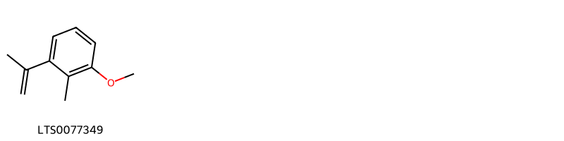{ width=100% }
    <figcaption>Hình ảnh cấu trúc hóa học của 1 hoạt chất thuộc nhóm Benzene and substituted derivatives gồm ['1-methoxy-2-methyl-3-(prop-1-en-2-yl)benzene (LTS0077349)'].</figcaption>
</figure>
#### Nhóm Fatty Acyls
<figure markdown="span">
    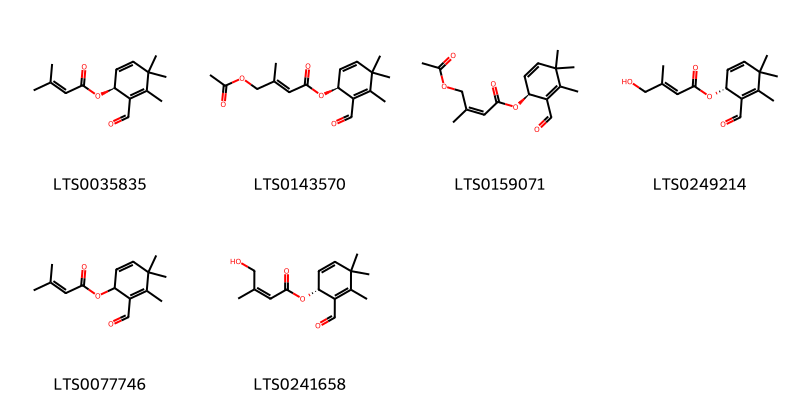{ width=100% }
    <figcaption>Hình ảnh cấu trúc hóa học của 6 hoạt chất thuộc nhóm Fatty Acyls gồm ['(1s)-2-formyl-3,4,4-trimethylcyclohexa-2,5-dien-1-yl 3-methylbut-2-enoate (LTS0035835)', '(1s)-2-formyl-3,4,4-trimethylcyclohexa-2,5-dien-1-yl (2e)-4-(acetyloxy)-3-methylbut-2-enoate (LTS0143570)', '(1s)-2-formyl-3,4,4-trimethylcyclohexa-2,5-dien-1-yl 4-(acetyloxy)-3-methylbut-2-enoate (LTS0159071)', '(1r)-2-formyl-3,4,4-trimethylcyclohexa-2,5-dien-1-yl (2e)-4-hydroxy-3-methylbut-2-enoate (LTS0249214)', '2-formyl-3,4,4-trimethylcyclohexa-2,5-dien-1-yl 3-methylbut-2-enoate (LTS0077746)', '(1r)-2-formyl-3,4,4-trimethylcyclohexa-2,5-dien-1-yl 4-hydroxy-3-methylbut-2-enoate (LTS0241658)'].</figcaption>
</figure>
#### Nhóm Prenol lipids
<figure markdown="span">
    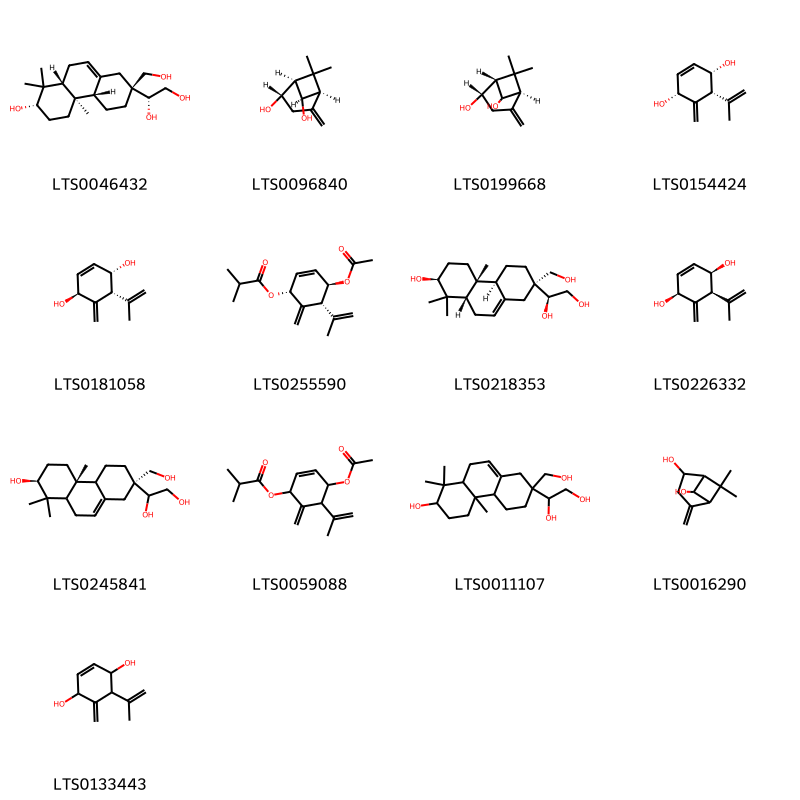{ width=100% }
    <figcaption>Hình ảnh cấu trúc hóa học của 13 hoạt chất thuộc nhóm Prenol lipids gồm ['(1r)-1-[(2r,4as,4br,7s,8ar)-7-hydroxy-2-(hydroxymethyl)-4b,8,8-trimethyl-3,4,4a,5,6,7,8a,9-octahydro-1h-phenanthren-2-yl]ethane-1,2-diol (LTS0046432)', '(1r,2s,5r,6r)-7,7-dimethyl-4-methylidenebicyclo[3.1.1]heptane-2,6-diol (LTS0096840)', '(1s,2s,5r)-7,7-dimethyl-4-methylidenebicyclo[3.1.1]heptane-2,6-diol (LTS0199668)', '(1s,4r,6r)-5-methylidene-6-(prop-1-en-2-yl)cyclohex-2-ene-1,4-diol (LTS0154424)', '(1s,4s,6r)-5-methylidene-6-(prop-1-en-2-yl)cyclohex-2-ene-1,4-diol (LTS0181058)', '(1r,4r,5r)-4-(acetyloxy)-6-methylidene-5-(prop-1-en-2-yl)cyclohex-2-en-1-yl 2-methylpropanoate (LTS0255590)', '(1s)-1-[(2r,4as,4br,7s,8as)-7-hydroxy-2-(hydroxymethyl)-4b,8,8-trimethyl-3,4,4a,5,6,7,8a,9-octahydro-1h-phenanthren-2-yl]ethane-1,2-diol (LTS0218353)', 'piquerol a (LTS0226332)', '1-[(2r,4br,7s)-7-hydroxy-2-(hydroxymethyl)-4b,8,8-trimethyl-3,4,4a,5,6,7,8a,9-octahydro-1h-phenanthren-2-yl]ethane-1,2-diol (LTS0245841)', '4-(acetyloxy)-6-methylidene-5-(prop-1-en-2-yl)cyclohex-2-en-1-yl 2-methylpropanoate (LTS0059088)', '1-[7-hydroxy-2-(hydroxymethyl)-4b,8,8-trimethyl-3,4,4a,5,6,7,8a,9-octahydro-1h-phenanthren-2-yl]ethane-1,2-diol (LTS0011107)', '7,7-dimethyl-4-methylidenebicyclo[3.1.1]heptane-2,6-diol (LTS0016290)', '5-methylidene-6-(prop-1-en-2-yl)cyclohex-2-ene-1,4-diol (LTS0133443)'].</figcaption>
</figure>

---

### Dược dân tộc học

Danh sách các quốc gia có sử dụng *Piqueria trinervia* trong điều trị các bệnh. 

| Country   | Disease   | Bệnh                                                                                                                                                                                                |
|:----------|:----------|:----------------------------------------------------------------------------------------------------------------------------------------------------------------------------------------------------|
| Mexico    | Laxative  | MYMEMORY WARNING: YOU USED ALL AVAILABLE FREE TRANSLATIONS FOR TODAY. NEXT AVAILABLE IN  09 HOURS 46 MINUTES 19 SECONDS VISIT HTTPS://MYMEMORY.TRANSLATED.NET/DOC/USAGELIMITS.PHP TO TRANSLATE MORE |

---

# Chi Chrysactinia

??? note "Danh sách các dược liệu thuộc chi"
    
	 - *Chrysactinia mexicana*

---
## Chrysactinia mexicana
### Thông tin về thực vật

!!! info "Phân loại thực vật của *Chrysactinia mexicana* từ GIBF:"
    - **Kingdom:** Plantae
    - **Phylum:** Tracheophyta
    - **Order:** Asterales
    - **Family:** Asteraceae
    - **Genus:** Chrysactinia
    - **Species:** *Chrysactinia mexicana*

 

| Label (VI)   | Label (EN)   | Scientific Name       | Descriptions (VI)   | Descriptions (EN)   | Also Known As (VI)   | Also Known As (EN)   |
|:-------------|:-------------|:----------------------|:--------------------|:--------------------|:---------------------|:---------------------|
| N/A          | N/A          | Chrysactinia mexicana |                     | species of plant    | ['']                 | ['']                 |

#### Phân bố trên thế giới

**Từ CSDL GIBF** United States of America, Mexico

#### Phân bố tại Việt Nam

**Từ CSDL GIBF**: Không có ghi nhận ở Việt Nam

---
### Thành phần hóa học
        
- Theo cơ sở dữ liệu lotus: Từ loài *Chrysactinia mexicana* đã phân lập và xác định được 19 hoạt chất thuộc về các nhóm Fatty Acyls, Flavonoids, Prenol lipids, Steroids and steroid derivatives, Bi- and oligothiophenes, Organooxygen compounds. 

|    | chemicalTaxonomyClassyfireClass   |   smiles_count |
|---:|:----------------------------------|---------------:|
|  0 | Bi- and oligothiophenes           |              1 |
|  1 | Fatty Acyls                       |              1 |
|  2 | Flavonoids                        |              1 |
|  3 | Organooxygen compounds            |              2 |
|  4 | Prenol lipids                     |             11 |
|  5 | Steroids and steroid derivatives  |              2 |

#### Nhóm Bi- and oligothiophenes
<figure markdown="span">
    { width=100% }
    <figcaption>Hình ảnh cấu trúc hóa học của 1 hoạt chất thuộc nhóm Bi- and oligothiophenes gồm ['terthiophene (LTS0246627)'].</figcaption>
</figure>
#### Nhóm Fatty Acyls
<figure markdown="span">
    { width=100% }
    <figcaption>Hình ảnh cấu trúc hóa học của 1 hoạt chất thuộc nhóm Fatty Acyls gồm ['ceryl alcohol (LTS0140051)'].</figcaption>
</figure>
#### Nhóm Flavonoids
<figure markdown="span">
    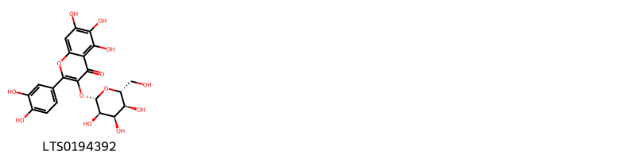{ width=100% }
    <figcaption>Hình ảnh cấu trúc hóa học của 1 hoạt chất thuộc nhóm Flavonoids gồm ['2-(3,4-dihydroxyphenyl)-5,6,7-trihydroxy-3-{[(2s,3r,4r,5s,6r)-3,4,5-trihydroxy-6-(hydroxymethyl)oxan-2-yl]oxy}chromen-4-one (LTS0194392)'].</figcaption>
</figure>
#### Nhóm Organooxygen compounds
<figure markdown="span">
    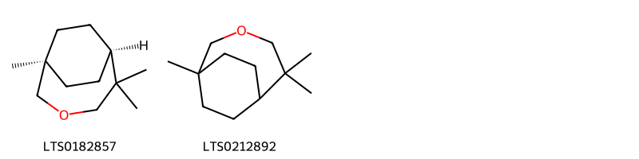{ width=100% }
    <figcaption>Hình ảnh cấu trúc hóa học của 2 hoạt chất thuộc nhóm Organooxygen compounds gồm ['(1s,6s)-1,5,5-trimethyl-3-oxabicyclo[4.2.2]decane (LTS0182857)', '1,5,5-trimethyl-3-oxabicyclo[4.2.2]decane (LTS0212892)'].</figcaption>
</figure>
#### Nhóm Prenol lipids
<figure markdown="span">
    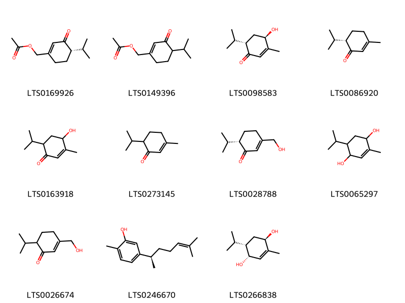{ width=100% }
    <figcaption>Hình ảnh cấu trúc hóa học của 11 hoạt chất thuộc nhóm Prenol lipids gồm ['[(4s)-4-isopropyl-3-oxocyclohex-1-en-1-yl]methyl acetate (LTS0169926)', '(4-isopropyl-3-oxocyclohex-1-en-1-yl)methyl acetate (LTS0149396)', '(4r,6s)-4-hydroxy-6-isopropyl-3-methylcyclohex-2-en-1-one (LTS0098583)', 'α-piperitone (LTS0086920)', '4-hydroxy-6-isopropyl-3-methylcyclohex-2-en-1-one (LTS0163918)', 'piperitone (LTS0273145)', '(6s)-3-(hydroxymethyl)-6-isopropylcyclohex-2-en-1-one (LTS0028788)', '5-isopropyl-2-methylcyclohex-2-ene-1,4-diol (LTS0065297)', '3-(hydroxymethyl)-6-isopropylcyclohex-2-en-1-one (LTS0026674)', '2-methyl-5-[(2r)-6-methylhept-5-en-2-yl]phenol (LTS0246670)', '(1r,4r,5s)-5-isopropyl-2-methylcyclohex-2-ene-1,4-diol (LTS0266838)'].</figcaption>
</figure>
#### Nhóm Steroids and steroid derivatives
<figure markdown="span">
    { width=100% }
    <figcaption>Hình ảnh cấu trúc hóa học của 2 hoạt chất thuộc nhóm Steroids and steroid derivatives gồm ['stigmast-5-en-3-ol (LTS0071224)', 'stigmast-5-en-3-ol, (3β)- (LTS0204616)'].</figcaption>
</figure>

---

### Dược dân tộc học

Danh sách các quốc gia có sử dụng *Chrysactinia mexicana* trong điều trị các bệnh. 

| Country   | Disease                                 | Bệnh                                                                                                                                                                                                |
|:----------|:----------------------------------------|:----------------------------------------------------------------------------------------------------------------------------------------------------------------------------------------------------|
| Elsewhere | Aphrodisiac, Diuretic, Sudorific        | MYMEMORY WARNING: YOU USED ALL AVAILABLE FREE TRANSLATIONS FOR TODAY. NEXT AVAILABLE IN  09 HOURS 45 MINUTES 51 SECONDS VISIT HTTPS://MYMEMORY.TRANSLATED.NET/DOC/USAGELIMITS.PHP TO TRANSLATE MORE |
| Mexico    | Aphrodisiac, Sudorific, Tonic, Diuretic | MYMEMORY WARNING: YOU USED ALL AVAILABLE FREE TRANSLATIONS FOR TODAY. NEXT AVAILABLE IN  09 HOURS 45 MINUTES 47 SECONDS VISIT HTTPS://MYMEMORY.TRANSLATED.NET/DOC/USAGELIMITS.PHP TO TRANSLATE MORE |

---

# Chi Chrysanthemum

??? note "Danh sách các dược liệu thuộc chi"
    
	 - *Chrysanthemum balsamita*
	 - *Chrysanthemum cinerariaefolium*
	 - *Chrysanthemum cinerariifolium*
	 - *Chrysanthemum coccineum*
	 - *Chrysanthemum coronarium*
	 - *Chrysanthemum indicum*
	 - *Chrysanthemum leucanthemum*
	 - *Chrysanthemum morifolium*
	 - *Chrysanthemum parthenium*
	 - *Chrysanthemum roseum*
	 - *Chrysanthemum segetum*
	 - *Chrysanthemum sinense*

---
## Chrysanthemum balsamita
### Thông tin về thực vật

!!! info "Phân loại thực vật của *N/A* từ GIBF:"
    - **Kingdom:** Plantae
    - **Phylum:** Tracheophyta
    - **Order:** Asterales
    - **Family:** Asteraceae
    - **Genus:** Tanacetum
    - **Species:** *N/A*

 

| Label (VI)   | Label (EN)   | Scientific Name       | Descriptions (VI)   | Descriptions (EN)   | Also Known As (VI)   | Also Known As (EN)   |
|:-------------|:-------------|:----------------------|:--------------------|:--------------------|:---------------------|:---------------------|
| N/A          | N/A          | Chrysactinia mexicana |                     | species of plant    | ['']                 | ['']                 |

#### Phân bố trên thế giới

**Từ CSDL GIBF** Italy, Australia, Belgium, Argentina, Israel, Canada, Denmark, Netherlands, Luxembourg, Spain, Bolivia (Plurinational State of), Russian Federation, United States of America, Sweden, Finland, Chile, Germany, Switzerland, Mexico, France, United Kingdom of Great Britain and Northern Ireland, Ecuador, Poland, New Zealand

#### Phân bố tại Việt Nam

**Từ CSDL GIBF**: Không có ghi nhận ở Việt Nam

---
### Thành phần hóa học
        
- Theo cơ sở dữ liệu lotus: Từ loài *N/A* đã phân lập và xác định được Chưa có hoạt chất nào được phân lập. hoạt chất thuộc về các nhóm Không có hoạt chất nào được phân lập. 

Không có hình ảnh nào được tạo ra

---

### Dược dân tộc học

Danh sách các quốc gia có sử dụng *N/A* trong điều trị các bệnh. 

| Country   | Disease                 | Bệnh                                                                                                                                                                                                |
|:----------|:------------------------|:----------------------------------------------------------------------------------------------------------------------------------------------------------------------------------------------------|
| English   | Emmenagogue, Vermifuge  | MYMEMORY WARNING: YOU USED ALL AVAILABLE FREE TRANSLATIONS FOR TODAY. NEXT AVAILABLE IN  09 HOURS 45 MINUTES 03 SECONDS VISIT HTTPS://MYMEMORY.TRANSLATED.NET/DOC/USAGELIMITS.PHP TO TRANSLATE MORE |
| French    | Vulnerary, Stomachic    | MYMEMORY WARNING: YOU USED ALL AVAILABLE FREE TRANSLATIONS FOR TODAY. NEXT AVAILABLE IN  09 HOURS 44 MINUTES 59 SECONDS VISIT HTTPS://MYMEMORY.TRANSLATED.NET/DOC/USAGELIMITS.PHP TO TRANSLATE MORE |
| German    | Expectorant, Cholagogue | MYMEMORY WARNING: YOU USED ALL AVAILABLE FREE TRANSLATIONS FOR TODAY. NEXT AVAILABLE IN  09 HOURS 44 MINUTES 57 SECONDS VISIT HTTPS://MYMEMORY.TRANSLATED.NET/DOC/USAGELIMITS.PHP TO TRANSLATE MORE |
| Italian   | Carminative             | MYMEMORY WARNING: YOU USED ALL AVAILABLE FREE TRANSLATIONS FOR TODAY. NEXT AVAILABLE IN  09 HOURS 44 MINUTES 54 SECONDS VISIT HTTPS://MYMEMORY.TRANSLATED.NET/DOC/USAGELIMITS.PHP TO TRANSLATE MORE |
| anish     | Diuretic                | MYMEMORY WARNING: YOU USED ALL AVAILABLE FREE TRANSLATIONS FOR TODAY. NEXT AVAILABLE IN  09 HOURS 44 MINUTES 51 SECONDS VISIT HTTPS://MYMEMORY.TRANSLATED.NET/DOC/USAGELIMITS.PHP TO TRANSLATE MORE |

---

---
## Chrysanthemum cinerariaefolium
### Thông tin về thực vật

!!! info "Phân loại thực vật của *Chrysanthemum cinerariaefolium* từ GIBF:"
    - **Kingdom:** Plantae
    - **Phylum:** Tracheophyta
    - **Order:** Asterales
    - **Family:** Asteraceae
    - **Genus:** Chrysanthemum
    - **Species:** *Chrysanthemum cinerariaefolium*

 

| Label (VI)   | Label (EN)   | Scientific Name       | Descriptions (VI)   | Descriptions (EN)   | Also Known As (VI)   | Also Known As (EN)   |
|:-------------|:-------------|:----------------------|:--------------------|:--------------------|:---------------------|:---------------------|
| N/A          | N/A          | Chrysactinia mexicana |                     | species of plant    | ['']                 | ['']                 |

#### Phân bố trên thế giới

**Từ CSDL GIBF** nan, Italy, Japan, Chinese Taipei, Myanmar, Brazil, unknown or invalid, Switzerland, India, United States of America, Congo, Democratic Republic of the, Austria, France, Kenya, Croatia, United Kingdom of Great Britain and Northern Ireland

#### Phân bố tại Việt Nam

**Từ CSDL GIBF**: Không có ghi nhận ở Việt Nam

---
### Thành phần hóa học
        
- Theo cơ sở dữ liệu lotus: Từ loài *Chrysanthemum cinerariaefolium* đã phân lập và xác định được Chưa có hoạt chất nào được phân lập. hoạt chất thuộc về các nhóm Không có hoạt chất nào được phân lập. 

Không có hình ảnh nào được tạo ra

---

### Dược dân tộc học

Danh sách các quốc gia có sử dụng *Chrysanthemum cinerariaefolium* trong điều trị các bệnh. 

| Country   | Disease                                | Bệnh                                                                                                                                                                                                |
|:----------|:---------------------------------------|:----------------------------------------------------------------------------------------------------------------------------------------------------------------------------------------------------|
| China     | Poison, Fumigant, Larvicide, Vermifuge | MYMEMORY WARNING: YOU USED ALL AVAILABLE FREE TRANSLATIONS FOR TODAY. NEXT AVAILABLE IN  09 HOURS 44 MINUTES 25 SECONDS VISIT HTTPS://MYMEMORY.TRANSLATED.NET/DOC/USAGELIMITS.PHP TO TRANSLATE MORE |
| Elsewhere | Insecticide                            | MYMEMORY WARNING: YOU USED ALL AVAILABLE FREE TRANSLATIONS FOR TODAY. NEXT AVAILABLE IN  09 HOURS 44 MINUTES 20 SECONDS VISIT HTTPS://MYMEMORY.TRANSLATED.NET/DOC/USAGELIMITS.PHP TO TRANSLATE MORE |
| Iraq      | Vermifuge, Insecticide                 | MYMEMORY WARNING: YOU USED ALL AVAILABLE FREE TRANSLATIONS FOR TODAY. NEXT AVAILABLE IN  09 HOURS 44 MINUTES 17 SECONDS VISIT HTTPS://MYMEMORY.TRANSLATED.NET/DOC/USAGELIMITS.PHP TO TRANSLATE MORE |
| Italian   | Vermifuge                              | MYMEMORY WARNING: YOU USED ALL AVAILABLE FREE TRANSLATIONS FOR TODAY. NEXT AVAILABLE IN  09 HOURS 44 MINUTES 14 SECONDS VISIT HTTPS://MYMEMORY.TRANSLATED.NET/DOC/USAGELIMITS.PHP TO TRANSLATE MORE |
| Nepal     | Insecticide, Insecticide, Toxic, Toxic | MYMEMORY WARNING: YOU USED ALL AVAILABLE FREE TRANSLATIONS FOR TODAY. NEXT AVAILABLE IN  09 HOURS 44 MINUTES 09 SECONDS VISIT HTTPS://MYMEMORY.TRANSLATED.NET/DOC/USAGELIMITS.PHP TO TRANSLATE MORE |
| Turkey    | Parasiticide                           | MYMEMORY WARNING: YOU USED ALL AVAILABLE FREE TRANSLATIONS FOR TODAY. NEXT AVAILABLE IN  09 HOURS 44 MINUTES 06 SECONDS VISIT HTTPS://MYMEMORY.TRANSLATED.NET/DOC/USAGELIMITS.PHP TO TRANSLATE MORE |
| anish     | Insecticide                            | MYMEMORY WARNING: YOU USED ALL AVAILABLE FREE TRANSLATIONS FOR TODAY. NEXT AVAILABLE IN  09 HOURS 44 MINUTES 02 SECONDS VISIT HTTPS://MYMEMORY.TRANSLATED.NET/DOC/USAGELIMITS.PHP TO TRANSLATE MORE |

---

---
## Chrysanthemum cinerariifolium
### Thông tin về thực vật

!!! info "Phân loại thực vật của *Tanacetum cinerariifolium* từ GIBF:"
    - **Kingdom:** Plantae
    - **Phylum:** Tracheophyta
    - **Order:** Asterales
    - **Family:** Asteraceae
    - **Genus:** Tanacetum
    - **Species:** *Tanacetum cinerariifolium*

 

| Label (VI)   | Label (EN)   | Scientific Name               | Descriptions (VI)   | Descriptions (EN)   | Also Known As (VI)   | Also Known As (EN)   |
|:-------------|:-------------|:------------------------------|:--------------------|:--------------------|:---------------------|:---------------------|
| N/A          | N/A          | Chrysanthemum cinerariifolium | loài thực vật       | species of plant    | ['']                 | ['']                 |

#### Phân bố trên thế giới

**Từ CSDL GIBF** nan, Ecuador, Japan, Brazil, Spain, Papua New Guinea, Rwanda, Switzerland, unknown or invalid, Albania, United States of America, Congo, Democratic Republic of the, France, Kenya, Croatia, Tanzania, United Republic of, China

#### Phân bố tại Việt Nam

**Từ CSDL GIBF**: Không có ghi nhận ở Việt Nam

---
### Thành phần hóa học
        
- Theo cơ sở dữ liệu lotus: Từ loài *Tanacetum cinerariifolium* đã phân lập và xác định được 6 hoạt chất thuộc về các nhóm Fatty Acyls, Prenol lipids. 

|    | chemicalTaxonomyClassyfireClass   |   smiles_count |
|---:|:----------------------------------|---------------:|
|  0 | Fatty Acyls                       |              4 |
|  1 | Prenol lipids                     |              2 |

#### Nhóm Fatty Acyls
<figure markdown="span">
    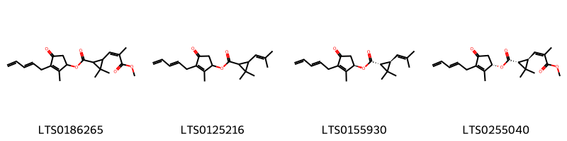{ width=100% }
    <figcaption>Hình ảnh cấu trúc hóa học của 4 hoạt chất thuộc nhóm Fatty Acyls gồm ['pyrethrin ii (LTS0186265)', 'pyrethrin i (LTS0125216)', '(1r)-2-methyl-4-oxo-3-[(2e)-penta-2,4-dien-1-yl]cyclopent-2-en-1-yl (1r,3r)-2,2-dimethyl-3-(2-methylprop-1-en-1-yl)cyclopropane-1-carboxylate (LTS0155930)', '(1s)-2-methyl-4-oxo-3-[(2e)-penta-2,4-dien-1-yl]cyclopent-2-en-1-yl (1r,3r)-3-[(1z)-3-methoxy-2-methyl-3-oxoprop-1-en-1-yl]-2,2-dimethylcyclopropane-1-carboxylate (LTS0255040)'].</figcaption>
</figure>
#### Nhóm Prenol lipids
<figure markdown="span">
    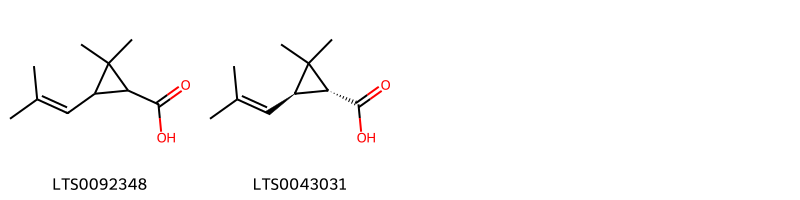{ width=100% }
    <figcaption>Hình ảnh cấu trúc hóa học của 2 hoạt chất thuộc nhóm Prenol lipids gồm ['chrysanthemic acid (LTS0092348)', '(+)-trans-chrysanthemic acid (LTS0043031)'].</figcaption>
</figure>

---

### Dược dân tộc học

Danh sách các quốc gia có sử dụng *Tanacetum cinerariifolium* trong điều trị các bệnh. 

| Country   | Disease     | Bệnh                                                                                                                                                                                                |
|:----------|:------------|:----------------------------------------------------------------------------------------------------------------------------------------------------------------------------------------------------|
| Elsewhere | Insecticide | MYMEMORY WARNING: YOU USED ALL AVAILABLE FREE TRANSLATIONS FOR TODAY. NEXT AVAILABLE IN  09 HOURS 43 MINUTES 41 SECONDS VISIT HTTPS://MYMEMORY.TRANSLATED.NET/DOC/USAGELIMITS.PHP TO TRANSLATE MORE |

---

---
## Chrysanthemum coccineum
### Thông tin về thực vật

!!! info "Phân loại thực vật của *Chrysanthemum coccineum* từ GIBF:"
    - **Kingdom:** Plantae
    - **Phylum:** Tracheophyta
    - **Order:** Asterales
    - **Family:** Asteraceae
    - **Genus:** Chrysanthemum
    - **Species:** *Chrysanthemum coccineum*

 

| Label (VI)   | Label (EN)   | Scientific Name         | Descriptions (VI)   | Descriptions (EN)   | Also Known As (VI)   | Also Known As (EN)   |
|:-------------|:-------------|:------------------------|:--------------------|:--------------------|:---------------------|:---------------------|
| N/A          | N/A          | Chrysanthemum coccineum | loài thực vật       | species of plant    | ['']                 | ['']                 |

#### Phân bố trên thế giới

**Từ CSDL GIBF** nan, Denmark, Japan, unknown or invalid, United States of America, Tanzania, United Republic of

#### Phân bố tại Việt Nam

**Từ CSDL GIBF**: Không có ghi nhận ở Việt Nam

---
### Thành phần hóa học
        
- Theo cơ sở dữ liệu lotus: Từ loài *Chrysanthemum coccineum* đã phân lập và xác định được 10 hoạt chất thuộc về các nhóm Fatty Acyls, Bi- and oligothiophenes. 

|    | chemicalTaxonomyClassyfireClass   |   smiles_count |
|---:|:----------------------------------|---------------:|
|  0 | Bi- and oligothiophenes           |              1 |
|  1 | Fatty Acyls                       |              9 |

#### Nhóm Bi- and oligothiophenes
<figure markdown="span">
    { width=100% }
    <figcaption>Hình ảnh cấu trúc hóa học của 1 hoạt chất thuộc nhóm Bi- and oligothiophenes gồm ['terthiophene (LTS0246627)'].</figcaption>
</figure>
#### Nhóm Fatty Acyls
<figure markdown="span">
    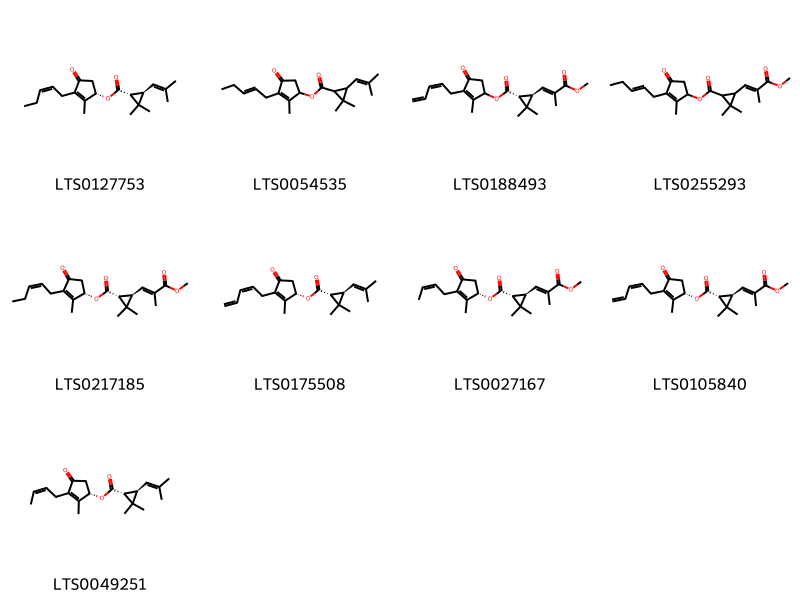{ width=100% }
    <figcaption>Hình ảnh cấu trúc hóa học của 9 hoạt chất thuộc nhóm Fatty Acyls gồm ['jasmolin i (LTS0127753)', 'jasmolin i (LTS0054535)', '2-methyl-4-oxo-3-[(2z)-penta-2,4-dien-1-yl]cyclopent-2-en-1-yl (1r,3r)-3-[(1e)-3-methoxy-2-methyl-3-oxoprop-1-en-1-yl]-2,2-dimethylcyclopropane-1-carboxylate (LTS0188493)', 'jasmolin ii (LTS0255293)', 'jasmolin ii (LTS0217185)', 'pyrethrin i (LTS0175508)', 'cinerin ii (LTS0027167)', 'pyrethrin ii (LTS0105840)', 'cinerin i (LTS0049251)'].</figcaption>
</figure>

---

### Dược dân tộc học

Danh sách các quốc gia có sử dụng *Chrysanthemum coccineum* trong điều trị các bệnh. 

| Country   | Disease     | Bệnh                                                                                                                                                                                                |
|:----------|:------------|:----------------------------------------------------------------------------------------------------------------------------------------------------------------------------------------------------|
| Elsewhere | Insecticide | MYMEMORY WARNING: YOU USED ALL AVAILABLE FREE TRANSLATIONS FOR TODAY. NEXT AVAILABLE IN  09 HOURS 43 MINUTES 15 SECONDS VISIT HTTPS://MYMEMORY.TRANSLATED.NET/DOC/USAGELIMITS.PHP TO TRANSLATE MORE |

---

---
## Chrysanthemum coronarium
### Thông tin về thực vật

!!! info "Phân loại thực vật của *Glebionis coronaria* từ GIBF:"
    - **Kingdom:** Plantae
    - **Phylum:** Tracheophyta
    - **Order:** Asterales
    - **Family:** Asteraceae
    - **Genus:** Glebionis
    - **Species:** *Glebionis coronaria*

 

| Label (VI)   | Label (EN)   | Scientific Name          | Descriptions (VI)   | Descriptions (EN)   | Also Known As (VI)   | Also Known As (EN)   |
|:-------------|:-------------|:-------------------------|:--------------------|:--------------------|:---------------------|:---------------------|
| N/A          | N/A          | Chrysanthemum coronarium |                     | species of plant    | ['']                 | ['']                 |

#### Phân bố trên thế giới

**Từ CSDL GIBF** nan, Italy, Belgium, Gibraltar, Norway, Israel, Cyprus, Korea, Republic of, Spain, Türkiye, Portugal, United States of America, Chile, Greece, Germany, Austria, France, China, Lebanon, Poland, New Zealand

#### Phân bố tại Việt Nam

**Từ CSDL GIBF**: Không có ghi nhận ở Việt Nam

---
### Thành phần hóa học
        
- Theo cơ sở dữ liệu lotus: Từ loài *Glebionis coronaria* đã phân lập và xác định được Chưa có hoạt chất nào được phân lập. hoạt chất thuộc về các nhóm Không có hoạt chất nào được phân lập. 

Không có hình ảnh nào được tạo ra

---

### Dược dân tộc học

Danh sách các quốc gia có sử dụng *Glebionis coronaria* trong điều trị các bệnh. 

| Country   | Disease                         | Bệnh                                                                                                                                                                                                |
|:----------|:--------------------------------|:----------------------------------------------------------------------------------------------------------------------------------------------------------------------------------------------------|
| China     | Digestive, Intoxicant, Sedative | MYMEMORY WARNING: YOU USED ALL AVAILABLE FREE TRANSLATIONS FOR TODAY. NEXT AVAILABLE IN  09 HOURS 42 MINUTES 53 SECONDS VISIT HTTPS://MYMEMORY.TRANSLATED.NET/DOC/USAGELIMITS.PHP TO TRANSLATE MORE |
| Elsewhere | Purgative, Stomachic            | MYMEMORY WARNING: YOU USED ALL AVAILABLE FREE TRANSLATIONS FOR TODAY. NEXT AVAILABLE IN  09 HOURS 42 MINUTES 50 SECONDS VISIT HTTPS://MYMEMORY.TRANSLATED.NET/DOC/USAGELIMITS.PHP TO TRANSLATE MORE |

---

---
## Chrysanthemum indicum
### Thông tin về thực vật

!!! info "Phân loại thực vật của *Chrysanthemum indicum* từ GIBF:"
    - **Kingdom:** Plantae
    - **Phylum:** Tracheophyta
    - **Order:** Asterales
    - **Family:** Asteraceae
    - **Genus:** Chrysanthemum
    - **Species:** *Chrysanthemum indicum*

 

| Label (VI)   | Label (EN)   | Scientific Name       | Descriptions (VI)   | Descriptions (EN)   | Also Known As (VI)   | Also Known As (EN)       |
|:-------------|:-------------|:----------------------|:--------------------|:--------------------|:---------------------|:-------------------------|
| N/A          | N/A          | Chrysanthemum indicum | loài thực vật       | species of plant    | ['']                 | ['Indian chrysanthemum'] |

#### Phân bố trên thế giới

**Từ CSDL GIBF** Ukraine, Bulgaria, Hong Kong, Italy, Japan, Germany, Korea, Republic of, Chinese Taipei, New Zealand, Macao, Spain, Portugal, India, Switzerland, France, Viet Nam, China

#### Phân bố tại Việt Nam

**Từ CSDL GIBF**: Không có ghi nhận ở Việt Nam

---
### Thành phần hóa học
        
- Theo cơ sở dữ liệu lotus: Từ loài *Chrysanthemum indicum* đã phân lập và xác định được 152 hoạt chất thuộc về các nhóm Fatty Acyls, Flavonoids, Prenol lipids, Tetrahydrofurans, Benzene and substituted derivatives, Unsaturated hydrocarbons, Polycyclic hydrocarbons, Organooxygen compounds, Saturated hydrocarbons, Allyl-type 1,3-dipolar organic compounds, Furanoid lignans, Carboxylic acids and derivatives. 

|    | chemicalTaxonomyClassyfireClass          |   smiles_count |
|---:|:-----------------------------------------|---------------:|
|  0 | Allyl-type 1,3-dipolar organic compounds |              1 |
|  1 | Benzene and substituted derivatives      |              6 |
|  2 | Carboxylic acids and derivatives         |              1 |
|  3 | Fatty Acyls                              |              4 |
|  4 | Flavonoids                               |             25 |
|  5 | Furanoid lignans                         |              1 |
|  6 | Organooxygen compounds                   |             15 |
|  7 | Polycyclic hydrocarbons                  |              2 |
|  8 | Prenol lipids                            |             88 |
|  9 | Saturated hydrocarbons                   |              3 |
| 10 | Tetrahydrofurans                         |              1 |
| 11 | Unsaturated hydrocarbons                 |              2 |

#### Nhóm Allyl-type 1_3-dipolar organic compounds
<figure markdown="span">
    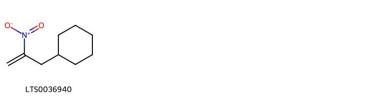{ width=100% }
    <figcaption>Hình ảnh cấu trúc hóa học của Không tìm thấy chú thích hoạt chất thuộc nhóm Allyl-type 1_3-dipolar organic compounds gồm Không tìm thấy chú thích.</figcaption>
</figure>
#### Nhóm Benzene and substituted derivatives
<figure markdown="span">
    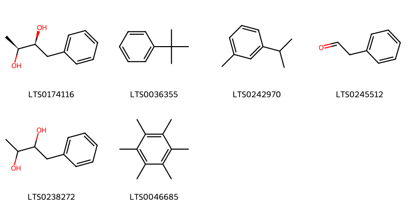{ width=100% }
    <figcaption>Hình ảnh cấu trúc hóa học của 6 hoạt chất thuộc nhóm Benzene and substituted derivatives gồm ['(2s,3s)-1-phenylbutane-2,3-diol (LTS0174116)', 't-butylbenzene (LTS0036355)', 'm-cymene (LTS0242970)', 'phenylacetaldehyde (LTS0245512)', '1-phenylbutane-2,3-diol (LTS0238272)', 'hexamethylbenzene (LTS0046685)'].</figcaption>
</figure>
#### Nhóm Carboxylic acids and derivatives
<figure markdown="span">
    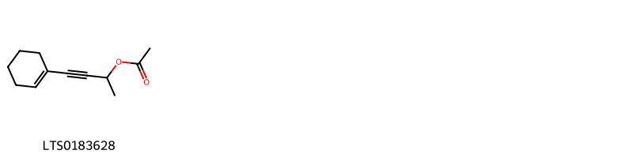{ width=100% }
    <figcaption>Hình ảnh cấu trúc hóa học của 1 hoạt chất thuộc nhóm Carboxylic acids and derivatives gồm ['4-(cyclohex-1-en-1-yl)but-3-yn-2-yl acetate (LTS0183628)'].</figcaption>
</figure>
#### Nhóm Fatty Acyls
<figure markdown="span">
    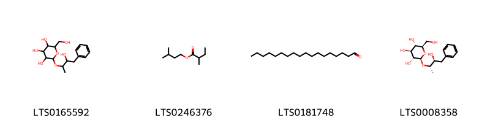{ width=100% }
    <figcaption>Hình ảnh cấu trúc hóa học của 4 hoạt chất thuộc nhóm Fatty Acyls gồm ['2-[(3-hydroxy-4-phenylbutan-2-yl)oxy]-6-(hydroxymethyl)oxane-3,4,5-triol (LTS0165592)', 'isoamyl 2-methylbutyrate (LTS0246376)', 'octadecanal (LTS0181748)', '(2r,3r,4s,5s,6r)-2-{[(2s,3s)-3-hydroxy-4-phenylbutan-2-yl]oxy}-6-(hydroxymethyl)oxane-3,4,5-triol (LTS0008358)'].</figcaption>
</figure>
#### Nhóm Flavonoids
<figure markdown="span">
    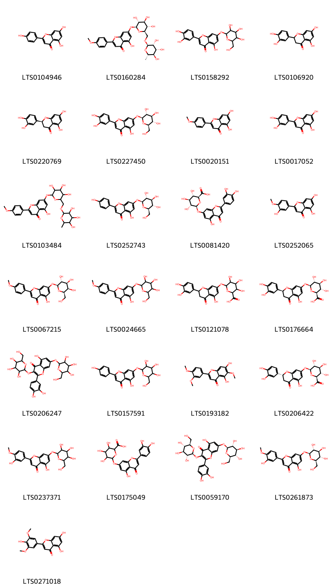{ width=100% }
    <figcaption>Hình ảnh cấu trúc hóa học của 25 hoạt chất thuộc nhóm Flavonoids gồm ['chamomile (LTS0104946)', 'linarin (LTS0160284)', '2-(3,4-dihydroxyphenyl)-5-hydroxy-7-{[3,4,5-trihydroxy-6-(hydroxymethyl)oxan-2-yl]oxy}chromen-4-one (LTS0158292)', '(+/-)-eriodictyol (LTS0106920)', 'eriodictyol (LTS0220769)', 'luteolin 7-o-glucoside (LTS0227450)', 'acacetin (LTS0020151)', 'luteolin (LTS0017052)', '5-hydroxy-2-(4-methoxyphenyl)-7-[(3,4,5-trihydroxy-6-{[(3,4,5-trihydroxy-6-methyloxan-2-yl)oxy]methyl}oxan-2-yl)oxy]chromen-4-one (LTS0103484)', 'apigenin 7-o-β-glucoside (LTS0252743)', 'luteolin 7-o-glucuronide (LTS0081420)', 'diosmetin (LTS0252065)', '5-hydroxy-2-(4-methoxyphenyl)-7-{[(2s,3r,4s,5r,6r)-3,4,5-trihydroxy-6-(hydroxymethyl)oxan-2-yl]oxy}chromen-4-one (LTS0067215)', '5-hydroxy-2-(4-methoxyphenyl)-7-{[3,4,5-trihydroxy-6-(hydroxymethyl)oxan-2-yl]oxy}chromen-4-one (LTS0024665)', 'eriodictyol 7-glucuronide (LTS0121078)', '(2s,3s,4s,5r,6s)-6-{[(2s)-2-(3,4-dihydroxyphenyl)-5-hydroxy-4-oxo-2,3-dihydro-1-benzopyran-7-yl]oxy}-3,4,5-trihydroxyoxane-2-carboxylic acid (LTS0176664)', '2-(3,4-dihydroxyphenyl)-5-hydroxy-3,7-bis({[3,4,5-trihydroxy-6-(hydroxymethyl)oxan-2-yl]oxy})chromen-4-one (LTS0206247)', 'apigetrin (LTS0157591)', 'eupatilin (LTS0193182)', '(2s,3s,4s,5r,6s)-6-{[(2r)-2-(3,4-dihydroxyphenyl)-5-hydroxy-4-oxo-2,3-dihydro-1-benzopyran-7-yl]oxy}-3,4,5-trihydroxyoxane-2-carboxylic acid (LTS0206422)', '5-hydroxy-2-(3-hydroxy-4-methoxyphenyl)-7-{[3,4,5-trihydroxy-6-(hydroxymethyl)oxan-2-yl]oxy}chromen-4-one (LTS0237371)', '6-{[2-(3,4-dihydroxyphenyl)-5-hydroxy-4-oxochromen-7-yl]oxy}-3,4,5-trihydroxyoxane-2-carboxylic acid (LTS0175049)', 'quercetin 3,7-diglucoside (LTS0059170)', '5-hydroxy-2-(3-hydroxy-4-methoxyphenyl)-7-{[(2s,3r,4s,5s,6r)-3,4,5-trihydroxy-6-(hydroxymethyl)oxan-2-yl]oxy}chromen-4-one (LTS0261873)', 'tricin (LTS0271018)'].</figcaption>
</figure>
#### Nhóm Furanoid lignans
<figure markdown="span">
    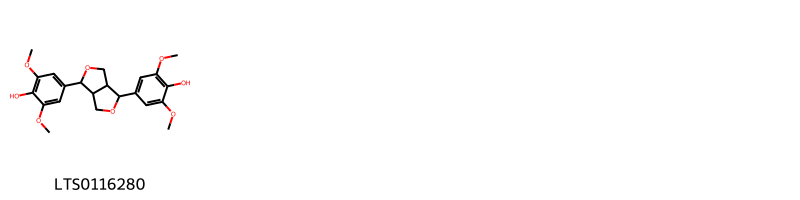{ width=100% }
    <figcaption>Hình ảnh cấu trúc hóa học của 1 hoạt chất thuộc nhóm Furanoid lignans gồm ['syringaresinol (LTS0116280)'].</figcaption>
</figure>
#### Nhóm Organooxygen compounds
<figure markdown="span">
    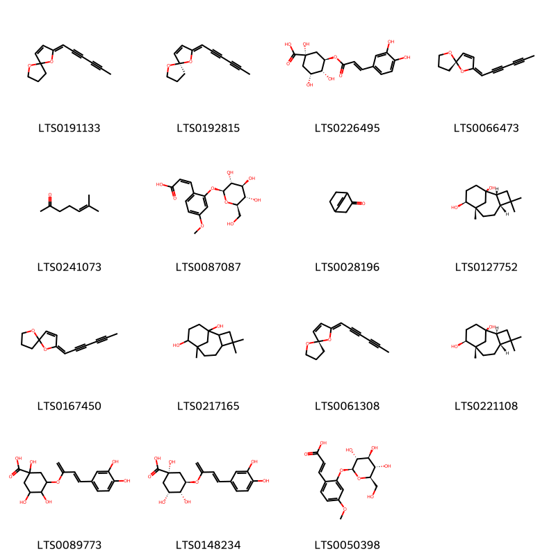{ width=100% }
    <figcaption>Hình ảnh cấu trúc hóa học của 15 hoạt chất thuộc nhóm Organooxygen compounds gồm ['2-(hexa-2,4-diyn-1-ylidene)-1,6-dioxaspiro[4.4]non-3-ene (LTS0191133)', '(2z,5r)-2-(hexa-2,4-diyn-1-ylidene)-1,6-dioxaspiro[4.4]non-3-ene (LTS0192815)', 'chlorogenic acid (LTS0226495)', '(2e,5s)-2-(hexa-2,4-diyn-1-ylidene)-1,6-dioxaspiro[4.4]non-3-ene (LTS0066473)', '6-methyl-5-hepten-2-one (LTS0241073)', '(2z)-3-(4-methoxy-2-{[(2s,3r,4s,5s,6r)-3,4,5-trihydroxy-6-(hydroxymethyl)oxan-2-yl]oxy}phenyl)prop-2-enoic acid (LTS0087087)', 'bicyclo[2.2.2]oct-5-en-2-one (LTS0028196)', '(1r,2r,5r,8s,9s)-4,4,8-trimethyltricyclo[6.3.1.0²,⁵]dodecane-1,9-diol (LTS0127752)', '(e)-tonghaosu (LTS0167450)', '4,4,8-trimethyltricyclo[6.3.1.0²,⁵]dodecane-1,9-diol (LTS0217165)', '(2z,5s)-2-(hexa-2,4-diyn-1-ylidene)-1,6-dioxaspiro[4.4]non-3-ene (LTS0061308)', '(1r,2s,5r,8s,9s)-4,4,8-trimethyltricyclo[6.3.1.0²,⁵]dodecane-1,9-diol (LTS0221108)', '3-{[4-(3,4-dihydroxyphenyl)buta-1,3-dien-2-yl]oxy}-1,4,5-trihydroxycyclohexane-1-carboxylic acid (LTS0089773)', '(1s,3r,4r,5r)-3-{[(3e)-4-(3,4-dihydroxyphenyl)buta-1,3-dien-2-yl]oxy}-1,4,5-trihydroxycyclohexane-1-carboxylic acid (LTS0148234)', '(2e)-3-(4-methoxy-2-{[(2s,3r,4s,5s,6r)-3,4,5-trihydroxy-6-(hydroxymethyl)oxan-2-yl]oxy}phenyl)prop-2-enoic acid (LTS0050398)'].</figcaption>
</figure>
#### Nhóm Polycyclic hydrocarbons
<figure markdown="span">
    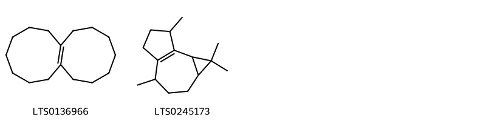{ width=100% }
    <figcaption>Hình ảnh cấu trúc hóa học của 2 hoạt chất thuộc nhóm Polycyclic hydrocarbons gồm ['1,2,3,4,5,6,7,8,9,10,11,12,13,14-tetradecahydrononalene (LTS0136966)', '1,1,4,7-tetramethyl-1ah,2h,3h,4h,5h,6h,7h,7bh-cyclopropa[e]azulene (LTS0245173)'].</figcaption>
</figure>
#### Nhóm Prenol lipids
<figure markdown="span">
    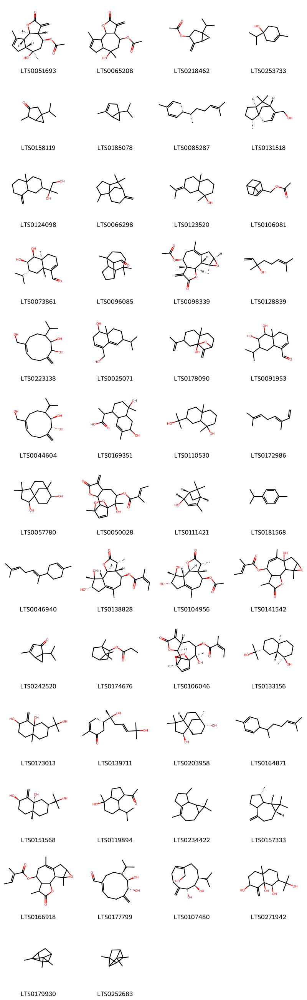{ width=100% }
    <figcaption>Hình ảnh cấu trúc hóa học của 88 hoạt chất thuộc nhóm Prenol lipids gồm ['(3ar,4s,6r,6ar,9ar,9br)-6-hydroxy-6,9-dimethyl-3-methylidene-2-oxo-3ah,4h,5h,6ah,7h,9ah,9bh-azuleno[4,5-b]furan-4-yl acetate (LTS0051693)', '6-hydroxy-6,9-dimethyl-3-methylidene-2-oxo-3ah,4h,5h,6ah,7h,9ah,9bh-azuleno[4,5-b]furan-4-yl acetate (LTS0065208)', '1-isopropyl-4-methylidenebicyclo[3.1.0]hexan-3-yl acetate (LTS0218462)', '4-terpineol (LTS0253733)', '3-isothujone (LTS0158119)', 'α-thujene (LTS0185078)', 'zingiberene (LTS0085287)', '[(1s,2r,5s,7r)-2,6,6-trimethyltricyclo[5.3.1.0¹,⁵]undec-8-en-8-yl]methanol (LTS0131518)', '2-(4a-methyl-8-methylidene-octahydronaphthalen-2-yl)propane-1,2-diol (LTS0124098)', '2,6,6-trimethyl-8-methylidenetricyclo[5.3.1.0¹,⁵]undecane (LTS0066298)', '1,4a-dimethyl-7-(propan-2-ylidene)-hexahydro-2h-naphthalen-1-ol (LTS0123520)', 'myrtenyl acetate (LTS0106081)', '(4as,5s,6r,7r,8ar)-5,6-dihydroxy-7-isopropyl-4a-methyl-4,5,6,7,8,8a-hexahydro-3h-naphthalene-1-carbaldehyde (LTS0073861)', '3,3,7-trimethyltricyclo[5.4.0.0²,⁹]undecane-8-carbaldehyde (LTS0096085)', 'arteglasin a (LTS0098339)', 'linalool, (+-)- (LTS0128839)', '6-(hydroxymethyl)-3-isopropyl-10-methylidenecyclodec-6-ene-1,2-diol (LTS0223138)', '4-(hydroxymethyl)-6-isopropyl-8a-methyl-2,6,7,8-tetrahydro-1h-naphthalen-1-ol (LTS0025071)', 'chrysantherol (LTS0178090)', '5,6-dihydroxy-7-isopropyl-4a-methyl-4,5,6,7,8,8a-hexahydro-3h-naphthalene-1-carbaldehyde (LTS0091953)', 'kikkanol d (LTS0044604)', '2-(4,6-dihydroxy-4,7-dimethyl-2,3,4a,5,6,8a-hexahydro-1h-naphthalen-1-yl)propanoic acid (LTS0169351)', '7-(2-hydroxypropan-2-yl)-1,4a-dimethyl-octahydronaphthalen-1-ol (LTS0110530)', '3,7-dimethyl-1,3,6-octatriene (LTS0172986)', '4,4,8-trimethyltricyclo[6.3.1.0¹,⁵]dodecane-2,9-diol (LTS0057780)', '2-hydroxy-2,11-dimethyl-6-methylidene-7-oxo-8,12,13-trioxatetracyclo[9.2.2.0¹,¹⁰.0⁵,⁹]pentadec-14-en-3-yl 2-methylbut-2-enoate (LTS0050028)', '(s)-cis-verbenol (LTS0111421)', 'cymene (LTS0181568)', '(e)-α-bisabolene (LTS0046940)', '(3r,3ar,4s,8s,9r,9as,9bs)-8,9-dihydroxy-3,6,9-trimethyl-2-oxo-3h,3ah,4h,5h,7h,8h,9ah,9bh-azuleno[4,5-b]furan-4-yl (2z)-2-methylbut-2-enoate (LTS0138828)', '(3r,3ar,4s,8s,9r,9as,9bs)-8,9-dihydroxy-3,6,9-trimethyl-2-oxo-3h,3ah,4h,5h,7h,8h,9ah,9bh-azuleno[4,5-b]furan-4-yl acetate (LTS0104956)', '10-hydroxy-5,9,14-trimethyl-4-oxo-3,13-dioxatetracyclo[8.4.0.0²,⁶.0¹²,¹⁴]tetradec-8-en-7-yl 2-methylbut-2-enoate (LTS0141542)', 'umbellulone (LTS0242520)', 'isobornyl propionate (LTS0174676)', '(1s,2r,3r,5s,9s,10s,11r)-2-hydroxy-2,11-dimethyl-6-methylidene-7-oxo-8,12,13-trioxatetracyclo[9.2.2.0¹,¹⁰.0⁵,⁹]pentadec-14-en-3-yl (2z)-2-methylbut-2-enoate (LTS0106046)', 'proximadiol (LTS0133156)', '7-(2-hydroxypropan-2-yl)-4a-methyl-1-methylidene-hexahydro-2h-naphthalene-2,8a-diol (LTS0173013)', 'indicumenone (LTS0139711)', 'clovanediol (LTS0203958)', '2-methyl-5-(6-methylhept-5-en-2-yl)cyclohexa-1,3-diene (LTS0164871)', '(2r,4ar,7s,8ar)-7-(2-hydroxypropan-2-yl)-4a-methyl-1-methylidene-hexahydro-2h-naphthalene-2,8a-diol (LTS0151568)', '1-(4-hydroxy-7-isopropyl-4-methyl-octahydroinden-1-yl)ethanone (LTS0119894)', '1,1,4,7-tetramethyl-1ah,2h,3h,5h,6h,7h,7ah,7bh-cyclopropa[e]azulene (LTS0234422)', '(1ar,7s,7bs)-1,1,7-trimethyl-4-methylidene-octahydro-1ah-cyclopropa[e]azulene (LTS0157333)', '5,9,14-trimethyl-4-oxo-3,13-dioxatetracyclo[8.4.0.0²,⁶.0¹²,¹⁴]tetradec-9-en-7-yl 2-methylbut-2-enoate (LTS0166918)', 'kikkanol e (LTS0177799)', 'kikkanol f (LTS0107480)', '2-(2-hydroxypropan-2-yl)-4a-methyl-8-methylidene-hexahydro-1h-naphthalene-1,7,8a-triol (LTS0271942)', 'tricyclene (LTS0179930)', '1,3,3-trimethyltricyclo[2.2.1.0²,⁶]heptane (LTS0252683)', '8,9-dihydroxy-3,6,9-trimethyl-2-oxo-3h,3ah,4h,5h,7h,8h,9ah,9bh-azuleno[4,5-b]furan-4-yl 2-methylbut-2-enoate (LTS0184066)', 'α-bisabolol (LTS0250984)', '1-[(1s,3ar,4r,7s,7as)-4-hydroxy-7-isopropyl-4-methyl-octahydroinden-1-yl]ethanone (LTS0258092)', '(-)-α-curcumene (LTS0216936)', '(1r,2r,4as,7s,8as)-2-(2-hydroxypropan-2-yl)-4a-methyl-8-methylidene-hexahydro-1h-naphthalene-1,7,8a-triol (LTS0050012)', '6,7-dihydroxy-8-isopropyl-5-methylidenecyclodec-1-ene-1-carbaldehyde (LTS0272785)', '(6,7-dihydroxy-8-isopropyl-5-methylidenecyclodec-1-en-1-yl)methyl acetate (LTS0222184)', 'verbenone (LTS0264577)', 'kikkanol b (LTS0064169)', 'bornyl acetate (LTS0060565)', '1-isopropyl-4-methylbicyclo[3.1.0]hex-3-en-2-ol (LTS0217646)', '2-[(5r)-6,10-dimethylspiro[4.5]dec-6-en-2-yl]propan-2-ol (LTS0220783)', '(1s,2r,3r,5s,9s,10s,11r)-2-hydroxy-2,11-dimethyl-6-methylidene-7-oxo-8,12,13-trioxatetracyclo[9.2.2.0¹,¹⁰.0⁵,⁹]pentadec-14-en-3-yl acetate (LTS0100237)', 'kikkanol a (LTS0221193)', 'kikkanol c (LTS0152811)', '6-isopropyl-8a-methyl-4-methylidene-hexahydro-1h-naphthalene-1,4a,5-triol (LTS0051728)', 'thymol (LTS0168527)', '1-isopropyl-4-methylbicyclo[3.1.0]hexan-3-ol (LTS0051406)', '(1s,2s,5s,6r,7s,12r,14s)-5,9,14-trimethyl-4-oxo-3,13-dioxatetracyclo[8.4.0.0²,⁶.0¹²,¹⁴]tetradec-9-en-7-yl (2z)-2-methylbut-2-enoate (LTS0068312)', '6,10,14-trimethylpentadecan-2-one (LTS0258077)', '4,7,7-trimethylbicyclo[4.1.0]hept-2-ene (LTS0156738)', 'curcumene (LTS0190074)', 'nerolidol isomers (LTS0007569)', '(e,z)-α-farnesene (LTS0061525)', '(2s)-2-[(1s,4s,4as,6r,8as)-4,6-dihydroxy-4,7-dimethyl-2,3,4a,5,6,8a-hexahydro-1h-naphthalen-1-yl]propanoic acid (LTS0256045)', '[(1e,6r,7r,8s)-6,7-dihydroxy-8-isopropyl-5-methylidenecyclodec-1-en-1-yl]methyl acetate (LTS0064054)', 'terpinene (LTS0136858)', '(1r,2s,5s,6r,7s,10s,12r,14s)-10-hydroxy-5,9,14-trimethyl-4-oxo-3,13-dioxatetracyclo[8.4.0.0²,⁶.0¹²,¹⁴]tetradec-8-en-7-yl (2z)-2-methylbut-2-enoate (LTS0014104)', 'chrysanthenone (LTS0001245)', '(2r)-2-[(2r,4ar,8as)-4a-methyl-8-methylidene-octahydronaphthalen-2-yl]propane-1,2-diol (LTS0019600)', 'cedrene (LTS0023956)', '[(1z,6r,7r,8s)-6,7-dihydroxy-8-isopropyl-5-methylidenecyclodec-1-en-1-yl]methyl acetate (LTS0235997)', 'cuminol (LTS0021403)', '8,9-dihydroxy-3,6,9-trimethyl-2-oxo-3h,3ah,4h,5h,7h,8h,9ah,9bh-azuleno[4,5-b]furan-4-yl acetate (LTS0001798)', 'sabinene hydrate (LTS0236165)', '2-hydroxy-2,11-dimethyl-6-methylidene-7-oxo-8,12,13-trioxatetracyclo[9.2.2.0¹,¹⁰.0⁵,⁹]pentadec-14-en-3-yl acetate (LTS0091949)', '(1s,2s,5s,6r,7s,12r,14s)-5,9,14-trimethyl-4-oxo-3,13-dioxatetracyclo[8.4.0.0²,⁶.0¹²,¹⁴]tetradec-9-en-7-yl (2e)-2-methylbut-2-enoate (LTS0049425)', '4-isopropyl-6-methyl-1-methylidene-3,4,4a,7,8,8a-hexahydro-2h-naphthalene (LTS0111070)'].</figcaption>
</figure>
#### Nhóm Saturated hydrocarbons
<figure markdown="span">
    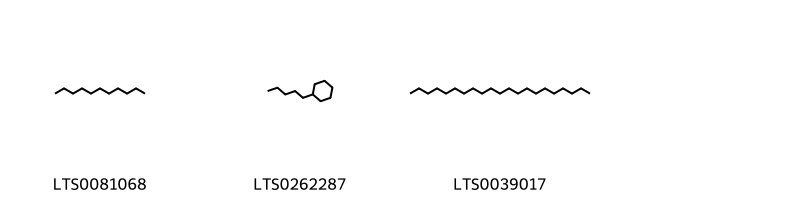{ width=100% }
    <figcaption>Hình ảnh cấu trúc hóa học của 3 hoạt chất thuộc nhóm Saturated hydrocarbons gồm ['undecane (LTS0081068)', 'pentylcyclohexane (LTS0262287)', 'heneicosane (LTS0039017)'].</figcaption>
</figure>
#### Nhóm Tetrahydrofurans
<figure markdown="span">
    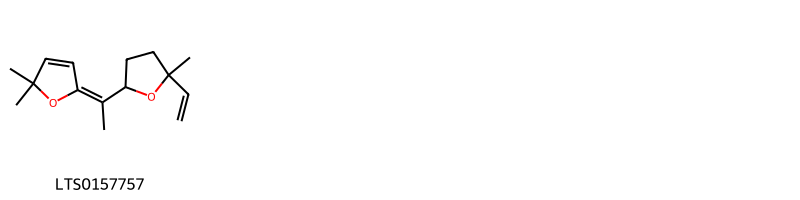{ width=100% }
    <figcaption>Hình ảnh cấu trúc hóa học của 1 hoạt chất thuộc nhóm Tetrahydrofurans gồm ['(5e)-5-[1-(5-ethenyl-5-methyloxolan-2-yl)ethylidene]-2,2-dimethylfuran (LTS0157757)'].</figcaption>
</figure>
#### Nhóm Unsaturated hydrocarbons
<figure markdown="span">
    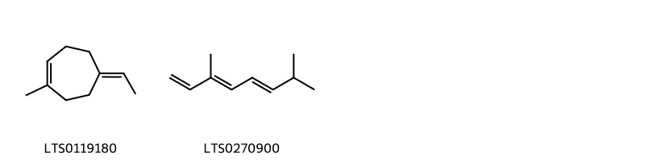{ width=100% }
    <figcaption>Hình ảnh cấu trúc hóa học của 2 hoạt chất thuộc nhóm Unsaturated hydrocarbons gồm ['5-ethylidene-1-methylcyclohept-1-ene (LTS0119180)', '(3e,5e)-3,7-dimethylocta-1,3,5-triene (LTS0270900)'].</figcaption>
</figure>

---

### Dược dân tộc học

Danh sách các quốc gia có sử dụng *Chrysanthemum indicum* trong điều trị các bệnh. 

| Country    | Disease                                                                             | Bệnh                                                                                                                                                                                                |
|:-----------|:------------------------------------------------------------------------------------|:----------------------------------------------------------------------------------------------------------------------------------------------------------------------------------------------------|
| China      | Alexiteric, Antiphlogistic, nan, Digestive, Insecticide, Sedative, Tonic, Vermifuge | MYMEMORY WARNING: YOU USED ALL AVAILABLE FREE TRANSLATIONS FOR TODAY. NEXT AVAILABLE IN  09 HOURS 42 MINUTES 24 SECONDS VISIT HTTPS://MYMEMORY.TRANSLATED.NET/DOC/USAGELIMITS.PHP TO TRANSLATE MORE |
| Elsewhere  | Stomachic, Aperient                                                                 | MYMEMORY WARNING: YOU USED ALL AVAILABLE FREE TRANSLATIONS FOR TODAY. NEXT AVAILABLE IN  09 HOURS 42 MINUTES 21 SECONDS VISIT HTTPS://MYMEMORY.TRANSLATED.NET/DOC/USAGELIMITS.PHP TO TRANSLATE MORE |
| Portuguese | Collyrium                                                                           | MYMEMORY WARNING: YOU USED ALL AVAILABLE FREE TRANSLATIONS FOR TODAY. NEXT AVAILABLE IN  09 HOURS 42 MINUTES 19 SECONDS VISIT HTTPS://MYMEMORY.TRANSLATED.NET/DOC/USAGELIMITS.PHP TO TRANSLATE MORE |

---

---
## Chrysanthemum leucanthemum
### Thông tin về thực vật

!!! info "Phân loại thực vật của *Leucanthemum vulgare* từ GIBF:"
    - **Kingdom:** Plantae
    - **Phylum:** Tracheophyta
    - **Order:** Asterales
    - **Family:** Asteraceae
    - **Genus:** Leucanthemum
    - **Species:** *Leucanthemum vulgare*

 

| Label (VI)   | Label (EN)   | Scientific Name            | Descriptions (VI)   | Descriptions (EN)   | Also Known As (VI)   | Also Known As (EN)   |
|:-------------|:-------------|:---------------------------|:--------------------|:--------------------|:---------------------|:---------------------|
| N/A          | N/A          | Chrysanthemum leucanthemum | loài thực vật       | species of plant    | ['']                 | ['']                 |

#### Phân bố trên thế giới

**Từ CSDL GIBF** nan, Pakistan, Chile, Japan, Germany, Czechia, Korea, Republic of, Belgium, Brazil, Poland, United States of America, Austria, France, Mexico, New Zealand, Canada

#### Phân bố tại Việt Nam

**Từ CSDL GIBF**: Không có ghi nhận ở Việt Nam

---
### Thành phần hóa học
        
- Theo cơ sở dữ liệu lotus: Từ loài *Leucanthemum vulgare* đã phân lập và xác định được Chưa có hoạt chất nào được phân lập. hoạt chất thuộc về các nhóm Không có hoạt chất nào được phân lập. 

Không có hình ảnh nào được tạo ra

---

### Dược dân tộc học

Danh sách các quốc gia có sử dụng *Leucanthemum vulgare* trong điều trị các bệnh. 

| Country   | Disease                                          | Bệnh                                                                                                                                                                                                |
|:----------|:-------------------------------------------------|:----------------------------------------------------------------------------------------------------------------------------------------------------------------------------------------------------|
| Turkey    | Astringent, Diuretic, Emetic, Emmenagogue, Tonic | MYMEMORY WARNING: YOU USED ALL AVAILABLE FREE TRANSLATIONS FOR TODAY. NEXT AVAILABLE IN  09 HOURS 41 MINUTES 31 SECONDS VISIT HTTPS://MYMEMORY.TRANSLATED.NET/DOC/USAGELIMITS.PHP TO TRANSLATE MORE |

---

---
## Chrysanthemum morifolium
### Thông tin về thực vật

!!! info "Phân loại thực vật của *Chrysanthemum morifolium* từ GIBF:"
    - **Kingdom:** Plantae
    - **Phylum:** Tracheophyta
    - **Order:** Asterales
    - **Family:** Asteraceae
    - **Genus:** Chrysanthemum
    - **Species:** *Chrysanthemum morifolium*

 

| Label (VI)   | Label (EN)   | Scientific Name          | Descriptions (VI)   | Descriptions (EN)   | Also Known As (VI)   | Also Known As (EN)             |
|:-------------|:-------------|:-------------------------|:--------------------|:--------------------|:---------------------|:-------------------------------|
| N/A          | N/A          | Chrysanthemum morifolium | loài thực vật       | species of plant    | ['']                 | ['Chrysanthemum × morifolium'] |

#### Phân bố trên thế giới

**Từ CSDL GIBF** nan, Japan, Venezuela (Bolivarian Republic of), Panama, Canada, Ukraine, Réunion, Belarus, Korea, Republic of, Chinese Taipei, Spain, Russian Federation, United States of America, Sweden, Finland, South Africa, Hong Kong, Czechia, Germany, Brazil, Egypt, Bhutan, Austria, Mexico, France, Peru, China, United Kingdom of Great Britain and Northern Ireland, India, Indonesia, Poland, New Zealand, Nepal

#### Phân bố tại Việt Nam

**Từ CSDL GIBF**: Không có ghi nhận ở Việt Nam

---
### Thành phần hóa học
        
- Theo cơ sở dữ liệu lotus: Từ loài *Chrysanthemum morifolium* đã phân lập và xác định được 144 hoạt chất thuộc về các nhóm Cinnamyl alcohols, Fatty Acyls, Flavonoids, Prenol lipids, Steroids and steroid derivatives, Indoles and derivatives, Cinnamic acids and derivatives, Benzene and substituted derivatives, Unsaturated hydrocarbons, Polycyclic hydrocarbons, Organooxygen compounds, Saturated hydrocarbons, Phenols, Carboxylic acids and derivatives. 

|    | chemicalTaxonomyClassyfireClass     |   smiles_count |
|---:|:------------------------------------|---------------:|
|  0 | Benzene and substituted derivatives |              7 |
|  1 | Carboxylic acids and derivatives    |              2 |
|  2 | Cinnamic acids and derivatives      |              6 |
|  3 | Cinnamyl alcohols                   |              1 |
|  4 | Fatty Acyls                         |              6 |
|  5 | Flavonoids                          |             46 |
|  6 | Indoles and derivatives             |              1 |
|  7 | Organooxygen compounds              |             15 |
|  8 | Phenols                             |              1 |
|  9 | Polycyclic hydrocarbons             |              1 |
| 10 | Prenol lipids                       |             43 |
| 11 | Saturated hydrocarbons              |              1 |
| 12 | Steroids and steroid derivatives    |              4 |
| 13 | Unsaturated hydrocarbons            |              4 |

#### Nhóm Benzene and substituted derivatives
<figure markdown="span">
    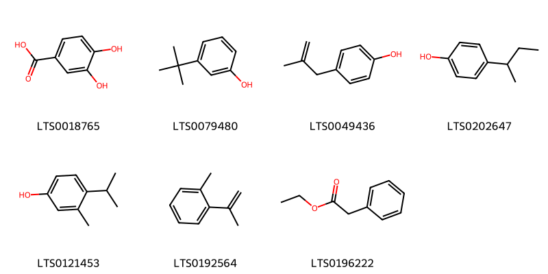{ width=100% }
    <figcaption>Hình ảnh cấu trúc hóa học của 7 hoạt chất thuộc nhóm Benzene and substituted derivatives gồm ['3,4-dihydroxybenzoic acid (LTS0018765)', '3-tert-butylphenol (LTS0079480)', '4-(2-methylprop-2-en-1-yl)phenol (LTS0049436)', '4-sec-butylphenol (LTS0202647)', 'o-cymen-5-ol (LTS0121453)', '1-methyl-2-ethenyl benzene (LTS0192564)', 'ethyl phenylacetate (LTS0196222)'].</figcaption>
</figure>
#### Nhóm Carboxylic acids and derivatives
<figure markdown="span">
    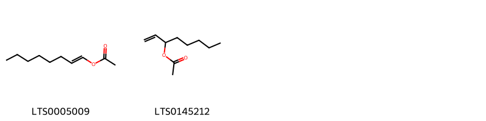{ width=100% }
    <figcaption>Hình ảnh cấu trúc hóa học của 2 hoạt chất thuộc nhóm Carboxylic acids and derivatives gồm ['oct-1-en-1-yl acetate (LTS0005009)', '1-octen-3-yl acetate (LTS0145212)'].</figcaption>
</figure>
#### Nhóm Cinnamic acids and derivatives
<figure markdown="span">
    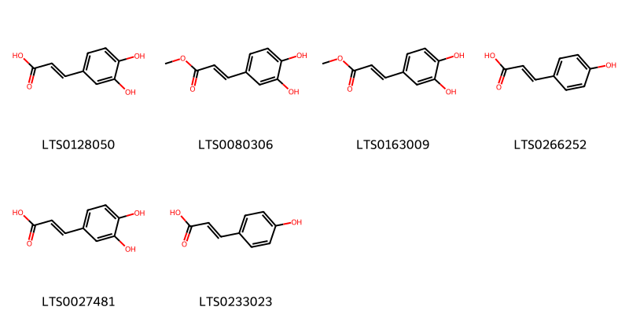{ width=100% }
    <figcaption>Hình ảnh cấu trúc hóa học của 6 hoạt chất thuộc nhóm Cinnamic acids and derivatives gồm ['3,4-dihydroxycinnamic acid (LTS0128050)', 'methyl 3-(3,4-dihydroxyphenyl)prop-2-enoate (LTS0080306)', 'methyl caffeate (LTS0163009)', 'para-coumaric acid (LTS0266252)', 'caffeic acid (LTS0027481)', 'hydroxycinnamic acid (LTS0233023)'].</figcaption>
</figure>
#### Nhóm Cinnamyl alcohols
<figure markdown="span">
    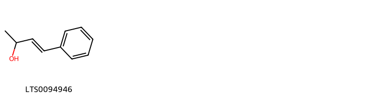{ width=100% }
    <figcaption>Hình ảnh cấu trúc hóa học của 1 hoạt chất thuộc nhóm Cinnamyl alcohols gồm ['4-phenylbut-3-en-2-ol (LTS0094946)'].</figcaption>
</figure>
#### Nhóm Fatty Acyls
<figure markdown="span">
    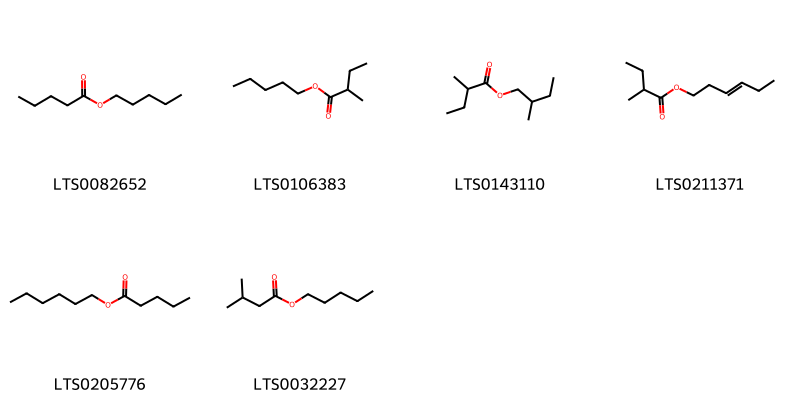{ width=100% }
    <figcaption>Hình ảnh cấu trúc hóa học của 6 hoạt chất thuộc nhóm Fatty Acyls gồm ['pentyl pentanoate (LTS0082652)', 'pentyl 2-methylbutanoate (LTS0106383)', '2-methylbutyl 2-methylbutyrate (LTS0143110)', 'hex-3-en-1-yl 2-methylbutanoate (LTS0211371)', 'hexyl methylbutyrate (LTS0205776)', 'amyl isovalerate (LTS0032227)'].</figcaption>
</figure>
#### Nhóm Flavonoids
<figure markdown="span">
    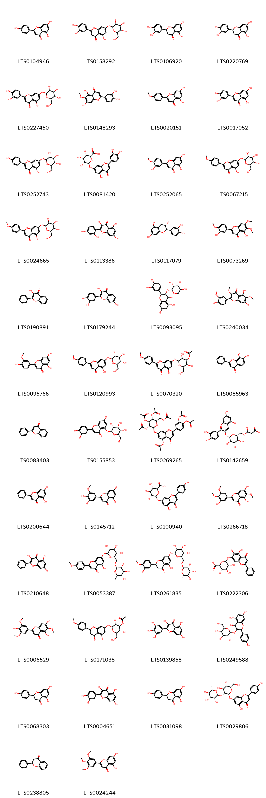{ width=100% }
    <figcaption>Hình ảnh cấu trúc hóa học của 46 hoạt chất thuộc nhóm Flavonoids gồm ['chamomile (LTS0104946)', '2-(3,4-dihydroxyphenyl)-5-hydroxy-7-{[3,4,5-trihydroxy-6-(hydroxymethyl)oxan-2-yl]oxy}chromen-4-one (LTS0158292)', '(+/-)-eriodictyol (LTS0106920)', 'eriodictyol (LTS0220769)', 'luteolin 7-o-glucoside (LTS0227450)', 'nepetin (LTS0148293)', 'acacetin (LTS0020151)', 'luteolin (LTS0017052)', 'apigenin 7-o-β-glucoside (LTS0252743)', 'luteolin 7-o-glucuronide (LTS0081420)', 'diosmetin (LTS0252065)', '5-hydroxy-2-(4-methoxyphenyl)-7-{[(2s,3r,4s,5r,6r)-3,4,5-trihydroxy-6-(hydroxymethyl)oxan-2-yl]oxy}chromen-4-one (LTS0067215)', '5-hydroxy-2-(4-methoxyphenyl)-7-{[3,4,5-trihydroxy-6-(hydroxymethyl)oxan-2-yl]oxy}chromen-4-one (LTS0024665)', 'bois d,arc (LTS0113386)', '(+)-catechol (LTS0117079)', 'eupatorin (LTS0073269)', 'flavonol (LTS0190891)', "3,7,3',4'-tetrahydroxyflavone (LTS0179244)", 'quercitrin (LTS0093095)', 'jaceidin (LTS0240034)', 'chrysoeriol (LTS0095766)', '5-hydroxy-2-(4-methoxyphenyl)-7-{[(2s,3r,4s,5s,6r)-3,4,5-trihydroxy-6-(hydroxymethyl)oxan-2-yl]oxy}chromen-4-one (LTS0120993)', '3,5-dihydroxy-2-{[5-hydroxy-2-(4-methoxyphenyl)-4-oxochromen-7-yl]oxy}-6-(hydroxymethyl)oxan-4-yl acetate (LTS0070320)', '7,8-dihydroxyflavone (LTS0085963)', 'flavone (LTS0083403)', '2-(3,4-dihydroxyphenyl)-7-hydroxy-5-{[(2s,3r,4s,5s,6r)-3,4,5-trihydroxy-6-(hydroxymethyl)oxan-2-yl]oxy}chromen-4-one (LTS0155853)', '[(2r,3r,4s,5r,6s)-3,4,5-tris(acetyloxy)-6-{[5-(acetyloxy)-2-[3,4-bis(acetyloxy)phenyl]-4-oxochromen-7-yl]oxy}oxan-2-yl]methyl acetate (LTS0269265)', '3-{[(2s,3r,4s,5s,6r)-6-{[(2-carboxyacetyl)oxy]methyl}-3,4,5-trihydroxyoxan-2-yl]oxy}-2-(3,4-dihydroxyphenyl)-5,7-dihydroxy-1λ⁴-chromen-1-ylium (LTS0142659)', 'chrysin (LTS0200644)', 'selgin (LTS0145712)', '(2s,3s,4s,5r,6s)-3,4,5-trihydroxy-6-{[5-hydroxy-2-(4-hydroxyphenyl)-4-oxochromen-7-yl]oxy}oxane-2-carboxylic acid (LTS0100940)', '5,7-dihydroxy-2-(3-hydroxy-4,5-dimethoxyphenyl)-6-methoxychromen-4-one (LTS0266718)', 'galangin (LTS0210648)', '5-hydroxy-2-(4-methoxyphenyl)-7-{[(2s,3r,4s,5s,6r)-3,4,5-trihydroxy-6-({[(2r,3s,4s,5s,6r)-3,4,5-trihydroxy-6-methyloxan-2-yl]oxy}methyl)oxan-2-yl]oxy}chromen-4-one (LTS0053387)', 'hesperidin (LTS0261835)', 'baicalin (LTS0222306)', '6-methoxytricin (LTS0006529)', '(2s,3r,4s,5r,6r)-3,5-dihydroxy-2-{[5-hydroxy-2-(4-methoxyphenyl)-4-oxochromen-7-yl]oxy}-6-(hydroxymethyl)oxan-4-yl acetate (LTS0171038)', 'myricetin (LTS0139858)', 'astragalin (LTS0249588)', 'asahina (LTS0068303)', 'quercetin (LTS0004651)', 'naringenin (LTS0031098)', 'rhoifolin (LTS0029806)', 'flavanone, (+-)- (LTS0238805)', "3',4',5'-o-trimethyltricetin (LTS0024244)"].</figcaption>
</figure>
#### Nhóm Indoles and derivatives
<figure markdown="span">
    { width=100% }
    <figcaption>Hình ảnh cấu trúc hóa học của 1 hoạt chất thuộc nhóm Indoles and derivatives gồm ['n-[2-(5-methoxy-1h-indol-3-yl)ethyl]ethanimidic acid (LTS0219322)'].</figcaption>
</figure>
#### Nhóm Organooxygen compounds
<figure markdown="span">
    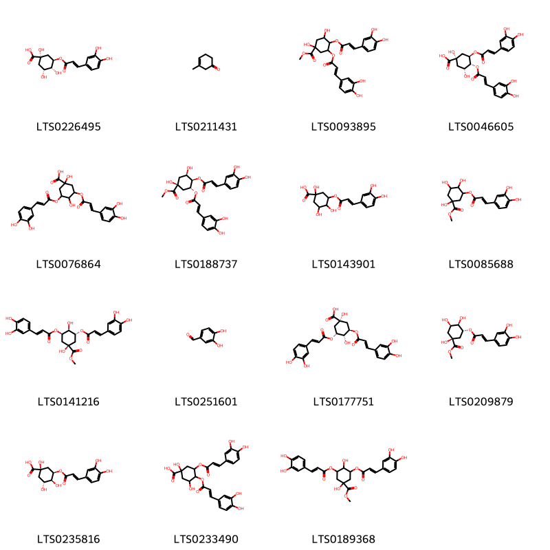{ width=100% }
    <figcaption>Hình ảnh cấu trúc hóa học của 15 hoạt chất thuộc nhóm Organooxygen compounds gồm ['chlorogenic acid (LTS0226495)', '3-methyl-cyclohex-3-enone (LTS0211431)', 'methyl 3,4-bis({[3-(3,4-dihydroxyphenyl)prop-2-enoyl]oxy})-1,5-dihydroxycyclohexane-1-carboxylate (LTS0093895)', '4,5-dicaffeoylquinic acid (LTS0046605)', '3,5-bis({[3-(3,4-dihydroxyphenyl)prop-2-enoyl]oxy})-1,4-dihydroxycyclohexane-1-carboxylic acid (LTS0076864)', 'methyl (1s,3r,4r,5r)-3,4-bis({[(2e)-3-(3,4-dihydroxyphenyl)prop-2-enoyl]oxy})-1,5-dihydroxycyclohexane-1-carboxylate (LTS0188737)', '3-{[3-(3,4-dihydroxyphenyl)prop-2-enoyl]oxy}-1,4,5-trihydroxycyclohexane-1-carboxylic acid (LTS0143901)', 'methyl 3-{[3-(3,4-dihydroxyphenyl)prop-2-enoyl]oxy}-1,4,5-trihydroxycyclohexane-1-carboxylate (LTS0085688)', 'methyl (1s,3r,4s,5r)-3,5-bis({[(2e)-3-(3,4-dihydroxyphenyl)prop-2-enoyl]oxy})-1,4-dihydroxycyclohexane-1-carboxylate (LTS0141216)', '3,4-dihydroxybenzaldehyde (LTS0251601)', '3,5-dicaffeoylquinic acid (LTS0177751)', 'methyl chlorogenate (LTS0209879)', 'neochlorogenic acid (LTS0235816)', '3,4-bis({[3-(3,4-dihydroxyphenyl)prop-2-enoyl]oxy})-1,5-dihydroxycyclohexane-1-carboxylic acid (LTS0233490)', 'methyl 3,5-bis({[3-(3,4-dihydroxyphenyl)prop-2-enoyl]oxy})-1,4-dihydroxycyclohexane-1-carboxylate (LTS0189368)'].</figcaption>
</figure>
#### Nhóm Phenols
<figure markdown="span">
    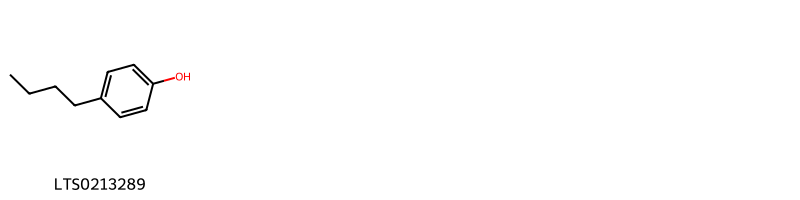{ width=100% }
    <figcaption>Hình ảnh cấu trúc hóa học của 1 hoạt chất thuộc nhóm Phenols gồm ['4-n-butylphenol (LTS0213289)'].</figcaption>
</figure>
#### Nhóm Polycyclic hydrocarbons
<figure markdown="span">
    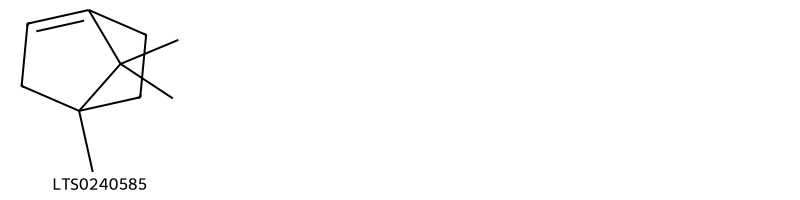{ width=100% }
    <figcaption>Hình ảnh cấu trúc hóa học của 1 hoạt chất thuộc nhóm Polycyclic hydrocarbons gồm ['4,7,7-trimethylbicyclo[2.2.1]hept-1-ene (LTS0240585)'].</figcaption>
</figure>
#### Nhóm Prenol lipids
<figure markdown="span">
    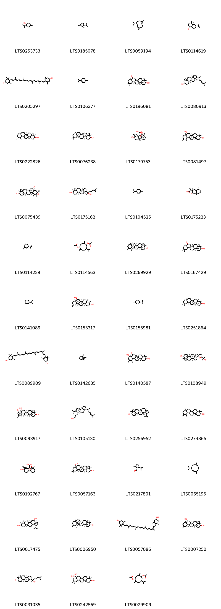{ width=100% }
    <figcaption>Hình ảnh cấu trúc hóa học của 43 hoạt chất thuộc nhóm Prenol lipids gồm ['4-terpineol (LTS0253733)', 'α-thujene (LTS0185078)', '(-)-germacrene d (LTS0059194)', '(1r,4as,6r,8ar)-8a-methyl-4-methylidene-6-(prop-1-en-2-yl)-octahydronaphthalen-1-ol (LTS0114619)', 'carotenoid (LTS0205297)', 'β-terpinene (LTS0106377)', 'maniladiol (LTS0196081)', 'dammaradienol (LTS0080913)', 'amyrin (LTS0222826)', 'alnulin (LTS0076238)', '(1r,2r,5s,8s,9s,10r)-5-hydroxy-11-methyl-6-methylidene-16-oxo-15-oxapentacyclo[9.3.2.1⁵,⁸.0¹,¹⁰.0²,⁸]heptadecane-9-carboxylic acid (LTS0179753)', '4,4,6a,6b,8a,11,12,14b-octamethyl-2,3,4a,5,6,7,8,9,10,11,12,12a,14,14a-tetradecahydro-1h-picene-3,8-diol (LTS0081497)', '(3s,4ar,6ar,6br,8s,8as,9ar,10ar,11s,11as,11br,13ar,13br)-4,4,6a,6b,8a,10a,11,13b-octamethyl-hexadecahydropiceno[2,3-b]oxirene-3,8-diol (LTS0075439)', 'dammarenediol (LTS0175162)', 'terpinolene (LTS0104525)', 'alantolactone (LTS0175223)', '1-methyl-3-(prop-1-en-2-yl)cyclohex-1-ene (LTS0114229)', '(1s,5s,7s)-7-(acetyloxy)-2,8-dimethylidene-5-(prop-1-en-2-yl)cyclodecyl acetate (LTS0114563)', '(4ar,6ar,6br,8as,12ar,12br,14ar,14br)-4,4,6a,6b,8a,11,12,14b-octamethyl-2,3,4a,5,6,7,8,9,12,12a,12b,13,14,14a-tetradecahydro-1h-picen-3-ol (LTS0269929)', 'ursadiol (LTS0167429)', 'isoterpinolene (LTS0141089)', 'arnidiol (LTS0153317)', 'limonene,  (LTS0155981)', 'β-amyrin (LTS0251864)', '(1r,4r)-4-[(1e,3e,5e,7e,9e,11e,13e,15z,17e)-18-[(4r)-4-hydroxy-2,6,6-trimethylcyclohex-1-en-1-yl]-3,7,12,16-tetramethyloctadeca-1,3,5,7,9,11,13,15,17-nonaen-1-yl]-3,5,5-trimethylcyclohex-2-en-1-ol (LTS0089909)', '1,7,7-trimethyl-2-methylidenebicyclo[2.2.1]heptane (LTS0142635)', '4,4,6a,6b,8a,11,12,14b-octamethyl-2,3,4a,5,6,7,8,9,12,12a,12b,13,14,14a-tetradecahydro-1h-picene-3,8,9-triol (LTS0140587)', '(1s,3ar,3br,5ar,7s,9ar,9br,11ar)-1-[(2s,5s)-5-(2-hydroxypropan-2-yl)-2-methyloxolan-2-yl]-3a,3b,6,6,9a-pentamethyl-dodecahydro-1h-cyclopenta[a]phenanthren-7-ol (LTS0108949)', '(3s,4ar,6ar,6br,8s,8as,9s,12s,12as,12br,14ar,14br)-4,4,6a,6b,8a,11,12,14b-octamethyl-2,3,4a,5,6,7,8,9,12,12a,12b,13,14,14a-tetradecahydro-1h-picene-3,8,9-triol (LTS0093917)', '3-[(3s,3as,5as,6s,9as,9br)-3a,5a,9b-trimethyl-3-[(2s)-6-methylhept-5-en-2-yl]-7-(propan-2-ylidene)-octahydro-1h-cyclopenta[a]naphthalen-6-yl]propan-1-ol (LTS0105130)', 'lupeol (LTS0256952)', '(6ar,6br,8ar,14br)-4,4,6a,6b,8a,12,14b-heptamethyl-11-methylidene-hexadecahydropicen-3-ol (LTS0274865)', '5-hydroxy-11-methyl-6-methylidene-16-oxo-15-oxapentacyclo[9.3.2.1⁵,⁸.0¹,¹⁰.0²,⁸]heptadecane-9-carboxylic acid (LTS0192767)', 'erythrodiol (LTS0057163)', '2-methyl-5-(prop-1-en-2-yl)cyclopent-1-ene-1-carbaldehyde (LTS0217801)', '(1z,6z,8s)-8-isopropyl-1-methyl-5-methylidenecyclodeca-1,6-diene (LTS0065195)', 'calenduladiol (LTS0017475)', 'taraxasterol (LTS0006950)', '(1r,4r)-4-[(1e,3z,5e,7e,9e,11e,13e,15e,17e)-18-[(4r)-4-hydroxy-2,6,6-trimethylcyclohex-1-en-1-yl]-3,7,12,16-tetramethyloctadeca-1,3,5,7,9,11,13,15,17-nonaen-1-yl]-3,5,5-trimethylcyclohex-2-en-1-ol (LTS0057086)', 'faradiol (LTS0007250)', '(3ar,3br,5ar,7s,9ar,9br)-1-[(2s)-2-hydroxy-6-methylhept-5-en-2-yl]-3a,3b,6,6,9a-pentamethyl-dodecahydro-1h-cyclopenta[a]phenanthren-7-ol (LTS0031035)', '(3s,6ar,6bs,8s,8as,12as,14br)-8a-(hydroxymethyl)-4,4,6a,6b,11,11,14b-heptamethyl-1,2,3,4a,5,6,7,8,9,10,12,12a,14,14a-tetradecahydropicene-3,8-diol (LTS0242569)', '(1r,5s,7s)-7-(acetyloxy)-2,8-dimethylidene-5-(prop-1-en-2-yl)cyclodecyl acetate (LTS0029909)'].</figcaption>
</figure>
#### Nhóm Saturated hydrocarbons
<figure markdown="span">
    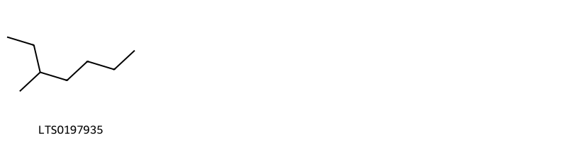{ width=100% }
    <figcaption>Hình ảnh cấu trúc hóa học của 1 hoạt chất thuộc nhóm Saturated hydrocarbons gồm ['3-methylheptane (LTS0197935)'].</figcaption>
</figure>
#### Nhóm Steroids and steroid derivatives
<figure markdown="span">
    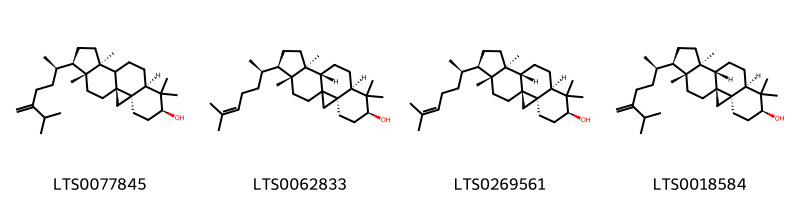{ width=100% }
    <figcaption>Hình ảnh cấu trúc hóa học của 4 hoạt chất thuộc nhóm Steroids and steroid derivatives gồm ['24-methylene-cycloartanol (LTS0077845)', '(3r,6s,8r,11s,12s,15r,16r)-7,7,12,16-tetramethyl-15-[(2r)-6-methylhept-5-en-2-yl]pentacyclo[9.7.0.0¹,³.0³,⁸.0¹²,¹⁶]octadecan-6-ol (LTS0062833)', 'cycloartenol (LTS0269561)', '24-methylenecycloartanol (LTS0018584)'].</figcaption>
</figure>
#### Nhóm Unsaturated hydrocarbons
<figure markdown="span">
    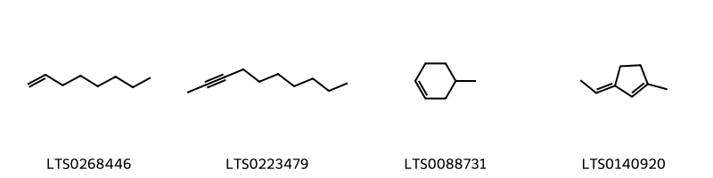{ width=100% }
    <figcaption>Hình ảnh cấu trúc hóa học của 4 hoạt chất thuộc nhóm Unsaturated hydrocarbons gồm ['1-octene (LTS0268446)', 'dec-2-yne (LTS0223479)', 'cyclohexene, 4-methyl- (LTS0088731)', '3-ethylidene-1-methylcyclopent-1-ene (LTS0140920)'].</figcaption>
</figure>

---

### Dược dân tộc học

Danh sách các quốc gia có sử dụng *Chrysanthemum morifolium* trong điều trị các bệnh. 

| Country   | Disease                                                   | Bệnh                                                                                                                                                                                                |
|:----------|:----------------------------------------------------------|:----------------------------------------------------------------------------------------------------------------------------------------------------------------------------------------------------|
| China     | Alexiteric, Carminative, Collyrium, Refrigerant, Sedative | MYMEMORY WARNING: YOU USED ALL AVAILABLE FREE TRANSLATIONS FOR TODAY. NEXT AVAILABLE IN  09 HOURS 41 MINUTES 01 SECONDS VISIT HTTPS://MYMEMORY.TRANSLATED.NET/DOC/USAGELIMITS.PHP TO TRANSLATE MORE |

---

---
## Chrysanthemum parthenium
### Thông tin về thực vật

!!! info "Phân loại thực vật của *Tanacetum parthenium* từ GIBF:"
    - **Kingdom:** Plantae
    - **Phylum:** Tracheophyta
    - **Order:** Asterales
    - **Family:** Asteraceae
    - **Genus:** Tanacetum
    - **Species:** *Tanacetum parthenium*

 

| Label (VI)   | Label (EN)   | Scientific Name          | Descriptions (VI)   | Descriptions (EN)   | Also Known As (VI)   | Also Known As (EN)   |
|:-------------|:-------------|:-------------------------|:--------------------|:--------------------|:---------------------|:---------------------|
| N/A          | N/A          | Chrysanthemum parthenium |                     | species of plant    | ['']                 | ['feverfew']         |

#### Phân bố trên thế giới

**Từ CSDL GIBF** nan, Bulgaria, Italy, Japan, Belgium, unknown or invalid, Venezuela (Bolivarian Republic of), Canada, Denmark, Spain, Honduras, United States of America, Sweden, Montenegro, Germany, Brazil, Switzerland, Mexico, France, Austria, United Kingdom of Great Britain and Northern Ireland, Ecuador, Colombia, Costa Rica

#### Phân bố tại Việt Nam

**Từ CSDL GIBF**: Không có ghi nhận ở Việt Nam

---
### Thành phần hóa học
        
- Theo cơ sở dữ liệu lotus: Từ loài *Tanacetum parthenium* đã phân lập và xác định được Chưa có hoạt chất nào được phân lập. hoạt chất thuộc về các nhóm Không có hoạt chất nào được phân lập. 

Không có hình ảnh nào được tạo ra

---

### Dược dân tộc học

Danh sách các quốc gia có sử dụng *Tanacetum parthenium* trong điều trị các bệnh. 

| Country   | Disease                                                                   | Bệnh                                                                                                                                                                                                |
|:----------|:--------------------------------------------------------------------------|:----------------------------------------------------------------------------------------------------------------------------------------------------------------------------------------------------|
| Europe    | Abortifacient, Emmenagogue, Insecticide, Tonic, Vermifuge                 | MYMEMORY WARNING: YOU USED ALL AVAILABLE FREE TRANSLATIONS FOR TODAY. NEXT AVAILABLE IN  09 HOURS 40 MINUTES 10 SECONDS VISIT HTTPS://MYMEMORY.TRANSLATED.NET/DOC/USAGELIMITS.PHP TO TRANSLATE MORE |
| Mexico    | Emmenagogue, Insecticide, Tonic                                           | MYMEMORY WARNING: YOU USED ALL AVAILABLE FREE TRANSLATIONS FOR TODAY. NEXT AVAILABLE IN  09 HOURS 40 MINUTES 06 SECONDS VISIT HTTPS://MYMEMORY.TRANSLATED.NET/DOC/USAGELIMITS.PHP TO TRANSLATE MORE |
| Turkey    | Aperient, Carminative, Diuretic, Emmenagogue, Tonic, Vermifuge, Stomachic | MYMEMORY WARNING: YOU USED ALL AVAILABLE FREE TRANSLATIONS FOR TODAY. NEXT AVAILABLE IN  09 HOURS 40 MINUTES 03 SECONDS VISIT HTTPS://MYMEMORY.TRANSLATED.NET/DOC/USAGELIMITS.PHP TO TRANSLATE MORE |
| US        | Abortifacient, Emmenagogue, Laxative, Vermifuge                           | MYMEMORY WARNING: YOU USED ALL AVAILABLE FREE TRANSLATIONS FOR TODAY. NEXT AVAILABLE IN  09 HOURS 39 MINUTES 59 SECONDS VISIT HTTPS://MYMEMORY.TRANSLATED.NET/DOC/USAGELIMITS.PHP TO TRANSLATE MORE |
| ain       | Emmenagogue                                                               | MYMEMORY WARNING: YOU USED ALL AVAILABLE FREE TRANSLATIONS FOR TODAY. NEXT AVAILABLE IN  09 HOURS 39 MINUTES 56 SECONDS VISIT HTTPS://MYMEMORY.TRANSLATED.NET/DOC/USAGELIMITS.PHP TO TRANSLATE MORE |

---

---
## Chrysanthemum roseum
### Thông tin về thực vật

!!! info "Phân loại thực vật của *Tanacetum coccineum* từ GIBF:"
    - **Kingdom:** Plantae
    - **Phylum:** Tracheophyta
    - **Order:** Asterales
    - **Family:** Asteraceae
    - **Genus:** Tanacetum
    - **Species:** *Tanacetum coccineum*

 

| Label (VI)   | Label (EN)   | Scientific Name      | Descriptions (VI)   | Descriptions (EN)   | Also Known As (VI)   | Also Known As (EN)   |
|:-------------|:-------------|:---------------------|:--------------------|:--------------------|:---------------------|:---------------------|
| N/A          | N/A          | Chrysanthemum roseum |                     |                     | ['']                 | ['']                 |

#### Phân bố trên thế giới

**Từ CSDL GIBF** nan, Italy, Japan, Belgium, unknown or invalid, United States of America, Poland

#### Phân bố tại Việt Nam

**Từ CSDL GIBF**: Không có ghi nhận ở Việt Nam

---
### Thành phần hóa học
        
- Theo cơ sở dữ liệu lotus: Từ loài *Tanacetum coccineum* đã phân lập và xác định được Chưa có hoạt chất nào được phân lập. hoạt chất thuộc về các nhóm Không có hoạt chất nào được phân lập. 

Không có hình ảnh nào được tạo ra

---

### Dược dân tộc học

Danh sách các quốc gia có sử dụng *Tanacetum coccineum* trong điều trị các bệnh. 

| Country   | Disease                   | Bệnh                                                                                                                                                                                                |
|:----------|:--------------------------|:----------------------------------------------------------------------------------------------------------------------------------------------------------------------------------------------------|
| Turkey    | Insecticide, Parasiticide | MYMEMORY WARNING: YOU USED ALL AVAILABLE FREE TRANSLATIONS FOR TODAY. NEXT AVAILABLE IN  09 HOURS 39 MINUTES 27 SECONDS VISIT HTTPS://MYMEMORY.TRANSLATED.NET/DOC/USAGELIMITS.PHP TO TRANSLATE MORE |

---

---
## Chrysanthemum segetum
### Thông tin về thực vật

!!! info "Phân loại thực vật của *Chrysanthemum segetum* từ GIBF:"
    - **Kingdom:** Plantae
    - **Phylum:** Tracheophyta
    - **Order:** Asterales
    - **Family:** Asteraceae
    - **Genus:** Chrysanthemum
    - **Species:** *Chrysanthemum segetum*

 

| Label (VI)   | Label (EN)   | Scientific Name       | Descriptions (VI)   | Descriptions (EN)   | Also Known As (VI)   | Also Known As (EN)   |
|:-------------|:-------------|:----------------------|:--------------------|:--------------------|:---------------------|:---------------------|
| N/A          | N/A          | Chrysanthemum segetum | loài thực vật       | species of plant    | ['']                 | ['']                 |

#### Phân bố trên thế giới

**Từ CSDL GIBF** Netherlands, Italy, Germany, Colombia, Spain, Palestine, State of, Portugal, United States of America, China, France, Greece, Israel

#### Phân bố tại Việt Nam

**Từ CSDL GIBF**: Không có ghi nhận ở Việt Nam

---
### Thành phần hóa học
        
- Theo cơ sở dữ liệu lotus: Từ loài *Chrysanthemum segetum* đã phân lập và xác định được Chưa có hoạt chất nào được phân lập. hoạt chất thuộc về các nhóm Không có hoạt chất nào được phân lập. 

Không có hình ảnh nào được tạo ra

---

### Dược dân tộc học

Danh sách các quốc gia có sử dụng *Chrysanthemum segetum* trong điều trị các bệnh. 

| Country    | Disease    | Bệnh                                                                                                                                                                                                |
|:-----------|:-----------|:----------------------------------------------------------------------------------------------------------------------------------------------------------------------------------------------------|
| German     | Diuretic   | MYMEMORY WARNING: YOU USED ALL AVAILABLE FREE TRANSLATIONS FOR TODAY. NEXT AVAILABLE IN  09 HOURS 39 MINUTES 02 SECONDS VISIT HTTPS://MYMEMORY.TRANSLATED.NET/DOC/USAGELIMITS.PHP TO TRANSLATE MORE |
| Italian    | Vermifuge  | MYMEMORY WARNING: YOU USED ALL AVAILABLE FREE TRANSLATIONS FOR TODAY. NEXT AVAILABLE IN  09 HOURS 38 MINUTES 59 SECONDS VISIT HTTPS://MYMEMORY.TRANSLATED.NET/DOC/USAGELIMITS.PHP TO TRANSLATE MORE |
| Portuguese | Stomachic  | MYMEMORY WARNING: YOU USED ALL AVAILABLE FREE TRANSLATIONS FOR TODAY. NEXT AVAILABLE IN  09 HOURS 38 MINUTES 56 SECONDS VISIT HTTPS://MYMEMORY.TRANSLATED.NET/DOC/USAGELIMITS.PHP TO TRANSLATE MORE |
| anish      | Antiseptic | MYMEMORY WARNING: YOU USED ALL AVAILABLE FREE TRANSLATIONS FOR TODAY. NEXT AVAILABLE IN  09 HOURS 38 MINUTES 53 SECONDS VISIT HTTPS://MYMEMORY.TRANSLATED.NET/DOC/USAGELIMITS.PHP TO TRANSLATE MORE |

---

---
## Chrysanthemum sinense
### Thông tin về thực vật

!!! info "Phân loại thực vật của *Chrysanthemum morifolium* từ GIBF:"
    - **Kingdom:** Plantae
    - **Phylum:** Tracheophyta
    - **Order:** Asterales
    - **Family:** Asteraceae
    - **Genus:** Chrysanthemum
    - **Species:** *Chrysanthemum morifolium*

 

| Label (VI)   | Label (EN)   | Scientific Name       | Descriptions (VI)   | Descriptions (EN)   | Also Known As (VI)   | Also Known As (EN)   |
|:-------------|:-------------|:----------------------|:--------------------|:--------------------|:---------------------|:---------------------|
| N/A          | N/A          | Chrysanthemum segetum | loài thực vật       | species of plant    | ['']                 | ['']                 |

#### Phân bố trên thế giới

**Từ CSDL GIBF** nan, Japan, Colombia, Chinese Taipei, Indonesia, China

#### Phân bố tại Việt Nam

**Từ CSDL GIBF**: Không có ghi nhận ở Việt Nam

---
### Thành phần hóa học
        
- Theo cơ sở dữ liệu lotus: Từ loài *Chrysanthemum morifolium* đã phân lập và xác định được Chưa có hoạt chất nào được phân lập. hoạt chất thuộc về các nhóm Không có hoạt chất nào được phân lập. 

Không có hình ảnh nào được tạo ra

---

### Dược dân tộc học

Danh sách các quốc gia có sử dụng *Chrysanthemum morifolium* trong điều trị các bệnh. 

| Country   | Disease                       | Bệnh                                                                                                                                                                                                |
|:----------|:------------------------------|:----------------------------------------------------------------------------------------------------------------------------------------------------------------------------------------------------|
| China     | Poison, Antivinous, Digestive | MYMEMORY WARNING: YOU USED ALL AVAILABLE FREE TRANSLATIONS FOR TODAY. NEXT AVAILABLE IN  09 HOURS 38 MINUTES 21 SECONDS VISIT HTTPS://MYMEMORY.TRANSLATED.NET/DOC/USAGELIMITS.PHP TO TRANSLATE MORE |

---

# Chi Elephantopus

??? note "Danh sách các dược liệu thuộc chi"
    
	 - *Elephantopus angustifolius*
	 - *Elephantopus mollis*
	 - *Elephantopus scaber*

---
## Elephantopus angustifolius
### Thông tin về thực vật

!!! info "Phân loại thực vật của *Orthopappus angustifolius* từ GIBF:"
    - **Kingdom:** Plantae
    - **Phylum:** Tracheophyta
    - **Order:** Asterales
    - **Family:** Asteraceae
    - **Genus:** Orthopappus
    - **Species:** *Orthopappus angustifolius*

 

| Label (VI)   | Label (EN)   | Scientific Name            | Descriptions (VI)   | Descriptions (EN)   | Also Known As (VI)   | Also Known As (EN)   |
|:-------------|:-------------|:---------------------------|:--------------------|:--------------------|:---------------------|:---------------------|
| N/A          | N/A          | Elephantopus angustifolius | loài thực vật       | species of plant    | ['']                 | ['']                 |

#### Phân bố trên thế giới

**Từ CSDL GIBF** nan, Argentina, unknown or invalid, Venezuela (Bolivarian Republic of), Panama, French Guiana, Bolivia (Plurinational State of), Honduras, United States of America, Uruguay, Paraguay, Trinidad and Tobago, Suriname, Brazil, Guyana, Peru, Mexico, Colombia, Costa Rica

#### Phân bố tại Việt Nam

**Từ CSDL GIBF**: Không có ghi nhận ở Việt Nam

---
### Thành phần hóa học
        
- Theo cơ sở dữ liệu lotus: Từ loài *Orthopappus angustifolius* đã phân lập và xác định được 16 hoạt chất thuộc về các nhóm Fatty Acyls, Prenol lipids, Lactones, Carboxylic acids and derivatives. 

|    | chemicalTaxonomyClassyfireClass   |   smiles_count |
|---:|:----------------------------------|---------------:|
|  0 | Carboxylic acids and derivatives  |              4 |
|  1 | Fatty Acyls                       |              4 |
|  2 | Lactones                          |              2 |
|  3 | Prenol lipids                     |              6 |

#### Nhóm Carboxylic acids and derivatives
<figure markdown="span">
    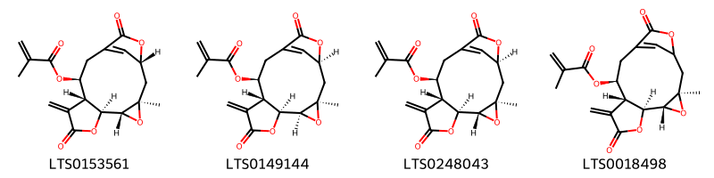{ width=100% }
    <figcaption>Hình ảnh cấu trúc hóa học của 4 hoạt chất thuộc nhóm Carboxylic acids and derivatives gồm ['elephantopin (LTS0153561)', '(1s,3r,5s,6s,10r,11s)-3-methyl-9-methylidene-8,14-dioxo-4,7,15-trioxatetracyclo[11.2.1.0³,⁵.0⁶,¹⁰]hexadec-13(16)-en-11-yl 2-methylprop-2-enoate (LTS0149144)', '(1s,3r,5r,6s,10r,11s)-3-methyl-9-methylidene-8,14-dioxo-4,7,15-trioxatetracyclo[11.2.1.0³,⁵.0⁶,¹⁰]hexadec-13(16)-en-11-yl 2-methylprop-2-enoate (LTS0248043)', 'elephantopin (LTS0018498)'].</figcaption>
</figure>
#### Nhóm Fatty Acyls
<figure markdown="span">
    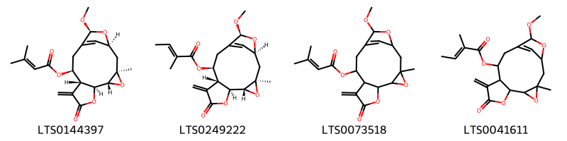{ width=100% }
    <figcaption>Hình ảnh cấu trúc hóa học của 4 hoạt chất thuộc nhóm Fatty Acyls gồm ['(1s,3r,5r,6s,10r,11s,14s)-14-methoxy-3-methyl-9-methylidene-8-oxo-4,7,15-trioxatetracyclo[11.2.1.0³,⁵.0⁶,¹⁰]hexadec-13(16)-en-11-yl 3-methylbut-2-enoate (LTS0144397)', '(1s,3r,5r,6s,10r,11s,14s)-14-methoxy-3-methyl-9-methylidene-8-oxo-4,7,15-trioxatetracyclo[11.2.1.0³,⁵.0⁶,¹⁰]hexadec-13(16)-en-11-yl (2e)-2-methylbut-2-enoate (LTS0249222)', '14-methoxy-3-methyl-9-methylidene-8-oxo-4,7,15-trioxatetracyclo[11.2.1.0³,⁵.0⁶,¹⁰]hexadec-13(16)-en-11-yl 3-methylbut-2-enoate (LTS0073518)', '14-methoxy-3-methyl-9-methylidene-8-oxo-4,7,15-trioxatetracyclo[11.2.1.0³,⁵.0⁶,¹⁰]hexadec-13(16)-en-11-yl 2-methylbut-2-enoate (LTS0041611)'].</figcaption>
</figure>
#### Nhóm Lactones
<figure markdown="span">
    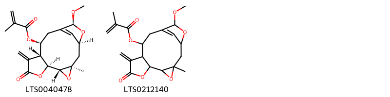{ width=100% }
    <figcaption>Hình ảnh cấu trúc hóa học của 2 hoạt chất thuộc nhóm Lactones gồm ['(1s,3r,5r,6s,10r,11s,14s)-14-methoxy-3-methyl-9-methylidene-8-oxo-4,7,15-trioxatetracyclo[11.2.1.0³,⁵.0⁶,¹⁰]hexadec-13(16)-en-11-yl 2-methylprop-2-enoate (LTS0040478)', '14-methoxy-3-methyl-9-methylidene-8-oxo-4,7,15-trioxatetracyclo[11.2.1.0³,⁵.0⁶,¹⁰]hexadec-13(16)-en-11-yl 2-methylprop-2-enoate (LTS0212140)'].</figcaption>
</figure>
#### Nhóm Prenol lipids
<figure markdown="span">
    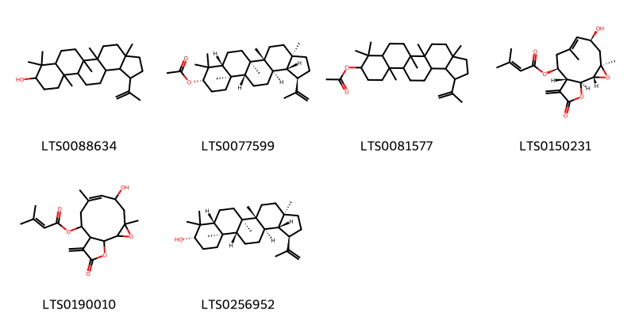{ width=100% }
    <figcaption>Hình ảnh cấu trúc hóa học của 6 hoạt chất thuộc nhóm Prenol lipids gồm ['lupeol (LTS0088634)', 'lupeol acetate (LTS0077599)', '3a,5a,5b,8,8,11a-hexamethyl-1-(prop-1-en-2-yl)-hexadecahydrocyclopenta[a]chrysen-9-yl acetate (LTS0081577)', '(1s,2r,4r,6s,7e,10s,11r)-6-hydroxy-4,8-dimethyl-12-methylidene-13-oxo-3,14-dioxatricyclo[9.3.0.0²,⁴]tetradec-7-en-10-yl 3-methylbut-2-enoate (LTS0150231)', '6-hydroxy-4,8-dimethyl-12-methylidene-13-oxo-3,14-dioxatricyclo[9.3.0.0²,⁴]tetradec-7-en-10-yl 3-methylbut-2-enoate (LTS0190010)', 'lupeol (LTS0256952)'].</figcaption>
</figure>

---

### Dược dân tộc học

Danh sách các quốc gia có sử dụng *Orthopappus angustifolius* trong điều trị các bệnh. 

| Country   | Disease           | Bệnh                                                                                                                                                                                                |
|:----------|:------------------|:----------------------------------------------------------------------------------------------------------------------------------------------------------------------------------------------------|
| Venezuela | Astringent, Tonic | MYMEMORY WARNING: YOU USED ALL AVAILABLE FREE TRANSLATIONS FOR TODAY. NEXT AVAILABLE IN  09 HOURS 38 MINUTES 00 SECONDS VISIT HTTPS://MYMEMORY.TRANSLATED.NET/DOC/USAGELIMITS.PHP TO TRANSLATE MORE |

---

---
## Elephantopus mollis
### Thông tin về thực vật

!!! info "Phân loại thực vật của *Elephantopus mollis* từ GIBF:"
    - **Kingdom:** Plantae
    - **Phylum:** Tracheophyta
    - **Order:** Asterales
    - **Family:** Asteraceae
    - **Genus:** Elephantopus
    - **Species:** *Elephantopus mollis*

 

| Label (VI)   | Label (EN)   | Scientific Name     | Descriptions (VI)   | Descriptions (EN)   | Also Known As (VI)   | Also Known As (EN)   |
|:-------------|:-------------|:--------------------|:--------------------|:--------------------|:---------------------|:---------------------|
| N/A          | N/A          | Elephantopus mollis | loài thực vật       | species of plant    | ['']                 | ['']                 |

#### Phân bố trên thế giới

**Từ CSDL GIBF** Australia, Guadeloupe, Argentina, French Guiana, Puerto Rico, Chinese Taipei, Honduras, United States of America, Uruguay, Hong Kong, Brazil, Guam, New Caledonia, Dominica, Mexico, Dominican Republic, Peru, Saint Kitts and Nevis, Colombia, Philippines, Malaysia

#### Phân bố tại Việt Nam

**Từ CSDL GIBF**: Không có ghi nhận ở Việt Nam

---
### Thành phần hóa học
        
- Theo cơ sở dữ liệu lotus: Từ loài *Elephantopus mollis* đã phân lập và xác định được 59 hoạt chất thuộc về các nhóm Fatty Acyls, Prenol lipids, Steroids and steroid derivatives, Quinolines and derivatives, Benzene and substituted derivatives, Lactones, Organooxygen compounds, Carboxylic acids and derivatives. 

|    | chemicalTaxonomyClassyfireClass     |   smiles_count |
|---:|:------------------------------------|---------------:|
|  0 | Benzene and substituted derivatives |              2 |
|  1 | Carboxylic acids and derivatives    |              4 |
|  2 | Fatty Acyls                         |             10 |
|  3 | Lactones                            |             11 |
|  4 | Organooxygen compounds              |              5 |
|  5 | Prenol lipids                       |             22 |
|  6 | Quinolines and derivatives          |              1 |
|  7 | Steroids and steroid derivatives    |              4 |

#### Nhóm Benzene and substituted derivatives
<figure markdown="span">
    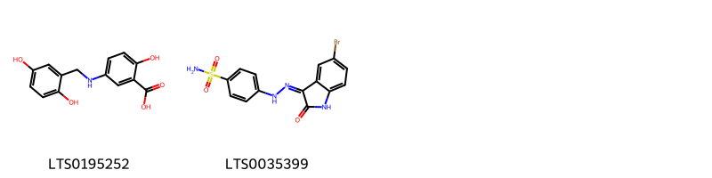{ width=100% }
    <figcaption>Hình ảnh cấu trúc hóa học của 2 hoạt chất thuộc nhóm Benzene and substituted derivatives gồm ['lavendustin c (LTS0195252)', '4-[2-(5-bromo-2-oxo-1h-indol-3-ylidene)hydrazin-1-yl]benzenesulfonamide (LTS0035399)'].</figcaption>
</figure>
#### Nhóm Carboxylic acids and derivatives
<figure markdown="span">
    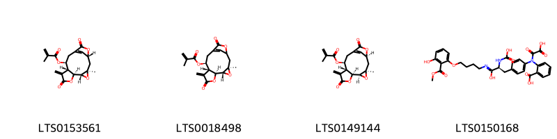{ width=100% }
    <figcaption>Hình ảnh cấu trúc hóa học của 4 hoạt chất thuộc nhóm Carboxylic acids and derivatives gồm ['elephantopin (LTS0153561)', 'elephantopin (LTS0018498)', '(1s,3r,5s,6s,10r,11s)-3-methyl-9-methylidene-8,14-dioxo-4,7,15-trioxatetracyclo[11.2.1.0³,⁵.0⁶,¹⁰]hexadec-13(16)-en-11-yl 2-methylprop-2-enoate (LTS0149144)', '2-(1-carboxy-n-{4-[(2s)-2-(carboxyamino)-2-({4-[3-hydroxy-2-(methoxycarbonyl)phenoxy]butyl}-c-hydroxycarbonimidoyl)ethyl]phenyl}formamido)benzoic acid (LTS0150168)'].</figcaption>
</figure>
#### Nhóm Fatty Acyls
<figure markdown="span">
    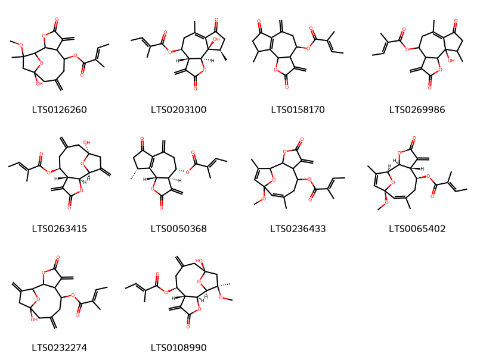{ width=100% }
    <figcaption>Hình ảnh cấu trúc hóa học của 10 hoạt chất thuộc nhóm Fatty Acyls gồm ['11-hydroxy-13-methoxy-13-methyl-5,9-dimethylidene-4-oxo-3,14-dioxatricyclo[9.2.1.0²,⁶]tetradecan-7-yl 2-methylbut-2-enoate (LTS0126260)', '(3ar,4s,9r,9ar,9bs)-9a-hydroxy-6,9-dimethyl-3-methylidene-2,7-dioxo-3ah,4h,5h,8h,9h,9bh-azuleno[4,5-b]furan-4-yl (2e)-2-methylbut-2-enoate (LTS0203100)', '9-methyl-3,6-dimethylidene-2,7-dioxo-3ah,4h,5h,8h,9h,9bh-azuleno[4,5-b]furan-4-yl 2-methylbut-2-enoate (LTS0158170)', '9a-hydroxy-6,9-dimethyl-3-methylidene-2,7-dioxo-3ah,4h,5h,8h,9h,9bh-azuleno[4,5-b]furan-4-yl 2-methylbut-2-enoate (LTS0269986)', '(1s,2s,6r,7s,11s)-11-hydroxy-5,9,13-trimethylidene-4-oxo-3,14-dioxatricyclo[9.2.1.0²,⁶]tetradecan-7-yl (2e)-2-methylbut-2-enoate (LTS0263415)', '(3ar,4s,9r,9bs)-9-methyl-3,6-dimethylidene-2,7-dioxo-3ah,4h,5h,8h,9h,9bh-azuleno[4,5-b]furan-4-yl (2e)-2-methylbut-2-enoate (LTS0050368)', '11-methoxy-9,13-dimethyl-5-methylidene-4-oxo-3,14-dioxatricyclo[9.2.1.0²,⁶]tetradeca-9,12-dien-7-yl 2-methylbut-2-enoate (LTS0236433)', '(1s,2s,6r,7s,9z,11r)-11-methoxy-9,13-dimethyl-5-methylidene-4-oxo-3,14-dioxatricyclo[9.2.1.0²,⁶]tetradeca-9,12-dien-7-yl (2e)-2-methylbut-2-enoate (LTS0065402)', '11-hydroxy-5,9,13-trimethylidene-4-oxo-3,14-dioxatricyclo[9.2.1.0²,⁶]tetradecan-7-yl 2-methylbut-2-enoate (LTS0232274)', '(1r,2s,6r,7s,11r,13r)-11-hydroxy-13-methoxy-13-methyl-5,9-dimethylidene-4-oxo-3,14-dioxatricyclo[9.2.1.0²,⁶]tetradecan-7-yl (2e)-2-methylbut-2-enoate (LTS0108990)'].</figcaption>
</figure>
#### Nhóm Lactones
<figure markdown="span">
    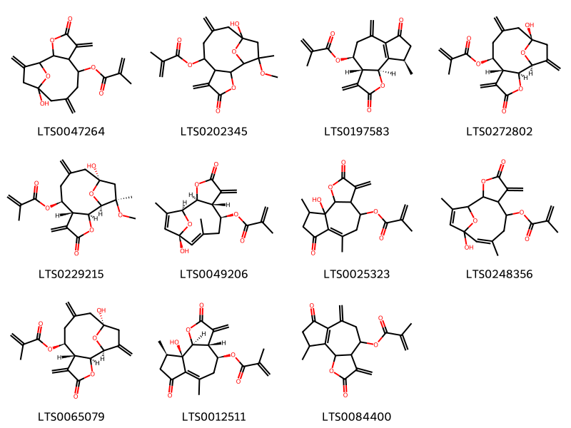{ width=100% }
    <figcaption>Hình ảnh cấu trúc hóa học của 11 hoạt chất thuộc nhóm Lactones gồm ['11-hydroxy-5,9,13-trimethylidene-4-oxo-3,14-dioxatricyclo[9.2.1.0²,⁶]tetradecan-7-yl 2-methylprop-2-enoate (LTS0047264)', '11-hydroxy-13-methoxy-13-methyl-5,9-dimethylidene-4-oxo-3,14-dioxatricyclo[9.2.1.0²,⁶]tetradecan-7-yl 2-methylprop-2-enoate (LTS0202345)', '(3ar,4s,9r,9bs)-9-methyl-3,6-dimethylidene-2,7-dioxo-3ah,4h,5h,8h,9h,9bh-azuleno[4,5-b]furan-4-yl 2-methylprop-2-enoate (LTS0197583)', '(1s,2s,6r,7s,11r)-11-hydroxy-5,9,13-trimethylidene-4-oxo-3,14-dioxatricyclo[9.2.1.0²,⁶]tetradecan-7-yl 2-methylprop-2-enoate (LTS0272802)', '(1r,2s,6r,7s,11s,13r)-11-hydroxy-13-methoxy-13-methyl-5,9-dimethylidene-4-oxo-3,14-dioxatricyclo[9.2.1.0²,⁶]tetradecan-7-yl 2-methylprop-2-enoate (LTS0229215)', '(1s,2s,6r,7s,9e,11r)-11-hydroxy-9,13-dimethyl-5-methylidene-4-oxo-3,14-dioxatricyclo[9.2.1.0²,⁶]tetradeca-9,12-dien-7-yl 2-methylprop-2-enoate (LTS0049206)', '9a-hydroxy-6,9-dimethyl-3-methylidene-2,7-dioxo-3ah,4h,5h,8h,9h,9bh-azuleno[4,5-b]furan-4-yl 2-methylprop-2-enoate (LTS0025323)', '11-hydroxy-9,13-dimethyl-5-methylidene-4-oxo-3,14-dioxatricyclo[9.2.1.0²,⁶]tetradeca-9,12-dien-7-yl 2-methylprop-2-enoate (LTS0248356)', '(1s,2s,6r,7s,11s)-11-hydroxy-5,9,13-trimethylidene-4-oxo-3,14-dioxatricyclo[9.2.1.0²,⁶]tetradecan-7-yl 2-methylprop-2-enoate (LTS0065079)', '(3ar,4s,9r,9ar,9bs)-9a-hydroxy-6,9-dimethyl-3-methylidene-2,7-dioxo-3ah,4h,5h,8h,9h,9bh-azuleno[4,5-b]furan-4-yl 2-methylprop-2-enoate (LTS0012511)', '9-methyl-3,6-dimethylidene-2,7-dioxo-3ah,4h,5h,8h,9h,9bh-azuleno[4,5-b]furan-4-yl 2-methylprop-2-enoate (LTS0084400)'].</figcaption>
</figure>
#### Nhóm Organooxygen compounds
<figure markdown="span">
    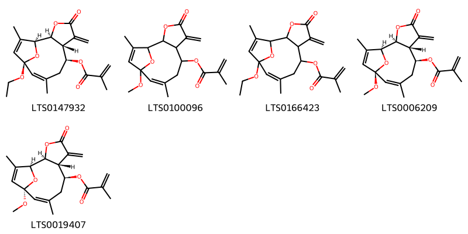{ width=100% }
    <figcaption>Hình ảnh cấu trúc hóa học của 5 hoạt chất thuộc nhóm Organooxygen compounds gồm ['phantomolin (LTS0147932)', '11-methoxy-9,13-dimethyl-5-methylidene-4-oxo-3,14-dioxatricyclo[9.2.1.0²,⁶]tetradeca-9,12-dien-7-yl 2-methylprop-2-enoate (LTS0100096)', '11-ethoxy-9,13-dimethyl-5-methylidene-4-oxo-3,14-dioxatricyclo[9.2.1.0²,⁶]tetradeca-9,12-dien-7-yl 2-methylprop-2-enoate (LTS0166423)', '(1s,2s,6r,7s,9z,11r)-11-methoxy-9,13-dimethyl-5-methylidene-4-oxo-3,14-dioxatricyclo[9.2.1.0²,⁶]tetradeca-9,12-dien-7-yl 2-methylprop-2-enoate (LTS0006209)', '(1s,2s,6r,7s,9z,11s)-11-methoxy-9,13-dimethyl-5-methylidene-4-oxo-3,14-dioxatricyclo[9.2.1.0²,⁶]tetradeca-9,12-dien-7-yl 2-methylprop-2-enoate (LTS0019407)'].</figcaption>
</figure>
#### Nhóm Prenol lipids
<figure markdown="span">
    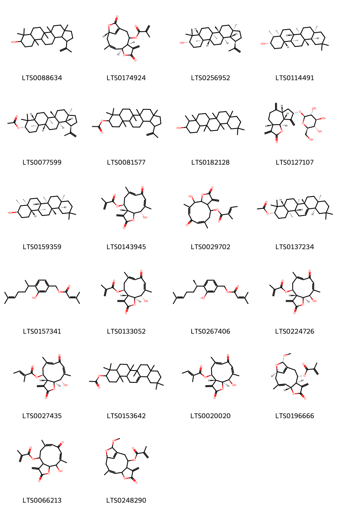{ width=100% }
    <figcaption>Hình ảnh cấu trúc hóa học của 22 hoạt chất thuộc nhóm Prenol lipids gồm ['lupeol (LTS0088634)', '(4r,8s,12s)-10-methyl-5-methylidene-6,14-dioxo-7,13-dioxatricyclo[10.2.1.0⁴,⁸]pentadeca-1(15),9-dien-3-yl 2-methylprop-2-enoate (LTS0174924)', 'lupeol (LTS0256952)', 'epi-friedelanol (LTS0114491)', 'lupeol acetate (LTS0077599)', '3a,5a,5b,8,8,11a-hexamethyl-1-(prop-1-en-2-yl)-hexadecahydrocyclopenta[a]chrysen-9-yl acetate (LTS0081577)', '4,4a,6b,8a,11,11,12b,14a-octamethyl-hexadecahydropicen-3-ol (LTS0182128)', 'vernoflexuoside (LTS0127107)', '(3r,4r,4as,6as,6br,8ar,12ar,12bs,14as,14bs)-4,4a,6b,8a,11,11,12b,14a-octamethyl-hexadecahydropicen-3-ol (LTS0159359)', '(3ar,4s,11s)-11-hydroxy-6,10-dimethyl-3-methylidene-2,8-dioxo-3ah,4h,5h,11h,11ah-cyclodeca[b]furan-4-yl 2-methylprop-2-enoate (LTS0143945)', '11-hydroxy-6,10-dimethyl-3-methylidene-2,8-dioxo-3ah,4h,5h,11h,11ah-cyclodeca[b]furan-4-yl 2-methylbut-2-enoate (LTS0029702)', 'β-amyrin acetate (LTS0137234)', '[3-hydroxy-4-(6-methylhept-5-en-2-yl)phenyl]methyl 3-methylbut-2-enoate (LTS0157341)', 'molephantin (LTS0133052)', '{3-hydroxy-4-[(2r)-6-methylhept-5-en-2-yl]phenyl}methyl 3-methylbut-2-enoate (LTS0267406)', '(3ar,4s,11r,11as)-11-hydroxy-6,10-dimethyl-3-methylidene-2,8-dioxo-3ah,4h,5h,11h,11ah-cyclodeca[b]furan-4-yl 2-methylprop-2-enoate (LTS0224726)', 'molephantinin (LTS0027435)', '4,4,6a,6b,8a,11,11,14b-octamethyl-1,2,3,4a,5,6,7,8,9,10,12,12a,14,14a-tetradecahydropicen-3-yl acetate (LTS0153642)', '(3ar,4s,11r,11as)-11-hydroxy-6,10-dimethyl-3-methylidene-2,8-dioxo-3ah,4h,5h,11h,11ah-cyclodeca[b]furan-4-yl (2e)-2-methylbut-2-enoate (LTS0020020)', '(3s,4r,8r,9e,12r,14s)-14-methoxy-10-methyl-5-methylidene-6-oxo-7,13-dioxatricyclo[10.2.1.0⁴,⁸]pentadeca-1(15),9-dien-3-yl 2-methylprop-2-enoate (LTS0196666)', '11-hydroxy-6,10-dimethyl-3-methylidene-2,8-dioxo-3ah,4h,5h,11h,11ah-cyclodeca[b]furan-4-yl 2-methylprop-2-enoate (LTS0066213)', '14-methoxy-10-methyl-5-methylidene-6-oxo-7,13-dioxatricyclo[10.2.1.0⁴,⁸]pentadeca-1(15),9-dien-3-yl 2-methylprop-2-enoate (LTS0248290)'].</figcaption>
</figure>
#### Nhóm Quinolines and derivatives
<figure markdown="span">
    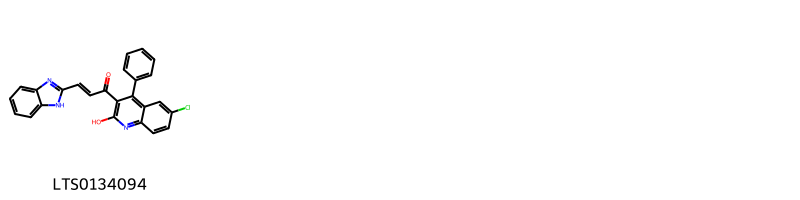{ width=100% }
    <figcaption>Hình ảnh cấu trúc hóa học của 1 hoạt chất thuộc nhóm Quinolines and derivatives gồm ['(2e)-3-(1h-1,3-benzodiazol-2-yl)-1-(6-chloro-2-hydroxy-4-phenylquinolin-3-yl)prop-2-en-1-one (LTS0134094)'].</figcaption>
</figure>
#### Nhóm Steroids and steroid derivatives
<figure markdown="span">
    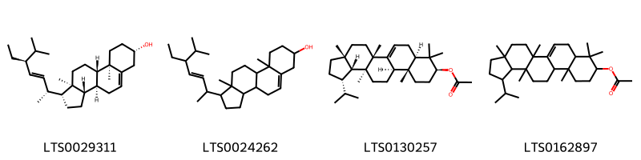{ width=100% }
    <figcaption>Hình ảnh cấu trúc hóa học của 4 hoạt chất thuộc nhóm Steroids and steroid derivatives gồm ['phytosterol (LTS0029311)', 'stigmasterol (LTS0024262)', '(1s,3ar,5as,7ar,9s,11ar,11br,13as,13br)-1-isopropyl-3a,5a,8,8,11a,13a-hexamethyl-1h,2h,3h,4h,5h,7h,7ah,9h,10h,11h,11bh,12h,13h,13bh-cyclopenta[a]chrysen-9-yl acetate (LTS0130257)', '1-isopropyl-3a,5a,8,8,11a,13a-hexamethyl-1h,2h,3h,4h,5h,7h,7ah,9h,10h,11h,11bh,12h,13h,13bh-cyclopenta[a]chrysen-9-yl acetate (LTS0162897)'].</figcaption>
</figure>

---

### Dược dân tộc học

Danh sách các quốc gia có sử dụng *Elephantopus mollis* trong điều trị các bệnh. 

| Country   | Disease           | Bệnh                                                                                                                                                                                                |
|:----------|:------------------|:----------------------------------------------------------------------------------------------------------------------------------------------------------------------------------------------------|
| Venezuela | Astringent, Tonic | MYMEMORY WARNING: YOU USED ALL AVAILABLE FREE TRANSLATIONS FOR TODAY. NEXT AVAILABLE IN  09 HOURS 37 MINUTES 18 SECONDS VISIT HTTPS://MYMEMORY.TRANSLATED.NET/DOC/USAGELIMITS.PHP TO TRANSLATE MORE |

---

---
## Elephantopus scaber
### Thông tin về thực vật

!!! info "Phân loại thực vật của *Elephantopus scaber* từ GIBF:"
    - **Kingdom:** Plantae
    - **Phylum:** Tracheophyta
    - **Order:** Asterales
    - **Family:** Asteraceae
    - **Genus:** Elephantopus
    - **Species:** *Elephantopus scaber*

 

| Label (VI)   | Label (EN)   | Scientific Name     | Descriptions (VI)   | Descriptions (EN)   | Also Known As (VI)   | Also Known As (EN)   |
|:-------------|:-------------|:--------------------|:--------------------|:--------------------|:---------------------|:---------------------|
| N/A          | N/A          | Elephantopus scaber | loài thực vật       | species of plant    | ['']                 | ["elephant's foot"]  |

#### Phân bố trên thế giới

**Từ CSDL GIBF** nan, Sri Lanka, Australia, Angola, Myanmar, Mozambique, Tanzania, United Republic of, Malawi, Zambia, Chinese Taipei, Hong Kong, Thailand, Brazil, Singapore, China, Madagascar, Macao, India, Indonesia, Philippines, Malaysia, Nepal

#### Phân bố tại Việt Nam

**Từ CSDL GIBF**: Không có ghi nhận ở Việt Nam

---
### Thành phần hóa học
        
- Theo cơ sở dữ liệu lotus: Từ loài *Elephantopus scaber* đã phân lập và xác định được 19 hoạt chất thuộc về các nhóm Fatty Acyls, Prenol lipids, Steroids and steroid derivatives. 

|    | chemicalTaxonomyClassyfireClass   |   smiles_count |
|---:|:----------------------------------|---------------:|
|  0 | Fatty Acyls                       |              2 |
|  1 | Prenol lipids                     |             11 |
|  2 | Steroids and steroid derivatives  |              6 |

#### Nhóm Fatty Acyls
<figure markdown="span">
    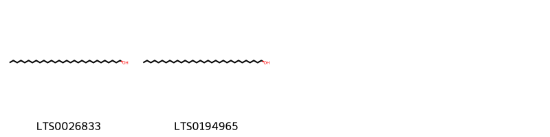{ width=100% }
    <figcaption>Hình ảnh cấu trúc hóa học của 2 hoạt chất thuộc nhóm Fatty Acyls gồm ['triacontanol (LTS0026833)', 'dotriacontanol (LTS0194965)'].</figcaption>
</figure>
#### Nhóm Prenol lipids
<figure markdown="span">
    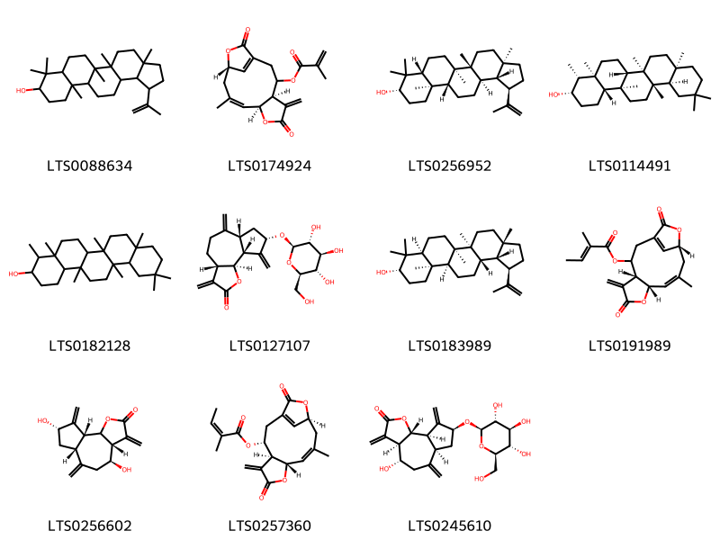{ width=100% }
    <figcaption>Hình ảnh cấu trúc hóa học của 11 hoạt chất thuộc nhóm Prenol lipids gồm ['lupeol (LTS0088634)', '(4r,8s,12s)-10-methyl-5-methylidene-6,14-dioxo-7,13-dioxatricyclo[10.2.1.0⁴,⁸]pentadeca-1(15),9-dien-3-yl 2-methylprop-2-enoate (LTS0174924)', 'lupeol (LTS0256952)', 'epi-friedelanol (LTS0114491)', '4,4a,6b,8a,11,11,12b,14a-octamethyl-hexadecahydropicen-3-ol (LTS0182128)', 'vernoflexuoside (LTS0127107)', '(1r,3as,5as,5br,7as,9s,11ar,11bs,13as,13br)-3a,5a,5b,8,8,11a-hexamethyl-1-(prop-1-en-2-yl)-hexadecahydrocyclopenta[a]chrysen-9-ol (LTS0183989)', '(4r,8s,12r)-10-methyl-5-methylidene-6,14-dioxo-7,13-dioxatricyclo[10.2.1.0⁴,⁸]pentadeca-1(15),9-dien-3-yl 2-methylbut-2-enoate (LTS0191989)', '(3ar,4s,6ar,8s,9ar)-4,8-dihydroxy-3,6,9-trimethylidene-octahydroazuleno[4,5-b]furan-2-one (LTS0256602)', '(3r,4s,8s,9z,12s)-10-methyl-5-methylidene-6,14-dioxo-7,13-dioxatricyclo[10.2.1.0⁴,⁸]pentadeca-1(15),9-dien-3-yl (2z)-2-methylbut-2-enoate (LTS0257360)', '(3ar,4s,6ar,8s,9ar,9br)-4-hydroxy-3,6,9-trimethylidene-8-{[(2r,3r,4s,5s,6r)-3,4,5-trihydroxy-6-(hydroxymethyl)oxan-2-yl]oxy}-octahydroazuleno[4,5-b]furan-2-one (LTS0245610)'].</figcaption>
</figure>
#### Nhóm Steroids and steroid derivatives
<figure markdown="span">
    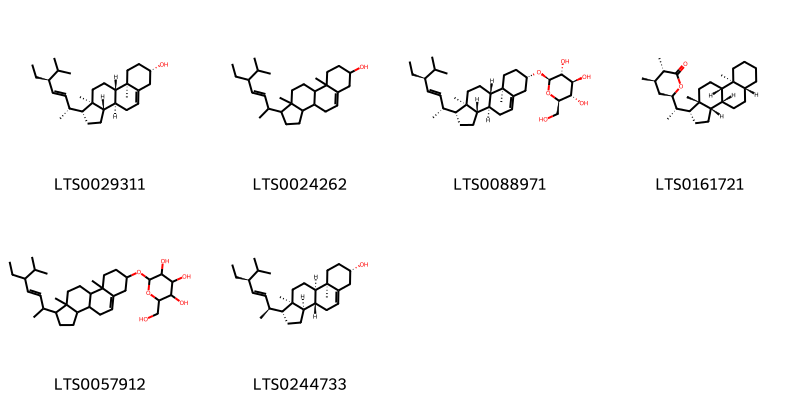{ width=100% }
    <figcaption>Hình ảnh cấu trúc hóa học của 6 hoạt chất thuộc nhóm Steroids and steroid derivatives gồm ['phytosterol (LTS0029311)', 'stigmasterol (LTS0024262)', '(2r,3r,4s,5s,6r)-2-{[(1r,3as,3bs,7s,9ar,9bs,11ar)-1-[(2r,3e,5s)-5-ethyl-6-methylhept-3-en-2-yl]-9a,11a-dimethyl-1h,2h,3h,3ah,3bh,4h,6h,7h,8h,9h,9bh,10h,11h-cyclopenta[a]phenanthren-7-yl]oxy}-6-(hydroxymethyl)oxane-3,4,5-triol (LTS0088971)', '(3s,4r,6r)-6-[(1s)-1-[(1r,3as,3bs,5ar,9as,9bs,11ar)-9a,11a-dimethyl-tetradecahydro-1h-cyclopenta[a]phenanthren-1-yl]ethyl]-3,4-dimethyloxan-2-one (LTS0161721)', '2-{[1-(5-ethyl-6-methylhept-3-en-2-yl)-9a,11a-dimethyl-1h,2h,3h,3ah,3bh,4h,6h,7h,8h,9h,9bh,10h,11h-cyclopenta[a]phenanthren-7-yl]oxy}-6-(hydroxymethyl)oxane-3,4,5-triol (LTS0057912)', '(1r,3ar,3br,7s,9ar,9br,11ar)-1-[(2s,3e,5s)-5-ethyl-6-methylhept-3-en-2-yl]-9a,11a-dimethyl-1h,2h,3h,3ah,3bh,4h,6h,7h,8h,9h,9bh,10h,11h-cyclopenta[a]phenanthren-7-ol (LTS0244733)'].</figcaption>
</figure>

---

### Dược dân tộc học

Danh sách các quốc gia có sử dụng *Elephantopus scaber* trong điều trị các bệnh. 

| Country   | Disease                              | Bệnh                                                                                                                                                                                                |
|:----------|:-------------------------------------|:----------------------------------------------------------------------------------------------------------------------------------------------------------------------------------------------------|
| China     | Cardiotonic, Suppurative, Alexiteric | MYMEMORY WARNING: YOU USED ALL AVAILABLE FREE TRANSLATIONS FOR TODAY. NEXT AVAILABLE IN  09 HOURS 36 MINUTES 45 SECONDS VISIT HTTPS://MYMEMORY.TRANSLATED.NET/DOC/USAGELIMITS.PHP TO TRANSLATE MORE |
| Elsewhere | nan, Emollient                       | MYMEMORY WARNING: YOU USED ALL AVAILABLE FREE TRANSLATIONS FOR TODAY. NEXT AVAILABLE IN  09 HOURS 36 MINUTES 42 SECONDS VISIT HTTPS://MYMEMORY.TRANSLATED.NET/DOC/USAGELIMITS.PHP TO TRANSLATE MORE |
| French    | Astringent                           | MYMEMORY WARNING: YOU USED ALL AVAILABLE FREE TRANSLATIONS FOR TODAY. NEXT AVAILABLE IN  09 HOURS 36 MINUTES 37 SECONDS VISIT HTTPS://MYMEMORY.TRANSLATED.NET/DOC/USAGELIMITS.PHP TO TRANSLATE MORE |
| India     | Astringent, Tonic, Vermifuge         | MYMEMORY WARNING: YOU USED ALL AVAILABLE FREE TRANSLATIONS FOR TODAY. NEXT AVAILABLE IN  09 HOURS 36 MINUTES 34 SECONDS VISIT HTTPS://MYMEMORY.TRANSLATED.NET/DOC/USAGELIMITS.PHP TO TRANSLATE MORE |
| Malaysia  | Diuretic                             | MYMEMORY WARNING: YOU USED ALL AVAILABLE FREE TRANSLATIONS FOR TODAY. NEXT AVAILABLE IN  09 HOURS 36 MINUTES 32 SECONDS VISIT HTTPS://MYMEMORY.TRANSLATED.NET/DOC/USAGELIMITS.PHP TO TRANSLATE MORE |
| Sanscrit  | Aphrodisiac                          | MYMEMORY WARNING: YOU USED ALL AVAILABLE FREE TRANSLATIONS FOR TODAY. NEXT AVAILABLE IN  09 HOURS 36 MINUTES 28 SECONDS VISIT HTTPS://MYMEMORY.TRANSLATED.NET/DOC/USAGELIMITS.PHP TO TRANSLATE MORE |
| Venezuela | Astringent, Tonic                    | MYMEMORY WARNING: YOU USED ALL AVAILABLE FREE TRANSLATIONS FOR TODAY. NEXT AVAILABLE IN  09 HOURS 36 MINUTES 25 SECONDS VISIT HTTPS://MYMEMORY.TRANSLATED.NET/DOC/USAGELIMITS.PHP TO TRANSLATE MORE |

---

# Chi Heliopsis

??? note "Danh sách các dược liệu thuộc chi"
    
	 - *Heliopsis longipes*

---
## Heliopsis longipes
### Thông tin về thực vật

!!! info "Phân loại thực vật của *Heliopsis longipes* từ GIBF:"
    - **Kingdom:** Plantae
    - **Phylum:** Tracheophyta
    - **Order:** Asterales
    - **Family:** Asteraceae
    - **Genus:** Heliopsis
    - **Species:** *Heliopsis longipes*

 

| Label (VI)   | Label (EN)   | Scientific Name    | Descriptions (VI)   | Descriptions (EN)   | Also Known As (VI)   | Also Known As (EN)   |
|:-------------|:-------------|:-------------------|:--------------------|:--------------------|:---------------------|:---------------------|
| N/A          | N/A          | Heliopsis longipes | loài thực vật       | species of plant    | ['']                 | ['']                 |

#### Phân bố trên thế giới

**Từ CSDL GIBF** nan, Mexico

#### Phân bố tại Việt Nam

**Từ CSDL GIBF**: Không có ghi nhận ở Việt Nam

---
### Thành phần hóa học
        
- Theo cơ sở dữ liệu lotus: Từ loài *Heliopsis longipes* đã phân lập và xác định được 24 hoạt chất thuộc về các nhóm Fatty Acyls, Carboximidic acids and derivatives, Prenol lipids, Organooxygen compounds. 

|    | chemicalTaxonomyClassyfireClass    |   smiles_count |
|---:|:-----------------------------------|---------------:|
|  0 | Carboximidic acids and derivatives |              3 |
|  1 | Fatty Acyls                        |              7 |
|  2 | Organooxygen compounds             |              4 |
|  3 | Prenol lipids                      |             10 |

#### Nhóm Carboximidic acids and derivatives
<figure markdown="span">
    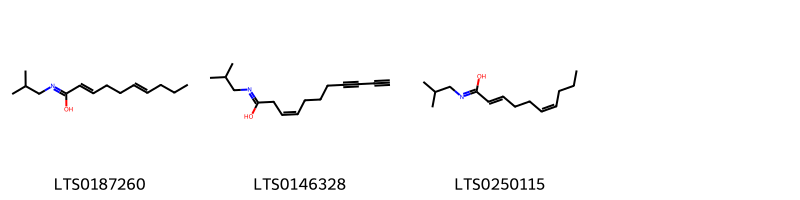{ width=100% }
    <figcaption>Hình ảnh cấu trúc hóa học của 3 hoạt chất thuộc nhóm Carboximidic acids and derivatives gồm ['n-(2-methylpropyl)deca-2,6-dienimidic acid (LTS0187260)', '(3z)-n-(2-methylpropyl)undec-3-en-8,10-diynimidic acid (LTS0146328)', '(2e,6z)-n-(2-methylpropyl)deca-2,6-dienimidic acid (LTS0250115)'].</figcaption>
</figure>
#### Nhóm Fatty Acyls
<figure markdown="span">
    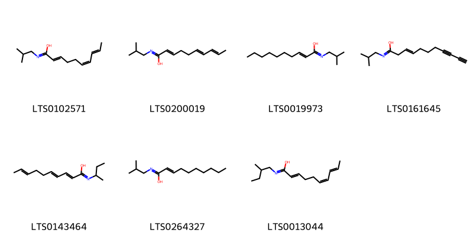{ width=100% }
    <figcaption>Hình ảnh cấu trúc hóa học của 7 hoạt chất thuộc nhóm Fatty Acyls gồm ['(2e,6z,8e)-n-(2-methylpropyl)deca-2,6,8-trienimidic acid (LTS0102571)', 'n-(2-methylpropyl)deca-2,6,8-trienimidic acid (LTS0200019)', '(2e)-n-(2-methylpropyl)dec-2-enimidic acid (LTS0019973)', 'n-(2-methylpropyl)undec-3-en-8,10-diynimidic acid (LTS0161645)', '(2e,4e,8e)-n-(sec-butyl)deca-2,4,8-trienimidic acid (LTS0143464)', 'n-(2-methylpropyl)dec-2-enimidic acid (LTS0264327)', '(2e,6z,8e)-n-(2-methylbutyl)deca-2,6,8-trienimidic acid (LTS0013044)'].</figcaption>
</figure>
#### Nhóm Organooxygen compounds
<figure markdown="span">
    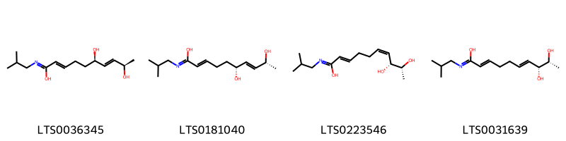{ width=100% }
    <figcaption>Hình ảnh cấu trúc hóa học của 4 hoạt chất thuộc nhóm Organooxygen compounds gồm ['(2e,6r,7e,9r)-6,9-dihydroxy-n-(2-methylpropyl)deca-2,7-dienimidic acid (LTS0036345)', '(6r,9r)-6,9-dihydroxy-n-(2-methylpropyl)deca-2,7-dienimidic acid (LTS0181040)', '(2e,6z,8r,9r)-8,9-dihydroxy-n-(2-methylpropyl)deca-2,6-dienimidic acid (LTS0223546)', '(8r,9r)-8,9-dihydroxy-n-(2-methylpropyl)deca-2,6-dienimidic acid (LTS0031639)'].</figcaption>
</figure>
#### Nhóm Prenol lipids
<figure markdown="span">
    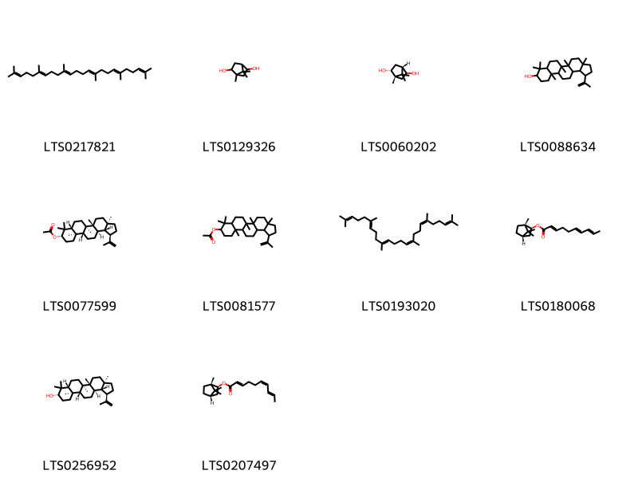{ width=100% }
    <figcaption>Hình ảnh cấu trúc hóa học của 10 hoạt chất thuộc nhóm Prenol lipids gồm ['squalene (LTS0217821)', '1,7,7-trimethylbicyclo[2.2.1]heptane-2,5-diol (LTS0129326)', '(1s,2r,4s,5s)-1,7,7-trimethylbicyclo[2.2.1]heptane-2,5-diol (LTS0060202)', 'lupeol (LTS0088634)', 'lupeol acetate (LTS0077599)', '3a,5a,5b,8,8,11a-hexamethyl-1-(prop-1-en-2-yl)-hexadecahydrocyclopenta[a]chrysen-9-yl acetate (LTS0081577)', '2,6,10,15,19,23-hexamethyltetracosa-2,6,10,14,18,22-hexaene (LTS0193020)', '(1s,2s,4s)-1,7,7-trimethylbicyclo[2.2.1]heptan-2-yl deca-2,6,8-trienoate (LTS0180068)', 'lupeol (LTS0256952)', '(1s,2s,4s)-1,7,7-trimethylbicyclo[2.2.1]heptan-2-yl (2e,6z,8e)-deca-2,6,8-trienoate (LTS0207497)'].</figcaption>
</figure>

---

### Dược dân tộc học

Danh sách các quốc gia có sử dụng *Heliopsis longipes* trong điều trị các bệnh. 

| Country   | Disease                           | Bệnh                                                                                                                                                                                                |
|:----------|:----------------------------------|:----------------------------------------------------------------------------------------------------------------------------------------------------------------------------------------------------|
| Mexico    | Anesthetic, Sialogogue, Stimulant | MYMEMORY WARNING: YOU USED ALL AVAILABLE FREE TRANSLATIONS FOR TODAY. NEXT AVAILABLE IN  09 HOURS 35 MINUTES 54 SECONDS VISIT HTTPS://MYMEMORY.TRANSLATED.NET/DOC/USAGELIMITS.PHP TO TRANSLATE MORE |

---

# Chi Ligularia

??? note "Danh sách các dược liệu thuộc chi"
    
	 - *Ligularia fischerii*

---
## Ligularia fischerii
### Thông tin về thực vật

!!! info "Phân loại thực vật của *Ligularia fischeri* từ GIBF:"
    - **Kingdom:** Plantae
    - **Phylum:** Tracheophyta
    - **Order:** Asterales
    - **Family:** Asteraceae
    - **Genus:** Ligularia
    - **Species:** *Ligularia fischeri*

 

| Label (VI)   | Label (EN)   | Scientific Name    | Descriptions (VI)   | Descriptions (EN)   | Also Known As (VI)   | Also Known As (EN)   |
|:-------------|:-------------|:-------------------|:--------------------|:--------------------|:---------------------|:---------------------|
| N/A          | N/A          | Heliopsis longipes | loài thực vật       | species of plant    | ['']                 | ['']                 |

#### Phân bố trên thế giới

**Từ CSDL GIBF** nan, Pakistan, Japan, Korea, Republic of, Russian Federation, Norway, Mongolia, China, Nepal

#### Phân bố tại Việt Nam

**Từ CSDL GIBF**: Không có ghi nhận ở Việt Nam

---
### Thành phần hóa học
        
- Theo cơ sở dữ liệu lotus: Từ loài *Ligularia fischeri* đã phân lập và xác định được Chưa có hoạt chất nào được phân lập. hoạt chất thuộc về các nhóm Không có hoạt chất nào được phân lập. 

Không có hình ảnh nào được tạo ra

---

### Dược dân tộc học

Danh sách các quốc gia có sử dụng *Ligularia fischeri* trong điều trị các bệnh. 

| Country   | Disease               | Bệnh                                                                                                                                                                                                |
|:----------|:----------------------|:----------------------------------------------------------------------------------------------------------------------------------------------------------------------------------------------------|
| Elsewhere | Antitussive, Diuretic | MYMEMORY WARNING: YOU USED ALL AVAILABLE FREE TRANSLATIONS FOR TODAY. NEXT AVAILABLE IN  09 HOURS 35 MINUTES 25 SECONDS VISIT HTTPS://MYMEMORY.TRANSLATED.NET/DOC/USAGELIMITS.PHP TO TRANSLATE MORE |

---

# Chi Franseria

??? note "Danh sách các dược liệu thuộc chi"
    
	 - *Franseria artemisioides*
	 - *Franseria discolor*

---
## Franseria artemisioides
### Thông tin về thực vật

!!! info "Phân loại thực vật của *Franseria artemisioides* từ GIBF:"
    - **Kingdom:** Plantae
    - **Phylum:** Tracheophyta
    - **Order:** Asterales
    - **Family:** Asteraceae
    - **Genus:** Ambrosia
    - **Species:** *Franseria artemisioides*

 

| Label (VI)   | Label (EN)   | Scientific Name         | Descriptions (VI)   | Descriptions (EN)   | Also Known As (VI)   | Also Known As (EN)   |
|:-------------|:-------------|:------------------------|:--------------------|:--------------------|:---------------------|:---------------------|
| N/A          | N/A          | Franseria artemisioides |                     |                     | ['']                 | ['']                 |

#### Phân bố trên thế giới

**Từ CSDL GIBF** nan, Pakistan, Japan, Korea, Republic of, Russian Federation, Norway, Mongolia, China, Nepal

#### Phân bố tại Việt Nam

**Từ CSDL GIBF**: Không có ghi nhận ở Việt Nam

---
### Thành phần hóa học
        
- Theo cơ sở dữ liệu lotus: Từ loài *Franseria artemisioides* đã phân lập và xác định được Chưa có hoạt chất nào được phân lập. hoạt chất thuộc về các nhóm Không có hoạt chất nào được phân lập. 

Không có hình ảnh nào được tạo ra

---

### Dược dân tộc học

Danh sách các quốc gia có sử dụng *Franseria artemisioides* trong điều trị các bệnh. 

| Country   | Disease     | Bệnh                                                                                                                                                                                                |
|:----------|:------------|:----------------------------------------------------------------------------------------------------------------------------------------------------------------------------------------------------|
| Peru      | Carminative | MYMEMORY WARNING: YOU USED ALL AVAILABLE FREE TRANSLATIONS FOR TODAY. NEXT AVAILABLE IN  09 HOURS 34 MINUTES 57 SECONDS VISIT HTTPS://MYMEMORY.TRANSLATED.NET/DOC/USAGELIMITS.PHP TO TRANSLATE MORE |

---

---
## Franseria discolor
### Thông tin về thực vật

!!! info "Phân loại thực vật của *Ambrosia tomentosa* từ GIBF:"
    - **Kingdom:** Plantae
    - **Phylum:** Tracheophyta
    - **Order:** Asterales
    - **Family:** Asteraceae
    - **Genus:** Ambrosia
    - **Species:** *Ambrosia tomentosa*

 

| Label (VI)   | Label (EN)   | Scientific Name    | Descriptions (VI)   | Descriptions (EN)   | Also Known As (VI)   | Also Known As (EN)   |
|:-------------|:-------------|:-------------------|:--------------------|:--------------------|:---------------------|:---------------------|
| N/A          | N/A          | Franseria discolor |                     |                     | ['']                 | ['']                 |

#### Phân bố trên thế giới

**Từ CSDL GIBF** nan, United States of America

#### Phân bố tại Việt Nam

**Từ CSDL GIBF**: Không có ghi nhận ở Việt Nam

---
### Thành phần hóa học
        
- Theo cơ sở dữ liệu lotus: Từ loài *Ambrosia tomentosa* đã phân lập và xác định được Chưa có hoạt chất nào được phân lập. hoạt chất thuộc về các nhóm Không có hoạt chất nào được phân lập. 

Không có hình ảnh nào được tạo ra

---

### Dược dân tộc học

Danh sách các quốc gia có sử dụng *Ambrosia tomentosa* trong điều trị các bệnh. 

| Country   | Disease   | Bệnh                                                                                                                                                                                                |
|:----------|:----------|:----------------------------------------------------------------------------------------------------------------------------------------------------------------------------------------------------|
| US        | Poison    | MYMEMORY WARNING: YOU USED ALL AVAILABLE FREE TRANSLATIONS FOR TODAY. NEXT AVAILABLE IN  09 HOURS 34 MINUTES 30 SECONDS VISIT HTTPS://MYMEMORY.TRANSLATED.NET/DOC/USAGELIMITS.PHP TO TRANSLATE MORE |

---

# Chi Chamaemelum

??? note "Danh sách các dược liệu thuộc chi"
    
	 - *Chamaemelum nobile*
	 - *Chamaemelum nobilis*

---
## Chamaemelum nobile
### Thông tin về thực vật

!!! info "Phân loại thực vật của *Chamaemelum nobile* từ GIBF:"
    - **Kingdom:** Plantae
    - **Phylum:** Tracheophyta
    - **Order:** Asterales
    - **Family:** Asteraceae
    - **Genus:** Chamaemelum
    - **Species:** *Chamaemelum nobile*

 

| Label (VI)   | Label (EN)   | Scientific Name    | Descriptions (VI)   | Descriptions (EN)   | Also Known As (VI)      | Also Known As (EN)                                                         |
|:-------------|:-------------|:-------------------|:--------------------|:--------------------|:------------------------|:---------------------------------------------------------------------------|
| N/A          | N/A          | Chamaemelum nobile | loài thực vật       | species of plants   | ['Chamaemelum nobilis'] | ['Chamamelum nobile', 'Roman chamomile', 'chamomile', 'garden dog-fennel'] |

#### Phân bố trên thế giới

**Từ CSDL GIBF** Italy, Australia, Belgium, Ukraine, Spain, Hungary, Portugal, Algeria, Morocco, United States of America, Croatia, Greece, Czechia, Germany, Austria, France, United Kingdom of Great Britain and Northern Ireland, Ireland, Poland, New Zealand

#### Phân bố tại Việt Nam

**Từ CSDL GIBF**: Không có ghi nhận ở Việt Nam

---
### Thành phần hóa học
        
- Theo cơ sở dữ liệu lotus: Từ loài *Chamaemelum nobile* đã phân lập và xác định được 91 hoạt chất thuộc về các nhóm Fatty Acyls, Flavonoids, Prenol lipids, Cinnamic acids and derivatives, Benzene and substituted derivatives, Hydroxy acids and derivatives, Heteroaromatic compounds, Organooxygen compounds, Saturated hydrocarbons, Carboxylic acids and derivatives, Organic hydroperoxides. 

|    | chemicalTaxonomyClassyfireClass     |   smiles_count |
|---:|:------------------------------------|---------------:|
|  0 | Benzene and substituted derivatives |              1 |
|  1 | Carboxylic acids and derivatives    |              3 |
|  2 | Cinnamic acids and derivatives      |              2 |
|  3 | Fatty Acyls                         |             21 |
|  4 | Flavonoids                          |              8 |
|  5 | Heteroaromatic compounds            |              1 |
|  6 | Hydroxy acids and derivatives       |              8 |
|  7 | Organic hydroperoxides              |              2 |
|  8 | Organooxygen compounds              |              4 |
|  9 | Prenol lipids                       |             37 |
| 10 | Saturated hydrocarbons              |              1 |

#### Nhóm Benzene and substituted derivatives
<figure markdown="span">
    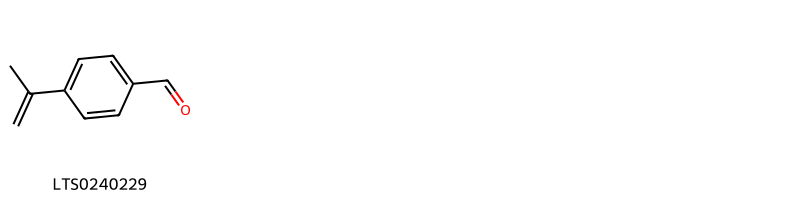{ width=100% }
    <figcaption>Hình ảnh cấu trúc hóa học của 1 hoạt chất thuộc nhóm Benzene and substituted derivatives gồm ['4-(prop-1-en-2-yl)benzaldehyde (LTS0240229)'].</figcaption>
</figure>
#### Nhóm Carboxylic acids and derivatives
<figure markdown="span">
    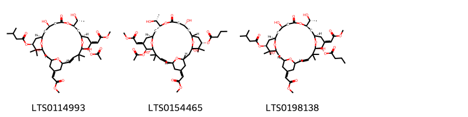{ width=100% }
    <figcaption>Hình ảnh cấu trúc hóa học của 3 hoạt chất thuộc nhóm Carboxylic acids and derivatives gồm ['(1s,3s,5z,7r,8e,11s,12s,13e,15r,17r,21r,23r,25s)-12-(acetyloxy)-1,11,21-trihydroxy-17-[(1r)-1-hydroxyethyl]-5,13-bis(2-methoxy-2-oxoethylidene)-10,10,26,26-tetramethyl-19-oxo-18,27,28,29-tetraoxatetracyclo[21.3.1.1³,⁷.1¹¹,¹⁵]nonacos-8-en-25-yl 3-methylbutanoate (LTS0114993)', '(1s,3s,5z,7r,8z,11s,12s,13e,15s,17r,21r,23r,25s)-12-(acetyloxy)-1,11,21-trihydroxy-17-[(1r)-1-hydroxyethyl]-5,13-bis(2-methoxy-2-oxoethylidene)-10,10,26,26-tetramethyl-19-oxo-18,27,28,29-tetraoxatetracyclo[21.3.1.1³,⁷.1¹¹,¹⁵]nonacos-8-en-25-yl butanoate (LTS0154465)', '(1s,3s,5z,7r,8e,11s,12s,13e,15r,17r,21r,23r,25s)-12-(butanoyloxy)-1,11,21-trihydroxy-17-[(1r)-1-hydroxyethyl]-5,13-bis(2-methoxy-2-oxoethylidene)-10,10,26,26-tetramethyl-19-oxo-18,27,28,29-tetraoxatetracyclo[21.3.1.1³,⁷.1¹¹,¹⁵]nonacos-8-en-25-yl 3-methylbutanoate (LTS0198138)'].</figcaption>
</figure>
#### Nhóm Cinnamic acids and derivatives
<figure markdown="span">
    { width=100% }
    <figcaption>Hình ảnh cấu trúc hóa học của 2 hoạt chất thuộc nhóm Cinnamic acids and derivatives gồm ['3,4-dihydroxycinnamic acid (LTS0128050)', 'caffeic acid (LTS0027481)'].</figcaption>
</figure>
#### Nhóm Fatty Acyls
<figure markdown="span">
    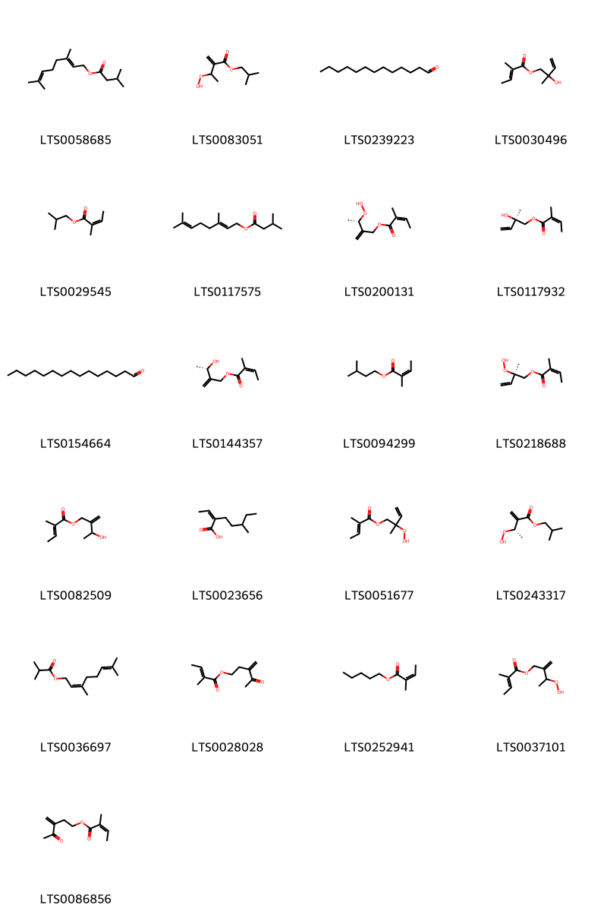{ width=100% }
    <figcaption>Hình ảnh cấu trúc hóa học của 21 hoạt chất thuộc nhóm Fatty Acyls gồm ['3,7-dimethylocta-2,6-dien-1-yl 3-methylbutanoate (LTS0058685)', '2-methylpropyl 3-hydroperoxy-2-methylidenebutanoate (LTS0083051)', 'tridecanal (LTS0239223)', '2-hydroxy-2-methylbut-3-en-1-yl 2-methylbut-2-enoate (LTS0030496)', 'isobutyl angelate (LTS0029545)', 'geranyl isovalerate (LTS0117575)', '(3s)-3-hydroperoxy-2-methylidenebutyl (2z)-2-methylbut-2-enoate (LTS0200131)', '(2r)-2-hydroxy-2-methylbut-3-en-1-yl (2z)-2-methylbut-2-enoate (LTS0117932)', 'pentadecanal (LTS0154664)', '(3s)-3-hydroxy-2-methylidenebutyl (2z)-2-methylbut-2-enoate (LTS0144357)', '3-methylbutyl (2z)-2-methylbut-2-enoate (LTS0094299)', '(2r)-2-hydroperoxy-2-methylbut-3-en-1-yl (2z)-2-methylbut-2-enoate (LTS0218688)', '3-hydroxy-2-methylidenebutyl 2-methylbut-2-enoate (LTS0082509)', '(2z)-2-ethylidene-5-methylheptanoic acid (LTS0023656)', '2-hydroperoxy-2-methylbut-3-en-1-yl 2-methylbut-2-enoate (LTS0051677)', '2-methylpropyl (3s)-3-hydroperoxy-2-methylidenebutanoate (LTS0243317)', 'neryl isobutyrate (LTS0036697)', '3-methylidene-4-oxopentyl 2-methylbut-2-enoate (LTS0028028)', 'pentyl (2z)-2-methylbut-2-enoate (LTS0252941)', '3-hydroperoxy-2-methylidenebutyl 2-methylbut-2-enoate (LTS0037101)', '3-methylidene-4-oxopentyl (2z)-2-methylbut-2-enoate (LTS0086856)'].</figcaption>
</figure>
#### Nhóm Flavonoids
<figure markdown="span">
    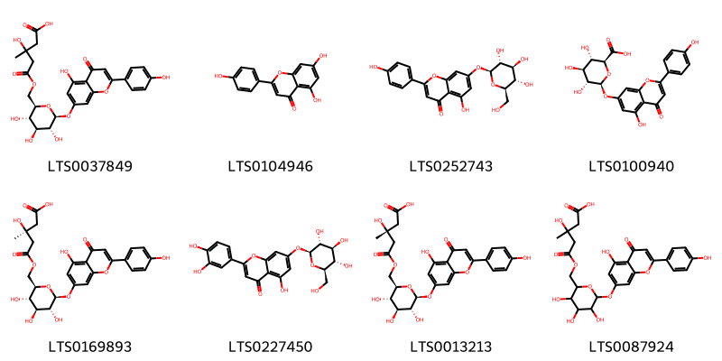{ width=100% }
    <figcaption>Hình ảnh cấu trúc hóa học của 8 hoạt chất thuộc nhóm Flavonoids gồm ['3-hydroxy-3-methyl-5-oxo-5-{[(2r,3s,4s,5r,6s)-3,4,5-trihydroxy-6-{[5-hydroxy-2-(4-hydroxyphenyl)-4-oxochromen-7-yl]oxy}oxan-2-yl]methoxy}pentanoic acid (LTS0037849)', 'chamomile (LTS0104946)', 'apigenin 7-o-β-glucoside (LTS0252743)', '(2s,3s,4s,5r,6s)-3,4,5-trihydroxy-6-{[5-hydroxy-2-(4-hydroxyphenyl)-4-oxochromen-7-yl]oxy}oxane-2-carboxylic acid (LTS0100940)', '(3s)-3-hydroxy-3-methyl-5-oxo-5-{[(2r,3s,4s,5r,6s)-3,4,5-trihydroxy-6-{[5-hydroxy-2-(4-hydroxyphenyl)-4-oxochromen-7-yl]oxy}oxan-2-yl]methoxy}pentanoic acid (LTS0169893)', 'luteolin 7-o-glucoside (LTS0227450)', '(3r)-3-hydroxy-3-methyl-5-oxo-5-{[(2r,3s,4s,5r,6s)-3,4,5-trihydroxy-6-{[5-hydroxy-2-(4-hydroxyphenyl)-4-oxochromen-7-yl]oxy}oxan-2-yl]methoxy}pentanoic acid (LTS0013213)', '3-hydroxy-3-methyl-5-oxo-5-[(3,4,5-trihydroxy-6-{[5-hydroxy-2-(4-hydroxyphenyl)-4-oxochromen-7-yl]oxy}oxan-2-yl)methoxy]pentanoic acid (LTS0087924)'].</figcaption>
</figure>
#### Nhóm Heteroaromatic compounds
<figure markdown="span">
    { width=100% }
    <figcaption>Hình ảnh cấu trúc hóa học của 1 hoạt chất thuộc nhóm Heteroaromatic compounds gồm ['5-(furan-3-yl)-2-methylpent-1-en-3-ol (LTS0013161)'].</figcaption>
</figure>
#### Nhóm Hydroxy acids and derivatives
<figure markdown="span">
    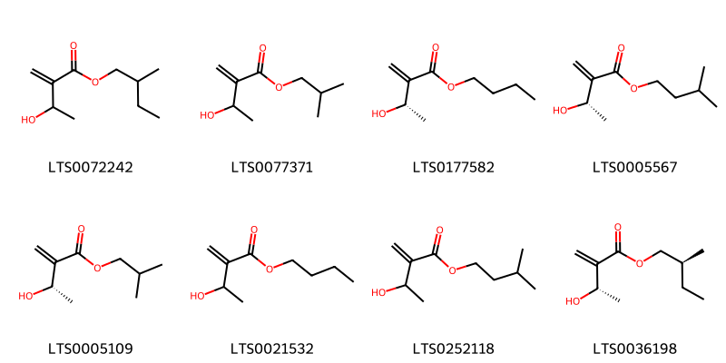{ width=100% }
    <figcaption>Hình ảnh cấu trúc hóa học của 8 hoạt chất thuộc nhóm Hydroxy acids and derivatives gồm ['2-methylbutyl 3-hydroxy-2-methylidenebutanoate (LTS0072242)', '2-methylpropyl 3-hydroxy-2-methylidenebutanoate (LTS0077371)', 'butyl (3s)-3-hydroxy-2-methylidenebutanoate (LTS0177582)', '3-methylbutyl (3s)-3-hydroxy-2-methylidenebutanoate (LTS0005567)', '2-methylpropyl (3s)-3-hydroxy-2-methylidenebutanoate (LTS0005109)', 'butyl 3-hydroxy-2-methylidenebutanoate (LTS0021532)', '3-methylbutyl 3-hydroxy-2-methylidenebutanoate (LTS0252118)', '(2s)-2-methylbutyl (3s)-3-hydroxy-2-methylidenebutanoate (LTS0036198)'].</figcaption>
</figure>
#### Nhóm Organic hydroperoxides
<figure markdown="span">
    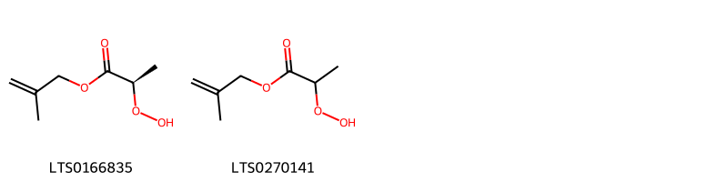{ width=100% }
    <figcaption>Hình ảnh cấu trúc hóa học của 2 hoạt chất thuộc nhóm Organic hydroperoxides gồm ['2-methylprop-2-en-1-yl (2r)-2-hydroperoxypropanoate (LTS0166835)', '2-methylprop-2-en-1-yl 2-hydroperoxypropanoate (LTS0270141)'].</figcaption>
</figure>
#### Nhóm Organooxygen compounds
<figure markdown="span">
    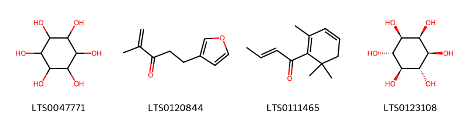{ width=100% }
    <figcaption>Hình ảnh cấu trúc hóa học của 4 hoạt chất thuộc nhóm Organooxygen compounds gồm ['(-)-inositol (LTS0047771)', '5-(furan-3-yl)-2-methylpent-1-en-3-one (LTS0120844)', 'damascenone (LTS0111465)', '(1r,2r,3s,4r,5s,6s)-cyclohexane-1,2,3,4,5,6-hexol (LTS0123108)'].</figcaption>
</figure>
#### Nhóm Prenol lipids
<figure markdown="span">
    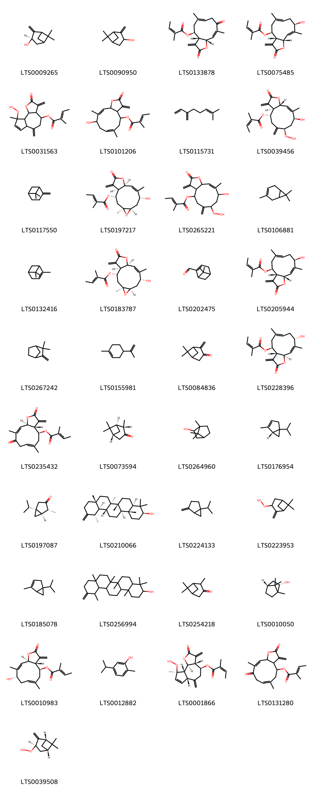{ width=100% }
    <figcaption>Hình ảnh cấu trúc hóa học của 37 hoạt chất thuộc nhóm Prenol lipids gồm ['(3r)-6,6-dimethyl-2-methylidenebicyclo[3.1.1]heptan-3-ol (LTS0009265)', 'pinocarveol (LTS0090950)', '(3ar,4s,11as)-6,10-dimethyl-3-methylidene-2,9-dioxo-3ah,4h,5h,8h,11ah-cyclodeca[b]furan-4-yl (2z)-2-methylbut-2-enoate (LTS0133878)', '(3ar,4s,9r,11as)-9-hydroxy-6,10-dimethyl-3-methylidene-2-oxo-3ah,4h,5h,8h,9h,11ah-cyclodeca[b]furan-4-yl (2z)-2-methylbut-2-enoate (LTS0075485)', '9-hydroperoxy-9-methyl-3,6-dimethylidene-2-oxo-3ah,4h,5h,6ah,9ah,9bh-azuleno[4,5-b]furan-4-yl 2-methylbut-2-enoate (LTS0031563)', '9-hydroxy-6,10-dimethyl-3-methylidene-2-oxo-3ah,4h,5h,8h,9h,11ah-cyclodeca[b]furan-4-yl 2-methylbut-2-enoate (LTS0101206)', 'α-myrcene (LTS0115731)', '(3ar,4s,7r,9s,11ar)-7-hydroperoxy-9-hydroxy-10-methyl-3,6-dimethylidene-2-oxo-3ah,4h,5h,7h,8h,9h,11ah-cyclodeca[b]furan-4-yl (2z)-2-methylbut-2-enoate (LTS0039456)', 'β-pinene (LTS0117550)', '(1r,2s,4s,6r,8r,11s)-8-hydroxy-4,9-dimethyl-14-methylidene-13-oxo-5,12-dioxatricyclo[9.3.0.0⁴,⁶]tetradec-9-en-2-yl 2-methylbut-2-enoate (LTS0197217)', '7-hydroperoxy-9-hydroxy-10-methyl-3,6-dimethylidene-2-oxo-3ah,4h,5h,7h,8h,9h,11ah-cyclodeca[b]furan-4-yl 2-methylbut-2-enoate (LTS0265221)', 'monoterpenes (LTS0106881)', 'α pinene (LTS0132416)', '(1r,2s,4s,6r,8r,9z,11s)-8-hydroxy-4,9-dimethyl-14-methylidene-13-oxo-5,12-dioxatricyclo[9.3.0.0⁴,⁶]tetradec-9-en-2-yl (2e)-2-methylbut-2-enoate (LTS0183787)', 'myrtenal (LTS0202475)', '(3ar,4s,9r,11as)-9-hydroxy-6,10-dimethyl-3-methylidene-2-oxo-3ah,4h,5h,8h,9h,11ah-cyclodeca[b]furan-4-yl (2z)-2-methylbut-2-enoate (LTS0205944)', 'camphene (LTS0267242)', 'limonene,  (LTS0155981)', 'pinocarvone (LTS0084836)', 'nobilin (LTS0228396)', '(3ar,4s,11ar)-6,10-dimethyl-3-methylidene-2,9-dioxo-3ah,4h,5h,8h,11ah-cyclodeca[b]furan-4-yl (2e)-2-methylbut-2-enoate (LTS0235432)', '(1r,2s,5r)-2,6,6-trimethylbicyclo[3.1.1]heptan-3-one (LTS0073594)', 'borneol (LTS0264960)', 'α-thujene (LTS0176954)', 'thujone (LTS0197087)', 'taraxasterol (LTS0210066)', 'sabinene (LTS0224133)', '6,6-dimethyl-2-methylidenebicyclo[3.1.1]heptane-3-peroxol (LTS0223953)', 'α-thujene (LTS0185078)', '4,4,6a,6b,8a,12,14b-heptamethyl-11-methylidene-hexadecahydropicen-3-ol (LTS0256994)', '(e)-3-pinanone (LTS0254218)', '(2s,4r)-1,7,7-trimethylbicyclo[2.2.1]heptan-2-ol (LTS0010050)', 'nobilin (LTS0010983)', 'carvacrol (LTS0012882)', '(3ar,4s,6ar,9r,9as,9bs)-9-hydroperoxy-9-methyl-3,6-dimethylidene-2-oxo-3ah,4h,5h,6ah,9ah,9bh-azuleno[4,5-b]furan-4-yl (2z)-2-methylbut-2-enoate (LTS0001866)', '6,10-dimethyl-3-methylidene-2,9-dioxo-3ah,4h,5h,8h,11ah-cyclodeca[b]furan-4-yl 2-methylbut-2-enoate (LTS0131280)', '(1s,3r,5s)-6,6-dimethyl-2-methylidenebicyclo[3.1.1]heptane-3-peroxol (LTS0039508)'].</figcaption>
</figure>
#### Nhóm Saturated hydrocarbons
<figure markdown="span">
    { width=100% }
    <figcaption>Hình ảnh cấu trúc hóa học của 1 hoạt chất thuộc nhóm Saturated hydrocarbons gồm ['triacontane (LTS0250709)'].</figcaption>
</figure>

---

### Dược dân tộc học

Danh sách các quốc gia có sử dụng *Chamaemelum nobile* trong điều trị các bệnh. 

| Country   | Disease                             | Bệnh                                                                                                                                                                                                |
|:----------|:------------------------------------|:----------------------------------------------------------------------------------------------------------------------------------------------------------------------------------------------------|
| Iraq      | Carminative, Emetic, Tonic, Nervine | MYMEMORY WARNING: YOU USED ALL AVAILABLE FREE TRANSLATIONS FOR TODAY. NEXT AVAILABLE IN  09 HOURS 34 MINUTES 02 SECONDS VISIT HTTPS://MYMEMORY.TRANSLATED.NET/DOC/USAGELIMITS.PHP TO TRANSLATE MORE |
| Mexico    | Carminative, Stimulant              | MYMEMORY WARNING: YOU USED ALL AVAILABLE FREE TRANSLATIONS FOR TODAY. NEXT AVAILABLE IN  09 HOURS 34 MINUTES 00 SECONDS VISIT HTTPS://MYMEMORY.TRANSLATED.NET/DOC/USAGELIMITS.PHP TO TRANSLATE MORE |
| Turkey    | Stimulant                           | MYMEMORY WARNING: YOU USED ALL AVAILABLE FREE TRANSLATIONS FOR TODAY. NEXT AVAILABLE IN  09 HOURS 33 MINUTES 56 SECONDS VISIT HTTPS://MYMEMORY.TRANSLATED.NET/DOC/USAGELIMITS.PHP TO TRANSLATE MORE |

---

---
## Chamaemelum nobilis
### Thông tin về thực vật

!!! info "Phân loại thực vật của *Chamaemelum nobilis* từ GIBF:"
    - **Kingdom:** Plantae
    - **Phylum:** Tracheophyta
    - **Order:** Asterales
    - **Family:** Asteraceae
    - **Genus:** Chamaemelum
    - **Species:** *Chamaemelum nobilis*

 

| Label (VI)   | Label (EN)   | Scientific Name    | Descriptions (VI)   | Descriptions (EN)   | Also Known As (VI)      | Also Known As (EN)                                                         |
|:-------------|:-------------|:-------------------|:--------------------|:--------------------|:------------------------|:---------------------------------------------------------------------------|
| N/A          | N/A          | Chamaemelum nobile | loài thực vật       | species of plants   | ['Chamaemelum nobilis'] | ['Chamamelum nobile', 'Roman chamomile', 'chamomile', 'garden dog-fennel'] |

#### Phân bố trên thế giới

**Từ CSDL GIBF** Italy, Australia, Belgium, Ukraine, Spain, Hungary, Portugal, Algeria, Morocco, United States of America, Croatia, Greece, Czechia, Germany, Austria, France, United Kingdom of Great Britain and Northern Ireland, Ireland, Poland, New Zealand

#### Phân bố tại Việt Nam

**Từ CSDL GIBF**: Không có ghi nhận ở Việt Nam

---
### Thành phần hóa học
        
- Theo cơ sở dữ liệu lotus: Từ loài *Chamaemelum nobilis* đã phân lập và xác định được Chưa có hoạt chất nào được phân lập. hoạt chất thuộc về các nhóm Không có hoạt chất nào được phân lập. 

Không có hình ảnh nào được tạo ra

---

### Dược dân tộc học

Danh sách các quốc gia có sử dụng *Chamaemelum nobilis* trong điều trị các bệnh. 

| Country   | Disease   | Bệnh                                                                                                                                                                                                |
|:----------|:----------|:----------------------------------------------------------------------------------------------------------------------------------------------------------------------------------------------------|
| ain       | Tonic     | MYMEMORY WARNING: YOU USED ALL AVAILABLE FREE TRANSLATIONS FOR TODAY. NEXT AVAILABLE IN  09 HOURS 33 MINUTES 01 SECONDS VISIT HTTPS://MYMEMORY.TRANSLATED.NET/DOC/USAGELIMITS.PHP TO TRANSLATE MORE |

---

# Chi Emilia

??? note "Danh sách các dược liệu thuộc chi"
    
	 - *Emilia sonchifolia*

---
## Emilia sonchifolia
### Thông tin về thực vật

!!! info "Phân loại thực vật của *Emilia sonchifolia* từ GIBF:"
    - **Kingdom:** Plantae
    - **Phylum:** Tracheophyta
    - **Order:** Asterales
    - **Family:** Asteraceae
    - **Genus:** Emilia
    - **Species:** *Emilia sonchifolia*

 

| Label (VI)   | Label (EN)   | Scientific Name    | Descriptions (VI)   | Descriptions (EN)   | Also Known As (VI)   | Also Known As (EN)   |
|:-------------|:-------------|:-------------------|:--------------------|:--------------------|:---------------------|:---------------------|
| N/A          | N/A          | Emilia sonchifolia |                     | species of plant    | ['']                 | ['']                 |

#### Phân bố trên thế giới

**Từ CSDL GIBF** Dominican Republic, Ecuador, Puerto Rico, Ghana, Hong Kong, Australia, Guadeloupe, Thailand, Brazil, Macao, Costa Rica, Honduras, United States of America, Cuba, Mexico, Singapore, China, Panama

#### Phân bố tại Việt Nam

**Từ CSDL GIBF**: Không có ghi nhận ở Việt Nam

---
### Thành phần hóa học
        
- Theo cơ sở dữ liệu lotus: Từ loài *Emilia sonchifolia* đã phân lập và xác định được 10 hoạt chất thuộc về các nhóm Fatty Acyls, Steroids and steroid derivatives, Macrolides and analogues. 

|    | chemicalTaxonomyClassyfireClass   |   smiles_count |
|---:|:----------------------------------|---------------:|
|  0 |                                   |              1 |
|  1 | Fatty Acyls                       |              4 |
|  2 | Macrolides and analogues          |              3 |
|  3 | Steroids and steroid derivatives  |              2 |

#### Nhóm 
<figure markdown="span">
    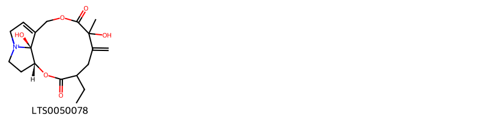{ width=100% }
    <figcaption>Hình ảnh cấu trúc hóa học của 1 hoạt chất thuộc nhóm  gồm ['(1r,17s)-4-ethyl-7,17-dihydroxy-7,14-dimethyl-6-methylidene-3,8-dioxo-2,9-dioxa-14-azatricyclo[9.5.1.0¹⁴,¹⁷]heptadec-11-en-14-ium (LTS0050078)'].</figcaption>
</figure>
#### Nhóm Fatty Acyls
<figure markdown="span">
    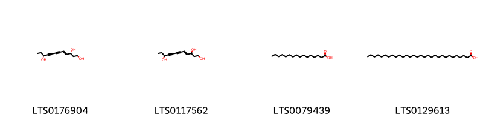{ width=100% }
    <figcaption>Hình ảnh cấu trúc hóa học của 4 hoạt chất thuộc nhóm Fatty Acyls gồm ['(3r,4e,10s)-dodec-4-en-6,8-diyne-1,3,10-triol (LTS0176904)', 'dodec-4-en-6,8-diyne-1,3,10-triol (LTS0117562)', 'palmitic acid (LTS0079439)', 'triacontanoic acid (LTS0129613)'].</figcaption>
</figure>
#### Nhóm Macrolides and analogues
<figure markdown="span">
    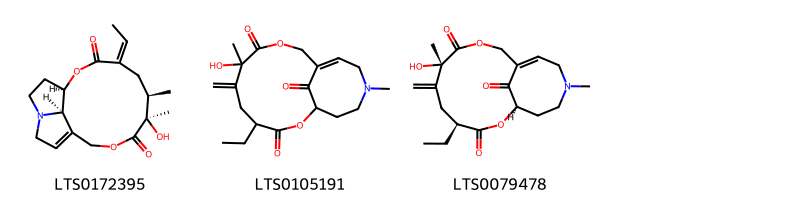{ width=100% }
    <figcaption>Hình ảnh cấu trúc hóa học của 3 hoạt chất thuộc nhóm Macrolides and analogues gồm ['senecionine (LTS0172395)', '4-ethyl-7-hydroxy-7,14-dimethyl-6-methylidene-2,9-dioxa-14-azabicyclo[9.5.1]heptadec-11-ene-3,8,17-trione (LTS0105191)', '(1r,4s,7s,11z)-4-ethyl-7-hydroxy-7,14-dimethyl-6-methylidene-2,9-dioxa-14-azabicyclo[9.5.1]heptadec-11-ene-3,8,17-trione (LTS0079478)'].</figcaption>
</figure>
#### Nhóm Steroids and steroid derivatives
<figure markdown="span">
    { width=100% }
    <figcaption>Hình ảnh cấu trúc hóa học của 2 hoạt chất thuộc nhóm Steroids and steroid derivatives gồm ['stigmast-5-en-3-ol, (3β)- (LTS0204616)', 'phytosterol (LTS0029311)'].</figcaption>
</figure>

---

### Dược dân tộc học

Danh sách các quốc gia có sử dụng *Emilia sonchifolia* trong điều trị các bệnh. 

| Country   | Disease                           | Bệnh                                                                                                                                                                                                |
|:----------|:----------------------------------|:----------------------------------------------------------------------------------------------------------------------------------------------------------------------------------------------------|
| China     | Alexiteric, Refrigerant, Diuretic | MYMEMORY WARNING: YOU USED ALL AVAILABLE FREE TRANSLATIONS FOR TODAY. NEXT AVAILABLE IN  09 HOURS 32 MINUTES 37 SECONDS VISIT HTTPS://MYMEMORY.TRANSLATED.NET/DOC/USAGELIMITS.PHP TO TRANSLATE MORE |
| India     | Sudorific                         | MYMEMORY WARNING: YOU USED ALL AVAILABLE FREE TRANSLATIONS FOR TODAY. NEXT AVAILABLE IN  09 HOURS 32 MINUTES 34 SECONDS VISIT HTTPS://MYMEMORY.TRANSLATED.NET/DOC/USAGELIMITS.PHP TO TRANSLATE MORE |

---

# Chi Hymenopappus

??? note "Danh sách các dược liệu thuộc chi"
    
	 - *Hymenopappus lugens*

---
## Hymenopappus lugens
### Thông tin về thực vật

!!! info "Phân loại thực vật của *Hymenopappus filifolius* từ GIBF:"
    - **Kingdom:** Plantae
    - **Phylum:** Tracheophyta
    - **Order:** Asterales
    - **Family:** Asteraceae
    - **Genus:** Hymenopappus
    - **Species:** *Hymenopappus filifolius*

 

| Label (VI)   | Label (EN)   | Scientific Name     | Descriptions (VI)   | Descriptions (EN)   | Also Known As (VI)   | Also Known As (EN)   |
|:-------------|:-------------|:--------------------|:--------------------|:--------------------|:---------------------|:---------------------|
| N/A          | N/A          | Hymenopappus lugens | loài thực vật       | species of plant    | ['']                 | ['']                 |

#### Phân bố trên thế giới

**Từ CSDL GIBF** nan, United States of America, Mexico

#### Phân bố tại Việt Nam

**Từ CSDL GIBF**: Không có ghi nhận ở Việt Nam

---
### Thành phần hóa học
        
- Theo cơ sở dữ liệu lotus: Từ loài *Hymenopappus filifolius* đã phân lập và xác định được Chưa có hoạt chất nào được phân lập. hoạt chất thuộc về các nhóm Không có hoạt chất nào được phân lập. 

Không có hình ảnh nào được tạo ra

---

### Dược dân tộc học

Danh sách các quốc gia có sử dụng *Hymenopappus filifolius* trong điều trị các bệnh. 

| Country   | Disease   | Bệnh                                                                                                                                                                                                |
|:----------|:----------|:----------------------------------------------------------------------------------------------------------------------------------------------------------------------------------------------------|
| Mexico    | Emetic    | MYMEMORY WARNING: YOU USED ALL AVAILABLE FREE TRANSLATIONS FOR TODAY. NEXT AVAILABLE IN  09 HOURS 31 MINUTES 55 SECONDS VISIT HTTPS://MYMEMORY.TRANSLATED.NET/DOC/USAGELIMITS.PHP TO TRANSLATE MORE |
| US        | Emetic    | MYMEMORY WARNING: YOU USED ALL AVAILABLE FREE TRANSLATIONS FOR TODAY. NEXT AVAILABLE IN  09 HOURS 31 MINUTES 50 SECONDS VISIT HTTPS://MYMEMORY.TRANSLATED.NET/DOC/USAGELIMITS.PHP TO TRANSLATE MORE |

---

# Chi Arnica

??? note "Danh sách các dược liệu thuộc chi"
    
	 - *Arnica montana*

---
## Arnica montana
### Thông tin về thực vật

!!! info "Phân loại thực vật của *Arnica montana* từ GIBF:"
    - **Kingdom:** Plantae
    - **Phylum:** Tracheophyta
    - **Order:** Asterales
    - **Family:** Asteraceae
    - **Genus:** Arnica
    - **Species:** *Arnica montana*

 

| Label (VI)   | Label (EN)   | Scientific Name   | Descriptions (VI)   | Descriptions (EN)                   | Also Known As (VI)   | Also Known As (EN)                                                       |
|:-------------|:-------------|:------------------|:--------------------|:------------------------------------|:---------------------|:-------------------------------------------------------------------------|
| N/A          | N/A          | Arnica montana    |                     | species of European flowering plant | ['']                 | ["leopard's bane", 'mountain arnica', 'mountain tobacco', "wolf's bane"] |

#### Phân bố trên thế giới

**Từ CSDL GIBF** Denmark, Netherlands, Lithuania, Belarus, Luxembourg, Germany, Romania, Spain, Portugal, Switzerland, Sweden, Austria, France, Slovenia

#### Phân bố tại Việt Nam

**Từ CSDL GIBF**: Không có ghi nhận ở Việt Nam

---
### Thành phần hóa học
        
- Theo cơ sở dữ liệu lotus: Từ loài *Arnica montana* đã phân lập và xác định được 134 hoạt chất thuộc về các nhóm Fatty Acyls, Flavonoids, Pyrrolidines, Prenol lipids, Benzene and substituted derivatives, Unsaturated hydrocarbons, Organooxygen compounds, Saturated hydrocarbons, Pyrrolizidines, Phenol esters, Furanoid lignans, Carboxylic acids and derivatives. 

|    | chemicalTaxonomyClassyfireClass     |   smiles_count |
|---:|:------------------------------------|---------------:|
|  0 | Benzene and substituted derivatives |              2 |
|  1 | Carboxylic acids and derivatives    |              3 |
|  2 | Fatty Acyls                         |             19 |
|  3 | Flavonoids                          |             19 |
|  4 | Furanoid lignans                    |              2 |
|  5 | Organooxygen compounds              |              7 |
|  6 | Phenol esters                       |              2 |
|  7 | Prenol lipids                       |             56 |
|  8 | Pyrrolidines                        |              3 |
|  9 | Pyrrolizidines                      |              8 |
| 10 | Saturated hydrocarbons              |             12 |
| 11 | Unsaturated hydrocarbons            |              1 |

#### Nhóm Benzene and substituted derivatives
<figure markdown="span">
    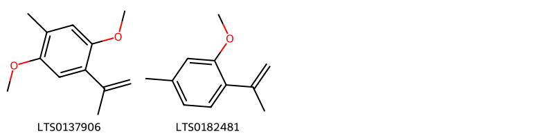{ width=100% }
    <figcaption>Hình ảnh cấu trúc hóa học của 2 hoạt chất thuộc nhóm Benzene and substituted derivatives gồm ['1,4-dimethoxy-2-methyl-5-(prop-1-en-2-yl)benzene (LTS0137906)', '2-methoxy-4-methyl-1-(prop-1-en-2-yl)benzene (LTS0182481)'].</figcaption>
</figure>
#### Nhóm Carboxylic acids and derivatives
<figure markdown="span">
    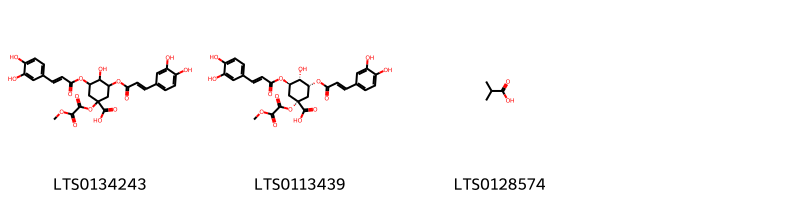{ width=100% }
    <figcaption>Hình ảnh cấu trúc hóa học của 3 hoạt chất thuộc nhóm Carboxylic acids and derivatives gồm ['3,5-bis({[3-(3,4-dihydroxyphenyl)prop-2-enoyl]oxy})-4-hydroxy-1-[(2-methoxy-2-oxoacetyl)oxy]cyclohexane-1-carboxylic acid (LTS0134243)', '(1s,3r,4s,5r)-3,5-bis({[(2e)-3-(3,4-dihydroxyphenyl)prop-2-enoyl]oxy})-4-hydroxy-1-[(2-methoxy-2-oxoacetyl)oxy]cyclohexane-1-carboxylic acid (LTS0113439)', 'isobutyric acid (LTS0128574)'].</figcaption>
</figure>
#### Nhóm Fatty Acyls
<figure markdown="span">
    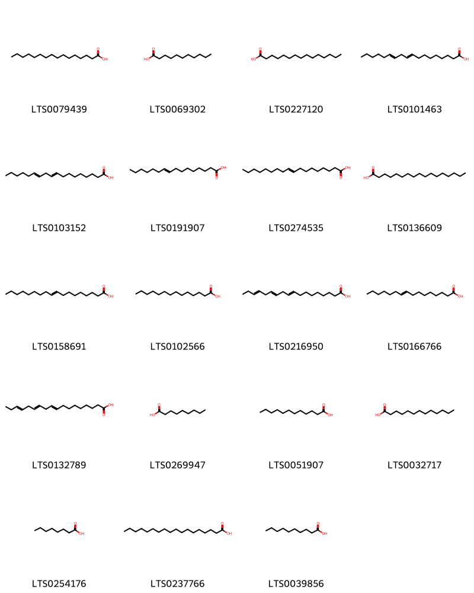{ width=100% }
    <figcaption>Hình ảnh cấu trúc hóa học của 19 hoạt chất thuộc nhóm Fatty Acyls gồm ['palmitic acid (LTS0079439)', 'undecanoic acid (LTS0069302)', 'pentadecanoic acid (LTS0227120)', '9,12-octadecadienoic acid (LTS0101463)', 'grape seed oils (LTS0103152)', 'hexadecenoate (LTS0191907)', '(+-)-propylene glycol (LTS0274535)', 'heptadecanoic acid (LTS0136609)', '9 octadecenoic acid (LTS0158691)', 'myristic acid (LTS0102566)', 'octadeca-9,12,15-trienoic acid (LTS0216950)', '9-hexadecenoic acid (LTS0166766)', 'α linolenic acid (LTS0132789)', 'nonanoic acid (LTS0269947)', 'lauric acid (LTS0051907)', 'n-tridecanoic acid (LTS0032717)', 'caprylic acid (LTS0254176)', 'stearic acid (LTS0237766)', 'capric acid (LTS0039856)'].</figcaption>
</figure>
#### Nhóm Flavonoids
<figure markdown="span">
    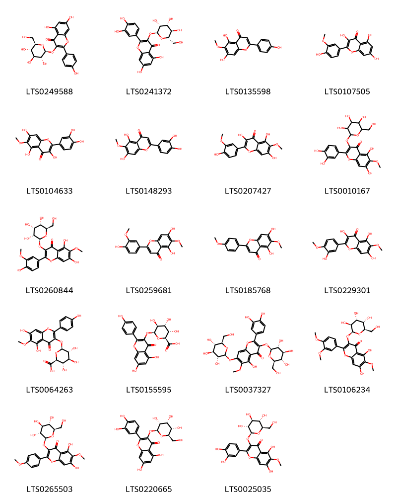{ width=100% }
    <figcaption>Hình ảnh cấu trúc hóa học của 19 hoạt chất thuộc nhóm Flavonoids gồm ['astragalin (LTS0249588)', '2-(3,4-dihydroxyphenyl)-5,7-dihydroxy-3-{[(2s,3r,4r,5r,6s)-3,4,5-trihydroxy-6-(hydroxymethyl)oxan-2-yl]oxy}chromen-4-one (LTS0241372)', 'hispidulin (LTS0135598)', 'isorhamnetin (LTS0107505)', 'patuletin (LTS0104633)', 'nepetin (LTS0148293)', 'spinacetin (LTS0207427)', '2-(3,4-dihydroxyphenyl)-5,7-dihydroxy-6-methoxy-3-{[3,4,5-trihydroxy-6-(hydroxymethyl)oxan-2-yl]oxy}chromen-4-one (LTS0010167)', '5,7-dihydroxy-2-(4-hydroxy-3-methoxyphenyl)-6-methoxy-3-{[(2s,3r,4r,5s,6r)-3,4,5-trihydroxy-6-(hydroxymethyl)oxan-2-yl]oxy}chromen-4-one (LTS0260844)', 'jaceosidin (LTS0259681)', 'pectolinarigenin (LTS0185768)', 'laciniatin (LTS0229301)', '(2s,3s,4s,5r,6s)-6-{[5,7-dihydroxy-2-(4-hydroxyphenyl)-6-methoxy-4-oxochromen-3-yl]oxy}-3,4,5-trihydroxyoxane-2-carboxylic acid (LTS0064263)', '(2s,3s,4r,5s,6s)-6-{[5,7-dihydroxy-2-(4-hydroxyphenyl)-4-oxochromen-3-yl]oxy}-3,4,5-trihydroxyoxane-2-carboxylic acid (LTS0155595)', '2-(3,4-dihydroxyphenyl)-5-hydroxy-6-methoxy-3,7-bis({[(2s,3r,4s,5s,6r)-3,4,5-trihydroxy-6-(hydroxymethyl)oxan-2-yl]oxy})chromen-4-one (LTS0037327)', '2-(3,4-dimethoxyphenyl)-5,7-dihydroxy-6-methoxy-3-{[(2s,3s,4r,5s,6r)-3,4,5-trihydroxy-6-(hydroxymethyl)oxan-2-yl]oxy}chromen-4-one (LTS0106234)', '5,7-dihydroxy-6-methoxy-2-(4-methoxyphenyl)-3-{[(2s,3r,4s,5s,6r)-3,4,5-trihydroxy-6-(hydroxymethyl)oxan-2-yl]oxy}chromen-4-one (LTS0265503)', '2-(3,4-dihydroxyphenyl)-5,7-dihydroxy-3-{[(2s,3r,4r,5s,6r)-3,4,5-trihydroxy-6-(hydroxymethyl)oxan-2-yl]oxy}chromen-4-one (LTS0220665)', '2-(3,4-dihydroxyphenyl)-5,7-dihydroxy-6-methoxy-3-{[(2s,3r,4s,5s,6r)-3,4,5-trihydroxy-6-(hydroxymethyl)oxan-2-yl]oxy}chromen-4-one (LTS0025035)'].</figcaption>
</figure>
#### Nhóm Furanoid lignans
<figure markdown="span">
    { width=100% }
    <figcaption>Hình ảnh cấu trúc hóa học của 2 hoạt chất thuộc nhóm Furanoid lignans gồm ['pinoresinol (LTS0057431)', '4-[(1s,3ar,4r,6ar)-4-(4-hydroxy-3-methoxyphenyl)-hexahydrofuro[3,4-c]furan-1-yl]-2-methoxyphenol (LTS0014948)'].</figcaption>
</figure>
#### Nhóm Organooxygen compounds
<figure markdown="span">
    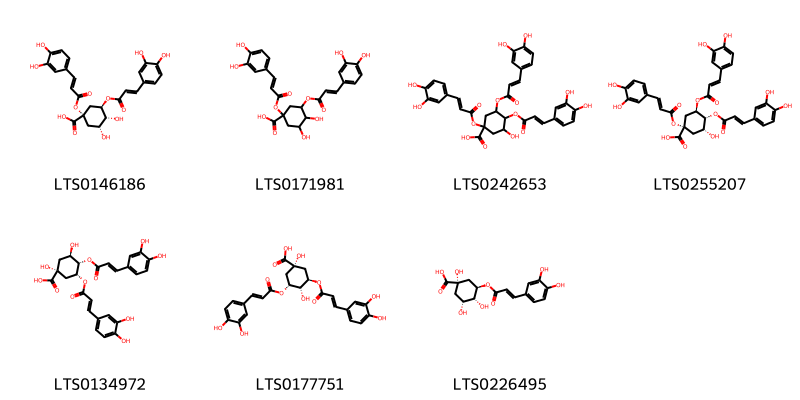{ width=100% }
    <figcaption>Hình ảnh cấu trúc hóa học của 7 hoạt chất thuộc nhóm Organooxygen compounds gồm ['(1s,3r,4r,5r)-1,3-bis({[(2e)-3-(3,4-dihydroxyphenyl)prop-2-enoyl]oxy})-4,5-dihydroxycyclohexane-1-carboxylic acid (LTS0146186)', '1,3-bis({[3-(3,4-dihydroxyphenyl)prop-2-enoyl]oxy})-4,5-dihydroxycyclohexane-1-carboxylic acid (LTS0171981)', '1,3,4-tris({[3-(3,4-dihydroxyphenyl)prop-2-enoyl]oxy})-5-hydroxycyclohexane-1-carboxylic acid (LTS0242653)', '(1s,3r,4r,5r)-1,3,4-tris({[(2e)-3-(3,4-dihydroxyphenyl)prop-2-enoyl]oxy})-5-hydroxycyclohexane-1-carboxylic acid (LTS0255207)', '3,4-dicaffeoylquinic acid (LTS0134972)', '3,5-dicaffeoylquinic acid (LTS0177751)', 'chlorogenic acid (LTS0226495)'].</figcaption>
</figure>
#### Nhóm Phenol esters
<figure markdown="span">
    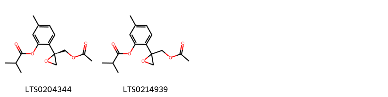{ width=100% }
    <figcaption>Hình ảnh cấu trúc hóa học của 2 hoạt chất thuộc nhóm Phenol esters gồm ['2-[(2r)-2-[(acetyloxy)methyl]oxiran-2-yl]-5-methylphenyl 2-methylpropanoate (LTS0204344)', '2-{2-[(acetyloxy)methyl]oxiran-2-yl}-5-methylphenyl 2-methylpropanoate (LTS0214939)'].</figcaption>
</figure>
#### Nhóm Prenol lipids
<figure markdown="span">
    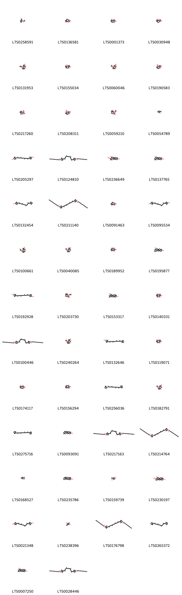{ width=100% }
    <figcaption>Hình ảnh cấu trúc hóa học của 56 hoạt chất thuộc nhóm Prenol lipids gồm ['2-isopropyl-5-methylphenyl 2-methylpropanoate (LTS0258591)', 'plenolin (LTS0136581)', 'plenolin (LTS0001373)', 'mexicanin-1 (LTS0030948)', '(3ar,4s,4ar,7ar,8r,9ar)-4a,8-dimethyl-3-methylidene-2,5-dioxo-3ah,4h,7ah,8h,9h,9ah-azuleno[6,5-b]furan-4-yl (2e)-2-methylbut-2-enoate (LTS0131953)', 'helenalin (LTS0155034)', '(3s,3ar,4s,4ar,7ar,8r,9ar)-3,4a,8-trimethyl-2,5-dioxo-3h,3ah,4h,7ah,8h,9h,9ah-azuleno[6,5-b]furan-4-yl 2-methylprop-2-enoate (LTS0060046)', 'angustibalin (LTS0190583)', '3,4a,8-trimethyl-2,5-dioxo-3h,3ah,4h,7ah,8h,9h,9ah-azuleno[6,5-b]furan-4-yl acetate (LTS0217260)', 'arnicolide a (LTS0208311)', '3,4a,8-trimethyl-2,5-dioxo-3h,3ah,4h,7ah,8h,9h,9ah-azuleno[6,5-b]furan-4-yl 2-methylprop-2-enoate (LTS0059210)', '2-isopropyl-5-methylanisole (LTS0054789)', 'carotenoid (LTS0205297)', '3,5,5-trimethyl-4-{3,7,12,16-tetramethyl-18-[2,6,6-trimethyl-4-(tetradecanoyloxy)cyclohex-1-en-1-yl]octadeca-1,3,5,7,9,11,13,15,17-nonaen-1-yl}cyclohex-2-en-1-yl tetradecanoate (LTS0124810)', '10-hydroperoxy-4,4,6a,6b,8a,12,14b-heptamethyl-11-methylidene-hexadecahydropicene-3,8-diol (LTS0236649)', '4,4,6a,6b,8a,11,12,14b-octamethyl-2,3,4a,5,6,7,8,9,12,12a,12b,13,14,14a-tetradecahydro-1h-picene-3,8-diol (LTS0137765)', '3,5,5-trimethyl-4-[(1e,3e,5e,7e,9e)-3,7,12,16-tetramethyl-18-(2,6,6-trimethylcyclohex-1-en-1-yl)octadeca-1,3,5,7,9,11,13,15,17-nonaen-1-yl]cyclohex-3-en-1-ol (LTS0132454)', '(1r)-4-[(1e,3e,5e,7e,9e,11e,13e,15e,17e)-18-[(4s)-4-(hexadecanoyloxy)-2,6,6-trimethylcyclohex-1-en-1-yl]-3,7,12,16-tetramethyloctadeca-1,3,5,7,9,11,13,15,17-nonaen-1-yl]-3,5,5-trimethylcyclohex-3-en-1-yl hexadecanoate (LTS0211140)', '4-hydroxy-3,4a,8-trimethyl-octahydro-3h-azuleno[6,5-b]furan-2,5-dione (LTS0091463)', '4-[(9e,11e,13e,15e,17e)-18-(4-hydroxy-2,6,6-trimethylcyclohex-1-en-1-yl)-3,7,12,16-tetramethyloctadeca-1,3,5,7,9,11,13,15,17-nonaen-1-yl]-3,5,5-trimethylcyclohex-3-en-1-ol (LTS0095534)', '(3ar,4s,4ar,7ar,8r,9ar)-4a,8-dimethyl-3-methylidene-2,5-dioxo-3ah,4h,7ah,8h,9h,9ah-azuleno[6,5-b]furan-4-yl 2-methylbutanoate (LTS0100661)', '(3as,4s,4ar,7ar,8r,9ar)-4a,8-dimethyl-3-methylidene-2,5-dioxo-3ah,4h,7ah,8h,9h,9ah-azuleno[6,5-b]furan-4-yl 2-methylpropanoate (LTS0040085)', '(3s,3as,4s,7as,8s,9ar)-4-hydroxy-3,4a,8-trimethyl-3h,3ah,4h,7ah,8h,9h,9ah-azuleno[6,5-b]furan-2,5-dione (LTS0189952)', '4,4,6a,6b,8a,12,14b-heptamethyl-11-methylidene-hexadecahydropicene-3,8-diol (LTS0195877)', 'zeaxanthin (LTS0192928)', '3,4a,8-trimethyl-2,5-dioxo-3h,3ah,4h,7ah,8h,9h,9ah-azuleno[6,5-b]furan-4-yl 3-methylbutanoate (LTS0203730)', 'arnidiol (LTS0153317)', '(3as,4s,7as,8r,9ar)-4-hydroxy-4a,8-dimethyl-3-methylidene-3ah,4h,7ah,8h,9h,9ah-azuleno[6,5-b]furan-2,5-dione (LTS0140331)', '4-{18-[4-(hexadecanoyloxy)-2,6,6-trimethylcyclohex-1-en-1-yl]-3,7,12,16-tetramethyloctadeca-1,3,5,7,9,11,13,15,17-nonaen-1-yl}-3,5,5-trimethylcyclohex-2-en-1-yl hexadecanoate (LTS0100446)', '(3as,4s,7ar,8r,9ar)-4a,8-dimethyl-3-methylidene-2,5-dioxo-3ah,4h,7ah,8h,9h,9ah-azuleno[6,5-b]furan-4-yl 2-methylpropanoate (LTS0240264)', 'cryptoxanthin (LTS0132646)', '(3as,4s,4ar,7as,8r,9ar)-4-hydroxy-4a,8-dimethyl-3-methylidene-3ah,4h,7ah,8h,9h,9ah-azuleno[6,5-b]furan-2,5-dione (LTS0119071)', '(3s,3as,4s,4ar,7ar,8s,9ar)-4-hydroxy-3,4a,8-trimethyl-3h,3ah,4h,7ah,8h,9h,9ah-azuleno[6,5-b]furan-2,5-dione (LTS0174117)', '(3s,3as,4s,4ar,7as,8s,9ar)-4-hydroxy-3,4a,8-trimethyl-3h,3ah,4h,7ah,8h,9h,9ah-azuleno[6,5-b]furan-2,5-dione (LTS0156294)', "(6's)-β,epsilon-carotene (LTS0256036)", '(3s,3ar,4s,4ar,7ar,8r,9ar)-3,4a,8-trimethyl-2,5-dioxo-3h,3ah,4h,7ah,8h,9h,9ah-azuleno[6,5-b]furan-4-yl 2-methylpropanoate (LTS0182791)', 'β-carotene (LTS0275716)', '4,4,6a,6b,8a,11,12,14b-octamethyl-2,3,4a,5,6,7,8,9,12,12a,12b,13,14,14a-tetradecahydro-1h-picen-3-ol (LTS0093091)', '4-{18-[4-(hexadecanoyloxy)-2,6,6-trimethylcyclohex-1-en-1-yl]-3,7,12,16-tetramethyloctadeca-1,3,5,7,9,11,13,15,17-nonaen-1-yl}-3,5,5-trimethylcyclohex-3-en-1-yl hexadecanoate (LTS0217163)', 'xantofyl palmitate (LTS0214764)', 'thymol (LTS0168527)', '(3s,4ar,6ar,6br,8as,12s,12ar,12br,14ar,14br)-4,4,6a,6b,8a,11,12,14b-octamethyl-2,3,4a,5,6,7,8,9,12,12a,12b,13,14,14a-tetradecahydro-1h-picen-3-ol (LTS0235786)', '2-isopropyl-5-methylbenzene-1,4-diol (LTS0159739)', '(3s,4ar,6ar,6br,8s,8as,10r,12s,12ar,12br,14ar,14br)-10-hydroperoxy-4,4,6a,6b,8a,12,14b-heptamethyl-11-methylidene-hexadecahydropicene-3,8-diol (LTS0230197)', '4-[(9e,11e,13e,15e,17e)-18-(4-hydroxy-2,6,6-trimethylcyclohex-1-en-1-yl)-3,7,12,16-tetramethyloctadeca-1,3,5,7,9,11,13,15,17-nonaen-1-yl]-3,5,5-trimethylcyclohex-2-en-1-ol (LTS0021348)', '2,5-dimethoxy-p-cymene (LTS0238396)', '(1r)-3,5,5-trimethyl-4-[(1e,3e,5e,7e,9e,11e,13e,15e,17e)-3,7,12,16-tetramethyl-18-[(4s)-2,6,6-trimethyl-4-(tetradecanoyloxy)cyclohex-1-en-1-yl]octadeca-1,3,5,7,9,11,13,15,17-nonaen-1-yl]cyclohex-3-en-1-yl tetradecanoate (LTS0176798)', '1,5,5-trimethyl-6-[(9e,11e,13e,15e,17e)-3,7,12,16-tetramethyl-18-(2,6,6-trimethylcyclohex-1-en-1-yl)octadeca-1,3,5,7,9,11,13,15,17-nonaen-1-yl]cyclohex-1-ene (LTS0265372)', 'faradiol (LTS0007250)', '3,5,5-trimethyl-4-{3,7,12,16-tetramethyl-18-[2,6,6-trimethyl-4-(tetradecanoyloxy)cyclohex-1-en-1-yl]octadeca-1,3,5,7,9,11,13,15,17-nonaen-1-yl}cyclohex-3-en-1-yl tetradecanoate (LTS0028446)', '(3s,3as,4s,4ar,7as,8r,9ar)-4-hydroxy-3,4a,8-trimethyl-octahydro-3h-azuleno[6,5-b]furan-2,5-dione (LTS0025358)', '(3as,4ar,7as,9ar)-3,4a,8-trimethyl-2,5-dioxo-3h,3ah,4h,7ah,8h,9h,9ah-azuleno[6,5-b]furan-4-yl 2-methylpropanoate (LTS0074847)', '3,4a,8-trimethyl-2,5-dioxo-3h,3ah,4h,7ah,8h,9h,9ah-azuleno[6,5-b]furan-4-yl 2-methylpropanoate (LTS0031453)', '(3s,3ar,4s,4ar,7ar,8r,9ar)-3,4a,8-trimethyl-2,5-dioxo-3h,3ah,4h,7ah,8h,9h,9ah-azuleno[6,5-b]furan-4-yl 3-methylbutanoate (LTS0113428)', '(1r)-3,5,5-trimethyl-4-[(1e,3e,5e,7e,9e,11e,13e,15e,17e)-3,7,12,16-tetramethyl-18-[(1r,4r)-2,6,6-trimethyl-4-(tetradecanoyloxy)cyclohex-2-en-1-yl]octadeca-1,3,5,7,9,11,13,15,17-nonaen-1-yl]cyclohex-3-en-1-yl tetradecanoate (LTS0247324)', '1,3,3-trimethyl-2-[(9e,11e,13e,15e,17e)-3,7,12,16-tetramethyl-18-(2,6,6-trimethylcyclohex-1-en-1-yl)octadeca-1,3,5,7,9,11,13,15,17-nonaen-1-yl]cyclohex-1-ene (LTS0110068)'].</figcaption>
</figure>
#### Nhóm Pyrrolidines
<figure markdown="span">
    { width=100% }
    <figcaption>Hình ảnh cấu trúc hóa học của 3 hoạt chất thuộc nhóm Pyrrolidines gồm ['(+)-homoproline (LTS0207662)', 'methyl 2-(pyrrolidin-2-yl)acetate (LTS0188189)', '(+/-)-homoproline (LTS0245282)'].</figcaption>
</figure>
#### Nhóm Pyrrolizidines
<figure markdown="span">
    { width=100% }
    <figcaption>Hình ảnh cấu trúc hóa học của 8 hoạt chất thuộc nhóm Pyrrolizidines gồm ['2-hydroxy-2-methyl-hexahydropyrrolizine-1-carboxylic acid (LTS0075470)', '(1s,2r,7as)-2-hydroxy-2-methyl-hexahydropyrrolizine-1-carboxylic acid (LTS0088823)', '(1s,2s,7as)-2-hydroxy-2-methyl-hexahydropyrrolizine-1-carboxylic acid (LTS0206744)', '(1r,2r,7as)-2-hydroxy-2-methyl-hexahydropyrrolizine-1-carboxylic acid (LTS0209287)', 'tussilagine (LTS0216274)', '(1r,2s,7as)-2-hydroxy-2-methyl-hexahydropyrrolizine-1-carboxylic acid (LTS0018628)', 'methyl 2-hydroxy-2-methyl-hexahydropyrrolizine-1-carboxylate (LTS0047218)', 'isotussilagine (LTS0013915)'].</figcaption>
</figure>
#### Nhóm Saturated hydrocarbons
<figure markdown="span">
    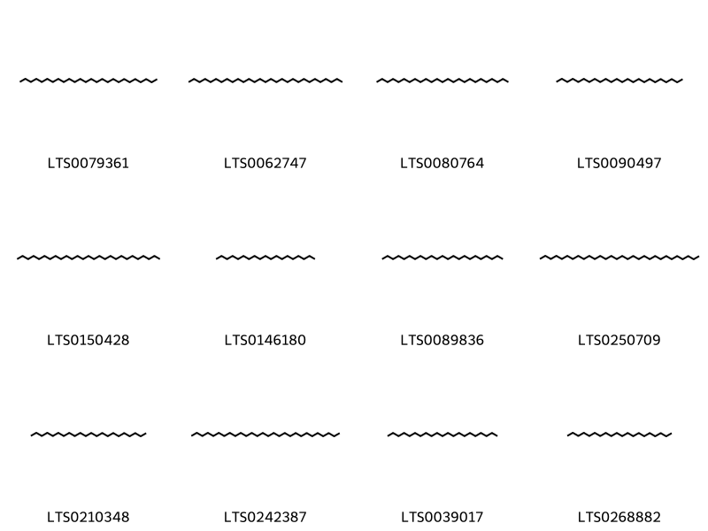{ width=100% }
    <figcaption>Hình ảnh cấu trúc hóa học của 12 hoạt chất thuộc nhóm Saturated hydrocarbons gồm ['hexacosane (LTS0079361)', 'nonacosane (LTS0062747)', 'pentacosane (LTS0080764)', 'tetracosane (LTS0090497)', 'heptacosane (LTS0150428)', 'nonadecane (LTS0146180)', 'tricosane (LTS0089836)', 'triacontane (LTS0250709)', 'docosane (LTS0210348)', 'octacosane (LTS0242387)', 'heneicosane (LTS0039017)', 'eicosane (LTS0268882)'].</figcaption>
</figure>
#### Nhóm Unsaturated hydrocarbons
<figure markdown="span">
    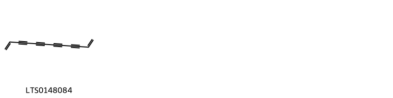{ width=100% }
    <figcaption>Hình ảnh cấu trúc hóa học của 1 hoạt chất thuộc nhóm Unsaturated hydrocarbons gồm ['dodeca-1,11-dien-3,5,7,9-tetrayne (LTS0148084)'].</figcaption>
</figure>

---

### Dược dân tộc học

Danh sách các quốc gia có sử dụng *Arnica montana* trong điều trị các bệnh. 

| Country   | Disease                                                                               | Bệnh                                                                                                                                                                                                |
|:----------|:--------------------------------------------------------------------------------------|:----------------------------------------------------------------------------------------------------------------------------------------------------------------------------------------------------|
| Elsewhere | Tonic, Vulnerary, Irritant                                                            | MYMEMORY WARNING: YOU USED ALL AVAILABLE FREE TRANSLATIONS FOR TODAY. NEXT AVAILABLE IN  09 HOURS 31 MINUTES 29 SECONDS VISIT HTTPS://MYMEMORY.TRANSLATED.NET/DOC/USAGELIMITS.PHP TO TRANSLATE MORE |
| Turkey    | Discutient, Diuretic, Expectorant, Hemostat, Nervine, Vulnerary, Poison, Sternutatory | MYMEMORY WARNING: YOU USED ALL AVAILABLE FREE TRANSLATIONS FOR TODAY. NEXT AVAILABLE IN  09 HOURS 31 MINUTES 26 SECONDS VISIT HTTPS://MYMEMORY.TRANSLATED.NET/DOC/USAGELIMITS.PHP TO TRANSLATE MORE |
| ain       | Cardiotonic                                                                           | MYMEMORY WARNING: YOU USED ALL AVAILABLE FREE TRANSLATIONS FOR TODAY. NEXT AVAILABLE IN  09 HOURS 31 MINUTES 23 SECONDS VISIT HTTPS://MYMEMORY.TRANSLATED.NET/DOC/USAGELIMITS.PHP TO TRANSLATE MORE |

---

# Chi Petasites

??? note "Danh sách các dược liệu thuộc chi"
    
	 - *Petasites japonicus*
	 - *Petasites officinalis*

---
## Petasites japonicus
### Thông tin về thực vật

!!! info "Phân loại thực vật của *Petasites japonicus* từ GIBF:"
    - **Kingdom:** Plantae
    - **Phylum:** Tracheophyta
    - **Order:** Asterales
    - **Family:** Asteraceae
    - **Genus:** Petasites
    - **Species:** *Petasites japonicus*

 

| Label (VI)   | Label (EN)   | Scientific Name     | Descriptions (VI)   | Descriptions (EN)   | Also Known As (VI)   | Also Known As (EN)                                |
|:-------------|:-------------|:--------------------|:--------------------|:--------------------|:---------------------|:--------------------------------------------------|
| N/A          | N/A          | Petasites japonicus | loài thực vật       | species of plant    | ['']                 | ['fuki', 'giant butterbur', 'Japanese Butterbur'] |

#### Phân bố trên thế giới

**Từ CSDL GIBF** Denmark, Netherlands, Japan, Germany, Belgium, Luxembourg, Chinese Taipei, United States of America, Sweden, United Kingdom of Great Britain and Northern Ireland, Canada

#### Phân bố tại Việt Nam

**Từ CSDL GIBF**: Không có ghi nhận ở Việt Nam

---
### Thành phần hóa học
        
- Theo cơ sở dữ liệu lotus: Từ loài *Petasites japonicus* đã phân lập và xác định được 213 hoạt chất thuộc về các nhóm Fatty Acyls, Flavonoids, Prenol lipids, Pyrimidine nucleosides, Cinnamic acids and derivatives, Oxanes, Benzodioxoles, Unsaturated hydrocarbons, Azaspirodecane derivatives, Naphthofurans, Organooxygen compounds, Macrolides and analogues, Lignan glycosides, Carboxylic acids and derivatives. 

|    | chemicalTaxonomyClassyfireClass   |   smiles_count |
|---:|:----------------------------------|---------------:|
|  0 | Azaspirodecane derivatives        |              6 |
|  1 | Benzodioxoles                     |              2 |
|  2 | Carboxylic acids and derivatives  |              2 |
|  3 | Cinnamic acids and derivatives    |              8 |
|  4 | Fatty Acyls                       |              4 |
|  5 | Flavonoids                        |              6 |
|  6 | Lignan glycosides                 |              3 |
|  7 | Macrolides and analogues          |              3 |
|  8 | Naphthofurans                     |             14 |
|  9 | Organooxygen compounds            |             18 |
| 10 | Oxanes                            |              2 |
| 11 | Prenol lipids                     |            137 |
| 12 | Pyrimidine nucleosides            |              1 |
| 13 | Unsaturated hydrocarbons          |              2 |

#### Nhóm Azaspirodecane derivatives
<figure markdown="span">
    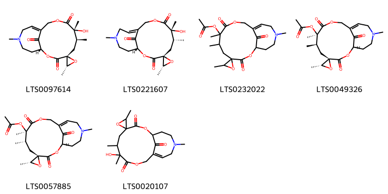{ width=100% }
    <figcaption>Hình ảnh cấu trúc hóa học của 6 hoạt chất thuộc nhóm Azaspirodecane derivatives gồm ["(1r,3'r,4r,6s,7r,11z)-7-hydroxy-3',6,7,14-tetramethyl-2,9-dioxa-14-azaspiro[bicyclo[9.5.1]heptadecane-4,2'-oxiran]-11-ene-3,8,17-trione (LTS0097614)", "(1r,3'r,4r,6r,7r,11e)-7-hydroxy-3',6,7,14-tetramethyl-2,9-dioxa-14-azaspiro[bicyclo[9.5.1]heptadecane-4,2'-oxiran]-11-ene-3,8,17-trione (LTS0221607)", "3',6,7,14-tetramethyl-3,8,17-trioxo-2,9-dioxa-14-azaspiro[bicyclo[9.5.1]heptadecane-4,2'-oxiran]-11-en-7-yl acetate (LTS0232022)", "(1r,3'r,4r,6r,7r,11z)-3',6,7,14-tetramethyl-3,8,17-trioxo-2,9-dioxa-14-azaspiro[bicyclo[9.5.1]heptadecane-4,2'-oxiran]-11-en-7-yl acetate (LTS0049326)", "(1r,3'r,4r,6s,7r,11z)-3',6,7,14-tetramethyl-3,8,17-trioxo-2,9-dioxa-14-azaspiro[bicyclo[9.5.1]heptadecane-4,2'-oxiran]-11-en-7-yl acetate (LTS0057885)", "7-hydroxy-3',6,7,14-tetramethyl-2,9-dioxa-14-azaspiro[bicyclo[9.5.1]heptadecane-4,2'-oxiran]-11-ene-3,8,17-trione (LTS0020107)"].</figcaption>
</figure>
#### Nhóm Benzodioxoles
<figure markdown="span">
    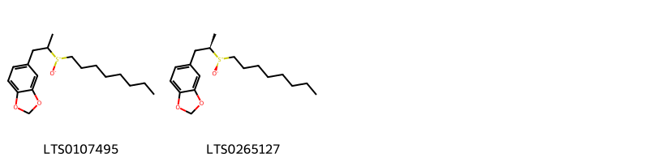{ width=100% }
    <figcaption>Hình ảnh cấu trúc hóa học của 2 hoạt chất thuộc nhóm Benzodioxoles gồm ['sulfoxide (LTS0107495)', '5-[(2r)-2-[(r)-octane-1-sulfinyl]propyl]-2h-1,3-benzodioxole (LTS0265127)'].</figcaption>
</figure>
#### Nhóm Carboxylic acids and derivatives
<figure markdown="span">
    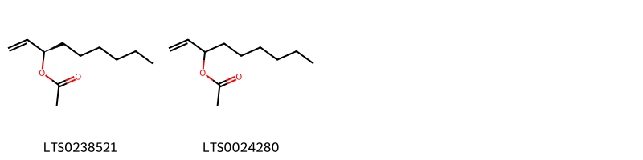{ width=100% }
    <figcaption>Hình ảnh cấu trúc hóa học của 2 hoạt chất thuộc nhóm Carboxylic acids and derivatives gồm ['(3r)-non-1-en-3-yl acetate (LTS0238521)', 'non-1-en-3-yl acetate (LTS0024280)'].</figcaption>
</figure>
#### Nhóm Cinnamic acids and derivatives
<figure markdown="span">
    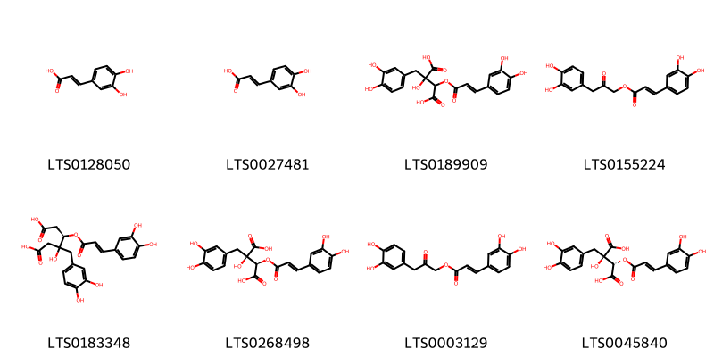{ width=100% }
    <figcaption>Hình ảnh cấu trúc hóa học của 8 hoạt chất thuộc nhóm Cinnamic acids and derivatives gồm ['3,4-dihydroxycinnamic acid (LTS0128050)', 'caffeic acid (LTS0027481)', '2-[(3,4-dihydroxyphenyl)methyl]-3-{[3-(3,4-dihydroxyphenyl)prop-2-enoyl]oxy}-2-hydroxybutanedioic acid (LTS0189909)', '3-(3,4-dihydroxyphenyl)-2-oxopropyl 3-(3,4-dihydroxyphenyl)prop-2-enoate (LTS0155224)', '(4r)-3-[(3,4-dihydroxyphenyl)methyl]-4-{[(2e)-3-(3,4-dihydroxyphenyl)prop-2-enoyl]oxy}-3-hydroxyhexanedioic acid (LTS0183348)', '(2r,3r)-2-[(3,4-dihydroxyphenyl)methyl]-3-{[(2e)-3-(3,4-dihydroxyphenyl)prop-2-enoyl]oxy}-2-hydroxybutanedioic acid (LTS0268498)', '3-(3,4-dihydroxyphenyl)-2-oxopropyl (2e)-3-(3,4-dihydroxyphenyl)prop-2-enoate (LTS0003129)', 'fukinolic acid (LTS0045840)'].</figcaption>
</figure>
#### Nhóm Fatty Acyls
<figure markdown="span">
    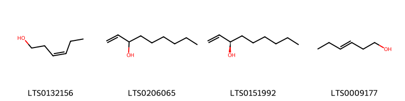{ width=100% }
    <figcaption>Hình ảnh cấu trúc hóa học của 4 hoạt chất thuộc nhóm Fatty Acyls gồm ['cis-3-hexenol (LTS0132156)', '1-nonen-3-ol (LTS0206065)', '(3r)-non-1-en-3-ol (LTS0151992)', '3-hexenol (LTS0009177)'].</figcaption>
</figure>
#### Nhóm Flavonoids
<figure markdown="span">
    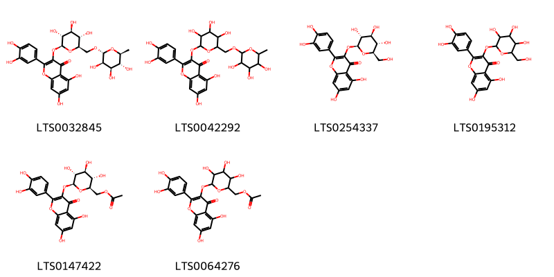{ width=100% }
    <figcaption>Hình ảnh cấu trúc hóa học của 6 hoạt chất thuộc nhóm Flavonoids gồm ['3-rutinosyl quercetin (LTS0032845)', 'rutin (LTS0042292)', 'isoquercetin (LTS0254337)', '2-(3,4-dihydroxyphenyl)-5,7-dihydroxy-3-{[3,4,5-trihydroxy-6-(hydroxymethyl)oxan-2-yl]oxy}chromen-4-one (LTS0195312)', '[(2r,3s,4s,5r,6s)-6-{[2-(3,4-dihydroxyphenyl)-5,7-dihydroxy-4-oxochromen-3-yl]oxy}-3,4,5-trihydroxyoxan-2-yl]methyl acetate (LTS0147422)', '(6-{[2-(3,4-dihydroxyphenyl)-5,7-dihydroxy-4-oxochromen-3-yl]oxy}-3,4,5-trihydroxyoxan-2-yl)methyl acetate (LTS0064276)'].</figcaption>
</figure>
#### Nhóm Lignan glycosides
<figure markdown="span">
    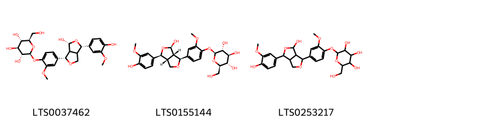{ width=100% }
    <figcaption>Hình ảnh cấu trúc hóa học của 3 hoạt chất thuộc nhóm Lignan glycosides gồm ['(2s,3r,4s,5s,6r)-2-{4-[(1s,4s,6r)-6-hydroxy-4-(4-hydroxy-3-methoxyphenyl)-hexahydrofuro[3,4-c]furan-1-yl]-2-methoxyphenoxy}-6-(hydroxymethyl)oxane-3,4,5-triol (LTS0037462)', '(2s,3r,4s,5s,6r)-2-{4-[(1s,3ar,4s,6r,6as)-6-hydroxy-4-(4-hydroxy-3-methoxyphenyl)-hexahydrofuro[3,4-c]furan-1-yl]-2-methoxyphenoxy}-6-(hydroxymethyl)oxane-3,4,5-triol (LTS0155144)', '2-{4-[6-hydroxy-4-(4-hydroxy-3-methoxyphenyl)-hexahydrofuro[3,4-c]furan-1-yl]-2-methoxyphenoxy}-6-(hydroxymethyl)oxane-3,4,5-triol (LTS0253217)'].</figcaption>
</figure>
#### Nhóm Macrolides and analogues
<figure markdown="span">
    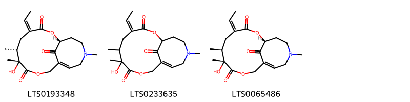{ width=100% }
    <figcaption>Hình ảnh cấu trúc hóa học của 3 hoạt chất thuộc nhóm Macrolides and analogues gồm ['senkirkine (LTS0193348)', '4-ethylidene-7-hydroxy-6,7,14-trimethyl-2,9-dioxa-14-azabicyclo[9.5.1]heptadec-11-ene-3,8,17-trione (LTS0233635)', '(1r,4z,6s,7r,11z)-4-ethylidene-7-hydroxy-6,7,14-trimethyl-2,9-dioxa-14-azabicyclo[9.5.1]heptadec-11-ene-3,8,17-trione (LTS0065486)'].</figcaption>
</figure>
#### Nhóm Naphthofurans
<figure markdown="span">
    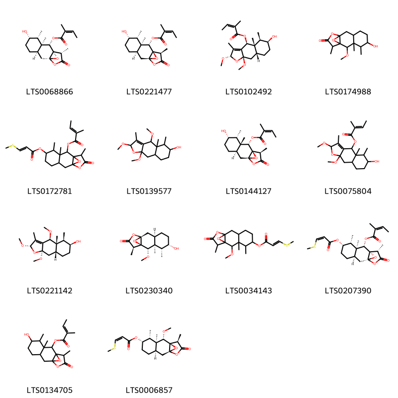{ width=100% }
    <figcaption>Hình ảnh cấu trúc hóa học của 14 hoạt chất thuộc nhóm Naphthofurans gồm ['(1s,2s,3s,4r,5s,8r,10s,13s)-5-hydroxy-3,4,13-trimethyl-12-oxo-11,14-dioxatetracyclo[8.3.1.0¹,¹⁰.0³,⁸]tetradecan-2-yl (2z)-2-methylbut-2-enoate (LTS0068866)', '(1r,2s,3s,4r,5s,8r,10r,13r)-5-hydroxy-3,4,13-trimethyl-12-oxo-11,14-dioxatetracyclo[8.3.1.0¹,¹⁰.0³,⁸]tetradecan-2-yl (2z)-2-methylbut-2-enoate (LTS0221477)', '(2s,4s,4as,5r,6s,8ar,9as)-6-hydroxy-2,9a-dimethoxy-3,4a,5-trimethyl-2h,4h,5h,6h,7h,8h,8ah,9h-naphtho[2,3-b]furan-4-yl (2z)-2-methylbut-2-enoate (LTS0102492)', '5-hydroxy-2-methoxy-3,4,13-trimethyl-11,14-dioxatetracyclo[8.3.1.0¹,¹⁰.0³,⁸]tetradecan-12-one (LTS0174988)', '3,4,13-trimethyl-5-{[3-(methylsulfanyl)prop-2-enoyl]oxy}-12-oxo-11,14-dioxatetracyclo[8.3.1.0¹,¹⁰.0³,⁸]tetradecan-2-yl 2-methylbut-2-enoate (LTS0172781)', '2,4,9a-trimethoxy-3,4a,5-trimethyl-2h,4h,5h,6h,7h,8h,8ah,9h-naphtho[2,3-b]furan-6-ol (LTS0139577)', '(1r,2s,3r,4r,5s,8r,10r,13r)-5-hydroxy-3,4,13-trimethyl-12-oxo-11,14-dioxatetracyclo[8.3.1.0¹,¹⁰.0³,⁸]tetradecan-2-yl (2z)-2-methylbut-2-enoate (LTS0144127)', '6-hydroxy-2,9a-dimethoxy-3,4a,5-trimethyl-2h,4h,5h,6h,7h,8h,8ah,9h-naphtho[2,3-b]furan-4-yl 2-methylbut-2-enoate (LTS0075804)', '(2s,4s,4as,5r,6s,8ar,9ar)-2,4,9a-trimethoxy-3,4a,5-trimethyl-2h,4h,5h,6h,7h,8h,8ah,9h-naphtho[2,3-b]furan-6-ol (LTS0221142)', '(1r,2s,3s,4r,5s,8r,10r,13r)-5-hydroxy-2-methoxy-3,4,13-trimethyl-11,14-dioxatetracyclo[8.3.1.0¹,¹⁰.0³,⁸]tetradecan-12-one (LTS0230340)', '2-methoxy-3,4,13-trimethyl-12-oxo-11,14-dioxatetracyclo[8.3.1.0¹,¹⁰.0³,⁸]tetradecan-5-yl 3-(methylsulfanyl)prop-2-enoate (LTS0034143)', '(1s,2s,3s,4r,5s,8r,10s,13s)-3,4,13-trimethyl-5-{[(2z)-3-(methylsulfanyl)prop-2-enoyl]oxy}-12-oxo-11,14-dioxatetracyclo[8.3.1.0¹,¹⁰.0³,⁸]tetradecan-2-yl (2z)-2-methylbut-2-enoate (LTS0207390)', '5-hydroxy-3,4,13-trimethyl-12-oxo-11,14-dioxatetracyclo[8.3.1.0¹,¹⁰.0³,⁸]tetradecan-2-yl 2-methylbut-2-enoate (LTS0134705)', '(1r,2s,3s,4r,5s,8r,10r,13r)-2-methoxy-3,4,13-trimethyl-12-oxo-11,14-dioxatetracyclo[8.3.1.0¹,¹⁰.0³,⁸]tetradecan-5-yl (2z)-3-(methylsulfanyl)prop-2-enoate (LTS0006857)'].</figcaption>
</figure>
#### Nhóm Organooxygen compounds
<figure markdown="span">
    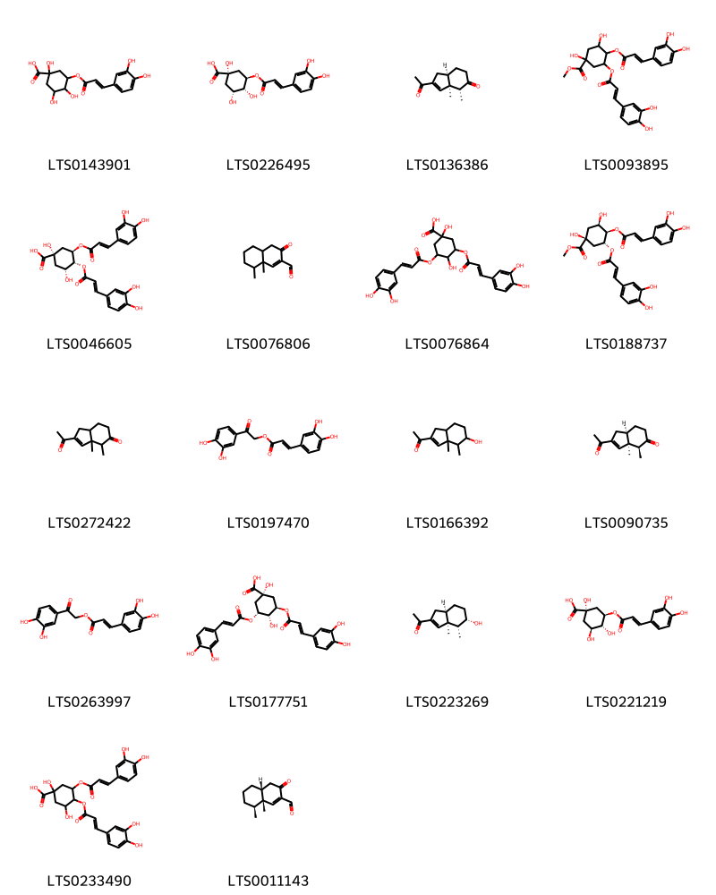{ width=100% }
    <figcaption>Hình ảnh cấu trúc hóa học của 18 hoạt chất thuộc nhóm Organooxygen compounds gồm ['3-{[3-(3,4-dihydroxyphenyl)prop-2-enoyl]oxy}-1,4,5-trihydroxycyclohexane-1-carboxylic acid (LTS0143901)', 'chlorogenic acid (LTS0226495)', '(3ar,4r,7ar)-2-acetyl-3a,4-dimethyl-4,6,7,7a-tetrahydro-1h-inden-5-one (LTS0136386)', 'methyl 3,4-bis({[3-(3,4-dihydroxyphenyl)prop-2-enoyl]oxy})-1,5-dihydroxycyclohexane-1-carboxylate (LTS0093895)', '4,5-dicaffeoylquinic acid (LTS0046605)', '8,8a-dimethyl-3-oxo-4,4a,5,6,7,8-hexahydronaphthalene-2-carbaldehyde (LTS0076806)', '3,5-bis({[3-(3,4-dihydroxyphenyl)prop-2-enoyl]oxy})-1,4-dihydroxycyclohexane-1-carboxylic acid (LTS0076864)', 'methyl (1s,3r,4r,5r)-3,4-bis({[(2e)-3-(3,4-dihydroxyphenyl)prop-2-enoyl]oxy})-1,5-dihydroxycyclohexane-1-carboxylate (LTS0188737)', '2-acetyl-3a,4-dimethyl-4,6,7,7a-tetrahydro-1h-inden-5-one (LTS0272422)', '2-(3,4-dihydroxyphenyl)-2-oxoethyl 3-(3,4-dihydroxyphenyl)prop-2-enoate (LTS0197470)', '1-(5-hydroxy-3a,4-dimethyl-1,4,5,6,7,7a-hexahydroinden-2-yl)ethanone (LTS0166392)', '(3ar,4s,7ar)-2-acetyl-3a,4-dimethyl-4,6,7,7a-tetrahydro-1h-inden-5-one (LTS0090735)', 'petasiphenone (LTS0263997)', '3,5-dicaffeoylquinic acid (LTS0177751)', '1-[(3ar,4r,5s,7ar)-5-hydroxy-3a,4-dimethyl-1,4,5,6,7,7a-hexahydroinden-2-yl]ethanone (LTS0223269)', '(1s,3r,4r,5s)-3-{[(2e)-3-(3,4-dihydroxyphenyl)prop-2-enoyl]oxy}-1,4,5-trihydroxycyclohexane-1-carboxylic acid (LTS0221219)', '3,4-bis({[3-(3,4-dihydroxyphenyl)prop-2-enoyl]oxy})-1,5-dihydroxycyclohexane-1-carboxylic acid (LTS0233490)', '(4ar,8s,8ar)-8,8a-dimethyl-3-oxo-4,4a,5,6,7,8-hexahydronaphthalene-2-carbaldehyde (LTS0011143)'].</figcaption>
</figure>
#### Nhóm Oxanes
<figure markdown="span">
    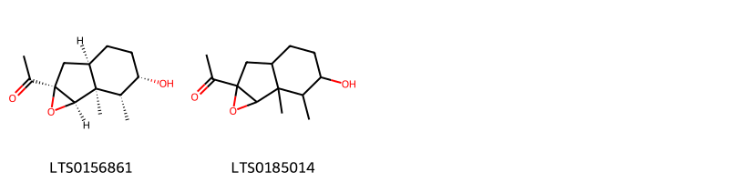{ width=100% }
    <figcaption>Hình ảnh cấu trúc hóa học của 2 hoạt chất thuộc nhóm Oxanes gồm ['1-[(1ar,1bs,2r,3s,5ar,6as)-3-hydroxy-1b,2-dimethyl-hexahydro-1ah-indeno[1,2-b]oxiren-6a-yl]ethanone (LTS0156861)', '1-{3-hydroxy-1b,2-dimethyl-hexahydro-1ah-indeno[1,2-b]oxiren-6a-yl}ethanone (LTS0185014)'].</figcaption>
</figure>
#### Nhóm Prenol lipids
<figure markdown="span">
    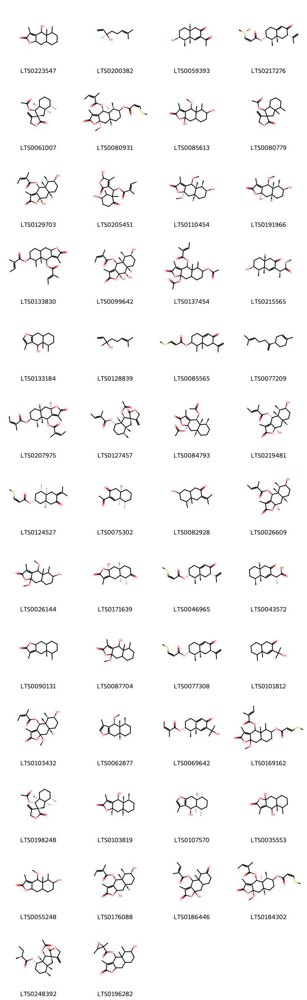{ width=100% }
    <figcaption>Hình ảnh cấu trúc hóa học của 137 hoạt chất thuộc nhóm Prenol lipids gồm ['4-hydroxy-3,4a,5-trimethyl-4h,5h,6h,7h,8h,8ah,9h,9ah-naphtho[2,3-b]furan-2-one (LTS0223547)', '(-)-linalool (LTS0200382)', '(4ar,5r,6s,8ar)-3-acetyl-6-hydroxy-4a,5-dimethyl-1,5,6,7,8,8a-hexahydronaphthalen-2-one (LTS0059393)', '(1r,2r,7s,8ar)-1,8a-dimethyl-6-oxo-7-(prop-1-en-2-yl)-1,2,3,4,7,8-hexahydronaphthalen-2-yl (2z)-3-[(r)-methanesulfinyl]prop-2-enoate (LTS0217276)', "(2r,3s,3as,7s,7ar)-7,7a-dimethyl-4'-methylidene-2'-oxo-hexahydro-1h-spiro[indene-2,3'-oxolan]-3-yl acetate (LTS0061007)", '(4s,4ar,5r,6s,8ar,9ar)-9a-methoxy-3,4a,5-trimethyl-6-{[(2z)-3-(methylsulfanyl)prop-2-enoyl]oxy}-2-oxo-4h,5h,6h,7h,8h,8ah,9h-naphtho[2,3-b]furan-4-yl (2z)-2-methylbut-2-enoate (LTS0080931)', '6,9a-dihydroxy-4-methoxy-3,4a,5-trimethyl-4h,5h,6h,7h,8h,8ah,9h-naphtho[2,3-b]furan-2-one (LTS0085613)', "7,7a-dimethyl-4'-methylidene-2'-oxo-hexahydro-1h-spiro[indene-2,3'-oxolan]-3-yl acetate (LTS0080779)", '(4s,4as,5r,6s,8ar,9as)-6,9a-dihydroxy-3,4a,5-trimethyl-2-oxo-4h,5h,6h,7h,8h,8ah,9h-naphtho[2,3-b]furan-4-yl (2z)-2-methylbut-2-enoate (LTS0129703)', '(3-hydroxy-1,2-dimethyl-6-oxocyclohexyl)(5-hydroxy-4-methyl-2-oxo-5h-furan-3-yl)methyl 2-methylbut-2-enoate (LTS0205451)', '(4s,4as,5r,6s,8ar,9ar)-6-hydroxy-4,9a-dimethoxy-3,4a,5-trimethyl-4h,5h,6h,7h,8h,8ah,9h-naphtho[2,3-b]furan-2-one (LTS0110454)', '(4s,4as,5r,6s,8ar,9ar)-6,9a-dihydroxy-4-methoxy-3,4a,5-trimethyl-4h,5h,6h,7h,8h,8ah,9h-naphtho[2,3-b]furan-2-one (LTS0191966)', '3,4a,5-trimethyl-6-[(2-methylbut-2-enoyl)oxy]-2-oxo-4h,5h,6h,7h,8h,8ah,9h,9ah-naphtho[2,3-b]furan-4-yl 2-methylbut-2-enoate (LTS0133830)', '(4s,4ar,5r,6s,8as,9r,9ar)-6,9,9a-trihydroxy-3,4a,5-trimethyl-2-oxo-4h,5h,6h,7h,8h,8ah,9h-naphtho[2,3-b]furan-4-yl (2z)-2-methylbut-2-enoate (LTS0099642)', '6,9a-bis(acetyloxy)-3,4a,5-trimethyl-2-oxo-4h,5h,6h,7h,8h,8ah,9h-naphtho[2,3-b]furan-4-yl 2-methylbut-2-enoate (LTS0137454)', 'methyl (2s)-2-[(4ar,7s,8r,8ar)-7-hydroxy-8,8a-dimethyl-3-oxo-4,4a,5,6,7,8-hexahydronaphthalen-2-yl]propanoate (LTS0215565)', '3,4a,5-trimethyl-4h,5h,6h,7h,8h,8ah,9h-naphtho[2,3-b]furan-4-ol (LTS0133184)', 'linalool, (+-)- (LTS0128839)', '1,8a-dimethyl-6-oxo-7-(prop-1-en-2-yl)-1,2,3,4,7,8-hexahydronaphthalen-2-yl 3-(methylsulfanyl)prop-2-enoate (LTS0085565)', '(r)-β-bisabolene (LTS0077209)', '(4s,4as,5r,6s,8ar,9ar)-3,4a,5-trimethyl-6-{[(2z)-2-methylbut-2-enoyl]oxy}-2-oxo-4h,5h,6h,7h,8h,8ah,9h,9ah-naphtho[2,3-b]furan-4-yl (2z)-2-methylbut-2-enoate (LTS0207975)', "(2r,3r,3ar,4s,7s,7ar)-3-(acetyloxy)-7,7a-dimethyl-4'-methylidene-2'-oxo-hexahydro-1h-spiro[indene-2,3'-oxolan]-4-yl (2e)-2-methylbut-2-enoate (LTS0127457)", '(4s,4ar,5s,8ar,9ar)-4-(acetyloxy)-3,4a,5-trimethyl-2-oxo-4h,5h,6h,7h,8h,8ah,9h-naphtho[2,3-b]furan-9a-yl acetate (LTS0084793)', '(4r,4as,5r,6s,8ar,9ar)-6,9a-dihydroxy-3,4a,5-trimethyl-2-oxo-4h,5h,6h,7h,8h,8ah,9h-naphtho[2,3-b]furan-4-yl (2e)-2-methylbut-2-enoate (LTS0219481)', '(2r,4s,4ar,8ar)-4,4a-dimethyl-7-oxo-6-(propan-2-ylidene)-hexahydro-1h-naphthalen-2-yl (2z)-3-(methylsulfanyl)prop-2-enoate (LTS0124527)', '(4ar,5s,8ar)-3-acetyl-4a,5-dimethyl-1,5,6,7,8,8a-hexahydronaphthalen-2-one (LTS0075302)', '7-hydroxy-4a,5-dimethyl-3-(propan-2-ylidene)-hexahydro-1h-naphthalen-2-one (LTS0082928)', '(4s,4as,5r,6s,8ar,9ar)-6-hydroxy-3,4a,5-trimethyl-2-oxo-4h,5h,6h,7h,8h,8ah,9h,9ah-naphtho[2,3-b]furan-4-yl (2e)-2-methylbut-2-enoate (LTS0026609)', '6-hydroxy-4,9a-dimethoxy-3,4a,5-trimethyl-4h,5h,6h,7h,8h,8ah,9h-naphtho[2,3-b]furan-2-one (LTS0026144)', '(4as,5r,8ar,9as)-9a-hydroxy-3,4a,5-trimethyl-4h,5h,7h,8h,8ah,9h-naphtho[2,3-b]furan-2,6-dione (LTS0171639)', 's-petasin (LTS0046965)', '(2r)-2-[(4ar,8s,8ar)-8,8a-dimethyl-3-oxo-4,4a,5,6,7,8-hexahydronaphthalen-2-yl]propanoic acid (LTS0043572)', '3,4a,5-trimethyl-4h,5h,6h,7h,8h,8ah,9h,9ah-naphtho[2,3-b]furan-2-one (LTS0090131)', '4-hydroxy-9a-methoxy-3,4a,5-trimethyl-4h,5h,6h,7h,8h,8ah,9h-naphtho[2,3-b]furan-2-one (LTS0087704)', 's-neopetasin (LTS0077308)', '3-(2-hydroxypropan-2-yl)-4a,5-dimethyl-1,5,6,7,8,8a-hexahydronaphthalen-2-one (LTS0101812)', '(4s,4as,5r,6s,8ar,9as)-6-hydroxy-9a-methoxy-3,4a,5-trimethyl-2-oxo-4h,5h,6h,7h,8h,8ah,9h-naphtho[2,3-b]furan-4-yl (2z)-2-methylbut-2-enoate (LTS0103432)', '(4s,4ar,5s,8ar)-4-methoxy-3,4a,5-trimethyl-4h,5h,6h,7h,8h,8ah,9h-naphtho[2,3-b]furan (LTS0062877)', '(1r,2r,8ar)-7-(2-hydroxypropan-2-yl)-1,8a-dimethyl-6-oxo-1,2,3,4-tetrahydronaphthalen-2-yl (2z)-2-methylbut-2-enoate (LTS0069642)', '9a-methoxy-3,4a,5-trimethyl-6-{[3-(methylsulfanyl)prop-2-enoyl]oxy}-2-oxo-4h,5h,6h,7h,8h,8ah,9h-naphtho[2,3-b]furan-4-yl 2-methylbut-2-enoate (LTS0169162)', "(2r,3r,3as,7s,7ar)-7,7a-dimethyl-4'-methylidene-2'-oxo-hexahydro-1h-spiro[indene-2,3'-oxolan]-3-yl acetate (LTS0198248)", '(4s,4ar,5s,8ar,9as)-4-hydroxy-3,4a,5-trimethyl-4h,5h,6h,7h,8h,8ah,9h,9ah-naphtho[2,3-b]furan-2-one (LTS0103819)', '(4r,4ar,5s,8ar)-3,4a,5-trimethyl-4h,5h,6h,7h,8h,8ah,9h-naphtho[2,3-b]furan-4-ol (LTS0107570)', '4,9a-dihydroxy-3,4a,5-trimethyl-4h,5h,6h,7h,8h,8ah,9h-naphtho[2,3-b]furan-2-one (LTS0035553)', '6-hydroxy-4-methoxy-3,4a,5-trimethyl-4h,5h,6h,7h,8h,8ah,9h,9ah-naphtho[2,3-b]furan-2-one (LTS0055248)', '(4s,4as,5r,6s,8ar,9ar)-6,9a-dihydroxy-3,4a,5-trimethyl-2-oxo-4h,5h,6h,7h,8h,8ah,9h-naphtho[2,3-b]furan-4-yl (2z)-2-methylbut-2-enoate (LTS0176088)', '9a-hydroxy-3,4a,5-trimethyl-2,6-dioxo-4h,5h,7h,8h,8ah,9h-naphtho[2,3-b]furan-4-yl 2-methylbut-2-enoate (LTS0186446)', '(4s,4ar,5r,6s,8ar,9as)-9a-methoxy-3,4a,5-trimethyl-6-{[(2z)-3-(methylsulfanyl)prop-2-enoyl]oxy}-2-oxo-4h,5h,6h,7h,8h,8ah,9h-naphtho[2,3-b]furan-4-yl (2z)-2-methylbut-2-enoate (LTS0184302)', "(2r,3r,3ar,4s,7s,7ar)-3-(acetyloxy)-7,7a-dimethyl-4'-methylidene-2'-oxo-hexahydro-1h-spiro[indene-2,3'-oxolan]-4-yl (2s)-2-methylbutanoate (LTS0248392)", '6-hydroxy-3,4a,5-trimethyl-2-oxo-4h,5h,6h,7h,8h,8ah,9h,9ah-naphtho[2,3-b]furan-4-yl 2,3-dimethyloxirane-2-carboxylate (LTS0196282)', '4-methoxy-3,4a,5-trimethyl-4h,5h,6h,7h,8h,8ah,9h-naphtho[2,3-b]furan (LTS0202718)', '(4s,4ar,5r,6s,8ar,9as)-6-hydroxy-9a-methoxy-3,4a,5-trimethyl-2-oxo-4h,5h,6h,7h,8h,8ah,9h-naphtho[2,3-b]furan-4-yl (2z)-2-methylbut-2-enoate (LTS0264023)', 'bakkenolide a (LTS0143187)', '(4s,4as,5r,8ar,9as)-9a-hydroxy-3,4a,5-trimethyl-2,6-dioxo-4h,5h,7h,8h,8ah,9h-naphtho[2,3-b]furan-4-yl (2z)-2-methylbut-2-enoate (LTS0149958)', '1,8a-dimethyl-6-oxo-7-(prop-1-en-2-yl)-1,2,3,4,7,8-hexahydronaphthalen-2-yl 3-methanesulfinylprop-2-enoate (LTS0192397)', '(s)-[(1s,2r,3s)-3-hydroxy-1,2-dimethyl-6-oxocyclohexyl][(5r)-5-hydroxy-4-methyl-2-oxo-5h-furan-3-yl]methyl (2z)-2-methylbut-2-enoate (LTS0142933)', 'isopetasin (LTS0125693)', '(4s,4as,5r,6s,8ar,9ar)-6-hydroxy-3,4a,5-trimethyl-2-oxo-4h,5h,6h,7h,8h,8ah,9h,9ah-naphtho[2,3-b]furan-4-yl (2s,3s)-2,3-dimethyloxirane-2-carboxylate (LTS0163265)', '7-(2-hydroxypropan-2-yl)-1,8a-dimethyl-6-oxo-1,2,3,4-tetrahydronaphthalen-2-yl 2-methylbut-2-enoate (LTS0231059)', 'petasitolone (LTS0155597)', 'eremophilenolide (LTS0116366)', "(2r,3r,3ar,4s,7s,7ar)-3-(acetyloxy)-7,7a-dimethyl-4'-methylidene-2'-oxo-hexahydro-1h-spiro[indene-2,3'-oxolan]-4-yl (2r)-2-methylbutanoate (LTS0247525)", '(4s,4ar,5r,6s,8as,9s,9as)-6,9-dihydroxy-3,4a,5-trimethyl-2-oxo-4h,5h,6h,7h,8h,8ah,9h,9ah-naphtho[2,3-b]furan-4-yl (2z)-2-methylbut-2-enoate (LTS0241974)', "(2r,3ar,7ar)-3-(acetyloxy)-7,7a-dimethyl-4'-methylidene-2'-oxo-hexahydro-1h-spiro[indene-2,3'-oxolan]-4-yl 2-methylbut-2-enoate (LTS0077268)", '4a,5-dimethyl-3-(propan-2-ylidene)-hexahydro-1h-naphthalen-2-one (LTS0135326)', '(4s,4ar,5s,8ar,9as)-4,9a-dihydroxy-3,4a,5-trimethyl-4h,5h,6h,7h,8h,8ah,9h-naphtho[2,3-b]furan-2-one (LTS0251772)', '(4as,5s,8ar)-3-(2-hydroxypropan-2-yl)-4a,5-dimethyl-1,5,6,7,8,8a-hexahydronaphthalen-2-one (LTS0118279)', '(4s,4as,5r,6s,8ar,9as)-6-hydroxy-4-methoxy-3,4a,5-trimethyl-4h,5h,6h,7h,8h,8ah,9h,9ah-naphtho[2,3-b]furan-2-one (LTS0114082)', '(4s,4as,5r,6s,8ar,9as)-6,9a-dihydroxy-3,4a,5-trimethyl-2-oxo-4h,5h,6h,7h,8h,8ah,9h-naphtho[2,3-b]furan-4-yl (2e)-2-methylbut-2-enoate (LTS0246185)', '(4s,4as,5r,6s,8ar,9ar)-6-{[(2e)-3-[(r)-methanesulfinyl]prop-2-enoyl]oxy}-3,4a,5-trimethyl-2-oxo-4h,5h,6h,7h,8h,8ah,9h,9ah-naphtho[2,3-b]furan-4-yl (2z)-2-methylbut-2-enoate (LTS0187436)', '(4s,4as,5r,6s,8ar,9ar)-6-hydroxy-3,4a,5-trimethyl-2-oxo-4h,5h,6h,7h,8h,8ah,9h,9ah-naphtho[2,3-b]furan-4-yl (2r,3s)-3-chloro-2-hydroxy-2-methylbutanoate (LTS0189034)', '2-(8,8a-dimethyl-3-oxo-4,4a,5,6,7,8-hexahydronaphthalen-2-yl)propanoic acid (LTS0256753)', '(4s,4as,5r,6s,8ar,9ar)-6,9a-bis(acetyloxy)-3,4a,5-trimethyl-2-oxo-4h,5h,6h,7h,8h,8ah,9h-naphtho[2,3-b]furan-4-yl (2z)-2-methylbut-2-enoate (LTS0253873)', '(4s,4ar,5s,8ar,9ar)-4,9a-dihydroxy-3,4a,5-trimethyl-4h,5h,6h,7h,8h,8ah,9h-naphtho[2,3-b]furan-2-one (LTS0059709)', '(4ar,5s,8ar)-3-[(1r)-1-hydroxyethyl]-4a,5-dimethyl-1,5,6,7,8,8a-hexahydronaphthalen-2-one (LTS0084036)', '(4s,4ar,6r,8ar)-4,4a-dimethyl-6-(prop-1-en-2-yl)-octahydronaphthalen-1-one (LTS0264764)', '(s)-[(5s)-5-hydroxy-4-methyl-2-oxo-5h-furan-3-yl][(1s,3s,4r,5r,6r)-3-methoxy-5,6-dimethyl-2-oxabicyclo[2.2.2]octan-5-yl]methyl (2z)-2-methylbut-2-enoate (LTS0066408)', '6,9a-dihydroxy-3,4a,5-trimethyl-2-oxo-4h,5h,6h,7h,8h,8ah,9h-naphtho[2,3-b]furan-4-yl 2-methylbut-2-enoate (LTS0067115)', 'methyl 2-[(4ar,7s,8r,8ar)-7-hydroxy-8,8a-dimethyl-3-oxo-4,4a,5,6,7,8-hexahydronaphthalen-2-yl]prop-2-enoate (LTS0270963)', '3,4,5-trihydroxy-6-(hydroxymethyl)oxan-2-yl 1,10,11-trihydroxy-9-(hydroxymethyl)-1,2,6a,6b,9,12a-hexamethyl-2,3,4,5,6,7,8,8a,10,11,12,12b,13,14b-tetradecahydropicene-4a-carboxylate (LTS0209667)', "(2r,3r,3ar,4s,7s,7ar)-3-(acetyloxy)-7,7a-dimethyl-4'-methylidene-2'-oxo-hexahydro-1h-spiro[indene-2,3'-oxolan]-4-yl (2z)-3-(methylsulfanyl)prop-2-enoate (LTS0271349)", '(4ar,5s,8as)-3,4a,5-trimethyl-4h,5h,6h,7h,8h,8ah,9h-naphtho[2,3-b]furan (LTS0234136)', '4,4a-dimethyl-7-oxo-6-(propan-2-ylidene)-hexahydro-1h-naphthalen-2-yl 3-(methylsulfanyl)prop-2-enoate (LTS0079705)', '(4s,4ar,5r,6s,8ar,9ar)-4,9a-dimethoxy-3,4a,5-trimethyl-2-oxo-4h,5h,6h,7h,8h,8ah,9h-naphtho[2,3-b]furan-6-yl (2z)-3-(methylsulfanyl)prop-2-enoate (LTS0068850)', '(5-hydroxy-4-methyl-2-oxo-5h-furan-3-yl)({3-methoxy-5,6-dimethyl-2-oxabicyclo[2.2.2]octan-5-yl})methyl (2z)-2-methylbut-2-enoate (LTS0220204)', '(2s,3r,4s,5s,6r)-3,4,5-trihydroxy-6-(hydroxymethyl)oxan-2-yl (1r,2r,4as,6as,6br,8ar,9r,10r,11r,12ar,12br,14bs)-1,10,11-trihydroxy-9-(hydroxymethyl)-1,2,6a,6b,9,12a-hexamethyl-2,3,4,5,6,7,8,8a,10,11,12,12b,13,14b-tetradecahydropicene-4a-carboxylate (LTS0222629)', '4,9a-dimethoxy-3,4a,5-trimethyl-2-oxo-4h,5h,6h,7h,8h,8ah,9h-naphtho[2,3-b]furan-6-yl 3-(methylsulfanyl)prop-2-enoate (LTS0085327)', '7-hydroxy-3,4a,5-trimethyl-4h,5h,6h,7h,8h,8ah,9h,9ah-naphtho[2,3-b]furan-2-one (LTS0222923)', '6-[(3-methanesulfinylprop-2-enoyl)oxy]-3,4a,5-trimethyl-2-oxo-4h,5h,6h,7h,8h,8ah,9h,9ah-naphtho[2,3-b]furan-4-yl 2-methylbut-2-enoate (LTS0209104)', "(2r,3r,3ar,4s,7s,7ar)-3-(acetyloxy)-7,7a-dimethyl-4'-methylidene-2'-oxo-hexahydro-1h-spiro[indene-2,3'-oxolan]-4-yl (2z)-2-methylbut-2-enoate (LTS0056611)", '(4s,4as,5r,6s,8ar,9as)-9a-methoxy-3,4a,5-trimethyl-6-{[(2z)-3-(methylsulfanyl)prop-2-enoyl]oxy}-2-oxo-4h,5h,6h,7h,8h,8ah,9h-naphtho[2,3-b]furan-4-yl (2z)-2-methylbut-2-enoate (LTS0217473)', '(4s,4as,5r,6s,8ar,9ar)-6-hydroxy-3,4a,5-trimethyl-2-oxo-4h,5h,6h,7h,8h,8ah,9h,9ah-naphtho[2,3-b]furan-4-yl (2z)-2-methylbut-2-enoate (LTS0220491)', 'β-bisabolene (LTS0212177)', 'methyl 2-(7-hydroxy-8,8a-dimethyl-3-oxo-4,4a,5,6,7,8-hexahydronaphthalen-2-yl)prop-2-enoate (LTS0090305)', '(4s,4as,5r,6s,8ar,9ar)-9a-methoxy-3,4a,5-trimethyl-6-{[(2z)-3-(methylsulfanyl)prop-2-enoyl]oxy}-2-oxo-4h,5h,6h,7h,8h,8ah,9h-naphtho[2,3-b]furan-4-yl (2z)-2-methylbut-2-enoate (LTS0219612)', '(4s,4as,5r,6s,8ar,9ar)-6-hydroxy-4-methoxy-3,4a,5-trimethyl-4h,5h,6h,7h,8h,8ah,9h,9ah-naphtho[2,3-b]furan-2-one (LTS0150540)', '4-(acetyloxy)-3,4a,5-trimethyl-2-oxo-4h,5h,6h,7h,8h,8ah,9h-naphtho[2,3-b]furan-9a-yl acetate (LTS0014604)', '6,9-dihydroxy-3,4a,5-trimethyl-2-oxo-4h,5h,6h,7h,8h,8ah,9h,9ah-naphtho[2,3-b]furan-4-yl 2-methylbut-2-enoate (LTS0036065)', '(4s,4as,5r,6s,8ar,9ar)-6-hydroxy-9a-methoxy-3,4a,5-trimethyl-2-oxo-4h,5h,6h,7h,8h,8ah,9h-naphtho[2,3-b]furan-4-yl (2z)-2-methylbut-2-enoate (LTS0232012)', "7,7a-dimethyl-4-[(2-methylbut-2-enoyl)oxy]-4'-methylidene-2'-oxo-hexahydro-1h-spiro[indene-2,3'-oxolan]-3-yl 2-methylbut-2-enoate (LTS0251921)", '(5-hydroxy-4-methyl-2-oxo-5h-furan-3-yl)({3-methoxy-5,6-dimethyl-2-oxabicyclo[2.2.2]octan-5-yl})methyl 2-methylbut-2-enoate (LTS0060613)', '(4s,4ar,5s,8ar,9as)-4-hydroxy-9a-methoxy-3,4a,5-trimethyl-4h,5h,6h,7h,8h,8ah,9h-naphtho[2,3-b]furan-2-one (LTS0185813)', '9a-hydroxy-3,4a,5-trimethyl-4h,5h,7h,8h,8ah,9h-naphtho[2,3-b]furan-2,6-dione (LTS0242059)', '1,8a-dimethyl-6-oxo-7-(prop-1-en-2-yl)-1,2,3,4,7,8-hexahydronaphthalen-2-yl 2-methylbut-2-enoate (LTS0196889)', '3,4a,5-trimethyl-4h,5h,6h,7h,8h,8ah,9h-naphtho[2,3-b]furan (LTS0173944)', '(4s,4ar,5s,8ar,9as)-4-(acetyloxy)-3,4a,5-trimethyl-2-oxo-4h,5h,6h,7h,8h,8ah,9h-naphtho[2,3-b]furan-9a-yl acetate (LTS0042185)', '(4s,4ar,5s,8ar,9ar)-4-hydroxy-9a-methoxy-3,4a,5-trimethyl-4h,5h,6h,7h,8h,8ah,9h-naphtho[2,3-b]furan-2-one (LTS0253315)', '3-acetyl-4a,5-dimethyl-1,5,6,7,8,8a-hexahydronaphthalen-2-one (LTS0184610)', '(4s,4ar,5r,6s,8ar,9as)-6-hydroxy-4,9a-dimethoxy-3,4a,5-trimethyl-4h,5h,6h,7h,8h,8ah,9h-naphtho[2,3-b]furan-2-one (LTS0060949)', '(4s,4as,5r,6s,8ar,9as)-6,9a-bis(acetyloxy)-3,4a,5-trimethyl-2-oxo-4h,5h,6h,7h,8h,8ah,9h-naphtho[2,3-b]furan-4-yl (2z)-2-methylbut-2-enoate (LTS0053898)', '3-acetyl-6-hydroxy-4a,5-dimethyl-1,5,6,7,8,8a-hexahydronaphthalen-2-one (LTS0038664)', '4,4a-dimethyl-6-(prop-1-en-2-yl)-octahydronaphthalen-1-one (LTS0063907)', '(4s,4ar,5r,6s,8ar,9ar)-6-hydroxy-9a-methoxy-3,4a,5-trimethyl-2-oxo-4h,5h,6h,7h,8h,8ah,9h-naphtho[2,3-b]furan-4-yl (2z)-2-methylbut-2-enoate (LTS0036337)', '(4ar,5s,7r,8ar)-7-hydroxy-4a,5-dimethyl-3-(propan-2-ylidene)-hexahydro-1h-naphthalen-2-one (LTS0003503)', '(4ar,5s,7r,8ar,9as)-7-hydroxy-3,4a,5-trimethyl-4h,5h,6h,7h,8h,8ah,9h,9ah-naphtho[2,3-b]furan-2-one (LTS0027529)', '(4r,4as,5r,6s,8ar,9ar)-6-hydroxy-4-methoxy-3,4a,5-trimethyl-4h,5h,6h,7h,8h,8ah,9h,9ah-naphtho[2,3-b]furan-2-one (LTS0033211)', '1,8a-dimethyl-6-oxo-7-(prop-1-en-2-yl)-1,2,3,4,7,8-hexahydronaphthalen-2-yl (2e)-3-methanesulfinylprop-2-enoate (LTS0064592)', 'petasin (LTS0057171)', '3-(1-hydroxyethyl)-4a,5-dimethyl-1,5,6,7,8,8a-hexahydronaphthalen-2-one (LTS0002522)', '6-hydroxy-3,4a,5-trimethyl-2-oxo-4h,5h,6h,7h,8h,8ah,9h,9ah-naphtho[2,3-b]furan-4-yl 2-methylbut-2-enoate (LTS0020137)', 'methyl 2-(7-hydroxy-8,8a-dimethyl-3-oxo-4,4a,5,6,7,8-hexahydronaphthalen-2-yl)propanoate (LTS0251784)', '6,9,9a-trihydroxy-3,4a,5-trimethyl-2-oxo-4h,5h,6h,7h,8h,8ah,9h-naphtho[2,3-b]furan-4-yl 2-methylbut-2-enoate (LTS0022277)', "3-(acetyloxy)-7,7a-dimethyl-4'-methylidene-2'-oxo-hexahydro-1h-spiro[indene-2,3'-oxolan]-4-yl 3-(methylsulfanyl)prop-2-enoate (LTS0021873)", '(4as,5r,6s,8ar,9ar)-6-hydroxy-3,4a,5-trimethyl-4h,5h,6h,7h,8h,8ah,9h,9ah-naphtho[2,3-b]furan-2-one (LTS0100397)', '6-hydroxy-3,4a,5-trimethyl-4h,5h,6h,7h,8h,8ah,9h,9ah-naphtho[2,3-b]furan-2-one (LTS0087065)', "3-(acetyloxy)-7,7a-dimethyl-4'-methylidene-2'-oxo-hexahydro-1h-spiro[indene-2,3'-oxolan]-4-yl 2-methylbutanoate (LTS0022482)", 'neopetasin (LTS0240223)', '(4s,4ar,5r,6s,8as,9r,9as)-6,9-dihydroxy-3,4a,5-trimethyl-2-oxo-4h,5h,6h,7h,8h,8ah,9h,9ah-naphtho[2,3-b]furan-4-yl (2z)-2-methylbut-2-enoate (LTS0101605)', '(4s,4as,5r,6s,8ar,9as)-6-hydroxy-4,9a-dimethoxy-3,4a,5-trimethyl-4h,5h,6h,7h,8h,8ah,9h-naphtho[2,3-b]furan-2-one (LTS0240282)', '1,8a-dimethyl-6-oxo-7-(propan-2-ylidene)-2,3,4,8-tetrahydro-1h-naphthalen-2-yl 2-methylbut-2-enoate (LTS0246786)', 'fukinone (LTS0045012)', "3-(acetyloxy)-7,7a-dimethyl-4'-methylidene-2'-oxo-hexahydro-1h-spiro[indene-2,3'-oxolan]-4-yl 2-methylbut-2-enoate (LTS0039589)", '6-hydroxy-9a-methoxy-3,4a,5-trimethyl-2-oxo-4h,5h,6h,7h,8h,8ah,9h-naphtho[2,3-b]furan-4-yl 2-methylbut-2-enoate (LTS0244377)', "(2r,3r,3ar,4s,7s,7ar)-7,7a-dimethyl-4-{[(2z)-2-methylbut-2-enoyl]oxy}-4'-methylidene-2'-oxo-hexahydro-1h-spiro[indene-2,3'-oxolan]-3-yl (2z)-2-methylbut-2-enoate (LTS0040683)", '6-hydroxy-3,4a,5-trimethyl-2-oxo-4h,5h,6h,7h,8h,8ah,9h,9ah-naphtho[2,3-b]furan-4-yl 3-chloro-2-hydroxy-2-methylbutanoate (LTS0034417)', "7,7a-dimethyl-4'-methylidene-hexahydro-1h-spiro[indene-2,3'-oxolan]-2'-one (LTS0024640)", '(4s,4as,5r,6s,8ar,9ar)-4,9a-dimethoxy-3,4a,5-trimethyl-2-oxo-4h,5h,6h,7h,8h,8ah,9h-naphtho[2,3-b]furan-6-yl (2z)-3-(methylsulfanyl)prop-2-enoate (LTS0041105)'].</figcaption>
</figure>
#### Nhóm Pyrimidine nucleosides
<figure markdown="span">
    { width=100% }
    <figcaption>Hình ảnh cấu trúc hóa học của 1 hoạt chất thuộc nhóm Pyrimidine nucleosides gồm ['uridine (LTS0220125)'].</figcaption>
</figure>
#### Nhóm Unsaturated hydrocarbons
<figure markdown="span">
    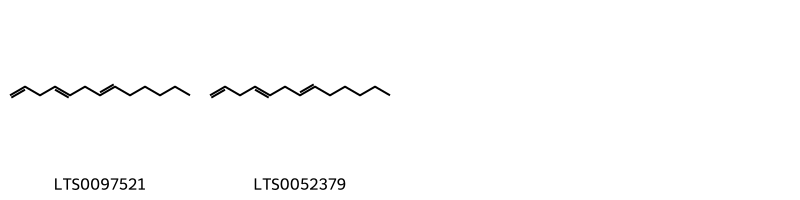{ width=100% }
    <figcaption>Hình ảnh cấu trúc hóa học của 2 hoạt chất thuộc nhóm Unsaturated hydrocarbons gồm ['trideca-1,4,7-triene (LTS0097521)', '(4e,7e)-trideca-1,4,7-triene (LTS0052379)'].</figcaption>
</figure>

---

### Dược dân tộc học

Danh sách các quốc gia có sử dụng *Petasites japonicus* trong điều trị các bệnh. 

| Country   | Disease                  | Bệnh                                                                                                                                                                                                |
|:----------|:-------------------------|:----------------------------------------------------------------------------------------------------------------------------------------------------------------------------------------------------|
| China     | Expectorant              | MYMEMORY WARNING: YOU USED ALL AVAILABLE FREE TRANSLATIONS FOR TODAY. NEXT AVAILABLE IN  09 HOURS 30 MINUTES 39 SECONDS VISIT HTTPS://MYMEMORY.TRANSLATED.NET/DOC/USAGELIMITS.PHP TO TRANSLATE MORE |
| Elsewhere | Antitussive, Expectorant | MYMEMORY WARNING: YOU USED ALL AVAILABLE FREE TRANSLATIONS FOR TODAY. NEXT AVAILABLE IN  09 HOURS 30 MINUTES 34 SECONDS VISIT HTTPS://MYMEMORY.TRANSLATED.NET/DOC/USAGELIMITS.PHP TO TRANSLATE MORE |

---

---
## Petasites officinalis
### Thông tin về thực vật

!!! info "Phân loại thực vật của *Petasites hybridus* từ GIBF:"
    - **Kingdom:** Plantae
    - **Phylum:** Tracheophyta
    - **Order:** Asterales
    - **Family:** Asteraceae
    - **Genus:** Petasites
    - **Species:** *Petasites hybridus*

 

| Label (VI)   | Label (EN)   | Scientific Name       | Descriptions (VI)   | Descriptions (EN)   | Also Known As (VI)   | Also Known As (EN)   |
|:-------------|:-------------|:----------------------|:--------------------|:--------------------|:---------------------|:---------------------|
| N/A          | N/A          | Petasites officinalis | loài thực vật       | species of plant    | ['']                 | ['']                 |

#### Phân bố trên thế giới

**Từ CSDL GIBF** nan, Belgium, Slovakia, unknown or invalid, Switzerland, Russian Federation, Poland, France, United Kingdom of Great Britain and Northern Ireland

#### Phân bố tại Việt Nam

**Từ CSDL GIBF**: Không có ghi nhận ở Việt Nam

---
### Thành phần hóa học
        
- Theo cơ sở dữ liệu lotus: Từ loài *Petasites hybridus* đã phân lập và xác định được Chưa có hoạt chất nào được phân lập. hoạt chất thuộc về các nhóm Không có hoạt chất nào được phân lập. 

Không có hình ảnh nào được tạo ra

---

### Dược dân tộc học

Danh sách các quốc gia có sử dụng *Petasites hybridus* trong điều trị các bệnh. 

| Country   | Disease                                                                                  | Bệnh                                                                                                                                                                                                |
|:----------|:-----------------------------------------------------------------------------------------|:----------------------------------------------------------------------------------------------------------------------------------------------------------------------------------------------------|
| Turkey    | Astringent, Cardiotonic, Diuretic, Emmenagogue, Stimulant, Sudorific, Apertif, Vermifuge | MYMEMORY WARNING: YOU USED ALL AVAILABLE FREE TRANSLATIONS FOR TODAY. NEXT AVAILABLE IN  09 HOURS 29 MINUTES 59 SECONDS VISIT HTTPS://MYMEMORY.TRANSLATED.NET/DOC/USAGELIMITS.PHP TO TRANSLATE MORE |

---

# Chi Saussurea

??? note "Danh sách các dược liệu thuộc chi"
    
	 - *Saussurea auriculata*
	 - *Saussurea heteromalla*
	 - *Saussurea icatus*
	 - *Saussurea lappa*

---
## Saussurea auriculata
### Thông tin về thực vật

!!! info "Phân loại thực vật của *N/A* từ GIBF:"
    - **Kingdom:** Plantae
    - **Phylum:** Tracheophyta
    - **Order:** Asterales
    - **Family:** Asteraceae
    - **Genus:** N/A
    - **Species:** *N/A*

 

| Label (VI)   | Label (EN)   | Scientific Name      | Descriptions (VI)   | Descriptions (EN)   | Also Known As (VI)   | Also Known As (EN)   |
|:-------------|:-------------|:---------------------|:--------------------|:--------------------|:---------------------|:---------------------|
| N/A          | N/A          | Saussurea auriculata | loài thực vật       | species of plant    | ['']                 | ['']                 |

#### Phân bố trên thế giới

**Từ CSDL GIBF** Denmark, Australia, New Zealand, Chinese Taipei, Ireland, Isle of Man, Viet Nam, United Kingdom of Great Britain and Northern Ireland

#### Phân bố tại Việt Nam

**Từ CSDL GIBF**: Đà Nẵng

---
### Thành phần hóa học
        
- Theo cơ sở dữ liệu lotus: Từ loài *N/A* đã phân lập và xác định được Chưa có hoạt chất nào được phân lập. hoạt chất thuộc về các nhóm Không có hoạt chất nào được phân lập. 

Không có hình ảnh nào được tạo ra

---

### Dược dân tộc học

Danh sách các quốc gia có sử dụng *N/A* trong điều trị các bệnh. 

| Country   | Disease                                                               | Bệnh                                                                                                                                                                                                |
|:----------|:----------------------------------------------------------------------|:----------------------------------------------------------------------------------------------------------------------------------------------------------------------------------------------------|
| China     | Carminative, Insecticide, Stimulant, Sedative, Antiseptic, Astringent | MYMEMORY WARNING: YOU USED ALL AVAILABLE FREE TRANSLATIONS FOR TODAY. NEXT AVAILABLE IN  09 HOURS 29 MINUTES 27 SECONDS VISIT HTTPS://MYMEMORY.TRANSLATED.NET/DOC/USAGELIMITS.PHP TO TRANSLATE MORE |

---

---
## Saussurea heteromalla
### Thông tin về thực vật

!!! info "Phân loại thực vật của *Jurinea heteromalla* từ GIBF:"
    - **Kingdom:** Plantae
    - **Phylum:** Tracheophyta
    - **Order:** Asterales
    - **Family:** Asteraceae
    - **Genus:** Jurinea
    - **Species:** *Jurinea heteromalla*

 

| Label (VI)   | Label (EN)   | Scientific Name       | Descriptions (VI)   | Descriptions (EN)   | Also Known As (VI)   | Also Known As (EN)   |
|:-------------|:-------------|:----------------------|:--------------------|:--------------------|:---------------------|:---------------------|
| N/A          | N/A          | Saussurea heteromalla | loài thực vật       | species of plant    | ['']                 | ['']                 |

#### Phân bố trên thế giới

**Từ CSDL GIBF** nan, Pakistan, Iran (Islamic Republic of), Afghanistan, India, China, Nepal

#### Phân bố tại Việt Nam

**Từ CSDL GIBF**: Không có ghi nhận ở Việt Nam

---
### Thành phần hóa học
        
- Theo cơ sở dữ liệu lotus: Từ loài *Jurinea heteromalla* đã phân lập và xác định được Chưa có hoạt chất nào được phân lập. hoạt chất thuộc về các nhóm Không có hoạt chất nào được phân lập. 

Không có hình ảnh nào được tạo ra

---

### Dược dân tộc học

Danh sách các quốc gia có sử dụng *Jurinea heteromalla* trong điều trị các bệnh. 

| Country   | Disease     | Bệnh                                                                                                                                                                                                |
|:----------|:------------|:----------------------------------------------------------------------------------------------------------------------------------------------------------------------------------------------------|
| India     | Carminative | MYMEMORY WARNING: YOU USED ALL AVAILABLE FREE TRANSLATIONS FOR TODAY. NEXT AVAILABLE IN  09 HOURS 28 MINUTES 59 SECONDS VISIT HTTPS://MYMEMORY.TRANSLATED.NET/DOC/USAGELIMITS.PHP TO TRANSLATE MORE |

---

---
## Saussurea icatus
### Thông tin về thực vật

!!! info "Phân loại thực vật của *N/A* từ GIBF:"
    - **Kingdom:** N/A
    - **Phylum:** N/A
    - **Order:** N/A
    - **Family:** N/A
    - **Genus:** N/A
    - **Species:** *N/A*

 

| Label (VI)   | Label (EN)   | Scientific Name       | Descriptions (VI)   | Descriptions (EN)   | Also Known As (VI)   | Also Known As (EN)   |
|:-------------|:-------------|:----------------------|:--------------------|:--------------------|:---------------------|:---------------------|
| N/A          | N/A          | Saussurea heteromalla | loài thực vật       | species of plant    | ['']                 | ['']                 |

#### Phân bố trên thế giới

**Từ CSDL GIBF** Không có kết quả phù hợp

#### Phân bố tại Việt Nam

**Từ CSDL GIBF**: Không có ghi nhận ở Việt Nam

---
### Thành phần hóa học
        
- Theo cơ sở dữ liệu lotus: Từ loài *N/A* đã phân lập và xác định được Chưa có hoạt chất nào được phân lập. hoạt chất thuộc về các nhóm Không có hoạt chất nào được phân lập. 

Không có hình ảnh nào được tạo ra

---

### Dược dân tộc học

Danh sách các quốc gia có sử dụng *N/A* trong điều trị các bệnh. 

| Country   | Disease   | Bệnh                                                                                                                                                                                                |
|:----------|:----------|:----------------------------------------------------------------------------------------------------------------------------------------------------------------------------------------------------|
| China     | Diuretic  | MYMEMORY WARNING: YOU USED ALL AVAILABLE FREE TRANSLATIONS FOR TODAY. NEXT AVAILABLE IN  09 HOURS 28 MINUTES 31 SECONDS VISIT HTTPS://MYMEMORY.TRANSLATED.NET/DOC/USAGELIMITS.PHP TO TRANSLATE MORE |

---

---
## Saussurea lappa
### Thông tin về thực vật

!!! info "Phân loại thực vật của *Dolomiaea costus* từ GIBF:"
    - **Kingdom:** Plantae
    - **Phylum:** Tracheophyta
    - **Order:** Asterales
    - **Family:** Asteraceae
    - **Genus:** Dolomiaea
    - **Species:** *Dolomiaea costus*

 

| Label (VI)   | Label (EN)   | Scientific Name   | Descriptions (VI)   | Descriptions (EN)   | Also Known As (VI)   | Also Known As (EN)   |
|:-------------|:-------------|:------------------|:--------------------|:--------------------|:---------------------|:---------------------|
| N/A          | N/A          | Saussurea lappa   | loài thực vật       | species of plant    | ['']                 | ['']                 |

#### Phân bố trên thế giới

**Từ CSDL GIBF** nan, Pakistan, India, United States of America, China

#### Phân bố tại Việt Nam

**Từ CSDL GIBF**: Không có ghi nhận ở Việt Nam

---
### Thành phần hóa học
        
- Theo cơ sở dữ liệu lotus: Từ loài *Dolomiaea costus* đã phân lập và xác định được Chưa có hoạt chất nào được phân lập. hoạt chất thuộc về các nhóm Không có hoạt chất nào được phân lập. 

Không có hình ảnh nào được tạo ra

---

### Dược dân tộc học

Danh sách các quốc gia có sử dụng *Dolomiaea costus* trong điều trị các bệnh. 

| Country   | Disease                                                               | Bệnh                                                                                                                                                                                                |
|:----------|:----------------------------------------------------------------------|:----------------------------------------------------------------------------------------------------------------------------------------------------------------------------------------------------|
| Arabic    | Sedative                                                              | MYMEMORY WARNING: YOU USED ALL AVAILABLE FREE TRANSLATIONS FOR TODAY. NEXT AVAILABLE IN  09 HOURS 28 MINUTES 15 SECONDS VISIT HTTPS://MYMEMORY.TRANSLATED.NET/DOC/USAGELIMITS.PHP TO TRANSLATE MORE |
| China     | Digestive, Insecticide, Stimulant, Stomachic, Tonic, nan, Carminative | MYMEMORY WARNING: YOU USED ALL AVAILABLE FREE TRANSLATIONS FOR TODAY. NEXT AVAILABLE IN  09 HOURS 28 MINUTES 12 SECONDS VISIT HTTPS://MYMEMORY.TRANSLATED.NET/DOC/USAGELIMITS.PHP TO TRANSLATE MORE |
| Elsewhere | Diuretic, Expectorant, Insecticide                                    | MYMEMORY WARNING: YOU USED ALL AVAILABLE FREE TRANSLATIONS FOR TODAY. NEXT AVAILABLE IN  09 HOURS 28 MINUTES 09 SECONDS VISIT HTTPS://MYMEMORY.TRANSLATED.NET/DOC/USAGELIMITS.PHP TO TRANSLATE MORE |
| India     | Antiseptic, Perfume, Fumigant, Aphrodisiac, Fungicide                 | MYMEMORY WARNING: YOU USED ALL AVAILABLE FREE TRANSLATIONS FOR TODAY. NEXT AVAILABLE IN  09 HOURS 28 MINUTES 05 SECONDS VISIT HTTPS://MYMEMORY.TRANSLATED.NET/DOC/USAGELIMITS.PHP TO TRANSLATE MORE |
| Iran      | Carminative                                                           | MYMEMORY WARNING: YOU USED ALL AVAILABLE FREE TRANSLATIONS FOR TODAY. NEXT AVAILABLE IN  09 HOURS 28 MINUTES 02 SECONDS VISIT HTTPS://MYMEMORY.TRANSLATED.NET/DOC/USAGELIMITS.PHP TO TRANSLATE MORE |
| Sanscrit  | Stimulant                                                             | MYMEMORY WARNING: YOU USED ALL AVAILABLE FREE TRANSLATIONS FOR TODAY. NEXT AVAILABLE IN  09 HOURS 27 MINUTES 59 SECONDS VISIT HTTPS://MYMEMORY.TRANSLATED.NET/DOC/USAGELIMITS.PHP TO TRANSLATE MORE |

---

# Chi Selloa

??? note "Danh sách các dược liệu thuộc chi"
    
	 - *Selloa glutinosa*

---
## Selloa glutinosa
### Thông tin về thực vật

!!! info "Phân loại thực vật của *Gymnosperma glutinosum* từ GIBF:"
    - **Kingdom:** Plantae
    - **Phylum:** Tracheophyta
    - **Order:** Asterales
    - **Family:** Asteraceae
    - **Genus:** Gymnosperma
    - **Species:** *Gymnosperma glutinosum*

 

| Label (VI)   | Label (EN)   | Scientific Name   | Descriptions (VI)   | Descriptions (EN)   | Also Known As (VI)   | Also Known As (EN)   |
|:-------------|:-------------|:------------------|:--------------------|:--------------------|:---------------------|:---------------------|
| N/A          | N/A          | Selloa glutinosa  | loài thực vật       | species of plant    | ['']                 | ['']                 |

#### Phân bố trên thế giới

**Từ CSDL GIBF** nan, Guatemala, Brazil, United States of America, Mexico

#### Phân bố tại Việt Nam

**Từ CSDL GIBF**: Không có ghi nhận ở Việt Nam

---
### Thành phần hóa học
        
- Theo cơ sở dữ liệu lotus: Từ loài *Gymnosperma glutinosum* đã phân lập và xác định được Chưa có hoạt chất nào được phân lập. hoạt chất thuộc về các nhóm Không có hoạt chất nào được phân lập. 

Không có hình ảnh nào được tạo ra

---

### Dược dân tộc học

Danh sách các quốc gia có sử dụng *Gymnosperma glutinosum* trong điều trị các bệnh. 

| Country   | Disease              | Bệnh                                                                                                                                                                                                |
|:----------|:---------------------|:----------------------------------------------------------------------------------------------------------------------------------------------------------------------------------------------------|
| Mexico    | Analgesic, Vulnerary | MYMEMORY WARNING: YOU USED ALL AVAILABLE FREE TRANSLATIONS FOR TODAY. NEXT AVAILABLE IN  09 HOURS 27 MINUTES 36 SECONDS VISIT HTTPS://MYMEMORY.TRANSLATED.NET/DOC/USAGELIMITS.PHP TO TRANSLATE MORE |

---

# Chi Zaluzania

??? note "Danh sách các dược liệu thuộc chi"
    
	 - *Zaluzania augusta*

---
## Zaluzania augusta
### Thông tin về thực vật

!!! info "Phân loại thực vật của *Zaluzania augusta* từ GIBF:"
    - **Kingdom:** Plantae
    - **Phylum:** Tracheophyta
    - **Order:** Asterales
    - **Family:** Asteraceae
    - **Genus:** Zaluzania
    - **Species:** *Zaluzania augusta*

 

| Label (VI)   | Label (EN)   | Scientific Name   | Descriptions (VI)   | Descriptions (EN)   | Also Known As (VI)   | Also Known As (EN)   |
|:-------------|:-------------|:------------------|:--------------------|:--------------------|:---------------------|:---------------------|
| N/A          | N/A          | Zaluzania augusta | loài thực vật       | species of plant    | ['']                 | ['']                 |

#### Phân bố trên thế giới

**Từ CSDL GIBF** Mexico

#### Phân bố tại Việt Nam

**Từ CSDL GIBF**: Không có ghi nhận ở Việt Nam

---
### Thành phần hóa học
        
- Theo cơ sở dữ liệu lotus: Từ loài *Zaluzania augusta* đã phân lập và xác định được 3 hoạt chất thuộc về các nhóm Lactones. 

|    | chemicalTaxonomyClassyfireClass   |   smiles_count |
|---:|:----------------------------------|---------------:|
|  0 | Lactones                          |              3 |

#### Nhóm Lactones
<figure markdown="span">
    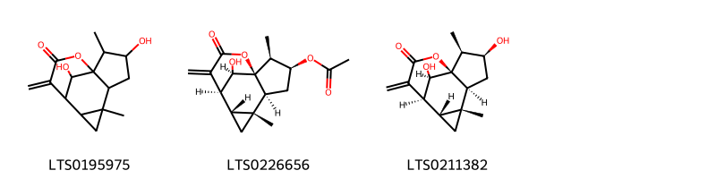{ width=100% }
    <figcaption>Hình ảnh cấu trúc hóa học của 3 hoạt chất thuộc nhóm Lactones gồm ['3,13-dihydroxy-2,6-dimethyl-10-methylidene-12-oxatetracyclo[7.3.1.0¹,⁵.0⁶,⁸]tridecan-11-one (LTS0195975)', '(1r,2s,3s,5s,6r,8r,9s,13r)-13-hydroxy-2,6-dimethyl-10-methylidene-11-oxo-12-oxatetracyclo[7.3.1.0¹,⁵.0⁶,⁸]tridecan-3-yl acetate (LTS0226656)', '(1r,2s,3s,5s,6r,8r,9s,13r)-3,13-dihydroxy-2,6-dimethyl-10-methylidene-12-oxatetracyclo[7.3.1.0¹,⁵.0⁶,⁸]tridecan-11-one (LTS0211382)'].</figcaption>
</figure>

---

### Dược dân tộc học

Danh sách các quốc gia có sử dụng *Zaluzania augusta* trong điều trị các bệnh. 

| Country   | Disease   | Bệnh                                                                                                                                                                                                |
|:----------|:----------|:----------------------------------------------------------------------------------------------------------------------------------------------------------------------------------------------------|
| Mexico    | Stomachic | MYMEMORY WARNING: YOU USED ALL AVAILABLE FREE TRANSLATIONS FOR TODAY. NEXT AVAILABLE IN  09 HOURS 27 MINUTES 09 SECONDS VISIT HTTPS://MYMEMORY.TRANSLATED.NET/DOC/USAGELIMITS.PHP TO TRANSLATE MORE |

---

# Chi Carduncellus

??? note "Danh sách các dược liệu thuộc chi"
    
	 - *Carduncellus moneliensium*

---
## Carduncellus moneliensium
### Thông tin về thực vật

!!! info "Phân loại thực vật của *Carduncellus monspelliensium* từ GIBF:"
    - **Kingdom:** Plantae
    - **Phylum:** Tracheophyta
    - **Order:** Asterales
    - **Family:** Asteraceae
    - **Genus:** Carduncellus
    - **Species:** *Carduncellus monspelliensium*

 

| Label (VI)   | Label (EN)   | Scientific Name   | Descriptions (VI)   | Descriptions (EN)   | Also Known As (VI)   | Also Known As (EN)   |
|:-------------|:-------------|:------------------|:--------------------|:--------------------|:---------------------|:---------------------|
| N/A          | N/A          | Zaluzania augusta | loài thực vật       | species of plant    | ['']                 | ['']                 |

#### Phân bố trên thế giới

**Từ CSDL GIBF** France, Algeria, Spain

#### Phân bố tại Việt Nam

**Từ CSDL GIBF**: Không có ghi nhận ở Việt Nam

---
### Thành phần hóa học
        
- Theo cơ sở dữ liệu lotus: Từ loài *Carduncellus monspelliensium* đã phân lập và xác định được Chưa có hoạt chất nào được phân lập. hoạt chất thuộc về các nhóm Không có hoạt chất nào được phân lập. 

Không có hình ảnh nào được tạo ra

---

### Dược dân tộc học

Danh sách các quốc gia có sử dụng *Carduncellus monspelliensium* trong điều trị các bệnh. 

| Country   | Disease   | Bệnh                                                                                                                                                                                                |
|:----------|:----------|:----------------------------------------------------------------------------------------------------------------------------------------------------------------------------------------------------|
| ain       | Vulnerary | MYMEMORY WARNING: YOU USED ALL AVAILABLE FREE TRANSLATIONS FOR TODAY. NEXT AVAILABLE IN  09 HOURS 26 MINUTES 43 SECONDS VISIT HTTPS://MYMEMORY.TRANSLATED.NET/DOC/USAGELIMITS.PHP TO TRANSLATE MORE |

---

# Chi Trilisa

??? note "Danh sách các dược liệu thuộc chi"
    
	 - *Trilisa odoratissima*

---
## Trilisa odoratissima
### Thông tin về thực vật

!!! info "Phân loại thực vật của *Carphephorus odoratissimus* từ GIBF:"
    - **Kingdom:** Plantae
    - **Phylum:** Tracheophyta
    - **Order:** Asterales
    - **Family:** Asteraceae
    - **Genus:** Carphephorus
    - **Species:** *Carphephorus odoratissimus*

 

| Label (VI)   | Label (EN)   | Scientific Name      | Descriptions (VI)   | Descriptions (EN)   | Also Known As (VI)   | Also Known As (EN)   |
|:-------------|:-------------|:---------------------|:--------------------|:--------------------|:---------------------|:---------------------|
| N/A          | N/A          | Trilisa odoratissima | loài thực vật       | species of plant    | ['']                 | ['']                 |

#### Phân bố trên thế giới

**Từ CSDL GIBF** nan, United States of America

#### Phân bố tại Việt Nam

**Từ CSDL GIBF**: Không có ghi nhận ở Việt Nam

---
### Thành phần hóa học
        
- Theo cơ sở dữ liệu lotus: Từ loài *Carphephorus odoratissimus* đã phân lập và xác định được Chưa có hoạt chất nào được phân lập. hoạt chất thuộc về các nhóm Không có hoạt chất nào được phân lập. 

Không có hình ảnh nào được tạo ra

---

### Dược dân tộc học

Danh sách các quốc gia có sử dụng *Carphephorus odoratissimus* trong điều trị các bệnh. 

| Country   | Disease   | Bệnh                                                                                                                                                                                                |
|:----------|:----------|:----------------------------------------------------------------------------------------------------------------------------------------------------------------------------------------------------|
| Dutch     | Tonic     | MYMEMORY WARNING: YOU USED ALL AVAILABLE FREE TRANSLATIONS FOR TODAY. NEXT AVAILABLE IN  09 HOURS 26 MINUTES 19 SECONDS VISIT HTTPS://MYMEMORY.TRANSLATED.NET/DOC/USAGELIMITS.PHP TO TRANSLATE MORE |
| French    | Diuretic  | MYMEMORY WARNING: YOU USED ALL AVAILABLE FREE TRANSLATIONS FOR TODAY. NEXT AVAILABLE IN  09 HOURS 26 MINUTES 13 SECONDS VISIT HTTPS://MYMEMORY.TRANSLATED.NET/DOC/USAGELIMITS.PHP TO TRANSLATE MORE |
| German    | Sudorific | MYMEMORY WARNING: YOU USED ALL AVAILABLE FREE TRANSLATIONS FOR TODAY. NEXT AVAILABLE IN  09 HOURS 26 MINUTES 11 SECONDS VISIT HTTPS://MYMEMORY.TRANSLATED.NET/DOC/USAGELIMITS.PHP TO TRANSLATE MORE |
| US        | Stimulant | MYMEMORY WARNING: YOU USED ALL AVAILABLE FREE TRANSLATIONS FOR TODAY. NEXT AVAILABLE IN  09 HOURS 26 MINUTES 07 SECONDS VISIT HTTPS://MYMEMORY.TRANSLATED.NET/DOC/USAGELIMITS.PHP TO TRANSLATE MORE |

---

# Chi Gutierrezia

??? note "Danh sách các dược liệu thuộc chi"
    
	 - *Gutierrezia sarothrae*

---
## Gutierrezia sarothrae
### Thông tin về thực vật

!!! info "Phân loại thực vật của *Gutierrezia sarothrae* từ GIBF:"
    - **Kingdom:** Plantae
    - **Phylum:** Tracheophyta
    - **Order:** Asterales
    - **Family:** Asteraceae
    - **Genus:** Gutierrezia
    - **Species:** *Gutierrezia sarothrae*

 

| Label (VI)   | Label (EN)   | Scientific Name       | Descriptions (VI)   | Descriptions (EN)   | Also Known As (VI)   | Also Known As (EN)                                                                                                                                                 |
|:-------------|:-------------|:----------------------|:--------------------|:--------------------|:---------------------|:-------------------------------------------------------------------------------------------------------------------------------------------------------------------|
| N/A          | N/A          | Gutierrezia sarothrae | loài thực vật       | species of plant    | ['']                 | ['broomweed', 'broom snakeweed', 'snakeweed', 'turpentine weed', 'matchbrush', 'perennial snakeweed', 'stinkweed', 'yellow top', 'kindlingweed', 'broomsnakeweed'] |

#### Phân bố trên thế giới

**Từ CSDL GIBF** United States of America, Canada, Mexico

#### Phân bố tại Việt Nam

**Từ CSDL GIBF**: Không có ghi nhận ở Việt Nam

---
### Thành phần hóa học
        
- Theo cơ sở dữ liệu lotus: Từ loài *Gutierrezia sarothrae* đã phân lập và xác định được 69 hoạt chất thuộc về các nhóm Fatty Acyls, Flavonoids, Prenol lipids, Steroids and steroid derivatives, Naphthofurans. 

|    | chemicalTaxonomyClassyfireClass   |   smiles_count |
|---:|:----------------------------------|---------------:|
|  0 | Fatty Acyls                       |              2 |
|  1 | Flavonoids                        |             10 |
|  2 | Naphthofurans                     |              1 |
|  3 | Prenol lipids                     |             54 |
|  4 | Steroids and steroid derivatives  |              2 |

#### Nhóm Fatty Acyls
<figure markdown="span">
    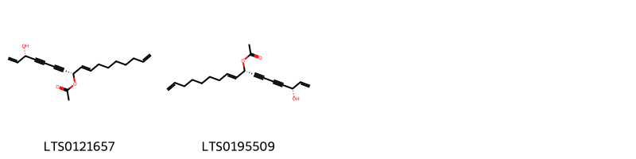{ width=100% }
    <figcaption>Hình ảnh cấu trúc hóa học của 2 hoạt chất thuộc nhóm Fatty Acyls gồm ['(3s,8s)-3-hydroxyheptadeca-1,9,16-trien-4,6-diyn-8-yl acetate (LTS0121657)', '(3s,8s,9e)-3-hydroxyheptadeca-1,9,16-trien-4,6-diyn-8-yl acetate (LTS0195509)'].</figcaption>
</figure>
#### Nhóm Flavonoids
<figure markdown="span">
    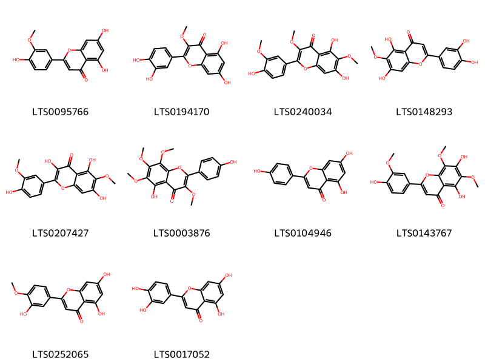{ width=100% }
    <figcaption>Hình ảnh cấu trúc hóa học của 10 hoạt chất thuộc nhóm Flavonoids gồm ['chrysoeriol (LTS0095766)', 'quercetin 3-methyl ether (LTS0194170)', 'jaceidin (LTS0240034)', 'nepetin (LTS0148293)', 'spinacetin (LTS0207427)', 'calycopterin (LTS0003876)', 'chamomile (LTS0104946)', 'sudachitin (LTS0143767)', 'diosmetin (LTS0252065)', 'luteolin (LTS0017052)'].</figcaption>
</figure>
#### Nhóm Naphthofurans
<figure markdown="span">
    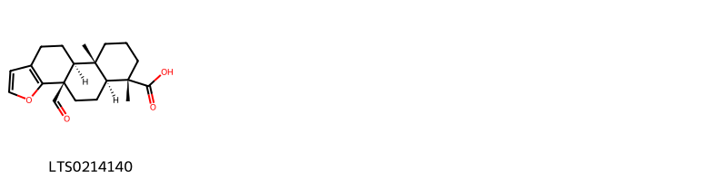{ width=100% }
    <figcaption>Hình ảnh cấu trúc hóa học của 1 hoạt chất thuộc nhóm Naphthofurans gồm ['(3br,5as,6s,9as,9bs)-3b-formyl-6,9a-dimethyl-4h,5h,5ah,7h,8h,9h,9bh,10h,11h-phenanthro[1,2-b]furan-6-carboxylic acid (LTS0214140)'].</figcaption>
</figure>
#### Nhóm Prenol lipids
<figure markdown="span">
    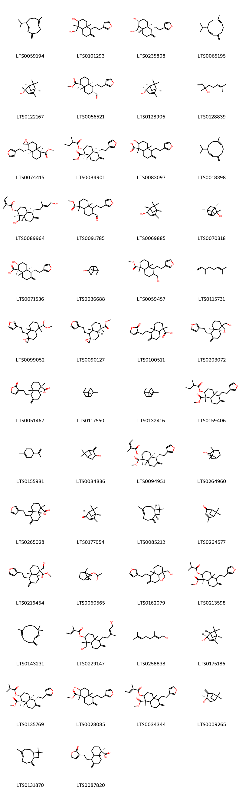{ width=100% }
    <figcaption>Hình ảnh cấu trúc hóa học của 54 hoạt chất thuộc nhóm Prenol lipids gồm ['(-)-germacrene d (LTS0059194)', '5-[2-(furan-3-yl)ethyl]-1-(hydroxymethyl)-1,4a-dimethyl-6-methylidene-hexahydro-2h-naphthalen-2-ol (LTS0101293)', '(1s,2r,4as,5r,8as)-5-[2-(furan-3-yl)ethyl]-1-(hydroxymethyl)-1,4a-dimethyl-6-methylidene-hexahydro-2h-naphthalen-2-ol (LTS0235808)', '(1z,6z,8s)-8-isopropyl-1-methyl-5-methylidenecyclodeca-1,6-diene (LTS0065195)', '(1r,2s,5r)-4,6,6-trimethylbicyclo[3.1.1]hept-3-en-2-ol (LTS0122167)', 'methyl (1s,4as,5r,6r,8as)-6-formyl-5-[2-(furan-3-yl)ethyl]-1,4a-dimethyl-octahydronaphthalene-1-carboxylate (LTS0056521)', '(r)-cis-verbenol (LTS0128906)', 'linalool, (+-)- (LTS0128839)', "methyl (1s,2r,4as,5s,8ar)-1-[2-(furan-3-yl)ethyl]-5,8a-dimethyl-hexahydro-1h-spiro[naphthalene-2,2'-oxirane]-5-carboxylate (LTS0074415)", 'methyl (1r,2r,4as,5r,8as)-5-[2-(furan-3-yl)ethyl]-1,4a-dimethyl-2-{[(2r)-2-methylbutanoyl]oxy}-6-methylidene-hexahydro-2h-naphthalene-1-carboxylate (LTS0084901)', '5-[2-(furan-3-yl)ethyl]-2-hydroxy-1,4a-dimethyl-6-methylidene-hexahydro-2h-naphthalene-1-carboxylic acid (LTS0083097)', '8-isopropyl-1-methyl-5-methylidenecyclodeca-1,6-diene (LTS0018398)', '(1s,2r,4as,5r,8as)-5-[(3e)-5-hydroxy-3-methylpent-3-en-1-yl]-1-(hydroxymethyl)-1,4a-dimethyl-6-methylidene-hexahydro-2h-naphthalen-2-yl (2z)-2-methylbut-2-enoate (LTS0089964)', 'methyl 6-formyl-5-[2-(furan-3-yl)ethyl]-1,4a-dimethyl-octahydronaphthalene-1-carboxylate (LTS0091785)', '(1s,5s)-4,6,6-trimethylbicyclo[3.1.1]hept-3-en-2-ol (LTS0069885)', '(1r,5r)-2,6,6-trimethylbicyclo[3.1.1]hept-3-en-2-ol (LTS0070318)', '(1r,2r,4as,5r,8as)-5-[2-(furan-3-yl)ethyl]-2-hydroxy-1,4a-dimethyl-6-methylidene-hexahydro-2h-naphthalene-1-carboxylic acid (LTS0071536)', 'nopinone (LTS0036688)', 'methyl 5-[2-(furan-3-yl)ethyl]-6-(hydroxymethyl)-1,4a-dimethyl-octahydronaphthalene-1-carboxylate (LTS0059457)', 'α-myrcene (LTS0115731)', "methyl 1-[2-(furan-3-yl)ethyl]-5,8a-dimethyl-hexahydro-1h-spiro[naphthalene-2,2'-oxirane]-5-carboxylate (LTS0099052)", "methyl (1s,2s,4as,5s,8ar)-1-[2-(furan-3-yl)ethyl]-5,8a-dimethyl-hexahydro-1h-spiro[naphthalene-2,2'-oxirane]-5-carboxylate (LTS0090127)", '1,4a-dimethyl-6-methylidene-5-[2-(2-oxo-5h-furan-3-yl)ethyl]-hexahydro-2h-naphthalene-1-carboxylic acid (LTS0100511)', '[(4as,5r,8as)-5-[2-(furan-3-yl)ethyl]-1-(hydroxymethyl)-4a-methyl-6-methylidene-hexahydro-2h-naphthalen-1-yl]methanol (LTS0203072)', '(1s,4as,5r,8as)-1,4a-dimethyl-6-methylidene-5-[2-(2-oxo-5h-furan-3-yl)ethyl]-hexahydro-2h-naphthalene-1-carboxylic acid (LTS0051467)', 'β-pinene (LTS0117550)', 'α pinene (LTS0132416)', 'methyl 5-[2-(furan-3-yl)ethyl]-1,4a-dimethyl-2-[(2-methylbutanoyl)oxy]-6-methylidene-hexahydro-2h-naphthalene-1-carboxylate (LTS0159406)', 'limonene,  (LTS0155981)', 'pinocarvone (LTS0084836)', 'methyl (1r,2r,4as,5r,8as)-5-[2-(furan-3-yl)ethyl]-1,4a-dimethyl-2-{[(2z)-2-methylbut-2-enoyl]oxy}-6-methylidene-hexahydro-2h-naphthalene-1-carboxylate (LTS0094951)', 'borneol (LTS0264960)', '(1s,4as,5r,8as)-5-[2-(furan-3-yl)ethyl]-1,4a-dimethyl-6-methylidene-hexahydro-2h-naphthalene-1-carboxylic acid (LTS0265028)', '(1r,5s)-4,6,6-trimethylbicyclo[3.1.1]hept-3-en-2-one (LTS0177954)', 'caryophyllene (LTS0085212)', 'verbenone (LTS0264577)', 'methyl (1s,4as,5r,8as)-5-[2-(furan-3-yl)ethyl]-1-(hydroxymethyl)-4a-methyl-6-methylidene-hexahydro-2h-naphthalene-1-carboxylate (LTS0216454)', 'bornyl acetate (LTS0060565)', '{5-[2-(furan-3-yl)ethyl]-1-(hydroxymethyl)-4a-methyl-6-methylidene-hexahydro-2h-naphthalen-1-yl}methanol (LTS0162079)', 'methyl 5-[2-(furan-3-yl)ethyl]-1,4a-dimethyl-6-methylidene-2-[(2-methylpropanoyl)oxy]-hexahydro-2h-naphthalene-1-carboxylate (LTS0213598)', '(1z,6e)-gamma-humulene (LTS0143231)', '5-(5-hydroxy-3-methylpent-3-en-1-yl)-1-(hydroxymethyl)-1,4a-dimethyl-6-methylidene-hexahydro-2h-naphthalen-2-yl 2-methylbut-2-enoate (LTS0229147)', 'geraniol (LTS0258838)', '(s)-trans-verbenol (LTS0175186)', 'methyl (1r,2r,4as,5r,8as)-5-[2-(furan-3-yl)ethyl]-1,4a-dimethyl-6-methylidene-2-[(2-methylpropanoyl)oxy]-hexahydro-2h-naphthalene-1-carboxylate (LTS0135769)', 'methyl 5-[2-(furan-3-yl)ethyl]-2-hydroxy-1,4a-dimethyl-6-methylidene-hexahydro-2h-naphthalene-1-carboxylate (LTS0028085)', 'methyl 5-[2-(furan-3-yl)ethyl]-1,4a-dimethyl-2-[(2-methylbut-2-enoyl)oxy]-6-methylidene-hexahydro-2h-naphthalene-1-carboxylate (LTS0034344)', '(3r)-6,6-dimethyl-2-methylidenebicyclo[3.1.1]heptan-3-ol (LTS0009265)', 'caryophyllene (LTS0131870)', '(1r,4ar,5s,8ar)-1,4a-dimethyl-6-methylidene-5-[2-(2-oxo-5h-furan-3-yl)ethyl]-hexahydro-2h-naphthalene-1-carboxylic acid (LTS0087820)', 'pinocarveol (LTS0090950)', 'methyl (1s,2r,4as,5r,8as)-5-[2-(furan-3-yl)ethyl]-2-hydroxy-1,4a-dimethyl-6-methylidene-hexahydro-2h-naphthalene-1-carboxylate (LTS0270688)', 'methyl (1s,4as,5r,6r,8as)-5-[2-(furan-3-yl)ethyl]-6-(hydroxymethyl)-1,4a-dimethyl-octahydronaphthalene-1-carboxylate (LTS0234160)', 'methyl 5-[2-(furan-3-yl)ethyl]-1-(hydroxymethyl)-4a-methyl-6-methylidene-hexahydro-2h-naphthalene-1-carboxylate (LTS0102042)'].</figcaption>
</figure>
#### Nhóm Steroids and steroid derivatives
<figure markdown="span">
    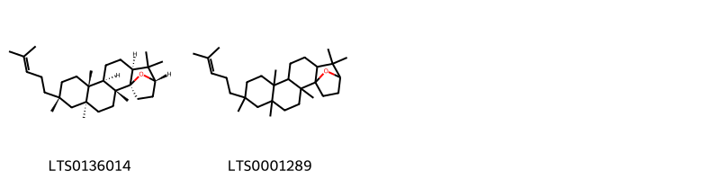{ width=100% }
    <figcaption>Hình ảnh cấu trúc hóa học của 2 hoạt chất thuộc nhóm Steroids and steroid derivatives gồm ['baccharis oxide (LTS0136014)', '2,5,7,10,15,15-hexamethyl-7-(4-methylpent-3-en-1-yl)-19-oxapentacyclo[14.2.1.0¹,¹⁴.0²,¹¹.0⁵,¹⁰]nonadecane (LTS0001289)'].</figcaption>
</figure>

---

### Dược dân tộc học

Danh sách các quốc gia có sử dụng *Gutierrezia sarothrae* trong điều trị các bệnh. 

| Country   | Disease     | Bệnh                                                                                                                                                                                                |
|:----------|:------------|:----------------------------------------------------------------------------------------------------------------------------------------------------------------------------------------------------|
| USA       | Emmenagogue | MYMEMORY WARNING: YOU USED ALL AVAILABLE FREE TRANSLATIONS FOR TODAY. NEXT AVAILABLE IN  09 HOURS 25 MINUTES 40 SECONDS VISIT HTTPS://MYMEMORY.TRANSLATED.NET/DOC/USAGELIMITS.PHP TO TRANSLATE MORE |

---

# Chi Amberboa

??? note "Danh sách các dược liệu thuộc chi"
    
	 - *Amberboa divaricata*

---
## Amberboa divaricata
### Thông tin về thực vật

!!! info "Phân loại thực vật của *Oligochaeta divaricata* từ GIBF:"
    - **Kingdom:** Plantae
    - **Phylum:** Tracheophyta
    - **Order:** Asterales
    - **Family:** Asteraceae
    - **Genus:** Oligochaeta
    - **Species:** *Oligochaeta divaricata*

 

| Label (VI)   | Label (EN)   | Scientific Name       | Descriptions (VI)   | Descriptions (EN)   | Also Known As (VI)   | Also Known As (EN)                                                                                                                                                 |
|:-------------|:-------------|:----------------------|:--------------------|:--------------------|:---------------------|:-------------------------------------------------------------------------------------------------------------------------------------------------------------------|
| N/A          | N/A          | Gutierrezia sarothrae | loài thực vật       | species of plant    | ['']                 | ['broomweed', 'broom snakeweed', 'snakeweed', 'turpentine weed', 'matchbrush', 'perennial snakeweed', 'stinkweed', 'yellow top', 'kindlingweed', 'broomsnakeweed'] |

#### Phân bố trên thế giới

**Từ CSDL GIBF** India

#### Phân bố tại Việt Nam

**Từ CSDL GIBF**: Không có ghi nhận ở Việt Nam

---
### Thành phần hóa học
        
- Theo cơ sở dữ liệu lotus: Từ loài *Oligochaeta divaricata* đã phân lập và xác định được Chưa có hoạt chất nào được phân lập. hoạt chất thuộc về các nhóm Không có hoạt chất nào được phân lập. 

Không có hình ảnh nào được tạo ra

---

### Dược dân tộc học

Danh sách các quốc gia có sử dụng *Oligochaeta divaricata* trong điều trị các bệnh. 

| Country   | Disease         | Bệnh                                                                                                                                                                                                |
|:----------|:----------------|:----------------------------------------------------------------------------------------------------------------------------------------------------------------------------------------------------|
| India     | Tonic, Laxative | MYMEMORY WARNING: YOU USED ALL AVAILABLE FREE TRANSLATIONS FOR TODAY. NEXT AVAILABLE IN  09 HOURS 24 MINUTES 53 SECONDS VISIT HTTPS://MYMEMORY.TRANSLATED.NET/DOC/USAGELIMITS.PHP TO TRANSLATE MORE |

---

# Chi Liatris

??? note "Danh sách các dược liệu thuộc chi"
    
	 - *Liatris icata*
	 - *Liatris squarrulosa*

---
## Liatris icata
### Thông tin về thực vật

!!! info "Phân loại thực vật của *N/A* từ GIBF:"
    - **Kingdom:** Plantae
    - **Phylum:** Tracheophyta
    - **Order:** Asterales
    - **Family:** Asteraceae
    - **Genus:** Liatris
    - **Species:** *N/A*

 

| Label (VI)   | Label (EN)   | Scientific Name       | Descriptions (VI)   | Descriptions (EN)   | Also Known As (VI)   | Also Known As (EN)                                                                                                                                                 |
|:-------------|:-------------|:----------------------|:--------------------|:--------------------|:---------------------|:-------------------------------------------------------------------------------------------------------------------------------------------------------------------|
| N/A          | N/A          | Gutierrezia sarothrae | loài thực vật       | species of plant    | ['']                 | ['broomweed', 'broom snakeweed', 'snakeweed', 'turpentine weed', 'matchbrush', 'perennial snakeweed', 'stinkweed', 'yellow top', 'kindlingweed', 'broomsnakeweed'] |

#### Phân bố trên thế giới

**Từ CSDL GIBF** United States of America, Canada

#### Phân bố tại Việt Nam

**Từ CSDL GIBF**: Không có ghi nhận ở Việt Nam

---
### Thành phần hóa học
        
- Theo cơ sở dữ liệu lotus: Từ loài *N/A* đã phân lập và xác định được Chưa có hoạt chất nào được phân lập. hoạt chất thuộc về các nhóm Không có hoạt chất nào được phân lập. 

Không có hình ảnh nào được tạo ra

---

### Dược dân tộc học

Danh sách các quốc gia có sử dụng *N/A* trong điều trị các bệnh. 

| Country   | Disease                                                          | Bệnh                                                                                                                                                                                                |
|:----------|:-----------------------------------------------------------------|:----------------------------------------------------------------------------------------------------------------------------------------------------------------------------------------------------|
| US        | Carminative, Diuretic, Diuretic, Stimulant, Sudorific, Stimulant | MYMEMORY WARNING: YOU USED ALL AVAILABLE FREE TRANSLATIONS FOR TODAY. NEXT AVAILABLE IN  09 HOURS 24 MINUTES 33 SECONDS VISIT HTTPS://MYMEMORY.TRANSLATED.NET/DOC/USAGELIMITS.PHP TO TRANSLATE MORE |

---

---
## Liatris squarrulosa
### Thông tin về thực vật

!!! info "Phân loại thực vật của *Liatris squarrulosa* từ GIBF:"
    - **Kingdom:** Plantae
    - **Phylum:** Tracheophyta
    - **Order:** Asterales
    - **Family:** Asteraceae
    - **Genus:** Liatris
    - **Species:** *Liatris squarrulosa*

 

| Label (VI)   | Label (EN)   | Scientific Name     | Descriptions (VI)   | Descriptions (EN)   | Also Known As (VI)   | Also Known As (EN)   |
|:-------------|:-------------|:--------------------|:--------------------|:--------------------|:---------------------|:---------------------|
| N/A          | N/A          | Liatris squarrulosa | loài thực vật       | species of plant    | ['']                 | ['']                 |

#### Phân bố trên thế giới

**Từ CSDL GIBF** United States of America

#### Phân bố tại Việt Nam

**Từ CSDL GIBF**: Không có ghi nhận ở Việt Nam

---
### Thành phần hóa học
        
- Theo cơ sở dữ liệu lotus: Từ loài *Liatris squarrulosa* đã phân lập và xác định được Chưa có hoạt chất nào được phân lập. hoạt chất thuộc về các nhóm Không có hoạt chất nào được phân lập. 

Không có hình ảnh nào được tạo ra

---

### Dược dân tộc học

Danh sách các quốc gia có sử dụng *Liatris squarrulosa* trong điều trị các bệnh. 

| Country   | Disease                                 | Bệnh                                                                                                                                                                                                |
|:----------|:----------------------------------------|:----------------------------------------------------------------------------------------------------------------------------------------------------------------------------------------------------|
| US        | Diuretic, Stimulant, Tonic, Diaphoretic | MYMEMORY WARNING: YOU USED ALL AVAILABLE FREE TRANSLATIONS FOR TODAY. NEXT AVAILABLE IN  09 HOURS 24 MINUTES 07 SECONDS VISIT HTTPS://MYMEMORY.TRANSLATED.NET/DOC/USAGELIMITS.PHP TO TRANSLATE MORE |

---

# Chi Hieracium

??? note "Danh sách các dược liệu thuộc chi"
    
	 - *Hieracium pilosella*
	 - *Hieracium virosum*

---
## Hieracium pilosella
### Thông tin về thực vật

!!! info "Phân loại thực vật của *Pilosella officinarum* từ GIBF:"
    - **Kingdom:** Plantae
    - **Phylum:** Tracheophyta
    - **Order:** Asterales
    - **Family:** Asteraceae
    - **Genus:** Pilosella
    - **Species:** *Pilosella officinarum*

 

| Label (VI)   | Label (EN)   | Scientific Name     | Descriptions (VI)   | Descriptions (EN)   | Also Known As (VI)   | Also Known As (EN)   |
|:-------------|:-------------|:--------------------|:--------------------|:--------------------|:---------------------|:---------------------|
| N/A          | N/A          | Hieracium pilosella | loài thực vật       | species of plant    | ['']                 | ['']                 |

#### Phân bố trên thế giới

**Từ CSDL GIBF** Italy, Luxembourg, Germany, Belgium, Switzerland, Austria, France

#### Phân bố tại Việt Nam

**Từ CSDL GIBF**: Không có ghi nhận ở Việt Nam

---
### Thành phần hóa học
        
- Theo cơ sở dữ liệu lotus: Từ loài *Pilosella officinarum* đã phân lập và xác định được 5 hoạt chất thuộc về các nhóm Flavonoids. 

|    | chemicalTaxonomyClassyfireClass   |   smiles_count |
|---:|:----------------------------------|---------------:|
|  0 | Flavonoids                        |              5 |

#### Nhóm Flavonoids
<figure markdown="span">
    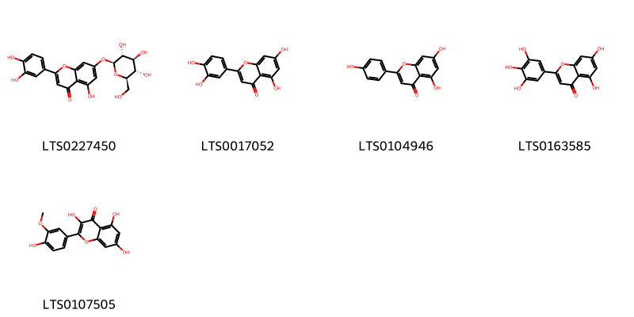{ width=100% }
    <figcaption>Hình ảnh cấu trúc hóa học của 5 hoạt chất thuộc nhóm Flavonoids gồm ['luteolin 7-o-glucoside (LTS0227450)', 'luteolin (LTS0017052)', 'chamomile (LTS0104946)', 'tricetin (LTS0163585)', 'isorhamnetin (LTS0107505)'].</figcaption>
</figure>

---

### Dược dân tộc học

Danh sách các quốc gia có sử dụng *Pilosella officinarum* trong điều trị các bệnh. 

| Country   | Disease                                            | Bệnh                                                                                                                                                                                                |
|:----------|:---------------------------------------------------|:----------------------------------------------------------------------------------------------------------------------------------------------------------------------------------------------------|
| Elsewhere | Hemostatic, Vermicide                              | MYMEMORY WARNING: YOU USED ALL AVAILABLE FREE TRANSLATIONS FOR TODAY. NEXT AVAILABLE IN  09 HOURS 23 MINUTES 39 SECONDS VISIT HTTPS://MYMEMORY.TRANSLATED.NET/DOC/USAGELIMITS.PHP TO TRANSLATE MORE |
| Turkey    | Diuretic, Expectorant, Tonic, Astringent, Hemostat | MYMEMORY WARNING: YOU USED ALL AVAILABLE FREE TRANSLATIONS FOR TODAY. NEXT AVAILABLE IN  09 HOURS 23 MINUTES 36 SECONDS VISIT HTTPS://MYMEMORY.TRANSLATED.NET/DOC/USAGELIMITS.PHP TO TRANSLATE MORE |
| ain       | nan                                                | MYMEMORY WARNING: YOU USED ALL AVAILABLE FREE TRANSLATIONS FOR TODAY. NEXT AVAILABLE IN  09 HOURS 23 MINUTES 33 SECONDS VISIT HTTPS://MYMEMORY.TRANSLATED.NET/DOC/USAGELIMITS.PHP TO TRANSLATE MORE |

---

---
## Hieracium virosum
### Thông tin về thực vật

!!! info "Phân loại thực vật của *Hieracium virosum* từ GIBF:"
    - **Kingdom:** Plantae
    - **Phylum:** Tracheophyta
    - **Order:** Asterales
    - **Family:** Asteraceae
    - **Genus:** Hieracium
    - **Species:** *Hieracium virosum*

 

| Label (VI)   | Label (EN)   | Scientific Name   | Descriptions (VI)   | Descriptions (EN)   | Also Known As (VI)   | Also Known As (EN)   |
|:-------------|:-------------|:------------------|:--------------------|:--------------------|:---------------------|:---------------------|
| N/A          | N/A          | Hieracium virosum | loài thực vật       | species of plant    | ['']                 | ['']                 |

#### Phân bố trên thế giới

**Từ CSDL GIBF** Ukraine, nan, Russian Federation, Kazakhstan, Mongolia

#### Phân bố tại Việt Nam

**Từ CSDL GIBF**: Không có ghi nhận ở Việt Nam

---
### Thành phần hóa học
        
- Theo cơ sở dữ liệu lotus: Từ loài *Hieracium virosum* đã phân lập và xác định được Chưa có hoạt chất nào được phân lập. hoạt chất thuộc về các nhóm Không có hoạt chất nào được phân lập. 

Không có hình ảnh nào được tạo ra

---

### Dược dân tộc học

Danh sách các quốc gia có sử dụng *Hieracium virosum* trong điều trị các bệnh. 

| Country   | Disease             | Bệnh                                                                                                                                                                                                |
|:----------|:--------------------|:----------------------------------------------------------------------------------------------------------------------------------------------------------------------------------------------------|
| ain       | Vulnerary, Aperient | MYMEMORY WARNING: YOU USED ALL AVAILABLE FREE TRANSLATIONS FOR TODAY. NEXT AVAILABLE IN  09 HOURS 23 MINUTES 03 SECONDS VISIT HTTPS://MYMEMORY.TRANSLATED.NET/DOC/USAGELIMITS.PHP TO TRANSLATE MORE |

---

# Chi Printzia

??? note "Danh sách các dược liệu thuộc chi"
    
	 - *Printzia pyrifolia*

---
## Printzia pyrifolia
### Thông tin về thực vật

!!! info "Phân loại thực vật của *Printzia pyrifolia* từ GIBF:"
    - **Kingdom:** Plantae
    - **Phylum:** Tracheophyta
    - **Order:** Asterales
    - **Family:** Asteraceae
    - **Genus:** Printzia
    - **Species:** *Printzia pyrifolia*

 

| Label (VI)   | Label (EN)   | Scientific Name    | Descriptions (VI)   | Descriptions (EN)   | Also Known As (VI)   | Also Known As (EN)   |
|:-------------|:-------------|:-------------------|:--------------------|:--------------------|:---------------------|:---------------------|
| N/A          | N/A          | Printzia pyrifolia | loài thực vật       | species of plant    | ['']                 | ['']                 |

#### Phân bố trên thế giới

**Từ CSDL GIBF** nan, South Africa, Lesotho, unknown or invalid, United States of America

#### Phân bố tại Việt Nam

**Từ CSDL GIBF**: Không có ghi nhận ở Việt Nam

---
### Thành phần hóa học
        
- Theo cơ sở dữ liệu lotus: Từ loài *Printzia pyrifolia* đã phân lập và xác định được Chưa có hoạt chất nào được phân lập. hoạt chất thuộc về các nhóm Không có hoạt chất nào được phân lập. 

Không có hình ảnh nào được tạo ra

---

### Dược dân tộc học

Danh sách các quốc gia có sử dụng *Printzia pyrifolia* trong điều trị các bệnh. 

| Country   | Disease   | Bệnh                                                                                                                                                                                                |
|:----------|:----------|:----------------------------------------------------------------------------------------------------------------------------------------------------------------------------------------------------|
| Lesotho   | Purgative | MYMEMORY WARNING: YOU USED ALL AVAILABLE FREE TRANSLATIONS FOR TODAY. NEXT AVAILABLE IN  09 HOURS 22 MINUTES 35 SECONDS VISIT HTTPS://MYMEMORY.TRANSLATED.NET/DOC/USAGELIMITS.PHP TO TRANSLATE MORE |

---

# Chi Anacyclus

??? note "Danh sách các dược liệu thuộc chi"
    
	 - *Anacyclus officinarum*
	 - *Anacyclus pyrethrum*

---
## Anacyclus officinarum
### Thông tin về thực vật

!!! info "Phân loại thực vật của *Anacyclus pyrethrum* từ GIBF:"
    - **Kingdom:** Plantae
    - **Phylum:** Tracheophyta
    - **Order:** Asterales
    - **Family:** Asteraceae
    - **Genus:** Anacyclus
    - **Species:** *Anacyclus pyrethrum*

 

| Label (VI)   | Label (EN)   | Scientific Name       | Descriptions (VI)   | Descriptions (EN)   | Also Known As (VI)   | Also Known As (EN)   |
|:-------------|:-------------|:----------------------|:--------------------|:--------------------|:---------------------|:---------------------|
| N/A          | N/A          | Anacyclus officinarum | loài thực vật       | species of plant    | ['']                 | ['']                 |

#### Phân bố trên thế giới

**Từ CSDL GIBF** nan, Germany, Brazil, unknown or invalid, Russian Federation, Poland, France, Mexico, Austria

#### Phân bố tại Việt Nam

**Từ CSDL GIBF**: Không có ghi nhận ở Việt Nam

---
### Thành phần hóa học
        
- Theo cơ sở dữ liệu lotus: Từ loài *Anacyclus pyrethrum* đã phân lập và xác định được Chưa có hoạt chất nào được phân lập. hoạt chất thuộc về các nhóm Không có hoạt chất nào được phân lập. 

Không có hình ảnh nào được tạo ra

---

### Dược dân tộc học

Danh sách các quốc gia có sử dụng *Anacyclus pyrethrum* trong điều trị các bệnh. 

| Country   | Disease     | Bệnh                                                                                                                                                                                                |
|:----------|:------------|:----------------------------------------------------------------------------------------------------------------------------------------------------------------------------------------------------|
| Turkey    | Insecticide | MYMEMORY WARNING: YOU USED ALL AVAILABLE FREE TRANSLATIONS FOR TODAY. NEXT AVAILABLE IN  09 HOURS 22 MINUTES 09 SECONDS VISIT HTTPS://MYMEMORY.TRANSLATED.NET/DOC/USAGELIMITS.PHP TO TRANSLATE MORE |

---

---
## Anacyclus pyrethrum
### Thông tin về thực vật

!!! info "Phân loại thực vật của *Anacyclus pyrethrum* từ GIBF:"
    - **Kingdom:** Plantae
    - **Phylum:** Tracheophyta
    - **Order:** Asterales
    - **Family:** Asteraceae
    - **Genus:** Anacyclus
    - **Species:** *Anacyclus pyrethrum*

 

| Label (VI)   | Label (EN)   | Scientific Name     | Descriptions (VI)   | Descriptions (EN)   | Also Known As (VI)   | Also Known As (EN)   |
|:-------------|:-------------|:--------------------|:--------------------|:--------------------|:---------------------|:---------------------|
| N/A          | N/A          | Anacyclus pyrethrum | loài thực vật       | species of plant    | ['']                 | ['']                 |

#### Phân bố trên thế giới

**Từ CSDL GIBF** nan, Netherlands, Italy, Germany, Brazil, Spain, Egypt, Poland, Portugal, Algeria, unknown or invalid, Morocco, United States of America, Sweden, Austria, France, New Zealand, Canada

#### Phân bố tại Việt Nam

**Từ CSDL GIBF**: Không có ghi nhận ở Việt Nam

---
### Thành phần hóa học
        
- Theo cơ sở dữ liệu lotus: Từ loài *Anacyclus pyrethrum* đã phân lập và xác định được 34 hoạt chất thuộc về các nhóm Fatty Acyls, Organooxygen compounds, Phenols, Furanoid lignans, Carboximidic acids and derivatives. 

|    | chemicalTaxonomyClassyfireClass    |   smiles_count |
|---:|:-----------------------------------|---------------:|
|  0 | Carboximidic acids and derivatives |              1 |
|  1 | Fatty Acyls                        |             24 |
|  2 | Furanoid lignans                   |              1 |
|  3 | Organooxygen compounds             |              2 |
|  4 | Phenols                            |              6 |

#### Nhóm Carboximidic acids and derivatives
<figure markdown="span">
    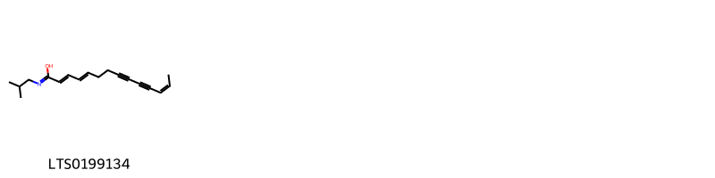{ width=100% }
    <figcaption>Hình ảnh cấu trúc hóa học của 1 hoạt chất thuộc nhóm Carboximidic acids and derivatives gồm ['(2e,4e,12z)-n-(2-methylpropyl)tetradeca-2,4,12-trien-8,10-diynimidic acid (LTS0199134)'].</figcaption>
</figure>
#### Nhóm Fatty Acyls
<figure markdown="span">
    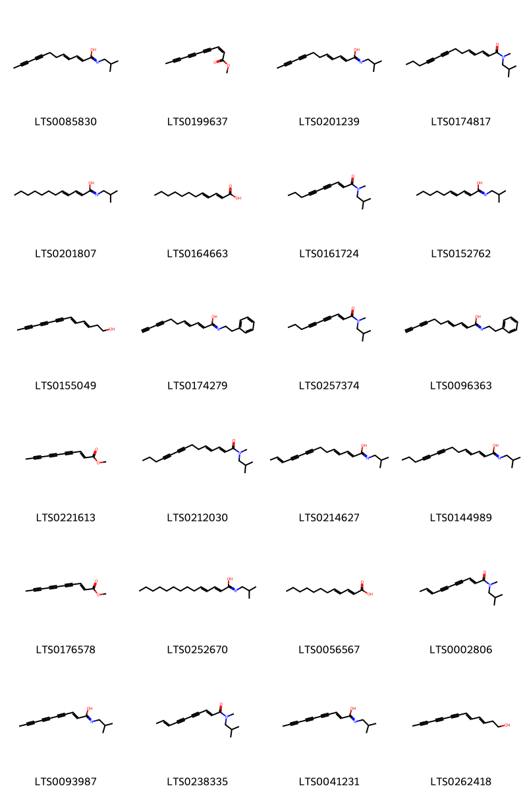{ width=100% }
    <figcaption>Hình ảnh cấu trúc hóa học của 24 hoạt chất thuộc nhóm Fatty Acyls gồm ['(2e,4e)-n-(2-methylpropyl)dodeca-2,4-dien-8,10-diynimidic acid (LTS0085830)', 'dehydromatricaria ester (LTS0199637)', 'n-(2-methylpropyl)dodeca-2,4-dien-8,10-diynimidic acid (LTS0201239)', '(2e,4e)-n-methyl-n-(2-methylpropyl)tetradeca-2,4-dien-8,10-diynamide (LTS0174817)', '(2e,4e)-n-(2-methylpropyl)dodeca-2,4-dienimidic acid (LTS0201807)', 'dodeca-2,4-dienoic acid (LTS0164663)', 'n-methyl-n-(2-methylpropyl)dec-2-en-4,6-diynamide (LTS0161724)', '(2e,4e)-n-(2-methylpropyl)deca-2,4-dienimidic acid (LTS0152762)', 'trideca-3,5-dien-7,9,11-triyn-1-ol (LTS0155049)', 'n-(2-phenylethyl)undeca-2,4-dien-8,10-diynimidic acid (LTS0174279)', '(2e)-n-methyl-n-(2-methylpropyl)dec-2-en-4,6-diynamide (LTS0257374)', '(2e,4e)-n-(2-phenylethyl)undeca-2,4-dien-8,10-diynimidic acid (LTS0096363)', 'methyl dec-2-en-4,6,8-triynoate (LTS0221613)', 'n-methyl-n-(2-methylpropyl)tetradeca-2,4-dien-8,10-diynamide (LTS0212030)', '(2e,4e,12e)-n-(2-methylpropyl)tetradeca-2,4,12-trien-8,10-diynimidic acid (LTS0214627)', '(2e,4e)-n-(2-methylpropyl)tetradeca-2,4-dien-8,10-diynimidic acid (LTS0144989)', 'dehydromatricaria ester (LTS0176578)', '(2e,4e)-n-(2-methylpropyl)tetradeca-2,4-dienimidic acid (LTS0252670)', '(2e,4e)-dodeca-2,4-dienoic acid (LTS0056567)', 'n-methyl-n-(2-methylpropyl)deca-2,8-dien-4,6-diynamide (LTS0002806)', '(2e)-n-(2-methylpropyl)dec-2-en-4,6,8-triynimidic acid (LTS0093987)', '(2e,8e)-n-methyl-n-(2-methylpropyl)deca-2,8-dien-4,6-diynamide (LTS0238335)', 'n-(2-methylpropyl)dec-2-en-4,6,8-triynimidic acid (LTS0041231)', '(3e,5e)-trideca-3,5-dien-7,9,11-triyn-1-ol (LTS0262418)'].</figcaption>
</figure>
#### Nhóm Furanoid lignans
<figure markdown="span">
    { width=100% }
    <figcaption>Hình ảnh cấu trúc hóa học của 1 hoạt chất thuộc nhóm Furanoid lignans gồm ['sesamin (LTS0120161)'].</figcaption>
</figure>
#### Nhóm Organooxygen compounds
<figure markdown="span">
    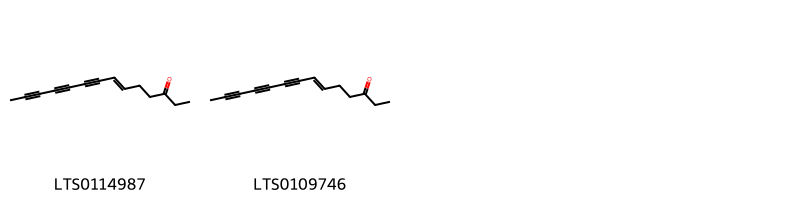{ width=100% }
    <figcaption>Hình ảnh cấu trúc hóa học của 2 hoạt chất thuộc nhóm Organooxygen compounds gồm ['(6e)-tetradec-6-en-8,10,12-triyn-3-one (LTS0114987)', 'tetradec-6-en-8,10,12-triyn-3-one (LTS0109746)'].</figcaption>
</figure>
#### Nhóm Phenols
<figure markdown="span">
    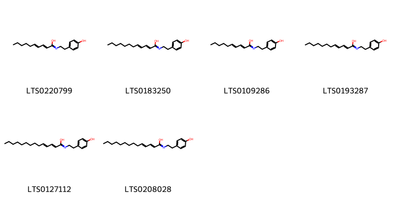{ width=100% }
    <figcaption>Hình ảnh cấu trúc hóa học của 6 hoạt chất thuộc nhóm Phenols gồm ['(2e,4e)-n-[2-(4-hydroxyphenyl)ethyl]deca-2,4-dienimidic acid (LTS0220799)', 'n-[2-(4-hydroxyphenyl)ethyl]dodeca-2,4-dienimidic acid (LTS0183250)', 'n-[2-(4-hydroxyphenyl)ethyl]deca-2,4-dienimidic acid (LTS0109286)', '(2e,4e)-n-[2-(4-hydroxyphenyl)ethyl]dodeca-2,4-dienimidic acid (LTS0193287)', 'n-[2-(4-hydroxyphenyl)ethyl]tetradeca-2,4-dienimidic acid (LTS0127112)', '(2e,4e)-n-[2-(4-hydroxyphenyl)ethyl]tetradeca-2,4-dienimidic acid (LTS0208028)'].</figcaption>
</figure>

---

### Dược dân tộc học

Danh sách các quốc gia có sử dụng *Anacyclus pyrethrum* trong điều trị các bệnh. 

| Country   | Disease                                      | Bệnh                                                                                                                                                                                                |
|:----------|:---------------------------------------------|:----------------------------------------------------------------------------------------------------------------------------------------------------------------------------------------------------|
| Elsewhere | Irritant, Rubefacient, Sialogogue, Stimulant | MYMEMORY WARNING: YOU USED ALL AVAILABLE FREE TRANSLATIONS FOR TODAY. NEXT AVAILABLE IN  09 HOURS 21 MINUTES 39 SECONDS VISIT HTTPS://MYMEMORY.TRANSLATED.NET/DOC/USAGELIMITS.PHP TO TRANSLATE MORE |
| Turkey    | Sialogogue, Poison, Rubefacient, Stimulant   | MYMEMORY WARNING: YOU USED ALL AVAILABLE FREE TRANSLATIONS FOR TODAY. NEXT AVAILABLE IN  09 HOURS 21 MINUTES 36 SECONDS VISIT HTTPS://MYMEMORY.TRANSLATED.NET/DOC/USAGELIMITS.PHP TO TRANSLATE MORE |

---

# Chi Acanthoermum

??? note "Danh sách các dược liệu thuộc chi"
    
	 - *Acanthoermum australe*

---
## Acanthoermum australe
### Thông tin về thực vật

!!! info "Phân loại thực vật của *N/A* từ GIBF:"
    - **Kingdom:** N/A
    - **Phylum:** N/A
    - **Order:** N/A
    - **Family:** N/A
    - **Genus:** N/A
    - **Species:** *N/A*

 

| Label (VI)   | Label (EN)   | Scientific Name     | Descriptions (VI)   | Descriptions (EN)   | Also Known As (VI)   | Also Known As (EN)   |
|:-------------|:-------------|:--------------------|:--------------------|:--------------------|:---------------------|:---------------------|
| N/A          | N/A          | Anacyclus pyrethrum | loài thực vật       | species of plant    | ['']                 | ['']                 |

#### Phân bố trên thế giới

**Từ CSDL GIBF** Không có kết quả phù hợp

#### Phân bố tại Việt Nam

**Từ CSDL GIBF**: Không có ghi nhận ở Việt Nam

---
### Thành phần hóa học
        
- Theo cơ sở dữ liệu lotus: Từ loài *N/A* đã phân lập và xác định được Chưa có hoạt chất nào được phân lập. hoạt chất thuộc về các nhóm Không có hoạt chất nào được phân lập. 

Không có hình ảnh nào được tạo ra

---

### Dược dân tộc học

Danh sách các quốc gia có sử dụng *N/A* trong điều trị các bệnh. 

| Country   | Disease       | Bệnh                                                                                                                                                                                                |
|:----------|:--------------|:----------------------------------------------------------------------------------------------------------------------------------------------------------------------------------------------------|
| Paraguay  | Antifertility | MYMEMORY WARNING: YOU USED ALL AVAILABLE FREE TRANSLATIONS FOR TODAY. NEXT AVAILABLE IN  09 HOURS 21 MINUTES 03 SECONDS VISIT HTTPS://MYMEMORY.TRANSLATED.NET/DOC/USAGELIMITS.PHP TO TRANSLATE MORE |

---

# Chi Diotis

??? note "Danh sách các dược liệu thuộc chi"
    
	 - *Diotis candidissima*

---
## Diotis candidissima
### Thông tin về thực vật

!!! info "Phân loại thực vật của *Achillea maritima* từ GIBF:"
    - **Kingdom:** Plantae
    - **Phylum:** Tracheophyta
    - **Order:** Asterales
    - **Family:** Asteraceae
    - **Genus:** Achillea
    - **Species:** *Achillea maritima*

 

| Label (VI)   | Label (EN)   | Scientific Name     | Descriptions (VI)   | Descriptions (EN)   | Also Known As (VI)   | Also Known As (EN)   |
|:-------------|:-------------|:--------------------|:--------------------|:--------------------|:---------------------|:---------------------|
| N/A          | N/A          | Anacyclus pyrethrum | loài thực vật       | species of plant    | ['']                 | ['']                 |

#### Phân bố trên thế giới

**Từ CSDL GIBF** nan, Israel, Bulgaria, Italy, Syrian Arab Republic, Spain, Egypt, Ireland, Portugal, unknown or invalid, Palestine, State of, North Macedonia, Algeria, Tunisia, France, Croatia, Greece

#### Phân bố tại Việt Nam

**Từ CSDL GIBF**: Không có ghi nhận ở Việt Nam

---
### Thành phần hóa học
        
- Theo cơ sở dữ liệu lotus: Từ loài *Achillea maritima* đã phân lập và xác định được Chưa có hoạt chất nào được phân lập. hoạt chất thuộc về các nhóm Không có hoạt chất nào được phân lập. 

Không có hình ảnh nào được tạo ra

---

### Dược dân tộc học

Danh sách các quốc gia có sử dụng *Achillea maritima* trong điều trị các bệnh. 

| Country   | Disease          | Bệnh                                                                                                                                                                                                |
|:----------|:-----------------|:----------------------------------------------------------------------------------------------------------------------------------------------------------------------------------------------------|
| Arab      | nan, Emmenagogue | MYMEMORY WARNING: YOU USED ALL AVAILABLE FREE TRANSLATIONS FOR TODAY. NEXT AVAILABLE IN  09 HOURS 20 MINUTES 45 SECONDS VISIT HTTPS://MYMEMORY.TRANSLATED.NET/DOC/USAGELIMITS.PHP TO TRANSLATE MORE |

---

# Chi Mikania

??? note "Danh sách các dược liệu thuộc chi"
    
	 - *Mikania guaco*
	 - *Mikania micrantha*

---
## Mikania guaco
### Thông tin về thực vật

!!! info "Phân loại thực vật của *Mikania guaco* từ GIBF:"
    - **Kingdom:** Plantae
    - **Phylum:** Tracheophyta
    - **Order:** Asterales
    - **Family:** Asteraceae
    - **Genus:** Mikania
    - **Species:** *Mikania guaco*

 

| Label (VI)   | Label (EN)   | Scientific Name   | Descriptions (VI)   | Descriptions (EN)   | Also Known As (VI)   | Also Known As (EN)   |
|:-------------|:-------------|:------------------|:--------------------|:--------------------|:---------------------|:---------------------|
| N/A          | N/A          | Mikania guaco     | loài thực vật       | species of plant    | ['']                 | ['']                 |

#### Phân bố trên thế giới

**Từ CSDL GIBF** Nicaragua, Ecuador, Puerto Rico, Panama, Suriname, Colombia, Brazil, Bolivia (Plurinational State of), Costa Rica, Guyana, Peru, Paraguay, Venezuela (Bolivarian Republic of), French Guiana

#### Phân bố tại Việt Nam

**Từ CSDL GIBF**: Không có ghi nhận ở Việt Nam

---
### Thành phần hóa học
        
- Theo cơ sở dữ liệu lotus: Từ loài *Mikania guaco* đã phân lập và xác định được 36 hoạt chất thuộc về các nhóm Flavonoids, Prenol lipids. 

|    | chemicalTaxonomyClassyfireClass   |   smiles_count |
|---:|:----------------------------------|---------------:|
|  0 | Flavonoids                        |              1 |
|  1 | Prenol lipids                     |             35 |

#### Nhóm Flavonoids
<figure markdown="span">
    { width=100% }
    <figcaption>Hình ảnh cấu trúc hóa học của 1 hoạt chất thuộc nhóm Flavonoids gồm ['nepetin (LTS0148293)'].</figcaption>
</figure>
#### Nhóm Prenol lipids
<figure markdown="span">
    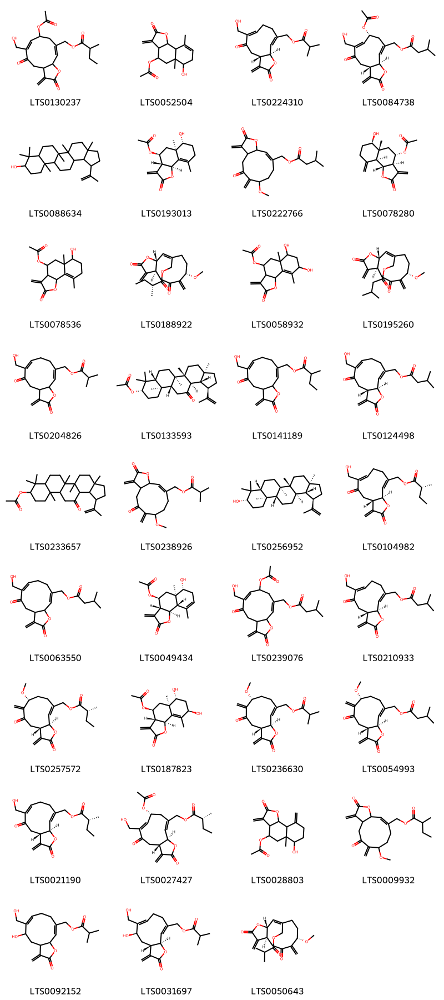{ width=100% }
    <figcaption>Hình ảnh cấu trúc hóa học của 35 hoạt chất thuộc nhóm Prenol lipids gồm ['[8-(acetyloxy)-6-(hydroxymethyl)-3-methylidene-2,5-dioxo-3ah,4h,8h,9h,11ah-cyclodeca[b]furan-10-yl]methyl 2-methylbutanoate (LTS0130237)', '6-hydroxy-5a,9-dimethyl-3-methylidene-2-oxo-3ah,4h,5h,6h,7h,9ah,9bh-naphtho[1,2-b]furan-4-yl acetate (LTS0052504)', '[(3as,11ar)-6-(hydroxymethyl)-3-methylidene-2,5-dioxo-3ah,4h,8h,9h,11ah-cyclodeca[b]furan-10-yl]methyl 2-methylpropanoate (LTS0224310)', '[(3as,8r,11ar)-8-(acetyloxy)-6-(hydroxymethyl)-3-methylidene-2,5-dioxo-3ah,4h,8h,9h,11ah-cyclodeca[b]furan-10-yl]methyl 3-methylbutanoate (LTS0084738)', 'lupeol (LTS0088634)', '(3ar,4s,5ar,6r,9bs)-6-hydroxy-5a,9-dimethyl-3-methylidene-2-oxo-3ah,4h,5h,6h,7h,8h,9bh-naphtho[1,2-b]furan-4-yl acetate (LTS0193013)', '{7-methoxy-3,6-dimethylidene-2,5-dioxo-3ah,4h,7h,8h,9h,11ah-cyclodeca[b]furan-10-yl}methyl 3-methylbutanoate (LTS0222766)', '(3ar,4s,5ar,6r,9as,9br)-6-hydroxy-5a-methyl-3,9-dimethylidene-2-oxo-octahydronaphtho[1,2-b]furan-4-yl acetate (LTS0078280)', '6-hydroxy-5a,9-dimethyl-3-methylidene-2-oxo-3ah,4h,5h,6h,7h,8h,9bh-naphtho[1,2-b]furan-4-yl acetate (LTS0078536)', '[(3as,7s,11ar)-7-methoxy-3,6-dimethylidene-2,5-dioxo-3ah,4h,7h,8h,9h,11ah-cyclodeca[b]furan-10-yl]methyl (2r)-2-methylbutanoate (LTS0188922)', '6,8-dihydroxy-5a,9-dimethyl-3-methylidene-2-oxo-3ah,4h,5h,6h,7h,8h,9bh-naphtho[1,2-b]furan-4-yl acetate (LTS0058932)', '[(3as,7s,11ar)-7-methoxy-3,6-dimethylidene-2,5-dioxo-3ah,4h,7h,8h,9h,11ah-cyclodeca[b]furan-10-yl]methyl 3-methylbutanoate (LTS0195260)', '[6-(hydroxymethyl)-3-methylidene-2,5-dioxo-3ah,4h,8h,9h,11ah-cyclodeca[b]furan-10-yl]methyl 2-methylpropanoate (LTS0204826)', '(1r,3ar,5ar,5br,7ar,9s,11ar,11br,13ar,13br)-3a,5a,5b,8,8,11a-hexamethyl-13-oxo-1-(prop-1-en-2-yl)-tetradecahydro-1h-cyclopenta[a]chrysen-9-yl acetate (LTS0133593)', '[6-(hydroxymethyl)-3-methylidene-2,5-dioxo-3ah,4h,8h,9h,11ah-cyclodeca[b]furan-10-yl]methyl 2-methylbutanoate (LTS0141189)', '[(3as,11ar)-6-(hydroxymethyl)-3-methylidene-2,5-dioxo-3ah,4h,8h,9h,11ah-cyclodeca[b]furan-10-yl]methyl 3-methylbutanoate (LTS0124498)', '3a,5a,5b,8,8,11a-hexamethyl-13-oxo-1-(prop-1-en-2-yl)-tetradecahydro-1h-cyclopenta[a]chrysen-9-yl acetate (LTS0233657)', '{7-methoxy-3,6-dimethylidene-2,5-dioxo-3ah,4h,7h,8h,9h,11ah-cyclodeca[b]furan-10-yl}methyl 2-methylpropanoate (LTS0238926)', 'lupeol (LTS0256952)', '[(3as,11ar)-6-(hydroxymethyl)-3-methylidene-2,5-dioxo-3ah,4h,8h,9h,11ah-cyclodeca[b]furan-10-yl]methyl (2r)-2-methylbutanoate (LTS0104982)', '[6-(hydroxymethyl)-3-methylidene-2,5-dioxo-3ah,4h,8h,9h,11ah-cyclodeca[b]furan-10-yl]methyl 3-methylbutanoate (LTS0063550)', '(3ar,4s,5ar,6r,9as,9br)-6-hydroxy-5a,9-dimethyl-3-methylidene-2-oxo-3ah,4h,5h,6h,7h,9ah,9bh-naphtho[1,2-b]furan-4-yl acetate (LTS0049434)', '[8-(acetyloxy)-6-(hydroxymethyl)-3-methylidene-2,5-dioxo-3ah,4h,8h,9h,11ah-cyclodeca[b]furan-10-yl]methyl 3-methylbutanoate (LTS0239076)', '[(3as,11ar)-6-(hydroxymethyl)-3-methylidene-2,5-dioxo-3ah,4h,8h,9h,11ah-cyclodeca[b]furan-10-yl]methyl 3-methylbutanoate (LTS0210933)', '[(3as,7r,11ar)-7-methoxy-3,6-dimethylidene-2,5-dioxo-3ah,4h,7h,8h,9h,11ah-cyclodeca[b]furan-10-yl]methyl (2r)-2-methylbutanoate (LTS0257572)', '(3ar,4s,5ar,6r,8r,9bs)-6,8-dihydroxy-5a,9-dimethyl-3-methylidene-2-oxo-3ah,4h,5h,6h,7h,8h,9bh-naphtho[1,2-b]furan-4-yl acetate (LTS0187823)', '[(3as,7r,11ar)-7-methoxy-3,6-dimethylidene-2,5-dioxo-3ah,4h,7h,8h,9h,11ah-cyclodeca[b]furan-10-yl]methyl 2-methylpropanoate (LTS0236630)', '[(3as,7r,11ar)-7-methoxy-3,6-dimethylidene-2,5-dioxo-3ah,4h,7h,8h,9h,11ah-cyclodeca[b]furan-10-yl]methyl 3-methylbutanoate (LTS0054993)', '[(3as,11ar)-6-(hydroxymethyl)-3-methylidene-2,5-dioxo-3ah,4h,8h,9h,11ah-cyclodeca[b]furan-10-yl]methyl (2r)-2-methylbutanoate (LTS0021190)', '[(3as,8r,11ar)-8-(acetyloxy)-6-(hydroxymethyl)-3-methylidene-2,5-dioxo-3ah,4h,8h,9h,11ah-cyclodeca[b]furan-10-yl]methyl (2r)-2-methylbutanoate (LTS0027427)', '6-hydroxy-5a-methyl-3,9-dimethylidene-2-oxo-octahydronaphtho[1,2-b]furan-4-yl acetate (LTS0028803)', '{7-methoxy-3,6-dimethylidene-2,5-dioxo-3ah,4h,7h,8h,9h,11ah-cyclodeca[b]furan-10-yl}methyl 2-methylbutanoate (LTS0009932)', '[5-hydroxy-6-(hydroxymethyl)-3-methylidene-2-oxo-3ah,4h,5h,8h,9h,11ah-cyclodeca[b]furan-10-yl]methyl 2-methylpropanoate (LTS0092152)', '[(3as,5r,11ar)-5-hydroxy-6-(hydroxymethyl)-3-methylidene-2-oxo-3ah,4h,5h,8h,9h,11ah-cyclodeca[b]furan-10-yl]methyl 2-methylpropanoate (LTS0031697)', '[(3as,7s,11ar)-7-methoxy-3,6-dimethylidene-2,5-dioxo-3ah,4h,7h,8h,9h,11ah-cyclodeca[b]furan-10-yl]methyl 2-methylpropanoate (LTS0050643)'].</figcaption>
</figure>

---

### Dược dân tộc học

Danh sách các quốc gia có sử dụng *Mikania guaco* trong điều trị các bệnh. 

| Country   | Disease   | Bệnh                                                                                                                                                                                                |
|:----------|:----------|:----------------------------------------------------------------------------------------------------------------------------------------------------------------------------------------------------|
| Mexico    | Vermifuge | MYMEMORY WARNING: YOU USED ALL AVAILABLE FREE TRANSLATIONS FOR TODAY. NEXT AVAILABLE IN  09 HOURS 20 MINUTES 15 SECONDS VISIT HTTPS://MYMEMORY.TRANSLATED.NET/DOC/USAGELIMITS.PHP TO TRANSLATE MORE |

---

---
## Mikania micrantha
### Thông tin về thực vật

!!! info "Phân loại thực vật của *Mikania micrantha* từ GIBF:"
    - **Kingdom:** Plantae
    - **Phylum:** Tracheophyta
    - **Order:** Asterales
    - **Family:** Asteraceae
    - **Genus:** Mikania
    - **Species:** *Mikania micrantha*

 

| Label (VI)   | Label (EN)   | Scientific Name   | Descriptions (VI)   | Descriptions (EN)   | Also Known As (VI)   | Also Known As (EN)   |
|:-------------|:-------------|:------------------|:--------------------|:--------------------|:---------------------|:---------------------|
| N/A          | N/A          | Mikania micrantha | loài thực vật       | species of plant    | ['']                 | ['']                 |

#### Phân bố trên thế giới

**Từ CSDL GIBF** Japan, Guadeloupe, Argentina, Puerto Rico, Chinese Taipei, Honduras, Jamaica, Hong Kong, Thailand, Guam, Brazil, New Caledonia, Mexico, Dominican Republic, Singapore, China, Costa Rica, India, Indonesia, Philippines, Malaysia

#### Phân bố tại Việt Nam

**Từ CSDL GIBF**: Không có ghi nhận ở Việt Nam

---
### Thành phần hóa học
        
- Theo cơ sở dữ liệu lotus: Từ loài *Mikania micrantha* đã phân lập và xác định được 42 hoạt chất thuộc về các nhóm Flavonoids, Prenol lipids, Steroids and steroid derivatives, Furofurans, Lactones, Organooxygen compounds, Coumarins and derivatives, Carboxylic acids and derivatives. 

|    | chemicalTaxonomyClassyfireClass   |   smiles_count |
|---:|:----------------------------------|---------------:|
|  0 | Carboxylic acids and derivatives  |              5 |
|  1 | Coumarins and derivatives         |              1 |
|  2 | Flavonoids                        |              5 |
|  3 | Furofurans                        |              2 |
|  4 | Lactones                          |             11 |
|  5 | Organooxygen compounds            |              2 |
|  6 | Prenol lipids                     |             10 |
|  7 | Steroids and steroid derivatives  |              6 |

#### Nhóm Carboxylic acids and derivatives
<figure markdown="span">
    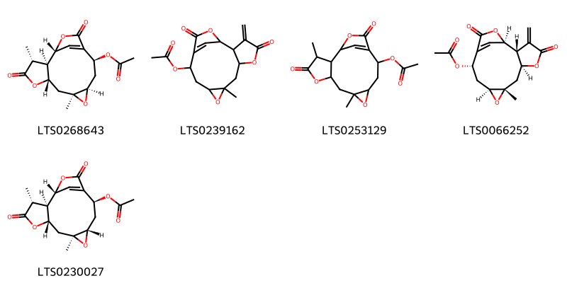{ width=100% }
    <figcaption>Hình ảnh cấu trúc hóa học của 5 hoạt chất thuộc nhóm Carboxylic acids and derivatives gồm ['(1r,2r,3r,6s,8s,10r,12s)-3,8-dimethyl-4,14-dioxo-5,9,15-trioxatetracyclo[11.2.1.0²,⁶.0⁸,¹⁰]hexadec-13(16)-en-12-yl acetate (LTS0268643)', '8-methyl-3-methylidene-4,14-dioxo-5,9,15-trioxatetracyclo[11.2.1.0²,⁶.0⁸,¹⁰]hexadec-13(16)-en-12-yl acetate (LTS0239162)', '3,8-dimethyl-4,14-dioxo-5,9,15-trioxatetracyclo[11.2.1.0²,⁶.0⁸,¹⁰]hexadec-13(16)-en-12-yl acetate (LTS0253129)', '(1r,2r,6s,8s,10s,12s)-8-methyl-3-methylidene-4,14-dioxo-5,9,15-trioxatetracyclo[11.2.1.0²,⁶.0⁸,¹⁰]hexadec-13(16)-en-12-yl acetate (LTS0066252)', '(1r,2r,3r,6s,8s,10s,12s)-3,8-dimethyl-4,14-dioxo-5,9,15-trioxatetracyclo[11.2.1.0²,⁶.0⁸,¹⁰]hexadec-13(16)-en-12-yl acetate (LTS0230027)'].</figcaption>
</figure>
#### Nhóm Coumarins and derivatives
<figure markdown="span">
    { width=100% }
    <figcaption>Hình ảnh cấu trúc hóa học của 1 hoạt chất thuộc nhóm Coumarins and derivatives gồm ['2h-1-benzopyran-2-one (LTS0069773)'].</figcaption>
</figure>
#### Nhóm Flavonoids
<figure markdown="span">
    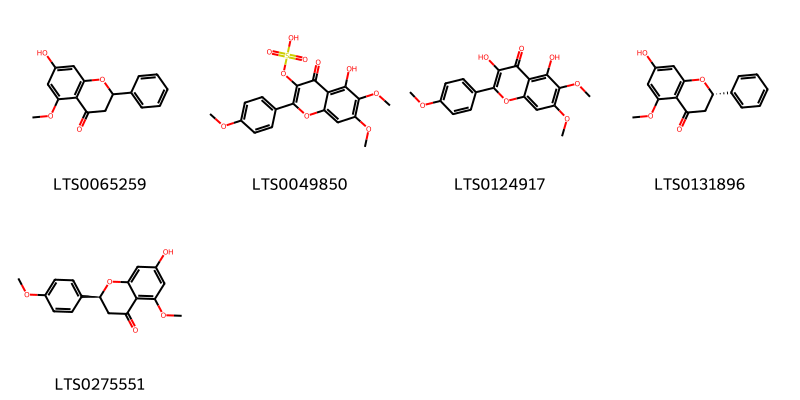{ width=100% }
    <figcaption>Hình ảnh cấu trúc hóa học của 5 hoạt chất thuộc nhóm Flavonoids gồm ['alpinetin (LTS0065259)', 'mikanin 3-o-sulfate (LTS0049850)', 'mikanin (LTS0124917)', 'alpinetin (LTS0131896)', '(2s)-7-hydroxy-5-methoxy-2-(4-methoxyphenyl)-2,3-dihydro-1-benzopyran-4-one (LTS0275551)'].</figcaption>
</figure>
#### Nhóm Furofurans
<figure markdown="span">
    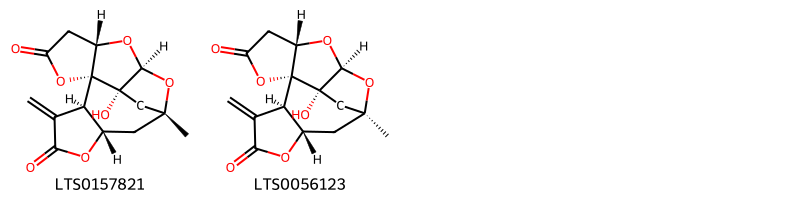{ width=100% }
    <figcaption>Hình ảnh cấu trúc hóa học của 2 hoạt chất thuộc nhóm Furofurans gồm ['(1s,3s,7r,8r,12s,14r,16r)-16-hydroxy-14-methyl-9-methylidene-2,6,11,17-tetraoxapentacyclo[12.2.1.0³,⁷.0⁷,¹⁶.0⁸,¹²]heptadecane-5,10-dione (LTS0157821)', '(1s,3s,7r,8r,12s,14s,16r)-16-hydroxy-14-methyl-9-methylidene-2,6,11,17-tetraoxapentacyclo[12.2.1.0³,⁷.0⁷,¹⁶.0⁸,¹²]heptadecane-5,10-dione (LTS0056123)'].</figcaption>
</figure>
#### Nhóm Lactones
<figure markdown="span">
    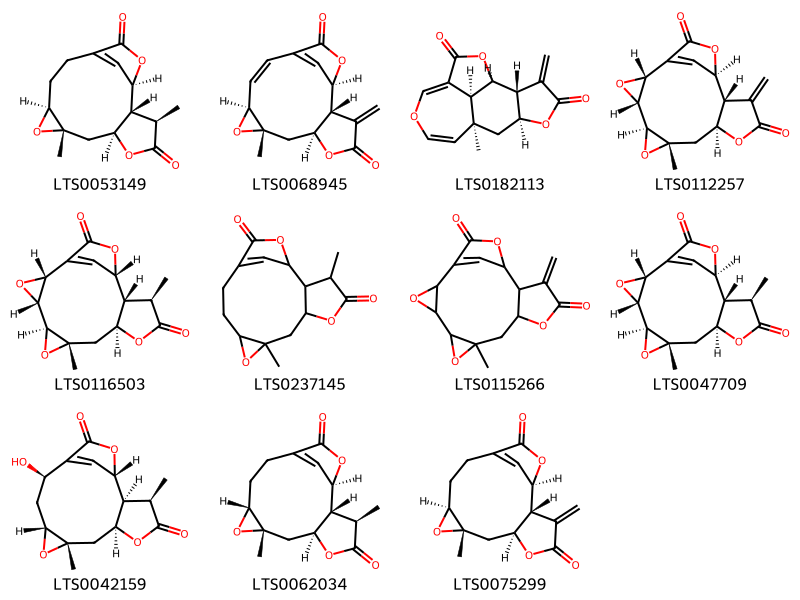{ width=100% }
    <figcaption>Hình ảnh cấu trúc hóa học của 11 hoạt chất thuộc nhóm Lactones gồm ['(1r,2r,3r,6s,8s,10s)-3,8-dimethyl-5,9,15-trioxatetracyclo[11.2.1.0²,⁶.0⁸,¹⁰]hexadec-13(16)-ene-4,14-dione (LTS0053149)', '(1r,2r,6s,8s,10s,11z)-8-methyl-3-methylidene-5,9,15-trioxatetracyclo[11.2.1.0²,⁶.0⁸,¹⁰]hexadeca-11,13(16)-diene-4,14-dione (LTS0068945)', '(1r,9s,11s,15r,16s)-9-methyl-14-methylidene-2,6,12-trioxatetracyclo[7.6.1.0⁴,¹⁶.0¹¹,¹⁵]hexadeca-4,7-diene-3,13-dione (LTS0182113)', 'mikanolide (LTS0112257)', '(2r,4r,5s,7s,9s,12r,13r,14s)-7,12-dimethyl-3,6,10,15-tetraoxapentacyclo[12.2.1.0²,⁴.0⁵,⁷.0⁹,¹³]heptadec-1(17)-ene-11,16-dione (LTS0116503)', '3,8-dimethyl-5,9,15-trioxatetracyclo[11.2.1.0²,⁶.0⁸,¹⁰]hexadec-13(16)-ene-4,14-dione (LTS0237145)', '7-methyl-12-methylidene-3,6,10,15-tetraoxapentacyclo[12.2.1.0²,⁴.0⁵,⁷.0⁹,¹³]heptadec-1(17)-ene-11,16-dione (LTS0115266)', 'dihydromikanolide (LTS0047709)', '(1s,2s,3r,6s,8s,10r,12r)-12-hydroxy-3,8-dimethyl-5,9,15-trioxatetracyclo[11.2.1.0²,⁶.0⁸,¹⁰]hexadec-13(16)-ene-4,14-dione (LTS0042159)', '(1r,2r,3r,6s,8s,10r)-3,8-dimethyl-5,9,15-trioxatetracyclo[11.2.1.0²,⁶.0⁸,¹⁰]hexadec-13(16)-ene-4,14-dione (LTS0062034)', '(1r,2r,6s,8s,10s)-8-methyl-3-methylidene-5,9,15-trioxatetracyclo[11.2.1.0²,⁶.0⁸,¹⁰]hexadec-13(16)-ene-4,14-dione (LTS0075299)'].</figcaption>
</figure>
#### Nhóm Organooxygen compounds
<figure markdown="span">
    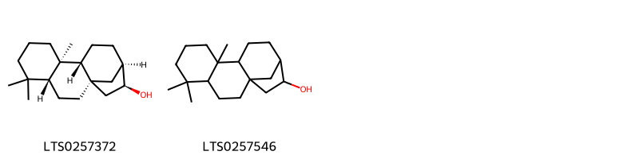{ width=100% }
    <figcaption>Hình ảnh cấu trúc hóa học của 2 hoạt chất thuộc nhóm Organooxygen compounds gồm ['(1s,4r,9r,10r,13r,14s)-5,5,9-trimethyltetracyclo[11.2.1.0¹,¹⁰.0⁴,⁹]hexadecan-14-ol (LTS0257372)', '5,5,9-trimethyltetracyclo[11.2.1.0¹,¹⁰.0⁴,⁹]hexadecan-14-ol (LTS0257546)'].</figcaption>
</figure>
#### Nhóm Prenol lipids
<figure markdown="span">
    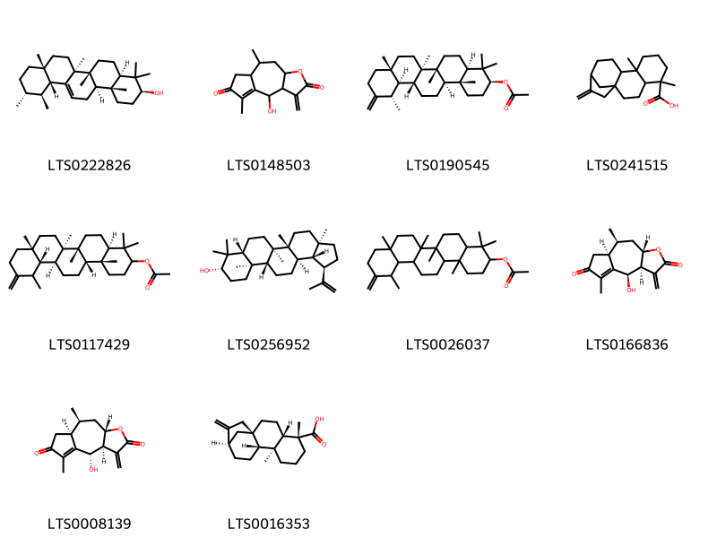{ width=100% }
    <figcaption>Hình ảnh cấu trúc hóa học của 10 hoạt chất thuộc nhóm Prenol lipids gồm ['amyrin (LTS0222826)', '4-hydroxy-5,8-dimethyl-3-methylidene-3ah,4h,7h,7ah,8h,9h,9ah-azuleno[6,5-b]furan-2,6-dione (LTS0148503)', 'taraxasterol acetate (LTS0190545)', '5,9-dimethyl-14-methylidenetetracyclo[11.2.1.0¹,¹⁰.0⁴,⁹]hexadecane-5-carboxylic acid (LTS0241515)', '(4ar,6ar,6br,8ar,12as,12bs,14as,14br)-4,4,6a,6b,8a,12,14b-heptamethyl-11-methylidene-hexadecahydropicen-3-yl acetate (LTS0117429)', 'lupeol (LTS0256952)', '4,4,6a,6b,8a,12,14b-heptamethyl-11-methylidene-hexadecahydropicen-3-yl acetate (LTS0026037)', '(3as,4r,7as,8s,9as)-4-hydroxy-5,8-dimethyl-3-methylidene-3ah,4h,7h,7ah,8h,9h,9ah-azuleno[6,5-b]furan-2,6-dione (LTS0166836)', '(3as,4s,7as,8s,9as)-4-hydroxy-5,8-dimethyl-3-methylidene-3ah,4h,7h,7ah,8h,9h,9ah-azuleno[6,5-b]furan-2,6-dione (LTS0008139)', 'ent-kaur-16-en-19-oic acid (LTS0016353)'].</figcaption>
</figure>
#### Nhóm Steroids and steroid derivatives
<figure markdown="span">
    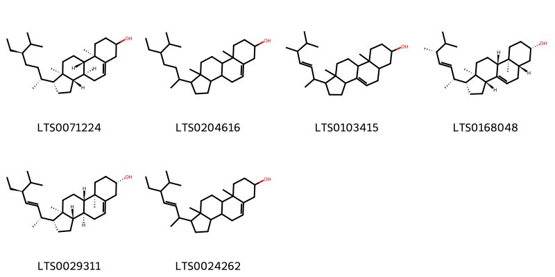{ width=100% }
    <figcaption>Hình ảnh cấu trúc hóa học của 6 hoạt chất thuộc nhóm Steroids and steroid derivatives gồm ['stigmast-5-en-3-ol (LTS0071224)', 'stigmast-5-en-3-ol, (3β)- (LTS0204616)', '1-(5,6-dimethylhept-3-en-2-yl)-9a,11a-dimethyl-1h,2h,3h,3ah,5h,5ah,6h,7h,8h,9h,9bh,10h,11h-cyclopenta[a]phenanthren-7-ol (LTS0103415)', '5α-ergosta-7,22-dien-3β-ol (LTS0168048)', 'phytosterol (LTS0029311)', 'stigmasterol (LTS0024262)'].</figcaption>
</figure>

---

### Dược dân tộc học

Danh sách các quốc gia có sử dụng *Mikania micrantha* trong điều trị các bệnh. 

| Country   | Disease           | Bệnh                                                                                                                                                                                                |
|:----------|:------------------|:----------------------------------------------------------------------------------------------------------------------------------------------------------------------------------------------------|
| Fiji      | Hemostat, Styptic | MYMEMORY WARNING: YOU USED ALL AVAILABLE FREE TRANSLATIONS FOR TODAY. NEXT AVAILABLE IN  09 HOURS 19 MINUTES 50 SECONDS VISIT HTTPS://MYMEMORY.TRANSLATED.NET/DOC/USAGELIMITS.PHP TO TRANSLATE MORE |
| Samoa     | Hemostat          | MYMEMORY WARNING: YOU USED ALL AVAILABLE FREE TRANSLATIONS FOR TODAY. NEXT AVAILABLE IN  09 HOURS 19 MINUTES 48 SECONDS VISIT HTTPS://MYMEMORY.TRANSLATED.NET/DOC/USAGELIMITS.PHP TO TRANSLATE MORE |

---

# Chi Verbesina

??? note "Danh sách các dược liệu thuộc chi"
    
	 - *Verbesina virginiana*

---
## Verbesina virginiana
### Thông tin về thực vật

!!! info "Phân loại thực vật của *Verbesina virginica* từ GIBF:"
    - **Kingdom:** Plantae
    - **Phylum:** Tracheophyta
    - **Order:** Asterales
    - **Family:** Asteraceae
    - **Genus:** Verbesina
    - **Species:** *Verbesina virginica*

 

| Label (VI)   | Label (EN)   | Scientific Name   | Descriptions (VI)   | Descriptions (EN)   | Also Known As (VI)   | Also Known As (EN)   |
|:-------------|:-------------|:------------------|:--------------------|:--------------------|:---------------------|:---------------------|
| N/A          | N/A          | Mikania micrantha | loài thực vật       | species of plant    | ['']                 | ['']                 |

#### Phân bố trên thế giới

**Từ CSDL GIBF** United States of America

#### Phân bố tại Việt Nam

**Từ CSDL GIBF**: Không có ghi nhận ở Việt Nam

---
### Thành phần hóa học
        
- Theo cơ sở dữ liệu lotus: Từ loài *Verbesina virginica* đã phân lập và xác định được Chưa có hoạt chất nào được phân lập. hoạt chất thuộc về các nhóm Không có hoạt chất nào được phân lập. 

Không có hình ảnh nào được tạo ra

---

### Dược dân tộc học

Danh sách các quốc gia có sử dụng *Verbesina virginica* trong điều trị các bệnh. 

| Country   | Disease   | Bệnh                                                                                                                                                                                                |
|:----------|:----------|:----------------------------------------------------------------------------------------------------------------------------------------------------------------------------------------------------|
| US        | Sudorific | MYMEMORY WARNING: YOU USED ALL AVAILABLE FREE TRANSLATIONS FOR TODAY. NEXT AVAILABLE IN  09 HOURS 19 MINUTES 19 SECONDS VISIT HTTPS://MYMEMORY.TRANSLATED.NET/DOC/USAGELIMITS.PHP TO TRANSLATE MORE |

---

# Chi Othonna

??? note "Danh sách các dược liệu thuộc chi"
    
	 - *Othonna natalensis*

---
## Othonna natalensis
### Thông tin về thực vật

!!! info "Phân loại thực vật của *Othonna natalensis* từ GIBF:"
    - **Kingdom:** Plantae
    - **Phylum:** Tracheophyta
    - **Order:** Asterales
    - **Family:** Asteraceae
    - **Genus:** Othonna
    - **Species:** *Othonna natalensis*

 

| Label (VI)   | Label (EN)   | Scientific Name    | Descriptions (VI)   | Descriptions (EN)   | Also Known As (VI)   | Also Known As (EN)   |
|:-------------|:-------------|:-------------------|:--------------------|:--------------------|:---------------------|:---------------------|
| N/A          | N/A          | Othonna natalensis | loài thực vật       | species of plant    | ['']                 | ['']                 |

#### Phân bố trên thế giới

**Từ CSDL GIBF** nan, South Africa, Lesotho, unknown or invalid, Zimbabwe, Eswatini

#### Phân bố tại Việt Nam

**Từ CSDL GIBF**: Không có ghi nhận ở Việt Nam

---
### Thành phần hóa học
        
- Theo cơ sở dữ liệu lotus: Từ loài *Othonna natalensis* đã phân lập và xác định được Chưa có hoạt chất nào được phân lập. hoạt chất thuộc về các nhóm Không có hoạt chất nào được phân lập. 

Không có hình ảnh nào được tạo ra

---

### Dược dân tộc học

Danh sách các quốc gia có sử dụng *Othonna natalensis* trong điều trị các bệnh. 

| Country   | Disease   | Bệnh                                                                                                                                                                                                |
|:----------|:----------|:----------------------------------------------------------------------------------------------------------------------------------------------------------------------------------------------------|
| Lesotho   | Vermifuge | MYMEMORY WARNING: YOU USED ALL AVAILABLE FREE TRANSLATIONS FOR TODAY. NEXT AVAILABLE IN  09 HOURS 18 MINUTES 57 SECONDS VISIT HTTPS://MYMEMORY.TRANSLATED.NET/DOC/USAGELIMITS.PHP TO TRANSLATE MORE |

---

# Chi Viguiera

??? note "Danh sách các dược liệu thuộc chi"
    
	 - *Viguiera deltoidea*

---
## Viguiera deltoidea
### Thông tin về thực vật

!!! info "Phân loại thực vật của *Bahiopsis deltoidea* từ GIBF:"
    - **Kingdom:** Plantae
    - **Phylum:** Tracheophyta
    - **Order:** Asterales
    - **Family:** Asteraceae
    - **Genus:** Bahiopsis
    - **Species:** *Bahiopsis deltoidea*

 

| Label (VI)   | Label (EN)   | Scientific Name    | Descriptions (VI)   | Descriptions (EN)   | Also Known As (VI)   | Also Known As (EN)   |
|:-------------|:-------------|:-------------------|:--------------------|:--------------------|:---------------------|:---------------------|
| N/A          | N/A          | Viguiera deltoidea | loài thực vật       | species of plant    | ['']                 | ['']                 |

#### Phân bố trên thế giới

**Từ CSDL GIBF** nan, United States of America, Mexico

#### Phân bố tại Việt Nam

**Từ CSDL GIBF**: Không có ghi nhận ở Việt Nam

---
### Thành phần hóa học
        
- Theo cơ sở dữ liệu lotus: Từ loài *Bahiopsis deltoidea* đã phân lập và xác định được 18 hoạt chất thuộc về các nhóm Flavonoids, Prenol lipids. 

|    | chemicalTaxonomyClassyfireClass   |   smiles_count |
|---:|:----------------------------------|---------------:|
|  0 | Flavonoids                        |             10 |
|  1 | Prenol lipids                     |              8 |

#### Nhóm Flavonoids
<figure markdown="span">
    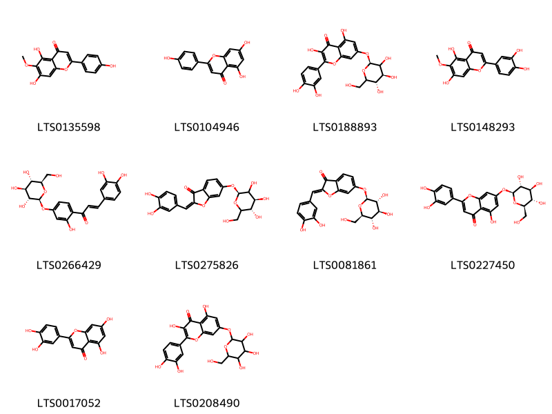{ width=100% }
    <figcaption>Hình ảnh cấu trúc hóa học của 10 hoạt chất thuộc nhóm Flavonoids gồm ['hispidulin (LTS0135598)', 'chamomile (LTS0104946)', 'quercimeritrin (LTS0188893)', 'nepetin (LTS0148293)', '(2e)-3-(3,4-dihydroxyphenyl)-1-(2-hydroxy-4-{[(2s,3r,4s,5s,6r)-3,4,5-trihydroxy-6-(hydroxymethyl)oxan-2-yl]oxy}phenyl)prop-2-en-1-one (LTS0266429)', 'sulfurein (LTS0275826)', '(2z)-2-[(3,4-dihydroxyphenyl)methylidene]-6-{[(2s,3r,4s,5s,6r)-3,4,5-trihydroxy-6-(hydroxymethyl)oxan-2-yl]oxy}-1-benzofuran-3-one (LTS0081861)', 'luteolin 7-o-glucoside (LTS0227450)', 'luteolin (LTS0017052)', 'quercimeritrin (LTS0208490)'].</figcaption>
</figure>
#### Nhóm Prenol lipids
<figure markdown="span">
    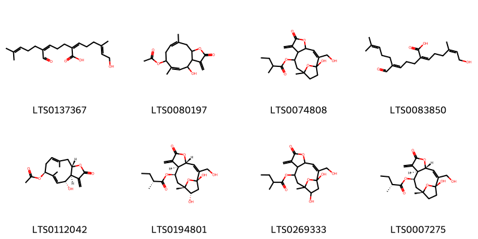{ width=100% }
    <figcaption>Hình ảnh cấu trúc hóa học của 8 hoạt chất thuộc nhóm Prenol lipids gồm ['6-formyl-2-(6-hydroxy-4-methylhex-4-en-1-ylidene)-10-methylundeca-5,9-dienoic acid (LTS0137367)', '4-hydroxy-6,10-dimethyl-3-methylidene-2-oxo-3ah,4h,7h,8h,11h,11ah-cyclodeca[b]furan-7-yl acetate (LTS0080197)', '1-hydroxy-2-(hydroxymethyl)-11-methyl-7-methylidene-6-oxo-5,14-dioxatricyclo[9.2.1.0⁴,⁸]tetradec-2-en-9-yl 2-methylbutanoate (LTS0074808)', '(2z,5e)-6-formyl-2-[(4z)-6-hydroxy-4-methylhex-4-en-1-ylidene]-10-methylundeca-5,9-dienoic acid (LTS0083850)', '(3as,4r,7s,11as)-4-hydroxy-6,10-dimethyl-3-methylidene-2-oxo-3ah,4h,7h,8h,11h,11ah-cyclodeca[b]furan-7-yl acetate (LTS0112042)', '(1s,2z,4r,8r,9r,11s,12s)-1,12-dihydroxy-2-(hydroxymethyl)-11-methyl-7-methylidene-6-oxo-5,14-dioxatricyclo[9.2.1.0⁴,⁸]tetradec-2-en-9-yl (2r)-2-methylbutanoate (LTS0194801)', '1,12-dihydroxy-2-(hydroxymethyl)-11-methyl-7-methylidene-6-oxo-5,14-dioxatricyclo[9.2.1.0⁴,⁸]tetradec-2-en-9-yl 2-methylbutanoate (LTS0269333)', '(1s,2z,4r,8r,9r,11r)-1-hydroxy-2-(hydroxymethyl)-11-methyl-7-methylidene-6-oxo-5,14-dioxatricyclo[9.2.1.0⁴,⁸]tetradec-2-en-9-yl (2r)-2-methylbutanoate (LTS0007275)'].</figcaption>
</figure>

---

### Dược dân tộc học

Danh sách các quốc gia có sử dụng *Bahiopsis deltoidea* trong điều trị các bệnh. 

| Country      | Disease       | Bệnh                                                                                                                                                                                                |
|:-------------|:--------------|:----------------------------------------------------------------------------------------------------------------------------------------------------------------------------------------------------|
| Mexico(Seri) | Contraceptive | MYMEMORY WARNING: YOU USED ALL AVAILABLE FREE TRANSLATIONS FOR TODAY. NEXT AVAILABLE IN  09 HOURS 18 MINUTES 35 SECONDS VISIT HTTPS://MYMEMORY.TRANSLATED.NET/DOC/USAGELIMITS.PHP TO TRANSLATE MORE |

---

# Chi Tarchonanthus

??? note "Danh sách các dược liệu thuộc chi"
    
	 - *Tarchonanthus camphoratus*

---
## Tarchonanthus camphoratus
### Thông tin về thực vật

!!! info "Phân loại thực vật của *Tarchonanthus camphoratus* từ GIBF:"
    - **Kingdom:** Plantae
    - **Phylum:** Tracheophyta
    - **Order:** Asterales
    - **Family:** Asteraceae
    - **Genus:** Tarchonanthus
    - **Species:** *Tarchonanthus camphoratus*

 

| Label (VI)   | Label (EN)   | Scientific Name           | Descriptions (VI)   | Descriptions (EN)   | Also Known As (VI)   | Also Known As (EN)   |
|:-------------|:-------------|:--------------------------|:--------------------|:--------------------|:---------------------|:---------------------|
| N/A          | N/A          | Tarchonanthus camphoratus | loài thực vật       | species of plant    | ['']                 | ['']                 |

#### Phân bố trên thế giới

**Từ CSDL GIBF** South Africa, Namibia, Angola, Somalia, Botswana, Chile, Kenya, Zimbabwe, Ethiopia

#### Phân bố tại Việt Nam

**Từ CSDL GIBF**: Không có ghi nhận ở Việt Nam

---
### Thành phần hóa học
        
- Theo cơ sở dữ liệu lotus: Từ loài *Tarchonanthus camphoratus* đã phân lập và xác định được 5 hoạt chất thuộc về các nhóm Flavonoids, Prenol lipids. 

|    | chemicalTaxonomyClassyfireClass   |   smiles_count |
|---:|:----------------------------------|---------------:|
|  0 | Flavonoids                        |              3 |
|  1 | Prenol lipids                     |              1 |

#### Nhóm Flavonoids
<figure markdown="span">
    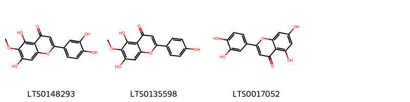{ width=100% }
    <figcaption>Hình ảnh cấu trúc hóa học của 3 hoạt chất thuộc nhóm Flavonoids gồm ['nepetin (LTS0148293)', 'hispidulin (LTS0135598)', 'luteolin (LTS0017052)'].</figcaption>
</figure>
#### Nhóm Prenol lipids
<figure markdown="span">
    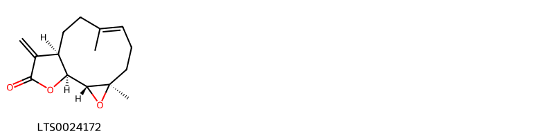{ width=100% }
    <figcaption>Hình ảnh cấu trúc hóa học của 1 hoạt chất thuộc nhóm Prenol lipids gồm ['(1s,2r,4r,7e,11r)-4,8-dimethyl-12-methylidene-3,14-dioxatricyclo[9.3.0.0²,⁴]tetradec-7-en-13-one (LTS0024172)'].</figcaption>
</figure>

---

### Dược dân tộc học

Danh sách các quốc gia có sử dụng *Tarchonanthus camphoratus* trong điều trị các bệnh. 

| Country      | Disease     | Bệnh                                                                                                                                                                                                |
|:-------------|:------------|:----------------------------------------------------------------------------------------------------------------------------------------------------------------------------------------------------|
| South Africa | Diaphoretic | MYMEMORY WARNING: YOU USED ALL AVAILABLE FREE TRANSLATIONS FOR TODAY. NEXT AVAILABLE IN  09 HOURS 18 MINUTES 05 SECONDS VISIT HTTPS://MYMEMORY.TRANSLATED.NET/DOC/USAGELIMITS.PHP TO TRANSLATE MORE |

---

# Chi Brickellia

??? note "Danh sách các dược liệu thuộc chi"
    
	 - *Brickellia cavanillesi*
	 - *Brickellia squarrosa*

---
## Brickellia cavanillesi
### Thông tin về thực vật

!!! info "Phân loại thực vật của *Brickellia cavanillesii* từ GIBF:"
    - **Kingdom:** Plantae
    - **Phylum:** Tracheophyta
    - **Order:** Asterales
    - **Family:** Asteraceae
    - **Genus:** Brickellia
    - **Species:** *Brickellia cavanillesii*

 

| Label (VI)   | Label (EN)   | Scientific Name           | Descriptions (VI)   | Descriptions (EN)   | Also Known As (VI)   | Also Known As (EN)   |
|:-------------|:-------------|:--------------------------|:--------------------|:--------------------|:---------------------|:---------------------|
| N/A          | N/A          | Tarchonanthus camphoratus | loài thực vật       | species of plant    | ['']                 | ['']                 |

#### Phân bố trên thế giới

**Từ CSDL GIBF** nan, Guatemala, Brazil, United States of America, Mexico

#### Phân bố tại Việt Nam

**Từ CSDL GIBF**: Không có ghi nhận ở Việt Nam

---
### Thành phần hóa học
        
- Theo cơ sở dữ liệu lotus: Từ loài *Brickellia cavanillesii* đã phân lập và xác định được 9 hoạt chất thuộc về các nhóm Benzopyrans, Flavonoids, Organooxygen compounds, Prenol lipids. 

|    | chemicalTaxonomyClassyfireClass   |   smiles_count |
|---:|:----------------------------------|---------------:|
|  0 | Benzopyrans                       |              2 |
|  1 | Flavonoids                        |              4 |
|  2 | Organooxygen compounds            |              1 |
|  3 | Prenol lipids                     |              2 |

#### Nhóm Benzopyrans
<figure markdown="span">
    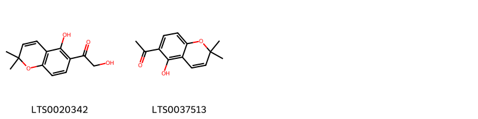{ width=100% }
    <figcaption>Hình ảnh cấu trúc hóa học của 2 hoạt chất thuộc nhóm Benzopyrans gồm ['2-hydroxy-1-(5-hydroxy-2,2-dimethylchromen-6-yl)ethanone (LTS0020342)', '1-(5-hydroxy-2,2-dimethylchromen-6-yl)ethanone (LTS0037513)'].</figcaption>
</figure>
#### Nhóm Flavonoids
<figure markdown="span">
    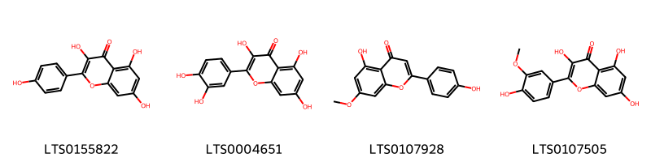{ width=100% }
    <figcaption>Hình ảnh cấu trúc hóa học của 4 hoạt chất thuộc nhóm Flavonoids gồm ['kaempherol (LTS0155822)', 'quercetin (LTS0004651)', 'genkwanin (LTS0107928)', 'isorhamnetin (LTS0107505)'].</figcaption>
</figure>
#### Nhóm Organooxygen compounds
<figure markdown="span">
    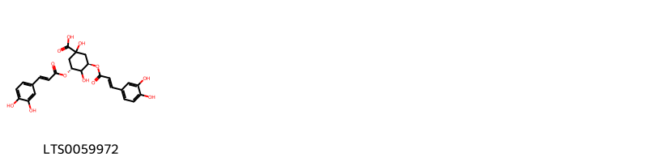{ width=100% }
    <figcaption>Hình ảnh cấu trúc hóa học của 1 hoạt chất thuộc nhóm Organooxygen compounds gồm ['(3r,5r)-3,5-bis({[(2e)-3-(3,4-dihydroxyphenyl)prop-2-enoyl]oxy})-1,4-dihydroxycyclohexane-1-carboxylic acid (LTS0059972)'].</figcaption>
</figure>
#### Nhóm Prenol lipids
<figure markdown="span">
    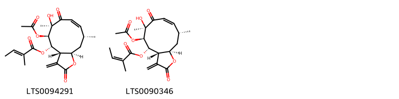{ width=100% }
    <figcaption>Hình ảnh cấu trúc hóa học của 2 hoạt chất thuộc nhóm Prenol lipids gồm ['(3as,4s,5r,6r,10r,11ar)-5-(acetyloxy)-6-hydroxy-6,10-dimethyl-3-methylidene-2,7-dioxo-3ah,4h,5h,10h,11h,11ah-cyclodeca[b]furan-4-yl (2e)-2-methylbut-2-enoate (LTS0094291)', '(3as,4s,5r,6r,10r,11ar)-5-(acetyloxy)-6-hydroxy-6,10-dimethyl-3-methylidene-2,7-dioxo-3ah,4h,5h,10h,11h,11ah-cyclodeca[b]furan-4-yl (2z)-2-methylbut-2-enoate (LTS0090346)'].</figcaption>
</figure>

---

### Dược dân tộc học

Danh sách các quốc gia có sử dụng *Brickellia cavanillesii* trong điều trị các bệnh. 

| Country   | Disease                                  | Bệnh                                                                                                                                                                                                |
|:----------|:-----------------------------------------|:----------------------------------------------------------------------------------------------------------------------------------------------------------------------------------------------------|
| Mexico    | Antiseptic, Sialogogue, Taenifuge, Tonic | MYMEMORY WARNING: YOU USED ALL AVAILABLE FREE TRANSLATIONS FOR TODAY. NEXT AVAILABLE IN  09 HOURS 17 MINUTES 39 SECONDS VISIT HTTPS://MYMEMORY.TRANSLATED.NET/DOC/USAGELIMITS.PHP TO TRANSLATE MORE |

---

---
## Brickellia squarrosa
### Thông tin về thực vật

!!! info "Phân loại thực vật của *Brickellia squarrosa* từ GIBF:"
    - **Kingdom:** Plantae
    - **Phylum:** Tracheophyta
    - **Order:** Asterales
    - **Family:** Asteraceae
    - **Genus:** Brickellia
    - **Species:** *Brickellia squarrosa*

 

| Label (VI)   | Label (EN)   | Scientific Name           | Descriptions (VI)   | Descriptions (EN)   | Also Known As (VI)   | Also Known As (EN)   |
|:-------------|:-------------|:--------------------------|:--------------------|:--------------------|:---------------------|:---------------------|
| N/A          | N/A          | Tarchonanthus camphoratus | loài thực vật       | species of plant    | ['']                 | ['']                 |

#### Phân bố trên thế giới

**Từ CSDL GIBF** nan, Mexico

#### Phân bố tại Việt Nam

**Từ CSDL GIBF**: Không có ghi nhận ở Việt Nam

---
### Thành phần hóa học
        
- Theo cơ sở dữ liệu lotus: Từ loài *Brickellia squarrosa* đã phân lập và xác định được Chưa có hoạt chất nào được phân lập. hoạt chất thuộc về các nhóm Không có hoạt chất nào được phân lập. 

Không có hình ảnh nào được tạo ra

---

### Dược dân tộc học

Danh sách các quốc gia có sử dụng *Brickellia squarrosa* trong điều trị các bệnh. 

| Country   | Disease   | Bệnh                                                                                                                                                                                                |
|:----------|:----------|:----------------------------------------------------------------------------------------------------------------------------------------------------------------------------------------------------|
| Mexico    | Vermifuge | MYMEMORY WARNING: YOU USED ALL AVAILABLE FREE TRANSLATIONS FOR TODAY. NEXT AVAILABLE IN  09 HOURS 17 MINUTES 14 SECONDS VISIT HTTPS://MYMEMORY.TRANSLATED.NET/DOC/USAGELIMITS.PHP TO TRANSLATE MORE |

---

# Chi Arctium

??? note "Danh sách các dược liệu thuộc chi"
    
	 - *Arctium lappa*
	 - *Arctium minus*

---
## Arctium lappa
### Thông tin về thực vật

!!! info "Phân loại thực vật của *Arctium lappa* từ GIBF:"
    - **Kingdom:** Plantae
    - **Phylum:** Tracheophyta
    - **Order:** Asterales
    - **Family:** Asteraceae
    - **Genus:** Arctium
    - **Species:** *Arctium lappa*

 

| Label (VI)   | Label (EN)   | Scientific Name   | Descriptions (VI)   | Descriptions (EN)   | Also Known As (VI)   | Also Known As (EN)                                                                    |
|:-------------|:-------------|:------------------|:--------------------|:--------------------|:---------------------|:--------------------------------------------------------------------------------------|
| N/A          | N/A          | Arctium lappa     | loài thực vật       | species of plant    | ['']                 | ['gobo', "beggar's buttons", 'edible burdock', 'happy major', 'lappa', 'thorny burr'] |

#### Phân bố trên thế giới

**Từ CSDL GIBF** Italy, Belgium, Norway, Canada, Ukraine, Denmark, Netherlands, Luxembourg, Spain, Russian Federation, United States of America, Sweden, Kazakhstan, Czechia, Germany, Brazil, Switzerland, Austria, France, United Kingdom of Great Britain and Northern Ireland, Poland

#### Phân bố tại Việt Nam

**Từ CSDL GIBF**: Không có ghi nhận ở Việt Nam

---
### Thành phần hóa học
        
- Theo cơ sở dữ liệu lotus: Từ loài *Arctium lappa* đã phân lập và xác định được 151 hoạt chất thuộc về các nhóm Fatty Acyls, Lignan glycosides, Prenol lipids, Steroids and steroid derivatives, Dibenzylbutane lignans, Bi- and oligothiophenes, Benzene and substituted derivatives, 2-arylbenzofuran flavonoids, Unsaturated hydrocarbons, Organooxygen compounds, Phenols, Epoxides, Furanoid lignans, Carboxylic acids and derivatives, Diazines. 

|    | chemicalTaxonomyClassyfireClass     |   smiles_count |
|---:|:------------------------------------|---------------:|
|  0 | 2-arylbenzofuran flavonoids         |             25 |
|  1 | Benzene and substituted derivatives |              2 |
|  2 | Bi- and oligothiophenes             |             11 |
|  3 | Carboxylic acids and derivatives    |              8 |
|  4 | Diazines                            |              1 |
|  5 | Dibenzylbutane lignans              |              5 |
|  6 | Epoxides                            |              2 |
|  7 | Fatty Acyls                         |              3 |
|  8 | Furanoid lignans                    |             37 |
|  9 | Lignan glycosides                   |              3 |
| 10 | Organooxygen compounds              |             14 |
| 11 | Phenols                             |              1 |
| 12 | Prenol lipids                       |             29 |
| 13 | Steroids and steroid derivatives    |              2 |
| 14 | Unsaturated hydrocarbons            |              6 |

#### Nhóm 2-arylbenzofuran flavonoids
<figure markdown="span">
    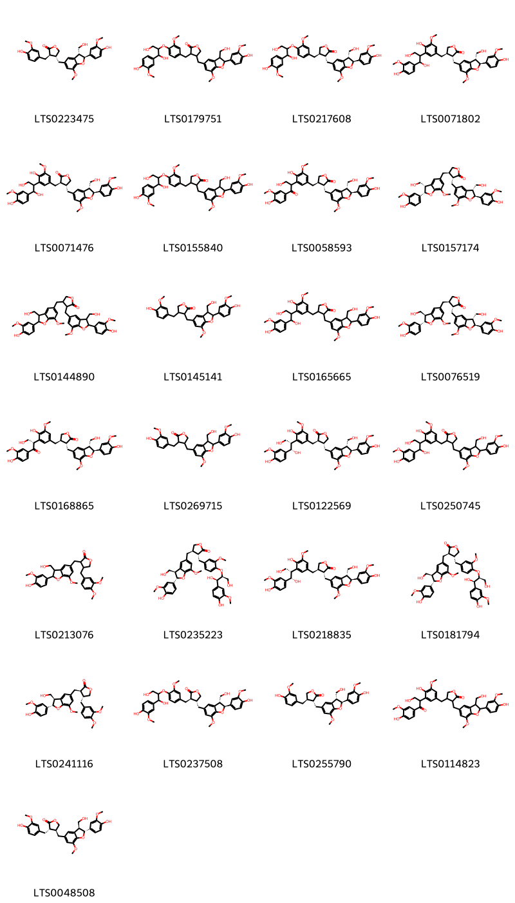{ width=100% }
    <figcaption>Hình ảnh cấu trúc hóa học của 25 hoạt chất thuộc nhóm 2-arylbenzofuran flavonoids gồm ['lappaol a (LTS0223475)', '3-[(4-{[1,3-dihydroxy-1-(4-hydroxy-3-methoxyphenyl)propan-2-yl]oxy}-3-methoxyphenyl)methyl]-4-{[2-(4-hydroxy-3-methoxyphenyl)-3-(hydroxymethyl)-7-methoxy-2,3-dihydro-1-benzofuran-5-yl]methyl}oxolan-2-one (LTS0179751)', '(3r,4r)-4-[(4-{[1,3-dihydroxy-1-(4-hydroxy-3-methoxyphenyl)propan-2-yl]oxy}-3-methoxyphenyl)methyl]-3-{[(2s,3r)-2-(4-hydroxy-3-methoxyphenyl)-3-(hydroxymethyl)-7-methoxy-2,3-dihydro-1-benzofuran-5-yl]methyl}oxolan-2-one (LTS0217608)', 'arctignan d (LTS0071802)', 'arctignan e (LTS0071476)', '4-[(4-{[1,3-dihydroxy-1-(4-hydroxy-3-methoxyphenyl)propan-2-yl]oxy}-3-methoxyphenyl)methyl]-3-{[2-(4-hydroxy-3-methoxyphenyl)-3-(hydroxymethyl)-7-methoxy-2,3-dihydro-1-benzofuran-5-yl]methyl}oxolan-2-one (LTS0155840)', '(3r,4r)-4-({4-hydroxy-3-[3-hydroxy-1-(4-hydroxy-3-methoxyphenyl)-1-oxopropan-2-yl]-5-methoxyphenyl}methyl)-3-{[(2s,3r)-2-(4-hydroxy-3-methoxyphenyl)-3-(hydroxymethyl)-7-methoxy-2,3-dihydro-1-benzofuran-5-yl]methyl}oxolan-2-one (LTS0058593)', '(3r,4r)-3-{[(2s,3r)-2-(4-hydroxy-3-methoxyphenyl)-3-(hydroxymethyl)-7-methoxy-2,3-dihydro-1-benzofuran-5-yl]methyl}-4-{[(2s,3s)-2-(4-hydroxy-3-methoxyphenyl)-3-(hydroxymethyl)-7-methoxy-2,3-dihydro-1-benzofuran-5-yl]methyl}oxolan-2-one (LTS0157174)', '3,4-bis({[2-(4-hydroxy-3-methoxyphenyl)-3-(hydroxymethyl)-7-methoxy-2,3-dihydro-1-benzofuran-5-yl]methyl})oxolan-2-one (LTS0144890)', '3-{[2-(4-hydroxy-3-methoxyphenyl)-3-(hydroxymethyl)-7-methoxy-2,3-dihydro-1-benzofuran-5-yl]methyl}-4-[(4-hydroxy-3-methoxyphenyl)methyl]oxolan-2-one (LTS0145141)', '4-({3-[1,3-dihydroxy-1-(4-hydroxy-3-methoxyphenyl)propan-2-yl]-4-hydroxy-5-methoxyphenyl}methyl)-3-{[2-(4-hydroxy-3-methoxyphenyl)-3-(hydroxymethyl)-7-methoxy-2,3-dihydro-1-benzofuran-5-yl]methyl}oxolan-2-one (LTS0165665)', 'lappaol f (LTS0076519)', '(3r,4r)-4-({4-hydroxy-3-[(2s)-3-hydroxy-1-(4-hydroxy-3-methoxyphenyl)-1-oxopropan-2-yl]-5-methoxyphenyl}methyl)-3-{[(2s,3r)-2-(4-hydroxy-3-methoxyphenyl)-3-(hydroxymethyl)-7-methoxy-2,3-dihydro-1-benzofuran-5-yl]methyl}oxolan-2-one (LTS0168865)', '4-{[2-(4-hydroxy-3-methoxyphenyl)-3-(hydroxymethyl)-7-methoxy-2,3-dihydro-1-benzofuran-5-yl]methyl}-3-[(4-hydroxy-3-methoxyphenyl)methyl]oxolan-2-one (LTS0269715)', '(3r,4r)-3-({3-[(1s,2s)-1,3-dihydroxy-1-(4-hydroxy-3-methoxyphenyl)propan-2-yl]-4-hydroxy-5-methoxyphenyl}methyl)-4-{[(2s,3r)-2-(4-hydroxy-3-methoxyphenyl)-3-(hydroxymethyl)-7-methoxy-2,3-dihydro-1-benzofuran-5-yl]methyl}oxolan-2-one (LTS0122569)', '3-({3-[1,3-dihydroxy-1-(4-hydroxy-3-methoxyphenyl)propan-2-yl]-4-hydroxy-5-methoxyphenyl}methyl)-4-{[2-(4-hydroxy-3-methoxyphenyl)-3-(hydroxymethyl)-7-methoxy-2,3-dihydro-1-benzofuran-5-yl]methyl}oxolan-2-one (LTS0250745)', '4-[(3,4-dimethoxyphenyl)methyl]-3-{[2-(4-hydroxy-3-methoxyphenyl)-3-(hydroxymethyl)-7-methoxy-2,3-dihydro-1-benzofuran-5-yl]methyl}oxolan-2-one (LTS0213076)', '(3r,4r)-3-[(4-{[(1r,2s)-1,3-dihydroxy-1-(4-hydroxy-3-methoxyphenyl)propan-2-yl]oxy}-3-methoxyphenyl)methyl]-4-{[(2s,3r)-2-(4-hydroxy-3-methoxyphenyl)-3-(hydroxymethyl)-7-methoxy-2,3-dihydro-1-benzofuran-5-yl]methyl}oxolan-2-one (LTS0235223)', '(3r,4r)-4-({3-[(1s,2s)-1,3-dihydroxy-1-(4-hydroxy-3-methoxyphenyl)propan-2-yl]-4-hydroxy-5-methoxyphenyl}methyl)-3-{[(2s,3r)-2-(4-hydroxy-3-methoxyphenyl)-3-(hydroxymethyl)-7-methoxy-2,3-dihydro-1-benzofuran-5-yl]methyl}oxolan-2-one (LTS0218835)', '(3r,4r)-4-[(4-{[(1r,2s)-1,3-dihydroxy-1-(4-hydroxy-3-methoxyphenyl)propan-2-yl]oxy}-3-methoxyphenyl)methyl]-3-{[(2s,3r)-2-(4-hydroxy-3-methoxyphenyl)-3-(hydroxymethyl)-7-methoxy-2,3-dihydro-1-benzofuran-5-yl]methyl}oxolan-2-one (LTS0181794)', 'lappaol b (LTS0241116)', '(3r,4r)-3-[(4-{[1,3-dihydroxy-1-(4-hydroxy-3-methoxyphenyl)propan-2-yl]oxy}-3-methoxyphenyl)methyl]-4-{[(2s,3r)-2-(4-hydroxy-3-methoxyphenyl)-3-(hydroxymethyl)-7-methoxy-2,3-dihydro-1-benzofuran-5-yl]methyl}oxolan-2-one (LTS0237508)', '(3r,4r)-3-{[(2s,3r)-2-(4-hydroxy-3-methoxyphenyl)-3-(hydroxymethyl)-7-methoxy-2,3-dihydro-1-benzofuran-5-yl]methyl}-4-[(4-hydroxy-3-methoxyphenyl)methyl]oxolan-2-one (LTS0255790)', '4-({4-hydroxy-3-[3-hydroxy-1-(4-hydroxy-3-methoxyphenyl)-1-oxopropan-2-yl]-5-methoxyphenyl}methyl)-3-{[2-(4-hydroxy-3-methoxyphenyl)-3-(hydroxymethyl)-7-methoxy-2,3-dihydro-1-benzofuran-5-yl]methyl}oxolan-2-one (LTS0114823)', '(3s,4s)-4-{[(2r,3s)-2-(4-hydroxy-3-methoxyphenyl)-3-(hydroxymethyl)-7-methoxy-2,3-dihydro-1-benzofuran-5-yl]methyl}-3-[(4-hydroxy-3-methoxyphenyl)methyl]oxolan-2-one (LTS0048508)'].</figcaption>
</figure>
#### Nhóm Benzene and substituted derivatives
<figure markdown="span">
    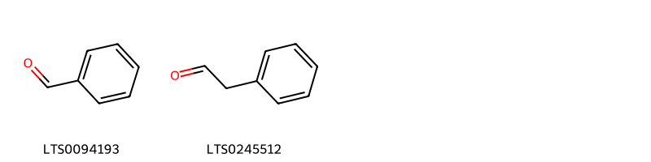{ width=100% }
    <figcaption>Hình ảnh cấu trúc hóa học của 2 hoạt chất thuộc nhóm Benzene and substituted derivatives gồm ['benzaldehyde (LTS0094193)', 'phenylacetaldehyde (LTS0245512)'].</figcaption>
</figure>
#### Nhóm Bi- and oligothiophenes
<figure markdown="span">
    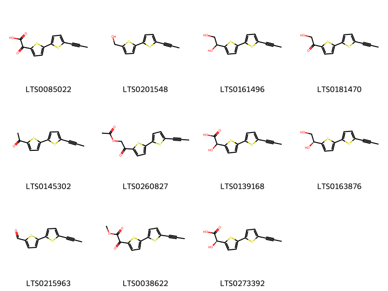{ width=100% }
    <figcaption>Hình ảnh cấu trúc hóa học của 11 hoạt chất thuộc nhóm Bi- and oligothiophenes gồm ['arctic acid b (LTS0085022)', 'arctinol a (LTS0201548)', 'arctinol b (LTS0161496)', 'arctinone a (LTS0181470)', 'arctinone b (LTS0145302)', "2-oxo-2-[5'-(prop-1-yn-1-yl)-[2,2'-bithiophen]-5-yl]ethyl acetate (LTS0260827)", 'arctic acid c (LTS0139168)', "(1s)-1-[5'-(prop-1-yn-1-yl)-[2,2'-bithiophen]-5-yl]ethane-1,2-diol (LTS0163876)", 'arctinal (LTS0215963)', 'methyl arctate b (LTS0038622)', "(s)-hydroxy[5'-(prop-1-yn-1-yl)-[2,2'-bithiophen]-5-yl]acetic acid (LTS0273392)"].</figcaption>
</figure>
#### Nhóm Carboxylic acids and derivatives
<figure markdown="span">
    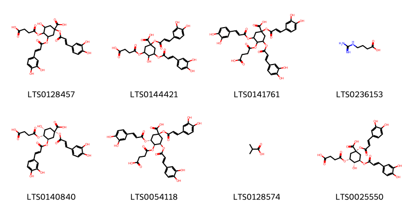{ width=100% }
    <figcaption>Hình ảnh cấu trúc hóa học của 8 hoạt chất thuộc nhóm Carboxylic acids and derivatives gồm ['4-[(3-carboxypropanoyl)oxy]-1,3-bis({[3-(3,4-dihydroxyphenyl)prop-2-enoyl]oxy})-5-hydroxycyclohexane-1-carboxylic acid (LTS0128457)', '3-[(3-carboxypropanoyl)oxy]-1,5-bis({[3-(3,4-dihydroxyphenyl)prop-2-enoyl]oxy})-4-hydroxycyclohexane-1-carboxylic acid (LTS0144421)', '4-[(3-carboxypropanoyl)oxy]-1,3,5-tris({[3-(3,4-dihydroxyphenyl)prop-2-enoyl]oxy})cyclohexane-1-carboxylic acid (LTS0141761)', '4-guanidinobutyric acid (LTS0236153)', '(1s,3r,4r,5r)-4-[(3-carboxypropanoyl)oxy]-1,3-bis({[(2e)-3-(3,4-dihydroxyphenyl)prop-2-enoyl]oxy})-5-hydroxycyclohexane-1-carboxylic acid (LTS0140840)', '(1s,3r,4s,5r)-4-[(3-carboxypropanoyl)oxy]-1,3,5-tris({[(2e)-3-(3,4-dihydroxyphenyl)prop-2-enoyl]oxy})cyclohexane-1-carboxylic acid (LTS0054118)', 'isobutyric acid (LTS0128574)', '(1s,3r,4r,5r)-3-[(3-carboxypropanoyl)oxy]-1,5-bis({[(2e)-3-(3,4-dihydroxyphenyl)prop-2-enoyl]oxy})-4-hydroxycyclohexane-1-carboxylic acid (LTS0025550)'].</figcaption>
</figure>
#### Nhóm Diazines
<figure markdown="span">
    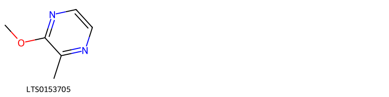{ width=100% }
    <figcaption>Hình ảnh cấu trúc hóa học của 1 hoạt chất thuộc nhóm Diazines gồm ['2-methoxy-3-methylpyrazine (LTS0153705)'].</figcaption>
</figure>
#### Nhóm Dibenzylbutane lignans
<figure markdown="span">
    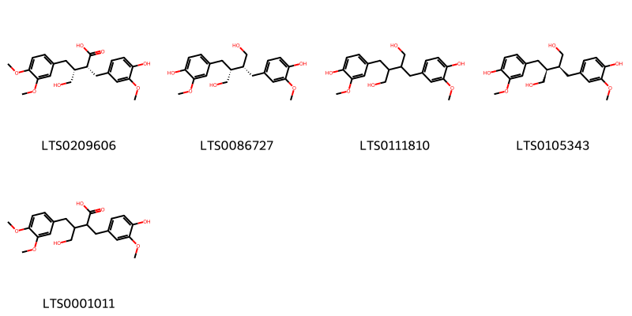{ width=100% }
    <figcaption>Hình ảnh cấu trúc hóa học của 5 hoạt chất thuộc nhóm Dibenzylbutane lignans gồm ['(2r,3r)-3-[(3,4-dimethoxyphenyl)methyl]-4-hydroxy-2-[(4-hydroxy-3-methoxyphenyl)methyl]butanoic acid (LTS0209606)', 'secoisolariciresinol (LTS0086727)', 'secoisolariciresinol (LTS0111810)', '(+)-secoisolariciresinol (LTS0105343)', '3-[(3,4-dimethoxyphenyl)methyl]-4-hydroxy-2-[(4-hydroxy-3-methoxyphenyl)methyl]butanoic acid (LTS0001011)'].</figcaption>
</figure>
#### Nhóm Epoxides
<figure markdown="span">
    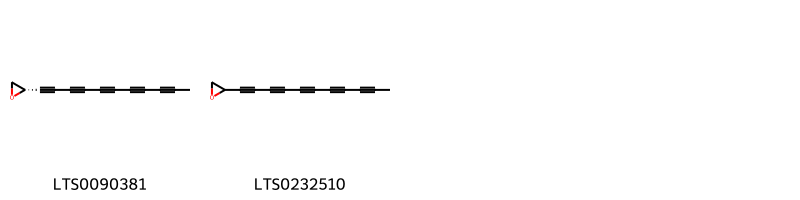{ width=100% }
    <figcaption>Hình ảnh cấu trúc hóa học của 2 hoạt chất thuộc nhóm Epoxides gồm ['(2s)-2-(undeca-1,3,5,7,9-pentayn-1-yl)oxirane (LTS0090381)', '2-(undeca-1,3,5,7,9-pentayn-1-yl)oxirane (LTS0232510)'].</figcaption>
</figure>
#### Nhóm Fatty Acyls
<figure markdown="span">
    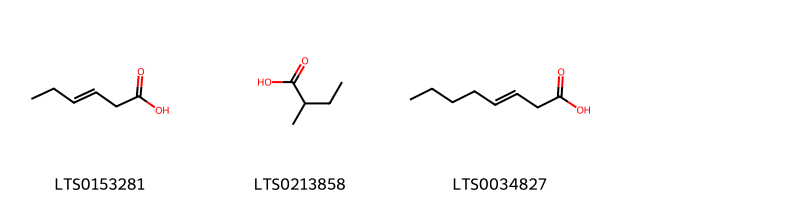{ width=100% }
    <figcaption>Hình ảnh cấu trúc hóa học của 3 hoạt chất thuộc nhóm Fatty Acyls gồm ['3-hexenoic acid (LTS0153281)', '2-methylbutanoic acid (LTS0213858)', 'oct-3-enoic acid (LTS0034827)'].</figcaption>
</figure>
#### Nhóm Furanoid lignans
<figure markdown="span">
    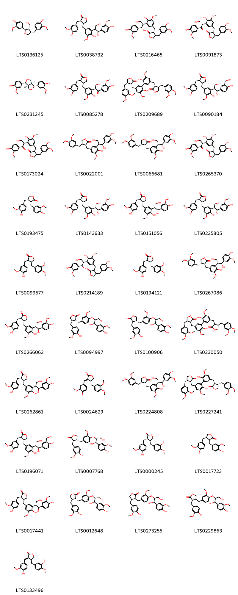{ width=100% }
    <figcaption>Hình ảnh cấu trúc hóa học của 37 hoạt chất thuộc nhóm Furanoid lignans gồm ['(-)-lariciresinol (LTS0136125)', '4-({3-[1,3-dihydroxy-1-(4-hydroxy-3-methoxyphenyl)propan-2-yl]-4-hydroxy-5-methoxyphenyl}methyl)-3-[(4-hydroxy-3-methoxyphenyl)methyl]oxolan-2-one (LTS0038732)', '(3r,4r)-3-({3-[(1s,2r)-1,3-dihydroxy-1-(4-hydroxy-3-methoxyphenyl)propan-2-yl]-4-hydroxy-5-methoxyphenyl}methyl)-4-[(4-hydroxy-3-methoxyphenyl)methyl]oxolan-2-one (LTS0216465)', '(3r,4r)-3-({4-hydroxy-3-[(2s)-3-hydroxy-1-(4-hydroxy-3-methoxyphenyl)-1-oxopropan-2-yl]-5-methoxyphenyl}methyl)-4-[(4-hydroxy-3-methoxyphenyl)methyl]oxolan-2-one (LTS0091873)', '(-)-pinoresinol (LTS0231245)', '4-({4-hydroxy-3-[3-hydroxy-1-(4-hydroxy-3-methoxyphenyl)-1-oxopropan-2-yl]-5-methoxyphenyl}methyl)-3-[(4-hydroxy-3-methoxyphenyl)methyl]oxolan-2-one (LTS0085278)', 'diarctigenin (LTS0209689)', '4-[(3-{1,3-dihydroxy-1-[4-hydroxy-3-(hydroxymethyl)phenyl]propan-2-yl}-4-hydroxy-5-methoxyphenyl)methyl]-3-[(4-hydroxy-3-methoxyphenyl)methyl]oxolan-2-one (LTS0090184)', '3-({4-hydroxy-3-[3-hydroxy-1-(4-hydroxy-3-methoxyphenyl)-1-oxopropan-2-yl]-5-methoxyphenyl}methyl)-4-[(4-hydroxy-3-methoxyphenyl)methyl]oxolan-2-one (LTS0173024)', 'lappaol d (LTS0022001)', '(3r,4r)-3-({3-[(1r,2r)-1,3-dihydroxy-1-(4-hydroxy-3-methoxyphenyl)propan-2-yl]-4-hydroxy-5-methoxyphenyl}methyl)-4-[(3,4-dimethoxyphenyl)methyl]oxolan-2-one (LTS0066681)', 'arctignan c (LTS0265370)', 'matairesinol (LTS0193475)', '(3r,4s)-4-({3-[(1s,2r)-1,3-dihydroxy-1-(4-hydroxy-3-methoxyphenyl)propan-2-yl]-4-hydroxy-5-methoxyphenyl}methyl)-3-[(4-hydroxy-3-methoxyphenyl)methyl]oxolan-2-one (LTS0143633)', '(3r,4r)-4-({3-[(1r,2r)-1,3-dihydroxy-1-(4-hydroxy-3-methoxyphenyl)propan-2-yl]-4-hydroxy-5-methoxyphenyl}methyl)-3-[(4-hydroxy-3-methoxyphenyl)methyl]oxolan-2-one (LTS0151056)', 'lappaol c (LTS0225805)', 'arctigenin (LTS0099577)', '3-({3-[1,3-dihydroxy-1-(4-hydroxy-3-methoxyphenyl)propan-2-yl]-4-hydroxy-5-methoxyphenyl}methyl)-4-[(4-hydroxy-3-methoxyphenyl)methyl]oxolan-2-one (LTS0214189)', '(-)-arctigenin (LTS0194121)', '(3s,4s)-3-({3-[(1s,2r)-1,3-dihydroxy-1-(4-hydroxy-3-methoxyphenyl)propan-2-yl]-4-hydroxy-5-methoxyphenyl}methyl)-4-[(3,4-dimethoxyphenyl)methyl]oxolan-2-one (LTS0267086)', '(3r,4r)-4-({3-[(1s,2r)-1,3-dihydroxy-1-(4-hydroxy-3-methoxyphenyl)propan-2-yl]-4-hydroxy-5-methoxyphenyl}methyl)-3-[(4-hydroxy-3-methoxyphenyl)methyl]oxolan-2-one (LTS0266062)', 'arctignan a (LTS0094997)', 'lappaol e (LTS0100906)', "4-[(3,4-dimethoxyphenyl)methyl]-3-{[5'-({4-[(3,4-dimethoxyphenyl)methyl]-2-oxooxolan-3-yl}methyl)-2',6-dihydroxy-3',5-dimethoxy-[1,1'-biphenyl]-3-yl]methyl}oxolan-2-one (LTS0230050)", 'arctignan b (LTS0262861)', '(3e,4s)-4-[(3,4-dimethoxyphenyl)methyl]-3-[(4-hydroxy-3-methoxyphenyl)methylidene]oxolan-2-one (LTS0024629)', '(3r,4r)-3-({3-[(1s,2r)-1,3-dihydroxy-1-(4-hydroxy-3-methoxyphenyl)propan-2-yl]-4-hydroxy-5-methoxyphenyl}methyl)-4-[(3,4-dimethoxyphenyl)methyl]oxolan-2-one (LTS0224808)', "(3s,4s)-4-[(3,4-dimethoxyphenyl)methyl]-3-[(5'-{[(3s,4s)-4-[(3,4-dimethoxyphenyl)methyl]-2-oxooxolan-3-yl]methyl}-2',6-dihydroxy-3',5-dimethoxy-[1,1'-biphenyl]-3-yl)methyl]oxolan-2-one (LTS0227241)", '(3r,4r)-4-({3-[(1s,2r)-1,3-dihydroxy-1-[4-hydroxy-3-(hydroxymethyl)phenyl]propan-2-yl]-4-hydroxy-5-methoxyphenyl}methyl)-3-[(4-hydroxy-3-methoxyphenyl)methyl]oxolan-2-one (LTS0196071)', '(3r,4r)-4-[(4-{[(1r,2r)-1,3-dihydroxy-1-(4-hydroxy-3-methoxyphenyl)propan-2-yl]oxy}-3-methoxyphenyl)methyl]-3-[(4-hydroxy-3-methoxyphenyl)methyl]oxolan-2-one (LTS0007768)', '(3s,4r)-4-[(3,4-dimethoxyphenyl)methyl]-3-[(4-hydroxy-3-methoxyphenyl)methyl]oxolan-2-one (LTS0000245)', '3,4-bis[(4-hydroxy-3-methoxyphenyl)methyl]oxolan-2-one (LTS0017723)', '(3r,4r)-4-({4-hydroxy-3-[(2s)-3-hydroxy-1-(4-hydroxy-3-methoxyphenyl)-1-oxopropan-2-yl]-5-methoxyphenyl}methyl)-3-[(4-hydroxy-3-methoxyphenyl)methyl]oxolan-2-one (LTS0017441)', '(3r,4r)-3-[(4-{[(1r,2r)-1,3-dihydroxy-1-(4-hydroxy-3-methoxyphenyl)propan-2-yl]oxy}-3-methoxyphenyl)methyl]-4-[(4-hydroxy-3-methoxyphenyl)methyl]oxolan-2-one (LTS0012648)', '3-[(4-{[1,3-dihydroxy-1-(4-hydroxy-3-methoxyphenyl)propan-2-yl]oxy}-3-methoxyphenyl)methyl]-4-[(4-hydroxy-3-methoxyphenyl)methyl]oxolan-2-one (LTS0273255)', '4-[(4-{[1,3-dihydroxy-1-(4-hydroxy-3-methoxyphenyl)propan-2-yl]oxy}-3-methoxyphenyl)methyl]-3-[(4-hydroxy-3-methoxyphenyl)methyl]oxolan-2-one (LTS0229863)', '(3e)-4-[(3,4-dimethoxyphenyl)methyl]-3-[(4-hydroxy-3-methoxyphenyl)methylidene]oxolan-2-one (LTS0133496)'].</figcaption>
</figure>
#### Nhóm Lignan glycosides
<figure markdown="span">
    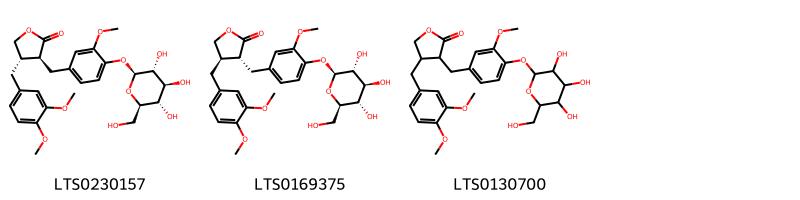{ width=100% }
    <figcaption>Hình ảnh cấu trúc hóa học của 3 hoạt chất thuộc nhóm Lignan glycosides gồm ['(3s,4s)-4-[(3,4-dimethoxyphenyl)methyl]-3-[(3-methoxy-4-{[(2s,3r,4s,5s,6r)-3,4,5-trihydroxy-6-(hydroxymethyl)oxan-2-yl]oxy}phenyl)methyl]oxolan-2-one (LTS0230157)', 'arctiin (LTS0169375)', '4-[(3,4-dimethoxyphenyl)methyl]-3-[(3-methoxy-4-{[3,4,5-trihydroxy-6-(hydroxymethyl)oxan-2-yl]oxy}phenyl)methyl]oxolan-2-one (LTS0130700)'].</figcaption>
</figure>
#### Nhóm Organooxygen compounds
<figure markdown="span">
    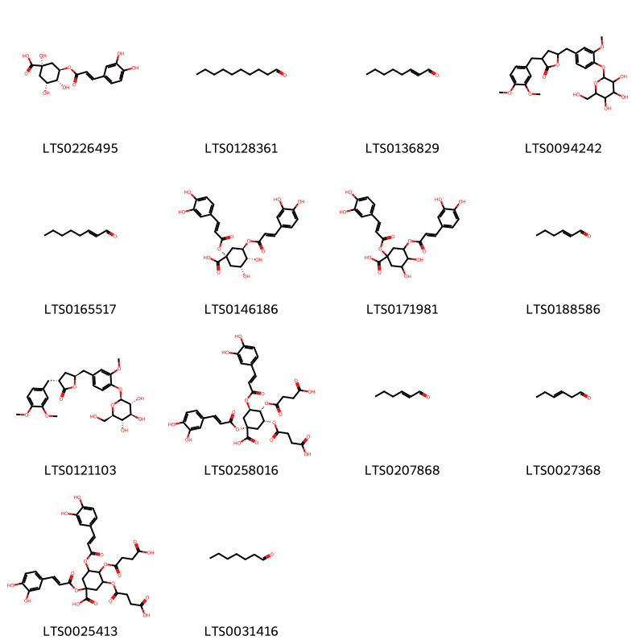{ width=100% }
    <figcaption>Hình ảnh cấu trúc hóa học của 14 hoạt chất thuộc nhóm Organooxygen compounds gồm ['chlorogenic acid (LTS0226495)', 'decanal (LTS0128361)', '(e)-2-octenal (LTS0136829)', '3-[(3,4-dimethoxyphenyl)methyl]-5-[(3-methoxy-4-{[3,4,5-trihydroxy-6-(hydroxymethyl)oxan-2-yl]oxy}phenyl)methyl]oxolan-2-one (LTS0094242)', '2-octenal (LTS0165517)', '(1s,3r,4r,5r)-1,3-bis({[(2e)-3-(3,4-dihydroxyphenyl)prop-2-enoyl]oxy})-4,5-dihydroxycyclohexane-1-carboxylic acid (LTS0146186)', '1,3-bis({[3-(3,4-dihydroxyphenyl)prop-2-enoyl]oxy})-4,5-dihydroxycyclohexane-1-carboxylic acid (LTS0171981)', 'hexenal (LTS0188586)', '(3r,5s)-3-[(3,4-dimethoxyphenyl)methyl]-5-[(3-methoxy-4-{[(2s,3r,4s,5s,6r)-3,4,5-trihydroxy-6-(hydroxymethyl)oxan-2-yl]oxy}phenyl)methyl]oxolan-2-one (LTS0121103)', '(1s,3r,4r,5r)-3,4-bis[(3-carboxypropanoyl)oxy]-1,5-bis({[(2e)-3-(3,4-dihydroxyphenyl)prop-2-enoyl]oxy})cyclohexane-1-carboxylic acid (LTS0258016)', '(e)-2-hexenal (LTS0207868)', '3-hexenal (LTS0027368)', '3,4-bis[(3-carboxypropanoyl)oxy]-1,5-bis({[3-(3,4-dihydroxyphenyl)prop-2-enoyl]oxy})cyclohexane-1-carboxylic acid (LTS0025413)', 'heptanal (LTS0031416)'].</figcaption>
</figure>
#### Nhóm Phenols
<figure markdown="span">
    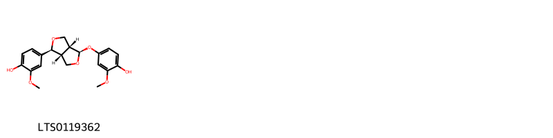{ width=100% }
    <figcaption>Hình ảnh cấu trúc hóa học của 1 hoạt chất thuộc nhóm Phenols gồm ['4-[(1s,3ar,4r,6ar)-4-(4-hydroxy-3-methoxyphenoxy)-hexahydrofuro[3,4-c]furan-1-yl]-2-methoxyphenol (LTS0119362)'].</figcaption>
</figure>
#### Nhóm Prenol lipids
<figure markdown="span">
    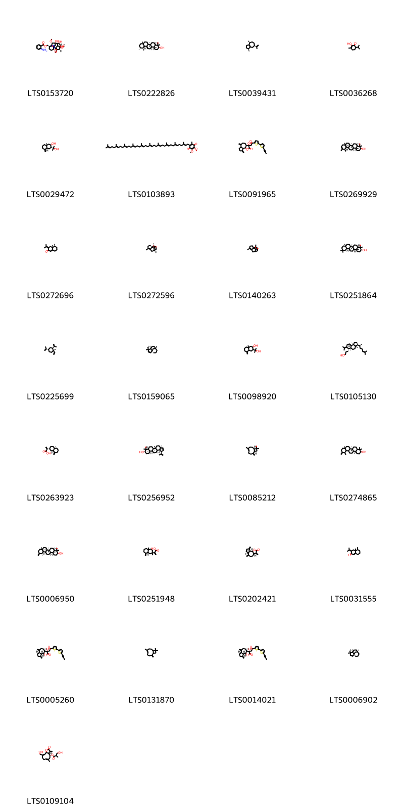{ width=100% }
    <figcaption>Hình ảnh cấu trúc hóa học của 29 hoạt chất thuộc nhóm Prenol lipids gồm ['[(1s,4s,5r,6s,8r,9r,13s,16s,18s)-11-ethyl-8,9-dihydroxy-4,6,16,18-tetramethoxy-11-azahexacyclo[7.7.2.1²,⁵.0¹,¹⁰.0³,⁸.0¹³,¹⁷]nonadecan-13-yl]methyl 2-aminobenzoate (LTS0153720)', 'amyrin (LTS0222826)', 'guaiene (LTS0039431)', 'diosphenol (LTS0036268)', 'arctiol (LTS0029472)', 'coenzyme q10 (LTS0103893)', "3-hydroxy-6,9-dimethylidene-3-{2-oxo-2-[5'-(prop-1-yn-1-yl)-[2,2'-bithiophen]-5-yl]ethyl}-octahydroazuleno[4,5-b]furan-2-one (LTS0091965)", '(4ar,6ar,6br,8as,12ar,12br,14ar,14br)-4,4,6a,6b,8a,11,12,14b-octamethyl-2,3,4a,5,6,7,8,9,12,12a,12b,13,14,14a-tetradecahydro-1h-picen-3-ol (LTS0269929)', 'dehydrofukinone (LTS0272696)', 'cyperene (LTS0272596)', 'cyperene (LTS0140263)', 'β-amyrin (LTS0251864)', 'β-elemene (LTS0225699)', '(1s,5s,8s)-4,4,8-trimethyltricyclo[6.3.1.0¹,⁵]dodec-2-ene (LTS0159065)', '3-(2-hydroxypropan-2-yl)-8a-methyl-5-methylidene-octahydronaphthalen-2-ol (LTS0098920)', '3-[(3s,3as,5as,6s,9as,9br)-3a,5a,9b-trimethyl-3-[(2s)-6-methylhept-5-en-2-yl]-7-(propan-2-ylidene)-octahydro-1h-cyclopenta[a]naphthalen-6-yl]propan-1-ol (LTS0105130)', 'costic acid (LTS0263923)', 'lupeol (LTS0256952)', 'caryophyllene (LTS0085212)', '(6ar,6br,8ar,14br)-4,4,6a,6b,8a,12,14b-heptamethyl-11-methylidene-hexadecahydropicen-3-ol (LTS0274865)', 'taraxasterol (LTS0006950)', '2-[(8ar)-2,4a-dimethyl-8-methylidene-hexahydro-1h-naphthalen-2-yl]prop-2-enoic acid (LTS0251948)', 'dehydrocostus lactone (LTS0202421)', '4a,5-dimethyl-3-(propan-2-ylidene)-5,6,7,8-tetrahydro-4h-naphthalen-2-one (LTS0031555)', "(3r,3ar,6ar,9ar,9br)-3-hydroxy-6,9-dimethylidene-3-{2-oxo-2-[5'-(prop-1-yn-1-yl)-[2,2'-bithiophen]-5-yl]ethyl}-octahydroazuleno[4,5-b]furan-2-one (LTS0005260)", 'caryophyllene (LTS0131870)', "(3s,3ar,6as,9ar,9br)-3-hydroxy-6,9-dimethylidene-3-{2-oxo-2-[5'-(prop-1-yn-1-yl)-[2,2'-bithiophen]-5-yl]ethyl}-octahydroazuleno[4,5-b]furan-2-one (LTS0014021)", '(+)-clovene (LTS0006902)', '(3ar,4s)-10-(hydroxymethyl)-6-methyl-3-methylidene-2-oxo-3ah,4h,5h,8h,9h,11ah-cyclodeca[b]furan-4-yl 3-hydroxy-2-methylpropanoate (LTS0109104)'].</figcaption>
</figure>
#### Nhóm Steroids and steroid derivatives
<figure markdown="span">
    { width=100% }
    <figcaption>Hình ảnh cấu trúc hóa học của 2 hoạt chất thuộc nhóm Steroids and steroid derivatives gồm ['24-methylene-cycloartanol (LTS0077845)', '24-methylenecycloartanol (LTS0018584)'].</figcaption>
</figure>
#### Nhóm Unsaturated hydrocarbons
<figure markdown="span">
    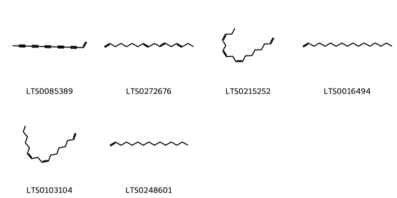{ width=100% }
    <figcaption>Hình ảnh cấu trúc hóa học của 6 hoạt chất thuộc nhóm Unsaturated hydrocarbons gồm ['tridec-1-en-3,5,7,9,11-pentayne (LTS0085389)', '(8e,11e,14e)-heptadeca-1,8,11,14-tetraene (LTS0272676)', 'aplotaxene (LTS0215252)', 'heptadecene (LTS0016494)', '(8z,11z)-heptadeca-1,8,11-triene (LTS0103104)', '1-pentadecene (LTS0248601)'].</figcaption>
</figure>

---

### Dược dân tộc học

Danh sách các quốc gia có sử dụng *Arctium lappa* trong điều trị các bệnh. 

| Country   | Disease                                                                                                                                                  | Bệnh                                                                                                                                                                                                |
|:----------|:---------------------------------------------------------------------------------------------------------------------------------------------------------|:----------------------------------------------------------------------------------------------------------------------------------------------------------------------------------------------------|
| China     | Alexiteric, Antiphlogistic, Aperient, Carminative, Diaphoretic, Diaphoretic, Diuretic, Diuretic, Diuretic, Insecticide, Refrigerant, Antidote, Stomachic | MYMEMORY WARNING: YOU USED ALL AVAILABLE FREE TRANSLATIONS FOR TODAY. NEXT AVAILABLE IN  09 HOURS 16 MINUTES 52 SECONDS VISIT HTTPS://MYMEMORY.TRANSLATED.NET/DOC/USAGELIMITS.PHP TO TRANSLATE MORE |
| Chinese   | Antidote                                                                                                                                                 | MYMEMORY WARNING: YOU USED ALL AVAILABLE FREE TRANSLATIONS FOR TODAY. NEXT AVAILABLE IN  09 HOURS 16 MINUTES 49 SECONDS VISIT HTTPS://MYMEMORY.TRANSLATED.NET/DOC/USAGELIMITS.PHP TO TRANSLATE MORE |
| Elsewhere | nan, Diaphoretic, Diuretic, Diuretic, Diuretic, Estrogenic, Diaphoretic, Fungicide                                                                       | MYMEMORY WARNING: YOU USED ALL AVAILABLE FREE TRANSLATIONS FOR TODAY. NEXT AVAILABLE IN  09 HOURS 16 MINUTES 47 SECONDS VISIT HTTPS://MYMEMORY.TRANSLATED.NET/DOC/USAGELIMITS.PHP TO TRANSLATE MORE |
| Iraq      | Antidote, Diuretic, Diaphoretic                                                                                                                          | MYMEMORY WARNING: YOU USED ALL AVAILABLE FREE TRANSLATIONS FOR TODAY. NEXT AVAILABLE IN  09 HOURS 16 MINUTES 44 SECONDS VISIT HTTPS://MYMEMORY.TRANSLATED.NET/DOC/USAGELIMITS.PHP TO TRANSLATE MORE |
| Japan     | Antidote, Diuretic                                                                                                                                       | MYMEMORY WARNING: YOU USED ALL AVAILABLE FREE TRANSLATIONS FOR TODAY. NEXT AVAILABLE IN  09 HOURS 16 MINUTES 42 SECONDS VISIT HTTPS://MYMEMORY.TRANSLATED.NET/DOC/USAGELIMITS.PHP TO TRANSLATE MORE |
| Turkey    | Apertif, Carminative, Diuretic, Laxative, Sudorific                                                                                                      | MYMEMORY WARNING: YOU USED ALL AVAILABLE FREE TRANSLATIONS FOR TODAY. NEXT AVAILABLE IN  09 HOURS 16 MINUTES 39 SECONDS VISIT HTTPS://MYMEMORY.TRANSLATED.NET/DOC/USAGELIMITS.PHP TO TRANSLATE MORE |
| UK        | Aphrodisiac                                                                                                                                              | MYMEMORY WARNING: YOU USED ALL AVAILABLE FREE TRANSLATIONS FOR TODAY. NEXT AVAILABLE IN  09 HOURS 16 MINUTES 37 SECONDS VISIT HTTPS://MYMEMORY.TRANSLATED.NET/DOC/USAGELIMITS.PHP TO TRANSLATE MORE |
| US        | Diuretic, Poultice                                                                                                                                       | MYMEMORY WARNING: YOU USED ALL AVAILABLE FREE TRANSLATIONS FOR TODAY. NEXT AVAILABLE IN  09 HOURS 16 MINUTES 34 SECONDS VISIT HTTPS://MYMEMORY.TRANSLATED.NET/DOC/USAGELIMITS.PHP TO TRANSLATE MORE |

---

---
## Arctium minus
### Thông tin về thực vật

!!! info "Phân loại thực vật của *Arctium minus* từ GIBF:"
    - **Kingdom:** Plantae
    - **Phylum:** Tracheophyta
    - **Order:** Asterales
    - **Family:** Asteraceae
    - **Genus:** Arctium
    - **Species:** *Arctium minus*

 

| Label (VI)   | Label (EN)   | Scientific Name   | Descriptions (VI)   | Descriptions (EN)   | Also Known As (VI)   | Also Known As (EN)                                                             |
|:-------------|:-------------|:------------------|:--------------------|:--------------------|:---------------------|:-------------------------------------------------------------------------------|
| N/A          | N/A          | Arctium minus     | loài thực vật       | species of plant    | ['']                 | ['button-bur', 'cuckoo-button', 'Lesser Burdock', 'louse-bur', 'wild rhubarb'] |

#### Phân bố trên thế giới

**Từ CSDL GIBF** Netherlands, Australia, France, United Kingdom of Great Britain and Northern Ireland, Germany, Belgium, Spain, Argentina, Switzerland, United States of America, Sweden, Uruguay, Norway, New Zealand, Canada

#### Phân bố tại Việt Nam

**Từ CSDL GIBF**: Không có ghi nhận ở Việt Nam

---
### Thành phần hóa học
        
- Theo cơ sở dữ liệu lotus: Từ loài *Arctium minus* đã phân lập và xác định được 5 hoạt chất thuộc về các nhóm Fatty Acyls, Prenol lipids. 

|    | chemicalTaxonomyClassyfireClass   |   smiles_count |
|---:|:----------------------------------|---------------:|
|  0 | Fatty Acyls                       |              2 |
|  1 | Prenol lipids                     |              3 |

#### Nhóm Fatty Acyls
<figure markdown="span">
    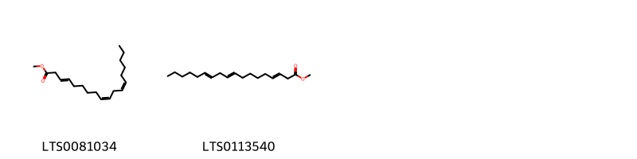{ width=100% }
    <figcaption>Hình ảnh cấu trúc hóa học của 2 hoạt chất thuộc nhóm Fatty Acyls gồm ['methyl (3e,9z,12z)-octadeca-3,9,12-trienoate (LTS0081034)', 'methyl octadeca-3,9,12-trienoate (LTS0113540)'].</figcaption>
</figure>
#### Nhóm Prenol lipids
<figure markdown="span">
    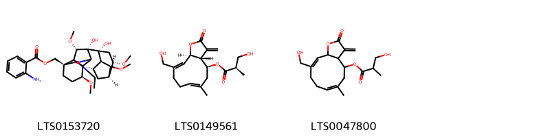{ width=100% }
    <figcaption>Hình ảnh cấu trúc hóa học của 3 hoạt chất thuộc nhóm Prenol lipids gồm ['[(1s,4s,5r,6s,8r,9r,13s,16s,18s)-11-ethyl-8,9-dihydroxy-4,6,16,18-tetramethoxy-11-azahexacyclo[7.7.2.1²,⁵.0¹,¹⁰.0³,⁸.0¹³,¹⁷]nonadecan-13-yl]methyl 2-aminobenzoate (LTS0153720)', '(3ar,4s,11ar)-10-(hydroxymethyl)-6-methyl-3-methylidene-2-oxo-3ah,4h,5h,8h,9h,11ah-cyclodeca[b]furan-4-yl (2r)-3-hydroxy-2-methylpropanoate (LTS0149561)', '10-(hydroxymethyl)-6-methyl-3-methylidene-2-oxo-3ah,4h,5h,8h,9h,11ah-cyclodeca[b]furan-4-yl 3-hydroxy-2-methylpropanoate (LTS0047800)'].</figcaption>
</figure>

---

### Dược dân tộc học

Danh sách các quốc gia có sử dụng *Arctium minus* trong điều trị các bệnh. 

| Country   | Disease                                      | Bệnh                                                                                                                                                                                                |
|:----------|:---------------------------------------------|:----------------------------------------------------------------------------------------------------------------------------------------------------------------------------------------------------|
| Elsewhere | Diaphoretic, Diaphoretic, Diuretic, Diuretic | MYMEMORY WARNING: YOU USED ALL AVAILABLE FREE TRANSLATIONS FOR TODAY. NEXT AVAILABLE IN  09 HOURS 16 MINUTES 04 SECONDS VISIT HTTPS://MYMEMORY.TRANSLATED.NET/DOC/USAGELIMITS.PHP TO TRANSLATE MORE |
| German    | Sudorific                                    | MYMEMORY WARNING: YOU USED ALL AVAILABLE FREE TRANSLATIONS FOR TODAY. NEXT AVAILABLE IN  09 HOURS 16 MINUTES 02 SECONDS VISIT HTTPS://MYMEMORY.TRANSLATED.NET/DOC/USAGELIMITS.PHP TO TRANSLATE MORE |
| Italian   | Diuretic                                     | MYMEMORY WARNING: YOU USED ALL AVAILABLE FREE TRANSLATIONS FOR TODAY. NEXT AVAILABLE IN  09 HOURS 15 MINUTES 59 SECONDS VISIT HTTPS://MYMEMORY.TRANSLATED.NET/DOC/USAGELIMITS.PHP TO TRANSLATE MORE |
| US        | Emmenagogue                                  | MYMEMORY WARNING: YOU USED ALL AVAILABLE FREE TRANSLATIONS FOR TODAY. NEXT AVAILABLE IN  09 HOURS 15 MINUTES 57 SECONDS VISIT HTTPS://MYMEMORY.TRANSLATED.NET/DOC/USAGELIMITS.PHP TO TRANSLATE MORE |

---

# Chi Centaurea

??? note "Danh sách các dược liệu thuộc chi"
    
	 - *Centaurea behen*
	 - *Centaurea calcitrapa*
	 - *Centaurea centaurium*
	 - *Centaurea cyanus*
	 - *Centaurea jacea*
	 - *Centaurea montana*
	 - *Centaurea nigra*
	 - *Centaurea rhaponticum*
	 - *Centaurea scabiosa*

---
## Centaurea behen
### Thông tin về thực vật

!!! info "Phân loại thực vật của *Centaurea behen* từ GIBF:"
    - **Kingdom:** Plantae
    - **Phylum:** Tracheophyta
    - **Order:** Asterales
    - **Family:** Asteraceae
    - **Genus:** Centaurea
    - **Species:** *Centaurea behen*

 

| Label (VI)   | Label (EN)   | Scientific Name   | Descriptions (VI)   | Descriptions (EN)   | Also Known As (VI)   | Also Known As (EN)   |
|:-------------|:-------------|:------------------|:--------------------|:--------------------|:---------------------|:---------------------|
| N/A          | N/A          | Centaurea behen   |                     | species of plant    | ['']                 | ['']                 |

#### Phân bố trên thế giới

**Từ CSDL GIBF** nan, Turkmenistan, Palestine, State of, Mozambique, unknown or invalid, Israel, Korea, Republic of, Spain, Azerbaijan, Türkiye, Russian Federation, United States of America, Iran (Islamic Republic of), Armenia, France, Syrian Arab Republic, Iraq, India, Lebanon

#### Phân bố tại Việt Nam

**Từ CSDL GIBF**: Không có ghi nhận ở Việt Nam

---
### Thành phần hóa học
        
- Theo cơ sở dữ liệu lotus: Từ loài *Centaurea behen* đã phân lập và xác định được 18 hoạt chất thuộc về các nhóm Prenol lipids. 

|    | chemicalTaxonomyClassyfireClass   |   smiles_count |
|---:|:----------------------------------|---------------:|
|  0 | Prenol lipids                     |             18 |

#### Nhóm Prenol lipids
<figure markdown="span">
    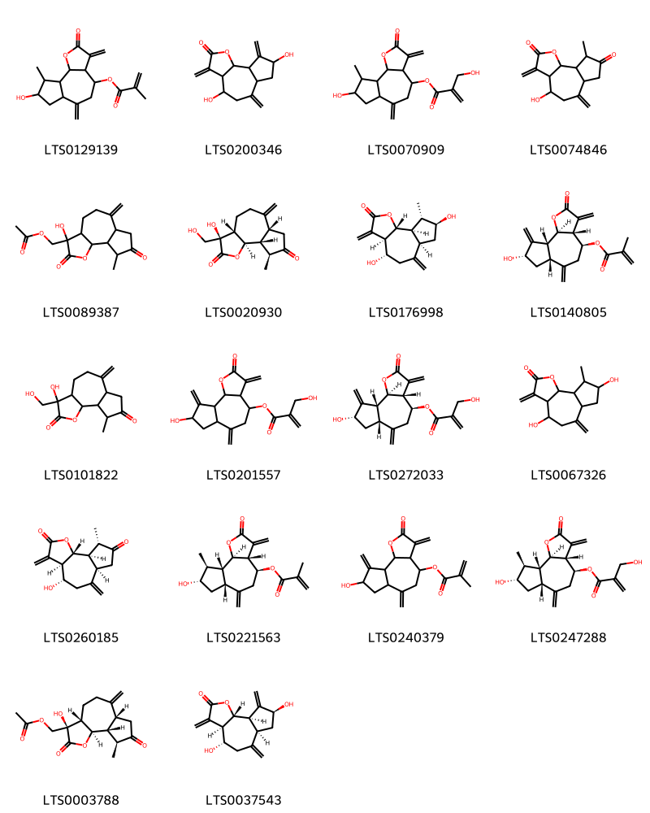{ width=100% }
    <figcaption>Hình ảnh cấu trúc hóa học của 18 hoạt chất thuộc nhóm Prenol lipids gồm ['8-hydroxy-9-methyl-3,6-dimethylidene-2-oxo-octahydro-3ah-azuleno[4,5-b]furan-4-yl 2-methylprop-2-enoate (LTS0129139)', '4,8-dihydroxy-3,6,9-trimethylidene-octahydroazuleno[4,5-b]furan-2-one (LTS0200346)', '8-hydroxy-9-methyl-3,6-dimethylidene-2-oxo-octahydro-3ah-azuleno[4,5-b]furan-4-yl 2-(hydroxymethyl)prop-2-enoate (LTS0070909)', '4-hydroxy-9-methyl-3,6-dimethylidene-octahydroazuleno[4,5-b]furan-2,8-dione (LTS0074846)', '{3-hydroxy-9-methyl-6-methylidene-2,8-dioxo-octahydroazuleno[4,5-b]furan-3-yl}methyl acetate (LTS0089387)', '(3r,3ar,6ar,9s,9ar,9br)-3-hydroxy-3-(hydroxymethyl)-9-methyl-6-methylidene-octahydroazuleno[4,5-b]furan-2,8-dione (LTS0020930)', '(3ar,4s,6ar,8s,9s,9ar,9br)-4,8-dihydroxy-9-methyl-3,6-dimethylidene-octahydro-3ah-azuleno[4,5-b]furan-2-one (LTS0176998)', '(3ar,4s,6ar,8s,9ar,9br)-8-hydroxy-3,6,9-trimethylidene-2-oxo-octahydroazuleno[4,5-b]furan-4-yl 2-methylprop-2-enoate (LTS0140805)', '3-hydroxy-3-(hydroxymethyl)-9-methyl-6-methylidene-octahydroazuleno[4,5-b]furan-2,8-dione (LTS0101822)', 'saupirin (LTS0201557)', 'cynaropicrin (LTS0272033)', '4,8-dihydroxy-9-methyl-3,6-dimethylidene-octahydro-3ah-azuleno[4,5-b]furan-2-one (LTS0067326)', 'grosheimin (LTS0260185)', '(3ar,4s,6ar,8s,9s,9ar,9br)-8-hydroxy-9-methyl-3,6-dimethylidene-2-oxo-octahydro-3ah-azuleno[4,5-b]furan-4-yl 2-methylprop-2-enoate (LTS0221563)', '8-hydroxy-3,6,9-trimethylidene-2-oxo-octahydroazuleno[4,5-b]furan-4-yl 2-methylprop-2-enoate (LTS0240379)', '(3ar,4s,6ar,8s,9s,9ar,9br)-8-hydroxy-9-methyl-3,6-dimethylidene-2-oxo-octahydro-3ah-azuleno[4,5-b]furan-4-yl 2-(hydroxymethyl)prop-2-enoate (LTS0247288)', '[(3r,3ar,6ar,9s,9ar,9br)-3-hydroxy-9-methyl-6-methylidene-2,8-dioxo-octahydroazuleno[4,5-b]furan-3-yl]methyl acetate (LTS0003788)', '(3ar,4s,6ar,8s,9ar,9br)-4,8-dihydroxy-3,6,9-trimethylidene-octahydroazuleno[4,5-b]furan-2-one (LTS0037543)'].</figcaption>
</figure>

---

### Dược dân tộc học

Danh sách các quốc gia có sử dụng *Centaurea behen* trong điều trị các bệnh. 

| Country   | Disease     | Bệnh                                                                                                                                                                                                |
|:----------|:------------|:----------------------------------------------------------------------------------------------------------------------------------------------------------------------------------------------------|
| Iran      | Aphrodisiac | MYMEMORY WARNING: YOU USED ALL AVAILABLE FREE TRANSLATIONS FOR TODAY. NEXT AVAILABLE IN  09 HOURS 15 MINUTES 34 SECONDS VISIT HTTPS://MYMEMORY.TRANSLATED.NET/DOC/USAGELIMITS.PHP TO TRANSLATE MORE |

---

---
## Centaurea calcitrapa
### Thông tin về thực vật

!!! info "Phân loại thực vật của *Centaurea calcitrapa* từ GIBF:"
    - **Kingdom:** Plantae
    - **Phylum:** Tracheophyta
    - **Order:** Asterales
    - **Family:** Asteraceae
    - **Genus:** Centaurea
    - **Species:** *Centaurea calcitrapa*

 

| Label (VI)   | Label (EN)   | Scientific Name      | Descriptions (VI)   | Descriptions (EN)   | Also Known As (VI)   | Also Known As (EN)                                                 |
|:-------------|:-------------|:---------------------|:--------------------|:--------------------|:---------------------|:-------------------------------------------------------------------|
| N/A          | N/A          | Centaurea calcitrapa |                     | species of plant    | ['']                 | ['common star thistle', 'purple star thistle', 'red star thistle'] |

#### Phân bố trên thế giới

**Từ CSDL GIBF** Ukraine, Netherlands, Italy, Australia, United Kingdom of Great Britain and Northern Ireland, Spain, Argentina, Portugal, Algeria, Switzerland, Morocco, United States of America, Lebanon, Uruguay, Slovenia, France, Greece, Chile

#### Phân bố tại Việt Nam

**Từ CSDL GIBF**: Không có ghi nhận ở Việt Nam

---
### Thành phần hóa học
        
- Theo cơ sở dữ liệu lotus: Từ loài *Centaurea calcitrapa* đã phân lập và xác định được 31 hoạt chất thuộc về các nhóm Flavonoids, Prenol lipids, Steroids and steroid derivatives, Unsaturated hydrocarbons, Organooxygen compounds, Phenols, Furanoid lignans. 

|    | chemicalTaxonomyClassyfireClass   |   smiles_count |
|---:|:----------------------------------|---------------:|
|  0 | Flavonoids                        |              3 |
|  1 | Furanoid lignans                  |              7 |
|  2 | Organooxygen compounds            |              1 |
|  3 | Phenols                           |              1 |
|  4 | Prenol lipids                     |             15 |
|  5 | Steroids and steroid derivatives  |              2 |
|  6 | Unsaturated hydrocarbons          |              2 |

#### Nhóm Flavonoids
<figure markdown="span">
    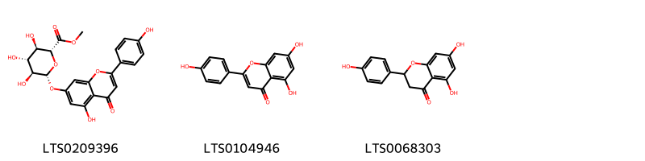{ width=100% }
    <figcaption>Hình ảnh cấu trúc hóa học của 3 hoạt chất thuộc nhóm Flavonoids gồm ['methyl (2r,3r,4r,5s,6r)-3,4,5-trihydroxy-6-{[5-hydroxy-2-(4-hydroxyphenyl)-4-oxochromen-7-yl]oxy}oxane-2-carboxylate (LTS0209396)', 'chamomile (LTS0104946)', 'asahina (LTS0068303)'].</figcaption>
</figure>
#### Nhóm Furanoid lignans
<figure markdown="span">
    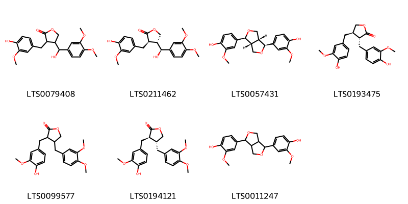{ width=100% }
    <figcaption>Hình ảnh cấu trúc hóa học của 7 hoạt chất thuộc nhóm Furanoid lignans gồm ['4-[(3,4-dimethoxyphenyl)(hydroxy)methyl]-3-[(4-hydroxy-3-methoxyphenyl)methyl]oxolan-2-one (LTS0079408)', '(3r,4r)-4-[(s)-(3,4-dimethoxyphenyl)(hydroxy)methyl]-3-[(4-hydroxy-3-methoxyphenyl)methyl]oxolan-2-one (LTS0211462)', 'pinoresinol (LTS0057431)', 'matairesinol (LTS0193475)', 'arctigenin (LTS0099577)', '(-)-arctigenin (LTS0194121)', 'pinoresinol (LTS0011247)'].</figcaption>
</figure>
#### Nhóm Organooxygen compounds
<figure markdown="span">
    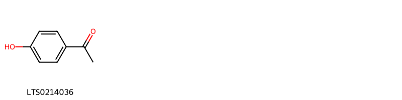{ width=100% }
    <figcaption>Hình ảnh cấu trúc hóa học của 1 hoạt chất thuộc nhóm Organooxygen compounds gồm ['hydroxyacetophenone (LTS0214036)'].</figcaption>
</figure>
#### Nhóm Phenols
<figure markdown="span">
    { width=100% }
    <figcaption>Hình ảnh cấu trúc hóa học của 1 hoạt chất thuộc nhóm Phenols gồm ['vanillin (LTS0136163)'].</figcaption>
</figure>
#### Nhóm Prenol lipids
<figure markdown="span">
    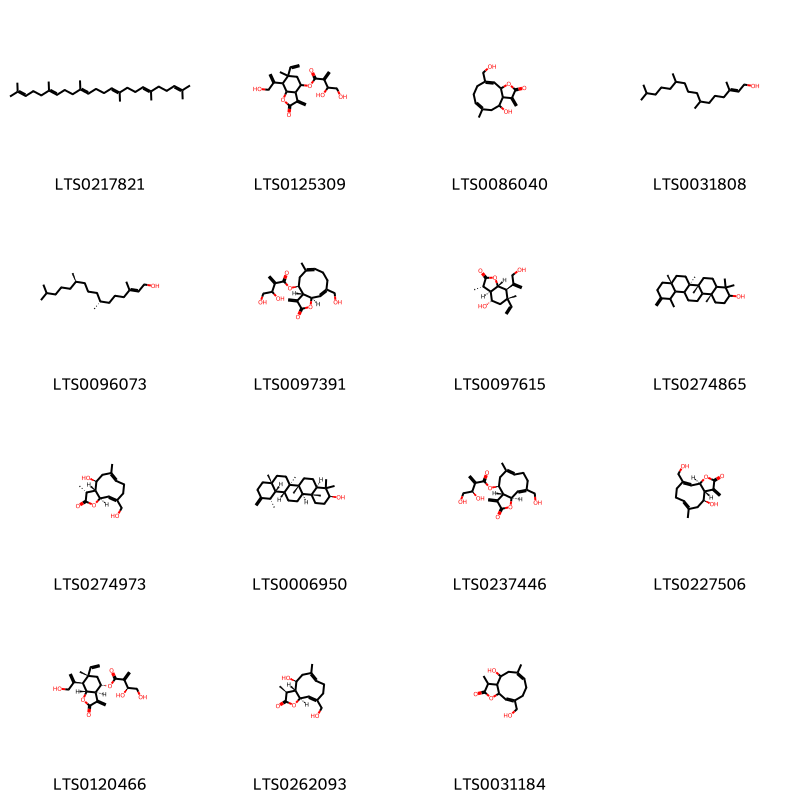{ width=100% }
    <figcaption>Hình ảnh cấu trúc hóa học của 15 hoạt chất thuộc nhóm Prenol lipids gồm ['squalene (LTS0217821)', '6-ethenyl-7-(3-hydroxyprop-1-en-2-yl)-6-methyl-3-methylidene-2-oxo-tetrahydro-3ah-1-benzofuran-4-yl 3,4-dihydroxy-2-methylidenebutanoate (LTS0125309)', '4-hydroxy-10-(hydroxymethyl)-6-methyl-3-methylidene-3ah,4h,5h,8h,9h,11ah-cyclodeca[b]furan-2-one (LTS0086040)', 'phytol (LTS0031808)', 'phytol (LTS0096073)', '(3ar,4s,11ar)-10-(hydroxymethyl)-6-methyl-3-methylidene-2-oxo-3ah,4h,5h,8h,9h,11ah-cyclodeca[b]furan-4-yl 3,4-dihydroxy-2-methylidenebutanoate (LTS0097391)', '(3s,3ar,4s,6s,7r,7ar)-6-ethenyl-4-hydroxy-7-(3-hydroxyprop-1-en-2-yl)-3,6-dimethyl-hexahydro-1-benzofuran-2-one (LTS0097615)', '(6ar,6br,8ar,14br)-4,4,6a,6b,8a,12,14b-heptamethyl-11-methylidene-hexadecahydropicen-3-ol (LTS0274865)', '(3r,3ar,4s,11ar)-4-hydroxy-10-(hydroxymethyl)-3,6-dimethyl-3h,3ah,4h,5h,8h,9h,11ah-cyclodeca[b]furan-2-one (LTS0274973)', 'taraxasterol (LTS0006950)', 'cnicin (LTS0237446)', 'salonitenolide (LTS0227506)', '(3ar,4s,6s,7r,7ar)-6-ethenyl-7-(3-hydroxyprop-1-en-2-yl)-6-methyl-3-methylidene-2-oxo-tetrahydro-3ah-1-benzofuran-4-yl (3s)-3,4-dihydroxy-2-methylidenebutanoate (LTS0120466)', '(3s,3ar,4s,11ar)-4-hydroxy-10-(hydroxymethyl)-3,6-dimethyl-3h,3ah,4h,5h,8h,9h,11ah-cyclodeca[b]furan-2-one (LTS0262093)', '4-hydroxy-10-(hydroxymethyl)-3,6-dimethyl-3h,3ah,4h,5h,8h,9h,11ah-cyclodeca[b]furan-2-one (LTS0031184)'].</figcaption>
</figure>
#### Nhóm Steroids and steroid derivatives
<figure markdown="span">
    { width=100% }
    <figcaption>Hình ảnh cấu trúc hóa học của 2 hoạt chất thuộc nhóm Steroids and steroid derivatives gồm ['stigmast-5-en-3-ol, (3β)- (LTS0204616)', 'phytosterol (LTS0029311)'].</figcaption>
</figure>
#### Nhóm Unsaturated hydrocarbons
<figure markdown="span">
    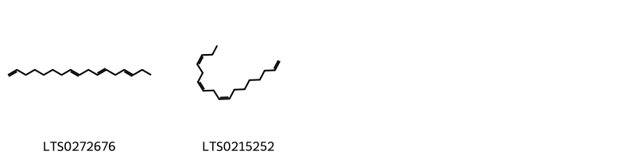{ width=100% }
    <figcaption>Hình ảnh cấu trúc hóa học của 2 hoạt chất thuộc nhóm Unsaturated hydrocarbons gồm ['(8e,11e,14e)-heptadeca-1,8,11,14-tetraene (LTS0272676)', 'aplotaxene (LTS0215252)'].</figcaption>
</figure>

---

### Dược dân tộc học

Danh sách các quốc gia có sử dụng *Centaurea calcitrapa* trong điều trị các bệnh. 

| Country    | Disease          | Bệnh                                                                                                                                                                                                |
|:-----------|:-----------------|:----------------------------------------------------------------------------------------------------------------------------------------------------------------------------------------------------|
| Dutch      | Diuretic         | MYMEMORY WARNING: YOU USED ALL AVAILABLE FREE TRANSLATIONS FOR TODAY. NEXT AVAILABLE IN  09 HOURS 15 MINUTES 04 SECONDS VISIT HTTPS://MYMEMORY.TRANSLATED.NET/DOC/USAGELIMITS.PHP TO TRANSLATE MORE |
| French     | Emmenagogue      | MYMEMORY WARNING: YOU USED ALL AVAILABLE FREE TRANSLATIONS FOR TODAY. NEXT AVAILABLE IN  09 HOURS 15 MINUTES 02 SECONDS VISIT HTTPS://MYMEMORY.TRANSLATED.NET/DOC/USAGELIMITS.PHP TO TRANSLATE MORE |
| Italian    | Sudorific, Tonic | MYMEMORY WARNING: YOU USED ALL AVAILABLE FREE TRANSLATIONS FOR TODAY. NEXT AVAILABLE IN  09 HOURS 14 MINUTES 59 SECONDS VISIT HTTPS://MYMEMORY.TRANSLATED.NET/DOC/USAGELIMITS.PHP TO TRANSLATE MORE |
| Portuguese | Cholagogue       | MYMEMORY WARNING: YOU USED ALL AVAILABLE FREE TRANSLATIONS FOR TODAY. NEXT AVAILABLE IN  09 HOURS 14 MINUTES 56 SECONDS VISIT HTTPS://MYMEMORY.TRANSLATED.NET/DOC/USAGELIMITS.PHP TO TRANSLATE MORE |
| ain        | Diuretic         | MYMEMORY WARNING: YOU USED ALL AVAILABLE FREE TRANSLATIONS FOR TODAY. NEXT AVAILABLE IN  09 HOURS 14 MINUTES 54 SECONDS VISIT HTTPS://MYMEMORY.TRANSLATED.NET/DOC/USAGELIMITS.PHP TO TRANSLATE MORE |
| anish      | Stimulant        | MYMEMORY WARNING: YOU USED ALL AVAILABLE FREE TRANSLATIONS FOR TODAY. NEXT AVAILABLE IN  09 HOURS 14 MINUTES 51 SECONDS VISIT HTTPS://MYMEMORY.TRANSLATED.NET/DOC/USAGELIMITS.PHP TO TRANSLATE MORE |

---

---
## Centaurea centaurium
### Thông tin về thực vật

!!! info "Phân loại thực vật của *N/A* từ GIBF:"
    - **Kingdom:** Plantae
    - **Phylum:** Tracheophyta
    - **Order:** Asterales
    - **Family:** Asteraceae
    - **Genus:** N/A
    - **Species:** *N/A*

 

| Label (VI)   | Label (EN)   | Scientific Name      | Descriptions (VI)   | Descriptions (EN)   | Also Known As (VI)   | Also Known As (EN)   |
|:-------------|:-------------|:---------------------|:--------------------|:--------------------|:---------------------|:---------------------|
| N/A          | N/A          | Centaurea centaurium | loài thực vật       | species of plant    | ['']                 | ['']                 |

#### Phân bố trên thế giới

**Từ CSDL GIBF** Denmark, Australia, New Zealand, Chinese Taipei, Ireland, Isle of Man, Viet Nam, United Kingdom of Great Britain and Northern Ireland

#### Phân bố tại Việt Nam

**Từ CSDL GIBF**: Đà Nẵng

---
### Thành phần hóa học
        
- Theo cơ sở dữ liệu lotus: Từ loài *N/A* đã phân lập và xác định được Chưa có hoạt chất nào được phân lập. hoạt chất thuộc về các nhóm Không có hoạt chất nào được phân lập. 

Không có hình ảnh nào được tạo ra

---

### Dược dân tộc học

Danh sách các quốc gia có sử dụng *N/A* trong điều trị các bệnh. 

| Country   | Disease   | Bệnh                                                                                                                                                                                                |
|:----------|:----------|:----------------------------------------------------------------------------------------------------------------------------------------------------------------------------------------------------|
| Turkey    | Stomachic | MYMEMORY WARNING: YOU USED ALL AVAILABLE FREE TRANSLATIONS FOR TODAY. NEXT AVAILABLE IN  09 HOURS 14 MINUTES 21 SECONDS VISIT HTTPS://MYMEMORY.TRANSLATED.NET/DOC/USAGELIMITS.PHP TO TRANSLATE MORE |

---

---
## Centaurea cyanus
### Thông tin về thực vật

!!! info "Phân loại thực vật của *Centaurea cyanus* từ GIBF:"
    - **Kingdom:** Plantae
    - **Phylum:** Tracheophyta
    - **Order:** Asterales
    - **Family:** Asteraceae
    - **Genus:** Centaurea
    - **Species:** *Centaurea cyanus*

 

| Label (VI)   | Label (EN)   | Scientific Name   | Descriptions (VI)   | Descriptions (EN)          | Also Known As (VI)   | Also Known As (EN)   |
|:-------------|:-------------|:------------------|:--------------------|:---------------------------|:---------------------|:---------------------|
| N/A          | N/A          | Centaurea cyanus  |                     | species of flowering plant | ['']                 | ['Cornflower']       |

#### Phân bố trên thế giới

**Từ CSDL GIBF** nan, Italy, Belgium, Denmark, Netherlands, Luxembourg, Korea, Republic of, Spain, Türkiye, Portugal, United States of America, Sweden, Greece, Germany, Switzerland, Austria, France, United Kingdom of Great Britain and Northern Ireland, China, Poland, New Zealand

#### Phân bố tại Việt Nam

**Từ CSDL GIBF**: Không có ghi nhận ở Việt Nam

---
### Thành phần hóa học
        
- Theo cơ sở dữ liệu lotus: Từ loài *Centaurea cyanus* đã phân lập và xác định được 55 hoạt chất thuộc về các nhóm Fatty Acyls, Flavonoids, Indoles and derivatives, Cinnamic acids and derivatives, Unsaturated hydrocarbons, Organooxygen compounds, Coumarins and derivatives, Furanoid lignans. 

|    | chemicalTaxonomyClassyfireClass   |   smiles_count |
|---:|:----------------------------------|---------------:|
|  0 | Cinnamic acids and derivatives    |              5 |
|  1 | Coumarins and derivatives         |              2 |
|  2 | Fatty Acyls                       |              2 |
|  3 | Flavonoids                        |             34 |
|  4 | Furanoid lignans                  |              1 |
|  5 | Indoles and derivatives           |              3 |
|  6 | Organooxygen compounds            |              6 |
|  7 | Unsaturated hydrocarbons          |              2 |

#### Nhóm Cinnamic acids and derivatives
<figure markdown="span">
    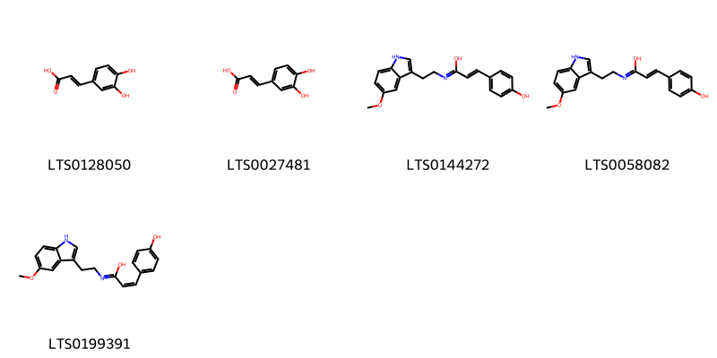{ width=100% }
    <figcaption>Hình ảnh cấu trúc hóa học của 5 hoạt chất thuộc nhóm Cinnamic acids and derivatives gồm ['3,4-dihydroxycinnamic acid (LTS0128050)', 'caffeic acid (LTS0027481)', '3-(4-hydroxyphenyl)-n-[2-(5-methoxy-1h-indol-3-yl)ethyl]prop-2-enimidic acid (LTS0144272)', '(2e)-3-(4-hydroxyphenyl)-n-[2-(5-methoxy-1h-indol-3-yl)ethyl]prop-2-enimidic acid (LTS0058082)', '(2z)-3-(4-hydroxyphenyl)-n-[2-(5-methoxy-1h-indol-3-yl)ethyl]prop-2-enimidic acid (LTS0199391)'].</figcaption>
</figure>
#### Nhóm Coumarins and derivatives
<figure markdown="span">
    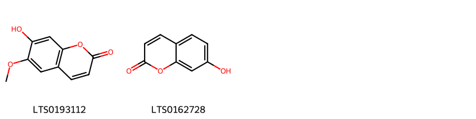{ width=100% }
    <figcaption>Hình ảnh cấu trúc hóa học của 2 hoạt chất thuộc nhóm Coumarins and derivatives gồm ['scopoletin (LTS0193112)', 'umbelliferone (LTS0162728)'].</figcaption>
</figure>
#### Nhóm Fatty Acyls
<figure markdown="span">
    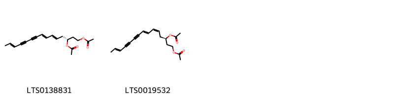{ width=100% }
    <figcaption>Hình ảnh cấu trúc hóa học của 2 hoạt chất thuộc nhóm Fatty Acyls gồm ['(3r)-1-(acetyloxy)pentadeca-5,7,13-trien-9,11-diyn-3-yl acetate (LTS0138831)', '(3r,5z,7e,13e)-1-(acetyloxy)pentadeca-5,7,13-trien-9,11-diyn-3-yl acetate (LTS0019532)'].</figcaption>
</figure>
#### Nhóm Flavonoids
<figure markdown="span">
    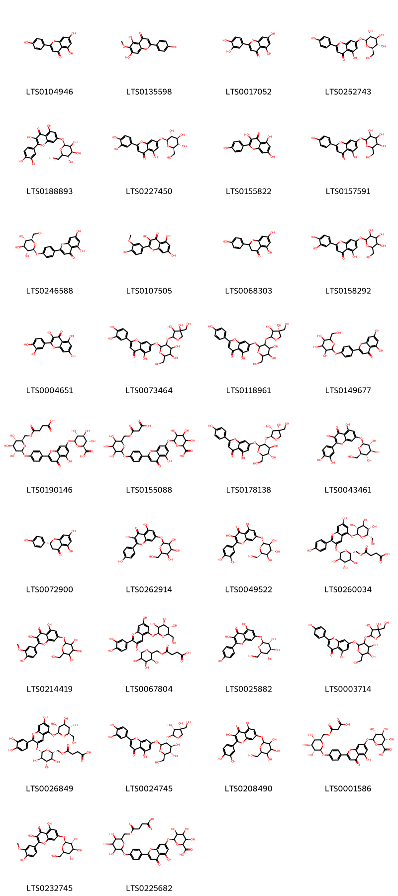{ width=100% }
    <figcaption>Hình ảnh cấu trúc hóa học của 34 hoạt chất thuộc nhóm Flavonoids gồm ['chamomile (LTS0104946)', 'hispidulin (LTS0135598)', 'luteolin (LTS0017052)', 'apigenin 7-o-β-glucoside (LTS0252743)', 'quercimeritrin (LTS0188893)', 'luteolin 7-o-glucoside (LTS0227450)', 'kaempherol (LTS0155822)', 'apigetrin (LTS0157591)', '5,7-dihydroxy-2-(4-{[(2s,3r,4s,5s,6r)-3,4,5-trihydroxy-6-(hydroxymethyl)oxan-2-yl]oxy}phenyl)chromen-4-one (LTS0246588)', 'isorhamnetin (LTS0107505)', 'asahina (LTS0068303)', '2-(3,4-dihydroxyphenyl)-5-hydroxy-7-{[3,4,5-trihydroxy-6-(hydroxymethyl)oxan-2-yl]oxy}chromen-4-one (LTS0158292)', 'quercetin (LTS0004651)', '7-[(3-{[3,4-dihydroxy-4-(hydroxymethyl)oxolan-2-yl]oxy}-4,5-dihydroxy-6-(hydroxymethyl)oxan-2-yl)oxy]-2-(3,4-dihydroxyphenyl)-5-hydroxychromen-4-one (LTS0073464)', '7-[(3-{[(4r)-3,4-dihydroxy-4-(hydroxymethyl)oxolan-2-yl]oxy}-4,5-dihydroxy-6-(hydroxymethyl)oxan-2-yl)oxy]-5-hydroxy-2-(4-hydroxyphenyl)chromen-4-one (LTS0118961)', '5,7-dihydroxy-2-(4-{[3,4,5-trihydroxy-6-(hydroxymethyl)oxan-2-yl]oxy}phenyl)chromen-4-one (LTS0149677)', '(2s,3s,4s,5r,6s)-6-{[2-(4-{[(2s,3r,4s,5s,6r)-6-{[(3-carboxypropanoyl)oxy]methyl}-3,4,5-trihydroxyoxan-2-yl]oxy}phenyl)-5-hydroxy-4-oxochromen-7-yl]oxy}-3,4,5-trihydroxyoxane-2-carboxylic acid (LTS0190146)', '6-[(2-{4-[(6-{[(2-carboxyacetyl)oxy]methyl}-3,4,5-trihydroxyoxan-2-yl)oxy]phenyl}-5-hydroxy-4-oxochromen-7-yl)oxy]-3,4,5-trihydroxyoxane-2-carboxylic acid (LTS0155088)', 'apiin (LTS0178138)', 'quercimeritrin (LTS0043461)', '(-)-naringenin (LTS0072900)', '3,5-dihydroxy-2-(4-hydroxyphenyl)-7-{[3,4,5-trihydroxy-6-(hydroxymethyl)oxan-2-yl]oxy}chromen-4-one (LTS0262914)', '2-(3,4-dihydroxyphenyl)-3,5-dihydroxy-7-{[(2r,3s,4r,5r,6s)-3,4,5-trihydroxy-6-(hydroxymethyl)oxan-2-yl]oxy}chromen-4-one (LTS0049522)', '3-{[(2s,3r,4s,5s,6r)-6-{[(3-carboxypropanoyl)oxy]methyl}-3,4,5-trihydroxyoxan-2-yl]oxy}-7-hydroxy-2-(4-hydroxyphenyl)-5-{[(2s,3r,4s,5s,6s)-3,4,5-trihydroxy-6-(hydroxymethyl)oxan-2-yl]oxy}-1λ⁴-chromen-1-ylium (LTS0260034)', '3,5-dihydroxy-2-(4-hydroxy-3-methoxyphenyl)-7-{[3,4,5-trihydroxy-6-(hydroxymethyl)oxan-2-yl]oxy}chromen-4-one (LTS0214419)', 'succinylcyanin (LTS0067804)', 'kaempferol 7-o-glucoside (LTS0025882)', '7-[(3-{[3,4-dihydroxy-4-(hydroxymethyl)oxolan-2-yl]oxy}-4,5-dihydroxy-6-(hydroxymethyl)oxan-2-yl)oxy]-5-hydroxy-2-(4-hydroxyphenyl)chromen-4-one (LTS0003714)', '3-{[(2s,3r,4s,5s,6r)-6-{[(3-carboxypropanoyl)oxy]methyl}-3,4,5-trihydroxyoxan-2-yl]oxy}-2-(3,4-dihydroxyphenyl)-7-hydroxy-5-{[(2s,3r,4s,5s,6r)-3,4,5-trihydroxy-6-(hydroxymethyl)oxan-2-yl]oxy}-1λ⁴-chromen-1-ylium (LTS0026849)', '7-{[(2s,3r,4s,5s,6r)-3-{[(2s,3r,4r)-3,4-dihydroxy-4-(hydroxymethyl)oxolan-2-yl]oxy}-4,5-dihydroxy-6-(hydroxymethyl)oxan-2-yl]oxy}-2-(3,4-dihydroxyphenyl)-5-hydroxychromen-4-one (LTS0024745)', 'quercimeritrin (LTS0208490)', '(2s,3s,4s,5r,6s)-6-{[2-(4-{[(2s,3r,4s,5s,6r)-6-{[(2-carboxyacetyl)oxy]methyl}-3,4,5-trihydroxyoxan-2-yl]oxy}phenyl)-5-hydroxy-4-oxochromen-7-yl]oxy}-3,4,5-trihydroxyoxane-2-carboxylic acid (LTS0001586)', '3,5-dihydroxy-2-(4-hydroxy-3-methoxyphenyl)-7-{[(2s,3r,4s,5s,6r)-3,4,5-trihydroxy-6-(hydroxymethyl)oxan-2-yl]oxy}chromen-4-one (LTS0232745)', '6-[(2-{4-[(6-{[(3-carboxypropanoyl)oxy]methyl}-3,4,5-trihydroxyoxan-2-yl)oxy]phenyl}-5-hydroxy-4-oxochromen-7-yl)oxy]-3,4,5-trihydroxyoxane-2-carboxylic acid (LTS0225682)'].</figcaption>
</figure>
#### Nhóm Furanoid lignans
<figure markdown="span">
    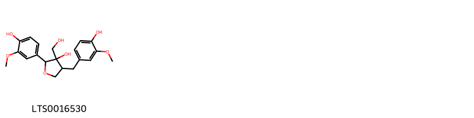{ width=100% }
    <figcaption>Hình ảnh cấu trúc hóa học của 1 hoạt chất thuộc nhóm Furanoid lignans gồm ['2-(4-hydroxy-3-methoxyphenyl)-4-[(4-hydroxy-3-methoxyphenyl)methyl]-3-(hydroxymethyl)oxolan-3-ol (LTS0016530)'].</figcaption>
</figure>
#### Nhóm Indoles and derivatives
<figure markdown="span">
    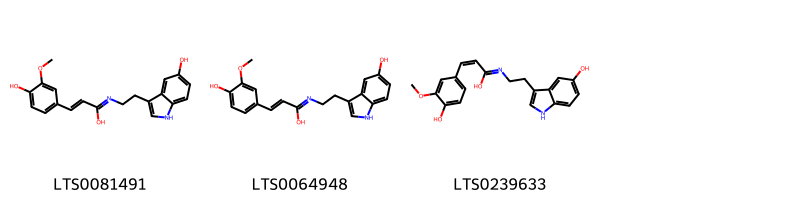{ width=100% }
    <figcaption>Hình ảnh cấu trúc hóa học của 3 hoạt chất thuộc nhóm Indoles and derivatives gồm ['n-[2-(5-hydroxy-1h-indol-3-yl)ethyl]-3-(4-hydroxy-3-methoxyphenyl)prop-2-enimidic acid (LTS0081491)', '(2e)-n-[2-(5-hydroxy-1h-indol-3-yl)ethyl]-3-(4-hydroxy-3-methoxyphenyl)prop-2-enimidic acid (LTS0064948)', '(2z)-n-[2-(5-hydroxy-1h-indol-3-yl)ethyl]-3-(4-hydroxy-3-methoxyphenyl)prop-2-enimidic acid (LTS0239633)'].</figcaption>
</figure>
#### Nhóm Organooxygen compounds
<figure markdown="span">
    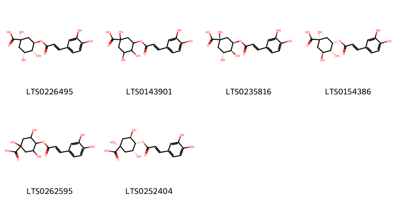{ width=100% }
    <figcaption>Hình ảnh cấu trúc hóa học của 6 hoạt chất thuộc nhóm Organooxygen compounds gồm ['chlorogenic acid (LTS0226495)', '3-{[3-(3,4-dihydroxyphenyl)prop-2-enoyl]oxy}-1,4,5-trihydroxycyclohexane-1-carboxylic acid (LTS0143901)', 'neochlorogenic acid (LTS0235816)', '(1s,3s,4r,5s)-3-{[(2e)-3-(3,4-dihydroxyphenyl)prop-2-enoyl]oxy}-1,4,5-trihydroxycyclohexane-1-carboxylic acid (LTS0154386)', '4-{[3-(3,4-dihydroxyphenyl)prop-2-enoyl]oxy}-1,3,5-trihydroxycyclohexane-1-carboxylic acid (LTS0262595)', 'cryptochlorogenic acid (LTS0252404)'].</figcaption>
</figure>
#### Nhóm Unsaturated hydrocarbons
<figure markdown="span">
    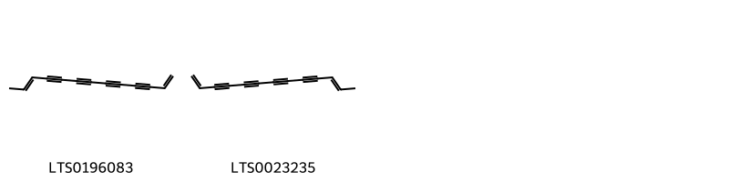{ width=100% }
    <figcaption>Hình ảnh cấu trúc hóa học của 2 hoạt chất thuộc nhóm Unsaturated hydrocarbons gồm ['trideca-1,11-dien-3,5,7,9-tetrayne (LTS0196083)', '(11e)-trideca-1,11-dien-3,5,7,9-tetrayne (LTS0023235)'].</figcaption>
</figure>

---

### Dược dân tộc học

Danh sách các quốc gia có sử dụng *Centaurea cyanus* trong điều trị các bệnh. 

| Country   | Disease                                                               | Bệnh                                                                                                                                                                                                |
|:----------|:----------------------------------------------------------------------|:----------------------------------------------------------------------------------------------------------------------------------------------------------------------------------------------------|
| Elsewhere | Astringent, Stimulant, Tonic, Tonic, Emmenagogue, Stimulant           | MYMEMORY WARNING: YOU USED ALL AVAILABLE FREE TRANSLATIONS FOR TODAY. NEXT AVAILABLE IN  09 HOURS 13 MINUTES 59 SECONDS VISIT HTTPS://MYMEMORY.TRANSLATED.NET/DOC/USAGELIMITS.PHP TO TRANSLATE MORE |
| Iraq      | Emmenagogue, Diuretic                                                 | MYMEMORY WARNING: YOU USED ALL AVAILABLE FREE TRANSLATIONS FOR TODAY. NEXT AVAILABLE IN  09 HOURS 13 MINUTES 56 SECONDS VISIT HTTPS://MYMEMORY.TRANSLATED.NET/DOC/USAGELIMITS.PHP TO TRANSLATE MORE |
| Turkey    | Astringent, Collyrium, Diuretic, Emmenagogue, Stimulant, Tonic, Tonic | MYMEMORY WARNING: YOU USED ALL AVAILABLE FREE TRANSLATIONS FOR TODAY. NEXT AVAILABLE IN  09 HOURS 13 MINUTES 54 SECONDS VISIT HTTPS://MYMEMORY.TRANSLATED.NET/DOC/USAGELIMITS.PHP TO TRANSLATE MORE |

---

---
## Centaurea jacea
### Thông tin về thực vật

!!! info "Phân loại thực vật của *Centaurea jacea* từ GIBF:"
    - **Kingdom:** Plantae
    - **Phylum:** Tracheophyta
    - **Order:** Asterales
    - **Family:** Asteraceae
    - **Genus:** Centaurea
    - **Species:** *Centaurea jacea*

 

| Label (VI)   | Label (EN)   | Scientific Name   | Descriptions (VI)   | Descriptions (EN)   | Also Known As (VI)   | Also Known As (EN)                      |
|:-------------|:-------------|:------------------|:--------------------|:--------------------|:---------------------|:----------------------------------------|
| N/A          | N/A          | Centaurea jacea   | loài thực vật       | species of plant    | ['']                 | ['brown knapweed', 'brownray knapweed'] |

#### Phân bố trên thế giới

**Từ CSDL GIBF** Ukraine, Denmark, Finland, Netherlands, Germany, Argentina, Switzerland, Russian Federation, Sweden, Austria, France, Norway

#### Phân bố tại Việt Nam

**Từ CSDL GIBF**: Không có ghi nhận ở Việt Nam

---
### Thành phần hóa học
        
- Theo cơ sở dữ liệu lotus: Từ loài *Centaurea jacea* đã phân lập và xác định được 63 hoạt chất thuộc về các nhóm Fatty Acyls, Flavonoids, Steroids and steroid derivatives, Cinnamic acids and derivatives, Benzene and substituted derivatives, Unsaturated hydrocarbons, Organooxygen compounds, Coumarins and derivatives. 

|    | chemicalTaxonomyClassyfireClass     |   smiles_count |
|---:|:------------------------------------|---------------:|
|  0 | Benzene and substituted derivatives |              1 |
|  1 | Cinnamic acids and derivatives      |              2 |
|  2 | Coumarins and derivatives           |              1 |
|  3 | Fatty Acyls                         |             12 |
|  4 | Flavonoids                          |             30 |
|  5 | Organooxygen compounds              |             12 |
|  6 | Steroids and steroid derivatives    |              3 |
|  7 | Unsaturated hydrocarbons            |              2 |

#### Nhóm Benzene and substituted derivatives
<figure markdown="span">
    { width=100% }
    <figcaption>Hình ảnh cấu trúc hóa học của 1 hoạt chất thuộc nhóm Benzene and substituted derivatives gồm ['3,4-dihydroxybenzoic acid (LTS0018765)'].</figcaption>
</figure>
#### Nhóm Cinnamic acids and derivatives
<figure markdown="span">
    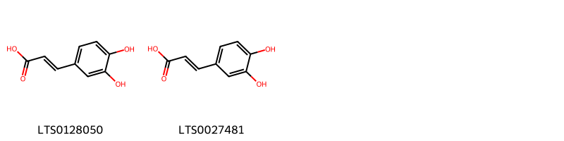{ width=100% }
    <figcaption>Hình ảnh cấu trúc hóa học của 2 hoạt chất thuộc nhóm Cinnamic acids and derivatives gồm ['3,4-dihydroxycinnamic acid (LTS0128050)', 'caffeic acid (LTS0027481)'].</figcaption>
</figure>
#### Nhóm Coumarins and derivatives
<figure markdown="span">
    { width=100% }
    <figcaption>Hình ảnh cấu trúc hóa học của 1 hoạt chất thuộc nhóm Coumarins and derivatives gồm ['scopoletin (LTS0193112)'].</figcaption>
</figure>
#### Nhóm Fatty Acyls
<figure markdown="span">
    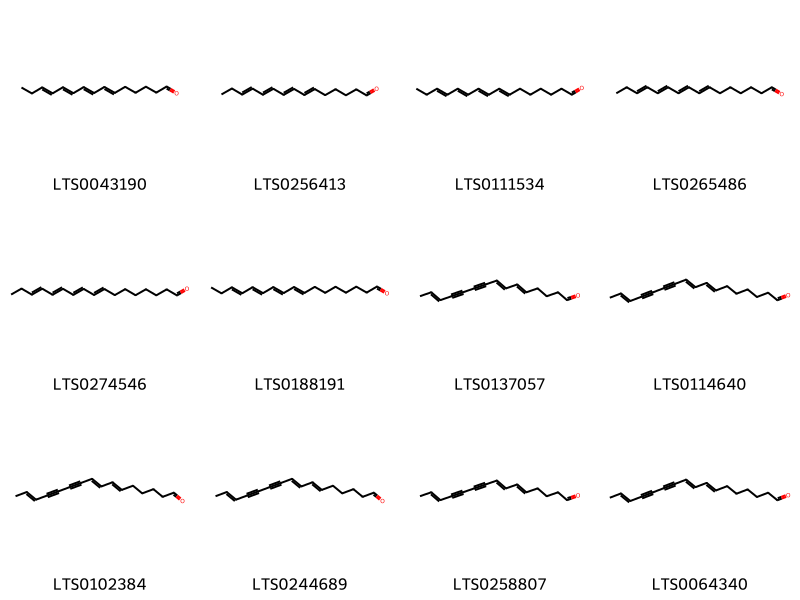{ width=100% }
    <figcaption>Hình ảnh cấu trúc hóa học của 12 hoạt chất thuộc nhóm Fatty Acyls gồm ['(6e,8e,10e,12e)-pentadeca-6,8,10,12-tetraenal (LTS0043190)', 'pentadeca-6,8,10,12-tetraenal (LTS0256413)', '(7e,9e,11e,13e)-hexadeca-7,9,11,13-tetraenal (LTS0111534)', 'hexadeca-7,9,11,13-tetraenal (LTS0265486)', 'heptadeca-8,10,12,14-tetraenal (LTS0274546)', '(8e,10e,12e,14e)-heptadeca-8,10,12,14-tetraenal (LTS0188191)', 'pentadeca-5,7,13-trien-9,11-diynal (LTS0137057)', 'heptadeca-7,9,15-trien-11,13-diynal (LTS0114640)', '(6e,8e,14e)-hexadeca-6,8,14-trien-10,12-diynal (LTS0102384)', 'hexadeca-6,8,14-trien-10,12-diynal (LTS0244689)', '(5e,7e,13e)-pentadeca-5,7,13-trien-9,11-diynal (LTS0258807)', '(7e,9e,15e)-heptadeca-7,9,15-trien-11,13-diynal (LTS0064340)'].</figcaption>
</figure>
#### Nhóm Flavonoids
<figure markdown="span">
    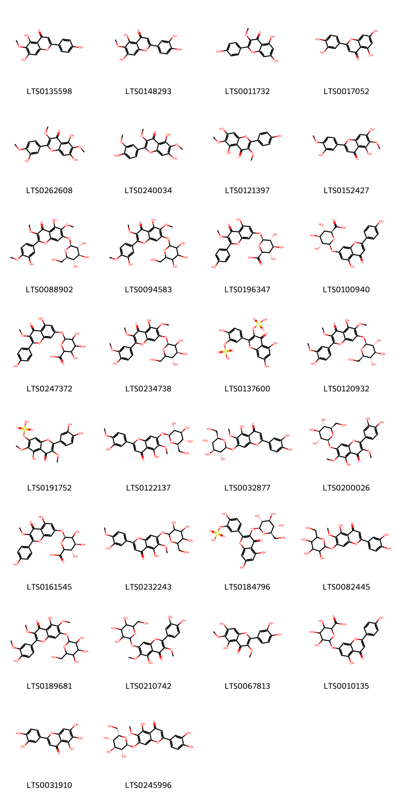{ width=100% }
    <figcaption>Hình ảnh cấu trúc hóa học của 30 hoạt chất thuộc nhóm Flavonoids gồm ['hispidulin (LTS0135598)', 'nepetin (LTS0148293)', 'isokaempferide (LTS0011732)', 'luteolin (LTS0017052)', 'centaureidin (LTS0262608)', 'jaceidin (LTS0240034)', '5,7-dihydroxy-2-(4-hydroxyphenyl)-3,6-dimethoxychromen-4-one (LTS0121397)', 'desmethoxycentaureidin (LTS0152427)', 'centaurein (LTS0088902)', '5-hydroxy-2-(3-hydroxy-4-methoxyphenyl)-3,6-dimethoxy-7-{[3,4,5-trihydroxy-6-(hydroxymethyl)oxan-2-yl]oxy}chromen-4-one (LTS0094583)', '(2s,3s,4s,5r,6s)-3,4,5-trihydroxy-6-{[5-hydroxy-2-(4-hydroxyphenyl)-3-methoxy-4-oxochromen-7-yl]oxy}oxane-2-carboxylic acid (LTS0196347)', '(2s,3s,4s,5r,6s)-3,4,5-trihydroxy-6-{[5-hydroxy-2-(4-hydroxyphenyl)-4-oxochromen-7-yl]oxy}oxane-2-carboxylic acid (LTS0100940)', '3,4,5-trihydroxy-6-{[5-hydroxy-2-(4-hydroxyphenyl)-3-methoxy-4-oxochromen-7-yl]oxy}oxane-2-carboxylic acid (LTS0247372)', 'jacein (LTS0234738)', "quercetin 3,3'-bissulfate (LTS0137600)", '5-hydroxy-2-(4-hydroxy-3-methoxyphenyl)-3,6-dimethoxy-7-{[(2s,3r,4s,5s,6r)-3,4,5-trihydroxy-6-(hydroxymethyl)oxan-2-yl]oxy}chromen-4-one (LTS0120932)', 'axillarin 7-sulfate (LTS0191752)', '5-hydroxy-2-(3-hydroxy-4-methoxyphenyl)-6-methoxy-7-{[(2s,3r,4s,5s,6r)-3,4,5-trihydroxy-6-(hydroxymethyl)oxan-2-yl]oxy}chromen-4-one (LTS0122137)', 'nepitrin (LTS0032877)', '2-(3,4-dihydroxyphenyl)-5-hydroxy-3,6-dimethoxy-7-{[(2s,3r,4s,5s,6r)-3,4,5-trihydroxy-6-(hydroxymethyl)oxan-2-yl]oxy}chromen-4-one (LTS0200026)', 'bracteoside (LTS0161545)', '5-hydroxy-2-(3-hydroxy-4-methoxyphenyl)-6-methoxy-7-{[3,4,5-trihydroxy-6-(hydroxymethyl)oxan-2-yl]oxy}chromen-4-one (LTS0232243)', '[5-(5,7-dihydroxy-4-oxo-3-{[(2s,3r,4s,5s,6r)-3,4,5-trihydroxy-6-(hydroxymethyl)oxan-2-yl]oxy}chromen-2-yl)-2-hydroxyphenyl]oxidanesulfonic acid (LTS0184796)', '2-(3,4-dihydroxyphenyl)-5-hydroxy-6-methoxy-7-{[3,4,5-trihydroxy-6-(hydroxymethyl)oxan-2-yl]oxy}chromen-4-one (LTS0082445)', '5-hydroxy-2-(4-hydroxy-3-methoxyphenyl)-3,6-dimethoxy-7-{[3,4,5-trihydroxy-6-(hydroxymethyl)oxan-2-yl]oxy}chromen-4-one (LTS0189681)', '2-(3,4-dihydroxyphenyl)-5-hydroxy-3,6-dimethoxy-7-{[3,4,5-trihydroxy-6-(hydroxymethyl)oxan-2-yl]oxy}chromen-4-one (LTS0210742)', 'axillarin (LTS0067813)', '3,4,5-trihydroxy-6-{[5-hydroxy-2-(4-hydroxyphenyl)-4-oxochromen-7-yl]oxy}oxane-2-carboxylic acid (LTS0010135)', '6-hydroxyluteolin (LTS0031910)', '2-(3,4-dihydroxyphenyl)-5-hydroxy-6-methoxy-7-{[(2s,3r,4s,5s,6s)-3,4,5-trihydroxy-6-(hydroxymethyl)oxan-2-yl]oxy}chromen-4-one (LTS0245996)'].</figcaption>
</figure>
#### Nhóm Organooxygen compounds
<figure markdown="span">
    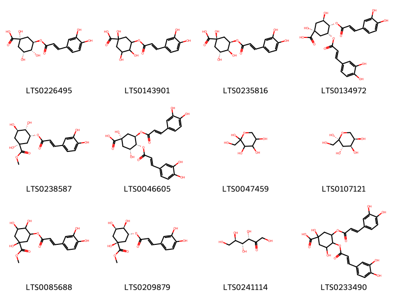{ width=100% }
    <figcaption>Hình ảnh cấu trúc hóa học của 12 hoạt chất thuộc nhóm Organooxygen compounds gồm ['chlorogenic acid (LTS0226495)', '3-{[3-(3,4-dihydroxyphenyl)prop-2-enoyl]oxy}-1,4,5-trihydroxycyclohexane-1-carboxylic acid (LTS0143901)', 'neochlorogenic acid (LTS0235816)', '3,4-dicaffeoylquinic acid (LTS0134972)', 'methyl (1r,3r,4s,5r)-3-{[(2e)-3-(3,4-dihydroxyphenyl)prop-2-enoyl]oxy}-1,4,5-trihydroxycyclohexane-1-carboxylate (LTS0238587)', '4,5-dicaffeoylquinic acid (LTS0046605)', 'laevosan (LTS0047459)', 'β-d-fructopyranose (LTS0107121)', 'methyl 3-{[3-(3,4-dihydroxyphenyl)prop-2-enoyl]oxy}-1,4,5-trihydroxycyclohexane-1-carboxylate (LTS0085688)', 'methyl chlorogenate (LTS0209879)', 'keto-d-fructose (LTS0241114)', '3,4-bis({[3-(3,4-dihydroxyphenyl)prop-2-enoyl]oxy})-1,5-dihydroxycyclohexane-1-carboxylic acid (LTS0233490)'].</figcaption>
</figure>
#### Nhóm Steroids and steroid derivatives
<figure markdown="span">
    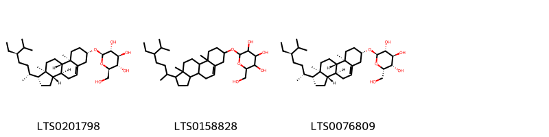{ width=100% }
    <figcaption>Hình ảnh cấu trúc hóa học của 3 hoạt chất thuộc nhóm Steroids and steroid derivatives gồm ['sitogluside (LTS0201798)', '2-{[1-(5-ethyl-6-methylheptan-2-yl)-9a,11a-dimethyl-1h,2h,3h,3ah,3bh,4h,6h,7h,8h,9h,9bh,10h,11h-cyclopenta[a]phenanthren-7-yl]oxy}-6-(hydroxymethyl)oxane-3,4,5-triol (LTS0158828)', '(2r,3r,4s,5s,6s)-2-{[(1r,3as,3bs,7s,9ar,9bs,11ar)-1-[(2r,5r)-5-ethyl-6-methylheptan-2-yl]-9a,11a-dimethyl-1h,2h,3h,3ah,3bh,4h,6h,7h,8h,9h,9bh,10h,11h-cyclopenta[a]phenanthren-7-yl]oxy}-6-(hydroxymethyl)oxane-3,4,5-triol (LTS0076809)'].</figcaption>
</figure>
#### Nhóm Unsaturated hydrocarbons
<figure markdown="span">
    { width=100% }
    <figcaption>Hình ảnh cấu trúc hóa học của 2 hoạt chất thuộc nhóm Unsaturated hydrocarbons gồm ['trideca-1,11-dien-3,5,7,9-tetrayne (LTS0196083)', '(11e)-trideca-1,11-dien-3,5,7,9-tetrayne (LTS0023235)'].</figcaption>
</figure>

---

### Dược dân tộc học

Danh sách các quốc gia có sử dụng *Centaurea jacea* trong điều trị các bệnh. 

| Country   | Disease                               | Bệnh                                                                                                                                                                                                |
|:----------|:--------------------------------------|:----------------------------------------------------------------------------------------------------------------------------------------------------------------------------------------------------|
| Turkey    | Diuretic, Stomachic, Tonic, Vulnerary | MYMEMORY WARNING: YOU USED ALL AVAILABLE FREE TRANSLATIONS FOR TODAY. NEXT AVAILABLE IN  09 HOURS 13 MINUTES 22 SECONDS VISIT HTTPS://MYMEMORY.TRANSLATED.NET/DOC/USAGELIMITS.PHP TO TRANSLATE MORE |

---

---
## Centaurea montana
### Thông tin về thực vật

!!! info "Phân loại thực vật của *Centaurea montana* từ GIBF:"
    - **Kingdom:** Plantae
    - **Phylum:** Tracheophyta
    - **Order:** Asterales
    - **Family:** Asteraceae
    - **Genus:** Centaurea
    - **Species:** *Centaurea montana*

 

| Label (VI)   | Label (EN)   | Scientific Name   | Descriptions (VI)   | Descriptions (EN)   | Also Known As (VI)   | Also Known As (EN)   |
|:-------------|:-------------|:------------------|:--------------------|:--------------------|:---------------------|:---------------------|
| N/A          | N/A          | Centaurea montana | loài thực vật       | species of plant    | ['']                 | ['']                 |

#### Phân bố trên thế giới

**Từ CSDL GIBF** Italy, Belgium, Slovakia, Canada, Ukraine, Denmark, Netherlands, Luxembourg, Russian Federation, United States of America, Sweden, Chile, Croatia, Czechia, Germany, Switzerland, Austria, France, United Kingdom of Great Britain and Northern Ireland

#### Phân bố tại Việt Nam

**Từ CSDL GIBF**: Không có ghi nhận ở Việt Nam

---
### Thành phần hóa học
        
- Theo cơ sở dữ liệu lotus: Từ loài *Centaurea montana* đã phân lập và xác định được 115 hoạt chất thuộc về các nhóm Fatty Acyls, Lignan glycosides, Flavonoids, Indoles and derivatives, Cinnamic acids and derivatives, Unsaturated hydrocarbons, Organooxygen compounds, Furanoid lignans. 

|    | chemicalTaxonomyClassyfireClass   |   smiles_count |
|---:|:----------------------------------|---------------:|
|  0 | Cinnamic acids and derivatives    |              3 |
|  1 | Fatty Acyls                       |             64 |
|  2 | Flavonoids                        |             11 |
|  3 | Furanoid lignans                  |              4 |
|  4 | Indoles and derivatives           |              9 |
|  5 | Lignan glycosides                 |              8 |
|  6 | Organooxygen compounds            |              3 |
|  7 | Unsaturated hydrocarbons          |             13 |

#### Nhóm Cinnamic acids and derivatives
<figure markdown="span">
    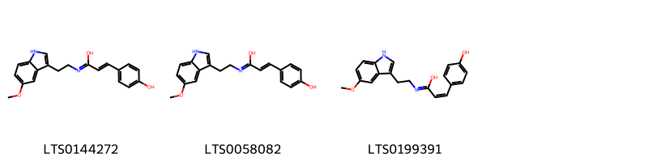{ width=100% }
    <figcaption>Hình ảnh cấu trúc hóa học của 3 hoạt chất thuộc nhóm Cinnamic acids and derivatives gồm ['3-(4-hydroxyphenyl)-n-[2-(5-methoxy-1h-indol-3-yl)ethyl]prop-2-enimidic acid (LTS0144272)', '(2e)-3-(4-hydroxyphenyl)-n-[2-(5-methoxy-1h-indol-3-yl)ethyl]prop-2-enimidic acid (LTS0058082)', '(2z)-3-(4-hydroxyphenyl)-n-[2-(5-methoxy-1h-indol-3-yl)ethyl]prop-2-enimidic acid (LTS0199391)'].</figcaption>
</figure>
#### Nhóm Fatty Acyls
<figure markdown="span">
    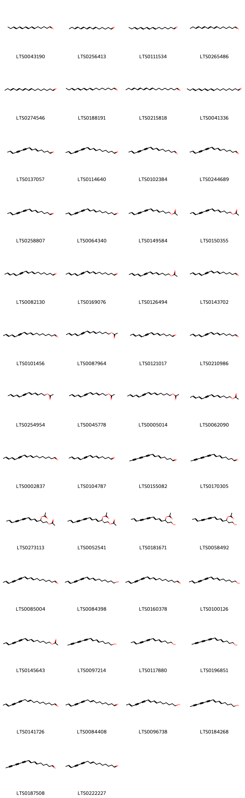{ width=100% }
    <figcaption>Hình ảnh cấu trúc hóa học của 64 hoạt chất thuộc nhóm Fatty Acyls gồm ['(6e,8e,10e,12e)-pentadeca-6,8,10,12-tetraenal (LTS0043190)', 'pentadeca-6,8,10,12-tetraenal (LTS0256413)', '(7e,9e,11e,13e)-hexadeca-7,9,11,13-tetraenal (LTS0111534)', 'hexadeca-7,9,11,13-tetraenal (LTS0265486)', 'heptadeca-8,10,12,14-tetraenal (LTS0274546)', '(8e,10e,12e,14e)-heptadeca-8,10,12,14-tetraenal (LTS0188191)', 'octadeca-9,11,13,15-tetraenal (LTS0215818)', '(9e,11e,13e,15e)-octadeca-9,11,13,15-tetraenal (LTS0041336)', 'pentadeca-5,7,13-trien-9,11-diynal (LTS0137057)', 'heptadeca-7,9,15-trien-11,13-diynal (LTS0114640)', '(6e,8e,14e)-hexadeca-6,8,14-trien-10,12-diynal (LTS0102384)', 'hexadeca-6,8,14-trien-10,12-diynal (LTS0244689)', '(5e,7e,13e)-pentadeca-5,7,13-trien-9,11-diynal (LTS0258807)', '(7e,9e,15e)-heptadeca-7,9,15-trien-11,13-diynal (LTS0064340)', '(4e,6e,12e)-tetradeca-4,6,12-trien-8,10-diyn-1-yl acetate (LTS0149584)', 'tetradeca-4,6,12-trien-8,10-diyn-1-yl acetate (LTS0150355)', 'heptadeca-7,9,13,15-tetraen-11-ynal (LTS0082130)', '(7e,9e,13e,15e)-heptadeca-7,9,13,15-tetraen-11-ynal (LTS0169076)', '(4e,6e,10e,12e)-tetradeca-4,6,10,12-tetraen-8-yn-1-yl acetate (LTS0126494)', '(6e,8e,12e,14e)-hexadeca-6,8,12,14-tetraen-10-ynal (LTS0143702)', '(8e,10e,14e,16e)-octadeca-8,10,14,16-tetraen-12-ynal (LTS0101456)', '(5e,7e,11e,13e)-pentadeca-5,7,11,13-tetraen-9-yn-1-yl acetate (LTS0087964)', '(5e,7e,11e,13e)-pentadeca-5,7,11,13-tetraen-9-ynal (LTS0121017)', 'hexadeca-6,8,12,14-tetraen-10-ynal (LTS0210986)', 'trideca-3,5,9,11-tetraen-7-yn-1-yl acetate (LTS0254954)', '(3e,5e,9e,11e)-trideca-3,5,9,11-tetraen-7-yn-1-yl acetate (LTS0045778)', 'pentadeca-5,7,11,13-tetraen-9-yn-1-yl acetate (LTS0005014)', 'tetradeca-4,6,10,12-tetraen-8-yn-1-yl acetate (LTS0062090)', 'octadeca-8,10,14,16-tetraen-12-ynal (LTS0002837)', 'pentadeca-5,7,11,13-tetraen-9-ynal (LTS0104787)', '(5e,7e)-pentadeca-5,7-dien-9,11,13-triynal (LTS0155082)', 'pentadeca-5,7-dien-9,11,13-triynal (LTS0170305)', '1-(acetyloxy)tetradeca-4,6,12-trien-8,10-diyn-3-yl acetate (LTS0273113)', '(3s,4e,6e,12e)-1-(acetyloxy)tetradeca-4,6,12-trien-8,10-diyn-3-yl acetate (LTS0052541)', '1-hydroxytetradeca-4,6,12-trien-8,10-diyn-3-yl acetate (LTS0181671)', '(3s,4e,6e,12e)-1-hydroxytetradeca-4,6,12-trien-8,10-diyn-3-yl acetate (LTS0058492)', '(8e,10e,16e)-octadeca-8,10,16-trien-12,14-diynal (LTS0085004)', 'heptadeca-7,9,15-trien-11,13-diyn-1-ol (LTS0084398)', 'octadeca-8,10,16-trien-12,14-diynal (LTS0160378)', 'hexadeca-6,8,14-trien-10,12-diyn-1-ol (LTS0100126)', '(6e,8e,14e)-hexadeca-6,8,14-trien-10,12-diyn-1-yl acetate (LTS0145643)', 'pentadeca-5,7-dien-9,11,13-triyn-1-ol (LTS0097214)', 'tetradeca-4,6,12-trien-8,10-diyn-1-ol (LTS0117880)', 'tetradeca-4,6-dien-8,10,12-triyn-1-ol (LTS0196851)', '(9e,16e)-octadeca-9,16-dien-12,14-diynal (LTS0141726)', 'heptadeca-8,15-dien-11,13-diynal (LTS0084408)', '(7e,9e,15e)-heptadeca-7,9,15-trien-11,13-diyn-1-ol (LTS0096738)', '(5e,7e)-pentadeca-5,7-dien-9,11,13-triyn-1-ol (LTS0184268)', '(6e,8e)-hexadeca-6,8-dien-10,12,14-triynal (LTS0187508)', '(8e,15e)-heptadeca-8,15-dien-11,13-diynal (LTS0222227)', '(3r,4e,6e,12e)-tetradeca-4,6,12-trien-8,10-diyne-1,3-diol (LTS0170588)', '(4e,6e,12e)-tetradeca-4,6,12-trien-8,10-diyn-1-ol (LTS0069016)', 'hexadeca-6,8,14-trien-10,12-diyn-1-yl acetate (LTS0166802)', '(5e,7e,13e)-pentadeca-5,7,13-trien-9,11-diyn-1-ol (LTS0025747)', '3-hydroxytetradeca-4,6,12-trien-8,10-diyn-1-yl acetate (LTS0244521)', '(6e,8e,14e)-hexadeca-6,8,14-trien-10,12-diyn-1-ol (LTS0198393)', '(5e,7e,13e)-pentadeca-5,7,13-trien-9,11-diyn-1-yl acetate (LTS0028558)', '(3r,4e,6e,12e)-3-hydroxytetradeca-4,6,12-trien-8,10-diyn-1-yl acetate (LTS0008498)', 'pentadeca-5,7,13-trien-9,11-diyn-1-ol (LTS0016643)', 'octadeca-9,16-dien-12,14-diynal (LTS0106940)', '(4e,6e)-tetradeca-4,6-dien-8,10,12-triyn-1-ol (LTS0108867)', 'tetradeca-4,6,12-trien-8,10-diyne-1,3-diol (LTS0044814)', 'pentadeca-5,7,13-trien-9,11-diyn-1-yl acetate (LTS0047108)', 'hexadeca-6,8-dien-10,12,14-triynal (LTS0127098)'].</figcaption>
</figure>
#### Nhóm Flavonoids
<figure markdown="span">
    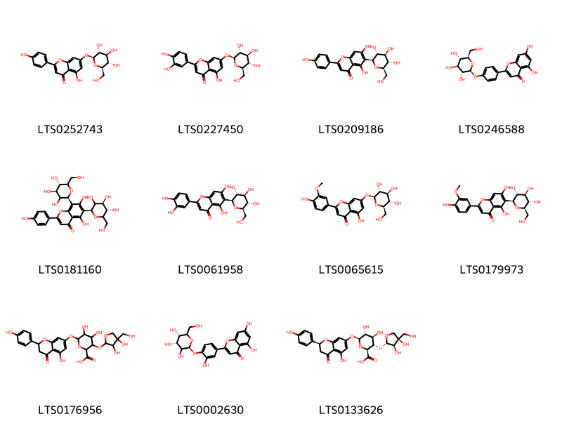{ width=100% }
    <figcaption>Hình ảnh cấu trúc hóa học của 11 hoạt chất thuộc nhóm Flavonoids gồm ['apigenin 7-o-β-glucoside (LTS0252743)', 'luteolin 7-o-glucoside (LTS0227450)', 'isovitexin (LTS0209186)', '5,7-dihydroxy-2-(4-{[(2s,3r,4s,5s,6r)-3,4,5-trihydroxy-6-(hydroxymethyl)oxan-2-yl]oxy}phenyl)chromen-4-one (LTS0246588)', 'vicenin 2 (LTS0181160)', 'isoorientin (LTS0061958)', '5-hydroxy-2-(4-hydroxy-3-methoxyphenyl)-7-{[(2s,3r,4s,5s,6r)-3,4,5-trihydroxy-6-(hydroxymethyl)oxan-2-yl]oxy}chromen-4-one (LTS0065615)', 'isoscoparin (LTS0179973)', '3-{[3,4-dihydroxy-4-(hydroxymethyl)oxolan-2-yl]oxy}-4,5-dihydroxy-6-{[5-hydroxy-2-(4-hydroxyphenyl)-4-oxo-2,3-dihydro-1-benzopyran-7-yl]oxy}oxane-2-carboxylic acid (LTS0176956)', '5,7-dihydroxy-2-(3-hydroxy-4-{[(2s,4r,5s)-3,4,5-trihydroxy-6-(hydroxymethyl)oxan-2-yl]oxy}phenyl)chromen-4-one (LTS0002630)', '(2s,3s,4r,5r,6s)-3-{[(2s,3r,4r)-3,4-dihydroxy-4-(hydroxymethyl)oxolan-2-yl]oxy}-4,5-dihydroxy-6-{[(2s)-5-hydroxy-2-(4-hydroxyphenyl)-4-oxo-2,3-dihydro-1-benzopyran-7-yl]oxy}oxane-2-carboxylic acid (LTS0133626)'].</figcaption>
</figure>
#### Nhóm Furanoid lignans
<figure markdown="span">
    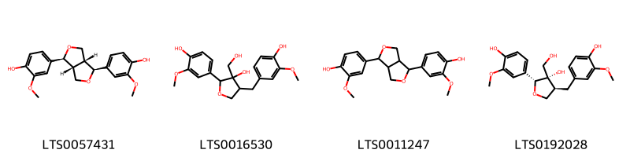{ width=100% }
    <figcaption>Hình ảnh cấu trúc hóa học của 4 hoạt chất thuộc nhóm Furanoid lignans gồm ['pinoresinol (LTS0057431)', '2-(4-hydroxy-3-methoxyphenyl)-4-[(4-hydroxy-3-methoxyphenyl)methyl]-3-(hydroxymethyl)oxolan-3-ol (LTS0016530)', 'pinoresinol (LTS0011247)', '(2r,3s,4s)-2-(4-hydroxy-3-methoxyphenyl)-4-[(4-hydroxy-3-methoxyphenyl)methyl]-3-(hydroxymethyl)oxolan-3-ol (LTS0192028)'].</figcaption>
</figure>
#### Nhóm Indoles and derivatives
<figure markdown="span">
    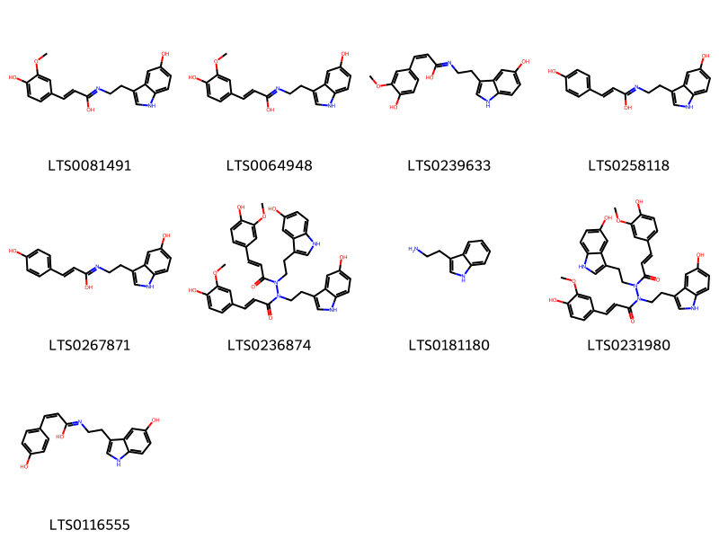{ width=100% }
    <figcaption>Hình ảnh cấu trúc hóa học của 9 hoạt chất thuộc nhóm Indoles and derivatives gồm ['n-[2-(5-hydroxy-1h-indol-3-yl)ethyl]-3-(4-hydroxy-3-methoxyphenyl)prop-2-enimidic acid (LTS0081491)', '(2e)-n-[2-(5-hydroxy-1h-indol-3-yl)ethyl]-3-(4-hydroxy-3-methoxyphenyl)prop-2-enimidic acid (LTS0064948)', '(2z)-n-[2-(5-hydroxy-1h-indol-3-yl)ethyl]-3-(4-hydroxy-3-methoxyphenyl)prop-2-enimidic acid (LTS0239633)', 'n-[2-(5-hydroxy-1h-indol-3-yl)ethyl]-3-(4-hydroxyphenyl)prop-2-enimidic acid (LTS0258118)', '(2e)-n-[2-(5-hydroxy-1h-indol-3-yl)ethyl]-3-(4-hydroxyphenyl)prop-2-enimidic acid (LTS0267871)', "(2e)-n,n'-bis[2-(5-hydroxy-1h-indol-3-yl)ethyl]-3-(4-hydroxy-3-methoxyphenyl)-n'-[(2e)-3-(4-hydroxy-3-methoxyphenyl)prop-2-enoyl]prop-2-enehydrazide (LTS0236874)", 'tryptamine (LTS0181180)', "n,n'-bis[2-(5-hydroxy-1h-indol-3-yl)ethyl]-3-(4-hydroxy-3-methoxyphenyl)-n'-[3-(4-hydroxy-3-methoxyphenyl)prop-2-enoyl]prop-2-enehydrazide (LTS0231980)", '(2z)-n-[2-(5-hydroxy-1h-indol-3-yl)ethyl]-3-(4-hydroxyphenyl)prop-2-enimidic acid (LTS0116555)'].</figcaption>
</figure>
#### Nhóm Lignan glycosides
<figure markdown="span">
    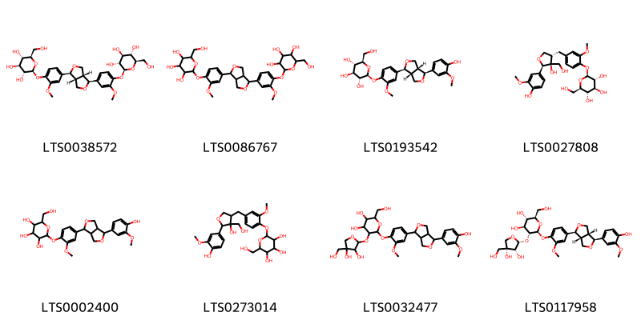{ width=100% }
    <figcaption>Hình ảnh cấu trúc hóa học của 8 hoạt chất thuộc nhóm Lignan glycosides gồm ['(2s,3r,4s,5s,6r)-2-{4-[(1s,3ar,4s,6ar)-4-(3-methoxy-4-{[(2s,3r,4s,5s,6r)-3,4,5-trihydroxy-6-(hydroxymethyl)oxan-2-yl]oxy}phenyl)-hexahydrofuro[3,4-c]furan-1-yl]-2-methoxyphenoxy}-6-(hydroxymethyl)oxane-3,4,5-triol (LTS0038572)', '2-(hydroxymethyl)-6-{2-methoxy-4-[4-(3-methoxy-4-{[3,4,5-trihydroxy-6-(hydroxymethyl)oxan-2-yl]oxy}phenyl)-hexahydrofuro[3,4-c]furan-1-yl]phenoxy}oxane-3,4,5-triol (LTS0086767)', '(2s,3r,4s,5s,6r)-2-{4-[(1s,3ar,4s,6ar)-4-(4-hydroxy-3-methoxyphenyl)-hexahydrofuro[3,4-c]furan-1-yl]-2-methoxyphenoxy}-6-(hydroxymethyl)oxane-3,4,5-triol (LTS0193542)', '(2s,3r,4s,5s,6r)-2-(4-{[(3s,4s,5r)-4-hydroxy-5-(4-hydroxy-3-methoxyphenyl)-4-(hydroxymethyl)oxolan-3-yl]methyl}-2-methoxyphenoxy)-6-(hydroxymethyl)oxane-3,4,5-triol (LTS0027808)', '2-{4-[4-(4-hydroxy-3-methoxyphenyl)-hexahydrofuro[3,4-c]furan-1-yl]-2-methoxyphenoxy}-6-(hydroxymethyl)oxane-3,4,5-triol (LTS0002400)', '2-(4-{[4-hydroxy-5-(4-hydroxy-3-methoxyphenyl)-4-(hydroxymethyl)oxolan-3-yl]methyl}-2-methoxyphenoxy)-6-(hydroxymethyl)oxane-3,4,5-triol (LTS0273014)', '5-{[3,4-dihydroxy-4-(hydroxymethyl)oxolan-2-yl]oxy}-6-{4-[4-(4-hydroxy-3-methoxyphenyl)-hexahydrofuro[3,4-c]furan-1-yl]-2-methoxyphenoxy}-2-(hydroxymethyl)oxane-3,4-diol (LTS0032477)', '(2r,3s,4s,5r,6s)-6-{4-[(1s,3ar,4s,6ar)-4-(4-hydroxy-3-methoxyphenyl)-hexahydrofuro[3,4-c]furan-1-yl]-2-methoxyphenoxy}-5-{[(2r,3r,4r)-3,4-dihydroxy-4-(hydroxymethyl)oxolan-2-yl]oxy}-2-(hydroxymethyl)oxane-3,4-diol (LTS0117958)'].</figcaption>
</figure>
#### Nhóm Organooxygen compounds
<figure markdown="span">
    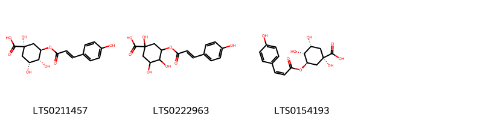{ width=100% }
    <figcaption>Hình ảnh cấu trúc hóa học của 3 hoạt chất thuộc nhóm Organooxygen compounds gồm ['(1s,3r,4r,5r)-1,3,4-trihydroxy-5-{[(2e)-3-(4-hydroxyphenyl)prop-2-enoyl]oxy}cyclohexane-1-carboxylic acid (LTS0211457)', '1,3,4-trihydroxy-5-{[3-(4-hydroxyphenyl)prop-2-enoyl]oxy}cyclohexane-1-carboxylic acid (LTS0222963)', '(z)-5-p-coumaroylquinic acid (LTS0154193)'].</figcaption>
</figure>
#### Nhóm Unsaturated hydrocarbons
<figure markdown="span">
    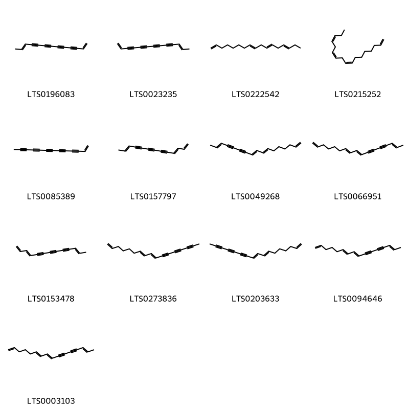{ width=100% }
    <figcaption>Hình ảnh cấu trúc hóa học của 13 hoạt chất thuộc nhóm Unsaturated hydrocarbons gồm ['trideca-1,11-dien-3,5,7,9-tetrayne (LTS0196083)', '(11e)-trideca-1,11-dien-3,5,7,9-tetrayne (LTS0023235)', 'heptadeca-1,8,11,14-tetraene (LTS0222542)', 'aplotaxene (LTS0215252)', 'tridec-1-en-3,5,7,9,11-pentayne (LTS0085389)', 'trideca-1,3,11-trien-5,7,9-triyne (LTS0157797)', 'heptadeca-1,7,9,15-tetraen-11,13-diyne (LTS0049268)', '(7e,9e,15e)-heptadeca-1,7,9,15-tetraen-11,13-diyne (LTS0066951)', '(3e,11e)-trideca-1,3,11-trien-5,7,9-triyne (LTS0153478)', '(7e,9e)-heptadeca-1,7,9-trien-11,13,15-triyne (LTS0273836)', 'heptadeca-1,7,9-trien-11,13,15-triyne (LTS0203633)', 'hexadeca-1,6,8,14-tetraen-10,12-diyne (LTS0094646)', '(6e,8e,14e)-hexadeca-1,6,8,14-tetraen-10,12-diyne (LTS0003103)'].</figcaption>
</figure>

---

### Dược dân tộc học

Danh sách các quốc gia có sử dụng *Centaurea montana* trong điều trị các bệnh. 

| Country   | Disease                                    | Bệnh                                                                                                                                                                                                |
|:----------|:-------------------------------------------|:----------------------------------------------------------------------------------------------------------------------------------------------------------------------------------------------------|
| Dutch     | Emmenagogue                                | MYMEMORY WARNING: YOU USED ALL AVAILABLE FREE TRANSLATIONS FOR TODAY. NEXT AVAILABLE IN  09 HOURS 12 MINUTES 52 SECONDS VISIT HTTPS://MYMEMORY.TRANSLATED.NET/DOC/USAGELIMITS.PHP TO TRANSLATE MORE |
| French    | Tonic                                      | MYMEMORY WARNING: YOU USED ALL AVAILABLE FREE TRANSLATIONS FOR TODAY. NEXT AVAILABLE IN  09 HOURS 12 MINUTES 49 SECONDS VISIT HTTPS://MYMEMORY.TRANSLATED.NET/DOC/USAGELIMITS.PHP TO TRANSLATE MORE |
| US        | Astringent, Collyrium, Diuretic, Stimulant | MYMEMORY WARNING: YOU USED ALL AVAILABLE FREE TRANSLATIONS FOR TODAY. NEXT AVAILABLE IN  09 HOURS 12 MINUTES 47 SECONDS VISIT HTTPS://MYMEMORY.TRANSLATED.NET/DOC/USAGELIMITS.PHP TO TRANSLATE MORE |

---

---
## Centaurea nigra
### Thông tin về thực vật

!!! info "Phân loại thực vật của *Centaurea nigra* từ GIBF:"
    - **Kingdom:** Plantae
    - **Phylum:** Tracheophyta
    - **Order:** Asterales
    - **Family:** Asteraceae
    - **Genus:** Centaurea
    - **Species:** *Centaurea nigra*

 

| Label (VI)   | Label (EN)   | Scientific Name   | Descriptions (VI)   | Descriptions (EN)   | Also Known As (VI)   | Also Known As (EN)                |
|:-------------|:-------------|:------------------|:--------------------|:--------------------|:---------------------|:----------------------------------|
| N/A          | N/A          | Centaurea nigra   | loài thực vật       | species of plant    | ['']                 | ['hardhead', 'hardhead knapweed'] |

#### Phân bố trên thế giới

**Từ CSDL GIBF** Denmark, United Kingdom of Great Britain and Northern Ireland, Germany, Spain, Ireland, France, New Zealand, Canada

#### Phân bố tại Việt Nam

**Từ CSDL GIBF**: Không có ghi nhận ở Việt Nam

---
### Thành phần hóa học
        
- Theo cơ sở dữ liệu lotus: Từ loài *Centaurea nigra* đã phân lập và xác định được 22 hoạt chất thuộc về các nhóm Flavonoids, Prenol lipids, Steroids and steroid derivatives, Indoles and derivatives, Furanoid lignans, Lignan glycosides. 

|    | chemicalTaxonomyClassyfireClass   |   smiles_count |
|---:|:----------------------------------|---------------:|
|  0 | Flavonoids                        |              2 |
|  1 | Furanoid lignans                  |              2 |
|  2 | Indoles and derivatives           |              4 |
|  3 | Lignan glycosides                 |              2 |
|  4 | Prenol lipids                     |              6 |
|  5 | Steroids and steroid derivatives  |              5 |

#### Nhóm Flavonoids
<figure markdown="span">
    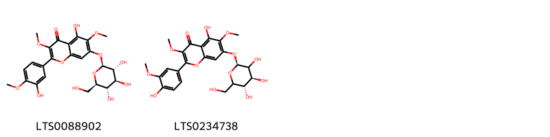{ width=100% }
    <figcaption>Hình ảnh cấu trúc hóa học của 2 hoạt chất thuộc nhóm Flavonoids gồm ['centaurein (LTS0088902)', 'jacein (LTS0234738)'].</figcaption>
</figure>
#### Nhóm Furanoid lignans
<figure markdown="span">
    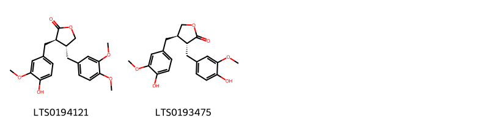{ width=100% }
    <figcaption>Hình ảnh cấu trúc hóa học của 2 hoạt chất thuộc nhóm Furanoid lignans gồm ['(-)-arctigenin (LTS0194121)', 'matairesinol (LTS0193475)'].</figcaption>
</figure>
#### Nhóm Indoles and derivatives
<figure markdown="span">
    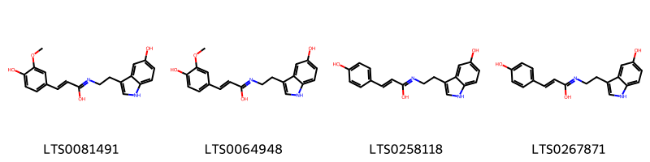{ width=100% }
    <figcaption>Hình ảnh cấu trúc hóa học của 4 hoạt chất thuộc nhóm Indoles and derivatives gồm ['n-[2-(5-hydroxy-1h-indol-3-yl)ethyl]-3-(4-hydroxy-3-methoxyphenyl)prop-2-enimidic acid (LTS0081491)', '(2e)-n-[2-(5-hydroxy-1h-indol-3-yl)ethyl]-3-(4-hydroxy-3-methoxyphenyl)prop-2-enimidic acid (LTS0064948)', 'n-[2-(5-hydroxy-1h-indol-3-yl)ethyl]-3-(4-hydroxyphenyl)prop-2-enimidic acid (LTS0258118)', '(2e)-n-[2-(5-hydroxy-1h-indol-3-yl)ethyl]-3-(4-hydroxyphenyl)prop-2-enimidic acid (LTS0267871)'].</figcaption>
</figure>
#### Nhóm Lignan glycosides
<figure markdown="span">
    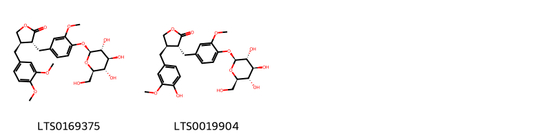{ width=100% }
    <figcaption>Hình ảnh cấu trúc hóa học của 2 hoạt chất thuộc nhóm Lignan glycosides gồm ['arctiin (LTS0169375)', '(3r,4r)-4-[(4-hydroxy-3-methoxyphenyl)methyl]-3-[(3-methoxy-4-{[(2s,3r,4s,5s,6r)-3,4,5-trihydroxy-6-(hydroxymethyl)oxan-2-yl]oxy}phenyl)methyl]oxolan-2-one (LTS0019904)'].</figcaption>
</figure>
#### Nhóm Prenol lipids
<figure markdown="span">
    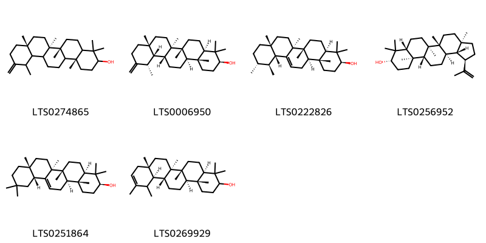{ width=100% }
    <figcaption>Hình ảnh cấu trúc hóa học của 6 hoạt chất thuộc nhóm Prenol lipids gồm ['(6ar,6br,8ar,14br)-4,4,6a,6b,8a,12,14b-heptamethyl-11-methylidene-hexadecahydropicen-3-ol (LTS0274865)', 'taraxasterol (LTS0006950)', 'amyrin (LTS0222826)', 'lupeol (LTS0256952)', 'β-amyrin (LTS0251864)', '(4ar,6ar,6br,8as,12ar,12br,14ar,14br)-4,4,6a,6b,8a,11,12,14b-octamethyl-2,3,4a,5,6,7,8,9,12,12a,12b,13,14,14a-tetradecahydro-1h-picen-3-ol (LTS0269929)'].</figcaption>
</figure>
#### Nhóm Steroids and steroid derivatives
<figure markdown="span">
    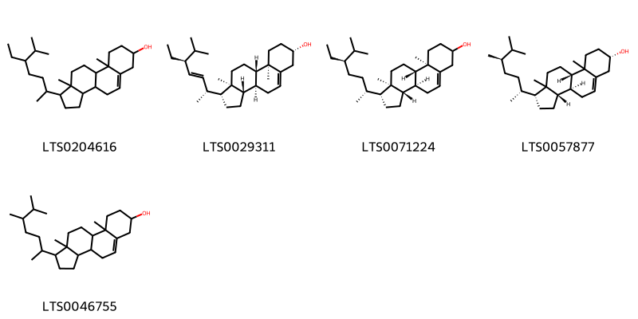{ width=100% }
    <figcaption>Hình ảnh cấu trúc hóa học của 5 hoạt chất thuộc nhóm Steroids and steroid derivatives gồm ['stigmast-5-en-3-ol, (3β)- (LTS0204616)', 'phytosterol (LTS0029311)', 'stigmast-5-en-3-ol (LTS0071224)', '(1r,3as,3bs,7s,9bs)-1-[(2r,5r)-5,6-dimethylheptan-2-yl]-9a,11a-dimethyl-1h,2h,3h,3ah,3bh,4h,6h,7h,8h,9h,9bh,10h,11h-cyclopenta[a]phenanthren-7-ol (LTS0057877)', 'campesterol (LTS0046755)'].</figcaption>
</figure>

---

### Dược dân tộc học

Danh sách các quốc gia có sử dụng *Centaurea nigra* trong điều trị các bệnh. 

| Country   | Disease                      | Bệnh                                                                                                                                                                                                |
|:----------|:-----------------------------|:----------------------------------------------------------------------------------------------------------------------------------------------------------------------------------------------------|
| Dutch     | Sudorific                    | MYMEMORY WARNING: YOU USED ALL AVAILABLE FREE TRANSLATIONS FOR TODAY. NEXT AVAILABLE IN  09 HOURS 12 MINUTES 09 SECONDS VISIT HTTPS://MYMEMORY.TRANSLATED.NET/DOC/USAGELIMITS.PHP TO TRANSLATE MORE |
| Elsewhere | Diuretic, Tonic, Diaphoretic | MYMEMORY WARNING: YOU USED ALL AVAILABLE FREE TRANSLATIONS FOR TODAY. NEXT AVAILABLE IN  09 HOURS 12 MINUTES 07 SECONDS VISIT HTTPS://MYMEMORY.TRANSLATED.NET/DOC/USAGELIMITS.PHP TO TRANSLATE MORE |
| French    | Tonic                        | MYMEMORY WARNING: YOU USED ALL AVAILABLE FREE TRANSLATIONS FOR TODAY. NEXT AVAILABLE IN  09 HOURS 12 MINUTES 04 SECONDS VISIT HTTPS://MYMEMORY.TRANSLATED.NET/DOC/USAGELIMITS.PHP TO TRANSLATE MORE |
| US        | Diuretic                     | MYMEMORY WARNING: YOU USED ALL AVAILABLE FREE TRANSLATIONS FOR TODAY. NEXT AVAILABLE IN  09 HOURS 12 MINUTES 02 SECONDS VISIT HTTPS://MYMEMORY.TRANSLATED.NET/DOC/USAGELIMITS.PHP TO TRANSLATE MORE |

---

---
## Centaurea rhaponticum
### Thông tin về thực vật

!!! info "Phân loại thực vật của *Leuzea rhapontica* từ GIBF:"
    - **Kingdom:** Plantae
    - **Phylum:** Tracheophyta
    - **Order:** Asterales
    - **Family:** Asteraceae
    - **Genus:** Leuzea
    - **Species:** *Leuzea rhapontica*

 

| Label (VI)   | Label (EN)   | Scientific Name   | Descriptions (VI)   | Descriptions (EN)   | Also Known As (VI)   | Also Known As (EN)                |
|:-------------|:-------------|:------------------|:--------------------|:--------------------|:---------------------|:----------------------------------|
| N/A          | N/A          | Centaurea nigra   | loài thực vật       | species of plant    | ['']                 | ['hardhead', 'hardhead knapweed'] |

#### Phân bố trên thế giới

**Từ CSDL GIBF** nan, Netherlands, Italy, Germany, Switzerland, unknown or invalid, Austria, France

#### Phân bố tại Việt Nam

**Từ CSDL GIBF**: Không có ghi nhận ở Việt Nam

---
### Thành phần hóa học
        
- Theo cơ sở dữ liệu lotus: Từ loài *Leuzea rhapontica* đã phân lập và xác định được Chưa có hoạt chất nào được phân lập. hoạt chất thuộc về các nhóm Không có hoạt chất nào được phân lập. 

Không có hình ảnh nào được tạo ra

---

### Dược dân tộc học

Danh sách các quốc gia có sử dụng *Leuzea rhapontica* trong điều trị các bệnh. 

| Country   | Disease   | Bệnh                                                                                                                                                                                                |
|:----------|:----------|:----------------------------------------------------------------------------------------------------------------------------------------------------------------------------------------------------|
| Elsewhere | Purgative | MYMEMORY WARNING: YOU USED ALL AVAILABLE FREE TRANSLATIONS FOR TODAY. NEXT AVAILABLE IN  09 HOURS 11 MINUTES 22 SECONDS VISIT HTTPS://MYMEMORY.TRANSLATED.NET/DOC/USAGELIMITS.PHP TO TRANSLATE MORE |

---

---
## Centaurea scabiosa
### Thông tin về thực vật

!!! info "Phân loại thực vật của *Centaurea scabiosa* từ GIBF:"
    - **Kingdom:** Plantae
    - **Phylum:** Tracheophyta
    - **Order:** Asterales
    - **Family:** Asteraceae
    - **Genus:** Centaurea
    - **Species:** *Centaurea scabiosa*

 

| Label (VI)   | Label (EN)   | Scientific Name    | Descriptions (VI)   | Descriptions (EN)   | Also Known As (VI)   | Also Known As (EN)   |
|:-------------|:-------------|:-------------------|:--------------------|:--------------------|:---------------------|:---------------------|
| N/A          | N/A          | Centaurea scabiosa | loài thực vật       | species of plant    | ['']                 | ['']                 |

#### Phân bố trên thế giới

**Từ CSDL GIBF** Ukraine, Denmark, Netherlands, Italy, Czechia, Germany, Belgium, Spain, Poland, Hungary, Switzerland, Russian Federation, Sweden, Austria, France, Norway, United Kingdom of Great Britain and Northern Ireland

#### Phân bố tại Việt Nam

**Từ CSDL GIBF**: Không có ghi nhận ở Việt Nam

---
### Thành phần hóa học
        
- Theo cơ sở dữ liệu lotus: Từ loài *Centaurea scabiosa* đã phân lập và xác định được 26 hoạt chất thuộc về các nhóm Fatty Acyls, Prenol lipids, Unsaturated hydrocarbons, Coumarins and derivatives, Furanoid lignans, Lignan glycosides. 

|    | chemicalTaxonomyClassyfireClass   |   smiles_count |
|---:|:----------------------------------|---------------:|
|  0 | Coumarins and derivatives         |              2 |
|  1 | Fatty Acyls                       |             10 |
|  2 | Furanoid lignans                  |              2 |
|  3 | Lignan glycosides                 |              1 |
|  4 | Prenol lipids                     |              4 |
|  5 | Unsaturated hydrocarbons          |              7 |

#### Nhóm Coumarins and derivatives
<figure markdown="span">
    { width=100% }
    <figcaption>Hình ảnh cấu trúc hóa học của 2 hoạt chất thuộc nhóm Coumarins and derivatives gồm ['scopoletin (LTS0193112)', 'umbelliferone (LTS0162728)'].</figcaption>
</figure>
#### Nhóm Fatty Acyls
<figure markdown="span">
    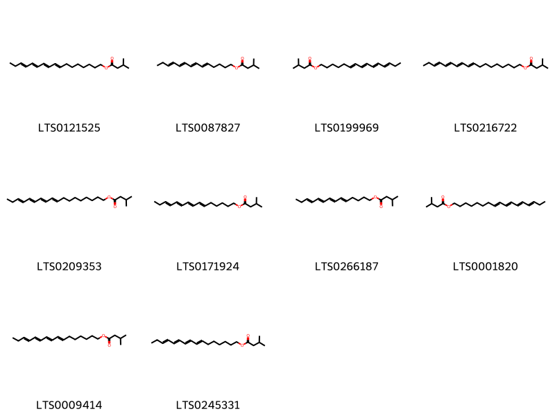{ width=100% }
    <figcaption>Hình ảnh cấu trúc hóa học của 10 hoạt chất thuộc nhóm Fatty Acyls gồm ['(8e,10e,12e,14e)-heptadeca-8,10,12,14-tetraen-1-yl 3-methylbutanoate (LTS0121525)', 'tetradeca-5,7,9,11-tetraen-1-yl 3-methylbutanoate (LTS0087827)', 'pentadeca-6,8,10,12-tetraen-1-yl 3-methylbutanoate (LTS0199969)', 'octadeca-9,11,13,15-tetraen-1-yl 3-methylbutanoate (LTS0216722)', '(9e,11e,13e,15e)-octadeca-9,11,13,15-tetraen-1-yl 3-methylbutanoate (LTS0209353)', '(6e,8e,10e,12e)-pentadeca-6,8,10,12-tetraen-1-yl 3-methylbutanoate (LTS0171924)', '(5e,7e,9e,11e)-tetradeca-5,7,9,11-tetraen-1-yl 3-methylbutanoate (LTS0266187)', 'heptadeca-8,10,12,14-tetraen-1-yl 3-methylbutanoate (LTS0001820)', '(7e,9e,11e,13e)-hexadeca-7,9,11,13-tetraen-1-yl 3-methylbutanoate (LTS0009414)', 'hexadeca-7,9,11,13-tetraen-1-yl 3-methylbutanoate (LTS0245331)'].</figcaption>
</figure>
#### Nhóm Furanoid lignans
<figure markdown="span">
    { width=100% }
    <figcaption>Hình ảnh cấu trúc hóa học của 2 hoạt chất thuộc nhóm Furanoid lignans gồm ['(-)-arctigenin (LTS0194121)', 'matairesinol (LTS0193475)'].</figcaption>
</figure>
#### Nhóm Lignan glycosides
<figure markdown="span">
    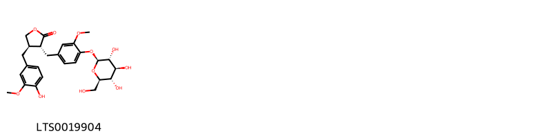{ width=100% }
    <figcaption>Hình ảnh cấu trúc hóa học của 1 hoạt chất thuộc nhóm Lignan glycosides gồm ['(3r,4r)-4-[(4-hydroxy-3-methoxyphenyl)methyl]-3-[(3-methoxy-4-{[(2s,3r,4s,5s,6r)-3,4,5-trihydroxy-6-(hydroxymethyl)oxan-2-yl]oxy}phenyl)methyl]oxolan-2-one (LTS0019904)'].</figcaption>
</figure>
#### Nhóm Prenol lipids
<figure markdown="span">
    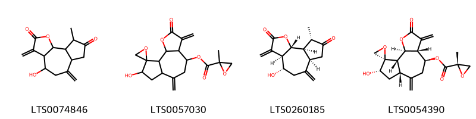{ width=100% }
    <figcaption>Hình ảnh cấu trúc hóa học của 4 hoạt chất thuộc nhóm Prenol lipids gồm ['4-hydroxy-9-methyl-3,6-dimethylidene-octahydroazuleno[4,5-b]furan-2,8-dione (LTS0074846)', "8-hydroxy-3,6-dimethylidene-2-oxo-octahydrospiro[azuleno[4,5-b]furan-9,2'-oxiran]-4-yl 2-methyloxirane-2-carboxylate (LTS0057030)", 'grosheimin (LTS0260185)', "(3ar,4s,6ar,8s,9r,9as,9bs)-8-hydroxy-3,6-dimethylidene-2-oxo-octahydrospiro[azuleno[4,5-b]furan-9,2'-oxiran]-4-yl (2s)-2-methyloxirane-2-carboxylate (LTS0054390)"].</figcaption>
</figure>
#### Nhóm Unsaturated hydrocarbons
<figure markdown="span">
    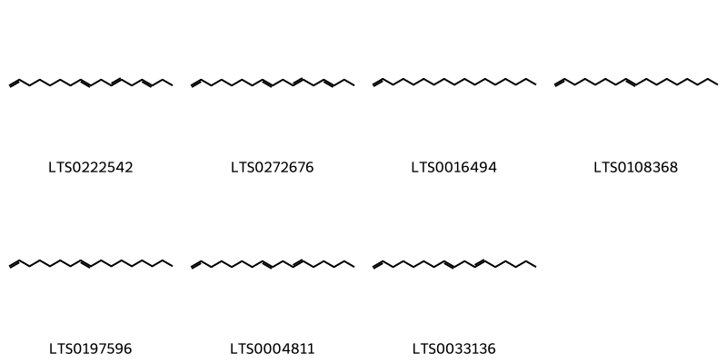{ width=100% }
    <figcaption>Hình ảnh cấu trúc hóa học của 7 hoạt chất thuộc nhóm Unsaturated hydrocarbons gồm ['heptadeca-1,8,11,14-tetraene (LTS0222542)', '(8e,11e,14e)-heptadeca-1,8,11,14-tetraene (LTS0272676)', 'heptadecene (LTS0016494)', '(8e)-heptadeca-1,8-diene (LTS0108368)', 'heptadeca-1,8-diene (LTS0197596)', '(8e,11e)-heptadeca-1,8,11-triene (LTS0004811)', 'heptadeca-1,8,11-triene (LTS0033136)'].</figcaption>
</figure>

---

### Dược dân tộc học

Danh sách các quốc gia có sử dụng *Centaurea scabiosa* trong điều trị các bệnh. 

| Country   | Disease          | Bệnh                                                                                                                                                                                                |
|:----------|:-----------------|:----------------------------------------------------------------------------------------------------------------------------------------------------------------------------------------------------|
| Turkey    | Tonic, Vulnerary | MYMEMORY WARNING: YOU USED ALL AVAILABLE FREE TRANSLATIONS FOR TODAY. NEXT AVAILABLE IN  09 HOURS 11 MINUTES 02 SECONDS VISIT HTTPS://MYMEMORY.TRANSLATED.NET/DOC/USAGELIMITS.PHP TO TRANSLATE MORE |

---

# Chi Lychnophora

??? note "Danh sách các dược liệu thuộc chi"
    
	 - *Lychnophora brunioides*

---
## Lychnophora brunioides
### Thông tin về thực vật

!!! info "Phân loại thực vật của *Lychnophora brunioides* từ GIBF:"
    - **Kingdom:** Plantae
    - **Phylum:** Tracheophyta
    - **Order:** Asterales
    - **Family:** Asteraceae
    - **Genus:** Lychnophora
    - **Species:** *Lychnophora brunioides*

 

| Label (VI)   | Label (EN)   | Scientific Name        | Descriptions (VI)   | Descriptions (EN)   | Also Known As (VI)   | Also Known As (EN)   |
|:-------------|:-------------|:-----------------------|:--------------------|:--------------------|:---------------------|:---------------------|
| N/A          | N/A          | Lychnophora brunioides | loài thực vật       | species of plant    | ['']                 | ['']                 |

#### Phân bố trên thế giới

**Từ CSDL GIBF** nan, Brazil

#### Phân bố tại Việt Nam

**Từ CSDL GIBF**: Không có ghi nhận ở Việt Nam

---
### Thành phần hóa học
        
- Theo cơ sở dữ liệu lotus: Từ loài *Lychnophora brunioides* đã phân lập và xác định được Chưa có hoạt chất nào được phân lập. hoạt chất thuộc về các nhóm Không có hoạt chất nào được phân lập. 

Không có hình ảnh nào được tạo ra

---

### Dược dân tộc học

Danh sách các quốc gia có sử dụng *Lychnophora brunioides* trong điều trị các bệnh. 

| Country   | Disease   | Bệnh                                                                                                                                                                                                |
|:----------|:----------|:----------------------------------------------------------------------------------------------------------------------------------------------------------------------------------------------------|
| Brazil    | Tonic     | MYMEMORY WARNING: YOU USED ALL AVAILABLE FREE TRANSLATIONS FOR TODAY. NEXT AVAILABLE IN  09 HOURS 10 MINUTES 34 SECONDS VISIT HTTPS://MYMEMORY.TRANSLATED.NET/DOC/USAGELIMITS.PHP TO TRANSLATE MORE |

---

# Chi Epaltes

??? note "Danh sách các dược liệu thuộc chi"
    
	 - *Epaltes divaricata*

---
## Epaltes divaricata
### Thông tin về thực vật

!!! info "Phân loại thực vật của *Epaltes divaricata* từ GIBF:"
    - **Kingdom:** Plantae
    - **Phylum:** Tracheophyta
    - **Order:** Asterales
    - **Family:** Asteraceae
    - **Genus:** Epaltes
    - **Species:** *Epaltes divaricata*

 

| Label (VI)   | Label (EN)   | Scientific Name    | Descriptions (VI)   | Descriptions (EN)   | Also Known As (VI)   | Also Known As (EN)   |
|:-------------|:-------------|:-------------------|:--------------------|:--------------------|:---------------------|:---------------------|
| N/A          | N/A          | Epaltes divaricata | loài thực vật       | species of plant    | ['']                 | ['']                 |

#### Phân bố trên thế giới

**Từ CSDL GIBF** nan, Sri Lanka, Myanmar, India, Indonesia, unknown or invalid, Norfolk Island, Viet Nam, China

#### Phân bố tại Việt Nam

**Từ CSDL GIBF**: Không có ghi nhận ở Việt Nam

---
### Thành phần hóa học
        
- Theo cơ sở dữ liệu lotus: Từ loài *Epaltes divaricata* đã phân lập và xác định được Chưa có hoạt chất nào được phân lập. hoạt chất thuộc về các nhóm Không có hoạt chất nào được phân lập. 

Không có hình ảnh nào được tạo ra

---

### Dược dân tộc học

Danh sách các quốc gia có sử dụng *Epaltes divaricata* trong điều trị các bệnh. 

| Country   | Disease           | Bệnh                                                                                                                                                                                                |
|:----------|:------------------|:----------------------------------------------------------------------------------------------------------------------------------------------------------------------------------------------------|
| India     | Astringent, Tonic | MYMEMORY WARNING: YOU USED ALL AVAILABLE FREE TRANSLATIONS FOR TODAY. NEXT AVAILABLE IN  09 HOURS 10 MINUTES 16 SECONDS VISIT HTTPS://MYMEMORY.TRANSLATED.NET/DOC/USAGELIMITS.PHP TO TRANSLATE MORE |

---

# Chi Balsamorhiza

??? note "Danh sách các dược liệu thuộc chi"
    
	 - *Balsamorhiza sagittata*

---
## Balsamorhiza sagittata
### Thông tin về thực vật

!!! info "Phân loại thực vật của *Wyethia sagittata* từ GIBF:"
    - **Kingdom:** Plantae
    - **Phylum:** Tracheophyta
    - **Order:** Asterales
    - **Family:** Asteraceae
    - **Genus:** Wyethia
    - **Species:** *Wyethia sagittata*

 

| Label (VI)   | Label (EN)   | Scientific Name        | Descriptions (VI)   | Descriptions (EN)   | Also Known As (VI)   | Also Known As (EN)   |
|:-------------|:-------------|:-----------------------|:--------------------|:--------------------|:---------------------|:---------------------|
| N/A          | N/A          | Balsamorhiza sagittata |                     | species of plant    | ['']                 | ['']                 |

#### Phân bố trên thế giới

**Từ CSDL GIBF** United States of America, Canada

#### Phân bố tại Việt Nam

**Từ CSDL GIBF**: Không có ghi nhận ở Việt Nam

---
### Thành phần hóa học
        
- Theo cơ sở dữ liệu lotus: Từ loài *Wyethia sagittata* đã phân lập và xác định được 75 hoạt chất thuộc về các nhóm Fatty Acyls, Flavonoids, Prenol lipids, Steroids and steroid derivatives, Cinnamic acids and derivatives, Thiophenes, Unsaturated hydrocarbons, Lactones, Carboxylic acids and derivatives. 

|    | chemicalTaxonomyClassyfireClass   |   smiles_count |
|---:|:----------------------------------|---------------:|
|  0 | Carboxylic acids and derivatives  |             12 |
|  1 | Cinnamic acids and derivatives    |              2 |
|  2 | Fatty Acyls                       |              2 |
|  3 | Flavonoids                        |              7 |
|  4 | Lactones                          |              1 |
|  5 | Prenol lipids                     |             30 |
|  6 | Steroids and steroid derivatives  |             16 |
|  7 | Thiophenes                        |              2 |
|  8 | Unsaturated hydrocarbons          |              3 |

#### Nhóm Carboxylic acids and derivatives
<figure markdown="span">
    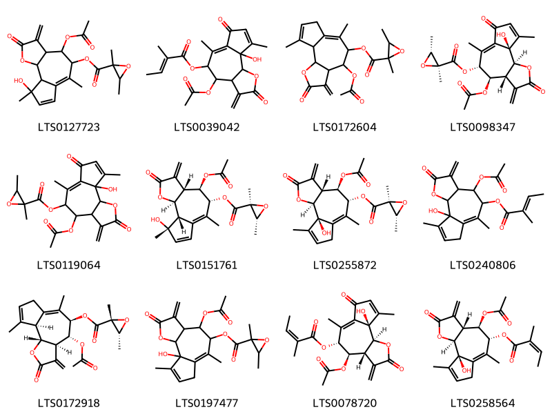{ width=100% }
    <figcaption>Hình ảnh cấu trúc hóa học của 12 hoạt chất thuộc nhóm Carboxylic acids and derivatives gồm ['4-(acetyloxy)-9-hydroxy-6,9-dimethyl-3-methylidene-2-oxo-3ah,4h,5h,9ah,9bh-azuleno[4,5-b]furan-5-yl 2,3-dimethyloxirane-2-carboxylate (LTS0127723)', '4-(acetyloxy)-9a-hydroxy-6,9-dimethyl-3-methylidene-2,7-dioxo-3ah,4h,5h,9bh-azuleno[4,5-b]furan-5-yl 2-methylbut-2-enoate (LTS0039042)', '4-(acetyloxy)-6,9-dimethyl-3-methylidene-2-oxo-3ah,4h,5h,7h,9ah,9bh-azuleno[4,5-b]furan-5-yl 2,3-dimethyloxirane-2-carboxylate (LTS0172604)', '(3ar,4r,5r,9ar,9bs)-4-(acetyloxy)-9a-hydroxy-6,9-dimethyl-3-methylidene-2,7-dioxo-3ah,4h,5h,9bh-azuleno[4,5-b]furan-5-yl (2s,3r)-2,3-dimethyloxirane-2-carboxylate (LTS0098347)', '4-(acetyloxy)-9a-hydroxy-6,9-dimethyl-3-methylidene-2,7-dioxo-3ah,4h,5h,9bh-azuleno[4,5-b]furan-5-yl 2,3-dimethyloxirane-2-carboxylate (LTS0119064)', '(3as,4r,5r,9s,9as,9bs)-4-(acetyloxy)-9-hydroxy-6,9-dimethyl-3-methylidene-2-oxo-3ah,4h,5h,9ah,9bh-azuleno[4,5-b]furan-5-yl (2s,3r)-2,3-dimethyloxirane-2-carboxylate (LTS0151761)', '(3ar,4r,5r,9ar,9bs)-4-(acetyloxy)-9a-hydroxy-6,9-dimethyl-3-methylidene-2-oxo-3ah,4h,5h,7h,9bh-azuleno[4,5-b]furan-5-yl (2s,3r)-2,3-dimethyloxirane-2-carboxylate (LTS0255872)', '4-(acetyloxy)-9a-hydroxy-6,9-dimethyl-3-methylidene-2-oxo-3ah,4h,5h,7h,9bh-azuleno[4,5-b]furan-5-yl 2-methylbut-2-enoate (LTS0240806)', '(3as,4r,5r,9as,9br)-4-(acetyloxy)-6,9-dimethyl-3-methylidene-2-oxo-3ah,4h,5h,7h,9ah,9bh-azuleno[4,5-b]furan-5-yl (2r,3r)-2,3-dimethyloxirane-2-carboxylate (LTS0172918)', '4-(acetyloxy)-9a-hydroxy-6,9-dimethyl-3-methylidene-2-oxo-3ah,4h,5h,7h,9bh-azuleno[4,5-b]furan-5-yl 2,3-dimethyloxirane-2-carboxylate (LTS0197477)', '(3ar,4r,5r,9ar,9bs)-4-(acetyloxy)-9a-hydroxy-6,9-dimethyl-3-methylidene-2,7-dioxo-3ah,4h,5h,9bh-azuleno[4,5-b]furan-5-yl (2z)-2-methylbut-2-enoate (LTS0078720)', '(3ar,4r,5r,9ar,9bs)-4-(acetyloxy)-9a-hydroxy-6,9-dimethyl-3-methylidene-2-oxo-3ah,4h,5h,7h,9bh-azuleno[4,5-b]furan-5-yl (2z)-2-methylbut-2-enoate (LTS0258564)'].</figcaption>
</figure>
#### Nhóm Cinnamic acids and derivatives
<figure markdown="span">
    { width=100% }
    <figcaption>Hình ảnh cấu trúc hóa học của 2 hoạt chất thuộc nhóm Cinnamic acids and derivatives gồm ['cinnamic acid (LTS0128130)', 'phenylacrylic acid (LTS0097258)'].</figcaption>
</figure>
#### Nhóm Fatty Acyls
<figure markdown="span">
    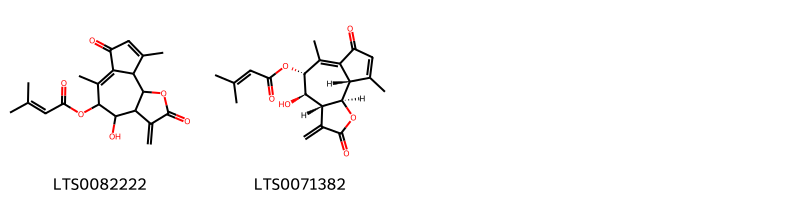{ width=100% }
    <figcaption>Hình ảnh cấu trúc hóa học của 2 hoạt chất thuộc nhóm Fatty Acyls gồm ['4-hydroxy-6,9-dimethyl-3-methylidene-2,7-dioxo-3ah,4h,5h,9ah,9bh-azuleno[4,5-b]furan-5-yl 3-methylbut-2-enoate (LTS0082222)', '(3ar,4r,5r,9as,9br)-4-hydroxy-6,9-dimethyl-3-methylidene-2,7-dioxo-3ah,4h,5h,9ah,9bh-azuleno[4,5-b]furan-5-yl 3-methylbut-2-enoate (LTS0071382)'].</figcaption>
</figure>
#### Nhóm Flavonoids
<figure markdown="span">
    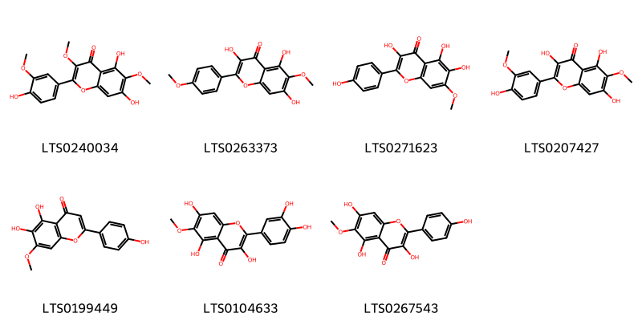{ width=100% }
    <figcaption>Hình ảnh cấu trúc hóa học của 7 hoạt chất thuộc nhóm Flavonoids gồm ['jaceidin (LTS0240034)', 'betuletol (LTS0263373)', '3,5,6-trihydroxy-2-(4-hydroxyphenyl)-7-methoxychromen-4-one (LTS0271623)', 'spinacetin (LTS0207427)', 'sorbifolin (LTS0199449)', 'patuletin (LTS0104633)', '6-methoxykaempferol (LTS0267543)'].</figcaption>
</figure>
#### Nhóm Lactones
<figure markdown="span">
    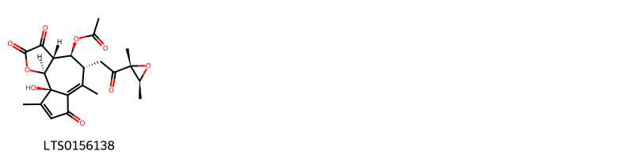{ width=100% }
    <figcaption>Hình ảnh cấu trúc hóa học của 1 hoạt chất thuộc nhóm Lactones gồm ['(3ar,4s,5r,9ar,9bs)-5-{2-[(2r,3s)-2,3-dimethyloxiran-2-yl]-2-oxoethyl}-9a-hydroxy-6,9-dimethyl-2,3,7-trioxo-3ah,4h,5h,9bh-azuleno[4,5-b]furan-4-yl acetate (LTS0156138)'].</figcaption>
</figure>
#### Nhóm Prenol lipids
<figure markdown="span">
    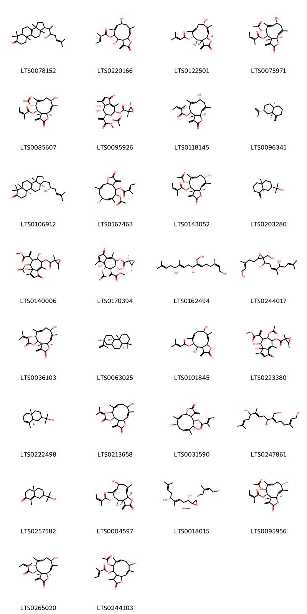{ width=100% }
    <figcaption>Hình ảnh cấu trúc hóa học của 30 hoạt chất thuộc nhóm Prenol lipids gồm ['1-(3-hydroxy-6-methylhept-5-en-2-yl)-3a,6,6,9a,11a-pentamethyl-1h,2h,3h,4h,5h,5ah,8h,9h,10h,11h-cyclopenta[a]phenanthren-7-one (LTS0078152)', '4,8-dihydroxy-6,10-dimethyl-3-methylidene-2-oxo-3ah,4h,5h,8h,9h,11ah-cyclodeca[b]furan-5-yl 2-methylbut-2-enoate (LTS0220166)', '(3ar,4r,5r,9r,11ar)-4,9-dihydroxy-6,10-dimethyl-3-methylidene-2-oxo-3ah,4h,5h,8h,9h,11ah-cyclodeca[b]furan-5-yl 3-methylbut-2-enoate (LTS0122501)', '(3as,4r,5r,8s,11ar)-5-(acetyloxy)-8-hydroxy-6,10-dimethyl-3-methylidene-2-oxo-3ah,4h,5h,8h,9h,11ah-cyclodeca[b]furan-4-yl (2z)-2-methylbut-2-enoate (LTS0075971)', '(3as,4r,5r,9r,11ar)-5-(acetyloxy)-9-hydroxy-6,10-dimethyl-3-methylidene-2-oxo-3ah,4h,5h,8h,9h,11ah-cyclodeca[b]furan-4-yl (2z)-2-methylbut-2-enoate (LTS0085607)', '(5r,6r,7s,8s,8ar)-6-(acetyloxy)-8,8a-dihydroxy-7-(3-methoxy-3-oxoprop-1-en-2-yl)-1,4-dimethyl-3-oxo-5,6,7,8-tetrahydroazulen-5-yl (2s,3r)-2,3-dimethyloxirane-2-carboxylate (LTS0095926)', '(3as,4r,5r,8r,11ar)-5,8-dihydroxy-6,10-dimethyl-3-methylidene-2-oxo-3ah,4h,5h,8h,9h,11ah-cyclodeca[b]furan-4-yl (2z)-2-methylbut-2-enoate (LTS0118145)', 'β-selinene (LTS0096341)', '(1r,3ar,5ar,9as,11ar)-1-[(2s,3s)-3-hydroxy-6-methylhept-5-en-2-yl]-3a,6,6,9a,11a-pentamethyl-1h,2h,3h,4h,5h,5ah,8h,9h,10h,11h-cyclopenta[a]phenanthren-7-one (LTS0106912)', '5-(acetyloxy)-8-hydroxy-6,10-dimethyl-3-methylidene-2-oxo-3ah,4h,5h,8h,9h,11ah-cyclodeca[b]furan-4-yl 2-methylbut-2-enoate (LTS0167463)', '(3as,4r,5r,9s,11ar)-5-(acetyloxy)-9-hydroxy-6,10-dimethyl-3-methylidene-2-oxo-3ah,4h,5h,8h,9h,11ah-cyclodeca[b]furan-4-yl (2z)-2-methylbut-2-enoate (LTS0143052)', 'β-eudesmol (LTS0203280)', '8-(acetyloxy)-6,8a-dihydroxy-7-(3-methoxy-3-oxoprop-1-en-2-yl)-1,4-dimethyl-3-oxo-5,6,7,8-tetrahydroazulen-5-yl 2,3-dimethyloxirane-2-carboxylate (LTS0140006)', '(5r,6r,7r,8s,8ar)-8-(acetyloxy)-6,8a-dihydroxy-7-(3-methoxy-3-oxoprop-1-en-2-yl)-1,4-dimethyl-3-oxo-5,6,7,8-tetrahydroazulen-5-yl (2s,3r)-2,3-dimethyloxirane-2-carboxylate (LTS0170394)', '(2z,6e,8r,10e,12r)-7-(hydroxymethyl)-3,11,15-trimethylhexadeca-2,6,10,14-tetraene-1,8,12-triol (LTS0162494)', '1-[3-(5-hydroxy-3-methylpent-3-en-1-yl)-2-(hydroxymethyl)oxiran-2-yl]-4,8-dimethylnona-3,7-diene-1,5-diol (LTS0244017)', '(3as,4r,5r,9r,11ar)-5,9-dihydroxy-6,10-dimethyl-3-methylidene-2-oxo-3ah,4h,5h,8h,9h,11ah-cyclodeca[b]furan-4-yl 3-methylbut-2-enoate (LTS0036103)', 'ent-kaurene (LTS0063025)', '4,9-dihydroxy-6,10-dimethyl-3-methylidene-2-oxo-3ah,4h,5h,8h,9h,11ah-cyclodeca[b]furan-5-yl 3-methylbut-2-enoate (LTS0101845)', '6-(acetyloxy)-8,8a-dihydroxy-7-(3-methoxy-3-oxoprop-1-en-2-yl)-1,4-dimethyl-3-oxo-5,6,7,8-tetrahydroazulen-5-yl 2,3-dimethyloxirane-2-carboxylate (LTS0223380)', 'α-eudesmol (LTS0222498)', '5,9-dihydroxy-6,10-dimethyl-3-methylidene-2-oxo-3ah,4h,5h,8h,9h,11ah-cyclodeca[b]furan-4-yl 3-methylbut-2-enoate (LTS0213658)', '5,9-dihydroxy-6,10-dimethyl-3-methylidene-2-oxo-3ah,4h,5h,8h,9h,11ah-cyclodeca[b]furan-4-yl 2-methylbut-2-enoate (LTS0031590)', '7-(hydroxymethyl)-3,11,15-trimethylhexadeca-2,6,10,14-tetraene-1,8,12-triol (LTS0247861)', '(4as,7r)-7-(2-hydroxypropan-2-yl)-1,4a-dimethyl-3,4,5,6,7,8-hexahydronaphthalen-2-one (LTS0257582)', '(3ar,4r,5r,8s,11ar)-4,8-dihydroxy-6,10-dimethyl-3-methylidene-2-oxo-3ah,4h,5h,8h,9h,11ah-cyclodeca[b]furan-5-yl (2z)-2-methylbut-2-enoate (LTS0004597)', '(1s,3e,5r)-1-[(2s,3s)-3-[(3z)-5-hydroxy-3-methylpent-3-en-1-yl]-2-(hydroxymethyl)oxiran-2-yl]-4,8-dimethylnona-3,7-diene-1,5-diol (LTS0018015)', '(3as,4r,5s,9s,11ar)-5-(acetyloxy)-9-hydroxy-6,10-dimethyl-3-methylidene-2-oxo-3ah,4h,5h,8h,9h,11ah-cyclodeca[b]furan-4-yl (2z)-2-methylbut-2-enoate (LTS0095956)', '(3as,4r,5r,9r,11ar)-5,9-dihydroxy-6,10-dimethyl-3-methylidene-2-oxo-3ah,4h,5h,8h,9h,11ah-cyclodeca[b]furan-4-yl (2z)-2-methylbut-2-enoate (LTS0265020)', '5-(acetyloxy)-9-hydroxy-6,10-dimethyl-3-methylidene-2-oxo-3ah,4h,5h,8h,9h,11ah-cyclodeca[b]furan-4-yl 2-methylbut-2-enoate (LTS0244103)'].</figcaption>
</figure>
#### Nhóm Steroids and steroid derivatives
<figure markdown="span">
    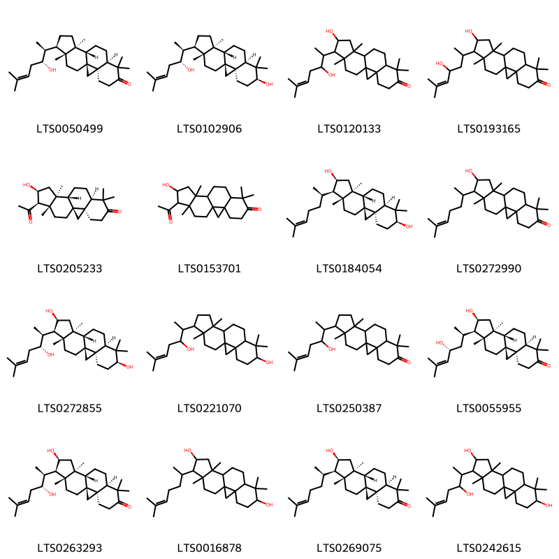{ width=100% }
    <figcaption>Hình ảnh cấu trúc hóa học của 16 hoạt chất thuộc nhóm Steroids and steroid derivatives gồm ['(1s,3r,8r,11s,12s,15r,16r)-15-[(2s,3r)-3-hydroxy-6-methylhept-5-en-2-yl]-7,7,12,16-tetramethylpentacyclo[9.7.0.0¹,³.0³,⁸.0¹²,¹⁶]octadecan-6-one (LTS0050499)', '(1s,3r,6s,8r,11s,12s,15r,16r)-15-[(2s,3r)-3-hydroxy-6-methylhept-5-en-2-yl]-7,7,12,16-tetramethylpentacyclo[9.7.0.0¹,³.0³,⁸.0¹²,¹⁶]octadecan-6-ol (LTS0102906)', '14-hydroxy-15-(3-hydroxy-6-methylhept-5-en-2-yl)-7,7,12,16-tetramethylpentacyclo[9.7.0.0¹,³.0³,⁸.0¹²,¹⁶]octadecan-6-one (LTS0120133)', '14-hydroxy-15-(4-hydroxy-6-methylhept-5-en-2-yl)-7,7,12,16-tetramethylpentacyclo[9.7.0.0¹,³.0³,⁸.0¹²,¹⁶]octadecan-6-one (LTS0193165)', '(1s,3r,8r,11s,12s,14s,15r,16r)-15-acetyl-14-hydroxy-7,7,12,16-tetramethylpentacyclo[9.7.0.0¹,³.0³,⁸.0¹²,¹⁶]octadecan-6-one (LTS0205233)', '15-acetyl-14-hydroxy-7,7,12,16-tetramethylpentacyclo[9.7.0.0¹,³.0³,⁸.0¹²,¹⁶]octadecan-6-one (LTS0153701)', '(1s,3r,6s,8r,11s,12s,14s,15r,16r)-7,7,12,16-tetramethyl-15-[(2r)-6-methylhept-5-en-2-yl]pentacyclo[9.7.0.0¹,³.0³,⁸.0¹²,¹⁶]octadecane-6,14-diol (LTS0184054)', '14-hydroxy-7,7,12,16-tetramethyl-15-(6-methylhept-5-en-2-yl)pentacyclo[9.7.0.0¹,³.0³,⁸.0¹²,¹⁶]octadecan-6-one (LTS0272990)', '(1s,3r,6s,8r,11s,12s,14s,15r,16r)-15-[(2s,3r)-3-hydroxy-6-methylhept-5-en-2-yl]-7,7,12,16-tetramethylpentacyclo[9.7.0.0¹,³.0³,⁸.0¹²,¹⁶]octadecane-6,14-diol (LTS0272855)', '15-(3-hydroxy-6-methylhept-5-en-2-yl)-7,7,12,16-tetramethylpentacyclo[9.7.0.0¹,³.0³,⁸.0¹²,¹⁶]octadecan-6-ol (LTS0221070)', '15-(3-hydroxy-6-methylhept-5-en-2-yl)-7,7,12,16-tetramethylpentacyclo[9.7.0.0¹,³.0³,⁸.0¹²,¹⁶]octadecan-6-one (LTS0250387)', '(1s,3r,8r,11s,12s,14s,15r,16r)-14-hydroxy-15-[(2r,4r)-4-hydroxy-6-methylhept-5-en-2-yl]-7,7,12,16-tetramethylpentacyclo[9.7.0.0¹,³.0³,⁸.0¹²,¹⁶]octadecan-6-one (LTS0055955)', '(1s,3r,8r,11s,12s,14s,15r,16r)-14-hydroxy-15-[(2s,3r)-3-hydroxy-6-methylhept-5-en-2-yl]-7,7,12,16-tetramethylpentacyclo[9.7.0.0¹,³.0³,⁸.0¹²,¹⁶]octadecan-6-one (LTS0263293)', '7,7,12,16-tetramethyl-15-(6-methylhept-5-en-2-yl)pentacyclo[9.7.0.0¹,³.0³,⁸.0¹²,¹⁶]octadecane-6,14-diol (LTS0016878)', '(1s,3r,8r,11s,12s,14s,15r,16r)-14-hydroxy-7,7,12,16-tetramethyl-15-[(2r)-6-methylhept-5-en-2-yl]pentacyclo[9.7.0.0¹,³.0³,⁸.0¹²,¹⁶]octadecan-6-one (LTS0269075)', '15-(3-hydroxy-6-methylhept-5-en-2-yl)-7,7,12,16-tetramethylpentacyclo[9.7.0.0¹,³.0³,⁸.0¹²,¹⁶]octadecane-6,14-diol (LTS0242615)'].</figcaption>
</figure>
#### Nhóm Thiophenes
<figure markdown="span">
    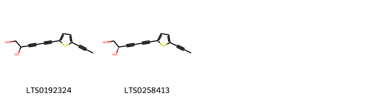{ width=100% }
    <figcaption>Hình ảnh cấu trúc hóa học của 2 hoạt chất thuộc nhóm Thiophenes gồm ['6-[5-(prop-1-yn-1-yl)thiophen-2-yl]hexa-3,5-diyne-1,2-diol (LTS0192324)', '(2r)-6-[5-(prop-1-yn-1-yl)thiophen-2-yl]hexa-3,5-diyne-1,2-diol (LTS0258413)'].</figcaption>
</figure>
#### Nhóm Unsaturated hydrocarbons
<figure markdown="span">
    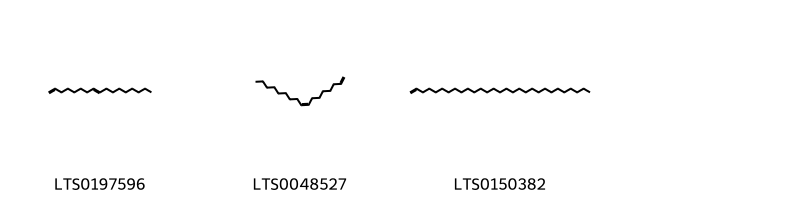{ width=100% }
    <figcaption>Hình ảnh cấu trúc hóa học của 3 hoạt chất thuộc nhóm Unsaturated hydrocarbons gồm ['heptadeca-1,8-diene (LTS0197596)', '(8z)-heptadeca-1,8-diene (LTS0048527)', '1-nonacosene (LTS0150382)'].</figcaption>
</figure>

---

### Dược dân tộc học

Danh sách các quốc gia có sử dụng *Wyethia sagittata* trong điều trị các bệnh. 

| Country      | Disease                      | Bệnh                                                                                                                                                                                                |
|:-------------|:-----------------------------|:----------------------------------------------------------------------------------------------------------------------------------------------------------------------------------------------------|
| US(Flathead) | Diuretic, Poultice, Laxative | MYMEMORY WARNING: YOU USED ALL AVAILABLE FREE TRANSLATIONS FOR TODAY. NEXT AVAILABLE IN  09 HOURS 09 MINUTES 51 SECONDS VISIT HTTPS://MYMEMORY.TRANSLATED.NET/DOC/USAGELIMITS.PHP TO TRANSLATE MORE |

---

# Chi Nidorella

??? note "Danh sách các dược liệu thuộc chi"
    
	 - *Nidorella hirta*

---
## Nidorella hirta
### Thông tin về thực vật

!!! info "Phân loại thực vật của *Nidorella resedifolia* từ GIBF:"
    - **Kingdom:** Plantae
    - **Phylum:** Tracheophyta
    - **Order:** Asterales
    - **Family:** Asteraceae
    - **Genus:** Nidorella
    - **Species:** *Nidorella resedifolia*

 

| Label (VI)   | Label (EN)   | Scientific Name   | Descriptions (VI)   | Descriptions (EN)   | Also Known As (VI)   | Also Known As (EN)   |
|:-------------|:-------------|:------------------|:--------------------|:--------------------|:---------------------|:---------------------|
| N/A          | N/A          | Nidorella hirta   |                     |                     | ['']                 | ['']                 |

#### Phân bố trên thế giới

**Từ CSDL GIBF** United States of America, Canada

#### Phân bố tại Việt Nam

**Từ CSDL GIBF**: Không có ghi nhận ở Việt Nam

---
### Thành phần hóa học
        
- Theo cơ sở dữ liệu lotus: Từ loài *Nidorella resedifolia* đã phân lập và xác định được Chưa có hoạt chất nào được phân lập. hoạt chất thuộc về các nhóm Không có hoạt chất nào được phân lập. 

Không có hình ảnh nào được tạo ra

---

### Dược dân tộc học

Danh sách các quốc gia có sử dụng *Nidorella resedifolia* trong điều trị các bệnh. 

| Country   | Disease   | Bệnh                                                                                                                                                                                                |
|:----------|:----------|:----------------------------------------------------------------------------------------------------------------------------------------------------------------------------------------------------|
| Lesotho   | Fumigant  | MYMEMORY WARNING: YOU USED ALL AVAILABLE FREE TRANSLATIONS FOR TODAY. NEXT AVAILABLE IN  09 HOURS 09 MINUTES 25 SECONDS VISIT HTTPS://MYMEMORY.TRANSLATED.NET/DOC/USAGELIMITS.PHP TO TRANSLATE MORE |

---

# Chi Tithonia

??? note "Danh sách các dược liệu thuộc chi"
    
	 - *Tithonia rotundifolia*

---
## Tithonia rotundifolia
### Thông tin về thực vật

!!! info "Phân loại thực vật của *Tithonia rotundifolia* từ GIBF:"
    - **Kingdom:** Plantae
    - **Phylum:** Tracheophyta
    - **Order:** Asterales
    - **Family:** Asteraceae
    - **Genus:** Tithonia
    - **Species:** *Tithonia rotundifolia*

 

| Label (VI)   | Label (EN)   | Scientific Name       | Descriptions (VI)   | Descriptions (EN)                 | Also Known As (VI)                        | Also Known As (EN)   |
|:-------------|:-------------|:----------------------|:--------------------|:----------------------------------|:------------------------------------------|:---------------------|
| N/A          | N/A          | Tithonia rotundifolia | thực vật có hoa     | Plant species of New World origin | ['Sơn quỳ lá tròn', 'Hướng dương Mexico'] | ['']                 |

#### Phân bố trên thế giới

**Từ CSDL GIBF** nan, Sri Lanka, Australia, Belgium, Guatemala, Argentina, Nicaragua, Venezuela (Bolivarian Republic of), Panama, Canada, Malawi, Zambia, Puerto Rico, Namibia, Sudan, Honduras, United States of America, El Salvador, Zimbabwe, South Africa, Trinidad and Tobago, Thailand, Brazil, Tonga, Mexico, Peru, Singapore, Viet Nam, Eswatini, Colombia, Costa Rica, Botswana, India

#### Phân bố tại Việt Nam

**Từ CSDL GIBF**: Hồ Chí Minh city, Ninh Bình

---
### Thành phần hóa học
        
- Theo cơ sở dữ liệu lotus: Từ loài *Tithonia rotundifolia* đã phân lập và xác định được 68 hoạt chất thuộc về các nhóm Flavonoids, Prenol lipids. 

|    | chemicalTaxonomyClassyfireClass   |   smiles_count |
|---:|:----------------------------------|---------------:|
|  0 | Flavonoids                        |              1 |
|  1 | Prenol lipids                     |             67 |

#### Nhóm Flavonoids
<figure markdown="span">
    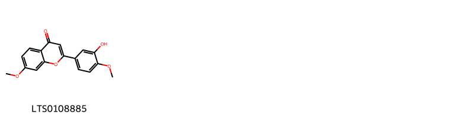{ width=100% }
    <figcaption>Hình ảnh cấu trúc hóa học của 1 hoạt chất thuộc nhóm Flavonoids gồm ['tithonine (LTS0108885)'].</figcaption>
</figure>
#### Nhóm Prenol lipids
<figure markdown="span">
    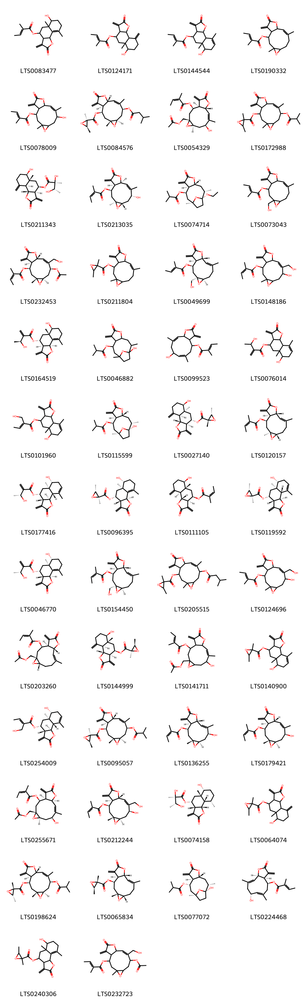{ width=100% }
    <figcaption>Hình ảnh cấu trúc hóa học của 67 hoạt chất thuộc nhóm Prenol lipids gồm ['6-hydroxy-5a,9-dimethyl-3-methylidene-2-oxo-3ah,4h,5h,6h,7h,8h,9bh-naphtho[1,2-b]furan-4-yl 2-methylbut-2-enoate (LTS0083477)', '6-hydroxy-5a-methyl-3,9-dimethylidene-2-oxo-octahydronaphtho[1,2-b]furan-4-yl 2-methylbut-2-enoate (LTS0124171)', '6-hydroxy-5a,9-dimethyl-3-methylidene-2-oxo-3ah,4h,5h,6h,7h,9ah,9bh-naphtho[1,2-b]furan-4-yl 2-methylbut-2-enoate (LTS0144544)', '4,9-dimethyl-14-methylidene-13-oxo-5,12-dioxatricyclo[9.3.0.0⁴,⁶]tetradec-9-en-2-yl 2-methylbut-2-enoate (LTS0190332)', '8-hydroxy-4,9-dimethyl-14-methylidene-13-oxo-5,12-dioxatricyclo[9.3.0.0⁴,⁶]tetradec-9-en-2-yl 2-methylbut-2-enoate (LTS0078009)', '(1r,2r,4r,6r,8s,9z,11r)-4,9-dimethyl-8-[(3-methylbutanoyl)oxy]-14-methylidene-13-oxo-5,12-dioxatricyclo[9.3.0.0⁴,⁶]tetradec-9-en-2-yl (2r,3r)-2,3-dimethyloxirane-2-carboxylate (LTS0084576)', '(1r,2r,4s,6r,8s,9z,11r)-4-[(acetyloxy)methyl]-8-hydroxy-9-methyl-14-methylidene-13-oxo-5,12-dioxatricyclo[9.3.0.0⁴,⁶]tetradec-9-en-2-yl (2z)-2-methylbut-2-enoate (LTS0054329)', '4,9-dimethyl-14-methylidene-8-[(2-methylpropanoyl)oxy]-13-oxo-5,12-dioxatricyclo[9.3.0.0⁴,⁶]tetradec-9-en-2-yl 2,3-dimethyloxirane-2-carboxylate (LTS0172988)', '(3ar,4r,5ar,6r,9as,9br)-6-hydroxy-5a-methyl-3,9-dimethylidene-2-oxo-octahydronaphtho[1,2-b]furan-4-yl (2s,3s)-2,3-dihydroxy-2-methylbutanoate (LTS0211343)', '(1r,2r,4s,6s,8r,9z,11s)-8-hydroxy-4,9-dimethyl-14-methylidene-13-oxo-5,12-dioxatricyclo[9.3.0.0⁴,⁶]tetradec-9-en-2-yl (2z)-2-methylbut-2-enoate (LTS0213035)', '(1r,2s,4r,8s,9r,11s)-1-ethoxy-2,11-dimethyl-7-methylidene-6-oxo-5,14-dioxatricyclo[9.2.1.0⁴,⁸]tetradecan-9-yl 2-methylpropanoate (LTS0074714)', '4-(hydroxymethyl)-9-methyl-14-methylidene-13-oxo-5,12-dioxatricyclo[9.3.0.0⁴,⁶]tetradec-9-en-2-yl 2-methylbut-2-enoate (LTS0073043)', '(1r,2r,4r,6r,8s,9z,11r)-8-(acetyloxy)-9-(hydroxymethyl)-4-methyl-14-methylidene-13-oxo-5,12-dioxatricyclo[9.3.0.0⁴,⁶]tetradec-9-en-2-yl (2z)-2-methylbut-2-enoate (LTS0232453)', '4,9-dimethyl-14-methylidene-13-oxo-5,12-dioxatricyclo[9.3.0.0⁴,⁶]tetradec-9-en-2-yl 2,3-dimethyloxirane-2-carboxylate (LTS0211804)', '(1r,2r,4r,6r,9e,11r)-4-(hydroxymethyl)-9-methyl-14-methylidene-13-oxo-5,12-dioxatricyclo[9.3.0.0⁴,⁶]tetradec-9-en-2-yl (2e)-2-methylbut-2-enoate (LTS0049699)', '(9z)-8-hydroxy-9-(hydroxymethyl)-4-methyl-14-methylidene-13-oxo-5,12-dioxatricyclo[9.3.0.0⁴,⁶]tetradec-9-en-2-yl (2z)-2-methylbut-2-enoate (LTS0148186)', '(3as,4r,5as,6s,9bs)-6-hydroxy-5a,9-dimethyl-3-methylidene-2-oxo-3ah,4h,5h,6h,7h,8h,9bh-naphtho[1,2-b]furan-4-yl (3s)-3-hydroxy-2-methylidenebutanoate (LTS0164519)', '1-hydroxy-2,11-dimethyl-7-methylidene-6-oxo-5,14-dioxatricyclo[9.2.1.0⁴,⁸]tetradecan-9-yl 2-methylpropanoate (LTS0046882)', '8-hydroxy-6,10-dimethyl-3-methylidene-2-oxo-3ah,4h,5h,8h,9h,11ah-cyclodeca[b]furan-4-yl 2-methylbut-2-enoate (LTS0099523)', '6-hydroxy-5a,9-dimethyl-3-methylidene-2-oxo-3ah,4h,5h,6h,7h,9ah,9bh-naphtho[1,2-b]furan-4-yl 3-hydroxy-2-methylidenebutanoate (LTS0076014)', '6-hydroxy-5a,9-dimethyl-3-methylidene-2-oxo-3ah,4h,5h,6h,7h,9ah,9bh-naphtho[1,2-b]furan-4-yl 2-(hydroxymethyl)but-2-enoate (LTS0101960)', 'tirotundin (LTS0115599)', '(3ar,4s,5as,6r,9as,9br)-6-hydroxy-5a-methyl-3,9-dimethylidene-2-oxo-octahydronaphtho[1,2-b]furan-4-yl (2s,3s)-2,3-dimethyloxirane-2-carboxylate (LTS0027140)', '(1r,2r,4s,6s,9e,11r)-4,9-dimethyl-14-methylidene-13-oxo-5,12-dioxatricyclo[9.3.0.0⁴,⁶]tetradec-9-en-2-yl (2z)-2-methylbut-2-enoate (LTS0120157)', '(3ar,4r,5ar,6r,9as,9br)-6-hydroxy-5a,9-dimethyl-3-methylidene-2-oxo-3ah,4h,5h,6h,7h,9ah,9bh-naphtho[1,2-b]furan-4-yl (3r)-3-hydroxy-2-methylidenebutanoate (LTS0177416)', '(3ar,4r,5ar,6r,9bs)-6-hydroxy-5a,9-dimethyl-3-methylidene-2-oxo-3ah,4h,5h,6h,7h,8h,9bh-naphtho[1,2-b]furan-4-yl (2s,3r)-2,3-dimethyloxirane-2-carboxylate (LTS0096395)', '(3ar,4r,5ar,6r,9as,9br)-6-hydroxy-5a-methyl-3,9-dimethylidene-2-oxo-octahydronaphtho[1,2-b]furan-4-yl (2z)-2-methylbut-2-enoate (LTS0111105)', '(3ar,4r,5ar,6r,9as,9br)-6-hydroxy-5a,9-dimethyl-3-methylidene-2-oxo-3ah,4h,5h,6h,7h,9ah,9bh-naphtho[1,2-b]furan-4-yl (2s,3r)-2,3-dimethyloxirane-2-carboxylate (LTS0119592)', '(3ar,4r,5ar,6r,9bs)-6-hydroxy-5a,9-dimethyl-3-methylidene-2-oxo-3ah,4h,5h,6h,7h,8h,9bh-naphtho[1,2-b]furan-4-yl (3r)-3-hydroxy-2-methylidenebutanoate (LTS0046770)', '(1r,2r,4r,6r,9e,11r)-4-(hydroxymethyl)-9-methyl-14-methylidene-13-oxo-5,12-dioxatricyclo[9.3.0.0⁴,⁶]tetradec-9-en-2-yl (2z)-2-methylbut-2-enoate (LTS0154450)', '4,9-dimethyl-8-[(3-methylbutanoyl)oxy]-14-methylidene-13-oxo-5,12-dioxatricyclo[9.3.0.0⁴,⁶]tetradec-9-en-2-yl 2,3-dimethyloxirane-2-carboxylate (LTS0205515)', '8-hydroxy-9-(hydroxymethyl)-4-methyl-14-methylidene-13-oxo-5,12-dioxatricyclo[9.3.0.0⁴,⁶]tetradec-9-en-2-yl 2-methylbut-2-enoate (LTS0124696)', '(1r,2r,4s,6s,9e,11r)-4-[(acetyloxy)methyl]-9-methyl-14-methylidene-13-oxo-5,12-dioxatricyclo[9.3.0.0⁴,⁶]tetradec-9-en-2-yl (2z)-2-methylbut-2-enoate (LTS0203260)', '(3ar,4r,5ar,6r,9as,9br)-6-hydroxy-5a-methyl-3,9-dimethylidene-2-oxo-octahydronaphtho[1,2-b]furan-4-yl (2r,3r)-2,3-dimethyloxirane-2-carboxylate (LTS0144999)', '4-[(acetyloxy)methyl]-8-hydroxy-9-methyl-14-methylidene-13-oxo-5,12-dioxatricyclo[9.3.0.0⁴,⁶]tetradec-9-en-2-yl 2-methylbut-2-enoate (LTS0141711)', '6-hydroxy-5a,9-dimethyl-3-methylidene-2-oxo-3ah,4h,5h,6h,7h,9ah,9bh-naphtho[1,2-b]furan-4-yl 2,3-dimethyloxirane-2-carboxylate (LTS0140900)', '(3ar,4r,5ar,6r,9as,9br)-6-hydroxy-5a,9-dimethyl-3-methylidene-2-oxo-3ah,4h,5h,6h,7h,9ah,9bh-naphtho[1,2-b]furan-4-yl (2e)-2-(hydroxymethyl)but-2-enoate (LTS0254009)', '(1r,2r,4r,6r,8s,9z,11r)-4,9-dimethyl-14-methylidene-8-[(2-methylpropanoyl)oxy]-13-oxo-5,12-dioxatricyclo[9.3.0.0⁴,⁶]tetradec-9-en-2-yl (2r,3r)-2,3-dimethyloxirane-2-carboxylate (LTS0095057)', '(1r,2r,4r,6r,8s,9e,11r)-8-hydroxy-4,9-dimethyl-14-methylidene-13-oxo-5,12-dioxatricyclo[9.3.0.0⁴,⁶]tetradec-9-en-2-yl (2z)-2-methylbut-2-enoate (LTS0136255)', '(1r,2r,4r,6r,8s,9z,11r)-8-hydroxy-4,9-dimethyl-14-methylidene-13-oxo-5,12-dioxatricyclo[9.3.0.0⁴,⁶]tetradec-9-en-2-yl (2z)-2-methylbut-2-enoate (LTS0179421)', '(1r,2r,4s,6r,8s,9z,11s)-4-[(acetyloxy)methyl]-8-hydroxy-9-methyl-14-methylidene-13-oxo-5,12-dioxatricyclo[9.3.0.0⁴,⁶]tetradec-9-en-2-yl (2z)-2-methylbut-2-enoate (LTS0255671)', '(1r,2r,4r,6r,8s,9z,11r)-8-hydroxy-9-(hydroxymethyl)-4-methyl-14-methylidene-13-oxo-5,12-dioxatricyclo[9.3.0.0⁴,⁶]tetradec-9-en-2-yl (2z)-2-methylbut-2-enoate (LTS0212244)', '(3ar,4r,5as,6r,9s,9as,9bs)-6-hydroxy-5a,9-dimethyl-3-methylidene-2-oxo-octahydro-3ah-naphtho[1,2-b]furan-4-yl (2r,3r)-2,3-dihydroxy-2-methylbutanoate (LTS0074158)', '6-hydroxy-5a-methyl-3,9-dimethylidene-2-oxo-octahydronaphtho[1,2-b]furan-4-yl 2,3-dimethyloxirane-2-carboxylate (LTS0064074)', '(1r,2r,4r,6r,8s,9z,11r)-4,9-dimethyl-14-methylidene-8-[(2-methylpropanoyl)oxy]-13-oxo-5,12-dioxatricyclo[9.3.0.0⁴,⁶]tetradec-9-en-2-yl (2s,3s)-2,3-dimethyloxirane-2-carboxylate (LTS0198624)', '(1r,2r,4r,6s,9e,11r)-4,9-dimethyl-14-methylidene-13-oxo-5,12-dioxatricyclo[9.3.0.0⁴,⁶]tetradec-9-en-2-yl (2s,3r)-2,3-dimethyloxirane-2-carboxylate (LTS0065834)', '(1r,2s,4r,8s,9s,11s)-1-hydroxy-2,11-dimethyl-7-methylidene-6-oxo-5,14-dioxatricyclo[9.2.1.0⁴,⁸]tetradecan-9-yl 2-methylpropanoate (LTS0077072)', '(3as,4s,8r,11ar)-8-hydroxy-6,10-dimethyl-3-methylidene-2-oxo-3ah,4h,5h,8h,9h,11ah-cyclodeca[b]furan-4-yl (2e)-2-methylbut-2-enoate (LTS0224468)', '6-hydroxy-5a,9-dimethyl-3-methylidene-2-oxo-3ah,4h,5h,6h,7h,8h,9bh-naphtho[1,2-b]furan-4-yl 2,3-dimethyloxirane-2-carboxylate (LTS0240306)', '8-(acetyloxy)-9-(hydroxymethyl)-4-methyl-14-methylidene-13-oxo-5,12-dioxatricyclo[9.3.0.0⁴,⁶]tetradec-9-en-2-yl 2-methylbut-2-enoate (LTS0232723)', '6-hydroxy-5a,9-dimethyl-3-methylidene-2-oxo-3ah,4h,5h,6h,7h,8h,9bh-naphtho[1,2-b]furan-4-yl 3-hydroxy-2-methylidenebutanoate (LTS0161569)', '4-[(acetyloxy)methyl]-9-methyl-14-methylidene-13-oxo-5,12-dioxatricyclo[9.3.0.0⁴,⁶]tetradec-9-en-2-yl 2,3-dimethyloxirane-2-carboxylate (LTS0254930)', '(3ar,4r,5ar,6r,9as,9br)-6-hydroxy-5a,9-dimethyl-3-methylidene-2-oxo-3ah,4h,5h,6h,7h,9ah,9bh-naphtho[1,2-b]furan-4-yl (2z)-2-(hydroxymethyl)but-2-enoate (LTS0049780)', '(3ar,4r,8r,11ar)-6-[(acetyloxy)methyl]-8-hydroxy-10-methyl-3-methylidene-2-oxo-3ah,4h,5h,8h,9h,11ah-cyclodeca[b]furan-4-yl (2z)-2-methylbut-2-enoate (LTS0258790)', '6-hydroxy-5a,9-dimethyl-3-methylidene-2-oxo-octahydro-3ah-naphtho[1,2-b]furan-4-yl 2,3-dihydroxy-2-methylbutanoate (LTS0263490)', '(3ar,4r,5ar,6r,9as,9br)-6-hydroxy-5a,9-dimethyl-3-methylidene-2-oxo-3ah,4h,5h,6h,7h,9ah,9bh-naphtho[1,2-b]furan-4-yl (2z)-2-methylbut-2-enoate (LTS0001089)', '(1r,2r,4r,6r,8s,9z,11r)-4,9-dimethyl-8-[(3-methylbutanoyl)oxy]-14-methylidene-13-oxo-5,12-dioxatricyclo[9.3.0.0⁴,⁶]tetradec-9-en-2-yl (2s,3s)-2,3-dimethyloxirane-2-carboxylate (LTS0015181)', '(3ar,4r,5ar,6r,9bs)-6-hydroxy-5a,9-dimethyl-3-methylidene-2-oxo-3ah,4h,5h,6h,7h,8h,9bh-naphtho[1,2-b]furan-4-yl (2z)-2-methylbut-2-enoate (LTS0007007)', '(3ar,4r,8r,11ar)-8-hydroxy-6,10-dimethyl-3-methylidene-2-oxo-3ah,4h,5h,8h,9h,11ah-cyclodeca[b]furan-4-yl (2z)-2-methylbut-2-enoate (LTS0015203)', '4-[(acetyloxy)methyl]-9-methyl-14-methylidene-13-oxo-5,12-dioxatricyclo[9.3.0.0⁴,⁶]tetradec-9-en-2-yl 2-methylbut-2-enoate (LTS0019199)', '6-hydroxy-5a-methyl-3,9-dimethylidene-2-oxo-octahydronaphtho[1,2-b]furan-4-yl 2,3-dihydroxy-2-methylbutanoate (LTS0090482)', '(1r,2s,4s,6s,8s,9z,11s)-8-(acetyloxy)-4,9-dimethyl-14-methylidene-13-oxo-5,12-dioxatricyclo[9.3.0.0⁴,⁶]tetradec-9-en-2-yl 2-methylpropanoate (LTS0211625)', '(1r,2r,4s,6s,9e,11r)-4-[(acetyloxy)methyl]-9-methyl-14-methylidene-13-oxo-5,12-dioxatricyclo[9.3.0.0⁴,⁶]tetradec-9-en-2-yl (2s,3r)-2,3-dimethyloxirane-2-carboxylate (LTS0107845)', '6-[(acetyloxy)methyl]-8-hydroxy-10-methyl-3-methylidene-2-oxo-3ah,4h,5h,8h,9h,11ah-cyclodeca[b]furan-4-yl 2-methylbut-2-enoate (LTS0026387)', '(1r,2r,4r,6r,9e,11r)-4-[(acetyloxy)methyl]-9-methyl-14-methylidene-13-oxo-5,12-dioxatricyclo[9.3.0.0⁴,⁶]tetradec-9-en-2-yl (2z)-2-methylbut-2-enoate (LTS0105634)', '(1r,2r,4s,6s,9e,11r)-4-(hydroxymethyl)-9-methyl-14-methylidene-13-oxo-5,12-dioxatricyclo[9.3.0.0⁴,⁶]tetradec-9-en-2-yl (2z)-2-methylbut-2-enoate (LTS0115611)', '(3ar,4s,5ar,6s,9as,9br)-6-hydroxy-5a,9-dimethyl-3-methylidene-2-oxo-3ah,4h,5h,6h,7h,9ah,9bh-naphtho[1,2-b]furan-4-yl (3s)-3-hydroxy-2-methylidenebutanoate (LTS0126120)'].</figcaption>
</figure>

---

### Dược dân tộc học

Danh sách các quốc gia có sử dụng *Tithonia rotundifolia* trong điều trị các bệnh. 

| Country   | Disease     | Bệnh                                                                                                                                                                                                |
|:----------|:------------|:----------------------------------------------------------------------------------------------------------------------------------------------------------------------------------------------------|
| Elsewhere | Insecticide | MYMEMORY WARNING: YOU USED ALL AVAILABLE FREE TRANSLATIONS FOR TODAY. NEXT AVAILABLE IN  09 HOURS 09 MINUTES 09 SECONDS VISIT HTTPS://MYMEMORY.TRANSLATED.NET/DOC/USAGELIMITS.PHP TO TRANSLATE MORE |

---

# Chi Pluchea

??? note "Danh sách các dược liệu thuộc chi"
    
	 - *Pluchea carolinensis*
	 - *Pluchea indica*
	 - *Pluchea lanceolata*
	 - *Pluchea odorata*
	 - *Pluchea rosea*
	 - *Pluchea sagittalis*

---
## Pluchea carolinensis
### Thông tin về thực vật

!!! info "Phân loại thực vật của *Pluchea carolinensis* từ GIBF:"
    - **Kingdom:** Plantae
    - **Phylum:** Tracheophyta
    - **Order:** Asterales
    - **Family:** Asteraceae
    - **Genus:** Pluchea
    - **Species:** *Pluchea carolinensis*

 

| Label (VI)   | Label (EN)   | Scientific Name      | Descriptions (VI)   | Descriptions (EN)   | Also Known As (VI)   | Also Known As (EN)   |
|:-------------|:-------------|:---------------------|:--------------------|:--------------------|:---------------------|:---------------------|
| N/A          | N/A          | Pluchea carolinensis | loài thực vật       | species of plant    | ['']                 | ['']                 |

#### Phân bố trên thế giới

**Từ CSDL GIBF** Belize, Bermuda, Puerto Rico, Saint Vincent and the Grenadines, Haiti, Guatemala, Chinese Taipei, Bahamas, Montserrat, Spain, United States of America, Cayman Islands, Mexico, Antigua and Barbuda, Cuba, Peru, French Guiana

#### Phân bố tại Việt Nam

**Từ CSDL GIBF**: Không có ghi nhận ở Việt Nam

---
### Thành phần hóa học
        
- Theo cơ sở dữ liệu lotus: Từ loài *Pluchea carolinensis* đã phân lập và xác định được 8 hoạt chất thuộc về các nhóm Flavonoids, Prenol lipids, Steroids and steroid derivatives. 

|    | chemicalTaxonomyClassyfireClass   |   smiles_count |
|---:|:----------------------------------|---------------:|
|  0 | Flavonoids                        |              2 |
|  1 | Prenol lipids                     |              4 |
|  2 | Steroids and steroid derivatives  |              2 |

#### Nhóm Flavonoids
<figure markdown="span">
    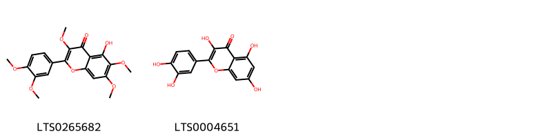{ width=100% }
    <figcaption>Hình ảnh cấu trúc hóa học của 2 hoạt chất thuộc nhóm Flavonoids gồm ['artemetin (LTS0265682)', 'quercetin (LTS0004651)'].</figcaption>
</figure>
#### Nhóm Prenol lipids
<figure markdown="span">
    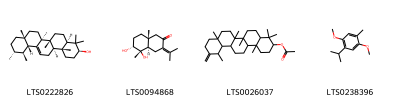{ width=100% }
    <figcaption>Hình ảnh cấu trúc hóa học của 4 hoạt chất thuộc nhóm Prenol lipids gồm ['amyrin (LTS0222826)', 'cuauhtemone (LTS0094868)', '4,4,6a,6b,8a,12,14b-heptamethyl-11-methylidene-hexadecahydropicen-3-yl acetate (LTS0026037)', '2,5-dimethoxy-p-cymene (LTS0238396)'].</figcaption>
</figure>
#### Nhóm Steroids and steroid derivatives
<figure markdown="span">
    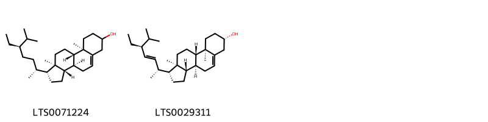{ width=100% }
    <figcaption>Hình ảnh cấu trúc hóa học của 2 hoạt chất thuộc nhóm Steroids and steroid derivatives gồm ['stigmast-5-en-3-ol (LTS0071224)', 'phytosterol (LTS0029311)'].</figcaption>
</figure>

---

### Dược dân tộc học

Danh sách các quốc gia có sử dụng *Pluchea carolinensis* trong điều trị các bệnh. 

| Country   | Disease     | Bệnh                                                                                                                                                                                                |
|:----------|:------------|:----------------------------------------------------------------------------------------------------------------------------------------------------------------------------------------------------|
| Bahamas   | Diaphoretic | MYMEMORY WARNING: YOU USED ALL AVAILABLE FREE TRANSLATIONS FOR TODAY. NEXT AVAILABLE IN  09 HOURS 08 MINUTES 45 SECONDS VISIT HTTPS://MYMEMORY.TRANSLATED.NET/DOC/USAGELIMITS.PHP TO TRANSLATE MORE |
| Haiti     | Expectorant | MYMEMORY WARNING: YOU USED ALL AVAILABLE FREE TRANSLATIONS FOR TODAY. NEXT AVAILABLE IN  09 HOURS 08 MINUTES 42 SECONDS VISIT HTTPS://MYMEMORY.TRANSLATED.NET/DOC/USAGELIMITS.PHP TO TRANSLATE MORE |

---

---
## Pluchea indica
### Thông tin về thực vật

!!! info "Phân loại thực vật của *Pluchea indica* từ GIBF:"
    - **Kingdom:** Plantae
    - **Phylum:** Tracheophyta
    - **Order:** Asterales
    - **Family:** Asteraceae
    - **Genus:** Pluchea
    - **Species:** *Pluchea indica*

 

| Label (VI)   | Label (EN)   | Scientific Name   | Descriptions (VI)   | Descriptions (EN)   | Also Known As (VI)   | Also Known As (EN)   |
|:-------------|:-------------|:------------------|:--------------------|:--------------------|:---------------------|:---------------------|
| N/A          | N/A          | Pluchea indica    | loài thực vật       | species of plant    | ['Pluchea indica']   | ['']                 |

#### Phân bố trên thế giới

**Từ CSDL GIBF** Hong Kong, Thailand, Chinese Taipei, India, Indonesia, New Caledonia, United States of America, Viet Nam, China, Singapore, Malaysia, Northern Mariana Islands

#### Phân bố tại Việt Nam

**Từ CSDL GIBF**: Khánh Hòa, Nam Định

---
### Thành phần hóa học
        
- Theo cơ sở dữ liệu lotus: Từ loài *Pluchea indica* đã phân lập và xác định được 64 hoạt chất thuộc về các nhóm Fatty Acyls, Flavonoids, Prenol lipids, Steroids and steroid derivatives, 2-arylbenzofuran flavonoids, Stilbenes, Organooxygen compounds, Furanoid lignans. 

|    | chemicalTaxonomyClassyfireClass   |   smiles_count |
|---:|:----------------------------------|---------------:|
|  0 |                                   |              6 |
|  1 | 2-arylbenzofuran flavonoids       |              6 |
|  2 | Fatty Acyls                       |              9 |
|  3 | Flavonoids                        |              1 |
|  4 | Furanoid lignans                  |              1 |
|  5 | Organooxygen compounds            |             14 |
|  6 | Prenol lipids                     |             17 |
|  7 | Steroids and steroid derivatives  |              7 |
|  8 | Stilbenes                         |              3 |

#### Nhóm 
<figure markdown="span">
    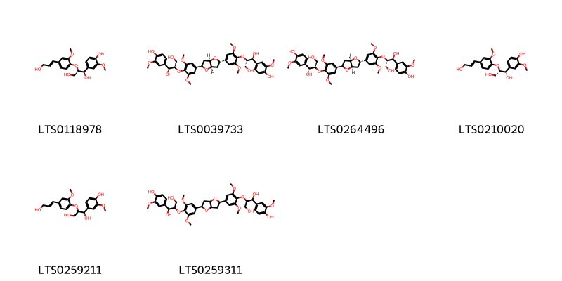{ width=100% }
    <figcaption>Hình ảnh cấu trúc hóa học của 6 hoạt chất thuộc nhóm  gồm ['(1r,2r)-1-(4-hydroxy-3-methoxyphenyl)-2-{4-[(1e)-3-hydroxyprop-1-en-1-yl]-2-methoxyphenoxy}propane-1,3-diol (LTS0118978)', '(1s,2s)-2-{4-[(2s,3ar,5r,6ar)-5-(4-{[(1s,2r)-1,3-dihydroxy-1-(4-hydroxy-3-methoxyphenyl)propan-2-yl]oxy}-3,5-dimethoxyphenyl)-hexahydrofuro[3,2-b]furan-2-yl]-2,6-dimethoxyphenoxy}-1-(4-hydroxy-3-methoxyphenyl)propane-1,3-diol (LTS0039733)', '(1s,2s)-2-{4-[(2s,3ar,5r,6ar)-5-(4-{[(1r,2r)-1,3-dihydroxy-1-(4-hydroxy-3-methoxyphenyl)propan-2-yl]oxy}-3,5-dimethoxyphenyl)-hexahydrofuro[3,2-b]furan-2-yl]-2,6-dimethoxyphenoxy}-1-(4-hydroxy-3-methoxyphenyl)propane-1,3-diol (LTS0264496)', '(1s,2s)-1-(4-hydroxy-3-methoxyphenyl)-2-{4-[(1e)-3-hydroxyprop-1-en-1-yl]-2-methoxyphenoxy}propane-1,3-diol (LTS0210020)', '1-(4-hydroxy-3-methoxyphenyl)-2-[4-(3-hydroxyprop-1-en-1-yl)-2-methoxyphenoxy]propane-1,3-diol (LTS0259211)', '2-{4-[5-(4-{[1,3-dihydroxy-1-(4-hydroxy-3-methoxyphenyl)propan-2-yl]oxy}-3,5-dimethoxyphenyl)-hexahydrofuro[3,2-b]furan-2-yl]-2,6-dimethoxyphenoxy}-1-(4-hydroxy-3-methoxyphenyl)propane-1,3-diol (LTS0259311)'].</figcaption>
</figure>
#### Nhóm 2-arylbenzofuran flavonoids
<figure markdown="span">
    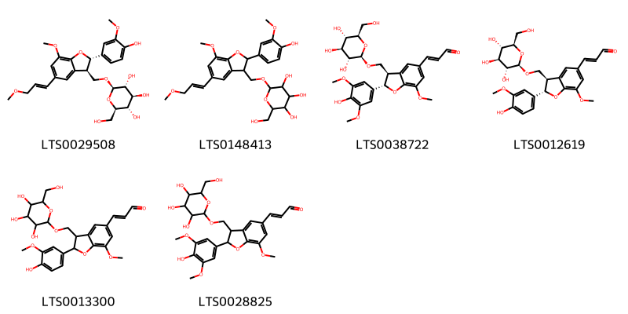{ width=100% }
    <figcaption>Hình ảnh cấu trúc hóa học của 6 hoạt chất thuộc nhóm 2-arylbenzofuran flavonoids gồm ['(2r,3r,4s,5s,6r)-2-{[(2s,3r)-2-(4-hydroxy-3-methoxyphenyl)-7-methoxy-5-[(1e)-3-methoxyprop-1-en-1-yl]-2,3-dihydro-1-benzofuran-3-yl]methoxy}-6-(hydroxymethyl)oxane-3,4,5-triol (LTS0029508)', '2-{[2-(4-hydroxy-3-methoxyphenyl)-7-methoxy-5-(3-methoxyprop-1-en-1-yl)-2,3-dihydro-1-benzofuran-3-yl]methoxy}-6-(hydroxymethyl)oxane-3,4,5-triol (LTS0148413)', '(2e)-3-[(2s,3r)-2-(4-hydroxy-3,5-dimethoxyphenyl)-7-methoxy-3-({[(2r,3r,4s,5s,6r)-3,4,5-trihydroxy-6-(hydroxymethyl)oxan-2-yl]oxy}methyl)-2,3-dihydro-1-benzofuran-5-yl]prop-2-enal (LTS0038722)', '(2e)-3-[(2s,3r)-2-(4-hydroxy-3-methoxyphenyl)-7-methoxy-3-({[(2r,3r,4s,5s,6r)-3,4,5-trihydroxy-6-(hydroxymethyl)oxan-2-yl]oxy}methyl)-2,3-dihydro-1-benzofuran-5-yl]prop-2-enal (LTS0012619)', '3-[2-(4-hydroxy-3-methoxyphenyl)-7-methoxy-3-({[3,4,5-trihydroxy-6-(hydroxymethyl)oxan-2-yl]oxy}methyl)-2,3-dihydro-1-benzofuran-5-yl]prop-2-enal (LTS0013300)', '3-[2-(4-hydroxy-3,5-dimethoxyphenyl)-7-methoxy-3-({[3,4,5-trihydroxy-6-(hydroxymethyl)oxan-2-yl]oxy}methyl)-2,3-dihydro-1-benzofuran-5-yl]prop-2-enal (LTS0028825)'].</figcaption>
</figure>
#### Nhóm Fatty Acyls
<figure markdown="span">
    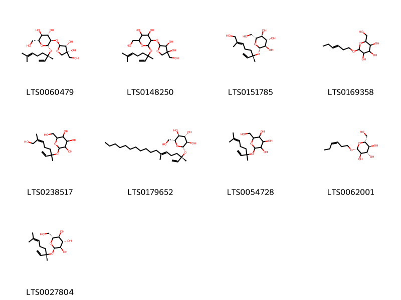{ width=100% }
    <figcaption>Hình ảnh cấu trúc hóa học của 9 hoạt chất thuộc nhóm Fatty Acyls gồm ['(2r,3s,4s,5r,6s)-5-{[(2s,3r,4r)-3,4-dihydroxy-4-(hydroxymethyl)oxolan-2-yl]oxy}-6-{[(3s)-3,7-dimethylocta-1,6-dien-3-yl]oxy}-2-(hydroxymethyl)oxane-3,4-diol (LTS0060479)', '5-{[3,4-dihydroxy-4-(hydroxymethyl)oxolan-2-yl]oxy}-6-[(3,7-dimethylocta-1,6-dien-3-yl)oxy]-2-(hydroxymethyl)oxane-3,4-diol (LTS0148250)', '(2s,3r,4s,5s,6r)-2-{[(3s,6e)-8-hydroxy-3,7-dimethylocta-1,6-dien-3-yl]oxy}-6-(hydroxymethyl)oxane-3,4,5-triol (LTS0151785)', '2-(hex-3-en-1-yloxy)-6-(hydroxymethyl)oxane-3,4,5-triol (LTS0169358)', '2-[(8-hydroxy-3,7-dimethylocta-1,6-dien-3-yl)oxy]-6-(hydroxymethyl)oxane-3,4,5-triol (LTS0238517)', '(2s,3r,4s,5s,6r)-2-{[(3s,6e)-3,7-dimethyloctadeca-1,6-dien-3-yl]oxy}-6-(hydroxymethyl)oxane-3,4,5-triol (LTS0179652)', '2-[(3,7-dimethylocta-1,6-dien-3-yl)oxy]-6-(hydroxymethyl)oxane-3,4,5-triol (LTS0054728)', '(2r,3r,4s,5s,6r)-2-[(3z)-hex-3-en-1-yloxy]-6-(hydroxymethyl)oxane-3,4,5-triol (LTS0062001)', '(2r,3r,4s,5s,6r)-2-{[(3s)-3,7-dimethylocta-1,6-dien-3-yl]oxy}-6-(hydroxymethyl)oxane-3,4,5-triol (LTS0027804)'].</figcaption>
</figure>
#### Nhóm Flavonoids
<figure markdown="span">
    { width=100% }
    <figcaption>Hình ảnh cấu trúc hóa học của 1 hoạt chất thuộc nhóm Flavonoids gồm ['quercetin (LTS0004651)'].</figcaption>
</figure>
#### Nhóm Furanoid lignans
<figure markdown="span">
    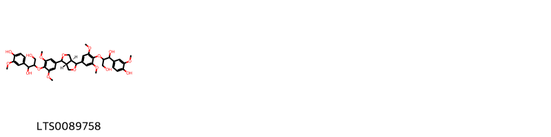{ width=100% }
    <figcaption>Hình ảnh cấu trúc hóa học của 1 hoạt chất thuộc nhóm Furanoid lignans gồm ['2-{4-[(3ar,6as)-4-(4-{[1,3-dihydroxy-1-(4-hydroxy-3-methoxyphenyl)propan-2-yl]oxy}-3,5-dimethoxyphenyl)-hexahydrofuro[3,4-c]furan-1-yl]-2,6-dimethoxyphenoxy}-1-(4-hydroxy-3-methoxyphenyl)propane-1,3-diol (LTS0089758)'].</figcaption>
</figure>
#### Nhóm Organooxygen compounds
<figure markdown="span">
    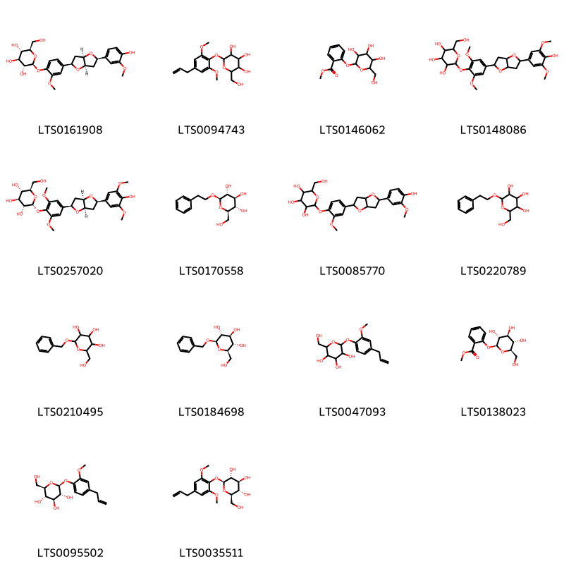{ width=100% }
    <figcaption>Hình ảnh cấu trúc hóa học của 14 hoạt chất thuộc nhóm Organooxygen compounds gồm ['(2s,3r,4s,5s,6r)-2-{4-[(2r,3ar,5r,6ar)-5-(4-hydroxy-3-methoxyphenyl)-hexahydrofuro[3,2-b]furan-2-yl]-2-methoxyphenoxy}-6-(hydroxymethyl)oxane-3,4,5-triol (LTS0161908)', '2-[2,6-dimethoxy-4-(prop-2-en-1-yl)phenoxy]-6-(hydroxymethyl)oxane-3,4,5-triol (LTS0094743)', 'methyl 2-{[3,4,5-trihydroxy-6-(hydroxymethyl)oxan-2-yl]oxy}benzoate (LTS0146062)', '2-{4-[5-(4-hydroxy-3,5-dimethoxyphenyl)-hexahydrofuro[3,2-b]furan-2-yl]-2,6-dimethoxyphenoxy}-6-(hydroxymethyl)oxane-3,4,5-triol (LTS0148086)', '(2r,3r,4s,5s,6r)-2-{4-[(2r,3ar,5r,6ar)-5-(4-hydroxy-3,5-dimethoxyphenyl)-hexahydrofuro[3,2-b]furan-2-yl]-2,6-dimethoxyphenoxy}-6-(hydroxymethyl)oxane-3,4,5-triol (LTS0257020)', '(2r,3s,4s,5r,6r)-2-(hydroxymethyl)-6-(2-phenylethoxy)oxane-3,4,5-triol (LTS0170558)', '2-{4-[5-(4-hydroxy-3-methoxyphenyl)-hexahydrofuro[3,2-b]furan-2-yl]-2-methoxyphenoxy}-6-(hydroxymethyl)oxane-3,4,5-triol (LTS0085770)', '2-(hydroxymethyl)-6-(2-phenylethoxy)oxane-3,4,5-triol (LTS0220789)', 'benzyl glucopyranoside (LTS0210495)', 'benzyl β-d-glucoside (LTS0184698)', '2-(hydroxymethyl)-6-[2-methoxy-4-(prop-2-en-1-yl)phenoxy]oxane-3,4,5-triol (LTS0047093)', 'methyl 2-{[(2s,3r,4s,5s,6r)-3,4,5-trihydroxy-6-(hydroxymethyl)oxan-2-yl]oxy}benzoate (LTS0138023)', 'eugenyl glucoside (LTS0095502)', '(2s,3r,4s,5s,6r)-2-[2,6-dimethoxy-4-(prop-2-en-1-yl)phenoxy]-6-(hydroxymethyl)oxane-3,4,5-triol (LTS0035511)'].</figcaption>
</figure>
#### Nhóm Prenol lipids
<figure markdown="span">
    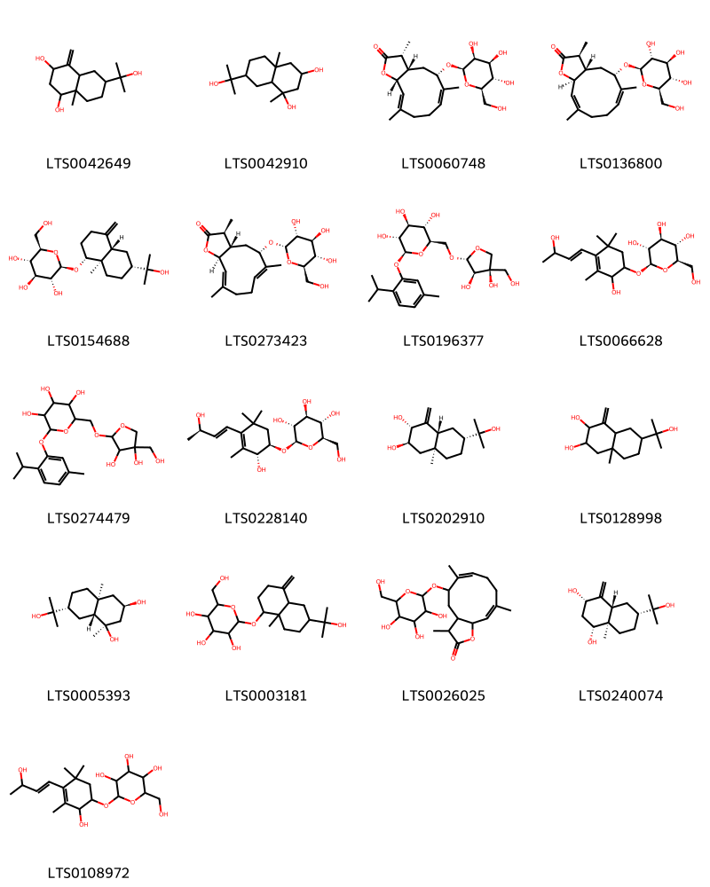{ width=100% }
    <figcaption>Hình ảnh cấu trúc hóa học của 17 hoạt chất thuộc nhóm Prenol lipids gồm ['6-(2-hydroxypropan-2-yl)-8a-methyl-4-methylidene-octahydronaphthalene-1,3-diol (LTS0042649)', '7-(2-hydroxypropan-2-yl)-1,4a-dimethyl-octahydronaphthalene-1,3-diol (LTS0042910)', '(3r,3as,5s,11ar)-3,6,10-trimethyl-5-{[(2r,3s,4s,5s,6r)-3,4,5-trihydroxy-6-(hydroxymethyl)oxan-2-yl]oxy}-3h,3ah,4h,5h,8h,9h,11ah-cyclodeca[b]furan-2-one (LTS0060748)', '(3s,3as,5s,11as)-3,6,10-trimethyl-5-{[(2r,3r,4s,5s,6r)-3,4,5-trihydroxy-6-(hydroxymethyl)oxan-2-yl]oxy}-3h,3ah,4h,5h,8h,9h,11ah-cyclodeca[b]furan-2-one (LTS0136800)', '(2r,3r,4s,5s,6r)-2-{[(1r,4as,6r,8ar)-6-(2-hydroxypropan-2-yl)-8a-methyl-4-methylidene-octahydronaphthalen-1-yl]oxy}-6-(hydroxymethyl)oxane-3,4,5-triol (LTS0154688)', '(3s,3as,5s,11as)-3,6,10-trimethyl-5-{[(2s,3r,4s,5s,6r)-3,4,5-trihydroxy-6-(hydroxymethyl)oxan-2-yl]oxy}-3h,3ah,4h,5h,8h,9h,11ah-cyclodeca[b]furan-2-one (LTS0273423)', '(2r,3s,4s,5r,6s)-2-({[(2r,3r,4r)-3,4-dihydroxy-4-(hydroxymethyl)oxolan-2-yl]oxy}methyl)-6-(2-isopropyl-5-methylphenoxy)oxane-3,4,5-triol (LTS0196377)', '(2r,3r,4s,5s,6r)-2-({2-hydroxy-4-[(1e)-3-hydroxybut-1-en-1-yl]-3,5,5-trimethylcyclohex-3-en-1-yl}oxy)-6-(hydroxymethyl)oxane-3,4,5-triol (LTS0066628)', '2-({[3,4-dihydroxy-4-(hydroxymethyl)oxolan-2-yl]oxy}methyl)-6-(2-isopropyl-5-methylphenoxy)oxane-3,4,5-triol (LTS0274479)', '(2r,3r,4s,5s,6r)-2-{[(1r,2r)-2-hydroxy-4-[(1e,3r)-3-hydroxybut-1-en-1-yl]-3,5,5-trimethylcyclohex-3-en-1-yl]oxy}-6-(hydroxymethyl)oxane-3,4,5-triol (LTS0228140)', '(2r,3r,4as,7r,8ar)-7-(2-hydroxypropan-2-yl)-4a-methyl-1-methylidene-octahydronaphthalene-2,3-diol (LTS0202910)', '7-(2-hydroxypropan-2-yl)-4a-methyl-1-methylidene-octahydronaphthalene-2,3-diol (LTS0128998)', '(1r,3r,4as,7r,8ar)-7-(2-hydroxypropan-2-yl)-1,4a-dimethyl-octahydronaphthalene-1,3-diol (LTS0005393)', '2-(hydroxymethyl)-6-{[6-(2-hydroxypropan-2-yl)-8a-methyl-4-methylidene-octahydronaphthalen-1-yl]oxy}oxane-3,4,5-triol (LTS0003181)', '3,6,10-trimethyl-5-{[3,4,5-trihydroxy-6-(hydroxymethyl)oxan-2-yl]oxy}-3h,3ah,4h,5h,8h,9h,11ah-cyclodeca[b]furan-2-one (LTS0026025)', '(1r,3s,4as,6r,8ar)-6-(2-hydroxypropan-2-yl)-8a-methyl-4-methylidene-octahydronaphthalene-1,3-diol (LTS0240074)', '2-{[2-hydroxy-4-(3-hydroxybut-1-en-1-yl)-3,5,5-trimethylcyclohex-3-en-1-yl]oxy}-6-(hydroxymethyl)oxane-3,4,5-triol (LTS0108972)'].</figcaption>
</figure>
#### Nhóm Steroids and steroid derivatives
<figure markdown="span">
    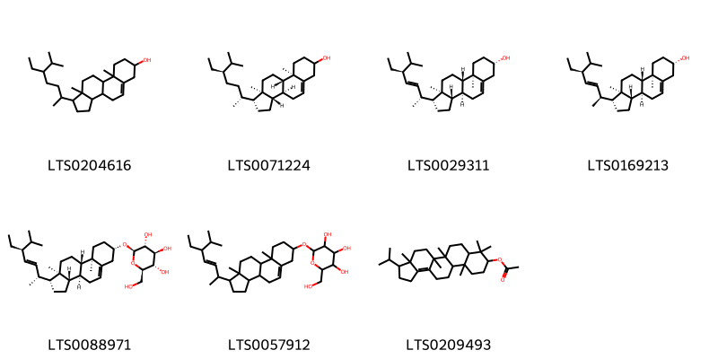{ width=100% }
    <figcaption>Hình ảnh cấu trúc hóa học của 7 hoạt chất thuộc nhóm Steroids and steroid derivatives gồm ['stigmast-5-en-3-ol, (3β)- (LTS0204616)', 'stigmast-5-en-3-ol (LTS0071224)', 'phytosterol (LTS0029311)', '(1r,3as,3bs,7s,9ar,9bs,11ar)-1-[(2s,3e,5s)-5-ethyl-6-methylhept-3-en-2-yl]-9a,11a-dimethyl-1h,2h,3h,3ah,3bh,4h,6h,7h,8h,9h,9bh,10h,11h-cyclopenta[a]phenanthren-7-ol (LTS0169213)', '(2r,3r,4s,5s,6r)-2-{[(1r,3as,3bs,7s,9ar,9bs,11ar)-1-[(2r,3e,5s)-5-ethyl-6-methylhept-3-en-2-yl]-9a,11a-dimethyl-1h,2h,3h,3ah,3bh,4h,6h,7h,8h,9h,9bh,10h,11h-cyclopenta[a]phenanthren-7-yl]oxy}-6-(hydroxymethyl)oxane-3,4,5-triol (LTS0088971)', '2-{[1-(5-ethyl-6-methylhept-3-en-2-yl)-9a,11a-dimethyl-1h,2h,3h,3ah,3bh,4h,6h,7h,8h,9h,9bh,10h,11h-cyclopenta[a]phenanthren-7-yl]oxy}-6-(hydroxymethyl)oxane-3,4,5-triol (LTS0057912)', '3-isopropyl-3a,5a,5b,8,8,11a-hexamethyl-1h,2h,3h,4h,5h,6h,7h,7ah,9h,10h,11h,11bh,12h,13h-cyclopenta[a]chrysen-9-yl acetate (LTS0209493)'].</figcaption>
</figure>
#### Nhóm Stilbenes
<figure markdown="span">
    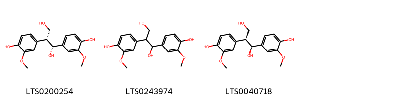{ width=100% }
    <figcaption>Hình ảnh cấu trúc hóa học của 3 hoạt chất thuộc nhóm Stilbenes gồm ['(1r,2r)-1,2-bis(4-hydroxy-3-methoxyphenyl)propane-1,3-diol (LTS0200254)', '1,2-diguaiacylpropane-1,3-diol (LTS0243974)', '(1s,2s)-1,2-bis(4-hydroxy-3-methoxyphenyl)propane-1,3-diol (LTS0040718)'].</figcaption>
</figure>

---

### Dược dân tộc học

Danh sách các quốc gia có sử dụng *Pluchea indica* trong điều trị các bệnh. 

| Country   | Disease                                 | Bệnh                                                                                                                                                                                                |
|:----------|:----------------------------------------|:----------------------------------------------------------------------------------------------------------------------------------------------------------------------------------------------------|
| Elsewhere | Astringent, Diaphoretic, Nervine, Tonic | MYMEMORY WARNING: YOU USED ALL AVAILABLE FREE TRANSLATIONS FOR TODAY. NEXT AVAILABLE IN  09 HOURS 08 MINUTES 11 SECONDS VISIT HTTPS://MYMEMORY.TRANSLATED.NET/DOC/USAGELIMITS.PHP TO TRANSLATE MORE |

---

---
## Pluchea lanceolata
### Thông tin về thực vật

!!! info "Phân loại thực vật của *Pluchea lanceolata* từ GIBF:"
    - **Kingdom:** Plantae
    - **Phylum:** Tracheophyta
    - **Order:** Asterales
    - **Family:** Asteraceae
    - **Genus:** Pluchea
    - **Species:** *Pluchea lanceolata*

 

| Label (VI)   | Label (EN)   | Scientific Name    | Descriptions (VI)   | Descriptions (EN)   | Also Known As (VI)   | Also Known As (EN)   |
|:-------------|:-------------|:-------------------|:--------------------|:--------------------|:---------------------|:---------------------|
| N/A          | N/A          | Pluchea lanceolata | loài thực vật       | species of plant    | ['']                 | ['']                 |

#### Phân bố trên thế giới

**Từ CSDL GIBF** nan, Pakistan, Senegal, Madagascar, Chad, Afghanistan, Niger, India, Algeria, unknown or invalid, Burkina Faso

#### Phân bố tại Việt Nam

**Từ CSDL GIBF**: Không có ghi nhận ở Việt Nam

---
### Thành phần hóa học
        
- Theo cơ sở dữ liệu lotus: Từ loài *Pluchea lanceolata* đã phân lập và xác định được 11 hoạt chất thuộc về các nhóm Prenol lipids, Steroids and steroid derivatives, Isoflavonoids, Organooxygen compounds, Phenols. 

|    | chemicalTaxonomyClassyfireClass   |   smiles_count |
|---:|:----------------------------------|---------------:|
|  0 | Isoflavonoids                     |              2 |
|  1 | Organooxygen compounds            |              1 |
|  2 | Phenols                           |              1 |
|  3 | Prenol lipids                     |              2 |
|  4 | Steroids and steroid derivatives  |              5 |

#### Nhóm Isoflavonoids
<figure markdown="span">
    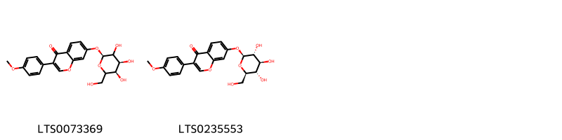{ width=100% }
    <figcaption>Hình ảnh cấu trúc hóa học của 2 hoạt chất thuộc nhóm Isoflavonoids gồm ['formononetin 7-o-glucoside (LTS0073369)', 'ononin (LTS0235553)'].</figcaption>
</figure>
#### Nhóm Organooxygen compounds
<figure markdown="span">
    { width=100% }
    <figcaption>Hình ảnh cấu trúc hóa học của 1 hoạt chất thuộc nhóm Organooxygen compounds gồm ['chlorogenic acid (LTS0226495)'].</figcaption>
</figure>
#### Nhóm Phenols
<figure markdown="span">
    { width=100% }
    <figcaption>Hình ảnh cấu trúc hóa học của 1 hoạt chất thuộc nhóm Phenols gồm ['phloroglucinol (LTS0267010)'].</figcaption>
</figure>
#### Nhóm Prenol lipids
<figure markdown="span">
    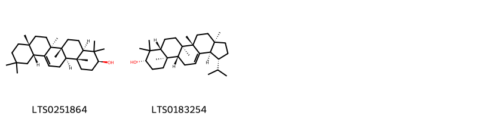{ width=100% }
    <figcaption>Hình ảnh cấu trúc hóa học của 2 hoạt chất thuộc nhóm Prenol lipids gồm ['β-amyrin (LTS0251864)', '(1r,3ar,5as,5br,7ar,9s,11ar,11br,13br)-1-isopropyl-3a,5a,5b,8,8,11a-hexamethyl-1h,2h,3h,4h,5h,6h,7h,7ah,9h,10h,11h,11bh,12h,13bh-cyclopenta[a]chrysen-9-ol (LTS0183254)'].</figcaption>
</figure>
#### Nhóm Steroids and steroid derivatives
<figure markdown="span">
    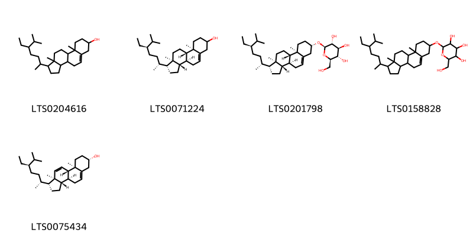{ width=100% }
    <figcaption>Hình ảnh cấu trúc hóa học của 5 hoạt chất thuộc nhóm Steroids and steroid derivatives gồm ['stigmast-5-en-3-ol, (3β)- (LTS0204616)', 'stigmast-5-en-3-ol (LTS0071224)', 'sitogluside (LTS0201798)', '2-{[1-(5-ethyl-6-methylheptan-2-yl)-9a,11a-dimethyl-1h,2h,3h,3ah,3bh,4h,6h,7h,8h,9h,9bh,10h,11h-cyclopenta[a]phenanthren-7-yl]oxy}-6-(hydroxymethyl)oxane-3,4,5-triol (LTS0158828)', '(1r,3as,3bs,7s,9ar,9bs,11ar)-1-[(2r,5r)-5-ethyl-6-methylheptan-2-yl]-9a,11a-dimethyl-1h,2h,3h,3ah,3bh,4h,6h,7h,8h,9h,9bh-cyclopenta[a]phenanthren-7-ol (LTS0075434)'].</figcaption>
</figure>

---

### Dược dân tộc học

Danh sách các quốc gia có sử dụng *Pluchea lanceolata* trong điều trị các bệnh. 

| Country   | Disease   | Bệnh                                                                                                                                                                                                |
|:----------|:----------|:----------------------------------------------------------------------------------------------------------------------------------------------------------------------------------------------------|
| Elsewhere | Aperient  | MYMEMORY WARNING: YOU USED ALL AVAILABLE FREE TRANSLATIONS FOR TODAY. NEXT AVAILABLE IN  09 HOURS 07 MINUTES 38 SECONDS VISIT HTTPS://MYMEMORY.TRANSLATED.NET/DOC/USAGELIMITS.PHP TO TRANSLATE MORE |

---

---
## Pluchea odorata
### Thông tin về thực vật

!!! info "Phân loại thực vật của *Pluchea odorata* từ GIBF:"
    - **Kingdom:** Plantae
    - **Phylum:** Tracheophyta
    - **Order:** Asterales
    - **Family:** Asteraceae
    - **Genus:** Pluchea
    - **Species:** *Pluchea odorata*

 

| Label (VI)   | Label (EN)   | Scientific Name   | Descriptions (VI)   | Descriptions (EN)   | Also Known As (VI)   | Also Known As (EN)   |
|:-------------|:-------------|:------------------|:--------------------|:--------------------|:---------------------|:---------------------|
| N/A          | N/A          | Pluchea odorata   | loài thực vật       | species of plant    | ['']                 | ['']                 |

#### Phân bố trên thế giới

**Từ CSDL GIBF** nan, Puerto Rico, Saint Kitts and Nevis, New Caledonia, United States of America, Cayman Islands, Mexico, Cuba

#### Phân bố tại Việt Nam

**Từ CSDL GIBF**: Không có ghi nhận ở Việt Nam

---
### Thành phần hóa học
        
- Theo cơ sở dữ liệu lotus: Từ loài *Pluchea odorata* đã phân lập và xác định được 22 hoạt chất thuộc về các nhóm Flavonoids, Prenol lipids, Steroids and steroid derivatives, Benzene and substituted derivatives. 

|    | chemicalTaxonomyClassyfireClass     |   smiles_count |
|---:|:------------------------------------|---------------:|
|  0 | Benzene and substituted derivatives |              1 |
|  1 | Flavonoids                          |              4 |
|  2 | Prenol lipids                       |             14 |
|  3 | Steroids and steroid derivatives    |              3 |

#### Nhóm Benzene and substituted derivatives
<figure markdown="span">
    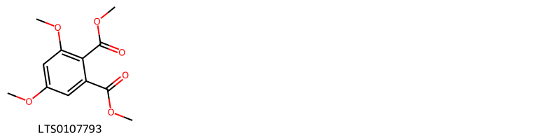{ width=100% }
    <figcaption>Hình ảnh cấu trúc hóa học của 1 hoạt chất thuộc nhóm Benzene and substituted derivatives gồm ['1,2-dimethyl 3,5-dimethoxyphthalate (LTS0107793)'].</figcaption>
</figure>
#### Nhóm Flavonoids
<figure markdown="span">
    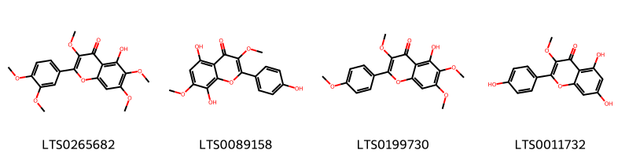{ width=100% }
    <figcaption>Hình ảnh cấu trúc hóa học của 4 hoạt chất thuộc nhóm Flavonoids gồm ['artemetin (LTS0265682)', 'herbacetin 3,7-dimethyl ether (LTS0089158)', "penduletin 4'-methyl ether (LTS0199730)", 'isokaempferide (LTS0011732)'].</figcaption>
</figure>
#### Nhóm Prenol lipids
<figure markdown="span">
    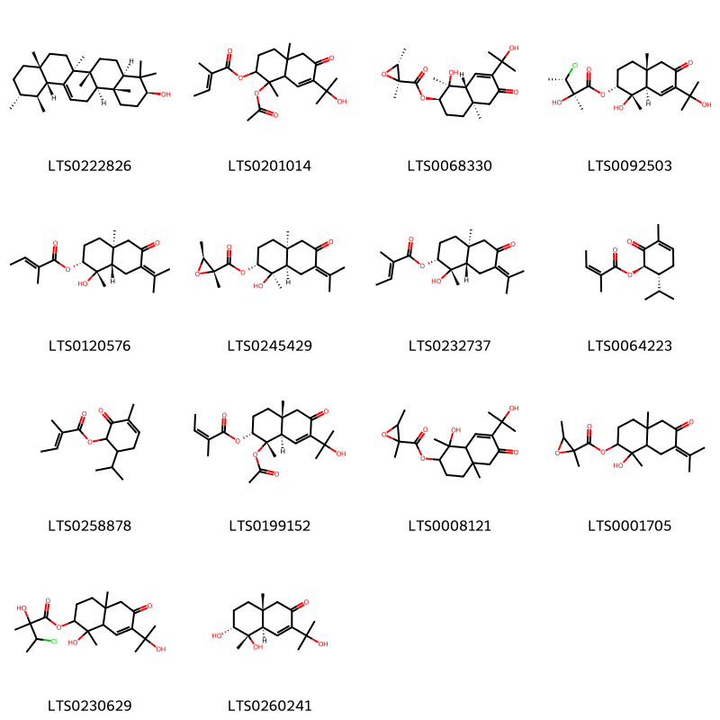{ width=100% }
    <figcaption>Hình ảnh cấu trúc hóa học của 14 hoạt chất thuộc nhóm Prenol lipids gồm ['amyrin (LTS0222826)', '1-(acetyloxy)-7-(2-hydroxypropan-2-yl)-1,4a-dimethyl-6-oxo-3,4,5,8a-tetrahydro-2h-naphthalen-2-yl 2-methylbut-2-enoate (LTS0201014)', '(1s,2r,4ar,8ar)-1-hydroxy-7-(2-hydroxypropan-2-yl)-1,4a-dimethyl-6-oxo-3,4,5,8a-tetrahydro-2h-naphthalen-2-yl (2s,3r)-2,3-dimethyloxirane-2-carboxylate (LTS0068330)', '(1s,2r,4ar,8ar)-1-hydroxy-7-(2-hydroxypropan-2-yl)-1,4a-dimethyl-6-oxo-3,4,5,8a-tetrahydro-2h-naphthalen-2-yl (2r,3s)-3-chloro-2-hydroxy-2-methylbutanoate (LTS0092503)', '(1s,2r,4as,8as)-1-hydroxy-1,4a-dimethyl-6-oxo-7-(propan-2-ylidene)-hexahydronaphthalen-2-yl (2e)-2-methylbut-2-enoate (LTS0120576)', '(1r,2r,4as,8ar)-1-hydroxy-1,4a-dimethyl-6-oxo-7-(propan-2-ylidene)-hexahydronaphthalen-2-yl (2r,3s)-2,3-dimethyloxirane-2-carboxylate (LTS0245429)', '(1s,2r,4as,8as)-1-hydroxy-1,4a-dimethyl-6-oxo-7-(propan-2-ylidene)-hexahydronaphthalen-2-yl 2-methylbut-2-enoate (LTS0232737)', '(1r,6r)-6-isopropyl-3-methyl-2-oxocyclohex-3-en-1-yl (2z)-2-methylbut-2-enoate (LTS0064223)', '6-isopropyl-3-methyl-2-oxocyclohex-3-en-1-yl 2-methylbut-2-enoate (LTS0258878)', '(1s,2r,4ar,8ar)-1-(acetyloxy)-7-(2-hydroxypropan-2-yl)-1,4a-dimethyl-6-oxo-3,4,5,8a-tetrahydro-2h-naphthalen-2-yl (2z)-2-methylbut-2-enoate (LTS0199152)', '1-hydroxy-7-(2-hydroxypropan-2-yl)-1,4a-dimethyl-6-oxo-3,4,5,8a-tetrahydro-2h-naphthalen-2-yl 2,3-dimethyloxirane-2-carboxylate (LTS0008121)', '1-hydroxy-1,4a-dimethyl-6-oxo-7-(propan-2-ylidene)-hexahydronaphthalen-2-yl 2,3-dimethyloxirane-2-carboxylate (LTS0001705)', '1-hydroxy-7-(2-hydroxypropan-2-yl)-1,4a-dimethyl-6-oxo-3,4,5,8a-tetrahydro-2h-naphthalen-2-yl 3-chloro-2-hydroxy-2-methylbutanoate (LTS0230629)', '(4ar,5s,6r,8ar)-5,6-dihydroxy-3-(2-hydroxypropan-2-yl)-5,8a-dimethyl-4a,6,7,8-tetrahydro-1h-naphthalen-2-one (LTS0260241)'].</figcaption>
</figure>
#### Nhóm Steroids and steroid derivatives
<figure markdown="span">
    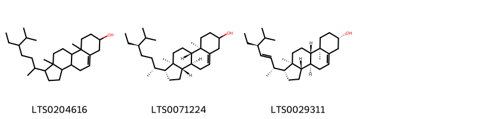{ width=100% }
    <figcaption>Hình ảnh cấu trúc hóa học của 3 hoạt chất thuộc nhóm Steroids and steroid derivatives gồm ['stigmast-5-en-3-ol, (3β)- (LTS0204616)', 'stigmast-5-en-3-ol (LTS0071224)', 'phytosterol (LTS0029311)'].</figcaption>
</figure>

---

### Dược dân tộc học

Danh sách các quốc gia có sử dụng *Pluchea odorata* trong điều trị các bệnh. 

| Country     | Disease                                      | Bệnh                                                                                                                                                                                                |
|:------------|:---------------------------------------------|:----------------------------------------------------------------------------------------------------------------------------------------------------------------------------------------------------|
| Bahamas     | Diaphoretic                                  | MYMEMORY WARNING: YOU USED ALL AVAILABLE FREE TRANSLATIONS FOR TODAY. NEXT AVAILABLE IN  09 HOURS 07 MINUTES 07 SECONDS VISIT HTTPS://MYMEMORY.TRANSLATED.NET/DOC/USAGELIMITS.PHP TO TRANSLATE MORE |
| Mexico      | Emmenagogue, Emmenagogue, Hemostat, Hemostat | MYMEMORY WARNING: YOU USED ALL AVAILABLE FREE TRANSLATIONS FOR TODAY. NEXT AVAILABLE IN  09 HOURS 07 MINUTES 05 SECONDS VISIT HTTPS://MYMEMORY.TRANSLATED.NET/DOC/USAGELIMITS.PHP TO TRANSLATE MORE |
| Trinidad    | Collyrium, Collyrium                         | MYMEMORY WARNING: YOU USED ALL AVAILABLE FREE TRANSLATIONS FOR TODAY. NEXT AVAILABLE IN  09 HOURS 07 MINUTES 02 SECONDS VISIT HTTPS://MYMEMORY.TRANSLATED.NET/DOC/USAGELIMITS.PHP TO TRANSLATE MORE |
| Venezuela   | Astringent, Antidote, Stomachic              | MYMEMORY WARNING: YOU USED ALL AVAILABLE FREE TRANSLATIONS FOR TODAY. NEXT AVAILABLE IN  09 HOURS 07 MINUTES 00 SECONDS VISIT HTTPS://MYMEMORY.TRANSLATED.NET/DOC/USAGELIMITS.PHP TO TRANSLATE MORE |
| West Indies | Antidote                                     | MYMEMORY WARNING: YOU USED ALL AVAILABLE FREE TRANSLATIONS FOR TODAY. NEXT AVAILABLE IN  09 HOURS 06 MINUTES 58 SECONDS VISIT HTTPS://MYMEMORY.TRANSLATED.NET/DOC/USAGELIMITS.PHP TO TRANSLATE MORE |

---

---
## Pluchea rosea
### Thông tin về thực vật

!!! info "Phân loại thực vật của *Pluchea baccharis* từ GIBF:"
    - **Kingdom:** Plantae
    - **Phylum:** Tracheophyta
    - **Order:** Asterales
    - **Family:** Asteraceae
    - **Genus:** Pluchea
    - **Species:** *Pluchea baccharis*

 

| Label (VI)   | Label (EN)   | Scientific Name   | Descriptions (VI)   | Descriptions (EN)   | Also Known As (VI)   | Also Known As (EN)   |
|:-------------|:-------------|:------------------|:--------------------|:--------------------|:---------------------|:---------------------|
| N/A          | N/A          | Pluchea rosea     | loài thực vật       | species of plant    | ['']                 | ['']                 |

#### Phân bố trên thế giới

**Từ CSDL GIBF** Belize, Nicaragua, nan, Bahamas, Cuba, United States of America, Mexico

#### Phân bố tại Việt Nam

**Từ CSDL GIBF**: Không có ghi nhận ở Việt Nam

---
### Thành phần hóa học
        
- Theo cơ sở dữ liệu lotus: Từ loài *Pluchea baccharis* đã phân lập và xác định được 2 hoạt chất thuộc về các nhóm Prenol lipids. 

|    | chemicalTaxonomyClassyfireClass   |   smiles_count |
|---:|:----------------------------------|---------------:|
|  0 | Prenol lipids                     |              2 |

#### Nhóm Prenol lipids
<figure markdown="span">
    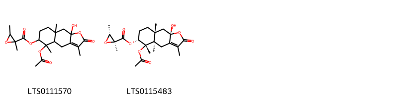{ width=100% }
    <figcaption>Hình ảnh cấu trúc hóa học của 2 hoạt chất thuộc nhóm Prenol lipids gồm ['5-(acetyloxy)-9a-hydroxy-3,5,8a-trimethyl-2-oxo-4h,4ah,6h,7h,8h,9h-naphtho[2,3-b]furan-6-yl 2,3-dimethyloxirane-2-carboxylate (LTS0111570)', '(4ar,5s,6r,8ar,9as)-5-(acetyloxy)-9a-hydroxy-3,5,8a-trimethyl-2-oxo-4h,4ah,6h,7h,8h,9h-naphtho[2,3-b]furan-6-yl (2s,3r)-2,3-dimethyloxirane-2-carboxylate (LTS0115483)'].</figcaption>
</figure>

---

### Dược dân tộc học

Danh sách các quốc gia có sử dụng *Pluchea baccharis* trong điều trị các bệnh. 

| Country   | Disease   | Bệnh                                                                                                                                                                                                |
|:----------|:----------|:----------------------------------------------------------------------------------------------------------------------------------------------------------------------------------------------------|
| Bahamas   | Vermifuge | MYMEMORY WARNING: YOU USED ALL AVAILABLE FREE TRANSLATIONS FOR TODAY. NEXT AVAILABLE IN  09 HOURS 06 MINUTES 20 SECONDS VISIT HTTPS://MYMEMORY.TRANSLATED.NET/DOC/USAGELIMITS.PHP TO TRANSLATE MORE |

---

---
## Pluchea sagittalis
### Thông tin về thực vật

!!! info "Phân loại thực vật của *Pluchea sagittalis* từ GIBF:"
    - **Kingdom:** Plantae
    - **Phylum:** Tracheophyta
    - **Order:** Asterales
    - **Family:** Asteraceae
    - **Genus:** Pluchea
    - **Species:** *Pluchea sagittalis*

 

| Label (VI)   | Label (EN)   | Scientific Name    | Descriptions (VI)   | Descriptions (EN)   | Also Known As (VI)   | Also Known As (EN)   |
|:-------------|:-------------|:-------------------|:--------------------|:--------------------|:---------------------|:---------------------|
| N/A          | N/A          | Pluchea sagittalis | loài thực vật       | species of plant    | ['']                 | ['']                 |

#### Phân bố trên thế giới

**Từ CSDL GIBF** Hong Kong, Brazil, Chinese Taipei, Argentina, Bolivia (Plurinational State of), Peru, Uruguay, China

#### Phân bố tại Việt Nam

**Từ CSDL GIBF**: Không có ghi nhận ở Việt Nam

---
### Thành phần hóa học
        
- Theo cơ sở dữ liệu lotus: Từ loài *Pluchea sagittalis* đã phân lập và xác định được 77 hoạt chất thuộc về các nhóm Flavonoids, Prenol lipids, Steroids and steroid derivatives, Thiophenes, Naphthofurans, Furanoid lignans. 

|    | chemicalTaxonomyClassyfireClass   |   smiles_count |
|---:|:----------------------------------|---------------:|
|  0 | Flavonoids                        |              3 |
|  1 | Furanoid lignans                  |              3 |
|  2 | Naphthofurans                     |              2 |
|  3 | Prenol lipids                     |             63 |
|  4 | Steroids and steroid derivatives  |              2 |
|  5 | Thiophenes                        |              4 |

#### Nhóm Flavonoids
<figure markdown="span">
    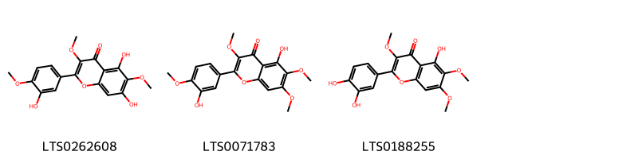{ width=100% }
    <figcaption>Hình ảnh cấu trúc hóa học của 3 hoạt chất thuộc nhóm Flavonoids gồm ['centaureidin (LTS0262608)', 'casticin (LTS0071783)', 'chrysosplenol d (LTS0188255)'].</figcaption>
</figure>
#### Nhóm Furanoid lignans
<figure markdown="span">
    { width=100% }
    <figcaption>Hình ảnh cấu trúc hóa học của 3 hoạt chất thuộc nhóm Furanoid lignans gồm ['4-[(3ar,6as)-4-(4-hydroxy-3-methoxyphenyl)-hexahydrofuro[3,4-c]furan-1-yl]-2-methoxyphenol (LTS0191067)', 'pinoresinol (LTS0057431)', 'pinoresinol (LTS0011247)'].</figcaption>
</figure>
#### Nhóm Naphthofurans
<figure markdown="span">
    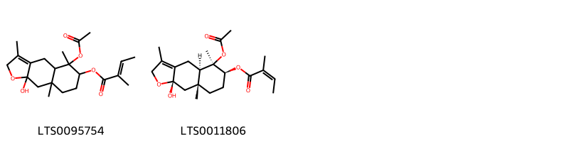{ width=100% }
    <figcaption>Hình ảnh cấu trúc hóa học của 2 hoạt chất thuộc nhóm Naphthofurans gồm ['5-(acetyloxy)-9a-hydroxy-3,5,8a-trimethyl-2h,4h,4ah,6h,7h,8h,9h-naphtho[2,3-b]furan-6-yl 2-methylbut-2-enoate (LTS0095754)', '(4ar,5r,6s,8ar,9as)-5-(acetyloxy)-9a-hydroxy-3,5,8a-trimethyl-2h,4h,4ah,6h,7h,8h,9h-naphtho[2,3-b]furan-6-yl (2z)-2-methylbut-2-enoate (LTS0011806)'].</figcaption>
</figure>
#### Nhóm Prenol lipids
<figure markdown="span">
    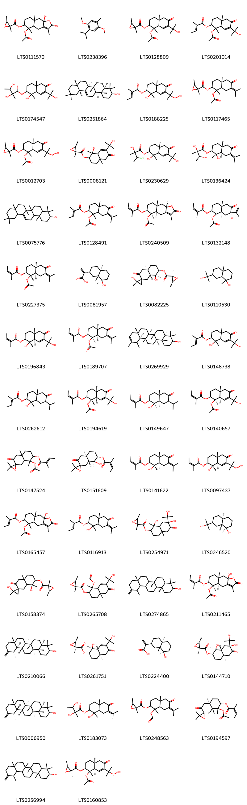{ width=100% }
    <figcaption>Hình ảnh cấu trúc hóa học của 63 hoạt chất thuộc nhóm Prenol lipids gồm ['5-(acetyloxy)-9a-hydroxy-3,5,8a-trimethyl-2-oxo-4h,4ah,6h,7h,8h,9h-naphtho[2,3-b]furan-6-yl 2,3-dimethyloxirane-2-carboxylate (LTS0111570)', '2,5-dimethoxy-p-cymene (LTS0238396)', '1-(acetyloxy)-7-(2-hydroxypropan-2-yl)-1,4a-dimethyl-6-oxo-3,4,5,8a-tetrahydro-2h-naphthalen-2-yl 2,3-dimethyloxirane-2-carboxylate (LTS0128809)', '1-(acetyloxy)-7-(2-hydroxypropan-2-yl)-1,4a-dimethyl-6-oxo-3,4,5,8a-tetrahydro-2h-naphthalen-2-yl 2-methylbut-2-enoate (LTS0201014)', '1-hydroxy-7-(2-hydroxypropan-2-yl)-1,4a-dimethyl-6-oxo-3,4,5,8a-tetrahydro-2h-naphthalen-2-yl 2,3-dihydroxy-2-methylbutanoate (LTS0174547)', 'β-amyrin (LTS0251864)', '7-(2-hydroperoxypropan-2-yl)-1-hydroxy-1,4a-dimethyl-6-oxo-3,4,5,8a-tetrahydro-2h-naphthalen-2-yl 2-methylbut-2-enoate (LTS0188225)', '1-(acetyloxy)-1,4a-dimethyl-6-oxo-7-(propan-2-ylidene)-hexahydronaphthalen-2-yl 2,3-dimethyloxirane-2-carboxylate (LTS0117465)', '1-(acetyloxy)-7-(2-hydroperoxypropan-2-yl)-1,4a-dimethyl-6-oxo-3,4,5,8a-tetrahydro-2h-naphthalen-2-yl 2,3-dimethyloxirane-2-carboxylate (LTS0012703)', '1-hydroxy-7-(2-hydroxypropan-2-yl)-1,4a-dimethyl-6-oxo-3,4,5,8a-tetrahydro-2h-naphthalen-2-yl 2,3-dimethyloxirane-2-carboxylate (LTS0008121)', '1-hydroxy-7-(2-hydroxypropan-2-yl)-1,4a-dimethyl-6-oxo-3,4,5,8a-tetrahydro-2h-naphthalen-2-yl 3-chloro-2-hydroxy-2-methylbutanoate (LTS0230629)', '(1s,2s,4ar,8ar)-1-hydroxy-1,4a-dimethyl-6-oxo-7-(propan-2-ylidene)-hexahydronaphthalen-2-yl (2s,3s)-2,3-dihydroxy-2-methylbutanoate (LTS0136424)', 'β-amyrin (LTS0075776)', '1-(acetyloxy)-1,4a-dimethyl-6-oxo-7-(propan-2-ylidene)-hexahydronaphthalen-2-yl 2-methylbut-2-enoate (LTS0128491)', '(4ar,5r,6s,8ar,9as)-5-(acetyloxy)-3,5,8a-trimethyl-2-oxo-4h,4ah,6h,7h,8h,9h,9ah-naphtho[2,3-b]furan-6-yl (2z)-2-methylbut-2-enoate (LTS0240509)', '(1r,2s,4ar,7s,8ar)-1-(acetyloxy)-7-hydroxy-1,4a-dimethyl-6-oxo-7-(prop-1-en-2-yl)-hexahydronaphthalen-2-yl (2z)-2-methylbut-2-enoate (LTS0132148)', '(1s,2s,4ar,8ar)-1-(acetyloxy)-1,4a-dimethyl-6-oxo-7-(propan-2-ylidene)-hexahydronaphthalen-2-yl (2z)-2-methylbut-2-enoate (LTS0227375)', '2-[(2r,4ar,8r,8ar)-8-hydroxy-4a,8-dimethyl-octahydronaphthalen-2-yl]prop-2-enoic acid (LTS0081957)', "(1r,2s,4'ar,7'r,8's,8'ar)-2,8'-dihydroxy-2,4'a,8'-trimethyl-3'-oxo-hexahydrospiro[cyclopropane-1,2'-naphthalen]-7'-yl (2s,3s)-2,3-dimethyloxirane-2-carboxylate (LTS0082225)", '7-(2-hydroxypropan-2-yl)-1,4a-dimethyl-octahydronaphthalen-1-ol (LTS0110530)', '(1s,2s,4ar,8ar)-1-hydroxy-7-(2-hydroxypropan-2-yl)-1,4a-dimethyl-6-oxo-3,4,5,8a-tetrahydro-2h-naphthalen-2-yl (2z)-2-methylbut-2-enoate (LTS0196843)', '(1r,2s,4ar,8ar)-1-(acetyloxy)-1,4a-dimethyl-6-oxo-7-(propan-2-ylidene)-hexahydronaphthalen-2-yl (2z)-2-methylbut-2-enoate (LTS0189707)', '(4ar,6ar,6br,8as,12ar,12br,14ar,14br)-4,4,6a,6b,8a,11,12,14b-octamethyl-2,3,4a,5,6,7,8,9,12,12a,12b,13,14,14a-tetradecahydro-1h-picen-3-ol (LTS0269929)', '1-hydroxy-7-(2-hydroxypropan-2-yl)-1,4a-dimethyl-6-oxo-3,4,5,8a-tetrahydro-2h-naphthalen-2-yl 2-methylbut-2-enoate (LTS0148738)', '1-hydroxy-7-isopropyl-1,4a-dimethyl-6-oxo-hexahydro-2h-naphthalen-2-yl 2-methylbut-2-enoate (LTS0262612)', '(1s,2s,4ar,8ar)-1-(acetyloxy)-7-(2-hydroxypropan-2-yl)-1,4a-dimethyl-6-oxo-3,4,5,8a-tetrahydro-2h-naphthalen-2-yl (2z)-2-methylbut-2-enoate (LTS0194619)', '(1r,2s,4ar,7r,8ar)-1-hydroxy-7-isopropyl-1,4a-dimethyl-6-oxo-hexahydro-2h-naphthalen-2-yl (2z)-2-methylbut-2-enoate (LTS0149647)', '(1r,2s,4ar,8ar)-1-(acetyloxy)-7-(2-hydroxypropan-2-yl)-1,4a-dimethyl-6-oxo-3,4,5,8a-tetrahydro-2h-naphthalen-2-yl (2z)-2-methylbut-2-enoate (LTS0140657)', "8-(acetyloxy)-3',3',4a,8-tetramethyl-3-oxo-hexahydrospiro[naphthalene-2,2'-oxiran]-7-yl 2-methylbut-2-enoate (LTS0147524)", "(2r,4ar,7s,8s,8ar)-8-hydroxy-3',3',4a,8-tetramethyl-3-oxo-hexahydrospiro[naphthalene-2,2'-oxiran]-7-yl (2z)-2-methylbut-2-enoate (LTS0151609)", '(1s,2s,4ar,8ar)-1-hydroxy-1,4a-dimethyl-6-oxo-7-(propan-2-ylidene)-hexahydronaphthalen-2-yl (2z)-2-methylbut-2-enoate (LTS0141622)', '(1s,2s,4ar,8ar)-7-(2-hydroperoxypropan-2-yl)-1-hydroxy-1,4a-dimethyl-6-oxo-3,4,5,8a-tetrahydro-2h-naphthalen-2-yl (2z)-2-methylbut-2-enoate (LTS0097437)', '5-(acetyloxy)-9a-hydroxy-3,5,8a-trimethyl-2-oxo-4h,4ah,6h,7h,8h,9h-naphtho[2,3-b]furan-6-yl 2-methylbut-2-enoate (LTS0165457)', '1-hydroxy-1,4a-dimethyl-6-oxo-7-(propan-2-ylidene)-hexahydronaphthalen-2-yl 2-methylbut-2-enoate (LTS0116913)', '1,7-dihydroxy-7-(2-hydroxypropan-2-yl)-1,4a-dimethyl-6-oxo-hexahydronaphthalen-2-yl 2,3-dimethyloxirane-2-carboxylate (LTS0254971)', '(1r,4ar,7s,8ar)-7-(2-hydroxypropan-2-yl)-1,4a-dimethyl-octahydronaphthalen-1-ol (LTS0246520)', "2,8'-dihydroxy-2,4'a,8'-trimethyl-3'-oxo-hexahydrospiro[cyclopropane-1,2'-naphthalen]-7'-yl 2,3-dimethyloxirane-2-carboxylate (LTS0158374)", '1-(formyloxy)-7-(2-hydroxypropan-2-yl)-1,4a-dimethyl-6-oxo-3,4,5,8a-tetrahydro-2h-naphthalen-2-yl 2,3-dimethyloxirane-2-carboxylate (LTS0265708)', '(6ar,6br,8ar,14br)-4,4,6a,6b,8a,12,14b-heptamethyl-11-methylidene-hexadecahydropicen-3-ol (LTS0274865)', '(4ar,5r,6s,8ar,9as)-5-(acetyloxy)-9a-hydroxy-3,5,8a-trimethyl-2-oxo-4h,4ah,6h,7h,8h,9h-naphtho[2,3-b]furan-6-yl (2z)-2-methylbut-2-enoate (LTS0211465)', 'taraxasterol (LTS0210066)', '(1s,2s,4ar,8ar)-1-hydroxy-7-(2-hydroxypropan-2-yl)-1,4a-dimethyl-6-oxo-3,4,5,8a-tetrahydro-2h-naphthalen-2-yl (2s,3s)-2,3-dimethyloxirane-2-carboxylate (LTS0261751)', '2-[(4ar,8r,8ar)-8-hydroxy-4a,8-dimethyl-octahydronaphthalen-2-yl]prop-2-enoic acid (LTS0224400)', '(1s,2r,4ar,7s,8ar)-1,7-dihydroxy-7-(2-hydroxypropan-2-yl)-1,4a-dimethyl-6-oxo-hexahydronaphthalen-2-yl (2s,3s)-2,3-dimethyloxirane-2-carboxylate (LTS0144710)', 'taraxasterol (LTS0006950)', '1-hydroxy-1,4a-dimethyl-6-oxo-7-(propan-2-ylidene)-hexahydronaphthalen-2-yl 2,3-dihydroxy-2-methylbutanoate (LTS0183073)', '1-(formyloxy)-1,4a-dimethyl-6-oxo-7-(propan-2-ylidene)-hexahydronaphthalen-2-yl 2,3-dimethyloxirane-2-carboxylate (LTS0248563)', "(2s,4ar,7s,8r,8ar)-8-(acetyloxy)-3',3',4a,8-tetramethyl-3-oxo-hexahydrospiro[naphthalene-2,2'-oxiran]-7-yl (2z)-2-methylbut-2-enoate (LTS0194597)", '4,4,6a,6b,8a,12,14b-heptamethyl-11-methylidene-hexadecahydropicen-3-ol (LTS0256994)', '(1s,2s,4ar,8ar)-1-(acetyloxy)-7-(2-hydroperoxypropan-2-yl)-1,4a-dimethyl-6-oxo-3,4,5,8a-tetrahydro-2h-naphthalen-2-yl (2s,3s)-2,3-dimethyloxirane-2-carboxylate (LTS0160853)', "8-hydroxy-3',3',4a,8-tetramethyl-3-oxo-hexahydrospiro[naphthalene-2,2'-oxiran]-7-yl 2-methylbut-2-enoate (LTS0007527)", '(4ar,5s,6s,8ar,9as)-5,9a-dihydroxy-3,5,8a-trimethyl-2-oxo-4h,4ah,6h,7h,8h,9h-naphtho[2,3-b]furan-6-yl (2z)-2-methylbut-2-enoate (LTS0035816)', '1-(acetyloxy)-7-hydroxy-1,4a-dimethyl-6-oxo-7-(prop-1-en-2-yl)-hexahydronaphthalen-2-yl 2-methylbut-2-enoate (LTS0124740)', '5,9a-dihydroxy-3,5,8a-trimethyl-2-oxo-4h,4ah,6h,7h,8h,9h-naphtho[2,3-b]furan-6-yl 2-methylbut-2-enoate (LTS0265219)', '(1s,2s,4ar,8ar)-1-(acetyloxy)-1,4a-dimethyl-6-oxo-7-(propan-2-ylidene)-hexahydronaphthalen-2-yl (2s,3s)-2,3-dimethyloxirane-2-carboxylate (LTS0059736)', '(4ar,5s,6s,8ar,9as)-5-(acetyloxy)-9a-hydroxy-3,5,8a-trimethyl-2-oxo-4h,4ah,6h,7h,8h,9h-naphtho[2,3-b]furan-6-yl (2s,3s)-2,3-dimethyloxirane-2-carboxylate (LTS0013780)', '(1s,2s,4ar,8ar)-1-(acetyloxy)-7-(2-hydroxypropan-2-yl)-1,4a-dimethyl-6-oxo-3,4,5,8a-tetrahydro-2h-naphthalen-2-yl (2s,3s)-2,3-dimethyloxirane-2-carboxylate (LTS0013542)', '(1s,2s,4ar,8ar)-1-(formyloxy)-7-(2-hydroxypropan-2-yl)-1,4a-dimethyl-6-oxo-3,4,5,8a-tetrahydro-2h-naphthalen-2-yl (2s,3s)-2,3-dimethyloxirane-2-carboxylate (LTS0004569)', '(1s,2s,4ar,8ar)-1-hydroxy-7-(2-hydroxypropan-2-yl)-1,4a-dimethyl-6-oxo-3,4,5,8a-tetrahydro-2h-naphthalen-2-yl (2r,3s)-3-chloro-2-hydroxy-2-methylbutanoate (LTS0071003)', '(1s,2s,4ar,8ar)-1-(formyloxy)-1,4a-dimethyl-6-oxo-7-(propan-2-ylidene)-hexahydronaphthalen-2-yl (2s,3s)-2,3-dimethyloxirane-2-carboxylate (LTS0248962)', '(1s,2s,4ar,8ar)-1-hydroxy-7-(2-hydroxypropan-2-yl)-1,4a-dimethyl-6-oxo-3,4,5,8a-tetrahydro-2h-naphthalen-2-yl (2s,3s)-2,3-dihydroxy-2-methylbutanoate (LTS0026157)', '2-(8-hydroxy-4a,8-dimethyl-octahydronaphthalen-2-yl)prop-2-enoic acid (LTS0120127)', '5-(acetyloxy)-3,5,8a-trimethyl-2-oxo-4h,4ah,6h,7h,8h,9h,9ah-naphtho[2,3-b]furan-6-yl 2-methylbut-2-enoate (LTS0106059)'].</figcaption>
</figure>
#### Nhóm Steroids and steroid derivatives
<figure markdown="span">
    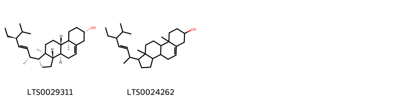{ width=100% }
    <figcaption>Hình ảnh cấu trúc hóa học của 2 hoạt chất thuộc nhóm Steroids and steroid derivatives gồm ['phytosterol (LTS0029311)', 'stigmasterol (LTS0024262)'].</figcaption>
</figure>
#### Nhóm Thiophenes
<figure markdown="span">
    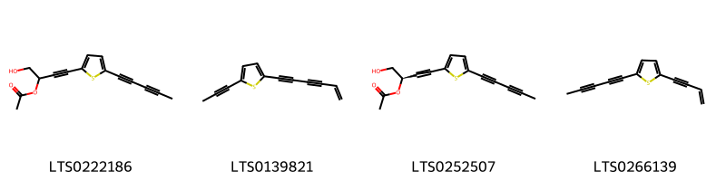{ width=100% }
    <figcaption>Hình ảnh cấu trúc hóa học của 4 hoạt chất thuộc nhóm Thiophenes gồm ['1-hydroxy-4-[5-(penta-1,3-diyn-1-yl)thiophen-2-yl]but-3-yn-2-yl acetate (LTS0222186)', '2-(hex-5-en-1,3-diyn-1-yl)-5-(prop-1-yn-1-yl)thiophene (LTS0139821)', '(2r)-1-hydroxy-4-[5-(penta-1,3-diyn-1-yl)thiophen-2-yl]but-3-yn-2-yl acetate (LTS0252507)', '2-(but-3-en-1-yn-1-yl)-5-(penta-1,3-diyn-1-yl)thiophene (LTS0266139)'].</figcaption>
</figure>

---

### Dược dân tộc học

Danh sách các quốc gia có sử dụng *Pluchea sagittalis* trong điều trị các bệnh. 

| Country   | Disease     | Bệnh                                                                                                                                                                                                |
|:----------|:------------|:----------------------------------------------------------------------------------------------------------------------------------------------------------------------------------------------------|
| Argentina | Carminative | MYMEMORY WARNING: YOU USED ALL AVAILABLE FREE TRANSLATIONS FOR TODAY. NEXT AVAILABLE IN  09 HOURS 05 MINUTES 56 SECONDS VISIT HTTPS://MYMEMORY.TRANSLATED.NET/DOC/USAGELIMITS.PHP TO TRANSLATE MORE |

---

# Chi Aster

??? note "Danh sách các dược liệu thuộc chi"
    
	 - *Aster amellus*
	 - *Aster incisa*
	 - *Aster tataricis*
	 - *Aster tataricus*
	 - *Aster tatraicus*
	 - *Aster trinervius*
	 - *Aster tripolium*
	 - *Aster villosa*

---
## Aster amellus
### Thông tin về thực vật

!!! info "Phân loại thực vật của *Aster amellus* từ GIBF:"
    - **Kingdom:** Plantae
    - **Phylum:** Tracheophyta
    - **Order:** Asterales
    - **Family:** Asteraceae
    - **Genus:** Aster
    - **Species:** *Aster amellus*

 

| Label (VI)   | Label (EN)   | Scientific Name   | Descriptions (VI)   | Descriptions (EN)   | Also Known As (VI)                                                             | Also Known As (EN)   |
|:-------------|:-------------|:------------------|:--------------------|:--------------------|:-------------------------------------------------------------------------------|:---------------------|
| N/A          | N/A          | Aster amellus     | ý nghĩa             | species of plant    | ['Thạch thảo', 'Hoa thạch thảo', 'Cúc thạch thảo', 'Cúc Nhật Bản', 'Cúc Nhật'] | ['garden aster']     |

#### Phân bố trên thế giới

**Từ CSDL GIBF** Ukraine, Italy, Czechia, Germany, Slovakia, Romania, Kyrgyzstan, Georgia, Poland, Hungary, Switzerland, Russian Federation, Sweden, Austria, France, Slovenia, Croatia

#### Phân bố tại Việt Nam

**Từ CSDL GIBF**: Không có ghi nhận ở Việt Nam

---
### Thành phần hóa học
        
- Theo cơ sở dữ liệu lotus: Từ loài *Aster amellus* đã phân lập và xác định được Chưa có hoạt chất nào được phân lập. hoạt chất thuộc về các nhóm Không có hoạt chất nào được phân lập. 

Không có hình ảnh nào được tạo ra

---

### Dược dân tộc học

Danh sách các quốc gia có sử dụng *Aster amellus* trong điều trị các bệnh. 

| Country   | Disease                    | Bệnh                                                                                                                                                                                                |
|:----------|:---------------------------|:----------------------------------------------------------------------------------------------------------------------------------------------------------------------------------------------------|
| Turkey    | Astringent, Nervine, Tonic | MYMEMORY WARNING: YOU USED ALL AVAILABLE FREE TRANSLATIONS FOR TODAY. NEXT AVAILABLE IN  09 HOURS 05 MINUTES 25 SECONDS VISIT HTTPS://MYMEMORY.TRANSLATED.NET/DOC/USAGELIMITS.PHP TO TRANSLATE MORE |

---

---
## Aster incisa
### Thông tin về thực vật

!!! info "Phân loại thực vật của *Kalimeris incisa* từ GIBF:"
    - **Kingdom:** Plantae
    - **Phylum:** Tracheophyta
    - **Order:** Asterales
    - **Family:** Asteraceae
    - **Genus:** Kalimeris
    - **Species:** *Kalimeris incisa*

 

| Label (VI)   | Label (EN)   | Scientific Name   | Descriptions (VI)   | Descriptions (EN)   | Also Known As (VI)                                                             | Also Known As (EN)   |
|:-------------|:-------------|:------------------|:--------------------|:--------------------|:-------------------------------------------------------------------------------|:---------------------|
| N/A          | N/A          | Aster amellus     | ý nghĩa             | species of plant    | ['Thạch thảo', 'Hoa thạch thảo', 'Cúc thạch thảo', 'Cúc Nhật Bản', 'Cúc Nhật'] | ['garden aster']     |

#### Phân bố trên thế giới

**Từ CSDL GIBF** nan, Netherlands, Japan, Belgium, Korea, Republic of, Chinese Taipei, Russian Federation, Sweden, China

#### Phân bố tại Việt Nam

**Từ CSDL GIBF**: Không có ghi nhận ở Việt Nam

---
### Thành phần hóa học
        
- Theo cơ sở dữ liệu lotus: Từ loài *Kalimeris incisa* đã phân lập và xác định được Chưa có hoạt chất nào được phân lập. hoạt chất thuộc về các nhóm Không có hoạt chất nào được phân lập. 

Không có hình ảnh nào được tạo ra

---

### Dược dân tộc học

Danh sách các quốc gia có sử dụng *Kalimeris incisa* trong điều trị các bệnh. 

| Country   | Disease   | Bệnh                                                                                                                                                                                                |
|:----------|:----------|:----------------------------------------------------------------------------------------------------------------------------------------------------------------------------------------------------|
| Japan     | Diuretic  | MYMEMORY WARNING: YOU USED ALL AVAILABLE FREE TRANSLATIONS FOR TODAY. NEXT AVAILABLE IN  09 HOURS 05 MINUTES 02 SECONDS VISIT HTTPS://MYMEMORY.TRANSLATED.NET/DOC/USAGELIMITS.PHP TO TRANSLATE MORE |

---

---
## Aster tataricis
### Thông tin về thực vật

!!! info "Phân loại thực vật của *Aster tataricus* từ GIBF:"
    - **Kingdom:** Plantae
    - **Phylum:** Tracheophyta
    - **Order:** Asterales
    - **Family:** Asteraceae
    - **Genus:** Aster
    - **Species:** *Aster tataricus*

 

| Label (VI)   | Label (EN)   | Scientific Name   | Descriptions (VI)   | Descriptions (EN)   | Also Known As (VI)                                                             | Also Known As (EN)   |
|:-------------|:-------------|:------------------|:--------------------|:--------------------|:-------------------------------------------------------------------------------|:---------------------|
| N/A          | N/A          | Aster amellus     | ý nghĩa             | species of plant    | ['Thạch thảo', 'Hoa thạch thảo', 'Cúc thạch thảo', 'Cúc Nhật Bản', 'Cúc Nhật'] | ['garden aster']     |

#### Phân bố trên thế giới

**Từ CSDL GIBF** Japan, Korea, Republic of, Russian Federation, United States of America, Mongolia, China

#### Phân bố tại Việt Nam

**Từ CSDL GIBF**: Không có ghi nhận ở Việt Nam

---
### Thành phần hóa học
        
- Theo cơ sở dữ liệu lotus: Từ loài *Aster tataricus* đã phân lập và xác định được Chưa có hoạt chất nào được phân lập. hoạt chất thuộc về các nhóm Không có hoạt chất nào được phân lập. 

Không có hình ảnh nào được tạo ra

---

### Dược dân tộc học

Danh sách các quốc gia có sử dụng *Aster tataricus* trong điều trị các bệnh. 

| Country   | Disease     | Bệnh                                                                                                                                                                                                |
|:----------|:------------|:----------------------------------------------------------------------------------------------------------------------------------------------------------------------------------------------------|
| China     | Expectorant | MYMEMORY WARNING: YOU USED ALL AVAILABLE FREE TRANSLATIONS FOR TODAY. NEXT AVAILABLE IN  09 HOURS 04 MINUTES 40 SECONDS VISIT HTTPS://MYMEMORY.TRANSLATED.NET/DOC/USAGELIMITS.PHP TO TRANSLATE MORE |

---

---
## Aster tataricus
### Thông tin về thực vật

!!! info "Phân loại thực vật của *Aster tataricus* từ GIBF:"
    - **Kingdom:** Plantae
    - **Phylum:** Tracheophyta
    - **Order:** Asterales
    - **Family:** Asteraceae
    - **Genus:** Aster
    - **Species:** *Aster tataricus*

 

| Label (VI)   | Label (EN)   | Scientific Name   | Descriptions (VI)   | Descriptions (EN)   | Also Known As (VI)   | Also Known As (EN)    |
|:-------------|:-------------|:------------------|:--------------------|:--------------------|:---------------------|:----------------------|
| N/A          | N/A          | Aster tataricus   | loài thực vật       | species of plant    | ['']                 | ["Tatarinow's aster"] |

#### Phân bố trên thế giới

**Từ CSDL GIBF** Japan, Korea, Republic of, Russian Federation, United States of America, Mongolia, China

#### Phân bố tại Việt Nam

**Từ CSDL GIBF**: Không có ghi nhận ở Việt Nam

---
### Thành phần hóa học
        
- Theo cơ sở dữ liệu lotus: Từ loài *Aster tataricus* đã phân lập và xác định được 126 hoạt chất thuộc về các nhóm Flavonoids, Prenol lipids, Steroids and steroid derivatives, Peptidomimetics, Organooxygen compounds, Carboxylic acids and derivatives. 

|    | chemicalTaxonomyClassyfireClass   |   smiles_count |
|---:|:----------------------------------|---------------:|
|  0 | Carboxylic acids and derivatives  |             11 |
|  1 | Flavonoids                        |              3 |
|  2 | Organooxygen compounds            |              1 |
|  3 | Peptidomimetics                   |             30 |
|  4 | Prenol lipids                     |             43 |
|  5 | Steroids and steroid derivatives  |             37 |

#### Nhóm Carboxylic acids and derivatives
<figure markdown="span">
    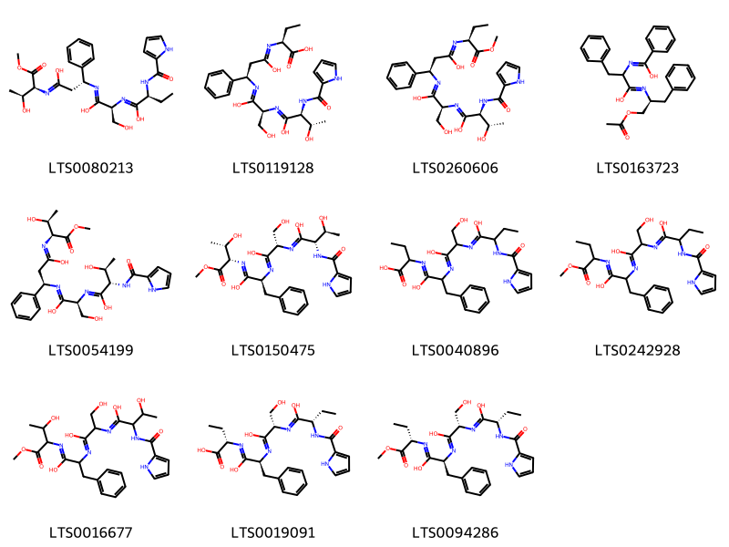{ width=100% }
    <figcaption>Hình ảnh cấu trúc hóa học của 11 hoạt chất thuộc nhóm Carboxylic acids and derivatives gồm ['(2s)-n-[(1s)-2-hydroxy-1-{[(1r)-2-{[(2s,3s)-3-hydroxy-1-methoxy-1-oxobutan-2-yl]-c-hydroxycarbonimidoyl}-1-phenylethyl]-c-hydroxycarbonimidoyl}ethyl]-2-(1h-pyrrol-2-ylformamido)butanimidic acid (LTS0080213)', '(2s)-2-{[(3r)-3-{[(2s)-2-{[(2s,3s)-1,3-dihydroxy-2-(1h-pyrrol-2-ylformamido)butylidene]amino}-1,3-dihydroxypropylidene]amino}-1-hydroxy-3-phenylpropylidene]amino}butanoic acid (LTS0119128)', '(2s,3s)-3-hydroxy-n-[(1s)-2-hydroxy-1-{[(1r)-2-{[(2s)-1-methoxy-1-oxobutan-2-yl]-c-hydroxycarbonimidoyl}-1-phenylethyl]-c-hydroxycarbonimidoyl}ethyl]-2-(1h-pyrrol-2-ylformamido)butanimidic acid (LTS0260606)', 'n-[(2s)-1-(acetyloxy)-3-phenylpropan-2-yl]-2-{[hydroxy(phenyl)methylidene]amino}-3-phenylpropanimidic acid (LTS0163723)', '(2s,3s)-3-hydroxy-n-[(1s)-2-hydroxy-1-{[(1r)-2-{[(2s,3s)-3-hydroxy-1-methoxy-1-oxobutan-2-yl]-c-hydroxycarbonimidoyl}-1-phenylethyl]-c-hydroxycarbonimidoyl}ethyl]-2-(1h-pyrrol-2-ylformamido)butanimidic acid (LTS0054199)', '(2s,3s)-3-hydroxy-n-[(1s)-2-hydroxy-1-{[(1s)-1-{[(2s,3s)-3-hydroxy-1-methoxy-1-oxobutan-2-yl]-c-hydroxycarbonimidoyl}-2-phenylethyl]-c-hydroxycarbonimidoyl}ethyl]-2-(1h-pyrrol-2-ylformamido)butanimidic acid (LTS0150475)', '2-({2-[(1,3-dihydroxy-2-{[1-hydroxy-2-(1h-pyrrol-2-ylformamido)butylidene]amino}propylidene)amino]-1-hydroxy-3-phenylpropylidene}amino)butanoic acid (LTS0040896)', 'n-[2-hydroxy-1-({1-[(1-methoxy-1-oxobutan-2-yl)-c-hydroxycarbonimidoyl]-2-phenylethyl}-c-hydroxycarbonimidoyl)ethyl]-2-(1h-pyrrol-2-ylformamido)butanimidic acid (LTS0242928)', '3-hydroxy-n-[2-hydroxy-1-({1-[(3-hydroxy-1-methoxy-1-oxobutan-2-yl)-c-hydroxycarbonimidoyl]-2-phenylethyl}-c-hydroxycarbonimidoyl)ethyl]-2-(1h-pyrrol-2-ylformamido)butanimidic acid (LTS0016677)', '(2s)-2-{[(2s)-2-{[(2s)-1,3-dihydroxy-2-{[(2s)-1-hydroxy-2-(1h-pyrrol-2-ylformamido)butylidene]amino}propylidene]amino}-1-hydroxy-3-phenylpropylidene]amino}butanoic acid (LTS0019091)', '(2s)-n-[(1s)-2-hydroxy-1-{[(1s)-1-{[(2s)-1-methoxy-1-oxobutan-2-yl]-c-hydroxycarbonimidoyl}-2-phenylethyl]-c-hydroxycarbonimidoyl}ethyl]-2-(1h-pyrrol-2-ylformamido)butanimidic acid (LTS0094286)'].</figcaption>
</figure>
#### Nhóm Flavonoids
<figure markdown="span">
    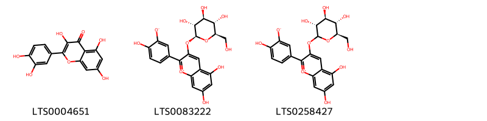{ width=100% }
    <figcaption>Hình ảnh cấu trúc hóa học của 3 hoạt chất thuộc nhóm Flavonoids gồm ['quercetin (LTS0004651)', '5,7-dihydroxy-2-(4-hydroxy-3-oxidophenyl)-3-{[(2s,3r,4s,5s,6r)-3,4,5-trihydroxy-6-(hydroxymethyl)oxan-2-yl]oxy}-1λ⁴-chromen-1-ylium (LTS0083222)', '5,7-dihydroxy-2-(4-hydroxy-3-oxidophenyl)-3-{[(3r,4s,5s,6r)-3,4,5-trihydroxy-6-(hydroxymethyl)oxan-2-yl]oxy}-1λ⁴-chromen-1-ylium (LTS0258427)'].</figcaption>
</figure>
#### Nhóm Organooxygen compounds
<figure markdown="span">
    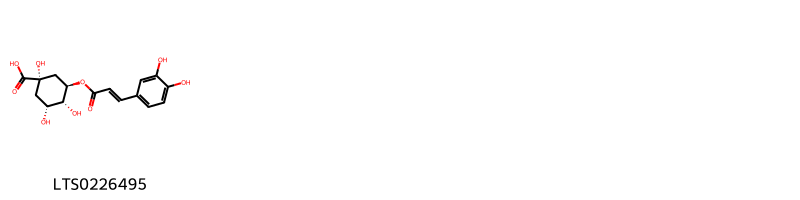{ width=100% }
    <figcaption>Hình ảnh cấu trúc hóa học của 1 hoạt chất thuộc nhóm Organooxygen compounds gồm ['chlorogenic acid (LTS0226495)'].</figcaption>
</figure>
#### Nhóm Peptidomimetics
<figure markdown="span">
    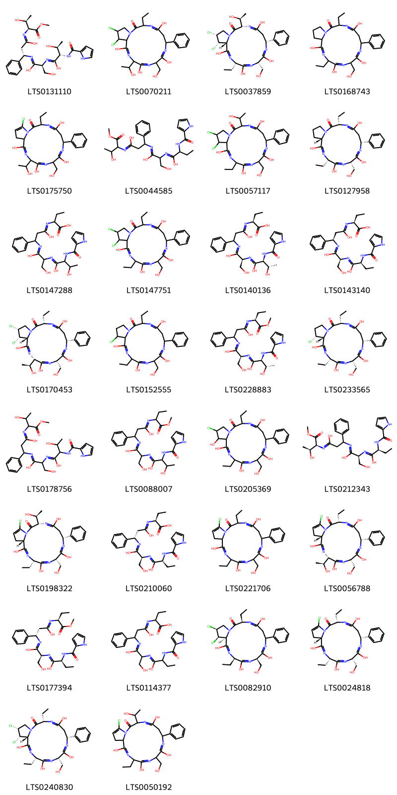{ width=100% }
    <figcaption>Hình ảnh cấu trúc hóa học của 30 hoạt chất thuộc nhóm Peptidomimetics gồm ['(2s,3s)-3-hydroxy-n-[(1s)-2-hydroxy-1-{[(1s)-2-{[(2s,3s)-3-hydroxy-1-methoxy-1-oxobutan-2-yl]-c-hydroxycarbonimidoyl}-1-phenylethyl]-c-hydroxycarbonimidoyl}ethyl]-2-(1h-pyrrol-2-ylformamido)butanimidic acid (LTS0131110)', '17,18-dichloro-13-ethyl-1,4,7,11-tetrahydroxy-3-(1-hydroxyethyl)-6-(hydroxymethyl)-9-phenyl-3h,6h,9h,10h,13h,16h,17h,18h,18ah-pyrrolo[1,2-d]1,4,7,10,13-pentaazacyclohexadecan-14-one (LTS0070211)', '(3s,6s,9r,13s,17r,18s,18ar)-17,18-dichloro-3-ethyl-1,4,7,11-tetrahydroxy-13-[(1s)-1-hydroxyethyl]-6-(hydroxymethyl)-9-phenyl-3h,6h,9h,10h,13h,16h,17h,18h,18ah-pyrrolo[1,2-d]1,4,7,10,13-pentaazacyclohexadecan-14-one (LTS0037859)', '3,13-diethyl-1,4,7,11-tetrahydroxy-6-(hydroxymethyl)-9-phenyl-3h,6h,9h,10h,13h,16h,17h,18h,18ah-pyrrolo[1,2-d]1,4,7,10,13-pentaazacyclohexadecan-14-one (LTS0168743)', '16-chloro-13-ethyl-1,4,7,11-tetrahydroxy-3-(1-hydroxyethyl)-6-(hydroxymethyl)-9-phenyl-3h,6h,9h,10h,13h,18h,18ah-pyrrolo[1,2-d]1,4,7,10,13-pentaazacyclohexadecan-14-one (LTS0175750)', 'n-[2-hydroxy-1-({2-[(3-hydroxy-1-methoxy-1-oxobutan-2-yl)-c-hydroxycarbonimidoyl]-1-phenylethyl}-c-hydroxycarbonimidoyl)ethyl]-2-(1h-pyrrol-2-ylformamido)butanimidic acid (LTS0044585)', '17,18-dichloro-3-ethyl-1,4,7,11-tetrahydroxy-13-(1-hydroxyethyl)-6-(hydroxymethyl)-9-phenyl-3h,6h,9h,10h,13h,16h,17h,18h,18ah-pyrrolo[1,2-d]1,4,7,10,13-pentaazacyclohexadecan-14-one (LTS0057117)', '(3s,6s,9r,13s,18as)-3,13-diethyl-1,4,7,11-tetrahydroxy-6-(hydroxymethyl)-9-phenyl-3h,6h,9h,10h,13h,16h,17h,18h,18ah-pyrrolo[1,2-d]1,4,7,10,13-pentaazacyclohexadecan-14-one (LTS0127958)', '2-({3-[(2-{[1,3-dihydroxy-2-(1h-pyrrol-2-ylformamido)butylidene]amino}-1,3-dihydroxypropylidene)amino]-1-hydroxy-3-phenylpropylidene}amino)butanoic acid (LTS0147288)', '17,18-dichloro-3,13-diethyl-1,4,7,11-tetrahydroxy-6-(hydroxymethyl)-9-phenyl-3h,6h,9h,10h,13h,16h,17h,18h,18ah-pyrrolo[1,2-d]1,4,7,10,13-pentaazacyclohexadecan-14-one (LTS0147751)', '(2s)-2-[(3-{[(2s)-2-{[(2s,3s)-1,3-dihydroxy-2-(1h-pyrrol-2-ylformamido)butylidene]amino}-1,3-dihydroxypropylidene]amino}-1-hydroxy-3-phenylpropylidene)amino]butanoic acid (LTS0140136)', '(2s)-2-{[(3r)-3-{[(2s)-1,3-dihydroxy-2-{[(2s)-1-hydroxy-2-(1h-pyrrol-2-ylformamido)butylidene]amino}propylidene]amino}-1-hydroxy-3-phenylpropylidene]amino}butanoic acid (LTS0143140)', '(3s,6s,9r,13s,17r,18s,18ar)-17,18-dichloro-13-ethyl-1,4,7,11-tetrahydroxy-3-[(1s)-1-hydroxyethyl]-6-(hydroxymethyl)-9-phenyl-3h,6h,9h,10h,13h,16h,17h,18h,18ah-pyrrolo[1,2-d]1,4,7,10,13-pentaazacyclohexadecan-14-one (LTS0170453)', '18-chloro-3,13-diethyl-1,4,7,11-tetrahydroxy-6-(hydroxymethyl)-9-phenyl-3h,6h,9h,10h,13h,16h,17h,18h,18ah-pyrrolo[1,2-d]1,4,7,10,13-pentaazacyclohexadecan-14-one (LTS0152555)', '(2s,3s)-3-hydroxy-n-[(1s)-2-hydroxy-1-[(2-{[(2s)-1-methoxy-1-oxobutan-2-yl]-c-hydroxycarbonimidoyl}-1-phenylethyl)-c-hydroxycarbonimidoyl]ethyl]-2-(1h-pyrrol-2-ylformamido)butanimidic acid (LTS0228883)', '(3s,6s,9r,13s,18r,18ar)-18-chloro-3,13-diethyl-1,4,7,11-tetrahydroxy-6-(hydroxymethyl)-9-phenyl-3h,6h,9h,10h,13h,16h,17h,18h,18ah-pyrrolo[1,2-d]1,4,7,10,13-pentaazacyclohexadecan-14-one (LTS0233565)', '3-hydroxy-n-[2-hydroxy-1-({2-[(3-hydroxy-1-methoxy-1-oxobutan-2-yl)-c-hydroxycarbonimidoyl]-1-phenylethyl}-c-hydroxycarbonimidoyl)ethyl]-2-(1h-pyrrol-2-ylformamido)butanimidic acid (LTS0178756)', '3-hydroxy-n-[2-hydroxy-1-({2-[(1-methoxy-1-oxobutan-2-yl)-c-hydroxycarbonimidoyl]-1-phenylethyl}-c-hydroxycarbonimidoyl)ethyl]-2-(1h-pyrrol-2-ylformamido)butanimidic acid (LTS0088007)', '17-chloro-3,13-diethyl-1,4,7,11,18-pentahydroxy-6-(hydroxymethyl)-9-phenyl-3h,6h,9h,10h,13h,16h,17h,18h,18ah-pyrrolo[1,2-d]1,4,7,10,13-pentaazacyclohexadecan-14-one (LTS0205369)', '(2s)-n-[(1s)-2-hydroxy-1-[(2-{[(2s,3s)-3-hydroxy-1-methoxy-1-oxobutan-2-yl]-c-hydroxycarbonimidoyl}-1-phenylethyl)-c-hydroxycarbonimidoyl]ethyl]-2-(1h-pyrrol-2-ylformamido)butanimidic acid (LTS0212343)', '(3s,6s,9r,13s,18as)-16-chloro-3-ethyl-1,4,7,11-tetrahydroxy-13-[(1s)-1-hydroxyethyl]-6-(hydroxymethyl)-9-phenyl-3h,6h,9h,10h,13h,18h,18ah-pyrrolo[1,2-d]1,4,7,10,13-pentaazacyclohexadecan-14-one (LTS0198322)', '(2s)-2-{[(3s)-3-{[(2s)-1,3-dihydroxy-2-{[(2s)-1-hydroxy-2-(1h-pyrrol-2-ylformamido)butylidene]amino}propylidene]amino}-1-hydroxy-3-phenylpropylidene]amino}butanoic acid (LTS0210060)', '16-chloro-3,13-diethyl-1,4,7,11-tetrahydroxy-6-(hydroxymethyl)-9-phenyl-3h,6h,9h,10h,13h,18h,18ah-pyrrolo[1,2-d]1,4,7,10,13-pentaazacyclohexadecan-14-one (LTS0221706)', '(3s,6s,9r,13s,18as)-16-chloro-13-ethyl-1,4,7,11-tetrahydroxy-3-[(1s)-1-hydroxyethyl]-6-(hydroxymethyl)-9-phenyl-3h,6h,9h,10h,13h,18h,18ah-pyrrolo[1,2-d]1,4,7,10,13-pentaazacyclohexadecan-14-one (LTS0056788)', '(2s)-n-[(1s)-2-hydroxy-1-{[(1s)-2-{[(2s)-1-methoxy-1-oxobutan-2-yl]-c-hydroxycarbonimidoyl}-1-phenylethyl]-c-hydroxycarbonimidoyl}ethyl]-2-(1h-pyrrol-2-ylformamido)butanimidic acid (LTS0177394)', '2-({3-[(1,3-dihydroxy-2-{[1-hydroxy-2-(1h-pyrrol-2-ylformamido)butylidene]amino}propylidene)amino]-1-hydroxy-3-phenylpropylidene}amino)butanoic acid (LTS0114377)', '(3r,6r,13r,17s,18r,18as)-17,18-dichloro-3,13-diethyl-1,4,7,11-tetrahydroxy-6-(hydroxymethyl)-9-phenyl-3h,6h,9h,10h,13h,16h,17h,18h,18ah-pyrrolo[1,2-d]1,4,7,10,13-pentaazacyclohexadecan-14-one (LTS0082910)', '(3s,6s,9r,13s,18as)-16-chloro-3,13-diethyl-1,4,7,11-tetrahydroxy-6-(hydroxymethyl)-9-phenyl-3h,6h,9h,10h,13h,18h,18ah-pyrrolo[1,2-d]1,4,7,10,13-pentaazacyclohexadecan-14-one (LTS0024818)', '(3s,6s,9r,13s,17r,18s,18ar)-17,18-dichloro-3,13-diethyl-1,4,7,11-tetrahydroxy-6-(hydroxymethyl)-9-phenyl-3h,6h,9h,10h,13h,16h,17h,18h,18ah-pyrrolo[1,2-d]1,4,7,10,13-pentaazacyclohexadecan-14-one (LTS0240830)', '16-chloro-3-ethyl-1,4,7,11-tetrahydroxy-13-(1-hydroxyethyl)-6-(hydroxymethyl)-9-phenyl-3h,6h,9h,10h,13h,18h,18ah-pyrrolo[1,2-d]1,4,7,10,13-pentaazacyclohexadecan-14-one (LTS0050192)'].</figcaption>
</figure>
#### Nhóm Prenol lipids
<figure markdown="span">
    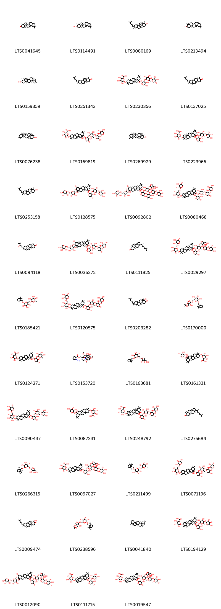{ width=100% }
    <figcaption>Hình ảnh cấu trúc hóa học của 43 hoạt chất thuộc nhóm Prenol lipids gồm ['(-)-friedelin (LTS0041645)', 'epi-friedelanol (LTS0114491)', 'shionone (LTS0080169)', 'friedelin (LTS0213494)', '(3r,4r,4as,6as,6br,8ar,12ar,12bs,14as,14bs)-4,4a,6b,8a,11,11,12b,14a-octamethyl-hexadecahydropicen-3-ol (LTS0159359)', '(1r,2s,4as,4bs,6as,8r,10ar,10bs,12as)-1,4b,6a,8,10a,12a-hexamethyl-8-(4-methylpent-3-en-1-yl)-dodecahydro-1h-chrysen-2-ol (LTS0251342)', '6-{[8a-({[3-({3,4-dihydroxy-6-methyl-5-[(3,4,5-trihydroxyoxan-2-yl)oxy]oxan-2-yl}oxy)-4,5-dihydroxyoxan-2-yl]oxy}carbonyl)-8-hydroxy-4,4,6a,6b,11,11,14b-heptamethyl-1,2,3,4a,5,6,7,8,9,10,12,12a,14,14a-tetradecahydropicen-3-yl]oxy}-3,4,5-trihydroxyoxane-2-carboxylic acid (LTS0230356)', '1,4b,6a,8,10a,12a-hexamethyl-8-(4-methylpent-3-en-1-yl)-dodecahydrochrysen-2-one (LTS0137025)', 'alnulin (LTS0076238)', '6-[(8a-{[(3-{[5-({3,5-dihydroxy-4-[(3,4,5-trihydroxyoxan-2-yl)oxy]oxan-2-yl}oxy)-3,4-dihydroxy-6-methyloxan-2-yl]oxy}-4,5-dihydroxyoxan-2-yl)oxy]carbonyl}-8-hydroxy-4,4,6a,6b,11,11,14b-heptamethyl-1,2,3,4a,5,6,7,8,9,10,12,12a,14,14a-tetradecahydropicen-3-yl)oxy]-3,4,5-trihydroxyoxane-2-carboxylic acid (LTS0169819)', '(4ar,6ar,6br,8as,12ar,12br,14ar,14br)-4,4,6a,6b,8a,11,12,14b-octamethyl-2,3,4a,5,6,7,8,9,12,12a,12b,13,14,14a-tetradecahydro-1h-picen-3-ol (LTS0269929)', '(2s,3s,4s,5r,6r)-6-{[(3s,4ar,6ar,6bs,8r,8ar,12as,14ar,14br)-8a-({[(2s,3r,4s,5s)-3-{[(2s,3r,4s,5r,6s)-3,4-dihydroxy-6-methyl-5-{[(2s,3r,4s,5r)-3,4,5-trihydroxyoxan-2-yl]oxy}oxan-2-yl]oxy}-4,5-dihydroxyoxan-2-yl]oxy}carbonyl)-8-hydroxy-4,4,6a,6b,11,11,14b-heptamethyl-1,2,3,4a,5,6,7,8,9,10,12,12a,14,14a-tetradecahydropicen-3-yl]oxy}-3,4,5-trihydroxyoxane-2-carboxylic acid (LTS0223966)', '1,4b,6a,8,10a,12a-hexamethyl-8-(4-methylpent-3-en-1-yl)-dodecahydro-1h-chrysen-2-ol (LTS0253158)', '(2s,3r,4s,5r)-3-{[(2s,3r,4s,5r,6s)-3,4-dihydroxy-6-methyl-5-{[(2s,3r,4s,5r)-3,4,5-trihydroxyoxan-2-yl]oxy}oxan-2-yl]oxy}-4,5-dihydroxyoxan-2-yl (4ar,5r,6as,6br,8ar,10r,11s,12ar,12br,14bs)-5,11-dihydroxy-2,2,6a,6b,9,9,12a-heptamethyl-10-{[(2r,3r,4s,5s,6r)-3,4,5-trihydroxy-6-({[(2s,3r,4s,5s)-3,4,5-trihydroxyoxan-2-yl]oxy}methyl)oxan-2-yl]oxy}-1,3,4,5,6,7,8,8a,10,11,12,12b,13,14b-tetradecahydropicene-4a-carboxylate (LTS0128575)', '(2s,3r,4s,5r)-3-{[(2s,3r,4s,5s,6s)-4-{[(2s,3r,4r)-3,4-dihydroxy-4-(hydroxymethyl)oxolan-2-yl]oxy}-5-{[(2s,3r,4s,5s)-3,5-dihydroxy-4-{[(2s,3r,4s,5r)-3,4,5-trihydroxyoxan-2-yl]oxy}oxan-2-yl]oxy}-3-hydroxy-6-methyloxan-2-yl]oxy}-5-hydroxy-4-{[(2s,3r,4r,5r,6s)-3,4,5-trihydroxy-6-methyloxan-2-yl]oxy}oxan-2-yl (4ar,5r,6as,6br,10r,11s,12ar,14bs)-5,11-dihydroxy-2,2,6a,6b,9,9,12a-heptamethyl-10-{[(2r,3r,4s,5s,6r)-3,4,5-trihydroxy-6-({[(2s,3r,4s,5s)-3,4,5-trihydroxyoxan-2-yl]oxy}methyl)oxan-2-yl]oxy}-1,3,4,5,6,7,8,8a,10,11,12,12b,13,14b-tetradecahydropicene-4a-carboxylate (LTS0092802)', '(2s,3r,4s,5r)-3-{[(2s,3r,4s,5r,6s)-5-{[(2s,3r,4s,5s)-3,5-dihydroxy-4-{[(2s,3r,4s,5r)-3,4,5-trihydroxyoxan-2-yl]oxy}oxan-2-yl]oxy}-3,4-dihydroxy-6-methyloxan-2-yl]oxy}-4,5-dihydroxyoxan-2-yl (4ar,5r,6as,6br,8ar,10s,12ar,12br,14bs)-5-hydroxy-2,2,6a,6b,9,9,12a-heptamethyl-10-{[(2r,3r,4s,5s,6r)-3,4,5-trihydroxy-6-({[(2s,3r,4s,5s)-3,4,5-trihydroxyoxan-2-yl]oxy}methyl)oxan-2-yl]oxy}-1,3,4,5,6,7,8,8a,10,11,12,12b,13,14b-tetradecahydropicene-4a-carboxylate (LTS0080468)', '(1r,4as,4bs,6as,8s,10ar,10bs,12as)-1,4b,6a,8,10a,12a-hexamethyl-8-(4-methyl-3-oxopent-4-en-1-yl)-dodecahydrochrysen-2-one (LTS0094118)', '(2s,3r,4s,5r)-3-{[(2s,3r,4s,5r,6s)-5-{[(2s,3r,4s,5s)-3,5-dihydroxy-4-{[(2s,3r,4s,5r)-3,4,5-trihydroxyoxan-2-yl]oxy}oxan-2-yl]oxy}-3,4-dihydroxy-6-methyloxan-2-yl]oxy}-4,5-dihydroxyoxan-2-yl (4ar,5r,6as,6br,8ar,10r,11s,12ar,12br,14bs)-5,11-dihydroxy-2,2,6a,6b,9,9,12a-heptamethyl-10-{[(2r,3r,4s,5s,6r)-3,4,5-trihydroxy-6-({[(2s,3r,4s,5s)-3,4,5-trihydroxyoxan-2-yl]oxy}methyl)oxan-2-yl]oxy}-1,3,4,5,6,7,8,8a,10,11,12,12b,13,14b-tetradecahydropicene-4a-carboxylate (LTS0036372)', '(1s,3ar,3bs,5as,6r,9as,9bs,11as)-3a,5a,6,9b,11a-pentamethyl-1-[(2r)-6-methylhept-5-en-2-yl]-dodecahydrocyclopenta[a]phenanthren-7-one (LTS0111825)', '(2s,3r,4s,5r)-3-{[(2s,3r,4s,5s,6s)-4-{[(2s,3r,4r)-3,4-dihydroxy-4-(hydroxymethyl)oxolan-2-yl]oxy}-5-{[(2s,3r,4s,5s)-3,5-dihydroxy-4-{[(2s,3r,4s,5r)-3,4,5-trihydroxyoxan-2-yl]oxy}oxan-2-yl]oxy}-3-hydroxy-6-methyloxan-2-yl]oxy}-4,5-dihydroxyoxan-2-yl (4ar,5r,6as,6br,10s,12ar,14bs)-5-hydroxy-2,2,6a,6b,9,9,12a-heptamethyl-10-{[(2r,3r,4s,5s,6r)-3,4,5-trihydroxy-6-({[(2s,3r,4s,5s)-3,4,5-trihydroxyoxan-2-yl]oxy}methyl)oxan-2-yl]oxy}-1,3,4,5,6,7,8,8a,10,11,12,12b,13,14b-tetradecahydropicene-4a-carboxylate (LTS0029297)', '2-{[6-({3,3-dimethylbicyclo[2.2.1]heptan-2-yl}methoxy)-3,4,5-trihydroxyoxan-2-yl]methoxy}-6-methyloxane-3,4,5-triol (LTS0185421)', '3-{[5-({3,5-dihydroxy-4-[(3,4,5-trihydroxyoxan-2-yl)oxy]oxan-2-yl}oxy)-3,4-dihydroxy-6-methyloxan-2-yl]oxy}-4,5-dihydroxyoxan-2-yl 5,11-dihydroxy-2,2,6a,6b,9,9,12a-heptamethyl-10-[(3,4,5-trihydroxy-6-{[(3,4,5-trihydroxyoxan-2-yl)oxy]methyl}oxan-2-yl)oxy]-1,3,4,5,6,7,8,8a,10,11,12,12b,13,14b-tetradecahydropicene-4a-carboxylate (LTS0120575)', '1-hydroxy-1,4b,6a,8,10a,12a-hexamethyl-8-(4-methylpent-3-en-1-yl)-decahydro-3h-chrysen-2-one (LTS0203282)', '2-({3,3-dimethylbicyclo[2.2.1]heptan-2-yl}methoxy)-6-[({9-hydroxy-2,2-dimethyl-1,3,7-trioxaspiro[4.4]nonan-8-yl}oxy)methyl]oxane-3,4,5-triol (LTS0170000)', '6-({8a-[({4,5-dihydroxy-3-[(3,4,5-trihydroxy-6-methyloxan-2-yl)oxy]oxan-2-yl}oxy)carbonyl]-8-hydroxy-4,4,6a,6b,11,11,14b-heptamethyl-1,2,3,4a,5,6,7,8,9,10,12,12a,14,14a-tetradecahydropicen-3-yl}oxy)-3,4,5-trihydroxyoxane-2-carboxylic acid (LTS0124271)', '[(1s,4s,5r,6s,8r,9r,13s,16s,18s)-11-ethyl-8,9-dihydroxy-4,6,16,18-tetramethoxy-11-azahexacyclo[7.7.2.1²,⁵.0¹,¹⁰.0³,⁸.0¹³,¹⁷]nonadecan-13-yl]methyl 2-aminobenzoate (LTS0153720)', '2-({[3,4-dihydroxy-4-(hydroxymethyl)oxolan-2-yl]oxy}methyl)-6-({3,3-dimethylbicyclo[2.2.1]heptan-2-yl}methoxy)oxane-3,4,5-triol (LTS0163681)', '(2s,3s,4s,5r,6r)-6-{[(3s,4ar,6ar,6br,8s,8ar,12ar,14ar,14br)-8-hydroxy-4,4,6a,6b,11,11,14b-heptamethyl-8a-({[(2s,3r,4s,5s)-3,4,5-trihydroxyoxan-2-yl]oxy}carbonyl)-1,2,3,4a,5,6,7,8,9,10,12,12a,14,14a-tetradecahydropicen-3-yl]oxy}-3,4,5-trihydroxyoxane-2-carboxylic acid (LTS0161331)', '3-({3,4-dihydroxy-6-methyl-5-[(3,4,5-trihydroxyoxan-2-yl)oxy]oxan-2-yl}oxy)-4,5-dihydroxyoxan-2-yl 5,11-dihydroxy-2,2,6a,6b,9,9,12a-heptamethyl-10-[(3,4,5-trihydroxy-6-{[(3,4,5-trihydroxyoxan-2-yl)oxy]methyl}oxan-2-yl)oxy]-1,3,4,5,6,7,8,8a,10,11,12,12b,13,14b-tetradecahydropicene-4a-carboxylate (LTS0090437)', '3,4,5-trihydroxy-6-[(8-hydroxy-4,4,6a,6b,11,11,14b-heptamethyl-8a-{[(3,4,5-trihydroxyoxan-2-yl)oxy]carbonyl}-1,2,3,4a,5,6,7,8,9,10,12,12a,14,14a-tetradecahydropicen-3-yl)oxy]oxane-2-carboxylic acid (LTS0087331)', '(2s,3s,4s,5r,6r)-6-{[(3s,4as,6ar,6br,8s,8ar,12as,14as,14br)-8a-({[(2s,3r,4s,5s)-3-{[(2s,3r,4s,5r,6s)-5-{[(2s,3r,4s,5r)-3,5-dihydroxy-4-{[(2s,3r,4s,5r)-3,4,5-trihydroxyoxan-2-yl]oxy}oxan-2-yl]oxy}-3,4-dihydroxy-6-methyloxan-2-yl]oxy}-4,5-dihydroxyoxan-2-yl]oxy}carbonyl)-8-hydroxy-4,4,6a,6b,11,11,14b-heptamethyl-1,2,3,4a,5,6,7,8,9,10,12,12a,14,14a-tetradecahydropicen-3-yl]oxy}-3,4,5-trihydroxyoxane-2-carboxylic acid (LTS0248792)', '3a,5a,6,9b,11a-pentamethyl-1-(6-methylhept-5-en-2-yl)-dodecahydrocyclopenta[a]phenanthren-7-one (LTS0275684)', '(2r,3s,4s,5r,6r)-2-({[(2r,3r,4r)-3,4-dihydroxy-4-(hydroxymethyl)oxolan-2-yl]oxy}methyl)-6-{[(1r,2r,4s)-3,3-dimethylbicyclo[2.2.1]heptan-2-yl]methoxy}oxane-3,4,5-triol (LTS0266315)', '6-({8a-[({3-[(4-{[3,4-dihydroxy-4-(hydroxymethyl)oxolan-2-yl]oxy}-5-({3,5-dihydroxy-4-[(3,4,5-trihydroxyoxan-2-yl)oxy]oxan-2-yl}oxy)-3-hydroxy-6-methyloxan-2-yl)oxy]-4,5-dihydroxyoxan-2-yl}oxy)carbonyl]-8-hydroxy-4,4,6a,6b,11,11,14b-heptamethyl-1,2,3,4a,5,6,7,8,9,10,12,12a,14,14a-tetradecahydropicen-3-yl}oxy)-3,4,5-trihydroxyoxane-2-carboxylic acid (LTS0097027)', '(2r,3r,4r,5r,6s)-2-{[(2r,3s,4s,5r,6r)-6-{[(1r,2r,4s)-3,3-dimethylbicyclo[2.2.1]heptan-2-yl]methoxy}-3,4,5-trihydroxyoxan-2-yl]methoxy}-6-methyloxane-3,4,5-triol (LTS0211499)', '3-{[5-({3,5-dihydroxy-4-[(3,4,5-trihydroxyoxan-2-yl)oxy]oxan-2-yl}oxy)-3,4-dihydroxy-6-methyloxan-2-yl]oxy}-4,5-dihydroxyoxan-2-yl 5-hydroxy-2,2,6a,6b,9,9,12a-heptamethyl-10-[(3,4,5-trihydroxy-6-{[(3,4,5-trihydroxyoxan-2-yl)oxy]methyl}oxan-2-yl)oxy]-1,3,4,5,6,7,8,8a,10,11,12,12b,13,14b-tetradecahydropicene-4a-carboxylate (LTS0071196)', '(1r,4as,4br,6as,8r,10ar,10bs,12as)-1-hydroxy-1,4b,6a,8,10a,12a-hexamethyl-8-(4-methylpent-3-en-1-yl)-decahydro-3h-chrysen-2-one (LTS0009474)', '(2r,3r,4s,5s,6r)-2-{[(1r,2r,4s)-3,3-dimethylbicyclo[2.2.1]heptan-2-yl]methoxy}-6-({[(5s,8r,9r)-9-hydroxy-2,2-dimethyl-1,3,7-trioxaspiro[4.4]nonan-8-yl]oxy}methyl)oxane-3,4,5-triol (LTS0238596)', '(4ar,6ar,6bs,8as,12as,12bs,14as,14br)-2,2,4a,6a,8a,9,12b,14a-octamethyl-1,3,4,5,6,6b,7,8,11,12,12a,13,14,14b-tetradecahydropicene (LTS0041840)', '(2s,3s,4s,5r,6r)-6-{[(3s,4as,6ar,6br,8s,8ar,12as,14as,14br)-8a-({[(2s,3r,4s,5s)-3-{[(2s,3r,4s,5r,6s)-3,4-dihydroxy-6-methyl-5-{[(2s,3r,4s,5r)-3,4,5-trihydroxyoxan-2-yl]oxy}oxan-2-yl]oxy}-4,5-dihydroxyoxan-2-yl]oxy}carbonyl)-8-hydroxy-4,4,6a,6b,11,11,14b-heptamethyl-1,2,3,4a,5,6,7,8,9,10,12,12a,14,14a-tetradecahydropicen-3-yl]oxy}-3,4,5-trihydroxyoxane-2-carboxylic acid (LTS0194129)', '(2s,3r,4s,5r)-3-{[(2s,3r,4s,5s,6s)-4-{[(2s,3r,4r)-3,4-dihydroxy-4-(hydroxymethyl)oxolan-2-yl]oxy}-5-{[(2s,3r,4s,5s)-3,5-dihydroxy-4-{[(2s,3r,4s,5r)-3,4,5-trihydroxyoxan-2-yl]oxy}oxan-2-yl]oxy}-3-hydroxy-6-methyloxan-2-yl]oxy}-4,5-dihydroxyoxan-2-yl (4ar,5r,6as,6br,10r,11s,12ar,14bs)-5,11-dihydroxy-2,2,6a,6b,9,9,12a-heptamethyl-10-{[(2r,3r,4s,5s,6r)-3,4,5-trihydroxy-6-({[(2s,3r,4s,5s)-3,4,5-trihydroxyoxan-2-yl]oxy}methyl)oxan-2-yl]oxy}-1,3,4,5,6,7,8,8a,10,11,12,12b,13,14b-tetradecahydropicene-4a-carboxylate (LTS0012090)', '(2s,3s,4s,5r,6r)-6-{[(3s,4ar,6ar,6br,8s,8ar,12as,14ar,14br)-8a-({[(2s,3r,4s,5s)-4,5-dihydroxy-3-{[(2s,3r,4r,5r,6s)-3,4,5-trihydroxy-6-methyloxan-2-yl]oxy}oxan-2-yl]oxy}carbonyl)-8-hydroxy-4,4,6a,6b,11,11,14b-heptamethyl-1,2,3,4a,5,6,7,8,9,10,12,12a,14,14a-tetradecahydropicen-3-yl]oxy}-3,4,5-trihydroxyoxane-2-carboxylic acid (LTS0111715)', '(2s,3s,4s,5r,6r)-6-{[(3s,4as,6ar,6br,8s,8ar,12as,14as,14br)-8a-({[(2s,3r,4s,5s)-3-{[(2s,3r,4s,5s,6s)-4-{[(2s,3r,4r)-3,4-dihydroxy-4-(hydroxymethyl)oxolan-2-yl]oxy}-5-{[(2s,3r,4s,5r)-3,5-dihydroxy-4-{[(2s,3r,4s,5r)-3,4,5-trihydroxyoxan-2-yl]oxy}oxan-2-yl]oxy}-3-hydroxy-6-methyloxan-2-yl]oxy}-4,5-dihydroxyoxan-2-yl]oxy}carbonyl)-8-hydroxy-4,4,6a,6b,11,11,14b-heptamethyl-1,2,3,4a,5,6,7,8,9,10,12,12a,14,14a-tetradecahydropicen-3-yl]oxy}-3,4,5-trihydroxyoxane-2-carboxylic acid (LTS0019547)'].</figcaption>
</figure>
#### Nhóm Steroids and steroid derivatives
<figure markdown="span">
    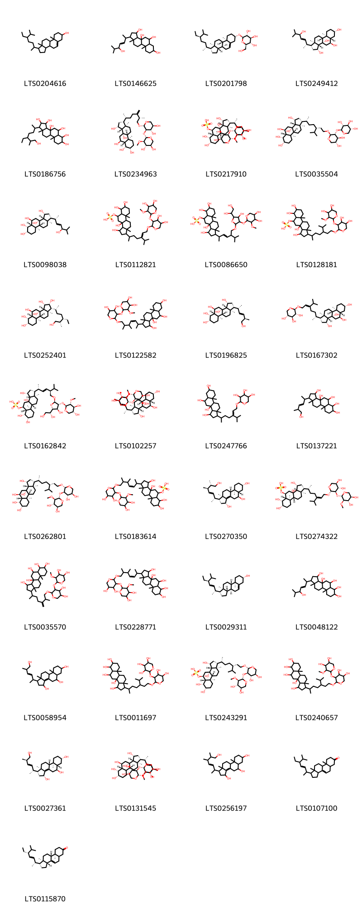{ width=100% }
    <figcaption>Hình ảnh cấu trúc hóa học của 37 hoạt chất thuộc nhóm Steroids and steroid derivatives gồm ['stigmast-5-en-3-ol, (3β)- (LTS0204616)', '1-(5-hydroxy-6-methylhept-3-en-2-yl)-9a,11a-dimethyl-tetradecahydrocyclopenta[a]phenanthrene-3,3b,5,7-tetrol (LTS0146625)', 'sitogluside (LTS0201798)', '(1r,3r,3as,3bs,5s,5as,7s,9as,9br,11ar)-1-[(2r,3e,5r)-5-hydroxy-6-methylhept-3-en-2-yl]-9a,11a-dimethyl-tetradecahydrocyclopenta[a]phenanthrene-3,3b,5,7-tetrol (LTS0249412)', '1-(5-ethyl-7-hydroxy-6-methylheptan-2-yl)-9a,11a-dimethyl-tetradecahydrocyclopenta[a]phenanthrene-2,3,3b,5,6,7-hexol (LTS0186756)', '(1r,3r,3as,3bs,5s,5as,6r,7s,9as,9br,11ar)-1-[(2r,6s)-7-{[(2r,3r,4s,5r)-3-{[(2s,3r,4s,5r)-4,5-dihydroxy-3-methoxyoxan-2-yl]oxy}-4,5-dihydroxyoxan-2-yl]oxy}-6-methyl-5-methylideneheptan-2-yl]-9a,11a-dimethyl-tetradecahydrocyclopenta[a]phenanthrene-3,3b,5,6,7-pentol (LTS0234963)', '[(1r,3r,3as,3bs,5s,5ar,6r,7s,9as,9br,11ar)-1-[(2r,3e,5r,6s)-7-{[(2r,3r,4s,5r)-3-{[(2s,3r,4s,5r)-4,5-dihydroxy-3-methoxyoxan-2-yl]oxy}-4,5-dihydroxyoxan-2-yl]oxy}-5,6-dimethylhept-3-en-2-yl]-3,3b,6,7-tetrahydroxy-9a,11a-dimethyl-tetradecahydrocyclopenta[a]phenanthren-5-yl]oxidanesulfonic acid (LTS0217910)', '(1r,3r,3as,3bs,5s,5as,6r,7s,9as,9br,11ar)-1-[(2r,5r)-5-(2-{[(2r,3r,4s,5r)-4,5-dihydroxy-3-{[(2s,3r,4s,5r)-3,4,5-trihydroxyoxan-2-yl]oxy}oxan-2-yl]oxy}ethyl)-6-methylheptan-2-yl]-9a,11a-dimethyl-tetradecahydrocyclopenta[a]phenanthrene-3,3b,5,6,7-pentol (LTS0035504)', '(1r,3r,3as,3bs,5s,5as,6r,7s,9as,9br,11ar)-1-[(2r,3e,5r)-5-hydroxy-6-methylhept-3-en-2-yl]-9a,11a-dimethyl-tetradecahydrocyclopenta[a]phenanthrene-3,3b,5,6,7-pentol (LTS0098038)', '{1-[7-({3-[(4,5-dihydroxy-3-methoxyoxan-2-yl)oxy]-4,5-dihydroxyoxan-2-yl}oxy)-5-isopropylhept-5-en-2-yl]-3,3b,6,7-tetrahydroxy-9a,11a-dimethyl-tetradecahydrocyclopenta[a]phenanthren-5-yl}oxidanesulfonic acid (LTS0112821)', '(1-{5-[({3-[(4,5-dihydroxy-3-methoxyoxan-2-yl)oxy]-5-(1,2-dihydroxyethyl)-4-hydroxyoxolan-2-yl}oxy)methyl]-6-methylhept-3-en-2-yl}-3,3b,6,7-tetrahydroxy-9a,11a-dimethyl-tetradecahydrocyclopenta[a]phenanthren-5-yl)oxidanesulfonic acid (LTS0086650)', '(1-{5-[2-({3-[(4,5-dihydroxy-3-methoxyoxan-2-yl)oxy]-4,5-dihydroxyoxan-2-yl}oxy)ethyl]-6-methylheptan-2-yl}-3,3b,6,7-tetrahydroxy-9a,11a-dimethyl-tetradecahydrocyclopenta[a]phenanthren-5-yl)oxidanesulfonic acid (LTS0128181)', '(1r,2r,3s,3as,3bs,5s,5as,6r,7s,9as,9br,11ar)-1-[(2r,5s,6s)-5-ethyl-7-hydroxy-6-methylheptan-2-yl]-9a,11a-dimethyl-tetradecahydrocyclopenta[a]phenanthrene-2,3,3b,5,6,7-hexol (LTS0252401)', '1-[7-({3-[(4,5-dihydroxy-3-methoxyoxan-2-yl)oxy]-4,5-dihydroxyoxan-2-yl}oxy)-5,6-dimethylhept-3-en-2-yl]-9a,11a-dimethyl-tetradecahydrocyclopenta[a]phenanthrene-3,3b,5,7-tetrol (LTS0122582)', '(1r,3r,3as,3bs,5s,5as,6r,7s,9as,9br,11ar)-1-[(2r,3e,5r)-6-hydroxy-5-methylhex-3-en-2-yl]-9a,11a-dimethyl-tetradecahydrocyclopenta[a]phenanthrene-3,3b,5,6,7-pentol (LTS0196825)', '(1r,3r,3as,3bs,5s,5as,7s,9as,9br,11ar)-1-[(2r,5e)-5-isopropyl-7-{[(2r,3r,4s,5r)-3,4,5-trihydroxyoxan-2-yl]oxy}hept-5-en-2-yl]-9a,11a-dimethyl-tetradecahydrocyclopenta[a]phenanthrene-3,3b,5,7-tetrol (LTS0167302)', '[(1r,3r,3as,3bs,5s,5ar,6r,7s,9as,9br,11ar)-1-[(2r,3e,5r)-5-({[(2r,3r,4s,5s)-3-{[(2s,3r,4s,5r)-4,5-dihydroxy-3-methoxyoxan-2-yl]oxy}-5-[(1r)-1,2-dihydroxyethyl]-4-hydroxyoxolan-2-yl]oxy}methyl)-6-methylhept-3-en-2-yl]-3,3b,6,7-tetrahydroxy-9a,11a-dimethyl-tetradecahydrocyclopenta[a]phenanthren-5-yl]oxidanesulfonic acid (LTS0162842)', '(1r,3r,3as,3bs,5s,5as,7s,9as,9br,11ar)-1-[(2r,3e,5r,6s)-7-{[(2r,3r,4s,5r)-3-{[(2s,3r,4s,5r)-4,5-dihydroxy-3-methoxyoxan-2-yl]oxy}-4,5-dihydroxyoxan-2-yl]oxy}-5,6-dimethylhept-3-en-2-yl]-9a,11a-dimethyl-tetradecahydrocyclopenta[a]phenanthrene-3,3b,5,7-tetrol (LTS0102257)', '1-{5-isopropyl-7-[(3,4,5-trihydroxyoxan-2-yl)oxy]hept-5-en-2-yl}-9a,11a-dimethyl-tetradecahydrocyclopenta[a]phenanthrene-3,3b,5,7-tetrol (LTS0247766)', '1-(6-hydroxy-5-methylhex-3-en-2-yl)-9a,11a-dimethyl-tetradecahydrocyclopenta[a]phenanthrene-3,3b,5,6,7-pentol (LTS0137221)', '(1r,3r,3as,3bs,5s,5as,6r,7s,9as,9br,11ar)-1-[(2r,5r)-5-(2-{[(2r,3r,4s,5r)-3-{[(2s,3r,4s,5r)-4,5-dihydroxy-3-methoxyoxan-2-yl]oxy}-4,5-dihydroxyoxan-2-yl]oxy}ethyl)-6-methylheptan-2-yl]-9a,11a-dimethyl-tetradecahydrocyclopenta[a]phenanthrene-3,3b,5,6,7-pentol (LTS0262801)', '{1-[7-({3-[(4,5-dihydroxy-3-methoxyoxan-2-yl)oxy]-4,5-dihydroxyoxan-2-yl}oxy)-5,6-dimethylhept-3-en-2-yl]-3,3b,6,7-tetrahydroxy-9a,11a-dimethyl-tetradecahydrocyclopenta[a]phenanthren-5-yl}oxidanesulfonic acid (LTS0183614)', '(1r,3r,5s,5as,7s,9ar,9br,11ar)-1-[(2r,3e,5r,6s)-7-hydroxy-5,6-dimethylhept-3-en-2-yl]-9a,11a-dimethyl-1h,2h,3h,4h,5h,5ah,6h,7h,8h,9h,9bh,10h,11h-cyclopenta[a]phenanthrene-3,5,7-triol (LTS0270350)', '[(1r,3r,3as,3bs,5s,5ar,6r,7s,9as,9br,11ar)-1-[(2r,5e)-7-{[(2r,3r,4s,5r)-3-{[(2s,3r,4s,5r)-4,5-dihydroxy-3-methoxyoxan-2-yl]oxy}-4,5-dihydroxyoxan-2-yl]oxy}-5-isopropylhept-5-en-2-yl]-3,3b,6,7-tetrahydroxy-9a,11a-dimethyl-tetradecahydrocyclopenta[a]phenanthren-5-yl]oxidanesulfonic acid (LTS0274322)', '1-[7-({3-[(4,5-dihydroxy-3-methoxyoxan-2-yl)oxy]-4,5-dihydroxyoxan-2-yl}oxy)-6-methyl-5-methylideneheptan-2-yl]-9a,11a-dimethyl-tetradecahydrocyclopenta[a]phenanthrene-3,3b,5,6,7-pentol (LTS0035570)', '1-[7-({3-[(4,5-dihydroxy-3-methoxyoxan-2-yl)oxy]-4,5-dihydroxyoxan-2-yl}oxy)-5,6-dimethylhept-3-en-2-yl]-9a,11a-dimethyl-tetradecahydrocyclopenta[a]phenanthrene-3,3b,5,6,7-pentol (LTS0228771)', 'phytosterol (LTS0029311)', '1-(5-hydroxy-6-methylhept-3-en-2-yl)-9a,11a-dimethyl-tetradecahydrocyclopenta[a]phenanthrene-3,3b,5,6,7-pentol (LTS0048122)', '1-(6-hydroxy-5-methylhex-3-en-2-yl)-9a,11a-dimethyl-1h,2h,3h,4h,5h,5ah,6h,7h,8h,9h,9bh,10h,11h-cyclopenta[a]phenanthrene-3,5,7-triol (LTS0058954)', '1-{5-[2-({4,5-dihydroxy-3-[(3,4,5-trihydroxyoxan-2-yl)oxy]oxan-2-yl}oxy)ethyl]-6-methylheptan-2-yl}-9a,11a-dimethyl-tetradecahydrocyclopenta[a]phenanthrene-3,3b,5,6,7-pentol (LTS0011697)', '[(1r,3r,3as,3bs,5s,5ar,6r,7s,9as,9br,11ar)-1-[(2r,5r)-5-(2-{[(2r,3r,4s,5r)-3-{[(2s,3r,4s,5r)-4,5-dihydroxy-3-methoxyoxan-2-yl]oxy}-4,5-dihydroxyoxan-2-yl]oxy}ethyl)-6-methylheptan-2-yl]-3,3b,6,7-tetrahydroxy-9a,11a-dimethyl-tetradecahydrocyclopenta[a]phenanthren-5-yl]oxidanesulfonic acid (LTS0243291)', '1-{5-[2-({3-[(4,5-dihydroxy-3-methoxyoxan-2-yl)oxy]-4,5-dihydroxyoxan-2-yl}oxy)ethyl]-6-methylheptan-2-yl}-9a,11a-dimethyl-tetradecahydrocyclopenta[a]phenanthrene-3,3b,5,6,7-pentol (LTS0240657)', '(1r,3r,5s,5as,7s,9ar,9br,11ar)-1-[(2r,3e,5r)-6-hydroxy-5-methylhex-3-en-2-yl]-9a,11a-dimethyl-1h,2h,3h,4h,5h,5ah,6h,7h,8h,9h,9bh,10h,11h-cyclopenta[a]phenanthrene-3,5,7-triol (LTS0027361)', '(1r,3r,3as,3bs,5s,5as,6r,7s,9as,9br,11ar)-1-[(2r,3e,5r,6s)-7-{[(2r,3r,4s,5r)-3-{[(2s,3r,4s,5r)-4,5-dihydroxy-3-methoxyoxan-2-yl]oxy}-4,5-dihydroxyoxan-2-yl]oxy}-5,6-dimethylhept-3-en-2-yl]-9a,11a-dimethyl-tetradecahydrocyclopenta[a]phenanthrene-3,3b,5,6,7-pentol (LTS0131545)', '1-(7-hydroxy-5,6-dimethylhept-3-en-2-yl)-9a,11a-dimethyl-1h,2h,3h,4h,5h,5ah,6h,7h,8h,9h,9bh,10h,11h-cyclopenta[a]phenanthrene-3,5,7-triol (LTS0256197)', '1-[(3e)-5-ethyl-6-methylhept-3-en-2-yl]-9a,11a-dimethyl-1h,2h,3h,3ah,5h,5ah,6h,8h,9h,9bh,10h,11h-cyclopenta[a]phenanthren-7-one (LTS0107100)', '(1r,3ar,9as,9br,11ar)-1-[(2r,3e,5r)-5-ethyl-6-methylhept-3-en-2-yl]-9a,11a-dimethyl-1h,2h,3h,3ah,5h,5ah,6h,8h,9h,9bh,10h,11h-cyclopenta[a]phenanthren-7-one (LTS0115870)'].</figcaption>
</figure>

---

### Dược dân tộc học

Danh sách các quốc gia có sử dụng *Aster tataricus* trong điều trị các bệnh. 

| Country   | Disease                      | Bệnh                                                                                                                                                                                                |
|:----------|:-----------------------------|:----------------------------------------------------------------------------------------------------------------------------------------------------------------------------------------------------|
| China     | Expectorant, Tonic, Sedative | MYMEMORY WARNING: YOU USED ALL AVAILABLE FREE TRANSLATIONS FOR TODAY. NEXT AVAILABLE IN  09 HOURS 04 MINUTES 17 SECONDS VISIT HTTPS://MYMEMORY.TRANSLATED.NET/DOC/USAGELIMITS.PHP TO TRANSLATE MORE |
| Elsewhere | Antitussive, Expectorant     | MYMEMORY WARNING: YOU USED ALL AVAILABLE FREE TRANSLATIONS FOR TODAY. NEXT AVAILABLE IN  09 HOURS 04 MINUTES 14 SECONDS VISIT HTTPS://MYMEMORY.TRANSLATED.NET/DOC/USAGELIMITS.PHP TO TRANSLATE MORE |
| Japan     | Expectorant, Styptic         | MYMEMORY WARNING: YOU USED ALL AVAILABLE FREE TRANSLATIONS FOR TODAY. NEXT AVAILABLE IN  09 HOURS 04 MINUTES 11 SECONDS VISIT HTTPS://MYMEMORY.TRANSLATED.NET/DOC/USAGELIMITS.PHP TO TRANSLATE MORE |

---

---
## Aster tatraicus
### Thông tin về thực vật

!!! info "Phân loại thực vật của *Aster tataricus* từ GIBF:"
    - **Kingdom:** Plantae
    - **Phylum:** Tracheophyta
    - **Order:** Asterales
    - **Family:** Asteraceae
    - **Genus:** Aster
    - **Species:** *Aster tataricus*

 

| Label (VI)   | Label (EN)   | Scientific Name   | Descriptions (VI)   | Descriptions (EN)   | Also Known As (VI)   | Also Known As (EN)    |
|:-------------|:-------------|:------------------|:--------------------|:--------------------|:---------------------|:----------------------|
| N/A          | N/A          | Aster tataricus   | loài thực vật       | species of plant    | ['']                 | ["Tatarinow's aster"] |

#### Phân bố trên thế giới

**Từ CSDL GIBF** Japan, Korea, Republic of, Russian Federation, United States of America, Mongolia, China

#### Phân bố tại Việt Nam

**Từ CSDL GIBF**: Không có ghi nhận ở Việt Nam

---
### Thành phần hóa học
        
- Theo cơ sở dữ liệu lotus: Từ loài *Aster tataricus* đã phân lập và xác định được Chưa có hoạt chất nào được phân lập. hoạt chất thuộc về các nhóm Không có hoạt chất nào được phân lập. 

Không có hình ảnh nào được tạo ra

---

### Dược dân tộc học

Danh sách các quốc gia có sử dụng *Aster tataricus* trong điều trị các bệnh. 

| Country   | Disease     | Bệnh                                                                                                                                                                                                |
|:----------|:------------|:----------------------------------------------------------------------------------------------------------------------------------------------------------------------------------------------------|
| China     | Antitussive | MYMEMORY WARNING: YOU USED ALL AVAILABLE FREE TRANSLATIONS FOR TODAY. NEXT AVAILABLE IN  09 HOURS 03 MINUTES 37 SECONDS VISIT HTTPS://MYMEMORY.TRANSLATED.NET/DOC/USAGELIMITS.PHP TO TRANSLATE MORE |

---

---
## Aster trinervius
### Thông tin về thực vật

!!! info "Phân loại thực vật của *Aster trinervius* từ GIBF:"
    - **Kingdom:** Plantae
    - **Phylum:** Tracheophyta
    - **Order:** Asterales
    - **Family:** Asteraceae
    - **Genus:** Aster
    - **Species:** *Aster trinervius*

 

| Label (VI)   | Label (EN)   | Scientific Name   | Descriptions (VI)   | Descriptions (EN)   | Also Known As (VI)   | Also Known As (EN)   |
|:-------------|:-------------|:------------------|:--------------------|:--------------------|:---------------------|:---------------------|
| N/A          | N/A          | Aster trinervius  | loài thực vật       | species of plant    | ['']                 | ['']                 |

#### Phân bố trên thế giới

**Từ CSDL GIBF** nan, Japan, Chinese Taipei, Sweden, China, Nepal

#### Phân bố tại Việt Nam

**Từ CSDL GIBF**: Không có ghi nhận ở Việt Nam

---
### Thành phần hóa học
        
- Theo cơ sở dữ liệu lotus: Từ loài *Aster trinervius* đã phân lập và xác định được Chưa có hoạt chất nào được phân lập. hoạt chất thuộc về các nhóm Không có hoạt chất nào được phân lập. 

Không có hình ảnh nào được tạo ra

---

### Dược dân tộc học

Danh sách các quốc gia có sử dụng *Aster trinervius* trong điều trị các bệnh. 

| Country   | Disease                                  | Bệnh                                                                                                                                                                                                |
|:----------|:-----------------------------------------|:----------------------------------------------------------------------------------------------------------------------------------------------------------------------------------------------------|
| China     | Alexiteric, Antidote, Hemostat, Hemostat | MYMEMORY WARNING: YOU USED ALL AVAILABLE FREE TRANSLATIONS FOR TODAY. NEXT AVAILABLE IN  09 HOURS 03 MINUTES 14 SECONDS VISIT HTTPS://MYMEMORY.TRANSLATED.NET/DOC/USAGELIMITS.PHP TO TRANSLATE MORE |

---

---
## Aster tripolium
### Thông tin về thực vật

!!! info "Phân loại thực vật của *N/A* từ GIBF:"
    - **Kingdom:** Plantae
    - **Phylum:** Tracheophyta
    - **Order:** Asterales
    - **Family:** Asteraceae
    - **Genus:** N/A
    - **Species:** *N/A*

 

| Label (VI)   | Label (EN)   | Scientific Name   | Descriptions (VI)   | Descriptions (EN)   | Also Known As (VI)   | Also Known As (EN)   |
|:-------------|:-------------|:------------------|:--------------------|:--------------------|:---------------------|:---------------------|
| N/A          | N/A          | Aster tripolium   |                     |                     | ['']                 | ['']                 |

#### Phân bố trên thế giới

**Từ CSDL GIBF** Denmark, Australia, New Zealand, Chinese Taipei, Ireland, Isle of Man, Viet Nam, United Kingdom of Great Britain and Northern Ireland

#### Phân bố tại Việt Nam

**Từ CSDL GIBF**: Đà Nẵng

---
### Thành phần hóa học
        
- Theo cơ sở dữ liệu lotus: Từ loài *N/A* đã phân lập và xác định được Chưa có hoạt chất nào được phân lập. hoạt chất thuộc về các nhóm Không có hoạt chất nào được phân lập. 

Không có hình ảnh nào được tạo ra

---

### Dược dân tộc học

Danh sách các quốc gia có sử dụng *N/A* trong điều trị các bệnh. 

| Country   | Disease                    | Bệnh                                                                                                                                                                                                |
|:----------|:---------------------------|:----------------------------------------------------------------------------------------------------------------------------------------------------------------------------------------------------|
| Turkey    | Astringent, Nervine, Tonic | MYMEMORY WARNING: YOU USED ALL AVAILABLE FREE TRANSLATIONS FOR TODAY. NEXT AVAILABLE IN  09 HOURS 02 MINUTES 53 SECONDS VISIT HTTPS://MYMEMORY.TRANSLATED.NET/DOC/USAGELIMITS.PHP TO TRANSLATE MORE |

---

---
## Aster villosa
### Thông tin về thực vật

!!! info "Phân loại thực vật của *N/A* từ GIBF:"
    - **Kingdom:** Plantae
    - **Phylum:** Tracheophyta
    - **Order:** Asterales
    - **Family:** Asteraceae
    - **Genus:** N/A
    - **Species:** *N/A*

 

| Label (VI)   | Label (EN)   | Scientific Name   | Descriptions (VI)   | Descriptions (EN)   | Also Known As (VI)   | Also Known As (EN)   |
|:-------------|:-------------|:------------------|:--------------------|:--------------------|:---------------------|:---------------------|
| N/A          | N/A          | Aster villosa     | loài thực vật       | species of plant    | ['']                 | ['']                 |

#### Phân bố trên thế giới

**Từ CSDL GIBF** Denmark, Australia, New Zealand, Chinese Taipei, Ireland, Isle of Man, Viet Nam, United Kingdom of Great Britain and Northern Ireland

#### Phân bố tại Việt Nam

**Từ CSDL GIBF**: Đà Nẵng

---
### Thành phần hóa học
        
- Theo cơ sở dữ liệu lotus: Từ loài *N/A* đã phân lập và xác định được Chưa có hoạt chất nào được phân lập. hoạt chất thuộc về các nhóm Không có hoạt chất nào được phân lập. 

Không có hình ảnh nào được tạo ra

---

### Dược dân tộc học

Danh sách các quốc gia có sử dụng *N/A* trong điều trị các bệnh. 

| Country   | Disease     | Bệnh                                                                                                                                                                                                |
|:----------|:------------|:----------------------------------------------------------------------------------------------------------------------------------------------------------------------------------------------------|
| USSR      | Expectorant | MYMEMORY WARNING: YOU USED ALL AVAILABLE FREE TRANSLATIONS FOR TODAY. NEXT AVAILABLE IN  09 HOURS 02 MINUTES 31 SECONDS VISIT HTTPS://MYMEMORY.TRANSLATED.NET/DOC/USAGELIMITS.PHP TO TRANSLATE MORE |

---

# Chi Ageratum

??? note "Danh sách các dược liệu thuộc chi"
    
	 - *Ageratum conyzoides*

---
## Ageratum conyzoides
### Thông tin về thực vật

!!! info "Phân loại thực vật của *Ageratum conyzoides* từ GIBF:"
    - **Kingdom:** Plantae
    - **Phylum:** Tracheophyta
    - **Order:** Asterales
    - **Family:** Asteraceae
    - **Genus:** Ageratum
    - **Species:** *Ageratum conyzoides*

 

| Label (VI)   | Label (EN)   | Scientific Name     | Descriptions (VI)   | Descriptions (EN)   | Also Known As (VI)                                                   | Also Known As (EN)                                       |
|:-------------|:-------------|:--------------------|:--------------------|:--------------------|:---------------------------------------------------------------------|:---------------------------------------------------------|
| N/A          | N/A          | Ageratum conyzoides | loài thực vật       | species of plant    | ['Cứt lợn', 'Cây ngũ sắc', 'Cây hoa cứt lợn', 'Ageratum conyzoides'] | ['Goatweed', 'Chickweed', 'Billygoat-weed', 'Whiteweed'] |

#### Phân bố trên thế giới

**Từ CSDL GIBF** Virgin Islands (U.S.), Sri Lanka, Ghana, Australia, Mauritius, Argentina, Rwanda, Philippines, Virgin Islands (British), Tanzania, United Republic of, Yemen, French Guiana, Puerto Rico, Réunion, Nigeria, Chinese Taipei, Bangladesh, United States of America, Zimbabwe, Uganda, South Africa, Hong Kong, Thailand, Brazil, Peru, Viet Nam, China, Ecuador, Madagascar, Cabo Verde, Colombia, Montserrat, Macao, Costa Rica, India, Indonesia, Antigua and Barbuda, Kenya

#### Phân bố tại Việt Nam

**Từ CSDL GIBF**: Thừa Thiên - Huế, Đồng Nai, Nghệ An

---
### Thành phần hóa học
        
- Theo cơ sở dữ liệu lotus: Từ loài *Ageratum conyzoides* đã phân lập và xác định được 147 hoạt chất thuộc về các nhóm Fatty Acyls, Flavonoids, Prenol lipids, Steroids and steroid derivatives, Isoflavonoids, Benzofurans, Benzene and substituted derivatives, Saturated hydrocarbons, Phenols, Organooxygen compounds, Coumarins and derivatives, Furanoid lignans, Carboxylic acids and derivatives, Benzopyrans. 

|    | chemicalTaxonomyClassyfireClass     |   smiles_count |
|---:|:------------------------------------|---------------:|
|  0 |                                     |              2 |
|  1 | Benzene and substituted derivatives |              2 |
|  2 | Benzofurans                         |              1 |
|  3 | Benzopyrans                         |             22 |
|  4 | Carboxylic acids and derivatives    |              1 |
|  5 | Coumarins and derivatives           |              1 |
|  6 | Fatty Acyls                         |             11 |
|  7 | Flavonoids                          |             16 |
|  8 | Furanoid lignans                    |              2 |
|  9 | Isoflavonoids                       |              1 |
| 10 | Organooxygen compounds              |              6 |
| 11 | Phenols                             |              1 |
| 12 | Prenol lipids                       |             72 |
| 13 | Saturated hydrocarbons              |              3 |
| 14 | Steroids and steroid derivatives    |              5 |

#### Nhóm 
<figure markdown="span">
    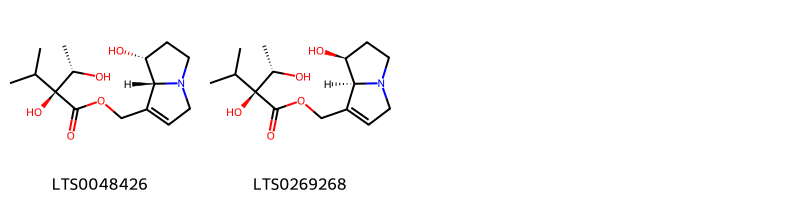{ width=100% }
    <figcaption>Hình ảnh cấu trúc hóa học của 2 hoạt chất thuộc nhóm  gồm ['lycopsamine (LTS0048426)', '[(7s,7as)-7-hydroxy-5,6,7,7a-tetrahydro-3h-pyrrolizin-1-yl]methyl (2s)-2-hydroxy-2-[(1s)-1-hydroxyethyl]-3-methylbutanoate (LTS0269268)'].</figcaption>
</figure>
#### Nhóm Benzene and substituted derivatives
<figure markdown="span">
    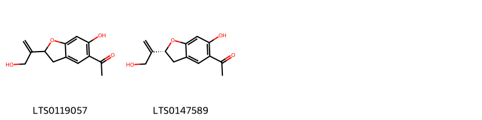{ width=100% }
    <figcaption>Hình ảnh cấu trúc hóa học của 2 hoạt chất thuộc nhóm Benzene and substituted derivatives gồm ['1-[6-hydroxy-2-(3-hydroxyprop-1-en-2-yl)-2,3-dihydro-1-benzofuran-5-yl]ethanone (LTS0119057)', '1-[(2r)-6-hydroxy-2-(3-hydroxyprop-1-en-2-yl)-2,3-dihydro-1-benzofuran-5-yl]ethanone (LTS0147589)'].</figcaption>
</figure>
#### Nhóm Benzofurans
<figure markdown="span">
    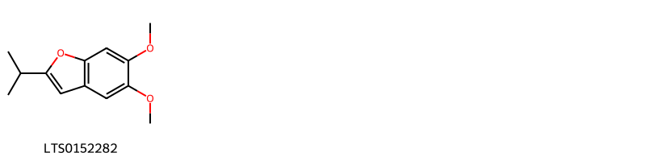{ width=100% }
    <figcaption>Hình ảnh cấu trúc hóa học của 1 hoạt chất thuộc nhóm Benzofurans gồm ['2-isopropyl-5,6-dimethoxy-1-benzofuran (LTS0152282)'].</figcaption>
</figure>
#### Nhóm Benzopyrans
<figure markdown="span">
    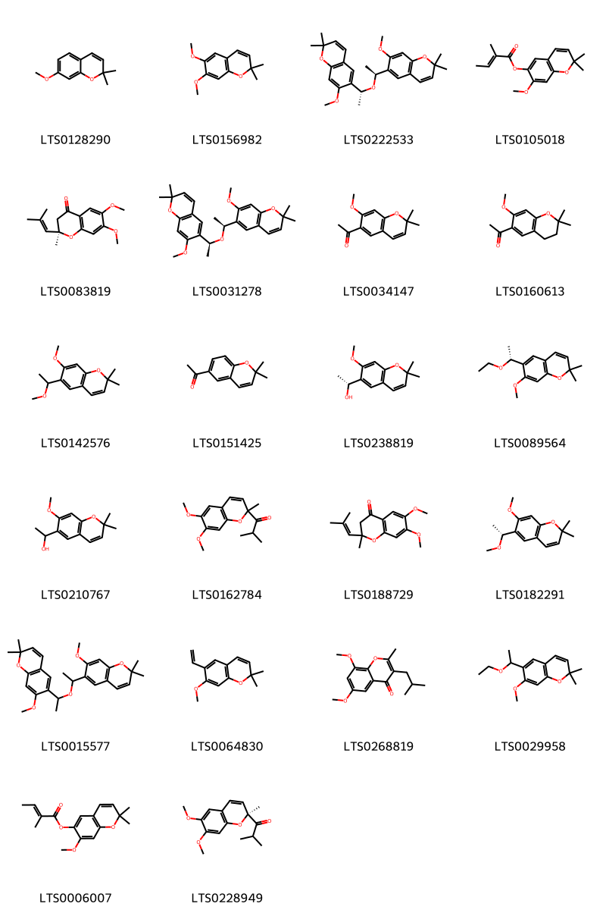{ width=100% }
    <figcaption>Hình ảnh cấu trúc hóa học của 22 hoạt chất thuộc nhóm Benzopyrans gồm ['precocene i (LTS0128290)', 'precocene ii (LTS0156982)', '7-methoxy-6-[(1s)-1-[(1r)-1-(7-methoxy-2,2-dimethylchromen-6-yl)ethoxy]ethyl]-2,2-dimethylchromene (LTS0222533)', '7-methoxy-2,2-dimethylchromen-6-yl 2-methylbut-2-enoate (LTS0105018)', '(2r)-6,7-dimethoxy-2-methyl-2-(2-methylprop-1-en-1-yl)-3h-1-benzopyran-4-one (LTS0083819)', '7-methoxy-6-[(1s)-1-[(1s)-1-(7-methoxy-2,2-dimethylchromen-6-yl)ethoxy]ethyl]-2,2-dimethylchromene (LTS0031278)', 'encecalin (LTS0034147)', '1-(7-methoxy-2,2-dimethyl-3,4-dihydro-1-benzopyran-6-yl)ethanone (LTS0160613)', '7-methoxy-6-(1-methoxyethyl)-2,2-dimethylchromene (LTS0142576)', '1-(2,2-dimethylchromen-6-yl)ethanone (LTS0151425)', '(1r)-1-(7-methoxy-2,2-dimethylchromen-6-yl)ethanol (LTS0238819)', '6-[(1r)-1-ethoxyethyl]-7-methoxy-2,2-dimethylchromene (LTS0089564)', '1-(7-methoxy-2,2-dimethylchromen-6-yl)ethanol (LTS0210767)', '1-(6,7-dimethoxy-2-methylchromen-2-yl)-2-methylpropan-1-one (LTS0162784)', '6,7-dimethoxy-2-methyl-2-(2-methylprop-1-en-1-yl)-3h-1-benzopyran-4-one (LTS0188729)', '7-methoxy-6-[(1r)-1-methoxyethyl]-2,2-dimethylchromene (LTS0182291)', '7-methoxy-6-{1-[1-(7-methoxy-2,2-dimethylchromen-6-yl)ethoxy]ethyl}-2,2-dimethylchromene (LTS0015577)', '6-ethenyl-7-methoxy-2,2-dimethylchromene (LTS0064830)', '6,8-dimethoxy-2-methyl-3-(2-methylpropyl)chromen-4-one (LTS0268819)', '6-(1-ethoxyethyl)-7-methoxy-2,2-dimethylchromene (LTS0029958)', '7-methoxy-2,2-dimethylchromen-6-yl (2e)-2-methylbut-2-enoate (LTS0006007)', '1-[(2s)-6,7-dimethoxy-2-methylchromen-2-yl]-2-methylpropan-1-one (LTS0228949)'].</figcaption>
</figure>
#### Nhóm Carboxylic acids and derivatives
<figure markdown="span">
    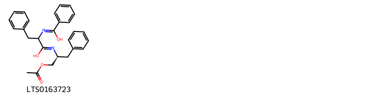{ width=100% }
    <figcaption>Hình ảnh cấu trúc hóa học của 1 hoạt chất thuộc nhóm Carboxylic acids and derivatives gồm ['n-[(2s)-1-(acetyloxy)-3-phenylpropan-2-yl]-2-{[hydroxy(phenyl)methylidene]amino}-3-phenylpropanimidic acid (LTS0163723)'].</figcaption>
</figure>
#### Nhóm Coumarins and derivatives
<figure markdown="span">
    { width=100% }
    <figcaption>Hình ảnh cấu trúc hóa học của 1 hoạt chất thuộc nhóm Coumarins and derivatives gồm ['2h-1-benzopyran-2-one (LTS0069773)'].</figcaption>
</figure>
#### Nhóm Fatty Acyls
<figure markdown="span">
    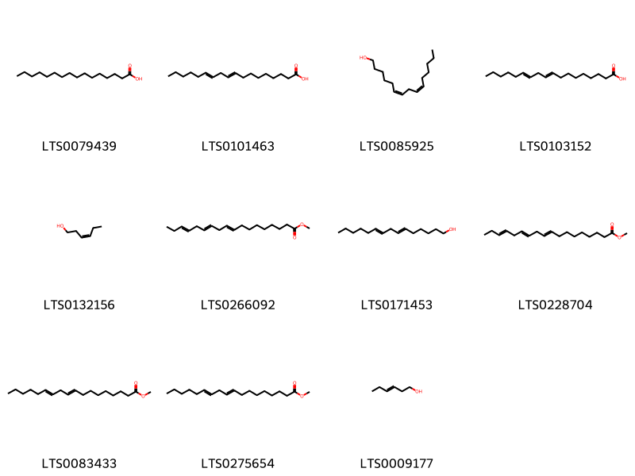{ width=100% }
    <figcaption>Hình ảnh cấu trúc hóa học của 11 hoạt chất thuộc nhóm Fatty Acyls gồm ['palmitic acid (LTS0079439)', '9,12-octadecadienoic acid (LTS0101463)', '(6z,9z)-pentadeca-6,9-dien-1-ol (LTS0085925)', 'grape seed oils (LTS0103152)', 'cis-3-hexenol (LTS0132156)', 'methyl elaidolinolenate (LTS0266092)', 'pentadeca-6,9-dien-1-ol (LTS0171453)', 'methyl octadeca-9,12,15-trienoate (LTS0228704)', 'methyl linolelaidate (LTS0083433)', 'methyl octadeca-9,12-dienoate (LTS0275654)', '3-hexenol (LTS0009177)'].</figcaption>
</figure>
#### Nhóm Flavonoids
<figure markdown="span">
    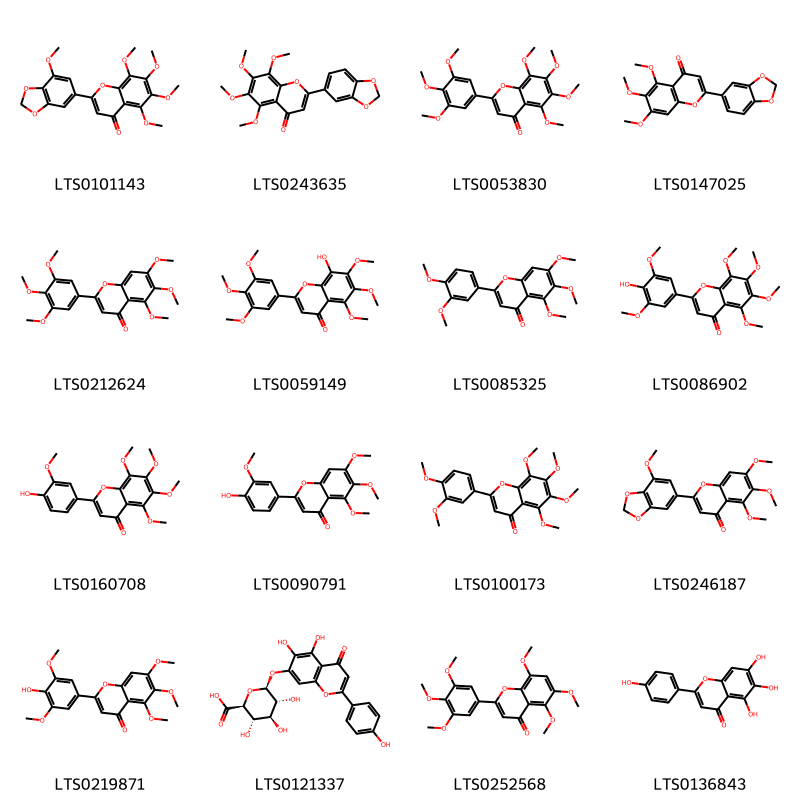{ width=100% }
    <figcaption>Hình ảnh cấu trúc hóa học của 16 hoạt chất thuộc nhóm Flavonoids gồm ['conyzorigun (LTS0101143)', 'linderoflavone b (LTS0243635)', '5,6,7,8-tetramethoxy-2-(3,4,5-trimethoxyphenyl)chromen-4-one (LTS0053830)', 'ageconyflavone a (LTS0147025)', '5,6,7-trimethoxy-2-(3,4,5-trimethoxyphenyl)chromen-4-one (LTS0212624)', '8-hydroxy-5,6,7-trimethoxy-2-(3,4,5-trimethoxyphenyl)chromen-4-one (LTS0059149)', 'sinensetin (LTS0085325)', '2-(4-hydroxy-3,5-dimethoxyphenyl)-5,6,7,8-tetramethoxychromen-4-one (LTS0086902)', '2-(4-hydroxy-3-methoxyphenyl)-5,6,7,8-tetramethoxychromen-4-one (LTS0160708)', 'ageconyflavone b (LTS0090791)', 'nobiletin (LTS0100173)', '5,6,7-trimethoxy-2-(7-methoxy-2h-1,3-benzodioxol-5-yl)chromen-4-one (LTS0246187)', 'ageconyflavone c (LTS0219871)', 'scutellarin (LTS0121337)', '5,6,8-trimethoxy-2-(3,4,5-trimethoxyphenyl)chromen-4-one (LTS0252568)', 'scutellarein (LTS0136843)'].</figcaption>
</figure>
#### Nhóm Furanoid lignans
<figure markdown="span">
    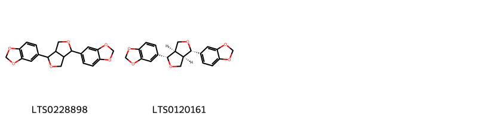{ width=100% }
    <figcaption>Hình ảnh cấu trúc hóa học của 2 hoạt chất thuộc nhóm Furanoid lignans gồm ['sesamin (LTS0228898)', 'sesamin (LTS0120161)'].</figcaption>
</figure>
#### Nhóm Isoflavonoids
<figure markdown="span">
    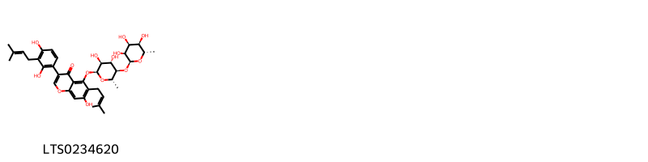{ width=100% }
    <figcaption>Hình ảnh cấu trúc hóa học của 1 hoạt chất thuộc nhóm Isoflavonoids gồm ['3-[2,4-dihydroxy-3-(3-methylbut-2-en-1-yl)phenyl]-5-{[(2s,3s,4s,5r,6s)-3,4-dihydroxy-6-methyl-5-{[(2s,3s,4s,5r,6s)-3,4,5-trihydroxy-6-methyloxan-2-yl]oxy}oxan-2-yl]oxy}-7-hydroxy-6-(3-methylbut-2-en-1-yl)chromen-4-one (LTS0234620)'].</figcaption>
</figure>
#### Nhóm Organooxygen compounds
<figure markdown="span">
    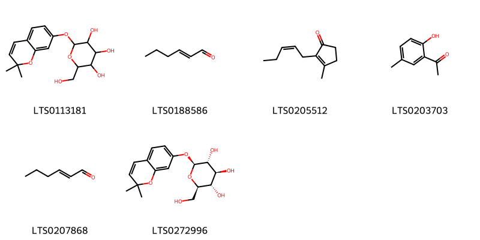{ width=100% }
    <figcaption>Hình ảnh cấu trúc hóa học của 6 hoạt chất thuộc nhóm Organooxygen compounds gồm ['2-[(2,2-dimethylchromen-7-yl)oxy]-6-(hydroxymethyl)oxane-3,4,5-triol (LTS0113181)', 'hexenal (LTS0188586)', 'jasmone (LTS0205512)', '2-acetyl-4-methylphenol (LTS0203703)', '(e)-2-hexenal (LTS0207868)', '(2s,3r,4s,5s,6r)-2-[(2,2-dimethylchromen-7-yl)oxy]-6-(hydroxymethyl)oxane-3,4,5-triol (LTS0272996)'].</figcaption>
</figure>
#### Nhóm Phenols
<figure markdown="span">
    { width=100% }
    <figcaption>Hình ảnh cấu trúc hóa học của 1 hoạt chất thuộc nhóm Phenols gồm ['eugenol (LTS0052342)'].</figcaption>
</figure>
#### Nhóm Prenol lipids
<figure markdown="span">
    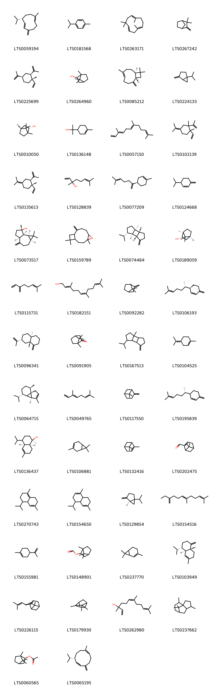{ width=100% }
    <figcaption>Hình ảnh cấu trúc hóa học của 72 hoạt chất thuộc nhóm Prenol lipids gồm ['(-)-germacrene d (LTS0059194)', 'cymene (LTS0181568)', 'humulene (LTS0263171)', 'camphene (LTS0267242)', 'β-elemene (LTS0225699)', 'borneol (LTS0264960)', 'caryophyllene (LTS0085212)', 'sabinene (LTS0224133)', '(2s,4r)-1,7,7-trimethylbicyclo[2.2.1]heptan-2-ol (LTS0010050)', 'terpineol (LTS0136148)', 'farnesene (LTS0057150)', '1-ethenyl-1,2-dimethyl-2-(prop-1-en-2-yl)-4-(propan-2-ylidene)cyclohexane (LTS0102139)', '(1s,2s)-1-ethenyl-1-methyl-2-(prop-1-en-2-yl)-4-(propan-2-ylidene)cyclohexane (LTS0135613)', 'linalool, (+-)- (LTS0128839)', '(r)-β-bisabolene (LTS0077209)', 'β phellandrene (LTS0124668)', '(1as,4as,7s,7ar,7bs)-1,1,7-trimethyl-4-methylidene-octahydrocyclopropa[e]azulen-7-ol (LTS0073517)', 'caryophyllene oxide (LTS0159789)', 'β-bourbonene (LTS0074484)', '(+)-borneol (LTS0189059)', 'α-myrcene (LTS0115731)', '(e,z)-farnesol (LTS0182151)', '7,7-dimethyl-2-methylidenebicyclo[2.2.1]heptane (LTS0092282)', 'β-sesquiphellandrene (LTS0106193)', 'β-selinene (LTS0096341)', 'camphor (LTS0091905)', 'β-bourbonene (LTS0167513)', 'terpinolene (LTS0104525)', '(1s,5r,7s,10r)-7-isopropyl-4,10-dimethyltricyclo[4.4.0.0¹,⁵]dec-3-ene (LTS0064715)', 'trans-β-ocimene (LTS0049765)', 'β-pinene (LTS0117550)', '3-[(2s)-6-methylhept-5-en-2-yl]-6-methylidenecyclohex-1-ene (LTS0195839)', '(1r,4ar,8as)-4-isopropyl-1,6-dimethyl-3,4,4a,7,8,8a-hexahydro-2h-naphthalen-1-ol (LTS0136437)', 'monoterpenes (LTS0106881)', 'α pinene (LTS0132416)', 'myrtenal (LTS0202475)', '4-isopropyl-1,6-dimethyl-2,3,4,4a,7,8-hexahydronaphthalene (LTS0270743)', '4-isopropyl-1,6-dimethyl-3,4,4a,7,8,8a-hexahydronaphthalene (LTS0154650)', '(5s)-1-isopropyl-4-methylidenebicyclo[3.1.0]hexane (LTS0129854)', '(6e)-2,6-dimethyl-10-methylidenedodeca-2,6-diene (LTS0154516)', 'limonene,  (LTS0155981)', '1,7,7-trimethylbicyclo[2.2.1]heptan-2-yl formate (LTS0148901)', '3,7,7-trimethylbicyclo[4.1.0]hept-2-ene (LTS0237770)', '(+)-gamma-cadinene (LTS0103949)', 'α-bergamotene (LTS0226115)', 'tricyclene (LTS0179930)', 'nerolidol (LTS0262980)', '4,10,11,11-tetramethyltricyclo[5.3.1.0¹,⁵]undecane (LTS0237662)', 'bornyl acetate (LTS0060565)', '(1z,6z,8s)-8-isopropyl-1-methyl-5-methylidenecyclodeca-1,6-diene (LTS0065195)', 'β-caryophyllene oxide (LTS0213960)', 'α-copaene (LTS0207598)', 'delta-cadinol (LTS0008282)', '(-)-friedelin (LTS0041645)', '(1r,2s,7s,8s)-8-isopropyl-1,3-dimethyltricyclo[4.4.0.0²,⁷]dec-3-ene (LTS0190031)', 'nerolidol isomers (LTS0007569)', 'farnesol (LTS0059667)', 'β-cadinene (LTS0049088)', 'terpinene (LTS0136858)', '(-)-β-bisabolene (LTS0009940)', '(3r)-6,6-dimethyl-2-methylidenebicyclo[3.1.1]heptan-3-ol (LTS0009265)', 'α-muurolene (LTS0022607)', 'fenchone (LTS0126716)', 'delta-cadinene (LTS0019321)', 'pinocarveol (LTS0090950)', '(7ar)-1,1,7-trimethyl-4-methylidene-octahydrocyclopropa[e]azulen-7-ol (LTS0091612)', '(-)-borneol (LTS0242824)', 'friedelin (LTS0213494)', '(z)-β-farnesene (LTS0254048)', '(-)-α-cubebene (LTS0042045)', '4-isopropyl-6-methyl-1-methylidene-3,4,4a,7,8,8a-hexahydro-2h-naphthalene (LTS0111070)', '(-)-β-cubebene (LTS0123697)'].</figcaption>
</figure>
#### Nhóm Saturated hydrocarbons
<figure markdown="span">
    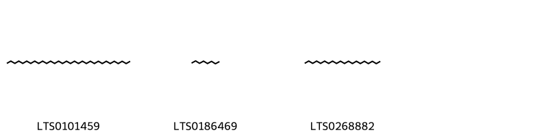{ width=100% }
    <figcaption>Hình ảnh cấu trúc hóa học của 3 hoạt chất thuộc nhóm Saturated hydrocarbons gồm ['dotriacontane (LTS0101459)', 'octane (LTS0186469)', 'eicosane (LTS0268882)'].</figcaption>
</figure>
#### Nhóm Steroids and steroid derivatives
<figure markdown="span">
    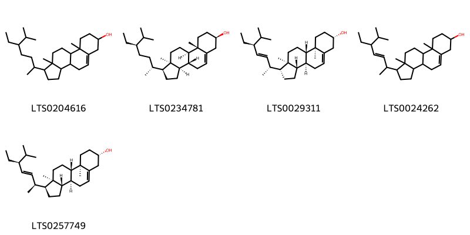{ width=100% }
    <figcaption>Hình ảnh cấu trúc hóa học của 5 hoạt chất thuộc nhóm Steroids and steroid derivatives gồm ['stigmast-5-en-3-ol, (3β)- (LTS0204616)', '(1s,3ar,3br,7r,9as,9br,11ar)-1-[(2r,5r)-5-ethyl-6-methylheptan-2-yl]-9a,11a-dimethyl-1h,2h,3h,3ah,3bh,4h,6h,7h,8h,9h,9bh,10h,11h-cyclopenta[a]phenanthren-7-ol (LTS0234781)', 'phytosterol (LTS0029311)', 'stigmasterol (LTS0024262)', '(1s,3as,3bs,7s,9ar,9bs,11ar)-1-[(2s,3e,5s)-5-ethyl-6-methylhept-3-en-2-yl]-9a,11a-dimethyl-1h,2h,3h,3ah,3bh,4h,6h,7h,8h,9h,9bh,10h,11h-cyclopenta[a]phenanthren-7-ol (LTS0257749)'].</figcaption>
</figure>

---

### Dược dân tộc học

Danh sách các quốc gia có sử dụng *Ageratum conyzoides* trong điều trị các bệnh. 

| Country      | Disease                          | Bệnh                                                                                                                                                                                                |
|:-------------|:---------------------------------|:----------------------------------------------------------------------------------------------------------------------------------------------------------------------------------------------------|
| Africa       | Collyrium                        | MYMEMORY WARNING: YOU USED ALL AVAILABLE FREE TRANSLATIONS FOR TODAY. NEXT AVAILABLE IN  09 HOURS 02 MINUTES 08 SECONDS VISIT HTTPS://MYMEMORY.TRANSLATED.NET/DOC/USAGELIMITS.PHP TO TRANSLATE MORE |
| Cameroon     | Emetic, Purgative                | MYMEMORY WARNING: YOU USED ALL AVAILABLE FREE TRANSLATIONS FOR TODAY. NEXT AVAILABLE IN  09 HOURS 02 MINUTES 06 SECONDS VISIT HTTPS://MYMEMORY.TRANSLATED.NET/DOC/USAGELIMITS.PHP TO TRANSLATE MORE |
| Elsewhere    | Expectorant, Hemostat, Stimulant | MYMEMORY WARNING: YOU USED ALL AVAILABLE FREE TRANSLATIONS FOR TODAY. NEXT AVAILABLE IN  09 HOURS 02 MINUTES 03 SECONDS VISIT HTTPS://MYMEMORY.TRANSLATED.NET/DOC/USAGELIMITS.PHP TO TRANSLATE MORE |
| Malacca      | Contraceptive                    | MYMEMORY WARNING: YOU USED ALL AVAILABLE FREE TRANSLATIONS FOR TODAY. NEXT AVAILABLE IN  09 HOURS 02 MINUTES 01 SECONDS VISIT HTTPS://MYMEMORY.TRANSLATED.NET/DOC/USAGELIMITS.PHP TO TRANSLATE MORE |
| Malaya       | Poultice                         | MYMEMORY WARNING: YOU USED ALL AVAILABLE FREE TRANSLATIONS FOR TODAY. NEXT AVAILABLE IN  09 HOURS 01 MINUTES 58 SECONDS VISIT HTTPS://MYMEMORY.TRANSLATED.NET/DOC/USAGELIMITS.PHP TO TRANSLATE MORE |
| Philippines  | Vulnerary                        | MYMEMORY WARNING: YOU USED ALL AVAILABLE FREE TRANSLATIONS FOR TODAY. NEXT AVAILABLE IN  09 HOURS 01 MINUTES 55 SECONDS VISIT HTTPS://MYMEMORY.TRANSLATED.NET/DOC/USAGELIMITS.PHP TO TRANSLATE MORE |
| Reunion      | Sudorific                        | MYMEMORY WARNING: YOU USED ALL AVAILABLE FREE TRANSLATIONS FOR TODAY. NEXT AVAILABLE IN  09 HOURS 01 MINUTES 53 SECONDS VISIT HTTPS://MYMEMORY.TRANSLATED.NET/DOC/USAGELIMITS.PHP TO TRANSLATE MORE |
| Sierra Leone | Emetic                           | MYMEMORY WARNING: YOU USED ALL AVAILABLE FREE TRANSLATIONS FOR TODAY. NEXT AVAILABLE IN  09 HOURS 01 MINUTES 50 SECONDS VISIT HTTPS://MYMEMORY.TRANSLATED.NET/DOC/USAGELIMITS.PHP TO TRANSLATE MORE |
| Trinidad     | Abortifacient, Abortifacient     | MYMEMORY WARNING: YOU USED ALL AVAILABLE FREE TRANSLATIONS FOR TODAY. NEXT AVAILABLE IN  09 HOURS 01 MINUTES 48 SECONDS VISIT HTTPS://MYMEMORY.TRANSLATED.NET/DOC/USAGELIMITS.PHP TO TRANSLATE MORE |

---

# Chi Trixis

??? note "Danh sách các dược liệu thuộc chi"
    
	 - *Trixis radialis*

---
## Trixis radialis
### Thông tin về thực vật

!!! info "Phân loại thực vật của *Trixis inula* từ GIBF:"
    - **Kingdom:** Plantae
    - **Phylum:** Tracheophyta
    - **Order:** Asterales
    - **Family:** Asteraceae
    - **Genus:** Trixis
    - **Species:** *Trixis inula*

 

| Label (VI)   | Label (EN)   | Scientific Name   | Descriptions (VI)   | Descriptions (EN)   | Also Known As (VI)   | Also Known As (EN)   |
|:-------------|:-------------|:------------------|:--------------------|:--------------------|:---------------------|:---------------------|
| N/A          | N/A          | Trixis radialis   | loài thực vật       | species of plant    | ['']                 | ['']                 |

#### Phân bố trên thế giới

**Từ CSDL GIBF** Nicaragua, nan, Colombia, Guatemala, Brazil, Costa Rica, Honduras, Jamaica, United States of America, Cuba, Mexico, Venezuela (Bolivarian Republic of), Panama

#### Phân bố tại Việt Nam

**Từ CSDL GIBF**: Không có ghi nhận ở Việt Nam

---
### Thành phần hóa học
        
- Theo cơ sở dữ liệu lotus: Từ loài *Trixis inula* đã phân lập và xác định được Chưa có hoạt chất nào được phân lập. hoạt chất thuộc về các nhóm Không có hoạt chất nào được phân lập. 

Không có hình ảnh nào được tạo ra

---

### Dược dân tộc học

Danh sách các quốc gia có sử dụng *Trixis inula* trong điều trị các bệnh. 

| Country   | Disease   | Bệnh                                                                                                                                                                                                |
|:----------|:----------|:----------------------------------------------------------------------------------------------------------------------------------------------------------------------------------------------------|
| Elsewhere | Vulnerary | MYMEMORY WARNING: YOU USED ALL AVAILABLE FREE TRANSLATIONS FOR TODAY. NEXT AVAILABLE IN  09 HOURS 01 MINUTES 03 SECONDS VISIT HTTPS://MYMEMORY.TRANSLATED.NET/DOC/USAGELIMITS.PHP TO TRANSLATE MORE |

---

# Chi Bidens

??? note "Danh sách các dược liệu thuộc chi"
    
	 - *Bidens cernua*
	 - *Bidens cynapiifolia*
	 - *Bidens pilosa*
	 - *Bidens tripartita*
	 - *Bidens tripartitus*

---
## Bidens cernua
### Thông tin về thực vật

!!! info "Phân loại thực vật của *Bidens cernua* từ GIBF:"
    - **Kingdom:** Plantae
    - **Phylum:** Tracheophyta
    - **Order:** Asterales
    - **Family:** Asteraceae
    - **Genus:** Bidens
    - **Species:** *Bidens cernua*

 

| Label (VI)   | Label (EN)   | Scientific Name   | Descriptions (VI)   | Descriptions (EN)   | Also Known As (VI)   | Also Known As (EN)                              |
|:-------------|:-------------|:------------------|:--------------------|:--------------------|:---------------------|:------------------------------------------------|
| N/A          | N/A          | Bidens cernua     | loài thực vật       | species of plant    | ['']                 | ['nodding beggarticks', 'nodding bur-marigold'] |

#### Phân bố trên thế giới

**Từ CSDL GIBF** Italy, Estonia, Norway, Canada, Ukraine, Denmark, Netherlands, Belarus, Russian Federation, United States of America, Sweden, Finland, Croatia, Czechia, Germany, France, United Kingdom of Great Britain and Northern Ireland, Ireland, Poland

#### Phân bố tại Việt Nam

**Từ CSDL GIBF**: Không có ghi nhận ở Việt Nam

---
### Thành phần hóa học
        
- Theo cơ sở dữ liệu lotus: Từ loài *Bidens cernua* đã phân lập và xác định được 1 hoạt chất thuộc về các nhóm Benzene and substituted derivatives. 

|    | chemicalTaxonomyClassyfireClass     |   smiles_count |
|---:|:------------------------------------|---------------:|
|  0 | Benzene and substituted derivatives |              1 |

#### Nhóm Benzene and substituted derivatives
<figure markdown="span">
    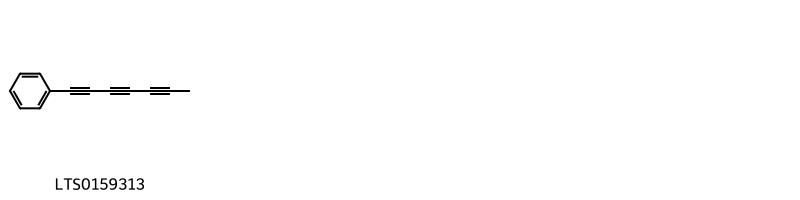{ width=100% }
    <figcaption>Hình ảnh cấu trúc hóa học của 1 hoạt chất thuộc nhóm Benzene and substituted derivatives gồm ['phenylheptatriyne (LTS0159313)'].</figcaption>
</figure>

---

### Dược dân tộc học

Danh sách các quốc gia có sử dụng *Bidens cernua* trong điều trị các bệnh. 

| Country   | Disease            | Bệnh                                                                                                                                                                                                |
|:----------|:-------------------|:----------------------------------------------------------------------------------------------------------------------------------------------------------------------------------------------------|
| Dutch     | Antiseptic         | MYMEMORY WARNING: YOU USED ALL AVAILABLE FREE TRANSLATIONS FOR TODAY. NEXT AVAILABLE IN  09 HOURS 00 MINUTES 43 SECONDS VISIT HTTPS://MYMEMORY.TRANSLATED.NET/DOC/USAGELIMITS.PHP TO TRANSLATE MORE |
| French    | Emmenagogue        | MYMEMORY WARNING: YOU USED ALL AVAILABLE FREE TRANSLATIONS FOR TODAY. NEXT AVAILABLE IN  09 HOURS 00 MINUTES 41 SECONDS VISIT HTTPS://MYMEMORY.TRANSLATED.NET/DOC/USAGELIMITS.PHP TO TRANSLATE MORE |
| US        | Narcotic, Sedative | MYMEMORY WARNING: YOU USED ALL AVAILABLE FREE TRANSLATIONS FOR TODAY. NEXT AVAILABLE IN  09 HOURS 00 MINUTES 39 SECONDS VISIT HTTPS://MYMEMORY.TRANSLATED.NET/DOC/USAGELIMITS.PHP TO TRANSLATE MORE |

---

---
## Bidens cynapiifolia
### Thông tin về thực vật

!!! info "Phân loại thực vật của *Bidens cynapiifolia* từ GIBF:"
    - **Kingdom:** Plantae
    - **Phylum:** Tracheophyta
    - **Order:** Asterales
    - **Family:** Asteraceae
    - **Genus:** Bidens
    - **Species:** *Bidens cynapiifolia*

 

| Label (VI)   | Label (EN)   | Scientific Name     | Descriptions (VI)   | Descriptions (EN)   | Also Known As (VI)   | Also Known As (EN)   |
|:-------------|:-------------|:--------------------|:--------------------|:--------------------|:---------------------|:---------------------|
| N/A          | N/A          | Bidens cynapiifolia | loài thực vật       | species of plant    | ['']                 | ['']                 |

#### Phân bố trên thế giới

**Từ CSDL GIBF** Virgin Islands (U.S.), nan, Guadeloupe, Grenada, Venezuela (Bolivarian Republic of), French Guiana, Puerto Rico, Bolivia (Plurinational State of), Jamaica, United States of America, Bonaire, Sint Eustatius and Saba, Paraguay, Saint Martin (French part), Trinidad and Tobago, Barbados, Suriname, Brazil, Guyana, Cuba, Mexico, Peru, Dominican Republic, Dominica, Curaçao, Ecuador, Aruba, Colombia, Costa Rica, Anguilla, Sint Maarten (Dutch part)

#### Phân bố tại Việt Nam

**Từ CSDL GIBF**: Không có ghi nhận ở Việt Nam

---
### Thành phần hóa học
        
- Theo cơ sở dữ liệu lotus: Từ loài *Bidens cynapiifolia* đã phân lập và xác định được 10 hoạt chất thuộc về các nhóm Phenol ethers, Prenol lipids, Benzene and substituted derivatives. 

|    | chemicalTaxonomyClassyfireClass     |   smiles_count |
|---:|:------------------------------------|---------------:|
|  0 | Benzene and substituted derivatives |              2 |
|  1 | Phenol ethers                       |              2 |
|  2 | Prenol lipids                       |              6 |

#### Nhóm Benzene and substituted derivatives
<figure markdown="span">
    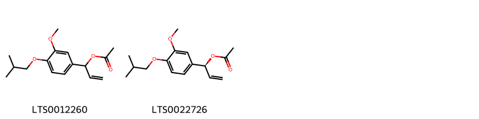{ width=100% }
    <figcaption>Hình ảnh cấu trúc hóa học của 2 hoạt chất thuộc nhóm Benzene and substituted derivatives gồm ['1-[3-methoxy-4-(2-methylpropoxy)phenyl]prop-2-en-1-yl acetate (LTS0012260)', '(1s)-1-[3-methoxy-4-(2-methylpropoxy)phenyl]prop-2-en-1-yl acetate (LTS0022726)'].</figcaption>
</figure>
#### Nhóm Phenol ethers
<figure markdown="span">
    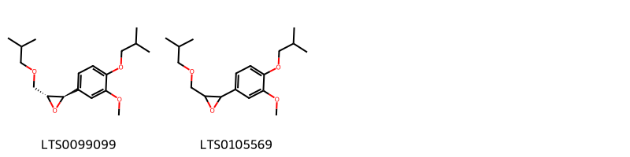{ width=100% }
    <figcaption>Hình ảnh cấu trúc hóa học của 2 hoạt chất thuộc nhóm Phenol ethers gồm ['(2r,3r)-2-[3-methoxy-4-(2-methylpropoxy)phenyl]-3-[(2-methylpropoxy)methyl]oxirane (LTS0099099)', '2-[3-methoxy-4-(2-methylpropoxy)phenyl]-3-[(2-methylpropoxy)methyl]oxirane (LTS0105569)'].</figcaption>
</figure>
#### Nhóm Prenol lipids
<figure markdown="span">
    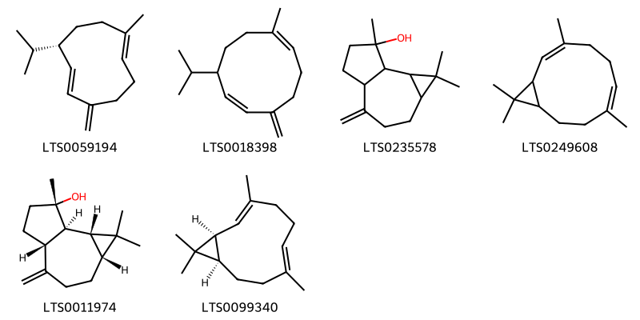{ width=100% }
    <figcaption>Hình ảnh cấu trúc hóa học của 6 hoạt chất thuộc nhóm Prenol lipids gồm ['(-)-germacrene d (LTS0059194)', '8-isopropyl-1-methyl-5-methylidenecyclodeca-1,6-diene (LTS0018398)', 'spathulenol (LTS0235578)', '3,7,11,11-tetramethylbicyclo[8.1.0]undeca-2,6-diene (LTS0249608)', 'spathulenol (LTS0011974)', 'bicyclogermacrene (LTS0099340)'].</figcaption>
</figure>

---

### Dược dân tộc học

Danh sách các quốc gia có sử dụng *Bidens cynapiifolia* trong điều trị các bệnh. 

| Country   |   Disease | Bệnh                                                                                                                                                                                                |
|:----------|----------:|:----------------------------------------------------------------------------------------------------------------------------------------------------------------------------------------------------|
| Elsewhere |       nan | MYMEMORY WARNING: YOU USED ALL AVAILABLE FREE TRANSLATIONS FOR TODAY. NEXT AVAILABLE IN  09 HOURS 00 MINUTES 16 SECONDS VISIT HTTPS://MYMEMORY.TRANSLATED.NET/DOC/USAGELIMITS.PHP TO TRANSLATE MORE |
| Trinidad  |       nan | MYMEMORY WARNING: YOU USED ALL AVAILABLE FREE TRANSLATIONS FOR TODAY. NEXT AVAILABLE IN  09 HOURS 00 MINUTES 14 SECONDS VISIT HTTPS://MYMEMORY.TRANSLATED.NET/DOC/USAGELIMITS.PHP TO TRANSLATE MORE |

---

---
## Bidens pilosa
### Thông tin về thực vật

!!! info "Phân loại thực vật của *Bidens pilosa* từ GIBF:"
    - **Kingdom:** Plantae
    - **Phylum:** Tracheophyta
    - **Order:** Asterales
    - **Family:** Asteraceae
    - **Genus:** Bidens
    - **Species:** *Bidens pilosa*

 

| Label (VI)   | Label (EN)   | Scientific Name   | Descriptions (VI)   | Descriptions (EN)   | Also Known As (VI)   | Also Known As (EN)                                                                                                                                                                 |
|:-------------|:-------------|:------------------|:--------------------|:--------------------|:---------------------|:-----------------------------------------------------------------------------------------------------------------------------------------------------------------------------------|
| N/A          | N/A          | Bidens pilosa     | thực vật có hoa     | species of plant    | ['Bidens pilosa']    | ['broomstick', "Devil's Pitchfork", 'blackjack', "beggar's tick", "cobbler's pegs", "devil's needles", "farmer's friend", "hairy beggar's tick", 'hairy bidens', 'Spanish needle'] |

#### Phân bố trên thế giới

**Từ CSDL GIBF** Sri Lanka, Italy, Australia, Japan, Argentina, Rwanda, Israel, Chinese Taipei, Spain, Portugal, Morocco, United States of America, Uruguay, Timor-Leste, Zimbabwe, South Africa, Thailand, Brazil, Mexico, Ecuador, Niue, Madagascar, Kenya, New Zealand

#### Phân bố tại Việt Nam

**Từ CSDL GIBF**: Không có ghi nhận ở Việt Nam

---
### Thành phần hóa học
        
- Theo cơ sở dữ liệu lotus: Từ loài *Bidens pilosa* đã phân lập và xác định được 177 hoạt chất thuộc về các nhóm Fatty Acyls, Flavonoids, Prenol lipids, Steroids and steroid derivatives, Linear 1,3-diarylpropanoids, Cinnamic acids and derivatives, Thiophenes, Benzene and substituted derivatives, Organooxygen compounds, Aurone flavonoids, Carboxylic acids and derivatives, Benzopyrans, Imidazopyrimidines. 

|    | chemicalTaxonomyClassyfireClass     |   smiles_count |
|---:|:------------------------------------|---------------:|
|  0 | Aurone flavonoids                   |              3 |
|  1 | Benzene and substituted derivatives |              5 |
|  2 | Benzopyrans                         |              1 |
|  3 | Carboxylic acids and derivatives    |              2 |
|  4 | Cinnamic acids and derivatives      |              5 |
|  5 | Fatty Acyls                         |             40 |
|  6 | Flavonoids                          |             76 |
|  7 | Imidazopyrimidines                  |              1 |
|  8 | Linear 1,3-diarylpropanoids         |              3 |
|  9 | Organooxygen compounds              |             12 |
| 10 | Prenol lipids                       |             19 |
| 11 | Steroids and steroid derivatives    |              7 |
| 12 | Thiophenes                          |              1 |

#### Nhóm Aurone flavonoids
<figure markdown="span">
    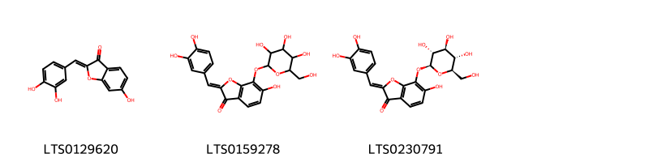{ width=100% }
    <figcaption>Hình ảnh cấu trúc hóa học của 3 hoạt chất thuộc nhóm Aurone flavonoids gồm ['sulfuretin (LTS0129620)', '2-[(3,4-dihydroxyphenyl)methylidene]-6-hydroxy-7-{[3,4,5-trihydroxy-6-(hydroxymethyl)oxan-2-yl]oxy}-1-benzofuran-3-one (LTS0159278)', '(2z)-2-[(3,4-dihydroxyphenyl)methylidene]-6-hydroxy-7-{[(2s,3r,4s,5s,6r)-3,4,5-trihydroxy-6-(hydroxymethyl)oxan-2-yl]oxy}-1-benzofuran-3-one (LTS0230791)'].</figcaption>
</figure>
#### Nhóm Benzene and substituted derivatives
<figure markdown="span">
    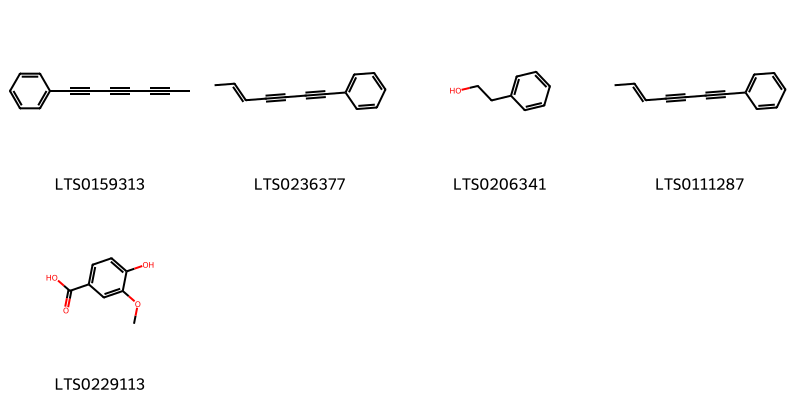{ width=100% }
    <figcaption>Hình ảnh cấu trúc hóa học của 5 hoạt chất thuộc nhóm Benzene and substituted derivatives gồm ['phenylheptatriyne (LTS0159313)', 'hept-1,3-diyn-5-enylbenzene (LTS0236377)', '2-phenyl-ethanol (LTS0206341)', 'hept-1,3-diyn-5-enylbenzene (LTS0111287)', 'vanillic acid (LTS0229113)'].</figcaption>
</figure>
#### Nhóm Benzopyrans
<figure markdown="span">
    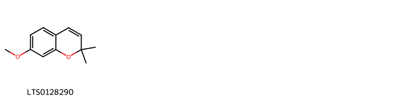{ width=100% }
    <figcaption>Hình ảnh cấu trúc hóa học của 1 hoạt chất thuộc nhóm Benzopyrans gồm ['precocene i (LTS0128290)'].</figcaption>
</figure>
#### Nhóm Carboxylic acids and derivatives
<figure markdown="span">
    { width=100% }
    <figcaption>Hình ảnh cấu trúc hóa học của 2 hoạt chất thuộc nhóm Carboxylic acids and derivatives gồm ['succinic acid (LTS0237204)', 'fumaric acid (LTS0114831)'].</figcaption>
</figure>
#### Nhóm Cinnamic acids and derivatives
<figure markdown="span">
    { width=100% }
    <figcaption>Hình ảnh cấu trúc hóa học của 5 hoạt chất thuộc nhóm Cinnamic acids and derivatives gồm ['(2r,3r)-2-{[(2e)-3-(3,4-dihydroxyphenyl)prop-2-enoyl]oxy}-3,4-dihydroxy-2-methylbutanoic acid (LTS0145757)', '2-{[3-(3,4-dihydroxyphenyl)prop-2-enoyl]oxy}-3,4-dihydroxy-2-methylbutanoic acid (LTS0263756)', '(3r,4r)-4-hydroxy-4-methyl-5-oxooxolan-3-yl (2e)-3-(3,4-dihydroxyphenyl)prop-2-enoate (LTS0250940)', 'para-coumaric acid (LTS0266252)', '4-hydroxy-4-methyl-5-oxooxolan-3-yl 3-(3,4-dihydroxyphenyl)prop-2-enoate (LTS0126305)'].</figcaption>
</figure>
#### Nhóm Fatty Acyls
<figure markdown="span">
    { width=100% }
    <figcaption>Hình ảnh cấu trúc hóa học của 40 hoạt chất thuộc nhóm Fatty Acyls gồm ['linoleic (LTS0013198)', '1-hydroxytetradeca-6,12-dien-8,10-diyn-3-one (LTS0127607)', '7-phenylhepta-2,4,6-triyn-1-ol (LTS0137497)', 'ethyl octadeca-9,12-dienoate (LTS0121886)', '7-phenylhept-2-en-4,6-diyn-1-ol (LTS0051958)', '(2s)-7-phenylhepta-4,6-diyn-2-ol (LTS0106022)', '(2s,8e,10s,11s)-trideca-8,12-dien-4,6-diyne-2,10,11-triol (LTS0074969)', '(2r,3s,4s,5r,6r)-2-(hydroxymethyl)-6-{[(2r,5e)-1-hydroxytridec-5-en-7,9,11-triyn-2-yl]oxy}oxane-3,4,5-triol (LTS0073856)', '(6e,12e)-1-hydroxytetradeca-6,12-dien-8,10-diyn-3-one (LTS0212731)', '9,12-octadecadienoic acid (LTS0101463)', '(9z)-2-butoxy-2-ethyloctadec-9-enoic acid (LTS0071512)', '(2s,10s,11s)-trideca-8,12-dien-4,6-diyne-2,10,11-triol (LTS0102310)', 'behenic acid (LTS0058784)', '2-(hydroxymethyl)-6-[(1-hydroxytrideca-5,7,9,11-tetrayn-2-yl)oxy]oxane-3,4,5-triol (LTS0189033)', '2-butoxyethyl octadec-9-enoate (LTS0024892)', '2-(hydroxymethyl)-6-[(3-hydroxytetradec-6-en-8,10,12-triyn-1-yl)oxy]oxane-3,4,5-triol (LTS0150675)', '(+-)-propylene glycol (LTS0274535)', '(2r,3s,4s,5r,6r)-2-(hydroxymethyl)-6-{[(3s,6e)-3-hydroxytetradec-6-en-8,10,12-triyn-1-yl]oxy}oxane-3,4,5-triol (LTS0178902)', 'ethyl linolenate (LTS0134186)', '2-(hydroxymethyl)-6-[(1-hydroxytridec-5-en-7,9,11-triyn-2-yl)oxy]oxane-3,4,5-triol (LTS0204076)', 'methyl elaidolinolenate (LTS0266092)', '2-butoxyethyl esteroleic acid (LTS0141212)', '(2r)-7-phenylhepta-4,6-diyne-1,2-diol (LTS0143799)', '2-butoxyethyl octadeca-9,12,15-trienoate (LTS0234145)', 'ethyl linoleate (LTS0262009)', '(9z,12z)-2-butoxy-2-ethyloctadeca-9,12-dienoic acid (LTS0258977)', 'ethyl octadeca-9,12,15-trienoate (LTS0172965)', '(2r,3s,4s,5r,6r)-2-(hydroxymethyl)-6-{[(3r,6e)-1-hydroxytetradec-6-en-8,10,12-triyn-3-yl]oxy}oxane-3,4,5-triol (LTS0055253)', '(2e)-7-phenylhept-2-en-4,6-diyn-1-ol (LTS0218282)', 'methyl octadeca-9,12,15-trienoate (LTS0228704)', '2-butoxyethyl octadeca-9,12-dienoate (LTS0083074)', 'octadeca-9,12,15-trienoic acid (LTS0216950)', '(2r,3s,4s,5r,6r)-2-(hydroxymethyl)-6-{[(2r)-1-hydroxytrideca-5,7,9,11-tetrayn-2-yl]oxy}oxane-3,4,5-triol (LTS0225355)', '2-butoxyethyl (9z,12z,15z)-octadeca-9,12,15-trienoate (LTS0196378)', '2-butoxyethyl (9z,12z)-octadeca-9,12-dienoate (LTS0046103)', 'α-linolenic acid (LTS0275508)', 'methyl linolenate (LTS0062080)', 'α linolenic acid (LTS0132789)', '7-phenylhepta-4,6-diyn-2-ol (LTS0021273)', '2-(hydroxymethyl)-6-[(1-hydroxytetradec-6-en-8,10,12-triyn-3-yl)oxy]oxane-3,4,5-triol (LTS0248818)'].</figcaption>
</figure>
#### Nhóm Flavonoids
<figure markdown="span">
    { width=100% }
    <figcaption>Hình ảnh cấu trúc hóa học của 76 hoạt chất thuộc nhóm Flavonoids gồm ['5-hydroxy-2-(3-hydroxy-4-methoxyphenyl)-3-methoxy-7-{[(2s,3s,4r,5r,6s)-3,4,5-trihydroxy-6-methyloxan-2-yl]oxy}chromen-4-one (LTS0237941)', 'luteolin (LTS0017052)', '(6-{4-[3-(3,4-dihydroxyphenyl)prop-2-enoyl]-2,3-dihydroxyphenoxy}-3,4,5-trihydroxyoxan-2-yl)methyl acetate (LTS0100971)', 'chamomile (LTS0104946)', 'maritimein (LTS0140411)', '[(2r,3s,4s,5r,6s)-6-{[(2z)-2-[(3,4-dihydroxyphenyl)methylidene]-7-hydroxy-3-oxo-1-benzofuran-6-yl]oxy}-3,4,5-trihydroxyoxan-2-yl]methyl acetate (LTS0154552)', '[(2r,3s,4s,5r,6s)-6-{4-[(2e)-3-(3,4-dihydroxyphenyl)prop-2-enoyl]-2,3-dihydroxyphenoxy}-3,4,5-trihydroxyoxan-2-yl]methyl acetate (LTS0163632)', '[6-({2-[(3,4-dihydroxyphenyl)methylidene]-7-hydroxy-3-oxo-1-benzofuran-6-yl}oxy)-3,4,5-trihydroxyoxan-2-yl]methyl acetate (LTS0220730)', 'astragalin (LTS0249588)', '[(2s,3s,4s,5s,6s)-6-{[(2z)-2-[(3,4-dihydroxyphenyl)methylidene]-7-hydroxy-3-oxo-1-benzofuran-6-yl]oxy}-3,4,5-trihydroxyoxan-2-yl]methyl acetate (LTS0083621)', '5-hydroxy-2-(4-hydroxy-3-methoxyphenyl)-3-methoxy-7-{[(2s,3s,4s,5r,6s)-3,4,5-trihydroxy-6-({[(2r,3s,4r,5r,6s)-3,4,5-trihydroxy-6-methyloxan-2-yl]oxy}methyl)oxan-2-yl]oxy}chromen-4-one (LTS0065452)', '5-hydroxy-2-(4-hydroxy-3-methoxyphenyl)-3-methoxy-7-{[(2s,3r,4s,5s,6r)-3,4,5-trihydroxy-6-({[(2r,3r,4r,5r,6s)-3,4,5-trihydroxy-6-methyloxan-2-yl]oxy}methyl)oxan-2-yl]oxy}chromen-4-one (LTS0136761)', '5-hydroxy-2-(4-hydroxy-3-methoxyphenyl)-3,6-dimethoxy-7-{[(2s,3r,4s,5s,6r)-3,4,5-trihydroxy-6-(hydroxymethyl)oxan-2-yl]oxy}chromen-4-one (LTS0120932)', '[(2r,3r,4r,5r,6s)-3,4-bis(acetyloxy)-6-{4-[(2e)-3-(3,4-dihydroxyphenyl)prop-2-enoyl]-2,3-dihydroxyphenoxy}-5-hydroxyoxan-2-yl]methyl (2e)-3-(4-hydroxyphenyl)prop-2-enoate (LTS0121162)', '[(2r,3r,4s,5r,6s)-4-(acetyloxy)-6-{4-[(2e)-3-(3,4-dihydroxyphenyl)prop-2-enoyl]-2,3-dihydroxyphenoxy}-3,5-dihydroxyoxan-2-yl]methyl acetate (LTS0195223)', 'jaceidin (LTS0240034)', '[(2r,3s,4s,5r,6s)-6-{[(2z)-2-[(3,4-dihydroxyphenyl)methylidene]-7-hydroxy-3-oxo-1-benzofuran-6-yl]oxy}-3,4,5-trihydroxyoxan-2-yl]methyl (2e)-3-(4-hydroxyphenyl)prop-2-enoate (LTS0078527)', '[(2r,3r,4s,5r,6s)-3,5-bis(acetyloxy)-6-{[(2s)-2-(3,4-dihydroxyphenyl)-8-hydroxy-4-oxo-2,3-dihydro-1-benzopyran-7-yl]oxy}-4-hydroxyoxan-2-yl]methyl acetate (LTS0079549)', '[(2r,3r,4s,5s,6s)-6-{[(2z)-2-[(3,4-dihydroxyphenyl)methylidene]-7-hydroxy-3-oxo-1-benzofuran-6-yl]oxy}-3,4,5-trihydroxyoxan-2-yl]methyl (2e)-3-(4-hydroxyphenyl)prop-2-enoate (LTS0084487)', '[(2r,3s,4r,5r,6s)-3-(acetyloxy)-6-{4-[(2e)-3-(3,4-dihydroxyphenyl)prop-2-enoyl]-2,3-dihydroxyphenoxy}-4,5-dihydroxyoxan-2-yl]methyl acetate (LTS0212066)', '[3-(acetyloxy)-6-{4-[3-(3,4-dihydroxyphenyl)prop-2-enoyl]-2,3-dihydroxyphenoxy}-4,5-dihydroxyoxan-2-yl]methyl 3-(4-hydroxyphenyl)prop-2-enoate (LTS0096536)', 'marein (LTS0101507)', '[(2r,3s,4s,5r,6s)-6-{2,3-dihydroxy-4-[(2e)-3-(4-hydroxyphenyl)prop-2-enoyl]phenoxy}-3,4,5-trihydroxyoxan-2-yl]methyl (2e)-3-(4-hydroxyphenyl)prop-2-enoate (LTS0029943)', '[3,5-bis(acetyloxy)-6-{[2-(3,4-dihydroxyphenyl)-8-hydroxy-4-oxo-2,3-dihydro-1-benzopyran-7-yl]oxy}-4-hydroxyoxan-2-yl]methyl acetate (LTS0169244)', 'rutin (LTS0042292)', '7-{[(2s,3r,4s,5s,6r)-6-({[(2r,3r,4r,5r,6s)-4,5-dihydroxy-6-methyl-3-{[(2s,3r,4r,5r,6s)-3,4,5-trihydroxy-6-methyloxan-2-yl]oxy}oxan-2-yl]oxy}methyl)-3,4,5-trihydroxyoxan-2-yl]oxy}-5-hydroxy-2-(3-hydroxy-4-methoxyphenyl)-3-methoxychromen-4-one (LTS0067656)', '1-(2,4-dihydroxy-3-{[3,4,5-trihydroxy-6-(hydroxymethyl)oxan-2-yl]oxy}phenyl)-3-(3,4-dihydroxyphenyl)prop-2-en-1-one (LTS0176318)', '2-(3,4-dihydroxyphenyl)-5-hydroxy-3-methoxy-7-{[(2s,3r,4s,5r,6s)-3,4,5-trihydroxy-6-methyloxan-2-yl]oxy}chromen-4-one (LTS0112734)', '[(2r,3s,4s,5r,6s)-3,5-bis(acetyloxy)-6-{4-[(2e)-3-(3,4-dihydroxyphenyl)prop-2-enoyl]-2,3-dihydroxyphenoxy}-4-hydroxyoxan-2-yl]methyl (2e)-3-(4-hydroxyphenyl)prop-2-enoate (LTS0178724)', '[(2r,3r,4r,5r,6s)-3,4-bis(acetyloxy)-6-{[(2z)-2-[(3,4-dihydroxyphenyl)methylidene]-7-hydroxy-3-oxo-1-benzofuran-6-yl]oxy}-5-hydroxyoxan-2-yl]methyl acetate (LTS0107725)', '7-[(4,5-dihydroxy-3-{[3,4,5-trihydroxy-6-(hydroxymethyl)oxan-2-yl]oxy}-6-{[(3,4,5-trihydroxy-6-methyloxan-2-yl)oxy]methyl}oxan-2-yl)oxy]-5-hydroxy-2-(3-hydroxy-4-methoxyphenyl)-3-methoxychromen-4-one (LTS0173615)', '(2e)-3-(3,4-dihydroxyphenyl)-1-[2-hydroxy-3,4-bis({[(2s,3r,4s,5s,6r)-3,4,5-trihydroxy-6-(hydroxymethyl)oxan-2-yl]oxy})phenyl]prop-2-en-1-one (LTS0130121)', '[(2r,3r,4s,5r,6s)-6-{2,3-dihydroxy-4-[(2e)-3-(4-hydroxyphenyl)prop-2-enoyl]phenoxy}-3,4,5-trihydroxyoxan-2-yl]methyl (2e)-3-(4-hydroxyphenyl)prop-2-enoate (LTS0264999)', '[(2r,3s,4s,5s,6s)-3,5-bis(acetyloxy)-6-{4-[(2e)-3-(3,4-dihydroxyphenyl)prop-2-enoyl]-2,3-dihydroxyphenoxy}-4-hydroxyoxan-2-yl]methyl acetate (LTS0269479)', '2-(3,4-dihydroxyphenyl)-5-hydroxy-3,6-dimethoxy-7-{[(2s,3r,4s,5s,6r)-3,4,5-trihydroxy-6-(hydroxymethyl)oxan-2-yl]oxy}chromen-4-one (LTS0200026)', '5-hydroxy-2-(3-hydroxy-4-methoxyphenyl)-3-methoxy-7-[(3,4,5-trihydroxy-6-{[(3,4,5-trihydroxy-6-methyloxan-2-yl)oxy]methyl}oxan-2-yl)oxy]chromen-4-one (LTS0149191)', '[3,4-bis(acetyloxy)-6-{4-[3-(3,4-dihydroxyphenyl)prop-2-enoyl]-2,3-dihydroxyphenoxy}-5-hydroxyoxan-2-yl]methyl acetate (LTS0152583)', '7-({6-[({4,5-dihydroxy-6-methyl-3-[(3,4,5-trihydroxy-6-methyloxan-2-yl)oxy]oxan-2-yl}oxy)methyl]-3,4,5-trihydroxyoxan-2-yl}oxy)-5-hydroxy-2-(3-hydroxy-4-methoxyphenyl)-3-methoxychromen-4-one (LTS0096599)', '[4-(acetyloxy)-6-{4-[3-(3,4-dihydroxyphenyl)prop-2-enoyl]-2,3-dihydroxyphenoxy}-3,5-dihydroxyoxan-2-yl]methyl acetate (LTS0145586)', '2-(3,4-dihydroxyphenyl)-5-hydroxy-3-methoxy-7-[(3,4,5-trihydroxy-6-{[(3,4,5-trihydroxy-6-methyloxan-2-yl)oxy]methyl}oxan-2-yl)oxy]chromen-4-one (LTS0152352)', '5-hydroxy-2-(4-hydroxy-3-methoxyphenyl)-3-methoxy-7-{[(2s,3r,4s,5s,6r)-3,4,5-trihydroxy-6-(hydroxymethyl)oxan-2-yl]oxy}chromen-4-one (LTS0208205)', '5-hydroxy-2-(3-hydroxy-4-methoxyphenyl)-3-methoxy-7-{[(2s,3s,4s,5s,6r)-3,4,5-trihydroxy-6-({[(2r,3r,4r,5r,6s)-3,4,5-trihydroxy-6-methyloxan-2-yl]oxy}methyl)oxan-2-yl]oxy}chromen-4-one (LTS0237166)', 'marein (LTS0240680)', '[(2r,3s,4s,5r,6s)-3,5-bis(acetyloxy)-6-{[(2z)-2-[(3,4-dihydroxyphenyl)methylidene]-7-hydroxy-3-oxo-1-benzofuran-6-yl]oxy}-4-hydroxyoxan-2-yl]methyl acetate (LTS0162260)', '[(2r,3s,4r,5r,6s)-3-(acetyloxy)-6-{4-[(2e)-3-(3,4-dihydroxyphenyl)prop-2-enoyl]-2,3-dihydroxyphenoxy}-4,5-dihydroxyoxan-2-yl]methyl (2e)-3-(4-hydroxyphenyl)prop-2-enoate (LTS0156759)', '[(2r,3r,4r,5r,6s)-3,4-bis(acetyloxy)-6-{4-[(2e)-3-(3,4-dihydroxyphenyl)prop-2-enoyl]-2,3-dihydroxyphenoxy}-5-hydroxyoxan-2-yl]methyl acetate (LTS0188176)', '1-(2,3-dihydroxy-4-{[3,4,5-trihydroxy-6-({[3,4,5-trihydroxy-6-(hydroxymethyl)oxan-2-yl]oxy}methyl)oxan-2-yl]oxy}phenyl)-3-(3,4-dihydroxyphenyl)prop-2-en-1-one (LTS0223602)', '(2e)-1-(2,4-dihydroxy-3-{[(2s,3r,4s,5s,6r)-3,4,5-trihydroxy-6-(hydroxymethyl)oxan-2-yl]oxy}phenyl)-3-(3,4-dihydroxyphenyl)prop-2-en-1-one (LTS0219500)', '2-(3,4-dihydroxyphenyl)-5,7-dihydroxy-3-{[(2s,3r,4r,5r,6s)-3,4,5-trihydroxy-6-(hydroxymethyl)oxan-2-yl]oxy}chromen-4-one (LTS0241372)', '5-hydroxy-2-(4-hydroxy-3-methoxyphenyl)-3,6-dimethoxy-7-{[3,4,5-trihydroxy-6-(hydroxymethyl)oxan-2-yl]oxy}chromen-4-one (LTS0189681)', 'jacein (LTS0234738)', '2-(3,4-dihydroxyphenyl)-5-hydroxy-3,6-dimethoxy-7-{[3,4,5-trihydroxy-6-(hydroxymethyl)oxan-2-yl]oxy}chromen-4-one (LTS0210742)', '[3,5-bis(acetyloxy)-6-({2-[(3,4-dihydroxyphenyl)methylidene]-7-hydroxy-3-oxo-1-benzofuran-6-yl}oxy)-4-hydroxyoxan-2-yl]methyl acetate (LTS0233541)', '7-{[(2s,3r,4s,5s,6r)-4,5-dihydroxy-3-{[(2s,3r,4s,5s,6r)-3,4,5-trihydroxy-6-(hydroxymethyl)oxan-2-yl]oxy}-6-({[(2r,3r,4r,5r,6s)-3,4,5-trihydroxy-6-methyloxan-2-yl]oxy}methyl)oxan-2-yl]oxy}-5-hydroxy-2-(3-hydroxy-4-methoxyphenyl)-3-methoxychromen-4-one (LTS0160364)', '5-hydroxy-2-(4-hydroxy-3-methoxyphenyl)-3-methoxy-7-[(3,4,5-trihydroxy-6-{[(3,4,5-trihydroxy-6-methyloxan-2-yl)oxy]methyl}oxan-2-yl)oxy]chromen-4-one (LTS0162966)', '(6-{2,3-dihydroxy-4-[3-(4-hydroxyphenyl)prop-2-enoyl]phenoxy}-3,4,5-trihydroxyoxan-2-yl)methyl 3-(4-hydroxyphenyl)prop-2-enoate (LTS0010158)', '[(2s,3r,4s,5s,6s)-6-{4-[(2e)-3-(3,4-dihydroxyphenyl)prop-2-enoyl]-2,3-dihydroxyphenoxy}-3,4,5-trihydroxyoxan-2-yl]methyl (2e)-3-(4-hydroxyphenyl)prop-2-enoate (LTS0106013)', '[3-(acetyloxy)-6-{4-[3-(3,4-dihydroxyphenyl)prop-2-enoyl]-2,3-dihydroxyphenoxy}-4,5-dihydroxyoxan-2-yl]methyl acetate (LTS0260390)', "okanin 3'-glucoside (LTS0107318)", '3-(3,4-dihydroxyphenyl)-1-[2-hydroxy-3,4-bis({[3,4,5-trihydroxy-6-(hydroxymethyl)oxan-2-yl]oxy})phenyl]prop-2-en-1-one (LTS0004254)', 'quercetin (LTS0004651)', '5-hydroxy-2-(3-hydroxy-4-methoxyphenyl)-3-methoxy-7-{[(2s,3r,4s,5s,6r)-3,4,5-trihydroxy-6-({[(2r,3r,4r,5r,6s)-3,4,5-trihydroxy-6-methyloxan-2-yl]oxy}methyl)oxan-2-yl]oxy}chromen-4-one (LTS0009772)', '[(2r,3s,4s,5r,6s)-3,5-bis(acetyloxy)-6-{[(2s)-2-(3,4-dihydroxyphenyl)-8-hydroxy-4-oxo-2,3-dihydro-1-benzopyran-7-yl]oxy}-4-hydroxyoxan-2-yl]methyl acetate (LTS0007914)', '(2e)-1-(2,3-dihydroxy-4-{[(2s,3r,4s,5s,6r)-3,4,5-trihydroxy-6-({[(2r,3r,4s,5s,6r)-3,4,5-trihydroxy-6-(hydroxymethyl)oxan-2-yl]oxy}methyl)oxan-2-yl]oxy}phenyl)-3-(3,4-dihydroxyphenyl)prop-2-en-1-one (LTS0000822)', '5-o-methylhoslundin (LTS0029794)', '(2e)-1-(2,4-dihydroxy-3-{[(2s,3r,4s,5s,6r)-3,4,5-trihydroxy-6-(hydroxymethyl)oxan-2-yl]oxy}phenyl)-3-(3-hydroxy-4-methoxyphenyl)prop-2-en-1-one (LTS0021162)', '5-hydroxy-2-(4-hydroxy-3-methoxyphenyl)-3-methoxy-7-{[3,4,5-trihydroxy-6-(hydroxymethyl)oxan-2-yl]oxy}chromen-4-one (LTS0012211)', '3-rutinosyl quercetin (LTS0032845)', '[6-({2-[(3,4-dihydroxyphenyl)methylidene]-7-hydroxy-3-oxo-1-benzofuran-6-yl}oxy)-3,4,5-trihydroxyoxan-2-yl]methyl 3-(4-hydroxyphenyl)prop-2-enoate (LTS0102677)', 'centaurein (LTS0088902)', '2-(3,4-dihydroxyphenyl)-5-hydroxy-3-methoxy-7-{[(2s,3s,4s,5s,6r)-3,4,5-trihydroxy-6-({[(2r,3r,4r,5r,6s)-3,4,5-trihydroxy-6-methyloxan-2-yl]oxy}methyl)oxan-2-yl]oxy}chromen-4-one (LTS0132596)', '5-hydroxy-2-(4-hydroxy-3-methoxyphenyl)-3,7-dimethoxy-6-{[(2s,3r,4s,5s,6r)-3,4,5-trihydroxy-6-(hydroxymethyl)oxan-2-yl]oxy}chromen-4-one (LTS0090992)', '[3-(acetyloxy)-6-({2-[(3,4-dihydroxyphenyl)methylidene]-7-hydroxy-3-oxo-1-benzofuran-6-yl}oxy)-4,5-dihydroxyoxan-2-yl]methyl acetate (LTS0213415)', '[(2r,3s,4r,5r,6s)-3-(acetyloxy)-6-{[(2z)-2-[(3,4-dihydroxyphenyl)methylidene]-7-hydroxy-3-oxo-1-benzofuran-6-yl]oxy}-4,5-dihydroxyoxan-2-yl]methyl acetate (LTS0269439)', '[3,4-bis(acetyloxy)-6-({2-[(3,4-dihydroxyphenyl)methylidene]-7-hydroxy-3-oxo-1-benzofuran-6-yl}oxy)-5-hydroxyoxan-2-yl]methyl acetate (LTS0108921)', '1-(2,4-dihydroxy-3-{[3,4,5-trihydroxy-6-(hydroxymethyl)oxan-2-yl]oxy}phenyl)-3-(3-hydroxy-4-methoxyphenyl)prop-2-en-1-one (LTS0251897)'].</figcaption>
</figure>
#### Nhóm Imidazopyrimidines
<figure markdown="span">
    { width=100% }
    <figcaption>Hình ảnh cấu trúc hóa học của 1 hoạt chất thuộc nhóm Imidazopyrimidines gồm ['caffeine (LTS0075508)'].</figcaption>
</figure>
#### Nhóm Linear 1_3-diarylpropanoids
<figure markdown="span">
    { width=100% }
    <figcaption>Hình ảnh cấu trúc hóa học của Không tìm thấy chú thích hoạt chất thuộc nhóm Linear 1_3-diarylpropanoids gồm Không tìm thấy chú thích.</figcaption>
</figure>
#### Nhóm Organooxygen compounds
<figure markdown="span">
    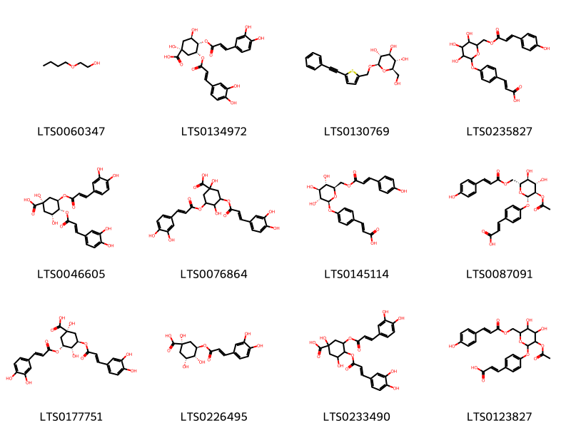{ width=100% }
    <figcaption>Hình ảnh cấu trúc hóa học của 12 hoạt chất thuộc nhóm Organooxygen compounds gồm ['butoxyethanol (LTS0060347)', '3,4-dicaffeoylquinic acid (LTS0134972)', '(2r,3s,4s,5r,6r)-2-(hydroxymethyl)-6-{[5-(2-phenylethynyl)thiophen-2-yl]methoxy}oxane-3,4,5-triol (LTS0130769)', '3-(4-{[3,4,5-trihydroxy-6-({[3-(4-hydroxyphenyl)prop-2-enoyl]oxy}methyl)oxan-2-yl]oxy}phenyl)prop-2-enoic acid (LTS0235827)', '4,5-dicaffeoylquinic acid (LTS0046605)', '3,5-bis({[3-(3,4-dihydroxyphenyl)prop-2-enoyl]oxy})-1,4-dihydroxycyclohexane-1-carboxylic acid (LTS0076864)', '(2e)-3-(4-{[(2s,3r,4s,5s,6r)-3,4,5-trihydroxy-6-({[(2e)-3-(4-hydroxyphenyl)prop-2-enoyl]oxy}methyl)oxan-2-yl]oxy}phenyl)prop-2-enoic acid (LTS0145114)', '(2e)-3-(4-{[(2s,3r,4s,5s,6r)-3-(acetyloxy)-4,5-dihydroxy-6-({[(2e)-3-(4-hydroxyphenyl)prop-2-enoyl]oxy}methyl)oxan-2-yl]oxy}phenyl)prop-2-enoic acid (LTS0087091)', '3,5-dicaffeoylquinic acid (LTS0177751)', 'chlorogenic acid (LTS0226495)', '3,4-bis({[3-(3,4-dihydroxyphenyl)prop-2-enoyl]oxy})-1,5-dihydroxycyclohexane-1-carboxylic acid (LTS0233490)', '3-(4-{[3-(acetyloxy)-4,5-dihydroxy-6-({[3-(4-hydroxyphenyl)prop-2-enoyl]oxy}methyl)oxan-2-yl]oxy}phenyl)prop-2-enoic acid (LTS0123827)'].</figcaption>
</figure>
#### Nhóm Prenol lipids
<figure markdown="span">
    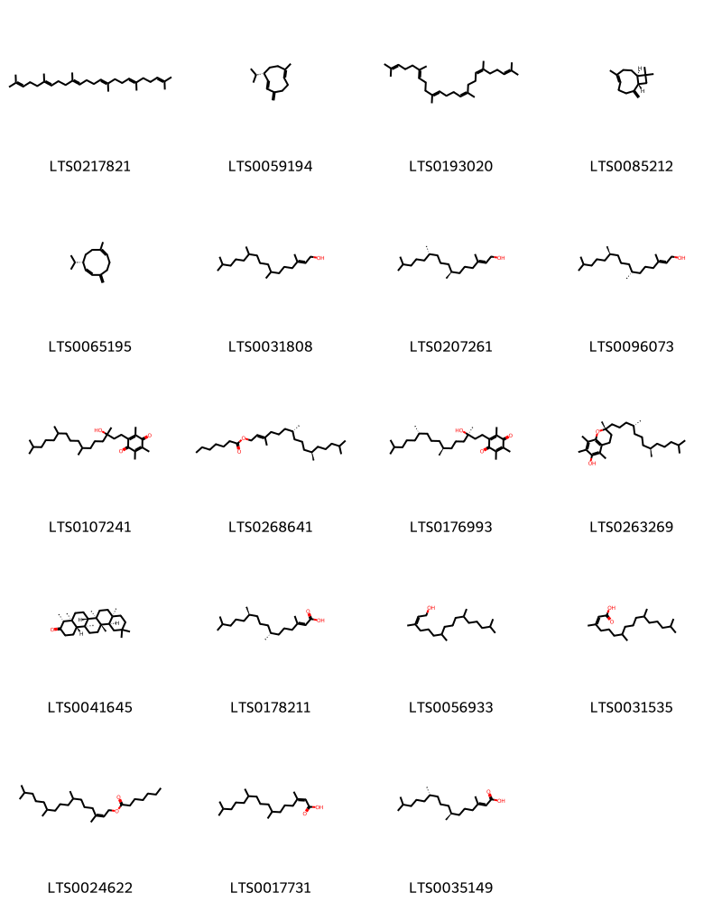{ width=100% }
    <figcaption>Hình ảnh cấu trúc hóa học của 19 hoạt chất thuộc nhóm Prenol lipids gồm ['squalene (LTS0217821)', '(-)-germacrene d (LTS0059194)', '2,6,10,15,19,23-hexamethyltetracosa-2,6,10,14,18,22-hexaene (LTS0193020)', 'caryophyllene (LTS0085212)', '(1z,6z,8s)-8-isopropyl-1-methyl-5-methylidenecyclodeca-1,6-diene (LTS0065195)', 'phytol (LTS0031808)', '(2e,7s,11s)-3,7,11,15-tetramethylhexadec-2-en-1-ol (LTS0207261)', 'phytol (LTS0096073)', 'tocoquinone (LTS0107241)', '(2e,7r,11r)-3,7,11,15-tetramethylhexadec-2-en-1-yl heptanoate (LTS0268641)', '2-[(3r,7s,11s)-3-hydroxy-3,7,11,15-tetramethylhexadecyl]-3,5,6-trimethylcyclohexa-2,5-diene-1,4-dione (LTS0176993)', 'vitamin e (LTS0263269)', '(-)-friedelin (LTS0041645)', 'phytic acid (LTS0178211)', '3,7,11,15-tetramethylhexadec-2-en-1-ol (LTS0056933)', '3,7,11,15-tetramethylhexadec-2-enoic acid (LTS0031535)', '3,7,11,15-tetramethylhexadec-2-en-1-yl heptanoate (LTS0024622)', 'phytenoic acid (LTS0017731)', '(2e,7s,11s)-3,7,11,15-tetramethylhexadec-2-enoic acid (LTS0035149)'].</figcaption>
</figure>
#### Nhóm Steroids and steroid derivatives
<figure markdown="span">
    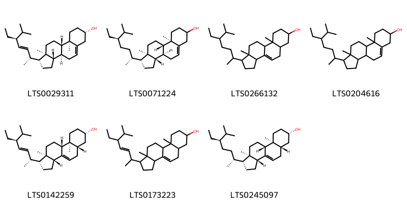{ width=100% }
    <figcaption>Hình ảnh cấu trúc hóa học của 7 hoạt chất thuộc nhóm Steroids and steroid derivatives gồm ['phytosterol (LTS0029311)', 'stigmast-5-en-3-ol (LTS0071224)', '1-(5-ethyl-6-methylheptan-2-yl)-9a,11a-dimethyl-1h,2h,3h,3ah,5h,5ah,6h,7h,8h,9h,9bh,10h,11h-cyclopenta[a]phenanthren-7-ol (LTS0266132)', 'stigmast-5-en-3-ol, (3β)- (LTS0204616)', 'chondrillasterol (LTS0142259)', '1-(5-ethyl-6-methylhept-3-en-2-yl)-9a,11a-dimethyl-1h,2h,3h,3ah,5h,5ah,6h,7h,8h,9h,9bh,10h,11h-cyclopenta[a]phenanthren-7-ol (LTS0173223)', '(3β,5α)-stigmast-7-en-3-ol (LTS0245097)'].</figcaption>
</figure>
#### Nhóm Thiophenes
<figure markdown="span">
    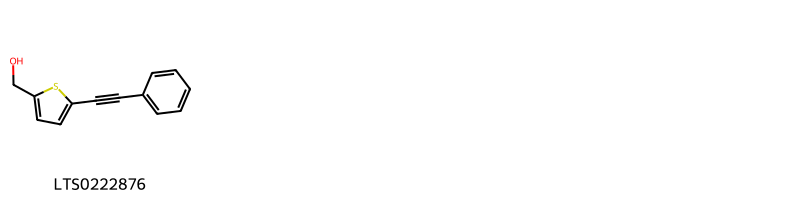{ width=100% }
    <figcaption>Hình ảnh cấu trúc hóa học của 1 hoạt chất thuộc nhóm Thiophenes gồm ['[5-(2-phenylethynyl)thiophen-2-yl]methanol (LTS0222876)'].</figcaption>
</figure>

---

### Dược dân tộc học

Danh sách các quốc gia có sử dụng *Bidens pilosa* trong điều trị các bệnh. 

| Country            | Disease                           | Bệnh                                                                                                                                                                                                |
|:-------------------|:----------------------------------|:----------------------------------------------------------------------------------------------------------------------------------------------------------------------------------------------------|
| Bahamas            | Carminative, Diuretic             | MYMEMORY WARNING: YOU USED ALL AVAILABLE FREE TRANSLATIONS FOR TODAY. NEXT AVAILABLE IN  08 HOURS 59 MINUTES 46 SECONDS VISIT HTTPS://MYMEMORY.TRANSLATED.NET/DOC/USAGELIMITS.PHP TO TRANSLATE MORE |
| Dominican Republic | Diuretic, Emmenagogue, Sialogogue | MYMEMORY WARNING: YOU USED ALL AVAILABLE FREE TRANSLATIONS FOR TODAY. NEXT AVAILABLE IN  08 HOURS 59 MINUTES 44 SECONDS VISIT HTTPS://MYMEMORY.TRANSLATED.NET/DOC/USAGELIMITS.PHP TO TRANSLATE MORE |
| Elsewhere          | Styptic                           | MYMEMORY WARNING: YOU USED ALL AVAILABLE FREE TRANSLATIONS FOR TODAY. NEXT AVAILABLE IN  08 HOURS 59 MINUTES 42 SECONDS VISIT HTTPS://MYMEMORY.TRANSLATED.NET/DOC/USAGELIMITS.PHP TO TRANSLATE MORE |
| Ghana              | Styptic                           | MYMEMORY WARNING: YOU USED ALL AVAILABLE FREE TRANSLATIONS FOR TODAY. NEXT AVAILABLE IN  08 HOURS 59 MINUTES 39 SECONDS VISIT HTTPS://MYMEMORY.TRANSLATED.NET/DOC/USAGELIMITS.PHP TO TRANSLATE MORE |
| Malaya             | Antidote                          | MYMEMORY WARNING: YOU USED ALL AVAILABLE FREE TRANSLATIONS FOR TODAY. NEXT AVAILABLE IN  08 HOURS 59 MINUTES 37 SECONDS VISIT HTTPS://MYMEMORY.TRANSLATED.NET/DOC/USAGELIMITS.PHP TO TRANSLATE MORE |
| Mexico             | Diuretic                          | MYMEMORY WARNING: YOU USED ALL AVAILABLE FREE TRANSLATIONS FOR TODAY. NEXT AVAILABLE IN  08 HOURS 59 MINUTES 34 SECONDS VISIT HTTPS://MYMEMORY.TRANSLATED.NET/DOC/USAGELIMITS.PHP TO TRANSLATE MORE |
| Philippines        | Intoxicant                        | MYMEMORY WARNING: YOU USED ALL AVAILABLE FREE TRANSLATIONS FOR TODAY. NEXT AVAILABLE IN  08 HOURS 59 MINUTES 32 SECONDS VISIT HTTPS://MYMEMORY.TRANSLATED.NET/DOC/USAGELIMITS.PHP TO TRANSLATE MORE |
| Venezuela          | Vulnerary                         | MYMEMORY WARNING: YOU USED ALL AVAILABLE FREE TRANSLATIONS FOR TODAY. NEXT AVAILABLE IN  08 HOURS 59 MINUTES 29 SECONDS VISIT HTTPS://MYMEMORY.TRANSLATED.NET/DOC/USAGELIMITS.PHP TO TRANSLATE MORE |

---

---
## Bidens tripartita
### Thông tin về thực vật

!!! info "Phân loại thực vật của *Bidens tripartita* từ GIBF:"
    - **Kingdom:** Plantae
    - **Phylum:** Tracheophyta
    - **Order:** Asterales
    - **Family:** Asteraceae
    - **Genus:** Bidens
    - **Species:** *Bidens tripartita*

 

| Label (VI)   | Label (EN)   | Scientific Name   | Descriptions (VI)   | Descriptions (EN)   | Also Known As (VI)   | Also Known As (EN)                                                                                                                |
|:-------------|:-------------|:------------------|:--------------------|:--------------------|:---------------------|:----------------------------------------------------------------------------------------------------------------------------------|
| N/A          | N/A          | Bidens tripartita | loài thực vật       | species of plant    | ['']                 | ['three-lobe beggartick', 'trifid bur-marigold', 'three-lobe beggarticks', 'leafy-bracted beggarticks', 'three-part beggarticks'] |

#### Phân bố trên thế giới

**Từ CSDL GIBF** Ukraine, Denmark, Netherlands, Lithuania, Australia, Germany, Belgium, Estonia, Chinese Taipei, Russian Federation, Sweden, Finland, China, Kazakhstan, Norway, United Kingdom of Great Britain and Northern Ireland, Canada

#### Phân bố tại Việt Nam

**Từ CSDL GIBF**: Không có ghi nhận ở Việt Nam

---
### Thành phần hóa học
        
- Theo cơ sở dữ liệu lotus: Từ loài *Bidens tripartita* đã phân lập và xác định được 17 hoạt chất thuộc về các nhóm Fatty Acyls, Flavonoids, Prenol lipids, Linear 1,3-diarylpropanoids, Unsaturated hydrocarbons, Phenols, Aurone flavonoids, Coumarins and derivatives. 

|    | chemicalTaxonomyClassyfireClass   |   smiles_count |
|---:|:----------------------------------|---------------:|
|  0 | Aurone flavonoids                 |              2 |
|  1 | Coumarins and derivatives         |              3 |
|  2 | Fatty Acyls                       |              1 |
|  3 | Flavonoids                        |              4 |
|  4 | Linear 1,3-diarylpropanoids       |              4 |
|  5 | Phenols                           |              1 |
|  6 | Prenol lipids                     |              1 |
|  7 | Unsaturated hydrocarbons          |              1 |

#### Nhóm Aurone flavonoids
<figure markdown="span">
    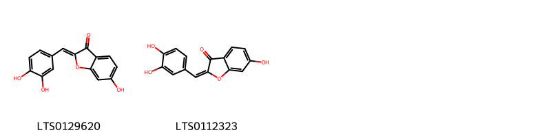{ width=100% }
    <figcaption>Hình ảnh cấu trúc hóa học của 2 hoạt chất thuộc nhóm Aurone flavonoids gồm ['sulfuretin (LTS0129620)', 'sulfuretin (LTS0112323)'].</figcaption>
</figure>
#### Nhóm Coumarins and derivatives
<figure markdown="span">
    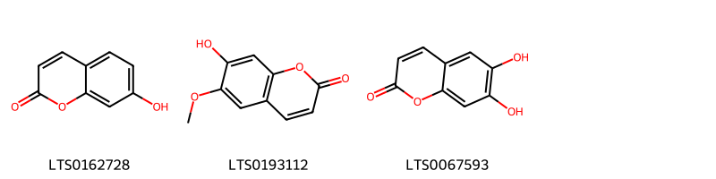{ width=100% }
    <figcaption>Hình ảnh cấu trúc hóa học của 3 hoạt chất thuộc nhóm Coumarins and derivatives gồm ['umbelliferone (LTS0162728)', 'scopoletin (LTS0193112)', 'esculetin (LTS0067593)'].</figcaption>
</figure>
#### Nhóm Fatty Acyls
<figure markdown="span">
    { width=100% }
    <figcaption>Hình ảnh cấu trúc hóa học của 1 hoạt chất thuộc nhóm Fatty Acyls gồm ['linoleic (LTS0013198)'].</figcaption>
</figure>
#### Nhóm Flavonoids
<figure markdown="span">
    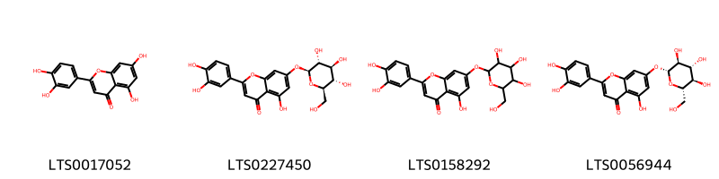{ width=100% }
    <figcaption>Hình ảnh cấu trúc hóa học của 4 hoạt chất thuộc nhóm Flavonoids gồm ['luteolin (LTS0017052)', 'luteolin 7-o-glucoside (LTS0227450)', '2-(3,4-dihydroxyphenyl)-5-hydroxy-7-{[3,4,5-trihydroxy-6-(hydroxymethyl)oxan-2-yl]oxy}chromen-4-one (LTS0158292)', '2-(3,4-dihydroxyphenyl)-5-hydroxy-7-{[(2r,3s,4r,5r,6s)-3,4,5-trihydroxy-6-(hydroxymethyl)oxan-2-yl]oxy}chromen-4-one (LTS0056944)'].</figcaption>
</figure>
#### Nhóm Linear 1_3-diarylpropanoids
<figure markdown="span">
    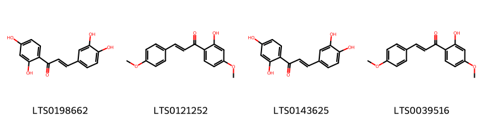{ width=100% }
    <figcaption>Hình ảnh cấu trúc hóa học của Không tìm thấy chú thích hoạt chất thuộc nhóm Linear 1_3-diarylpropanoids gồm Không tìm thấy chú thích.</figcaption>
</figure>
#### Nhóm Phenols
<figure markdown="span">
    { width=100% }
    <figcaption>Hình ảnh cấu trúc hóa học của 1 hoạt chất thuộc nhóm Phenols gồm ['eugenol (LTS0052342)'].</figcaption>
</figure>
#### Nhóm Prenol lipids
<figure markdown="span">
    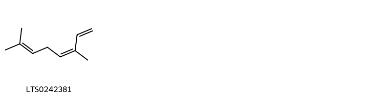{ width=100% }
    <figcaption>Hình ảnh cấu trúc hóa học của 1 hoạt chất thuộc nhóm Prenol lipids gồm ['β-ocimene (LTS0242381)'].</figcaption>
</figure>
#### Nhóm Unsaturated hydrocarbons
<figure markdown="span">
    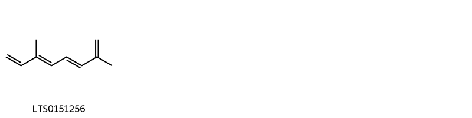{ width=100% }
    <figcaption>Hình ảnh cấu trúc hóa học của 1 hoạt chất thuộc nhóm Unsaturated hydrocarbons gồm ['cosmene (LTS0151256)'].</figcaption>
</figure>

---

### Dược dân tộc học

Danh sách các quốc gia có sử dụng *Bidens tripartita* trong điều trị các bệnh. 

| Country   | Disease                                                                                         | Bệnh                                                                                                                                                                                                |
|:----------|:------------------------------------------------------------------------------------------------|:----------------------------------------------------------------------------------------------------------------------------------------------------------------------------------------------------|
| Iraq      | Emmenagogue, Sudorific                                                                          | MYMEMORY WARNING: YOU USED ALL AVAILABLE FREE TRANSLATIONS FOR TODAY. NEXT AVAILABLE IN  08 HOURS 58 MINUTES 55 SECONDS VISIT HTTPS://MYMEMORY.TRANSLATED.NET/DOC/USAGELIMITS.PHP TO TRANSLATE MORE |
| Turkey    | Antiseptic, Aperient, Astringent, Diuretic, Emmenagogue, Sedative, Styptic, Sudorific, Narcotic | MYMEMORY WARNING: YOU USED ALL AVAILABLE FREE TRANSLATIONS FOR TODAY. NEXT AVAILABLE IN  08 HOURS 58 MINUTES 53 SECONDS VISIT HTTPS://MYMEMORY.TRANSLATED.NET/DOC/USAGELIMITS.PHP TO TRANSLATE MORE |

---

---
## Bidens tripartitus
### Thông tin về thực vật

!!! info "Phân loại thực vật của *Bidens tripartita* từ GIBF:"
    - **Kingdom:** Plantae
    - **Phylum:** Tracheophyta
    - **Order:** Asterales
    - **Family:** Asteraceae
    - **Genus:** Bidens
    - **Species:** *Bidens tripartita*

 

| Label (VI)   | Label (EN)   | Scientific Name   | Descriptions (VI)   | Descriptions (EN)   | Also Known As (VI)   | Also Known As (EN)                                                                                                                |
|:-------------|:-------------|:------------------|:--------------------|:--------------------|:---------------------|:----------------------------------------------------------------------------------------------------------------------------------|
| N/A          | N/A          | Bidens tripartita | loài thực vật       | species of plant    | ['']                 | ['three-lobe beggartick', 'trifid bur-marigold', 'three-lobe beggarticks', 'leafy-bracted beggarticks', 'three-part beggarticks'] |

#### Phân bố trên thế giới

**Từ CSDL GIBF** Ukraine, Denmark, Netherlands, Lithuania, Australia, Germany, Belgium, Estonia, Chinese Taipei, Russian Federation, Sweden, Finland, China, Kazakhstan, Norway, United Kingdom of Great Britain and Northern Ireland, Canada

#### Phân bố tại Việt Nam

**Từ CSDL GIBF**: Không có ghi nhận ở Việt Nam

---
### Thành phần hóa học
        
- Theo cơ sở dữ liệu lotus: Từ loài *Bidens tripartita* đã phân lập và xác định được Chưa có hoạt chất nào được phân lập. hoạt chất thuộc về các nhóm Không có hoạt chất nào được phân lập. 

Không có hình ảnh nào được tạo ra

---

### Dược dân tộc học

Danh sách các quốc gia có sử dụng *Bidens tripartita* trong điều trị các bệnh. 

| Country   | Disease                           | Bệnh                                                                                                                                                                                                |
|:----------|:----------------------------------|:----------------------------------------------------------------------------------------------------------------------------------------------------------------------------------------------------|
| Elsewhere | Diaphoretic, Astringent, Diuretic | MYMEMORY WARNING: YOU USED ALL AVAILABLE FREE TRANSLATIONS FOR TODAY. NEXT AVAILABLE IN  08 HOURS 58 MINUTES 27 SECONDS VISIT HTTPS://MYMEMORY.TRANSLATED.NET/DOC/USAGELIMITS.PHP TO TRANSLATE MORE |

---

# Chi Lasioermum

??? note "Danh sách các dược liệu thuộc chi"
    
	 - *Lasioermum bipinnatum*

---
## Lasioermum bipinnatum
### Thông tin về thực vật

!!! info "Phân loại thực vật của *N/A* từ GIBF:"
    - **Kingdom:** N/A
    - **Phylum:** N/A
    - **Order:** N/A
    - **Family:** N/A
    - **Genus:** N/A
    - **Species:** *N/A*

 

| Label (VI)   | Label (EN)   | Scientific Name   | Descriptions (VI)   | Descriptions (EN)   | Also Known As (VI)   | Also Known As (EN)                                                                                                                |
|:-------------|:-------------|:------------------|:--------------------|:--------------------|:---------------------|:----------------------------------------------------------------------------------------------------------------------------------|
| N/A          | N/A          | Bidens tripartita | loài thực vật       | species of plant    | ['']                 | ['three-lobe beggartick', 'trifid bur-marigold', 'three-lobe beggarticks', 'leafy-bracted beggarticks', 'three-part beggarticks'] |

#### Phân bố trên thế giới

**Từ CSDL GIBF** Không có kết quả phù hợp

#### Phân bố tại Việt Nam

**Từ CSDL GIBF**: Không có ghi nhận ở Việt Nam

---
### Thành phần hóa học
        
- Theo cơ sở dữ liệu lotus: Từ loài *N/A* đã phân lập và xác định được Chưa có hoạt chất nào được phân lập. hoạt chất thuộc về các nhóm Không có hoạt chất nào được phân lập. 

Không có hình ảnh nào được tạo ra

---

### Dược dân tộc học

Danh sách các quốc gia có sử dụng *N/A* trong điều trị các bệnh. 

| Country   | Disease   | Bệnh                                                                                                                                                                                                |
|:----------|:----------|:----------------------------------------------------------------------------------------------------------------------------------------------------------------------------------------------------|
| Lesotho   | Fumigant  | MYMEMORY WARNING: YOU USED ALL AVAILABLE FREE TRANSLATIONS FOR TODAY. NEXT AVAILABLE IN  08 HOURS 58 MINUTES 06 SECONDS VISIT HTTPS://MYMEMORY.TRANSLATED.NET/DOC/USAGELIMITS.PHP TO TRANSLATE MORE |

---

# Chi Clibadium

??? note "Danh sách các dược liệu thuộc chi"
    
	 - *Clibadium appressipilum*
	 - *Clibadium barbasco*
	 - *Clibadium strigillosum*
	 - *Clibadium surinamense*
	 - *Clibadium surinamensis*
	 - *Clibadium sylvestre*

---
## Clibadium appressipilum
### Thông tin về thực vật

!!! info "Phân loại thực vật của *Clibadium sylvestre* từ GIBF:"
    - **Kingdom:** Plantae
    - **Phylum:** Tracheophyta
    - **Order:** Asterales
    - **Family:** Asteraceae
    - **Genus:** Clibadium
    - **Species:** *Clibadium sylvestre*

 

| Label (VI)   | Label (EN)   | Scientific Name         | Descriptions (VI)   | Descriptions (EN)   | Also Known As (VI)   | Also Known As (EN)   |
|:-------------|:-------------|:------------------------|:--------------------|:--------------------|:---------------------|:---------------------|
| N/A          | N/A          | Clibadium appressipilum |                     |                     | ['']                 | ['']                 |

#### Phân bố trên thế giới

**Từ CSDL GIBF** Costa Rica, Panama

#### Phân bố tại Việt Nam

**Từ CSDL GIBF**: Không có ghi nhận ở Việt Nam

---
### Thành phần hóa học
        
- Theo cơ sở dữ liệu lotus: Từ loài *Clibadium sylvestre* đã phân lập và xác định được Chưa có hoạt chất nào được phân lập. hoạt chất thuộc về các nhóm Không có hoạt chất nào được phân lập. 

Không có hình ảnh nào được tạo ra

---

### Dược dân tộc học

Danh sách các quốc gia có sử dụng *Clibadium sylvestre* trong điều trị các bệnh. 

| Country   | Disease   | Bệnh                                                                                                                                                                                                |
|:----------|:----------|:----------------------------------------------------------------------------------------------------------------------------------------------------------------------------------------------------|
| Panama    | Piscicide | MYMEMORY WARNING: YOU USED ALL AVAILABLE FREE TRANSLATIONS FOR TODAY. NEXT AVAILABLE IN  08 HOURS 57 MINUTES 55 SECONDS VISIT HTTPS://MYMEMORY.TRANSLATED.NET/DOC/USAGELIMITS.PHP TO TRANSLATE MORE |

---

---
## Clibadium barbasco
### Thông tin về thực vật

!!! info "Phân loại thực vật của *Clibadium sylvestre* từ GIBF:"
    - **Kingdom:** Plantae
    - **Phylum:** Tracheophyta
    - **Order:** Asterales
    - **Family:** Asteraceae
    - **Genus:** Clibadium
    - **Species:** *Clibadium sylvestre*

 

| Label (VI)   | Label (EN)   | Scientific Name         | Descriptions (VI)   | Descriptions (EN)   | Also Known As (VI)   | Also Known As (EN)   |
|:-------------|:-------------|:------------------------|:--------------------|:--------------------|:---------------------|:---------------------|
| N/A          | N/A          | Clibadium appressipilum |                     |                     | ['']                 | ['']                 |

#### Phân bố trên thế giới

**Từ CSDL GIBF** Costa Rica, Panama

#### Phân bố tại Việt Nam

**Từ CSDL GIBF**: Không có ghi nhận ở Việt Nam

---
### Thành phần hóa học
        
- Theo cơ sở dữ liệu lotus: Từ loài *Clibadium sylvestre* đã phân lập và xác định được Chưa có hoạt chất nào được phân lập. hoạt chất thuộc về các nhóm Không có hoạt chất nào được phân lập. 

Không có hình ảnh nào được tạo ra

---

### Dược dân tộc học

Danh sách các quốc gia có sử dụng *Clibadium sylvestre* trong điều trị các bệnh. 

| Country   | Disease   | Bệnh                                                                                                                                                                                                |
|:----------|:----------|:----------------------------------------------------------------------------------------------------------------------------------------------------------------------------------------------------|
| Venezuela | Piscicide | MYMEMORY WARNING: YOU USED ALL AVAILABLE FREE TRANSLATIONS FOR TODAY. NEXT AVAILABLE IN  08 HOURS 57 MINUTES 38 SECONDS VISIT HTTPS://MYMEMORY.TRANSLATED.NET/DOC/USAGELIMITS.PHP TO TRANSLATE MORE |

---

---
## Clibadium strigillosum
### Thông tin về thực vật

!!! info "Phân loại thực vật của *Clibadium sylvestre* từ GIBF:"
    - **Kingdom:** Plantae
    - **Phylum:** Tracheophyta
    - **Order:** Asterales
    - **Family:** Asteraceae
    - **Genus:** Clibadium
    - **Species:** *Clibadium sylvestre*

 

| Label (VI)   | Label (EN)   | Scientific Name        | Descriptions (VI)   | Descriptions (EN)   | Also Known As (VI)   | Also Known As (EN)   |
|:-------------|:-------------|:-----------------------|:--------------------|:--------------------|:---------------------|:---------------------|
| N/A          | N/A          | Clibadium strigillosum |                     |                     | ['']                 | ['']                 |

#### Phân bố trên thế giới

**Từ CSDL GIBF** nan, Peru

#### Phân bố tại Việt Nam

**Từ CSDL GIBF**: Không có ghi nhận ở Việt Nam

---
### Thành phần hóa học
        
- Theo cơ sở dữ liệu lotus: Từ loài *Clibadium sylvestre* đã phân lập và xác định được Chưa có hoạt chất nào được phân lập. hoạt chất thuộc về các nhóm Không có hoạt chất nào được phân lập. 

Không có hình ảnh nào được tạo ra

---

### Dược dân tộc học

Danh sách các quốc gia có sử dụng *Clibadium sylvestre* trong điều trị các bệnh. 

| Country   | Disease   | Bệnh                                                                                                                                                                                                |
|:----------|:----------|:----------------------------------------------------------------------------------------------------------------------------------------------------------------------------------------------------|
| Peru      | Piscicide | MYMEMORY WARNING: YOU USED ALL AVAILABLE FREE TRANSLATIONS FOR TODAY. NEXT AVAILABLE IN  08 HOURS 57 MINUTES 23 SECONDS VISIT HTTPS://MYMEMORY.TRANSLATED.NET/DOC/USAGELIMITS.PHP TO TRANSLATE MORE |

---

---
## Clibadium surinamense
### Thông tin về thực vật

!!! info "Phân loại thực vật của *Clibadium surinamense* từ GIBF:"
    - **Kingdom:** Plantae
    - **Phylum:** Tracheophyta
    - **Order:** Asterales
    - **Family:** Asteraceae
    - **Genus:** Clibadium
    - **Species:** *Clibadium surinamense*

 

| Label (VI)   | Label (EN)   | Scientific Name       | Descriptions (VI)   | Descriptions (EN)   | Also Known As (VI)   | Also Known As (EN)   |
|:-------------|:-------------|:----------------------|:--------------------|:--------------------|:---------------------|:---------------------|
| N/A          | N/A          | Clibadium surinamense | loài thực vật       | species of plant    | ['']                 | ['']                 |

#### Phân bố trên thế giới

**Từ CSDL GIBF** Mauritius, Grenada, Nicaragua, Venezuela (Bolivarian Republic of), French Guiana, Panama, Chinese Taipei, Papua New Guinea, El Salvador, Trinidad and Tobago, Suriname, Brazil, Guyana, Peru, Mexico, Ecuador, French Polynesia, Colombia, Costa Rica, Indonesia

#### Phân bố tại Việt Nam

**Từ CSDL GIBF**: Không có ghi nhận ở Việt Nam

---
### Thành phần hóa học
        
- Theo cơ sở dữ liệu lotus: Từ loài *Clibadium surinamense* đã phân lập và xác định được 18 hoạt chất thuộc về các nhóm Flavonoids, Prenol lipids. 

|    | chemicalTaxonomyClassyfireClass   |   smiles_count |
|---:|:----------------------------------|---------------:|
|  0 | Flavonoids                        |             15 |
|  1 | Prenol lipids                     |              3 |

#### Nhóm Flavonoids
<figure markdown="span">
    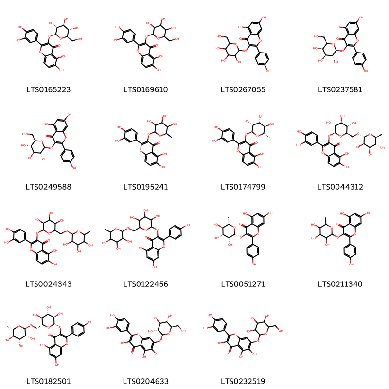{ width=100% }
    <figcaption>Hình ảnh cấu trúc hóa học của 15 hoạt chất thuộc nhóm Flavonoids gồm ['2-(3,4-dihydroxyphenyl)-5,6-dihydroxy-3-{[(2s,3r,4s,5s,6r)-3,4,5-trihydroxy-6-(hydroxymethyl)oxan-2-yl]oxy}chromen-4-one (LTS0165223)', '2-(3,4-dihydroxyphenyl)-5,6-dihydroxy-3-{[3,4,5-trihydroxy-6-(hydroxymethyl)oxan-2-yl]oxy}chromen-4-one (LTS0169610)', 'trifolin (LTS0267055)', 'trifolin (LTS0237581)', 'astragalin (LTS0249588)', '2-(3,4-dihydroxyphenyl)-5,6-dihydroxy-3-[(3,4,5-trihydroxy-6-methyloxan-2-yl)oxy]chromen-4-one (LTS0195241)', '2-(3,4-dihydroxyphenyl)-5,6-dihydroxy-3-{[(2s,3r,4r,5r,6s)-3,4,5-trihydroxy-6-methyloxan-2-yl]oxy}chromen-4-one (LTS0174799)', '2-(3,4-dihydroxyphenyl)-5,6-dihydroxy-3-{[(2s,3r,4s,5s,6r)-3,4,5-trihydroxy-6-({[(2r,3r,4r,5r,6s)-3,4,5-trihydroxy-6-methyloxan-2-yl]oxy}methyl)oxan-2-yl]oxy}chromen-4-one (LTS0044312)', '2-(3,4-dihydroxyphenyl)-5,6-dihydroxy-3-[(3,4,5-trihydroxy-6-{[(3,4,5-trihydroxy-6-methyloxan-2-yl)oxy]methyl}oxan-2-yl)oxy]chromen-4-one (LTS0024343)', '5,7-dihydroxy-2-(4-hydroxyphenyl)-3-[(3,4,5-trihydroxy-6-{[(3,4,5-trihydroxy-6-methyloxan-2-yl)oxy]methyl}oxan-2-yl)oxy]chromen-4-one (LTS0122456)', '5,7-dihydroxy-2-(4-hydroxyphenyl)-3-{[(2r,3r,4r,5r,6s)-3,4,5-trihydroxy-6-methyloxan-2-yl]oxy}chromen-4-one (LTS0051271)', '5,7-dihydroxy-2-(4-hydroxyphenyl)-3-[(3,4,5-trihydroxy-6-methyloxan-2-yl)oxy]chromen-4-one (LTS0211340)', 'nictoflorin (LTS0182501)', 'quercetagitrin (LTS0204633)', '2-(3,4-dihydroxyphenyl)-3,5,6-trihydroxy-7-{[3,4,5-trihydroxy-6-(hydroxymethyl)oxan-2-yl]oxy}chromen-4-one (LTS0232519)'].</figcaption>
</figure>
#### Nhóm Prenol lipids
<figure markdown="span">
    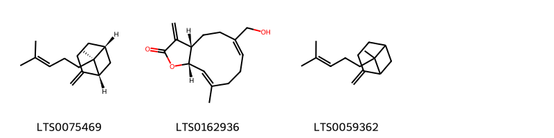{ width=100% }
    <figcaption>Hình ảnh cấu trúc hóa học của 3 hoạt chất thuộc nhóm Prenol lipids gồm ['(1r,5r,6s)-6-methyl-2-methylidene-6-(4-methylpent-3-en-1-yl)bicyclo[3.1.1]heptane (LTS0075469)', '(3as,11as)-6-(hydroxymethyl)-10-methyl-3-methylidene-3ah,4h,5h,8h,9h,11ah-cyclodeca[b]furan-2-one (LTS0162936)', '6-methyl-2-methylidene-6-(4-methylpent-3-en-1-yl)bicyclo[3.1.1]heptane (LTS0059362)'].</figcaption>
</figure>

---

### Dược dân tộc học

Danh sách các quốc gia có sử dụng *Clibadium surinamense* trong điều trị các bệnh. 

| Country   | Disease   | Bệnh                                                                                                                                                                                                |
|:----------|:----------|:----------------------------------------------------------------------------------------------------------------------------------------------------------------------------------------------------|
| Elsewhere | Piscicide | MYMEMORY WARNING: YOU USED ALL AVAILABLE FREE TRANSLATIONS FOR TODAY. NEXT AVAILABLE IN  08 HOURS 57 MINUTES 06 SECONDS VISIT HTTPS://MYMEMORY.TRANSLATED.NET/DOC/USAGELIMITS.PHP TO TRANSLATE MORE |
| Guiana    | Piscicide | MYMEMORY WARNING: YOU USED ALL AVAILABLE FREE TRANSLATIONS FOR TODAY. NEXT AVAILABLE IN  08 HOURS 57 MINUTES 03 SECONDS VISIT HTTPS://MYMEMORY.TRANSLATED.NET/DOC/USAGELIMITS.PHP TO TRANSLATE MORE |

---

---
## Clibadium surinamensis
### Thông tin về thực vật

!!! info "Phân loại thực vật của *Clibadium surinamense* từ GIBF:"
    - **Kingdom:** Plantae
    - **Phylum:** Tracheophyta
    - **Order:** Asterales
    - **Family:** Asteraceae
    - **Genus:** Clibadium
    - **Species:** *Clibadium surinamense*

 

| Label (VI)   | Label (EN)   | Scientific Name       | Descriptions (VI)   | Descriptions (EN)   | Also Known As (VI)   | Also Known As (EN)   |
|:-------------|:-------------|:----------------------|:--------------------|:--------------------|:---------------------|:---------------------|
| N/A          | N/A          | Clibadium surinamense | loài thực vật       | species of plant    | ['']                 | ['']                 |

#### Phân bố trên thế giới

**Từ CSDL GIBF** nan, Ecuador, Colombia, Brazil, Bolivia (Plurinational State of), Guyana, Indonesia, Panama

#### Phân bố tại Việt Nam

**Từ CSDL GIBF**: Không có ghi nhận ở Việt Nam

---
### Thành phần hóa học
        
- Theo cơ sở dữ liệu lotus: Từ loài *Clibadium surinamense* đã phân lập và xác định được Chưa có hoạt chất nào được phân lập. hoạt chất thuộc về các nhóm Không có hoạt chất nào được phân lập. 

Không có hình ảnh nào được tạo ra

---

### Dược dân tộc học

Danh sách các quốc gia có sử dụng *Clibadium surinamense* trong điều trị các bệnh. 

| Country   | Disease   | Bệnh                                                                                                                                                                                                |
|:----------|:----------|:----------------------------------------------------------------------------------------------------------------------------------------------------------------------------------------------------|
| Brazil    | Piscicide | MYMEMORY WARNING: YOU USED ALL AVAILABLE FREE TRANSLATIONS FOR TODAY. NEXT AVAILABLE IN  08 HOURS 56 MINUTES 38 SECONDS VISIT HTTPS://MYMEMORY.TRANSLATED.NET/DOC/USAGELIMITS.PHP TO TRANSLATE MORE |
| Surinam   | Piscicide | MYMEMORY WARNING: YOU USED ALL AVAILABLE FREE TRANSLATIONS FOR TODAY. NEXT AVAILABLE IN  08 HOURS 56 MINUTES 36 SECONDS VISIT HTTPS://MYMEMORY.TRANSLATED.NET/DOC/USAGELIMITS.PHP TO TRANSLATE MORE |

---

---
## Clibadium sylvestre
### Thông tin về thực vật

!!! info "Phân loại thực vật của *Clibadium sylvestre* từ GIBF:"
    - **Kingdom:** Plantae
    - **Phylum:** Tracheophyta
    - **Order:** Asterales
    - **Family:** Asteraceae
    - **Genus:** Clibadium
    - **Species:** *Clibadium sylvestre*

 

| Label (VI)   | Label (EN)   | Scientific Name     | Descriptions (VI)   | Descriptions (EN)   | Also Known As (VI)   | Also Known As (EN)   |
|:-------------|:-------------|:--------------------|:--------------------|:--------------------|:---------------------|:---------------------|
| N/A          | N/A          | Clibadium sylvestre | loài thực vật       | species of plant    | ['']                 | ['']                 |

#### Phân bố trên thế giới

**Từ CSDL GIBF** Ecuador, Dominica, Panama, Suriname, Colombia, Brazil, Costa Rica, Guyana, Jamaica, Peru, Venezuela (Bolivarian Republic of), French Guiana

#### Phân bố tại Việt Nam

**Từ CSDL GIBF**: Không có ghi nhận ở Việt Nam

---
### Thành phần hóa học
        
- Theo cơ sở dữ liệu lotus: Từ loài *Clibadium sylvestre* đã phân lập và xác định được Chưa có hoạt chất nào được phân lập. hoạt chất thuộc về các nhóm Không có hoạt chất nào được phân lập. 

Không có hình ảnh nào được tạo ra

---

### Dược dân tộc học

Danh sách các quốc gia có sử dụng *Clibadium sylvestre* trong điều trị các bệnh. 

| Country          | Disease   | Bệnh                                                                                                                                                                                                |
|:-----------------|:----------|:----------------------------------------------------------------------------------------------------------------------------------------------------------------------------------------------------|
| Brazil           | Piscicide | MYMEMORY WARNING: YOU USED ALL AVAILABLE FREE TRANSLATIONS FOR TODAY. NEXT AVAILABLE IN  08 HOURS 56 MINUTES 17 SECONDS VISIT HTTPS://MYMEMORY.TRANSLATED.NET/DOC/USAGELIMITS.PHP TO TRANSLATE MORE |
| Brazil(Deni)     | Piscicide | MYMEMORY WARNING: YOU USED ALL AVAILABLE FREE TRANSLATIONS FOR TODAY. NEXT AVAILABLE IN  08 HOURS 56 MINUTES 14 SECONDS VISIT HTTPS://MYMEMORY.TRANSLATED.NET/DOC/USAGELIMITS.PHP TO TRANSLATE MORE |
| Brazil(Jamamadi) | Piscicide | MYMEMORY WARNING: YOU USED ALL AVAILABLE FREE TRANSLATIONS FOR TODAY. NEXT AVAILABLE IN  08 HOURS 56 MINUTES 12 SECONDS VISIT HTTPS://MYMEMORY.TRANSLATED.NET/DOC/USAGELIMITS.PHP TO TRANSLATE MORE |
| Brazil(Maku)     | Piscicide | MYMEMORY WARNING: YOU USED ALL AVAILABLE FREE TRANSLATIONS FOR TODAY. NEXT AVAILABLE IN  08 HOURS 56 MINUTES 09 SECONDS VISIT HTTPS://MYMEMORY.TRANSLATED.NET/DOC/USAGELIMITS.PHP TO TRANSLATE MORE |
| Brazil(Waika)    | Piscicide | MYMEMORY WARNING: YOU USED ALL AVAILABLE FREE TRANSLATIONS FOR TODAY. NEXT AVAILABLE IN  08 HOURS 56 MINUTES 07 SECONDS VISIT HTTPS://MYMEMORY.TRANSLATED.NET/DOC/USAGELIMITS.PHP TO TRANSLATE MORE |
| Dominica         | Piscicide | MYMEMORY WARNING: YOU USED ALL AVAILABLE FREE TRANSLATIONS FOR TODAY. NEXT AVAILABLE IN  08 HOURS 56 MINUTES 04 SECONDS VISIT HTTPS://MYMEMORY.TRANSLATED.NET/DOC/USAGELIMITS.PHP TO TRANSLATE MORE |
| Guiana           | Piscicide | MYMEMORY WARNING: YOU USED ALL AVAILABLE FREE TRANSLATIONS FOR TODAY. NEXT AVAILABLE IN  08 HOURS 56 MINUTES 02 SECONDS VISIT HTTPS://MYMEMORY.TRANSLATED.NET/DOC/USAGELIMITS.PHP TO TRANSLATE MORE |
| Peru             | Piscicide | MYMEMORY WARNING: YOU USED ALL AVAILABLE FREE TRANSLATIONS FOR TODAY. NEXT AVAILABLE IN  08 HOURS 55 MINUTES 59 SECONDS VISIT HTTPS://MYMEMORY.TRANSLATED.NET/DOC/USAGELIMITS.PHP TO TRANSLATE MORE |
| Surinam          | Piscicide | MYMEMORY WARNING: YOU USED ALL AVAILABLE FREE TRANSLATIONS FOR TODAY. NEXT AVAILABLE IN  08 HOURS 55 MINUTES 57 SECONDS VISIT HTTPS://MYMEMORY.TRANSLATED.NET/DOC/USAGELIMITS.PHP TO TRANSLATE MORE |

---

# Chi Silphium

??? note "Danh sách các dược liệu thuộc chi"
    
	 - *Silphium laciniatum*
	 - *Silphium perfoliatum*

---
## Silphium laciniatum
### Thông tin về thực vật

!!! info "Phân loại thực vật của *Silphium laciniatum* từ GIBF:"
    - **Kingdom:** Plantae
    - **Phylum:** Tracheophyta
    - **Order:** Asterales
    - **Family:** Asteraceae
    - **Genus:** Silphium
    - **Species:** *Silphium laciniatum*

 

| Label (VI)   | Label (EN)   | Scientific Name     | Descriptions (VI)   | Descriptions (EN)   | Also Known As (VI)   | Also Known As (EN)   |
|:-------------|:-------------|:--------------------|:--------------------|:--------------------|:---------------------|:---------------------|
| N/A          | N/A          | Silphium laciniatum | loài thực vật       | species of plant    | ['']                 | ['compass plant']    |

#### Phân bố trên thế giới

**Từ CSDL GIBF** United States of America, Canada

#### Phân bố tại Việt Nam

**Từ CSDL GIBF**: Không có ghi nhận ở Việt Nam

---
### Thành phần hóa học
        
- Theo cơ sở dữ liệu lotus: Từ loài *Silphium laciniatum* đã phân lập và xác định được Chưa có hoạt chất nào được phân lập. hoạt chất thuộc về các nhóm Không có hoạt chất nào được phân lập. 

Không có hình ảnh nào được tạo ra

---

### Dược dân tộc học

Danh sách các quốc gia có sử dụng *Silphium laciniatum* trong điều trị các bệnh. 

| Country   | Disease                                         | Bệnh                                                                                                                                                                                                |
|:----------|:------------------------------------------------|:----------------------------------------------------------------------------------------------------------------------------------------------------------------------------------------------------|
| Elsewhere | nan                                             | MYMEMORY WARNING: YOU USED ALL AVAILABLE FREE TRANSLATIONS FOR TODAY. NEXT AVAILABLE IN  08 HOURS 55 MINUTES 33 SECONDS VISIT HTTPS://MYMEMORY.TRANSLATED.NET/DOC/USAGELIMITS.PHP TO TRANSLATE MORE |
| Turkey    | Expectorant, Tonic, Diuretic, Emetic, Sudorific | MYMEMORY WARNING: YOU USED ALL AVAILABLE FREE TRANSLATIONS FOR TODAY. NEXT AVAILABLE IN  08 HOURS 55 MINUTES 31 SECONDS VISIT HTTPS://MYMEMORY.TRANSLATED.NET/DOC/USAGELIMITS.PHP TO TRANSLATE MORE |
| US        | Expectorant, Diuretic, Emetic                   | MYMEMORY WARNING: YOU USED ALL AVAILABLE FREE TRANSLATIONS FOR TODAY. NEXT AVAILABLE IN  08 HOURS 55 MINUTES 28 SECONDS VISIT HTTPS://MYMEMORY.TRANSLATED.NET/DOC/USAGELIMITS.PHP TO TRANSLATE MORE |

---

---
## Silphium perfoliatum
### Thông tin về thực vật

!!! info "Phân loại thực vật của *Silphium perfoliatum* từ GIBF:"
    - **Kingdom:** Plantae
    - **Phylum:** Tracheophyta
    - **Order:** Asterales
    - **Family:** Asteraceae
    - **Genus:** Silphium
    - **Species:** *Silphium perfoliatum*

 

| Label (VI)   | Label (EN)   | Scientific Name      | Descriptions (VI)   | Descriptions (EN)   | Also Known As (VI)   | Also Known As (EN)   |
|:-------------|:-------------|:---------------------|:--------------------|:--------------------|:---------------------|:---------------------|
| N/A          | N/A          | Silphium perfoliatum | loài thực vật       | species of plant    | ['']                 | ['']                 |

#### Phân bố trên thế giới

**Từ CSDL GIBF** Ukraine, nan, Netherlands, Belarus, Germany, United States of America, Sweden, China, Canada

#### Phân bố tại Việt Nam

**Từ CSDL GIBF**: Không có ghi nhận ở Việt Nam

---
### Thành phần hóa học
        
- Theo cơ sở dữ liệu lotus: Từ loài *Silphium perfoliatum* đã phân lập và xác định được 98 hoạt chất thuộc về các nhóm Flavonoids, Prenol lipids, Cinnamic acids and derivatives, Benzene and substituted derivatives, Unsaturated hydrocarbons, Naphthofurans, Organooxygen compounds. 

|    | chemicalTaxonomyClassyfireClass     |   smiles_count |
|---:|:------------------------------------|---------------:|
|  0 | Benzene and substituted derivatives |              4 |
|  1 | Cinnamic acids and derivatives      |              6 |
|  2 | Flavonoids                          |             24 |
|  3 | Naphthofurans                       |             10 |
|  4 | Organooxygen compounds              |              2 |
|  5 | Prenol lipids                       |             47 |
|  6 | Unsaturated hydrocarbons            |              5 |

#### Nhóm Benzene and substituted derivatives
<figure markdown="span">
    { width=100% }
    <figcaption>Hình ảnh cấu trúc hóa học của 4 hoạt chất thuộc nhóm Benzene and substituted derivatives gồm ['syringic acid (LTS0210036)', 'p-hydroxybenzoic acid (LTS0263634)', '3,4-dihydroxybenzoic acid (LTS0018765)', 'vanillic acid (LTS0229113)'].</figcaption>
</figure>
#### Nhóm Cinnamic acids and derivatives
<figure markdown="span">
    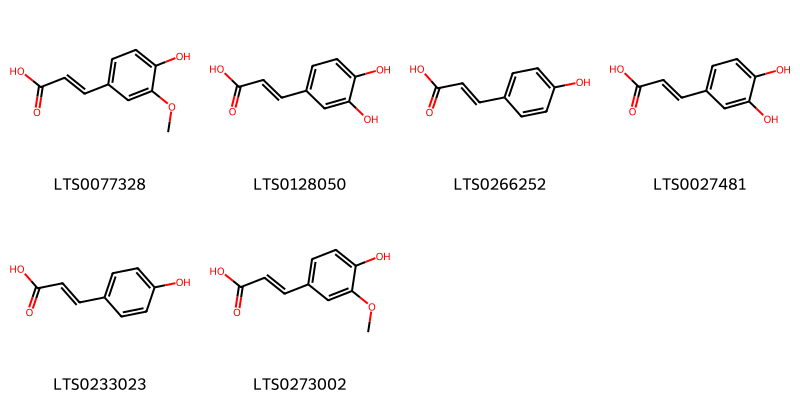{ width=100% }
    <figcaption>Hình ảnh cấu trúc hóa học của 6 hoạt chất thuộc nhóm Cinnamic acids and derivatives gồm ['ferulic acid (LTS0077328)', '3,4-dihydroxycinnamic acid (LTS0128050)', 'para-coumaric acid (LTS0266252)', 'caffeic acid (LTS0027481)', 'hydroxycinnamic acid (LTS0233023)', 'ferulic acid (LTS0273002)'].</figcaption>
</figure>
#### Nhóm Flavonoids
<figure markdown="span">
    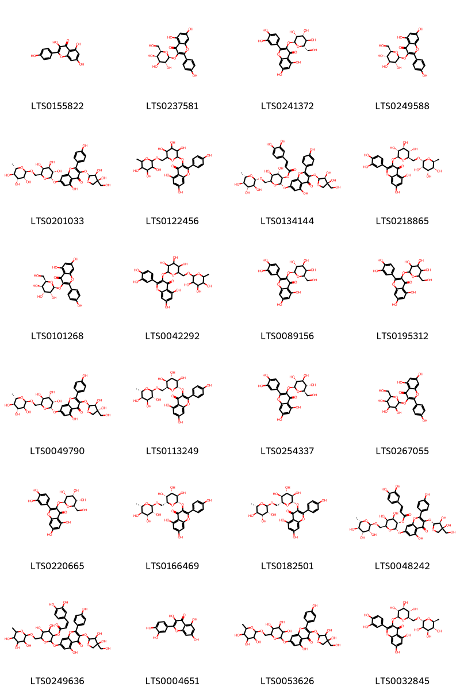{ width=100% }
    <figcaption>Hình ảnh cấu trúc hóa học của 24 hoạt chất thuộc nhóm Flavonoids gồm ['kaempherol (LTS0155822)', 'trifolin (LTS0237581)', '2-(3,4-dihydroxyphenyl)-5,7-dihydroxy-3-{[(2s,3r,4r,5r,6s)-3,4,5-trihydroxy-6-(hydroxymethyl)oxan-2-yl]oxy}chromen-4-one (LTS0241372)', 'astragalin (LTS0249588)', '3-{[(2r,3s,4s)-3,4-dihydroxy-4-(hydroxymethyl)oxolan-2-yl]oxy}-5-hydroxy-2-(4-hydroxyphenyl)-7-{[(2s,3s,4r,5s,6s)-3,4,5-trihydroxy-6-({[(2r,3r,4r,5r,6s)-3,4,5-trihydroxy-6-methyloxan-2-yl]oxy}methyl)oxan-2-yl]oxy}chromen-4-one (LTS0201033)', '5,7-dihydroxy-2-(4-hydroxyphenyl)-3-[(3,4,5-trihydroxy-6-{[(3,4,5-trihydroxy-6-methyloxan-2-yl)oxy]methyl}oxan-2-yl)oxy]chromen-4-one (LTS0122456)', '(2s,3r,4s,5s,6s)-2-[(3-{[(2s,3s,4s)-3,4-dihydroxy-4-(hydroxymethyl)oxolan-2-yl]oxy}-5-hydroxy-2-(4-hydroxyphenyl)-4-oxochromen-7-yl)oxy]-4,5-dihydroxy-6-({[(2s,3s,4r,5r,6s)-3,4,5-trihydroxy-6-methyloxan-2-yl]oxy}methyl)oxan-3-yl (2e)-3-(3,4-dihydroxyphenyl)prop-2-enoate (LTS0134144)', '2-(3,4-dihydroxyphenyl)-5,7-dihydroxy-3-{[(2s,3r,4s,5s,6r)-3,4,5-trihydroxy-6-({[(2r,3s,4s,5r,6s)-3,4,5-trihydroxy-6-methyloxan-2-yl]oxy}methyl)oxan-2-yl]oxy}chromen-4-one (LTS0218865)', '5,7-dihydroxy-2-(4-hydroxyphenyl)-3-{[(2s,3r,4r,5r,6r)-3,4,5-trihydroxy-6-(hydroxymethyl)oxan-2-yl]oxy}chromen-4-one (LTS0101268)', 'rutin (LTS0042292)', 'hyperoside (LTS0089156)', '2-(3,4-dihydroxyphenyl)-5,7-dihydroxy-3-{[3,4,5-trihydroxy-6-(hydroxymethyl)oxan-2-yl]oxy}chromen-4-one (LTS0195312)', '3-{[(2s,3s,4r)-3,4-dihydroxy-4-(hydroxymethyl)oxolan-2-yl]oxy}-5-hydroxy-2-(4-hydroxyphenyl)-7-{[(2s,3s,4s,5s,6s)-3,4,5-trihydroxy-6-({[(2r,3s,4r,5r,6s)-3,4,5-trihydroxy-6-methyloxan-2-yl]oxy}methyl)oxan-2-yl]oxy}chromen-4-one (LTS0049790)', '5,7-dihydroxy-2-(4-hydroxyphenyl)-3-{[(2s,3r,4s,5s,6s)-3,4,5-trihydroxy-6-({[(2r,3r,4s,5r,6s)-3,4,5-trihydroxy-6-methyloxan-2-yl]oxy}methyl)oxan-2-yl]oxy}chromen-4-one (LTS0113249)', 'isoquercetin (LTS0254337)', 'trifolin (LTS0267055)', '2-(3,4-dihydroxyphenyl)-5,7-dihydroxy-3-{[(2s,3r,4r,5s,6r)-3,4,5-trihydroxy-6-(hydroxymethyl)oxan-2-yl]oxy}chromen-4-one (LTS0220665)', '5,7-dihydroxy-2-(4-hydroxyphenyl)-3-{[(2s,3r,4s,5r,6r)-3,4,5-trihydroxy-6-({[(2r,3r,4r,5r,6s)-3,4,5-trihydroxy-6-methyloxan-2-yl]oxy}methyl)oxan-2-yl]oxy}chromen-4-one (LTS0166469)', 'nictoflorin (LTS0182501)', '(2s,3s,4r,5s,6s)-2-[(3-{[(2r,3s,4s)-3,4-dihydroxy-4-(hydroxymethyl)oxolan-2-yl]oxy}-5-hydroxy-2-(4-hydroxyphenyl)-4-oxochromen-7-yl)oxy]-4,5-dihydroxy-6-({[(2r,3r,4r,5r,6s)-3,4,5-trihydroxy-6-methyloxan-2-yl]oxy}methyl)oxan-3-yl (2e)-3-(3,4-dihydroxyphenyl)prop-2-enoate (LTS0048242)', '2-[(3-{[3,4-dihydroxy-4-(hydroxymethyl)oxolan-2-yl]oxy}-5-hydroxy-2-(4-hydroxyphenyl)-4-oxochromen-7-yl)oxy]-4,5-dihydroxy-6-{[(3,4,5-trihydroxy-6-methyloxan-2-yl)oxy]methyl}oxan-3-yl 3-(3,4-dihydroxyphenyl)prop-2-enoate (LTS0249636)', 'quercetin (LTS0004651)', '3-{[3,4-dihydroxy-4-(hydroxymethyl)oxolan-2-yl]oxy}-5-hydroxy-2-(4-hydroxyphenyl)-7-[(3,4,5-trihydroxy-6-{[(3,4,5-trihydroxy-6-methyloxan-2-yl)oxy]methyl}oxan-2-yl)oxy]chromen-4-one (LTS0053626)', '3-rutinosyl quercetin (LTS0032845)'].</figcaption>
</figure>
#### Nhóm Naphthofurans
<figure markdown="span">
    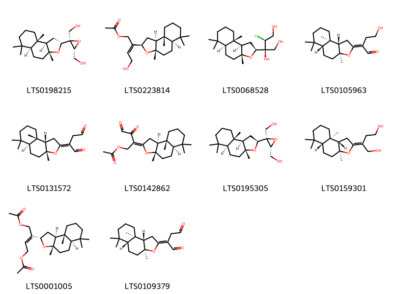{ width=100% }
    <figcaption>Hình ảnh cấu trúc hóa học của 10 hoạt chất thuộc nhóm Naphthofurans gồm ['[(2r,3r)-3-[(2r,3ar,5as,9as,9br)-3a,6,6,9a-tetramethyl-octahydro-1h-naphtho[2,1-b]furan-2-yl]-3-(hydroxymethyl)oxiran-2-yl]methanol (LTS0198215)', '(2z)-2-[(2r,3as,5ar,9ar,9bs)-3a,6,6,9a-tetramethyl-octahydro-1h-naphtho[2,1-b]furan-2-yl]-4-hydroxybut-2-en-1-yl acetate (LTS0223814)', '(2s,3s)-2-[(2s,3ar,5as,9as,9br)-3a,6,6,9a-tetramethyl-octahydro-1h-naphtho[2,1-b]furan-2-yl]-3-chlorobutane-1,2,4-triol (LTS0068528)', '2-[(2z,3as,5ar,9ar,9bs)-3a,6,6,9a-tetramethyl-octahydronaphtho[2,1-b]furan-2-ylidene]-4-hydroxybutanal (LTS0105963)', '2-[(2z,3ar,5as,9as,9bs)-3a,6,6,9a-tetramethyl-octahydronaphtho[2,1-b]furan-2-ylidene]butanedial (LTS0131572)', '2-[(2e,3as,5ar,9ar,9bs)-3a,6,6,9a-tetramethyl-octahydronaphtho[2,1-b]furan-2-ylidene]-3,4-dioxobutyl acetate (LTS0142862)', '[(2r,3r)-3-[(2s,3ar,5as,9as,9br)-3a,6,6,9a-tetramethyl-octahydro-1h-naphtho[2,1-b]furan-2-yl]-3-(hydroxymethyl)oxiran-2-yl]methanol (LTS0195305)', '2-[(2z,3as,5ar,9ar,9bs)-3a,6,6,9a-tetramethyl-octahydronaphtho[2,1-b]furan-2-ylidene]butane-1,4-diol (LTS0159301)', '(2z)-3-[(2s,3as,5ar,9ar,9bs)-3a,6,6,9a-tetramethyl-octahydro-1h-naphtho[2,1-b]furan-2-yl]-4-(acetyloxy)but-2-en-1-yl acetate (LTS0001005)', '2-[(2z,3as,5ar,9ar,9bs)-3a,6,6,9a-tetramethyl-octahydronaphtho[2,1-b]furan-2-ylidene]butanedial (LTS0109379)'].</figcaption>
</figure>
#### Nhóm Organooxygen compounds
<figure markdown="span">
    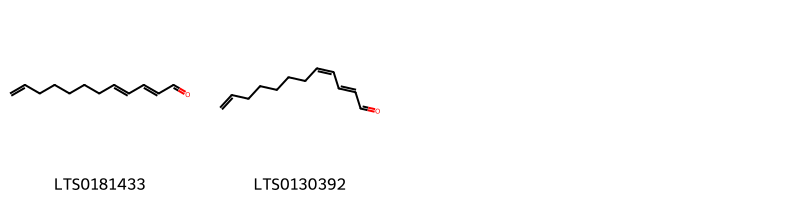{ width=100% }
    <figcaption>Hình ảnh cấu trúc hóa học của 2 hoạt chất thuộc nhóm Organooxygen compounds gồm ['(2e)-dodeca-2,4,11-trienal (LTS0181433)', '(2e,4z)-dodeca-2,4,11-trienal (LTS0130392)'].</figcaption>
</figure>
#### Nhóm Prenol lipids
<figure markdown="span">
    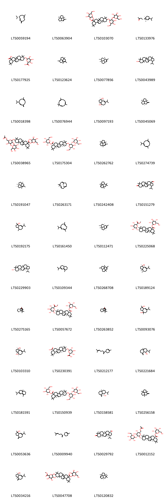{ width=100% }
    <figcaption>Hình ảnh cấu trúc hóa học của 47 hoạt chất thuộc nhóm Prenol lipids gồm ['(-)-germacrene d (LTS0059194)', '(-)-isocomene (LTS0063904)', '3,4,5-trihydroxy-6-(hydroxymethyl)oxan-2-yl 10-{[4,5-dihydroxy-6-(hydroxymethyl)-3-{[3,4,5-trihydroxy-6-(hydroxymethyl)oxan-2-yl]oxy}oxan-2-yl]oxy}-2,2,6a,6b,9,9,12a-heptamethyl-1,3,4,5,6,7,8,8a,10,11,12,12b,13,14b-tetradecahydropicene-4a-carboxylate (LTS0103070)', '4-[(1s,6r,7s)-3-isopropyl-6-methylbicyclo[4.1.0]hept-2-en-7-yl]butan-2-one (LTS0133976)', '6-[(8a-carboxy-4,4,6a,6b,11,11,14b-heptamethyl-1,2,3,4a,5,6,7,8,9,10,12,12a,14,14a-tetradecahydropicen-3-yl)oxy]-3,4,5-trihydroxyoxane-2-carboxylic acid (LTS0177925)', '2,3,5,9-tetramethyltricyclo[6.3.0.0¹,⁵]undec-2-ene (LTS0123624)', '(-)-5-silphiperfolene (LTS0077856)', '1-isopropyl-3a,5a,5b,8,8,11a-hexamethyl-1h,2h,3h,4h,5h,6h,7h,7ah,9h,10h,11h,11bh,12h,13bh-cyclopenta[a]chrysen-9-ol (LTS0043989)', '8-isopropyl-1-methyl-5-methylidenecyclodeca-1,6-diene (LTS0018398)', 'α-humulene (LTS0076944)', '(1r,3ar,4r,8as)-7-isopropyl-1,4-dimethyl-2,3,3a,5,6,8a-hexahydroazulene-1,4-diol (LTS0097193)', '(1s,2s,5r,8r)-2,5,8-trimethyl-6-methylidenetricyclo[6.3.0.0¹,⁵]undecane (LTS0045069)', '3,4,5-trihydroxy-6-(hydroxymethyl)oxan-2-yl 10-({6-[(acetyloxy)methyl]-4,5-dihydroxy-3-{[3,4,5-trihydroxy-6-(hydroxymethyl)oxan-2-yl]oxy}oxan-2-yl}oxy)-2,2,6a,6b,9,9,12a-heptamethyl-1,3,4,5,6,7,8,8a,10,11,12,12b,13,14b-tetradecahydropicene-4a-carboxylate (LTS0038965)', '(2s,3r,4s,5s,6r)-3,4,5-trihydroxy-6-(hydroxymethyl)oxan-2-yl (4ar,6as,6br,8ar,10s,12ar,12br,14br)-10-{[(2r,3r,4s,5s,6r)-4,5-dihydroxy-6-(hydroxymethyl)-3-{[(2s,3r,4s,5s,6r)-3,4,5-trihydroxy-6-(hydroxymethyl)oxan-2-yl]oxy}oxan-2-yl]oxy}-2,2,6a,6b,9,9,12a-heptamethyl-1,3,4,5,6,7,8,8a,10,11,12,12b,13,14b-tetradecahydropicene-4a-carboxylate (LTS0175304)', '2,5,6,8-tetramethyltricyclo[6.3.0.0¹,⁵]undec-6-ene (LTS0262762)', '4-isopropyl-1,7-dimethylcyclodeca-1,3,7-triene (LTS0274739)', '(1r,5r,8r,9s)-2,3,5,9-tetramethyltricyclo[6.3.0.0¹,⁵]undec-2-ene (LTS0191047)', 'humulene (LTS0263171)', '5,7,7,11-tetramethyltricyclo[6.3.0.0¹,⁵]undec-2-ene (LTS0242408)', '1-isopropyl-5a,5b,8,8,11a-pentamethyl-9-oxo-1h,2h,3h,4h,5h,6h,7h,7ah,10h,11h,11bh,12h,13bh-cyclopenta[a]chrysene-3a-carbaldehyde (LTS0151279)', '7-isopropyl-1,4-dimethyl-3,3a,4,5,6,8a-hexahydro-2h-azulen-1-ol (LTS0192175)', 'germacrene c (LTS0161450)', '(1s,2r,5r,8r,9s)-2,3,5,9-tetramethyltricyclo[6.3.0.0¹,⁵]undec-3-ene (LTS0112471)', 'methyl (2s,3s,4s,5r,6r)-6-{[(3s,4ar,6ar,6bs,8ar,12ar,14ar,14br)-4,4,6a,6b,11,11,14b-heptamethyl-8a-({[(2s,3r,4s,5s,6r)-3,4,5-trihydroxy-6-(hydroxymethyl)oxan-2-yl]oxy}carbonyl)-1,2,3,4a,5,6,7,8,9,10,12,12a,14,14a-tetradecahydropicen-3-yl]oxy}-3,4,5-trihydroxyoxane-2-carboxylate (LTS0225068)', '(1s,3ar,5as,5br,7ar,9s,11ar,11bs,13bs)-1-isopropyl-3a,5a,5b,8,8,11a-hexamethyl-1h,2h,3h,4h,5h,6h,7h,7ah,9h,10h,11h,11bh,12h,13bh-cyclopenta[a]chrysen-9-ol (LTS0229903)', '(+)-delta-selinene (LTS0109344)', '2,3,5,9-tetramethyltricyclo[6.3.0.0¹,⁵]undec-3-ene (LTS0268708)', '(1r,3as,4r,8ar)-7-isopropyl-1,4-dimethyl-3,3a,4,5,6,8a-hexahydro-2h-azulen-1-ol (LTS0189124)', '(1s,5r,8s)-2,4,4,8-tetramethyltricyclo[3.3.3.0¹,⁵]undec-2-ene (LTS0275165)', 'methyl (2s,3s,4s,5r,6r)-6-{[(3s,4ar,6ar,6bs,8as,12as,14ar,14br)-4,4,6a,6b,11,11,14b-heptamethyl-8a-({[(2s,3r,4s,5s,6r)-3,4,5-trihydroxy-6-(hydroxymethyl)oxan-2-yl]oxy}carbonyl)-1,2,3,4a,5,6,7,8,9,10,12,12a,14,14a-tetradecahydropicen-3-yl]oxy}-3,4,5-trihydroxyoxane-2-carboxylate (LTS0057672)', '2,4,4,8-tetramethyltricyclo[3.3.3.0¹,⁵]undec-2-ene (LTS0263852)', '7-isopropyl-1,4-dimethyl-2,3,3a,5,6,8a-hexahydroazulene-1,4-diol (LTS0093076)', '(1r,3ar,4r,8ar)-7-isopropyl-1,4-dimethyl-2,3,3a,5,6,8a-hexahydroazulene-1,4-diol (LTS0103310)', '(2s,3s,4s,5r,6r)-6-{[(3s,4ar,6ar,6bs,8ar,12ar,14ar,14br)-8a-carboxy-4,4,6a,6b,11,11,14b-heptamethyl-1,2,3,4a,5,6,7,8,9,10,12,12a,14,14a-tetradecahydropicen-3-yl]oxy}-3,4,5-trihydroxyoxane-2-carboxylic acid (LTS0230391)', 'β-bisabolene (LTS0212177)', '2-isopropyl-4a-methyl-8-methylidene-octahydronaphthalen-1-ol (LTS0221684)', 'delta-selinene (LTS0181591)', '(2s,3r,4s,5s,6r)-3,4,5-trihydroxy-6-(hydroxymethyl)oxan-2-yl (4as,6as,6br,8ar,10s,12ar,12br,14bs)-10-{[(2r,3r,4s,5s,6r)-4,5-dihydroxy-6-(hydroxymethyl)-3-{[(2s,3r,4s,5s,6r)-3,4,5-trihydroxy-6-(hydroxymethyl)oxan-2-yl]oxy}oxan-2-yl]oxy}-2,2,6a,6b,9,9,12a-heptamethyl-1,3,4,5,6,7,8,8a,10,11,12,12b,13,14b-tetradecahydropicene-4a-carboxylate (LTS0150939)', 'junenol (LTS0158581)', '2,5,8-trimethyl-6-methylidenetricyclo[6.3.0.0¹,⁵]undecane (LTS0256158)', '7-isopropyl-1-methyl-4-methylidene-2,3,3a,5,6,8a-hexahydroazulen-1-ol (LTS0053636)', '(-)-β-bisabolene (LTS0009940)', '(1s,3as,5as,5br,7ar,11ar,11br,13br)-1-isopropyl-5a,5b,8,8,11a-pentamethyl-9-oxo-1h,2h,3h,4h,5h,6h,7h,7ah,10h,11h,11bh,12h,13bh-cyclopenta[a]chrysene-3a-carbaldehyde (LTS0029792)', '(2s,3r,4s,5s,6r)-3,4,5-trihydroxy-6-(hydroxymethyl)oxan-2-yl (4as,6as,6br,8ar,10s,12ar,12br,14bs)-10-{[(2r,3r,4s,5s,6r)-6-[(acetyloxy)methyl]-4,5-dihydroxy-3-{[(2s,3r,4s,5s,6r)-3,4,5-trihydroxy-6-(hydroxymethyl)oxan-2-yl]oxy}oxan-2-yl]oxy}-2,2,6a,6b,9,9,12a-heptamethyl-1,3,4,5,6,7,8,8a,10,11,12,12b,13,14b-tetradecahydropicene-4a-carboxylate (LTS0012152)', '(1r,3ar,8as)-7-isopropyl-1-methyl-4-methylidene-2,3,3a,5,6,8a-hexahydroazulen-1-ol (LTS0034216)', 'methyl 6-{[4,4,6a,6b,11,11,14b-heptamethyl-8a-({[3,4,5-trihydroxy-6-(hydroxymethyl)oxan-2-yl]oxy}carbonyl)-1,2,3,4a,5,6,7,8,9,10,12,12a,14,14a-tetradecahydropicen-3-yl]oxy}-3,4,5-trihydroxyoxane-2-carboxylate (LTS0047708)', '(1s,5r,8r,11s)-5,7,7,11-tetramethyltricyclo[6.3.0.0¹,⁵]undec-2-ene (LTS0120832)'].</figcaption>
</figure>
#### Nhóm Unsaturated hydrocarbons
<figure markdown="span">
    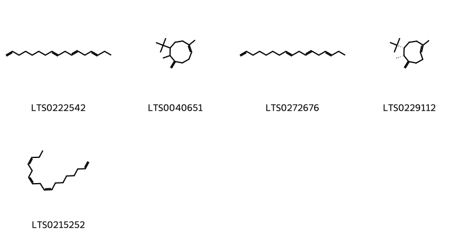{ width=100% }
    <figcaption>Hình ảnh cấu trúc hóa học của 5 hoạt chất thuộc nhóm Unsaturated hydrocarbons gồm ['heptadeca-1,8,11,14-tetraene (LTS0222542)', '7-tert-butyl-1,6-dimethyl-5-methylidenecyclonon-1-ene (LTS0040651)', '(8e,11e,14e)-heptadeca-1,8,11,14-tetraene (LTS0272676)', '(1e,6r,7r)-7-tert-butyl-1,6-dimethyl-5-methylidenecyclonon-1-ene (LTS0229112)', 'aplotaxene (LTS0215252)'].</figcaption>
</figure>

---

### Dược dân tộc học

Danh sách các quốc gia có sử dụng *Silphium perfoliatum* trong điều trị các bệnh. 

| Country   | Disease                   | Bệnh                                                                                                                                                                                                |
|:----------|:--------------------------|:----------------------------------------------------------------------------------------------------------------------------------------------------------------------------------------------------|
| French    | Sudorific                 | MYMEMORY WARNING: YOU USED ALL AVAILABLE FREE TRANSLATIONS FOR TODAY. NEXT AVAILABLE IN  08 HOURS 55 MINUTES 02 SECONDS VISIT HTTPS://MYMEMORY.TRANSLATED.NET/DOC/USAGELIMITS.PHP TO TRANSLATE MORE |
| US        | Diaphoretic, Tonic, Tonic | MYMEMORY WARNING: YOU USED ALL AVAILABLE FREE TRANSLATIONS FOR TODAY. NEXT AVAILABLE IN  08 HOURS 54 MINUTES 59 SECONDS VISIT HTTPS://MYMEMORY.TRANSLATED.NET/DOC/USAGELIMITS.PHP TO TRANSLATE MORE |

---

# Chi Solidago

??? note "Danh sách các dược liệu thuộc chi"
    
	 - *Solidago virga-aurea*
	 - *Solidago virgaurea*
	 - *Solidago virgo-aurea*
	 - *Solidago virgoaurea*

---
## Solidago virgaaurea
### Thông tin về thực vật

!!! info "Phân loại thực vật của *Solidago virgaurea* từ GIBF:"
    - **Kingdom:** Plantae
    - **Phylum:** Tracheophyta
    - **Order:** Asterales
    - **Family:** Asteraceae
    - **Genus:** Solidago
    - **Species:** *Solidago virgaurea*

 

| Label (VI)   | Label (EN)   | Scientific Name      | Descriptions (VI)   | Descriptions (EN)   | Also Known As (VI)   | Also Known As (EN)   |
|:-------------|:-------------|:---------------------|:--------------------|:--------------------|:---------------------|:---------------------|
| N/A          | N/A          | Silphium perfoliatum | loài thực vật       | species of plant    | ['']                 | ['']                 |

#### Phân bố trên thế giới

**Từ CSDL GIBF** Ukraine, Finland, Denmark, Netherlands, Italy, Belarus, Germany, Spain, Poland, Argentina, Portugal, Switzerland, Russian Federation, Sweden, Austria, France, Norway

#### Phân bố tại Việt Nam

**Từ CSDL GIBF**: Không có ghi nhận ở Việt Nam

---
### Thành phần hóa học
        
- Theo cơ sở dữ liệu lotus: Từ loài *Solidago virgaurea* đã phân lập và xác định được Chưa có hoạt chất nào được phân lập. hoạt chất thuộc về các nhóm Không có hoạt chất nào được phân lập. 

Không có hình ảnh nào được tạo ra

---

### Dược dân tộc học

Danh sách các quốc gia có sử dụng *Solidago virgaurea* trong điều trị các bệnh. 

| Country   | Disease             | Bệnh                                                                                                                                                                                                |
|:----------|:--------------------|:----------------------------------------------------------------------------------------------------------------------------------------------------------------------------------------------------|
| Elsewhere | Stomachic, Diuretic | MYMEMORY WARNING: YOU USED ALL AVAILABLE FREE TRANSLATIONS FOR TODAY. NEXT AVAILABLE IN  08 HOURS 54 MINUTES 25 SECONDS VISIT HTTPS://MYMEMORY.TRANSLATED.NET/DOC/USAGELIMITS.PHP TO TRANSLATE MORE |
| ain       | Diuretic            | MYMEMORY WARNING: YOU USED ALL AVAILABLE FREE TRANSLATIONS FOR TODAY. NEXT AVAILABLE IN  08 HOURS 54 MINUTES 22 SECONDS VISIT HTTPS://MYMEMORY.TRANSLATED.NET/DOC/USAGELIMITS.PHP TO TRANSLATE MORE |

---

---
## Solidago virgaurea
### Thông tin về thực vật

!!! info "Phân loại thực vật của *Solidago virgaurea* từ GIBF:"
    - **Kingdom:** Plantae
    - **Phylum:** Tracheophyta
    - **Order:** Asterales
    - **Family:** Asteraceae
    - **Genus:** Solidago
    - **Species:** *Solidago virgaurea*

 

| Label (VI)   | Label (EN)   | Scientific Name    | Descriptions (VI)   | Descriptions (EN)   | Also Known As (VI)   | Also Known As (EN)          |
|:-------------|:-------------|:-------------------|:--------------------|:--------------------|:---------------------|:----------------------------|
| N/A          | N/A          | Solidago virgaurea | loài thực vật       | species of plant    | ['']                 | ['golden rod', 'goldenrod'] |

#### Phân bố trên thế giới

**Từ CSDL GIBF** Ukraine, Finland, Denmark, Netherlands, Italy, Belarus, Germany, Spain, Poland, Argentina, Portugal, Switzerland, Russian Federation, Sweden, Austria, France, Norway

#### Phân bố tại Việt Nam

**Từ CSDL GIBF**: Không có ghi nhận ở Việt Nam

---
### Thành phần hóa học
        
- Theo cơ sở dữ liệu lotus: Từ loài *Solidago virgaurea* đã phân lập và xác định được 95 hoạt chất thuộc về các nhóm Fatty Acyls, Flavonoids, Prenol lipids, Cinnamic acids and derivatives, Benzene and substituted derivatives, Unsaturated hydrocarbons, Organooxygen compounds, Phenol esters. 

|    | chemicalTaxonomyClassyfireClass     |   smiles_count |
|---:|:------------------------------------|---------------:|
|  0 | Benzene and substituted derivatives |              8 |
|  1 | Cinnamic acids and derivatives      |              3 |
|  2 | Fatty Acyls                         |              3 |
|  3 | Flavonoids                          |             17 |
|  4 | Organooxygen compounds              |              4 |
|  5 | Phenol esters                       |              2 |
|  6 | Prenol lipids                       |             56 |
|  7 | Unsaturated hydrocarbons            |              2 |

#### Nhóm Benzene and substituted derivatives
<figure markdown="span">
    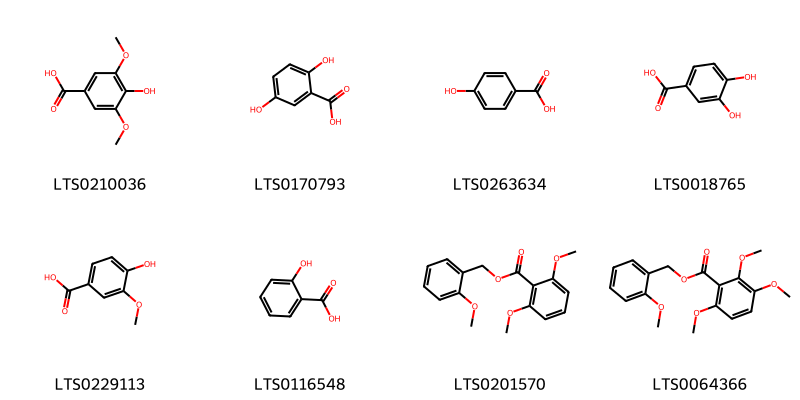{ width=100% }
    <figcaption>Hình ảnh cấu trúc hóa học của 8 hoạt chất thuộc nhóm Benzene and substituted derivatives gồm ['syringic acid (LTS0210036)', '2,5-dihydroxybenzoic acid (LTS0170793)', 'p-hydroxybenzoic acid (LTS0263634)', '3,4-dihydroxybenzoic acid (LTS0018765)', 'vanillic acid (LTS0229113)', 'salicyclic acid (LTS0116548)', '(2-methoxyphenyl)methyl 2,6-dimethoxybenzoate (LTS0201570)', '(2-methoxyphenyl)methyl 2,3,6-trimethoxybenzoate (LTS0064366)'].</figcaption>
</figure>
#### Nhóm Cinnamic acids and derivatives
<figure markdown="span">
    { width=100% }
    <figcaption>Hình ảnh cấu trúc hóa học của 3 hoạt chất thuộc nhóm Cinnamic acids and derivatives gồm ['3,4-dihydroxycinnamic acid (LTS0128050)', 'ferulic acid (LTS0077328)', 'para-coumaric acid (LTS0266252)'].</figcaption>
</figure>
#### Nhóm Fatty Acyls
<figure markdown="span">
    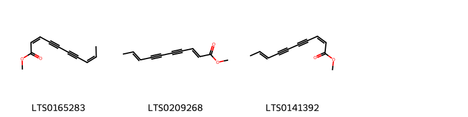{ width=100% }
    <figcaption>Hình ảnh cấu trúc hóa học của 3 hoạt chất thuộc nhóm Fatty Acyls gồm ['methyl (2z,8z)-deca-2,8-dien-4,6-diynoate (LTS0165283)', 'methyl deca-2,8-dien-4,6-diynoate (LTS0209268)', 'methyl (2z,8e)-deca-2,8-dien-4,6-diynoate (LTS0141392)'].</figcaption>
</figure>
#### Nhóm Flavonoids
<figure markdown="span">
    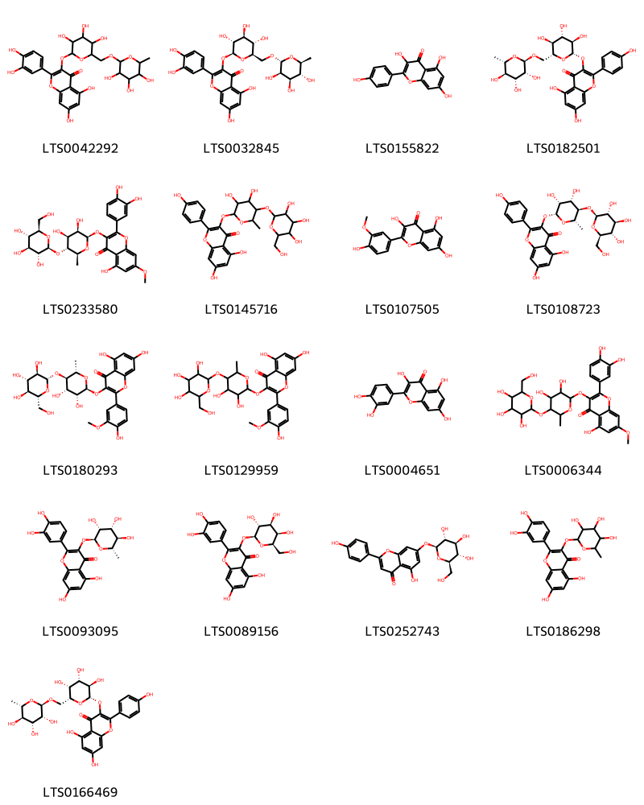{ width=100% }
    <figcaption>Hình ảnh cấu trúc hóa học của 17 hoạt chất thuộc nhóm Flavonoids gồm ['rutin (LTS0042292)', '3-rutinosyl quercetin (LTS0032845)', 'kaempherol (LTS0155822)', 'nictoflorin (LTS0182501)', '3-{[(2r,3r,4s,5r,6s)-3,4-dihydroxy-6-methyl-5-{[(2s,3r,4s,5s,6r)-3,4,5-trihydroxy-6-(hydroxymethyl)oxan-2-yl]oxy}oxan-2-yl]oxy}-2-(3,4-dihydroxyphenyl)-5-hydroxy-7-methoxychromen-4-one (LTS0233580)', '3-[(3,4-dihydroxy-6-methyl-5-{[3,4,5-trihydroxy-6-(hydroxymethyl)oxan-2-yl]oxy}oxan-2-yl)oxy]-5,7-dihydroxy-2-(4-hydroxyphenyl)chromen-4-one (LTS0145716)', 'isorhamnetin (LTS0107505)', '3-{[(2r,3r,4s,5r,6s)-3,4-dihydroxy-6-methyl-5-{[(2s,3r,4s,5s,6r)-3,4,5-trihydroxy-6-(hydroxymethyl)oxan-2-yl]oxy}oxan-2-yl]oxy}-5,7-dihydroxy-2-(4-hydroxyphenyl)chromen-4-one (LTS0108723)', '3-{[(2s,3r,4s,5r,6s)-3,4-dihydroxy-6-methyl-5-{[(2s,3r,4s,5s,6r)-3,4,5-trihydroxy-6-(hydroxymethyl)oxan-2-yl]oxy}oxan-2-yl]oxy}-5,7-dihydroxy-2-(4-hydroxy-3-methoxyphenyl)chromen-4-one (LTS0180293)', '3-[(3,4-dihydroxy-6-methyl-5-{[3,4,5-trihydroxy-6-(hydroxymethyl)oxan-2-yl]oxy}oxan-2-yl)oxy]-5,7-dihydroxy-2-(4-hydroxy-3-methoxyphenyl)chromen-4-one (LTS0129959)', 'quercetin (LTS0004651)', '3-[(3,4-dihydroxy-6-methyl-5-{[3,4,5-trihydroxy-6-(hydroxymethyl)oxan-2-yl]oxy}oxan-2-yl)oxy]-2-(3,4-dihydroxyphenyl)-5-hydroxy-7-methoxychromen-4-one (LTS0006344)', 'quercitrin (LTS0093095)', 'hyperoside (LTS0089156)', 'apigenin 7-o-β-glucoside (LTS0252743)', 'quercitrin (LTS0186298)', '5,7-dihydroxy-2-(4-hydroxyphenyl)-3-{[(2s,3r,4s,5r,6r)-3,4,5-trihydroxy-6-({[(2r,3r,4r,5r,6s)-3,4,5-trihydroxy-6-methyloxan-2-yl]oxy}methyl)oxan-2-yl]oxy}chromen-4-one (LTS0166469)'].</figcaption>
</figure>
#### Nhóm Organooxygen compounds
<figure markdown="span">
    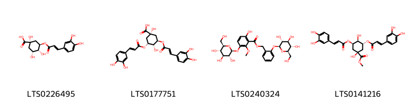{ width=100% }
    <figcaption>Hình ảnh cấu trúc hóa học của 4 hoạt chất thuộc nhóm Organooxygen compounds gồm ['chlorogenic acid (LTS0226495)', '3,5-dicaffeoylquinic acid (LTS0177751)', 'leiocarposide (LTS0240324)', 'methyl (1s,3r,4s,5r)-3,5-bis({[(2e)-3-(3,4-dihydroxyphenyl)prop-2-enoyl]oxy})-1,4-dihydroxycyclohexane-1-carboxylate (LTS0141216)'].</figcaption>
</figure>
#### Nhóm Phenol esters
<figure markdown="span">
    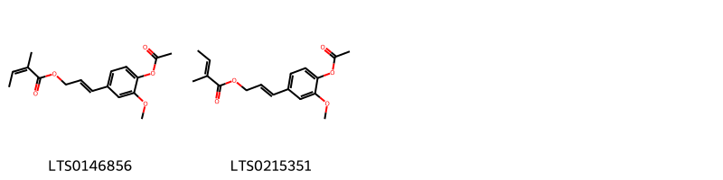{ width=100% }
    <figcaption>Hình ảnh cấu trúc hóa học của 2 hoạt chất thuộc nhóm Phenol esters gồm ['(2e)-3-[4-(acetyloxy)-3-methoxyphenyl]prop-2-en-1-yl (2z)-2-methylbut-2-enoate (LTS0146856)', '3-[4-(acetyloxy)-3-methoxyphenyl]prop-2-en-1-yl 2-methylbut-2-enoate (LTS0215351)'].</figcaption>
</figure>
#### Nhóm Prenol lipids
<figure markdown="span">
    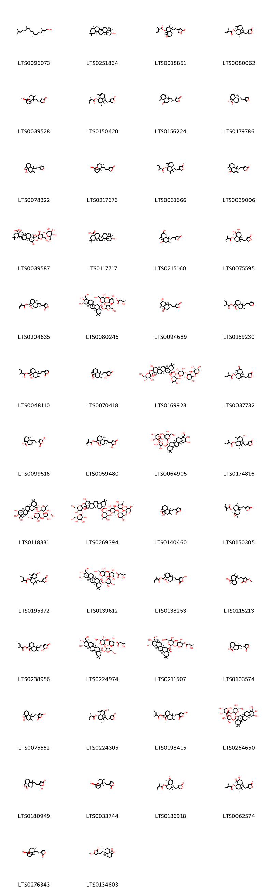{ width=100% }
    <figcaption>Hình ảnh cấu trúc hóa học của 56 hoạt chất thuộc nhóm Prenol lipids gồm ['phytol (LTS0096073)', 'β-amyrin (LTS0251864)', '4,5,7a,7b-tetramethyl-4-[2-(5-oxo-2h-furan-3-yl)ethyl]-hexahydro-1ah-naphtho[1,2-b]oxiren-7-yl 2-methylbut-2-enoate (LTS0018851)', '(1r,3r,4r,4as,8ar)-3,4,8,8a-tetramethyl-4-[2-(5-oxo-2h-furan-3-yl)ethyl]-1,2,3,4a,5,6-hexahydronaphthalen-1-yl (2e)-2-methylbut-2-enoate (LTS0080062)', '4-(2-{7,8-dimethyl-3-oxo-1h,5h,6h,6ah,8h,9h,10h-naphtho[4,4a-c]furan-7-yl}ethyl)-5h-furan-2-one (LTS0039528)', '(1r,3r,4r,4as,8ar)-3,4,8,8a-tetramethyl-4-[2-(5-oxo-2h-furan-3-yl)ethyl]-1,2,3,4a,5,6-hexahydronaphthalen-1-yl (2z)-2-methylbut-2-enoate (LTS0150420)', '4-{2-[(1r,2r,4ar,8as)-1,2,4a,5-tetramethyl-4-oxo-3,7,8,8a-tetrahydro-2h-naphthalen-1-yl]ethyl}-5h-furan-2-one (LTS0156224)', '(1r,2r,4as,8as)-1-[2-(furan-3-yl)ethyl]-1,2,5-trimethyl-2,3,4,7,8,8a-hexahydronaphthalene-4a-carboxylic acid (LTS0179786)', '1-[2-(furan-3-yl)ethyl]-1,2,5-trimethyl-2,3,4,7,8,8a-hexahydronaphthalene-4a-carboxylic acid (LTS0078322)', '4-{2-[(6as,7r,8r,10as)-7,8-dimethyl-3-oxo-1h,5h,6h,6ah,8h,9h,10h-naphtho[4,4a-c]furan-7-yl]ethyl}-5h-furan-2-one (LTS0217676)', '3,4,8,8a-tetramethyl-4-[2-(5-oxo-2h-furan-3-yl)ethyl]-1,2,3,4a,5,6-hexahydronaphthalen-1-yl 2-methylbut-2-enoate (LTS0031666)', '4-[2-(1,2,4a,5-tetramethyl-4-oxo-3,7,8,8a-tetrahydro-2h-naphthalen-1-yl)ethyl]-5h-furan-2-one (LTS0039006)', '(4ar,5r,6as,6br,8ar,9r,10r,11s,12ar,12br,14bs)-10-{[(2r,3r,4r,5s,6r)-3,4-dihydroxy-6-(hydroxymethyl)-5-{[(2s,3r,4s,5s,6r)-3,4,5-trihydroxy-6-(hydroxymethyl)oxan-2-yl]oxy}oxan-2-yl]oxy}-5,11-dihydroxy-9-(hydroxymethyl)-2,2,6a,6b,9,12a-hexamethyl-1,3,4,5,6,7,8,8a,10,11,12,12b,13,14b-tetradecahydropicene-4a-carboxylic acid (LTS0039587)', 'oleanolic acid (LTS0117717)', '4-[2-(7-hydroxy-1,2,4a,5-tetramethyl-4-oxo-3,7,8,8a-tetrahydro-2h-naphthalen-1-yl)ethyl]-5h-furan-2-one (LTS0215160)', '(1r,3r,4r,4as,7s,8s,8as)-7,8-dihydroxy-3,4,8,8a-tetramethyl-4-[2-(5-oxo-2h-furan-3-yl)ethyl]-hexahydro-1h-naphthalen-1-yl (2z)-2-methylbut-2-enoate (LTS0075595)', '(1r,2r,4as,8as)-1,2-dimethyl-5-({[(2z)-2-methylbut-2-enoyl]oxy}methyl)-1-[2-(2-oxo-5h-furan-3-yl)ethyl]-2,3,4,7,8,8a-hexahydronaphthalene-4a-carboxylic acid (LTS0204635)', '(2s,4r,5r)-3,4-dihydroxy-5-(hydroxymethyl)oxolan-2-yl (4ar,5r,6ar,6bs,8as,9r,10s,11r,12as,12bs,14br)-5-{[(2r,4s,5s,6s)-3-{[(2s,3s,4s,5r)-3,4-dihydroxy-5-[(3-hydroxybutanoyl)oxy]oxan-2-yl]oxy}-4,5-dihydroxy-6-(hydroxymethyl)oxan-2-yl]oxy}-10,11-dihydroxy-9-(hydroxymethyl)-2,2,6a,6b,9,12a-hexamethyl-1,3,4,5,6,7,8,8a,10,11,12,12b,13,14b-tetradecahydropicene-4a-carboxylate (LTS0080246)', '4-{2-[(1r,2r,4ar,7s,8as)-7-hydroxy-1,2,4a,5-tetramethyl-4-oxo-3,7,8,8a-tetrahydro-2h-naphthalen-1-yl]ethyl}-5h-furan-2-one (LTS0094689)', '1-[2-(furan-3-yl)ethyl]-1,2-dimethyl-5-{[(2-methylbut-2-enoyl)oxy]methyl}-2,3,4,7,8,8a-hexahydronaphthalene-4a-carboxylic acid (LTS0159230)', '1,2-dimethyl-5-{[(2-methylbut-2-enoyl)oxy]methyl}-1-[2-(2-oxo-5h-furan-3-yl)ethyl]-2,3,4,7,8,8a-hexahydronaphthalene-4a-carboxylic acid (LTS0048110)', '1-[2-(2-hydroxy-5-oxo-2h-furan-3-yl)ethyl]-1,2,5-trimethyl-2,3,4,7,8,8a-hexahydronaphthalene-4a-carboxylic acid (LTS0070418)', '(2s,3r,4s,5r,6r)-3-{[(2s,3r,4s,5r,6s)-5-{[(2s,3r,4s,5r)-3,5-dihydroxy-4-{[(2s,3r,4r,5r,6s)-3,4,5-trihydroxy-6-methyloxan-2-yl]oxy}oxan-2-yl]oxy}-3,4-dihydroxy-6-methyloxan-2-yl]oxy}-4,5-dihydroxy-6-methyloxan-2-yl (4ar,5s,6as,6br,8ar,9r,10r,11s,12ar,12br,14bs)-5,11-dihydroxy-9-(hydroxymethyl)-2,2,6a,6b,9,12a-hexamethyl-10-{[(2r,3r,4s,5s,6r)-3,4,5-trihydroxy-6-(hydroxymethyl)oxan-2-yl]oxy}-1,3,4,5,6,7,8,8a,10,11,12,12b,13,14b-tetradecahydropicene-4a-carboxylate (LTS0169923)', '(1r,3r,4r,4as,8r,8ar)-3,4,8,8a-tetramethyl-7-oxo-4-[2-(5-oxo-2h-furan-3-yl)ethyl]-hexahydro-1h-naphthalen-1-yl (2e)-2-methylbut-2-enoate (LTS0037732)', '(1r,2r,4as,8as)-1-{2-[(5s)-5-hydroxy-2-oxo-5h-furan-3-yl]ethyl}-1,2,5-trimethyl-2,3,4,7,8,8a-hexahydronaphthalene-4a-carboxylic acid (LTS0099516)', '(1r,2r,4as,8as)-1-{2-[(2r)-2-hydroxy-5-oxo-2h-furan-3-yl]ethyl}-1,2-dimethyl-5-({[(2z)-2-methylbut-2-enoyl]oxy}methyl)-2,3,4,7,8,8a-hexahydronaphthalene-4a-carboxylic acid (LTS0059480)', '(2s,3r,4r,5r)-3,4-dihydroxy-5-(hydroxymethyl)oxolan-2-yl (4ar,5r,6as,6br,8ar,9r,10r,11s,12ar,12br,14bs)-5-{[(2r,3r,4s,5s,6r)-4,5-dihydroxy-6-(hydroxymethyl)-3-{[(2s,3s,4r,5r)-3,4,5-trihydroxyoxan-2-yl]oxy}oxan-2-yl]oxy}-10,11-dihydroxy-9-(hydroxymethyl)-2,2,6a,6b,9,12a-hexamethyl-1,3,4,5,6,7,8,8a,10,11,12,12b,13,14b-tetradecahydropicene-4a-carboxylate (LTS0064905)', '(1r,3r,4r,4as,6r,8ar)-6-hydroxy-3,4,8,8a-tetramethyl-4-[2-(5-oxo-2h-furan-3-yl)ethyl]-1,2,3,4a,5,6-hexahydronaphthalen-1-yl (2e)-2-methylbut-2-enoate (LTS0174816)', '(2s,3r,4r,5r,6s)-3,4,5-trihydroxy-6-methyloxan-2-yl (4ar,5r,6as,6br,8ar,9r,10r,11s,12ar,12br,14bs)-5-{[(2r,3r,4s,5s,6r)-3-{[(2s,3s,4s,5r)-3,4-dihydroxy-5-(hydroxymethyl)oxolan-2-yl]oxy}-4,5-dihydroxy-6-(hydroxymethyl)oxan-2-yl]oxy}-10,11-dihydroxy-9-(hydroxymethyl)-2,2,6a,6b,9,12a-hexamethyl-1,3,4,5,6,7,8,8a,10,11,12,12b,13,14b-tetradecahydropicene-4a-carboxylate (LTS0118331)', '(2s,3r,4s,5r,6r)-3-{[(2s,3r,4s,5r,6s)-5-{[(2s,3r,4s,5r)-4-{[(2s,3r,4r,5r,6s)-4,5-dihydroxy-6-methyl-3-{[(2s,3r,4s,5r,6r)-3,4,5-trihydroxy-6-methyloxan-2-yl]oxy}oxan-2-yl]oxy}-3,5-dihydroxyoxan-2-yl]oxy}-3,4-dihydroxy-6-methyloxan-2-yl]oxy}-4,5-dihydroxy-6-methyloxan-2-yl (4ar,5s,6as,6br,8ar,9r,10r,11s,12ar,12br,14bs)-10-{[(2r,3r,4s,5r,6r)-3,5-dihydroxy-6-(hydroxymethyl)-4-{[(2s,3r,4s,5s,6r)-3,4,5-trihydroxy-6-(hydroxymethyl)oxan-2-yl]oxy}oxan-2-yl]oxy}-5,11-dihydroxy-9-(hydroxymethyl)-2,2,6a,6b,9,12a-hexamethyl-1,3,4,5,6,7,8,8a,10,11,12,12b,13,14b-tetradecahydropicene-4a-carboxylate (LTS0269394)', '1,2,5-trimethyl-1-[2-(2-oxo-5h-furan-3-yl)ethyl]-2,3,4,7,8,8a-hexahydronaphthalene-4a-carboxylic acid (LTS0140460)', '(1ar,3as,4r,5r,7r,7as,7bs)-4,5,7a,7b-tetramethyl-4-[2-(5-oxo-2h-furan-3-yl)ethyl]-hexahydro-1ah-naphtho[1,2-b]oxiren-7-yl (2z)-2-methylbut-2-enoate (LTS0150305)', '6-hydroxy-3,4,8,8a-tetramethyl-4-[2-(5-oxo-2h-furan-3-yl)ethyl]-1,2,3,4a,5,6-hexahydronaphthalen-1-yl 2-methylbut-2-enoate (LTS0195372)', '(2s,3r,4r,5r,6s)-3,4,5-trihydroxy-6-methyloxan-2-yl (4ar,5r,6as,6br,8ar,9r,10r,11s,12ar,12br,14bs)-5-{[(2r,3r,4s,5s,6r)-3-{[(2s,3s,4s,5r)-3,4-dihydroxy-5-[(3-hydroxybutanoyl)oxy]oxan-2-yl]oxy}-4,5-dihydroxy-6-(hydroxymethyl)oxan-2-yl]oxy}-10,11-dihydroxy-9-(hydroxymethyl)-2,2,6a,6b,9,12a-hexamethyl-1,3,4,5,6,7,8,8a,10,11,12,12b,13,14b-tetradecahydropicene-4a-carboxylate (LTS0139612)', '(1r,2r,4as,8as)-1-{2-[(5s)-5-hydroxy-2-oxo-5h-furan-3-yl]ethyl}-1,2-dimethyl-5-({[(2z)-2-methylbut-2-enoyl]oxy}methyl)-2,3,4,7,8,8a-hexahydronaphthalene-4a-carboxylic acid (LTS0138253)', '1-[2-(5-methoxy-2-oxo-5h-furan-3-yl)ethyl]-1,2,5-trimethyl-2,3,4,7,8,8a-hexahydronaphthalene-4a-carboxylic acid (LTS0115213)', '1-[2-(2-hydroxy-5-oxo-2h-furan-3-yl)ethyl]-1,2-dimethyl-5-{[(2-methylbut-2-enoyl)oxy]methyl}-2,3,4,7,8,8a-hexahydronaphthalene-4a-carboxylic acid (LTS0238956)', '(2s,3s,4s,5r)-3,4-dihydroxy-5-(hydroxymethyl)oxolan-2-yl (4ar,5r,6as,6br,8ar,9r,10r,11s,12ar,12br,14bs)-5-{[(2r,3r,4s,5s,6r)-3-{[(2s,3s,4s,5r)-3,4-dihydroxy-5-[(3-hydroxybutanoyl)oxy]oxan-2-yl]oxy}-4,5-dihydroxy-6-(hydroxymethyl)oxan-2-yl]oxy}-10,11-dihydroxy-9-(hydroxymethyl)-2,2,6a,6b,9,12a-hexamethyl-1,3,4,5,6,7,8,8a,10,11,12,12b,13,14b-tetradecahydropicene-4a-carboxylate (LTS0224974)', '(4ar,5r,6as,6br,8ar,9r,10r,11s,12ar,12br,14bs)-5-{[(2r,3r,4s,5s,6r)-3-{[(2s,3s,4s,5r)-3,4-dihydroxy-5-[(3-hydroxybutanoyl)oxy]oxan-2-yl]oxy}-4,5-dihydroxy-6-(hydroxymethyl)oxan-2-yl]oxy}-10,11-dihydroxy-9-(hydroxymethyl)-2,2,6a,6b,9,12a-hexamethyl-1,3,4,5,6,7,8,8a,10,11,12,12b,13,14b-tetradecahydropicene-4a-carboxylic acid (LTS0211507)', '(1r,2r,4as,8as)-1,2,5-trimethyl-1-[2-(2-oxo-5h-furan-3-yl)ethyl]-2,3,4,7,8,8a-hexahydronaphthalene-4a-carboxylic acid (LTS0103574)', '1-[2-(5-hydroxy-2-oxo-5h-furan-3-yl)ethyl]-1,2,5-trimethyl-2,3,4,7,8,8a-hexahydronaphthalene-4a-carboxylic acid (LTS0075552)', '(1r,3r,4r,4as,6r,8ar)-6-hydroxy-3,4,8,8a-tetramethyl-4-[2-(5-oxo-2h-furan-3-yl)ethyl]-1,2,3,4a,5,6-hexahydronaphthalen-1-yl (2z)-2-methylbut-2-enoate (LTS0224305)', '1-[2-(5-hydroxy-2-oxo-5h-furan-3-yl)ethyl]-1,2-dimethyl-5-{[(2-methylbut-2-enoyl)oxy]methyl}-2,3,4,7,8,8a-hexahydronaphthalene-4a-carboxylic acid (LTS0198415)', '(2s,3s,4s,5r)-3,4-dihydroxy-5-(hydroxymethyl)oxolan-2-yl (4ar,5r,6as,6br,8ar,9r,10r,11s,12ar,12br,14bs)-5-{[(2r,3r,4s,5s,6r)-4,5-dihydroxy-6-(hydroxymethyl)-3-{[(2s,3s,4r,5r)-3,4,5-trihydroxyoxan-2-yl]oxy}oxan-2-yl]oxy}-10,11-dihydroxy-9-(hydroxymethyl)-2,2,6a,6b,9,12a-hexamethyl-1,3,4,5,6,7,8,8a,10,11,12,12b,13,14b-tetradecahydropicene-4a-carboxylate (LTS0254650)', '(1r,2r,4as,8as)-1-{2-[(2s)-2-hydroxy-5-oxo-2h-furan-3-yl]ethyl}-1,2,5-trimethyl-2,3,4,7,8,8a-hexahydronaphthalene-4a-carboxylic acid (LTS0180949)', '3-(2-{7,8-dimethyl-3-oxo-1h,5h,6h,6ah,8h,9h,10h-naphtho[4,4a-c]furan-7-yl}ethyl)-5h-furan-2-one (LTS0033744)', '(1r,3r,4r,4as,8r,8ar)-3,4,8,8a-tetramethyl-7-oxo-4-[2-(5-oxo-2h-furan-3-yl)ethyl]-hexahydro-1h-naphthalen-1-yl (2z)-2-methylbut-2-enoate (LTS0136918)', '(1r,3r,4r,4as,7s,8s,8as)-7,8-dihydroxy-3,4,8,8a-tetramethyl-4-[2-(5-oxo-2h-furan-3-yl)ethyl]-hexahydro-1h-naphthalen-1-yl (2e)-2-methylbut-2-enoate (LTS0062574)', '3-{2-[(6as,7r,8r,10as)-7,8-dimethyl-3-oxo-1h,5h,6h,6ah,8h,9h,10h-naphtho[4,4a-c]furan-7-yl]ethyl}-5h-furan-2-one (LTS0276343)', '(1r,2r,4as,8as)-1-{2-[(5s)-5-methoxy-2-oxo-5h-furan-3-yl]ethyl}-1,2,5-trimethyl-2,3,4,7,8,8a-hexahydronaphthalene-4a-carboxylic acid (LTS0134603)', '3,4,8,8a-tetramethyl-7-oxo-4-[2-(5-oxo-2h-furan-3-yl)ethyl]-hexahydro-1h-naphthalen-1-yl 2-methylbut-2-enoate (LTS0012641)', '(1ar,3as,4r,5r,7r,7as,7bs)-4,5,7a,7b-tetramethyl-4-[2-(5-oxo-2h-furan-3-yl)ethyl]-hexahydro-1ah-naphtho[1,2-b]oxiren-7-yl (2e)-2-methylbut-2-enoate (LTS0057282)', '7,8-dihydroxy-3,4,8,8a-tetramethyl-4-[2-(5-oxo-2h-furan-3-yl)ethyl]-hexahydro-1h-naphthalen-1-yl 2-methylbut-2-enoate (LTS0055266)', '(1r,2r,4as,8as)-1-[2-(furan-3-yl)ethyl]-1,2-dimethyl-5-({[(2z)-2-methylbut-2-enoyl]oxy}methyl)-2,3,4,7,8,8a-hexahydronaphthalene-4a-carboxylic acid (LTS0000147)', '(2s,3r,4s,5r,6r)-3-{[(2s,3r,4s,5r,6s)-5-{[(2s,3r,4s,5r)-3,5-dihydroxy-4-{[(2s,3r,4r,5r,6s)-3,4,5-trihydroxy-6-methyloxan-2-yl]oxy}oxan-2-yl]oxy}-3,4-dihydroxy-6-methyloxan-2-yl]oxy}-4,5-dihydroxy-6-methyloxan-2-yl (4ar,5s,6as,6br,8ar,9r,10r,11s,12ar,12br,14bs)-10-{[(2r,3r,4s,5r,6r)-3,5-dihydroxy-6-(hydroxymethyl)-4-{[(2s,3r,4s,5s,6r)-3,4,5-trihydroxy-6-(hydroxymethyl)oxan-2-yl]oxy}oxan-2-yl]oxy}-5,11-dihydroxy-9-(hydroxymethyl)-2,2,6a,6b,9,12a-hexamethyl-1,3,4,5,6,7,8,8a,10,11,12,12b,13,14b-tetradecahydropicene-4a-carboxylate (LTS0048511)', '(4ar,5r,6as,6br,8ar,9r,10r,11s,12ar,12br,14bs)-5-{[(2r,3r,4s,5s,6r)-3-{[(2s,3s,4s,5r)-3,4-dihydroxy-5-(hydroxymethyl)oxolan-2-yl]oxy}-4,5-dihydroxy-6-(hydroxymethyl)oxan-2-yl]oxy}-10,11-dihydroxy-9-(hydroxymethyl)-2,2,6a,6b,9,12a-hexamethyl-1,3,4,5,6,7,8,8a,10,11,12,12b,13,14b-tetradecahydropicene-4a-carboxylic acid (LTS0121751)'].</figcaption>
</figure>
#### Nhóm Unsaturated hydrocarbons
<figure markdown="span">
    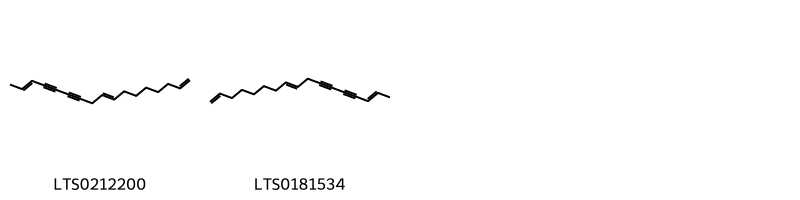{ width=100% }
    <figcaption>Hình ảnh cấu trúc hóa học của 2 hoạt chất thuộc nhóm Unsaturated hydrocarbons gồm ['heptadeca-1,8,15-trien-11,13-diyne (LTS0212200)', '(8e,15e)-heptadeca-1,8,15-trien-11,13-diyne (LTS0181534)'].</figcaption>
</figure>

---

### Dược dân tộc học

Danh sách các quốc gia có sử dụng *Solidago virgaurea* trong điều trị các bệnh. 

| Country   | Disease                                                                            | Bệnh                                                                                                                                                                                                |
|:----------|:-----------------------------------------------------------------------------------|:----------------------------------------------------------------------------------------------------------------------------------------------------------------------------------------------------|
| Elsewhere | Carminative, Cicatrizant, Diuretic, Sudorific, Vulnerary                           | MYMEMORY WARNING: YOU USED ALL AVAILABLE FREE TRANSLATIONS FOR TODAY. NEXT AVAILABLE IN  08 HOURS 53 MINUTES 59 SECONDS VISIT HTTPS://MYMEMORY.TRANSLATED.NET/DOC/USAGELIMITS.PHP TO TRANSLATE MORE |
| Europe    | Astringent, Carminative, Digestive, Diuretic, Stimulant, Tonic, Vulnerary, Nervine | MYMEMORY WARNING: YOU USED ALL AVAILABLE FREE TRANSLATIONS FOR TODAY. NEXT AVAILABLE IN  08 HOURS 53 MINUTES 57 SECONDS VISIT HTTPS://MYMEMORY.TRANSLATED.NET/DOC/USAGELIMITS.PHP TO TRANSLATE MORE |

---

---
## Solidago virgoaurea
### Thông tin về thực vật

!!! info "Phân loại thực vật của *Solidago virgaurea* từ GIBF:"
    - **Kingdom:** Plantae
    - **Phylum:** Tracheophyta
    - **Order:** Asterales
    - **Family:** Asteraceae
    - **Genus:** Solidago
    - **Species:** *Solidago virgaurea*

 

| Label (VI)   | Label (EN)   | Scientific Name    | Descriptions (VI)   | Descriptions (EN)   | Also Known As (VI)   | Also Known As (EN)          |
|:-------------|:-------------|:-------------------|:--------------------|:--------------------|:---------------------|:----------------------------|
| N/A          | N/A          | Solidago virgaurea | loài thực vật       | species of plant    | ['']                 | ['golden rod', 'goldenrod'] |

#### Phân bố trên thế giới

**Từ CSDL GIBF** Ukraine, Finland, Denmark, Netherlands, Italy, Belarus, Germany, Spain, Poland, Argentina, Portugal, Switzerland, Russian Federation, Sweden, Austria, France, Norway

#### Phân bố tại Việt Nam

**Từ CSDL GIBF**: Không có ghi nhận ở Việt Nam

---
### Thành phần hóa học
        
- Theo cơ sở dữ liệu lotus: Từ loài *Solidago virgaurea* đã phân lập và xác định được Chưa có hoạt chất nào được phân lập. hoạt chất thuộc về các nhóm Không có hoạt chất nào được phân lập. 

Không có hình ảnh nào được tạo ra

---

### Dược dân tộc học

Danh sách các quốc gia có sử dụng *Solidago virgaurea* trong điều trị các bệnh. 

| Country   | Disease     | Bệnh                                                                                                                                                                                                |
|:----------|:------------|:----------------------------------------------------------------------------------------------------------------------------------------------------------------------------------------------------|
| China     | Carminative | MYMEMORY WARNING: YOU USED ALL AVAILABLE FREE TRANSLATIONS FOR TODAY. NEXT AVAILABLE IN  08 HOURS 53 MINUTES 24 SECONDS VISIT HTTPS://MYMEMORY.TRANSLATED.NET/DOC/USAGELIMITS.PHP TO TRANSLATE MORE |

---

---
## Solidago virgoaurea
### Thông tin về thực vật

!!! info "Phân loại thực vật của *Solidago virgaurea* từ GIBF:"
    - **Kingdom:** Plantae
    - **Phylum:** Tracheophyta
    - **Order:** Asterales
    - **Family:** Asteraceae
    - **Genus:** Solidago
    - **Species:** *Solidago virgaurea*

 

| Label (VI)   | Label (EN)   | Scientific Name    | Descriptions (VI)   | Descriptions (EN)   | Also Known As (VI)   | Also Known As (EN)          |
|:-------------|:-------------|:-------------------|:--------------------|:--------------------|:---------------------|:----------------------------|
| N/A          | N/A          | Solidago virgaurea | loài thực vật       | species of plant    | ['']                 | ['golden rod', 'goldenrod'] |

#### Phân bố trên thế giới

**Từ CSDL GIBF** Ukraine, Finland, Denmark, Netherlands, Italy, Belarus, Germany, Spain, Poland, Argentina, Portugal, Switzerland, Russian Federation, Sweden, Austria, France, Norway

#### Phân bố tại Việt Nam

**Từ CSDL GIBF**: Không có ghi nhận ở Việt Nam

---
### Thành phần hóa học
        
- Theo cơ sở dữ liệu lotus: Từ loài *Solidago virgaurea* đã phân lập và xác định được Chưa có hoạt chất nào được phân lập. hoạt chất thuộc về các nhóm Không có hoạt chất nào được phân lập. 

Không có hình ảnh nào được tạo ra

---

### Dược dân tộc học

Danh sách các quốc gia có sử dụng *Solidago virgaurea* trong điều trị các bệnh. 

| Country   | Disease                                                                                              | Bệnh                                                                                                                                                                                                |
|:----------|:-----------------------------------------------------------------------------------------------------|:----------------------------------------------------------------------------------------------------------------------------------------------------------------------------------------------------|
| China     | Carminative, Vermifuge, Alexiteric                                                                   | MYMEMORY WARNING: YOU USED ALL AVAILABLE FREE TRANSLATIONS FOR TODAY. NEXT AVAILABLE IN  08 HOURS 53 MINUTES 03 SECONDS VISIT HTTPS://MYMEMORY.TRANSLATED.NET/DOC/USAGELIMITS.PHP TO TRANSLATE MORE |
| Turkey    | Astringent, Carminative, Diuretic, Expectorant, Hemostat, Stimulant, Vulnerary, Digestive, Sudorific | MYMEMORY WARNING: YOU USED ALL AVAILABLE FREE TRANSLATIONS FOR TODAY. NEXT AVAILABLE IN  08 HOURS 53 MINUTES 01 SECONDS VISIT HTTPS://MYMEMORY.TRANSLATED.NET/DOC/USAGELIMITS.PHP TO TRANSLATE MORE |

---

# Chi haeranthus

??? note "Danh sách các dược liệu thuộc chi"
    
	 - *haeranthus africanus*
	 - *haeranthus indicus*
	 - *haeranthus suaveolens*

---
## haeranthus africanus
### Thông tin về thực vật

!!! info "Phân loại thực vật của *N/A* từ GIBF:"
    - **Kingdom:** N/A
    - **Phylum:** N/A
    - **Order:** N/A
    - **Family:** N/A
    - **Genus:** N/A
    - **Species:** *N/A*

 

| Label (VI)   | Label (EN)   | Scientific Name    | Descriptions (VI)   | Descriptions (EN)   | Also Known As (VI)   | Also Known As (EN)          |
|:-------------|:-------------|:-------------------|:--------------------|:--------------------|:---------------------|:----------------------------|
| N/A          | N/A          | Solidago virgaurea | loài thực vật       | species of plant    | ['']                 | ['golden rod', 'goldenrod'] |

#### Phân bố trên thế giới

**Từ CSDL GIBF** Không có kết quả phù hợp

#### Phân bố tại Việt Nam

**Từ CSDL GIBF**: Không có ghi nhận ở Việt Nam

---
### Thành phần hóa học
        
- Theo cơ sở dữ liệu lotus: Từ loài *N/A* đã phân lập và xác định được 8 hoạt chất thuộc về các nhóm Prenol lipids. 

|    | chemicalTaxonomyClassyfireClass   |   smiles_count |
|---:|:----------------------------------|---------------:|
|  0 | Prenol lipids                     |              8 |

#### Nhóm Prenol lipids
<figure markdown="span">
    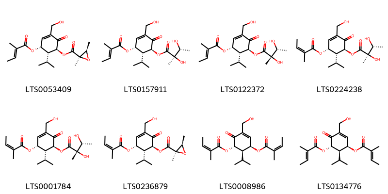{ width=100% }
    <figcaption>Hình ảnh cấu trúc hóa học của 8 hoạt chất thuộc nhóm Prenol lipids gồm ['(1s,5r,6r)-3-(hydroxymethyl)-6-isopropyl-5-[(2-methylbut-2-enoyl)oxy]-2-oxocyclohex-3-en-1-yl (2r,3r)-2,3-dimethyloxirane-2-carboxylate (LTS0053409)', '(1r,5s,6r)-5-{[(2r,3r)-2,3-dihydroxy-2-methylbutanoyl]oxy}-3-(hydroxymethyl)-6-isopropyl-4-oxocyclohex-2-en-1-yl 2-methylbut-2-enoate (LTS0157911)', '(1r,5s,6r)-5-{[(2s,3r)-2,3-dihydroxy-2-methylbutanoyl]oxy}-3-(hydroxymethyl)-6-isopropyl-4-oxocyclohex-2-en-1-yl 2-methylbut-2-enoate (LTS0122372)', '(1r,5s,6r)-5-{[(2r,3r)-2,3-dihydroxy-2-methylbutanoyl]oxy}-3-(hydroxymethyl)-6-isopropyl-4-oxocyclohex-2-en-1-yl (2z)-2-methylbut-2-enoate (LTS0224238)', '(1r,5s,6r)-5-{[(2s,3r)-2,3-dihydroxy-2-methylbutanoyl]oxy}-3-(hydroxymethyl)-6-isopropyl-4-oxocyclohex-2-en-1-yl (2z)-2-methylbut-2-enoate (LTS0001784)', '(1s,5r,6r)-3-(hydroxymethyl)-6-isopropyl-5-{[(2z)-2-methylbut-2-enoyl]oxy}-2-oxocyclohex-3-en-1-yl (2r,3r)-2,3-dimethyloxirane-2-carboxylate (LTS0236879)', '(1r,5s,6r)-3-(hydroxymethyl)-6-isopropyl-5-{[(2z)-2-methylbut-2-enoyl]oxy}-4-oxocyclohex-2-en-1-yl (2z)-2-methylbut-2-enoate (LTS0008986)', '(1r,5s,6r)-3-(hydroxymethyl)-6-isopropyl-5-[(2-methylbut-2-enoyl)oxy]-4-oxocyclohex-2-en-1-yl 2-methylbut-2-enoate (LTS0134776)'].</figcaption>
</figure>

---

### Dược dân tộc học

Danh sách các quốc gia có sử dụng *N/A* trong điều trị các bệnh. 

| Country   | Disease                   | Bệnh                                                                                                                                                                                                |
|:----------|:--------------------------|:----------------------------------------------------------------------------------------------------------------------------------------------------------------------------------------------------|
| Elsewhere | Emollient, Insecticide    | MYMEMORY WARNING: YOU USED ALL AVAILABLE FREE TRANSLATIONS FOR TODAY. NEXT AVAILABLE IN  08 HOURS 52 MINUTES 41 SECONDS VISIT HTTPS://MYMEMORY.TRANSLATED.NET/DOC/USAGELIMITS.PHP TO TRANSLATE MORE |
| India     | Vermifuge, Styptic, Tonic | MYMEMORY WARNING: YOU USED ALL AVAILABLE FREE TRANSLATIONS FOR TODAY. NEXT AVAILABLE IN  08 HOURS 52 MINUTES 39 SECONDS VISIT HTTPS://MYMEMORY.TRANSLATED.NET/DOC/USAGELIMITS.PHP TO TRANSLATE MORE |

---

---
## haeranthus indicus
### Thông tin về thực vật

!!! info "Phân loại thực vật của *N/A* từ GIBF:"
    - **Kingdom:** N/A
    - **Phylum:** N/A
    - **Order:** N/A
    - **Family:** N/A
    - **Genus:** N/A
    - **Species:** *N/A*

 

| Label (VI)   | Label (EN)   | Scientific Name    | Descriptions (VI)   | Descriptions (EN)   | Also Known As (VI)   | Also Known As (EN)          |
|:-------------|:-------------|:-------------------|:--------------------|:--------------------|:---------------------|:----------------------------|
| N/A          | N/A          | Solidago virgaurea | loài thực vật       | species of plant    | ['']                 | ['golden rod', 'goldenrod'] |

#### Phân bố trên thế giới

**Từ CSDL GIBF** Không có kết quả phù hợp

#### Phân bố tại Việt Nam

**Từ CSDL GIBF**: Không có ghi nhận ở Việt Nam

---
### Thành phần hóa học
        
- Theo cơ sở dữ liệu lotus: Từ loài *N/A* đã phân lập và xác định được 22 hoạt chất thuộc về các nhóm Flavonoids, Prenol lipids, Isoflavonoids. 

|    | chemicalTaxonomyClassyfireClass   |   smiles_count |
|---:|:----------------------------------|---------------:|
|  0 | Flavonoids                        |              2 |
|  1 | Isoflavonoids                     |              1 |
|  2 | Prenol lipids                     |             19 |

#### Nhóm Flavonoids
<figure markdown="span">
    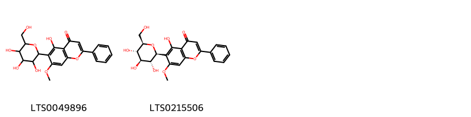{ width=100% }
    <figcaption>Hình ảnh cấu trúc hóa học của 2 hoạt chất thuộc nhóm Flavonoids gồm ['5-hydroxy-7-methoxy-2-phenyl-6-[3,4,5-trihydroxy-6-(hydroxymethyl)oxan-2-yl]chromen-4-one (LTS0049896)', '5-hydroxy-7-methoxy-2-phenyl-6-[(2s,3r,4r,5s,6r)-3,4,5-trihydroxy-6-(hydroxymethyl)oxan-2-yl]chromen-4-one (LTS0215506)'].</figcaption>
</figure>
#### Nhóm Isoflavonoids
<figure markdown="span">
    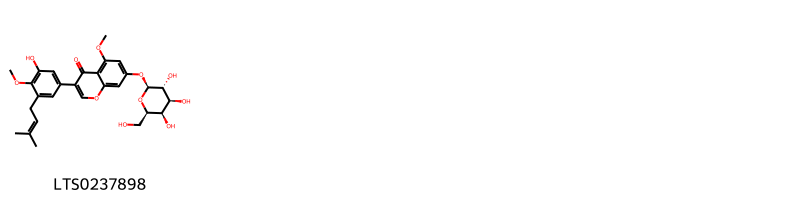{ width=100% }
    <figcaption>Hình ảnh cấu trúc hóa học của 1 hoạt chất thuộc nhóm Isoflavonoids gồm ['3-[3-hydroxy-4-methoxy-5-(3-methylbut-2-en-1-yl)phenyl]-5-methoxy-7-{[(2s,3r,4s,5r,6r)-3,4,5-trihydroxy-6-(hydroxymethyl)oxan-2-yl]oxy}chromen-4-one (LTS0237898)'].</figcaption>
</figure>
#### Nhóm Prenol lipids
<figure markdown="span">
    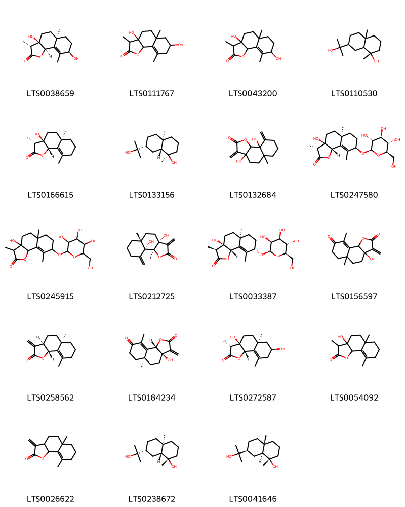{ width=100% }
    <figcaption>Hình ảnh cấu trúc hóa học của 19 hoạt chất thuộc nhóm Prenol lipids gồm ['(3r,3ar,5ar,8r,9br)-3a,8-dihydroxy-3,5a,9-trimethyl-3h,4h,5h,6h,7h,8h,9bh-naphtho[1,2-b]furan-2-one (LTS0038659)', '3a,7-dihydroxy-3,5a,9-trimethyl-3h,4h,5h,6h,7h,8h,9bh-naphtho[1,2-b]furan-2-one (LTS0111767)', '3a,8-dihydroxy-3,5a,9-trimethyl-3h,4h,5h,6h,7h,8h,9bh-naphtho[1,2-b]furan-2-one (LTS0043200)', '7-(2-hydroxypropan-2-yl)-1,4a-dimethyl-octahydronaphthalen-1-ol (LTS0110530)', '(3r,3ar,5ar,9bs)-3a-hydroxy-3,5a,9-trimethyl-3h,4h,5h,6h,7h,8h,9bh-naphtho[1,2-b]furan-2-one (LTS0166615)', 'proximadiol (LTS0133156)', '3a,9a-dihydroxy-5a-methyl-3,9-dimethylidene-hexahydronaphtho[1,2-b]furan-2-one (LTS0132684)', 'sphaeranthanolide (LTS0247580)', '3a-hydroxy-3,5a,9-trimethyl-8-{[3,4,5-trihydroxy-6-(hydroxymethyl)oxan-2-yl]oxy}-3h,4h,5h,6h,7h,8h,9bh-naphtho[1,2-b]furan-2-one (LTS0245915)', '(3ar,5ar,9ar,9br)-3a,9a-dihydroxy-5a-methyl-3,9-dimethylidene-hexahydronaphtho[1,2-b]furan-2-one (LTS0212725)', '(3s,3ar,5ar,8s,9bs)-3a-hydroxy-3,5a,9-trimethyl-8-{[(2r,3s,4s,5s,6r)-3,4,5-trihydroxy-6-(hydroxymethyl)oxan-2-yl]oxy}-3h,4h,5h,6h,7h,8h,9bh-naphtho[1,2-b]furan-2-one (LTS0033387)', '3a-hydroxy-5a,9-dimethyl-3-methylidene-4h,5h,6h,7h,9bh-naphtho[1,2-b]furan-2,8-dione (LTS0156597)', '(3ar,5ar,9br)-5a,9-dimethyl-3-methylidene-3ah,4h,5h,6h,7h,8h,9bh-naphtho[1,2-b]furan-2-one (LTS0258562)', '(3ar,5as,9bs)-3a-hydroxy-5a,9-dimethyl-3-methylidene-4h,5h,6h,7h,9bh-naphtho[1,2-b]furan-2,8-dione (LTS0184234)', '(3r,3ar,5as,7s,9bs)-3a,7-dihydroxy-3,5a,9-trimethyl-3h,4h,5h,6h,7h,8h,9bh-naphtho[1,2-b]furan-2-one (LTS0272587)', '3a-hydroxy-3,5a,9-trimethyl-3h,4h,5h,6h,7h,8h,9bh-naphtho[1,2-b]furan-2-one (LTS0054092)', '5a,9-dimethyl-3-methylidene-3ah,4h,5h,6h,7h,8h,9bh-naphtho[1,2-b]furan-2-one (LTS0026622)', '(1s,4ar,7r,8ar)-7-(2-hydroxypropan-2-yl)-1,4a-dimethyl-octahydronaphthalen-1-ol (LTS0238672)', '(+)-4-epi-cryptomeridiol (LTS0041646)'].</figcaption>
</figure>

---

### Dược dân tộc học

Danh sách các quốc gia có sử dụng *N/A* trong điều trị các bệnh. 

| Country   | Disease                              | Bệnh                                                                                                                                                                                                |
|:----------|:-------------------------------------|:----------------------------------------------------------------------------------------------------------------------------------------------------------------------------------------------------|
| Elsewhere | nan                                  | MYMEMORY WARNING: YOU USED ALL AVAILABLE FREE TRANSLATIONS FOR TODAY. NEXT AVAILABLE IN  08 HOURS 52 MINUTES 27 SECONDS VISIT HTTPS://MYMEMORY.TRANSLATED.NET/DOC/USAGELIMITS.PHP TO TRANSLATE MORE |
| India     | Styptic, Tonic, Vermifuge, Vermifuge | MYMEMORY WARNING: YOU USED ALL AVAILABLE FREE TRANSLATIONS FOR TODAY. NEXT AVAILABLE IN  08 HOURS 52 MINUTES 24 SECONDS VISIT HTTPS://MYMEMORY.TRANSLATED.NET/DOC/USAGELIMITS.PHP TO TRANSLATE MORE |
| Java      | Diuretic                             | MYMEMORY WARNING: YOU USED ALL AVAILABLE FREE TRANSLATIONS FOR TODAY. NEXT AVAILABLE IN  08 HOURS 52 MINUTES 22 SECONDS VISIT HTTPS://MYMEMORY.TRANSLATED.NET/DOC/USAGELIMITS.PHP TO TRANSLATE MORE |

---

---
## haeranthus suaveolens
### Thông tin về thực vật

!!! info "Phân loại thực vật của *N/A* từ GIBF:"
    - **Kingdom:** N/A
    - **Phylum:** N/A
    - **Order:** N/A
    - **Family:** N/A
    - **Genus:** N/A
    - **Species:** *N/A*

 

| Label (VI)   | Label (EN)   | Scientific Name    | Descriptions (VI)   | Descriptions (EN)   | Also Known As (VI)   | Also Known As (EN)          |
|:-------------|:-------------|:-------------------|:--------------------|:--------------------|:---------------------|:----------------------------|
| N/A          | N/A          | Solidago virgaurea | loài thực vật       | species of plant    | ['']                 | ['golden rod', 'goldenrod'] |

#### Phân bố trên thế giới

**Từ CSDL GIBF** Không có kết quả phù hợp

#### Phân bố tại Việt Nam

**Từ CSDL GIBF**: Không có ghi nhận ở Việt Nam

---
### Thành phần hóa học
        
- Theo cơ sở dữ liệu lotus: Từ loài *N/A* đã phân lập và xác định được 47 hoạt chất thuộc về các nhóm Prenol lipids, Steroids and steroid derivatives, Thiophenes, Oxepanes, Benzofurans, Organooxygen compounds, Carboxylic acids and derivatives. 

|    | chemicalTaxonomyClassyfireClass   |   smiles_count |
|---:|:----------------------------------|---------------:|
|  0 | Benzofurans                       |              1 |
|  1 | Carboxylic acids and derivatives  |              2 |
|  2 | Organooxygen compounds            |              1 |
|  3 | Oxepanes                          |              2 |
|  4 | Prenol lipids                     |             37 |
|  5 | Steroids and steroid derivatives  |              3 |
|  6 | Thiophenes                        |              1 |

#### Nhóm Benzofurans
<figure markdown="span">
    { width=100% }
    <figcaption>Hình ảnh cấu trúc hóa học của 1 hoạt chất thuộc nhóm Benzofurans gồm ['loliolide (LTS0254454)'].</figcaption>
</figure>
#### Nhóm Carboxylic acids and derivatives
<figure markdown="span">
    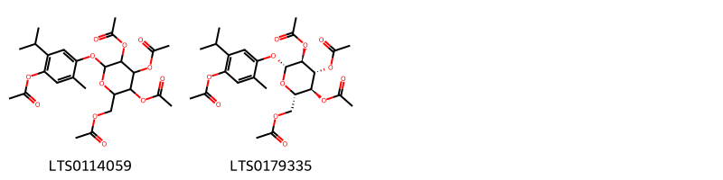{ width=100% }
    <figcaption>Hình ảnh cấu trúc hóa học của 2 hoạt chất thuộc nhóm Carboxylic acids and derivatives gồm ['[3,4,5-tris(acetyloxy)-6-[4-(acetyloxy)-5-isopropyl-2-methylphenoxy]oxan-2-yl]methyl acetate (LTS0114059)', '[(2s,3s,4r,5s,6r)-3,4,5-tris(acetyloxy)-6-[4-(acetyloxy)-5-isopropyl-2-methylphenoxy]oxan-2-yl]methyl acetate (LTS0179335)'].</figcaption>
</figure>
#### Nhóm Organooxygen compounds
<figure markdown="span">
    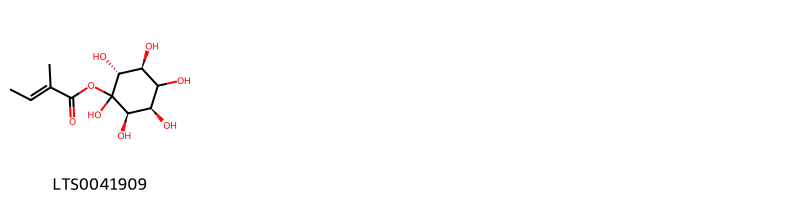{ width=100% }
    <figcaption>Hình ảnh cấu trúc hóa học của 1 hoạt chất thuộc nhóm Organooxygen compounds gồm ['(2r,3r,5s,6r)-1,2,3,4,5,6-hexahydroxycyclohexyl (2e)-2-methylbut-2-enoate (LTS0041909)'].</figcaption>
</figure>
#### Nhóm Oxepanes
<figure markdown="span">
    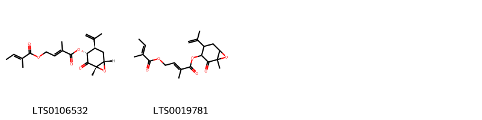{ width=100% }
    <figcaption>Hình ảnh cấu trúc hóa học của 2 hoạt chất thuộc nhóm Oxepanes gồm ['(1s,3r,4r,6s)-1-methyl-2-oxo-4-(prop-1-en-2-yl)-7-oxabicyclo[4.1.0]heptan-3-yl (2e)-2-methyl-4-{[(2e)-2-methylbut-2-enoyl]oxy}but-2-enoate (LTS0106532)', '1-methyl-2-oxo-4-(prop-1-en-2-yl)-7-oxabicyclo[4.1.0]heptan-3-yl 2-methyl-4-[(2-methylbut-2-enoyl)oxy]but-2-enoate (LTS0019781)'].</figcaption>
</figure>
#### Nhóm Prenol lipids
<figure markdown="span">
    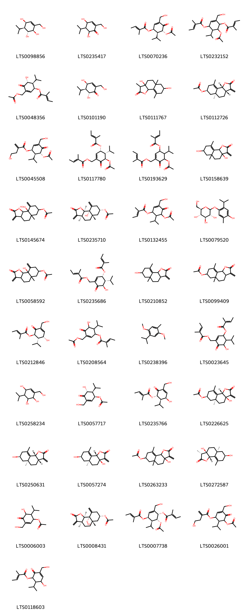{ width=100% }
    <figcaption>Hình ảnh cấu trúc hóa học của 37 hoạt chất thuộc nhóm Prenol lipids gồm ['(1r,2r,3s,4s)-6-(hydroxymethyl)-3-isopropylcyclohex-5-ene-1,2,4-triol (LTS0098856)', '4,6-dihydroxy-2-(hydroxymethyl)-5-isopropylcyclohex-2-en-1-one (LTS0235417)', '(1s,5r,6s)-5-(acetyloxy)-3-(hydroxymethyl)-6-isopropyl-4-oxocyclohex-2-en-1-yl (2e)-2-methylbut-2-enoate (LTS0070236)', '6-(acetyloxy)-2-(hydroxymethyl)-5-isopropyl-4-[(2-methylbut-2-enoyl)oxy]cyclohex-2-en-1-yl 2-methylbut-2-enoate (LTS0232152)', '(1s,5r,6r)-3-[(acetyloxy)methyl]-5-hydroxy-6-isopropyl-4-oxocyclohex-2-en-1-yl (2e)-2-methylbut-2-enoate (LTS0048356)', '(4s,5s,6r)-4,6-dihydroxy-2-(hydroxymethyl)-5-isopropylcyclohex-2-en-1-one (LTS0101190)', '3a,7-dihydroxy-3,5a,9-trimethyl-3h,4h,5h,6h,7h,8h,9bh-naphtho[1,2-b]furan-2-one (LTS0111767)', '(3as,5as,7s,9br)-5a,9-dimethyl-3-methylidene-2-oxo-3ah,4h,5h,6h,7h,8h,9bh-naphtho[1,2-b]furan-7-yl acetate (LTS0112726)', '(1s,5r,6s)-5-(acetyloxy)-3-(hydroxymethyl)-6-isopropyl-4-oxocyclohex-2-en-1-yl 4-hydroxy-2-methylidenebutanoate (LTS0045508)', '[(3s,4s,5r)-5-(acetyloxy)-4-isopropyl-3-{[(2e)-2-methylbut-2-enoyl]oxy}-6-oxocyclohex-1-en-1-yl]methyl (2e)-2-methylbut-2-enoate (LTS0117780)', '[5-(acetyloxy)-4-isopropyl-3-[(2-methylbut-2-enoyl)oxy]-6-oxocyclohex-1-en-1-yl]methyl 2-methylbut-2-enoate (LTS0193629)', '3a,7-dihydroxy-5a,9-dimethyl-3-methylidene-4h,5h,6h,7h,8h,9bh-naphtho[1,2-b]furan-2-one (LTS0158639)', '9a-hydroperoxy-5a-methyl-3,9-dimethylidene-2-oxo-hexahydro-3ah-naphtho[1,2-b]furan-7-yl acetate (LTS0145674)', '(3as,5as,7s,9ar,9br)-9a-hydroxy-5a-methyl-3,9-dimethylidene-2-oxo-hexahydro-3ah-naphtho[1,2-b]furan-7-yl acetate (LTS0235710)', '5-(acetyloxy)-3-(hydroxymethyl)-6-isopropyl-4-oxocyclohex-2-en-1-yl 2-methylbut-2-enoate (LTS0132455)', '(3r,4s,5s,6r)-2-(4-hydroxy-2-isopropyl-5-methylphenoxy)-6-(hydroxymethyl)oxane-3,4,5-triol (LTS0079520)', '9a-hydroxy-5a-methyl-3,9-dimethylidene-2-oxo-hexahydro-3ah-naphtho[1,2-b]furan-7-yl acetate (LTS0058592)', '[(3s,4r,5r)-5-hydroxy-4-isopropyl-3-{[(2e)-2-methylbut-2-enoyl]oxy}-6-oxocyclohex-1-en-1-yl]methyl (2e)-2-methylbut-2-enoate (LTS0235686)', '7-hydroxy-5a,9-dimethyl-3-methylidene-3ah,4h,5h,6h,7h,8h,9bh-naphtho[1,2-b]furan-2-one (LTS0210852)', '5a,9-dimethyl-3-methylidene-2-oxo-3ah,4h,5h,6h,7h,8h,9bh-naphtho[1,2-b]furan-7-yl acetate (LTS0099409)', '(1r,5s,6s)-5-hydroxy-3-(hydroxymethyl)-6-isopropyl-2-oxocyclohex-3-en-1-yl (2e)-2-methylbut-2-enoate (LTS0212846)', '3-[(acetyloxy)methyl]-5-hydroxy-6-isopropyl-4-oxocyclohex-2-en-1-yl 2-methylbut-2-enoate (LTS0208564)', '2,5-dimethoxy-p-cymene (LTS0238396)', '{5-hydroxy-4-isopropyl-3-[(2-methylbut-2-enoyl)oxy]-6-oxocyclohex-1-en-1-yl}methyl 2-methylbut-2-enoate (LTS0023645)', '6-(hydroxymethyl)-3-isopropylcyclohex-5-ene-1,2,4-triol (LTS0258234)', '(1s,5r,6r)-5-hydroxy-3-(hydroxymethyl)-6-isopropyl-4-oxocyclohex-2-en-1-yl acetate (LTS0057717)', '(1s,5r,6r)-5-hydroxy-3-(hydroxymethyl)-6-isopropyl-2-oxocyclohex-3-en-1-yl (2e)-2-methylbut-2-enoate (LTS0235766)', '(3ar,5as,7s,9bs)-3a-hydroxy-5a,9-dimethyl-3-methylidene-2-oxo-4h,5h,6h,7h,8h,9bh-naphtho[1,2-b]furan-7-yl acetate (LTS0226625)', '(3as,5as,7s,9br)-7-hydroxy-5a,9-dimethyl-3-methylidene-3ah,4h,5h,6h,7h,8h,9bh-naphtho[1,2-b]furan-2-one (LTS0250631)', '(3ar,5as,7s,9bs)-3a,7-dihydroxy-5a,9-dimethyl-3-methylidene-4h,5h,6h,7h,8h,9bh-naphtho[1,2-b]furan-2-one (LTS0057274)', '3a-hydroxy-5a,9-dimethyl-3-methylidene-2-oxo-4h,5h,6h,7h,8h,9bh-naphtho[1,2-b]furan-7-yl acetate (LTS0263233)', '(3r,3ar,5as,7s,9bs)-3a,7-dihydroxy-3,5a,9-trimethyl-3h,4h,5h,6h,7h,8h,9bh-naphtho[1,2-b]furan-2-one (LTS0272587)', '5-hydroxy-3-(hydroxymethyl)-6-isopropyl-4-oxocyclohex-2-en-1-yl acetate (LTS0006003)', '(3as,5as,7s,9ar,9br)-9a-hydroperoxy-5a-methyl-3,9-dimethylidene-2-oxo-hexahydro-3ah-naphtho[1,2-b]furan-7-yl acetate (LTS0008431)', '(1s,4s,5s,6r)-6-(acetyloxy)-2-(hydroxymethyl)-5-isopropyl-4-{[(2e)-2-methylbut-2-enoyl]oxy}cyclohex-2-en-1-yl (2e)-2-methylbut-2-enoate (LTS0007738)', '5-(acetyloxy)-3-(hydroxymethyl)-6-isopropyl-4-oxocyclohex-2-en-1-yl 4-hydroxy-2-methylidenebutanoate (LTS0026001)', '5-hydroxy-3-(hydroxymethyl)-6-isopropyl-2-oxocyclohex-3-en-1-yl 2-methylbut-2-enoate (LTS0118603)'].</figcaption>
</figure>
#### Nhóm Steroids and steroid derivatives
<figure markdown="span">
    { width=100% }
    <figcaption>Hình ảnh cấu trúc hóa học của 3 hoạt chất thuộc nhóm Steroids and steroid derivatives gồm ['stigmast-5-en-3-ol (LTS0071224)', 'stigmast-5-en-3-ol, (3β)- (LTS0204616)', 'phytosterol (LTS0029311)'].</figcaption>
</figure>
#### Nhóm Thiophenes
<figure markdown="span">
    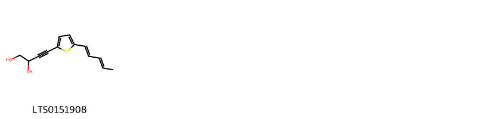{ width=100% }
    <figcaption>Hình ảnh cấu trúc hóa học của 1 hoạt chất thuộc nhóm Thiophenes gồm ['4-{5-[(1e,3e)-penta-1,3-dien-1-yl]thiophen-2-yl}but-3-yne-1,2-diol (LTS0151908)'].</figcaption>
</figure>

---

### Dược dân tộc học

Danh sách các quốc gia có sử dụng *N/A* trong điều trị các bệnh. 

| Country   | Disease   | Bệnh                                                                                                                                                                                                |
|:----------|:----------|:----------------------------------------------------------------------------------------------------------------------------------------------------------------------------------------------------|
| Ethiopia  | Perfume   | MYMEMORY WARNING: YOU USED ALL AVAILABLE FREE TRANSLATIONS FOR TODAY. NEXT AVAILABLE IN  08 HOURS 52 MINUTES 09 SECONDS VISIT HTTPS://MYMEMORY.TRANSLATED.NET/DOC/USAGELIMITS.PHP TO TRANSLATE MORE |

---

# Chi Bellis

??? note "Danh sách các dược liệu thuộc chi"
    
	 - *Bellis perennis*

---
## Bellis perennis
### Thông tin về thực vật

!!! info "Phân loại thực vật của *Bellis perennis* từ GIBF:"
    - **Kingdom:** Plantae
    - **Phylum:** Tracheophyta
    - **Order:** Asterales
    - **Family:** Asteraceae
    - **Genus:** Bellis
    - **Species:** *Bellis perennis*

 

| Label (VI)   | Label (EN)   | Scientific Name   | Descriptions (VI)   | Descriptions (EN)                              | Also Known As (VI)   | Also Known As (EN)                    |
|:-------------|:-------------|:------------------|:--------------------|:-----------------------------------------------|:---------------------|:--------------------------------------|
| N/A          | N/A          | Bellis perennis   |                     | Flowering plant in the daisy family Asteraceae | ['']                 | ['daisy', 'margaritas', 'lawn-daisy'] |

#### Phân bố trên thế giới

**Từ CSDL GIBF** nan, Italy, Australia, Belgium, Argentina, Canada, Ukraine, Denmark, Netherlands, Luxembourg, Spain, Hungary, Portugal, Russian Federation, United States of America, Chile, Czechia, Germany, Switzerland, Isle of Man, Austria, France, United Kingdom of Great Britain and Northern Ireland, Ireland, Poland, New Zealand

#### Phân bố tại Việt Nam

**Từ CSDL GIBF**: Không có ghi nhận ở Việt Nam

---
### Thành phần hóa học
        
- Theo cơ sở dữ liệu lotus: Từ loài *Bellis perennis* đã phân lập và xác định được 281 hoạt chất thuộc về các nhóm Phenol ethers, Fatty Acyls, Naphthalenes, Flavonoids, Prenol lipids, Steroids and steroid derivatives, Cinnamic acids and derivatives, Benzofurans, Benzene and substituted derivatives, Unsaturated hydrocarbons, Polycyclic hydrocarbons, Organooxygen compounds, Tannins, Saturated hydrocarbons, Phenols, Carboxylic acids and derivatives. 

|    | chemicalTaxonomyClassyfireClass     |   smiles_count |
|---:|:------------------------------------|---------------:|
|  0 | Benzene and substituted derivatives |              6 |
|  1 | Benzofurans                         |              1 |
|  2 | Carboxylic acids and derivatives    |              1 |
|  3 | Cinnamic acids and derivatives      |              1 |
|  4 | Fatty Acyls                         |             41 |
|  5 | Flavonoids                          |             29 |
|  6 | Naphthalenes                        |              1 |
|  7 | Organooxygen compounds              |             14 |
|  8 | Phenol ethers                       |              2 |
|  9 | Phenols                             |              3 |
| 10 | Polycyclic hydrocarbons             |              1 |
| 11 | Prenol lipids                       |            168 |
| 12 | Saturated hydrocarbons              |              8 |
| 13 | Steroids and steroid derivatives    |              1 |
| 14 | Tannins                             |              2 |
| 15 | Unsaturated hydrocarbons            |              2 |

#### Nhóm Benzene and substituted derivatives
<figure markdown="span">
    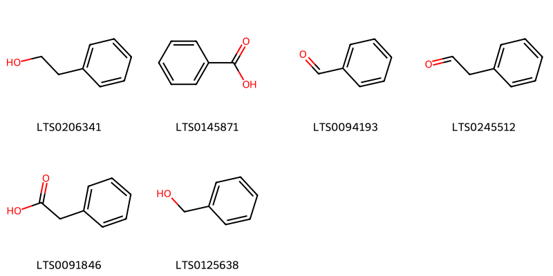{ width=100% }
    <figcaption>Hình ảnh cấu trúc hóa học của 6 hoạt chất thuộc nhóm Benzene and substituted derivatives gồm ['2-phenyl-ethanol (LTS0206341)', 'benzoic acid (LTS0145871)', 'benzaldehyde (LTS0094193)', 'phenylacetaldehyde (LTS0245512)', 'ω-phenylacetic acid (LTS0091846)', 'benzyl alcohol (LTS0125638)'].</figcaption>
</figure>
#### Nhóm Benzofurans
<figure markdown="span">
    { width=100% }
    <figcaption>Hình ảnh cấu trúc hóa học của 1 hoạt chất thuộc nhóm Benzofurans gồm ['dihydroactinidiolide (LTS0041341)'].</figcaption>
</figure>
#### Nhóm Carboxylic acids and derivatives
<figure markdown="span">
    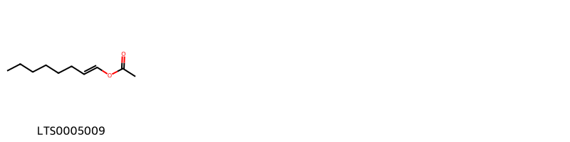{ width=100% }
    <figcaption>Hình ảnh cấu trúc hóa học của 1 hoạt chất thuộc nhóm Carboxylic acids and derivatives gồm ['oct-1-en-1-yl acetate (LTS0005009)'].</figcaption>
</figure>
#### Nhóm Cinnamic acids and derivatives
<figure markdown="span">
    { width=100% }
    <figcaption>Hình ảnh cấu trúc hóa học của 1 hoạt chất thuộc nhóm Cinnamic acids and derivatives gồm ['para-coumaric acid (LTS0266252)'].</figcaption>
</figure>
#### Nhóm Fatty Acyls
<figure markdown="span">
    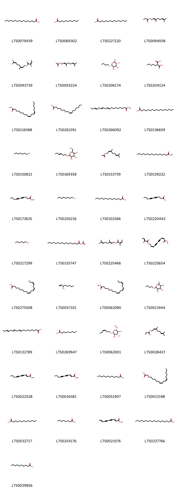{ width=100% }
    <figcaption>Hình ảnh cấu trúc hóa học của 41 hoạt chất thuộc nhóm Fatty Acyls gồm ['palmitic acid (LTS0079439)', 'undecanoic acid (LTS0069302)', 'pentadecanoic acid (LTS0227120)', 'geranyl propionate (LTS0094058)', '(2z)-3,7-dimethylocta-2,6-dien-1-yl (2z)-2-methylbut-2-enoate (LTS0093739)', 'geranyl acetate (LTS0093224)', '(2r,3r,4r,5r,6s)-2-butoxy-6-methyloxane-3,4,5-triol (LTS0206174)', 'pentylmalonic acid (LTS0204124)', 'methyl linoleate (LTS0116588)', 'palmitoleic acid (LTS0261591)', 'methyl elaidolinolenate (LTS0266092)', 'heptadecanoic acid (LTS0136609)', 'heptanol (LTS0150821)', '2-(hex-3-en-1-yloxy)-6-(hydroxymethyl)oxane-3,4,5-triol (LTS0169358)', 'neryl acetate (LTS0153739)', 'methyl palmitate (LTS0139222)', 'methyl deca-4,6-diynoate (LTS0173635)', 'octanol (LTS0250216)', 'myristic acid (LTS0102566)', 'deca-4,6-diynoic acid (LTS0220443)', 'hexanol (LTS0217299)', 'isopropyl palmitate (LTS0155747)', '(2e)-3,7-dimethylocta-2,6-dien-1-yl (2z)-2-methylbut-2-enoate (LTS0225466)', 'methyl (2z,8z)-10-{[(2e)-2-methylbut-2-enoyl]oxy}deca-2,8-dien-4,6-diynoate (LTS0225654)', 'α-linolenic acid (LTS0275508)', '1-octen-3-ol (LTS0057101)', 'methyl linolenate (LTS0062080)', '2-butoxy-6-methyloxane-3,4,5-triol (LTS0011944)', 'α linolenic acid (LTS0132789)', 'nonanoic acid (LTS0269947)', '(2r,3r,4s,5s,6r)-2-[(3z)-hex-3-en-1-yloxy]-6-(hydroxymethyl)oxane-3,4,5-triol (LTS0062001)', 'neryl propionate (LTS0028437)', 'methyl dec-2-en-4,6-diynoate (LTS0022528)', 'lachnophyllum ester (LTS0016581)', 'lauric acid (LTS0051907)', 'linoleic (LTS0013198)', 'n-tridecanoic acid (LTS0032717)', 'caprylic acid (LTS0254176)', 'methyl (2e,8e)-deca-2,8-dien-4,6-diynoate (LTS0021076)', 'stearic acid (LTS0237766)', 'capric acid (LTS0039856)'].</figcaption>
</figure>
#### Nhóm Flavonoids
<figure markdown="span">
    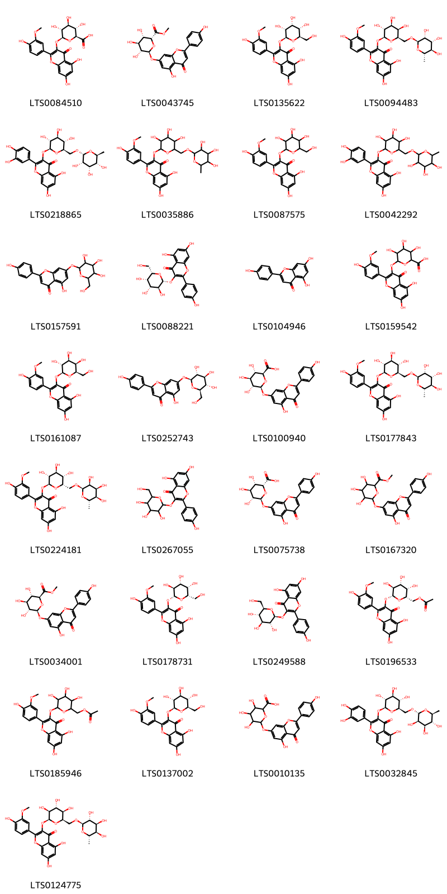{ width=100% }
    <figcaption>Hình ảnh cấu trúc hóa học của 29 hoạt chất thuộc nhóm Flavonoids gồm ['isorhamnetin-3-glucuronide (LTS0084510)', 'methyl (2r,3s,4s,5r,6s)-3,4,5-trihydroxy-6-{[5-hydroxy-2-(4-hydroxyphenyl)-4-oxochromen-7-yl]oxy}oxane-2-carboxylate (LTS0043745)', 'isorhamnetin 3-glucoside (LTS0135622)', '5,7-dihydroxy-2-(4-hydroxy-3-methoxyphenyl)-3-{[(2s,3r,4s,5r,6r)-3,4,5-trihydroxy-6-({[(2r,3r,4r,5r,6s)-3,4,5-trihydroxy-6-methyloxan-2-yl]oxy}methyl)oxan-2-yl]oxy}chromen-4-one (LTS0094483)', '2-(3,4-dihydroxyphenyl)-5,7-dihydroxy-3-{[(2s,3r,4s,5s,6r)-3,4,5-trihydroxy-6-({[(2r,3s,4s,5r,6s)-3,4,5-trihydroxy-6-methyloxan-2-yl]oxy}methyl)oxan-2-yl]oxy}chromen-4-one (LTS0218865)', '5,7-dihydroxy-2-(4-hydroxy-3-methoxyphenyl)-3-[(3,4,5-trihydroxy-6-{[(3,4,5-trihydroxy-6-methyloxan-2-yl)oxy]methyl}oxan-2-yl)oxy]chromen-4-one (LTS0035886)', 'isorhamnetin 3-galactoside (LTS0087575)', 'rutin (LTS0042292)', 'apigetrin (LTS0157591)', '5,7-dihydroxy-2-(4-hydroxyphenyl)-3-{[(2r,3s,4r,5s,6s)-3,4,5-trihydroxy-6-(hydroxymethyl)oxan-2-yl]oxy}chromen-4-one (LTS0088221)', 'chamomile (LTS0104946)', '6-{[5,7-dihydroxy-2-(4-hydroxy-3-methoxyphenyl)-4-oxochromen-3-yl]oxy}-3,4,5-trihydroxyoxane-2-carboxylic acid (LTS0159542)', 'cacticin (LTS0161087)', 'apigenin 7-o-β-glucoside (LTS0252743)', '(2s,3s,4s,5r,6s)-3,4,5-trihydroxy-6-{[5-hydroxy-2-(4-hydroxyphenyl)-4-oxochromen-7-yl]oxy}oxane-2-carboxylic acid (LTS0100940)', 'narcissin (LTS0177843)', '5,7-dihydroxy-2-(4-hydroxy-3-methoxyphenyl)-3-{[(2s,3r,4s,5s,6s)-3,4,5-trihydroxy-6-({[(2r,3s,4s,5r,6s)-3,4,5-trihydroxy-6-methyloxan-2-yl]oxy}methyl)oxan-2-yl]oxy}chromen-4-one (LTS0224181)', 'trifolin (LTS0267055)', '(2r,3s,4s,5r,6s)-3,4,5-trihydroxy-6-{[5-hydroxy-2-(4-hydroxyphenyl)-4-oxochromen-7-yl]oxy}oxane-2-carboxylic acid (LTS0075738)', 'methyl 3,4,5-trihydroxy-6-{[5-hydroxy-2-(4-hydroxyphenyl)-4-oxochromen-7-yl]oxy}oxane-2-carboxylate (LTS0167320)', 'methyl (2s,3s,4s,5r,6s)-3,4,5-trihydroxy-6-{[5-hydroxy-2-(4-hydroxyphenyl)-4-oxochromen-7-yl]oxy}oxane-2-carboxylate (LTS0034001)', '5,7-dihydroxy-2-(4-hydroxy-3-methoxyphenyl)-3-{[(2r,3s,4r,5s,6s)-3,4,5-trihydroxy-6-(hydroxymethyl)oxan-2-yl]oxy}chromen-4-one (LTS0178731)', 'astragalin (LTS0249588)', '[(2s,3s,4r,5s,6r)-6-{[5,7-dihydroxy-2-(4-hydroxy-3-methoxyphenyl)-4-oxochromen-3-yl]oxy}-3,4,5-trihydroxyoxan-2-yl]methyl acetate (LTS0196533)', '(6-{[5,7-dihydroxy-2-(4-hydroxy-3-methoxyphenyl)-4-oxochromen-3-yl]oxy}-3,4,5-trihydroxyoxan-2-yl)methyl acetate (LTS0185946)', 'isorhamnetin 3-o-glucoside (LTS0137002)', '3,4,5-trihydroxy-6-{[5-hydroxy-2-(4-hydroxyphenyl)-4-oxochromen-7-yl]oxy}oxane-2-carboxylic acid (LTS0010135)', '3-rutinosyl quercetin (LTS0032845)', '5,7-dihydroxy-2-(4-hydroxy-3-methoxyphenyl)-3-{[(2s,3s,4r,5r,6r)-3,4,5-trihydroxy-6-({[(2r,3r,4s,5r,6s)-3,4,5-trihydroxy-6-methyloxan-2-yl]oxy}methyl)oxan-2-yl]oxy}chromen-4-one (LTS0124775)'].</figcaption>
</figure>
#### Nhóm Naphthalenes
<figure markdown="span">
    { width=100% }
    <figcaption>Hình ảnh cấu trúc hóa học của 1 hoạt chất thuộc nhóm Naphthalenes gồm ['naphthalene (LTS0254484)'].</figcaption>
</figure>
#### Nhóm Organooxygen compounds
<figure markdown="span">
    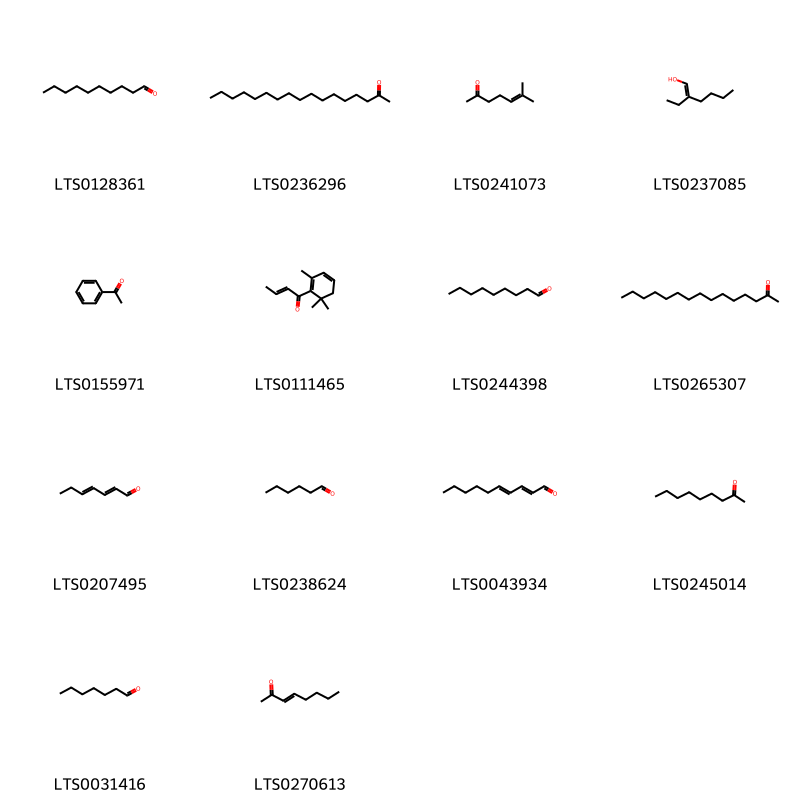{ width=100% }
    <figcaption>Hình ảnh cấu trúc hóa học của 14 hoạt chất thuộc nhóm Organooxygen compounds gồm ['decanal (LTS0128361)', '2-heptadecanone (LTS0236296)', '6-methyl-5-hepten-2-one (LTS0241073)', '2-ethylhex-1-en-1-ol (LTS0237085)', 'acetophenone (LTS0155971)', 'damascenone (LTS0111465)', 'nonanal (LTS0244398)', '2-pentadecanone (LTS0265307)', '2,4-heptadienal (LTS0207495)', 'hexanal (LTS0238624)', 'deca-2,4-dienal (LTS0043934)', '2-nonanone (LTS0245014)', 'heptanal (LTS0031416)', '3-octen-2-one (LTS0270613)'].</figcaption>
</figure>
#### Nhóm Phenol ethers
<figure markdown="span">
    { width=100% }
    <figcaption>Hình ảnh cấu trúc hóa học của 2 hoạt chất thuộc nhóm Phenol ethers gồm ['p-propenylanisole (LTS0177188)', 'anethole (LTS0033696)'].</figcaption>
</figure>
#### Nhóm Phenols
<figure markdown="span">
    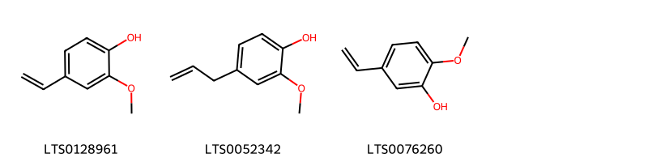{ width=100% }
    <figcaption>Hình ảnh cấu trúc hóa học của 3 hoạt chất thuộc nhóm Phenols gồm ['2-methoxy-4-vinyl-phenol (LTS0128961)', 'eugenol (LTS0052342)', '5-ethenyl-2-methoxyphenol (LTS0076260)'].</figcaption>
</figure>
#### Nhóm Polycyclic hydrocarbons
<figure markdown="span">
    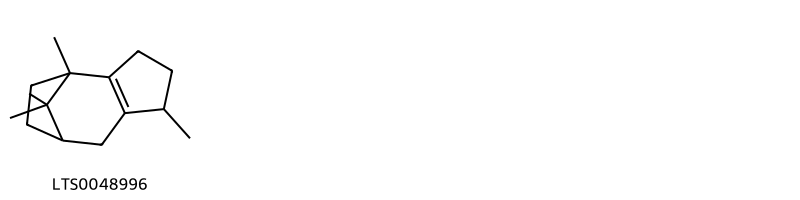{ width=100% }
    <figcaption>Hình ảnh cấu trúc hóa học của 1 hoạt chất thuộc nhóm Polycyclic hydrocarbons gồm ['1,5,11,11-tetramethyltricyclo[6.2.1.0²,⁶]undec-2(6)-ene (LTS0048996)'].</figcaption>
</figure>
#### Nhóm Prenol lipids
<figure markdown="span">
    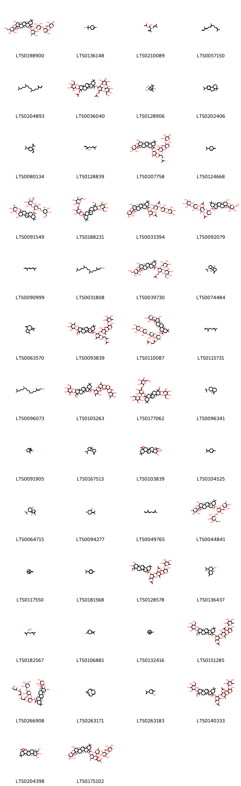{ width=100% }
    <figcaption>Hình ảnh cấu trúc hóa học của 168 hoạt chất thuộc nhóm Prenol lipids gồm ['(2s,3r,4s,5r,6r)-3-{[(2s,3r,4s,5r,6s)-5-{[(2s,3r,4s,5r)-3,5-dihydroxy-4-{[(2s,3r,4r,5r,6s)-3,4,5-trihydroxy-6-methyloxan-2-yl]oxy}oxan-2-yl]oxy}-3,4-dihydroxy-6-methyloxan-2-yl]oxy}-4,5-dihydroxy-6-methyloxan-2-yl (4ar,5r,6as,6br,8ar,9r,10r,11s,12ar,12br,14bs)-5,11-dihydroxy-9-(hydroxymethyl)-2,2,6a,6b,9,12a-hexamethyl-10-{[(2r,3r,4s,5s,6r)-3,4,5-trihydroxy-6-(hydroxymethyl)oxan-2-yl]oxy}-1,3,4,5,6,7,8,8a,10,11,12,12b,13,14b-tetradecahydropicene-4a-carboxylate (LTS0198900)', 'terpineol (LTS0136148)', '(2r)-1-hydroxy-5-methyl-2-(prop-1-en-2-yl)hex-4-en-1-yl acetate (LTS0210089)', 'farnesene (LTS0057150)', '7,11,15-trimethyl-3-methylidenehexadec-1-ene (LTS0204893)', '6-[(acetyloxy)methyl]-5-hydroxy-4-{[3,4,5-trihydroxy-6-(hydroxymethyl)oxan-2-yl]oxy}-3-[(3,4,5-trihydroxy-6-methyloxan-2-yl)oxy]oxan-2-yl 9-[(acetyloxy)methyl]-11-hydroxy-2,2,6a,6b,9,12a-hexamethyl-10-{[3,4,5-trihydroxy-6-(hydroxymethyl)oxan-2-yl]oxy}-1,3,4,5,6,7,8,8a,10,11,12,12b,13,14b-tetradecahydropicene-4a-carboxylate (LTS0036040)', '(r)-cis-verbenol (LTS0128906)', 'abietatriene (LTS0202406)', '4-ethenyl-1-isopropyl-4-methyl-3-(prop-1-en-2-yl)cyclohex-1-ene (LTS0080134)', 'linalool, (+-)- (LTS0128839)', '(2s,3r,4s,5s,6r)-4-{[(3s)-3-(acetyloxy)butanoyl]oxy}-3-{[(2s,3r,4s,5r,6s)-5-{[(2s,3r,4s,5r)-3,5-dihydroxy-4-{[(2s,3r,4r,5r,6s)-3,4,5-trihydroxy-6-methyloxan-2-yl]oxy}oxan-2-yl]oxy}-3,4-dihydroxy-6-methyloxan-2-yl]oxy}-5-hydroxy-6-methyloxan-2-yl (4ar,5r,6as,6br,8ar,9r,10r,11s,12as,12br,14bs)-5,11-dihydroxy-9-(hydroxymethyl)-2,2,6a,6b,9,12a-hexamethyl-10-{[(2s,3r,4r,5r,6s)-3,4,5-trihydroxy-6-methyloxan-2-yl]oxy}-1,3,4,5,6,7,8,8a,10,11,12,12b,13,14b-tetradecahydropicene-4a-carboxylate (LTS0207758)', 'β phellandrene (LTS0124668)', '(2s,3r,4s,5s,6r)-4,5-dihydroxy-6-({[(1r,2r,3s,4r,5r)-2,3,4-trihydroxy-5-(hydroxymethyl)cyclohexyl]oxy}methyl)-3-{[(2s,3r,4s,5s,6r)-3,4,5-trihydroxy-6-(hydroxymethyl)oxan-2-yl]oxy}oxan-2-yl (4as,6as,6br,8ar,9r,10r,11s,12ar,12br,14bs)-11-hydroxy-9-(hydroxymethyl)-2,2,6a,6b,9,12a-hexamethyl-10-{[(2s,3r,4r,5r,6s)-3,4,5-trihydroxy-6-methyloxan-2-yl]oxy}-1,3,4,5,6,7,8,8a,10,11,12,12b,13,14b-tetradecahydropicene-4a-carboxylate (LTS0091549)', '3,4,5-trihydroxy-6-({[3,4,5-trihydroxy-6-(hydroxymethyl)oxan-2-yl]oxy}methyl)oxan-2-yl 11-hydroxy-9-(hydroxymethyl)-2,2,6a,6b,9,12a-hexamethyl-10-{[3,4,5-trihydroxy-6-(hydroxymethyl)oxan-2-yl]oxy}-1,3,4,5,6,7,8,8a,10,11,12,12b,13,14b-tetradecahydropicene-4a-carboxylate (LTS0188231)', '(2s,3r,4s,5r,6r)-5-(acetyloxy)-3-{[(2s,3r,4s,5s,6s)-4-(acetyloxy)-5-{[(2s,3r,4s,5r)-3,5-dihydroxy-4-{[(2s,3r,4r,5r,6s)-3,4,5-trihydroxy-6-methyloxan-2-yl]oxy}oxan-2-yl]oxy}-3-hydroxy-6-methyloxan-2-yl]oxy}-4-hydroxy-6-methyloxan-2-yl (4ar,5r,6as,6br,8ar,9r,10r,11s,12ar,12br,14bs)-5,11-dihydroxy-9-(hydroxymethyl)-2,2,6a,6b,9,12a-hexamethyl-10-{[(2s,3r,4r,5r,6s)-3,4,5-trihydroxy-6-methyloxan-2-yl]oxy}-1,3,4,5,6,7,8,8a,10,11,12,12b,13,14b-tetradecahydropicene-4a-carboxylate (LTS0033394)', '(2s,3r,4s,5r,6r)-5-(acetyloxy)-3-{[(2s,3r,4r,5r,6s)-3-(acetyloxy)-5-{[(2s,3r,4s,5r)-3,5-dihydroxy-4-{[(2s,3r,4r,5r,6s)-3,4,5-trihydroxy-6-methyloxan-2-yl]oxy}oxan-2-yl]oxy}-4-hydroxy-6-methyloxan-2-yl]oxy}-4-hydroxy-6-methyloxan-2-yl (4ar,5r,6as,6br,8ar,9r,10r,11s,12ar,12br,14bs)-5,11-dihydroxy-9-(hydroxymethyl)-2,2,6a,6b,9,12a-hexamethyl-10-{[(2r,3r,4s,5s,6r)-3,4,5-trihydroxy-6-(hydroxymethyl)oxan-2-yl]oxy}-1,3,4,5,6,7,8,8a,10,11,12,12b,13,14b-tetradecahydropicene-4a-carboxylate (LTS0092079)', 'allo-ocimene (LTS0090999)', 'phytol (LTS0031808)', '(2s,3r,4s,5r,6r)-6-[(acetyloxy)methyl]-5-hydroxy-4-{[(2s,3r,4s,5r,6r)-3,4,5-trihydroxy-6-(hydroxymethyl)oxan-2-yl]oxy}-3-{[(2s,3r,4r,5r,6s)-3,4,5-trihydroxy-6-methyloxan-2-yl]oxy}oxan-2-yl (4as,6as,6br,8ar,9r,10r,11s,12as,12br,14bs)-11-hydroxy-9-(hydroxymethyl)-2,2,6a,6b,9,12a-hexamethyl-10-{[(2r,3r,4s,5s,6r)-3,4,5-trihydroxy-6-(hydroxymethyl)oxan-2-yl]oxy}-1,3,4,5,6,7,8,8a,10,11,12,12b,13,14b-tetradecahydropicene-4a-carboxylate (LTS0039730)', 'β-bourbonene (LTS0074484)', '1,1,7-trimethyl-4-methylidene-octahydro-1ah-cyclopropa[e]azulene (LTS0063570)', '4-{[3-(acetyloxy)butanoyl]oxy}-3-{[5-({3,5-dihydroxy-4-[(3,4,5-trihydroxy-6-methyloxan-2-yl)oxy]oxan-2-yl}oxy)-3,4-dihydroxy-6-methyloxan-2-yl]oxy}-5-hydroxy-6-methyloxan-2-yl 5,11-dihydroxy-9-(hydroxymethyl)-2,2,6a,6b,9,12a-hexamethyl-10-[(3,4,5-trihydroxy-6-methyloxan-2-yl)oxy]-1,3,4,5,6,7,8,8a,10,11,12,12b,13,14b-tetradecahydropicene-4a-carboxylate (LTS0093839)', '(2s,3r,4s,5r,6r)-5-{[(3s)-3-(acetyloxy)butanoyl]oxy}-3-{[(2s,3r,4s,5r,6s)-5-{[(2s,3r,4s,5r)-3,5-dihydroxy-4-{[(2s,3r,4r,5r,6s)-3,4,5-trihydroxy-6-methyloxan-2-yl]oxy}oxan-2-yl]oxy}-3,4-dihydroxy-6-methyloxan-2-yl]oxy}-4-hydroxy-6-methyloxan-2-yl (4ar,5r,6as,6br,8ar,9r,10r,11s,12ar,12br,14bs)-5,11-dihydroxy-9-(hydroxymethyl)-2,2,6a,6b,9,12a-hexamethyl-10-{[(2s,3r,4r,5r,6s)-3,4,5-trihydroxy-6-methyloxan-2-yl]oxy}-1,3,4,5,6,7,8,8a,10,11,12,12b,13,14b-tetradecahydropicene-4a-carboxylate (LTS0110087)', 'α-myrcene (LTS0115731)', 'phytol (LTS0096073)', '3-{[5-({3,5-dihydroxy-4-[(3,4,5-trihydroxy-6-methyloxan-2-yl)oxy]oxan-2-yl}oxy)-3,4-dihydroxy-6-methyloxan-2-yl]oxy}-4,5-dihydroxy-6-methyloxan-2-yl 5,11-dihydroxy-9-(hydroxymethyl)-2,2,6a,6b,9,12a-hexamethyl-10-{[3,4,5-trihydroxy-6-(hydroxymethyl)oxan-2-yl]oxy}-1,3,4,5,6,7,8,8a,10,11,12,12b,13,14b-tetradecahydropicene-4a-carboxylate (LTS0105263)', '4,5-dihydroxy-3-{[3,4,5-trihydroxy-6-(hydroxymethyl)oxan-2-yl]oxy}-6-({[3,4,5-trihydroxy-6-(hydroxymethyl)oxan-2-yl]oxy}methyl)oxan-2-yl 11-hydroxy-9-(hydroxymethyl)-2,2,6a,6b,9,12a-hexamethyl-10-{[3,4,5-trihydroxy-6-(hydroxymethyl)oxan-2-yl]oxy}-1,3,4,5,6,7,8,8a,10,11,12,12b,13,14b-tetradecahydropicene-4a-carboxylate (LTS0177062)', 'β-selinene (LTS0096341)', 'camphor (LTS0091905)', 'β-bourbonene (LTS0167513)', '5,10,11-trihydroxy-9-(hydroxymethyl)-2,2,6a,6b,9,12a-hexamethyl-1,3,4,5,6,7,8,8a,10,11,12,12b,13,14b-tetradecahydropicene-4a-carboxylic acid (LTS0103839)', 'terpinolene (LTS0104525)', '(1s,5r,7s,10r)-7-isopropyl-4,10-dimethyltricyclo[4.4.0.0¹,⁵]dec-3-ene (LTS0064715)', '(+)-pulegone (LTS0094277)', 'trans-β-ocimene (LTS0049765)', '(2r,3r,4s,5r,6s)-4,5-dihydroxy-6-({[(2s,3s,4r,5s,6s)-3,4,5-trihydroxy-6-(hydroxymethyl)oxan-2-yl]oxy}methyl)-3-{[(2s,3s,4s,5s,6s)-3,4,5-trihydroxy-6-methyloxan-2-yl]oxy}oxan-2-yl (4as,5s,6ar,6bs,8ar,9r,10r,11r,12as,12bs,14br)-5,11-dihydroxy-9-(hydroxymethyl)-2,2,6a,6b,9,12a-hexamethyl-10-{[(2r,3r,4r,5r,6r)-3,4,5-trihydroxy-6-methyloxan-2-yl]oxy}-1,3,4,5,6,7,8,8a,10,11,12,12b,13,14b-tetradecahydropicene-4a-carboxylate (LTS0044841)', 'β-pinene (LTS0117550)', 'cymene (LTS0181568)', '5-(acetyloxy)-3-{[3-(acetyloxy)-5-({3,5-dihydroxy-4-[(3,4,5-trihydroxy-6-methyloxan-2-yl)oxy]oxan-2-yl}oxy)-4-hydroxy-6-methyloxan-2-yl]oxy}-4-hydroxy-6-methyloxan-2-yl 5,10,11-trihydroxy-9-(hydroxymethyl)-2,2,6a,6b,9,12a-hexamethyl-1,3,4,5,6,7,8,8a,10,11,12,12b,13,14b-tetradecahydropicene-4a-carboxylate (LTS0128578)', '(1r,4ar,8as)-4-isopropyl-1,6-dimethyl-3,4,4a,7,8,8a-hexahydro-2h-naphthalen-1-ol (LTS0136437)', '(-)-lavandulol (LTS0182567)', 'monoterpenes (LTS0106881)', 'α pinene (LTS0132416)', '5-(acetyloxy)-3-{[4-(acetyloxy)-5-({3,5-dihydroxy-4-[(3,4,5-trihydroxy-6-methyloxan-2-yl)oxy]oxan-2-yl}oxy)-3-hydroxy-6-methyloxan-2-yl]oxy}-4-hydroxy-6-methyloxan-2-yl 5,11-dihydroxy-9-(hydroxymethyl)-2,2,6a,6b,9,12a-hexamethyl-10-{[3,4,5-trihydroxy-6-(hydroxymethyl)oxan-2-yl]oxy}-1,3,4,5,6,7,8,8a,10,11,12,12b,13,14b-tetradecahydropicene-4a-carboxylate (LTS0151285)', '(2s,3r,4s,5r,6r)-3-{[(2s,3r,4s,5r,6s)-3,4-dihydroxy-6-methyl-5-{[(2s,3r,4s,5r)-3,4,5-trihydroxyoxan-2-yl]oxy}oxan-2-yl]oxy}-4-hydroxy-5-{[(3s)-3-{[(3s)-3-{[(3s)-3-hydroxybutanoyl]oxy}butanoyl]oxy}butanoyl]oxy}-6-methyloxan-2-yl (4ar,5r,6as,6br,8ar,9r,10r,11s,12ar,12br,14bs)-5,11-dihydroxy-9-(hydroxymethyl)-2,2,6a,6b,9,12a-hexamethyl-10-{[(2s,3r,4r,5r,6s)-3,4,5-trihydroxy-6-methyloxan-2-yl]oxy}-1,3,4,5,6,7,8,8a,10,11,12,12b,13,14b-tetradecahydropicene-4a-carboxylate (LTS0266908)', 'humulene (LTS0263171)', 'carveol (LTS0263183)', '5-(acetyloxy)-3-{[3-(acetyloxy)-5-({3,5-dihydroxy-4-[(3,4,5-trihydroxy-6-methyloxan-2-yl)oxy]oxan-2-yl}oxy)-4-hydroxy-6-methyloxan-2-yl]oxy}-4-hydroxy-6-methyloxan-2-yl 5,11-dihydroxy-9-(hydroxymethyl)-2,2,6a,6b,9,12a-hexamethyl-10-{[3,4,5-trihydroxy-6-(hydroxymethyl)oxan-2-yl]oxy}-1,3,4,5,6,7,8,8a,10,11,12,12b,13,14b-tetradecahydropicene-4a-carboxylate (LTS0140333)', '(4ar,5r,6as,6br,8ar,9r,10r,11s,12ar,12br,14bs)-5,10,11-trihydroxy-9-(hydroxymethyl)-2,2,6a,6b,9,12a-hexamethyl-1,3,4,5,6,7,8,8a,10,11,12,12b,13,14b-tetradecahydropicene-4a-carboxylic acid (LTS0204398)', '(2s,3r,4s,5r,6r)-3-{[(2s,3r,4r,5r,6s)-3-(acetyloxy)-5-{[(2s,3r,4s,5r)-3,5-dihydroxy-4-{[(2s,3r,4r,5r,6s)-3,4,5-trihydroxy-6-methyloxan-2-yl]oxy}oxan-2-yl]oxy}-4-hydroxy-6-methyloxan-2-yl]oxy}-4-hydroxy-5-{[(3s)-3-hydroxybutanoyl]oxy}-6-methyloxan-2-yl (4ar,5r,6as,6br,8ar,9r,10r,11s,12ar,12br,14bs)-5,11-dihydroxy-9-(hydroxymethyl)-2,2,6a,6b,9,12a-hexamethyl-10-{[(2s,3r,4r,5r,6s)-3,4,5-trihydroxy-6-methyloxan-2-yl]oxy}-1,3,4,5,6,7,8,8a,10,11,12,12b,13,14b-tetradecahydropicene-4a-carboxylate (LTS0175102)', '4-isopropyl-1,6-dimethyl-2,3,4,4a,7,8-hexahydronaphthalene (LTS0270743)', '(1as,4ar,7as,7br)-1,1,7-trimethyl-4-methylidene-octahydro-1ah-cyclopropa[e]azulene (LTS0145331)', '(1r,6s)-6-isopropyl-3-methylcyclohex-2-en-1-ol (LTS0144582)', '4-isopropyl-1,6-dimethyl-3,4,4a,7,8,8a-hexahydronaphthalene (LTS0154650)', '(5s)-1-isopropyl-4-methylidenebicyclo[3.1.0]hexane (LTS0129854)', '5-(but-2-enoyloxy)-3-{[5-({3,5-dihydroxy-4-[(3,4,5-trihydroxy-6-methyloxan-2-yl)oxy]oxan-2-yl}oxy)-3,4-dihydroxy-6-methyloxan-2-yl]oxy}-4-hydroxy-6-methyloxan-2-yl 5-hydroxy-9-(hydroxymethyl)-2,2,6a,6b,9,12a-hexamethyl-10-[(3,4,5-trihydroxy-6-methyloxan-2-yl)oxy]-1,3,4,5,6,7,8,8a,10,11,12,12b,13,14b-tetradecahydropicene-4a-carboxylate (LTS0152932)', 'citronella (LTS0151257)', '(2s,3r,4s,5r,6r)-3-{[(2s,3r,4r,5r,6s)-3-(acetyloxy)-5-{[(2s,3r,4s,5r)-3,5-dihydroxy-4-{[(2s,3r,4r,5r,6s)-3,4,5-trihydroxy-6-methyloxan-2-yl]oxy}oxan-2-yl]oxy}-4-hydroxy-6-methyloxan-2-yl]oxy}-4-hydroxy-5-{[(3s)-3-{[(3s)-3-{[(3s)-3-{[(3s)-3-hydroxybutanoyl]oxy}butanoyl]oxy}butanoyl]oxy}butanoyl]oxy}-6-methyloxan-2-yl (4ar,5r,6as,6br,8ar,9r,10r,11s,12as,12br,14bs)-5,11-dihydroxy-9-(hydroxymethyl)-2,2,6a,6b,9,12a-hexamethyl-10-{[(2s,3r,4r,5r,6s)-3,4,5-trihydroxy-6-methyloxan-2-yl]oxy}-1,3,4,5,6,7,8,8a,10,11,12,12b,13,14b-tetradecahydropicene-4a-carboxylate (LTS0190724)', 'limonene,  (LTS0155981)', 'bayogenin (LTS0140065)', 'germacrene b (LTS0265072)', '6-[(acetyloxy)methyl]-5-hydroxy-4-{[3,4,5-trihydroxy-6-(hydroxymethyl)oxan-2-yl]oxy}-3-[(3,4,5-trihydroxy-6-methyloxan-2-yl)oxy]oxan-2-yl 9-[(acetyloxy)methyl]-10,11-dihydroxy-2,2,6a,6b,9,12a-hexamethyl-1,3,4,5,6,7,8,8a,10,11,12,12b,13,14b-tetradecahydropicene-4a-carboxylate (LTS0141194)', 'hederagenin (LTS0157813)', 'β-ionone (LTS0155301)', '(2s,3r,4s,5r,6r)-5-{[(3s)-3-(acetyloxy)butanoyl]oxy}-3-{[(2s,3r,4s,5r,6s)-5-{[(2s,3r,4s,5r)-3,5-dihydroxy-4-{[(2s,3r,4r,5r,6s)-3,4,5-trihydroxy-6-methyloxan-2-yl]oxy}oxan-2-yl]oxy}-3,4-dihydroxy-6-methyloxan-2-yl]oxy}-4-hydroxy-6-methyloxan-2-yl (4ar,5r,6as,6br,8ar,9r,10r,11s,12as,12br,14bs)-5,11-dihydroxy-9-(hydroxymethyl)-2,2,6a,6b,9,12a-hexamethyl-10-{[(2s,3r,4r,5r,6s)-3,4,5-trihydroxy-6-methyloxan-2-yl]oxy}-1,3,4,5,6,7,8,8a,10,11,12,12b,13,14b-tetradecahydropicene-4a-carboxylate (LTS0155672)', 'pinocarvone (LTS0084836)', 'elemene (LTS0090837)', '(2s,3r,4s,5r,6r)-5-hydroxy-6-(hydroxymethyl)-4-{[(2s,3r,4s,5s,6r)-3,4,5-trihydroxy-6-(hydroxymethyl)oxan-2-yl]oxy}-3-{[(2s,3r,4r,5r,6s)-3,4,5-trihydroxy-6-methyloxan-2-yl]oxy}oxan-2-yl (4as,6as,6br,8ar,9r,10r,11s,12ar,12br,14bs)-9-[(acetyloxy)methyl]-11-hydroxy-2,2,6a,6b,9,12a-hexamethyl-10-{[(2r,3r,4s,5s,6r)-3,4,5-trihydroxy-6-(hydroxymethyl)oxan-2-yl]oxy}-1,3,4,5,6,7,8,8a,10,11,12,12b,13,14b-tetradecahydropicene-4a-carboxylate (LTS0256410)', '(2s,3r,4s,5r,6r)-5-hydroxy-6-(hydroxymethyl)-4-{[(2s,3r,4s,5r,6r)-3,4,5-trihydroxy-6-(hydroxymethyl)oxan-2-yl]oxy}-3-{[(2s,3r,4r,5r,6s)-3,4,5-trihydroxy-6-methyloxan-2-yl]oxy}oxan-2-yl (4as,6as,6br,8ar,9r,10r,11s,12ar,12br,14bs)-9-[(acetyloxy)methyl]-11-hydroxy-2,2,6a,6b,9,12a-hexamethyl-10-{[(2r,3r,4s,5s,6r)-3,4,5-trihydroxy-6-(hydroxymethyl)oxan-2-yl]oxy}-1,3,4,5,6,7,8,8a,10,11,12,12b,13,14b-tetradecahydropicene-4a-carboxylate (LTS0157150)', '(2s,3r,4s,5r,6r)-3-{[(2s,3r,4r,5r,6s)-3-(acetyloxy)-5-{[(2s,3r,4s,5r)-3,5-dihydroxy-4-{[(2s,3r,4r,5r,6s)-3,4,5-trihydroxy-6-methyloxan-2-yl]oxy}oxan-2-yl]oxy}-4-hydroxy-6-methyloxan-2-yl]oxy}-4-hydroxy-5-{[(3s)-3-{[(3s)-3-{[(3s)-3-{[(3s)-3-hydroxybutanoyl]oxy}butanoyl]oxy}butanoyl]oxy}butanoyl]oxy}-6-methyloxan-2-yl (4ar,5r,6as,6br,8ar,9r,10r,11s,12as,12br,14bs)-5,10,11-trihydroxy-9-(hydroxymethyl)-2,2,6a,6b,9,12a-hexamethyl-1,3,4,5,6,7,8,8a,10,11,12,12b,13,14b-tetradecahydropicene-4a-carboxylate (LTS0143096)', 'α-ylangene (LTS0254603)', '(4ar,6as,6br,12ar,12br,14bs)-5,10-dihydroxy-2,2,6a,6b,9,9,12a-heptamethyl-1,3,4,5,6,7,8,8a,10,11,12,12b,13,14b-tetradecahydropicene-4a-carboxylic acid (LTS0224345)', '(2s,3r,4s,5r,6r)-6-[(acetyloxy)methyl]-5-hydroxy-4-{[(2s,3r,4s,5r,6r)-3,4,5-trihydroxy-6-(hydroxymethyl)oxan-2-yl]oxy}-3-{[(2s,3r,4r,5r,6s)-3,4,5-trihydroxy-6-methyloxan-2-yl]oxy}oxan-2-yl (4as,6as,6br,8ar,9r,10r,11s,12ar,12br,14bs)-11-hydroxy-9-(hydroxymethyl)-2,2,6a,6b,9,12a-hexamethyl-10-{[(2r,3r,4s,5s,6r)-3,4,5-trihydroxy-6-(hydroxymethyl)oxan-2-yl]oxy}-1,3,4,5,6,7,8,8a,10,11,12,12b,13,14b-tetradecahydropicene-4a-carboxylate (LTS0143403)', '(2s,3r,4s,5r,6r)-3-{[(2s,3r,4s,5r,6s)-5-{[(2s,3r,4s,5r)-3,5-dihydroxy-4-{[(2s,3r,4r,5r,6s)-3,4,5-trihydroxy-6-methyloxan-2-yl]oxy}oxan-2-yl]oxy}-3,4-dihydroxy-6-methyloxan-2-yl]oxy}-4-hydroxy-5-{[(3s)-3-hydroxybutanoyl]oxy}-6-methyloxan-2-yl (4ar,5r,6as,6br,8ar,9r,10r,11s,12ar,12br,14bs)-5,11-dihydroxy-9-(hydroxymethyl)-2,2,6a,6b,9,12a-hexamethyl-10-{[(2s,3r,4r,5r,6s)-3,4,5-trihydroxy-6-methyloxan-2-yl]oxy}-1,3,4,5,6,7,8,8a,10,11,12,12b,13,14b-tetradecahydropicene-4a-carboxylate (LTS0073584)', '(2s,3r,4s,5r,6r)-3-{[(2s,3r,4r,5r,6s)-3-(acetyloxy)-5-{[(2s,3r,4s,5r)-3,5-dihydroxy-4-{[(2s,3r,4r,5r,6s)-3,4,5-trihydroxy-6-methyloxan-2-yl]oxy}oxan-2-yl]oxy}-4-hydroxy-6-methyloxan-2-yl]oxy}-4-hydroxy-5-{[(3s)-3-{[(3s)-3-{[(3s)-3-{[(3s)-3-hydroxybutanoyl]oxy}butanoyl]oxy}butanoyl]oxy}butanoyl]oxy}-6-methyloxan-2-yl (4ar,5r,6as,6br,8ar,9r,10r,11s,12ar,12br,14bs)-5,11-dihydroxy-9-(hydroxymethyl)-2,2,6a,6b,9,12a-hexamethyl-10-{[(2s,3r,4r,5r,6s)-3,4,5-trihydroxy-6-methyloxan-2-yl]oxy}-1,3,4,5,6,7,8,8a,10,11,12,12b,13,14b-tetradecahydropicene-4a-carboxylate (LTS0091763)', '(2r,3r,4s,5s,6r)-3-{[(2s,3r,4s,5r,6s)-5-{[(2s,3r,4s,5r)-3,5-dihydroxy-4-{[(2s,3r,4r,5r,6s)-3,4,5-trihydroxy-6-methyloxan-2-yl]oxy}oxan-2-yl]oxy}-3,4-dihydroxy-6-methyloxan-2-yl]oxy}-5-hydroxy-4-{[(3s)-3-{[(3s)-3-{[(3s)-3-{[(3s)-3-hydroxybutanoyl]oxy}butanoyl]oxy}butanoyl]oxy}butanoyl]oxy}-6-methyloxan-2-yl (4ar,5r,6as,6br,8ar,9r,10r,11s,12ar,12br,14bs)-5,11-dihydroxy-9-(hydroxymethyl)-2,2,6a,6b,9,12a-hexamethyl-10-{[(2s,3r,4r,5r,6s)-3,4,5-trihydroxy-6-methyloxan-2-yl]oxy}-1,3,4,5,6,7,8,8a,10,11,12,12b,13,14b-tetradecahydropicene-4a-carboxylate (LTS0229491)', '4,5-dihydroxy-6-({[2,3,4-trihydroxy-5-(hydroxymethyl)cyclohexyl]oxy}methyl)-3-[(3,4,5-trihydroxyoxan-2-yl)oxy]oxan-2-yl 11-hydroxy-9-(hydroxymethyl)-2,2,6a,6b,9,12a-hexamethyl-10-{[3,4,5-trihydroxy-6-(hydroxymethyl)oxan-2-yl]oxy}-1,3,4,5,6,7,8,8a,10,11,12,12b,13,14b-tetradecahydropicene-4a-carboxylate (LTS0105407)', '(2r,3r,4s,5r,6r)-3-{[(2s,3r,4s,5r,6s)-3,4-dihydroxy-6-methyl-5-{[(2s,3r,4s,5r)-3,4,5-trihydroxyoxan-2-yl]oxy}oxan-2-yl]oxy}-4-hydroxy-5-{[(3s)-3-{[(3s)-3-{[(3s)-3-hydroxybutanoyl]oxy}butanoyl]oxy}butanoyl]oxy}-6-methyloxan-2-yl (4ar,5r,6as,6br,8ar,9r,10r,11s,12ar,12br,14bs)-5,11-dihydroxy-9-(hydroxymethyl)-2,2,6a,6b,9,12a-hexamethyl-10-{[(2s,3r,4r,5r,6s)-3,4,5-trihydroxy-6-methyloxan-2-yl]oxy}-1,3,4,5,6,7,8,8a,10,11,12,12b,13,14b-tetradecahydropicene-4a-carboxylate (LTS0139571)', '(2s,3r,4s,5r,6r)-6-[(acetyloxy)methyl]-5-hydroxy-4-{[(2s,3r,4s,5r,6r)-3,4,5-trihydroxy-6-(hydroxymethyl)oxan-2-yl]oxy}-3-{[(2s,3r,4r,5r,6s)-3,4,5-trihydroxy-6-methyloxan-2-yl]oxy}oxan-2-yl (4as,6as,6br,8ar,9r,10r,11s,12ar,12br,14bs)-9-[(acetyloxy)methyl]-11-hydroxy-2,2,6a,6b,9,12a-hexamethyl-10-{[(2r,3r,4s,5s,6r)-3,4,5-trihydroxy-6-(hydroxymethyl)oxan-2-yl]oxy}-1,3,4,5,6,7,8,8a,10,11,12,12b,13,14b-tetradecahydropicene-4a-carboxylate (LTS0211409)', '4,5-dihydroxy-6-({[2,3,4-trihydroxy-5-(hydroxymethyl)cyclohexyl]oxy}methyl)-3-[(3,4,5-trihydroxy-6-methyloxan-2-yl)oxy]oxan-2-yl 5,11-dihydroxy-2,2,6a,6b,9,9,12a-heptamethyl-10-{[3,4,5-trihydroxy-6-(hydroxymethyl)oxan-2-yl]oxy}-1,3,4,5,6,7,8,8a,10,11,12,12b,13,14b-tetradecahydropicene-4a-carboxylate (LTS0142646)', '4-terpineol (LTS0253733)', '(2s,3r,4s,5s,6r)-4,5-dihydroxy-6-({[(2r,3r,4s,5s,6r)-3,4,5-trihydroxy-6-(hydroxymethyl)oxan-2-yl]oxy}methyl)-3-{[(2s,3r,4r,5r,6s)-3,4,5-trihydroxy-6-methyloxan-2-yl]oxy}oxan-2-yl (4as,6as,6br,8ar,9r,10r,11s,12ar,12br,14bs)-11-hydroxy-9-(hydroxymethyl)-2,2,6a,6b,9,12a-hexamethyl-10-{[(2r,3r,4s,5s,6r)-3,4,5-trihydroxy-6-(hydroxymethyl)oxan-2-yl]oxy}-1,3,4,5,6,7,8,8a,10,11,12,12b,13,14b-tetradecahydropicene-4a-carboxylate (LTS0164415)', '(+)-gamma-cadinene (LTS0103949)', '3-{[5-({3,5-dihydroxy-4-[(3,4,5-trihydroxy-6-methyloxan-2-yl)oxy]oxan-2-yl}oxy)-3,4-dihydroxy-6-methyloxan-2-yl]oxy}-4,5-dihydroxy-6-methyloxan-2-yl 5,11-dihydroxy-9-(hydroxymethyl)-2,2,6a,6b,9,12a-hexamethyl-10-[(3,4,5-trihydroxy-6-methyloxan-2-yl)oxy]-1,3,4,5,6,7,8,8a,10,11,12,12b,13,14b-tetradecahydropicene-4a-carboxylate (LTS0188548)', '(3z)-3,7-dimethylocta-3,6-dien-1-ol (LTS0104856)', 'caryophyllene (LTS0085212)', '(2s,3r,4s,5r,6r)-6-[(acetyloxy)methyl]-5-hydroxy-4-{[(2s,3r,4s,5s,6r)-3,4,5-trihydroxy-6-(hydroxymethyl)oxan-2-yl]oxy}-3-{[(2s,3r,4r,5r,6s)-3,4,5-trihydroxy-6-methyloxan-2-yl]oxy}oxan-2-yl (4as,6as,6br,8ar,9r,10r,11s,12ar,12br,14bs)-9-[(acetyloxy)methyl]-10,11-dihydroxy-2,2,6a,6b,9,12a-hexamethyl-1,3,4,5,6,7,8,8a,10,11,12,12b,13,14b-tetradecahydropicene-4a-carboxylate (LTS0267688)', '(2s,3r,4s,5r,6r)-6-[(acetyloxy)methyl]-5-hydroxy-4-{[(2s,3r,4s,5s,6r)-3,4,5-trihydroxy-6-(hydroxymethyl)oxan-2-yl]oxy}-3-{[(2s,3r,4r,5r,6s)-3,4,5-trihydroxy-6-methyloxan-2-yl]oxy}oxan-2-yl (4as,6as,6br,8ar,9r,10r,11s,12ar,12br,14bs)-11-hydroxy-9-(hydroxymethyl)-2,2,6a,6b,9,12a-hexamethyl-10-{[(2r,3r,4s,5s,6r)-3,4,5-trihydroxy-6-(hydroxymethyl)oxan-2-yl]oxy}-1,3,4,5,6,7,8,8a,10,11,12,12b,13,14b-tetradecahydropicene-4a-carboxylate (LTS0044598)', 'piperitone (LTS0273145)', '(2s,3r,4s,5r,6r)-6-[(acetyloxy)methyl]-5-hydroxy-4-{[(2s,3r,4s,5s,6r)-3,4,5-trihydroxy-6-(hydroxymethyl)oxan-2-yl]oxy}-3-{[(2s,3r,4r,5r,6s)-3,4,5-trihydroxy-6-methyloxan-2-yl]oxy}oxan-2-yl (4as,6as,6br,8ar,9r,10r,11s,12as,12br,14bs)-11-hydroxy-9-(hydroxymethyl)-2,2,6a,6b,9,12a-hexamethyl-10-{[(2r,3r,4s,5s,6r)-3,4,5-trihydroxy-6-(hydroxymethyl)oxan-2-yl]oxy}-1,3,4,5,6,7,8,8a,10,11,12,12b,13,14b-tetradecahydropicene-4a-carboxylate (LTS0240310)', '(2s,3r,4s,5s,6r)-4,5-dihydroxy-6-({[(1r,2r,3s,4r,5r)-2,3,4-trihydroxy-5-(hydroxymethyl)cyclohexyl]oxy}methyl)-3-{[(2s,3r,4r,5r,6s)-3,4,5-trihydroxy-6-methyloxan-2-yl]oxy}oxan-2-yl (4ar,5r,6as,6br,8ar,10r,11s,12ar,12br,14bs)-5,11-dihydroxy-2,2,6a,6b,9,9,12a-heptamethyl-10-{[(2r,3r,4s,5s,6r)-3,4,5-trihydroxy-6-(hydroxymethyl)oxan-2-yl]oxy}-1,3,4,5,6,7,8,8a,10,11,12,12b,13,14b-tetradecahydropicene-4a-carboxylate (LTS0272430)', '(2s,3r,4s,5r,6r)-5-(acetyloxy)-3-{[(2s,3r,4r,5r,6s)-3-(acetyloxy)-5-{[(2s,3r,4s,5r)-3,5-dihydroxy-4-{[(2s,3r,4r,5r,6s)-3,4,5-trihydroxy-6-methyloxan-2-yl]oxy}oxan-2-yl]oxy}-4-hydroxy-6-methyloxan-2-yl]oxy}-4-hydroxy-6-methyloxan-2-yl (4ar,5r,6as,6br,8ar,9r,10r,11s,12ar,12br,14bs)-5,10,11-trihydroxy-9-(hydroxymethyl)-2,2,6a,6b,9,12a-hexamethyl-1,3,4,5,6,7,8,8a,10,11,12,12b,13,14b-tetradecahydropicene-4a-carboxylate (LTS0243370)', '(2s,3r,4s,5r,6r)-6-[(acetyloxy)methyl]-5-hydroxy-4-{[(2s,3r,4s,5s,6r)-3,4,5-trihydroxy-6-(hydroxymethyl)oxan-2-yl]oxy}-3-{[(2s,3r,4r,5r,6s)-3,4,5-trihydroxy-6-methyloxan-2-yl]oxy}oxan-2-yl (4as,6as,6br,8ar,9r,10r,11s,12as,12br,14bs)-9-[(acetyloxy)methyl]-10,11-dihydroxy-2,2,6a,6b,9,12a-hexamethyl-1,3,4,5,6,7,8,8a,10,11,12,12b,13,14b-tetradecahydropicene-4a-carboxylate (LTS0236864)', '(2s,3r,4s,5s,6r)-4,5-dihydroxy-6-({[(1r,2r,3s,4r,5r)-2,3,4-trihydroxy-5-(hydroxymethyl)cyclohexyl]oxy}methyl)-3-{[(2s,3r,4s,5r)-3,4,5-trihydroxyoxan-2-yl]oxy}oxan-2-yl (4as,6as,6br,8ar,9r,10r,11s,12ar,12br,14bs)-11-hydroxy-9-(hydroxymethyl)-2,2,6a,6b,9,12a-hexamethyl-10-{[(2r,3r,4s,5s,6r)-3,4,5-trihydroxy-6-(hydroxymethyl)oxan-2-yl]oxy}-1,3,4,5,6,7,8,8a,10,11,12,12b,13,14b-tetradecahydropicene-4a-carboxylate (LTS0270504)', '(4ar,6br,9r,10r,11s,12ar,14bs)-5,10,11-trihydroxy-9-(hydroxymethyl)-2,2,6a,6b,9,12a-hexamethyl-1,3,4,5,6,7,8,8a,10,11,12,12b,13,14b-tetradecahydropicene-4a-carboxylic acid (LTS0250237)', '(1s)-8-isopropyl-1,3-dimethyltricyclo[4.4.0.0²,⁷]dec-3-ene (LTS0199723)', '(2s,3r,4s,5r,6r)-6-[(acetyloxy)methyl]-5-hydroxy-4-{[(2s,3r,4s,5s,6r)-3,4,5-trihydroxy-6-(hydroxymethyl)oxan-2-yl]oxy}-3-{[(2s,3r,4r,5r,6s)-3,4,5-trihydroxy-6-methyloxan-2-yl]oxy}oxan-2-yl (4as,6as,6br,8ar,9r,10r,11s,12ar,12br,14bs)-9-[(acetyloxy)methyl]-11-hydroxy-2,2,6a,6b,9,12a-hexamethyl-10-{[(2r,3r,4s,5s,6r)-3,4,5-trihydroxy-6-(hydroxymethyl)oxan-2-yl]oxy}-1,3,4,5,6,7,8,8a,10,11,12,12b,13,14b-tetradecahydropicene-4a-carboxylate (LTS0237831)', '3-{[5-({3,5-dihydroxy-4-[(3,4,5-trihydroxy-6-methyloxan-2-yl)oxy]oxan-2-yl}oxy)-3,4-dihydroxy-6-methyloxan-2-yl]oxy}-4-hydroxy-5-[(3-hydroxybutanoyl)oxy]-6-methyloxan-2-yl 5,11-dihydroxy-9-(hydroxymethyl)-2,2,6a,6b,9,12a-hexamethyl-10-[(3,4,5-trihydroxy-6-methyloxan-2-yl)oxy]-1,3,4,5,6,7,8,8a,10,11,12,12b,13,14b-tetradecahydropicene-4a-carboxylate (LTS0262523)', '5-(acetyloxy)-3-{[4-(acetyloxy)-5-({3,5-dihydroxy-4-[(3,4,5-trihydroxy-6-methyloxan-2-yl)oxy]oxan-2-yl}oxy)-3-hydroxy-6-methyloxan-2-yl]oxy}-4-hydroxy-6-methyloxan-2-yl 5,11-dihydroxy-9-(hydroxymethyl)-2,2,6a,6b,9,12a-hexamethyl-10-[(3,4,5-trihydroxy-6-methyloxan-2-yl)oxy]-1,3,4,5,6,7,8,8a,10,11,12,12b,13,14b-tetradecahydropicene-4a-carboxylate (LTS0220529)', '5-(acetyloxy)-3-{[3-(acetyloxy)-5-({3,5-dihydroxy-4-[(3,4,5-trihydroxy-6-methyloxan-2-yl)oxy]oxan-2-yl}oxy)-4-hydroxy-6-methyloxan-2-yl]oxy}-4-hydroxy-6-methyloxan-2-yl 5,11-dihydroxy-9-(hydroxymethyl)-2,2,6a,6b,9,12a-hexamethyl-10-[(3,4,5-trihydroxy-6-methyloxan-2-yl)oxy]-1,3,4,5,6,7,8,8a,10,11,12,12b,13,14b-tetradecahydropicene-4a-carboxylate (LTS0209114)', '(2r,3s,4r,5s,6s)-6-[(acetyloxy)methyl]-5-hydroxy-4-{[(2r,3r,4s,5r,6r)-3,4,5-trihydroxy-6-(hydroxymethyl)oxan-2-yl]oxy}-3-{[(2r,3r,4r,5r,6r)-3,4,5-trihydroxy-6-methyloxan-2-yl]oxy}oxan-2-yl (4as,6as,6br,8ar,9s,10r,11r,12ar,12bs,14bs)-9-[(acetyloxy)methyl]-11-hydroxy-2,2,6a,6b,9,12a-hexamethyl-10-{[(2s,3s,4s,5r,6s)-3,4,5-trihydroxy-6-(hydroxymethyl)oxan-2-yl]oxy}-1,3,4,5,6,7,8,8a,10,11,12,12b,13,14b-tetradecahydropicene-4a-carboxylate (LTS0192313)', '(1r,2r,7r,8r)-2,6,6,9-tetramethyltricyclo[5.4.0.0²,⁸]undec-9-ene (LTS0266208)', 'selinene (LTS0197809)', 'α-copaene (LTS0207598)', '4,5-dihydroxy-6-({[3,4,5-trihydroxy-6-(hydroxymethyl)oxan-2-yl]oxy}methyl)-3-[(3,4,5-trihydroxy-6-methyloxan-2-yl)oxy]oxan-2-yl 11-hydroxy-9-(hydroxymethyl)-2,2,6a,6b,9,12a-hexamethyl-10-{[3,4,5-trihydroxy-6-(hydroxymethyl)oxan-2-yl]oxy}-1,3,4,5,6,7,8,8a,10,11,12,12b,13,14b-tetradecahydropicene-4a-carboxylate (LTS0181846)', 'delta-selinene (LTS0181591)', '(2s,3r,4s,5s,6r)-4-{[(3s)-3-(acetyloxy)butanoyl]oxy}-3-{[(2s,3r,4s,5r,6s)-5-{[(2s,3r,4s,5r)-3,5-dihydroxy-4-{[(2s,3r,4r,5r,6s)-3,4,5-trihydroxy-6-methyloxan-2-yl]oxy}oxan-2-yl]oxy}-3,4-dihydroxy-6-methyloxan-2-yl]oxy}-5-hydroxy-6-methyloxan-2-yl (4ar,5r,6as,6br,8ar,9r,10r,11s,12ar,12br,14bs)-5,11-dihydroxy-9-(hydroxymethyl)-2,2,6a,6b,9,12a-hexamethyl-10-{[(2s,3r,4r,5r,6s)-3,4,5-trihydroxy-6-methyloxan-2-yl]oxy}-1,3,4,5,6,7,8,8a,10,11,12,12b,13,14b-tetradecahydropicene-4a-carboxylate (LTS0027648)', '(2s,3r,4s,5r,6r)-5-(acetyloxy)-3-{[(2s,3r,4r,5r,6s)-3-(acetyloxy)-5-{[(2s,3r,4s,5r)-3,5-dihydroxy-4-{[(2s,3r,4r,5r,6s)-3,4,5-trihydroxy-6-methyloxan-2-yl]oxy}oxan-2-yl]oxy}-4-hydroxy-6-methyloxan-2-yl]oxy}-4-hydroxy-6-methyloxan-2-yl (4ar,5r,6as,6br,8ar,9r,10r,11s,12ar,12br,14bs)-5,11-dihydroxy-9-(hydroxymethyl)-2,2,6a,6b,9,12a-hexamethyl-10-{[(2s,3r,4r,5r,6s)-3,4,5-trihydroxy-6-methyloxan-2-yl]oxy}-1,3,4,5,6,7,8,8a,10,11,12,12b,13,14b-tetradecahydropicene-4a-carboxylate (LTS0045057)', '5-hydroxy-6-(hydroxymethyl)-4-{[3,4,5-trihydroxy-6-(hydroxymethyl)oxan-2-yl]oxy}-3-[(3,4,5-trihydroxy-6-methyloxan-2-yl)oxy]oxan-2-yl 9-[(acetyloxy)methyl]-11-hydroxy-2,2,6a,6b,9,12a-hexamethyl-10-{[3,4,5-trihydroxy-6-(hydroxymethyl)oxan-2-yl]oxy}-1,3,4,5,6,7,8,8a,10,11,12,12b,13,14b-tetradecahydropicene-4a-carboxylate (LTS0181739)', 'thymol (LTS0168527)', '(2s,3r,4s,5r,6r)-6-[(acetyloxy)methyl]-5-hydroxy-4-{[(2s,3r,4s,5r,6r)-3,4,5-trihydroxy-6-(hydroxymethyl)oxan-2-yl]oxy}-3-{[(2s,3r,4r,5r,6s)-3,4,5-trihydroxy-6-methyloxan-2-yl]oxy}oxan-2-yl (4as,6as,6br,8ar,9r,10r,11s,12as,12br,14bs)-9-[(acetyloxy)methyl]-11-hydroxy-2,2,6a,6b,9,12a-hexamethyl-10-{[(2r,3r,4s,5s,6r)-3,4,5-trihydroxy-6-(hydroxymethyl)oxan-2-yl]oxy}-1,3,4,5,6,7,8,8a,10,11,12,12b,13,14b-tetradecahydropicene-4a-carboxylate (LTS0218188)', 'delta-cadinol (LTS0008282)', '(1as,4as,7as,7br)-1,1,7-trimethyl-4-methylidene-octahydro-1ah-cyclopropa[e]azulene (LTS0160636)', '3-({3,4-dihydroxy-6-methyl-5-[(3,4,5-trihydroxyoxan-2-yl)oxy]oxan-2-yl}oxy)-4-hydroxy-5-{[3-({3-[(3-hydroxybutanoyl)oxy]butanoyl}oxy)butanoyl]oxy}-6-methyloxan-2-yl 5,11-dihydroxy-9-(hydroxymethyl)-2,2,6a,6b,9,12a-hexamethyl-10-[(3,4,5-trihydroxy-6-methyloxan-2-yl)oxy]-1,3,4,5,6,7,8,8a,10,11,12,12b,13,14b-tetradecahydropicene-4a-carboxylate (LTS0170865)', '(+)-trans-piperitenol (LTS0141152)', '(2s,3r,4s,5r,6r)-6-[(acetyloxy)methyl]-5-hydroxy-4-{[(2s,3r,4s,5r,6r)-3,4,5-trihydroxy-6-(hydroxymethyl)oxan-2-yl]oxy}-3-{[(2s,3r,4r,5r,6s)-3,4,5-trihydroxy-6-methyloxan-2-yl]oxy}oxan-2-yl (4as,6as,6br,8ar,9r,10r,11s,12as,12br,14bs)-9-[(acetyloxy)methyl]-10,11-dihydroxy-2,2,6a,6b,9,12a-hexamethyl-1,3,4,5,6,7,8,8a,10,11,12,12b,13,14b-tetradecahydropicene-4a-carboxylate (LTS0210179)', 'neral (LTS0165243)', '(2s,3r,4s,5r,6r)-3-{[(2s,3r,4s,5r,6s)-5-{[(2s,3r,4s,5r)-3,5-dihydroxy-4-{[(2s,3r,4r,5r,6s)-3,4,5-trihydroxy-6-methyloxan-2-yl]oxy}oxan-2-yl]oxy}-3,4-dihydroxy-6-methyloxan-2-yl]oxy}-4,5-dihydroxy-6-methyloxan-2-yl (4ar,5r,6as,6br,8ar,9r,10r,11s,12ar,12br,14bs)-5,11-dihydroxy-9-(hydroxymethyl)-2,2,6a,6b,9,12a-hexamethyl-10-{[(2s,3r,4r,5r,6s)-3,4,5-trihydroxy-6-methyloxan-2-yl]oxy}-1,3,4,5,6,7,8,8a,10,11,12,12b,13,14b-tetradecahydropicene-4a-carboxylate (LTS0258858)', '(2s,3r,4s,5s,6r)-4,5-dihydroxy-6-({[(2r,4s,5s,6r)-3,4,5-trihydroxy-6-(hydroxymethyl)oxan-2-yl]oxy}methyl)-3-{[(2s,3r,4r,5r,6s)-3,4,5-trihydroxy-6-methyloxan-2-yl]oxy}oxan-2-yl (4as,5s,6as,6br,8ar,9r,10r,11s,12ar,12br,14br)-10,11-dihydroxy-9-(hydroxymethyl)-2,2,6a,6b,9,12a-hexamethyl-3,4,4a,5,6,7,8,8a,10,11,12,12b,13,14b-tetradecahydro-1h-picene-5-carboxylate (LTS0206807)', '(2s,3r,4s,5s,6r)-4,5-dihydroxy-6-({[(2r,3r,4s,5s,6r)-3,4,5-trihydroxy-6-(hydroxymethyl)oxan-2-yl]oxy}methyl)-3-{[(2s,3r,4r,5r,6s)-3,4,5-trihydroxy-6-methyloxan-2-yl]oxy}oxan-2-yl (4as,6as,6br,8ar,9r,10r,11s,12ar,12br,14bs)-10,11-dihydroxy-9-(hydroxymethyl)-2,2,6a,6b,9,12a-hexamethyl-1,3,4,5,6,7,8,8a,10,11,12,12b,13,14b-tetradecahydropicene-4a-carboxylate (LTS0045579)', 'linalyl acetate (LTS0167325)', 'geraniol (LTS0258838)', 'β-ocimene (LTS0242381)', '(-)-trans-carveol (LTS0156471)', '(s)-trans-verbenol (LTS0175186)', 'methyl geranate (LTS0181597)', 'curcumene (LTS0190074)', '(1r,2s,7s,8s)-8-isopropyl-1,3-dimethyltricyclo[4.4.0.0²,⁷]dec-3-ene (LTS0190031)', 'lavandulol (LTS0111607)', '(2r,3r,4s,5r,6r)-5-[(2e)-but-2-enoyloxy]-3-{[(2s,3r,4s,5r,6s)-5-{[(2s,3r,4s,5r)-3,5-dihydroxy-4-{[(2s,3r,4r,5r,6s)-3,4,5-trihydroxy-6-methyloxan-2-yl]oxy}oxan-2-yl]oxy}-3,4-dihydroxy-6-methyloxan-2-yl]oxy}-4-hydroxy-6-methyloxan-2-yl (4ar,5r,6as,6br,8ar,9r,10s,12ar,12br,14bs)-5-hydroxy-9-(hydroxymethyl)-2,2,6a,6b,9,12a-hexamethyl-10-{[(2r,3r,4r,5r,6s)-3,4,5-trihydroxy-6-methyloxan-2-yl]oxy}-1,3,4,5,6,7,8,8a,10,11,12,12b,13,14b-tetradecahydropicene-4a-carboxylate (LTS0053886)', '6-[(acetyloxy)methyl]-5-hydroxy-4-{[3,4,5-trihydroxy-6-(hydroxymethyl)oxan-2-yl]oxy}-3-[(3,4,5-trihydroxy-6-methyloxan-2-yl)oxy]oxan-2-yl 11-hydroxy-9-(hydroxymethyl)-2,2,6a,6b,9,12a-hexamethyl-10-{[3,4,5-trihydroxy-6-(hydroxymethyl)oxan-2-yl]oxy}-1,3,4,5,6,7,8,8a,10,11,12,12b,13,14b-tetradecahydropicene-4a-carboxylate (LTS0005668)', '5-{[3-(acetyloxy)butanoyl]oxy}-3-{[5-({3,5-dihydroxy-4-[(3,4,5-trihydroxy-6-methyloxan-2-yl)oxy]oxan-2-yl}oxy)-3,4-dihydroxy-6-methyloxan-2-yl]oxy}-4-hydroxy-6-methyloxan-2-yl 5,11-dihydroxy-9-(hydroxymethyl)-2,2,6a,6b,9,12a-hexamethyl-10-[(3,4,5-trihydroxy-6-methyloxan-2-yl)oxy]-1,3,4,5,6,7,8,8a,10,11,12,12b,13,14b-tetradecahydropicene-4a-carboxylate (LTS0263439)', 'gamma-muurolene (LTS0052920)', 'terpinene (LTS0136858)', '(2s,3r,4s,5r,6r)-5-hydroxy-6-(hydroxymethyl)-4-{[(2s,3r,4s,5s,6r)-3,4,5-trihydroxy-6-(hydroxymethyl)oxan-2-yl]oxy}-3-{[(2s,3r,4r,5r,6s)-3,4,5-trihydroxy-6-methyloxan-2-yl]oxy}oxan-2-yl (4as,6as,6br,8ar,9r,10r,11s,12as,12br,14bs)-9-[(acetyloxy)methyl]-11-hydroxy-2,2,6a,6b,9,12a-hexamethyl-10-{[(2r,3r,4s,5s,6r)-3,4,5-trihydroxy-6-(hydroxymethyl)oxan-2-yl]oxy}-1,3,4,5,6,7,8,8a,10,11,12,12b,13,14b-tetradecahydropicene-4a-carboxylate (LTS0007497)', '4,5-dihydroxy-6-({[2,3,4-trihydroxy-5-(hydroxymethyl)cyclohexyl]oxy}methyl)-3-{[3,4,5-trihydroxy-6-(hydroxymethyl)oxan-2-yl]oxy}oxan-2-yl 11-hydroxy-9-(hydroxymethyl)-2,2,6a,6b,9,12a-hexamethyl-10-[(3,4,5-trihydroxy-6-methyloxan-2-yl)oxy]-1,3,4,5,6,7,8,8a,10,11,12,12b,13,14b-tetradecahydropicene-4a-carboxylate (LTS0130449)', '(3r)-6,6-dimethyl-2-methylidenebicyclo[3.1.1]heptan-3-ol (LTS0009265)', '(2s,3r,4s,5r,6r)-5-[(2e)-but-2-enoyloxy]-3-{[(2s,3r,4s,5r,6s)-5-{[(2s,3r,4s,5r)-3,5-dihydroxy-4-{[(2s,3r,4r,5r,6s)-3,4,5-trihydroxy-6-methyloxan-2-yl]oxy}oxan-2-yl]oxy}-3,4-dihydroxy-6-methyloxan-2-yl]oxy}-4-hydroxy-6-methyloxan-2-yl (4ar,5r,6as,6br,8ar,9r,10s,12ar,12br,14bs)-5-hydroxy-9-(hydroxymethyl)-2,2,6a,6b,9,12a-hexamethyl-10-{[(2r,3r,4s,5s,6r)-3,4,5-trihydroxy-6-(hydroxymethyl)oxan-2-yl]oxy}-1,3,4,5,6,7,8,8a,10,11,12,12b,13,14b-tetradecahydropicene-4a-carboxylate (LTS0023476)', 'α-muurolene (LTS0022607)', '5-(but-2-enoyloxy)-3-{[5-({3,5-dihydroxy-4-[(3,4,5-trihydroxy-6-methyloxan-2-yl)oxy]oxan-2-yl}oxy)-3,4-dihydroxy-6-methyloxan-2-yl]oxy}-4-hydroxy-6-methyloxan-2-yl 5-hydroxy-9-(hydroxymethyl)-2,2,6a,6b,9,12a-hexamethyl-10-{[3,4,5-trihydroxy-6-(hydroxymethyl)oxan-2-yl]oxy}-1,3,4,5,6,7,8,8a,10,11,12,12b,13,14b-tetradecahydropicene-4a-carboxylate (LTS0030764)', '(2s,3r,4s,5r,6r)-3-{[(3r,4s,5r,6s)-5-{[(2s,3r,4s,5r)-3,5-dihydroxy-4-{[(2s,3r,4r,5r,6s)-3,4,5-trihydroxy-6-methyloxan-2-yl]oxy}oxan-2-yl]oxy}-3,4-dihydroxy-6-methyloxan-2-yl]oxy}-4-hydroxy-5-{[(3s)-3-{[(3s)-3-{[(3s)-3-{[(3s)-3-hydroxybutanoyl]oxy}butanoyl]oxy}butanoyl]oxy}butanoyl]oxy}-6-methyloxan-2-yl (4ar,5r,6as,6br,8ar,9r,10r,11s,12ar,12br,14bs)-5,11-dihydroxy-9-(hydroxymethyl)-2,2,6a,6b,9,12a-hexamethyl-10-{[(2s,3r,4r,5r,6s)-3,4,5-trihydroxy-6-methyloxan-2-yl]oxy}-1,3,4,5,6,7,8,8a,10,11,12,12b,13,14b-tetradecahydropicene-4a-carboxylate (LTS0007991)', '(2s,3r,4s,5s,6r)-3,4,5-trihydroxy-6-({[(2r,3r,4s,5s,6r)-3,4,5-trihydroxy-6-(hydroxymethyl)oxan-2-yl]oxy}methyl)oxan-2-yl (4as,6as,6br,8ar,9r,10r,11s,12ar,12br,14bs)-11-hydroxy-9-(hydroxymethyl)-2,2,6a,6b,9,12a-hexamethyl-10-{[(2r,3r,4s,5s,6r)-3,4,5-trihydroxy-6-(hydroxymethyl)oxan-2-yl]oxy}-1,3,4,5,6,7,8,8a,10,11,12,12b,13,14b-tetradecahydropicene-4a-carboxylate (LTS0025177)', '(-)-α-himachalene (LTS0021074)', '(2s,3r,4s,5r,6r)-5-(acetyloxy)-3-{[(2s,3r,4s,5s,6s)-4-(acetyloxy)-5-{[(2s,3r,4s,5r)-3,5-dihydroxy-4-{[(2s,3r,4r,5r,6s)-3,4,5-trihydroxy-6-methyloxan-2-yl]oxy}oxan-2-yl]oxy}-3-hydroxy-6-methyloxan-2-yl]oxy}-4-hydroxy-6-methyloxan-2-yl (4ar,5r,6as,6br,8ar,9r,10r,11s,12ar,12br,14bs)-5,11-dihydroxy-9-(hydroxymethyl)-2,2,6a,6b,9,12a-hexamethyl-10-{[(2r,3r,4s,5s,6r)-3,4,5-trihydroxy-6-(hydroxymethyl)oxan-2-yl]oxy}-1,3,4,5,6,7,8,8a,10,11,12,12b,13,14b-tetradecahydropicene-4a-carboxylate (LTS0263035)', '4,5-dihydroxy-6-({[2,3,4-trihydroxy-5-(hydroxymethyl)cyclohexyl]oxy}methyl)-3-[(3,4,5-trihydroxy-6-methyloxan-2-yl)oxy]oxan-2-yl 11-hydroxy-9-(hydroxymethyl)-2,2,6a,6b,9,12a-hexamethyl-10-{[3,4,5-trihydroxy-6-(hydroxymethyl)oxan-2-yl]oxy}-1,3,4,5,6,7,8,8a,10,11,12,12b,13,14b-tetradecahydropicene-4a-carboxylate (LTS0101588)', '(2s,3r,4s,5r,6r)-5-hydroxy-6-(hydroxymethyl)-4-{[(2s,3r,4s,5r,6r)-3,4,5-trihydroxy-6-(hydroxymethyl)oxan-2-yl]oxy}-3-{[(2s,3r,4r,5r,6s)-3,4,5-trihydroxy-6-methyloxan-2-yl]oxy}oxan-2-yl (4as,6as,6br,8ar,9r,10r,11s,12as,12br,14bs)-9-[(acetyloxy)methyl]-11-hydroxy-2,2,6a,6b,9,12a-hexamethyl-10-{[(2r,3r,4s,5s,6r)-3,4,5-trihydroxy-6-(hydroxymethyl)oxan-2-yl]oxy}-1,3,4,5,6,7,8,8a,10,11,12,12b,13,14b-tetradecahydropicene-4a-carboxylate (LTS0019771)', 'nerol (LTS0244289)', 'delta-cadinene (LTS0019321)', '(4ar,6as,6br,8ar,9r,12ar,12br,14bs)-5,10,11-trihydroxy-9-(hydroxymethyl)-2,2,6a,6b,9,12a-hexamethyl-1,3,4,5,6,7,8,8a,10,11,12,12b,13,14b-tetradecahydropicene-4a-carboxylic acid (LTS0223000)', 'pinocarveol (LTS0090950)', '3-{[3-(acetyloxy)-5-({3,5-dihydroxy-4-[(3,4,5-trihydroxy-6-methyloxan-2-yl)oxy]oxan-2-yl}oxy)-4-hydroxy-6-methyloxan-2-yl]oxy}-4-hydroxy-5-[(3-hydroxybutanoyl)oxy]-6-methyloxan-2-yl 5,11-dihydroxy-9-(hydroxymethyl)-2,2,6a,6b,9,12a-hexamethyl-10-[(3,4,5-trihydroxy-6-methyloxan-2-yl)oxy]-1,3,4,5,6,7,8,8a,10,11,12,12b,13,14b-tetradecahydropicene-4a-carboxylate (LTS0136853)', 'α-selinene (LTS0024564)', '(2s,3r,4s,5s,6r)-4,5-dihydroxy-6-({[(2r,3r,4s,5s,6r)-3,4,5-trihydroxy-6-(hydroxymethyl)oxan-2-yl]oxy}methyl)-3-{[(2s,3r,4r,5r,6s)-3,4,5-trihydroxy-6-methyloxan-2-yl]oxy}oxan-2-yl (4as,5s,6as,6br,8ar,9r,10r,11s,12ar,12br,14br)-10,11-dihydroxy-9-(hydroxymethyl)-2,2,6a,6b,9,12a-hexamethyl-3,4,4a,5,6,7,8,8a,10,11,12,12b,13,14b-tetradecahydro-1h-picene-5-carboxylate (LTS0105727)', '(2s,3r,4s,5r,6r)-3-{[(2r,3r,4s,5r,6s)-5-{[(2s,3r,4s,5r)-3,5-dihydroxy-4-{[(2s,3r,4r,5r,6s)-3,4,5-trihydroxy-6-methyloxan-2-yl]oxy}oxan-2-yl]oxy}-3,4-dihydroxy-6-methyloxan-2-yl]oxy}-4,5-dihydroxy-6-methyloxan-2-yl (4ar,5r,6as,6br,8ar,9r,10r,11s,12ar,12br,14bs)-5,11-dihydroxy-9-(hydroxymethyl)-2,2,6a,6b,9,12a-hexamethyl-10-{[(2s,3r,4r,5r,6s)-3,4,5-trihydroxy-6-methyloxan-2-yl]oxy}-1,3,4,5,6,7,8,8a,10,11,12,12b,13,14b-tetradecahydropicene-4a-carboxylate (LTS0243650)', '4,5-dihydroxy-6-({[3,4,5-trihydroxy-6-(hydroxymethyl)oxan-2-yl]oxy}methyl)-3-[(3,4,5-trihydroxy-6-methyloxan-2-yl)oxy]oxan-2-yl 10,11-dihydroxy-9-(hydroxymethyl)-2,2,6a,6b,9,12a-hexamethyl-1,3,4,5,6,7,8,8a,10,11,12,12b,13,14b-tetradecahydropicene-4a-carboxylate (LTS0133712)', '(2s,3r,4s,5r,6r)-3-{[(2s,3r,4s,5r,6s)-5-{[(2s,3r,4s,5r)-3,5-dihydroxy-4-{[(2s,3r,4r,5r,6s)-3,4,5-trihydroxy-6-methyloxan-2-yl]oxy}oxan-2-yl]oxy}-3,4-dihydroxy-6-methyloxan-2-yl]oxy}-4-hydroxy-5-{[(3s)-3-{[(3s)-3-{[(3s)-3-{[(3s)-3-hydroxybutanoyl]oxy}butanoyl]oxy}butanoyl]oxy}butanoyl]oxy}-6-methyloxan-2-yl (4ar,5r,6as,6br,8ar,9r,10r,11s,12ar,12br,14bs)-5,11-dihydroxy-9-(hydroxymethyl)-2,2,6a,6b,9,12a-hexamethyl-10-{[(2s,3r,4r,5r,6s)-3,4,5-trihydroxy-6-methyloxan-2-yl]oxy}-1,3,4,5,6,7,8,8a,10,11,12,12b,13,14b-tetradecahydropicene-4a-carboxylate (LTS0273393)', '(2s,3r,4s,5r,6r)-6-[(acetyloxy)methyl]-5-hydroxy-4-{[(2s,3r,4s,5r,6r)-3,4,5-trihydroxy-6-(hydroxymethyl)oxan-2-yl]oxy}-3-{[(2s,3r,4r,5r,6s)-3,4,5-trihydroxy-6-methyloxan-2-yl]oxy}oxan-2-yl (4as,6as,6br,8ar,9r,10r,11s,12ar,12br,14bs)-9-[(acetyloxy)methyl]-10,11-dihydroxy-2,2,6a,6b,9,12a-hexamethyl-1,3,4,5,6,7,8,8a,10,11,12,12b,13,14b-tetradecahydropicene-4a-carboxylate (LTS0209929)', '(z)-β-farnesene (LTS0254048)', 'α-citral (LTS0246122)', 'dihydrocarveol (LTS0111467)', '(-)-α-cubebene (LTS0042045)', '(2s,3r,4s,5s,6r)-4,5-dihydroxy-6-({[(1r,2r,3s,4r,5r)-2,3,4-trihydroxy-5-(hydroxymethyl)cyclohexyl]oxy}methyl)-3-{[(2s,3r,4r,5r,6s)-3,4,5-trihydroxy-6-methyloxan-2-yl]oxy}oxan-2-yl (4as,6as,6br,8ar,9r,10r,11s,12ar,12br,14bs)-11-hydroxy-9-(hydroxymethyl)-2,2,6a,6b,9,12a-hexamethyl-10-{[(2r,3r,4s,5s,6r)-3,4,5-trihydroxy-6-(hydroxymethyl)oxan-2-yl]oxy}-1,3,4,5,6,7,8,8a,10,11,12,12b,13,14b-tetradecahydropicene-4a-carboxylate (LTS0039026)', '(2s,3r,4s,5s,6r)-4,5-dihydroxy-3-{[(2s,3r,4s,5s,6r)-3,4,5-trihydroxy-6-(hydroxymethyl)oxan-2-yl]oxy}-6-({[(2r,3r,4s,5s,6r)-3,4,5-trihydroxy-6-(hydroxymethyl)oxan-2-yl]oxy}methyl)oxan-2-yl (4as,6as,6br,8ar,9r,10r,11s,12ar,12br,14bs)-11-hydroxy-9-(hydroxymethyl)-2,2,6a,6b,9,12a-hexamethyl-10-{[(2r,3r,4s,5s,6r)-3,4,5-trihydroxy-6-(hydroxymethyl)oxan-2-yl]oxy}-1,3,4,5,6,7,8,8a,10,11,12,12b,13,14b-tetradecahydropicene-4a-carboxylate (LTS0021764)', '4-isopropyl-6-methyl-1-methylidene-3,4,4a,7,8,8a-hexahydro-2h-naphthalene (LTS0111070)', 'geranylacetone (LTS0231623)', '(-)-β-cubebene (LTS0123697)', '(-)-cis-carveol (LTS0048903)', 'oleanolic acid (LTS0117717)'].</figcaption>
</figure>
#### Nhóm Saturated hydrocarbons
<figure markdown="span">
    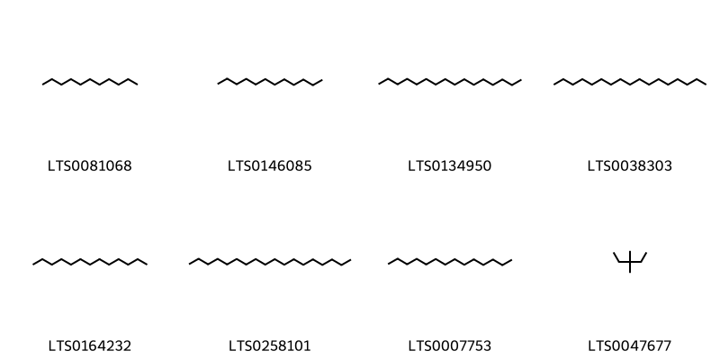{ width=100% }
    <figcaption>Hình ảnh cấu trúc hóa học của 8 hoạt chất thuộc nhóm Saturated hydrocarbons gồm ['undecane (LTS0081068)', 'dodecane (LTS0146085)', 'cetane (LTS0134950)', 'heptadecane (LTS0038303)', 'tridecane (LTS0164232)', 'octadecane (LTS0258101)', 'tetradecane (LTS0007753)', '3,3-dimethylpentane (LTS0047677)'].</figcaption>
</figure>
#### Nhóm Steroids and steroid derivatives
<figure markdown="span">
    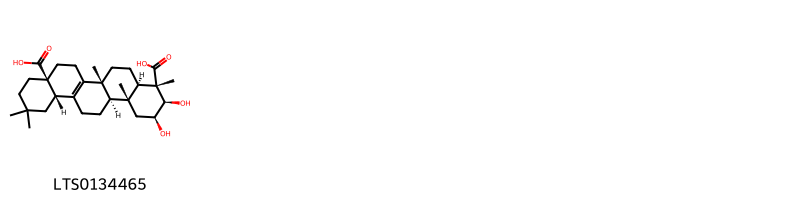{ width=100% }
    <figcaption>Hình ảnh cấu trúc hóa học của 1 hoạt chất thuộc nhóm Steroids and steroid derivatives gồm ['polygalic acid (LTS0134465)'].</figcaption>
</figure>
#### Nhóm Tannins
<figure markdown="span">
    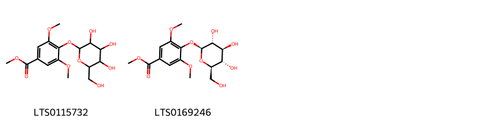{ width=100% }
    <figcaption>Hình ảnh cấu trúc hóa học của 2 hoạt chất thuộc nhóm Tannins gồm ['methyl 3,5-dimethoxy-4-{[3,4,5-trihydroxy-6-(hydroxymethyl)oxan-2-yl]oxy}benzoate (LTS0115732)', 'methyl 3,5-dimethoxy-4-{[(2s,3r,4s,5s,6r)-3,4,5-trihydroxy-6-(hydroxymethyl)oxan-2-yl]oxy}benzoate (LTS0169246)'].</figcaption>
</figure>
#### Nhóm Unsaturated hydrocarbons
<figure markdown="span">
    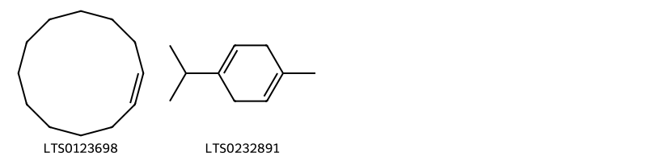{ width=100% }
    <figcaption>Hình ảnh cấu trúc hóa học của 2 hoạt chất thuộc nhóm Unsaturated hydrocarbons gồm ['(z)-cyclododecene (LTS0123698)', 'α terpinene (LTS0232891)'].</figcaption>
</figure>

---

### Dược dân tộc học

Danh sách các quốc gia có sử dụng *Bellis perennis* trong điều trị các bệnh. 

| Country   | Disease                                                     | Bệnh                                                                                                                                                                                                |
|:----------|:------------------------------------------------------------|:----------------------------------------------------------------------------------------------------------------------------------------------------------------------------------------------------|
| Elsewhere | Vulnerary                                                   | MYMEMORY WARNING: YOU USED ALL AVAILABLE FREE TRANSLATIONS FOR TODAY. NEXT AVAILABLE IN  08 HOURS 51 MINUTES 53 SECONDS VISIT HTTPS://MYMEMORY.TRANSLATED.NET/DOC/USAGELIMITS.PHP TO TRANSLATE MORE |
| Iraq      | Discutient, Diuretic, Stomachic, Vulnerary, Hemostat        | MYMEMORY WARNING: YOU USED ALL AVAILABLE FREE TRANSLATIONS FOR TODAY. NEXT AVAILABLE IN  08 HOURS 51 MINUTES 50 SECONDS VISIT HTTPS://MYMEMORY.TRANSLATED.NET/DOC/USAGELIMITS.PHP TO TRANSLATE MORE |
| Kurdistan | Tonic                                                       | MYMEMORY WARNING: YOU USED ALL AVAILABLE FREE TRANSLATIONS FOR TODAY. NEXT AVAILABLE IN  08 HOURS 51 MINUTES 48 SECONDS VISIT HTTPS://MYMEMORY.TRANSLATED.NET/DOC/USAGELIMITS.PHP TO TRANSLATE MORE |
| Turkey    | Discutient, Diuretic, Hemostat, Vulnerary, Vulnerary, Tonic | MYMEMORY WARNING: YOU USED ALL AVAILABLE FREE TRANSLATIONS FOR TODAY. NEXT AVAILABLE IN  08 HOURS 51 MINUTES 45 SECONDS VISIT HTTPS://MYMEMORY.TRANSLATED.NET/DOC/USAGELIMITS.PHP TO TRANSLATE MORE |

---

# Chi Doronicum

??? note "Danh sách các dược liệu thuộc chi"
    
	 - *Doronicum falconeri*
	 - *Doronicum pardalianches*
	 - *Doronicum roylei*

---
## Doronicum falconeri
### Thông tin về thực vật

!!! info "Phân loại thực vật của *Doronicum falconeri* từ GIBF:"
    - **Kingdom:** Plantae
    - **Phylum:** Tracheophyta
    - **Order:** Asterales
    - **Family:** Asteraceae
    - **Genus:** Doronicum
    - **Species:** *Doronicum falconeri*

 

| Label (VI)   | Label (EN)   | Scientific Name     | Descriptions (VI)   | Descriptions (EN)   | Also Known As (VI)   | Also Known As (EN)   |
|:-------------|:-------------|:--------------------|:--------------------|:--------------------|:---------------------|:---------------------|
| N/A          | N/A          | Doronicum falconeri |                     | species of plant    | ['']                 | ['']                 |

#### Phân bố trên thế giới

**Từ CSDL GIBF** nan, Pakistan, Kyrgyzstan, India, Russian Federation, Kazakhstan, China

#### Phân bố tại Việt Nam

**Từ CSDL GIBF**: Không có ghi nhận ở Việt Nam

---
### Thành phần hóa học
        
- Theo cơ sở dữ liệu lotus: Từ loài *Doronicum falconeri* đã phân lập và xác định được Chưa có hoạt chất nào được phân lập. hoạt chất thuộc về các nhóm Không có hoạt chất nào được phân lập. 

Không có hình ảnh nào được tạo ra

---

### Dược dân tộc học

Danh sách các quốc gia có sử dụng *Doronicum falconeri* trong điều trị các bệnh. 

| Country   | Disease   | Bệnh                                                                                                                                                                                                |
|:----------|:----------|:----------------------------------------------------------------------------------------------------------------------------------------------------------------------------------------------------|
| India     | Tonic     | MYMEMORY WARNING: YOU USED ALL AVAILABLE FREE TRANSLATIONS FOR TODAY. NEXT AVAILABLE IN  08 HOURS 51 MINUTES 08 SECONDS VISIT HTTPS://MYMEMORY.TRANSLATED.NET/DOC/USAGELIMITS.PHP TO TRANSLATE MORE |

---

---
## Doronicum pardalianches
### Thông tin về thực vật

!!! info "Phân loại thực vật của *Doronicum pardalianches* từ GIBF:"
    - **Kingdom:** Plantae
    - **Phylum:** Tracheophyta
    - **Order:** Asterales
    - **Family:** Asteraceae
    - **Genus:** Doronicum
    - **Species:** *Doronicum pardalianches*

 

| Label (VI)   | Label (EN)   | Scientific Name         | Descriptions (VI)   | Descriptions (EN)   | Also Known As (VI)   | Also Known As (EN)   |
|:-------------|:-------------|:------------------------|:--------------------|:--------------------|:---------------------|:---------------------|
| N/A          | N/A          | Doronicum pardalianches | loài thực vật       | species of plant    | ['']                 | ['']                 |

#### Phân bố trên thế giới

**Từ CSDL GIBF** Denmark, Netherlands, Italy, Germany, Spain, Switzerland, United States of America, Austria, France, United Kingdom of Great Britain and Northern Ireland, Canada

#### Phân bố tại Việt Nam

**Từ CSDL GIBF**: Không có ghi nhận ở Việt Nam

---
### Thành phần hóa học
        
- Theo cơ sở dữ liệu lotus: Từ loài *Doronicum pardalianches* đã phân lập và xác định được 6 hoạt chất thuộc về các nhóm Azaspirodecane derivatives, Flavonoids, Organooxygen compounds. 

|    | chemicalTaxonomyClassyfireClass   |   smiles_count |
|---:|:----------------------------------|---------------:|
|  0 | Azaspirodecane derivatives        |              1 |
|  1 | Flavonoids                        |              1 |
|  2 | Organooxygen compounds            |              4 |

#### Nhóm Azaspirodecane derivatives
<figure markdown="span">
    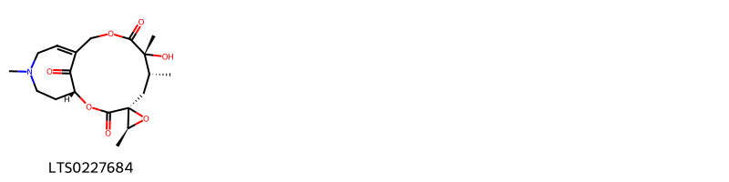{ width=100% }
    <figcaption>Hình ảnh cấu trúc hóa học của 1 hoạt chất thuộc nhóm Azaspirodecane derivatives gồm ['otosenine (LTS0227684)'].</figcaption>
</figure>
#### Nhóm Flavonoids
<figure markdown="span">
    { width=100% }
    <figcaption>Hình ảnh cấu trúc hóa học của 1 hoạt chất thuộc nhóm Flavonoids gồm ['3-rutinosyl quercetin (LTS0032845)'].</figcaption>
</figure>
#### Nhóm Organooxygen compounds
<figure markdown="span">
    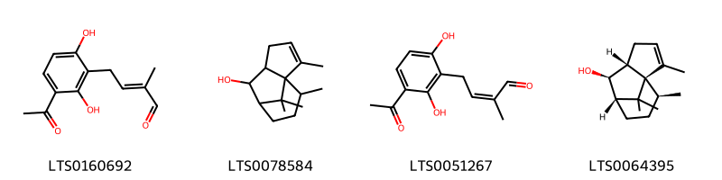{ width=100% }
    <figcaption>Hình ảnh cấu trúc hóa học của 4 hoạt chất thuộc nhóm Organooxygen compounds gồm ['(2e)-4-(3-acetyl-2,6-dihydroxyphenyl)-2-methylbut-2-enal (LTS0160692)', '2,10,11,11-tetramethyltricyclo[5.3.1.0¹,⁵]undec-2-en-6-ol (LTS0078584)', '4-(3-acetyl-2,6-dihydroxyphenyl)-2-methylbut-2-enal (LTS0051267)', '(1s,5r,6r,7s,10s)-2,10,11,11-tetramethyltricyclo[5.3.1.0¹,⁵]undec-2-en-6-ol (LTS0064395)'].</figcaption>
</figure>

---

### Dược dân tộc học

Danh sách các quốc gia có sử dụng *Doronicum pardalianches* trong điều trị các bệnh. 

| Country   | Disease                 | Bệnh                                                                                                                                                                                                |
|:----------|:------------------------|:----------------------------------------------------------------------------------------------------------------------------------------------------------------------------------------------------|
| Elsewhere | Cardiotonic             | MYMEMORY WARNING: YOU USED ALL AVAILABLE FREE TRANSLATIONS FOR TODAY. NEXT AVAILABLE IN  08 HOURS 50 MINUTES 50 SECONDS VISIT HTTPS://MYMEMORY.TRANSLATED.NET/DOC/USAGELIMITS.PHP TO TRANSLATE MORE |
| India     | Cardiac, Nervine, Tonic | MYMEMORY WARNING: YOU USED ALL AVAILABLE FREE TRANSLATIONS FOR TODAY. NEXT AVAILABLE IN  08 HOURS 50 MINUTES 47 SECONDS VISIT HTTPS://MYMEMORY.TRANSLATED.NET/DOC/USAGELIMITS.PHP TO TRANSLATE MORE |

---

---
## Doronicum roylei
### Thông tin về thực vật

!!! info "Phân loại thực vật của *Doronicum kamaonense* từ GIBF:"
    - **Kingdom:** Plantae
    - **Phylum:** Tracheophyta
    - **Order:** Asterales
    - **Family:** Asteraceae
    - **Genus:** Doronicum
    - **Species:** *Doronicum kamaonense*

 

| Label (VI)   | Label (EN)   | Scientific Name   | Descriptions (VI)   | Descriptions (EN)   | Also Known As (VI)   | Also Known As (EN)   |
|:-------------|:-------------|:------------------|:--------------------|:--------------------|:---------------------|:---------------------|
| N/A          | N/A          | Doronicum roylei  |                     |                     | ['']                 | ['']                 |

#### Phân bố trên thế giới

**Từ CSDL GIBF** nan, Pakistan, Bhutan, India, unknown or invalid, China, Nepal

#### Phân bố tại Việt Nam

**Từ CSDL GIBF**: Không có ghi nhận ở Việt Nam

---
### Thành phần hóa học
        
- Theo cơ sở dữ liệu lotus: Từ loài *Doronicum kamaonense* đã phân lập và xác định được Chưa có hoạt chất nào được phân lập. hoạt chất thuộc về các nhóm Không có hoạt chất nào được phân lập. 

Không có hình ảnh nào được tạo ra

---

### Dược dân tộc học

Danh sách các quốc gia có sử dụng *Doronicum kamaonense* trong điều trị các bệnh. 

| Country   | Disease   | Bệnh                                                                                                                                                                                                |
|:----------|:----------|:----------------------------------------------------------------------------------------------------------------------------------------------------------------------------------------------------|
| India     | Tonic     | MYMEMORY WARNING: YOU USED ALL AVAILABLE FREE TRANSLATIONS FOR TODAY. NEXT AVAILABLE IN  08 HOURS 50 MINUTES 23 SECONDS VISIT HTTPS://MYMEMORY.TRANSLATED.NET/DOC/USAGELIMITS.PHP TO TRANSLATE MORE |

---

