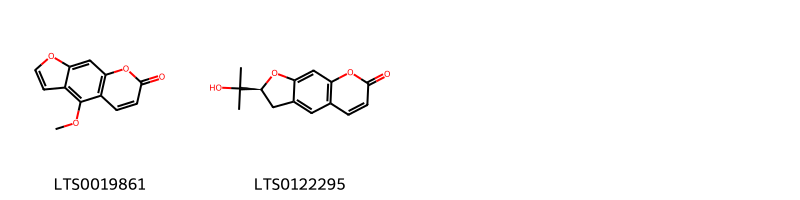
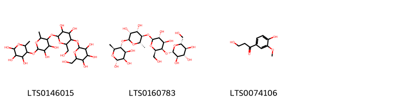
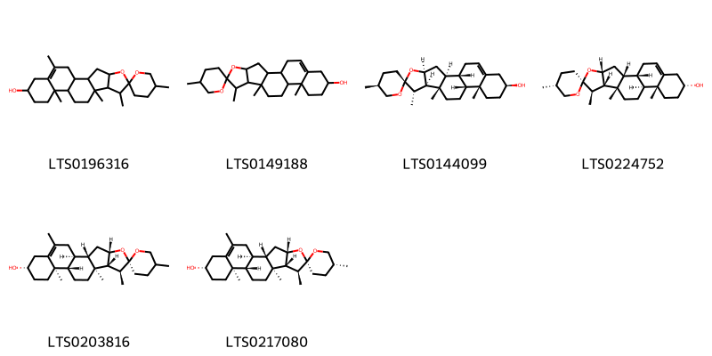
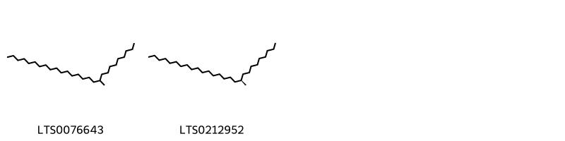
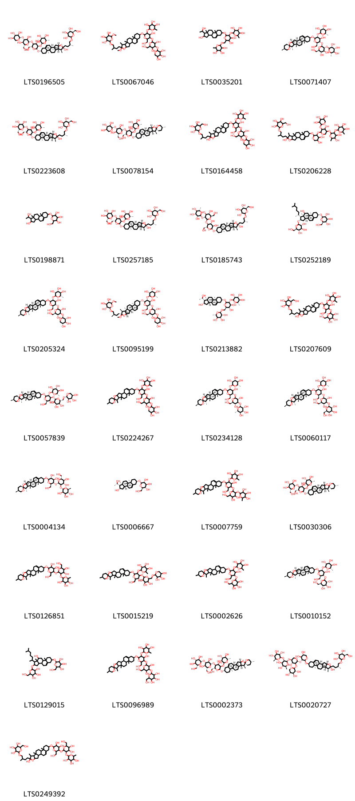

!!! abstract "Tóm tắt"

    Họ Balanitaceae gồm khoảng 1 chi và 1 loài được một số cộng đồng tại các quốc gia như Sudan, Uganda, Nigeria, Chad, Africa, Ghana sử dụng trong một số trường hợp Fumigant, Abortifacient, Sweetener, Fumigant, Purgative, Vermifuge, Vermifuge, Soap, Aperient, Vermifuge, Purgative, Purgative, Soap.

!!! info "DrDuke"

    James A. Duke sinh năm 1929-2017 là một nhà thực vật học người Mỹ. Đây là một trong những tác giả hàng đầu trong lĩnh vực dược dân tộc học với cuốn *CRC Handbook of Medicinal Herbs* và chính là người xây dựng lên cơ sở dữ liệu về hợp chất tự nhiên và dược dân tộc học tại Bộ nông nghiệp Hoa Kỳ. Các thông tin được đăng tải tại website [Dr. Duke's Phytochemical and Ethnobotanical Databases](https://phytochem.nal.usda.gov/). 
    Trong suốt thập niên 1970, ông lãnh đạo the Plant Taxonomy Laboratory, Plant Genetics and Germplasm Institute of the Agricultural Research Service, U.S. Department of Agriculture.
    Trong tài liệu này, các thông tin về dược dân tộc của các dược liệu được trích dẫn từ tài liệu của James A. Ducke với sự trợ giúp của phần mềm dịch thuật từ tiếng Anh sang tiếng Việt.
   

# Chi Balanites

??? note "Danh sách các dược liệu thuộc chi"
    
	 - *Balanites aegyptiaca*

---
## Balanites aegyptiaca
### Thông tin về thực vật

!!! info "Phân loại thực vật của *Balanites aegyptiaca* từ GIBF:"
    - **Kingdom:** Plantae
    - **Phylum:** Tracheophyta
    - **Order:** Zygophyllales
    - **Family:** Zygophyllaceae
    - **Genus:** Balanites
    - **Species:** *Balanites aegyptiaca*

 

| Label (VI)   | Label (EN)   | Scientific Name      | Descriptions (VI)   | Descriptions (EN)   | Also Known As (VI)   | Also Known As (EN)                                                                                                                            |
|:-------------|:-------------|:---------------------|:--------------------|:--------------------|:---------------------|:----------------------------------------------------------------------------------------------------------------------------------------------|
| N/A          | N/A          | Balanites aegyptiaca | loài thực vật       | species of plant    | ['']                 | ['Desert Date', 'Egyptian myrobalan', 'heglig', 'Jericho balsam', 'simple thorned torch tree', 'simple-thorned torchwood', 'soap berry tree'] |

#### Phân bố trên thế giới

**Từ CSDL GIBF** Namibia, Ghana, Burkina Faso, Senegal, Kenya, Cameroon, United Arab Emirates, Palestine, State of, Western Sahara, India, Sudan, Nigeria, Ethiopia, Benin, Curaçao, Jordan, Morocco, Tanzania, United Republic of, Egypt, Mauritania, Algeria, Chad, Israel, Mali

#### Phân bố tại Việt Nam

**Từ CSDL GIBF**: Không có ghi nhận ở Việt Nam

---
### Thành phần hóa học
        
- Theo cơ sở dữ liệu lotus: Từ loài *Balanites aegyptiaca* đã phân lập và xác định được 50 hoạt chất thuộc về các nhóm Organooxygen compounds, Saturated hydrocarbons, Coumarins and derivatives, Prenol lipids, Phenols, Cinnamic acids and derivatives, Steroids and steroid derivatives, Benzene and substituted derivatives. 

|    | chemicalTaxonomyClassyfireClass     |   smiles_count |
|---:|:------------------------------------|---------------:|
|  0 | Benzene and substituted derivatives |              2 |
|  1 | Cinnamic acids and derivatives      |              1 |
|  2 | Coumarins and derivatives           |              2 |
|  3 | Organooxygen compounds              |              3 |
|  4 | Phenols                             |              1 |
|  5 | Prenol lipids                       |              6 |
|  6 | Saturated hydrocarbons              |              2 |
|  7 | Steroids and steroid derivatives    |             33 |

#### Nhóm Benzene and substituted derivatives
<figure markdown="span">
    { width=100% }
    <figcaption>Hình ảnh cấu trúc hóa học của 2 hoạt chất thuộc nhóm Benzene and substituted derivatives gồm ['syringic acid (LTS0210036)', 'vanillic acid (LTS0229113)'].</figcaption>
</figure>
#### Nhóm Cinnamic acids and derivatives
<figure markdown="span">
    { width=100% }
    <figcaption>Hình ảnh cấu trúc hóa học của 1 hoạt chất thuộc nhóm Cinnamic acids and derivatives gồm ['(2z)-3-(4-hydroxy-3-methoxyphenyl)-n-[2-(4-hydroxyphenyl)ethyl]prop-2-enimidic acid (LTS0255533)'].</figcaption>
</figure>
#### Nhóm Coumarins and derivatives
<figure markdown="span">
    { width=100% }
    <figcaption>Hình ảnh cấu trúc hóa học của 2 hoạt chất thuộc nhóm Coumarins and derivatives gồm ['bergapten (LTS0019861)', 'marmesin (LTS0122295)'].</figcaption>
</figure>
#### Nhóm Organooxygen compounds
<figure markdown="span">
    { width=100% }
    <figcaption>Hình ảnh cấu trúc hóa học của 3 hoạt chất thuộc nhóm Organooxygen compounds gồm ['5-[(5-{[3,4-dihydroxy-6-(hydroxymethyl)-5-{[3,4,5-trihydroxy-6-(hydroxymethyl)oxan-2-yl]oxy}oxan-2-yl]oxy}-3,4-dihydroxy-6-methyloxan-2-yl)oxy]-6-methyloxane-2,3,4-triol (LTS0146015)', '(2r,3r,4s,5r,6s)-5-{[(2s,3r,4s,5r,6s)-5-{[(2s,3r,4r,5r,6r)-3,4-dihydroxy-6-(hydroxymethyl)-5-{[(2s,3r,4s,5s,6r)-3,4,5-trihydroxy-6-(hydroxymethyl)oxan-2-yl]oxy}oxan-2-yl]oxy}-3,4-dihydroxy-6-methyloxan-2-yl]oxy}-6-methyloxane-2,3,4-triol (LTS0160783)', '3-hydroxy-1-(4-hydroxy-3-methoxyphenyl)propan-1-one (LTS0074106)'].</figcaption>
</figure>
#### Nhóm Phenols
<figure markdown="span">
    { width=100% }
    <figcaption>Hình ảnh cấu trúc hóa học của 1 hoạt chất thuộc nhóm Phenols gồm ['(2e)-3-(4-hydroxy-3-methoxyphenyl)-n-[2-(4-hydroxyphenyl)ethyl]prop-2-enimidic acid (LTS0187051)'].</figcaption>
</figure>
#### Nhóm Prenol lipids
<figure markdown="span">
    { width=100% }
    <figcaption>Hình ảnh cấu trúc hóa học của 6 hoạt chất thuộc nhóm Prenol lipids gồm ["5,7',9',13',19'-pentamethyl-5'-oxaspiro[oxane-2,6'-pentacyclo[10.8.0.0²,⁹.0⁴,⁸.0¹³,¹⁸]icosan]-18'-en-16'-ol (LTS0196316)", 'diosgenin (LTS0149188)', "(1's,2r,2's,4's,5s,7's,8'r,9's,12'r,13'r,16's)-5,7',9',13'-tetramethyl-5'-oxaspiro[oxane-2,6'-pentacyclo[10.8.0.0²,⁹.0⁴,⁸.0¹³,¹⁸]icosan]-18'-en-16'-ol (LTS0144099)", "(1's,2s,2'r,4'r,5r,7'r,8's,9's,12's,13'r,16'r)-5,7',9',13'-tetramethyl-5'-oxaspiro[oxane-2,6'-pentacyclo[10.8.0.0²,⁹.0⁴,⁸.0¹³,¹⁸]icosan]-18'-en-16'-ol (LTS0224752)", "(1's,2r,2's,4's,7's,8'r,9's,12's,13'r,16's)-5,7',9',13',19'-pentamethyl-5'-oxaspiro[oxane-2,6'-pentacyclo[10.8.0.0²,⁹.0⁴,⁸.0¹³,¹⁸]icosan]-18'-en-16'-ol (LTS0203816)", "(1's,2r,2's,4's,5r,7's,8'r,9's,12's,13'r,16's)-5,7',9',13',19'-pentamethyl-5'-oxaspiro[oxane-2,6'-pentacyclo[10.8.0.0²,⁹.0⁴,⁸.0¹³,¹⁸]icosan]-18'-en-16'-ol (LTS0217080)"].</figcaption>
</figure>
#### Nhóm Saturated hydrocarbons
<figure markdown="span">
    { width=100% }
    <figcaption>Hình ảnh cấu trúc hóa học của 2 hoạt chất thuộc nhóm Saturated hydrocarbons gồm ['10-methylheptacosane (LTS0076643)', '(10r)-10-methylheptacosane (LTS0212952)'].</figcaption>
</figure>
#### Nhóm Steroids and steroid derivatives
<figure markdown="span">
    { width=100% }
    <figcaption>Hình ảnh cấu trúc hóa học của 33 hoạt chất thuộc nhóm Steroids and steroid derivatives gồm ['(2s,3r,4r,5r,6s)-2-{[(2r,3r,4s,5s,6r)-5-{[(2s,3r,4s,5r,6r)-3,5-dihydroxy-6-(hydroxymethyl)-4-{[(2s,3r,4s,5r)-3,4,5-trihydroxyoxan-2-yl]oxy}oxan-2-yl]oxy}-4-hydroxy-2-{[(1s,2s,4s,6r,7s,8r,9s,12s,13r,16s)-6-hydroxy-7,9,13-trimethyl-6-[(3r)-3-methyl-4-{[(2r,3r,4s,5s,6r)-3,4,5-trihydroxy-6-(hydroxymethyl)oxan-2-yl]oxy}butyl]-5-oxapentacyclo[10.8.0.0²,⁹.0⁴,⁸.0¹³,¹⁸]icos-18-en-16-yl]oxy}-6-(hydroxymethyl)oxan-3-yl]oxy}-6-methyloxane-3,4,5-triol (LTS0196505)', '2-(4-{16-[(5-{[3,5-dihydroxy-6-(hydroxymethyl)-4-[(3,4,5-trihydroxyoxan-2-yl)oxy]oxan-2-yl]oxy}-4-hydroxy-6-(hydroxymethyl)-3-[(3,4,5-trihydroxy-6-methyloxan-2-yl)oxy]oxan-2-yl)oxy]-6-methoxy-7,9,13-trimethyl-5-oxapentacyclo[10.8.0.0²,⁹.0⁴,⁸.0¹³,¹⁸]icos-18-en-6-yl}-2-methylbutoxy)-6-methoxyoxane-3,4,5-triol (LTS0067046)', '2-[(3,4-dihydroxy-6-{[2-hydroxy-1-(1-hydroxyethyl)-9a,11a-dimethyl-1h,2h,3h,3ah,3bh,4h,6h,7h,8h,9h,9bh,10h,11h-cyclopenta[a]phenanthren-7-yl]oxy}-5-[(3,4,5-trihydroxy-6-methyloxan-2-yl)oxy]oxan-2-yl)methoxy]-6-methyloxane-3,4,5-triol (LTS0035201)', "(2s,3r,4r,5r,6s)-2-{[(2s,3r,4s,5s,6r)-4,5-dihydroxy-2-{[(2r,3s,4s,5r,6r)-4-hydroxy-2-(hydroxymethyl)-6-[(1's,2r,2's,4's,5s,7's,8'r,9's,12's,13'r,16's)-5,7',9',13'-tetramethyl-5'-oxaspiro[oxane-2,6'-pentacyclo[10.8.0.0²,⁹.0⁴,⁸.0¹³,¹⁸]icosan]-18'-eneoxy]-5-{[(2s,3r,4r,5r,6s)-3,4,5-trihydroxy-6-methyloxan-2-yl]oxy}oxan-3-yl]oxy}-6-(hydroxymethyl)oxan-3-yl]oxy}-6-methyloxane-3,4,5-triol (LTS0071407)", '(2s,3r,4r,5r,6s)-2-{[(2r,3r,4s,5s,6r)-4-hydroxy-2-{[(1s,2s,4s,6r,7s,8r,9s,12s,13r,16s)-6-hydroxy-7,9,13-trimethyl-6-[(3r)-3-methyl-4-{[(2r,3r,4s,5s,6r)-3,4,5-trihydroxy-6-(hydroxymethyl)oxan-2-yl]oxy}butyl]-5-oxapentacyclo[10.8.0.0²,⁹.0⁴,⁸.0¹³,¹⁸]icos-18-en-16-yl]oxy}-6-(hydroxymethyl)-5-{[(2s,3r,4s,5s,6r)-3,4,5-trihydroxy-6-(hydroxymethyl)oxan-2-yl]oxy}oxan-3-yl]oxy}-6-methyloxane-3,4,5-triol (LTS0223608)', "(2s,3r,4r,5r,6s)-2-{[(2r,3r,4s,5s,6r)-5-{[(2s,3r,4s,5r,6r)-3,5-dihydroxy-6-(hydroxymethyl)-4-{[(2s,3r,4s,5r)-3,4,5-trihydroxyoxan-2-yl]oxy}oxan-2-yl]oxy}-4-hydroxy-6-(hydroxymethyl)-2-[(1's,2r,2's,4's,5r,7's,8'r,9's,12's,13'r,16's)-5,7',9',13'-tetramethyl-5'-oxaspiro[oxane-2,6'-pentacyclo[10.8.0.0²,⁹.0⁴,⁸.0¹³,¹⁸]icosan]-18'-eneoxy]oxan-3-yl]oxy}-6-methyloxane-3,4,5-triol (LTS0078154)", '2-[(5-{[3,5-dihydroxy-6-(hydroxymethyl)-4-[(3,4,5-trihydroxyoxan-2-yl)oxy]oxan-2-yl]oxy}-4-hydroxy-2-{[6-hydroxy-7,9,13-trimethyl-6-(3-methyl-4-{[3,4,5-trihydroxy-6-(hydroxymethyl)oxan-2-yl]oxy}butyl)-5-oxapentacyclo[10.8.0.0²,⁹.0⁴,⁸.0¹³,¹⁸]icos-18-en-16-yl]oxy}-6-(hydroxymethyl)oxan-3-yl)oxy]-6-methyloxane-3,4,5-triol (LTS0164458)', '2-{[2-({6-[(4,5-dihydroxy-2-{[6-hydroxy-7,9,13-trimethyl-6-(3-methyl-4-{[3,4,5-trihydroxy-6-(hydroxymethyl)oxan-2-yl]oxy}butyl)-5-oxapentacyclo[10.8.0.0²,⁹.0⁴,⁸.0¹³,¹⁸]icos-18-en-16-yl]oxy}oxan-3-yl)oxy]-4-hydroxy-5-[(3,4,5-trihydroxyoxan-2-yl)oxy]oxan-3-yl}oxy)-4,5-dihydroxy-6-methyloxan-3-yl]oxy}-6-methyloxane-3,4,5-triol (LTS0206228)', '2-{[2-hydroxy-1-(1-hydroxyethyl)-9a,11a-dimethyl-1h,2h,3h,3ah,3bh,4h,6h,7h,8h,9h,9bh,10h,11h-cyclopenta[a]phenanthren-7-yl]oxy}-6-(hydroxymethyl)oxane-3,4,5-triol (LTS0198871)', '(2s,3r,4r,5r,6s)-2-{[(2r,3r,4s,5s,6r)-4-hydroxy-2-{[(1s,2s,4s,6s,7s,8r,9s,12s,13r,16s)-6-hydroxy-7,9,13-trimethyl-6-[(3r)-3-methyl-4-{[(2r,3r,4s,5s,6r)-3,4,5-trihydroxy-6-(hydroxymethyl)oxan-2-yl]oxy}butyl]-5-oxapentacyclo[10.8.0.0²,⁹.0⁴,⁸.0¹³,¹⁸]icos-18-en-16-yl]oxy}-6-(hydroxymethyl)-5-{[(2s,3r,4s,5s,6r)-3,4,5-trihydroxy-6-(hydroxymethyl)oxan-2-yl]oxy}oxan-3-yl]oxy}-6-methyloxane-3,4,5-triol (LTS0257185)', '(2s,3r,4r,5r,6s)-2-{[(2s,3r,4s,5s,6r)-2-{[(2r,3s,4r,5r,6r)-4,5-dihydroxy-6-{[(1s,2s,4s,6s,7s,8r,9s,12s,13r,16s)-6-hydroxy-7,9,13-trimethyl-6-[(3r)-3-methyl-4-{[(2r,3r,4s,5s,6r)-3,4,5-trihydroxy-6-(hydroxymethyl)oxan-2-yl]oxy}butyl]-5-oxapentacyclo[10.8.0.0²,⁹.0⁴,⁸.0¹³,¹⁸]icos-18-en-16-yl]oxy}-2-(hydroxymethyl)oxan-3-yl]oxy}-4,5-dihydroxy-6-(hydroxymethyl)oxan-3-yl]oxy}-6-methyloxane-3,4,5-triol (LTS0185743)', '(2r,3r,4s,5s,6r)-2-{[(1r,2s,3ar,3br,7s,9ar,9bs,11s,11as)-11-hydroxy-9a,11a-dimethyl-1-[(2r)-6-methylheptan-2-yl]-7-{[(2r,3r,4s,5s,6r)-3,4,5-trihydroxy-6-(hydroxymethyl)oxan-2-yl]oxy}-1h,2h,3h,3ah,3bh,4h,6h,7h,8h,9h,9bh,10h,11h-cyclopenta[a]phenanthren-2-yl]oxy}-6-(hydroxymethyl)oxane-3,4,5-triol (LTS0252189)', "(2s,3r,4r,5r,6s)-2-{[(2r,3r,4s,5s,6r)-5-{[(2s,3r,4s,5r,6r)-3,5-dihydroxy-6-(hydroxymethyl)-4-{[(2s,3r,4s,5r)-3,4,5-trihydroxyoxan-2-yl]oxy}oxan-2-yl]oxy}-4-hydroxy-6-(hydroxymethyl)-2-[(1's,2r,2's,4's,5s,7's,8'r,9's,12's,13'r,16's)-5,7',9',13'-tetramethyl-5'-oxaspiro[oxane-2,6'-pentacyclo[10.8.0.0²,⁹.0⁴,⁸.0¹³,¹⁸]icosan]-18'-eneoxy]oxan-3-yl]oxy}-6-methyloxane-3,4,5-triol (LTS0205324)", '(2r,3r,4s,5s,6s)-2-[(2r)-4-[(1s,2s,4s,6r,7s,8r,9s,12s,13r,16s)-16-{[(2s,3r,4s,5s,6r)-5-{[(2s,3r,4s,5r,6r)-3,5-dihydroxy-6-(hydroxymethyl)-4-{[(2s,3r,4s,5r)-3,4,5-trihydroxyoxan-2-yl]oxy}oxan-2-yl]oxy}-4-hydroxy-6-(hydroxymethyl)-3-{[(2s,3r,4r,5r,6s)-3,4,5-trihydroxy-6-methyloxan-2-yl]oxy}oxan-2-yl]oxy}-6-methoxy-7,9,13-trimethyl-5-oxapentacyclo[10.8.0.0²,⁹.0⁴,⁸.0¹³,¹⁸]icos-18-en-6-yl]-2-methylbutoxy]-6-methoxyoxane-3,4,5-triol (LTS0095199)', '(2r,3r,4r,5r,6s)-2-{[(2r,3s,4s,5r,6r)-6-{[(1s,2s,3as,3bs,7s,9ar,9bs,11as)-2-hydroxy-1-[(1s)-1-hydroxyethyl]-9a,11a-dimethyl-1h,2h,3h,3ah,3bh,4h,6h,7h,8h,9h,9bh,10h,11h-cyclopenta[a]phenanthren-7-yl]oxy}-3,4-dihydroxy-5-{[(2s,3r,4r,5r,6s)-3,4,5-trihydroxy-6-methyloxan-2-yl]oxy}oxan-2-yl]methoxy}-6-methyloxane-3,4,5-triol (LTS0213882)', '2-[(4-hydroxy-6-{[6-hydroxy-7,9,13-trimethyl-6-(3-methyl-4-{[3,4,5-trihydroxy-6-(hydroxymethyl)oxan-2-yl]oxy}butyl)-5-oxapentacyclo[10.8.0.0²,⁹.0⁴,⁸.0¹³,¹⁸]icos-18-en-16-yl]oxy}-2-(hydroxymethyl)-5-[(3,4,5-trihydroxy-6-methyloxan-2-yl)oxy]oxan-3-yl)oxy]-6-(hydroxymethyl)oxane-3,4,5-triol (LTS0207609)', "(2s,3r,4s,5s,6r)-2-{[(2r,3r,4s,5r,6r)-3-hydroxy-2-(hydroxymethyl)-6-[(1's,2r,2's,4's,5s,7's,8'r,9's,12's,13'r,16's)-5,7',9',13'-tetramethyl-5'-oxaspiro[oxane-2,6'-pentacyclo[10.8.0.0²,⁹.0⁴,⁸.0¹³,¹⁸]icosan]-18'-eneoxy]-5-{[(2s,3r,4r,5r,6s)-3,4,5-trihydroxy-6-methyloxan-2-yl]oxy}oxan-4-yl]oxy}-6-({[(2s,3r,4s,5r)-3,4,5-trihydroxyoxan-2-yl]oxy}methyl)oxane-3,4,5-triol (LTS0057839)", "2-[(5-{[3,5-dihydroxy-6-(hydroxymethyl)-4-[(3,4,5-trihydroxyoxan-2-yl)oxy]oxan-2-yl]oxy}-4-hydroxy-6-(hydroxymethyl)-2-{5,7',9',13'-tetramethyl-5'-oxaspiro[oxane-2,6'-pentacyclo[10.8.0.0²,⁹.0⁴,⁸.0¹³,¹⁸]icosan]-18'-eneoxy}oxan-3-yl)oxy]-6-methyloxane-3,4,5-triol (LTS0224267)", "(2s,3r,4r,5r,6s)-2-{[(2s,3r,4s,5r,6r)-3,5-dihydroxy-2-{[(2r,3s,4s,5r,6r)-4-hydroxy-2-(hydroxymethyl)-6-[(1's,2r,2's,4's,5s,7's,8'r,9's,12's,13'r,16's)-5,7',9',13'-tetramethyl-5'-oxaspiro[oxane-2,6'-pentacyclo[10.8.0.0²,⁹.0⁴,⁸.0¹³,¹⁸]icosan]-18'-eneoxy]-5-{[(2s,3r,4r,5r,6s)-3,4,5-trihydroxy-6-methyloxan-2-yl]oxy}oxan-3-yl]oxy}-6-(hydroxymethyl)oxan-4-yl]oxy}-6-methyloxane-3,4,5-triol (LTS0234128)", "(2s,3r,4s,5s,6r)-2-{[(2s,3r,4s,5r,6r)-3,5-dihydroxy-2-{[(2r,3s,4s,5r,6r)-4-hydroxy-2-(hydroxymethyl)-6-[(1's,2r,2's,4's,5s,7's,8'r,9's,12's,13'r,16's)-5,7',9',13'-tetramethyl-5'-oxaspiro[oxane-2,6'-pentacyclo[10.8.0.0²,⁹.0⁴,⁸.0¹³,¹⁸]icosan]-18'-eneoxy]-5-{[(2s,3r,4r,5r,6s)-3,4,5-trihydroxy-6-methyloxan-2-yl]oxy}oxan-3-yl]oxy}-6-(hydroxymethyl)oxan-4-yl]oxy}-6-(hydroxymethyl)oxane-3,4,5-triol (LTS0060117)", "(2s,3r,4r,5r,6s)-2-{[(2s,3r,4s,5s,6r)-2-{[(2r,3s,4r,5r,6r)-4,5-dihydroxy-2-(hydroxymethyl)-6-[(1's,2r,2's,4's,5s,7's,8'r,9's,12's,13'r,16's)-5,7',9',13'-tetramethyl-5'-oxaspiro[oxane-2,6'-pentacyclo[10.8.0.0²,⁹.0⁴,⁸.0¹³,¹⁸]icosan]-18'-eneoxy]oxan-3-yl]oxy}-4,5-dihydroxy-6-(hydroxymethyl)oxan-3-yl]oxy}-6-methyloxane-3,4,5-triol (LTS0004134)", '(2r,3r,4s,5s,6r)-2-{[(1s,2s,3as,3bs,7s,9ar,9bs,11as)-2-hydroxy-1-[(1s)-1-hydroxyethyl]-9a,11a-dimethyl-1h,2h,3h,3ah,3bh,4h,6h,7h,8h,9h,9bh,10h,11h-cyclopenta[a]phenanthren-7-yl]oxy}-6-(hydroxymethyl)oxane-3,4,5-triol (LTS0006667)', "2-[(4,5-dihydroxy-2-{[4-hydroxy-2-(hydroxymethyl)-6-{5,7',9',13'-tetramethyl-5'-oxaspiro[oxane-2,6'-pentacyclo[10.8.0.0²,⁹.0⁴,⁸.0¹³,¹⁸]icosan]-18'-eneoxy}-5-[(3,4,5-trihydroxy-6-methyloxan-2-yl)oxy]oxan-3-yl]oxy}-6-(hydroxymethyl)oxan-3-yl)oxy]-6-methyloxane-3,4,5-triol (LTS0007759)", "(2s,3r,4r,5r,6s)-2-{[(2r,3r,4s,5s,6r)-4-hydroxy-6-(hydroxymethyl)-2-[(1's,2r,2's,4's,5r,7's,8'r,9's,12's,13'r,16's)-5,7',9',13'-tetramethyl-5'-oxaspiro[oxane-2,6'-pentacyclo[10.8.0.0²,⁹.0⁴,⁸.0¹³,¹⁸]icosan]-18'-eneoxy]-5-{[(2s,3r,4s,5s,6r)-3,4,5-trihydroxy-6-(hydroxymethyl)oxan-2-yl]oxy}oxan-3-yl]oxy}-6-methyloxane-3,4,5-triol (LTS0030306)", "2-[(2-{[4,5-dihydroxy-2-(hydroxymethyl)-6-{5,7',9',13'-tetramethyl-5'-oxaspiro[oxane-2,6'-pentacyclo[10.8.0.0²,⁹.0⁴,⁸.0¹³,¹⁸]icosan]-18'-eneoxy}oxan-3-yl]oxy}-4,5-dihydroxy-6-(hydroxymethyl)oxan-3-yl)oxy]-6-methyloxane-3,4,5-triol (LTS0126851)", "2-{[3-hydroxy-2-(hydroxymethyl)-6-{5,7',9',13'-tetramethyl-5'-oxaspiro[oxane-2,6'-pentacyclo[10.8.0.0²,⁹.0⁴,⁸.0¹³,¹⁸]icosan]-18'-eneoxy}-5-[(3,4,5-trihydroxy-6-methyloxan-2-yl)oxy]oxan-4-yl]oxy}-6-{[(3,4,5-trihydroxyoxan-2-yl)oxy]methyl}oxane-3,4,5-triol (LTS0015219)", "2-{[4-hydroxy-2-(hydroxymethyl)-6-{5,7',9',13'-tetramethyl-5'-oxaspiro[oxane-2,6'-pentacyclo[10.8.0.0²,⁹.0⁴,⁸.0¹³,¹⁸]icosan]-18'-eneoxy}-5-[(3,4,5-trihydroxy-6-methyloxan-2-yl)oxy]oxan-3-yl]oxy}-6-(hydroxymethyl)oxane-3,4,5-triol (LTS0002626)", "(2s,3r,4s,5s,6r)-2-{[(2r,3s,4s,5r,6r)-4-hydroxy-2-(hydroxymethyl)-6-[(1's,2r,2's,4's,5s,7's,8'r,9's,12's,13'r,16's)-5,7',9',13'-tetramethyl-5'-oxaspiro[oxane-2,6'-pentacyclo[10.8.0.0²,⁹.0⁴,⁸.0¹³,¹⁸]icosan]-18'-eneoxy]-5-{[(2s,3r,4r,5r,6s)-3,4,5-trihydroxy-6-methyloxan-2-yl]oxy}oxan-3-yl]oxy}-6-(hydroxymethyl)oxane-3,4,5-triol (LTS0010152)", '2-{[11-hydroxy-9a,11a-dimethyl-1-(6-methylheptan-2-yl)-7-{[3,4,5-trihydroxy-6-(hydroxymethyl)oxan-2-yl]oxy}-1h,2h,3h,3ah,3bh,4h,6h,7h,8h,9h,9bh,10h,11h-cyclopenta[a]phenanthren-2-yl]oxy}-6-(hydroxymethyl)oxane-3,4,5-triol (LTS0129015)', "2-[(3,5-dihydroxy-2-{[4-hydroxy-2-(hydroxymethyl)-6-{5,7',9',13'-tetramethyl-5'-oxaspiro[oxane-2,6'-pentacyclo[10.8.0.0²,⁹.0⁴,⁸.0¹³,¹⁸]icosan]-18'-eneoxy}-5-[(3,4,5-trihydroxy-6-methyloxan-2-yl)oxy]oxan-3-yl]oxy}-6-(hydroxymethyl)oxan-4-yl)oxy]-6-(hydroxymethyl)oxane-3,4,5-triol (LTS0096989)", "(2s,3r,4r,5r,6s)-2-{[(2r,3r,4s,5s,6r)-5-{[(2s,3r,4s,5r,6r)-3,5-dihydroxy-6-(hydroxymethyl)-4-{[(2s,3r,4s,5s,6r)-3,4,5-trihydroxy-6-(hydroxymethyl)oxan-2-yl]oxy}oxan-2-yl]oxy}-4-hydroxy-6-(hydroxymethyl)-2-[(1's,2r,2's,4's,5r,7's,8'r,9's,12's,13'r,16's)-5,7',9',13'-tetramethyl-5'-oxaspiro[oxane-2,6'-pentacyclo[10.8.0.0²,⁹.0⁴,⁸.0¹³,¹⁸]icosan]-18'-eneoxy]oxan-3-yl]oxy}-6-methyloxane-3,4,5-triol (LTS0002373)", '(2r,3r,4r,5r,6s)-2-{[(2r,3r,4r,5r,6s)-2-{[(3s,4r,5s,6r)-6-{[(2s,3r,4s,5r)-4,5-dihydroxy-2-{[(1s,2s,4s,6s,7s,8r,9s,12s,13r,16r)-6-hydroxy-7,9,13-trimethyl-6-[(3r)-3-methyl-4-{[(2r,3r,4s,5s,6r)-3,4,5-trihydroxy-6-(hydroxymethyl)oxan-2-yl]oxy}butyl]-5-oxapentacyclo[10.8.0.0²,⁹.0⁴,⁸.0¹³,¹⁸]icos-18-en-16-yl]oxy}oxan-3-yl]oxy}-4-hydroxy-5-{[(2s,3r,4s,5r)-3,4,5-trihydroxyoxan-2-yl]oxy}oxan-3-yl]oxy}-4,5-dihydroxy-6-methyloxan-3-yl]oxy}-6-methyloxane-3,4,5-triol (LTS0020727)', '2-({2-[(4,5-dihydroxy-6-{[6-hydroxy-7,9,13-trimethyl-6-(3-methyl-4-{[3,4,5-trihydroxy-6-(hydroxymethyl)oxan-2-yl]oxy}butyl)-5-oxapentacyclo[10.8.0.0²,⁹.0⁴,⁸.0¹³,¹⁸]icos-18-en-16-yl]oxy}-2-(hydroxymethyl)oxan-3-yl)oxy]-4,5-dihydroxy-6-(hydroxymethyl)oxan-3-yl}oxy)-6-methyloxane-3,4,5-triol (LTS0249392)'].</figcaption>
</figure>

---

### Dược dân tộc học

Danh sách các quốc gia có sử dụng *Balanites aegyptiaca* trong điều trị các bệnh. 

| Country   | Disease                                         | Bệnh                                            |
|:----------|:------------------------------------------------|:------------------------------------------------|
| Africa    | Vermifuge                                       | Thuốc diệt sán                                  |
| Chad      | Fumigant                                        | chất hun khói (diệt côn trùng, vi sinh vật)     |
| Ghana     | Fumigant, Purgative, Vermifuge                  | Thuốc khử trùng, Thuốc tẩy, Thuốc diệt giun sán |
| Nigeria   | Abortifacient, Sweetener                        | Thuốc phá thai, chất làm ngọt                   |
| Sudan     | Aperient, Vermifuge, Purgative, Purgative, Soap | Aperient, Vermifuge, Purgative, Purgative, Soap |
| Uganda    | Soap                                            | Xà phòng                                        |

---

