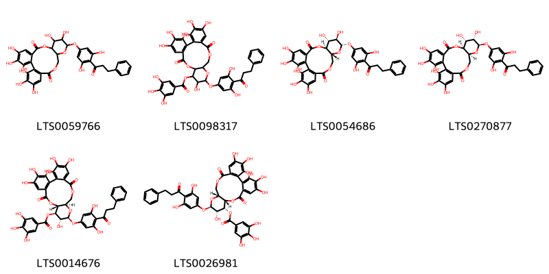
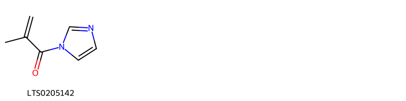
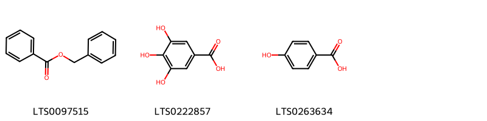
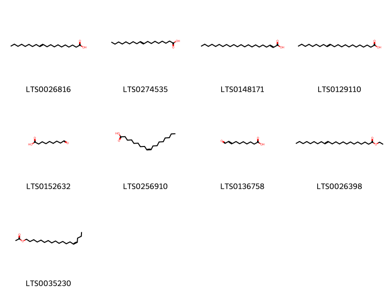
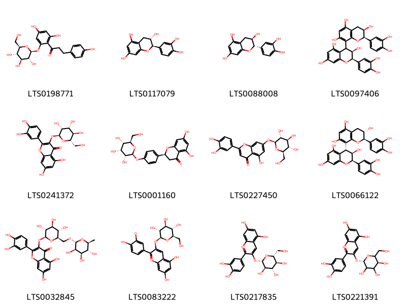
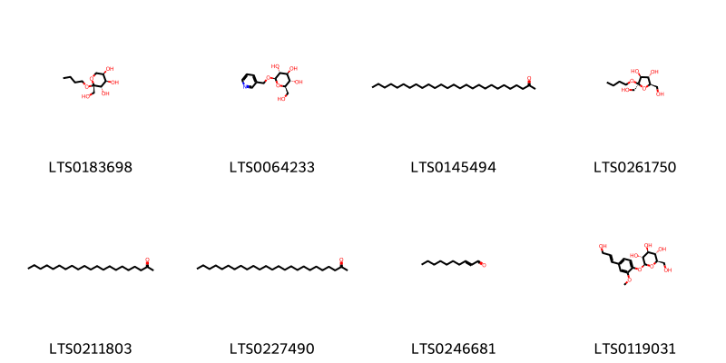
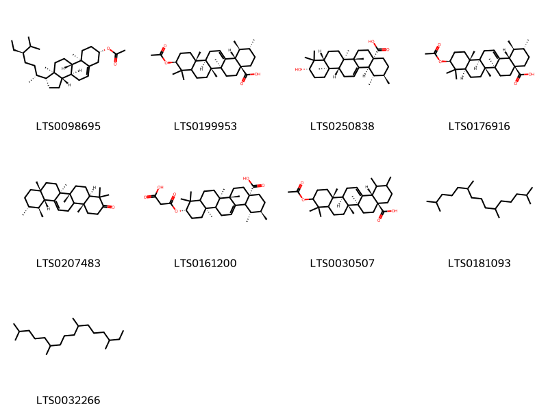
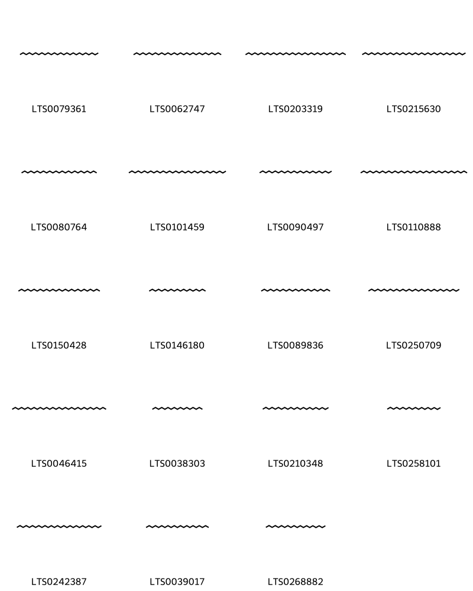
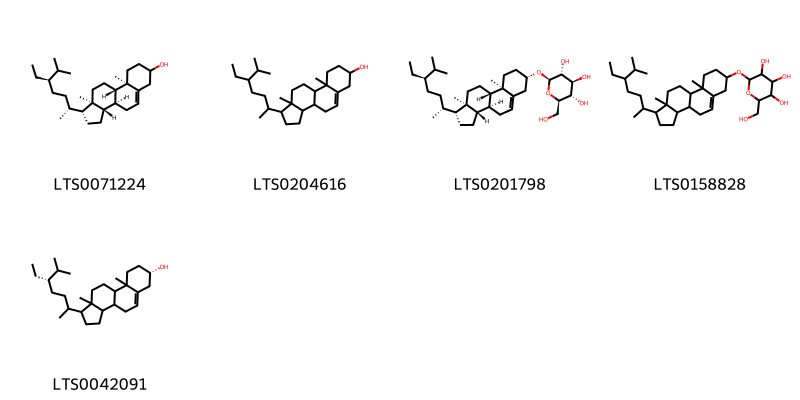
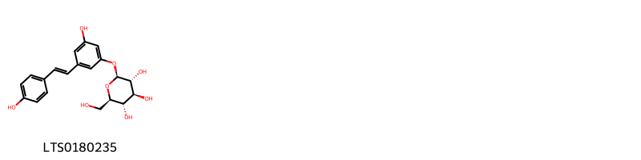

!!! abstract "Tóm tắt"

    Họ Balanophoraceae gồm khoảng 2 chi và 2 loài được một số cộng đồng tại các quốc gia như Ghana, China sử dụng trong một số trường hợp MYMEMORY WARNING: YOU USED ALL AVAILABLE FREE TRANSLATIONS FOR TODAY. NEXT AVAILABLE IN  12 HOURS 52 MINUTES 35 SECONDS VISIT HTTPS://MYMEMORY.TRANSLATED.NET/DOC/USAGELIMITS.PHP TO TRANSLATE MORE.

!!! info "DrDuke"

    James A. Duke sinh năm 1929-2017 là một nhà thực vật học người Mỹ. Đây là một trong những tác giả hàng đầu trong lĩnh vực dược dân tộc học với cuốn *CRC Handbook of Medicinal Herbs* và chính là người xây dựng lên cơ sở dữ liệu về hợp chất tự nhiên và dược dân tộc học tại Bộ nông nghiệp Hoa Kỳ. Các thông tin được đăng tải tại website [Dr. Duke's Phytochemical and Ethnobotanical Databases](https://phytochem.nal.usda.gov/). 
    Trong suốt thập niên 1970, ông lãnh đạo the Plant Taxonomy Laboratory, Plant Genetics and Germplasm Institute of the Agricultural Research Service, U.S. Department of Agriculture.
    Trong tài liệu này, các thông tin về dược dân tộc của các dược liệu được trích dẫn từ tài liệu của James A. Ducke với sự trợ giúp của phần mềm dịch thuật từ tiếng Anh sang tiếng Việt.
   

# Chi Thonningia

??? note "Danh sách các dược liệu thuộc chi"
    
	 - *Thonningia sanguinea*

---
## Thonningia sanguinea
### Thông tin về thực vật

!!! info "Phân loại thực vật của *Thonningia sanguinea* từ GIBF:"
    - **Kingdom:** Plantae
    - **Phylum:** Tracheophyta
    - **Order:** Santalales
    - **Family:** Balanophoraceae
    - **Genus:** Thonningia
    - **Species:** *Thonningia sanguinea*

 

| Label (VI)   | Label (EN)   | Scientific Name      | Descriptions (VI)   | Descriptions (EN)   | Also Known As (VI)   | Also Known As (EN)   |
|:-------------|:-------------|:---------------------|:--------------------|:--------------------|:---------------------|:---------------------|
| N/A          | N/A          | Thonningia sanguinea | loài thực vật       | species of plant    | ['']                 | ['']                 |

#### Phân bố trên thế giới

**Từ CSDL GIBF** Uganda, Central African Republic, Mali, Tanzania, United Republic of, Guinea-Bissau, Guinea, Ghana, Zambia, Nigeria, Togo, Sierra Leone, Benin, Congo, Democratic Republic of the, Rwanda, Gabon, Liberia, Côte d’Ivoire, Congo, Angola, Cameroon

#### Phân bố tại Việt Nam

**Từ CSDL GIBF**: Không có ghi nhận ở Việt Nam

---
### Thành phần hóa học
        
- Theo cơ sở dữ liệu lotus: Từ loài *Thonningia sanguinea* đã phân lập và xác định được 6 hoạt chất thuộc về các nhóm Tannins. 

|    | chemicalTaxonomyClassyfireClass   |   smiles_count |
|---:|:----------------------------------|---------------:|
|  0 | Tannins                           |              6 |

#### Nhóm Tannins
<figure markdown="span">
    { width=100% }
    <figcaption>Hình ảnh cấu trúc hóa học của 6 hoạt chất thuộc nhóm Tannins gồm ['13-[3,5-dihydroxy-4-(3-phenylpropanoyl)phenoxy]-3,4,5,11,12,21,22,23-octahydroxy-9,14,17-trioxatetracyclo[17.4.0.0²,⁷.0¹⁰,¹⁵]tricosa-1(19),2,4,6,20,22-hexaene-8,18-dione (LTS0059766)', '13-[3,5-dihydroxy-4-(3-phenylpropanoyl)phenoxy]-3,4,5,12,21,22,23-heptahydroxy-8,18-dioxo-9,14,17-trioxatetracyclo[17.4.0.0²,⁷.0¹⁰,¹⁵]tricosa-1(23),2(7),3,5,19,21-hexaen-11-yl 3,4,5-trihydroxybenzoate (LTS0098317)', '(10s,11r,12r,13s,15r)-13-[3,5-dihydroxy-4-(3-phenylpropanoyl)phenoxy]-3,4,5,11,12,21,22,23-octahydroxy-9,14,17-trioxatetracyclo[17.4.0.0²,⁷.0¹⁰,¹⁵]tricosa-1(19),2,4,6,20,22-hexaene-8,18-dione (LTS0054686)', '(10s,11r,12s,13r,15s)-13-[3,5-dihydroxy-4-(3-phenylpropanoyl)phenoxy]-3,4,5,11,12,21,22,23-octahydroxy-9,14,17-trioxatetracyclo[17.4.0.0²,⁷.0¹⁰,¹⁵]tricosa-1(19),2,4,6,20,22-hexaene-8,18-dione (LTS0270877)', '(10r,11r,12r,13s,15r)-13-[3,5-dihydroxy-4-(3-phenylpropanoyl)phenoxy]-3,4,5,12,21,22,23-heptahydroxy-8,18-dioxo-9,14,17-trioxatetracyclo[17.4.0.0²,⁷.0¹⁰,¹⁵]tricosa-1(23),2(7),3,5,19,21-hexaen-11-yl 3,4,5-trihydroxybenzoate (LTS0014676)', '(10s,11r,12s,13r,15r)-13-[3,5-dihydroxy-4-(3-phenylpropanoyl)phenoxy]-3,4,5,12,21,22,23-heptahydroxy-8,18-dioxo-9,14,17-trioxatetracyclo[17.4.0.0²,⁷.0¹⁰,¹⁵]tricosa-1(19),2,4,6,20,22-hexaen-11-yl 3,4,5-trihydroxybenzoate (LTS0026981)'].</figcaption>
</figure>

---

### Dược dân tộc học

Danh sách các quốc gia có sử dụng *Thonningia sanguinea* trong điều trị các bệnh. 

| Country   | Disease   | Bệnh                                                                                                                                                                                                |
|:----------|:----------|:----------------------------------------------------------------------------------------------------------------------------------------------------------------------------------------------------|
| Ghana     | Vermifuge | MYMEMORY WARNING: YOU USED ALL AVAILABLE FREE TRANSLATIONS FOR TODAY. NEXT AVAILABLE IN  12 HOURS 52 MINUTES 32 SECONDS VISIT HTTPS://MYMEMORY.TRANSLATED.NET/DOC/USAGELIMITS.PHP TO TRANSLATE MORE |

---

# Chi Cynomorium

??? note "Danh sách các dược liệu thuộc chi"
    
	 - *Cynomorium coccineum*

---
## Cynomorium coccineum
### Thông tin về thực vật

!!! info "Phân loại thực vật của *Cynomorium coccineum* từ GIBF:"
    - **Kingdom:** Plantae
    - **Phylum:** Tracheophyta
    - **Order:** Saxifragales
    - **Family:** Cynomoriaceae
    - **Genus:** Cynomorium
    - **Species:** *Cynomorium coccineum*

 

| Label (VI)   | Label (EN)   | Scientific Name      | Descriptions (VI)   | Descriptions (EN)   | Also Known As (VI)   | Also Known As (EN)   |
|:-------------|:-------------|:---------------------|:--------------------|:--------------------|:---------------------|:---------------------|
| N/A          | N/A          | Cynomorium coccineum | loài thực vật       | species of plant    | ['']                 | ['Red thumb']        |

#### Phân bố trên thế giới

**Từ CSDL GIBF** Morocco, United Arab Emirates, Portugal, Mongolia, Uzbekistan, Saudi Arabia, Iran (Islamic Republic of), Bahrain, Kyrgyzstan, China, Oman, Israel, Kazakhstan, Italy, Palestine, State of, Tunisia, Jordan, Spain

#### Phân bố tại Việt Nam

**Từ CSDL GIBF**: Không có ghi nhận ở Việt Nam

---
### Thành phần hóa học
        
- Theo cơ sở dữ liệu lotus: Từ loài *Cynomorium coccineum* đã phân lập và xác định được 71 hoạt chất thuộc về các nhóm Fatty Acyls, Indoles and derivatives, Benzene and substituted derivatives, Flavonoids, Purine nucleosides, Cinnamic acids and derivatives, Steroids and steroid derivatives, Organooxygen compounds, Azoles, Prenol lipids, Saturated hydrocarbons, Stilbenes. 

|    | chemicalTaxonomyClassyfireClass     |   smiles_count |
|---:|:------------------------------------|---------------:|
|  0 | Azoles                              |              1 |
|  1 | Benzene and substituted derivatives |              3 |
|  2 | Cinnamic acids and derivatives      |              2 |
|  3 | Fatty Acyls                         |              9 |
|  4 | Flavonoids                          |             12 |
|  5 | Indoles and derivatives             |              1 |
|  6 | Organooxygen compounds              |              8 |
|  7 | Prenol lipids                       |              9 |
|  8 | Purine nucleosides                  |              1 |
|  9 | Saturated hydrocarbons              |             19 |
| 10 | Steroids and steroid derivatives    |              5 |
| 11 | Stilbenes                           |              1 |

#### Nhóm Azoles
<figure markdown="span">
    { width=100% }
    <figcaption>Hình ảnh cấu trúc hóa học của 1 hoạt chất thuộc nhóm Azoles gồm ['1-(imidazol-1-yl)-2-methylprop-2-en-1-one (LTS0205142)'].</figcaption>
</figure>
#### Nhóm Benzene and substituted derivatives
<figure markdown="span">
    { width=100% }
    <figcaption>Hình ảnh cấu trúc hóa học của 3 hoạt chất thuộc nhóm Benzene and substituted derivatives gồm ['benzyl benzoate (LTS0097515)', 'galop (LTS0222857)', 'p-hydroxybenzoic acid (LTS0263634)'].</figcaption>
</figure>
#### Nhóm Cinnamic acids and derivatives
<figure markdown="span">
    { width=100% }
    <figcaption>Hình ảnh cấu trúc hóa học của 2 hoạt chất thuộc nhóm Cinnamic acids and derivatives gồm ['para-coumaric acid (LTS0266252)', 'hydroxycinnamic acid (LTS0233023)'].</figcaption>
</figure>
#### Nhóm Fatty Acyls
<figure markdown="span">
    { width=100% }
    <figcaption>Hình ảnh cấu trúc hóa học của 9 hoạt chất thuộc nhóm Fatty Acyls gồm ['11-eicosenoic acid (LTS0026816)', '(+-)-propylene glycol (LTS0274535)', 'docos-2-enoic acid (LTS0148171)', '13-docosenoic acid (LTS0129110)', '9-oxononanoic acid (LTS0152632)', 'oleic acid (LTS0256910)', '10-oxodec-8-enoic acid (LTS0136758)', 'ethyl docos-13-enoate (LTS0026398)', '(14z)-octadec-14-en-1-yl acetate (LTS0035230)'].</figcaption>
</figure>
#### Nhóm Flavonoids
<figure markdown="span">
    { width=100% }
    <figcaption>Hình ảnh cấu trúc hóa học của 12 hoạt chất thuộc nhóm Flavonoids gồm ['phlorizin (LTS0198771)', '(+)-catechol (LTS0117079)', 'α catechin (LTS0088008)', '(2r,3r)-2-(3,4-dihydroxyphenyl)-4-[(2r,3r)-2-(3,4-dihydroxyphenyl)-3,5,7-trihydroxy-3,4-dihydro-2h-1-benzopyran-8-yl]-3,4-dihydro-2h-1-benzopyran-3,5,7-triol (LTS0097406)', '2-(3,4-dihydroxyphenyl)-5,7-dihydroxy-3-{[(2s,3r,4r,5r,6s)-3,4,5-trihydroxy-6-(hydroxymethyl)oxan-2-yl]oxy}chromen-4-one (LTS0241372)', "naringenin 4'-o-glucoside (LTS0001160)", 'luteolin 7-o-glucoside (LTS0227450)', '(2r,3r,4r)-2-(3,4-dihydroxyphenyl)-4-[(2r,3s)-2-(3,4-dihydroxyphenyl)-3,5,7-trihydroxy-3,4-dihydro-2h-1-benzopyran-8-yl]-3,4-dihydro-2h-1-benzopyran-3,5,7-triol (LTS0066122)', '3-rutinosyl quercetin (LTS0032845)', '5,7-dihydroxy-2-(4-hydroxy-3-oxidophenyl)-3-{[(2s,3r,4s,5s,6r)-3,4,5-trihydroxy-6-(hydroxymethyl)oxan-2-yl]oxy}-1λ⁴-chromen-1-ylium (LTS0083222)', 'cyanidin 3-glucoside (LTS0217835)', 'chrysanthemin (LTS0221391)'].</figcaption>
</figure>
#### Nhóm Indoles and derivatives
<figure markdown="span">
    { width=100% }
    <figcaption>Hình ảnh cấu trúc hóa học của 1 hoạt chất thuộc nhóm Indoles and derivatives gồm ['l-tryptophan (LTS0263809)'].</figcaption>
</figure>
#### Nhóm Organooxygen compounds
<figure markdown="span">
    { width=100% }
    <figcaption>Hình ảnh cấu trúc hóa học của 8 hoạt chất thuộc nhóm Organooxygen compounds gồm ['(2r,3s,4r,5r)-2-butoxy-2-(hydroxymethyl)oxane-3,4,5-triol (LTS0183698)', '(2r,3s,4s,5r,6r)-2-(hydroxymethyl)-6-(pyridin-3-ylmethoxy)oxane-3,4,5-triol (LTS0064233)', 'heptacosan-2-one (LTS0145494)', '(2r,3s,4s,5r)-2-butoxy-2,5-bis(hydroxymethyl)oxolane-3,4-diol (LTS0261750)', 'henicosan-2-one (LTS0211803)', 'pentacosan-2-one (LTS0227490)', '(2e)-2-decenal (LTS0246681)', 'coniferin (LTS0119031)'].</figcaption>
</figure>
#### Nhóm Prenol lipids
<figure markdown="span">
    { width=100% }
    <figcaption>Hình ảnh cấu trúc hóa học của 9 hoạt chất thuộc nhóm Prenol lipids gồm ['β-sitosteryl acetate (LTS0098695)', '(1s,2r,4as,6as,6br,10s,12ar,12br,14bs)-10-(acetyloxy)-1,2,6a,6b,9,9,12a-heptamethyl-2,3,4,5,6,7,8,8a,10,11,12,12b,13,14b-tetradecahydro-1h-picene-4a-carboxylic acid (LTS0199953)', 'ursolic acid (LTS0250838)', '(1s,2r,4as,6as,6br,8ar,10s,12ar,12br,14bs)-10-(acetyloxy)-1,2,6a,6b,9,9,12a-heptamethyl-2,3,4,5,6,7,8,8a,10,11,12,12b,13,14b-tetradecahydro-1h-picene-4a-carboxylic acid (LTS0176916)', '(4ar,6ar,6bs,8ar,11r,12s,12ar,14br)-4,4,6a,6b,8a,11,12,14b-octamethyl-1,2,4a,5,6,7,8,9,10,11,12,12a,14,14a-tetradecahydropicen-3-one (LTS0207483)', '(1s,2r,4as,6as,6br,10s,12ar)-10-[(2-carboxyacetyl)oxy]-1,2,6a,6b,9,9,12a-heptamethyl-2,3,4,5,6,7,8,8a,10,11,12,12b,13,14b-tetradecahydro-1h-picene-4a-carboxylic acid (LTS0161200)', '(4as,6as,6br,12ar,12br,14bs)-10-(acetyloxy)-1,2,6a,6b,9,9,12a-heptamethyl-2,3,4,5,6,7,8,8a,10,11,12,12b,13,14b-tetradecahydro-1h-picene-4a-carboxylic acid (LTS0030507)', 'pristane (LTS0181093)', 'phytane (LTS0032266)'].</figcaption>
</figure>
#### Nhóm Purine nucleosides
<figure markdown="span">
    { width=100% }
    <figcaption>Hình ảnh cấu trúc hóa học của 1 hoạt chất thuộc nhóm Purine nucleosides gồm ['adenosine (LTS0014061)'].</figcaption>
</figure>
#### Nhóm Saturated hydrocarbons
<figure markdown="span">
    { width=100% }
    <figcaption>Hình ảnh cấu trúc hóa học của 19 hoạt chất thuộc nhóm Saturated hydrocarbons gồm ['hexacosane (LTS0079361)', 'nonacosane (LTS0062747)', 'tritriacontane (LTS0203319)', 'tetratriacontane (LTS0215630)', 'pentacosane (LTS0080764)', 'dotriacontane (LTS0101459)', 'tetracosane (LTS0090497)', 'pentatriacontane (LTS0110888)', 'heptacosane (LTS0150428)', 'nonadecane (LTS0146180)', 'tricosane (LTS0089836)', 'triacontane (LTS0250709)', 'hentriacontane (LTS0046415)', 'heptadecane (LTS0038303)', 'docosane (LTS0210348)', 'octadecane (LTS0258101)', 'octacosane (LTS0242387)', 'heneicosane (LTS0039017)', 'eicosane (LTS0268882)'].</figcaption>
</figure>
#### Nhóm Steroids and steroid derivatives
<figure markdown="span">
    { width=100% }
    <figcaption>Hình ảnh cấu trúc hóa học của 5 hoạt chất thuộc nhóm Steroids and steroid derivatives gồm ['stigmast-5-en-3-ol (LTS0071224)', 'stigmast-5-en-3-ol, (3β)- (LTS0204616)', 'sitogluside (LTS0201798)', '2-{[1-(5-ethyl-6-methylheptan-2-yl)-9a,11a-dimethyl-1h,2h,3h,3ah,3bh,4h,6h,7h,8h,9h,9bh,10h,11h-cyclopenta[a]phenanthren-7-yl]oxy}-6-(hydroxymethyl)oxane-3,4,5-triol (LTS0158828)', '(7s)-1-[(5s)-5-ethyl-6-methylheptan-2-yl]-9a,11a-dimethyl-1h,2h,3h,3ah,3bh,4h,6h,7h,8h,9h,9bh,10h,11h-cyclopenta[a]phenanthren-7-ol (LTS0042091)'].</figcaption>
</figure>
#### Nhóm Stilbenes
<figure markdown="span">
    { width=100% }
    <figcaption>Hình ảnh cấu trúc hóa học của 1 hoạt chất thuộc nhóm Stilbenes gồm ['piceid (LTS0180235)'].</figcaption>
</figure>

---

### Dược dân tộc học

Danh sách các quốc gia có sử dụng *Cynomorium coccineum* trong điều trị các bệnh. 

| Country   | Disease            | Bệnh                                                                                                                                                                                                |
|:----------|:-------------------|:----------------------------------------------------------------------------------------------------------------------------------------------------------------------------------------------------|
| China     | Tonic, Aphrodisiac | MYMEMORY WARNING: YOU USED ALL AVAILABLE FREE TRANSLATIONS FOR TODAY. NEXT AVAILABLE IN  12 HOURS 51 MINUTES 53 SECONDS VISIT HTTPS://MYMEMORY.TRANSLATED.NET/DOC/USAGELIMITS.PHP TO TRANSLATE MORE |

---

