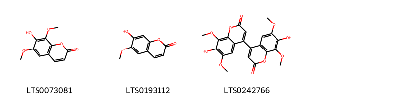
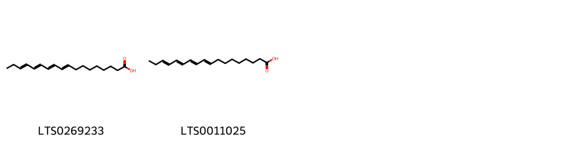
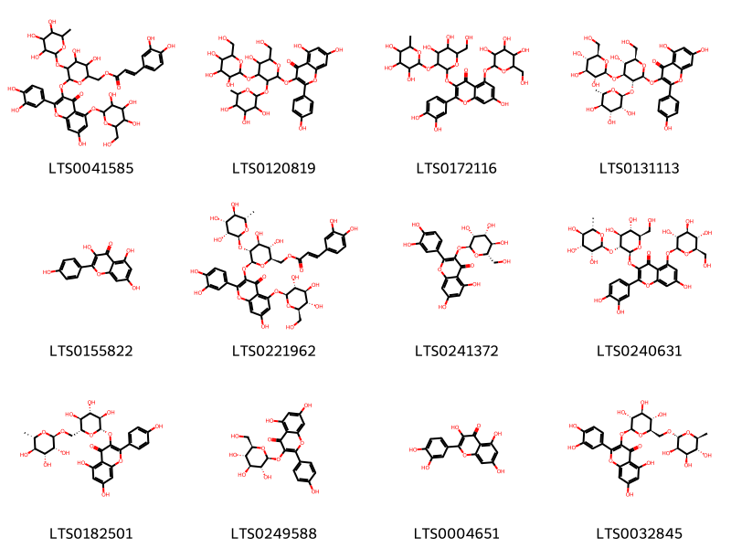
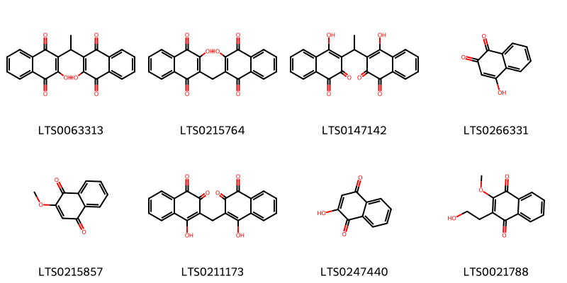
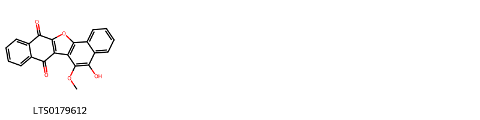
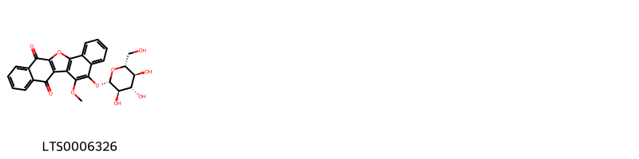
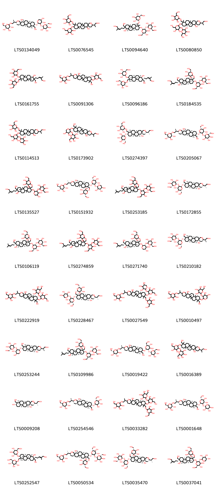
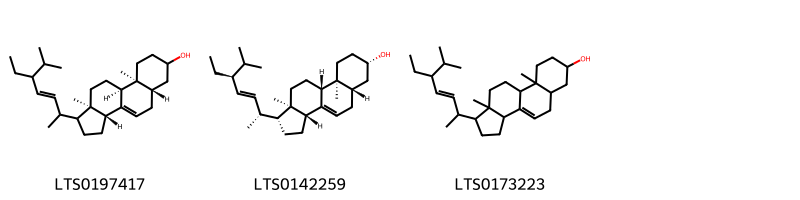

!!! abstract "Tóm tắt"

    Họ Balsaminaceae gồm khoảng 1 chi và 5 loài được một số cộng đồng tại các quốc gia như North America, Turkey, Elsewhere, Europe sử dụng trong một số trường hợp Cathartic, Emetic, Cathartic, Thuốc lợi tiểu, Thuốc nhuận tràng, Thuốc nhuận tràng, Laxative, Vulnerary, Thuốc lợi tiểu, Chất làm se, Thuốc lợi tiểu, Emetic, Thuốc giải độc, nan, Thuốc lợi tiểu, Thuốc diệt nấm, Cathartic, Emetic.

!!! info "DrDuke"

    James A. Duke sinh năm 1929-2017 là một nhà thực vật học người Mỹ. Đây là một trong những tác giả hàng đầu trong lĩnh vực dược dân tộc học với cuốn *CRC Handbook of Medicinal Herbs* và chính là người xây dựng lên cơ sở dữ liệu về hợp chất tự nhiên và dược dân tộc học tại Bộ nông nghiệp Hoa Kỳ. Các thông tin được đăng tải tại website [Dr. Duke's Phytochemical and Ethnobotanical Databases](https://phytochem.nal.usda.gov/). 
    Trong suốt thập niên 1970, ông lãnh đạo the Plant Taxonomy Laboratory, Plant Genetics and Germplasm Institute of the Agricultural Research Service, U.S. Department of Agriculture.
    Trong tài liệu này, các thông tin về dược dân tộc của các dược liệu được trích dẫn từ tài liệu của James A. Ducke với sự trợ giúp của phần mềm dịch thuật từ tiếng Anh sang tiếng Việt.
   

# Chi Impatiens

??? note "Danh sách các dược liệu thuộc chi"
    
	 - *Impatiens balsamina*
	 - *Impatiens noli-tangere*
	 - *Impatiens nolitangera*
	 - *Impatiens nolitangere*
	 - *Impatiens pallida*

---
## Impatiens balsamina
### Thông tin về thực vật

!!! info "Phân loại thực vật của *Impatiens balsamina* từ GIBF:"
    - **Kingdom:** Plantae
    - **Phylum:** Tracheophyta
    - **Order:** Ericales
    - **Family:** Balsaminaceae
    - **Genus:** Impatiens
    - **Species:** *Impatiens balsamina*

 

| Label (VI)   | Label (EN)   | Scientific Name     | Descriptions (VI)   | Descriptions (EN)   | Also Known As (VI)                      | Also Known As (EN)                 |
|:-------------|:-------------|:--------------------|:--------------------|:--------------------|:----------------------------------------|:-----------------------------------|
| N/A          | N/A          | Impatiens balsamina | loài thực vật       | species of plant    | ['Impatiens balsamina', 'Hoa móng tay'] | ['garden balsam', 'jumping betty'] |

#### Phân bố trên thế giới

**Từ CSDL GIBF** nan, Brazil, United Arab Emirates, Viet Nam, Uganda, Guatemala, Sweden, Nepal, Barbados, China, Kazakhstan, Honduras, Ecuador, Papua New Guinea, Thailand, Spain, Netherlands, Sri Lanka, United States of America, Jamaica, Korea, Republic of, Greece, Indonesia, Costa Rica, Russian Federation, Dominican Republic, Colombia, French Guiana, Hong Kong, Mexico, Congo, Democratic Republic of the, Macao, Niue, Malaysia, Chinese Taipei, Philippines, Gabon, Canada, Germany, Panama, Austria, Singapore, Hungary, Portugal, Ukraine, South Africa, Australia, India

#### Phân bố tại Việt Nam

**Từ CSDL GIBF**: Quảng Nam, Bình Dương

---
### Thành phần hóa học
        
- Theo cơ sở dữ liệu lotus: Từ loài *Impatiens balsamina* đã phân lập và xác định được 71 hoạt chất thuộc về các nhóm Fatty Acyls, Benzene and substituted derivatives, Flavonoids, Naphthofurans, Cinnamic acids and derivatives, Naphthalenes, Steroids and steroid derivatives, Coumarins and derivatives, Organooxygen compounds, Prenol lipids. 

|    | chemicalTaxonomyClassyfireClass     |   smiles_count |
|---:|:------------------------------------|---------------:|
|  0 | Benzene and substituted derivatives |              1 |
|  1 | Cinnamic acids and derivatives      |              4 |
|  2 | Coumarins and derivatives           |              3 |
|  3 | Fatty Acyls                         |              2 |
|  4 | Flavonoids                          |             12 |
|  5 | Naphthalenes                        |              8 |
|  6 | Naphthofurans                       |              1 |
|  7 | Organooxygen compounds              |              1 |
|  8 | Prenol lipids                       |             36 |
|  9 | Steroids and steroid derivatives    |              3 |

#### Nhóm Benzene and substituted derivatives
<figure markdown="span">
    { width=100% }
    <figcaption>Hình ảnh cấu trúc hóa học của 1 hoạt chất thuộc nhóm Benzene and substituted derivatives gồm ['p-hydroxybenzoic acid (LTS0263634)'].</figcaption>
</figure>
#### Nhóm Cinnamic acids and derivatives
<figure markdown="span">
    { width=100% }
    <figcaption>Hình ảnh cấu trúc hóa học của 4 hoạt chất thuộc nhóm Cinnamic acids and derivatives gồm ['ferulic acid (LTS0077328)', 'para-coumaric acid (LTS0266252)', 'hydroxycinnamic acid (LTS0233023)', 'ferulic acid (LTS0273002)'].</figcaption>
</figure>
#### Nhóm Coumarins and derivatives
<figure markdown="span">
    { width=100% }
    <figcaption>Hình ảnh cấu trúc hóa học của 3 hoạt chất thuộc nhóm Coumarins and derivatives gồm ['isofraxidin (LTS0073081)', 'scopoletin (LTS0193112)', "7,7'-dihydroxy-6,6',8,8'-tetramethoxy-[4,4'-bichromene]-2,2'-dione (LTS0242766)"].</figcaption>
</figure>
#### Nhóm Fatty Acyls
<figure markdown="span">
    { width=100% }
    <figcaption>Hình ảnh cấu trúc hóa học của 2 hoạt chất thuộc nhóm Fatty Acyls gồm ['parinaric acid (LTS0269233)', 'octadecatetraenoic acid (LTS0011025)'].</figcaption>
</figure>
#### Nhóm Flavonoids
<figure markdown="span">
    { width=100% }
    <figcaption>Hình ảnh cấu trúc hóa học của 12 hoạt chất thuộc nhóm Flavonoids gồm ['(6-{[2-(3,4-dihydroxyphenyl)-7-hydroxy-4-oxo-5-{[3,4,5-trihydroxy-6-(hydroxymethyl)oxan-2-yl]oxy}chromen-3-yl]oxy}-3,4-dihydroxy-5-[(3,4,5-trihydroxy-6-methyloxan-2-yl)oxy]oxan-2-yl)methyl 3-(3,4-dihydroxyphenyl)prop-2-enoate (LTS0041585)', '5,7-dihydroxy-3-{[5-hydroxy-6-(hydroxymethyl)-4-{[3,4,5-trihydroxy-6-(hydroxymethyl)oxan-2-yl]oxy}-3-[(3,4,5-trihydroxy-6-methyloxan-2-yl)oxy]oxan-2-yl]oxy}-2-(4-hydroxyphenyl)chromen-4-one (LTS0120819)', '3-{[4,5-dihydroxy-6-(hydroxymethyl)-3-[(3,4,5-trihydroxy-6-methyloxan-2-yl)oxy]oxan-2-yl]oxy}-2-(3,4-dihydroxyphenyl)-7-hydroxy-5-{[3,4,5-trihydroxy-6-(hydroxymethyl)oxan-2-yl]oxy}chromen-4-one (LTS0172116)', '5,7-dihydroxy-3-{[(2s,3r,4s,5r,6r)-5-hydroxy-6-(hydroxymethyl)-4-{[(2s,3r,4s,5s,6r)-3,4,5-trihydroxy-6-(hydroxymethyl)oxan-2-yl]oxy}-3-{[(2s,3r,4r,5r,6s)-3,4,5-trihydroxy-6-methyloxan-2-yl]oxy}oxan-2-yl]oxy}-2-(4-hydroxyphenyl)chromen-4-one (LTS0131113)', 'kaempherol (LTS0155822)', '[(2r,3s,4s,5r,6s)-6-{[2-(3,4-dihydroxyphenyl)-7-hydroxy-4-oxo-5-{[(2s,3r,4s,5s,6r)-3,4,5-trihydroxy-6-(hydroxymethyl)oxan-2-yl]oxy}chromen-3-yl]oxy}-3,4-dihydroxy-5-{[(2s,3r,4r,5r,6s)-3,4,5-trihydroxy-6-methyloxan-2-yl]oxy}oxan-2-yl]methyl (2e)-3-(3,4-dihydroxyphenyl)prop-2-enoate (LTS0221962)', '2-(3,4-dihydroxyphenyl)-5,7-dihydroxy-3-{[(2s,3r,4r,5r,6s)-3,4,5-trihydroxy-6-(hydroxymethyl)oxan-2-yl]oxy}chromen-4-one (LTS0241372)', '3-{[(2s,3r,4s,5s,6r)-4,5-dihydroxy-6-(hydroxymethyl)-3-{[(2s,3r,4r,5r,6s)-3,4,5-trihydroxy-6-methyloxan-2-yl]oxy}oxan-2-yl]oxy}-2-(3,4-dihydroxyphenyl)-7-hydroxy-5-{[(2s,3r,4s,5s,6r)-3,4,5-trihydroxy-6-(hydroxymethyl)oxan-2-yl]oxy}chromen-4-one (LTS0240631)', 'nictoflorin (LTS0182501)', 'astragalin (LTS0249588)', 'quercetin (LTS0004651)', '3-rutinosyl quercetin (LTS0032845)'].</figcaption>
</figure>
#### Nhóm Naphthalenes
<figure markdown="span">
    { width=100% }
    <figcaption>Hình ảnh cấu trúc hóa học của 8 hoạt chất thuộc nhóm Naphthalenes gồm ['impatienol (LTS0063313)', '2-hydroxy-3-[(3-hydroxy-1,4-dioxonaphthalen-2-yl)methyl]naphthalene-1,4-dione (LTS0215764)', '4-hydroxy-3-[1-(1-hydroxy-3,4-dioxonaphthalen-2-yl)ethyl]naphthalene-1,2-dione (LTS0147142)', '2-hydroxy-1,4-naphthoquinone (LTS0266331)', '2-methoxynaphthoquinone (LTS0215857)', '4-hydroxy-3-[(1-hydroxy-3,4-dioxonaphthalen-2-yl)methyl]naphthalene-1,2-dione (LTS0211173)', 'hana (LTS0247440)', '2-(2-hydroxyethyl)-3-methoxynaphthalene-1,4-dione (LTS0021788)'].</figcaption>
</figure>
#### Nhóm Naphthofurans
<figure markdown="span">
    { width=100% }
    <figcaption>Hình ảnh cấu trúc hóa học của 1 hoạt chất thuộc nhóm Naphthofurans gồm ['20-hydroxy-21-methoxy-12-oxapentacyclo[11.8.0.0²,¹¹.0⁴,⁹.0¹⁴,¹⁹]henicosa-1(13),2(11),4,6,8,14(19),15,17,20-nonaene-3,10-dione (LTS0179612)'].</figcaption>
</figure>
#### Nhóm Organooxygen compounds
<figure markdown="span">
    { width=100% }
    <figcaption>Hình ảnh cấu trúc hóa học của 1 hoạt chất thuộc nhóm Organooxygen compounds gồm ['21-methoxy-20-{[(2s,3r,4s,5s,6r)-3,4,5-trihydroxy-6-(hydroxymethyl)oxan-2-yl]oxy}-12-oxapentacyclo[11.8.0.0²,¹¹.0⁴,⁹.0¹⁴,¹⁹]henicosa-1(13),2(11),4,6,8,14(19),15,17,20-nonaene-3,10-dione (LTS0006326)'].</figcaption>
</figure>
#### Nhóm Prenol lipids
<figure markdown="span">
    { width=100% }
    <figcaption>Hình ảnh cấu trúc hóa học của 36 hoạt chất thuộc nhóm Prenol lipids gồm ["(2r,3r,4s,5s,6r)-2-[(2r)-2-[(1r,2s,4ar,4br,6'r,6ar,7r,8s,10ar,10br,12as)-8-{[(2s,3r,4s,5r)-4,5-dihydroxy-3-{[(2s,3r,4s,5s,6r)-3,4,5-trihydroxy-6-(hydroxymethyl)oxan-2-yl]oxy}oxan-2-yl]oxy}-1-hydroxy-7-(hydroxymethyl)-4a,4b,7,10a-tetramethyl-dodecahydro-1h-spiro[chrysene-2,3'-oxan]-6'-yl]propoxy]-6-(hydroxymethyl)oxane-3,4,5-triol (LTS0134049)", "2-(hydroxymethyl)-6-[6'-(1-hydroxypropan-2-yl)-4a,4b,7,10a-tetramethyl-7-({[3,4,5-trihydroxy-6-(hydroxymethyl)oxan-2-yl]oxy}methyl)-dodecahydro-1h-spiro[chrysene-2,3'-oxan]-1-oloxy]oxane-3,4,5-triol (LTS0076545)", '(2s,3r,4s,5s,6r)-2-{[(2s,4as,4bs,6as,7r,12ar)-2-{[(2s,3r,4s,5s,6r)-4,5-dihydroxy-6-(hydroxymethyl)-3-{[(2r,3r,4s,5s,6r)-3,4,5-trihydroxy-6-(hydroxymethyl)oxan-2-yl]oxy}oxan-2-yl]oxy}-7-hydroxy-8-(5-hydroxy-4-methylpent-3-en-1-yl)-8-(hydroxymethyl)-1,4a,10a,10b-tetramethyl-dodecahydro-2h-chrysen-1-yl]methoxy}-6-(hydroxymethyl)oxane-3,4,5-triol (LTS0094640)', "2-{[4,5-dihydroxy-6-(hydroxymethyl)-2-[6'-(1-hydroxypropan-2-yl)-4a,4b,7,10a-tetramethyl-7-({[3,4,5-trihydroxy-6-(hydroxymethyl)oxan-2-yl]oxy}methyl)-dodecahydro-1h-spiro[chrysene-2,3'-oxan]-1-oloxy]oxan-3-yl]oxy}-6-(hydroxymethyl)oxane-3,4,5-triol (LTS0080850)", '2-{[7-hydroxy-8-(5-hydroxy-4-methylpent-3-en-1-yl)-8-(hydroxymethyl)-1,4a,10a,10b-tetramethyl-1-({[3,4,5-trihydroxy-6-(hydroxymethyl)oxan-2-yl]oxy}methyl)-dodecahydro-2h-chrysen-2-yl]oxy}-6-(hydroxymethyl)oxane-3,4,5-triol (LTS0161755)', "2-{2-[1-hydroxy-7-(hydroxymethyl)-4a,4b,7,10a-tetramethyl-8-{[3,4,5-trihydroxy-6-(hydroxymethyl)oxan-2-yl]oxy}-dodecahydro-1h-spiro[chrysene-2,3'-oxan]-6'-yl]propoxy}-6-(hydroxymethyl)oxane-3,4,5-triol (LTS0091306)", '(2r,3r,4s,5s,6r)-2-{[(1r,2s,4ar,4br,6as,7r,8r,10ar,10br,12ar)-7-hydroxy-8-[(3z)-5-hydroxy-4-methylpent-3-en-1-yl]-8-(hydroxymethyl)-1,4a,10a,10b-tetramethyl-1-({[(2r,3r,4s,5s,6r)-3,4,5-trihydroxy-6-(hydroxymethyl)oxan-2-yl]oxy}methyl)-dodecahydro-2h-chrysen-2-yl]oxy}-6-(hydroxymethyl)oxane-3,4,5-triol (LTS0096186)', '(2s,3r,4s,5s,6r)-2-{[(2r,3r,4s,5s,6r)-2-{[(1r,2s,4ar,4br,6as,7r,8r,10ar,10br,12ar)-7-hydroxy-8-[(3z)-5-hydroxy-4-methylpent-3-en-1-yl]-8-(hydroxymethyl)-1,4a,10a,10b-tetramethyl-1-({[(2r,3r,4s,5s,6r)-3,4,5-trihydroxy-6-(hydroxymethyl)oxan-2-yl]oxy}methyl)-dodecahydro-2h-chrysen-2-yl]oxy}-4,5-dihydroxy-6-(hydroxymethyl)oxan-3-yl]oxy}-6-(hydroxymethyl)oxane-3,4,5-triol (LTS0184535)', "2-(8-{[4,5-dihydroxy-6-(hydroxymethyl)-3-[(3,4,5-trihydroxyoxan-2-yl)oxy]oxan-2-yl]oxy}-1-hydroxy-6'-(1-hydroxypropan-2-yl)-4a,4b,7,10a-tetramethyl-dodecahydro-1h-spiro[chrysene-2,3'-oxan]-7-ylmethoxy)-6-(hydroxymethyl)oxane-3,4,5-triol (LTS0114513)", "2-({4,5-dihydroxy-2-[7-(hydroxymethyl)-6'-(1-hydroxypropan-2-yl)-4a,4b,7,10a-tetramethyl-dodecahydro-1h-spiro[chrysene-2,3'-oxan]-1-oloxy]oxan-3-yl}oxy)-6-(hydroxymethyl)oxane-3,4,5-triol (LTS0173902)", "(2r,3r,4s,5s,6r)-2-[(1r,2s,4ar,4br,6's,6ar,7r,8s,10ar,10br,12as)-6'-[(2s)-1-hydroxypropan-2-yl]-4a,4b,7,10a-tetramethyl-7-({[(2r,3r,4s,5s,6r)-3,4,5-trihydroxy-6-(hydroxymethyl)oxan-2-yl]oxy}methyl)-dodecahydro-1h-spiro[chrysene-2,3'-oxan]-1-oloxy]-6-(hydroxymethyl)oxane-3,4,5-triol (LTS0274397)", "(2r,3r,4s,5s,6r)-2-[(2r)-2-[(1r,2s,4ar,4br,6'r,6ar,7r,8s,10ar,10br,12as)-8-{[(2r,3r,4s,5s,6r)-4,5-dihydroxy-6-(hydroxymethyl)-3-{[(2s,3r,4s,5s,6r)-3,4,5-trihydroxy-6-(hydroxymethyl)oxan-2-yl]oxy}oxan-2-yl]oxy}-1-hydroxy-7-(hydroxymethyl)-4a,4b,7,10a-tetramethyl-dodecahydro-1h-spiro[chrysene-2,3'-oxan]-6'-yl]propoxy]-6-(hydroxymethyl)oxane-3,4,5-triol (LTS0205067)", '2-[(4,5-dihydroxy-2-{[7-hydroxy-8-(5-hydroxy-4-methylpent-3-en-1-yl)-8-(hydroxymethyl)-1,4a,10a,10b-tetramethyl-1-({[3,4,5-trihydroxy-6-(hydroxymethyl)oxan-2-yl]oxy}methyl)-dodecahydro-2h-chrysen-2-yl]oxy}oxan-3-yl)oxy]-6-(hydroxymethyl)oxane-3,4,5-triol (LTS0135527)', "(2r,3r,4s,5s,6r)-2-[(2s)-2-[(1r,2s,4ar,4br,6's,6ar,7r,8s,10ar,10br,12as)-8-{[(2r,3r,4s,5s,6r)-4,5-dihydroxy-6-(hydroxymethyl)-3-{[(2s,3r,4s,5r)-3,4,5-trihydroxyoxan-2-yl]oxy}oxan-2-yl]oxy}-1-hydroxy-4a,4b,7,10a-tetramethyl-7-({[(2r,3r,4s,5s,6r)-3,4,5-trihydroxy-6-(hydroxymethyl)oxan-2-yl]oxy}methyl)-dodecahydro-1h-spiro[chrysene-2,3'-oxan]-6'-yl]propoxy]-6-(hydroxymethyl)oxane-3,4,5-triol (LTS0151932)", '2-[(4,5-dihydroxy-2-{[7-hydroxy-8-(hydroxymethyl)-1,4a,10a,10b-tetramethyl-8-(4-methylpent-3-en-1-yl)-1-({[3,4,5-trihydroxy-6-(hydroxymethyl)oxan-2-yl]oxy}methyl)-dodecahydro-2h-chrysen-2-yl]oxy}-6-(hydroxymethyl)oxan-3-yl)oxy]-6-(hydroxymethyl)oxane-3,4,5-triol (LTS0253185)', "(2s,3r,4s,5s,6r)-2-{[(2r,3r,4s,5s,6r)-2-[(1r,2s,4ar,4br,6's,6ar,7r,8s,10ar,10br,12as)-7-(hydroxymethyl)-6'-[(2s)-1-hydroxypropan-2-yl]-4a,4b,7,10a-tetramethyl-dodecahydro-1h-spiro[chrysene-2,3'-oxan]-1-oloxy]-4,5-dihydroxy-6-(hydroxymethyl)oxan-3-yl]oxy}-6-(hydroxymethyl)oxane-3,4,5-triol (LTS0172855)", '(2s,3r,4s,5s,6r)-2-{[(2r,3r,4s,5s,6r)-2-{[(1r,2s,4ar,4br,6as,7r,8r,10ar,10br,12ar)-7-hydroxy-8-(hydroxymethyl)-1,4a,10a,10b-tetramethyl-8-(4-methylpent-3-en-1-yl)-1-({[(2r,3r,4s,5s,6r)-3,4,5-trihydroxy-6-(hydroxymethyl)oxan-2-yl]oxy}methyl)-dodecahydro-2h-chrysen-2-yl]oxy}-4,5-dihydroxy-6-(hydroxymethyl)oxan-3-yl]oxy}-6-(hydroxymethyl)oxane-3,4,5-triol (LTS0106119)', '2-[(4,5-dihydroxy-2-{[7-hydroxy-8-(5-hydroxy-4-methylpent-3-en-1-yl)-8-(hydroxymethyl)-1,4a,10a,10b-tetramethyl-1-({[3,4,5-trihydroxy-6-(hydroxymethyl)oxan-2-yl]oxy}methyl)-dodecahydro-2h-chrysen-2-yl]oxy}-6-(hydroxymethyl)oxan-3-yl)oxy]-6-(hydroxymethyl)oxane-3,4,5-triol (LTS0274859)', '(2s,3r,4s,5s,6r)-2-{[(2s,3r,4s,5r)-2-{[(1r,2s,4ar,4br,6as,7r,8r,10ar,10br,12ar)-7-hydroxy-8-[(3z)-5-hydroxy-4-methylpent-3-en-1-yl]-8-(hydroxymethyl)-1,4a,10a,10b-tetramethyl-1-({[(2r,3r,4s,5s,6r)-3,4,5-trihydroxy-6-(hydroxymethyl)oxan-2-yl]oxy}methyl)-dodecahydro-2h-chrysen-2-yl]oxy}-4,5-dihydroxyoxan-3-yl]oxy}-6-(hydroxymethyl)oxane-3,4,5-triol (LTS0271740)', "(2s,3r,4s,5s,6r)-2-{[(2r,3r,4s,5s,6r)-2-[(1r,2s,4ar,4br,6'r,6ar,7r,8s,10ar,10br,12as)-7-(hydroxymethyl)-6'-[(2r)-1-hydroxypropan-2-yl]-4a,4b,7,10a-tetramethyl-dodecahydro-1h-spiro[chrysene-2,3'-oxan]-1-oloxy]-4,5-dihydroxy-6-(hydroxymethyl)oxan-3-yl]oxy}-6-(hydroxymethyl)oxane-3,4,5-triol (LTS0210182)", "2-[2-(8-{[4,5-dihydroxy-6-(hydroxymethyl)-3-{[3,4,5-trihydroxy-6-(hydroxymethyl)oxan-2-yl]oxy}oxan-2-yl]oxy}-1-hydroxy-7-(hydroxymethyl)-4a,4b,7,10a-tetramethyl-dodecahydro-1h-spiro[chrysene-2,3'-oxan]-6'-yl)propoxy]-6-(hydroxymethyl)oxane-3,4,5-triol (LTS0222919)", "(2r,3r,4s,5s,6r)-2-[(1r,2s,4ar,4br,6's,6ar,7r,8s,10ar,10br,12as)-8-{[(2r,3r,4s,5s,6r)-4,5-dihydroxy-6-(hydroxymethyl)-3-{[(2s,3r,4s,5r)-3,4,5-trihydroxyoxan-2-yl]oxy}oxan-2-yl]oxy}-1-hydroxy-6'-[(2s)-1-hydroxypropan-2-yl]-4a,4b,7,10a-tetramethyl-dodecahydro-1h-spiro[chrysene-2,3'-oxan]-7-ylmethoxy]-6-(hydroxymethyl)oxane-3,4,5-triol (LTS0228467)", "2-[2-(8-{[4,5-dihydroxy-6-(hydroxymethyl)-3-[(3,4,5-trihydroxyoxan-2-yl)oxy]oxan-2-yl]oxy}-1-hydroxy-4a,4b,7,10a-tetramethyl-7-({[3,4,5-trihydroxy-6-(hydroxymethyl)oxan-2-yl]oxy}methyl)-dodecahydro-1h-spiro[chrysene-2,3'-oxan]-6'-yl)propoxy]-6-(hydroxymethyl)oxane-3,4,5-triol (LTS0027549)", "2-(2-{8-[(4,5-dihydroxy-3-{[3,4,5-trihydroxy-6-(hydroxymethyl)oxan-2-yl]oxy}oxan-2-yl)oxy]-1-hydroxy-7-(hydroxymethyl)-4a,4b,7,10a-tetramethyl-dodecahydro-1h-spiro[chrysene-2,3'-oxan]-6'-yl}propoxy)-6-(hydroxymethyl)oxane-3,4,5-triol (LTS0010497)", "(2s,3r,4s,5s,6r)-2-{[(2s,3r,4s,5r)-2-[(1r,2s,4ar,4br,6'r,6ar,7r,8s,10ar,10br,12as)-7-(hydroxymethyl)-6'-[(2r)-1-hydroxypropan-2-yl]-4a,4b,7,10a-tetramethyl-dodecahydro-1h-spiro[chrysene-2,3'-oxan]-1-oloxy]-4,5-dihydroxyoxan-3-yl]oxy}-6-(hydroxymethyl)oxane-3,4,5-triol (LTS0253244)", '(2s,3r,4s,5s,6r)-2-{[(2r,3r,4s,5s,6r)-2-{[(1r,2s,4ar,4br,6as,7r,8s,10ar,10br,12ar)-7-hydroxy-8-(hydroxymethyl)-1,4a,10a,10b-tetramethyl-8-(4-methylpent-3-en-1-yl)-1-({[(2r,3r,4s,5s,6r)-3,4,5-trihydroxy-6-(hydroxymethyl)oxan-2-yl]oxy}methyl)-dodecahydro-2h-chrysen-2-yl]oxy}-4,5-dihydroxy-6-(hydroxymethyl)oxan-3-yl]oxy}-6-(hydroxymethyl)oxane-3,4,5-triol (LTS0109986)', "(2r,3s,4r,5r,6s)-2-[(2r)-2-[(1s,2s,4ar,4br,6's,6as,7r,8r,10ar,10br,12ar)-8-{[(2r,3s,4r,5r,6s)-4,5-dihydroxy-6-(hydroxymethyl)-3-{[(2s,3s,4r,5r,6s)-3,4,5-trihydroxy-6-(hydroxymethyl)oxan-2-yl]oxy}oxan-2-yl]oxy}-1-hydroxy-7-(hydroxymethyl)-4a,4b,7,10a-tetramethyl-dodecahydro-1h-spiro[chrysene-2,3'-oxan]-6'-yl]propoxy]-6-(hydroxymethyl)oxane-3,4,5-triol (LTS0019422)", "2-{[4,5-dihydroxy-6-(hydroxymethyl)-2-[7-(hydroxymethyl)-6'-(1-hydroxypropan-2-yl)-4a,4b,7,10a-tetramethyl-dodecahydro-1h-spiro[chrysene-2,3'-oxan]-1-oloxy]oxan-3-yl]oxy}-6-(hydroxymethyl)oxane-3,4,5-triol (LTS0016389)", "(1r,2s,4ar,4br,6's,6ar,7r,8s,10ar,10br,12as)-7-(hydroxymethyl)-6'-[(2s)-1-hydroxypropan-2-yl]-4a,4b,7,10a-tetramethyl-dodecahydro-1h-spiro[chrysene-2,3'-oxane]-1,8-diol (LTS0009208)", "(2r,3r,4s,5s,6r)-2-[(2r)-2-[(1r,2s,4ar,4br,6'r,6ar,7r,8s,10ar,10br,12as)-1-hydroxy-7-(hydroxymethyl)-4a,4b,7,10a-tetramethyl-8-{[(2r,3r,4s,5s,6r)-3,4,5-trihydroxy-6-(hydroxymethyl)oxan-2-yl]oxy}-dodecahydro-1h-spiro[chrysene-2,3'-oxan]-6'-yl]propoxy]-6-(hydroxymethyl)oxane-3,4,5-triol (LTS0254546)", "2-[2-(8-{[4,5-dihydroxy-6-(hydroxymethyl)-3-{[3,4,5-trihydroxy-6-(hydroxymethyl)oxan-2-yl]oxy}oxan-2-yl]oxy}-1-hydroxy-4a,4b,7,10a-tetramethyl-7-({[3,4,5-trihydroxy-6-(hydroxymethyl)oxan-2-yl]oxy}methyl)-dodecahydro-1h-spiro[chrysene-2,3'-oxan]-6'-yl)propoxy]-6-(hydroxymethyl)oxane-3,4,5-triol (LTS0033282)", "(2r,3r,4s,5s,6r)-2-[(2r)-2-[(1r,2s,4ar,4br,6'r,6ar,7r,8s,10ar,10br,12as)-8-{[(2r,3r,4s,5s,6r)-4,5-dihydroxy-6-(hydroxymethyl)-3-{[(2s,3r,4s,5r)-3,4,5-trihydroxyoxan-2-yl]oxy}oxan-2-yl]oxy}-1-hydroxy-7-(hydroxymethyl)-4a,4b,7,10a-tetramethyl-dodecahydro-1h-spiro[chrysene-2,3'-oxan]-6'-yl]propoxy]-6-(hydroxymethyl)oxane-3,4,5-triol (LTS0001648)", '(2r,3r,4s,5s,6r)-2-{[(1r,2s,4ar,4br,6as,7r,8s,10ar,10br,12ar)-7-hydroxy-8-[(3e)-5-hydroxy-4-methylpent-3-en-1-yl]-8-(hydroxymethyl)-1,4a,10a,10b-tetramethyl-1-({[(2r,3r,4s,5s,6r)-3,4,5-trihydroxy-6-(hydroxymethyl)oxan-2-yl]oxy}methyl)-dodecahydro-2h-chrysen-2-yl]oxy}-6-(hydroxymethyl)oxane-3,4,5-triol (LTS0252547)', "(2r,3r,4s,5s,6r)-2-[(2s)-2-[(1r,2s,4ar,4br,6's,6ar,7r,8s,10ar,10br,12as)-8-{[(2r,3r,4s,5s,6r)-4,5-dihydroxy-6-(hydroxymethyl)-3-{[(2s,3r,4s,5s,6r)-3,4,5-trihydroxy-6-(hydroxymethyl)oxan-2-yl]oxy}oxan-2-yl]oxy}-1-hydroxy-4a,4b,7,10a-tetramethyl-7-({[(2r,3r,4s,5s,6r)-3,4,5-trihydroxy-6-(hydroxymethyl)oxan-2-yl]oxy}methyl)-dodecahydro-1h-spiro[chrysene-2,3'-oxan]-6'-yl]propoxy]-6-(hydroxymethyl)oxane-3,4,5-triol (LTS0050534)", "(2s,3r,4s,5s,6r)-2-{[(2r,3r,4s,5s,6r)-2-[(1r,2s,4ar,4br,6's,6ar,7r,8s,10ar,10br,12as)-6'-[(2s)-1-hydroxypropan-2-yl]-4a,4b,7,10a-tetramethyl-7-({[(2r,3r,4s,5s,6r)-3,4,5-trihydroxy-6-(hydroxymethyl)oxan-2-yl]oxy}methyl)-dodecahydro-1h-spiro[chrysene-2,3'-oxan]-1-oloxy]-4,5-dihydroxy-6-(hydroxymethyl)oxan-3-yl]oxy}-6-(hydroxymethyl)oxane-3,4,5-triol (LTS0035470)", '(2r,3r,4s,5s,6r)-2-{[(1r,2s,4ar,4br,6as,7r,8r,10ar,10br,12ar)-2-{[(2r,3r,4s,5s,6r)-4,5-dihydroxy-6-(hydroxymethyl)-3-{[(2s,3r,4s,5r)-3,4,5-trihydroxyoxan-2-yl]oxy}oxan-2-yl]oxy}-7-hydroxy-8-[(3z)-5-hydroxy-4-methylpent-3-en-1-yl]-8-(hydroxymethyl)-1,4a,10a,10b-tetramethyl-dodecahydro-2h-chrysen-1-yl]methoxy}-6-(hydroxymethyl)oxane-3,4,5-triol (LTS0037041)'].</figcaption>
</figure>
#### Nhóm Steroids and steroid derivatives
<figure markdown="span">
    { width=100% }
    <figcaption>Hình ảnh cấu trúc hóa học của 3 hoạt chất thuộc nhóm Steroids and steroid derivatives gồm ['(3ar,5as,9as,9bs,11ar)-1-(5-ethyl-6-methylhept-3-en-2-yl)-9a,11a-dimethyl-1h,2h,3h,3ah,5h,5ah,6h,7h,8h,9h,9bh,10h,11h-cyclopenta[a]phenanthren-7-ol (LTS0197417)', 'chondrillasterol (LTS0142259)', '1-(5-ethyl-6-methylhept-3-en-2-yl)-9a,11a-dimethyl-1h,2h,3h,3ah,5h,5ah,6h,7h,8h,9h,9bh,10h,11h-cyclopenta[a]phenanthren-7-ol (LTS0173223)'].</figcaption>
</figure>

---

### Dược dân tộc học

Danh sách các quốc gia có sử dụng *Impatiens balsamina* trong điều trị các bệnh. 

| Country   | Disease                                               | Bệnh                                                                   |
|:----------|:------------------------------------------------------|:-----------------------------------------------------------------------|
| Elsewhere | Antidote, nan, Diuretic, Fungicide, Cathartic, Emetic | Thuốc giải độc, nan, Thuốc lợi tiểu, Thuốc diệt nấm, Cathartic, Emetic |
| Turkey    | Emetic, Laxative, Vulnerary, Diuretic, Astringent     | Emetic, nhuận tràng, dễ bị tổn thương, lợi tiểu, làm se                |

---

---
## Impatiens nolitangere
### Thông tin về thực vật

!!! info "Phân loại thực vật của *Impatiens noli-tangere* từ GIBF:"
    - **Kingdom:** Plantae
    - **Phylum:** Tracheophyta
    - **Order:** Ericales
    - **Family:** Balsaminaceae
    - **Genus:** Impatiens
    - **Species:** *Impatiens noli-tangere*

 

| Label (VI)   | Label (EN)   | Scientific Name       | Descriptions (VI)   | Descriptions (EN)   | Also Known As (VI)   | Also Known As (EN)   |
|:-------------|:-------------|:----------------------|:--------------------|:--------------------|:---------------------|:---------------------|
| N/A          | N/A          | Impatiens nolitangere |                     |                     | ['']                 | ['']                 |

#### Phân bố trên thế giới

**Từ CSDL GIBF** Japan, Czechia, Sweden, Spain, Poland, Netherlands, Denmark, United States of America, Romania, Russian Federation, Croatia, Estonia, Lithuania, Belarus, Norway, Luxembourg, Germany, Austria, Hungary, Slovakia, Ukraine, Italy, Switzerland, France

#### Phân bố tại Việt Nam

**Từ CSDL GIBF**: Không có ghi nhận ở Việt Nam

---
### Thành phần hóa học
        
- Theo cơ sở dữ liệu lotus: Từ loài *Impatiens noli-tangere* đã phân lập và xác định được Chưa có hoạt chất nào được phân lập. hoạt chất thuộc về các nhóm Không có hoạt chất nào được phân lập. 

Không có hình ảnh nào được tạo ra

---

### Dược dân tộc học

Danh sách các quốc gia có sử dụng *Impatiens noli-tangere* trong điều trị các bệnh. 

| Country   | Disease            | Bệnh                        |
|:----------|:-------------------|:----------------------------|
| Elsewhere | Diuretic, Laxative | Thuốc lợi tiểu, nhuận tràng |

---

---
## Impatiens nolitangera
### Thông tin về thực vật

!!! info "Phân loại thực vật của *Impatiens noli-tangere* từ GIBF:"
    - **Kingdom:** Plantae
    - **Phylum:** Tracheophyta
    - **Order:** Ericales
    - **Family:** Balsaminaceae
    - **Genus:** Impatiens
    - **Species:** *Impatiens noli-tangere*

 

| Label (VI)   | Label (EN)   | Scientific Name       | Descriptions (VI)   | Descriptions (EN)   | Also Known As (VI)   | Also Known As (EN)   |
|:-------------|:-------------|:----------------------|:--------------------|:--------------------|:---------------------|:---------------------|
| N/A          | N/A          | Impatiens nolitangere |                     |                     | ['']                 | ['']                 |

#### Phân bố trên thế giới

**Từ CSDL GIBF** Japan, Czechia, Sweden, Spain, Poland, Netherlands, Denmark, United States of America, Romania, Russian Federation, Croatia, Estonia, Lithuania, Belarus, Norway, Luxembourg, Germany, Austria, Hungary, Slovakia, Ukraine, Italy, Switzerland, France

#### Phân bố tại Việt Nam

**Từ CSDL GIBF**: Không có ghi nhận ở Việt Nam

---
### Thành phần hóa học
        
- Theo cơ sở dữ liệu lotus: Từ loài *Impatiens noli-tangere* đã phân lập và xác định được Chưa có hoạt chất nào được phân lập. hoạt chất thuộc về các nhóm Không có hoạt chất nào được phân lập. 

Không có hình ảnh nào được tạo ra

---

### Dược dân tộc học

Danh sách các quốc gia có sử dụng *Impatiens noli-tangere* trong điều trị các bệnh. 

| Country   | Disease   | Bệnh          |
|:----------|:----------|:--------------|
| Europe    | Cathartic | thuốc tẩy nhẹ |

---

---
## Impatiens nolitangere
### Thông tin về thực vật

!!! info "Phân loại thực vật của *Impatiens noli-tangere* từ GIBF:"
    - **Kingdom:** Plantae
    - **Phylum:** Tracheophyta
    - **Order:** Ericales
    - **Family:** Balsaminaceae
    - **Genus:** Impatiens
    - **Species:** *Impatiens noli-tangere*

 

| Label (VI)   | Label (EN)   | Scientific Name       | Descriptions (VI)   | Descriptions (EN)   | Also Known As (VI)   | Also Known As (EN)   |
|:-------------|:-------------|:----------------------|:--------------------|:--------------------|:---------------------|:---------------------|
| N/A          | N/A          | Impatiens nolitangere |                     |                     | ['']                 | ['']                 |

#### Phân bố trên thế giới

**Từ CSDL GIBF** Japan, Czechia, Sweden, Spain, Poland, Netherlands, Denmark, United States of America, Romania, Russian Federation, Croatia, Estonia, Lithuania, Belarus, Norway, Luxembourg, Germany, Austria, Hungary, Slovakia, Ukraine, Italy, Switzerland, France

#### Phân bố tại Việt Nam

**Từ CSDL GIBF**: Không có ghi nhận ở Việt Nam

---
### Thành phần hóa học
        
- Theo cơ sở dữ liệu lotus: Từ loài *Impatiens noli-tangere* đã phân lập và xác định được Chưa có hoạt chất nào được phân lập. hoạt chất thuộc về các nhóm Không có hoạt chất nào được phân lập. 

Không có hình ảnh nào được tạo ra

---

### Dược dân tộc học

Danh sách các quốc gia có sử dụng *Impatiens noli-tangere* trong điều trị các bệnh. 

| Country   | Disease          | Bệnh                     |
|:----------|:-----------------|:-------------------------|
| Europe    | Diuretic, Emetic | Thuốc lợi tiểu, lợi tiểu |

---

---
## Impatiens pallida
### Thông tin về thực vật

!!! info "Phân loại thực vật của *Impatiens pallida* từ GIBF:"
    - **Kingdom:** Plantae
    - **Phylum:** Tracheophyta
    - **Order:** Ericales
    - **Family:** Balsaminaceae
    - **Genus:** Impatiens
    - **Species:** *Impatiens pallida*

 

| Label (VI)   | Label (EN)   | Scientific Name   | Descriptions (VI)   | Descriptions (EN)   | Also Known As (VI)   | Also Known As (EN)   |
|:-------------|:-------------|:------------------|:--------------------|:--------------------|:---------------------|:---------------------|
| N/A          | N/A          | Impatiens pallida | loài thực vật       | species of plant    | ['']                 | ['']                 |

#### Phân bố trên thế giới

**Từ CSDL GIBF** United States of America, Canada

#### Phân bố tại Việt Nam

**Từ CSDL GIBF**: Không có ghi nhận ở Việt Nam

---
### Thành phần hóa học
        
- Theo cơ sở dữ liệu lotus: Từ loài *Impatiens pallida* đã phân lập và xác định được 1 hoạt chất thuộc về các nhóm Flavonoids. 

|    | chemicalTaxonomyClassyfireClass   |   smiles_count |
|---:|:----------------------------------|---------------:|
|  0 | Flavonoids                        |              1 |

#### Nhóm Flavonoids
<figure markdown="span">
    { width=100% }
    <figcaption>Hình ảnh cấu trúc hóa học của 1 hoạt chất thuộc nhóm Flavonoids gồm ['kaempherol (LTS0155822)'].</figcaption>
</figure>

---

### Dược dân tộc học

Danh sách các quốc gia có sử dụng *Impatiens pallida* trong điều trị các bệnh. 

| Country       | Disease           | Bệnh              |
|:--------------|:------------------|:------------------|
| North America | Cathartic, Emetic | Cathartic, Emetic |

---

