!!! abstract "Tóm tắt"

    Họ Basellaceae gồm khoảng 1 chi và 2 loài được một số cộng đồng tại các quốc gia như Java, Elsewhere, China sử dụng trong một số trường hợp MYMEMORY WARNING: YOU USED ALL AVAILABLE FREE TRANSLATIONS FOR TODAY. NEXT AVAILABLE IN  09 HOURS 19 MINUTES 16 SECONDS VISIT HTTPS://MYMEMORY.TRANSLATED.NET/DOC/USAGELIMITS.PHP TO TRANSLATE MORE.

!!! info "DrDuke"

    James A. Duke sinh năm 1929-2017 là một nhà thực vật học người Mỹ. Đây là một trong những tác giả hàng đầu trong lĩnh vực dược dân tộc học với cuốn *CRC Handbook of Medicinal Herbs* và chính là người xây dựng lên cơ sở dữ liệu về hợp chất tự nhiên và dược dân tộc học tại Bộ nông nghiệp Hoa Kỳ. Các thông tin được đăng tải tại website [Dr. Duke's Phytochemical and Ethnobotanical Databases](https://phytochem.nal.usda.gov/). 
    Trong suốt thập niên 1970, ông lãnh đạo the Plant Taxonomy Laboratory, Plant Genetics and Germplasm Institute of the Agricultural Research Service, U.S. Department of Agriculture.
    Trong tài liệu này, các thông tin về dược dân tộc của các dược liệu được trích dẫn từ tài liệu của James A. Ducke với sự trợ giúp của phần mềm dịch thuật từ tiếng Anh sang tiếng Việt.
   

# Chi Basella

??? note "Danh sách các dược liệu thuộc chi"
    
	 - *Basella alba*
	 - *Basella rubra*

---
## Basella alba
### Thông tin về thực vật

!!! info "Phân loại thực vật của *Basella alba* từ GIBF:"
    - **Kingdom:** Plantae
    - **Phylum:** Tracheophyta
    - **Order:** Caryophyllales
    - **Family:** Basellaceae
    - **Genus:** Basella
    - **Species:** *Basella alba*

 

| Label (VI)   | Label (EN)   | Scientific Name   | Descriptions (VI)   | Descriptions (EN)   | Also Known As (VI)                                                  | Also Known As (EN)                                                           |
|:-------------|:-------------|:------------------|:--------------------|:--------------------|:--------------------------------------------------------------------|:-----------------------------------------------------------------------------|
| N/A          | N/A          | Basella alba      | Loại rau ở Việt Nam | species of plant    | ['Mùng tơi', 'Basella alba', 'Basella cordifolia', 'Basella rubra'] | ['Malabar Spinach', 'vine spinach', 'New Zealand Spinach', 'Ceylon Spinach'] |

#### Phân bố trên thế giới

**Từ CSDL GIBF** nan, Brazil, Uganda, Japan, Viet Nam, New Caledonia, China, Barbados, Tanzania, United Republic of, Ecuador, Thailand, Netherlands, Puerto Rico, Sri Lanka, United States of America, Indonesia, Colombia, Estonia, French Guiana, Hong Kong, Benin, Maldives, Chinese Taipei, Philippines, Malaysia, Canada, Nicaragua, Bermuda, Liberia, Australia, India, Switzerland

#### Phân bố tại Việt Nam

**Từ CSDL GIBF**: Tiền Giang, Ninh Bình, Hà Nội

---
### Thành phần hóa học
        
- Theo cơ sở dữ liệu lotus: Từ loài *Basella alba* đã phân lập và xác định được 97 hoạt chất thuộc về các nhóm Fatty Acyls, Benzothiazoles, Heteroaromatic compounds, Benzene and substituted derivatives, Unsaturated hydrocarbons, Carboxylic acids and derivatives, Pyridines and derivatives, Phenols, Thioethers, Organooxygen compounds, Phenol ethers, Prenol lipids, Thiophenes. 

|    | chemicalTaxonomyClassyfireClass     |   smiles_count |
|---:|:------------------------------------|---------------:|
|  0 |                                     |              1 |
|  1 | Benzene and substituted derivatives |             10 |
|  2 | Benzothiazoles                      |              1 |
|  3 | Carboxylic acids and derivatives    |              2 |
|  4 | Fatty Acyls                         |              7 |
|  5 | Heteroaromatic compounds            |              2 |
|  6 | Organooxygen compounds              |             20 |
|  7 | Phenol ethers                       |              3 |
|  8 | Phenols                             |              3 |
|  9 | Prenol lipids                       |             37 |
| 10 | Pyridines and derivatives           |              1 |
| 11 | Thioethers                          |              1 |
| 12 | Thiophenes                          |              1 |
| 13 | Unsaturated hydrocarbons            |              8 |

#### Nhóm 
<figure markdown="span">
    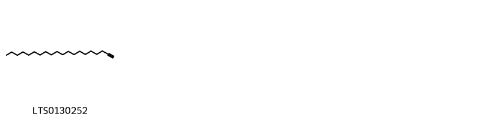{ width=100% }
    <figcaption>Hình ảnh cấu trúc hóa học của 1 hoạt chất thuộc nhóm  gồm ['1-eicosyne (LTS0130252)'].</figcaption>
</figure>
#### Nhóm Benzene and substituted derivatives
<figure markdown="span">
    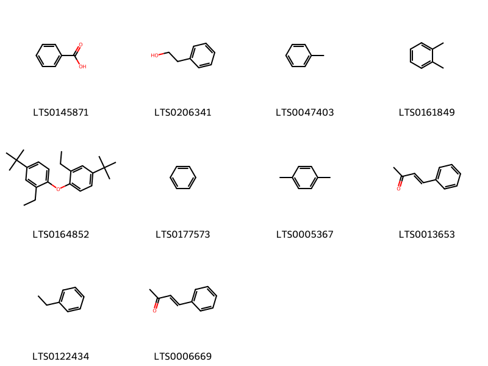{ width=100% }
    <figcaption>Hình ảnh cấu trúc hóa học của 10 hoạt chất thuộc nhóm Benzene and substituted derivatives gồm ['benzoic acid (LTS0145871)', '2-phenyl-ethanol (LTS0206341)', 'toluene (LTS0047403)', 'ortho-xylene (LTS0161849)', '4-tert-butyl-1-(4-tert-butyl-2-ethylphenoxy)-2-ethylbenzene (LTS0164852)', 'benzene (LTS0177573)', 'para-xylene (LTS0005367)', 'benz (LTS0013653)', 'ethylbenzene (LTS0122434)', '4-phenyl-but-3-en-2-one (LTS0006669)'].</figcaption>
</figure>
#### Nhóm Benzothiazoles
<figure markdown="span">
    { width=100% }
    <figcaption>Hình ảnh cấu trúc hóa học của 1 hoạt chất thuộc nhóm Benzothiazoles gồm ['benzothiazole (LTS0073984)'].</figcaption>
</figure>
#### Nhóm Carboxylic acids and derivatives
<figure markdown="span">
    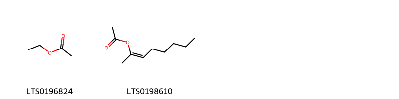{ width=100% }
    <figcaption>Hình ảnh cấu trúc hóa học của 2 hoạt chất thuộc nhóm Carboxylic acids and derivatives gồm ['ethyl acetate (LTS0196824)', 'oct-2-en-2-yl acetate (LTS0198610)'].</figcaption>
</figure>
#### Nhóm Fatty Acyls
<figure markdown="span">
    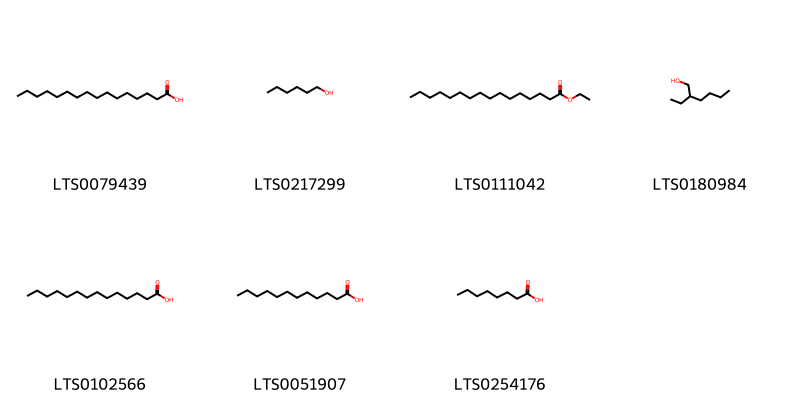{ width=100% }
    <figcaption>Hình ảnh cấu trúc hóa học của 7 hoạt chất thuộc nhóm Fatty Acyls gồm ['palmitic acid (LTS0079439)', 'hexanol (LTS0217299)', 'ethyl palmitate (LTS0111042)', '2-ethylhexanol (LTS0180984)', 'myristic acid (LTS0102566)', 'lauric acid (LTS0051907)', 'caprylic acid (LTS0254176)'].</figcaption>
</figure>
#### Nhóm Heteroaromatic compounds
<figure markdown="span">
    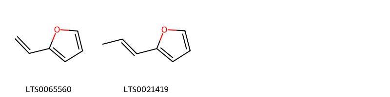{ width=100% }
    <figcaption>Hình ảnh cấu trúc hóa học của 2 hoạt chất thuộc nhóm Heteroaromatic compounds gồm ['2-vinylfuran (LTS0065560)', '2-(prop-1-en-1-yl)furan (LTS0021419)'].</figcaption>
</figure>
#### Nhóm Organooxygen compounds
<figure markdown="span">
    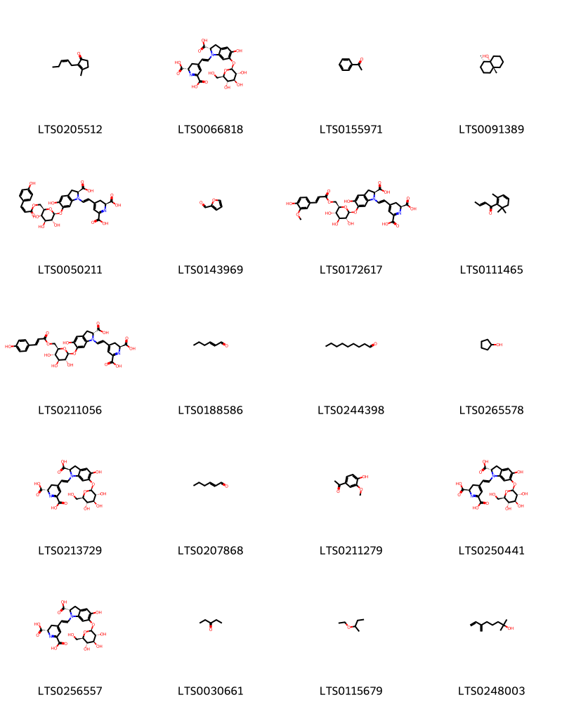{ width=100% }
    <figcaption>Hình ảnh cấu trúc hóa học của 20 hoạt chất thuộc nhóm Organooxygen compounds gồm ['jasmone (LTS0205512)', '(2s)-4-{2-[(2s)-2-carboxy-5-hydroxy-6-{[(2s,3r,4s,5s,6r)-3,4,5-trihydroxy-6-(hydroxymethyl)oxan-2-yl]oxy}-2,3-dihydroindol-1-yl]ethenyl}-2,3-dihydropyridine-2,6-dicarboxylic acid (LTS0066818)', 'acetophenone (LTS0155971)', 'geosmin (LTS0091389)', '(2s)-4-{2-[(2s)-2-carboxy-5-hydroxy-6-{[(2s,3r,4s,5s,6r)-3,4,5-trihydroxy-6-({[(2z)-3-(4-hydroxyphenyl)prop-2-enoyl]oxy}methyl)oxan-2-yl]oxy}-2,3-dihydroindol-1-yl]ethenyl}-2,3-dihydropyridine-2,6-dicarboxylic acid (LTS0050211)', 'bran oil (LTS0143969)', '(2s)-4-[(1e)-2-[(2s)-2-carboxy-5-hydroxy-6-{[(2s,3r,4s,5s,6r)-3,4,5-trihydroxy-6-({[(2e)-3-(4-hydroxy-3-methoxyphenyl)prop-2-enoyl]oxy}methyl)oxan-2-yl]oxy}-2,3-dihydroindol-1-yl]ethenyl]-2,3-dihydropyridine-2,6-dicarboxylic acid (LTS0172617)', 'damascenone (LTS0111465)', '(2s)-4-[(1e)-2-[(2r)-2-carboxy-5-hydroxy-6-{[(2s,3r,4s,5s,6r)-3,4,5-trihydroxy-6-({[(2e)-3-(4-hydroxyphenyl)prop-2-enoyl]oxy}methyl)oxan-2-yl]oxy}-2,3-dihydroindol-1-yl]ethenyl]-2,3-dihydropyridine-2,6-dicarboxylic acid (LTS0211056)', 'hexenal (LTS0188586)', 'nonanal (LTS0244398)', 'cyclopentanol (LTS0265578)', '(2s)-4-[(1e)-2-[(2r)-2-carboxy-5-hydroxy-6-{[(2s,3r,4s,5s,6r)-3,4,5-trihydroxy-6-(hydroxymethyl)oxan-2-yl]oxy}-2,3-dihydroindol-1-yl]ethenyl]-2,3-dihydropyridine-2,6-dicarboxylic acid (LTS0213729)', '(e)-2-hexenal (LTS0207868)', 'apocynin (LTS0211279)', '(2r)-4-{2-[(2s)-2-carboxy-5-hydroxy-6-{[(2s,3r,4s,5s,6r)-3,4,5-trihydroxy-6-(hydroxymethyl)oxan-2-yl]oxy}-2,3-dihydroindol-1-yl]ethenyl}-2,3-dihydropyridine-2,6-dicarboxylic acid (LTS0250441)', '(2s)-4-[(1e)-2-[(2s)-2-carboxy-5-hydroxy-6-{[(2s,3r,4s,5s,6r)-3,4,5-trihydroxy-6-(hydroxymethyl)oxan-2-yl]oxy}-2,3-dihydroindol-1-yl]ethenyl]-2,3-dihydropyridine-2,6-dicarboxylic acid (LTS0256557)', '3-pentanone (LTS0030661)', '2-ethoxybutane (LTS0115679)', 'myrcenol (LTS0248003)'].</figcaption>
</figure>
#### Nhóm Phenol ethers
<figure markdown="span">
    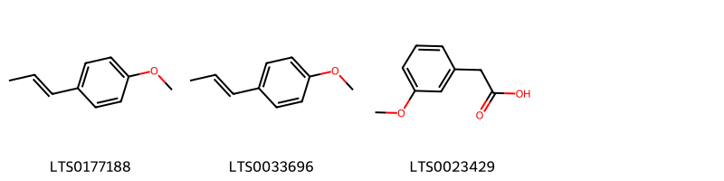{ width=100% }
    <figcaption>Hình ảnh cấu trúc hóa học của 3 hoạt chất thuộc nhóm Phenol ethers gồm ['p-propenylanisole (LTS0177188)', 'anethole (LTS0033696)', 'm-methoxyphenylacetic acid (LTS0023429)'].</figcaption>
</figure>
#### Nhóm Phenols
<figure markdown="span">
    { width=100% }
    <figcaption>Hình ảnh cấu trúc hóa học của 3 hoạt chất thuộc nhóm Phenols gồm ['vanillin (LTS0136163)', '2-methoxy-4-vinyl-phenol (LTS0128961)', '5-ethenyl-2-methoxyphenol (LTS0076260)'].</figcaption>
</figure>
#### Nhóm Prenol lipids
<figure markdown="span">
    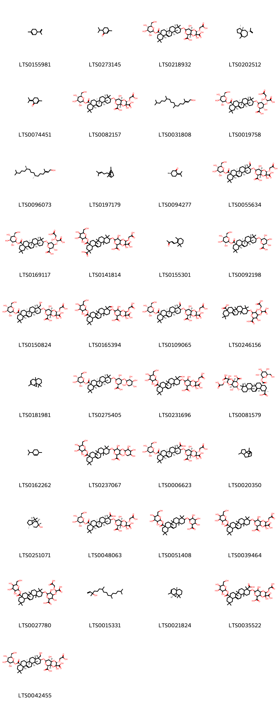{ width=100% }
    <figcaption>Hình ảnh cấu trúc hóa học của 37 hoạt chất thuộc nhóm Prenol lipids gồm ['limonene,  (LTS0155981)', 'piperitone (LTS0273145)', '(2s,3r,4as,5s,8r,8ar)-7-{[(3s,4ar,6ar,6bs,8as,12as,14ar,14br)-4,4,6a,6b,11,11,14b-heptamethyl-8a-({[(2s,3r,4s,5s,6r)-3,4,5-trihydroxy-6-(hydroxymethyl)oxan-2-yl]oxy}carbonyl)-1,2,3,4a,5,6,7,8,9,10,12,12a,14,14a-tetradecahydropicen-3-yl]oxy}-2-(carboxymethoxy)-3,8-dihydroxy-hexahydropyrano[3,4-b][1,4]dioxine-3,5-dicarboxylic acid (LTS0218932)', 'α-bulnesene (LTS0202512)', 'piperitenone (LTS0074451)', '(2s,3r,4as,5s,7r,8r,8ar)-7-{[(3s,4ar,6ar,6bs,8as,12as,14ar,14br)-4,4,6a,6b,11,11,14b-heptamethyl-8a-({[(2s,3r,4s,5s,6r)-3,4,5-trihydroxy-6-(hydroxymethyl)oxan-2-yl]oxy}carbonyl)-1,2,3,4a,5,6,7,8,9,10,12,12a,14,14a-tetradecahydropicen-3-yl]oxy}-2-(carboxymethoxy)-3,8-dihydroxy-hexahydropyrano[3,4-b][1,4]dioxine-3,5-dicarboxylic acid (LTS0082157)', 'phytol (LTS0031808)', '(2s,3s,4s,5r,6r)-6-{[(3s,4as,6ar,6bs,8as,12as,14as,14br)-4,4,6a,6b,11,11,14b-heptamethyl-8a-({[(2s,3r,4s,5s,6r)-3,4,5-trihydroxy-6-(hydroxymethyl)oxan-2-yl]oxy}carbonyl)-1,2,3,4a,5,6,7,8,9,10,12,12a,14,14a-tetradecahydropicen-3-yl]oxy}-4-[(s)-carboxy(carboxymethoxy)methoxy]-3,5-dihydroxyoxane-2-carboxylic acid (LTS0019758)', 'phytol (LTS0096073)', '1,7-dimethyl-7-(4-methylpent-3-en-1-yl)tricyclo[2.2.1.0²,⁶]heptane (LTS0197179)', '(+)-pulegone (LTS0094277)', '(2s,3r,4as,5s,7r,8r,8ar)-7-{[(3s,4s,4as,6ar,6bs,8as,12as,14ar,14br)-4-formyl-4,6a,6b,11,11,14b-hexamethyl-8a-({[(2s,3r,4s,5s,6r)-3,4,5-trihydroxy-6-(hydroxymethyl)oxan-2-yl]oxy}carbonyl)-1,2,3,4a,5,6,7,8,9,10,12,12a,14,14a-tetradecahydropicen-3-yl]oxy}-2-(carboxymethoxy)-3,8-dihydroxy-hexahydropyrano[3,4-b][1,4]dioxine-3,5-dicarboxylic acid (LTS0055634)', '(2s,3s,4s,5r,6r)-6-{[(3s,4ar,6ar,6bs,8as,12as,14ar,14br)-4,4,6a,6b,11,11,14b-heptamethyl-8a-({[(2s,3r,4s,5s,6r)-3,4,5-trihydroxy-6-(hydroxymethyl)oxan-2-yl]oxy}carbonyl)-1,2,3,4a,5,6,7,8,9,10,12,12a,14,14a-tetradecahydropicen-3-yl]oxy}-4-[(s)-carboxy(carboxymethoxy)methoxy]-3,5-dihydroxyoxane-2-carboxylic acid (LTS0169117)', '7-{[11-carboxy-4,4,6a,6b,11,14b-hexamethyl-8a-({[3,4,5-trihydroxy-6-(hydroxymethyl)oxan-2-yl]oxy}carbonyl)-1,2,3,4a,5,6,7,8,9,10,12,12a,14,14a-tetradecahydropicen-3-yl]oxy}-2-(carboxymethoxy)-3,8-dihydroxy-hexahydropyrano[3,4-b][1,4]dioxine-3,5-dicarboxylic acid (LTS0141814)', 'β-ionone (LTS0155301)', '(2s,3s,4s,5r,6r)-6-{[(3s,4as,6ar,6bs,8as,12as,14as,14br)-4,4,6a,6b,11,11,14b-heptamethyl-8a-({[(2s,3r,4s,5s,6r)-3,4,5-trihydroxy-6-(hydroxymethyl)oxan-2-yl]oxy}carbonyl)-1,2,3,4a,5,6,7,8,9,10,12,12a,14,14a-tetradecahydropicen-3-yl]oxy}-3,4,5-trihydroxyoxane-2-carboxylic acid (LTS0092198)', '(2s,3r,4as,5s,7r,8r,8ar)-7-{[(3s,4r,4ar,6ar,6bs,8as,12as,14ar,14br)-4-(hydroxymethyl)-4,6a,6b,11,11,14b-hexamethyl-8a-({[(2s,3r,4s,5s,6r)-3,4,5-trihydroxy-6-(hydroxymethyl)oxan-2-yl]oxy}carbonyl)-1,2,3,4a,5,6,7,8,9,10,12,12a,14,14a-tetradecahydropicen-3-yl]oxy}-2-(carboxymethoxy)-3,8-dihydroxy-hexahydropyrano[3,4-b][1,4]dioxine-3,5-dicarboxylic acid (LTS0150824)', '2-(carboxymethoxy)-7-{[4-formyl-4,6a,6b,11,11,14b-hexamethyl-8a-({[3,4,5-trihydroxy-6-(hydroxymethyl)oxan-2-yl]oxy}carbonyl)-1,2,3,4a,5,6,7,8,9,10,12,12a,14,14a-tetradecahydropicen-3-yl]oxy}-3,8-dihydroxy-hexahydropyrano[3,4-b][1,4]dioxine-3,5-dicarboxylic acid (LTS0165394)', '(2s,3r,4as,5s,7r,8r,8ar)-7-{[(3s,4s,4ar,6ar,6bs,8as,12as,14ar,14br)-4-formyl-4,6a,6b,11,11,14b-hexamethyl-8a-({[(2s,3r,4s,5s,6r)-3,4,5-trihydroxy-6-(hydroxymethyl)oxan-2-yl]oxy}carbonyl)-1,2,3,4a,5,6,7,8,9,10,12,12a,14,14a-tetradecahydropicen-3-yl]oxy}-2-(carboxymethoxy)-3,8-dihydroxy-hexahydropyrano[3,4-b][1,4]dioxine-3,5-dicarboxylic acid (LTS0109065)', '6-[(8a-carboxy-4,4,6a,6b,11,11,14b-heptamethyl-1,2,3,4a,5,6,7,8,9,10,12,12a,14,14a-tetradecahydropicen-3-yl)oxy]-4-[carboxy(carboxymethoxy)methoxy]-3,5-dihydroxyoxane-2-carboxylic acid (LTS0246156)', 'thujopsene (LTS0181981)', '(2s,3s,4s,5r,6r)-6-{[(3s,4ar,6ar,6bs,8as,12as,14ar,14br)-4,4,6a,6b,11,11,14b-heptamethyl-8a-({[(2s,3r,4s,5s,6r)-3,4,5-trihydroxy-6-(hydroxymethyl)oxan-2-yl]oxy}carbonyl)-1,2,3,4a,5,6,7,8,9,10,12,12a,14,14a-tetradecahydropicen-3-yl]oxy}-3,5-dihydroxy-4-{[(2s,3r,4s,5r)-3,4,5-trihydroxyoxan-2-yl]oxy}oxane-2-carboxylic acid (LTS0275405)', '2-(carboxymethoxy)-3,8-dihydroxy-7-{[4-(hydroxymethyl)-4,6a,6b,11,11,14b-hexamethyl-8a-({[3,4,5-trihydroxy-6-(hydroxymethyl)oxan-2-yl]oxy}carbonyl)-1,2,3,4a,5,6,7,8,9,10,12,12a,14,14a-tetradecahydropicen-3-yl]oxy}-hexahydropyrano[3,4-b][1,4]dioxine-3,5-dicarboxylic acid (LTS0231696)', '(2s,3r,4as,5s,7r,8r,8ar)-7-{[(3s,4ar,6ar,6bs,8ar,11r,12as,14ar,14br)-11-carboxy-4,4,6a,6b,11,14b-hexamethyl-8a-({[(2s,3r,4s,5s,6r)-3,4,5-trihydroxy-6-(hydroxymethyl)oxan-2-yl]oxy}carbonyl)-1,2,3,4a,5,6,7,8,9,10,12,12a,14,14a-tetradecahydropicen-3-yl]oxy}-2-(carboxymethoxy)-3,8-dihydroxy-hexahydropyrano[3,4-b][1,4]dioxine-3,5-dicarboxylic acid (LTS0081579)', '2-menthene (LTS0162262)', '6-{[4,4,6a,6b,11,11,14b-heptamethyl-8a-({[3,4,5-trihydroxy-6-(hydroxymethyl)oxan-2-yl]oxy}carbonyl)-1,2,3,4a,5,6,7,8,9,10,12,12a,14,14a-tetradecahydropicen-3-yl]oxy}-3,5-dihydroxy-4-[(3,4,5-trihydroxyoxan-2-yl)oxy]oxane-2-carboxylic acid (LTS0237067)', '(2s,3r,4as,5s,7r,8r,8ar)-7-{[(3s,4s,4as,6ar,6bs,8as,12as,14ar,14br)-4-carboxy-4,6a,6b,11,11,14b-hexamethyl-8a-({[(2s,3r,4s,5s,6r)-3,4,5-trihydroxy-6-(hydroxymethyl)oxan-2-yl]oxy}carbonyl)-1,2,3,4a,5,6,7,8,9,10,12,12a,14,14a-tetradecahydropicen-3-yl]oxy}-2-(carboxymethoxy)-3,8-dihydroxy-hexahydropyrano[3,4-b][1,4]dioxine-3,5-dicarboxylic acid (LTS0006623)', '4,10,11,11-tetramethyltricyclo[5.3.1.0¹,⁵]undec-9-ene (LTS0020350)', 'cedrol (LTS0251071)', '(2s,3r,4as,5s,7r,8r,8ar)-7-{[(3s,4s,4ar,6ar,6bs,8as,12as,14ar,14br)-4-carboxy-4,6a,6b,11,11,14b-hexamethyl-8a-({[(2s,3r,4s,5s,6r)-3,4,5-trihydroxy-6-(hydroxymethyl)oxan-2-yl]oxy}carbonyl)-1,2,3,4a,5,6,7,8,9,10,12,12a,14,14a-tetradecahydropicen-3-yl]oxy}-2-(carboxymethoxy)-3,8-dihydroxy-hexahydropyrano[3,4-b][1,4]dioxine-3,5-dicarboxylic acid (LTS0048063)', '6-{[4,4,6a,6b,11,11,14b-heptamethyl-8a-({[3,4,5-trihydroxy-6-(hydroxymethyl)oxan-2-yl]oxy}carbonyl)-1,2,3,4a,5,6,7,8,9,10,12,12a,14,14a-tetradecahydropicen-3-yl]oxy}-3,4,5-trihydroxyoxane-2-carboxylic acid (LTS0051408)', '7-{[4,4,6a,6b,11,11,14b-heptamethyl-8a-({[3,4,5-trihydroxy-6-(hydroxymethyl)oxan-2-yl]oxy}carbonyl)-1,2,3,4a,5,6,7,8,9,10,12,12a,14,14a-tetradecahydropicen-3-yl]oxy}-2-(carboxymethoxy)-3,8-dihydroxy-hexahydropyrano[3,4-b][1,4]dioxine-3,5-dicarboxylic acid (LTS0039464)', '6-{[4,4,6a,6b,11,11,14b-heptamethyl-8a-({[3,4,5-trihydroxy-6-(hydroxymethyl)oxan-2-yl]oxy}carbonyl)-1,2,3,4a,5,6,7,8,9,10,12,12a,14,14a-tetradecahydropicen-3-yl]oxy}-4-[carboxy(carboxymethoxy)methoxy]-3,5-dihydroxyoxane-2-carboxylic acid (LTS0027780)', 'isophytol (LTS0015331)', '(-)-thujopsene (LTS0021824)', '7-{[4-carboxy-4,6a,6b,11,11,14b-hexamethyl-8a-({[3,4,5-trihydroxy-6-(hydroxymethyl)oxan-2-yl]oxy}carbonyl)-1,2,3,4a,5,6,7,8,9,10,12,12a,14,14a-tetradecahydropicen-3-yl]oxy}-2-(carboxymethoxy)-3,8-dihydroxy-hexahydropyrano[3,4-b][1,4]dioxine-3,5-dicarboxylic acid (LTS0035522)', '(2s,3r,4as,5s,7r,8r,8ar)-7-{[(3s,4r,4as,6ar,6bs,8as,12as,14ar,14br)-4-(hydroxymethyl)-4,6a,6b,11,11,14b-hexamethyl-8a-({[(2s,3r,4s,5s,6r)-3,4,5-trihydroxy-6-(hydroxymethyl)oxan-2-yl]oxy}carbonyl)-1,2,3,4a,5,6,7,8,9,10,12,12a,14,14a-tetradecahydropicen-3-yl]oxy}-2-(carboxymethoxy)-3,8-dihydroxy-hexahydropyrano[3,4-b][1,4]dioxine-3,5-dicarboxylic acid (LTS0042455)'].</figcaption>
</figure>
#### Nhóm Pyridines and derivatives
<figure markdown="span">
    { width=100% }
    <figcaption>Hình ảnh cấu trúc hóa học của 1 hoạt chất thuộc nhóm Pyridines and derivatives gồm ['pyridine (LTS0108275)'].</figcaption>
</figure>
#### Nhóm Thioethers
<figure markdown="span">
    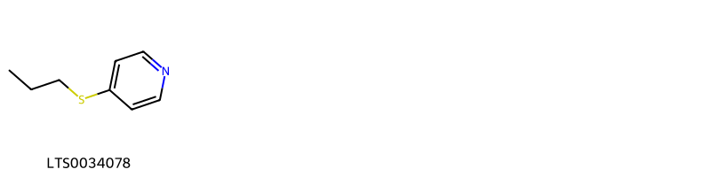{ width=100% }
    <figcaption>Hình ảnh cấu trúc hóa học của 1 hoạt chất thuộc nhóm Thioethers gồm ['4-(propylsulfanyl)pyridine (LTS0034078)'].</figcaption>
</figure>
#### Nhóm Thiophenes
<figure markdown="span">
    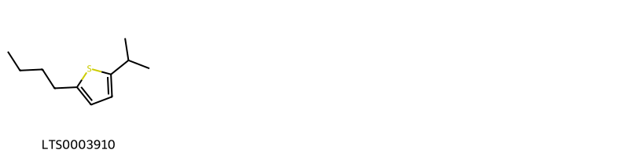{ width=100% }
    <figcaption>Hình ảnh cấu trúc hóa học của 1 hoạt chất thuộc nhóm Thiophenes gồm ['2-butyl-5-isopropylthiophene (LTS0003910)'].</figcaption>
</figure>
#### Nhóm Unsaturated hydrocarbons
<figure markdown="span">
    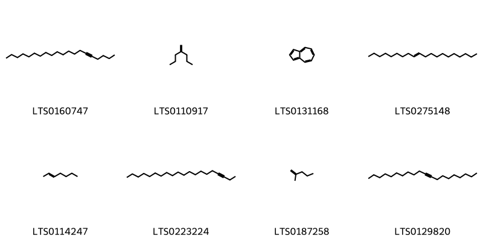{ width=100% }
    <figcaption>Hình ảnh cấu trúc hóa học của 8 hoạt chất thuộc nhóm Unsaturated hydrocarbons gồm ['icos-5-yne (LTS0160747)', 'heptane, 4-methylene- (LTS0110917)', 'azulene (LTS0131168)', 'icos-9-ene (LTS0275148)', '2-heptene (LTS0114247)', 'icos-3-yne (LTS0223224)', '2-methyl-1-pentene (LTS0187258)', 'icos-9-yne (LTS0129820)'].</figcaption>
</figure>

---

### Dược dân tộc học

Danh sách các quốc gia có sử dụng *Basella alba* trong điều trị các bệnh. 

| Country   | Disease                        | Bệnh                                                                                                                                                                                                |
|:----------|:-------------------------------|:----------------------------------------------------------------------------------------------------------------------------------------------------------------------------------------------------|
| China     | Cosmetic, Demulcent, Emollient | MYMEMORY WARNING: YOU USED ALL AVAILABLE FREE TRANSLATIONS FOR TODAY. NEXT AVAILABLE IN  09 HOURS 19 MINUTES 13 SECONDS VISIT HTTPS://MYMEMORY.TRANSLATED.NET/DOC/USAGELIMITS.PHP TO TRANSLATE MORE |

---

---
## Basella rubra
### Thông tin về thực vật

!!! info "Phân loại thực vật của *Basella alba* từ GIBF:"
    - **Kingdom:** Plantae
    - **Phylum:** Tracheophyta
    - **Order:** Caryophyllales
    - **Family:** Basellaceae
    - **Genus:** Basella
    - **Species:** *Basella alba*

 

| Label (VI)   | Label (EN)   | Scientific Name   | Descriptions (VI)   | Descriptions (EN)   | Also Known As (VI)   | Also Known As (EN)   |
|:-------------|:-------------|:------------------|:--------------------|:--------------------|:---------------------|:---------------------|
| N/A          | N/A          | Basella rubra     | loài thực vật       | species of plant    | ['']                 | ['']                 |

#### Phân bố trên thế giới

**Từ CSDL GIBF** nan, Brazil, Viet Nam, Japan, New Caledonia, China, Tanzania, United Republic of, Spain, Netherlands, Sri Lanka, United States of America, Indonesia, Nigeria, Colombia, Cuba, unknown or invalid, Ethiopia, Equatorial Guinea, Mexico, Norway, Chinese Taipei, Philippines, Germany, Brunei Darussalam, Portugal, Cook Islands, Bahamas, India, France

#### Phân bố tại Việt Nam

**Từ CSDL GIBF**: Hà Nội

---
### Thành phần hóa học
        
- Theo cơ sở dữ liệu lotus: Từ loài *Basella alba* đã phân lập và xác định được Chưa có hoạt chất nào được phân lập. hoạt chất thuộc về các nhóm Không có hoạt chất nào được phân lập. 

Không có hình ảnh nào được tạo ra

---

### Dược dân tộc học

Danh sách các quốc gia có sử dụng *Basella alba* trong điều trị các bệnh. 

| Country   | Disease            | Bệnh                                                                                                                                                                                                |
|:----------|:-------------------|:----------------------------------------------------------------------------------------------------------------------------------------------------------------------------------------------------|
| China     | Cosmetic           | MYMEMORY WARNING: YOU USED ALL AVAILABLE FREE TRANSLATIONS FOR TODAY. NEXT AVAILABLE IN  09 HOURS 18 MINUTES 40 SECONDS VISIT HTTPS://MYMEMORY.TRANSLATED.NET/DOC/USAGELIMITS.PHP TO TRANSLATE MORE |
| Elsewhere | Laxative, Poultice | MYMEMORY WARNING: YOU USED ALL AVAILABLE FREE TRANSLATIONS FOR TODAY. NEXT AVAILABLE IN  09 HOURS 18 MINUTES 37 SECONDS VISIT HTTPS://MYMEMORY.TRANSLATED.NET/DOC/USAGELIMITS.PHP TO TRANSLATE MORE |
| Java      | Aperient, Laxative | MYMEMORY WARNING: YOU USED ALL AVAILABLE FREE TRANSLATIONS FOR TODAY. NEXT AVAILABLE IN  09 HOURS 18 MINUTES 33 SECONDS VISIT HTTPS://MYMEMORY.TRANSLATED.NET/DOC/USAGELIMITS.PHP TO TRANSLATE MORE |

---

