!!! abstract "Tóm tắt"

    Họ Berberidaceae gồm khoảng 8 chi và 31 loài được một số cộng đồng tại các quốc gia như German, Mexico, ain, US(Appalachia), Japan, Elsewhere, Nepal, China, anish, US(Amerindian), India, US(Flathead), US, Dutch, Turkey sử dụng trong một số trường hợp QUERY LENGTH LIMIT EXCEEDED. MAX ALLOWED QUERY : 500 CHARS.

!!! info "DrDuke"

    James A. Duke sinh năm 1929-2017 là một nhà thực vật học người Mỹ. Đây là một trong những tác giả hàng đầu trong lĩnh vực dược dân tộc học với cuốn *CRC Handbook of Medicinal Herbs* và chính là người xây dựng lên cơ sở dữ liệu về hợp chất tự nhiên và dược dân tộc học tại Bộ nông nghiệp Hoa Kỳ. Các thông tin được đăng tải tại website [Dr. Duke's Phytochemical and Ethnobotanical Databases](https://phytochem.nal.usda.gov/). 
    Trong suốt thập niên 1970, ông lãnh đạo the Plant Taxonomy Laboratory, Plant Genetics and Germplasm Institute of the Agricultural Research Service, U.S. Department of Agriculture.
    Trong tài liệu này, các thông tin về dược dân tộc của các dược liệu được trích dẫn từ tài liệu của James A. Ducke với sự trợ giúp của phần mềm dịch thuật từ tiếng Anh sang tiếng Việt.
   

# Chi Caulophyllum

??? note "Danh sách các dược liệu thuộc chi"
    
	 - *Caulophyllum thalictroides*

---
## Caulophyllum thalictroides
### Thông tin về thực vật

!!! info "Phân loại thực vật của *Caulophyllum thalictroides* từ GIBF:"
    - **Kingdom:** Plantae
    - **Phylum:** Tracheophyta
    - **Order:** Ranunculales
    - **Family:** Berberidaceae
    - **Genus:** Caulophyllum
    - **Species:** *Caulophyllum thalictroides*

 

| Label (VI)   | Label (EN)   | Scientific Name            | Descriptions (VI)   | Descriptions (EN)   | Also Known As (VI)   | Also Known As (EN)   |
|:-------------|:-------------|:---------------------------|:--------------------|:--------------------|:---------------------|:---------------------|
| N/A          | N/A          | Caulophyllum thalictroides | loài thực vật       | species of plant    | ['']                 | ['']                 |

#### Phân bố trên thế giới

**Từ CSDL GIBF** nan, United States of America, Canada

#### Phân bố tại Việt Nam

**Từ CSDL GIBF**: Không có ghi nhận ở Việt Nam

---
### Thành phần hóa học
        
- Theo cơ sở dữ liệu lotus: Từ loài *Caulophyllum thalictroides* đã phân lập và xác định được 68 hoạt chất thuộc về các nhóm Aporphines, Benzene and substituted derivatives, Coumarins and derivatives, Organooxygen compounds, Prenol lipids, Lupin alkaloids. 

|    | chemicalTaxonomyClassyfireClass     |   smiles_count |
|---:|:------------------------------------|---------------:|
|  0 | Aporphines                          |              1 |
|  1 | Benzene and substituted derivatives |              1 |
|  2 | Coumarins and derivatives           |              1 |
|  3 | Lupin alkaloids                     |              7 |
|  4 | Organooxygen compounds              |              2 |
|  5 | Prenol lipids                       |             54 |

#### Nhóm Aporphines
<figure markdown="span">
    { width=100% }
    <figcaption>Hình ảnh cấu trúc hóa học của 1 hoạt chất thuộc nhóm Aporphines gồm ['magnoflorine (LTS0120825)'].</figcaption>
</figure>
#### Nhóm Benzene and substituted derivatives
<figure markdown="span">
    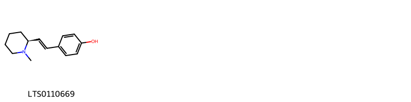{ width=100% }
    <figcaption>Hình ảnh cấu trúc hóa học của 1 hoạt chất thuộc nhóm Benzene and substituted derivatives gồm ['4-[(1e)-2-[(2s)-1-methylpiperidin-2-yl]ethenyl]phenol (LTS0110669)'].</figcaption>
</figure>
#### Nhóm Coumarins and derivatives
<figure markdown="span">
    { width=100% }
    <figcaption>Hình ảnh cấu trúc hóa học của 1 hoạt chất thuộc nhóm Coumarins and derivatives gồm ['5-[2-(dimethylamino)ethyl]-7,14-dimethoxy-2,9-dioxatetracyclo[6.6.2.0⁴,¹⁶.0¹¹,¹⁵]hexadeca-1(15),4,6,8(16),11,13-hexaene-3,10-dione (LTS0047748)'].</figcaption>
</figure>
#### Nhóm Lupin alkaloids
<figure markdown="span">
    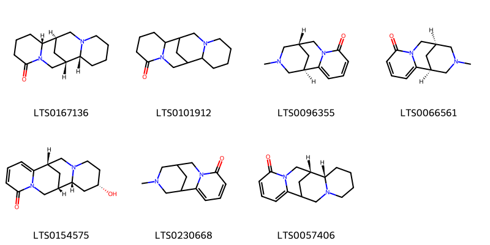{ width=100% }
    <figcaption>Hình ảnh cấu trúc hóa học của 7 hoạt chất thuộc nhóm Lupin alkaloids gồm ['(1r,2r,9s,10r)-7,15-diazatetracyclo[7.7.1.0²,⁷.0¹⁰,¹⁵]heptadecan-6-one (LTS0167136)', 'lupanine l-form (LTS0101912)', '(1r,9r)-11-methyl-7,11-diazatricyclo[7.3.1.0²,⁷]trideca-2,4-dien-6-one (LTS0096355)', '(1s,9r)-11-methyl-7,11-diazatricyclo[7.3.1.0²,⁷]trideca-2,4-dien-6-one (LTS0066561)', 'baptifoline (LTS0154575)', 'n-methylcytisine (LTS0230668)', '(9r,10s)-7,15-diazatetracyclo[7.7.1.0²,⁷.0¹⁰,¹⁵]heptadeca-2,4-dien-6-one (LTS0057406)'].</figcaption>
</figure>
#### Nhóm Organooxygen compounds
<figure markdown="span">
    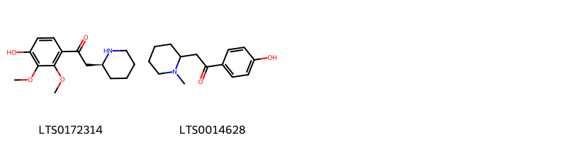{ width=100% }
    <figcaption>Hình ảnh cấu trúc hóa học của 2 hoạt chất thuộc nhóm Organooxygen compounds gồm ['1-(4-hydroxy-2,3-dimethoxyphenyl)-2-[(2s)-piperidin-2-yl]ethanone (LTS0172314)', '1-(4-hydroxyphenyl)-2-(1-methylpiperidin-2-yl)ethanone (LTS0014628)'].</figcaption>
</figure>
#### Nhóm Prenol lipids
<figure markdown="span">
    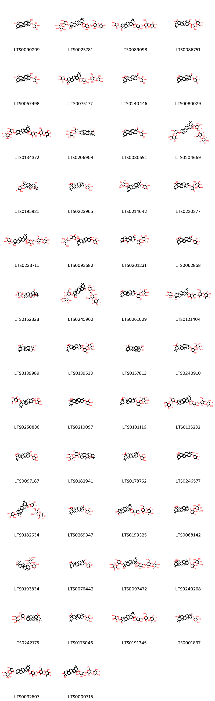{ width=100% }
    <figcaption>Hình ảnh cấu trúc hóa học của 54 hoạt chất thuộc nhóm Prenol lipids gồm ['hederagenin 3-o-arabinoside (LTS0090209)', 'cauloside g (LTS0025781)', '(2s,3r,4s,5s,6r)-6-({[(2r,3r,4r,5s,6r)-3,4-dihydroxy-6-(hydroxymethyl)-5-{[(2s,3r,4r,5r,6s)-3,4,5-trihydroxy-6-methyloxan-2-yl]oxy}oxan-2-yl]oxy}methyl)-3,4,5-trihydroxyoxan-2-yl (4as,6as,6br,8ar,9r,10s,12ar,12br,14br)-9-(hydroxymethyl)-2,2,6a,6b,9,12a-hexamethyl-10-{[(2s,3r,4s,5s)-3,4,5-trihydroxyoxan-2-yl]oxy}-1,3,4,5,6,7,8,8a,10,11,12,12b,13,14b-tetradecahydropicene-4a-carboxylate (LTS0089098)', 'cauloside c (LTS0086751)', '(4as,6as,6br,8ar,9r,12ar,12br,14bs)-9-(hydroxymethyl)-2,2,6a,6b,9,12a-hexamethyl-10-{[(2s)-3,4,5-trihydroxyoxan-2-yl]oxy}-1,3,4,5,6,7,8,8a,10,11,12,12b,13,14b-tetradecahydropicene-4a-carboxylic acid (LTS0057498)', '(2s,3r,4s,5s,6r)-6-({[(2r,3r,4r,5s,6r)-3,4-dihydroxy-6-(hydroxymethyl)-5-{[(2s,3r,4r,5r,6s)-3,4,5-trihydroxy-6-methyloxan-2-yl]oxy}oxan-2-yl]oxy}methyl)-3,4,5-trihydroxyoxan-2-yl (4as,6br,9r,10s,12ar)-9-(hydroxymethyl)-2,2,6a,6b,9,12a-hexamethyl-10-{[(2s,3r,4s,5s)-3,4,5-trihydroxyoxan-2-yl]oxy}-1,3,4,5,6,7,8,8a,10,11,12,12b,13,14b-tetradecahydropicene-4a-carboxylate (LTS0075177)', '(4ar,5r,6as,6br,9r,10s,12ar)-5-hydroxy-9-(hydroxymethyl)-2,2,6a,6b,9,12a-hexamethyl-10-{[(2s,3r,4s,5s)-3,4,5-trihydroxyoxan-2-yl]oxy}-1,3,4,5,6,7,8,8a,10,11,12,12b,13,14b-tetradecahydropicene-4a-carboxylic acid (LTS0240446)', '(4ar,5r,6as,6br,8ar,9r,10s,12ar,12br,14bs)-5-hydroxy-9-(hydroxymethyl)-2,2,6a,6b,9,12a-hexamethyl-10-{[(2s,3r,4s,5s)-3,4,5-trihydroxyoxan-2-yl]oxy}-1,3,4,5,6,7,8,8a,10,11,12,12b,13,14b-tetradecahydropicene-4a-carboxylic acid (LTS0080029)', '6-({[3,4-dihydroxy-6-(hydroxymethyl)-5-[(3,4,5-trihydroxy-6-methyloxan-2-yl)oxy]oxan-2-yl]oxy}methyl)-3,4,5-trihydroxyoxan-2-yl 10-[(4,5-dihydroxy-3-{[3,4,5-trihydroxy-6-(hydroxymethyl)oxan-2-yl]oxy}oxan-2-yl)oxy]-5-hydroxy-2,2,6a,6b,9,9,12a-heptamethyl-1,3,4,5,6,7,8,8a,10,11,12,12b,13,14b-tetradecahydropicene-4a-carboxylate (LTS0134372)', '(1r,4r,5r,8r,10s,13r,14r,17r,18s,19s,20s)-10-{[(2s,3r,4s,5s)-4,5-dihydroxy-3-{[(2s,3r,4s,5s,6r)-3,4,5-trihydroxy-6-(hydroxymethyl)oxan-2-yl]oxy}oxan-2-yl]oxy}-4,5,9,9,13,19,20-heptamethyl-21-oxahexacyclo[18.2.2.0¹,¹⁸.0⁴,¹⁷.0⁵,¹⁴.0⁸,¹³]tetracosan-22-one (LTS0206904)', '9-formyl-2,2,6a,6b,9,12a-hexamethyl-10-[(3,4,5-trihydroxyoxan-2-yl)oxy]-1,3,4,5,6,7,8,8a,10,11,12,12b,13,14b-tetradecahydropicene-4a-carboxylic acid (LTS0080591)', '(2s,3r,4s,5s,6r)-6-({[(2r,3r,4r,5s,6r)-3,4-dihydroxy-6-(hydroxymethyl)-5-{[(2s,3r,4r,5r,6s)-3,4,5-trihydroxy-6-methyloxan-2-yl]oxy}oxan-2-yl]oxy}methyl)-3,4,5-trihydroxyoxan-2-yl (4ar,5r,6as,6br,8ar,10s,12ar,12br,14bs)-10-{[(2s,3r,4s,5s)-4,5-dihydroxy-3-{[(2s,3r,4s,5s,6r)-3,4,5-trihydroxy-6-(hydroxymethyl)oxan-2-yl]oxy}oxan-2-yl]oxy}-5-hydroxy-2,2,6a,6b,9,9,12a-heptamethyl-1,3,4,5,6,7,8,8a,10,11,12,12b,13,14b-tetradecahydropicene-4a-carboxylate (LTS0204669)', '17-hydroxy-10-(hydroxymethyl)-6,10,14,15,21,21-hexamethyl-9-[(3,4,5-trihydroxyoxan-2-yl)oxy]-3,24-dioxaheptacyclo[16.5.2.0¹,¹⁵.0²,⁴.0⁵,¹⁴.0⁶,¹¹.0¹⁸,²³]pentacosan-25-one (LTS0195931)', '(4ar,5r,6as,6br,8ar,10s,12ar,12br,14bs)-5-hydroxy-2,2,6a,6b,9,9,12a-heptamethyl-10-{[(2s,3r,4s,5s)-3,4,5-trihydroxyoxan-2-yl]oxy}-1,3,4,5,6,7,8,8a,10,11,12,12b,13,14b-tetradecahydropicene-4a-carboxylic acid (LTS0223965)', '(2s,3r,4s,5s,6r)-3,4,5-trihydroxy-6-(hydroxymethyl)oxan-2-yl (4ar,5r,6as,6br,8ar,9r,10s,12ar,12br,14bs)-5-hydroxy-9-(hydroxymethyl)-2,2,6a,6b,9,12a-hexamethyl-10-{[(2s,3r,4s,5s)-3,4,5-trihydroxyoxan-2-yl]oxy}-1,3,4,5,6,7,8,8a,10,11,12,12b,13,14b-tetradecahydropicene-4a-carboxylate (LTS0214642)', '10-[(4,5-dihydroxy-3-{[3,4,5-trihydroxy-6-(hydroxymethyl)oxan-2-yl]oxy}oxan-2-yl)oxy]-2,2,6a,6b,9,9,12a-heptamethyl-1,3,4,5,6,7,8,8a,10,11,12,12b,13,14b-tetradecahydropicene-4a-carboxylic acid (LTS0220377)', '6-({[3,4-dihydroxy-6-(hydroxymethyl)-5-[(3,4,5-trihydroxy-6-methyloxan-2-yl)oxy]oxan-2-yl]oxy}methyl)-3,4,5-trihydroxyoxan-2-yl 5-hydroxy-9-(hydroxymethyl)-2,2,6a,6b,9,12a-hexamethyl-10-[(3,4,5-trihydroxyoxan-2-yl)oxy]-1,3,4,5,6,7,8,8a,10,11,12,12b,13,14b-tetradecahydropicene-4a-carboxylate (LTS0228711)', '3,4,5-trihydroxy-6-({[3,4,5-trihydroxy-6-(hydroxymethyl)oxan-2-yl]oxy}methyl)oxan-2-yl 5-hydroxy-9-(hydroxymethyl)-2,2,6a,6b,9,12a-hexamethyl-10-[(3,4,5-trihydroxyoxan-2-yl)oxy]-1,3,4,5,6,7,8,8a,10,11,12,12b,13,14b-tetradecahydropicene-4a-carboxylate (LTS0093582)', '9-[(4,5-dihydroxy-3-{[3,4,5-trihydroxy-6-(hydroxymethyl)oxan-2-yl]oxy}oxan-2-yl)oxy]-10-(hydroxymethyl)-6,10,14,15,21,21-hexamethyl-3,24-dioxaheptacyclo[16.5.2.0¹,¹⁵.0²,⁴.0⁵,¹⁴.0⁶,¹¹.0¹⁸,²³]pentacosan-25-one (LTS0201231)', '9-(hydroxymethyl)-2,2,6a,6b,9,12a-hexamethyl-10-[(3,4,5-trihydroxyoxan-2-yl)oxy]-1,3,4,5,6,7,8,8a,10,11,12,12b,13,14b-tetradecahydropicene-4a-carboxylic acid (LTS0062858)', '(1s,2s,4s,5r,6s,9s,10r,11r,14r,15s,17r,18r,23r)-17-hydroxy-10-(hydroxymethyl)-6,10,14,15,21,21-hexamethyl-9-{[(2s,3r,4s,5s)-3,4,5-trihydroxyoxan-2-yl]oxy}-3,24-dioxaheptacyclo[16.5.2.0¹,¹⁵.0²,⁴.0⁵,¹⁴.0⁶,¹¹.0¹⁸,²³]pentacosan-25-one (LTS0152828)', '(2s,3r,4s,5s,6r)-6-({[(2r,3r,4r,5s,6r)-3,4-dihydroxy-6-(hydroxymethyl)-5-{[(2s,3r,4r,5r,6s)-3,4,5-trihydroxy-6-methyloxan-2-yl]oxy}oxan-2-yl]oxy}methyl)-3,4,5-trihydroxyoxan-2-yl (4ar,5r,6as,6br,8ar,9r,10s,12ar,12br,14bs)-10-{[(2r,3r,4s,5s,6r)-4,5-dihydroxy-6-(hydroxymethyl)-3-{[(2s,3r,4s,5s,6r)-3,4,5-trihydroxy-6-(hydroxymethyl)oxan-2-yl]oxy}oxan-2-yl]oxy}-5-hydroxy-9-(hydroxymethyl)-2,2,6a,6b,9,12a-hexamethyl-1,3,4,5,6,7,8,8a,10,11,12,12b,13,14b-tetradecahydropicene-4a-carboxylate (LTS0245962)', '10-[(4,5-dihydroxy-3-{[3,4,5-trihydroxy-6-(hydroxymethyl)oxan-2-yl]oxy}oxan-2-yl)oxy]-5-hydroxy-2,2,6a,6b,9,9,12a-heptamethyl-1,3,4,5,6,7,8,8a,10,11,12,12b,13,14b-tetradecahydropicene-4a-carboxylic acid (LTS0261029)', '6-({[3,4-dihydroxy-6-(hydroxymethyl)-5-[(3,4,5-trihydroxy-6-methyloxan-2-yl)oxy]oxan-2-yl]oxy}methyl)-3,4,5-trihydroxyoxan-2-yl 9-(hydroxymethyl)-2,2,6a,6b,9,12a-hexamethyl-10-[(3,4,5-trihydroxyoxan-2-yl)oxy]-1,3,4,5,6,7,8,8a,10,11,12,12b,13,14b-tetradecahydropicene-4a-carboxylate (LTS0121404)', '10-hydroxy-9-(hydroxymethyl)-2,2,6a,6b,9,12a-hexamethyl-1,3,4,5,6,7,8,8a,10,11,12,12b,13,14b-tetradecahydropicene-4a-carboxylic acid (LTS0139989)', '10-[(4,5-dihydroxy-3-{[3,4,5-trihydroxy-6-(hydroxymethyl)oxan-2-yl]oxy}oxan-2-yl)oxy]-5-hydroxy-9-(hydroxymethyl)-2,2,6a,6b,9,12a-hexamethyl-1,3,4,5,6,7,8,8a,10,11,12,12b,13,14b-tetradecahydropicene-4a-carboxylic acid (LTS0139533)', 'hederagenin (LTS0157813)', '(4as,6as,6br,8ar,10s,12ar,12br,14bs)-10-{[(2s,3r,4s,5s)-4,5-dihydroxy-3-{[(2s,3r,4s,5s,6r)-3,4,5-trihydroxy-6-(hydroxymethyl)oxan-2-yl]oxy}oxan-2-yl]oxy}-2,2,6a,6b,9,9,12a-heptamethyl-1,3,4,5,6,7,8,8a,10,11,12,12b,13,14b-tetradecahydropicene-4a-carboxylic acid (LTS0240910)', '3,4,5-trihydroxy-6-(hydroxymethyl)oxan-2-yl 5-hydroxy-9-(hydroxymethyl)-2,2,6a,6b,9,12a-hexamethyl-10-[(3,4,5-trihydroxyoxan-2-yl)oxy]-1,3,4,5,6,7,8,8a,10,11,12,12b,13,14b-tetradecahydropicene-4a-carboxylate (LTS0250836)', '5-hydroxy-2,2,6a,6b,9,9,12a-heptamethyl-10-[(3,4,5-trihydroxyoxan-2-yl)oxy]-1,3,4,5,6,7,8,8a,10,11,12,12b,13,14b-tetradecahydropicene-4a-carboxylic acid (LTS0210097)', '10-[(4,5-dihydroxy-3-{[3,4,5-trihydroxy-6-(hydroxymethyl)oxan-2-yl]oxy}oxan-2-yl)oxy]-9-(hydroxymethyl)-2,2,6a,6b,9,12a-hexamethyl-1,3,4,5,6,7,8,8a,10,11,12,12b,13,14b-tetradecahydropicene-4a-carboxylic acid (LTS0101116)', '(2s,3r,4s,5s,6r)-6-({[(2r,3r,4r,5s,6r)-3,4-dihydroxy-6-(hydroxymethyl)-5-{[(2s,3r,4r,5r,6s)-3,4,5-trihydroxy-6-methyloxan-2-yl]oxy}oxan-2-yl]oxy}methyl)-3,4,5-trihydroxyoxan-2-yl (4as,6as,6br,8ar,10s,12ar,12br,14bs)-10-{[(2s,3r,4s,5s)-4,5-dihydroxy-3-{[(2s,3r,4s,5s,6r)-3,4,5-trihydroxy-6-(hydroxymethyl)oxan-2-yl]oxy}oxan-2-yl]oxy}-2,2,6a,6b,9,9,12a-heptamethyl-1,3,4,5,6,7,8,8a,10,11,12,12b,13,14b-tetradecahydropicene-4a-carboxylate (LTS0135232)', '(4ar,5r,6as,6br,8ar,9r,10s,12as,12br)-5-hydroxy-9-(hydroxymethyl)-2,2,6a,6b,9,12a-hexamethyl-10-{[(2s,3r,4s,5s)-3,4,5-trihydroxyoxan-2-yl]oxy}-1,3,4,5,6,7,8,8a,10,11,12,12b-dodecahydropicene-4a-carboxylic acid (LTS0097187)', '(1s,2s,4s,5r,6s,9s,10r,11r,14r,15s,18s,23r)-9-{[(2s,3r,4s,5s)-4,5-dihydroxy-3-{[(2s,3r,4s,5s,6r)-3,4,5-trihydroxy-6-(hydroxymethyl)oxan-2-yl]oxy}oxan-2-yl]oxy}-10-(hydroxymethyl)-6,10,14,15,21,21-hexamethyl-3,24-dioxaheptacyclo[16.5.2.0¹,¹⁵.0²,⁴.0⁵,¹⁴.0⁶,¹¹.0¹⁸,²³]pentacosan-25-one (LTS0182941)', '(4as,6as,6br,8ar,10s,12ar,12br,14bs)-9-(hydroxymethyl)-2,2,6a,6b,9,12a-hexamethyl-10-{[(2s,3r,4s,5s)-3,4,5-trihydroxyoxan-2-yl]oxy}-1,3,4,5,6,7,8,8a,10,11,12,12b,13,14b-tetradecahydropicene-4a-carboxylic acid (LTS0178762)', '5-hydroxy-9-(hydroxymethyl)-2,2,6a,6b,9,12a-hexamethyl-10-[(3,4,5-trihydroxyoxan-2-yl)oxy]-1,3,4,5,6,7,8,8a,10,11,12,12b,13,14b-tetradecahydropicene-4a-carboxylic acid (LTS0246577)', '(2s,3r,4s,5s,6r)-6-({[(2r,3r,4r,5s,6r)-3,4-dihydroxy-6-(hydroxymethyl)-5-{[(2s,3r,4r,5r,6s)-3,4,5-trihydroxy-6-methyloxan-2-yl]oxy}oxan-2-yl]oxy}methyl)-3,4,5-trihydroxyoxan-2-yl (4ar,5r,6as,6br,8ar,9r,10s,12ar,12br,14bs)-5-hydroxy-9-(hydroxymethyl)-2,2,6a,6b,9,12a-hexamethyl-10-{[(2s,3r,4s,5s)-3,4,5-trihydroxyoxan-2-yl]oxy}-1,3,4,5,6,7,8,8a,10,11,12,12b,13,14b-tetradecahydropicene-4a-carboxylate (LTS0182634)', '(4ar,5r,6as,6br,8ar,9s,10s,12ar,12br,14bs)-9-formyl-5-hydroxy-2,2,6a,6b,9,12a-hexamethyl-10-{[(2s,3r,4s,5s)-3,4,5-trihydroxyoxan-2-yl]oxy}-1,3,4,5,6,7,8,8a,10,11,12,12b,13,14b-tetradecahydropicene-4a-carboxylic acid (LTS0269347)', '(2s,3r,4s,5s,6r)-6-({[(2r,3r,4r,5s,6r)-3,4-dihydroxy-6-(hydroxymethyl)-5-{[(2s,3r,4r,5r,6s)-3,4,5-trihydroxy-6-methyloxan-2-yl]oxy}oxan-2-yl]oxy}methyl)-3,4,5-trihydroxyoxan-2-yl (4as,6as,6br,8ar,9r,10s,12ar,12br,14bs)-10-hydroxy-9-(hydroxymethyl)-2,2,6a,6b,9,12a-hexamethyl-1,3,4,5,6,7,8,8a,10,11,12,12b,13,14b-tetradecahydropicene-4a-carboxylate (LTS0199325)', '(4ar,5r,6as,6br,8ar,10s,12ar,12br,14bs)-10-{[(2s,3r,4s,5s)-4,5-dihydroxy-3-{[(2s,3r,4s,5s,6r)-3,4,5-trihydroxy-6-(hydroxymethyl)oxan-2-yl]oxy}oxan-2-yl]oxy}-5-hydroxy-2,2,6a,6b,9,9,12a-heptamethyl-1,3,4,5,6,7,8,8a,10,11,12,12b,13,14b-tetradecahydropicene-4a-carboxylic acid (LTS0068142)', '10-[(4,5-dihydroxy-3-{[3,4,5-trihydroxy-6-(hydroxymethyl)oxan-2-yl]oxy}oxan-2-yl)oxy]-4,5,9,9,13,19,20-heptamethyl-21-oxahexacyclo[18.2.2.0¹,¹⁸.0⁴,¹⁷.0⁵,¹⁴.0⁸,¹³]tetracosan-22-one (LTS0193834)', '5-hydroxy-9-(hydroxymethyl)-2,2,6a,6b,9,12a-hexamethyl-10-[(3,4,5-trihydroxyoxan-2-yl)oxy]-1,3,4,5,6,7,8,8a,10,11,12,12b-dodecahydropicene-4a-carboxylic acid (LTS0076442)', '6-({[3,4-dihydroxy-6-(hydroxymethyl)-5-[(3,4,5-trihydroxy-6-methyloxan-2-yl)oxy]oxan-2-yl]oxy}methyl)-3,4,5-trihydroxyoxan-2-yl 10-[(4,5-dihydroxy-3-{[3,4,5-trihydroxy-6-(hydroxymethyl)oxan-2-yl]oxy}oxan-2-yl)oxy]-9-(hydroxymethyl)-2,2,6a,6b,9,12a-hexamethyl-1,3,4,5,6,7,8,8a,10,11,12,12b,13,14b-tetradecahydropicene-4a-carboxylate (LTS0097472)', '(4ar,5r,6as,6br,8ar,9r,10s,12ar,12br,14bs)-10-{[(2s,3r,4s,5s)-4,5-dihydroxy-3-{[(2s,3r,4s,5s,6r)-3,4,5-trihydroxy-6-(hydroxymethyl)oxan-2-yl]oxy}oxan-2-yl]oxy}-5-hydroxy-9-(hydroxymethyl)-2,2,6a,6b,9,12a-hexamethyl-1,3,4,5,6,7,8,8a,10,11,12,12b,13,14b-tetradecahydropicene-4a-carboxylic acid (LTS0240268)', '(1s,2r,4ar,6ar,6br,8ar,10s,12ar,12br,14ar,14bs)-10-{[(2s,3r,4s,5s)-4,5-dihydroxy-3-{[(2s,3r,4s,5s,6r)-3,4,5-trihydroxy-6-(hydroxymethyl)oxan-2-yl]oxy}oxan-2-yl]oxy}-2-hydroxy-1,2,6a,6b,9,9,12a-heptamethyl-hexadecahydropicene-4a-carboxylic acid (LTS0242175)', '2,2,6a,6b,9,9,12a-heptamethyl-10-[(3,4,5-trihydroxyoxan-2-yl)oxy]-1,3,4,5,6,7,8,8a,10,11,12,12b,13,14b-tetradecahydropicene-4a-carboxylic acid (LTS0175046)', 'cauloside d (LTS0191345)', '(4as,6as,6br,8ar,9s,10s,12ar,12br,14bs)-9-formyl-2,2,6a,6b,9,12a-hexamethyl-10-{[(2s,3r,4s,5s)-3,4,5-trihydroxyoxan-2-yl]oxy}-1,3,4,5,6,7,8,8a,10,11,12,12b,13,14b-tetradecahydropicene-4a-carboxylic acid (LTS0001837)', '6-({[3,4-dihydroxy-6-(hydroxymethyl)-5-[(3,4,5-trihydroxy-6-methyloxan-2-yl)oxy]oxan-2-yl]oxy}methyl)-3,4,5-trihydroxyoxan-2-yl 10-[(4,5-dihydroxy-3-{[3,4,5-trihydroxy-6-(hydroxymethyl)oxan-2-yl]oxy}oxan-2-yl)oxy]-2,2,6a,6b,9,9,12a-heptamethyl-1,3,4,5,6,7,8,8a,10,11,12,12b,13,14b-tetradecahydropicene-4a-carboxylate (LTS0032607)', '6-({[3,4-dihydroxy-6-(hydroxymethyl)-5-[(3,4,5-trihydroxy-6-methyloxan-2-yl)oxy]oxan-2-yl]oxy}methyl)-3,4,5-trihydroxyoxan-2-yl 10-hydroxy-9-(hydroxymethyl)-2,2,6a,6b,9,12a-hexamethyl-1,3,4,5,6,7,8,8a,10,11,12,12b,13,14b-tetradecahydropicene-4a-carboxylate (LTS0000715)', '(2s,3r,4s,5s,6r)-3,4,5-trihydroxy-6-({[(2r,3r,4s,5s,6r)-3,4,5-trihydroxy-6-(hydroxymethyl)oxan-2-yl]oxy}methyl)oxan-2-yl (4ar,5r,6as,6br,8ar,9r,10s,12ar,12br,14bs)-5-hydroxy-9-(hydroxymethyl)-2,2,6a,6b,9,12a-hexamethyl-10-{[(2s,3r,4s,5s)-3,4,5-trihydroxyoxan-2-yl]oxy}-1,3,4,5,6,7,8,8a,10,11,12,12b,13,14b-tetradecahydropicene-4a-carboxylate (LTS0027064)', '(4as,6as,6br,8ar,10s,12ar,12br,14bs)-2,2,6a,6b,9,9,12a-heptamethyl-10-{[(2s,3r,4s,5s)-3,4,5-trihydroxyoxan-2-yl]oxy}-1,3,4,5,6,7,8,8a,10,11,12,12b,13,14b-tetradecahydropicene-4a-carboxylic acid (LTS0043230)', '9-formyl-5-hydroxy-2,2,6a,6b,9,12a-hexamethyl-10-[(3,4,5-trihydroxyoxan-2-yl)oxy]-1,3,4,5,6,7,8,8a,10,11,12,12b,13,14b-tetradecahydropicene-4a-carboxylic acid (LTS0109404)', '10-[(4,5-dihydroxy-3-{[3,4,5-trihydroxy-6-(hydroxymethyl)oxan-2-yl]oxy}oxan-2-yl)oxy]-2-hydroxy-1,2,6a,6b,9,9,12a-heptamethyl-hexadecahydropicene-4a-carboxylic acid (LTS0228568)'].</figcaption>
</figure>

---

### Dược dân tộc học

Danh sách các quốc gia có sử dụng *Caulophyllum thalictroides* trong điều trị các bệnh. 

| Country   | Disease                          | Bệnh                                                                                                                                                                                                |
|:----------|:---------------------------------|:----------------------------------------------------------------------------------------------------------------------------------------------------------------------------------------------------|
| Elsewhere | Diuretic, Emmenagogue            | MYMEMORY WARNING: YOU USED ALL AVAILABLE FREE TRANSLATIONS FOR TODAY. NEXT AVAILABLE IN  07 HOURS 55 MINUTES 02 SECONDS VISIT HTTPS://MYMEMORY.TRANSLATED.NET/DOC/USAGELIMITS.PHP TO TRANSLATE MORE |
| Turkey    | Diuretic, Emmenagogue, Vermifuge | MYMEMORY WARNING: YOU USED ALL AVAILABLE FREE TRANSLATIONS FOR TODAY. NEXT AVAILABLE IN  07 HOURS 55 MINUTES 00 SECONDS VISIT HTTPS://MYMEMORY.TRANSLATED.NET/DOC/USAGELIMITS.PHP TO TRANSLATE MORE |
| US        | Poison                           | MYMEMORY WARNING: YOU USED ALL AVAILABLE FREE TRANSLATIONS FOR TODAY. NEXT AVAILABLE IN  07 HOURS 54 MINUTES 57 SECONDS VISIT HTTPS://MYMEMORY.TRANSLATED.NET/DOC/USAGELIMITS.PHP TO TRANSLATE MORE |

---

# Chi Nandina

??? note "Danh sách các dược liệu thuộc chi"
    
	 - *Nandina domestica*

---
## Nandina domestica
### Thông tin về thực vật

!!! info "Phân loại thực vật của *Nandina domestica* từ GIBF:"
    - **Kingdom:** Plantae
    - **Phylum:** Tracheophyta
    - **Order:** Ranunculales
    - **Family:** Berberidaceae
    - **Genus:** Nandina
    - **Species:** *Nandina domestica*

 

| Label (VI)   | Label (EN)   | Scientific Name   | Descriptions (VI)   | Descriptions (EN)   | Also Known As (VI)    | Also Known As (EN)                                                |
|:-------------|:-------------|:------------------|:--------------------|:--------------------|:----------------------|:------------------------------------------------------------------|
| N/A          | N/A          | Nandina domestica | loài thực vật       | species of plant    | ['Nandina domestica'] | ['nandina', 'common nandina', 'heavenly bamboo', 'sacred bamboo'] |

#### Phân bố trên thế giới

**Từ CSDL GIBF** nan, Hong Kong, Mexico, United States of America, Japan, Korea, Republic of, China, Australia, Spain

#### Phân bố tại Việt Nam

**Từ CSDL GIBF**: Không có ghi nhận ở Việt Nam

---
### Thành phần hóa học
        
- Theo cơ sở dữ liệu lotus: Từ loài *Nandina domestica* đã phân lập và xác định được 45 hoạt chất thuộc về các nhóm Aporphines, Phenanthrenes and derivatives, Flavonoids, Protopine alkaloids, Cinnamic acids and derivatives, Steroids and steroid derivatives, Tetrahydroisoquinolines, Dihydroisoquinolines, Phenols, Protoberberine alkaloids and derivatives, Organooxygen compounds, Isoquinolines and derivatives. 

|    | chemicalTaxonomyClassyfireClass          |   smiles_count |
|---:|:-----------------------------------------|---------------:|
|  0 | Aporphines                               |             10 |
|  1 | Cinnamic acids and derivatives           |              1 |
|  2 | Dihydroisoquinolines                     |              1 |
|  3 | Flavonoids                               |              1 |
|  4 | Isoquinolines and derivatives            |              3 |
|  5 | Organooxygen compounds                   |              7 |
|  6 | Phenanthrenes and derivatives            |              3 |
|  7 | Phenols                                  |              2 |
|  8 | Protoberberine alkaloids and derivatives |             11 |
|  9 | Protopine alkaloids                      |              1 |
| 10 | Steroids and steroid derivatives         |              4 |
| 11 | Tetrahydroisoquinolines                  |              1 |

#### Nhóm Aporphines
<figure markdown="span">
    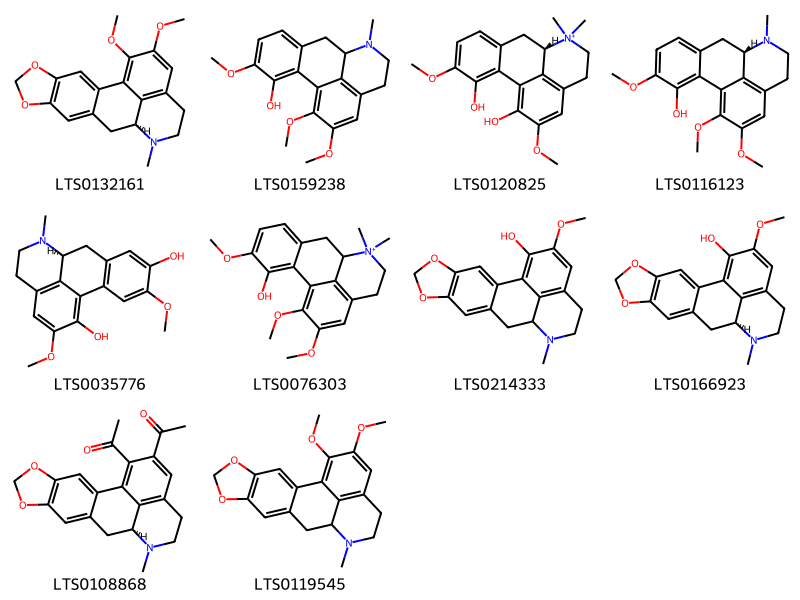{ width=100% }
    <figcaption>Hình ảnh cấu trúc hóa học của 10 hoạt chất thuộc nhóm Aporphines gồm ['nantenine (LTS0132161)', '4,15,16-trimethoxy-10-methyl-10-azatetracyclo[7.7.1.0²,⁷.0¹³,¹⁷]heptadeca-1(16),2,4,6,13(17),14-hexaen-3-ol (LTS0159238)', 'magnoflorine (LTS0120825)', '(9s)-4,15,16-trimethoxy-10-methyl-10-azatetracyclo[7.7.1.0²,⁷.0¹³,¹⁷]heptadeca-1(16),2,4,6,13(17),14-hexaen-3-ol (LTS0116123)', '(9s)-4,15-dimethoxy-10-methyl-10-azatetracyclo[7.7.1.0²,⁷.0¹³,¹⁷]heptadeca-1(16),2(7),3,5,13(17),14-hexaene-5,16-diol (LTS0035776)', '3-hydroxy-4,15,16-trimethoxy-10,10-dimethyl-10-azatetracyclo[7.7.1.0²,⁷.0¹³,¹⁷]heptadeca-1(16),2,4,6,13(17),14-hexaen-10-ium (LTS0076303)', '(+/-)-domesticine (LTS0214333)', 'domesticine (LTS0166923)', '1-[(12s)-18-acetyl-13-methyl-5,7-dioxa-13-azapentacyclo[10.7.1.0²,¹⁰.0⁴,⁸.0¹⁶,²⁰]icosa-1(19),2,4(8),9,16(20),17-hexaen-19-yl]ethanone (LTS0108868)', '18,19-dimethoxy-13-methyl-5,7-dioxa-13-azapentacyclo[10.7.1.0²,¹⁰.0⁴,⁸.0¹⁶,²⁰]icosa-1(19),2,4(8),9,16(20),17-hexaene (LTS0119545)'].</figcaption>
</figure>
#### Nhóm Cinnamic acids and derivatives
<figure markdown="span">
    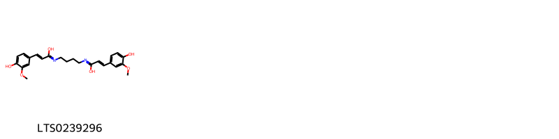{ width=100% }
    <figcaption>Hình ảnh cấu trúc hóa học của 1 hoạt chất thuộc nhóm Cinnamic acids and derivatives gồm ['(2e)-n-(4-{[(2e)-1-hydroxy-3-(4-hydroxy-3-methoxyphenyl)prop-2-en-1-ylidene]amino}butyl)-3-(4-hydroxy-3-methoxyphenyl)prop-2-enimidic acid (LTS0239296)'].</figcaption>
</figure>
#### Nhóm Dihydroisoquinolines
<figure markdown="span">
    { width=100% }
    <figcaption>Hình ảnh cấu trúc hóa học của 1 hoạt chất thuộc nhóm Dihydroisoquinolines gồm ['11,17-dihydroxy-16-methoxy-5,7-dioxa-13λ⁵-azapentacyclo[11.8.0.0²,¹⁰.0⁴,⁸.0¹⁵,²⁰]henicosa-1(13),2,4(8),9,14,16,18,20-octaen-13-ylium (LTS0230225)'].</figcaption>
</figure>
#### Nhóm Flavonoids
<figure markdown="span">
    { width=100% }
    <figcaption>Hình ảnh cấu trúc hóa học của 1 hoạt chất thuộc nhóm Flavonoids gồm ['amentoflavone (LTS0063796)'].</figcaption>
</figure>
#### Nhóm Isoquinolines and derivatives
<figure markdown="span">
    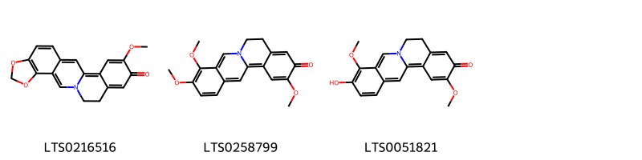{ width=100% }
    <figcaption>Hình ảnh cấu trúc hóa học của 3 hoạt chất thuộc nhóm Isoquinolines and derivatives gồm ['16-methoxy-5,7-dioxa-1-azapentacyclo[11.8.0.0³,¹¹.0⁴,⁸.0¹⁴,¹⁹]henicosa-2,4(8),9,11,13,15,18-heptaen-17-one (LTS0216516)', '3,4,11-trimethoxy-7,8-dihydro-6-azatetraphen-10-one (LTS0258799)', '3-hydroxy-4,11-dimethoxy-7,8-dihydro-6-azatetraphen-10-one (LTS0051821)'].</figcaption>
</figure>
#### Nhóm Organooxygen compounds
<figure markdown="span">
    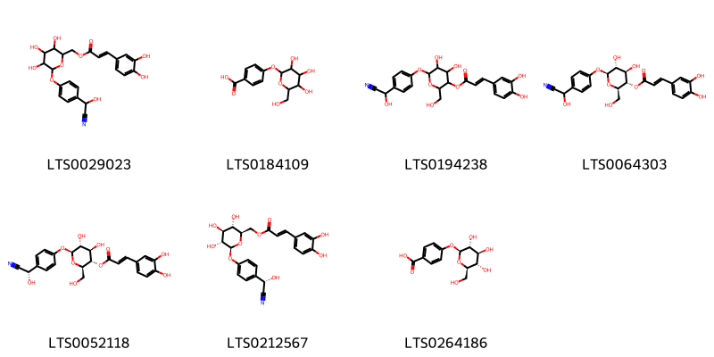{ width=100% }
    <figcaption>Hình ảnh cấu trúc hóa học của 7 hoạt chất thuộc nhóm Organooxygen compounds gồm ['(6-{4-[cyano(hydroxy)methyl]phenoxy}-3,4,5-trihydroxyoxan-2-yl)methyl 3-(3,4-dihydroxyphenyl)prop-2-enoate (LTS0029023)', '4-{[3,4,5-trihydroxy-6-(hydroxymethyl)oxan-2-yl]oxy}benzoic acid (LTS0184109)', '6-{4-[cyano(hydroxy)methyl]phenoxy}-4,5-dihydroxy-2-(hydroxymethyl)oxan-3-yl 3-(3,4-dihydroxyphenyl)prop-2-enoate (LTS0194238)', '(2r,3s,4r,5r,6s)-6-{4-[cyano(hydroxy)methyl]phenoxy}-4,5-dihydroxy-2-(hydroxymethyl)oxan-3-yl (2e)-3-(3,4-dihydroxyphenyl)prop-2-enoate (LTS0064303)', '(2r,3s,4r,5r,6s)-6-{4-[(s)-cyano(hydroxy)methyl]phenoxy}-4,5-dihydroxy-2-(hydroxymethyl)oxan-3-yl (2e)-3-(3,4-dihydroxyphenyl)prop-2-enoate (LTS0052118)', '[(2r,3s,4s,5r,6s)-6-{4-[(s)-cyano(hydroxy)methyl]phenoxy}-3,4,5-trihydroxyoxan-2-yl]methyl (2e)-3-(3,4-dihydroxyphenyl)prop-2-enoate (LTS0212567)', '4-(β-d-glucosyloxy)benzoate (LTS0264186)'].</figcaption>
</figure>
#### Nhóm Phenanthrenes and derivatives
<figure markdown="span">
    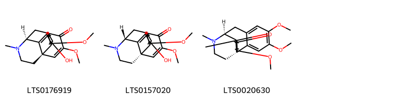{ width=100% }
    <figcaption>Hình ảnh cấu trúc hóa học của 3 hoạt chất thuộc nhóm Phenanthrenes and derivatives gồm ['(-)-salutaridine (LTS0176919)', 'salutaridine (LTS0157020)', '(1s,9s)-4,5,13-trimethoxy-17-methyl-17-azatetracyclo[7.5.3.0¹,¹⁰.0²,⁷]heptadeca-2,4,6,10,13-pentaen-12-one (LTS0020630)'].</figcaption>
</figure>
#### Nhóm Phenols
<figure markdown="span">
    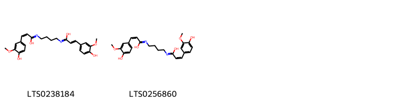{ width=100% }
    <figcaption>Hình ảnh cấu trúc hóa học của 2 hoạt chất thuộc nhóm Phenols gồm ['(2e)-n-(4-{[(2z)-1-hydroxy-3-(4-hydroxy-3-methoxyphenyl)prop-2-en-1-ylidene]amino}butyl)-3-(4-hydroxy-3-methoxyphenyl)prop-2-enimidic acid (LTS0238184)', '(2z)-n-(4-{[(2z)-1-hydroxy-3-(4-hydroxy-3-methoxyphenyl)prop-2-en-1-ylidene]amino}butyl)-3-(4-hydroxy-3-methoxyphenyl)prop-2-enimidic acid (LTS0256860)'].</figcaption>
</figure>
#### Nhóm Protoberberine alkaloids and derivatives
<figure markdown="span">
    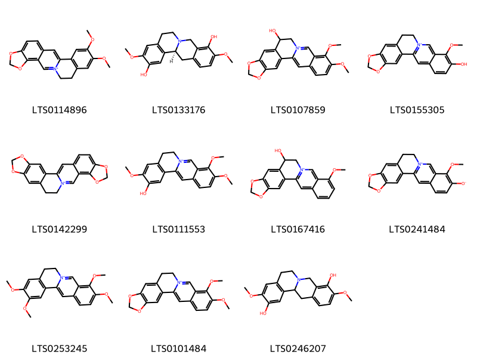{ width=100% }
    <figcaption>Hình ảnh cấu trúc hóa học của 11 hoạt chất thuộc nhóm Protoberberine alkaloids and derivatives gồm ['16,17-dimethoxy-5,7-dioxa-1λ⁵-azapentacyclo[11.8.0.0³,¹¹.0⁴,⁸.0¹⁴,¹⁹]henicosa-1,3,8,10,12,14(19),15,17-octaen-1-ylium (LTS0114896)', 'scoulerine (LTS0133176)', 'berberastine (LTS0107859)', '17-hydroxy-16-methoxy-5,7-dioxa-13λ⁵-azapentacyclo[11.8.0.0²,¹⁰.0⁴,⁸.0¹⁵,²⁰]henicosa-1(13),2,4(8),9,14,16,18,20-octaen-13-ylium (LTS0155305)', '5,7,17,19-tetraoxa-13λ⁵-azahexacyclo[11.11.0.0²,¹⁰.0⁴,⁸.0¹⁵,²³.0¹⁶,²⁰]tetracosa-1(24),2,4(8),9,13,15,20,22-octaen-13-ylium (LTS0142299)', 'columbamine (LTS0111553)', '11-hydroxy-16-methoxy-5,7-dioxa-13λ⁵-azapentacyclo[11.8.0.0²,¹⁰.0⁴,⁸.0¹⁵,²⁰]henicosa-1(13),2,4(8),9,14,16,18,20-octaen-13-ylium (LTS0167416)', '16-methoxy-5,7-dioxa-13λ⁵-azapentacyclo[11.8.0.0²,¹⁰.0⁴,⁸.0¹⁵,²⁰]henicosa-1(13),2,4(8),9,14,16,18,20-octaen-13-ylium-17-olate (LTS0241484)', 'palmatine (LTS0253245)', 'berberine (LTS0101484)', '(s)-scoulerine (LTS0246207)'].</figcaption>
</figure>
#### Nhóm Protopine alkaloids
<figure markdown="span">
    { width=100% }
    <figcaption>Hình ảnh cấu trúc hóa học của 1 hoạt chất thuộc nhóm Protopine alkaloids gồm ['protopine (LTS0080245)'].</figcaption>
</figure>
#### Nhóm Steroids and steroid derivatives
<figure markdown="span">
    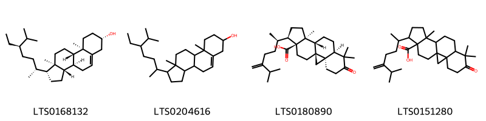{ width=100% }
    <figcaption>Hình ảnh cấu trúc hóa học của 4 hoạt chất thuộc nhóm Steroids and steroid derivatives gồm ['sitosterol (LTS0168132)', 'stigmast-5-en-3-ol, (3β)- (LTS0204616)', '(1s,3r,8r,11s,12s,15r,16s)-7,7,12-trimethyl-15-[(2r)-6-methyl-5-methylideneheptan-2-yl]-6-oxopentacyclo[9.7.0.0¹,³.0³,⁸.0¹²,¹⁶]octadecane-16-carboxylic acid (LTS0180890)', '7,7,12-trimethyl-15-(6-methyl-5-methylideneheptan-2-yl)-6-oxopentacyclo[9.7.0.0¹,³.0³,⁸.0¹²,¹⁶]octadecane-16-carboxylic acid (LTS0151280)'].</figcaption>
</figure>
#### Nhóm Tetrahydroisoquinolines
<figure markdown="span">
    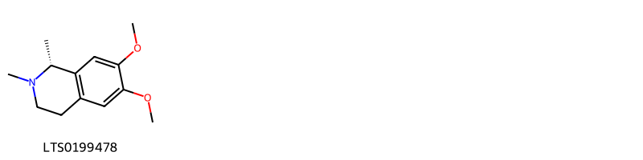{ width=100% }
    <figcaption>Hình ảnh cấu trúc hóa học của 1 hoạt chất thuộc nhóm Tetrahydroisoquinolines gồm ['(+)-carnegine (LTS0199478)'].</figcaption>
</figure>

---

### Dược dân tộc học

Danh sách các quốc gia có sử dụng *Nandina domestica* trong điều trị các bệnh. 

| Country   | Disease             | Bệnh                                                                                                                                                                                                |
|:----------|:--------------------|:----------------------------------------------------------------------------------------------------------------------------------------------------------------------------------------------------|
| China     | Antitussive, Poison | MYMEMORY WARNING: YOU USED ALL AVAILABLE FREE TRANSLATIONS FOR TODAY. NEXT AVAILABLE IN  07 HOURS 54 MINUTES 31 SECONDS VISIT HTTPS://MYMEMORY.TRANSLATED.NET/DOC/USAGELIMITS.PHP TO TRANSLATE MORE |
| Elsewhere | Antitussive, Poison | MYMEMORY WARNING: YOU USED ALL AVAILABLE FREE TRANSLATIONS FOR TODAY. NEXT AVAILABLE IN  07 HOURS 54 MINUTES 28 SECONDS VISIT HTTPS://MYMEMORY.TRANSLATED.NET/DOC/USAGELIMITS.PHP TO TRANSLATE MORE |

---

# Chi Dysosma

??? note "Danh sách các dược liệu thuộc chi"
    
	 - *Dysosma auranticocaulis*

---
## Dysosma auranticocaulis
### Thông tin về thực vật

!!! info "Phân loại thực vật của *Dysosma aurantiocaulis* từ GIBF:"
    - **Kingdom:** Plantae
    - **Phylum:** Tracheophyta
    - **Order:** Ranunculales
    - **Family:** Berberidaceae
    - **Genus:** Dysosma
    - **Species:** *Dysosma aurantiocaulis*

 

| Label (VI)   | Label (EN)   | Scientific Name   | Descriptions (VI)   | Descriptions (EN)   | Also Known As (VI)    | Also Known As (EN)                                                |
|:-------------|:-------------|:------------------|:--------------------|:--------------------|:----------------------|:------------------------------------------------------------------|
| N/A          | N/A          | Nandina domestica | loài thực vật       | species of plant    | ['Nandina domestica'] | ['nandina', 'common nandina', 'heavenly bamboo', 'sacred bamboo'] |

#### Phân bố trên thế giới

**Từ CSDL GIBF** nan, China, Myanmar, India, unknown or invalid

#### Phân bố tại Việt Nam

**Từ CSDL GIBF**: Không có ghi nhận ở Việt Nam

---
### Thành phần hóa học
        
- Theo cơ sở dữ liệu lotus: Từ loài *Dysosma aurantiocaulis* đã phân lập và xác định được Chưa có hoạt chất nào được phân lập. hoạt chất thuộc về các nhóm Không có hoạt chất nào được phân lập. 

Không có hình ảnh nào được tạo ra

---

### Dược dân tộc học

Danh sách các quốc gia có sử dụng *Dysosma aurantiocaulis* trong điều trị các bệnh. 

| Country   | Disease    | Bệnh                                                                                                                                                                                                |
|:----------|:-----------|:----------------------------------------------------------------------------------------------------------------------------------------------------------------------------------------------------|
| China     | Alexiteric | MYMEMORY WARNING: YOU USED ALL AVAILABLE FREE TRANSLATIONS FOR TODAY. NEXT AVAILABLE IN  07 HOURS 53 MINUTES 55 SECONDS VISIT HTTPS://MYMEMORY.TRANSLATED.NET/DOC/USAGELIMITS.PHP TO TRANSLATE MORE |

---

# Chi Epimedium

??? note "Danh sách các dược liệu thuộc chi"
    
	 - *Epimedium alpinum*
	 - *Epimedium cremeum*
	 - *Epimedium grandiflorum*
	 - *Epimedium macranthum*
	 - *Epimedium rugosum*
	 - *Epimedium sagittatum*
	 - *Epimedium sempervirens*
	 - *Epimedium setosum*

---
## Epimedium alpinum
### Thông tin về thực vật

!!! info "Phân loại thực vật của *Epimedium alpinum* từ GIBF:"
    - **Kingdom:** Plantae
    - **Phylum:** Tracheophyta
    - **Order:** Ranunculales
    - **Family:** Berberidaceae
    - **Genus:** Epimedium
    - **Species:** *Epimedium alpinum*

 

| Label (VI)   | Label (EN)   | Scientific Name   | Descriptions (VI)   | Descriptions (EN)   | Also Known As (VI)   | Also Known As (EN)   |
|:-------------|:-------------|:------------------|:--------------------|:--------------------|:---------------------|:---------------------|
| N/A          | N/A          | Epimedium alpinum | loài thực vật       | species of plant    | ['']                 | ["Bishop's hat"]     |

#### Phân bố trên thế giới

**Từ CSDL GIBF** Austria, United States of America, Norway, Czechia, Sweden, France, Belgium, Denmark, Italy, Croatia, Slovenia, Switzerland, Luxembourg, Germany, Serbia, Bosnia and Herzegovina, Netherlands

#### Phân bố tại Việt Nam

**Từ CSDL GIBF**: Không có ghi nhận ở Việt Nam

---
### Thành phần hóa học
        
- Theo cơ sở dữ liệu lotus: Từ loài *Epimedium alpinum* đã phân lập và xác định được Chưa có hoạt chất nào được phân lập. hoạt chất thuộc về các nhóm Không có hoạt chất nào được phân lập. 

Không có hình ảnh nào được tạo ra

---

### Dược dân tộc học

Danh sách các quốc gia có sử dụng *Epimedium alpinum* trong điều trị các bệnh. 

| Country   | Disease                | Bệnh                                                                                                                                                                                                |
|:----------|:-----------------------|:----------------------------------------------------------------------------------------------------------------------------------------------------------------------------------------------------|
| China     | Sudorific              | MYMEMORY WARNING: YOU USED ALL AVAILABLE FREE TRANSLATIONS FOR TODAY. NEXT AVAILABLE IN  07 HOURS 53 MINUTES 38 SECONDS VISIT HTTPS://MYMEMORY.TRANSLATED.NET/DOC/USAGELIMITS.PHP TO TRANSLATE MORE |
| Turkey    | Refrigerant, Sudorific | MYMEMORY WARNING: YOU USED ALL AVAILABLE FREE TRANSLATIONS FOR TODAY. NEXT AVAILABLE IN  07 HOURS 53 MINUTES 35 SECONDS VISIT HTTPS://MYMEMORY.TRANSLATED.NET/DOC/USAGELIMITS.PHP TO TRANSLATE MORE |

---

---
## Epimedium cremeum
### Thông tin về thực vật

!!! info "Phân loại thực vật của *Epimedium koreanum* từ GIBF:"
    - **Kingdom:** Plantae
    - **Phylum:** Tracheophyta
    - **Order:** Ranunculales
    - **Family:** Berberidaceae
    - **Genus:** Epimedium
    - **Species:** *Epimedium koreanum*

 

| Label (VI)   | Label (EN)   | Scientific Name   | Descriptions (VI)   | Descriptions (EN)   | Also Known As (VI)   | Also Known As (EN)   |
|:-------------|:-------------|:------------------|:--------------------|:--------------------|:---------------------|:---------------------|
| N/A          | N/A          | Epimedium alpinum | loài thực vật       | species of plant    | ['']                 | ["Bishop's hat"]     |

#### Phân bố trên thế giới

**Từ CSDL GIBF** nan, Japan

#### Phân bố tại Việt Nam

**Từ CSDL GIBF**: Không có ghi nhận ở Việt Nam

---
### Thành phần hóa học
        
- Theo cơ sở dữ liệu lotus: Từ loài *Epimedium koreanum* đã phân lập và xác định được Chưa có hoạt chất nào được phân lập. hoạt chất thuộc về các nhóm Không có hoạt chất nào được phân lập. 

Không có hình ảnh nào được tạo ra

---

### Dược dân tộc học

Danh sách các quốc gia có sử dụng *Epimedium koreanum* trong điều trị các bệnh. 

| Country   | Disease   | Bệnh                                                                                                                                                                                                |
|:----------|:----------|:----------------------------------------------------------------------------------------------------------------------------------------------------------------------------------------------------|
| Elsewhere | Tonic     | MYMEMORY WARNING: YOU USED ALL AVAILABLE FREE TRANSLATIONS FOR TODAY. NEXT AVAILABLE IN  07 HOURS 53 MINUTES 13 SECONDS VISIT HTTPS://MYMEMORY.TRANSLATED.NET/DOC/USAGELIMITS.PHP TO TRANSLATE MORE |

---

---
## Epimedium grandiflorum
### Thông tin về thực vật

!!! info "Phân loại thực vật của *Epimedium grandiflorum* từ GIBF:"
    - **Kingdom:** Plantae
    - **Phylum:** Tracheophyta
    - **Order:** Ranunculales
    - **Family:** Berberidaceae
    - **Genus:** Epimedium
    - **Species:** *Epimedium grandiflorum*

 

| Label (VI)   | Label (EN)   | Scientific Name        | Descriptions (VI)   | Descriptions (EN)   | Also Known As (VI)                                                         | Also Known As (EN)   |
|:-------------|:-------------|:-----------------------|:--------------------|:--------------------|:---------------------------------------------------------------------------|:---------------------|
| N/A          | N/A          | Epimedium grandiflorum | loài thực vật       | species of plant    | ['Epimedium macranthum', 'Epimedium grandiflorum', 'Dâm dương hoắc lá to'] | ['']                 |

#### Phân bố trên thế giới

**Từ CSDL GIBF** nan, Austria, United States of America, Japan, Norway, Korea, Republic of, Belgium, China, New Zealand, Canada, Germany, Spain

#### Phân bố tại Việt Nam

**Từ CSDL GIBF**: Không có ghi nhận ở Việt Nam

---
### Thành phần hóa học
        
- Theo cơ sở dữ liệu lotus: Từ loài *Epimedium grandiflorum* đã phân lập và xác định được 214 hoạt chất thuộc về các nhóm Fatty Acyls, Benzofurans, Benzene and substituted derivatives, Phenanthrenes and derivatives, Flavonoids, Diazines, Pyrans, Aryltetralin lignans, Organooxygen compounds, Furanoid lignans, Prenol lipids, 2-arylbenzofuran flavonoids, Lignan glycosides, Stilbenes. 

|    | chemicalTaxonomyClassyfireClass     |   smiles_count |
|---:|:------------------------------------|---------------:|
|  0 | 2-arylbenzofuran flavonoids         |              1 |
|  1 | Aryltetralin lignans                |              1 |
|  2 | Benzene and substituted derivatives |              1 |
|  3 | Benzofurans                         |              2 |
|  4 | Diazines                            |              1 |
|  5 | Fatty Acyls                         |             19 |
|  6 | Flavonoids                          |             69 |
|  7 | Furanoid lignans                    |              3 |
|  8 | Lignan glycosides                   |             12 |
|  9 | Organooxygen compounds              |             27 |
| 10 | Phenanthrenes and derivatives       |              1 |
| 11 | Prenol lipids                       |             17 |
| 12 | Pyrans                              |              1 |
| 13 | Stilbenes                           |              6 |

#### Nhóm 2-arylbenzofuran flavonoids
<figure markdown="span">
    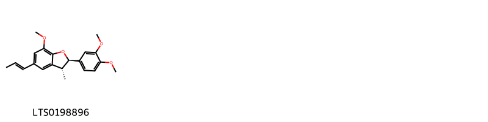{ width=100% }
    <figcaption>Hình ảnh cấu trúc hóa học của 1 hoạt chất thuộc nhóm 2-arylbenzofuran flavonoids gồm ['acuminatin (LTS0198896)'].</figcaption>
</figure>
#### Nhóm Aryltetralin lignans
<figure markdown="span">
    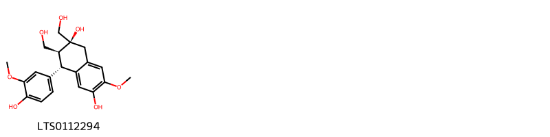{ width=100% }
    <figcaption>Hình ảnh cấu trúc hóa học của 1 hoạt chất thuộc nhóm Aryltetralin lignans gồm ['(2s,3s,4s)-4-(4-hydroxy-3-methoxyphenyl)-2,3-bis(hydroxymethyl)-7-methoxy-3,4-dihydro-1h-naphthalene-2,6-diol (LTS0112294)'].</figcaption>
</figure>
#### Nhóm Benzene and substituted derivatives
<figure markdown="span">
    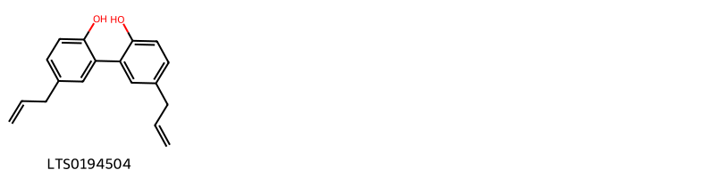{ width=100% }
    <figcaption>Hình ảnh cấu trúc hóa học của 1 hoạt chất thuộc nhóm Benzene and substituted derivatives gồm ['magnolol (LTS0194504)'].</figcaption>
</figure>
#### Nhóm Benzofurans
<figure markdown="span">
    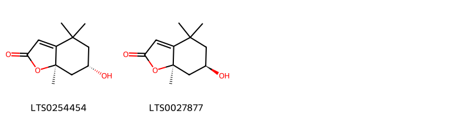{ width=100% }
    <figcaption>Hình ảnh cấu trúc hóa học của 2 hoạt chất thuộc nhóm Benzofurans gồm ['loliolide (LTS0254454)', '(6r,7ar)-6-hydroxy-4,4,7a-trimethyl-6,7-dihydro-5h-1-benzofuran-2-one (LTS0027877)'].</figcaption>
</figure>
#### Nhóm Diazines
<figure markdown="span">
    { width=100% }
    <figcaption>Hình ảnh cấu trúc hóa học của 1 hoạt chất thuộc nhóm Diazines gồm ['9-hydroxy-3-methoxypyrido[1,2-a]pyrazin-6-one (LTS0112747)'].</figcaption>
</figure>
#### Nhóm Fatty Acyls
<figure markdown="span">
    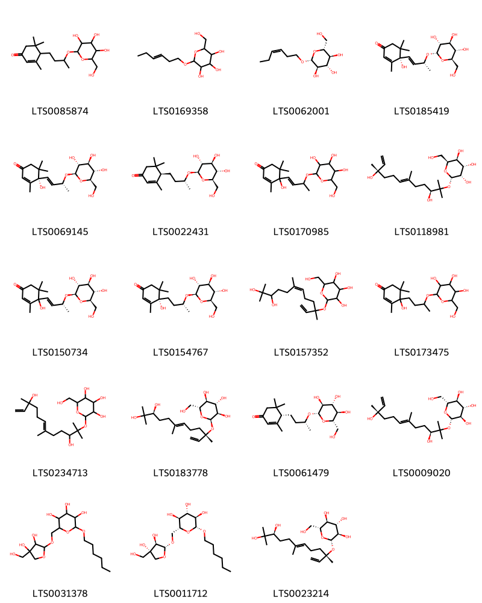{ width=100% }
    <figcaption>Hình ảnh cấu trúc hóa học của 19 hoạt chất thuộc nhóm Fatty Acyls gồm ['3,5,5-trimethyl-4-(3-{[3,4,5-trihydroxy-6-(hydroxymethyl)oxan-2-yl]oxy}butyl)cyclohex-2-en-1-one (LTS0085874)', '2-(hex-3-en-1-yloxy)-6-(hydroxymethyl)oxane-3,4,5-triol (LTS0169358)', '(2r,3r,4s,5s,6r)-2-[(3z)-hex-3-en-1-yloxy]-6-(hydroxymethyl)oxane-3,4,5-triol (LTS0062001)', '(4s)-4-hydroxy-3,5,5-trimethyl-4-[(1e,3r)-3-{[(2s,3r,4s,5s,6r)-3,4,5-trihydroxy-6-(hydroxymethyl)oxan-2-yl]oxy}but-1-en-1-yl]cyclohex-2-en-1-one (LTS0185419)', '(4s)-4-hydroxy-3,5,5-trimethyl-4-[(1e,3r)-3-{[(2r,3r,4s,5s,6r)-3,4,5-trihydroxy-6-(hydroxymethyl)oxan-2-yl]oxy}but-1-en-1-yl]cyclohex-2-en-1-one (LTS0069145)', 'byzantionoside b (LTS0022431)', '4-hydroxy-3,5,5-trimethyl-4-(3-{[3,4,5-trihydroxy-6-(hydroxymethyl)oxan-2-yl]oxy}but-1-en-1-yl)cyclohex-2-en-1-one (LTS0170985)', '(2s,3s,4s,5s,6s)-2-{[(3s,6e,10s)-3,10-dihydroxy-2,6,10-trimethyldodeca-6,11-dien-2-yl]oxy}-6-(hydroxymethyl)oxane-3,4,5-triol (LTS0118981)', '4-hydroxy-3,5,5-trimethyl-4-[(1e,3r)-3-{[(2r,3r,4s,5s,6r)-3,4,5-trihydroxy-6-(hydroxymethyl)oxan-2-yl]oxy}but-1-en-1-yl]cyclohex-2-en-1-one (LTS0150734)', '(4s)-4-hydroxy-3,5,5-trimethyl-4-[(3r)-3-{[(2r,3r,4s,5s,6r)-3,4,5-trihydroxy-6-(hydroxymethyl)oxan-2-yl]oxy}butyl]cyclohex-2-en-1-one (LTS0154767)', '2-[(10,11-dihydroxy-3,7,11-trimethyldodeca-1,6-dien-3-yl)oxy]-6-(hydroxymethyl)oxane-3,4,5-triol (LTS0157352)', '4-hydroxy-3,5,5-trimethyl-4-(3-{[3,4,5-trihydroxy-6-(hydroxymethyl)oxan-2-yl]oxy}butyl)cyclohex-2-en-1-one (LTS0173475)', '2-[(3,10-dihydroxy-2,6,10-trimethyldodeca-6,11-dien-2-yl)oxy]-6-(hydroxymethyl)oxane-3,4,5-triol (LTS0234713)', '(2r,3r,4s,5s,6r)-2-{[(3s,6e,10s)-10,11-dihydroxy-3,7,11-trimethyldodeca-1,6-dien-3-yl]oxy}-6-(hydroxymethyl)oxane-3,4,5-triol (LTS0183778)', '(4s)-3,5,5-trimethyl-4-[(3r)-3-{[(2s,3s,4r,5r,6s)-3,4,5-trihydroxy-6-(hydroxymethyl)oxan-2-yl]oxy}butyl]cyclohex-2-en-1-one (LTS0061479)', '(2s,3r,4s,5s,6r)-2-{[(3s,6e,10s)-3,10-dihydroxy-2,6,10-trimethyldodeca-6,11-dien-2-yl]oxy}-6-(hydroxymethyl)oxane-3,4,5-triol (LTS0009020)', '2-({[3,4-dihydroxy-4-(hydroxymethyl)oxolan-2-yl]oxy}methyl)-6-(hexyloxy)oxane-3,4,5-triol (LTS0031378)', '(2r,3s,4s,5r,6r)-2-({[(2r,3r,4s)-3,4-dihydroxy-4-(hydroxymethyl)oxolan-2-yl]oxy}methyl)-6-(hexyloxy)oxane-3,4,5-triol (LTS0011712)', '(2s,3r,4s,5s,6r)-2-{[(3s,6e,10s)-10,11-dihydroxy-3,7,11-trimethyldodeca-1,6-dien-3-yl]oxy}-6-(hydroxymethyl)oxane-3,4,5-triol (LTS0023214)'].</figcaption>
</figure>
#### Nhóm Flavonoids
<figure markdown="span">
    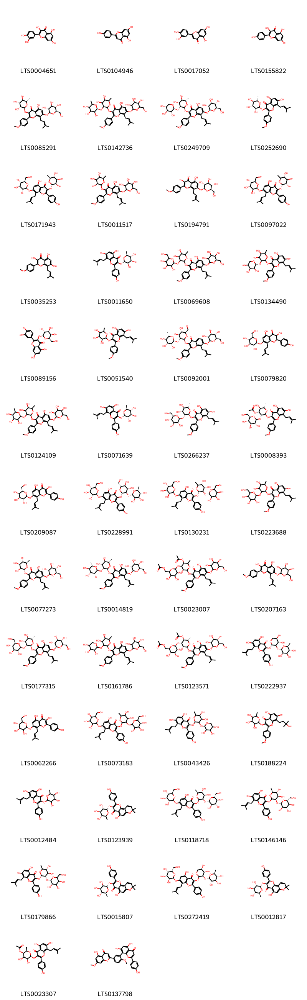{ width=100% }
    <figcaption>Hình ảnh cấu trúc hóa học của 69 hoạt chất thuộc nhóm Flavonoids gồm ['quercetin (LTS0004651)', 'chamomile (LTS0104946)', 'luteolin (LTS0017052)', 'kaempherol (LTS0155822)', 'icariin (LTS0085291)', '3-[(4,5-dihydroxy-6-methyl-3-{[(2s)-3,4,5-trihydroxy-6-methyloxan-2-yl]oxy}oxan-2-yl)oxy]-5-hydroxy-2-(4-methoxyphenyl)-8-(3-methylbut-2-en-1-yl)-7-{[3,4,5-trihydroxy-6-(hydroxymethyl)oxan-2-yl]oxy}chromen-4-one (LTS0142736)', '3-{[(2s,3r,4r,5r,6s)-4,5-dihydroxy-6-methyl-3-{[(2s,3r,4s,5r)-3,4,5-trihydroxyoxan-2-yl]oxy}oxan-2-yl]oxy}-5-hydroxy-2-(4-methoxyphenyl)-8-(3-methylbut-2-en-1-yl)-7-{[(2s,3r,4s,5s,6r)-3,4,5-trihydroxy-6-(hydroxymethyl)oxan-2-yl]oxy}chromen-4-one (LTS0249709)', 'icariside ii (LTS0252690)', '5-hydroxy-2-(4-hydroxyphenyl)-8-(3-methylbut-2-en-1-yl)-7-{[(2s,3r,4s,5s,6r)-3,4,5-trihydroxy-6-(hydroxymethyl)oxan-2-yl]oxy}-3-{[(2s,3r,4r,5r,6s)-3,4,5-trihydroxy-6-methyloxan-2-yl]oxy}chromen-4-one (LTS0171943)', '5-hydroxy-2-(4-methoxyphenyl)-8-(3-methylbut-2-en-1-yl)-7-{[3,4,5-trihydroxy-6-(hydroxymethyl)oxan-2-yl]oxy}-3-[(3,4,5-trihydroxy-6-methyloxan-2-yl)oxy]chromen-4-one (LTS0011517)', '3,5-dihydroxy-2-(4-methoxyphenyl)-8-(3-methylbut-2-en-1-yl)-7-{[(2s,3r,4s,5s,6r)-3,4,5-trihydroxy-6-(hydroxymethyl)oxan-2-yl]oxy}chromen-4-one (LTS0194791)', 'epimedoside a (LTS0097022)', 'icaritin (LTS0035253)', '5,7-dihydroxy-2-(4-hydroxyphenyl)-8-(3-methylbut-2-en-1-yl)-3-{[(2s,3r,4r,5r,6s)-3,4,5-trihydroxy-6-methyloxan-2-yl]oxy}chromen-4-one (LTS0011650)', '3-[(4,5-dihydroxy-6-methyl-3-{[3,4,5-trihydroxy-6-(hydroxymethyl)oxan-2-yl]oxy}oxan-2-yl)oxy]-5-hydroxy-2-(4-methoxyphenyl)-8-(3-methylbut-2-en-1-yl)-7-{[3,4,5-trihydroxy-6-(hydroxymethyl)oxan-2-yl]oxy}chromen-4-one (LTS0069608)', '3-[(4,5-dihydroxy-6-methyl-3-{[(2r)-3,4,5-trihydroxyoxan-2-yl]oxy}oxan-2-yl)oxy]-5,7-dihydroxy-2-(4-methoxyphenyl)-8-(3-methylbut-2-en-1-yl)chromen-4-one (LTS0134490)', 'hyperoside (LTS0089156)', '5,7-dihydroxy-2-(4-methoxyphenyl)-8-(3-methylbut-2-en-1-yl)-3-[(3,4,5-trihydroxy-6-methyloxan-2-yl)oxy]chromen-4-one (LTS0051540)', '3-{[(2s,3r,4s,5s,6r)-4,5-dihydroxy-6-(hydroxymethyl)-3-{[(2s,3r,4r,5r,6s)-3,4,5-trihydroxy-6-methyloxan-2-yl]oxy}oxan-2-yl]oxy}-2-(4-methoxyphenyl)-8-(3-methylbut-2-en-1-yl)-7-{[(2s,3r,4s,5s,6r)-3,4,5-trihydroxy-6-(hydroxymethyl)oxan-2-yl]oxy}chromen-4-one (LTS0092001)', '3,5-dihydroxy-2-(4-hydroxyphenyl)-8-(3-methylbut-2-en-1-yl)-7-{[(2s,3r,4s,5s,6r)-3,4,5-trihydroxy-6-(hydroxymethyl)oxan-2-yl]oxy}-2,3-dihydro-1-benzopyran-4-one (LTS0079820)', '3-({4,5-dihydroxy-6-methyl-3-[(3,4,5-trihydroxy-6-methyloxan-2-yl)oxy]oxan-2-yl}oxy)-5-hydroxy-2-(4-methoxyphenyl)-8-(3-methylbut-2-en-1-yl)-7-{[3,4,5-trihydroxy-6-(hydroxymethyl)oxan-2-yl]oxy}chromen-4-one (LTS0124109)', '5,7-dihydroxy-2-(4-hydroxyphenyl)-8-(3-methylbut-2-en-1-yl)-3-{[(2s,3s,4r,5r,6s)-3,4,5-trihydroxy-6-methyloxan-2-yl]oxy}chromen-4-one (LTS0071639)', '3-{[(2s,3r,4r,5r,6s)-4,5-dihydroxy-6-methyl-3-{[(2s,3r,4s,5s,6r)-3,4,5-trihydroxy-6-(hydroxymethyl)oxan-2-yl]oxy}oxan-2-yl]oxy}-5,7-dihydroxy-2-(4-methoxyphenyl)-8-(3-methylbut-2-en-1-yl)chromen-4-one (LTS0266237)', '(2s,3r,4r,5s,6s)-2-{[5,7-dihydroxy-2-(4-methoxyphenyl)-8-(3-methylbut-2-en-1-yl)-4-oxochromen-3-yl]oxy}-5-hydroxy-6-methyl-3-{[(3r,4s,5s,6r)-3,4,5-trihydroxy-6-(hydroxymethyl)oxan-2-yl]oxy}oxan-4-yl acetate (LTS0008393)', '3,5-dihydroxy-2-(4-hydroxyphenyl)-8-(3-methylbut-2-en-1-yl)-7-{[(2s,3r,4s,5r,6r)-3,4,5-trihydroxy-6-(hydroxymethyl)oxan-2-yl]oxy}chromen-4-one (LTS0209087)', '3-{[(2s,3r,4s,5s,6r)-4,5-dihydroxy-6-(hydroxymethyl)-3-{[(2s,3r,4r,5r,6s)-3,4,5-trihydroxy-6-methyloxan-2-yl]oxy}oxan-2-yl]oxy}-5-hydroxy-2-(4-hydroxyphenyl)-8-(3-methylbut-2-en-1-yl)-7-{[(2s,3r,4s,5s,6r)-3,4,5-trihydroxy-6-(hydroxymethyl)oxan-2-yl]oxy}chromen-4-one (LTS0228991)', 'ikarisoside c (LTS0130231)', '3-[(4,5-dihydroxy-6-methyl-3-{[3,4,5-trihydroxy-6-(hydroxymethyl)oxan-2-yl]oxy}oxan-2-yl)oxy]-5,7-dihydroxy-2-(4-methoxyphenyl)-8-(3-methylbut-2-en-1-yl)chromen-4-one (LTS0223688)', '5-hydroxy-2-(4-methoxyphenyl)-8-(3-methylbut-2-en-1-yl)-7-{[(2s,3r,4s,5s,6r)-3,4,5-trihydroxy-6-(hydroxymethyl)oxan-2-yl]oxy}-3-{[(2r,3s,4s,5s,6r)-3,4,5-trihydroxy-6-methyloxan-2-yl]oxy}chromen-4-one (LTS0077273)', '3-{[(2s,3r,4r,5r,6s)-4,5-dihydroxy-6-methyl-3-{[(2s,3r,4r,5r,6s)-3,4,5-trihydroxy-6-methyloxan-2-yl]oxy}oxan-2-yl]oxy}-5-hydroxy-2-(4-methoxyphenyl)-8-(3-methylbut-2-en-1-yl)-7-{[(2s,3r,4s,5s,6r)-3,4,5-trihydroxy-6-(hydroxymethyl)oxan-2-yl]oxy}chromen-4-one (LTS0014819)', '(6-{[3-(acetyloxy)-5-hydroxy-6-{[5-hydroxy-2-(4-methoxyphenyl)-8-(3-methylbut-2-en-1-yl)-4-oxo-7-{[3,4,5-trihydroxy-6-(hydroxymethyl)oxan-2-yl]oxy}chromen-3-yl]oxy}-2-methyloxan-4-yl]oxy}-3,4,5-trihydroxyoxan-2-yl)methyl acetate (LTS0023007)', '3,5-dihydroxy-2-(4-methoxyphenyl)-8-(3-methylbut-2-en-1-yl)-7-{[3,4,5-trihydroxy-6-(hydroxymethyl)oxan-2-yl]oxy}chromen-4-one (LTS0207163)', '3-{[(2s,3r,4r,5r,6s)-4,5-dihydroxy-6-methyl-3-{[(2s,3r,4s,5s,6r)-3,4,5-trihydroxy-6-(hydroxymethyl)oxan-2-yl]oxy}oxan-2-yl]oxy}-5-hydroxy-2-(4-methoxyphenyl)-8-(3-methylbut-2-en-1-yl)-7-{[(2s,3r,4s,5s,6r)-3,4,5-trihydroxy-6-(hydroxymethyl)oxan-2-yl]oxy}chromen-4-one (LTS0177315)', '3-({4,5-dihydroxy-6-methyl-3-[(3,4,5-trihydroxyoxan-2-yl)oxy]oxan-2-yl}oxy)-5-hydroxy-2-(4-methoxyphenyl)-8-(3-methylbut-2-en-1-yl)-7-{[3,4,5-trihydroxy-6-(hydroxymethyl)oxan-2-yl]oxy}chromen-4-one (LTS0161786)', '[(2r,3s,4s,5r,6s)-6-{[(2s,3s,4s,5r,6s)-3-(acetyloxy)-5-hydroxy-6-{[5-hydroxy-2-(4-methoxyphenyl)-8-(3-methylbut-2-en-1-yl)-4-oxo-7-{[(2s,3r,4s,5s,6r)-3,4,5-trihydroxy-6-(hydroxymethyl)oxan-2-yl]oxy}chromen-3-yl]oxy}-2-methyloxan-4-yl]oxy}-3,4,5-trihydroxyoxan-2-yl]methyl acetate (LTS0123571)', '3-{[(2s,3r,4s,5r)-4,5-dihydroxy-3-{[(2s,3r,4r,5r,6s)-3,4,5-trihydroxy-6-methyloxan-2-yl]oxy}oxan-2-yl]oxy}-5,7-dihydroxy-2-(4-hydroxyphenyl)-8-(3-methylbut-2-en-1-yl)chromen-4-one (LTS0222937)', 'epimedoside c (LTS0062266)', '3-[(4,5-dihydroxy-6-methyl-3-{[3,4,5-trihydroxy-6-(hydroxymethyl)oxan-2-yl]oxy}oxan-2-yl)oxy]-5-hydroxy-2-(4-hydroxyphenyl)-8-(3-methylbut-2-en-1-yl)-7-{[3,4,5-trihydroxy-6-(hydroxymethyl)oxan-2-yl]oxy}chromen-4-one (LTS0073183)', '3-[(4,5-dihydroxy-6-methyl-3-{[(2r)-3,4,5-trihydroxyoxan-2-yl]oxy}oxan-2-yl)oxy]-5,7-dihydroxy-2-(4-hydroxyphenyl)-8-(3-methylbut-2-en-1-yl)chromen-4-one (LTS0043426)', '5,7-dihydroxy-8-(3-hydroxy-3-methylbutyl)-2-(4-methoxyphenyl)-3-[(3,4,5-trihydroxy-6-methyloxan-2-yl)oxy]chromen-4-one (LTS0188224)', '5,7-dihydroxy-2-(4-hydroxyphenyl)-8-(3-methylbut-2-en-1-yl)-3-[(3,4,5-trihydroxy-6-methyloxan-2-yl)oxy]chromen-4-one (LTS0012484)', 'ikarisoside e (LTS0123939)', '3-{[(2r,3r,4r,5r,6s)-4,5-dihydroxy-6-methyl-3-{[(2s,3r,4s,5s,6r)-3,4,5-trihydroxy-6-(hydroxymethyl)oxan-2-yl]oxy}oxan-2-yl]oxy}-5-hydroxy-2-(4-hydroxyphenyl)-8-(3-methylbut-2-en-1-yl)-7-{[(2s,3r,4s,5s,6r)-3,4,5-trihydroxy-6-(hydroxymethyl)oxan-2-yl]oxy}chromen-4-one (LTS0118718)', '3-{[(3r,4r,5r,6s)-4,5-dihydroxy-6-methyl-3-{[(2s,3r,4s,5s,6r)-3,4,5-trihydroxy-6-(hydroxymethyl)oxan-2-yl]oxy}oxan-2-yl]oxy}-5,7-dihydroxy-2-(4-hydroxyphenyl)-8-(3-methylbut-2-en-1-yl)chromen-4-one (LTS0146146)', 'ikarisoside b (LTS0179866)', '5-hydroxy-2-(4-hydroxyphenyl)-8,8-dimethyl-3-{[(2s,3r,4r,5r,6s)-3,4,5-trihydroxy-6-methyloxan-2-yl]oxy}pyrano[2,3-h]chromen-4-one (LTS0015807)', '3-{[(2r,3r,4r,5r)-4,5-dihydroxy-3-{[(2s,3s,4r,5r,6s)-3,4,5-trihydroxy-6-methyloxan-2-yl]oxy}oxan-2-yl]oxy}-5-hydroxy-2-(4-hydroxyphenyl)-8-(3-methylbut-2-en-1-yl)-7-{[(2s,3s,4s,5s,6s)-3,4,5-trihydroxy-6-(hydroxymethyl)oxan-2-yl]oxy}chromen-4-one (LTS0272419)', '5-hydroxy-2-(4-hydroxyphenyl)-8,8-dimethyl-3-{[(2s,3s,4r,5r,6s)-3,4,5-trihydroxy-6-methyloxan-2-yl]oxy}pyrano[2,3-h]chromen-4-one (LTS0012817)', 'ikarisoside d (LTS0023307)', 'ginkgetin (LTS0137798)', '3,5-dihydroxy-2-(4-hydroxyphenyl)-8-(3-methylbut-2-en-1-yl)-7-{[3,4,5-trihydroxy-6-(hydroxymethyl)oxan-2-yl]oxy}chromen-4-one (LTS0096331)', '3,5-dihydroxy-2-(4-hydroxyphenyl)-8-(3-methylbut-2-en-1-yl)-7-{[(2s,3r,4s,5s,6r)-3,4,5-trihydroxy-6-(hydroxymethyl)oxan-2-yl]oxy}chromen-4-one (LTS0189240)', '8-prenylkaempferol (LTS0206485)', 'hexandraside e (LTS0252368)', '8-[5-(5,7-dihydroxy-4-oxochromen-2-yl)-2-hydroxyphenyl]-5,7-dihydroxy-2-(4-methoxyphenyl)chromen-4-one (LTS0254320)', 'isoginkgetin (LTS0061203)', '8-[5-(5,7-dihydroxy-4-oxochromen-2-yl)-2-methoxyphenyl]-5,7-dihydroxy-2-(4-hydroxyphenyl)chromen-4-one (LTS0013591)', '3-[(4,5-dihydroxy-6-methyl-3-{[3,4,5-trihydroxy-6-(hydroxymethyl)oxan-2-yl]oxy}oxan-2-yl)oxy]-5,7-dihydroxy-2-(4-hydroxyphenyl)-8-(3-methylbut-2-en-1-yl)chromen-4-one (LTS0053422)', '5-hydroxy-2-(4-hydroxyphenyl)-8,8-dimethyl-3-[(3,4,5-trihydroxy-6-methyloxan-2-yl)oxy]pyrano[2,3-h]chromen-4-one (LTS0086870)', '3-{[(2r,3r,4r,5r,6s)-4,5-dihydroxy-6-methyl-3-{[(2s,3r,4s,5r)-3,4,5-trihydroxyoxan-2-yl]oxy}oxan-2-yl]oxy}-5,7-dihydroxy-2-(4-hydroxyphenyl)-8-(3-methylbut-2-en-1-yl)chromen-4-one (LTS0034705)', '3-{[(2r,3r,4r,5r,6s)-4,5-dihydroxy-6-methyl-3-{[(2s,3r,4s,5s,6r)-3,4,5-trihydroxy-6-(hydroxymethyl)oxan-2-yl]oxy}oxan-2-yl]oxy}-5,7-dihydroxy-2-(4-hydroxyphenyl)-8-(3-methylbut-2-en-1-yl)chromen-4-one (LTS0146510)', '5-hydroxy-2-(4-hydroxyphenyl)-8,8-dimethyl-3-{[(2r,3r,4r,5r,6s)-3,4,5-trihydroxy-6-methyloxan-2-yl]oxy}pyrano[2,3-h]chromen-4-one (LTS0104655)', '3-({4,5-dihydroxy-6-methyl-3-[(3,4,5-trihydroxyoxan-2-yl)oxy]oxan-2-yl}oxy)-5,7-dihydroxy-2-(4-hydroxyphenyl)-8-(3-methylbut-2-en-1-yl)chromen-4-one (LTS0217123)', '[(2r,3s,4s,5s,6s)-6-{[2-(3,4-dihydroxyphenyl)-7-hydroxy-5-oxochromen-3-yl]oxy}-3,4-dihydroxy-5-{[(2s,3r,4s,5s,6r)-3,4,5-trihydroxy-6-(hydroxymethyl)oxan-2-yl]oxy}oxan-2-yl]methyl 3-(4-hydroxyphenyl)prop-2-enoate (LTS0079129)', '3-{[(2s,3s,4r,5r,6r)-4,5-dihydroxy-6-methyl-3-{[(2s,3r,4s,5r,6r)-3,4,5-trihydroxy-6-(hydroxymethyl)oxan-2-yl]oxy}oxan-2-yl]oxy}-5,7-dihydroxy-2-(4-hydroxyphenyl)-8-(3-methylbut-2-en-1-yl)chromen-4-one (LTS0062465)', '(2s,3r,4s,5r,6r)-6-{[5,7-dihydroxy-2-(4-hydroxyphenyl)-8-(3-methylbut-2-en-1-yl)-4-oxochromen-3-yl]oxy}-4,5-dihydroxy-2-methyloxan-3-yl acetate (LTS0193333)', '6-{[5,7-dihydroxy-2-(4-hydroxyphenyl)-8-(3-methylbut-2-en-1-yl)-4-oxochromen-3-yl]oxy}-4,5-dihydroxy-2-methyloxan-3-yl acetate (LTS0214905)', '5,7-dihydroxy-2-(4-hydroxyphenyl)-8-(3-methylbut-2-en-1-yl)-3-{[(2r,3r,4r,5r,6s)-3,4,5-trihydroxy-6-methyloxan-2-yl]oxy}chromen-4-one (LTS0270581)', '(2s,3r,4r,5s,6s)-6-{[5,7-dihydroxy-2-(4-hydroxyphenyl)-8-(3-methylbut-2-en-1-yl)-4-oxochromen-3-yl]oxy}-4,5-dihydroxy-2-methyloxan-3-yl acetate (LTS0052999)'].</figcaption>
</figure>
#### Nhóm Furanoid lignans
<figure markdown="span">
    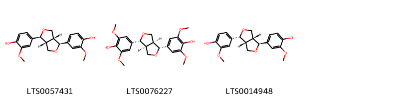{ width=100% }
    <figcaption>Hình ảnh cấu trúc hóa học của 3 hoạt chất thuộc nhóm Furanoid lignans gồm ['pinoresinol (LTS0057431)', '(-)-syringaresinol (LTS0076227)', '4-[(1s,3ar,4r,6ar)-4-(4-hydroxy-3-methoxyphenyl)-hexahydrofuro[3,4-c]furan-1-yl]-2-methoxyphenol (LTS0014948)'].</figcaption>
</figure>
#### Nhóm Lignan glycosides
<figure markdown="span">
    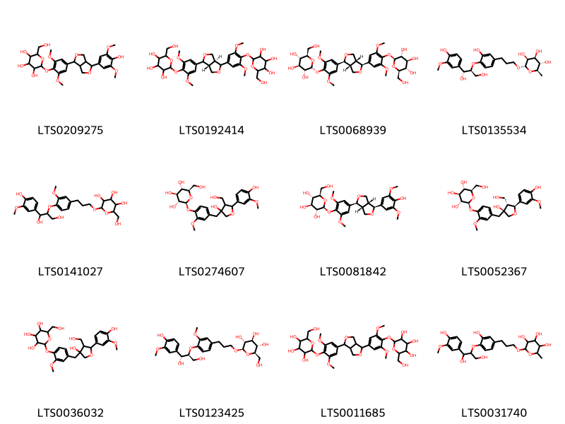{ width=100% }
    <figcaption>Hình ảnh cấu trúc hóa học của 12 hoạt chất thuộc nhóm Lignan glycosides gồm ['2-{4-[4-(4-hydroxy-3,5-dimethoxyphenyl)-hexahydrofuro[3,4-c]furan-1-yl]-2,6-dimethoxyphenoxy}-6-(hydroxymethyl)oxane-3,4,5-triol (LTS0209275)', '2-{4-[(3as,6ar)-4-(3,5-dimethoxy-4-{[3,4,5-trihydroxy-6-(hydroxymethyl)oxan-2-yl]oxy}phenyl)-hexahydrofuro[3,4-c]furan-1-yl]-2,6-dimethoxyphenoxy}-6-(hydroxymethyl)oxane-3,4,5-triol (LTS0192414)', '(2r,3r,4s,5s,6r)-2-{4-[(1s,3ar,4s,6ar)-4-(3,5-dimethoxy-4-{[(2s,3r,4s,5s,6r)-3,4,5-trihydroxy-6-(hydroxymethyl)oxan-2-yl]oxy}phenyl)-hexahydrofuro[3,4-c]furan-1-yl]-2,6-dimethoxyphenoxy}-6-(hydroxymethyl)oxane-3,4,5-triol (LTS0068939)', '(2s,3s,4s,5s,6r)-2-[3-(4-{[(1r,2s)-1,3-dihydroxy-1-(4-hydroxy-3-methoxyphenyl)propan-2-yl]oxy}-3-hydroxyphenyl)propoxy]-6-methyloxane-3,4,5-triol (LTS0135534)', '2-[3-(4-{[1,3-dihydroxy-1-(4-hydroxy-3-methoxyphenyl)propan-2-yl]oxy}-3-methoxyphenyl)propoxy]-6-(hydroxymethyl)oxane-3,4,5-triol (LTS0141027)', '(2s,3r,4s,5s,6r)-2-(4-{[3-hydroxy-5-(4-hydroxy-3-methoxyphenyl)-4-(hydroxymethyl)oxolan-3-yl]methyl}-2-methoxyphenoxy)-6-(hydroxymethyl)oxane-3,4,5-triol (LTS0274607)', 'acanthoside b (LTS0081842)', '(2s,3r,4s,5s,6r)-2-(4-{[(3s,4r,5s)-3-hydroxy-5-(4-hydroxy-3-methoxyphenyl)-4-(hydroxymethyl)oxolan-3-yl]methyl}-2-methoxyphenoxy)-6-(hydroxymethyl)oxane-3,4,5-triol (LTS0052367)', '2-(4-{[3-hydroxy-5-(4-hydroxy-3-methoxyphenyl)-4-(hydroxymethyl)oxolan-3-yl]methyl}-2-methoxyphenoxy)-6-(hydroxymethyl)oxane-3,4,5-triol (LTS0036032)', '(2r,3r,4s,5s,6r)-2-[3-(4-{[(1r,2s)-1,3-dihydroxy-1-(4-hydroxy-3-methoxyphenyl)propan-2-yl]oxy}-3-methoxyphenyl)propoxy]-6-(hydroxymethyl)oxane-3,4,5-triol (LTS0123425)', '2-{4-[4-(3,5-dimethoxy-4-{[3,4,5-trihydroxy-6-(hydroxymethyl)oxan-2-yl]oxy}phenyl)-hexahydrofuro[3,4-c]furan-1-yl]-2,6-dimethoxyphenoxy}-6-(hydroxymethyl)oxane-3,4,5-triol (LTS0011685)', '2-[3-(4-{[1,3-dihydroxy-1-(4-hydroxy-3-methoxyphenyl)propan-2-yl]oxy}-3-hydroxyphenyl)propoxy]-6-methyloxane-3,4,5-triol (LTS0031740)'].</figcaption>
</figure>
#### Nhóm Organooxygen compounds
<figure markdown="span">
    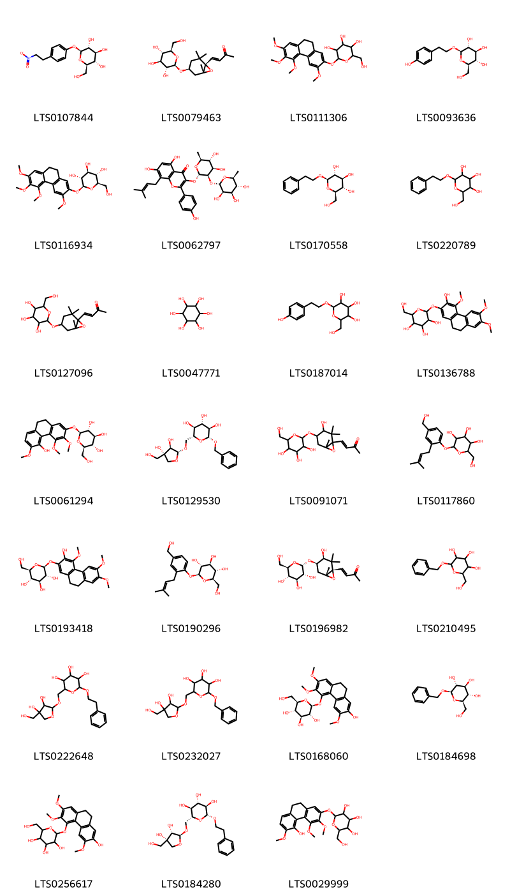{ width=100% }
    <figcaption>Hình ảnh cấu trúc hóa học của 27 hoạt chất thuộc nhóm Organooxygen compounds gồm ['(2r,3s,4s,5r,6s)-2-(hydroxymethyl)-6-[4-(2-nitroethyl)phenoxy]oxane-3,4,5-triol (LTS0107844)', '(3e)-4-[(1s,4s,6r)-2,2,6-trimethyl-4-{[(2r,3r,4s,5s,6r)-3,4,5-trihydroxy-6-(hydroxymethyl)oxan-2-yl]oxy}-7-oxabicyclo[4.1.0]heptan-1-yl]but-3-en-2-one (LTS0079463)', '2-(hydroxymethyl)-6-[(3,5,6,7-tetramethoxy-9,10-dihydrophenanthren-2-yl)oxy]oxane-3,4,5-triol (LTS0111306)', 'salidroside (LTS0093636)', '(2r,3s,4s,5r,6s)-2-(hydroxymethyl)-6-[(3,5,6,7-tetramethoxy-9,10-dihydrophenanthren-2-yl)oxy]oxane-3,4,5-triol (LTS0116934)', '3-{[(2s,3r,4r,5r,6s)-4,5-dihydroxy-6-methyl-3-{[(2s,3r,4r,5r,6s)-3,4,5-trihydroxy-6-methyloxan-2-yl]oxy}oxan-2-yl]oxy}-5,7-dihydroxy-2-(4-hydroxyphenyl)-8-(3-methylbut-2-en-1-yl)chromen-4-one (LTS0062797)', '(2r,3s,4s,5r,6r)-2-(hydroxymethyl)-6-(2-phenylethoxy)oxane-3,4,5-triol (LTS0170558)', '2-(hydroxymethyl)-6-(2-phenylethoxy)oxane-3,4,5-triol (LTS0220789)', '4-(2,2,6-trimethyl-4-{[3,4,5-trihydroxy-6-(hydroxymethyl)oxan-2-yl]oxy}-7-oxabicyclo[4.1.0]heptan-1-yl)but-3-en-2-one (LTS0127096)', '(-)-inositol (LTS0047771)', '2-(hydroxymethyl)-6-[2-(4-hydroxyphenyl)ethoxy]oxane-3,4,5-triol (LTS0187014)', '2-[(3-hydroxy-4,6,7-trimethoxy-9,10-dihydrophenanthren-2-yl)oxy]-6-(hydroxymethyl)oxane-3,4,5-triol (LTS0136788)', '(2s,3r,4s,5s,6r)-2-[(5-hydroxy-3,4,6-trimethoxy-9,10-dihydrophenanthren-2-yl)oxy]-6-(hydroxymethyl)oxane-3,4,5-triol (LTS0061294)', '(2r,3r,4s,5s,6r)-2-(benzyloxy)-6-({[(2r,3r,4s)-3,4-dihydroxy-4-(hydroxymethyl)oxolan-2-yl]oxy}methyl)oxane-3,4,5-triol (LTS0129530)', '4-(3-hydroxy-2,2,6-trimethyl-4-{[3,4,5-trihydroxy-6-(hydroxymethyl)oxan-2-yl]oxy}-7-oxabicyclo[4.1.0]heptan-1-yl)but-3-en-2-one (LTS0091071)', '2-(hydroxymethyl)-6-[4-(hydroxymethyl)-2-(3-methylbut-2-en-1-yl)phenoxy]oxane-3,4,5-triol (LTS0117860)', '(2s,3r,4s,5s,6r)-2-[(3-hydroxy-4,6,7-trimethoxy-9,10-dihydrophenanthren-2-yl)oxy]-6-(hydroxymethyl)oxane-3,4,5-triol (LTS0193418)', '(2r,3s,4s,5r,6s)-2-(hydroxymethyl)-6-[4-(hydroxymethyl)-2-(3-methylbut-2-en-1-yl)phenoxy]oxane-3,4,5-triol (LTS0190296)', '(3e)-4-[(1s,3s,4r,6r)-3-hydroxy-2,2,6-trimethyl-4-{[(2s,3r,4s,5s,6r)-3,4,5-trihydroxy-6-(hydroxymethyl)oxan-2-yl]oxy}-7-oxabicyclo[4.1.0]heptan-1-yl]but-3-en-2-one (LTS0196982)', 'benzyl glucopyranoside (LTS0210495)', '2-({[3,4-dihydroxy-4-(hydroxymethyl)oxolan-2-yl]oxy}methyl)-6-(2-phenylethoxy)oxane-3,4,5-triol (LTS0222648)', '2-(benzyloxy)-6-({[3,4-dihydroxy-4-(hydroxymethyl)oxolan-2-yl]oxy}methyl)oxane-3,4,5-triol (LTS0232027)', '(2s,3r,4s,5s,6r)-2-[(7-hydroxy-2,3,6-trimethoxy-9,10-dihydrophenanthren-4-yl)oxy]-6-(hydroxymethyl)oxane-3,4,5-triol (LTS0168060)', 'benzyl β-d-glucoside (LTS0184698)', '2-[(7-hydroxy-2,3,6-trimethoxy-9,10-dihydrophenanthren-4-yl)oxy]-6-(hydroxymethyl)oxane-3,4,5-triol (LTS0256617)', '(2r,3s,4s,5r,6r)-2-({[(2s,3s,4s)-3,4-dihydroxy-4-(hydroxymethyl)oxolan-2-yl]oxy}methyl)-6-(2-phenylethoxy)oxane-3,4,5-triol (LTS0184280)', '2-[(5-hydroxy-3,4,6-trimethoxy-9,10-dihydrophenanthren-2-yl)oxy]-6-(hydroxymethyl)oxane-3,4,5-triol (LTS0029999)'].</figcaption>
</figure>
#### Nhóm Phenanthrenes and derivatives
<figure markdown="span">
    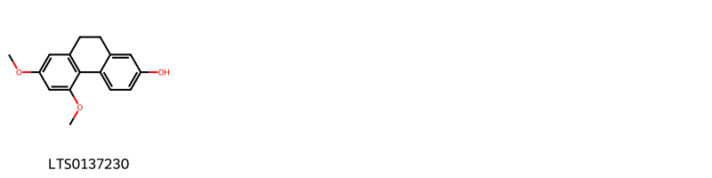{ width=100% }
    <figcaption>Hình ảnh cấu trúc hóa học của 1 hoạt chất thuộc nhóm Phenanthrenes and derivatives gồm ['orchinol (LTS0137230)'].</figcaption>
</figure>
#### Nhóm Prenol lipids
<figure markdown="span">
    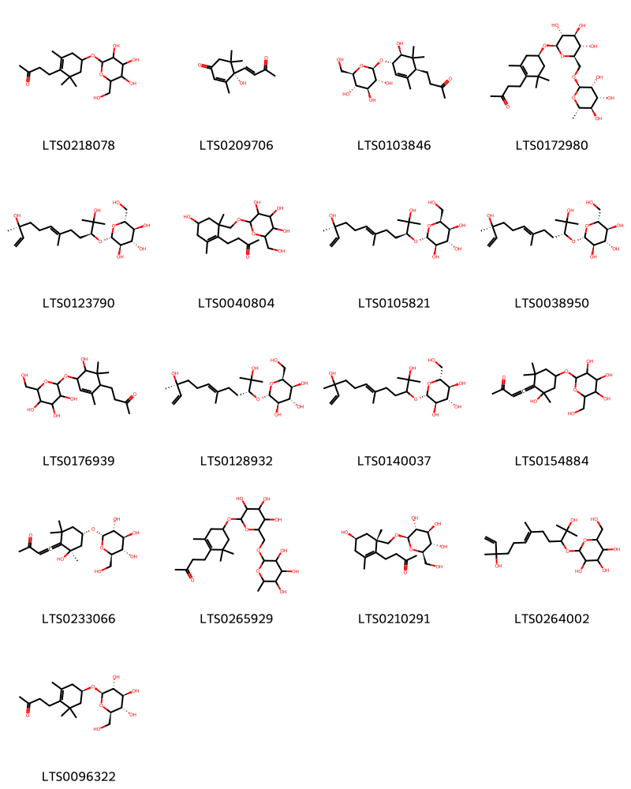{ width=100% }
    <figcaption>Hình ảnh cấu trúc hóa học của 17 hoạt chất thuộc nhóm Prenol lipids gồm ['4-(2,6,6-trimethyl-4-{[3,4,5-trihydroxy-6-(hydroxymethyl)oxan-2-yl]oxy}cyclohex-1-en-1-yl)butan-2-one (LTS0218078)', 'dehydrovomifoliol (LTS0209706)', '4-[(1s,4s,5s)-5-hydroxy-2,6,6-trimethyl-4-{[(2r,3r,4s,5s,6r)-3,4,5-trihydroxy-6-(hydroxymethyl)oxan-2-yl]oxy}cyclohex-2-en-1-yl]butan-2-one (LTS0103846)', '4-[(4r)-2,6,6-trimethyl-4-{[(2r,3r,4s,5s,6r)-3,4,5-trihydroxy-6-({[(2r,3r,4r,5r,6s)-3,4,5-trihydroxy-6-methyloxan-2-yl]oxy}methyl)oxan-2-yl]oxy}cyclohex-1-en-1-yl]butan-2-one (LTS0172980)', '(2s,3r,4s,5s,6r)-2-{[(3s,6e,10s)-2,10-dihydroxy-2,6,10-trimethyldodeca-6,11-dien-3-yl]oxy}-6-(hydroxymethyl)oxane-3,4,5-triol (LTS0123790)', '4-[4-hydroxy-2,6-dimethyl-6-({[3,4,5-trihydroxy-6-(hydroxymethyl)oxan-2-yl]oxy}methyl)cyclohex-1-en-1-yl]butan-2-one (LTS0040804)', '(2s,3r,4s,5s,6s)-2-{[(3s,6e,10s)-2,10-dihydroxy-2,6,10-trimethyldodeca-6,11-dien-3-yl]oxy}-6-(hydroxymethyl)oxane-3,4,5-triol (LTS0105821)', '(2s,3r,4s,5s,6r)-2-{[(3r,6e,10s)-2,10-dihydroxy-2,6,10-trimethyldodeca-6,11-dien-3-yl]oxy}-6-(hydroxymethyl)oxane-3,4,5-triol (LTS0038950)', '4-(5-hydroxy-2,6,6-trimethyl-4-{[3,4,5-trihydroxy-6-(hydroxymethyl)oxan-2-yl]oxy}cyclohex-2-en-1-yl)butan-2-one (LTS0176939)', '(2s,3r,4s,5s,6s)-2-{[(3r,6e,10s)-2,10-dihydroxy-2,6,10-trimethyldodeca-6,11-dien-3-yl]oxy}-6-(hydroxymethyl)oxane-3,4,5-triol (LTS0128932)', '(2s,3r,4s,5s,6r)-2-{[(6e)-2,10-dihydroxy-2,6,10-trimethyldodeca-6,11-dien-3-yl]oxy}-6-(hydroxymethyl)oxane-3,4,5-triol (LTS0140037)', '4-(2-hydroxy-2,6,6-trimethyl-4-{[3,4,5-trihydroxy-6-(hydroxymethyl)oxan-2-yl]oxy}cyclohexylidene)but-3-en-2-one (LTS0154884)', '4-[(2r,4s)-2-hydroxy-2,6,6-trimethyl-4-{[(2s,3r,4s,5s,6r)-3,4,5-trihydroxy-6-(hydroxymethyl)oxan-2-yl]oxy}cyclohexylidene]but-3-en-2-one (LTS0233066)', '4-{2,6,6-trimethyl-4-[(3,4,5-trihydroxy-6-{[(3,4,5-trihydroxy-6-methyloxan-2-yl)oxy]methyl}oxan-2-yl)oxy]cyclohex-1-en-1-yl}butan-2-one (LTS0265929)', '4-[(4r,6s)-4-hydroxy-2,6-dimethyl-6-({[(2r,3r,4s,5s,6r)-3,4,5-trihydroxy-6-(hydroxymethyl)oxan-2-yl]oxy}methyl)cyclohex-1-en-1-yl]butan-2-one (LTS0210291)', '2-[(2,10-dihydroxy-2,6,10-trimethyldodeca-6,11-dien-3-yl)oxy]-6-(hydroxymethyl)oxane-3,4,5-triol (LTS0264002)', '4-[(4r)-2,6,6-trimethyl-4-{[(2r,3r,4s,5s,6r)-3,4,5-trihydroxy-6-(hydroxymethyl)oxan-2-yl]oxy}cyclohex-1-en-1-yl]butan-2-one (LTS0096322)'].</figcaption>
</figure>
#### Nhóm Pyrans
<figure markdown="span">
    { width=100% }
    <figcaption>Hình ảnh cấu trúc hóa học của 1 hoạt chất thuộc nhóm Pyrans gồm ['talmon (LTS0152081)'].</figcaption>
</figure>
#### Nhóm Stilbenes
<figure markdown="span">
    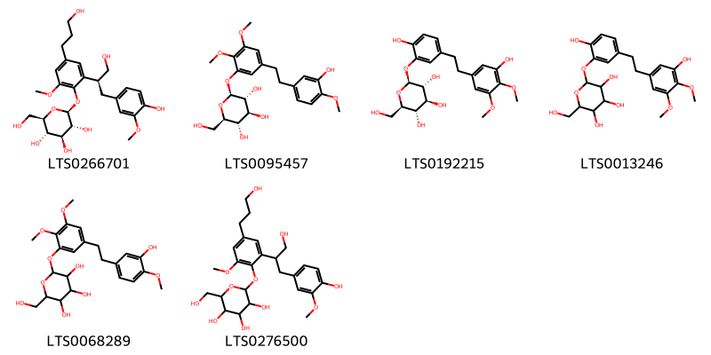{ width=100% }
    <figcaption>Hình ảnh cấu trúc hóa học của 6 hoạt chất thuộc nhóm Stilbenes gồm ['(2s,3r,4s,5s,6r)-2-{2-[(2s)-1-hydroxy-3-(4-hydroxy-3-methoxyphenyl)propan-2-yl]-4-(3-hydroxypropyl)-6-methoxyphenoxy}-6-(hydroxymethyl)oxane-3,4,5-triol (LTS0266701)', '(2s,3r,4s,5s,6r)-2-{5-[2-(3-hydroxy-4-methoxyphenyl)ethyl]-2,3-dimethoxyphenoxy}-6-(hydroxymethyl)oxane-3,4,5-triol (LTS0095457)', '(2s,3r,4s,5s,6r)-2-{2-hydroxy-5-[2-(3-hydroxy-4,5-dimethoxyphenyl)ethyl]phenoxy}-6-(hydroxymethyl)oxane-3,4,5-triol (LTS0192215)', '2-{2-hydroxy-5-[2-(3-hydroxy-4,5-dimethoxyphenyl)ethyl]phenoxy}-6-(hydroxymethyl)oxane-3,4,5-triol (LTS0013246)', '2-{5-[2-(3-hydroxy-4-methoxyphenyl)ethyl]-2,3-dimethoxyphenoxy}-6-(hydroxymethyl)oxane-3,4,5-triol (LTS0068289)', '2-{2-[1-hydroxy-3-(4-hydroxy-3-methoxyphenyl)propan-2-yl]-4-(3-hydroxypropyl)-6-methoxyphenoxy}-6-(hydroxymethyl)oxane-3,4,5-triol (LTS0276500)'].</figcaption>
</figure>

---

### Dược dân tộc học

Danh sách các quốc gia có sử dụng *Epimedium grandiflorum* trong điều trị các bệnh. 

| Country   | Disease   | Bệnh                                                                                                                                                                                                |
|:----------|:----------|:----------------------------------------------------------------------------------------------------------------------------------------------------------------------------------------------------|
| Elsewhere | Tonic     | MYMEMORY WARNING: YOU USED ALL AVAILABLE FREE TRANSLATIONS FOR TODAY. NEXT AVAILABLE IN  07 HOURS 52 MINUTES 56 SECONDS VISIT HTTPS://MYMEMORY.TRANSLATED.NET/DOC/USAGELIMITS.PHP TO TRANSLATE MORE |

---

---
## Epimedium macranthum
### Thông tin về thực vật

!!! info "Phân loại thực vật của *N/A* từ GIBF:"
    - **Kingdom:** Plantae
    - **Phylum:** Tracheophyta
    - **Order:** Ranunculales
    - **Family:** Berberidaceae
    - **Genus:** Epimedium
    - **Species:** *N/A*

 

| Label (VI)   | Label (EN)   | Scientific Name      | Descriptions (VI)   | Descriptions (EN)   | Also Known As (VI)   | Also Known As (EN)   |
|:-------------|:-------------|:---------------------|:--------------------|:--------------------|:---------------------|:---------------------|
| N/A          | N/A          | Epimedium macranthum |                     | species of plant    | ['']                 | ['']                 |

#### Phân bố trên thế giới

**Từ CSDL GIBF** Japan, Sweden, China, New Zealand, Slovenia, Denmark, Netherlands, United States of America, Russian Federation, Croatia, Belarus, Norway, Belgium, Georgia, Serbia, Canada, Germany, Bosnia and Herzegovina, Austria, Portugal, Ukraine, Italy, Switzerland, United Kingdom of Great Britain and Northern Ireland

#### Phân bố tại Việt Nam

**Từ CSDL GIBF**: Không có ghi nhận ở Việt Nam

---
### Thành phần hóa học
        
- Theo cơ sở dữ liệu lotus: Từ loài *N/A* đã phân lập và xác định được Chưa có hoạt chất nào được phân lập. hoạt chất thuộc về các nhóm Không có hoạt chất nào được phân lập. 

Không có hình ảnh nào được tạo ra

---

### Dược dân tộc học

Danh sách các quốc gia có sử dụng *N/A* trong điều trị các bệnh. 

| Country   | Disease     | Bệnh                                                                                                                                                                                                |
|:----------|:------------|:----------------------------------------------------------------------------------------------------------------------------------------------------------------------------------------------------|
| China     | Aphrodisiac | MYMEMORY WARNING: YOU USED ALL AVAILABLE FREE TRANSLATIONS FOR TODAY. NEXT AVAILABLE IN  07 HOURS 52 MINUTES 24 SECONDS VISIT HTTPS://MYMEMORY.TRANSLATED.NET/DOC/USAGELIMITS.PHP TO TRANSLATE MORE |

---

---
## Epimedium rugosum
### Thông tin về thực vật

!!! info "Phân loại thực vật của *Epimedium sempervirens* từ GIBF:"
    - **Kingdom:** Plantae
    - **Phylum:** Tracheophyta
    - **Order:** Ranunculales
    - **Family:** Berberidaceae
    - **Genus:** Epimedium
    - **Species:** *Epimedium sempervirens*

 

| Label (VI)   | Label (EN)   | Scientific Name   | Descriptions (VI)   | Descriptions (EN)   | Also Known As (VI)   | Also Known As (EN)   |
|:-------------|:-------------|:------------------|:--------------------|:--------------------|:---------------------|:---------------------|
| N/A          | N/A          | Epimedium rugosum | loài thực vật       | species of plant    | ['']                 | ['']                 |

#### Phân bố trên thế giới

**Từ CSDL GIBF** Japan, Sweden, China, New Zealand, Slovenia, Denmark, Netherlands, United States of America, Russian Federation, Croatia, Belarus, Norway, Belgium, Georgia, Serbia, Canada, Germany, Bosnia and Herzegovina, Austria, Portugal, Ukraine, Italy, Switzerland, United Kingdom of Great Britain and Northern Ireland

#### Phân bố tại Việt Nam

**Từ CSDL GIBF**: Không có ghi nhận ở Việt Nam

---
### Thành phần hóa học
        
- Theo cơ sở dữ liệu lotus: Từ loài *Epimedium sempervirens* đã phân lập và xác định được Chưa có hoạt chất nào được phân lập. hoạt chất thuộc về các nhóm Không có hoạt chất nào được phân lập. 

Không có hình ảnh nào được tạo ra

---

### Dược dân tộc học

Danh sách các quốc gia có sử dụng *Epimedium sempervirens* trong điều trị các bệnh. 

| Country   | Disease   | Bệnh                                                                                                                                                                                                |
|:----------|:----------|:----------------------------------------------------------------------------------------------------------------------------------------------------------------------------------------------------|
| Japan     | Tonic     | MYMEMORY WARNING: YOU USED ALL AVAILABLE FREE TRANSLATIONS FOR TODAY. NEXT AVAILABLE IN  07 HOURS 52 MINUTES 01 SECONDS VISIT HTTPS://MYMEMORY.TRANSLATED.NET/DOC/USAGELIMITS.PHP TO TRANSLATE MORE |

---

---
## Epimedium sagittatum
### Thông tin về thực vật

!!! info "Phân loại thực vật của *Epimedium sagittatum* từ GIBF:"
    - **Kingdom:** Plantae
    - **Phylum:** Tracheophyta
    - **Order:** Ranunculales
    - **Family:** Berberidaceae
    - **Genus:** Epimedium
    - **Species:** *Epimedium sagittatum*

 

| Label (VI)   | Label (EN)   | Scientific Name      | Descriptions (VI)   | Descriptions (EN)   | Also Known As (VI)   | Also Known As (EN)   |
|:-------------|:-------------|:---------------------|:--------------------|:--------------------|:---------------------|:---------------------|
| N/A          | N/A          | Epimedium sagittatum | loài thực vật       | species of plant    | ['']                 | ['']                 |

#### Phân bố trên thế giới

**Từ CSDL GIBF** United States of America, Japan, Korea, Republic of, Chinese Taipei, China, unknown or invalid

#### Phân bố tại Việt Nam

**Từ CSDL GIBF**: Không có ghi nhận ở Việt Nam

---
### Thành phần hóa học
        
- Theo cơ sở dữ liệu lotus: Từ loài *Epimedium sagittatum* đã phân lập và xác định được 160 hoạt chất thuộc về các nhóm Fatty Acyls, Flavonolignans, Flavonoids, Coumarins and derivatives, Steroids and steroid derivatives, Cinnamic acids and derivatives, Aryltetralin lignans, Organooxygen compounds, Furanoid lignans, Prenol lipids, 2-arylbenzofuran flavonoids, Lignan glycosides. 

|    | chemicalTaxonomyClassyfireClass   |   smiles_count |
|---:|:----------------------------------|---------------:|
|  0 |                                   |              8 |
|  1 | 2-arylbenzofuran flavonoids       |              4 |
|  2 | Aryltetralin lignans              |              2 |
|  3 | Cinnamic acids and derivatives    |              2 |
|  4 | Coumarins and derivatives         |              1 |
|  5 | Fatty Acyls                       |              6 |
|  6 | Flavonoids                        |             95 |
|  7 | Flavonolignans                    |             10 |
|  8 | Furanoid lignans                  |              4 |
|  9 | Lignan glycosides                 |             12 |
| 10 | Organooxygen compounds            |             10 |
| 11 | Prenol lipids                     |              4 |
| 12 | Steroids and steroid derivatives  |              2 |

#### Nhóm 
<figure markdown="span">
    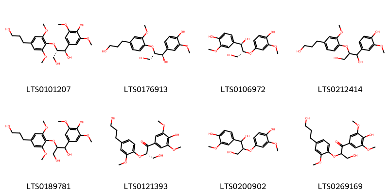{ width=100% }
    <figcaption>Hình ảnh cấu trúc hóa học của 8 hoạt chất thuộc nhóm  gồm ['(1r,2s)-1-(4-hydroxy-3,5-dimethoxyphenyl)-2-[4-(3-hydroxypropyl)-2,6-dimethoxyphenoxy]propane-1,3-diol (LTS0101207)', '(1r,2s)-1-(4-hydroxy-3-methoxyphenyl)-2-[4-(3-hydroxypropyl)-2-methoxyphenoxy]propane-1,3-diol (LTS0176913)', '(1r,2r)-2-(4-hydroxy-3-methoxyphenoxy)-1-(4-hydroxy-3-methoxyphenyl)propane-1,3-diol (LTS0106972)', '1-(4-hydroxy-3-methoxyphenyl)-2-[4-(3-hydroxypropyl)-2-methoxyphenoxy]propane-1,3-diol (LTS0212414)', '1-(4-hydroxy-3,5-dimethoxyphenyl)-2-[4-(3-hydroxypropyl)-2,6-dimethoxyphenoxy]propane-1,3-diol (LTS0189781)', '(2s)-3-hydroxy-1-(4-hydroxy-3,5-dimethoxyphenyl)-2-[4-(3-hydroxypropyl)-2-methoxyphenoxy]propan-1-one (LTS0121393)', '2-(4-hydroxy-3-methoxyphenoxy)-1-(4-hydroxy-3-methoxyphenyl)propane-1,3-diol (LTS0200902)', '3-hydroxy-1-(4-hydroxy-3,5-dimethoxyphenyl)-2-[4-(3-hydroxypropyl)-2-methoxyphenoxy]propan-1-one (LTS0269169)'].</figcaption>
</figure>
#### Nhóm 2-arylbenzofuran flavonoids
<figure markdown="span">
    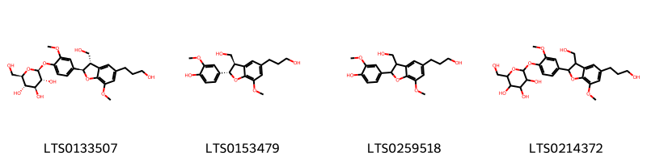{ width=100% }
    <figcaption>Hình ảnh cấu trúc hóa học của 4 hoạt chất thuộc nhóm 2-arylbenzofuran flavonoids gồm ['(2r,3s,4s,5r,6s)-2-(hydroxymethyl)-6-{4-[(2r,3s)-3-(hydroxymethyl)-5-(3-hydroxypropyl)-7-methoxy-2,3-dihydro-1-benzofuran-2-yl]-2-methoxyphenoxy}oxane-3,4,5-triol (LTS0133507)', '4-[(2s,3r)-3-(hydroxymethyl)-5-(3-hydroxypropyl)-7-methoxy-2,3-dihydro-1-benzofuran-2-yl]-2-methoxyphenol (LTS0153479)', '4-[3-(hydroxymethyl)-5-(3-hydroxypropyl)-7-methoxy-2,3-dihydro-1-benzofuran-2-yl]-2-methoxyphenol (LTS0259518)', '2-(hydroxymethyl)-6-{4-[3-(hydroxymethyl)-5-(3-hydroxypropyl)-7-methoxy-2,3-dihydro-1-benzofuran-2-yl]-2-methoxyphenoxy}oxane-3,4,5-triol (LTS0214372)'].</figcaption>
</figure>
#### Nhóm Aryltetralin lignans
<figure markdown="span">
    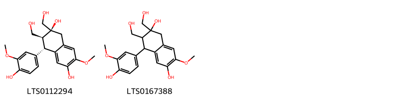{ width=100% }
    <figcaption>Hình ảnh cấu trúc hóa học của 2 hoạt chất thuộc nhóm Aryltetralin lignans gồm ['(2s,3s,4s)-4-(4-hydroxy-3-methoxyphenyl)-2,3-bis(hydroxymethyl)-7-methoxy-3,4-dihydro-1h-naphthalene-2,6-diol (LTS0112294)', '4-(4-hydroxy-3-methoxyphenyl)-2,3-bis(hydroxymethyl)-7-methoxy-3,4-dihydro-1h-naphthalene-2,6-diol (LTS0167388)'].</figcaption>
</figure>
#### Nhóm Cinnamic acids and derivatives
<figure markdown="span">
    { width=100% }
    <figcaption>Hình ảnh cấu trúc hóa học của 2 hoạt chất thuộc nhóm Cinnamic acids and derivatives gồm ['para-coumaric acid (LTS0266252)', 'hydroxycinnamic acid (LTS0233023)'].</figcaption>
</figure>
#### Nhóm Coumarins and derivatives
<figure markdown="span">
    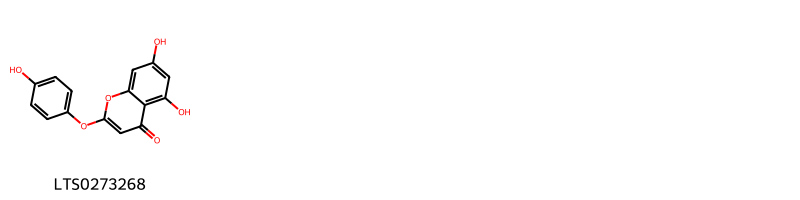{ width=100% }
    <figcaption>Hình ảnh cấu trúc hóa học của 1 hoạt chất thuộc nhóm Coumarins and derivatives gồm ['6-demethoxycapillarisin (LTS0273268)'].</figcaption>
</figure>
#### Nhóm Fatty Acyls
<figure markdown="span">
    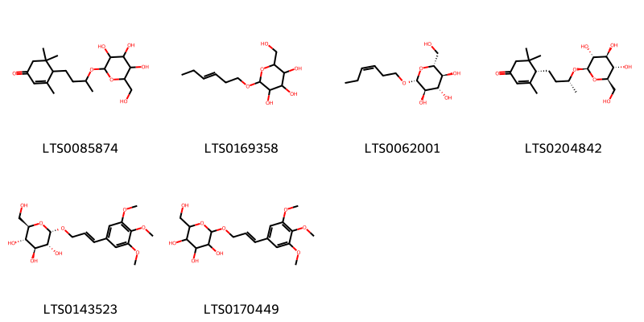{ width=100% }
    <figcaption>Hình ảnh cấu trúc hóa học của 6 hoạt chất thuộc nhóm Fatty Acyls gồm ['3,5,5-trimethyl-4-(3-{[3,4,5-trihydroxy-6-(hydroxymethyl)oxan-2-yl]oxy}butyl)cyclohex-2-en-1-one (LTS0085874)', '2-(hex-3-en-1-yloxy)-6-(hydroxymethyl)oxane-3,4,5-triol (LTS0169358)', '(2r,3r,4s,5s,6r)-2-[(3z)-hex-3-en-1-yloxy]-6-(hydroxymethyl)oxane-3,4,5-triol (LTS0062001)', '(4s)-3,5,5-trimethyl-4-[(3r)-3-{[(2r,3r,4s,5s,6r)-3,4,5-trihydroxy-6-(hydroxymethyl)oxan-2-yl]oxy}butyl]cyclohex-2-en-1-one (LTS0204842)', '(2r,3s,4s,5r,6s)-2-(hydroxymethyl)-6-{[(2e)-3-(3,4,5-trimethoxyphenyl)prop-2-en-1-yl]oxy}oxane-3,4,5-triol (LTS0143523)', '2-(hydroxymethyl)-6-{[3-(3,4,5-trimethoxyphenyl)prop-2-en-1-yl]oxy}oxane-3,4,5-triol (LTS0170449)'].</figcaption>
</figure>
#### Nhóm Flavonoids
<figure markdown="span">
    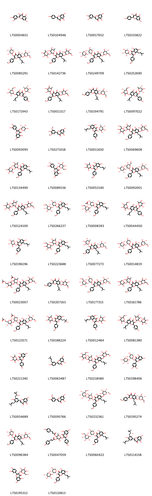{ width=100% }
    <figcaption>Hình ảnh cấu trúc hóa học của 95 hoạt chất thuộc nhóm Flavonoids gồm ['quercetin (LTS0004651)', 'chamomile (LTS0104946)', 'luteolin (LTS0017052)', 'kaempherol (LTS0155822)', 'icariin (LTS0085291)', '3-[(4,5-dihydroxy-6-methyl-3-{[(2s)-3,4,5-trihydroxy-6-methyloxan-2-yl]oxy}oxan-2-yl)oxy]-5-hydroxy-2-(4-methoxyphenyl)-8-(3-methylbut-2-en-1-yl)-7-{[3,4,5-trihydroxy-6-(hydroxymethyl)oxan-2-yl]oxy}chromen-4-one (LTS0142736)', '3-{[(2s,3r,4r,5r,6s)-4,5-dihydroxy-6-methyl-3-{[(2s,3r,4s,5r)-3,4,5-trihydroxyoxan-2-yl]oxy}oxan-2-yl]oxy}-5-hydroxy-2-(4-methoxyphenyl)-8-(3-methylbut-2-en-1-yl)-7-{[(2s,3r,4s,5s,6r)-3,4,5-trihydroxy-6-(hydroxymethyl)oxan-2-yl]oxy}chromen-4-one (LTS0249709)', 'icariside ii (LTS0252690)', '5-hydroxy-2-(4-hydroxyphenyl)-8-(3-methylbut-2-en-1-yl)-7-{[(2s,3r,4s,5s,6r)-3,4,5-trihydroxy-6-(hydroxymethyl)oxan-2-yl]oxy}-3-{[(2s,3r,4r,5r,6s)-3,4,5-trihydroxy-6-methyloxan-2-yl]oxy}chromen-4-one (LTS0171943)', '5-hydroxy-2-(4-methoxyphenyl)-8-(3-methylbut-2-en-1-yl)-7-{[3,4,5-trihydroxy-6-(hydroxymethyl)oxan-2-yl]oxy}-3-[(3,4,5-trihydroxy-6-methyloxan-2-yl)oxy]chromen-4-one (LTS0011517)', '3,5-dihydroxy-2-(4-methoxyphenyl)-8-(3-methylbut-2-en-1-yl)-7-{[(2s,3r,4s,5s,6r)-3,4,5-trihydroxy-6-(hydroxymethyl)oxan-2-yl]oxy}chromen-4-one (LTS0194791)', 'epimedoside a (LTS0097022)', 'quercitrin (LTS0093095)', 'tricin (LTS0271018)', '5,7-dihydroxy-2-(4-hydroxyphenyl)-8-(3-methylbut-2-en-1-yl)-3-{[(2s,3r,4r,5r,6s)-3,4,5-trihydroxy-6-methyloxan-2-yl]oxy}chromen-4-one (LTS0011650)', '3-[(4,5-dihydroxy-6-methyl-3-{[3,4,5-trihydroxy-6-(hydroxymethyl)oxan-2-yl]oxy}oxan-2-yl)oxy]-5-hydroxy-2-(4-methoxyphenyl)-8-(3-methylbut-2-en-1-yl)-7-{[3,4,5-trihydroxy-6-(hydroxymethyl)oxan-2-yl]oxy}chromen-4-one (LTS0069608)', '3-[(4,5-dihydroxy-6-methyl-3-{[(2r)-3,4,5-trihydroxyoxan-2-yl]oxy}oxan-2-yl)oxy]-5,7-dihydroxy-2-(4-methoxyphenyl)-8-(3-methylbut-2-en-1-yl)chromen-4-one (LTS0134490)', 'hyperoside (LTS0089156)', '5,7-dihydroxy-2-(4-methoxyphenyl)-8-(3-methylbut-2-en-1-yl)-3-[(3,4,5-trihydroxy-6-methyloxan-2-yl)oxy]chromen-4-one (LTS0051540)', '3-{[(2s,3r,4s,5s,6r)-4,5-dihydroxy-6-(hydroxymethyl)-3-{[(2s,3r,4r,5r,6s)-3,4,5-trihydroxy-6-methyloxan-2-yl]oxy}oxan-2-yl]oxy}-2-(4-methoxyphenyl)-8-(3-methylbut-2-en-1-yl)-7-{[(2s,3r,4s,5s,6r)-3,4,5-trihydroxy-6-(hydroxymethyl)oxan-2-yl]oxy}chromen-4-one (LTS0092001)', '3-({4,5-dihydroxy-6-methyl-3-[(3,4,5-trihydroxy-6-methyloxan-2-yl)oxy]oxan-2-yl}oxy)-5-hydroxy-2-(4-methoxyphenyl)-8-(3-methylbut-2-en-1-yl)-7-{[3,4,5-trihydroxy-6-(hydroxymethyl)oxan-2-yl]oxy}chromen-4-one (LTS0124109)', '3-{[(2s,3r,4r,5r,6s)-4,5-dihydroxy-6-methyl-3-{[(2s,3r,4s,5s,6r)-3,4,5-trihydroxy-6-(hydroxymethyl)oxan-2-yl]oxy}oxan-2-yl]oxy}-5,7-dihydroxy-2-(4-methoxyphenyl)-8-(3-methylbut-2-en-1-yl)chromen-4-one (LTS0266237)', '(2s,3r,4r,5s,6s)-2-{[5,7-dihydroxy-2-(4-methoxyphenyl)-8-(3-methylbut-2-en-1-yl)-4-oxochromen-3-yl]oxy}-5-hydroxy-6-methyl-3-{[(3r,4s,5s,6r)-3,4,5-trihydroxy-6-(hydroxymethyl)oxan-2-yl]oxy}oxan-4-yl acetate (LTS0008393)', '5-hydroxy-2-(4-hydroxyphenyl)-8-(3-methylbut-2-en-1-yl)-7-{[3,4,5-trihydroxy-6-(hydroxymethyl)oxan-2-yl]oxy}-3-[(3,4,5-trihydroxy-6-methyloxan-2-yl)oxy]chromen-4-one (LTS0044450)', '5,7-dihydroxy-2-(4-methoxyphenyl)-8-(3-methylbut-2-en-1-yl)-3-{[(2s,3s,4r,5r,6s)-3,4,5-trihydroxy-6-methyloxan-2-yl]oxy}chromen-4-one (LTS0196196)', '3-[(4,5-dihydroxy-6-methyl-3-{[3,4,5-trihydroxy-6-(hydroxymethyl)oxan-2-yl]oxy}oxan-2-yl)oxy]-5,7-dihydroxy-2-(4-methoxyphenyl)-8-(3-methylbut-2-en-1-yl)chromen-4-one (LTS0223688)', '5-hydroxy-2-(4-methoxyphenyl)-8-(3-methylbut-2-en-1-yl)-7-{[(2s,3r,4s,5s,6r)-3,4,5-trihydroxy-6-(hydroxymethyl)oxan-2-yl]oxy}-3-{[(2r,3s,4s,5s,6r)-3,4,5-trihydroxy-6-methyloxan-2-yl]oxy}chromen-4-one (LTS0077273)', '3-{[(2s,3r,4r,5r,6s)-4,5-dihydroxy-6-methyl-3-{[(2s,3r,4r,5r,6s)-3,4,5-trihydroxy-6-methyloxan-2-yl]oxy}oxan-2-yl]oxy}-5-hydroxy-2-(4-methoxyphenyl)-8-(3-methylbut-2-en-1-yl)-7-{[(2s,3r,4s,5s,6r)-3,4,5-trihydroxy-6-(hydroxymethyl)oxan-2-yl]oxy}chromen-4-one (LTS0014819)', '(6-{[3-(acetyloxy)-5-hydroxy-6-{[5-hydroxy-2-(4-methoxyphenyl)-8-(3-methylbut-2-en-1-yl)-4-oxo-7-{[3,4,5-trihydroxy-6-(hydroxymethyl)oxan-2-yl]oxy}chromen-3-yl]oxy}-2-methyloxan-4-yl]oxy}-3,4,5-trihydroxyoxan-2-yl)methyl acetate (LTS0023007)', '3,5-dihydroxy-2-(4-methoxyphenyl)-8-(3-methylbut-2-en-1-yl)-7-{[3,4,5-trihydroxy-6-(hydroxymethyl)oxan-2-yl]oxy}chromen-4-one (LTS0207163)', '3-{[(2s,3r,4r,5r,6s)-4,5-dihydroxy-6-methyl-3-{[(2s,3r,4s,5s,6r)-3,4,5-trihydroxy-6-(hydroxymethyl)oxan-2-yl]oxy}oxan-2-yl]oxy}-5-hydroxy-2-(4-methoxyphenyl)-8-(3-methylbut-2-en-1-yl)-7-{[(2s,3r,4s,5s,6r)-3,4,5-trihydroxy-6-(hydroxymethyl)oxan-2-yl]oxy}chromen-4-one (LTS0177315)', '3-({4,5-dihydroxy-6-methyl-3-[(3,4,5-trihydroxyoxan-2-yl)oxy]oxan-2-yl}oxy)-5-hydroxy-2-(4-methoxyphenyl)-8-(3-methylbut-2-en-1-yl)-7-{[3,4,5-trihydroxy-6-(hydroxymethyl)oxan-2-yl]oxy}chromen-4-one (LTS0161786)', '[(2r,3s,4s,5r,6s)-6-{[(2s,3s,4s,5r,6s)-3-(acetyloxy)-5-hydroxy-6-{[5-hydroxy-2-(4-methoxyphenyl)-8-(3-methylbut-2-en-1-yl)-4-oxo-7-{[(2s,3r,4s,5s,6r)-3,4,5-trihydroxy-6-(hydroxymethyl)oxan-2-yl]oxy}chromen-3-yl]oxy}-2-methyloxan-4-yl]oxy}-3,4,5-trihydroxyoxan-2-yl]methyl acetate (LTS0123571)', '5,7-dihydroxy-8-(3-hydroxy-3-methylbutyl)-2-(4-methoxyphenyl)-3-[(3,4,5-trihydroxy-6-methyloxan-2-yl)oxy]chromen-4-one (LTS0188224)', '5,7-dihydroxy-2-(4-hydroxyphenyl)-8-(3-methylbut-2-en-1-yl)-3-[(3,4,5-trihydroxy-6-methyloxan-2-yl)oxy]chromen-4-one (LTS0012484)', '3-({4,5-dihydroxy-6-methyl-3-[(3,4,5-trihydroxy-6-methyloxan-2-yl)oxy]oxan-2-yl}oxy)-5-hydroxy-2-(4-hydroxyphenyl)-8-(3-methylbut-2-en-1-yl)-7-{[3,4,5-trihydroxy-6-(hydroxymethyl)oxan-2-yl]oxy}chromen-4-one (LTS0081380)', '5,7-dihydroxy-2-(4-hydroxyphenyl)-3-[(3,4,5-trihydroxy-6-methyloxan-2-yl)oxy]chromen-4-one (LTS0211340)', 'yinyanghuo d (LTS0063487)', '3-[(3,5-dihydroxy-6-methyl-4-{[3,4,5-trihydroxy-6-(hydroxymethyl)oxan-2-yl]oxy}oxan-2-yl)oxy]-5-hydroxy-2-(4-methoxyphenyl)-8-(3-methylbut-2-en-1-yl)-7-{[3,4,5-trihydroxy-6-(hydroxymethyl)oxan-2-yl]oxy}chromen-4-one (LTS0218580)', '3-{[(2s,3r,4r,5r,6s)-4,5-dihydroxy-6-methyl-3-{[(2s,3r,4r,5r,6s)-3,4,5-trihydroxy-6-methyloxan-2-yl]oxy}oxan-2-yl]oxy}-2-(3,4-dihydroxyphenyl)-5,7-dihydroxychromen-4-one (LTS0198406)', 'yinyanghuo b (LTS0054689)', 'chrysoeriol (LTS0095766)', '3-{[(2s,3s,4s,5s,6r)-3,5-dihydroxy-6-methyl-4-{[(2s,3r,4r,5s,6r)-3,4,5-trihydroxy-6-(hydroxymethyl)oxan-2-yl]oxy}oxan-2-yl]oxy}-5-hydroxy-2-(4-methoxyphenyl)-8-(3-methylbut-2-en-1-yl)-7-{[(2s,3s,4s,5s,6s)-3,4,5-trihydroxy-6-(hydroxymethyl)oxan-2-yl]oxy}chromen-4-one (LTS0232361)', '3,5-dihydroxy-2-(4-methoxyphenyl)-8-(3-methylbut-2-en-1-yl)-7-{[(2r,3r,4s,5s,6r)-3,4,5-trihydroxy-6-(hydroxymethyl)oxan-2-yl]oxy}chromen-4-one (LTS0195274)', '5-hydroxy-2-(4-methoxyphenyl)-8-(3-methylbut-2-en-1-yl)-7-{[(2s,3r,4s,5s,6r)-3,4,5-trihydroxy-6-(hydroxymethyl)oxan-2-yl]oxy}-3-{[(2s,3s,4r,5r,6s)-3,4,5-trihydroxy-6-methyloxan-2-yl]oxy}chromen-4-one (LTS0096384)', '2-{[5,7-dihydroxy-2-(4-hydroxyphenyl)-4-oxochromen-3-yl]oxy}-3-hydroxy-5-{[3-(4-hydroxyphenyl)prop-2-enoyl]oxy}-6-methyloxan-4-yl 3-(4-hydroxyphenyl)prop-2-enoate (LTS0047059)', '3-{[(2r,3r,4r,5r,6s)-4,5-dihydroxy-6-methyl-3-{[(2s,3r,4s,5s,6r)-3,4,5-trihydroxy-6-(hydroxymethyl)oxan-2-yl]oxy}oxan-2-yl]oxy}-5,7-dihydroxy-2-(4-methoxyphenyl)-8-(3-methylbut-2-en-1-yl)chromen-4-one (LTS0060422)', '5,7-dihydroxy-2-{4-hydroxy-3-[(2r)-2-hydroxy-3-methylbut-3-en-1-yl]-5-(3-methylbut-2-en-1-yl)phenyl}chromen-4-one (LTS0114158)', '2-(3,4-dihydroxyphenyl)-5,7-dihydroxy-3-{[3,4,5-trihydroxy-6-(hydroxymethyl)oxan-2-yl]oxy}chromen-4-one (LTS0195312)', '3-{[(2r,3r,4r,5r,6s)-4,5-dihydroxy-6-methyl-3-{[(2s,3r,4s,5r)-3,4,5-trihydroxyoxan-2-yl]oxy}oxan-2-yl]oxy}-5,7-dihydroxy-2-(4-methoxyphenyl)-8-(3-methylbut-2-en-1-yl)chromen-4-one (LTS0110813)', '2-(3,4-dihydroxyphenyl)-5,7-dihydroxy-3-{[(2s,3s,4r,5r,6r)-3,4,5-trihydroxy-6-(hydroxymethyl)oxan-2-yl]oxy}chromen-4-one (LTS0134432)', 'yinyanghuo c (LTS0267592)', '3-{[(2s,3r,4r,5r,6s)-4,5-dihydroxy-6-methyl-3-{[(2s,3r,4r,5r,6s)-3,4,5-trihydroxy-6-methyloxan-2-yl]oxy}oxan-2-yl]oxy}-5-hydroxy-2-(4-hydroxyphenyl)-8-(3-methylbut-2-en-1-yl)-7-{[(2s,3r,4s,5s,6r)-3,4,5-trihydroxy-6-(hydroxymethyl)oxan-2-yl]oxy}chromen-4-one (LTS0146000)', '3-{[(2s,3s,4r,5r,6s)-4,5-dihydroxy-6-methyl-3-{[(2r,3s,4s,5r)-3,4,5-trihydroxyoxan-2-yl]oxy}oxan-2-yl]oxy}-5-hydroxy-2-(4-hydroxyphenyl)-7-{[(2s,3s,4s,5r,6r)-3,4,5-trihydroxy-6-methyloxan-2-yl]oxy}chromen-4-one (LTS0151855)', 'selgin (LTS0145712)', '(2s,3s,4r,5r,6r)-3-hydroxy-6-{[5-hydroxy-2-(4-methoxyphenyl)-8-(3-methylbut-2-en-1-yl)-4-oxo-7-{[(2s,3r,4s,5s,6r)-3,4,5-trihydroxy-6-(hydroxymethyl)oxan-2-yl]oxy}chromen-3-yl]oxy}-2-methyl-5-{[(2s,3r,4s,5s,6r)-3,4,5-trihydroxy-6-(hydroxymethyl)oxan-2-yl]oxy}oxan-4-yl acetate (LTS0141750)', '(2s,3s,4s,6s)-6-{[2-(4-hydroxyphenyl)-4-oxo-7-{[(2s,3r,4r,5r,6s)-3,4,5-trihydroxy-6-methyloxan-2-yl]oxy}chromen-3-yl]oxy}-2-methyl-4-{[(2r,3r,4s,5r)-3,4,5-trihydroxyoxan-2-yl]oxy}oxan-3-yl acetate (LTS0149799)', '5,7-dihydroxy-8-(3-hydroxy-3-methylbutyl)-2-(4-methoxyphenyl)-3-{[(2r,3s,4s,5s,6r)-3,4,5-trihydroxy-6-methyloxan-2-yl]oxy}chromen-4-one (LTS0150350)', '(2r,3r)-3,5,7-trihydroxy-2-(4-{[(2s,3r,4s,5s,6r)-3,4,5-trihydroxy-6-(hydroxymethyl)oxan-2-yl]oxy}phenyl)-2,3-dihydro-1-benzopyran-4-one (LTS0157903)', "5,7-dihydroxy-8'-[(2s)-2-hydroxy-3-methylbut-3-en-1-yl]-2',2'-dimethyl-[2,6'-bichromen]-4-one (LTS0150727)", '2-{[5,7-dihydroxy-2-(4-hydroxyphenyl)-4-oxochromen-3-yl]oxy}-4-hydroxy-5-{[3-(4-hydroxyphenyl)prop-2-enoyl]oxy}-6-methyloxan-3-yl 3-(4-hydroxyphenyl)prop-2-enoate (LTS0151649)', '(2s,3r,4s,5s,6s)-2-{[5,7-dihydroxy-2-(4-hydroxyphenyl)-4-oxochromen-3-yl]oxy}-3-hydroxy-5-{[(2e)-3-(4-hydroxyphenyl)prop-2-enoyl]oxy}-6-methyloxan-4-yl (2e)-3-(4-hydroxyphenyl)prop-2-enoate (LTS0152781)', '3-({4,5-dihydroxy-6-methyl-3-[(3,4,5-trihydroxyoxan-2-yl)oxy]oxan-2-yl}oxy)-5,7-dihydroxy-2-(4-methoxyphenyl)-8-(3-methylbut-2-en-1-yl)chromen-4-one (LTS0168267)', '(2s,3s,4s,5s,6r)-5-hydroxy-6-{[5-hydroxy-2-(4-hydroxyphenyl)-4-oxo-7-{[(2s,3r,4s,5r,6r)-3,4,5-trihydroxy-6-methyloxan-2-yl]oxy}chromen-3-yl]oxy}-2-methyl-4-{[(2s,3s,4s,5s)-3,4,5-trihydroxyoxan-2-yl]oxy}oxan-3-yl acetate (LTS0088881)', '3-{[(2s,3r,4r,5r,6s)-4,5-dihydroxy-6-methyl-3-{[(2s,3r,4r,5r,6s)-3,4,5-trihydroxy-6-methyloxan-2-yl]oxy}oxan-2-yl]oxy}-5,7-dihydroxy-2-(4-hydroxyphenyl)chromen-4-one (LTS0169612)', '3-{[(2s,3s,4r,5r,6s)-4,5-dihydroxy-6-methyl-3-{[(2s,3r,4r,5r)-3,4,5-trihydroxyoxan-2-yl]oxy}oxan-2-yl]oxy}-5,7-dihydroxy-2-(4-methoxyphenyl)-8-(3-methylbut-2-en-1-yl)chromen-4-one (LTS0276025)', 'quercitrin (LTS0186298)', '(2s,3r,4s,5s,6s)-2-{[5,7-dihydroxy-2-(4-hydroxyphenyl)-4-oxochromen-3-yl]oxy}-3-hydroxy-5-{[(2e)-3-(4-hydroxyphenyl)prop-2-enoyl]oxy}-6-methyloxan-4-yl (2z)-3-(4-hydroxyphenyl)prop-2-enoate (LTS0088993)', 'trifolin (LTS0267055)', '5,7-dihydroxy-8-(3-hydroxy-3-methylbutyl)-2-(4-methoxyphenyl)-3-{[(2s,3s,4s,5r,6r)-3,4,5-trihydroxy-6-methyloxan-2-yl]oxy}chromen-4-one (LTS0065391)', '3-({4,5-dihydroxy-6-methyl-3-[(3,4,5-trihydroxy-6-methyloxan-2-yl)oxy]oxan-2-yl}oxy)-2-(3,4-dihydroxyphenyl)-5,7-dihydroxychromen-4-one (LTS0208604)', 'sagittatin a (LTS0217981)', '3-{[(2r,3r,4r,5r,6s)-4,5-dihydroxy-6-methyl-3-{[(2s,3r,4s,5s,6r)-3,4,5-trihydroxy-6-(hydroxymethyl)oxan-2-yl]oxy}oxan-2-yl]oxy}-5-hydroxy-2-(4-methoxyphenyl)-8-(3-methylbut-2-en-1-yl)-7-{[(2s,3r,4s,5s,6r)-3,4,5-trihydroxy-6-(hydroxymethyl)oxan-2-yl]oxy}chromen-4-one (LTS0054595)', 'trifolin (LTS0237581)', '3-{[(2r,3r,4r,5r,6s)-4,5-dihydroxy-6-methyl-3-{[(2s,3r,4s,5r)-3,4,5-trihydroxyoxan-2-yl]oxy}oxan-2-yl]oxy}-5-hydroxy-2-(4-methoxyphenyl)-8-(3-methylbut-2-en-1-yl)-7-{[(2s,3r,4s,5s,6r)-3,4,5-trihydroxy-6-(hydroxymethyl)oxan-2-yl]oxy}chromen-4-one (LTS0087809)', '3-{[(2s,3r,4r,5s,6s)-3,5-dihydroxy-6-methyl-4-{[(2s,3r,4s,5s,6r)-3,4,5-trihydroxy-6-(hydroxymethyl)oxan-2-yl]oxy}oxan-2-yl]oxy}-5-hydroxy-2-(4-methoxyphenyl)-8-(3-methylbut-2-en-1-yl)-7-{[(2s,3r,4s,5s,6r)-3,4,5-trihydroxy-6-(hydroxymethyl)oxan-2-yl]oxy}chromen-4-one (LTS0070632)', '3-{[(2s,3s,4r,5r,6s)-4,5-dihydroxy-6-methyl-3-{[(2s,3s,4r,5r,6r)-3,4,5-trihydroxy-6-methyloxan-2-yl]oxy}oxan-2-yl]oxy}-5-hydroxy-2-(4-methoxyphenyl)-8-(3-methylbut-2-en-1-yl)-7-{[(2s,3s,4s,5s,6s)-3,4,5-trihydroxy-6-(hydroxymethyl)oxan-2-yl]oxy}chromen-4-one (LTS0076782)', '(2s,3s,4r,5s,6r)-2-{[5,7-dihydroxy-2-(4-methoxyphenyl)-8-(3-methylbut-2-en-1-yl)-4-oxochromen-3-yl]oxy}-5-hydroxy-6-methyl-3-{[(2s,3r,4s,5s,6r)-3,4,5-trihydroxy-6-(hydroxymethyl)oxan-2-yl]oxy}oxan-4-yl acetate (LTS0222066)', '3-{[(2s,3s,4r,5r)-4,5-dihydroxy-6-methyl-3-{[(2s,3s,4s,5r,6s)-3,4,5-trihydroxy-6-methyloxan-2-yl]oxy}oxan-2-yl]oxy}-5,7-dihydroxy-2-(4-hydroxyphenyl)chromen-4-one (LTS0153220)', '2-{[5,7-dihydroxy-2-(4-methoxyphenyl)-8-(3-methylbut-2-en-1-yl)-4-oxochromen-3-yl]oxy}-5-hydroxy-6-methyl-3-{[3,4,5-trihydroxy-6-(hydroxymethyl)oxan-2-yl]oxy}oxan-4-yl acetate (LTS0233434)', '5,7-dihydroxy-2-{4-hydroxy-3-[(2r)-2-hydroxy-3-methylbut-3-en-1-yl]phenyl}chromen-4-one (LTS0185261)', '5,7-dihydroxy-2-(4-methoxyphenyl)-8-(3-methylbut-2-en-1-yl)-3-{[(2r,3s,4s,5s,6r)-3,4,5-trihydroxy-6-methyloxan-2-yl]oxy}chromen-4-one (LTS0250402)', '(2r,3r,4r,5s,6s)-2-{[5,7-dihydroxy-2-(4-methoxyphenyl)-8-(3-methylbut-2-en-1-yl)-4-oxochromen-3-yl]oxy}-5-hydroxy-6-methyl-3-{[(2s,3r,4s,5s,6r)-3,4,5-trihydroxy-6-(hydroxymethyl)oxan-2-yl]oxy}oxan-4-yl acetate (LTS0015679)', '(2s,3r,4r,5r,6s)-2-{[5,7-dihydroxy-2-(4-hydroxyphenyl)-4-oxochromen-3-yl]oxy}-4-hydroxy-5-{[(2e)-3-(4-hydroxyphenyl)prop-2-enoyl]oxy}-6-methyloxan-3-yl (2z)-3-(4-hydroxyphenyl)prop-2-enoate (LTS0012233)', '3-({4,5-dihydroxy-6-methyl-3-[(3,4,5-trihydroxy-6-methyloxan-2-yl)oxy]oxan-2-yl}oxy)-5,7-dihydroxy-2-(4-hydroxyphenyl)chromen-4-one (LTS0028303)', '3-{[(2s,3s,4r,5r,6r)-4,5-dihydroxy-6-methyl-3-{[(2s,3s,4s,5r,6r)-3,4,5-trihydroxy-6-methyloxan-2-yl]oxy}oxan-2-yl]oxy}-5-hydroxy-2-(4-hydroxyphenyl)-8-(3-methylbut-2-en-1-yl)-7-{[(2s,3r,4s,5r,6s)-3,4,5-trihydroxy-6-(hydroxymethyl)oxan-2-yl]oxy}chromen-4-one (LTS0006101)', 'yinyanghuo a (LTS0003340)', '5,7-dihydroxy-2-(4-hydroxyphenyl)-3-{[(2s,3s,4r,5r,6s)-3,4,5-trihydroxy-6-methyloxan-2-yl]oxy}chromen-4-one (LTS0017739)', '3-hydroxy-6-{[5-hydroxy-2-(4-methoxyphenyl)-8-(3-methylbut-2-en-1-yl)-4-oxo-7-{[3,4,5-trihydroxy-6-(hydroxymethyl)oxan-2-yl]oxy}chromen-3-yl]oxy}-2-methyl-5-{[3,4,5-trihydroxy-6-(hydroxymethyl)oxan-2-yl]oxy}oxan-4-yl acetate (LTS0019961)', 'yinyanghuo e (LTS0086325)', '(2s,3r,4r,5r,6s)-2-{[5,7-dihydroxy-2-(4-hydroxyphenyl)-4-oxochromen-3-yl]oxy}-4-hydroxy-5-{[(2e)-3-(4-hydroxyphenyl)prop-2-enoyl]oxy}-6-methyloxan-3-yl (2e)-3-(4-hydroxyphenyl)prop-2-enoate (LTS0049869)', 'afzelin (LTS0259097)', '3-{[(2s,3r,4s,5r,6s)-4,5-dihydroxy-6-methyl-3-{[(2s,3s,4s,5s)-3,4,5-trihydroxyoxan-2-yl]oxy}oxan-2-yl]oxy}-5-hydroxy-2-(4-hydroxyphenyl)-8-(3-methylbut-2-en-1-yl)-7-{[(2s,3r,4s,5s,6r)-3,4,5-trihydroxy-6-(hydroxymethyl)oxan-2-yl]oxy}chromen-4-one (LTS0017456)', '3-{[(2s,3s,4r,5r,6s)-4,5-dihydroxy-6-methyl-3-{[(2s,3s,4s,5r,6s)-3,4,5-trihydroxy-6-methyloxan-2-yl]oxy}oxan-2-yl]oxy}-5,7-dihydroxy-2-(4-hydroxyphenyl)chromen-4-one (LTS0018003)', '5,7-dihydroxy-2-[4-hydroxy-3-(2-hydroxy-3-methylbut-3-en-1-yl)phenyl]chromen-4-one (LTS0124969)'].</figcaption>
</figure>
#### Nhóm Flavonolignans
<figure markdown="span">
    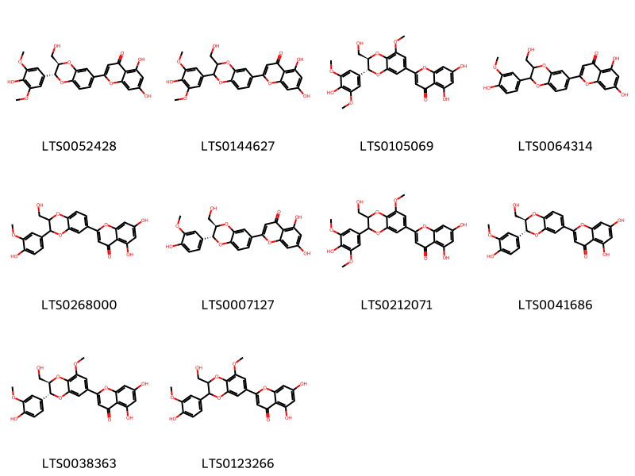{ width=100% }
    <figcaption>Hình ảnh cấu trúc hóa học của 10 hoạt chất thuộc nhóm Flavonolignans gồm ['5,7-dihydroxy-2-[(2r,3r)-2-(4-hydroxy-3,5-dimethoxyphenyl)-3-(hydroxymethyl)-2,3-dihydro-1,4-benzodioxin-6-yl]chromen-4-one (LTS0052428)', '5,7-dihydroxy-2-[2-(4-hydroxy-3,5-dimethoxyphenyl)-3-(hydroxymethyl)-2,3-dihydro-1,4-benzodioxin-6-yl]chromen-4-one (LTS0144627)', '5,7-dihydroxy-2-[(2r,3r)-3-(4-hydroxy-3,5-dimethoxyphenyl)-2-(hydroxymethyl)-8-methoxy-2,3-dihydro-1,4-benzodioxin-6-yl]chromen-4-one (LTS0105069)', '5,7-dihydroxy-2-[2-(4-hydroxy-3-methoxyphenyl)-3-(hydroxymethyl)-2,3-dihydro-1,4-benzodioxin-6-yl]chromen-4-one (LTS0064314)', '5,7-dihydroxy-2-[3-(4-hydroxy-3-methoxyphenyl)-2-(hydroxymethyl)-2,3-dihydro-1,4-benzodioxin-6-yl]chromen-4-one (LTS0268000)', '5,7-dihydroxy-2-[(2r,3r)-2-(4-hydroxy-3-methoxyphenyl)-3-(hydroxymethyl)-2,3-dihydro-1,4-benzodioxin-6-yl]chromen-4-one (LTS0007127)', '5,7-dihydroxy-2-[3-(4-hydroxy-3,5-dimethoxyphenyl)-2-(hydroxymethyl)-8-methoxy-2,3-dihydro-1,4-benzodioxin-6-yl]chromen-4-one (LTS0212071)', '5,7-dihydroxy-2-[(2r,3r)-3-(4-hydroxy-3-methoxyphenyl)-2-(hydroxymethyl)-2,3-dihydro-1,4-benzodioxin-6-yl]chromen-4-one (LTS0041686)', "5'-methoxyhydnocarpin (LTS0038363)", '5,7-dihydroxy-2-[3-(4-hydroxy-3-methoxyphenyl)-2-(hydroxymethyl)-8-methoxy-2,3-dihydro-1,4-benzodioxin-6-yl]chromen-4-one (LTS0123266)'].</figcaption>
</figure>
#### Nhóm Furanoid lignans
<figure markdown="span">
    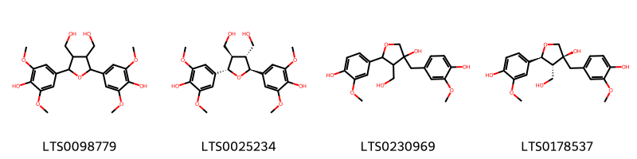{ width=100% }
    <figcaption>Hình ảnh cấu trúc hóa học của 4 hoạt chất thuộc nhóm Furanoid lignans gồm ['4-[5-(4-hydroxy-3,5-dimethoxyphenyl)-3,4-bis(hydroxymethyl)oxolan-2-yl]-2,6-dimethoxyphenol (LTS0098779)', '4-[(2s,3r,4r,5s)-5-(4-hydroxy-3,5-dimethoxyphenyl)-3,4-bis(hydroxymethyl)oxolan-2-yl]-2,6-dimethoxyphenol (LTS0025234)', '5-(4-hydroxy-3-methoxyphenyl)-3-[(4-hydroxy-3-methoxyphenyl)methyl]-4-(hydroxymethyl)oxolan-3-ol (LTS0230969)', 'olivil (LTS0178537)'].</figcaption>
</figure>
#### Nhóm Lignan glycosides
<figure markdown="span">
    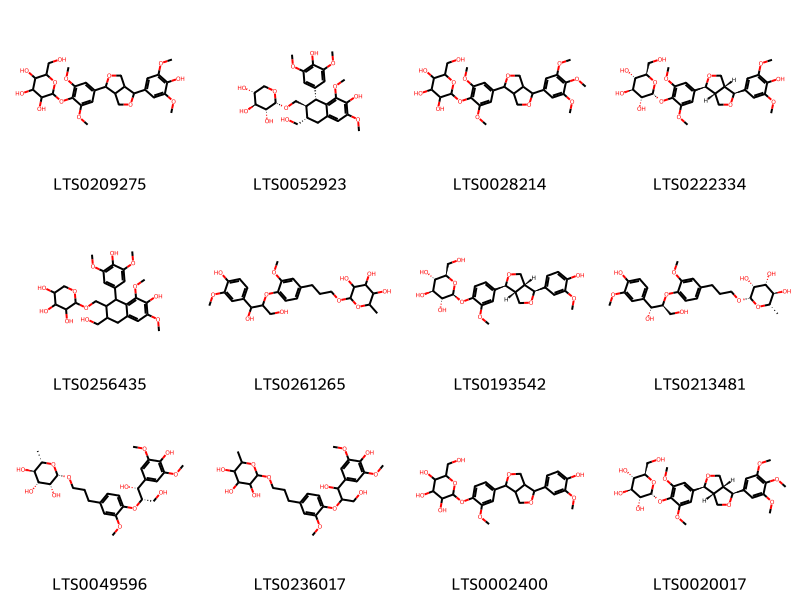{ width=100% }
    <figcaption>Hình ảnh cấu trúc hóa học của 12 hoạt chất thuộc nhóm Lignan glycosides gồm ['2-{4-[4-(4-hydroxy-3,5-dimethoxyphenyl)-hexahydrofuro[3,4-c]furan-1-yl]-2,6-dimethoxyphenoxy}-6-(hydroxymethyl)oxane-3,4,5-triol (LTS0209275)', '(2s,3r,4s,5r)-2-{[(1r,2s,3s)-7-hydroxy-1-(4-hydroxy-3,5-dimethoxyphenyl)-3-(hydroxymethyl)-6,8-dimethoxy-1,2,3,4-tetrahydronaphthalen-2-yl]methoxy}oxane-3,4,5-triol (LTS0052923)', '2-{2,6-dimethoxy-4-[4-(3,4,5-trimethoxyphenyl)-hexahydrofuro[3,4-c]furan-1-yl]phenoxy}-6-(hydroxymethyl)oxane-3,4,5-triol (LTS0028214)', '(2r,3r,4s,5s,6r)-2-{4-[(1s,3ar,4s,6ar)-4-(4-hydroxy-3,5-dimethoxyphenyl)-hexahydrofuro[3,4-c]furan-1-yl]-2,6-dimethoxyphenoxy}-6-(hydroxymethyl)oxane-3,4,5-triol (LTS0222334)', '2-{[7-hydroxy-1-(4-hydroxy-3,5-dimethoxyphenyl)-3-(hydroxymethyl)-6,8-dimethoxy-1,2,3,4-tetrahydronaphthalen-2-yl]methoxy}oxane-3,4,5-triol (LTS0256435)', '2-[3-(4-{[1,3-dihydroxy-1-(4-hydroxy-3-methoxyphenyl)propan-2-yl]oxy}-3-methoxyphenyl)propoxy]-6-methyloxane-3,4,5-triol (LTS0261265)', '(2s,3r,4s,5s,6r)-2-{4-[(1s,3ar,4s,6ar)-4-(4-hydroxy-3-methoxyphenyl)-hexahydrofuro[3,4-c]furan-1-yl]-2-methoxyphenoxy}-6-(hydroxymethyl)oxane-3,4,5-triol (LTS0193542)', '(2s,3r,4r,5r,6s)-2-[3-(4-{[(1r,2s)-1,3-dihydroxy-1-(4-hydroxy-3-methoxyphenyl)propan-2-yl]oxy}-3-methoxyphenyl)propoxy]-6-methyloxane-3,4,5-triol (LTS0213481)', '(2s,3r,4r,5r,6s)-2-[3-(4-{[(1r,2s)-1,3-dihydroxy-1-(4-hydroxy-3,5-dimethoxyphenyl)propan-2-yl]oxy}-3-methoxyphenyl)propoxy]-6-methyloxane-3,4,5-triol (LTS0049596)', '2-[3-(4-{[1,3-dihydroxy-1-(4-hydroxy-3,5-dimethoxyphenyl)propan-2-yl]oxy}-3-methoxyphenyl)propoxy]-6-methyloxane-3,4,5-triol (LTS0236017)', '2-{4-[4-(4-hydroxy-3-methoxyphenyl)-hexahydrofuro[3,4-c]furan-1-yl]-2-methoxyphenoxy}-6-(hydroxymethyl)oxane-3,4,5-triol (LTS0002400)', '(2r,3r,4s,5s,6r)-2-{4-[(1s,3ar,4s,6ar)-4-(3,4,5-trimethoxyphenyl)-hexahydrofuro[3,4-c]furan-1-yl]-2,6-dimethoxyphenoxy}-6-(hydroxymethyl)oxane-3,4,5-triol (LTS0020017)'].</figcaption>
</figure>
#### Nhóm Organooxygen compounds
<figure markdown="span">
    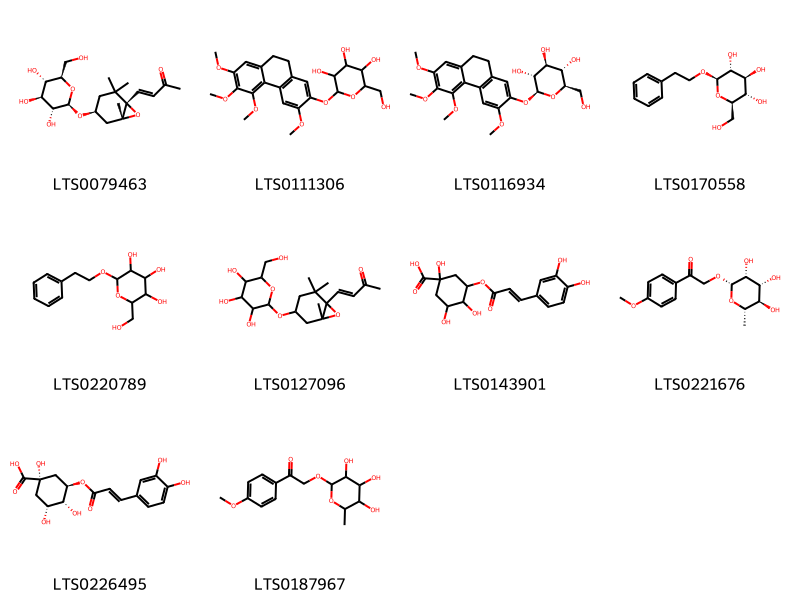{ width=100% }
    <figcaption>Hình ảnh cấu trúc hóa học của 10 hoạt chất thuộc nhóm Organooxygen compounds gồm ['(3e)-4-[(1s,4s,6r)-2,2,6-trimethyl-4-{[(2r,3r,4s,5s,6r)-3,4,5-trihydroxy-6-(hydroxymethyl)oxan-2-yl]oxy}-7-oxabicyclo[4.1.0]heptan-1-yl]but-3-en-2-one (LTS0079463)', '2-(hydroxymethyl)-6-[(3,5,6,7-tetramethoxy-9,10-dihydrophenanthren-2-yl)oxy]oxane-3,4,5-triol (LTS0111306)', '(2r,3s,4s,5r,6s)-2-(hydroxymethyl)-6-[(3,5,6,7-tetramethoxy-9,10-dihydrophenanthren-2-yl)oxy]oxane-3,4,5-triol (LTS0116934)', '(2r,3s,4s,5r,6r)-2-(hydroxymethyl)-6-(2-phenylethoxy)oxane-3,4,5-triol (LTS0170558)', '2-(hydroxymethyl)-6-(2-phenylethoxy)oxane-3,4,5-triol (LTS0220789)', '4-(2,2,6-trimethyl-4-{[3,4,5-trihydroxy-6-(hydroxymethyl)oxan-2-yl]oxy}-7-oxabicyclo[4.1.0]heptan-1-yl)but-3-en-2-one (LTS0127096)', '3-{[3-(3,4-dihydroxyphenyl)prop-2-enoyl]oxy}-1,4,5-trihydroxycyclohexane-1-carboxylic acid (LTS0143901)', '1-(4-methoxyphenyl)-2-{[(2s,3r,4r,5r,6s)-3,4,5-trihydroxy-6-methyloxan-2-yl]oxy}ethanone (LTS0221676)', 'chlorogenic acid (LTS0226495)', '1-(4-methoxyphenyl)-2-[(3,4,5-trihydroxy-6-methyloxan-2-yl)oxy]ethanone (LTS0187967)'].</figcaption>
</figure>
#### Nhóm Prenol lipids
<figure markdown="span">
    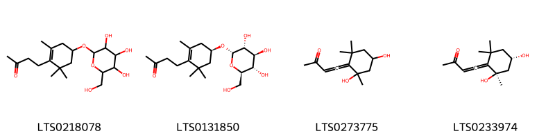{ width=100% }
    <figcaption>Hình ảnh cấu trúc hóa học của 4 hoạt chất thuộc nhóm Prenol lipids gồm ['4-(2,6,6-trimethyl-4-{[3,4,5-trihydroxy-6-(hydroxymethyl)oxan-2-yl]oxy}cyclohex-1-en-1-yl)butan-2-one (LTS0218078)', '4-[(4r)-2,6,6-trimethyl-4-{[(2s,3r,4s,5s,6r)-3,4,5-trihydroxy-6-(hydroxymethyl)oxan-2-yl]oxy}cyclohex-1-en-1-yl]butan-2-one (LTS0131850)', '4-(2,4-dihydroxy-2,6,6-trimethylcyclohexylidene)but-3-en-2-one (LTS0273775)', '4-[(2r,4s)-2,4-dihydroxy-2,6,6-trimethylcyclohexylidene]but-3-en-2-one (LTS0233974)'].</figcaption>
</figure>
#### Nhóm Steroids and steroid derivatives
<figure markdown="span">
    { width=100% }
    <figcaption>Hình ảnh cấu trúc hóa học của 2 hoạt chất thuộc nhóm Steroids and steroid derivatives gồm ['stigmast-5-en-3-ol, (3β)- (LTS0204616)', 'sitogluside (LTS0201798)'].</figcaption>
</figure>

---

### Dược dân tộc học

Danh sách các quốc gia có sử dụng *Epimedium sagittatum* trong điều trị các bệnh. 

| Country   | Disease                  | Bệnh                                                                                                                                                                                                |
|:----------|:-------------------------|:----------------------------------------------------------------------------------------------------------------------------------------------------------------------------------------------------|
| China     | Aphrodisiac, Carminative | MYMEMORY WARNING: YOU USED ALL AVAILABLE FREE TRANSLATIONS FOR TODAY. NEXT AVAILABLE IN  07 HOURS 51 MINUTES 45 SECONDS VISIT HTTPS://MYMEMORY.TRANSLATED.NET/DOC/USAGELIMITS.PHP TO TRANSLATE MORE |
| Elsewhere | Tonic                    | MYMEMORY WARNING: YOU USED ALL AVAILABLE FREE TRANSLATIONS FOR TODAY. NEXT AVAILABLE IN  07 HOURS 51 MINUTES 42 SECONDS VISIT HTTPS://MYMEMORY.TRANSLATED.NET/DOC/USAGELIMITS.PHP TO TRANSLATE MORE |
| Japan     | Aphrodisiac              | MYMEMORY WARNING: YOU USED ALL AVAILABLE FREE TRANSLATIONS FOR TODAY. NEXT AVAILABLE IN  07 HOURS 51 MINUTES 40 SECONDS VISIT HTTPS://MYMEMORY.TRANSLATED.NET/DOC/USAGELIMITS.PHP TO TRANSLATE MORE |

---

---
## Epimedium sempervirens
### Thông tin về thực vật

!!! info "Phân loại thực vật của *Epimedium sempervirens* từ GIBF:"
    - **Kingdom:** Plantae
    - **Phylum:** Tracheophyta
    - **Order:** Ranunculales
    - **Family:** Berberidaceae
    - **Genus:** Epimedium
    - **Species:** *Epimedium sempervirens*

 

| Label (VI)   | Label (EN)   | Scientific Name        | Descriptions (VI)   | Descriptions (EN)   | Also Known As (VI)   | Also Known As (EN)   |
|:-------------|:-------------|:-----------------------|:--------------------|:--------------------|:---------------------|:---------------------|
| N/A          | N/A          | Epimedium sempervirens | loài thực vật       | species of plant    | ['']                 | ['']                 |

#### Phân bố trên thế giới

**Từ CSDL GIBF** nan, United States of America, Japan, Korea, Republic of

#### Phân bố tại Việt Nam

**Từ CSDL GIBF**: Không có ghi nhận ở Việt Nam

---
### Thành phần hóa học
        
- Theo cơ sở dữ liệu lotus: Từ loài *Epimedium sempervirens* đã phân lập và xác định được 27 hoạt chất thuộc về các nhóm Flavonoids. 

|    | chemicalTaxonomyClassyfireClass   |   smiles_count |
|---:|:----------------------------------|---------------:|
|  0 | Flavonoids                        |             27 |

#### Nhóm Flavonoids
<figure markdown="span">
    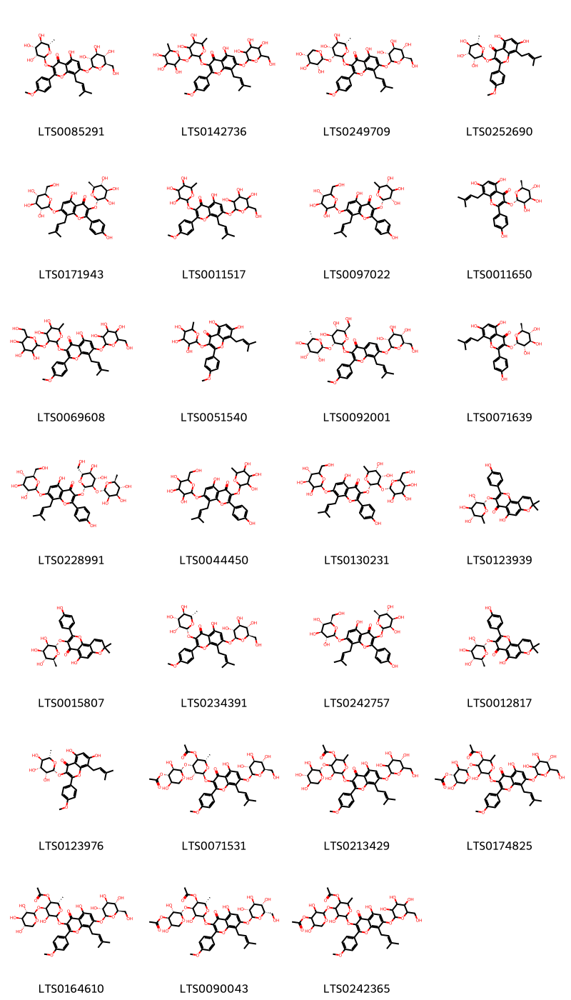{ width=100% }
    <figcaption>Hình ảnh cấu trúc hóa học của 27 hoạt chất thuộc nhóm Flavonoids gồm ['icariin (LTS0085291)', '3-[(4,5-dihydroxy-6-methyl-3-{[(2s)-3,4,5-trihydroxy-6-methyloxan-2-yl]oxy}oxan-2-yl)oxy]-5-hydroxy-2-(4-methoxyphenyl)-8-(3-methylbut-2-en-1-yl)-7-{[3,4,5-trihydroxy-6-(hydroxymethyl)oxan-2-yl]oxy}chromen-4-one (LTS0142736)', '3-{[(2s,3r,4r,5r,6s)-4,5-dihydroxy-6-methyl-3-{[(2s,3r,4s,5r)-3,4,5-trihydroxyoxan-2-yl]oxy}oxan-2-yl]oxy}-5-hydroxy-2-(4-methoxyphenyl)-8-(3-methylbut-2-en-1-yl)-7-{[(2s,3r,4s,5s,6r)-3,4,5-trihydroxy-6-(hydroxymethyl)oxan-2-yl]oxy}chromen-4-one (LTS0249709)', 'icariside ii (LTS0252690)', '5-hydroxy-2-(4-hydroxyphenyl)-8-(3-methylbut-2-en-1-yl)-7-{[(2s,3r,4s,5s,6r)-3,4,5-trihydroxy-6-(hydroxymethyl)oxan-2-yl]oxy}-3-{[(2s,3r,4r,5r,6s)-3,4,5-trihydroxy-6-methyloxan-2-yl]oxy}chromen-4-one (LTS0171943)', '5-hydroxy-2-(4-methoxyphenyl)-8-(3-methylbut-2-en-1-yl)-7-{[3,4,5-trihydroxy-6-(hydroxymethyl)oxan-2-yl]oxy}-3-[(3,4,5-trihydroxy-6-methyloxan-2-yl)oxy]chromen-4-one (LTS0011517)', 'epimedoside a (LTS0097022)', '5,7-dihydroxy-2-(4-hydroxyphenyl)-8-(3-methylbut-2-en-1-yl)-3-{[(2s,3r,4r,5r,6s)-3,4,5-trihydroxy-6-methyloxan-2-yl]oxy}chromen-4-one (LTS0011650)', '3-[(4,5-dihydroxy-6-methyl-3-{[3,4,5-trihydroxy-6-(hydroxymethyl)oxan-2-yl]oxy}oxan-2-yl)oxy]-5-hydroxy-2-(4-methoxyphenyl)-8-(3-methylbut-2-en-1-yl)-7-{[3,4,5-trihydroxy-6-(hydroxymethyl)oxan-2-yl]oxy}chromen-4-one (LTS0069608)', '5,7-dihydroxy-2-(4-methoxyphenyl)-8-(3-methylbut-2-en-1-yl)-3-[(3,4,5-trihydroxy-6-methyloxan-2-yl)oxy]chromen-4-one (LTS0051540)', '3-{[(2s,3r,4s,5s,6r)-4,5-dihydroxy-6-(hydroxymethyl)-3-{[(2s,3r,4r,5r,6s)-3,4,5-trihydroxy-6-methyloxan-2-yl]oxy}oxan-2-yl]oxy}-2-(4-methoxyphenyl)-8-(3-methylbut-2-en-1-yl)-7-{[(2s,3r,4s,5s,6r)-3,4,5-trihydroxy-6-(hydroxymethyl)oxan-2-yl]oxy}chromen-4-one (LTS0092001)', '5,7-dihydroxy-2-(4-hydroxyphenyl)-8-(3-methylbut-2-en-1-yl)-3-{[(2s,3s,4r,5r,6s)-3,4,5-trihydroxy-6-methyloxan-2-yl]oxy}chromen-4-one (LTS0071639)', '3-{[(2s,3r,4s,5s,6r)-4,5-dihydroxy-6-(hydroxymethyl)-3-{[(2s,3r,4r,5r,6s)-3,4,5-trihydroxy-6-methyloxan-2-yl]oxy}oxan-2-yl]oxy}-5-hydroxy-2-(4-hydroxyphenyl)-8-(3-methylbut-2-en-1-yl)-7-{[(2s,3r,4s,5s,6r)-3,4,5-trihydroxy-6-(hydroxymethyl)oxan-2-yl]oxy}chromen-4-one (LTS0228991)', '5-hydroxy-2-(4-hydroxyphenyl)-8-(3-methylbut-2-en-1-yl)-7-{[3,4,5-trihydroxy-6-(hydroxymethyl)oxan-2-yl]oxy}-3-[(3,4,5-trihydroxy-6-methyloxan-2-yl)oxy]chromen-4-one (LTS0044450)', 'ikarisoside c (LTS0130231)', 'ikarisoside e (LTS0123939)', '5-hydroxy-2-(4-hydroxyphenyl)-8,8-dimethyl-3-{[(2s,3r,4r,5r,6s)-3,4,5-trihydroxy-6-methyloxan-2-yl]oxy}pyrano[2,3-h]chromen-4-one (LTS0015807)', '5-hydroxy-2-(4-methoxyphenyl)-8-(3-methylbut-2-en-1-yl)-7-{[(2s,3r,4s,5s,6r)-3,4,5-trihydroxy-6-(hydroxymethyl)oxan-2-yl]oxy}-3-{[(2r,3r,4r,5r,6s)-3,4,5-trihydroxy-6-methyloxan-2-yl]oxy}chromen-4-one (LTS0234391)', '5-hydroxy-2-(4-hydroxyphenyl)-8-(3-methylbut-2-en-1-yl)-7-{[(2s,3r,4s,5s,6r)-3,4,5-trihydroxy-6-(hydroxymethyl)oxan-2-yl]oxy}-3-{[(2r,3r,4r,5r,6s)-3,4,5-trihydroxy-6-methyloxan-2-yl]oxy}chromen-4-one (LTS0242757)', '5-hydroxy-2-(4-hydroxyphenyl)-8,8-dimethyl-3-{[(2s,3s,4r,5r,6s)-3,4,5-trihydroxy-6-methyloxan-2-yl]oxy}pyrano[2,3-h]chromen-4-one (LTS0012817)', '5,7-dihydroxy-2-(4-methoxyphenyl)-8-(3-methylbut-2-en-1-yl)-3-{[(2r,3r,4r,5r,6s)-3,4,5-trihydroxy-6-methyloxan-2-yl]oxy}chromen-4-one (LTS0123976)', '(2s,3s,4s,5r,6s)-4-{[(2s,3r,4s,5r)-4-(acetyloxy)-3,5-dihydroxyoxan-2-yl]oxy}-5-hydroxy-6-{[5-hydroxy-2-(4-methoxyphenyl)-8-(3-methylbut-2-en-1-yl)-4-oxo-7-{[(2s,3r,4s,5s,6r)-3,4,5-trihydroxy-6-(hydroxymethyl)oxan-2-yl]oxy}chromen-3-yl]oxy}-2-methyloxan-3-yl acetate (LTS0071531)', 'sempervirenoside b (LTS0213429)', 'sempervirenoside a (LTS0174825)', '(2s,3s,4r,5s,6s)-5-hydroxy-6-{[5-hydroxy-2-(4-methoxyphenyl)-8-(3-methylbut-2-en-1-yl)-4-oxo-7-{[(2s,3r,4s,5s,6r)-3,4,5-trihydroxy-6-(hydroxymethyl)oxan-2-yl]oxy}chromen-3-yl]oxy}-2-methyl-4-{[(2r,3s,4r,5s)-3,4,5-trihydroxyoxan-2-yl]oxy}oxan-3-yl acetate (LTS0164610)', '(2s,3s,4r,5s,6s)-4-{[(2s,3s,4r,5r)-4-(acetyloxy)-3,5-dihydroxyoxan-2-yl]oxy}-5-hydroxy-6-{[5-hydroxy-2-(4-methoxyphenyl)-8-(3-methylbut-2-en-1-yl)-4-oxo-7-{[(2s,3r,4s,5s,6s)-3,4,5-trihydroxy-6-(hydroxymethyl)oxan-2-yl]oxy}chromen-3-yl]oxy}-2-methyloxan-3-yl acetate (LTS0090043)', '4-{[4-(acetyloxy)-3,5-dihydroxyoxan-2-yl]oxy}-5-hydroxy-6-{[5-hydroxy-2-(4-methoxyphenyl)-8-(3-methylbut-2-en-1-yl)-4-oxo-7-{[3,4,5-trihydroxy-6-(hydroxymethyl)oxan-2-yl]oxy}chromen-3-yl]oxy}-2-methyloxan-3-yl acetate (LTS0242365)'].</figcaption>
</figure>

---

### Dược dân tộc học

Danh sách các quốc gia có sử dụng *Epimedium sempervirens* trong điều trị các bệnh. 

| Country   | Disease                        | Bệnh                                                                                                                                                                                                |
|:----------|:-------------------------------|:----------------------------------------------------------------------------------------------------------------------------------------------------------------------------------------------------|
| Elsewhere | Tonic, Tonic, Tonic, Analeptic | MYMEMORY WARNING: YOU USED ALL AVAILABLE FREE TRANSLATIONS FOR TODAY. NEXT AVAILABLE IN  07 HOURS 51 MINUTES 07 SECONDS VISIT HTTPS://MYMEMORY.TRANSLATED.NET/DOC/USAGELIMITS.PHP TO TRANSLATE MORE |

---

---
## Epimedium setosum
### Thông tin về thực vật

!!! info "Phân loại thực vật của *Epimedium setosum* từ GIBF:"
    - **Kingdom:** Plantae
    - **Phylum:** Tracheophyta
    - **Order:** Ranunculales
    - **Family:** Berberidaceae
    - **Genus:** Epimedium
    - **Species:** *Epimedium setosum*

 

| Label (VI)   | Label (EN)   | Scientific Name   | Descriptions (VI)   | Descriptions (EN)   | Also Known As (VI)   | Also Known As (EN)   |
|:-------------|:-------------|:------------------|:--------------------|:--------------------|:---------------------|:---------------------|
| N/A          | N/A          | Epimedium setosum | loài thực vật       | species of plant    | ['']                 | ['']                 |

#### Phân bố trên thế giới

**Từ CSDL GIBF** nan, Japan, Norway, Korea, Republic of, unknown or invalid

#### Phân bố tại Việt Nam

**Từ CSDL GIBF**: Không có ghi nhận ở Việt Nam

---
### Thành phần hóa học
        
- Theo cơ sở dữ liệu lotus: Từ loài *Epimedium setosum* đã phân lập và xác định được 3 hoạt chất thuộc về các nhóm Flavonoids. 

|    | chemicalTaxonomyClassyfireClass   |   smiles_count |
|---:|:----------------------------------|---------------:|
|  0 | Flavonoids                        |              3 |

#### Nhóm Flavonoids
<figure markdown="span">
    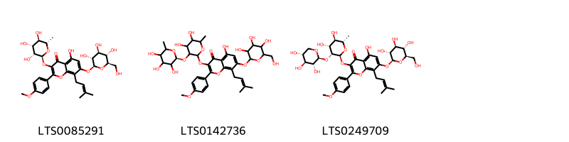{ width=100% }
    <figcaption>Hình ảnh cấu trúc hóa học của 3 hoạt chất thuộc nhóm Flavonoids gồm ['icariin (LTS0085291)', '3-[(4,5-dihydroxy-6-methyl-3-{[(2s)-3,4,5-trihydroxy-6-methyloxan-2-yl]oxy}oxan-2-yl)oxy]-5-hydroxy-2-(4-methoxyphenyl)-8-(3-methylbut-2-en-1-yl)-7-{[3,4,5-trihydroxy-6-(hydroxymethyl)oxan-2-yl]oxy}chromen-4-one (LTS0142736)', '3-{[(2s,3r,4r,5r,6s)-4,5-dihydroxy-6-methyl-3-{[(2s,3r,4s,5r)-3,4,5-trihydroxyoxan-2-yl]oxy}oxan-2-yl]oxy}-5-hydroxy-2-(4-methoxyphenyl)-8-(3-methylbut-2-en-1-yl)-7-{[(2s,3r,4s,5s,6r)-3,4,5-trihydroxy-6-(hydroxymethyl)oxan-2-yl]oxy}chromen-4-one (LTS0249709)'].</figcaption>
</figure>

---

### Dược dân tộc học

Danh sách các quốc gia có sử dụng *Epimedium setosum* trong điều trị các bệnh. 

| Country   | Disease   | Bệnh                                                                                                                                                                                                |
|:----------|:----------|:----------------------------------------------------------------------------------------------------------------------------------------------------------------------------------------------------|
| Elsewhere | Tonic     | MYMEMORY WARNING: YOU USED ALL AVAILABLE FREE TRANSLATIONS FOR TODAY. NEXT AVAILABLE IN  07 HOURS 50 MINUTES 45 SECONDS VISIT HTTPS://MYMEMORY.TRANSLATED.NET/DOC/USAGELIMITS.PHP TO TRANSLATE MORE |

---

# Chi Mahonia

??? note "Danh sách các dược liệu thuộc chi"
    
	 - *Mahonia aquifolia*
	 - *Mahonia aquifolium*
	 - *Mahonia ganpinensis*
	 - *Mahonia japonica*
	 - *Mahonia napaulensis*
	 - *Mahonia repens*

---
## Mahonia aquifolia
### Thông tin về thực vật

!!! info "Phân loại thực vật của *Mahonia aquifolium* từ GIBF:"
    - **Kingdom:** Plantae
    - **Phylum:** Tracheophyta
    - **Order:** Ranunculales
    - **Family:** Berberidaceae
    - **Genus:** Mahonia
    - **Species:** *Mahonia aquifolium*

 

| Label (VI)   | Label (EN)   | Scientific Name   | Descriptions (VI)   | Descriptions (EN)   | Also Known As (VI)   | Also Known As (EN)   |
|:-------------|:-------------|:------------------|:--------------------|:--------------------|:---------------------|:---------------------|
| N/A          | N/A          | Epimedium setosum | loài thực vật       | species of plant    | ['']                 | ['']                 |

#### Phân bố trên thế giới

**Từ CSDL GIBF** Austria, Hungary, United States of America, Czechia, Poland, France, Netherlands, Belgium, Ukraine, Australia, Russian Federation, Switzerland, Luxembourg, Canada, Germany, United Kingdom of Great Britain and Northern Ireland, Spain, Denmark

#### Phân bố tại Việt Nam

**Từ CSDL GIBF**: Không có ghi nhận ở Việt Nam

---
### Thành phần hóa học
        
- Theo cơ sở dữ liệu lotus: Từ loài *Mahonia aquifolium* đã phân lập và xác định được Chưa có hoạt chất nào được phân lập. hoạt chất thuộc về các nhóm Không có hoạt chất nào được phân lập. 

Không có hình ảnh nào được tạo ra

---

### Dược dân tộc học

Danh sách các quốc gia có sử dụng *Mahonia aquifolium* trong điều trị các bệnh. 

| Country   | Disease                                     | Bệnh                                                                                                                                                                                                |
|:----------|:--------------------------------------------|:----------------------------------------------------------------------------------------------------------------------------------------------------------------------------------------------------|
| Dutch     | Purgative                                   | MYMEMORY WARNING: YOU USED ALL AVAILABLE FREE TRANSLATIONS FOR TODAY. NEXT AVAILABLE IN  07 HOURS 50 MINUTES 25 SECONDS VISIT HTTPS://MYMEMORY.TRANSLATED.NET/DOC/USAGELIMITS.PHP TO TRANSLATE MORE |
| German    | Antiseptic                                  | MYMEMORY WARNING: YOU USED ALL AVAILABLE FREE TRANSLATIONS FOR TODAY. NEXT AVAILABLE IN  07 HOURS 50 MINUTES 23 SECONDS VISIT HTTPS://MYMEMORY.TRANSLATED.NET/DOC/USAGELIMITS.PHP TO TRANSLATE MORE |
| US        | Diuretic, Laxative, Cholagogue, Expectorant | MYMEMORY WARNING: YOU USED ALL AVAILABLE FREE TRANSLATIONS FOR TODAY. NEXT AVAILABLE IN  07 HOURS 50 MINUTES 20 SECONDS VISIT HTTPS://MYMEMORY.TRANSLATED.NET/DOC/USAGELIMITS.PHP TO TRANSLATE MORE |
| anish     | Tonic                                       | MYMEMORY WARNING: YOU USED ALL AVAILABLE FREE TRANSLATIONS FOR TODAY. NEXT AVAILABLE IN  07 HOURS 50 MINUTES 18 SECONDS VISIT HTTPS://MYMEMORY.TRANSLATED.NET/DOC/USAGELIMITS.PHP TO TRANSLATE MORE |

---

---
## Mahonia aquifolium
### Thông tin về thực vật

!!! info "Phân loại thực vật của *Mahonia aquifolium* từ GIBF:"
    - **Kingdom:** Plantae
    - **Phylum:** Tracheophyta
    - **Order:** Ranunculales
    - **Family:** Berberidaceae
    - **Genus:** Mahonia
    - **Species:** *Mahonia aquifolium*

 

| Label (VI)   | Label (EN)   | Scientific Name    | Descriptions (VI)   | Descriptions (EN)   | Also Known As (VI)                                            | Also Known As (EN)                                                                                                                                                                                                                                                                       |
|:-------------|:-------------|:-------------------|:--------------------|:--------------------|:--------------------------------------------------------------|:-----------------------------------------------------------------------------------------------------------------------------------------------------------------------------------------------------------------------------------------------------------------------------------------|
| N/A          | N/A          | Mahonia aquifolium | loài thực vật       | species of plant    | ['Berberis aquifolium', 'Oregon-grape', 'Mahonia aquifolium'] | ['Berberis aquifolium', 'holly-leaf Oregon-grape', 'holly-leaved barberry', 'hollyleaved barberry', 'Mahonia aquifolium', 'Oregon grape', 'Oregon grapeholly', 'Oregon holly', 'Oregon holly grape', 'Oregongrape', "Piper's Oregon-grape", 'shining Oregon-grape', 'tall Oregon-grape'] |

#### Phân bố trên thế giới

**Từ CSDL GIBF** Austria, Hungary, United States of America, Czechia, Poland, France, Netherlands, Belgium, Ukraine, Australia, Russian Federation, Switzerland, Luxembourg, Canada, Germany, United Kingdom of Great Britain and Northern Ireland, Spain, Denmark

#### Phân bố tại Việt Nam

**Từ CSDL GIBF**: Không có ghi nhận ở Việt Nam

---
### Thành phần hóa học
        
- Theo cơ sở dữ liệu lotus: Từ loài *Mahonia aquifolium* đã phân lập và xác định được Chưa có hoạt chất nào được phân lập. hoạt chất thuộc về các nhóm Không có hoạt chất nào được phân lập. 

Không có hình ảnh nào được tạo ra

---

### Dược dân tộc học

Danh sách các quốc gia có sử dụng *Mahonia aquifolium* trong điều trị các bệnh. 

| Country   | Disease       | Bệnh                                                                                                                                                                                                |
|:----------|:--------------|:----------------------------------------------------------------------------------------------------------------------------------------------------------------------------------------------------|
| Elsewhere | nan           | MYMEMORY WARNING: YOU USED ALL AVAILABLE FREE TRANSLATIONS FOR TODAY. NEXT AVAILABLE IN  07 HOURS 49 MINUTES 56 SECONDS VISIT HTTPS://MYMEMORY.TRANSLATED.NET/DOC/USAGELIMITS.PHP TO TRANSLATE MORE |
| US        | Tonic, Poison | MYMEMORY WARNING: YOU USED ALL AVAILABLE FREE TRANSLATIONS FOR TODAY. NEXT AVAILABLE IN  07 HOURS 49 MINUTES 53 SECONDS VISIT HTTPS://MYMEMORY.TRANSLATED.NET/DOC/USAGELIMITS.PHP TO TRANSLATE MORE |

---

---
## Mahonia ganpinensis
### Thông tin về thực vật

!!! info "Phân loại thực vật của *Mahonia eurybracteata* từ GIBF:"
    - **Kingdom:** Plantae
    - **Phylum:** Tracheophyta
    - **Order:** Ranunculales
    - **Family:** Berberidaceae
    - **Genus:** Mahonia
    - **Species:** *Mahonia eurybracteata*

 

| Label (VI)   | Label (EN)   | Scientific Name     | Descriptions (VI)   | Descriptions (EN)   | Also Known As (VI)   | Also Known As (EN)   |
|:-------------|:-------------|:--------------------|:--------------------|:--------------------|:---------------------|:---------------------|
| N/A          | N/A          | Mahonia ganpinensis | loài thực vật       | species of plant    | ['']                 | ['']                 |

#### Phân bố trên thế giới

**Từ CSDL GIBF** nan, China

#### Phân bố tại Việt Nam

**Từ CSDL GIBF**: Không có ghi nhận ở Việt Nam

---
### Thành phần hóa học
        
- Theo cơ sở dữ liệu lotus: Từ loài *Mahonia eurybracteata* đã phân lập và xác định được Chưa có hoạt chất nào được phân lập. hoạt chất thuộc về các nhóm Không có hoạt chất nào được phân lập. 

Không có hình ảnh nào được tạo ra

---

### Dược dân tộc học

Danh sách các quốc gia có sử dụng *Mahonia eurybracteata* trong điều trị các bệnh. 

| Country   | Disease    | Bệnh                                                                                                                                                                                                |
|:----------|:-----------|:----------------------------------------------------------------------------------------------------------------------------------------------------------------------------------------------------|
| China     | Antiseptic | MYMEMORY WARNING: YOU USED ALL AVAILABLE FREE TRANSLATIONS FOR TODAY. NEXT AVAILABLE IN  07 HOURS 49 MINUTES 32 SECONDS VISIT HTTPS://MYMEMORY.TRANSLATED.NET/DOC/USAGELIMITS.PHP TO TRANSLATE MORE |

---

---
## Mahonia japonica
### Thông tin về thực vật

!!! info "Phân loại thực vật của *Mahonia japonica* từ GIBF:"
    - **Kingdom:** Plantae
    - **Phylum:** Tracheophyta
    - **Order:** Ranunculales
    - **Family:** Berberidaceae
    - **Genus:** Mahonia
    - **Species:** *Mahonia japonica*

 

| Label (VI)   | Label (EN)   | Scientific Name   | Descriptions (VI)   | Descriptions (EN)   | Also Known As (VI)   | Also Known As (EN)   |
|:-------------|:-------------|:------------------|:--------------------|:--------------------|:---------------------|:---------------------|
| N/A          | N/A          | Mahonia japonica  | loài thực vật       | species of plant    | ['']                 | ['']                 |

#### Phân bố trên thế giới

**Từ CSDL GIBF** nan, Brazil, Japan, China, New Zealand, Spain, Netherlands, United States of America, Korea, Republic of, Russian Federation, Norway, United Kingdom of Great Britain and Northern Ireland, Belgium, Chinese Taipei, Georgia, Isle of Man, Germany, Austria, Portugal, France, Ireland

#### Phân bố tại Việt Nam

**Từ CSDL GIBF**: Không có ghi nhận ở Việt Nam

---
### Thành phần hóa học
        
- Theo cơ sở dữ liệu lotus: Từ loài *Mahonia japonica* đã phân lập và xác định được Chưa có hoạt chất nào được phân lập. hoạt chất thuộc về các nhóm Không có hoạt chất nào được phân lập. 

Không có hình ảnh nào được tạo ra

---

### Dược dân tộc học

Danh sách các quốc gia có sử dụng *Mahonia japonica* trong điều trị các bệnh. 

| Country   | Disease                     | Bệnh                                                                                                                                                                                                |
|:----------|:----------------------------|:----------------------------------------------------------------------------------------------------------------------------------------------------------------------------------------------------|
| China     | Sedative, Tonic, Alexiteric | MYMEMORY WARNING: YOU USED ALL AVAILABLE FREE TRANSLATIONS FOR TODAY. NEXT AVAILABLE IN  07 HOURS 49 MINUTES 15 SECONDS VISIT HTTPS://MYMEMORY.TRANSLATED.NET/DOC/USAGELIMITS.PHP TO TRANSLATE MORE |

---

---
## Mahonia napaulensis
### Thông tin về thực vật

!!! info "Phân loại thực vật của *Mahonia napaulensis* từ GIBF:"
    - **Kingdom:** Plantae
    - **Phylum:** Tracheophyta
    - **Order:** Ranunculales
    - **Family:** Berberidaceae
    - **Genus:** Mahonia
    - **Species:** *Mahonia napaulensis*

 

| Label (VI)   | Label (EN)   | Scientific Name     | Descriptions (VI)   | Descriptions (EN)   | Also Known As (VI)   | Also Known As (EN)   |
|:-------------|:-------------|:--------------------|:--------------------|:--------------------|:---------------------|:---------------------|
| N/A          | N/A          | Mahonia napaulensis | loài thực vật       | species of plant    | ['']                 | ['']                 |

#### Phân bố trên thế giới

**Từ CSDL GIBF** Sri Lanka, nan, Viet Nam, Portugal, Korea, Republic of, Bhutan, Belgium, Nepal, Indonesia, China, Russian Federation, France, New Zealand, Colombia, India, Thailand, Spain

#### Phân bố tại Việt Nam

**Từ CSDL GIBF**: Ha Giang, Lai Chau, Quang Binh, Lam Dong, Cao Bang

---
### Thành phần hóa học
        
- Theo cơ sở dữ liệu lotus: Từ loài *Mahonia napaulensis* đã phân lập và xác định được Chưa có hoạt chất nào được phân lập. hoạt chất thuộc về các nhóm Không có hoạt chất nào được phân lập. 

Không có hình ảnh nào được tạo ra

---

### Dược dân tộc học

Danh sách các quốc gia có sử dụng *Mahonia napaulensis* trong điều trị các bệnh. 

| Country   | Disease            | Bệnh                                                                                                                                                                                                |
|:----------|:-------------------|:----------------------------------------------------------------------------------------------------------------------------------------------------------------------------------------------------|
| Nepal     | Diuretic, Diuretic | MYMEMORY WARNING: YOU USED ALL AVAILABLE FREE TRANSLATIONS FOR TODAY. NEXT AVAILABLE IN  07 HOURS 48 MINUTES 55 SECONDS VISIT HTTPS://MYMEMORY.TRANSLATED.NET/DOC/USAGELIMITS.PHP TO TRANSLATE MORE |

---

---
## Mahonia repens
### Thông tin về thực vật

!!! info "Phân loại thực vật của *Mahonia repens* từ GIBF:"
    - **Kingdom:** Plantae
    - **Phylum:** Tracheophyta
    - **Order:** Ranunculales
    - **Family:** Berberidaceae
    - **Genus:** Mahonia
    - **Species:** *Mahonia repens*

 

| Label (VI)   | Label (EN)   | Scientific Name   | Descriptions (VI)   | Descriptions (EN)   | Also Known As (VI)   | Also Known As (EN)                                                                        |
|:-------------|:-------------|:------------------|:--------------------|:--------------------|:---------------------|:------------------------------------------------------------------------------------------|
| N/A          | N/A          | Mahonia repens    |                     | species of plant    | ['']                 | ['Oregon grape', 'barberry', 'creeping barberry', 'holly grape', 'creeping Oregon grape'] |

#### Phân bố trên thế giới

**Từ CSDL GIBF** Germany, Switzerland, United States of America, Canada

#### Phân bố tại Việt Nam

**Từ CSDL GIBF**: Không có ghi nhận ở Việt Nam

---
### Thành phần hóa học
        
- Theo cơ sở dữ liệu lotus: Từ loài *Mahonia repens* đã phân lập và xác định được Chưa có hoạt chất nào được phân lập. hoạt chất thuộc về các nhóm Không có hoạt chất nào được phân lập. 

Không có hình ảnh nào được tạo ra

---

### Dược dân tộc học

Danh sách các quốc gia có sử dụng *Mahonia repens* trong điều trị các bệnh. 

| Country   | Disease           | Bệnh                                                                                                                                                                                                |
|:----------|:------------------|:----------------------------------------------------------------------------------------------------------------------------------------------------------------------------------------------------|
| US        | Tonic, Intoxicant | MYMEMORY WARNING: YOU USED ALL AVAILABLE FREE TRANSLATIONS FOR TODAY. NEXT AVAILABLE IN  07 HOURS 48 MINUTES 34 SECONDS VISIT HTTPS://MYMEMORY.TRANSLATED.NET/DOC/USAGELIMITS.PHP TO TRANSLATE MORE |

---

# Chi Jeffersonia

??? note "Danh sách các dược liệu thuộc chi"
    
	 - *Jeffersonia diphylla*
	 - *Jeffersonia dubia*

---
## Jeffersonia diphylla
### Thông tin về thực vật

!!! info "Phân loại thực vật của *Jeffersonia diphylla* từ GIBF:"
    - **Kingdom:** Plantae
    - **Phylum:** Tracheophyta
    - **Order:** Ranunculales
    - **Family:** Berberidaceae
    - **Genus:** Jeffersonia
    - **Species:** *Jeffersonia diphylla*

 

| Label (VI)   | Label (EN)   | Scientific Name      | Descriptions (VI)   | Descriptions (EN)   | Also Known As (VI)   | Also Known As (EN)   |
|:-------------|:-------------|:---------------------|:--------------------|:--------------------|:---------------------|:---------------------|
| N/A          | N/A          | Jeffersonia diphylla | loài thực vật       | species of plant    | ['']                 | ['']                 |

#### Phân bố trên thế giới

**Từ CSDL GIBF** nan, United States of America, Canada

#### Phân bố tại Việt Nam

**Từ CSDL GIBF**: Không có ghi nhận ở Việt Nam

---
### Thành phần hóa học
        
- Theo cơ sở dữ liệu lotus: Từ loài *Jeffersonia diphylla* đã phân lập và xác định được Chưa có hoạt chất nào được phân lập. hoạt chất thuộc về các nhóm Không có hoạt chất nào được phân lập. 

Không có hình ảnh nào được tạo ra

---

### Dược dân tộc học

Danh sách các quốc gia có sử dụng *Jeffersonia diphylla* trong điều trị các bệnh. 

| Country   | Disease                               | Bệnh                                                                                                                                                                                                |
|:----------|:--------------------------------------|:----------------------------------------------------------------------------------------------------------------------------------------------------------------------------------------------------|
| US        | Emetic, Expectorant, Tonic, Stimulant | MYMEMORY WARNING: YOU USED ALL AVAILABLE FREE TRANSLATIONS FOR TODAY. NEXT AVAILABLE IN  07 HOURS 48 MINUTES 12 SECONDS VISIT HTTPS://MYMEMORY.TRANSLATED.NET/DOC/USAGELIMITS.PHP TO TRANSLATE MORE |

---

---
## Jeffersonia dubia
### Thông tin về thực vật

!!! info "Phân loại thực vật của *Plagiorhegma dubium* từ GIBF:"
    - **Kingdom:** Plantae
    - **Phylum:** Tracheophyta
    - **Order:** Ranunculales
    - **Family:** Berberidaceae
    - **Genus:** Plagiorhegma
    - **Species:** *Plagiorhegma dubium*

 

| Label (VI)   | Label (EN)   | Scientific Name   | Descriptions (VI)   | Descriptions (EN)   | Also Known As (VI)   | Also Known As (EN)   |
|:-------------|:-------------|:------------------|:--------------------|:--------------------|:---------------------|:---------------------|
| N/A          | N/A          | Jeffersonia dubia | loài thực vật       | species of plant    | ['']                 | ['']                 |

#### Phân bố trên thế giới

**Từ CSDL GIBF** nan, Japan, Norway, Korea, Republic of, China, Russian Federation, Korea (Democratic People’s Republic of), unknown or invalid

#### Phân bố tại Việt Nam

**Từ CSDL GIBF**: Không có ghi nhận ở Việt Nam

---
### Thành phần hóa học
        
- Theo cơ sở dữ liệu lotus: Từ loài *Plagiorhegma dubium* đã phân lập và xác định được Chưa có hoạt chất nào được phân lập. hoạt chất thuộc về các nhóm Không có hoạt chất nào được phân lập. 

Không có hình ảnh nào được tạo ra

---

### Dược dân tộc học

Danh sách các quốc gia có sử dụng *Plagiorhegma dubium* trong điều trị các bệnh. 

| Country   | Disease   | Bệnh                                                                                                                                                                                                |
|:----------|:----------|:----------------------------------------------------------------------------------------------------------------------------------------------------------------------------------------------------|
| Elsewhere | Stomachic | MYMEMORY WARNING: YOU USED ALL AVAILABLE FREE TRANSLATIONS FOR TODAY. NEXT AVAILABLE IN  07 HOURS 47 MINUTES 51 SECONDS VISIT HTTPS://MYMEMORY.TRANSLATED.NET/DOC/USAGELIMITS.PHP TO TRANSLATE MORE |

---

# Chi Berberis

??? note "Danh sách các dược liệu thuộc chi"
    
	 - *Berberis aristata*
	 - *Berberis asiatica*
	 - *Berberis chengii*
	 - *Berberis longipes*
	 - *Berberis lycium*
	 - *Berberis nervosa*
	 - *Berberis repens*
	 - *Berberis thunbergii*
	 - *Berberis vulgaris*

---
## Berberis aristata
### Thông tin về thực vật

!!! info "Phân loại thực vật của *Berberis aristata* từ GIBF:"
    - **Kingdom:** Plantae
    - **Phylum:** Tracheophyta
    - **Order:** Ranunculales
    - **Family:** Berberidaceae
    - **Genus:** Berberis
    - **Species:** *Berberis aristata*

 

| Label (VI)   | Label (EN)   | Scientific Name   | Descriptions (VI)   | Descriptions (EN)   | Also Known As (VI)   | Also Known As (EN)   |
|:-------------|:-------------|:------------------|:--------------------|:--------------------|:---------------------|:---------------------|
| N/A          | N/A          | Berberis aristata | loài thực vật       | species of plant    | ['']                 | ['']                 |

#### Phân bố trên thế giới

**Từ CSDL GIBF** nan, Sweden, Nepal, Finland, China, New Zealand, Tanzania, United Republic of, Spain, United States of America, Korea, Republic of, Bhutan, Pakistan, Russian Federation, Albania, unknown or invalid, Estonia, Mexico, Norway, Belgium, South Africa, Australia, Myanmar, India, United Kingdom of Great Britain and Northern Ireland

#### Phân bố tại Việt Nam

**Từ CSDL GIBF**: Không có ghi nhận ở Việt Nam

---
### Thành phần hóa học
        
- Theo cơ sở dữ liệu lotus: Từ loài *Berberis aristata* đã phân lập và xác định được 1 hoạt chất thuộc về các nhóm Protoberberine alkaloids and derivatives. 

|    | chemicalTaxonomyClassyfireClass          |   smiles_count |
|---:|:-----------------------------------------|---------------:|
|  0 | Protoberberine alkaloids and derivatives |              1 |

#### Nhóm Protoberberine alkaloids and derivatives
<figure markdown="span">
    { width=100% }
    <figcaption>Hình ảnh cấu trúc hóa học của 1 hoạt chất thuộc nhóm Protoberberine alkaloids and derivatives gồm ['berberine (LTS0101484)'].</figcaption>
</figure>

---

### Dược dân tộc học

Danh sách các quốc gia có sử dụng *Berberis aristata* trong điều trị các bệnh. 

| Country   | Disease   | Bệnh                                                                                                                                                                                                |
|:----------|:----------|:----------------------------------------------------------------------------------------------------------------------------------------------------------------------------------------------------|
| Elsewhere | Tonic     | MYMEMORY WARNING: YOU USED ALL AVAILABLE FREE TRANSLATIONS FOR TODAY. NEXT AVAILABLE IN  07 HOURS 47 MINUTES 32 SECONDS VISIT HTTPS://MYMEMORY.TRANSLATED.NET/DOC/USAGELIMITS.PHP TO TRANSLATE MORE |
| Turkey    | Tonic     | MYMEMORY WARNING: YOU USED ALL AVAILABLE FREE TRANSLATIONS FOR TODAY. NEXT AVAILABLE IN  07 HOURS 47 MINUTES 29 SECONDS VISIT HTTPS://MYMEMORY.TRANSLATED.NET/DOC/USAGELIMITS.PHP TO TRANSLATE MORE |

---

---
## Berberis asiatica
### Thông tin về thực vật

!!! info "Phân loại thực vật của *Berberis asiatica* từ GIBF:"
    - **Kingdom:** Plantae
    - **Phylum:** Tracheophyta
    - **Order:** Ranunculales
    - **Family:** Berberidaceae
    - **Genus:** Berberis
    - **Species:** *Berberis asiatica*

 

| Label (VI)   | Label (EN)   | Scientific Name   | Descriptions (VI)   | Descriptions (EN)   | Also Known As (VI)   | Also Known As (EN)   |
|:-------------|:-------------|:------------------|:--------------------|:--------------------|:---------------------|:---------------------|
| N/A          | N/A          | Berberis asiatica | loài thực vật       | species of plant    | ['']                 | ['']                 |

#### Phân bố trên thế giới

**Từ CSDL GIBF** nan, Mexico, United States of America, Korea, Republic of, Bhutan, Nepal, China, Myanmar, Italy, India, unknown or invalid, United Kingdom of Great Britain and Northern Ireland, Spain, Denmark

#### Phân bố tại Việt Nam

**Từ CSDL GIBF**: Không có ghi nhận ở Việt Nam

---
### Thành phần hóa học
        
- Theo cơ sở dữ liệu lotus: Từ loài *Berberis asiatica* đã phân lập và xác định được 1 hoạt chất thuộc về các nhóm Protoberberine alkaloids and derivatives. 

|    | chemicalTaxonomyClassyfireClass          |   smiles_count |
|---:|:-----------------------------------------|---------------:|
|  0 | Protoberberine alkaloids and derivatives |              1 |

#### Nhóm Protoberberine alkaloids and derivatives
<figure markdown="span">
    { width=100% }
    <figcaption>Hình ảnh cấu trúc hóa học của 1 hoạt chất thuộc nhóm Protoberberine alkaloids and derivatives gồm ['palmatine (LTS0253245)'].</figcaption>
</figure>

---

### Dược dân tộc học

Danh sách các quốc gia có sử dụng *Berberis asiatica* trong điều trị các bệnh. 

| Country   | Disease                                                        | Bệnh                                                                                                                                                                                                |
|:----------|:---------------------------------------------------------------|:----------------------------------------------------------------------------------------------------------------------------------------------------------------------------------------------------|
| India     | Aperient, Diaphoretic, Refrigerant, Stomachic, Tonic, Laxative | MYMEMORY WARNING: YOU USED ALL AVAILABLE FREE TRANSLATIONS FOR TODAY. NEXT AVAILABLE IN  07 HOURS 47 MINUTES 05 SECONDS VISIT HTTPS://MYMEMORY.TRANSLATED.NET/DOC/USAGELIMITS.PHP TO TRANSLATE MORE |

---

---
## Berberis chengii
### Thông tin về thực vật

!!! info "Phân loại thực vật của *Berberis chingii* từ GIBF:"
    - **Kingdom:** Plantae
    - **Phylum:** Tracheophyta
    - **Order:** Ranunculales
    - **Family:** Berberidaceae
    - **Genus:** Berberis
    - **Species:** *Berberis chingii*

 

| Label (VI)   | Label (EN)   | Scientific Name   | Descriptions (VI)   | Descriptions (EN)   | Also Known As (VI)   | Also Known As (EN)   |
|:-------------|:-------------|:------------------|:--------------------|:--------------------|:---------------------|:---------------------|
| N/A          | N/A          | Berberis asiatica | loài thực vật       | species of plant    | ['']                 | ['']                 |

#### Phân bố trên thế giới

**Từ CSDL GIBF** nan, Canada, China

#### Phân bố tại Việt Nam

**Từ CSDL GIBF**: Không có ghi nhận ở Việt Nam

---
### Thành phần hóa học
        
- Theo cơ sở dữ liệu lotus: Từ loài *Berberis chingii* đã phân lập và xác định được Chưa có hoạt chất nào được phân lập. hoạt chất thuộc về các nhóm Không có hoạt chất nào được phân lập. 

Không có hình ảnh nào được tạo ra

---

### Dược dân tộc học

Danh sách các quốc gia có sử dụng *Berberis chingii* trong điều trị các bệnh. 

| Country   | Disease         | Bệnh                                                                                                                                                                                                |
|:----------|:----------------|:----------------------------------------------------------------------------------------------------------------------------------------------------------------------------------------------------|
| China     | Alexiteric, nan | MYMEMORY WARNING: YOU USED ALL AVAILABLE FREE TRANSLATIONS FOR TODAY. NEXT AVAILABLE IN  07 HOURS 46 MINUTES 43 SECONDS VISIT HTTPS://MYMEMORY.TRANSLATED.NET/DOC/USAGELIMITS.PHP TO TRANSLATE MORE |

---

---
## Berberis longipes
### Thông tin về thực vật

!!! info "Phân loại thực vật của *Alloberberis longipes* từ GIBF:"
    - **Kingdom:** Plantae
    - **Phylum:** Tracheophyta
    - **Order:** Ranunculales
    - **Family:** Berberidaceae
    - **Genus:** Alloberberis
    - **Species:** *Alloberberis longipes*

 

| Label (VI)   | Label (EN)   | Scientific Name   | Descriptions (VI)   | Descriptions (EN)   | Also Known As (VI)   | Also Known As (EN)   |
|:-------------|:-------------|:------------------|:--------------------|:--------------------|:---------------------|:---------------------|
| N/A          | N/A          | Berberis longipes |                     | species of plant    | ['']                 | ['']                 |

#### Phân bố trên thế giới

**Từ CSDL GIBF** Mexico, United States of America

#### Phân bố tại Việt Nam

**Từ CSDL GIBF**: Không có ghi nhận ở Việt Nam

---
### Thành phần hóa học
        
- Theo cơ sở dữ liệu lotus: Từ loài *Alloberberis longipes* đã phân lập và xác định được Chưa có hoạt chất nào được phân lập. hoạt chất thuộc về các nhóm Không có hoạt chất nào được phân lập. 

Không có hình ảnh nào được tạo ra

---

### Dược dân tộc học

Danh sách các quốc gia có sử dụng *Alloberberis longipes* trong điều trị các bệnh. 

| Country   | Disease     | Bệnh                                                                                                                                                                                                |
|:----------|:------------|:----------------------------------------------------------------------------------------------------------------------------------------------------------------------------------------------------|
| Mexico    | Refrigerant | MYMEMORY WARNING: YOU USED ALL AVAILABLE FREE TRANSLATIONS FOR TODAY. NEXT AVAILABLE IN  07 HOURS 46 MINUTES 26 SECONDS VISIT HTTPS://MYMEMORY.TRANSLATED.NET/DOC/USAGELIMITS.PHP TO TRANSLATE MORE |

---

---
## Berberis lycium
### Thông tin về thực vật

!!! info "Phân loại thực vật của *Berberis lycium* từ GIBF:"
    - **Kingdom:** Plantae
    - **Phylum:** Tracheophyta
    - **Order:** Ranunculales
    - **Family:** Berberidaceae
    - **Genus:** Berberis
    - **Species:** *Berberis lycium*

 

| Label (VI)   | Label (EN)   | Scientific Name   | Descriptions (VI)   | Descriptions (EN)   | Also Known As (VI)   | Also Known As (EN)   |
|:-------------|:-------------|:------------------|:--------------------|:--------------------|:---------------------|:---------------------|
| N/A          | N/A          | Berberis lycium   | loài thực vật       | species of plant    | ['']                 | ['']                 |

#### Phân bố trên thế giới

**Từ CSDL GIBF** nan, Afghanistan, United States of America, Portugal, Korea, Republic of, Nepal, Pakistan, Australia, New Zealand, India, unknown or invalid, Canada, United Kingdom of Great Britain and Northern Ireland, Spain, Denmark

#### Phân bố tại Việt Nam

**Từ CSDL GIBF**: Không có ghi nhận ở Việt Nam

---
### Thành phần hóa học
        
- Theo cơ sở dữ liệu lotus: Từ loài *Berberis lycium* đã phân lập và xác định được 29 hoạt chất thuộc về các nhóm Aporphines, Proaporphines, Protoberberine alkaloids and derivatives, Isoquinolines and derivatives. 

|    | chemicalTaxonomyClassyfireClass          |   smiles_count |
|---:|:-----------------------------------------|---------------:|
|  0 |                                          |              7 |
|  1 | Aporphines                               |              2 |
|  2 | Isoquinolines and derivatives            |             13 |
|  3 | Proaporphines                            |              1 |
|  4 | Protoberberine alkaloids and derivatives |              6 |

#### Nhóm 
<figure markdown="span">
    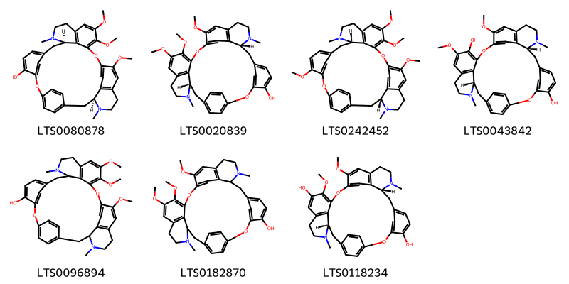{ width=100% }
    <figcaption>Hình ảnh cấu trúc hóa học của 7 hoạt chất thuộc nhóm  gồm ['(1s,14r)-20,21,25-trimethoxy-15,30-dimethyl-7,23-dioxa-15,30-diazaheptacyclo[22.6.2.2³,⁶.1⁸,¹².1¹⁴,¹⁸.0²⁷,³¹.0²²,³³]hexatriaconta-3,5,8(34),9,11,18(33),19,21,24(32),25,27(31),35-dodecaen-9-ol (LTS0080878)', '(1r,14s)-20,21,25-trimethoxy-15,30-dimethyl-8,23-dioxa-15,30-diazaheptacyclo[22.6.2.2⁹,¹².1³,⁷.1¹⁴,¹⁸.0²⁷,³¹.0²²,³³]hexatriaconta-3,5,7(36),9,11,18(33),19,21,24(32),25,27(31),34-dodecaen-6-ol (LTS0020839)', '(1r,14s)-9,20,21,25-tetramethoxy-15,30-dimethyl-7,23-dioxa-15,30-diazaheptacyclo[22.6.2.2³,⁶.1⁸,¹².1¹⁴,¹⁸.0²⁷,³¹.0²²,³³]hexatriaconta-3,5,8(34),9,11,18(33),19,21,24,26,31,35-dodecaene (LTS0242452)', '(1r,14s)-20,25-dimethoxy-15,30-dimethyl-8,23-dioxa-15,30-diazaheptacyclo[22.6.2.2⁹,¹².1³,⁷.1¹⁴,¹⁸.0²⁷,³¹.0²²,³³]hexatriaconta-3,5,7(36),9,11,18(33),19,21,24(32),25,27(31),34-dodecaene-6,21-diol (LTS0043842)', '20,21,25-trimethoxy-15,30-dimethyl-7,23-dioxa-15,30-diazaheptacyclo[22.6.2.2³,⁶.1⁸,¹².1¹⁴,¹⁸.0²⁷,³¹.0²²,³³]hexatriaconta-3,5,8(34),9,11,18(33),19,21,24(32),25,27(31),35-dodecaen-9-ol (LTS0096894)', '20,21,25-trimethoxy-15,30-dimethyl-8,23-dioxa-15,30-diazaheptacyclo[22.6.2.2⁹,¹².1³,⁷.1¹⁴,¹⁸.0²⁷,³¹.0²²,³³]hexatriaconta-3,5,7(36),9,11,18(33),19,21,24(32),25,27(31),34-dodecaen-6-ol (LTS0182870)', '(1r,14s)-21,25-dimethoxy-15,30-dimethyl-8,23-dioxa-15,30-diazaheptacyclo[22.6.2.2⁹,¹².1³,⁷.1¹⁴,¹⁸.0²⁷,³¹.0²²,³³]hexatriaconta-3,5,7(36),9,11,18(33),19,21,24(32),25,27(31),34-dodecaene-6,20-diol (LTS0118234)'].</figcaption>
</figure>
#### Nhóm Aporphines
<figure markdown="span">
    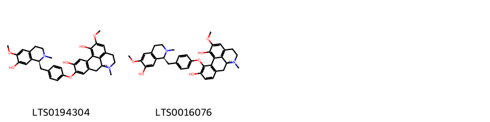{ width=100% }
    <figcaption>Hình ảnh cấu trúc hóa học của 2 hoạt chất thuộc nhóm Aporphines gồm ['(9r)-5-(4-{[(1s)-7-hydroxy-6-methoxy-2-methyl-3,4-dihydro-1h-isoquinolin-1-yl]methyl}phenoxy)-15-methoxy-10-methyl-10-azatetracyclo[7.7.1.0²,⁷.0¹³,¹⁷]heptadeca-1(16),2(7),3,5,13(17),14-hexaene-4,16-diol (LTS0194304)', '(9r)-3-(4-{[(1s)-7-hydroxy-6-methoxy-2-methyl-3,4-dihydro-1h-isoquinolin-1-yl]methyl}phenoxy)-15-methoxy-10-methyl-10-azatetracyclo[7.7.1.0²,⁷.0¹³,¹⁷]heptadeca-1(16),2(7),3,5,13(17),14-hexaene-4,16-diol (LTS0016076)'].</figcaption>
</figure>
#### Nhóm Isoquinolines and derivatives
<figure markdown="span">
    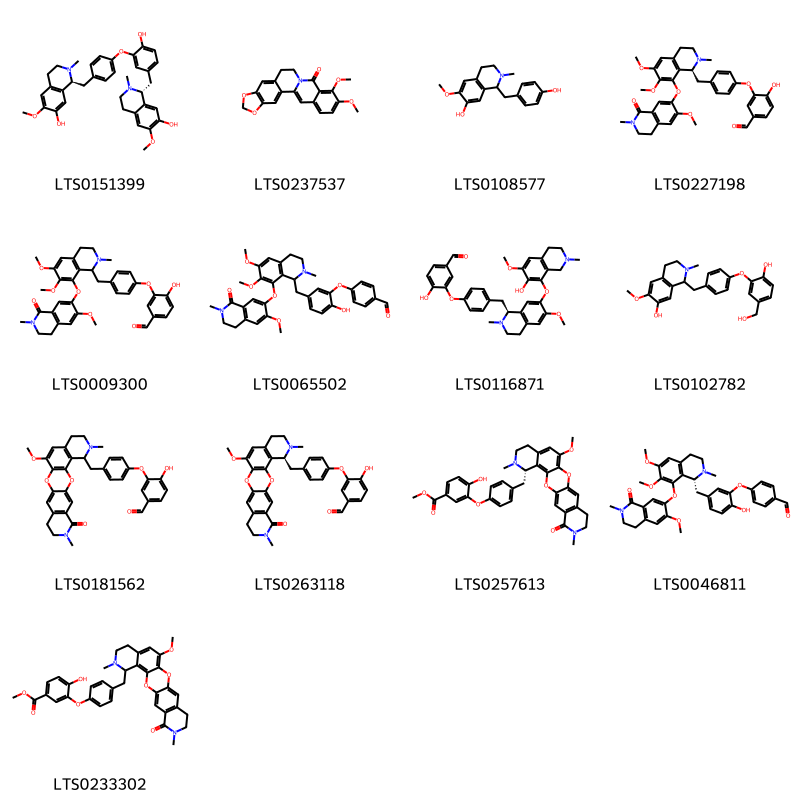{ width=100% }
    <figcaption>Hình ảnh cấu trúc hóa học của 13 hoạt chất thuộc nhóm Isoquinolines and derivatives gồm ['berbamunine (LTS0151399)', '8-oxyberberine (LTS0237537)', '1-[(4-hydroxyphenyl)methyl]-6-methoxy-2-methyl-3,4-dihydro-1h-isoquinolin-7-ol (LTS0108577)', '3-(4-{[(1s)-6,7-dimethoxy-8-[(6-methoxy-2-methyl-1-oxo-3,4-dihydroisoquinolin-7-yl)oxy]-2-methyl-3,4-dihydro-1h-isoquinolin-1-yl]methyl}phenoxy)-4-hydroxybenzaldehyde (LTS0227198)', '3-[4-({6,7-dimethoxy-8-[(6-methoxy-2-methyl-1-oxo-3,4-dihydroisoquinolin-7-yl)oxy]-2-methyl-3,4-dihydro-1h-isoquinolin-1-yl}methyl)phenoxy]-4-hydroxybenzaldehyde (LTS0009300)', '4-[5-({6,7-dimethoxy-8-[(6-methoxy-2-methyl-1-oxo-3,4-dihydroisoquinolin-7-yl)oxy]-2-methyl-3,4-dihydro-1h-isoquinolin-1-yl}methyl)-2-hydroxyphenoxy]benzaldehyde (LTS0065502)', '4-hydroxy-3-(4-{[(1s)-7-[(7-hydroxy-6-methoxy-2-methyl-3,4-dihydro-1h-isoquinolin-8-yl)oxy]-6-methoxy-2-methyl-3,4-dihydro-1h-isoquinolin-1-yl]methyl}phenoxy)benzaldehyde (LTS0116871)', '1-({4-[2-hydroxy-5-(hydroxymethyl)phenoxy]phenyl}methyl)-6-methoxy-2-methyl-3,4-dihydro-1h-isoquinolin-7-ol (LTS0102782)', '4-hydroxy-3-[4-({11-methoxy-6,19-dimethyl-20-oxo-2,13-dioxa-6,19-diazapentacyclo[12.8.0.0³,¹².0⁴,⁹.0¹⁶,²¹]docosa-1(22),3(12),4(9),10,14,16(21)-hexaen-5-yl}methyl)phenoxy]benzaldehyde (LTS0181562)', '4-hydroxy-3-(4-{[(5s)-11-methoxy-6,19-dimethyl-20-oxo-2,13-dioxa-6,19-diazapentacyclo[12.8.0.0³,¹².0⁴,⁹.0¹⁶,²¹]docosa-1(22),3(12),4(9),10,14,16(21)-hexaen-5-yl]methyl}phenoxy)benzaldehyde (LTS0263118)', 'methyl 4-hydroxy-3-(4-{[(5s)-11-methoxy-6,19-dimethyl-20-oxo-2,13-dioxa-6,19-diazapentacyclo[12.8.0.0³,¹².0⁴,⁹.0¹⁶,²¹]docosa-1(22),3(12),4(9),10,14,16(21)-hexaen-5-yl]methyl}phenoxy)benzoate (LTS0257613)', '4-(5-{[(1r)-6,7-dimethoxy-8-[(6-methoxy-2-methyl-1-oxo-3,4-dihydroisoquinolin-7-yl)oxy]-2-methyl-3,4-dihydro-1h-isoquinolin-1-yl]methyl}-2-hydroxyphenoxy)benzaldehyde (LTS0046811)', 'methyl 4-hydroxy-3-[4-({11-methoxy-6,19-dimethyl-20-oxo-2,13-dioxa-6,19-diazapentacyclo[12.8.0.0³,¹².0⁴,⁹.0¹⁶,²¹]docosa-1(22),3(12),4(9),10,14,16(21)-hexaen-5-yl}methyl)phenoxy]benzoate (LTS0233302)'].</figcaption>
</figure>
#### Nhóm Proaporphines
<figure markdown="span">
    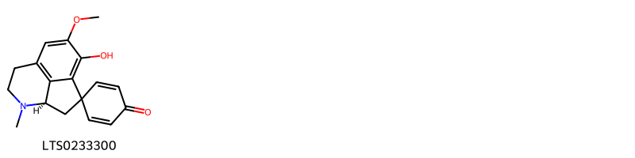{ width=100% }
    <figcaption>Hình ảnh cấu trúc hóa học của 1 hoạt chất thuộc nhóm Proaporphines gồm ['glaziovine (LTS0233300)'].</figcaption>
</figure>
#### Nhóm Protoberberine alkaloids and derivatives
<figure markdown="span">
    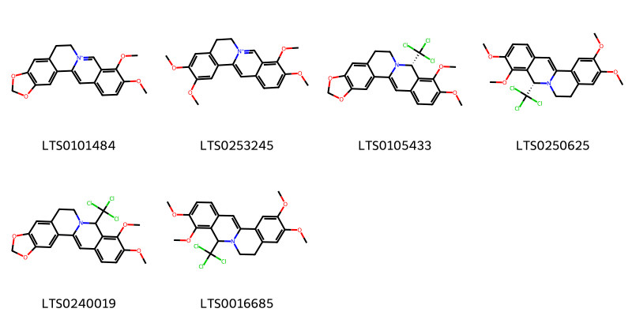{ width=100% }
    <figcaption>Hình ảnh cấu trúc hóa học của 6 hoạt chất thuộc nhóm Protoberberine alkaloids and derivatives gồm ['berberine (LTS0101484)', 'palmatine (LTS0253245)', '(14s)-16,17-dimethoxy-14-(trichloromethyl)-5,7-dioxa-13-azapentacyclo[11.8.0.0²,¹⁰.0⁴,⁸.0¹⁵,²⁰]henicosa-1(21),2,4(8),9,15,17,19-heptaene (LTS0105433)', '(5s)-3,4,10,11-tetramethoxy-5-(trichloromethyl)-7,8-dihydro-5h-6-azatetraphene (LTS0250625)', '16,17-dimethoxy-14-(trichloromethyl)-5,7-dioxa-13-azapentacyclo[11.8.0.0²,¹⁰.0⁴,⁸.0¹⁵,²⁰]henicosa-1(21),2,4(8),9,15,17,19-heptaene (LTS0240019)', '3,4,10,11-tetramethoxy-5-(trichloromethyl)-7,8-dihydro-5h-6-azatetraphene (LTS0016685)'].</figcaption>
</figure>

---

### Dược dân tộc học

Danh sách các quốc gia có sử dụng *Berberis lycium* trong điều trị các bệnh. 

| Country   | Disease                    | Bệnh                                                                                                                                                                                                |
|:----------|:---------------------------|:----------------------------------------------------------------------------------------------------------------------------------------------------------------------------------------------------|
| Elsewhere | Aperient, Carminative, nan | MYMEMORY WARNING: YOU USED ALL AVAILABLE FREE TRANSLATIONS FOR TODAY. NEXT AVAILABLE IN  07 HOURS 46 MINUTES 09 SECONDS VISIT HTTPS://MYMEMORY.TRANSLATED.NET/DOC/USAGELIMITS.PHP TO TRANSLATE MORE |

---

---
## Berberis nervosa
### Thông tin về thực vật

!!! info "Phân loại thực vật của *Mahonia nervosa* từ GIBF:"
    - **Kingdom:** Plantae
    - **Phylum:** Tracheophyta
    - **Order:** Ranunculales
    - **Family:** Berberidaceae
    - **Genus:** Mahonia
    - **Species:** *Mahonia nervosa*

 

| Label (VI)   | Label (EN)   | Scientific Name   | Descriptions (VI)   | Descriptions (EN)   | Also Known As (VI)   | Also Known As (EN)   |
|:-------------|:-------------|:------------------|:--------------------|:--------------------|:---------------------|:---------------------|
| N/A          | N/A          | Berberis nervosa  |                     | species of plant    | ['']                 | ['']                 |

#### Phân bố trên thế giới

**Từ CSDL GIBF** United States of America, Canada

#### Phân bố tại Việt Nam

**Từ CSDL GIBF**: Không có ghi nhận ở Việt Nam

---
### Thành phần hóa học
        
- Theo cơ sở dữ liệu lotus: Từ loài *Mahonia nervosa* đã phân lập và xác định được 2 hoạt chất thuộc về các nhóm Morphinans, Protoberberine alkaloids and derivatives. 

|    | chemicalTaxonomyClassyfireClass          |   smiles_count |
|---:|:-----------------------------------------|---------------:|
|  0 | Morphinans                               |              1 |
|  1 | Protoberberine alkaloids and derivatives |              1 |

#### Nhóm Morphinans
<figure markdown="span">
    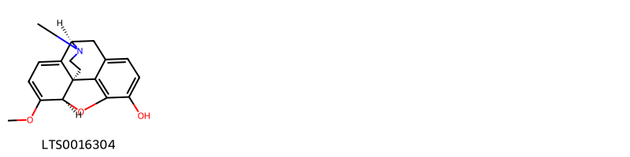{ width=100% }
    <figcaption>Hình ảnh cấu trúc hóa học của 1 hoạt chất thuộc nhóm Morphinans gồm ['oripavine (LTS0016304)'].</figcaption>
</figure>
#### Nhóm Protoberberine alkaloids and derivatives
<figure markdown="span">
    { width=100% }
    <figcaption>Hình ảnh cấu trúc hóa học của 1 hoạt chất thuộc nhóm Protoberberine alkaloids and derivatives gồm ['berberine (LTS0101484)'].</figcaption>
</figure>

---

### Dược dân tộc học

Danh sách các quốc gia có sử dụng *Mahonia nervosa* trong điều trị các bệnh. 

| Country   | Disease   | Bệnh                                                                                                                                                                                                |
|:----------|:----------|:----------------------------------------------------------------------------------------------------------------------------------------------------------------------------------------------------|
| Elsewhere | Tonic     | MYMEMORY WARNING: YOU USED ALL AVAILABLE FREE TRANSLATIONS FOR TODAY. NEXT AVAILABLE IN  07 HOURS 45 MINUTES 44 SECONDS VISIT HTTPS://MYMEMORY.TRANSLATED.NET/DOC/USAGELIMITS.PHP TO TRANSLATE MORE |

---

---
## Berberis repens
### Thông tin về thực vật

!!! info "Phân loại thực vật của *Mahonia repens* từ GIBF:"
    - **Kingdom:** Plantae
    - **Phylum:** Tracheophyta
    - **Order:** Ranunculales
    - **Family:** Berberidaceae
    - **Genus:** Mahonia
    - **Species:** *Mahonia repens*

 

| Label (VI)   | Label (EN)   | Scientific Name   | Descriptions (VI)   | Descriptions (EN)   | Also Known As (VI)   | Also Known As (EN)   |
|:-------------|:-------------|:------------------|:--------------------|:--------------------|:---------------------|:---------------------|
| N/A          | N/A          | Berberis repens   | loài thực vật       | species of plant    | ['']                 | ['']                 |

#### Phân bố trên thế giới

**Từ CSDL GIBF** Germany, Switzerland, United States of America, Canada

#### Phân bố tại Việt Nam

**Từ CSDL GIBF**: Không có ghi nhận ở Việt Nam

---
### Thành phần hóa học
        
- Theo cơ sở dữ liệu lotus: Từ loài *Mahonia repens* đã phân lập và xác định được 18 hoạt chất thuộc về các nhóm Aporphines, Protoberberine alkaloids and derivatives, Organooxygen compounds, Furanoid lignans, Isoquinolines and derivatives. 

|    | chemicalTaxonomyClassyfireClass          |   smiles_count |
|---:|:-----------------------------------------|---------------:|
|  0 |                                          |              5 |
|  1 | Aporphines                               |              5 |
|  2 | Furanoid lignans                         |              2 |
|  3 | Isoquinolines and derivatives            |              1 |
|  4 | Organooxygen compounds                   |              2 |
|  5 | Protoberberine alkaloids and derivatives |              3 |

#### Nhóm 
<figure markdown="span">
    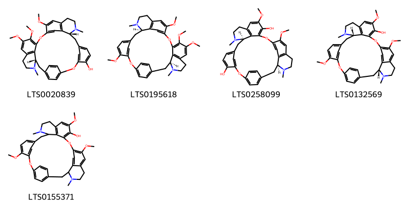{ width=100% }
    <figcaption>Hình ảnh cấu trúc hóa học của 5 hoạt chất thuộc nhóm  gồm ['(1r,14s)-20,21,25-trimethoxy-15,30-dimethyl-8,23-dioxa-15,30-diazaheptacyclo[22.6.2.2⁹,¹².1³,⁷.1¹⁴,¹⁸.0²⁷,³¹.0²²,³³]hexatriaconta-3,5,7(36),9,11,18(33),19,21,24(32),25,27(31),34-dodecaen-6-ol (LTS0020839)', '(1r,14s)-6,20,21,25-tetramethoxy-15,30-dimethyl-8,23-dioxa-15,30-diazaheptacyclo[22.6.2.2⁹,¹².1³,⁷.1¹⁴,¹⁸.0²⁷,³¹.0²²,³³]hexatriaconta-3,5,7(36),9,11,18(33),19,21,24(32),25,27(31),34-dodecaene (LTS0195618)', '(1s,14r)-20,25-dimethoxy-15,30-dimethyl-7,23-dioxa-15,30-diazaheptacyclo[22.6.2.2³,⁶.1⁸,¹².1¹⁴,¹⁸.0²⁷,³¹.0²²,³³]hexatriaconta-3,5,8(34),9,11,18(33),19,21,24(32),25,27(31),35-dodecaene-9,21-diol (LTS0258099)', '(1r,14s)-9,20,25-trimethoxy-15,30-dimethyl-7,23-dioxa-15,30-diazaheptacyclo[22.6.2.2³,⁶.1⁸,¹².1¹⁴,¹⁸.0²⁷,³¹.0²²,³³]hexatriaconta-3,5,8(34),9,11,18(33),19,21,24,26,31,35-dodecaen-21-ol (LTS0132569)', '9,20,25-trimethoxy-15,30-dimethyl-7,23-dioxa-15,30-diazaheptacyclo[22.6.2.2³,⁶.1⁸,¹².1¹⁴,¹⁸.0²⁷,³¹.0²²,³³]hexatriaconta-3,5,8(34),9,11,18(33),19,21,24,26,31,35-dodecaen-21-ol (LTS0155371)'].</figcaption>
</figure>
#### Nhóm Aporphines
<figure markdown="span">
    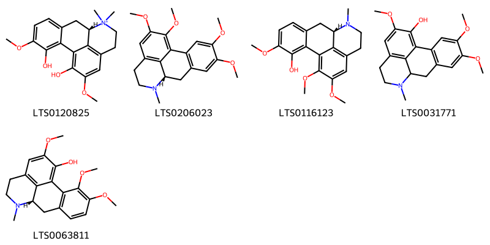{ width=100% }
    <figcaption>Hình ảnh cấu trúc hóa học của 5 hoạt chất thuộc nhóm Aporphines gồm ['magnoflorine (LTS0120825)', '(9s)-4,5,15,16-tetramethoxy-10-methyl-10-azatetracyclo[7.7.1.0²,⁷.0¹³,¹⁷]heptadeca-1(16),2(7),3,5,13(17),14-hexaene (LTS0206023)', '(9s)-4,15,16-trimethoxy-10-methyl-10-azatetracyclo[7.7.1.0²,⁷.0¹³,¹⁷]heptadeca-1(16),2,4,6,13(17),14-hexaen-3-ol (LTS0116123)', '4,5,15-trimethoxy-10-methyl-10-azatetracyclo[7.7.1.0²,⁷.0¹³,¹⁷]heptadeca-1(16),2(7),3,5,13(17),14-hexaen-16-ol (LTS0031771)', '(9s)-3,4,15-trimethoxy-10-methyl-10-azatetracyclo[7.7.1.0²,⁷.0¹³,¹⁷]heptadeca-1(16),2(7),3,5,13(17),14-hexaen-16-ol (LTS0063811)'].</figcaption>
</figure>
#### Nhóm Furanoid lignans
<figure markdown="span">
    { width=100% }
    <figcaption>Hình ảnh cấu trúc hóa học của 2 hoạt chất thuộc nhóm Furanoid lignans gồm ['(+)-syringaresinol (LTS0158868)', 'syringaresinol (LTS0116280)'].</figcaption>
</figure>
#### Nhóm Isoquinolines and derivatives
<figure markdown="span">
    { width=100% }
    <figcaption>Hình ảnh cấu trúc hóa học của 1 hoạt chất thuộc nhóm Isoquinolines and derivatives gồm ['3,4,11-trimethoxy-7,8-dihydro-6-azatetraphen-10-one (LTS0258799)'].</figcaption>
</figure>
#### Nhóm Organooxygen compounds
<figure markdown="span">
    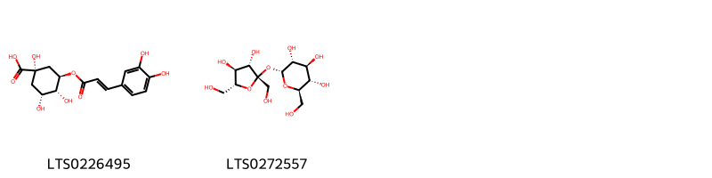{ width=100% }
    <figcaption>Hình ảnh cấu trúc hóa học của 2 hoạt chất thuộc nhóm Organooxygen compounds gồm ['chlorogenic acid (LTS0226495)', 'sucrose (LTS0272557)'].</figcaption>
</figure>
#### Nhóm Protoberberine alkaloids and derivatives
<figure markdown="span">
    { width=100% }
    <figcaption>Hình ảnh cấu trúc hóa học của 3 hoạt chất thuộc nhóm Protoberberine alkaloids and derivatives gồm ['berberine (LTS0101484)', 'palmatine (LTS0253245)', 'columbamine (LTS0111553)'].</figcaption>
</figure>

---

### Dược dân tộc học

Danh sách các quốc gia có sử dụng *Mahonia repens* trong điều trị các bệnh. 

| Country      | Disease                  | Bệnh                                                                                                                                                                                                |
|:-------------|:-------------------------|:----------------------------------------------------------------------------------------------------------------------------------------------------------------------------------------------------|
| US(Flathead) | Collyrium, Contraceptive | MYMEMORY WARNING: YOU USED ALL AVAILABLE FREE TRANSLATIONS FOR TODAY. NEXT AVAILABLE IN  07 HOURS 45 MINUTES 20 SECONDS VISIT HTTPS://MYMEMORY.TRANSLATED.NET/DOC/USAGELIMITS.PHP TO TRANSLATE MORE |

---

---
## Berberis thunbergii
### Thông tin về thực vật

!!! info "Phân loại thực vật của *Berberis thunbergii* từ GIBF:"
    - **Kingdom:** Plantae
    - **Phylum:** Tracheophyta
    - **Order:** Ranunculales
    - **Family:** Berberidaceae
    - **Genus:** Berberis
    - **Species:** *Berberis thunbergii*

 

| Label (VI)   | Label (EN)   | Scientific Name     | Descriptions (VI)   | Descriptions (EN)   | Also Known As (VI)   | Also Known As (EN)                                           |
|:-------------|:-------------|:--------------------|:--------------------|:--------------------|:---------------------|:-------------------------------------------------------------|
| N/A          | N/A          | Berberis thunbergii | loài thực vật       | species of plant    | ['']                 | ['red barberry', 'Japanese barberry', "Thunberg's barberry"] |

#### Phân bố trên thế giới

**Từ CSDL GIBF** Austria, United States of America, Czechia, Sweden, Belgium, Canada, Germany, United Kingdom of Great Britain and Northern Ireland, Poland

#### Phân bố tại Việt Nam

**Từ CSDL GIBF**: Không có ghi nhận ở Việt Nam

---
### Thành phần hóa học
        
- Theo cơ sở dữ liệu lotus: Từ loài *Berberis thunbergii* đã phân lập và xác định được 17 hoạt chất thuộc về các nhóm Aporphines, Tetrahydroisoquinolines, Protoberberine alkaloids and derivatives, Isoquinolines and derivatives. 

|    | chemicalTaxonomyClassyfireClass          |   smiles_count |
|---:|:-----------------------------------------|---------------:|
|  0 |                                          |              6 |
|  1 | Aporphines                               |              6 |
|  2 | Isoquinolines and derivatives            |              1 |
|  3 | Protoberberine alkaloids and derivatives |              3 |
|  4 | Tetrahydroisoquinolines                  |              1 |

#### Nhóm 
<figure markdown="span">
    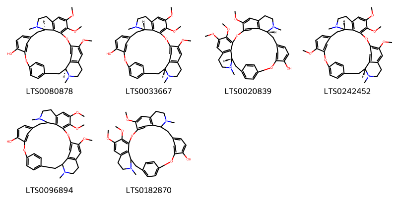{ width=100% }
    <figcaption>Hình ảnh cấu trúc hóa học của 6 hoạt chất thuộc nhóm  gồm ['(1s,14r)-20,21,25-trimethoxy-15,30-dimethyl-7,23-dioxa-15,30-diazaheptacyclo[22.6.2.2³,⁶.1⁸,¹².1¹⁴,¹⁸.0²⁷,³¹.0²²,³³]hexatriaconta-3,5,8(34),9,11,18(33),19,21,24(32),25,27(31),35-dodecaen-9-ol (LTS0080878)', '(1r,14s)-20,21,25-trimethoxy-15,30-dimethyl-7,23-dioxa-15,30-diazaheptacyclo[22.6.2.2³,⁶.1⁸,¹².1¹⁴,¹⁸.0²⁷,³¹.0²²,³³]hexatriaconta-3,5,8(34),9,11,18(33),19,21,24(32),25,27(31),35-dodecaen-9-ol (LTS0033667)', '(1r,14s)-20,21,25-trimethoxy-15,30-dimethyl-8,23-dioxa-15,30-diazaheptacyclo[22.6.2.2⁹,¹².1³,⁷.1¹⁴,¹⁸.0²⁷,³¹.0²²,³³]hexatriaconta-3,5,7(36),9,11,18(33),19,21,24(32),25,27(31),34-dodecaen-6-ol (LTS0020839)', '(1r,14s)-9,20,21,25-tetramethoxy-15,30-dimethyl-7,23-dioxa-15,30-diazaheptacyclo[22.6.2.2³,⁶.1⁸,¹².1¹⁴,¹⁸.0²⁷,³¹.0²²,³³]hexatriaconta-3,5,8(34),9,11,18(33),19,21,24,26,31,35-dodecaene (LTS0242452)', '20,21,25-trimethoxy-15,30-dimethyl-7,23-dioxa-15,30-diazaheptacyclo[22.6.2.2³,⁶.1⁸,¹².1¹⁴,¹⁸.0²⁷,³¹.0²²,³³]hexatriaconta-3,5,8(34),9,11,18(33),19,21,24(32),25,27(31),35-dodecaen-9-ol (LTS0096894)', '20,21,25-trimethoxy-15,30-dimethyl-8,23-dioxa-15,30-diazaheptacyclo[22.6.2.2⁹,¹².1³,⁷.1¹⁴,¹⁸.0²⁷,³¹.0²²,³³]hexatriaconta-3,5,7(36),9,11,18(33),19,21,24(32),25,27(31),34-dodecaen-6-ol (LTS0182870)'].</figcaption>
</figure>
#### Nhóm Aporphines
<figure markdown="span">
    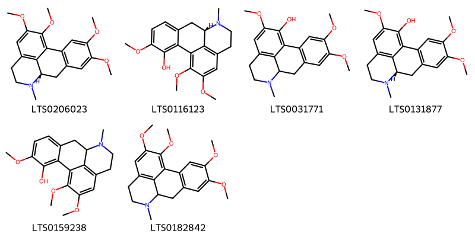{ width=100% }
    <figcaption>Hình ảnh cấu trúc hóa học của 6 hoạt chất thuộc nhóm Aporphines gồm ['(9s)-4,5,15,16-tetramethoxy-10-methyl-10-azatetracyclo[7.7.1.0²,⁷.0¹³,¹⁷]heptadeca-1(16),2(7),3,5,13(17),14-hexaene (LTS0206023)', '(9s)-4,15,16-trimethoxy-10-methyl-10-azatetracyclo[7.7.1.0²,⁷.0¹³,¹⁷]heptadeca-1(16),2,4,6,13(17),14-hexaen-3-ol (LTS0116123)', '4,5,15-trimethoxy-10-methyl-10-azatetracyclo[7.7.1.0²,⁷.0¹³,¹⁷]heptadeca-1(16),2(7),3,5,13(17),14-hexaen-16-ol (LTS0031771)', '(9s)-4,5,15-trimethoxy-10-methyl-10-azatetracyclo[7.7.1.0²,⁷.0¹³,¹⁷]heptadeca-1(16),2(7),3,5,13(17),14-hexaen-16-ol (LTS0131877)', '4,15,16-trimethoxy-10-methyl-10-azatetracyclo[7.7.1.0²,⁷.0¹³,¹⁷]heptadeca-1(16),2,4,6,13(17),14-hexaen-3-ol (LTS0159238)', '4,5,15,16-tetramethoxy-10-methyl-10-azatetracyclo[7.7.1.0²,⁷.0¹³,¹⁷]heptadeca-1(16),2(7),3,5,13(17),14-hexaene (LTS0182842)'].</figcaption>
</figure>
#### Nhóm Isoquinolines and derivatives
<figure markdown="span">
    { width=100% }
    <figcaption>Hình ảnh cấu trúc hóa học của 1 hoạt chất thuộc nhóm Isoquinolines and derivatives gồm ['3,4,11-trimethoxy-7,8-dihydro-6-azatetraphen-10-one (LTS0258799)'].</figcaption>
</figure>
#### Nhóm Protoberberine alkaloids and derivatives
<figure markdown="span">
    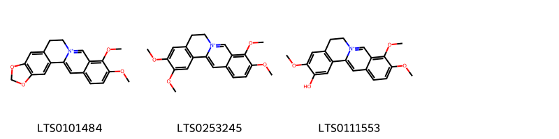{ width=100% }
    <figcaption>Hình ảnh cấu trúc hóa học của 3 hoạt chất thuộc nhóm Protoberberine alkaloids and derivatives gồm ['berberine (LTS0101484)', 'palmatine (LTS0253245)', 'columbamine (LTS0111553)'].</figcaption>
</figure>
#### Nhóm Tetrahydroisoquinolines
<figure markdown="span">
    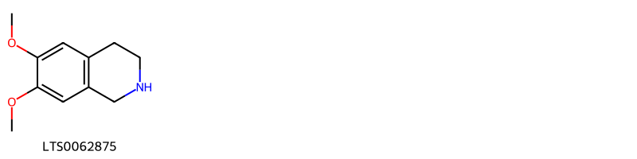{ width=100% }
    <figcaption>Hình ảnh cấu trúc hóa học của 1 hoạt chất thuộc nhóm Tetrahydroisoquinolines gồm ['heliamine (LTS0062875)'].</figcaption>
</figure>

---

### Dược dân tộc học

Danh sách các quốc gia có sử dụng *Berberis thunbergii* trong điều trị các bệnh. 

| Country   | Disease                            | Bệnh                                                                                                                                                                                                |
|:----------|:-----------------------------------|:----------------------------------------------------------------------------------------------------------------------------------------------------------------------------------------------------|
| China     | Antiseptic, Refrigerant, Vermifuge | MYMEMORY WARNING: YOU USED ALL AVAILABLE FREE TRANSLATIONS FOR TODAY. NEXT AVAILABLE IN  07 HOURS 44 MINUTES 54 SECONDS VISIT HTTPS://MYMEMORY.TRANSLATED.NET/DOC/USAGELIMITS.PHP TO TRANSLATE MORE |
| Elsewhere | Stomachic                          | MYMEMORY WARNING: YOU USED ALL AVAILABLE FREE TRANSLATIONS FOR TODAY. NEXT AVAILABLE IN  07 HOURS 44 MINUTES 52 SECONDS VISIT HTTPS://MYMEMORY.TRANSLATED.NET/DOC/USAGELIMITS.PHP TO TRANSLATE MORE |

---

---
## Berberis vulgaris
### Thông tin về thực vật

!!! info "Phân loại thực vật của *Berberis vulgaris* từ GIBF:"
    - **Kingdom:** Plantae
    - **Phylum:** Tracheophyta
    - **Order:** Ranunculales
    - **Family:** Berberidaceae
    - **Genus:** Berberis
    - **Species:** *Berberis vulgaris*

 

| Label (VI)   | Label (EN)   | Scientific Name   | Descriptions (VI)   | Descriptions (EN)   | Also Known As (VI)   | Also Known As (EN)                                   |
|:-------------|:-------------|:------------------|:--------------------|:--------------------|:---------------------|:-----------------------------------------------------|
| N/A          | N/A          | Berberis vulgaris | loài thực vật       | species of plant    | ['']                 | ['common barberry', 'barberry', 'European barberry'] |

#### Phân bố trên thế giới

**Từ CSDL GIBF** Czechia, Sweden, Finland, Slovenia, Spain, Poland, Netherlands, United States of America, Romania, Russian Federation, Croatia, Estonia, Belarus, Norway, Canada, Germany, Austria, Hungary, Ukraine, Slovakia, Australia, Italy, Switzerland, France

#### Phân bố tại Việt Nam

**Từ CSDL GIBF**: Không có ghi nhận ở Việt Nam

---
### Thành phần hóa học
        
- Theo cơ sở dữ liệu lotus: Từ loài *Berberis vulgaris* đã phân lập và xác định được 75 hoạt chất thuộc về các nhóm Aporphines, Proaporphines, Flavonoids, Cinnamic acids and derivatives, Coumarins and derivatives, Steroids and steroid derivatives, Aryltetralin lignans, Protoberberine alkaloids and derivatives, Organooxygen compounds, Isoquinolines and derivatives, Prenol lipids, Benzazepines. 

|    | chemicalTaxonomyClassyfireClass          |   smiles_count |
|---:|:-----------------------------------------|---------------:|
|  0 |                                          |             17 |
|  1 | Aporphines                               |              6 |
|  2 | Aryltetralin lignans                     |              1 |
|  3 | Benzazepines                             |              3 |
|  4 | Cinnamic acids and derivatives           |              3 |
|  5 | Coumarins and derivatives                |              1 |
|  6 | Flavonoids                               |             12 |
|  7 | Isoquinolines and derivatives            |             12 |
|  8 | Organooxygen compounds                   |              3 |
|  9 | Prenol lipids                            |              4 |
| 10 | Proaporphines                            |              2 |
| 11 | Protoberberine alkaloids and derivatives |              6 |
| 12 | Steroids and steroid derivatives         |              4 |

#### Nhóm 
<figure markdown="span">
    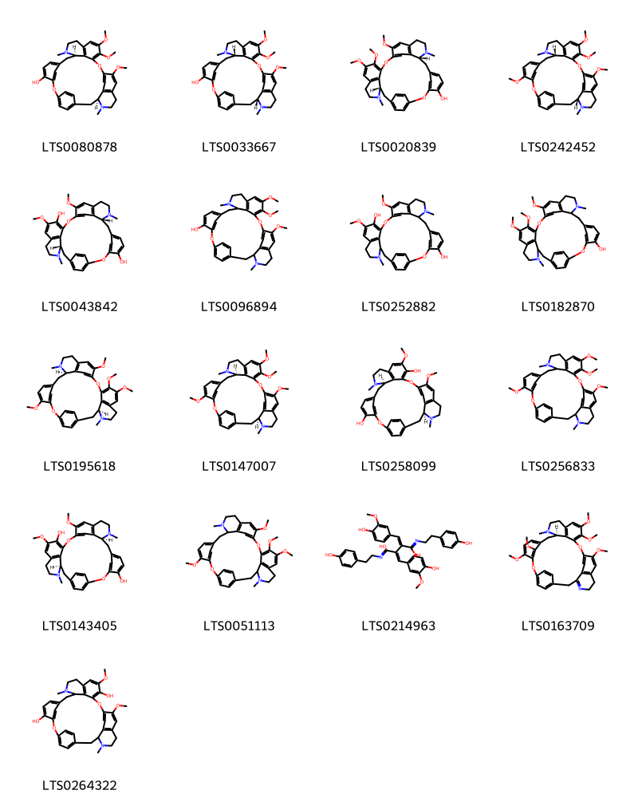{ width=100% }
    <figcaption>Hình ảnh cấu trúc hóa học của 17 hoạt chất thuộc nhóm  gồm ['(1s,14r)-20,21,25-trimethoxy-15,30-dimethyl-7,23-dioxa-15,30-diazaheptacyclo[22.6.2.2³,⁶.1⁸,¹².1¹⁴,¹⁸.0²⁷,³¹.0²²,³³]hexatriaconta-3,5,8(34),9,11,18(33),19,21,24(32),25,27(31),35-dodecaen-9-ol (LTS0080878)', '(1r,14s)-20,21,25-trimethoxy-15,30-dimethyl-7,23-dioxa-15,30-diazaheptacyclo[22.6.2.2³,⁶.1⁸,¹².1¹⁴,¹⁸.0²⁷,³¹.0²²,³³]hexatriaconta-3,5,8(34),9,11,18(33),19,21,24(32),25,27(31),35-dodecaen-9-ol (LTS0033667)', '(1r,14s)-20,21,25-trimethoxy-15,30-dimethyl-8,23-dioxa-15,30-diazaheptacyclo[22.6.2.2⁹,¹².1³,⁷.1¹⁴,¹⁸.0²⁷,³¹.0²²,³³]hexatriaconta-3,5,7(36),9,11,18(33),19,21,24(32),25,27(31),34-dodecaen-6-ol (LTS0020839)', '(1r,14s)-9,20,21,25-tetramethoxy-15,30-dimethyl-7,23-dioxa-15,30-diazaheptacyclo[22.6.2.2³,⁶.1⁸,¹².1¹⁴,¹⁸.0²⁷,³¹.0²²,³³]hexatriaconta-3,5,8(34),9,11,18(33),19,21,24,26,31,35-dodecaene (LTS0242452)', '(1r,14s)-20,25-dimethoxy-15,30-dimethyl-8,23-dioxa-15,30-diazaheptacyclo[22.6.2.2⁹,¹².1³,⁷.1¹⁴,¹⁸.0²⁷,³¹.0²²,³³]hexatriaconta-3,5,7(36),9,11,18(33),19,21,24(32),25,27(31),34-dodecaene-6,21-diol (LTS0043842)', '20,21,25-trimethoxy-15,30-dimethyl-7,23-dioxa-15,30-diazaheptacyclo[22.6.2.2³,⁶.1⁸,¹².1¹⁴,¹⁸.0²⁷,³¹.0²²,³³]hexatriaconta-3,5,8(34),9,11,18(33),19,21,24(32),25,27(31),35-dodecaen-9-ol (LTS0096894)', '20,25-dimethoxy-15,30-dimethyl-8,23-dioxa-15,30-diazaheptacyclo[22.6.2.2⁹,¹².1³,⁷.1¹⁴,¹⁸.0²⁷,³¹.0²²,³³]hexatriaconta-3,5,7(36),9,11,18(33),19,21,24(32),25,27(31),34-dodecaene-6,21-diol (LTS0252882)', '20,21,25-trimethoxy-15,30-dimethyl-8,23-dioxa-15,30-diazaheptacyclo[22.6.2.2⁹,¹².1³,⁷.1¹⁴,¹⁸.0²⁷,³¹.0²²,³³]hexatriaconta-3,5,7(36),9,11,18(33),19,21,24(32),25,27(31),34-dodecaen-6-ol (LTS0182870)', '(1r,14s)-6,20,21,25-tetramethoxy-15,30-dimethyl-8,23-dioxa-15,30-diazaheptacyclo[22.6.2.2⁹,¹².1³,⁷.1¹⁴,¹⁸.0²⁷,³¹.0²²,³³]hexatriaconta-3,5,7(36),9,11,18(33),19,21,24(32),25,27(31),34-dodecaene (LTS0195618)', '(1s,14r)-9,20,21,25-tetramethoxy-15,30-dimethyl-7,23-dioxa-15,30-diazaheptacyclo[22.6.2.2³,⁶.1⁸,¹².1¹⁴,¹⁸.0²⁷,³¹.0²²,³³]hexatriaconta-3,5,8(34),9,11,18(33),19,21,24,26,31,35-dodecaene (LTS0147007)', '(1s,14r)-20,25-dimethoxy-15,30-dimethyl-7,23-dioxa-15,30-diazaheptacyclo[22.6.2.2³,⁶.1⁸,¹².1¹⁴,¹⁸.0²⁷,³¹.0²²,³³]hexatriaconta-3,5,8(34),9,11,18(33),19,21,24(32),25,27(31),35-dodecaene-9,21-diol (LTS0258099)', 'isotetrandrine (LTS0256833)', '(1s,14r)-20,25-dimethoxy-15,30-dimethyl-8,23-dioxa-15,30-diazaheptacyclo[22.6.2.2⁹,¹².1³,⁷.1¹⁴,¹⁸.0²⁷,³¹.0²²,³³]hexatriaconta-3,5,7(36),9,11,18(33),19,21,24(32),25,27(31),34-dodecaene-6,21-diol (LTS0143405)', '6,20,21,25-tetramethoxy-15,30-dimethyl-8,23-dioxa-15,30-diazaheptacyclo[22.6.2.2⁹,¹².1³,⁷.1¹⁴,¹⁸.0²⁷,³¹.0²²,³³]hexatriaconta-3,5,7(36),9,11,18(33),19,21,24(32),25,27(31),34-dodecaene (LTS0051113)', "(2e,3e)-2,3-bis[(4-hydroxy-3-methoxyphenyl)methylidene]-n,n'-bis[2-(4-hydroxyphenyl)ethyl]butanediimidic acid (LTS0214963)", '(14r)-9,20,21,25,34-pentamethoxy-15-methyl-7,23-dioxa-15,30-diazaheptacyclo[22.6.2.2³,⁶.1⁸,¹².1¹⁴,¹⁸.0²⁷,³¹.0²²,³³]hexatriaconta-1(30),3,5,8(34),9,11,18(33),19,21,24(32),25,27(31),35-tridecaene (LTS0163709)', '20,25-dimethoxy-15,30-dimethyl-7,23-dioxa-15,30-diazaheptacyclo[22.6.2.2³,⁶.1⁸,¹².1¹⁴,¹⁸.0²⁷,³¹.0²²,³³]hexatriaconta-3,5,8(34),9,11,18(33),19,21,24(32),25,27(31),35-dodecaene-9,21-diol (LTS0264322)'].</figcaption>
</figure>
#### Nhóm Aporphines
<figure markdown="span">
    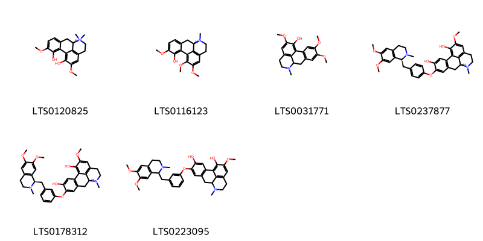{ width=100% }
    <figcaption>Hình ảnh cấu trúc hóa học của 6 hoạt chất thuộc nhóm Aporphines gồm ['magnoflorine (LTS0120825)', '(9s)-4,15,16-trimethoxy-10-methyl-10-azatetracyclo[7.7.1.0²,⁷.0¹³,¹⁷]heptadeca-1(16),2,4,6,13(17),14-hexaen-3-ol (LTS0116123)', '4,5,15-trimethoxy-10-methyl-10-azatetracyclo[7.7.1.0²,⁷.0¹³,¹⁷]heptadeca-1(16),2(7),3,5,13(17),14-hexaen-16-ol (LTS0031771)', '(9r)-5-(4-{[(1s)-6,7-dimethoxy-2-methyl-3,4-dihydro-1h-isoquinolin-1-yl]methyl}phenoxy)-15-methoxy-10-methyl-10-azatetracyclo[7.7.1.0²,⁷.0¹³,¹⁷]heptadeca-1(16),2(7),3,5,13(17),14-hexaene-4,16-diol (LTS0237877)', '(9s)-5-(3-{[(1r)-6,7-dimethoxy-2-methyl-3,4-dihydro-1h-isoquinolin-1-yl]methyl}phenoxy)-15-methoxy-10-methyl-10-azatetracyclo[7.7.1.0²,⁷.0¹³,¹⁷]heptadeca-1(16),2(7),3,5,13(17),14-hexaene-4,16-diol (LTS0178312)', '5-{3-[(6,7-dimethoxy-2-methyl-3,4-dihydro-1h-isoquinolin-1-yl)methyl]phenoxy}-15-methoxy-10-methyl-10-azatetracyclo[7.7.1.0²,⁷.0¹³,¹⁷]heptadeca-1(16),2(7),3,5,13(17),14-hexaene-4,16-diol (LTS0223095)'].</figcaption>
</figure>
#### Nhóm Aryltetralin lignans
<figure markdown="span">
    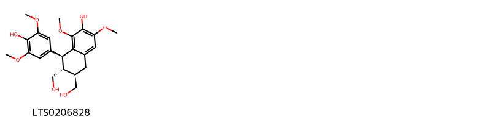{ width=100% }
    <figcaption>Hình ảnh cấu trúc hóa học của 1 hoạt chất thuộc nhóm Aryltetralin lignans gồm ['(+)-lyoniresinol (LTS0206828)'].</figcaption>
</figure>
#### Nhóm Benzazepines
<figure markdown="span">
    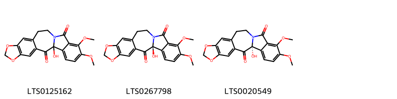{ width=100% }
    <figcaption>Hình ảnh cấu trúc hóa học của 3 hoạt chất thuộc nhóm Benzazepines gồm ['3-hydroxy-7,8-dimethoxy-17,19-dioxa-11-azapentacyclo[12.7.0.0³,¹¹.0⁴,⁹.0¹⁶,²⁰]henicosa-1(21),4,6,8,14,16(20)-hexaene-2,10-dione (LTS0125162)', '(3s)-3-hydroxy-7,8-dimethoxy-17,19-dioxa-11-azapentacyclo[12.7.0.0³,¹¹.0⁴,⁹.0¹⁶,²⁰]henicosa-1(21),4,6,8,14,16(20)-hexaene-2,10-dione (LTS0267798)', '(3r)-3-hydroxy-7,8-dimethoxy-17,19-dioxa-11-azapentacyclo[12.7.0.0³,¹¹.0⁴,⁹.0¹⁶,²⁰]henicosa-1(21),4,6,8,14,16(20)-hexaene-2,10-dione (LTS0020549)'].</figcaption>
</figure>
#### Nhóm Cinnamic acids and derivatives
<figure markdown="span">
    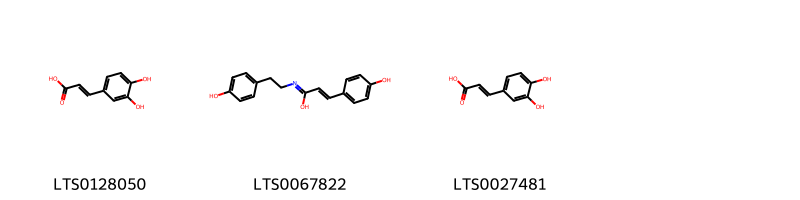{ width=100% }
    <figcaption>Hình ảnh cấu trúc hóa học của 3 hoạt chất thuộc nhóm Cinnamic acids and derivatives gồm ['3,4-dihydroxycinnamic acid (LTS0128050)', '(2e)-3-(4-hydroxyphenyl)-n-[2-(4-hydroxyphenyl)ethyl]prop-2-enimidic acid (LTS0067822)', 'caffeic acid (LTS0027481)'].</figcaption>
</figure>
#### Nhóm Coumarins and derivatives
<figure markdown="span">
    { width=100% }
    <figcaption>Hình ảnh cấu trúc hóa học của 1 hoạt chất thuộc nhóm Coumarins and derivatives gồm ['esculetin (LTS0067593)'].</figcaption>
</figure>
#### Nhóm Flavonoids
<figure markdown="span">
    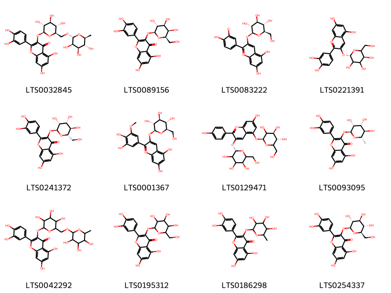{ width=100% }
    <figcaption>Hình ảnh cấu trúc hóa học của 12 hoạt chất thuộc nhóm Flavonoids gồm ['3-rutinosyl quercetin (LTS0032845)', 'hyperoside (LTS0089156)', '5,7-dihydroxy-2-(4-hydroxy-3-oxidophenyl)-3-{[(2s,3r,4s,5s,6r)-3,4,5-trihydroxy-6-(hydroxymethyl)oxan-2-yl]oxy}-1λ⁴-chromen-1-ylium (LTS0083222)', 'chrysanthemin (LTS0221391)', '2-(3,4-dihydroxyphenyl)-5,7-dihydroxy-3-{[(2s,3r,4r,5r,6s)-3,4,5-trihydroxy-6-(hydroxymethyl)oxan-2-yl]oxy}chromen-4-one (LTS0241372)', 'petunidin 3-glucoside (LTS0001367)', 'pelargonin (LTS0129471)', 'quercitrin (LTS0093095)', 'rutin (LTS0042292)', '2-(3,4-dihydroxyphenyl)-5,7-dihydroxy-3-{[3,4,5-trihydroxy-6-(hydroxymethyl)oxan-2-yl]oxy}chromen-4-one (LTS0195312)', 'quercitrin (LTS0186298)', 'isoquercetin (LTS0254337)'].</figcaption>
</figure>
#### Nhóm Isoquinolines and derivatives
<figure markdown="span">
    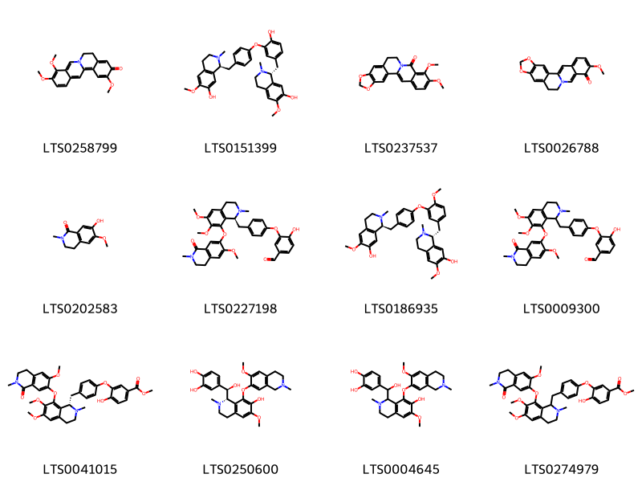{ width=100% }
    <figcaption>Hình ảnh cấu trúc hóa học của 12 hoạt chất thuộc nhóm Isoquinolines and derivatives gồm ['3,4,11-trimethoxy-7,8-dihydro-6-azatetraphen-10-one (LTS0258799)', 'berbamunine (LTS0151399)', '8-oxyberberine (LTS0237537)', '17-methoxy-5,7-dioxa-13-azapentacyclo[11.8.0.0²,¹⁰.0⁴,⁸.0¹⁵,²⁰]henicosa-1(21),2,4(8),9,14,17,19-heptaen-16-one (LTS0026788)', 'thalifolin (LTS0202583)', '3-(4-{[(1s)-6,7-dimethoxy-8-[(6-methoxy-2-methyl-1-oxo-3,4-dihydroisoquinolin-7-yl)oxy]-2-methyl-3,4-dihydro-1h-isoquinolin-1-yl]methyl}phenoxy)-4-hydroxybenzaldehyde (LTS0227198)', '(1s)-1-{[4-(5-{[(1r)-7-hydroxy-6-methoxy-2-methyl-3,4-dihydro-1h-isoquinolin-1-yl]methyl}-2-methoxyphenoxy)phenyl]methyl}-6-methoxy-2-methyl-3,4-dihydro-1h-isoquinolin-7-ol (LTS0186935)', '3-[4-({6,7-dimethoxy-8-[(6-methoxy-2-methyl-1-oxo-3,4-dihydroisoquinolin-7-yl)oxy]-2-methyl-3,4-dihydro-1h-isoquinolin-1-yl}methyl)phenoxy]-4-hydroxybenzaldehyde (LTS0009300)', 'methyl 3-(4-{[(1s)-6,7-dimethoxy-8-[(6-methoxy-2-methyl-1-oxo-3,4-dihydroisoquinolin-7-yl)oxy]-2-methyl-3,4-dihydro-1h-isoquinolin-1-yl]methyl}phenoxy)-4-hydroxybenzoate (LTS0041015)', '4-[(r)-hydroxy[(1s)-7-hydroxy-6-methoxy-8-[(6-methoxy-2-methyl-3,4-dihydro-1h-isoquinolin-7-yl)oxy]-2-methyl-3,4-dihydro-1h-isoquinolin-1-yl]methyl]benzene-1,2-diol (LTS0250600)', '4-[hydroxy({7-hydroxy-6-methoxy-8-[(6-methoxy-2-methyl-3,4-dihydro-1h-isoquinolin-7-yl)oxy]-2-methyl-3,4-dihydro-1h-isoquinolin-1-yl})methyl]benzene-1,2-diol (LTS0004645)', 'methyl 3-[4-({6,7-dimethoxy-8-[(6-methoxy-2-methyl-1-oxo-3,4-dihydroisoquinolin-7-yl)oxy]-2-methyl-3,4-dihydro-1h-isoquinolin-1-yl}methyl)phenoxy]-4-hydroxybenzoate (LTS0274979)'].</figcaption>
</figure>
#### Nhóm Organooxygen compounds
<figure markdown="span">
    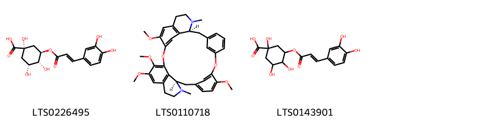{ width=100% }
    <figcaption>Hình ảnh cấu trúc hóa học của 3 hoạt chất thuộc nhóm Organooxygen compounds gồm ['chlorogenic acid (LTS0226495)', '(1s,15r)-10,21,22,26-tetramethoxy-16,31-dimethyl-8,24-dioxa-16,31-diazaheptacyclo[23.6.2.1³,⁷.1⁹,¹³.1¹⁵,¹⁹.0²⁸,³².0²³,³⁴]hexatriaconta-3(36),4,6,9(35),10,12,19(34),20,22,25,27,32-dodecaene (LTS0110718)', '3-{[3-(3,4-dihydroxyphenyl)prop-2-enoyl]oxy}-1,4,5-trihydroxycyclohexane-1-carboxylic acid (LTS0143901)'].</figcaption>
</figure>
#### Nhóm Prenol lipids
<figure markdown="span">
    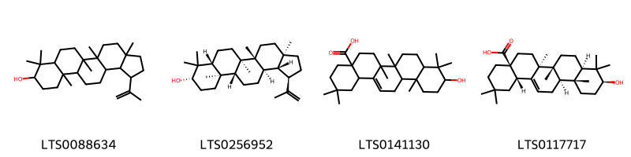{ width=100% }
    <figcaption>Hình ảnh cấu trúc hóa học của 4 hoạt chất thuộc nhóm Prenol lipids gồm ['lupeol (LTS0088634)', 'lupeol (LTS0256952)', 'oleanolic acid (LTS0141130)', 'oleanolic acid (LTS0117717)'].</figcaption>
</figure>
#### Nhóm Proaporphines
<figure markdown="span">
    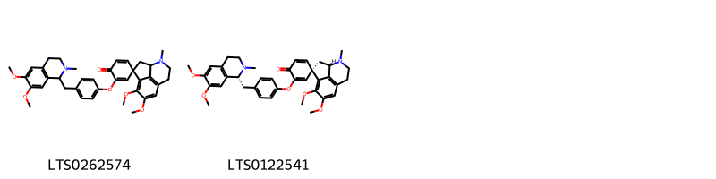{ width=100% }
    <figcaption>Hình ảnh cấu trúc hóa học của 2 hoạt chất thuộc nhóm Proaporphines gồm ["3-{4-[(6,7-dimethoxy-2-methyl-3,4-dihydro-1h-isoquinolin-1-yl)methyl]phenoxy}-10',11'-dimethoxy-5'-methyl-5'-azaspiro[cyclohexane-1,2'-tricyclo[6.3.1.0⁴,¹²]dodecane]-1'(11'),2,5,8'(12'),9'-pentaen-4-one (LTS0262574)", "(1r,4'r)-3-(4-{[(1r)-6,7-dimethoxy-2-methyl-3,4-dihydro-1h-isoquinolin-1-yl]methyl}phenoxy)-10',11'-dimethoxy-5'-methyl-5'-azaspiro[cyclohexane-1,2'-tricyclo[6.3.1.0⁴,¹²]dodecane]-1'(11'),2,5,8'(12'),9'-pentaen-4-one (LTS0122541)"].</figcaption>
</figure>
#### Nhóm Protoberberine alkaloids and derivatives
<figure markdown="span">
    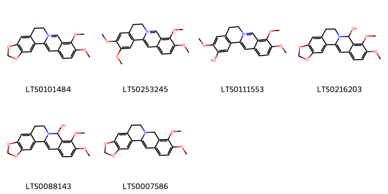{ width=100% }
    <figcaption>Hình ảnh cấu trúc hóa học của 6 hoạt chất thuộc nhóm Protoberberine alkaloids and derivatives gồm ['berberine (LTS0101484)', 'palmatine (LTS0253245)', 'columbamine (LTS0111553)', '16,17-dimethoxy-5,7-dioxa-13-azapentacyclo[11.8.0.0²,¹⁰.0⁴,⁸.0¹⁵,²⁰]henicosa-1(21),2,4(8),9,15,17,19-heptaen-14-ol (LTS0216203)', '(14s)-16,17-dimethoxy-5,7-dioxa-13-azapentacyclo[11.8.0.0²,¹⁰.0⁴,⁸.0¹⁵,²⁰]henicosa-1(21),2,4(8),9,15,17,19-heptaen-14-ol (LTS0088143)', '16,17-dimethoxy-5,7-dioxa-13-azapentacyclo[11.8.0.0²,¹⁰.0⁴,⁸.0¹⁵,²⁰]henicosa-1(21),2,4(8),9,15,17,19-heptaene (LTS0007586)'].</figcaption>
</figure>
#### Nhóm Steroids and steroid derivatives
<figure markdown="span">
    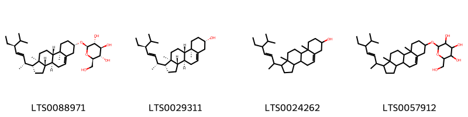{ width=100% }
    <figcaption>Hình ảnh cấu trúc hóa học của 4 hoạt chất thuộc nhóm Steroids and steroid derivatives gồm ['(2r,3r,4s,5s,6r)-2-{[(1r,3as,3bs,7s,9ar,9bs,11ar)-1-[(2r,3e,5s)-5-ethyl-6-methylhept-3-en-2-yl]-9a,11a-dimethyl-1h,2h,3h,3ah,3bh,4h,6h,7h,8h,9h,9bh,10h,11h-cyclopenta[a]phenanthren-7-yl]oxy}-6-(hydroxymethyl)oxane-3,4,5-triol (LTS0088971)', 'phytosterol (LTS0029311)', 'stigmasterol (LTS0024262)', '2-{[1-(5-ethyl-6-methylhept-3-en-2-yl)-9a,11a-dimethyl-1h,2h,3h,3ah,3bh,4h,6h,7h,8h,9h,9bh,10h,11h-cyclopenta[a]phenanthren-7-yl]oxy}-6-(hydroxymethyl)oxane-3,4,5-triol (LTS0057912)'].</figcaption>
</figure>

---

### Dược dân tộc học

Danh sách các quốc gia có sử dụng *Berberis vulgaris* trong điều trị các bệnh. 

| Country   | Disease                                                                   | Bệnh                                                                                                                                                                                                |
|:----------|:--------------------------------------------------------------------------|:----------------------------------------------------------------------------------------------------------------------------------------------------------------------------------------------------|
| Elsewhere | Tonic                                                                     | MYMEMORY WARNING: YOU USED ALL AVAILABLE FREE TRANSLATIONS FOR TODAY. NEXT AVAILABLE IN  07 HOURS 44 MINUTES 27 SECONDS VISIT HTTPS://MYMEMORY.TRANSLATED.NET/DOC/USAGELIMITS.PHP TO TRANSLATE MORE |
| Turkey    | Antiseptic, Cholagogue, Diuretic, Expectorant, Laxative, Purgative, Tonic | MYMEMORY WARNING: YOU USED ALL AVAILABLE FREE TRANSLATIONS FOR TODAY. NEXT AVAILABLE IN  07 HOURS 44 MINUTES 24 SECONDS VISIT HTTPS://MYMEMORY.TRANSLATED.NET/DOC/USAGELIMITS.PHP TO TRANSLATE MORE |
| ain       | Uterotonic                                                                | MYMEMORY WARNING: YOU USED ALL AVAILABLE FREE TRANSLATIONS FOR TODAY. NEXT AVAILABLE IN  07 HOURS 44 MINUTES 21 SECONDS VISIT HTTPS://MYMEMORY.TRANSLATED.NET/DOC/USAGELIMITS.PHP TO TRANSLATE MORE |

---

# Chi Podophyllum

??? note "Danh sách các dược liệu thuộc chi"
    
	 - *Podophyllum emodi*
	 - *Podophyllum hexandrum*
	 - *Podophyllum peltatum*
	 - *Podophyllum versipelle*

---
## Podophyllum emodi
### Thông tin về thực vật

!!! info "Phân loại thực vật của *Sinopodophyllum hexandrum* từ GIBF:"
    - **Kingdom:** Plantae
    - **Phylum:** Tracheophyta
    - **Order:** Ranunculales
    - **Family:** Berberidaceae
    - **Genus:** Sinopodophyllum
    - **Species:** *Sinopodophyllum hexandrum*

 

| Label (VI)   | Label (EN)   | Scientific Name   | Descriptions (VI)   | Descriptions (EN)   | Also Known As (VI)   | Also Known As (EN)                                   |
|:-------------|:-------------|:------------------|:--------------------|:--------------------|:---------------------|:-----------------------------------------------------|
| N/A          | N/A          | Berberis vulgaris | loài thực vật       | species of plant    | ['']                 | ['common barberry', 'barberry', 'European barberry'] |

#### Phân bố trên thế giới

**Từ CSDL GIBF** nan, Norway, Nepal, Pakistan, China, India, unknown or invalid

#### Phân bố tại Việt Nam

**Từ CSDL GIBF**: Không có ghi nhận ở Việt Nam

---
### Thành phần hóa học
        
- Theo cơ sở dữ liệu lotus: Từ loài *Sinopodophyllum hexandrum* đã phân lập và xác định được Chưa có hoạt chất nào được phân lập. hoạt chất thuộc về các nhóm Không có hoạt chất nào được phân lập. 

Không có hình ảnh nào được tạo ra

---

### Dược dân tộc học

Danh sách các quốc gia có sử dụng *Sinopodophyllum hexandrum* trong điều trị các bệnh. 

| Country   | Disease                      | Bệnh                                                                                                                                                                                                |
|:----------|:-----------------------------|:----------------------------------------------------------------------------------------------------------------------------------------------------------------------------------------------------|
| Elsewhere | Aperient                     | MYMEMORY WARNING: YOU USED ALL AVAILABLE FREE TRANSLATIONS FOR TODAY. NEXT AVAILABLE IN  07 HOURS 43 MINUTES 50 SECONDS VISIT HTTPS://MYMEMORY.TRANSLATED.NET/DOC/USAGELIMITS.PHP TO TRANSLATE MORE |
| Turkey    | Purgative, Vermifuge, Poison | MYMEMORY WARNING: YOU USED ALL AVAILABLE FREE TRANSLATIONS FOR TODAY. NEXT AVAILABLE IN  07 HOURS 43 MINUTES 47 SECONDS VISIT HTTPS://MYMEMORY.TRANSLATED.NET/DOC/USAGELIMITS.PHP TO TRANSLATE MORE |

---

---
## Podophyllum hexandrum
### Thông tin về thực vật

!!! info "Phân loại thực vật của *Sinopodophyllum hexandrum* từ GIBF:"
    - **Kingdom:** Plantae
    - **Phylum:** Tracheophyta
    - **Order:** Ranunculales
    - **Family:** Berberidaceae
    - **Genus:** Sinopodophyllum
    - **Species:** *Sinopodophyllum hexandrum*

 

| Label (VI)   | Label (EN)   | Scientific Name       | Descriptions (VI)   | Descriptions (EN)   | Also Known As (VI)   | Also Known As (EN)   |
|:-------------|:-------------|:----------------------|:--------------------|:--------------------|:---------------------|:---------------------|
| N/A          | N/A          | Podophyllum hexandrum | loài thực vật       | species of plant    | ['']                 | ['']                 |

#### Phân bố trên thế giới

**Từ CSDL GIBF** Sweden, Bhutan, Belgium, Nepal, Pakistan, China, India, unknown or invalid, Canada

#### Phân bố tại Việt Nam

**Từ CSDL GIBF**: Không có ghi nhận ở Việt Nam

---
### Thành phần hóa học
        
- Theo cơ sở dữ liệu lotus: Từ loài *Sinopodophyllum hexandrum* đã phân lập và xác định được 70 hoạt chất thuộc về các nhóm Fatty Acyls, Benzene and substituted derivatives, Flavonoids, Naphthofurans, Steroids and steroid derivatives, Phenols, Organooxygen compounds, Lignan lactones, Prenol lipids, Lignan glycosides, Arylnaphthalene lignans. 

|    | chemicalTaxonomyClassyfireClass     |   smiles_count |
|---:|:------------------------------------|---------------:|
|  0 | Arylnaphthalene lignans             |              2 |
|  1 | Benzene and substituted derivatives |              1 |
|  2 | Fatty Acyls                         |              3 |
|  3 | Flavonoids                          |              8 |
|  4 | Lignan glycosides                   |              4 |
|  5 | Lignan lactones                     |             38 |
|  6 | Naphthofurans                       |              1 |
|  7 | Organooxygen compounds              |              2 |
|  8 | Phenols                             |              2 |
|  9 | Prenol lipids                       |              1 |
| 10 | Steroids and steroid derivatives    |              6 |

#### Nhóm Arylnaphthalene lignans
<figure markdown="span">
    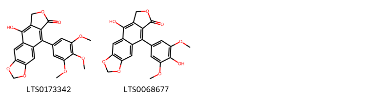{ width=100% }
    <figcaption>Hình ảnh cấu trúc hóa học của 2 hoạt chất thuộc nhóm Arylnaphthalene lignans gồm ['16-hydroxy-10-(3,4,5-trimethoxyphenyl)-4,6,13-trioxatetracyclo[7.7.0.0³,⁷.0¹¹,¹⁵]hexadeca-1,3(7),8,10,15-pentaen-12-one (LTS0173342)', '16-hydroxy-10-(4-hydroxy-3,5-dimethoxyphenyl)-4,6,13-trioxatetracyclo[7.7.0.0³,⁷.0¹¹,¹⁵]hexadeca-1,3(7),8,10,15-pentaen-12-one (LTS0068677)'].</figcaption>
</figure>
#### Nhóm Benzene and substituted derivatives
<figure markdown="span">
    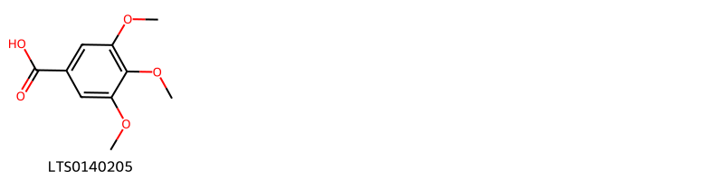{ width=100% }
    <figcaption>Hình ảnh cấu trúc hóa học của 1 hoạt chất thuộc nhóm Benzene and substituted derivatives gồm ['3,4,5-trimethoxybenzoic acid (LTS0140205)'].</figcaption>
</figure>
#### Nhóm Fatty Acyls
<figure markdown="span">
    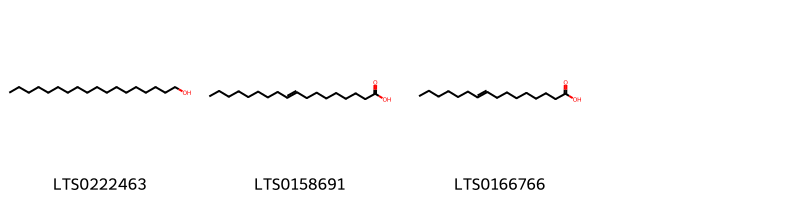{ width=100% }
    <figcaption>Hình ảnh cấu trúc hóa học của 3 hoạt chất thuộc nhóm Fatty Acyls gồm ['stearyl alcohol (LTS0222463)', '9 octadecenoic acid (LTS0158691)', '9-hexadecenoic acid (LTS0166766)'].</figcaption>
</figure>
#### Nhóm Flavonoids
<figure markdown="span">
    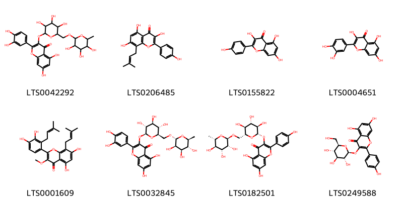{ width=100% }
    <figcaption>Hình ảnh cấu trúc hóa học của 8 hoạt chất thuộc nhóm Flavonoids gồm ['rutin (LTS0042292)', '8-prenylkaempferol (LTS0206485)', 'kaempherol (LTS0155822)', 'quercetin (LTS0004651)', '2-[3,4-dihydroxy-2-(3-methylbut-2-en-1-yl)phenyl]-5,7-dihydroxy-3-methoxy-8-(3-methylbut-2-en-1-yl)chromen-4-one (LTS0001609)', '3-rutinosyl quercetin (LTS0032845)', 'nictoflorin (LTS0182501)', 'astragalin (LTS0249588)'].</figcaption>
</figure>
#### Nhóm Lignan glycosides
<figure markdown="span">
    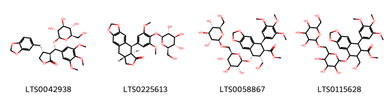{ width=100% }
    <figcaption>Hình ảnh cấu trúc hóa học của 4 hoạt chất thuộc nhóm Lignan glycosides gồm ['podorhizol β-d-glucoside (LTS0042938)', '(10r,11r,15r)-10-(3,5-dimethoxy-4-{[(2s,3r,4s,5s,6r)-3,4,5-trihydroxy-6-(hydroxymethyl)oxan-2-yl]oxy}phenyl)-4,6,13-trioxatetracyclo[7.7.0.0³,⁷.0¹¹,¹⁵]hexadeca-1,3(7),8-trien-12-one (LTS0225613)', 'methyl (5r,6r,7r,8s)-7-(hydroxymethyl)-8-{[(2r,3r,4s,5s,6r)-3,4,5-trihydroxy-6-({[(2r,3r,4s,5s,6r)-3,4,5-trihydroxy-6-(hydroxymethyl)oxan-2-yl]oxy}methyl)oxan-2-yl]oxy}-5-(3,4,5-trimethoxyphenyl)-2h,5h,6h,7h,8h-naphtho[2,3-d][1,3]dioxole-6-carboxylate (LTS0058867)', 'methyl 7-(hydroxymethyl)-8-{[3,4,5-trihydroxy-6-({[3,4,5-trihydroxy-6-(hydroxymethyl)oxan-2-yl]oxy}methyl)oxan-2-yl]oxy}-5-(3,4,5-trimethoxyphenyl)-2h,5h,6h,7h,8h-naphtho[2,3-d][1,3]dioxole-6-carboxylate (LTS0115628)'].</figcaption>
</figure>
#### Nhóm Lignan lactones
<figure markdown="span">
    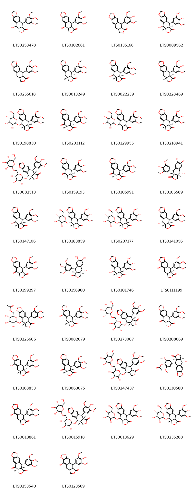{ width=100% }
    <figcaption>Hình ảnh cấu trúc hóa học của 38 hoạt chất thuộc nhóm Lignan lactones gồm ['podophyllum resin (LTS0253478)', '16-hydroxy-10-(4-hydroxy-3,5-dimethoxyphenyl)-4,6,13-trioxatetracyclo[7.7.0.0³,⁷.0¹¹,¹⁵]hexadeca-1,3(7),8-trien-12-one (LTS0102661)', '10-(4-hydroxy-3,5-dimethoxyphenyl)-4,6,13-trioxatetracyclo[7.7.0.0³,⁷.0¹¹,¹⁵]hexadeca-1,3(7),8-trien-12-one (LTS0135166)', "4'-demethylpodophyllotoxin (LTS0089562)", '10-(3,4,5-trimethoxyphenyl)-4,6,13-trioxatetracyclo[7.7.0.0³,⁷.0¹¹,¹⁵]hexadeca-1,3(7),8-trien-12-one (LTS0255618)', '(-)-deoxypodophyllotoxin (LTS0013249)', 'podofilox (LTS0022239)', '(10r,11r,15r)-10-(4-hydroxy-3,5-dimethoxyphenyl)-4,6,13-trioxatetracyclo[7.7.0.0³,⁷.0¹¹,¹⁵]hexadeca-1,3(7),8-trien-12-one (LTS0228469)', '(10r,11r,15r,16r)-16-{[(2r,3r,4s,5s,6r)-3,4,5-trihydroxy-6-(hydroxymethyl)oxan-2-yl]oxy}-10-(3,4,5-trimethoxyphenyl)-4,6,13-trioxatetracyclo[7.7.0.0³,⁷.0¹¹,¹⁵]hexadeca-1,3(7),8-trien-12-one (LTS0198830)', 'podophyllotoxone (LTS0203112)', '16-{[3,4,5-trihydroxy-6-(hydroxymethyl)oxan-2-yl]oxy}-10-(3,4,5-trimethoxyphenyl)-4,6,13-trioxatetracyclo[7.7.0.0³,⁷.0¹¹,¹⁵]hexadeca-1,3(7),8-trien-12-one (LTS0129955)', '(11r,15r,16r)-16-(4-hydroxy-3,5-dimethoxyphenyl)-4,6,13-trioxatetracyclo[7.7.0.0³,⁷.0¹¹,¹⁵]hexadeca-1,3(7),8-triene-10,14-dione (LTS0218941)', '(10r,11s,15s,16s)-16-{[(2r,3r,4s,5s,6r)-3,4,5-trihydroxy-6-({[(2r,3r,4s,5s,6r)-3,4,5-trihydroxy-6-(hydroxymethyl)oxan-2-yl]oxy}methyl)oxan-2-yl]oxy}-10-(3,4,5-trimethoxyphenyl)-4,6,13-trioxatetracyclo[7.7.0.0³,⁷.0¹¹,¹⁵]hexadeca-1,3(7),8-trien-12-one (LTS0082513)', '(11s,15r,16r)-16-(4-hydroxy-3,5-dimethoxyphenyl)-4,6,13-trioxatetracyclo[7.7.0.0³,⁷.0¹¹,¹⁵]hexadeca-1,3(7),8-triene-10,14-dione (LTS0159193)', '(11s,15r,16r)-16-(3,4,5-trimethoxyphenyl)-4,6,13-trioxatetracyclo[7.7.0.0³,⁷.0¹¹,¹⁵]hexadeca-1,3(7),8-triene-10,14-dione (LTS0105991)', '(3ar,4r,9r,9ar)-4,6,7-trihydroxy-9-(4-hydroxy-3,5-dimethoxyphenyl)-3h,3ah,4h,9h,9ah-naphtho[2,3-c]furan-1-one (LTS0106589)', 'epipodophyllotoxins (LTS0147106)', 'lignan p (LTS0183859)', '(10r,11s,15r,16r)-10-(4-hydroxy-3,5-dimethoxyphenyl)-16-{[(2r,3r,4s,5s,6r)-3,4,5-trihydroxy-6-(hydroxymethyl)oxan-2-yl]oxy}-4,6,13-trioxatetracyclo[7.7.0.0³,⁷.0¹¹,¹⁵]hexadeca-1,3(7),8-trien-12-one (LTS0207177)', 'epipodophyllotoxin (LTS0141056)', '16-(4-hydroxy-3,5-dimethoxyphenyl)-4,6,13-trioxatetracyclo[7.7.0.0³,⁷.0¹¹,¹⁵]hexadeca-1,3(7),8-triene-10,14-dione (LTS0199297)', '(3ar,4r,9r,9ar)-4,6,7-trihydroxy-9-(3,4,5-trimethoxyphenyl)-3h,3ah,4h,9h,9ah-naphtho[2,3-c]furan-1-one (LTS0156960)', '(10r,11s,15r,16r)-16-hydroxy-10-(4-hydroxy-3,5-dimethoxyphenyl)-4,6,13-trioxatetracyclo[7.7.0.0³,⁷.0¹¹,¹⁵]hexadeca-1,3(7),8-trien-12-one (LTS0101746)', '(11r)-2-hydroxy-10-(3,4,5-trimethoxyphenyl)-4,6,13-trioxatetracyclo[7.7.0.0³,⁷.0¹¹,¹⁵]hexadeca-1,3(7),8-trien-12-one (LTS0111199)', '[(2r,3s,4s,5r,6r)-3,4,5-trihydroxy-6-{[(10r,11r,15r,16r)-14-oxo-16-(3,4,5-trimethoxyphenyl)-4,6,13-trioxatetracyclo[7.7.0.0³,⁷.0¹¹,¹⁵]hexadeca-1,3(7),8-trien-10-yl]oxy}oxan-2-yl]methyl acetate (LTS0226606)', 'β-peltatin (LTS0082079)', '(10r,11s,15r,16r)-10-(4-hydroxy-3,5-dimethoxyphenyl)-16-{[(2r,3r,4s,5s,6r)-3,4,5-trihydroxy-6-({[(2r,3r,4s,5s,6r)-3,4,5-trihydroxy-6-(hydroxymethyl)oxan-2-yl]oxy}methyl)oxan-2-yl]oxy}-4,6,13-trioxatetracyclo[7.7.0.0³,⁷.0¹¹,¹⁵]hexadeca-1,3(7),8-trien-12-one (LTS0273007)', '16-(3,4,5-trimethoxyphenyl)-4,6,13-trioxatetracyclo[7.7.0.0³,⁷.0¹¹,¹⁵]hexadeca-1,3(7),8-triene-10,14-dione (LTS0208669)', 'α peltatin (LTS0168853)', '(11r,15s,16r)-16-(3,4,5-trimethoxyphenyl)-4,6,13-trioxatetracyclo[7.7.0.0³,⁷.0¹¹,¹⁵]hexadeca-1,3(7),8-triene-10,14-dione (LTS0063075)', '16-{[3,4,5-trihydroxy-6-({[3,4,5-trihydroxy-6-(hydroxymethyl)oxan-2-yl]oxy}methyl)oxan-2-yl]oxy}-10-(3,4,5-trimethoxyphenyl)-4,6,13-trioxatetracyclo[7.7.0.0³,⁷.0¹¹,¹⁵]hexadeca-1,3(7),8-trien-12-one (LTS0247437)', '4-[(10r,11r,15r,16r)-16-hydroxy-12-oxo-4,6,13-trioxatetracyclo[7.7.0.0³,⁷.0¹¹,¹⁵]hexadeca-1,3(7),8-trien-10-yl]-2,6-dimethoxyphenyl acetate (LTS0130580)', 'β-peltatin (LTS0013861)', '(10r,11s,15r,16r)-16-{[(2r,3r,4s,5s,6r)-3,4,5-trihydroxy-6-({[(2r,3r,4s,5s,6r)-3,4,5-trihydroxy-6-(hydroxymethyl)oxan-2-yl]oxy}methyl)oxan-2-yl]oxy}-10-(3,4,5-trimethoxyphenyl)-4,6,13-trioxatetracyclo[7.7.0.0³,⁷.0¹¹,¹⁵]hexadeca-1,3(7),8-trien-12-one (LTS0015918)', '10-(4-hydroxy-3,5-dimethoxyphenyl)-16-{[3,4,5-trihydroxy-6-(hydroxymethyl)oxan-2-yl]oxy}-4,6,13-trioxatetracyclo[7.7.0.0³,⁷.0¹¹,¹⁵]hexadeca-1,3(7),8-trien-12-one (LTS0013629)', '(10r,11r,15r,16r)-10-(4-hydroxy-3,5-dimethoxyphenyl)-16-{[(2r,3r,4s,5s,6r)-3,4,5-trihydroxy-6-(hydroxymethyl)oxan-2-yl]oxy}-4,6,13-trioxatetracyclo[7.7.0.0³,⁷.0¹¹,¹⁵]hexadeca-1,3(7),8-trien-12-one (LTS0235288)', '(11s,15s,16s)-16-(3,4,5-trimethoxyphenyl)-4,6,13-trioxatetracyclo[7.7.0.0³,⁷.0¹¹,¹⁵]hexadeca-1,3(7),8-triene-10,14-dione (LTS0253540)', '2-hydroxy-10-(4-hydroxy-3,5-dimethoxyphenyl)-4,6,13-trioxatetracyclo[7.7.0.0³,⁷.0¹¹,¹⁵]hexadeca-1,3(7),8-trien-12-one (LTS0123569)'].</figcaption>
</figure>
#### Nhóm Naphthofurans
<figure markdown="span">
    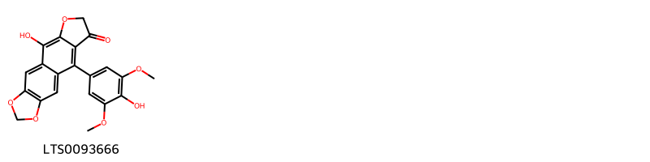{ width=100% }
    <figcaption>Hình ảnh cấu trúc hóa học của 1 hoạt chất thuộc nhóm Naphthofurans gồm ['10-hydroxy-16-(4-hydroxy-3,5-dimethoxyphenyl)-4,6,12-trioxatetracyclo[7.7.0.0³,⁷.0¹¹,¹⁵]hexadeca-1,3(7),8,10,15-pentaen-14-one (LTS0093666)'].</figcaption>
</figure>
#### Nhóm Organooxygen compounds
<figure markdown="span">
    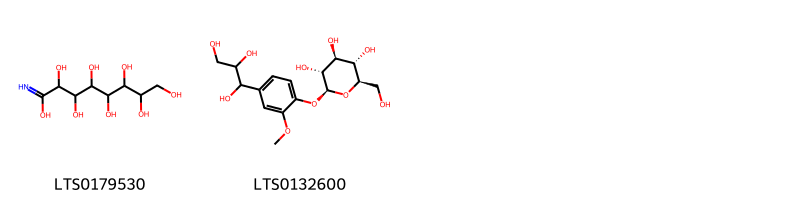{ width=100% }
    <figcaption>Hình ảnh cấu trúc hóa học của 2 hoạt chất thuộc nhóm Organooxygen compounds gồm ['2,3,4,5,6,7,8-heptahydroxyoctanimidic acid (LTS0179530)', '(2r,3s,4s,5r,6s)-2-(hydroxymethyl)-6-[2-methoxy-4-(1,2,3-trihydroxypropyl)phenoxy]oxane-3,4,5-triol (LTS0132600)'].</figcaption>
</figure>
#### Nhóm Phenols
<figure markdown="span">
    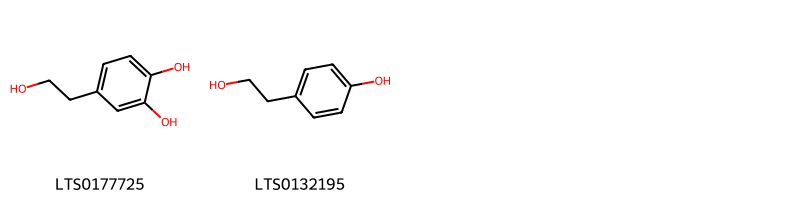{ width=100% }
    <figcaption>Hình ảnh cấu trúc hóa học của 2 hoạt chất thuộc nhóm Phenols gồm ['hydroxytyrosol (LTS0177725)', 'tyrosol (LTS0132195)'].</figcaption>
</figure>
#### Nhóm Prenol lipids
<figure markdown="span">
    { width=100% }
    <figcaption>Hình ảnh cấu trúc hóa học của 1 hoạt chất thuộc nhóm Prenol lipids gồm ['vitamin a (LTS0234636)'].</figcaption>
</figure>
#### Nhóm Steroids and steroid derivatives
<figure markdown="span">
    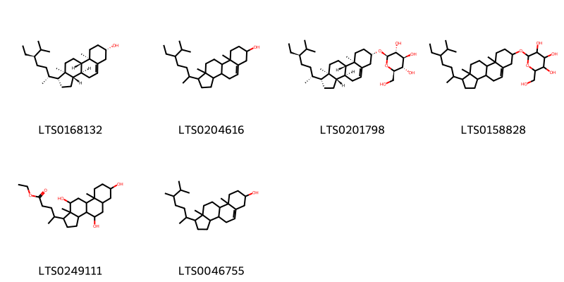{ width=100% }
    <figcaption>Hình ảnh cấu trúc hóa học của 6 hoạt chất thuộc nhóm Steroids and steroid derivatives gồm ['sitosterol (LTS0168132)', 'stigmast-5-en-3-ol, (3β)- (LTS0204616)', 'sitogluside (LTS0201798)', '2-{[1-(5-ethyl-6-methylheptan-2-yl)-9a,11a-dimethyl-1h,2h,3h,3ah,3bh,4h,6h,7h,8h,9h,9bh,10h,11h-cyclopenta[a]phenanthren-7-yl]oxy}-6-(hydroxymethyl)oxane-3,4,5-triol (LTS0158828)', 'ethyl 4-{4,7,11-trihydroxy-9a,11a-dimethyl-tetradecahydro-1h-cyclopenta[a]phenanthren-1-yl}pentanoate (LTS0249111)', 'campesterol (LTS0046755)'].</figcaption>
</figure>

---

### Dược dân tộc học

Danh sách các quốc gia có sử dụng *Sinopodophyllum hexandrum* trong điều trị các bệnh. 

| Country   | Disease                             | Bệnh                                                                                                                                                                                                |
|:----------|:------------------------------------|:----------------------------------------------------------------------------------------------------------------------------------------------------------------------------------------------------|
| Elsewhere | Emetic, Mitogenic, Purgative, Tonic | MYMEMORY WARNING: YOU USED ALL AVAILABLE FREE TRANSLATIONS FOR TODAY. NEXT AVAILABLE IN  07 HOURS 43 MINUTES 29 SECONDS VISIT HTTPS://MYMEMORY.TRANSLATED.NET/DOC/USAGELIMITS.PHP TO TRANSLATE MORE |
| India     | Intoxicant                          | MYMEMORY WARNING: YOU USED ALL AVAILABLE FREE TRANSLATIONS FOR TODAY. NEXT AVAILABLE IN  07 HOURS 43 MINUTES 26 SECONDS VISIT HTTPS://MYMEMORY.TRANSLATED.NET/DOC/USAGELIMITS.PHP TO TRANSLATE MORE |
| Nepal     | Cholagogue, Cholagogue              | MYMEMORY WARNING: YOU USED ALL AVAILABLE FREE TRANSLATIONS FOR TODAY. NEXT AVAILABLE IN  07 HOURS 43 MINUTES 24 SECONDS VISIT HTTPS://MYMEMORY.TRANSLATED.NET/DOC/USAGELIMITS.PHP TO TRANSLATE MORE |

---

---
## Podophyllum peltatum
### Thông tin về thực vật

!!! info "Phân loại thực vật của *Podophyllum peltatum* từ GIBF:"
    - **Kingdom:** Plantae
    - **Phylum:** Tracheophyta
    - **Order:** Ranunculales
    - **Family:** Berberidaceae
    - **Genus:** Podophyllum
    - **Species:** *Podophyllum peltatum*

 

| Label (VI)   | Label (EN)   | Scientific Name      | Descriptions (VI)   | Descriptions (EN)   | Also Known As (VI)   | Also Known As (EN)                             |
|:-------------|:-------------|:---------------------|:--------------------|:--------------------|:---------------------|:-----------------------------------------------|
| N/A          | N/A          | Podophyllum peltatum | loài thực vật       | species of plant    | ['']                 | ['American mandrake', 'May apple', 'Mayapple'] |

#### Phân bố trên thế giới

**Từ CSDL GIBF** United States of America

#### Phân bố tại Việt Nam

**Từ CSDL GIBF**: Không có ghi nhận ở Việt Nam

---
### Thành phần hóa học
        
- Theo cơ sở dữ liệu lotus: Từ loài *Podophyllum peltatum* đã phân lập và xác định được 45 hoạt chất thuộc về các nhóm Flavonoids, Carboxylic acids and derivatives, Steroids and steroid derivatives, Pyrans, Aryltetralin lignans, Lignan lactones, Arylnaphthalene lignans, Lignan glycosides. 

|    | chemicalTaxonomyClassyfireClass   |   smiles_count |
|---:|:----------------------------------|---------------:|
|  0 | Arylnaphthalene lignans           |              1 |
|  1 | Aryltetralin lignans              |              2 |
|  2 | Carboxylic acids and derivatives  |              1 |
|  3 | Flavonoids                        |              4 |
|  4 | Lignan glycosides                 |              4 |
|  5 | Lignan lactones                   |             25 |
|  6 | Pyrans                            |              6 |
|  7 | Steroids and steroid derivatives  |              2 |

#### Nhóm Arylnaphthalene lignans
<figure markdown="span">
    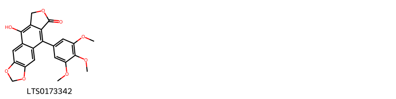{ width=100% }
    <figcaption>Hình ảnh cấu trúc hóa học của 1 hoạt chất thuộc nhóm Arylnaphthalene lignans gồm ['16-hydroxy-10-(3,4,5-trimethoxyphenyl)-4,6,13-trioxatetracyclo[7.7.0.0³,⁷.0¹¹,¹⁵]hexadeca-1,3(7),8,10,15-pentaen-12-one (LTS0173342)'].</figcaption>
</figure>
#### Nhóm Aryltetralin lignans
<figure markdown="span">
    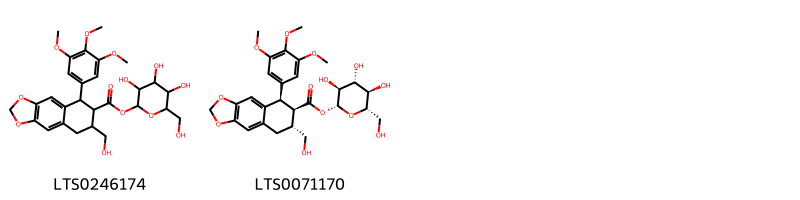{ width=100% }
    <figcaption>Hình ảnh cấu trúc hóa học của 2 hoạt chất thuộc nhóm Aryltetralin lignans gồm ['3,4,5-trihydroxy-6-(hydroxymethyl)oxan-2-yl 7-(hydroxymethyl)-5-(3,4,5-trimethoxyphenyl)-2h,5h,6h,7h,8h-naphtho[2,3-d][1,3]dioxole-6-carboxylate (LTS0246174)', '(2r,3s,4r,5r,6s)-3,4,5-trihydroxy-6-(hydroxymethyl)oxan-2-yl (5r,6r,7r)-7-(hydroxymethyl)-5-(3,4,5-trimethoxyphenyl)-2h,5h,6h,7h,8h-naphtho[2,3-d][1,3]dioxole-6-carboxylate (LTS0071170)'].</figcaption>
</figure>
#### Nhóm Carboxylic acids and derivatives
<figure markdown="span">
    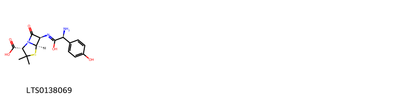{ width=100% }
    <figcaption>Hình ảnh cấu trúc hóa học của 1 hoạt chất thuộc nhóm Carboxylic acids and derivatives gồm ['(2s,5r,6r)-6-{[(2s)-2-amino-1-hydroxy-2-(4-hydroxyphenyl)ethylidene]amino}-3,3-dimethyl-7-oxo-4-thia-1-azabicyclo[3.2.0]heptane-2-carboxylic acid (LTS0138069)'].</figcaption>
</figure>
#### Nhóm Flavonoids
<figure markdown="span">
    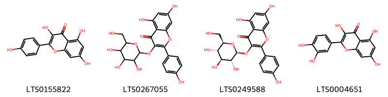{ width=100% }
    <figcaption>Hình ảnh cấu trúc hóa học của 4 hoạt chất thuộc nhóm Flavonoids gồm ['kaempherol (LTS0155822)', 'trifolin (LTS0267055)', 'astragalin (LTS0249588)', 'quercetin (LTS0004651)'].</figcaption>
</figure>
#### Nhóm Lignan glycosides
<figure markdown="span">
    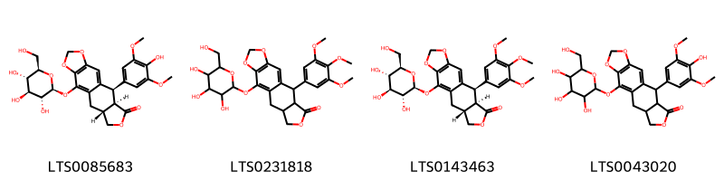{ width=100% }
    <figcaption>Hình ảnh cấu trúc hóa học của 4 hoạt chất thuộc nhóm Lignan glycosides gồm ['(10r,11r,15r)-10-(4-hydroxy-3,5-dimethoxyphenyl)-2-{[(2s,3r,4s,5s,6r)-3,4,5-trihydroxy-6-(hydroxymethyl)oxan-2-yl]oxy}-4,6,13-trioxatetracyclo[7.7.0.0³,⁷.0¹¹,¹⁵]hexadeca-1,3(7),8-trien-12-one (LTS0085683)', '2-{[3,4,5-trihydroxy-6-(hydroxymethyl)oxan-2-yl]oxy}-10-(3,4,5-trimethoxyphenyl)-4,6,13-trioxatetracyclo[7.7.0.0³,⁷.0¹¹,¹⁵]hexadeca-1,3(7),8-trien-12-one (LTS0231818)', 'β-peltatin-β-d-glucoside (LTS0143463)', '10-(4-hydroxy-3,5-dimethoxyphenyl)-2-{[3,4,5-trihydroxy-6-(hydroxymethyl)oxan-2-yl]oxy}-4,6,13-trioxatetracyclo[7.7.0.0³,⁷.0¹¹,¹⁵]hexadeca-1,3(7),8-trien-12-one (LTS0043020)'].</figcaption>
</figure>
#### Nhóm Lignan lactones
<figure markdown="span">
    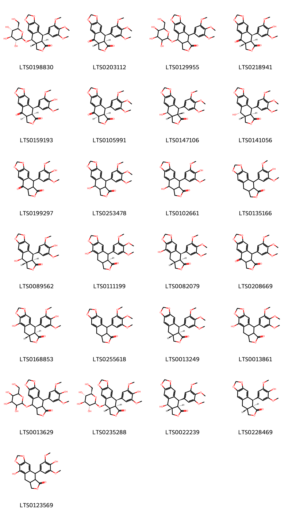{ width=100% }
    <figcaption>Hình ảnh cấu trúc hóa học của 25 hoạt chất thuộc nhóm Lignan lactones gồm ['(10r,11r,15r,16r)-16-{[(2r,3r,4s,5s,6r)-3,4,5-trihydroxy-6-(hydroxymethyl)oxan-2-yl]oxy}-10-(3,4,5-trimethoxyphenyl)-4,6,13-trioxatetracyclo[7.7.0.0³,⁷.0¹¹,¹⁵]hexadeca-1,3(7),8-trien-12-one (LTS0198830)', 'podophyllotoxone (LTS0203112)', '16-{[3,4,5-trihydroxy-6-(hydroxymethyl)oxan-2-yl]oxy}-10-(3,4,5-trimethoxyphenyl)-4,6,13-trioxatetracyclo[7.7.0.0³,⁷.0¹¹,¹⁵]hexadeca-1,3(7),8-trien-12-one (LTS0129955)', '(11r,15r,16r)-16-(4-hydroxy-3,5-dimethoxyphenyl)-4,6,13-trioxatetracyclo[7.7.0.0³,⁷.0¹¹,¹⁵]hexadeca-1,3(7),8-triene-10,14-dione (LTS0218941)', '(11s,15r,16r)-16-(4-hydroxy-3,5-dimethoxyphenyl)-4,6,13-trioxatetracyclo[7.7.0.0³,⁷.0¹¹,¹⁵]hexadeca-1,3(7),8-triene-10,14-dione (LTS0159193)', '(11s,15r,16r)-16-(3,4,5-trimethoxyphenyl)-4,6,13-trioxatetracyclo[7.7.0.0³,⁷.0¹¹,¹⁵]hexadeca-1,3(7),8-triene-10,14-dione (LTS0105991)', 'epipodophyllotoxins (LTS0147106)', 'epipodophyllotoxin (LTS0141056)', '16-(4-hydroxy-3,5-dimethoxyphenyl)-4,6,13-trioxatetracyclo[7.7.0.0³,⁷.0¹¹,¹⁵]hexadeca-1,3(7),8-triene-10,14-dione (LTS0199297)', 'podophyllum resin (LTS0253478)', '16-hydroxy-10-(4-hydroxy-3,5-dimethoxyphenyl)-4,6,13-trioxatetracyclo[7.7.0.0³,⁷.0¹¹,¹⁵]hexadeca-1,3(7),8-trien-12-one (LTS0102661)', '10-(4-hydroxy-3,5-dimethoxyphenyl)-4,6,13-trioxatetracyclo[7.7.0.0³,⁷.0¹¹,¹⁵]hexadeca-1,3(7),8-trien-12-one (LTS0135166)', "4'-demethylpodophyllotoxin (LTS0089562)", '(11r)-2-hydroxy-10-(3,4,5-trimethoxyphenyl)-4,6,13-trioxatetracyclo[7.7.0.0³,⁷.0¹¹,¹⁵]hexadeca-1,3(7),8-trien-12-one (LTS0111199)', 'β-peltatin (LTS0082079)', '16-(3,4,5-trimethoxyphenyl)-4,6,13-trioxatetracyclo[7.7.0.0³,⁷.0¹¹,¹⁵]hexadeca-1,3(7),8-triene-10,14-dione (LTS0208669)', 'α peltatin (LTS0168853)', '10-(3,4,5-trimethoxyphenyl)-4,6,13-trioxatetracyclo[7.7.0.0³,⁷.0¹¹,¹⁵]hexadeca-1,3(7),8-trien-12-one (LTS0255618)', '(-)-deoxypodophyllotoxin (LTS0013249)', 'β-peltatin (LTS0013861)', '10-(4-hydroxy-3,5-dimethoxyphenyl)-16-{[3,4,5-trihydroxy-6-(hydroxymethyl)oxan-2-yl]oxy}-4,6,13-trioxatetracyclo[7.7.0.0³,⁷.0¹¹,¹⁵]hexadeca-1,3(7),8-trien-12-one (LTS0013629)', '(10r,11r,15r,16r)-10-(4-hydroxy-3,5-dimethoxyphenyl)-16-{[(2r,3r,4s,5s,6r)-3,4,5-trihydroxy-6-(hydroxymethyl)oxan-2-yl]oxy}-4,6,13-trioxatetracyclo[7.7.0.0³,⁷.0¹¹,¹⁵]hexadeca-1,3(7),8-trien-12-one (LTS0235288)', 'podofilox (LTS0022239)', '(10r,11r,15r)-10-(4-hydroxy-3,5-dimethoxyphenyl)-4,6,13-trioxatetracyclo[7.7.0.0³,⁷.0¹¹,¹⁵]hexadeca-1,3(7),8-trien-12-one (LTS0228469)', '2-hydroxy-10-(4-hydroxy-3,5-dimethoxyphenyl)-4,6,13-trioxatetracyclo[7.7.0.0³,⁷.0¹¹,¹⁵]hexadeca-1,3(7),8-trien-12-one (LTS0123569)'].</figcaption>
</figure>
#### Nhóm Pyrans
<figure markdown="span">
    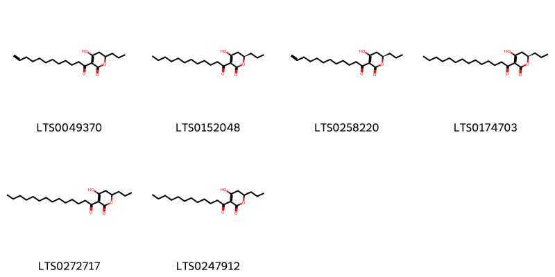{ width=100% }
    <figcaption>Hình ảnh cấu trúc hóa học của 6 hoạt chất thuộc nhóm Pyrans gồm ['3-(dodec-11-enoyl)-4-hydroxy-6-propyl-5,6-dihydropyran-2-one (LTS0049370)', '(6r)-3-dodecanoyl-4-hydroxy-6-propyl-5,6-dihydropyran-2-one (LTS0152048)', '(6r)-3-(dodec-11-enoyl)-4-hydroxy-6-propyl-5,6-dihydropyran-2-one (LTS0258220)', '(6r)-4-hydroxy-6-propyl-3-tetradecanoyl-5,6-dihydropyran-2-one (LTS0174703)', '4-hydroxy-6-propyl-3-tetradecanoyl-5,6-dihydropyran-2-one (LTS0272717)', '3-dodecanoyl-4-hydroxy-6-propyl-5,6-dihydropyran-2-one (LTS0247912)'].</figcaption>
</figure>
#### Nhóm Steroids and steroid derivatives
<figure markdown="span">
    { width=100% }
    <figcaption>Hình ảnh cấu trúc hóa học của 2 hoạt chất thuộc nhóm Steroids and steroid derivatives gồm ['sitosterol (LTS0168132)', 'stigmast-5-en-3-ol, (3β)- (LTS0204616)'].</figcaption>
</figure>

---

### Dược dân tộc học

Danh sách các quốc gia có sử dụng *Podophyllum peltatum* trong điều trị các bệnh. 

| Country        | Disease                      | Bệnh                                                                                                                                                                                                |
|:---------------|:-----------------------------|:----------------------------------------------------------------------------------------------------------------------------------------------------------------------------------------------------|
| Elsewhere      | Aperient                     | MYMEMORY WARNING: YOU USED ALL AVAILABLE FREE TRANSLATIONS FOR TODAY. NEXT AVAILABLE IN  07 HOURS 42 MINUTES 50 SECONDS VISIT HTTPS://MYMEMORY.TRANSLATED.NET/DOC/USAGELIMITS.PHP TO TRANSLATE MORE |
| Turkey         | Emetic, Vermifuge, Purgative | MYMEMORY WARNING: YOU USED ALL AVAILABLE FREE TRANSLATIONS FOR TODAY. NEXT AVAILABLE IN  07 HOURS 42 MINUTES 47 SECONDS VISIT HTTPS://MYMEMORY.TRANSLATED.NET/DOC/USAGELIMITS.PHP TO TRANSLATE MORE |
| US             | Poison, Purgative            | MYMEMORY WARNING: YOU USED ALL AVAILABLE FREE TRANSLATIONS FOR TODAY. NEXT AVAILABLE IN  07 HOURS 42 MINUTES 45 SECONDS VISIT HTTPS://MYMEMORY.TRANSLATED.NET/DOC/USAGELIMITS.PHP TO TRANSLATE MORE |
| US(Amerindian) | Poison, Tonic                | MYMEMORY WARNING: YOU USED ALL AVAILABLE FREE TRANSLATIONS FOR TODAY. NEXT AVAILABLE IN  07 HOURS 42 MINUTES 42 SECONDS VISIT HTTPS://MYMEMORY.TRANSLATED.NET/DOC/USAGELIMITS.PHP TO TRANSLATE MORE |
| US(Appalachia) | Laxative                     | MYMEMORY WARNING: YOU USED ALL AVAILABLE FREE TRANSLATIONS FOR TODAY. NEXT AVAILABLE IN  07 HOURS 42 MINUTES 40 SECONDS VISIT HTTPS://MYMEMORY.TRANSLATED.NET/DOC/USAGELIMITS.PHP TO TRANSLATE MORE |

---

---
## Podophyllum versipelle
### Thông tin về thực vật

!!! info "Phân loại thực vật của *Dysosma versipellis* từ GIBF:"
    - **Kingdom:** Plantae
    - **Phylum:** Tracheophyta
    - **Order:** Ranunculales
    - **Family:** Berberidaceae
    - **Genus:** Dysosma
    - **Species:** *Dysosma versipellis*

 

| Label (VI)   | Label (EN)   | Scientific Name        | Descriptions (VI)   | Descriptions (EN)   | Also Known As (VI)   | Also Known As (EN)   |
|:-------------|:-------------|:-----------------------|:--------------------|:--------------------|:---------------------|:---------------------|
| N/A          | N/A          | Podophyllum versipelle | loài thực vật       | species of plant    | ['']                 | ['']                 |

#### Phân bố trên thế giới

**Từ CSDL GIBF** nan, United States of America, China, New Zealand, Canada

#### Phân bố tại Việt Nam

**Từ CSDL GIBF**: Không có ghi nhận ở Việt Nam

---
### Thành phần hóa học
        
- Theo cơ sở dữ liệu lotus: Từ loài *Dysosma versipellis* đã phân lập và xác định được 32 hoạt chất thuộc về các nhóm Flavonoids, Steroids and steroid derivatives, Lignan lactones, Furanoid lignans, Arylnaphthalene lignans. 

|    | chemicalTaxonomyClassyfireClass   |   smiles_count |
|---:|:----------------------------------|---------------:|
|  0 | Arylnaphthalene lignans           |              2 |
|  1 | Flavonoids                        |              7 |
|  2 | Furanoid lignans                  |              2 |
|  3 | Lignan lactones                   |             18 |
|  4 | Steroids and steroid derivatives  |              3 |

#### Nhóm Arylnaphthalene lignans
<figure markdown="span">
    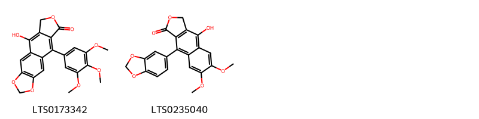{ width=100% }
    <figcaption>Hình ảnh cấu trúc hóa học của 2 hoạt chất thuộc nhóm Arylnaphthalene lignans gồm ['16-hydroxy-10-(3,4,5-trimethoxyphenyl)-4,6,13-trioxatetracyclo[7.7.0.0³,⁷.0¹¹,¹⁵]hexadeca-1,3(7),8,10,15-pentaen-12-one (LTS0173342)', 'diphyllin (LTS0235040)'].</figcaption>
</figure>
#### Nhóm Flavonoids
<figure markdown="span">
    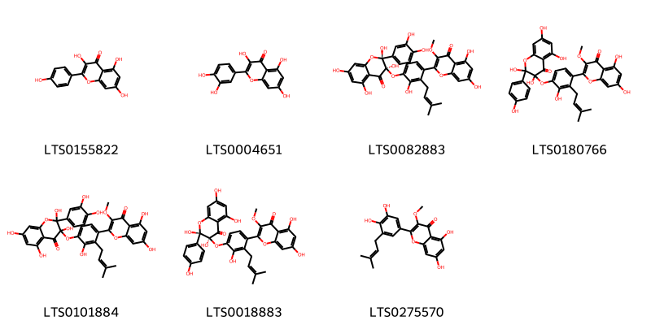{ width=100% }
    <figcaption>Hình ảnh cấu trúc hóa học của 7 hoạt chất thuộc nhóm Flavonoids gồm ['kaempherol (LTS0155822)', 'quercetin (LTS0004651)', '2-(4-{[(2r,3s)-2-(3,4-dihydroxyphenyl)-2,3,5,7-tetrahydroxy-4-oxo-1-benzopyran-3-yl]oxy}-3-hydroxy-2-(3-methylbut-2-en-1-yl)phenyl)-5,7-dihydroxy-3-methoxychromen-4-one (LTS0082883)', '5,7-dihydroxy-2-[3-hydroxy-2-(3-methylbut-2-en-1-yl)-4-{[2,3,5,7-tetrahydroxy-2-(4-hydroxyphenyl)-4-oxo-1-benzopyran-3-yl]oxy}phenyl]-3-methoxychromen-4-one (LTS0180766)', '2-(4-{[2-(3,4-dihydroxyphenyl)-2,3,5,7-tetrahydroxy-4-oxo-1-benzopyran-3-yl]oxy}-3-hydroxy-2-(3-methylbut-2-en-1-yl)phenyl)-5,7-dihydroxy-3-methoxychromen-4-one (LTS0101884)', '5,7-dihydroxy-2-[3-hydroxy-2-(3-methylbut-2-en-1-yl)-4-{[(2s,3r)-2,3,5,7-tetrahydroxy-2-(4-hydroxyphenyl)-4-oxo-1-benzopyran-3-yl]oxy}phenyl]-3-methoxychromen-4-one (LTS0018883)', '2-[3,4-dihydroxy-5-(3-methylbut-2-en-1-yl)phenyl]-5,7-dihydroxy-3-methoxychromen-4-one (LTS0275570)'].</figcaption>
</figure>
#### Nhóm Furanoid lignans
<figure markdown="span">
    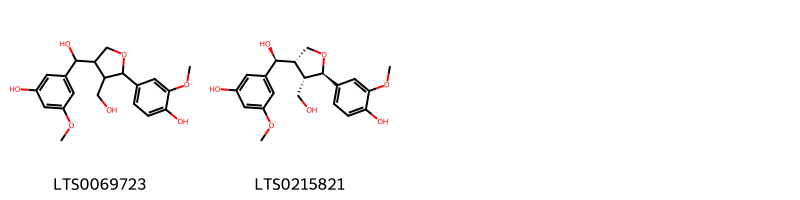{ width=100% }
    <figcaption>Hình ảnh cấu trúc hóa học của 2 hoạt chất thuộc nhóm Furanoid lignans gồm ['4-{4-[hydroxy(3-hydroxy-5-methoxyphenyl)methyl]-3-(hydroxymethyl)oxolan-2-yl}-2-methoxyphenol (LTS0069723)', '4-[(2r,3s,4s)-4-[(s)-hydroxy(3-hydroxy-5-methoxyphenyl)methyl]-3-(hydroxymethyl)oxolan-2-yl]-2-methoxyphenol (LTS0215821)'].</figcaption>
</figure>
#### Nhóm Lignan lactones
<figure markdown="span">
    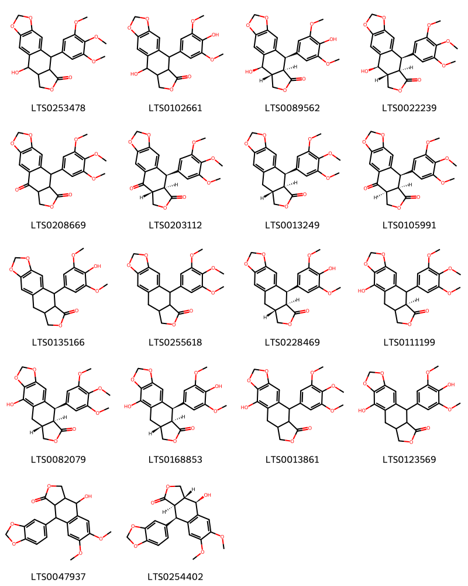{ width=100% }
    <figcaption>Hình ảnh cấu trúc hóa học của 18 hoạt chất thuộc nhóm Lignan lactones gồm ['podophyllum resin (LTS0253478)', '16-hydroxy-10-(4-hydroxy-3,5-dimethoxyphenyl)-4,6,13-trioxatetracyclo[7.7.0.0³,⁷.0¹¹,¹⁵]hexadeca-1,3(7),8-trien-12-one (LTS0102661)', "4'-demethylpodophyllotoxin (LTS0089562)", 'podofilox (LTS0022239)', '16-(3,4,5-trimethoxyphenyl)-4,6,13-trioxatetracyclo[7.7.0.0³,⁷.0¹¹,¹⁵]hexadeca-1,3(7),8-triene-10,14-dione (LTS0208669)', 'podophyllotoxone (LTS0203112)', '(-)-deoxypodophyllotoxin (LTS0013249)', '(11s,15r,16r)-16-(3,4,5-trimethoxyphenyl)-4,6,13-trioxatetracyclo[7.7.0.0³,⁷.0¹¹,¹⁵]hexadeca-1,3(7),8-triene-10,14-dione (LTS0105991)', '10-(4-hydroxy-3,5-dimethoxyphenyl)-4,6,13-trioxatetracyclo[7.7.0.0³,⁷.0¹¹,¹⁵]hexadeca-1,3(7),8-trien-12-one (LTS0135166)', '10-(3,4,5-trimethoxyphenyl)-4,6,13-trioxatetracyclo[7.7.0.0³,⁷.0¹¹,¹⁵]hexadeca-1,3(7),8-trien-12-one (LTS0255618)', '(10r,11r,15r)-10-(4-hydroxy-3,5-dimethoxyphenyl)-4,6,13-trioxatetracyclo[7.7.0.0³,⁷.0¹¹,¹⁵]hexadeca-1,3(7),8-trien-12-one (LTS0228469)', '(11r)-2-hydroxy-10-(3,4,5-trimethoxyphenyl)-4,6,13-trioxatetracyclo[7.7.0.0³,⁷.0¹¹,¹⁵]hexadeca-1,3(7),8-trien-12-one (LTS0111199)', 'β-peltatin (LTS0082079)', 'α peltatin (LTS0168853)', 'β-peltatin (LTS0013861)', '2-hydroxy-10-(4-hydroxy-3,5-dimethoxyphenyl)-4,6,13-trioxatetracyclo[7.7.0.0³,⁷.0¹¹,¹⁵]hexadeca-1,3(7),8-trien-12-one (LTS0123569)', '9-(2h-1,3-benzodioxol-5-yl)-4-hydroxy-6,7-dimethoxy-3h,3ah,4h,9h,9ah-naphtho[2,3-c]furan-1-one (LTS0047937)', '(3ar,4r,9r,9ar)-9-(2h-1,3-benzodioxol-5-yl)-4-hydroxy-6,7-dimethoxy-3h,3ah,4h,9h,9ah-naphtho[2,3-c]furan-1-one (LTS0254402)'].</figcaption>
</figure>
#### Nhóm Steroids and steroid derivatives
<figure markdown="span">
    { width=100% }
    <figcaption>Hình ảnh cấu trúc hóa học của 3 hoạt chất thuộc nhóm Steroids and steroid derivatives gồm ['stigmast-5-en-3-ol, (3β)- (LTS0204616)', 'sitosterol (LTS0168132)', 'stigmast-5-en-3-ol (LTS0071224)'].</figcaption>
</figure>

---

### Dược dân tộc học

Danh sách các quốc gia có sử dụng *Dysosma versipellis* trong điều trị các bệnh. 

| Country   | Disease            | Bệnh                                                                                                                                                                                                |
|:----------|:-------------------|:----------------------------------------------------------------------------------------------------------------------------------------------------------------------------------------------------|
| China     | Antiseptic, Poison | MYMEMORY WARNING: YOU USED ALL AVAILABLE FREE TRANSLATIONS FOR TODAY. NEXT AVAILABLE IN  07 HOURS 42 MINUTES 10 SECONDS VISIT HTTPS://MYMEMORY.TRANSLATED.NET/DOC/USAGELIMITS.PHP TO TRANSLATE MORE |

---

