!!! abstract "Tóm tắt"

    Họ Betulaceae gồm khoảng 4 chi và 11 loài được một số cộng đồng tại các quốc gia như Dutch, ain, Elsewhere, Canada(Salish), Canada(Kwakiutl), German, US(Colonial), India, US, Turkey, China sử dụng trong một số trường hợp MYMEMORY WARNING: YOU USED ALL AVAILABLE FREE TRANSLATIONS FOR TODAY. NEXT AVAILABLE IN  15 HOURS 52 MINUTES 23 SECONDS VISIT HTTPS://MYMEMORY.TRANSLATED.NET/DOC/USAGELIMITS.PHP TO TRANSLATE MORE.

!!! info "DrDuke"

    James A. Duke sinh năm 1929-2017 là một nhà thực vật học người Mỹ. Đây là một trong những tác giả hàng đầu trong lĩnh vực dược dân tộc học với cuốn *CRC Handbook of Medicinal Herbs* và chính là người xây dựng lên cơ sở dữ liệu về hợp chất tự nhiên và dược dân tộc học tại Bộ nông nghiệp Hoa Kỳ. Các thông tin được đăng tải tại website [Dr. Duke's Phytochemical and Ethnobotanical Databases](https://phytochem.nal.usda.gov/). 
    Trong suốt thập niên 1970, ông lãnh đạo the Plant Taxonomy Laboratory, Plant Genetics and Germplasm Institute of the Agricultural Research Service, U.S. Department of Agriculture.
    Trong tài liệu này, các thông tin về dược dân tộc của các dược liệu được trích dẫn từ tài liệu của James A. Ducke với sự trợ giúp của phần mềm dịch thuật từ tiếng Anh sang tiếng Việt.
   

# Chi Alnus

??? note "Danh sách các dược liệu thuộc chi"
    
	 - *Alnus glutinosa*
	 - *Alnus rubra*

---
## Alnus glutinosa
### Thông tin về thực vật

!!! info "Phân loại thực vật của *Alnus glutinosa* từ GIBF:"
    - **Kingdom:** Plantae
    - **Phylum:** Tracheophyta
    - **Order:** Fagales
    - **Family:** Betulaceae
    - **Genus:** Alnus
    - **Species:** *Alnus glutinosa*

 

| Label (VI)   | Label (EN)   | Scientific Name   | Descriptions (VI)   | Descriptions (EN)   | Also Known As (VI)   | Also Known As (EN)                                                                 |
|:-------------|:-------------|:------------------|:--------------------|:--------------------|:---------------------|:-----------------------------------------------------------------------------------|
| N/A          | N/A          | Alnus glutinosa   | loài thực vật       | species of plant    | ['']                 | ['European black alder', 'alder', 'black alder', 'common alder', 'European alder'] |

#### Phân bố trên thế giới

**Từ CSDL GIBF** Denmark, Spain, Germany, Chile, Austria, Poland, Canada, Belgium, Netherlands, Belarus, Hungary, Ireland, United Kingdom of Great Britain and Northern Ireland, Latvia, France, New Zealand, Russian Federation, United States of America, Italy, Ukraine

#### Phân bố tại Việt Nam

**Từ CSDL GIBF**: Không có ghi nhận ở Việt Nam

---
### Thành phần hóa học
        
- Theo cơ sở dữ liệu lotus: Từ loài *Alnus glutinosa* đã phân lập và xác định được 25 hoạt chất thuộc về các nhóm Benzopyrans, Flavonoids, Prenol lipids, Fatty Acyls, Diarylheptanoids, Steroids and steroid derivatives. 

|    | chemicalTaxonomyClassyfireClass   |   smiles_count |
|---:|:----------------------------------|---------------:|
|  0 | Benzopyrans                       |              2 |
|  1 | Diarylheptanoids                  |              1 |
|  2 | Fatty Acyls                       |              1 |
|  3 | Flavonoids                        |              9 |
|  4 | Prenol lipids                     |              6 |
|  5 | Steroids and steroid derivatives  |              6 |

#### Nhóm Benzopyrans
<figure markdown="span">
    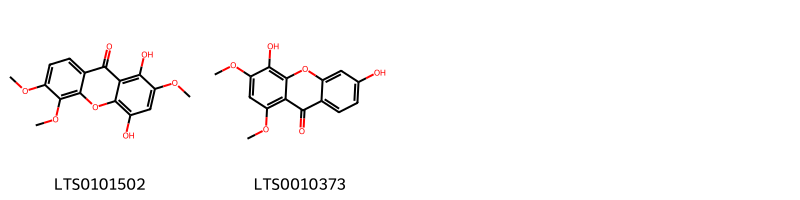{ width=100% }
    <figcaption>Hình ảnh cấu trúc hóa học của 2 hoạt chất thuộc nhóm Benzopyrans gồm ['1,4-dihydroxy-2,5,6-trimethoxyxanthen-9-one (LTS0101502)', '4,6-dihydroxy-1,3-dimethoxyxanthen-9-one (LTS0010373)'].</figcaption>
</figure>
#### Nhóm Diarylheptanoids
<figure markdown="span">
    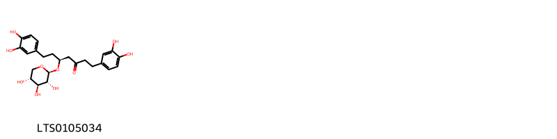{ width=100% }
    <figcaption>Hình ảnh cấu trúc hóa học của 1 hoạt chất thuộc nhóm Diarylheptanoids gồm ['(5s)-1,7-bis(3,4-dihydroxyphenyl)-5-{[(2s,3r,4s,5r)-3,4,5-trihydroxyoxan-2-yl]oxy}heptan-3-one (LTS0105034)'].</figcaption>
</figure>
#### Nhóm Fatty Acyls
<figure markdown="span">
    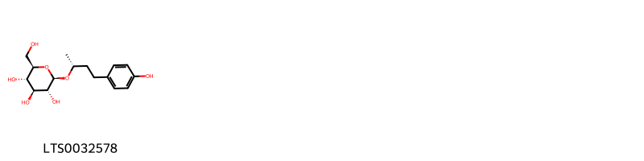{ width=100% }
    <figcaption>Hình ảnh cấu trúc hóa học của 1 hoạt chất thuộc nhóm Fatty Acyls gồm ['rhododendrin (LTS0032578)'].</figcaption>
</figure>
#### Nhóm Flavonoids
<figure markdown="span">
    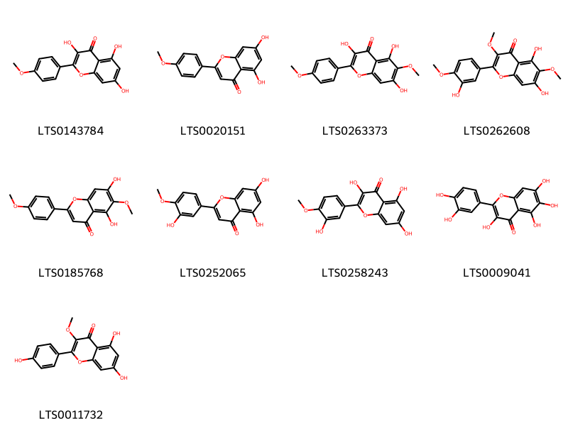{ width=100% }
    <figcaption>Hình ảnh cấu trúc hóa học của 9 hoạt chất thuộc nhóm Flavonoids gồm ['kaempferide (LTS0143784)', 'acacetin (LTS0020151)', 'betuletol (LTS0263373)', 'centaureidin (LTS0262608)', 'pectolinarigenin (LTS0185768)', 'diosmetin (LTS0252065)', 'tamarixetin (LTS0258243)', 'quercetagetin (LTS0009041)', 'isokaempferide (LTS0011732)'].</figcaption>
</figure>
#### Nhóm Prenol lipids
<figure markdown="span">
    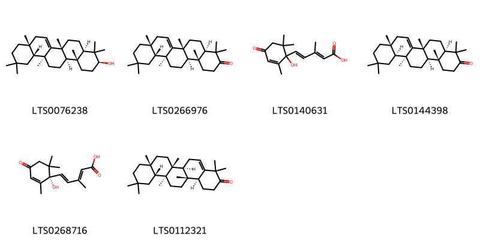{ width=100% }
    <figcaption>Hình ảnh cấu trúc hóa học của 6 hoạt chất thuộc nhóm Prenol lipids gồm ['alnulin (LTS0076238)', 'taraxerone (LTS0266976)', 'abscisic acid,  (LTS0140631)', '(4ar,6ar,8ar,12as,12bs,14ar,14br)-4,4,6a,8a,11,11,12b,14b-octamethyl-2,4a,5,6,8,9,10,12,12a,13,14,14a-dodecahydro-1h-picen-3-one (LTS0144398)', '(4e)-5-[(1s)-1-hydroxy-2,6,6-trimethyl-4-oxocyclohex-2-en-1-yl]-3-methylpenta-2,4-dienoic acid (LTS0268716)', 'glutinone (LTS0112321)'].</figcaption>
</figure>
#### Nhóm Steroids and steroid derivatives
<figure markdown="span">
    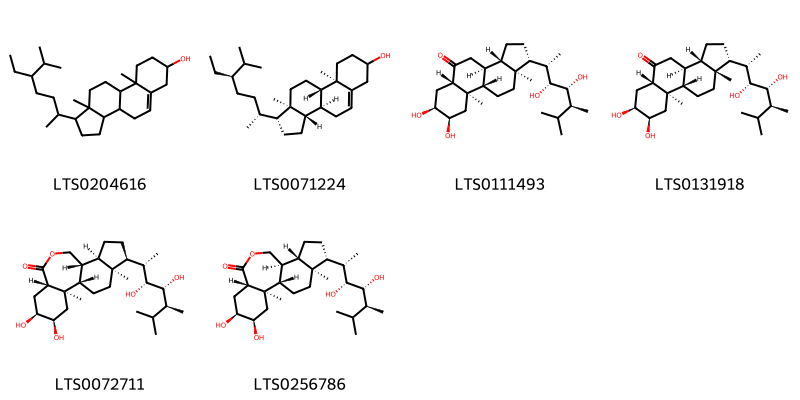{ width=100% }
    <figcaption>Hình ảnh cấu trúc hóa học của 6 hoạt chất thuộc nhóm Steroids and steroid derivatives gồm ['stigmast-5-en-3-ol, (3β)- (LTS0204616)', 'stigmast-5-en-3-ol (LTS0071224)', 'castasterone (LTS0111493)', '(1r,3as,3bs,5as,7s,8r,9ar,9bs,11ar)-1-[(2s,3r,4r,5s)-3,4-dihydroxy-5,6-dimethylheptan-2-yl]-7,8-dihydroxy-9a,11a-dimethyl-tetradecahydrocyclopenta[a]phenanthren-5-one (LTS0131918)', '(1s,2r,4r,5s,7s,11r,12r,15s,16s)-15-[(2s,3r,4r,5s)-3,4-dihydroxy-5,6-dimethylheptan-2-yl]-4,5-dihydroxy-2,16-dimethyl-9-oxatetracyclo[9.7.0.0²,⁷.0¹²,¹⁶]octadecan-8-one (LTS0072711)', 'brassinolide (LTS0256786)'].</figcaption>
</figure>

---

### Dược dân tộc học

Danh sách các quốc gia có sử dụng *Alnus glutinosa* trong điều trị các bệnh. 

| Country   | Disease                                           | Bệnh                                                                                                                                                                                                |
|:----------|:--------------------------------------------------|:----------------------------------------------------------------------------------------------------------------------------------------------------------------------------------------------------|
| Turkey    | Astringent, Diuretic, Sudorific, Tonic, Vermifuge | MYMEMORY WARNING: YOU USED ALL AVAILABLE FREE TRANSLATIONS FOR TODAY. NEXT AVAILABLE IN  15 HOURS 52 MINUTES 20 SECONDS VISIT HTTPS://MYMEMORY.TRANSLATED.NET/DOC/USAGELIMITS.PHP TO TRANSLATE MORE |

---

---
## Alnus rubra
### Thông tin về thực vật

!!! info "Phân loại thực vật của *Alnus rubra* từ GIBF:"
    - **Kingdom:** Plantae
    - **Phylum:** Tracheophyta
    - **Order:** Fagales
    - **Family:** Betulaceae
    - **Genus:** Alnus
    - **Species:** *Alnus rubra*

 

| Label (VI)   | Label (EN)   | Scientific Name   | Descriptions (VI)   | Descriptions (EN)         | Also Known As (VI)   | Also Known As (EN)                             |
|:-------------|:-------------|:------------------|:--------------------|:--------------------------|:---------------------|:-----------------------------------------------|
| N/A          | N/A          | Alnus rubra       |                     | species of deciduous tree | ['']                 | ['Oregon alder', 'red alder', 'western alder'] |

#### Phân bố trên thế giới

**Từ CSDL GIBF** Canada, New Zealand, United States of America

#### Phân bố tại Việt Nam

**Từ CSDL GIBF**: Không có ghi nhận ở Việt Nam

---
### Thành phần hóa học
        
- Theo cơ sở dữ liệu lotus: Từ loài *Alnus rubra* đã phân lập và xác định được 31 hoạt chất thuộc về các nhóm Tannins, Prenol lipids, Steroids and steroid derivatives, Diarylheptanoids. 

|    | chemicalTaxonomyClassyfireClass   |   smiles_count |
|---:|:----------------------------------|---------------:|
|  0 | Diarylheptanoids                  |             20 |
|  1 | Prenol lipids                     |              7 |
|  2 | Steroids and steroid derivatives  |              2 |
|  3 | Tannins                           |              2 |

#### Nhóm Diarylheptanoids
<figure markdown="span">
    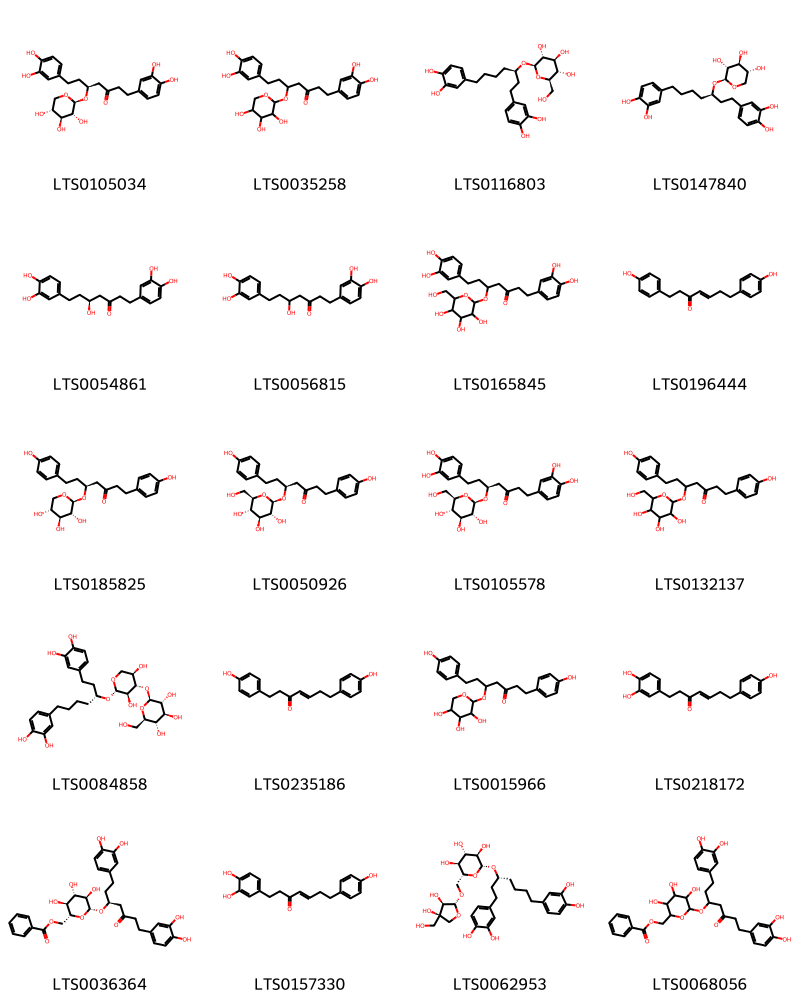{ width=100% }
    <figcaption>Hình ảnh cấu trúc hóa học của 20 hoạt chất thuộc nhóm Diarylheptanoids gồm ['(5s)-1,7-bis(3,4-dihydroxyphenyl)-5-{[(2s,3r,4s,5r)-3,4,5-trihydroxyoxan-2-yl]oxy}heptan-3-one (LTS0105034)', '1,7-bis(3,4-dihydroxyphenyl)-5-[(3,4,5-trihydroxyoxan-2-yl)oxy]heptan-3-one (LTS0035258)', '(2r,3r,4s,5s,6r)-2-{[(3r)-1,7-bis(3,4-dihydroxyphenyl)heptan-3-yl]oxy}-6-(hydroxymethyl)oxane-3,4,5-triol (LTS0116803)', '(2s,3r,4s,5r)-2-{[(3r)-1,7-bis(3,4-dihydroxyphenyl)heptan-3-yl]oxy}oxane-3,4,5-triol (LTS0147840)', '(5s)-1,7-bis(3,4-dihydroxyphenyl)-5-hydroxyheptan-3-one (LTS0054861)', '1,7-bis(3,4-dihydroxyphenyl)-5-hydroxyheptan-3-one (LTS0056815)', '1,7-bis(3,4-dihydroxyphenyl)-5-{[3,4,5-trihydroxy-6-(hydroxymethyl)oxan-2-yl]oxy}heptan-3-one (LTS0165845)', '(4e)-1,7-bis(4-hydroxyphenyl)hept-4-en-3-one (LTS0196444)', '(5s)-1,7-bis(4-hydroxyphenyl)-5-{[(2s,3r,4s,5r)-3,4,5-trihydroxyoxan-2-yl]oxy}heptan-3-one (LTS0185825)', '(5s)-1,7-bis(4-hydroxyphenyl)-5-{[(2r,3r,4s,5s,6r)-3,4,5-trihydroxy-6-(hydroxymethyl)oxan-2-yl]oxy}heptan-3-one (LTS0050926)', '(5s)-1,7-bis(3,4-dihydroxyphenyl)-5-{[(2r,3r,4s,5s,6r)-3,4,5-trihydroxy-6-(hydroxymethyl)oxan-2-yl]oxy}heptan-3-one (LTS0105578)', '1,7-bis(4-hydroxyphenyl)-5-{[3,4,5-trihydroxy-6-(hydroxymethyl)oxan-2-yl]oxy}heptan-3-one (LTS0132137)', '(2s,3r,4s,5s,6r)-2-{[(2s,3r,4s,5r)-2-{[(3r)-1,7-bis(3,4-dihydroxyphenyl)heptan-3-yl]oxy}-3,5-dihydroxyoxan-4-yl]oxy}-6-(hydroxymethyl)oxane-3,4,5-triol (LTS0084858)', '1,7-bis(4-hydroxyphenyl)hept-4-en-3-one (LTS0235186)', '1,7-bis(4-hydroxyphenyl)-5-[(3,4,5-trihydroxyoxan-2-yl)oxy]heptan-3-one (LTS0015966)', '(4e)-1-(3,4-dihydroxyphenyl)-7-(4-hydroxyphenyl)hept-4-en-3-one (LTS0218172)', '[(2r,3s,4s,5r,6r)-6-{[(3s)-1,7-bis(3,4-dihydroxyphenyl)-5-oxoheptan-3-yl]oxy}-3,4,5-trihydroxyoxan-2-yl]methyl benzoate (LTS0036364)', '1-(3,4-dihydroxyphenyl)-7-(4-hydroxyphenyl)hept-4-en-3-one (LTS0157330)', '(2r,3r,4s,5s,6r)-2-{[(3r)-1,7-bis(3,4-dihydroxyphenyl)heptan-3-yl]oxy}-6-({[(2r,3r,4r)-3,4-dihydroxy-4-(hydroxymethyl)oxolan-2-yl]oxy}methyl)oxane-3,4,5-triol (LTS0062953)', '(6-{[1,7-bis(3,4-dihydroxyphenyl)-5-oxoheptan-3-yl]oxy}-3,4,5-trihydroxyoxan-2-yl)methyl benzoate (LTS0068056)'].</figcaption>
</figure>
#### Nhóm Prenol lipids
<figure markdown="span">
    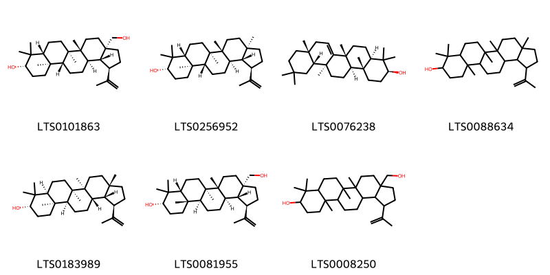{ width=100% }
    <figcaption>Hình ảnh cấu trúc hóa học của 7 hoạt chất thuộc nhóm Prenol lipids gồm ['betulin (LTS0101863)', 'lupeol (LTS0256952)', 'alnulin (LTS0076238)', 'lupeol (LTS0088634)', '(1r,3as,5as,5br,7as,9s,11ar,11bs,13as,13br)-3a,5a,5b,8,8,11a-hexamethyl-1-(prop-1-en-2-yl)-hexadecahydrocyclopenta[a]chrysen-9-ol (LTS0183989)', '(1r,3as,5ar,5br,7ar,9s,11as,11bs,13ar,13br)-3a-(hydroxymethyl)-5a,5b,8,8,11a-pentamethyl-1-(prop-1-en-2-yl)-hexadecahydrocyclopenta[a]chrysen-9-ol (LTS0081955)', '3a-(hydroxymethyl)-5a,5b,8,8,11a-pentamethyl-1-(prop-1-en-2-yl)-hexadecahydrocyclopenta[a]chrysen-9-ol (LTS0008250)'].</figcaption>
</figure>
#### Nhóm Steroids and steroid derivatives
<figure markdown="span">
    { width=100% }
    <figcaption>Hình ảnh cấu trúc hóa học của 2 hoạt chất thuộc nhóm Steroids and steroid derivatives gồm ['stigmast-5-en-3-ol, (3β)- (LTS0204616)', 'stigmast-5-en-3-ol (LTS0071224)'].</figcaption>
</figure>
#### Nhóm Tannins
<figure markdown="span">
    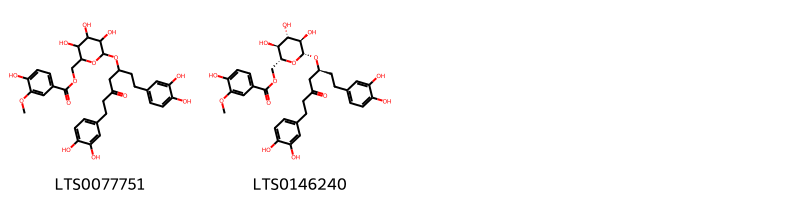{ width=100% }
    <figcaption>Hình ảnh cấu trúc hóa học của 2 hoạt chất thuộc nhóm Tannins gồm ['(6-{[1,7-bis(3,4-dihydroxyphenyl)-5-oxoheptan-3-yl]oxy}-3,4,5-trihydroxyoxan-2-yl)methyl 4-hydroxy-3-methoxybenzoate (LTS0077751)', '[(2r,3s,4s,5r,6r)-6-{[(3s)-1,7-bis(3,4-dihydroxyphenyl)-5-oxoheptan-3-yl]oxy}-3,4,5-trihydroxyoxan-2-yl]methyl 4-hydroxy-3-methoxybenzoate (LTS0146240)'].</figcaption>
</figure>

---

### Dược dân tộc học

Danh sách các quốc gia có sử dụng *Alnus rubra* trong điều trị các bệnh. 

| Country          | Disease    | Bệnh                                                                                                                                                                                                |
|:-----------------|:-----------|:----------------------------------------------------------------------------------------------------------------------------------------------------------------------------------------------------|
| Canada(Kwakiutl) | Poultice   | MYMEMORY WARNING: YOU USED ALL AVAILABLE FREE TRANSLATIONS FOR TODAY. NEXT AVAILABLE IN  15 HOURS 51 MINUTES 46 SECONDS VISIT HTTPS://MYMEMORY.TRANSLATED.NET/DOC/USAGELIMITS.PHP TO TRANSLATE MORE |
| Canada(Salish)   | Tonic      | MYMEMORY WARNING: YOU USED ALL AVAILABLE FREE TRANSLATIONS FOR TODAY. NEXT AVAILABLE IN  15 HOURS 51 MINUTES 43 SECONDS VISIT HTTPS://MYMEMORY.TRANSLATED.NET/DOC/USAGELIMITS.PHP TO TRANSLATE MORE |
| Dutch            | Tonic      | MYMEMORY WARNING: YOU USED ALL AVAILABLE FREE TRANSLATIONS FOR TODAY. NEXT AVAILABLE IN  15 HOURS 51 MINUTES 40 SECONDS VISIT HTTPS://MYMEMORY.TRANSLATED.NET/DOC/USAGELIMITS.PHP TO TRANSLATE MORE |
| German           | Emetic     | MYMEMORY WARNING: YOU USED ALL AVAILABLE FREE TRANSLATIONS FOR TODAY. NEXT AVAILABLE IN  15 HOURS 51 MINUTES 37 SECONDS VISIT HTTPS://MYMEMORY.TRANSLATED.NET/DOC/USAGELIMITS.PHP TO TRANSLATE MORE |
| US               | Astringent | MYMEMORY WARNING: YOU USED ALL AVAILABLE FREE TRANSLATIONS FOR TODAY. NEXT AVAILABLE IN  15 HOURS 51 MINUTES 34 SECONDS VISIT HTTPS://MYMEMORY.TRANSLATED.NET/DOC/USAGELIMITS.PHP TO TRANSLATE MORE |

---

# Chi Betula

??? note "Danh sách các dược liệu thuộc chi"
    
	 - *Betula alba*
	 - *Betula lenta*
	 - *Betula utilis*
	 - *Betula veerucosa*
	 - *Betula verrucosa*

---
## Betula alba
### Thông tin về thực vật

!!! info "Phân loại thực vật của *Betula pubescens* từ GIBF:"
    - **Kingdom:** Plantae
    - **Phylum:** Tracheophyta
    - **Order:** Fagales
    - **Family:** Betulaceae
    - **Genus:** Betula
    - **Species:** *Betula pubescens*

 

| Label (VI)   | Label (EN)   | Scientific Name   | Descriptions (VI)   | Descriptions (EN)   | Also Known As (VI)   | Also Known As (EN)   |
|:-------------|:-------------|:------------------|:--------------------|:--------------------|:---------------------|:---------------------|
| N/A          | N/A          | Betula alba       |                     | species of tree     | ['']                 | ['Betula alba']      |

#### Phân bố trên thế giới

**Từ CSDL GIBF** Canada, New Zealand, United States of America

#### Phân bố tại Việt Nam

**Từ CSDL GIBF**: Không có ghi nhận ở Việt Nam

---
### Thành phần hóa học
        
- Theo cơ sở dữ liệu lotus: Từ loài *Betula pubescens* đã phân lập và xác định được Chưa có hoạt chất nào được phân lập. hoạt chất thuộc về các nhóm Không có hoạt chất nào được phân lập. 

Không có hình ảnh nào được tạo ra

---

### Dược dân tộc học

Danh sách các quốc gia có sử dụng *Betula pubescens* trong điều trị các bệnh. 

| Country   | Disease                                                           | Bệnh                                                                                                                                                                                                |
|:----------|:------------------------------------------------------------------|:----------------------------------------------------------------------------------------------------------------------------------------------------------------------------------------------------|
| Turkey    | Astringent, Astringent, Diuretic, Stimulant, Digestive, Sudorific | MYMEMORY WARNING: YOU USED ALL AVAILABLE FREE TRANSLATIONS FOR TODAY. NEXT AVAILABLE IN  15 HOURS 50 MINUTES 53 SECONDS VISIT HTTPS://MYMEMORY.TRANSLATED.NET/DOC/USAGELIMITS.PHP TO TRANSLATE MORE |

---

---
## Betula lenta
### Thông tin về thực vật

!!! info "Phân loại thực vật của *Betula lenta* từ GIBF:"
    - **Kingdom:** Plantae
    - **Phylum:** Tracheophyta
    - **Order:** Fagales
    - **Family:** Betulaceae
    - **Genus:** Betula
    - **Species:** *Betula lenta*

 

| Label (VI)   | Label (EN)   | Scientific Name   | Descriptions (VI)   | Descriptions (EN)   | Also Known As (VI)   | Also Known As (EN)                                                            |
|:-------------|:-------------|:------------------|:--------------------|:--------------------|:---------------------|:------------------------------------------------------------------------------|
| N/A          | N/A          | Betula lenta      |                     | species of plant    | ['']                 | ['black birch', 'sweet birch', 'red birch', 'cherry birch', 'mahogany birch'] |

#### Phân bố trên thế giới

**Từ CSDL GIBF** United States of America

#### Phân bố tại Việt Nam

**Từ CSDL GIBF**: Không có ghi nhận ở Việt Nam

---
### Thành phần hóa học
        
- Theo cơ sở dữ liệu lotus: Từ loài *Betula lenta* đã phân lập và xác định được 13 hoạt chất thuộc về các nhóm Steroids and steroid derivatives, Prenol lipids. 

|    | chemicalTaxonomyClassyfireClass   |   smiles_count |
|---:|:----------------------------------|---------------:|
|  0 | Prenol lipids                     |             11 |
|  1 | Steroids and steroid derivatives  |              2 |

#### Nhóm Prenol lipids
<figure markdown="span">
    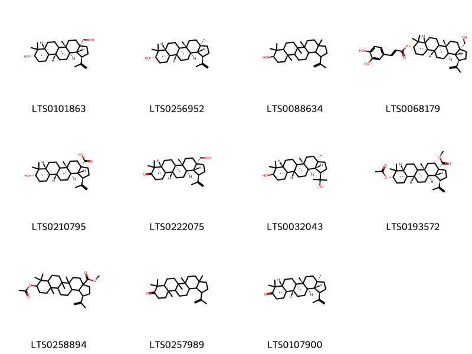{ width=100% }
    <figcaption>Hình ảnh cấu trúc hóa học của 11 hoạt chất thuộc nhóm Prenol lipids gồm ['betulin (LTS0101863)', 'lupeol (LTS0256952)', 'lupeol (LTS0088634)', '(1r,3as,5ar,5br,7ar,9s,11ar,11br,13ar,13br)-3a-(hydroxymethyl)-5a,5b,8,8,11a-pentamethyl-1-(prop-1-en-2-yl)-hexadecahydrocyclopenta[a]chrysen-9-yl (2e)-3-(3,4-dihydroxyphenyl)prop-2-enoate (LTS0068179)', 'betulinic acid (LTS0210795)', 'betulone (LTS0222075)', '(1r,3ar,5ar,5br,7ar,11ar,11br,13ar,13bs)-1-(2-hydroxypropan-2-yl)-3a,5a,5b,8,8,11a-hexamethyl-hexadecahydrocyclopenta[a]chrysen-9-ol (LTS0032043)', 'methyl (1r,3as,5ar,5br,7ar,9s,11ar,11br,13ar,13br)-9-(acetyloxy)-5a,5b,8,8,11a-pentamethyl-1-(prop-1-en-2-yl)-hexadecahydrocyclopenta[a]chrysene-3a-carboxylate (LTS0193572)', 'methyl 9-(acetyloxy)-5a,5b,8,8,11a-pentamethyl-1-(prop-1-en-2-yl)-hexadecahydrocyclopenta[a]chrysene-3a-carboxylate (LTS0258894)', '3a,5a,5b,8,8,11a-hexamethyl-1-(prop-1-en-2-yl)-tetradecahydro-1h-cyclopenta[a]chrysen-9-one (LTS0257989)', 'lupenone (LTS0107900)'].</figcaption>
</figure>
#### Nhóm Steroids and steroid derivatives
<figure markdown="span">
    { width=100% }
    <figcaption>Hình ảnh cấu trúc hóa học của 2 hoạt chất thuộc nhóm Steroids and steroid derivatives gồm ['stigmast-5-en-3-ol, (3β)- (LTS0204616)', '(1s,3ar,3br,7r,9as,9br,11ar)-1-[(2r,5r)-5-ethyl-6-methylheptan-2-yl]-9a,11a-dimethyl-1h,2h,3h,3ah,3bh,4h,6h,7h,8h,9h,9bh,10h,11h-cyclopenta[a]phenanthren-7-ol (LTS0234781)'].</figcaption>
</figure>

---

### Dược dân tộc học

Danh sách các quốc gia có sử dụng *Betula lenta* trong điều trị các bệnh. 

| Country   | Disease                | Bệnh                                                                                                                                                                                                |
|:----------|:-----------------------|:----------------------------------------------------------------------------------------------------------------------------------------------------------------------------------------------------|
| US        | Parasiticide, Diuretic | MYMEMORY WARNING: YOU USED ALL AVAILABLE FREE TRANSLATIONS FOR TODAY. NEXT AVAILABLE IN  15 HOURS 50 MINUTES 28 SECONDS VISIT HTTPS://MYMEMORY.TRANSLATED.NET/DOC/USAGELIMITS.PHP TO TRANSLATE MORE |

---

---
## Betula utilis
### Thông tin về thực vật

!!! info "Phân loại thực vật của *Betula utilis* từ GIBF:"
    - **Kingdom:** Plantae
    - **Phylum:** Tracheophyta
    - **Order:** Fagales
    - **Family:** Betulaceae
    - **Genus:** Betula
    - **Species:** *Betula utilis*

 

| Label (VI)   | Label (EN)   | Scientific Name   | Descriptions (VI)   | Descriptions (EN)   | Also Known As (VI)   | Also Known As (EN)                                   |
|:-------------|:-------------|:------------------|:--------------------|:--------------------|:---------------------|:-----------------------------------------------------|
| N/A          | N/A          | Betula utilis     | loài thực vật       | species of plant    | ['']                 | ['Himalayan birch', 'bhojpatra', 'Bhurja', 'Bhûrja'] |

#### Phân bố trên thế giới

**Từ CSDL GIBF** Denmark, Germany, Korea, Republic of, Pakistan, Bhutan, Poland, India, Canada, Belgium, Estonia, Ireland, China, Nepal, Norway, United Kingdom of Great Britain and Northern Ireland, Latvia, France, Czechia, New Zealand, United States of America, Tajikistan

#### Phân bố tại Việt Nam

**Từ CSDL GIBF**: Không có ghi nhận ở Việt Nam

---
### Thành phần hóa học
        
- Theo cơ sở dữ liệu lotus: Từ loài *Betula utilis* đã phân lập và xác định được 3 hoạt chất thuộc về các nhóm Prenol lipids, Fatty Acyls. 

|    | chemicalTaxonomyClassyfireClass   |   smiles_count |
|---:|:----------------------------------|---------------:|
|  0 | Fatty Acyls                       |              1 |
|  1 | Prenol lipids                     |              2 |

#### Nhóm Fatty Acyls
<figure markdown="span">
    { width=100% }
    <figcaption>Hình ảnh cấu trúc hóa học của 1 hoạt chất thuộc nhóm Fatty Acyls gồm ['rhododendrin (LTS0032578)'].</figcaption>
</figure>
#### Nhóm Prenol lipids
<figure markdown="span">
    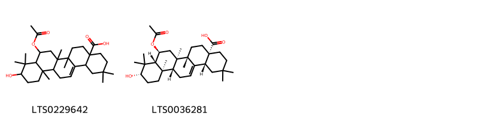{ width=100% }
    <figcaption>Hình ảnh cấu trúc hóa học của 2 hoạt chất thuộc nhóm Prenol lipids gồm ['8-(acetyloxy)-10-hydroxy-2,2,6a,6b,9,9,12a-heptamethyl-1,3,4,5,6,7,8,8a,10,11,12,12b,13,14b-tetradecahydropicene-4a-carboxylic acid (LTS0229642)', '(4as,6as,6br,8s,8ar,10s,12ar,12br,14br)-8-(acetyloxy)-10-hydroxy-2,2,6a,6b,9,9,12a-heptamethyl-1,3,4,5,6,7,8,8a,10,11,12,12b,13,14b-tetradecahydropicene-4a-carboxylic acid (LTS0036281)'].</figcaption>
</figure>

---

### Dược dân tộc học

Danh sách các quốc gia có sử dụng *Betula utilis* trong điều trị các bệnh. 

| Country   | Disease       | Bệnh                                                                                                                                                                                                |
|:----------|:--------------|:----------------------------------------------------------------------------------------------------------------------------------------------------------------------------------------------------|
| India     | Contraceptive | MYMEMORY WARNING: YOU USED ALL AVAILABLE FREE TRANSLATIONS FOR TODAY. NEXT AVAILABLE IN  15 HOURS 49 MINUTES 51 SECONDS VISIT HTTPS://MYMEMORY.TRANSLATED.NET/DOC/USAGELIMITS.PHP TO TRANSLATE MORE |

---

---
## Betula veerucosa
### Thông tin về thực vật

!!! info "Phân loại thực vật của *Betula pendula* từ GIBF:"
    - **Kingdom:** Plantae
    - **Phylum:** Tracheophyta
    - **Order:** Fagales
    - **Family:** Betulaceae
    - **Genus:** Betula
    - **Species:** *Betula pendula*

 

| Label (VI)   | Label (EN)   | Scientific Name   | Descriptions (VI)   | Descriptions (EN)   | Also Known As (VI)   | Also Known As (EN)                                   |
|:-------------|:-------------|:------------------|:--------------------|:--------------------|:---------------------|:-----------------------------------------------------|
| N/A          | N/A          | Betula utilis     | loài thực vật       | species of plant    | ['']                 | ['Himalayan birch', 'bhojpatra', 'Bhurja', 'Bhûrja'] |

#### Phân bố trên thế giới

**Từ CSDL GIBF** France, Russian Federation, Poland

#### Phân bố tại Việt Nam

**Từ CSDL GIBF**: Không có ghi nhận ở Việt Nam

---
### Thành phần hóa học
        
- Theo cơ sở dữ liệu lotus: Từ loài *Betula pendula* đã phân lập và xác định được Chưa có hoạt chất nào được phân lập. hoạt chất thuộc về các nhóm Không có hoạt chất nào được phân lập. 

Không có hình ảnh nào được tạo ra

---

### Dược dân tộc học

Danh sách các quốc gia có sử dụng *Betula pendula* trong điều trị các bệnh. 

| Country   | Disease      | Bệnh                                                                                                                                                                                                |
|:----------|:-------------|:----------------------------------------------------------------------------------------------------------------------------------------------------------------------------------------------------|
| Elsewhere | Parasiticide | MYMEMORY WARNING: YOU USED ALL AVAILABLE FREE TRANSLATIONS FOR TODAY. NEXT AVAILABLE IN  15 HOURS 49 MINUTES 19 SECONDS VISIT HTTPS://MYMEMORY.TRANSLATED.NET/DOC/USAGELIMITS.PHP TO TRANSLATE MORE |

---

---
## Betula verrucosa
### Thông tin về thực vật

!!! info "Phân loại thực vật của *Betula pendula* từ GIBF:"
    - **Kingdom:** Plantae
    - **Phylum:** Tracheophyta
    - **Order:** Fagales
    - **Family:** Betulaceae
    - **Genus:** Betula
    - **Species:** *Betula pendula*

 

| Label (VI)   | Label (EN)   | Scientific Name   | Descriptions (VI)   | Descriptions (EN)   | Also Known As (VI)   | Also Known As (EN)   |
|:-------------|:-------------|:------------------|:--------------------|:--------------------|:---------------------|:---------------------|
| N/A          | N/A          | Betula verrucosa  | loài thực vật       | species of plant    | ['']                 | ['']                 |

#### Phân bố trên thế giới

**Từ CSDL GIBF** France, Russian Federation, Poland

#### Phân bố tại Việt Nam

**Từ CSDL GIBF**: Không có ghi nhận ở Việt Nam

---
### Thành phần hóa học
        
- Theo cơ sở dữ liệu lotus: Từ loài *Betula pendula* đã phân lập và xác định được Chưa có hoạt chất nào được phân lập. hoạt chất thuộc về các nhóm Không có hoạt chất nào được phân lập. 

Không có hình ảnh nào được tạo ra

---

### Dược dân tộc học

Danh sách các quốc gia có sử dụng *Betula pendula* trong điều trị các bệnh. 

| Country   | Disease              | Bệnh                                                                                                                                                                                                |
|:----------|:---------------------|:----------------------------------------------------------------------------------------------------------------------------------------------------------------------------------------------------|
| Elsewhere | Antiseptic, Irritant | MYMEMORY WARNING: YOU USED ALL AVAILABLE FREE TRANSLATIONS FOR TODAY. NEXT AVAILABLE IN  15 HOURS 48 MINUTES 53 SECONDS VISIT HTTPS://MYMEMORY.TRANSLATED.NET/DOC/USAGELIMITS.PHP TO TRANSLATE MORE |
| ain       | Diuretic             | MYMEMORY WARNING: YOU USED ALL AVAILABLE FREE TRANSLATIONS FOR TODAY. NEXT AVAILABLE IN  15 HOURS 48 MINUTES 51 SECONDS VISIT HTTPS://MYMEMORY.TRANSLATED.NET/DOC/USAGELIMITS.PHP TO TRANSLATE MORE |

---

# Chi Ostrya

??? note "Danh sách các dược liệu thuộc chi"
    
	 - *Ostrya virginiana*

---
## Ostrya virginiana
### Thông tin về thực vật

!!! info "Phân loại thực vật của *Ostrya virginiana* từ GIBF:"
    - **Kingdom:** Plantae
    - **Phylum:** Tracheophyta
    - **Order:** Fagales
    - **Family:** Betulaceae
    - **Genus:** Ostrya
    - **Species:** *Ostrya virginiana*

 

| Label (VI)   | Label (EN)   | Scientific Name   | Descriptions (VI)   | Descriptions (EN)   | Also Known As (VI)   | Also Known As (EN)                                                                   |
|:-------------|:-------------|:------------------|:--------------------|:--------------------|:---------------------|:-------------------------------------------------------------------------------------|
| N/A          | N/A          | Ostrya virginiana |                     | species of plant    | ['']                 | ['ironwood', 'American hophornbeam', 'eastern hophornbeam', 'hardhack', 'leverwood'] |

#### Phân bố trên thế giới

**Từ CSDL GIBF** Canada, United States of America

#### Phân bố tại Việt Nam

**Từ CSDL GIBF**: Không có ghi nhận ở Việt Nam

---
### Thành phần hóa học
        
- Theo cơ sở dữ liệu lotus: Từ loài *Ostrya virginiana* đã phân lập và xác định được 2 hoạt chất thuộc về các nhóm Organooxygen compounds. 

|    | chemicalTaxonomyClassyfireClass   |   smiles_count |
|---:|:----------------------------------|---------------:|
|  0 | Organooxygen compounds            |              2 |

#### Nhóm Organooxygen compounds
<figure markdown="span">
    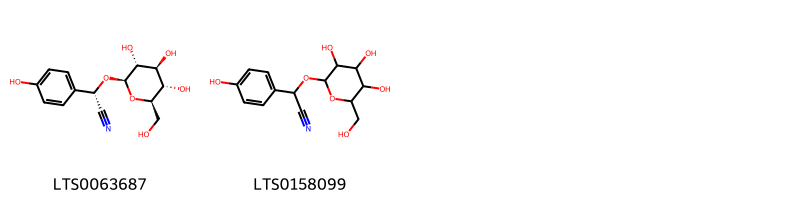{ width=100% }
    <figcaption>Hình ảnh cấu trúc hóa học của 2 hoạt chất thuộc nhóm Organooxygen compounds gồm ['dhurrin (LTS0063687)', 'dhurrin (LTS0158099)'].</figcaption>
</figure>

---

### Dược dân tộc học

Danh sách các quốc gia có sử dụng *Ostrya virginiana* trong điều trị các bệnh. 

| Country      | Disease         | Bệnh                                                                                                                                                                                                |
|:-------------|:----------------|:----------------------------------------------------------------------------------------------------------------------------------------------------------------------------------------------------|
| US           | Laxative, Tonic | MYMEMORY WARNING: YOU USED ALL AVAILABLE FREE TRANSLATIONS FOR TODAY. NEXT AVAILABLE IN  15 HOURS 48 MINUTES 22 SECONDS VISIT HTTPS://MYMEMORY.TRANSLATED.NET/DOC/USAGELIMITS.PHP TO TRANSLATE MORE |
| US(Colonial) | Tonic           | MYMEMORY WARNING: YOU USED ALL AVAILABLE FREE TRANSLATIONS FOR TODAY. NEXT AVAILABLE IN  15 HOURS 48 MINUTES 19 SECONDS VISIT HTTPS://MYMEMORY.TRANSLATED.NET/DOC/USAGELIMITS.PHP TO TRANSLATE MORE |

---

# Chi Corylus

??? note "Danh sách các dược liệu thuộc chi"
    
	 - *Corylus avellana*
	 - *Corylus heterophylla*
	 - *Corylus mandshurica*

---
## Corylus avellana
### Thông tin về thực vật

!!! info "Phân loại thực vật của *Corylus avellana* từ GIBF:"
    - **Kingdom:** Plantae
    - **Phylum:** Tracheophyta
    - **Order:** Fagales
    - **Family:** Betulaceae
    - **Genus:** Corylus
    - **Species:** *Corylus avellana*

 

| Label (VI)   | Label (EN)   | Scientific Name   | Descriptions (VI)   | Descriptions (EN)   | Also Known As (VI)   | Also Known As (EN)        |
|:-------------|:-------------|:------------------|:--------------------|:--------------------|:---------------------|:--------------------------|
| N/A          | N/A          | Corylus avellana  | loài thực vật       | species of plant    | ['']                 | ['common hazel', 'hazel'] |

#### Phân bố trên thế giới

**Từ CSDL GIBF** Georgia, Denmark, Luxembourg, Spain, Germany, Austria, Isle of Man, Serbia, Poland, Canada, Belgium, Slovakia, Netherlands, Slovenia, Hungary, Ireland, Switzerland, United Kingdom of Great Britain and Northern Ireland, Portugal, France, Russian Federation, United States of America, Italy, Ukraine

#### Phân bố tại Việt Nam

**Từ CSDL GIBF**: Không có ghi nhận ở Việt Nam

---
### Thành phần hóa học
        
- Theo cơ sở dữ liệu lotus: Từ loài *Corylus avellana* đã phân lập và xác định được 55 hoạt chất thuộc về các nhóm Organooxygen compounds, Flavonoids, Prenol lipids, Carboxylic acids and derivatives, Diarylheptanoids, Phenols, Cinnamic acids and derivatives, Steroids and steroid derivatives. 

|    | chemicalTaxonomyClassyfireClass   |   smiles_count |
|---:|:----------------------------------|---------------:|
|  0 | Carboxylic acids and derivatives  |              2 |
|  1 | Cinnamic acids and derivatives    |              5 |
|  2 | Diarylheptanoids                  |             15 |
|  3 | Flavonoids                        |             11 |
|  4 | Organooxygen compounds            |              1 |
|  5 | Phenols                           |              1 |
|  6 | Prenol lipids                     |             14 |
|  7 | Steroids and steroid derivatives  |              6 |

#### Nhóm Carboxylic acids and derivatives
<figure markdown="span">
    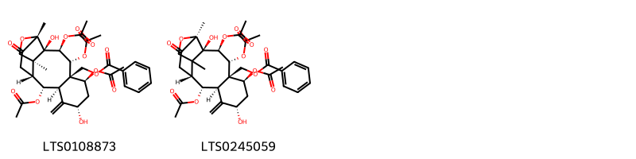{ width=100% }
    <figcaption>Hình ảnh cấu trúc hóa học của 2 hoạt chất thuộc nhóm Carboxylic acids and derivatives gồm ['[(1s,2r,3s,4r,5r,6s,8s,10r,11r,12r,15r)-3,4,6,11-tetrakis(acetyloxy)-2,8-dihydroxy-1,15-dimethyl-9-methylidene-14-oxo-16-oxatetracyclo[10.5.0.0²,¹⁵.0⁵,¹⁰]heptadecan-5-yl]methyl benzoate (LTS0108873)', '[(2r,3s,4r,5r,6s,8s,10r,11r,12r,15s)-3,4,6,11-tetrakis(acetyloxy)-2,8-dihydroxy-1,15-dimethyl-9-methylidene-14-oxo-16-oxatetracyclo[10.5.0.0²,¹⁵.0⁵,¹⁰]heptadecan-5-yl]methyl benzoate (LTS0245059)'].</figcaption>
</figure>
#### Nhóm Cinnamic acids and derivatives
<figure markdown="span">
    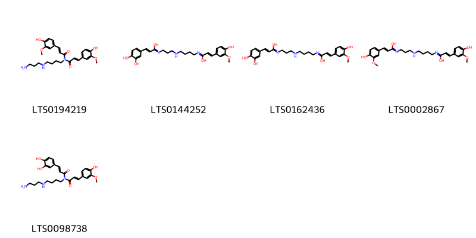{ width=100% }
    <figcaption>Hình ảnh cấu trúc hóa học của 5 hoạt chất thuộc nhóm Cinnamic acids and derivatives gồm ['(2e)-n-{4-[(3-aminopropyl)amino]butyl}-3-(4-hydroxy-3-methoxyphenyl)-n-[(2e)-3-(4-hydroxy-3-methoxyphenyl)prop-2-enoyl]prop-2-enamide (LTS0194219)', '3-(3,4-dihydroxyphenyl)-n-{3-[(4-{[1-hydroxy-3-(4-hydroxy-3-methoxyphenyl)prop-2-en-1-ylidene]amino}butyl)amino]propyl}prop-2-enimidic acid (LTS0144252)', '(2e)-3-(3,4-dihydroxyphenyl)-n-{3-[(4-{[(2e)-1-hydroxy-3-(4-hydroxy-3-methoxyphenyl)prop-2-en-1-ylidene]amino}butyl)amino]propyl}prop-2-enimidic acid (LTS0162436)', 'n-{3-[(4-{[1-hydroxy-3-(4-hydroxy-3-methoxyphenyl)prop-2-en-1-ylidene]amino}butyl)amino]propyl}-3-(4-hydroxy-3-methoxyphenyl)prop-2-enimidic acid (LTS0002867)', '(2e)-n-{4-[(3-aminopropyl)amino]butyl}-3-(3,4-dihydroxyphenyl)-n-[(2e)-3-(4-hydroxy-3-methoxyphenyl)prop-2-enoyl]prop-2-enamide (LTS0098738)'].</figcaption>
</figure>
#### Nhóm Diarylheptanoids
<figure markdown="span">
    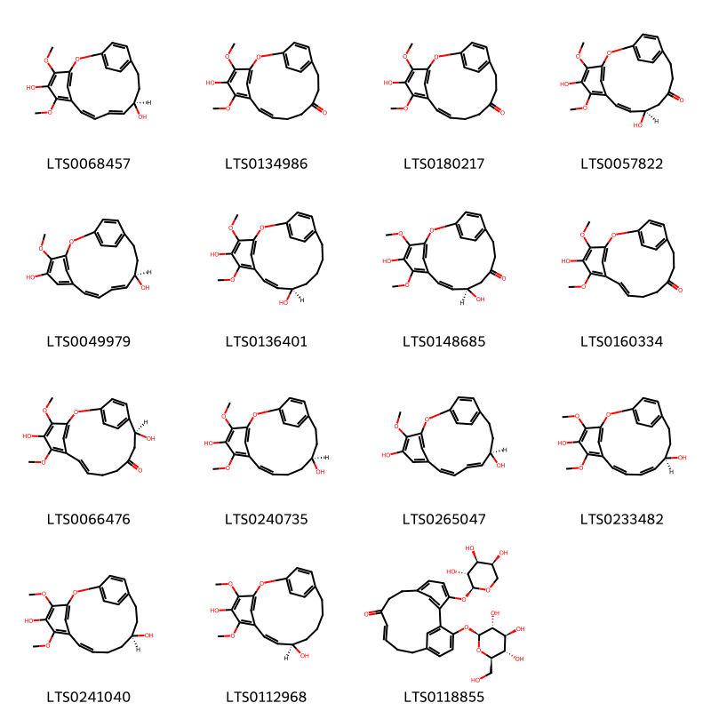{ width=100% }
    <figcaption>Hình ảnh cấu trúc hóa học của 15 hoạt chất thuộc nhóm Diarylheptanoids gồm ['(8z,10e,12r)-4,6-dimethoxy-2-oxatricyclo[13.2.2.1³,⁷]icosa-1(17),3(20),4,6,8,10,15,18-octaene-5,12-diol (LTS0068457)', '(8z)-5-hydroxy-4,6-dimethoxy-2-oxatricyclo[13.2.2.1³,⁷]icosa-1(17),3(20),4,6,8,15,18-heptaen-12-one (LTS0134986)', '5-hydroxy-4,6-dimethoxy-2-oxatricyclo[13.2.2.1³,⁷]icosa-1(17),3(20),4,6,8,15,18-heptaen-12-one (LTS0180217)', '(8z,10r)-5,10-dihydroxy-4,6-dimethoxy-2-oxatricyclo[13.2.2.1³,⁷]icosa-1(17),3(20),4,6,8,15,18-heptaen-12-one (LTS0057822)', '(8z,10e,12r)-4-methoxy-2-oxatricyclo[13.2.2.1³,⁷]icosa-1(17),3(20),4,6,8,10,15,18-octaene-5,12-diol (LTS0049979)', '(8z,10r)-4,6-dimethoxy-2-oxatricyclo[13.2.2.1³,⁷]icosa-1(17),3(20),4,6,8,15,18-heptaene-5,10-diol (LTS0136401)', '(10r)-5,10-dihydroxy-4,6-dimethoxy-2-oxatricyclo[13.2.2.1³,⁷]icosa-1(17),3(20),4,6,8,15,18-heptaen-12-one (LTS0148685)', '(8e)-5-hydroxy-4,6-dimethoxy-2-oxatricyclo[13.2.2.1³,⁷]icosa-1(17),3(20),4,6,8,15,18-heptaen-12-one (LTS0160334)', '(8e,14s)-5,14-dihydroxy-4,6-dimethoxy-2-oxatricyclo[13.2.2.1³,⁷]icosa-1(17),3(20),4,6,8,15,18-heptaen-12-one (LTS0066476)', '(8z,12s)-4,6-dimethoxy-2-oxatricyclo[13.2.2.1³,⁷]icosa-1(17),3(20),4,6,8,15,18-heptaene-5,12-diol (LTS0240735)', '(10e,12r)-4-methoxy-2-oxatricyclo[13.2.2.1³,⁷]icosa-1(17),3(20),4,6,8,10,15,18-octaene-5,12-diol (LTS0265047)', '(12r)-4,6-dimethoxy-2-oxatricyclo[13.2.2.1³,⁷]icosa-1(17),3(20),4,6,8,10,15,18-octaene-5,12-diol (LTS0233482)', '(12s)-4,6-dimethoxy-2-oxatricyclo[13.2.2.1³,⁷]icosa-1(17),3(20),4,6,8,15,18-heptaene-5,12-diol (LTS0241040)', '(10r)-4,6-dimethoxy-2-oxatricyclo[13.2.2.1³,⁷]icosa-1(17),3(20),4,6,8,15,18-heptaene-5,10-diol (LTS0112968)', '(10e)-17-{[(2s,3r,4s,5s,6r)-3,4,5-trihydroxy-6-(hydroxymethyl)oxan-2-yl]oxy}-3-{[(2s,3r,4s,5s)-3,4,5-trihydroxyoxan-2-yl]oxy}tricyclo[12.3.1.1²,⁶]nonadeca-1(18),2(19),3,5,10,14,16-heptaen-9-one (LTS0118855)'].</figcaption>
</figure>
#### Nhóm Flavonoids
<figure markdown="span">
    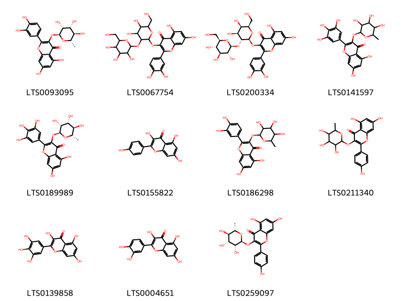{ width=100% }
    <figcaption>Hình ảnh cấu trúc hóa học của 11 hoạt chất thuộc nhóm Flavonoids gồm ['quercitrin (LTS0093095)', '3-{[4,5-dihydroxy-6-(hydroxymethyl)-3-{[3,4,5-trihydroxy-6-(hydroxymethyl)oxan-2-yl]oxy}oxan-2-yl]oxy}-2-(3,4-dihydroxyphenyl)-5,7-dihydroxychromen-4-one (LTS0067754)', '3-{[(2s,3r,4s,5r,6r)-4,5-dihydroxy-6-(hydroxymethyl)-3-{[(2s,3r,4s,5s,6r)-3,4,5-trihydroxy-6-(hydroxymethyl)oxan-2-yl]oxy}oxan-2-yl]oxy}-2-(3,4-dihydroxyphenyl)-5,7-dihydroxychromen-4-one (LTS0200334)', 'myricitrin (LTS0141597)', 'myricitrin (LTS0189989)', 'kaempherol (LTS0155822)', 'quercitrin (LTS0186298)', '5,7-dihydroxy-2-(4-hydroxyphenyl)-3-[(3,4,5-trihydroxy-6-methyloxan-2-yl)oxy]chromen-4-one (LTS0211340)', 'myricetin (LTS0139858)', 'quercetin (LTS0004651)', 'afzelin (LTS0259097)'].</figcaption>
</figure>
#### Nhóm Organooxygen compounds
<figure markdown="span">
    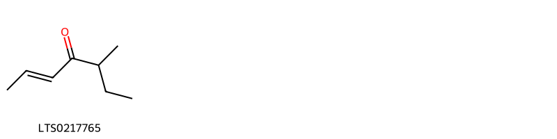{ width=100% }
    <figcaption>Hình ảnh cấu trúc hóa học của 1 hoạt chất thuộc nhóm Organooxygen compounds gồm ['filbertone (LTS0217765)'].</figcaption>
</figure>
#### Nhóm Phenols
<figure markdown="span">
    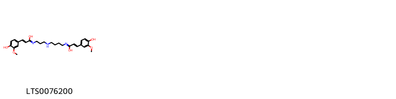{ width=100% }
    <figcaption>Hình ảnh cấu trúc hóa học của 1 hoạt chất thuộc nhóm Phenols gồm ['(2e)-n-{3-[(4-{[(2e)-1-hydroxy-3-(4-hydroxy-3-methoxyphenyl)prop-2-en-1-ylidene]amino}butyl)amino]propyl}-3-(4-hydroxy-3-methoxyphenyl)prop-2-enimidic acid (LTS0076200)'].</figcaption>
</figure>
#### Nhóm Prenol lipids
<figure markdown="span">
    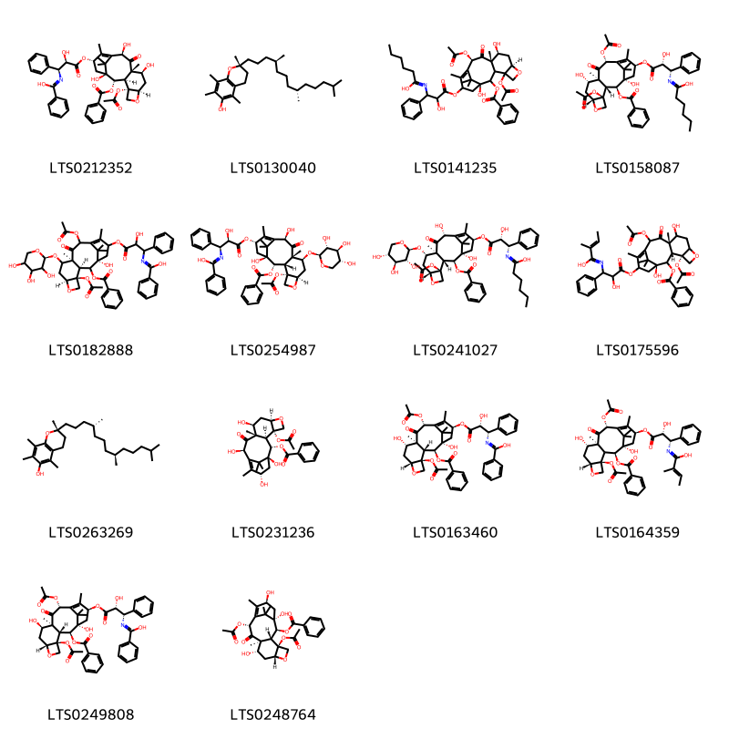{ width=100% }
    <figcaption>Hình ảnh cấu trúc hóa học của 14 hoạt chất thuộc nhóm Prenol lipids gồm ['n-[(1s,2r)-3-{[(1s,2s,3r,4s,7r,9s,10s,12r,15s)-4-(acetyloxy)-2-(benzoyloxy)-1,9,12-trihydroxy-10,14,17,17-tetramethyl-11-oxo-6-oxatetracyclo[11.3.1.0³,¹⁰.0⁴,⁷]heptadec-13-en-15-yl]oxy}-2-hydroxy-3-oxo-1-phenylpropyl]benzenecarboximidic acid (LTS0212352)', '(2r)-2,5,7,8-tetramethyl-2-[(4s,8s)-4,8,12-trimethyltridecyl]-3,4-dihydro-1-benzopyran-6-ol (LTS0130040)', 'n-(3-{[(1s,7r,9s,10s,12r)-4,12-bis(acetyloxy)-2-(benzoyloxy)-1,9-dihydroxy-10,14,17,17-tetramethyl-11-oxo-6-oxatetracyclo[11.3.1.0³,¹⁰.0⁴,⁷]heptadec-13-en-15-yl]oxy}-2-hydroxy-3-oxo-1-phenylpropyl)hexanimidic acid (LTS0141235)', 'n-[(1s,2r)-3-{[(1s,2s,3r,4s,7r,9s,10s,12r,15s)-4,12-bis(acetyloxy)-2-(benzoyloxy)-1,9-dihydroxy-10,14,17,17-tetramethyl-11-oxo-6-oxatetracyclo[11.3.1.0³,¹⁰.0⁴,⁷]heptadec-13-en-15-yl]oxy}-2-hydroxy-3-oxo-1-phenylpropyl]hexanimidic acid (LTS0158087)', 'n-(3-{[(1s,3s,4s,7s,10s)-4,12-bis(acetyloxy)-2-(benzoyloxy)-1-hydroxy-10,14,17,17-tetramethyl-11-oxo-9-{[(2s)-3,4,5-trihydroxyoxan-2-yl]oxy}-6-oxatetracyclo[11.3.1.0³,¹⁰.0⁴,⁷]heptadec-13-en-15-yl]oxy}-2-hydroxy-3-oxo-1-phenylpropyl)benzenecarboximidic acid (LTS0182888)', 'n-[(1s,2r)-3-{[(1s,2s,3s,4s,7r,9s,10s,12r,15s)-4-(acetyloxy)-2-(benzoyloxy)-1,12-dihydroxy-10,14,17,17-tetramethyl-11-oxo-9-{[(2s,3r,4s,5r)-3,4,5-trihydroxyoxan-2-yl]oxy}-6-oxatetracyclo[11.3.1.0³,¹⁰.0⁴,⁷]heptadec-13-en-15-yl]oxy}-2-hydroxy-3-oxo-1-phenylpropyl]benzenecarboximidic acid (LTS0254987)', 'n-[(1s,2r)-3-{[(1s,2s,3r,4s,7r,9s,10s,12r,15s)-4-(acetyloxy)-2-(benzoyloxy)-1,12-dihydroxy-10,14,17,17-tetramethyl-11-oxo-9-{[(2s,3r,4s,5r)-3,4,5-trihydroxyoxan-2-yl]oxy}-6-oxatetracyclo[11.3.1.0³,¹⁰.0⁴,⁷]heptadec-13-en-15-yl]oxy}-2-hydroxy-3-oxo-1-phenylpropyl]hexanimidic acid (LTS0241027)', 'n-(3-{[(1s,3s,4s,10s)-4,12-bis(acetyloxy)-2-(benzoyloxy)-1,9-dihydroxy-10,14,17,17-tetramethyl-11-oxo-6-oxatetracyclo[11.3.1.0³,¹⁰.0⁴,⁷]heptadec-13-en-15-yl]oxy}-2-hydroxy-3-oxo-1-phenylpropyl)-2-methylbut-2-enimidic acid (LTS0175596)', 'vitamin e (LTS0263269)', '10-deacetylbaccatin iii (LTS0231236)', 'n-[(1s,2r)-3-{[(1s,2s,3r,4s,7r,9s,10s,12r,15s)-4,12-bis(acetyloxy)-2-(benzoyloxy)-1,9-dihydroxy-10,14,17,17-tetramethyl-11-oxo-6-oxatetracyclo[11.3.1.0³,¹⁰.0⁴,⁷]heptadec-13-en-15-yl]oxy}-2-hydroxy-3-oxo-1-phenylpropyl]benzenecarboximidic acid (LTS0163460)', '(2e)-n-[(1s,2r)-3-{[(1s,2s,4s,7r,9s,10s,12r,15s)-4,12-bis(acetyloxy)-2-(benzoyloxy)-1,9-dihydroxy-10,14,17,17-tetramethyl-11-oxo-6-oxatetracyclo[11.3.1.0³,¹⁰.0⁴,⁷]heptadec-13-en-15-yl]oxy}-2-hydroxy-3-oxo-1-phenylpropyl]-2-methylbut-2-enimidic acid (LTS0164359)', 'n-[(1s,2r)-3-{[(1s,2s,3r,4s,7r,9r,10s,12r,15s)-4,12-bis(acetyloxy)-2-(benzoyloxy)-1,9-dihydroxy-10,14,17,17-tetramethyl-11-oxo-6-oxatetracyclo[11.3.1.0³,¹⁰.0⁴,⁷]heptadec-13-en-15-yl]oxy}-2-hydroxy-3-oxo-1-phenylpropyl]benzenecarboximidic acid (LTS0249808)', 'baccatin iii (LTS0248764)'].</figcaption>
</figure>
#### Nhóm Steroids and steroid derivatives
<figure markdown="span">
    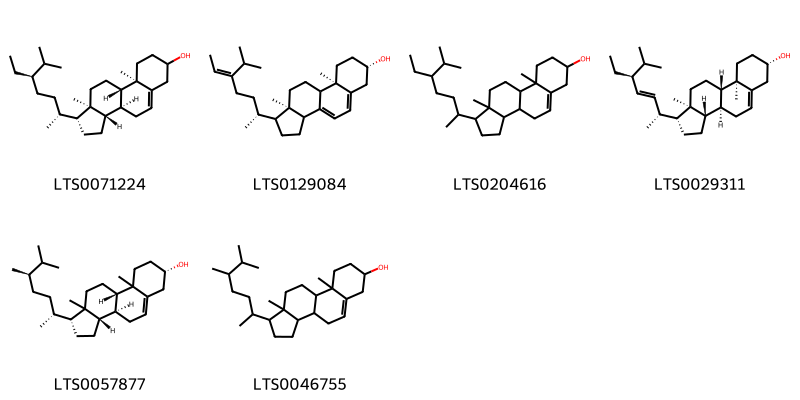{ width=100% }
    <figcaption>Hình ảnh cấu trúc hóa học của 6 hoạt chất thuộc nhóm Steroids and steroid derivatives gồm ['stigmast-5-en-3-ol (LTS0071224)', '5-dehydroavenasterol (LTS0129084)', 'stigmast-5-en-3-ol, (3β)- (LTS0204616)', 'phytosterol (LTS0029311)', '(1r,3as,3bs,7s,9bs)-1-[(2r,5r)-5,6-dimethylheptan-2-yl]-9a,11a-dimethyl-1h,2h,3h,3ah,3bh,4h,6h,7h,8h,9h,9bh,10h,11h-cyclopenta[a]phenanthren-7-ol (LTS0057877)', 'campesterol (LTS0046755)'].</figcaption>
</figure>

---

### Dược dân tộc học

Danh sách các quốc gia có sử dụng *Corylus avellana* trong điều trị các bệnh. 

| Country   | Disease         | Bệnh                                                                                                                                                                                                |
|:----------|:----------------|:----------------------------------------------------------------------------------------------------------------------------------------------------------------------------------------------------|
| Turkey    | Vasoconstrictor | MYMEMORY WARNING: YOU USED ALL AVAILABLE FREE TRANSLATIONS FOR TODAY. NEXT AVAILABLE IN  15 HOURS 47 MINUTES 53 SECONDS VISIT HTTPS://MYMEMORY.TRANSLATED.NET/DOC/USAGELIMITS.PHP TO TRANSLATE MORE |

---

---
## Corylus heterophylla
### Thông tin về thực vật

!!! info "Phân loại thực vật của *Corylus heterophylla* từ GIBF:"
    - **Kingdom:** Plantae
    - **Phylum:** Tracheophyta
    - **Order:** Fagales
    - **Family:** Betulaceae
    - **Genus:** Corylus
    - **Species:** *Corylus heterophylla*

 

| Label (VI)   | Label (EN)   | Scientific Name      | Descriptions (VI)   | Descriptions (EN)   | Also Known As (VI)   | Also Known As (EN)   |
|:-------------|:-------------|:---------------------|:--------------------|:--------------------|:---------------------|:---------------------|
| N/A          | N/A          | Corylus heterophylla |                     | species of plant    | ['']                 | ['']                 |

#### Phân bố trên thế giới

**Từ CSDL GIBF** Belarus, Korea (Democratic People’s Republic of), Russian Federation, United States of America, China, Korea, Republic of

#### Phân bố tại Việt Nam

**Từ CSDL GIBF**: Không có ghi nhận ở Việt Nam

---
### Thành phần hóa học
        
- Theo cơ sở dữ liệu lotus: Từ loài *Corylus heterophylla* đã phân lập và xác định được 34 hoạt chất thuộc về các nhóm Tannins, Flavonoids. 

|    | chemicalTaxonomyClassyfireClass   |   smiles_count |
|---:|:----------------------------------|---------------:|
|  0 | Flavonoids                        |              3 |
|  1 | Tannins                           |             31 |

#### Nhóm Flavonoids
<figure markdown="span">
    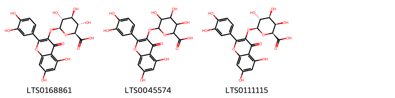{ width=100% }
    <figcaption>Hình ảnh cấu trúc hóa học của 3 hoạt chất thuộc nhóm Flavonoids gồm ['querciturone (LTS0168861)', 'miquelianin (LTS0045574)', '(2s,3r,4s,5r,6s)-6-{[2-(3,4-dihydroxyphenyl)-5,7-dihydroxy-4-oxochromen-3-yl]oxy}-3,4,5-trihydroxyoxane-2-carboxylic acid (LTS0111115)'].</figcaption>
</figure>
#### Nhóm Tannins
<figure markdown="span">
    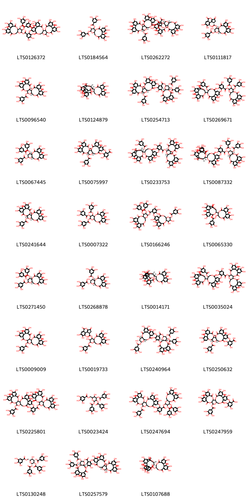{ width=100% }
    <figcaption>Hình ảnh cấu trúc hóa học của 31 hoạt chất thuộc nhóm Tannins gồm ['3,4,5,21,22,23-hexahydroxy-8,18-dioxo-11,12-bis(3,4,5-trihydroxybenzoyloxy)-9,14,17-trioxatetracyclo[17.4.0.0²,⁷.0¹⁰,¹⁵]tricosa-1(23),2(7),3,5,19,21-hexaen-13-yl 2-({7,8,9,12,13,14,20,29,30,33,34,35-dodecahydroxy-4,17,25,38-tetraoxo-3,18,21,24,39-pentaoxaheptacyclo[20.17.0.0²,¹⁹.0⁵,¹⁰.0¹¹,¹⁶.0²⁶,³¹.0³²,³⁷]nonatriaconta-5(10),6,8,11,13,15,26(31),27,29,32(37),33,35-dodecaen-28-yl}oxy)-3,4,5-trihydroxybenzoate (LTS0126372)', '3,4,5,12,21,22,23-heptahydroxy-8,18-dioxo-13-(3,4,5-trihydroxybenzoyloxy)-9,14,17-trioxatetracyclo[17.4.0.0²,⁷.0¹⁰,¹⁵]tricosa-1(23),2(7),3,5,19,21-hexaen-11-yl 3,4,5-trihydroxybenzoate (LTS0184564)', '(1r,2s,19r,20s,22r)-7,8,9,12,13,14,28,29,30,33,34,35-dodecahydroxy-4,17,25,38-tetraoxo-3,18,21,24,39-pentaoxaheptacyclo[20.17.0.0²,¹⁹.0⁵,¹⁰.0¹¹,¹⁶.0²⁶,³¹.0³²,³⁷]nonatriaconta-5,7,9,11(16),12,14,26,28,30,32(37),33,35-dodecaen-20-yl 3,4,5-trihydroxy-2-{[(1r,2s,19r,20s,22r)-7,8,9,12,13,14,29,30,33,34,35-undecahydroxy-4,17,25,38-tetraoxo-20-(3,4,5-trihydroxybenzoyloxy)-3,18,21,24,39-pentaoxaheptacyclo[20.17.0.0²,¹⁹.0⁵,¹⁰.0¹¹,¹⁶.0²⁶,³¹.0³²,³⁷]nonatriaconta-5,7,9,11(16),12,14,26,28,30,32(37),33,35-dodecaen-28-yl]oxy}benzoate (LTS0262272)', '(10r,11r,12r,13s,15r)-3,4,5,12,21,22,23-heptahydroxy-8,18-dioxo-13-(3,4,5-trihydroxybenzoyloxy)-9,14,17-trioxatetracyclo[17.4.0.0²,⁷.0¹⁰,¹⁵]tricosa-1(23),2(7),3,5,19,21-hexaen-11-yl (1s)-7,8,9-trihydroxy-3,5-dioxo-1h,2h-cyclopenta[c]isochromene-1-carboxylate (LTS0111817)', '(2s,20s,22r)-7,8,9,12,13,14,28,29,30,33,34,35-dodecahydroxy-4,17,25,38-tetraoxo-3,18,21,24,39-pentaoxaheptacyclo[20.17.0.0²,¹⁹.0⁵,¹⁰.0¹¹,¹⁶.0²⁶,³¹.0³²,³⁷]nonatriaconta-5,7,9,11(16),12,14,26,28,30,32(37),33,35-dodecaen-20-yl 3,4,5-trihydroxybenzoate (LTS0096540)', '(11r,12r)-12-[(14r,15s,19s)-2,3,4,7,8,9,19-heptahydroxy-12,17-dioxo-13,16-dioxatetracyclo[13.3.1.0⁵,¹⁸.0⁶,¹¹]nonadeca-1(18),2,4,6,8,10-hexaen-14-yl]-3,4,5,17,18,19-hexahydroxy-8,14-dioxo-9,13-dioxatricyclo[13.4.0.0²,⁷]nonadeca-1(15),2,4,6,16,18-hexaen-11-yl 3,4,5-trihydroxybenzoate (LTS0124879)', '(10r,11s,12r,13s,15r)-3,4,5,21,22,23-hexahydroxy-8,18-dioxo-11,12-bis(3,4,5-trihydroxybenzoyloxy)-9,14,17-trioxatetracyclo[17.4.0.0²,⁷.0¹⁰,¹⁵]tricosa-1(23),2(7),3,5,19,21-hexaen-13-yl 3,4,5-trihydroxy-2-{[(1r,2s,19r,20s,22r)-7,8,9,12,13,14,29,30,33,34,35-undecahydroxy-4,17,25,38-tetraoxo-20-(3,4,5-trihydroxybenzoyloxy)-3,18,21,24,39-pentaoxaheptacyclo[20.17.0.0²,¹⁹.0⁵,¹⁰.0¹¹,¹⁶.0²⁶,³¹.0³²,³⁷]nonatriaconta-5,7,9,11(16),12,14,26,28,30,32(37),33,35-dodecaen-28-yl]oxy}benzoate (LTS0254713)', '3,4,5,21,22,23-hexahydroxy-8,18-dioxo-11,12-bis(3,4,5-trihydroxybenzoyloxy)-9,14,17-trioxatetracyclo[17.4.0.0²,⁷.0¹⁰,¹⁵]tricosa-1(23),2(7),3,5,19,21-hexaen-13-yl 2-[(12-{2,3,4,7,8,9,19-heptahydroxy-12,17-dioxo-13,16-dioxatetracyclo[13.3.1.0⁵,¹⁸.0⁶,¹¹]nonadeca-1(18),2,4,6,8,10-hexaen-14-yl}-3,4,17,18,19-pentahydroxy-8,14-dioxo-11-(3,4,5-trihydroxybenzoyloxy)-9,13-dioxatricyclo[13.4.0.0²,⁷]nonadeca-1(15),2,4,6,16,18-hexaen-5-yl)oxy]-3,4,5-trihydroxybenzoate (LTS0269671)', '(10r,11s,12r,13s,15r)-3,4,5,21,22,23-hexahydroxy-8,18-dioxo-12,13-bis(3,4,5-trihydroxybenzoyloxy)-9,14,17-trioxatetracyclo[17.4.0.0²,⁷.0¹⁰,¹⁵]tricosa-1(23),2(7),3,5,19,21-hexaen-11-yl 3,4,5-trihydroxybenzoate (LTS0067445)', '3,4,5-trihydroxy-2-{[(1r,2s,19r,20s,22r)-7,8,9,12,13,14,29,30,33,34,35-undecahydroxy-4,17,25,38-tetraoxo-20-(3,4,5-trihydroxybenzoyloxy)-3,18,21,24,39-pentaoxaheptacyclo[20.17.0.0²,¹⁹.0⁵,¹⁰.0¹¹,¹⁶.0²⁶,³¹.0³²,³⁷]nonatriaconta-5,7,9,11(16),12,14,26,28,30,32(37),33,35-dodecaen-28-yl]oxy}benzoic acid (LTS0075997)', '(1r,2s,19r,20s,22r)-7,8,9,12,13,14,28,29,30,33,34,35-dodecahydroxy-4,17,25,38-tetraoxo-3,18,21,24,39-pentaoxaheptacyclo[20.17.0.0²,¹⁹.0⁵,¹⁰.0¹¹,¹⁶.0²⁶,³¹.0³²,³⁷]nonatriaconta-5,7,9,11(16),12,14,26,28,30,32(37),33,35-dodecaen-20-yl 2-{[(11r,12r)-12-[(14r,15s,19r)-2,3,4,7,8,9,19-heptahydroxy-12,17-dioxo-13,16-dioxatetracyclo[13.3.1.0⁵,¹⁸.0⁶,¹¹]nonadeca-1(18),2,4,6,8,10-hexaen-14-yl]-3,4,17,18,19-pentahydroxy-8,14-dioxo-11-(3,4,5-trihydroxybenzoyloxy)-9,13-dioxatricyclo[13.4.0.0²,⁷]nonadeca-1(15),2,4,6,16,18-hexaen-5-yl]oxy}-3,4,5-trihydroxybenzoate (LTS0233753)', '(10r,11s,12r,13s,15r)-3,4,5,21,22,23-hexahydroxy-8,18-dioxo-11,12-bis(3,4,5-trihydroxybenzoyloxy)-9,14,17-trioxatetracyclo[17.4.0.0²,⁷.0¹⁰,¹⁵]tricosa-1(23),2(7),3,5,19,21-hexaen-13-yl 2-{[(11r,12r)-12-[(14r,15s,19r)-2,3,4,7,8,9,19-heptahydroxy-12,17-dioxo-13,16-dioxatetracyclo[13.3.1.0⁵,¹⁸.0⁶,¹¹]nonadeca-1(18),2,4,6,8,10-hexaen-14-yl]-3,4,17,18,19-pentahydroxy-8,14-dioxo-11-(3,4,5-trihydroxybenzoyloxy)-9,13-dioxatricyclo[13.4.0.0²,⁷]nonadeca-1(15),2(7),3,5,16,18-hexaen-5-yl]oxy}-3,4,5-trihydroxybenzoate (LTS0087332)', 'casuarictin (LTS0241644)', '3,4,5,21,22,23-hexahydroxy-8,18-dioxo-12,13-bis(3,4,5-trihydroxybenzoyloxy)-9,14,17-trioxatetracyclo[17.4.0.0²,⁷.0¹⁰,¹⁵]tricosa-1(23),2(7),3,5,19,21-hexaen-11-yl 3,4,5-trihydroxybenzoate (LTS0007322)', '3,4,5,21,22,23-hexahydroxy-8,18-dioxo-11,12-bis(3,4,5-trihydroxybenzoyloxy)-9,14,17-trioxatetracyclo[17.4.0.0²,⁷.0¹⁰,¹⁵]tricosa-1(23),2(7),3,5,19,21-hexaen-13-yl 2-{[3,4,5,11,12,22,23-heptahydroxy-8,18-dioxo-13-(3,4,5-trihydroxybenzoyloxy)-9,14,17-trioxatetracyclo[17.4.0.0²,⁷.0¹⁰,¹⁵]tricosa-1(23),2(7),3,5,19,21-hexaen-21-yl]oxy}-3,4,5-trihydroxybenzoate (LTS0166246)', '12-{2,3,4,7,8,9,19-heptahydroxy-12,17-dioxo-13,16-dioxatetracyclo[13.3.1.0⁵,¹⁸.0⁶,¹¹]nonadeca-1(18),2,4,6,8,10-hexaen-14-yl}-3,4,5,17,18,19-hexahydroxy-8,14-dioxo-9,13-dioxatricyclo[13.4.0.0²,⁷]nonadeca-1(15),2,4,6,16,18-hexaen-11-yl 3,4,5-trihydroxybenzenecarboperoxoate (LTS0065330)', '(10r,11s,12r,15r)-3,4,5,21,22,23-hexahydroxy-8,18-dioxo-12,13-bis(3,4,5-trihydroxybenzoyloxy)-9,14,17-trioxatetracyclo[17.4.0.0²,⁷.0¹⁰,¹⁵]tricosa-1(23),2(7),3,5,19,21-hexaen-11-yl 3,4,5-trihydroxybenzoate (LTS0271450)', '(10r,11r,12r,13r,15r)-3,4,5,12,21,22,23-heptahydroxy-8,18-dioxo-13-(3,4,5-trihydroxybenzoyloxy)-9,14,17-trioxatetracyclo[17.4.0.0²,⁷.0¹⁰,¹⁵]tricosa-1(23),2(7),3,5,19,21-hexaen-11-yl 3,4,5-trihydroxybenzoate (LTS0268878)', '(11r,12s)-12-[(14r,15s,19r)-2,3,4,7,8,9,19-heptahydroxy-12,17-dioxo-13,16-dioxatetracyclo[13.3.1.0⁵,¹⁸.0⁶,¹¹]nonadeca-1(18),2,4,6,8,10-hexaen-14-yl]-3,4,5,17,18,19-hexahydroxy-8,14-dioxo-9,13-dioxatricyclo[13.4.0.0²,⁷]nonadeca-1(15),2,4,6,16,18-hexaen-11-yl 3,4,5-trihydroxybenzenecarboperoxoate (LTS0014171)', '7,8,9,12,13,14,28,29,30,33,34,35-dodecahydroxy-4,17,25,38-tetraoxo-3,18,21,24,39-pentaoxaheptacyclo[20.17.0.0²,¹⁹.0⁵,¹⁰.0¹¹,¹⁶.0²⁶,³¹.0³²,³⁷]nonatriaconta-5,7,9,11(16),12,14,26,28,30,32(37),33,35-dodecaen-20-yl 2-[(12-{2,3,4,7,8,9,19-heptahydroxy-12,17-dioxo-13,16-dioxatetracyclo[13.3.1.0⁵,¹⁸.0⁶,¹¹]nonadeca-1(18),2,4,6,8,10-hexaen-14-yl}-3,4,17,18,19-pentahydroxy-8,14-dioxo-11-(3,4,5-trihydroxybenzoyloxy)-9,13-dioxatricyclo[13.4.0.0²,⁷]nonadeca-1(15),2,4,6,16,18-hexaen-5-yl)oxy]-3,4,5-trihydroxybenzoate (LTS0035024)', '7,8,9,12,13,14,28,29,30,33,34,35-dodecahydroxy-4,17,25,38-tetraoxo-3,18,21,24,39-pentaoxaheptacyclo[20.17.0.0²,¹⁹.0⁵,¹⁰.0¹¹,¹⁶.0²⁶,³¹.0³²,³⁷]nonatriaconta-5,7,9,11(16),12,14,26,28,30,32(37),33,35-dodecaen-20-yl 3,4,5-trihydroxybenzoate (LTS0009009)', '3,4,5,12,21,22,23-heptahydroxy-8,18-dioxo-13-(3,4,5-trihydroxybenzoyloxy)-9,14,17-trioxatetracyclo[17.4.0.0²,⁷.0¹⁰,¹⁵]tricosa-1(23),2(7),3,5,19,21-hexaen-11-yl 7,8,9-trihydroxy-3,5-dioxo-1h,2h-cyclopenta[c]isochromene-1-carboxylate (LTS0019733)', '(10r,11s,12r,13s,15r)-3,4,5,21,22,23-hexahydroxy-8,18-dioxo-11,12-bis(3,4,5-trihydroxybenzoyloxy)-9,14,17-trioxatetracyclo[17.4.0.0²,⁷.0¹⁰,¹⁵]tricosa-1(23),2(7),3,5,19,21-hexaen-13-yl 2-{[(10s,11r,12r,13s,15r)-3,4,5,11,12,22,23-heptahydroxy-8,18-dioxo-13-(3,4,5-trihydroxybenzoyloxy)-9,14,17-trioxatetracyclo[17.4.0.0²,⁷.0¹⁰,¹⁵]tricosa-1(23),2(7),3,5,19,21-hexaen-21-yl]oxy}-3,4,5-trihydroxybenzoate (LTS0240964)', '3,4,5-trihydroxy-2-{[(1r,2s,18r,19s,21r)-7,8,9,12,13,14,28,29,32,33,34-undecahydroxy-4,24,37-trioxo-19-(3,4,5-trihydroxybenzoyloxy)-3,17,20,23,38-pentaoxaheptacyclo[19.17.0.0²,¹⁸.0⁵,¹⁰.0¹¹,¹⁶.0²⁵,³⁰.0³¹,³⁶]octatriaconta-5,7,9,11(16),12,14,25,27,29,31(36),32,34-dodecaen-27-yl]oxy}benzoic acid (LTS0250632)', '7,8,9,12,13,14,28,29,30,33,34,35-dodecahydroxy-4,17,25,38-tetraoxo-3,18,21,24,39-pentaoxaheptacyclo[20.17.0.0²,¹⁹.0⁵,¹⁰.0¹¹,¹⁶.0²⁶,³¹.0³²,³⁷]nonatriaconta-5,7,9,11(16),12,14,26,28,30,32(37),33,35-dodecaen-20-yl 3,4,5-trihydroxy-2-{[7,8,9,12,13,14,29,30,33,34,35-undecahydroxy-4,17,25,38-tetraoxo-20-(3,4,5-trihydroxybenzoyloxy)-3,18,21,24,39-pentaoxaheptacyclo[20.17.0.0²,¹⁹.0⁵,¹⁰.0¹¹,¹⁶.0²⁶,³¹.0³²,³⁷]nonatriaconta-5,7,9,11(16),12,14,26,28,30,32(37),33,35-dodecaen-28-yl]oxy}benzoate (LTS0225801)', '5-hydroxy-3,4-bis(3,4,5-trihydroxybenzoyloxy)-6-[(3,4,5-trihydroxybenzoyloxy)methyl]oxan-2-yl 3,4,5-trihydroxybenzoate (LTS0023424)', '3,4,5,21,22,23-hexahydroxy-8,18-dioxo-11,12-bis(3,4,5-trihydroxybenzoyloxy)-9,14,17-trioxatetracyclo[17.4.0.0²,⁷.0¹⁰,¹⁵]tricosa-1(23),2(7),3,5,19,21-hexaen-13-yl 3,4,5-trihydroxy-2-{[7,8,9,12,13,14,29,30,33,34,35-undecahydroxy-4,17,25,38-tetraoxo-20-(3,4,5-trihydroxybenzoyloxy)-3,18,21,24,39-pentaoxaheptacyclo[20.17.0.0²,¹⁹.0⁵,¹⁰.0¹¹,¹⁶.0²⁶,³¹.0³²,³⁷]nonatriaconta-5,7,9,11(16),12,14,26,28,30,32(37),33,35-dodecaen-28-yl]oxy}benzoate (LTS0247694)', '3,4,5-trihydroxy-2-{[7,8,9,12,13,14,29,30,33,34,35-undecahydroxy-4,17,25,38-tetraoxo-20-(3,4,5-trihydroxybenzoyloxy)-3,18,21,24,39-pentaoxaheptacyclo[20.17.0.0²,¹⁹.0⁵,¹⁰.0¹¹,¹⁶.0²⁶,³¹.0³²,³⁷]nonatriaconta-5,7,9,11(16),12,14,26,28,30,32(37),33,35-dodecaen-28-yl]oxy}benzoic acid (LTS0247959)', '(2s,3r,4s,5r,6r)-5-hydroxy-3,4-bis(3,4,5-trihydroxybenzoyloxy)-6-[(3,4,5-trihydroxybenzoyloxy)methyl]oxan-2-yl 3,4,5-trihydroxybenzoate (LTS0130248)', '(10r,11s,12r,13s,15r)-3,4,5,21,22,23-hexahydroxy-8,18-dioxo-11,12-bis(3,4,5-trihydroxybenzoyloxy)-9,14,17-trioxatetracyclo[17.4.0.0²,⁷.0¹⁰,¹⁵]tricosa-1(23),2(7),3,5,19,21-hexaen-13-yl 2-{[(1r,2s,19r,20r,22r)-7,8,9,12,13,14,20,29,30,33,34,35-dodecahydroxy-4,17,25,38-tetraoxo-3,18,21,24,39-pentaoxaheptacyclo[20.17.0.0²,¹⁹.0⁵,¹⁰.0¹¹,¹⁶.0²⁶,³¹.0³²,³⁷]nonatriaconta-5,7,9,11(16),12,14,26(31),27,29,32(37),33,35-dodecaen-28-yl]oxy}-3,4,5-trihydroxybenzoate (LTS0257579)', '(11r,12r)-12-[(15s,19s)-2,3,4,7,8,9,19-heptahydroxy-12,17-dioxo-13,16-dioxatetracyclo[13.3.1.0⁵,¹⁸.0⁶,¹¹]nonadeca-1(18),2,4,6,8,10-hexaen-14-yl]-3,4,5,17,18,19-hexahydroxy-8,14-dioxo-9,13-dioxatricyclo[13.4.0.0²,⁷]nonadeca-1(15),2,4,6,16,18-hexaen-11-yl 3,4,5-trihydroxybenzoate (LTS0107688)'].</figcaption>
</figure>

---

### Dược dân tộc học

Danh sách các quốc gia có sử dụng *Corylus heterophylla* trong điều trị các bệnh. 

| Country   | Disease            | Bệnh                                                                                                                                                                                                |
|:----------|:-------------------|:----------------------------------------------------------------------------------------------------------------------------------------------------------------------------------------------------|
| China     | Apertif, Digestive | MYMEMORY WARNING: YOU USED ALL AVAILABLE FREE TRANSLATIONS FOR TODAY. NEXT AVAILABLE IN  15 HOURS 47 MINUTES 07 SECONDS VISIT HTTPS://MYMEMORY.TRANSLATED.NET/DOC/USAGELIMITS.PHP TO TRANSLATE MORE |

---

---
## Corylus mandshurica
### Thông tin về thực vật

!!! info "Phân loại thực vật của *Corylus sieboldiana* từ GIBF:"
    - **Kingdom:** Plantae
    - **Phylum:** Tracheophyta
    - **Order:** Fagales
    - **Family:** Betulaceae
    - **Genus:** Corylus
    - **Species:** *Corylus sieboldiana*

 

| Label (VI)   | Label (EN)   | Scientific Name     | Descriptions (VI)   | Descriptions (EN)   | Also Known As (VI)   | Also Known As (EN)   |
|:-------------|:-------------|:--------------------|:--------------------|:--------------------|:---------------------|:---------------------|
| N/A          | N/A          | Corylus mandshurica | loài thực vật       | species of plant    | ['']                 | ['']                 |

#### Phân bố trên thế giới

**Từ CSDL GIBF** nan, Japan, Korea (Democratic People’s Republic of), Estonia, Russian Federation, Mexico, China, Slovakia

#### Phân bố tại Việt Nam

**Từ CSDL GIBF**: Không có ghi nhận ở Việt Nam

---
### Thành phần hóa học
        
- Theo cơ sở dữ liệu lotus: Từ loài *Corylus sieboldiana* đã phân lập và xác định được Chưa có hoạt chất nào được phân lập. hoạt chất thuộc về các nhóm Không có hoạt chất nào được phân lập. 

Không có hình ảnh nào được tạo ra

---

### Dược dân tộc học

Danh sách các quốc gia có sử dụng *Corylus sieboldiana* trong điều trị các bệnh. 

| Country   | Disease            | Bệnh                                                                                                                                                                                                |
|:----------|:-------------------|:----------------------------------------------------------------------------------------------------------------------------------------------------------------------------------------------------|
| China     | Apertif, Digestive | MYMEMORY WARNING: YOU USED ALL AVAILABLE FREE TRANSLATIONS FOR TODAY. NEXT AVAILABLE IN  15 HOURS 46 MINUTES 37 SECONDS VISIT HTTPS://MYMEMORY.TRANSLATED.NET/DOC/USAGELIMITS.PHP TO TRANSLATE MORE |

---

