!!! abstract "Tóm tắt"

    Họ Bignoniaceae gồm khoảng 25 chi và 50 loài được một số cộng đồng tại các quốc gia như Japan, Panama, Brazil, Nicaragua, Ghana, Peru, Venezuela, Japan*, Mexico, China, Malaya, Haiti, Elsewhere, India(Gujarat), Dominican Republic, Colombia, Gold Coast, Curacao, Africa, Brazil(Paumari), South Africa, Latin America, India, US, Paraguay, Africa(Swahili), Cuba, Bahamas, /, Guinea, India(Ayurvedic) sử dụng trong một số trường hợp QUERY LENGTH LIMIT EXCEEDED. MAX ALLOWED QUERY : 500 CHARS QUERY LENGTH LIMIT EXCEEDED. MAX ALLOWED QUERY : 500 CHARS.

!!! info "DrDuke"

    James A. Duke sinh năm 1929-2017 là một nhà thực vật học người Mỹ. Đây là một trong những tác giả hàng đầu trong lĩnh vực dược dân tộc học với cuốn *CRC Handbook of Medicinal Herbs* và chính là người xây dựng lên cơ sở dữ liệu về hợp chất tự nhiên và dược dân tộc học tại Bộ nông nghiệp Hoa Kỳ. Các thông tin được đăng tải tại website [Dr. Duke's Phytochemical and Ethnobotanical Databases](https://phytochem.nal.usda.gov/). 
    Trong suốt thập niên 1970, ông lãnh đạo the Plant Taxonomy Laboratory, Plant Genetics and Germplasm Institute of the Agricultural Research Service, U.S. Department of Agriculture.
    Trong tài liệu này, các thông tin về dược dân tộc của các dược liệu được trích dẫn từ tài liệu của James A. Ducke với sự trợ giúp của phần mềm dịch thuật từ tiếng Anh sang tiếng Việt.
   

# Chi Bignonia

??? note "Danh sách các dược liệu thuộc chi"
    
	 - *Bignonia alliacea*
	 - *Bignonia capreolata*
	 - *Bignonia unguis-cati*

---
## Bignonia alliacea
### Thông tin về thực vật

!!! info "Phân loại thực vật của *Bignonia alliacea* từ GIBF:"
    - **Kingdom:** Plantae
    - **Phylum:** Tracheophyta
    - **Order:** Lamiales
    - **Family:** Bignoniaceae
    - **Genus:** Bignonia
    - **Species:** *Bignonia alliacea*

 

| Label (VI)   | Label (EN)   | Scientific Name   | Descriptions (VI)   | Descriptions (EN)   | Also Known As (VI)   | Also Known As (EN)   |
|:-------------|:-------------|:------------------|:--------------------|:--------------------|:---------------------|:---------------------|
| N/A          | N/A          | Bignonia alliacea | loài thực vật       | species of plant    | ['']                 | ['']                 |

#### Phân bố trên thế giới

**Từ CSDL GIBF** Không có kết quả phù hợp

#### Phân bố tại Việt Nam

**Từ CSDL GIBF**: Không có ghi nhận ở Việt Nam

---
### Thành phần hóa học
        
- Theo cơ sở dữ liệu lotus: Từ loài *Bignonia alliacea* đã phân lập và xác định được Chưa có hoạt chất nào được phân lập. hoạt chất thuộc về các nhóm Không có hoạt chất nào được phân lập. 

Không có hình ảnh nào được tạo ra

---

### Dược dân tộc học

Danh sách các quốc gia có sử dụng *Bignonia alliacea* trong điều trị các bệnh. 

| Country   | Disease   | Bệnh                                                                                                                                                                                                |
|:----------|:----------|:----------------------------------------------------------------------------------------------------------------------------------------------------------------------------------------------------|
| Elsewhere | Vermifuge | MYMEMORY WARNING: YOU USED ALL AVAILABLE FREE TRANSLATIONS FOR TODAY. NEXT AVAILABLE IN  19 HOURS 24 MINUTES 28 SECONDS VISIT HTTPS://MYMEMORY.TRANSLATED.NET/DOC/USAGELIMITS.PHP TO TRANSLATE MORE |

---

---
## Bignonia capreolata
### Thông tin về thực vật

!!! info "Phân loại thực vật của *Bignonia capreolata* từ GIBF:"
    - **Kingdom:** Plantae
    - **Phylum:** Tracheophyta
    - **Order:** Lamiales
    - **Family:** Bignoniaceae
    - **Genus:** Bignonia
    - **Species:** *Bignonia capreolata*

 

| Label (VI)   | Label (EN)   | Scientific Name     | Descriptions (VI)   | Descriptions (EN)   | Also Known As (VI)   | Also Known As (EN)   |
|:-------------|:-------------|:--------------------|:--------------------|:--------------------|:---------------------|:---------------------|
| N/A          | N/A          | Bignonia capreolata | loài thực vật       | species of plant    | ['']                 | ['']                 |

#### Phân bố trên thế giới

**Từ CSDL GIBF** United States of America

#### Phân bố tại Việt Nam

**Từ CSDL GIBF**: Không có ghi nhận ở Việt Nam

---
### Thành phần hóa học
        
- Theo cơ sở dữ liệu lotus: Từ loài *Bignonia capreolata* đã phân lập và xác định được Chưa có hoạt chất nào được phân lập. hoạt chất thuộc về các nhóm Không có hoạt chất nào được phân lập. 

Không có hình ảnh nào được tạo ra

---

### Dược dân tộc học

Danh sách các quốc gia có sử dụng *Bignonia capreolata* trong điều trị các bệnh. 

| Country   | Disease   | Bệnh                                                                                                                                                                                                |
|:----------|:----------|:----------------------------------------------------------------------------------------------------------------------------------------------------------------------------------------------------|
| US        | Soap      | MYMEMORY WARNING: YOU USED ALL AVAILABLE FREE TRANSLATIONS FOR TODAY. NEXT AVAILABLE IN  19 HOURS 24 MINUTES 09 SECONDS VISIT HTTPS://MYMEMORY.TRANSLATED.NET/DOC/USAGELIMITS.PHP TO TRANSLATE MORE |

---

---
## Bignonia unguiscati
### Thông tin về thực vật

!!! info "Phân loại thực vật của *Dolichandra unguis-cati* từ GIBF:"
    - **Kingdom:** Plantae
    - **Phylum:** Tracheophyta
    - **Order:** Lamiales
    - **Family:** Bignoniaceae
    - **Genus:** Dolichandra
    - **Species:** *Dolichandra unguis-cati*

 

| Label (VI)   | Label (EN)   | Scientific Name     | Descriptions (VI)   | Descriptions (EN)   | Also Known As (VI)   | Also Known As (EN)   |
|:-------------|:-------------|:--------------------|:--------------------|:--------------------|:---------------------|:---------------------|
| N/A          | N/A          | Bignonia capreolata | loài thực vật       | species of plant    | ['']                 | ['']                 |

#### Phân bố trên thế giới

**Từ CSDL GIBF** nan, unknown or invalid, Ghana, Singapore, Saint Vincent and the Grenadines, Puerto Rico, India, Virgin Islands (U.S.), Barbados, Panama, Brazil, Mexico, Uruguay, Argentina, Portugal, France, Paraguay, Costa Rica, Ecuador, United States of America

#### Phân bố tại Việt Nam

**Từ CSDL GIBF**: Không có ghi nhận ở Việt Nam

---
### Thành phần hóa học
        
- Theo cơ sở dữ liệu lotus: Từ loài *Dolichandra unguis-cati* đã phân lập và xác định được Chưa có hoạt chất nào được phân lập. hoạt chất thuộc về các nhóm Không có hoạt chất nào được phân lập. 

Không có hình ảnh nào được tạo ra

---

### Dược dân tộc học

Danh sách các quốc gia có sử dụng *Dolichandra unguis-cati* trong điều trị các bệnh. 

| Country   | Disease            | Bệnh                                                                                                                                                                                                |
|:----------|:-------------------|:----------------------------------------------------------------------------------------------------------------------------------------------------------------------------------------------------|
| Elsewhere | Antidote           | MYMEMORY WARNING: YOU USED ALL AVAILABLE FREE TRANSLATIONS FOR TODAY. NEXT AVAILABLE IN  19 HOURS 23 MINUTES 35 SECONDS VISIT HTTPS://MYMEMORY.TRANSLATED.NET/DOC/USAGELIMITS.PHP TO TRANSLATE MORE |
| Mexico    | Antidote, Antidote | MYMEMORY WARNING: YOU USED ALL AVAILABLE FREE TRANSLATIONS FOR TODAY. NEXT AVAILABLE IN  19 HOURS 23 MINUTES 32 SECONDS VISIT HTTPS://MYMEMORY.TRANSLATED.NET/DOC/USAGELIMITS.PHP TO TRANSLATE MORE |

---

# Chi Dolichandrone

??? note "Danh sách các dược liệu thuộc chi"
    
	 - *Dolichandrone athacea*
	 - *Dolichandrone falcata*

---
## Dolichandrone athacea
### Thông tin về thực vật

!!! info "Phân loại thực vật của *N/A* từ GIBF:"
    - **Kingdom:** Plantae
    - **Phylum:** Tracheophyta
    - **Order:** Lamiales
    - **Family:** Bignoniaceae
    - **Genus:** Dolichandrone
    - **Species:** *N/A*

 

| Label (VI)   | Label (EN)   | Scientific Name     | Descriptions (VI)   | Descriptions (EN)   | Also Known As (VI)   | Also Known As (EN)   |
|:-------------|:-------------|:--------------------|:--------------------|:--------------------|:---------------------|:---------------------|
| N/A          | N/A          | Bignonia capreolata | loài thực vật       | species of plant    | ['']                 | ['']                 |

#### Phân bố trên thế giới

**Từ CSDL GIBF** Thailand, Vanuatu, Brazil, Philippines, Malaysia, Mozambique, India, New Caledonia, Singapore, China, Australia, Belgium, Indonesia

#### Phân bố tại Việt Nam

**Từ CSDL GIBF**: Không có ghi nhận ở Việt Nam

---
### Thành phần hóa học
        
- Theo cơ sở dữ liệu lotus: Từ loài *N/A* đã phân lập và xác định được Chưa có hoạt chất nào được phân lập. hoạt chất thuộc về các nhóm Không có hoạt chất nào được phân lập. 

Không có hình ảnh nào được tạo ra

---

### Dược dân tộc học

Danh sách các quốc gia có sử dụng *N/A* trong điều trị các bệnh. 

| Country   | Disease    | Bệnh                                                                                                                                                                                                |
|:----------|:-----------|:----------------------------------------------------------------------------------------------------------------------------------------------------------------------------------------------------|
| India     | Antiseptic | MYMEMORY WARNING: YOU USED ALL AVAILABLE FREE TRANSLATIONS FOR TODAY. NEXT AVAILABLE IN  19 HOURS 23 MINUTES 08 SECONDS VISIT HTTPS://MYMEMORY.TRANSLATED.NET/DOC/USAGELIMITS.PHP TO TRANSLATE MORE |

---

---
## Dolichandrone falcata
### Thông tin về thực vật

!!! info "Phân loại thực vật của *Dolichandrone falcata* từ GIBF:"
    - **Kingdom:** Plantae
    - **Phylum:** Tracheophyta
    - **Order:** Lamiales
    - **Family:** Bignoniaceae
    - **Genus:** Dolichandrone
    - **Species:** *Dolichandrone falcata*

 

| Label (VI)   | Label (EN)   | Scientific Name       | Descriptions (VI)   | Descriptions (EN)   | Also Known As (VI)   | Also Known As (EN)   |
|:-------------|:-------------|:----------------------|:--------------------|:--------------------|:---------------------|:---------------------|
| N/A          | N/A          | Dolichandrone falcata | loài thực vật       | species of plant    | ['']                 | ['']                 |

#### Phân bố trên thế giới

**Từ CSDL GIBF** nan, unknown or invalid, India

#### Phân bố tại Việt Nam

**Từ CSDL GIBF**: Không có ghi nhận ở Việt Nam

---
### Thành phần hóa học
        
- Theo cơ sở dữ liệu lotus: Từ loài *Dolichandrone falcata* đã phân lập và xác định được 4 hoạt chất thuộc về các nhóm Flavonoids. 

|    | chemicalTaxonomyClassyfireClass   |   smiles_count |
|---:|:----------------------------------|---------------:|
|  0 | Flavonoids                        |              4 |

#### Nhóm Flavonoids
<figure markdown="span">
    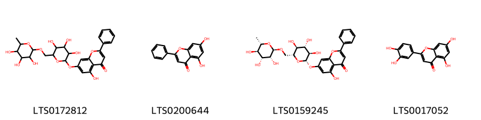{ width=100% }
    <figcaption>Hình ảnh cấu trúc hóa học của 4 hoạt chất thuộc nhóm Flavonoids gồm ['5-hydroxy-2-phenyl-7-[(3,4,5-trihydroxy-6-{[(3,4,5-trihydroxy-6-methyloxan-2-yl)oxy]methyl}oxan-2-yl)oxy]chromen-4-one (LTS0172812)', 'chrysin (LTS0200644)', '5-hydroxy-2-phenyl-7-{[(2s,3r,4s,5s,6r)-3,4,5-trihydroxy-6-({[(2r,3r,4r,5r,6s)-3,4,5-trihydroxy-6-methyloxan-2-yl]oxy}methyl)oxan-2-yl]oxy}chromen-4-one (LTS0159245)', 'luteolin (LTS0017052)'].</figcaption>
</figure>

---

### Dược dân tộc học

Danh sách các quốc gia có sử dụng *Dolichandrone falcata* trong điều trị các bệnh. 

| Country   | Disease                  | Bệnh                                                                                                                                                                                                |
|:----------|:-------------------------|:----------------------------------------------------------------------------------------------------------------------------------------------------------------------------------------------------|
| Elsewhere | Abortifacient, Piscicide | MYMEMORY WARNING: YOU USED ALL AVAILABLE FREE TRANSLATIONS FOR TODAY. NEXT AVAILABLE IN  19 HOURS 22 MINUTES 32 SECONDS VISIT HTTPS://MYMEMORY.TRANSLATED.NET/DOC/USAGELIMITS.PHP TO TRANSLATE MORE |
| India     | Piscicide                | MYMEMORY WARNING: YOU USED ALL AVAILABLE FREE TRANSLATIONS FOR TODAY. NEXT AVAILABLE IN  19 HOURS 22 MINUTES 29 SECONDS VISIT HTTPS://MYMEMORY.TRANSLATED.NET/DOC/USAGELIMITS.PHP TO TRANSLATE MORE |

---

# Chi Jacaranda

??? note "Danh sách các dược liệu thuộc chi"
    
	 - *Jacaranda acutifolia*
	 - *Jacaranda coerulea*
	 - *Jacaranda copaia*
	 - *Jacaranda mimosifolia*
	 - *Jacaranda oxyphylla*
	 - *Jacaranda procera*
	 - *Jacaranda rhombifolia*
	 - *Jacaranda subrhombea*

---
## Jacaranda acutifolia
### Thông tin về thực vật

!!! info "Phân loại thực vật của *Jacaranda acutifolia* từ GIBF:"
    - **Kingdom:** Plantae
    - **Phylum:** Tracheophyta
    - **Order:** Lamiales
    - **Family:** Bignoniaceae
    - **Genus:** Jacaranda
    - **Species:** *Jacaranda acutifolia*

 

| Label (VI)   | Label (EN)   | Scientific Name      | Descriptions (VI)   | Descriptions (EN)   | Also Known As (VI)   | Also Known As (EN)   |
|:-------------|:-------------|:---------------------|:--------------------|:--------------------|:---------------------|:---------------------|
| N/A          | N/A          | Jacaranda acutifolia | loài thực vật       | species of plant    | ['']                 | ['']                 |

#### Phân bố trên thế giới

**Từ CSDL GIBF** nan, unknown or invalid, Spain, Senegal, Rwanda, Australia, Guatemala, Saint Vincent and the Grenadines, Sri Lanka, Dominican Republic, Puerto Rico, India, Cuba, Brazil, Lebanon, Peru, Mexico, China, Chinese Taipei, Argentina, Portugal, South Africa, Egypt, Bolivia (Plurinational State of), Ecuador, United States of America, Israel

#### Phân bố tại Việt Nam

**Từ CSDL GIBF**: Không có ghi nhận ở Việt Nam

---
### Thành phần hóa học
        
- Theo cơ sở dữ liệu lotus: Từ loài *Jacaranda acutifolia* đã phân lập và xác định được 8 hoạt chất thuộc về các nhóm Organooxygen compounds, Flavonoids, Cinnamic acids and derivatives. 

|    | chemicalTaxonomyClassyfireClass   |   smiles_count |
|---:|:----------------------------------|---------------:|
|  0 | Cinnamic acids and derivatives    |              1 |
|  1 | Flavonoids                        |              1 |
|  2 | Organooxygen compounds            |              6 |

#### Nhóm Cinnamic acids and derivatives
<figure markdown="span">
    { width=100% }
    <figcaption>Hình ảnh cấu trúc hóa học của 1 hoạt chất thuộc nhóm Cinnamic acids and derivatives gồm ['3,4-dihydroxycinnamic acid (LTS0128050)'].</figcaption>
</figure>
#### Nhóm Flavonoids
<figure markdown="span">
    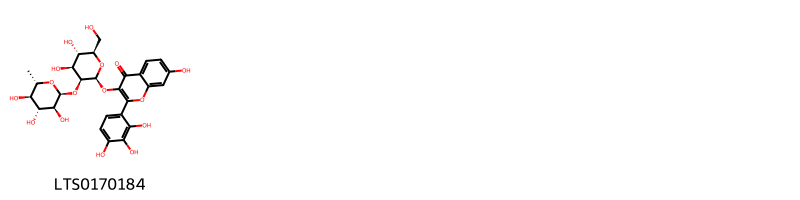{ width=100% }
    <figcaption>Hình ảnh cấu trúc hóa học của 1 hoạt chất thuộc nhóm Flavonoids gồm ['3-{[(2s,3s,4s,5s,6r)-4,5-dihydroxy-6-(hydroxymethyl)-3-{[(2s,3s,4r,5r,6s)-3,4,5-trihydroxy-6-methyloxan-2-yl]oxy}oxan-2-yl]oxy}-7-hydroxy-2-(2,3,4-trihydroxyphenyl)chromen-4-one (LTS0170184)'].</figcaption>
</figure>
#### Nhóm Organooxygen compounds
<figure markdown="span">
    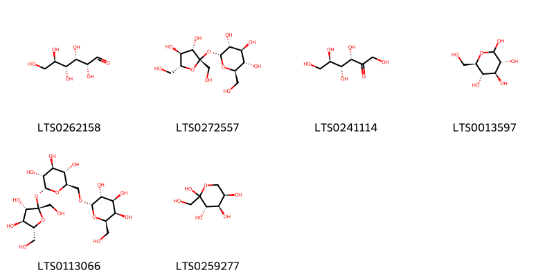{ width=100% }
    <figcaption>Hình ảnh cấu trúc hóa học của 6 hoạt chất thuộc nhóm Organooxygen compounds gồm ['(+)-glucose (LTS0262158)', 'sucrose (LTS0272557)', 'keto-d-fructose (LTS0241114)', 'glucose (LTS0013597)', 'raffinose (LTS0113066)', 'd-fructopyranose (LTS0259277)'].</figcaption>
</figure>

---

### Dược dân tộc học

Danh sách các quốc gia có sử dụng *Jacaranda acutifolia* trong điều trị các bệnh. 

| Country   | Disease    | Bệnh                                                                                                                                                                                                |
|:----------|:-----------|:----------------------------------------------------------------------------------------------------------------------------------------------------------------------------------------------------|
| Elsewhere | Vulnerary  | MYMEMORY WARNING: YOU USED ALL AVAILABLE FREE TRANSLATIONS FOR TODAY. NEXT AVAILABLE IN  19 HOURS 21 MINUTES 47 SECONDS VISIT HTTPS://MYMEMORY.TRANSLATED.NET/DOC/USAGELIMITS.PHP TO TRANSLATE MORE |
| Peru      | Astringent | MYMEMORY WARNING: YOU USED ALL AVAILABLE FREE TRANSLATIONS FOR TODAY. NEXT AVAILABLE IN  19 HOURS 21 MINUTES 45 SECONDS VISIT HTTPS://MYMEMORY.TRANSLATED.NET/DOC/USAGELIMITS.PHP TO TRANSLATE MORE |

---

---
## Jacaranda coerulea
### Thông tin về thực vật

!!! info "Phân loại thực vật của *Jacaranda caerulea* từ GIBF:"
    - **Kingdom:** Plantae
    - **Phylum:** Tracheophyta
    - **Order:** Lamiales
    - **Family:** Bignoniaceae
    - **Genus:** Jacaranda
    - **Species:** *Jacaranda caerulea*

 

| Label (VI)   | Label (EN)   | Scientific Name      | Descriptions (VI)   | Descriptions (EN)   | Also Known As (VI)   | Also Known As (EN)   |
|:-------------|:-------------|:---------------------|:--------------------|:--------------------|:---------------------|:---------------------|
| N/A          | N/A          | Jacaranda acutifolia | loài thực vật       | species of plant    | ['']                 | ['']                 |

#### Phân bố trên thế giới

**Từ CSDL GIBF** nan, Dominican Republic, South Africa, Peru, Trinidad and Tobago, United States of America, Bahamas, Cuba, Martinique, Nepal, Jamaica

#### Phân bố tại Việt Nam

**Từ CSDL GIBF**: Không có ghi nhận ở Việt Nam

---
### Thành phần hóa học
        
- Theo cơ sở dữ liệu lotus: Từ loài *Jacaranda caerulea* đã phân lập và xác định được Chưa có hoạt chất nào được phân lập. hoạt chất thuộc về các nhóm Không có hoạt chất nào được phân lập. 

Không có hình ảnh nào được tạo ra

---

### Dược dân tộc học

Danh sách các quốc gia có sử dụng *Jacaranda caerulea* trong điều trị các bệnh. 

| Country   | Disease                                    | Bệnh                                                                                                                                                                                                |
|:----------|:-------------------------------------------|:----------------------------------------------------------------------------------------------------------------------------------------------------------------------------------------------------|
| Cuba      | Antiseptic, Cathartic, Diaphoretic, Emetic | MYMEMORY WARNING: YOU USED ALL AVAILABLE FREE TRANSLATIONS FOR TODAY. NEXT AVAILABLE IN  19 HOURS 20 MINUTES 44 SECONDS VISIT HTTPS://MYMEMORY.TRANSLATED.NET/DOC/USAGELIMITS.PHP TO TRANSLATE MORE |

---

---
## Jacaranda copaia
### Thông tin về thực vật

!!! info "Phân loại thực vật của *Jacaranda copaia* từ GIBF:"
    - **Kingdom:** Plantae
    - **Phylum:** Tracheophyta
    - **Order:** Lamiales
    - **Family:** Bignoniaceae
    - **Genus:** Jacaranda
    - **Species:** *Jacaranda copaia*

 

| Label (VI)   | Label (EN)   | Scientific Name   | Descriptions (VI)   | Descriptions (EN)   | Also Known As (VI)   | Also Known As (EN)   |
|:-------------|:-------------|:------------------|:--------------------|:--------------------|:---------------------|:---------------------|
| N/A          | N/A          | Jacaranda copaia  | loài thực vật       | species of plant    | ['']                 | ['']                 |

#### Phân bố trên thế giới

**Từ CSDL GIBF** nan, Colombia, Panama, Brazil, Peru, French Guiana, Costa Rica, Ecuador

#### Phân bố tại Việt Nam

**Từ CSDL GIBF**: Không có ghi nhận ở Việt Nam

---
### Thành phần hóa học
        
- Theo cơ sở dữ liệu lotus: Từ loài *Jacaranda copaia* đã phân lập và xác định được 2 hoạt chất thuộc về các nhóm Organooxygen compounds, Prenol lipids. 

|    | chemicalTaxonomyClassyfireClass   |   smiles_count |
|---:|:----------------------------------|---------------:|
|  0 | Organooxygen compounds            |              1 |
|  1 | Prenol lipids                     |              1 |

#### Nhóm Organooxygen compounds
<figure markdown="span">
    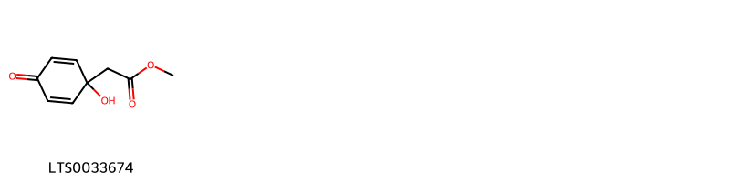{ width=100% }
    <figcaption>Hình ảnh cấu trúc hóa học của 1 hoạt chất thuộc nhóm Organooxygen compounds gồm ['methyl 2-(1-hydroxy-4-oxocyclohexa-2,5-dien-1-yl)acetate (LTS0033674)'].</figcaption>
</figure>
#### Nhóm Prenol lipids
<figure markdown="span">
    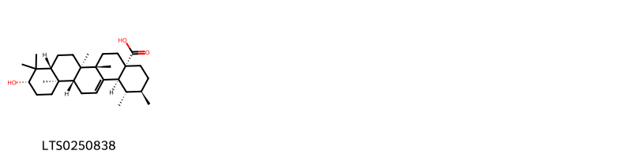{ width=100% }
    <figcaption>Hình ảnh cấu trúc hóa học của 1 hoạt chất thuộc nhóm Prenol lipids gồm ['ursolic acid (LTS0250838)'].</figcaption>
</figure>

---

### Dược dân tộc học

Danh sách các quốc gia có sử dụng *Jacaranda copaia* trong điều trị các bệnh. 

| Country   | Disease           | Bệnh                                                                                                                                                                                                |
|:----------|:------------------|:----------------------------------------------------------------------------------------------------------------------------------------------------------------------------------------------------|
| Elsewhere | Cathartic, Emetic | MYMEMORY WARNING: YOU USED ALL AVAILABLE FREE TRANSLATIONS FOR TODAY. NEXT AVAILABLE IN  19 HOURS 20 MINUTES 12 SECONDS VISIT HTTPS://MYMEMORY.TRANSLATED.NET/DOC/USAGELIMITS.PHP TO TRANSLATE MORE |

---

---
## Jacaranda mimosifolia
### Thông tin về thực vật

!!! info "Phân loại thực vật của *Jacaranda mimosifolia* từ GIBF:"
    - **Kingdom:** Plantae
    - **Phylum:** Tracheophyta
    - **Order:** Lamiales
    - **Family:** Bignoniaceae
    - **Genus:** Jacaranda
    - **Species:** *Jacaranda mimosifolia*

 

| Label (VI)   | Label (EN)   | Scientific Name       | Descriptions (VI)   | Descriptions (EN)   | Also Known As (VI)                                | Also Known As (EN)   |
|:-------------|:-------------|:----------------------|:--------------------|:--------------------|:--------------------------------------------------|:---------------------|
| N/A          | N/A          | Jacaranda mimosifolia | loài thực vật       | species of plant    | ['Jacaranda mimosifolia', 'Jacaranda acutifolia'] | ['']                 |

#### Phân bố trên thế giới

**Từ CSDL GIBF** Thailand, Spain, French Guiana, Kenya, Chile, Rwanda, Australia, Guatemala, Venezuela (Bolivarian Republic of), Dominican Republic, India, Réunion, Bahamas, Panama, Brazil, Mexico, Nepal, Hong Kong, Argentina, South Africa, Botswana, Morocco, Portugal, New Zealand, Bolivia (Plurinational State of), Ecuador, United States of America

#### Phân bố tại Việt Nam

**Từ CSDL GIBF**: Không có ghi nhận ở Việt Nam

---
### Thành phần hóa học
        
- Theo cơ sở dữ liệu lotus: Từ loài *Jacaranda mimosifolia* đã phân lập và xác định được 14 hoạt chất thuộc về các nhóm Organooxygen compounds, Cinnamic acids and derivatives, Flavonoids. 

|    | chemicalTaxonomyClassyfireClass   |   smiles_count |
|---:|:----------------------------------|---------------:|
|  0 | Cinnamic acids and derivatives    |              4 |
|  1 | Flavonoids                        |              2 |
|  2 | Organooxygen compounds            |              8 |

#### Nhóm Cinnamic acids and derivatives
<figure markdown="span">
    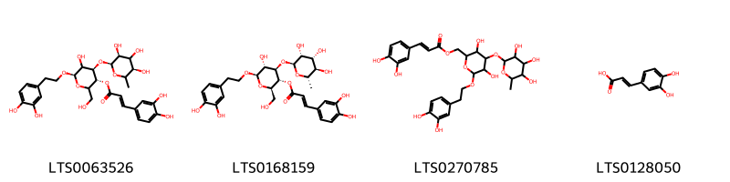{ width=100% }
    <figcaption>Hình ảnh cấu trúc hóa học của 4 hoạt chất thuộc nhóm Cinnamic acids and derivatives gồm ['(3r,4r,6r)-6-[2-(3,4-dihydroxyphenyl)ethoxy]-5-hydroxy-2-(hydroxymethyl)-4-{[(2s,3s,5r)-3,4,5-trihydroxy-6-methyloxan-2-yl]oxy}oxan-3-yl (2e)-3-(3,4-dihydroxyphenyl)prop-2-enoate (LTS0063526)', 'verbascoside (LTS0168159)', '{6-[2-(3,4-dihydroxyphenyl)ethoxy]-3,5-dihydroxy-4-[(3,4,5-trihydroxy-6-methyloxan-2-yl)oxy]oxan-2-yl}methyl 3-(3,4-dihydroxyphenyl)prop-2-enoate (LTS0270785)', '3,4-dihydroxycinnamic acid (LTS0128050)'].</figcaption>
</figure>
#### Nhóm Flavonoids
<figure markdown="span">
    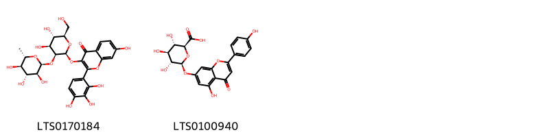{ width=100% }
    <figcaption>Hình ảnh cấu trúc hóa học của 2 hoạt chất thuộc nhóm Flavonoids gồm ['3-{[(2s,3s,4s,5s,6r)-4,5-dihydroxy-6-(hydroxymethyl)-3-{[(2s,3s,4r,5r,6s)-3,4,5-trihydroxy-6-methyloxan-2-yl]oxy}oxan-2-yl]oxy}-7-hydroxy-2-(2,3,4-trihydroxyphenyl)chromen-4-one (LTS0170184)', '(2s,3s,4s,5r,6s)-3,4,5-trihydroxy-6-{[5-hydroxy-2-(4-hydroxyphenyl)-4-oxochromen-7-yl]oxy}oxane-2-carboxylic acid (LTS0100940)'].</figcaption>
</figure>
#### Nhóm Organooxygen compounds
<figure markdown="span">
    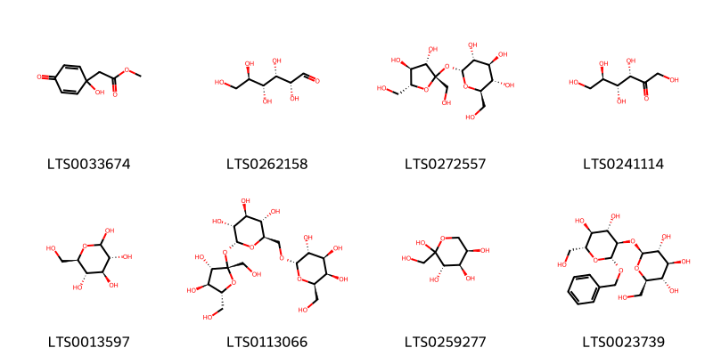{ width=100% }
    <figcaption>Hình ảnh cấu trúc hóa học của 8 hoạt chất thuộc nhóm Organooxygen compounds gồm ['methyl 2-(1-hydroxy-4-oxocyclohexa-2,5-dien-1-yl)acetate (LTS0033674)', '(+)-glucose (LTS0262158)', 'sucrose (LTS0272557)', 'keto-d-fructose (LTS0241114)', 'glucose (LTS0013597)', 'raffinose (LTS0113066)', 'd-fructopyranose (LTS0259277)', 'zizybeoside i (LTS0023739)'].</figcaption>
</figure>

---

### Dược dân tộc học

Danh sách các quốc gia có sử dụng *Jacaranda mimosifolia* trong điều trị các bệnh. 

| Country   | Disease       | Bệnh                                                                                                                                                                                                |
|:----------|:--------------|:----------------------------------------------------------------------------------------------------------------------------------------------------------------------------------------------------|
| Paraguay  | Antifertility | MYMEMORY WARNING: YOU USED ALL AVAILABLE FREE TRANSLATIONS FOR TODAY. NEXT AVAILABLE IN  19 HOURS 19 MINUTES 36 SECONDS VISIT HTTPS://MYMEMORY.TRANSLATED.NET/DOC/USAGELIMITS.PHP TO TRANSLATE MORE |

---

---
## Jacaranda oxyphylla
### Thông tin về thực vật

!!! info "Phân loại thực vật của *Jacaranda caroba* từ GIBF:"
    - **Kingdom:** Plantae
    - **Phylum:** Tracheophyta
    - **Order:** Lamiales
    - **Family:** Bignoniaceae
    - **Genus:** Jacaranda
    - **Species:** *Jacaranda caroba*

 

| Label (VI)   | Label (EN)   | Scientific Name       | Descriptions (VI)   | Descriptions (EN)   | Also Known As (VI)                                | Also Known As (EN)   |
|:-------------|:-------------|:----------------------|:--------------------|:--------------------|:--------------------------------------------------|:---------------------|
| N/A          | N/A          | Jacaranda mimosifolia | loài thực vật       | species of plant    | ['Jacaranda mimosifolia', 'Jacaranda acutifolia'] | ['']                 |

#### Phân bố trên thế giới

**Từ CSDL GIBF** Brazil

#### Phân bố tại Việt Nam

**Từ CSDL GIBF**: Không có ghi nhận ở Việt Nam

---
### Thành phần hóa học
        
- Theo cơ sở dữ liệu lotus: Từ loài *Jacaranda caroba* đã phân lập và xác định được Chưa có hoạt chất nào được phân lập. hoạt chất thuộc về các nhóm Không có hoạt chất nào được phân lập. 

Không có hình ảnh nào được tạo ra

---

### Dược dân tộc học

Danh sách các quốc gia có sử dụng *Jacaranda caroba* trong điều trị các bệnh. 

| Country   | Disease             | Bệnh                                                                                                                                                                                                |
|:----------|:--------------------|:----------------------------------------------------------------------------------------------------------------------------------------------------------------------------------------------------|
| Brazil    | Diuretic, Cathartic | MYMEMORY WARNING: YOU USED ALL AVAILABLE FREE TRANSLATIONS FOR TODAY. NEXT AVAILABLE IN  19 HOURS 18 MINUTES 27 SECONDS VISIT HTTPS://MYMEMORY.TRANSLATED.NET/DOC/USAGELIMITS.PHP TO TRANSLATE MORE |

---

---
## Jacaranda procera
### Thông tin về thực vật

!!! info "Phân loại thực vật của *Jacaranda copaia* từ GIBF:"
    - **Kingdom:** Plantae
    - **Phylum:** Tracheophyta
    - **Order:** Lamiales
    - **Family:** Bignoniaceae
    - **Genus:** Jacaranda
    - **Species:** *Jacaranda copaia*

 

| Label (VI)   | Label (EN)   | Scientific Name       | Descriptions (VI)   | Descriptions (EN)   | Also Known As (VI)                                | Also Known As (EN)   |
|:-------------|:-------------|:----------------------|:--------------------|:--------------------|:--------------------------------------------------|:---------------------|
| N/A          | N/A          | Jacaranda mimosifolia | loài thực vật       | species of plant    | ['Jacaranda mimosifolia', 'Jacaranda acutifolia'] | ['']                 |

#### Phân bố trên thế giới

**Từ CSDL GIBF** Brazil

#### Phân bố tại Việt Nam

**Từ CSDL GIBF**: Không có ghi nhận ở Việt Nam

---
### Thành phần hóa học
        
- Theo cơ sở dữ liệu lotus: Từ loài *Jacaranda copaia* đã phân lập và xác định được Chưa có hoạt chất nào được phân lập. hoạt chất thuộc về các nhóm Không có hoạt chất nào được phân lập. 

Không có hình ảnh nào được tạo ra

---

### Dược dân tộc học

Danh sách các quốc gia có sử dụng *Jacaranda copaia* trong điều trị các bệnh. 

| Country   | Disease                         | Bệnh                                                                                                                                                                                                |
|:----------|:--------------------------------|:----------------------------------------------------------------------------------------------------------------------------------------------------------------------------------------------------|
| Elsewhere | Diuretic, Diaphoretic, Sedative | MYMEMORY WARNING: YOU USED ALL AVAILABLE FREE TRANSLATIONS FOR TODAY. NEXT AVAILABLE IN  19 HOURS 17 MINUTES 56 SECONDS VISIT HTTPS://MYMEMORY.TRANSLATED.NET/DOC/USAGELIMITS.PHP TO TRANSLATE MORE |

---

---
## Jacaranda rhombifolia
### Thông tin về thực vật

!!! info "Phân loại thực vật của *Jacaranda obtusifolia* từ GIBF:"
    - **Kingdom:** Plantae
    - **Phylum:** Tracheophyta
    - **Order:** Lamiales
    - **Family:** Bignoniaceae
    - **Genus:** Jacaranda
    - **Species:** *Jacaranda obtusifolia*

 

| Label (VI)   | Label (EN)   | Scientific Name       | Descriptions (VI)   | Descriptions (EN)   | Also Known As (VI)   | Also Known As (EN)   |
|:-------------|:-------------|:----------------------|:--------------------|:--------------------|:---------------------|:---------------------|
| N/A          | N/A          | Jacaranda rhombifolia | loài thực vật       | species of plant    | ['']                 | ['']                 |

#### Phân bố trên thế giới

**Từ CSDL GIBF** nan, Guatemala, Saint Vincent and the Grenadines, Venezuela (Bolivarian Republic of), Suriname, unknown or invalid, Brazil, Trinidad and Tobago, Martinique, Guyana

#### Phân bố tại Việt Nam

**Từ CSDL GIBF**: Không có ghi nhận ở Việt Nam

---
### Thành phần hóa học
        
- Theo cơ sở dữ liệu lotus: Từ loài *Jacaranda obtusifolia* đã phân lập và xác định được Chưa có hoạt chất nào được phân lập. hoạt chất thuộc về các nhóm Không có hoạt chất nào được phân lập. 

Không có hình ảnh nào được tạo ra

---

### Dược dân tộc học

Danh sách các quốc gia có sử dụng *Jacaranda obtusifolia* trong điều trị các bệnh. 

| Country   | Disease     | Bệnh                                                                                                                                                                                                |
|:----------|:------------|:----------------------------------------------------------------------------------------------------------------------------------------------------------------------------------------------------|
| Elsewhere | Insecticide | MYMEMORY WARNING: YOU USED ALL AVAILABLE FREE TRANSLATIONS FOR TODAY. NEXT AVAILABLE IN  19 HOURS 17 MINUTES 33 SECONDS VISIT HTTPS://MYMEMORY.TRANSLATED.NET/DOC/USAGELIMITS.PHP TO TRANSLATE MORE |

---

---
## Jacaranda subrhombea
### Thông tin về thực vật

!!! info "Phân loại thực vật của *Jacaranda puberula* từ GIBF:"
    - **Kingdom:** Plantae
    - **Phylum:** Tracheophyta
    - **Order:** Lamiales
    - **Family:** Bignoniaceae
    - **Genus:** Jacaranda
    - **Species:** *Jacaranda puberula*

 

| Label (VI)   | Label (EN)   | Scientific Name       | Descriptions (VI)   | Descriptions (EN)   | Also Known As (VI)   | Also Known As (EN)   |
|:-------------|:-------------|:----------------------|:--------------------|:--------------------|:---------------------|:---------------------|
| N/A          | N/A          | Jacaranda rhombifolia | loài thực vật       | species of plant    | ['']                 | ['']                 |

#### Phân bố trên thế giới

**Từ CSDL GIBF** nan, Brazil

#### Phân bố tại Việt Nam

**Từ CSDL GIBF**: Không có ghi nhận ở Việt Nam

---
### Thành phần hóa học
        
- Theo cơ sở dữ liệu lotus: Từ loài *Jacaranda puberula* đã phân lập và xác định được Chưa có hoạt chất nào được phân lập. hoạt chất thuộc về các nhóm Không có hoạt chất nào được phân lập. 

Không có hình ảnh nào được tạo ra

---

### Dược dân tộc học

Danh sách các quốc gia có sử dụng *Jacaranda puberula* trong điều trị các bệnh. 

| Country   | Disease   | Bệnh                                                                                                                                                                                                |
|:----------|:----------|:----------------------------------------------------------------------------------------------------------------------------------------------------------------------------------------------------|
| Brazil    | Sudorific | MYMEMORY WARNING: YOU USED ALL AVAILABLE FREE TRANSLATIONS FOR TODAY. NEXT AVAILABLE IN  19 HOURS 17 MINUTES 08 SECONDS VISIT HTTPS://MYMEMORY.TRANSLATED.NET/DOC/USAGELIMITS.PHP TO TRANSLATE MORE |

---

# Chi Radermachera

??? note "Danh sách các dược liệu thuộc chi"
    
	 - *Radermachera xylocarpa*

---
## Radermachera xylocarpa
### Thông tin về thực vật

!!! info "Phân loại thực vật của *Radermachera xylocarpa* từ GIBF:"
    - **Kingdom:** Plantae
    - **Phylum:** Tracheophyta
    - **Order:** Lamiales
    - **Family:** Bignoniaceae
    - **Genus:** Radermachera
    - **Species:** *Radermachera xylocarpa*

 

| Label (VI)   | Label (EN)   | Scientific Name        | Descriptions (VI)   | Descriptions (EN)   | Also Known As (VI)   | Also Known As (EN)   |
|:-------------|:-------------|:-----------------------|:--------------------|:--------------------|:---------------------|:---------------------|
| N/A          | N/A          | Radermachera xylocarpa | loài thực vật       | species of plant    | ['']                 | ['']                 |

#### Phân bố trên thế giới

**Từ CSDL GIBF** nan, unknown or invalid, New Zealand, India, Zimbabwe, Indonesia

#### Phân bố tại Việt Nam

**Từ CSDL GIBF**: Không có ghi nhận ở Việt Nam

---
### Thành phần hóa học
        
- Theo cơ sở dữ liệu lotus: Từ loài *Radermachera xylocarpa* đã phân lập và xác định được 3 hoạt chất thuộc về các nhóm Naphthofurans, Prenol lipids. 

|    | chemicalTaxonomyClassyfireClass   |   smiles_count |
|---:|:----------------------------------|---------------:|
|  0 | Naphthofurans                     |              2 |
|  1 | Prenol lipids                     |              1 |

#### Nhóm Naphthofurans
<figure markdown="span">
    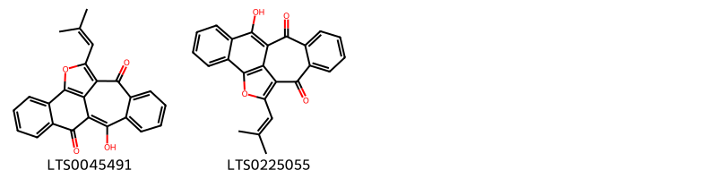{ width=100% }
    <figcaption>Hình ảnh cấu trúc hóa học của 2 hoạt chất thuộc nhóm Naphthofurans gồm ['20-hydroxy-11-(2-methylprop-1-en-1-yl)-10-oxapentacyclo[10.8.1.0³,⁸.0⁹,²¹.0¹⁴,¹⁹]henicosa-1(20),3,5,7,9(21),11,14,16,18-nonaene-2,13-dione (LTS0045491)', '2-hydroxy-11-(2-methylprop-1-en-1-yl)-10-oxapentacyclo[10.8.1.0³,⁸.0⁹,²¹.0¹⁴,¹⁹]henicosa-1,3(8),4,6,9(21),11,14,16,18-nonaene-13,20-dione (LTS0225055)'].</figcaption>
</figure>
#### Nhóm Prenol lipids
<figure markdown="span">
    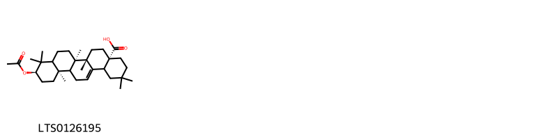{ width=100% }
    <figcaption>Hình ảnh cấu trúc hóa học của 1 hoạt chất thuộc nhóm Prenol lipids gồm ['(4as,6as,6br,10r,12ar)-10-(acetyloxy)-2,2,6a,6b,9,9,12a-heptamethyl-1,3,4,5,6,7,8,8a,10,11,12,12b,13,14b-tetradecahydropicene-4a-carboxylic acid (LTS0126195)'].</figcaption>
</figure>

---

### Dược dân tộc học

Danh sách các quốc gia có sử dụng *Radermachera xylocarpa* trong điều trị các bệnh. 

| Country   | Disease                | Bệnh                                                                                                                                                                                                |
|:----------|:-----------------------|:----------------------------------------------------------------------------------------------------------------------------------------------------------------------------------------------------|
| Elsewhere | Antiseptic, Astringent | MYMEMORY WARNING: YOU USED ALL AVAILABLE FREE TRANSLATIONS FOR TODAY. NEXT AVAILABLE IN  19 HOURS 16 MINUTES 42 SECONDS VISIT HTTPS://MYMEMORY.TRANSLATED.NET/DOC/USAGELIMITS.PHP TO TRANSLATE MORE |

---

# Chi Kigelia

??? note "Danh sách các dược liệu thuộc chi"
    
	 - *Kigelia aethiopum*
	 - *Kigelia africana*
	 - *Kigelia pinnata*

---
## Kigelia aethiopum
### Thông tin về thực vật

!!! info "Phân loại thực vật của *Kigelia africana* từ GIBF:"
    - **Kingdom:** Plantae
    - **Phylum:** Tracheophyta
    - **Order:** Lamiales
    - **Family:** Bignoniaceae
    - **Genus:** Kigelia
    - **Species:** *Kigelia africana*

 

| Label (VI)   | Label (EN)   | Scientific Name        | Descriptions (VI)   | Descriptions (EN)   | Also Known As (VI)   | Also Known As (EN)   |
|:-------------|:-------------|:-----------------------|:--------------------|:--------------------|:---------------------|:---------------------|
| N/A          | N/A          | Radermachera xylocarpa | loài thực vật       | species of plant    | ['']                 | ['']                 |

#### Phân bố trên thế giới

**Từ CSDL GIBF** nan, unknown or invalid, New Zealand, India, Zimbabwe, Indonesia

#### Phân bố tại Việt Nam

**Từ CSDL GIBF**: Không có ghi nhận ở Việt Nam

---
### Thành phần hóa học
        
- Theo cơ sở dữ liệu lotus: Từ loài *Kigelia africana* đã phân lập và xác định được Chưa có hoạt chất nào được phân lập. hoạt chất thuộc về các nhóm Không có hoạt chất nào được phân lập. 

Không có hình ảnh nào được tạo ra

---

### Dược dân tộc học

Danh sách các quốc gia có sử dụng *Kigelia africana* trong điều trị các bệnh. 

| Country         | Disease    | Bệnh                                                                                                                                                                                                |
|:----------------|:-----------|:----------------------------------------------------------------------------------------------------------------------------------------------------------------------------------------------------|
| Africa(Swahili) | Intoxicant | MYMEMORY WARNING: YOU USED ALL AVAILABLE FREE TRANSLATIONS FOR TODAY. NEXT AVAILABLE IN  19 HOURS 16 MINUTES 16 SECONDS VISIT HTTPS://MYMEMORY.TRANSLATED.NET/DOC/USAGELIMITS.PHP TO TRANSLATE MORE |

---

---
## Kigelia africana
### Thông tin về thực vật

!!! info "Phân loại thực vật của *Kigelia africana* từ GIBF:"
    - **Kingdom:** Plantae
    - **Phylum:** Tracheophyta
    - **Order:** Lamiales
    - **Family:** Bignoniaceae
    - **Genus:** Kigelia
    - **Species:** *Kigelia africana*

 

| Label (VI)   | Label (EN)   | Scientific Name   | Descriptions (VI)   | Descriptions (EN)   | Also Known As (VI)   | Also Known As (EN)   |
|:-------------|:-------------|:------------------|:--------------------|:--------------------|:---------------------|:---------------------|
| N/A          | N/A          | Kigelia africana  | loài thực vật       | species of plant    | ['']                 | ['']                 |

#### Phân bố trên thế giới

**Từ CSDL GIBF** Malawi, El Salvador, Namibia, Ghana, Guadeloupe, Dominica, Kenya, Martinique, Rwanda, Singapore, Indonesia, Niger, Colombia, Pakistan, Dominican Republic, Malaysia, India, Nigeria, Uganda, Antigua and Barbuda, Brazil, Peru, Eswatini, China, Nepal, Benin, Hong Kong, Chinese Taipei, South Africa, Botswana, Tanzania, United Republic of, Mozambique, Costa Rica, United States of America, Zimbabwe, Chad, Zambia, Congo

#### Phân bố tại Việt Nam

**Từ CSDL GIBF**: Không có ghi nhận ở Việt Nam

---
### Thành phần hóa học
        
- Theo cơ sở dữ liệu lotus: Từ loài *Kigelia africana* đã phân lập và xác định được 97 hoạt chất thuộc về các nhóm Furanoid lignans, Benzopyrans, Organooxygen compounds, Saturated hydrocarbons, Naphthofurans, Prenol lipids, Fatty Acyls, Anthracenes, Naphthopyrans, Heteroaromatic compounds, Cinnamic acids and derivatives, Steroids and steroid derivatives, Naphthalenes. 

|    | chemicalTaxonomyClassyfireClass   |   smiles_count |
|---:|:----------------------------------|---------------:|
|  0 | Anthracenes                       |              2 |
|  1 | Benzopyrans                       |              2 |
|  2 | Cinnamic acids and derivatives    |             18 |
|  3 | Fatty Acyls                       |              2 |
|  4 | Furanoid lignans                  |              2 |
|  5 | Heteroaromatic compounds          |              2 |
|  6 | Naphthalenes                      |              1 |
|  7 | Naphthofurans                     |              4 |
|  8 | Naphthopyrans                     |              3 |
|  9 | Organooxygen compounds            |              2 |
| 10 | Prenol lipids                     |              9 |
| 11 | Saturated hydrocarbons            |              1 |
| 12 | Steroids and steroid derivatives  |              5 |

#### Nhóm Anthracenes
<figure markdown="span">
    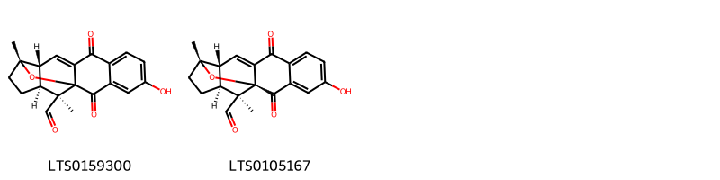{ width=100% }
    <figcaption>Hình ảnh cấu trúc hóa học của 2 hoạt chất thuộc nhóm Anthracenes gồm ['(12r,13s,16r,18s)-5-hydroxy-16,18-dimethyl-2,9-dioxo-17-oxapentacyclo[11.4.1.0¹,¹⁰.0³,⁸.0¹²,¹⁶]octadeca-3,5,7,10-tetraene-18-carbaldehyde (LTS0159300)', '(1s,12r,13s,16r,18s)-5-hydroxy-16,18-dimethyl-2,9-dioxo-17-oxapentacyclo[11.4.1.0¹,¹⁰.0³,⁸.0¹²,¹⁶]octadeca-3,5,7,10-tetraene-18-carbaldehyde (LTS0105167)'].</figcaption>
</figure>
#### Nhóm Benzopyrans
<figure markdown="span">
    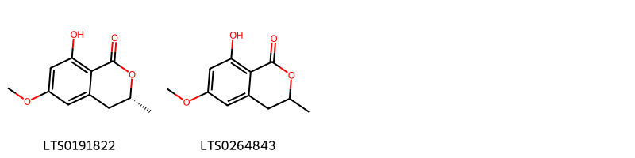{ width=100% }
    <figcaption>Hình ảnh cấu trúc hóa học của 2 hoạt chất thuộc nhóm Benzopyrans gồm ['6-methoxymellein (LTS0191822)', '6-methoxymellein (LTS0264843)'].</figcaption>
</figure>
#### Nhóm Cinnamic acids and derivatives
<figure markdown="span">
    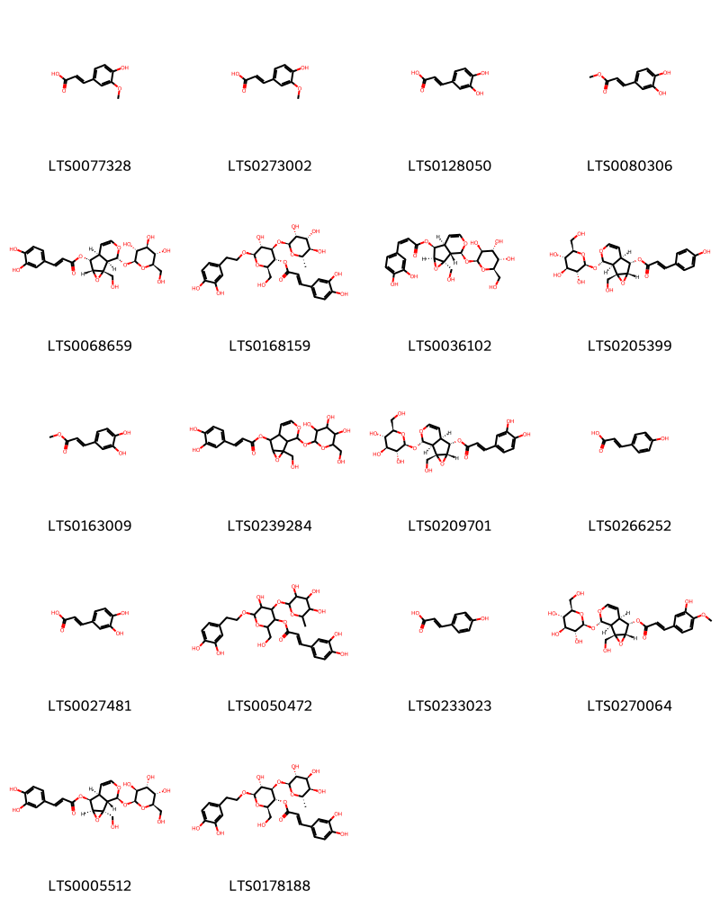{ width=100% }
    <figcaption>Hình ảnh cấu trúc hóa học của 18 hoạt chất thuộc nhóm Cinnamic acids and derivatives gồm ['ferulic acid (LTS0077328)', 'ferulic acid (LTS0273002)', '3,4-dihydroxycinnamic acid (LTS0128050)', 'methyl 3-(3,4-dihydroxyphenyl)prop-2-enoate (LTS0080306)', '(1r,2r,4r,5r,6s,10r)-2-(hydroxymethyl)-10-{[(2s,3r,4s,5s,6r)-3,4,5-trihydroxy-6-(hydroxymethyl)oxan-2-yl]oxy}-3,9-dioxatricyclo[4.4.0.0²,⁴]dec-7-en-5-yl (2e)-3-(3,4-dihydroxyphenyl)prop-2-enoate (LTS0068659)', 'verbascoside (LTS0168159)', '(1s,2s,4s,5s,6s,10s)-2-(hydroxymethyl)-10-{[(2s,3s,4r,5s,6r)-3,4,5-trihydroxy-6-(hydroxymethyl)oxan-2-yl]oxy}-3,9-dioxatricyclo[4.4.0.0²,⁴]dec-7-en-5-yl (2z)-3-(3,4-dihydroxyphenyl)prop-2-enoate (LTS0036102)', '(1s,2s,4s,5s,6r,10s)-2-(hydroxymethyl)-10-{[(2s,3r,4s,5s,6r)-3,4,5-trihydroxy-6-(hydroxymethyl)oxan-2-yl]oxy}-3,9-dioxatricyclo[4.4.0.0²,⁴]dec-7-en-5-yl (2e)-3-(4-hydroxyphenyl)prop-2-enoate (LTS0205399)', 'methyl caffeate (LTS0163009)', '2-(hydroxymethyl)-10-{[3,4,5-trihydroxy-6-(hydroxymethyl)oxan-2-yl]oxy}-3,9-dioxatricyclo[4.4.0.0²,⁴]dec-7-en-5-yl 3-(3,4-dihydroxyphenyl)prop-2-enoate (LTS0239284)', 'verminoside (LTS0209701)', 'para-coumaric acid (LTS0266252)', 'caffeic acid (LTS0027481)', '6-[2-(3,4-dihydroxyphenyl)ethoxy]-5-hydroxy-2-(hydroxymethyl)-4-[(3,4,5-trihydroxy-6-methyloxan-2-yl)oxy]oxan-3-yl 3-(3,4-dihydroxyphenyl)prop-2-enoate (LTS0050472)', 'hydroxycinnamic acid (LTS0233023)', 'minecoside (LTS0270064)', '(1s,2s,4s,5s,6s,10s)-2-(hydroxymethyl)-10-{[(2s,3s,4r,5s,6r)-3,4,5-trihydroxy-6-(hydroxymethyl)oxan-2-yl]oxy}-3,9-dioxatricyclo[4.4.0.0²,⁴]dec-7-en-5-yl (2e)-3-(3,4-dihydroxyphenyl)prop-2-enoate (LTS0005512)', '(2r,3r,4r,5r,6r)-6-[2-(3,4-dihydroxyphenyl)ethoxy]-5-hydroxy-2-(hydroxymethyl)-4-{[(2s,3r,4s,5r,6s)-3,4,5-trihydroxy-6-methyloxan-2-yl]oxy}oxan-3-yl (2e)-3-(3,4-dihydroxyphenyl)prop-2-enoate (LTS0178188)'].</figcaption>
</figure>
#### Nhóm Fatty Acyls
<figure markdown="span">
    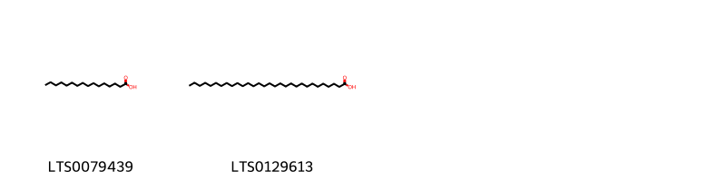{ width=100% }
    <figcaption>Hình ảnh cấu trúc hóa học của 2 hoạt chất thuộc nhóm Fatty Acyls gồm ['palmitic acid (LTS0079439)', 'triacontanoic acid (LTS0129613)'].</figcaption>
</figure>
#### Nhóm Furanoid lignans
<figure markdown="span">
    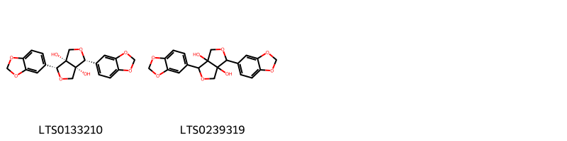{ width=100% }
    <figcaption>Hình ảnh cấu trúc hóa học của 2 hoạt chất thuộc nhóm Furanoid lignans gồm ['(1r,3as,4r,6as)-1,4-bis(2h-1,3-benzodioxol-5-yl)-tetrahydrofuro[3,4-c]furan-3a,6a-diol (LTS0133210)', '1,4-bis(2h-1,3-benzodioxol-5-yl)-tetrahydrofuro[3,4-c]furan-3a,6a-diol (LTS0239319)'].</figcaption>
</figure>
#### Nhóm Heteroaromatic compounds
<figure markdown="span">
    { width=100% }
    <figcaption>Hình ảnh cấu trúc hóa học của 2 hoạt chất thuộc nhóm Heteroaromatic compounds gồm ['6-(2-hydroxyethyl)-4h,5h,6h-cyclopenta[c]furan-4,5-diol (LTS0138180)', '(4r,5s,6r)-6-(2-hydroxyethyl)-4h,5h,6h-cyclopenta[c]furan-4,5-diol (LTS0038325)'].</figcaption>
</figure>
#### Nhóm Naphthalenes
<figure markdown="span">
    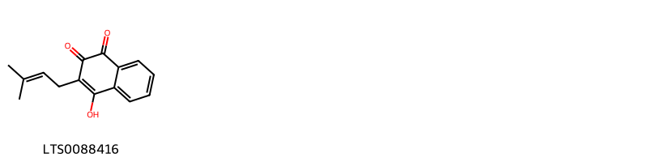{ width=100% }
    <figcaption>Hình ảnh cấu trúc hóa học của 1 hoạt chất thuộc nhóm Naphthalenes gồm ['lapachol (LTS0088416)'].</figcaption>
</figure>
#### Nhóm Naphthofurans
<figure markdown="span">
    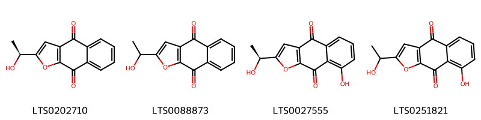{ width=100% }
    <figcaption>Hình ảnh cấu trúc hóa học của 4 hoạt chất thuộc nhóm Naphthofurans gồm ['2-[(1s)-1-hydroxyethyl]naphtho[2,3-b]furan-4,9-dione (LTS0202710)', '2-(1-hydroxyethyl)naphtho[2,3-b]furan-4,9-dione (LTS0088873)', 'kigelinone (LTS0027555)', '8-hydroxy-2-(1-hydroxyethyl)naphtho[2,3-b]furan-4,9-dione (LTS0251821)'].</figcaption>
</figure>
#### Nhóm Naphthopyrans
<figure markdown="span">
    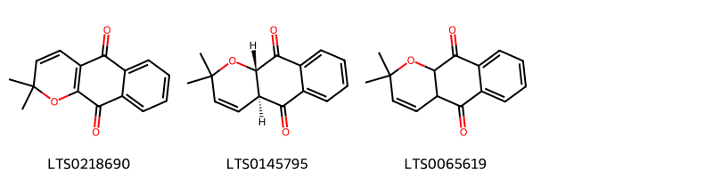{ width=100% }
    <figcaption>Hình ảnh cấu trúc hóa học của 3 hoạt chất thuộc nhóm Naphthopyrans gồm ['2,2-dimethylbenzo[g]chromene-5,10-dione (LTS0218690)', '(4as,10as)-2,2-dimethyl-4ah,10ah-benzo[g]chromene-5,10-dione (LTS0145795)', '2,2-dimethyl-4ah,10ah-benzo[g]chromene-5,10-dione (LTS0065619)'].</figcaption>
</figure>
#### Nhóm Organooxygen compounds
<figure markdown="span">
    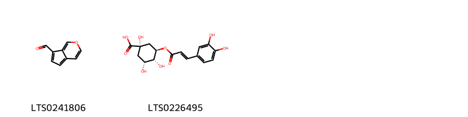{ width=100% }
    <figcaption>Hình ảnh cấu trúc hóa học của 2 hoạt chất thuộc nhóm Organooxygen compounds gồm ['cyclopenta[c]pyran-7-carbaldehyde (LTS0241806)', 'chlorogenic acid (LTS0226495)'].</figcaption>
</figure>
#### Nhóm Prenol lipids
<figure markdown="span">
    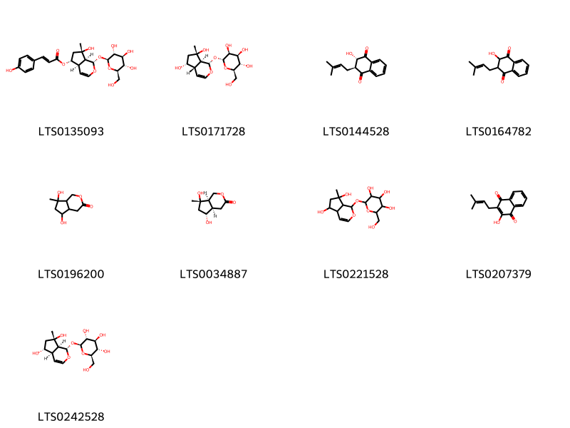{ width=100% }
    <figcaption>Hình ảnh cấu trúc hóa học của 9 hoạt chất thuộc nhóm Prenol lipids gồm ['(1s,4ar,5r,7s,7as)-7-hydroxy-7-methyl-1-{[(2s,3r,4s,5s,6r)-3,4,5-trihydroxy-6-(hydroxymethyl)oxan-2-yl]oxy}-1h,4ah,5h,6h,7ah-cyclopenta[c]pyran-5-yl (2e)-3-(4-hydroxyphenyl)prop-2-enoate (LTS0135093)', '(2r,3s,4s,5s,6r)-2-{[(1s,4as,5r,7s,7as)-5,7-dihydroxy-7-methyl-1h,4ah,5h,6h,7ah-cyclopenta[c]pyran-1-yl]oxy}-6-(hydroxymethyl)oxane-3,4,5-triol (LTS0171728)', '(2s,3s)-2-hydroxy-3-(3-methylbut-2-en-1-yl)-2,3-dihydronaphthalene-1,4-dione (LTS0144528)', '2-hydroxy-3-(3-methylbut-2-en-1-yl)-2,3-dihydronaphthalene-1,4-dione (LTS0164782)', '5,7-dihydroxy-7-methyl-hexahydrocyclopenta[c]pyran-3-one (LTS0196200)', '(4ar,5r,7s,7ar)-5,7-dihydroxy-7-methyl-hexahydrocyclopenta[c]pyran-3-one (LTS0034887)', '2-({5,7-dihydroxy-7-methyl-1h,4ah,5h,6h,7ah-cyclopenta[c]pyran-1-yl}oxy)-6-(hydroxymethyl)oxane-3,4,5-triol (LTS0221528)', 'tecomin (LTS0207379)', '(2s,3r,4s,5s,6r)-2-{[(1s,4ar,5r,7s,7as)-5,7-dihydroxy-7-methyl-1h,4ah,5h,6h,7ah-cyclopenta[c]pyran-1-yl]oxy}-6-(hydroxymethyl)oxane-3,4,5-triol (LTS0242528)'].</figcaption>
</figure>
#### Nhóm Saturated hydrocarbons
<figure markdown="span">
    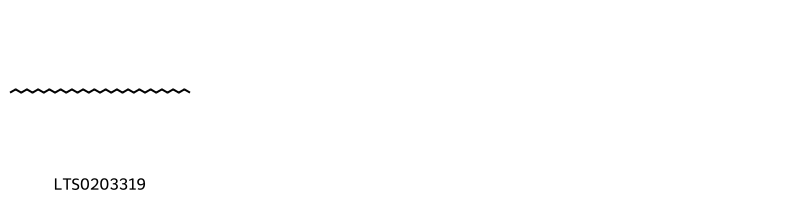{ width=100% }
    <figcaption>Hình ảnh cấu trúc hóa học của 1 hoạt chất thuộc nhóm Saturated hydrocarbons gồm ['tritriacontane (LTS0203319)'].</figcaption>
</figure>
#### Nhóm Steroids and steroid derivatives
<figure markdown="span">
    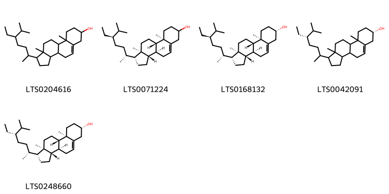{ width=100% }
    <figcaption>Hình ảnh cấu trúc hóa học của 5 hoạt chất thuộc nhóm Steroids and steroid derivatives gồm ['stigmast-5-en-3-ol, (3β)- (LTS0204616)', 'stigmast-5-en-3-ol (LTS0071224)', 'sitosterol (LTS0168132)', '(7s)-1-[(5s)-5-ethyl-6-methylheptan-2-yl]-9a,11a-dimethyl-1h,2h,3h,3ah,3bh,4h,6h,7h,8h,9h,9bh,10h,11h-cyclopenta[a]phenanthren-7-ol (LTS0042091)', 'clionasterol (LTS0248660)'].</figcaption>
</figure>

---

### Dược dân tộc học

Danh sách các quốc gia có sử dụng *Kigelia africana* trong điều trị các bệnh. 

| Country   | Disease             | Bệnh                                                                                                                                                                                                |
|:----------|:--------------------|:----------------------------------------------------------------------------------------------------------------------------------------------------------------------------------------------------|
| Africa    | Purgative           | MYMEMORY WARNING: YOU USED ALL AVAILABLE FREE TRANSLATIONS FOR TODAY. NEXT AVAILABLE IN  19 HOURS 15 MINUTES 44 SECONDS VISIT HTTPS://MYMEMORY.TRANSLATED.NET/DOC/USAGELIMITS.PHP TO TRANSLATE MORE |
| Ghana     | Laxative, Taenifuge | MYMEMORY WARNING: YOU USED ALL AVAILABLE FREE TRANSLATIONS FOR TODAY. NEXT AVAILABLE IN  19 HOURS 15 MINUTES 39 SECONDS VISIT HTTPS://MYMEMORY.TRANSLATED.NET/DOC/USAGELIMITS.PHP TO TRANSLATE MORE |

---

---
## Kigelia pinnata
### Thông tin về thực vật

!!! info "Phân loại thực vật của *Kigelia africana* từ GIBF:"
    - **Kingdom:** Plantae
    - **Phylum:** Tracheophyta
    - **Order:** Lamiales
    - **Family:** Bignoniaceae
    - **Genus:** Kigelia
    - **Species:** *Kigelia africana*

 

| Label (VI)   | Label (EN)   | Scientific Name   | Descriptions (VI)   | Descriptions (EN)   | Also Known As (VI)   | Also Known As (EN)   |
|:-------------|:-------------|:------------------|:--------------------|:--------------------|:---------------------|:---------------------|
| N/A          | N/A          | Kigelia pinnata   | loài thực vật       | species of plant    | ['']                 | ['']                 |

#### Phân bố trên thế giới

**Từ CSDL GIBF** nan, Honduras, Malawi, unknown or invalid, El Salvador, Philippines, Trinidad and Tobago, Kenya, Guatemala, Niger, Indonesia, Colombia, Sri Lanka, Dominican Republic, Puerto Rico, Mauritius, India, Cuba, Panama, Brazil, Ethiopia, Equatorial Guinea, Mexico, China, Chinese Taipei, South Africa, Bermuda, Tanzania, United Republic of, Mozambique, Costa Rica, United States of America, Zimbabwe, Zambia, Madagascar

#### Phân bố tại Việt Nam

**Từ CSDL GIBF**: Không có ghi nhận ở Việt Nam

---
### Thành phần hóa học
        
- Theo cơ sở dữ liệu lotus: Từ loài *Kigelia africana* đã phân lập và xác định được Chưa có hoạt chất nào được phân lập. hoạt chất thuộc về các nhóm Không có hoạt chất nào được phân lập. 

Không có hình ảnh nào được tạo ra

---

### Dược dân tộc học

Danh sách các quốc gia có sử dụng *Kigelia africana* trong điều trị các bệnh. 

| Country   | Disease   | Bệnh                                                                                                                                                                                                |
|:----------|:----------|:----------------------------------------------------------------------------------------------------------------------------------------------------------------------------------------------------|
| Africa    | Purgative | MYMEMORY WARNING: YOU USED ALL AVAILABLE FREE TRANSLATIONS FOR TODAY. NEXT AVAILABLE IN  19 HOURS 13 MINUTES 59 SECONDS VISIT HTTPS://MYMEMORY.TRANSLATED.NET/DOC/USAGELIMITS.PHP TO TRANSLATE MORE |

---

# Chi Stereoermum

??? note "Danh sách các dược liệu thuộc chi"
    
	 - *Stereoermum personatum*
	 - *Stereoermum suaveolens*

---
## Stereoermum personatum
### Thông tin về thực vật

!!! info "Phân loại thực vật của *N/A* từ GIBF:"
    - **Kingdom:** N/A
    - **Phylum:** N/A
    - **Order:** N/A
    - **Family:** N/A
    - **Genus:** N/A
    - **Species:** *N/A*

 

| Label (VI)   | Label (EN)   | Scientific Name   | Descriptions (VI)   | Descriptions (EN)   | Also Known As (VI)   | Also Known As (EN)   |
|:-------------|:-------------|:------------------|:--------------------|:--------------------|:---------------------|:---------------------|
| N/A          | N/A          | Kigelia pinnata   | loài thực vật       | species of plant    | ['']                 | ['']                 |

#### Phân bố trên thế giới

**Từ CSDL GIBF** Không có kết quả phù hợp

#### Phân bố tại Việt Nam

**Từ CSDL GIBF**: Không có ghi nhận ở Việt Nam

---
### Thành phần hóa học
        
- Theo cơ sở dữ liệu lotus: Từ loài *N/A* đã phân lập và xác định được Chưa có hoạt chất nào được phân lập. hoạt chất thuộc về các nhóm Không có hoạt chất nào được phân lập. 

Không có hình ảnh nào được tạo ra

---

### Dược dân tộc học

Danh sách các quốc gia có sử dụng *N/A* trong điều trị các bệnh. 

| Country   | Disease     | Bệnh                                                                                                                                                                                                |
|:----------|:------------|:----------------------------------------------------------------------------------------------------------------------------------------------------------------------------------------------------|
| Elsewhere | nan         | MYMEMORY WARNING: YOU USED ALL AVAILABLE FREE TRANSLATIONS FOR TODAY. NEXT AVAILABLE IN  19 HOURS 13 MINUTES 30 SECONDS VISIT HTTPS://MYMEMORY.TRANSLATED.NET/DOC/USAGELIMITS.PHP TO TRANSLATE MORE |
| India     | Refrigerant | MYMEMORY WARNING: YOU USED ALL AVAILABLE FREE TRANSLATIONS FOR TODAY. NEXT AVAILABLE IN  19 HOURS 13 MINUTES 26 SECONDS VISIT HTTPS://MYMEMORY.TRANSLATED.NET/DOC/USAGELIMITS.PHP TO TRANSLATE MORE |

---

---
## Stereoermum suaveolens
### Thông tin về thực vật

!!! info "Phân loại thực vật của *N/A* từ GIBF:"
    - **Kingdom:** N/A
    - **Phylum:** N/A
    - **Order:** N/A
    - **Family:** N/A
    - **Genus:** N/A
    - **Species:** *N/A*

 

| Label (VI)   | Label (EN)   | Scientific Name   | Descriptions (VI)   | Descriptions (EN)   | Also Known As (VI)   | Also Known As (EN)   |
|:-------------|:-------------|:------------------|:--------------------|:--------------------|:---------------------|:---------------------|
| N/A          | N/A          | Kigelia pinnata   | loài thực vật       | species of plant    | ['']                 | ['']                 |

#### Phân bố trên thế giới

**Từ CSDL GIBF** Không có kết quả phù hợp

#### Phân bố tại Việt Nam

**Từ CSDL GIBF**: Không có ghi nhận ở Việt Nam

---
### Thành phần hóa học
        
- Theo cơ sở dữ liệu lotus: Từ loài *N/A* đã phân lập và xác định được Chưa có hoạt chất nào được phân lập. hoạt chất thuộc về các nhóm Không có hoạt chất nào được phân lập. 

Không có hình ảnh nào được tạo ra

---

### Dược dân tộc học

Danh sách các quốc gia có sử dụng *N/A* trong điều trị các bệnh. 

| Country   | Disease              | Bệnh                                                                                                                                                                                                |
|:----------|:---------------------|:----------------------------------------------------------------------------------------------------------------------------------------------------------------------------------------------------|
| Elsewhere | Diuretic, Tonic, nan | MYMEMORY WARNING: YOU USED ALL AVAILABLE FREE TRANSLATIONS FOR TODAY. NEXT AVAILABLE IN  19 HOURS 13 MINUTES 07 SECONDS VISIT HTTPS://MYMEMORY.TRANSLATED.NET/DOC/USAGELIMITS.PHP TO TRANSLATE MORE |

---

# Chi Campsis

??? note "Danh sách các dược liệu thuộc chi"
    
	 - *Campsis chinensis*
	 - *Campsis grandiflora*

---
## Campsis chinensis
### Thông tin về thực vật

!!! info "Phân loại thực vật của *Campsis grandiflora* từ GIBF:"
    - **Kingdom:** Plantae
    - **Phylum:** Tracheophyta
    - **Order:** Lamiales
    - **Family:** Bignoniaceae
    - **Genus:** Campsis
    - **Species:** *Campsis grandiflora*

 

| Label (VI)   | Label (EN)   | Scientific Name   | Descriptions (VI)   | Descriptions (EN)   | Also Known As (VI)   | Also Known As (EN)   |
|:-------------|:-------------|:------------------|:--------------------|:--------------------|:---------------------|:---------------------|
| N/A          | N/A          | Kigelia pinnata   | loài thực vật       | species of plant    | ['']                 | ['']                 |

#### Phân bố trên thế giới

**Từ CSDL GIBF** Japan, China

#### Phân bố tại Việt Nam

**Từ CSDL GIBF**: Không có ghi nhận ở Việt Nam

---
### Thành phần hóa học
        
- Theo cơ sở dữ liệu lotus: Từ loài *Campsis grandiflora* đã phân lập và xác định được Chưa có hoạt chất nào được phân lập. hoạt chất thuộc về các nhóm Không có hoạt chất nào được phân lập. 

Không có hình ảnh nào được tạo ra

---

### Dược dân tộc học

Danh sách các quốc gia có sử dụng *Campsis grandiflora* trong điều trị các bệnh. 

| Country   | Disease                                   | Bệnh                                                                                                                                                                                                |
|:----------|:------------------------------------------|:----------------------------------------------------------------------------------------------------------------------------------------------------------------------------------------------------|
| China     | Carminative, Diuretic, Tonic, Emmenagogue | MYMEMORY WARNING: YOU USED ALL AVAILABLE FREE TRANSLATIONS FOR TODAY. NEXT AVAILABLE IN  19 HOURS 12 MINUTES 46 SECONDS VISIT HTTPS://MYMEMORY.TRANSLATED.NET/DOC/USAGELIMITS.PHP TO TRANSLATE MORE |

---

---
## Campsis grandiflora
### Thông tin về thực vật

!!! info "Phân loại thực vật của *Campsis grandiflora* từ GIBF:"
    - **Kingdom:** Plantae
    - **Phylum:** Tracheophyta
    - **Order:** Lamiales
    - **Family:** Bignoniaceae
    - **Genus:** Campsis
    - **Species:** *Campsis grandiflora*

 

| Label (VI)   | Label (EN)   | Scientific Name     | Descriptions (VI)   | Descriptions (EN)   | Also Known As (VI)   | Also Known As (EN)   |
|:-------------|:-------------|:--------------------|:--------------------|:--------------------|:---------------------|:---------------------|
| N/A          | N/A          | Campsis grandiflora | loài thực vật       | species of plant    | ['']                 | ['']                 |

#### Phân bố trên thế giới

**Từ CSDL GIBF** nan, Spain, Guadeloupe, Germany, Chile, Korea, Republic of, Pakistan, Belgium, Japan, Brazil, Mexico, China, Hong Kong, Chinese Taipei, South Africa, France, New Zealand, Bolivia (Plurinational State of), United States of America, Italy, Greece, Croatia

#### Phân bố tại Việt Nam

**Từ CSDL GIBF**: Không có ghi nhận ở Việt Nam

---
### Thành phần hóa học
        
- Theo cơ sở dữ liệu lotus: Từ loài *Campsis grandiflora* đã phân lập và xác định được 46 hoạt chất thuộc về các nhóm Organooxygen compounds, Flavonoids, Prenol lipids, Heteroaromatic compounds, Cinnamic acids and derivatives, Steroids and steroid derivatives, Pyridines and derivatives. 

|    | chemicalTaxonomyClassyfireClass   |   smiles_count |
|---:|:----------------------------------|---------------:|
|  0 | Cinnamic acids and derivatives    |              9 |
|  1 | Flavonoids                        |              1 |
|  2 | Heteroaromatic compounds          |              1 |
|  3 | Organooxygen compounds            |              3 |
|  4 | Prenol lipids                     |             29 |
|  5 | Pyridines and derivatives         |              2 |
|  6 | Steroids and steroid derivatives  |              1 |

#### Nhóm Cinnamic acids and derivatives
<figure markdown="span">
    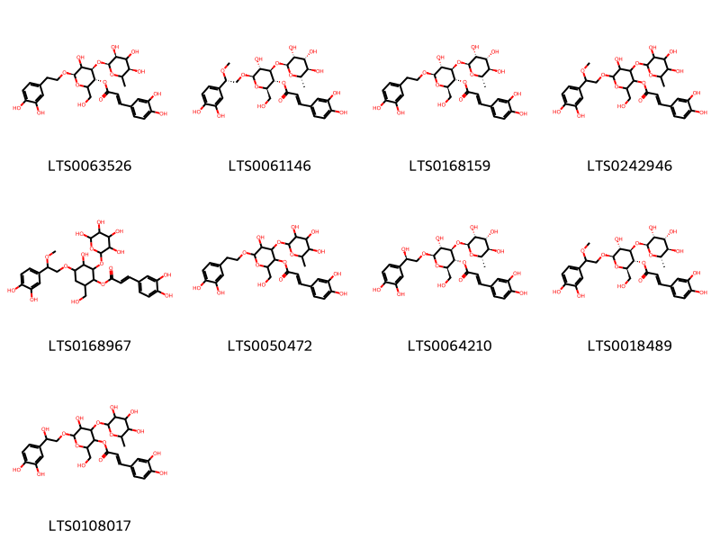{ width=100% }
    <figcaption>Hình ảnh cấu trúc hóa học của 9 hoạt chất thuộc nhóm Cinnamic acids and derivatives gồm ['(3r,4r,6r)-6-[2-(3,4-dihydroxyphenyl)ethoxy]-5-hydroxy-2-(hydroxymethyl)-4-{[(2s,3s,5r)-3,4,5-trihydroxy-6-methyloxan-2-yl]oxy}oxan-3-yl (2e)-3-(3,4-dihydroxyphenyl)prop-2-enoate (LTS0063526)', '(2r,3r,4r,5r,6r)-6-[(2s)-2-(3,4-dihydroxyphenyl)-2-methoxyethoxy]-5-hydroxy-2-(hydroxymethyl)-4-{[(2s,3r,4r,5r,6s)-3,4,5-trihydroxy-6-methyloxan-2-yl]oxy}oxan-3-yl (2e)-3-(3,4-dihydroxyphenyl)prop-2-enoate (LTS0061146)', 'verbascoside (LTS0168159)', '6-[2-(3,4-dihydroxyphenyl)-2-methoxyethoxy]-5-hydroxy-2-(hydroxymethyl)-4-[(3,4,5-trihydroxy-6-methyloxan-2-yl)oxy]oxan-3-yl 3-(3,4-dihydroxyphenyl)prop-2-enoate (LTS0242946)', '4-[2-(3,4-dihydroxyphenyl)-2-methoxyethoxy]-3-hydroxy-6-(hydroxymethyl)-2-[(3,4,5,6-tetrahydroxyoxan-2-yl)oxy]cyclohexyl 3-(3,4-dihydroxyphenyl)prop-2-enoate (LTS0168967)', '6-[2-(3,4-dihydroxyphenyl)ethoxy]-5-hydroxy-2-(hydroxymethyl)-4-[(3,4,5-trihydroxy-6-methyloxan-2-yl)oxy]oxan-3-yl 3-(3,4-dihydroxyphenyl)prop-2-enoate (LTS0050472)', '(2r,3r,4r,5r,6r)-6-[(2r)-2-(3,4-dihydroxyphenyl)-2-hydroxyethoxy]-5-hydroxy-2-(hydroxymethyl)-4-{[(2s,3r,4r,5r,6s)-3,4,5-trihydroxy-6-methyloxan-2-yl]oxy}oxan-3-yl (2e)-3-(3,4-dihydroxyphenyl)prop-2-enoate (LTS0064210)', '(2r,3r,4r,5r,6r)-6-[2-(3,4-dihydroxyphenyl)-2-methoxyethoxy]-5-hydroxy-2-(hydroxymethyl)-4-{[(2s,3r,4r,5r,6s)-3,4,5-trihydroxy-6-methyloxan-2-yl]oxy}oxan-3-yl (2e)-3-(3,4-dihydroxyphenyl)prop-2-enoate (LTS0018489)', '6-[2-(3,4-dihydroxyphenyl)-2-hydroxyethoxy]-5-hydroxy-2-(hydroxymethyl)-4-[(3,4,5-trihydroxy-6-methyloxan-2-yl)oxy]oxan-3-yl 3-(3,4-dihydroxyphenyl)prop-2-enoate (LTS0108017)'].</figcaption>
</figure>
#### Nhóm Flavonoids
<figure markdown="span">
    { width=100% }
    <figcaption>Hình ảnh cấu trúc hóa học của 1 hoạt chất thuộc nhóm Flavonoids gồm ['chamomile (LTS0104946)'].</figcaption>
</figure>
#### Nhóm Heteroaromatic compounds
<figure markdown="span">
    { width=100% }
    <figcaption>Hình ảnh cấu trúc hóa học của 1 hoạt chất thuộc nhóm Heteroaromatic compounds gồm ['furfuryl alcohol (LTS0110403)'].</figcaption>
</figure>
#### Nhóm Organooxygen compounds
<figure markdown="span">
    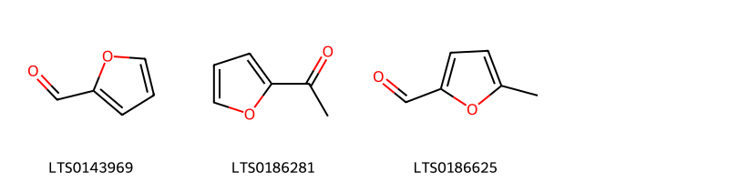{ width=100% }
    <figcaption>Hình ảnh cấu trúc hóa học của 3 hoạt chất thuộc nhóm Organooxygen compounds gồm ['bran oil (LTS0143969)', 'acetylfuran (LTS0186281)', '5-methylfurfural (LTS0186625)'].</figcaption>
</figure>
#### Nhóm Prenol lipids
<figure markdown="span">
    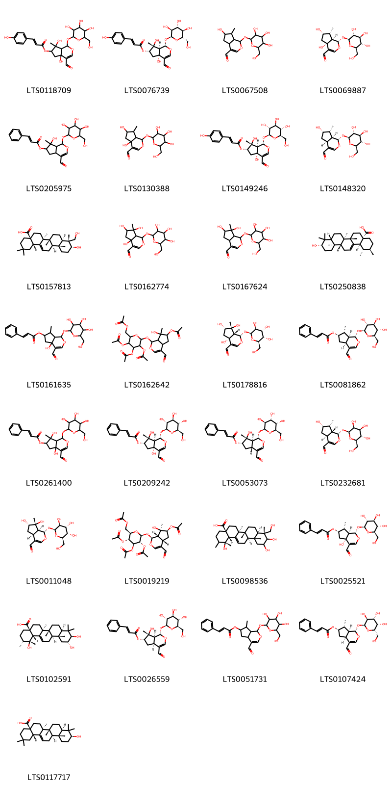{ width=100% }
    <figcaption>Hình ảnh cấu trúc hóa học của 29 hoạt chất thuộc nhóm Prenol lipids gồm ['4-formyl-4a,7-dihydroxy-7-methyl-1-{[3,4,5-trihydroxy-6-(hydroxymethyl)oxan-2-yl]oxy}-1h,5h,6h,7ah-cyclopenta[c]pyran-6-yl 3-(4-hydroxyphenyl)prop-2-enoate (LTS0118709)', '(1s,4ar,6s,7r,7as)-4-formyl-4a,7-dihydroxy-7-methyl-1-{[(2s,3s,4r,5r,6s)-3,4,5-trihydroxy-6-(hydroxymethyl)oxan-2-yl]oxy}-1h,5h,6h,7ah-cyclopenta[c]pyran-6-yl (2e)-3-(4-hydroxyphenyl)prop-2-enoate (LTS0076739)', '6-hydroxy-7-methyl-1-{[3,4,5-trihydroxy-6-(hydroxymethyl)oxan-2-yl]oxy}-1h,4ah,5h,6h,7h,7ah-cyclopenta[c]pyran-4-carbaldehyde (LTS0067508)', '(1s,4ar,6s,7r,7ar)-4a,6-dihydroxy-7-methyl-1-{[(2s,3r,4s,5s,6r)-3,4,5-trihydroxy-6-(hydroxymethyl)oxan-2-yl]oxy}-1h,5h,6h,7h,7ah-cyclopenta[c]pyran-4-carbaldehyde (LTS0069887)', '4-formyl-7-hydroxy-7-methyl-1-{[3,4,5-trihydroxy-6-(hydroxymethyl)oxan-2-yl]oxy}-1h,4ah,5h,6h,7ah-cyclopenta[c]pyran-6-yl 3-phenylprop-2-enoate (LTS0205975)', '4a,6-dihydroxy-7-methyl-1-{[3,4,5-trihydroxy-6-(hydroxymethyl)oxan-2-yl]oxy}-1h,5h,6h,7h,7ah-cyclopenta[c]pyran-4-carbaldehyde (LTS0130388)', '(1s,4ar,6s,7r,7as)-4-formyl-4a,7-dihydroxy-7-methyl-1-{[(2s,3r,4s,5s,6r)-3,4,5-trihydroxy-6-(hydroxymethyl)oxan-2-yl]oxy}-1h,5h,6h,7ah-cyclopenta[c]pyran-6-yl (2e)-3-(4-hydroxyphenyl)prop-2-enoate (LTS0149246)', '(1s,4as,6s,7r,7as)-6-hydroxy-7-methyl-1-{[(2s,3r,4s,5s,6r)-3,4,5-trihydroxy-6-(hydroxymethyl)oxan-2-yl]oxy}-1h,4ah,5h,6h,7h,7ah-cyclopenta[c]pyran-4-carbaldehyde (LTS0148320)', 'hederagenin (LTS0157813)', '4a,6,7-trihydroxy-7-methyl-1-{[3,4,5-trihydroxy-6-(hydroxymethyl)oxan-2-yl]oxy}-1h,5h,6h,7ah-cyclopenta[c]pyran-4-carbaldehyde (LTS0162774)', '6,7-dihydroxy-7-methyl-1-{[3,4,5-trihydroxy-6-(hydroxymethyl)oxan-2-yl]oxy}-1h,4ah,5h,6h,7ah-cyclopenta[c]pyran-4-carbaldehyde (LTS0167624)', 'ursolic acid (LTS0250838)', '4-formyl-4a-hydroxy-7-methyl-1-{[3,4,5-trihydroxy-6-(hydroxymethyl)oxan-2-yl]oxy}-1h,5h,6h,7h,7ah-cyclopenta[c]pyran-6-yl 3-phenylprop-2-enoate (LTS0161635)', '[3,4,5-tris(acetyloxy)-6-{[6-(acetyloxy)-4-formyl-7-hydroxy-7-methyl-1h,4ah,5h,6h,7ah-cyclopenta[c]pyran-1-yl]oxy}oxan-2-yl]methyl acetate (LTS0162642)', '(1s,4ar,6s,7r,7ar)-4a,6,7-trihydroxy-7-methyl-1-{[(2s,3s,4r,5s,6r)-3,4,5-trihydroxy-6-(hydroxymethyl)oxan-2-yl]oxy}-1h,5h,6h,7ah-cyclopenta[c]pyran-4-carbaldehyde (LTS0178816)', '(1s,4as,6s,7r,7as)-4-formyl-7-methyl-1-{[(2s,3r,4s,5s,6r)-3,4,5-trihydroxy-6-(hydroxymethyl)oxan-2-yl]oxy}-1h,4ah,5h,6h,7h,7ah-cyclopenta[c]pyran-6-yl (2e)-3-phenylprop-2-enoate (LTS0081862)', '4-formyl-4a,7-dihydroxy-7-methyl-1-{[3,4,5-trihydroxy-6-(hydroxymethyl)oxan-2-yl]oxy}-1h,5h,6h,7ah-cyclopenta[c]pyran-6-yl 3-phenylprop-2-enoate (LTS0261400)', '(1s,4ar,6s,7r,7as)-4-formyl-4a,7-dihydroxy-7-methyl-1-{[(2s,3r,4s,5s,6r)-3,4,5-trihydroxy-6-(hydroxymethyl)oxan-2-yl]oxy}-1h,5h,6h,7ah-cyclopenta[c]pyran-6-yl (2e)-3-phenylprop-2-enoate (LTS0209242)', '(1s,4ar,6s,7r,7as)-4-formyl-7-hydroxy-7-methyl-1-{[(2s,3s,4r,5s,6r)-3,4,5-trihydroxy-6-(hydroxymethyl)oxan-2-yl]oxy}-1h,4ah,5h,6h,7ah-cyclopenta[c]pyran-6-yl (2e)-3-phenylprop-2-enoate (LTS0053073)', '(1s,4as,6s,7r,7ar)-6-hydroxy-7-methyl-1-{[(2s,3s,4s,5s,6r)-3,4,5-trihydroxy-6-(hydroxymethyl)oxan-2-yl]oxy}-1h,4ah,5h,6h,7h,7ah-cyclopenta[c]pyran-4-carbaldehyde (LTS0232681)', '(1s,4as,6s,7r,7as)-6,7-dihydroxy-7-methyl-1-{[(2s,3s,4r,5s,6r)-3,4,5-trihydroxy-6-(hydroxymethyl)oxan-2-yl]oxy}-1h,4ah,5h,6h,7ah-cyclopenta[c]pyran-4-carbaldehyde (LTS0011048)', '[(2r,3r,4s,5r,6s)-6-{[(1s,4as,6s,7r,7as)-6-(acetyloxy)-4-formyl-7-hydroxy-7-methyl-1h,4ah,5h,6h,7ah-cyclopenta[c]pyran-1-yl]oxy}-3,4,5-tris(acetyloxy)oxan-2-yl]methyl acetate (LTS0019219)', '(1r,4as,6as,6br,8ar,9r,12ar,12br,14bs)-1,10,11-trihydroxy-9-(hydroxymethyl)-1,2,6a,6b,9,12a-hexamethyl-2,3,4,5,6,7,8,8a,10,11,12,12b,13,14b-tetradecahydropicene-4a-carboxylic acid (LTS0098536)', '(1s,4ar,6s,7r,7ar)-4-formyl-4a-hydroxy-7-methyl-1-{[(2s,3r,4s,5s,6r)-3,4,5-trihydroxy-6-(hydroxymethyl)oxan-2-yl]oxy}-1h,5h,6h,7h,7ah-cyclopenta[c]pyran-6-yl (2e)-3-phenylprop-2-enoate (LTS0025521)', 'tormentic acid (LTS0102591)', '(1s,4as,6s,7r,7as)-4-formyl-7-hydroxy-7-methyl-1-{[(2s,3r,4s,5s,6r)-3,4,5-trihydroxy-6-(hydroxymethyl)oxan-2-yl]oxy}-1h,4ah,5h,6h,7ah-cyclopenta[c]pyran-6-yl (2e)-3-phenylprop-2-enoate (LTS0026559)', '4-formyl-7-methyl-1-{[3,4,5-trihydroxy-6-(hydroxymethyl)oxan-2-yl]oxy}-1h,4ah,5h,6h,7h,7ah-cyclopenta[c]pyran-6-yl 3-phenylprop-2-enoate (LTS0051731)', '(1s,4as,6s,7r,7as)-4-formyl-7-methyl-1-{[(2s,3s,4r,5s,6s)-3,4,5-trihydroxy-6-(hydroxymethyl)oxan-2-yl]oxy}-1h,4ah,5h,6h,7h,7ah-cyclopenta[c]pyran-6-yl (2e)-3-phenylprop-2-enoate (LTS0107424)', 'oleanolic acid (LTS0117717)'].</figcaption>
</figure>
#### Nhóm Pyridines and derivatives
<figure markdown="span">
    { width=100% }
    <figcaption>Hình ảnh cấu trúc hóa học của 2 hoạt chất thuộc nhóm Pyridines and derivatives gồm ['boschniakine (LTS0203823)', '7-methyl-5h,6h,7h-cyclopenta[c]pyridine-4-carbaldehyde (LTS0181175)'].</figcaption>
</figure>
#### Nhóm Steroids and steroid derivatives
<figure markdown="span">
    { width=100% }
    <figcaption>Hình ảnh cấu trúc hóa học của 1 hoạt chất thuộc nhóm Steroids and steroid derivatives gồm ['stigmast-5-en-3-ol, (3β)- (LTS0204616)'].</figcaption>
</figure>

---

### Dược dân tộc học

Danh sách các quốc gia có sử dụng *Campsis grandiflora* trong điều trị các bệnh. 

| Country   | Disease                       | Bệnh                                                                                                                                                                                                |
|:----------|:------------------------------|:----------------------------------------------------------------------------------------------------------------------------------------------------------------------------------------------------|
| Elsewhere | Emmenagogue, Diuretic         | MYMEMORY WARNING: YOU USED ALL AVAILABLE FREE TRANSLATIONS FOR TODAY. NEXT AVAILABLE IN  19 HOURS 12 MINUTES 23 SECONDS VISIT HTTPS://MYMEMORY.TRANSLATED.NET/DOC/USAGELIMITS.PHP TO TRANSLATE MORE |
| Japan     | Diuretic, Emmenagogue, Poison | MYMEMORY WARNING: YOU USED ALL AVAILABLE FREE TRANSLATIONS FOR TODAY. NEXT AVAILABLE IN  19 HOURS 12 MINUTES 21 SECONDS VISIT HTTPS://MYMEMORY.TRANSLATED.NET/DOC/USAGELIMITS.PHP TO TRANSLATE MORE |

---

# Chi Adenocalymna

??? note "Danh sách các dược liệu thuộc chi"
    
	 - *Adenocalymna alliaceum*

---
## Adenocalymna alliaceum
### Thông tin về thực vật

!!! info "Phân loại thực vật của *Mansoa alliacea* từ GIBF:"
    - **Kingdom:** Plantae
    - **Phylum:** Tracheophyta
    - **Order:** Lamiales
    - **Family:** Bignoniaceae
    - **Genus:** Mansoa
    - **Species:** *Mansoa alliacea*

 

| Label (VI)   | Label (EN)   | Scientific Name     | Descriptions (VI)   | Descriptions (EN)   | Also Known As (VI)   | Also Known As (EN)   |
|:-------------|:-------------|:--------------------|:--------------------|:--------------------|:---------------------|:---------------------|
| N/A          | N/A          | Campsis grandiflora | loài thực vật       | species of plant    | ['']                 | ['']                 |

#### Phân bố trên thế giới

**Từ CSDL GIBF** nan, Spain, Guadeloupe, Germany, Chile, Korea, Republic of, Pakistan, Belgium, Japan, Brazil, Mexico, China, Hong Kong, Chinese Taipei, South Africa, France, New Zealand, Bolivia (Plurinational State of), United States of America, Italy, Greece, Croatia

#### Phân bố tại Việt Nam

**Từ CSDL GIBF**: Không có ghi nhận ở Việt Nam

---
### Thành phần hóa học
        
- Theo cơ sở dữ liệu lotus: Từ loài *Mansoa alliacea* đã phân lập và xác định được Chưa có hoạt chất nào được phân lập. hoạt chất thuộc về các nhóm Không có hoạt chất nào được phân lập. 

Không có hình ảnh nào được tạo ra

---

### Dược dân tộc học

Danh sách các quốc gia có sử dụng *Mansoa alliacea* trong điều trị các bệnh. 

| Country   | Disease   | Bệnh                                                                                                                                                                                                |
|:----------|:----------|:----------------------------------------------------------------------------------------------------------------------------------------------------------------------------------------------------|
| Venezuela | Emetic    | MYMEMORY WARNING: YOU USED ALL AVAILABLE FREE TRANSLATIONS FOR TODAY. NEXT AVAILABLE IN  19 HOURS 11 MINUTES 31 SECONDS VISIT HTTPS://MYMEMORY.TRANSLATED.NET/DOC/USAGELIMITS.PHP TO TRANSLATE MORE |

---

# Chi Pyrostegia

??? note "Danh sách các dược liệu thuộc chi"
    
	 - *Pyrostegia venusta*

---
## Pyrostegia venusta
### Thông tin về thực vật

!!! info "Phân loại thực vật của *Pyrostegia venusta* từ GIBF:"
    - **Kingdom:** Plantae
    - **Phylum:** Tracheophyta
    - **Order:** Lamiales
    - **Family:** Bignoniaceae
    - **Genus:** Pyrostegia
    - **Species:** *Pyrostegia venusta*

 

| Label (VI)   | Label (EN)   | Scientific Name    | Descriptions (VI)   | Descriptions (EN)   | Also Known As (VI)   | Also Known As (EN)   |
|:-------------|:-------------|:-------------------|:--------------------|:--------------------|:---------------------|:---------------------|
| N/A          | N/A          | Pyrostegia venusta | loài thực vật       | species of plant    | ['']                 | ['']                 |

#### Phân bố trên thế giới

**Từ CSDL GIBF** Honduras, nan, Viet Nam, Thailand, Kenya, Chile, Rwanda, Australia, Guatemala, Colombia, Venezuela (Bolivarian Republic of), Dominican Republic, Malaysia, India, Nigeria, Nicaragua, Japan, Brazil, Panama, Peru, Ethiopia, China, Nepal, Hong Kong, Argentina, Portugal, South Africa, Mozambique, New Zealand, Egypt, Macao, Costa Rica, Bolivia (Plurinational State of), Paraguay, Ecuador, United States of America, Algeria, Madagascar

#### Phân bố tại Việt Nam

**Từ CSDL GIBF**: Gia Lai

---
### Thành phần hóa học
        
- Theo cơ sở dữ liệu lotus: Từ loài *Pyrostegia venusta* đã phân lập và xác định được 1 hoạt chất thuộc về các nhóm Flavonoids. 

|    | chemicalTaxonomyClassyfireClass   |   smiles_count |
|---:|:----------------------------------|---------------:|
|  0 | Flavonoids                        |              1 |

#### Nhóm Flavonoids
<figure markdown="span">
    { width=100% }
    <figcaption>Hình ảnh cấu trúc hóa học của 1 hoạt chất thuộc nhóm Flavonoids gồm ['3-rutinosyl quercetin (LTS0032845)'].</figcaption>
</figure>

---

### Dược dân tộc học

Danh sách các quốc gia có sử dụng *Pyrostegia venusta* trong điều trị các bệnh. 

| Country   | Disease   | Bệnh                                                                                                                                                                                                |
|:----------|:----------|:----------------------------------------------------------------------------------------------------------------------------------------------------------------------------------------------------|
| Brazil    | Poison    | MYMEMORY WARNING: YOU USED ALL AVAILABLE FREE TRANSLATIONS FOR TODAY. NEXT AVAILABLE IN  19 HOURS 11 MINUTES 01 SECONDS VISIT HTTPS://MYMEMORY.TRANSLATED.NET/DOC/USAGELIMITS.PHP TO TRANSLATE MORE |

---

# Chi Tecoma

??? note "Danh sách các dược liệu thuộc chi"
    
	 - *Tecoma capensis*
	 - *Tecoma radicans*
	 - *Tecoma stans*
	 - *Tecoma undulata*

---
## Tecoma capensis
### Thông tin về thực vật

!!! info "Phân loại thực vật của *Tecomaria capensis* từ GIBF:"
    - **Kingdom:** Plantae
    - **Phylum:** Tracheophyta
    - **Order:** Lamiales
    - **Family:** Bignoniaceae
    - **Genus:** Tecomaria
    - **Species:** *Tecomaria capensis*

 

| Label (VI)   | Label (EN)   | Scientific Name   | Descriptions (VI)   | Descriptions (EN)   | Also Known As (VI)   | Also Known As (EN)   |
|:-------------|:-------------|:------------------|:--------------------|:--------------------|:---------------------|:---------------------|
| N/A          | N/A          | Tecoma capensis   |                     | species of plant    | ['']                 | ['']                 |

#### Phân bố trên thế giới

**Từ CSDL GIBF** Malawi, Spain, Germany, Kenya, Rwanda, Australia, Guatemala, Colombia, Norfolk Island, Mauritius, India, Réunion, Canada, Brazil, Eswatini, Argentina, South Africa, Portugal, France, Tanzania, United Republic of, New Zealand, Cyprus, Costa Rica, Congo, Democratic Republic of the, Bolivia (Plurinational State of), United States of America, Italy, Greece

#### Phân bố tại Việt Nam

**Từ CSDL GIBF**: Không có ghi nhận ở Việt Nam

---
### Thành phần hóa học
        
- Theo cơ sở dữ liệu lotus: Từ loài *Tecomaria capensis* đã phân lập và xác định được 29 hoạt chất thuộc về các nhóm Benzofurans, Organooxygen compounds, Prenol lipids, Flavonoids. 

|    | chemicalTaxonomyClassyfireClass   |   smiles_count |
|---:|:----------------------------------|---------------:|
|  0 | Benzofurans                       |              1 |
|  1 | Flavonoids                        |              5 |
|  2 | Organooxygen compounds            |              5 |
|  3 | Prenol lipids                     |             18 |

#### Nhóm Benzofurans
<figure markdown="span">
    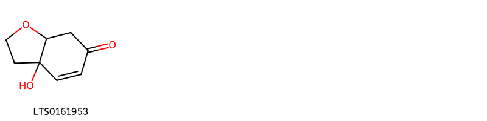{ width=100% }
    <figcaption>Hình ảnh cấu trúc hóa học của 1 hoạt chất thuộc nhóm Benzofurans gồm ['3a-hydroxy-2,3,7,7a-tetrahydro-1-benzofuran-6-one (LTS0161953)'].</figcaption>
</figure>
#### Nhóm Flavonoids
<figure markdown="span">
    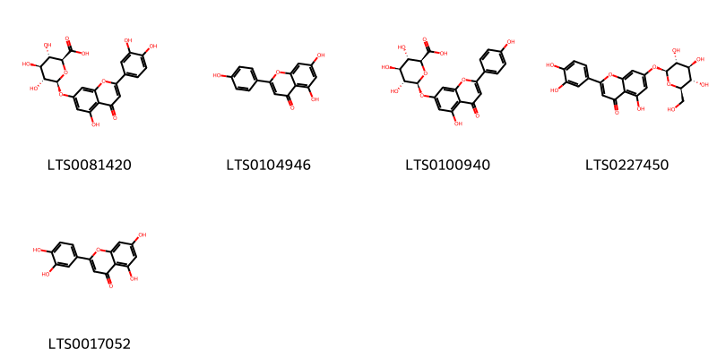{ width=100% }
    <figcaption>Hình ảnh cấu trúc hóa học của 5 hoạt chất thuộc nhóm Flavonoids gồm ['luteolin 7-o-glucuronide (LTS0081420)', 'chamomile (LTS0104946)', '(2s,3s,4s,5r,6s)-3,4,5-trihydroxy-6-{[5-hydroxy-2-(4-hydroxyphenyl)-4-oxochromen-7-yl]oxy}oxane-2-carboxylic acid (LTS0100940)', 'luteolin 7-o-glucoside (LTS0227450)', 'luteolin (LTS0017052)'].</figcaption>
</figure>
#### Nhóm Organooxygen compounds
<figure markdown="span">
    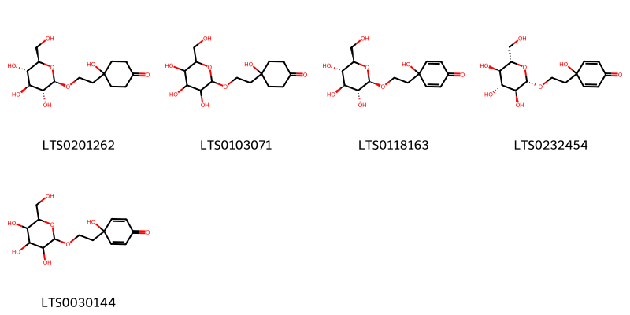{ width=100% }
    <figcaption>Hình ảnh cấu trúc hóa học của 5 hoạt chất thuộc nhóm Organooxygen compounds gồm ['4-hydroxy-4-(2-{[(2r,3r,4s,5s,6r)-3,4,5-trihydroxy-6-(hydroxymethyl)oxan-2-yl]oxy}ethyl)cyclohexan-1-one (LTS0201262)', '4-hydroxy-4-(2-{[3,4,5-trihydroxy-6-(hydroxymethyl)oxan-2-yl]oxy}ethyl)cyclohexan-1-one (LTS0103071)', '4-hydroxy-4-(2-{[(2r,3r,4s,5s,6r)-3,4,5-trihydroxy-6-(hydroxymethyl)oxan-2-yl]oxy}ethyl)cyclohexa-2,5-dien-1-one (LTS0118163)', '4-hydroxy-4-(2-{[(2s,3s,4r,5r,6s)-3,4,5-trihydroxy-6-(hydroxymethyl)oxan-2-yl]oxy}ethyl)cyclohexa-2,5-dien-1-one (LTS0232454)', '4-hydroxy-4-(2-{[3,4,5-trihydroxy-6-(hydroxymethyl)oxan-2-yl]oxy}ethyl)cyclohexa-2,5-dien-1-one (LTS0030144)'].</figcaption>
</figure>
#### Nhóm Prenol lipids
<figure markdown="span">
    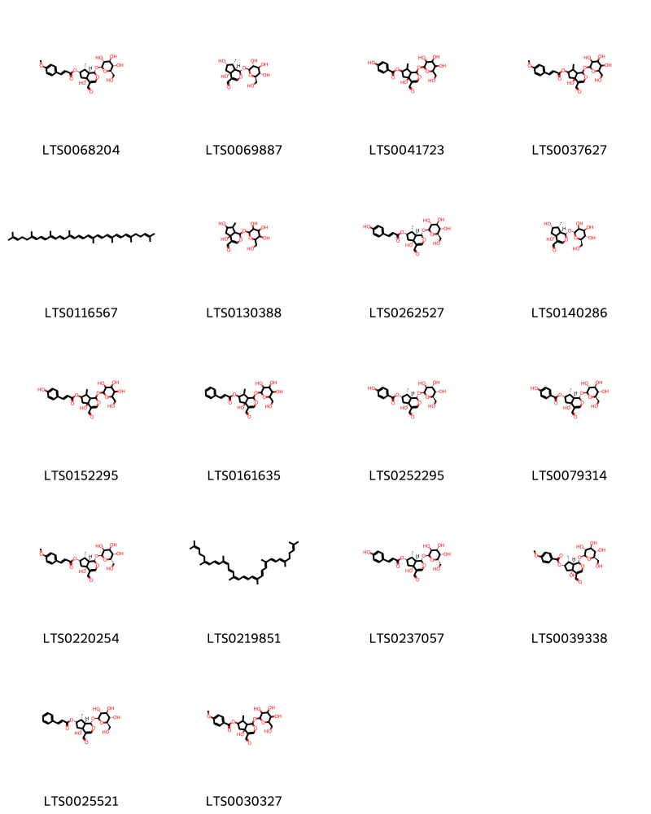{ width=100% }
    <figcaption>Hình ảnh cấu trúc hóa học của 18 hoạt chất thuộc nhóm Prenol lipids gồm ['(1s,4ar,6s,7r,7ar)-4-formyl-4a-hydroxy-7-methyl-1-{[(2s,3r,4s,5s,6r)-3,4,5-trihydroxy-6-(hydroxymethyl)oxan-2-yl]oxy}-1h,5h,6h,7h,7ah-cyclopenta[c]pyran-6-yl (2e)-3-(4-methoxyphenyl)prop-2-enoate (LTS0068204)', '(1s,4ar,6s,7r,7ar)-4a,6-dihydroxy-7-methyl-1-{[(2s,3r,4s,5s,6r)-3,4,5-trihydroxy-6-(hydroxymethyl)oxan-2-yl]oxy}-1h,5h,6h,7h,7ah-cyclopenta[c]pyran-4-carbaldehyde (LTS0069887)', '4-formyl-4a-hydroxy-7-methyl-1-{[3,4,5-trihydroxy-6-(hydroxymethyl)oxan-2-yl]oxy}-1h,5h,6h,7h,7ah-cyclopenta[c]pyran-6-yl 4-hydroxybenzoate (LTS0041723)', '4-formyl-4a-hydroxy-7-methyl-1-{[3,4,5-trihydroxy-6-(hydroxymethyl)oxan-2-yl]oxy}-1h,5h,6h,7h,7ah-cyclopenta[c]pyran-6-yl 3-(4-methoxyphenyl)prop-2-enoate (LTS0037627)', 'lycopene (LTS0116567)', '4a,6-dihydroxy-7-methyl-1-{[3,4,5-trihydroxy-6-(hydroxymethyl)oxan-2-yl]oxy}-1h,5h,6h,7h,7ah-cyclopenta[c]pyran-4-carbaldehyde (LTS0130388)', '(1s,4ar,6s,7r,7ar)-4-formyl-4a-hydroxy-7-methyl-1-{[(2s,3r,4s,5s,6r)-3,4,5-trihydroxy-6-(hydroxymethyl)oxan-2-yl]oxy}-1h,5h,6h,7h,7ah-cyclopenta[c]pyran-6-yl (2e)-3-(4-hydroxyphenyl)prop-2-enoate (LTS0262527)', '(1s,4ar,6s,7r,7ar)-4a,6-dihydroxy-7-methyl-1-{[(2r,3s,4s,5s,6r)-3,4,5-trihydroxy-6-(hydroxymethyl)oxan-2-yl]oxy}-1h,5h,6h,7h,7ah-cyclopenta[c]pyran-4-carbaldehyde (LTS0140286)', '4-formyl-4a-hydroxy-7-methyl-1-{[3,4,5-trihydroxy-6-(hydroxymethyl)oxan-2-yl]oxy}-1h,5h,6h,7h,7ah-cyclopenta[c]pyran-6-yl 3-(4-hydroxyphenyl)prop-2-enoate (LTS0152295)', '4-formyl-4a-hydroxy-7-methyl-1-{[3,4,5-trihydroxy-6-(hydroxymethyl)oxan-2-yl]oxy}-1h,5h,6h,7h,7ah-cyclopenta[c]pyran-6-yl 3-phenylprop-2-enoate (LTS0161635)', '(1s,4ar,6s,7r,7ar)-4-formyl-4a-hydroxy-7-methyl-1-{[(2s,3s,4r,5s,6r)-3,4,5-trihydroxy-6-(hydroxymethyl)oxan-2-yl]oxy}-1h,5h,6h,7h,7ah-cyclopenta[c]pyran-6-yl 4-hydroxybenzoate (LTS0252295)', '(1s,4ar,6s,7r,7ar)-4-formyl-4a-hydroxy-7-methyl-1-{[(2s,3r,4s,5s,6r)-3,4,5-trihydroxy-6-(hydroxymethyl)oxan-2-yl]oxy}-1h,5h,6h,7h,7ah-cyclopenta[c]pyran-6-yl 4-hydroxybenzoate (LTS0079314)', '(1s,4ar,6s,7r,7ar)-4-formyl-4a-hydroxy-7-methyl-1-{[(2s,3s,4s,5s,6s)-3,4,5-trihydroxy-6-(hydroxymethyl)oxan-2-yl]oxy}-1h,5h,6h,7h,7ah-cyclopenta[c]pyran-6-yl (2e)-3-(4-methoxyphenyl)prop-2-enoate (LTS0220254)', '2,6,10,14,19,23,27,31-octamethyldotriaconta-2,6,8,10,12,14,16,18,20,22,24,26,30-tridecaene (LTS0219851)', '(1s,4ar,6s,7r,7ar)-4-formyl-4a-hydroxy-7-methyl-1-{[(2s,3s,4r,5s,6s)-3,4,5-trihydroxy-6-(hydroxymethyl)oxan-2-yl]oxy}-1h,5h,6h,7h,7ah-cyclopenta[c]pyran-6-yl (2e)-3-(4-hydroxyphenyl)prop-2-enoate (LTS0237057)', '(1s,4ar,6s,7r,7ar)-4-formyl-4a-hydroxy-7-methyl-1-{[(2s,3r,4s,5s,6r)-3,4,5-trihydroxy-6-(hydroxymethyl)oxan-2-yl]oxy}-1h,5h,6h,7h,7ah-cyclopenta[c]pyran-6-yl 4-methoxybenzoate (LTS0039338)', '(1s,4ar,6s,7r,7ar)-4-formyl-4a-hydroxy-7-methyl-1-{[(2s,3r,4s,5s,6r)-3,4,5-trihydroxy-6-(hydroxymethyl)oxan-2-yl]oxy}-1h,5h,6h,7h,7ah-cyclopenta[c]pyran-6-yl (2e)-3-phenylprop-2-enoate (LTS0025521)', '4-formyl-4a-hydroxy-7-methyl-1-{[3,4,5-trihydroxy-6-(hydroxymethyl)oxan-2-yl]oxy}-1h,5h,6h,7h,7ah-cyclopenta[c]pyran-6-yl 4-methoxybenzoate (LTS0030327)'].</figcaption>
</figure>

---

### Dược dân tộc học

Danh sách các quốc gia có sử dụng *Tecomaria capensis* trong điều trị các bệnh. 

| Country      | Disease   | Bệnh                                                                                                                                                                                                |
|:-------------|:----------|:----------------------------------------------------------------------------------------------------------------------------------------------------------------------------------------------------|
| South Africa | Sedative  | MYMEMORY WARNING: YOU USED ALL AVAILABLE FREE TRANSLATIONS FOR TODAY. NEXT AVAILABLE IN  19 HOURS 10 MINUTES 06 SECONDS VISIT HTTPS://MYMEMORY.TRANSLATED.NET/DOC/USAGELIMITS.PHP TO TRANSLATE MORE |

---

---
## Tecoma radicans
### Thông tin về thực vật

!!! info "Phân loại thực vật của *Campsis radicans* từ GIBF:"
    - **Kingdom:** Plantae
    - **Phylum:** Tracheophyta
    - **Order:** Lamiales
    - **Family:** Bignoniaceae
    - **Genus:** Campsis
    - **Species:** *Campsis radicans*

 

| Label (VI)   | Label (EN)   | Scientific Name   | Descriptions (VI)   | Descriptions (EN)   | Also Known As (VI)   | Also Known As (EN)   |
|:-------------|:-------------|:------------------|:--------------------|:--------------------|:---------------------|:---------------------|
| N/A          | N/A          | Tecoma capensis   |                     | species of plant    | ['']                 | ['']                 |

#### Phân bố trên thế giới

**Từ CSDL GIBF** nan, unknown or invalid, United Kingdom of Great Britain and Northern Ireland, Portugal, Japan, France, Spain, Ghana, India, Germany, Canada, United States of America, Italy

#### Phân bố tại Việt Nam

**Từ CSDL GIBF**: Không có ghi nhận ở Việt Nam

---
### Thành phần hóa học
        
- Theo cơ sở dữ liệu lotus: Từ loài *Campsis radicans* đã phân lập và xác định được Chưa có hoạt chất nào được phân lập. hoạt chất thuộc về các nhóm Không có hoạt chất nào được phân lập. 

Không có hình ảnh nào được tạo ra

---

### Dược dân tộc học

Danh sách các quốc gia có sử dụng *Campsis radicans* trong điều trị các bệnh. 

| Country   | Disease                | Bệnh                                                                                                                                                                                                |
|:----------|:-----------------------|:----------------------------------------------------------------------------------------------------------------------------------------------------------------------------------------------------|
| Elsewhere | Diaphoretic, Vulnerary | MYMEMORY WARNING: YOU USED ALL AVAILABLE FREE TRANSLATIONS FOR TODAY. NEXT AVAILABLE IN  19 HOURS 09 MINUTES 24 SECONDS VISIT HTTPS://MYMEMORY.TRANSLATED.NET/DOC/USAGELIMITS.PHP TO TRANSLATE MORE |
| US        | Diaphoretic, Vulnerary | MYMEMORY WARNING: YOU USED ALL AVAILABLE FREE TRANSLATIONS FOR TODAY. NEXT AVAILABLE IN  19 HOURS 09 MINUTES 20 SECONDS VISIT HTTPS://MYMEMORY.TRANSLATED.NET/DOC/USAGELIMITS.PHP TO TRANSLATE MORE |

---

---
## Tecoma stans
### Thông tin về thực vật

!!! info "Phân loại thực vật của *Tecoma stans* từ GIBF:"
    - **Kingdom:** Plantae
    - **Phylum:** Tracheophyta
    - **Order:** Lamiales
    - **Family:** Bignoniaceae
    - **Genus:** Tecoma
    - **Species:** *Tecoma stans*

 

| Label (VI)   | Label (EN)   | Scientific Name   | Descriptions (VI)   | Descriptions (EN)   | Also Known As (VI)   | Also Known As (EN)                                                                                              |
|:-------------|:-------------|:------------------|:--------------------|:--------------------|:---------------------|:----------------------------------------------------------------------------------------------------------------|
| N/A          | N/A          | Tecoma stans      |                     | species of plant    | ['']                 | ['ginger-thomas', 'yellow trumpet bush', 'yellow trumpet flower', 'yellow trumpetbush', 'Arizona yellow bells'] |

#### Phân bố trên thế giới

**Từ CSDL GIBF** Viet Nam, Malawi, Thailand, El Salvador, Guadeloupe, Kenya, United Arab Emirates, Australia, Jamaica, Guatemala, Colombia, Sri Lanka, Turks and Caicos Islands, Dominican Republic, Venezuela (Bolivarian Republic of), Puerto Rico, India, Bahamas, Cuba, Virgin Islands (U.S.), Sint Maarten (Dutch part), Cambodia, Antigua and Barbuda, Nicaragua, Panama, Brazil, Japan, Peru, Aruba, Montserrat, Mexico, Hong Kong, Saint Martin (French part), Argentina, South Africa, Egypt, Bolivia (Plurinational State of), Costa Rica, Ecuador, United States of America, Cabo Verde

#### Phân bố tại Việt Nam

**Từ CSDL GIBF**: Kiên Giang, Hồ Chí Minh city, Hậu Giang

---
### Thành phần hóa học
        
- Theo cơ sở dữ liệu lotus: Từ loài *Tecoma stans* đã phân lập và xác định được 64 hoạt chất thuộc về các nhóm Organooxygen compounds, Flavonoids, Indoles and derivatives, Benzene and substituted derivatives, Piperidines, Prenol lipids, Fatty Acyls, Dihydrofurans, Cinnamic acids and derivatives, Steroids and steroid derivatives, Pyridines and derivatives. 

|    | chemicalTaxonomyClassyfireClass     |   smiles_count |
|---:|:------------------------------------|---------------:|
|  0 | Benzene and substituted derivatives |              2 |
|  1 | Cinnamic acids and derivatives      |              9 |
|  2 | Dihydrofurans                       |              1 |
|  3 | Fatty Acyls                         |              2 |
|  4 | Flavonoids                          |              4 |
|  5 | Indoles and derivatives             |              5 |
|  6 | Organooxygen compounds              |             13 |
|  7 | Piperidines                         |             11 |
|  8 | Prenol lipids                       |             10 |
|  9 | Pyridines and derivatives           |              2 |
| 10 | Steroids and steroid derivatives    |              4 |

#### Nhóm Benzene and substituted derivatives
<figure markdown="span">
    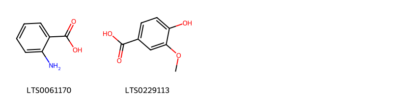{ width=100% }
    <figcaption>Hình ảnh cấu trúc hóa học của 2 hoạt chất thuộc nhóm Benzene and substituted derivatives gồm ['2-aminobenzoic acid (LTS0061170)', 'vanillic acid (LTS0229113)'].</figcaption>
</figure>
#### Nhóm Cinnamic acids and derivatives
<figure markdown="span">
    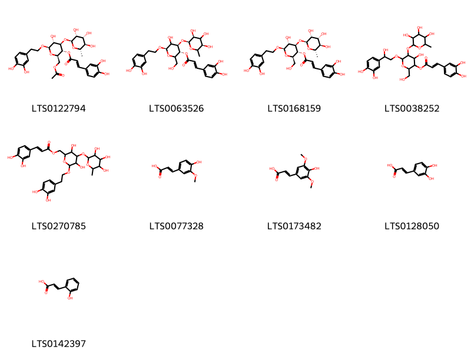{ width=100% }
    <figcaption>Hình ảnh cấu trúc hóa học của 9 hoạt chất thuộc nhóm Cinnamic acids and derivatives gồm ['(2r,3r,4r,5r,6r)-2-[(acetyloxy)methyl]-6-[2-(3,4-dihydroxyphenyl)ethoxy]-5-hydroxy-4-{[(2s,3r,4r,5r,6s)-3,4,5-trihydroxy-6-methyloxan-2-yl]oxy}oxan-3-yl (2e)-3-(3,4-dihydroxyphenyl)prop-2-enoate (LTS0122794)', '(3r,4r,6r)-6-[2-(3,4-dihydroxyphenyl)ethoxy]-5-hydroxy-2-(hydroxymethyl)-4-{[(2s,3s,5r)-3,4,5-trihydroxy-6-methyloxan-2-yl]oxy}oxan-3-yl (2e)-3-(3,4-dihydroxyphenyl)prop-2-enoate (LTS0063526)', 'verbascoside (LTS0168159)', '6-[2-(3,4-dihydroxyphenyl)-2-hydroxyethoxy]-4-hydroxy-2-(hydroxymethyl)-5-[(3,4,5-trihydroxy-6-methyloxan-2-yl)oxy]oxan-3-yl 3-(3,4-dihydroxyphenyl)prop-2-enoate (LTS0038252)', '{6-[2-(3,4-dihydroxyphenyl)ethoxy]-3,5-dihydroxy-4-[(3,4,5-trihydroxy-6-methyloxan-2-yl)oxy]oxan-2-yl}methyl 3-(3,4-dihydroxyphenyl)prop-2-enoate (LTS0270785)', 'ferulic acid (LTS0077328)', 'sinapinate (LTS0173482)', '3,4-dihydroxycinnamic acid (LTS0128050)', 'trans-2-hydroxycinnamic acid (LTS0142397)'].</figcaption>
</figure>
#### Nhóm Dihydrofurans
<figure markdown="span">
    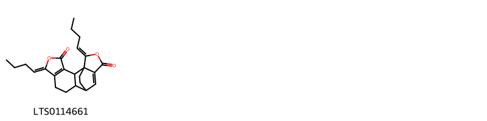{ width=100% }
    <figcaption>Hình ảnh cấu trúc hóa học của 1 hoạt chất thuộc nhóm Dihydrofurans gồm ['levistolide a (LTS0114661)'].</figcaption>
</figure>
#### Nhóm Fatty Acyls
<figure markdown="span">
    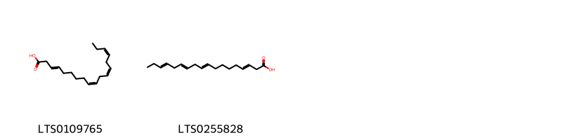{ width=100% }
    <figcaption>Hình ảnh cấu trúc hóa học của 2 hoạt chất thuộc nhóm Fatty Acyls gồm ['(3e,9z,12z,15z)-octadeca-3,9,12,15-tetraenoic acid (LTS0109765)', 'octadeca-3,9,12,15-tetraenoic acid (LTS0255828)'].</figcaption>
</figure>
#### Nhóm Flavonoids
<figure markdown="span">
    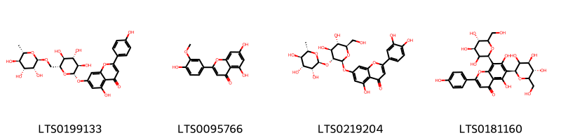{ width=100% }
    <figcaption>Hình ảnh cấu trúc hóa học của 4 hoạt chất thuộc nhóm Flavonoids gồm ['isorhoifolin (LTS0199133)', 'chrysoeriol (LTS0095766)', 'lonicerin (LTS0219204)', 'vicenin 2 (LTS0181160)'].</figcaption>
</figure>
#### Nhóm Indoles and derivatives
<figure markdown="span">
    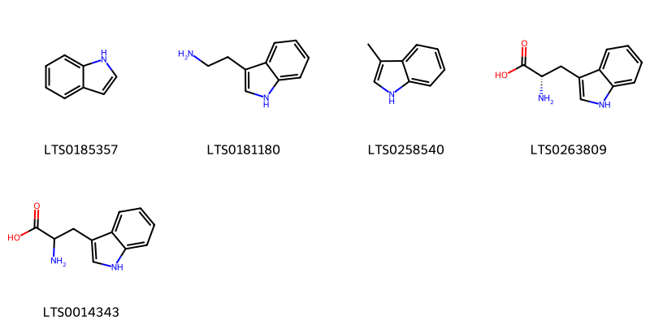{ width=100% }
    <figcaption>Hình ảnh cấu trúc hóa học của 5 hoạt chất thuộc nhóm Indoles and derivatives gồm ['indole (LTS0185357)', 'tryptamine (LTS0181180)', 'scatole (LTS0258540)', 'l-tryptophan (LTS0263809)', 'optimax (LTS0014343)'].</figcaption>
</figure>
#### Nhóm Organooxygen compounds
<figure markdown="span">
    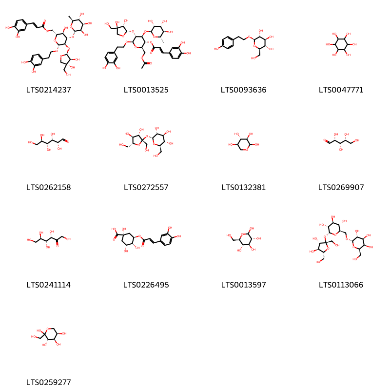{ width=100% }
    <figcaption>Hình ảnh cấu trúc hóa học của 13 hoạt chất thuộc nhóm Organooxygen compounds gồm ['[(2r,3r,4s,5r,6r)-5-{[(2s,3s,4r)-3,4-dihydroxy-4-(hydroxymethyl)oxolan-2-yl]oxy}-6-[2-(3,4-dihydroxyphenyl)ethoxy]-3-hydroxy-4-{[(2s,3r,4r,5r,6s)-3,4,5-trihydroxy-6-methyloxan-2-yl]oxy}oxan-2-yl]methyl (2e)-3-(3,4-dihydroxyphenyl)prop-2-enoate (LTS0214237)', '(2r,3r,4s,5r,6r)-2-[(acetyloxy)methyl]-5-{[(2s,3s,4r)-3,4-dihydroxy-4-(hydroxymethyl)oxolan-2-yl]oxy}-6-[2-(3,4-dihydroxyphenyl)ethoxy]-4-{[(2s,3r,4r,5r,6s)-3,4,5-trihydroxy-6-methyloxan-2-yl]oxy}oxan-3-yl (2e)-3-(3,4-dihydroxyphenyl)prop-2-enoate (LTS0013525)', 'salidroside (LTS0093636)', '(-)-inositol (LTS0047771)', '(+)-glucose (LTS0262158)', 'sucrose (LTS0272557)', 'd-xylose (LTS0132381)', '(d)-xylose (LTS0269907)', 'keto-d-fructose (LTS0241114)', 'chlorogenic acid (LTS0226495)', 'glucose (LTS0013597)', 'raffinose (LTS0113066)', 'd-fructopyranose (LTS0259277)'].</figcaption>
</figure>
#### Nhóm Piperidines
<figure markdown="span">
    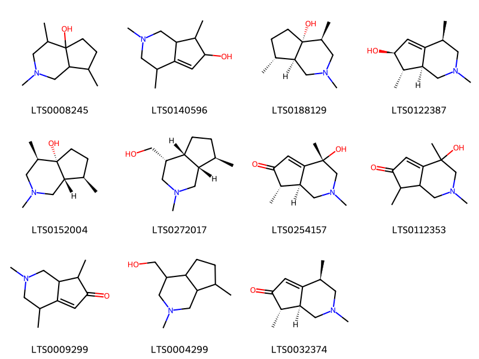{ width=100% }
    <figcaption>Hình ảnh cấu trúc hóa học của 11 hoạt chất thuộc nhóm Piperidines gồm ['2,4,7-trimethyl-hexahydro-1h-cyclopenta[c]pyridin-4a-ol (LTS0008245)', '2,4,7-trimethyl-1h,3h,4h,6h,7h,7ah-cyclopenta[c]pyridin-6-ol (LTS0140596)', '(4s,4ar,7r,7ar)-2,4,7-trimethyl-hexahydro-1h-cyclopenta[c]pyridin-4a-ol (LTS0188129)', '(4r,6r,7s,7as)-2,4,7-trimethyl-1h,3h,4h,6h,7h,7ah-cyclopenta[c]pyridin-6-ol (LTS0122387)', '(4r,4as,7r,7ar)-2,4,7-trimethyl-hexahydro-1h-cyclopenta[c]pyridin-4a-ol (LTS0152004)', '[(4r,4ar,7r,7as)-2,7-dimethyl-octahydrocyclopenta[c]pyridin-4-yl]methanol (LTS0272017)', '(4s,7s,7as)-4-hydroxy-2,4,7-trimethyl-1h,3h,7h,7ah-cyclopenta[c]pyridin-6-one (LTS0254157)', '4-hydroxy-2,4,7-trimethyl-1h,3h,7h,7ah-cyclopenta[c]pyridin-6-one (LTS0112353)', 'tecomanine (LTS0009299)', 'tecostanine (LTS0004299)', 'tecomine (LTS0032374)'].</figcaption>
</figure>
#### Nhóm Prenol lipids
<figure markdown="span">
    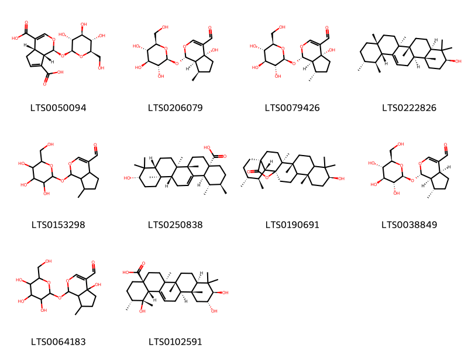{ width=100% }
    <figcaption>Hình ảnh cấu trúc hóa học của 10 hoạt chất thuộc nhóm Prenol lipids gồm ['(1s,4as,7as)-1-{[(2s,3r,4s,5s,6r)-3,4,5-trihydroxy-6-(hydroxymethyl)oxan-2-yl]oxy}-1h,4ah,5h,7ah-cyclopenta[c]pyran-4,7-dicarboxylic acid (LTS0050094)', 'plantarenaloside (LTS0206079)', '(1s,4ar,7s,7ar)-4a-hydroxy-7-methyl-1-{[(2s,3r,4s,5s,6r)-3,4,5-trihydroxy-6-(hydroxymethyl)oxan-2-yl]oxy}-1h,5h,6h,7h,7ah-cyclopenta[c]pyran-4-carbaldehyde (LTS0079426)', 'amyrin (LTS0222826)', '7-methyl-1-{[3,4,5-trihydroxy-6-(hydroxymethyl)oxan-2-yl]oxy}-1h,4ah,5h,6h,7h,7ah-cyclopenta[c]pyran-4-carbaldehyde (LTS0153298)', 'ursolic acid (LTS0250838)', '(1s,4s,5r,10s,13r,17s,18r,19s,20r)-10-hydroxy-4,5,9,9,13,19,20-heptamethyl-24-oxahexacyclo[15.5.2.0¹,¹⁸.0⁴,¹⁷.0⁵,¹⁴.0⁸,¹³]tetracosan-23-one (LTS0190691)', 'iridotrial glucoside (LTS0038849)', '4a-hydroxy-7-methyl-1-{[3,4,5-trihydroxy-6-(hydroxymethyl)oxan-2-yl]oxy}-1h,5h,6h,7h,7ah-cyclopenta[c]pyran-4-carbaldehyde (LTS0064183)', 'tormentic acid (LTS0102591)'].</figcaption>
</figure>
#### Nhóm Pyridines and derivatives
<figure markdown="span">
    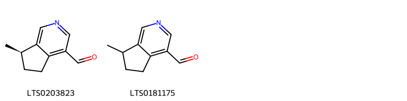{ width=100% }
    <figcaption>Hình ảnh cấu trúc hóa học của 2 hoạt chất thuộc nhóm Pyridines and derivatives gồm ['boschniakine (LTS0203823)', '7-methyl-5h,6h,7h-cyclopenta[c]pyridine-4-carbaldehyde (LTS0181175)'].</figcaption>
</figure>
#### Nhóm Steroids and steroid derivatives
<figure markdown="span">
    { width=100% }
    <figcaption>Hình ảnh cấu trúc hóa học của 4 hoạt chất thuộc nhóm Steroids and steroid derivatives gồm ['stigmast-5-en-3-ol (LTS0071224)', 'stigmast-5-en-3-ol, (3β)- (LTS0204616)', 'sitogluside (LTS0201798)', '2-{[1-(5-ethyl-6-methylheptan-2-yl)-9a,11a-dimethyl-1h,2h,3h,3ah,3bh,4h,6h,7h,8h,9h,9bh,10h,11h-cyclopenta[a]phenanthren-7-yl]oxy}-6-(hydroxymethyl)oxane-3,4,5-triol (LTS0158828)'].</figcaption>
</figure>

---

### Dược dân tộc học

Danh sách các quốc gia có sử dụng *Tecoma stans* trong điều trị các bệnh. 

| Country       | Disease                                                | Bệnh                                                                                                                                                                                                |
|:--------------|:-------------------------------------------------------|:----------------------------------------------------------------------------------------------------------------------------------------------------------------------------------------------------|
| /             | Intoxicant                                             | MYMEMORY WARNING: YOU USED ALL AVAILABLE FREE TRANSLATIONS FOR TODAY. NEXT AVAILABLE IN  19 HOURS 08 MINUTES 41 SECONDS VISIT HTTPS://MYMEMORY.TRANSLATED.NET/DOC/USAGELIMITS.PHP TO TRANSLATE MORE |
| Elsewhere     | Tonic, Vermifuge, Diuretic, Diuretic, Tonic            | MYMEMORY WARNING: YOU USED ALL AVAILABLE FREE TRANSLATIONS FOR TODAY. NEXT AVAILABLE IN  19 HOURS 08 MINUTES 35 SECONDS VISIT HTTPS://MYMEMORY.TRANSLATED.NET/DOC/USAGELIMITS.PHP TO TRANSLATE MORE |
| Haiti         | Diuretic, Tonic                                        | MYMEMORY WARNING: YOU USED ALL AVAILABLE FREE TRANSLATIONS FOR TODAY. NEXT AVAILABLE IN  19 HOURS 08 MINUTES 28 SECONDS VISIT HTTPS://MYMEMORY.TRANSLATED.NET/DOC/USAGELIMITS.PHP TO TRANSLATE MORE |
| Latin America | Tonic, Vermifuge, Diuretic                             | MYMEMORY WARNING: YOU USED ALL AVAILABLE FREE TRANSLATIONS FOR TODAY. NEXT AVAILABLE IN  19 HOURS 08 MINUTES 22 SECONDS VISIT HTTPS://MYMEMORY.TRANSLATED.NET/DOC/USAGELIMITS.PHP TO TRANSLATE MORE |
| Mexico        | Diuretic, Diuretic, Stomachic, Tonic, Vermifuge, Tonic | MYMEMORY WARNING: YOU USED ALL AVAILABLE FREE TRANSLATIONS FOR TODAY. NEXT AVAILABLE IN  19 HOURS 08 MINUTES 16 SECONDS VISIT HTTPS://MYMEMORY.TRANSLATED.NET/DOC/USAGELIMITS.PHP TO TRANSLATE MORE |
| Venezuela     | Diuretic                                               | MYMEMORY WARNING: YOU USED ALL AVAILABLE FREE TRANSLATIONS FOR TODAY. NEXT AVAILABLE IN  19 HOURS 08 MINUTES 12 SECONDS VISIT HTTPS://MYMEMORY.TRANSLATED.NET/DOC/USAGELIMITS.PHP TO TRANSLATE MORE |

---

---
## Tecoma undulata
### Thông tin về thực vật

!!! info "Phân loại thực vật của *Tecomella undulata* từ GIBF:"
    - **Kingdom:** Plantae
    - **Phylum:** Tracheophyta
    - **Order:** Lamiales
    - **Family:** Bignoniaceae
    - **Genus:** Tecomella
    - **Species:** *Tecomella undulata*

 

| Label (VI)   | Label (EN)   | Scientific Name   | Descriptions (VI)   | Descriptions (EN)   | Also Known As (VI)   | Also Known As (EN)   |
|:-------------|:-------------|:------------------|:--------------------|:--------------------|:---------------------|:---------------------|
| N/A          | N/A          | Tecoma undulata   | loài thực vật       | species of plant    | ['']                 | ['']                 |

#### Phân bố trên thế giới

**Từ CSDL GIBF** nan, Pakistan, India

#### Phân bố tại Việt Nam

**Từ CSDL GIBF**: Không có ghi nhận ở Việt Nam

---
### Thành phần hóa học
        
- Theo cơ sở dữ liệu lotus: Từ loài *Tecomella undulata* đã phân lập và xác định được Chưa có hoạt chất nào được phân lập. hoạt chất thuộc về các nhóm Không có hoạt chất nào được phân lập. 

Không có hình ảnh nào được tạo ra

---

### Dược dân tộc học

Danh sách các quốc gia có sử dụng *Tecomella undulata* trong điều trị các bệnh. 

| Country   | Disease                 | Bệnh                                                                                                                                                                                                |
|:----------|:------------------------|:----------------------------------------------------------------------------------------------------------------------------------------------------------------------------------------------------|
| Elsewhere | Cardiotonic, Choleretic | MYMEMORY WARNING: YOU USED ALL AVAILABLE FREE TRANSLATIONS FOR TODAY. NEXT AVAILABLE IN  19 HOURS 04 MINUTES 50 SECONDS VISIT HTTPS://MYMEMORY.TRANSLATED.NET/DOC/USAGELIMITS.PHP TO TRANSLATE MORE |

---

# Chi Tabebuia

??? note "Danh sách các dược liệu thuộc chi"
    
	 - *Tabebuia bahamensis*
	 - *Tabebuia leucoxyla*
	 - *Tabebuia pentaphylla*
	 - *Tabebuia rosea*

---
## Tabebuia bahamensis
### Thông tin về thực vật

!!! info "Phân loại thực vật của *Tabebuia bahamensis* từ GIBF:"
    - **Kingdom:** Plantae
    - **Phylum:** Tracheophyta
    - **Order:** Lamiales
    - **Family:** Bignoniaceae
    - **Genus:** Tabebuia
    - **Species:** *Tabebuia bahamensis*

 

| Label (VI)   | Label (EN)   | Scientific Name     | Descriptions (VI)   | Descriptions (EN)   | Also Known As (VI)   | Also Known As (EN)   |
|:-------------|:-------------|:--------------------|:--------------------|:--------------------|:---------------------|:---------------------|
| N/A          | N/A          | Tabebuia bahamensis | loài thực vật       | species of plant    | ['']                 | ['']                 |

#### Phân bố trên thế giới

**Từ CSDL GIBF** nan, Turks and Caicos Islands, Bermuda, United States of America, Bahamas, Cuba, Jamaica

#### Phân bố tại Việt Nam

**Từ CSDL GIBF**: Không có ghi nhận ở Việt Nam

---
### Thành phần hóa học
        
- Theo cơ sở dữ liệu lotus: Từ loài *Tabebuia bahamensis* đã phân lập và xác định được Chưa có hoạt chất nào được phân lập. hoạt chất thuộc về các nhóm Không có hoạt chất nào được phân lập. 

Không có hình ảnh nào được tạo ra

---

### Dược dân tộc học

Danh sách các quốc gia có sử dụng *Tabebuia bahamensis* trong điều trị các bệnh. 

| Country   | Disease   | Bệnh                                                                                                                                                                                                |
|:----------|:----------|:----------------------------------------------------------------------------------------------------------------------------------------------------------------------------------------------------|
| Bahamas   | Diuretic  | MYMEMORY WARNING: YOU USED ALL AVAILABLE FREE TRANSLATIONS FOR TODAY. NEXT AVAILABLE IN  19 HOURS 04 MINUTES 26 SECONDS VISIT HTTPS://MYMEMORY.TRANSLATED.NET/DOC/USAGELIMITS.PHP TO TRANSLATE MORE |

---

---
## Tabebuia leucoxyla
### Thông tin về thực vật

!!! info "Phân loại thực vật của *Tabebuia obtusifolia* từ GIBF:"
    - **Kingdom:** Plantae
    - **Phylum:** Tracheophyta
    - **Order:** Lamiales
    - **Family:** Bignoniaceae
    - **Genus:** Tabebuia
    - **Species:** *Tabebuia obtusifolia*

 

| Label (VI)   | Label (EN)   | Scientific Name    | Descriptions (VI)   | Descriptions (EN)   | Also Known As (VI)   | Also Known As (EN)   |
|:-------------|:-------------|:-------------------|:--------------------|:--------------------|:---------------------|:---------------------|
| N/A          | N/A          | Tabebuia leucoxyla | loài thực vật       | species of plant    | ['']                 | ['']                 |

#### Phân bố trên thế giới

**Từ CSDL GIBF** nan, Grenada, Brazil, United States of America, Bahamas

#### Phân bố tại Việt Nam

**Từ CSDL GIBF**: Không có ghi nhận ở Việt Nam

---
### Thành phần hóa học
        
- Theo cơ sở dữ liệu lotus: Từ loài *Tabebuia obtusifolia* đã phân lập và xác định được Chưa có hoạt chất nào được phân lập. hoạt chất thuộc về các nhóm Không có hoạt chất nào được phân lập. 

Không có hình ảnh nào được tạo ra

---

### Dược dân tộc học

Danh sách các quốc gia có sử dụng *Tabebuia obtusifolia* trong điều trị các bệnh. 

| Country   | Disease   | Bệnh                                                                                                                                                                                                |
|:----------|:----------|:----------------------------------------------------------------------------------------------------------------------------------------------------------------------------------------------------|
| Brazil    | Diuretic  | MYMEMORY WARNING: YOU USED ALL AVAILABLE FREE TRANSLATIONS FOR TODAY. NEXT AVAILABLE IN  19 HOURS 03 MINUTES 53 SECONDS VISIT HTTPS://MYMEMORY.TRANSLATED.NET/DOC/USAGELIMITS.PHP TO TRANSLATE MORE |

---

---
## Tabebuia pentaphylla
### Thông tin về thực vật

!!! info "Phân loại thực vật của *Tabebuia heterophylla* từ GIBF:"
    - **Kingdom:** Plantae
    - **Phylum:** Tracheophyta
    - **Order:** Lamiales
    - **Family:** Bignoniaceae
    - **Genus:** Tabebuia
    - **Species:** *Tabebuia heterophylla*

 

| Label (VI)   | Label (EN)   | Scientific Name    | Descriptions (VI)   | Descriptions (EN)   | Also Known As (VI)   | Also Known As (EN)   |
|:-------------|:-------------|:-------------------|:--------------------|:--------------------|:---------------------|:---------------------|
| N/A          | N/A          | Tabebuia leucoxyla | loài thực vật       | species of plant    | ['']                 | ['']                 |

#### Phân bố trên thế giới

**Từ CSDL GIBF** nan, Honduras, unknown or invalid, Ghana, Trinidad and Tobago, Senegal, Guatemala, Haiti, Colombia, Venezuela (Bolivarian Republic of), Dominican Republic, Malaysia, Canada, Cuba, Belize, Panama, Brazil, Mexico, Chinese Taipei, Mozambique, Fiji, Costa Rica, Ecuador, United States of America

#### Phân bố tại Việt Nam

**Từ CSDL GIBF**: Không có ghi nhận ở Việt Nam

---
### Thành phần hóa học
        
- Theo cơ sở dữ liệu lotus: Từ loài *Tabebuia heterophylla* đã phân lập và xác định được Chưa có hoạt chất nào được phân lập. hoạt chất thuộc về các nhóm Không có hoạt chất nào được phân lập. 

Không có hình ảnh nào được tạo ra

---

### Dược dân tộc học

Danh sách các quốc gia có sử dụng *Tabebuia heterophylla* trong điều trị các bệnh. 

| Country   | Disease                                   | Bệnh                                                                                                                                                                                                |
|:----------|:------------------------------------------|:----------------------------------------------------------------------------------------------------------------------------------------------------------------------------------------------------|
| Elsewhere | Alexiteric, Analgesic, Diuretic, Hypnotic | MYMEMORY WARNING: YOU USED ALL AVAILABLE FREE TRANSLATIONS FOR TODAY. NEXT AVAILABLE IN  19 HOURS 03 MINUTES 22 SECONDS VISIT HTTPS://MYMEMORY.TRANSLATED.NET/DOC/USAGELIMITS.PHP TO TRANSLATE MORE |
| Mexico    | Antidote                                  | MYMEMORY WARNING: YOU USED ALL AVAILABLE FREE TRANSLATIONS FOR TODAY. NEXT AVAILABLE IN  19 HOURS 03 MINUTES 19 SECONDS VISIT HTTPS://MYMEMORY.TRANSLATED.NET/DOC/USAGELIMITS.PHP TO TRANSLATE MORE |

---

---
## Tabebuia rosea
### Thông tin về thực vật

!!! info "Phân loại thực vật của *Tabebuia rosea* từ GIBF:"
    - **Kingdom:** Plantae
    - **Phylum:** Tracheophyta
    - **Order:** Lamiales
    - **Family:** Bignoniaceae
    - **Genus:** Tabebuia
    - **Species:** *Tabebuia rosea*

 

| Label (VI)   | Label (EN)   | Scientific Name   | Descriptions (VI)   | Descriptions (EN)   | Also Known As (VI)   | Also Known As (EN)   |
|:-------------|:-------------|:------------------|:--------------------|:--------------------|:---------------------|:---------------------|
| N/A          | N/A          | Tabebuia rosea    | loài thực vật       | species of plant    | ['']                 | ['matilizhuate']     |

#### Phân bố trên thế giới

**Từ CSDL GIBF** Guatemala, Honduras, Colombia, Thailand, Brunei Darussalam, El Salvador, Panama, Maldives, Puerto Rico, Malaysia, India, Costa Rica, Mexico, Singapore, Hong Kong

#### Phân bố tại Việt Nam

**Từ CSDL GIBF**: Không có ghi nhận ở Việt Nam

---
### Thành phần hóa học
        
- Theo cơ sở dữ liệu lotus: Từ loài *Tabebuia rosea* đã phân lập và xác định được 17 hoạt chất thuộc về các nhóm Flavonoids, Isochromanequinones, Prenol lipids, Naphthopyrans, Cinnamic acids and derivatives, Steroids and steroid derivatives, Naphthalenes. 

|    | chemicalTaxonomyClassyfireClass   |   smiles_count |
|---:|:----------------------------------|---------------:|
|  0 | Cinnamic acids and derivatives    |              1 |
|  1 | Flavonoids                        |              2 |
|  2 | Isochromanequinones               |              1 |
|  3 | Naphthalenes                      |              1 |
|  4 | Naphthopyrans                     |              2 |
|  5 | Prenol lipids                     |              5 |
|  6 | Steroids and steroid derivatives  |              5 |

#### Nhóm Cinnamic acids and derivatives
<figure markdown="span">
    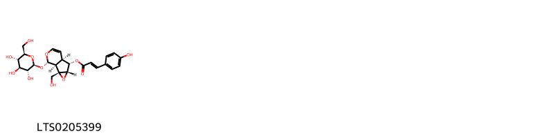{ width=100% }
    <figcaption>Hình ảnh cấu trúc hóa học của 1 hoạt chất thuộc nhóm Cinnamic acids and derivatives gồm ['(1s,2s,4s,5s,6r,10s)-2-(hydroxymethyl)-10-{[(2s,3r,4s,5s,6r)-3,4,5-trihydroxy-6-(hydroxymethyl)oxan-2-yl]oxy}-3,9-dioxatricyclo[4.4.0.0²,⁴]dec-7-en-5-yl (2e)-3-(4-hydroxyphenyl)prop-2-enoate (LTS0205399)'].</figcaption>
</figure>
#### Nhóm Flavonoids
<figure markdown="span">
    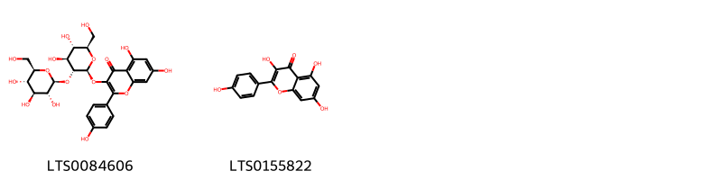{ width=100% }
    <figcaption>Hình ảnh cấu trúc hóa học của 2 hoạt chất thuộc nhóm Flavonoids gồm ['kaempferol 3-o-sophoroside (LTS0084606)', 'kaempherol (LTS0155822)'].</figcaption>
</figure>
#### Nhóm Isochromanequinones
<figure markdown="span">
    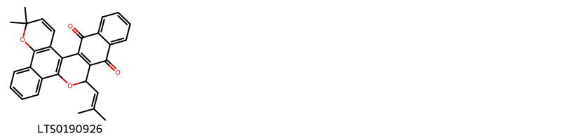{ width=100% }
    <figcaption>Hình ảnh cấu trúc hóa học của 1 hoạt chất thuộc nhóm Isochromanequinones gồm ['23,23-dimethyl-12-(2-methylprop-1-en-1-yl)-13,22-dioxahexacyclo[12.12.0.0²,¹¹.0⁴,⁹.0¹⁵,²⁰.0²¹,²⁶]hexacosa-1(14),2(11),4,6,8,15,17,19,21(26),24-decaene-3,10-dione (LTS0190926)'].</figcaption>
</figure>
#### Nhóm Naphthalenes
<figure markdown="span">
    { width=100% }
    <figcaption>Hình ảnh cấu trúc hóa học của 1 hoạt chất thuộc nhóm Naphthalenes gồm ['lapachol (LTS0088416)'].</figcaption>
</figure>
#### Nhóm Naphthopyrans
<figure markdown="span">
    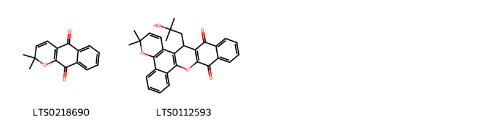{ width=100% }
    <figcaption>Hình ảnh cấu trúc hóa học của 2 hoạt chất thuộc nhóm Naphthopyrans gồm ['2,2-dimethylbenzo[g]chromene-5,10-dione (LTS0218690)', '26-(2-hydroxy-2-methylpropyl)-5,5-dimethyl-6,15-dioxahexacyclo[12.12.0.0²,⁷.0⁸,¹³.0¹⁶,²⁵.0¹⁸,²³]hexacosa-1(14),2(7),3,8,10,12,16(25),18,20,22-decaene-17,24-dione (LTS0112593)'].</figcaption>
</figure>
#### Nhóm Prenol lipids
<figure markdown="span">
    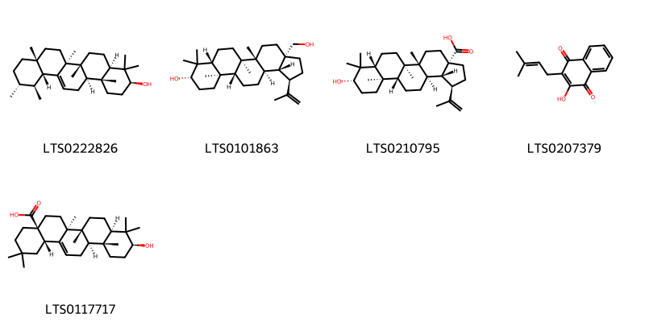{ width=100% }
    <figcaption>Hình ảnh cấu trúc hóa học của 5 hoạt chất thuộc nhóm Prenol lipids gồm ['amyrin (LTS0222826)', 'betulin (LTS0101863)', 'betulinic acid (LTS0210795)', 'tecomin (LTS0207379)', 'oleanolic acid (LTS0117717)'].</figcaption>
</figure>
#### Nhóm Steroids and steroid derivatives
<figure markdown="span">
    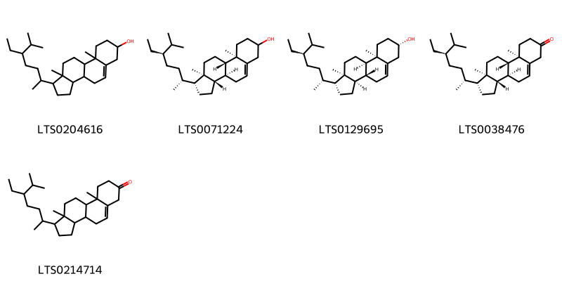{ width=100% }
    <figcaption>Hình ảnh cấu trúc hóa học của 5 hoạt chất thuộc nhóm Steroids and steroid derivatives gồm ['stigmast-5-en-3-ol, (3β)- (LTS0204616)', 'stigmast-5-en-3-ol (LTS0071224)', '(1r,3ar,3br,7s,9ar,9br,11ar)-1-[(2r,5r)-5-ethyl-6-methylheptan-2-yl]-9a,11a-dimethyl-1h,2h,3h,3ah,3bh,4h,6h,7h,8h,9h,9bh,10h,11h-cyclopenta[a]phenanthren-7-ol (LTS0129695)', '(1r,3as,3bs,9ar,9bs,11ar)-1-[(2r,5r)-5-ethyl-6-methylheptan-2-yl]-9a,11a-dimethyl-1h,2h,3h,3ah,3bh,4h,6h,8h,9h,9bh,10h,11h-cyclopenta[a]phenanthren-7-one (LTS0038476)', '1-(5-ethyl-6-methylheptan-2-yl)-9a,11a-dimethyl-1h,2h,3h,3ah,3bh,4h,6h,8h,9h,9bh,10h,11h-cyclopenta[a]phenanthren-7-one (LTS0214714)'].</figcaption>
</figure>

---

### Dược dân tộc học

Danh sách các quốc gia có sử dụng *Tabebuia rosea* trong điều trị các bệnh. 

| Country   | Disease              | Bệnh                                                                                                                                                                                                |
|:----------|:---------------------|:----------------------------------------------------------------------------------------------------------------------------------------------------------------------------------------------------|
| Panama    | Vulnerary, Fungicide | MYMEMORY WARNING: YOU USED ALL AVAILABLE FREE TRANSLATIONS FOR TODAY. NEXT AVAILABLE IN  19 HOURS 02 MINUTES 47 SECONDS VISIT HTTPS://MYMEMORY.TRANSLATED.NET/DOC/USAGELIMITS.PHP TO TRANSLATE MORE |

---

# Chi Newbouldia

??? note "Danh sách các dược liệu thuộc chi"
    
	 - *Newbouldia laevis*

---
## Newbouldia laevis
### Thông tin về thực vật

!!! info "Phân loại thực vật của *Newbouldia laevis* từ GIBF:"
    - **Kingdom:** Plantae
    - **Phylum:** Tracheophyta
    - **Order:** Lamiales
    - **Family:** Bignoniaceae
    - **Genus:** Newbouldia
    - **Species:** *Newbouldia laevis*

 

| Label (VI)   | Label (EN)   | Scientific Name   | Descriptions (VI)   | Descriptions (EN)   | Also Known As (VI)   | Also Known As (EN)   |
|:-------------|:-------------|:------------------|:--------------------|:--------------------|:---------------------|:---------------------|
| N/A          | N/A          | Newbouldia laevis | loài thực vật       | species of plant    | ['']                 | ['']                 |

#### Phân bố trên thế giới

**Từ CSDL GIBF** Sierra Leone, Togo, Brazil, Ghana, Guinea-Bissau, Côte d’Ivoire, Liberia, Cameroon, Burkina Faso, Congo, Democratic Republic of the, Nigeria, Gabon, United States of America, Senegal, Guinea, Benin, Gambia

#### Phân bố tại Việt Nam

**Từ CSDL GIBF**: Không có ghi nhận ở Việt Nam

---
### Thành phần hóa học
        
- Theo cơ sở dữ liệu lotus: Từ loài *Newbouldia laevis* đã phân lập và xác định được 92 hoạt chất thuộc về các nhóm Organooxygen compounds, Flavonoids, Benzofurans, Azoles, Sphingolipids, Tannins, Naphthofurans, Coumarans, Prenol lipids, Anthracenes, Naphthopyrans, Pyrrolopyrazoles, Phenols, Cinnamic acids and derivatives, Steroids and steroid derivatives, Benzene and substituted derivatives, Naphthalenes. 

|    | chemicalTaxonomyClassyfireClass     |   smiles_count |
|---:|:------------------------------------|---------------:|
|  0 | Anthracenes                         |              4 |
|  1 | Azoles                              |              3 |
|  2 | Benzene and substituted derivatives |              1 |
|  3 | Benzofurans                         |              1 |
|  4 | Cinnamic acids and derivatives      |              7 |
|  5 | Coumarans                           |              2 |
|  6 | Flavonoids                          |              3 |
|  7 | Naphthalenes                        |              2 |
|  8 | Naphthofurans                       |             28 |
|  9 | Naphthopyrans                       |              3 |
| 10 | Organooxygen compounds              |              8 |
| 11 | Phenols                             |              4 |
| 12 | Prenol lipids                       |              7 |
| 13 | Pyrrolopyrazoles                    |              6 |
| 14 | Sphingolipids                       |              2 |
| 15 | Steroids and steroid derivatives    |              5 |
| 16 | Tannins                             |              6 |

#### Nhóm Anthracenes
<figure markdown="span">
    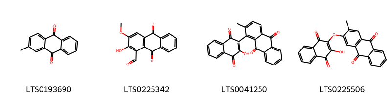{ width=100% }
    <figcaption>Hình ảnh cấu trúc hóa học của 4 hoạt chất thuộc nhóm Anthracenes gồm ['2-methylanthraquinone (LTS0193690)', '2-hydroxy-3-methoxy-9,10-dioxoanthracene-1-carbaldehyde (LTS0225342)', '1-(3-hydroxy-1,4-dioxonaphthalen-2-yl)-2-methylanthracene-9,10-dione (LTS0041250)', '2-[(3-hydroxy-1,4-dioxonaphthalen-2-yl)oxy]-3-methylanthracene-9,10-dione (LTS0225506)'].</figcaption>
</figure>
#### Nhóm Azoles
<figure markdown="span">
    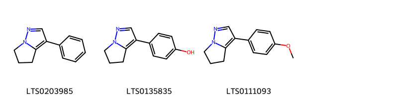{ width=100% }
    <figcaption>Hình ảnh cấu trúc hóa học của 3 hoạt chất thuộc nhóm Azoles gồm ['withasomnine (LTS0203985)', '4-{4h,5h,6h-pyrrolo[1,2-b]pyrazol-3-yl}phenol (LTS0135835)', '3-(4-methoxyphenyl)-4h,5h,6h-pyrrolo[1,2-b]pyrazole (LTS0111093)'].</figcaption>
</figure>
#### Nhóm Benzene and substituted derivatives
<figure markdown="span">
    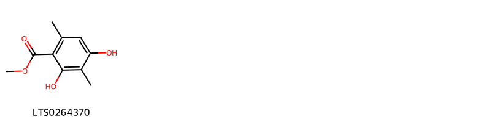{ width=100% }
    <figcaption>Hình ảnh cấu trúc hóa học của 1 hoạt chất thuộc nhóm Benzene and substituted derivatives gồm ['atraric acid (LTS0264370)'].</figcaption>
</figure>
#### Nhóm Benzofurans
<figure markdown="span">
    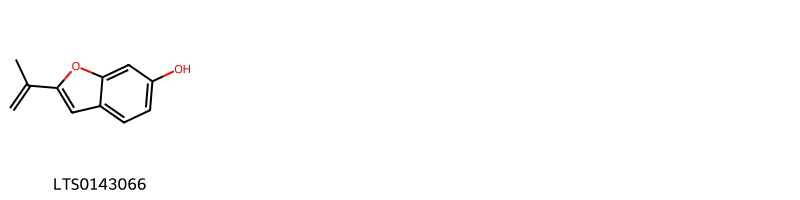{ width=100% }
    <figcaption>Hình ảnh cấu trúc hóa học của 1 hoạt chất thuộc nhóm Benzofurans gồm ['2-(prop-1-en-2-yl)-1-benzofuran-6-ol (LTS0143066)'].</figcaption>
</figure>
#### Nhóm Cinnamic acids and derivatives
<figure markdown="span">
    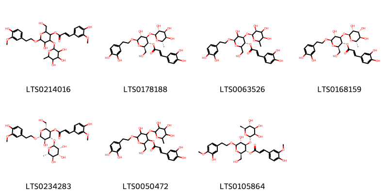{ width=100% }
    <figcaption>Hình ảnh cấu trúc hóa học của 7 hoạt chất thuộc nhóm Cinnamic acids and derivatives gồm ['5-hydroxy-6-[2-(4-hydroxy-3-methoxyphenyl)ethoxy]-2-(hydroxymethyl)-4-[(3,4,5-trihydroxy-6-methyloxan-2-yl)oxy]oxan-3-yl 3-(4-hydroxy-3-methoxyphenyl)prop-2-enoate (LTS0214016)', '(2r,3r,4r,5r,6r)-6-[2-(3,4-dihydroxyphenyl)ethoxy]-5-hydroxy-2-(hydroxymethyl)-4-{[(2s,3r,4s,5r,6s)-3,4,5-trihydroxy-6-methyloxan-2-yl]oxy}oxan-3-yl (2e)-3-(3,4-dihydroxyphenyl)prop-2-enoate (LTS0178188)', '(3r,4r,6r)-6-[2-(3,4-dihydroxyphenyl)ethoxy]-5-hydroxy-2-(hydroxymethyl)-4-{[(2s,3s,5r)-3,4,5-trihydroxy-6-methyloxan-2-yl]oxy}oxan-3-yl (2e)-3-(3,4-dihydroxyphenyl)prop-2-enoate (LTS0063526)', 'verbascoside (LTS0168159)', '(2r,3r,4r,5r,6r)-5-hydroxy-6-[2-(4-hydroxy-3-methoxyphenyl)ethoxy]-2-(hydroxymethyl)-4-{[(2s,3r,4r,5r,6s)-3,4,5-trihydroxy-6-methyloxan-2-yl]oxy}oxan-3-yl (2e)-3-(4-hydroxy-3-methoxyphenyl)prop-2-enoate (LTS0234283)', '6-[2-(3,4-dihydroxyphenyl)ethoxy]-5-hydroxy-2-(hydroxymethyl)-4-[(3,4,5-trihydroxy-6-methyloxan-2-yl)oxy]oxan-3-yl 3-(3,4-dihydroxyphenyl)prop-2-enoate (LTS0050472)', '(2r,3r,4r,5r,6r)-5-hydroxy-6-[2-(3-hydroxy-4-methoxyphenyl)ethoxy]-2-(hydroxymethyl)-4-{[(2s,3r,4r,5r,6s)-3,4,5-trihydroxy-6-methyloxan-2-yl]oxy}oxan-3-yl (2e)-3-(4-hydroxy-3-methoxyphenyl)prop-2-enoate (LTS0105864)'].</figcaption>
</figure>
#### Nhóm Coumarans
<figure markdown="span">
    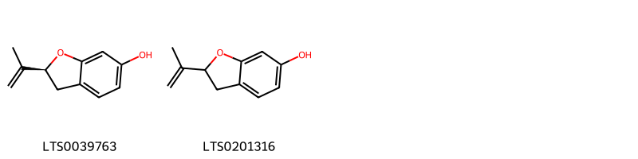{ width=100% }
    <figcaption>Hình ảnh cấu trúc hóa học của 2 hoạt chất thuộc nhóm Coumarans gồm ['(2s)-2-(prop-1-en-2-yl)-2,3-dihydro-1-benzofuran-6-ol (LTS0039763)', '2-(prop-1-en-2-yl)-2,3-dihydro-1-benzofuran-6-ol (LTS0201316)'].</figcaption>
</figure>
#### Nhóm Flavonoids
<figure markdown="span">
    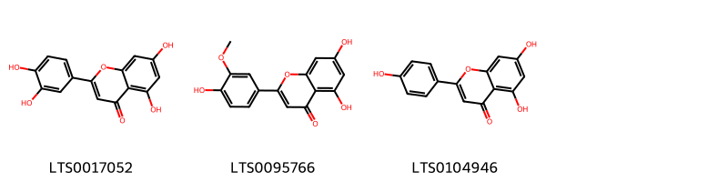{ width=100% }
    <figcaption>Hình ảnh cấu trúc hóa học của 3 hoạt chất thuộc nhóm Flavonoids gồm ['luteolin (LTS0017052)', 'chrysoeriol (LTS0095766)', 'chamomile (LTS0104946)'].</figcaption>
</figure>
#### Nhóm Naphthalenes
<figure markdown="span">
    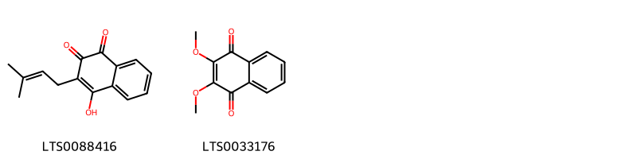{ width=100% }
    <figcaption>Hình ảnh cấu trúc hóa học của 2 hoạt chất thuộc nhóm Naphthalenes gồm ['lapachol (LTS0088416)', 'dmnq (LTS0033176)'].</figcaption>
</figure>
#### Nhóm Naphthofurans
<figure markdown="span">
    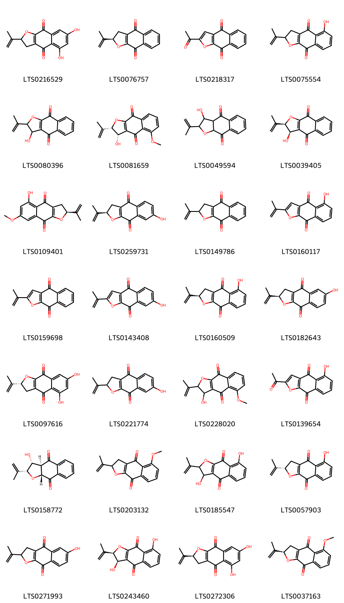{ width=100% }
    <figcaption>Hình ảnh cấu trúc hóa học của 28 hoạt chất thuộc nhóm Naphthofurans gồm ['5,7-dihydroxy-2-(prop-1-en-2-yl)-2h,3h-naphtho[2,3-b]furan-4,9-dione (LTS0216529)', '(2r)-2-(prop-1-en-2-yl)-2h,3h-naphtho[2,3-b]furan-4,9-dione (LTS0076757)', 'napabucasin (LTS0218317)', '5-hydroxy-2-(prop-1-en-2-yl)-2h,3h-naphtho[2,3-b]furan-4,9-dione (LTS0075554)', '3-hydroxy-2-(prop-1-en-2-yl)-2h,3h-naphtho[2,3-b]furan-4,9-dione (LTS0080396)', '(2s,3s)-3-hydroxy-5-methoxy-2-(prop-1-en-2-yl)-2h,3h-naphtho[2,3-b]furan-4,9-dione (LTS0081659)', '3-hydroxy-2-(prop-1-en-2-yl)-2h,3h,3ah,9ah-naphtho[2,3-b]furan-4,9-dione (LTS0049594)', '(2r,3r)-3-hydroxy-2-(prop-1-en-2-yl)-2h,3h-naphtho[2,3-b]furan-4,9-dione (LTS0039405)', '(2s)-5-hydroxy-7-methoxy-2-(prop-1-en-2-yl)-2h,3h-naphtho[2,3-b]furan-4,9-dione (LTS0109401)', '(2r)-7-hydroxy-2-(prop-1-en-2-yl)-2h,3h-naphtho[2,3-b]furan-4,9-dione (LTS0259731)', '2-(prop-1-en-2-yl)-2h,3h-naphtho[2,3-b]furan-4,9-dione (LTS0149786)', '5-hydroxy-2-(prop-1-en-2-yl)naphtho[2,3-b]furan-4,9-dione (LTS0160117)', '2-(prop-1-en-2-yl)naphtho[2,3-b]furan-4,9-dione (LTS0159698)', '7-hydroxy-2-(prop-1-en-2-yl)naphtho[2,3-b]furan-4,9-dione (LTS0143408)', '(2r)-5-hydroxy-2-(prop-1-en-2-yl)-2h,3h-naphtho[2,3-b]furan-4,9-dione (LTS0160509)', '(2r)-6-hydroxy-2-(prop-1-en-2-yl)-2h,3h-naphtho[2,3-b]furan-4,9-dione (LTS0182643)', '(2r)-5,7-dihydroxy-2-(prop-1-en-2-yl)-2h,3h-naphtho[2,3-b]furan-4,9-dione (LTS0097616)', '7-hydroxy-2-(prop-1-en-2-yl)-2h,3h-naphtho[2,3-b]furan-4,9-dione (LTS0221774)', '3-hydroxy-5-methoxy-2-(prop-1-en-2-yl)-2h,3h-naphtho[2,3-b]furan-4,9-dione (LTS0228020)', '2-acetyl-5-hydroxynaphtho[2,3-b]furan-4,9-dione (LTS0139654)', '(2r,3r,3ar,9ar)-3-hydroxy-2-(prop-1-en-2-yl)-2h,3h,3ah,9ah-naphtho[2,3-b]furan-4,9-dione (LTS0158772)', '5-methoxy-2-(prop-1-en-2-yl)-2h,3h-naphtho[2,3-b]furan-4,9-dione (LTS0203132)', '3,8-dihydroxy-2-(prop-1-en-2-yl)-2h,3h-naphtho[2,3-b]furan-4,9-dione (LTS0185547)', '(2s)-5-hydroxy-2-(prop-1-en-2-yl)-2h,3h-naphtho[2,3-b]furan-4,9-dione (LTS0057903)', '6-hydroxy-2-(prop-1-en-2-yl)-2h,3h-naphtho[2,3-b]furan-4,9-dione (LTS0271993)', '(2r,3r)-3,8-dihydroxy-2-(prop-1-en-2-yl)-2h,3h-naphtho[2,3-b]furan-4,9-dione (LTS0243460)', '(2s)-5,7-dihydroxy-2-(prop-1-en-2-yl)-2h,3h-naphtho[2,3-b]furan-4,9-dione (LTS0272306)', '(2r)-5-methoxy-2-(prop-1-en-2-yl)-2h,3h-naphtho[2,3-b]furan-4,9-dione (LTS0037163)'].</figcaption>
</figure>
#### Nhóm Naphthopyrans
<figure markdown="span">
    { width=100% }
    <figcaption>Hình ảnh cấu trúc hóa học của 3 hoạt chất thuộc nhóm Naphthopyrans gồm ['2,2-dimethylbenzo[g]chromene-5,10-dione (LTS0218690)', '(4as,10as)-2,2-dimethyl-4ah,10ah-benzo[g]chromene-5,10-dione (LTS0145795)', '2,2-dimethyl-4ah,10ah-benzo[g]chromene-5,10-dione (LTS0065619)'].</figcaption>
</figure>
#### Nhóm Organooxygen compounds
<figure markdown="span">
    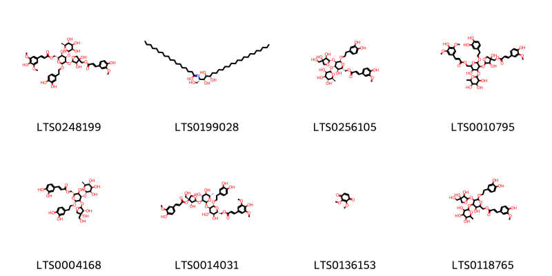{ width=100% }
    <figcaption>Hình ảnh cấu trúc hóa học của 8 hoạt chất thuộc nhóm Organooxygen compounds gồm ['[(3s,4r,5s)-5-{[(2r,3r,4s,5r,6r)-2-[2-(3,4-dihydroxyphenyl)ethoxy]-5-hydroxy-6-({[(2e)-3-(4-hydroxy-3,5-dimethoxyphenyl)prop-2-enoyl]oxy}methyl)-4-{[(2s,3r,4r,5r,6s)-3,4,5-trihydroxy-6-methyloxan-2-yl]oxy}oxan-3-yl]oxy}-3,4-dihydroxyoxolan-3-yl]methyl (2e)-3-(4-hydroxy-3-methoxyphenyl)prop-2-enoate (LTS0248199)', 'n-[(2s,3r,4s,5s)-1,3,4,5-tetrahydroxytetracosan-2-yl]octadecanimidic acid (LTS0199028)', '[(2r,3r,4s,5r,6r)-5-{[(2s,3r,4r)-3,4-dihydroxy-4-(hydroxymethyl)oxolan-2-yl]oxy}-6-[2-(3,4-dihydroxyphenyl)ethoxy]-3-hydroxy-4-{[(2s,3r,4r,5r,6s)-3,4,5-trihydroxy-6-methyloxan-2-yl]oxy}oxan-2-yl]methyl (2e)-3-(4-hydroxy-3-methoxyphenyl)prop-2-enoate (LTS0256105)', '[5-({2-[2-(3,4-dihydroxyphenyl)ethoxy]-5-hydroxy-6-({[3-(4-hydroxy-3,5-dimethoxyphenyl)prop-2-enoyl]oxy}methyl)-4-[(3,4,5-trihydroxy-6-methyloxan-2-yl)oxy]oxan-3-yl}oxy)-3,4-dihydroxyoxolan-3-yl]methyl 3-(4-hydroxy-3-methoxyphenyl)prop-2-enoate (LTS0010795)', '[(2r,3r,4s,5r,6r)-5-{[(2s,3r,4r)-3,4-dihydroxy-4-(hydroxymethyl)oxolan-2-yl]oxy}-6-[2-(3,4-dihydroxyphenyl)ethoxy]-3-hydroxy-4-{[(2s,3r,4r,5r,6s)-3,4,5-trihydroxy-6-methyloxan-2-yl]oxy}oxan-2-yl]methyl (2e)-3-(3,4-dihydroxyphenyl)prop-2-enoate (LTS0004168)', '[(2r,3s,4s,5r,6r)-5-{[(2s,3s,4r,5r,6s)-4,5-dihydroxy-3-{[(2s,3r,4r)-3-hydroxy-4-{[(2e)-3-(4-hydroxy-3-methoxyphenyl)prop-2-enoyl]oxy}-4-(hydroxymethyl)oxolan-2-yl]oxy}-6-methyloxan-2-yl]oxy}-6-[2-(3,4-dihydroxyphenyl)ethoxy]-3,4-dihydroxyoxan-2-yl]methyl (2e)-3-(4-hydroxy-3,5-dimethoxyphenyl)prop-2-enoate (LTS0014031)', '2,3-dimethoxy-p-benzoquinone (LTS0136153)', '(5-{[3,4-dihydroxy-4-(hydroxymethyl)oxolan-2-yl]oxy}-6-[2-(3,4-dihydroxyphenyl)ethoxy]-3-hydroxy-4-[(3,4,5-trihydroxy-6-methyloxan-2-yl)oxy]oxan-2-yl)methyl 3-(4-hydroxy-3-methoxyphenyl)prop-2-enoate (LTS0118765)'].</figcaption>
</figure>
#### Nhóm Phenols
<figure markdown="span">
    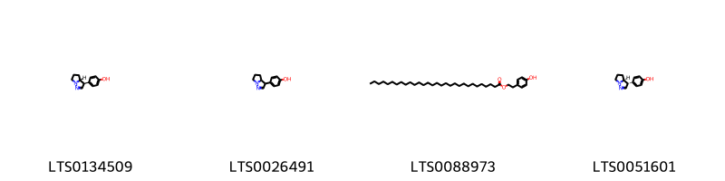{ width=100% }
    <figcaption>Hình ảnh cấu trúc hóa học của 4 hoạt chất thuộc nhóm Phenols gồm ['4-[(3r,3ar)-3h,3ah,4h,5h,6h-pyrrolo[1,2-b]pyrazol-3-yl]phenol (LTS0134509)', '4-{3h,3ah,4h,5h,6h-pyrrolo[1,2-b]pyrazol-3-yl}phenol (LTS0026491)', '2-(4-hydroxyphenyl)ethyl triacontanoate (LTS0088973)', '4-[(3s,3as)-3h,3ah,4h,5h,6h-pyrrolo[1,2-b]pyrazol-3-yl]phenol (LTS0051601)'].</figcaption>
</figure>
#### Nhóm Prenol lipids
<figure markdown="span">
    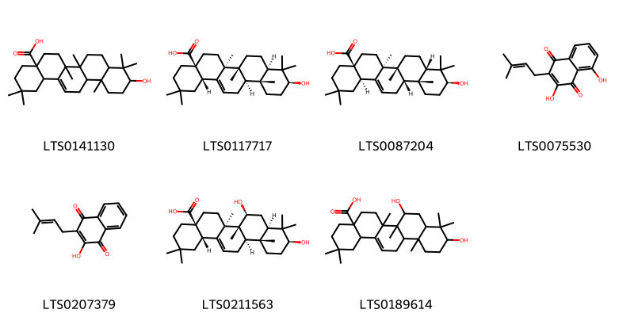{ width=100% }
    <figcaption>Hình ảnh cấu trúc hóa học của 7 hoạt chất thuộc nhóm Prenol lipids gồm ['oleanolic acid (LTS0141130)', 'oleanolic acid (LTS0117717)', '(4as,6as,6br,8as,10s,12ar,12bs,14br)-10-hydroxy-2,2,6a,6b,9,9,12a-heptamethyl-1,3,4,5,6,7,8,8a,10,11,12,12b,13,14b-tetradecahydropicene-4a-carboxylic acid (LTS0087204)', '3,5-dihydroxy-2-(3-methylbut-2-en-1-yl)naphthalene-1,4-dione (LTS0075530)', 'tecomin (LTS0207379)', '(4as,6ar,6br,7s,8ar,10s,12as,12br,14bs)-7,10-dihydroxy-2,2,6a,6b,9,9,12a-heptamethyl-1,3,4,5,6,7,8,8a,10,11,12,12b,13,14b-tetradecahydropicene-4a-carboxylic acid (LTS0211563)', '7,10-dihydroxy-2,2,6a,6b,9,9,12a-heptamethyl-1,3,4,5,6,7,8,8a,10,11,12,12b,13,14b-tetradecahydropicene-4a-carboxylic acid (LTS0189614)'].</figcaption>
</figure>
#### Nhóm Pyrrolopyrazoles
<figure markdown="span">
    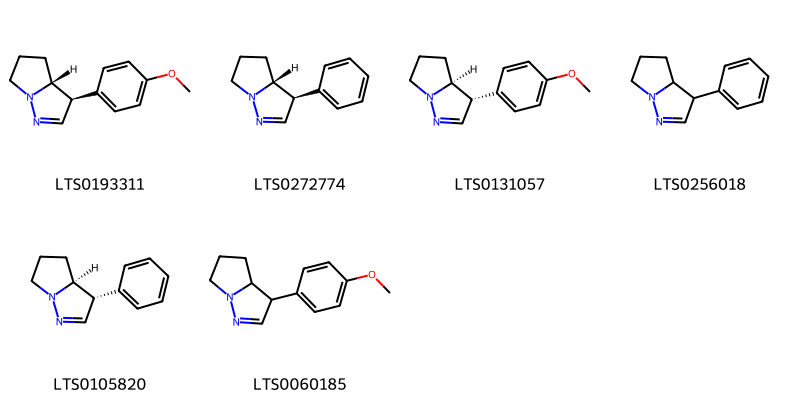{ width=100% }
    <figcaption>Hình ảnh cấu trúc hóa học của 6 hoạt chất thuộc nhóm Pyrrolopyrazoles gồm ['(3r,3ar)-3-(4-methoxyphenyl)-3h,3ah,4h,5h,6h-pyrrolo[1,2-b]pyrazole (LTS0193311)', '(3r,3ar)-3-phenyl-3h,3ah,4h,5h,6h-pyrrolo[1,2-b]pyrazole (LTS0272774)', '(3s,3as)-3-(4-methoxyphenyl)-3h,3ah,4h,5h,6h-pyrrolo[1,2-b]pyrazole (LTS0131057)', '3-phenyl-3h,3ah,4h,5h,6h-pyrrolo[1,2-b]pyrazole (LTS0256018)', '(3s,3as)-3-phenyl-3h,3ah,4h,5h,6h-pyrrolo[1,2-b]pyrazole (LTS0105820)', '3-(4-methoxyphenyl)-3h,3ah,4h,5h,6h-pyrrolo[1,2-b]pyrazole (LTS0060185)'].</figcaption>
</figure>
#### Nhóm Sphingolipids
<figure markdown="span">
    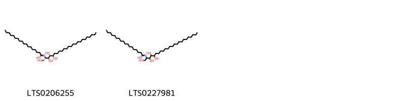{ width=100% }
    <figcaption>Hình ảnh cấu trúc hóa học của 2 hoạt chất thuộc nhóm Sphingolipids gồm ['n-[(2s,3s,4r,5r)-1,3,4,5-tetrahydroxytetracosan-2-yl]octadecanimidic acid (LTS0206255)', 'n-(1,3,4,5-tetrahydroxytetracosan-2-yl)octadecanimidic acid (LTS0227981)'].</figcaption>
</figure>
#### Nhóm Steroids and steroid derivatives
<figure markdown="span">
    { width=100% }
    <figcaption>Hình ảnh cấu trúc hóa học của 5 hoạt chất thuộc nhóm Steroids and steroid derivatives gồm ['sitosterol (LTS0168132)', 'stigmast-5-en-3-ol, (3β)- (LTS0204616)', 'sitogluside (LTS0201798)', '2-{[1-(5-ethyl-6-methylheptan-2-yl)-9a,11a-dimethyl-1h,2h,3h,3ah,3bh,4h,6h,7h,8h,9h,9bh,10h,11h-cyclopenta[a]phenanthren-7-yl]oxy}-6-(hydroxymethyl)oxane-3,4,5-triol (LTS0158828)', '(2r,3r,4s,5s,6s)-2-{[(1r,3as,3bs,7s,9ar,9bs,11ar)-1-[(2r,5r)-5-ethyl-6-methylheptan-2-yl]-9a,11a-dimethyl-1h,2h,3h,3ah,3bh,4h,6h,7h,8h,9h,9bh,10h,11h-cyclopenta[a]phenanthren-7-yl]oxy}-6-(hydroxymethyl)oxane-3,4,5-triol (LTS0076809)'].</figcaption>
</figure>
#### Nhóm Tannins
<figure markdown="span">
    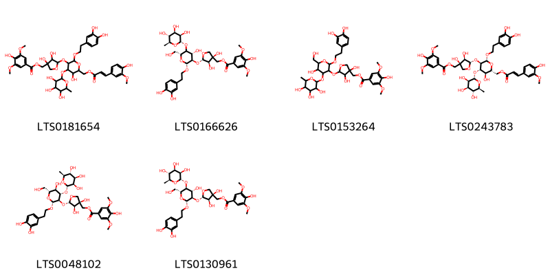{ width=100% }
    <figcaption>Hình ảnh cấu trúc hóa học của 6 hoạt chất thuộc nhóm Tannins gồm ['[5-({2-[2-(3,4-dihydroxyphenyl)ethoxy]-5-hydroxy-6-({[3-(4-hydroxy-3-methoxyphenyl)prop-2-enoyl]oxy}methyl)-4-[(3,4,5-trihydroxy-6-methyloxan-2-yl)oxy]oxan-3-yl}oxy)-3,4-dihydroxyoxolan-3-yl]methyl 4-hydroxy-3,5-dimethoxybenzoate (LTS0181654)', '[(3s,4r,5s)-5-{[(2r,3r,4s,6r)-2-[2-(3,4-dihydroxyphenyl)ethoxy]-4-hydroxy-6-(hydroxymethyl)-5-{[(2s,3r,4r,5r,6s)-3,4,5-trihydroxy-6-methyloxan-2-yl]oxy}oxan-3-yl]oxy}-3,4-dihydroxyoxolan-3-yl]methyl 4-hydroxy-3,5-dimethoxybenzoate (LTS0166626)', '[5-({2-[2-(3,4-dihydroxyphenyl)ethoxy]-5-hydroxy-6-(hydroxymethyl)-4-[(3,4,5-trihydroxy-6-methyloxan-2-yl)oxy]oxan-3-yl}oxy)-3,4-dihydroxyoxolan-3-yl]methyl 4-hydroxy-3,5-dimethoxybenzoate (LTS0153264)', '[(3s,4r,5s)-5-{[(2r,3r,4s,5r,6r)-2-[2-(3,4-dihydroxyphenyl)ethoxy]-5-hydroxy-6-({[(2e)-3-(4-hydroxy-3-methoxyphenyl)prop-2-enoyl]oxy}methyl)-4-{[(2s,3r,4r,5r,6s)-3,4,5-trihydroxy-6-methyloxan-2-yl]oxy}oxan-3-yl]oxy}-3,4-dihydroxyoxolan-3-yl]methyl 4-hydroxy-3,5-dimethoxybenzoate (LTS0243783)', '[(3s,4r,5s)-5-{[(2r,3r,4s,5r,6r)-2-[2-(3,4-dihydroxyphenyl)ethoxy]-5-hydroxy-6-(hydroxymethyl)-4-{[(2s,3r,4r,5r,6s)-3,4,5-trihydroxy-6-methyloxan-2-yl]oxy}oxan-3-yl]oxy}-3,4-dihydroxyoxolan-3-yl]methyl 4-hydroxy-3,5-dimethoxybenzoate (LTS0048102)', '[(3s,4r,5s)-5-{[(2r,3r,4s,5s,6r)-2-[2-(3,4-dihydroxyphenyl)ethoxy]-4-hydroxy-6-(hydroxymethyl)-5-{[(2s,3r,4r,5r,6s)-3,4,5-trihydroxy-6-methyloxan-2-yl]oxy}oxan-3-yl]oxy}-3,4-dihydroxyoxolan-3-yl]methyl 4-hydroxy-3,5-dimethoxybenzoate (LTS0130961)'].</figcaption>
</figure>

---

### Dược dân tộc học

Danh sách các quốc gia có sử dụng *Newbouldia laevis* trong điều trị các bệnh. 

| Country    | Disease                         | Bệnh                                                                                                                                                                                                |
|:-----------|:--------------------------------|:----------------------------------------------------------------------------------------------------------------------------------------------------------------------------------------------------|
| Africa     | Collyrium, Tonic                | MYMEMORY WARNING: YOU USED ALL AVAILABLE FREE TRANSLATIONS FOR TODAY. NEXT AVAILABLE IN  19 HOURS 01 MINUTES 39 SECONDS VISIT HTTPS://MYMEMORY.TRANSLATED.NET/DOC/USAGELIMITS.PHP TO TRANSLATE MORE |
| Ghana      | Laxative, Antiseptic, Stomachic | MYMEMORY WARNING: YOU USED ALL AVAILABLE FREE TRANSLATIONS FOR TODAY. NEXT AVAILABLE IN  19 HOURS 01 MINUTES 36 SECONDS VISIT HTTPS://MYMEMORY.TRANSLATED.NET/DOC/USAGELIMITS.PHP TO TRANSLATE MORE |
| Gold Coast | Stomachic                       | MYMEMORY WARNING: YOU USED ALL AVAILABLE FREE TRANSLATIONS FOR TODAY. NEXT AVAILABLE IN  19 HOURS 01 MINUTES 33 SECONDS VISIT HTTPS://MYMEMORY.TRANSLATED.NET/DOC/USAGELIMITS.PHP TO TRANSLATE MORE |
| Guinea     | Vermifuge                       | MYMEMORY WARNING: YOU USED ALL AVAILABLE FREE TRANSLATIONS FOR TODAY. NEXT AVAILABLE IN  19 HOURS 01 MINUTES 30 SECONDS VISIT HTTPS://MYMEMORY.TRANSLATED.NET/DOC/USAGELIMITS.PHP TO TRANSLATE MORE |

---

# Chi Catalpa

??? note "Danh sách các dược liệu thuộc chi"
    
	 - *Catalpa bignonioides*
	 - *Catalpa bungei*
	 - *Catalpa ovata*

---
## Catalpa bignonioides
### Thông tin về thực vật

!!! info "Phân loại thực vật của *Catalpa bignonioides* từ GIBF:"
    - **Kingdom:** Plantae
    - **Phylum:** Tracheophyta
    - **Order:** Lamiales
    - **Family:** Bignoniaceae
    - **Genus:** Catalpa
    - **Species:** *Catalpa bignonioides*

 

| Label (VI)   | Label (EN)   | Scientific Name      | Descriptions (VI)   | Descriptions (EN)   | Also Known As (VI)   | Also Known As (EN)                                                                            |
|:-------------|:-------------|:---------------------|:--------------------|:--------------------|:---------------------|:----------------------------------------------------------------------------------------------|
| N/A          | N/A          | Catalpa bignonioides | loài thực vật       | species of plant    | ['']                 | ['Bignonia catalpa', 'cigartree', 'Indian bean tree', 'Indian-bean-tree', 'southern catalpa'] |

#### Phân bố trên thế giới

**Từ CSDL GIBF** nan, Georgia, Bosnia and Herzegovina, Spain, Germany, Austria, Sweden, Kazakhstan, Canada, Belgium, Slovakia, Netherlands, Japan, Hungary, Bulgaria, Switzerland, United Kingdom of Great Britain and Northern Ireland, France, Czechia, Romania, Russian Federation, United States of America, Ukraine

#### Phân bố tại Việt Nam

**Từ CSDL GIBF**: Không có ghi nhận ở Việt Nam

---
### Thành phần hóa học
        
- Theo cơ sở dữ liệu lotus: Từ loài *Catalpa bignonioides* đã phân lập và xác định được 31 hoạt chất thuộc về các nhóm Organooxygen compounds, Furanoid lignans, Tannins, Prenol lipids, Benzodioxoles, Cinnamic acids and derivatives. 

|    | chemicalTaxonomyClassyfireClass   |   smiles_count |
|---:|:----------------------------------|---------------:|
|  0 | Benzodioxoles                     |              2 |
|  1 | Cinnamic acids and derivatives    |              3 |
|  2 | Furanoid lignans                  |              1 |
|  3 | Organooxygen compounds            |             17 |
|  4 | Prenol lipids                     |              6 |
|  5 | Tannins                           |              2 |

#### Nhóm Benzodioxoles
<figure markdown="span">
    { width=100% }
    <figcaption>Hình ảnh cấu trúc hóa học của 2 hoạt chất thuộc nhóm Benzodioxoles gồm ['sesamolin (LTS0079632)', 'sesamolin (LTS0276354)'].</figcaption>
</figure>
#### Nhóm Cinnamic acids and derivatives
<figure markdown="span">
    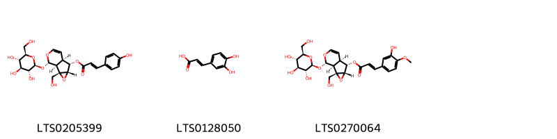{ width=100% }
    <figcaption>Hình ảnh cấu trúc hóa học của 3 hoạt chất thuộc nhóm Cinnamic acids and derivatives gồm ['(1s,2s,4s,5s,6r,10s)-2-(hydroxymethyl)-10-{[(2s,3r,4s,5s,6r)-3,4,5-trihydroxy-6-(hydroxymethyl)oxan-2-yl]oxy}-3,9-dioxatricyclo[4.4.0.0²,⁴]dec-7-en-5-yl (2e)-3-(4-hydroxyphenyl)prop-2-enoate (LTS0205399)', '3,4-dihydroxycinnamic acid (LTS0128050)', 'minecoside (LTS0270064)'].</figcaption>
</figure>
#### Nhóm Furanoid lignans
<figure markdown="span">
    { width=100% }
    <figcaption>Hình ảnh cấu trúc hóa học của 1 hoạt chất thuộc nhóm Furanoid lignans gồm ['sesamin (LTS0120161)'].</figcaption>
</figure>
#### Nhóm Organooxygen compounds
<figure markdown="span">
    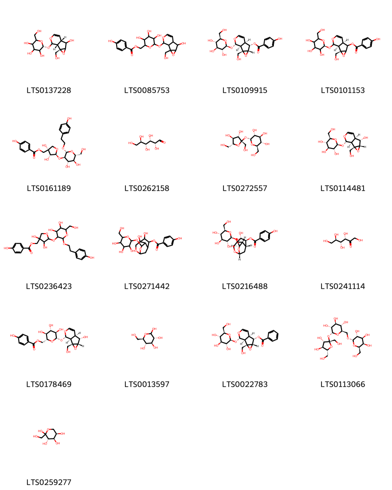{ width=100% }
    <figcaption>Hình ảnh cấu trúc hóa học của 17 hoạt chất thuộc nhóm Organooxygen compounds gồm ['(2r)-2-{[(1r,2s,6s)-5-hydroxy-2-(hydroxymethyl)-3,9-dioxatricyclo[4.4.0.0²,⁴]dec-7-en-10-yl]oxy}-6-(hydroxymethyl)oxane-3,4,5-triol (LTS0137228)', '(3,4,5-trihydroxy-6-{[5-hydroxy-2-(hydroxymethyl)-3,9-dioxatricyclo[4.4.0.0²,⁴]dec-7-en-10-yl]oxy}oxan-2-yl)methyl 4-hydroxybenzoate (LTS0085753)', '(1s,2s,4s,5s,6r,10s)-2-(hydroxymethyl)-10-{[(2s,3r,4s,5s,6r)-3,4,5-trihydroxy-6-(hydroxymethyl)oxan-2-yl]oxy}-3,9-dioxatricyclo[4.4.0.0²,⁴]dec-7-en-5-yl 4-hydroxybenzoate (LTS0109915)', '(1s,2s,6r)-2-(hydroxymethyl)-10-{[(2s)-3,4,5-trihydroxy-6-(hydroxymethyl)oxan-2-yl]oxy}-3,9-dioxatricyclo[4.4.0.0²,⁴]dec-7-en-5-yl 4-hydroxybenzoate (LTS0101153)', '[(3s,4r,5s)-5-{[(2r,3r,4s,5s,6r)-4,5-dihydroxy-6-(hydroxymethyl)-2-[2-(4-hydroxyphenyl)ethoxy]oxan-3-yl]oxy}-3,4-dihydroxyoxolan-3-yl]methyl 4-hydroxybenzoate (LTS0161189)', '(+)-glucose (LTS0262158)', 'sucrose (LTS0272557)', 'catalpol (LTS0114481)', '(5-{[4,5-dihydroxy-6-(hydroxymethyl)-2-[2-(4-hydroxyphenyl)ethoxy]oxan-3-yl]oxy}-3,4-dihydroxyoxolan-3-yl)methyl 4-hydroxybenzoate (LTS0236423)', '4,5-dihydroxy-9-{[3,4,5-trihydroxy-6-(hydroxymethyl)oxan-2-yl]oxy}-2,10-dioxatricyclo[5.3.1.0⁴,⁸]undecan-6-yl 4-hydroxybenzoate (LTS0271442)', '(1r,4s,5r,6s,7r,8s,9s)-4,5-dihydroxy-9-{[(2s,3r,4s,5s,6r)-3,4,5-trihydroxy-6-(hydroxymethyl)oxan-2-yl]oxy}-2,10-dioxatricyclo[5.3.1.0⁴,⁸]undecan-6-yl 4-hydroxybenzoate (LTS0216488)', 'keto-d-fructose (LTS0241114)', '[(2r,3s,4s,5r,6s)-3,4,5-trihydroxy-6-{[(1s,2s,4s,5s,6r,10s)-5-hydroxy-2-(hydroxymethyl)-3,9-dioxatricyclo[4.4.0.0²,⁴]dec-7-en-10-yl]oxy}oxan-2-yl]methyl 4-hydroxybenzoate (LTS0178469)', 'glucose (LTS0013597)', '(1s,2s,4s,5s,6r,10s)-2-(hydroxymethyl)-10-{[(2s,3r,4s,5s,6r)-3,4,5-trihydroxy-6-(hydroxymethyl)oxan-2-yl]oxy}-3,9-dioxatricyclo[4.4.0.0²,⁴]dec-7-en-5-yl benzoate (LTS0022783)', 'raffinose (LTS0113066)', 'd-fructopyranose (LTS0259277)'].</figcaption>
</figure>
#### Nhóm Prenol lipids
<figure markdown="span">
    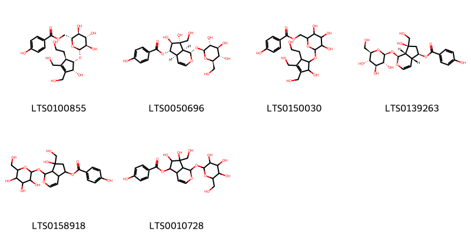{ width=100% }
    <figcaption>Hình ảnh cấu trúc hóa học của 6 hoạt chất thuộc nhóm Prenol lipids gồm ['[(2r,3s,4s,5r,6r)-3,4,5-trihydroxy-6-{[(1s,2r,5r)-2-hydroxy-5-(2-hydroxyethyl)-3,4-bis(hydroxymethyl)cyclopent-3-en-1-yl]oxy}oxan-2-yl]methyl 4-hydroxybenzoate (LTS0100855)', '(1s,4ar,5s,6r,7s,7as)-6,7-dihydroxy-7-(hydroxymethyl)-1-{[(2s,3r,4s,5s,6r)-3,4,5-trihydroxy-6-(hydroxymethyl)oxan-2-yl]oxy}-1h,4ah,5h,6h,7ah-cyclopenta[c]pyran-5-yl 4-hydroxybenzoate (LTS0050696)', '(3,4,5-trihydroxy-6-{[2-hydroxy-5-(2-hydroxyethyl)-3,4-bis(hydroxymethyl)cyclopent-3-en-1-yl]oxy}oxan-2-yl)methyl 4-hydroxybenzoate (LTS0150030)', '(1s,4ar,5r,7s,7as)-7-hydroxy-7-(hydroxymethyl)-1-{[(2s,3r,4s,5s,6r)-3,4,5-trihydroxy-6-(hydroxymethyl)oxan-2-yl]oxy}-1h,4ah,5h,6h,7ah-cyclopenta[c]pyran-5-yl 4-hydroxybenzoate (LTS0139263)', '7-hydroxy-7-(hydroxymethyl)-1-{[3,4,5-trihydroxy-6-(hydroxymethyl)oxan-2-yl]oxy}-1h,4ah,5h,6h,7ah-cyclopenta[c]pyran-5-yl 4-hydroxybenzoate (LTS0158918)', '6,7-dihydroxy-7-(hydroxymethyl)-1-{[3,4,5-trihydroxy-6-(hydroxymethyl)oxan-2-yl]oxy}-1h,4ah,5h,6h,7ah-cyclopenta[c]pyran-5-yl 4-hydroxybenzoate (LTS0010728)'].</figcaption>
</figure>
#### Nhóm Tannins
<figure markdown="span">
    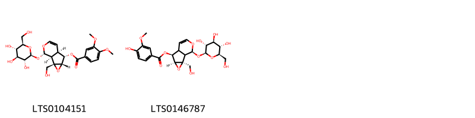{ width=100% }
    <figcaption>Hình ảnh cấu trúc hóa học của 2 hoạt chất thuộc nhóm Tannins gồm ['(1s,2s,4s,5s,6r,10s)-2-(hydroxymethyl)-10-{[(2s,3r,4s,5s,6r)-3,4,5-trihydroxy-6-(hydroxymethyl)oxan-2-yl]oxy}-3,9-dioxatricyclo[4.4.0.0²,⁴]dec-7-en-5-yl 3,4-dimethoxybenzoate (LTS0104151)', '(2s,4s,5s,10s)-2-(hydroxymethyl)-10-{[(2s,3r,4s,5s,6r)-3,4,5-trihydroxy-6-(hydroxymethyl)oxan-2-yl]oxy}-3,9-dioxatricyclo[4.4.0.0²,⁴]dec-7-en-5-yl 4-hydroxy-3-methoxybenzoate (LTS0146787)'].</figcaption>
</figure>

---

### Dược dân tộc học

Danh sách các quốc gia có sử dụng *Catalpa bignonioides* trong điều trị các bệnh. 

| Country   | Disease                               | Bệnh                                                                                                                                                                                                |
|:----------|:--------------------------------------|:----------------------------------------------------------------------------------------------------------------------------------------------------------------------------------------------------|
| US        | Laxative, Poultice, Vermifuge, Emetic | MYMEMORY WARNING: YOU USED ALL AVAILABLE FREE TRANSLATIONS FOR TODAY. NEXT AVAILABLE IN  19 HOURS 00 MINUTES 18 SECONDS VISIT HTTPS://MYMEMORY.TRANSLATED.NET/DOC/USAGELIMITS.PHP TO TRANSLATE MORE |

---

---
## Catalpa bungei
### Thông tin về thực vật

!!! info "Phân loại thực vật của *Catalpa bungei* từ GIBF:"
    - **Kingdom:** Plantae
    - **Phylum:** Tracheophyta
    - **Order:** Lamiales
    - **Family:** Bignoniaceae
    - **Genus:** Catalpa
    - **Species:** *Catalpa bungei*

 

| Label (VI)   | Label (EN)   | Scientific Name   | Descriptions (VI)   | Descriptions (EN)   | Also Known As (VI)   | Also Known As (EN)   |
|:-------------|:-------------|:------------------|:--------------------|:--------------------|:---------------------|:---------------------|
| N/A          | N/A          | Catalpa bungei    | loài thực vật       | species of plant    | ['']                 | ['']                 |

#### Phân bố trên thế giới

**Từ CSDL GIBF** unknown or invalid, United Kingdom of Great Britain and Northern Ireland, Japan, Spain, New Zealand, Canada, Russian Federation, United States of America, China, Belgium

#### Phân bố tại Việt Nam

**Từ CSDL GIBF**: Không có ghi nhận ở Việt Nam

---
### Thành phần hóa học
        
- Theo cơ sở dữ liệu lotus: Từ loài *Catalpa bungei* đã phân lập và xác định được Chưa có hoạt chất nào được phân lập. hoạt chất thuộc về các nhóm Không có hoạt chất nào được phân lập. 

Không có hình ảnh nào được tạo ra

---

### Dược dân tộc học

Danh sách các quốc gia có sử dụng *Catalpa bungei* trong điều trị các bệnh. 

| Country   | Disease              | Bệnh                                                                                                                                                                                                |
|:----------|:---------------------|:----------------------------------------------------------------------------------------------------------------------------------------------------------------------------------------------------|
| China     | Stomachic, Vermifuge | MYMEMORY WARNING: YOU USED ALL AVAILABLE FREE TRANSLATIONS FOR TODAY. NEXT AVAILABLE IN  18 HOURS 59 MINUTES 36 SECONDS VISIT HTTPS://MYMEMORY.TRANSLATED.NET/DOC/USAGELIMITS.PHP TO TRANSLATE MORE |

---

---
## Catalpa ovata
### Thông tin về thực vật

!!! info "Phân loại thực vật của *Catalpa ovata* từ GIBF:"
    - **Kingdom:** Plantae
    - **Phylum:** Tracheophyta
    - **Order:** Lamiales
    - **Family:** Bignoniaceae
    - **Genus:** Catalpa
    - **Species:** *Catalpa ovata*

 

| Label (VI)   | Label (EN)   | Scientific Name   | Descriptions (VI)   | Descriptions (EN)   | Also Known As (VI)   | Also Known As (EN)   |
|:-------------|:-------------|:------------------|:--------------------|:--------------------|:---------------------|:---------------------|
| N/A          | N/A          | Catalpa ovata     | loài thực vật       | species of plant    | ['']                 | ['']                 |

#### Phân bố trên thế giới

**Từ CSDL GIBF** nan, Denmark, Luxembourg, Spain, Germany, Austria, Korea, Republic of, Poland, Canada, Kazakhstan, Belgium, Netherlands, Japan, Estonia, China, Norway, Portugal, Latvia, France, Czechia, Russian Federation, United States of America, Italy, Croatia, Ukraine

#### Phân bố tại Việt Nam

**Từ CSDL GIBF**: Không có ghi nhận ở Việt Nam

---
### Thành phần hóa học
        
- Theo cơ sở dữ liệu lotus: Từ loài *Catalpa ovata* đã phân lập và xác định được 95 hoạt chất thuộc về các nhóm Stilbenes, Organooxygen compounds, Benzofurans, Flavonoids, Lactones, Tannins, Naphthofurans, 2-arylbenzofuran flavonoids, Prenol lipids, Lignan glycosides, Fatty Acyls, Anthracenes, Naphthopyrans, Tetralins, Cinnamic acids and derivatives, Naphthalenes. 

|    | chemicalTaxonomyClassyfireClass   |   smiles_count |
|---:|:----------------------------------|---------------:|
|  0 |                                   |              1 |
|  1 | 2-arylbenzofuran flavonoids       |              2 |
|  2 | Anthracenes                       |              1 |
|  3 | Benzofurans                       |              2 |
|  4 | Cinnamic acids and derivatives    |             22 |
|  5 | Fatty Acyls                       |              2 |
|  6 | Flavonoids                        |              5 |
|  7 | Lactones                          |              2 |
|  8 | Lignan glycosides                 |              1 |
|  9 | Naphthalenes                      |              1 |
| 10 | Naphthofurans                     |              4 |
| 11 | Naphthopyrans                     |             11 |
| 12 | Organooxygen compounds            |             14 |
| 13 | Prenol lipids                     |             16 |
| 14 | Stilbenes                         |              1 |
| 15 | Tannins                           |              4 |
| 16 | Tetralins                         |              5 |

#### Nhóm 
<figure markdown="span">
    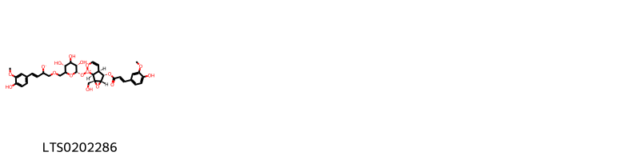{ width=100% }
    <figcaption>Hình ảnh cấu trúc hóa học của 1 hoạt chất thuộc nhóm  gồm ['(3e)-4-(4-hydroxy-3-methoxyphenyl)-2-oxido-1-{[(3r,5s,6s)-3,4,5-trihydroxy-6-{[(1s,2s,4s,5s,6s)-5-{[(2e)-3-(4-hydroxy-3-methoxyphenyl)prop-2-enoyl]oxy}-2-(hydroxymethyl)-3,9,10-trioxatricyclo[4.4.0.0²,⁴]dec-7-en-10-ium-10-yl]oxy}oxan-2-yl]methoxy}but-3-en-2-yl (LTS0202286)'].</figcaption>
</figure>
#### Nhóm 2-arylbenzofuran flavonoids
<figure markdown="span">
    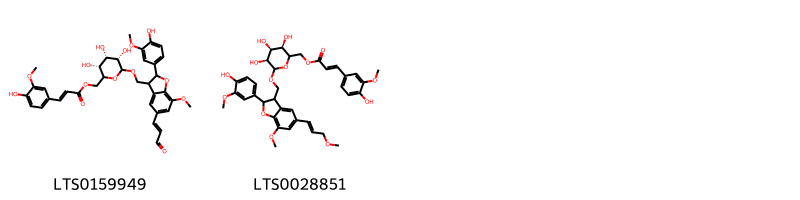{ width=100% }
    <figcaption>Hình ảnh cấu trúc hóa học của 2 hoạt chất thuộc nhóm 2-arylbenzofuran flavonoids gồm ['[(3r,4s,5s)-3,4,5-trihydroxy-6-{[2-(4-hydroxy-3-methoxyphenyl)-7-methoxy-5-[(1e)-3-oxoprop-1-en-1-yl]-2,3-dihydro-1-benzofuran-3-yl]methoxy}oxan-2-yl]methyl (2e)-3-(4-hydroxy-3-methoxyphenyl)prop-2-enoate (LTS0159949)', '[(3r,4s,5s)-3,4,5-trihydroxy-6-{[2-(4-hydroxy-3-methoxyphenyl)-7-methoxy-5-[(1e)-3-methoxyprop-1-en-1-yl]-2,3-dihydro-1-benzofuran-3-yl]methoxy}oxan-2-yl]methyl (2e)-3-(4-hydroxy-3-methoxyphenyl)prop-2-enoate (LTS0028851)'].</figcaption>
</figure>
#### Nhóm Anthracenes
<figure markdown="span">
    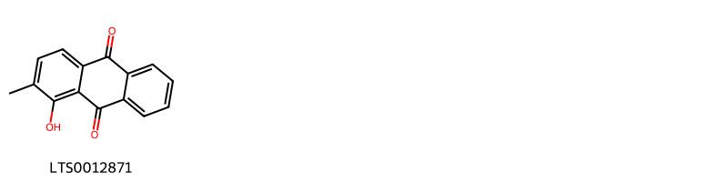{ width=100% }
    <figcaption>Hình ảnh cấu trúc hóa học của 1 hoạt chất thuộc nhóm Anthracenes gồm ['1-hydroxy-2-methylanthracene-9,10-dione (LTS0012871)'].</figcaption>
</figure>
#### Nhóm Benzofurans
<figure markdown="span">
    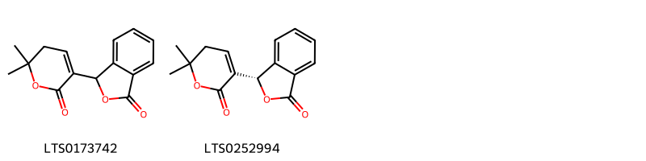{ width=100% }
    <figcaption>Hình ảnh cấu trúc hóa học của 2 hoạt chất thuộc nhóm Benzofurans gồm ['catalpalactone (LTS0173742)', '(3s)-3-(6,6-dimethyl-2-oxo-5h-pyran-3-yl)-3h-2-benzofuran-1-one (LTS0252994)'].</figcaption>
</figure>
#### Nhóm Cinnamic acids and derivatives
<figure markdown="span">
    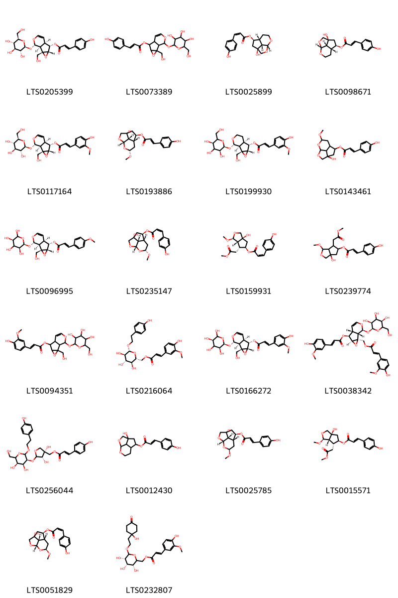{ width=100% }
    <figcaption>Hình ảnh cấu trúc hóa học của 22 hoạt chất thuộc nhóm Cinnamic acids and derivatives gồm ['(1s,2s,4s,5s,6r,10s)-2-(hydroxymethyl)-10-{[(2s,3r,4s,5s,6r)-3,4,5-trihydroxy-6-(hydroxymethyl)oxan-2-yl]oxy}-3,9-dioxatricyclo[4.4.0.0²,⁴]dec-7-en-5-yl (2e)-3-(4-hydroxyphenyl)prop-2-enoate (LTS0205399)', '2-(hydroxymethyl)-10-{[3,4,5-trihydroxy-6-(hydroxymethyl)oxan-2-yl]oxy}-3,9-dioxatricyclo[4.4.0.0²,⁴]dec-7-en-5-yl 3-(4-hydroxyphenyl)prop-2-enoate (LTS0073389)', '(1r,4s,6r,7r,11s)-4-hydroxy-2,10-dioxatricyclo[5.3.1.0⁴,¹¹]undecan-6-yl (2z)-3-(4-hydroxyphenyl)prop-2-enoate (LTS0025899)', '(1r,4s,6r,7r,11s)-4-hydroxy-2,10-dioxatricyclo[5.3.1.0⁴,¹¹]undecan-6-yl (2e)-3-(4-hydroxyphenyl)prop-2-enoate (LTS0098671)', '6-o-feruloylcatalpol (LTS0117164)', '(1s,4s,6r,7r,9r,11s)-4-hydroxy-9-methoxy-2,10-dioxatricyclo[5.3.1.0⁴,¹¹]undecan-6-yl (2e)-3-(4-hydroxyphenyl)prop-2-enoate (LTS0193886)', '(1s,2s,4s,5s,6r,10s)-2-(hydroxymethyl)-10-{[(2s,3s,5r)-3,4,5-trihydroxy-6-(hydroxymethyl)oxan-2-yl]oxy}-3,9-dioxatricyclo[4.4.0.0²,⁴]decan-5-yl (2e)-3-(4-hydroxy-3-methoxyphenyl)prop-2-enoate (LTS0199930)', '4-hydroxy-9-methoxy-2,10-dioxatricyclo[5.3.1.0⁴,¹¹]undecan-6-yl 3-(4-hydroxyphenyl)prop-2-enoate (LTS0143461)', '(1s,2s,4s,5s,6r,10s)-2-(hydroxymethyl)-10-{[(2s,3s,5r)-3,4,5,6-tetrahydroxyoxan-2-yl]oxy}-3,9-dioxatricyclo[4.4.0.0²,⁴]dec-7-en-5-yl (2e)-3-(4-methoxyphenyl)prop-2-enoate (LTS0096995)', '(1s,4s,6r,7r,9r,11s)-4-hydroxy-9-methoxy-2,10-dioxatricyclo[5.3.1.0⁴,¹¹]undecan-6-yl (2z)-3-(4-hydroxyphenyl)prop-2-enoate (LTS0235147)', '(1s,3as,5r,6r,6as)-3a-hydroxy-1-methoxy-6-(2-methoxy-2-oxoethyl)-hexahydrocyclopenta[c]furan-5-yl (2z)-3-(4-hydroxyphenyl)prop-2-enoate (LTS0159931)', '3a-hydroxy-1-methoxy-6-(2-methoxy-2-oxoethyl)-hexahydrocyclopenta[c]furan-5-yl 3-(4-hydroxyphenyl)prop-2-enoate (LTS0239774)', '2-(hydroxymethyl)-10-{[3,4,5-trihydroxy-6-(hydroxymethyl)oxan-2-yl]oxy}-3,9-dioxatricyclo[4.4.0.0²,⁴]dec-7-en-5-yl 3-(4-hydroxy-3-methoxyphenyl)prop-2-enoate (LTS0094351)', '[(2r,3s,4s,5r,6r)-3,4,5-trihydroxy-6-[2-(4-hydroxyphenyl)ethoxy]oxan-2-yl]methyl (2e)-3-(4-hydroxy-3-methoxyphenyl)prop-2-enoate (LTS0216064)', '(1s,2s,4s,5s,6r,10s)-2-(hydroxymethyl)-10-{[(2s,3s,5r)-3,4,5,6-tetrahydroxyoxan-2-yl]oxy}-3,9-dioxatricyclo[4.4.0.0²,⁴]dec-7-en-5-yl (2e)-3-(4-hydroxy-3-methoxyphenyl)prop-2-enoate (LTS0166272)', '[(1s,2s,4s,5s,6r,10s)-5-{[(2e)-3-(4-hydroxy-3-methoxyphenyl)prop-2-enoyl]oxy}-10-{[(2s,3s,5r)-3,4,5-trihydroxy-6-(hydroxymethyl)oxan-2-yl]oxy}-3,9-dioxatricyclo[4.4.0.0²,⁴]dec-7-en-2-yl]methyl (2e)-3-(4-hydroxy-3-methoxyphenyl)prop-2-enoate (LTS0038342)', '[(3r,4s)-5-{[(3s,4s,5r)-4,5-dihydroxy-6-(hydroxymethyl)-2-[2-(4-hydroxyphenyl)ethoxy]oxan-3-yl]oxy}-3,4-dihydroxyoxolan-3-yl]methyl (2e)-3-(4-hydroxyphenyl)prop-2-enoate (LTS0256044)', '4-hydroxy-2,10-dioxatricyclo[5.3.1.0⁴,¹¹]undecan-6-yl 3-(4-hydroxyphenyl)prop-2-enoate (LTS0012430)', '(1s,4s,6r,7r,9s,11s)-4-hydroxy-9-methoxy-2,10-dioxatricyclo[5.3.1.0⁴,¹¹]undecan-6-yl (2e)-3-(4-hydroxyphenyl)prop-2-enoate (LTS0025785)', '(1s,3as,5r,6r,6as)-3a-hydroxy-1-methoxy-6-(2-methoxy-2-oxoethyl)-hexahydrocyclopenta[c]furan-5-yl (2e)-3-(4-hydroxyphenyl)prop-2-enoate (LTS0015571)', '(1s,4s,6r,7r,9s,11s)-4-hydroxy-9-methoxy-2,10-dioxatricyclo[5.3.1.0⁴,¹¹]undecan-6-yl (2z)-3-(4-hydroxyphenyl)prop-2-enoate (LTS0051829)', '[(3r,4s,5s)-3,4,5-trihydroxy-6-[2-(1-hydroxy-4-oxocyclohexyl)ethoxy]oxan-2-yl]methyl (2e)-3-(4-hydroxy-3-methoxyphenyl)prop-2-enoate (LTS0232807)'].</figcaption>
</figure>
#### Nhóm Fatty Acyls
<figure markdown="span">
    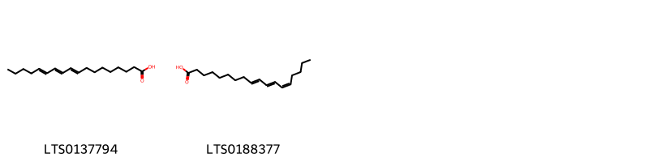{ width=100% }
    <figcaption>Hình ảnh cấu trúc hóa học của 2 hoạt chất thuộc nhóm Fatty Acyls gồm ['(9e,11e)-octadeca-9,11,13-trienoic acid (LTS0137794)', 'catalpic acid (LTS0188377)'].</figcaption>
</figure>
#### Nhóm Flavonoids
<figure markdown="span">
    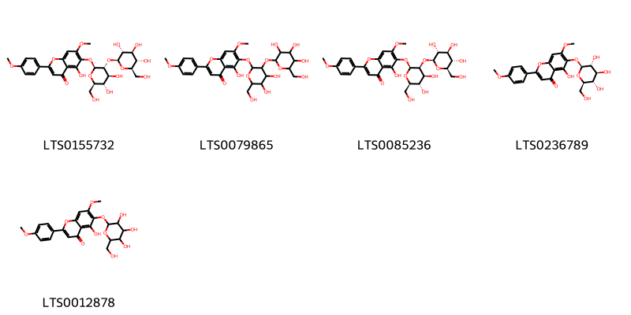{ width=100% }
    <figcaption>Hình ảnh cấu trúc hóa học của 5 hoạt chất thuộc nhóm Flavonoids gồm ['6-{[(2s,3r,4s,5s,6r)-4,5-dihydroxy-6-(hydroxymethyl)-3-{[(2s,3r,4s,5s,6r)-3,4,5-trihydroxy-6-(hydroxymethyl)oxan-2-yl]oxy}oxan-2-yl]oxy}-5-hydroxy-7-methoxy-2-(4-methoxyphenyl)chromen-4-one (LTS0155732)', '6-{[4,5-dihydroxy-6-(hydroxymethyl)-3-{[3,4,5-trihydroxy-6-(hydroxymethyl)oxan-2-yl]oxy}oxan-2-yl]oxy}-5-hydroxy-7-methoxy-2-(4-methoxyphenyl)chromen-4-one (LTS0079865)', '6-{[(2s,3s,4s,5s,6r)-4,5-dihydroxy-6-(hydroxymethyl)-3-{[(2s,3r,4s,5s,6r)-3,4,5-trihydroxy-6-(hydroxymethyl)oxan-2-yl]oxy}oxan-2-yl]oxy}-5-hydroxy-7-methoxy-2-(4-methoxyphenyl)chromen-4-one (LTS0085236)', '5-hydroxy-7-methoxy-2-(4-methoxyphenyl)-6-{[(2s,3r,4s,5s,6r)-3,4,5-trihydroxy-6-(hydroxymethyl)oxan-2-yl]oxy}chromen-4-one (LTS0236789)', '5-hydroxy-7-methoxy-2-(4-methoxyphenyl)-6-{[3,4,5-trihydroxy-6-(hydroxymethyl)oxan-2-yl]oxy}chromen-4-one (LTS0012878)'].</figcaption>
</figure>
#### Nhóm Lactones
<figure markdown="span">
    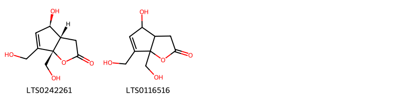{ width=100% }
    <figcaption>Hình ảnh cấu trúc hóa học của 2 hoạt chất thuộc nhóm Lactones gồm ['(3as,4r,6as)-4-hydroxy-6,6a-bis(hydroxymethyl)-3h,3ah,4h-cyclopenta[b]furan-2-one (LTS0242261)', '4-hydroxy-6,6a-bis(hydroxymethyl)-3h,3ah,4h-cyclopenta[b]furan-2-one (LTS0116516)'].</figcaption>
</figure>
#### Nhóm Lignan glycosides
<figure markdown="span">
    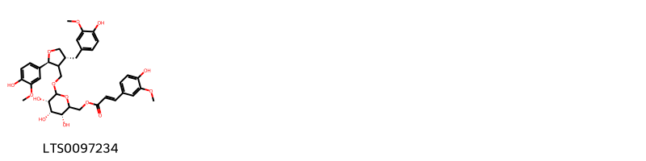{ width=100% }
    <figcaption>Hình ảnh cấu trúc hóa học của 1 hoạt chất thuộc nhóm Lignan glycosides gồm ['[(3r,4s,5s)-3,4,5-trihydroxy-6-{[(2s,4r)-2-(4-hydroxy-3-methoxyphenyl)-4-[(4-hydroxy-3-methoxyphenyl)methyl]oxolan-3-yl]methoxy}oxan-2-yl]methyl (2e)-3-(4-hydroxy-3-methoxyphenyl)prop-2-enoate (LTS0097234)'].</figcaption>
</figure>
#### Nhóm Naphthalenes
<figure markdown="span">
    { width=100% }
    <figcaption>Hình ảnh cấu trúc hóa học của 1 hoạt chất thuộc nhóm Naphthalenes gồm ['lapachol (LTS0088416)'].</figcaption>
</figure>
#### Nhóm Naphthofurans
<figure markdown="span">
    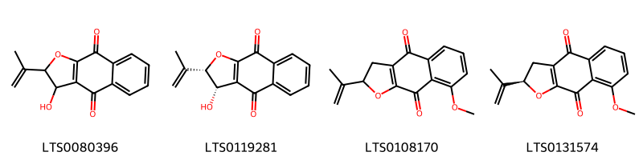{ width=100% }
    <figcaption>Hình ảnh cấu trúc hóa học của 4 hoạt chất thuộc nhóm Naphthofurans gồm ['3-hydroxy-2-(prop-1-en-2-yl)-2h,3h-naphtho[2,3-b]furan-4,9-dione (LTS0080396)', '(2s,3s)-3-hydroxy-2-(prop-1-en-2-yl)-2h,3h-naphtho[2,3-b]furan-4,9-dione (LTS0119281)', '8-methoxy-2-(prop-1-en-2-yl)-2h,3h-naphtho[2,3-b]furan-4,9-dione (LTS0108170)', '(2r)-8-methoxy-2-(prop-1-en-2-yl)-2h,3h-naphtho[2,3-b]furan-4,9-dione (LTS0131574)'].</figcaption>
</figure>
#### Nhóm Naphthopyrans
<figure markdown="span">
    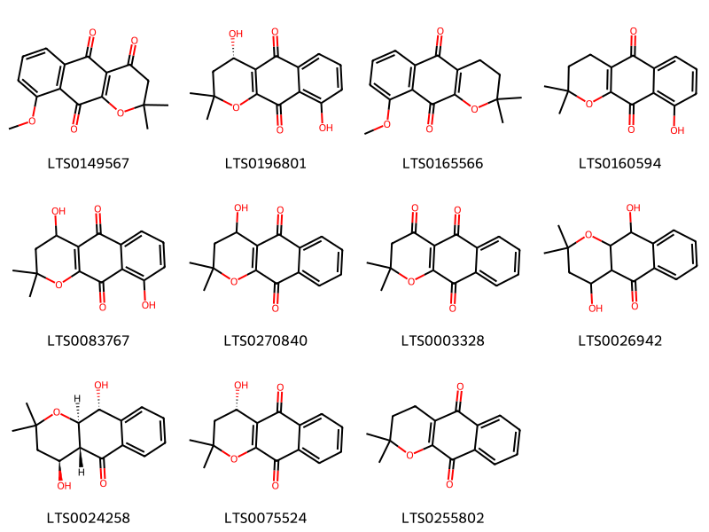{ width=100% }
    <figcaption>Hình ảnh cấu trúc hóa học của 11 hoạt chất thuộc nhóm Naphthopyrans gồm ['9-methoxy-2,2-dimethyl-3h-naphtho[2,3-b]pyran-4,5,10-trione (LTS0149567)', '(4s)-4,9-dihydroxy-2,2-dimethyl-3h,4h-naphtho[2,3-b]pyran-5,10-dione (LTS0196801)', '9-methoxy-α-lapachone (LTS0165566)', '9-hydroxy-2,2-dimethyl-3h,4h-naphtho[2,3-b]pyran-5,10-dione (LTS0160594)', '4,9-dihydroxy-2,2-dimethyl-3h,4h-naphtho[2,3-b]pyran-5,10-dione (LTS0083767)', '4-hydroxy-2,2-dimethyl-3h,4h-naphtho[2,3-b]pyran-5,10-dione (LTS0270840)', '2,2-dimethyl-3h-naphtho[2,3-b]pyran-4,5,10-trione (LTS0003328)', '4,10-dihydroxy-2,2-dimethyl-3h,4h,4ah,10h,10ah-naphtho[2,3-b]pyran-5-one (LTS0026942)', '(4s,4ar,10r,10ar)-4,10-dihydroxy-2,2-dimethyl-3h,4h,4ah,10h,10ah-naphtho[2,3-b]pyran-5-one (LTS0024258)', '(4s)-4-hydroxy-2,2-dimethyl-3h,4h-naphtho[2,3-b]pyran-5,10-dione (LTS0075524)', 'α-lapachone (LTS0255802)'].</figcaption>
</figure>
#### Nhóm Organooxygen compounds
<figure markdown="span">
    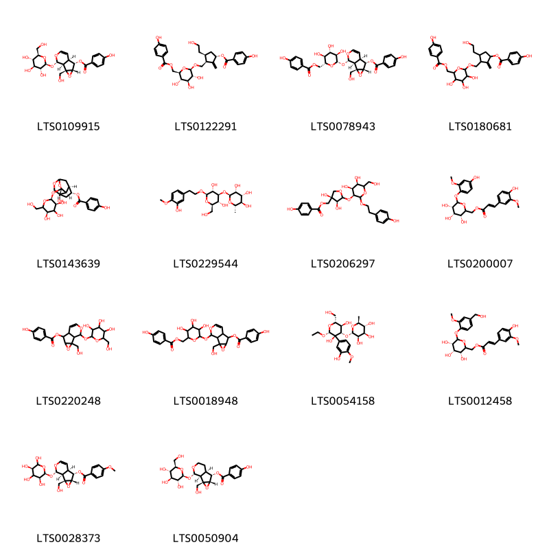{ width=100% }
    <figcaption>Hình ảnh cấu trúc hóa học của 14 hoạt chất thuộc nhóm Organooxygen compounds gồm ['(1s,2s,4s,5s,6r,10s)-2-(hydroxymethyl)-10-{[(2s,3r,4s,5s,6r)-3,4,5-trihydroxy-6-(hydroxymethyl)oxan-2-yl]oxy}-3,9-dioxatricyclo[4.4.0.0²,⁴]dec-7-en-5-yl 4-hydroxybenzoate (LTS0109915)', '(1s,3s,4s)-4-(2-hydroxyethyl)-2-methylidene-3-({[(2r,3r,4s,5s,6r)-3,4,5-trihydroxy-6-[(4-hydroxybenzoyloxy)methyl]oxan-2-yl]oxy}methyl)cyclopentyl 4-hydroxybenzoate (LTS0122291)', '(1s,2s,4s,5s,6r,10s)-2-(hydroxymethyl)-10-{[(2s,3r,4s,5s,6r)-3,4,5-trihydroxy-6-[(4-hydroxybenzoyloxy)methyl]oxan-2-yl]oxy}-3,9-dioxatricyclo[4.4.0.0²,⁴]dec-7-en-5-yl 4-hydroxybenzoate (LTS0078943)', '4-(2-hydroxyethyl)-2-methylidene-3-[({3,4,5-trihydroxy-6-[(4-hydroxybenzoyloxy)methyl]oxan-2-yl}oxy)methyl]cyclopentyl 4-hydroxybenzoate (LTS0180681)', '(4s,6r,7r,8s,9s)-4-hydroxy-9-{[(2s,3s,5r)-3,4,5-trihydroxy-6-(hydroxymethyl)oxan-2-yl]oxy}-2,10-dioxatricyclo[5.3.1.0⁴,⁸]undecan-6-yl 4-hydroxybenzoate (LTS0143639)', '(2s,3r,4r,5r,6s)-2-{[(2r,3r,4s,5r,6r)-3,5-dihydroxy-2-[2-(3-hydroxy-4-methoxyphenyl)ethoxy]-6-(hydroxymethyl)oxan-4-yl]oxy}-6-methyloxane-3,4,5-triol (LTS0229544)', '[(3r,4s)-5-{[(3s,4s,5r)-4,5-dihydroxy-6-(hydroxymethyl)-2-[2-(4-hydroxyphenyl)ethoxy]oxan-3-yl]oxy}-3,4-dihydroxyoxolan-3-yl]methyl 4-hydroxybenzoate (LTS0206297)', '[(3r,4s,5s)-3,4,5-trihydroxy-6-(4-hydroxy-2-methoxyphenoxy)oxan-2-yl]methyl (2e)-3-(4-hydroxy-3-methoxyphenyl)prop-2-enoate (LTS0200007)', '2-(hydroxymethyl)-10-{[3,4,5-trihydroxy-6-(hydroxymethyl)oxan-2-yl]oxy}-3,9-dioxatricyclo[4.4.0.0²,⁴]dec-7-en-5-yl 4-hydroxybenzoate (LTS0220248)', '2-(hydroxymethyl)-10-({3,4,5-trihydroxy-6-[(4-hydroxybenzoyloxy)methyl]oxan-2-yl}oxy)-3,9-dioxatricyclo[4.4.0.0²,⁴]dec-7-en-5-yl 4-hydroxybenzoate (LTS0018948)', '(2s,3r,4r,5r,6s)-2-{[(2r,3r,4s,5r,6r)-2-ethoxy-3,5-dihydroxy-3-(3-hydroxy-4-methoxyphenyl)-6-(hydroxymethyl)oxan-4-yl]oxy}-6-methyloxane-3,4,5-triol (LTS0054158)', '[(3r,4s,5s)-3,4,5-trihydroxy-6-[4-(hydroxymethyl)-2-methoxyphenoxy]oxan-2-yl]methyl (2e)-3-(4-hydroxy-3-methoxyphenyl)prop-2-enoate (LTS0012458)', '(1s,2s,4s,5s,6r,10s)-2-(hydroxymethyl)-10-{[(2s,3s,5r)-3,4,5,6-tetrahydroxyoxan-2-yl]oxy}-3,9-dioxatricyclo[4.4.0.0²,⁴]dec-7-en-5-yl 4-methoxybenzoate (LTS0028373)', '(1s,2s,4s,5s,6r,10s)-2-(hydroxymethyl)-10-{[(2s,3r,4s,5s,6r)-3,4,5-trihydroxy-6-(hydroxymethyl)oxan-2-yl]oxy}-3,9-dioxatricyclo[4.4.0.0²,⁴]decan-5-yl 4-hydroxybenzoate (LTS0050904)'].</figcaption>
</figure>
#### Nhóm Prenol lipids
<figure markdown="span">
    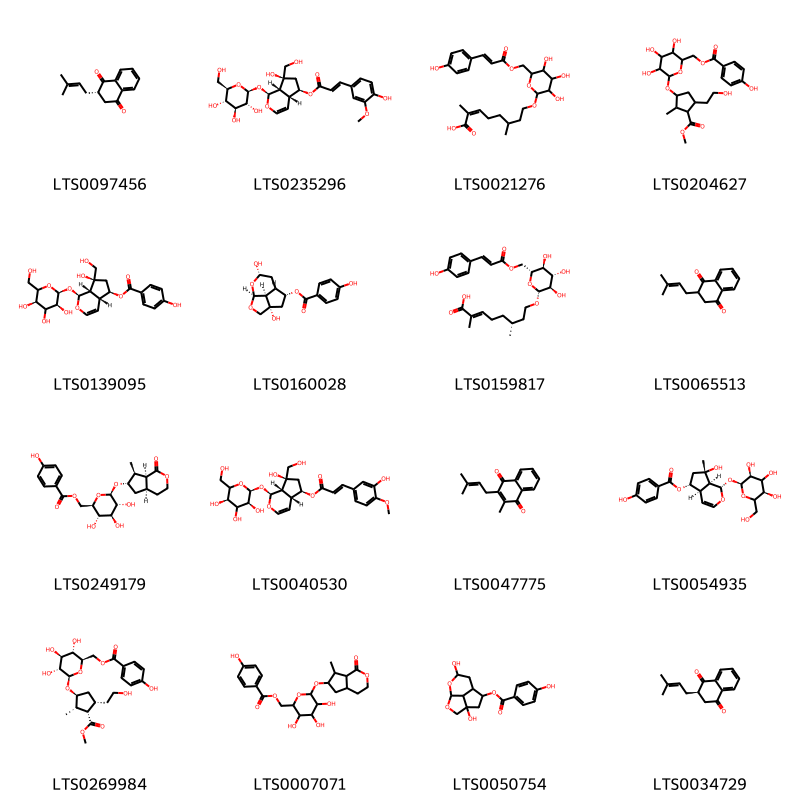{ width=100% }
    <figcaption>Hình ảnh cấu trúc hóa học của 16 hoạt chất thuộc nhóm Prenol lipids gồm ['(2s)-2-(3-methylbut-2-en-1-yl)-2,3-dihydronaphthalene-1,4-dione (LTS0097456)', '(1s,4ar,5r,7s,7as)-7-hydroxy-7-(hydroxymethyl)-1-{[(2s,3r,4s,5s,6r)-3,4,5-trihydroxy-6-(hydroxymethyl)oxan-2-yl]oxy}-1h,4ah,5h,6h,7ah-cyclopenta[c]pyran-5-yl (2e)-3-(4-hydroxy-3-methoxyphenyl)prop-2-enoate (LTS0235296)', '2,6-dimethyl-8-{[3,4,5-trihydroxy-6-({[3-(4-hydroxyphenyl)prop-2-enoyl]oxy}methyl)oxan-2-yl]oxy}oct-2-enoic acid (LTS0021276)', '(3,4,5-trihydroxy-6-{[4-(2-hydroxyethyl)-3-(methoxycarbonyl)-2-methylcyclopentyl]oxy}oxan-2-yl)methyl 4-hydroxybenzoate (LTS0204627)', '(1s,4ar,5r,7s,7as)-7-hydroxy-7-(hydroxymethyl)-1-{[(2s,3s,5r)-3,4,5-trihydroxy-6-(hydroxymethyl)oxan-2-yl]oxy}-1h,4ah,5h,6h,7ah-cyclopenta[c]pyran-5-yl 4-hydroxybenzoate (LTS0139095)', '(1s,4s,6r,7r,9s,11s)-4,9-dihydroxy-2,10-dioxatricyclo[5.3.1.0⁴,¹¹]undecan-6-yl 4-hydroxybenzoate (LTS0160028)', '(2e,6r)-2,6-dimethyl-8-{[(2r,3r,4s,5s,6r)-3,4,5-trihydroxy-6-({[(2e)-3-(4-hydroxyphenyl)prop-2-enoyl]oxy}methyl)oxan-2-yl]oxy}oct-2-enoic acid (LTS0159817)', '2-(3-methylbut-2-en-1-yl)-2,3-dihydronaphthalene-1,4-dione (LTS0065513)', '[(2r,3s,4s,5r,6r)-6-{[(4as,6s,7s,7as)-7-methyl-1-oxo-hexahydro-3h-cyclopenta[c]pyran-6-yl]oxy}-3,4,5-trihydroxyoxan-2-yl]methyl 4-hydroxybenzoate (LTS0249179)', '(1s,4ar,5r,7s,7as)-7-hydroxy-7-(hydroxymethyl)-1-{[(2s,3s,5r)-3,4,5-trihydroxy-6-(hydroxymethyl)oxan-2-yl]oxy}-1h,4ah,5h,6h,7ah-cyclopenta[c]pyran-5-yl (2e)-3-(3-hydroxy-4-methoxyphenyl)prop-2-enoate (LTS0040530)', '2-methyl-3-(3-methylbut-2-en-1-yl)naphthalene-1,4-dione (LTS0047775)', '(1s,4ar,5r,7s,7as)-7-hydroxy-7-methyl-1-{[(2s,3s,5r)-3,4,5-trihydroxy-6-(hydroxymethyl)oxan-2-yl]oxy}-1h,4ah,5h,6h,7ah-cyclopenta[c]pyran-5-yl 4-hydroxybenzoate (LTS0054935)', '[(2r,3s,4s,5r,6r)-3,4,5-trihydroxy-6-{[(1s,2s,3s,4s)-4-(2-hydroxyethyl)-3-(methoxycarbonyl)-2-methylcyclopentyl]oxy}oxan-2-yl]methyl 4-hydroxybenzoate (LTS0269984)', '[3,4,5-trihydroxy-6-({7-methyl-1-oxo-hexahydro-3h-cyclopenta[c]pyran-6-yl}oxy)oxan-2-yl]methyl 4-hydroxybenzoate (LTS0007071)', '4,9-dihydroxy-2,10-dioxatricyclo[5.3.1.0⁴,¹¹]undecan-6-yl 4-hydroxybenzoate (LTS0050754)', '(2r)-2-(3-methylbut-2-en-1-yl)-2,3-dihydronaphthalene-1,4-dione (LTS0034729)'].</figcaption>
</figure>
#### Nhóm Stilbenes
<figure markdown="span">
    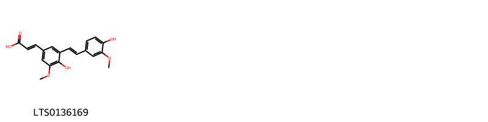{ width=100% }
    <figcaption>Hình ảnh cấu trúc hóa học của 1 hoạt chất thuộc nhóm Stilbenes gồm ['(2e)-3-{4-hydroxy-3-[(1e)-2-(4-hydroxy-3-methoxyphenyl)ethenyl]-5-methoxyphenyl}prop-2-enoic acid (LTS0136169)'].</figcaption>
</figure>
#### Nhóm Tannins
<figure markdown="span">
    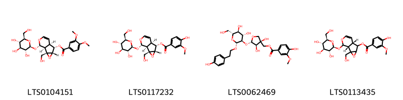{ width=100% }
    <figcaption>Hình ảnh cấu trúc hóa học của 4 hoạt chất thuộc nhóm Tannins gồm ['(1s,2s,4s,5s,6r,10s)-2-(hydroxymethyl)-10-{[(2s,3r,4s,5s,6r)-3,4,5-trihydroxy-6-(hydroxymethyl)oxan-2-yl]oxy}-3,9-dioxatricyclo[4.4.0.0²,⁴]dec-7-en-5-yl 3,4-dimethoxybenzoate (LTS0104151)', '(1s,2s,4s,5s,6r,10s)-2-(hydroxymethyl)-10-{[(2s,3r,4s,5s,6r)-3,4,5-trihydroxy-6-(hydroxymethyl)oxan-2-yl]oxy}-3,9-dioxatricyclo[4.4.0.0²,⁴]dec-7-en-5-yl 4-hydroxy-3-methoxybenzoate (LTS0117232)', '[(3s,4r,5s)-5-{[(2r,3r,4s,5s,6r)-4,5-dihydroxy-6-(hydroxymethyl)-2-[2-(4-hydroxyphenyl)ethoxy]oxan-3-yl]oxy}-3,4-dihydroxyoxolan-3-yl]methyl 4-hydroxy-3-methoxybenzoate (LTS0062469)', '(1r,6s)-2-(hydroxymethyl)-10-{[(2s,3r,4s,5s,6r)-3,4,5-trihydroxy-6-(hydroxymethyl)oxan-2-yl]oxy}-3,9-dioxatricyclo[4.4.0.0²,⁴]dec-7-en-5-yl 4-hydroxy-3-methoxybenzoate (LTS0113435)'].</figcaption>
</figure>
#### Nhóm Tetralins
<figure markdown="span">
    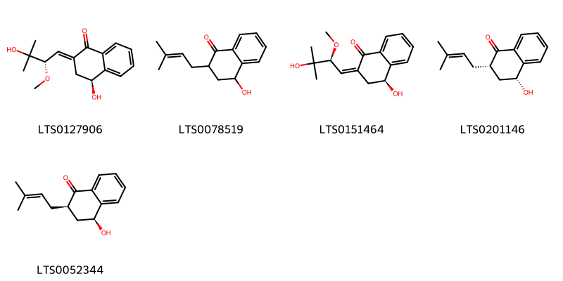{ width=100% }
    <figcaption>Hình ảnh cấu trúc hóa học của 5 hoạt chất thuộc nhóm Tetralins gồm ['(2e,4s)-4-hydroxy-2-[(2s)-3-hydroxy-2-methoxy-3-methylbutylidene]-3,4-dihydronaphthalen-1-one (LTS0127906)', '4-hydroxy-2-(3-methylbut-2-en-1-yl)-3,4-dihydro-2h-naphthalen-1-one (LTS0078519)', '(4s)-4-hydroxy-2-[(2s)-3-hydroxy-2-methoxy-3-methylbutylidene]-3,4-dihydronaphthalen-1-one (LTS0151464)', '(2s,4r)-4-hydroxy-2-(3-methylbut-2-en-1-yl)-3,4-dihydro-2h-naphthalen-1-one (LTS0201146)', '(2r,4s)-4-hydroxy-2-(3-methylbut-2-en-1-yl)-3,4-dihydro-2h-naphthalen-1-one (LTS0052344)'].</figcaption>
</figure>

---

### Dược dân tộc học

Danh sách các quốc gia có sử dụng *Catalpa ovata* trong điều trị các bệnh. 

| Country   | Disease   | Bệnh                                                                                                                                                                                                |
|:----------|:----------|:----------------------------------------------------------------------------------------------------------------------------------------------------------------------------------------------------|
| Japan     | Diuretic  | MYMEMORY WARNING: YOU USED ALL AVAILABLE FREE TRANSLATIONS FOR TODAY. NEXT AVAILABLE IN  18 HOURS 59 MINUTES 01 SECONDS VISIT HTTPS://MYMEMORY.TRANSLATED.NET/DOC/USAGELIMITS.PHP TO TRANSLATE MORE |
| Japan*    | Diuretic  | MYMEMORY WARNING: YOU USED ALL AVAILABLE FREE TRANSLATIONS FOR TODAY. NEXT AVAILABLE IN  18 HOURS 58 MINUTES 58 SECONDS VISIT HTTPS://MYMEMORY.TRANSLATED.NET/DOC/USAGELIMITS.PHP TO TRANSLATE MORE |

---

# Chi Cydista

??? note "Danh sách các dược liệu thuộc chi"
    
	 - *Cydista aequinoctialis*

---
## Cydista aequinoctialis
### Thông tin về thực vật

!!! info "Phân loại thực vật của *Bignonia aequinoctialis* từ GIBF:"
    - **Kingdom:** Plantae
    - **Phylum:** Tracheophyta
    - **Order:** Lamiales
    - **Family:** Bignoniaceae
    - **Genus:** Bignonia
    - **Species:** *Bignonia aequinoctialis*

 

| Label (VI)   | Label (EN)   | Scientific Name        | Descriptions (VI)   | Descriptions (EN)   | Also Known As (VI)   | Also Known As (EN)   |
|:-------------|:-------------|:-----------------------|:--------------------|:--------------------|:---------------------|:---------------------|
| N/A          | N/A          | Cydista aequinoctialis | loài thực vật       | species of plant    | ['']                 | ['']                 |

#### Phân bố trên thế giới

**Từ CSDL GIBF** nan, El Salvador, Guadeloupe, French Guiana, Jamaica, Guatemala, Colombia, Suriname, Venezuela (Bolivarian Republic of), Côte d’Ivoire, Puerto Rico, Panama, Brazil, Peru, Mexico, Bolivia (Plurinational State of), Costa Rica, Ecuador, United States of America, Guyana

#### Phân bố tại Việt Nam

**Từ CSDL GIBF**: Không có ghi nhận ở Việt Nam

---
### Thành phần hóa học
        
- Theo cơ sở dữ liệu lotus: Từ loài *Bignonia aequinoctialis* đã phân lập và xác định được Chưa có hoạt chất nào được phân lập. hoạt chất thuộc về các nhóm Không có hoạt chất nào được phân lập. 

Không có hình ảnh nào được tạo ra

---

### Dược dân tộc học

Danh sách các quốc gia có sử dụng *Bignonia aequinoctialis* trong điều trị các bệnh. 

| Country            | Disease               | Bệnh                                                                                                                                                                                                |
|:-------------------|:----------------------|:----------------------------------------------------------------------------------------------------------------------------------------------------------------------------------------------------|
| Dominican Republic | Astringent, Stomachic | MYMEMORY WARNING: YOU USED ALL AVAILABLE FREE TRANSLATIONS FOR TODAY. NEXT AVAILABLE IN  18 HOURS 58 MINUTES 24 SECONDS VISIT HTTPS://MYMEMORY.TRANSLATED.NET/DOC/USAGELIMITS.PHP TO TRANSLATE MORE |

---

# Chi Doxantha

??? note "Danh sách các dược liệu thuộc chi"
    
	 - *Doxantha unguis-cati*

---
## Doxantha unguiscati
### Thông tin về thực vật

!!! info "Phân loại thực vật của *Dolichandra unguis-cati* từ GIBF:"
    - **Kingdom:** Plantae
    - **Phylum:** Tracheophyta
    - **Order:** Lamiales
    - **Family:** Bignoniaceae
    - **Genus:** Dolichandra
    - **Species:** *Dolichandra unguis-cati*

 

| Label (VI)   | Label (EN)   | Scientific Name        | Descriptions (VI)   | Descriptions (EN)   | Also Known As (VI)   | Also Known As (EN)   |
|:-------------|:-------------|:-----------------------|:--------------------|:--------------------|:---------------------|:---------------------|
| N/A          | N/A          | Cydista aequinoctialis | loài thực vật       | species of plant    | ['']                 | ['']                 |

#### Phân bố trên thế giới

**Từ CSDL GIBF** nan, Colombia, Argentina, unknown or invalid, Portugal, Brazil, Spain, Philippines, New Zealand, Puerto Rico, Trinidad and Tobago, United States of America, Mexico

#### Phân bố tại Việt Nam

**Từ CSDL GIBF**: Không có ghi nhận ở Việt Nam

---
### Thành phần hóa học
        
- Theo cơ sở dữ liệu lotus: Từ loài *Dolichandra unguis-cati* đã phân lập và xác định được Chưa có hoạt chất nào được phân lập. hoạt chất thuộc về các nhóm Không có hoạt chất nào được phân lập. 

Không có hình ảnh nào được tạo ra

---

### Dược dân tộc học

Danh sách các quốc gia có sử dụng *Dolichandra unguis-cati* trong điều trị các bệnh. 

| Country   | Disease                      | Bệnh                                                                                                                                                                                                |
|:----------|:-----------------------------|:----------------------------------------------------------------------------------------------------------------------------------------------------------------------------------------------------|
| Elsewhere | Antidote                     | MYMEMORY WARNING: YOU USED ALL AVAILABLE FREE TRANSLATIONS FOR TODAY. NEXT AVAILABLE IN  18 HOURS 57 MINUTES 52 SECONDS VISIT HTTPS://MYMEMORY.TRANSLATED.NET/DOC/USAGELIMITS.PHP TO TRANSLATE MORE |
| Haiti     | Antidote, Antidote, Antidote | MYMEMORY WARNING: YOU USED ALL AVAILABLE FREE TRANSLATIONS FOR TODAY. NEXT AVAILABLE IN  18 HOURS 57 MINUTES 47 SECONDS VISIT HTTPS://MYMEMORY.TRANSLATED.NET/DOC/USAGELIMITS.PHP TO TRANSLATE MORE |

---

# Chi Pajanelia

??? note "Danh sách các dược liệu thuộc chi"
    
	 - *Pajanelia longifolia*

---
## Pajanelia longifolia
### Thông tin về thực vật

!!! info "Phân loại thực vật của *Pajanelia longifolia* từ GIBF:"
    - **Kingdom:** Plantae
    - **Phylum:** Tracheophyta
    - **Order:** Lamiales
    - **Family:** Bignoniaceae
    - **Genus:** Pajanelia
    - **Species:** *Pajanelia longifolia*

 

| Label (VI)   | Label (EN)   | Scientific Name      | Descriptions (VI)   | Descriptions (EN)   | Also Known As (VI)   | Also Known As (EN)   |
|:-------------|:-------------|:---------------------|:--------------------|:--------------------|:---------------------|:---------------------|
| N/A          | N/A          | Pajanelia longifolia | loài thực vật       | species of plant    | ['']                 | ['']                 |

#### Phân bố trên thế giới

**Từ CSDL GIBF** nan, unknown or invalid, Thailand, Myanmar, Malaysia, India, Bangladesh, Indonesia

#### Phân bố tại Việt Nam

**Từ CSDL GIBF**: Không có ghi nhận ở Việt Nam

---
### Thành phần hóa học
        
- Theo cơ sở dữ liệu lotus: Từ loài *Pajanelia longifolia* đã phân lập và xác định được 2 hoạt chất thuộc về các nhóm Flavonoids. 

|    | chemicalTaxonomyClassyfireClass   |   smiles_count |
|---:|:----------------------------------|---------------:|
|  0 | Flavonoids                        |              2 |

#### Nhóm Flavonoids
<figure markdown="span">
    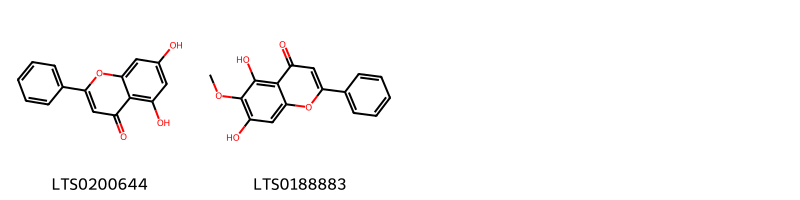{ width=100% }
    <figcaption>Hình ảnh cấu trúc hóa học của 2 hoạt chất thuộc nhóm Flavonoids gồm ['chrysin (LTS0200644)', 'oroxylin a (LTS0188883)'].</figcaption>
</figure>

---

### Dược dân tộc học

Danh sách các quốc gia có sử dụng *Pajanelia longifolia* trong điều trị các bệnh. 

| Country   | Disease                                       | Bệnh                                                                                                                                                                                                |
|:----------|:----------------------------------------------|:----------------------------------------------------------------------------------------------------------------------------------------------------------------------------------------------------|
| Elsewhere | Purgative, Stomachic, Antiseptic, Diaphoretic | MYMEMORY WARNING: YOU USED ALL AVAILABLE FREE TRANSLATIONS FOR TODAY. NEXT AVAILABLE IN  18 HOURS 57 MINUTES 17 SECONDS VISIT HTTPS://MYMEMORY.TRANSLATED.NET/DOC/USAGELIMITS.PHP TO TRANSLATE MORE |

---

# Chi Oroxylum

??? note "Danh sách các dược liệu thuộc chi"
    
	 - *Oroxylum indicum*

---
## Oroxylum indicum
### Thông tin về thực vật

!!! info "Phân loại thực vật của *Oroxylum indicum* từ GIBF:"
    - **Kingdom:** Plantae
    - **Phylum:** Tracheophyta
    - **Order:** Lamiales
    - **Family:** Bignoniaceae
    - **Genus:** Oroxylum
    - **Species:** *Oroxylum indicum*

 

| Label (VI)   | Label (EN)   | Scientific Name   | Descriptions (VI)   | Descriptions (EN)   | Also Known As (VI)   | Also Known As (EN)   |
|:-------------|:-------------|:------------------|:--------------------|:--------------------|:---------------------|:---------------------|
| N/A          | N/A          | Oroxylum indicum  |                     | species of tree     | ['']                 | ['']                 |

#### Phân bố trên thế giới

**Từ CSDL GIBF** Viet Nam, nan, Thailand, Bhutan, Myanmar, Philippines, Malaysia, India, Indonesia, Lao People’s Democratic Republic, Bangladesh, United States of America, China, Nepal, Jamaica, Cambodia, Hong Kong

#### Phân bố tại Việt Nam

**Từ CSDL GIBF**: Ninh Bình, Lâm Đồng, Ninh Binh, Hoa Binh, Đồng Nai

---
### Thành phần hóa học
        
- Theo cơ sở dữ liệu lotus: Từ loài *Oroxylum indicum* đã phân lập và xác định được 29 hoạt chất thuộc về các nhóm Stilbenes, Flavonoids, Diazines, Naphthofurans, Prenol lipids, Naphthopyrans, Tetralins, Steroids and steroid derivatives, Naphthalenes. 

|    | chemicalTaxonomyClassyfireClass   |   smiles_count |
|---:|:----------------------------------|---------------:|
|  0 | Diazines                          |              1 |
|  1 | Flavonoids                        |             18 |
|  2 | Naphthalenes                      |              1 |
|  3 | Naphthofurans                     |              2 |
|  4 | Naphthopyrans                     |              1 |
|  5 | Prenol lipids                     |              1 |
|  6 | Steroids and steroid derivatives  |              2 |
|  7 | Stilbenes                         |              2 |
|  8 | Tetralins                         |              1 |

#### Nhóm Diazines
<figure markdown="span">
    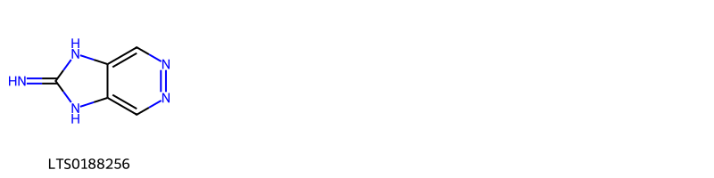{ width=100% }
    <figcaption>Hình ảnh cấu trúc hóa học của 1 hoạt chất thuộc nhóm Diazines gồm ['1h,3h-imidazo[4,5-d]pyridazin-2-imine (LTS0188256)'].</figcaption>
</figure>
#### Nhóm Flavonoids
<figure markdown="span">
    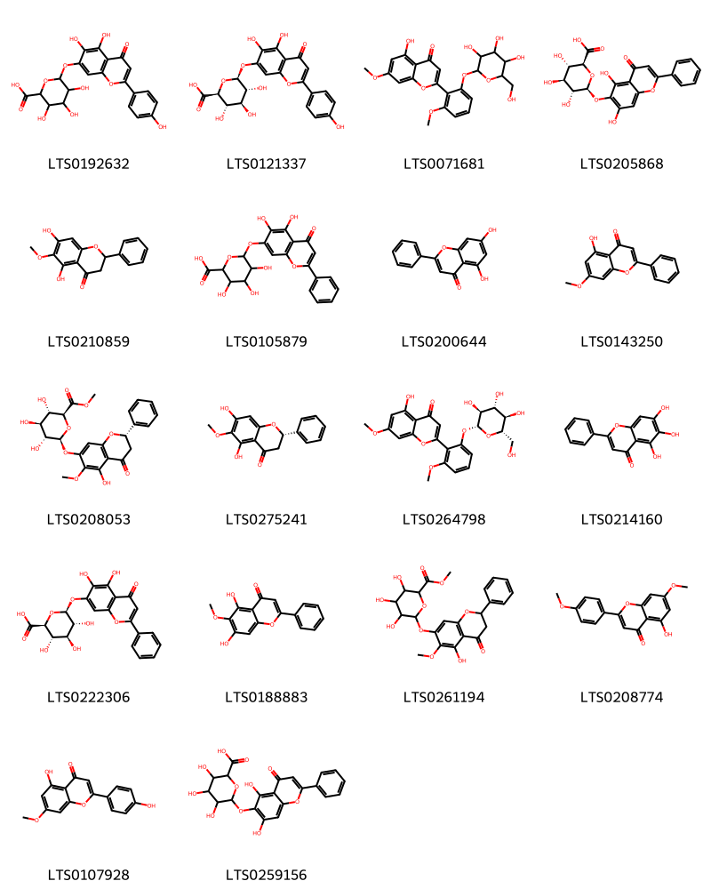{ width=100% }
    <figcaption>Hình ảnh cấu trúc hóa học của 18 hoạt chất thuộc nhóm Flavonoids gồm ['6-{[5,6-dihydroxy-2-(4-hydroxyphenyl)-4-oxochromen-7-yl]oxy}-3,4,5-trihydroxyoxane-2-carboxylic acid (LTS0192632)', 'scutellarin (LTS0121337)', '5-hydroxy-7-methoxy-2-(2-methoxy-6-{[3,4,5-trihydroxy-6-(hydroxymethyl)oxan-2-yl]oxy}phenyl)chromen-4-one (LTS0071681)', '(2s,3s,4s,5r,6s)-6-[(5,7-dihydroxy-4-oxo-2-phenylchromen-6-yl)oxy]-3,4,5-trihydroxyoxane-2-carboxylic acid (LTS0205868)', 'dihydrooroxylin a (LTS0210859)', '6-[(5,6-dihydroxy-4-oxo-2-phenylchromen-7-yl)oxy]-3,4,5-trihydroxyoxane-2-carboxylic acid (LTS0105879)', 'chrysin (LTS0200644)', 'tectochrysin (LTS0143250)', 'methyl (2s,3s,4s,5r,6s)-3,4,5-trihydroxy-6-{[(2s)-5-hydroxy-6-methoxy-4-oxo-2-phenyl-2,3-dihydro-1-benzopyran-7-yl]oxy}oxane-2-carboxylate (LTS0208053)', '(2s)-5,7-dihydroxy-6-methoxy-2-phenyl-2,3-dihydro-1-benzopyran-4-one (LTS0275241)', '5-hydroxy-7-methoxy-2-(2-methoxy-6-{[(2r,3s,4r,5r,6s)-3,4,5-trihydroxy-6-(hydroxymethyl)oxan-2-yl]oxy}phenyl)chromen-4-one (LTS0264798)', 'baicalein (LTS0214160)', 'baicalin (LTS0222306)', 'oroxylin a (LTS0188883)', 'methyl 3,4,5-trihydroxy-6-[(5-hydroxy-6-methoxy-4-oxo-2-phenyl-2,3-dihydro-1-benzopyran-7-yl)oxy]oxane-2-carboxylate (LTS0261194)', "apigenin 7,4'-dimethyl ether (LTS0208774)", 'genkwanin (LTS0107928)', '6-[(5,7-dihydroxy-4-oxo-2-phenylchromen-6-yl)oxy]-3,4,5-trihydroxyoxane-2-carboxylic acid (LTS0259156)'].</figcaption>
</figure>
#### Nhóm Naphthalenes
<figure markdown="span">
    { width=100% }
    <figcaption>Hình ảnh cấu trúc hóa học của 1 hoạt chất thuộc nhóm Naphthalenes gồm ['lapachol (LTS0088416)'].</figcaption>
</figure>
#### Nhóm Naphthofurans
<figure markdown="span">
    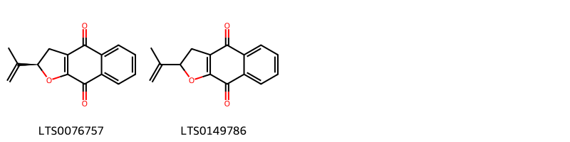{ width=100% }
    <figcaption>Hình ảnh cấu trúc hóa học của 2 hoạt chất thuộc nhóm Naphthofurans gồm ['(2r)-2-(prop-1-en-2-yl)-2h,3h-naphtho[2,3-b]furan-4,9-dione (LTS0076757)', '2-(prop-1-en-2-yl)-2h,3h-naphtho[2,3-b]furan-4,9-dione (LTS0149786)'].</figcaption>
</figure>
#### Nhóm Naphthopyrans
<figure markdown="span">
    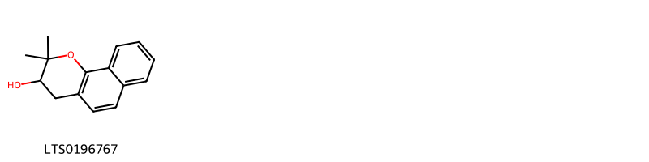{ width=100% }
    <figcaption>Hình ảnh cấu trúc hóa học của 1 hoạt chất thuộc nhóm Naphthopyrans gồm ['2,2-dimethyl-3h,4h-naphtho[1,2-b]pyran-3-ol (LTS0196767)'].</figcaption>
</figure>
#### Nhóm Prenol lipids
<figure markdown="span">
    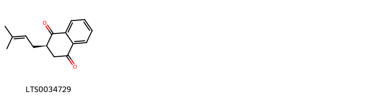{ width=100% }
    <figcaption>Hình ảnh cấu trúc hóa học của 1 hoạt chất thuộc nhóm Prenol lipids gồm ['(2r)-2-(3-methylbut-2-en-1-yl)-2,3-dihydronaphthalene-1,4-dione (LTS0034729)'].</figcaption>
</figure>
#### Nhóm Steroids and steroid derivatives
<figure markdown="span">
    { width=100% }
    <figcaption>Hình ảnh cấu trúc hóa học của 2 hoạt chất thuộc nhóm Steroids and steroid derivatives gồm ['stigmast-5-en-3-ol, (3β)- (LTS0204616)', 'stigmast-5-en-3-ol (LTS0071224)'].</figcaption>
</figure>
#### Nhóm Stilbenes
<figure markdown="span">
    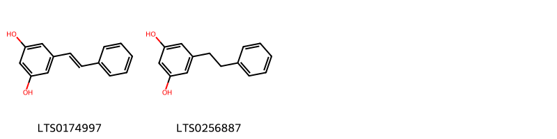{ width=100% }
    <figcaption>Hình ảnh cấu trúc hóa học của 2 hoạt chất thuộc nhóm Stilbenes gồm ['pinosylvin (LTS0174997)', 'dihydropinosylvin (LTS0256887)'].</figcaption>
</figure>
#### Nhóm Tetralins
<figure markdown="span">
    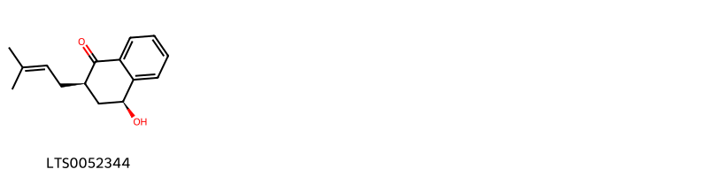{ width=100% }
    <figcaption>Hình ảnh cấu trúc hóa học của 1 hoạt chất thuộc nhóm Tetralins gồm ['(2r,4s)-4-hydroxy-2-(3-methylbut-2-en-1-yl)-3,4-dihydro-2h-naphthalen-1-one (LTS0052344)'].</figcaption>
</figure>

---

### Dược dân tộc học

Danh sách các quốc gia có sử dụng *Oroxylum indicum* trong điều trị các bệnh. 

| Country          | Disease                          | Bệnh                                                                                                                                                                                                |
|:-----------------|:---------------------------------|:----------------------------------------------------------------------------------------------------------------------------------------------------------------------------------------------------|
| China            | Diuretic                         | MYMEMORY WARNING: YOU USED ALL AVAILABLE FREE TRANSLATIONS FOR TODAY. NEXT AVAILABLE IN  18 HOURS 56 MINUTES 50 SECONDS VISIT HTTPS://MYMEMORY.TRANSLATED.NET/DOC/USAGELIMITS.PHP TO TRANSLATE MORE |
| Elsewhere        | Antiseptic, Stomachic, Purgative | MYMEMORY WARNING: YOU USED ALL AVAILABLE FREE TRANSLATIONS FOR TODAY. NEXT AVAILABLE IN  18 HOURS 56 MINUTES 46 SECONDS VISIT HTTPS://MYMEMORY.TRANSLATED.NET/DOC/USAGELIMITS.PHP TO TRANSLATE MORE |
| India(Ayurvedic) | Astringent, Diaphoretic, Tonic   | MYMEMORY WARNING: YOU USED ALL AVAILABLE FREE TRANSLATIONS FOR TODAY. NEXT AVAILABLE IN  18 HOURS 56 MINUTES 42 SECONDS VISIT HTTPS://MYMEMORY.TRANSLATED.NET/DOC/USAGELIMITS.PHP TO TRANSLATE MORE |
| India(Gujarat)   | Antiseptic, Vermicide            | MYMEMORY WARNING: YOU USED ALL AVAILABLE FREE TRANSLATIONS FOR TODAY. NEXT AVAILABLE IN  18 HOURS 56 MINUTES 38 SECONDS VISIT HTTPS://MYMEMORY.TRANSLATED.NET/DOC/USAGELIMITS.PHP TO TRANSLATE MORE |

---

# Chi Pandorea

??? note "Danh sách các dược liệu thuộc chi"
    
	 - *Pandorea pandorana*

---
## Pandorea pandorana
### Thông tin về thực vật

!!! info "Phân loại thực vật của *Pandorea pandorana* từ GIBF:"
    - **Kingdom:** Plantae
    - **Phylum:** Tracheophyta
    - **Order:** Lamiales
    - **Family:** Bignoniaceae
    - **Genus:** Pandorea
    - **Species:** *Pandorea pandorana*

 

| Label (VI)   | Label (EN)   | Scientific Name    | Descriptions (VI)   | Descriptions (EN)   | Also Known As (VI)   | Also Known As (EN)   |
|:-------------|:-------------|:-------------------|:--------------------|:--------------------|:---------------------|:---------------------|
| N/A          | N/A          | Pandorea pandorana | loài thực vật       | species of plant    | ['']                 | ['']                 |

#### Phân bố trên thế giới

**Từ CSDL GIBF** Australia, New Zealand

#### Phân bố tại Việt Nam

**Từ CSDL GIBF**: Không có ghi nhận ở Việt Nam

---
### Thành phần hóa học
        
- Theo cơ sở dữ liệu lotus: Từ loài *Pandorea pandorana* đã phân lập và xác định được Chưa có hoạt chất nào được phân lập. hoạt chất thuộc về các nhóm Không có hoạt chất nào được phân lập. 

Không có hình ảnh nào được tạo ra

---

### Dược dân tộc học

Danh sách các quốc gia có sử dụng *Pandorea pandorana* trong điều trị các bệnh. 

| Country   | Disease   | Bệnh                                                                                                                                                                                                |
|:----------|:----------|:----------------------------------------------------------------------------------------------------------------------------------------------------------------------------------------------------|
| Elsewhere | Poison    | MYMEMORY WARNING: YOU USED ALL AVAILABLE FREE TRANSLATIONS FOR TODAY. NEXT AVAILABLE IN  18 HOURS 55 MINUTES 36 SECONDS VISIT HTTPS://MYMEMORY.TRANSLATED.NET/DOC/USAGELIMITS.PHP TO TRANSLATE MORE |

---

# Chi Zeyheria

??? note "Danh sách các dược liệu thuộc chi"
    
	 - *Zeyheria tuberculosa*

---
## Zeyheria tuberculosa
### Thông tin về thực vật

!!! info "Phân loại thực vật của *Zeyheria tuberculosa* từ GIBF:"
    - **Kingdom:** Plantae
    - **Phylum:** Tracheophyta
    - **Order:** Lamiales
    - **Family:** Bignoniaceae
    - **Genus:** Zeyheria
    - **Species:** *Zeyheria tuberculosa*

 

| Label (VI)   | Label (EN)   | Scientific Name      | Descriptions (VI)   | Descriptions (EN)   | Also Known As (VI)   | Also Known As (EN)   |
|:-------------|:-------------|:---------------------|:--------------------|:--------------------|:---------------------|:---------------------|
| N/A          | N/A          | Zeyheria tuberculosa | loài thực vật       | species of plant    | ['']                 | ['']                 |

#### Phân bố trên thế giới

**Từ CSDL GIBF** Viet Nam, Paraguay, Bolivia (Plurinational State of), Brazil

#### Phân bố tại Việt Nam

**Từ CSDL GIBF**: Không có ghi nhận ở Việt Nam

---
### Thành phần hóa học
        
- Theo cơ sở dữ liệu lotus: Từ loài *Zeyheria tuberculosa* đã phân lập và xác định được Chưa có hoạt chất nào được phân lập. hoạt chất thuộc về các nhóm Không có hoạt chất nào được phân lập. 

Không có hình ảnh nào được tạo ra

---

### Dược dân tộc học

Danh sách các quốc gia có sử dụng *Zeyheria tuberculosa* trong điều trị các bệnh. 

| Country   | Disease   | Bệnh                                                                                                                                                                                                |
|:----------|:----------|:----------------------------------------------------------------------------------------------------------------------------------------------------------------------------------------------------|
| Brazil    | Tonic     | MYMEMORY WARNING: YOU USED ALL AVAILABLE FREE TRANSLATIONS FOR TODAY. NEXT AVAILABLE IN  18 HOURS 55 MINUTES 03 SECONDS VISIT HTTPS://MYMEMORY.TRANSLATED.NET/DOC/USAGELIMITS.PHP TO TRANSLATE MORE |

---

# Chi Crescentia

??? note "Danh sách các dược liệu thuộc chi"
    
	 - *Crescentia alata*
	 - *Crescentia cujete*
	 - *Crescentia linearifolia*

---
## Crescentia alata
### Thông tin về thực vật

!!! info "Phân loại thực vật của *Crescentia alata* từ GIBF:"
    - **Kingdom:** Plantae
    - **Phylum:** Tracheophyta
    - **Order:** Lamiales
    - **Family:** Bignoniaceae
    - **Genus:** Crescentia
    - **Species:** *Crescentia alata*

 

| Label (VI)   | Label (EN)   | Scientific Name   | Descriptions (VI)   | Descriptions (EN)   | Also Known As (VI)   | Also Known As (EN)   |
|:-------------|:-------------|:------------------|:--------------------|:--------------------|:---------------------|:---------------------|
| N/A          | N/A          | Crescentia alata  | loài thực vật       | species of plant    | ['']                 | ['']                 |

#### Phân bố trên thế giới

**Từ CSDL GIBF** Honduras, Thailand, El Salvador, Nicaragua, Brazil, Puerto Rico, India, Costa Rica, Mexico, Virgin Islands (U.S.), Hong Kong, Guatemala

#### Phân bố tại Việt Nam

**Từ CSDL GIBF**: Không có ghi nhận ở Việt Nam

---
### Thành phần hóa học
        
- Theo cơ sở dữ liệu lotus: Từ loài *Crescentia alata* đã phân lập và xác định được 15 hoạt chất thuộc về các nhóm Organooxygen compounds, Flavonoids, Lactones, Prenol lipids, Tetrahydrofurans. 

|    | chemicalTaxonomyClassyfireClass   |   smiles_count |
|---:|:----------------------------------|---------------:|
|  0 | Flavonoids                        |              5 |
|  1 | Lactones                          |              1 |
|  2 | Organooxygen compounds            |              3 |
|  3 | Prenol lipids                     |              4 |
|  4 | Tetrahydrofurans                  |              2 |

#### Nhóm Flavonoids
<figure markdown="span">
    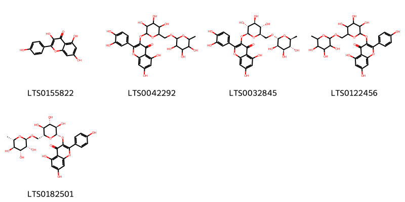{ width=100% }
    <figcaption>Hình ảnh cấu trúc hóa học của 5 hoạt chất thuộc nhóm Flavonoids gồm ['kaempherol (LTS0155822)', 'rutin (LTS0042292)', '3-rutinosyl quercetin (LTS0032845)', '5,7-dihydroxy-2-(4-hydroxyphenyl)-3-[(3,4,5-trihydroxy-6-{[(3,4,5-trihydroxy-6-methyloxan-2-yl)oxy]methyl}oxan-2-yl)oxy]chromen-4-one (LTS0122456)', 'nictoflorin (LTS0182501)'].</figcaption>
</figure>
#### Nhóm Lactones
<figure markdown="span">
    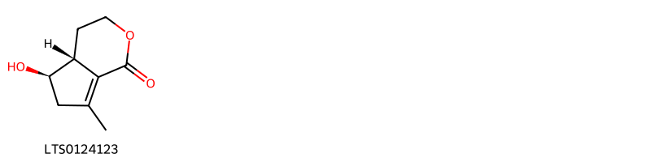{ width=100% }
    <figcaption>Hình ảnh cấu trúc hóa học của 1 hoạt chất thuộc nhóm Lactones gồm ['(4ar,5r)-5-hydroxy-7-methyl-3h,4h,4ah,5h,6h-cyclopenta[c]pyran-1-one (LTS0124123)'].</figcaption>
</figure>
#### Nhóm Organooxygen compounds
<figure markdown="span">
    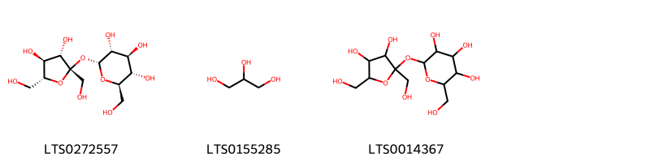{ width=100% }
    <figcaption>Hình ảnh cấu trúc hóa học của 3 hoạt chất thuộc nhóm Organooxygen compounds gồm ['sucrose (LTS0272557)', 'glycerol (LTS0155285)', 'granulated sugar (LTS0014367)'].</figcaption>
</figure>
#### Nhóm Prenol lipids
<figure markdown="span">
    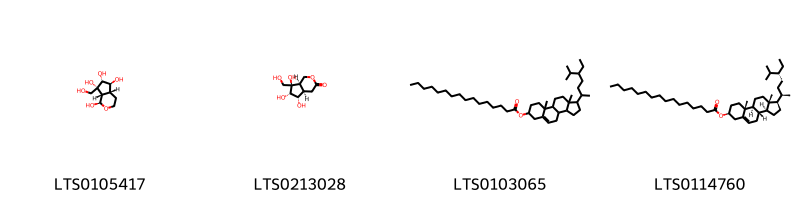{ width=100% }
    <figcaption>Hình ảnh cấu trúc hóa học của 4 hoạt chất thuộc nhóm Prenol lipids gồm ['(1r,4ar,5s,6r,7r,7as)-7-(hydroxymethyl)-hexahydro-1h-cyclopenta[c]pyran-1,5,6,7-tetrol (LTS0105417)', '(4ar,5s,6s,7r,7ar)-5,6,7-trihydroxy-7-(hydroxymethyl)-hexahydrocyclopenta[c]pyran-3-one (LTS0213028)', '1-(5-ethyl-6-methylheptan-2-yl)-9a,11a-dimethyl-1h,2h,3h,3ah,3bh,4h,6h,7h,8h,9h,9bh,10h,11h-cyclopenta[a]phenanthren-7-yl hexadecanoate (LTS0103065)', 'β-sitosteryl palmitate (LTS0114760)'].</figcaption>
</figure>
#### Nhóm Tetrahydrofurans
<figure markdown="span">
    { width=100% }
    <figcaption>Hình ảnh cấu trúc hóa học của 2 hoạt chất thuộc nhóm Tetrahydrofurans gồm ['[(3ar,4s,6ar)-5-(hydroxymethyl)-2h,3h,3ah,4h,6ah-cyclopenta[b]furan-4-yl]methanol (LTS0079844)', '[5-(hydroxymethyl)-2h,3h,3ah,4h,6ah-cyclopenta[b]furan-4-yl]methanol (LTS0162387)'].</figcaption>
</figure>

---

### Dược dân tộc học

Danh sách các quốc gia có sử dụng *Crescentia alata* trong điều trị các bệnh. 

| Country   | Disease                                                     | Bệnh                                                                                                                                                                                                |
|:----------|:------------------------------------------------------------|:----------------------------------------------------------------------------------------------------------------------------------------------------------------------------------------------------|
| Mexico    | Abortifacient, Emollient, Expectorant, Laxative, Astringent | MYMEMORY WARNING: YOU USED ALL AVAILABLE FREE TRANSLATIONS FOR TODAY. NEXT AVAILABLE IN  18 HOURS 54 MINUTES 24 SECONDS VISIT HTTPS://MYMEMORY.TRANSLATED.NET/DOC/USAGELIMITS.PHP TO TRANSLATE MORE |

---

---
## Crescentia cujete
### Thông tin về thực vật

!!! info "Phân loại thực vật của *Crescentia cujete* từ GIBF:"
    - **Kingdom:** Plantae
    - **Phylum:** Tracheophyta
    - **Order:** Lamiales
    - **Family:** Bignoniaceae
    - **Genus:** Crescentia
    - **Species:** *Crescentia cujete*

 

| Label (VI)   | Label (EN)   | Scientific Name   | Descriptions (VI)   | Descriptions (EN)   | Also Known As (VI)    | Also Known As (EN)   |
|:-------------|:-------------|:------------------|:--------------------|:--------------------|:----------------------|:---------------------|
| N/A          | N/A          | Crescentia cujete | loài thực vật       | species of plant    | ['Crescentia cujete'] | ['tzimah tree']      |

#### Phân bố trên thế giới

**Từ CSDL GIBF** Viet Nam, Cayman Islands, Honduras, Thailand, El Salvador, Guadeloupe, Dominica, Philippines, French Guiana, Lao People’s Democratic Republic, Martinique, Jamaica, Indonesia, Guatemala, Haiti, Colombia, Sri Lanka, Dominican Republic, Malaysia, Puerto Rico, India, Sao Tome and Principe, Nigeria, Cuba, Bahamas, Anguilla, Bonaire, Sint Eustatius and Saba, Virgin Islands (U.S.), Cambodia, Barbados, Belize, Nicaragua, Panama, Brazil, Saint Lucia, Montserrat, Mexico, China, Benin, Curaçao, Bolivia (Plurinational State of), Costa Rica, Ecuador, United States of America

#### Phân bố tại Việt Nam

**Từ CSDL GIBF**: Quảng Nam, Ninh Bình, Hải Phòng, Khánh Hòa, Đà Nẵng, Thừa Thiên - Huế

---
### Thành phần hóa học
        
- Theo cơ sở dữ liệu lotus: Từ loài *Crescentia cujete* đã phân lập và xác định được 67 hoạt chất thuộc về các nhóm Organooxygen compounds, Naphthofurans, Prenol lipids, Lignan glycosides, Fatty Acyls, Dihydrofurans, Tetrahydrofurans, Benzene and substituted derivatives. 

|    | chemicalTaxonomyClassyfireClass     |   smiles_count |
|---:|:------------------------------------|---------------:|
|  0 | Benzene and substituted derivatives |              7 |
|  1 | Dihydrofurans                       |              2 |
|  2 | Fatty Acyls                         |             16 |
|  3 | Lignan glycosides                   |              3 |
|  4 | Naphthofurans                       |              2 |
|  5 | Organooxygen compounds              |             14 |
|  6 | Prenol lipids                       |             21 |
|  7 | Tetrahydrofurans                    |              2 |

#### Nhóm Benzene and substituted derivatives
<figure markdown="span">
    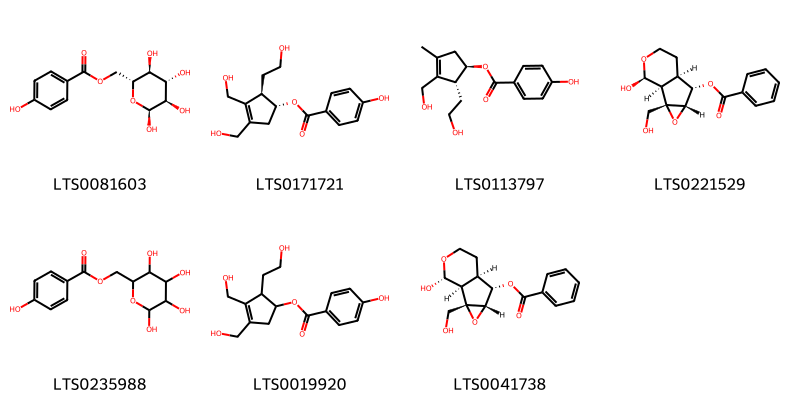{ width=100% }
    <figcaption>Hình ảnh cấu trúc hóa học của 7 hoạt chất thuộc nhóm Benzene and substituted derivatives gồm ['[(2r,3s,4s,5r,6s)-3,4,5,6-tetrahydroxyoxan-2-yl]methyl 4-hydroxybenzoate (LTS0081603)', '(1r,2r)-2-(2-hydroxyethyl)-3,4-bis(hydroxymethyl)cyclopent-3-en-1-yl 4-hydroxybenzoate (LTS0171721)', '(1r,2r)-2-(2-hydroxyethyl)-3-(hydroxymethyl)-4-methylcyclopent-3-en-1-yl 4-hydroxybenzoate (LTS0113797)', '(1s,2s,4s,5s,6r,10s)-10-hydroxy-2-(hydroxymethyl)-3,9-dioxatricyclo[4.4.0.0²,⁴]decan-5-yl benzoate (LTS0221529)', '(3,4,5,6-tetrahydroxyoxan-2-yl)methyl 4-hydroxybenzoate (LTS0235988)', '2-(2-hydroxyethyl)-3,4-bis(hydroxymethyl)cyclopent-3-en-1-yl 4-hydroxybenzoate (LTS0019920)', '(1s,2s,4s,5s,6r,10r)-10-hydroxy-2-(hydroxymethyl)-3,9-dioxatricyclo[4.4.0.0²,⁴]decan-5-yl benzoate (LTS0041738)'].</figcaption>
</figure>
#### Nhóm Dihydrofurans
<figure markdown="span">
    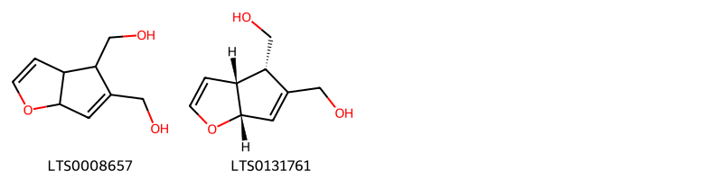{ width=100% }
    <figcaption>Hình ảnh cấu trúc hóa học của 2 hoạt chất thuộc nhóm Dihydrofurans gồm ['[5-(hydroxymethyl)-3ah,4h,6ah-cyclopenta[b]furan-4-yl]methanol (LTS0008657)', '[(3as,4s,6ar)-5-(hydroxymethyl)-3ah,4h,6ah-cyclopenta[b]furan-4-yl]methanol (LTS0131761)'].</figcaption>
</figure>
#### Nhóm Fatty Acyls
<figure markdown="span">
    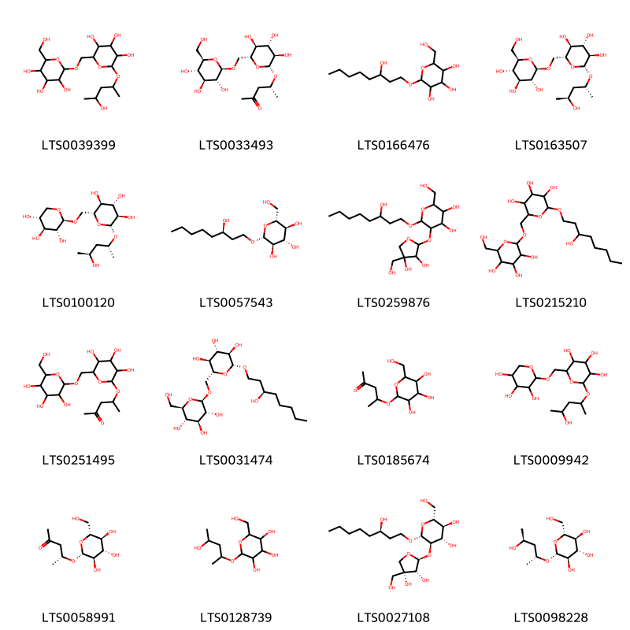{ width=100% }
    <figcaption>Hình ảnh cấu trúc hóa học của 16 hoạt chất thuộc nhóm Fatty Acyls gồm ['2-[(4-hydroxypentan-2-yl)oxy]-6-({[3,4,5-trihydroxy-6-(hydroxymethyl)oxan-2-yl]oxy}methyl)oxane-3,4,5-triol (LTS0039399)', '(4r)-4-{[(2r,3r,4s,5s,6r)-3,4,5-trihydroxy-6-({[(2r,3r,4s,5s,6r)-3,4,5-trihydroxy-6-(hydroxymethyl)oxan-2-yl]oxy}methyl)oxan-2-yl]oxy}pentan-2-one (LTS0033493)', '2-(hydroxymethyl)-6-[(3-hydroxyoctyl)oxy]oxane-3,4,5-triol (LTS0166476)', '(2r,3r,4s,5s,6r)-2-{[(2r,4s)-4-hydroxypentan-2-yl]oxy}-6-({[(2r,3r,4s,5s,6r)-3,4,5-trihydroxy-6-(hydroxymethyl)oxan-2-yl]oxy}methyl)oxane-3,4,5-triol (LTS0163507)', '(2r,3r,4s,5s,6r)-2-{[(2r,4s)-4-hydroxypentan-2-yl]oxy}-6-({[(2s,3r,4s,5r)-3,4,5-trihydroxyoxan-2-yl]oxy}methyl)oxane-3,4,5-triol (LTS0100120)', '(2r,3s,4s,5r,6r)-2-(hydroxymethyl)-6-{[(3r)-3-hydroxyoctyl]oxy}oxane-3,4,5-triol (LTS0057543)', '5-{[3,4-dihydroxy-4-(hydroxymethyl)oxolan-2-yl]oxy}-2-(hydroxymethyl)-6-[(3-hydroxyoctyl)oxy]oxane-3,4-diol (LTS0259876)', '2-[(3-hydroxyoctyl)oxy]-6-({[3,4,5-trihydroxy-6-(hydroxymethyl)oxan-2-yl]oxy}methyl)oxane-3,4,5-triol (LTS0215210)', '4-{[3,4,5-trihydroxy-6-({[3,4,5-trihydroxy-6-(hydroxymethyl)oxan-2-yl]oxy}methyl)oxan-2-yl]oxy}pentan-2-one (LTS0251495)', '(2r,3r,4s,5s,6r)-2-{[(3r)-3-hydroxyoctyl]oxy}-6-({[(2r,3r,4s,5s,6r)-3,4,5-trihydroxy-6-(hydroxymethyl)oxan-2-yl]oxy}methyl)oxane-3,4,5-triol (LTS0031474)', '4-{[3,4,5-trihydroxy-6-(hydroxymethyl)oxan-2-yl]oxy}pentan-2-one (LTS0185674)', '2-[(4-hydroxypentan-2-yl)oxy]-6-{[(3,4,5-trihydroxyoxan-2-yl)oxy]methyl}oxane-3,4,5-triol (LTS0009942)', '(4r)-4-{[(2r,3r,4s,5s,6r)-3,4,5-trihydroxy-6-(hydroxymethyl)oxan-2-yl]oxy}pentan-2-one (LTS0058991)', '2-(hydroxymethyl)-6-[(4-hydroxypentan-2-yl)oxy]oxane-3,4,5-triol (LTS0128739)', '(2r,3s,4s,5r,6r)-5-{[(2s,3r,4r)-3,4-dihydroxy-4-(hydroxymethyl)oxolan-2-yl]oxy}-2-(hydroxymethyl)-6-{[(3r)-3-hydroxyoctyl]oxy}oxane-3,4-diol (LTS0027108)', '(2r,3s,4s,5r,6r)-2-(hydroxymethyl)-6-{[(2r,4s)-4-hydroxypentan-2-yl]oxy}oxane-3,4,5-triol (LTS0098228)'].</figcaption>
</figure>
#### Nhóm Lignan glycosides
<figure markdown="span">
    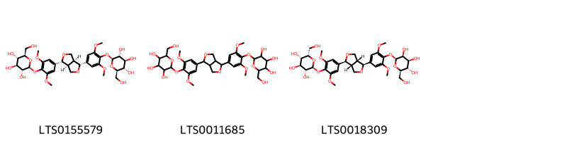{ width=100% }
    <figcaption>Hình ảnh cấu trúc hóa học của 3 hoạt chất thuộc nhóm Lignan glycosides gồm ['acanthoside d (LTS0155579)', '2-{4-[4-(3,5-dimethoxy-4-{[3,4,5-trihydroxy-6-(hydroxymethyl)oxan-2-yl]oxy}phenyl)-hexahydrofuro[3,4-c]furan-1-yl]-2,6-dimethoxyphenoxy}-6-(hydroxymethyl)oxane-3,4,5-triol (LTS0011685)', '(2s,3r,4s,5s,6s)-2-{4-[(1s,3ar,4s,6ar)-4-(3,5-dimethoxy-4-{[(2s,3s,4s,5s,6r)-3,4,5-trihydroxy-6-(hydroxymethyl)oxan-2-yl]oxy}phenyl)-hexahydrofuro[3,4-c]furan-1-yl]-2,6-dimethoxyphenoxy}-6-(hydroxymethyl)oxane-3,4,5-triol (LTS0018309)'].</figcaption>
</figure>
#### Nhóm Naphthofurans
<figure markdown="span">
    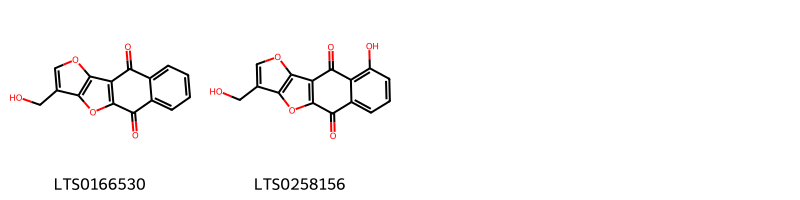{ width=100% }
    <figcaption>Hình ảnh cấu trúc hóa học của 2 hoạt chất thuộc nhóm Naphthofurans gồm ['14-(hydroxymethyl)-12,16-dioxatetracyclo[8.6.0.0³,⁸.0¹¹,¹⁵]hexadeca-1(10),3,5,7,11(15),13-hexaene-2,9-dione (LTS0166530)', '7-hydroxy-14-(hydroxymethyl)-12,16-dioxatetracyclo[8.6.0.0³,⁸.0¹¹,¹⁵]hexadeca-1(10),3,5,7,11(15),13-hexaene-2,9-dione (LTS0258156)'].</figcaption>
</figure>
#### Nhóm Organooxygen compounds
<figure markdown="span">
    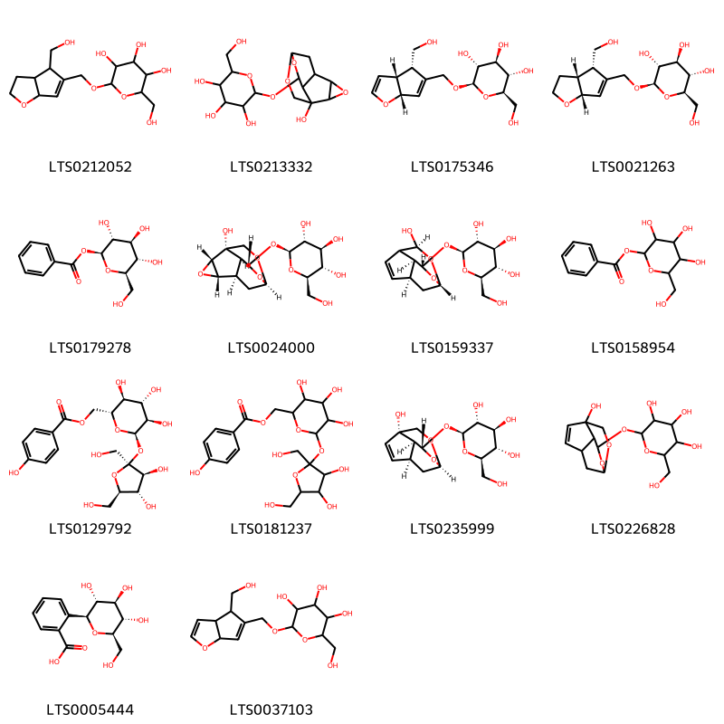{ width=100% }
    <figcaption>Hình ảnh cấu trúc hóa học của 14 hoạt chất thuộc nhóm Organooxygen compounds gồm ['2-(hydroxymethyl)-6-{[4-(hydroxymethyl)-2h,3h,3ah,4h,6ah-cyclopenta[b]furan-5-yl]methoxy}oxane-3,4,5-triol (LTS0212052)', '2-({5-hydroxy-3,7,9-trioxatetracyclo[6.3.1.0²,⁴.0⁵,¹¹]dodecan-10-yl}oxy)-6-(hydroxymethyl)oxane-3,4,5-triol (LTS0213332)', '(2r,3r,4s,5s,6r)-2-{[(3as,4s,6ar)-4-(hydroxymethyl)-3ah,4h,6ah-cyclopenta[b]furan-5-yl]methoxy}-6-(hydroxymethyl)oxane-3,4,5-triol (LTS0175346)', '(2r,3r,4s,5s,6r)-2-{[(3ar,4s,6ar)-4-(hydroxymethyl)-2h,3h,3ah,4h,6ah-cyclopenta[b]furan-5-yl]methoxy}-6-(hydroxymethyl)oxane-3,4,5-triol (LTS0021263)', 'benzoyl-β-d-glucoside (LTS0179278)', '(2s,3r,4s,5s,6r)-2-{[(1r,2s,4s,5s,8r,10s,11s)-5-hydroxy-3,7,9-trioxatetracyclo[6.3.1.0²,⁴.0⁵,¹¹]dodecan-10-yl]oxy}-6-(hydroxymethyl)oxane-3,4,5-triol (LTS0024000)', '(2s,3r,4s,5s,6r)-2-{[(1s,3s,7s,8s,9s)-3-hydroxy-2,10-dioxatricyclo[5.3.1.0⁴,⁸]undec-5-en-9-yl]oxy}-6-(hydroxymethyl)oxane-3,4,5-triol (LTS0159337)', 'benzoyl-β-d-glucoside (LTS0158954)', '[(2r,3s,4s,5r,6r)-6-{[(2s,3s,4s,5r)-3,4-dihydroxy-2,5-bis(hydroxymethyl)oxolan-2-yl]oxy}-3,4,5-trihydroxyoxan-2-yl]methyl 4-hydroxybenzoate (LTS0129792)', '(6-{[3,4-dihydroxy-2,5-bis(hydroxymethyl)oxolan-2-yl]oxy}-3,4,5-trihydroxyoxan-2-yl)methyl 4-hydroxybenzoate (LTS0181237)', '(2s,3r,4s,5s,6r)-2-{[(1r,4s,7s,8s,9s)-4-hydroxy-2,10-dioxatricyclo[5.3.1.0⁴,⁸]undec-5-en-9-yl]oxy}-6-(hydroxymethyl)oxane-3,4,5-triol (LTS0235999)', '2-({4-hydroxy-2,10-dioxatricyclo[5.3.1.0⁴,⁸]undec-5-en-9-yl}oxy)-6-(hydroxymethyl)oxane-3,4,5-triol (LTS0226828)', '2-[(2s,3r,4r,5s,6r)-3,4,5-trihydroxy-6-(hydroxymethyl)oxan-2-yl]benzoic acid (LTS0005444)', '2-(hydroxymethyl)-6-{[4-(hydroxymethyl)-3ah,4h,6ah-cyclopenta[b]furan-5-yl]methoxy}oxane-3,4,5-triol (LTS0037103)'].</figcaption>
</figure>
#### Nhóm Prenol lipids
<figure markdown="span">
    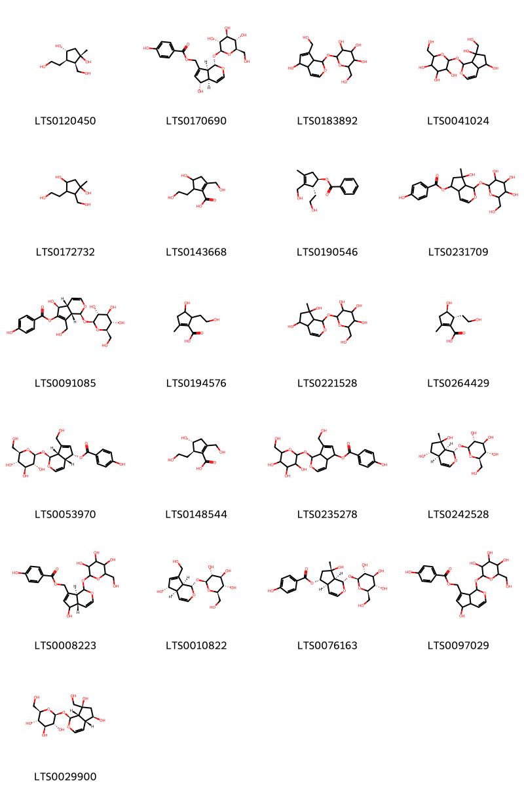{ width=100% }
    <figcaption>Hình ảnh cấu trúc hóa học của 21 hoạt chất thuộc nhóm Prenol lipids gồm ['(1s,3r,4r,5r)-4-(2-hydroxyethyl)-5-(hydroxymethyl)-1-methylcyclopentane-1,3-diol (LTS0120450)', 'agnuside (LTS0170690)', 'aucubin (LTS0183892)', '2-{[5,7-dihydroxy-7-(hydroxymethyl)-1h,4ah,5h,6h,7ah-cyclopenta[c]pyran-1-yl]oxy}-6-(hydroxymethyl)oxane-3,4,5-triol (LTS0041024)', '4-(2-hydroxyethyl)-5-(hydroxymethyl)-1-methylcyclopentane-1,3-diol (LTS0172732)', '4-hydroxy-5-(2-hydroxyethyl)-2-(hydroxymethyl)cyclopent-1-ene-1-carboxylic acid (LTS0143668)', '(1r,2r)-2-(2-hydroxyethyl)-3-(hydroxymethyl)-4-methylcyclopent-3-en-1-yl benzoate (LTS0190546)', '7-hydroxy-7-methyl-1-{[3,4,5-trihydroxy-6-(hydroxymethyl)oxan-2-yl]oxy}-1h,4ah,5h,6h,7ah-cyclopenta[c]pyran-5-yl 4-hydroxybenzoate (LTS0231709)', '(1s,4ar,5s,7as)-5-hydroxy-7-(hydroxymethyl)-1-{[(2s,3r,4s,5s,6r)-3,4,5-trihydroxy-6-(hydroxymethyl)oxan-2-yl]oxy}-1h,4ah,5h,7ah-cyclopenta[c]pyran-6-yl 4-hydroxybenzoate (LTS0091085)', '4-hydroxy-5-(2-hydroxyethyl)-2-methylcyclopent-1-ene-1-carboxylic acid (LTS0194576)', '2-({5,7-dihydroxy-7-methyl-1h,4ah,5h,6h,7ah-cyclopenta[c]pyran-1-yl}oxy)-6-(hydroxymethyl)oxane-3,4,5-triol (LTS0221528)', '(4r,5r)-4-hydroxy-5-(2-hydroxyethyl)-2-methylcyclopent-1-ene-1-carboxylic acid (LTS0264429)', '(1s,4ar,5r,7as)-7-(hydroxymethyl)-1-{[(2s,3r,4s,5s,6r)-3,4,5-trihydroxy-6-(hydroxymethyl)oxan-2-yl]oxy}-1h,4ah,5h,7ah-cyclopenta[c]pyran-5-yl 4-hydroxybenzoate (LTS0053970)', '(4r,5r)-4-hydroxy-5-(2-hydroxyethyl)-2-(hydroxymethyl)cyclopent-1-ene-1-carboxylic acid (LTS0148544)', '7-(hydroxymethyl)-1-{[3,4,5-trihydroxy-6-(hydroxymethyl)oxan-2-yl]oxy}-1h,4ah,5h,7ah-cyclopenta[c]pyran-5-yl 4-hydroxybenzoate (LTS0235278)', '(2s,3r,4s,5s,6r)-2-{[(1s,4ar,5r,7s,7as)-5,7-dihydroxy-7-methyl-1h,4ah,5h,6h,7ah-cyclopenta[c]pyran-1-yl]oxy}-6-(hydroxymethyl)oxane-3,4,5-triol (LTS0242528)', '[(4as,7as)-5-hydroxy-1-{[3,4,5-trihydroxy-6-(hydroxymethyl)oxan-2-yl]oxy}-1h,4ah,5h,7ah-cyclopenta[c]pyran-7-yl]methyl 4-hydroxybenzoate (LTS0008223)', 'aucubin (LTS0010822)', '(1s,4ar,5r,7s,7as)-7-hydroxy-7-methyl-1-{[(2s,3r,4s,5s,6r)-3,4,5-trihydroxy-6-(hydroxymethyl)oxan-2-yl]oxy}-1h,4ah,5h,6h,7ah-cyclopenta[c]pyran-5-yl 4-hydroxybenzoate (LTS0076163)', '(5-hydroxy-1-{[3,4,5-trihydroxy-6-(hydroxymethyl)oxan-2-yl]oxy}-1h,4ah,5h,7ah-cyclopenta[c]pyran-7-yl)methyl 4-hydroxybenzoate (LTS0097029)', '(2s,3r,4s,5s,6r)-2-{[(1s,4ar,5r,7s,7as)-5,7-dihydroxy-7-(hydroxymethyl)-1h,4ah,5h,6h,7ah-cyclopenta[c]pyran-1-yl]oxy}-6-(hydroxymethyl)oxane-3,4,5-triol (LTS0029900)'].</figcaption>
</figure>
#### Nhóm Tetrahydrofurans
<figure markdown="span">
    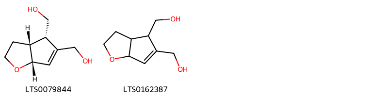{ width=100% }
    <figcaption>Hình ảnh cấu trúc hóa học của 2 hoạt chất thuộc nhóm Tetrahydrofurans gồm ['[(3ar,4s,6ar)-5-(hydroxymethyl)-2h,3h,3ah,4h,6ah-cyclopenta[b]furan-4-yl]methanol (LTS0079844)', '[5-(hydroxymethyl)-2h,3h,3ah,4h,6ah-cyclopenta[b]furan-4-yl]methanol (LTS0162387)'].</figcaption>
</figure>

---

### Dược dân tộc học

Danh sách các quốc gia có sử dụng *Crescentia cujete* trong điều trị các bệnh. 

| Country            | Disease                                                                                                                                                                | Bệnh                                                                                                                                                                                                |
|:-------------------|:-----------------------------------------------------------------------------------------------------------------------------------------------------------------------|:----------------------------------------------------------------------------------------------------------------------------------------------------------------------------------------------------|
| Brazil             | Expectorant                                                                                                                                                            | MYMEMORY WARNING: YOU USED ALL AVAILABLE FREE TRANSLATIONS FOR TODAY. NEXT AVAILABLE IN  18 HOURS 53 MINUTES 31 SECONDS VISIT HTTPS://MYMEMORY.TRANSLATED.NET/DOC/USAGELIMITS.PHP TO TRANSLATE MORE |
| Cuba               | Astringent, Emetic, Laxative, Emetic                                                                                                                                   | MYMEMORY WARNING: YOU USED ALL AVAILABLE FREE TRANSLATIONS FOR TODAY. NEXT AVAILABLE IN  18 HOURS 53 MINUTES 28 SECONDS VISIT HTTPS://MYMEMORY.TRANSLATED.NET/DOC/USAGELIMITS.PHP TO TRANSLATE MORE |
| Curacao            | Expectorant, Expectorant, Poultice                                                                                                                                     | MYMEMORY WARNING: YOU USED ALL AVAILABLE FREE TRANSLATIONS FOR TODAY. NEXT AVAILABLE IN  18 HOURS 53 MINUTES 24 SECONDS VISIT HTTPS://MYMEMORY.TRANSLATED.NET/DOC/USAGELIMITS.PHP TO TRANSLATE MORE |
| Dominican Republic | Apertif                                                                                                                                                                | MYMEMORY WARNING: YOU USED ALL AVAILABLE FREE TRANSLATIONS FOR TODAY. NEXT AVAILABLE IN  18 HOURS 53 MINUTES 20 SECONDS VISIT HTTPS://MYMEMORY.TRANSLATED.NET/DOC/USAGELIMITS.PHP TO TRANSLATE MORE |
| Elsewhere          | Astringent, Diuretic, Emollient, Expectorant, Laxative, Poison, Purgative, Refrigerant, Abortifacient, Expectorant, Aperient, Astringent, Ecbolic, Emollient, Laxative | MYMEMORY WARNING: YOU USED ALL AVAILABLE FREE TRANSLATIONS FOR TODAY. NEXT AVAILABLE IN  18 HOURS 53 MINUTES 17 SECONDS VISIT HTTPS://MYMEMORY.TRANSLATED.NET/DOC/USAGELIMITS.PHP TO TRANSLATE MORE |
| Haiti              | Diuretic, Aphrodisiac                                                                                                                                                  | MYMEMORY WARNING: YOU USED ALL AVAILABLE FREE TRANSLATIONS FOR TODAY. NEXT AVAILABLE IN  18 HOURS 53 MINUTES 14 SECONDS VISIT HTTPS://MYMEMORY.TRANSLATED.NET/DOC/USAGELIMITS.PHP TO TRANSLATE MORE |
| Malaya             | Diuretic                                                                                                                                                               | MYMEMORY WARNING: YOU USED ALL AVAILABLE FREE TRANSLATIONS FOR TODAY. NEXT AVAILABLE IN  18 HOURS 53 MINUTES 10 SECONDS VISIT HTTPS://MYMEMORY.TRANSLATED.NET/DOC/USAGELIMITS.PHP TO TRANSLATE MORE |
| Mexico             | Abortifacient, Astringent, Emollient, Styptic, Vulnerary, Expectorant, Laxative                                                                                        | MYMEMORY WARNING: YOU USED ALL AVAILABLE FREE TRANSLATIONS FOR TODAY. NEXT AVAILABLE IN  18 HOURS 53 MINUTES 05 SECONDS VISIT HTTPS://MYMEMORY.TRANSLATED.NET/DOC/USAGELIMITS.PHP TO TRANSLATE MORE |
| Panama             | Ecbolic, Emetic, Emmenagogue, Laxative, Vermifuge, Tranquilizer                                                                                                        | MYMEMORY WARNING: YOU USED ALL AVAILABLE FREE TRANSLATIONS FOR TODAY. NEXT AVAILABLE IN  18 HOURS 53 MINUTES 02 SECONDS VISIT HTTPS://MYMEMORY.TRANSLATED.NET/DOC/USAGELIMITS.PHP TO TRANSLATE MORE |
| Venezuela          | Emmenagogue, Purgative                                                                                                                                                 | MYMEMORY WARNING: YOU USED ALL AVAILABLE FREE TRANSLATIONS FOR TODAY. NEXT AVAILABLE IN  18 HOURS 52 MINUTES 52 SECONDS VISIT HTTPS://MYMEMORY.TRANSLATED.NET/DOC/USAGELIMITS.PHP TO TRANSLATE MORE |

---

---
## Crescentia linearifolia
### Thông tin về thực vật

!!! info "Phân loại thực vật của *Crescentia linearifolia* từ GIBF:"
    - **Kingdom:** Plantae
    - **Phylum:** Tracheophyta
    - **Order:** Lamiales
    - **Family:** Bignoniaceae
    - **Genus:** Crescentia
    - **Species:** *Crescentia linearifolia*

 

| Label (VI)   | Label (EN)   | Scientific Name         | Descriptions (VI)   | Descriptions (EN)   | Also Known As (VI)   | Also Known As (EN)   |
|:-------------|:-------------|:------------------------|:--------------------|:--------------------|:---------------------|:---------------------|
| N/A          | N/A          | Crescentia linearifolia |                     | species of plant    | ['']                 | ['']                 |

#### Phân bố trên thế giới

**Từ CSDL GIBF** nan, Haiti, Saint Martin (French part), Virgin Islands (British), Dominican Republic, Belize, Sint Maarten (Dutch part), Guadeloupe, Puerto Rico, United States of America, Mexico, Saint Barthélemy, Virgin Islands (U.S.), Jamaica

#### Phân bố tại Việt Nam

**Từ CSDL GIBF**: Không có ghi nhận ở Việt Nam

---
### Thành phần hóa học
        
- Theo cơ sở dữ liệu lotus: Từ loài *Crescentia linearifolia* đã phân lập và xác định được Chưa có hoạt chất nào được phân lập. hoạt chất thuộc về các nhóm Không có hoạt chất nào được phân lập. 

Không có hình ảnh nào được tạo ra

---

### Dược dân tộc học

Danh sách các quốc gia có sử dụng *Crescentia linearifolia* trong điều trị các bệnh. 

| Country   | Disease               | Bệnh                                                                                                                                                                                                |
|:----------|:----------------------|:----------------------------------------------------------------------------------------------------------------------------------------------------------------------------------------------------|
| Haiti     | Aphrodisiac, Diuretic | MYMEMORY WARNING: YOU USED ALL AVAILABLE FREE TRANSLATIONS FOR TODAY. NEXT AVAILABLE IN  18 HOURS 51 MINUTES 58 SECONDS VISIT HTTPS://MYMEMORY.TRANSLATED.NET/DOC/USAGELIMITS.PHP TO TRANSLATE MORE |

---

# Chi athodea

??? note "Danh sách các dược liệu thuộc chi"
    
	 - *athodea campanulata*

---
## athodea campanulata
### Thông tin về thực vật

!!! info "Phân loại thực vật của *N/A* từ GIBF:"
    - **Kingdom:** N/A
    - **Phylum:** N/A
    - **Order:** N/A
    - **Family:** N/A
    - **Genus:** N/A
    - **Species:** *N/A*

 

| Label (VI)   | Label (EN)   | Scientific Name         | Descriptions (VI)   | Descriptions (EN)   | Also Known As (VI)   | Also Known As (EN)   |
|:-------------|:-------------|:------------------------|:--------------------|:--------------------|:---------------------|:---------------------|
| N/A          | N/A          | Crescentia linearifolia |                     | species of plant    | ['']                 | ['']                 |

#### Phân bố trên thế giới

**Từ CSDL GIBF** Không có kết quả phù hợp

#### Phân bố tại Việt Nam

**Từ CSDL GIBF**: Không có ghi nhận ở Việt Nam

---
### Thành phần hóa học
        
- Theo cơ sở dữ liệu lotus: Từ loài *N/A* đã phân lập và xác định được 22 hoạt chất thuộc về các nhóm Organooxygen compounds, Flavonoids, Prenol lipids, Cinnamic acids and derivatives, Steroids and steroid derivatives, Benzene and substituted derivatives. 

|    | chemicalTaxonomyClassyfireClass     |   smiles_count |
|---:|:------------------------------------|---------------:|
|  0 | Benzene and substituted derivatives |              3 |
|  1 | Cinnamic acids and derivatives      |              3 |
|  2 | Flavonoids                          |              3 |
|  3 | Organooxygen compounds              |              4 |
|  4 | Prenol lipids                       |              7 |
|  5 | Steroids and steroid derivatives    |              2 |

#### Nhóm Benzene and substituted derivatives
<figure markdown="span">
    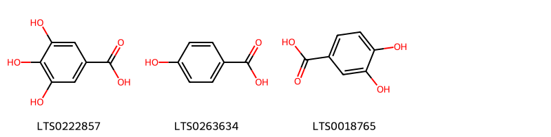{ width=100% }
    <figcaption>Hình ảnh cấu trúc hóa học của 3 hoạt chất thuộc nhóm Benzene and substituted derivatives gồm ['galop (LTS0222857)', 'p-hydroxybenzoic acid (LTS0263634)', '3,4-dihydroxybenzoic acid (LTS0018765)'].</figcaption>
</figure>
#### Nhóm Cinnamic acids and derivatives
<figure markdown="span">
    { width=100% }
    <figcaption>Hình ảnh cấu trúc hóa học của 3 hoạt chất thuộc nhóm Cinnamic acids and derivatives gồm ['ferulic acid (LTS0077328)', '3,4-dihydroxycinnamic acid (LTS0128050)', 'para-coumaric acid (LTS0266252)'].</figcaption>
</figure>
#### Nhóm Flavonoids
<figure markdown="span">
    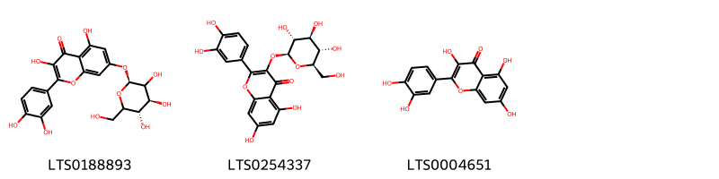{ width=100% }
    <figcaption>Hình ảnh cấu trúc hóa học của 3 hoạt chất thuộc nhóm Flavonoids gồm ['quercimeritrin (LTS0188893)', 'isoquercetin (LTS0254337)', 'quercetin (LTS0004651)'].</figcaption>
</figure>
#### Nhóm Organooxygen compounds
<figure markdown="span">
    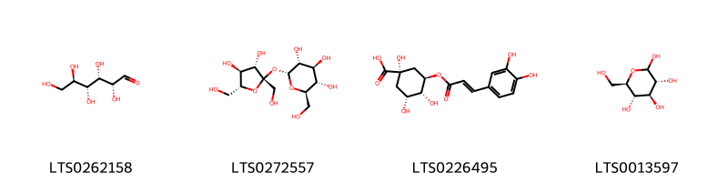{ width=100% }
    <figcaption>Hình ảnh cấu trúc hóa học của 4 hoạt chất thuộc nhóm Organooxygen compounds gồm ['(+)-glucose (LTS0262158)', 'sucrose (LTS0272557)', 'chlorogenic acid (LTS0226495)', 'glucose (LTS0013597)'].</figcaption>
</figure>
#### Nhóm Prenol lipids
<figure markdown="span">
    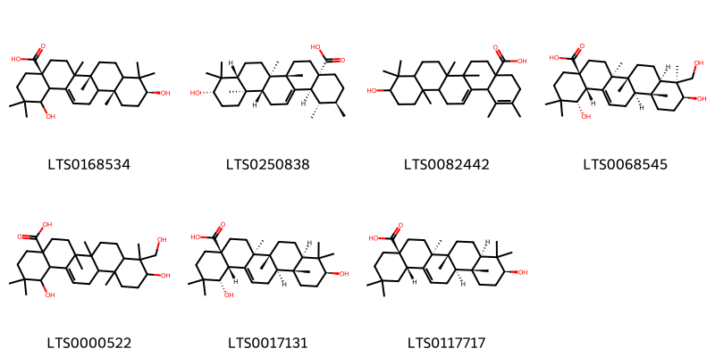{ width=100% }
    <figcaption>Hình ảnh cấu trúc hóa học của 7 hoạt chất thuộc nhóm Prenol lipids gồm ['(4ar,6br,10s,12ar)-1,10-dihydroxy-2,2,6a,6b,9,9,12a-heptamethyl-1,3,4,5,6,7,8,8a,10,11,12,12b,13,14b-tetradecahydropicene-4a-carboxylic acid (LTS0168534)', 'ursolic acid (LTS0250838)', '10-hydroxy-1,2,6a,6b,9,9,12a-heptamethyl-4,5,6,7,8,8a,10,11,12,12b,13,14b-dodecahydro-3h-picene-4a-carboxylic acid (LTS0082442)', 'spathodic acid (LTS0068545)', '1,10-dihydroxy-9-(hydroxymethyl)-2,2,6a,6b,9,12a-hexamethyl-1,3,4,5,6,7,8,8a,10,11,12,12b,13,14b-tetradecahydropicene-4a-carboxylic acid (LTS0000522)', 'siaresinol (LTS0017131)', 'oleanolic acid (LTS0117717)'].</figcaption>
</figure>
#### Nhóm Steroids and steroid derivatives
<figure markdown="span">
    { width=100% }
    <figcaption>Hình ảnh cấu trúc hóa học của 2 hoạt chất thuộc nhóm Steroids and steroid derivatives gồm ['sitogluside (LTS0201798)', '2-{[1-(5-ethyl-6-methylheptan-2-yl)-9a,11a-dimethyl-1h,2h,3h,3ah,3bh,4h,6h,7h,8h,9h,9bh,10h,11h-cyclopenta[a]phenanthren-7-yl]oxy}-6-(hydroxymethyl)oxane-3,4,5-triol (LTS0158828)'].</figcaption>
</figure>

---

### Dược dân tộc học

Danh sách các quốc gia có sử dụng *N/A* trong điều trị các bệnh. 

| Country   | Disease             | Bệnh                                                                                                                                                                                                |
|:----------|:--------------------|:----------------------------------------------------------------------------------------------------------------------------------------------------------------------------------------------------|
| Africa    | Poison              | MYMEMORY WARNING: YOU USED ALL AVAILABLE FREE TRANSLATIONS FOR TODAY. NEXT AVAILABLE IN  18 HOURS 51 MINUTES 31 SECONDS VISIT HTTPS://MYMEMORY.TRANSLATED.NET/DOC/USAGELIMITS.PHP TO TRANSLATE MORE |
| Elsewhere | Poison, Tonic       | MYMEMORY WARNING: YOU USED ALL AVAILABLE FREE TRANSLATIONS FOR TODAY. NEXT AVAILABLE IN  18 HOURS 51 MINUTES 24 SECONDS VISIT HTTPS://MYMEMORY.TRANSLATED.NET/DOC/USAGELIMITS.PHP TO TRANSLATE MORE |
| Ghana     | Laxative, Stomachic | MYMEMORY WARNING: YOU USED ALL AVAILABLE FREE TRANSLATIONS FOR TODAY. NEXT AVAILABLE IN  18 HOURS 51 MINUTES 19 SECONDS VISIT HTTPS://MYMEMORY.TRANSLATED.NET/DOC/USAGELIMITS.PHP TO TRANSLATE MORE |

---

# Chi Chilopsis

??? note "Danh sách các dược liệu thuộc chi"
    
	 - *Chilopsis lineari*
	 - *Chilopsis linearis*

---
## Chilopsis lineari
### Thông tin về thực vật

!!! info "Phân loại thực vật của *Chilopsis linearis* từ GIBF:"
    - **Kingdom:** Plantae
    - **Phylum:** Tracheophyta
    - **Order:** Lamiales
    - **Family:** Bignoniaceae
    - **Genus:** Chilopsis
    - **Species:** *Chilopsis linearis*

 

| Label (VI)   | Label (EN)   | Scientific Name         | Descriptions (VI)   | Descriptions (EN)   | Also Known As (VI)   | Also Known As (EN)   |
|:-------------|:-------------|:------------------------|:--------------------|:--------------------|:---------------------|:---------------------|
| N/A          | N/A          | Crescentia linearifolia |                     | species of plant    | ['']                 | ['']                 |

#### Phân bố trên thế giới

**Từ CSDL GIBF** United States of America, Mexico

#### Phân bố tại Việt Nam

**Từ CSDL GIBF**: Không có ghi nhận ở Việt Nam

---
### Thành phần hóa học
        
- Theo cơ sở dữ liệu lotus: Từ loài *Chilopsis linearis* đã phân lập và xác định được Chưa có hoạt chất nào được phân lập. hoạt chất thuộc về các nhóm Không có hoạt chất nào được phân lập. 

Không có hình ảnh nào được tạo ra

---

### Dược dân tộc học

Danh sách các quốc gia có sử dụng *Chilopsis linearis* trong điều trị các bệnh. 

| Country   | Disease   | Bệnh                                                                                                                                                                                                |
|:----------|:----------|:----------------------------------------------------------------------------------------------------------------------------------------------------------------------------------------------------|
| Elsewhere | Stimulant | MYMEMORY WARNING: YOU USED ALL AVAILABLE FREE TRANSLATIONS FOR TODAY. NEXT AVAILABLE IN  18 HOURS 49 MINUTES 45 SECONDS VISIT HTTPS://MYMEMORY.TRANSLATED.NET/DOC/USAGELIMITS.PHP TO TRANSLATE MORE |

---

---
## Chilopsis linearis
### Thông tin về thực vật

!!! info "Phân loại thực vật của *Chilopsis linearis* từ GIBF:"
    - **Kingdom:** Plantae
    - **Phylum:** Tracheophyta
    - **Order:** Lamiales
    - **Family:** Bignoniaceae
    - **Genus:** Chilopsis
    - **Species:** *Chilopsis linearis*

 

| Label (VI)   | Label (EN)   | Scientific Name    | Descriptions (VI)   | Descriptions (EN)   | Also Known As (VI)   | Also Known As (EN)                                                                 |
|:-------------|:-------------|:-------------------|:--------------------|:--------------------|:---------------------|:-----------------------------------------------------------------------------------|
| N/A          | N/A          | Chilopsis linearis | loài thực vật       | species of plant    | ['']                 | ['desert willow', "Art's seedless desert willow", 'desert-willow', 'desertwillow'] |

#### Phân bố trên thế giới

**Từ CSDL GIBF** United States of America, Mexico

#### Phân bố tại Việt Nam

**Từ CSDL GIBF**: Không có ghi nhận ở Việt Nam

---
### Thành phần hóa học
        
- Theo cơ sở dữ liệu lotus: Từ loài *Chilopsis linearis* đã phân lập và xác định được Chưa có hoạt chất nào được phân lập. hoạt chất thuộc về các nhóm Không có hoạt chất nào được phân lập. 

Không có hình ảnh nào được tạo ra

---

### Dược dân tộc học

Danh sách các quốc gia có sử dụng *Chilopsis linearis* trong điều trị các bệnh. 

| Country   | Disease              | Bệnh                                                                                                                                                                                                |
|:----------|:---------------------|:----------------------------------------------------------------------------------------------------------------------------------------------------------------------------------------------------|
| Mexico    | Stimulant, Stimulant | MYMEMORY WARNING: YOU USED ALL AVAILABLE FREE TRANSLATIONS FOR TODAY. NEXT AVAILABLE IN  18 HOURS 49 MINUTES 07 SECONDS VISIT HTTPS://MYMEMORY.TRANSLATED.NET/DOC/USAGELIMITS.PHP TO TRANSLATE MORE |

---

# Chi Parmentiera

??? note "Danh sách các dược liệu thuộc chi"
    
	 - *Parmentiera alata*
	 - *Parmentiera edulis*

---
## Parmentiera alata
### Thông tin về thực vật

!!! info "Phân loại thực vật của *Crescentia alata* từ GIBF:"
    - **Kingdom:** Plantae
    - **Phylum:** Tracheophyta
    - **Order:** Lamiales
    - **Family:** Bignoniaceae
    - **Genus:** Crescentia
    - **Species:** *Crescentia alata*

 

| Label (VI)   | Label (EN)   | Scientific Name   | Descriptions (VI)   | Descriptions (EN)   | Also Known As (VI)   | Also Known As (EN)   |
|:-------------|:-------------|:------------------|:--------------------|:--------------------|:---------------------|:---------------------|
| N/A          | N/A          | Parmentiera alata |                     | species of plant    | ['']                 | ['']                 |

#### Phân bố trên thế giới

**Từ CSDL GIBF** nan, Brazil, Cuba, Mexico, Benin, Guatemala

#### Phân bố tại Việt Nam

**Từ CSDL GIBF**: Không có ghi nhận ở Việt Nam

---
### Thành phần hóa học
        
- Theo cơ sở dữ liệu lotus: Từ loài *Crescentia alata* đã phân lập và xác định được Chưa có hoạt chất nào được phân lập. hoạt chất thuộc về các nhóm Không có hoạt chất nào được phân lập. 

Không có hình ảnh nào được tạo ra

---

### Dược dân tộc học

Danh sách các quốc gia có sử dụng *Crescentia alata* trong điều trị các bệnh. 

| Country   | Disease     | Bệnh                                                                                                                                                                                                |
|:----------|:------------|:----------------------------------------------------------------------------------------------------------------------------------------------------------------------------------------------------|
| Nicaragua | Refrigerant | MYMEMORY WARNING: YOU USED ALL AVAILABLE FREE TRANSLATIONS FOR TODAY. NEXT AVAILABLE IN  18 HOURS 48 MINUTES 40 SECONDS VISIT HTTPS://MYMEMORY.TRANSLATED.NET/DOC/USAGELIMITS.PHP TO TRANSLATE MORE |

---

---
## Parmentiera edulis
### Thông tin về thực vật

!!! info "Phân loại thực vật của *N/A* từ GIBF:"
    - **Kingdom:** Plantae
    - **Phylum:** Tracheophyta
    - **Order:** N/A
    - **Family:** N/A
    - **Genus:** N/A
    - **Species:** *N/A*

 

| Label (VI)   | Label (EN)   | Scientific Name    | Descriptions (VI)   | Descriptions (EN)   | Also Known As (VI)   | Also Known As (EN)   |
|:-------------|:-------------|:-------------------|:--------------------|:--------------------|:---------------------|:---------------------|
| N/A          | N/A          | Parmentiera edulis |                     |                     | ['']                 | ['']                 |

#### Phân bố trên thế giới

**Từ CSDL GIBF** Viet Nam, Denmark, United Kingdom of Great Britain and Northern Ireland, Niue, Argentina, Germany, United States of America, Mexico, Australia

#### Phân bố tại Việt Nam

**Từ CSDL GIBF**: Quang Nam Province

---
### Thành phần hóa học
        
- Theo cơ sở dữ liệu lotus: Từ loài *N/A* đã phân lập và xác định được Chưa có hoạt chất nào được phân lập. hoạt chất thuộc về các nhóm Không có hoạt chất nào được phân lập. 

Không có hình ảnh nào được tạo ra

---

### Dược dân tộc học

Danh sách các quốc gia có sử dụng *N/A* trong điều trị các bệnh. 

| Country   | Disease            | Bệnh                                                                                                                                                                                                |
|:----------|:-------------------|:----------------------------------------------------------------------------------------------------------------------------------------------------------------------------------------------------|
| Mexico    | Diuretic, Diuretic | MYMEMORY WARNING: YOU USED ALL AVAILABLE FREE TRANSLATIONS FOR TODAY. NEXT AVAILABLE IN  18 HOURS 48 MINUTES 17 SECONDS VISIT HTTPS://MYMEMORY.TRANSLATED.NET/DOC/USAGELIMITS.PHP TO TRANSLATE MORE |

---

# Chi Anemopaegma

??? note "Danh sách các dược liệu thuộc chi"
    
	 - *Anemopaegma mirandum*

---
## Anemopaegma mirandum
### Thông tin về thực vật

!!! info "Phân loại thực vật của *Anemopaegma arvense* từ GIBF:"
    - **Kingdom:** Plantae
    - **Phylum:** Tracheophyta
    - **Order:** Lamiales
    - **Family:** Bignoniaceae
    - **Genus:** Anemopaegma
    - **Species:** *Anemopaegma arvense*

 

| Label (VI)   | Label (EN)   | Scientific Name      | Descriptions (VI)   | Descriptions (EN)   | Also Known As (VI)   | Also Known As (EN)   |
|:-------------|:-------------|:---------------------|:--------------------|:--------------------|:---------------------|:---------------------|
| N/A          | N/A          | Anemopaegma mirandum | loài thực vật       | species of plant    | ['']                 | ['']                 |

#### Phân bố trên thế giới

**Từ CSDL GIBF** nan, Paraguay, Brazil

#### Phân bố tại Việt Nam

**Từ CSDL GIBF**: Không có ghi nhận ở Việt Nam

---
### Thành phần hóa học
        
- Theo cơ sở dữ liệu lotus: Từ loài *Anemopaegma arvense* đã phân lập và xác định được Chưa có hoạt chất nào được phân lập. hoạt chất thuộc về các nhóm Không có hoạt chất nào được phân lập. 

Không có hình ảnh nào được tạo ra

---

### Dược dân tộc học

Danh sách các quốc gia có sử dụng *Anemopaegma arvense* trong điều trị các bệnh. 

| Country   | Disease                         | Bệnh                                                                                                                                                                                                |
|:----------|:--------------------------------|:----------------------------------------------------------------------------------------------------------------------------------------------------------------------------------------------------|
| Elsewhere | Aphrodisiac, Nervine, Stimulant | MYMEMORY WARNING: YOU USED ALL AVAILABLE FREE TRANSLATIONS FOR TODAY. NEXT AVAILABLE IN  18 HOURS 47 MINUTES 40 SECONDS VISIT HTTPS://MYMEMORY.TRANSLATED.NET/DOC/USAGELIMITS.PHP TO TRANSLATE MORE |

---

# Chi Tanaecium

??? note "Danh sách các dược liệu thuộc chi"
    
	 - *Tanaecium exitiosum*
	 - *Tanaecium nocturnum*

---
## Tanaecium exitiosum
### Thông tin về thực vật

!!! info "Phân loại thực vật của *Tanaecium exitiosum* từ GIBF:"
    - **Kingdom:** Plantae
    - **Phylum:** Tracheophyta
    - **Order:** Lamiales
    - **Family:** Bignoniaceae
    - **Genus:** Tanaecium
    - **Species:** *Tanaecium exitiosum*

 

| Label (VI)   | Label (EN)   | Scientific Name     | Descriptions (VI)   | Descriptions (EN)   | Also Known As (VI)   | Also Known As (EN)   |
|:-------------|:-------------|:--------------------|:--------------------|:--------------------|:---------------------|:---------------------|
| N/A          | N/A          | Tanaecium exitiosum | loài thực vật       | species of plant    | ['']                 | ['']                 |

#### Phân bố trên thế giới

**Từ CSDL GIBF** Colombia

#### Phân bố tại Việt Nam

**Từ CSDL GIBF**: Không có ghi nhận ở Việt Nam

---
### Thành phần hóa học
        
- Theo cơ sở dữ liệu lotus: Từ loài *Tanaecium exitiosum* đã phân lập và xác định được Chưa có hoạt chất nào được phân lập. hoạt chất thuộc về các nhóm Không có hoạt chất nào được phân lập. 

Không có hình ảnh nào được tạo ra

---

### Dược dân tộc học

Danh sách các quốc gia có sử dụng *Tanaecium exitiosum* trong điều trị các bệnh. 

| Country   | Disease   | Bệnh                                                                                                                                                                                                |
|:----------|:----------|:----------------------------------------------------------------------------------------------------------------------------------------------------------------------------------------------------|
| Colombia  | Poison    | MYMEMORY WARNING: YOU USED ALL AVAILABLE FREE TRANSLATIONS FOR TODAY. NEXT AVAILABLE IN  18 HOURS 47 MINUTES 15 SECONDS VISIT HTTPS://MYMEMORY.TRANSLATED.NET/DOC/USAGELIMITS.PHP TO TRANSLATE MORE |

---

---
## Tanaecium nocturnum
### Thông tin về thực vật

!!! info "Phân loại thực vật của *Bignonia nocturna* từ GIBF:"
    - **Kingdom:** Plantae
    - **Phylum:** Tracheophyta
    - **Order:** Lamiales
    - **Family:** Bignoniaceae
    - **Genus:** Bignonia
    - **Species:** *Bignonia nocturna*

 

| Label (VI)   | Label (EN)   | Scientific Name     | Descriptions (VI)   | Descriptions (EN)   | Also Known As (VI)   | Also Known As (EN)   |
|:-------------|:-------------|:--------------------|:--------------------|:--------------------|:---------------------|:---------------------|
| N/A          | N/A          | Tanaecium exitiosum | loài thực vật       | species of plant    | ['']                 | ['']                 |

#### Phân bố trên thế giới

**Từ CSDL GIBF** nan, Colombia, Suriname, Panama, Brazil, Peru, French Guiana, Bolivia (Plurinational State of)

#### Phân bố tại Việt Nam

**Từ CSDL GIBF**: Không có ghi nhận ở Việt Nam

---
### Thành phần hóa học
        
- Theo cơ sở dữ liệu lotus: Từ loài *Bignonia nocturna* đã phân lập và xác định được Chưa có hoạt chất nào được phân lập. hoạt chất thuộc về các nhóm Không có hoạt chất nào được phân lập. 

Không có hình ảnh nào được tạo ra

---

### Dược dân tộc học

Danh sách các quốc gia có sử dụng *Bignonia nocturna* trong điều trị các bệnh. 

| Country         | Disease            | Bệnh                                                                                                                                                                                                |
|:----------------|:-------------------|:----------------------------------------------------------------------------------------------------------------------------------------------------------------------------------------------------|
| Brazil(Paumari) | Narcotic, Sedative | MYMEMORY WARNING: YOU USED ALL AVAILABLE FREE TRANSLATIONS FOR TODAY. NEXT AVAILABLE IN  18 HOURS 46 MINUTES 52 SECONDS VISIT HTTPS://MYMEMORY.TRANSLATED.NET/DOC/USAGELIMITS.PHP TO TRANSLATE MORE |

---

