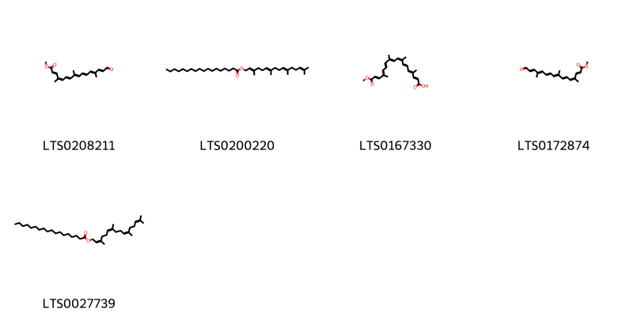
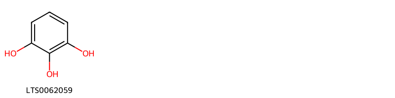
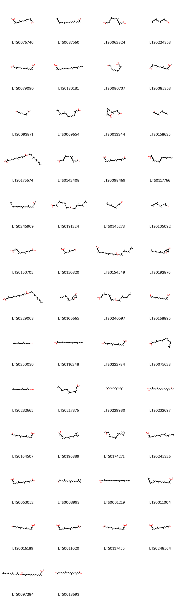

!!! abstract "Tóm tắt"

    Họ Bixaceae gồm khoảng 2 chi và 4 loài được một số cộng đồng tại các quốc gia như Africa, anish, Colombia, Sudan, German, Panama(Cuna), French, Elsewhere, Venezuela, Dominican Republic, Mexico sử dụng trong một số trường hợp Chất kích thích, Thuốc giải độc, Thuốc giải độc, Thuốc kích thích tình dục, Chất làm se, Thuốc lợi tiểu, Phương pháp thanh lọc, Dạ dày, Thuốc lợi tiểu, Chất làm lạnh, Thuốc giải độc, Thuốc an thần, Chất làm se, Thuốc bổ, Mỹ phẩm, Styptic, Chất làm se, Mỹ phẩm, Thuốc kích thích tình dục, Thuốc diệt ký sinh trùng, Thuốc kích thích tình dục.

!!! info "DrDuke"

    James A. Duke sinh năm 1929-2017 là một nhà thực vật học người Mỹ. Đây là một trong những tác giả hàng đầu trong lĩnh vực dược dân tộc học với cuốn *CRC Handbook of Medicinal Herbs* và chính là người xây dựng lên cơ sở dữ liệu về hợp chất tự nhiên và dược dân tộc học tại Bộ nông nghiệp Hoa Kỳ. Các thông tin được đăng tải tại website [Dr. Duke's Phytochemical and Ethnobotanical Databases](https://phytochem.nal.usda.gov/). 
    Trong suốt thập niên 1970, ông lãnh đạo the Plant Taxonomy Laboratory, Plant Genetics and Germplasm Institute of the Agricultural Research Service, U.S. Department of Agriculture.
    Trong tài liệu này, các thông tin về dược dân tộc của các dược liệu được trích dẫn từ tài liệu của James A. Ducke với sự trợ giúp của phần mềm dịch thuật từ tiếng Anh sang tiếng Việt.
   

# Chi Cochloermum

??? note "Danh sách các dược liệu thuộc chi"
    
	 - *Cochloermum niloticum*
	 - *Cochloermum planchonii*
	 - *Cochloermum vitifolium*

---
## Cochloermum niloticum
### Thông tin về thực vật

!!! info "Phân loại thực vật của *N/A* từ GIBF:"
    - **Kingdom:** N/A
    - **Phylum:** N/A
    - **Order:** N/A
    - **Family:** N/A
    - **Genus:** N/A
    - **Species:** *N/A*

 

| Label (VI)   | Label (EN)   | Scientific Name   | Descriptions (VI)   | Descriptions (EN)   | Also Known As (VI)   | Also Known As (EN)   |
|:-------------|:-------------|:------------------|:--------------------|:--------------------|:---------------------|:---------------------|
| N/A          | N/A          | Polygala vulgaris | loài thực vật       | species of plant    | ['']                 | ['Common Milkwort']  |

#### Phân bố trên thế giới

**Từ CSDL GIBF** Không có kết quả phù hợp

#### Phân bố tại Việt Nam

**Từ CSDL GIBF**: Không có ghi nhận ở Việt Nam

---
### Thành phần hóa học
        
- Theo cơ sở dữ liệu lotus: Từ loài *N/A* đã phân lập và xác định được Chưa có hoạt chất nào được phân lập. hoạt chất thuộc về các nhóm Không có hoạt chất nào được phân lập. 

Không có hình ảnh nào được tạo ra

---

### Dược dân tộc học

Danh sách các quốc gia có sử dụng *N/A* trong điều trị các bệnh. 

| Country   | Disease   | Bệnh               |
|:----------|:----------|:-------------------|
| Africa    | Tonic     | (thuộc) trương lực |
| Sudan     | Tonic     | (thuộc) trương lực |

---

---
## Cochloermum planchonii
### Thông tin về thực vật

!!! info "Phân loại thực vật của *N/A* từ GIBF:"
    - **Kingdom:** N/A
    - **Phylum:** N/A
    - **Order:** N/A
    - **Family:** N/A
    - **Genus:** N/A
    - **Species:** *N/A*

 

| Label (VI)   | Label (EN)   | Scientific Name   | Descriptions (VI)   | Descriptions (EN)   | Also Known As (VI)   | Also Known As (EN)   |
|:-------------|:-------------|:------------------|:--------------------|:--------------------|:---------------------|:---------------------|
| N/A          | N/A          | Polygala vulgaris | loài thực vật       | species of plant    | ['']                 | ['Common Milkwort']  |

#### Phân bố trên thế giới

**Từ CSDL GIBF** Không có kết quả phù hợp

#### Phân bố tại Việt Nam

**Từ CSDL GIBF**: Không có ghi nhận ở Việt Nam

---
### Thành phần hóa học
        
- Theo cơ sở dữ liệu lotus: Từ loài *N/A* đã phân lập và xác định được Chưa có hoạt chất nào được phân lập. hoạt chất thuộc về các nhóm Không có hoạt chất nào được phân lập. 

Không có hình ảnh nào được tạo ra

---

### Dược dân tộc học

Danh sách các quốc gia có sử dụng *N/A* trong điều trị các bệnh. 

| Country   | Disease     | Bệnh        |
|:----------|:------------|:------------|
| Elsewhere | Emmenagogue | Emmenagogue |

---

---
## Cochloermum vitifolium
### Thông tin về thực vật

!!! info "Phân loại thực vật của *N/A* từ GIBF:"
    - **Kingdom:** N/A
    - **Phylum:** N/A
    - **Order:** N/A
    - **Family:** N/A
    - **Genus:** N/A
    - **Species:** *N/A*

 

| Label (VI)   | Label (EN)   | Scientific Name   | Descriptions (VI)   | Descriptions (EN)   | Also Known As (VI)   | Also Known As (EN)   |
|:-------------|:-------------|:------------------|:--------------------|:--------------------|:---------------------|:---------------------|
| N/A          | N/A          | Polygala vulgaris | loài thực vật       | species of plant    | ['']                 | ['Common Milkwort']  |

#### Phân bố trên thế giới

**Từ CSDL GIBF** Không có kết quả phù hợp

#### Phân bố tại Việt Nam

**Từ CSDL GIBF**: Không có ghi nhận ở Việt Nam

---
### Thành phần hóa học
        
- Theo cơ sở dữ liệu lotus: Từ loài *N/A* đã phân lập và xác định được Chưa có hoạt chất nào được phân lập. hoạt chất thuộc về các nhóm Không có hoạt chất nào được phân lập. 

Không có hình ảnh nào được tạo ra

---

### Dược dân tộc học

Danh sách các quốc gia có sử dụng *N/A* trong điều trị các bệnh. 

| Country   | Disease   | Bệnh          |
|:----------|:----------|:--------------|
| Venezuela | Sedative  | Thuốc an thần |

---

# Chi Bixa

??? note "Danh sách các dược liệu thuộc chi"
    
	 - *Bixa orellana*

---
## Bixa orellana
### Thông tin về thực vật

!!! info "Phân loại thực vật của *Bixa orellana* từ GIBF:"
    - **Kingdom:** Plantae
    - **Phylum:** Tracheophyta
    - **Order:** Malvales
    - **Family:** Bixaceae
    - **Genus:** Bixa
    - **Species:** *Bixa orellana*

 

| Label (VI)   | Label (EN)   | Scientific Name   | Descriptions (VI)   | Descriptions (EN)   | Also Known As (VI)                              | Also Known As (EN)           |
|:-------------|:-------------|:------------------|:--------------------|:--------------------|:------------------------------------------------|:-----------------------------|
| N/A          | N/A          | Bixa orellana     | loài thực vật       | species of plant    | ['Điều màu', 'Cây điều nhuộm', 'Bixa orellana'] | ['Achiote', 'Lipstick tree'] |

#### Phân bố trên thế giới

**Từ CSDL GIBF** Virgin Islands (U.S.), Guadeloupe, Angola, Guatemala, Grenada, Argentina, Mozambique, Benin, Nicaragua, Tanzania, United Republic of, French Guiana, Panama, Puerto Rico, Nigeria, Bolivia (Plurinational State of), Honduras, Jamaica, United States of America, Congo, Democratic Republic of the, Guinea, Belize, Trinidad and Tobago, Hong Kong, Barbados, Sao Tome and Principe, Brazil, Guam, Cuba, Mexico, Dominican Republic, Peru, Viet Nam, China, Ecuador, Haiti, Colombia, Costa Rica, India, Indonesia, Philippines

#### Phân bố tại Việt Nam

**Từ CSDL GIBF**: Kiên Giang

---
### Thành phần hóa học
        
- Theo cơ sở dữ liệu lotus: Từ loài *Bixa orellana* đã phân lập và xác định được 60 hoạt chất thuộc về các nhóm Fatty Acyls, Flavonoids, Prenol lipids, Benzene and substituted derivatives, Phenols. 

|    | chemicalTaxonomyClassyfireClass     |   smiles_count |
|---:|:------------------------------------|---------------:|
|  0 | Benzene and substituted derivatives |              1 |
|  1 | Fatty Acyls                         |              5 |
|  2 | Flavonoids                          |              1 |
|  3 | Phenols                             |              1 |
|  4 | Prenol lipids                       |             52 |

#### Nhóm Benzene and substituted derivatives
<figure markdown="span">
    { width=100% }
    <figcaption>Hình ảnh cấu trúc hóa học của 1 hoạt chất thuộc nhóm Benzene and substituted derivatives gồm ['galop (LTS0222857)'].</figcaption>
</figure>
#### Nhóm Fatty Acyls
<figure markdown="span">
    { width=100% }
    <figcaption>Hình ảnh cấu trúc hóa học của 5 hoạt chất thuộc nhóm Fatty Acyls gồm ['methyl (6e,8e,10e,12e,14e)-4,8,13-trimethyl-16-oxohexadeca-2,4,6,8,10,12,14-heptaenoate (LTS0208211)', '(2e,6e,10e)-3,7,11,15-tetramethylhexadeca-2,6,10,14-tetraen-1-yl octadecanoate (LTS0200220)', '(2e,4e,6e,16e)-18-methoxy-4,8,11,15-tetramethyl-18-oxooctadeca-2,4,6,8,10,12,14,16-octaenoic acid (LTS0167330)', 'methyl (2e,4z,6e,8e,10e,12e,14e)-4,8,13-trimethyl-16-oxohexadeca-2,4,6,8,10,12,14-heptaenoate (LTS0172874)', '3,7,11,15-tetramethylhexadeca-2,6,10,14-tetraen-1-yl octadecanoate (LTS0027739)'].</figcaption>
</figure>
#### Nhóm Flavonoids
<figure markdown="span">
    { width=100% }
    <figcaption>Hình ảnh cấu trúc hóa học của 1 hoạt chất thuộc nhóm Flavonoids gồm ['isoscutellarein (LTS0141375)'].</figcaption>
</figure>
#### Nhóm Phenols
<figure markdown="span">
    { width=100% }
    <figcaption>Hình ảnh cấu trúc hóa học của 1 hoạt chất thuộc nhóm Phenols gồm ['pyrogallol (LTS0062059)'].</figcaption>
</figure>
#### Nhóm Prenol lipids
<figure markdown="span">
    { width=100% }
    <figcaption>Hình ảnh cấu trúc hóa học của 52 hoạt chất thuộc nhóm Prenol lipids gồm ['1,20-dimethyl (6e,8e,10e,12e,14e,16z)-4,8,13,17-tetramethylicosa-2,4,6,8,10,12,14,16,18-nonaenedioate (LTS0076740)', 'methyl (2z,4e,6e,8e,10e,12e,14e,16e,18e)-2,6,11,15,19,23-hexamethyltetracosa-2,4,6,8,10,12,14,16,18,22-decaenoate (LTS0037560)', '(18e)-20-methoxy-4,8,13,17-tetramethyl-20-oxoicosa-2,4,6,8,10,12,14,16,18-nonaenoic acid (LTS0062824)', '3,7,11,15-tetramethylhexadeca-2,6,10,14-tetraen-1-yl formate (LTS0224353)', '1,20-dimethyl (2e,4z,6e,8e,10e,12e,14e,16e,18e)-4,8,13,17-tetramethylicosa-2,4,6,8,10,12,14,16,18-nonaenedioate (LTS0079090)', 'methyl (6e,8e,10e,12e,14e,16e,18e,20e)-4,8,13,17,21,25-hexamethylhexacosa-2,4,6,8,10,12,14,16,18,20,24-undecaenoate (LTS0130181)', 'methyl (4z,6e)-4,8,13,17-tetramethyl-18-oxooctadeca-2,4,6,8,10,12,14,16-octaenoate (LTS0080707)', '1,20-dimethyl (2e,4z,6e,8e,10e,12e,14e,16z,18e)-4,8,13,17-tetramethylicosa-2,4,6,8,10,12,14,16,18-nonaenedioate (LTS0085353)', 'methyl (2e,4z,6e,8e,10e)-4,8-dimethyl-12-oxododeca-2,4,6,8,10-pentaenoate (LTS0093871)', 'methyl 4,8,13,17,21,25-hexamethylhexacosa-2,4,6,8,10,12,14,16,18,20,24-undecaenoate (LTS0069654)', '4,8,13,17-tetramethylicosa-2,4,6,8,10,12,14,16,18-nonaenedioic acid (LTS0013344)', '6,10,14-trimethylpentadeca-5,9,13-trien-2-one (LTS0158635)', '1-methyl 18-(2e,6e,10e)-3,7,11,15-tetramethylhexadeca-2,6,10,14-tetraen-1-yl (2e,4e,6e,8e,10e,12e,14e,16e)-2,6,11,15-tetramethyloctadeca-2,4,6,8,10,12,14,16-octaenedioate (LTS0176674)', '20-methoxy-4,8,13,17-tetramethyl-20-oxoicosa-2,4,6,8,10,12,14,16,18-nonaenoic acid (LTS0142408)', 'methyl (6e,8e,10e,12e,14e,16e,18e)-4,8,13,17-tetramethyl-20-oxohenicosa-2,4,6,8,10,12,14,16,18-nonaenoate (LTS0098469)', 'methyl (16e,18e)-2,6,11,15,19,23-hexamethyltetracosa-2,4,6,8,10,12,14,16,18,22-decaenoate (LTS0117766)', 'methyl (2e,4z,6e,8e,10e,12e,14e,16e,18e,20e)-4,8,13,17,21,25-hexamethylhexacosa-2,4,6,8,10,12,14,16,18,20,24-undecaenoate (LTS0245909)', '1-methyl 20-(3,7,11,15-tetramethylhexadeca-2,6,10,14-tetraen-1-yl) 4,8,13,17-tetramethylicosa-2,4,6,8,10,12,14,16,18-nonaenedioate (LTS0191224)', '(2e,10e)-3,7,11,15-tetramethylhexadeca-2,6,10,14-tetraen-1-ol (LTS0145273)', 'geranylgeraniols (LTS0105092)', '(10e,12e,14e,16e,18e)-4,8,13,17-tetramethylicosa-2,4,6,8,10,12,14,16,18-nonaenedioic acid (LTS0160705)', 'methyl (6e,8e,10e)-4,8-dimethyl-12-oxododeca-2,4,6,8,10-pentaenoate (LTS0150320)', '1-methyl 20-(3,7,11,15-tetramethylhexadeca-2,6,10,14-tetraen-1-yl) (6e,8e,10e,12e,14e,16e,18e)-4,8,13,17-tetramethylicosa-2,4,6,8,10,12,14,16,18-nonaenedioate (LTS0154549)', '(2s)-2,8-dimethyl-2-[(3e,7e)-4,8,12-trimethyltrideca-3,7,11-trien-1-yl]-3,4-dihydro-1-benzopyran-6-ol (LTS0192876)', '1-methyl 20-(2e,6e,10e)-3,7,11,15-tetramethylhexadeca-2,6,10,14-tetraen-1-yl (2e,4e,6e,8e,10e,12e,14e,16e,18e)-4,8,13,17-tetramethylicosa-2,4,6,8,10,12,14,16,18-nonaenedioate (LTS0229003)', '2,8-dimethyl-2-(4,8,12-trimethyltrideca-3,7,11-trien-1-yl)-3,4-dihydro-1-benzopyran-6-ol (LTS0106665)', '1-methyl 18-(3,7,11,15-tetramethylhexadeca-2,6,10,14-tetraen-1-yl) 2,6,11,15-tetramethyloctadeca-2,4,6,8,10,12,14,16-octaenedioate (LTS0240597)', 'methyl (2e,4z,6e,8e,10e,12e,14e,16e)-4,8,13,17-tetramethyl-18-oxooctadeca-2,4,6,8,10,12,14,16-octaenoate (LTS0168895)', 'geranylgeraniol (LTS0250030)', 'methyl (2e,4e,6e,8e,10e,12e,14e,16e,18e)-2,6,11,15,19,23-hexamethyltetracosa-2,4,6,8,10,12,14,16,18,22-decaenoate (LTS0116248)', 'annatto (LTS0222784)', 'methyl (2e,4e,6e,8e,10e,12e,14z,16e,18e)-2,6,11,15,19,23-hexamethyltetracosa-2,4,6,8,10,12,14,16,18,22-decaenoate (LTS0075623)', '(2e,6e,10e)-3,7,11,15-tetramethylhexadeca-2,6,10,14-tetraen-1-yl formate (LTS0232665)', 'methyl 2,6,11,15,19,23-hexamethyltetracosa-2,4,6,8,10,12,14,16,18,22-decaenoate (LTS0217876)', '(5e,9e)-farnesyl acetone (LTS0229980)', 'methyl bixin/ (bixin dimethyl ester) (LTS0232697)', 'methyl (2e,4z,6e,8e,10e,12e,14e,16e,18e)-4,8,13,17-tetramethyl-20-oxohenicosa-2,4,6,8,10,12,14,16,18-nonaenoate (LTS0164507)', 'methyl (2e,4e,6z,8e,10e,12e,14e,16e)-2,6,11,15-tetramethyl-17-(2,6,6-trimethylcyclohex-1-en-1-yl)heptadeca-2,4,6,8,10,12,14,16-octaenoate (LTS0196389)', 'methyl 2,6,11,15-tetramethyl-17-(2,6,6-trimethylcyclohex-1-en-1-yl)heptadeca-2,4,6,8,10,12,14,16-octaenoate (LTS0174271)', 'methyl (6e,8e,10e,12e,14e,16z,18z,20e)-4,8,13,17,21,25-hexamethylhexacosa-2,4,6,8,10,12,14,16,18,20,24-undecaenoate (LTS0245326)', '(2e,4e,6e,8e,10e,12e,14e)-20-methoxy-4,8,13,17-tetramethyl-20-oxoicosa-2,4,6,8,10,12,14,16,18-nonaenoic acid (LTS0053052)', 'methyl (2e,4e,6e,8e,10e,12e,14e,16e)-2,6,11,15-tetramethyl-17-(2,6,6-trimethylcyclohex-1-en-1-yl)heptadeca-2,4,6,8,10,12,14,16-octaenoate (LTS0003993)', 'methyl (2e,4e,6e,8e,10e,12e,14e,16e,18e,20e)-4,8,13,17,21,25-hexamethylhexacosa-2,4,6,8,10,12,14,16,18,20,24-undecaenoate (LTS0001219)', 'methyl (2e,4z,6e,8e,10e,12e,14e,16z,18z,20e)-4,8,13,17,21,25-hexamethylhexacosa-2,4,6,8,10,12,14,16,18,20,24-undecaenoate (LTS0011004)', 'methyl (2e,4z,6e,8e,10e,12e,14e,16e,18e)-4,8,13,17-tetramethyl-20-oxoicosa-2,4,6,8,10,12,14,16,18-nonaenoate (LTS0016189)', '1,20-dimethyl (6e,8e,10e,12e,14e,16e,18e)-4,8,13,17-tetramethylicosa-2,4,6,8,10,12,14,16,18-nonaenedioate (LTS0011020)', 'bixin (LTS0117455)', 'methyl (6e,8e,10e,12e,14e,16e)-4,8,13,17-tetramethyl-18-oxooctadeca-2,4,6,8,10,12,14,16-octaenoate (LTS0248564)', '1-methyl 20-(2e,6e,10e)-3,7,11,15-tetramethylhexadeca-2,6,10,14-tetraen-1-yl (2e,4z,6e,8e,10e,12e,14e,16e,18e)-4,8,13,17-tetramethylicosa-2,4,6,8,10,12,14,16,18-nonaenedioate (LTS0097284)', 'norbixin (LTS0018693)', 'delta-tocotrienol (LTS0255585)', 'methyl (6e,8e,10e,12e,14e,16e,18e)-4,8,13,17-tetramethyl-20-oxoicosa-2,4,6,8,10,12,14,16,18-nonaenoate (LTS0042912)'].</figcaption>
</figure>

---

### Dược dân tộc học

Danh sách các quốc gia có sử dụng *Bixa orellana* trong điều trị các bệnh. 

| Country            | Disease                                                                                            | Bệnh                                                                                                                                      |
|:-------------------|:---------------------------------------------------------------------------------------------------|:------------------------------------------------------------------------------------------------------------------------------------------|
| Colombia           | Aphrodisiac                                                                                        | Thuốc kích dục                                                                                                                            |
| Dominican Republic | Antidote                                                                                           | Chất giải độc                                                                                                                             |
| Elsewhere          | Astringent, Cosmetic, Aphrodisiac, Parasiticide                                                    | Chất làm se, Mỹ phẩm, Thuốc kích thích tình dục, Thuốc diệt ký sinh trùng                                                                 |
| French             | Astringent                                                                                         | Lam se da                                                                                                                                 |
| German             | Cosmetic                                                                                           | Cosmetic                                                                                                                                  |
| Mexico             | Antidote, Antidote, Aphrodisiac, Astringent, Diuretic, Purgative, Stomachic, Diuretic, Refrigerant | Thuốc giải độc, Thuốc giải độc, Thuốc kích thích tình dục, Chất làm se, Thuốc lợi tiểu, Phẫu thuật, Dạ dày, Thuốc lợi tiểu, Chất làm lạnh |
| Panama(Cuna)       | Cosmetic                                                                                           | Cosmetic                                                                                                                                  |
| anish              | Styptic                                                                                            | L.                                                                                                                                        |

---

