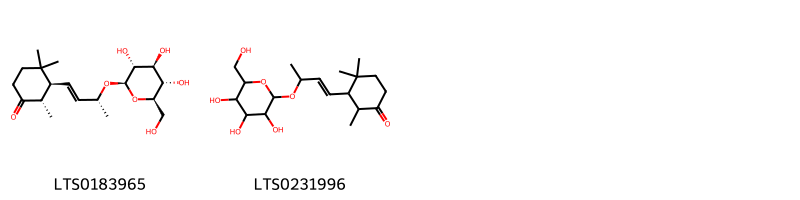
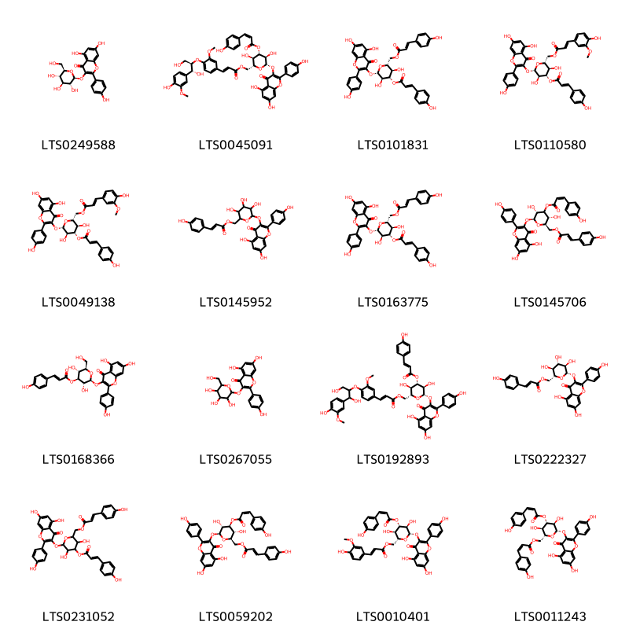
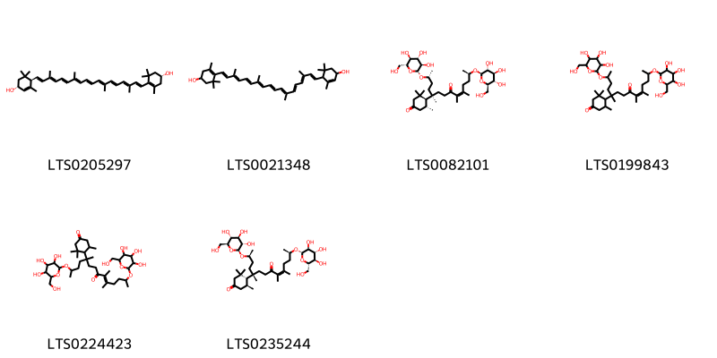
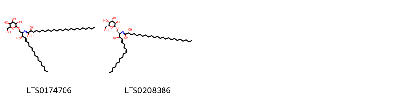

!!! abstract "Tóm tắt"

    Họ Blechnaceae gồm khoảng 1 chi và 1 loài được một số cộng đồng tại các quốc gia như Sumatra sử dụng trong một số trường hợp MYMEMORY WARNING: YOU USED ALL AVAILABLE FREE TRANSLATIONS FOR TODAY. NEXT AVAILABLE IN  02 HOURS 19 MINUTES 14 SECONDS VISIT HTTPS://MYMEMORY.TRANSLATED.NET/DOC/USAGELIMITS.PHP TO TRANSLATE MORE.

!!! info "DrDuke"

    James A. Duke sinh năm 1929-2017 là một nhà thực vật học người Mỹ. Đây là một trong những tác giả hàng đầu trong lĩnh vực dược dân tộc học với cuốn *CRC Handbook of Medicinal Herbs* và chính là người xây dựng lên cơ sở dữ liệu về hợp chất tự nhiên và dược dân tộc học tại Bộ nông nghiệp Hoa Kỳ. Các thông tin được đăng tải tại website [Dr. Duke's Phytochemical and Ethnobotanical Databases](https://phytochem.nal.usda.gov/). 
    Trong suốt thập niên 1970, ông lãnh đạo the Plant Taxonomy Laboratory, Plant Genetics and Germplasm Institute of the Agricultural Research Service, U.S. Department of Agriculture.
    Trong tài liệu này, các thông tin về dược dân tộc của các dược liệu được trích dẫn từ tài liệu của James A. Ducke với sự trợ giúp của phần mềm dịch thuật từ tiếng Anh sang tiếng Việt.
   

# Chi Stenochlaena

??? note "Danh sách các dược liệu thuộc chi"
    
	 - *Stenochlaena palustris*

---
## Stenochlaena palustris
### Thông tin về thực vật

!!! info "Phân loại thực vật của *Stenochlaena palustris* từ GIBF:"
    - **Kingdom:** Plantae
    - **Phylum:** Tracheophyta
    - **Order:** Polypodiales
    - **Family:** Blechnaceae
    - **Genus:** Stenochlaena
    - **Species:** *Stenochlaena palustris*

 

| Label (VI)   | Label (EN)   | Scientific Name        | Descriptions (VI)   | Descriptions (EN)                 | Also Known As (VI)   | Also Known As (EN)   |
|:-------------|:-------------|:-----------------------|:--------------------|:----------------------------------|:---------------------|:---------------------|
| N/A          | N/A          | Stenochlaena palustris |                     | Climbing ferns from tropical Asia | ['']                 | ['']                 |

#### Phân bố trên thế giới

**Từ CSDL GIBF** nan, Sri Lanka, Australia, Belgium, Lao People’s Democratic Republic, Sierra Leone, Timor-Leste, Liberia, Solomon Islands, Hong Kong, Thailand, Tonga, Singapore, Viet Nam, China, India, Indonesia, Philippines, Malaysia, Brunei Darussalam

#### Phân bố tại Việt Nam

**Từ CSDL GIBF**: Đồng Tháp, An Giang, Hồ Chí Minh city, Đồng Nai, Ninh Bình, Lâm Đồng

---
### Thành phần hóa học
        
- Theo cơ sở dữ liệu lotus: Từ loài *Stenochlaena palustris* đã phân lập và xác định được 30 hoạt chất thuộc về các nhóm Fatty Acyls, Flavonoids, Prenol lipids, Steroids and steroid derivatives, Indoles and derivatives, Sphingolipids. 

|    | chemicalTaxonomyClassyfireClass   |   smiles_count |
|---:|:----------------------------------|---------------:|
|  0 | Fatty Acyls                       |              2 |
|  1 | Flavonoids                        |             16 |
|  2 | Indoles and derivatives           |              1 |
|  3 | Prenol lipids                     |              6 |
|  4 | Sphingolipids                     |              2 |
|  5 | Steroids and steroid derivatives  |              3 |

#### Nhóm Fatty Acyls
<figure markdown="span">
    { width=100% }
    <figcaption>Hình ảnh cấu trúc hóa học của 2 hoạt chất thuộc nhóm Fatty Acyls gồm ['(2s,3s)-2,4,4-trimethyl-3-[(1e,3r)-3-{[(2r,3r,4s,5s,6r)-3,4,5-trihydroxy-6-(hydroxymethyl)oxan-2-yl]oxy}but-1-en-1-yl]cyclohexan-1-one (LTS0183965)', '2,4,4-trimethyl-3-(3-{[3,4,5-trihydroxy-6-(hydroxymethyl)oxan-2-yl]oxy}but-1-en-1-yl)cyclohexan-1-one (LTS0231996)'].</figcaption>
</figure>
#### Nhóm Flavonoids
<figure markdown="span">
    { width=100% }
    <figcaption>Hình ảnh cấu trúc hóa học của 16 hoạt chất thuộc nhóm Flavonoids gồm ['astragalin (LTS0249588)', '[(2r,3r,4s,5r,6s)-6-{[5,7-dihydroxy-2-(4-hydroxyphenyl)-4-oxochromen-3-yl]oxy}-3,5-dihydroxy-4-{[(2z)-3-(4-hydroxyphenyl)prop-2-enoyl]oxy}oxan-2-yl]methyl (2e)-3-(4-{[(1r,2r)-1,3-dihydroxy-1-(4-hydroxy-3-methoxyphenyl)propan-2-yl]oxy}-3-methoxyphenyl)prop-2-enoate (LTS0045091)', '[(2r,3r,4s,5r,6s)-6-{[5,7-dihydroxy-2-(4-hydroxyphenyl)-4-oxochromen-3-yl]oxy}-3,5-dihydroxy-4-{[(2e)-3-(4-hydroxyphenyl)prop-2-enoyl]oxy}oxan-2-yl]methyl (2e)-3-(4-hydroxyphenyl)prop-2-enoate (LTS0101831)', '[(2r,3r,4s,5r,6s)-6-{[5,7-dihydroxy-2-(4-hydroxyphenyl)-4-oxochromen-3-yl]oxy}-3,5-dihydroxy-4-{[(2e)-3-(4-hydroxyphenyl)prop-2-enoyl]oxy}oxan-2-yl]methyl (2e)-3-(4-hydroxy-3-methoxyphenyl)prop-2-enoate (LTS0110580)', '[(2r,3r,4s,5r,6s)-6-{[5,7-dihydroxy-2-(4-hydroxyphenyl)-4-oxochromen-3-yl]oxy}-3,5-dihydroxy-4-{[3-(4-hydroxyphenyl)prop-2-enoyl]oxy}oxan-2-yl]methyl (2e)-3-(4-hydroxy-3-methoxyphenyl)prop-2-enoate (LTS0049138)', '(6-{[5,7-dihydroxy-2-(4-hydroxyphenyl)-4-oxochromen-3-yl]oxy}-3,4,5-trihydroxyoxan-2-yl)methyl 3-(4-hydroxyphenyl)prop-2-enoate (LTS0145952)', '[(2r,3r,4s,5r,6s)-6-{[5,7-dihydroxy-2-(4-hydroxyphenyl)-4-oxochromen-3-yl]oxy}-3,5-dihydroxy-4-{[3-(4-hydroxyphenyl)prop-2-enoyl]oxy}oxan-2-yl]methyl 3-(4-hydroxyphenyl)prop-2-enoate (LTS0163775)', '[(2r,3r,5r,6s)-6-{[5,7-dihydroxy-2-(4-hydroxyphenyl)-4-oxochromen-3-yl]oxy}-3,5-dihydroxy-4-{[(2z)-3-(4-hydroxyphenyl)prop-2-enoyl]oxy}oxan-2-yl]methyl (2e)-3-(4-hydroxyphenyl)prop-2-enoate (LTS0145706)', '(2s,3r,4s,5r,6r)-2-{[5,7-dihydroxy-2-(4-hydroxyphenyl)-4-oxochromen-3-yl]oxy}-3,5-dihydroxy-6-(hydroxymethyl)oxan-4-yl (2e)-3-(4-hydroxyphenyl)prop-2-enoate (LTS0168366)', 'trifolin (LTS0267055)', '[(2r,3r,4s,5r,6s)-6-{[5,7-dihydroxy-2-(4-hydroxyphenyl)-4-oxochromen-3-yl]oxy}-3,5-dihydroxy-4-{[(2e)-3-(4-hydroxyphenyl)prop-2-enoyl]oxy}oxan-2-yl]methyl (2e)-3-(4-{[1,3-dihydroxy-1-(4-hydroxy-3-methoxyphenyl)propan-2-yl]oxy}-3-methoxyphenyl)prop-2-enoate (LTS0192893)', 'tiliroside (LTS0222327)', '(6-{[5,7-dihydroxy-2-(4-hydroxyphenyl)-4-oxochromen-3-yl]oxy}-3,5-dihydroxy-4-{[3-(4-hydroxyphenyl)prop-2-enoyl]oxy}oxan-2-yl)methyl 3-(4-hydroxyphenyl)prop-2-enoate (LTS0231052)', '[(2r,3r,4s,5r,6s)-6-{[5,7-dihydroxy-2-(4-hydroxyphenyl)-4-oxochromen-3-yl]oxy}-3,5-dihydroxy-4-{[(2z)-3-(4-hydroxyphenyl)prop-2-enoyl]oxy}oxan-2-yl]methyl (2e)-3-(4-hydroxyphenyl)prop-2-enoate (LTS0059202)', '[(2r,3r,4s,5r,6s)-6-{[5,7-dihydroxy-2-(4-hydroxyphenyl)-4-oxochromen-3-yl]oxy}-3,5-dihydroxy-4-{[(2z)-3-(4-hydroxyphenyl)prop-2-enoyl]oxy}oxan-2-yl]methyl (2e)-3-(4-hydroxy-3-methoxyphenyl)prop-2-enoate (LTS0010401)', '[(2r,3r,4s,5r,6s)-6-{[5,7-dihydroxy-2-(4-hydroxyphenyl)-4-oxochromen-3-yl]oxy}-3,5-dihydroxy-4-{[(2z)-3-(4-hydroxyphenyl)prop-2-enoyl]oxy}oxan-2-yl]methyl (2z)-3-(4-hydroxyphenyl)prop-2-enoate (LTS0011243)'].</figcaption>
</figure>
#### Nhóm Indoles and derivatives
<figure markdown="span">
    { width=100% }
    <figcaption>Hình ảnh cấu trúc hóa học của 1 hoạt chất thuộc nhóm Indoles and derivatives gồm ['indole-3-carboxaldehyde (LTS0137179)'].</figcaption>
</figure>
#### Nhóm Prenol lipids
<figure markdown="span">
    { width=100% }
    <figcaption>Hình ảnh cấu trúc hóa học của 6 hoạt chất thuộc nhóm Prenol lipids gồm ['carotenoid (LTS0205297)', '4-[(9e,11e,13e,15e,17e)-18-(4-hydroxy-2,6,6-trimethylcyclohex-1-en-1-yl)-3,7,12,16-tetramethyloctadeca-1,3,5,7,9,11,13,15,17-nonaen-1-yl]-3,5,5-trimethylcyclohex-2-en-1-ol (LTS0021348)', '(4s,5r)-3,3,5-trimethyl-4-[(2r,5s,9z,13r)-5,9,10-trimethyl-8-oxo-2,13-bis({[(2r,3r,4s,5s,6r)-3,4,5-trihydroxy-6-(hydroxymethyl)oxan-2-yl]oxy})tetradec-9-en-5-yl]cyclohexan-1-one (LTS0082101)', '3,3,5-trimethyl-4-[(9z)-5,9,10-trimethyl-8-oxo-2,13-bis({[3,4,5-trihydroxy-6-(hydroxymethyl)oxan-2-yl]oxy})tetradec-9-en-5-yl]cyclohexan-1-one (LTS0199843)', '3,3,5-trimethyl-4-[5,9,10-trimethyl-8-oxo-2,13-bis({[3,4,5-trihydroxy-6-(hydroxymethyl)oxan-2-yl]oxy})tetradec-9-en-5-yl]cyclohexan-1-one (LTS0224423)', '(4r,5s)-3,3,5-trimethyl-4-[(2s,5r,9z,13r)-5,9,10-trimethyl-8-oxo-2,13-bis({[(2s,3s,4r,5r,6s)-3,4,5-trihydroxy-6-(hydroxymethyl)oxan-2-yl]oxy})tetradec-9-en-5-yl]cyclohexan-1-one (LTS0235244)'].</figcaption>
</figure>
#### Nhóm Sphingolipids
<figure markdown="span">
    { width=100% }
    <figcaption>Hình ảnh cấu trúc hóa học của 2 hoạt chất thuộc nhóm Sphingolipids gồm ['2-hydroxy-n-(3-hydroxy-1-{[3,4,5-trihydroxy-6-(hydroxymethyl)oxan-2-yl]oxy}octadeca-4,8-dien-2-yl)tetracosanimidic acid (LTS0174706)', '(2r)-2-hydroxy-n-[(2s,3r,4e,8z)-3-hydroxy-1-{[(2r,3r,4s,5s,6r)-3,4,5-trihydroxy-6-(hydroxymethyl)oxan-2-yl]oxy}octadeca-4,8-dien-2-yl]tetracosanimidic acid (LTS0208386)'].</figcaption>
</figure>
#### Nhóm Steroids and steroid derivatives
<figure markdown="span">
    { width=100% }
    <figcaption>Hình ảnh cấu trúc hóa học của 3 hoạt chất thuộc nhóm Steroids and steroid derivatives gồm ['sitogluside (LTS0201798)', '2-{[1-(5-ethyl-6-methylheptan-2-yl)-9a,11a-dimethyl-1h,2h,3h,3ah,3bh,4h,6h,7h,8h,9h,9bh,10h,11h-cyclopenta[a]phenanthren-7-yl]oxy}-6-(hydroxymethyl)oxane-3,4,5-triol (LTS0158828)', '(2r,3r,4s,5s,6s)-2-{[(1r,3as,3bs,7s,9ar,9bs,11ar)-1-[(2r,5r)-5-ethyl-6-methylheptan-2-yl]-9a,11a-dimethyl-1h,2h,3h,3ah,3bh,4h,6h,7h,8h,9h,9bh,10h,11h-cyclopenta[a]phenanthren-7-yl]oxy}-6-(hydroxymethyl)oxane-3,4,5-triol (LTS0076809)'].</figcaption>
</figure>

---

### Dược dân tộc học

Danh sách các quốc gia có sử dụng *Stenochlaena palustris* trong điều trị các bệnh. 

| Country   | Disease   | Bệnh                                                                                                                                                                                                |
|:----------|:----------|:----------------------------------------------------------------------------------------------------------------------------------------------------------------------------------------------------|
| Sumatra   | Aperient  | MYMEMORY WARNING: YOU USED ALL AVAILABLE FREE TRANSLATIONS FOR TODAY. NEXT AVAILABLE IN  02 HOURS 19 MINUTES 09 SECONDS VISIT HTTPS://MYMEMORY.TRANSLATED.NET/DOC/USAGELIMITS.PHP TO TRANSLATE MORE |

---

