!!! abstract "Tóm tắt"

    Họ Bombacaceae gồm khoảng 9 chi và 14 loài được một số cộng đồng tại các quốc gia như Trinidad, Mexico, Guatemala, French, Haiti, China, Dutch, Java, Turkey, Africa(Swahili), Sudan, Ghana, Indonesia, Elsewhere, Dominican Republic, Nigeria, Malaya, Africa, India, Africa(Yoruba) sử dụng trong một số trường hợp QUERY LENGTH LIMIT EXCEEDED. MAX ALLOWED QUERY : 500 CHARS.

!!! info "DrDuke"

    James A. Duke sinh năm 1929-2017 là một nhà thực vật học người Mỹ. Đây là một trong những tác giả hàng đầu trong lĩnh vực dược dân tộc học với cuốn *CRC Handbook of Medicinal Herbs* và chính là người xây dựng lên cơ sở dữ liệu về hợp chất tự nhiên và dược dân tộc học tại Bộ nông nghiệp Hoa Kỳ. Các thông tin được đăng tải tại website [Dr. Duke's Phytochemical and Ethnobotanical Databases](https://phytochem.nal.usda.gov/). 
    Trong suốt thập niên 1970, ông lãnh đạo the Plant Taxonomy Laboratory, Plant Genetics and Germplasm Institute of the Agricultural Research Service, U.S. Department of Agriculture.
    Trong tài liệu này, các thông tin về dược dân tộc của các dược liệu được trích dẫn từ tài liệu của James A. Ducke với sự trợ giúp của phần mềm dịch thuật từ tiếng Anh sang tiếng Việt.
   

# Chi Salmalia

??? note "Danh sách các dược liệu thuộc chi"
    
	 - *Salmalia malabarica*

---
## Salmalia malabarica
### Thông tin về thực vật

!!! info "Phân loại thực vật của *Bombax ceiba* từ GIBF:"
    - **Kingdom:** Plantae
    - **Phylum:** Tracheophyta
    - **Order:** Malvales
    - **Family:** Malvaceae
    - **Genus:** Bombax
    - **Species:** *Bombax ceiba*

 

| Label (VI)   | Label (EN)   | Scientific Name   | Descriptions (VI)   | Descriptions (EN)   | Also Known As (VI)   | Also Known As (EN)   |
|:-------------|:-------------|:------------------|:--------------------|:--------------------|:---------------------|:---------------------|
| N/A          | N/A          | Euclea fructuosa  | loài thực vật       | species of plant    | ['']                 | ['']                 |

#### Phân bố trên thế giới

**Từ CSDL GIBF** nan, Indonesia, Myanmar, India, Papua New Guinea

#### Phân bố tại Việt Nam

**Từ CSDL GIBF**: Không có ghi nhận ở Việt Nam

---
### Thành phần hóa học
        
- Theo cơ sở dữ liệu lotus: Từ loài *Bombax ceiba* đã phân lập và xác định được Chưa có hoạt chất nào được phân lập. hoạt chất thuộc về các nhóm Không có hoạt chất nào được phân lập. 

Không có hình ảnh nào được tạo ra

---

### Dược dân tộc học

Danh sách các quốc gia có sử dụng *Bombax ceiba* trong điều trị các bệnh. 

| Country   | Disease                                                              | Bệnh                                                                                                                                                                                                |
|:----------|:---------------------------------------------------------------------|:----------------------------------------------------------------------------------------------------------------------------------------------------------------------------------------------------|
| China     | Emetic, Hemostat, Astringent                                         | MYMEMORY WARNING: YOU USED ALL AVAILABLE FREE TRANSLATIONS FOR TODAY. NEXT AVAILABLE IN  15 HOURS 53 MINUTES 50 SECONDS VISIT HTTPS://MYMEMORY.TRANSLATED.NET/DOC/USAGELIMITS.PHP TO TRANSLATE MORE |
| Elsewhere | Astringent, Demulcent, Diuretic, Expectorant, Soap, Stimulant, Tonic | MYMEMORY WARNING: YOU USED ALL AVAILABLE FREE TRANSLATIONS FOR TODAY. NEXT AVAILABLE IN  15 HOURS 53 MINUTES 46 SECONDS VISIT HTTPS://MYMEMORY.TRANSLATED.NET/DOC/USAGELIMITS.PHP TO TRANSLATE MORE |

---

# Chi Cavanillesia

??? note "Danh sách các dược liệu thuộc chi"
    
	 - *Cavanillesia platanifolia*

---
## Cavanillesia platanifolia
### Thông tin về thực vật

!!! info "Phân loại thực vật của *Cavanillesia platanifolia* từ GIBF:"
    - **Kingdom:** Plantae
    - **Phylum:** Tracheophyta
    - **Order:** Malvales
    - **Family:** Malvaceae
    - **Genus:** Cavanillesia
    - **Species:** *Cavanillesia platanifolia*

 

| Label (VI)   | Label (EN)   | Scientific Name           | Descriptions (VI)   | Descriptions (EN)   | Also Known As (VI)   | Also Known As (EN)   |
|:-------------|:-------------|:--------------------------|:--------------------|:--------------------|:---------------------|:---------------------|
| N/A          | N/A          | Cavanillesia platanifolia | loài thực vật       | species of plant    | ['']                 | ['']                 |

#### Phân bố trên thế giới

**Từ CSDL GIBF** Costa Rica, Colombia, Ecuador, Peru, Panama

#### Phân bố tại Việt Nam

**Từ CSDL GIBF**: Không có ghi nhận ở Việt Nam

---
### Thành phần hóa học
        
- Theo cơ sở dữ liệu lotus: Từ loài *Cavanillesia platanifolia* đã phân lập và xác định được Chưa có hoạt chất nào được phân lập. hoạt chất thuộc về các nhóm Không có hoạt chất nào được phân lập. 

Không có hình ảnh nào được tạo ra

---

### Dược dân tộc học

Danh sách các quốc gia có sử dụng *Cavanillesia platanifolia* trong điều trị các bệnh. 

| Country   | Disease     | Bệnh                                                                                                                                                                                                |
|:----------|:------------|:----------------------------------------------------------------------------------------------------------------------------------------------------------------------------------------------------|
| Elsewhere | Suppurative | MYMEMORY WARNING: YOU USED ALL AVAILABLE FREE TRANSLATIONS FOR TODAY. NEXT AVAILABLE IN  15 HOURS 53 MINUTES 22 SECONDS VISIT HTTPS://MYMEMORY.TRANSLATED.NET/DOC/USAGELIMITS.PHP TO TRANSLATE MORE |

---

# Chi Ceiba

??? note "Danh sách các dược liệu thuộc chi"
    
	 - *Ceiba pentandra*
	 - *Ceiba pentandta*

---
## Ceiba pentandra
### Thông tin về thực vật

!!! info "Phân loại thực vật của *Ceiba pentandra* từ GIBF:"
    - **Kingdom:** Plantae
    - **Phylum:** Tracheophyta
    - **Order:** Malvales
    - **Family:** Malvaceae
    - **Genus:** Ceiba
    - **Species:** *Ceiba pentandra*

 

| Label (VI)   | Label (EN)   | Scientific Name   | Descriptions (VI)   | Descriptions (EN)   | Also Known As (VI)                  | Also Known As (EN)                                                             |
|:-------------|:-------------|:------------------|:--------------------|:--------------------|:------------------------------------|:-------------------------------------------------------------------------------|
| N/A          | N/A          | Ceiba pentandra   | loài thực vật       | species of plant    | ['Ceiba pentandra', 'Cây bông gòn'] | ['kapok tree', 'samauma', 'kapok', 'silk-cotton', 'Java cotton', 'Java kapok'] |

#### Phân bố trên thế giới

**Từ CSDL GIBF** Brazil, Guatemala, Viet Nam, Virgin Islands (British), Senegal, Barbados, Gambia, Antigua and Barbuda, Ecuador, Puerto Rico, Ghana, United States of America, Jamaica, Costa Rica, Dominican Republic, Colombia, Cuba, French Guiana, Mexico, Benin, Montserrat, Philippines, Gabon, Panama, Nicaragua, Singapore, Portugal, Bahamas, India, Belize

#### Phân bố tại Việt Nam

**Từ CSDL GIBF**: Cần Thơ

---
### Thành phần hóa học
        
- Theo cơ sở dữ liệu lotus: Từ loài *Ceiba pentandra* đã phân lập và xác định được 18 hoạt chất thuộc về các nhóm Fatty Acyls, Flavonoids, Naphthalenes, Steroids and steroid derivatives, Isoflavonoids, Prenol lipids. 

|    | chemicalTaxonomyClassyfireClass   |   smiles_count |
|---:|:----------------------------------|---------------:|
|  0 | Fatty Acyls                       |              1 |
|  1 | Flavonoids                        |              2 |
|  2 | Isoflavonoids                     |              6 |
|  3 | Naphthalenes                      |              2 |
|  4 | Prenol lipids                     |              2 |
|  5 | Steroids and steroid derivatives  |              5 |

#### Nhóm Fatty Acyls
<figure markdown="span">
    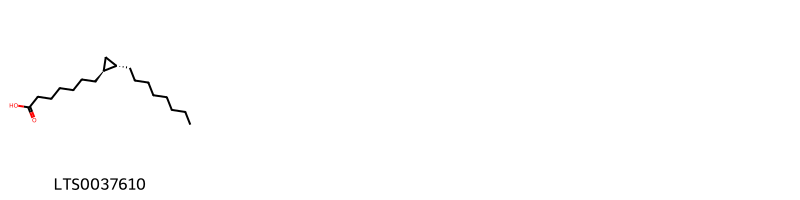{ width=100% }
    <figcaption>Hình ảnh cấu trúc hóa học của 1 hoạt chất thuộc nhóm Fatty Acyls gồm ['7-[(1s,2s)-2-octylcyclopropyl]heptanoic acid (LTS0037610)'].</figcaption>
</figure>
#### Nhóm Flavonoids
<figure markdown="span">
    { width=100% }
    <figcaption>Hình ảnh cấu trúc hóa học của 2 hoạt chất thuộc nhóm Flavonoids gồm ['(+)-catechol (LTS0117079)', 'catechol (LTS0090912)'].</figcaption>
</figure>
#### Nhóm Isoflavonoids
<figure markdown="span">
    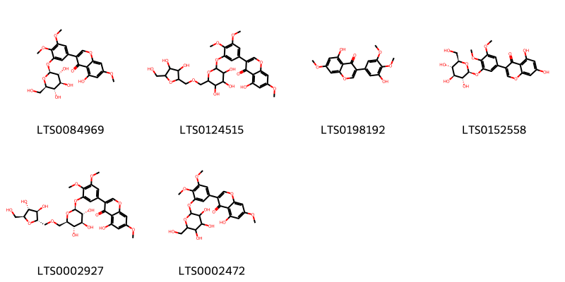{ width=100% }
    <figcaption>Hình ảnh cấu trúc hóa học của 6 hoạt chất thuộc nhóm Isoflavonoids gồm ['3-(3,4-dimethoxy-5-{[(2s,3r,4s,5s,6r)-3,4,5-trihydroxy-6-(hydroxymethyl)oxan-2-yl]oxy}phenyl)-5-hydroxy-7-methoxychromen-4-one (LTS0084969)', '3-(3-{[6-({[3,4-dihydroxy-5-(hydroxymethyl)oxolan-2-yl]methoxy}methyl)-3,4,5-trihydroxyoxan-2-yl]oxy}-4,5-dimethoxyphenyl)-5-hydroxy-7-methoxychromen-4-one (LTS0124515)', '5-hydroxy-3-(3-hydroxy-4,5-dimethoxyphenyl)-7-methoxychromen-4-one (LTS0198192)', '3-(3,4-dimethoxy-5-{[(2s,3r,4s,5s,6r)-3,4,5-trihydroxy-6-(hydroxymethyl)oxan-2-yl]oxy}phenyl)-5,7-dihydroxychromen-4-one (LTS0152558)', '3-(3-{[(2s,3r,4s,5s,6r)-6-({[(2s,3r,4r,5s)-3,4-dihydroxy-5-(hydroxymethyl)oxolan-2-yl]methoxy}methyl)-3,4,5-trihydroxyoxan-2-yl]oxy}-4,5-dimethoxyphenyl)-5-hydroxy-7-methoxychromen-4-one (LTS0002927)', '3-(3,4-dimethoxy-5-{[3,4,5-trihydroxy-6-(hydroxymethyl)oxan-2-yl]oxy}phenyl)-5-hydroxy-7-methoxychromen-4-one (LTS0002472)'].</figcaption>
</figure>
#### Nhóm Naphthalenes
<figure markdown="span">
    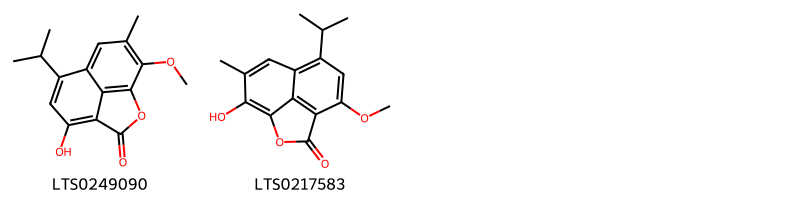{ width=100% }
    <figcaption>Hình ảnh cấu trúc hóa học của 2 hoạt chất thuộc nhóm Naphthalenes gồm ['5-hydroxy-7-isopropyl-11-methoxy-10-methyl-2-oxatricyclo[6.3.1.0⁴,¹²]dodeca-1(11),4(12),5,7,9-pentaen-3-one (LTS0249090)', '11-hydroxy-7-isopropyl-5-methoxy-10-methyl-2-oxatricyclo[6.3.1.0⁴,¹²]dodeca-1(12),4,6,8,10-pentaen-3-one (LTS0217583)'].</figcaption>
</figure>
#### Nhóm Prenol lipids
<figure markdown="span">
    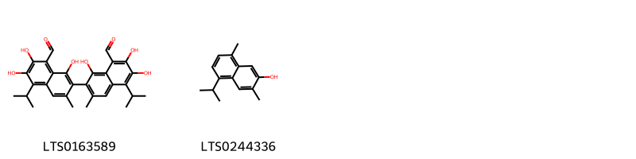{ width=100% }
    <figcaption>Hình ảnh cấu trúc hóa học của 2 hoạt chất thuộc nhóm Prenol lipids gồm ['(-)-gossypol (LTS0163589)', '7-hydroxycadalene (LTS0244336)'].</figcaption>
</figure>
#### Nhóm Steroids and steroid derivatives
<figure markdown="span">
    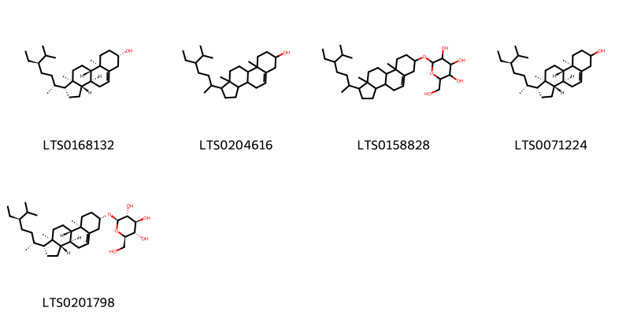{ width=100% }
    <figcaption>Hình ảnh cấu trúc hóa học của 5 hoạt chất thuộc nhóm Steroids and steroid derivatives gồm ['sitosterol (LTS0168132)', 'stigmast-5-en-3-ol, (3β)- (LTS0204616)', '2-{[1-(5-ethyl-6-methylheptan-2-yl)-9a,11a-dimethyl-1h,2h,3h,3ah,3bh,4h,6h,7h,8h,9h,9bh,10h,11h-cyclopenta[a]phenanthren-7-yl]oxy}-6-(hydroxymethyl)oxane-3,4,5-triol (LTS0158828)', 'stigmast-5-en-3-ol (LTS0071224)', 'sitogluside (LTS0201798)'].</figcaption>
</figure>

---

### Dược dân tộc học

Danh sách các quốc gia có sử dụng *Ceiba pentandra* trong điều trị các bệnh. 

| Country            | Disease                                                          | Bệnh                                                                                                                                                                                                |
|:-------------------|:-----------------------------------------------------------------|:----------------------------------------------------------------------------------------------------------------------------------------------------------------------------------------------------|
| Dominican Republic | Emollient                                                        | MYMEMORY WARNING: YOU USED ALL AVAILABLE FREE TRANSLATIONS FOR TODAY. NEXT AVAILABLE IN  15 HOURS 52 MINUTES 57 SECONDS VISIT HTTPS://MYMEMORY.TRANSLATED.NET/DOC/USAGELIMITS.PHP TO TRANSLATE MORE |
| Elsewhere          | Astringent, Astringent, Emollient, Diuretic, Soap, Antidiarrheic | MYMEMORY WARNING: YOU USED ALL AVAILABLE FREE TRANSLATIONS FOR TODAY. NEXT AVAILABLE IN  15 HOURS 52 MINUTES 53 SECONDS VISIT HTTPS://MYMEMORY.TRANSLATED.NET/DOC/USAGELIMITS.PHP TO TRANSLATE MORE |
| Guatemala          | Soap                                                             | MYMEMORY WARNING: YOU USED ALL AVAILABLE FREE TRANSLATIONS FOR TODAY. NEXT AVAILABLE IN  15 HOURS 52 MINUTES 50 SECONDS VISIT HTTPS://MYMEMORY.TRANSLATED.NET/DOC/USAGELIMITS.PHP TO TRANSLATE MORE |
| Haiti              | Diuretic, Emetic                                                 | MYMEMORY WARNING: YOU USED ALL AVAILABLE FREE TRANSLATIONS FOR TODAY. NEXT AVAILABLE IN  15 HOURS 52 MINUTES 45 SECONDS VISIT HTTPS://MYMEMORY.TRANSLATED.NET/DOC/USAGELIMITS.PHP TO TRANSLATE MORE |
| Java               | Diuretic, Emetic                                                 | MYMEMORY WARNING: YOU USED ALL AVAILABLE FREE TRANSLATIONS FOR TODAY. NEXT AVAILABLE IN  15 HOURS 52 MINUTES 39 SECONDS VISIT HTTPS://MYMEMORY.TRANSLATED.NET/DOC/USAGELIMITS.PHP TO TRANSLATE MORE |
| Mexico             | Diuretic, Emetic, Diuretic, Emetic                               | MYMEMORY WARNING: YOU USED ALL AVAILABLE FREE TRANSLATIONS FOR TODAY. NEXT AVAILABLE IN  15 HOURS 52 MINUTES 36 SECONDS VISIT HTTPS://MYMEMORY.TRANSLATED.NET/DOC/USAGELIMITS.PHP TO TRANSLATE MORE |
| Trinidad           | Astringent                                                       | MYMEMORY WARNING: YOU USED ALL AVAILABLE FREE TRANSLATIONS FOR TODAY. NEXT AVAILABLE IN  15 HOURS 52 MINUTES 31 SECONDS VISIT HTTPS://MYMEMORY.TRANSLATED.NET/DOC/USAGELIMITS.PHP TO TRANSLATE MORE |

---

---
## Ceiba pentandta
### Thông tin về thực vật

!!! info "Phân loại thực vật của *Ceiba pentandra* từ GIBF:"
    - **Kingdom:** Plantae
    - **Phylum:** Tracheophyta
    - **Order:** Malvales
    - **Family:** Malvaceae
    - **Genus:** Ceiba
    - **Species:** *Ceiba pentandra*

 

| Label (VI)   | Label (EN)   | Scientific Name   | Descriptions (VI)   | Descriptions (EN)   | Also Known As (VI)                  | Also Known As (EN)                                                             |
|:-------------|:-------------|:------------------|:--------------------|:--------------------|:------------------------------------|:-------------------------------------------------------------------------------|
| N/A          | N/A          | Ceiba pentandra   | loài thực vật       | species of plant    | ['Ceiba pentandra', 'Cây bông gòn'] | ['kapok tree', 'samauma', 'kapok', 'silk-cotton', 'Java cotton', 'Java kapok'] |

#### Phân bố trên thế giới

**Từ CSDL GIBF** Brazil, Guatemala, Viet Nam, Virgin Islands (British), Senegal, Barbados, Gambia, Antigua and Barbuda, Ecuador, Puerto Rico, Ghana, United States of America, Jamaica, Costa Rica, Dominican Republic, Colombia, Cuba, French Guiana, Mexico, Benin, Montserrat, Philippines, Gabon, Panama, Nicaragua, Singapore, Portugal, Bahamas, India, Belize

#### Phân bố tại Việt Nam

**Từ CSDL GIBF**: Cần Thơ

---
### Thành phần hóa học
        
- Theo cơ sở dữ liệu lotus: Từ loài *Ceiba pentandra* đã phân lập và xác định được Chưa có hoạt chất nào được phân lập. hoạt chất thuộc về các nhóm Không có hoạt chất nào được phân lập. 

Không có hình ảnh nào được tạo ra

---

### Dược dân tộc học

Danh sách các quốc gia có sử dụng *Ceiba pentandra* trong điều trị các bệnh. 

| Country   | Disease   | Bệnh                                                                                                                                                                                                |
|:----------|:----------|:----------------------------------------------------------------------------------------------------------------------------------------------------------------------------------------------------|
| Elsewhere | Soap      | MYMEMORY WARNING: YOU USED ALL AVAILABLE FREE TRANSLATIONS FOR TODAY. NEXT AVAILABLE IN  15 HOURS 51 MINUTES 55 SECONDS VISIT HTTPS://MYMEMORY.TRANSLATED.NET/DOC/USAGELIMITS.PHP TO TRANSLATE MORE |

---

# Chi Pachira

??? note "Danh sách các dược liệu thuộc chi"
    
	 - *Pachira aquatica*

---
## Pachira aquatica
### Thông tin về thực vật

!!! info "Phân loại thực vật của *Pachira aquatica* từ GIBF:"
    - **Kingdom:** Plantae
    - **Phylum:** Tracheophyta
    - **Order:** Malvales
    - **Family:** Malvaceae
    - **Genus:** Pachira
    - **Species:** *Pachira aquatica*

 

| Label (VI)   | Label (EN)   | Scientific Name   | Descriptions (VI)   | Descriptions (EN)        | Also Known As (VI)   | Also Known As (EN)   |
|:-------------|:-------------|:------------------|:--------------------|:-------------------------|:---------------------|:---------------------|
| N/A          | N/A          | Pachira aquatica  |                     | Neotropical tree species | ['']                 | ['Money tree']       |

#### Phân bố trên thế giới

**Từ CSDL GIBF** Brazil, Guatemala, Viet Nam, China, Honduras, Madagascar, Puerto Rico, United States of America, Jamaica, Costa Rica, Colombia, French Guiana, Hong Kong, Mexico, Kenya, El Salvador, Malaysia, Philippines, Chinese Taipei, Panama, Nicaragua, South Africa, Myanmar, Belize

#### Phân bố tại Việt Nam

**Từ CSDL GIBF**: Hồ Chí Minh city

---
### Thành phần hóa học
        
- Theo cơ sở dữ liệu lotus: Từ loài *Pachira aquatica* đã phân lập và xác định được 3 hoạt chất thuộc về các nhóm Prenol lipids, Naphthalenes. 

|    | chemicalTaxonomyClassyfireClass   |   smiles_count |
|---:|:----------------------------------|---------------:|
|  0 | Naphthalenes                      |              1 |
|  1 | Prenol lipids                     |              2 |

#### Nhóm Naphthalenes
<figure markdown="span">
    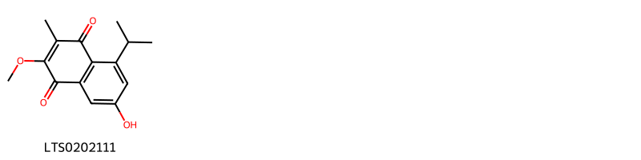{ width=100% }
    <figcaption>Hình ảnh cấu trúc hóa học của 1 hoạt chất thuộc nhóm Naphthalenes gồm ['7-hydroxy-5-isopropyl-2-methoxy-3-methylnaphthalene-1,4-dione (LTS0202111)'].</figcaption>
</figure>
#### Nhóm Prenol lipids
<figure markdown="span">
    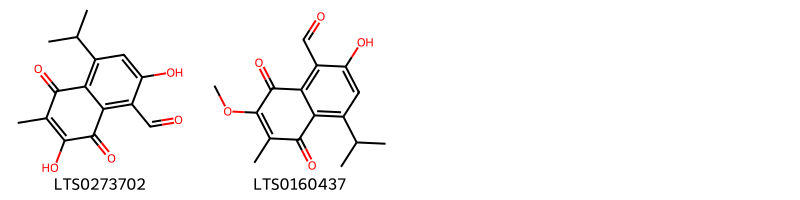{ width=100% }
    <figcaption>Hình ảnh cấu trúc hóa học của 2 hoạt chất thuộc nhóm Prenol lipids gồm ['2,7-dihydroxy-4-isopropyl-6-methyl-5,8-dioxonaphthalene-1-carbaldehyde (LTS0273702)', '2-hydroxy-4-isopropyl-7-methoxy-6-methyl-5,8-dioxonaphthalene-1-carbaldehyde (LTS0160437)'].</figcaption>
</figure>

---

### Dược dân tộc học

Danh sách các quốc gia có sử dụng *Pachira aquatica* trong điều trị các bệnh. 

| Country   | Disease   | Bệnh                                                                                                                                                                                                |
|:----------|:----------|:----------------------------------------------------------------------------------------------------------------------------------------------------------------------------------------------------|
| Elsewhere | Narcotic  | MYMEMORY WARNING: YOU USED ALL AVAILABLE FREE TRANSLATIONS FOR TODAY. NEXT AVAILABLE IN  15 HOURS 51 MINUTES 29 SECONDS VISIT HTTPS://MYMEMORY.TRANSLATED.NET/DOC/USAGELIMITS.PHP TO TRANSLATE MORE |

---

# Chi Ochroma

??? note "Danh sách các dược liệu thuộc chi"
    
	 - *Ochroma lagopus*
	 - *Ochroma pyramidale*

---
## Ochroma lagopus
### Thông tin về thực vật

!!! info "Phân loại thực vật của *Ochroma pyramidale* từ GIBF:"
    - **Kingdom:** Plantae
    - **Phylum:** Tracheophyta
    - **Order:** Malvales
    - **Family:** Malvaceae
    - **Genus:** Ochroma
    - **Species:** *Ochroma pyramidale*

 

| Label (VI)   | Label (EN)   | Scientific Name   | Descriptions (VI)   | Descriptions (EN)   | Also Known As (VI)   | Also Known As (EN)   |
|:-------------|:-------------|:------------------|:--------------------|:--------------------|:---------------------|:---------------------|
| N/A          | N/A          | Ochroma lagopus   | loài thực vật       | species of plant    | ['']                 | ['']                 |

#### Phân bố trên thế giới

**Từ CSDL GIBF** nan, Brazil, Guatemala, Senegal, Central African Republic, Guadeloupe, China, Tanzania, United Republic of, Ecuador, Papua New Guinea, Trinidad and Tobago, Cameroon, Guinea, Puerto Rico, Sri Lanka, Ghana, United States of America, Indonesia, Costa Rica, Dominican Republic, Colombia, Nigeria, Cuba, unknown or invalid, Mexico, Congo, Democratic Republic of the, Kenya, Malaysia, Philippines, Panama, Nicaragua, Côte d’Ivoire, India, Peru, Bolivia (Plurinational State of), Belize, Venezuela (Bolivarian Republic of)

#### Phân bố tại Việt Nam

**Từ CSDL GIBF**: Không có ghi nhận ở Việt Nam

---
### Thành phần hóa học
        
- Theo cơ sở dữ liệu lotus: Từ loài *Ochroma pyramidale* đã phân lập và xác định được Chưa có hoạt chất nào được phân lập. hoạt chất thuộc về các nhóm Không có hoạt chất nào được phân lập. 

Không có hình ảnh nào được tạo ra

---

### Dược dân tộc học

Danh sách các quốc gia có sử dụng *Ochroma pyramidale* trong điều trị các bệnh. 

| Country   | Disease               | Bệnh                                                                                                                                                                                                |
|:----------|:----------------------|:----------------------------------------------------------------------------------------------------------------------------------------------------------------------------------------------------|
| Haiti     | Astringent, Emollient | MYMEMORY WARNING: YOU USED ALL AVAILABLE FREE TRANSLATIONS FOR TODAY. NEXT AVAILABLE IN  15 HOURS 51 MINUTES 05 SECONDS VISIT HTTPS://MYMEMORY.TRANSLATED.NET/DOC/USAGELIMITS.PHP TO TRANSLATE MORE |

---

---
## Ochroma pyramidale
### Thông tin về thực vật

!!! info "Phân loại thực vật của *Ochroma pyramidale* từ GIBF:"
    - **Kingdom:** Plantae
    - **Phylum:** Tracheophyta
    - **Order:** Malvales
    - **Family:** Malvaceae
    - **Genus:** Ochroma
    - **Species:** *Ochroma pyramidale*

 

| Label (VI)   | Label (EN)   | Scientific Name    | Descriptions (VI)   | Descriptions (EN)   | Also Known As (VI)   | Also Known As (EN)   |
|:-------------|:-------------|:-------------------|:--------------------|:--------------------|:---------------------|:---------------------|
| N/A          | N/A          | Ochroma pyramidale | loài thực vật       | species of plant    | ['']                 | ['balsa tree']       |

#### Phân bố trên thế giới

**Từ CSDL GIBF** Brazil, Guadeloupe, Honduras, Ecuador, Trinidad and Tobago, Puerto Rico, Jamaica, Indonesia, Costa Rica, Dominican Republic, Colombia, French Guiana, Dominica, Mexico, Panama, Belize, Nicaragua, Saint Vincent and the Grenadines, Peru, Bolivia (Plurinational State of), Montserrat, Venezuela (Bolivarian Republic of)

#### Phân bố tại Việt Nam

**Từ CSDL GIBF**: Không có ghi nhận ở Việt Nam

---
### Thành phần hóa học
        
- Theo cơ sở dữ liệu lotus: Từ loài *Ochroma pyramidale* đã phân lập và xác định được 3 hoạt chất thuộc về các nhóm 2-arylbenzofuran flavonoids. 

|    | chemicalTaxonomyClassyfireClass   |   smiles_count |
|---:|:----------------------------------|---------------:|
|  0 | 2-arylbenzofuran flavonoids       |              3 |

#### Nhóm 2-arylbenzofuran flavonoids
<figure markdown="span">
    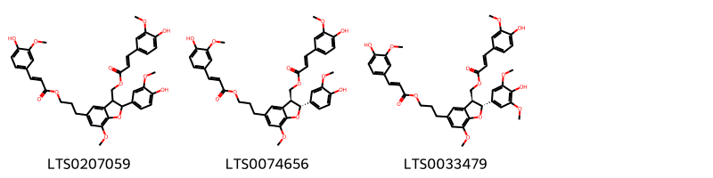{ width=100% }
    <figcaption>Hình ảnh cấu trúc hóa học của 3 hoạt chất thuộc nhóm 2-arylbenzofuran flavonoids gồm ['boehmenan (LTS0207059)', '[(2r,3s)-2-(4-hydroxy-3-methoxyphenyl)-5-(3-{[(2e)-3-(4-hydroxy-3-methoxyphenyl)prop-2-enoyl]oxy}propyl)-7-methoxy-2,3-dihydro-1-benzofuran-3-yl]methyl (2e)-3-(4-hydroxy-3-methoxyphenyl)prop-2-enoate (LTS0074656)', '[(2r,3s)-2-(4-hydroxy-3,5-dimethoxyphenyl)-5-(3-{[(2e)-3-(4-hydroxy-3-methoxyphenyl)prop-2-enoyl]oxy}propyl)-7-methoxy-2,3-dihydro-1-benzofuran-3-yl]methyl (2e)-3-(4-hydroxy-3-methoxyphenyl)prop-2-enoate (LTS0033479)'].</figcaption>
</figure>

---

### Dược dân tộc học

Danh sách các quốc gia có sử dụng *Ochroma pyramidale* trong điều trị các bệnh. 

| Country   | Disease                    | Bệnh                                                                                                                                                                                                |
|:----------|:---------------------------|:----------------------------------------------------------------------------------------------------------------------------------------------------------------------------------------------------|
| Elsewhere | Diuretic, Emetic, Aperient | MYMEMORY WARNING: YOU USED ALL AVAILABLE FREE TRANSLATIONS FOR TODAY. NEXT AVAILABLE IN  15 HOURS 50 MINUTES 37 SECONDS VISIT HTTPS://MYMEMORY.TRANSLATED.NET/DOC/USAGELIMITS.PHP TO TRANSLATE MORE |

---

# Chi Durio

??? note "Danh sách các dược liệu thuộc chi"
    
	 - *Durio zibethinus*

---
## Durio zibethinus
### Thông tin về thực vật

!!! info "Phân loại thực vật của *Durio zibethinus* từ GIBF:"
    - **Kingdom:** Plantae
    - **Phylum:** Tracheophyta
    - **Order:** Malvales
    - **Family:** Malvaceae
    - **Genus:** Durio
    - **Species:** *Durio zibethinus*

 

| Label (VI)   | Label (EN)   | Scientific Name   | Descriptions (VI)   | Descriptions (EN)                            | Also Known As (VI)   | Also Known As (EN)   |
|:-------------|:-------------|:------------------|:--------------------|:---------------------------------------------|:---------------------|:---------------------|
| N/A          | N/A          | Durio zibethinus  | loài thực vật       | species of plants producing the Durian fruit | ['']                 | ['']                 |

#### Phân bố trên thế giới

**Từ CSDL GIBF** nan, Brazil, Viet Nam, Uganda, Honduras, Tanzania, United Republic of, Ecuador, Thailand, Sri Lanka, United States of America, Jamaica, Indonesia, Costa Rica, unknown or invalid, El Salvador, Belgium, Malaysia, Philippines, Chinese Taipei, Brunei Darussalam, Singapore, Myanmar, India

#### Phân bố tại Việt Nam

**Từ CSDL GIBF**: Đồng Tháp, Kiên Giang, Gia Lai, Tiền Giang, Vĩnh Long

---
### Thành phần hóa học
        
- Theo cơ sở dữ liệu lotus: Từ loài *Durio zibethinus* đã phân lập và xác định được 19 hoạt chất thuộc về các nhóm Benzene and substituted derivatives, Coumarins and derivatives, Organooxygen compounds, Macrolides and analogues, Prenol lipids, 2-arylbenzofuran flavonoids, Benzopyrans, Stilbenes. 

|    | chemicalTaxonomyClassyfireClass     |   smiles_count |
|---:|:------------------------------------|---------------:|
|  0 |                                     |              2 |
|  1 | 2-arylbenzofuran flavonoids         |              3 |
|  2 | Benzene and substituted derivatives |              1 |
|  3 | Benzopyrans                         |              2 |
|  4 | Coumarins and derivatives           |              1 |
|  5 | Macrolides and analogues            |              2 |
|  6 | Organooxygen compounds              |              2 |
|  7 | Prenol lipids                       |              3 |
|  8 | Stilbenes                           |              2 |

#### Nhóm 
<figure markdown="span">
    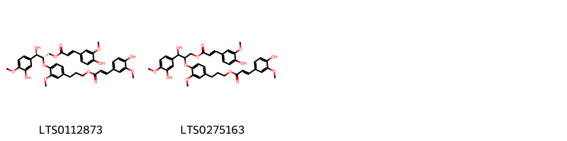{ width=100% }
    <figcaption>Hình ảnh cấu trúc hóa học của 2 hoạt chất thuộc nhóm  gồm ['(2s,3r)-3-hydroxy-2-[4-(3-{[(2e)-3-(4-hydroxy-3-methoxyphenyl)prop-2-enoyl]oxy}propyl)-2-methoxyphenoxy]-3-(3-hydroxy-4-methoxyphenyl)propyl (2e)-3-(4-hydroxy-3-methoxyphenyl)prop-2-enoate (LTS0112873)', '3-hydroxy-2-[4-(3-{[3-(4-hydroxy-3-methoxyphenyl)prop-2-enoyl]oxy}propyl)-2-methoxyphenoxy]-3-(3-hydroxy-4-methoxyphenyl)propyl 3-(4-hydroxy-3-methoxyphenyl)prop-2-enoate (LTS0275163)'].</figcaption>
</figure>
#### Nhóm 2-arylbenzofuran flavonoids
<figure markdown="span">
    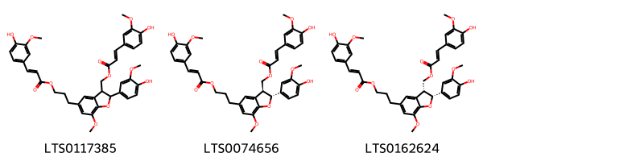{ width=100% }
    <figcaption>Hình ảnh cấu trúc hóa học của 3 hoạt chất thuộc nhóm 2-arylbenzofuran flavonoids gồm ['[2-(4-hydroxy-3-methoxyphenyl)-5-(3-{[3-(4-hydroxy-3-methoxyphenyl)prop-2-enoyl]oxy}propyl)-7-methoxy-2,3-dihydro-1-benzofuran-3-yl]methyl 3-(4-hydroxy-3-methoxyphenyl)prop-2-enoate (LTS0117385)', '[(2r,3s)-2-(4-hydroxy-3-methoxyphenyl)-5-(3-{[(2e)-3-(4-hydroxy-3-methoxyphenyl)prop-2-enoyl]oxy}propyl)-7-methoxy-2,3-dihydro-1-benzofuran-3-yl]methyl (2e)-3-(4-hydroxy-3-methoxyphenyl)prop-2-enoate (LTS0074656)', '[(2r,3r)-2-(4-hydroxy-3-methoxyphenyl)-5-(3-{[(2e)-3-(4-hydroxy-3-methoxyphenyl)prop-2-enoyl]oxy}propyl)-7-methoxy-2,3-dihydro-1-benzofuran-3-yl]methyl (2e)-3-(4-hydroxy-3-methoxyphenyl)prop-2-enoate (LTS0162624)'].</figcaption>
</figure>
#### Nhóm Benzene and substituted derivatives
<figure markdown="span">
    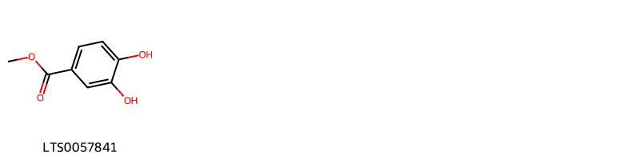{ width=100% }
    <figcaption>Hình ảnh cấu trúc hóa học của 1 hoạt chất thuộc nhóm Benzene and substituted derivatives gồm ['methyl 3,4-dihydroxybenzoate (LTS0057841)'].</figcaption>
</figure>
#### Nhóm Benzopyrans
<figure markdown="span">
    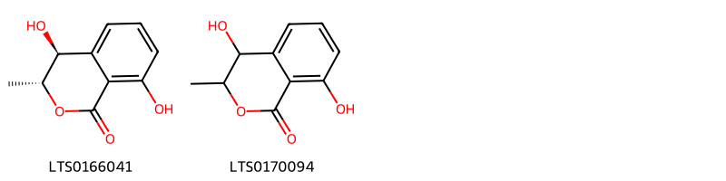{ width=100% }
    <figcaption>Hình ảnh cấu trúc hóa học của 2 hoạt chất thuộc nhóm Benzopyrans gồm ['trans-4-hydroxymellein (LTS0166041)', '4,8-dihydroxy-3-methyl-3,4-dihydro-2-benzopyran-1-one (LTS0170094)'].</figcaption>
</figure>
#### Nhóm Coumarins and derivatives
<figure markdown="span">
    { width=100% }
    <figcaption>Hình ảnh cấu trúc hóa học của 1 hoạt chất thuộc nhóm Coumarins and derivatives gồm ['fraxidin (LTS0182118)'].</figcaption>
</figure>
#### Nhóm Macrolides and analogues
<figure markdown="span">
    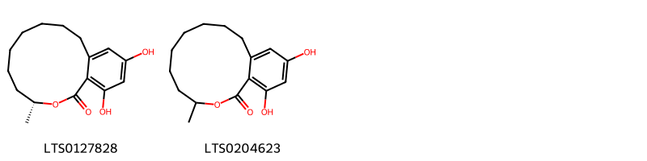{ width=100% }
    <figcaption>Hình ảnh cấu trúc hóa học của 2 hoạt chất thuộc nhóm Macrolides and analogues gồm ['(3r)-12,14-dihydroxy-3-methyl-3,4,5,6,7,8,9,10-octahydro-2-benzoxacyclododecin-1-one (LTS0127828)', '12,14-dihydroxy-3-methyl-3,4,5,6,7,8,9,10-octahydro-2-benzoxacyclododecin-1-one (LTS0204623)'].</figcaption>
</figure>
#### Nhóm Organooxygen compounds
<figure markdown="span">
    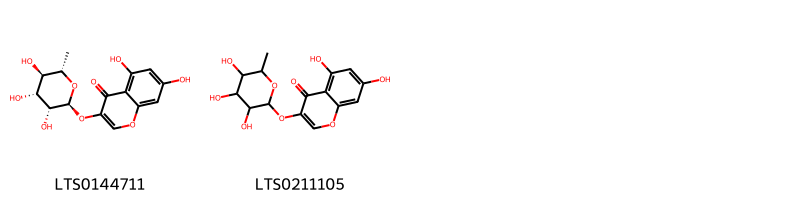{ width=100% }
    <figcaption>Hình ảnh cấu trúc hóa học của 2 hoạt chất thuộc nhóm Organooxygen compounds gồm ['5,7-dihydroxy-3-{[(2s,3r,4r,5r,6s)-3,4,5-trihydroxy-6-methyloxan-2-yl]oxy}chromen-4-one (LTS0144711)', '5,7-dihydroxy-3-[(3,4,5-trihydroxy-6-methyloxan-2-yl)oxy]chromen-4-one (LTS0211105)'].</figcaption>
</figure>
#### Nhóm Prenol lipids
<figure markdown="span">
    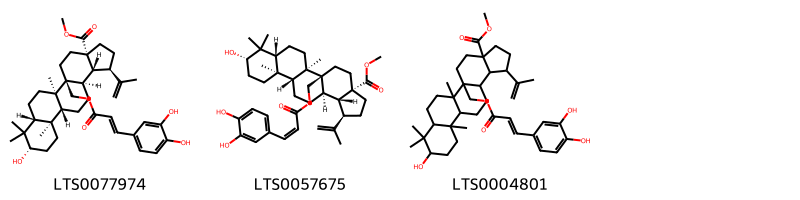{ width=100% }
    <figcaption>Hình ảnh cấu trúc hóa học của 3 hoạt chất thuộc nhóm Prenol lipids gồm ['methyl (1r,3as,5as,5br,7ar,9s,11ar,11br,13ar,13br)-5a-({[(2e)-3-(3,4-dihydroxyphenyl)prop-2-enoyl]oxy}methyl)-9-hydroxy-5b,8,8,11a-tetramethyl-1-(prop-1-en-2-yl)-hexadecahydrocyclopenta[a]chrysene-3a-carboxylate (LTS0077974)', 'methyl (1r,3as,5as,5br,7ar,9s,11ar,11br,13ar,13br)-5a-({[(2z)-3-(3,4-dihydroxyphenyl)prop-2-enoyl]oxy}methyl)-9-hydroxy-5b,8,8,11a-tetramethyl-1-(prop-1-en-2-yl)-hexadecahydrocyclopenta[a]chrysene-3a-carboxylate (LTS0057675)', 'methyl 5a-({[3-(3,4-dihydroxyphenyl)prop-2-enoyl]oxy}methyl)-9-hydroxy-5b,8,8,11a-tetramethyl-1-(prop-1-en-2-yl)-hexadecahydrocyclopenta[a]chrysene-3a-carboxylate (LTS0004801)'].</figcaption>
</figure>
#### Nhóm Stilbenes
<figure markdown="span">
    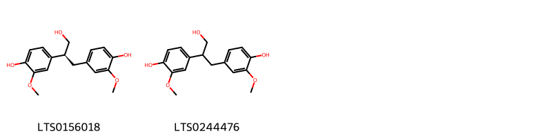{ width=100% }
    <figcaption>Hình ảnh cấu trúc hóa học của 2 hoạt chất thuộc nhóm Stilbenes gồm ['4-[(2s)-3-hydroxy-2-(4-hydroxy-3-methoxyphenyl)propyl]-2-methoxyphenol (LTS0156018)', '4-[3-hydroxy-2-(4-hydroxy-3-methoxyphenyl)propyl]-2-methoxyphenol (LTS0244476)'].</figcaption>
</figure>

---

### Dược dân tộc học

Danh sách các quốc gia có sử dụng *Durio zibethinus* trong điều trị các bệnh. 

| Country   | Disease   | Bệnh                                                                                                                                                                                                |
|:----------|:----------|:----------------------------------------------------------------------------------------------------------------------------------------------------------------------------------------------------|
| Malaya    | Tonic     | MYMEMORY WARNING: YOU USED ALL AVAILABLE FREE TRANSLATIONS FOR TODAY. NEXT AVAILABLE IN  15 HOURS 50 MINUTES 09 SECONDS VISIT HTTPS://MYMEMORY.TRANSLATED.NET/DOC/USAGELIMITS.PHP TO TRANSLATE MORE |

---

# Chi Neesia

??? note "Danh sách các dược liệu thuộc chi"
    
	 - *Neesia altissima*

---
## Neesia altissima
### Thông tin về thực vật

!!! info "Phân loại thực vật của *Neesia altissima* từ GIBF:"
    - **Kingdom:** Plantae
    - **Phylum:** Tracheophyta
    - **Order:** Malvales
    - **Family:** Malvaceae
    - **Genus:** Neesia
    - **Species:** *Neesia altissima*

 

| Label (VI)   | Label (EN)   | Scientific Name   | Descriptions (VI)   | Descriptions (EN)   | Also Known As (VI)   | Also Known As (EN)   |
|:-------------|:-------------|:------------------|:--------------------|:--------------------|:---------------------|:---------------------|
| N/A          | N/A          | Neesia altissima  | loài thực vật       | species of plant    | ['']                 | ['']                 |

#### Phân bố trên thế giới

**Từ CSDL GIBF** nan, Singapore, Indonesia, Malaysia, Colombia, unknown or invalid, Thailand

#### Phân bố tại Việt Nam

**Từ CSDL GIBF**: Không có ghi nhận ở Việt Nam

---
### Thành phần hóa học
        
- Theo cơ sở dữ liệu lotus: Từ loài *Neesia altissima* đã phân lập và xác định được Chưa có hoạt chất nào được phân lập. hoạt chất thuộc về các nhóm Không có hoạt chất nào được phân lập. 

Không có hình ảnh nào được tạo ra

---

### Dược dân tộc học

Danh sách các quốc gia có sử dụng *Neesia altissima* trong điều trị các bệnh. 

| Country   | Disease   | Bệnh                                                                                                                                                                                                |
|:----------|:----------|:----------------------------------------------------------------------------------------------------------------------------------------------------------------------------------------------------|
| Indonesia | Diuretic  | MYMEMORY WARNING: YOU USED ALL AVAILABLE FREE TRANSLATIONS FOR TODAY. NEXT AVAILABLE IN  15 HOURS 49 MINUTES 39 SECONDS VISIT HTTPS://MYMEMORY.TRANSLATED.NET/DOC/USAGELIMITS.PHP TO TRANSLATE MORE |

---

# Chi Bombax

??? note "Danh sách các dược liệu thuộc chi"
    
	 - *Bombax buonopozence*
	 - *Bombax buonpozense*
	 - *Bombax ellipticum*
	 - *Bombax malabaricum*

---
## Bombax buonopozence
### Thông tin về thực vật

!!! info "Phân loại thực vật của *Bombax buonopozense* từ GIBF:"
    - **Kingdom:** Plantae
    - **Phylum:** Tracheophyta
    - **Order:** Malvales
    - **Family:** Malvaceae
    - **Genus:** Bombax
    - **Species:** *Bombax buonopozense*

 

| Label (VI)   | Label (EN)   | Scientific Name   | Descriptions (VI)   | Descriptions (EN)   | Also Known As (VI)   | Also Known As (EN)   |
|:-------------|:-------------|:------------------|:--------------------|:--------------------|:---------------------|:---------------------|
| N/A          | N/A          | Neesia altissima  | loài thực vật       | species of plant    | ['']                 | ['']                 |

#### Phân bố trên thế giới

**Từ CSDL GIBF** Benin, Congo, Democratic Republic of the, Belgium, Gabon, Liberia, Côte d’Ivoire, Nigeria, Congo, Togo, Sierra Leone, Cameroon, Guinea, Ghana

#### Phân bố tại Việt Nam

**Từ CSDL GIBF**: Không có ghi nhận ở Việt Nam

---
### Thành phần hóa học
        
- Theo cơ sở dữ liệu lotus: Từ loài *Bombax buonopozense* đã phân lập và xác định được Chưa có hoạt chất nào được phân lập. hoạt chất thuộc về các nhóm Không có hoạt chất nào được phân lập. 

Không có hình ảnh nào được tạo ra

---

### Dược dân tộc học

Danh sách các quốc gia có sử dụng *Bombax buonopozense* trong điều trị các bệnh. 

| Country        | Disease     | Bệnh                                                                                                                                                                                                |
|:---------------|:------------|:----------------------------------------------------------------------------------------------------------------------------------------------------------------------------------------------------|
| Africa(Yoruba) | Emmenagogue | MYMEMORY WARNING: YOU USED ALL AVAILABLE FREE TRANSLATIONS FOR TODAY. NEXT AVAILABLE IN  15 HOURS 49 MINUTES 16 SECONDS VISIT HTTPS://MYMEMORY.TRANSLATED.NET/DOC/USAGELIMITS.PHP TO TRANSLATE MORE |

---

---
## Bombax buonpozense
### Thông tin về thực vật

!!! info "Phân loại thực vật của *Bombax buonopozense* từ GIBF:"
    - **Kingdom:** Plantae
    - **Phylum:** Tracheophyta
    - **Order:** Malvales
    - **Family:** Malvaceae
    - **Genus:** Bombax
    - **Species:** *Bombax buonopozense*

 

| Label (VI)   | Label (EN)   | Scientific Name   | Descriptions (VI)   | Descriptions (EN)   | Also Known As (VI)   | Also Known As (EN)   |
|:-------------|:-------------|:------------------|:--------------------|:--------------------|:---------------------|:---------------------|
| N/A          | N/A          | Neesia altissima  | loài thực vật       | species of plant    | ['']                 | ['']                 |

#### Phân bố trên thế giới

**Từ CSDL GIBF** Benin, Congo, Democratic Republic of the, Belgium, Gabon, Liberia, Côte d’Ivoire, Nigeria, Congo, Togo, Sierra Leone, Cameroon, Guinea, Ghana

#### Phân bố tại Việt Nam

**Từ CSDL GIBF**: Không có ghi nhận ở Việt Nam

---
### Thành phần hóa học
        
- Theo cơ sở dữ liệu lotus: Từ loài *Bombax buonopozense* đã phân lập và xác định được Chưa có hoạt chất nào được phân lập. hoạt chất thuộc về các nhóm Không có hoạt chất nào được phân lập. 

Không có hình ảnh nào được tạo ra

---

### Dược dân tộc học

Danh sách các quốc gia có sử dụng *Bombax buonopozense* trong điều trị các bệnh. 

| Country   | Disease                | Bệnh                                                                                                                                                                                                |
|:----------|:-----------------------|:----------------------------------------------------------------------------------------------------------------------------------------------------------------------------------------------------|
| Africa    | Dentifrice             | MYMEMORY WARNING: YOU USED ALL AVAILABLE FREE TRANSLATIONS FOR TODAY. NEXT AVAILABLE IN  15 HOURS 48 MINUTES 50 SECONDS VISIT HTTPS://MYMEMORY.TRANSLATED.NET/DOC/USAGELIMITS.PHP TO TRANSLATE MORE |
| Ghana     | Emmenagogue, Emollient | MYMEMORY WARNING: YOU USED ALL AVAILABLE FREE TRANSLATIONS FOR TODAY. NEXT AVAILABLE IN  15 HOURS 48 MINUTES 47 SECONDS VISIT HTTPS://MYMEMORY.TRANSLATED.NET/DOC/USAGELIMITS.PHP TO TRANSLATE MORE |
| Nigeria   | Emmenagogue            | MYMEMORY WARNING: YOU USED ALL AVAILABLE FREE TRANSLATIONS FOR TODAY. NEXT AVAILABLE IN  15 HOURS 48 MINUTES 45 SECONDS VISIT HTTPS://MYMEMORY.TRANSLATED.NET/DOC/USAGELIMITS.PHP TO TRANSLATE MORE |

---

---
## Bombax ellipticum
### Thông tin về thực vật

!!! info "Phân loại thực vật của *Pseudobombax ellipticum* từ GIBF:"
    - **Kingdom:** Plantae
    - **Phylum:** Tracheophyta
    - **Order:** Malvales
    - **Family:** Malvaceae
    - **Genus:** Pseudobombax
    - **Species:** *Pseudobombax ellipticum*

 

| Label (VI)   | Label (EN)   | Scientific Name   | Descriptions (VI)   | Descriptions (EN)   | Also Known As (VI)   | Also Known As (EN)   |
|:-------------|:-------------|:------------------|:--------------------|:--------------------|:---------------------|:---------------------|
| N/A          | N/A          | Bombax ellipticum | loài thực vật       | species of plant    | ['']                 | ['']                 |

#### Phân bố trên thế giới

**Từ CSDL GIBF** nan, Mexico, United States of America, Jamaica, El Salvador, Belgium, Belize

#### Phân bố tại Việt Nam

**Từ CSDL GIBF**: Không có ghi nhận ở Việt Nam

---
### Thành phần hóa học
        
- Theo cơ sở dữ liệu lotus: Từ loài *Pseudobombax ellipticum* đã phân lập và xác định được Chưa có hoạt chất nào được phân lập. hoạt chất thuộc về các nhóm Không có hoạt chất nào được phân lập. 

Không có hình ảnh nào được tạo ra

---

### Dược dân tộc học

Danh sách các quốc gia có sử dụng *Pseudobombax ellipticum* trong điều trị các bệnh. 

| Country   | Disease   | Bệnh                                                                                                                                                                                                |
|:----------|:----------|:----------------------------------------------------------------------------------------------------------------------------------------------------------------------------------------------------|
| Mexico    | Diuretic  | MYMEMORY WARNING: YOU USED ALL AVAILABLE FREE TRANSLATIONS FOR TODAY. NEXT AVAILABLE IN  15 HOURS 48 MINUTES 23 SECONDS VISIT HTTPS://MYMEMORY.TRANSLATED.NET/DOC/USAGELIMITS.PHP TO TRANSLATE MORE |

---

---
## Bombax malabaricum
### Thông tin về thực vật

!!! info "Phân loại thực vật của *Bombax ceiba* từ GIBF:"
    - **Kingdom:** Plantae
    - **Phylum:** Tracheophyta
    - **Order:** Malvales
    - **Family:** Malvaceae
    - **Genus:** Bombax
    - **Species:** *Bombax ceiba*

 

| Label (VI)   | Label (EN)   | Scientific Name    | Descriptions (VI)   | Descriptions (EN)   | Also Known As (VI)   | Also Known As (EN)   |
|:-------------|:-------------|:-------------------|:--------------------|:--------------------|:---------------------|:---------------------|
| N/A          | N/A          | Bombax malabaricum | loài thực vật       | species of plant    | ['']                 | ['']                 |

#### Phân bố trên thế giới

**Từ CSDL GIBF** nan, Brazil, Viet Nam, Japan, Nepal, China, Thailand, Madagascar, Sri Lanka, United States of America, unknown or invalid, Lao People’s Democratic Republic, Philippines, Chinese Taipei, Egypt, Cambodia, Australia, Myanmar, India, Venezuela (Bolivarian Republic of)

#### Phân bố tại Việt Nam

**Từ CSDL GIBF**: Không có ghi nhận ở Việt Nam

---
### Thành phần hóa học
        
- Theo cơ sở dữ liệu lotus: Từ loài *Bombax ceiba* đã phân lập và xác định được 56 hoạt chất thuộc về các nhóm Fatty Acyls, Benzofurans, Depsides and depsidones, Benzene and substituted derivatives, Flavonoids, Naphthopyrans, Naphthalenes, Steroids and steroid derivatives, Cinnamic acids and derivatives, Organooxygen compounds, Prenol lipids. 

|    | chemicalTaxonomyClassyfireClass     |   smiles_count |
|---:|:------------------------------------|---------------:|
|  0 | Benzene and substituted derivatives |              2 |
|  1 | Benzofurans                         |              4 |
|  2 | Cinnamic acids and derivatives      |              1 |
|  3 | Depsides and depsidones             |              1 |
|  4 | Fatty Acyls                         |              7 |
|  5 | Flavonoids                          |             12 |
|  6 | Naphthalenes                        |              5 |
|  7 | Naphthopyrans                       |              2 |
|  8 | Organooxygen compounds              |              9 |
|  9 | Prenol lipids                       |             12 |
| 10 | Steroids and steroid derivatives    |              1 |

#### Nhóm Benzene and substituted derivatives
<figure markdown="span">
    { width=100% }
    <figcaption>Hình ảnh cấu trúc hóa học của 2 hoạt chất thuộc nhóm Benzene and substituted derivatives gồm ['galop (LTS0222857)', 'ethyl gallate (LTS0270645)'].</figcaption>
</figure>
#### Nhóm Benzofurans
<figure markdown="span">
    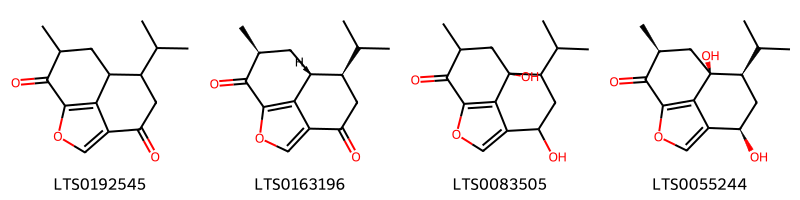{ width=100% }
    <figcaption>Hình ảnh cấu trúc hóa học của 4 hoạt chất thuộc nhóm Benzofurans gồm ['7-isopropyl-10-methyl-2-oxatricyclo[6.3.1.0⁴,¹²]dodeca-1(12),3-diene-5,11-dione (LTS0192545)', '(7r,8r,10s)-7-isopropyl-10-methyl-2-oxatricyclo[6.3.1.0⁴,¹²]dodeca-1(12),3-diene-5,11-dione (LTS0163196)', '5,8-dihydroxy-7-isopropyl-10-methyl-2-oxatricyclo[6.3.1.0⁴,¹²]dodeca-1(12),3-dien-11-one (LTS0083505)', '(5r,7r,8s,10s)-5,8-dihydroxy-7-isopropyl-10-methyl-2-oxatricyclo[6.3.1.0⁴,¹²]dodeca-1(12),3-dien-11-one (LTS0055244)'].</figcaption>
</figure>
#### Nhóm Cinnamic acids and derivatives
<figure markdown="span">
    { width=100% }
    <figcaption>Hình ảnh cấu trúc hóa học của 1 hoạt chất thuộc nhóm Cinnamic acids and derivatives gồm ['3,4-dihydroxycinnamic acid (LTS0128050)'].</figcaption>
</figure>
#### Nhóm Depsides and depsidones
<figure markdown="span">
    { width=100% }
    <figcaption>Hình ảnh cấu trúc hóa học của 1 hoạt chất thuộc nhóm Depsides and depsidones gồm ['digallic acid (LTS0019534)'].</figcaption>
</figure>
#### Nhóm Fatty Acyls
<figure markdown="span">
    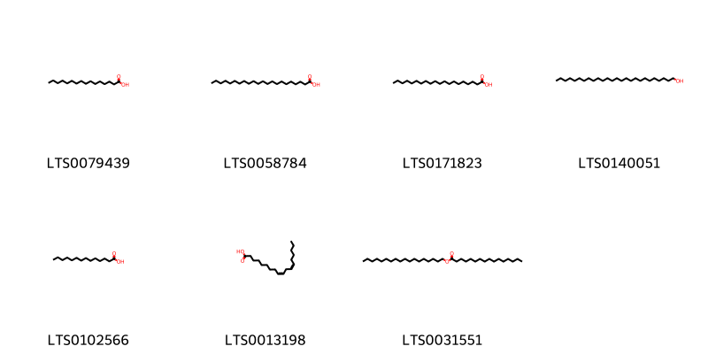{ width=100% }
    <figcaption>Hình ảnh cấu trúc hóa học của 7 hoạt chất thuộc nhóm Fatty Acyls gồm ['palmitic acid (LTS0079439)', 'behenic acid (LTS0058784)', 'arachidic acid (LTS0171823)', 'ceryl alcohol (LTS0140051)', 'myristic acid (LTS0102566)', 'linoleic (LTS0013198)', 'lanolin (LTS0031551)'].</figcaption>
</figure>
#### Nhóm Flavonoids
<figure markdown="span">
    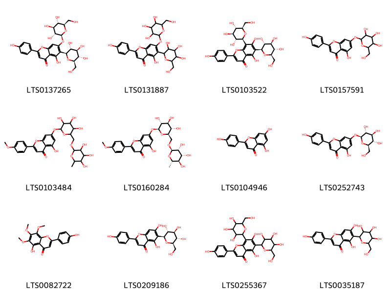{ width=100% }
    <figcaption>Hình ảnh cấu trúc hóa học của 12 hoạt chất thuộc nhóm Flavonoids gồm ['saponarin (LTS0137265)', 'saponarin (LTS0131887)', 'vicenin-2 (LTS0103522)', 'apigetrin (LTS0157591)', '5-hydroxy-2-(4-methoxyphenyl)-7-[(3,4,5-trihydroxy-6-{[(3,4,5-trihydroxy-6-methyloxan-2-yl)oxy]methyl}oxan-2-yl)oxy]chromen-4-one (LTS0103484)', 'linarin (LTS0160284)', 'chamomile (LTS0104946)', 'apigenin 7-o-β-glucoside (LTS0252743)', 'xanthomicrol (LTS0082722)', 'isovitexin (LTS0209186)', '5,7-dihydroxy-2-(4-hydroxyphenyl)-6,8-bis[3,4,5-trihydroxy-6-(hydroxymethyl)oxan-2-yl]chromen-4-one (LTS0255367)', 'isovitexin (LTS0035187)'].</figcaption>
</figure>
#### Nhóm Naphthalenes
<figure markdown="span">
    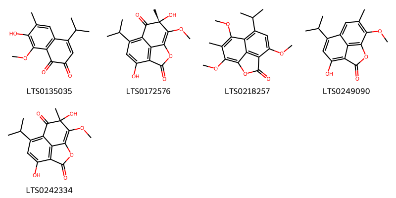{ width=100% }
    <figcaption>Hình ảnh cấu trúc hóa học của 5 hoạt chất thuộc nhóm Naphthalenes gồm ['7-hydroxy-4-isopropyl-8-methoxy-6-methylnaphthalene-1,2-dione (LTS0135035)', '(10r)-5,10-dihydroxy-7-isopropyl-11-methoxy-10-methyl-2-oxatricyclo[6.3.1.0⁴,¹²]dodeca-1(11),4,6,8(12)-tetraene-3,9-dione (LTS0172576)', '7-isopropyl-5,9,11-trimethoxy-10-methyl-2-oxatricyclo[6.3.1.0⁴,¹²]dodeca-1(12),4,6,8,10-pentaen-3-one (LTS0218257)', '5-hydroxy-7-isopropyl-11-methoxy-10-methyl-2-oxatricyclo[6.3.1.0⁴,¹²]dodeca-1(11),4(12),5,7,9-pentaen-3-one (LTS0249090)', '5,10-dihydroxy-7-isopropyl-11-methoxy-10-methyl-2-oxatricyclo[6.3.1.0⁴,¹²]dodeca-1(11),4,6,8(12)-tetraene-3,9-dione (LTS0242334)'].</figcaption>
</figure>
#### Nhóm Naphthopyrans
<figure markdown="span">
    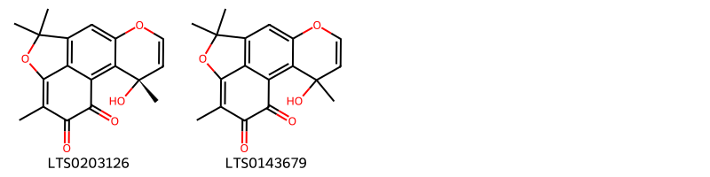{ width=100% }
    <figcaption>Hình ảnh cấu trúc hóa học của 2 hoạt chất thuộc nhóm Naphthopyrans gồm ['(3s)-3-hydroxy-3,10,10,13-tetramethyl-6,11-dioxatetracyclo[7.6.1.0²,⁷.0¹²,¹⁶]hexadeca-1(16),2(7),4,8,12-pentaene-14,15-dione (LTS0203126)', '3-hydroxy-3,10,10,13-tetramethyl-6,11-dioxatetracyclo[7.6.1.0²,⁷.0¹²,¹⁶]hexadeca-1(16),2(7),4,8,12-pentaene-14,15-dione (LTS0143679)'].</figcaption>
</figure>
#### Nhóm Organooxygen compounds
<figure markdown="span">
    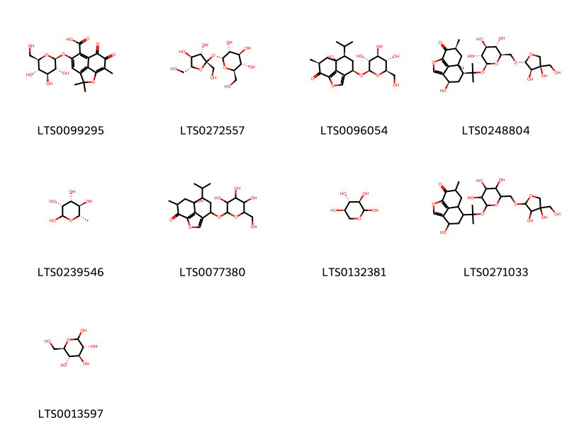{ width=100% }
    <figcaption>Hình ảnh cấu trúc hóa học của 9 hoạt chất thuộc nhóm Organooxygen compounds gồm ['3,3,11-trimethyl-9,10-dioxo-6-{[(2s,3r,4s,5s,6r)-3,4,5-trihydroxy-6-(hydroxymethyl)oxan-2-yl]oxy}-2-oxatricyclo[6.3.1.0⁴,¹²]dodeca-1(11),4,6,8(12)-tetraene-7-carboxylic acid (LTS0099295)', 'sucrose (LTS0272557)', '(5r,7r,8s,10s)-8-hydroxy-7-isopropyl-10-methyl-5-{[(2r,3r,4s,5s,6r)-3,4,5-trihydroxy-6-(hydroxymethyl)oxan-2-yl]oxy}-2-oxatricyclo[6.3.1.0⁴,¹²]dodeca-1(12),3-dien-11-one (LTS0096054)', '(5r,7s,8r,10s)-7-(2-{[(2s,3r,4s,5s,6r)-6-({[(2r,3r,4r)-3,4-dihydroxy-4-(hydroxymethyl)oxolan-2-yl]oxy}methyl)-3,4,5-trihydroxyoxan-2-yl]oxy}propan-2-yl)-5-hydroxy-10-methyl-2-oxatricyclo[6.3.1.0⁴,¹²]dodeca-1(12),3-dien-11-one (LTS0248804)', 'l-rhamnose (LTS0239546)', '8-hydroxy-7-isopropyl-10-methyl-5-{[3,4,5-trihydroxy-6-(hydroxymethyl)oxan-2-yl]oxy}-2-oxatricyclo[6.3.1.0⁴,¹²]dodeca-1(12),3-dien-11-one (LTS0077380)', 'd-xylose (LTS0132381)', '7-(2-{[6-({[3,4-dihydroxy-4-(hydroxymethyl)oxolan-2-yl]oxy}methyl)-3,4,5-trihydroxyoxan-2-yl]oxy}propan-2-yl)-5-hydroxy-10-methyl-2-oxatricyclo[6.3.1.0⁴,¹²]dodeca-1(12),3-dien-11-one (LTS0271033)', 'glucose (LTS0013597)'].</figcaption>
</figure>
#### Nhóm Prenol lipids
<figure markdown="span">
    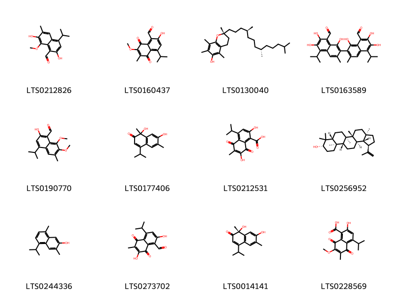{ width=100% }
    <figcaption>Hình ảnh cấu trúc hóa học của 12 hoạt chất thuộc nhóm Prenol lipids gồm ['2,7-dihydroxy-4-isopropyl-8-methoxy-6-methylnaphthalene-1-carbaldehyde (LTS0212826)', '2-hydroxy-4-isopropyl-7-methoxy-6-methyl-5,8-dioxonaphthalene-1-carbaldehyde (LTS0160437)', '(2r)-2,5,7,8-tetramethyl-2-[(4s,8s)-4,8,12-trimethyltridecyl]-3,4-dihydro-1-benzopyran-6-ol (LTS0130040)', '(-)-gossypol (LTS0163589)', '2-hydroxy-4-isopropyl-7,8-dimethoxy-6-methylnaphthalene-1-carbaldehyde (LTS0190770)', '1,7-dihydroxy-4-isopropyl-1,6-dimethylnaphthalen-2-one (LTS0177406)', '2,7-dihydroxy-4-isopropyl-6-methyl-5,8-dioxonaphthalene-1-carboxylic acid (LTS0212531)', 'lupeol (LTS0256952)', '7-hydroxycadalene (LTS0244336)', '2,7-dihydroxy-4-isopropyl-6-methyl-5,8-dioxonaphthalene-1-carbaldehyde (LTS0273702)', '(1r)-1,7-dihydroxy-4-isopropyl-1,6-dimethylnaphthalen-2-one (LTS0014141)', '2-hydroxy-4-isopropyl-7-methoxy-6-methyl-5,8-dioxonaphthalene-1-carboxylic acid (LTS0228569)'].</figcaption>
</figure>
#### Nhóm Steroids and steroid derivatives
<figure markdown="span">
    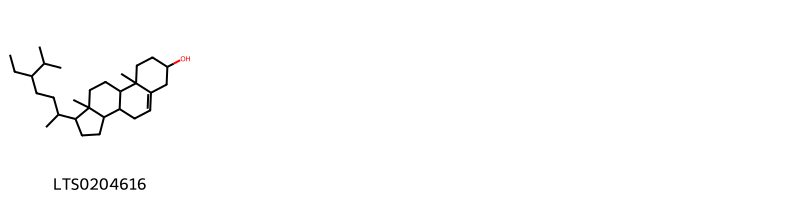{ width=100% }
    <figcaption>Hình ảnh cấu trúc hóa học của 1 hoạt chất thuộc nhóm Steroids and steroid derivatives gồm ['stigmast-5-en-3-ol, (3β)- (LTS0204616)'].</figcaption>
</figure>

---

### Dược dân tộc học

Danh sách các quốc gia có sử dụng *Bombax ceiba* trong điều trị các bệnh. 

| Country   | Disease                                           | Bệnh                                                                                                                                                                                                |
|:----------|:--------------------------------------------------|:----------------------------------------------------------------------------------------------------------------------------------------------------------------------------------------------------|
| Elsewhere | Aphrodisiac, Emetic, Tonic, Demulcent, Hemostatic | MYMEMORY WARNING: YOU USED ALL AVAILABLE FREE TRANSLATIONS FOR TODAY. NEXT AVAILABLE IN  15 HOURS 47 MINUTES 55 SECONDS VISIT HTTPS://MYMEMORY.TRANSLATED.NET/DOC/USAGELIMITS.PHP TO TRANSLATE MORE |
| India     | Aphrodisiac, Stimulant, Tonic                     | MYMEMORY WARNING: YOU USED ALL AVAILABLE FREE TRANSLATIONS FOR TODAY. NEXT AVAILABLE IN  15 HOURS 47 MINUTES 53 SECONDS VISIT HTTPS://MYMEMORY.TRANSLATED.NET/DOC/USAGELIMITS.PHP TO TRANSLATE MORE |
| Turkey    | Astringent, Emetic, Demulcent                     | MYMEMORY WARNING: YOU USED ALL AVAILABLE FREE TRANSLATIONS FOR TODAY. NEXT AVAILABLE IN  15 HOURS 47 MINUTES 50 SECONDS VISIT HTTPS://MYMEMORY.TRANSLATED.NET/DOC/USAGELIMITS.PHP TO TRANSLATE MORE |

---

# Chi Adansonia

??? note "Danh sách các dược liệu thuộc chi"
    
	 - *Adansonia digitata*

---
## Adansonia digitata
### Thông tin về thực vật

!!! info "Phân loại thực vật của *Adansonia digitata* từ GIBF:"
    - **Kingdom:** Plantae
    - **Phylum:** Tracheophyta
    - **Order:** Malvales
    - **Family:** Malvaceae
    - **Genus:** Adansonia
    - **Species:** *Adansonia digitata*

 

| Label (VI)   | Label (EN)   | Scientific Name    | Descriptions (VI)   | Descriptions (EN)   | Also Known As (VI)   | Also Known As (EN)                  |
|:-------------|:-------------|:-------------------|:--------------------|:--------------------|:---------------------|:------------------------------------|
| N/A          | N/A          | Adansonia digitata | loài thực vật       | species of plant    | ['']                 | ['African baobab', 'common baobab'] |

#### Phân bố trên thế giới

**Từ CSDL GIBF** Brazil, Saint Kitts and Nevis, Senegal, Botswana, Barbados, Antigua and Barbuda, Gambia, Zimbabwe, Mozambique, Tanzania, United Republic of, Madagascar, Guinea-Bissau, Ghana, Sri Lanka, Zambia, Nigeria, Burkina Faso, French Guiana, Malawi, Dominica, Benin, Congo, Democratic Republic of the, Kenya, Namibia, South Africa, India, Angola

#### Phân bố tại Việt Nam

**Từ CSDL GIBF**: Không có ghi nhận ở Việt Nam

---
### Thành phần hóa học
        
- Theo cơ sở dữ liệu lotus: Từ loài *Adansonia digitata* đã phân lập và xác định được 4 hoạt chất thuộc về các nhóm Prenol lipids, Carboxylic acids and derivatives, Flavonoids. 

|    | chemicalTaxonomyClassyfireClass   |   smiles_count |
|---:|:----------------------------------|---------------:|
|  0 | Carboxylic acids and derivatives  |              1 |
|  1 | Flavonoids                        |              1 |
|  2 | Prenol lipids                     |              2 |

#### Nhóm Carboxylic acids and derivatives
<figure markdown="span">
    { width=100% }
    <figcaption>Hình ảnh cấu trúc hóa học của 1 hoạt chất thuộc nhóm Carboxylic acids and derivatives gồm ['ethanolamine acetate (LTS0211756)'].</figcaption>
</figure>
#### Nhóm Flavonoids
<figure markdown="span">
    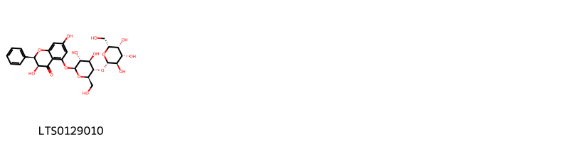{ width=100% }
    <figcaption>Hình ảnh cấu trúc hóa học của 1 hoạt chất thuộc nhóm Flavonoids gồm ['(2r,3s)-5-{[(2s,3r,4r,5s,6r)-3,4-dihydroxy-6-(hydroxymethyl)-5-{[(2s,3r,4s,5r,6r)-3,4,5-trihydroxy-6-(hydroxymethyl)oxan-2-yl]oxy}oxan-2-yl]oxy}-3,7-dihydroxy-2-phenyl-2,3-dihydro-1-benzopyran-4-one (LTS0129010)'].</figcaption>
</figure>
#### Nhóm Prenol lipids
<figure markdown="span">
    { width=100% }
    <figcaption>Hình ảnh cấu trúc hóa học của 2 hoạt chất thuộc nhóm Prenol lipids gồm ['(-)-friedelin (LTS0041645)', 'friedelin (LTS0213494)'].</figcaption>
</figure>

---

### Dược dân tộc học

Danh sách các quốc gia có sử dụng *Adansonia digitata* trong điều trị các bệnh. 

| Country         | Disease      | Bệnh                                                                                                                                                                                                |
|:----------------|:-------------|:----------------------------------------------------------------------------------------------------------------------------------------------------------------------------------------------------|
| Africa(Swahili) | Rennet, Soap | MYMEMORY WARNING: YOU USED ALL AVAILABLE FREE TRANSLATIONS FOR TODAY. NEXT AVAILABLE IN  15 HOURS 47 MINUTES 10 SECONDS VISIT HTTPS://MYMEMORY.TRANSLATED.NET/DOC/USAGELIMITS.PHP TO TRANSLATE MORE |
| Dutch           | Diaphoretic  | MYMEMORY WARNING: YOU USED ALL AVAILABLE FREE TRANSLATIONS FOR TODAY. NEXT AVAILABLE IN  15 HOURS 47 MINUTES 07 SECONDS VISIT HTTPS://MYMEMORY.TRANSLATED.NET/DOC/USAGELIMITS.PHP TO TRANSLATE MORE |
| French          | Astringent   | MYMEMORY WARNING: YOU USED ALL AVAILABLE FREE TRANSLATIONS FOR TODAY. NEXT AVAILABLE IN  15 HOURS 47 MINUTES 05 SECONDS VISIT HTTPS://MYMEMORY.TRANSLATED.NET/DOC/USAGELIMITS.PHP TO TRANSLATE MORE |
| Sudan           | Refrigerant  | MYMEMORY WARNING: YOU USED ALL AVAILABLE FREE TRANSLATIONS FOR TODAY. NEXT AVAILABLE IN  15 HOURS 47 MINUTES 02 SECONDS VISIT HTTPS://MYMEMORY.TRANSLATED.NET/DOC/USAGELIMITS.PHP TO TRANSLATE MORE |

---

