!!! abstract "Tóm tắt"

    Họ Boraginaceae gồm khoảng 24 chi và 64 loài được một số cộng đồng tại các quốc gia như Trinidad, Japan*, Brazil, Japan, China, US(Chippewa), Turkey, anish, Dominican Republic, Nigeria, Africa, Cuba, Argentina, Aruba, Europe, Asia(Baluchistan), Mexico, US(Shoshone), West Indies, Iran, Haiti, Philippines, Africa(Sahara), Curacao, Iraq, Hindu, Sudan, ain, Venezuela, US(Blackfoot), Elsewhere, US(Navajo), India, US, France sử dụng trong một số trường hợp QUERY LENGTH LIMIT EXCEEDED. MAX ALLOWED QUERY : 500 CHARS QUERY LENGTH LIMIT EXCEEDED. MAX ALLOWED QUERY : 500 CHARS MYMEMORY WARNING: YOU USED ALL AVAILABLE FREE TRANSLATIONS FOR TODAY. NEXT AVAILABLE IN  08 HOURS 57 MINUTES 25 SECONDS VISIT HTTPS://MYMEMORY.TRANSLATED.NET/DOC/USAGELIMITS.PHP TO TRANSLATE MORE.

!!! info "DrDuke"

    James A. Duke sinh năm 1929-2017 là một nhà thực vật học người Mỹ. Đây là một trong những tác giả hàng đầu trong lĩnh vực dược dân tộc học với cuốn *CRC Handbook of Medicinal Herbs* và chính là người xây dựng lên cơ sở dữ liệu về hợp chất tự nhiên và dược dân tộc học tại Bộ nông nghiệp Hoa Kỳ. Các thông tin được đăng tải tại website [Dr. Duke's Phytochemical and Ethnobotanical Databases](https://phytochem.nal.usda.gov/). 
    Trong suốt thập niên 1970, ông lãnh đạo the Plant Taxonomy Laboratory, Plant Genetics and Germplasm Institute of the Agricultural Research Service, U.S. Department of Agriculture.
    Trong tài liệu này, các thông tin về dược dân tộc của các dược liệu được trích dẫn từ tài liệu của James A. Ducke với sự trợ giúp của phần mềm dịch thuật từ tiếng Anh sang tiếng Việt.
   

# Chi Heliotropium

??? note "Danh sách các dược liệu thuộc chi"
    
	 - *Heliotropium anchusefolium*
	 - *Heliotropium angioermum*
	 - *Heliotropium eichwaldi*
	 - *Heliotropium elongatum*
	 - *Heliotropium europaeum*
	 - *Heliotropium europeaum*
	 - *Heliotropium indicum*
	 - *Heliotropium ovalifolium*
	 - *Heliotropium parviflorum*
	 - *Heliotropium strictum*
	 - *Heliotropium strigosum*
	 - *Heliotropium subulatum*
	 - *Heliotropium tuberculosum*

---
## Heliotropium anchusefolium
### Thông tin về thực vật

!!! info "Phân loại thực vật của *Heliotropium amplexicaule* từ GIBF:"
    - **Kingdom:** Plantae
    - **Phylum:** Tracheophyta
    - **Order:** Boraginales
    - **Family:** Heliotropiaceae
    - **Genus:** Heliotropium
    - **Species:** *Heliotropium amplexicaule*

 

| Label (VI)   | Label (EN)   | Scientific Name   | Descriptions (VI)   | Descriptions (EN)   | Also Known As (VI)   | Also Known As (EN)             |
|:-------------|:-------------|:------------------|:--------------------|:--------------------|:---------------------|:-------------------------------|
| N/A          | N/A          | Dianthus superbus | loài thực vật       | species of plant    | ['']                 | ['fringed pink', 'large pink'] |

#### Phân bố trên thế giới

**Từ CSDL GIBF** nan, Mexico, Brazil, Algeria, United States of America, Paraguay, Australia, Italy, unknown or invalid, Argentina, France, Uruguay, Bolivia (Plurinational State of)

#### Phân bố tại Việt Nam

**Từ CSDL GIBF**: Không có ghi nhận ở Việt Nam

---
### Thành phần hóa học
        
- Theo cơ sở dữ liệu lotus: Từ loài *Heliotropium amplexicaule* đã phân lập và xác định được Chưa có hoạt chất nào được phân lập. hoạt chất thuộc về các nhóm Không có hoạt chất nào được phân lập. 

Không có hình ảnh nào được tạo ra

---

### Dược dân tộc học

Danh sách các quốc gia có sử dụng *Heliotropium amplexicaule* trong điều trị các bệnh. 

| Country   | Disease   | Bệnh                                                                                                                                                                                                |
|:----------|:----------|:----------------------------------------------------------------------------------------------------------------------------------------------------------------------------------------------------|
| Argentina | Sudorific | MYMEMORY WARNING: YOU USED ALL AVAILABLE FREE TRANSLATIONS FOR TODAY. NEXT AVAILABLE IN  08 HOURS 57 MINUTES 21 SECONDS VISIT HTTPS://MYMEMORY.TRANSLATED.NET/DOC/USAGELIMITS.PHP TO TRANSLATE MORE |

---

---
## Heliotropium angioermum
### Thông tin về thực vật

!!! info "Phân loại thực vật của *Heliotropium angiospermum* từ GIBF:"
    - **Kingdom:** Plantae
    - **Phylum:** Tracheophyta
    - **Order:** Boraginales
    - **Family:** Heliotropiaceae
    - **Genus:** Heliotropium
    - **Species:** *Heliotropium angiospermum*

 

| Label (VI)   | Label (EN)   | Scientific Name   | Descriptions (VI)   | Descriptions (EN)   | Also Known As (VI)   | Also Known As (EN)             |
|:-------------|:-------------|:------------------|:--------------------|:--------------------|:---------------------|:-------------------------------|
| N/A          | N/A          | Dianthus superbus | loài thực vật       | species of plant    | ['']                 | ['fringed pink', 'large pink'] |

#### Phân bố trên thế giới

**Từ CSDL GIBF** Brazil, Mexico, Saint Kitts and Nevis, United States of America, Jamaica, Bonaire, Sint Eustatius and Saba, Virgin Islands (U.S.), Bahamas, Curaçao, Dominican Republic, Antigua and Barbuda, Saint Vincent and the Grenadines, Cuba, Ecuador, Peru, Turks and Caicos Islands, Puerto Rico

#### Phân bố tại Việt Nam

**Từ CSDL GIBF**: Không có ghi nhận ở Việt Nam

---
### Thành phần hóa học
        
- Theo cơ sở dữ liệu lotus: Từ loài *Heliotropium angiospermum* đã phân lập và xác định được Chưa có hoạt chất nào được phân lập. hoạt chất thuộc về các nhóm Không có hoạt chất nào được phân lập. 

Không có hình ảnh nào được tạo ra

---

### Dược dân tộc học

Danh sách các quốc gia có sử dụng *Heliotropium angiospermum* trong điều trị các bệnh. 

| Country   | Disease               | Bệnh                                                                                                                                                                                                |
|:----------|:----------------------|:----------------------------------------------------------------------------------------------------------------------------------------------------------------------------------------------------|
| Haiti     | Astringent, Emollient | MYMEMORY WARNING: YOU USED ALL AVAILABLE FREE TRANSLATIONS FOR TODAY. NEXT AVAILABLE IN  08 HOURS 56 MINUTES 50 SECONDS VISIT HTTPS://MYMEMORY.TRANSLATED.NET/DOC/USAGELIMITS.PHP TO TRANSLATE MORE |
| Mexico    | Stimulant, Tonic      | MYMEMORY WARNING: YOU USED ALL AVAILABLE FREE TRANSLATIONS FOR TODAY. NEXT AVAILABLE IN  08 HOURS 56 MINUTES 46 SECONDS VISIT HTTPS://MYMEMORY.TRANSLATED.NET/DOC/USAGELIMITS.PHP TO TRANSLATE MORE |

---

---
## Heliotropium eichwaldi
### Thông tin về thực vật

!!! info "Phân loại thực vật của *N/A* từ GIBF:"
    - **Kingdom:** Plantae
    - **Phylum:** Tracheophyta
    - **Order:** Boraginales
    - **Family:** Heliotropiaceae
    - **Genus:** Heliotropium
    - **Species:** *N/A*

 

| Label (VI)   | Label (EN)   | Scientific Name   | Descriptions (VI)   | Descriptions (EN)   | Also Known As (VI)   | Also Known As (EN)             |
|:-------------|:-------------|:------------------|:--------------------|:--------------------|:---------------------|:-------------------------------|
| N/A          | N/A          | Dianthus superbus | loài thực vật       | species of plant    | ['']                 | ['fringed pink', 'large pink'] |

#### Phân bố trên thế giới

**Từ CSDL GIBF** Brazil, Cocos (Keeling) Islands, Viet Nam, Israel, Antigua and Barbuda, Chile, Ecuador, Thailand, Spain, Uruguay, Guinea-Bissau, Puerto Rico, Turks and Caicos Islands, United States of America, Greece, Virgin Islands (U.S.), Seychelles, Costa Rica, Dominican Republic, Kiribati, Argentina, Aruba, Malawi, Morocco, Mexico, Kenya, Maldives, Guam, Chinese Taipei, Curaçao, Namibia, Cook Islands, South Africa, Australia, Italy, India, Northern Mariana Islands, Peru

#### Phân bố tại Việt Nam

**Từ CSDL GIBF**: Đồng Tháp

---
### Thành phần hóa học
        
- Theo cơ sở dữ liệu lotus: Từ loài *N/A* đã phân lập và xác định được Chưa có hoạt chất nào được phân lập. hoạt chất thuộc về các nhóm Không có hoạt chất nào được phân lập. 

Không có hình ảnh nào được tạo ra

---

### Dược dân tộc học

Danh sách các quốc gia có sử dụng *N/A* trong điều trị các bệnh. 

| Country   | Disease   | Bệnh                                                                                                                                                                                                |
|:----------|:----------|:----------------------------------------------------------------------------------------------------------------------------------------------------------------------------------------------------|
| India     | Poison    | MYMEMORY WARNING: YOU USED ALL AVAILABLE FREE TRANSLATIONS FOR TODAY. NEXT AVAILABLE IN  08 HOURS 56 MINUTES 11 SECONDS VISIT HTTPS://MYMEMORY.TRANSLATED.NET/DOC/USAGELIMITS.PHP TO TRANSLATE MORE |

---

---
## Heliotropium elongatum
### Thông tin về thực vật

!!! info "Phân loại thực vật của *Heliotropium elongatum* từ GIBF:"
    - **Kingdom:** Plantae
    - **Phylum:** Tracheophyta
    - **Order:** Boraginales
    - **Family:** Heliotropiaceae
    - **Genus:** Heliotropium
    - **Species:** *Heliotropium elongatum*

 

| Label (VI)   | Label (EN)   | Scientific Name        | Descriptions (VI)   | Descriptions (EN)   | Also Known As (VI)   | Also Known As (EN)   |
|:-------------|:-------------|:-----------------------|:--------------------|:--------------------|:---------------------|:---------------------|
| N/A          | N/A          | Heliotropium elongatum | loài thực vật       | species of plant    | ['']                 | ['']                 |

#### Phân bố trên thế giới

**Từ CSDL GIBF** Brazil, Uruguay, Argentina, Bolivia (Plurinational State of)

#### Phân bố tại Việt Nam

**Từ CSDL GIBF**: Không có ghi nhận ở Việt Nam

---
### Thành phần hóa học
        
- Theo cơ sở dữ liệu lotus: Từ loài *Heliotropium elongatum* đã phân lập và xác định được Chưa có hoạt chất nào được phân lập. hoạt chất thuộc về các nhóm Không có hoạt chất nào được phân lập. 

Không có hình ảnh nào được tạo ra

---

### Dược dân tộc học

Danh sách các quốc gia có sử dụng *Heliotropium elongatum* trong điều trị các bệnh. 

| Country   | Disease                             | Bệnh                                                                                                                                                                                                |
|:----------|:------------------------------------|:----------------------------------------------------------------------------------------------------------------------------------------------------------------------------------------------------|
| Brazil    | Astringent, Antiasthmatic, Diuretic | MYMEMORY WARNING: YOU USED ALL AVAILABLE FREE TRANSLATIONS FOR TODAY. NEXT AVAILABLE IN  08 HOURS 55 MINUTES 44 SECONDS VISIT HTTPS://MYMEMORY.TRANSLATED.NET/DOC/USAGELIMITS.PHP TO TRANSLATE MORE |

---

---
## Heliotropium europaeum
### Thông tin về thực vật

!!! info "Phân loại thực vật của *Heliotropium europaeum* từ GIBF:"
    - **Kingdom:** Plantae
    - **Phylum:** Tracheophyta
    - **Order:** Boraginales
    - **Family:** Heliotropiaceae
    - **Genus:** Heliotropium
    - **Species:** *Heliotropium europaeum*

 

| Label (VI)   | Label (EN)   | Scientific Name        | Descriptions (VI)   | Descriptions (EN)   | Also Known As (VI)   | Also Known As (EN)      |
|:-------------|:-------------|:-----------------------|:--------------------|:--------------------|:---------------------|:------------------------|
| N/A          | N/A          | Heliotropium europaeum | loài thực vật       | species of plant    | ['']                 | ['European heliotrope'] |

#### Phân bố trên thế giới

**Từ CSDL GIBF** Malta, Uzbekistan, Türkiye, Spain, Montenegro, United States of America, Greece, Iran (Islamic Republic of), Russian Federation, Croatia, Cyprus, Morocco, Algeria, France, Palestine, State of, Hungary, Portugal, Ukraine, Australia, Italy, Serbia

#### Phân bố tại Việt Nam

**Từ CSDL GIBF**: Không có ghi nhận ở Việt Nam

---
### Thành phần hóa học
        
- Theo cơ sở dữ liệu lotus: Từ loài *Heliotropium europaeum* đã phân lập và xác định được 10 hoạt chất thuộc về các nhóm . 

|    | chemicalTaxonomyClassyfireClass   |   smiles_count |
|---:|:----------------------------------|---------------:|
|  0 |                                   |             10 |

#### Nhóm 
<figure markdown="span">
    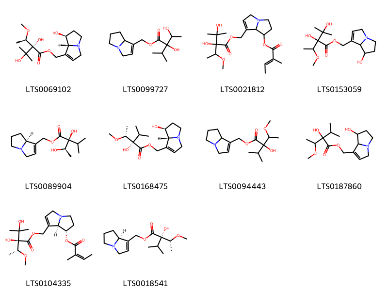{ width=100% }
    <figcaption>Hình ảnh cấu trúc hóa học của 10 hoạt chất thuộc nhóm  gồm ['[(7s,7ar)-7-hydroxy-5,6,7,7a-tetrahydro-3h-pyrrolizin-1-yl]methyl (2s)-2,3-dihydroxy-2-[(1r)-1-methoxyethyl]-3-methylbutanoate (LTS0069102)', '5,6,7,7a-tetrahydro-3h-pyrrolizin-1-ylmethyl 2,3-dihydroxy-2-isopropylbutanoate (LTS0099727)', '7-({[2,3-dihydroxy-2-(1-methoxyethyl)-3-methylbutanoyl]oxy}methyl)-2,3,5,7a-tetrahydro-1h-pyrrolizin-1-yl 2-methylbut-2-enoate (LTS0021812)', '(7-hydroxy-5,6,7,7a-tetrahydro-3h-pyrrolizin-1-yl)methyl 2,3-dihydroxy-2-(1-methoxyethyl)-3-methylbutanoate (LTS0153059)', 'supinine (LTS0089904)', 'heliotrine (LTS0168475)', '5,6,7,7a-tetrahydro-3h-pyrrolizin-1-ylmethyl 2-hydroxy-2-isopropyl-3-methoxybutanoate (LTS0094443)', 'heliotrine (LTS0187860)', '(1s,7ar)-7-({[(2s)-2,3-dihydroxy-2-[(1r)-1-methoxyethyl]-3-methylbutanoyl]oxy}methyl)-2,3,5,7a-tetrahydro-1h-pyrrolizin-1-yl (2z)-2-methylbut-2-enoate (LTS0104335)', 'heleurine (LTS0018541)'].</figcaption>
</figure>

---

### Dược dân tộc học

Danh sách các quốc gia có sử dụng *Heliotropium europaeum* trong điều trị các bệnh. 

| Country   | Disease                 | Bệnh                                                                                                                                                                                                |
|:----------|:------------------------|:----------------------------------------------------------------------------------------------------------------------------------------------------------------------------------------------------|
| Europe    | Poison                  | MYMEMORY WARNING: YOU USED ALL AVAILABLE FREE TRANSLATIONS FOR TODAY. NEXT AVAILABLE IN  08 HOURS 55 MINUTES 05 SECONDS VISIT HTTPS://MYMEMORY.TRANSLATED.NET/DOC/USAGELIMITS.PHP TO TRANSLATE MORE |
| Iraq      | Emmenagogue             | MYMEMORY WARNING: YOU USED ALL AVAILABLE FREE TRANSLATIONS FOR TODAY. NEXT AVAILABLE IN  08 HOURS 54 MINUTES 59 SECONDS VISIT HTTPS://MYMEMORY.TRANSLATED.NET/DOC/USAGELIMITS.PHP TO TRANSLATE MORE |
| Turkey    | Cholagogue, Emmenagogue | MYMEMORY WARNING: YOU USED ALL AVAILABLE FREE TRANSLATIONS FOR TODAY. NEXT AVAILABLE IN  08 HOURS 54 MINUTES 53 SECONDS VISIT HTTPS://MYMEMORY.TRANSLATED.NET/DOC/USAGELIMITS.PHP TO TRANSLATE MORE |
| ain       | Emmenagogue             | MYMEMORY WARNING: YOU USED ALL AVAILABLE FREE TRANSLATIONS FOR TODAY. NEXT AVAILABLE IN  08 HOURS 54 MINUTES 48 SECONDS VISIT HTTPS://MYMEMORY.TRANSLATED.NET/DOC/USAGELIMITS.PHP TO TRANSLATE MORE |

---

---
## Heliotropium europeaum
### Thông tin về thực vật

!!! info "Phân loại thực vật của *Heliotropium europaeum* từ GIBF:"
    - **Kingdom:** Plantae
    - **Phylum:** Tracheophyta
    - **Order:** Boraginales
    - **Family:** Heliotropiaceae
    - **Genus:** Heliotropium
    - **Species:** *Heliotropium europaeum*

 

| Label (VI)   | Label (EN)   | Scientific Name        | Descriptions (VI)   | Descriptions (EN)   | Also Known As (VI)   | Also Known As (EN)      |
|:-------------|:-------------|:-----------------------|:--------------------|:--------------------|:---------------------|:------------------------|
| N/A          | N/A          | Heliotropium europaeum | loài thực vật       | species of plant    | ['']                 | ['European heliotrope'] |

#### Phân bố trên thế giới

**Từ CSDL GIBF** Malta, Uzbekistan, Türkiye, Spain, Montenegro, United States of America, Greece, Iran (Islamic Republic of), Russian Federation, Croatia, Cyprus, Morocco, Algeria, France, Palestine, State of, Hungary, Portugal, Ukraine, Australia, Italy, Serbia

#### Phân bố tại Việt Nam

**Từ CSDL GIBF**: Không có ghi nhận ở Việt Nam

---
### Thành phần hóa học
        
- Theo cơ sở dữ liệu lotus: Từ loài *Heliotropium europaeum* đã phân lập và xác định được Chưa có hoạt chất nào được phân lập. hoạt chất thuộc về các nhóm Không có hoạt chất nào được phân lập. 

Không có hình ảnh nào được tạo ra

---

### Dược dân tộc học

Danh sách các quốc gia có sử dụng *Heliotropium europaeum* trong điều trị các bệnh. 

| Country   | Disease   | Bệnh                                                                                                                                                                                                |
|:----------|:----------|:----------------------------------------------------------------------------------------------------------------------------------------------------------------------------------------------------|
| Europe    | Poison    | MYMEMORY WARNING: YOU USED ALL AVAILABLE FREE TRANSLATIONS FOR TODAY. NEXT AVAILABLE IN  08 HOURS 54 MINUTES 12 SECONDS VISIT HTTPS://MYMEMORY.TRANSLATED.NET/DOC/USAGELIMITS.PHP TO TRANSLATE MORE |

---

---
## Heliotropium indicum
### Thông tin về thực vật

!!! info "Phân loại thực vật của *Heliotropium indicum* từ GIBF:"
    - **Kingdom:** Plantae
    - **Phylum:** Tracheophyta
    - **Order:** Boraginales
    - **Family:** Heliotropiaceae
    - **Genus:** Heliotropium
    - **Species:** *Heliotropium indicum*

 

| Label (VI)   | Label (EN)   | Scientific Name      | Descriptions (VI)   | Descriptions (EN)   | Also Known As (VI)       | Also Known As (EN)                       |
|:-------------|:-------------|:---------------------|:--------------------|:--------------------|:-------------------------|:-----------------------------------------|
| N/A          | N/A          | Heliotropium indicum | loài thực vật       | species of plant    | ['Heliotropium indicum'] | ['Indian heliotrope', 'Indian Turnsole'] |

#### Phân bố trên thế giới

**Từ CSDL GIBF** Brazil, Guatemala, Viet Nam, Saint Kitts and Nevis, Bangladesh, China, Antigua and Barbuda, Honduras, Ecuador, Thailand, Madagascar, Guinea-Bissau, Puerto Rico, Sri Lanka, Ghana, United States of America, Chad, Indonesia, Costa Rica, Dominican Republic, Colombia, Nigeria, Burkina Faso, French Guiana, Ethiopia, Sierra Leone, Malawi, Hong Kong, Mexico, Benin, Chinese Taipei, Philippines, Malaysia, Panama, Namibia, Nicaragua, Singapore, Cambodia, Australia, Côte d’Ivoire, Myanmar, India, Peru, Bolivia (Plurinational State of), Guyana

#### Phân bố tại Việt Nam

**Từ CSDL GIBF**: Đồng Tháp

---
### Thành phần hóa học
        
- Theo cơ sở dữ liệu lotus: Từ loài *Heliotropium indicum* đã phân lập và xác định được 30 hoạt chất thuộc về các nhóm Flavonoids, Steroids and steroid derivatives, Prenol lipids, Organonitrogen compounds, Pyrrolizidines. 

|    | chemicalTaxonomyClassyfireClass   |   smiles_count |
|---:|:----------------------------------|---------------:|
|  0 |                                   |             13 |
|  1 | Flavonoids                        |              2 |
|  2 | Organonitrogen compounds          |              4 |
|  3 | Prenol lipids                     |              2 |
|  4 | Pyrrolizidines                    |              3 |
|  5 | Steroids and steroid derivatives  |              6 |

#### Nhóm 
<figure markdown="span">
    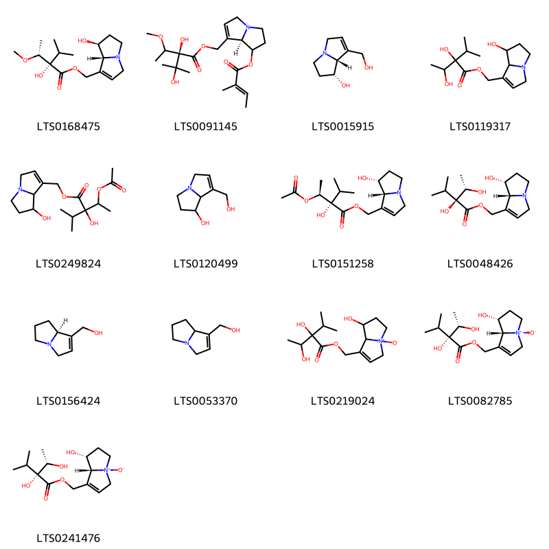{ width=100% }
    <figcaption>Hình ảnh cấu trúc hóa học của 13 hoạt chất thuộc nhóm  gồm ['heliotrine (LTS0168475)', '(7ar)-7-({[(2r)-2,3-dihydroxy-2-(1-methoxyethyl)-3-methylbutanoyl]oxy}methyl)-2,3,5,7a-tetrahydro-1h-pyrrolizin-1-yl 2-methylbut-2-enoate (LTS0091145)', 'retronecine (LTS0015915)', '(7-hydroxy-5,6,7,7a-tetrahydro-3h-pyrrolizin-1-yl)methyl 2,3-dihydroxy-2-isopropylbutanoate (LTS0119317)', '(7-hydroxy-5,6,7,7a-tetrahydro-3h-pyrrolizin-1-yl)methyl 3-(acetyloxy)-2-hydroxy-2-isopropylbutanoate (LTS0249824)', 'retronecine (LTS0120499)', '[(7r,7ar)-7-hydroxy-5,6,7,7a-tetrahydro-3h-pyrrolizin-1-yl]methyl (2s)-2-[(1s)-1-(acetyloxy)ethyl]-2-hydroxy-3-methylbutanoate (LTS0151258)', 'lycopsamine (LTS0048426)', 'supinidine (LTS0156424)', '5,6,7,7a-tetrahydro-3h-pyrrolizin-1-ylmethanol (LTS0053370)', '1-{[(2,3-dihydroxy-2-isopropylbutanoyl)oxy]methyl}-7-hydroxy-5,6,7,7a-tetrahydro-3h-pyrrolizin-4-ium-4-olate (LTS0219024)', '(1r,4s,7ar)-1-hydroxy-7-({[(2r)-2-hydroxy-2-[(1s)-1-hydroxyethyl]-3-methylbutanoyl]oxy}methyl)-2,3,5,7a-tetrahydro-1h-pyrrolizin-4-ium-4-olate (LTS0082785)', '(1r,7ar)-1-hydroxy-7-({[(2r)-2-hydroxy-2-[(1s)-1-hydroxyethyl]-3-methylbutanoyl]oxy}methyl)-2,3,5,7a-tetrahydro-1h-pyrrolizin-4-ium-4-olate (LTS0241476)'].</figcaption>
</figure>
#### Nhóm Flavonoids
<figure markdown="span">
    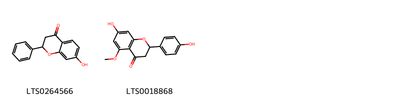{ width=100% }
    <figcaption>Hình ảnh cấu trúc hóa học của 2 hoạt chất thuộc nhóm Flavonoids gồm ['7-hydroxyflavanone (LTS0264566)', 'naringenin 5-methyl ether (LTS0018868)'].</figcaption>
</figure>
#### Nhóm Organonitrogen compounds
<figure markdown="span">
    { width=100% }
    <figcaption>Hình ảnh cấu trúc hóa học của 4 hoạt chất thuộc nhóm Organonitrogen compounds gồm ['putrescine (LTS0238763)', 'spermine (LTS0179313)', 'spermidine (LTS0061428)', 'homospermidine (LTS0018298)'].</figcaption>
</figure>
#### Nhóm Prenol lipids
<figure markdown="span">
    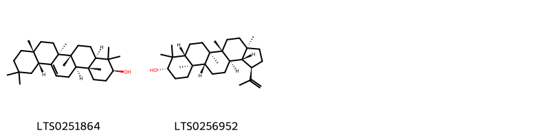{ width=100% }
    <figcaption>Hình ảnh cấu trúc hóa học của 2 hoạt chất thuộc nhóm Prenol lipids gồm ['β-amyrin (LTS0251864)', 'lupeol (LTS0256952)'].</figcaption>
</figure>
#### Nhóm Pyrrolizidines
<figure markdown="span">
    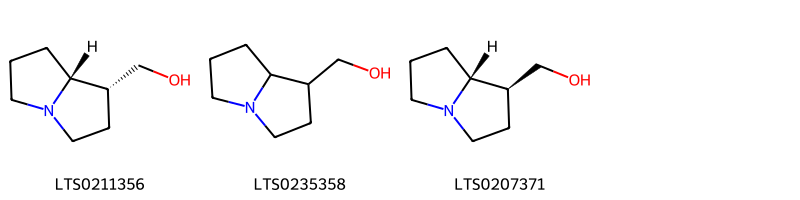{ width=100% }
    <figcaption>Hình ảnh cấu trúc hóa học của 3 hoạt chất thuộc nhóm Pyrrolizidines gồm ['(1r,7ar)-hexahydro-1h-pyrrolizin-1-ylmethanol (LTS0211356)', 'hexahydro-1h-pyrrolizin-1-ylmethanol (LTS0235358)', '(1s,7ar)-hexahydro-1h-pyrrolizin-1-ylmethanol (LTS0207371)'].</figcaption>
</figure>
#### Nhóm Steroids and steroid derivatives
<figure markdown="span">
    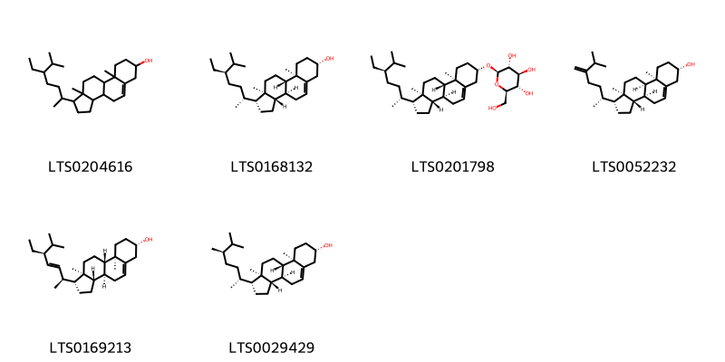{ width=100% }
    <figcaption>Hình ảnh cấu trúc hóa học của 6 hoạt chất thuộc nhóm Steroids and steroid derivatives gồm ['stigmast-5-en-3-ol, (3β)- (LTS0204616)', 'sitosterol (LTS0168132)', 'sitogluside (LTS0201798)', '(1r,3as,3bs,7s,9ar,9br,11ar)-9a,11a-dimethyl-1-[(2r)-6-methyl-5-methylideneheptan-2-yl]-1h,2h,3h,3ah,3bh,4h,6h,7h,8h,9h,9bh,10h,11h-cyclopenta[a]phenanthren-7-ol (LTS0052232)', '(1r,3as,3bs,7s,9ar,9bs,11ar)-1-[(2s,3e,5s)-5-ethyl-6-methylhept-3-en-2-yl]-9a,11a-dimethyl-1h,2h,3h,3ah,3bh,4h,6h,7h,8h,9h,9bh,10h,11h-cyclopenta[a]phenanthren-7-ol (LTS0169213)', 'campesterol (LTS0029429)'].</figcaption>
</figure>

---

### Dược dân tộc học

Danh sách các quốc gia có sử dụng *Heliotropium indicum* trong điều trị các bệnh. 

| Country            | Disease                                                                                                                            | Bệnh                                                                                                                                                                                                |
|:-------------------|:-----------------------------------------------------------------------------------------------------------------------------------|:----------------------------------------------------------------------------------------------------------------------------------------------------------------------------------------------------|
| Africa             | Vermifuge                                                                                                                          | MYMEMORY WARNING: YOU USED ALL AVAILABLE FREE TRANSLATIONS FOR TODAY. NEXT AVAILABLE IN  08 HOURS 53 MINUTES 44 SECONDS VISIT HTTPS://MYMEMORY.TRANSLATED.NET/DOC/USAGELIMITS.PHP TO TRANSLATE MORE |
| Dominican Republic | Emollient                                                                                                                          | MYMEMORY WARNING: YOU USED ALL AVAILABLE FREE TRANSLATIONS FOR TODAY. NEXT AVAILABLE IN  08 HOURS 53 MINUTES 39 SECONDS VISIT HTTPS://MYMEMORY.TRANSLATED.NET/DOC/USAGELIMITS.PHP TO TRANSLATE MORE |
| Haiti              | Collyrium, Astringent                                                                                                              | MYMEMORY WARNING: YOU USED ALL AVAILABLE FREE TRANSLATIONS FOR TODAY. NEXT AVAILABLE IN  08 HOURS 53 MINUTES 33 SECONDS VISIT HTTPS://MYMEMORY.TRANSLATED.NET/DOC/USAGELIMITS.PHP TO TRANSLATE MORE |
| India              | Abortifacient, Diuretic, Diuretic, Emmenagogue, Emmenagogue, Emollient, Abortifacient, Astringent, Emollient, Stomachic, Vulnerary | MYMEMORY WARNING: YOU USED ALL AVAILABLE FREE TRANSLATIONS FOR TODAY. NEXT AVAILABLE IN  08 HOURS 53 MINUTES 29 SECONDS VISIT HTTPS://MYMEMORY.TRANSLATED.NET/DOC/USAGELIMITS.PHP TO TRANSLATE MORE |
| Trinidad           | Collyrium, Collyrium                                                                                                               | MYMEMORY WARNING: YOU USED ALL AVAILABLE FREE TRANSLATIONS FOR TODAY. NEXT AVAILABLE IN  08 HOURS 53 MINUTES 25 SECONDS VISIT HTTPS://MYMEMORY.TRANSLATED.NET/DOC/USAGELIMITS.PHP TO TRANSLATE MORE |

---

---
## Heliotropium ovalifolium
### Thông tin về thực vật

!!! info "Phân loại thực vật của *Heliotropium ovalifolium* từ GIBF:"
    - **Kingdom:** Plantae
    - **Phylum:** Tracheophyta
    - **Order:** Boraginales
    - **Family:** Heliotropiaceae
    - **Genus:** Heliotropium
    - **Species:** *Heliotropium ovalifolium*

 

| Label (VI)   | Label (EN)   | Scientific Name          | Descriptions (VI)   | Descriptions (EN)   | Also Known As (VI)   | Also Known As (EN)   |
|:-------------|:-------------|:-------------------------|:--------------------|:--------------------|:---------------------|:---------------------|
| N/A          | N/A          | Heliotropium ovalifolium | loài thực vật       | species of plant    | ['']                 | ['']                 |

#### Phân bố trên thế giới

**Từ CSDL GIBF** nan, Kenya, Botswana, Chinese Taipei, Nepal, South Africa, Australia, Mali, Nigeria, India, Tanzania, United Republic of, Burkina Faso, Yemen, Ethiopia, Sudan

#### Phân bố tại Việt Nam

**Từ CSDL GIBF**: Không có ghi nhận ở Việt Nam

---
### Thành phần hóa học
        
- Theo cơ sở dữ liệu lotus: Từ loài *Heliotropium ovalifolium* đã phân lập và xác định được 14 hoạt chất thuộc về các nhóm Phenanthrenes and derivatives, Anthracenes, Pyrrolidines, Vinylogous esters, Pyrrolizidines. 

|    | chemicalTaxonomyClassyfireClass   |   smiles_count |
|---:|:----------------------------------|---------------:|
|  0 |                                   |              2 |
|  1 | Anthracenes                       |              3 |
|  2 | Phenanthrenes and derivatives     |              2 |
|  3 | Pyrrolidines                      |              2 |
|  4 | Pyrrolizidines                    |              2 |
|  5 | Vinylogous esters                 |              3 |

#### Nhóm 
<figure markdown="span">
    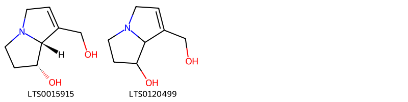{ width=100% }
    <figcaption>Hình ảnh cấu trúc hóa học của 2 hoạt chất thuộc nhóm  gồm ['retronecine (LTS0015915)', 'retronecine (LTS0120499)'].</figcaption>
</figure>
#### Nhóm Anthracenes
<figure markdown="span">
    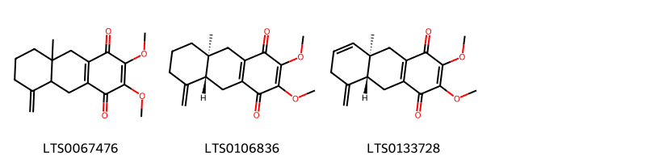{ width=100% }
    <figcaption>Hình ảnh cấu trúc hóa học của 3 hoạt chất thuộc nhóm Anthracenes gồm ['2,3-dimethoxy-8a-methyl-5-methylidene-6,7,8,9,10,10a-hexahydroanthracene-1,4-dione (LTS0067476)', '(8as,10ar)-2,3-dimethoxy-8a-methyl-5-methylidene-6,7,8,9,10,10a-hexahydroanthracene-1,4-dione (LTS0106836)', '(8ar,10ar)-2,3-dimethoxy-8a-methyl-5-methylidene-6,9,10,10a-tetrahydroanthracene-1,4-dione (LTS0133728)'].</figcaption>
</figure>
#### Nhóm Phenanthrenes and derivatives
<figure markdown="span">
    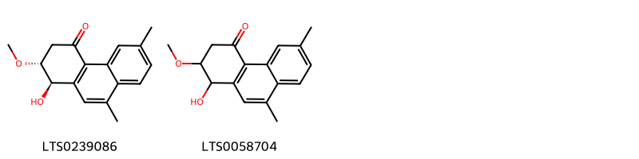{ width=100% }
    <figcaption>Hình ảnh cấu trúc hóa học của 2 hoạt chất thuộc nhóm Phenanthrenes and derivatives gồm ['(1r,2r)-1-hydroxy-2-methoxy-6,9-dimethyl-2,3-dihydro-1h-phenanthren-4-one (LTS0239086)', '1-hydroxy-2-methoxy-6,9-dimethyl-2,3-dihydro-1h-phenanthren-4-one (LTS0058704)'].</figcaption>
</figure>
#### Nhóm Pyrrolidines
<figure markdown="span">
    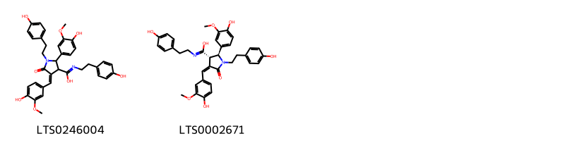{ width=100% }
    <figcaption>Hình ảnh cấu trúc hóa học của 2 hoạt chất thuộc nhóm Pyrrolidines gồm ['2-(4-hydroxy-3-methoxyphenyl)-4-[(4-hydroxy-3-methoxyphenyl)methylidene]-n,1-bis[2-(4-hydroxyphenyl)ethyl]-5-oxopyrrolidine-3-carboximidic acid (LTS0246004)', '(2s,3s,4z)-2-(4-hydroxy-3-methoxyphenyl)-4-[(4-hydroxy-3-methoxyphenyl)methylidene]-n,1-bis[2-(4-hydroxyphenyl)ethyl]-5-oxopyrrolidine-3-carboximidic acid (LTS0002671)'].</figcaption>
</figure>
#### Nhóm Pyrrolizidines
<figure markdown="span">
    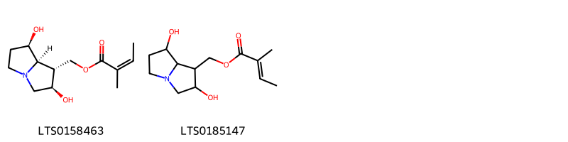{ width=100% }
    <figcaption>Hình ảnh cấu trúc hóa học của 2 hoạt chất thuộc nhóm Pyrrolizidines gồm ['[(1r,2r,7r,7ar)-2,7-dihydroxy-hexahydro-1h-pyrrolizin-1-yl]methyl (2z)-2-methylbut-2-enoate (LTS0158463)', '(2,7-dihydroxy-hexahydro-1h-pyrrolizin-1-yl)methyl 2-methylbut-2-enoate (LTS0185147)'].</figcaption>
</figure>
#### Nhóm Vinylogous esters
<figure markdown="span">
    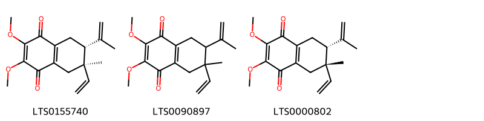{ width=100% }
    <figcaption>Hình ảnh cấu trúc hóa học của 3 hoạt chất thuộc nhóm Vinylogous esters gồm ['(6r,7r)-6-ethenyl-2,3-dimethoxy-6-methyl-7-(prop-1-en-2-yl)-7,8-dihydro-5h-naphthalene-1,4-dione (LTS0155740)', '6-ethenyl-2,3-dimethoxy-6-methyl-7-(prop-1-en-2-yl)-7,8-dihydro-5h-naphthalene-1,4-dione (LTS0090897)', '(6s,7r)-6-ethenyl-2,3-dimethoxy-6-methyl-7-(prop-1-en-2-yl)-7,8-dihydro-5h-naphthalene-1,4-dione (LTS0000802)'].</figcaption>
</figure>

---

### Dược dân tộc học

Danh sách các quốc gia có sử dụng *Heliotropium ovalifolium* trong điều trị các bệnh. 

| Country   | Disease   | Bệnh                                                                                                                                                                                                |
|:----------|:----------|:----------------------------------------------------------------------------------------------------------------------------------------------------------------------------------------------------|
| India     | Poison    | MYMEMORY WARNING: YOU USED ALL AVAILABLE FREE TRANSLATIONS FOR TODAY. NEXT AVAILABLE IN  08 HOURS 52 MINUTES 49 SECONDS VISIT HTTPS://MYMEMORY.TRANSLATED.NET/DOC/USAGELIMITS.PHP TO TRANSLATE MORE |

---

---
## Heliotropium parviflorum
### Thông tin về thực vật

!!! info "Phân loại thực vật của *N/A* từ GIBF:"
    - **Kingdom:** Plantae
    - **Phylum:** Tracheophyta
    - **Order:** Boraginales
    - **Family:** Heliotropiaceae
    - **Genus:** Heliotropium
    - **Species:** *N/A*

 

| Label (VI)   | Label (EN)   | Scientific Name          | Descriptions (VI)   | Descriptions (EN)   | Also Known As (VI)   | Also Known As (EN)   |
|:-------------|:-------------|:-------------------------|:--------------------|:--------------------|:---------------------|:---------------------|
| N/A          | N/A          | Heliotropium ovalifolium | loài thực vật       | species of plant    | ['']                 | ['']                 |

#### Phân bố trên thế giới

**Từ CSDL GIBF** Brazil, Cocos (Keeling) Islands, Viet Nam, Israel, Antigua and Barbuda, Chile, Ecuador, Thailand, Spain, Uruguay, Guinea-Bissau, Puerto Rico, Turks and Caicos Islands, United States of America, Greece, Virgin Islands (U.S.), Seychelles, Costa Rica, Dominican Republic, Kiribati, Argentina, Aruba, Malawi, Morocco, Mexico, Kenya, Maldives, Guam, Chinese Taipei, Curaçao, Namibia, Cook Islands, South Africa, Australia, Italy, India, Northern Mariana Islands, Peru

#### Phân bố tại Việt Nam

**Từ CSDL GIBF**: Đồng Tháp

---
### Thành phần hóa học
        
- Theo cơ sở dữ liệu lotus: Từ loài *N/A* đã phân lập và xác định được Chưa có hoạt chất nào được phân lập. hoạt chất thuộc về các nhóm Không có hoạt chất nào được phân lập. 

Không có hình ảnh nào được tạo ra

---

### Dược dân tộc học

Danh sách các quốc gia có sử dụng *N/A* trong điều trị các bệnh. 

| Country   | Disease    | Bệnh                                                                                                                                                                                                |
|:----------|:-----------|:----------------------------------------------------------------------------------------------------------------------------------------------------------------------------------------------------|
| Mexico    | Astringent | MYMEMORY WARNING: YOU USED ALL AVAILABLE FREE TRANSLATIONS FOR TODAY. NEXT AVAILABLE IN  08 HOURS 52 MINUTES 21 SECONDS VISIT HTTPS://MYMEMORY.TRANSLATED.NET/DOC/USAGELIMITS.PHP TO TRANSLATE MORE |

---

---
## Heliotropium strictum
### Thông tin về thực vật

!!! info "Phân loại thực vật của *N/A* từ GIBF:"
    - **Kingdom:** Plantae
    - **Phylum:** Tracheophyta
    - **Order:** Boraginales
    - **Family:** Heliotropiaceae
    - **Genus:** N/A
    - **Species:** *N/A*

 

| Label (VI)   | Label (EN)   | Scientific Name          | Descriptions (VI)   | Descriptions (EN)   | Also Known As (VI)   | Also Known As (EN)   |
|:-------------|:-------------|:-------------------------|:--------------------|:--------------------|:---------------------|:---------------------|
| N/A          | N/A          | Heliotropium ovalifolium | loài thực vật       | species of plant    | ['']                 | ['']                 |

#### Phân bố trên thế giới

**Từ CSDL GIBF** Brazil, Cocos (Keeling) Islands, Viet Nam, Israel, Antigua and Barbuda, Chile, Ecuador, Thailand, Spain, Uruguay, Guinea-Bissau, Puerto Rico, Turks and Caicos Islands, United States of America, Greece, Dominican Republic, Kiribati, Argentina, Aruba, Malawi, Morocco, Mexico, Kenya, Maldives, Guam, Chinese Taipei, Curaçao, Namibia, Bonaire, Sint Eustatius and Saba, Cook Islands, Bahamas, South Africa, Australia, Italy, India, Northern Mariana Islands

#### Phân bố tại Việt Nam

**Từ CSDL GIBF**: Đồng Tháp

---
### Thành phần hóa học
        
- Theo cơ sở dữ liệu lotus: Từ loài *N/A* đã phân lập và xác định được Chưa có hoạt chất nào được phân lập. hoạt chất thuộc về các nhóm Không có hoạt chất nào được phân lập. 

Không có hình ảnh nào được tạo ra

---

### Dược dân tộc học

Danh sách các quốc gia có sử dụng *N/A* trong điều trị các bệnh. 

| Country   | Disease   | Bệnh                                                                                                                                                                                                |
|:----------|:----------|:----------------------------------------------------------------------------------------------------------------------------------------------------------------------------------------------------|
| Venezuela | Sudorific | MYMEMORY WARNING: YOU USED ALL AVAILABLE FREE TRANSLATIONS FOR TODAY. NEXT AVAILABLE IN  08 HOURS 51 MINUTES 36 SECONDS VISIT HTTPS://MYMEMORY.TRANSLATED.NET/DOC/USAGELIMITS.PHP TO TRANSLATE MORE |

---

---
## Heliotropium strigosum
### Thông tin về thực vật

!!! info "Phân loại thực vật của *Euploca strigosa* từ GIBF:"
    - **Kingdom:** Plantae
    - **Phylum:** Tracheophyta
    - **Order:** Boraginales
    - **Family:** Heliotropiaceae
    - **Genus:** Euploca
    - **Species:** *Euploca strigosa*

 

| Label (VI)   | Label (EN)   | Scientific Name        | Descriptions (VI)   | Descriptions (EN)   | Also Known As (VI)   | Also Known As (EN)   |
|:-------------|:-------------|:-----------------------|:--------------------|:--------------------|:---------------------|:---------------------|
| N/A          | N/A          | Heliotropium strigosum | loài thực vật       | species of plant    | ['']                 | ['']                 |

#### Phân bố trên thế giới

**Từ CSDL GIBF** Saudi Arabia, Chinese Taipei, Pakistan, South Africa, Zimbabwe, Togo

#### Phân bố tại Việt Nam

**Từ CSDL GIBF**: Không có ghi nhận ở Việt Nam

---
### Thành phần hóa học
        
- Theo cơ sở dữ liệu lotus: Từ loài *Euploca strigosa* đã phân lập và xác định được 4 hoạt chất thuộc về các nhóm Pyrrolizidines. 

|    | chemicalTaxonomyClassyfireClass   |   smiles_count |
|---:|:----------------------------------|---------------:|
|  0 | Pyrrolizidines                    |              4 |

#### Nhóm Pyrrolizidines
<figure markdown="span">
    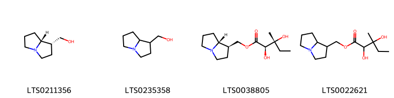{ width=100% }
    <figcaption>Hình ảnh cấu trúc hóa học của 4 hoạt chất thuộc nhóm Pyrrolizidines gồm ['(1r,7ar)-hexahydro-1h-pyrrolizin-1-ylmethanol (LTS0211356)', 'hexahydro-1h-pyrrolizin-1-ylmethanol (LTS0235358)', '(1s,7ar)-hexahydro-1h-pyrrolizin-1-ylmethyl (2r,3r)-2,3-dihydroxy-3-methylpentanoate (LTS0038805)', 'hexahydro-1h-pyrrolizin-1-ylmethyl 2,3-dihydroxy-3-methylpentanoate (LTS0022621)'].</figcaption>
</figure>

---

### Dược dân tộc học

Danh sách các quốc gia có sử dụng *Euploca strigosa* trong điều trị các bệnh. 

| Country   | Disease            | Bệnh                                                                                                                                                                                                |
|:----------|:-------------------|:----------------------------------------------------------------------------------------------------------------------------------------------------------------------------------------------------|
| India     | Laxative, Diuretic | MYMEMORY WARNING: YOU USED ALL AVAILABLE FREE TRANSLATIONS FOR TODAY. NEXT AVAILABLE IN  08 HOURS 51 MINUTES 05 SECONDS VISIT HTTPS://MYMEMORY.TRANSLATED.NET/DOC/USAGELIMITS.PHP TO TRANSLATE MORE |
| Sudan     | Diuretic, Laxative | MYMEMORY WARNING: YOU USED ALL AVAILABLE FREE TRANSLATIONS FOR TODAY. NEXT AVAILABLE IN  08 HOURS 51 MINUTES 02 SECONDS VISIT HTTPS://MYMEMORY.TRANSLATED.NET/DOC/USAGELIMITS.PHP TO TRANSLATE MORE |

---

---
## Heliotropium subulatum
### Thông tin về thực vật

!!! info "Phân loại thực vật của *Heliotropium subulatum* từ GIBF:"
    - **Kingdom:** Plantae
    - **Phylum:** Tracheophyta
    - **Order:** Boraginales
    - **Family:** Heliotropiaceae
    - **Genus:** Heliotropium
    - **Species:** *Heliotropium subulatum*

 

| Label (VI)   | Label (EN)   | Scientific Name        | Descriptions (VI)   | Descriptions (EN)   | Also Known As (VI)   | Also Known As (EN)   |
|:-------------|:-------------|:-----------------------|:--------------------|:--------------------|:---------------------|:---------------------|
| N/A          | N/A          | Heliotropium subulatum |                     | taxon (species)     | ['']                 | ['']                 |

#### Phân bố trên thế giới

**Từ CSDL GIBF** Sri Lanka, nan, Namibia, Congo, Democratic Republic of the, Kenya, Pakistan, Burundi, Mali, Nigeria, India, Tanzania, United Republic of, Mozambique, Syrian Arab Republic, Ethiopia

#### Phân bố tại Việt Nam

**Từ CSDL GIBF**: Không có ghi nhận ở Việt Nam

---
### Thành phần hóa học
        
- Theo cơ sở dữ liệu lotus: Từ loài *Heliotropium subulatum* đã phân lập và xác định được 4 hoạt chất thuộc về các nhóm Fatty Acyls. 

|    | chemicalTaxonomyClassyfireClass   |   smiles_count |
|---:|:----------------------------------|---------------:|
|  0 |                                   |              3 |
|  1 | Fatty Acyls                       |              1 |

#### Nhóm 
<figure markdown="span">
    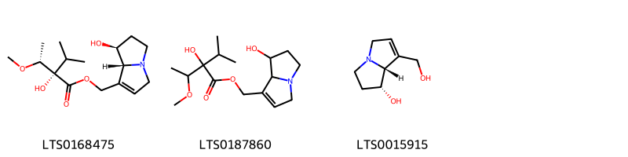{ width=100% }
    <figcaption>Hình ảnh cấu trúc hóa học của 3 hoạt chất thuộc nhóm  gồm ['heliotrine (LTS0168475)', 'heliotrine (LTS0187860)', 'retronecine (LTS0015915)'].</figcaption>
</figure>
#### Nhóm Fatty Acyls
<figure markdown="span">
    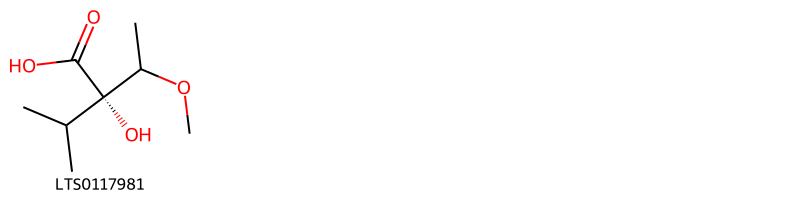{ width=100% }
    <figcaption>Hình ảnh cấu trúc hóa học của 1 hoạt chất thuộc nhóm Fatty Acyls gồm ['(2s)-2-hydroxy-2-isopropyl-3-methoxybutanoic acid (LTS0117981)'].</figcaption>
</figure>

---

### Dược dân tộc học

Danh sách các quốc gia có sử dụng *Heliotropium subulatum* trong điều trị các bệnh. 

| Country   | Disease          | Bệnh                                                                                                                                                                                                |
|:----------|:-----------------|:----------------------------------------------------------------------------------------------------------------------------------------------------------------------------------------------------|
| India     | Tonic, Stimulant | MYMEMORY WARNING: YOU USED ALL AVAILABLE FREE TRANSLATIONS FOR TODAY. NEXT AVAILABLE IN  08 HOURS 50 MINUTES 32 SECONDS VISIT HTTPS://MYMEMORY.TRANSLATED.NET/DOC/USAGELIMITS.PHP TO TRANSLATE MORE |

---

---
## Heliotropium tuberculosum
### Thông tin về thực vật

!!! info "Phân loại thực vật của *N/A* từ GIBF:"
    - **Kingdom:** Plantae
    - **Phylum:** Tracheophyta
    - **Order:** Boraginales
    - **Family:** Heliotropiaceae
    - **Genus:** Heliotropium
    - **Species:** *N/A*

 

| Label (VI)   | Label (EN)   | Scientific Name        | Descriptions (VI)   | Descriptions (EN)   | Also Known As (VI)   | Also Known As (EN)   |
|:-------------|:-------------|:-----------------------|:--------------------|:--------------------|:---------------------|:---------------------|
| N/A          | N/A          | Heliotropium subulatum |                     | taxon (species)     | ['']                 | ['']                 |

#### Phân bố trên thế giới

**Từ CSDL GIBF** Brazil, Cocos (Keeling) Islands, Viet Nam, Israel, Antigua and Barbuda, Chile, Ecuador, Thailand, Spain, Uruguay, Guinea-Bissau, Puerto Rico, Turks and Caicos Islands, United States of America, Greece, Virgin Islands (U.S.), Seychelles, Costa Rica, Dominican Republic, Kiribati, Argentina, Aruba, Malawi, Morocco, Mexico, Kenya, Maldives, Guam, Chinese Taipei, Curaçao, Namibia, Cook Islands, South Africa, Australia, Italy, India, Northern Mariana Islands, Peru

#### Phân bố tại Việt Nam

**Từ CSDL GIBF**: Đồng Tháp

---
### Thành phần hóa học
        
- Theo cơ sở dữ liệu lotus: Từ loài *N/A* đã phân lập và xác định được Chưa có hoạt chất nào được phân lập. hoạt chất thuộc về các nhóm Không có hoạt chất nào được phân lập. 

Không có hình ảnh nào được tạo ra

---

### Dược dân tộc học

Danh sách các quốc gia có sử dụng *N/A* trong điều trị các bệnh. 

| Country   | Disease    | Bệnh                                                                                                                                                                                                |
|:----------|:-----------|:----------------------------------------------------------------------------------------------------------------------------------------------------------------------------------------------------|
| Nigeria   | Lactagogue | MYMEMORY WARNING: YOU USED ALL AVAILABLE FREE TRANSLATIONS FOR TODAY. NEXT AVAILABLE IN  08 HOURS 49 MINUTES 56 SECONDS VISIT HTTPS://MYMEMORY.TRANSLATED.NET/DOC/USAGELIMITS.PHP TO TRANSLATE MORE |

---

# Chi Rotula

??? note "Danh sách các dược liệu thuộc chi"
    
	 - *Rotula aquatica*

---
## Rotula aquatica
### Thông tin về thực vật

!!! info "Phân loại thực vật của *Ehretia aquatica* từ GIBF:"
    - **Kingdom:** Plantae
    - **Phylum:** Tracheophyta
    - **Order:** Boraginales
    - **Family:** Ehretiaceae
    - **Genus:** Ehretia
    - **Species:** *Ehretia aquatica*

 

| Label (VI)   | Label (EN)   | Scientific Name   | Descriptions (VI)   | Descriptions (EN)   | Also Known As (VI)   | Also Known As (EN)   |
|:-------------|:-------------|:------------------|:--------------------|:--------------------|:---------------------|:---------------------|
| N/A          | N/A          | Rotula aquatica   | loài thực vật       | species of plant    | ['']                 | ['']                 |

#### Phân bố trên thế giới

**Từ CSDL GIBF** nan, Brazil, Viet Nam, Senegal, China, Mali, Thailand, Guinea, Guinea-Bissau, Ghana, Indonesia, Burkina Faso, unknown or invalid, Equatorial Guinea, Sierra Leone, Lao People’s Democratic Republic, Benin, Philippines, Cambodia, Niger, Côte d’Ivoire, Myanmar, India

#### Phân bố tại Việt Nam

**Từ CSDL GIBF**: Vĩnh Long

---
### Thành phần hóa học
        
- Theo cơ sở dữ liệu lotus: Từ loài *Ehretia aquatica* đã phân lập và xác định được Chưa có hoạt chất nào được phân lập. hoạt chất thuộc về các nhóm Không có hoạt chất nào được phân lập. 

Không có hình ảnh nào được tạo ra

---

### Dược dân tộc học

Danh sách các quốc gia có sử dụng *Ehretia aquatica* trong điều trị các bệnh. 

| Country     | Disease             | Bệnh                                                                                                                                                                                                |
|:------------|:--------------------|:----------------------------------------------------------------------------------------------------------------------------------------------------------------------------------------------------|
| India       | Laxative, Diuretic  | MYMEMORY WARNING: YOU USED ALL AVAILABLE FREE TRANSLATIONS FOR TODAY. NEXT AVAILABLE IN  08 HOURS 49 MINUTES 26 SECONDS VISIT HTTPS://MYMEMORY.TRANSLATED.NET/DOC/USAGELIMITS.PHP TO TRANSLATE MORE |
| Philippines | Diuretic, Sudorific | MYMEMORY WARNING: YOU USED ALL AVAILABLE FREE TRANSLATIONS FOR TODAY. NEXT AVAILABLE IN  08 HOURS 49 MINUTES 22 SECONDS VISIT HTTPS://MYMEMORY.TRANSLATED.NET/DOC/USAGELIMITS.PHP TO TRANSLATE MORE |

---

# Chi Onosma

??? note "Danh sách các dược liệu thuộc chi"
    
	 - *Onosma bracteatum*
	 - *Onosma echioides*
	 - *Onosma hiidum*
	 - *Onosma hookeri*

---
## Onosma bracteatum
### Thông tin về thực vật

!!! info "Phân loại thực vật của *Maharanga bracteata* từ GIBF:"
    - **Kingdom:** Plantae
    - **Phylum:** Tracheophyta
    - **Order:** Boraginales
    - **Family:** Boraginaceae
    - **Genus:** Maharanga
    - **Species:** *Maharanga bracteata*

 

| Label (VI)   | Label (EN)   | Scientific Name   | Descriptions (VI)   | Descriptions (EN)   | Also Known As (VI)   | Also Known As (EN)   |
|:-------------|:-------------|:------------------|:--------------------|:--------------------|:---------------------|:---------------------|
| N/A          | N/A          | Rotula aquatica   | loài thực vật       | species of plant    | ['']                 | ['']                 |

#### Phân bố trên thế giới

**Từ CSDL GIBF** nan, Türkiye, India, Nepal

#### Phân bố tại Việt Nam

**Từ CSDL GIBF**: Không có ghi nhận ở Việt Nam

---
### Thành phần hóa học
        
- Theo cơ sở dữ liệu lotus: Từ loài *Maharanga bracteata* đã phân lập và xác định được Chưa có hoạt chất nào được phân lập. hoạt chất thuộc về các nhóm Không có hoạt chất nào được phân lập. 

Không có hình ảnh nào được tạo ra

---

### Dược dân tộc học

Danh sách các quốc gia có sử dụng *Maharanga bracteata* trong điều trị các bệnh. 

| Country   | Disease                                 | Bệnh                                                                                                                                                                                                |
|:----------|:----------------------------------------|:----------------------------------------------------------------------------------------------------------------------------------------------------------------------------------------------------|
| Iran      | Diuretic, Refrigerant, Tonic, Demulcent | MYMEMORY WARNING: YOU USED ALL AVAILABLE FREE TRANSLATIONS FOR TODAY. NEXT AVAILABLE IN  08 HOURS 48 MINUTES 57 SECONDS VISIT HTTPS://MYMEMORY.TRANSLATED.NET/DOC/USAGELIMITS.PHP TO TRANSLATE MORE |

---

---
## Onosma echioides
### Thông tin về thực vật

!!! info "Phân loại thực vật của *Onosma echioides* từ GIBF:"
    - **Kingdom:** Plantae
    - **Phylum:** Tracheophyta
    - **Order:** Boraginales
    - **Family:** Boraginaceae
    - **Genus:** Onosma
    - **Species:** *Onosma echioides*

 

| Label (VI)   | Label (EN)   | Scientific Name   | Descriptions (VI)   | Descriptions (EN)   | Also Known As (VI)   | Also Known As (EN)   |
|:-------------|:-------------|:------------------|:--------------------|:--------------------|:---------------------|:---------------------|
| N/A          | N/A          | Onosma echioides  | loài thực vật       | species of plant    | ['']                 | ['']                 |

#### Phân bố trên thế giới

**Từ CSDL GIBF** Montenegro, nan, United States of America, Korea, Republic of, Greece, Ukraine, Pakistan, Albania, Slovakia, North Macedonia, Italy, Croatia, Slovenia, Bulgaria, unknown or invalid, France, Spain, Bosnia and Herzegovina

#### Phân bố tại Việt Nam

**Từ CSDL GIBF**: Không có ghi nhận ở Việt Nam

---
### Thành phần hóa học
        
- Theo cơ sở dữ liệu lotus: Từ loài *Onosma echioides* đã phân lập và xác định được Chưa có hoạt chất nào được phân lập. hoạt chất thuộc về các nhóm Không có hoạt chất nào được phân lập. 

Không có hình ảnh nào được tạo ra

---

### Dược dân tộc học

Danh sách các quốc gia có sử dụng *Onosma echioides* trong điều trị các bệnh. 

| Country   | Disease     | Bệnh                                                                                                                                                                                                |
|:----------|:------------|:----------------------------------------------------------------------------------------------------------------------------------------------------------------------------------------------------|
| ain       | Carminative | MYMEMORY WARNING: YOU USED ALL AVAILABLE FREE TRANSLATIONS FOR TODAY. NEXT AVAILABLE IN  08 HOURS 48 MINUTES 33 SECONDS VISIT HTTPS://MYMEMORY.TRANSLATED.NET/DOC/USAGELIMITS.PHP TO TRANSLATE MORE |

---

---
## Onosma hiidum
### Thông tin về thực vật

!!! info "Phân loại thực vật của *N/A* từ GIBF:"
    - **Kingdom:** Plantae
    - **Phylum:** Tracheophyta
    - **Order:** Boraginales
    - **Family:** Boraginaceae
    - **Genus:** Onosma
    - **Species:** *N/A*

 

| Label (VI)   | Label (EN)   | Scientific Name   | Descriptions (VI)   | Descriptions (EN)   | Also Known As (VI)   | Also Known As (EN)   |
|:-------------|:-------------|:------------------|:--------------------|:--------------------|:---------------------|:---------------------|
| N/A          | N/A          | Onosma echioides  | loài thực vật       | species of plant    | ['']                 | ['']                 |

#### Phân bố trên thế giới

**Từ CSDL GIBF** Uzbekistan, Israel, Kazakhstan, Türkiye, Slovenia, Greece, Russian Federation, Croatia, Cyprus, Iraq, Germany, Syrian Arab Republic, Bosnia and Herzegovina, Austria, Hungary, Ukraine, Slovakia, Italy, Switzerland

#### Phân bố tại Việt Nam

**Từ CSDL GIBF**: Không có ghi nhận ở Việt Nam

---
### Thành phần hóa học
        
- Theo cơ sở dữ liệu lotus: Từ loài *N/A* đã phân lập và xác định được Chưa có hoạt chất nào được phân lập. hoạt chất thuộc về các nhóm Không có hoạt chất nào được phân lập. 

Không có hình ảnh nào được tạo ra

---

### Dược dân tộc học

Danh sách các quốc gia có sử dụng *N/A* trong điều trị các bệnh. 

| Country   | Disease                | Bệnh                                                                                                                                                                                                |
|:----------|:-----------------------|:----------------------------------------------------------------------------------------------------------------------------------------------------------------------------------------------------|
| Elsewhere | Cardiotonic, Stimulant | MYMEMORY WARNING: YOU USED ALL AVAILABLE FREE TRANSLATIONS FOR TODAY. NEXT AVAILABLE IN  08 HOURS 47 MINUTES 51 SECONDS VISIT HTTPS://MYMEMORY.TRANSLATED.NET/DOC/USAGELIMITS.PHP TO TRANSLATE MORE |

---

---
## Onosma hookeri
### Thông tin về thực vật

!!! info "Phân loại thực vật của *Maharanga hookeri* từ GIBF:"
    - **Kingdom:** Plantae
    - **Phylum:** Tracheophyta
    - **Order:** Boraginales
    - **Family:** Boraginaceae
    - **Genus:** Maharanga
    - **Species:** *Maharanga hookeri*

 

| Label (VI)   | Label (EN)   | Scientific Name   | Descriptions (VI)   | Descriptions (EN)   | Also Known As (VI)   | Also Known As (EN)   |
|:-------------|:-------------|:------------------|:--------------------|:--------------------|:---------------------|:---------------------|
| N/A          | N/A          | Onosma hookeri    | loài thực vật       | species of plant    | ['']                 | ['']                 |

#### Phân bố trên thế giới

**Từ CSDL GIBF** nan, Bhutan, Nepal, China, India

#### Phân bố tại Việt Nam

**Từ CSDL GIBF**: Không có ghi nhận ở Việt Nam

---
### Thành phần hóa học
        
- Theo cơ sở dữ liệu lotus: Từ loài *Maharanga hookeri* đã phân lập và xác định được Chưa có hoạt chất nào được phân lập. hoạt chất thuộc về các nhóm Không có hoạt chất nào được phân lập. 

Không có hình ảnh nào được tạo ra

---

### Dược dân tộc học

Danh sách các quốc gia có sử dụng *Maharanga hookeri* trong điều trị các bệnh. 

| Country           | Disease   | Bệnh                                                                                                                                                                                                |
|:------------------|:----------|:----------------------------------------------------------------------------------------------------------------------------------------------------------------------------------------------------|
| Asia(Baluchistan) | Purgative | MYMEMORY WARNING: YOU USED ALL AVAILABLE FREE TRANSLATIONS FOR TODAY. NEXT AVAILABLE IN  08 HOURS 47 MINUTES 21 SECONDS VISIT HTTPS://MYMEMORY.TRANSLATED.NET/DOC/USAGELIMITS.PHP TO TRANSLATE MORE |

---

# Chi Amsinckia

??? note "Danh sách các dược liệu thuộc chi"
    
	 - *Amsinckia intermedia*

---
## Amsinckia intermedia
### Thông tin về thực vật

!!! info "Phân loại thực vật của *Amsinckia menziesii* từ GIBF:"
    - **Kingdom:** Plantae
    - **Phylum:** Tracheophyta
    - **Order:** Boraginales
    - **Family:** Boraginaceae
    - **Genus:** Amsinckia
    - **Species:** *Amsinckia menziesii*

 

| Label (VI)   | Label (EN)   | Scientific Name      | Descriptions (VI)   | Descriptions (EN)   | Also Known As (VI)   | Also Known As (EN)   |
|:-------------|:-------------|:---------------------|:--------------------|:--------------------|:---------------------|:---------------------|
| N/A          | N/A          | Amsinckia intermedia | loài thực vật       | species of plant    | ['']                 | ['']                 |

#### Phân bố trên thế giới

**Từ CSDL GIBF** Mexico, United States of America, Norway, Belgium, Australia, Canada

#### Phân bố tại Việt Nam

**Từ CSDL GIBF**: Không có ghi nhận ở Việt Nam

---
### Thành phần hóa học
        
- Theo cơ sở dữ liệu lotus: Từ loài *Amsinckia menziesii* đã phân lập và xác định được 11 hoạt chất thuộc về các nhóm Fatty Acyls. 

|    | chemicalTaxonomyClassyfireClass   |   smiles_count |
|---:|:----------------------------------|---------------:|
|  0 |                                   |              2 |
|  1 | Fatty Acyls                       |              9 |

#### Nhóm 
<figure markdown="span">
    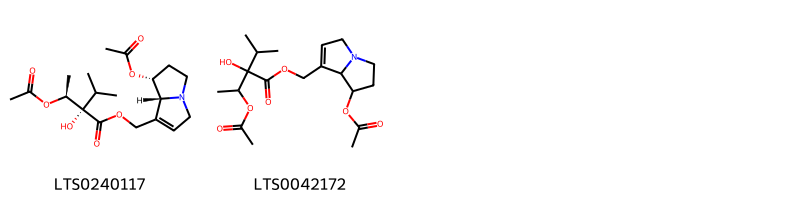{ width=100% }
    <figcaption>Hình ảnh cấu trúc hóa học của 2 hoạt chất thuộc nhóm  gồm ['[(7r,7ar)-7-(acetyloxy)-5,6,7,7a-tetrahydro-3h-pyrrolizin-1-yl]methyl (2s)-2-[(1s)-1-(acetyloxy)ethyl]-2-hydroxy-3-methylbutanoate (LTS0240117)', '[7-(acetyloxy)-5,6,7,7a-tetrahydro-3h-pyrrolizin-1-yl]methyl 3-(acetyloxy)-2-hydroxy-2-isopropylbutanoate (LTS0042172)'].</figcaption>
</figure>
#### Nhóm Fatty Acyls
<figure markdown="span">
    { width=100% }
    <figcaption>Hình ảnh cấu trúc hóa học của 9 hoạt chất thuộc nhóm Fatty Acyls gồm ['palmitic acid (LTS0079439)', 'gamma-linolenic acid (LTS0160094)', 'palmitoleic acid (LTS0261591)', 'arachidic acid (LTS0171823)', 'oleic acid (LTS0256910)', 'icosenoic acid (LTS0039770)', 'α-linolenic acid (LTS0275508)', 'linoleic (LTS0013198)', 'stearic acid (LTS0237766)'].</figcaption>
</figure>

---

### Dược dân tộc học

Danh sách các quốc gia có sử dụng *Amsinckia menziesii* trong điều trị các bệnh. 

| Country   | Disease   | Bệnh                                                                                                                                                                                                |
|:----------|:----------|:----------------------------------------------------------------------------------------------------------------------------------------------------------------------------------------------------|
| US        | Poison    | MYMEMORY WARNING: YOU USED ALL AVAILABLE FREE TRANSLATIONS FOR TODAY. NEXT AVAILABLE IN  08 HOURS 46 MINUTES 51 SECONDS VISIT HTTPS://MYMEMORY.TRANSLATED.NET/DOC/USAGELIMITS.PHP TO TRANSLATE MORE |

---

# Chi Arnebia

??? note "Danh sách các dược liệu thuộc chi"
    
	 - *Arnebia nobilis*

---
## Arnebia nobilis
### Thông tin về thực vật

!!! info "Phân loại thực vật của *Arnebia speciosa* từ GIBF:"
    - **Kingdom:** Plantae
    - **Phylum:** Tracheophyta
    - **Order:** Boraginales
    - **Family:** Boraginaceae
    - **Genus:** Arnebia
    - **Species:** *Arnebia speciosa*

 

| Label (VI)   | Label (EN)   | Scientific Name   | Descriptions (VI)   | Descriptions (EN)   | Also Known As (VI)   | Also Known As (EN)   |
|:-------------|:-------------|:------------------|:--------------------|:--------------------|:---------------------|:---------------------|
| N/A          | N/A          | Arnebia nobilis   | loài thực vật       | species of plant    | ['']                 | ['']                 |

#### Phân bố trên thế giới

**Từ CSDL GIBF** Mexico, United States of America, Norway, Belgium, Australia, Canada

#### Phân bố tại Việt Nam

**Từ CSDL GIBF**: Không có ghi nhận ở Việt Nam

---
### Thành phần hóa học
        
- Theo cơ sở dữ liệu lotus: Từ loài *Arnebia speciosa* đã phân lập và xác định được Chưa có hoạt chất nào được phân lập. hoạt chất thuộc về các nhóm Không có hoạt chất nào được phân lập. 

Không có hình ảnh nào được tạo ra

---

### Dược dân tộc học

Danh sách các quốc gia có sử dụng *Arnebia speciosa* trong điều trị các bệnh. 

| Country   | Disease   | Bệnh                                                                                                                                                                                                |
|:----------|:----------|:----------------------------------------------------------------------------------------------------------------------------------------------------------------------------------------------------|
| India     | Fungicide | MYMEMORY WARNING: YOU USED ALL AVAILABLE FREE TRANSLATIONS FOR TODAY. NEXT AVAILABLE IN  08 HOURS 46 MINUTES 17 SECONDS VISIT HTTPS://MYMEMORY.TRANSLATED.NET/DOC/USAGELIMITS.PHP TO TRANSLATE MORE |

---

# Chi Coldenia

??? note "Danh sách các dược liệu thuộc chi"
    
	 - *Coldenia procumbens*

---
## Coldenia procumbens
### Thông tin về thực vật

!!! info "Phân loại thực vật của *Coldenia procumbens* từ GIBF:"
    - **Kingdom:** Plantae
    - **Phylum:** Tracheophyta
    - **Order:** Boraginales
    - **Family:** Coldeniaceae
    - **Genus:** Coldenia
    - **Species:** *Coldenia procumbens*

 

| Label (VI)   | Label (EN)   | Scientific Name     | Descriptions (VI)   | Descriptions (EN)   | Also Known As (VI)   | Also Known As (EN)   |
|:-------------|:-------------|:--------------------|:--------------------|:--------------------|:---------------------|:---------------------|
| N/A          | N/A          | Coldenia procumbens | loài thực vật       | species of plant    | ['']                 | ['']                 |

#### Phân bố trên thế giới

**Từ CSDL GIBF** nan, Viet Nam, Gambia, Mozambique, Tanzania, United Republic of, Thailand, Guinea, Ghana, Sri Lanka, Chad, Zambia, Indonesia, Nigeria, Burkina Faso, Lao People’s Democratic Republic, Benin, Kenya, Chinese Taipei, Niger, South Africa, Australia, India

#### Phân bố tại Việt Nam

**Từ CSDL GIBF**: Đồng Nai

---
### Thành phần hóa học
        
- Theo cơ sở dữ liệu lotus: Từ loài *Coldenia procumbens* đã phân lập và xác định được Chưa có hoạt chất nào được phân lập. hoạt chất thuộc về các nhóm Không có hoạt chất nào được phân lập. 

Không có hình ảnh nào được tạo ra

---

### Dược dân tộc học

Danh sách các quốc gia có sử dụng *Coldenia procumbens* trong điều trị các bệnh. 

| Country   | Disease     | Bệnh                                                                                                                                                                                                |
|:----------|:------------|:----------------------------------------------------------------------------------------------------------------------------------------------------------------------------------------------------|
| Elsewhere | Suppurative | MYMEMORY WARNING: YOU USED ALL AVAILABLE FREE TRANSLATIONS FOR TODAY. NEXT AVAILABLE IN  08 HOURS 45 MINUTES 52 SECONDS VISIT HTTPS://MYMEMORY.TRANSLATED.NET/DOC/USAGELIMITS.PHP TO TRANSLATE MORE |
| India     | Suppurative | MYMEMORY WARNING: YOU USED ALL AVAILABLE FREE TRANSLATIONS FOR TODAY. NEXT AVAILABLE IN  08 HOURS 45 MINUTES 46 SECONDS VISIT HTTPS://MYMEMORY.TRANSLATED.NET/DOC/USAGELIMITS.PHP TO TRANSLATE MORE |

---

# Chi Tournefortia

??? note "Danh sách các dược liệu thuộc chi"
    
	 - *Tournefortia bicolor*
	 - *Tournefortia gnaphalodes*
	 - *Tournefortia hirsutissima*

---
## Tournefortia bicolor
### Thông tin về thực vật

!!! info "Phân loại thực vật của *Heliotropium verdcourtii* từ GIBF:"
    - **Kingdom:** Plantae
    - **Phylum:** Tracheophyta
    - **Order:** Boraginales
    - **Family:** Heliotropiaceae
    - **Genus:** Heliotropium
    - **Species:** *Heliotropium verdcourtii*

 

| Label (VI)   | Label (EN)   | Scientific Name      | Descriptions (VI)   | Descriptions (EN)   | Also Known As (VI)   | Also Known As (EN)   |
|:-------------|:-------------|:---------------------|:--------------------|:--------------------|:---------------------|:---------------------|
| N/A          | N/A          | Tournefortia bicolor | loài thực vật       | species of plant    | ['']                 | ['']                 |

#### Phân bố trên thế giới

**Từ CSDL GIBF** Brazil, Nicaragua, Mexico, United States of America, Puerto Rico, Bonaire, Sint Eustatius and Saba, Martinique, Guadeloupe, Costa Rica, Colombia, Cuba, Ecuador, Peru, French Guiana, Panama, Venezuela (Bolivarian Republic of)

#### Phân bố tại Việt Nam

**Từ CSDL GIBF**: Không có ghi nhận ở Việt Nam

---
### Thành phần hóa học
        
- Theo cơ sở dữ liệu lotus: Từ loài *Heliotropium verdcourtii* đã phân lập và xác định được Chưa có hoạt chất nào được phân lập. hoạt chất thuộc về các nhóm Không có hoạt chất nào được phân lập. 

Không có hình ảnh nào được tạo ra

---

### Dược dân tộc học

Danh sách các quốc gia có sử dụng *Heliotropium verdcourtii* trong điều trị các bệnh. 

| Country   | Disease            | Bệnh                                                                                                                                                                                                |
|:----------|:-------------------|:----------------------------------------------------------------------------------------------------------------------------------------------------------------------------------------------------|
| Haiti     | Diuretic, Diuretic | MYMEMORY WARNING: YOU USED ALL AVAILABLE FREE TRANSLATIONS FOR TODAY. NEXT AVAILABLE IN  08 HOURS 45 MINUTES 16 SECONDS VISIT HTTPS://MYMEMORY.TRANSLATED.NET/DOC/USAGELIMITS.PHP TO TRANSLATE MORE |

---

---
## Tournefortia gnaphalodes
### Thông tin về thực vật

!!! info "Phân loại thực vật của *Tournefortia gnaphalodes* từ GIBF:"
    - **Kingdom:** Plantae
    - **Phylum:** Tracheophyta
    - **Order:** Boraginales
    - **Family:** Heliotropiaceae
    - **Genus:** Tournefortia
    - **Species:** *Tournefortia gnaphalodes*

 

| Label (VI)   | Label (EN)   | Scientific Name          | Descriptions (VI)   | Descriptions (EN)   | Also Known As (VI)   | Also Known As (EN)                                                                  |
|:-------------|:-------------|:-------------------------|:--------------------|:--------------------|:---------------------|:------------------------------------------------------------------------------------|
| N/A          | N/A          | Tournefortia gnaphalodes |                     | species of plant    | ['']                 | ['sea lavender', 'sea rosemary', 'iodine bush', 'bay lavender', 'beach heliotrope'] |

#### Phân bố trên thế giới

**Từ CSDL GIBF** Virgin Islands (British), Guadeloupe, Barbados, Antigua and Barbuda, Honduras, Anguilla, Turks and Caicos Islands, Cayman Islands, Puerto Rico, United States of America, Saint Barthélemy, Virgin Islands (U.S.), Saint Martin (French part), Cuba, Aruba, Grenada, Sint Maarten (Dutch part), Mexico, Curaçao, Bonaire, Sint Eustatius and Saba, Bermuda, Bahamas

#### Phân bố tại Việt Nam

**Từ CSDL GIBF**: Không có ghi nhận ở Việt Nam

---
### Thành phần hóa học
        
- Theo cơ sở dữ liệu lotus: Từ loài *Tournefortia gnaphalodes* đã phân lập và xác định được Chưa có hoạt chất nào được phân lập. hoạt chất thuộc về các nhóm Không có hoạt chất nào được phân lập. 

Không có hình ảnh nào được tạo ra

---

### Dược dân tộc học

Danh sách các quốc gia có sử dụng *Tournefortia gnaphalodes* trong điều trị các bệnh. 

| Country   | Disease       | Bệnh                                                                                                                                                                                                |
|:----------|:--------------|:----------------------------------------------------------------------------------------------------------------------------------------------------------------------------------------------------|
| Curacao   | Abortifacient | MYMEMORY WARNING: YOU USED ALL AVAILABLE FREE TRANSLATIONS FOR TODAY. NEXT AVAILABLE IN  08 HOURS 44 MINUTES 48 SECONDS VISIT HTTPS://MYMEMORY.TRANSLATED.NET/DOC/USAGELIMITS.PHP TO TRANSLATE MORE |

---

---
## Tournefortia hirsutissima
### Thông tin về thực vật

!!! info "Phân loại thực vật của *N/A* từ GIBF:"
    - **Kingdom:** Plantae
    - **Phylum:** Tracheophyta
    - **Order:** Boraginales
    - **Family:** Heliotropiaceae
    - **Genus:** Heliotropium
    - **Species:** *N/A*

 

| Label (VI)   | Label (EN)   | Scientific Name           | Descriptions (VI)   | Descriptions (EN)   | Also Known As (VI)   | Also Known As (EN)   |
|:-------------|:-------------|:--------------------------|:--------------------|:--------------------|:---------------------|:---------------------|
| N/A          | N/A          | Tournefortia hirsutissima | loài thực vật       | species of plant    | ['']                 | ['']                 |

#### Phân bố trên thế giới

**Từ CSDL GIBF** Brazil, Cocos (Keeling) Islands, Viet Nam, Israel, Antigua and Barbuda, Chile, Ecuador, Thailand, Spain, Uruguay, Guinea-Bissau, Puerto Rico, Turks and Caicos Islands, United States of America, Greece, Virgin Islands (U.S.), Seychelles, Costa Rica, Dominican Republic, Kiribati, Argentina, Aruba, Malawi, Morocco, Mexico, Kenya, Maldives, Guam, Chinese Taipei, Curaçao, Namibia, Cook Islands, South Africa, Australia, Italy, India, Northern Mariana Islands, Peru

#### Phân bố tại Việt Nam

**Từ CSDL GIBF**: Đồng Tháp

---
### Thành phần hóa học
        
- Theo cơ sở dữ liệu lotus: Từ loài *N/A* đã phân lập và xác định được Chưa có hoạt chất nào được phân lập. hoạt chất thuộc về các nhóm Không có hoạt chất nào được phân lập. 

Không có hình ảnh nào được tạo ra

---

### Dược dân tộc học

Danh sách các quốc gia có sử dụng *N/A* trong điều trị các bệnh. 

| Country     | Disease             | Bệnh                                                                                                                                                                                                |
|:------------|:--------------------|:----------------------------------------------------------------------------------------------------------------------------------------------------------------------------------------------------|
| Haiti       | Diuretic, Larvicide | MYMEMORY WARNING: YOU USED ALL AVAILABLE FREE TRANSLATIONS FOR TODAY. NEXT AVAILABLE IN  08 HOURS 44 MINUTES 25 SECONDS VISIT HTTPS://MYMEMORY.TRANSLATED.NET/DOC/USAGELIMITS.PHP TO TRANSLATE MORE |
| Mexico      | Diuretic, Diuretic  | MYMEMORY WARNING: YOU USED ALL AVAILABLE FREE TRANSLATIONS FOR TODAY. NEXT AVAILABLE IN  08 HOURS 44 MINUTES 22 SECONDS VISIT HTTPS://MYMEMORY.TRANSLATED.NET/DOC/USAGELIMITS.PHP TO TRANSLATE MORE |
| West Indies | Insecticide         | MYMEMORY WARNING: YOU USED ALL AVAILABLE FREE TRANSLATIONS FOR TODAY. NEXT AVAILABLE IN  08 HOURS 44 MINUTES 19 SECONDS VISIT HTTPS://MYMEMORY.TRANSLATED.NET/DOC/USAGELIMITS.PHP TO TRANSLATE MORE |

---

# Chi Myosotis

??? note "Danh sách các dược liệu thuộc chi"
    
	 - *Myosotis palustris*

---
## Myosotis palustris
### Thông tin về thực vật

!!! info "Phân loại thực vật của *N/A* từ GIBF:"
    - **Kingdom:** Plantae
    - **Phylum:** Tracheophyta
    - **Order:** Boraginales
    - **Family:** Boraginaceae
    - **Genus:** Myosotis
    - **Species:** *N/A*

 

| Label (VI)   | Label (EN)   | Scientific Name    | Descriptions (VI)   | Descriptions (EN)   | Also Known As (VI)   | Also Known As (EN)   |
|:-------------|:-------------|:-------------------|:--------------------|:--------------------|:---------------------|:---------------------|
| N/A          | N/A          | Myosotis palustris |                     |                     | ['']                 | ['']                 |

#### Phân bố trên thế giới

**Từ CSDL GIBF** Mexico, United States of America, Portugal, Netherlands, Belgium, France, South Africa, Australia, Chile, New Zealand, Italy, Switzerland, Spain, Germany, United Kingdom of Great Britain and Northern Ireland, Ireland, Denmark

#### Phân bố tại Việt Nam

**Từ CSDL GIBF**: Không có ghi nhận ở Việt Nam

---
### Thành phần hóa học
        
- Theo cơ sở dữ liệu lotus: Từ loài *N/A* đã phân lập và xác định được Chưa có hoạt chất nào được phân lập. hoạt chất thuộc về các nhóm Không có hoạt chất nào được phân lập. 

Không có hình ảnh nào được tạo ra

---

### Dược dân tộc học

Danh sách các quốc gia có sử dụng *N/A* trong điều trị các bệnh. 

| Country   | Disease                 | Bệnh                                                                                                                                                                                                |
|:----------|:------------------------|:----------------------------------------------------------------------------------------------------------------------------------------------------------------------------------------------------|
| Turkey    | Astringent, Expectorant | MYMEMORY WARNING: YOU USED ALL AVAILABLE FREE TRANSLATIONS FOR TODAY. NEXT AVAILABLE IN  08 HOURS 43 MINUTES 36 SECONDS VISIT HTTPS://MYMEMORY.TRANSLATED.NET/DOC/USAGELIMITS.PHP TO TRANSLATE MORE |

---

# Chi Anchusa

??? note "Danh sách các dược liệu thuộc chi"
    
	 - *Anchusa italica*
	 - *Anchusa officinalis*
	 - *Anchusa strigosa*

---
## Anchusa italica
### Thông tin về thực vật

!!! info "Phân loại thực vật của *Anchusa azurea* từ GIBF:"
    - **Kingdom:** Plantae
    - **Phylum:** Tracheophyta
    - **Order:** Boraginales
    - **Family:** Boraginaceae
    - **Genus:** Anchusa
    - **Species:** *Anchusa azurea*

 

| Label (VI)   | Label (EN)   | Scientific Name   | Descriptions (VI)   | Descriptions (EN)   | Also Known As (VI)   | Also Known As (EN)   |
|:-------------|:-------------|:------------------|:--------------------|:--------------------|:---------------------|:---------------------|
| N/A          | N/A          | Anchusa italica   | loài thực vật       | species of plant    | ['']                 | ['']                 |

#### Phân bố trên thế giới

**Từ CSDL GIBF** Morocco, nan, Portugal, Greece, Armenia, Russian Federation, Tunisia, Italy, Switzerland, France, Spain

#### Phân bố tại Việt Nam

**Từ CSDL GIBF**: Không có ghi nhận ở Việt Nam

---
### Thành phần hóa học
        
- Theo cơ sở dữ liệu lotus: Từ loài *Anchusa azurea* đã phân lập và xác định được Chưa có hoạt chất nào được phân lập. hoạt chất thuộc về các nhóm Không có hoạt chất nào được phân lập. 

Không có hình ảnh nào được tạo ra

---

### Dược dân tộc học

Danh sách các quốc gia có sử dụng *Anchusa azurea* trong điều trị các bệnh. 

| Country   | Disease         | Bệnh                                                                                                                                                                                                |
|:----------|:----------------|:----------------------------------------------------------------------------------------------------------------------------------------------------------------------------------------------------|
| Iraq      | Tonic, Diuretic | MYMEMORY WARNING: YOU USED ALL AVAILABLE FREE TRANSLATIONS FOR TODAY. NEXT AVAILABLE IN  08 HOURS 43 MINUTES 10 SECONDS VISIT HTTPS://MYMEMORY.TRANSLATED.NET/DOC/USAGELIMITS.PHP TO TRANSLATE MORE |
| Turkey    | Diaphoretic     | MYMEMORY WARNING: YOU USED ALL AVAILABLE FREE TRANSLATIONS FOR TODAY. NEXT AVAILABLE IN  08 HOURS 43 MINUTES 05 SECONDS VISIT HTTPS://MYMEMORY.TRANSLATED.NET/DOC/USAGELIMITS.PHP TO TRANSLATE MORE |

---

---
## Anchusa officinalis
### Thông tin về thực vật

!!! info "Phân loại thực vật của *Anchusa officinalis* từ GIBF:"
    - **Kingdom:** Plantae
    - **Phylum:** Tracheophyta
    - **Order:** Boraginales
    - **Family:** Boraginaceae
    - **Genus:** Anchusa
    - **Species:** *Anchusa officinalis*

 

| Label (VI)   | Label (EN)   | Scientific Name     | Descriptions (VI)   | Descriptions (EN)   | Also Known As (VI)   | Also Known As (EN)                 |
|:-------------|:-------------|:--------------------|:--------------------|:--------------------|:---------------------|:-----------------------------------|
| N/A          | N/A          | Anchusa officinalis |                     | species of plant    | ['']                 | ['alkanet', 'Anchusa officinalis'] |

#### Phân bố trên thế giới

**Từ CSDL GIBF** Czechia, Sweden, Slovenia, Poland, Denmark, Netherlands, United States of America, France, Belgium, Serbia, Germany, Austria, Hungary, Slovakia, Ukraine, Italy, Switzerland, Bulgaria, United Kingdom of Great Britain and Northern Ireland

#### Phân bố tại Việt Nam

**Từ CSDL GIBF**: Không có ghi nhận ở Việt Nam

---
### Thành phần hóa học
        
- Theo cơ sở dữ liệu lotus: Từ loài *Anchusa officinalis* đã phân lập và xác định được 24 hoạt chất thuộc về các nhóm Prenol lipids, Cinnamic acids and derivatives, Pyrrolizidines. 

|    | chemicalTaxonomyClassyfireClass   |   smiles_count |
|---:|:----------------------------------|---------------:|
|  0 |                                   |              4 |
|  1 | Cinnamic acids and derivatives    |              1 |
|  2 | Prenol lipids                     |             16 |
|  3 | Pyrrolizidines                    |              3 |

#### Nhóm 
<figure markdown="span">
    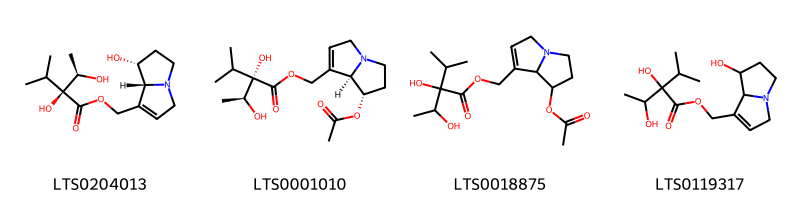{ width=100% }
    <figcaption>Hình ảnh cấu trúc hóa học của 4 hoạt chất thuộc nhóm  gồm ['intermedine (LTS0204013)', '[(7s,7ar)-7-(acetyloxy)-5,6,7,7a-tetrahydro-3h-pyrrolizin-1-yl]methyl (2s)-2-hydroxy-2-[(1s)-1-hydroxyethyl]-3-methylbutanoate (LTS0001010)', '[7-(acetyloxy)-5,6,7,7a-tetrahydro-3h-pyrrolizin-1-yl]methyl 2,3-dihydroxy-2-isopropylbutanoate (LTS0018875)', '(7-hydroxy-5,6,7,7a-tetrahydro-3h-pyrrolizin-1-yl)methyl 2,3-dihydroxy-2-isopropylbutanoate (LTS0119317)'].</figcaption>
</figure>
#### Nhóm Cinnamic acids and derivatives
<figure markdown="span">
    { width=100% }
    <figcaption>Hình ảnh cấu trúc hóa học của 1 hoạt chất thuộc nhóm Cinnamic acids and derivatives gồm ['rosemary acid (LTS0207820)'].</figcaption>
</figure>
#### Nhóm Prenol lipids
<figure markdown="span">
    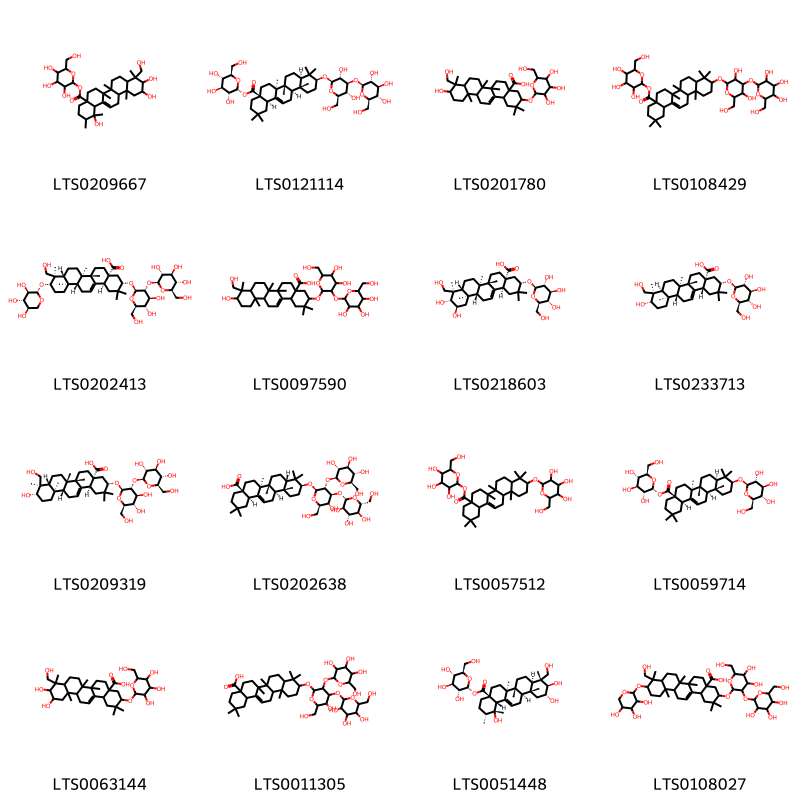{ width=100% }
    <figcaption>Hình ảnh cấu trúc hóa học của 16 hoạt chất thuộc nhóm Prenol lipids gồm ['3,4,5-trihydroxy-6-(hydroxymethyl)oxan-2-yl 1,10,11-trihydroxy-9-(hydroxymethyl)-1,2,6a,6b,9,12a-hexamethyl-2,3,4,5,6,7,8,8a,10,11,12,12b,13,14b-tetradecahydropicene-4a-carboxylate (LTS0209667)', '(2r,3r,4s,5s,6r)-3,4,5-trihydroxy-6-(hydroxymethyl)oxan-2-yl (4as,6as,6br,8ar,10s,12ar,12br,14br)-10-{[(2r,3r,4s,5r,6r)-3,5-dihydroxy-6-(hydroxymethyl)-4-{[(2s,3r,4s,5s,6r)-3,4,5-trihydroxy-6-(hydroxymethyl)oxan-2-yl]oxy}oxan-2-yl]oxy}-2,2,6a,6b,9,9,12a-heptamethyl-1,3,4,5,6,7,8,8a,10,11,12,12b,13,14b-tetradecahydropicene-4a-carboxylate (LTS0121114)', '10-hydroxy-9-(hydroxymethyl)-2,2,6a,6b,9,12a-hexamethyl-3-{[3,4,5-trihydroxy-6-(hydroxymethyl)oxan-2-yl]oxy}-1,3,4,5,6,7,8,8a,10,11,12,12b,13,14b-tetradecahydropicene-4a-carboxylic acid (LTS0201780)', '3,4,5-trihydroxy-6-(hydroxymethyl)oxan-2-yl 10-{[3,5-dihydroxy-6-(hydroxymethyl)-4-{[3,4,5-trihydroxy-6-(hydroxymethyl)oxan-2-yl]oxy}oxan-2-yl]oxy}-2,2,6a,6b,9,9,12a-heptamethyl-1,3,4,5,6,7,8,8a,10,11,12,12b,13,14b-tetradecahydropicene-4a-carboxylate (LTS0108429)', '(3s,4ar,6as,6br,8ar,9r,10s,12ar,12br,14bs)-3-{[(2r,3r,4s,5s,6r)-4,5-dihydroxy-6-(hydroxymethyl)-3-{[(2s,3r,4s,5s,6r)-3,4,5-trihydroxy-6-(hydroxymethyl)oxan-2-yl]oxy}oxan-2-yl]oxy}-9-(hydroxymethyl)-2,2,6a,6b,9,12a-hexamethyl-10-{[(2s,3r,4s,5r)-3,4,5-trihydroxyoxan-2-yl]oxy}-1,3,4,5,6,7,8,8a,10,11,12,12b,13,14b-tetradecahydropicene-4a-carboxylic acid (LTS0202413)', '3-{[4,5-dihydroxy-6-(hydroxymethyl)-3-{[3,4,5-trihydroxy-6-(hydroxymethyl)oxan-2-yl]oxy}oxan-2-yl]oxy}-10-hydroxy-9-(hydroxymethyl)-2,2,6a,6b,9,12a-hexamethyl-1,3,4,5,6,7,8,8a,10,11,12,12b,13,14b-tetradecahydropicene-4a-carboxylic acid (LTS0097590)', '(3s,4ar,6as,6br,8ar,9r,10r,11r,12ar,12br,14bs)-10,11-dihydroxy-9-(hydroxymethyl)-2,2,6a,6b,9,12a-hexamethyl-3-{[(2r,3r,4s,5s,6r)-3,4,5-trihydroxy-6-(hydroxymethyl)oxan-2-yl]oxy}-1,3,4,5,6,7,8,8a,10,11,12,12b,13,14b-tetradecahydropicene-4a-carboxylic acid (LTS0218603)', '(3s,4ar,6as,6br,8as,9r,10s,12ar,12br,14br)-10-hydroxy-9-(hydroxymethyl)-2,2,6a,6b,9,12a-hexamethyl-3-{[(2r,3r,4s,5s,6r)-3,4,5-trihydroxy-6-(hydroxymethyl)oxan-2-yl]oxy}-1,3,4,5,6,7,8,8a,10,11,12,12b,13,14b-tetradecahydropicene-4a-carboxylic acid (LTS0233713)', '(3s,4ar,6as,6bs,8ar,9r,10s,12ar,12br,14bs)-3-{[(2r,3r,4s,5s,6r)-4,5-dihydroxy-6-(hydroxymethyl)-3-{[(2s,3r,4s,5s,6r)-3,4,5-trihydroxy-6-(hydroxymethyl)oxan-2-yl]oxy}oxan-2-yl]oxy}-10-hydroxy-9-(hydroxymethyl)-2,2,6a,6b,9,12a-hexamethyl-1,3,4,5,6,7,8,8a,10,11,12,12b,13,14b-tetradecahydropicene-4a-carboxylic acid (LTS0209319)', '(4as,6as,6br,8as,10s,12ar,12br,14br)-10-{[(2r,3r,4s,5r,6r)-5-hydroxy-6-(hydroxymethyl)-3,4-bis({[(2s,3r,4s,5s,6r)-3,4,5-trihydroxy-6-(hydroxymethyl)oxan-2-yl]oxy})oxan-2-yl]oxy}-2,2,6a,6b,9,9,12a-heptamethyl-1,3,4,5,6,7,8,8a,10,11,12,12b,13,14b-tetradecahydropicene-4a-carboxylic acid (LTS0202638)', '3,4,5-trihydroxy-6-(hydroxymethyl)oxan-2-yl 2,2,6a,6b,9,9,12a-heptamethyl-10-{[3,4,5-trihydroxy-6-(hydroxymethyl)oxan-2-yl]oxy}-1,3,4,5,6,7,8,8a,10,11,12,12b,13,14b-tetradecahydropicene-4a-carboxylate (LTS0057512)', '(2r,3r,4s,5s,6r)-3,4,5-trihydroxy-6-(hydroxymethyl)oxan-2-yl (4as,6as,6br,8ar,10s,12ar,12br,14br)-2,2,6a,6b,9,9,12a-heptamethyl-10-{[(2r,3r,4s,5s,6r)-3,4,5-trihydroxy-6-(hydroxymethyl)oxan-2-yl]oxy}-1,3,4,5,6,7,8,8a,10,11,12,12b,13,14b-tetradecahydropicene-4a-carboxylate (LTS0059714)', '10,11-dihydroxy-9-(hydroxymethyl)-2,2,6a,6b,9,12a-hexamethyl-3-{[3,4,5-trihydroxy-6-(hydroxymethyl)oxan-2-yl]oxy}-1,3,4,5,6,7,8,8a,10,11,12,12b,13,14b-tetradecahydropicene-4a-carboxylic acid (LTS0063144)', '10-{[5-hydroxy-6-(hydroxymethyl)-3,4-bis({[3,4,5-trihydroxy-6-(hydroxymethyl)oxan-2-yl]oxy})oxan-2-yl]oxy}-2,2,6a,6b,9,9,12a-heptamethyl-1,3,4,5,6,7,8,8a,10,11,12,12b,13,14b-tetradecahydropicene-4a-carboxylic acid (LTS0011305)', '(2r,3r,4s,5s,6r)-3,4,5-trihydroxy-6-(hydroxymethyl)oxan-2-yl (1r,2r,4as,6as,6br,8ar,9r,10r,11r,12ar,12br,14bs)-1,10,11-trihydroxy-9-(hydroxymethyl)-1,2,6a,6b,9,12a-hexamethyl-2,3,4,5,6,7,8,8a,10,11,12,12b,13,14b-tetradecahydropicene-4a-carboxylate (LTS0051448)', '3-{[4,5-dihydroxy-6-(hydroxymethyl)-3-{[3,4,5-trihydroxy-6-(hydroxymethyl)oxan-2-yl]oxy}oxan-2-yl]oxy}-9-(hydroxymethyl)-2,2,6a,6b,9,12a-hexamethyl-10-[(3,4,5-trihydroxyoxan-2-yl)oxy]-1,3,4,5,6,7,8,8a,10,11,12,12b,13,14b-tetradecahydropicene-4a-carboxylic acid (LTS0108027)'].</figcaption>
</figure>
#### Nhóm Pyrrolizidines
<figure markdown="span">
    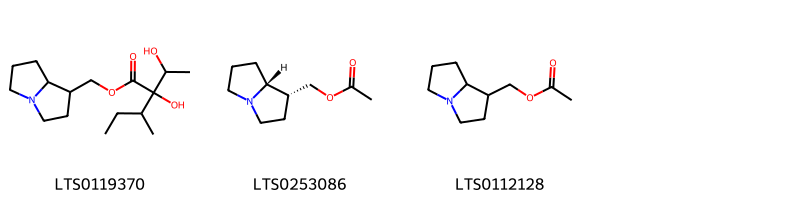{ width=100% }
    <figcaption>Hình ảnh cấu trúc hóa học của 3 hoạt chất thuộc nhóm Pyrrolizidines gồm ['hexahydro-1h-pyrrolizin-1-ylmethyl 2-hydroxy-2-(1-hydroxyethyl)-3-methylpentanoate (LTS0119370)', '(1r,7ar)-hexahydro-1h-pyrrolizin-1-ylmethyl acetate (LTS0253086)', 'hexahydro-1h-pyrrolizin-1-ylmethyl acetate (LTS0112128)'].</figcaption>
</figure>

---

### Dược dân tộc học

Danh sách các quốc gia có sử dụng *Anchusa officinalis* trong điều trị các bệnh. 

| Country   | Disease                                                           | Bệnh                                                                                                                                                                                                |
|:----------|:------------------------------------------------------------------|:----------------------------------------------------------------------------------------------------------------------------------------------------------------------------------------------------|
| Turkey    | Astringent, Vulnerary, Diuretic, Expectorant, Sedative, Emollient | MYMEMORY WARNING: YOU USED ALL AVAILABLE FREE TRANSLATIONS FOR TODAY. NEXT AVAILABLE IN  08 HOURS 42 MINUTES 26 SECONDS VISIT HTTPS://MYMEMORY.TRANSLATED.NET/DOC/USAGELIMITS.PHP TO TRANSLATE MORE |

---

---
## Anchusa strigosa
### Thông tin về thực vật

!!! info "Phân loại thực vật của *Anchusa strigosa* từ GIBF:"
    - **Kingdom:** Plantae
    - **Phylum:** Tracheophyta
    - **Order:** Boraginales
    - **Family:** Boraginaceae
    - **Genus:** Anchusa
    - **Species:** *Anchusa strigosa*

 

| Label (VI)   | Label (EN)   | Scientific Name   | Descriptions (VI)   | Descriptions (EN)   | Also Known As (VI)   | Also Known As (EN)   |
|:-------------|:-------------|:------------------|:--------------------|:--------------------|:---------------------|:---------------------|
| N/A          | N/A          | Anchusa strigosa  | loài thực vật       | species of plant    | ['']                 | ['']                 |

#### Phân bố trên thế giới

**Từ CSDL GIBF** Cyprus, Greece, Iran (Islamic Republic of), Palestine, State of, Israel, Iraq, Türkiye, Jordan, Syrian Arab Republic, Lebanon

#### Phân bố tại Việt Nam

**Từ CSDL GIBF**: Không có ghi nhận ở Việt Nam

---
### Thành phần hóa học
        
- Theo cơ sở dữ liệu lotus: Từ loài *Anchusa strigosa* đã phân lập và xác định được 37 hoạt chất thuộc về các nhóm Fatty Acyls, Peptidomimetics, Cinnamic acids and derivatives, Azolidines, Organooxygen compounds, Azoles, Prenol lipids, Lignan glycosides, Pyrrolizidines. 

|    | chemicalTaxonomyClassyfireClass   |   smiles_count |
|---:|:----------------------------------|---------------:|
|  0 |                                   |              3 |
|  1 | Azoles                            |              1 |
|  2 | Azolidines                        |              1 |
|  3 | Cinnamic acids and derivatives    |              5 |
|  4 | Fatty Acyls                       |             11 |
|  5 | Lignan glycosides                 |              2 |
|  6 | Organooxygen compounds            |              2 |
|  7 | Peptidomimetics                   |              2 |
|  8 | Prenol lipids                     |              8 |
|  9 | Pyrrolizidines                    |              2 |

#### Nhóm 
<figure markdown="span">
    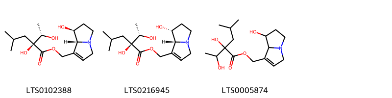{ width=100% }
    <figcaption>Hình ảnh cấu trúc hóa học của 3 hoạt chất thuộc nhóm  gồm ['[(7s,7ar)-7-hydroxy-5,6,7,7a-tetrahydro-3h-pyrrolizin-1-yl]methyl (2s)-2-hydroxy-2-[(1s)-1-hydroxyethyl]-4-methylpentanoate (LTS0102388)', '[(7r,7ar)-7-hydroxy-5,6,7,7a-tetrahydro-3h-pyrrolizin-1-yl]methyl (2s)-2-hydroxy-2-[(1s)-1-hydroxyethyl]-4-methylpentanoate (LTS0216945)', '(7-hydroxy-5,6,7,7a-tetrahydro-3h-pyrrolizin-1-yl)methyl 2-hydroxy-2-(1-hydroxyethyl)-4-methylpentanoate (LTS0005874)'].</figcaption>
</figure>
#### Nhóm Azoles
<figure markdown="span">
    { width=100% }
    <figcaption>Hình ảnh cấu trúc hóa học của 1 hoạt chất thuộc nhóm Azoles gồm ['allantoin (LTS0106609)'].</figcaption>
</figure>
#### Nhóm Azolidines
<figure markdown="span">
    { width=100% }
    <figcaption>Hình ảnh cấu trúc hóa học của 1 hoạt chất thuộc nhóm Azolidines gồm ['n-[(4s)-2,5-dihydroxy-4h-imidazol-4-yl]carbamimidic acid (LTS0174328)'].</figcaption>
</figure>
#### Nhóm Cinnamic acids and derivatives
<figure markdown="span">
    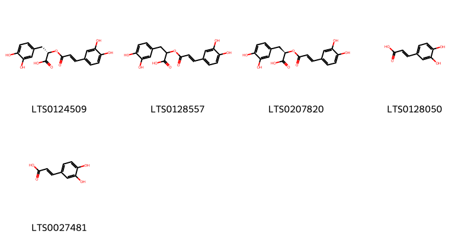{ width=100% }
    <figcaption>Hình ảnh cấu trúc hóa học của 5 hoạt chất thuộc nhóm Cinnamic acids and derivatives gồm ['(s)-rosmarinic acid (LTS0124509)', '3-(3,4-dihydroxyphenyl)-2-{[3-(3,4-dihydroxyphenyl)prop-2-enoyl]oxy}propanoic acid (LTS0128557)', 'rosemary acid (LTS0207820)', '3,4-dihydroxycinnamic acid (LTS0128050)', 'caffeic acid (LTS0027481)'].</figcaption>
</figure>
#### Nhóm Fatty Acyls
<figure markdown="span">
    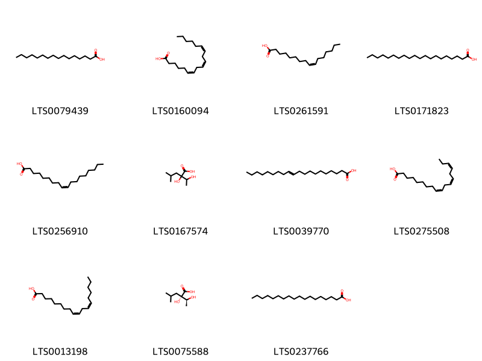{ width=100% }
    <figcaption>Hình ảnh cấu trúc hóa học của 11 hoạt chất thuộc nhóm Fatty Acyls gồm ['palmitic acid (LTS0079439)', 'gamma-linolenic acid (LTS0160094)', 'palmitoleic acid (LTS0261591)', 'arachidic acid (LTS0171823)', 'oleic acid (LTS0256910)', '2-hydroxy-2-(1-hydroxyethyl)-4-methylpentanoic acid (LTS0167574)', 'icosenoic acid (LTS0039770)', 'α-linolenic acid (LTS0275508)', 'linoleic (LTS0013198)', '(2s)-2-hydroxy-2-[(1s)-1-hydroxyethyl]-4-methylpentanoic acid (LTS0075588)', 'stearic acid (LTS0237766)'].</figcaption>
</figure>
#### Nhóm Lignan glycosides
<figure markdown="span">
    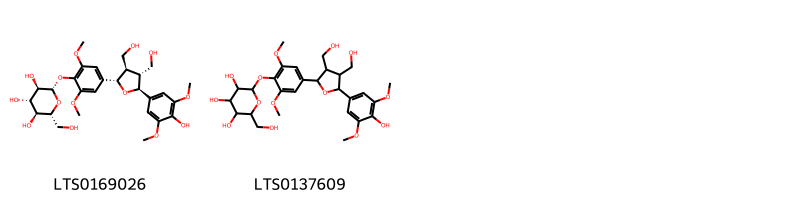{ width=100% }
    <figcaption>Hình ảnh cấu trúc hóa học của 2 hoạt chất thuộc nhóm Lignan glycosides gồm ['(2s,3r,4s,5s,6r)-2-{4-[(2s,3r,4r,5s)-5-(4-hydroxy-3,5-dimethoxyphenyl)-3,4-bis(hydroxymethyl)oxolan-2-yl]-2,6-dimethoxyphenoxy}-6-(hydroxymethyl)oxane-3,4,5-triol (LTS0169026)', '2-{4-[5-(4-hydroxy-3,5-dimethoxyphenyl)-3,4-bis(hydroxymethyl)oxolan-2-yl]-2,6-dimethoxyphenoxy}-6-(hydroxymethyl)oxane-3,4,5-triol (LTS0137609)'].</figcaption>
</figure>
#### Nhóm Organooxygen compounds
<figure markdown="span">
    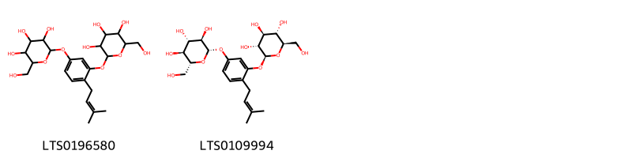{ width=100% }
    <figcaption>Hình ảnh cấu trúc hóa học của 2 hoạt chất thuộc nhóm Organooxygen compounds gồm ['2-(hydroxymethyl)-6-[4-(3-methylbut-2-en-1-yl)-3-{[3,4,5-trihydroxy-6-(hydroxymethyl)oxan-2-yl]oxy}phenoxy]oxane-3,4,5-triol (LTS0196580)', '(2r,3s,4s,5r,6s)-2-(hydroxymethyl)-6-[4-(3-methylbut-2-en-1-yl)-3-{[(2s,3r,4s,5s,6r)-3,4,5-trihydroxy-6-(hydroxymethyl)oxan-2-yl]oxy}phenoxy]oxane-3,4,5-triol (LTS0109994)'].</figcaption>
</figure>
#### Nhóm Peptidomimetics
<figure markdown="span">
    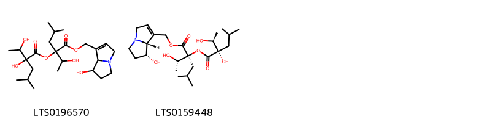{ width=100% }
    <figcaption>Hình ảnh cấu trúc hóa học của 2 hoạt chất thuộc nhóm Peptidomimetics gồm ['1-[(7-hydroxy-5,6,7,7a-tetrahydro-3h-pyrrolizin-1-yl)methoxy]-2-(1-hydroxyethyl)-4-methyl-1-oxopentan-2-yl 2-hydroxy-2-(1-hydroxyethyl)-4-methylpentanoate (LTS0196570)', '(2s)-1-{[(7r,7ar)-7-hydroxy-5,6,7,7a-tetrahydro-3h-pyrrolizin-1-yl]methoxy}-2-[(1s)-1-hydroxyethyl]-4-methyl-1-oxopentan-2-yl (2s)-2-hydroxy-2-[(1s)-1-hydroxyethyl]-4-methylpentanoate (LTS0159448)'].</figcaption>
</figure>
#### Nhóm Prenol lipids
<figure markdown="span">
    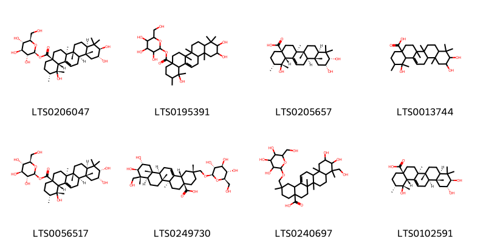{ width=100% }
    <figcaption>Hình ảnh cấu trúc hóa học của 8 hoạt chất thuộc nhóm Prenol lipids gồm ['(2s,3r,4s,5s,6r)-3,4,5-trihydroxy-6-(hydroxymethyl)oxan-2-yl (1r,2r,4as,6as,6br,8ar,10r,11r,12ar,12br,14bs)-1,10,11-trihydroxy-1,2,6a,6b,9,9,12a-heptamethyl-2,3,4,5,6,7,8,8a,10,11,12,12b,13,14b-tetradecahydropicene-4a-carboxylate (LTS0206047)', '3,4,5-trihydroxy-6-(hydroxymethyl)oxan-2-yl 1,10,11-trihydroxy-1,2,6a,6b,9,9,12a-heptamethyl-2,3,4,5,6,7,8,8a,10,11,12,12b,13,14b-tetradecahydropicene-4a-carboxylate (LTS0195391)', 'euscaphic acid (LTS0205657)', '1,10,11-trihydroxy-1,2,6a,6b,9,9,12a-heptamethyl-2,3,4,5,6,7,8,8a,10,11,12,12b,13,14b-tetradecahydropicene-4a-carboxylic acid (LTS0013744)', '(2s,3r,4s,5s,6r)-3,4,5-trihydroxy-6-(hydroxymethyl)oxan-2-yl (1r,2r,4as,6as,6br,8ar,10s,11r,12ar,12br,14bs)-1,10,11-trihydroxy-1,2,6a,6b,9,9,12a-heptamethyl-2,3,4,5,6,7,8,8a,10,11,12,12b,13,14b-tetradecahydropicene-4a-carboxylate (LTS0056517)', '(2r,4ar,6as,6br,8ar,9r,10r,11r,12ar,12br,14bs)-10,11-dihydroxy-9-(hydroxymethyl)-2,6a,6b,9,12a-pentamethyl-2-({[(2r,3r,4s,5s,6r)-3,4,5-trihydroxy-6-(hydroxymethyl)oxan-2-yl]oxy}methyl)-1,3,4,5,6,7,8,8a,10,11,12,12b,13,14b-tetradecahydropicene-4a-carboxylic acid (LTS0249730)', '10,11-dihydroxy-9-(hydroxymethyl)-2,6a,6b,9,12a-pentamethyl-2-({[3,4,5-trihydroxy-6-(hydroxymethyl)oxan-2-yl]oxy}methyl)-1,3,4,5,6,7,8,8a,10,11,12,12b,13,14b-tetradecahydropicene-4a-carboxylic acid (LTS0240697)', 'tormentic acid (LTS0102591)'].</figcaption>
</figure>
#### Nhóm Pyrrolizidines
<figure markdown="span">
    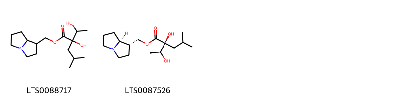{ width=100% }
    <figcaption>Hình ảnh cấu trúc hóa học của 2 hoạt chất thuộc nhóm Pyrrolizidines gồm ['hexahydro-1h-pyrrolizin-1-ylmethyl 2-hydroxy-2-(1-hydroxyethyl)-4-methylpentanoate (LTS0088717)', '(1r,7as)-hexahydro-1h-pyrrolizin-1-ylmethyl (2s)-2-hydroxy-2-[(1s)-1-hydroxyethyl]-4-methylpentanoate (LTS0087526)'].</figcaption>
</figure>

---

### Dược dân tộc học

Danh sách các quốc gia có sử dụng *Anchusa strigosa* trong điều trị các bệnh. 

| Country   | Disease                                 | Bệnh                                                                                                                                                                                                |
|:----------|:----------------------------------------|:----------------------------------------------------------------------------------------------------------------------------------------------------------------------------------------------------|
| Iran      | Diuretic, Tonic, Refrigerant, Demulcent | MYMEMORY WARNING: YOU USED ALL AVAILABLE FREE TRANSLATIONS FOR TODAY. NEXT AVAILABLE IN  08 HOURS 41 MINUTES 54 SECONDS VISIT HTTPS://MYMEMORY.TRANSLATED.NET/DOC/USAGELIMITS.PHP TO TRANSLATE MORE |
| Iraq      | Diaphoretic, Diuretic, Tonic            | MYMEMORY WARNING: YOU USED ALL AVAILABLE FREE TRANSLATIONS FOR TODAY. NEXT AVAILABLE IN  08 HOURS 41 MINUTES 50 SECONDS VISIT HTTPS://MYMEMORY.TRANSLATED.NET/DOC/USAGELIMITS.PHP TO TRANSLATE MORE |

---

# Chi Eritrichium

??? note "Danh sách các dược liệu thuộc chi"
    
	 - *Eritrichium pedunculare*
	 - *Eritrichium pusillum*

---
## Eritrichium pedunculare
### Thông tin về thực vật

!!! info "Phân loại thực vật của *Trigonotis peduncularis* từ GIBF:"
    - **Kingdom:** Plantae
    - **Phylum:** Tracheophyta
    - **Order:** Boraginales
    - **Family:** Boraginaceae
    - **Genus:** Trigonotis
    - **Species:** *Trigonotis peduncularis*

 

| Label (VI)   | Label (EN)   | Scientific Name   | Descriptions (VI)   | Descriptions (EN)   | Also Known As (VI)   | Also Known As (EN)   |
|:-------------|:-------------|:------------------|:--------------------|:--------------------|:---------------------|:---------------------|
| N/A          | N/A          | Anchusa strigosa  | loài thực vật       | species of plant    | ['']                 | ['']                 |

#### Phân bố trên thế giới

**Từ CSDL GIBF** nan, Japan, China, Russian Federation, unknown or invalid, Germany

#### Phân bố tại Việt Nam

**Từ CSDL GIBF**: Không có ghi nhận ở Việt Nam

---
### Thành phần hóa học
        
- Theo cơ sở dữ liệu lotus: Từ loài *Trigonotis peduncularis* đã phân lập và xác định được Chưa có hoạt chất nào được phân lập. hoạt chất thuộc về các nhóm Không có hoạt chất nào được phân lập. 

Không có hình ảnh nào được tạo ra

---

### Dược dân tộc học

Danh sách các quốc gia có sử dụng *Trigonotis peduncularis* trong điều trị các bệnh. 

| Country   | Disease             | Bệnh                                                                                                                                                                                                |
|:----------|:--------------------|:----------------------------------------------------------------------------------------------------------------------------------------------------------------------------------------------------|
| China     | Diuretic, Emollient | MYMEMORY WARNING: YOU USED ALL AVAILABLE FREE TRANSLATIONS FOR TODAY. NEXT AVAILABLE IN  08 HOURS 41 MINUTES 18 SECONDS VISIT HTTPS://MYMEMORY.TRANSLATED.NET/DOC/USAGELIMITS.PHP TO TRANSLATE MORE |

---

---
## Eritrichium pusillum
### Thông tin về thực vật

!!! info "Phân loại thực vật của *Johnstonella pusilla* từ GIBF:"
    - **Kingdom:** Plantae
    - **Phylum:** Tracheophyta
    - **Order:** Boraginales
    - **Family:** Boraginaceae
    - **Genus:** Johnstonella
    - **Species:** *Johnstonella pusilla*

 

| Label (VI)   | Label (EN)   | Scientific Name      | Descriptions (VI)   | Descriptions (EN)   | Also Known As (VI)   | Also Known As (EN)   |
|:-------------|:-------------|:---------------------|:--------------------|:--------------------|:---------------------|:---------------------|
| N/A          | N/A          | Eritrichium pusillum | loài thực vật       | species of plant    | ['']                 | ['']                 |

#### Phân bố trên thế giới

**Từ CSDL GIBF** United States of America

#### Phân bố tại Việt Nam

**Từ CSDL GIBF**: Không có ghi nhận ở Việt Nam

---
### Thành phần hóa học
        
- Theo cơ sở dữ liệu lotus: Từ loài *Johnstonella pusilla* đã phân lập và xác định được Chưa có hoạt chất nào được phân lập. hoạt chất thuộc về các nhóm Không có hoạt chất nào được phân lập. 

Không có hình ảnh nào được tạo ra

---

### Dược dân tộc học

Danh sách các quốc gia có sử dụng *Johnstonella pusilla* trong điều trị các bệnh. 

| Country        | Disease   | Bệnh                                                                                                                                                                                                |
|:---------------|:----------|:----------------------------------------------------------------------------------------------------------------------------------------------------------------------------------------------------|
| Africa(Sahara) | Cosmetic  | MYMEMORY WARNING: YOU USED ALL AVAILABLE FREE TRANSLATIONS FOR TODAY. NEXT AVAILABLE IN  08 HOURS 40 MINUTES 51 SECONDS VISIT HTTPS://MYMEMORY.TRANSLATED.NET/DOC/USAGELIMITS.PHP TO TRANSLATE MORE |

---

# Chi Borago

??? note "Danh sách các dược liệu thuộc chi"
    
	 - *Borago officinalis*

---
## Borago officinalis
### Thông tin về thực vật

!!! info "Phân loại thực vật của *Borago officinalis* từ GIBF:"
    - **Kingdom:** Plantae
    - **Phylum:** Tracheophyta
    - **Order:** Boraginales
    - **Family:** Boraginaceae
    - **Genus:** Borago
    - **Species:** *Borago officinalis*

 

| Label (VI)   | Label (EN)   | Scientific Name    | Descriptions (VI)   | Descriptions (EN)   | Also Known As (VI)   | Also Known As (EN)                   |
|:-------------|:-------------|:-------------------|:--------------------|:--------------------|:---------------------|:-------------------------------------|
| N/A          | N/A          | Borago officinalis | loài thực vật       | species of plant    | ['']                 | ['starflower', 'Borago officinalis'] |

#### Phân bố trên thế giới

**Từ CSDL GIBF** Malta, Chile, New Zealand, Ecuador, Spain, Netherlands, United States of America, Jersey, Croatia, Argentina, Morocco, Algeria, United Kingdom of Great Britain and Northern Ireland, Belgium, Germany, Portugal, Australia, Italy, Switzerland, France, Ireland

#### Phân bố tại Việt Nam

**Từ CSDL GIBF**: Không có ghi nhận ở Việt Nam

---
### Thành phần hóa học
        
- Theo cơ sở dữ liệu lotus: Từ loài *Borago officinalis* đã phân lập và xác định được 26 hoạt chất thuộc về các nhóm Fatty Acyls, Benzene and substituted derivatives, Flavonoids, Benzodioxoles, Cinnamic acids and derivatives, Phenols, Organooxygen compounds, Furanoid lignans, Prenol lipids. 

|    | chemicalTaxonomyClassyfireClass     |   smiles_count |
|---:|:------------------------------------|---------------:|
|  0 |                                     |              3 |
|  1 | Benzene and substituted derivatives |              1 |
|  2 | Benzodioxoles                       |              2 |
|  3 | Cinnamic acids and derivatives      |              2 |
|  4 | Fatty Acyls                         |              8 |
|  5 | Flavonoids                          |              4 |
|  6 | Furanoid lignans                    |              1 |
|  7 | Organooxygen compounds              |              3 |
|  8 | Phenols                             |              1 |
|  9 | Prenol lipids                       |              1 |

#### Nhóm 
<figure markdown="span">
    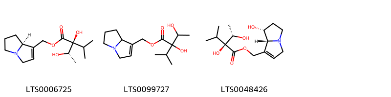{ width=100% }
    <figcaption>Hình ảnh cấu trúc hóa học của 3 hoạt chất thuộc nhóm  gồm ['amabiline (LTS0006725)', '5,6,7,7a-tetrahydro-3h-pyrrolizin-1-ylmethyl 2,3-dihydroxy-2-isopropylbutanoate (LTS0099727)', 'lycopsamine (LTS0048426)'].</figcaption>
</figure>
#### Nhóm Benzene and substituted derivatives
<figure markdown="span">
    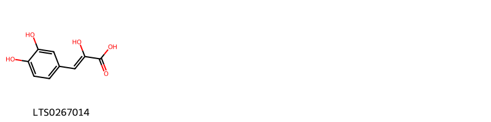{ width=100% }
    <figcaption>Hình ảnh cấu trúc hóa học của 1 hoạt chất thuộc nhóm Benzene and substituted derivatives gồm ['(2z)-3-(3,4-dihydroxyphenyl)-2-hydroxyprop-2-enoic acid (LTS0267014)'].</figcaption>
</figure>
#### Nhóm Benzodioxoles
<figure markdown="span">
    { width=100% }
    <figcaption>Hình ảnh cấu trúc hóa học của 2 hoạt chất thuộc nhóm Benzodioxoles gồm ['sesamolin (LTS0079632)', 'sesamolin (LTS0276354)'].</figcaption>
</figure>
#### Nhóm Cinnamic acids and derivatives
<figure markdown="span">
    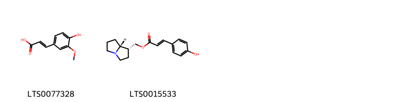{ width=100% }
    <figcaption>Hình ảnh cấu trúc hóa học của 2 hoạt chất thuộc nhóm Cinnamic acids and derivatives gồm ['ferulic acid (LTS0077328)', 'thesinine (LTS0015533)'].</figcaption>
</figure>
#### Nhóm Fatty Acyls
<figure markdown="span">
    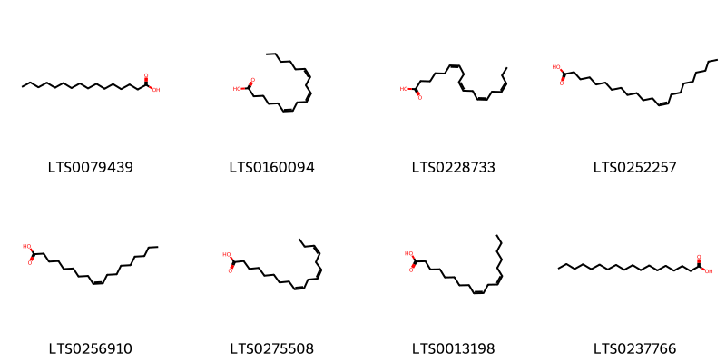{ width=100% }
    <figcaption>Hình ảnh cấu trúc hóa học của 8 hoạt chất thuộc nhóm Fatty Acyls gồm ['palmitic acid (LTS0079439)', 'gamma-linolenic acid (LTS0160094)', 'stearidonic acid (LTS0228733)', 'erucic acid (LTS0252257)', 'oleic acid (LTS0256910)', 'α-linolenic acid (LTS0275508)', 'linoleic (LTS0013198)', 'stearic acid (LTS0237766)'].</figcaption>
</figure>
#### Nhóm Flavonoids
<figure markdown="span">
    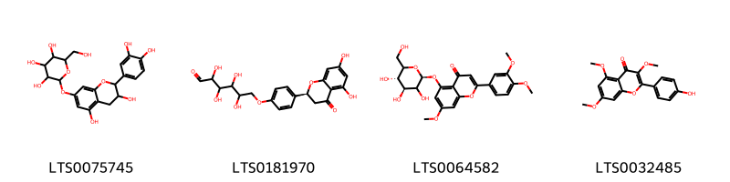{ width=100% }
    <figcaption>Hình ảnh cấu trúc hóa học của 4 hoạt chất thuộc nhóm Flavonoids gồm ['2-{[2-(3,4-dihydroxyphenyl)-3,5-dihydroxy-3,4-dihydro-2h-1-benzopyran-7-yl]oxy}-6-(hydroxymethyl)oxane-3,4,5-triol (LTS0075745)', '6-{4-[(2s)-5,7-dihydroxy-4-oxo-2,3-dihydro-1-benzopyran-2-yl]phenoxy}-2,3,4,5-tetrahydroxyhexanal (LTS0181970)', 'lethedoside a (LTS0064582)', '2-(4-hydroxyphenyl)-3,5,7-trimethoxychromen-4-one (LTS0032485)'].</figcaption>
</figure>
#### Nhóm Furanoid lignans
<figure markdown="span">
    { width=100% }
    <figcaption>Hình ảnh cấu trúc hóa học của 1 hoạt chất thuộc nhóm Furanoid lignans gồm ['sesamin (LTS0120161)'].</figcaption>
</figure>
#### Nhóm Organooxygen compounds
<figure markdown="span">
    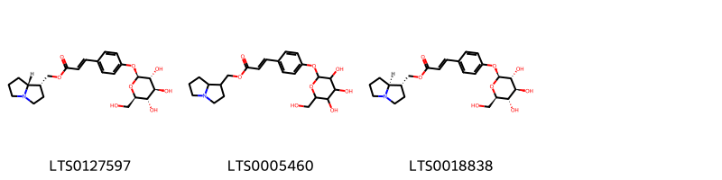{ width=100% }
    <figcaption>Hình ảnh cấu trúc hóa học của 3 hoạt chất thuộc nhóm Organooxygen compounds gồm ["thesinine-4'-o-β-d-glucoside (LTS0127597)", 'hexahydro-1h-pyrrolizin-1-ylmethyl 3-(4-{[3,4,5-trihydroxy-6-(hydroxymethyl)oxan-2-yl]oxy}phenyl)prop-2-enoate (LTS0005460)', '(1r,7as)-hexahydro-1h-pyrrolizin-1-ylmethyl (2e)-3-(4-{[(2s,3r,4s,5s,6r)-3,4,5-trihydroxy-6-(hydroxymethyl)oxan-2-yl]oxy}phenyl)prop-2-enoate (LTS0018838)'].</figcaption>
</figure>
#### Nhóm Phenols
<figure markdown="span">
    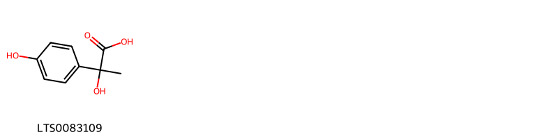{ width=100% }
    <figcaption>Hình ảnh cấu trúc hóa học của 1 hoạt chất thuộc nhóm Phenols gồm ['2-hydroxy-2-(4-hydroxyphenyl)propanoic acid (LTS0083109)'].</figcaption>
</figure>
#### Nhóm Prenol lipids
<figure markdown="span">
    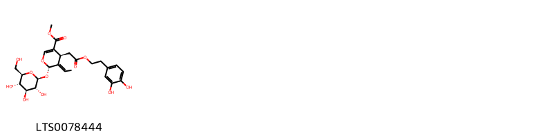{ width=100% }
    <figcaption>Hình ảnh cấu trúc hóa học của 1 hoạt chất thuộc nhóm Prenol lipids gồm ['oleuropein (LTS0078444)'].</figcaption>
</figure>

---

### Dược dân tộc học

Danh sách các quốc gia có sử dụng *Borago officinalis* trong điều trị các bệnh. 

| Country   | Disease                                           | Bệnh                                                                                                                                                                                                |
|:----------|:--------------------------------------------------|:----------------------------------------------------------------------------------------------------------------------------------------------------------------------------------------------------|
| Elsewhere | Diuretic, Diaphoretic, Diuretic, nan              | MYMEMORY WARNING: YOU USED ALL AVAILABLE FREE TRANSLATIONS FOR TODAY. NEXT AVAILABLE IN  08 HOURS 40 MINUTES 19 SECONDS VISIT HTTPS://MYMEMORY.TRANSLATED.NET/DOC/USAGELIMITS.PHP TO TRANSLATE MORE |
| France    | Laxative                                          | MYMEMORY WARNING: YOU USED ALL AVAILABLE FREE TRANSLATIONS FOR TODAY. NEXT AVAILABLE IN  08 HOURS 40 MINUTES 16 SECONDS VISIT HTTPS://MYMEMORY.TRANSLATED.NET/DOC/USAGELIMITS.PHP TO TRANSLATE MORE |
| Haiti     | Diuretic, Sudorific, Diuretic                     | MYMEMORY WARNING: YOU USED ALL AVAILABLE FREE TRANSLATIONS FOR TODAY. NEXT AVAILABLE IN  08 HOURS 40 MINUTES 12 SECONDS VISIT HTTPS://MYMEMORY.TRANSLATED.NET/DOC/USAGELIMITS.PHP TO TRANSLATE MORE |
| Mexico    | Diuretic, Emollient, Sudorific                    | MYMEMORY WARNING: YOU USED ALL AVAILABLE FREE TRANSLATIONS FOR TODAY. NEXT AVAILABLE IN  08 HOURS 40 MINUTES 09 SECONDS VISIT HTTPS://MYMEMORY.TRANSLATED.NET/DOC/USAGELIMITS.PHP TO TRANSLATE MORE |
| Turkey    | Diuretic, Emollient, Laxative, Nervine, Sudorific | MYMEMORY WARNING: YOU USED ALL AVAILABLE FREE TRANSLATIONS FOR TODAY. NEXT AVAILABLE IN  08 HOURS 40 MINUTES 06 SECONDS VISIT HTTPS://MYMEMORY.TRANSLATED.NET/DOC/USAGELIMITS.PHP TO TRANSLATE MORE |
| ain       | Sudorific                                         | MYMEMORY WARNING: YOU USED ALL AVAILABLE FREE TRANSLATIONS FOR TODAY. NEXT AVAILABLE IN  08 HOURS 40 MINUTES 03 SECONDS VISIT HTTPS://MYMEMORY.TRANSLATED.NET/DOC/USAGELIMITS.PHP TO TRANSLATE MORE |

---

# Chi Cordia

??? note "Danh sách các dược liệu thuộc chi"
    
	 - *Cordia abyssinica*
	 - *Cordia alba*
	 - *Cordia alliodora*
	 - *Cordia boissieri*
	 - *Cordia buchii*
	 - *Cordia cylindrostachya*
	 - *Cordia dentata*
	 - *Cordia dichotoma*
	 - *Cordia globosa*
	 - *Cordia greggii*
	 - *Cordia myxa*
	 - *Cordia rothii*
	 - *Cordia salviaefolia*
	 - *Cordia sebestena*
	 - *Cordia sebestina*
	 - *Cordia vestita*
	 - *Cordia wallichii*

---
## Cordia abyssinica
### Thông tin về thực vật

!!! info "Phân loại thực vật của *Cordia africana* từ GIBF:"
    - **Kingdom:** Plantae
    - **Phylum:** Tracheophyta
    - **Order:** Boraginales
    - **Family:** Cordiaceae
    - **Genus:** Cordia
    - **Species:** *Cordia africana*

 

| Label (VI)   | Label (EN)   | Scientific Name   | Descriptions (VI)   | Descriptions (EN)   | Also Known As (VI)   | Also Known As (EN)   |
|:-------------|:-------------|:------------------|:--------------------|:--------------------|:---------------------|:---------------------|
| N/A          | N/A          | Cordia abyssinica | loài thực vật       | species of plant    | ['']                 | ['']                 |

#### Phân bố trên thế giới

**Từ CSDL GIBF** nan, Brazil, Burundi, Tanzania, United Republic of, United States of America, Zambia, Nigeria, Cuba, unknown or invalid, Ethiopia, French Guiana, Malawi, Congo, Democratic Republic of the, Kenya, Rwanda, Philippines, Sudan, Congo, Angola

#### Phân bố tại Việt Nam

**Từ CSDL GIBF**: Không có ghi nhận ở Việt Nam

---
### Thành phần hóa học
        
- Theo cơ sở dữ liệu lotus: Từ loài *Cordia africana* đã phân lập và xác định được Chưa có hoạt chất nào được phân lập. hoạt chất thuộc về các nhóm Không có hoạt chất nào được phân lập. 

Không có hình ảnh nào được tạo ra

---

### Dược dân tộc học

Danh sách các quốc gia có sử dụng *Cordia africana* trong điều trị các bệnh. 

| Country   | Disease   | Bệnh                                                                                                                                                                                                |
|:----------|:----------|:----------------------------------------------------------------------------------------------------------------------------------------------------------------------------------------------------|
| Elsewhere | Sweetener | MYMEMORY WARNING: YOU USED ALL AVAILABLE FREE TRANSLATIONS FOR TODAY. NEXT AVAILABLE IN  08 HOURS 39 MINUTES 29 SECONDS VISIT HTTPS://MYMEMORY.TRANSLATED.NET/DOC/USAGELIMITS.PHP TO TRANSLATE MORE |

---

---
## Cordia alba
### Thông tin về thực vật

!!! info "Phân loại thực vật của *Cordia dentata* từ GIBF:"
    - **Kingdom:** Plantae
    - **Phylum:** Tracheophyta
    - **Order:** Boraginales
    - **Family:** Cordiaceae
    - **Genus:** Cordia
    - **Species:** *Cordia dentata*

 

| Label (VI)   | Label (EN)   | Scientific Name   | Descriptions (VI)   | Descriptions (EN)   | Also Known As (VI)   | Also Known As (EN)   |
|:-------------|:-------------|:------------------|:--------------------|:--------------------|:---------------------|:---------------------|
| N/A          | N/A          | Cordia alba       | loài thực vật       | species of plant    | ['']                 | ['']                 |

#### Phân bố trên thế giới

**Từ CSDL GIBF** Colombia, Mexico, United States of America, Nicaragua

#### Phân bố tại Việt Nam

**Từ CSDL GIBF**: Không có ghi nhận ở Việt Nam

---
### Thành phần hóa học
        
- Theo cơ sở dữ liệu lotus: Từ loài *Cordia dentata* đã phân lập và xác định được Chưa có hoạt chất nào được phân lập. hoạt chất thuộc về các nhóm Không có hoạt chất nào được phân lập. 

Không có hình ảnh nào được tạo ra

---

### Dược dân tộc học

Danh sách các quốc gia có sử dụng *Cordia dentata* trong điều trị các bệnh. 

| Country   | Disease                | Bệnh                                                                                                                                                                                                |
|:----------|:-----------------------|:----------------------------------------------------------------------------------------------------------------------------------------------------------------------------------------------------|
| Haiti     | Emollient              | MYMEMORY WARNING: YOU USED ALL AVAILABLE FREE TRANSLATIONS FOR TODAY. NEXT AVAILABLE IN  08 HOURS 38 MINUTES 54 SECONDS VISIT HTTPS://MYMEMORY.TRANSLATED.NET/DOC/USAGELIMITS.PHP TO TRANSLATE MORE |
| Mexico    | Diaphoretic, Emollient | MYMEMORY WARNING: YOU USED ALL AVAILABLE FREE TRANSLATIONS FOR TODAY. NEXT AVAILABLE IN  08 HOURS 38 MINUTES 46 SECONDS VISIT HTTPS://MYMEMORY.TRANSLATED.NET/DOC/USAGELIMITS.PHP TO TRANSLATE MORE |
| Venezuela | Sudorific              | MYMEMORY WARNING: YOU USED ALL AVAILABLE FREE TRANSLATIONS FOR TODAY. NEXT AVAILABLE IN  08 HOURS 38 MINUTES 39 SECONDS VISIT HTTPS://MYMEMORY.TRANSLATED.NET/DOC/USAGELIMITS.PHP TO TRANSLATE MORE |

---

---
## Cordia alliodora
### Thông tin về thực vật

!!! info "Phân loại thực vật của *Cordia alliodora* từ GIBF:"
    - **Kingdom:** Plantae
    - **Phylum:** Tracheophyta
    - **Order:** Boraginales
    - **Family:** Cordiaceae
    - **Genus:** Cordia
    - **Species:** *Cordia alliodora*

 

| Label (VI)   | Label (EN)   | Scientific Name   | Descriptions (VI)   | Descriptions (EN)   | Also Known As (VI)   | Also Known As (EN)   |
|:-------------|:-------------|:------------------|:--------------------|:--------------------|:---------------------|:---------------------|
| N/A          | N/A          | Cordia alliodora  | loài thực vật       | species of plant    | ['']                 | ['']                 |

#### Phân bố trên thế giới

**Từ CSDL GIBF** Mexico, Nicaragua, Tonga, Martinique, Virgin Islands (U.S.), Haiti, Costa Rica, Dominican Republic, Colombia, Ecuador, Peru, French Guiana, Belize, Puerto Rico

#### Phân bố tại Việt Nam

**Từ CSDL GIBF**: Không có ghi nhận ở Việt Nam

---
### Thành phần hóa học
        
- Theo cơ sở dữ liệu lotus: Từ loài *Cordia alliodora* đã phân lập và xác định được 29 hoạt chất thuộc về các nhóm Prenol lipids, Anthracenes, Tetralins, Phenol ethers. 

|    | chemicalTaxonomyClassyfireClass   |   smiles_count |
|---:|:----------------------------------|---------------:|
|  0 | Anthracenes                       |              2 |
|  1 | Phenol ethers                     |              1 |
|  2 | Prenol lipids                     |             21 |
|  3 | Tetralins                         |              5 |

#### Nhóm Anthracenes
<figure markdown="span">
    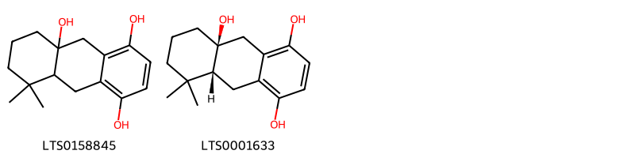{ width=100% }
    <figcaption>Hình ảnh cấu trúc hóa học của 2 hoạt chất thuộc nhóm Anthracenes gồm ['5,5-dimethyl-6,7,8,9,10,10a-hexahydroanthracene-1,4,8a-triol (LTS0158845)', '(8as,10ar)-5,5-dimethyl-6,7,8,9,10,10a-hexahydroanthracene-1,4,8a-triol (LTS0001633)'].</figcaption>
</figure>
#### Nhóm Phenol ethers
<figure markdown="span">
    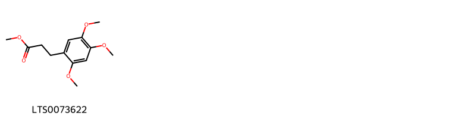{ width=100% }
    <figcaption>Hình ảnh cấu trúc hóa học của 1 hoạt chất thuộc nhóm Phenol ethers gồm ['methyl 3-(2,4,5-trimethoxyphenyl)propanoate (LTS0073622)'].</figcaption>
</figure>
#### Nhóm Prenol lipids
<figure markdown="span">
    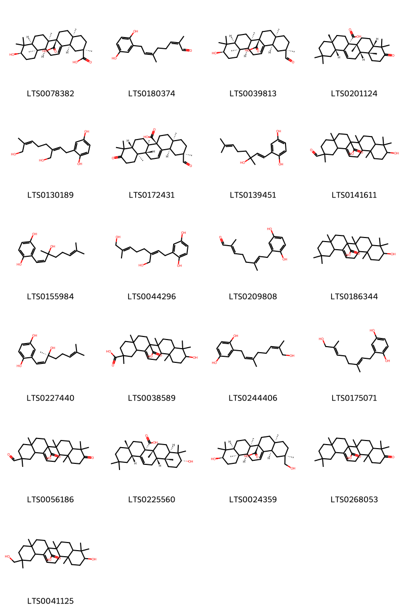{ width=100% }
    <figcaption>Hình ảnh cấu trúc hóa học của 21 hoạt chất thuộc nhóm Prenol lipids gồm ['(2r,4ar,6ar,6br,8as,10r,12ar,12bs,14br)-10-hydroxy-2,4a,6b,9,9,12a-hexamethyl-1,3,4,5,6,7,8,8a,10,11,12,12b,13,14b-tetradecahydropicene-2,6a-dicarboxylic acid (LTS0078382)', '8-(2,5-dihydroxyphenyl)-2,6-dimethylocta-2,6-dienal (LTS0180374)', '(2r,4ar,6ar,6br,8as,10r,12ar,12bs,14br)-2-formyl-10-hydroxy-2,4a,6b,9,9,12a-hexamethyl-1,3,4,5,6,7,8,8a,10,11,12,12b,13,14b-tetradecahydropicene-6a-carboxylic acid (LTS0039813)', '(4ar,6ar,6br,8as,12ar,12bs,14br)-2,2,4a,6b,9,9,12a-heptamethyl-10-oxo-3,4,5,6,7,8,8a,11,12,12b,13,14b-dodecahydro-1h-picene-6a-carboxylic acid (LTS0201124)', '2-[8-hydroxy-3-(hydroxymethyl)-7-methylocta-2,6-dien-1-yl]benzene-1,4-diol (LTS0130189)', '(2r,4ar,6ar,6br,8ar,12ar,12br,14br)-2-formyl-2,4a,6b,9,9,12a-hexamethyl-10-oxo-3,4,5,6,7,8,8a,11,12,12b,13,14b-dodecahydro-1h-picene-6a-carboxylic acid (LTS0172431)', '2-(3-hydroxy-3,7-dimethylocta-1,6-dien-1-yl)benzene-1,4-diol (LTS0139451)', '2-formyl-10-hydroxy-2,4a,6b,9,9,12a-hexamethyl-1,3,4,5,6,7,8,8a,10,11,12,12b,13,14b-tetradecahydropicene-6a-carboxylic acid (LTS0141611)', '2-[(1z)-3-hydroxy-3,7-dimethylocta-1,6-dien-1-yl]benzene-1,4-diol (LTS0155984)', '2-[(2z,6e)-8-hydroxy-3-(hydroxymethyl)-7-methylocta-2,6-dien-1-yl]benzene-1,4-diol (LTS0044296)', '(2e,6e)-8-(2,5-dihydroxyphenyl)-2,6-dimethylocta-2,6-dienal (LTS0209808)', '10-hydroxy-2,2,4a,6b,9,9,12a-heptamethyl-1,3,4,5,6,7,8,8a,10,11,12,12b,13,14b-tetradecahydropicene-6a-carboxylic acid (LTS0186344)', '2-[(1z,3s)-3-hydroxy-3,7-dimethylocta-1,6-dien-1-yl]benzene-1,4-diol (LTS0227440)', '10-hydroxy-2,4a,6b,9,9,12a-hexamethyl-1,3,4,5,6,7,8,8a,10,11,12,12b,13,14b-tetradecahydropicene-2,6a-dicarboxylic acid (LTS0038589)', '2-(8-hydroxy-3,7-dimethylocta-2,6-dien-1-yl)benzene-1,4-diol (LTS0244406)', '2-[(2e,6e)-8-hydroxy-3,7-dimethylocta-2,6-dien-1-yl]benzene-1,4-diol (LTS0175071)', '2-formyl-2,4a,6b,9,9,12a-hexamethyl-10-oxo-3,4,5,6,7,8,8a,11,12,12b,13,14b-dodecahydro-1h-picene-6a-carboxylic acid (LTS0056186)', '(4ar,6ar,6br,8ar,10r,12ar,12bs,14br)-10-hydroxy-2,2,4a,6b,9,9,12a-heptamethyl-1,3,4,5,6,7,8,8a,10,11,12,12b,13,14b-tetradecahydropicene-6a-carboxylic acid (LTS0225560)', '(2r,4ar,6ar,6br,8as,10r,12ar,12bs,14br)-10-hydroxy-2-(hydroxymethyl)-2,4a,6b,9,9,12a-hexamethyl-1,3,4,5,6,7,8,8a,10,11,12,12b,13,14b-tetradecahydropicene-6a-carboxylic acid (LTS0024359)', '2,2,4a,6b,9,9,12a-heptamethyl-10-oxo-3,4,5,6,7,8,8a,11,12,12b,13,14b-dodecahydro-1h-picene-6a-carboxylic acid (LTS0268053)', '10-hydroxy-2-(hydroxymethyl)-2,4a,6b,9,9,12a-hexamethyl-1,3,4,5,6,7,8,8a,10,11,12,12b,13,14b-tetradecahydropicene-6a-carboxylic acid (LTS0041125)'].</figcaption>
</figure>
#### Nhóm Tetralins
<figure markdown="span">
    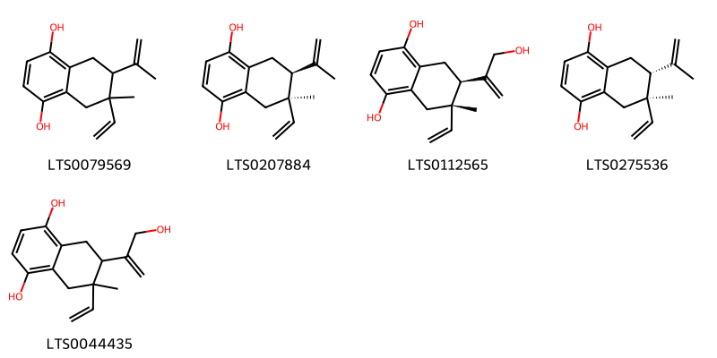{ width=100% }
    <figcaption>Hình ảnh cấu trúc hóa học của 5 hoạt chất thuộc nhóm Tetralins gồm ['6-ethenyl-6-methyl-7-(prop-1-en-2-yl)-7,8-dihydro-5h-naphthalene-1,4-diol (LTS0079569)', '(6r,7s)-6-ethenyl-6-methyl-7-(prop-1-en-2-yl)-7,8-dihydro-5h-naphthalene-1,4-diol (LTS0207884)', '(6s,7r)-6-ethenyl-7-(3-hydroxyprop-1-en-2-yl)-6-methyl-7,8-dihydro-5h-naphthalene-1,4-diol (LTS0112565)', '(6r,7r)-6-ethenyl-6-methyl-7-(prop-1-en-2-yl)-7,8-dihydro-5h-naphthalene-1,4-diol (LTS0275536)', '6-ethenyl-7-(3-hydroxyprop-1-en-2-yl)-6-methyl-7,8-dihydro-5h-naphthalene-1,4-diol (LTS0044435)'].</figcaption>
</figure>

---

### Dược dân tộc học

Danh sách các quốc gia có sử dụng *Cordia alliodora* trong điều trị các bệnh. 

| Country   | Disease                            | Bệnh                                                                                                                                                                                                |
|:----------|:-----------------------------------|:----------------------------------------------------------------------------------------------------------------------------------------------------------------------------------------------------|
| Elsewhere | Stomachic, Stomachic, Tonic, Tonic | MYMEMORY WARNING: YOU USED ALL AVAILABLE FREE TRANSLATIONS FOR TODAY. NEXT AVAILABLE IN  08 HOURS 38 MINUTES 14 SECONDS VISIT HTTPS://MYMEMORY.TRANSLATED.NET/DOC/USAGELIMITS.PHP TO TRANSLATE MORE |
| Mexico    | Stimulant, Stimulant, Tonic, Tonic | MYMEMORY WARNING: YOU USED ALL AVAILABLE FREE TRANSLATIONS FOR TODAY. NEXT AVAILABLE IN  08 HOURS 38 MINUTES 10 SECONDS VISIT HTTPS://MYMEMORY.TRANSLATED.NET/DOC/USAGELIMITS.PHP TO TRANSLATE MORE |

---

---
## Cordia boissieri
### Thông tin về thực vật

!!! info "Phân loại thực vật của *Cordia boissieri* từ GIBF:"
    - **Kingdom:** Plantae
    - **Phylum:** Tracheophyta
    - **Order:** Boraginales
    - **Family:** Cordiaceae
    - **Genus:** Cordia
    - **Species:** *Cordia boissieri*

 

| Label (VI)   | Label (EN)   | Scientific Name   | Descriptions (VI)   | Descriptions (EN)   | Also Known As (VI)   | Also Known As (EN)   |
|:-------------|:-------------|:------------------|:--------------------|:--------------------|:---------------------|:---------------------|
| N/A          | N/A          | Cordia boissieri  | loài thực vật       | species of plant    | ['']                 | ['']                 |

#### Phân bố trên thế giới

**Từ CSDL GIBF** Mexico, United States of America

#### Phân bố tại Việt Nam

**Từ CSDL GIBF**: Không có ghi nhận ở Việt Nam

---
### Thành phần hóa học
        
- Theo cơ sở dữ liệu lotus: Từ loài *Cordia boissieri* đã phân lập và xác định được 5 hoạt chất thuộc về các nhóm Azolidines, Organooxygen compounds, Azoles, Flavonoids. 

|    | chemicalTaxonomyClassyfireClass   |   smiles_count |
|---:|:----------------------------------|---------------:|
|  0 | Azoles                            |              1 |
|  1 | Azolidines                        |              1 |
|  2 | Flavonoids                        |              1 |
|  3 | Organooxygen compounds            |              2 |

#### Nhóm Azoles
<figure markdown="span">
    { width=100% }
    <figcaption>Hình ảnh cấu trúc hóa học của 1 hoạt chất thuộc nhóm Azoles gồm ['allantoin (LTS0106609)'].</figcaption>
</figure>
#### Nhóm Azolidines
<figure markdown="span">
    { width=100% }
    <figcaption>Hình ảnh cấu trúc hóa học của 1 hoạt chất thuộc nhóm Azolidines gồm ['n-[(4s)-2,5-dihydroxy-4h-imidazol-4-yl]carbamimidic acid (LTS0174328)'].</figcaption>
</figure>
#### Nhóm Flavonoids
<figure markdown="span">
    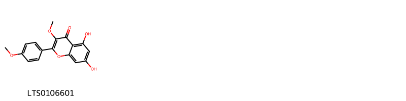{ width=100% }
    <figcaption>Hình ảnh cấu trúc hóa học của 1 hoạt chất thuộc nhóm Flavonoids gồm ['ermanin (LTS0106601)'].</figcaption>
</figure>
#### Nhóm Organooxygen compounds
<figure markdown="span">
    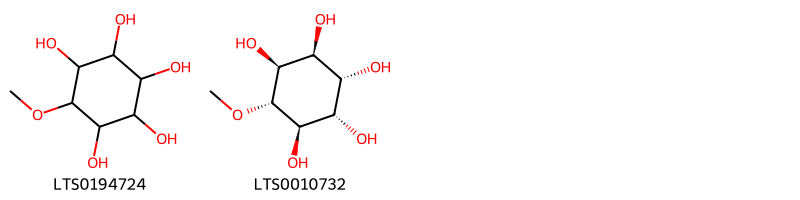{ width=100% }
    <figcaption>Hình ảnh cấu trúc hóa học của 2 hoạt chất thuộc nhóm Organooxygen compounds gồm ['pinitol (LTS0194724)', 'pinit (LTS0010732)'].</figcaption>
</figure>

---

### Dược dân tộc học

Danh sách các quốc gia có sử dụng *Cordia boissieri* trong điều trị các bệnh. 

| Country   | Disease                | Bệnh                                                                                                                                                                                                |
|:----------|:-----------------------|:----------------------------------------------------------------------------------------------------------------------------------------------------------------------------------------------------|
| Mexico    | Intoxicant, Intoxicant | MYMEMORY WARNING: YOU USED ALL AVAILABLE FREE TRANSLATIONS FOR TODAY. NEXT AVAILABLE IN  08 HOURS 37 MINUTES 35 SECONDS VISIT HTTPS://MYMEMORY.TRANSLATED.NET/DOC/USAGELIMITS.PHP TO TRANSLATE MORE |

---

---
## Cordia buchii
### Thông tin về thực vật

!!! info "Phân loại thực vật của *Varronia salviifolia* từ GIBF:"
    - **Kingdom:** Plantae
    - **Phylum:** Tracheophyta
    - **Order:** Boraginales
    - **Family:** Cordiaceae
    - **Genus:** Varronia
    - **Species:** *Varronia salviifolia*

 

| Label (VI)   | Label (EN)   | Scientific Name   | Descriptions (VI)   | Descriptions (EN)   | Also Known As (VI)   | Also Known As (EN)   |
|:-------------|:-------------|:------------------|:--------------------|:--------------------|:---------------------|:---------------------|
| N/A          | N/A          | Cordia buchii     |                     |                     | ['']                 | ['']                 |

#### Phân bố trên thế giới

**Từ CSDL GIBF** Mexico, United States of America

#### Phân bố tại Việt Nam

**Từ CSDL GIBF**: Không có ghi nhận ở Việt Nam

---
### Thành phần hóa học
        
- Theo cơ sở dữ liệu lotus: Từ loài *Varronia salviifolia* đã phân lập và xác định được Chưa có hoạt chất nào được phân lập. hoạt chất thuộc về các nhóm Không có hoạt chất nào được phân lập. 

Không có hình ảnh nào được tạo ra

---

### Dược dân tộc học

Danh sách các quốc gia có sử dụng *Varronia salviifolia* trong điều trị các bệnh. 

| Country   | Disease              | Bệnh                                                                                                                                                                                                |
|:----------|:---------------------|:----------------------------------------------------------------------------------------------------------------------------------------------------------------------------------------------------|
| Haiti     | Emollient, Stomachic | MYMEMORY WARNING: YOU USED ALL AVAILABLE FREE TRANSLATIONS FOR TODAY. NEXT AVAILABLE IN  08 HOURS 37 MINUTES 05 SECONDS VISIT HTTPS://MYMEMORY.TRANSLATED.NET/DOC/USAGELIMITS.PHP TO TRANSLATE MORE |

---

---
## Cordia cylindrostachya
### Thông tin về thực vật

!!! info "Phân loại thực vật của *Varronia cylindristachya* từ GIBF:"
    - **Kingdom:** Plantae
    - **Phylum:** Tracheophyta
    - **Order:** Boraginales
    - **Family:** Cordiaceae
    - **Genus:** Varronia
    - **Species:** *Varronia cylindristachya*

 

| Label (VI)   | Label (EN)   | Scientific Name        | Descriptions (VI)   | Descriptions (EN)   | Also Known As (VI)   | Also Known As (EN)   |
|:-------------|:-------------|:-----------------------|:--------------------|:--------------------|:---------------------|:---------------------|
| N/A          | N/A          | Cordia cylindrostachya | loài thực vật       | species of plant    | ['']                 | ['']                 |

#### Phân bố trên thế giới

**Từ CSDL GIBF** Colombia, Mexico

#### Phân bố tại Việt Nam

**Từ CSDL GIBF**: Không có ghi nhận ở Việt Nam

---
### Thành phần hóa học
        
- Theo cơ sở dữ liệu lotus: Từ loài *Varronia cylindristachya* đã phân lập và xác định được Chưa có hoạt chất nào được phân lập. hoạt chất thuộc về các nhóm Không có hoạt chất nào được phân lập. 

Không có hình ảnh nào được tạo ra

---

### Dược dân tộc học

Danh sách các quốc gia có sử dụng *Varronia cylindristachya* trong điều trị các bệnh. 

| Country   | Disease       | Bệnh                                                                                                                                                                                                |
|:----------|:--------------|:----------------------------------------------------------------------------------------------------------------------------------------------------------------------------------------------------|
| Aruba     | Abortifacient | MYMEMORY WARNING: YOU USED ALL AVAILABLE FREE TRANSLATIONS FOR TODAY. NEXT AVAILABLE IN  08 HOURS 36 MINUTES 41 SECONDS VISIT HTTPS://MYMEMORY.TRANSLATED.NET/DOC/USAGELIMITS.PHP TO TRANSLATE MORE |
| Curacao   | Tonic         | MYMEMORY WARNING: YOU USED ALL AVAILABLE FREE TRANSLATIONS FOR TODAY. NEXT AVAILABLE IN  08 HOURS 36 MINUTES 38 SECONDS VISIT HTTPS://MYMEMORY.TRANSLATED.NET/DOC/USAGELIMITS.PHP TO TRANSLATE MORE |

---

---
## Cordia dentata
### Thông tin về thực vật

!!! info "Phân loại thực vật của *Cordia dentata* từ GIBF:"
    - **Kingdom:** Plantae
    - **Phylum:** Tracheophyta
    - **Order:** Boraginales
    - **Family:** Cordiaceae
    - **Genus:** Cordia
    - **Species:** *Cordia dentata*

 

| Label (VI)   | Label (EN)   | Scientific Name   | Descriptions (VI)   | Descriptions (EN)   | Also Known As (VI)   | Also Known As (EN)   |
|:-------------|:-------------|:------------------|:--------------------|:--------------------|:---------------------|:---------------------|
| N/A          | N/A          | Cordia dentata    | loài thực vật       | species of plant    | ['']                 | ['']                 |

#### Phân bố trên thế giới

**Từ CSDL GIBF** Mexico, Nicaragua, Guatemala, United States of America, Jamaica, Bonaire, Sint Eustatius and Saba, El Salvador, Virgin Islands (U.S.), Guadeloupe, Chinese Taipei, Costa Rica, Curaçao, Colombia, Honduras, Cuba, Panama, Puerto Rico

#### Phân bố tại Việt Nam

**Từ CSDL GIBF**: Không có ghi nhận ở Việt Nam

---
### Thành phần hóa học
        
- Theo cơ sở dữ liệu lotus: Từ loài *Cordia dentata* đã phân lập và xác định được Chưa có hoạt chất nào được phân lập. hoạt chất thuộc về các nhóm Không có hoạt chất nào được phân lập. 

Không có hình ảnh nào được tạo ra

---

### Dược dân tộc học

Danh sách các quốc gia có sử dụng *Cordia dentata* trong điều trị các bệnh. 

| Country   | Disease              | Bệnh                                                                                                                                                                                                |
|:----------|:---------------------|:----------------------------------------------------------------------------------------------------------------------------------------------------------------------------------------------------|
| Mexico    | Sudorific, Emollient | MYMEMORY WARNING: YOU USED ALL AVAILABLE FREE TRANSLATIONS FOR TODAY. NEXT AVAILABLE IN  08 HOURS 36 MINUTES 03 SECONDS VISIT HTTPS://MYMEMORY.TRANSLATED.NET/DOC/USAGELIMITS.PHP TO TRANSLATE MORE |

---

---
## Cordia dichotoma
### Thông tin về thực vật

!!! info "Phân loại thực vật của *Cordia dichotoma* từ GIBF:"
    - **Kingdom:** Plantae
    - **Phylum:** Tracheophyta
    - **Order:** Boraginales
    - **Family:** Cordiaceae
    - **Genus:** Cordia
    - **Species:** *Cordia dichotoma*

 

| Label (VI)   | Label (EN)   | Scientific Name   | Descriptions (VI)   | Descriptions (EN)                           | Also Known As (VI)   | Also Known As (EN)   |
|:-------------|:-------------|:------------------|:--------------------|:--------------------------------------------|:---------------------|:---------------------|
| N/A          | N/A          | Cordia dichotoma  | loài thực vật       | species of plant in the family Boraginaceae | ['']                 | ['']                 |

#### Phân bố trên thế giới

**Từ CSDL GIBF** nan, Brazil, Singapore, Saint Kitts and Nevis, United States of America, Saint Barthélemy, Vanuatu, Chinese Taipei, New Caledonia, Grenada, Australia, Antigua and Barbuda, Barbados, India, Montserrat, Puerto Rico

#### Phân bố tại Việt Nam

**Từ CSDL GIBF**: Không có ghi nhận ở Việt Nam

---
### Thành phần hóa học
        
- Theo cơ sở dữ liệu lotus: Từ loài *Cordia dichotoma* đã phân lập và xác định được Chưa có hoạt chất nào được phân lập. hoạt chất thuộc về các nhóm Không có hoạt chất nào được phân lập. 

Không có hình ảnh nào được tạo ra

---

### Dược dân tộc học

Danh sách các quốc gia có sử dụng *Cordia dichotoma* trong điều trị các bệnh. 

| Country   | Disease                                      | Bệnh                                                                                                                                                                                                |
|:----------|:---------------------------------------------|:----------------------------------------------------------------------------------------------------------------------------------------------------------------------------------------------------|
| China     | Piscicide                                    | MYMEMORY WARNING: YOU USED ALL AVAILABLE FREE TRANSLATIONS FOR TODAY. NEXT AVAILABLE IN  08 HOURS 35 MINUTES 18 SECONDS VISIT HTTPS://MYMEMORY.TRANSLATED.NET/DOC/USAGELIMITS.PHP TO TRANSLATE MORE |
| Elsewhere | Diuretic, Expectorant, Astringent, Demulcent | MYMEMORY WARNING: YOU USED ALL AVAILABLE FREE TRANSLATIONS FOR TODAY. NEXT AVAILABLE IN  08 HOURS 35 MINUTES 13 SECONDS VISIT HTTPS://MYMEMORY.TRANSLATED.NET/DOC/USAGELIMITS.PHP TO TRANSLATE MORE |

---

---
## Cordia globosa
### Thông tin về thực vật

!!! info "Phân loại thực vật của *N/A* từ GIBF:"
    - **Kingdom:** Plantae
    - **Phylum:** Tracheophyta
    - **Order:** Boraginales
    - **Family:** Cordiaceae
    - **Genus:** Varronia
    - **Species:** *N/A*

 

| Label (VI)   | Label (EN)   | Scientific Name   | Descriptions (VI)   | Descriptions (EN)   | Also Known As (VI)   | Also Known As (EN)   |
|:-------------|:-------------|:------------------|:--------------------|:--------------------|:---------------------|:---------------------|
| N/A          | N/A          | Cordia globosa    | loài thực vật       | species of plant    | ['']                 | ['']                 |

#### Phân bố trên thế giới

**Từ CSDL GIBF** Brazil, Saint Kitts and Nevis, Guadeloupe, Antigua and Barbuda, Ecuador, Trinidad and Tobago, Uruguay, Puerto Rico, United States of America, Virgin Islands (U.S.), Dominican Republic, Colombia, Argentina, Aruba, French Guiana, Mexico, El Salvador, Haiti, Curaçao, Panama, Nicaragua, Martinique, Bahamas, Saint Vincent and the Grenadines, Peru, Bolivia (Plurinational State of), Montserrat

#### Phân bố tại Việt Nam

**Từ CSDL GIBF**: Không có ghi nhận ở Việt Nam

---
### Thành phần hóa học
        
- Theo cơ sở dữ liệu lotus: Từ loài *N/A* đã phân lập và xác định được Chưa có hoạt chất nào được phân lập. hoạt chất thuộc về các nhóm Không có hoạt chất nào được phân lập. 

Không có hình ảnh nào được tạo ra

---

### Dược dân tộc học

Danh sách các quốc gia có sử dụng *N/A* trong điều trị các bệnh. 

| Country   | Disease                | Bệnh                                                                                                                                                                                                |
|:----------|:-----------------------|:----------------------------------------------------------------------------------------------------------------------------------------------------------------------------------------------------|
| Cuba      | Astringent, Hemostatic | MYMEMORY WARNING: YOU USED ALL AVAILABLE FREE TRANSLATIONS FOR TODAY. NEXT AVAILABLE IN  08 HOURS 34 MINUTES 44 SECONDS VISIT HTTPS://MYMEMORY.TRANSLATED.NET/DOC/USAGELIMITS.PHP TO TRANSLATE MORE |

---

---
## Cordia greggii
### Thông tin về thực vật

!!! info "Phân loại thực vật của *Cordia parvifolia* từ GIBF:"
    - **Kingdom:** Plantae
    - **Phylum:** Tracheophyta
    - **Order:** Boraginales
    - **Family:** Cordiaceae
    - **Genus:** Cordia
    - **Species:** *Cordia parvifolia*

 

| Label (VI)   | Label (EN)   | Scientific Name   | Descriptions (VI)   | Descriptions (EN)   | Also Known As (VI)   | Also Known As (EN)   |
|:-------------|:-------------|:------------------|:--------------------|:--------------------|:---------------------|:---------------------|
| N/A          | N/A          | Cordia greggii    | loài thực vật       | species of plant    | ['']                 | ['']                 |

#### Phân bố trên thế giới

**Từ CSDL GIBF** nan, Mexico, United States of America

#### Phân bố tại Việt Nam

**Từ CSDL GIBF**: Không có ghi nhận ở Việt Nam

---
### Thành phần hóa học
        
- Theo cơ sở dữ liệu lotus: Từ loài *Cordia parvifolia* đã phân lập và xác định được Chưa có hoạt chất nào được phân lập. hoạt chất thuộc về các nhóm Không có hoạt chất nào được phân lập. 

Không có hình ảnh nào được tạo ra

---

### Dược dân tộc học

Danh sách các quốc gia có sử dụng *Cordia parvifolia* trong điều trị các bệnh. 

| Country   | Disease              | Bệnh                                                                                                                                                                                                |
|:----------|:---------------------|:----------------------------------------------------------------------------------------------------------------------------------------------------------------------------------------------------|
| Mexico    | Stimulant, Stimulant | MYMEMORY WARNING: YOU USED ALL AVAILABLE FREE TRANSLATIONS FOR TODAY. NEXT AVAILABLE IN  08 HOURS 34 MINUTES 06 SECONDS VISIT HTTPS://MYMEMORY.TRANSLATED.NET/DOC/USAGELIMITS.PHP TO TRANSLATE MORE |

---

---
## Cordia myxa
### Thông tin về thực vật

!!! info "Phân loại thực vật của *Cordia myxa* từ GIBF:"
    - **Kingdom:** Plantae
    - **Phylum:** Tracheophyta
    - **Order:** Boraginales
    - **Family:** Cordiaceae
    - **Genus:** Cordia
    - **Species:** *Cordia myxa*

 

| Label (VI)   | Label (EN)   | Scientific Name   | Descriptions (VI)   | Descriptions (EN)   | Also Known As (VI)   | Also Known As (EN)   |
|:-------------|:-------------|:------------------|:--------------------|:--------------------|:---------------------|:---------------------|
| N/A          | N/A          | Cordia myxa       | loài thực vật       | species of plant    | ['']                 | ['Assyrian plum']    |

#### Phân bố trên thế giới

**Từ CSDL GIBF** nan, Brazil, United Arab Emirates, Senegal, Bahrain, Mali, Somalia, Tanzania, United Republic of, Trinidad and Tobago, Madagascar, Guinea, United States of America, Greece, Iran (Islamic Republic of), Indonesia, Pakistan, Burkina Faso, Cyprus, Togo, Malawi, Benin, Kenya, Belgium, Mayotte, Iraq, Egypt, Australia, Côte d’Ivoire, India, Comoros

#### Phân bố tại Việt Nam

**Từ CSDL GIBF**: Không có ghi nhận ở Việt Nam

---
### Thành phần hóa học
        
- Theo cơ sở dữ liệu lotus: Từ loài *Cordia myxa* đã phân lập và xác định được 7 hoạt chất thuộc về các nhóm Organooxygen compounds, Cinnamic acids and derivatives, Flavonoids. 

|    | chemicalTaxonomyClassyfireClass   |   smiles_count |
|---:|:----------------------------------|---------------:|
|  0 | Cinnamic acids and derivatives    |              1 |
|  1 | Flavonoids                        |              2 |
|  2 | Organooxygen compounds            |              4 |

#### Nhóm Cinnamic acids and derivatives
<figure markdown="span">
    { width=100% }
    <figcaption>Hình ảnh cấu trúc hóa học của 1 hoạt chất thuộc nhóm Cinnamic acids and derivatives gồm ['3,4-dihydroxycinnamic acid (LTS0128050)'].</figcaption>
</figure>
#### Nhóm Flavonoids
<figure markdown="span">
    { width=100% }
    <figcaption>Hình ảnh cấu trúc hóa học của 2 hoạt chất thuộc nhóm Flavonoids gồm ['3-rutinosyl quercetin (LTS0032845)', 'quercetin (LTS0004651)'].</figcaption>
</figure>
#### Nhóm Organooxygen compounds
<figure markdown="span">
    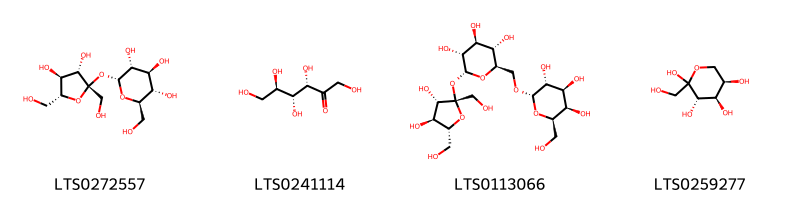{ width=100% }
    <figcaption>Hình ảnh cấu trúc hóa học của 4 hoạt chất thuộc nhóm Organooxygen compounds gồm ['sucrose (LTS0272557)', 'keto-d-fructose (LTS0241114)', 'raffinose (LTS0113066)', 'd-fructopyranose (LTS0259277)'].</figcaption>
</figure>

---

### Dược dân tộc học

Danh sách các quốc gia có sử dụng *Cordia myxa* trong điều trị các bệnh. 

| Country   | Disease   | Bệnh                                                                                                                                                                                                |
|:----------|:----------|:----------------------------------------------------------------------------------------------------------------------------------------------------------------------------------------------------|
| Iran      | Demulcent | MYMEMORY WARNING: YOU USED ALL AVAILABLE FREE TRANSLATIONS FOR TODAY. NEXT AVAILABLE IN  08 HOURS 33 MINUTES 33 SECONDS VISIT HTTPS://MYMEMORY.TRANSLATED.NET/DOC/USAGELIMITS.PHP TO TRANSLATE MORE |

---

---
## Cordia rothii
### Thông tin về thực vật

!!! info "Phân loại thực vật của *Cordia sinensis* từ GIBF:"
    - **Kingdom:** Plantae
    - **Phylum:** Tracheophyta
    - **Order:** Boraginales
    - **Family:** Cordiaceae
    - **Genus:** Cordia
    - **Species:** *Cordia sinensis*

 

| Label (VI)   | Label (EN)   | Scientific Name   | Descriptions (VI)   | Descriptions (EN)   | Also Known As (VI)   | Also Known As (EN)   |
|:-------------|:-------------|:------------------|:--------------------|:--------------------|:---------------------|:---------------------|
| N/A          | N/A          | Cordia rothii     | loài thực vật       | species of plant    | ['']                 | ['']                 |

#### Phân bố trên thế giới

**Từ CSDL GIBF** nan, Uganda, Kenya, Chad, Senegal, Pakistan, Israel, India, Tanzania, United Republic of, unknown or invalid, Angola, Ethiopia, Thailand, Cameroon, Ghana

#### Phân bố tại Việt Nam

**Từ CSDL GIBF**: Không có ghi nhận ở Việt Nam

---
### Thành phần hóa học
        
- Theo cơ sở dữ liệu lotus: Từ loài *Cordia sinensis* đã phân lập và xác định được Chưa có hoạt chất nào được phân lập. hoạt chất thuộc về các nhóm Không có hoạt chất nào được phân lập. 

Không có hình ảnh nào được tạo ra

---

### Dược dân tộc học

Danh sách các quốc gia có sử dụng *Cordia sinensis* trong điều trị các bệnh. 

| Country   | Disease    | Bệnh                                                                                                                                                                                                |
|:----------|:-----------|:----------------------------------------------------------------------------------------------------------------------------------------------------------------------------------------------------|
| Elsewhere | Astringent | MYMEMORY WARNING: YOU USED ALL AVAILABLE FREE TRANSLATIONS FOR TODAY. NEXT AVAILABLE IN  08 HOURS 33 MINUTES 05 SECONDS VISIT HTTPS://MYMEMORY.TRANSLATED.NET/DOC/USAGELIMITS.PHP TO TRANSLATE MORE |

---

---
## Cordia salviaefolia
### Thông tin về thực vật

!!! info "Phân loại thực vật của *N/A* từ GIBF:"
    - **Kingdom:** Plantae
    - **Phylum:** Tracheophyta
    - **Order:** Boraginales
    - **Family:** Cordiaceae
    - **Genus:** Varronia
    - **Species:** *N/A*

 

| Label (VI)   | Label (EN)   | Scientific Name   | Descriptions (VI)   | Descriptions (EN)   | Also Known As (VI)   | Also Known As (EN)   |
|:-------------|:-------------|:------------------|:--------------------|:--------------------|:---------------------|:---------------------|
| N/A          | N/A          | Cordia rothii     | loài thực vật       | species of plant    | ['']                 | ['']                 |

#### Phân bố trên thế giới

**Từ CSDL GIBF** Brazil, Saint Kitts and Nevis, Guadeloupe, Antigua and Barbuda, Ecuador, Trinidad and Tobago, Uruguay, Puerto Rico, United States of America, Virgin Islands (U.S.), Dominican Republic, Colombia, Argentina, Aruba, French Guiana, Mexico, El Salvador, Haiti, Curaçao, Panama, Nicaragua, Martinique, Bahamas, Saint Vincent and the Grenadines, Peru, Bolivia (Plurinational State of), Montserrat

#### Phân bố tại Việt Nam

**Từ CSDL GIBF**: Không có ghi nhận ở Việt Nam

---
### Thành phần hóa học
        
- Theo cơ sở dữ liệu lotus: Từ loài *N/A* đã phân lập và xác định được Chưa có hoạt chất nào được phân lập. hoạt chất thuộc về các nhóm Không có hoạt chất nào được phân lập. 

Không có hình ảnh nào được tạo ra

---

### Dược dân tộc học

Danh sách các quốc gia có sử dụng *N/A* trong điều trị các bệnh. 

| Country   | Disease   | Bệnh                                                                                                                                                                                                |
|:----------|:----------|:----------------------------------------------------------------------------------------------------------------------------------------------------------------------------------------------------|
| Haiti     | Stomachic | MYMEMORY WARNING: YOU USED ALL AVAILABLE FREE TRANSLATIONS FOR TODAY. NEXT AVAILABLE IN  08 HOURS 32 MINUTES 41 SECONDS VISIT HTTPS://MYMEMORY.TRANSLATED.NET/DOC/USAGELIMITS.PHP TO TRANSLATE MORE |

---

---
## Cordia sebestena
### Thông tin về thực vật

!!! info "Phân loại thực vật của *Cordia sebestena* từ GIBF:"
    - **Kingdom:** Plantae
    - **Phylum:** Tracheophyta
    - **Order:** Boraginales
    - **Family:** Cordiaceae
    - **Genus:** Cordia
    - **Species:** *Cordia sebestena*

 

| Label (VI)   | Label (EN)   | Scientific Name   | Descriptions (VI)   | Descriptions (EN)   | Also Known As (VI)   | Also Known As (EN)   |
|:-------------|:-------------|:------------------|:--------------------|:--------------------|:---------------------|:---------------------|
| N/A          | N/A          | Cordia sebestena  | loài thực vật       | species of plant    | ['']                 | ['']                 |

#### Phân bố trên thế giới

**Từ CSDL GIBF** United Arab Emirates, Saint Kitts and Nevis, Virgin Islands (British), Senegal, Guadeloupe, Barbados, Antigua and Barbuda, Honduras, Thailand, Turks and Caicos Islands, Cayman Islands, Ghana, Puerto Rico, United States of America, Jamaica, Virgin Islands (U.S.), Indonesia, Dominican Republic, Colombia, Cuba, Aruba, French Guiana, Sint Maarten (Dutch part), Mexico, Benin, Maldives, Malaysia, Curaçao, Singapore, Bonaire, Sint Eustatius and Saba, Bermuda, Martinique, Bahamas, India, Belize

#### Phân bố tại Việt Nam

**Từ CSDL GIBF**: Không có ghi nhận ở Việt Nam

---
### Thành phần hóa học
        
- Theo cơ sở dữ liệu lotus: Từ loài *Cordia sebestena* đã phân lập và xác định được 13 hoạt chất thuộc về các nhóm Benzene and substituted derivatives, Cinnamic acids and derivatives. 

|    | chemicalTaxonomyClassyfireClass     |   smiles_count |
|---:|:------------------------------------|---------------:|
|  0 | Benzene and substituted derivatives |              4 |
|  1 | Cinnamic acids and derivatives      |              9 |

#### Nhóm Benzene and substituted derivatives
<figure markdown="span">
    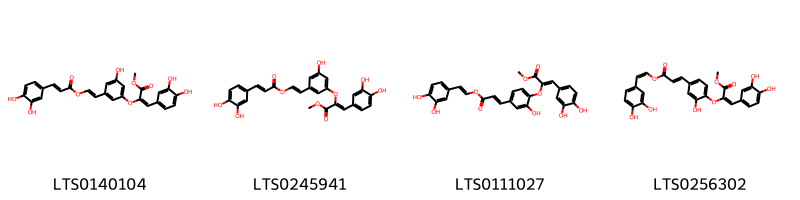{ width=100% }
    <figcaption>Hình ảnh cấu trúc hóa học của 4 hoạt chất thuộc nhóm Benzene and substituted derivatives gồm ['methyl (2e)-3-(3,4-dihydroxyphenyl)-2-{3-[(1e)-2-{[(2e)-3-(3,4-dihydroxyphenyl)prop-2-enoyl]oxy}ethenyl]-5-hydroxyphenoxy}prop-2-enoate (LTS0140104)', 'methyl 3-(3,4-dihydroxyphenyl)-2-[3-(2-{[3-(3,4-dihydroxyphenyl)prop-2-enoyl]oxy}ethenyl)-5-hydroxyphenoxy]prop-2-enoate (LTS0245941)', 'methyl 3-(3,4-dihydroxyphenyl)-2-[4-(3-{[2-(3,4-dihydroxyphenyl)ethenyl]oxy}-3-oxoprop-1-en-1-yl)-2-hydroxyphenoxy]prop-2-enoate (LTS0111027)', 'methyl (2e)-3-(3,4-dihydroxyphenyl)-2-{4-[(1e)-3-{[(1z)-2-(3,4-dihydroxyphenyl)ethenyl]oxy}-3-oxoprop-1-en-1-yl]-2-hydroxyphenoxy}prop-2-enoate (LTS0256302)'].</figcaption>
</figure>
#### Nhóm Cinnamic acids and derivatives
<figure markdown="span">
    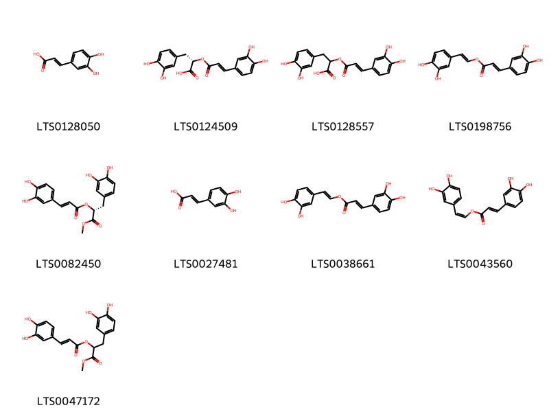{ width=100% }
    <figcaption>Hình ảnh cấu trúc hóa học của 9 hoạt chất thuộc nhóm Cinnamic acids and derivatives gồm ['3,4-dihydroxycinnamic acid (LTS0128050)', '(s)-rosmarinic acid (LTS0124509)', '3-(3,4-dihydroxyphenyl)-2-{[3-(3,4-dihydroxyphenyl)prop-2-enoyl]oxy}propanoic acid (LTS0128557)', '(1e)-2-(3,4-dihydroxyphenyl)ethenyl (2e)-3-(3,4-dihydroxyphenyl)prop-2-enoate (LTS0198756)', '(2r)-3-(3,4-dihydroxyphenyl)-1-methoxy-1-oxopropan-2-yl (2e)-3-(3,4-dihydroxyphenyl)prop-2-enoate (LTS0082450)', 'caffeic acid (LTS0027481)', '2-(3,4-dihydroxyphenyl)ethenyl 3-(3,4-dihydroxyphenyl)prop-2-enoate (LTS0038661)', '(1z)-2-(3,4-dihydroxyphenyl)ethenyl (2e)-3-(3,4-dihydroxyphenyl)prop-2-enoate (LTS0043560)', '3-(3,4-dihydroxyphenyl)-1-methoxy-1-oxopropan-2-yl 3-(3,4-dihydroxyphenyl)prop-2-enoate (LTS0047172)'].</figcaption>
</figure>

---

### Dược dân tộc học

Danh sách các quốc gia có sử dụng *Cordia sebestena* trong điều trị các bệnh. 

| Country   | Disease   | Bệnh                                                                                                                                                                                                |
|:----------|:----------|:----------------------------------------------------------------------------------------------------------------------------------------------------------------------------------------------------|
| Haiti     | Emollient | MYMEMORY WARNING: YOU USED ALL AVAILABLE FREE TRANSLATIONS FOR TODAY. NEXT AVAILABLE IN  08 HOURS 32 MINUTES 04 SECONDS VISIT HTTPS://MYMEMORY.TRANSLATED.NET/DOC/USAGELIMITS.PHP TO TRANSLATE MORE |
| Mexico    | Emollient | MYMEMORY WARNING: YOU USED ALL AVAILABLE FREE TRANSLATIONS FOR TODAY. NEXT AVAILABLE IN  08 HOURS 32 MINUTES 00 SECONDS VISIT HTTPS://MYMEMORY.TRANSLATED.NET/DOC/USAGELIMITS.PHP TO TRANSLATE MORE |

---

---
## Cordia sebestina
### Thông tin về thực vật

!!! info "Phân loại thực vật của *Cordia sebestena* từ GIBF:"
    - **Kingdom:** Plantae
    - **Phylum:** Tracheophyta
    - **Order:** Boraginales
    - **Family:** Cordiaceae
    - **Genus:** Cordia
    - **Species:** *Cordia sebestena*

 

| Label (VI)   | Label (EN)   | Scientific Name   | Descriptions (VI)   | Descriptions (EN)   | Also Known As (VI)   | Also Known As (EN)   |
|:-------------|:-------------|:------------------|:--------------------|:--------------------|:---------------------|:---------------------|
| N/A          | N/A          | Cordia sebestena  | loài thực vật       | species of plant    | ['']                 | ['']                 |

#### Phân bố trên thế giới

**Từ CSDL GIBF** United Arab Emirates, Saint Kitts and Nevis, Virgin Islands (British), Senegal, Guadeloupe, Barbados, Antigua and Barbuda, Honduras, Thailand, Turks and Caicos Islands, Cayman Islands, Ghana, Puerto Rico, United States of America, Jamaica, Virgin Islands (U.S.), Indonesia, Dominican Republic, Colombia, Cuba, Aruba, French Guiana, Sint Maarten (Dutch part), Mexico, Benin, Maldives, Malaysia, Curaçao, Singapore, Bonaire, Sint Eustatius and Saba, Bermuda, Martinique, Bahamas, India, Belize

#### Phân bố tại Việt Nam

**Từ CSDL GIBF**: Không có ghi nhận ở Việt Nam

---
### Thành phần hóa học
        
- Theo cơ sở dữ liệu lotus: Từ loài *Cordia sebestena* đã phân lập và xác định được Chưa có hoạt chất nào được phân lập. hoạt chất thuộc về các nhóm Không có hoạt chất nào được phân lập. 

Không có hình ảnh nào được tạo ra

---

### Dược dân tộc học

Danh sách các quốc gia có sử dụng *Cordia sebestena* trong điều trị các bệnh. 

| Country   | Disease   | Bệnh                                                                                                                                                                                                |
|:----------|:----------|:----------------------------------------------------------------------------------------------------------------------------------------------------------------------------------------------------|
| Elsewhere | Emollient | MYMEMORY WARNING: YOU USED ALL AVAILABLE FREE TRANSLATIONS FOR TODAY. NEXT AVAILABLE IN  08 HOURS 31 MINUTES 30 SECONDS VISIT HTTPS://MYMEMORY.TRANSLATED.NET/DOC/USAGELIMITS.PHP TO TRANSLATE MORE |

---

---
## Cordia vestita
### Thông tin về thực vật

!!! info "Phân loại thực vật của *Cordia vestita* từ GIBF:"
    - **Kingdom:** Plantae
    - **Phylum:** Tracheophyta
    - **Order:** Boraginales
    - **Family:** Cordiaceae
    - **Genus:** Cordia
    - **Species:** *Cordia vestita*

 

| Label (VI)   | Label (EN)   | Scientific Name   | Descriptions (VI)   | Descriptions (EN)   | Also Known As (VI)   | Also Known As (EN)   |
|:-------------|:-------------|:------------------|:--------------------|:--------------------|:---------------------|:---------------------|
| N/A          | N/A          | Cordia vestita    | loài thực vật       | species of plant    | ['']                 | ['']                 |

#### Phân bố trên thế giới

**Từ CSDL GIBF** nan, India

#### Phân bố tại Việt Nam

**Từ CSDL GIBF**: Không có ghi nhận ở Việt Nam

---
### Thành phần hóa học
        
- Theo cơ sở dữ liệu lotus: Từ loài *Cordia vestita* đã phân lập và xác định được Chưa có hoạt chất nào được phân lập. hoạt chất thuộc về các nhóm Không có hoạt chất nào được phân lập. 

Không có hình ảnh nào được tạo ra

---

### Dược dân tộc học

Danh sách các quốc gia có sử dụng *Cordia vestita* trong điều trị các bệnh. 

| Country   | Disease                            | Bệnh                                                                                                                                                                                                |
|:----------|:-----------------------------------|:----------------------------------------------------------------------------------------------------------------------------------------------------------------------------------------------------|
| Elsewhere | Astringent, Demulcent, Expectorant | MYMEMORY WARNING: YOU USED ALL AVAILABLE FREE TRANSLATIONS FOR TODAY. NEXT AVAILABLE IN  08 HOURS 31 MINUTES 03 SECONDS VISIT HTTPS://MYMEMORY.TRANSLATED.NET/DOC/USAGELIMITS.PHP TO TRANSLATE MORE |

---

---
## Cordia wallichii
### Thông tin về thực vật

!!! info "Phân loại thực vật của *Cordia dichotoma* từ GIBF:"
    - **Kingdom:** Plantae
    - **Phylum:** Tracheophyta
    - **Order:** Boraginales
    - **Family:** Cordiaceae
    - **Genus:** Cordia
    - **Species:** *Cordia dichotoma*

 

| Label (VI)   | Label (EN)   | Scientific Name   | Descriptions (VI)   | Descriptions (EN)   | Also Known As (VI)   | Also Known As (EN)   |
|:-------------|:-------------|:------------------|:--------------------|:--------------------|:---------------------|:---------------------|
| N/A          | N/A          | Cordia wallichii  |                     |                     | ['']                 | ['']                 |

#### Phân bố trên thế giới

**Từ CSDL GIBF** nan, Cambodia, Australia, India, unknown or invalid, Canada

#### Phân bố tại Việt Nam

**Từ CSDL GIBF**: Không có ghi nhận ở Việt Nam

---
### Thành phần hóa học
        
- Theo cơ sở dữ liệu lotus: Từ loài *Cordia dichotoma* đã phân lập và xác định được Chưa có hoạt chất nào được phân lập. hoạt chất thuộc về các nhóm Không có hoạt chất nào được phân lập. 

Không có hình ảnh nào được tạo ra

---

### Dược dân tộc học

Danh sách các quốc gia có sử dụng *Cordia dichotoma* trong điều trị các bệnh. 

| Country   | Disease                            | Bệnh                                                                                                                                                                                                |
|:----------|:-----------------------------------|:----------------------------------------------------------------------------------------------------------------------------------------------------------------------------------------------------|
| Elsewhere | Demulcent, Astringent, Expectorant | MYMEMORY WARNING: YOU USED ALL AVAILABLE FREE TRANSLATIONS FOR TODAY. NEXT AVAILABLE IN  08 HOURS 30 MINUTES 21 SECONDS VISIT HTTPS://MYMEMORY.TRANSLATED.NET/DOC/USAGELIMITS.PHP TO TRANSLATE MORE |

---

# Chi Symphytum

??? note "Danh sách các dược liệu thuộc chi"
    
	 - *Symphytum officinale*

---
## Symphytum officinale
### Thông tin về thực vật

!!! info "Phân loại thực vật của *Symphytum officinale* từ GIBF:"
    - **Kingdom:** Plantae
    - **Phylum:** Tracheophyta
    - **Order:** Boraginales
    - **Family:** Boraginaceae
    - **Genus:** Symphytum
    - **Species:** *Symphytum officinale*

 

| Label (VI)   | Label (EN)   | Scientific Name      | Descriptions (VI)   | Descriptions (EN)          | Also Known As (VI)   | Also Known As (EN)                  |
|:-------------|:-------------|:---------------------|:--------------------|:---------------------------|:---------------------|:------------------------------------|
| N/A          | N/A          | Symphytum officinale | loài thực vật       | perennial species of plant | ['']                 | ['comfrey', 'Symphytum peregrinum'] |

#### Phân bố trên thế giới

**Từ CSDL GIBF** Austria, Hungary, Czechia, Netherlands, Belgium, Chinese Taipei, France, New Zealand, Italy, Switzerland, Croatia, Germany, United Kingdom of Great Britain and Northern Ireland, Spain, Denmark

#### Phân bố tại Việt Nam

**Từ CSDL GIBF**: Không có ghi nhận ở Việt Nam

---
### Thành phần hóa học
        
- Theo cơ sở dữ liệu lotus: Từ loài *Symphytum officinale* đã phân lập và xác định được 53 hoạt chất thuộc về các nhóm Cinnamic acids and derivatives, Steroids and steroid derivatives, Organooxygen compounds, Azoles, Prenol lipids. 

|    | chemicalTaxonomyClassyfireClass   |   smiles_count |
|---:|:----------------------------------|---------------:|
|  0 |                                   |             27 |
|  1 | Azoles                            |              1 |
|  2 | Cinnamic acids and derivatives    |              4 |
|  3 | Organooxygen compounds            |              4 |
|  4 | Prenol lipids                     |             11 |
|  5 | Steroids and steroid derivatives  |              6 |

#### Nhóm 
<figure markdown="span">
    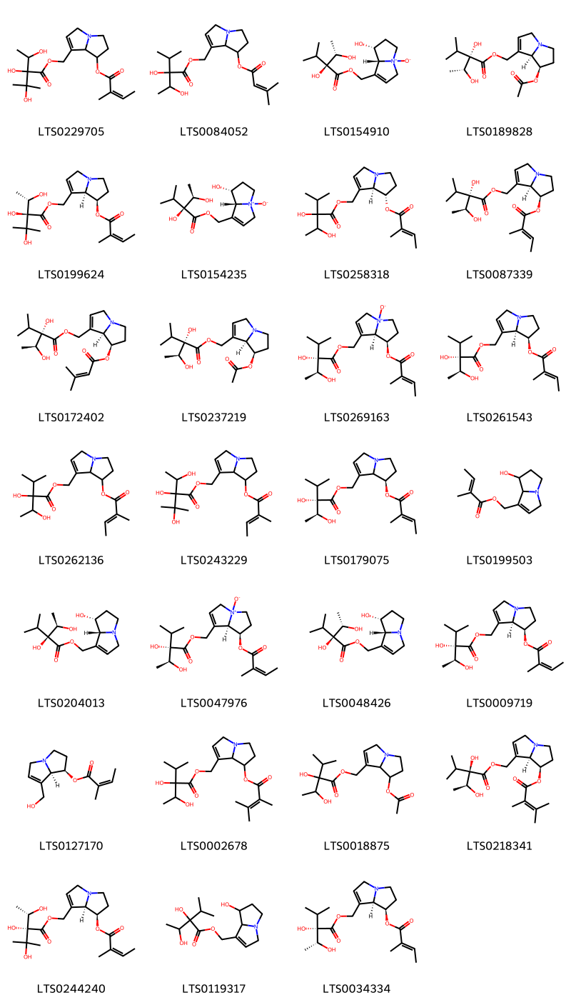{ width=100% }
    <figcaption>Hình ảnh cấu trúc hóa học của 27 hoạt chất thuộc nhóm  gồm ['7-({[2,3-dihydroxy-2-(1-hydroxyethyl)-3-methylbutanoyl]oxy}methyl)-2,3,5,7a-tetrahydro-1h-pyrrolizin-1-yl (2z)-2-methylbut-2-enoate (LTS0229705)', '7-{[(2,3-dihydroxy-2-isopropylbutanoyl)oxy]methyl}-2,3,5,7a-tetrahydro-1h-pyrrolizin-1-yl 3-methylbut-2-enoate (LTS0084052)', '(1r,7ar)-1-hydroxy-7-({[(2s)-2-hydroxy-2-[(1s)-1-hydroxyethyl]-3-methylbutanoyl]oxy}methyl)-2,3,5,7a-tetrahydro-1h-pyrrolizin-4-ium-4-olate (LTS0154910)', 'acetylintermedine (LTS0189828)', 'echimidine (LTS0199624)', '(1r,7ar)-1-hydroxy-7-({[(2s)-2-hydroxy-2-[(1r)-1-hydroxyethyl]-3-methylbutanoyl]oxy}methyl)-2,3,5,7a-tetrahydro-1h-pyrrolizin-4-ium-4-olate (LTS0154235)', 'symphytine (LTS0258318)', '(1r,7ar)-7-({[(2s)-2-hydroxy-2-[(1s)-1-hydroxyethyl]-3-methylbutanoyl]oxy}methyl)-2,3,5,7a-tetrahydro-1h-pyrrolizin-1-yl 2-methylbut-2-enoate (LTS0087339)', '(1r,7ar)-7-({[(2s)-2-hydroxy-2-[(1s)-1-hydroxyethyl]-3-methylbutanoyl]oxy}methyl)-2,3,5,7a-tetrahydro-1h-pyrrolizin-1-yl 3-methylbut-2-enoate (LTS0172402)', 'acetyllycopsamine (LTS0237219)', 'symphytine oxide (LTS0269163)', 'symphytine (LTS0261543)', '7-{[(2,3-dihydroxy-2-isopropylbutanoyl)oxy]methyl}-2,3,5,7a-tetrahydro-1h-pyrrolizin-1-yl 2-methylbut-2-enoate (LTS0262136)', '7-({[2,3-dihydroxy-2-(1-hydroxyethyl)-3-methylbutanoyl]oxy}methyl)-2,3,5,7a-tetrahydro-1h-pyrrolizin-1-yl 2-methylbut-2-enoate (LTS0243229)', '(1r)-7-({[(2s)-2-hydroxy-2-[(1s)-1-hydroxyethyl]-3-methylbutanoyl]oxy}methyl)-2,3,5,7a-tetrahydro-1h-pyrrolizin-1-yl (2e)-2-methylbut-2-enoate (LTS0179075)', '(7-hydroxy-5,6,7,7a-tetrahydro-3h-pyrrolizin-1-yl)methyl 2-methylbut-2-enoate (LTS0199503)', 'intermedine (LTS0204013)', '(7r,7ar)-1-({[(2s)-2-hydroxy-2-[(1s)-1-hydroxyethyl]-3-methylbutanoyl]oxy}methyl)-7-{[(2z)-2-methylbut-2-enoyl]oxy}-5,6,7,7a-tetrahydro-3h-pyrrolizin-4-ium-4-olate (LTS0047976)', 'lycopsamine (LTS0048426)', 'symlandine (LTS0009719)', '7-angelylretronecine (LTS0127170)', '7-{[(2,3-dihydroxy-2-isopropylbutanoyl)oxy]methyl}-2,3,5,7a-tetrahydro-1h-pyrrolizin-1-yl 2,3-dimethylbut-2-enoate (LTS0002678)', '[7-(acetyloxy)-5,6,7,7a-tetrahydro-3h-pyrrolizin-1-yl]methyl 2,3-dihydroxy-2-isopropylbutanoate (LTS0018875)', '(1r,7ar)-7-({[(2r)-2-hydroxy-2-[(1s)-1-hydroxyethyl]-3-methylbutanoyl]oxy}methyl)-2,3,5,7a-tetrahydro-1h-pyrrolizin-1-yl 2,3-dimethylbut-2-enoate (LTS0218341)', '(1r,7ar)-7-({[(2s)-2,3-dihydroxy-2-[(1s)-1-hydroxyethyl]-3-methylbutanoyl]oxy}methyl)-2,3,5,7a-tetrahydro-1h-pyrrolizin-1-yl (2z)-2-methylbut-2-enoate (LTS0244240)', '(7-hydroxy-5,6,7,7a-tetrahydro-3h-pyrrolizin-1-yl)methyl 2,3-dihydroxy-2-isopropylbutanoate (LTS0119317)', 'myoscorpine (LTS0034334)'].</figcaption>
</figure>
#### Nhóm Azoles
<figure markdown="span">
    { width=100% }
    <figcaption>Hình ảnh cấu trúc hóa học của 1 hoạt chất thuộc nhóm Azoles gồm ['allantoin (LTS0106609)'].</figcaption>
</figure>
#### Nhóm Cinnamic acids and derivatives
<figure markdown="span">
    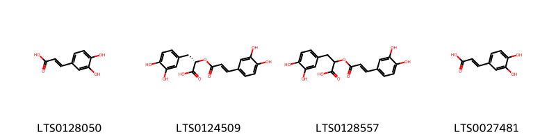{ width=100% }
    <figcaption>Hình ảnh cấu trúc hóa học của 4 hoạt chất thuộc nhóm Cinnamic acids and derivatives gồm ['3,4-dihydroxycinnamic acid (LTS0128050)', '(s)-rosmarinic acid (LTS0124509)', '3-(3,4-dihydroxyphenyl)-2-{[3-(3,4-dihydroxyphenyl)prop-2-enoyl]oxy}propanoic acid (LTS0128557)', 'caffeic acid (LTS0027481)'].</figcaption>
</figure>
#### Nhóm Organooxygen compounds
<figure markdown="span">
    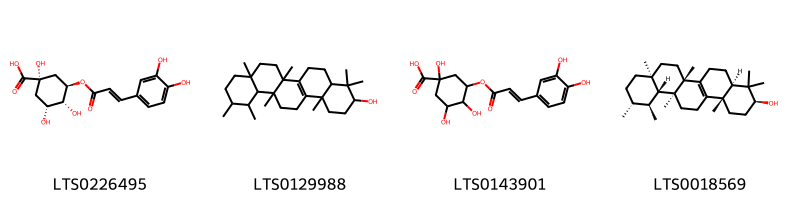{ width=100% }
    <figcaption>Hình ảnh cấu trúc hóa học của 4 hoạt chất thuộc nhóm Organooxygen compounds gồm ['chlorogenic acid (LTS0226495)', '4,4,6b,8a,11,12,12b,14b-octamethyl-2,3,4a,5,6,7,8,9,10,11,12,12a,13,14-tetradecahydro-1h-picen-3-ol (LTS0129988)', '3-{[3-(3,4-dihydroxyphenyl)prop-2-enoyl]oxy}-1,4,5-trihydroxycyclohexane-1-carboxylic acid (LTS0143901)', '(3s,4ar,6bs,8as,11r,12s,12ar,12bs,14bs)-4,4,6b,8a,11,12,12b,14b-octamethyl-2,3,4a,5,6,7,8,9,10,11,12,12a,13,14-tetradecahydro-1h-picen-3-ol (LTS0018569)'].</figcaption>
</figure>
#### Nhóm Prenol lipids
<figure markdown="span">
    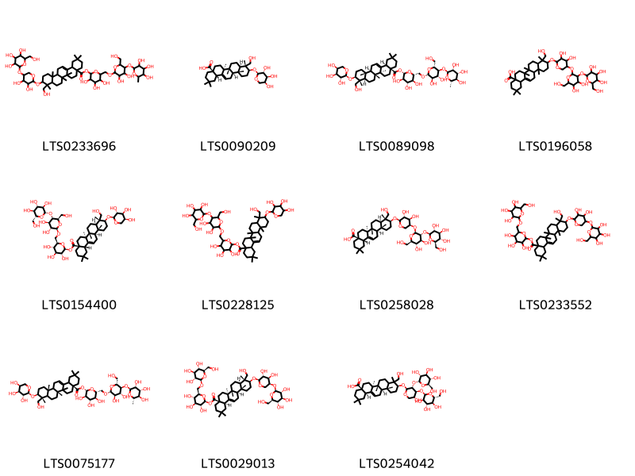{ width=100% }
    <figcaption>Hình ảnh cấu trúc hóa học của 11 hoạt chất thuộc nhóm Prenol lipids gồm ['6-({[3,4-dihydroxy-6-(hydroxymethyl)-5-[(3,4,5-trihydroxy-6-methyloxan-2-yl)oxy]oxan-2-yl]oxy}methyl)-3,4,5-trihydroxyoxan-2-yl 10-[(3,4-dihydroxy-5-{[3,4,5-trihydroxy-6-(hydroxymethyl)oxan-2-yl]oxy}oxan-2-yl)oxy]-9-(hydroxymethyl)-2,2,6a,6b,9,12a-hexamethyl-1,3,4,5,6,7,8,8a,10,11,12,12b,13,14b-tetradecahydropicene-4a-carboxylate (LTS0233696)', 'hederagenin 3-o-arabinoside (LTS0090209)', '(2s,3r,4s,5s,6r)-6-({[(2r,3r,4r,5s,6r)-3,4-dihydroxy-6-(hydroxymethyl)-5-{[(2s,3r,4r,5r,6s)-3,4,5-trihydroxy-6-methyloxan-2-yl]oxy}oxan-2-yl]oxy}methyl)-3,4,5-trihydroxyoxan-2-yl (4as,6as,6br,8ar,9r,10s,12ar,12br,14br)-9-(hydroxymethyl)-2,2,6a,6b,9,12a-hexamethyl-10-{[(2s,3r,4s,5s)-3,4,5-trihydroxyoxan-2-yl]oxy}-1,3,4,5,6,7,8,8a,10,11,12,12b,13,14b-tetradecahydropicene-4a-carboxylate (LTS0089098)', '10-[(5-{[4,5-dihydroxy-6-(hydroxymethyl)-3-{[3,4,5-trihydroxy-6-(hydroxymethyl)oxan-2-yl]oxy}oxan-2-yl]oxy}-3,4-dihydroxyoxan-2-yl)oxy]-9-(hydroxymethyl)-2,2,6a,6b,9,12a-hexamethyl-1,3,4,5,6,7,8,8a,10,11,12,12b,13,14b-tetradecahydropicene-4a-carboxylic acid (LTS0196058)', '(2s,3r,4s,5s,6r)-6-({[(2r,3r,4r,5s,6r)-3,4-dihydroxy-6-(hydroxymethyl)-5-{[(2s,3r,4s,5s,6r)-3,4,5-trihydroxy-6-(hydroxymethyl)oxan-2-yl]oxy}oxan-2-yl]oxy}methyl)-3,4,5-trihydroxyoxan-2-yl (4as,6as,6br,8ar,9r,10s,12ar,12br,14bs)-9-(hydroxymethyl)-2,2,6a,6b,9,12a-hexamethyl-10-{[(2s,3r,4s,5s)-3,4,5-trihydroxyoxan-2-yl]oxy}-1,3,4,5,6,7,8,8a,10,11,12,12b,13,14b-tetradecahydropicene-4a-carboxylate (LTS0154400)', '6-({[3,4-dihydroxy-6-(hydroxymethyl)-5-{[3,4,5-trihydroxy-6-(hydroxymethyl)oxan-2-yl]oxy}oxan-2-yl]oxy}methyl)-3,4,5-trihydroxyoxan-2-yl 9-(hydroxymethyl)-2,2,6a,6b,9,12a-hexamethyl-10-[(3,4,5-trihydroxyoxan-2-yl)oxy]-1,3,4,5,6,7,8,8a,10,11,12,12b,13,14b-tetradecahydropicene-4a-carboxylate (LTS0228125)', '(4as,6as,6br,8ar,9r,10s,12ar,12br,14bs)-10-{[(2s,3r,4r,5s)-5-{[(2s,3r,4s,5s,6r)-4,5-dihydroxy-6-(hydroxymethyl)-3-{[(2s,3r,4s,5s,6r)-3,4,5-trihydroxy-6-(hydroxymethyl)oxan-2-yl]oxy}oxan-2-yl]oxy}-3,4-dihydroxyoxan-2-yl]oxy}-9-(hydroxymethyl)-2,2,6a,6b,9,12a-hexamethyl-1,3,4,5,6,7,8,8a,10,11,12,12b,13,14b-tetradecahydropicene-4a-carboxylic acid (LTS0258028)', '3,4,5-trihydroxy-6-({[3,4,5-trihydroxy-6-(hydroxymethyl)oxan-2-yl]oxy}methyl)oxan-2-yl 10-[(3,4-dihydroxy-5-{[3,4,5-trihydroxy-6-(hydroxymethyl)oxan-2-yl]oxy}oxan-2-yl)oxy]-9-(hydroxymethyl)-2,2,6a,6b,9,12a-hexamethyl-1,3,4,5,6,7,8,8a,10,11,12,12b,13,14b-tetradecahydropicene-4a-carboxylate (LTS0233552)', '(2s,3r,4s,5s,6r)-6-({[(2r,3r,4r,5s,6r)-3,4-dihydroxy-6-(hydroxymethyl)-5-{[(2s,3r,4r,5r,6s)-3,4,5-trihydroxy-6-methyloxan-2-yl]oxy}oxan-2-yl]oxy}methyl)-3,4,5-trihydroxyoxan-2-yl (4as,6br,9r,10s,12ar)-9-(hydroxymethyl)-2,2,6a,6b,9,12a-hexamethyl-10-{[(2s,3r,4s,5s)-3,4,5-trihydroxyoxan-2-yl]oxy}-1,3,4,5,6,7,8,8a,10,11,12,12b,13,14b-tetradecahydropicene-4a-carboxylate (LTS0075177)', '(2s,3r,4s,5s,6r)-3,4,5-trihydroxy-6-({[(2r,3r,4s,5s,6r)-3,4,5-trihydroxy-6-(hydroxymethyl)oxan-2-yl]oxy}methyl)oxan-2-yl (4as,6as,6br,8ar,9r,10s,12ar,12br,14br)-10-{[(2s,3r,4r,5s)-3,4-dihydroxy-5-{[(2s,3r,4s,5s,6r)-3,4,5-trihydroxy-6-(hydroxymethyl)oxan-2-yl]oxy}oxan-2-yl]oxy}-9-(hydroxymethyl)-2,2,6a,6b,9,12a-hexamethyl-1,3,4,5,6,7,8,8a,10,11,12,12b,13,14b-tetradecahydropicene-4a-carboxylate (LTS0029013)', '(4as,6as,6br,10s,12ar,12br,14br)-10-{[(2s,3r,4s,5s)-5-hydroxy-3,4-bis({[(2r,3r,4s,5s,6r)-3,4,5-trihydroxy-6-(hydroxymethyl)oxan-2-yl]oxy})oxan-2-yl]oxy}-9-(hydroxymethyl)-2,2,6a,6b,9,12a-hexamethyl-1,3,4,5,6,7,8,8a,10,11,12,12b,13,14b-tetradecahydropicene-4a-carboxylic acid (LTS0254042)'].</figcaption>
</figure>
#### Nhóm Steroids and steroid derivatives
<figure markdown="span">
    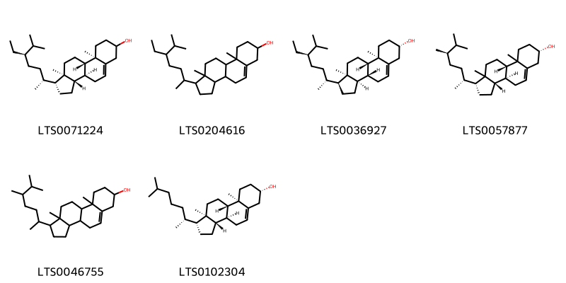{ width=100% }
    <figcaption>Hình ảnh cấu trúc hóa học của 6 hoạt chất thuộc nhóm Steroids and steroid derivatives gồm ['stigmast-5-en-3-ol (LTS0071224)', 'stigmast-5-en-3-ol, (3β)- (LTS0204616)', '(1s,3ar,3br,7s,9ar,9bs,11ar)-1-[(2r,5r)-5-ethyl-6-methylheptan-2-yl]-9a,11a-dimethyl-1h,2h,3h,3ah,3bh,4h,6h,7h,8h,9h,9bh,10h,11h-cyclopenta[a]phenanthren-7-ol (LTS0036927)', '(1r,3as,3bs,7s,9bs)-1-[(2r,5r)-5,6-dimethylheptan-2-yl]-9a,11a-dimethyl-1h,2h,3h,3ah,3bh,4h,6h,7h,8h,9h,9bh,10h,11h-cyclopenta[a]phenanthren-7-ol (LTS0057877)', 'campesterol (LTS0046755)', 'cholesterol (LTS0102304)'].</figcaption>
</figure>

---

### Dược dân tộc học

Danh sách các quốc gia có sử dụng *Symphytum officinale* trong điều trị các bệnh. 

| Country            | Disease                                                                        | Bệnh                                                                                                                                                                                                |
|:-------------------|:-------------------------------------------------------------------------------|:----------------------------------------------------------------------------------------------------------------------------------------------------------------------------------------------------|
| Dominican Republic | Sudorific                                                                      | MYMEMORY WARNING: YOU USED ALL AVAILABLE FREE TRANSLATIONS FOR TODAY. NEXT AVAILABLE IN  08 HOURS 30 MINUTES 00 SECONDS VISIT HTTPS://MYMEMORY.TRANSLATED.NET/DOC/USAGELIMITS.PHP TO TRANSLATE MORE |
| Elsewhere          | Antidiarrheic                                                                  | MYMEMORY WARNING: YOU USED ALL AVAILABLE FREE TRANSLATIONS FOR TODAY. NEXT AVAILABLE IN  08 HOURS 29 MINUTES 57 SECONDS VISIT HTTPS://MYMEMORY.TRANSLATED.NET/DOC/USAGELIMITS.PHP TO TRANSLATE MORE |
| Europe             | Astringent, Demulcent                                                          | MYMEMORY WARNING: YOU USED ALL AVAILABLE FREE TRANSLATIONS FOR TODAY. NEXT AVAILABLE IN  08 HOURS 29 MINUTES 54 SECONDS VISIT HTTPS://MYMEMORY.TRANSLATED.NET/DOC/USAGELIMITS.PHP TO TRANSLATE MORE |
| Haiti              | Analgesic, Diuretic                                                            | MYMEMORY WARNING: YOU USED ALL AVAILABLE FREE TRANSLATIONS FOR TODAY. NEXT AVAILABLE IN  08 HOURS 29 MINUTES 50 SECONDS VISIT HTTPS://MYMEMORY.TRANSLATED.NET/DOC/USAGELIMITS.PHP TO TRANSLATE MORE |
| Turkey             | Astringent, Demulcent, Expectorant, Hemostat, Sedative, Stimulant, Cicatrizant | MYMEMORY WARNING: YOU USED ALL AVAILABLE FREE TRANSLATIONS FOR TODAY. NEXT AVAILABLE IN  08 HOURS 29 MINUTES 47 SECONDS VISIT HTTPS://MYMEMORY.TRANSLATED.NET/DOC/USAGELIMITS.PHP TO TRANSLATE MORE |

---

# Chi Bourreria

??? note "Danh sách các dược liệu thuộc chi"
    
	 - *Bourreria huanita*

---
## Bourreria huanita
### Thông tin về thực vật

!!! info "Phân loại thực vật của *Bourreria huanita* từ GIBF:"
    - **Kingdom:** Plantae
    - **Phylum:** Tracheophyta
    - **Order:** Boraginales
    - **Family:** Ehretiaceae
    - **Genus:** Bourreria
    - **Species:** *Bourreria huanita*

 

| Label (VI)   | Label (EN)   | Scientific Name   | Descriptions (VI)   | Descriptions (EN)   | Also Known As (VI)   | Also Known As (EN)   |
|:-------------|:-------------|:------------------|:--------------------|:--------------------|:---------------------|:---------------------|
| N/A          | N/A          | Bourreria huanita | loài thực vật       | species of plant    | ['']                 | ['']                 |

#### Phân bố trên thế giới

**Từ CSDL GIBF** nan, Mexico, Guatemala, Nicaragua, El Salvador, Costa Rica, Honduras, Belize

#### Phân bố tại Việt Nam

**Từ CSDL GIBF**: Không có ghi nhận ở Việt Nam

---
### Thành phần hóa học
        
- Theo cơ sở dữ liệu lotus: Từ loài *Bourreria huanita* đã phân lập và xác định được Chưa có hoạt chất nào được phân lập. hoạt chất thuộc về các nhóm Không có hoạt chất nào được phân lập. 

Không có hình ảnh nào được tạo ra

---

### Dược dân tộc học

Danh sách các quốc gia có sử dụng *Bourreria huanita* trong điều trị các bệnh. 

| Country   | Disease    | Bệnh                                                                                                                                                                                                |
|:----------|:-----------|:----------------------------------------------------------------------------------------------------------------------------------------------------------------------------------------------------|
| Mexico    | Astringent | MYMEMORY WARNING: YOU USED ALL AVAILABLE FREE TRANSLATIONS FOR TODAY. NEXT AVAILABLE IN  08 HOURS 29 MINUTES 00 SECONDS VISIT HTTPS://MYMEMORY.TRANSLATED.NET/DOC/USAGELIMITS.PHP TO TRANSLATE MORE |

---

# Chi Echium

??? note "Danh sách các dược liệu thuộc chi"
    
	 - *Echium plantagineum*
	 - *Echium vulgare*

---
## Echium plantagineum
### Thông tin về thực vật

!!! info "Phân loại thực vật của *Echium plantagineum* từ GIBF:"
    - **Kingdom:** Plantae
    - **Phylum:** Tracheophyta
    - **Order:** Boraginales
    - **Family:** Boraginaceae
    - **Genus:** Echium
    - **Species:** *Echium plantagineum*

 

| Label (VI)   | Label (EN)   | Scientific Name     | Descriptions (VI)   | Descriptions (EN)   | Also Known As (VI)   | Also Known As (EN)   |
|:-------------|:-------------|:--------------------|:--------------------|:--------------------|:---------------------|:---------------------|
| N/A          | N/A          | Echium plantagineum | loài thực vật       | species of plant    | ['']                 | ['']                 |

#### Phân bố trên thế giới

**Từ CSDL GIBF** Algeria, United States of America, Portugal, Greece, South Africa, Australia, Chile, New Zealand, Italy, Israel, Argentina, France, Spain

#### Phân bố tại Việt Nam

**Từ CSDL GIBF**: Không có ghi nhận ở Việt Nam

---
### Thành phần hóa học
        
- Theo cơ sở dữ liệu lotus: Từ loài *Echium plantagineum* đã phân lập và xác định được 20 hoạt chất thuộc về các nhóm Fatty Acyls, Prenol lipids, Naphthalenes. 

|    | chemicalTaxonomyClassyfireClass   |   smiles_count |
|---:|:----------------------------------|---------------:|
|  0 |                                   |              4 |
|  1 | Fatty Acyls                       |              5 |
|  2 | Naphthalenes                      |              9 |
|  3 | Prenol lipids                     |              2 |

#### Nhóm 
<figure markdown="span">
    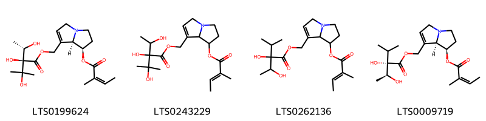{ width=100% }
    <figcaption>Hình ảnh cấu trúc hóa học của 4 hoạt chất thuộc nhóm  gồm ['echimidine (LTS0199624)', '7-({[2,3-dihydroxy-2-(1-hydroxyethyl)-3-methylbutanoyl]oxy}methyl)-2,3,5,7a-tetrahydro-1h-pyrrolizin-1-yl 2-methylbut-2-enoate (LTS0243229)', '7-{[(2,3-dihydroxy-2-isopropylbutanoyl)oxy]methyl}-2,3,5,7a-tetrahydro-1h-pyrrolizin-1-yl 2-methylbut-2-enoate (LTS0262136)', 'symlandine (LTS0009719)'].</figcaption>
</figure>
#### Nhóm Fatty Acyls
<figure markdown="span">
    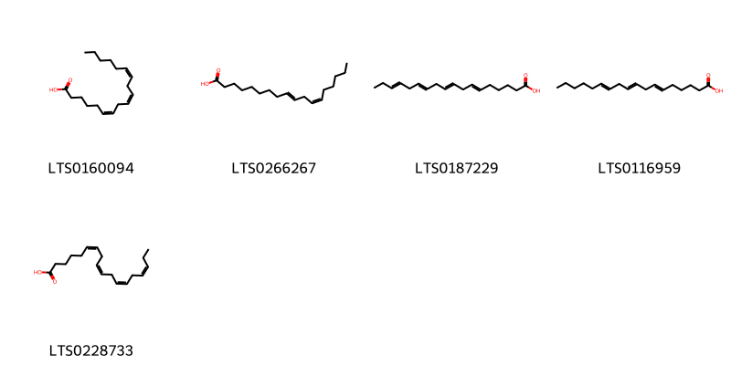{ width=100% }
    <figcaption>Hình ảnh cấu trúc hóa học của 5 hoạt chất thuộc nhóm Fatty Acyls gồm ['gamma-linolenic acid (LTS0160094)', '10-trans,12-cis-linoleic acid (LTS0266267)', 'octadeca-6,9,12,15-tetraenoic acid (LTS0187229)', '6,9,12-octadecatrienoic acid (LTS0116959)', 'stearidonic acid (LTS0228733)'].</figcaption>
</figure>
#### Nhóm Naphthalenes
<figure markdown="span">
    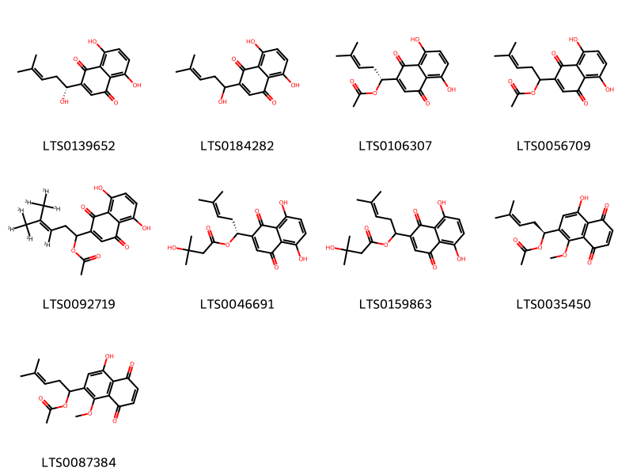{ width=100% }
    <figcaption>Hình ảnh cấu trúc hóa học của 9 hoạt chất thuộc nhóm Naphthalenes gồm ['anchusin (LTS0139652)', '5,8-dihydroxy-2-(1-hydroxy-4-methylpent-3-en-1-yl)naphthalene-1,4-dione (LTS0184282)', '(1r)-1-(5,8-dihydroxy-1,4-dioxonaphthalen-2-yl)-4-methylpent-3-en-1-yl acetate (LTS0106307)', 'acetylshikonin (LTS0056709)', '1-(5,8-dihydroxy-1,4-dioxonaphthalen-2-yl)-4-(²h₃)methyl(3,5,5,5-²h₄)pent-3-en-1-yl acetate (LTS0092719)', '(1r)-1-(5,8-dihydroxy-1,4-dioxonaphthalen-2-yl)-4-methylpent-3-en-1-yl 3-hydroxy-3-methylbutanoate (LTS0046691)', '1-(5,8-dihydroxy-1,4-dioxonaphthalen-2-yl)-4-methylpent-3-en-1-yl 3-hydroxy-3-methylbutanoate (LTS0159863)', 'echinone (LTS0035450)', '1-(4-hydroxy-1-methoxy-5,8-dioxonaphthalen-2-yl)-4-methylpent-3-en-1-yl acetate (LTS0087384)'].</figcaption>
</figure>
#### Nhóm Prenol lipids
<figure markdown="span">
    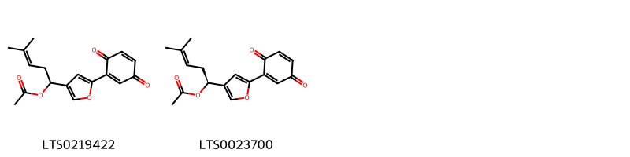{ width=100% }
    <figcaption>Hình ảnh cấu trúc hóa học của 2 hoạt chất thuộc nhóm Prenol lipids gồm ['1-[5-(3,6-dioxocyclohexa-1,4-dien-1-yl)furan-3-yl]-4-methylpent-3-en-1-yl acetate (LTS0219422)', '(1s)-1-[5-(3,6-dioxocyclohexa-1,4-dien-1-yl)furan-3-yl]-4-methylpent-3-en-1-yl acetate (LTS0023700)'].</figcaption>
</figure>

---

### Dược dân tộc học

Danh sách các quốc gia có sử dụng *Echium plantagineum* trong điều trị các bệnh. 

| Country   | Disease   | Bệnh                                                                                                                                                                                                |
|:----------|:----------|:----------------------------------------------------------------------------------------------------------------------------------------------------------------------------------------------------|
| US        | Poison    | MYMEMORY WARNING: YOU USED ALL AVAILABLE FREE TRANSLATIONS FOR TODAY. NEXT AVAILABLE IN  08 HOURS 28 MINUTES 25 SECONDS VISIT HTTPS://MYMEMORY.TRANSLATED.NET/DOC/USAGELIMITS.PHP TO TRANSLATE MORE |

---

---
## Echium vulgare
### Thông tin về thực vật

!!! info "Phân loại thực vật của *Echium vulgare* từ GIBF:"
    - **Kingdom:** Plantae
    - **Phylum:** Tracheophyta
    - **Order:** Boraginales
    - **Family:** Boraginaceae
    - **Genus:** Echium
    - **Species:** *Echium vulgare*

 

| Label (VI)   | Label (EN)   | Scientific Name   | Descriptions (VI)   | Descriptions (EN)   | Also Known As (VI)   | Also Known As (EN)                                        |
|:-------------|:-------------|:------------------|:--------------------|:--------------------|:---------------------|:----------------------------------------------------------|
| N/A          | N/A          | Echium vulgare    | loài thực vật       | species of plant    | ['']                 | ["viper's bugloss", 'blueweed', "common viper's bugloss"] |

#### Phân bố trên thế giới

**Từ CSDL GIBF** Czechia, Sweden, Chile, New Zealand, Spain, Denmark, Netherlands, Russian Federation, Argentina, Norway, Belgium, Canada, Germany, Austria, Portugal, Ukraine, South Africa, Australia, Italy, Switzerland, France

#### Phân bố tại Việt Nam

**Từ CSDL GIBF**: Không có ghi nhận ở Việt Nam

---
### Thành phần hóa học
        
- Theo cơ sở dữ liệu lotus: Từ loài *Echium vulgare* đã phân lập và xác định được 17 hoạt chất thuộc về các nhóm Fatty Acyls, Carboxylic acids and derivatives, Steroids and steroid derivatives. 

|    | chemicalTaxonomyClassyfireClass   |   smiles_count |
|---:|:----------------------------------|---------------:|
|  0 |                                   |             11 |
|  1 | Carboxylic acids and derivatives  |              1 |
|  2 | Fatty Acyls                       |              2 |
|  3 | Steroids and steroid derivatives  |              2 |

#### Nhóm 
<figure markdown="span">
    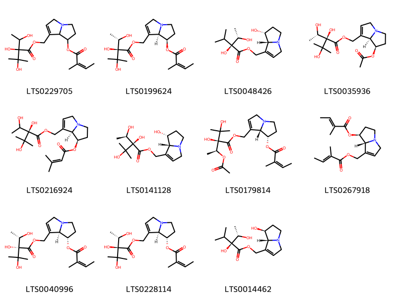{ width=100% }
    <figcaption>Hình ảnh cấu trúc hóa học của 11 hoạt chất thuộc nhóm  gồm ['7-({[2,3-dihydroxy-2-(1-hydroxyethyl)-3-methylbutanoyl]oxy}methyl)-2,3,5,7a-tetrahydro-1h-pyrrolizin-1-yl (2z)-2-methylbut-2-enoate (LTS0229705)', 'echimidine (LTS0199624)', 'lycopsamine (LTS0048426)', 'uplandicine (LTS0035936)', '(1r,7ar)-7-({[(2r)-2,3-dihydroxy-2-(1-hydroxyethyl)-3-methylbutanoyl]oxy}methyl)-2,3,5,7a-tetrahydro-1h-pyrrolizin-1-yl 3-methylbut-2-enoate (LTS0216924)', '[(7r,7ar)-7-hydroxy-5,6,7,7a-tetrahydro-3h-pyrrolizin-1-yl]methyl (2r)-2,3-dihydroxy-2-[(1r)-1-hydroxyethyl]-3-methylbutanoate (LTS0141128)', '(1s,7as)-7-({[(2s)-2-[(1s)-1-(acetyloxy)ethyl]-2,3-dihydroxy-3-methylbutanoyl]oxy}methyl)-2,3,5,7a-tetrahydro-1h-pyrrolizin-1-yl (2z)-2-methylbut-2-enoate (LTS0179814)', '[(7s,7ar)-7-{[(2e)-2-methylbut-2-enoyl]oxy}-5,6,7,7a-tetrahydro-3h-pyrrolizin-1-yl]methyl (2e)-2-methylbut-2-enoate (LTS0267918)', 'heliosupine (LTS0040996)', '(1s,7ar)-7-({[(2r)-2,3-dihydroxy-2-[(1s)-1-hydroxyethyl]-3-methylbutanoyl]oxy}methyl)-2,3,5,7a-tetrahydro-1h-pyrrolizin-1-yl (2z)-2-methylbut-2-enoate (LTS0228114)', 'echinatine (LTS0014462)'].</figcaption>
</figure>
#### Nhóm Carboxylic acids and derivatives
<figure markdown="span">
    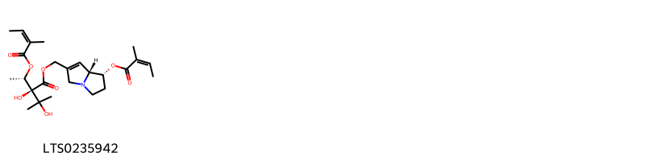{ width=100% }
    <figcaption>Hình ảnh cấu trúc hóa học của 1 hoạt chất thuộc nhóm Carboxylic acids and derivatives gồm ['(2s,3r)-4-{[(7r,7ar)-7-{[(2z)-2-methylbut-2-enoyl]oxy}-5,6,7,7a-tetrahydro-3h-pyrrolizin-2-yl]methoxy}-3-hydroxy-3-(2-hydroxypropan-2-yl)-4-oxobutan-2-yl (2z)-2-methylbut-2-enoate (LTS0235942)'].</figcaption>
</figure>
#### Nhóm Fatty Acyls
<figure markdown="span">
    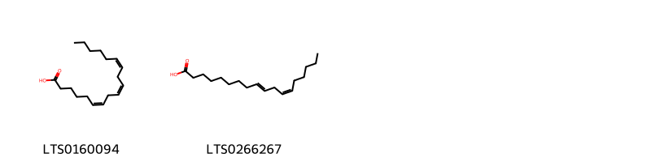{ width=100% }
    <figcaption>Hình ảnh cấu trúc hóa học của 2 hoạt chất thuộc nhóm Fatty Acyls gồm ['gamma-linolenic acid (LTS0160094)', '10-trans,12-cis-linoleic acid (LTS0266267)'].</figcaption>
</figure>
#### Nhóm Steroids and steroid derivatives
<figure markdown="span">
    { width=100% }
    <figcaption>Hình ảnh cấu trúc hóa học của 2 hoạt chất thuộc nhóm Steroids and steroid derivatives gồm ['stigmast-5-en-3-ol (LTS0071224)', 'stigmast-5-en-3-ol, (3β)- (LTS0204616)'].</figcaption>
</figure>

---

### Dược dân tộc học

Danh sách các quốc gia có sử dụng *Echium vulgare* trong điều trị các bệnh. 

| Country   | Disease                                            | Bệnh                                                                                                                                                                                                |
|:----------|:---------------------------------------------------|:----------------------------------------------------------------------------------------------------------------------------------------------------------------------------------------------------|
| Elsewhere | Demulcent, Expectorant                             | MYMEMORY WARNING: YOU USED ALL AVAILABLE FREE TRANSLATIONS FOR TODAY. NEXT AVAILABLE IN  08 HOURS 27 MINUTES 56 SECONDS VISIT HTTPS://MYMEMORY.TRANSLATED.NET/DOC/USAGELIMITS.PHP TO TRANSLATE MORE |
| Turkey    | Demulcent, Diuretic, Sudorific, Tonic, Expectorant | MYMEMORY WARNING: YOU USED ALL AVAILABLE FREE TRANSLATIONS FOR TODAY. NEXT AVAILABLE IN  08 HOURS 27 MINUTES 53 SECONDS VISIT HTTPS://MYMEMORY.TRANSLATED.NET/DOC/USAGELIMITS.PHP TO TRANSLATE MORE |

---

# Chi Cerinthe

??? note "Danh sách các dược liệu thuộc chi"
    
	 - *Cerinthe major*

---
## Cerinthe major
### Thông tin về thực vật

!!! info "Phân loại thực vật của *Cerinthe major* từ GIBF:"
    - **Kingdom:** Plantae
    - **Phylum:** Tracheophyta
    - **Order:** Boraginales
    - **Family:** Boraginaceae
    - **Genus:** Cerinthe
    - **Species:** *Cerinthe major*

 

| Label (VI)   | Label (EN)   | Scientific Name   | Descriptions (VI)   | Descriptions (EN)   | Also Known As (VI)   | Also Known As (EN)   |
|:-------------|:-------------|:------------------|:--------------------|:--------------------|:---------------------|:---------------------|
| N/A          | N/A          | Cerinthe major    | loài thực vật       | species of plant    | ['']                 | ['']                 |

#### Phân bố trên thế giới

**Từ CSDL GIBF** Morocco, Algeria, Portugal, Malta, Greece, United Kingdom of Great Britain and Northern Ireland, Belgium, New Zealand, Italy, Türkiye, Germany, France, Spain, Netherlands

#### Phân bố tại Việt Nam

**Từ CSDL GIBF**: Không có ghi nhận ở Việt Nam

---
### Thành phần hóa học
        
- Theo cơ sở dữ liệu lotus: Từ loài *Cerinthe major* đã phân lập và xác định được Chưa có hoạt chất nào được phân lập. hoạt chất thuộc về các nhóm Không có hoạt chất nào được phân lập. 

Không có hình ảnh nào được tạo ra

---

### Dược dân tộc học

Danh sách các quốc gia có sử dụng *Cerinthe major* trong điều trị các bệnh. 

| Country   | Disease   | Bệnh                                                                                                                                                                                                |
|:----------|:----------|:----------------------------------------------------------------------------------------------------------------------------------------------------------------------------------------------------|
| anish     | Diuretic  | MYMEMORY WARNING: YOU USED ALL AVAILABLE FREE TRANSLATIONS FOR TODAY. NEXT AVAILABLE IN  08 HOURS 27 MINUTES 20 SECONDS VISIT HTTPS://MYMEMORY.TRANSLATED.NET/DOC/USAGELIMITS.PHP TO TRANSLATE MORE |

---

# Chi Alkanna

??? note "Danh sách các dược liệu thuộc chi"
    
	 - *Alkanna tinctoria*

---
## Alkanna tinctoria
### Thông tin về thực vật

!!! info "Phân loại thực vật của *Alkanna tinctoria* từ GIBF:"
    - **Kingdom:** Plantae
    - **Phylum:** Tracheophyta
    - **Order:** Boraginales
    - **Family:** Boraginaceae
    - **Genus:** Alkanna
    - **Species:** *Alkanna tinctoria*

 

| Label (VI)   | Label (EN)   | Scientific Name   | Descriptions (VI)   | Descriptions (EN)   | Also Known As (VI)   | Also Known As (EN)                                                                                                    |
|:-------------|:-------------|:------------------|:--------------------|:--------------------|:---------------------|:----------------------------------------------------------------------------------------------------------------------|
| N/A          | N/A          | Alkanna tinctoria | loài thực vật       | species of plant    | ['']                 | ['alkanet', "dyer's alkanet", "dyer's bugloss", "dyers' bugloss", 'Languedoc bugloss', 'orchanet', 'Spanish bugloss'] |

#### Phân bố trên thế giới

**Từ CSDL GIBF** Montenegro, Algeria, Hungary, Libya, Greece, Slovakia, Israel, Albania, Italy, Croatia, Türkiye, Cyprus, France, Spain

#### Phân bố tại Việt Nam

**Từ CSDL GIBF**: Không có ghi nhận ở Việt Nam

---
### Thành phần hóa học
        
- Theo cơ sở dữ liệu lotus: Từ loài *Alkanna tinctoria* đã phân lập và xác định được 15 hoạt chất thuộc về các nhóm Naphthalenes. 

|    | chemicalTaxonomyClassyfireClass   |   smiles_count |
|---:|:----------------------------------|---------------:|
|  0 |                                   |              8 |
|  1 | Naphthalenes                      |              7 |

#### Nhóm 
<figure markdown="span">
    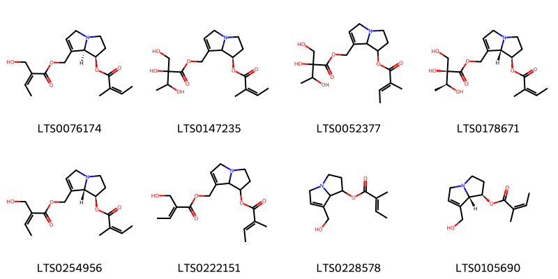{ width=100% }
    <figcaption>Hình ảnh cấu trúc hóa học của 8 hoạt chất thuộc nhóm  gồm ['triangularine (LTS0076174)', '(1r)-7-({[2,3-dihydroxy-2-(hydroxymethyl)butanoyl]oxy}methyl)-2,3,5,7a-tetrahydro-1h-pyrrolizin-1-yl (2z)-2-methylbut-2-enoate (LTS0147235)', '7-({[2,3-dihydroxy-2-(hydroxymethyl)butanoyl]oxy}methyl)-2,3,5,7a-tetrahydro-1h-pyrrolizin-1-yl 2-methylbut-2-enoate (LTS0052377)', '(1r,7as)-7-({[(2r,3s)-2,3-dihydroxy-2-(hydroxymethyl)butanoyl]oxy}methyl)-2,3,5,7a-tetrahydro-1h-pyrrolizin-1-yl (2z)-2-methylbut-2-enoate (LTS0178671)', '[(7r,7as)-7-{[(2z)-2-methylbut-2-enoyl]oxy}-5,6,7,7a-tetrahydro-3h-pyrrolizin-1-yl]methyl (2z)-2-(hydroxymethyl)but-2-enoate (LTS0254956)', '{7-[(2-methylbut-2-enoyl)oxy]-5,6,7,7a-tetrahydro-3h-pyrrolizin-1-yl}methyl 2-(hydroxymethyl)but-2-enoate (LTS0222151)', '7-(hydroxymethyl)-2,3,5,7a-tetrahydro-1h-pyrrolizin-1-yl 2-methylbut-2-enoate (LTS0228578)', '(1r,7as)-7-(hydroxymethyl)-2,3,5,7a-tetrahydro-1h-pyrrolizin-1-yl (2z)-2-methylbut-2-enoate (LTS0105690)'].</figcaption>
</figure>
#### Nhóm Naphthalenes
<figure markdown="span">
    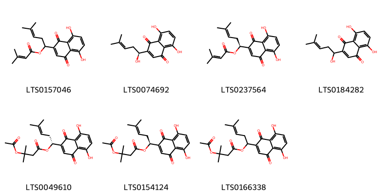{ width=100% }
    <figcaption>Hình ảnh cấu trúc hóa học của 7 hoạt chất thuộc nhóm Naphthalenes gồm ['1-(5,8-dihydroxy-1,4-dioxonaphthalen-2-yl)-4-methylpent-3-en-1-yl 3-methylbut-2-enoate (LTS0157046)', 'alkannin (LTS0074692)', 'dmask (LTS0237564)', '5,8-dihydroxy-2-(1-hydroxy-4-methylpent-3-en-1-yl)naphthalene-1,4-dione (LTS0184282)', '(1r)-1-(5,8-dihydroxy-1,4-dioxonaphthalen-2-yl)-4-methylpent-3-en-1-yl 3-(acetyloxy)-3-methylbutanoate (LTS0049610)', '(1s)-1-(5,8-dihydroxy-1,4-dioxonaphthalen-2-yl)-4-methylpent-3-en-1-yl 3-(acetyloxy)-3-methylbutanoate (LTS0154124)', '1-(5,8-dihydroxy-1,4-dioxonaphthalen-2-yl)-4-methylpent-3-en-1-yl 3-(acetyloxy)-3-methylbutanoate (LTS0166338)'].</figcaption>
</figure>

---

### Dược dân tộc học

Danh sách các quốc gia có sử dụng *Alkanna tinctoria* trong điều trị các bệnh. 

| Country   | Disease               | Bệnh                                                                                                                                                                                                |
|:----------|:----------------------|:----------------------------------------------------------------------------------------------------------------------------------------------------------------------------------------------------|
| Turkey    | Astringent, Emollient | MYMEMORY WARNING: YOU USED ALL AVAILABLE FREE TRANSLATIONS FOR TODAY. NEXT AVAILABLE IN  08 HOURS 26 MINUTES 41 SECONDS VISIT HTTPS://MYMEMORY.TRANSLATED.NET/DOC/USAGELIMITS.PHP TO TRANSLATE MORE |

---

# Chi Caccinia

??? note "Danh sách các dược liệu thuộc chi"
    
	 - *Caccinia glauca*

---
## Caccinia glauca
### Thông tin về thực vật

!!! info "Phân loại thực vật của *Caccinia macranthera* từ GIBF:"
    - **Kingdom:** Plantae
    - **Phylum:** Tracheophyta
    - **Order:** Boraginales
    - **Family:** Boraginaceae
    - **Genus:** Caccinia
    - **Species:** *Caccinia macranthera*

 

| Label (VI)   | Label (EN)   | Scientific Name   | Descriptions (VI)   | Descriptions (EN)   | Also Known As (VI)   | Also Known As (EN)   |
|:-------------|:-------------|:------------------|:--------------------|:--------------------|:---------------------|:---------------------|
| N/A          | N/A          | Caccinia glauca   | loài thực vật       | species of plant    | ['']                 | ['']                 |

#### Phân bố trên thế giới

**Từ CSDL GIBF** Montenegro, Algeria, Hungary, Libya, Greece, Slovakia, Israel, Albania, Italy, Croatia, Türkiye, Cyprus, France, Spain

#### Phân bố tại Việt Nam

**Từ CSDL GIBF**: Không có ghi nhận ở Việt Nam

---
### Thành phần hóa học
        
- Theo cơ sở dữ liệu lotus: Từ loài *Caccinia macranthera* đã phân lập và xác định được Chưa có hoạt chất nào được phân lập. hoạt chất thuộc về các nhóm Không có hoạt chất nào được phân lập. 

Không có hình ảnh nào được tạo ra

---

### Dược dân tộc học

Danh sách các quốc gia có sử dụng *Caccinia macranthera* trong điều trị các bệnh. 

| Country   | Disease                    | Bệnh                                                                                                                                                                                                |
|:----------|:---------------------------|:----------------------------------------------------------------------------------------------------------------------------------------------------------------------------------------------------|
| Iraq      | Demulcent, Diuretic, Tonic | MYMEMORY WARNING: YOU USED ALL AVAILABLE FREE TRANSLATIONS FOR TODAY. NEXT AVAILABLE IN  08 HOURS 26 MINUTES 15 SECONDS VISIT HTTPS://MYMEMORY.TRANSLATED.NET/DOC/USAGELIMITS.PHP TO TRANSLATE MORE |

---

# Chi Lycopsis

??? note "Danh sách các dược liệu thuộc chi"
    
	 - *Lycopsis arvensis*

---
## Lycopsis arvensis
### Thông tin về thực vật

!!! info "Phân loại thực vật của *Lycopsis arvensis* từ GIBF:"
    - **Kingdom:** Plantae
    - **Phylum:** Tracheophyta
    - **Order:** Boraginales
    - **Family:** Boraginaceae
    - **Genus:** Lycopsis
    - **Species:** *Lycopsis arvensis*

 

| Label (VI)   | Label (EN)   | Scientific Name   | Descriptions (VI)   | Descriptions (EN)   | Also Known As (VI)   | Also Known As (EN)   |
|:-------------|:-------------|:------------------|:--------------------|:--------------------|:---------------------|:---------------------|
| N/A          | N/A          | Lycopsis arvensis | loài thực vật       | species of plant    | ['']                 | ['']                 |

#### Phân bố trên thế giới

**Từ CSDL GIBF** Czechia, Kazakhstan, Spain, Poland, Denmark, Netherlands, Armenia, Russian Federation, Argentina, France, Belgium, Georgia, Luxembourg, Germany, Moldova, Republic of, Austria, Portugal, Ukraine, Australia, Italy, Switzerland, United Kingdom of Great Britain and Northern Ireland

#### Phân bố tại Việt Nam

**Từ CSDL GIBF**: Không có ghi nhận ở Việt Nam

---
### Thành phần hóa học
        
- Theo cơ sở dữ liệu lotus: Từ loài *Lycopsis arvensis* đã phân lập và xác định được Chưa có hoạt chất nào được phân lập. hoạt chất thuộc về các nhóm Không có hoạt chất nào được phân lập. 

Không có hình ảnh nào được tạo ra

---

### Dược dân tộc học

Danh sách các quốc gia có sử dụng *Lycopsis arvensis* trong điều trị các bệnh. 

| Country   | Disease   | Bệnh                                                                                                                                                                                                |
|:----------|:----------|:----------------------------------------------------------------------------------------------------------------------------------------------------------------------------------------------------|
| ain       | Sudorific | MYMEMORY WARNING: YOU USED ALL AVAILABLE FREE TRANSLATIONS FOR TODAY. NEXT AVAILABLE IN  08 HOURS 25 MINUTES 51 SECONDS VISIT HTTPS://MYMEMORY.TRANSLATED.NET/DOC/USAGELIMITS.PHP TO TRANSLATE MORE |

---

# Chi Lithoermum

??? note "Danh sách các dược liệu thuộc chi"
    
	 - *Lithoermum arvense*
	 - *Lithoermum carolinense*
	 - *Lithoermum erythrorhizon*
	 - *Lithoermum officinale*
	 - *Lithoermum ruderale*

---
## Lithoermum arvense
### Thông tin về thực vật

!!! info "Phân loại thực vật của *N/A* từ GIBF:"
    - **Kingdom:** N/A
    - **Phylum:** N/A
    - **Order:** N/A
    - **Family:** N/A
    - **Genus:** N/A
    - **Species:** *N/A*

 

| Label (VI)   | Label (EN)   | Scientific Name   | Descriptions (VI)   | Descriptions (EN)   | Also Known As (VI)   | Also Known As (EN)   |
|:-------------|:-------------|:------------------|:--------------------|:--------------------|:---------------------|:---------------------|
| N/A          | N/A          | Lycopsis arvensis | loài thực vật       | species of plant    | ['']                 | ['']                 |

#### Phân bố trên thế giới

**Từ CSDL GIBF** Không có kết quả phù hợp

#### Phân bố tại Việt Nam

**Từ CSDL GIBF**: Không có ghi nhận ở Việt Nam

---
### Thành phần hóa học
        
- Theo cơ sở dữ liệu lotus: Từ loài *N/A* đã phân lập và xác định được Chưa có hoạt chất nào được phân lập. hoạt chất thuộc về các nhóm Không có hoạt chất nào được phân lập. 

Không có hình ảnh nào được tạo ra

---

### Dược dân tộc học

Danh sách các quốc gia có sử dụng *N/A* trong điều trị các bệnh. 

| Country   | Disease   | Bệnh                                                                                                                                                                                                |
|:----------|:----------|:----------------------------------------------------------------------------------------------------------------------------------------------------------------------------------------------------|
| Elsewhere | Diuretic  | MYMEMORY WARNING: YOU USED ALL AVAILABLE FREE TRANSLATIONS FOR TODAY. NEXT AVAILABLE IN  08 HOURS 25 MINUTES 14 SECONDS VISIT HTTPS://MYMEMORY.TRANSLATED.NET/DOC/USAGELIMITS.PHP TO TRANSLATE MORE |
| ain       | Sedative  | MYMEMORY WARNING: YOU USED ALL AVAILABLE FREE TRANSLATIONS FOR TODAY. NEXT AVAILABLE IN  08 HOURS 25 MINUTES 08 SECONDS VISIT HTTPS://MYMEMORY.TRANSLATED.NET/DOC/USAGELIMITS.PHP TO TRANSLATE MORE |

---

---
## Lithoermum carolinense
### Thông tin về thực vật

!!! info "Phân loại thực vật của *N/A* từ GIBF:"
    - **Kingdom:** N/A
    - **Phylum:** N/A
    - **Order:** N/A
    - **Family:** N/A
    - **Genus:** N/A
    - **Species:** *N/A*

 

| Label (VI)   | Label (EN)   | Scientific Name   | Descriptions (VI)   | Descriptions (EN)   | Also Known As (VI)   | Also Known As (EN)   |
|:-------------|:-------------|:------------------|:--------------------|:--------------------|:---------------------|:---------------------|
| N/A          | N/A          | Lycopsis arvensis | loài thực vật       | species of plant    | ['']                 | ['']                 |

#### Phân bố trên thế giới

**Từ CSDL GIBF** Không có kết quả phù hợp

#### Phân bố tại Việt Nam

**Từ CSDL GIBF**: Không có ghi nhận ở Việt Nam

---
### Thành phần hóa học
        
- Theo cơ sở dữ liệu lotus: Từ loài *N/A* đã phân lập và xác định được Chưa có hoạt chất nào được phân lập. hoạt chất thuộc về các nhóm Không có hoạt chất nào được phân lập. 

Không có hình ảnh nào được tạo ra

---

### Dược dân tộc học

Danh sách các quốc gia có sử dụng *N/A* trong điều trị các bệnh. 

| Country      | Disease   | Bệnh                                                                                                                                                                                                |
|:-------------|:----------|:----------------------------------------------------------------------------------------------------------------------------------------------------------------------------------------------------|
| US(Chippewa) | Cosmetic  | MYMEMORY WARNING: YOU USED ALL AVAILABLE FREE TRANSLATIONS FOR TODAY. NEXT AVAILABLE IN  08 HOURS 24 MINUTES 51 SECONDS VISIT HTTPS://MYMEMORY.TRANSLATED.NET/DOC/USAGELIMITS.PHP TO TRANSLATE MORE |

---

---
## Lithoermum erythrorhizon
### Thông tin về thực vật

!!! info "Phân loại thực vật của *N/A* từ GIBF:"
    - **Kingdom:** N/A
    - **Phylum:** N/A
    - **Order:** N/A
    - **Family:** N/A
    - **Genus:** N/A
    - **Species:** *N/A*

 

| Label (VI)   | Label (EN)   | Scientific Name   | Descriptions (VI)   | Descriptions (EN)   | Also Known As (VI)   | Also Known As (EN)   |
|:-------------|:-------------|:------------------|:--------------------|:--------------------|:---------------------|:---------------------|
| N/A          | N/A          | Lycopsis arvensis | loài thực vật       | species of plant    | ['']                 | ['']                 |

#### Phân bố trên thế giới

**Từ CSDL GIBF** Không có kết quả phù hợp

#### Phân bố tại Việt Nam

**Từ CSDL GIBF**: Không có ghi nhận ở Việt Nam

---
### Thành phần hóa học
        
- Theo cơ sở dữ liệu lotus: Từ loài *N/A* đã phân lập và xác định được Chưa có hoạt chất nào được phân lập. hoạt chất thuộc về các nhóm Không có hoạt chất nào được phân lập. 

Không có hình ảnh nào được tạo ra

---

### Dược dân tộc học

Danh sách các quốc gia có sử dụng *N/A* trong điều trị các bệnh. 

| Country   | Disease                        | Bệnh                                                                                                                                                                                                |
|:----------|:-------------------------------|:----------------------------------------------------------------------------------------------------------------------------------------------------------------------------------------------------|
| China     | Alexiteric, Hemostat, Laxative | MYMEMORY WARNING: YOU USED ALL AVAILABLE FREE TRANSLATIONS FOR TODAY. NEXT AVAILABLE IN  08 HOURS 24 MINUTES 38 SECONDS VISIT HTTPS://MYMEMORY.TRANSLATED.NET/DOC/USAGELIMITS.PHP TO TRANSLATE MORE |
| Japan     | Dye                            | MYMEMORY WARNING: YOU USED ALL AVAILABLE FREE TRANSLATIONS FOR TODAY. NEXT AVAILABLE IN  08 HOURS 24 MINUTES 35 SECONDS VISIT HTTPS://MYMEMORY.TRANSLATED.NET/DOC/USAGELIMITS.PHP TO TRANSLATE MORE |

---

---
## Lithoermum officinale
### Thông tin về thực vật

!!! info "Phân loại thực vật của *N/A* từ GIBF:"
    - **Kingdom:** N/A
    - **Phylum:** N/A
    - **Order:** N/A
    - **Family:** N/A
    - **Genus:** N/A
    - **Species:** *N/A*

 

| Label (VI)   | Label (EN)   | Scientific Name   | Descriptions (VI)   | Descriptions (EN)   | Also Known As (VI)   | Also Known As (EN)   |
|:-------------|:-------------|:------------------|:--------------------|:--------------------|:---------------------|:---------------------|
| N/A          | N/A          | Lycopsis arvensis | loài thực vật       | species of plant    | ['']                 | ['']                 |

#### Phân bố trên thế giới

**Từ CSDL GIBF** Không có kết quả phù hợp

#### Phân bố tại Việt Nam

**Từ CSDL GIBF**: Không có ghi nhận ở Việt Nam

---
### Thành phần hóa học
        
- Theo cơ sở dữ liệu lotus: Từ loài *N/A* đã phân lập và xác định được Chưa có hoạt chất nào được phân lập. hoạt chất thuộc về các nhóm Không có hoạt chất nào được phân lập. 

Không có hình ảnh nào được tạo ra

---

### Dược dân tộc học

Danh sách các quốc gia có sử dụng *N/A* trong điều trị các bệnh. 

| Country   | Disease                                    | Bệnh                                                                                                                                                                                                |
|:----------|:-------------------------------------------|:----------------------------------------------------------------------------------------------------------------------------------------------------------------------------------------------------|
| China     | Antidote                                   | MYMEMORY WARNING: YOU USED ALL AVAILABLE FREE TRANSLATIONS FOR TODAY. NEXT AVAILABLE IN  08 HOURS 24 MINUTES 21 SECONDS VISIT HTTPS://MYMEMORY.TRANSLATED.NET/DOC/USAGELIMITS.PHP TO TRANSLATE MORE |
| Elsewhere | Antigonadotrophic, Diuretic, Contraceptive | MYMEMORY WARNING: YOU USED ALL AVAILABLE FREE TRANSLATIONS FOR TODAY. NEXT AVAILABLE IN  08 HOURS 24 MINUTES 18 SECONDS VISIT HTTPS://MYMEMORY.TRANSLATED.NET/DOC/USAGELIMITS.PHP TO TRANSLATE MORE |
| Iraq      | Contraceptive, Sedative                    | MYMEMORY WARNING: YOU USED ALL AVAILABLE FREE TRANSLATIONS FOR TODAY. NEXT AVAILABLE IN  08 HOURS 24 MINUTES 14 SECONDS VISIT HTTPS://MYMEMORY.TRANSLATED.NET/DOC/USAGELIMITS.PHP TO TRANSLATE MORE |
| Japan*    | Antidote, nan, Antiphlogistic              | MYMEMORY WARNING: YOU USED ALL AVAILABLE FREE TRANSLATIONS FOR TODAY. NEXT AVAILABLE IN  08 HOURS 24 MINUTES 09 SECONDS VISIT HTTPS://MYMEMORY.TRANSLATED.NET/DOC/USAGELIMITS.PHP TO TRANSLATE MORE |
| Turkey    | Diuretic                                   | MYMEMORY WARNING: YOU USED ALL AVAILABLE FREE TRANSLATIONS FOR TODAY. NEXT AVAILABLE IN  08 HOURS 24 MINUTES 06 SECONDS VISIT HTTPS://MYMEMORY.TRANSLATED.NET/DOC/USAGELIMITS.PHP TO TRANSLATE MORE |
| ain       | Litholytic, Sedative                       | MYMEMORY WARNING: YOU USED ALL AVAILABLE FREE TRANSLATIONS FOR TODAY. NEXT AVAILABLE IN  08 HOURS 24 MINUTES 02 SECONDS VISIT HTTPS://MYMEMORY.TRANSLATED.NET/DOC/USAGELIMITS.PHP TO TRANSLATE MORE |

---

---
## Lithoermum ruderale
### Thông tin về thực vật

!!! info "Phân loại thực vật của *N/A* từ GIBF:"
    - **Kingdom:** N/A
    - **Phylum:** N/A
    - **Order:** N/A
    - **Family:** N/A
    - **Genus:** N/A
    - **Species:** *N/A*

 

| Label (VI)   | Label (EN)   | Scientific Name   | Descriptions (VI)   | Descriptions (EN)   | Also Known As (VI)   | Also Known As (EN)   |
|:-------------|:-------------|:------------------|:--------------------|:--------------------|:---------------------|:---------------------|
| N/A          | N/A          | Lycopsis arvensis | loài thực vật       | species of plant    | ['']                 | ['']                 |

#### Phân bố trên thế giới

**Từ CSDL GIBF** Không có kết quả phù hợp

#### Phân bố tại Việt Nam

**Từ CSDL GIBF**: Không có ghi nhận ở Việt Nam

---
### Thành phần hóa học
        
- Theo cơ sở dữ liệu lotus: Từ loài *N/A* đã phân lập và xác định được Chưa có hoạt chất nào được phân lập. hoạt chất thuộc về các nhóm Không có hoạt chất nào được phân lập. 

Không có hình ảnh nào được tạo ra

---

### Dược dân tộc học

Danh sách các quốc gia có sử dụng *N/A* trong điều trị các bệnh. 

| Country       | Disease       | Bệnh                                                                                                                                                                                                |
|:--------------|:--------------|:----------------------------------------------------------------------------------------------------------------------------------------------------------------------------------------------------|
| US(Blackfoot) | Laxative      | MYMEMORY WARNING: YOU USED ALL AVAILABLE FREE TRANSLATIONS FOR TODAY. NEXT AVAILABLE IN  08 HOURS 23 MINUTES 51 SECONDS VISIT HTTPS://MYMEMORY.TRANSLATED.NET/DOC/USAGELIMITS.PHP TO TRANSLATE MORE |
| US(Navajo)    | Contraceptive | MYMEMORY WARNING: YOU USED ALL AVAILABLE FREE TRANSLATIONS FOR TODAY. NEXT AVAILABLE IN  08 HOURS 23 MINUTES 45 SECONDS VISIT HTTPS://MYMEMORY.TRANSLATED.NET/DOC/USAGELIMITS.PHP TO TRANSLATE MORE |
| US(Shoshone)  | Contraceptive | MYMEMORY WARNING: YOU USED ALL AVAILABLE FREE TRANSLATIONS FOR TODAY. NEXT AVAILABLE IN  08 HOURS 23 MINUTES 39 SECONDS VISIT HTTPS://MYMEMORY.TRANSLATED.NET/DOC/USAGELIMITS.PHP TO TRANSLATE MORE |

---

# Chi Cynoglossum

??? note "Danh sách các dược liệu thuộc chi"
    
	 - *Cynoglossum officinale*
	 - *Cynoglossum wallichii*

---
## Cynoglossum officinale
### Thông tin về thực vật

!!! info "Phân loại thực vật của *Cynoglossum officinale* từ GIBF:"
    - **Kingdom:** Plantae
    - **Phylum:** Tracheophyta
    - **Order:** Boraginales
    - **Family:** Boraginaceae
    - **Genus:** Cynoglossum
    - **Species:** *Cynoglossum officinale*

 

| Label (VI)   | Label (EN)   | Scientific Name        | Descriptions (VI)   | Descriptions (EN)          | Also Known As (VI)   | Also Known As (EN)   |
|:-------------|:-------------|:-----------------------|:--------------------|:---------------------------|:---------------------|:---------------------|
| N/A          | N/A          | Cynoglossum officinale | loài thực vật       | species of flowering plant | ['']                 | ['Houndstongue']     |

#### Phân bố trên thế giới

**Từ CSDL GIBF** Czechia, Sweden, Spain, Denmark, Netherlands, Poland, United States of America, Romania, Russian Federation, United Kingdom of Great Britain and Northern Ireland, Belgium, Canada, Germany, Moldova, Republic of, Austria, Hungary, Portugal, Ukraine, Slovakia, Italy, Switzerland, Bulgaria, France

#### Phân bố tại Việt Nam

**Từ CSDL GIBF**: Không có ghi nhận ở Việt Nam

---
### Thành phần hóa học
        
- Theo cơ sở dữ liệu lotus: Từ loài *Cynoglossum officinale* đã phân lập và xác định được 23 hoạt chất thuộc về các nhóm Pyrrolizidines, Macrolides and analogues. 

|    | chemicalTaxonomyClassyfireClass   |   smiles_count |
|---:|:----------------------------------|---------------:|
|  0 |                                   |             16 |
|  1 | Macrolides and analogues          |              1 |
|  2 | Pyrrolizidines                    |              4 |

#### Nhóm 
<figure markdown="span">
    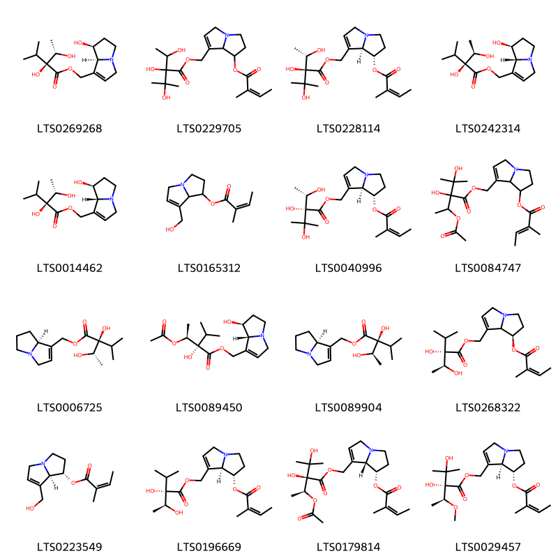{ width=100% }
    <figcaption>Hình ảnh cấu trúc hóa học của 16 hoạt chất thuộc nhóm  gồm ['[(7s,7as)-7-hydroxy-5,6,7,7a-tetrahydro-3h-pyrrolizin-1-yl]methyl (2s)-2-hydroxy-2-[(1s)-1-hydroxyethyl]-3-methylbutanoate (LTS0269268)', '7-({[2,3-dihydroxy-2-(1-hydroxyethyl)-3-methylbutanoyl]oxy}methyl)-2,3,5,7a-tetrahydro-1h-pyrrolizin-1-yl (2z)-2-methylbut-2-enoate (LTS0229705)', '(1s,7ar)-7-({[(2r)-2,3-dihydroxy-2-[(1s)-1-hydroxyethyl]-3-methylbutanoyl]oxy}methyl)-2,3,5,7a-tetrahydro-1h-pyrrolizin-1-yl (2z)-2-methylbut-2-enoate (LTS0228114)', 'rinderine (LTS0242314)', 'echinatine (LTS0014462)', '7-(hydroxymethyl)-2,3,5,7a-tetrahydro-1h-pyrrolizin-1-yl (2z)-2-methylbut-2-enoate (LTS0165312)', 'heliosupine (LTS0040996)', '7-({[3-(acetyloxy)-2-hydroxy-2-(2-hydroxypropan-2-yl)butanoyl]oxy}methyl)-2,3,5,7a-tetrahydro-1h-pyrrolizin-1-yl 2-methylbut-2-enoate (LTS0084747)', 'amabiline (LTS0006725)', '[(7s,7ar)-7-hydroxy-5,6,7,7a-tetrahydro-3h-pyrrolizin-1-yl]methyl (2s)-2-[(1s)-1-(acetyloxy)ethyl]-2-hydroxy-3-methylbutanoate (LTS0089450)', 'supinine (LTS0089904)', '(1r)-7-({[(2s)-2-hydroxy-2-[(1s)-1-hydroxyethyl]-3-methylbutanoyl]oxy}methyl)-2,3,5,7a-tetrahydro-1h-pyrrolizin-1-yl (2z)-2-methylbut-2-enoate (LTS0268322)', 'rivularine (LTS0223549)', '(1s,7ar)-7-({[(2s)-2-hydroxy-2-[(1s)-1-hydroxyethyl]-3-methylbutanoyl]oxy}methyl)-2,3,5,7a-tetrahydro-1h-pyrrolizin-1-yl (2z)-2-methylbut-2-enoate (LTS0196669)', '(1s,7as)-7-({[(2s)-2-[(1s)-1-(acetyloxy)ethyl]-2,3-dihydroxy-3-methylbutanoyl]oxy}methyl)-2,3,5,7a-tetrahydro-1h-pyrrolizin-1-yl (2z)-2-methylbut-2-enoate (LTS0179814)', '(1s,7ar)-7-({[(2r)-2,3-dihydroxy-2-[(1s)-1-methoxyethyl]-3-methylbutanoyl]oxy}methyl)-2,3,5,7a-tetrahydro-1h-pyrrolizin-1-yl (2z)-2-methylbut-2-enoate (LTS0029457)'].</figcaption>
</figure>
#### Nhóm Macrolides and analogues
<figure markdown="span">
    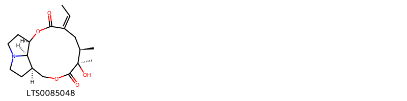{ width=100% }
    <figcaption>Hình ảnh cấu trúc hóa học của 1 hoạt chất thuộc nhóm Macrolides and analogues gồm ['(1r,4z,6r,7r,11s,17r)-4-ethylidene-7-hydroxy-6,7-dimethyl-2,9-dioxa-14-azatricyclo[9.5.1.0¹⁴,¹⁷]heptadecane-3,8-dione (LTS0085048)'].</figcaption>
</figure>
#### Nhóm Pyrrolizidines
<figure markdown="span">
    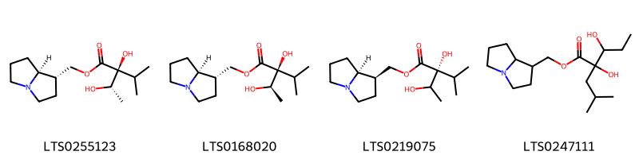{ width=100% }
    <figcaption>Hình ảnh cấu trúc hóa học của 4 hoạt chất thuộc nhóm Pyrrolizidines gồm ['viridiflorine (LTS0255123)', '(1r,7as)-hexahydro-1h-pyrrolizin-1-ylmethyl (2s)-2-hydroxy-2-[(1r)-1-hydroxyethyl]-3-methylbutanoate (LTS0168020)', '(1s,7as)-hexahydro-1h-pyrrolizin-1-ylmethyl (2r)-2,3-dihydroxy-2-isopropylbutanoate (LTS0219075)', 'hexahydro-1h-pyrrolizin-1-ylmethyl 2,3-dihydroxy-2-(2-methylpropyl)pentanoate (LTS0247111)'].</figcaption>
</figure>

---

### Dược dân tộc học

Danh sách các quốc gia có sử dụng *Cynoglossum officinale* trong điều trị các bệnh. 

| Country   | Disease                                    | Bệnh                                                                                                                                                                                                |
|:----------|:-------------------------------------------|:----------------------------------------------------------------------------------------------------------------------------------------------------------------------------------------------------|
| Elsewhere | Demulcent, Sedative                        | MYMEMORY WARNING: YOU USED ALL AVAILABLE FREE TRANSLATIONS FOR TODAY. NEXT AVAILABLE IN  08 HOURS 23 MINUTES 14 SECONDS VISIT HTTPS://MYMEMORY.TRANSLATED.NET/DOC/USAGELIMITS.PHP TO TRANSLATE MORE |
| Europe    | Poison                                     | MYMEMORY WARNING: YOU USED ALL AVAILABLE FREE TRANSLATIONS FOR TODAY. NEXT AVAILABLE IN  08 HOURS 23 MINUTES 11 SECONDS VISIT HTTPS://MYMEMORY.TRANSLATED.NET/DOC/USAGELIMITS.PHP TO TRANSLATE MORE |
| Turkey    | Astringent, Demulcent, Emollient, Hemostat | MYMEMORY WARNING: YOU USED ALL AVAILABLE FREE TRANSLATIONS FOR TODAY. NEXT AVAILABLE IN  08 HOURS 23 MINUTES 08 SECONDS VISIT HTTPS://MYMEMORY.TRANSLATED.NET/DOC/USAGELIMITS.PHP TO TRANSLATE MORE |

---

---
## Cynoglossum wallichii
### Thông tin về thực vật

!!! info "Phân loại thực vật của *Paracynoglossum glochidiatum* từ GIBF:"
    - **Kingdom:** Plantae
    - **Phylum:** Tracheophyta
    - **Order:** Boraginales
    - **Family:** Boraginaceae
    - **Genus:** Paracynoglossum
    - **Species:** *Paracynoglossum glochidiatum*

 

| Label (VI)   | Label (EN)   | Scientific Name       | Descriptions (VI)   | Descriptions (EN)   | Also Known As (VI)   | Also Known As (EN)   |
|:-------------|:-------------|:----------------------|:--------------------|:--------------------|:---------------------|:---------------------|
| N/A          | N/A          | Cynoglossum wallichii | loài thực vật       | species of plant    | ['']                 | ['']                 |

#### Phân bố trên thế giới

**Từ CSDL GIBF** nan, Afghanistan, United States of America, Sweden, Bhutan, Nepal, Pakistan, China, India, unknown or invalid

#### Phân bố tại Việt Nam

**Từ CSDL GIBF**: Không có ghi nhận ở Việt Nam

---
### Thành phần hóa học
        
- Theo cơ sở dữ liệu lotus: Từ loài *Paracynoglossum glochidiatum* đã phân lập và xác định được Chưa có hoạt chất nào được phân lập. hoạt chất thuộc về các nhóm Không có hoạt chất nào được phân lập. 

Không có hình ảnh nào được tạo ra

---

### Dược dân tộc học

Danh sách các quốc gia có sử dụng *Paracynoglossum glochidiatum* trong điều trị các bệnh. 

| Country   | Disease    | Bệnh                                                                                                                                                                                                |
|:----------|:-----------|:----------------------------------------------------------------------------------------------------------------------------------------------------------------------------------------------------|
| Hindu     | Antiemetic | MYMEMORY WARNING: YOU USED ALL AVAILABLE FREE TRANSLATIONS FOR TODAY. NEXT AVAILABLE IN  08 HOURS 22 MINUTES 41 SECONDS VISIT HTTPS://MYMEMORY.TRANSLATED.NET/DOC/USAGELIMITS.PHP TO TRANSLATE MORE |

---

# Chi Pulmonaria

??? note "Danh sách các dược liệu thuộc chi"
    
	 - *Pulmonaria officinalis*

---
## Pulmonaria officinalis
### Thông tin về thực vật

!!! info "Phân loại thực vật của *Pulmonaria officinalis* từ GIBF:"
    - **Kingdom:** Plantae
    - **Phylum:** Tracheophyta
    - **Order:** Boraginales
    - **Family:** Boraginaceae
    - **Genus:** Pulmonaria
    - **Species:** *Pulmonaria officinalis*

 

| Label (VI)   | Label (EN)   | Scientific Name        | Descriptions (VI)   | Descriptions (EN)   | Also Known As (VI)   | Also Known As (EN)   |
|:-------------|:-------------|:-----------------------|:--------------------|:--------------------|:---------------------|:---------------------|
| N/A          | N/A          | Pulmonaria officinalis | loài thực vật       | species of plant    | ['']                 | ['lungwort']         |

#### Phân bố trên thế giới

**Từ CSDL GIBF** Austria, Hungary, Czechia, Poland, France, Belgium, Italy, Switzerland, Slovenia, Croatia, Serbia, Germany, United Kingdom of Great Britain and Northern Ireland, Spain, Netherlands

#### Phân bố tại Việt Nam

**Từ CSDL GIBF**: Không có ghi nhận ở Việt Nam

---
### Thành phần hóa học
        
- Theo cơ sở dữ liệu lotus: Từ loài *Pulmonaria officinalis* đã phân lập và xác định được 1 hoạt chất thuộc về các nhóm Flavonoids. 

|    | chemicalTaxonomyClassyfireClass   |   smiles_count |
|---:|:----------------------------------|---------------:|
|  0 | Flavonoids                        |              1 |

#### Nhóm Flavonoids
<figure markdown="span">
    { width=100% }
    <figcaption>Hình ảnh cấu trúc hóa học của 1 hoạt chất thuộc nhóm Flavonoids gồm ['2-(3,4-dihydroxyphenyl)-5,7-dihydroxy-3-{[(2s,3r,4r,5r,6s)-3,4,5-trihydroxy-6-(hydroxymethyl)oxan-2-yl]oxy}chromen-4-one (LTS0241372)'].</figcaption>
</figure>

---

### Dược dân tộc học

Danh sách các quốc gia có sử dụng *Pulmonaria officinalis* trong điều trị các bệnh. 

| Country   | Disease                                                             | Bệnh                                                                                                                                                                                                |
|:----------|:--------------------------------------------------------------------|:----------------------------------------------------------------------------------------------------------------------------------------------------------------------------------------------------|
| Turkey    | Demulcent, Emollient, Expectorant, Sudorific, Vulnerary, Antiseptic | MYMEMORY WARNING: YOU USED ALL AVAILABLE FREE TRANSLATIONS FOR TODAY. NEXT AVAILABLE IN  08 HOURS 21 MINUTES 53 SECONDS VISIT HTTPS://MYMEMORY.TRANSLATED.NET/DOC/USAGELIMITS.PHP TO TRANSLATE MORE |

---

# Chi Ehretia

??? note "Danh sách các dược liệu thuộc chi"
    
	 - *Ehretia microphylla*
	 - *Ehretia navesii*

---
## Ehretia microphylla
### Thông tin về thực vật

!!! info "Phân loại thực vật của *Ehretia microphylla* từ GIBF:"
    - **Kingdom:** Plantae
    - **Phylum:** Tracheophyta
    - **Order:** Boraginales
    - **Family:** Ehretiaceae
    - **Genus:** Ehretia
    - **Species:** *Ehretia microphylla*

 

| Label (VI)   | Label (EN)   | Scientific Name     | Descriptions (VI)   | Descriptions (EN)   | Also Known As (VI)   | Also Known As (EN)   |
|:-------------|:-------------|:--------------------|:--------------------|:--------------------|:---------------------|:---------------------|
| N/A          | N/A          | Ehretia microphylla | loài thực vật       | species of plant    | ['']                 | ['']                 |

#### Phân bố trên thế giới

**Từ CSDL GIBF** nan, Hong Kong, Singapore, United States of America, Japan, Macao, Philippines, Chinese Taipei, China, Australia, Dominican Republic, Malaysia, Qatar, India, French Guiana, Thailand, Samoa

#### Phân bố tại Việt Nam

**Từ CSDL GIBF**: Không có ghi nhận ở Việt Nam

---
### Thành phần hóa học
        
- Theo cơ sở dữ liệu lotus: Từ loài *Ehretia microphylla* đã phân lập và xác định được 12 hoạt chất thuộc về các nhóm Fluorenes, Cinnamic acids and derivatives, Benzopyrans. 

|    | chemicalTaxonomyClassyfireClass   |   smiles_count |
|---:|:----------------------------------|---------------:|
|  0 | Benzopyrans                       |              3 |
|  1 | Cinnamic acids and derivatives    |              1 |
|  2 | Fluorenes                         |              8 |

#### Nhóm Benzopyrans
<figure markdown="span">
    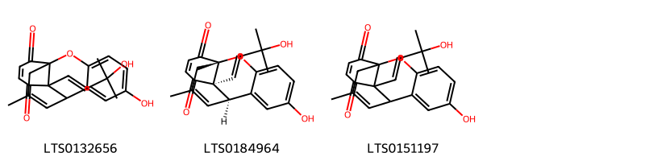{ width=100% }
    <figcaption>Hình ảnh cấu trúc hóa học của 3 hoạt chất thuộc nhóm Benzopyrans gồm ['6-hydroxy-10-(3-hydroxy-3-methylbut-1-en-1-yl)-16-methyl-2-oxatetracyclo[7.5.3.0¹,¹⁰.0³,⁸]heptadeca-3,5,7,12,16-pentaene-11,14-dione (LTS0132656)', '(1r,9r,10r)-6-hydroxy-10-[(1e)-3-hydroxy-3-methylbut-1-en-1-yl]-16-methyl-2-oxatetracyclo[7.5.3.0¹,¹⁰.0³,⁸]heptadeca-3,5,7,12,16-pentaene-11,14-dione (LTS0184964)', '6-hydroxy-10-[(1e)-3-hydroxy-3-methylbut-1-en-1-yl]-16-methyl-2-oxatetracyclo[7.5.3.0¹,¹⁰.0³,⁸]heptadeca-3,5,7,12,16-pentaene-11,14-dione (LTS0151197)'].</figcaption>
</figure>
#### Nhóm Cinnamic acids and derivatives
<figure markdown="span">
    { width=100% }
    <figcaption>Hình ảnh cấu trúc hóa học của 1 hoạt chất thuộc nhóm Cinnamic acids and derivatives gồm ['rosemary acid (LTS0207820)'].</figcaption>
</figure>
#### Nhóm Fluorenes
<figure markdown="span">
    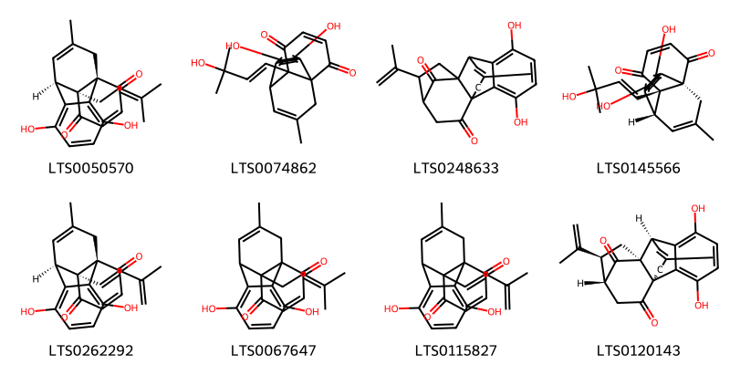{ width=100% }
    <figcaption>Hình ảnh cấu trúc hóa học của 8 hoạt chất thuộc nhóm Fluorenes gồm ['(1r,8r,9s)-3,6-dihydroxy-15-methyl-9-(3-methylbut-2-en-1-yl)tetracyclo[6.5.3.0¹,⁹.0²,⁷]hexadeca-2,4,6,11,15-pentaene-10,13-dione (LTS0050570)', '3,6-dihydroxy-9-(3-hydroxy-3-methylbut-1-en-1-yl)-15-methyltetracyclo[6.5.3.0¹,⁹.0²,⁷]hexadeca-2,4,6,11,15-pentaene-10,13-dione (LTS0074862)', '3,6-dihydroxy-16-methyl-11-(prop-1-en-2-yl)pentacyclo[6.6.3.1⁹,¹².0¹,⁹.0²,⁷]octadeca-2,4,6,16-tetraene-14,18-dione (LTS0248633)', '(1r,8r,9s)-3,6-dihydroxy-9-[(1e)-3-hydroxy-3-methylbut-1-en-1-yl]-15-methyltetracyclo[6.5.3.0¹,⁹.0²,⁷]hexadeca-2,4,6,11,15-pentaene-10,13-dione (LTS0145566)', '(1r,8r,9s)-3,6-dihydroxy-15-methyl-9-[(1e)-3-methylbuta-1,3-dien-1-yl]tetracyclo[6.5.3.0¹,⁹.0²,⁷]hexadeca-2,4,6,11,15-pentaene-10,13-dione (LTS0262292)', '3,6-dihydroxy-15-methyl-9-(3-methylbut-2-en-1-yl)tetracyclo[6.5.3.0¹,⁹.0²,⁷]hexadeca-2,4,6,11,15-pentaene-10,13-dione (LTS0067647)', '3,6-dihydroxy-15-methyl-9-(3-methylbuta-1,3-dien-1-yl)tetracyclo[6.5.3.0¹,⁹.0²,⁷]hexadeca-2,4,6,11,15-pentaene-10,13-dione (LTS0115827)', '(1r,8r,9s,11s,12r)-3,6-dihydroxy-16-methyl-11-(prop-1-en-2-yl)pentacyclo[6.6.3.1⁹,¹².0¹,⁹.0²,⁷]octadeca-2,4,6,16-tetraene-14,18-dione (LTS0120143)'].</figcaption>
</figure>

---

### Dược dân tộc học

Danh sách các quốc gia có sử dụng *Ehretia microphylla* trong điều trị các bệnh. 

| Country   | Disease   | Bệnh                                                                                                                                                                                                |
|:----------|:----------|:----------------------------------------------------------------------------------------------------------------------------------------------------------------------------------------------------|
| India     | Antidote  | MYMEMORY WARNING: YOU USED ALL AVAILABLE FREE TRANSLATIONS FOR TODAY. NEXT AVAILABLE IN  08 HOURS 21 MINUTES 24 SECONDS VISIT HTTPS://MYMEMORY.TRANSLATED.NET/DOC/USAGELIMITS.PHP TO TRANSLATE MORE |

---

---
## Ehretia navesii
### Thông tin về thực vật

!!! info "Phân loại thực vật của *Ehretia resinosa* từ GIBF:"
    - **Kingdom:** Plantae
    - **Phylum:** Tracheophyta
    - **Order:** Boraginales
    - **Family:** Ehretiaceae
    - **Genus:** Ehretia
    - **Species:** *Ehretia resinosa*

 

| Label (VI)   | Label (EN)   | Scientific Name   | Descriptions (VI)   | Descriptions (EN)   | Also Known As (VI)   | Also Known As (EN)   |
|:-------------|:-------------|:------------------|:--------------------|:--------------------|:---------------------|:---------------------|
| N/A          | N/A          | Ehretia navesii   |                     |                     | ['']                 | ['']                 |

#### Phân bố trên thế giới

**Từ CSDL GIBF** nan, Philippines

#### Phân bố tại Việt Nam

**Từ CSDL GIBF**: Không có ghi nhận ở Việt Nam

---
### Thành phần hóa học
        
- Theo cơ sở dữ liệu lotus: Từ loài *Ehretia resinosa* đã phân lập và xác định được Chưa có hoạt chất nào được phân lập. hoạt chất thuộc về các nhóm Không có hoạt chất nào được phân lập. 

Không có hình ảnh nào được tạo ra

---

### Dược dân tộc học

Danh sách các quốc gia có sử dụng *Ehretia resinosa* trong điều trị các bệnh. 

| Country     | Disease   | Bệnh                                                                                                                                                                                                |
|:------------|:----------|:----------------------------------------------------------------------------------------------------------------------------------------------------------------------------------------------------|
| Philippines | Piscicide | MYMEMORY WARNING: YOU USED ALL AVAILABLE FREE TRANSLATIONS FOR TODAY. NEXT AVAILABLE IN  08 HOURS 20 MINUTES 44 SECONDS VISIT HTTPS://MYMEMORY.TRANSLATED.NET/DOC/USAGELIMITS.PHP TO TRANSLATE MORE |

---

# Chi Trichodesma

??? note "Danh sách các dược liệu thuộc chi"
    
	 - *Trichodesma africanum*
	 - *Trichodesma indicum*
	 - *Trichodesma sedgwickianum*
	 - *Trichodesma zeylanicum*

---
## Trichodesma africanum
### Thông tin về thực vật

!!! info "Phân loại thực vật của *Trichodesma africanum* từ GIBF:"
    - **Kingdom:** Plantae
    - **Phylum:** Tracheophyta
    - **Order:** Boraginales
    - **Family:** Boraginaceae
    - **Genus:** Trichodesma
    - **Species:** *Trichodesma africanum*

 

| Label (VI)   | Label (EN)   | Scientific Name       | Descriptions (VI)   | Descriptions (EN)   | Also Known As (VI)   | Also Known As (EN)   |
|:-------------|:-------------|:----------------------|:--------------------|:--------------------|:---------------------|:---------------------|
| N/A          | N/A          | Trichodesma africanum | loài thực vật       | species of plant    | ['']                 | ['']                 |

#### Phân bố trên thế giới

**Từ CSDL GIBF** Morocco, Namibia, United Arab Emirates, Algeria, Libya, Saudi Arabia, Iran (Islamic Republic of), South Africa, Israel, Palestine, State of, Nigeria, Jordan, Western Sahara, Cabo Verde, Egypt

#### Phân bố tại Việt Nam

**Từ CSDL GIBF**: Không có ghi nhận ở Việt Nam

---
### Thành phần hóa học
        
- Theo cơ sở dữ liệu lotus: Từ loài *Trichodesma africanum* đã phân lập và xác định được 10 hoạt chất thuộc về các nhóm Prenol lipids, Pyrrolizines, Pyrrolizidines. 

|    | chemicalTaxonomyClassyfireClass   |   smiles_count |
|---:|:----------------------------------|---------------:|
|  0 |                                   |              5 |
|  1 | Prenol lipids                     |              3 |
|  2 | Pyrrolizidines                    |              1 |
|  3 | Pyrrolizines                      |              1 |

#### Nhóm 
<figure markdown="span">
    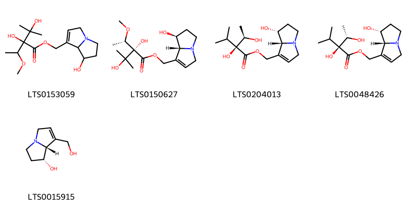{ width=100% }
    <figcaption>Hình ảnh cấu trúc hóa học của 5 hoạt chất thuộc nhóm  gồm ['(7-hydroxy-5,6,7,7a-tetrahydro-3h-pyrrolizin-1-yl)methyl 2,3-dihydroxy-2-(1-methoxyethyl)-3-methylbutanoate (LTS0153059)', '9-lasiocarpylheliotridine (LTS0150627)', 'intermedine (LTS0204013)', 'lycopsamine (LTS0048426)', 'retronecine (LTS0015915)'].</figcaption>
</figure>
#### Nhóm Prenol lipids
<figure markdown="span">
    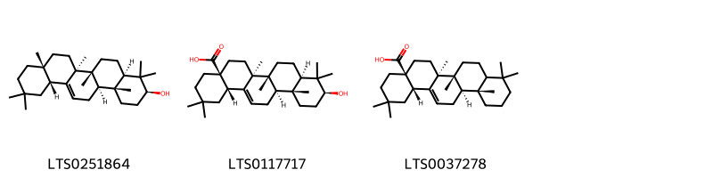{ width=100% }
    <figcaption>Hình ảnh cấu trúc hóa học của 3 hoạt chất thuộc nhóm Prenol lipids gồm ['β-amyrin (LTS0251864)', 'oleanolic acid (LTS0117717)', '(4as,6as,6br,12as,12br,14bs)-2,2,6a,6b,9,9,12a-heptamethyl-1,3,4,5,6,7,8,8a,10,11,12,12b,13,14b-tetradecahydropicene-4a-carboxylic acid (LTS0037278)'].</figcaption>
</figure>
#### Nhóm Pyrrolizidines
<figure markdown="span">
    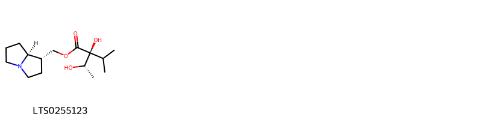{ width=100% }
    <figcaption>Hình ảnh cấu trúc hóa học của 1 hoạt chất thuộc nhóm Pyrrolizidines gồm ['viridiflorine (LTS0255123)'].</figcaption>
</figure>
#### Nhóm Pyrrolizines
<figure markdown="span">
    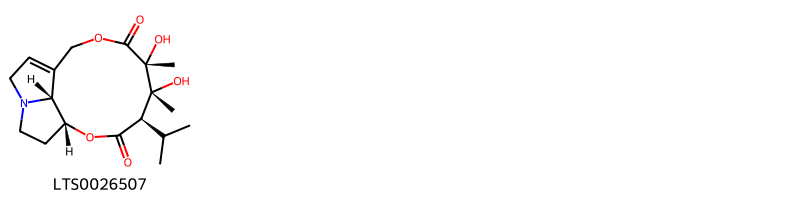{ width=100% }
    <figcaption>Hình ảnh cấu trúc hóa học của 1 hoạt chất thuộc nhóm Pyrrolizines gồm ['(1r,4r,5r,6r,16r)-5,6-dihydroxy-4-isopropyl-5,6-dimethyl-2,8-dioxa-13-azatricyclo[8.5.1.0¹³,¹⁶]hexadec-10-ene-3,7-dione (LTS0026507)'].</figcaption>
</figure>

---

### Dược dân tộc học

Danh sách các quốc gia có sử dụng *Trichodesma africanum* trong điều trị các bệnh. 

| Country   | Disease             | Bệnh                                                                                                                                                                                                |
|:----------|:--------------------|:----------------------------------------------------------------------------------------------------------------------------------------------------------------------------------------------------|
| Elsewhere | Diuretic, Emollient | MYMEMORY WARNING: YOU USED ALL AVAILABLE FREE TRANSLATIONS FOR TODAY. NEXT AVAILABLE IN  08 HOURS 20 MINUTES 18 SECONDS VISIT HTTPS://MYMEMORY.TRANSLATED.NET/DOC/USAGELIMITS.PHP TO TRANSLATE MORE |
| Sudan     | Diuretic            | MYMEMORY WARNING: YOU USED ALL AVAILABLE FREE TRANSLATIONS FOR TODAY. NEXT AVAILABLE IN  08 HOURS 20 MINUTES 14 SECONDS VISIT HTTPS://MYMEMORY.TRANSLATED.NET/DOC/USAGELIMITS.PHP TO TRANSLATE MORE |

---

---
## Trichodesma indicum
### Thông tin về thực vật

!!! info "Phân loại thực vật của *Trichodesma indicum* từ GIBF:"
    - **Kingdom:** Plantae
    - **Phylum:** Tracheophyta
    - **Order:** Boraginales
    - **Family:** Boraginaceae
    - **Genus:** Trichodesma
    - **Species:** *Trichodesma indicum*

 

| Label (VI)   | Label (EN)   | Scientific Name     | Descriptions (VI)   | Descriptions (EN)   | Also Known As (VI)   | Also Known As (EN)   |
|:-------------|:-------------|:--------------------|:--------------------|:--------------------|:---------------------|:---------------------|
| N/A          | N/A          | Trichodesma indicum | loài thực vật       | species of plant    | ['']                 | ['']                 |

#### Phân bố trên thế giới

**Từ CSDL GIBF** nan, Sri Lanka, Réunion, Kenya, Indonesia, Chinese Taipei, Pakistan, Nepal, Mauritius, Thailand, Myanmar, India, Tanzania, United Republic of, Cabo Verde

#### Phân bố tại Việt Nam

**Từ CSDL GIBF**: Không có ghi nhận ở Việt Nam

---
### Thành phần hóa học
        
- Theo cơ sở dữ liệu lotus: Từ loài *Trichodesma indicum* đã phân lập và xác định được 2 hoạt chất thuộc về các nhóm Prenol lipids. 

|    | chemicalTaxonomyClassyfireClass   |   smiles_count |
|---:|:----------------------------------|---------------:|
|  0 | Prenol lipids                     |              2 |

#### Nhóm Prenol lipids
<figure markdown="span">
    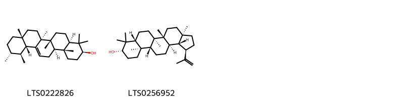{ width=100% }
    <figcaption>Hình ảnh cấu trúc hóa học của 2 hoạt chất thuộc nhóm Prenol lipids gồm ['amyrin (LTS0222826)', 'lupeol (LTS0256952)'].</figcaption>
</figure>

---

### Dược dân tộc học

Danh sách các quốc gia có sử dụng *Trichodesma indicum* trong điều trị các bệnh. 

| Country   | Disease                        | Bệnh                                                                                                                                                                                                |
|:----------|:-------------------------------|:----------------------------------------------------------------------------------------------------------------------------------------------------------------------------------------------------|
| Elsewhere | Diuretic, Sudorific, Emollient | MYMEMORY WARNING: YOU USED ALL AVAILABLE FREE TRANSLATIONS FOR TODAY. NEXT AVAILABLE IN  08 HOURS 19 MINUTES 30 SECONDS VISIT HTTPS://MYMEMORY.TRANSLATED.NET/DOC/USAGELIMITS.PHP TO TRANSLATE MORE |

---

---
## Trichodesma sedgwickianum
### Thông tin về thực vật

!!! info "Phân loại thực vật của *Trichodesma inaequale* từ GIBF:"
    - **Kingdom:** Plantae
    - **Phylum:** Tracheophyta
    - **Order:** Boraginales
    - **Family:** Boraginaceae
    - **Genus:** Trichodesma
    - **Species:** *Trichodesma inaequale*

 

| Label (VI)   | Label (EN)   | Scientific Name     | Descriptions (VI)   | Descriptions (EN)   | Also Known As (VI)   | Also Known As (EN)   |
|:-------------|:-------------|:--------------------|:--------------------|:--------------------|:---------------------|:---------------------|
| N/A          | N/A          | Trichodesma indicum | loài thực vật       | species of plant    | ['']                 | ['']                 |

#### Phân bố trên thế giới

**Từ CSDL GIBF** India

#### Phân bố tại Việt Nam

**Từ CSDL GIBF**: Không có ghi nhận ở Việt Nam

---
### Thành phần hóa học
        
- Theo cơ sở dữ liệu lotus: Từ loài *Trichodesma inaequale* đã phân lập và xác định được Chưa có hoạt chất nào được phân lập. hoạt chất thuộc về các nhóm Không có hoạt chất nào được phân lập. 

Không có hình ảnh nào được tạo ra

---

### Dược dân tộc học

Danh sách các quốc gia có sử dụng *Trichodesma inaequale* trong điều trị các bệnh. 

| Country   | Disease                        | Bệnh                                                                                                                                                                                                |
|:----------|:-------------------------------|:----------------------------------------------------------------------------------------------------------------------------------------------------------------------------------------------------|
| Elsewhere | Diuretic, Emollient, Sudorific | MYMEMORY WARNING: YOU USED ALL AVAILABLE FREE TRANSLATIONS FOR TODAY. NEXT AVAILABLE IN  08 HOURS 18 MINUTES 58 SECONDS VISIT HTTPS://MYMEMORY.TRANSLATED.NET/DOC/USAGELIMITS.PHP TO TRANSLATE MORE |

---

---
## Trichodesma zeylanicum
### Thông tin về thực vật

!!! info "Phân loại thực vật của *Trichodesma zeylanicum* từ GIBF:"
    - **Kingdom:** Plantae
    - **Phylum:** Tracheophyta
    - **Order:** Boraginales
    - **Family:** Boraginaceae
    - **Genus:** Trichodesma
    - **Species:** *Trichodesma zeylanicum*

 

| Label (VI)   | Label (EN)   | Scientific Name        | Descriptions (VI)   | Descriptions (EN)   | Also Known As (VI)   | Also Known As (EN)   |
|:-------------|:-------------|:-----------------------|:--------------------|:--------------------|:---------------------|:---------------------|
| N/A          | N/A          | Trichodesma zeylanicum | loài thực vật       | species of plant    | ['']                 | ['']                 |

#### Phân bố trên thế giới

**Từ CSDL GIBF** nan, Namibia, Réunion, Congo, Democratic Republic of the, Rwanda, Zambia, Botswana, South Africa, Australia, India, Tanzania, United Republic of, Mozambique, Madagascar

#### Phân bố tại Việt Nam

**Từ CSDL GIBF**: Không có ghi nhận ở Việt Nam

---
### Thành phần hóa học
        
- Theo cơ sở dữ liệu lotus: Từ loài *Trichodesma zeylanicum* đã phân lập và xác định được 16 hoạt chất thuộc về các nhóm Fatty Acyls. 

|    | chemicalTaxonomyClassyfireClass   |   smiles_count |
|---:|:----------------------------------|---------------:|
|  0 | Fatty Acyls                       |             16 |

#### Nhóm Fatty Acyls
<figure markdown="span">
    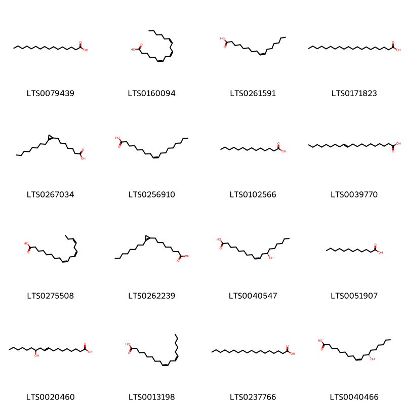{ width=100% }
    <figcaption>Hình ảnh cấu trúc hóa học của 16 hoạt chất thuộc nhóm Fatty Acyls gồm ['palmitic acid (LTS0079439)', 'gamma-linolenic acid (LTS0160094)', 'palmitoleic acid (LTS0261591)', 'arachidic acid (LTS0171823)', 'malvalic acid (LTS0267034)', 'oleic acid (LTS0256910)', 'myristic acid (LTS0102566)', 'icosenoic acid (LTS0039770)', 'α-linolenic acid (LTS0275508)', 'sterculic acid (LTS0262239)', 'ricinoleic acid (LTS0040547)', 'lauric acid (LTS0051907)', '12-hydroxy-9-octadecenoic acid (LTS0020460)', 'linoleic (LTS0013198)', 'stearic acid (LTS0237766)', '(9z,12s)-12-hydroxyoctadec-9-enoic acid (LTS0040466)'].</figcaption>
</figure>

---

### Dược dân tộc học

Danh sách các quốc gia có sử dụng *Trichodesma zeylanicum* trong điều trị các bệnh. 

| Country   | Disease   | Bệnh                                                                                                                                                                                                |
|:----------|:----------|:----------------------------------------------------------------------------------------------------------------------------------------------------------------------------------------------------|
| Sudan     | Emollient | MYMEMORY WARNING: YOU USED ALL AVAILABLE FREE TRANSLATIONS FOR TODAY. NEXT AVAILABLE IN  08 HOURS 18 MINUTES 42 SECONDS VISIT HTTPS://MYMEMORY.TRANSLATED.NET/DOC/USAGELIMITS.PHP TO TRANSLATE MORE |

---

