!!! abstract "Tóm tắt"

    Họ Brassicaceae gồm khoảng 32 chi và 59 loài được một số cộng đồng tại các quốc gia như Turkey, Africa, Indochina, Australia, Japan, Bahamas, Argentina, French, US, Dutch, Dominican Republic, Eurasia, China, Hindu, Italian, Canada, anish, Mexico(Seri), Haiti, Iraq, English, German, Chinese, Sudan, Lesotho, Elsewhere, India, Java, Kurdistan, ain, Japan*, Tansy Mustard, Ethiopia sử dụng trong một số trường hợp QUERY LENGTH LIMIT EXCEEDED. MAX ALLOWED QUERY : 500 CHARS QUERY LENGTH LIMIT EXCEEDED. MAX ALLOWED QUERY : 500 CHARS QUERY LENGTH LIMIT EXCEEDED. MAX ALLOWED QUERY : 500 CHARS Thuốc bổ, Chất độc, Thuốc lợi tiểu, Chất cầm máu, Chất kích thích, Thuốc bổ, Chất làm lạnh, Chất làm se.

!!! info "DrDuke"

    James A. Duke sinh năm 1929-2017 là một nhà thực vật học người Mỹ. Đây là một trong những tác giả hàng đầu trong lĩnh vực dược dân tộc học với cuốn *CRC Handbook of Medicinal Herbs* và chính là người xây dựng lên cơ sở dữ liệu về hợp chất tự nhiên và dược dân tộc học tại Bộ nông nghiệp Hoa Kỳ. Các thông tin được đăng tải tại website [Dr. Duke's Phytochemical and Ethnobotanical Databases](https://phytochem.nal.usda.gov/). 
    Trong suốt thập niên 1970, ông lãnh đạo the Plant Taxonomy Laboratory, Plant Genetics and Germplasm Institute of the Agricultural Research Service, U.S. Department of Agriculture.
    Trong tài liệu này, các thông tin về dược dân tộc của các dược liệu được trích dẫn từ tài liệu của James A. Ducke với sự trợ giúp của phần mềm dịch thuật từ tiếng Anh sang tiếng Việt.
   

# Chi Barbarea

??? note "Danh sách các dược liệu thuộc chi"
    
	 - *Barbarea vulgaris*

---
## Barbarea vulgaris
### Thông tin về thực vật

!!! info "Phân loại thực vật của *Barbarea vulgaris* từ GIBF:"
    - **Kingdom:** Plantae
    - **Phylum:** Tracheophyta
    - **Order:** Brassicales
    - **Family:** Brassicaceae
    - **Genus:** Barbarea
    - **Species:** *Barbarea vulgaris*

 

| Label (VI)   | Label (EN)   | Scientific Name   | Descriptions (VI)   | Descriptions (EN)   | Also Known As (VI)   | Also Known As (EN)                                                                                                                                                  |
|:-------------|:-------------|:------------------|:--------------------|:--------------------|:---------------------|:--------------------------------------------------------------------------------------------------------------------------------------------------------------------|
| N/A          | N/A          | Barbarea vulgaris | loài thực vật       | species of plant    | ['']                 | ['yellow rocket', 'bitter wintercress', 'bittercress', 'garden yellowrocket', 'herb barbara', 'rocketcress', 'winter rocket', 'wound rocket', 'yellow rocketcress'] |

#### Phân bố trên thế giới

**Từ CSDL GIBF** Ukraine, Finland, Netherlands, Italy, Lithuania, Czechia, Germany, Hungary, Ireland, Russian Federation, United States of America, Austria, France, Norway, United Kingdom of Great Britain and Northern Ireland, Canada

#### Phân bố tại Việt Nam

**Từ CSDL GIBF**: Không có ghi nhận ở Việt Nam

---
### Thành phần hóa học
        
- Theo cơ sở dữ liệu lotus: Từ loài *Barbarea vulgaris* đã phân lập và xác định được 33 hoạt chất thuộc về các nhóm Flavonoids, Organooxygen compounds. 

|    | chemicalTaxonomyClassyfireClass   |   smiles_count |
|---:|:----------------------------------|---------------:|
|  0 | Flavonoids                        |             18 |
|  1 | Organooxygen compounds            |             15 |

#### Nhóm Flavonoids
<figure markdown="span">
    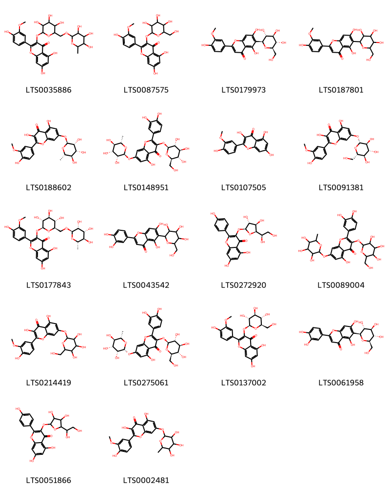{ width=100% }
    <figcaption>Hình ảnh cấu trúc hóa học của 18 hoạt chất thuộc nhóm Flavonoids gồm ['5,7-dihydroxy-2-(4-hydroxy-3-methoxyphenyl)-3-[(3,4,5-trihydroxy-6-{[(3,4,5-trihydroxy-6-methyloxan-2-yl)oxy]methyl}oxan-2-yl)oxy]chromen-4-one (LTS0035886)', 'isorhamnetin 3-galactoside (LTS0087575)', 'isoscoparin (LTS0179973)', '5,7-dihydroxy-2-(4-hydroxy-3-methoxyphenyl)-6-[3,4,5-trihydroxy-6-(hydroxymethyl)oxan-2-yl]chromen-4-one (LTS0187801)', '3,5-dihydroxy-2-(4-hydroxy-3-methoxyphenyl)-7-{[(2s,3r,4r,5r,6s)-3,4,5-trihydroxy-6-methyloxan-2-yl]oxy}chromen-4-one (LTS0188602)', 'petiolaroside (LTS0148951)', 'isorhamnetin (LTS0107505)', '3,5-dihydroxy-2-(4-hydroxy-3-methoxyphenyl)-7-{[(2r,3s,4r,5r,6s)-3,4,5-trihydroxy-6-(hydroxymethyl)oxan-2-yl]oxy}chromen-4-one (LTS0091381)', 'narcissin (LTS0177843)', 'isoorientin (LTS0043542)', '3-{[(2s,3r,4r,5r)-5-[(1r)-1,2-dihydroxyethyl]-3,4-dihydroxyoxolan-2-yl]oxy}-5,7-dihydroxy-2-(4-hydroxyphenyl)chromen-4-one (LTS0272920)', '2-(3,4-dihydroxyphenyl)-5-hydroxy-3-{[3,4,5-trihydroxy-6-(hydroxymethyl)oxan-2-yl]oxy}-7-[(3,4,5-trihydroxy-6-methyloxan-2-yl)oxy]chromen-4-one (LTS0089004)', '3,5-dihydroxy-2-(4-hydroxy-3-methoxyphenyl)-7-{[3,4,5-trihydroxy-6-(hydroxymethyl)oxan-2-yl]oxy}chromen-4-one (LTS0214419)', '2-(3,4-dihydroxyphenyl)-5-hydroxy-3-{[(2s,3r,4s,5s,6r)-3,4,5-trihydroxy-6-(hydroxymethyl)oxan-2-yl]oxy}-7-{[(2r,3r,4r,5r,6s)-3,4,5-trihydroxy-6-methyloxan-2-yl]oxy}chromen-4-one (LTS0275061)', 'isorhamnetin 3-o-glucoside (LTS0137002)', 'isoorientin (LTS0061958)', '3-{[5-(1,2-dihydroxyethyl)-3,4-dihydroxyoxolan-2-yl]oxy}-5,7-dihydroxy-2-(4-hydroxyphenyl)chromen-4-one (LTS0051866)', '3,5-dihydroxy-2-(4-hydroxy-3-methoxyphenyl)-7-[(3,4,5-trihydroxy-6-methyloxan-2-yl)oxy]chromen-4-one (LTS0002481)'].</figcaption>
</figure>
#### Nhóm Organooxygen compounds
<figure markdown="span">
    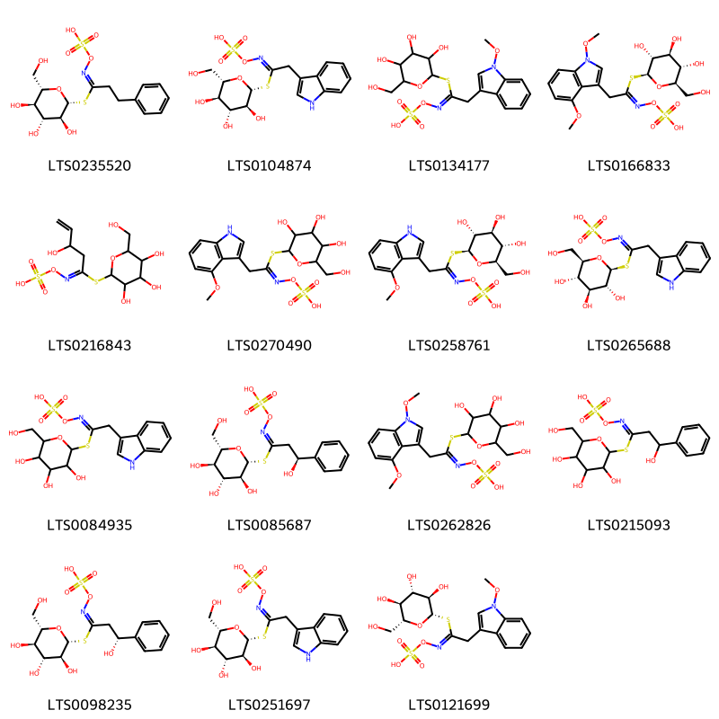{ width=100% }
    <figcaption>Hình ảnh cấu trúc hóa học của 15 hoạt chất thuộc nhóm Organooxygen compounds gồm ['[(e)-(3-phenyl-1-{[(2r,3s,4r,5r,6s)-3,4,5-trihydroxy-6-(hydroxymethyl)oxan-2-yl]sulfanyl}propylidene)amino]oxysulfonic acid (LTS0235520)', '{[2-(1h-indol-3-yl)-1-{[(2r,3s,4r,5r,6s)-3,4,5-trihydroxy-6-(hydroxymethyl)oxan-2-yl]sulfanyl}ethylidene]amino}oxysulfonic acid (LTS0104874)', '{[2-(1-methoxyindol-3-yl)-1-{[3,4,5-trihydroxy-6-(hydroxymethyl)oxan-2-yl]sulfanyl}ethylidene]amino}oxysulfonic acid (LTS0134177)', '[(z)-[2-(1,4-dimethoxyindol-3-yl)-1-{[(2s,3r,4s,5s,6r)-3,4,5-trihydroxy-6-(hydroxymethyl)oxan-2-yl]sulfanyl}ethylidene]amino]oxysulfonic acid (LTS0166833)', '[(e)-(3-hydroxy-1-{[3,4,5-trihydroxy-6-(hydroxymethyl)oxan-2-yl]sulfanyl}pent-4-en-1-ylidene)amino]oxysulfonic acid (LTS0216843)', '{[2-(4-methoxy-1h-indol-3-yl)-1-{[3,4,5-trihydroxy-6-(hydroxymethyl)oxan-2-yl]sulfanyl}ethylidene]amino}oxysulfonic acid (LTS0270490)', '4-methoxyglucobrassicin (LTS0258761)', 'glucobrassicin (LTS0265688)', '{[2-(1h-indol-3-yl)-1-{[3,4,5-trihydroxy-6-(hydroxymethyl)oxan-2-yl]sulfanyl}ethylidene]amino}oxysulfonic acid (LTS0084935)', '[(e)-[(3s)-3-hydroxy-3-phenyl-1-{[(2r,3s,4r,5r,6s)-3,4,5-trihydroxy-6-(hydroxymethyl)oxan-2-yl]sulfanyl}propylidene]amino]oxysulfonic acid (LTS0085687)', '{[2-(1,4-dimethoxyindol-3-yl)-1-{[3,4,5-trihydroxy-6-(hydroxymethyl)oxan-2-yl]sulfanyl}ethylidene]amino}oxysulfonic acid (LTS0262826)', '[(3-hydroxy-3-phenyl-1-{[3,4,5-trihydroxy-6-(hydroxymethyl)oxan-2-yl]sulfanyl}propylidene)amino]oxysulfonic acid (LTS0215093)', '[(e)-[(3r)-3-hydroxy-3-phenyl-1-{[(2r,3s,4r,5r,6s)-3,4,5-trihydroxy-6-(hydroxymethyl)oxan-2-yl]sulfanyl}propylidene]amino]oxysulfonic acid (LTS0098235)', '[(e)-[2-(1h-indol-3-yl)-1-{[(2r,3s,4r,5r,6s)-3,4,5-trihydroxy-6-(hydroxymethyl)oxan-2-yl]sulfanyl}ethylidene]amino]oxysulfonic acid (LTS0251697)', 'mimg (LTS0121699)'].</figcaption>
</figure>

---

### Dược dân tộc học

Danh sách các quốc gia có sử dụng *Barbarea vulgaris* trong điều trị các bệnh. 

| Country   | Disease          | Bệnh                      |
|:----------|:-----------------|:--------------------------|
| Dutch     | Apertif          | Apertif                   |
| US        | Diuretic, Poison | Thuốc lợi tiểu, thuốc độc |

---

# Chi Dentaria

??? note "Danh sách các dược liệu thuộc chi"
    
	 - *Dentaria pinnata*

---
## Dentaria pinnata
### Thông tin về thực vật

!!! info "Phân loại thực vật của *Cardamine heptaphylla* từ GIBF:"
    - **Kingdom:** Plantae
    - **Phylum:** Tracheophyta
    - **Order:** Brassicales
    - **Family:** Brassicaceae
    - **Genus:** Cardamine
    - **Species:** *Cardamine heptaphylla*

 

| Label (VI)   | Label (EN)   | Scientific Name   | Descriptions (VI)   | Descriptions (EN)   | Also Known As (VI)   | Also Known As (EN)                                                                                                                                                  |
|:-------------|:-------------|:------------------|:--------------------|:--------------------|:---------------------|:--------------------------------------------------------------------------------------------------------------------------------------------------------------------|
| N/A          | N/A          | Barbarea vulgaris | loài thực vật       | species of plant    | ['']                 | ['yellow rocket', 'bitter wintercress', 'bittercress', 'garden yellowrocket', 'herb barbara', 'rocketcress', 'winter rocket', 'wound rocket', 'yellow rocketcress'] |

#### Phân bố trên thế giới

**Từ CSDL GIBF** France, nan, Switzerland, Italy

#### Phân bố tại Việt Nam

**Từ CSDL GIBF**: Không có ghi nhận ở Việt Nam

---
### Thành phần hóa học
        
- Theo cơ sở dữ liệu lotus: Từ loài *Cardamine heptaphylla* đã phân lập và xác định được Chưa có hoạt chất nào được phân lập. hoạt chất thuộc về các nhóm Không có hoạt chất nào được phân lập. 

Không có hình ảnh nào được tạo ra

---

### Dược dân tộc học

Danh sách các quốc gia có sử dụng *Cardamine heptaphylla* trong điều trị các bệnh. 

| Country   | Disease   | Bệnh      |
|:----------|:----------|:----------|
| ain       | Vulnerary | Vulnerary |

---

# Chi Descurainia

??? note "Danh sách các dược liệu thuộc chi"
    
	 - *Descurainia pinnata*
	 - *Descurainia sophia*

---
## Descurainia pinnata
### Thông tin về thực vật

!!! info "Phân loại thực vật của *Descurainia pinnata* từ GIBF:"
    - **Kingdom:** Plantae
    - **Phylum:** Tracheophyta
    - **Order:** Brassicales
    - **Family:** Brassicaceae
    - **Genus:** Descurainia
    - **Species:** *Descurainia pinnata*

 

| Label (VI)   | Label (EN)   | Scientific Name     | Descriptions (VI)   | Descriptions (EN)   | Also Known As (VI)   | Also Known As (EN)   |
|:-------------|:-------------|:--------------------|:--------------------|:--------------------|:---------------------|:---------------------|
| N/A          | N/A          | Descurainia pinnata | loài thực vật       | species of plant    | ['']                 | ['']                 |

#### Phân bố trên thế giới

**Từ CSDL GIBF** Argentina, United States of America, Canada, Mexico

#### Phân bố tại Việt Nam

**Từ CSDL GIBF**: Không có ghi nhận ở Việt Nam

---
### Thành phần hóa học
        
- Theo cơ sở dữ liệu lotus: Từ loài *Descurainia pinnata* đã phân lập và xác định được Chưa có hoạt chất nào được phân lập. hoạt chất thuộc về các nhóm Không có hoạt chất nào được phân lập. 

Không có hình ảnh nào được tạo ra

---

### Dược dân tộc học

Danh sách các quốc gia có sử dụng *Descurainia pinnata* trong điều trị các bệnh. 

| Country       | Disease   | Bệnh     |
|:--------------|:----------|:---------|
| Tansy Mustard | Poison    | Chất độc |

---

---
## Descurainia sophia
### Thông tin về thực vật

!!! info "Phân loại thực vật của *Descurainia sophia* từ GIBF:"
    - **Kingdom:** Plantae
    - **Phylum:** Tracheophyta
    - **Order:** Brassicales
    - **Family:** Brassicaceae
    - **Genus:** Descurainia
    - **Species:** *Descurainia sophia*

 

| Label (VI)   | Label (EN)   | Scientific Name    | Descriptions (VI)   | Descriptions (EN)   | Also Known As (VI)   | Also Known As (EN)   |
|:-------------|:-------------|:-------------------|:--------------------|:--------------------|:---------------------|:---------------------|
| N/A          | N/A          | Descurainia sophia | loài thực vật       | species of plant    | ['']                 | ['']                 |

#### Phân bố trên thế giới

**Từ CSDL GIBF** Bulgaria, Slovakia, Canada, Ukraine, Netherlands, Kyrgyzstan, Spain, Hungary, Russian Federation, United States of America, Sweden, Kazakhstan, Uzbekistan, Czechia, Germany, Romania, Switzerland, Armenia, Austria, Mexico, China, United Kingdom of Great Britain and Northern Ireland, Poland, Nepal

#### Phân bố tại Việt Nam

**Từ CSDL GIBF**: Không có ghi nhận ở Việt Nam

---
### Thành phần hóa học
        
- Theo cơ sở dữ liệu lotus: Từ loài *Descurainia sophia* đã phân lập và xác định được 26 hoạt chất thuộc về các nhóm Flavonoids, Isothiocyanates, Steroids and steroid derivatives, Cinnamic acids and derivatives, Benzene and substituted derivatives, Phenols. 

|    | chemicalTaxonomyClassyfireClass     |   smiles_count |
|---:|:------------------------------------|---------------:|
|  0 |                                     |              1 |
|  1 | Benzene and substituted derivatives |              2 |
|  2 | Cinnamic acids and derivatives      |              2 |
|  3 | Flavonoids                          |              7 |
|  4 | Isothiocyanates                     |              2 |
|  5 | Phenols                             |              9 |
|  6 | Steroids and steroid derivatives    |              3 |

#### Nhóm 
<figure markdown="span">
    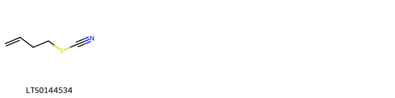{ width=100% }
    <figcaption>Hình ảnh cấu trúc hóa học của 1 hoạt chất thuộc nhóm  gồm ['but-3-en-1-ylsulfanylcarbonitrile (LTS0144534)'].</figcaption>
</figure>
#### Nhóm Benzene and substituted derivatives
<figure markdown="span">
    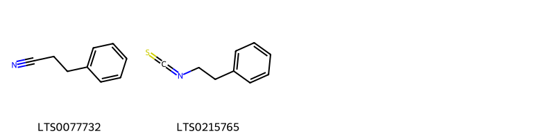{ width=100% }
    <figcaption>Hình ảnh cấu trúc hóa học của 2 hoạt chất thuộc nhóm Benzene and substituted derivatives gồm ['benzylacetonitrile (LTS0077732)', 'phenethyl isothiocyanate (LTS0215765)'].</figcaption>
</figure>
#### Nhóm Cinnamic acids and derivatives
<figure markdown="span">
    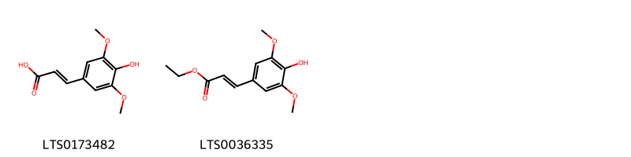{ width=100% }
    <figcaption>Hình ảnh cấu trúc hóa học của 2 hoạt chất thuộc nhóm Cinnamic acids and derivatives gồm ['sinapinate (LTS0173482)', 'ethyl (2e)-3-(4-hydroxy-3,5-dimethoxyphenyl)prop-2-enoate (LTS0036335)'].</figcaption>
</figure>
#### Nhóm Flavonoids
<figure markdown="span">
    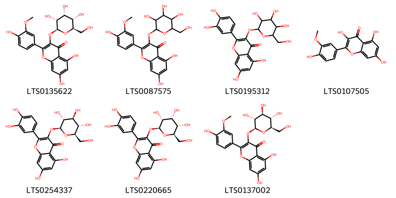{ width=100% }
    <figcaption>Hình ảnh cấu trúc hóa học của 7 hoạt chất thuộc nhóm Flavonoids gồm ['isorhamnetin 3-glucoside (LTS0135622)', 'isorhamnetin 3-galactoside (LTS0087575)', '2-(3,4-dihydroxyphenyl)-5,7-dihydroxy-3-{[3,4,5-trihydroxy-6-(hydroxymethyl)oxan-2-yl]oxy}chromen-4-one (LTS0195312)', 'isorhamnetin (LTS0107505)', 'isoquercetin (LTS0254337)', '2-(3,4-dihydroxyphenyl)-5,7-dihydroxy-3-{[(2s,3r,4r,5s,6r)-3,4,5-trihydroxy-6-(hydroxymethyl)oxan-2-yl]oxy}chromen-4-one (LTS0220665)', 'isorhamnetin 3-o-glucoside (LTS0137002)'].</figcaption>
</figure>
#### Nhóm Isothiocyanates
<figure markdown="span">
    { width=100% }
    <figcaption>Hình ảnh cấu trúc hóa học của 2 hoạt chất thuộc nhóm Isothiocyanates gồm ['3-butenyl isothiocyanate (LTS0097937)', 'allyl isothiocyanate (LTS0233763)'].</figcaption>
</figure>
#### Nhóm Phenols
<figure markdown="span">
    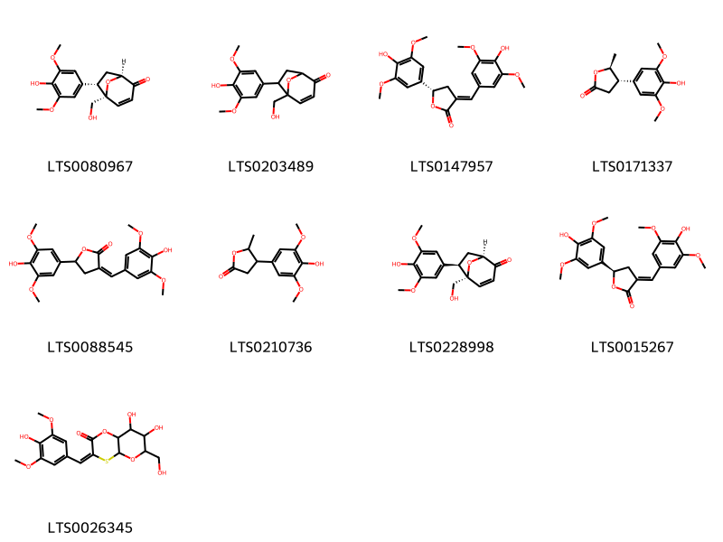{ width=100% }
    <figcaption>Hình ảnh cấu trúc hóa học của 9 hoạt chất thuộc nhóm Phenols gồm ['(1s,5s,6s)-6-(4-hydroxy-3,5-dimethoxyphenyl)-5-(hydroxymethyl)-8-oxabicyclo[3.2.1]oct-3-en-2-one (LTS0080967)', '6-(4-hydroxy-3,5-dimethoxyphenyl)-5-(hydroxymethyl)-8-oxabicyclo[3.2.1]oct-3-en-2-one (LTS0203489)', '(3e,5s)-5-(4-hydroxy-3,5-dimethoxyphenyl)-3-[(4-hydroxy-3,5-dimethoxyphenyl)methylidene]oxolan-2-one (LTS0147957)', '(4s,5s)-4-(4-hydroxy-3,5-dimethoxyphenyl)-5-methyloxolan-2-one (LTS0171337)', '5-(4-hydroxy-3,5-dimethoxyphenyl)-3-[(4-hydroxy-3,5-dimethoxyphenyl)methylidene]oxolan-2-one (LTS0088545)', '4-(4-hydroxy-3,5-dimethoxyphenyl)-5-methyloxolan-2-one (LTS0210736)', '(1s,5s,6r)-6-(4-hydroxy-3,5-dimethoxyphenyl)-5-(hydroxymethyl)-8-oxabicyclo[3.2.1]oct-3-en-2-one (LTS0228998)', '(3e,5r)-5-(4-hydroxy-3,5-dimethoxyphenyl)-3-[(4-hydroxy-3,5-dimethoxyphenyl)methylidene]oxolan-2-one (LTS0015267)', '(3e)-7,8-dihydroxy-3-[(4-hydroxy-3,5-dimethoxyphenyl)methylidene]-6-(hydroxymethyl)-tetrahydro-4ah-pyrano[3,2-b][1,4]oxathiin-2-one (LTS0026345)'].</figcaption>
</figure>
#### Nhóm Steroids and steroid derivatives
<figure markdown="span">
    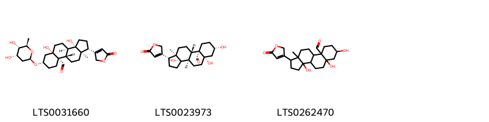{ width=100% }
    <figcaption>Hình ảnh cấu trúc hóa học của 3 hoạt chất thuộc nhóm Steroids and steroid derivatives gồm ['helveticoside (LTS0031660)', 'strophanthidin (LTS0023973)', 'strophanthidin (LTS0262470)'].</figcaption>
</figure>

---

### Dược dân tộc học

Danh sách các quốc gia có sử dụng *Descurainia sophia* trong điều trị các bệnh. 

| Country   | Disease                       | Bệnh                       |
|:----------|:------------------------------|:---------------------------|
| China     | Expectorant                   | Thuốc long đàm             |
| Elsewhere | Expectorant, Tonic, Vermifuge | Chất đờm, Tonic, Vermifuge |

---

# Chi Biscutella

??? note "Danh sách các dược liệu thuộc chi"
    
	 - *Biscutella auriculata*

---
## Biscutella auriculata
### Thông tin về thực vật

!!! info "Phân loại thực vật của *Biscutella auriculata* từ GIBF:"
    - **Kingdom:** Plantae
    - **Phylum:** Tracheophyta
    - **Order:** Brassicales
    - **Family:** Brassicaceae
    - **Genus:** Biscutella
    - **Species:** *Biscutella auriculata*

 

| Label (VI)   | Label (EN)   | Scientific Name       | Descriptions (VI)   | Descriptions (EN)   | Also Known As (VI)   | Also Known As (EN)   |
|:-------------|:-------------|:----------------------|:--------------------|:--------------------|:---------------------|:---------------------|
| N/A          | N/A          | Biscutella auriculata | loài thực vật       | species of plant    | ['']                 | ['']                 |

#### Phân bố trên thế giới

**Từ CSDL GIBF** Portugal, Algeria, Spain

#### Phân bố tại Việt Nam

**Từ CSDL GIBF**: Không có ghi nhận ở Việt Nam

---
### Thành phần hóa học
        
- Theo cơ sở dữ liệu lotus: Từ loài *Biscutella auriculata* đã phân lập và xác định được Chưa có hoạt chất nào được phân lập. hoạt chất thuộc về các nhóm Không có hoạt chất nào được phân lập. 

Không có hình ảnh nào được tạo ra

---

### Dược dân tộc học

Danh sách các quốc gia có sử dụng *Biscutella auriculata* trong điều trị các bệnh. 

| Country   | Disease   | Bệnh           |
|:----------|:----------|:---------------|
| ain       | Diuretic  | Thuốc lợi tiêu |

---

# Chi Draba

??? note "Danh sách các dược liệu thuộc chi"
    
	 - *Draba nemoralis*
	 - *Draba nemorosa*

---
## Draba nemoralis
### Thông tin về thực vật

!!! info "Phân loại thực vật của *Draba nemoralis* từ GIBF:"
    - **Kingdom:** Plantae
    - **Phylum:** Tracheophyta
    - **Order:** Brassicales
    - **Family:** Brassicaceae
    - **Genus:** Draba
    - **Species:** *Draba nemoralis*

 

| Label (VI)   | Label (EN)   | Scientific Name       | Descriptions (VI)   | Descriptions (EN)   | Also Known As (VI)   | Also Known As (EN)   |
|:-------------|:-------------|:----------------------|:--------------------|:--------------------|:---------------------|:---------------------|
| N/A          | N/A          | Biscutella auriculata | loài thực vật       | species of plant    | ['']                 | ['']                 |

#### Phân bố trên thế giới

**Từ CSDL GIBF** nan, Japan, Czechia, Romania, Hungary, United States of America, Sweden, France, China

#### Phân bố tại Việt Nam

**Từ CSDL GIBF**: Không có ghi nhận ở Việt Nam

---
### Thành phần hóa học
        
- Theo cơ sở dữ liệu lotus: Từ loài *Draba nemoralis* đã phân lập và xác định được Chưa có hoạt chất nào được phân lập. hoạt chất thuộc về các nhóm Không có hoạt chất nào được phân lập. 

Không có hình ảnh nào được tạo ra

---

### Dược dân tộc học

Danh sách các quốc gia có sử dụng *Draba nemoralis* trong điều trị các bệnh. 

| Country   | Disease                       | Bệnh                                         |
|:----------|:------------------------------|:---------------------------------------------|
| China     | Antidote, Demulcent, Laxative | Thuốc giải độc, Demulcent, Thuốc nhuận tràng |

---

---
## Draba nemorosa
### Thông tin về thực vật

!!! info "Phân loại thực vật của *Draba nemorosa* từ GIBF:"
    - **Kingdom:** Plantae
    - **Phylum:** Tracheophyta
    - **Order:** Brassicales
    - **Family:** Brassicaceae
    - **Genus:** Draba
    - **Species:** *Draba nemorosa*

 

| Label (VI)   | Label (EN)   | Scientific Name   | Descriptions (VI)   | Descriptions (EN)   | Also Known As (VI)   | Also Known As (EN)   |
|:-------------|:-------------|:------------------|:--------------------|:--------------------|:---------------------|:---------------------|
| N/A          | N/A          | Draba nemorosa    | loài thực vật       | species of plant    | ['']                 | ['']                 |

#### Phân bố trên thế giới

**Từ CSDL GIBF** Ukraine, Belarus, Czechia, Japan, Korea, Republic of, Hungary, Switzerland, Russian Federation, Norway, United States of America, Sweden, Austria, Mongolia, China, Canada, Uzbekistan

#### Phân bố tại Việt Nam

**Từ CSDL GIBF**: Không có ghi nhận ở Việt Nam

---
### Thành phần hóa học
        
- Theo cơ sở dữ liệu lotus: Từ loài *Draba nemorosa* đã phân lập và xác định được 14 hoạt chất thuộc về các nhóm Flavonoids, Steroids and steroid derivatives. 

|    | chemicalTaxonomyClassyfireClass   |   smiles_count |
|---:|:----------------------------------|---------------:|
|  0 | Flavonoids                        |              6 |
|  1 | Steroids and steroid derivatives  |              8 |

#### Nhóm Flavonoids
<figure markdown="span">
    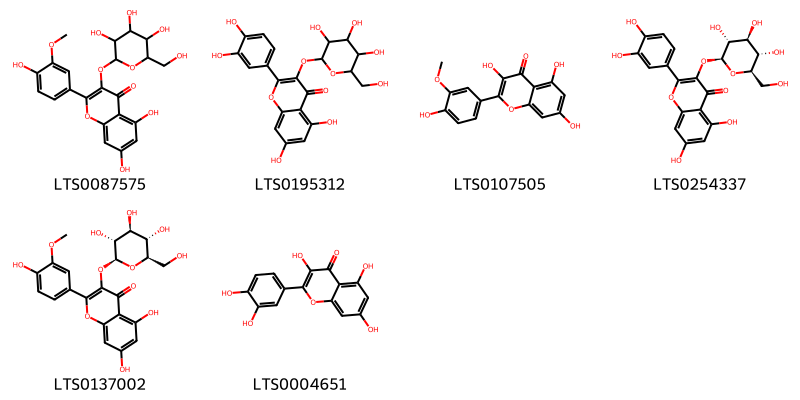{ width=100% }
    <figcaption>Hình ảnh cấu trúc hóa học của 6 hoạt chất thuộc nhóm Flavonoids gồm ['isorhamnetin 3-galactoside (LTS0087575)', '2-(3,4-dihydroxyphenyl)-5,7-dihydroxy-3-{[3,4,5-trihydroxy-6-(hydroxymethyl)oxan-2-yl]oxy}chromen-4-one (LTS0195312)', 'isorhamnetin (LTS0107505)', 'isoquercetin (LTS0254337)', 'isorhamnetin 3-o-glucoside (LTS0137002)', 'quercetin (LTS0004651)'].</figcaption>
</figure>
#### Nhóm Steroids and steroid derivatives
<figure markdown="span">
    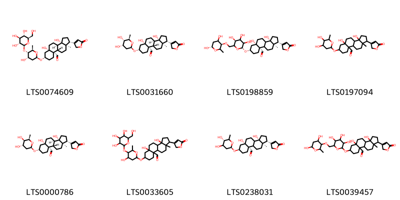{ width=100% }
    <figcaption>Hình ảnh cấu trúc hóa học của 8 hoạt chất thuộc nhóm Steroids and steroid derivatives gồm ['erysimoside (LTS0074609)', 'helveticoside (LTS0031660)', '(1r,3as,5as,7s,9as,11ar)-7-{[(2r,5s)-6-({[(3r,6s)-4,6-dihydroxy-2-methyloxan-3-yl]oxy}methyl)-3,4,5-trihydroxyoxan-2-yl]oxy}-3a,5a-dihydroxy-11a-methyl-1-(5-oxo-2h-furan-3-yl)-dodecahydro-1h-cyclopenta[a]phenanthrene-9a-carbaldehyde (LTS0198859)', '7-[(4,5-dihydroxy-6-methyloxan-2-yl)oxy]-3a,5a-dihydroxy-11a-methyl-1-(5-oxo-2h-furan-3-yl)-dodecahydro-1h-cyclopenta[a]phenanthrene-9a-carbaldehyde (LTS0197094)', '(1r,3as,3br,5as,7s,9as,9bs,11ar)-7-{[(2r,4s,5r,6r)-4,5-dihydroxy-6-methyloxan-2-yl]oxy}-3a,5a-dihydroxy-11a-methyl-1-(5-oxo-2h-furan-3-yl)-dodecahydro-1h-cyclopenta[a]phenanthrene-9a-carbaldehyde (LTS0000786)', 'erysimoside (LTS0033605)', '(1r,3as,5as,7r,9as,11ar)-7-{[(2r,5s)-4,5-dihydroxy-6-methyloxan-2-yl]oxy}-3a,5a-dihydroxy-11a-methyl-1-(5-oxo-2h-furan-3-yl)-dodecahydro-1h-cyclopenta[a]phenanthrene-9a-carbaldehyde (LTS0238031)', '7-[(6-{[(4,6-dihydroxy-2-methyloxan-3-yl)oxy]methyl}-3,4,5-trihydroxyoxan-2-yl)oxy]-3a,5a-dihydroxy-11a-methyl-1-(5-oxo-2h-furan-3-yl)-dodecahydro-1h-cyclopenta[a]phenanthrene-9a-carbaldehyde (LTS0039457)'].</figcaption>
</figure>

---

### Dược dân tộc học

Danh sách các quốc gia có sử dụng *Draba nemorosa* trong điều trị các bệnh. 

| Country   | Disease            | Bệnh                                          |
|:----------|:-------------------|:----------------------------------------------|
| China     | Expectorant        | Thuốc long đàm                                |
| Elsewhere | Diuretic, Aperient | Thuốc lợi tiểu, Dành cho người có kinh nghiệm |

---

# Chi Physaria

??? note "Danh sách các dược liệu thuộc chi"
    
	 - *Physaria newberryi*

---
## Physaria newberryi
### Thông tin về thực vật

!!! info "Phân loại thực vật của *Physaria newberryi* từ GIBF:"
    - **Kingdom:** Plantae
    - **Phylum:** Tracheophyta
    - **Order:** Brassicales
    - **Family:** Brassicaceae
    - **Genus:** Physaria
    - **Species:** *Physaria newberryi*

 

| Label (VI)   | Label (EN)   | Scientific Name    | Descriptions (VI)   | Descriptions (EN)   | Also Known As (VI)   | Also Known As (EN)   |
|:-------------|:-------------|:-------------------|:--------------------|:--------------------|:---------------------|:---------------------|
| N/A          | N/A          | Physaria newberryi | loài thực vật       | species of plant    | ['']                 | ['']                 |

#### Phân bố trên thế giới

**Từ CSDL GIBF** nan, United States of America

#### Phân bố tại Việt Nam

**Từ CSDL GIBF**: Không có ghi nhận ở Việt Nam

---
### Thành phần hóa học
        
- Theo cơ sở dữ liệu lotus: Từ loài *Physaria newberryi* đã phân lập và xác định được Chưa có hoạt chất nào được phân lập. hoạt chất thuộc về các nhóm Không có hoạt chất nào được phân lập. 

Không có hình ảnh nào được tạo ra

---

### Dược dân tộc học

Danh sách các quốc gia có sử dụng *Physaria newberryi* trong điều trị các bệnh. 

| Country   | Disease   | Bệnh   |
|:----------|:----------|:-------|
| US        | Emetic    | Phôi   |

---

# Chi Capsella

??? note "Danh sách các dược liệu thuộc chi"
    
	 - *Capsella bursa-pastoris*

---
## Capsella bursapastoris
### Thông tin về thực vật

!!! info "Phân loại thực vật của *Capsella bursa-pastoris* từ GIBF:"
    - **Kingdom:** Plantae
    - **Phylum:** Tracheophyta
    - **Order:** Brassicales
    - **Family:** Brassicaceae
    - **Genus:** Capsella
    - **Species:** *Capsella bursa-pastoris*

 

| Label (VI)   | Label (EN)   | Scientific Name    | Descriptions (VI)   | Descriptions (EN)   | Also Known As (VI)   | Also Known As (EN)   |
|:-------------|:-------------|:-------------------|:--------------------|:--------------------|:---------------------|:---------------------|
| N/A          | N/A          | Physaria newberryi | loài thực vật       | species of plant    | ['']                 | ['']                 |

#### Phân bố trên thế giới

**Từ CSDL GIBF** nan, Italy, Australia, Japan, Palestine, State of, Israel, Ukraine, Denmark, Netherlands, Cyprus, Korea, Republic of, Chinese Taipei, Spain, Bolivia (Plurinational State of), Türkiye, Portugal, Russian Federation, United States of America, Greece, Hong Kong, Czechia, Germany, Switzerland, Austria, Mexico, France, China, United Kingdom of Great Britain and Northern Ireland, Ecuador, Colombia, Ireland, Lebanon, Poland, New Zealand

#### Phân bố tại Việt Nam

**Từ CSDL GIBF**: Không có ghi nhận ở Việt Nam

---
### Thành phần hóa học
        
- Theo cơ sở dữ liệu lotus: Từ loài *Capsella bursa-pastoris* đã phân lập và xác định được Chưa có hoạt chất nào được phân lập. hoạt chất thuộc về các nhóm Không có hoạt chất nào được phân lập. 

Không có hình ảnh nào được tạo ra

---

### Dược dân tộc học

Danh sách các quốc gia có sử dụng *Capsella bursa-pastoris* trong điều trị các bệnh. 

| Country   | Disease                                                                                                                                 | Bệnh                                                                                                                                                                          |
|:----------|:----------------------------------------------------------------------------------------------------------------------------------------|:------------------------------------------------------------------------------------------------------------------------------------------------------------------------------|
| China     | Diuretic, Hemostat, Parasiticide                                                                                                        | Thuốc lợi tiểu, cầm máu, thuốc diệt ký sinh trùng                                                                                                                             |
| Elsewhere | Antiseptic, Astringent, Cardiotonic, Contraceptive, Diuretic, Diuretic, Diuretic, nan, Hemostat, Hemostatic, Vasodilator, nan, Sedative | Chất khử trùng, Chất làm se, Cardiotonic, Thuốc tránh thai, Thuốc lợi tiểu, Thuốc lợi tiểu, Thuốc lợi tiểu, nan, Hemostat, Thuốc cầm máu, Thuốc giãn mạch, nan, Thuốc an thần |
| Turkey    | Diuretic, Hemostat, Stimulant, Tonic, Refrigerant, Astringent                                                                           | Thuốc lợi tiểu, chất cầm máu, chất kích thích, thuốc bổ, chất làm lạnh, chất làm se                                                                                           |
| US        | Diuretic, Emmenagogue, Expectorant                                                                                                      | Thuốc lợi tiểu, chất kích thích, đờm                                                                                                                                          |

---

# Chi Lepidium

??? note "Danh sách các dược liệu thuộc chi"
    
	 - *Lepidium apetalum*
	 - *Lepidium campestre*
	 - *Lepidium draba*
	 - *Lepidium latifolium*
	 - *Lepidium sativum*
	 - *Lepidium virginicum*

---
## Lepidium apetalum
### Thông tin về thực vật

!!! info "Phân loại thực vật của *Lepidium apetalum* từ GIBF:"
    - **Kingdom:** Plantae
    - **Phylum:** Tracheophyta
    - **Order:** Brassicales
    - **Family:** Brassicaceae
    - **Genus:** Lepidium
    - **Species:** *Lepidium apetalum*

 

| Label (VI)   | Label (EN)   | Scientific Name   | Descriptions (VI)   | Descriptions (EN)   | Also Known As (VI)   | Also Known As (EN)   |
|:-------------|:-------------|:------------------|:--------------------|:--------------------|:---------------------|:---------------------|
| N/A          | N/A          | Lepidium apetalum | loài thực vật       | species of plant    | ['']                 | ['']                 |

#### Phân bố trên thế giới

**Từ CSDL GIBF** nan, Korea, Republic of, Russian Federation, Mongolia, China

#### Phân bố tại Việt Nam

**Từ CSDL GIBF**: Không có ghi nhận ở Việt Nam

---
### Thành phần hóa học
        
- Theo cơ sở dữ liệu lotus: Từ loài *Lepidium apetalum* đã phân lập và xác định được 4 hoạt chất thuộc về các nhóm Steroids and steroid derivatives. 

|    | chemicalTaxonomyClassyfireClass   |   smiles_count |
|---:|:----------------------------------|---------------:|
|  0 | Steroids and steroid derivatives  |              4 |

#### Nhóm Steroids and steroid derivatives
<figure markdown="span">
    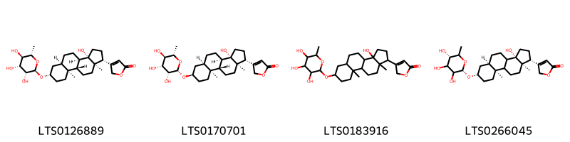{ width=100% }
    <figcaption>Hình ảnh cấu trúc hóa học của 4 hoạt chất thuộc nhóm Steroids and steroid derivatives gồm ['evomonoside (LTS0126889)', '4-[(1r,3as,3br,5ar,7r,9as,9bs,11ar)-3a-hydroxy-9a,11a-dimethyl-7-{[(2s,3r,4r,5r,6s)-3,4,5-trihydroxy-6-methyloxan-2-yl]oxy}-tetradecahydrocyclopenta[a]phenanthren-1-yl]-5h-furan-2-one (LTS0170701)', '4-{3a-hydroxy-9a,11a-dimethyl-7-[(3,4,5-trihydroxy-6-methyloxan-2-yl)oxy]-tetradecahydrocyclopenta[a]phenanthren-1-yl}-5h-furan-2-one (LTS0183916)', '4-[(1r,3as,5ar,7s,9as,11ar)-3a-hydroxy-9a,11a-dimethyl-7-{[(2s,5s)-3,4,5-trihydroxy-6-methyloxan-2-yl]oxy}-tetradecahydrocyclopenta[a]phenanthren-1-yl]-5h-furan-2-one (LTS0266045)'].</figcaption>
</figure>

---

### Dược dân tộc học

Danh sách các quốc gia có sử dụng *Lepidium apetalum* trong điều trị các bệnh. 

| Country   | Disease     | Bệnh           |
|:----------|:------------|:---------------|
| China     | Expectorant | Thuốc long đàm |
| Elsewhere | nan         | Ở đây          |

---

---
## Lepidium campestre
### Thông tin về thực vật

!!! info "Phân loại thực vật của *Lepidium campestre* từ GIBF:"
    - **Kingdom:** Plantae
    - **Phylum:** Tracheophyta
    - **Order:** Brassicales
    - **Family:** Brassicaceae
    - **Genus:** Lepidium
    - **Species:** *Lepidium campestre*

 

| Label (VI)   | Label (EN)   | Scientific Name    | Descriptions (VI)   | Descriptions (EN)   | Also Known As (VI)   | Also Known As (EN)                                                                       |
|:-------------|:-------------|:-------------------|:--------------------|:--------------------|:---------------------|:-----------------------------------------------------------------------------------------|
| N/A          | N/A          | Lepidium campestre | loài thực vật       | species of plant    | ['']                 | ['field cress', 'field pepperweed', 'field pepperwort', 'cream-anther field pepperwort'] |

#### Phân bố trên thế giới

**Từ CSDL GIBF** Italy, Belgium, Slovakia, Canada, Ukraine, Denmark, Netherlands, Luxembourg, Spain, Hungary, Russian Federation, United States of America, Sweden, Croatia, Czechia, Germany, Switzerland, Austria, France, United Kingdom of Great Britain and Northern Ireland, Poland

#### Phân bố tại Việt Nam

**Từ CSDL GIBF**: Không có ghi nhận ở Việt Nam

---
### Thành phần hóa học
        
- Theo cơ sở dữ liệu lotus: Từ loài *Lepidium campestre* đã phân lập và xác định được Chưa có hoạt chất nào được phân lập. hoạt chất thuộc về các nhóm Không có hoạt chất nào được phân lập. 

Không có hình ảnh nào được tạo ra

---

### Dược dân tộc học

Danh sách các quốc gia có sử dụng *Lepidium campestre* trong điều trị các bệnh. 

| Country   | Disease   | Bệnh           |
|:----------|:----------|:---------------|
| ain       | Diuretic  | Thuốc lợi tiêu |

---

---
## Lepidium draba
### Thông tin về thực vật

!!! info "Phân loại thực vật của *Lepidium draba* từ GIBF:"
    - **Kingdom:** Plantae
    - **Phylum:** Tracheophyta
    - **Order:** Brassicales
    - **Family:** Brassicaceae
    - **Genus:** Lepidium
    - **Species:** *Lepidium draba*

 

| Label (VI)   | Label (EN)   | Scientific Name   | Descriptions (VI)   | Descriptions (EN)   | Also Known As (VI)   | Also Known As (EN)   |
|:-------------|:-------------|:------------------|:--------------------|:--------------------|:---------------------|:---------------------|
| N/A          | N/A          | Lepidium draba    |                     | species of plant    | ['']                 | ['Whitetop']         |

#### Phân bố trên thế giới

**Từ CSDL GIBF** Italy, Belgium, Slovakia, Palestine, State of, Israel, Ukraine, Netherlands, Spain, Hungary, Türkiye, Algeria, Russian Federation, United States of America, Slovenia, Croatia, Czechia, Germany, Romania, Switzerland, Austria, France, United Kingdom of Great Britain and Northern Ireland, Serbia

#### Phân bố tại Việt Nam

**Từ CSDL GIBF**: Không có ghi nhận ở Việt Nam

---
### Thành phần hóa học
        
- Theo cơ sở dữ liệu lotus: Từ loài *Lepidium draba* đã phân lập và xác định được 10 hoạt chất thuộc về các nhóm Carboxylic acids and derivatives, Organooxygen compounds, Sulfoxides. 

|    | chemicalTaxonomyClassyfireClass   |   smiles_count |
|---:|:----------------------------------|---------------:|
|  0 | Carboxylic acids and derivatives  |              1 |
|  1 | Organooxygen compounds            |              6 |
|  2 | Sulfoxides                        |              2 |

#### Nhóm Carboxylic acids and derivatives
<figure markdown="span">
    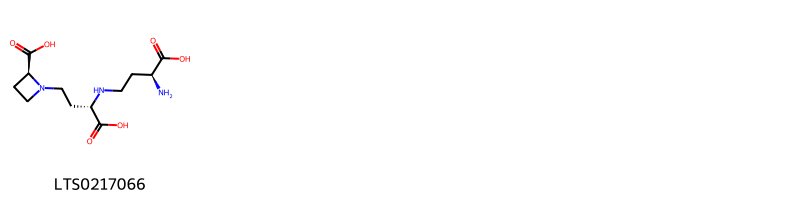{ width=100% }
    <figcaption>Hình ảnh cấu trúc hóa học của 1 hoạt chất thuộc nhóm Carboxylic acids and derivatives gồm ['nicotianamine (LTS0217066)'].</figcaption>
</figure>
#### Nhóm Organooxygen compounds
<figure markdown="span">
    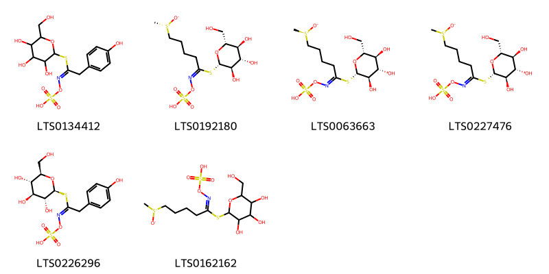{ width=100% }
    <figcaption>Hình ảnh cấu trúc hóa học của 6 hoạt chất thuộc nhóm Organooxygen compounds gồm ['[(e)-[2-(4-hydroxyphenyl)-1-{[3,4,5-trihydroxy-6-(hydroxymethyl)oxan-2-yl]sulfanyl}ethylidene]amino]oxysulfonic acid (LTS0134412)', '[(z)-{5-[(s)-methanesulfinyl]-1-{[(2s,3r,4s,5s,6r)-3,4,5-trihydroxy-6-(hydroxymethyl)oxan-2-yl]sulfanyl}pentylidene}amino]oxysulfonic acid (LTS0192180)', '[(e)-{5-[(r)-methanesulfinyl]-1-{[(2s,3r,4s,5s,6r)-3,4,5-trihydroxy-6-(hydroxymethyl)oxan-2-yl]sulfanyl}pentylidene}amino]oxysulfonic acid (LTS0063663)', '[(e)-(5-methanesulfinyl-1-{[(2s,3r,4s,5s,6r)-3,4,5-trihydroxy-6-(hydroxymethyl)oxan-2-yl]sulfanyl}pentylidene)amino]oxysulfonic acid (LTS0227476)', 'sinalbin (LTS0226296)', '[(5-methanesulfinyl-1-{[3,4,5-trihydroxy-6-(hydroxymethyl)oxan-2-yl]sulfanyl}pentylidene)amino]oxysulfonic acid (LTS0162162)'].</figcaption>
</figure>
#### Nhóm Sulfoxides
<figure markdown="span">
    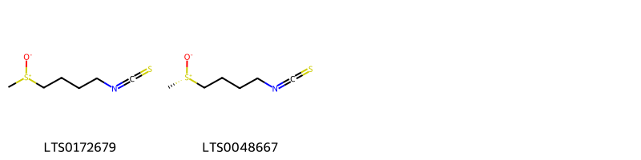{ width=100% }
    <figcaption>Hình ảnh cấu trúc hóa học của 2 hoạt chất thuộc nhóm Sulfoxides gồm ['sulforaphane (LTS0172679)', '(s)-sulforaphane (LTS0048667)'].</figcaption>
</figure>

---

### Dược dân tộc học

Danh sách các quốc gia có sử dụng *Lepidium draba* trong điều trị các bệnh. 

| Country   | Disease   | Bệnh           |
|:----------|:----------|:---------------|
| Australia | Poison    | Chất độc       |
| ain       | Diuretic  | Thuốc lợi tiêu |

---

---
## Lepidium latifolium
### Thông tin về thực vật

!!! info "Phân loại thực vật của *Lepidium latifolium* từ GIBF:"
    - **Kingdom:** Plantae
    - **Phylum:** Tracheophyta
    - **Order:** Brassicales
    - **Family:** Brassicaceae
    - **Genus:** Lepidium
    - **Species:** *Lepidium latifolium*

 

| Label (VI)   | Label (EN)   | Scientific Name     | Descriptions (VI)   | Descriptions (EN)          | Also Known As (VI)   | Also Known As (EN)                                                                               |
|:-------------|:-------------|:--------------------|:--------------------|:---------------------------|:---------------------|:-------------------------------------------------------------------------------------------------|
| N/A          | N/A          | Lepidium latifolium |                     | species of perennial plant | ['']                 | ['broadleaved pepperweed', 'dittander', 'dittany', 'peppergrass', 'pepperwort', 'tall whitetop'] |

#### Phân bố trên thế giới

**Từ CSDL GIBF** Denmark, Netherlands, Mongolia, Australia, Germany, Belgium, Spain, Türkiye, Portugal, Russian Federation, United States of America, Sweden, Austria, France, Kazakhstan, Norway, United Kingdom of Great Britain and Northern Ireland, Canada

#### Phân bố tại Việt Nam

**Từ CSDL GIBF**: Không có ghi nhận ở Việt Nam

---
### Thành phần hóa học
        
- Theo cơ sở dữ liệu lotus: Từ loài *Lepidium latifolium* đã phân lập và xác định được Chưa có hoạt chất nào được phân lập. hoạt chất thuộc về các nhóm Không có hoạt chất nào được phân lập. 

Không có hình ảnh nào được tạo ra

---

### Dược dân tộc học

Danh sách các quốc gia có sử dụng *Lepidium latifolium* trong điều trị các bệnh. 

| Country   | Disease   | Bệnh    |
|:----------|:----------|:--------|
| ain       | Stomachic | Sững sờ |

---

---
## Lepidium sativum
### Thông tin về thực vật

!!! info "Phân loại thực vật của *Lepidium sativum* từ GIBF:"
    - **Kingdom:** Plantae
    - **Phylum:** Tracheophyta
    - **Order:** Brassicales
    - **Family:** Brassicaceae
    - **Genus:** Lepidium
    - **Species:** *Lepidium sativum*

 

| Label (VI)   | Label (EN)   | Scientific Name   | Descriptions (VI)   | Descriptions (EN)   | Also Known As (VI)   | Also Known As (EN)   |
|:-------------|:-------------|:------------------|:--------------------|:--------------------|:---------------------|:---------------------|
| N/A          | N/A          | Lepidium sativum  |                     | species of plant    | ['']                 | ['garden cress']     |

#### Phân bố trên thế giới

**Từ CSDL GIBF** Italy, Belgium, Norway, Israel, Canada, Ukraine, Denmark, Netherlands, Belarus, Luxembourg, Spain, Russian Federation, United States of America, Sweden, Czechia, Germany, Brazil, Switzerland, Armenia, Austria, France, United Kingdom of Great Britain and Northern Ireland, Iraq, Lebanon, Poland, New Zealand

#### Phân bố tại Việt Nam

**Từ CSDL GIBF**: Không có ghi nhận ở Việt Nam

---
### Thành phần hóa học
        
- Theo cơ sở dữ liệu lotus: Từ loài *Lepidium sativum* đã phân lập và xác định được 39 hoạt chất thuộc về các nhóm Fatty Acyls, Flavonoids, Prenol lipids, Steroids and steroid derivatives, Benzene and substituted derivatives, Organooxygen compounds, Phenols. 

|    | chemicalTaxonomyClassyfireClass     |   smiles_count |
|---:|:------------------------------------|---------------:|
|  0 | Benzene and substituted derivatives |              9 |
|  1 | Fatty Acyls                         |              5 |
|  2 | Flavonoids                          |              6 |
|  3 | Organooxygen compounds              |              9 |
|  4 | Phenols                             |              2 |
|  5 | Prenol lipids                       |              6 |
|  6 | Steroids and steroid derivatives    |              2 |

#### Nhóm Benzene and substituted derivatives
<figure markdown="span">
    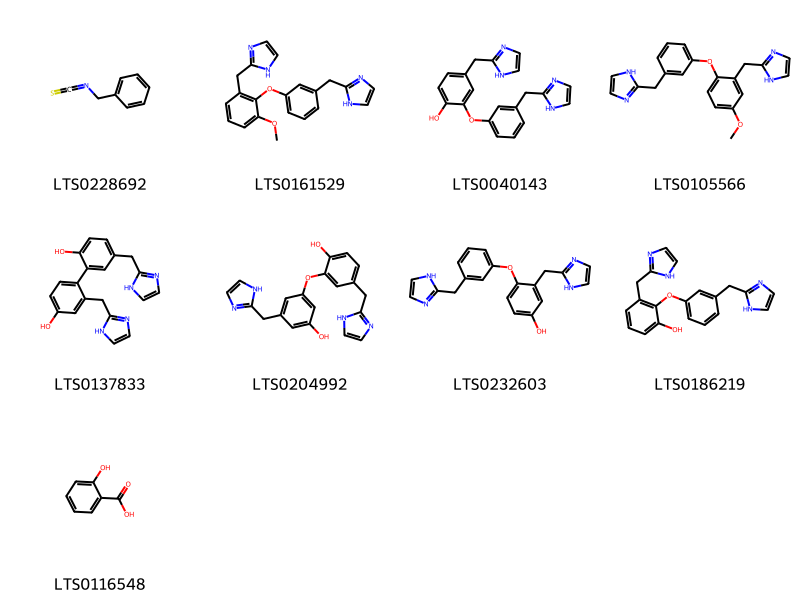{ width=100% }
    <figcaption>Hình ảnh cấu trúc hóa học của 9 hoạt chất thuộc nhóm Benzene and substituted derivatives gồm ['benzyl isothiocyanate (LTS0228692)', '2-({2-[3-(1h-imidazol-2-ylmethyl)phenoxy]-3-methoxyphenyl}methyl)-1h-imidazole (LTS0161529)', '4-(1h-imidazol-2-ylmethyl)-2-[3-(1h-imidazol-2-ylmethyl)phenoxy]phenol (LTS0040143)', '2-({3-[2-(1h-imidazol-2-ylmethyl)-4-methoxyphenoxy]phenyl}methyl)-1h-imidazole (LTS0105566)', "2',5-bis(1h-imidazol-2-ylmethyl)-[1,1'-biphenyl]-2,4'-diol (LTS0137833)", '3-[2-hydroxy-5-(1h-imidazol-2-ylmethyl)phenoxy]-5-(1h-imidazol-2-ylmethyl)phenol (LTS0204992)', '3-(1h-imidazol-2-ylmethyl)-4-[3-(1h-imidazol-2-ylmethyl)phenoxy]phenol (LTS0232603)', '3-(1h-imidazol-2-ylmethyl)-2-[3-(1h-imidazol-2-ylmethyl)phenoxy]phenol (LTS0186219)', 'salicyclic acid (LTS0116548)'].</figcaption>
</figure>
#### Nhóm Fatty Acyls
<figure markdown="span">
    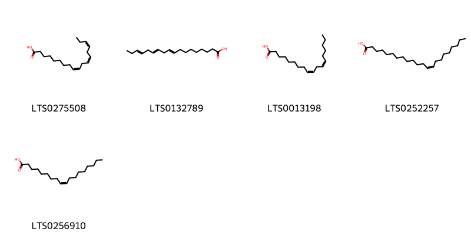{ width=100% }
    <figcaption>Hình ảnh cấu trúc hóa học của 5 hoạt chất thuộc nhóm Fatty Acyls gồm ['α-linolenic acid (LTS0275508)', 'α linolenic acid (LTS0132789)', 'linoleic (LTS0013198)', 'erucic acid (LTS0252257)', 'oleic acid (LTS0256910)'].</figcaption>
</figure>
#### Nhóm Flavonoids
<figure markdown="span">
    { width=100% }
    <figcaption>Hình ảnh cấu trúc hóa học của 6 hoạt chất thuộc nhóm Flavonoids gồm ['chamomile (LTS0104946)', 'isorhamnetin (LTS0107505)', 'kaempherol (LTS0155822)', 'quercetin (LTS0004651)', 'luteolin (LTS0017052)', 'hesperetin (LTS0087195)'].</figcaption>
</figure>
#### Nhóm Organooxygen compounds
<figure markdown="span">
    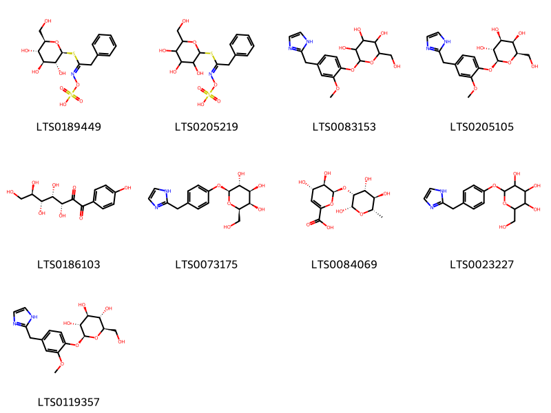{ width=100% }
    <figcaption>Hình ảnh cấu trúc hóa học của 9 hoạt chất thuộc nhóm Organooxygen compounds gồm ['glucotropaeolin (LTS0189449)', '[(e)-(2-phenyl-1-{[3,4,5-trihydroxy-6-(hydroxymethyl)oxan-2-yl]sulfanyl}ethylidene)amino]oxysulfonic acid (LTS0205219)', '2-(hydroxymethyl)-6-[4-(1h-imidazol-2-ylmethyl)-2-methoxyphenoxy]oxane-3,4,5-triol (LTS0083153)', '(2r,3r,4s,5r,6s)-2-(hydroxymethyl)-6-[4-(1h-imidazol-2-ylmethyl)-2-methoxyphenoxy]oxane-3,4,5-triol (LTS0205105)', '(3r,4s,5r,6r)-3,4,5,6,7-pentahydroxy-1-(4-hydroxyphenyl)heptane-1,2-dione (LTS0186103)', '(2r,3r,4s,5r,6s)-2-(hydroxymethyl)-6-[4-(1h-imidazol-2-ylmethyl)phenoxy]oxane-3,4,5-triol (LTS0073175)', '(4s,5r,6s)-4,5-dihydroxy-6-{[(2s,3r,4r,5r,6s)-2,4,5-trihydroxy-6-methyloxan-3-yl]oxy}-5,6-dihydro-4h-pyran-2-carboxylic acid (LTS0084069)', '2-(hydroxymethyl)-6-[4-(1h-imidazol-2-ylmethyl)phenoxy]oxane-3,4,5-triol (LTS0023227)', '(2r,3s,4s,5r,6s)-2-(hydroxymethyl)-6-[4-(1h-imidazol-2-ylmethyl)-2-methoxyphenoxy]oxane-3,4,5-triol (LTS0119357)'].</figcaption>
</figure>
#### Nhóm Phenols
<figure markdown="span">
    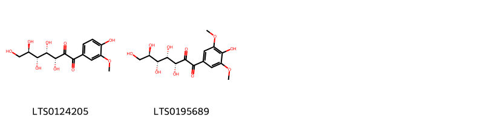{ width=100% }
    <figcaption>Hình ảnh cấu trúc hóa học của 2 hoạt chất thuộc nhóm Phenols gồm ['(3r,4s,5r,6r)-3,4,5,6,7-pentahydroxy-1-(4-hydroxy-3-methoxyphenyl)heptane-1,2-dione (LTS0124205)', '(3r,4s,5r,6r)-3,4,5,6,7-pentahydroxy-1-(4-hydroxy-3,5-dimethoxyphenyl)heptane-1,2-dione (LTS0195689)'].</figcaption>
</figure>
#### Nhóm Prenol lipids
<figure markdown="span">
    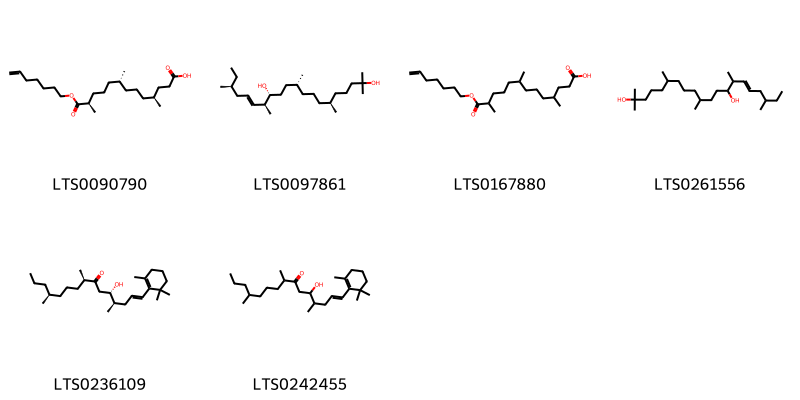{ width=100% }
    <figcaption>Hình ảnh cấu trúc hóa học của 6 hoạt chất thuộc nhóm Prenol lipids gồm ['(4s,8r,12r)-13-(hept-6-en-1-yloxy)-4,8,12-trimethyl-13-oxotridecanoic acid (LTS0090790)', '(6s,10r,13r,14s,15e,18s)-2,6,10,14,18-pentamethylicos-15-ene-2,13-diol (LTS0097861)', '13-(hept-6-en-1-yloxy)-4,8,12-trimethyl-13-oxotridecanoic acid (LTS0167880)', '2,6,10,14,18-pentamethylicos-15-ene-2,13-diol (LTS0261556)', '(1e,4r,5s,8r,12s)-5-hydroxy-4,8,12-trimethyl-1-(2,6,6-trimethylcyclohex-1-en-1-yl)pentadec-1-en-7-one (LTS0236109)', '5-hydroxy-4,8,12-trimethyl-1-(2,6,6-trimethylcyclohex-1-en-1-yl)pentadec-1-en-7-one (LTS0242455)'].</figcaption>
</figure>
#### Nhóm Steroids and steroid derivatives
<figure markdown="span">
    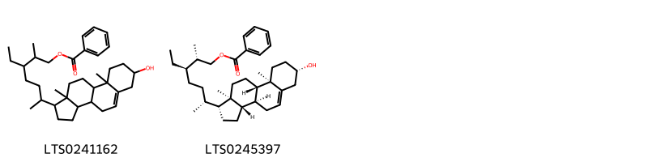{ width=100% }
    <figcaption>Hình ảnh cấu trúc hóa học của 2 hoạt chất thuộc nhóm Steroids and steroid derivatives gồm ['3-ethyl-6-{7-hydroxy-9a,11a-dimethyl-1h,2h,3h,3ah,3bh,4h,6h,7h,8h,9h,9bh,10h,11h-cyclopenta[a]phenanthren-1-yl}-2-methylheptyl benzoate (LTS0241162)', '(2s,3r,6r)-6-[(1r,3as,3bs,7s,9ar,9bs,11ar)-7-hydroxy-9a,11a-dimethyl-1h,2h,3h,3ah,3bh,4h,6h,7h,8h,9h,9bh,10h,11h-cyclopenta[a]phenanthren-1-yl]-3-ethyl-2-methylheptyl benzoate (LTS0245397)'].</figcaption>
</figure>

---

### Dược dân tộc học

Danh sách các quốc gia có sử dụng *Lepidium sativum* trong điều trị các bệnh. 

| Country   | Disease                                                                                                    | Bệnh                                                                                                                                                        |
|:----------|:-----------------------------------------------------------------------------------------------------------|:------------------------------------------------------------------------------------------------------------------------------------------------------------|
| Elsewhere | Aphrodisiac, Aphrodisiac, Diuretic, Diuretic, Emmenagogue, Lactagogue, Rubefacient, Tonic, Tonic, Laxative | Thuốc kích thích tình dục, Thuốc kích thích tình dục, Thuốc lợi tiểu, Thuốc lợi tiểu, Emmenagogue, Lactagogue, Rubefacient, Tonic, Tonic, Thuốc nhuận tràng |
| Ethiopia  | Antiscorbutic                                                                                              | Antiscorbutic                                                                                                                                               |
| Kurdistan | Apertif                                                                                                    | Apertif                                                                                                                                                     |
| Turkey    | Apertif, Diuretic, Diuretic                                                                                | Apertif, lợi tiểu, lợi tiểu                                                                                                                                 |
| ain       | Apertif                                                                                                    | Apertif                                                                                                                                                     |

---

---
## Lepidium virginicum
### Thông tin về thực vật

!!! info "Phân loại thực vật của *Lepidium virginicum* từ GIBF:"
    - **Kingdom:** Plantae
    - **Phylum:** Tracheophyta
    - **Order:** Brassicales
    - **Family:** Brassicaceae
    - **Genus:** Lepidium
    - **Species:** *Lepidium virginicum*

 

| Label (VI)   | Label (EN)   | Scientific Name     | Descriptions (VI)   | Descriptions (EN)   | Also Known As (VI)   | Also Known As (EN)                                                                                                                                     |
|:-------------|:-------------|:--------------------|:--------------------|:--------------------|:---------------------|:-------------------------------------------------------------------------------------------------------------------------------------------------------|
| N/A          | N/A          | Lepidium virginicum | loài thực vật       | species of plant    | ['']                 | ['peppergrass', 'Virginia pepperweed', 'poorman pepperweed', "poorman's pepper", 'Virginian peppercress', "poorman's-pepperwort", "poor man's pepper"] |

#### Phân bố trên thế giới

**Từ CSDL GIBF** Ecuador, South Africa, Netherlands, Puerto Rico, Hong Kong, Japan, Belgium, Chinese Taipei, Montserrat, Bahamas, Switzerland, Russian Federation, United States of America, Mexico, Dominican Republic

#### Phân bố tại Việt Nam

**Từ CSDL GIBF**: Không có ghi nhận ở Việt Nam

---
### Thành phần hóa học
        
- Theo cơ sở dữ liệu lotus: Từ loài *Lepidium virginicum* đã phân lập và xác định được 4 hoạt chất thuộc về các nhóm Organooxygen compounds, Steroids and steroid derivatives. 

|    | chemicalTaxonomyClassyfireClass   |   smiles_count |
|---:|:----------------------------------|---------------:|
|  0 | Organooxygen compounds            |              2 |
|  1 | Steroids and steroid derivatives  |              2 |

#### Nhóm Organooxygen compounds
<figure markdown="span">
    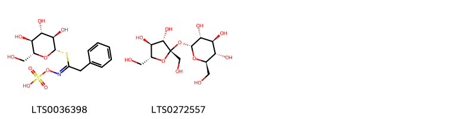{ width=100% }
    <figcaption>Hình ảnh cấu trúc hóa học của 2 hoạt chất thuộc nhóm Organooxygen compounds gồm ['glucotropeolin (LTS0036398)', 'sucrose (LTS0272557)'].</figcaption>
</figure>
#### Nhóm Steroids and steroid derivatives
<figure markdown="span">
    { width=100% }
    <figcaption>Hình ảnh cấu trúc hóa học của 2 hoạt chất thuộc nhóm Steroids and steroid derivatives gồm ['stigmast-5-en-3-ol (LTS0071224)', 'stigmast-5-en-3-ol, (3β)- (LTS0204616)'].</figcaption>
</figure>

---

### Dược dân tộc học

Danh sách các quốc gia có sử dụng *Lepidium virginicum* trong điều trị các bệnh. 

| Country            | Disease                                      | Bệnh                                         |
|:-------------------|:---------------------------------------------|:---------------------------------------------|
| Bahamas            | Laxative, Carminative                        | Thuốc nhuận tràng, Carminative               |
| Dominican Republic | Diuretic                                     | Thuốc lợi tiêu                               |
| Haiti              | Cicatrizant, Vermifuge, Expectorant, Apertif | Cicatrizant, Vermifuge, Expectorant, Apertif |

---

# Chi Farsetia

??? note "Danh sách các dược liệu thuộc chi"
    
	 - *Farsetia hamiltonii*
	 - *Farsetia jacquemontii*

---
## Farsetia hamiltonii
### Thông tin về thực vật

!!! info "Phân loại thực vật của *Farsetia stylosa* từ GIBF:"
    - **Kingdom:** Plantae
    - **Phylum:** Tracheophyta
    - **Order:** Brassicales
    - **Family:** Brassicaceae
    - **Genus:** Farsetia
    - **Species:** *Farsetia stylosa*

 

| Label (VI)   | Label (EN)   | Scientific Name     | Descriptions (VI)   | Descriptions (EN)   | Also Known As (VI)   | Also Known As (EN)                                                                                                                                     |
|:-------------|:-------------|:--------------------|:--------------------|:--------------------|:---------------------|:-------------------------------------------------------------------------------------------------------------------------------------------------------|
| N/A          | N/A          | Lepidium virginicum | loài thực vật       | species of plant    | ['']                 | ['peppergrass', 'Virginia pepperweed', 'poorman pepperweed', "poorman's pepper", 'Virginian peppercress', "poorman's-pepperwort", "poor man's pepper"] |

#### Phân bố trên thế giới

**Từ CSDL GIBF** nan, Pakistan, Sudan, Algeria, India, Morocco, unknown or invalid, Yemen, Mauritania, Saudi Arabia

#### Phân bố tại Việt Nam

**Từ CSDL GIBF**: Không có ghi nhận ở Việt Nam

---
### Thành phần hóa học
        
- Theo cơ sở dữ liệu lotus: Từ loài *Farsetia stylosa* đã phân lập và xác định được Chưa có hoạt chất nào được phân lập. hoạt chất thuộc về các nhóm Không có hoạt chất nào được phân lập. 

Không có hình ảnh nào được tạo ra

---

### Dược dân tộc học

Danh sách các quốc gia có sử dụng *Farsetia stylosa* trong điều trị các bệnh. 

| Country   | Disease            | Bệnh                 |
|:----------|:-------------------|:---------------------|
| India     | Refrigerant, Tonic | Môi chất lạnh, Tonic |

---

---
## Farsetia jacquemontii
### Thông tin về thực vật

!!! info "Phân loại thực vật của *Farsetia jacquemontii* từ GIBF:"
    - **Kingdom:** Plantae
    - **Phylum:** Tracheophyta
    - **Order:** Brassicales
    - **Family:** Brassicaceae
    - **Genus:** Farsetia
    - **Species:** *Farsetia jacquemontii*

 

| Label (VI)   | Label (EN)   | Scientific Name       | Descriptions (VI)   | Descriptions (EN)   | Also Known As (VI)   | Also Known As (EN)   |
|:-------------|:-------------|:----------------------|:--------------------|:--------------------|:---------------------|:---------------------|
| N/A          | N/A          | Farsetia jacquemontii | loài thực vật       | species of plant    | ['']                 | ['']                 |

#### Phân bố trên thế giới

**Từ CSDL GIBF** nan, Pakistan, Afghanistan, Iran (Islamic Republic of), India, unknown or invalid, United States of America

#### Phân bố tại Việt Nam

**Từ CSDL GIBF**: Không có ghi nhận ở Việt Nam

---
### Thành phần hóa học
        
- Theo cơ sở dữ liệu lotus: Từ loài *Farsetia jacquemontii* đã phân lập và xác định được Chưa có hoạt chất nào được phân lập. hoạt chất thuộc về các nhóm Không có hoạt chất nào được phân lập. 

Không có hình ảnh nào được tạo ra

---

### Dược dân tộc học

Danh sách các quốc gia có sử dụng *Farsetia jacquemontii* trong điều trị các bệnh. 

| Country   | Disease            | Bệnh                 |
|:----------|:-------------------|:---------------------|
| India     | Refrigerant, Tonic | Môi chất lạnh, Tonic |

---

# Chi Sinapis

??? note "Danh sách các dược liệu thuộc chi"
    
	 - *Sinapis alba*
	 - *Sinapis arvensis*

---
## Sinapis alba
### Thông tin về thực vật

!!! info "Phân loại thực vật của *Sinapis alba* từ GIBF:"
    - **Kingdom:** Plantae
    - **Phylum:** Tracheophyta
    - **Order:** Brassicales
    - **Family:** Brassicaceae
    - **Genus:** Sinapis
    - **Species:** *Sinapis alba*

 

| Label (VI)   | Label (EN)   | Scientific Name   | Descriptions (VI)   | Descriptions (EN)   | Also Known As (VI)   | Also Known As (EN)   |
|:-------------|:-------------|:------------------|:--------------------|:--------------------|:---------------------|:---------------------|
| N/A          | N/A          | Sinapis alba      | loài thực vật       | species of plant    | ['']                 | ['White mustard']    |

#### Phân bố trên thế giới

**Từ CSDL GIBF** nan, Italy, Belgium, Palestine, State of, Israel, Denmark, Netherlands, Luxembourg, Cyprus, Malta, Spain, Türkiye, Portugal, Algeria, Russian Federation, Greece, Czechia, Germany, Switzerland, Austria, France, United Kingdom of Great Britain and Northern Ireland, Iraq

#### Phân bố tại Việt Nam

**Từ CSDL GIBF**: Không có ghi nhận ở Việt Nam

---
### Thành phần hóa học
        
- Theo cơ sở dữ liệu lotus: Từ loài *Sinapis alba* đã phân lập và xác định được 64 hoạt chất thuộc về các nhóm Fatty Acyls, Flavonoids, Prenol lipids, Steroids and steroid derivatives, Indoles and derivatives, Linear 1,3-diarylpropanoids, Cinnamic acids and derivatives, Isothiocyanates, Benzene and substituted derivatives, Organooxygen compounds, Phenols, Carboxylic acids and derivatives. 

|    | chemicalTaxonomyClassyfireClass     |   smiles_count |
|---:|:------------------------------------|---------------:|
|  0 | Benzene and substituted derivatives |             11 |
|  1 | Carboxylic acids and derivatives    |              2 |
|  2 | Cinnamic acids and derivatives      |              9 |
|  3 | Fatty Acyls                         |              1 |
|  4 | Flavonoids                          |              5 |
|  5 | Indoles and derivatives             |              5 |
|  6 | Isothiocyanates                     |              2 |
|  7 | Linear 1,3-diarylpropanoids         |              2 |
|  8 | Organooxygen compounds              |              6 |
|  9 | Phenols                             |              1 |
| 10 | Prenol lipids                       |              4 |
| 11 | Steroids and steroid derivatives    |             14 |

#### Nhóm Benzene and substituted derivatives
<figure markdown="span">
    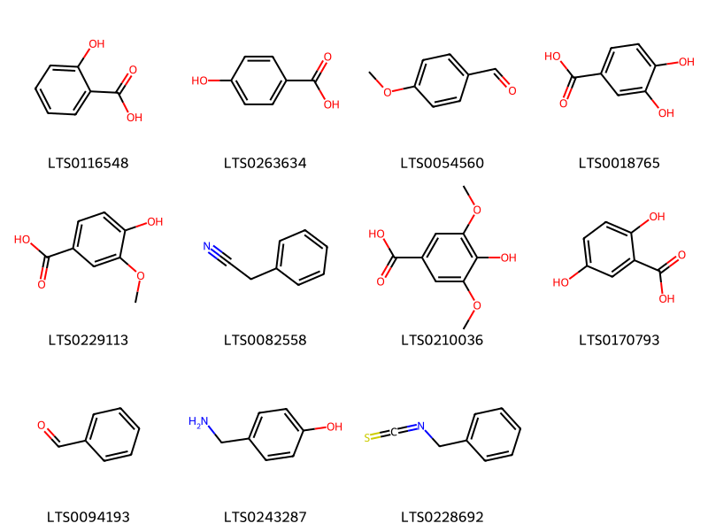{ width=100% }
    <figcaption>Hình ảnh cấu trúc hóa học của 11 hoạt chất thuộc nhóm Benzene and substituted derivatives gồm ['salicyclic acid (LTS0116548)', 'p-hydroxybenzoic acid (LTS0263634)', 'anisaldehyde (LTS0054560)', '3,4-dihydroxybenzoic acid (LTS0018765)', 'vanillic acid (LTS0229113)', 'phenylacetonitrile (LTS0082558)', 'syringic acid (LTS0210036)', '2,5-dihydroxybenzoic acid (LTS0170793)', 'benzaldehyde (LTS0094193)', '4-hydroxybenzylamine (LTS0243287)', 'benzyl isothiocyanate (LTS0228692)'].</figcaption>
</figure>
#### Nhóm Carboxylic acids and derivatives
<figure markdown="span">
    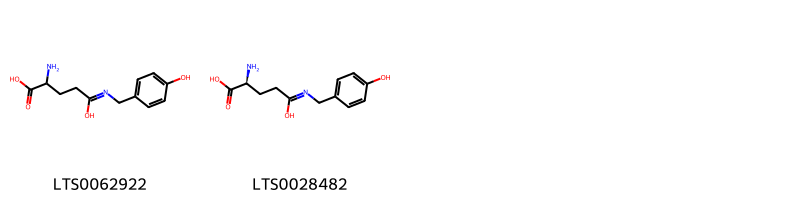{ width=100% }
    <figcaption>Hình ảnh cấu trúc hóa học của 2 hoạt chất thuộc nhóm Carboxylic acids and derivatives gồm ['2-amino-4-{[(4-hydroxyphenyl)methyl]-c-hydroxycarbonimidoyl}butanoic acid (LTS0062922)', '(2s)-2-amino-4-{[(4-hydroxyphenyl)methyl]-c-hydroxycarbonimidoyl}butanoic acid (LTS0028482)'].</figcaption>
</figure>
#### Nhóm Cinnamic acids and derivatives
<figure markdown="span">
    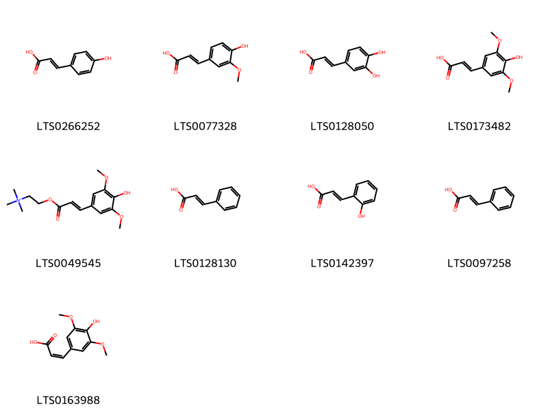{ width=100% }
    <figcaption>Hình ảnh cấu trúc hóa học của 9 hoạt chất thuộc nhóm Cinnamic acids and derivatives gồm ['para-coumaric acid (LTS0266252)', 'ferulic acid (LTS0077328)', '3,4-dihydroxycinnamic acid (LTS0128050)', 'sinapinate (LTS0173482)', 'sinapoylcholine (LTS0049545)', 'cinnamic acid (LTS0128130)', 'trans-2-hydroxycinnamic acid (LTS0142397)', 'phenylacrylic acid (LTS0097258)', '(z)-sinapic acid (LTS0163988)'].</figcaption>
</figure>
#### Nhóm Fatty Acyls
<figure markdown="span">
    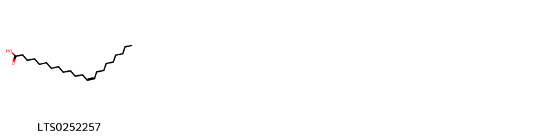{ width=100% }
    <figcaption>Hình ảnh cấu trúc hóa học của 1 hoạt chất thuộc nhóm Fatty Acyls gồm ['erucic acid (LTS0252257)'].</figcaption>
</figure>
#### Nhóm Flavonoids
<figure markdown="span">
    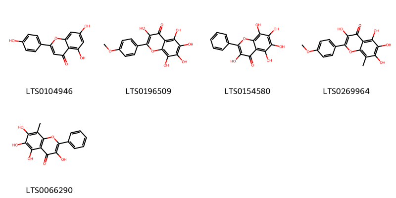{ width=100% }
    <figcaption>Hình ảnh cấu trúc hóa học của 5 hoạt chất thuộc nhóm Flavonoids gồm ['chamomile (LTS0104946)', '3,5,6,7,8-pentahydroxy-2-(4-methoxyphenyl)chromen-4-one (LTS0196509)', '3,5,6,7,8-pentahydroxy-2-phenylchromen-4-one (LTS0154580)', '3,5,6,7-tetrahydroxy-2-(4-methoxyphenyl)-8-methylchromen-4-one (LTS0269964)', 'isoplatanin (LTS0066290)'].</figcaption>
</figure>
#### Nhóm Indoles and derivatives
<figure markdown="span">
    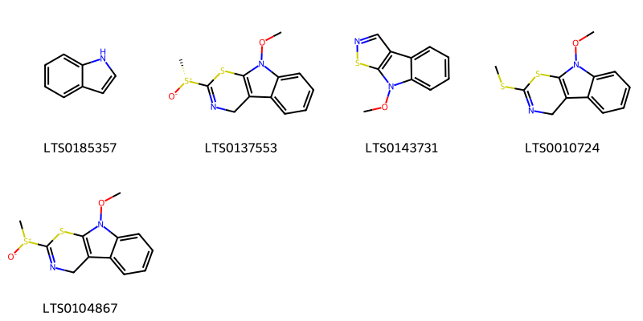{ width=100% }
    <figcaption>Hình ảnh cấu trúc hóa học của 5 hoạt chất thuộc nhóm Indoles and derivatives gồm ['indole (LTS0185357)', '2-[(r)-methanesulfinyl]-9-methoxy-4h-[1,3]thiazino[6,5-b]indole (LTS0137553)', '8-methoxy-[1,2]thiazolo[5,4-b]indole (LTS0143731)', '9-methoxy-2-(methylsulfanyl)-4h-[1,3]thiazino[6,5-b]indole (LTS0010724)', '2-methanesulfinyl-9-methoxy-4h-[1,3]thiazino[6,5-b]indole (LTS0104867)'].</figcaption>
</figure>
#### Nhóm Isothiocyanates
<figure markdown="span">
    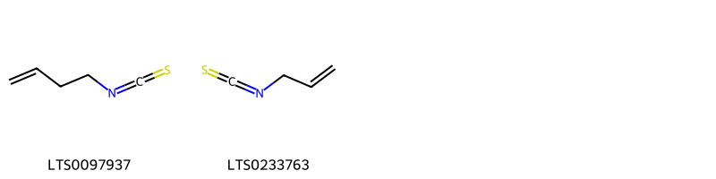{ width=100% }
    <figcaption>Hình ảnh cấu trúc hóa học của 2 hoạt chất thuộc nhóm Isothiocyanates gồm ['3-butenyl isothiocyanate (LTS0097937)', 'allyl isothiocyanate (LTS0233763)'].</figcaption>
</figure>
#### Nhóm Linear 1_3-diarylpropanoids
<figure markdown="span">
    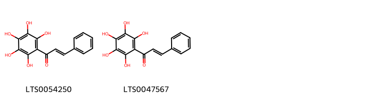{ width=100% }
    <figcaption>Hình ảnh cấu trúc hóa học của Không tìm thấy chú thích hoạt chất thuộc nhóm Linear 1_3-diarylpropanoids gồm Không tìm thấy chú thích.</figcaption>
</figure>
#### Nhóm Organooxygen compounds
<figure markdown="span">
    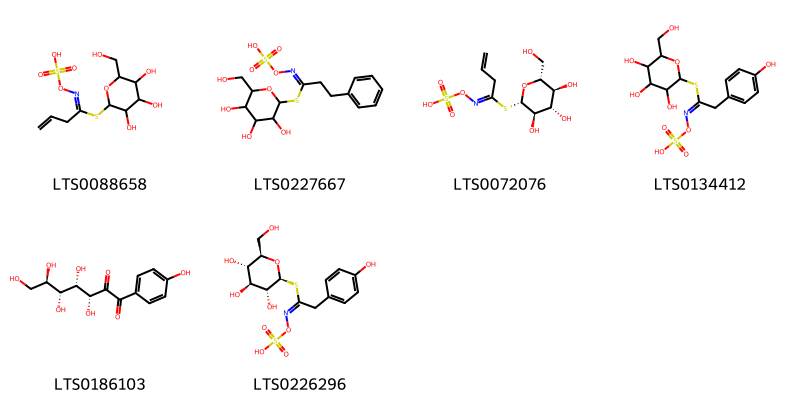{ width=100% }
    <figcaption>Hình ảnh cấu trúc hóa học của 6 hoạt chất thuộc nhóm Organooxygen compounds gồm ['[(1-{[3,4,5-trihydroxy-6-(hydroxymethyl)oxan-2-yl]sulfanyl}but-3-en-1-ylidene)amino]oxysulfonic acid (LTS0088658)', '[(3-phenyl-1-{[3,4,5-trihydroxy-6-(hydroxymethyl)oxan-2-yl]sulfanyl}propylidene)amino]oxysulfonic acid (LTS0227667)', '[(e)-(1-{[(2s,3r,4s,5s,6r)-3,4,5-trihydroxy-6-(hydroxymethyl)oxan-2-yl]sulfanyl}but-3-en-1-ylidene)amino]oxysulfonic acid (LTS0072076)', '[(e)-[2-(4-hydroxyphenyl)-1-{[3,4,5-trihydroxy-6-(hydroxymethyl)oxan-2-yl]sulfanyl}ethylidene]amino]oxysulfonic acid (LTS0134412)', '(3r,4s,5r,6r)-3,4,5,6,7-pentahydroxy-1-(4-hydroxyphenyl)heptane-1,2-dione (LTS0186103)', 'sinalbin (LTS0226296)'].</figcaption>
</figure>
#### Nhóm Phenols
<figure markdown="span">
    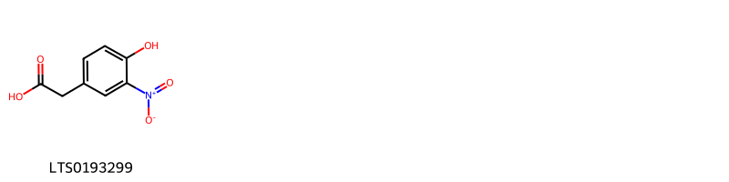{ width=100% }
    <figcaption>Hình ảnh cấu trúc hóa học của 1 hoạt chất thuộc nhóm Phenols gồm ['(4-hydroxy-3-nitrophenyl)acetic acid (LTS0193299)'].</figcaption>
</figure>
#### Nhóm Prenol lipids
<figure markdown="span">
    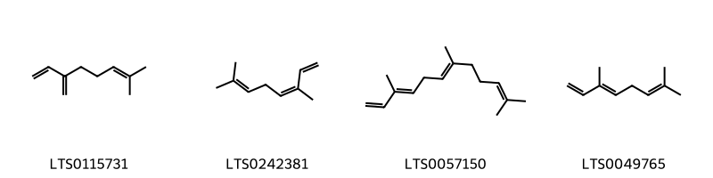{ width=100% }
    <figcaption>Hình ảnh cấu trúc hóa học của 4 hoạt chất thuộc nhóm Prenol lipids gồm ['α-myrcene (LTS0115731)', 'β-ocimene (LTS0242381)', 'farnesene (LTS0057150)', 'trans-β-ocimene (LTS0049765)'].</figcaption>
</figure>
#### Nhóm Steroids and steroid derivatives
<figure markdown="span">
    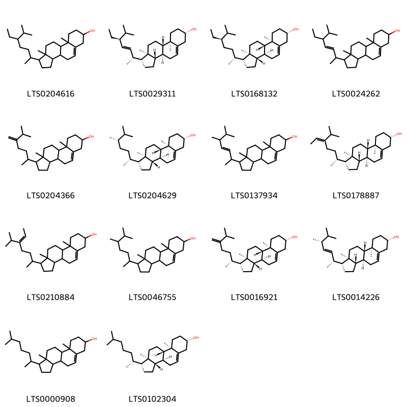{ width=100% }
    <figcaption>Hình ảnh cấu trúc hóa học của 14 hoạt chất thuộc nhóm Steroids and steroid derivatives gồm ['stigmast-5-en-3-ol, (3β)- (LTS0204616)', 'phytosterol (LTS0029311)', 'sitosterol (LTS0168132)', 'stigmasterol (LTS0024262)', '9a,11a-dimethyl-1-(6-methyl-5-methylideneheptan-2-yl)-1h,2h,3h,3ah,3bh,4h,6h,7h,8h,9h,9bh,10h,11h-cyclopenta[a]phenanthren-7-ol (LTS0204366)', '22,23-dihydrobrassicasterol (LTS0204629)', '1-(5,6-dimethylhept-3-en-2-yl)-9a,11a-dimethyl-1h,2h,3h,3ah,3bh,4h,6h,7h,8h,9h,9bh,10h,11h-cyclopenta[a]phenanthren-7-ol (LTS0137934)', 'fucosterol (LTS0178887)', '1-(5-isopropylhept-5-en-2-yl)-9a,11a-dimethyl-1h,2h,3h,3ah,3bh,4h,6h,7h,8h,9h,9bh,10h,11h-cyclopenta[a]phenanthren-7-ol (LTS0210884)', 'campesterol (LTS0046755)', '24-methylenecholesterol (LTS0016921)', 'brassicasterol (LTS0014226)', 'epicholestrol (LTS0000908)', 'cholesterol (LTS0102304)'].</figcaption>
</figure>

---

### Dược dân tộc học

Danh sách các quốc gia có sử dụng *Sinapis alba* trong điều trị các bệnh. 

| Country   | Disease                                                                                             | Bệnh                                                                                              |
|:----------|:----------------------------------------------------------------------------------------------------|:--------------------------------------------------------------------------------------------------|
| China     | Apertif, Carminative, Cathartic, Emetic, Rubefacient, Diaphoretic, Diuretic, Expectorant, Stimulant | Apertif, Carminative, Cathartic, Emetic, Rubefacient, Diaphoretic, lợi tiểu, đờm, chất kích thích |
| Chinese   | Rubefacient                                                                                         | Chất gây xung huyết da                                                                            |
| Iraq      | Emetic                                                                                              | Phôi                                                                                              |
| Turkey    | Diuretic, Rubefacient, Stimulant, Vesicant, Emetic                                                  | Thuốc lợi tiểu, Rubefacient, Chất kích thích, Vesicant, Emetic                                    |

---

---
## Sinapis arvensis
### Thông tin về thực vật

!!! info "Phân loại thực vật của *Sinapis arvensis* từ GIBF:"
    - **Kingdom:** Plantae
    - **Phylum:** Tracheophyta
    - **Order:** Brassicales
    - **Family:** Brassicaceae
    - **Genus:** Sinapis
    - **Species:** *Sinapis arvensis*

 

| Label (VI)   | Label (EN)   | Scientific Name   | Descriptions (VI)   | Descriptions (EN)   | Also Known As (VI)   | Also Known As (EN)                                                                                                                                                      |
|:-------------|:-------------|:------------------|:--------------------|:--------------------|:---------------------|:------------------------------------------------------------------------------------------------------------------------------------------------------------------------|
| N/A          | N/A          | Sinapis arvensis  | loài thực vật       | species of plant    | ['']                 | ['field mustard', 'canola', 'rapeseed', 'Brassica kaber', 'charlock', 'charlock mustard', 'wild mustard', 'wild rape', 'corn mustard', 'corn-mustard', 'kaber mustard'] |

#### Phân bố trên thế giới

**Từ CSDL GIBF** Denmark, Netherlands, Germany, Belgium, Spain, Ireland, Switzerland, United States of America, Austria, France, Slovenia, Greece, United Kingdom of Great Britain and Northern Ireland

#### Phân bố tại Việt Nam

**Từ CSDL GIBF**: Không có ghi nhận ở Việt Nam

---
### Thành phần hóa học
        
- Theo cơ sở dữ liệu lotus: Từ loài *Sinapis arvensis* đã phân lập và xác định được 42 hoạt chất thuộc về các nhóm Fatty Acyls, Flavonoids, Prenol lipids, Steroids and steroid derivatives, Indoles and derivatives, Benzene and substituted derivatives, Organooxygen compounds. 

|    | chemicalTaxonomyClassyfireClass     |   smiles_count |
|---:|:------------------------------------|---------------:|
|  0 | Benzene and substituted derivatives |              1 |
|  1 | Fatty Acyls                         |              5 |
|  2 | Flavonoids                          |              4 |
|  3 | Indoles and derivatives             |              4 |
|  4 | Organooxygen compounds              |              5 |
|  5 | Prenol lipids                       |             18 |
|  6 | Steroids and steroid derivatives    |              4 |

#### Nhóm Benzene and substituted derivatives
<figure markdown="span">
    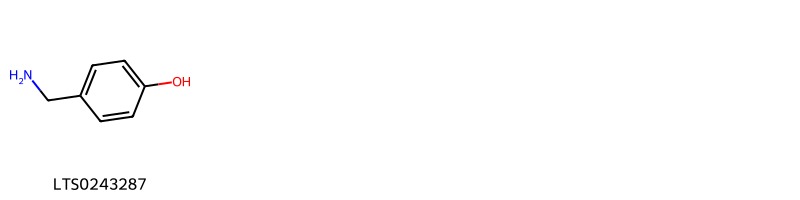{ width=100% }
    <figcaption>Hình ảnh cấu trúc hóa học của 1 hoạt chất thuộc nhóm Benzene and substituted derivatives gồm ['4-hydroxybenzylamine (LTS0243287)'].</figcaption>
</figure>
#### Nhóm Fatty Acyls
<figure markdown="span">
    { width=100% }
    <figcaption>Hình ảnh cấu trúc hóa học của 5 hoạt chất thuộc nhóm Fatty Acyls gồm ['α-linolenic acid (LTS0275508)', 'α linolenic acid (LTS0132789)', 'linoleic (LTS0013198)', 'erucic acid (LTS0252257)', 'oleic acid (LTS0256910)'].</figcaption>
</figure>
#### Nhóm Flavonoids
<figure markdown="span">
    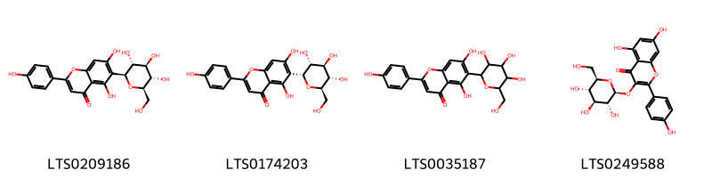{ width=100% }
    <figcaption>Hình ảnh cấu trúc hóa học của 4 hoạt chất thuộc nhóm Flavonoids gồm ['isovitexin (LTS0209186)', '5,7-dihydroxy-2-(4-hydroxyphenyl)-6-[(2r,3r,4r,5s,6r)-3,4,5-trihydroxy-6-(hydroxymethyl)oxan-2-yl]chromen-4-one (LTS0174203)', 'isovitexin (LTS0035187)', 'astragalin (LTS0249588)'].</figcaption>
</figure>
#### Nhóm Indoles and derivatives
<figure markdown="span">
    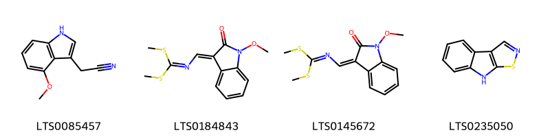{ width=100% }
    <figcaption>Hình ảnh cấu trúc hóa học của 4 hoạt chất thuộc nhóm Indoles and derivatives gồm ['2-(4-methoxy-1h-indol-3-yl)acetonitrile (LTS0085457)', '(3e)-3-({[bis(methylsulfanyl)methylidene]amino}methylidene)-1-methoxyindol-2-one (LTS0184843)', '3-({[bis(methylsulfanyl)methylidene]amino}methylidene)-1-methoxyindol-2-one (LTS0145672)', '8h-[1,2]thiazolo[5,4-b]indole (LTS0235050)'].</figcaption>
</figure>
#### Nhóm Organooxygen compounds
<figure markdown="span">
    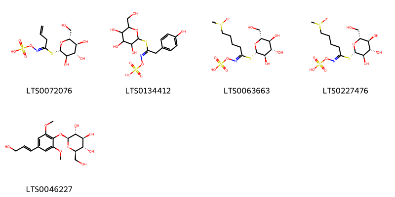{ width=100% }
    <figcaption>Hình ảnh cấu trúc hóa học của 5 hoạt chất thuộc nhóm Organooxygen compounds gồm ['[(e)-(1-{[(2s,3r,4s,5s,6r)-3,4,5-trihydroxy-6-(hydroxymethyl)oxan-2-yl]sulfanyl}but-3-en-1-ylidene)amino]oxysulfonic acid (LTS0072076)', '[(e)-[2-(4-hydroxyphenyl)-1-{[3,4,5-trihydroxy-6-(hydroxymethyl)oxan-2-yl]sulfanyl}ethylidene]amino]oxysulfonic acid (LTS0134412)', '[(e)-{5-[(r)-methanesulfinyl]-1-{[(2s,3r,4s,5s,6r)-3,4,5-trihydroxy-6-(hydroxymethyl)oxan-2-yl]sulfanyl}pentylidene}amino]oxysulfonic acid (LTS0063663)', '[(e)-(5-methanesulfinyl-1-{[(2s,3r,4s,5s,6r)-3,4,5-trihydroxy-6-(hydroxymethyl)oxan-2-yl]sulfanyl}pentylidene)amino]oxysulfonic acid (LTS0227476)', 'syringin (LTS0046227)'].</figcaption>
</figure>
#### Nhóm Prenol lipids
<figure markdown="span">
    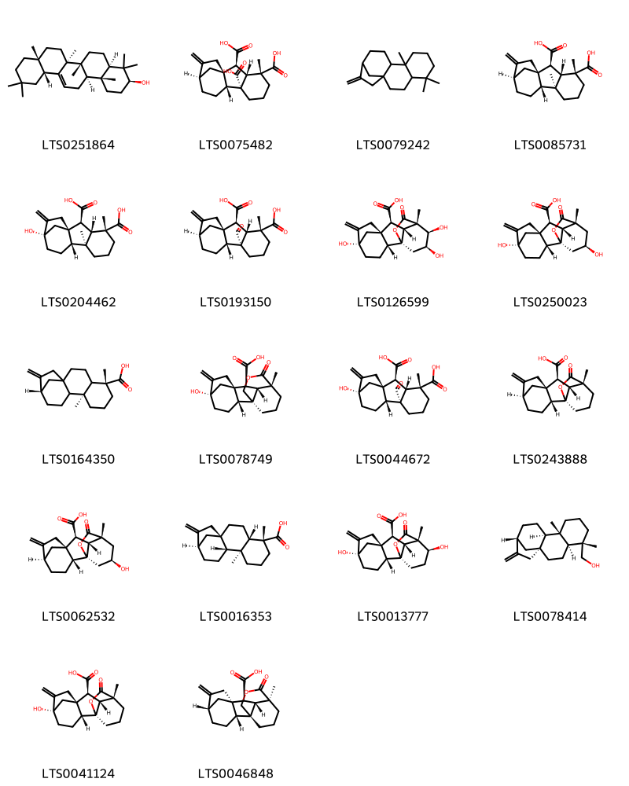{ width=100% }
    <figcaption>Hình ảnh cấu trúc hóa học của 18 hoạt chất thuộc nhóm Prenol lipids gồm ['β-amyrin (LTS0251864)', 'gibberellin a25 (LTS0075482)', '5,5,9-trimethyl-14-methylidenetetracyclo[11.2.1.0¹,¹⁰.0⁴,⁹]hexadecane (LTS0079242)', 'gibberellin a12 (LTS0085731)', 'gibberellin a53 (LTS0204462)', 'gibberellin a24 (LTS0193150)', 'gibberellin a8 (LTS0126599)', 'gibberellin a29 (LTS0250023)', '(5r,9s,13s)-5,9-dimethyl-14-methylidenetetracyclo[11.2.1.0¹,¹⁰.0⁴,⁹]hexadecane-5-carboxylic acid (LTS0164350)', 'gibberellin a44 (LTS0078749)', 'gibberellin a19 (LTS0044672)', 'gibberellin a9 (LTS0243888)', 'gibberellin a51 (LTS0062532)', 'ent-kaur-16-en-19-oic acid (LTS0016353)', 'gibberellin a1 (LTS0013777)', '[(1s,4s,5s,9s,10r,13r)-5,9-dimethyl-14-methylidenetetracyclo[11.2.1.0¹,¹⁰.0⁴,⁹]hexadecan-5-yl]methanol (LTS0078414)', 'gibberellin a20 (LTS0041124)', '(1s,2r,5s,8s,9s,10s,11s)-11-methyl-6-methylidene-12-oxo-13-oxapentacyclo[9.3.3.1⁵,⁸.0¹,¹⁰.0²,⁸]octadecane-9-carboxylic acid (LTS0046848)'].</figcaption>
</figure>
#### Nhóm Steroids and steroid derivatives
<figure markdown="span">
    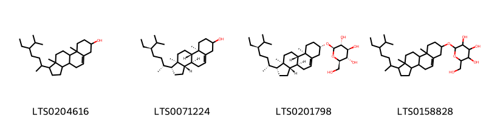{ width=100% }
    <figcaption>Hình ảnh cấu trúc hóa học của 4 hoạt chất thuộc nhóm Steroids and steroid derivatives gồm ['stigmast-5-en-3-ol, (3β)- (LTS0204616)', 'stigmast-5-en-3-ol (LTS0071224)', 'sitogluside (LTS0201798)', '2-{[1-(5-ethyl-6-methylheptan-2-yl)-9a,11a-dimethyl-1h,2h,3h,3ah,3bh,4h,6h,7h,8h,9h,9bh,10h,11h-cyclopenta[a]phenanthren-7-yl]oxy}-6-(hydroxymethyl)oxane-3,4,5-triol (LTS0158828)'].</figcaption>
</figure>

---

### Dược dân tộc học

Danh sách các quốc gia có sử dụng *Sinapis arvensis* trong điều trị các bệnh. 

| Country   | Disease                                            | Bệnh                                                     |
|:----------|:---------------------------------------------------|:---------------------------------------------------------|
| Turkey    | Diuretic, Emetic, Rubefacient, Stimulant, Vesicant | Thuốc lợi tiểu, Emetic, Rubefacient, Stimulant, Vesicant |

---

# Chi Cheiranthus

??? note "Danh sách các dược liệu thuộc chi"
    
	 - *Cheiranthus cheiri*

---
## Cheiranthus cheiri
### Thông tin về thực vật

!!! info "Phân loại thực vật của *Erysimum cheiri* từ GIBF:"
    - **Kingdom:** Plantae
    - **Phylum:** Tracheophyta
    - **Order:** Brassicales
    - **Family:** Brassicaceae
    - **Genus:** Erysimum
    - **Species:** *Erysimum cheiri*

 

| Label (VI)   | Label (EN)   | Scientific Name    | Descriptions (VI)   | Descriptions (EN)   | Also Known As (VI)   | Also Known As (EN)   |
|:-------------|:-------------|:-------------------|:--------------------|:--------------------|:---------------------|:---------------------|
| N/A          | N/A          | Cheiranthus cheiri | loài thực vật       | species of plant    | ['']                 | ['']                 |

#### Phân bố trên thế giới

**Từ CSDL GIBF** nan, Pakistan, Andorra, Luxembourg, Germany, Belgium, Korea, Republic of, Spain, United States of America, France, Norway, New Zealand

#### Phân bố tại Việt Nam

**Từ CSDL GIBF**: Không có ghi nhận ở Việt Nam

---
### Thành phần hóa học
        
- Theo cơ sở dữ liệu lotus: Từ loài *Erysimum cheiri* đã phân lập và xác định được Chưa có hoạt chất nào được phân lập. hoạt chất thuộc về các nhóm Không có hoạt chất nào được phân lập. 

Không có hình ảnh nào được tạo ra

---

### Dược dân tộc học

Danh sách các quốc gia có sử dụng *Erysimum cheiri* trong điều trị các bệnh. 

| Country   | Disease                                                                                                                 | Bệnh                                                                                                                    |
|:----------|:------------------------------------------------------------------------------------------------------------------------|:------------------------------------------------------------------------------------------------------------------------|
| Elsewhere | Aperient, Diuretic, Emmenagogue, Emmenagogue, Purgative, Stimulant, Tonic, Cardiac, Emmenagogue, Expectorant, Stomachic | Aperient, Diuretic, Emmenagogue, Emmenagogue, Purgative, Stimulant, Tonic, Cardiac, Emmenagogue, Expectorant, Stomachic |
| Iraq      | Emmenagogue                                                                                                             | Emmenagogue                                                                                                             |
| Turkey    | Cardiotonic, Emmenagogue, Tonic, Poison                                                                                 | Cardiotonic, Emmenagogue, Tonic, Poison                                                                                 |
| ain       | Cardiotonic                                                                                                             | Tim mạch                                                                                                                |

---

# Chi Rorippa

??? note "Danh sách các dược liệu thuộc chi"
    
	 - *Rorippa dufia*
	 - *Rorippa islandica*

---
## Rorippa dufia
### Thông tin về thực vật

!!! info "Phân loại thực vật của *Rorippa dubia* từ GIBF:"
    - **Kingdom:** Plantae
    - **Phylum:** Tracheophyta
    - **Order:** Brassicales
    - **Family:** Brassicaceae
    - **Genus:** Rorippa
    - **Species:** *Rorippa dubia*

 

| Label (VI)   | Label (EN)   | Scientific Name    | Descriptions (VI)   | Descriptions (EN)   | Also Known As (VI)   | Also Known As (EN)   |
|:-------------|:-------------|:-------------------|:--------------------|:--------------------|:---------------------|:---------------------|
| N/A          | N/A          | Cheiranthus cheiri | loài thực vật       | species of plant    | ['']                 | ['']                 |

#### Phân bố trên thế giới

**Từ CSDL GIBF** nan, Ecuador, Netherlands, Malaysia, Japan, Thailand, Equatorial Guinea, Chinese Taipei, Argentina, Costa Rica, United States of America, Mexico, Viet Nam, Venezuela (Bolivarian Republic of), China, Nepal

#### Phân bố tại Việt Nam

**Từ CSDL GIBF**: Dak Lak, Thanh Hoa, Hoa Binh, Ninh Binh

---
### Thành phần hóa học
        
- Theo cơ sở dữ liệu lotus: Từ loài *Rorippa dubia* đã phân lập và xác định được Chưa có hoạt chất nào được phân lập. hoạt chất thuộc về các nhóm Không có hoạt chất nào được phân lập. 

Không có hình ảnh nào được tạo ra

---

### Dược dân tộc học

Danh sách các quốc gia có sử dụng *Rorippa dubia* trong điều trị các bệnh. 

| Country   | Disease             | Bệnh                             |
|:----------|:--------------------|:---------------------------------|
| Elsewhere | Laxative            | Nhuận trường                     |
| Indochina | Diuretic, Stimulant | Thuốc lợi tiểu, thuốc kích thích |

---

---
## Rorippa islandica
### Thông tin về thực vật

!!! info "Phân loại thực vật của *Rorippa islandica* từ GIBF:"
    - **Kingdom:** Plantae
    - **Phylum:** Tracheophyta
    - **Order:** Brassicales
    - **Family:** Brassicaceae
    - **Genus:** Rorippa
    - **Species:** *Rorippa islandica*

 

| Label (VI)   | Label (EN)   | Scientific Name   | Descriptions (VI)   | Descriptions (EN)   | Also Known As (VI)   | Also Known As (EN)   |
|:-------------|:-------------|:------------------|:--------------------|:--------------------|:---------------------|:---------------------|
| N/A          | N/A          | Rorippa islandica | loài thực vật       | species of plant    | ['']                 | ['']                 |

#### Phân bố trên thế giới

**Từ CSDL GIBF** Mongolia, Italy, Japan, Iceland, Spain, Ireland, Switzerland, Russian Federation, United States of America, Austria, France, Norway, United Kingdom of Great Britain and Northern Ireland, Canada

#### Phân bố tại Việt Nam

**Từ CSDL GIBF**: Không có ghi nhận ở Việt Nam

---
### Thành phần hóa học
        
- Theo cơ sở dữ liệu lotus: Từ loài *Rorippa islandica* đã phân lập và xác định được 1 hoạt chất thuộc về các nhóm Sulfoxides. 

|    | chemicalTaxonomyClassyfireClass   |   smiles_count |
|---:|:----------------------------------|---------------:|
|  0 | Sulfoxides                        |              1 |

#### Nhóm Sulfoxides
<figure markdown="span">
    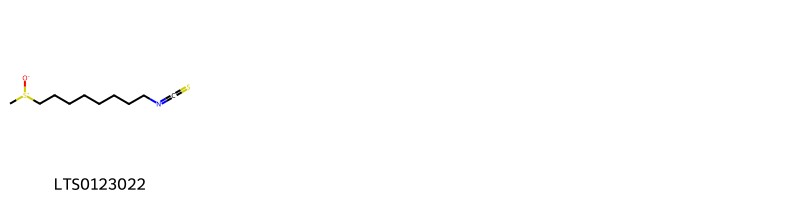{ width=100% }
    <figcaption>Hình ảnh cấu trúc hóa học của 1 hoạt chất thuộc nhóm Sulfoxides gồm ['1-isothiocyanato-8-methanesulfinyloctane (LTS0123022)'].</figcaption>
</figure>

---

### Dược dân tộc học

Danh sách các quốc gia có sử dụng *Rorippa islandica* trong điều trị các bệnh. 

| Country   | Disease                               | Bệnh                                          |
|:----------|:--------------------------------------|:----------------------------------------------|
| Elsewhere | Digestive, Diuretic, Stimulant, Tonic | Tiêu hóa, lợi tiểu, chất kích thích, thuốc bổ |

---

# Chi Alliaria

??? note "Danh sách các dược liệu thuộc chi"
    
	 - *Alliaria officinalis*
	 - *Alliaria petiolata*
	 - *Alliaria wasahi*

---
## Alliaria officinalis
### Thông tin về thực vật

!!! info "Phân loại thực vật của *Alliaria petiolata* từ GIBF:"
    - **Kingdom:** Plantae
    - **Phylum:** Tracheophyta
    - **Order:** Brassicales
    - **Family:** Brassicaceae
    - **Genus:** Alliaria
    - **Species:** *Alliaria petiolata*

 

| Label (VI)   | Label (EN)   | Scientific Name      | Descriptions (VI)   | Descriptions (EN)   | Also Known As (VI)   | Also Known As (EN)                      |
|:-------------|:-------------|:---------------------|:--------------------|:--------------------|:---------------------|:----------------------------------------|
| N/A          | N/A          | Alliaria officinalis | loài thực vật       | species of plant    | ['']                 | ['garlic mustard', 'jack-by-the-hedge'] |

#### Phân bố trên thế giới

**Từ CSDL GIBF** Czechia, Germany, United States of America, Poland, France

#### Phân bố tại Việt Nam

**Từ CSDL GIBF**: Không có ghi nhận ở Việt Nam

---
### Thành phần hóa học
        
- Theo cơ sở dữ liệu lotus: Từ loài *Alliaria petiolata* đã phân lập và xác định được Chưa có hoạt chất nào được phân lập. hoạt chất thuộc về các nhóm Không có hoạt chất nào được phân lập. 

Không có hình ảnh nào được tạo ra

---

### Dược dân tộc học

Danh sách các quốc gia có sử dụng *Alliaria petiolata* trong điều trị các bệnh. 

| Country   | Disease   | Bệnh            |
|:----------|:----------|:----------------|
| ain       | Stimulant | Chất kích thích |

---

---
## Alliaria petiolata
### Thông tin về thực vật

!!! info "Phân loại thực vật của *Alliaria petiolata* từ GIBF:"
    - **Kingdom:** Plantae
    - **Phylum:** Tracheophyta
    - **Order:** Brassicales
    - **Family:** Brassicaceae
    - **Genus:** Alliaria
    - **Species:** *Alliaria petiolata*

 

| Label (VI)   | Label (EN)   | Scientific Name    | Descriptions (VI)   | Descriptions (EN)   | Also Known As (VI)   | Also Known As (EN)                                                                                                         |
|:-------------|:-------------|:-------------------|:--------------------|:--------------------|:---------------------|:---------------------------------------------------------------------------------------------------------------------------|
| N/A          | N/A          | Alliaria petiolata | loài thực vật       | species of plant    | ['']                 | ['Garlic mustard', 'Garlic root', 'Hedge garlic', 'Jack-by-the-hedge', 'Penny hedge', "Poor man's mustard", 'Sauce-alone'] |

#### Phân bố trên thế giới

**Từ CSDL GIBF** Ukraine, Denmark, Netherlands, Italy, Czechia, Germany, Spain, Russian Federation, United States of America, Austria, France, United Kingdom of Great Britain and Northern Ireland, Canada

#### Phân bố tại Việt Nam

**Từ CSDL GIBF**: Không có ghi nhận ở Việt Nam

---
### Thành phần hóa học
        
- Theo cơ sở dữ liệu lotus: Từ loài *Alliaria petiolata* đã phân lập và xác định được 21 hoạt chất thuộc về các nhóm Fatty Acyls, Flavonoids, Isothiocyanates, Cinnamic acids and derivatives, Organooxygen compounds. 

|    | chemicalTaxonomyClassyfireClass   |   smiles_count |
|---:|:----------------------------------|---------------:|
|  0 | Cinnamic acids and derivatives    |              3 |
|  1 | Fatty Acyls                       |              4 |
|  2 | Flavonoids                        |             10 |
|  3 | Isothiocyanates                   |              1 |
|  4 | Organooxygen compounds            |              3 |

#### Nhóm Cinnamic acids and derivatives
<figure markdown="span">
    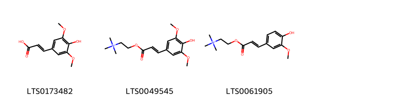{ width=100% }
    <figcaption>Hình ảnh cấu trúc hóa học của 3 hoạt chất thuộc nhóm Cinnamic acids and derivatives gồm ['sinapinate (LTS0173482)', 'sinapoylcholine (LTS0049545)', '(2-{[3-(4-hydroxy-3-methoxyphenyl)prop-2-enoyl]oxy}ethyl)trimethylazanium (LTS0061905)'].</figcaption>
</figure>
#### Nhóm Fatty Acyls
<figure markdown="span">
    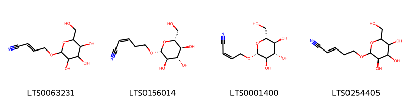{ width=100% }
    <figcaption>Hình ảnh cấu trúc hóa học của 4 hoạt chất thuộc nhóm Fatty Acyls gồm ['4-{[3,4,5-trihydroxy-6-(hydroxymethyl)oxan-2-yl]oxy}but-2-enenitrile (LTS0063231)', '(2z)-5-{[(2r,3r,4s,5s,6r)-3,4,5-trihydroxy-6-(hydroxymethyl)oxan-2-yl]oxy}pent-2-enenitrile (LTS0156014)', '(2z)-4-{[(2r,3r,4s,5s,6r)-3,4,5-trihydroxy-6-(hydroxymethyl)oxan-2-yl]oxy}but-2-enenitrile (LTS0001400)', '5-{[3,4,5-trihydroxy-6-(hydroxymethyl)oxan-2-yl]oxy}pent-2-enenitrile (LTS0254405)'].</figcaption>
</figure>
#### Nhóm Flavonoids
<figure markdown="span">
    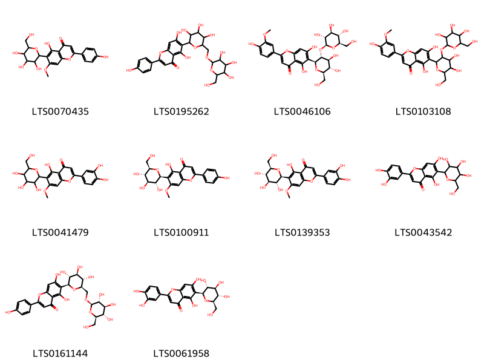{ width=100% }
    <figcaption>Hình ảnh cấu trúc hóa học của 10 hoạt chất thuộc nhóm Flavonoids gồm ['5-hydroxy-2-(4-hydroxyphenyl)-7-methoxy-6-[3,4,5-trihydroxy-6-(hydroxymethyl)oxan-2-yl]chromen-4-one (LTS0070435)', '5,7-dihydroxy-2-(4-hydroxyphenyl)-6-[3,4,5-trihydroxy-6-({[3,4,5-trihydroxy-6-(hydroxymethyl)oxan-2-yl]oxy}methyl)oxan-2-yl]chromen-4-one (LTS0195262)', '6-[(2s,3r,4s,5s,6r)-4,5-dihydroxy-6-(hydroxymethyl)-3-{[(2s,3r,4s,5s,6r)-3,4,5-trihydroxy-6-(hydroxymethyl)oxan-2-yl]oxy}oxan-2-yl]-5,7-dihydroxy-2-(4-hydroxy-3-methoxyphenyl)chromen-4-one (LTS0046106)', '6-[4,5-dihydroxy-6-(hydroxymethyl)-3-{[3,4,5-trihydroxy-6-(hydroxymethyl)oxan-2-yl]oxy}oxan-2-yl]-5,7-dihydroxy-2-(4-hydroxy-3-methoxyphenyl)chromen-4-one (LTS0103108)', '2-(3,4-dihydroxyphenyl)-5-hydroxy-7-methoxy-6-[3,4,5-trihydroxy-6-(hydroxymethyl)oxan-2-yl]chromen-4-one (LTS0041479)', '5-hydroxy-2-(4-hydroxyphenyl)-7-methoxy-6-[(2s,3r,4r,5s,6r)-3,4,5-trihydroxy-6-(hydroxymethyl)oxan-2-yl]chromen-4-one (LTS0100911)', 'swertiajaponin (LTS0139353)', 'isoorientin (LTS0043542)', '5,7-dihydroxy-2-(4-hydroxyphenyl)-6-[(2s,3r,4r,5s,6r)-3,4,5-trihydroxy-6-({[(2r,3r,4s,5s,6r)-3,4,5-trihydroxy-6-(hydroxymethyl)oxan-2-yl]oxy}methyl)oxan-2-yl]chromen-4-one (LTS0161144)', 'isoorientin (LTS0061958)'].</figcaption>
</figure>
#### Nhóm Isothiocyanates
<figure markdown="span">
    { width=100% }
    <figcaption>Hình ảnh cấu trúc hóa học của 1 hoạt chất thuộc nhóm Isothiocyanates gồm ['allyl isothiocyanate (LTS0233763)'].</figcaption>
</figure>
#### Nhóm Organooxygen compounds
<figure markdown="span">
    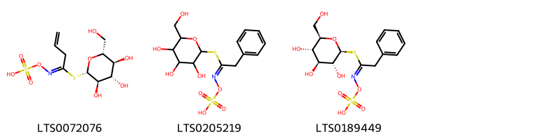{ width=100% }
    <figcaption>Hình ảnh cấu trúc hóa học của 3 hoạt chất thuộc nhóm Organooxygen compounds gồm ['[(e)-(1-{[(2s,3r,4s,5s,6r)-3,4,5-trihydroxy-6-(hydroxymethyl)oxan-2-yl]sulfanyl}but-3-en-1-ylidene)amino]oxysulfonic acid (LTS0072076)', '[(e)-(2-phenyl-1-{[3,4,5-trihydroxy-6-(hydroxymethyl)oxan-2-yl]sulfanyl}ethylidene)amino]oxysulfonic acid (LTS0205219)', 'glucotropaeolin (LTS0189449)'].</figcaption>
</figure>

---

### Dược dân tộc học

Danh sách các quốc gia có sử dụng *Alliaria petiolata* trong điều trị các bệnh. 

| Country   | Disease                | Bệnh                      |
|:----------|:-----------------------|:--------------------------|
| Dutch     | Sudorific              | Ngạt thở                  |
| German    | Expectorant, Stimulant | Chất đờm, chất kích thích |
| Italian   | Vermifuge              | Thuốc diệt sán            |
| US        | Diuretic               | Thuốc lợi tiêu            |
| anish     | Antiseptic             | Khử trùng                 |

---

---
## Alliaria wasahi
### Thông tin về thực vật

!!! info "Phân loại thực vật của *Eutrema japonicum* từ GIBF:"
    - **Kingdom:** Plantae
    - **Phylum:** Tracheophyta
    - **Order:** Brassicales
    - **Family:** Brassicaceae
    - **Genus:** Eutrema
    - **Species:** *Eutrema japonicum*

 

| Label (VI)   | Label (EN)   | Scientific Name    | Descriptions (VI)   | Descriptions (EN)   | Also Known As (VI)   | Also Known As (EN)                                                                                                         |
|:-------------|:-------------|:-------------------|:--------------------|:--------------------|:---------------------|:---------------------------------------------------------------------------------------------------------------------------|
| N/A          | N/A          | Alliaria petiolata | loài thực vật       | species of plant    | ['']                 | ['Garlic mustard', 'Garlic root', 'Hedge garlic', 'Jack-by-the-hedge', 'Penny hedge', "Poor man's mustard", 'Sauce-alone'] |

#### Phân bố trên thế giới

**Từ CSDL GIBF** Japan

#### Phân bố tại Việt Nam

**Từ CSDL GIBF**: Không có ghi nhận ở Việt Nam

---
### Thành phần hóa học
        
- Theo cơ sở dữ liệu lotus: Từ loài *Eutrema japonicum* đã phân lập và xác định được Chưa có hoạt chất nào được phân lập. hoạt chất thuộc về các nhóm Không có hoạt chất nào được phân lập. 

Không có hình ảnh nào được tạo ra

---

### Dược dân tộc học

Danh sách các quốc gia có sử dụng *Eutrema japonicum* trong điều trị các bệnh. 

| Country   | Disease              | Bệnh                 |
|:----------|:---------------------|:---------------------|
| China     | Apertif, Carminative | Apertif, Carminative |

---

# Chi Alyssum

??? note "Danh sách các dược liệu thuộc chi"
    
	 - *Alyssum maritimum*

---
## Alyssum maritimum
### Thông tin về thực vật

!!! info "Phân loại thực vật của *Lobularia maritima* từ GIBF:"
    - **Kingdom:** Plantae
    - **Phylum:** Tracheophyta
    - **Order:** Brassicales
    - **Family:** Brassicaceae
    - **Genus:** Lobularia
    - **Species:** *Lobularia maritima*

 

| Label (VI)   | Label (EN)   | Scientific Name   | Descriptions (VI)   | Descriptions (EN)   | Also Known As (VI)   | Also Known As (EN)   |
|:-------------|:-------------|:------------------|:--------------------|:--------------------|:---------------------|:---------------------|
| N/A          | N/A          | Alyssum maritimum |                     |                     | ['']                 | ['']                 |

#### Phân bố trên thế giới

**Từ CSDL GIBF** nan, Ukraine, Korea, Republic of, Colombia, Brazil, Spain, United States of America, France

#### Phân bố tại Việt Nam

**Từ CSDL GIBF**: Không có ghi nhận ở Việt Nam

---
### Thành phần hóa học
        
- Theo cơ sở dữ liệu lotus: Từ loài *Lobularia maritima* đã phân lập và xác định được Chưa có hoạt chất nào được phân lập. hoạt chất thuộc về các nhóm Không có hoạt chất nào được phân lập. 

Không có hình ảnh nào được tạo ra

---

### Dược dân tộc học

Danh sách các quốc gia có sử dụng *Lobularia maritima* trong điều trị các bệnh. 

| Country   | Disease   | Bệnh           |
|:----------|:----------|:---------------|
| ain       | Diuretic  | Thuốc lợi tiêu |

---

# Chi Brassica

??? note "Danh sách các dược liệu thuộc chi"
    
	 - *Brassica campestris*
	 - *Brassica chinensis*
	 - *Brassica integrifolia*
	 - *Brassica juncea*
	 - *Brassica kaber*
	 - *Brassica napus*
	 - *Brassica nigra*
	 - *Brassica oleracea*
	 - *Brassica rapa*
	 - *Brassica rugosa*

---
## Brassica campestris
### Thông tin về thực vật

!!! info "Phân loại thực vật của *Brassica campestris* từ GIBF:"
    - **Kingdom:** Plantae
    - **Phylum:** Tracheophyta
    - **Order:** Brassicales
    - **Family:** Brassicaceae
    - **Genus:** Brassica
    - **Species:** *Brassica campestris*

 

| Label (VI)   | Label (EN)   | Scientific Name     | Descriptions (VI)   | Descriptions (EN)   | Also Known As (VI)   | Also Known As (EN)   |
|:-------------|:-------------|:--------------------|:--------------------|:--------------------|:---------------------|:---------------------|
| N/A          | N/A          | Brassica campestris | loài thực vật       | species of plant    | ['']                 | ['']                 |

#### Phân bố trên thế giới

**Từ CSDL GIBF** Japan, Guatemala, Canada, Tajikistan, Pakistan, Denmark, Kyrgyzstan, Russian Federation, United States of America, Finland, Chile, Greenland, Romania, Brazil, Mexico, France, China, Ecuador, Colombia, Poland

#### Phân bố tại Việt Nam

**Từ CSDL GIBF**: Không có ghi nhận ở Việt Nam

---
### Thành phần hóa học
        
- Theo cơ sở dữ liệu lotus: Từ loài *Brassica campestris* đã phân lập và xác định được 83 hoạt chất thuộc về các nhóm Fatty Acyls, Naphthalenes, Flavonoids, Isothiocyanates, Indoles and derivatives, Prenol lipids, Steroids and steroid derivatives, Cinnamic acids and derivatives, Azolidines, Organonitrogen compounds, Purine nucleosides, Benzene and substituted derivatives, Organooxygen compounds, Saturated hydrocarbons, Imidazopyrimidines. 

|    | chemicalTaxonomyClassyfireClass     |   smiles_count |
|---:|:------------------------------------|---------------:|
|  0 | Azolidines                          |              4 |
|  1 | Benzene and substituted derivatives |              7 |
|  2 | Cinnamic acids and derivatives      |              2 |
|  3 | Fatty Acyls                         |              9 |
|  4 | Flavonoids                          |              7 |
|  5 | Imidazopyrimidines                  |              1 |
|  6 | Indoles and derivatives             |             14 |
|  7 | Isothiocyanates                     |              2 |
|  8 | Naphthalenes                        |              1 |
|  9 | Organonitrogen compounds            |              2 |
| 10 | Organooxygen compounds              |             17 |
| 11 | Prenol lipids                       |             10 |
| 12 | Purine nucleosides                  |              1 |
| 13 | Saturated hydrocarbons              |              2 |
| 14 | Steroids and steroid derivatives    |              3 |

#### Nhóm Azolidines
<figure markdown="span">
    { width=100% }
    <figcaption>Hình ảnh cấu trúc hóa học của 4 hoạt chất thuộc nhóm Azolidines gồm ['(5s)-5-ethenyl-4,5-dihydro-1,3-oxazole-2-thiol (LTS0088186)', '5-(prop-2-en-1-yl)-4,5-dihydro-1,3-oxazole-2-thiol (LTS0181631)', '(5s)-5-(prop-2-en-1-yl)-4,5-dihydro-1,3-oxazole-2-thiol (LTS0219109)', 'goitrin (LTS0052381)'].</figcaption>
</figure>
#### Nhóm Benzene and substituted derivatives
<figure markdown="span">
    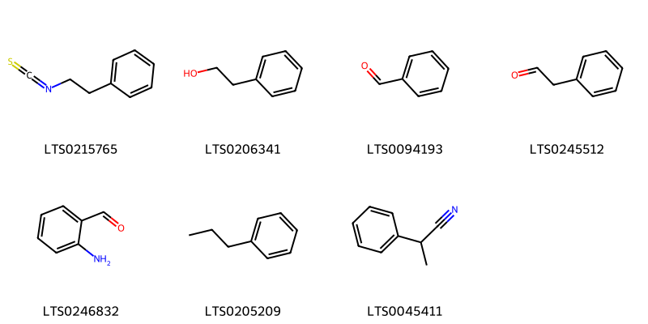{ width=100% }
    <figcaption>Hình ảnh cấu trúc hóa học của 7 hoạt chất thuộc nhóm Benzene and substituted derivatives gồm ['phenethyl isothiocyanate (LTS0215765)', '2-phenyl-ethanol (LTS0206341)', 'benzaldehyde (LTS0094193)', 'phenylacetaldehyde (LTS0245512)', '2-aminobenzaldehyde (LTS0246832)', 'propylbenzene (LTS0205209)', 'benzeneacetonitrile, α-methyl- (LTS0045411)'].</figcaption>
</figure>
#### Nhóm Cinnamic acids and derivatives
<figure markdown="span">
    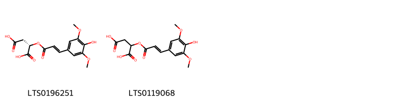{ width=100% }
    <figcaption>Hình ảnh cấu trúc hóa học của 2 hoạt chất thuộc nhóm Cinnamic acids and derivatives gồm ['sinapoyl-(s)-malate (LTS0196251)', '2-{[3-(4-hydroxy-3,5-dimethoxyphenyl)prop-2-enoyl]oxy}butanedioic acid (LTS0119068)'].</figcaption>
</figure>
#### Nhóm Fatty Acyls
<figure markdown="span">
    { width=100% }
    <figcaption>Hình ảnh cấu trúc hóa học của 9 hoạt chất thuộc nhóm Fatty Acyls gồm ['hexanol (LTS0217299)', 'methyl myristate (LTS0190399)', 'methyl palmitate (LTS0139222)', 'erucic acid (LTS0252257)', 'oleic acid (LTS0256910)', 'methyl caproate (LTS0235403)', 'methyl laurate (LTS0244704)', 'linoleic (LTS0013198)', 'gamma-linolenic acid (LTS0160094)'].</figcaption>
</figure>
#### Nhóm Flavonoids
<figure markdown="span">
    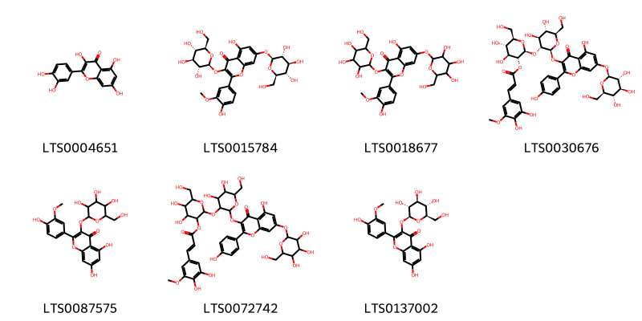{ width=100% }
    <figcaption>Hình ảnh cấu trúc hóa học của 7 hoạt chất thuộc nhóm Flavonoids gồm ['quercetin (LTS0004651)', '5-hydroxy-2-(4-hydroxy-3-methoxyphenyl)-3,7-bis({[(2s,3r,4s,5s,6r)-3,4,5-trihydroxy-6-(hydroxymethyl)oxan-2-yl]oxy})chromen-4-one (LTS0015784)', '5-hydroxy-2-(4-hydroxy-3-methoxyphenyl)-3,7-bis({[3,4,5-trihydroxy-6-(hydroxymethyl)oxan-2-yl]oxy})chromen-4-one (LTS0018677)', '(2s,3r,4s,5s,6r)-2-{[(2s,3r,4s,5s,6r)-4,5-dihydroxy-2-{[5-hydroxy-2-(4-hydroxyphenyl)-4-oxo-7-{[(2s,3r,4s,5s,6r)-3,4,5-trihydroxy-6-(hydroxymethyl)oxan-2-yl]oxy}chromen-3-yl]oxy}-6-(hydroxymethyl)oxan-3-yl]oxy}-4,5-dihydroxy-6-(hydroxymethyl)oxan-3-yl (2e)-3-(3,4-dihydroxy-5-methoxyphenyl)prop-2-enoate (LTS0030676)', 'isorhamnetin 3-galactoside (LTS0087575)', '2-[(4,5-dihydroxy-2-{[5-hydroxy-2-(4-hydroxyphenyl)-4-oxo-7-{[3,4,5-trihydroxy-6-(hydroxymethyl)oxan-2-yl]oxy}chromen-3-yl]oxy}-6-(hydroxymethyl)oxan-3-yl)oxy]-4,5-dihydroxy-6-(hydroxymethyl)oxan-3-yl 3-(3,4-dihydroxy-5-methoxyphenyl)prop-2-enoate (LTS0072742)', 'isorhamnetin 3-o-glucoside (LTS0137002)'].</figcaption>
</figure>
#### Nhóm Imidazopyrimidines
<figure markdown="span">
    { width=100% }
    <figcaption>Hình ảnh cấu trúc hóa học của 1 hoạt chất thuộc nhóm Imidazopyrimidines gồm ['zeatine (LTS0032706)'].</figcaption>
</figure>
#### Nhóm Indoles and derivatives
<figure markdown="span">
    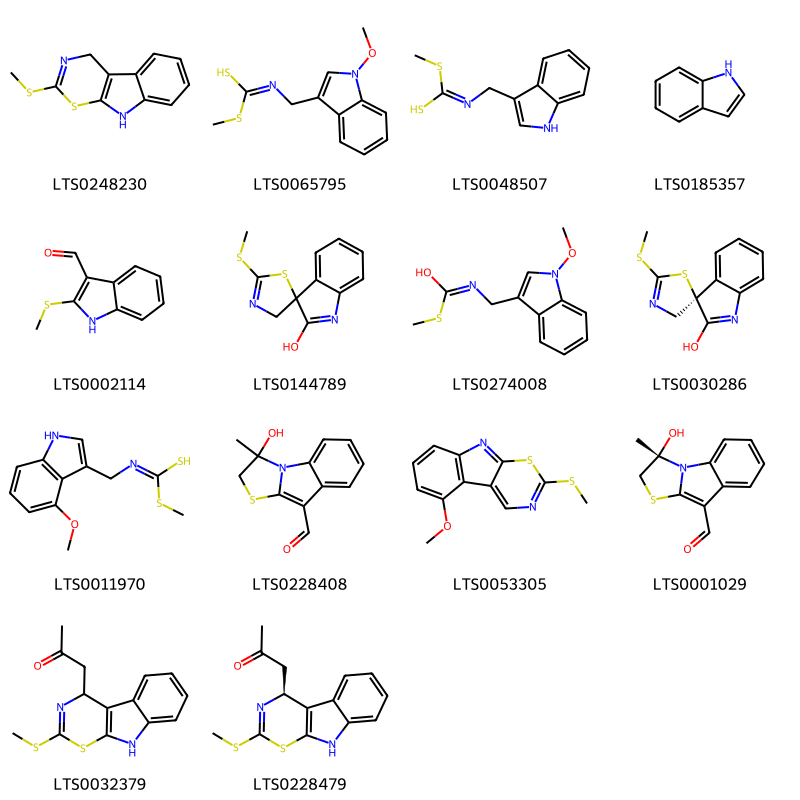{ width=100% }
    <figcaption>Hình ảnh cấu trúc hóa học của 14 hoạt chất thuộc nhóm Indoles and derivatives gồm ['2-(methylsulfanyl)-4h,9h-[1,3]thiazino[6,5-b]indole (LTS0248230)', 'n-[(1-methoxyindol-3-yl)methyl]methylsulfanylcarboimidothioic acid (LTS0065795)', 'n-(1h-indol-3-ylmethyl)methylsulfanylcarboimidothioic acid (LTS0048507)', 'indole (LTS0185357)', 'brassicanal a (LTS0002114)', "5'-(methylsulfanyl)-3'h-spiro[indole-3,2'-[1,4]thiazol]-2-ol (LTS0144789)", 'n-[(1-methoxyindol-3-yl)methyl]methylsulfanylcarboximidic acid (LTS0274008)', "(3r)-5'-(methylsulfanyl)-3'h-spiro[indole-3,2'-[1,4]thiazol]-2-ol (LTS0030286)", 'n-[(4-methoxy-1h-indol-3-yl)methyl]methylsulfanylcarboimidothioic acid (LTS0011970)', '3-hydroxy-3-methyl-2h-[1,3]thiazolo[3,2-a]indole-9-carbaldehyde (LTS0228408)', '5-methoxy-2-(methylsulfanyl)-[1,3]thiazino[6,5-b]indole (LTS0053305)', '(3s)-3-hydroxy-3-methyl-2h-[1,3]thiazolo[3,2-a]indole-9-carbaldehyde (LTS0001029)', '1-[2-(methylsulfanyl)-4h,9h-[1,3]thiazino[6,5-b]indol-4-yl]propan-2-one (LTS0032379)', '1-[(4s)-2-(methylsulfanyl)-4h,9h-[1,3]thiazino[6,5-b]indol-4-yl]propan-2-one (LTS0228479)'].</figcaption>
</figure>
#### Nhóm Isothiocyanates
<figure markdown="span">
    { width=100% }
    <figcaption>Hình ảnh cấu trúc hóa học của 2 hoạt chất thuộc nhóm Isothiocyanates gồm ['3-butenyl isothiocyanate (LTS0097937)', '2-butyl isothiocyanate (LTS0097777)'].</figcaption>
</figure>
#### Nhóm Naphthalenes
<figure markdown="span">
    { width=100% }
    <figcaption>Hình ảnh cấu trúc hóa học của 1 hoạt chất thuộc nhóm Naphthalenes gồm ['naphthalene (LTS0254484)'].</figcaption>
</figure>
#### Nhóm Organonitrogen compounds
<figure markdown="span">
    { width=100% }
    <figcaption>Hình ảnh cấu trúc hóa học của 2 hoạt chất thuộc nhóm Organonitrogen compounds gồm ['6-(methylsulfanyl)hexanenitrile (LTS0185239)', 'hex-5-enenitrile (LTS0201941)'].</figcaption>
</figure>
#### Nhóm Organooxygen compounds
<figure markdown="span">
    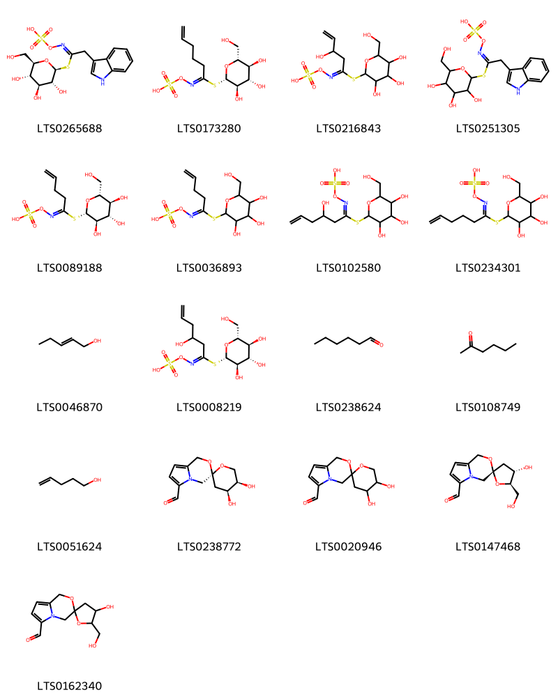{ width=100% }
    <figcaption>Hình ảnh cấu trúc hóa học của 17 hoạt chất thuộc nhóm Organooxygen compounds gồm ['glucobrassicin (LTS0265688)', '[(e)-(1-{[(2s,3r,4s,5s,6r)-3,4,5-trihydroxy-6-(hydroxymethyl)oxan-2-yl]sulfanyl}hex-5-en-1-ylidene)amino]oxysulfonic acid (LTS0173280)', '[(e)-(3-hydroxy-1-{[3,4,5-trihydroxy-6-(hydroxymethyl)oxan-2-yl]sulfanyl}pent-4-en-1-ylidene)amino]oxysulfonic acid (LTS0216843)', '[(e)-[2-(1h-indol-3-yl)-1-{[3,4,5-trihydroxy-6-(hydroxymethyl)oxan-2-yl]sulfanyl}ethylidene]amino]oxysulfonic acid (LTS0251305)', '[(e)-(1-{[(2s,3r,4s,5s,6r)-3,4,5-trihydroxy-6-(hydroxymethyl)oxan-2-yl]sulfanyl}pent-4-en-1-ylidene)amino]oxysulfonic acid (LTS0089188)', '[(e)-(1-{[3,4,5-trihydroxy-6-(hydroxymethyl)oxan-2-yl]sulfanyl}pent-4-en-1-ylidene)amino]oxysulfonic acid (LTS0036893)', '[(3-hydroxy-1-{[3,4,5-trihydroxy-6-(hydroxymethyl)oxan-2-yl]sulfanyl}hex-5-en-1-ylidene)amino]oxysulfonic acid (LTS0102580)', '[(1-{[3,4,5-trihydroxy-6-(hydroxymethyl)oxan-2-yl]sulfanyl}hex-5-en-1-ylidene)amino]oxysulfonic acid (LTS0234301)', 'pent-2-en-1-ol (LTS0046870)', '[(e)-(3-hydroxy-1-{[(2s,3r,4s,5s,6r)-3,4,5-trihydroxy-6-(hydroxymethyl)oxan-2-yl]sulfanyl}hex-5-en-1-ylidene)amino]oxysulfonic acid (LTS0008219)', 'hexanal (LTS0238624)', 'hexanone (LTS0108749)', '4-pentenol (LTS0051624)', "(2r,4s,5r)-4,5-dihydroxy-1',4'-dihydrospiro[oxane-2,3'-pyrrolo[2,1-c][1,4]oxazine]-6'-carbaldehyde (LTS0238772)", "4,5-dihydroxy-1',4'-dihydrospiro[oxane-2,3'-pyrrolo[2,1-c][1,4]oxazine]-6'-carbaldehyde (LTS0020946)", "(2r,4s,5r)-4-hydroxy-5-(hydroxymethyl)-1',4'-dihydrospiro[oxolane-2,3'-pyrrolo[2,1-c][1,4]oxazine]-6'-carbaldehyde (LTS0147468)", "4-hydroxy-5-(hydroxymethyl)-1',4'-dihydrospiro[oxolane-2,3'-pyrrolo[2,1-c][1,4]oxazine]-6'-carbaldehyde (LTS0162340)"].</figcaption>
</figure>
#### Nhóm Prenol lipids
<figure markdown="span">
    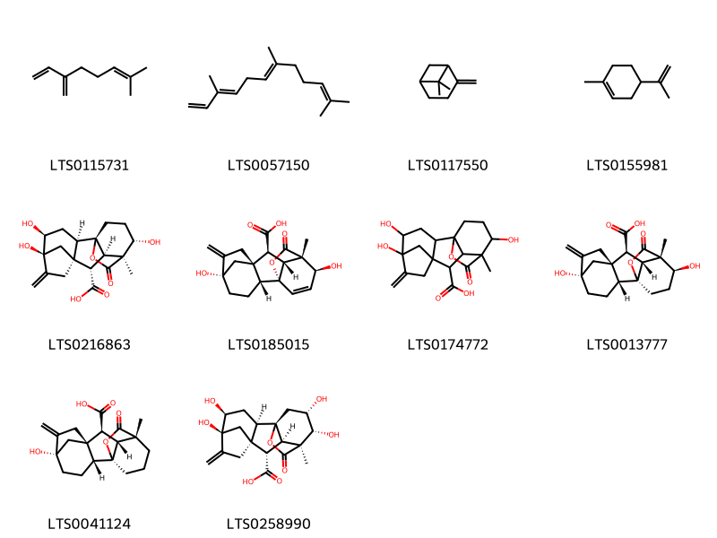{ width=100% }
    <figcaption>Hình ảnh cấu trúc hóa học của 10 hoạt chất thuộc nhóm Prenol lipids gồm ['α-myrcene (LTS0115731)', 'farnesene (LTS0057150)', 'β-pinene (LTS0117550)', 'limonene,  (LTS0155981)', '(1r,2r,4s,5s,8s,9s,10r,11s,12s)-4,5,12-trihydroxy-11-methyl-6-methylidene-16-oxo-15-oxapentacyclo[9.3.2.1⁵,⁸.0¹,¹⁰.0²,⁸]heptadecane-9-carboxylic acid (LTS0216863)', 'gibberellin a3 (LTS0185015)', '4,5,12-trihydroxy-11-methyl-6-methylidene-16-oxo-15-oxapentacyclo[9.3.2.1⁵,⁸.0¹,¹⁰.0²,⁸]heptadecane-9-carboxylic acid (LTS0174772)', 'gibberellin a1 (LTS0013777)', 'gibberellin a20 (LTS0041124)', '(1r,2r,4s,5s,8s,9s,10r,11s,12r,13s)-4,5,12,13-tetrahydroxy-11-methyl-6-methylidene-16-oxo-15-oxapentacyclo[9.3.2.1⁵,⁸.0¹,¹⁰.0²,⁸]heptadecane-9-carboxylic acid (LTS0258990)'].</figcaption>
</figure>
#### Nhóm Purine nucleosides
<figure markdown="span">
    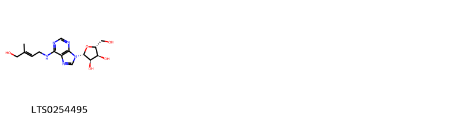{ width=100% }
    <figcaption>Hình ảnh cấu trúc hóa học của 1 hoạt chất thuộc nhóm Purine nucleosides gồm ['zeatin riboside (LTS0254495)'].</figcaption>
</figure>
#### Nhóm Saturated hydrocarbons
<figure markdown="span">
    { width=100% }
    <figcaption>Hình ảnh cấu trúc hóa học của 2 hoạt chất thuộc nhóm Saturated hydrocarbons gồm ['cetane (LTS0134950)', 'pentadecane (LTS0210146)'].</figcaption>
</figure>
#### Nhóm Steroids and steroid derivatives
<figure markdown="span">
    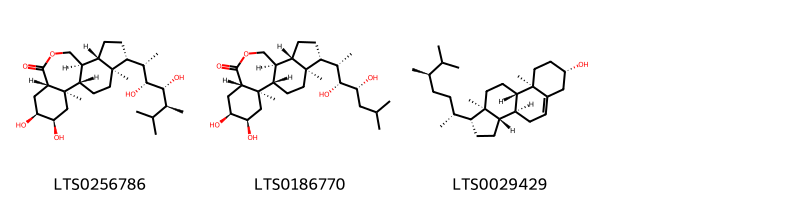{ width=100% }
    <figcaption>Hình ảnh cấu trúc hóa học của 3 hoạt chất thuộc nhóm Steroids and steroid derivatives gồm ['brassinolide (LTS0256786)', '(1s,2r,4r,5s,7s,11s,12s,15r,16s)-15-[(2s,3r,4r)-3,4-dihydroxy-6-methylheptan-2-yl]-4,5-dihydroxy-2,16-dimethyl-9-oxatetracyclo[9.7.0.0²,⁷.0¹²,¹⁶]octadecan-8-one (LTS0186770)', 'campesterol (LTS0029429)'].</figcaption>
</figure>

---

### Dược dân tộc học

Danh sách các quốc gia có sử dụng *Brassica campestris* trong điều trị các bệnh. 

| Country   | Disease     | Bệnh                   |
|:----------|:------------|:-----------------------|
| China     | Carminative | Gây ô nhiễm môi trường |
| Japan*    | Rubefacient | Chất gây xung huyết da |
| Turkey    | Laxative    | Nhuận trường           |

---

---
## Brassica chinensis
### Thông tin về thực vật

!!! info "Phân loại thực vật của *Brassica rapa* từ GIBF:"
    - **Kingdom:** Plantae
    - **Phylum:** Tracheophyta
    - **Order:** Brassicales
    - **Family:** Brassicaceae
    - **Genus:** Brassica
    - **Species:** *Brassica rapa*

 

| Label (VI)   | Label (EN)   | Scientific Name    | Descriptions (VI)   | Descriptions (EN)   | Also Known As (VI)   | Also Known As (EN)       |
|:-------------|:-------------|:-------------------|:--------------------|:--------------------|:---------------------|:-------------------------|
| N/A          | N/A          | Brassica chinensis |                     | species of plant    | ['']                 | ['pak choi', 'pak-choi'] |

#### Phân bố trên thế giới

**Từ CSDL GIBF** nan, Japan, Cook Islands, unknown or invalid, Panama, Canada, Pakistan, Denmark, Netherlands, Belarus, Chinese Taipei, Spain, Russian Federation, United States of America, Hong Kong, Suriname, Germany, Mexico, China, Poland

#### Phân bố tại Việt Nam

**Từ CSDL GIBF**: Không có ghi nhận ở Việt Nam

---
### Thành phần hóa học
        
- Theo cơ sở dữ liệu lotus: Từ loài *Brassica rapa* đã phân lập và xác định được Chưa có hoạt chất nào được phân lập. hoạt chất thuộc về các nhóm Không có hoạt chất nào được phân lập. 

Không có hình ảnh nào được tạo ra

---

### Dược dân tộc học

Danh sách các quốc gia có sử dụng *Brassica rapa* trong điều trị các bệnh. 

| Country   | Disease                                     | Bệnh                                                                   |
|:----------|:--------------------------------------------|:-----------------------------------------------------------------------|
| China     | Diuretic, Laxative, Antivinous, Refrigerant | Thuốc lợi tiểu, thuốc nhuận tràng, thuốc chống đông máu, chất làm lạnh |

---

---
## Brassica integrifolia
### Thông tin về thực vật

!!! info "Phân loại thực vật của *Brassica juncea* từ GIBF:"
    - **Kingdom:** Plantae
    - **Phylum:** Tracheophyta
    - **Order:** Brassicales
    - **Family:** Brassicaceae
    - **Genus:** Brassica
    - **Species:** *Brassica juncea*

 

| Label (VI)   | Label (EN)   | Scientific Name       | Descriptions (VI)   | Descriptions (EN)   | Also Known As (VI)   | Also Known As (EN)   |
|:-------------|:-------------|:----------------------|:--------------------|:--------------------|:---------------------|:---------------------|
| N/A          | N/A          | Brassica integrifolia | loài thực vật       | species of plant    | ['']                 | ['Mustard greens']   |

#### Phân bố trên thế giới

**Từ CSDL GIBF** nan, Japan, Guadeloupe, Venezuela (Bolivarian Republic of), Togo, Puerto Rico, Liberia, Belize, Barbados, Saint Vincent and the Grenadines, Martinique, Brazil, Côte d’Ivoire, Cuba, Dominican Republic, Singapore, China, Haiti, Colombia, India, Indonesia, Antigua and Barbuda, Philippines, Cameroon

#### Phân bố tại Việt Nam

**Từ CSDL GIBF**: Không có ghi nhận ở Việt Nam

---
### Thành phần hóa học
        
- Theo cơ sở dữ liệu lotus: Từ loài *Brassica juncea* đã phân lập và xác định được Chưa có hoạt chất nào được phân lập. hoạt chất thuộc về các nhóm Không có hoạt chất nào được phân lập. 

Không có hình ảnh nào được tạo ra

---

### Dược dân tộc học

Danh sách các quốc gia có sử dụng *Brassica juncea* trong điều trị các bệnh. 

| Country   | Disease               | Bệnh                  |
|:----------|:----------------------|:----------------------|
| Elsewhere | Emetic                | Phôi                  |
| Hindu     | Vesicant, Rubefacient | Vesicant, Rubefacient |

---

---
## Brassica juncea
### Thông tin về thực vật

!!! info "Phân loại thực vật của *Brassica juncea* từ GIBF:"
    - **Kingdom:** Plantae
    - **Phylum:** Tracheophyta
    - **Order:** Brassicales
    - **Family:** Brassicaceae
    - **Genus:** Brassica
    - **Species:** *Brassica juncea*

 

| Label (VI)   | Label (EN)   | Scientific Name   | Descriptions (VI)   | Descriptions (EN)        | Also Known As (VI)   | Also Known As (EN)                                                                                                                            |
|:-------------|:-------------|:------------------|:--------------------|:-------------------------|:---------------------|:----------------------------------------------------------------------------------------------------------------------------------------------|
| N/A          | N/A          | Brassica juncea   |                     | species of mustard plant | ['Brassica juncea']  | ['mustard greens', 'brown mustard', 'Chinese mustard', 'Gai Choy', 'Indian mustard', 'leaf mustard', 'Oriental mustard', 'vegetable mustard'] |

#### Phân bố trên thế giới

**Từ CSDL GIBF** Italy, Australia, Japan, Belgium, Estonia, Argentina, Nicaragua, Latvia, Norway, Canada, Malawi, Ukraine, Puerto Rico, Netherlands, Pakistan, Belarus, Luxembourg, Korea, Republic of, Chinese Taipei, Spain, Hungary, Algeria, Russian Federation, United States of America, Sweden, Finland, Kazakhstan, El Salvador, South Africa, Germany, Kuwait, Brazil, Switzerland, Mexico, France, Austria, British Indian Ocean Territory, United Kingdom of Great Britain and Northern Ireland, China, Ecuador, Niue, India, Kenya, Mongolia, New Zealand

#### Phân bố tại Việt Nam

**Từ CSDL GIBF**: Không có ghi nhận ở Việt Nam

---
### Thành phần hóa học
        
- Theo cơ sở dữ liệu lotus: Từ loài *Brassica juncea* đã phân lập và xác định được 87 hoạt chất thuộc về các nhóm Allyl sulfur compounds, Fatty Acyls, Naphthalenes, Flavonoids, Prenol lipids, Indoles and derivatives, Isothiocyanates, Steroids and steroid derivatives, Cinnamic acids and derivatives, Benzene and substituted derivatives, Organooxygen compounds, Saturated hydrocarbons, Thiiranes. 

|    | chemicalTaxonomyClassyfireClass     |   smiles_count |
|---:|:------------------------------------|---------------:|
|  0 | Allyl sulfur compounds              |              1 |
|  1 | Benzene and substituted derivatives |              5 |
|  2 | Cinnamic acids and derivatives      |              5 |
|  3 | Fatty Acyls                         |              4 |
|  4 | Flavonoids                          |              2 |
|  5 | Indoles and derivatives             |             10 |
|  6 | Isothiocyanates                     |              2 |
|  7 | Naphthalenes                        |              1 |
|  8 | Organooxygen compounds              |             31 |
|  9 | Prenol lipids                       |              9 |
| 10 | Saturated hydrocarbons              |              2 |
| 11 | Steroids and steroid derivatives    |              6 |
| 12 | Thiiranes                           |              6 |

#### Nhóm Allyl sulfur compounds
<figure markdown="span">
    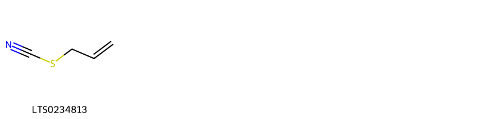{ width=100% }
    <figcaption>Hình ảnh cấu trúc hóa học của 1 hoạt chất thuộc nhóm Allyl sulfur compounds gồm ['3-thiocyanato-propene (LTS0234813)'].</figcaption>
</figure>
#### Nhóm Benzene and substituted derivatives
<figure markdown="span">
    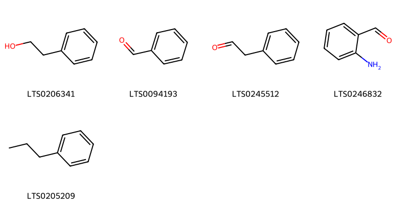{ width=100% }
    <figcaption>Hình ảnh cấu trúc hóa học của 5 hoạt chất thuộc nhóm Benzene and substituted derivatives gồm ['2-phenyl-ethanol (LTS0206341)', 'benzaldehyde (LTS0094193)', 'phenylacetaldehyde (LTS0245512)', '2-aminobenzaldehyde (LTS0246832)', 'propylbenzene (LTS0205209)'].</figcaption>
</figure>
#### Nhóm Cinnamic acids and derivatives
<figure markdown="span">
    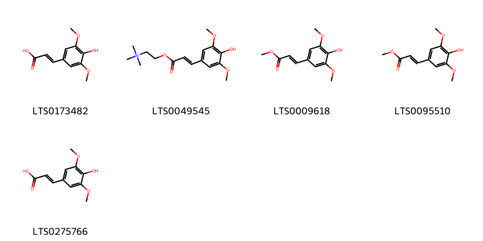{ width=100% }
    <figcaption>Hình ảnh cấu trúc hóa học của 5 hoạt chất thuộc nhóm Cinnamic acids and derivatives gồm ['sinapinate (LTS0173482)', 'sinapoylcholine (LTS0049545)', 'methyl (2e)-3-(4-hydroxy-3,5-dimethoxyphenyl)prop-2-enoate (LTS0009618)', 'methyl 3-(4-hydroxy-3,5-dimethoxyphenyl)prop-2-enoate (LTS0095510)', 'sinapoyl alcohol (LTS0275766)'].</figcaption>
</figure>
#### Nhóm Fatty Acyls
<figure markdown="span">
    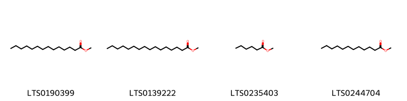{ width=100% }
    <figcaption>Hình ảnh cấu trúc hóa học của 4 hoạt chất thuộc nhóm Fatty Acyls gồm ['methyl myristate (LTS0190399)', 'methyl palmitate (LTS0139222)', 'methyl caproate (LTS0235403)', 'methyl laurate (LTS0244704)'].</figcaption>
</figure>
#### Nhóm Flavonoids
<figure markdown="span">
    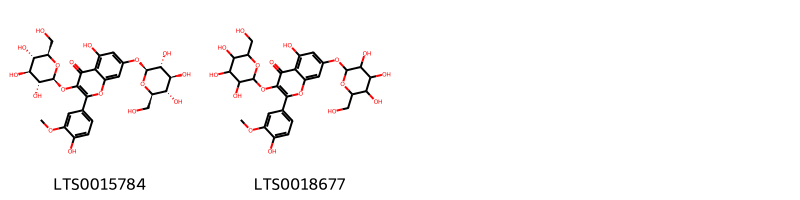{ width=100% }
    <figcaption>Hình ảnh cấu trúc hóa học của 2 hoạt chất thuộc nhóm Flavonoids gồm ['5-hydroxy-2-(4-hydroxy-3-methoxyphenyl)-3,7-bis({[(2s,3r,4s,5s,6r)-3,4,5-trihydroxy-6-(hydroxymethyl)oxan-2-yl]oxy})chromen-4-one (LTS0015784)', '5-hydroxy-2-(4-hydroxy-3-methoxyphenyl)-3,7-bis({[3,4,5-trihydroxy-6-(hydroxymethyl)oxan-2-yl]oxy})chromen-4-one (LTS0018677)'].</figcaption>
</figure>
#### Nhóm Indoles and derivatives
<figure markdown="span">
    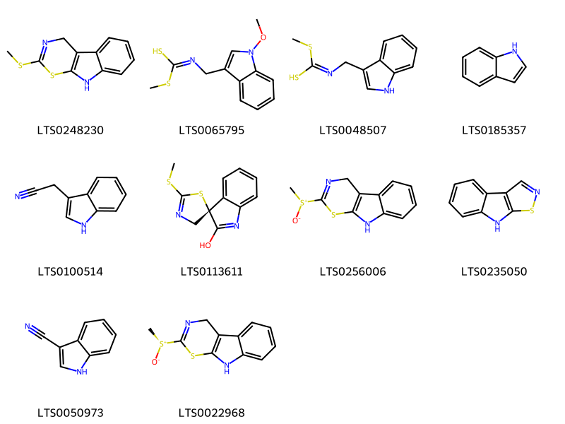{ width=100% }
    <figcaption>Hình ảnh cấu trúc hóa học của 10 hoạt chất thuộc nhóm Indoles and derivatives gồm ['2-(methylsulfanyl)-4h,9h-[1,3]thiazino[6,5-b]indole (LTS0248230)', 'n-[(1-methoxyindol-3-yl)methyl]methylsulfanylcarboimidothioic acid (LTS0065795)', 'n-(1h-indol-3-ylmethyl)methylsulfanylcarboimidothioic acid (LTS0048507)', 'indole (LTS0185357)', 'indole-3-acetonitrile (LTS0100514)', "(3s)-5'-(methylsulfanyl)-3'h-spiro[indole-3,2'-[1,4]thiazol]-2-ol (LTS0113611)", '2-methanesulfinyl-4h,9h-[1,3]thiazino[6,5-b]indole (LTS0256006)', '8h-[1,2]thiazolo[5,4-b]indole (LTS0235050)', '3-cyanoindole (LTS0050973)', '2-[(s)-methanesulfinyl]-4h,9h-[1,3]thiazino[6,5-b]indole (LTS0022968)'].</figcaption>
</figure>
#### Nhóm Isothiocyanates
<figure markdown="span">
    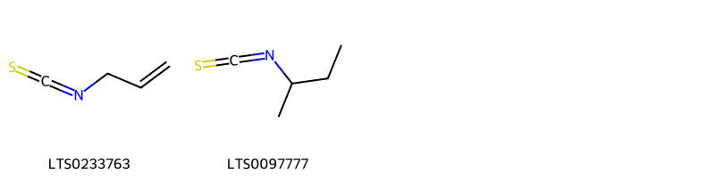{ width=100% }
    <figcaption>Hình ảnh cấu trúc hóa học của 2 hoạt chất thuộc nhóm Isothiocyanates gồm ['allyl isothiocyanate (LTS0233763)', '2-butyl isothiocyanate (LTS0097777)'].</figcaption>
</figure>
#### Nhóm Naphthalenes
<figure markdown="span">
    { width=100% }
    <figcaption>Hình ảnh cấu trúc hóa học của 1 hoạt chất thuộc nhóm Naphthalenes gồm ['naphthalene (LTS0254484)'].</figcaption>
</figure>
#### Nhóm Organooxygen compounds
<figure markdown="span">
    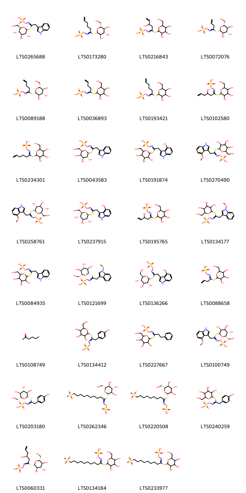{ width=100% }
    <figcaption>Hình ảnh cấu trúc hóa học của 31 hoạt chất thuộc nhóm Organooxygen compounds gồm ['glucobrassicin (LTS0265688)', '[(e)-(1-{[(2s,3r,4s,5s,6r)-3,4,5-trihydroxy-6-(hydroxymethyl)oxan-2-yl]sulfanyl}hex-5-en-1-ylidene)amino]oxysulfonic acid (LTS0173280)', '[(e)-(3-hydroxy-1-{[3,4,5-trihydroxy-6-(hydroxymethyl)oxan-2-yl]sulfanyl}pent-4-en-1-ylidene)amino]oxysulfonic acid (LTS0216843)', '[(e)-(1-{[(2s,3r,4s,5s,6r)-3,4,5-trihydroxy-6-(hydroxymethyl)oxan-2-yl]sulfanyl}but-3-en-1-ylidene)amino]oxysulfonic acid (LTS0072076)', '[(e)-(1-{[(2s,3r,4s,5s,6r)-3,4,5-trihydroxy-6-(hydroxymethyl)oxan-2-yl]sulfanyl}pent-4-en-1-ylidene)amino]oxysulfonic acid (LTS0089188)', '[(e)-(1-{[3,4,5-trihydroxy-6-(hydroxymethyl)oxan-2-yl]sulfanyl}pent-4-en-1-ylidene)amino]oxysulfonic acid (LTS0036893)', '[(e)-(1-{[3,4,5-trihydroxy-6-(hydroxymethyl)oxan-2-yl]sulfanyl}hex-5-en-1-ylidene)amino]oxysulfonic acid (LTS0193421)', '[(3-hydroxy-1-{[3,4,5-trihydroxy-6-(hydroxymethyl)oxan-2-yl]sulfanyl}hex-5-en-1-ylidene)amino]oxysulfonic acid (LTS0102580)', '[(1-{[3,4,5-trihydroxy-6-(hydroxymethyl)oxan-2-yl]sulfanyl}hex-5-en-1-ylidene)amino]oxysulfonic acid (LTS0234301)', '[(z)-[2-(1h-indol-3-yl)-1-{[(2s,3r,4s,5r,6r)-3,4,5-trihydroxy-6-(hydroxymethyl)oxan-2-yl]sulfanyl}ethylidene]amino]oxysulfonic acid (LTS0043583)', '{[2-(4-hydroxy-1h-indol-3-yl)-1-{[3,4,5-trihydroxy-6-(hydroxymethyl)oxan-2-yl]sulfanyl}ethylidene]amino}oxysulfonic acid (LTS0191874)', '{[2-(4-methoxy-1h-indol-3-yl)-1-{[3,4,5-trihydroxy-6-(hydroxymethyl)oxan-2-yl]sulfanyl}ethylidene]amino}oxysulfonic acid (LTS0270490)', '4-methoxyglucobrassicin (LTS0258761)', '[(z)-[2-(4-hydroxy-1h-indol-3-yl)-1-{[(2s,3r,4s,5s,6r)-3,4,5-trihydroxy-6-(hydroxymethyl)oxan-2-yl]sulfanyl}ethylidene]amino]oxysulfonic acid (LTS0237915)', '[(3-hydroxy-1-{[3,4,5-trihydroxy-6-(hydroxymethyl)oxan-2-yl]sulfanyl}pent-4-en-1-ylidene)amino]oxysulfonic acid (LTS0195765)', '{[2-(1-methoxyindol-3-yl)-1-{[3,4,5-trihydroxy-6-(hydroxymethyl)oxan-2-yl]sulfanyl}ethylidene]amino}oxysulfonic acid (LTS0134177)', '{[2-(1h-indol-3-yl)-1-{[3,4,5-trihydroxy-6-(hydroxymethyl)oxan-2-yl]sulfanyl}ethylidene]amino}oxysulfonic acid (LTS0084935)', 'mimg (LTS0121699)', '[(e)-[2-(4-hydroxy-1h-indol-3-yl)-1-{[(2s,3r,4s,5s,6r)-3,4,5-trihydroxy-6-(hydroxymethyl)oxan-2-yl]sulfanyl}ethylidene]amino]oxysulfonic acid (LTS0136266)', '[(1-{[3,4,5-trihydroxy-6-(hydroxymethyl)oxan-2-yl]sulfanyl}but-3-en-1-ylidene)amino]oxysulfonic acid (LTS0088658)', 'hexanone (LTS0108749)', '[(e)-[2-(4-hydroxyphenyl)-1-{[3,4,5-trihydroxy-6-(hydroxymethyl)oxan-2-yl]sulfanyl}ethylidene]amino]oxysulfonic acid (LTS0134412)', '[(3-phenyl-1-{[3,4,5-trihydroxy-6-(hydroxymethyl)oxan-2-yl]sulfanyl}propylidene)amino]oxysulfonic acid (LTS0227667)', '[(z)-[2-(4-methoxy-1h-indol-3-yl)-1-{[(2s,3s,4s,5s,6s)-3,4,5-trihydroxy-6-(hydroxymethyl)oxan-2-yl]sulfanyl}ethylidene]amino]oxysulfonic acid (LTS0100749)', 'sinalbin (LTS0203180)', '[(z)-(10-methanesulfonyl-1-{[(2s,3r,4s,5s,6r)-3,4,5-trihydroxy-6-(hydroxymethyl)oxan-2-yl]sulfanyl}decylidene)amino]oxysulfonic acid (LTS0262346)', '[(z)-(9-methanesulfonyl-1-{[(2s,3r,4s,5s,6r)-3,4,5-trihydroxy-6-(hydroxymethyl)oxan-2-yl]sulfanyl}nonylidene)amino]oxysulfonic acid (LTS0220508)', 'sinalbin (LTS0240259)', '[(z)-[(3s)-3-hydroxy-1-{[(2s,3r,4s,5s,6r)-3,4,5-trihydroxy-6-(hydroxymethyl)oxan-2-yl]sulfanyl}hex-5-en-1-ylidene]amino]oxysulfonic acid (LTS0060331)', '[(10-methanesulfonyl-1-{[3,4,5-trihydroxy-6-(hydroxymethyl)oxan-2-yl]sulfanyl}decylidene)amino]oxysulfonic acid (LTS0134184)', '[(9-methanesulfonyl-1-{[3,4,5-trihydroxy-6-(hydroxymethyl)oxan-2-yl]sulfanyl}nonylidene)amino]oxysulfonic acid (LTS0233977)'].</figcaption>
</figure>
#### Nhóm Prenol lipids
<figure markdown="span">
    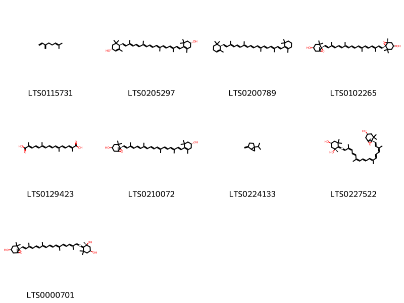{ width=100% }
    <figcaption>Hình ảnh cấu trúc hóa học của 9 hoạt chất thuộc nhóm Prenol lipids gồm ['α-myrcene (LTS0115731)', 'carotenoid (LTS0205297)', '(+)-α-carotene (LTS0200789)', 'violaxanthin (LTS0102265)', 'crocetin (LTS0129423)', 'antheraxanthin (LTS0210072)', 'sabinene (LTS0224133)', 'neoxanthin (LTS0227522)', 'neoxanthin (LTS0000701)'].</figcaption>
</figure>
#### Nhóm Saturated hydrocarbons
<figure markdown="span">
    { width=100% }
    <figcaption>Hình ảnh cấu trúc hóa học của 2 hoạt chất thuộc nhóm Saturated hydrocarbons gồm ['cetane (LTS0134950)', 'pentadecane (LTS0210146)'].</figcaption>
</figure>
#### Nhóm Steroids and steroid derivatives
<figure markdown="span">
    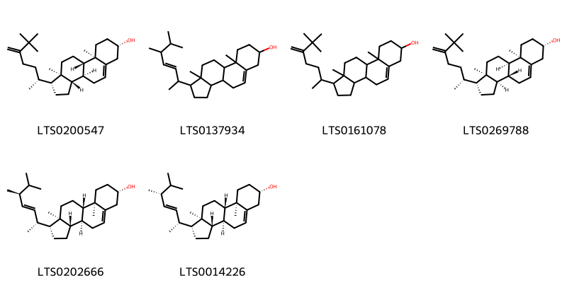{ width=100% }
    <figcaption>Hình ảnh cấu trúc hóa học của 6 hoạt chất thuộc nhóm Steroids and steroid derivatives gồm ['(1r,3as,3bs,7s,9ar,9bs,11ar)-1-[(2r)-6,6-dimethyl-5-methylideneheptan-2-yl]-9a,11a-dimethyl-1h,2h,3h,3ah,3bh,4h,6h,7h,8h,9h,9bh,10h,11h-cyclopenta[a]phenanthren-7-ol (LTS0200547)', '1-(5,6-dimethylhept-3-en-2-yl)-9a,11a-dimethyl-1h,2h,3h,3ah,3bh,4h,6h,7h,8h,9h,9bh,10h,11h-cyclopenta[a]phenanthren-7-ol (LTS0137934)', '1-(6,6-dimethyl-5-methylideneheptan-2-yl)-9a,11a-dimethyl-1h,2h,3h,3ah,3bh,4h,6h,7h,8h,9h,9bh,10h,11h-cyclopenta[a]phenanthren-7-ol (LTS0161078)', '(1r,3ar,3br,7s,9ar,9br,11ar)-1-[(2r)-6,6-dimethyl-5-methylideneheptan-2-yl]-9a,11a-dimethyl-1h,2h,3h,3ah,3bh,4h,6h,7h,8h,9h,9bh,10h,11h-cyclopenta[a]phenanthren-7-ol (LTS0269788)', '(1r,3as,3bs,7s,9ar,9bs,11ar)-1-[(2r,3e,5s)-5,6-dimethylhept-3-en-2-yl]-9a,11a-dimethyl-1h,2h,3h,3ah,3bh,4h,6h,7h,8h,9h,9bh,10h,11h-cyclopenta[a]phenanthren-7-ol (LTS0202666)', 'brassicasterol (LTS0014226)'].</figcaption>
</figure>
#### Nhóm Thiiranes
<figure markdown="span">
    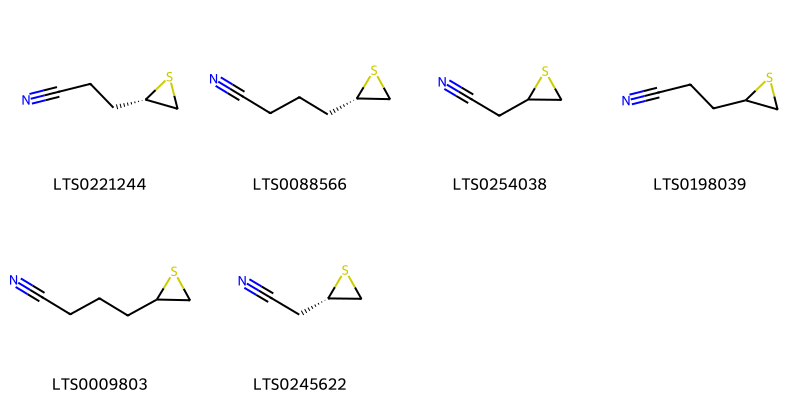{ width=100% }
    <figcaption>Hình ảnh cấu trúc hóa học của 6 hoạt chất thuộc nhóm Thiiranes gồm ['3-[(2s)-thiiran-2-yl]propanenitrile (LTS0221244)', '4-[(2s)-thiiran-2-yl]butanenitrile (LTS0088566)', '2-(thiiran-2-yl)acetonitrile (LTS0254038)', '3-(thiiran-2-yl)propanenitrile (LTS0198039)', '4-(thiiran-2-yl)butanenitrile (LTS0009803)', '2-[(2s)-thiiran-2-yl]acetonitrile (LTS0245622)'].</figcaption>
</figure>

---

### Dược dân tộc học

Danh sách các quốc gia có sử dụng *Brassica juncea* trong điều trị các bệnh. 

| Country   | Disease                                           | Bệnh                                                          |
|:----------|:--------------------------------------------------|:--------------------------------------------------------------|
| China     | Emetic, Rubefacient, Stimulant, Apertif, Diuretic | Emetic, Rubefacient, Chất kích thích, Apertif, Thuốc lợi tiểu |
| Chinese   | Rubefacient                                       | Chất gây xung huyết da                                        |
| Java      | Emmenagogue                                       | Emmenagogue                                                   |

---

---
## Brassica kaber
### Thông tin về thực vật

!!! info "Phân loại thực vật của *Sinapis arvensis* từ GIBF:"
    - **Kingdom:** Plantae
    - **Phylum:** Tracheophyta
    - **Order:** Brassicales
    - **Family:** Brassicaceae
    - **Genus:** Sinapis
    - **Species:** *Sinapis arvensis*

 

| Label (VI)   | Label (EN)   | Scientific Name   | Descriptions (VI)   | Descriptions (EN)   | Also Known As (VI)   | Also Known As (EN)   |
|:-------------|:-------------|:------------------|:--------------------|:--------------------|:---------------------|:---------------------|
| N/A          | N/A          | Brassica kaber    |                     |                     | ['']                 | ['']                 |

#### Phân bố trên thế giới

**Từ CSDL GIBF** nan, United States of America, Canada, Mexico

#### Phân bố tại Việt Nam

**Từ CSDL GIBF**: Không có ghi nhận ở Việt Nam

---
### Thành phần hóa học
        
- Theo cơ sở dữ liệu lotus: Từ loài *Sinapis arvensis* đã phân lập và xác định được Chưa có hoạt chất nào được phân lập. hoạt chất thuộc về các nhóm Không có hoạt chất nào được phân lập. 

Không có hình ảnh nào được tạo ra

---

### Dược dân tộc học

Danh sách các quốc gia có sử dụng *Sinapis arvensis* trong điều trị các bệnh. 

| Country            | Disease     | Bệnh                   |
|:-------------------|:------------|:-----------------------|
| Dominican Republic | Rubefacient | Chất gây xung huyết da |

---

---
## Brassica napus
### Thông tin về thực vật

!!! info "Phân loại thực vật của *Brassica napus* từ GIBF:"
    - **Kingdom:** Plantae
    - **Phylum:** Tracheophyta
    - **Order:** Brassicales
    - **Family:** Brassicaceae
    - **Genus:** Brassica
    - **Species:** *Brassica napus*

 

| Label (VI)   | Label (EN)   | Scientific Name   | Descriptions (VI)   | Descriptions (EN)   | Also Known As (VI)   | Also Known As (EN)                                                  |
|:-------------|:-------------|:------------------|:--------------------|:--------------------|:---------------------|:--------------------------------------------------------------------|
| N/A          | N/A          | Brassica napus    | loài thực vật       | species of plant    | ['']                 | ['Brassica napus subsp. napus', 'rape', 'oilseed rape', 'rapeseed'] |

#### Phân bố trên thế giới

**Từ CSDL GIBF** Italy, Belgium, Slovakia, Ukraine, Denmark, Netherlands, Belarus, Luxembourg, Korea, Republic of, Chinese Taipei, Spain, Hungary, Russian Federation, United States of America, Slovenia, Croatia, Czechia, Germany, Romania, Switzerland, Mexico, France, Austria, United Kingdom of Great Britain and Northern Ireland, Ecuador, Iraq, Ireland, Poland, New Zealand

#### Phân bố tại Việt Nam

**Từ CSDL GIBF**: Không có ghi nhận ở Việt Nam

---
### Thành phần hóa học
        
- Theo cơ sở dữ liệu lotus: Từ loài *Brassica napus* đã phân lập và xác định được 271 hoạt chất thuộc về các nhóm Stilbenes, Phenols, Carboxylic acids and derivatives, Fatty Acyls, Indoles and derivatives, Cinnamic acids and derivatives, Dibenzylbutane lignans, Heteroaromatic compounds, Saturated hydrocarbons, Tannins, Tetrapyrroles and derivatives, Isothiocyanates, Prenol lipids, Azolidines, Sphingolipids, Purine nucleosides, Benzene and substituted derivatives, Organic trisulfides, Organooxygen compounds, Furanoid lignans, Flavonoids, Steroids and steroid derivatives, Peptidomimetics, Thioethers, Organonitrogen compounds, Thiiranes, Imidazopyrimidines. 

|    | chemicalTaxonomyClassyfireClass     |   smiles_count |
|---:|:------------------------------------|---------------:|
|  0 | Azolidines                          |              5 |
|  1 | Benzene and substituted derivatives |             13 |
|  2 | Carboxylic acids and derivatives    |             25 |
|  3 | Cinnamic acids and derivatives      |             30 |
|  4 | Dibenzylbutane lignans              |              2 |
|  5 | Fatty Acyls                         |             14 |
|  6 | Flavonoids                          |             26 |
|  7 | Furanoid lignans                    |              1 |
|  8 | Heteroaromatic compounds            |              1 |
|  9 | Imidazopyrimidines                  |              2 |
| 10 | Indoles and derivatives             |              3 |
| 11 | Isothiocyanates                     |              5 |
| 12 | Organic trisulfides                 |              1 |
| 13 | Organonitrogen compounds            |              4 |
| 14 | Organooxygen compounds              |             55 |
| 15 | Peptidomimetics                     |              6 |
| 16 | Phenols                             |              3 |
| 17 | Prenol lipids                       |             45 |
| 18 | Purine nucleosides                  |              1 |
| 19 | Saturated hydrocarbons              |              6 |
| 20 | Sphingolipids                       |              3 |
| 21 | Steroids and steroid derivatives    |              6 |
| 22 | Stilbenes                           |              1 |
| 23 | Tannins                             |              2 |
| 24 | Tetrapyrroles and derivatives       |              2 |
| 25 | Thiiranes                           |              4 |
| 26 | Thioethers                          |              1 |

#### Nhóm Azolidines
<figure markdown="span">
    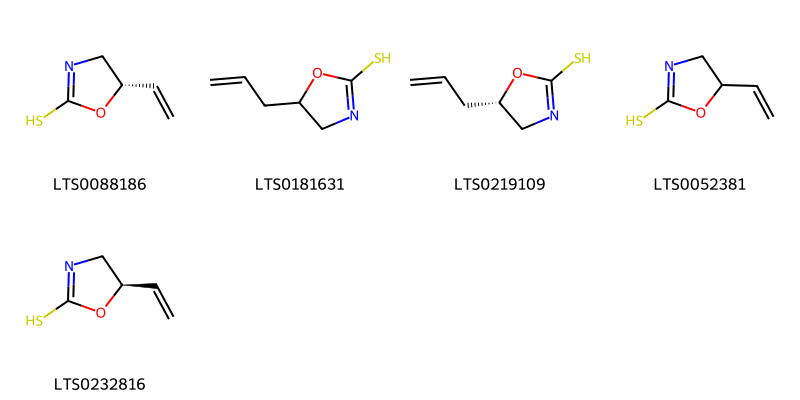{ width=100% }
    <figcaption>Hình ảnh cấu trúc hóa học của 5 hoạt chất thuộc nhóm Azolidines gồm ['(5s)-5-ethenyl-4,5-dihydro-1,3-oxazole-2-thiol (LTS0088186)', '5-(prop-2-en-1-yl)-4,5-dihydro-1,3-oxazole-2-thiol (LTS0181631)', '(5s)-5-(prop-2-en-1-yl)-4,5-dihydro-1,3-oxazole-2-thiol (LTS0219109)', 'goitrin (LTS0052381)', '(5r)-5-ethenyl-4,5-dihydro-1,3-oxazole-2-thiol (LTS0232816)'].</figcaption>
</figure>
#### Nhóm Benzene and substituted derivatives
<figure markdown="span">
    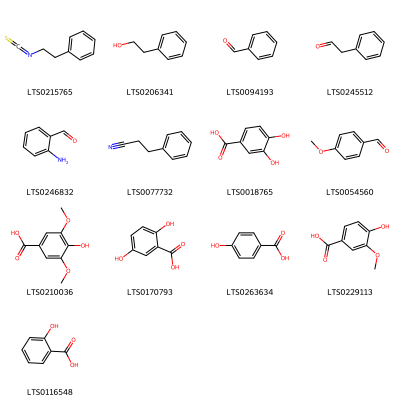{ width=100% }
    <figcaption>Hình ảnh cấu trúc hóa học của 13 hoạt chất thuộc nhóm Benzene and substituted derivatives gồm ['phenethyl isothiocyanate (LTS0215765)', '2-phenyl-ethanol (LTS0206341)', 'benzaldehyde (LTS0094193)', 'phenylacetaldehyde (LTS0245512)', '2-aminobenzaldehyde (LTS0246832)', 'benzylacetonitrile (LTS0077732)', '3,4-dihydroxybenzoic acid (LTS0018765)', 'anisaldehyde (LTS0054560)', 'syringic acid (LTS0210036)', '2,5-dihydroxybenzoic acid (LTS0170793)', 'p-hydroxybenzoic acid (LTS0263634)', 'vanillic acid (LTS0229113)', 'salicyclic acid (LTS0116548)'].</figcaption>
</figure>
#### Nhóm Carboxylic acids and derivatives
<figure markdown="span">
    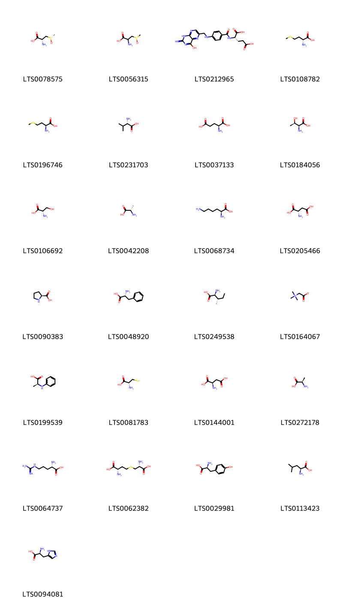{ width=100% }
    <figcaption>Hình ảnh cấu trúc hóa học của 25 hoạt chất thuộc nhóm Carboxylic acids and derivatives gồm ['(2r)-2-amino-3-[(s)-methanesulfinyl]propanoic acid (LTS0078575)', '2-amino-3-methanesulfinylpropanoic acid (LTS0056315)', 'acid, folic (LTS0212965)', 'd-methionine (LTS0108782)', 'l-methionine (LTS0196746)', 'l-valine (LTS0231703)', 'l-glutamic acid (LTS0037133)', 'l-threonine (LTS0184056)', 'l-serine (LTS0106692)', 'l-alanine (LTS0042208)', 'l-lysine (LTS0068734)', 'l-aspartic acid (LTS0205466)', 'l-proline (LTS0090383)', 'd-phenylalanine (LTS0048920)', 'l-isoleucine (LTS0249538)', 'bet (LTS0164067)', '(2s)-2-(phenylamino)propanoic acid (LTS0199539)', 'l-cysteine (LTS0081783)', 'd-aspartic acid (LTS0144001)', 'd-alanine (LTS0272178)', 'l-arginine (LTS0064737)', 'l-cystathionine (LTS0062382)', 'l-tyrosine (LTS0029981)', 'l-leucine (LTS0113423)', 'l-histidine (LTS0094081)'].</figcaption>
</figure>
#### Nhóm Cinnamic acids and derivatives
<figure markdown="span">
    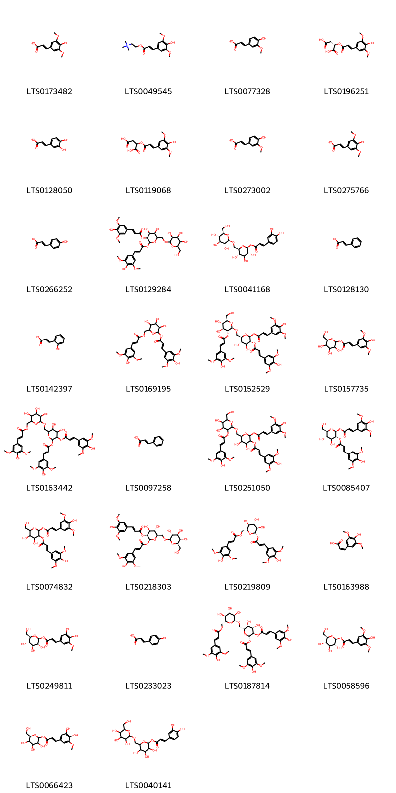{ width=100% }
    <figcaption>Hình ảnh cấu trúc hóa học của 30 hoạt chất thuộc nhóm Cinnamic acids and derivatives gồm ['sinapinate (LTS0173482)', 'sinapoylcholine (LTS0049545)', 'ferulic acid (LTS0077328)', 'sinapoyl-(s)-malate (LTS0196251)', '3,4-dihydroxycinnamic acid (LTS0128050)', '2-{[3-(4-hydroxy-3,5-dimethoxyphenyl)prop-2-enoyl]oxy}butanedioic acid (LTS0119068)', 'ferulic acid (LTS0273002)', 'sinapoyl alcohol (LTS0275766)', 'para-coumaric acid (LTS0266252)', '4,5-dihydroxy-3-{[3-(4-hydroxy-3,5-dimethoxyphenyl)prop-2-enoyl]oxy}-6-({[3,4,5-trihydroxy-6-(hydroxymethyl)oxan-2-yl]oxy}methyl)oxan-2-yl 3-(4-hydroxy-3,5-dimethoxyphenyl)prop-2-enoate (LTS0129284)', '(2s,3r,4s,5s,6r)-3,4,5-trihydroxy-6-({[(2r,3r,4s,5s,6r)-3,4,5-trihydroxy-6-(hydroxymethyl)oxan-2-yl]oxy}methyl)oxan-2-yl (2e)-3-(3,4-dihydroxyphenyl)prop-2-enoate (LTS0041168)', 'cinnamic acid (LTS0128130)', 'trans-2-hydroxycinnamic acid (LTS0142397)', '(3,4,5-trihydroxy-6-{[3-(4-hydroxy-3,5-dimethoxyphenyl)prop-2-enoyl]oxy}oxan-2-yl)methyl 3-(4-hydroxy-3,5-dimethoxyphenyl)prop-2-enoate (LTS0169195)', '(2s,3r,4s,5s,6r)-6-({[(2r,3r,4s,5s,6r)-4,5-dihydroxy-3-{[(2e)-3-(4-hydroxy-3,5-dimethoxyphenyl)prop-2-enoyl]oxy}-6-(hydroxymethyl)oxan-2-yl]oxy}methyl)-4,5-dihydroxy-3-{[(2e)-3-(4-hydroxy-3,5-dimethoxyphenyl)prop-2-enoyl]oxy}oxan-2-yl (2e)-3-(4-hydroxy-3,5-dimethoxyphenyl)prop-2-enoate (LTS0152529)', '3,4,5-trihydroxy-6-(hydroxymethyl)oxan-2-yl 3-(4-hydroxy-3,5-dimethoxyphenyl)prop-2-enoate (LTS0157735)', '(6-{[3,4-dihydroxy-5,6-bis({[3-(4-hydroxy-3,5-dimethoxyphenyl)prop-2-enoyl]oxy})oxan-2-yl]methoxy}-3,4,5-trihydroxyoxan-2-yl)methyl 3-(4-hydroxy-3,5-dimethoxyphenyl)prop-2-enoate (LTS0163442)', 'phenylacrylic acid (LTS0097258)', '6-{[(4,5-dihydroxy-3-{[3-(4-hydroxy-3,5-dimethoxyphenyl)prop-2-enoyl]oxy}-6-(hydroxymethyl)oxan-2-yl)oxy]methyl}-4,5-dihydroxy-3-{[3-(4-hydroxy-3,5-dimethoxyphenyl)prop-2-enoyl]oxy}oxan-2-yl 3-(4-hydroxy-3,5-dimethoxyphenyl)prop-2-enoate (LTS0251050)', '1,2-di-o-sinapoyl-β-d-glucose (LTS0085407)', '4,5-dihydroxy-3-{[3-(4-hydroxy-3,5-dimethoxyphenyl)prop-2-enoyl]oxy}-6-(hydroxymethyl)oxan-2-yl 3-(4-hydroxy-3,5-dimethoxyphenyl)prop-2-enoate (LTS0074832)', '(2s,3r,4s,5s,6r)-4,5-dihydroxy-3-{[(2e)-3-(4-hydroxy-3,5-dimethoxyphenyl)prop-2-enoyl]oxy}-6-({[(2r,3r,4s,5s,6r)-3,4,5-trihydroxy-6-(hydroxymethyl)oxan-2-yl]oxy}methyl)oxan-2-yl (2e)-3-(4-hydroxy-3,5-dimethoxyphenyl)prop-2-enoate (LTS0218303)', '[(2r,3s,4s,5r,6s)-3,4,5-trihydroxy-6-{[(2e)-3-(4-hydroxy-3,5-dimethoxyphenyl)prop-2-enoyl]oxy}oxan-2-yl]methyl (2e)-3-(4-hydroxy-3,5-dimethoxyphenyl)prop-2-enoate (LTS0219809)', '(z)-sinapic acid (LTS0163988)', '(2s,3r,4s,5s,6r)-3,4,5-trihydroxy-6-(hydroxymethyl)oxan-2-yl (2e)-3-(3,4-dihydroxy-5-methoxyphenyl)prop-2-enoate (LTS0249811)', 'hydroxycinnamic acid (LTS0233023)', '[(2r,3s,4s,5r,6r)-6-{[(2r,3s,4s,5r,6s)-3,4-dihydroxy-5,6-bis({[(2e)-3-(4-hydroxy-3,5-dimethoxyphenyl)prop-2-enoyl]oxy})oxan-2-yl]methoxy}-3,4,5-trihydroxyoxan-2-yl]methyl (2e)-3-(4-hydroxy-3,5-dimethoxyphenyl)prop-2-enoate (LTS0187814)', '1-o-sinapoyl-β-d-glucose (LTS0058596)', '3,4,5-trihydroxy-6-(hydroxymethyl)oxan-2-yl 3-(3,4-dihydroxy-5-methoxyphenyl)prop-2-enoate (LTS0066423)', '3,4,5-trihydroxy-6-({[3,4,5-trihydroxy-6-(hydroxymethyl)oxan-2-yl]oxy}methyl)oxan-2-yl 3-(3,4-dihydroxyphenyl)prop-2-enoate (LTS0040141)'].</figcaption>
</figure>
#### Nhóm Dibenzylbutane lignans
<figure markdown="span">
    { width=100% }
    <figcaption>Hình ảnh cấu trúc hóa học của 2 hoạt chất thuộc nhóm Dibenzylbutane lignans gồm ['secoisolariciresinol (LTS0086727)', '(2s,3r)-2,3-bis[(4-hydroxy-3-methoxyphenyl)(¹³c)methyl](1-¹³c)butane-1,4-diol (LTS0268699)'].</figcaption>
</figure>
#### Nhóm Fatty Acyls
<figure markdown="span">
    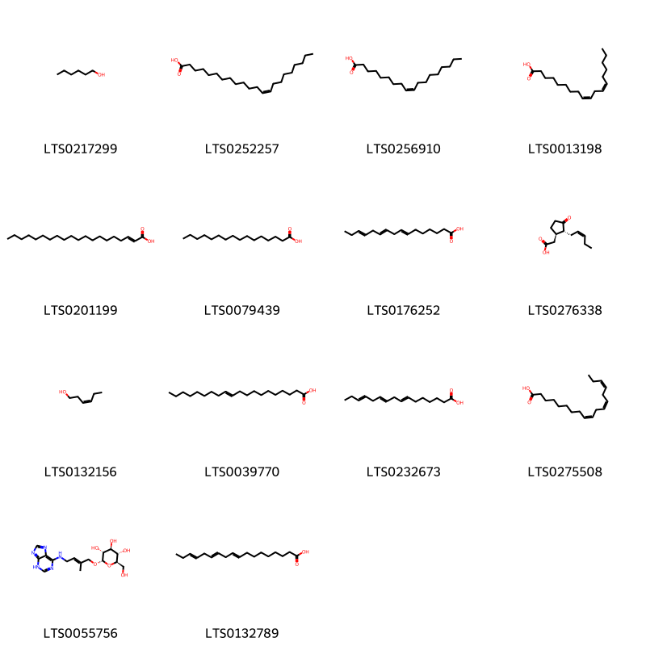{ width=100% }
    <figcaption>Hình ảnh cấu trúc hóa học của 14 hoạt chất thuộc nhóm Fatty Acyls gồm ['hexanol (LTS0217299)', 'erucic acid (LTS0252257)', 'oleic acid (LTS0256910)', 'linoleic (LTS0013198)', 'icos-2-enoic acid (LTS0201199)', 'palmitic acid (LTS0079439)', '(7e,10e,13e)-roughanic acid (LTS0176252)', 'jasmonic acid (LTS0276338)', 'cis-3-hexenol (LTS0132156)', 'icosenoic acid (LTS0039770)', '7,10,13-hexadecatrienoic acid (LTS0232673)', 'α-linolenic acid (LTS0275508)', '(2r,3s,4s,5r,6s)-2-(hydroxymethyl)-6-{[(2e)-2-methyl-4-(3h-purin-6-ylamino)but-2-en-1-yl]oxy}oxane-3,4,5-triol (LTS0055756)', 'α linolenic acid (LTS0132789)'].</figcaption>
</figure>
#### Nhóm Flavonoids
<figure markdown="span">
    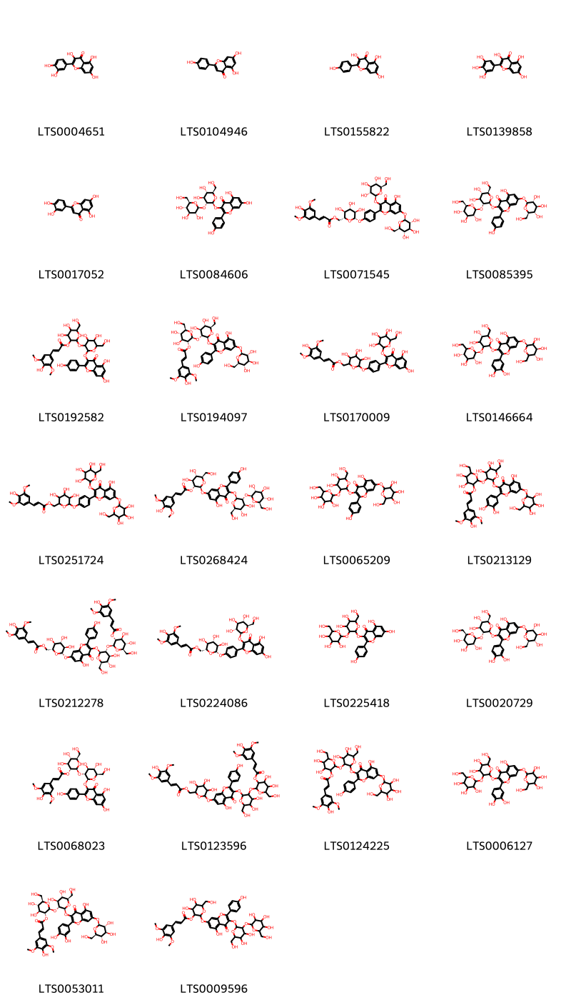{ width=100% }
    <figcaption>Hình ảnh cấu trúc hóa học của 26 hoạt chất thuộc nhóm Flavonoids gồm ['quercetin (LTS0004651)', 'chamomile (LTS0104946)', 'kaempherol (LTS0155822)', 'myricetin (LTS0139858)', 'luteolin (LTS0017052)', 'kaempferol 3-o-sophoroside (LTS0084606)', '[(2r,3s,4s,5r,6s)-3,4,5-trihydroxy-6-{4-[5-hydroxy-4-oxo-3,7-bis({[(2s,3r,4s,5s,6r)-3,4,5-trihydroxy-6-(hydroxymethyl)oxan-2-yl]oxy})chromen-2-yl]phenoxy}oxan-2-yl]methyl (2e)-3-(4-hydroxy-3,5-dimethoxyphenyl)prop-2-enoate (LTS0071545)', '3-{[(2s,3r,4s,5s,6r)-4,5-dihydroxy-6-(hydroxymethyl)-3-{[(2s,3r,4s,5s,6r)-3,4,5-trihydroxy-6-(hydroxymethyl)oxan-2-yl]oxy}oxan-2-yl]oxy}-5-hydroxy-2-(4-hydroxyphenyl)-7-{[(2s,3r,4s,5s,6r)-3,4,5-trihydroxy-6-(hydroxymethyl)oxan-2-yl]oxy}chromen-4-one (LTS0085395)', '2-[(2-{[5,7-dihydroxy-2-(4-hydroxyphenyl)-4-oxochromen-3-yl]oxy}-4,5-dihydroxy-6-(hydroxymethyl)oxan-3-yl)oxy]-4,5-dihydroxy-6-(hydroxymethyl)oxan-3-yl 3-(4-hydroxy-3,5-dimethoxyphenyl)prop-2-enoate (LTS0192582)', '(2s,3r,4s,5s,6r)-2-{[(2s,3r,4s,5s,6r)-4,5-dihydroxy-2-{[5-hydroxy-2-(4-hydroxyphenyl)-4-oxo-7-{[(2s,3r,4s,5s,6r)-3,4,5-trihydroxy-6-(hydroxymethyl)oxan-2-yl]oxy}chromen-3-yl]oxy}-6-(hydroxymethyl)oxan-3-yl]oxy}-4,5-dihydroxy-6-(hydroxymethyl)oxan-3-yl (2e)-3-(4-hydroxy-3,5-dimethoxyphenyl)prop-2-enoate (LTS0194097)', '{6-[4-(5,7-dihydroxy-4-oxo-3-{[3,4,5-trihydroxy-6-(hydroxymethyl)oxan-2-yl]oxy}chromen-2-yl)phenoxy]-3,4,5-trihydroxyoxan-2-yl}methyl 3-(4-hydroxy-3,5-dimethoxyphenyl)prop-2-enoate (LTS0170009)', '3-{[(2s,5s)-4,5-dihydroxy-6-(hydroxymethyl)-3-{[(2s,3r,5s)-3,4,5-trihydroxy-6-(hydroxymethyl)oxan-2-yl]oxy}oxan-2-yl]oxy}-2-(3,4-dihydroxyphenyl)-5-hydroxy-7-{[(2s,4s,5s)-3,4,5-trihydroxy-6-(hydroxymethyl)oxan-2-yl]oxy}chromen-4-one (LTS0146664)', '(3,4,5-trihydroxy-6-{4-[5-hydroxy-4-oxo-3,7-bis({[3,4,5-trihydroxy-6-(hydroxymethyl)oxan-2-yl]oxy})chromen-2-yl]phenoxy}oxan-2-yl)methyl 3-(4-hydroxy-3,5-dimethoxyphenyl)prop-2-enoate (LTS0251724)', '(2s,3r,4s,5s,6r)-2-[(3-{[(2s,3r,4s,5s,6r)-4,5-dihydroxy-6-(hydroxymethyl)-3-{[(2s,3r,4s,5s,6r)-3,4,5-trihydroxy-6-(hydroxymethyl)oxan-2-yl]oxy}oxan-2-yl]oxy}-5-hydroxy-2-(4-hydroxyphenyl)-4-oxochromen-7-yl)oxy]-4,5-dihydroxy-6-(hydroxymethyl)oxan-3-yl (2e)-3-(4-hydroxy-3,5-dimethoxyphenyl)prop-2-enoate (LTS0268424)', '3-{[4,5-dihydroxy-6-(hydroxymethyl)-3-{[3,4,5-trihydroxy-6-(hydroxymethyl)oxan-2-yl]oxy}oxan-2-yl]oxy}-5-hydroxy-2-(4-hydroxyphenyl)-7-{[3,4,5-trihydroxy-6-(hydroxymethyl)oxan-2-yl]oxy}chromen-4-one (LTS0065209)', '2-[(2-{[2-(3,4-dihydroxyphenyl)-5-hydroxy-4-oxo-7-{[3,4,5-trihydroxy-6-(hydroxymethyl)oxan-2-yl]oxy}chromen-3-yl]oxy}-4,5-dihydroxy-6-(hydroxymethyl)oxan-3-yl)oxy]-4,5-dihydroxy-6-(hydroxymethyl)oxan-3-yl 3-(4-hydroxy-3,5-dimethoxyphenyl)prop-2-enoate (LTS0213129)', '[(2r,3s,4s,5r,6s)-6-[(3-{[(2s,3r,4s,5s,6r)-3-{[(2s,3r,4s,5s,6r)-4,5-dihydroxy-3-{[(2e)-3-(4-hydroxy-3,5-dimethoxyphenyl)prop-2-enoyl]oxy}-6-(hydroxymethyl)oxan-2-yl]oxy}-4,5-dihydroxy-6-(hydroxymethyl)oxan-2-yl]oxy}-5-hydroxy-2-(4-hydroxyphenyl)-4-oxochromen-7-yl)oxy]-3,4,5-trihydroxyoxan-2-yl]methyl (2e)-3-(4-hydroxy-3,5-dimethoxyphenyl)prop-2-enoate (LTS0212278)', '[(2r,3s,4s,5r,6s)-6-[4-(5,7-dihydroxy-4-oxo-3-{[(2s,3r,4s,5s,6r)-3,4,5-trihydroxy-6-(hydroxymethyl)oxan-2-yl]oxy}chromen-2-yl)phenoxy]-3,4,5-trihydroxyoxan-2-yl]methyl (2e)-3-(4-hydroxy-3,5-dimethoxyphenyl)prop-2-enoate (LTS0224086)', '3-{[4,5-dihydroxy-6-(hydroxymethyl)-3-{[3,4,5-trihydroxy-6-(hydroxymethyl)oxan-2-yl]oxy}oxan-2-yl]oxy}-5,7-dihydroxy-2-(4-hydroxyphenyl)chromen-4-one (LTS0225418)', '3-{[(2s,3r,4s,5s,6r)-4,5-dihydroxy-6-(hydroxymethyl)-3-{[(2s,3r,4s,5s,6r)-3,4,5-trihydroxy-6-(hydroxymethyl)oxan-2-yl]oxy}oxan-2-yl]oxy}-2-(3,4-dihydroxyphenyl)-5-hydroxy-7-{[(2s,3r,4s,5s,6r)-3,4,5-trihydroxy-6-(hydroxymethyl)oxan-2-yl]oxy}chromen-4-one (LTS0020729)', '(2s,3r,4s,5s,6r)-2-{[(2s,3r,4s,5s,6r)-2-{[5,7-dihydroxy-2-(4-hydroxyphenyl)-4-oxochromen-3-yl]oxy}-4,5-dihydroxy-6-(hydroxymethyl)oxan-3-yl]oxy}-4,5-dihydroxy-6-(hydroxymethyl)oxan-3-yl (2e)-3-(4-hydroxy-3,5-dimethoxyphenyl)prop-2-enoate (LTS0068023)', '(6-{[3-({3-[(4,5-dihydroxy-3-{[3-(4-hydroxy-3,5-dimethoxyphenyl)prop-2-enoyl]oxy}-6-(hydroxymethyl)oxan-2-yl)oxy]-4,5-dihydroxy-6-(hydroxymethyl)oxan-2-yl}oxy)-5-hydroxy-2-(4-hydroxyphenyl)-4-oxochromen-7-yl]oxy}-3,4,5-trihydroxyoxan-2-yl)methyl 3-(4-hydroxy-3,5-dimethoxyphenyl)prop-2-enoate (LTS0123596)', '2-[(4,5-dihydroxy-2-{[5-hydroxy-2-(4-hydroxyphenyl)-4-oxo-7-{[3,4,5-trihydroxy-6-(hydroxymethyl)oxan-2-yl]oxy}chromen-3-yl]oxy}-6-(hydroxymethyl)oxan-3-yl)oxy]-4,5-dihydroxy-6-(hydroxymethyl)oxan-3-yl 3-(4-hydroxy-3,5-dimethoxyphenyl)prop-2-enoate (LTS0124225)', '3-{[4,5-dihydroxy-6-(hydroxymethyl)-3-{[3,4,5-trihydroxy-6-(hydroxymethyl)oxan-2-yl]oxy}oxan-2-yl]oxy}-2-(3,4-dihydroxyphenyl)-5-hydroxy-7-{[3,4,5-trihydroxy-6-(hydroxymethyl)oxan-2-yl]oxy}chromen-4-one (LTS0006127)', '(2s,3r,4s,5s,6r)-2-{[(2s,3r,4s,5s,6r)-2-{[2-(3,4-dihydroxyphenyl)-5-hydroxy-4-oxo-7-{[(2s,3r,4s,5s,6r)-3,4,5-trihydroxy-6-(hydroxymethyl)oxan-2-yl]oxy}chromen-3-yl]oxy}-4,5-dihydroxy-6-(hydroxymethyl)oxan-3-yl]oxy}-4,5-dihydroxy-6-(hydroxymethyl)oxan-3-yl (2e)-3-(4-hydroxy-3,5-dimethoxyphenyl)prop-2-enoate (LTS0053011)', '2-[(3-{[4,5-dihydroxy-6-(hydroxymethyl)-3-{[3,4,5-trihydroxy-6-(hydroxymethyl)oxan-2-yl]oxy}oxan-2-yl]oxy}-5-hydroxy-2-(4-hydroxyphenyl)-4-oxochromen-7-yl)oxy]-4,5-dihydroxy-6-(hydroxymethyl)oxan-3-yl 3-(4-hydroxy-3,5-dimethoxyphenyl)prop-2-enoate (LTS0009596)'].</figcaption>
</figure>
#### Nhóm Furanoid lignans
<figure markdown="span">
    { width=100% }
    <figcaption>Hình ảnh cấu trúc hóa học của 1 hoạt chất thuộc nhóm Furanoid lignans gồm ['matairesinol (LTS0193475)'].</figcaption>
</figure>
#### Nhóm Heteroaromatic compounds
<figure markdown="span">
    { width=100% }
    <figcaption>Hình ảnh cấu trúc hóa học của 1 hoạt chất thuộc nhóm Heteroaromatic compounds gồm ['perillene (LTS0083458)'].</figcaption>
</figure>
#### Nhóm Imidazopyrimidines
<figure markdown="span">
    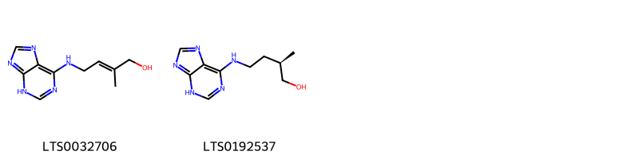{ width=100% }
    <figcaption>Hình ảnh cấu trúc hóa học của 2 hoạt chất thuộc nhóm Imidazopyrimidines gồm ['zeatine (LTS0032706)', '(2r)-2-methyl-4-(3h-purin-6-ylamino)butan-1-ol (LTS0192537)'].</figcaption>
</figure>
#### Nhóm Indoles and derivatives
<figure markdown="span">
    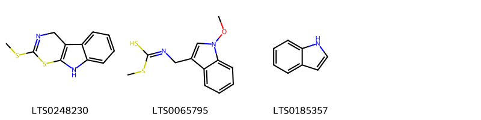{ width=100% }
    <figcaption>Hình ảnh cấu trúc hóa học của 3 hoạt chất thuộc nhóm Indoles and derivatives gồm ['2-(methylsulfanyl)-4h,9h-[1,3]thiazino[6,5-b]indole (LTS0248230)', 'n-[(1-methoxyindol-3-yl)methyl]methylsulfanylcarboimidothioic acid (LTS0065795)', 'indole (LTS0185357)'].</figcaption>
</figure>
#### Nhóm Isothiocyanates
<figure markdown="span">
    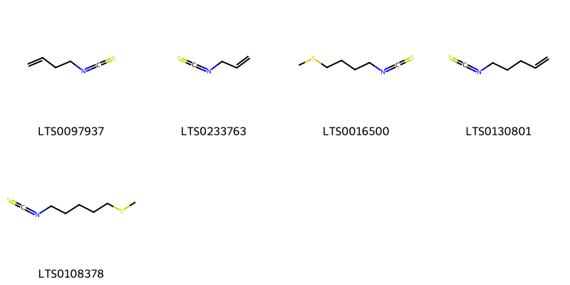{ width=100% }
    <figcaption>Hình ảnh cấu trúc hóa học của 5 hoạt chất thuộc nhóm Isothiocyanates gồm ['3-butenyl isothiocyanate (LTS0097937)', 'allyl isothiocyanate (LTS0233763)', 'erucin (LTS0016500)', '4-pentenyl isothiocyanate (LTS0130801)', 'berteroin (LTS0108378)'].</figcaption>
</figure>
#### Nhóm Organic trisulfides
<figure markdown="span">
    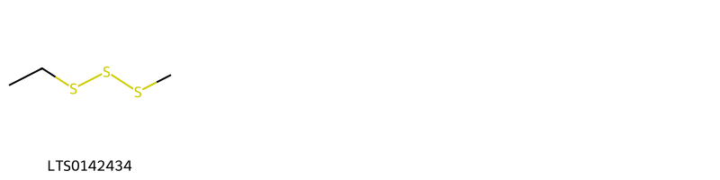{ width=100% }
    <figcaption>Hình ảnh cấu trúc hóa học của 1 hoạt chất thuộc nhóm Organic trisulfides gồm ['methyl ethyl trisulfide (LTS0142434)'].</figcaption>
</figure>
#### Nhóm Organonitrogen compounds
<figure markdown="span">
    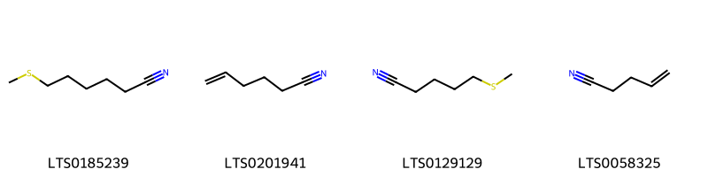{ width=100% }
    <figcaption>Hình ảnh cấu trúc hóa học của 4 hoạt chất thuộc nhóm Organonitrogen compounds gồm ['6-(methylsulfanyl)hexanenitrile (LTS0185239)', 'hex-5-enenitrile (LTS0201941)', '5-(methylsulfanyl)pentanenitrile (LTS0129129)', '4-pentenenitrile (LTS0058325)'].</figcaption>
</figure>
#### Nhóm Organooxygen compounds
<figure markdown="span">
    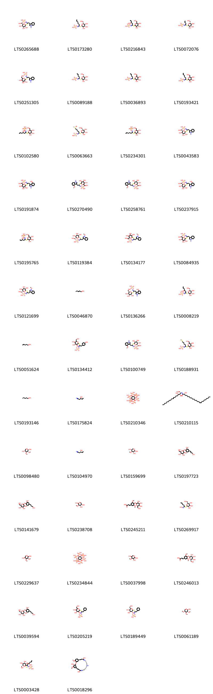{ width=100% }
    <figcaption>Hình ảnh cấu trúc hóa học của 55 hoạt chất thuộc nhóm Organooxygen compounds gồm ['glucobrassicin (LTS0265688)', '[(e)-(1-{[(2s,3r,4s,5s,6r)-3,4,5-trihydroxy-6-(hydroxymethyl)oxan-2-yl]sulfanyl}hex-5-en-1-ylidene)amino]oxysulfonic acid (LTS0173280)', '[(e)-(3-hydroxy-1-{[3,4,5-trihydroxy-6-(hydroxymethyl)oxan-2-yl]sulfanyl}pent-4-en-1-ylidene)amino]oxysulfonic acid (LTS0216843)', '[(e)-(1-{[(2s,3r,4s,5s,6r)-3,4,5-trihydroxy-6-(hydroxymethyl)oxan-2-yl]sulfanyl}but-3-en-1-ylidene)amino]oxysulfonic acid (LTS0072076)', '[(e)-[2-(1h-indol-3-yl)-1-{[3,4,5-trihydroxy-6-(hydroxymethyl)oxan-2-yl]sulfanyl}ethylidene]amino]oxysulfonic acid (LTS0251305)', '[(e)-(1-{[(2s,3r,4s,5s,6r)-3,4,5-trihydroxy-6-(hydroxymethyl)oxan-2-yl]sulfanyl}pent-4-en-1-ylidene)amino]oxysulfonic acid (LTS0089188)', '[(e)-(1-{[3,4,5-trihydroxy-6-(hydroxymethyl)oxan-2-yl]sulfanyl}pent-4-en-1-ylidene)amino]oxysulfonic acid (LTS0036893)', '[(e)-(1-{[3,4,5-trihydroxy-6-(hydroxymethyl)oxan-2-yl]sulfanyl}hex-5-en-1-ylidene)amino]oxysulfonic acid (LTS0193421)', '[(3-hydroxy-1-{[3,4,5-trihydroxy-6-(hydroxymethyl)oxan-2-yl]sulfanyl}hex-5-en-1-ylidene)amino]oxysulfonic acid (LTS0102580)', '[(e)-{5-[(r)-methanesulfinyl]-1-{[(2s,3r,4s,5s,6r)-3,4,5-trihydroxy-6-(hydroxymethyl)oxan-2-yl]sulfanyl}pentylidene}amino]oxysulfonic acid (LTS0063663)', '[(1-{[3,4,5-trihydroxy-6-(hydroxymethyl)oxan-2-yl]sulfanyl}hex-5-en-1-ylidene)amino]oxysulfonic acid (LTS0234301)', '[(z)-[2-(1h-indol-3-yl)-1-{[(2s,3r,4s,5r,6r)-3,4,5-trihydroxy-6-(hydroxymethyl)oxan-2-yl]sulfanyl}ethylidene]amino]oxysulfonic acid (LTS0043583)', '{[2-(4-hydroxy-1h-indol-3-yl)-1-{[3,4,5-trihydroxy-6-(hydroxymethyl)oxan-2-yl]sulfanyl}ethylidene]amino}oxysulfonic acid (LTS0191874)', '{[2-(4-methoxy-1h-indol-3-yl)-1-{[3,4,5-trihydroxy-6-(hydroxymethyl)oxan-2-yl]sulfanyl}ethylidene]amino}oxysulfonic acid (LTS0270490)', '4-methoxyglucobrassicin (LTS0258761)', '[(z)-[2-(4-hydroxy-1h-indol-3-yl)-1-{[(2s,3r,4s,5s,6r)-3,4,5-trihydroxy-6-(hydroxymethyl)oxan-2-yl]sulfanyl}ethylidene]amino]oxysulfonic acid (LTS0237915)', '[(3-hydroxy-1-{[3,4,5-trihydroxy-6-(hydroxymethyl)oxan-2-yl]sulfanyl}pent-4-en-1-ylidene)amino]oxysulfonic acid (LTS0195765)', '[(z)-[2-(1-methoxyindol-3-yl)-1-{[(2s,3r,4s,5r,6r)-3,4,5-trihydroxy-6-(hydroxymethyl)oxan-2-yl]sulfanyl}ethylidene]amino]oxysulfonic acid (LTS0119384)', '{[2-(1-methoxyindol-3-yl)-1-{[3,4,5-trihydroxy-6-(hydroxymethyl)oxan-2-yl]sulfanyl}ethylidene]amino}oxysulfonic acid (LTS0134177)', '{[2-(1h-indol-3-yl)-1-{[3,4,5-trihydroxy-6-(hydroxymethyl)oxan-2-yl]sulfanyl}ethylidene]amino}oxysulfonic acid (LTS0084935)', 'mimg (LTS0121699)', 'pent-2-en-1-ol (LTS0046870)', '[(e)-[2-(4-hydroxy-1h-indol-3-yl)-1-{[(2s,3r,4s,5s,6r)-3,4,5-trihydroxy-6-(hydroxymethyl)oxan-2-yl]sulfanyl}ethylidene]amino]oxysulfonic acid (LTS0136266)', '[(e)-(3-hydroxy-1-{[(2s,3r,4s,5s,6r)-3,4,5-trihydroxy-6-(hydroxymethyl)oxan-2-yl]sulfanyl}hex-5-en-1-ylidene)amino]oxysulfonic acid (LTS0008219)', '4-pentenol (LTS0051624)', '[(e)-[2-(4-hydroxyphenyl)-1-{[3,4,5-trihydroxy-6-(hydroxymethyl)oxan-2-yl]sulfanyl}ethylidene]amino]oxysulfonic acid (LTS0134412)', '[(z)-[2-(4-methoxy-1h-indol-3-yl)-1-{[(2s,3s,4s,5s,6s)-3,4,5-trihydroxy-6-(hydroxymethyl)oxan-2-yl]sulfanyl}ethylidene]amino]oxysulfonic acid (LTS0100749)', '[(e)-[5-(methylsulfanyl)-1-{[3,4,5-trihydroxy-6-(hydroxymethyl)oxan-2-yl]sulfanyl}pentylidene]amino]oxysulfonic acid (LTS0188931)', 'amyl alcohol (LTS0193146)', '1-cyano-2-hydroxy-3-butene (LTS0175824)', 'phytic acid (LTS0210346)', '(2r,15z)-2-hydroxy-n-[(2s,3s,4r,8e)-1,3,4-trihydroxyoctadec-8-en-2-yl]tetracos-15-enimidic acid (LTS0210115)', '(2s,3r,4s,5r)-3,4-dimethoxyoxane-2,5-diol (LTS0098480)', '(3s)-3-hydroxypent-4-enenitrile (LTS0104970)', '(2r,3r,4s,5r)-4-methoxyoxane-2,3,5-triol (LTS0159699)', '2-[2-hydroxy-4-(3-hydroxyprop-1-en-1-yl)phenoxy]-6-(hydroxymethyl)oxane-3,4,5-triol (LTS0197723)', '2-[2-hydroxy-4-(3-hydroxypropyl)phenoxy]-6-(hydroxymethyl)oxane-3,4,5-triol (LTS0141679)', '(2s,3r,4s,5r)-3-methoxyoxane-2,4,5-triol (LTS0238708)', '3-(3,5-dimethoxy-4-{[3,4,5-trihydroxy-6-(hydroxymethyl)oxan-2-yl]oxy}phenyl)prop-2-enoic acid (LTS0245211)', '(2r,3s,4r,5r,6s)-2-{[(1e)-1-(hydroxyimino)pent-4-en-1-yl]sulfanyl}-6-(hydroxymethyl)oxane-3,4,5-triol (LTS0269917)', '3,4-dimethoxyoxane-2,5-diol (LTS0229637)', '[(1r,2r,3s,4r,5s,6s)-2,3,4,5,6-pentakis(phosphonooxy)cyclohexyl]oxyphosphonic acid (LTS0234844)', '4-methoxyoxane-2,3,5-triol (LTS0037998)', '(2e)-3-(3,5-dimethoxy-4-{[(2s,3r,4s,5s,6r)-3,4,5-trihydroxy-6-(hydroxymethyl)oxan-2-yl]oxy}phenyl)prop-2-enoic acid (LTS0246013)', '(2s,3r,4s,5s,6r)-2-[2-hydroxy-4-(3-hydroxypropyl)phenoxy]-6-(hydroxymethyl)oxane-3,4,5-triol (LTS0039594)', '[(e)-(2-phenyl-1-{[3,4,5-trihydroxy-6-(hydroxymethyl)oxan-2-yl]sulfanyl}ethylidene)amino]oxysulfonic acid (LTS0205219)', 'glucotropaeolin (LTS0189449)', '(2s,3r,4s,5r)-3,4,5-trimethoxyoxan-2-ol (LTS0061189)', '[(e)-[(3r)-3-hydroxy-1-[(2s,3r,4s,5s,6r)-3,4,5-trihydroxy-6-(hydroxymethyl)-2-sulfanyloxan-2-yl]hex-5-en-1-ylidene]amino]oxysulfonic acid (LTS0003428)', '(8e,22e)-4,26-dimethoxy-2-oxa-11,15,20-triazatricyclo[22.3.1.1³,⁷]nonacosa-1(28),3(29),4,6,8,10,20,22,24,26-decaene-10,21,27-triol (LTS0018296)', '2-{[1-(hydroxyimino)pent-4-en-1-yl]sulfanyl}-6-(hydroxymethyl)oxane-3,4,5-triol (LTS0102207)', '(2s,3r,4s,5s,6r)-2-{2-hydroxy-4-[(1e)-3-hydroxyprop-1-en-1-yl]phenoxy}-6-(hydroxymethyl)oxane-3,4,5-triol (LTS0245774)', '3-methoxyoxane-2,4,5-triol (LTS0124555)', '4,26-dimethoxy-2-oxa-11,15,20-triazatricyclo[22.3.1.1³,⁷]nonacosa-1(28),3(29),4,6,8,10,20,22,24,26-decaene-10,21,27-triol (LTS0035240)', '3,4,5-trimethoxyoxan-2-ol (LTS0124071)'].</figcaption>
</figure>
#### Nhóm Peptidomimetics
<figure markdown="span">
    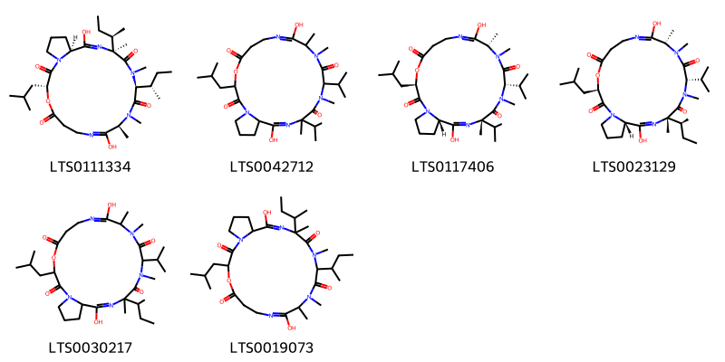{ width=100% }
    <figcaption>Hình ảnh cấu trúc hóa học của 6 hoạt chất thuộc nhóm Peptidomimetics gồm ['(3s,6s,9s,16r,21as)-3-[(2r)-butan-2-yl]-6-[(2s)-butan-2-yl]-1,10-dihydroxy-3,5,8,9-tetramethyl-16-(2-methylpropyl)-6h,9h,12h,13h,16h,19h,20h,21h,21ah-pyrrolo[1,2-d]1-oxa-4,7,10,13,16-pentaazacyclononadecane-4,7,14,17-tetrone (LTS0111334)', '1,10-dihydroxy-3,6-diisopropyl-3,5,8,9-tetramethyl-16-(2-methylpropyl)-6h,9h,12h,13h,16h,19h,20h,21h,21ah-pyrrolo[1,2-d]1-oxa-4,7,10,13,16-pentaazacyclononadecane-4,7,14,17-tetrone (LTS0042712)', '(3s,6s,9s,16r,21as)-1,10-dihydroxy-3,6-diisopropyl-3,5,8,9-tetramethyl-16-(2-methylpropyl)-6h,9h,12h,13h,16h,19h,20h,21h,21ah-pyrrolo[1,2-d]1-oxa-4,7,10,13,16-pentaazacyclononadecane-4,7,14,17-tetrone (LTS0117406)', '(3s,6s,9s,16r,21as)-3-[(2s)-butan-2-yl]-1,10-dihydroxy-6-isopropyl-3,5,8,9-tetramethyl-16-(2-methylpropyl)-6h,9h,12h,13h,16h,19h,20h,21h,21ah-pyrrolo[1,2-d]1-oxa-4,7,10,13,16-pentaazacyclononadecane-4,7,14,17-tetrone (LTS0023129)', '1,10-dihydroxy-6-isopropyl-3,5,8,9-tetramethyl-16-(2-methylpropyl)-3-(sec-butyl)-6h,9h,12h,13h,16h,19h,20h,21h,21ah-pyrrolo[1,2-d]1-oxa-4,7,10,13,16-pentaazacyclononadecane-4,7,14,17-tetrone (LTS0030217)', '1,10-dihydroxy-3,5,8,9-tetramethyl-16-(2-methylpropyl)-3,6-bis(sec-butyl)-6h,9h,12h,13h,16h,19h,20h,21h,21ah-pyrrolo[1,2-d]1-oxa-4,7,10,13,16-pentaazacyclononadecane-4,7,14,17-tetrone (LTS0019073)'].</figcaption>
</figure>
#### Nhóm Phenols
<figure markdown="span">
    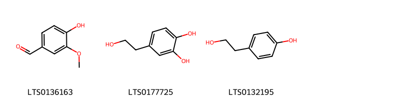{ width=100% }
    <figcaption>Hình ảnh cấu trúc hóa học của 3 hoạt chất thuộc nhóm Phenols gồm ['vanillin (LTS0136163)', 'hydroxytyrosol (LTS0177725)', 'tyrosol (LTS0132195)'].</figcaption>
</figure>
#### Nhóm Prenol lipids
<figure markdown="span">
    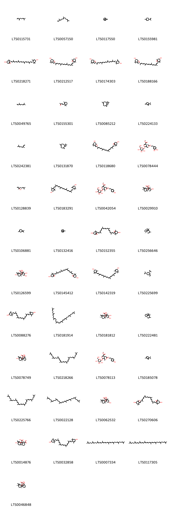{ width=100% }
    <figcaption>Hình ảnh cấu trúc hóa học của 45 hoạt chất thuộc nhóm Prenol lipids gồm ['α-myrcene (LTS0115731)', 'farnesene (LTS0057150)', 'β-pinene (LTS0117550)', 'limonene,  (LTS0155981)', 'taraxanthin (LTS0218271)', "(8'r)-luteoxanthin (LTS0212517)", 'flavoxanthin (LTS0174303)', "(8's)-luteoxanthin (LTS0188166)", 'trans-β-ocimene (LTS0049765)', 'β-ionone (LTS0155301)', 'caryophyllene (LTS0085212)', 'sabinene (LTS0224133)', 'β-ocimene (LTS0242381)', 'caryophyllene (LTS0131870)', '(2r,6s,7ar)-2-[(2e,4e,6e,8e,10z,12e,14e,16e)-17-[(1s,4s,6r)-4-hydroxy-2,2,6-trimethyl-7-oxabicyclo[4.1.0]heptan-1-yl]-6,11,15-trimethylheptadeca-2,4,6,8,10,12,14,16-octaen-2-yl]-4,4,7a-trimethyl-2,5,6,7-tetrahydro-1-benzofuran-6-ol (LTS0118680)', 'oleuropein (LTS0078444)', 'linalool, (+-)- (LTS0128839)', '(1r,4r)-4-[(1e,3z,5e,7e,9e,11e,13e,15z,17e)-18-[(4r)-4-hydroxy-2,6,6-trimethylcyclohex-1-en-1-yl]-3,7,12,16-tetramethyloctadeca-1,3,5,7,9,11,13,15,17-nonaen-1-yl]-3,5,5-trimethylcyclohex-2-en-1-ol (LTS0183291)', 'methyl (5z)-5-ethylidene-4-{2-[2-(4-hydroxyphenyl)ethoxy]-2-oxoethyl}-6-{[3,4,5-trihydroxy-6-(hydroxymethyl)oxan-2-yl]oxy}-4,6-dihydropyran-3-carboxylate (LTS0042054)', 'gibberellin a4 (LTS0029910)', 'monoterpenes (LTS0106881)', 'α pinene (LTS0132416)', '6-(18-{4-hydroxy-2,2,6-trimethyl-7-oxabicyclo[4.1.0]heptan-1-yl}-3,7,12,16-tetramethyloctadeca-1,3,5,7,9,11,13,15,17-nonaen-1-yl)-1,5,5-trimethyl-7-oxabicyclo[4.1.0]heptan-3-ol (LTS0152355)', 'cedrene (LTS0256646)', 'gibberellin a8 (LTS0126599)', '(1r,3s,6s)-6-[(1e,3e,5e,7e,9e,11z,13e,15e,17e)-18-[(1s,4s,6r)-4-hydroxy-2,2,6-trimethyl-7-oxabicyclo[4.1.0]heptan-1-yl]-3,7,12,16-tetramethyloctadeca-1,3,5,7,9,11,13,15,17-nonaen-1-yl]-1,5,5-trimethyl-7-oxabicyclo[4.1.0]heptan-3-ol (LTS0145412)', '(1r,4r)-4-[(1e,3e,5e,7z,9e,11e,13e,15e,17e)-18-[(4r)-4-hydroxy-2,6,6-trimethylcyclohex-1-en-1-yl]-3,7,12,16-tetramethyloctadeca-1,3,5,7,9,11,13,15,17-nonaen-1-yl]-3,5,5-trimethylcyclohex-2-en-1-ol (LTS0142319)', 'β-elemene (LTS0225699)', '4-[18-(4-hydroxy-2,6,6-trimethylcyclohex-2-en-1-yl)-3,7,12,16-tetramethyloctadeca-1,3,5,7,9,11,13,15,17-nonaen-1-yl]-3,5,5-trimethylcyclohex-3-en-1-ol (LTS0088276)', 'phytofluene (LTS0181914)', 'gibberellin a34 (LTS0181812)', 'levo-α-cedrene (LTS0222481)', 'gibberellin a44 (LTS0078749)', 'zeta-carotene (LTS0218266)', 'methyl (5z)-5-ethylidene-4-{2-[2-(4-hydroxyphenyl)ethoxy]-2-oxoethyl}-6-{[(2s,3r,4s,5s,6r)-3,4,5-trihydroxy-6-(hydroxymethyl)oxan-2-yl]oxy}-4,6-dihydropyran-3-carboxylate (LTS0078113)', 'α-thujene (LTS0185078)', '2,6,10,14,19,23,27,31-octamethyldotriaconta-2,6,8,10,12,14,16,18,20,22,26,30-dodecaene (LTS0225766)', '(10e,12e,14e)-2,6,10,14,19,23,27,31-octamethyldotriaconta-2,6,10,12,14,16,18,22,26,30-decaene (LTS0022128)', 'gibberellin a51 (LTS0062532)', '2-(17-{4-hydroxy-2,2,6-trimethyl-7-oxabicyclo[4.1.0]heptan-1-yl}-6,11,15-trimethylheptadeca-2,4,6,8,10,12,14,16-octaen-2-yl)-4,4,7a-trimethyl-2,5,6,7-tetrahydro-1-benzofuran-6-ol (LTS0270606)', 'gibberellin a17 (LTS0014876)', '4-[(17e)-18-(4-hydroxy-2,6,6-trimethylcyclohex-1-en-1-yl)-3,7,12,16-tetramethyloctadeca-1,3,5,7,9,11,13,15,17-nonaen-1-yl]-3,5,5-trimethylcyclohex-2-en-1-ol (LTS0032858)', 'zeta-carotene (LTS0007334)', 'neurosporene (LTS0117305)', '(1s,2r,5s,8s,9s,10s,11s)-11-methyl-6-methylidene-12-oxo-13-oxapentacyclo[9.3.3.1⁵,⁸.0¹,¹⁰.0²,⁸]octadecane-9-carboxylic acid (LTS0046848)'].</figcaption>
</figure>
#### Nhóm Purine nucleosides
<figure markdown="span">
    { width=100% }
    <figcaption>Hình ảnh cấu trúc hóa học của 1 hoạt chất thuộc nhóm Purine nucleosides gồm ['zeatin riboside (LTS0254495)'].</figcaption>
</figure>
#### Nhóm Saturated hydrocarbons
<figure markdown="span">
    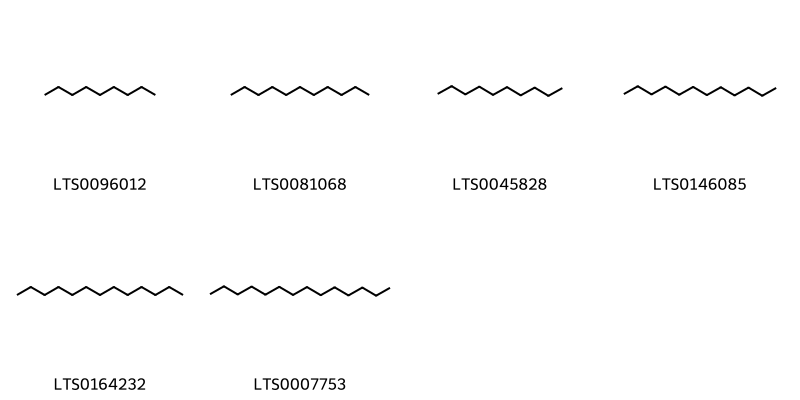{ width=100% }
    <figcaption>Hình ảnh cấu trúc hóa học của 6 hoạt chất thuộc nhóm Saturated hydrocarbons gồm ['nonane (LTS0096012)', 'undecane (LTS0081068)', 'decane (LTS0045828)', 'dodecane (LTS0146085)', 'tridecane (LTS0164232)', 'tetradecane (LTS0007753)'].</figcaption>
</figure>
#### Nhóm Sphingolipids
<figure markdown="span">
    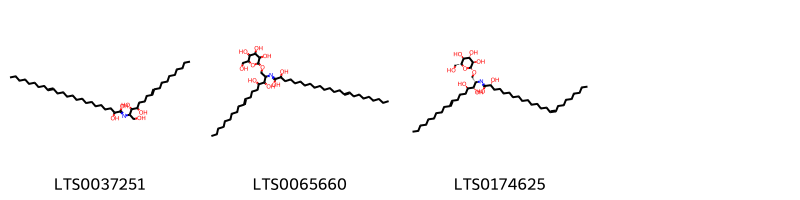{ width=100% }
    <figcaption>Hình ảnh cấu trúc hóa học của 3 hoạt chất thuộc nhóm Sphingolipids gồm ['2-hydroxy-n-(1,3,4-trihydroxyoctadec-8-en-2-yl)tetracos-15-enimidic acid (LTS0037251)', 'n-(3,4-dihydroxy-1-{[3,4,5-trihydroxy-6-(hydroxymethyl)oxan-2-yl]oxy}octadec-8-en-2-yl)-2-hydroxytetracos-15-enimidic acid (LTS0065660)', '(2r,15z)-n-[(2s,3s,4r,8e)-3,4-dihydroxy-1-{[(2r,3r,4s,5s,6r)-3,4,5-trihydroxy-6-(hydroxymethyl)oxan-2-yl]oxy}octadec-8-en-2-yl]-2-hydroxytetracos-15-enimidic acid (LTS0174625)'].</figcaption>
</figure>
#### Nhóm Steroids and steroid derivatives
<figure markdown="span">
    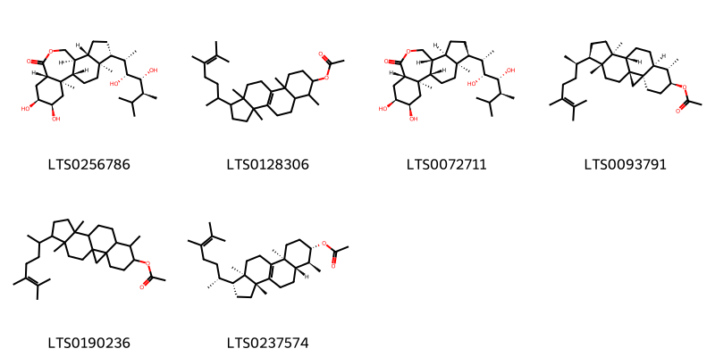{ width=100% }
    <figcaption>Hình ảnh cấu trúc hóa học của 6 hoạt chất thuộc nhóm Steroids and steroid derivatives gồm ['brassinolide (LTS0256786)', '1-(5,6-dimethylhept-5-en-2-yl)-3a,6,9a,11a-tetramethyl-1h,2h,3h,4h,5h,5ah,6h,7h,8h,9h,10h,11h-cyclopenta[a]phenanthren-7-yl acetate (LTS0128306)', '(1s,2r,4r,5s,7s,11r,12r,15s,16s)-15-[(2s,3r,4r,5s)-3,4-dihydroxy-5,6-dimethylheptan-2-yl]-4,5-dihydroxy-2,16-dimethyl-9-oxatetracyclo[9.7.0.0²,⁷.0¹²,¹⁶]octadecan-8-one (LTS0072711)', '(1s,3r,6s,7s,8s,11s,12s,15r,16r)-15-[(2r)-5,6-dimethylhept-5-en-2-yl]-7,12,16-trimethylpentacyclo[9.7.0.0¹,³.0³,⁸.0¹²,¹⁶]octadecan-6-yl acetate (LTS0093791)', '15-(5,6-dimethylhept-5-en-2-yl)-7,12,16-trimethylpentacyclo[9.7.0.0¹,³.0³,⁸.0¹²,¹⁶]octadecan-6-yl acetate (LTS0190236)', '(1r,3ar,5as,6s,7s,9as,11ar)-1-[(2r)-5,6-dimethylhept-5-en-2-yl]-3a,6,9a,11a-tetramethyl-1h,2h,3h,4h,5h,5ah,6h,7h,8h,9h,10h,11h-cyclopenta[a]phenanthren-7-yl acetate (LTS0237574)'].</figcaption>
</figure>
#### Nhóm Stilbenes
<figure markdown="span">
    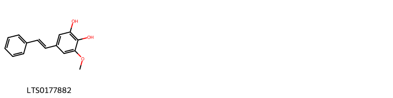{ width=100% }
    <figcaption>Hình ảnh cấu trúc hóa học của 1 hoạt chất thuộc nhóm Stilbenes gồm ['3-methoxy-5-[(1e)-2-phenylethenyl]benzene-1,2-diol (LTS0177882)'].</figcaption>
</figure>
#### Nhóm Tannins
<figure markdown="span">
    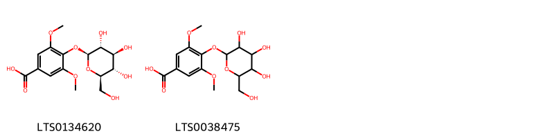{ width=100% }
    <figcaption>Hình ảnh cấu trúc hóa học của 2 hoạt chất thuộc nhóm Tannins gồm ['3,5-dimethoxy-4-{[(2s,3r,4s,5s,6r)-3,4,5-trihydroxy-6-(hydroxymethyl)oxan-2-yl]oxy}benzoic acid (LTS0134620)', '3,5-dimethoxy-4-{[3,4,5-trihydroxy-6-(hydroxymethyl)oxan-2-yl]oxy}benzoic acid (LTS0038475)'].</figcaption>
</figure>
#### Nhóm Tetrapyrroles and derivatives
<figure markdown="span">
    { width=100% }
    <figcaption>Hình ảnh cấu trúc hóa học của 2 hoạt chất thuộc nhóm Tetrapyrroles and derivatives gồm ['methyl (3r,21s,22s)-16-ethenyl-11-ethyl-12,17,21,26-tetramethyl-4-oxo-22-(3-oxo-3-{[(2e,7r,11r)-3,7,11,15-tetramethylhexadec-2-en-1-yl]oxy}propyl)-7,23,24,25-tetraazahexacyclo[18.2.1.1⁵,⁸.1¹⁰,¹³.1¹⁵,¹⁸.0²,⁶]hexacosa-1(23),2(6),5(26),7,9,11,13,15,17,19-decaene-3-carboxylate (LTS0200273)', 'methyl (3r,21s,22s)-16-ethenyl-11-ethyl-12,17,21,26-tetramethyl-4-oxo-22-(3-oxo-3-{[(2e)-3,7,11,15-tetramethylhexadec-2-en-1-yl]oxy}propyl)-7,23,24,25-tetraazahexacyclo[18.2.1.1⁵,⁸.1¹⁰,¹³.1¹⁵,¹⁸.0²,⁶]hexacosa-1(23),2(6),5(26),7,9,11,13,15,17,19-decaene-3-carboxylate (LTS0272109)'].</figcaption>
</figure>
#### Nhóm Thiiranes
<figure markdown="span">
    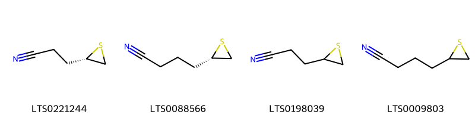{ width=100% }
    <figcaption>Hình ảnh cấu trúc hóa học của 4 hoạt chất thuộc nhóm Thiiranes gồm ['3-[(2s)-thiiran-2-yl]propanenitrile (LTS0221244)', '4-[(2s)-thiiran-2-yl]butanenitrile (LTS0088566)', '3-(thiiran-2-yl)propanenitrile (LTS0198039)', '4-(thiiran-2-yl)butanenitrile (LTS0009803)'].</figcaption>
</figure>
#### Nhóm Thioethers
<figure markdown="span">
    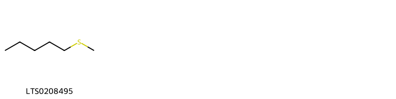{ width=100% }
    <figcaption>Hình ảnh cấu trúc hóa học của 1 hoạt chất thuộc nhóm Thioethers gồm ['methyl pentyl sulfide (LTS0208495)'].</figcaption>
</figure>

---

### Dược dân tộc học

Danh sách các quốc gia có sử dụng *Brassica napus* trong điều trị các bệnh. 

| Country   | Disease             | Bệnh                      |
|:----------|:--------------------|:--------------------------|
| Haiti     | Diuretic, Soporific | Thuốc lợi tiểu, thuốc ngủ |

---

---
## Brassica nigra
### Thông tin về thực vật

!!! info "Phân loại thực vật của *Brassica nigra* từ GIBF:"
    - **Kingdom:** Plantae
    - **Phylum:** Tracheophyta
    - **Order:** Brassicales
    - **Family:** Brassicaceae
    - **Genus:** Brassica
    - **Species:** *Brassica nigra*

 

| Label (VI)   | Label (EN)   | Scientific Name   | Descriptions (VI)   | Descriptions (EN)   | Also Known As (VI)   | Also Known As (EN)   |
|:-------------|:-------------|:------------------|:--------------------|:--------------------|:---------------------|:---------------------|
| N/A          | N/A          | Brassica nigra    | loài thực vật       | species of plant    | ['']                 | ['black mustard']    |

#### Phân bố trên thế giới

**Từ CSDL GIBF** nan, Netherlands, Italy, Luxembourg, Kosovo, Belgium, Spain, Türkiye, Switzerland, United States of America, Sweden, Mexico, France, United Kingdom of Great Britain and Northern Ireland, Canada

#### Phân bố tại Việt Nam

**Từ CSDL GIBF**: Không có ghi nhận ở Việt Nam

---
### Thành phần hóa học
        
- Theo cơ sở dữ liệu lotus: Từ loài *Brassica nigra* đã phân lập và xác định được 40 hoạt chất thuộc về các nhóm Naphthalenes, Prenol lipids, Indoles and derivatives, Isothiocyanates, Steroids and steroid derivatives, Cinnamic acids and derivatives, Benzene and substituted derivatives, Organooxygen compounds, Carboxylic acids and derivatives. 

|    | chemicalTaxonomyClassyfireClass     |   smiles_count |
|---:|:------------------------------------|---------------:|
|  0 | Benzene and substituted derivatives |              5 |
|  1 | Carboxylic acids and derivatives    |              2 |
|  2 | Cinnamic acids and derivatives      |              3 |
|  3 | Indoles and derivatives             |              1 |
|  4 | Isothiocyanates                     |              1 |
|  5 | Naphthalenes                        |              1 |
|  6 | Organooxygen compounds              |             12 |
|  7 | Prenol lipids                       |             13 |
|  8 | Steroids and steroid derivatives    |              1 |

#### Nhóm Benzene and substituted derivatives
<figure markdown="span">
    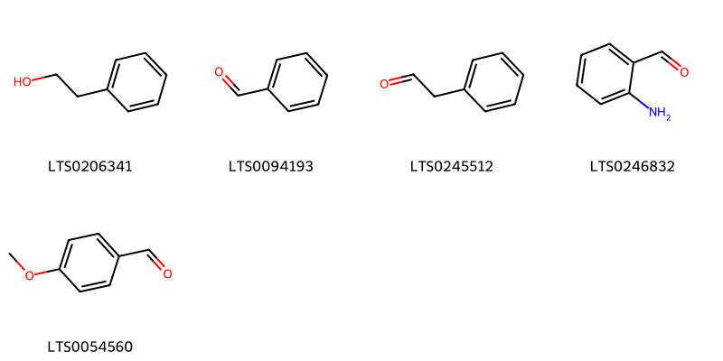{ width=100% }
    <figcaption>Hình ảnh cấu trúc hóa học của 5 hoạt chất thuộc nhóm Benzene and substituted derivatives gồm ['2-phenyl-ethanol (LTS0206341)', 'benzaldehyde (LTS0094193)', 'phenylacetaldehyde (LTS0245512)', '2-aminobenzaldehyde (LTS0246832)', 'anisaldehyde (LTS0054560)'].</figcaption>
</figure>
#### Nhóm Carboxylic acids and derivatives
<figure markdown="span">
    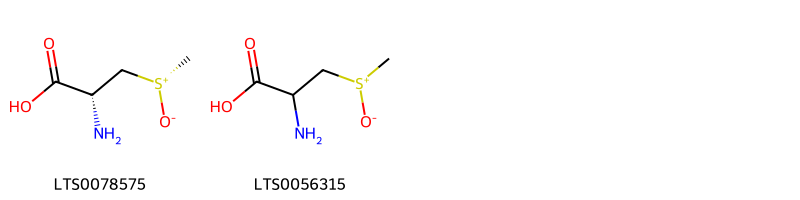{ width=100% }
    <figcaption>Hình ảnh cấu trúc hóa học của 2 hoạt chất thuộc nhóm Carboxylic acids and derivatives gồm ['(2r)-2-amino-3-[(s)-methanesulfinyl]propanoic acid (LTS0078575)', '2-amino-3-methanesulfinylpropanoic acid (LTS0056315)'].</figcaption>
</figure>
#### Nhóm Cinnamic acids and derivatives
<figure markdown="span">
    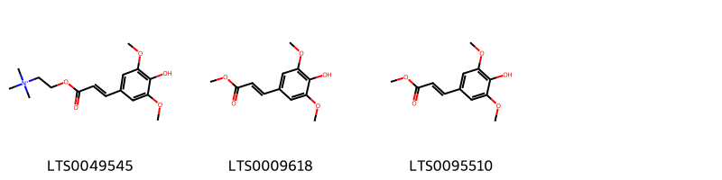{ width=100% }
    <figcaption>Hình ảnh cấu trúc hóa học của 3 hoạt chất thuộc nhóm Cinnamic acids and derivatives gồm ['sinapoylcholine (LTS0049545)', 'methyl (2e)-3-(4-hydroxy-3,5-dimethoxyphenyl)prop-2-enoate (LTS0009618)', 'methyl 3-(4-hydroxy-3,5-dimethoxyphenyl)prop-2-enoate (LTS0095510)'].</figcaption>
</figure>
#### Nhóm Indoles and derivatives
<figure markdown="span">
    { width=100% }
    <figcaption>Hình ảnh cấu trúc hóa học của 1 hoạt chất thuộc nhóm Indoles and derivatives gồm ['indole (LTS0185357)'].</figcaption>
</figure>
#### Nhóm Isothiocyanates
<figure markdown="span">
    { width=100% }
    <figcaption>Hình ảnh cấu trúc hóa học của 1 hoạt chất thuộc nhóm Isothiocyanates gồm ['allyl isothiocyanate (LTS0233763)'].</figcaption>
</figure>
#### Nhóm Naphthalenes
<figure markdown="span">
    { width=100% }
    <figcaption>Hình ảnh cấu trúc hóa học của 1 hoạt chất thuộc nhóm Naphthalenes gồm ['naphthalene (LTS0254484)'].</figcaption>
</figure>
#### Nhóm Organooxygen compounds
<figure markdown="span">
    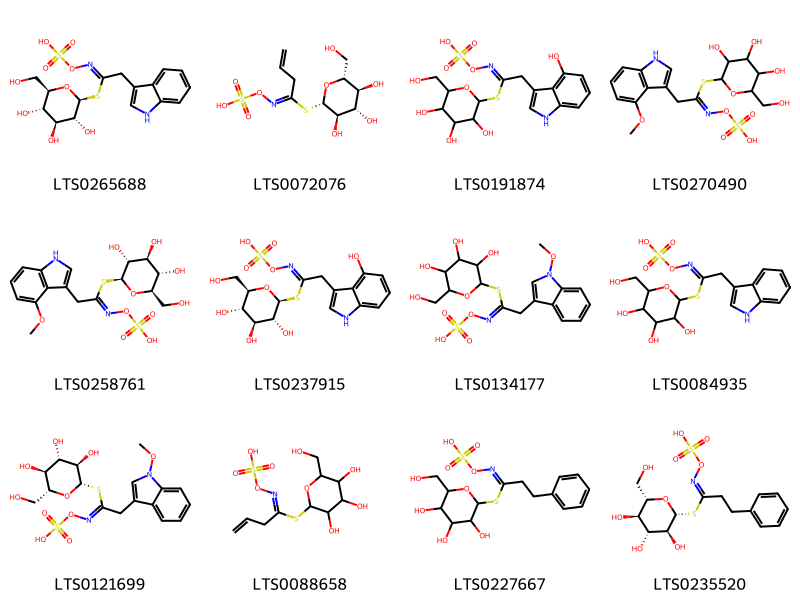{ width=100% }
    <figcaption>Hình ảnh cấu trúc hóa học của 12 hoạt chất thuộc nhóm Organooxygen compounds gồm ['glucobrassicin (LTS0265688)', '[(e)-(1-{[(2s,3r,4s,5s,6r)-3,4,5-trihydroxy-6-(hydroxymethyl)oxan-2-yl]sulfanyl}but-3-en-1-ylidene)amino]oxysulfonic acid (LTS0072076)', '{[2-(4-hydroxy-1h-indol-3-yl)-1-{[3,4,5-trihydroxy-6-(hydroxymethyl)oxan-2-yl]sulfanyl}ethylidene]amino}oxysulfonic acid (LTS0191874)', '{[2-(4-methoxy-1h-indol-3-yl)-1-{[3,4,5-trihydroxy-6-(hydroxymethyl)oxan-2-yl]sulfanyl}ethylidene]amino}oxysulfonic acid (LTS0270490)', '4-methoxyglucobrassicin (LTS0258761)', '[(z)-[2-(4-hydroxy-1h-indol-3-yl)-1-{[(2s,3r,4s,5s,6r)-3,4,5-trihydroxy-6-(hydroxymethyl)oxan-2-yl]sulfanyl}ethylidene]amino]oxysulfonic acid (LTS0237915)', '{[2-(1-methoxyindol-3-yl)-1-{[3,4,5-trihydroxy-6-(hydroxymethyl)oxan-2-yl]sulfanyl}ethylidene]amino}oxysulfonic acid (LTS0134177)', '{[2-(1h-indol-3-yl)-1-{[3,4,5-trihydroxy-6-(hydroxymethyl)oxan-2-yl]sulfanyl}ethylidene]amino}oxysulfonic acid (LTS0084935)', 'mimg (LTS0121699)', '[(1-{[3,4,5-trihydroxy-6-(hydroxymethyl)oxan-2-yl]sulfanyl}but-3-en-1-ylidene)amino]oxysulfonic acid (LTS0088658)', '[(3-phenyl-1-{[3,4,5-trihydroxy-6-(hydroxymethyl)oxan-2-yl]sulfanyl}propylidene)amino]oxysulfonic acid (LTS0227667)', '[(e)-(3-phenyl-1-{[(2r,3s,4r,5r,6s)-3,4,5-trihydroxy-6-(hydroxymethyl)oxan-2-yl]sulfanyl}propylidene)amino]oxysulfonic acid (LTS0235520)'].</figcaption>
</figure>
#### Nhóm Prenol lipids
<figure markdown="span">
    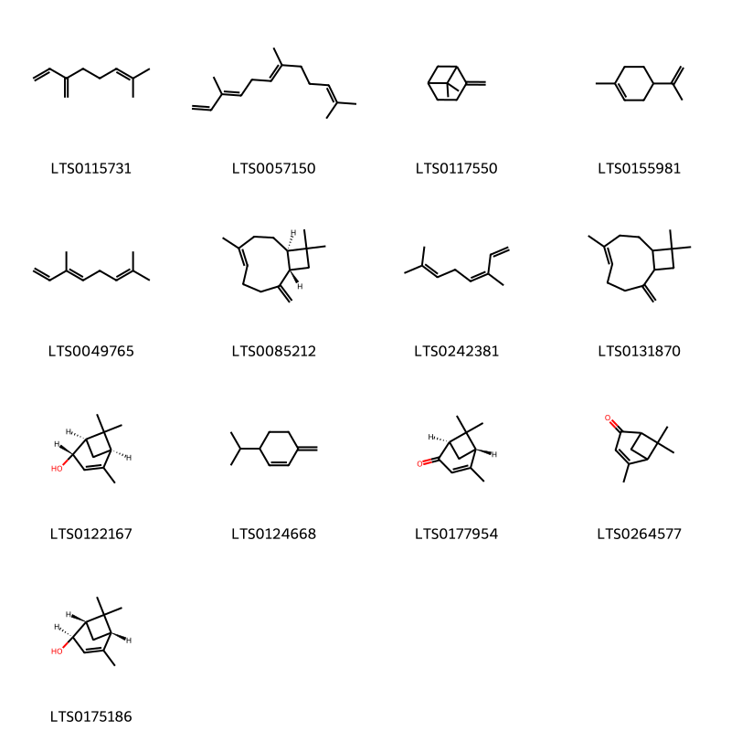{ width=100% }
    <figcaption>Hình ảnh cấu trúc hóa học của 13 hoạt chất thuộc nhóm Prenol lipids gồm ['α-myrcene (LTS0115731)', 'farnesene (LTS0057150)', 'β-pinene (LTS0117550)', 'limonene,  (LTS0155981)', 'trans-β-ocimene (LTS0049765)', 'caryophyllene (LTS0085212)', 'β-ocimene (LTS0242381)', 'caryophyllene (LTS0131870)', '(1r,2s,5r)-4,6,6-trimethylbicyclo[3.1.1]hept-3-en-2-ol (LTS0122167)', 'β phellandrene (LTS0124668)', '(1r,5s)-4,6,6-trimethylbicyclo[3.1.1]hept-3-en-2-one (LTS0177954)', 'verbenone (LTS0264577)', '(s)-trans-verbenol (LTS0175186)'].</figcaption>
</figure>
#### Nhóm Steroids and steroid derivatives
<figure markdown="span">
    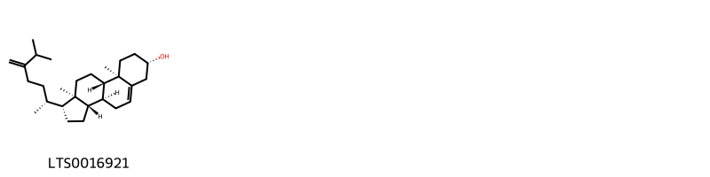{ width=100% }
    <figcaption>Hình ảnh cấu trúc hóa học của 1 hoạt chất thuộc nhóm Steroids and steroid derivatives gồm ['24-methylenecholesterol (LTS0016921)'].</figcaption>
</figure>

---

### Dược dân tộc học

Danh sách các quốc gia có sử dụng *Brassica nigra* trong điều trị các bệnh. 

| Country   | Disease                                                                                  | Bệnh                                                                                             |
|:----------|:-----------------------------------------------------------------------------------------|:-------------------------------------------------------------------------------------------------|
| China     | Apertif, Carminative, Rubefacient, Stimulant, Diuretic, Emetic                           | Apertif, Carminative, Rubefacient, Chất kích thích, Thuốc lợi tiểu, Emetic                       |
| Chinese   | Rubefacient                                                                              | Chất gây xung huyết da                                                                           |
| Elsewhere | Emetic, Rubefacient, Rubefacient, Rubefacient                                            | Emetic, Rubefacient, Rubefacient, Rubefacient                                                    |
| Iraq      | Emetic                                                                                   | Phôi                                                                                             |
| Japan     | Poultice                                                                                 | thuốc đắp, đắp thuốc cao                                                                         |
| Turkey    | Counterirritant, Diuretic, Emetic, Rubefacient, Stimulant, Stomachic, Vesicant, Laxative | Thuốc chống kích ứng, lợi tiểu, nôn, rubefacient, chất kích thích, dạ dày, Vesicant, nhuận tràng |
| ain       | Rubefacient                                                                              | Chất gây xung huyết da                                                                           |

---

---
## Brassica oleracea
### Thông tin về thực vật

!!! info "Phân loại thực vật của *Brassica oleracea* từ GIBF:"
    - **Kingdom:** Plantae
    - **Phylum:** Tracheophyta
    - **Order:** Brassicales
    - **Family:** Brassicaceae
    - **Genus:** Brassica
    - **Species:** *Brassica oleracea*

 

| Label (VI)   | Label (EN)   | Scientific Name   | Descriptions (VI)   | Descriptions (EN)   | Also Known As (VI)    | Also Known As (EN)                       |
|:-------------|:-------------|:------------------|:--------------------|:--------------------|:----------------------|:-----------------------------------------|
| N/A          | N/A          | Brassica oleracea | loài thực vật       | species of plant    | ['Brassica oleracea'] | ['Brassica oleraceae', 'collard greens'] |

#### Phân bố trên thế giới

**Từ CSDL GIBF** nan, United Arab Emirates, Italy, Australia, Japan, Belgium, Benin, Canada, Denmark, Netherlands, Malta, Spain, Portugal, United States of America, Sweden, Croatia, Greece, Germany, Brazil, Egypt, Switzerland, Mexico, France, Austria, United Kingdom of Great Britain and Northern Ireland, Ecuador, India, New Zealand

#### Phân bố tại Việt Nam

**Từ CSDL GIBF**: Không có ghi nhận ở Việt Nam

---
### Thành phần hóa học
        
- Theo cơ sở dữ liệu lotus: Từ loài *Brassica oleracea* đã phân lập và xác định được 181 hoạt chất thuộc về các nhóm Phenols, Carboxylic acids and derivatives, Fatty Acyls, Indoles and derivatives, Pyrrolidines, Cinnamic acids and derivatives, Dibenzylbutane lignans, Saturated hydrocarbons, Tetrapyrroles and derivatives, Isothiocyanates, Prenol lipids, Sulfoxides, Azolidines, Benzene and substituted derivatives, Dihydrofurans, Organooxygen compounds, Furanoid lignans, Pyridines and derivatives, Flavonoids, Sulfonyls, Steroids and steroid derivatives, Isoflavonoids, Organonitrogen compounds, Thiiranes. 

|    | chemicalTaxonomyClassyfireClass     |   smiles_count |
|---:|:------------------------------------|---------------:|
|  0 | Azolidines                          |              2 |
|  1 | Benzene and substituted derivatives |              2 |
|  2 | Carboxylic acids and derivatives    |             17 |
|  3 | Cinnamic acids and derivatives      |             12 |
|  4 | Dibenzylbutane lignans              |              2 |
|  5 | Dihydrofurans                       |              1 |
|  6 | Fatty Acyls                         |              3 |
|  7 | Flavonoids                          |             16 |
|  8 | Furanoid lignans                    |              3 |
|  9 | Indoles and derivatives             |             20 |
| 10 | Isoflavonoids                       |              1 |
| 11 | Isothiocyanates                     |              4 |
| 12 | Organonitrogen compounds            |              2 |
| 13 | Organooxygen compounds              |             50 |
| 14 | Phenols                             |              3 |
| 15 | Prenol lipids                       |             23 |
| 16 | Pyridines and derivatives           |              2 |
| 17 | Pyrrolidines                        |              1 |
| 18 | Saturated hydrocarbons              |              1 |
| 19 | Steroids and steroid derivatives    |              2 |
| 20 | Sulfonyls                           |              1 |
| 21 | Sulfoxides                          |              4 |
| 22 | Tetrapyrroles and derivatives       |              3 |
| 23 | Thiiranes                           |              2 |

#### Nhóm Azolidines
<figure markdown="span">
    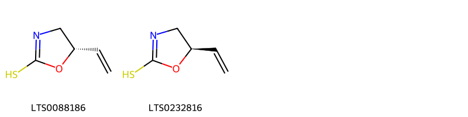{ width=100% }
    <figcaption>Hình ảnh cấu trúc hóa học của 2 hoạt chất thuộc nhóm Azolidines gồm ['(5s)-5-ethenyl-4,5-dihydro-1,3-oxazole-2-thiol (LTS0088186)', '(5r)-5-ethenyl-4,5-dihydro-1,3-oxazole-2-thiol (LTS0232816)'].</figcaption>
</figure>
#### Nhóm Benzene and substituted derivatives
<figure markdown="span">
    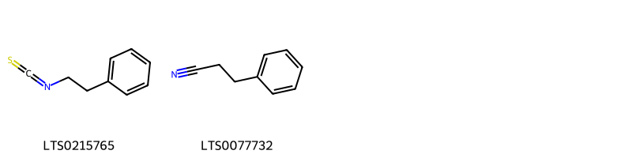{ width=100% }
    <figcaption>Hình ảnh cấu trúc hóa học của 2 hoạt chất thuộc nhóm Benzene and substituted derivatives gồm ['phenethyl isothiocyanate (LTS0215765)', 'benzylacetonitrile (LTS0077732)'].</figcaption>
</figure>
#### Nhóm Carboxylic acids and derivatives
<figure markdown="span">
    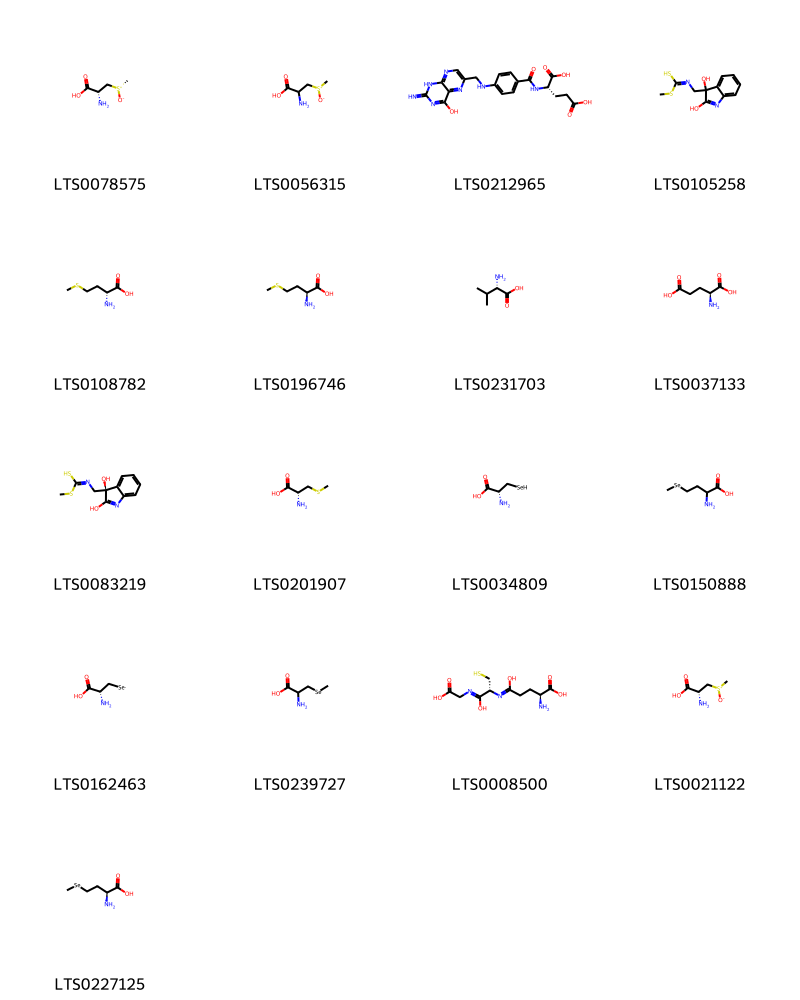{ width=100% }
    <figcaption>Hình ảnh cấu trúc hóa học của 17 hoạt chất thuộc nhóm Carboxylic acids and derivatives gồm ['(2r)-2-amino-3-[(s)-methanesulfinyl]propanoic acid (LTS0078575)', '2-amino-3-methanesulfinylpropanoic acid (LTS0056315)', 'acid, folic (LTS0212965)', 'n-[(2,3-dihydroxyindol-3-yl)methyl]methylsulfanylcarboimidothioic acid (LTS0105258)', 'd-methionine (LTS0108782)', 'l-methionine (LTS0196746)', 'l-valine (LTS0231703)', 'l-glutamic acid (LTS0037133)', 'n-{[(3r)-2,3-dihydroxyindol-3-yl]methyl}methylsulfanylcarboimidothioic acid (LTS0083219)', 's-methylcysteine (LTS0201907)', 'l-selenocysteine (LTS0034809)', '(+,-)-selenomethionine (LTS0150888)', 'selenocysteine (LTS0162463)', 'se-methylselenocysteine (LTS0239727)', '(2s)-2-amino-4-{[(1r)-1-(carboxymethyl-c-hydroxycarbonimidoyl)-2-sulfanylethyl]-c-hydroxycarbonimidoyl}butanoic acid (LTS0008500)', '(2r)-2-amino-3-methanesulfinylpropanoic acid (LTS0021122)', 'l-selenomethionine (LTS0227125)'].</figcaption>
</figure>
#### Nhóm Cinnamic acids and derivatives
<figure markdown="span">
    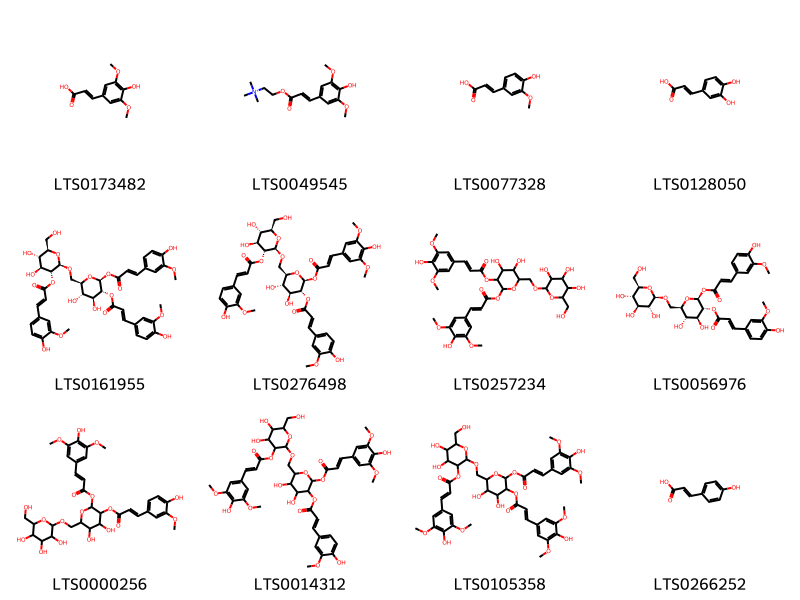{ width=100% }
    <figcaption>Hình ảnh cấu trúc hóa học của 12 hoạt chất thuộc nhóm Cinnamic acids and derivatives gồm ['sinapinate (LTS0173482)', 'sinapoylcholine (LTS0049545)', 'ferulic acid (LTS0077328)', '3,4-dihydroxycinnamic acid (LTS0128050)', '(2s,3r,4s,5s,6r)-6-({[(2r,3r,4s,5s,6r)-4,5-dihydroxy-3-{[(2e)-3-(4-hydroxy-3-methoxyphenyl)prop-2-enoyl]oxy}-6-(hydroxymethyl)oxan-2-yl]oxy}methyl)-4,5-dihydroxy-3-{[(2e)-3-(4-hydroxy-3-methoxyphenyl)prop-2-enoyl]oxy}oxan-2-yl (2e)-3-(4-hydroxy-3-methoxyphenyl)prop-2-enoate (LTS0161955)', '(2s,3r,4s,5s,6r)-6-({[(2r,3r,4s,5s,6r)-4,5-dihydroxy-3-{[(2e)-3-(4-hydroxy-3-methoxyphenyl)prop-2-enoyl]oxy}-6-(hydroxymethyl)oxan-2-yl]oxy}methyl)-4,5-dihydroxy-2-{[(2e)-3-(4-hydroxy-3,5-dimethoxyphenyl)prop-2-enoyl]oxy}oxan-3-yl (2e)-3-(4-hydroxy-3-methoxyphenyl)prop-2-enoate (LTS0276498)', '4,5-dihydroxy-3-{[(2e)-3-(4-hydroxy-3,5-dimethoxyphenyl)prop-2-enoyl]oxy}-6-({[3,4,5-trihydroxy-6-(hydroxymethyl)oxan-2-yl]oxy}methyl)oxan-2-yl (2e)-3-(4-hydroxy-3,5-dimethoxyphenyl)prop-2-enoate (LTS0257234)', '(2s,3r,4s,5s,6r)-4,5-dihydroxy-3-{[(2e)-3-(4-hydroxy-3-methoxyphenyl)prop-2-enoyl]oxy}-6-({[(2r,3r,4s,5s,6r)-3,4,5-trihydroxy-6-(hydroxymethyl)oxan-2-yl]oxy}methyl)oxan-2-yl (2e)-3-(4-hydroxy-3-methoxyphenyl)prop-2-enoate (LTS0056976)', '4,5-dihydroxy-2-{[(2e)-3-(4-hydroxy-3,5-dimethoxyphenyl)prop-2-enoyl]oxy}-6-({[3,4,5-trihydroxy-6-(hydroxymethyl)oxan-2-yl]oxy}methyl)oxan-3-yl (2e)-3-(4-hydroxy-3-methoxyphenyl)prop-2-enoate (LTS0000256)', '6-{[(4,5-dihydroxy-3-{[(2e)-3-(4-hydroxy-3,5-dimethoxyphenyl)prop-2-enoyl]oxy}-6-(hydroxymethyl)oxan-2-yl)oxy]methyl}-4,5-dihydroxy-2-{[(2e)-3-(4-hydroxy-3,5-dimethoxyphenyl)prop-2-enoyl]oxy}oxan-3-yl (2e)-3-(4-hydroxy-3-methoxyphenyl)prop-2-enoate (LTS0014312)', '6-{[(4,5-dihydroxy-3-{[(2e)-3-(4-hydroxy-3,5-dimethoxyphenyl)prop-2-enoyl]oxy}-6-(hydroxymethyl)oxan-2-yl)oxy]methyl}-4,5-dihydroxy-3-{[(2e)-3-(4-hydroxy-3,5-dimethoxyphenyl)prop-2-enoyl]oxy}oxan-2-yl (2e)-3-(4-hydroxy-3,5-dimethoxyphenyl)prop-2-enoate (LTS0105358)', 'para-coumaric acid (LTS0266252)'].</figcaption>
</figure>
#### Nhóm Dibenzylbutane lignans
<figure markdown="span">
    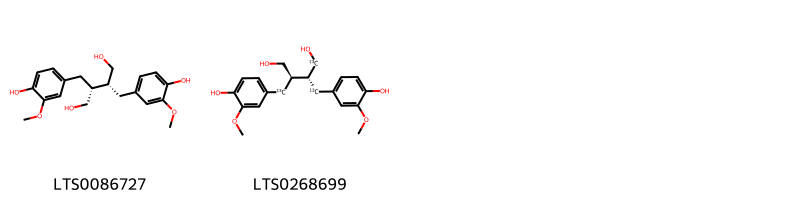{ width=100% }
    <figcaption>Hình ảnh cấu trúc hóa học của 2 hoạt chất thuộc nhóm Dibenzylbutane lignans gồm ['secoisolariciresinol (LTS0086727)', '(2s,3r)-2,3-bis[(4-hydroxy-3-methoxyphenyl)(¹³c)methyl](1-¹³c)butane-1,4-diol (LTS0268699)'].</figcaption>
</figure>
#### Nhóm Dihydrofurans
<figure markdown="span">
    { width=100% }
    <figcaption>Hình ảnh cấu trúc hóa học của 1 hoạt chất thuộc nhóm Dihydrofurans gồm ['vitamin c (LTS0022555)'].</figcaption>
</figure>
#### Nhóm Fatty Acyls
<figure markdown="span">
    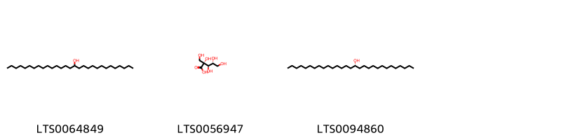{ width=100% }
    <figcaption>Hình ảnh cấu trúc hóa học của 3 hoạt chất thuộc nhóm Fatty Acyls gồm ['nonacosan-14-ol (LTS0064849)', '2-carboxy-d-arabinitol (LTS0056947)', '(14r)-nonacosan-14-ol (LTS0094860)'].</figcaption>
</figure>
#### Nhóm Flavonoids
<figure markdown="span">
    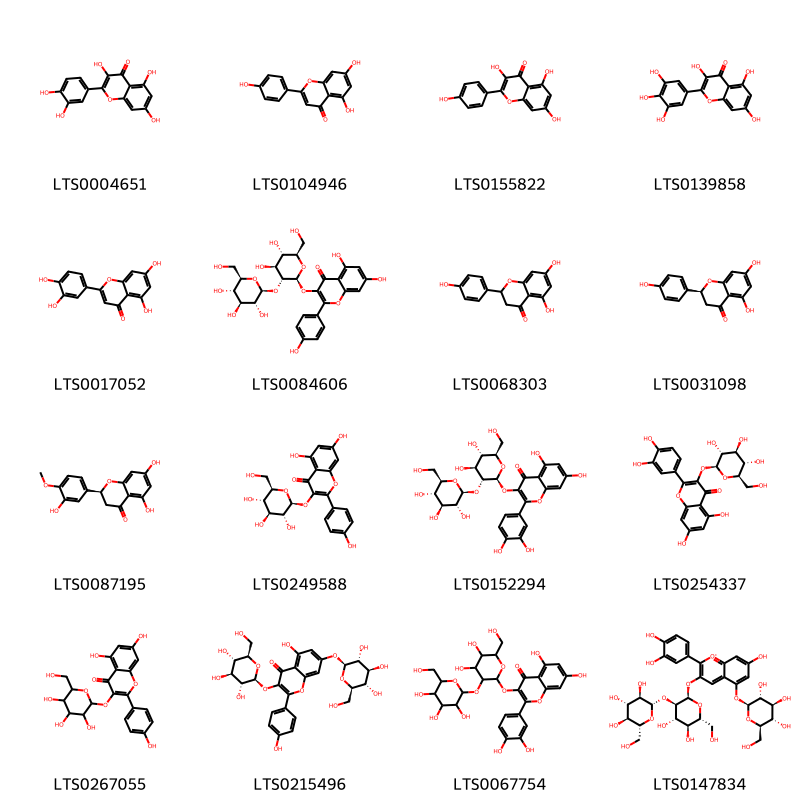{ width=100% }
    <figcaption>Hình ảnh cấu trúc hóa học của 16 hoạt chất thuộc nhóm Flavonoids gồm ['quercetin (LTS0004651)', 'chamomile (LTS0104946)', 'kaempherol (LTS0155822)', 'myricetin (LTS0139858)', 'luteolin (LTS0017052)', 'kaempferol 3-o-sophoroside (LTS0084606)', 'asahina (LTS0068303)', 'naringenin (LTS0031098)', 'hesperetin (LTS0087195)', 'astragalin (LTS0249588)', 'quosp (LTS0152294)', 'isoquercetin (LTS0254337)', 'trifolin (LTS0267055)', '5-hydroxy-2-(4-hydroxyphenyl)-3,7-bis({[(2s,3r,4s,5s,6r)-3,4,5-trihydroxy-6-(hydroxymethyl)oxan-2-yl]oxy})chromen-4-one (LTS0215496)', '3-{[4,5-dihydroxy-6-(hydroxymethyl)-3-{[3,4,5-trihydroxy-6-(hydroxymethyl)oxan-2-yl]oxy}oxan-2-yl]oxy}-2-(3,4-dihydroxyphenyl)-5,7-dihydroxychromen-4-one (LTS0067754)', '3-{[(2r,3r,4s,5s,6r)-4,5-dihydroxy-6-(hydroxymethyl)-3-{[(2s,3r,4s,5s,6r)-3,4,5-trihydroxy-6-(hydroxymethyl)oxan-2-yl]oxy}oxan-2-yl]oxy}-2-(3,4-dihydroxyphenyl)-7-hydroxy-5-{[(2s,3r,4s,5s,6r)-3,4,5-trihydroxy-6-(hydroxymethyl)oxan-2-yl]oxy}-1λ⁴-chromen-1-ylium (LTS0147834)'].</figcaption>
</figure>
#### Nhóm Furanoid lignans
<figure markdown="span">
    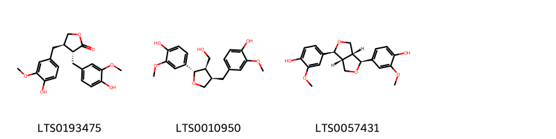{ width=100% }
    <figcaption>Hình ảnh cấu trúc hóa học của 3 hoạt chất thuộc nhóm Furanoid lignans gồm ['matairesinol (LTS0193475)', 'lariciresinol (LTS0010950)', 'pinoresinol (LTS0057431)'].</figcaption>
</figure>
#### Nhóm Indoles and derivatives
<figure markdown="span">
    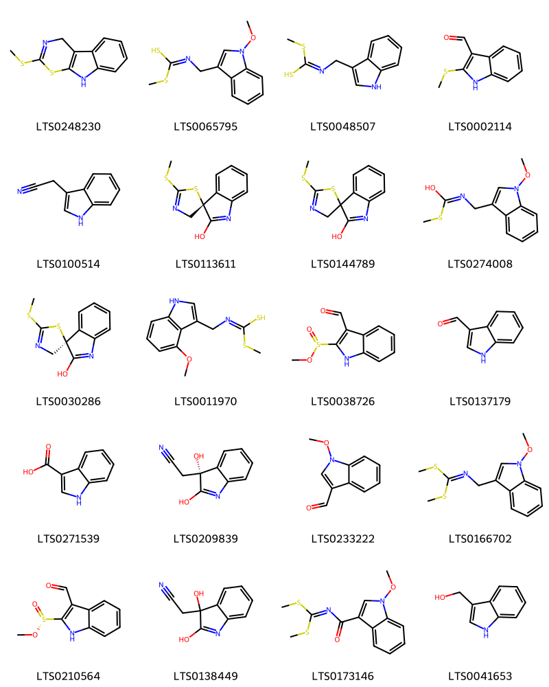{ width=100% }
    <figcaption>Hình ảnh cấu trúc hóa học của 20 hoạt chất thuộc nhóm Indoles and derivatives gồm ['2-(methylsulfanyl)-4h,9h-[1,3]thiazino[6,5-b]indole (LTS0248230)', 'n-[(1-methoxyindol-3-yl)methyl]methylsulfanylcarboimidothioic acid (LTS0065795)', 'n-(1h-indol-3-ylmethyl)methylsulfanylcarboimidothioic acid (LTS0048507)', 'brassicanal a (LTS0002114)', 'indole-3-acetonitrile (LTS0100514)', "(3s)-5'-(methylsulfanyl)-3'h-spiro[indole-3,2'-[1,4]thiazol]-2-ol (LTS0113611)", "5'-(methylsulfanyl)-3'h-spiro[indole-3,2'-[1,4]thiazol]-2-ol (LTS0144789)", 'n-[(1-methoxyindol-3-yl)methyl]methylsulfanylcarboximidic acid (LTS0274008)', "(3r)-5'-(methylsulfanyl)-3'h-spiro[indole-3,2'-[1,4]thiazol]-2-ol (LTS0030286)", 'n-[(4-methoxy-1h-indol-3-yl)methyl]methylsulfanylcarboimidothioic acid (LTS0011970)', 'methyl 3-formyl-1h-indole-2-sulfinate (LTS0038726)', 'indole-3-carboxaldehyde (LTS0137179)', 'indole - 3 carboxylic acid (LTS0271539)', '2-[(3r)-2,3-dihydroxyindol-3-yl]acetonitrile (LTS0209839)', '1-methoxyindole-3-carbaldehyde (LTS0233222)', '[bis(methylsulfanyl)methylidene][(1-methoxyindol-3-yl)methyl]amine (LTS0166702)', '(s)-(methyl 3-formyl-1h-indole-2-sulfinate) (LTS0210564)', '2-(2,3-dihydroxyindol-3-yl)acetonitrile (LTS0138449)', 'n-[bis(methylsulfanyl)methylidene]-1-methoxyindole-3-carboxamide (LTS0173146)', 'indole-3-carbinol (LTS0041653)'].</figcaption>
</figure>
#### Nhóm Isoflavonoids
<figure markdown="span">
    { width=100% }
    <figcaption>Hình ảnh cấu trúc hóa học của 1 hoạt chất thuộc nhóm Isoflavonoids gồm ['coumestrol (LTS0267535)'].</figcaption>
</figure>
#### Nhóm Isothiocyanates
<figure markdown="span">
    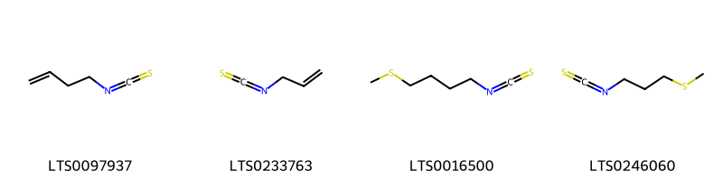{ width=100% }
    <figcaption>Hình ảnh cấu trúc hóa học của 4 hoạt chất thuộc nhóm Isothiocyanates gồm ['3-butenyl isothiocyanate (LTS0097937)', 'allyl isothiocyanate (LTS0233763)', 'erucin (LTS0016500)', 'iberverin (LTS0246060)'].</figcaption>
</figure>
#### Nhóm Organonitrogen compounds
<figure markdown="span">
    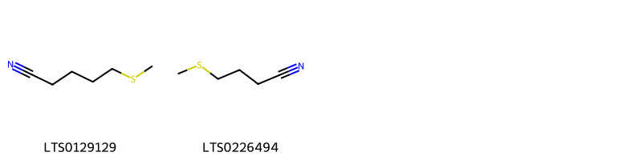{ width=100% }
    <figcaption>Hình ảnh cấu trúc hóa học của 2 hoạt chất thuộc nhóm Organonitrogen compounds gồm ['5-(methylsulfanyl)pentanenitrile (LTS0129129)', '4-(methylsulfanyl)butanenitrile (LTS0226494)'].</figcaption>
</figure>
#### Nhóm Organooxygen compounds
<figure markdown="span">
    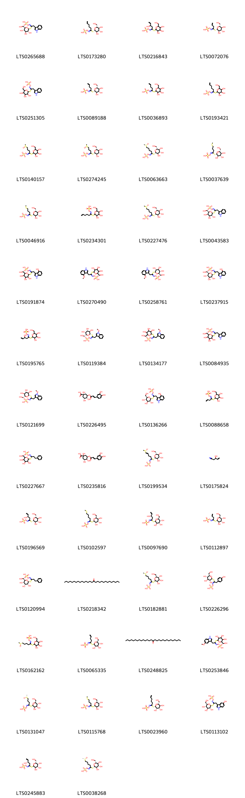{ width=100% }
    <figcaption>Hình ảnh cấu trúc hóa học của 50 hoạt chất thuộc nhóm Organooxygen compounds gồm ['glucobrassicin (LTS0265688)', '[(e)-(1-{[(2s,3r,4s,5s,6r)-3,4,5-trihydroxy-6-(hydroxymethyl)oxan-2-yl]sulfanyl}hex-5-en-1-ylidene)amino]oxysulfonic acid (LTS0173280)', '[(e)-(3-hydroxy-1-{[3,4,5-trihydroxy-6-(hydroxymethyl)oxan-2-yl]sulfanyl}pent-4-en-1-ylidene)amino]oxysulfonic acid (LTS0216843)', '[(e)-(1-{[(2s,3r,4s,5s,6r)-3,4,5-trihydroxy-6-(hydroxymethyl)oxan-2-yl]sulfanyl}but-3-en-1-ylidene)amino]oxysulfonic acid (LTS0072076)', '[(e)-[2-(1h-indol-3-yl)-1-{[3,4,5-trihydroxy-6-(hydroxymethyl)oxan-2-yl]sulfanyl}ethylidene]amino]oxysulfonic acid (LTS0251305)', '[(e)-(1-{[(2s,3r,4s,5s,6r)-3,4,5-trihydroxy-6-(hydroxymethyl)oxan-2-yl]sulfanyl}pent-4-en-1-ylidene)amino]oxysulfonic acid (LTS0089188)', '[(e)-(1-{[3,4,5-trihydroxy-6-(hydroxymethyl)oxan-2-yl]sulfanyl}pent-4-en-1-ylidene)amino]oxysulfonic acid (LTS0036893)', '[(e)-(1-{[3,4,5-trihydroxy-6-(hydroxymethyl)oxan-2-yl]sulfanyl}hex-5-en-1-ylidene)amino]oxysulfonic acid (LTS0193421)', '[(e)-(4-methanesulfinyl-1-{[3,4,5-trihydroxy-6-(hydroxymethyl)oxan-2-yl]sulfanyl}butylidene)amino]oxysulfonic acid (LTS0140157)', '[(e)-(4-methanesulfinyl-1-{[(2s,3r,4s,5s,6r)-3,4,5-trihydroxy-6-(hydroxymethyl)oxan-2-yl]sulfanyl}butylidene)amino]oxysulfonic acid (LTS0274245)', '[(e)-{5-[(r)-methanesulfinyl]-1-{[(2s,3r,4s,5s,6r)-3,4,5-trihydroxy-6-(hydroxymethyl)oxan-2-yl]sulfanyl}pentylidene}amino]oxysulfonic acid (LTS0063663)', '[(z)-[4-(methylsulfanyl)-1-{[(2s,3r,4s,5s,6r)-3,4,5-trihydroxy-6-(hydroxymethyl)oxan-2-yl]sulfanyl}butylidene]amino]oxysulfonic acid (LTS0037639)', '[(e)-[4-(methylsulfanyl)-1-{[(2s,3r,4s,5s,6r)-3,4,5-trihydroxy-6-(hydroxymethyl)oxan-2-yl]sulfanyl}butylidene]amino]oxysulfonic acid (LTS0046916)', '[(1-{[3,4,5-trihydroxy-6-(hydroxymethyl)oxan-2-yl]sulfanyl}hex-5-en-1-ylidene)amino]oxysulfonic acid (LTS0234301)', '[(e)-(5-methanesulfinyl-1-{[(2s,3r,4s,5s,6r)-3,4,5-trihydroxy-6-(hydroxymethyl)oxan-2-yl]sulfanyl}pentylidene)amino]oxysulfonic acid (LTS0227476)', '[(z)-[2-(1h-indol-3-yl)-1-{[(2s,3r,4s,5r,6r)-3,4,5-trihydroxy-6-(hydroxymethyl)oxan-2-yl]sulfanyl}ethylidene]amino]oxysulfonic acid (LTS0043583)', '{[2-(4-hydroxy-1h-indol-3-yl)-1-{[3,4,5-trihydroxy-6-(hydroxymethyl)oxan-2-yl]sulfanyl}ethylidene]amino}oxysulfonic acid (LTS0191874)', '{[2-(4-methoxy-1h-indol-3-yl)-1-{[3,4,5-trihydroxy-6-(hydroxymethyl)oxan-2-yl]sulfanyl}ethylidene]amino}oxysulfonic acid (LTS0270490)', '4-methoxyglucobrassicin (LTS0258761)', '[(z)-[2-(4-hydroxy-1h-indol-3-yl)-1-{[(2s,3r,4s,5s,6r)-3,4,5-trihydroxy-6-(hydroxymethyl)oxan-2-yl]sulfanyl}ethylidene]amino]oxysulfonic acid (LTS0237915)', '[(3-hydroxy-1-{[3,4,5-trihydroxy-6-(hydroxymethyl)oxan-2-yl]sulfanyl}pent-4-en-1-ylidene)amino]oxysulfonic acid (LTS0195765)', '[(z)-[2-(1-methoxyindol-3-yl)-1-{[(2s,3r,4s,5r,6r)-3,4,5-trihydroxy-6-(hydroxymethyl)oxan-2-yl]sulfanyl}ethylidene]amino]oxysulfonic acid (LTS0119384)', '{[2-(1-methoxyindol-3-yl)-1-{[3,4,5-trihydroxy-6-(hydroxymethyl)oxan-2-yl]sulfanyl}ethylidene]amino}oxysulfonic acid (LTS0134177)', '{[2-(1h-indol-3-yl)-1-{[3,4,5-trihydroxy-6-(hydroxymethyl)oxan-2-yl]sulfanyl}ethylidene]amino}oxysulfonic acid (LTS0084935)', 'mimg (LTS0121699)', 'chlorogenic acid (LTS0226495)', '[(e)-[2-(4-hydroxy-1h-indol-3-yl)-1-{[(2s,3r,4s,5s,6r)-3,4,5-trihydroxy-6-(hydroxymethyl)oxan-2-yl]sulfanyl}ethylidene]amino]oxysulfonic acid (LTS0136266)', '[(1-{[3,4,5-trihydroxy-6-(hydroxymethyl)oxan-2-yl]sulfanyl}but-3-en-1-ylidene)amino]oxysulfonic acid (LTS0088658)', '[(3-phenyl-1-{[3,4,5-trihydroxy-6-(hydroxymethyl)oxan-2-yl]sulfanyl}propylidene)amino]oxysulfonic acid (LTS0227667)', 'neochlorogenic acid (LTS0235816)', '[(z)-[(4e)-5-methanesulfinyl-1-{[(2s,3r,4s,5s,6r)-3,4,5-trihydroxy-6-(hydroxymethyl)oxan-2-yl]sulfanyl}pent-4-en-1-ylidene]amino]oxysulfonic acid (LTS0199534)', '1-cyano-2-hydroxy-3-butene (LTS0175824)', '[(e)-[(3r)-3-hydroxy-1-{[(2s,3r,4s,5s,6r)-3,4,5-trihydroxy-6-(hydroxymethyl)oxan-2-yl]sulfanyl}pent-4-en-1-ylidene]amino]oxysulfonic acid (LTS0196569)', '[(z)-[5-(methylsulfanyl)-1-{[(2r,3s,4s,5s,6s)-3,4,5-trihydroxy-6-(hydroxymethyl)oxan-2-yl]sulfanyl}pentylidene]amino]oxysulfonic acid (LTS0102597)', '[(z)-[(3r)-3-hydroxy-1-{[(2r,3r,4s,5r,6s)-3,4,5-trihydroxy-6-(hydroxymethyl)oxan-2-yl]sulfanyl}pent-4-en-1-ylidene]amino]oxysulfonic acid (LTS0097690)', '[(e)-(1-{[(2r,3r,4s,5r,6s)-3,4,5-trihydroxy-6-(hydroxymethyl)oxan-2-yl]sulfanyl}but-3-en-1-ylidene)amino]oxysulfonic acid (LTS0112897)', '[(z)-(3-phenyl-1-{[(2s,3r,4r,5s,6r)-3,4,5-trihydroxy-6-(hydroxymethyl)oxan-2-yl]sulfanyl}propylidene)amino]oxysulfonic acid (LTS0120994)', 'nonacosan-14-one (LTS0218342)', '[(z)-{5-[(r)-methanesulfinyl]-1-{[(2r,3r,4r,5r,6s)-3,4,5-trihydroxy-6-(hydroxymethyl)oxan-2-yl]sulfanyl}pentylidene}amino]oxysulfonic acid (LTS0182881)', 'sinalbin (LTS0226296)', '[(5-methanesulfinyl-1-{[3,4,5-trihydroxy-6-(hydroxymethyl)oxan-2-yl]sulfanyl}pentylidene)amino]oxysulfonic acid (LTS0162162)', '[(z)-(1-{[(2r,3s,4r,5r,6s)-3,4,5-trihydroxy-6-(hydroxymethyl)oxan-2-yl]sulfanyl}pent-4-en-1-ylidene)amino]oxysulfonic acid (LTS0065335)', 'nonacosan-15-one (LTS0248825)', '{[2-(5-methoxy-1h-indol-3-yl)-1-{[3,4,5-trihydroxy-6-(hydroxymethyl)oxan-2-yl]sulfanyl}ethylidene]amino}oxysulfonic acid (LTS0253846)', '[(z)-{4-[(r)-methanesulfinyl]-1-{[(2r,3r,4r,5r,6s)-3,4,5-trihydroxy-6-(hydroxymethyl)oxan-2-yl]sulfanyl}butylidene}amino]oxysulfonic acid (LTS0131047)', '[(e)-[4-(methylsulfanyl)-1-{[(2r,3r,4s,5r,6s)-3,4,5-trihydroxy-6-(hydroxymethyl)oxan-2-yl]sulfanyl}butylidene]amino]oxysulfonic acid (LTS0115768)', '[(z)-(1-{[(2s,3s,4s,5s,6r)-3,4,5-trihydroxy-6-(hydroxymethyl)oxan-2-yl]sulfanyl}hex-5-en-1-ylidene)amino]oxysulfonic acid (LTS0023960)', '[(e)-[2-(5-hydroxy-1h-indol-3-yl)-1-{[(2s,3r,4s,5s,6r)-3,4,5-trihydroxy-6-(hydroxymethyl)oxan-2-yl]sulfanyl}ethylidene]amino]oxysulfonic acid (LTS0113102)', '[(e)-[(3s)-3-hydroxy-1-{[(2r,3r,4s,5r,6r)-3,4,5-trihydroxy-6-(hydroxymethyl)oxan-2-yl]sulfanyl}pent-4-en-1-ylidene]amino]oxysulfonic acid (LTS0245883)', '[(e)-{5-[(s)-methanesulfinyl]-1-{[(2s,3r,4s,5s,6r)-3,4,5-trihydroxy-6-(hydroxymethyl)oxan-2-yl]sulfanyl}pentylidene}amino]oxysulfonic acid (LTS0038268)'].</figcaption>
</figure>
#### Nhóm Phenols
<figure markdown="span">
    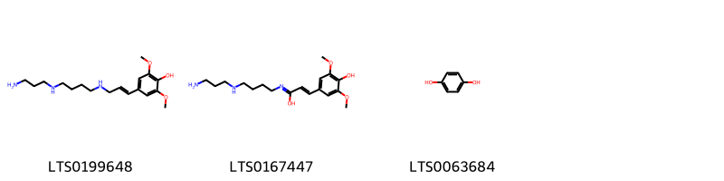{ width=100% }
    <figcaption>Hình ảnh cấu trúc hóa học của 3 hoạt chất thuộc nhóm Phenols gồm ['4-[(1e)-3-({4-[(3-aminopropyl)amino]butyl}amino)prop-1-en-1-yl]-2,6-dimethoxyphenol (LTS0199648)', '(2e)-n-{4-[(3-aminopropyl)amino]butyl}-3-(4-hydroxy-3,5-dimethoxyphenyl)prop-2-enimidic acid (LTS0167447)', 'α-hydroquinone (LTS0063684)'].</figcaption>
</figure>
#### Nhóm Prenol lipids
<figure markdown="span">
    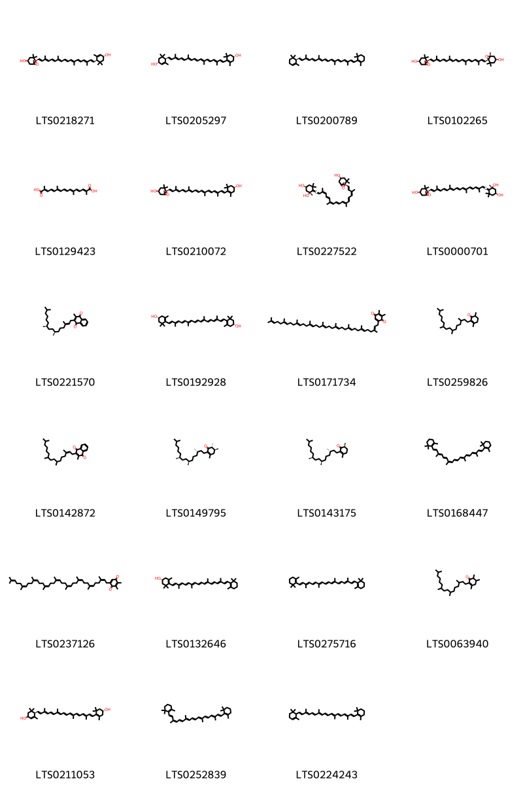{ width=100% }
    <figcaption>Hình ảnh cấu trúc hóa học của 23 hoạt chất thuộc nhóm Prenol lipids gồm ['taraxanthin (LTS0218271)', 'carotenoid (LTS0205297)', '(+)-α-carotene (LTS0200789)', 'violaxanthin (LTS0102265)', 'crocetin (LTS0129423)', 'antheraxanthin (LTS0210072)', 'neoxanthin (LTS0227522)', 'neoxanthin (LTS0000701)', '2-methyl-3-[(2e,7r,10s)-3,7,10,15-tetramethylhexadec-2-en-1-yl]naphthalene-1,4-dione (LTS0221570)', 'zeaxanthin (LTS0192928)', 'plastoquinone-9 (LTS0171734)', '3,6-dimethyl-2-(3,7,10,15-tetramethylhexadecyl)cyclohex-2-en-1-one (LTS0259826)', '2-methyl-3-(3,7,10,15-tetramethylhexadec-2-en-1-yl)naphthalene-1,4-dione (LTS0142872)', '(5s,6r)-3,5,6-trimethyl-2-[(3s,7r,10s)-3,7,10,15-tetramethylhexadecyl]cyclohex-2-en-1-one (LTS0149795)', '(6s)-3,6-dimethyl-2-[(3s,7r,10s)-3,7,10,15-tetramethylhexadecyl]cyclohex-2-en-1-one (LTS0143175)', 'β,β-carotene (LTS0168447)', '2,3-dimethyl-5-(3,7,11,15,19,23,27,31,35-nonamethylhexatriaconta-2,6,10,14,18,22,26,30,34-nonaen-1-yl)cyclohexa-2,5-diene-1,4-dione (LTS0237126)', 'cryptoxanthin (LTS0132646)', 'β-carotene (LTS0275716)', '3,5,6-trimethyl-2-(3,7,10,15-tetramethylhexadecyl)cyclohex-2-en-1-one (LTS0063940)', '(4r)-4-[(1e,3e,5e,7e,9e,11e,13e,15e,17e)-18-[(4r)-4-hydroxy-2,6,6-trimethylcyclohex-1-en-1-yl]-3,7,12,16-tetramethyloctadeca-1,3,5,7,9,11,13,15,17-nonaen-1-yl]-3,5,5-trimethylcyclohex-2-en-1-ol (LTS0211053)', '(9z)-β-carotene (LTS0252839)', 'α-carotene (LTS0224243)'].</figcaption>
</figure>
#### Nhóm Pyridines and derivatives
<figure markdown="span">
    { width=100% }
    <figcaption>Hình ảnh cấu trúc hóa học của 2 hoạt chất thuộc nhóm Pyridines and derivatives gồm ['(-)-nicotine (LTS0184620)', 'nicotine (LTS0177379)'].</figcaption>
</figure>
#### Nhóm Pyrrolidines
<figure markdown="span">
    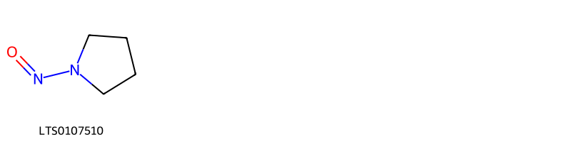{ width=100% }
    <figcaption>Hình ảnh cấu trúc hóa học của 1 hoạt chất thuộc nhóm Pyrrolidines gồm ['n-nitrosopyrrolidine (LTS0107510)'].</figcaption>
</figure>
#### Nhóm Saturated hydrocarbons
<figure markdown="span">
    { width=100% }
    <figcaption>Hình ảnh cấu trúc hóa học của 1 hoạt chất thuộc nhóm Saturated hydrocarbons gồm ['nonacosane (LTS0062747)'].</figcaption>
</figure>
#### Nhóm Steroids and steroid derivatives
<figure markdown="span">
    { width=100% }
    <figcaption>Hình ảnh cấu trúc hóa học của 2 hoạt chất thuộc nhóm Steroids and steroid derivatives gồm ['stigmast-5-en-3-ol (LTS0071224)', 'stigmast-5-en-3-ol, (3β)- (LTS0204616)'].</figcaption>
</figure>
#### Nhóm Sulfonyls
<figure markdown="span">
    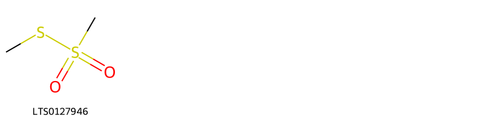{ width=100% }
    <figcaption>Hình ảnh cấu trúc hóa học của 1 hoạt chất thuộc nhóm Sulfonyls gồm ['methyl methanethiosulfonate (LTS0127946)'].</figcaption>
</figure>
#### Nhóm Sulfoxides
<figure markdown="span">
    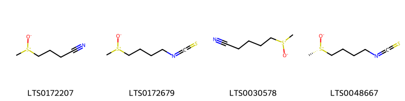{ width=100% }
    <figcaption>Hình ảnh cấu trúc hóa học của 4 hoạt chất thuộc nhóm Sulfoxides gồm ['4-methanesulfinylbutanenitrile (LTS0172207)', 'sulforaphane (LTS0172679)', '5-methanesulfinylpentanenitrile (LTS0030578)', '(s)-sulforaphane (LTS0048667)'].</figcaption>
</figure>
#### Nhóm Tetrapyrroles and derivatives
<figure markdown="span">
    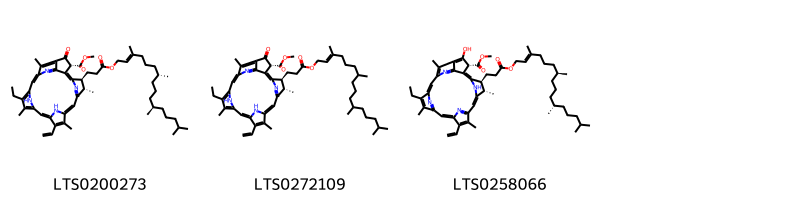{ width=100% }
    <figcaption>Hình ảnh cấu trúc hóa học của 3 hoạt chất thuộc nhóm Tetrapyrroles and derivatives gồm ['methyl (3r,21s,22s)-16-ethenyl-11-ethyl-12,17,21,26-tetramethyl-4-oxo-22-(3-oxo-3-{[(2e,7r,11r)-3,7,11,15-tetramethylhexadec-2-en-1-yl]oxy}propyl)-7,23,24,25-tetraazahexacyclo[18.2.1.1⁵,⁸.1¹⁰,¹³.1¹⁵,¹⁸.0²,⁶]hexacosa-1(23),2(6),5(26),7,9,11,13,15,17,19-decaene-3-carboxylate (LTS0200273)', 'methyl (3r,21s,22s)-16-ethenyl-11-ethyl-12,17,21,26-tetramethyl-4-oxo-22-(3-oxo-3-{[(2e)-3,7,11,15-tetramethylhexadec-2-en-1-yl]oxy}propyl)-7,23,24,25-tetraazahexacyclo[18.2.1.1⁵,⁸.1¹⁰,¹³.1¹⁵,¹⁸.0²,⁶]hexacosa-1(23),2(6),5(26),7,9,11,13,15,17,19-decaene-3-carboxylate (LTS0272109)', 'methyl (3r,21s,22s)-16-ethenyl-11-ethyl-4-hydroxy-12,17,21,26-tetramethyl-22-(3-oxo-3-{[(2e,7s,11s)-3,7,11,15-tetramethylhexadec-2-en-1-yl]oxy}propyl)-7,23,24,25-tetraazahexacyclo[18.2.1.1⁵,⁸.1¹⁰,¹³.1¹⁵,¹⁸.0²,⁶]hexacosa-1,4,6,8(26),9,11,13(25),14,16,18(24),19-undecaene-3-carboxylate (LTS0258066)'].</figcaption>
</figure>
#### Nhóm Thiiranes
<figure markdown="span">
    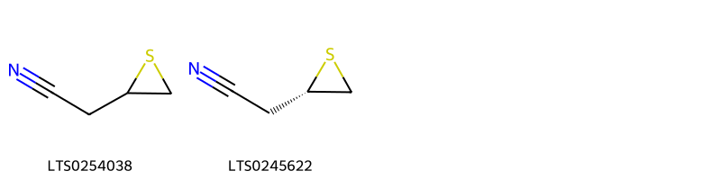{ width=100% }
    <figcaption>Hình ảnh cấu trúc hóa học của 2 hoạt chất thuộc nhóm Thiiranes gồm ['2-(thiiran-2-yl)acetonitrile (LTS0254038)', '2-[(2s)-thiiran-2-yl]acetonitrile (LTS0245622)'].</figcaption>
</figure>

---

### Dược dân tộc học

Danh sách các quốc gia có sử dụng *Brassica oleracea* trong điều trị các bệnh. 

| Country            | Disease   | Bệnh           |
|:-------------------|:----------|:---------------|
| China              | Soporific | Thuốc ngủ      |
| Dominican Republic | Vermifuge | Thuốc diệt sán |

---

---
## Brassica rapa
### Thông tin về thực vật

!!! info "Phân loại thực vật của *Brassica rapa* từ GIBF:"
    - **Kingdom:** Plantae
    - **Phylum:** Tracheophyta
    - **Order:** Brassicales
    - **Family:** Brassicaceae
    - **Genus:** Brassica
    - **Species:** *Brassica rapa*

 

| Label (VI)   | Label (EN)   | Scientific Name   | Descriptions (VI)   | Descriptions (EN)   | Also Known As (VI)   | Also Known As (EN)                                                                                           |
|:-------------|:-------------|:------------------|:--------------------|:--------------------|:---------------------|:-------------------------------------------------------------------------------------------------------------|
| N/A          | N/A          | Brassica rapa     | loài thực vật       | species of plant    | ['']                 | ['turnip', 'field mustard', 'turnip rape', 'common mustard', 'fast plants', 'turnip mustard', 'wild turnip'] |

#### Phân bố trên thế giới

**Từ CSDL GIBF** nan, Italy, Japan, Belgium, Argentina, Netherlands, Chinese Taipei, Malta, Spain, Algeria, United States of America, Hong Kong, Mexico, Dominican Republic, Austria, China, United Kingdom of Great Britain and Northern Ireland, Ireland, New Zealand

#### Phân bố tại Việt Nam

**Từ CSDL GIBF**: Không có ghi nhận ở Việt Nam

---
### Thành phần hóa học
        
- Theo cơ sở dữ liệu lotus: Từ loài *Brassica rapa* đã phân lập và xác định được 121 hoạt chất thuộc về các nhóm Naphthalenes, Carboxylic acids and derivatives, Anthracenes, Fatty Acyls, Indoles and derivatives, Cinnamic acids and derivatives, Dibenzylbutane lignans, Saturated hydrocarbons, Tannins, Isothiocyanates, Prenol lipids, Azolidines, Purine nucleosides, Benzene and substituted derivatives, Organooxygen compounds, Furanoid lignans, Flavonoids, Steroids and steroid derivatives, Organonitrogen compounds, Imidazopyrimidines. 

|    | chemicalTaxonomyClassyfireClass     |   smiles_count |
|---:|:------------------------------------|---------------:|
|  0 | Anthracenes                         |              3 |
|  1 | Azolidines                          |              4 |
|  2 | Benzene and substituted derivatives |              9 |
|  3 | Carboxylic acids and derivatives    |              2 |
|  4 | Cinnamic acids and derivatives      |              6 |
|  5 | Dibenzylbutane lignans              |              2 |
|  6 | Fatty Acyls                         |              9 |
|  7 | Flavonoids                          |             15 |
|  8 | Furanoid lignans                    |              1 |
|  9 | Imidazopyrimidines                  |              1 |
| 10 | Indoles and derivatives             |             19 |
| 11 | Isothiocyanates                     |              2 |
| 12 | Naphthalenes                        |              1 |
| 13 | Organonitrogen compounds            |              2 |
| 14 | Organooxygen compounds              |             24 |
| 15 | Prenol lipids                       |             11 |
| 16 | Purine nucleosides                  |              1 |
| 17 | Saturated hydrocarbons              |              2 |
| 18 | Steroids and steroid derivatives    |              4 |
| 19 | Tannins                             |              1 |

#### Nhóm Anthracenes
<figure markdown="span">
    { width=100% }
    <figcaption>Hình ảnh cấu trúc hóa học của 3 hoạt chất thuộc nhóm Anthracenes gồm ['emodin (LTS0163480)', 'turkey rhubarb (LTS0160968)', 'physcion (LTS0052688)'].</figcaption>
</figure>
#### Nhóm Azolidines
<figure markdown="span">
    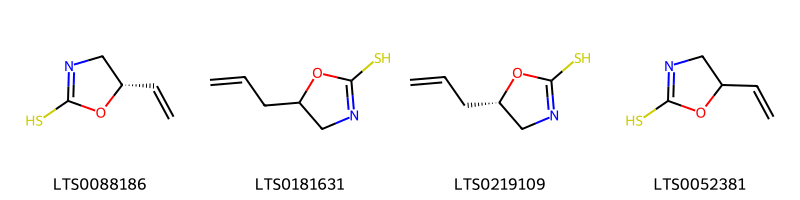{ width=100% }
    <figcaption>Hình ảnh cấu trúc hóa học của 4 hoạt chất thuộc nhóm Azolidines gồm ['(5s)-5-ethenyl-4,5-dihydro-1,3-oxazole-2-thiol (LTS0088186)', '5-(prop-2-en-1-yl)-4,5-dihydro-1,3-oxazole-2-thiol (LTS0181631)', '(5s)-5-(prop-2-en-1-yl)-4,5-dihydro-1,3-oxazole-2-thiol (LTS0219109)', 'goitrin (LTS0052381)'].</figcaption>
</figure>
#### Nhóm Benzene and substituted derivatives
<figure markdown="span">
    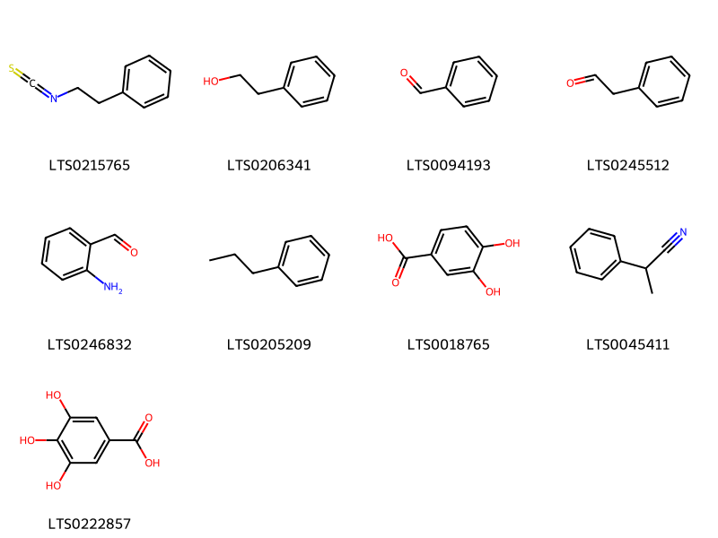{ width=100% }
    <figcaption>Hình ảnh cấu trúc hóa học của 9 hoạt chất thuộc nhóm Benzene and substituted derivatives gồm ['phenethyl isothiocyanate (LTS0215765)', '2-phenyl-ethanol (LTS0206341)', 'benzaldehyde (LTS0094193)', 'phenylacetaldehyde (LTS0245512)', '2-aminobenzaldehyde (LTS0246832)', 'propylbenzene (LTS0205209)', '3,4-dihydroxybenzoic acid (LTS0018765)', 'benzeneacetonitrile, α-methyl- (LTS0045411)', 'galop (LTS0222857)'].</figcaption>
</figure>
#### Nhóm Carboxylic acids and derivatives
<figure markdown="span">
    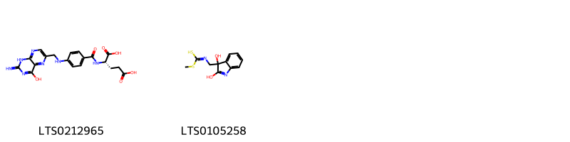{ width=100% }
    <figcaption>Hình ảnh cấu trúc hóa học của 2 hoạt chất thuộc nhóm Carboxylic acids and derivatives gồm ['acid, folic (LTS0212965)', 'n-[(2,3-dihydroxyindol-3-yl)methyl]methylsulfanylcarboimidothioic acid (LTS0105258)'].</figcaption>
</figure>
#### Nhóm Cinnamic acids and derivatives
<figure markdown="span">
    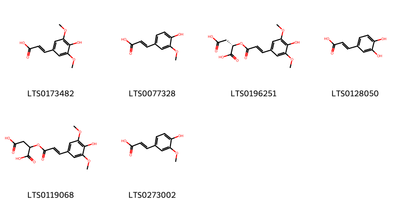{ width=100% }
    <figcaption>Hình ảnh cấu trúc hóa học của 6 hoạt chất thuộc nhóm Cinnamic acids and derivatives gồm ['sinapinate (LTS0173482)', 'ferulic acid (LTS0077328)', 'sinapoyl-(s)-malate (LTS0196251)', '3,4-dihydroxycinnamic acid (LTS0128050)', '2-{[3-(4-hydroxy-3,5-dimethoxyphenyl)prop-2-enoyl]oxy}butanedioic acid (LTS0119068)', 'ferulic acid (LTS0273002)'].</figcaption>
</figure>
#### Nhóm Dibenzylbutane lignans
<figure markdown="span">
    { width=100% }
    <figcaption>Hình ảnh cấu trúc hóa học của 2 hoạt chất thuộc nhóm Dibenzylbutane lignans gồm ['secoisolariciresinol (LTS0086727)', '(2s,3r)-2,3-bis[(4-hydroxy-3-methoxyphenyl)(¹³c)methyl](1-¹³c)butane-1,4-diol (LTS0268699)'].</figcaption>
</figure>
#### Nhóm Fatty Acyls
<figure markdown="span">
    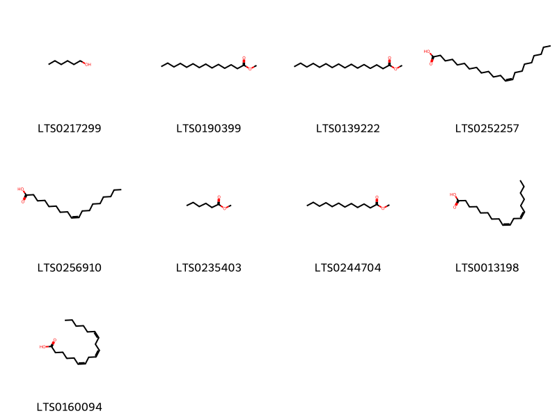{ width=100% }
    <figcaption>Hình ảnh cấu trúc hóa học của 9 hoạt chất thuộc nhóm Fatty Acyls gồm ['hexanol (LTS0217299)', 'methyl myristate (LTS0190399)', 'methyl palmitate (LTS0139222)', 'erucic acid (LTS0252257)', 'oleic acid (LTS0256910)', 'methyl caproate (LTS0235403)', 'methyl laurate (LTS0244704)', 'linoleic (LTS0013198)', 'gamma-linolenic acid (LTS0160094)'].</figcaption>
</figure>
#### Nhóm Flavonoids
<figure markdown="span">
    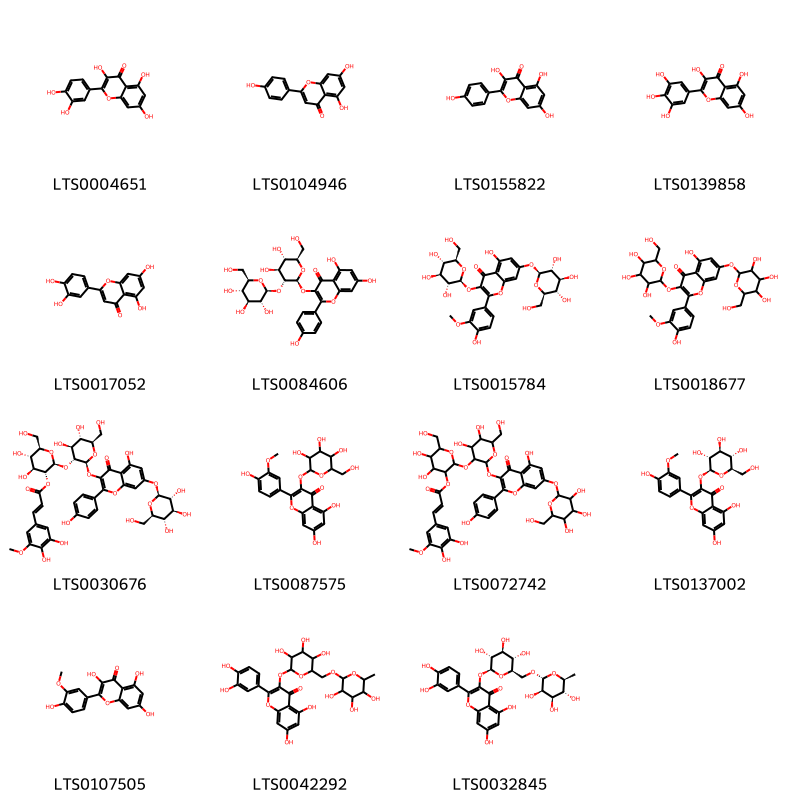{ width=100% }
    <figcaption>Hình ảnh cấu trúc hóa học của 15 hoạt chất thuộc nhóm Flavonoids gồm ['quercetin (LTS0004651)', 'chamomile (LTS0104946)', 'kaempherol (LTS0155822)', 'myricetin (LTS0139858)', 'luteolin (LTS0017052)', 'kaempferol 3-o-sophoroside (LTS0084606)', '5-hydroxy-2-(4-hydroxy-3-methoxyphenyl)-3,7-bis({[(2s,3r,4s,5s,6r)-3,4,5-trihydroxy-6-(hydroxymethyl)oxan-2-yl]oxy})chromen-4-one (LTS0015784)', '5-hydroxy-2-(4-hydroxy-3-methoxyphenyl)-3,7-bis({[3,4,5-trihydroxy-6-(hydroxymethyl)oxan-2-yl]oxy})chromen-4-one (LTS0018677)', '(2s,3r,4s,5s,6r)-2-{[(2s,3r,4s,5s,6r)-4,5-dihydroxy-2-{[5-hydroxy-2-(4-hydroxyphenyl)-4-oxo-7-{[(2s,3r,4s,5s,6r)-3,4,5-trihydroxy-6-(hydroxymethyl)oxan-2-yl]oxy}chromen-3-yl]oxy}-6-(hydroxymethyl)oxan-3-yl]oxy}-4,5-dihydroxy-6-(hydroxymethyl)oxan-3-yl (2e)-3-(3,4-dihydroxy-5-methoxyphenyl)prop-2-enoate (LTS0030676)', 'isorhamnetin 3-galactoside (LTS0087575)', '2-[(4,5-dihydroxy-2-{[5-hydroxy-2-(4-hydroxyphenyl)-4-oxo-7-{[3,4,5-trihydroxy-6-(hydroxymethyl)oxan-2-yl]oxy}chromen-3-yl]oxy}-6-(hydroxymethyl)oxan-3-yl)oxy]-4,5-dihydroxy-6-(hydroxymethyl)oxan-3-yl 3-(3,4-dihydroxy-5-methoxyphenyl)prop-2-enoate (LTS0072742)', 'isorhamnetin 3-o-glucoside (LTS0137002)', 'isorhamnetin (LTS0107505)', 'rutin (LTS0042292)', '3-rutinosyl quercetin (LTS0032845)'].</figcaption>
</figure>
#### Nhóm Furanoid lignans
<figure markdown="span">
    { width=100% }
    <figcaption>Hình ảnh cấu trúc hóa học của 1 hoạt chất thuộc nhóm Furanoid lignans gồm ['matairesinol (LTS0193475)'].</figcaption>
</figure>
#### Nhóm Imidazopyrimidines
<figure markdown="span">
    { width=100% }
    <figcaption>Hình ảnh cấu trúc hóa học của 1 hoạt chất thuộc nhóm Imidazopyrimidines gồm ['zeatine (LTS0032706)'].</figcaption>
</figure>
#### Nhóm Indoles and derivatives
<figure markdown="span">
    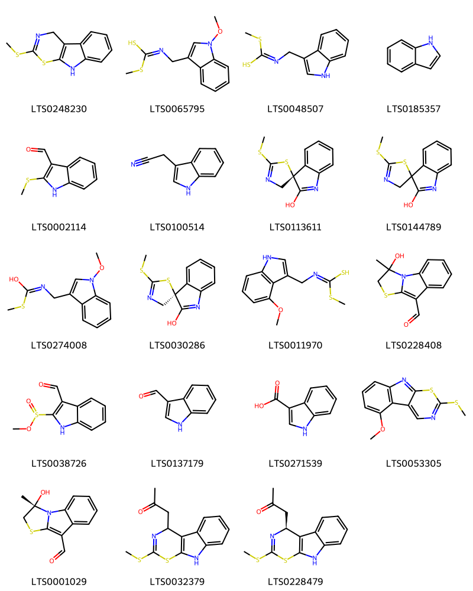{ width=100% }
    <figcaption>Hình ảnh cấu trúc hóa học của 19 hoạt chất thuộc nhóm Indoles and derivatives gồm ['2-(methylsulfanyl)-4h,9h-[1,3]thiazino[6,5-b]indole (LTS0248230)', 'n-[(1-methoxyindol-3-yl)methyl]methylsulfanylcarboimidothioic acid (LTS0065795)', 'n-(1h-indol-3-ylmethyl)methylsulfanylcarboimidothioic acid (LTS0048507)', 'indole (LTS0185357)', 'brassicanal a (LTS0002114)', 'indole-3-acetonitrile (LTS0100514)', "(3s)-5'-(methylsulfanyl)-3'h-spiro[indole-3,2'-[1,4]thiazol]-2-ol (LTS0113611)", "5'-(methylsulfanyl)-3'h-spiro[indole-3,2'-[1,4]thiazol]-2-ol (LTS0144789)", 'n-[(1-methoxyindol-3-yl)methyl]methylsulfanylcarboximidic acid (LTS0274008)', "(3r)-5'-(methylsulfanyl)-3'h-spiro[indole-3,2'-[1,4]thiazol]-2-ol (LTS0030286)", 'n-[(4-methoxy-1h-indol-3-yl)methyl]methylsulfanylcarboimidothioic acid (LTS0011970)', '3-hydroxy-3-methyl-2h-[1,3]thiazolo[3,2-a]indole-9-carbaldehyde (LTS0228408)', 'methyl 3-formyl-1h-indole-2-sulfinate (LTS0038726)', 'indole-3-carboxaldehyde (LTS0137179)', 'indole - 3 carboxylic acid (LTS0271539)', '5-methoxy-2-(methylsulfanyl)-[1,3]thiazino[6,5-b]indole (LTS0053305)', '(3s)-3-hydroxy-3-methyl-2h-[1,3]thiazolo[3,2-a]indole-9-carbaldehyde (LTS0001029)', '1-[2-(methylsulfanyl)-4h,9h-[1,3]thiazino[6,5-b]indol-4-yl]propan-2-one (LTS0032379)', '1-[(4s)-2-(methylsulfanyl)-4h,9h-[1,3]thiazino[6,5-b]indol-4-yl]propan-2-one (LTS0228479)'].</figcaption>
</figure>
#### Nhóm Isothiocyanates
<figure markdown="span">
    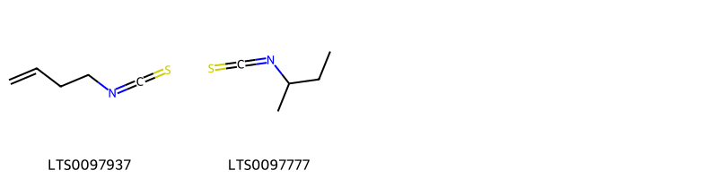{ width=100% }
    <figcaption>Hình ảnh cấu trúc hóa học của 2 hoạt chất thuộc nhóm Isothiocyanates gồm ['3-butenyl isothiocyanate (LTS0097937)', '2-butyl isothiocyanate (LTS0097777)'].</figcaption>
</figure>
#### Nhóm Naphthalenes
<figure markdown="span">
    { width=100% }
    <figcaption>Hình ảnh cấu trúc hóa học của 1 hoạt chất thuộc nhóm Naphthalenes gồm ['naphthalene (LTS0254484)'].</figcaption>
</figure>
#### Nhóm Organonitrogen compounds
<figure markdown="span">
    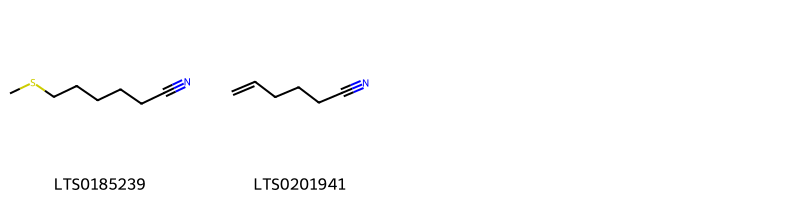{ width=100% }
    <figcaption>Hình ảnh cấu trúc hóa học của 2 hoạt chất thuộc nhóm Organonitrogen compounds gồm ['6-(methylsulfanyl)hexanenitrile (LTS0185239)', 'hex-5-enenitrile (LTS0201941)'].</figcaption>
</figure>
#### Nhóm Organooxygen compounds
<figure markdown="span">
    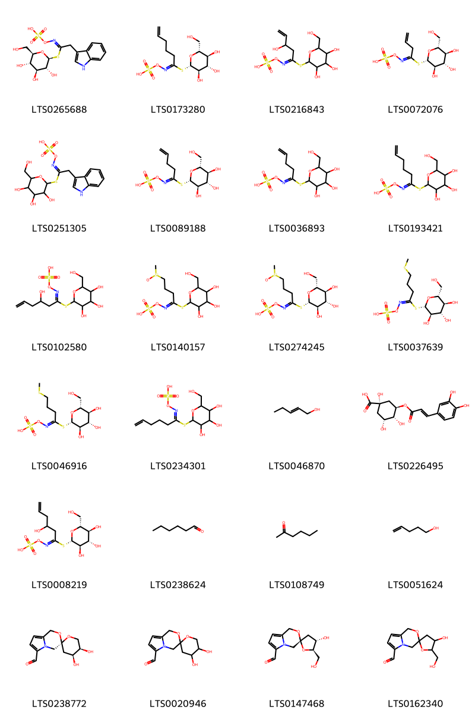{ width=100% }
    <figcaption>Hình ảnh cấu trúc hóa học của 24 hoạt chất thuộc nhóm Organooxygen compounds gồm ['glucobrassicin (LTS0265688)', '[(e)-(1-{[(2s,3r,4s,5s,6r)-3,4,5-trihydroxy-6-(hydroxymethyl)oxan-2-yl]sulfanyl}hex-5-en-1-ylidene)amino]oxysulfonic acid (LTS0173280)', '[(e)-(3-hydroxy-1-{[3,4,5-trihydroxy-6-(hydroxymethyl)oxan-2-yl]sulfanyl}pent-4-en-1-ylidene)amino]oxysulfonic acid (LTS0216843)', '[(e)-(1-{[(2s,3r,4s,5s,6r)-3,4,5-trihydroxy-6-(hydroxymethyl)oxan-2-yl]sulfanyl}but-3-en-1-ylidene)amino]oxysulfonic acid (LTS0072076)', '[(e)-[2-(1h-indol-3-yl)-1-{[3,4,5-trihydroxy-6-(hydroxymethyl)oxan-2-yl]sulfanyl}ethylidene]amino]oxysulfonic acid (LTS0251305)', '[(e)-(1-{[(2s,3r,4s,5s,6r)-3,4,5-trihydroxy-6-(hydroxymethyl)oxan-2-yl]sulfanyl}pent-4-en-1-ylidene)amino]oxysulfonic acid (LTS0089188)', '[(e)-(1-{[3,4,5-trihydroxy-6-(hydroxymethyl)oxan-2-yl]sulfanyl}pent-4-en-1-ylidene)amino]oxysulfonic acid (LTS0036893)', '[(e)-(1-{[3,4,5-trihydroxy-6-(hydroxymethyl)oxan-2-yl]sulfanyl}hex-5-en-1-ylidene)amino]oxysulfonic acid (LTS0193421)', '[(3-hydroxy-1-{[3,4,5-trihydroxy-6-(hydroxymethyl)oxan-2-yl]sulfanyl}hex-5-en-1-ylidene)amino]oxysulfonic acid (LTS0102580)', '[(e)-(4-methanesulfinyl-1-{[3,4,5-trihydroxy-6-(hydroxymethyl)oxan-2-yl]sulfanyl}butylidene)amino]oxysulfonic acid (LTS0140157)', '[(e)-(4-methanesulfinyl-1-{[(2s,3r,4s,5s,6r)-3,4,5-trihydroxy-6-(hydroxymethyl)oxan-2-yl]sulfanyl}butylidene)amino]oxysulfonic acid (LTS0274245)', '[(z)-[4-(methylsulfanyl)-1-{[(2s,3r,4s,5s,6r)-3,4,5-trihydroxy-6-(hydroxymethyl)oxan-2-yl]sulfanyl}butylidene]amino]oxysulfonic acid (LTS0037639)', '[(e)-[4-(methylsulfanyl)-1-{[(2s,3r,4s,5s,6r)-3,4,5-trihydroxy-6-(hydroxymethyl)oxan-2-yl]sulfanyl}butylidene]amino]oxysulfonic acid (LTS0046916)', '[(1-{[3,4,5-trihydroxy-6-(hydroxymethyl)oxan-2-yl]sulfanyl}hex-5-en-1-ylidene)amino]oxysulfonic acid (LTS0234301)', 'pent-2-en-1-ol (LTS0046870)', 'chlorogenic acid (LTS0226495)', '[(e)-(3-hydroxy-1-{[(2s,3r,4s,5s,6r)-3,4,5-trihydroxy-6-(hydroxymethyl)oxan-2-yl]sulfanyl}hex-5-en-1-ylidene)amino]oxysulfonic acid (LTS0008219)', 'hexanal (LTS0238624)', 'hexanone (LTS0108749)', '4-pentenol (LTS0051624)', "(2r,4s,5r)-4,5-dihydroxy-1',4'-dihydrospiro[oxane-2,3'-pyrrolo[2,1-c][1,4]oxazine]-6'-carbaldehyde (LTS0238772)", "4,5-dihydroxy-1',4'-dihydrospiro[oxane-2,3'-pyrrolo[2,1-c][1,4]oxazine]-6'-carbaldehyde (LTS0020946)", "(2r,4s,5r)-4-hydroxy-5-(hydroxymethyl)-1',4'-dihydrospiro[oxolane-2,3'-pyrrolo[2,1-c][1,4]oxazine]-6'-carbaldehyde (LTS0147468)", "4-hydroxy-5-(hydroxymethyl)-1',4'-dihydrospiro[oxolane-2,3'-pyrrolo[2,1-c][1,4]oxazine]-6'-carbaldehyde (LTS0162340)"].</figcaption>
</figure>
#### Nhóm Prenol lipids
<figure markdown="span">
    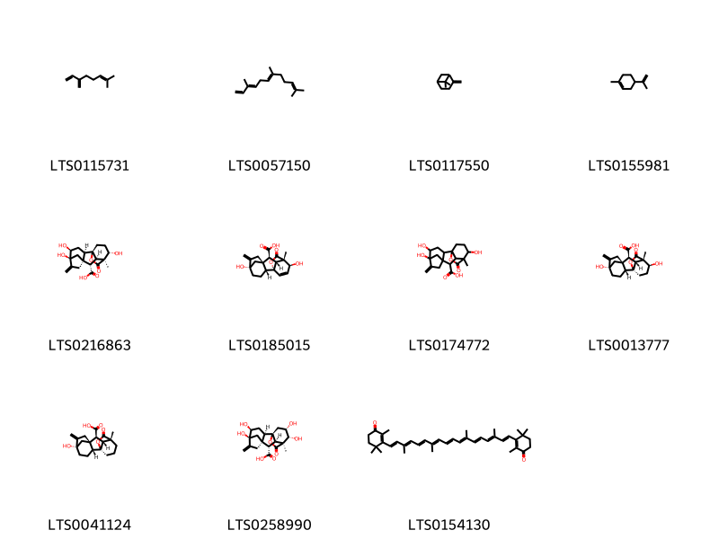{ width=100% }
    <figcaption>Hình ảnh cấu trúc hóa học của 11 hoạt chất thuộc nhóm Prenol lipids gồm ['α-myrcene (LTS0115731)', 'farnesene (LTS0057150)', 'β-pinene (LTS0117550)', 'limonene,  (LTS0155981)', '(1r,2r,4s,5s,8s,9s,10r,11s,12s)-4,5,12-trihydroxy-11-methyl-6-methylidene-16-oxo-15-oxapentacyclo[9.3.2.1⁵,⁸.0¹,¹⁰.0²,⁸]heptadecane-9-carboxylic acid (LTS0216863)', 'gibberellin a3 (LTS0185015)', '4,5,12-trihydroxy-11-methyl-6-methylidene-16-oxo-15-oxapentacyclo[9.3.2.1⁵,⁸.0¹,¹⁰.0²,⁸]heptadecane-9-carboxylic acid (LTS0174772)', 'gibberellin a1 (LTS0013777)', 'gibberellin a20 (LTS0041124)', '(1r,2r,4s,5s,8s,9s,10r,11s,12r,13s)-4,5,12,13-tetrahydroxy-11-methyl-6-methylidene-16-oxo-15-oxapentacyclo[9.3.2.1⁵,⁸.0¹,¹⁰.0²,⁸]heptadecane-9-carboxylic acid (LTS0258990)', 'canthaxanthin (LTS0154130)'].</figcaption>
</figure>
#### Nhóm Purine nucleosides
<figure markdown="span">
    { width=100% }
    <figcaption>Hình ảnh cấu trúc hóa học của 1 hoạt chất thuộc nhóm Purine nucleosides gồm ['zeatin riboside (LTS0254495)'].</figcaption>
</figure>
#### Nhóm Saturated hydrocarbons
<figure markdown="span">
    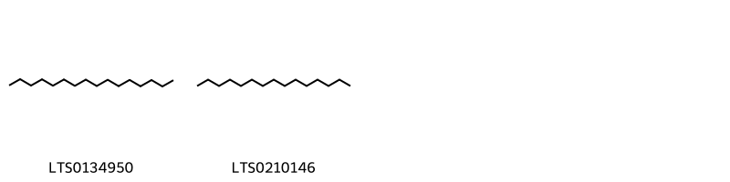{ width=100% }
    <figcaption>Hình ảnh cấu trúc hóa học của 2 hoạt chất thuộc nhóm Saturated hydrocarbons gồm ['cetane (LTS0134950)', 'pentadecane (LTS0210146)'].</figcaption>
</figure>
#### Nhóm Steroids and steroid derivatives
<figure markdown="span">
    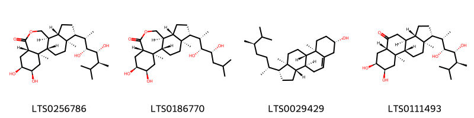{ width=100% }
    <figcaption>Hình ảnh cấu trúc hóa học của 4 hoạt chất thuộc nhóm Steroids and steroid derivatives gồm ['brassinolide (LTS0256786)', '(1s,2r,4r,5s,7s,11s,12s,15r,16s)-15-[(2s,3r,4r)-3,4-dihydroxy-6-methylheptan-2-yl]-4,5-dihydroxy-2,16-dimethyl-9-oxatetracyclo[9.7.0.0²,⁷.0¹²,¹⁶]octadecan-8-one (LTS0186770)', 'campesterol (LTS0029429)', 'castasterone (LTS0111493)'].</figcaption>
</figure>
#### Nhóm Tannins
<figure markdown="span">
    { width=100% }
    <figcaption>Hình ảnh cấu trúc hóa học của 1 hoạt chất thuộc nhóm Tannins gồm ['ellagic acid (LTS0037297)'].</figcaption>
</figure>

---

### Dược dân tộc học

Danh sách các quốc gia có sử dụng *Brassica rapa* trong điều trị các bệnh. 

| Country   | Disease                                     | Bệnh                                               |
|:----------|:--------------------------------------------|:---------------------------------------------------|
| China     | Antivinous, Refrigerant, Cosmetic, Diuretic | Kháng sinh, chất làm lạnh, mỹ phẩm, thuốc lợi tiểu |
| Iraq      | Laxative                                    | Nhuận trường                                       |
| US        | Digestive, Laxative, Emetic                 | Tiêu hóa, nhuận tràng, nôn                         |

---

---
## Brassica rugosa
### Thông tin về thực vật

!!! info "Phân loại thực vật của *N/A* từ GIBF:"
    - **Kingdom:** Plantae
    - **Phylum:** Tracheophyta
    - **Order:** Brassicales
    - **Family:** Brassicaceae
    - **Genus:** Brassica
    - **Species:** *N/A*

 

| Label (VI)   | Label (EN)   | Scientific Name   | Descriptions (VI)   | Descriptions (EN)   | Also Known As (VI)   | Also Known As (EN)   |
|:-------------|:-------------|:------------------|:--------------------|:--------------------|:---------------------|:---------------------|
| N/A          | N/A          | Brassica rugosa   | loài thực vật       | species of plant    | ['']                 | ['']                 |

#### Phân bố trên thế giới

**Từ CSDL GIBF** Italy, Australia, Japan, Argentina, Israel, Ukraine, Denmark, Netherlands, Chinese Taipei, Spain, Portugal, Algeria, Russian Federation, United States of America, Uzbekistan, South Africa, Germany, Brazil, Switzerland, Mexico, France, Dominican Republic, Austria, United Kingdom of Great Britain and Northern Ireland, China, New Zealand, Ethiopia

#### Phân bố tại Việt Nam

**Từ CSDL GIBF**: Không có ghi nhận ở Việt Nam

---
### Thành phần hóa học
        
- Theo cơ sở dữ liệu lotus: Từ loài *N/A* đã phân lập và xác định được Chưa có hoạt chất nào được phân lập. hoạt chất thuộc về các nhóm Không có hoạt chất nào được phân lập. 

Không có hình ảnh nào được tạo ra

---

### Dược dân tộc học

Danh sách các quốc gia có sử dụng *N/A* trong điều trị các bệnh. 

| Country   | Disease   | Bệnh           |
|:----------|:----------|:---------------|
| India     | Vermifuge | Thuốc diệt sán |

---

# Chi Armoracia

??? note "Danh sách các dược liệu thuộc chi"
    
	 - *Armoracia rusticana*

---
## Armoracia rusticana
### Thông tin về thực vật

!!! info "Phân loại thực vật của *Armoracia rusticana* từ GIBF:"
    - **Kingdom:** Plantae
    - **Phylum:** Tracheophyta
    - **Order:** Brassicales
    - **Family:** Brassicaceae
    - **Genus:** Armoracia
    - **Species:** *Armoracia rusticana*

 

| Label (VI)   | Label (EN)   | Scientific Name     | Descriptions (VI)   | Descriptions (EN)   | Also Known As (VI)      | Also Known As (EN)                   |
|:-------------|:-------------|:--------------------|:--------------------|:--------------------|:------------------------|:-------------------------------------|
| N/A          | N/A          | Armoracia rusticana | loài thực vật       | species of plant    | ['Armoracia rusticana'] | ['horseradish', 'horseradish plant'] |

#### Phân bố trên thế giới

**Từ CSDL GIBF** Slovakia, Belgium, Canada, Ukraine, Netherlands, Lithuania, Belarus, Hungary, Russian Federation, United States of America, Sweden, Slovenia, Croatia, Czechia, Germany, Austria, France, United Kingdom of Great Britain and Northern Ireland, Ireland, Poland

#### Phân bố tại Việt Nam

**Từ CSDL GIBF**: Không có ghi nhận ở Việt Nam

---
### Thành phần hóa học
        
- Theo cơ sở dữ liệu lotus: Từ loài *Armoracia rusticana* đã phân lập và xác định được 13 hoạt chất thuộc về các nhóm Flavonoids, Isothiocyanates, Dibenzylbutane lignans, Organooxygen compounds, Furanoid lignans. 

|    | chemicalTaxonomyClassyfireClass   |   smiles_count |
|---:|:----------------------------------|---------------:|
|  0 | Dibenzylbutane lignans            |              2 |
|  1 | Flavonoids                        |              8 |
|  2 | Furanoid lignans                  |              1 |
|  3 | Isothiocyanates                   |              1 |
|  4 | Organooxygen compounds            |              1 |

#### Nhóm Dibenzylbutane lignans
<figure markdown="span">
    { width=100% }
    <figcaption>Hình ảnh cấu trúc hóa học của 2 hoạt chất thuộc nhóm Dibenzylbutane lignans gồm ['(2s,3r)-2,3-bis[(4-hydroxy-3-methoxyphenyl)(¹³c)methyl](1-¹³c)butane-1,4-diol (LTS0268699)', 'secoisolariciresinol (LTS0086727)'].</figcaption>
</figure>
#### Nhóm Flavonoids
<figure markdown="span">
    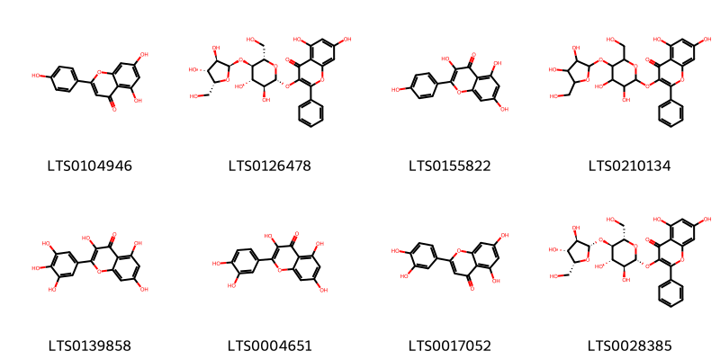{ width=100% }
    <figcaption>Hình ảnh cấu trúc hóa học của 8 hoạt chất thuộc nhóm Flavonoids gồm ['chamomile (LTS0104946)', '3-{[(2r,3s,4s,5r,6s)-5-{[(2r,3r,4r,5r)-3,4-dihydroxy-5-(hydroxymethyl)oxolan-2-yl]oxy}-3,4-dihydroxy-6-(hydroxymethyl)oxan-2-yl]oxy}-5,7-dihydroxy-2-phenylchromen-4-one (LTS0126478)', 'kaempherol (LTS0155822)', '3-[(5-{[3,4-dihydroxy-5-(hydroxymethyl)oxolan-2-yl]oxy}-3,4-dihydroxy-6-(hydroxymethyl)oxan-2-yl)oxy]-5,7-dihydroxy-2-phenylchromen-4-one (LTS0210134)', 'myricetin (LTS0139858)', 'quercetin (LTS0004651)', 'luteolin (LTS0017052)', '3-{[(2r,3s,4s,5r,6s)-5-{[(2s,3r,4r,5r)-3,4-dihydroxy-5-(hydroxymethyl)oxolan-2-yl]oxy}-3,4-dihydroxy-6-(hydroxymethyl)oxan-2-yl]oxy}-5,7-dihydroxy-2-phenylchromen-4-one (LTS0028385)'].</figcaption>
</figure>
#### Nhóm Furanoid lignans
<figure markdown="span">
    { width=100% }
    <figcaption>Hình ảnh cấu trúc hóa học của 1 hoạt chất thuộc nhóm Furanoid lignans gồm ['matairesinol (LTS0193475)'].</figcaption>
</figure>
#### Nhóm Isothiocyanates
<figure markdown="span">
    { width=100% }
    <figcaption>Hình ảnh cấu trúc hóa học của 1 hoạt chất thuộc nhóm Isothiocyanates gồm ['allyl isothiocyanate (LTS0233763)'].</figcaption>
</figure>
#### Nhóm Organooxygen compounds
<figure markdown="span">
    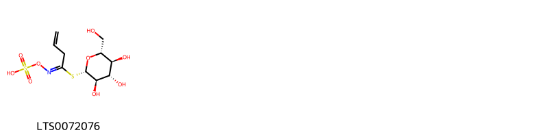{ width=100% }
    <figcaption>Hình ảnh cấu trúc hóa học của 1 hoạt chất thuộc nhóm Organooxygen compounds gồm ['[(e)-(1-{[(2s,3r,4s,5s,6r)-3,4,5-trihydroxy-6-(hydroxymethyl)oxan-2-yl]sulfanyl}but-3-en-1-ylidene)amino]oxysulfonic acid (LTS0072076)'].</figcaption>
</figure>

---

### Dược dân tộc học

Danh sách các quốc gia có sử dụng *Armoracia rusticana* trong điều trị các bệnh. 

| Country   | Disease                                                         | Bệnh                                                                       |
|:----------|:----------------------------------------------------------------|:---------------------------------------------------------------------------|
| Elsewhere | Diaphoretic, Stimulant, Digestive, Diuretic                     | Thuốc lợi tiểu, thuốc kích thích, thuốc tiêu hóa, thuốc lợi tiểu           |
| Turkey    | Apertif, Digestive, Diuretic, Stimulant, Sudorific, Carminative | Apertif, Tiêu hóa, Thuốc lợi tiểu, Chất kích thích, Sudorific, Carminative |
| US        | Poison                                                          | Chất độc                                                                   |

---

# Chi Raphanus

??? note "Danh sách các dược liệu thuộc chi"
    
	 - *Raphanus raphanistrum*
	 - *Raphanus sativus*

---
## Raphanus raphanistrum
### Thông tin về thực vật

!!! info "Phân loại thực vật của *Raphanus raphanistrum* từ GIBF:"
    - **Kingdom:** Plantae
    - **Phylum:** Tracheophyta
    - **Order:** Brassicales
    - **Family:** Brassicaceae
    - **Genus:** Raphanus
    - **Species:** *Raphanus raphanistrum*

 

| Label (VI)   | Label (EN)   | Scientific Name       | Descriptions (VI)   | Descriptions (EN)          | Also Known As (VI)   | Also Known As (EN)           |
|:-------------|:-------------|:----------------------|:--------------------|:---------------------------|:---------------------|:-----------------------------|
| N/A          | N/A          | Raphanus raphanistrum |                     | species of flowering plant | ['']                 | ['Wild Radish', 'Wild rape'] |

#### Phân bố trên thế giới

**Từ CSDL GIBF** nan, Italy, Australia, Belgium, Gibraltar, Israel, Netherlands, Cyprus, Spain, Türkiye, Portugal, Algeria, United States of America, Greece, Switzerland, Mexico, France, United Kingdom of Great Britain and Northern Ireland, Jersey, Ireland, New Zealand

#### Phân bố tại Việt Nam

**Từ CSDL GIBF**: Không có ghi nhận ở Việt Nam

---
### Thành phần hóa học
        
- Theo cơ sở dữ liệu lotus: Từ loài *Raphanus raphanistrum* đã phân lập và xác định được Chưa có hoạt chất nào được phân lập. hoạt chất thuộc về các nhóm Không có hoạt chất nào được phân lập. 

Không có hình ảnh nào được tạo ra

---

### Dược dân tộc học

Danh sách các quốc gia có sử dụng *Raphanus raphanistrum* trong điều trị các bệnh. 

| Country   | Disease   | Bệnh     |
|:----------|:----------|:---------|
| US        | Poison    | Chất độc |

---

---
## Raphanus sativus
### Thông tin về thực vật

!!! info "Phân loại thực vật của *Raphanus sativus* từ GIBF:"
    - **Kingdom:** Plantae
    - **Phylum:** Tracheophyta
    - **Order:** Brassicales
    - **Family:** Brassicaceae
    - **Genus:** Raphanus
    - **Species:** *Raphanus sativus*

 

| Label (VI)   | Label (EN)   | Scientific Name   | Descriptions (VI)   | Descriptions (EN)   | Also Known As (VI)   | Also Known As (EN)   |
|:-------------|:-------------|:------------------|:--------------------|:--------------------|:---------------------|:---------------------|
| N/A          | N/A          | Raphanus sativus  | loài thực vật       | species of plant    | ['']                 | ['Raphanus sativus'] |

#### Phân bố trên thế giới

**Từ CSDL GIBF** Ecuador, South Africa, Netherlands, Japan, Belgium, Korea, Republic of, Chinese Taipei, Argentina, India, United States of America, China, Mexico, Uruguay, France, New Zealand, Chile

#### Phân bố tại Việt Nam

**Từ CSDL GIBF**: Không có ghi nhận ở Việt Nam

---
### Thành phần hóa học
        
- Theo cơ sở dữ liệu lotus: Từ loài *Raphanus sativus* đã phân lập và xác định được 184 hoạt chất thuộc về các nhóm Harmala alkaloids, Hydroxy acids and derivatives, Pyrrolines, Carboxylic acids and derivatives, Fatty Acyls, Indoles and derivatives, Cinnamic acids and derivatives, Dibenzylbutane lignans, Glycerolipids, Prenol lipids, Thiolactams, Isothiocyanates, Sulfoxides, Organooxygen compounds, Furanoid lignans, Pyridines and derivatives, Flavonoids, Steroids and steroid derivatives, Dithiocarbamic acids and derivatives, Imidazopyrimidines. 

|    | chemicalTaxonomyClassyfireClass      |   smiles_count |
|---:|:-------------------------------------|---------------:|
|  0 |                                      |              1 |
|  1 | Carboxylic acids and derivatives     |              4 |
|  2 | Cinnamic acids and derivatives       |             26 |
|  3 | Dibenzylbutane lignans               |              2 |
|  4 | Dithiocarbamic acids and derivatives |              1 |
|  5 | Fatty Acyls                          |              6 |
|  6 | Flavonoids                           |             10 |
|  7 | Furanoid lignans                     |              5 |
|  8 | Glycerolipids                        |              2 |
|  9 | Harmala alkaloids                    |              2 |
| 10 | Hydroxy acids and derivatives        |              1 |
| 11 | Imidazopyrimidines                   |              2 |
| 12 | Indoles and derivatives              |             13 |
| 13 | Isothiocyanates                      |              3 |
| 14 | Organooxygen compounds               |             26 |
| 15 | Prenol lipids                        |             60 |
| 16 | Pyridines and derivatives            |              1 |
| 17 | Pyrrolines                           |              1 |
| 18 | Steroids and steroid derivatives     |             12 |
| 19 | Sulfoxides                           |              5 |
| 20 | Thiolactams                          |              1 |

#### Nhóm 
<figure markdown="span">
    { width=100% }
    <figcaption>Hình ảnh cấu trúc hóa học của 1 hoạt chất thuộc nhóm  gồm ['trigonelline (LTS0040106)'].</figcaption>
</figure>
#### Nhóm Carboxylic acids and derivatives
<figure markdown="span">
    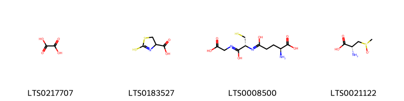{ width=100% }
    <figcaption>Hình ảnh cấu trúc hóa học của 4 hoạt chất thuộc nhóm Carboxylic acids and derivatives gồm ['oxalic acid (LTS0217707)', '2-sulfanyl-4,5-dihydro-1,3-thiazole-4-carboxylic acid (LTS0183527)', '(2s)-2-amino-4-{[(1r)-1-(carboxymethyl-c-hydroxycarbonimidoyl)-2-sulfanylethyl]-c-hydroxycarbonimidoyl}butanoic acid (LTS0008500)', '(2r)-2-amino-3-methanesulfinylpropanoic acid (LTS0021122)'].</figcaption>
</figure>
#### Nhóm Cinnamic acids and derivatives
<figure markdown="span">
    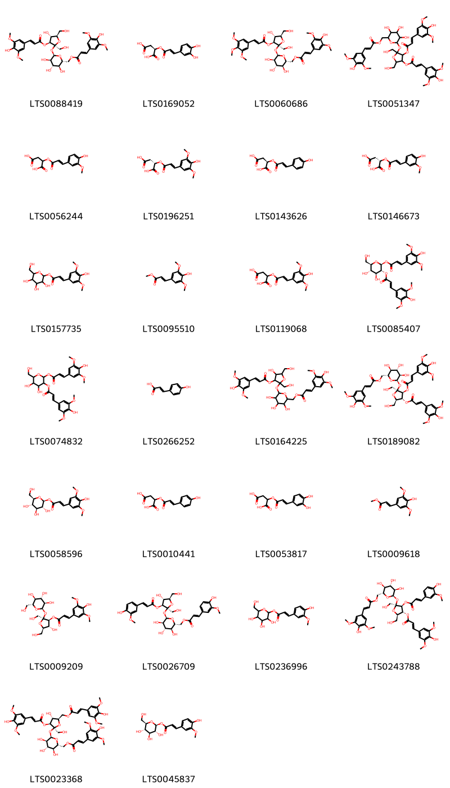{ width=100% }
    <figcaption>Hình ảnh cấu trúc hóa học của 26 hoạt chất thuộc nhóm Cinnamic acids and derivatives gồm ['[(2r,3s,4s,5r,6r)-3,4,5-trihydroxy-6-{[(2s,3s,4r,5r)-4-hydroxy-3-{[(2e)-3-(4-hydroxy-3,5-dimethoxyphenyl)prop-2-enoyl]oxy}-2,5-bis(hydroxymethyl)oxolan-2-yl]oxy}oxan-2-yl]methyl (2e)-3-(4-hydroxy-3,5-dimethoxyphenyl)prop-2-enoate (LTS0088419)', '(2r)-2-{[(2e)-3-(3,4-dihydroxyphenyl)prop-2-enoyl]oxy}butanedioic acid (LTS0169052)', 'tenuifoliside c (LTS0060686)', '(6-{[3,4-bis({[3-(4-hydroxy-3,5-dimethoxyphenyl)prop-2-enoyl]oxy})-2,5-bis(hydroxymethyl)oxolan-2-yl]oxy}-3,4,5-trihydroxyoxan-2-yl)methyl 3-(4-hydroxy-3,5-dimethoxyphenyl)prop-2-enoate (LTS0051347)', '2-{[3-(4-hydroxy-3-methoxyphenyl)prop-2-enoyl]oxy}butanedioic acid (LTS0056244)', 'sinapoyl-(s)-malate (LTS0196251)', '(2r)-2-{[(2e)-3-(4-hydroxyphenyl)prop-2-enoyl]oxy}butanedioic acid (LTS0143626)', '(2s)-2-{[(2e)-3-(4-hydroxy-3-methoxyphenyl)prop-2-enoyl]oxy}butanedioic acid (LTS0146673)', '3,4,5-trihydroxy-6-(hydroxymethyl)oxan-2-yl 3-(4-hydroxy-3,5-dimethoxyphenyl)prop-2-enoate (LTS0157735)', 'methyl 3-(4-hydroxy-3,5-dimethoxyphenyl)prop-2-enoate (LTS0095510)', '2-{[3-(4-hydroxy-3,5-dimethoxyphenyl)prop-2-enoyl]oxy}butanedioic acid (LTS0119068)', '1,2-di-o-sinapoyl-β-d-glucose (LTS0085407)', '4,5-dihydroxy-3-{[3-(4-hydroxy-3,5-dimethoxyphenyl)prop-2-enoyl]oxy}-6-(hydroxymethyl)oxan-2-yl 3-(4-hydroxy-3,5-dimethoxyphenyl)prop-2-enoate (LTS0074832)', 'para-coumaric acid (LTS0266252)', '{3,4,5-trihydroxy-6-[(4-hydroxy-3-{[3-(4-hydroxy-3,5-dimethoxyphenyl)prop-2-enoyl]oxy}-2,5-bis(hydroxymethyl)oxolan-2-yl)oxy]oxan-2-yl}methyl 3-(4-hydroxy-3,5-dimethoxyphenyl)prop-2-enoate (LTS0164225)', '[(2r,3s,4s,5r,6r)-6-{[(2s,3s,4r,5r)-3,4-bis({[(2e)-3-(4-hydroxy-3,5-dimethoxyphenyl)prop-2-enoyl]oxy})-2,5-bis(hydroxymethyl)oxolan-2-yl]oxy}-3,4,5-trihydroxyoxan-2-yl]methyl (2e)-3-(4-hydroxy-3,5-dimethoxyphenyl)prop-2-enoate (LTS0189082)', '1-o-sinapoyl-β-d-glucose (LTS0058596)', '2-{[3-(4-hydroxyphenyl)prop-2-enoyl]oxy}butanedioic acid (LTS0010441)', 'caffeoylmalic acid (LTS0053817)', 'methyl (2e)-3-(4-hydroxy-3,5-dimethoxyphenyl)prop-2-enoate (LTS0009618)', '(2s,3s,4r,5r)-4-hydroxy-2,5-bis(hydroxymethyl)-2-{[(2r,3r,4s,5s,6r)-3,4,5-trihydroxy-6-(hydroxymethyl)oxan-2-yl]oxy}oxolan-3-yl (2e)-3-(4-hydroxy-3,5-dimethoxyphenyl)prop-2-enoate (LTS0009209)', '[(2r,3s,4s,5r,6r)-3,4,5-trihydroxy-6-{[(2s,3s,4r,5r)-4-hydroxy-3-{[(2e)-3-(4-hydroxy-3-methoxyphenyl)prop-2-enoyl]oxy}-2,5-bis(hydroxymethyl)oxolan-2-yl]oxy}oxan-2-yl]methyl (2e)-3-(4-hydroxy-3-methoxyphenyl)prop-2-enoate (LTS0026709)', '3,4,5-trihydroxy-6-(hydroxymethyl)oxan-2-yl 3-(4-hydroxy-3-methoxyphenyl)prop-2-enoate (LTS0236996)', '[(2r,3s,4s,5r,6r)-3,4,5-trihydroxy-6-{[(2s,3s,4r,5r)-4-{[(2e)-3-(4-hydroxy-3,5-dimethoxyphenyl)prop-2-enoyl]oxy}-3-{[(2e)-3-(4-hydroxy-3-methoxyphenyl)prop-2-enoyl]oxy}-2,5-bis(hydroxymethyl)oxolan-2-yl]oxy}oxan-2-yl]methyl (2e)-3-(4-hydroxy-3,5-dimethoxyphenyl)prop-2-enoate (LTS0243788)', '[(2r,3s,4s,5r,6r)-3,4,5-trihydroxy-6-{[(2s,3s,4r,5r)-4-hydroxy-3-{[(2e)-3-(4-hydroxy-3,5-dimethoxyphenyl)prop-2-enoyl]oxy}-5-({[(2e)-3-(4-hydroxy-3,5-dimethoxyphenyl)prop-2-enoyl]oxy}methyl)-2-(hydroxymethyl)oxolan-2-yl]oxy}oxan-2-yl]methyl (2e)-3-(4-hydroxy-3,5-dimethoxyphenyl)prop-2-enoate (LTS0023368)', '1-o-feruloyl-β-d-glucose (LTS0045837)'].</figcaption>
</figure>
#### Nhóm Dibenzylbutane lignans
<figure markdown="span">
    { width=100% }
    <figcaption>Hình ảnh cấu trúc hóa học của 2 hoạt chất thuộc nhóm Dibenzylbutane lignans gồm ['(2s,3r)-2,3-bis[(4-hydroxy-3-methoxyphenyl)(¹³c)methyl](1-¹³c)butane-1,4-diol (LTS0268699)', 'secoisolariciresinol (LTS0086727)'].</figcaption>
</figure>
#### Nhóm Dithiocarbamic acids and derivatives
<figure markdown="span">
    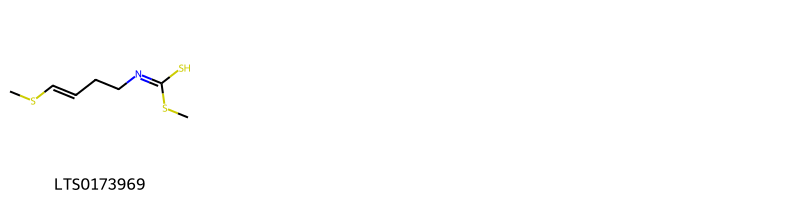{ width=100% }
    <figcaption>Hình ảnh cấu trúc hóa học của 1 hoạt chất thuộc nhóm Dithiocarbamic acids and derivatives gồm ['n-[(3e)-4-(methylsulfanyl)but-3-en-1-yl]methylsulfanylcarboimidothioic acid (LTS0173969)'].</figcaption>
</figure>
#### Nhóm Fatty Acyls
<figure markdown="span">
    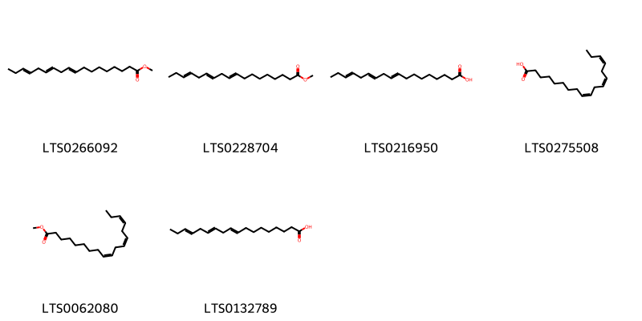{ width=100% }
    <figcaption>Hình ảnh cấu trúc hóa học của 6 hoạt chất thuộc nhóm Fatty Acyls gồm ['methyl elaidolinolenate (LTS0266092)', 'methyl octadeca-9,12,15-trienoate (LTS0228704)', 'octadeca-9,12,15-trienoic acid (LTS0216950)', 'α-linolenic acid (LTS0275508)', 'methyl linolenate (LTS0062080)', 'α linolenic acid (LTS0132789)'].</figcaption>
</figure>
#### Nhóm Flavonoids
<figure markdown="span">
    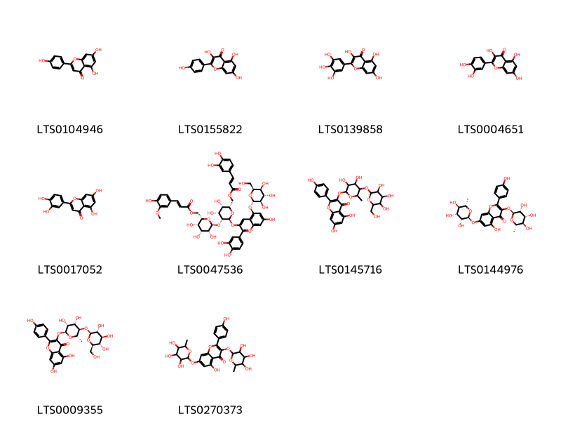{ width=100% }
    <figcaption>Hình ảnh cấu trúc hóa học của 10 hoạt chất thuộc nhóm Flavonoids gồm ['chamomile (LTS0104946)', 'kaempherol (LTS0155822)', 'myricetin (LTS0139858)', 'quercetin (LTS0004651)', 'luteolin (LTS0017052)', '2-(3,4-dihydroxyphenyl)-3-{[(2s,3r,4r,5s,6s)-6-({[3-(3,4-dihydroxyphenyl)prop-2-enoyl]oxy}methyl)-4,5-dihydroxy-3-{[(2s,3r,4r,5s,6s)-3,4,5-trihydroxy-6-({[3-(4-hydroxy-3-methoxyphenyl)prop-2-enoyl]oxy}methyl)oxan-2-yl]oxy}oxan-2-yl]oxy}-7-hydroxy-5-{[(2s,3r,4s,5s,6s)-3,4,5-trihydroxy-6-(hydroxymethyl)oxan-2-yl]oxy}-1λ⁴-chromen-1-ylium (LTS0047536)', '3-[(3,4-dihydroxy-6-methyl-5-{[3,4,5-trihydroxy-6-(hydroxymethyl)oxan-2-yl]oxy}oxan-2-yl)oxy]-5,7-dihydroxy-2-(4-hydroxyphenyl)chromen-4-one (LTS0145716)', 'lespedin (LTS0144976)', 'multiflorin b (LTS0009355)', 'kaempferitrin (LTS0270373)'].</figcaption>
</figure>
#### Nhóm Furanoid lignans
<figure markdown="span">
    { width=100% }
    <figcaption>Hình ảnh cấu trúc hóa học của 5 hoạt chất thuộc nhóm Furanoid lignans gồm ['syringaresinol (LTS0116280)', 'pinoresinol (LTS0057431)', 'matairesinol (LTS0193475)', 'lariciresinol (LTS0010950)', '4-[(3ar,4s,6ar)-4-(4-hydroxy-3-methoxyphenyl)-hexahydrofuro[3,4-c]furan-1-yl]-2,6-dimethoxyphenol (LTS0041035)'].</figcaption>
</figure>
#### Nhóm Glycerolipids
<figure markdown="span">
    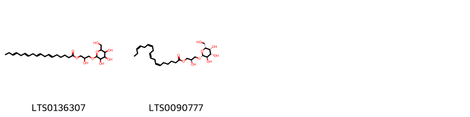{ width=100% }
    <figcaption>Hình ảnh cấu trúc hóa học của 2 hoạt chất thuộc nhóm Glycerolipids gồm ['2-hydroxy-3-{[3,4,5-trihydroxy-6-(hydroxymethyl)oxan-2-yl]oxy}propyl octadeca-6,9,12,15-tetraenoate (LTS0136307)', '(2r)-2-hydroxy-3-{[(2r,3r,4s,5r,6r)-3,4,5-trihydroxy-6-(hydroxymethyl)oxan-2-yl]oxy}propyl (6z,9z,12z,15z)-octadeca-6,9,12,15-tetraenoate (LTS0090777)'].</figcaption>
</figure>
#### Nhóm Harmala alkaloids
<figure markdown="span">
    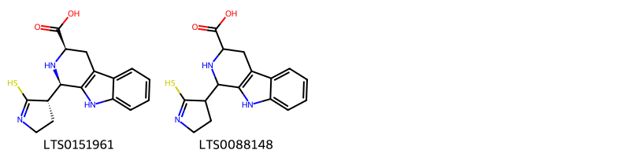{ width=100% }
    <figcaption>Hình ảnh cấu trúc hóa học của 2 hoạt chất thuộc nhóm Harmala alkaloids gồm ['(1r,3r)-1-[(3s)-2-sulfanyl-4,5-dihydro-3h-pyrrol-3-yl]-1h,2h,3h,4h,9h-pyrido[3,4-b]indole-3-carboxylic acid (LTS0151961)', '1-(2-sulfanyl-4,5-dihydro-3h-pyrrol-3-yl)-1h,2h,3h,4h,9h-pyrido[3,4-b]indole-3-carboxylic acid (LTS0088148)'].</figcaption>
</figure>
#### Nhóm Hydroxy acids and derivatives
<figure markdown="span">
    { width=100% }
    <figcaption>Hình ảnh cấu trúc hóa học của 1 hoạt chất thuộc nhóm Hydroxy acids and derivatives gồm ['(-)-malic acid (LTS0128885)'].</figcaption>
</figure>
#### Nhóm Imidazopyrimidines
<figure markdown="span">
    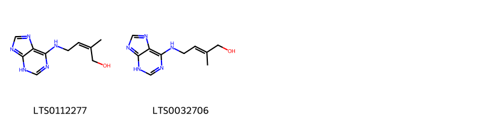{ width=100% }
    <figcaption>Hình ảnh cấu trúc hóa học của 2 hoạt chất thuộc nhóm Imidazopyrimidines gồm ['2-methyl-4-(3h-purin-6-ylamino)but-2-en-1-ol (LTS0112277)', 'zeatine (LTS0032706)'].</figcaption>
</figure>
#### Nhóm Indoles and derivatives
<figure markdown="span">
    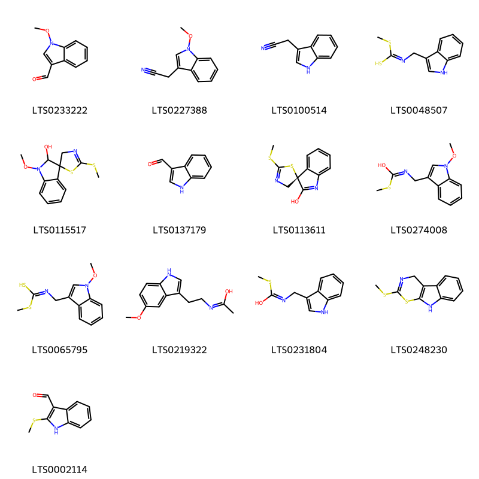{ width=100% }
    <figcaption>Hình ảnh cấu trúc hóa học của 13 hoạt chất thuộc nhóm Indoles and derivatives gồm ['1-methoxyindole-3-carbaldehyde (LTS0233222)', '2-(1-methoxyindol-3-yl)acetonitrile (LTS0227388)', 'indole-3-acetonitrile (LTS0100514)', 'n-(1h-indol-3-ylmethyl)methylsulfanylcarboimidothioic acid (LTS0048507)', "1-methoxy-5'-(methylsulfanyl)-2h,3'h-spiro[indole-3,2'-[1,4]thiazol]-2-ol (LTS0115517)", 'indole-3-carboxaldehyde (LTS0137179)', "(3s)-5'-(methylsulfanyl)-3'h-spiro[indole-3,2'-[1,4]thiazol]-2-ol (LTS0113611)", 'n-[(1-methoxyindol-3-yl)methyl]methylsulfanylcarboximidic acid (LTS0274008)', 'n-[(1-methoxyindol-3-yl)methyl]methylsulfanylcarboimidothioic acid (LTS0065795)', 'n-[2-(5-methoxy-1h-indol-3-yl)ethyl]ethanimidic acid (LTS0219322)', 'n-(1h-indol-3-ylmethyl)methylsulfanylcarboximidic acid (LTS0231804)', '2-(methylsulfanyl)-4h,9h-[1,3]thiazino[6,5-b]indole (LTS0248230)', 'brassicanal a (LTS0002114)'].</figcaption>
</figure>
#### Nhóm Isothiocyanates
<figure markdown="span">
    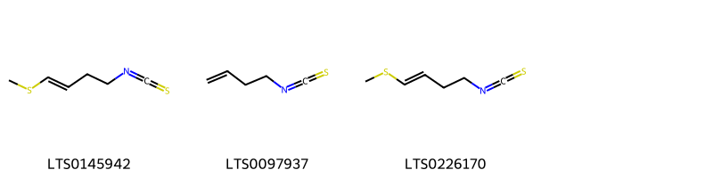{ width=100% }
    <figcaption>Hình ảnh cấu trúc hóa học của 3 hoạt chất thuộc nhóm Isothiocyanates gồm ['(1e)-4-isothiocyanato-1-(methylsulfanyl)but-1-ene (LTS0145942)', '3-butenyl isothiocyanate (LTS0097937)', '4-isothiocyanato-1-(methylsulfanyl)but-1-ene (LTS0226170)'].</figcaption>
</figure>
#### Nhóm Organooxygen compounds
<figure markdown="span">
    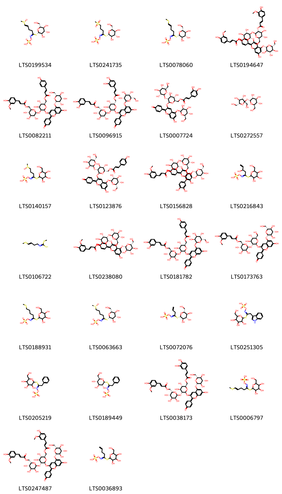{ width=100% }
    <figcaption>Hình ảnh cấu trúc hóa học của 26 hoạt chất thuộc nhóm Organooxygen compounds gồm ['[(z)-[(4e)-5-methanesulfinyl-1-{[(2s,3r,4s,5s,6r)-3,4,5-trihydroxy-6-(hydroxymethyl)oxan-2-yl]sulfanyl}pent-4-en-1-ylidene]amino]oxysulfonic acid (LTS0199534)', '[(z)-(4-methanesulfonyl-1-{[(2s,3r,4s,5s,6r)-3,4,5-trihydroxy-6-(hydroxymethyl)oxan-2-yl]sulfanyl}butylidene)amino]oxysulfonic acid (LTS0241735)', '[(z)-[(4e)-5-(methylsulfanyl)-1-{[(2s,3r,4s,5s,6r)-3,4,5-trihydroxy-6-(hydroxymethyl)oxan-2-yl]sulfanyl}pent-4-en-1-ylidene]amino]oxysulfonic acid (LTS0078060)', '[(2r,3s,4s,5r,6s)-5-{[(2s,3r,4s,5s,6r)-4,5-dihydroxy-3-{[3-(4-hydroxy-3-methoxyphenyl)prop-2-enoyl]oxy}-6-(hydroxymethyl)oxan-2-yl]oxy}-3,4-dihydroxy-6-{[7-hydroxy-2-(4-oxocyclohexa-2,5-dien-1-ylidene)-5-{[(2s,3r,4s,5s,6r)-3,4,5-trihydroxy-6-(hydroxymethyl)oxan-2-yl]oxy}chromen-3-yl]oxy}oxan-2-yl]methyl 3-(4-hydroxy-3-methoxyphenyl)prop-2-enoate (LTS0194647)', '[(2r,3s,4s,5r,6s)-6-{[(2s,3s,4s,5s,6r)-4,5-dihydroxy-2-{[7-hydroxy-2-(4-oxocyclohexa-2,5-dien-1-ylidene)-5-{[(2s,3s,4s,5s,6r)-3,4,5-trihydroxy-6-(hydroxymethyl)oxan-2-yl]oxy}chromen-3-yl]oxy}-6-({[3-(4-hydroxyphenyl)prop-2-enoyl]oxy}methyl)oxan-3-yl]oxy}-3,4,5-trihydroxyoxan-2-yl]methyl 3-(4-hydroxy-3-methoxyphenyl)prop-2-enoate (LTS0082211)', '[(2s,3s,4s,5s,6s)-5-{[(2s,3r,4s,5s,6s)-6-({[3-(3,4-dihydroxyphenyl)prop-2-enoyl]oxy}methyl)-3,4,5-trihydroxyoxan-2-yl]oxy}-3,4-dihydroxy-6-{[7-hydroxy-2-(4-oxocyclohexa-2,5-dien-1-ylidene)-5-{[(2s,3r,4s,5s,6s)-3,4,5-trihydroxy-6-(hydroxymethyl)oxan-2-yl]oxy}chromen-3-yl]oxy}oxan-2-yl]methyl 3-(3,4-dihydroxyphenyl)prop-2-enoate (LTS0096915)', '[(2r,3s,4s,5r,6s)-3,4-dihydroxy-6-{[7-hydroxy-2-(4-oxocyclohexa-2,5-dien-1-ylidene)-5-{[(2s,3s,4s,5s,6r)-3,4,5-trihydroxy-6-(hydroxymethyl)oxan-2-yl]oxy}chromen-3-yl]oxy}-5-{[(2s,3r,4s,5s,6r)-3,4,5-trihydroxy-6-(hydroxymethyl)oxan-2-yl]oxy}oxan-2-yl]methyl 3-(3,4-dihydroxyphenyl)prop-2-enoate (LTS0007724)', 'sucrose (LTS0272557)', '[(e)-(4-methanesulfinyl-1-{[3,4,5-trihydroxy-6-(hydroxymethyl)oxan-2-yl]sulfanyl}butylidene)amino]oxysulfonic acid (LTS0140157)', '[(2s,3s,4s,5r,6s)-3,4-dihydroxy-6-{[7-hydroxy-2-(4-oxocyclohexa-2,5-dien-1-ylidene)-5-{[(2s,3r,4s,5s,6s)-3,4,5-trihydroxy-6-(hydroxymethyl)oxan-2-yl]oxy}chromen-3-yl]oxy}-5-{[(2s,3s,4s,5s,6s)-3,4,5-trihydroxy-6-(hydroxymethyl)oxan-2-yl]oxy}oxan-2-yl]methyl 3-(4-hydroxyphenyl)prop-2-enoate (LTS0123876)', '[(2r,3s,4s,5r,6s)-5-{[(2s,3r,4s,5s,6r)-6-({[3-(3,4-dihydroxyphenyl)prop-2-enoyl]oxy}methyl)-3,4,5-trihydroxyoxan-2-yl]oxy}-3,4-dihydroxy-6-{[7-hydroxy-2-(4-oxocyclohexa-2,5-dien-1-ylidene)-5-{[(2s,3r,4s,5s,6r)-3,4,5-trihydroxy-6-(hydroxymethyl)oxan-2-yl]oxy}chromen-3-yl]oxy}oxan-2-yl]methyl 3-(4-hydroxy-3-methoxyphenyl)prop-2-enoate (LTS0156828)', '[(e)-(3-hydroxy-1-{[3,4,5-trihydroxy-6-(hydroxymethyl)oxan-2-yl]sulfanyl}pent-4-en-1-ylidene)amino]oxysulfonic acid (LTS0216843)', 'n-[4-(methylsulfanyl)but-3-en-1-yl]methylsulfanylcarboimidothioic acid (LTS0106722)', '[(2s,3s,4s,5s,6s)-3,4-dihydroxy-6-{[7-hydroxy-2-(4-oxocyclohexa-2,5-dien-1-ylidene)-5-{[(2s,3r,4s,5s,6r)-3,4,5-trihydroxy-6-(hydroxymethyl)oxan-2-yl]oxy}chromen-3-yl]oxy}-5-{[(2s,3r,4s,5s,6r)-3,4,5-trihydroxy-6-(hydroxymethyl)oxan-2-yl]oxy}oxan-2-yl]methyl 3-(4-hydroxy-3-methoxyphenyl)prop-2-enoate (LTS0238080)', '[(2r,3s,4s,5s,6s)-5-{[(2s,3s,4s,5s,6r)-6-({[3-(3,4-dihydroxyphenyl)prop-2-enoyl]oxy}methyl)-3,4,5-trihydroxyoxan-2-yl]oxy}-3,4-dihydroxy-6-{[7-hydroxy-2-(4-oxocyclohexa-2,5-dien-1-ylidene)-5-{[(2s,3s,4s,5s,6s)-3,4,5-trihydroxy-6-(hydroxymethyl)oxan-2-yl]oxy}chromen-3-yl]oxy}oxan-2-yl]methyl 3-(4-hydroxyphenyl)prop-2-enoate (LTS0181782)', '[(2r,3s,4s,5s,6s)-6-{[(2s,3r,4s,5s,6r)-4,5-dihydroxy-2-{[7-hydroxy-2-(4-oxocyclohexa-2,5-dien-1-ylidene)-5-{[(2s,3r,4s,5s,6r)-3,4,5-trihydroxy-6-(hydroxymethyl)oxan-2-yl]oxy}chromen-3-yl]oxy}-6-(hydroxymethyl)oxan-3-yl]oxy}-3,4,5-trihydroxyoxan-2-yl]methyl 3-(4-hydroxy-3-methoxyphenyl)prop-2-enoate (LTS0173763)', '[(e)-[5-(methylsulfanyl)-1-{[3,4,5-trihydroxy-6-(hydroxymethyl)oxan-2-yl]sulfanyl}pentylidene]amino]oxysulfonic acid (LTS0188931)', '[(e)-{5-[(r)-methanesulfinyl]-1-{[(2s,3r,4s,5s,6r)-3,4,5-trihydroxy-6-(hydroxymethyl)oxan-2-yl]sulfanyl}pentylidene}amino]oxysulfonic acid (LTS0063663)', '[(e)-(1-{[(2s,3r,4s,5s,6r)-3,4,5-trihydroxy-6-(hydroxymethyl)oxan-2-yl]sulfanyl}but-3-en-1-ylidene)amino]oxysulfonic acid (LTS0072076)', '[(e)-[2-(1h-indol-3-yl)-1-{[3,4,5-trihydroxy-6-(hydroxymethyl)oxan-2-yl]sulfanyl}ethylidene]amino]oxysulfonic acid (LTS0251305)', '[(e)-(2-phenyl-1-{[3,4,5-trihydroxy-6-(hydroxymethyl)oxan-2-yl]sulfanyl}ethylidene)amino]oxysulfonic acid (LTS0205219)', 'glucotropaeolin (LTS0189449)', '[(2s,3s,4s,5s,6s)-6-{[(2s,3r,4s,5s,6r)-6-({[3-(3,4-dihydroxyphenyl)prop-2-enoyl]oxy}methyl)-4,5-dihydroxy-2-{[7-hydroxy-2-(4-oxocyclohexa-2,5-dien-1-ylidene)-5-{[(2s,3r,4s,5s,6r)-3,4,5-trihydroxy-6-(hydroxymethyl)oxan-2-yl]oxy}chromen-3-yl]oxy}oxan-3-yl]oxy}-3,4,5-trihydroxyoxan-2-yl]methyl 3-(4-hydroxy-3-methoxyphenyl)prop-2-enoate (LTS0038173)', '{[5-(methylsulfanyl)-1-{[3,4,5-trihydroxy-6-(hydroxymethyl)oxan-2-yl]sulfanyl}pent-4-en-1-ylidene]amino}oxysulfonic acid (LTS0006797)', '[(2s,3s,4s,5s,6s)-6-{[(2s,3r,4s,5s,6r)-4,5-dihydroxy-2-{[7-hydroxy-2-(4-oxocyclohexa-2,5-dien-1-ylidene)-5-{[(2s,3r,4s,5s,6r)-3,4,5-trihydroxy-6-(hydroxymethyl)oxan-2-yl]oxy}chromen-3-yl]oxy}-6-({[3-(4-hydroxy-3-methoxyphenyl)prop-2-enoyl]oxy}methyl)oxan-3-yl]oxy}-3,4,5-trihydroxyoxan-2-yl]methyl 3-(4-hydroxy-3-methoxyphenyl)prop-2-enoate (LTS0247487)', '[(e)-(1-{[3,4,5-trihydroxy-6-(hydroxymethyl)oxan-2-yl]sulfanyl}pent-4-en-1-ylidene)amino]oxysulfonic acid (LTS0036893)'].</figcaption>
</figure>
#### Nhóm Prenol lipids
<figure markdown="span">
    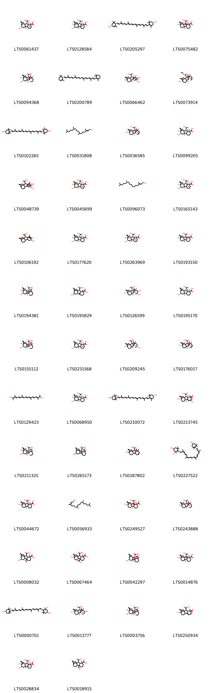{ width=100% }
    <figcaption>Hình ảnh cấu trúc hóa học của 60 hoạt chất thuộc nhóm Prenol lipids gồm ['(1s,2s,3s,4r,8r,9r,11s)-8-formyl-11-hydroxy-4-methyl-13-methylidenetetracyclo[10.2.1.0¹,⁹.0³,⁸]pentadecane-2,4-dicarboxylic acid (LTS0061437)', '(2s,3s,4r,8r,9s,11r,12r)-11-hydroxy-4,8-dimethyl-13-methylidenetetracyclo[10.2.1.0¹,⁹.0³,⁸]pentadecane-2,4-dicarboxylic acid (LTS0128584)', 'carotenoid (LTS0205297)', 'gibberellin a25 (LTS0075482)', '(1r,2r,4s,5s,8s,9s,10r,11r)-4,5-dihydroxy-11-methyl-6-methylidene-16-oxo-15-oxapentacyclo[9.3.2.1⁵,⁸.0¹,¹⁰.0²,⁸]heptadecane-9-carboxylic acid (LTS0094368)', '(+)-α-carotene (LTS0200789)', '(1r,2s,5r,8r,9s,10r,11s,12s,13s)-12,13-dihydroxy-11-methyl-6-methylidene-16-oxopentacyclo[9.3.2.1⁵,⁸.0¹,¹⁰.0²,⁸]heptadecane-9-carboxylic acid (LTS0066462)', 'ethyl (1r,2s,5s,8s,9s,10r,11r)-5-hydroxy-11-methyl-6-methylidene-16-oxo-15-oxapentacyclo[9.3.2.1⁵,⁸.0¹,¹⁰.0²,⁸]heptadec-12-ene-9-carboxylate (LTS0073914)', 'violaxanthin (LTS0102265)', 'phytol (LTS0031808)', '(1r,2s,5s,8s,9s,10r,11r)-5-hydroxy-11-methyl-6-methylidene-16-oxo-15-oxapentacyclo[9.3.2.1⁵,⁸.0¹,¹⁰.0²,⁸]heptadec-12-ene-9-carboxylic acid (LTS0036585)', '(1s,2s,3s,4r,8s,9s,11s,12r)-11-hydroxy-4,8-dimethyl-13-methylidenetetracyclo[10.2.1.0¹,⁹.0³,⁸]pentadecane-2,4-dicarboxylic acid (LTS0099205)', '12,13-dihydroxy-11-methyl-6-methylidene-16-oxopentacyclo[9.3.2.1⁵,⁸.0¹,¹⁰.0²,⁸]heptadecane-9-carboxylic acid (LTS0048739)', '(1r,2s,3s,4r,8r,9s,11r,12r)-8-formyl-11-hydroxy-4-methyl-13-methylidenetetracyclo[10.2.1.0¹,⁹.0³,⁸]pentadecane-2,4-dicarboxylic acid (LTS0045699)', 'phytol (LTS0096073)', '(1s,2s,3s,4r,8r,9r,11r,12r)-8-formyl-11-hydroxy-4-methyl-13-methylidenetetracyclo[10.2.1.0¹,⁹.0³,⁸]pentadecane-2,4-dicarboxylic acid (LTS0165143)', '13-hydroxy-11-methyl-6-methylidene-16-oxopentacyclo[9.3.2.1⁵,⁸.0¹,¹⁰.0²,⁸]heptadecane-9-carboxylic acid (LTS0106192)', '(1r,2s,3s,4r,8s,9r,11s,12r)-11-hydroxy-4,8-dimethyl-13-methylidenetetracyclo[10.2.1.0¹,⁹.0³,⁸]pentadecane-2,4-dicarboxylic acid (LTS0177620)', '(1s,2s,3s,4r,8r,9r,11s,12r)-8-formyl-11-hydroxy-4-methyl-13-methylidenetetracyclo[10.2.1.0¹,⁹.0³,⁸]pentadecane-2,4-dicarboxylic acid (LTS0263969)', 'gibberellin a24 (LTS0193150)', '(1s,2r,4r,5r,8s,9s,10s,11s)-4-hydroxy-11-methyl-6-methylidene-12-oxo-13-oxapentacyclo[9.3.3.1⁵,⁸.0¹,¹⁰.0²,⁸]octadecane-9-carboxylic acid (LTS0194381)', '11-hydroxy-4,8-dimethyl-13-methylidenetetracyclo[10.2.1.0¹,⁹.0³,⁸]pentadecane-2,4-dicarboxylic acid (LTS0195829)', 'gibberellin a8 (LTS0126599)', '(1s,2s,3s,4r,8s,9s,11r)-11-hydroxy-4,8-dimethyl-13-methylidenetetracyclo[10.2.1.0¹,⁹.0³,⁸]pentadecane-2,4-dicarboxylic acid (LTS0195170)', '(1r,2r,4s,5r,8r,9s,10r,11r)-4-hydroxy-11-methyl-6-methylidene-12-oxo-13-oxapentacyclo[9.3.3.1⁵,⁸.0¹,¹⁰.0²,⁸]octadecane-9-carboxylic acid (LTS0155112)', '(1s,2s,3s,4r,8r,9r,11r)-8-formyl-11-hydroxy-4-methyl-13-methylidenetetracyclo[10.2.1.0¹,⁹.0³,⁸]pentadecane-2,4-dicarboxylic acid (LTS0231568)', '(1r,2r,5r,8r,9s,10r,11r,13s)-13-hydroxy-11-methyl-6-methylidene-16-oxo-15-oxapentacyclo[9.3.2.1⁵,⁸.0¹,¹⁰.0²,⁸]heptadecane-9-carboxylic acid (LTS0209245)', 'gibberellin a5 (LTS0176017)', 'crocetin (LTS0129423)', '(1r,2s,3s,4r,8s,9s,11r,12r)-11-hydroxy-4,8-dimethyl-13-methylidenetetracyclo[10.2.1.0¹,⁹.0³,⁸]pentadecane-2,4-dicarboxylic acid (LTS0068950)', 'antheraxanthin (LTS0210072)', '(1s,2s,3r,4r,7s,10s,13s)-13-hydroxy-4-methyl-14-methylidene-5-oxo-6-oxapentacyclo[11.2.1.1⁴,⁷.0¹,¹⁰.0³,⁹]heptadec-8-ene-2-carboxylic acid (LTS0213745)', '(1r,2r,4r,5r,8r,9s,10r,11r)-4-hydroxy-11-methyl-6-methylidene-12-oxo-13-oxapentacyclo[9.3.3.1⁵,⁸.0¹,¹⁰.0²,⁸]octadecane-9-carboxylic acid (LTS0211325)', '4-hydroxy-11-methyl-6-methylidene-12-oxo-13-oxapentacyclo[9.3.3.1⁵,⁸.0¹,¹⁰.0²,⁸]octadecane-9-carboxylic acid (LTS0265173)', '5-hydroxy-11-methyl-6-methylidene-16-oxo-15-oxapentacyclo[9.3.2.1⁵,⁸.0¹,¹⁰.0²,⁸]heptadec-12-ene-9-carboxylic acid (LTS0187802)', 'neoxanthin (LTS0227522)', 'gibberellin a19 (LTS0044672)', '3,7,11,15-tetramethylhexadec-2-en-1-ol (LTS0056933)', '(1s,2s,3r,4r,8r,9s,12s)-12-hydroxy-4-methyl-13-methylidenetetracyclo[10.2.1.0¹,⁹.0³,⁸]pentadecane-2,4,8-tricarboxylic acid (LTS0249527)', 'gibberellin a9 (LTS0243888)', '8-formyl-11-hydroxy-4-methyl-13-methylidenetetracyclo[10.2.1.0¹,⁹.0³,⁸]pentadecane-2,4-dicarboxylic acid (LTS0008032)', '12-hydroxy-4-methyl-13-methylidenetetracyclo[10.2.1.0¹,⁹.0³,⁸]pentadecane-2,4,8-tricarboxylic acid (LTS0067464)', '(2r,4r,8s,9s,10s)-4-hydroxy-11-methyl-6-methylidene-12-oxo-13-oxapentacyclo[9.3.3.1⁵,⁸.0¹,¹⁰.0²,⁸]octadecane-9-carboxylic acid (LTS0042297)', 'gibberellin a17 (LTS0014876)', 'neoxanthin (LTS0000701)', 'gibberellin a1 (LTS0013777)', '(1r,2r,4s,5r,8r,9s,10s,11r)-4-hydroxy-11-methyl-6-methylidene-12-oxo-13-oxapentacyclo[9.3.3.1⁵,⁸.0¹,¹⁰.0²,⁸]octadecane-9-carboxylic acid (LTS0003756)', '13-hydroxy-4-methyl-14-methylidene-5-oxo-6-oxapentacyclo[11.2.1.1⁴,⁷.0¹,¹⁰.0³,⁹]heptadec-8-ene-2-carboxylic acid (LTS0250934)', '(1s,2s,3s,4r,8r,9s,11r,12r)-11-hydroxy-4,8-dimethyl-13-methylidenetetracyclo[10.2.1.0¹,⁹.0³,⁸]pentadecane-2,4-dicarboxylic acid (LTS0028834)', '8-formyl-4-methyl-13-methylidenetetracyclo[10.2.1.0¹,⁹.0³,⁸]pentadecane-2,4-dicarboxylic acid (LTS0018915)', '(1r,2s,3s,4r,8r,9s,12r)-8-formyl-4-methyl-13-methylidenetetracyclo[10.2.1.0¹,⁹.0³,⁸]pentadecane-2,4-dicarboxylic acid (LTS0238439)', '(1s,2s,3s,4r,8s,9s,11r,12r)-11-hydroxy-4,8-dimethyl-13-methylidenetetracyclo[10.2.1.0¹,⁹.0³,⁸]pentadecane-2,4-dicarboxylic acid (LTS0099332)', '(1r,2s,3s,4r,8r,9s,11s,12r)-8-formyl-11-hydroxy-4-methyl-13-methylidenetetracyclo[10.2.1.0¹,⁹.0³,⁸]pentadecane-2,4-dicarboxylic acid (LTS0247256)', '(1r,2s,3s,4r,8r,9r,11r,12r)-8-formyl-11-hydroxy-4-methyl-13-methylidenetetracyclo[10.2.1.0¹,⁹.0³,⁸]pentadecane-2,4-dicarboxylic acid (LTS0248958)', 'ethyl 5-hydroxy-11-methyl-6-methylidene-16-oxo-15-oxapentacyclo[9.3.2.1⁵,⁸.0¹,¹⁰.0²,⁸]heptadec-12-ene-9-carboxylate (LTS0026728)', 'gibberellin a20 (LTS0041124)', '(1r,2s,5r,8r,9s,10s,11r,13r)-13-hydroxy-11-methyl-6-methylidene-16-oxopentacyclo[9.3.2.1⁵,⁸.0¹,¹⁰.0²,⁸]heptadecane-9-carboxylic acid (LTS0040582)', '(1r,2s,3r,4r,8r,9s,12r)-4-methyl-13-methylidenetetracyclo[10.2.1.0¹,⁹.0³,⁸]pentadecane-2,4,8-tricarboxylic acid (LTS0035580)', '(1s,2s,3s,4r,8s,9s,11s)-11-hydroxy-4,8-dimethyl-13-methylidenetetracyclo[10.2.1.0¹,⁹.0³,⁸]pentadecane-2,4-dicarboxylic acid (LTS0250942)', '4-methyl-13-methylidenetetracyclo[10.2.1.0¹,⁹.0³,⁸]pentadecane-2,4,8-tricarboxylic acid (LTS0225414)'].</figcaption>
</figure>
#### Nhóm Pyridines and derivatives
<figure markdown="span">
    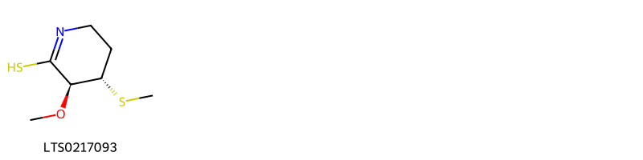{ width=100% }
    <figcaption>Hình ảnh cấu trúc hóa học của 1 hoạt chất thuộc nhóm Pyridines and derivatives gồm ['(3r,4s)-3-methoxy-4-(methylsulfanyl)-3,4,5,6-tetrahydropyridine-2-thiol (LTS0217093)'].</figcaption>
</figure>
#### Nhóm Pyrrolines
<figure markdown="span">
    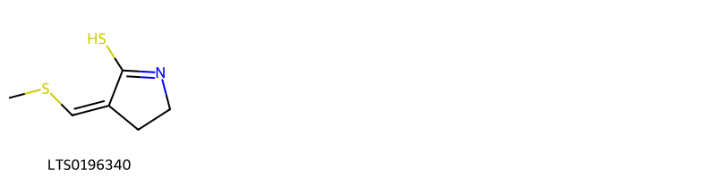{ width=100% }
    <figcaption>Hình ảnh cấu trúc hóa học của 1 hoạt chất thuộc nhóm Pyrrolines gồm ['3-[(methylsulfanyl)methylidene]-4,5-dihydropyrrole-2-thiol (LTS0196340)'].</figcaption>
</figure>
#### Nhóm Steroids and steroid derivatives
<figure markdown="span">
    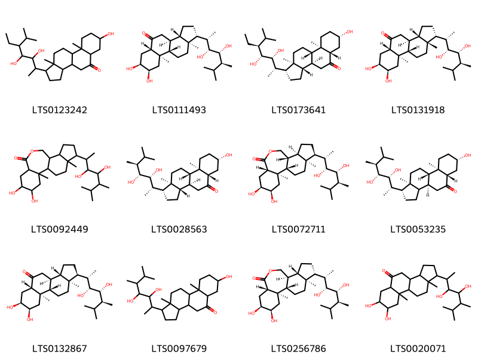{ width=100% }
    <figcaption>Hình ảnh cấu trúc hóa học của 12 hoạt chất thuộc nhóm Steroids and steroid derivatives gồm ['1-(5-ethyl-3,4-dihydroxy-6-methylheptan-2-yl)-7-hydroxy-9a,11a-dimethyl-tetradecahydrocyclopenta[a]phenanthren-5-one (LTS0123242)', 'castasterone (LTS0111493)', '(1r,3as,3bs,5as,7s,9ar,9bs,11as)-1-[(2s,3r,4r,5s)-5-ethyl-3,4-dihydroxy-6-methylheptan-2-yl]-7-hydroxy-9a,11a-dimethyl-tetradecahydrocyclopenta[a]phenanthren-5-one (LTS0173641)', '(1r,3as,3bs,5as,7s,8r,9ar,9bs,11ar)-1-[(2s,3r,4r,5s)-3,4-dihydroxy-5,6-dimethylheptan-2-yl]-7,8-dihydroxy-9a,11a-dimethyl-tetradecahydrocyclopenta[a]phenanthren-5-one (LTS0131918)', '24-epibrassinolide (LTS0092449)', 'teasterone (LTS0028563)', '(1s,2r,4r,5s,7s,11r,12r,15s,16s)-15-[(2s,3r,4r,5s)-3,4-dihydroxy-5,6-dimethylheptan-2-yl]-4,5-dihydroxy-2,16-dimethyl-9-oxatetracyclo[9.7.0.0²,⁷.0¹²,¹⁶]octadecan-8-one (LTS0072711)', '(1r,3bs,5as,7s,9ar,9bs,11as)-1-[(2s,3r,4r,5s)-3,4-dihydroxy-5,6-dimethylheptan-2-yl]-7-hydroxy-9a,11a-dimethyl-tetradecahydrocyclopenta[a]phenanthren-5-one (LTS0053235)', '(1s,3as,3bs,5as,7s,8r,9ar,9bs,11as)-1-[(2s,3r,4r,5s)-3,4-dihydroxy-5,6-dimethylheptan-2-yl]-7,8-dihydroxy-9a,11a-dimethyl-tetradecahydrocyclopenta[a]phenanthren-5-one (LTS0132867)', '1-(3,4-dihydroxy-5,6-dimethylheptan-2-yl)-7-hydroxy-9a,11a-dimethyl-tetradecahydrocyclopenta[a]phenanthren-5-one (LTS0097679)', 'brassinolide (LTS0256786)', '1-(3,4-dihydroxy-5,6-dimethylheptan-2-yl)-7,8-dihydroxy-9a,11a-dimethyl-tetradecahydrocyclopenta[a]phenanthren-5-one (LTS0020071)'].</figcaption>
</figure>
#### Nhóm Sulfoxides
<figure markdown="span">
    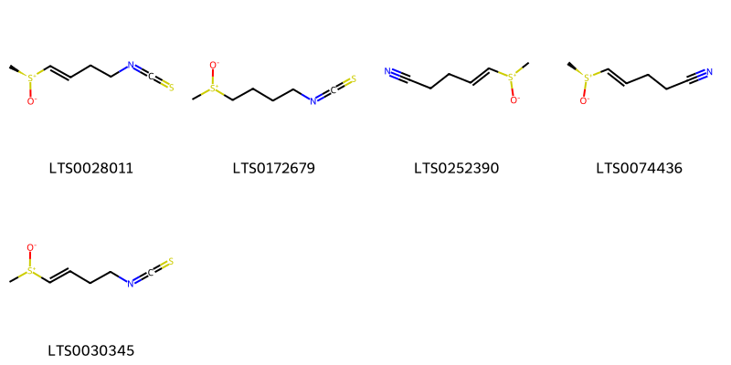{ width=100% }
    <figcaption>Hình ảnh cấu trúc hóa học của 5 hoạt chất thuộc nhóm Sulfoxides gồm ['(1e)-4-isothiocyanato-1-[(s)-methanesulfinyl]but-1-ene (LTS0028011)', 'sulforaphane (LTS0172679)', '5-methanesulfinylpent-4-enenitrile (LTS0252390)', '(4e)-5-[(s)-methanesulfinyl]pent-4-enenitrile (LTS0074436)', '4-isothiocyanato-1-methanesulfinylbut-1-ene (LTS0030345)'].</figcaption>
</figure>
#### Nhóm Thiolactams
<figure markdown="span">
    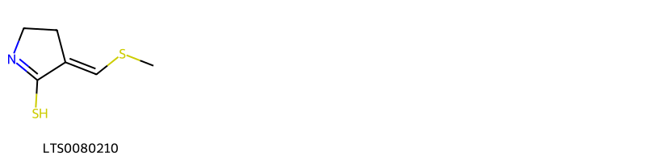{ width=100% }
    <figcaption>Hình ảnh cấu trúc hóa học của 1 hoạt chất thuộc nhóm Thiolactams gồm ['(3e)-3-[(methylsulfanyl)methylidene]-4,5-dihydropyrrole-2-thiol (LTS0080210)'].</figcaption>
</figure>

---

### Dược dân tộc học

Danh sách các quốc gia có sử dụng *Raphanus sativus* trong điều trị các bệnh. 

| Country   | Disease                                                                                                                                    | Bệnh                                                                                                                                           |
|:----------|:-------------------------------------------------------------------------------------------------------------------------------------------|:-----------------------------------------------------------------------------------------------------------------------------------------------|
| China     | Antiphlogistic, nan, Digestive, Diuretic, Diuretic, Expectorant, Expectorant, Parasiticide, Stomachic, Carminative                         | Thuốc chống viêm, nan, Tiêu hóa, Thuốc lợi tiểu, Thuốc lợi tiểu, Thuốc long đờm, Thuốc long đờm, Thuốc diệt ký sinh trùng, Dạ dày, Carminative |
| Elsewhere | nan, Carminative, Diuretic, Expectorant, Expectorant, Fungicide, nan, Demulcent, Diuretic, Emmenagogue, Laxative, Stomachic, nan, Laxative | nan, Carminative, lợi tiểu, đờm, đờm, thuốc diệt nấm, nan, Demulcent, lợi tiểu, Emmenagogue, nhuận tràng, dạ dày, nan, nhuận tràng             |
| Haiti     | Diuretic                                                                                                                                   | Thuốc lợi tiêu                                                                                                                                 |
| Sudan     | Diuretic, Laxative                                                                                                                         | Thuốc lợi tiểu, nhuận tràng                                                                                                                    |
| Turkey    | Aperient, Apertif, Stimulant, Tonic, Expectorant, Diuretic                                                                                 | Aperient, Apertif, Stimulant, Tonic, Expectorant, lợi tiểu                                                                                     |
| US        | Apertif                                                                                                                                    | Apertif                                                                                                                                        |

---

# Chi Eruca

??? note "Danh sách các dược liệu thuộc chi"
    
	 - *Eruca sativa*
	 - *Eruca vesicaria*

---
## Eruca sativa
### Thông tin về thực vật

!!! info "Phân loại thực vật của *Eruca sativa* từ GIBF:"
    - **Kingdom:** Plantae
    - **Phylum:** Tracheophyta
    - **Order:** Brassicales
    - **Family:** Brassicaceae
    - **Genus:** Eruca
    - **Species:** *Eruca sativa*

 

| Label (VI)   | Label (EN)   | Scientific Name   | Descriptions (VI)   | Descriptions (EN)   | Also Known As (VI)   | Also Known As (EN)   |
|:-------------|:-------------|:------------------|:--------------------|:--------------------|:---------------------|:---------------------|
| N/A          | N/A          | Eruca sativa      | loài thực vật       | species of plant    | ['']                 | ['']                 |

#### Phân bố trên thế giới

**Từ CSDL GIBF** Czechia, Germany, Iraq, Brazil, Spain, Poland, Russian Federation, Morocco, Austria, France, Mexico, United Kingdom of Great Britain and Northern Ireland, Saudi Arabia

#### Phân bố tại Việt Nam

**Từ CSDL GIBF**: Không có ghi nhận ở Việt Nam

---
### Thành phần hóa học
        
- Theo cơ sở dữ liệu lotus: Từ loài *Eruca sativa* đã phân lập và xác định được 35 hoạt chất thuộc về các nhóm Fatty Acyls, Flavonoids, Isothiocyanates, Organonitrogen compounds, Heteroaromatic compounds, Organooxygen compounds, Thiocyanates. 

|    | chemicalTaxonomyClassyfireClass   |   smiles_count |
|---:|:----------------------------------|---------------:|
|  0 | Fatty Acyls                       |              6 |
|  1 | Flavonoids                        |             11 |
|  2 | Heteroaromatic compounds          |              1 |
|  3 | Isothiocyanates                   |              2 |
|  4 | Organonitrogen compounds          |              1 |
|  5 | Organooxygen compounds            |             12 |
|  6 | Thiocyanates                      |              1 |

#### Nhóm Fatty Acyls
<figure markdown="span">
    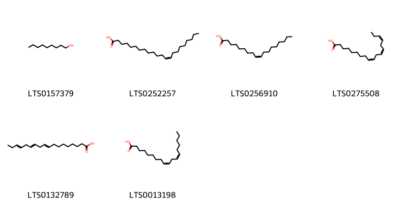{ width=100% }
    <figcaption>Hình ảnh cấu trúc hóa học của 6 hoạt chất thuộc nhóm Fatty Acyls gồm ['nonan-1-ol (LTS0157379)', 'erucic acid (LTS0252257)', 'oleic acid (LTS0256910)', 'α-linolenic acid (LTS0275508)', 'α linolenic acid (LTS0132789)', 'linoleic (LTS0013198)'].</figcaption>
</figure>
#### Nhóm Flavonoids
<figure markdown="span">
    { width=100% }
    <figcaption>Hình ảnh cấu trúc hóa học của 11 hoạt chất thuộc nhóm Flavonoids gồm ['2-[3,4-bis({[3,4,5-trihydroxy-6-(hydroxymethyl)oxan-2-yl]oxy})phenyl]-5,7-dihydroxy-3-{[3,4,5-trihydroxy-6-(hydroxymethyl)oxan-2-yl]oxy}chromen-4-one (LTS0136279)', '[(2r,3s,4s,5r,6s)-6-[5-(3-{[(2s,3r,4s,5s,6r)-4,5-dihydroxy-3-{[(2e)-3-(4-hydroxy-3,5-dimethoxyphenyl)prop-2-enoyl]oxy}-6-(hydroxymethyl)oxan-2-yl]oxy}-5,7-dihydroxy-4-oxochromen-2-yl)-2-{[(2s,3r,4s,5s,6r)-3,4,5-trihydroxy-6-(hydroxymethyl)oxan-2-yl]oxy}phenoxy]-3,4,5-trihydroxyoxan-2-yl]methyl (2e)-3-(4-hydroxy-3,5-dimethoxyphenyl)prop-2-enoate (LTS0136938)', '[(2r,3r,4s,5r,6s)-6-[5-(5,7-dihydroxy-4-oxo-3-{[(2s,3s,4r,5s,6r)-3,4,5-trihydroxy-6-(hydroxymethyl)oxan-2-yl]oxy}chromen-2-yl)-2-{[(2r,3s,4s,5r,6r)-3,4,5-trihydroxy-6-(hydroxymethyl)oxan-2-yl]oxy}phenoxy]-3,4,5-trihydroxyoxan-2-yl]methyl (2e)-3-(4-hydroxy-3,5-dimethoxyphenyl)prop-2-enoate (LTS0210330)', '[(2r,3s,4s,5r,6s)-6-[5-(5,7-dihydroxy-4-oxo-3-{[(2s,3r,4s,5s,6r)-3,4,5-trihydroxy-6-(hydroxymethyl)oxan-2-yl]oxy}chromen-2-yl)-2-{[(2s,3r,4s,5s,6r)-3,4,5-trihydroxy-6-(hydroxymethyl)oxan-2-yl]oxy}phenoxy]-3,4,5-trihydroxyoxan-2-yl]methyl (2e)-3-(4-hydroxy-3,5-dimethoxyphenyl)prop-2-enoate (LTS0202009)', '[(2r,3s,4s,5r,6s)-6-[5-(3-{[(2s,3r,4s,5s,6r)-4,5-dihydroxy-3-{[(2e)-3-(4-hydroxy-3,5-dimethoxyphenyl)prop-2-enoyl]oxy}-6-(hydroxymethyl)oxan-2-yl]oxy}-5,7-dihydroxy-4-oxochromen-2-yl)-2-{[(2s,3s,4r,5s,6r)-3,4,5-trihydroxy-6-(hydroxymethyl)oxan-2-yl]oxy}phenoxy]-3,4,5-trihydroxyoxan-2-yl]methyl (2e)-3-(4-hydroxy-3,5-dimethoxyphenyl)prop-2-enoate (LTS0110239)', '[6-(5-{3-[(4,5-dihydroxy-3-{[3-(4-hydroxy-3,5-dimethoxyphenyl)prop-2-enoyl]oxy}-6-(hydroxymethyl)oxan-2-yl)oxy]-5,7-dihydroxy-4-oxochromen-2-yl}-2-{[3,4,5-trihydroxy-6-(hydroxymethyl)oxan-2-yl]oxy}phenoxy)-3,4,5-trihydroxyoxan-2-yl]methyl 3-(4-hydroxy-3,5-dimethoxyphenyl)prop-2-enoate (LTS0174388)', '2-[3,4-bis({[(2s,3s,4s,5s,6r)-3,4,5-trihydroxy-6-(hydroxymethyl)oxan-2-yl]oxy})phenyl]-5,7-dihydroxy-3-{[(2s,3r,4s,5s,6r)-3,4,5-trihydroxy-6-(hydroxymethyl)oxan-2-yl]oxy}chromen-4-one (LTS0147579)', 'isorhamnetin (LTS0107505)', '2-[3,4-bis({[(2s,3r,4s,5s,6r)-3,4,5-trihydroxy-6-(hydroxymethyl)oxan-2-yl]oxy})phenyl]-5,7-dihydroxy-3-{[(2s,3r,4s,5s,6r)-3,4,5-trihydroxy-6-(hydroxymethyl)oxan-2-yl]oxy}chromen-4-one (LTS0244770)', '{6-[5-(5,7-dihydroxy-4-oxo-3-{[3,4,5-trihydroxy-6-(hydroxymethyl)oxan-2-yl]oxy}chromen-2-yl)-2-{[3,4,5-trihydroxy-6-(hydroxymethyl)oxan-2-yl]oxy}phenoxy]-3,4,5-trihydroxyoxan-2-yl}methyl 3-(4-hydroxy-3,5-dimethoxyphenyl)prop-2-enoate (LTS0274542)', '[(2s,3r,4r,5s,6r)-6-[5-(3-{[(2r,3s,4r,5r,6s)-4,5-dihydroxy-3-{[(2e)-3-(4-hydroxy-3,5-dimethoxyphenyl)prop-2-enoyl]oxy}-6-(hydroxymethyl)oxan-2-yl]oxy}-5,7-dihydroxy-4-oxochromen-2-yl)-2-{[(2r,3s,4r,5r,6s)-3,4,5-trihydroxy-6-(hydroxymethyl)oxan-2-yl]oxy}phenoxy]-3,4,5-trihydroxyoxan-2-yl]methyl (2e)-3-(4-hydroxy-3,5-dimethoxyphenyl)prop-2-enoate (LTS0015957)'].</figcaption>
</figure>
#### Nhóm Heteroaromatic compounds
<figure markdown="span">
    { width=100% }
    <figcaption>Hình ảnh cấu trúc hóa học của 1 hoạt chất thuộc nhóm Heteroaromatic compounds gồm ['amylfuran (LTS0044471)'].</figcaption>
</figure>
#### Nhóm Isothiocyanates
<figure markdown="span">
    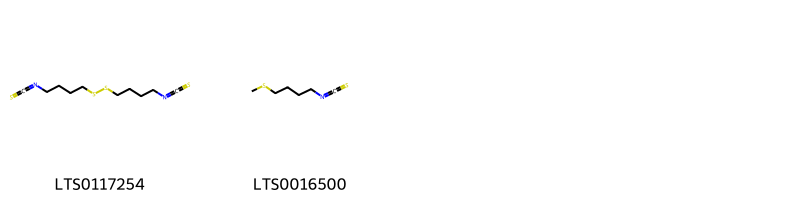{ width=100% }
    <figcaption>Hình ảnh cấu trúc hóa học của 2 hoạt chất thuộc nhóm Isothiocyanates gồm ['1-isothiocyanato-4-[(4-isothiocyanatobutyl)disulfanyl]butane (LTS0117254)', 'erucin (LTS0016500)'].</figcaption>
</figure>
#### Nhóm Organonitrogen compounds
<figure markdown="span">
    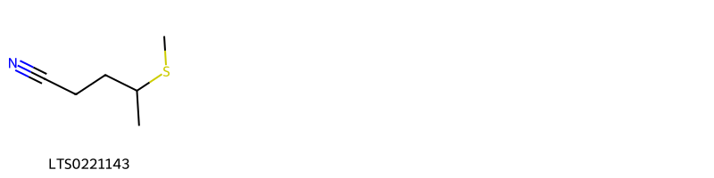{ width=100% }
    <figcaption>Hình ảnh cấu trúc hóa học của 1 hoạt chất thuộc nhóm Organonitrogen compounds gồm ['4-(methylsulfanyl)pentanenitrile (LTS0221143)'].</figcaption>
</figure>
#### Nhóm Organooxygen compounds
<figure markdown="span">
    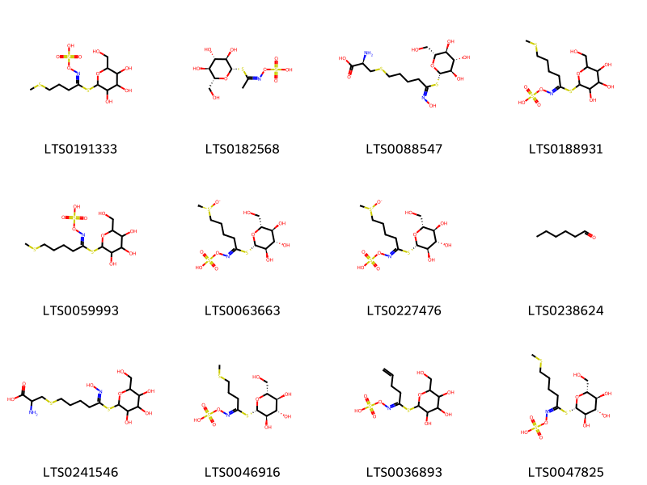{ width=100% }
    <figcaption>Hình ảnh cấu trúc hóa học của 12 hoạt chất thuộc nhóm Organooxygen compounds gồm ['{[4-(methylsulfanyl)-1-{[3,4,5-trihydroxy-6-(hydroxymethyl)oxan-2-yl]sulfanyl}butylidene]amino}oxysulfonic acid (LTS0191333)', '[(z)-(1-{[(2s,3r,4s,5s,6r)-3,4,5-trihydroxy-6-(hydroxymethyl)oxan-2-yl]sulfanyl}ethylidene)amino]oxysulfonic acid (LTS0182568)', '(2r)-2-amino-3-{[(5z)-5-(hydroxyimino)-5-{[(2s,3r,4s,5s,6r)-3,4,5-trihydroxy-6-(hydroxymethyl)oxan-2-yl]sulfanyl}pentyl]sulfanyl}propanoic acid (LTS0088547)', '[(e)-[5-(methylsulfanyl)-1-{[3,4,5-trihydroxy-6-(hydroxymethyl)oxan-2-yl]sulfanyl}pentylidene]amino]oxysulfonic acid (LTS0188931)', '{[5-(methylsulfanyl)-1-{[3,4,5-trihydroxy-6-(hydroxymethyl)oxan-2-yl]sulfanyl}pentylidene]amino}oxysulfonic acid (LTS0059993)', '[(e)-{5-[(r)-methanesulfinyl]-1-{[(2s,3r,4s,5s,6r)-3,4,5-trihydroxy-6-(hydroxymethyl)oxan-2-yl]sulfanyl}pentylidene}amino]oxysulfonic acid (LTS0063663)', '[(e)-(5-methanesulfinyl-1-{[(2s,3r,4s,5s,6r)-3,4,5-trihydroxy-6-(hydroxymethyl)oxan-2-yl]sulfanyl}pentylidene)amino]oxysulfonic acid (LTS0227476)', 'hexanal (LTS0238624)', '2-amino-3-{[5-(hydroxyimino)-5-{[3,4,5-trihydroxy-6-(hydroxymethyl)oxan-2-yl]sulfanyl}pentyl]sulfanyl}propanoic acid (LTS0241546)', '[(e)-[4-(methylsulfanyl)-1-{[(2s,3r,4s,5s,6r)-3,4,5-trihydroxy-6-(hydroxymethyl)oxan-2-yl]sulfanyl}butylidene]amino]oxysulfonic acid (LTS0046916)', '[(e)-(1-{[3,4,5-trihydroxy-6-(hydroxymethyl)oxan-2-yl]sulfanyl}pent-4-en-1-ylidene)amino]oxysulfonic acid (LTS0036893)', '[(z)-[5-(methylsulfanyl)-1-{[(2s,3r,4s,5s,6r)-3,4,5-trihydroxy-6-(hydroxymethyl)oxan-2-yl]sulfanyl}pentylidene]amino]oxysulfonic acid (LTS0047825)'].</figcaption>
</figure>
#### Nhóm Thiocyanates
<figure markdown="span">
    { width=100% }
    <figcaption>Hình ảnh cấu trúc hóa học của 1 hoạt chất thuộc nhóm Thiocyanates gồm ['[4-(methylsulfanyl)butyl]sulfanylcarbonitrile (LTS0016543)'].</figcaption>
</figure>

---

### Dược dân tộc học

Danh sách các quốc gia có sử dụng *Eruca sativa* trong điều trị các bệnh. 

| Country   | Disease                                                                    | Bệnh                                                                                                 |
|:----------|:---------------------------------------------------------------------------|:-----------------------------------------------------------------------------------------------------|
| Elsewhere | Diuretic, Rubefacient, Stimulant, Stomachic, Vesicant, Stimulant, Diuretic | Thuốc lợi tiểu, Rubefacient, Chất kích thích, Dạ dày, Chất tạo bọng, Chất kích thích, Thuốc lợi tiểu |

---

---
## Eruca vesicaria
### Thông tin về thực vật

!!! info "Phân loại thực vật của *Eruca vesicaria* từ GIBF:"
    - **Kingdom:** Plantae
    - **Phylum:** Tracheophyta
    - **Order:** Brassicales
    - **Family:** Brassicaceae
    - **Genus:** Eruca
    - **Species:** *Eruca vesicaria*

 

| Label (VI)   | Label (EN)   | Scientific Name   | Descriptions (VI)   | Descriptions (EN)           | Also Known As (VI)   | Also Known As (EN)                                                                                                |
|:-------------|:-------------|:------------------|:--------------------|:----------------------------|:---------------------|:------------------------------------------------------------------------------------------------------------------|
| N/A          | N/A          | Eruca vesicaria   |                     | edible annual plant species | ['']                 | ['rocket', 'arugula', 'colewort', 'eruca', 'garden rocket', 'roquette', 'ruchetta', 'rucola', 'rucoli', 'rugula'] |

#### Phân bố trên thế giới

**Từ CSDL GIBF** United Arab Emirates, Italy, Belgium, Argentina, Israel, Ukraine, Netherlands, Spain, Türkiye, Portugal, Algeria, Albania, United States of America, Slovenia, Croatia, Greece, Uzbekistan, Germany, Iran (Islamic Republic of), Switzerland, Austria, France, Mexico, United Kingdom of Great Britain and Northern Ireland, Ecuador, New Zealand

#### Phân bố tại Việt Nam

**Từ CSDL GIBF**: Không có ghi nhận ở Việt Nam

---
### Thành phần hóa học
        
- Theo cơ sở dữ liệu lotus: Từ loài *Eruca vesicaria* đã phân lập và xác định được 38 hoạt chất thuộc về các nhóm Fatty Acyls, Flavonoids, Isothiocyanates, Dibenzylbutane lignans, Organonitrogen compounds, Heteroaromatic compounds, Organooxygen compounds, Furanoid lignans, Thiocyanates. 

|    | chemicalTaxonomyClassyfireClass   |   smiles_count |
|---:|:----------------------------------|---------------:|
|  0 | Dibenzylbutane lignans            |              2 |
|  1 | Fatty Acyls                       |              6 |
|  2 | Flavonoids                        |             11 |
|  3 | Furanoid lignans                  |              1 |
|  4 | Heteroaromatic compounds          |              1 |
|  5 | Isothiocyanates                   |              2 |
|  6 | Organonitrogen compounds          |              1 |
|  7 | Organooxygen compounds            |             12 |
|  8 | Thiocyanates                      |              1 |

#### Nhóm Dibenzylbutane lignans
<figure markdown="span">
    { width=100% }
    <figcaption>Hình ảnh cấu trúc hóa học của 2 hoạt chất thuộc nhóm Dibenzylbutane lignans gồm ['(2s,3r)-2,3-bis[(4-hydroxy-3-methoxyphenyl)(¹³c)methyl](1-¹³c)butane-1,4-diol (LTS0268699)', 'secoisolariciresinol (LTS0086727)'].</figcaption>
</figure>
#### Nhóm Fatty Acyls
<figure markdown="span">
    { width=100% }
    <figcaption>Hình ảnh cấu trúc hóa học của 6 hoạt chất thuộc nhóm Fatty Acyls gồm ['nonan-1-ol (LTS0157379)', 'erucic acid (LTS0252257)', 'oleic acid (LTS0256910)', 'α-linolenic acid (LTS0275508)', 'α linolenic acid (LTS0132789)', 'linoleic (LTS0013198)'].</figcaption>
</figure>
#### Nhóm Flavonoids
<figure markdown="span">
    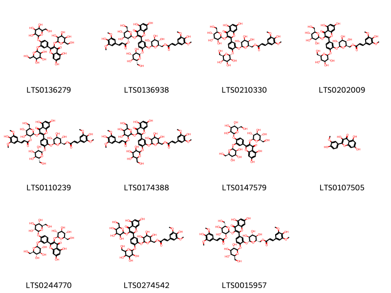{ width=100% }
    <figcaption>Hình ảnh cấu trúc hóa học của 11 hoạt chất thuộc nhóm Flavonoids gồm ['2-[3,4-bis({[3,4,5-trihydroxy-6-(hydroxymethyl)oxan-2-yl]oxy})phenyl]-5,7-dihydroxy-3-{[3,4,5-trihydroxy-6-(hydroxymethyl)oxan-2-yl]oxy}chromen-4-one (LTS0136279)', '[(2r,3s,4s,5r,6s)-6-[5-(3-{[(2s,3r,4s,5s,6r)-4,5-dihydroxy-3-{[(2e)-3-(4-hydroxy-3,5-dimethoxyphenyl)prop-2-enoyl]oxy}-6-(hydroxymethyl)oxan-2-yl]oxy}-5,7-dihydroxy-4-oxochromen-2-yl)-2-{[(2s,3r,4s,5s,6r)-3,4,5-trihydroxy-6-(hydroxymethyl)oxan-2-yl]oxy}phenoxy]-3,4,5-trihydroxyoxan-2-yl]methyl (2e)-3-(4-hydroxy-3,5-dimethoxyphenyl)prop-2-enoate (LTS0136938)', '[(2r,3r,4s,5r,6s)-6-[5-(5,7-dihydroxy-4-oxo-3-{[(2s,3s,4r,5s,6r)-3,4,5-trihydroxy-6-(hydroxymethyl)oxan-2-yl]oxy}chromen-2-yl)-2-{[(2r,3s,4s,5r,6r)-3,4,5-trihydroxy-6-(hydroxymethyl)oxan-2-yl]oxy}phenoxy]-3,4,5-trihydroxyoxan-2-yl]methyl (2e)-3-(4-hydroxy-3,5-dimethoxyphenyl)prop-2-enoate (LTS0210330)', '[(2r,3s,4s,5r,6s)-6-[5-(5,7-dihydroxy-4-oxo-3-{[(2s,3r,4s,5s,6r)-3,4,5-trihydroxy-6-(hydroxymethyl)oxan-2-yl]oxy}chromen-2-yl)-2-{[(2s,3r,4s,5s,6r)-3,4,5-trihydroxy-6-(hydroxymethyl)oxan-2-yl]oxy}phenoxy]-3,4,5-trihydroxyoxan-2-yl]methyl (2e)-3-(4-hydroxy-3,5-dimethoxyphenyl)prop-2-enoate (LTS0202009)', '[(2r,3s,4s,5r,6s)-6-[5-(3-{[(2s,3r,4s,5s,6r)-4,5-dihydroxy-3-{[(2e)-3-(4-hydroxy-3,5-dimethoxyphenyl)prop-2-enoyl]oxy}-6-(hydroxymethyl)oxan-2-yl]oxy}-5,7-dihydroxy-4-oxochromen-2-yl)-2-{[(2s,3s,4r,5s,6r)-3,4,5-trihydroxy-6-(hydroxymethyl)oxan-2-yl]oxy}phenoxy]-3,4,5-trihydroxyoxan-2-yl]methyl (2e)-3-(4-hydroxy-3,5-dimethoxyphenyl)prop-2-enoate (LTS0110239)', '[6-(5-{3-[(4,5-dihydroxy-3-{[3-(4-hydroxy-3,5-dimethoxyphenyl)prop-2-enoyl]oxy}-6-(hydroxymethyl)oxan-2-yl)oxy]-5,7-dihydroxy-4-oxochromen-2-yl}-2-{[3,4,5-trihydroxy-6-(hydroxymethyl)oxan-2-yl]oxy}phenoxy)-3,4,5-trihydroxyoxan-2-yl]methyl 3-(4-hydroxy-3,5-dimethoxyphenyl)prop-2-enoate (LTS0174388)', '2-[3,4-bis({[(2s,3s,4s,5s,6r)-3,4,5-trihydroxy-6-(hydroxymethyl)oxan-2-yl]oxy})phenyl]-5,7-dihydroxy-3-{[(2s,3r,4s,5s,6r)-3,4,5-trihydroxy-6-(hydroxymethyl)oxan-2-yl]oxy}chromen-4-one (LTS0147579)', 'isorhamnetin (LTS0107505)', '2-[3,4-bis({[(2s,3r,4s,5s,6r)-3,4,5-trihydroxy-6-(hydroxymethyl)oxan-2-yl]oxy})phenyl]-5,7-dihydroxy-3-{[(2s,3r,4s,5s,6r)-3,4,5-trihydroxy-6-(hydroxymethyl)oxan-2-yl]oxy}chromen-4-one (LTS0244770)', '{6-[5-(5,7-dihydroxy-4-oxo-3-{[3,4,5-trihydroxy-6-(hydroxymethyl)oxan-2-yl]oxy}chromen-2-yl)-2-{[3,4,5-trihydroxy-6-(hydroxymethyl)oxan-2-yl]oxy}phenoxy]-3,4,5-trihydroxyoxan-2-yl}methyl 3-(4-hydroxy-3,5-dimethoxyphenyl)prop-2-enoate (LTS0274542)', '[(2s,3r,4r,5s,6r)-6-[5-(3-{[(2r,3s,4r,5r,6s)-4,5-dihydroxy-3-{[(2e)-3-(4-hydroxy-3,5-dimethoxyphenyl)prop-2-enoyl]oxy}-6-(hydroxymethyl)oxan-2-yl]oxy}-5,7-dihydroxy-4-oxochromen-2-yl)-2-{[(2r,3s,4r,5r,6s)-3,4,5-trihydroxy-6-(hydroxymethyl)oxan-2-yl]oxy}phenoxy]-3,4,5-trihydroxyoxan-2-yl]methyl (2e)-3-(4-hydroxy-3,5-dimethoxyphenyl)prop-2-enoate (LTS0015957)'].</figcaption>
</figure>
#### Nhóm Furanoid lignans
<figure markdown="span">
    { width=100% }
    <figcaption>Hình ảnh cấu trúc hóa học của 1 hoạt chất thuộc nhóm Furanoid lignans gồm ['matairesinol (LTS0193475)'].</figcaption>
</figure>
#### Nhóm Heteroaromatic compounds
<figure markdown="span">
    { width=100% }
    <figcaption>Hình ảnh cấu trúc hóa học của 1 hoạt chất thuộc nhóm Heteroaromatic compounds gồm ['amylfuran (LTS0044471)'].</figcaption>
</figure>
#### Nhóm Isothiocyanates
<figure markdown="span">
    { width=100% }
    <figcaption>Hình ảnh cấu trúc hóa học của 2 hoạt chất thuộc nhóm Isothiocyanates gồm ['1-isothiocyanato-4-[(4-isothiocyanatobutyl)disulfanyl]butane (LTS0117254)', 'erucin (LTS0016500)'].</figcaption>
</figure>
#### Nhóm Organonitrogen compounds
<figure markdown="span">
    { width=100% }
    <figcaption>Hình ảnh cấu trúc hóa học của 1 hoạt chất thuộc nhóm Organonitrogen compounds gồm ['4-(methylsulfanyl)pentanenitrile (LTS0221143)'].</figcaption>
</figure>
#### Nhóm Organooxygen compounds
<figure markdown="span">
    { width=100% }
    <figcaption>Hình ảnh cấu trúc hóa học của 12 hoạt chất thuộc nhóm Organooxygen compounds gồm ['{[4-(methylsulfanyl)-1-{[3,4,5-trihydroxy-6-(hydroxymethyl)oxan-2-yl]sulfanyl}butylidene]amino}oxysulfonic acid (LTS0191333)', '[(z)-(1-{[(2s,3r,4s,5s,6r)-3,4,5-trihydroxy-6-(hydroxymethyl)oxan-2-yl]sulfanyl}ethylidene)amino]oxysulfonic acid (LTS0182568)', '(2r)-2-amino-3-{[(5z)-5-(hydroxyimino)-5-{[(2s,3r,4s,5s,6r)-3,4,5-trihydroxy-6-(hydroxymethyl)oxan-2-yl]sulfanyl}pentyl]sulfanyl}propanoic acid (LTS0088547)', '[(e)-[5-(methylsulfanyl)-1-{[3,4,5-trihydroxy-6-(hydroxymethyl)oxan-2-yl]sulfanyl}pentylidene]amino]oxysulfonic acid (LTS0188931)', '{[5-(methylsulfanyl)-1-{[3,4,5-trihydroxy-6-(hydroxymethyl)oxan-2-yl]sulfanyl}pentylidene]amino}oxysulfonic acid (LTS0059993)', '[(e)-{5-[(r)-methanesulfinyl]-1-{[(2s,3r,4s,5s,6r)-3,4,5-trihydroxy-6-(hydroxymethyl)oxan-2-yl]sulfanyl}pentylidene}amino]oxysulfonic acid (LTS0063663)', '[(e)-(5-methanesulfinyl-1-{[(2s,3r,4s,5s,6r)-3,4,5-trihydroxy-6-(hydroxymethyl)oxan-2-yl]sulfanyl}pentylidene)amino]oxysulfonic acid (LTS0227476)', 'hexanal (LTS0238624)', '2-amino-3-{[5-(hydroxyimino)-5-{[3,4,5-trihydroxy-6-(hydroxymethyl)oxan-2-yl]sulfanyl}pentyl]sulfanyl}propanoic acid (LTS0241546)', '[(e)-[4-(methylsulfanyl)-1-{[(2s,3r,4s,5s,6r)-3,4,5-trihydroxy-6-(hydroxymethyl)oxan-2-yl]sulfanyl}butylidene]amino]oxysulfonic acid (LTS0046916)', '[(e)-(1-{[3,4,5-trihydroxy-6-(hydroxymethyl)oxan-2-yl]sulfanyl}pent-4-en-1-ylidene)amino]oxysulfonic acid (LTS0036893)', '[(z)-[5-(methylsulfanyl)-1-{[(2s,3r,4s,5s,6r)-3,4,5-trihydroxy-6-(hydroxymethyl)oxan-2-yl]sulfanyl}pentylidene]amino]oxysulfonic acid (LTS0047825)'].</figcaption>
</figure>
#### Nhóm Thiocyanates
<figure markdown="span">
    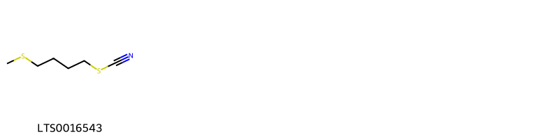{ width=100% }
    <figcaption>Hình ảnh cấu trúc hóa học của 1 hoạt chất thuộc nhóm Thiocyanates gồm ['[4-(methylsulfanyl)butyl]sulfanylcarbonitrile (LTS0016543)'].</figcaption>
</figure>

---

### Dược dân tộc học

Danh sách các quốc gia có sử dụng *Eruca vesicaria* trong điều trị các bệnh. 

| Country   | Disease   | Bệnh            |
|:----------|:----------|:----------------|
| ain       | Stimulant | Chất kích thích |

---

# Chi Matthiola

??? note "Danh sách các dược liệu thuộc chi"
    
	 - *Matthiola incana*

---
## Matthiola incana
### Thông tin về thực vật

!!! info "Phân loại thực vật của *Matthiola incana* từ GIBF:"
    - **Kingdom:** Plantae
    - **Phylum:** Tracheophyta
    - **Order:** Brassicales
    - **Family:** Brassicaceae
    - **Genus:** Matthiola
    - **Species:** *Matthiola incana*

 

| Label (VI)   | Label (EN)   | Scientific Name   | Descriptions (VI)   | Descriptions (EN)   | Also Known As (VI)   | Also Known As (EN)                                             |
|:-------------|:-------------|:------------------|:--------------------|:--------------------|:---------------------|:---------------------------------------------------------------|
| N/A          | N/A          | Matthiola incana  | loài thực vật       | species of plant    | ['']                 | ['wallflower', 'gillyflower', 'hoary stock', 'tenweeks stock'] |

#### Phân bố trên thế giới

**Từ CSDL GIBF** nan, Italy, Australia, Belgium, Bermuda, Israel, Netherlands, Malta, Spain, Portugal, United States of America, Chile, Croatia, Greece, South Africa, Monaco, Iran (Islamic Republic of), Mexico, France, United Kingdom of Great Britain and Northern Ireland, Ecuador, Guernsey, New Zealand

#### Phân bố tại Việt Nam

**Từ CSDL GIBF**: Không có ghi nhận ở Việt Nam

---
### Thành phần hóa học
        
- Theo cơ sở dữ liệu lotus: Từ loài *Matthiola incana* đã phân lập và xác định được 34 hoạt chất thuộc về các nhóm Flavonoids, Prenol lipids, Sulfoxides, Linear 1,3-diarylpropanoids, Cinnamic acids and derivatives. 

|    | chemicalTaxonomyClassyfireClass   |   smiles_count |
|---:|:----------------------------------|---------------:|
|  0 | Cinnamic acids and derivatives    |              4 |
|  1 | Flavonoids                        |             16 |
|  2 | Linear 1,3-diarylpropanoids       |              1 |
|  3 | Prenol lipids                     |             10 |
|  4 | Sulfoxides                        |              1 |

#### Nhóm Cinnamic acids and derivatives
<figure markdown="span">
    { width=100% }
    <figcaption>Hình ảnh cấu trúc hóa học của 4 hoạt chất thuộc nhóm Cinnamic acids and derivatives gồm ['ferulic acid (LTS0077328)', 'sinapinate (LTS0173482)', '3,4-dihydroxycinnamic acid (LTS0128050)', 'para-coumaric acid (LTS0266252)'].</figcaption>
</figure>
#### Nhóm Flavonoids
<figure markdown="span">
    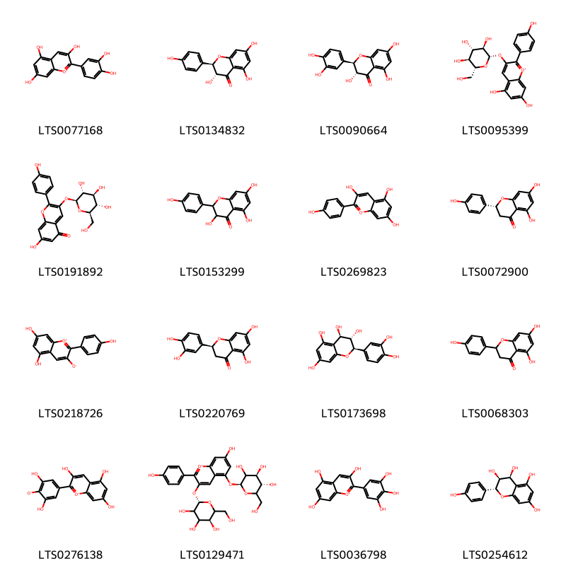{ width=100% }
    <figcaption>Hình ảnh cấu trúc hóa học của 16 hoạt chất thuộc nhóm Flavonoids gồm ['cyanidin (LTS0077168)', '(+)-dihydrokaempferol (LTS0134832)', '(+)-taxifolin (LTS0090664)', 'pelargonidin 3-glucoside (LTS0095399)', '7-hydroxy-2-(4-hydroxyphenyl)-3-{[(2s,3r,4s,5s,6r)-3,4,5-trihydroxy-6-(hydroxymethyl)oxan-2-yl]oxy}chromen-5-one (LTS0191892)', 'aromadendrin (LTS0153299)', 'pelargonidin (LTS0269823)', '(-)-naringenin (LTS0072900)', '5,7-dihydroxy-2-(4-hydroxyphenyl)-1λ⁴-chromen-1-ylium-3-olate (LTS0218726)', 'eriodictyol (LTS0220769)', '(+)-leucocyanidin (LTS0173698)', 'asahina (LTS0068303)', '2-(3,5-dihydroxy-4-oxidophenyl)-3,5,7-trihydroxy-1λ⁴-chromen-1-ylium (LTS0276138)', 'pelargonin (LTS0129471)', 'delphinidin (LTS0036798)', 'leucopelargonidin (LTS0254612)'].</figcaption>
</figure>
#### Nhóm Linear 1_3-diarylpropanoids
<figure markdown="span">
    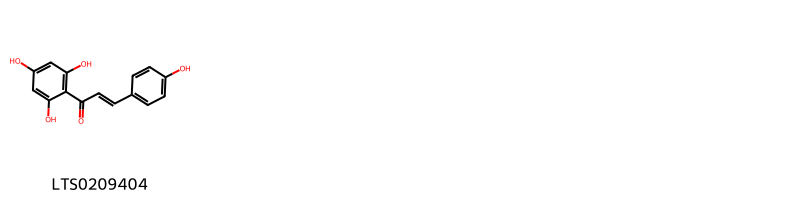{ width=100% }
    <figcaption>Hình ảnh cấu trúc hóa học của Không tìm thấy chú thích hoạt chất thuộc nhóm Linear 1_3-diarylpropanoids gồm Không tìm thấy chú thích.</figcaption>
</figure>
#### Nhóm Prenol lipids
<figure markdown="span">
    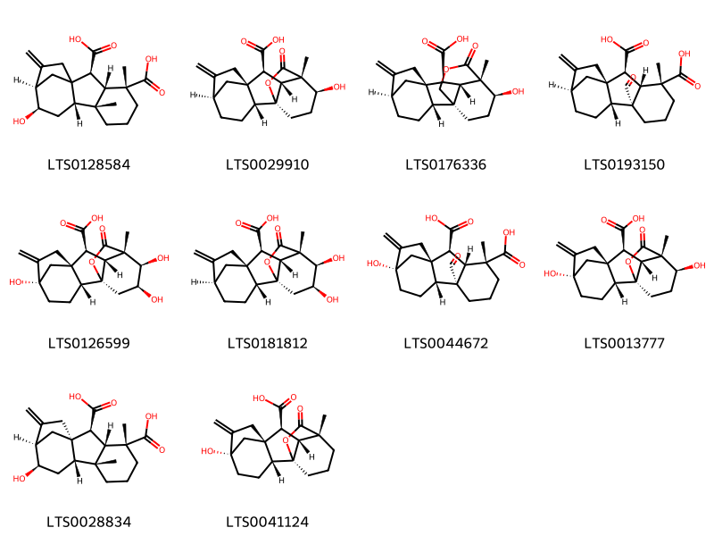{ width=100% }
    <figcaption>Hình ảnh cấu trúc hóa học của 10 hoạt chất thuộc nhóm Prenol lipids gồm ['(2s,3s,4r,8r,9s,11r,12r)-11-hydroxy-4,8-dimethyl-13-methylidenetetracyclo[10.2.1.0¹,⁹.0³,⁸]pentadecane-2,4-dicarboxylic acid (LTS0128584)', 'gibberellin a4 (LTS0029910)', 'gibberellin a37 (LTS0176336)', 'gibberellin a24 (LTS0193150)', 'gibberellin a8 (LTS0126599)', 'gibberellin a34 (LTS0181812)', 'gibberellin a19 (LTS0044672)', 'gibberellin a1 (LTS0013777)', '(1s,2s,3s,4r,8r,9s,11r,12r)-11-hydroxy-4,8-dimethyl-13-methylidenetetracyclo[10.2.1.0¹,⁹.0³,⁸]pentadecane-2,4-dicarboxylic acid (LTS0028834)', 'gibberellin a20 (LTS0041124)'].</figcaption>
</figure>
#### Nhóm Sulfoxides
<figure markdown="span">
    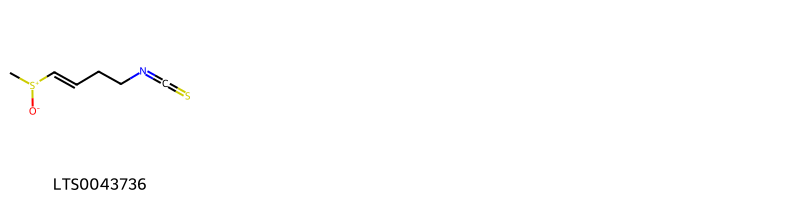{ width=100% }
    <figcaption>Hình ảnh cấu trúc hóa học của 1 hoạt chất thuộc nhóm Sulfoxides gồm ['raphanin (LTS0043736)'].</figcaption>
</figure>

---

### Dược dân tộc học

Danh sách các quốc gia có sử dụng *Matthiola incana* trong điều trị các bệnh. 

| Country   | Disease                                 | Bệnh                                       |
|:----------|:----------------------------------------|:-------------------------------------------|
| Elsewhere | Diuretic, Expectorant, Stomachic, Tonic | Thuốc lợi tiểu, long đờm, dạ dày, thuốc bổ |

---

# Chi Coronopus

??? note "Danh sách các dược liệu thuộc chi"
    
	 - *Coronopus didymus*

---
## Coronopus didymus
### Thông tin về thực vật

!!! info "Phân loại thực vật của *Lepidium didymum* từ GIBF:"
    - **Kingdom:** Plantae
    - **Phylum:** Tracheophyta
    - **Order:** Brassicales
    - **Family:** Brassicaceae
    - **Genus:** Lepidium
    - **Species:** *Lepidium didymum*

 

| Label (VI)   | Label (EN)   | Scientific Name   | Descriptions (VI)   | Descriptions (EN)   | Also Known As (VI)   | Also Known As (EN)    |
|:-------------|:-------------|:------------------|:--------------------|:--------------------|:---------------------|:----------------------|
| N/A          | N/A          | Coronopus didymus | loài thực vật       | species of plant    | ['']                 | ['Lesser swinecress'] |

#### Phân bố trên thế giới

**Từ CSDL GIBF** Italy, Belgium, Brazil, Spain, Chinese Taipei, Ireland, Switzerland, Saint Helena, Ascension and Tristan da Cunha

#### Phân bố tại Việt Nam

**Từ CSDL GIBF**: Không có ghi nhận ở Việt Nam

---
### Thành phần hóa học
        
- Theo cơ sở dữ liệu lotus: Từ loài *Lepidium didymum* đã phân lập và xác định được Chưa có hoạt chất nào được phân lập. hoạt chất thuộc về các nhóm Không có hoạt chất nào được phân lập. 

Không có hình ảnh nào được tạo ra

---

### Dược dân tộc học

Danh sách các quốc gia có sử dụng *Lepidium didymum* trong điều trị các bệnh. 

| Country   | Disease                           | Bệnh                            |
|:----------|:----------------------------------|:--------------------------------|
| Argentina | Digestive, Expectorant, Vulnerary | Tiêu hóa, đờm, dễ bị tổn thương |

---

# Chi Erysimum

??? note "Danh sách các dược liệu thuộc chi"
    
	 - *Erysimum cheiranthoides*

---
## Erysimum cheiranthoides
### Thông tin về thực vật

!!! info "Phân loại thực vật của *Erysimum cheiranthoides* từ GIBF:"
    - **Kingdom:** Plantae
    - **Phylum:** Tracheophyta
    - **Order:** Brassicales
    - **Family:** Brassicaceae
    - **Genus:** Erysimum
    - **Species:** *Erysimum cheiranthoides*

 

| Label (VI)   | Label (EN)   | Scientific Name         | Descriptions (VI)   | Descriptions (EN)   | Also Known As (VI)   | Also Known As (EN)   |
|:-------------|:-------------|:------------------------|:--------------------|:--------------------|:---------------------|:---------------------|
| N/A          | N/A          | Erysimum cheiranthoides | loài thực vật       | species of plant    | ['']                 | ['']                 |

#### Phân bố trên thế giới

**Từ CSDL GIBF** Ukraine, Finland, Netherlands, Lithuania, Belarus, Czechia, Germany, Slovakia, Poland, Switzerland, Russian Federation, United States of America, Sweden, Austria, France, Norway, Canada

#### Phân bố tại Việt Nam

**Từ CSDL GIBF**: Không có ghi nhận ở Việt Nam

---
### Thành phần hóa học
        
- Theo cơ sở dữ liệu lotus: Từ loài *Erysimum cheiranthoides* đã phân lập và xác định được 29 hoạt chất thuộc về các nhóm Flavonoids, Steroids and steroid derivatives. 

|    | chemicalTaxonomyClassyfireClass   |   smiles_count |
|---:|:----------------------------------|---------------:|
|  0 | Flavonoids                        |              1 |
|  1 | Steroids and steroid derivatives  |             28 |

#### Nhóm Flavonoids
<figure markdown="span">
    { width=100% }
    <figcaption>Hình ảnh cấu trúc hóa học của 1 hoạt chất thuộc nhóm Flavonoids gồm ['3-rutinosyl quercetin (LTS0032845)'].</figcaption>
</figure>
#### Nhóm Steroids and steroid derivatives
<figure markdown="span">
    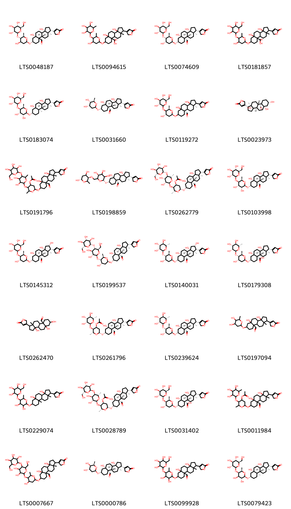{ width=100% }
    <figcaption>Hình ảnh cấu trúc hóa học của 28 hoạt chất thuộc nhóm Steroids and steroid derivatives gồm ['(1r,3as,3br,5as,7s,9bs,11ar)-3a,5a-dihydroxy-7-{[(2r,4r,5s,6r)-4-hydroxy-6-methyl-5-{[(2s,3r,4s,5s,6r)-3,4,5-trihydroxy-6-(hydroxymethyl)oxan-2-yl]oxy}oxan-2-yl]oxy}-11a-methyl-1-(5-oxo-2h-furan-3-yl)-dodecahydro-1h-cyclopenta[a]phenanthrene-9a-carbaldehyde (LTS0048187)', '3a,5a-dihydroxy-7-({4-hydroxy-6-methyl-5-[(3,4,5-trihydroxy-6-methyloxan-2-yl)oxy]oxan-2-yl}oxy)-11a-methyl-1-(5-oxo-2h-furan-3-yl)-dodecahydro-1h-cyclopenta[a]phenanthrene-9a-carboxylic acid (LTS0094615)', 'erysimoside (LTS0074609)', '3a,5a-dihydroxy-7-[(4-hydroxy-6-methyl-5-{[3,4,5-trihydroxy-6-(hydroxymethyl)oxan-2-yl]oxy}oxan-2-yl)oxy]-11a-methyl-1-(5-oxo-2h-furan-3-yl)-dodecahydro-1h-cyclopenta[a]phenanthrene-9a-carboxylic acid (LTS0181857)', '4-[(1r,3as,3br,5as,7s,9ar,9bs,11ar)-7-{[(2r,3r,4s,5r,6r)-3,4-dihydroxy-6-methyl-5-{[(2s,3r,4s,5s,6r)-3,4,5-trihydroxy-6-(hydroxymethyl)oxan-2-yl]oxy}oxan-2-yl]oxy}-3a,5a-dihydroxy-9a,11a-dimethyl-dodecahydro-1h-cyclopenta[a]phenanthren-1-yl]-5h-furan-2-one (LTS0183074)', 'helveticoside (LTS0031660)', '(9as,11ar)-3a,5a-dihydroxy-7-{[(2r,4s,6r)-4-hydroxy-6-methyl-5-{[(3r,4s,5s,6r)-3,4,5-trihydroxy-6-(hydroxymethyl)oxan-2-yl]oxy}oxan-2-yl]oxy}-11a-methyl-1-(5-oxo-2h-furan-3-yl)-dodecahydro-1h-cyclopenta[a]phenanthrene-9a-carbaldehyde (LTS0119272)', 'strophanthidin (LTS0023973)', '6-{[9a-formyl-3a,5a-dihydroxy-11a-methyl-1-(5-oxo-2h-furan-3-yl)-dodecahydro-1h-cyclopenta[a]phenanthren-7-yl]oxy}-3-[(3,4-dihydroxy-6-methyl-5-{[3,4,5-trihydroxy-6-(hydroxymethyl)oxan-2-yl]oxy}oxan-2-yl)oxy]-2-methyloxan-4-yl acetate (LTS0191796)', '(1r,3as,5as,7s,9as,11ar)-7-{[(2r,5s)-6-({[(3r,6s)-4,6-dihydroxy-2-methyloxan-3-yl]oxy}methyl)-3,4,5-trihydroxyoxan-2-yl]oxy}-3a,5a-dihydroxy-11a-methyl-1-(5-oxo-2h-furan-3-yl)-dodecahydro-1h-cyclopenta[a]phenanthrene-9a-carbaldehyde (LTS0198859)', '(2r,3r,4s,6r)-6-{[(1r,3as,3br,5as,7s,9as,9bs,11ar)-9a-formyl-3a,5a-dihydroxy-11a-methyl-1-(5-oxo-2h-furan-3-yl)-dodecahydro-1h-cyclopenta[a]phenanthren-7-yl]oxy}-3-{[(2s,3r,4s,5r,6s)-3,4-dihydroxy-6-methyl-5-{[(2s,3r,4s,5s,6r)-3,4,5-trihydroxy-6-(hydroxymethyl)oxan-2-yl]oxy}oxan-2-yl]oxy}-2-methyloxan-4-yl acetate (LTS0262779)', '(1r,3as,3br,5as,7s,9as,9bs,11ar)-7-{[(2r,3r,4s,5r,6r)-3,4-dihydroxy-6-methyl-5-{[(2s,3r,4s,5s,6r)-3,4,5-trihydroxy-6-(hydroxymethyl)oxan-2-yl]oxy}oxan-2-yl]oxy}-3a,5a-dihydroxy-11a-methyl-1-(5-oxo-2h-furan-3-yl)-dodecahydro-1h-cyclopenta[a]phenanthrene-9a-carbaldehyde (LTS0103998)', '(1r,2s,3as,3br,5as,7s,9as,9bs,11ar)-2,3a,5a-trihydroxy-7-{[(2r,4s,5r,6r)-4-hydroxy-6-methyl-5-{[(2s,3r,4s,5s,6r)-3,4,5-trihydroxy-6-(hydroxymethyl)oxan-2-yl]oxy}oxan-2-yl]oxy}-11a-methyl-1-(5-oxo-2h-furan-3-yl)-dodecahydro-1h-cyclopenta[a]phenanthrene-9a-carbaldehyde (LTS0145312)', '(1r,3as,3br,5as,7s,9as,9bs,11ar)-7-{[(2r,4s,5s,6r)-5-{[(2s,3r,4r,5s,6r)-3,4-dihydroxy-6-(hydroxymethyl)-5-{[(2s,3r,4s,5s,6r)-3,4,5-trihydroxy-6-(hydroxymethyl)oxan-2-yl]oxy}oxan-2-yl]oxy}-4-hydroxy-6-methyloxan-2-yl]oxy}-3a,5a-dihydroxy-11a-methyl-1-(5-oxo-2h-furan-3-yl)-dodecahydro-1h-cyclopenta[a]phenanthrene-9a-carbaldehyde (LTS0199537)', '(1r,2s,3as,3br,5as,7s,9as,9bs,11ar)-2,3a,5a-trihydroxy-7-{[(2r,4s,5s,6r)-4-hydroxy-6-methyl-5-{[(2s,3r,4r,5r,6s)-3,4,5-trihydroxy-6-methyloxan-2-yl]oxy}oxan-2-yl]oxy}-11a-methyl-1-(5-oxo-2h-furan-3-yl)-dodecahydro-1h-cyclopenta[a]phenanthrene-9a-carbaldehyde (LTS0140031)', '(1r,3as,3br,5as,7s,9as,9bs,11ar)-3a,5a-dihydroxy-7-{[(2r,4s,5s,6r)-4-hydroxy-6-methyl-5-{[(2s,3r,4r,5r,6s)-3,4,5-trihydroxy-6-methyloxan-2-yl]oxy}oxan-2-yl]oxy}-11a-methyl-1-(5-oxo-2h-furan-3-yl)-dodecahydro-1h-cyclopenta[a]phenanthrene-9a-carboxylic acid (LTS0179308)', 'strophanthidin (LTS0262470)', '(2r,3r,4s,6r)-6-{[(1r,3as,3br,5as,7s,9as,9bs,11ar)-9a-formyl-3a,5a-dihydroxy-11a-methyl-1-(5-oxo-2h-furan-3-yl)-dodecahydro-1h-cyclopenta[a]phenanthren-7-yl]oxy}-2-methyl-3-{[(2s,3r,4r,5r,6s)-3,4,5-trihydroxy-6-methyloxan-2-yl]oxy}oxan-4-yl acetate (LTS0261796)', '(1r,3as,3br,5as,7s,9as,9bs,11ar)-3a,5a-dihydroxy-7-{[(2r,4s,5s,6r)-4-hydroxy-6-methyl-5-{[(2s,3r,4r,5r,6s)-3,4,5-trihydroxy-6-methyloxan-2-yl]oxy}oxan-2-yl]oxy}-11a-methyl-1-(5-oxo-2h-furan-3-yl)-dodecahydro-1h-cyclopenta[a]phenanthrene-9a-carbaldehyde (LTS0239624)', '7-[(4,5-dihydroxy-6-methyloxan-2-yl)oxy]-3a,5a-dihydroxy-11a-methyl-1-(5-oxo-2h-furan-3-yl)-dodecahydro-1h-cyclopenta[a]phenanthrene-9a-carbaldehyde (LTS0197094)', '4-{7-[(3,4-dihydroxy-6-methyl-5-{[3,4,5-trihydroxy-6-(hydroxymethyl)oxan-2-yl]oxy}oxan-2-yl)oxy]-3a,5a-dihydroxy-9a,11a-dimethyl-dodecahydro-1h-cyclopenta[a]phenanthren-1-yl}-5h-furan-2-one (LTS0229074)', '(2r,3r,4s,6r)-6-{[(1r,3as,3br,5as,7s,9as,9bs,11ar)-9a-formyl-3a,5a-dihydroxy-11a-methyl-1-(5-oxo-2h-furan-3-yl)-dodecahydro-1h-cyclopenta[a]phenanthren-7-yl]oxy}-3-{[(2s,3r,4r,5r,6s)-3,4-dihydroxy-6-methyl-5-{[(2r,3r,4s,5s,6r)-3,4,5-trihydroxy-6-(hydroxymethyl)oxan-2-yl]oxy}oxan-2-yl]oxy}-2-methyloxan-4-yl acetate (LTS0028789)', '(1r,3as,3br,5as,7s,9as,9bs,11ar)-3a,5a-dihydroxy-7-{[(2r,4s,5r,6r)-4-hydroxy-6-methyl-5-{[(2s,3r,4s,5s,6r)-3,4,5-trihydroxy-6-(hydroxymethyl)oxan-2-yl]oxy}oxan-2-yl]oxy}-11a-methyl-1-(5-oxo-2h-furan-3-yl)-dodecahydro-1h-cyclopenta[a]phenanthrene-9a-carboxylic acid (LTS0031402)', '6-{[9a-formyl-3a,5a-dihydroxy-11a-methyl-1-(5-oxo-2h-furan-3-yl)-dodecahydro-1h-cyclopenta[a]phenanthren-7-yl]oxy}-2-methyl-3-[(3,4,5-trihydroxy-6-methyloxan-2-yl)oxy]oxan-4-yl acetate (LTS0011984)', '7-[(5-{[3,4-dihydroxy-6-(hydroxymethyl)-5-{[3,4,5-trihydroxy-6-(hydroxymethyl)oxan-2-yl]oxy}oxan-2-yl]oxy}-4-hydroxy-6-methyloxan-2-yl)oxy]-3a,5a-dihydroxy-11a-methyl-1-(5-oxo-2h-furan-3-yl)-dodecahydro-1h-cyclopenta[a]phenanthrene-9a-carbaldehyde (LTS0007667)', '(1r,3as,3br,5as,7s,9as,9bs,11ar)-7-{[(2r,4s,5r,6r)-4,5-dihydroxy-6-methyloxan-2-yl]oxy}-3a,5a-dihydroxy-11a-methyl-1-(5-oxo-2h-furan-3-yl)-dodecahydro-1h-cyclopenta[a]phenanthrene-9a-carbaldehyde (LTS0000786)', 'convalloside (LTS0099928)', '4-[(1r,3as,3br,5as,7s,9ar,9bs,11ar)-7-{[(2r,3r,4r,5r,6r)-3,4-dihydroxy-6-methyl-5-{[(2s,3r,4s,5s,6r)-3,4,5-trihydroxy-6-(hydroxymethyl)oxan-2-yl]oxy}oxan-2-yl]oxy}-3a,5a-dihydroxy-9a,11a-dimethyl-dodecahydro-1h-cyclopenta[a]phenanthren-1-yl]-5h-furan-2-one (LTS0079423)'].</figcaption>
</figure>

---

### Dược dân tộc học

Danh sách các quốc gia có sử dụng *Erysimum cheiranthoides* trong điều trị các bệnh. 

| Country   | Disease   | Bệnh     |
|:----------|:----------|:---------|
| Canada    | Poison    | Chất độc |

---

# Chi Heliophila

??? note "Danh sách các dược liệu thuộc chi"
    
	 - *Heliophila p*

---
## Heliophila p
### Thông tin về thực vật

!!! info "Phân loại thực vật của *N/A* từ GIBF:"
    - **Kingdom:** Plantae
    - **Phylum:** Tracheophyta
    - **Order:** Brassicales
    - **Family:** Brassicaceae
    - **Genus:** Heliophila
    - **Species:** *N/A*

 

| Label (VI)   | Label (EN)   | Scientific Name         | Descriptions (VI)   | Descriptions (EN)   | Also Known As (VI)   | Also Known As (EN)   |
|:-------------|:-------------|:------------------------|:--------------------|:--------------------|:---------------------|:---------------------|
| N/A          | N/A          | Erysimum cheiranthoides | loài thực vật       | species of plant    | ['']                 | ['']                 |

#### Phân bố trên thế giới

**Từ CSDL GIBF** Namibia, South Africa

#### Phân bố tại Việt Nam

**Từ CSDL GIBF**: Không có ghi nhận ở Việt Nam

---
### Thành phần hóa học
        
- Theo cơ sở dữ liệu lotus: Từ loài *N/A* đã phân lập và xác định được Chưa có hoạt chất nào được phân lập. hoạt chất thuộc về các nhóm Không có hoạt chất nào được phân lập. 

Không có hình ảnh nào được tạo ra

---

### Dược dân tộc học

Danh sách các quốc gia có sử dụng *N/A* trong điều trị các bệnh. 

| Country   | Disease   | Bệnh     |
|:----------|:----------|:---------|
| Lesotho   | Cosmetic  | Cosmetic |

---

# Chi Nasturtium

??? note "Danh sách các dược liệu thuộc chi"
    
	 - *Nasturtium indicum*
	 - *Nasturtium officinale*

---
## Nasturtium indicum
### Thông tin về thực vật

!!! info "Phân loại thực vật của *N/A* từ GIBF:"
    - **Kingdom:** Plantae
    - **Phylum:** Tracheophyta
    - **Order:** Brassicales
    - **Family:** N/A
    - **Genus:** N/A
    - **Species:** *N/A*

 

| Label (VI)   | Label (EN)   | Scientific Name         | Descriptions (VI)   | Descriptions (EN)   | Also Known As (VI)   | Also Known As (EN)   |
|:-------------|:-------------|:------------------------|:--------------------|:--------------------|:---------------------|:---------------------|
| N/A          | N/A          | Erysimum cheiranthoides | loài thực vật       | species of plant    | ['']                 | ['']                 |

#### Phân bố trên thế giới

**Từ CSDL GIBF** nan, Italy, Australia, Argentina, Gibraltar, Israel, Canada, Ukraine, Denmark, Puerto Rico, Netherlands, Luxembourg, Namibia, Chinese Taipei, Spain, Portugal, Russian Federation, Morocco, United States of America, Uruguay, Chile, Croatia, South Africa, Hong Kong, Czechia, Germany, Thailand, Brazil, Switzerland, Austria, France, Mexico, Viet Nam, United Kingdom of Great Britain and Northern Ireland, Jersey, Colombia, Ireland, Botswana, India, Indonesia, Poland, Malaysia, New Zealand

#### Phân bố tại Việt Nam

**Từ CSDL GIBF**: Hồ Chí Minh city

---
### Thành phần hóa học
        
- Theo cơ sở dữ liệu lotus: Từ loài *N/A* đã phân lập và xác định được Chưa có hoạt chất nào được phân lập. hoạt chất thuộc về các nhóm Không có hoạt chất nào được phân lập. 

Không có hình ảnh nào được tạo ra

---

### Dược dân tộc học

Danh sách các quốc gia có sử dụng *N/A* trong điều trị các bệnh. 

| Country   | Disease   | Bệnh           |
|:----------|:----------|:---------------|
| China     | Diuretic  | Thuốc lợi tiêu |

---

---
## Nasturtium officinale
### Thông tin về thực vật

!!! info "Phân loại thực vật của *Nasturtium officinale* từ GIBF:"
    - **Kingdom:** Plantae
    - **Phylum:** Tracheophyta
    - **Order:** Brassicales
    - **Family:** Brassicaceae
    - **Genus:** Nasturtium
    - **Species:** *Nasturtium officinale*

 

| Label (VI)   | Label (EN)   | Scientific Name       | Descriptions (VI)   | Descriptions (EN)   | Also Known As (VI)                                   | Also Known As (EN)            |
|:-------------|:-------------|:----------------------|:--------------------|:--------------------|:-----------------------------------------------------|:------------------------------|
| N/A          | N/A          | Nasturtium officinale | loài thực vật       | species of plant    | ['Nasturtium officinale', 'Nasturtium microphyllum'] | ['watercress', 'yellowcress'] |

#### Phân bố trên thế giới

**Từ CSDL GIBF** Italy, Australia, Japan, Georgia, Argentina, Israel, Canada, Ukraine, Denmark, Netherlands, Chinese Taipei, Spain, Portugal, Algeria, Morocco, United States of America, Sweden, Chile, Uruguay, Croatia, South Africa, Montenegro, Germany, Switzerland, Mexico, Austria, Dominican Republic, France, United Kingdom of Great Britain and Northern Ireland, China, Ecuador, Iraq, New Zealand

#### Phân bố tại Việt Nam

**Từ CSDL GIBF**: Không có ghi nhận ở Việt Nam

---
### Thành phần hóa học
        
- Theo cơ sở dữ liệu lotus: Từ loài *Nasturtium officinale* đã phân lập và xác định được 27 hoạt chất thuộc về các nhóm Flavonoids, Isothiocyanates, Prenol lipids, Dibenzylbutane lignans, Benzene and substituted derivatives, Furanoid lignans, Carboxylic acids and derivatives. 

|    | chemicalTaxonomyClassyfireClass     |   smiles_count |
|---:|:------------------------------------|---------------:|
|  0 | Benzene and substituted derivatives |              3 |
|  1 | Carboxylic acids and derivatives    |              2 |
|  2 | Dibenzylbutane lignans              |              2 |
|  3 | Flavonoids                          |             14 |
|  4 | Furanoid lignans                    |              1 |
|  5 | Isothiocyanates                     |              2 |
|  6 | Prenol lipids                       |              3 |

#### Nhóm Benzene and substituted derivatives
<figure markdown="span">
    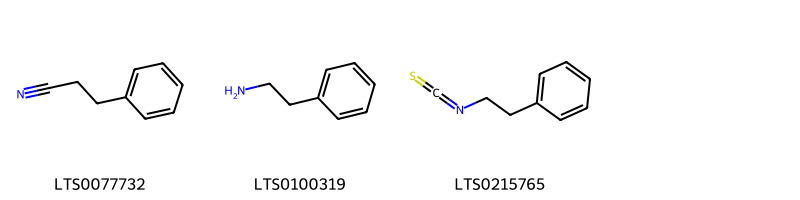{ width=100% }
    <figcaption>Hình ảnh cấu trúc hóa học của 3 hoạt chất thuộc nhóm Benzene and substituted derivatives gồm ['benzylacetonitrile (LTS0077732)', '2-phenylethylamine (LTS0100319)', 'phenethyl isothiocyanate (LTS0215765)'].</figcaption>
</figure>
#### Nhóm Carboxylic acids and derivatives
<figure markdown="span">
    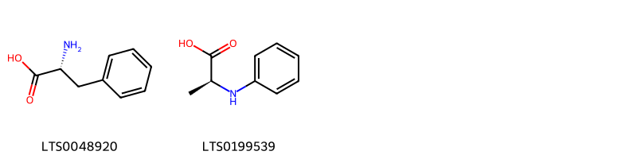{ width=100% }
    <figcaption>Hình ảnh cấu trúc hóa học của 2 hoạt chất thuộc nhóm Carboxylic acids and derivatives gồm ['d-phenylalanine (LTS0048920)', '(2s)-2-(phenylamino)propanoic acid (LTS0199539)'].</figcaption>
</figure>
#### Nhóm Dibenzylbutane lignans
<figure markdown="span">
    { width=100% }
    <figcaption>Hình ảnh cấu trúc hóa học của 2 hoạt chất thuộc nhóm Dibenzylbutane lignans gồm ['(2s,3r)-2,3-bis[(4-hydroxy-3-methoxyphenyl)(¹³c)methyl](1-¹³c)butane-1,4-diol (LTS0268699)', 'secoisolariciresinol (LTS0086727)'].</figcaption>
</figure>
#### Nhóm Flavonoids
<figure markdown="span">
    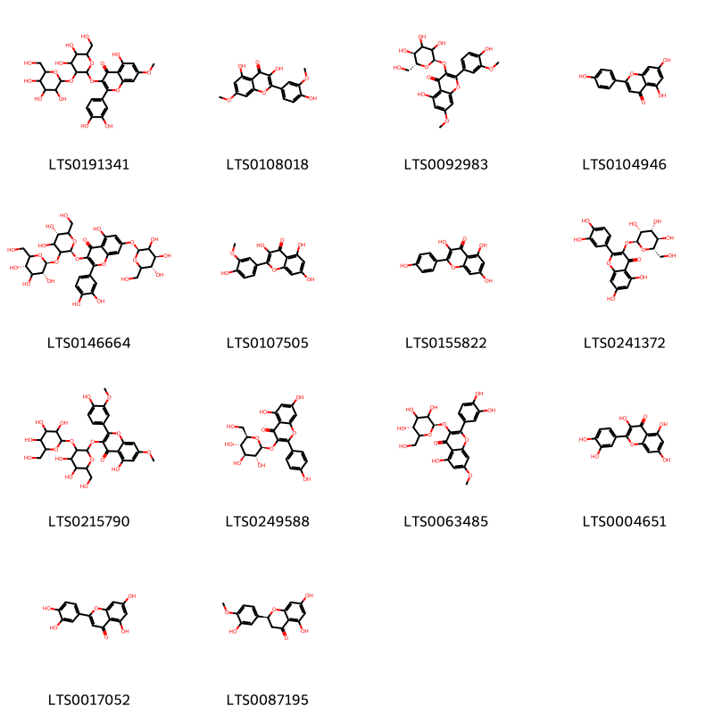{ width=100% }
    <figcaption>Hình ảnh cấu trúc hóa học của 14 hoạt chất thuộc nhóm Flavonoids gồm ['3-{[4,5-dihydroxy-6-(hydroxymethyl)-3-{[3,4,5-trihydroxy-6-(hydroxymethyl)oxan-2-yl]oxy}oxan-2-yl]oxy}-2-(3,4-dihydroxyphenyl)-5-hydroxy-7-methoxychromen-4-one (LTS0191341)', 'rhamnazin (LTS0108018)', 'rhamnazin 3-glucoside (LTS0092983)', 'chamomile (LTS0104946)', '3-{[(2s,5s)-4,5-dihydroxy-6-(hydroxymethyl)-3-{[(2s,3r,5s)-3,4,5-trihydroxy-6-(hydroxymethyl)oxan-2-yl]oxy}oxan-2-yl]oxy}-2-(3,4-dihydroxyphenyl)-5-hydroxy-7-{[(2s,4s,5s)-3,4,5-trihydroxy-6-(hydroxymethyl)oxan-2-yl]oxy}chromen-4-one (LTS0146664)', 'isorhamnetin (LTS0107505)', 'kaempherol (LTS0155822)', '2-(3,4-dihydroxyphenyl)-5,7-dihydroxy-3-{[(2s,3r,4r,5r,6s)-3,4,5-trihydroxy-6-(hydroxymethyl)oxan-2-yl]oxy}chromen-4-one (LTS0241372)', '3-{[4,5-dihydroxy-6-(hydroxymethyl)-3-{[3,4,5-trihydroxy-6-(hydroxymethyl)oxan-2-yl]oxy}oxan-2-yl]oxy}-5-hydroxy-2-(4-hydroxy-3-methoxyphenyl)-7-methoxychromen-4-one (LTS0215790)', 'astragalin (LTS0249588)', 'rhamnetin 3-glucoside (LTS0063485)', 'quercetin (LTS0004651)', 'luteolin (LTS0017052)', 'hesperetin (LTS0087195)'].</figcaption>
</figure>
#### Nhóm Furanoid lignans
<figure markdown="span">
    { width=100% }
    <figcaption>Hình ảnh cấu trúc hóa học của 1 hoạt chất thuộc nhóm Furanoid lignans gồm ['matairesinol (LTS0193475)'].</figcaption>
</figure>
#### Nhóm Isothiocyanates
<figure markdown="span">
    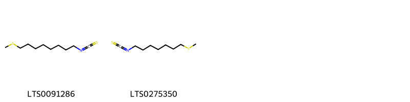{ width=100% }
    <figcaption>Hình ảnh cấu trúc hóa học của 2 hoạt chất thuộc nhóm Isothiocyanates gồm ['1-isothiocyanato-8-(methylsulfanyl)octane (LTS0091286)', '1-isothiocyanato-7-(methylsulfanyl)heptane (LTS0275350)'].</figcaption>
</figure>
#### Nhóm Prenol lipids
<figure markdown="span">
    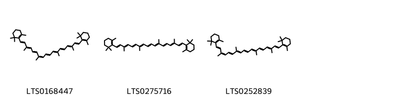{ width=100% }
    <figcaption>Hình ảnh cấu trúc hóa học của 3 hoạt chất thuộc nhóm Prenol lipids gồm ['β,β-carotene (LTS0168447)', 'β-carotene (LTS0275716)', '(9z)-β-carotene (LTS0252839)'].</figcaption>
</figure>

---

### Dược dân tộc học

Danh sách các quốc gia có sử dụng *Nasturtium officinale* trong điều trị các bệnh. 

| Country            | Disease                                                            | Bệnh                                                               |
|:-------------------|:-------------------------------------------------------------------|:-------------------------------------------------------------------|
| Africa             | Aphrodisiac                                                        | Thuốc kích dục                                                     |
| Dominican Republic | Diuretic, Expectorant                                              | Thuốc lợi tiểu, thuốc long đờm                                     |
| Elsewhere          | nan, Diuretic, Diuretic, Stimulant, Vermifuge                      | nan, lợi tiểu, lợi tiểu, chất kích thích, Vermifuge                |
| Haiti              | Apertif, Aphrodisiac, Cicatrizant, Cicatrizant, Expectorant, Tonic | Apertif, Aphrodisiac, Cicatrizant, Cicatrizant, Expectorant, Tonic |
| Iraq               | Vermifuge                                                          | Thuốc diệt sán                                                     |
| Turkey             | Diuretic, Expectorant, Stimulant, Apertif, Vermifuge               | Thuốc lợi tiểu, đờm, chất kích thích, Apertif, Vermifuge           |
| US                 | Abortifacient, Laxative                                            | Thuốc phá thai, nhuận tràng                                        |

---

# Chi Erophila

??? note "Danh sách các dược liệu thuộc chi"
    
	 - *Erophila verna*

---
## Erophila verna
### Thông tin về thực vật

!!! info "Phân loại thực vật của *N/A* từ GIBF:"
    - **Kingdom:** Plantae
    - **Phylum:** Tracheophyta
    - **Order:** Brassicales
    - **Family:** Brassicaceae
    - **Genus:** Draba
    - **Species:** *N/A*

 

| Label (VI)   | Label (EN)   | Scientific Name   | Descriptions (VI)   | Descriptions (EN)   | Also Known As (VI)   | Also Known As (EN)      |
|:-------------|:-------------|:------------------|:--------------------|:--------------------|:---------------------|:------------------------|
| N/A          | N/A          | Erophila verna    |                     | species of plant    | ['']                 | ['common whitlowgrass'] |

#### Phân bố trên thế giới

**Từ CSDL GIBF** Italy, Belgium, Israel, Canada, Ukraine, Denmark, Netherlands, Luxembourg, Korea, Republic of, Spain, Hungary, Russian Federation, United States of America, Sweden, Croatia, Germany, Switzerland, Mexico, France, Austria, United Kingdom of Great Britain and Northern Ireland, Ireland

#### Phân bố tại Việt Nam

**Từ CSDL GIBF**: Không có ghi nhận ở Việt Nam

---
### Thành phần hóa học
        
- Theo cơ sở dữ liệu lotus: Từ loài *N/A* đã phân lập và xác định được Chưa có hoạt chất nào được phân lập. hoạt chất thuộc về các nhóm Không có hoạt chất nào được phân lập. 

Không có hình ảnh nào được tạo ra

---

### Dược dân tộc học

Danh sách các quốc gia có sử dụng *N/A* trong điều trị các bệnh. 

| Country   | Disease               | Bệnh                   |
|:----------|:----------------------|:-----------------------|
| ain       | Astringent, Vulnerary | Tinh tế, dễ tổn thương |

---

# Chi Lobularia

??? note "Danh sách các dược liệu thuộc chi"
    
	 - *Lobularia maritima*

---
## Lobularia maritima
### Thông tin về thực vật

!!! info "Phân loại thực vật của *Lobularia maritima* từ GIBF:"
    - **Kingdom:** Plantae
    - **Phylum:** Tracheophyta
    - **Order:** Brassicales
    - **Family:** Brassicaceae
    - **Genus:** Lobularia
    - **Species:** *Lobularia maritima*

 

| Label (VI)   | Label (EN)   | Scientific Name    | Descriptions (VI)   | Descriptions (EN)   | Also Known As (VI)   | Also Known As (EN)   |
|:-------------|:-------------|:-------------------|:--------------------|:--------------------|:---------------------|:---------------------|
| N/A          | N/A          | Lobularia maritima |                     | species of plant    | ['']                 | ['']                 |

#### Phân bố trên thế giới

**Từ CSDL GIBF** Jersey, Ecuador, Netherlands, Italy, Australia, Belgium, Malta, Spain, New Zealand, Argentina, Portugal, Algeria, Switzerland, United States of America, France, Kenya, United Kingdom of Great Britain and Northern Ireland, Chile

#### Phân bố tại Việt Nam

**Từ CSDL GIBF**: Không có ghi nhận ở Việt Nam

---
### Thành phần hóa học
        
- Theo cơ sở dữ liệu lotus: Từ loài *Lobularia maritima* đã phân lập và xác định được 10 hoạt chất thuộc về các nhóm Flavonoids. 

|    | chemicalTaxonomyClassyfireClass   |   smiles_count |
|---:|:----------------------------------|---------------:|
|  0 | Flavonoids                        |             10 |

#### Nhóm Flavonoids
<figure markdown="span">
    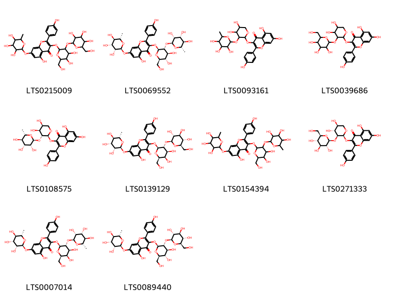{ width=100% }
    <figcaption>Hình ảnh cấu trúc hóa học của 10 hoạt chất thuộc nhóm Flavonoids gồm ['3-{[4,5-dihydroxy-6-(hydroxymethyl)-3-{[3,4,5-trihydroxy-6-(hydroxymethyl)oxan-2-yl]oxy}oxan-2-yl]oxy}-5-hydroxy-2-(4-hydroxyphenyl)-7-[(3,4,5-trihydroxy-6-methyloxan-2-yl)oxy]chromen-4-one (LTS0215009)', '3-{[(2s,3r,4s,5s,6r)-4,5-dihydroxy-6-(hydroxymethyl)-3-{[(2s,3r,4r,5r,6s)-3,4,5-trihydroxy-6-methyloxan-2-yl]oxy}oxan-2-yl]oxy}-5-hydroxy-2-(4-hydroxyphenyl)-7-{[(2s,3r,4r,5r,6s)-3,4,5-trihydroxy-6-methyloxan-2-yl]oxy}chromen-4-one (LTS0069552)', '3-({4,5-dihydroxy-3-[(3,4,5-trihydroxy-6-methyloxan-2-yl)oxy]oxan-2-yl}oxy)-5,7-dihydroxy-2-(4-hydroxyphenyl)chromen-4-one (LTS0093161)', '3-[(4,5-dihydroxy-3-{[3,4,5-trihydroxy-6-(hydroxymethyl)oxan-2-yl]oxy}oxan-2-yl)oxy]-5,7-dihydroxy-2-(4-hydroxyphenyl)chromen-4-one (LTS0039686)', '3-{[(2s,3r,4s,5s)-4,5-dihydroxy-3-{[(2s,3r,4r,5r,6s)-3,4,5-trihydroxy-6-methyloxan-2-yl]oxy}oxan-2-yl]oxy}-5,7-dihydroxy-2-(4-hydroxyphenyl)chromen-4-one (LTS0108575)', '3-{[(2s,3r,4s,5r,6r)-4,5-dihydroxy-6-(hydroxymethyl)-3-{[(2s,3r,4s,5s,6r)-3,4,5-trihydroxy-6-(hydroxymethyl)oxan-2-yl]oxy}oxan-2-yl]oxy}-5-hydroxy-2-(4-hydroxyphenyl)-7-{[(2s,3r,4r,5r,6s)-3,4,5-trihydroxy-6-methyloxan-2-yl]oxy}chromen-4-one (LTS0139129)', '3-{[4,5-dihydroxy-6-(hydroxymethyl)-3-[(3,4,5-trihydroxy-6-methyloxan-2-yl)oxy]oxan-2-yl]oxy}-5-hydroxy-2-(4-hydroxyphenyl)-7-[(3,4,5-trihydroxy-6-methyloxan-2-yl)oxy]chromen-4-one (LTS0154394)', '3-{[(2s,3s,4r,5s)-4,5-dihydroxy-3-{[(2s,3r,4s,5s,6r)-3,4,5-trihydroxy-6-(hydroxymethyl)oxan-2-yl]oxy}oxan-2-yl]oxy}-5,7-dihydroxy-2-(4-hydroxyphenyl)chromen-4-one (LTS0271333)', '3-{[(2s,3r,4s,5r,6r)-4,5-dihydroxy-6-(hydroxymethyl)-3-{[(2s,3r,4r,5r,6s)-3,4,5-trihydroxy-6-methyloxan-2-yl]oxy}oxan-2-yl]oxy}-5-hydroxy-2-(4-hydroxyphenyl)-7-{[(2s,3r,4r,5r,6s)-3,4,5-trihydroxy-6-methyloxan-2-yl]oxy}chromen-4-one (LTS0007014)', '3-{[(2s,3r,4s,5s,6r)-4,5-dihydroxy-6-(hydroxymethyl)-3-{[(2s,3r,4s,5s,6r)-3,4,5-trihydroxy-6-(hydroxymethyl)oxan-2-yl]oxy}oxan-2-yl]oxy}-5-hydroxy-2-(4-hydroxyphenyl)-7-{[(2s,3r,4r,5r,6s)-3,4,5-trihydroxy-6-methyloxan-2-yl]oxy}chromen-4-one (LTS0089440)'].</figcaption>
</figure>

---

### Dược dân tộc học

Danh sách các quốc gia có sử dụng *Lobularia maritima* trong điều trị các bệnh. 

| Country   | Disease   | Bệnh           |
|:----------|:----------|:---------------|
| ain       | Diuretic  | Thuốc lợi tiêu |

---

# Chi Sisymbrium

??? note "Danh sách các dược liệu thuộc chi"
    
	 - *Sisymbrium alliaria*
	 - *Sisymbrium altissimum*
	 - *Sisymbrium irio*
	 - *Sisymbrium officinale*
	 - *Sisymbrium sophia*

---
## Sisymbrium alliaria
### Thông tin về thực vật

!!! info "Phân loại thực vật của *Alliaria petiolata* từ GIBF:"
    - **Kingdom:** Plantae
    - **Phylum:** Tracheophyta
    - **Order:** Brassicales
    - **Family:** Brassicaceae
    - **Genus:** Alliaria
    - **Species:** *Alliaria petiolata*

 

| Label (VI)   | Label (EN)   | Scientific Name     | Descriptions (VI)   | Descriptions (EN)   | Also Known As (VI)   | Also Known As (EN)   |
|:-------------|:-------------|:--------------------|:--------------------|:--------------------|:---------------------|:---------------------|
| N/A          | N/A          | Sisymbrium alliaria |                     |                     | ['']                 | ['']                 |

#### Phân bố trên thế giới

**Từ CSDL GIBF** nan, Italy, Belgium, Estonia, Palestine, State of, unknown or invalid, Canada, Netherlands, Spain, Türkiye, Hungary, Russian Federation, United States of America, Sweden, Germany, Brazil, Switzerland, Austria, France, United Kingdom of Great Britain and Northern Ireland, Poland

#### Phân bố tại Việt Nam

**Từ CSDL GIBF**: Không có ghi nhận ở Việt Nam

---
### Thành phần hóa học
        
- Theo cơ sở dữ liệu lotus: Từ loài *Alliaria petiolata* đã phân lập và xác định được Chưa có hoạt chất nào được phân lập. hoạt chất thuộc về các nhóm Không có hoạt chất nào được phân lập. 

Không có hình ảnh nào được tạo ra

---

### Dược dân tộc học

Danh sách các quốc gia có sử dụng *Alliaria petiolata* trong điều trị các bệnh. 

| Country   | Disease                                                               | Bệnh                                                                                        |
|:----------|:----------------------------------------------------------------------|:--------------------------------------------------------------------------------------------|
| Elsewhere | Diaphoretic, Diuretic, Expectorant, Stimulant, Suppurative, Vermifuge | Thuốc lợi tiểu, thuốc lợi tiểu, thuốc long đờm, thuốc kích thích, thuốc bổ, thuốc diệt giun |

---

---
## Sisymbrium altissimum
### Thông tin về thực vật

!!! info "Phân loại thực vật của *Sisymbrium altissimum* từ GIBF:"
    - **Kingdom:** Plantae
    - **Phylum:** Tracheophyta
    - **Order:** Brassicales
    - **Family:** Brassicaceae
    - **Genus:** Sisymbrium
    - **Species:** *Sisymbrium altissimum*

 

| Label (VI)   | Label (EN)   | Scientific Name       | Descriptions (VI)   | Descriptions (EN)   | Also Known As (VI)   | Also Known As (EN)   |
|:-------------|:-------------|:----------------------|:--------------------|:--------------------|:---------------------|:---------------------|
| N/A          | N/A          | Sisymbrium altissimum | loài thực vật       | species of plant    | ['']                 | ['']                 |

#### Phân bố trên thế giới

**Từ CSDL GIBF** Ukraine, Denmark, Netherlands, Bulgaria, Lithuania, Belarus, Czechia, Germany, Belgium, Poland, Hungary, Russian Federation, United States of America, Sweden, Austria, Kazakhstan, Canada

#### Phân bố tại Việt Nam

**Từ CSDL GIBF**: Không có ghi nhận ở Việt Nam

---
### Thành phần hóa học
        
- Theo cơ sở dữ liệu lotus: Từ loài *Sisymbrium altissimum* đã phân lập và xác định được 2 hoạt chất thuộc về các nhóm Organooxygen compounds. 

|    | chemicalTaxonomyClassyfireClass   |   smiles_count |
|---:|:----------------------------------|---------------:|
|  0 | Organooxygen compounds            |              1 |

#### Nhóm Organooxygen compounds
<figure markdown="span">
    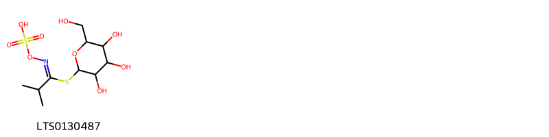{ width=100% }
    <figcaption>Hình ảnh cấu trúc hóa học của 1 hoạt chất thuộc nhóm Organooxygen compounds gồm ['[(2-methyl-1-{[3,4,5-trihydroxy-6-(hydroxymethyl)oxan-2-yl]sulfanyl}propylidene)amino]oxysulfonic acid (LTS0130487)'].</figcaption>
</figure>

---

### Dược dân tộc học

Danh sách các quốc gia có sử dụng *Sisymbrium altissimum* trong điều trị các bệnh. 

| Country   | Disease         | Bệnh             |
|:----------|:----------------|:-----------------|
| Elsewhere | Astringent, nan | Chất làm se, nan |

---

---
## Sisymbrium irio
### Thông tin về thực vật

!!! info "Phân loại thực vật của *Sisymbrium irio* từ GIBF:"
    - **Kingdom:** Plantae
    - **Phylum:** Tracheophyta
    - **Order:** Brassicales
    - **Family:** Brassicaceae
    - **Genus:** Sisymbrium
    - **Species:** *Sisymbrium irio*

 

| Label (VI)   | Label (EN)   | Scientific Name   | Descriptions (VI)   | Descriptions (EN)   | Also Known As (VI)   | Also Known As (EN)   |
|:-------------|:-------------|:------------------|:--------------------|:--------------------|:---------------------|:---------------------|
| N/A          | N/A          | Sisymbrium irio   | loài thực vật       | species of plant    | ['']                 | ['London rocket']    |

#### Phân bố trên thế giới

**Từ CSDL GIBF** United Arab Emirates, Israel, Netherlands, Malta, Spain, Algeria, Switzerland, United States of America, Mexico, France, Greece, United Kingdom of Great Britain and Northern Ireland

#### Phân bố tại Việt Nam

**Từ CSDL GIBF**: Không có ghi nhận ở Việt Nam

---
### Thành phần hóa học
        
- Theo cơ sở dữ liệu lotus: Từ loài *Sisymbrium irio* đã phân lập và xác định được 3 hoạt chất thuộc về các nhóm Organooxygen compounds, Steroids and steroid derivatives. 

|    | chemicalTaxonomyClassyfireClass   |   smiles_count |
|---:|:----------------------------------|---------------:|
|  0 | Organooxygen compounds            |              1 |
|  1 | Steroids and steroid derivatives  |              1 |

#### Nhóm Organooxygen compounds
<figure markdown="span">
    { width=100% }
    <figcaption>Hình ảnh cấu trúc hóa học của 1 hoạt chất thuộc nhóm Organooxygen compounds gồm ['[(2-methyl-1-{[3,4,5-trihydroxy-6-(hydroxymethyl)oxan-2-yl]sulfanyl}propylidene)amino]oxysulfonic acid (LTS0130487)'].</figcaption>
</figure>
#### Nhóm Steroids and steroid derivatives
<figure markdown="span">
    { width=100% }
    <figcaption>Hình ảnh cấu trúc hóa học của 1 hoạt chất thuộc nhóm Steroids and steroid derivatives gồm ['24-methylenecholesterol (LTS0016921)'].</figcaption>
</figure>

---

### Dược dân tộc học

Danh sách các quốc gia có sử dụng *Sisymbrium irio* trong điều trị các bệnh. 

| Country      | Disease                  | Bệnh                  |
|:-------------|:-------------------------|:----------------------|
| Elsewhere    | Rubefacient, Expectorant | Rubefacient, long đờm |
| Mexico(Seri) | Collyrium                | Collyrium             |

---

---
## Sisymbrium officinale
### Thông tin về thực vật

!!! info "Phân loại thực vật của *Sisymbrium officinale* từ GIBF:"
    - **Kingdom:** Plantae
    - **Phylum:** Tracheophyta
    - **Order:** Brassicales
    - **Family:** Brassicaceae
    - **Genus:** Sisymbrium
    - **Species:** *Sisymbrium officinale*

 

| Label (VI)   | Label (EN)   | Scientific Name       | Descriptions (VI)   | Descriptions (EN)   | Also Known As (VI)   | Also Known As (EN)   |
|:-------------|:-------------|:----------------------|:--------------------|:--------------------|:---------------------|:---------------------|
| N/A          | N/A          | Sisymbrium officinale | loài thực vật       | species of plant    | ['']                 | ['Hedge mustard']    |

#### Phân bố trên thế giới

**Từ CSDL GIBF** Italy, Australia, Belgium, Canada, Denmark, Netherlands, Spain, Portugal, Russian Federation, Morocco, United States of America, Sweden, Greece, Czechia, Germany, Switzerland, France, United Kingdom of Great Britain and Northern Ireland, Jersey, New Zealand

#### Phân bố tại Việt Nam

**Từ CSDL GIBF**: Không có ghi nhận ở Việt Nam

---
### Thành phần hóa học
        
- Theo cơ sở dữ liệu lotus: Từ loài *Sisymbrium officinale* đã phân lập và xác định được 4 hoạt chất thuộc về các nhóm Organooxygen compounds. 

|    | chemicalTaxonomyClassyfireClass   |   smiles_count |
|---:|:----------------------------------|---------------:|
|  0 | Organooxygen compounds            |              3 |

#### Nhóm Organooxygen compounds
<figure markdown="span">
    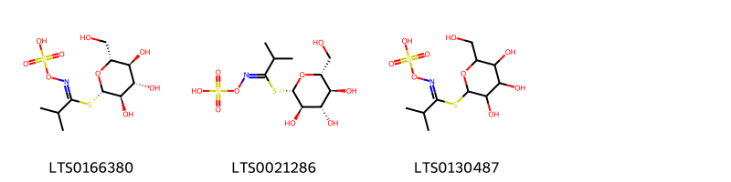{ width=100% }
    <figcaption>Hình ảnh cấu trúc hóa học của 3 hoạt chất thuộc nhóm Organooxygen compounds gồm ['[(2-methyl-1-{[(2s,3r,4s,5s,6r)-3,4,5-trihydroxy-6-(hydroxymethyl)oxan-2-yl]sulfanyl}propylidene)amino]oxysulfonic acid (LTS0166380)', '[(z)-(2-methyl-1-{[(2s,3r,4s,5s,6r)-3,4,5-trihydroxy-6-(hydroxymethyl)oxan-2-yl]sulfanyl}propylidene)amino]oxysulfonic acid (LTS0021286)', '[(2-methyl-1-{[3,4,5-trihydroxy-6-(hydroxymethyl)oxan-2-yl]sulfanyl}propylidene)amino]oxysulfonic acid (LTS0130487)'].</figcaption>
</figure>

---

### Dược dân tộc học

Danh sách các quốc gia có sử dụng *Sisymbrium officinale* trong điều trị các bệnh. 

| Country   | Disease                                                               | Bệnh                                                              |
|:----------|:----------------------------------------------------------------------|:------------------------------------------------------------------|
| Iraq      | Litholytic                                                            | Litholytic                                                        |
| Turkey    | Astringent, Cardiotonic, Diuretic, Expectorant, Litholytic, Stimulant | Chất làm se, Cardiotonic, lợi tiểu, đờm, tán sỏi, chất kích thích |

---

---
## Sisymbrium sophia
### Thông tin về thực vật

!!! info "Phân loại thực vật của *Sisymbrium sophia* từ GIBF:"
    - **Kingdom:** Plantae
    - **Phylum:** Tracheophyta
    - **Order:** Brassicales
    - **Family:** Brassicaceae
    - **Genus:** Sisymbrium
    - **Species:** *Sisymbrium sophia*

 

| Label (VI)   | Label (EN)   | Scientific Name   | Descriptions (VI)   | Descriptions (EN)   | Also Known As (VI)   | Also Known As (EN)   |
|:-------------|:-------------|:------------------|:--------------------|:--------------------|:---------------------|:---------------------|
| N/A          | N/A          | Sisymbrium sophia |                     |                     | ['']                 | ['']                 |

#### Phân bố trên thế giới

**Từ CSDL GIBF** nan, Netherlands, Italy, Germany, United Kingdom of Great Britain and Northern Ireland, Korea, Republic of, Colombia, Spain, Poland, Hungary, Switzerland, Russian Federation, United States of America, Sweden, Finland, France, China, Austria

#### Phân bố tại Việt Nam

**Từ CSDL GIBF**: Không có ghi nhận ở Việt Nam

---
### Thành phần hóa học
        
- Theo cơ sở dữ liệu lotus: Từ loài *Sisymbrium sophia* đã phân lập và xác định được Chưa có hoạt chất nào được phân lập. hoạt chất thuộc về các nhóm Không có hoạt chất nào được phân lập. 

Không có hình ảnh nào được tạo ra

---

### Dược dân tộc học

Danh sách các quốc gia có sử dụng *Sisymbrium sophia* trong điều trị các bệnh. 

| Country   | Disease   | Bệnh                 |
|:----------|:----------|:---------------------|
| French    | Vermifuge | Thuốc diệt sán       |
| anish     | Demulcent | dịu, giảm kích thích |

---

# Chi Iberis

??? note "Danh sách các dược liệu thuộc chi"
    
	 - *Iberis amara*

---
## Iberis amara
### Thông tin về thực vật

!!! info "Phân loại thực vật của *Iberis amara* từ GIBF:"
    - **Kingdom:** Plantae
    - **Phylum:** Tracheophyta
    - **Order:** Brassicales
    - **Family:** Brassicaceae
    - **Genus:** Iberis
    - **Species:** *Iberis amara*

 

| Label (VI)   | Label (EN)   | Scientific Name   | Descriptions (VI)   | Descriptions (EN)   | Also Known As (VI)   | Also Known As (EN)   |
|:-------------|:-------------|:------------------|:--------------------|:--------------------|:---------------------|:---------------------|
| N/A          | N/A          | Iberis amara      | loài thực vật       | species of plant    | ['']                 | ['']                 |

#### Phân bố trên thế giới

**Từ CSDL GIBF** Denmark, Netherlands, Italy, Belarus, Luxembourg, Germany, Czechia, Estonia, Spain, Portugal, Switzerland, United States of America, Sweden, Austria, France, Norway, United Kingdom of Great Britain and Northern Ireland

#### Phân bố tại Việt Nam

**Từ CSDL GIBF**: Không có ghi nhận ở Việt Nam

---
### Thành phần hóa học
        
- Theo cơ sở dữ liệu lotus: Từ loài *Iberis amara* đã phân lập và xác định được 14 hoạt chất thuộc về các nhóm Thioethers, Organooxygen compounds, Steroids and steroid derivatives, Sulfoxides. 

|    | chemicalTaxonomyClassyfireClass   |   smiles_count |
|---:|:----------------------------------|---------------:|
|  0 | Organooxygen compounds            |              3 |
|  1 | Steroids and steroid derivatives  |              8 |
|  2 | Sulfoxides                        |              2 |
|  3 | Thioethers                        |              1 |

#### Nhóm Organooxygen compounds
<figure markdown="span">
    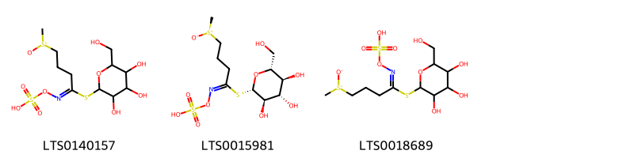{ width=100% }
    <figcaption>Hình ảnh cấu trúc hóa học của 3 hoạt chất thuộc nhóm Organooxygen compounds gồm ['[(e)-(4-methanesulfinyl-1-{[3,4,5-trihydroxy-6-(hydroxymethyl)oxan-2-yl]sulfanyl}butylidene)amino]oxysulfonic acid (LTS0140157)', '[(z)-{4-[(s)-methanesulfinyl]-1-{[(2s,3r,4s,5s,6r)-3,4,5-trihydroxy-6-(hydroxymethyl)oxan-2-yl]sulfanyl}butylidene}amino]oxysulfonic acid (LTS0015981)', '[(4-methanesulfinyl-1-{[3,4,5-trihydroxy-6-(hydroxymethyl)oxan-2-yl]sulfanyl}butylidene)amino]oxysulfonic acid (LTS0018689)'].</figcaption>
</figure>
#### Nhóm Steroids and steroid derivatives
<figure markdown="span">
    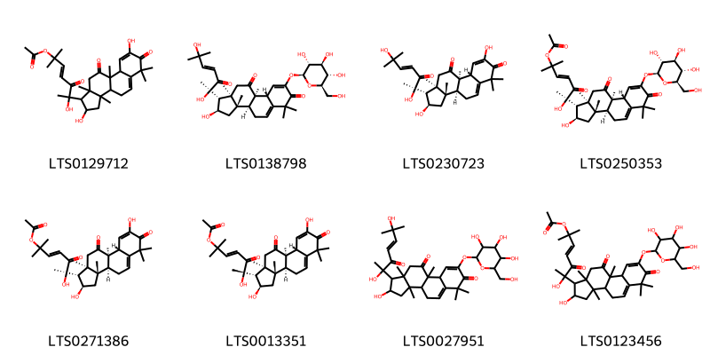{ width=100% }
    <figcaption>Hình ảnh cấu trúc hóa học của 8 hoạt chất thuộc nhóm Steroids and steroid derivatives gồm ['6-{2,8-dihydroxy-3a,6,6,9b,11a-pentamethyl-7,10-dioxo-1h,2h,3h,3bh,4h,9ah,11h-cyclopenta[a]phenanthren-1-yl}-6-hydroxy-2-methyl-5-oxohept-3-en-2-yl acetate (LTS0129712)', '(1r,2r,3as,3bs,9ar,9br,11ar)-1-[(2r,4e)-2,6-dihydroxy-6-methyl-3-oxohept-4-en-2-yl]-2-hydroxy-3a,6,6,9b,11a-pentamethyl-8-{[(2s,3r,4s,5s,6r)-3,4,5-trihydroxy-6-(hydroxymethyl)oxan-2-yl]oxy}-1h,2h,3h,3bh,4h,9ah,11h-cyclopenta[a]phenanthrene-7,10-dione (LTS0138798)', 'cucurbitacin (LTS0230723)', 'colocynthin (LTS0250353)', 'α-elaterin (LTS0271386)', '(3e,6s)-6-[(1r,2r,3as,3bs,9ar,9br,11ar)-2,8-dihydroxy-3a,6,6,9b,11a-pentamethyl-7,10-dioxo-1h,2h,3h,3bh,4h,9ah,11h-cyclopenta[a]phenanthren-1-yl]-6-hydroxy-2-methyl-5-oxohept-3-en-2-yl acetate (LTS0013351)', '1-(2,6-dihydroxy-6-methyl-3-oxohept-4-en-2-yl)-2-hydroxy-3a,6,6,9b,11a-pentamethyl-8-{[3,4,5-trihydroxy-6-(hydroxymethyl)oxan-2-yl]oxy}-1h,2h,3h,3bh,4h,9ah,11h-cyclopenta[a]phenanthrene-7,10-dione (LTS0027951)', '6-hydroxy-6-(2-hydroxy-3a,6,6,9b,11a-pentamethyl-7,10-dioxo-8-{[3,4,5-trihydroxy-6-(hydroxymethyl)oxan-2-yl]oxy}-1h,2h,3h,3bh,4h,9ah,11h-cyclopenta[a]phenanthren-1-yl)-2-methyl-5-oxohept-3-en-2-yl acetate (LTS0123456)'].</figcaption>
</figure>
#### Nhóm Sulfoxides
<figure markdown="span">
    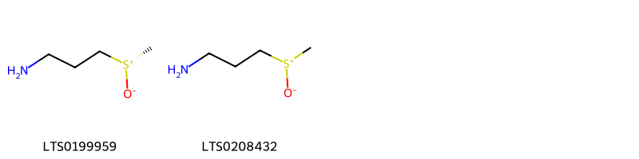{ width=100% }
    <figcaption>Hình ảnh cấu trúc hóa học của 2 hoạt chất thuộc nhóm Sulfoxides gồm ['3-[(s)-methanesulfinyl]propan-1-amine (LTS0199959)', '3-methanesulfinylpropan-1-amine (LTS0208432)'].</figcaption>
</figure>
#### Nhóm Thioethers
<figure markdown="span">
    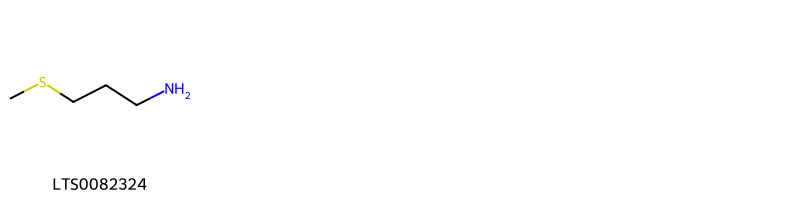{ width=100% }
    <figcaption>Hình ảnh cấu trúc hóa học của 1 hoạt chất thuộc nhóm Thioethers gồm ['3-methylthiopropylamine (LTS0082324)'].</figcaption>
</figure>

---

### Dược dân tộc học

Danh sách các quốc gia có sử dụng *Iberis amara* trong điều trị các bệnh. 

| Country   | Disease                      | Bệnh                         |
|:----------|:-----------------------------|:-----------------------------|
| Elsewhere | Antirheumatic, Antiscorbutic | Antirheumatic, Antiscorbutic |
| English   | Expectorant                  | Thuốc long đàm               |
| anish     | Cardiotonic                  | Tim mạch                     |

---

# Chi Cardamine

??? note "Danh sách các dược liệu thuộc chi"
    
	 - *Cardamine amara*
	 - *Cardamine impatiens*
	 - *Cardamine pratensis*

---
## Cardamine amara
### Thông tin về thực vật

!!! info "Phân loại thực vật của *Cardamine amara* từ GIBF:"
    - **Kingdom:** Plantae
    - **Phylum:** Tracheophyta
    - **Order:** Brassicales
    - **Family:** Brassicaceae
    - **Genus:** Cardamine
    - **Species:** *Cardamine amara*

 

| Label (VI)   | Label (EN)   | Scientific Name   | Descriptions (VI)   | Descriptions (EN)   | Also Known As (VI)   | Also Known As (EN)   |
|:-------------|:-------------|:------------------|:--------------------|:--------------------|:---------------------|:---------------------|
| N/A          | N/A          | Cardamine amara   | loài thực vật       | species of plant    | ['']                 | ['']                 |

#### Phân bố trên thế giới

**Từ CSDL GIBF** nan, Italy, Slovakia, Belgium, Norway, Ukraine, Denmark, Netherlands, Lithuania, Belarus, Spain, Hungary, Russian Federation, Sweden, Finland, Slovenia, Croatia, Czechia, Germany, Switzerland, Austria, United Kingdom of Great Britain and Northern Ireland, Poland

#### Phân bố tại Việt Nam

**Từ CSDL GIBF**: Không có ghi nhận ở Việt Nam

---
### Thành phần hóa học
        
- Theo cơ sở dữ liệu lotus: Từ loài *Cardamine amara* đã phân lập và xác định được 2 hoạt chất thuộc về các nhóm Isothiocyanates. 

|    | chemicalTaxonomyClassyfireClass   |   smiles_count |
|---:|:----------------------------------|---------------:|
|  0 | Isothiocyanates                   |              2 |

#### Nhóm Isothiocyanates
<figure markdown="span">
    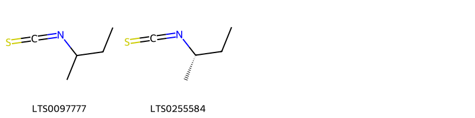{ width=100% }
    <figcaption>Hình ảnh cấu trúc hóa học của 2 hoạt chất thuộc nhóm Isothiocyanates gồm ['2-butyl isothiocyanate (LTS0097777)', '(2s)-2-isothiocyanatobutane (LTS0255584)'].</figcaption>
</figure>

---

### Dược dân tộc học

Danh sách các quốc gia có sử dụng *Cardamine amara* trong điều trị các bệnh. 

| Country   | Disease   | Bệnh           |
|:----------|:----------|:---------------|
| US        | Diuretic  | Thuốc lợi tiêu |

---

---
## Cardamine impatiens
### Thông tin về thực vật

!!! info "Phân loại thực vật của *Cardamine impatiens* từ GIBF:"
    - **Kingdom:** Plantae
    - **Phylum:** Tracheophyta
    - **Order:** Brassicales
    - **Family:** Brassicaceae
    - **Genus:** Cardamine
    - **Species:** *Cardamine impatiens*

 

| Label (VI)   | Label (EN)   | Scientific Name     | Descriptions (VI)   | Descriptions (EN)   | Also Known As (VI)   | Also Known As (EN)   |
|:-------------|:-------------|:--------------------|:--------------------|:--------------------|:---------------------|:---------------------|
| N/A          | N/A          | Cardamine impatiens | loài thực vật       | species of plant    | ['']                 | ['']                 |

#### Phân bố trên thế giới

**Từ CSDL GIBF** Italy, Japan, Slovakia, Belgium, Norway, Canada, Ukraine, Netherlands, Lithuania, Luxembourg, Chinese Taipei, Spain, Hungary, Russian Federation, United States of America, Sweden, Czechia, Germany, Switzerland, Austria, France, China, Poland

#### Phân bố tại Việt Nam

**Từ CSDL GIBF**: Không có ghi nhận ở Việt Nam

---
### Thành phần hóa học
        
- Theo cơ sở dữ liệu lotus: Từ loài *Cardamine impatiens* đã phân lập và xác định được Chưa có hoạt chất nào được phân lập. hoạt chất thuộc về các nhóm Không có hoạt chất nào được phân lập. 

Không có hình ảnh nào được tạo ra

---

### Dược dân tộc học

Danh sách các quốc gia có sử dụng *Cardamine impatiens* trong điều trị các bệnh. 

| Country   | Disease             | Bệnh                             |
|:----------|:--------------------|:---------------------------------|
| Elsewhere | Diuretic, Stimulant | Thuốc lợi tiểu, thuốc kích thích |

---

---
## Cardamine pratensis
### Thông tin về thực vật

!!! info "Phân loại thực vật của *Cardamine pratensis* từ GIBF:"
    - **Kingdom:** Plantae
    - **Phylum:** Tracheophyta
    - **Order:** Brassicales
    - **Family:** Brassicaceae
    - **Genus:** Cardamine
    - **Species:** *Cardamine pratensis*

 

| Label (VI)   | Label (EN)   | Scientific Name     | Descriptions (VI)   | Descriptions (EN)   | Also Known As (VI)   | Also Known As (EN)                                         |
|:-------------|:-------------|:--------------------|:--------------------|:--------------------|:---------------------|:-----------------------------------------------------------|
| N/A          | N/A          | Cardamine pratensis | loài thực vật       | species of plant    | ['']                 | ['cuckooflower', "lady's smock", 'mayflower', 'milkmaids'] |

#### Phân bố trên thế giới

**Từ CSDL GIBF** Denmark, Netherlands, Luxembourg, Germany, Slovakia, Belgium, Czechia, Spain, Ireland, Hungary, Switzerland, Sweden, Austria, France, Croatia, Norway, United Kingdom of Great Britain and Northern Ireland

#### Phân bố tại Việt Nam

**Từ CSDL GIBF**: Không có ghi nhận ở Việt Nam

---
### Thành phần hóa học
        
- Theo cơ sở dữ liệu lotus: Từ loài *Cardamine pratensis* đã phân lập và xác định được Chưa có hoạt chất nào được phân lập. hoạt chất thuộc về các nhóm Không có hoạt chất nào được phân lập. 

Không có hình ảnh nào được tạo ra

---

### Dược dân tộc học

Danh sách các quốc gia có sử dụng *Cardamine pratensis* trong điều trị các bệnh. 

| Country   | Disease                          | Bệnh                                             |
|:----------|:---------------------------------|:-------------------------------------------------|
| Elsewhere | Diuretic, Stimulant, Diaphoretic | Thuốc lợi tiểu, thuốc kích thích, thuốc lợi tiểu |
| Turkey    | Diuretic                         | Thuốc lợi tiêu                                   |

---

# Chi Cochlearia

??? note "Danh sách các dược liệu thuộc chi"
    
	 - *Cochlearia armoracia*
	 - *Cochlearia officinalis*

---
## Cochlearia armoracia
### Thông tin về thực vật

!!! info "Phân loại thực vật của *N/A* từ GIBF:"
    - **Kingdom:** Plantae
    - **Phylum:** Tracheophyta
    - **Order:** Brassicales
    - **Family:** Brassicaceae
    - **Genus:** N/A
    - **Species:** *N/A*

 

| Label (VI)   | Label (EN)   | Scientific Name      | Descriptions (VI)   | Descriptions (EN)   | Also Known As (VI)   | Also Known As (EN)   |
|:-------------|:-------------|:---------------------|:--------------------|:--------------------|:---------------------|:---------------------|
| N/A          | N/A          | Cochlearia armoracia | loài thực vật       | species of plant    | ['']                 | ['']                 |

#### Phân bố trên thế giới

**Từ CSDL GIBF** nan, Italy, Australia, Argentina, Gibraltar, Israel, Canada, Ukraine, Denmark, Netherlands, Luxembourg, Chinese Taipei, Spain, Portugal, Russian Federation, Morocco, United States of America, Uruguay, Croatia, South Africa, Czechia, Germany, Switzerland, Austria, France, Mexico, United Kingdom of Great Britain and Northern Ireland, Jersey, Ireland, Poland, New Zealand

#### Phân bố tại Việt Nam

**Từ CSDL GIBF**: Không có ghi nhận ở Việt Nam

---
### Thành phần hóa học
        
- Theo cơ sở dữ liệu lotus: Từ loài *N/A* đã phân lập và xác định được Chưa có hoạt chất nào được phân lập. hoạt chất thuộc về các nhóm Không có hoạt chất nào được phân lập. 

Không có hình ảnh nào được tạo ra

---

### Dược dân tộc học

Danh sách các quốc gia có sử dụng *N/A* trong điều trị các bệnh. 

| Country   | Disease            | Bệnh                     |
|:----------|:-------------------|:-------------------------|
| Elsewhere | Stimulant, Apertif | Chất kích thích, Apertif |

---

---
## Cochlearia officinalis
### Thông tin về thực vật

!!! info "Phân loại thực vật của *Cochlearia officinalis* từ GIBF:"
    - **Kingdom:** Plantae
    - **Phylum:** Tracheophyta
    - **Order:** Brassicales
    - **Family:** Brassicaceae
    - **Genus:** Cochlearia
    - **Species:** *Cochlearia officinalis*

 

| Label (VI)   | Label (EN)   | Scientific Name        | Descriptions (VI)   | Descriptions (EN)           | Also Known As (VI)   | Also Known As (EN)                                  |
|:-------------|:-------------|:-----------------------|:--------------------|:----------------------------|:---------------------|:----------------------------------------------------|
| N/A          | N/A          | Cochlearia officinalis | loài thực vật       | species of plant, spoonbill | ['']                 | ['Common Scurvygrass', 'scurvy-grass', 'spoonwort'] |

#### Phân bố trên thế giới

**Từ CSDL GIBF** Denmark, Netherlands, Germany, Iceland, Ireland, Sweden, France, Guernsey, Norway, United Kingdom of Great Britain and Northern Ireland

#### Phân bố tại Việt Nam

**Từ CSDL GIBF**: Không có ghi nhận ở Việt Nam

---
### Thành phần hóa học
        
- Theo cơ sở dữ liệu lotus: Từ loài *Cochlearia officinalis* đã phân lập và xác định được 2 hoạt chất thuộc về các nhóm Isothiocyanates. 

|    | chemicalTaxonomyClassyfireClass   |   smiles_count |
|---:|:----------------------------------|---------------:|
|  0 | Isothiocyanates                   |              2 |

#### Nhóm Isothiocyanates
<figure markdown="span">
    { width=100% }
    <figcaption>Hình ảnh cấu trúc hóa học của 2 hoạt chất thuộc nhóm Isothiocyanates gồm ['2-butyl isothiocyanate (LTS0097777)', '(2s)-2-isothiocyanatobutane (LTS0255584)'].</figcaption>
</figure>

---

### Dược dân tộc học

Danh sách các quốc gia có sử dụng *Cochlearia officinalis* trong điều trị các bệnh. 

| Country   | Disease                                               | Bệnh                                                 |
|:----------|:------------------------------------------------------|:-----------------------------------------------------|
| Haiti     | Stimulant, Diuretic                                   | Chất kích thích, lợi tiểu                            |
| Turkey    | Discutient, Diuretic, Stimulant, Antiseptic, Aperient | Discutient, Diuretic, Stimulant, Khử trùng, Aperient |

---

# Chi Thlai

??? note "Danh sách các dược liệu thuộc chi"
    
	 - *Thlai arvense*

---
## Thlai arvense
### Thông tin về thực vật

!!! info "Phân loại thực vật của *N/A* từ GIBF:"
    - **Kingdom:** N/A
    - **Phylum:** N/A
    - **Order:** N/A
    - **Family:** N/A
    - **Genus:** N/A
    - **Species:** *N/A*

 

| Label (VI)   | Label (EN)   | Scientific Name        | Descriptions (VI)   | Descriptions (EN)           | Also Known As (VI)   | Also Known As (EN)                                  |
|:-------------|:-------------|:-----------------------|:--------------------|:----------------------------|:---------------------|:----------------------------------------------------|
| N/A          | N/A          | Cochlearia officinalis | loài thực vật       | species of plant, spoonbill | ['']                 | ['Common Scurvygrass', 'scurvy-grass', 'spoonwort'] |

#### Phân bố trên thế giới

**Từ CSDL GIBF** Không có kết quả phù hợp

#### Phân bố tại Việt Nam

**Từ CSDL GIBF**: Không có ghi nhận ở Việt Nam

---
### Thành phần hóa học
        
- Theo cơ sở dữ liệu lotus: Từ loài *N/A* đã phân lập và xác định được Chưa có hoạt chất nào được phân lập. hoạt chất thuộc về các nhóm Không có hoạt chất nào được phân lập. 

Không có hình ảnh nào được tạo ra

---

### Dược dân tộc học

Danh sách các quốc gia có sử dụng *N/A* trong điều trị các bệnh. 

| Country   | Disease                                 | Bệnh                                             |
|:----------|:----------------------------------------|:-------------------------------------------------|
| China     | Tonic                                   | (thuộc) trương lực                               |
| Elsewhere | Astringent, Diuretic, Poison, Stimulant | Chất làm se, lợi tiểu, chất độc, chất kích thích |
| Eurasia   | Diuretic                                | Thuốc lợi tiêu                                   |

---

# Chi Isatis

??? note "Danh sách các dược liệu thuộc chi"
    
	 - *Isatis oblongata*
	 - *Isatis tinctoria*

---
## Isatis oblongata
### Thông tin về thực vật

!!! info "Phân loại thực vật của *Isatis tinctoria* từ GIBF:"
    - **Kingdom:** Plantae
    - **Phylum:** Tracheophyta
    - **Order:** Brassicales
    - **Family:** Brassicaceae
    - **Genus:** Isatis
    - **Species:** *Isatis tinctoria*

 

| Label (VI)   | Label (EN)   | Scientific Name   | Descriptions (VI)   | Descriptions (EN)   | Also Known As (VI)   | Also Known As (EN)   |
|:-------------|:-------------|:------------------|:--------------------|:--------------------|:---------------------|:---------------------|
| N/A          | N/A          | Isatis oblongata  | loài thực vật       | species of plant    | ['']                 | ['']                 |

#### Phân bố trên thế giới

**Từ CSDL GIBF** China, Russian Federation, Mongolia

#### Phân bố tại Việt Nam

**Từ CSDL GIBF**: Không có ghi nhận ở Việt Nam

---
### Thành phần hóa học
        
- Theo cơ sở dữ liệu lotus: Từ loài *Isatis tinctoria* đã phân lập và xác định được Chưa có hoạt chất nào được phân lập. hoạt chất thuộc về các nhóm Không có hoạt chất nào được phân lập. 

Không có hình ảnh nào được tạo ra

---

### Dược dân tộc học

Danh sách các quốc gia có sử dụng *Isatis tinctoria* trong điều trị các bệnh. 

| Country   | Disease                  | Bệnh                                 |
|:----------|:-------------------------|:-------------------------------------|
| China     | Antidote, Antiphlogistic | Thuốc giải độc, Thuốc chống đông máu |

---

---
## Isatis tinctoria
### Thông tin về thực vật

!!! info "Phân loại thực vật của *Isatis tinctoria* từ GIBF:"
    - **Kingdom:** Plantae
    - **Phylum:** Tracheophyta
    - **Order:** Brassicales
    - **Family:** Brassicaceae
    - **Genus:** Isatis
    - **Species:** *Isatis tinctoria*

 

| Label (VI)   | Label (EN)   | Scientific Name   | Descriptions (VI)   | Descriptions (EN)   | Also Known As (VI)   | Also Known As (EN)                                                           |
|:-------------|:-------------|:------------------|:--------------------|:--------------------|:---------------------|:-----------------------------------------------------------------------------|
| N/A          | N/A          | Isatis tinctoria  | loài thực vật       | species of plant    | ['']                 | ['woad', 'Asp of Jerusalem', "dyer's woad", 'glastum', 'Istasis indigotica'] |

#### Phân bố trên thế giới

**Từ CSDL GIBF** nan, Finland, Netherlands, Italy, Montenegro, Czechia, Germany, Belgium, Luxembourg, Georgia, Spain, Portugal, Switzerland, Morocco, United States of America, Austria, France, Kazakhstan

#### Phân bố tại Việt Nam

**Từ CSDL GIBF**: Không có ghi nhận ở Việt Nam

---
### Thành phần hóa học
        
- Theo cơ sở dữ liệu lotus: Từ loài *Isatis tinctoria* đã phân lập và xác định được 201 hoạt chất thuộc về các nhóm Azoles, Stilbenes, Phenols, Carboxylic acids and derivatives, Anthracenes, Benzodiazepines, Fatty Acyls, Indoles and derivatives, Pyrimidine nucleosides, Cinnamic acids and derivatives, Diazanaphthalenes, Saturated hydrocarbons, Tannins, Tetrapyrroles and derivatives, Glycerolipids, Prenol lipids, Linear 1,3-diarylpropanoids, Quinolines and derivatives, Azolidines, Purine nucleosides, Benzene and substituted derivatives, Organooxygen compounds, Furanoid lignans, Flavonoids, Phenylpropanoic acids, Imidazopyrimidines. 

|    | chemicalTaxonomyClassyfireClass     |   smiles_count |
|---:|:------------------------------------|---------------:|
|  0 |                                     |              1 |
|  1 | Anthracenes                         |              3 |
|  2 | Azoles                              |              1 |
|  3 | Azolidines                          |              1 |
|  4 | Benzene and substituted derivatives |             12 |
|  5 | Benzodiazepines                     |              2 |
|  6 | Carboxylic acids and derivatives    |              2 |
|  7 | Cinnamic acids and derivatives      |              6 |
|  8 | Diazanaphthalenes                   |              7 |
|  9 | Fatty Acyls                         |             34 |
| 10 | Flavonoids                          |             14 |
| 11 | Furanoid lignans                    |              4 |
| 12 | Glycerolipids                       |              2 |
| 13 | Imidazopyrimidines                  |              1 |
| 14 | Indoles and derivatives             |             36 |
| 15 | Linear 1,3-diarylpropanoids         |              1 |
| 16 | Organooxygen compounds              |             40 |
| 17 | Phenols                             |              6 |
| 18 | Phenylpropanoic acids               |              2 |
| 19 | Prenol lipids                       |              8 |
| 20 | Purine nucleosides                  |              2 |
| 21 | Pyrimidine nucleosides              |              2 |
| 22 | Quinolines and derivatives          |              4 |
| 23 | Saturated hydrocarbons              |              1 |
| 24 | Stilbenes                           |              1 |
| 25 | Tannins                             |              1 |
| 26 | Tetrapyrroles and derivatives       |              4 |

#### Nhóm 
<figure markdown="span">
    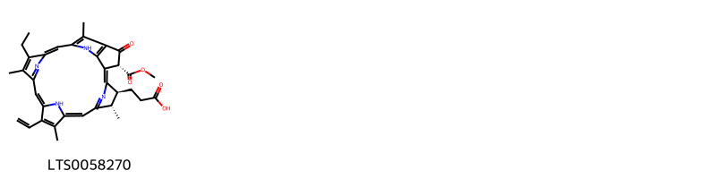{ width=100% }
    <figcaption>Hình ảnh cấu trúc hóa học của 1 hoạt chất thuộc nhóm  gồm ['pheophorbide a (LTS0058270)'].</figcaption>
</figure>
#### Nhóm Anthracenes
<figure markdown="span">
    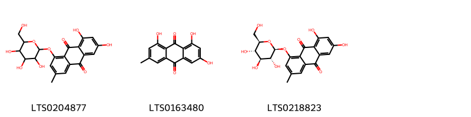{ width=100% }
    <figcaption>Hình ảnh cấu trúc hóa học của 3 hoạt chất thuộc nhóm Anthracenes gồm ['1,3-dihydroxy-6-methyl-8-{[3,4,5-trihydroxy-6-(hydroxymethyl)oxan-2-yl]oxy}anthracene-9,10-dione (LTS0204877)', 'emodin (LTS0163480)', 'emodin 1-o-β-d-glucoside (LTS0218823)'].</figcaption>
</figure>
#### Nhóm Azoles
<figure markdown="span">
    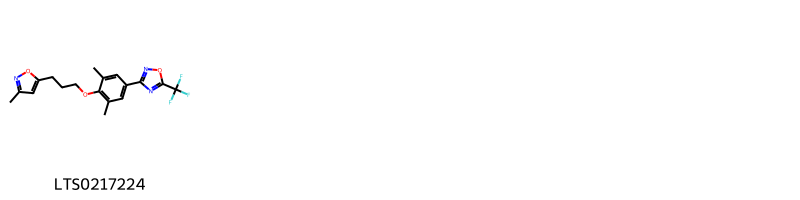{ width=100% }
    <figcaption>Hình ảnh cấu trúc hóa học của 1 hoạt chất thuộc nhóm Azoles gồm ['pleconaril (LTS0217224)'].</figcaption>
</figure>
#### Nhóm Azolidines
<figure markdown="span">
    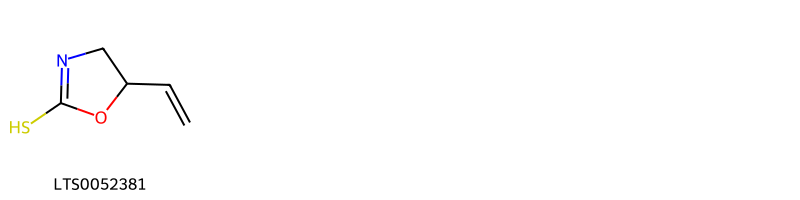{ width=100% }
    <figcaption>Hình ảnh cấu trúc hóa học của 1 hoạt chất thuộc nhóm Azolidines gồm ['goitrin (LTS0052381)'].</figcaption>
</figure>
#### Nhóm Benzene and substituted derivatives
<figure markdown="span">
    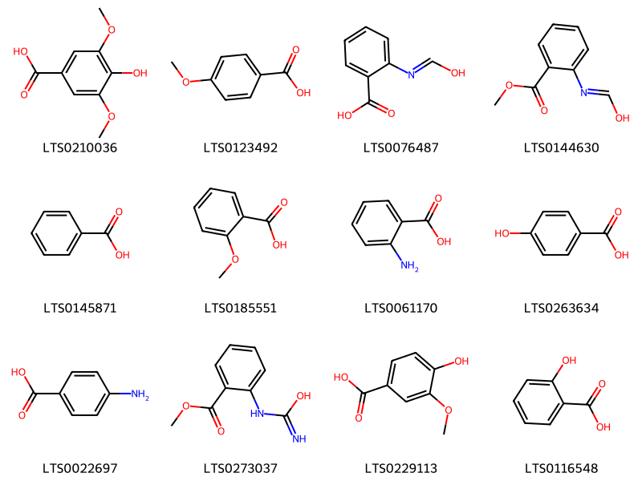{ width=100% }
    <figcaption>Hình ảnh cấu trúc hóa học của 12 hoạt chất thuộc nhóm Benzene and substituted derivatives gồm ['syringic acid (LTS0210036)', 'p-anisic acid (LTS0123492)', '2-[(hydroxymethylidene)amino]benzoic acid (LTS0076487)', 'n-[2-(methoxycarbonyl)phenyl]carboximidic acid (LTS0144630)', 'benzoic acid (LTS0145871)', 'o-anisic acid (LTS0185551)', '2-aminobenzoic acid (LTS0061170)', 'p-hydroxybenzoic acid (LTS0263634)', '4-aminobenzoic acid (LTS0022697)', 'methyl 2-(c-hydroxycarbonimidoylamino)benzoate (LTS0273037)', 'vanillic acid (LTS0229113)', 'salicyclic acid (LTS0116548)'].</figcaption>
</figure>
#### Nhóm Benzodiazepines
<figure markdown="span">
    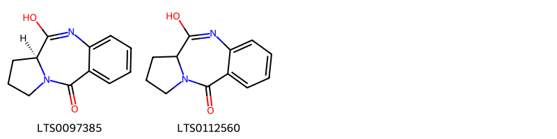{ width=100% }
    <figcaption>Hình ảnh cấu trúc hóa học của 2 hoạt chất thuộc nhóm Benzodiazepines gồm ['(7s)-8-hydroxy-3,9-diazatricyclo[8.4.0.0³,⁷]tetradeca-1(14),8,10,12-tetraen-2-one (LTS0097385)', '8-hydroxy-3,9-diazatricyclo[8.4.0.0³,⁷]tetradeca-1(14),8,10,12-tetraen-2-one (LTS0112560)'].</figcaption>
</figure>
#### Nhóm Carboxylic acids and derivatives
<figure markdown="span">
    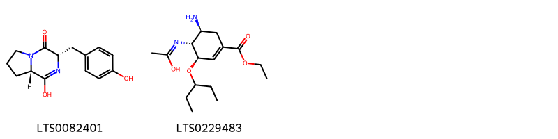{ width=100% }
    <figcaption>Hình ảnh cấu trúc hóa học của 2 hoạt chất thuộc nhóm Carboxylic acids and derivatives gồm ['maculosin (LTS0082401)', 'n-[(1r,2r,6s)-6-amino-4-(ethoxycarbonyl)-2-(pentan-3-yloxy)cyclohex-3-en-1-yl]ethanimidic acid (LTS0229483)'].</figcaption>
</figure>
#### Nhóm Cinnamic acids and derivatives
<figure markdown="span">
    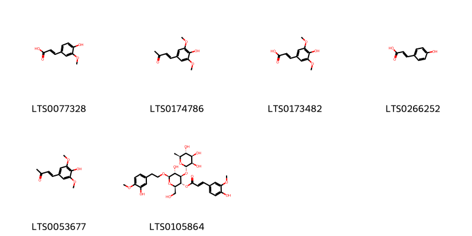{ width=100% }
    <figcaption>Hình ảnh cấu trúc hóa học của 6 hoạt chất thuộc nhóm Cinnamic acids and derivatives gồm ['ferulic acid (LTS0077328)', '4-(4-hydroxy-3,5-dimethoxyphenyl)but-3-en-2-one (LTS0174786)', 'sinapinate (LTS0173482)', 'para-coumaric acid (LTS0266252)', '(3e)-4-(4-hydroxy-3,5-dimethoxyphenyl)but-3-en-2-one (LTS0053677)', '(2r,3r,4r,5r,6r)-5-hydroxy-6-[2-(3-hydroxy-4-methoxyphenyl)ethoxy]-2-(hydroxymethyl)-4-{[(2s,3r,4r,5r,6s)-3,4,5-trihydroxy-6-methyloxan-2-yl]oxy}oxan-3-yl (2e)-3-(4-hydroxy-3-methoxyphenyl)prop-2-enoate (LTS0105864)'].</figcaption>
</figure>
#### Nhóm Diazanaphthalenes
<figure markdown="span">
    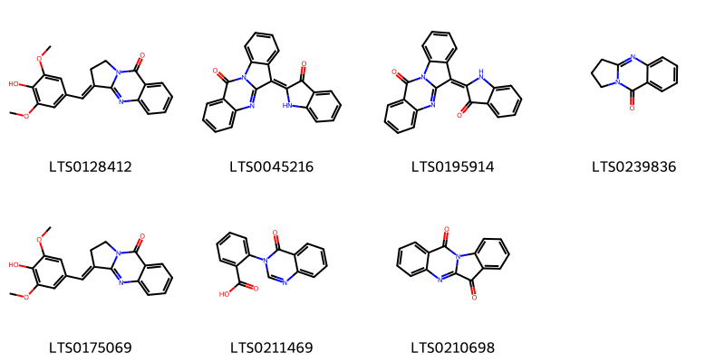{ width=100% }
    <figcaption>Hình ảnh cấu trúc hóa học của 7 hoạt chất thuộc nhóm Diazanaphthalenes gồm ['(3e)-3-[(4-hydroxy-3,5-dimethoxyphenyl)methylidene]-1h,2h-pyrrolo[2,1-b]quinazolin-9-one (LTS0128412)', '2-[(6z)-12-oxoindolo[2,1-b]quinazolin-6-ylidene]-1h-indol-3-one (LTS0045216)', '2-[(6e)-12-oxoindolo[2,1-b]quinazolin-6-ylidene]-1h-indol-3-one (LTS0195914)', 'deoxyvasicinone (LTS0239836)', '3-[(4-hydroxy-3,5-dimethoxyphenyl)methylidene]-1h,2h-pyrrolo[2,1-b]quinazolin-9-one (LTS0175069)', '2-(4-oxoquinazolin-3-yl)benzoic acid (LTS0211469)', 'tryptanthrin (LTS0210698)'].</figcaption>
</figure>
#### Nhóm Fatty Acyls
<figure markdown="span">
    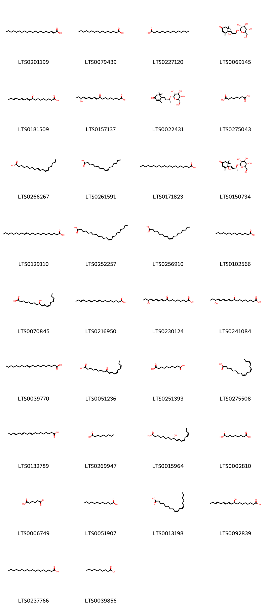{ width=100% }
    <figcaption>Hình ảnh cấu trúc hóa học của 34 hoạt chất thuộc nhóm Fatty Acyls gồm ['icos-2-enoic acid (LTS0201199)', 'palmitic acid (LTS0079439)', 'pentadecanoic acid (LTS0227120)', '(4s)-4-hydroxy-3,5,5-trimethyl-4-[(1e,3r)-3-{[(2r,3r,4s,5s,6r)-3,4,5-trihydroxy-6-(hydroxymethyl)oxan-2-yl]oxy}but-1-en-1-yl]cyclohex-2-en-1-one (LTS0069145)', '(10e)-9-oxooctadeca-10,12,15-trienoic acid (LTS0181509)', '16-hydroxy-9-oxooctadeca-10,12,14-trienoic acid (LTS0157137)', 'byzantionoside b (LTS0022431)', 'suberic acid (LTS0275043)', '10-trans,12-cis-linoleic acid (LTS0266267)', 'palmitoleic acid (LTS0261591)', 'arachidic acid (LTS0171823)', '4-hydroxy-3,5,5-trimethyl-4-[(1e,3r)-3-{[(2r,3r,4s,5s,6r)-3,4,5-trihydroxy-6-(hydroxymethyl)oxan-2-yl]oxy}but-1-en-1-yl]cyclohex-2-en-1-one (LTS0150734)', '13-docosenoic acid (LTS0129110)', 'erucic acid (LTS0252257)', 'oleic acid (LTS0256910)', 'myristic acid (LTS0102566)', '(9r,10e,12z,15z)-9-hydroxyoctadeca-10,12,15-trienoic acid (LTS0070845)', 'octadeca-9,12,15-trienoic acid (LTS0216950)', '(10e,12e,14e,16s)-16-hydroxy-9-oxooctadeca-10,12,14-trienoic acid (LTS0230124)', '(10e,12e,14e,16r)-16-hydroxy-9-oxooctadeca-10,12,14-trienoic acid (LTS0241084)', 'icosenoic acid (LTS0039770)', '(10e,12z,15z)-9-oxooctadeca-10,12,15-trienoic acid (LTS0051236)', 'sebacic acid (LTS0251393)', 'α-linolenic acid (LTS0275508)', 'α linolenic acid (LTS0132789)', 'nonanoic acid (LTS0269947)', '9(s)-hotre (LTS0015964)', 'azelaic acid (LTS0002810)', 'adipic acid (LTS0006749)', 'lauric acid (LTS0051907)', 'linoleic (LTS0013198)', '(10e)-9-hydroxyoctadeca-10,12,15-trienoic acid (LTS0092839)', 'stearic acid (LTS0237766)', 'capric acid (LTS0039856)'].</figcaption>
</figure>
#### Nhóm Flavonoids
<figure markdown="span">
    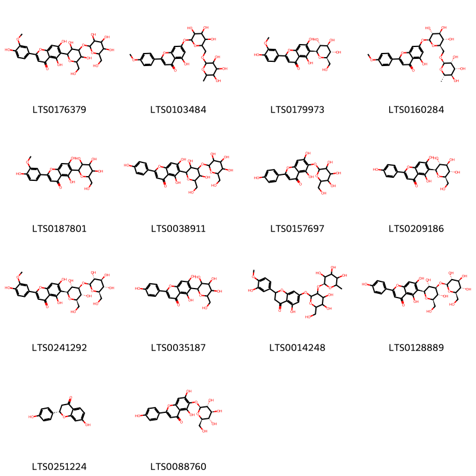{ width=100% }
    <figcaption>Hình ảnh cấu trúc hóa học của 14 hoạt chất thuộc nhóm Flavonoids gồm ['6-[3,5-dihydroxy-6-(hydroxymethyl)-4-{[3,4,5-trihydroxy-6-(hydroxymethyl)oxan-2-yl]oxy}oxan-2-yl]-5,7-dihydroxy-2-(4-hydroxy-3-methoxyphenyl)chromen-4-one (LTS0176379)', '5-hydroxy-2-(4-methoxyphenyl)-7-[(3,4,5-trihydroxy-6-{[(3,4,5-trihydroxy-6-methyloxan-2-yl)oxy]methyl}oxan-2-yl)oxy]chromen-4-one (LTS0103484)', 'isoscoparin (LTS0179973)', 'linarin (LTS0160284)', '5,7-dihydroxy-2-(4-hydroxy-3-methoxyphenyl)-6-[3,4,5-trihydroxy-6-(hydroxymethyl)oxan-2-yl]chromen-4-one (LTS0187801)', '6-[3,5-dihydroxy-6-(hydroxymethyl)-4-{[3,4,5-trihydroxy-6-(hydroxymethyl)oxan-2-yl]oxy}oxan-2-yl]-5,7-dihydroxy-2-(4-hydroxyphenyl)chromen-4-one (LTS0038911)', '5,7-dihydroxy-2-(4-hydroxyphenyl)-6-{[3,4,5-trihydroxy-6-(hydroxymethyl)oxan-2-yl]oxy}chromen-4-one (LTS0157697)', 'isovitexin (LTS0209186)', '6-[(2s,3s,4r,5r,6r)-3,5-dihydroxy-6-(hydroxymethyl)-4-{[(2s,3r,4s,5s,6r)-3,4,5-trihydroxy-6-(hydroxymethyl)oxan-2-yl]oxy}oxan-2-yl]-5,7-dihydroxy-2-(4-hydroxy-3-methoxyphenyl)chromen-4-one (LTS0241292)', 'isovitexin (LTS0035187)', '7-{[4,5-dihydroxy-6-(hydroxymethyl)-3-{[(2s)-3,4,5-trihydroxy-6-methyloxan-2-yl]oxy}oxan-2-yl]oxy}-5-hydroxy-2-(3-hydroxy-4-methoxyphenyl)-2,3-dihydro-1-benzopyran-4-one (LTS0014248)', '6-[(2s,3s,4r,5r,6r)-3,5-dihydroxy-6-(hydroxymethyl)-4-{[(2s,3r,4s,5s,6r)-3,4,5-trihydroxy-6-(hydroxymethyl)oxan-2-yl]oxy}oxan-2-yl]-5,7-dihydroxy-2-(4-hydroxyphenyl)chromen-4-one (LTS0128889)', '5-deoxyflavanone (LTS0251224)', '5,7-dihydroxy-2-(4-hydroxyphenyl)-6-{[(2s,3r,4s,5s,6r)-3,4,5-trihydroxy-6-(hydroxymethyl)oxan-2-yl]oxy}chromen-4-one (LTS0088760)'].</figcaption>
</figure>
#### Nhóm Furanoid lignans
<figure markdown="span">
    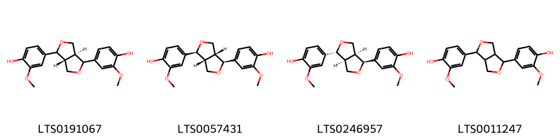{ width=100% }
    <figcaption>Hình ảnh cấu trúc hóa học của 4 hoạt chất thuộc nhóm Furanoid lignans gồm ['4-[(3ar,6as)-4-(4-hydroxy-3-methoxyphenyl)-hexahydrofuro[3,4-c]furan-1-yl]-2-methoxyphenol (LTS0191067)', 'pinoresinol (LTS0057431)', '4-[(1s,3as,4r,6as)-4-(4-hydroxy-3-methoxyphenyl)-hexahydrofuro[3,4-c]furan-1-yl]-2-methoxyphenol (LTS0246957)', 'pinoresinol (LTS0011247)'].</figcaption>
</figure>
#### Nhóm Glycerolipids
<figure markdown="span">
    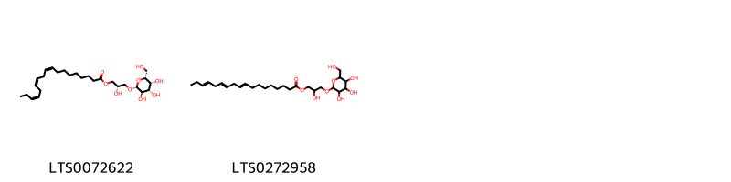{ width=100% }
    <figcaption>Hình ảnh cấu trúc hóa học của 2 hoạt chất thuộc nhóm Glycerolipids gồm ['(2s)-2-hydroxy-3-{[(2r,3r,4s,5r,6r)-3,4,5-trihydroxy-6-(hydroxymethyl)oxan-2-yl]oxy}propyl (9z,12z,15z)-octadeca-9,12,15-trienoate (LTS0072622)', '2-hydroxy-3-{[3,4,5-trihydroxy-6-(hydroxymethyl)oxan-2-yl]oxy}propyl octadeca-9,12,15-trienoate (LTS0272958)'].</figcaption>
</figure>
#### Nhóm Imidazopyrimidines
<figure markdown="span">
    { width=100% }
    <figcaption>Hình ảnh cấu trúc hóa học của 1 hoạt chất thuộc nhóm Imidazopyrimidines gồm ['stella polaris (LTS0179440)'].</figcaption>
</figure>
#### Nhóm Indoles and derivatives
<figure markdown="span">
    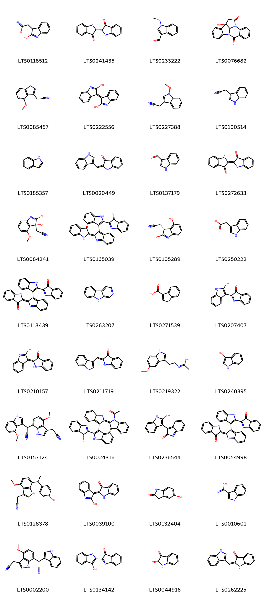{ width=100% }
    <figcaption>Hình ảnh cấu trúc hóa học của 36 hoạt chất thuộc nhóm Indoles and derivatives gồm ['2-(2-hydroxy-3h-indol-3-yl)ethanimidic acid (LTS0118512)', 'indigo dye (LTS0241435)', '1-methoxyindole-3-carbaldehyde (LTS0233222)', '8-hydroxy-1,11-diazapentacyclo[9.7.1.0²,⁷.0⁸,¹⁹.0¹²,¹⁷]nonadeca-2,4,6,12,14,16-hexaene-10,18-dione (LTS0076682)', '2-(4-methoxy-1h-indol-3-yl)acetonitrile (LTS0085457)', "(e)-[3,3'-biindolylidene]-2,2'-diol (LTS0222556)", '2-(1-methoxyindol-3-yl)acetonitrile (LTS0227388)', 'indole-3-acetonitrile (LTS0100514)', 'indole (LTS0185357)', '2-(1h-indol-3-ylmethylidene)-1h-indol-3-one (LTS0020449)', 'indole-3-carboxaldehyde (LTS0137179)', "1h,1'h-[2,2'-biindolylidene]-3,3'-dione (LTS0272633)", '2-[(3s)-2,3-dihydroxy-4-methoxyindol-3-yl]acetonitrile (LTS0084241)', "3'-[(z)-3'-oxo-1'h-[2,2'-biindolyliden]-3-yl]-1'h-[2,2'-biindol]-3-one (LTS0165039)", '2-[(3r)-2,4-dihydroxy-3h-indol-3-yl]acetonitrile (LTS0105289)', 'β-indole-3-acetic acid (LTS0250222)', "3'-[(e)-3'-oxo-1'h-[2,2'-biindolyliden]-3-yl]-1'h-[2,2'-biindol]-3-one (LTS0118439)", 'β-carboline (LTS0263207)', 'indole - 3 carboxylic acid (LTS0271539)', "2'-hydroxy-1'h-[2,3'-biindol]-3-one (LTS0207407)", "(e)-2'-hydroxy-1h-[2,3'-biindolyliden]-3-one (LTS0210157)", '(2z)-2-(1h-indol-3-ylmethylidene)-1h-indol-3-one (LTS0211719)', 'n-[2-(5-methoxy-1h-indol-3-yl)ethyl]ethanimidic acid (LTS0219322)', 'indoxyl (LTS0240395)', '(2s)-2-[3-(cyanomethyl)-4-methoxy-1h-indol-7-yl]-2-(4-methoxy-1h-indol-3-yl)acetonitrile (LTS0157124)', "(z)-1-acetyl-3'-{3'-oxo-1h-[2,2'-biindol]-3-yl}-[2,2'-biindolyliden]-3-one (LTS0024816)", "2'-hydroxy-1'h-[3,3'-biindol]-2-one (LTS0236544)", "3'-{3'-oxo-1'h-[2,2'-biindolyliden]-3-yl}-1'h-[2,2'-biindol]-3-one (LTS0054998)", '2-{7-[(1s)-1-(4-hydroxyphenyl)ethyl]-4-methoxy-1h-indol-3-yl}acetonitrile (LTS0128378)', 'indirubin (LTS0039100)', '5-hydroxy-1,3-dihydroindol-2-one (LTS0132404)', '1h-indole-3-carboximidic acid (LTS0010601)', '(2s)-2-[3-(cyanomethyl)-4-methoxy-1h-indol-7-yl]-2-(1h-indol-3-yl)acetonitrile (LTS0002200)', "3'-hydroxy-1'h-[2,2'-biindol]-3-one (LTS0134142)", 'isatin (LTS0044916)', '(2e)-2-(1h-indol-3-ylmethylidene)-1h-indol-3-one (LTS0262225)'].</figcaption>
</figure>
#### Nhóm Linear 1_3-diarylpropanoids
<figure markdown="span">
    { width=100% }
    <figcaption>Hình ảnh cấu trúc hóa học của Không tìm thấy chú thích hoạt chất thuộc nhóm Linear 1_3-diarylpropanoids gồm Không tìm thấy chú thích.</figcaption>
</figure>
#### Nhóm Organooxygen compounds
<figure markdown="span">
    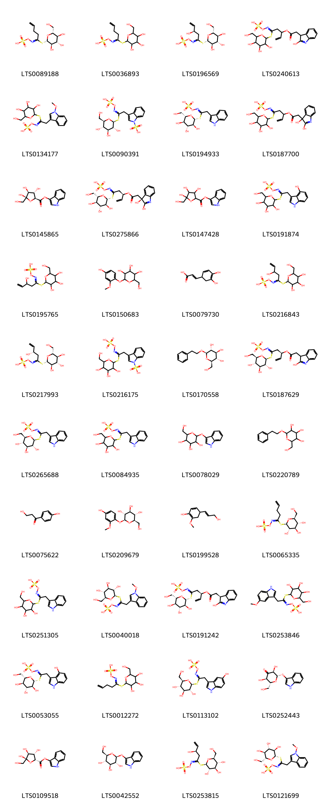{ width=100% }
    <figcaption>Hình ảnh cấu trúc hóa học của 40 hoạt chất thuộc nhóm Organooxygen compounds gồm ['[(e)-(1-{[(2s,3r,4s,5s,6r)-3,4,5-trihydroxy-6-(hydroxymethyl)oxan-2-yl]sulfanyl}pent-4-en-1-ylidene)amino]oxysulfonic acid (LTS0089188)', '[(e)-(1-{[3,4,5-trihydroxy-6-(hydroxymethyl)oxan-2-yl]sulfanyl}pent-4-en-1-ylidene)amino]oxysulfonic acid (LTS0036893)', '[(e)-[(3r)-3-hydroxy-1-{[(2s,3r,4s,5s,6r)-3,4,5-trihydroxy-6-(hydroxymethyl)oxan-2-yl]sulfanyl}pent-4-en-1-ylidene]amino]oxysulfonic acid (LTS0196569)', '[(3-{[2-(2-hydroxy-3h-indol-3-yl)acetyl]oxy}-1-{[3,4,5-trihydroxy-6-(hydroxymethyl)oxan-2-yl]sulfanyl}pent-4-en-1-ylidene)amino]oxysulfonic acid (LTS0240613)', '{[2-(1-methoxyindol-3-yl)-1-{[3,4,5-trihydroxy-6-(hydroxymethyl)oxan-2-yl]sulfanyl}ethylidene]amino}oxysulfonic acid (LTS0134177)', '3-[(2e)-2-[(sulfooxy)imino]-2-{[(2s,3r,4s,5s,6r)-3,4,5-trihydroxy-6-(hydroxymethyl)oxan-2-yl]sulfanyl}ethyl]indole-1-sulfonic acid (LTS0090391)', '[(z)-[2-(1h-indol-3-yl)-1-{[(2r,3s,4r,5r,6s)-3,4,5-trihydroxy-6-(hydroxymethyl)oxan-2-yl]sulfanyl}ethylidene]amino]oxysulfonic acid (LTS0194933)', '[(3-{[2-(2,3-dihydroxyindol-3-yl)acetyl]oxy}-1-{[3,4,5-trihydroxy-6-(hydroxymethyl)oxan-2-yl]sulfanyl}pent-4-en-1-ylidene)amino]oxysulfonic acid (LTS0187700)', '1h-indol-3-yl (2s,3s,4s,5r)-3,4,5-trihydroxy-5-(hydroxymethyl)oxolane-2-carboxylate (LTS0145865)', '[(z)-[(3r)-3-({2-[(3s)-2,3-dihydroxyindol-3-yl]acetyl}oxy)-1-{[(2r,3s,4r,5r,6s)-3,4,5-trihydroxy-6-(hydroxymethyl)oxan-2-yl]sulfanyl}pent-4-en-1-ylidene]amino]oxysulfonic acid (LTS0275866)', '1h-indol-3-yl 3,4,5-trihydroxy-5-(hydroxymethyl)oxolane-2-carboxylate (LTS0147428)', '{[2-(4-hydroxy-1h-indol-3-yl)-1-{[3,4,5-trihydroxy-6-(hydroxymethyl)oxan-2-yl]sulfanyl}ethylidene]amino}oxysulfonic acid (LTS0191874)', '[(3-hydroxy-1-{[3,4,5-trihydroxy-6-(hydroxymethyl)oxan-2-yl]sulfanyl}pent-4-en-1-ylidene)amino]oxysulfonic acid (LTS0195765)', '2-(4-hydroxy-2-methoxyphenoxy)-6-(hydroxymethyl)oxane-3,4,5-triol (LTS0150683)', '(2e)-3-(4,5-dihydroxycyclohexa-2,4-dien-1-yl)prop-2-enoic acid (LTS0079730)', '[(e)-(3-hydroxy-1-{[3,4,5-trihydroxy-6-(hydroxymethyl)oxan-2-yl]sulfanyl}pent-4-en-1-ylidene)amino]oxysulfonic acid (LTS0216843)', 'progoitrin (LTS0217993)', '3-[(2e)-2-[(sulfooxy)imino]-2-{[3,4,5-trihydroxy-6-(hydroxymethyl)oxan-2-yl]sulfanyl}ethyl]indole-1-sulfonic acid (LTS0216175)', '(2r,3s,4s,5r,6r)-2-(hydroxymethyl)-6-(2-phenylethoxy)oxane-3,4,5-triol (LTS0170558)', '[(z)-[(3r)-3-{[2-(2-hydroxy-3h-indol-3-yl)acetyl]oxy}-1-{[(2s,3r,4s,5s,6r)-3,4,5-trihydroxy-6-(hydroxymethyl)oxan-2-yl]sulfanyl}pent-4-en-1-ylidene]amino]oxysulfonic acid (LTS0187629)', 'glucobrassicin (LTS0265688)', '{[2-(1h-indol-3-yl)-1-{[3,4,5-trihydroxy-6-(hydroxymethyl)oxan-2-yl]sulfanyl}ethylidene]amino}oxysulfonic acid (LTS0084935)', 'indican (LTS0078029)', '2-(hydroxymethyl)-6-(2-phenylethoxy)oxane-3,4,5-triol (LTS0220789)', '3-hydroxy-1-(4-hydroxyphenyl)propan-1-one (LTS0075622)', '(2s,3r,4s,5s,6r)-2-(4-hydroxy-2-methoxyphenoxy)-6-(hydroxymethyl)oxane-3,4,5-triol (LTS0209679)', '4-[(1e)-3-hydroxyprop-1-en-1-yl]-2-methoxycyclohexa-1,5-dien-1-ol (LTS0199528)', '[(z)-(1-{[(2r,3s,4r,5r,6s)-3,4,5-trihydroxy-6-(hydroxymethyl)oxan-2-yl]sulfanyl}pent-4-en-1-ylidene)amino]oxysulfonic acid (LTS0065335)', '[(e)-[2-(1h-indol-3-yl)-1-{[3,4,5-trihydroxy-6-(hydroxymethyl)oxan-2-yl]sulfanyl}ethylidene]amino]oxysulfonic acid (LTS0251305)', '[(z)-[2-(1-methoxyindol-3-yl)-1-{[(2r,3s,4r,5r,6s)-3,4,5-trihydroxy-6-(hydroxymethyl)oxan-2-yl]sulfanyl}ethylidene]amino]oxysulfonic acid (LTS0040018)', '[(z)-[(3r)-3-({2-[(3s)-2-hydroxy-3h-indol-3-yl]acetyl}oxy)-1-{[(2r,3s,4r,5r,6s)-3,4,5-trihydroxy-6-(hydroxymethyl)oxan-2-yl]sulfanyl}pent-4-en-1-ylidene]amino]oxysulfonic acid (LTS0191242)', '{[2-(5-methoxy-1h-indol-3-yl)-1-{[3,4,5-trihydroxy-6-(hydroxymethyl)oxan-2-yl]sulfanyl}ethylidene]amino}oxysulfonic acid (LTS0253846)', '[(z)-[2-(4-hydroxy-1h-indol-3-yl)-1-{[(2r,3s,4r,5r,6s)-3,4,5-trihydroxy-6-(hydroxymethyl)oxan-2-yl]sulfanyl}ethylidene]amino]oxysulfonic acid (LTS0053055)', '[(1-{[3,4,5-trihydroxy-6-(hydroxymethyl)oxan-2-yl]sulfanyl}pent-4-en-1-ylidene)amino]oxysulfonic acid (LTS0012272)', '[(e)-[2-(5-hydroxy-1h-indol-3-yl)-1-{[(2s,3r,4s,5s,6r)-3,4,5-trihydroxy-6-(hydroxymethyl)oxan-2-yl]sulfanyl}ethylidene]amino]oxysulfonic acid (LTS0113102)', '(2r,3r,5s,6s)-3,5-dihydroxy-2-(hydroxymethyl)-6-(1h-indol-3-yloxy)oxan-4-one (LTS0252443)', '1h-indol-3-yl (2r,3s,4s,5r)-3,4,5-trihydroxy-5-(hydroxymethyl)oxolane-2-carboxylate (LTS0109518)', 'indican (LTS0042552)', '[(z)-[(3r)-3-hydroxy-1-{[(2r,3s,4r,5r,6s)-3,4,5-trihydroxy-6-(hydroxymethyl)oxan-2-yl]sulfanyl}pent-4-en-1-ylidene]amino]oxysulfonic acid (LTS0253815)', 'mimg (LTS0121699)'].</figcaption>
</figure>
#### Nhóm Phenols
<figure markdown="span">
    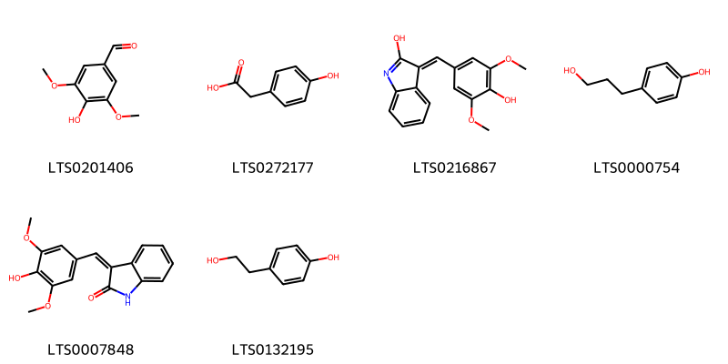{ width=100% }
    <figcaption>Hình ảnh cấu trúc hóa học của 6 hoạt chất thuộc nhóm Phenols gồm ['syringaldehyde (LTS0201406)', '4-hydroxyphenylacetic acid (LTS0272177)', '(3e)-3-[(4-hydroxy-3,5-dimethoxyphenyl)methylidene]indol-2-ol (LTS0216867)', '3-(4-hydroxyphenyl)propan-1-ol (LTS0000754)', '3-[(4-hydroxy-3,5-dimethoxyphenyl)methylidene]-1h-indol-2-one (LTS0007848)', 'tyrosol (LTS0132195)'].</figcaption>
</figure>
#### Nhóm Phenylpropanoic acids
<figure markdown="span">
    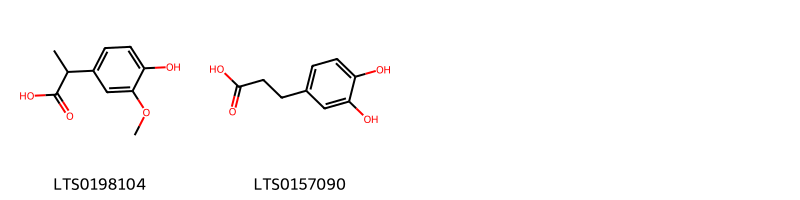{ width=100% }
    <figcaption>Hình ảnh cấu trúc hóa học của 2 hoạt chất thuộc nhóm Phenylpropanoic acids gồm ['2-(4-hydroxy-3-methoxyphenyl)propanoic acid (LTS0198104)', 'dihydrocaffeic acid (LTS0157090)'].</figcaption>
</figure>
#### Nhóm Prenol lipids
<figure markdown="span">
    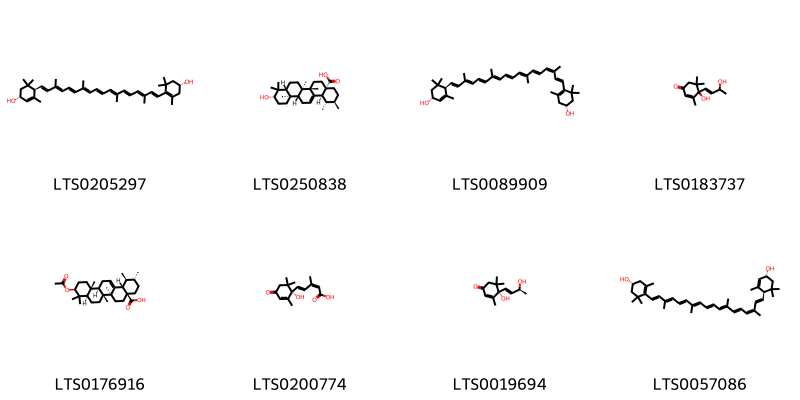{ width=100% }
    <figcaption>Hình ảnh cấu trúc hóa học của 8 hoạt chất thuộc nhóm Prenol lipids gồm ['carotenoid (LTS0205297)', 'ursolic acid (LTS0250838)', '(1r,4r)-4-[(1e,3e,5e,7e,9e,11e,13e,15z,17e)-18-[(4r)-4-hydroxy-2,6,6-trimethylcyclohex-1-en-1-yl]-3,7,12,16-tetramethyloctadeca-1,3,5,7,9,11,13,15,17-nonaen-1-yl]-3,5,5-trimethylcyclohex-2-en-1-ol (LTS0089909)', '4-hydroxy-4-(3-hydroxybut-1-en-1-yl)-3,5,5-trimethylcyclohex-2-en-1-one (LTS0183737)', '(1s,2r,4as,6as,6br,8ar,10s,12ar,12br,14bs)-10-(acetyloxy)-1,2,6a,6b,9,9,12a-heptamethyl-2,3,4,5,6,7,8,8a,10,11,12,12b,13,14b-tetradecahydro-1h-picene-4a-carboxylic acid (LTS0176916)', 'abscisic acid (LTS0200774)', 'blumenol a (LTS0019694)', '(1r,4r)-4-[(1e,3z,5e,7e,9e,11e,13e,15e,17e)-18-[(4r)-4-hydroxy-2,6,6-trimethylcyclohex-1-en-1-yl]-3,7,12,16-tetramethyloctadeca-1,3,5,7,9,11,13,15,17-nonaen-1-yl]-3,5,5-trimethylcyclohex-2-en-1-ol (LTS0057086)'].</figcaption>
</figure>
#### Nhóm Purine nucleosides
<figure markdown="span">
    { width=100% }
    <figcaption>Hình ảnh cấu trúc hóa học của 2 hoạt chất thuộc nhóm Purine nucleosides gồm ['adenosine (LTS0052576)', 'adenosine (LTS0014061)'].</figcaption>
</figure>
#### Nhóm Pyrimidine nucleosides
<figure markdown="span">
    { width=100% }
    <figcaption>Hình ảnh cấu trúc hóa học của 2 hoạt chất thuộc nhóm Pyrimidine nucleosides gồm ['1-[3,4-dihydroxy-5-(hydroxymethyl)oxolan-2-yl]-4-hydroxypyrimidin-2-one (LTS0075646)', 'uridine (LTS0220125)'].</figcaption>
</figure>
#### Nhóm Quinolines and derivatives
<figure markdown="span">
    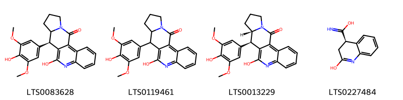{ width=100% }
    <figcaption>Hình ảnh cấu trúc hóa học của 4 hoạt chất thuộc nhóm Quinolines and derivatives gồm ['(11r)-9-hydroxy-11-(4-hydroxy-3,5-dimethoxyphenyl)-8,16-diazatetracyclo[8.7.0.0²,⁷.0¹²,¹⁶]heptadeca-1(10),2,4,6,8-pentaen-17-one (LTS0083628)', '9-hydroxy-11-(4-hydroxy-3,5-dimethoxyphenyl)-8,16-diazatetracyclo[8.7.0.0²,⁷.0¹²,¹⁶]heptadeca-1(10),2,4,6,8-pentaen-17-one (LTS0119461)', '(11r,12s)-9-hydroxy-11-(4-hydroxy-3,5-dimethoxyphenyl)-8,16-diazatetracyclo[8.7.0.0²,⁷.0¹²,¹⁶]heptadeca-1(10),2,4,6,8-pentaen-17-one (LTS0013229)', '(4r)-2-hydroxy-3,4-dihydroquinoline-4-carboximidic acid (LTS0227484)'].</figcaption>
</figure>
#### Nhóm Saturated hydrocarbons
<figure markdown="span">
    { width=100% }
    <figcaption>Hình ảnh cấu trúc hóa học của 1 hoạt chất thuộc nhóm Saturated hydrocarbons gồm ['nonacosane (LTS0062747)'].</figcaption>
</figure>
#### Nhóm Stilbenes
<figure markdown="span">
    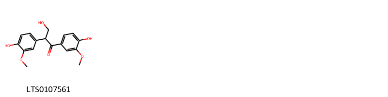{ width=100% }
    <figcaption>Hình ảnh cấu trúc hóa học của 1 hoạt chất thuộc nhóm Stilbenes gồm ['evofolin b (LTS0107561)'].</figcaption>
</figure>
#### Nhóm Tannins
<figure markdown="span">
    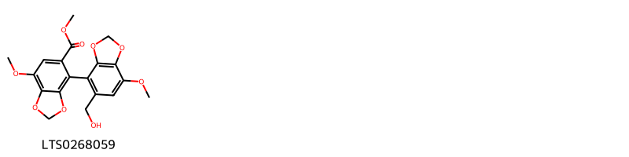{ width=100% }
    <figcaption>Hình ảnh cấu trúc hóa học của 1 hoạt chất thuộc nhóm Tannins gồm ['bicyclol (LTS0268059)'].</figcaption>
</figure>
#### Nhóm Tetrapyrroles and derivatives
<figure markdown="span">
    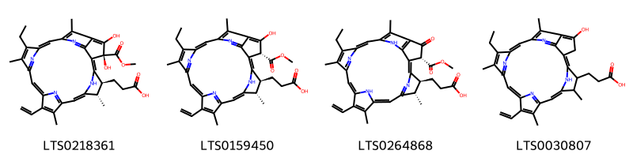{ width=100% }
    <figcaption>Hình ảnh cấu trúc hóa học của 4 hoạt chất thuộc nhóm Tetrapyrroles and derivatives gồm ['3-[(3s,21s,22s)-16-ethenyl-11-ethyl-3,4-dihydroxy-3-(methoxycarbonyl)-12,17,21,26-tetramethyl-7,23,24,25-tetraazahexacyclo[18.2.1.1⁵,⁸.1¹⁰,¹³.1¹⁵,¹⁸.0²,⁶]hexacosa-1,4,6,8(26),9,11,13(25),14,16,18(24),19-undecaen-22-yl]propanoic acid (LTS0218361)', '3-[(3r,21s,22s)-16-ethenyl-11-ethyl-4-hydroxy-3-(methoxycarbonyl)-12,17,21,26-tetramethyl-7,23,24,25-tetraazahexacyclo[18.2.1.1⁵,⁸.1¹⁰,¹³.1¹⁵,¹⁸.0²,⁶]hexacosa-1,4,6,8(26),9,11,13(25),14,16,18(24),19-undecaen-22-yl]propanoic acid (LTS0159450)', 'pheophorbide a (LTS0264868)', '3-{16-ethenyl-11-ethyl-4-hydroxy-12,17,21,26-tetramethyl-7,23,24,25-tetraazahexacyclo[18.2.1.1⁵,⁸.1¹⁰,¹³.1¹⁵,¹⁸.0²,⁶]hexacosa-1,4,6,8(26),9,11,13(25),14,16,18(24),19-undecaen-22-yl}propanoic acid (LTS0030807)'].</figcaption>
</figure>

---

### Dược dân tộc học

Danh sách các quốc gia có sử dụng *Isatis tinctoria* trong điều trị các bệnh. 

| Country   |   Disease | Bệnh   |
|:----------|----------:|:-------|
| China     |       nan | Ở đây  |

---

# Chi Heeris

??? note "Danh sách các dược liệu thuộc chi"
    
	 - *Heeris matronalis*

---
## Heeris matronalis
### Thông tin về thực vật

!!! info "Phân loại thực vật của *N/A* từ GIBF:"
    - **Kingdom:** N/A
    - **Phylum:** N/A
    - **Order:** N/A
    - **Family:** N/A
    - **Genus:** N/A
    - **Species:** *N/A*

 

| Label (VI)   | Label (EN)   | Scientific Name   | Descriptions (VI)   | Descriptions (EN)   | Also Known As (VI)   | Also Known As (EN)                                                           |
|:-------------|:-------------|:------------------|:--------------------|:--------------------|:---------------------|:-----------------------------------------------------------------------------|
| N/A          | N/A          | Isatis tinctoria  | loài thực vật       | species of plant    | ['']                 | ['woad', 'Asp of Jerusalem', "dyer's woad", 'glastum', 'Istasis indigotica'] |

#### Phân bố trên thế giới

**Từ CSDL GIBF** Không có kết quả phù hợp

#### Phân bố tại Việt Nam

**Từ CSDL GIBF**: Không có ghi nhận ở Việt Nam

---
### Thành phần hóa học
        
- Theo cơ sở dữ liệu lotus: Từ loài *N/A* đã phân lập và xác định được Chưa có hoạt chất nào được phân lập. hoạt chất thuộc về các nhóm Không có hoạt chất nào được phân lập. 

Không có hình ảnh nào được tạo ra

---

### Dược dân tộc học

Danh sách các quốc gia có sử dụng *N/A* trong điều trị các bệnh. 

| Country   | Disease                                              | Bệnh                                                                                  |
|:----------|:-----------------------------------------------------|:--------------------------------------------------------------------------------------|
| Turkey    | Aphrodisiac, Expectorant, Stimulant, Tonic, Diuretic | Thuốc kích thích tình dục, thuốc long đờm, thuốc kích thích, thuốc bổ, thuốc lợi tiểu |

---

