!!! abstract "Tóm tắt"

    Họ Bromeliaceae gồm khoảng 3 chi và 4 loài được một số cộng đồng tại các quốc gia như Dutch, Iran, Elsewhere, Haiti, Trinidad, Portugal, German, Malacca, Java, US, Italian, Venezuela, Mexico, Malaya, Panama(Choco), Moluccas sử dụng trong một số trường hợp QUERY LENGTH LIMIT EXCEEDED. MAX ALLOWED QUERY : 500 CHARS.

!!! info "DrDuke"

    James A. Duke sinh năm 1929-2017 là một nhà thực vật học người Mỹ. Đây là một trong những tác giả hàng đầu trong lĩnh vực dược dân tộc học với cuốn *CRC Handbook of Medicinal Herbs* và chính là người xây dựng lên cơ sở dữ liệu về hợp chất tự nhiên và dược dân tộc học tại Bộ nông nghiệp Hoa Kỳ. Các thông tin được đăng tải tại website [Dr. Duke's Phytochemical and Ethnobotanical Databases](https://phytochem.nal.usda.gov/). 
    Trong suốt thập niên 1970, ông lãnh đạo the Plant Taxonomy Laboratory, Plant Genetics and Germplasm Institute of the Agricultural Research Service, U.S. Department of Agriculture.
    Trong tài liệu này, các thông tin về dược dân tộc của các dược liệu được trích dẫn từ tài liệu của James A. Ducke với sự trợ giúp của phần mềm dịch thuật từ tiếng Anh sang tiếng Việt.
   

# Chi Ananas

??? note "Danh sách các dược liệu thuộc chi"
    
	 - *Ananas comosus*

---
## Ananas comosus
### Thông tin về thực vật

!!! info "Phân loại thực vật của *Ananas comosus* từ GIBF:"
    - **Kingdom:** Plantae
    - **Phylum:** Tracheophyta
    - **Order:** Poales
    - **Family:** Bromeliaceae
    - **Genus:** Ananas
    - **Species:** *Ananas comosus*

 

| Label (VI)   | Label (EN)   | Scientific Name   | Descriptions (VI)   | Descriptions (EN)      | Also Known As (VI)                                               | Also Known As (EN)               |
|:-------------|:-------------|:------------------|:--------------------|:-----------------------|:-----------------------------------------------------------------|:---------------------------------|
| N/A          | N/A          | Ananas comosus    | loài thực vật       | tile bearing bromeliad | ['thơm', 'khớm', 'khóm', 'huyền nương', 'gai', 'Ananas comosus'] | ['Pineapple', 'pineapple plant'] |

#### Phân bố trên thế giới

**Từ CSDL GIBF** Viet Nam, nan, Honduras, Thailand, Philippines, Dominica, Guadeloupe, French Guiana, Australia, Jamaica, Indonesia, Colombia, Sri Lanka, Suriname, Malaysia, Puerto Rico, India, Réunion, Mauritius, Seychelles, Cuba, Bahamas, Saint Kitts and Nevis, Guam, Virgin Islands (U.S.), Belize, Nicaragua, Panama, Brazil, Saint Lucia, Palau, Peru, Mexico, China, Benin, Chinese Taipei, Hong Kong, South Africa, Portugal, Fiji, Costa Rica, Bolivia (Plurinational State of), Ecuador, United States of America, Madagascar, Wallis and Futuna

#### Phân bố tại Việt Nam

**Từ CSDL GIBF**: Gia Lai, Cần Thơ, Kon Tum

---
### Thành phần hóa học
        
- Theo cơ sở dữ liệu lotus: Từ loài *Ananas comosus* đã phân lập và xác định được 168 hoạt chất thuộc về các nhóm Furanoid lignans, Dibenzylbutane lignans, Carboxylic acids and derivatives, Dihydrofurans, Hydroxy acids and derivatives, Tannins, Diarylheptanoids, Phenols, Cinnamic acids and derivatives, Organooxygen compounds, Fatty Acyls, Thiocarboxylic acids and derivatives, Flavonoids, Indoles and derivatives, Prenol lipids, Harmala alkaloids, Organic carbonic acids and derivatives, Steroids and steroid derivatives, Benzene and substituted derivatives. 

|    | chemicalTaxonomyClassyfireClass        |   smiles_count |
|---:|:---------------------------------------|---------------:|
|  0 | Benzene and substituted derivatives    |              2 |
|  1 | Carboxylic acids and derivatives       |             43 |
|  2 | Cinnamic acids and derivatives         |             13 |
|  3 | Diarylheptanoids                       |              5 |
|  4 | Dibenzylbutane lignans                 |              2 |
|  5 | Dihydrofurans                          |              2 |
|  6 | Fatty Acyls                            |             25 |
|  7 | Flavonoids                             |             25 |
|  8 | Furanoid lignans                       |              5 |
|  9 | Harmala alkaloids                      |              5 |
| 10 | Hydroxy acids and derivatives          |              2 |
| 11 | Indoles and derivatives                |              4 |
| 12 | Organic carbonic acids and derivatives |              1 |
| 13 | Organooxygen compounds                 |             12 |
| 14 | Phenols                                |              4 |
| 15 | Prenol lipids                          |             13 |
| 16 | Steroids and steroid derivatives       |              2 |
| 17 | Tannins                                |              2 |
| 18 | Thiocarboxylic acids and derivatives   |              1 |

#### Nhóm Benzene and substituted derivatives
<figure markdown="span">
    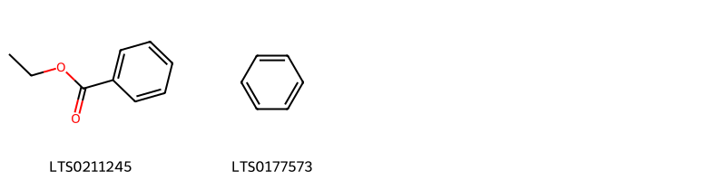{ width=100% }
    <figcaption>Hình ảnh cấu trúc hóa học của 2 hoạt chất thuộc nhóm Benzene and substituted derivatives gồm ['ethyl benzoate (LTS0211245)', 'benzene (LTS0177573)'].</figcaption>
</figure>
#### Nhóm Carboxylic acids and derivatives
<figure markdown="span">
    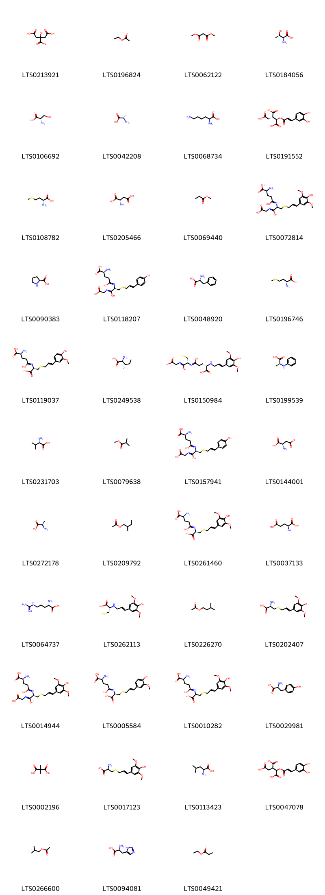{ width=100% }
    <figcaption>Hình ảnh cấu trúc hóa học của 43 hoạt chất thuộc nhóm Carboxylic acids and derivatives gồm ['citric acid (LTS0213921)', 'ethyl acetate (LTS0196824)', 'dimethyl malonate (LTS0062122)', 'l-threonine (LTS0184056)', 'l-serine (LTS0106692)', 'l-alanine (LTS0042208)', 'l-lysine (LTS0068734)', '(1r,2s)-1-{[(2e)-3-(3,4-dihydroxyphenyl)prop-2-enoyl]oxy}propane-1,2,3-tricarboxylic acid (LTS0191552)', 'd-methionine (LTS0108782)', 'l-aspartic acid (LTS0205466)', 'methyl propionate (LTS0069440)', '2-amino-4-{[1-(carboxymethyl-c-hydroxycarbonimidoyl)-2-{[3-(4-hydroxy-3,5-dimethoxyphenyl)prop-2-en-1-yl]sulfanyl}ethyl]-c-hydroxycarbonimidoyl}butanoic acid (LTS0072814)', 'l-proline (LTS0090383)', '(2s)-2-amino-4-{[(1r)-1-(carboxymethyl-c-hydroxycarbonimidoyl)-2-{[3-(4-hydroxyphenyl)prop-2-en-1-yl]sulfanyl}ethyl]-c-hydroxycarbonimidoyl}butanoic acid (LTS0118207)', 'd-phenylalanine (LTS0048920)', 'l-methionine (LTS0196746)', '(2s)-2-amino-4-{[(1r)-1-carboxy-2-{[3-(4-hydroxy-3-methoxyphenyl)prop-2-en-1-yl]sulfanyl}ethyl]-c-hydroxycarbonimidoyl}butanoic acid (LTS0119037)', 'l-isoleucine (LTS0249538)', '(2s)-4-{[(1r)-1-(carboxymethyl-c-hydroxycarbonimidoyl)-2-sulfanylethyl]-c-hydroxycarbonimidoyl}-2-{[(2e)-3-(4-hydroxy-3,5-dimethoxyphenyl)prop-2-en-1-yl]amino}butanoic acid (LTS0150984)', '(2s)-2-(phenylamino)propanoic acid (LTS0199539)', 'l-valine (LTS0231703)', 'methyl isobutyrate (LTS0079638)', '(2s)-2-amino-4-{[(1r)-1-(carboxymethyl-c-hydroxycarbonimidoyl)-2-{[(2e)-3-(4-hydroxyphenyl)prop-2-en-1-yl]sulfanyl}ethyl]-c-hydroxycarbonimidoyl}butanoic acid (LTS0157941)', 'd-aspartic acid (LTS0144001)', 'd-alanine (LTS0272178)', 'β-methylbutyl acetate (LTS0209792)', '(2s)-2-amino-4-{[(1r)-1-carboxy-2-{[(2e)-3-(4-hydroxy-3,5-dimethoxyphenyl)prop-2-en-1-yl]sulfanyl}ethyl]-c-hydroxycarbonimidoyl}butanoic acid (LTS0261460)', 'l-glutamic acid (LTS0037133)', 'l-arginine (LTS0064737)', '(2s)-2-{[(2e)-3-(4-hydroxy-3,5-dimethoxyphenyl)prop-2-en-1-yl]amino}-3-sulfanylpropanoic acid (LTS0262113)', 'banana oil (LTS0226270)', '(2r)-2-amino-3-{[(2e)-3-(4-hydroxy-3,5-dimethoxyphenyl)prop-2-en-1-yl]sulfanyl}propanoic acid (LTS0202407)', '(2s)-2-amino-4-{[(1r)-1-(carboxymethyl-c-hydroxycarbonimidoyl)-2-{[(2e)-3-(4-hydroxy-3,5-dimethoxyphenyl)prop-2-en-1-yl]sulfanyl}ethyl]-c-hydroxycarbonimidoyl}butanoic acid (LTS0014944)', '(2s)-2-amino-4-{[(1r)-1-carboxy-2-{[(2e)-3-(4-hydroxy-3-methoxyphenyl)prop-2-en-1-yl]sulfanyl}ethyl]-c-hydroxycarbonimidoyl}butanoic acid (LTS0005584)', '2-amino-4-[(1-carboxy-2-{[3-(4-hydroxy-3,5-dimethoxyphenyl)prop-2-en-1-yl]sulfanyl}ethyl)-c-hydroxycarbonimidoyl]butanoic acid (LTS0010282)', 'l-tyrosine (LTS0029981)', 'dimethylmalonic acid (LTS0002196)', '2-amino-3-{[3-(4-hydroxy-3,5-dimethoxyphenyl)prop-2-en-1-yl]sulfanyl}propanoic acid (LTS0017123)', 'l-leucine (LTS0113423)', '1-{[3-(3,4-dihydroxyphenyl)prop-2-enoyl]oxy}propane-1,2,3-tricarboxylic acid (LTS0047078)', 'isobutyl acetate (LTS0266600)', 'l-histidine (LTS0094081)', 'ethyl propionate (LTS0049421)'].</figcaption>
</figure>
#### Nhóm Cinnamic acids and derivatives
<figure markdown="span">
    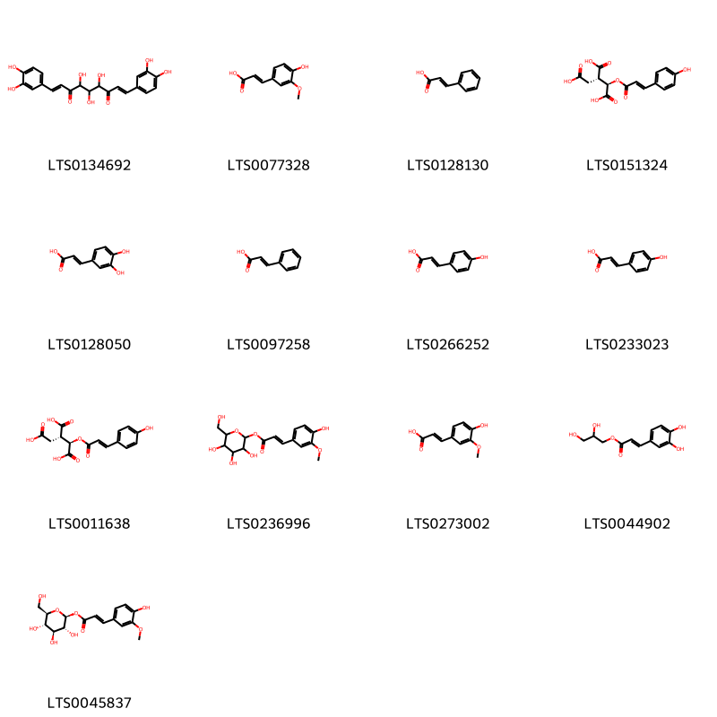{ width=100% }
    <figcaption>Hình ảnh cấu trúc hóa học của 13 hoạt chất thuộc nhóm Cinnamic acids and derivatives gồm ['(1e,8e)-1,9-bis(3,4-dihydroxyphenyl)-4,5,6-trihydroxynona-1,8-diene-3,7-dione (LTS0134692)', 'ferulic acid (LTS0077328)', 'cinnamic acid (LTS0128130)', '(1r,2s)-1-{[(2e)-3-(4-hydroxyphenyl)prop-2-enoyl]oxy}propane-1,2,3-tricarboxylic acid (LTS0151324)', '3,4-dihydroxycinnamic acid (LTS0128050)', 'phenylacrylic acid (LTS0097258)', 'para-coumaric acid (LTS0266252)', 'hydroxycinnamic acid (LTS0233023)', '(1r,2s)-1-{[3-(4-hydroxyphenyl)prop-2-enoyl]oxy}propane-1,2,3-tricarboxylic acid (LTS0011638)', '3,4,5-trihydroxy-6-(hydroxymethyl)oxan-2-yl 3-(4-hydroxy-3-methoxyphenyl)prop-2-enoate (LTS0236996)', 'ferulic acid (LTS0273002)', '2,3-dihydroxypropyl (2e)-3-(3,4-dihydroxyphenyl)prop-2-enoate (LTS0044902)', '1-o-feruloyl-β-d-glucose (LTS0045837)'].</figcaption>
</figure>
#### Nhóm Diarylheptanoids
<figure markdown="span">
    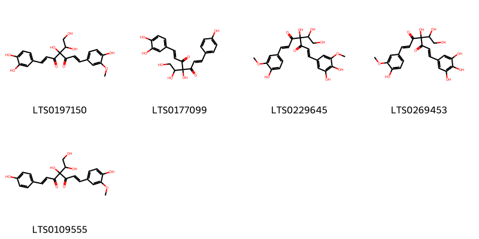{ width=100% }
    <figcaption>Hình ảnh cấu trúc hóa học của 5 hoạt chất thuộc nhóm Diarylheptanoids gồm ['(1e,6e)-4-(1,2-dihydroxyethyl)-1-(3,4-dihydroxyphenyl)-4-hydroxy-7-(4-hydroxy-3-methoxyphenyl)hepta-1,6-diene-3,5-dione (LTS0197150)', '(1e,6e)-4-(1,2-dihydroxyethyl)-1-(3,4-dihydroxyphenyl)-4-hydroxy-7-(4-hydroxyphenyl)hepta-1,6-diene-3,5-dione (LTS0177099)', '(1e,6e)-1-(3,4-dihydroxy-5-methoxyphenyl)-4-(1,2-dihydroxyethyl)-4-hydroxy-7-(4-hydroxy-3-methoxyphenyl)hepta-1,6-diene-3,5-dione (LTS0229645)', '(1e,6e)-4-(1,2-dihydroxyethyl)-4-hydroxy-1-(4-hydroxy-3-methoxyphenyl)-7-(3,4,5-trihydroxyphenyl)hepta-1,6-diene-3,5-dione (LTS0269453)', '(1e,6e)-4-(1,2-dihydroxyethyl)-4-hydroxy-1-(4-hydroxy-3-methoxyphenyl)-7-(4-hydroxyphenyl)hepta-1,6-diene-3,5-dione (LTS0109555)'].</figcaption>
</figure>
#### Nhóm Dibenzylbutane lignans
<figure markdown="span">
    { width=100% }
    <figcaption>Hình ảnh cấu trúc hóa học của 2 hoạt chất thuộc nhóm Dibenzylbutane lignans gồm ['(2s,3r)-2,3-bis[(4-hydroxy-3-methoxyphenyl)(¹³c)methyl](1-¹³c)butane-1,4-diol (LTS0268699)', 'secoisolariciresinol (LTS0086727)'].</figcaption>
</figure>
#### Nhóm Dihydrofurans
<figure markdown="span">
    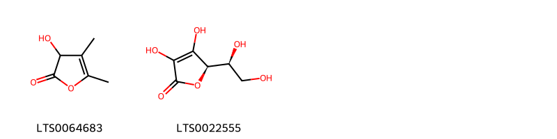{ width=100% }
    <figcaption>Hình ảnh cấu trúc hóa học của 2 hoạt chất thuộc nhóm Dihydrofurans gồm ['3-hydroxy-4,5-dimethyl-3h-furan-2-one (LTS0064683)', 'vitamin c (LTS0022555)'].</figcaption>
</figure>
#### Nhóm Fatty Acyls
<figure markdown="span">
    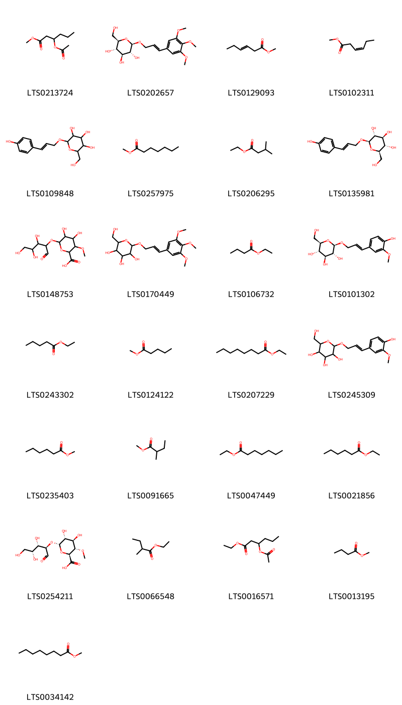{ width=100% }
    <figcaption>Hình ảnh cấu trúc hóa học của 25 hoạt chất thuộc nhóm Fatty Acyls gồm ['methyl 3-(acetyloxy)hexanoate (LTS0213724)', '(2r,3s,4s,5r,6r)-2-(hydroxymethyl)-6-{[(2e)-3-(3,4,5-trimethoxyphenyl)prop-2-en-1-yl]oxy}oxane-3,4,5-triol (LTS0202657)', 'methyl hex-3-enoate (LTS0129093)', '(3z)-methyl 3-hexenoate (LTS0102311)', '2-(hydroxymethyl)-6-{[3-(4-hydroxyphenyl)prop-2-en-1-yl]oxy}oxane-3,4,5-triol (LTS0109848)', 'methyl heptanoate (LTS0257975)', 'ethyl isovalerate (LTS0206295)', 'sachaliside (LTS0135981)', '4,5-dihydroxy-3-methoxy-6-[(3,4,5-trihydroxy-1-oxopentan-2-yl)oxy]oxane-2-carboxylic acid (LTS0148753)', '2-(hydroxymethyl)-6-{[3-(3,4,5-trimethoxyphenyl)prop-2-en-1-yl]oxy}oxane-3,4,5-triol (LTS0170449)', 'ethyl butyrate (LTS0106732)', '(2r,3r,4s,5s,6r)-2-{[(2e)-3-(4-hydroxy-3-methoxyphenyl)prop-2-en-1-yl]oxy}-6-(hydroxymethyl)oxane-3,4,5-triol (LTS0101302)', 'ethyl valerate (LTS0243302)', 'methyl valerate (LTS0124122)', 'ethyl octanoate (LTS0207229)', '2-{[3-(4-hydroxy-3-methoxyphenyl)prop-2-en-1-yl]oxy}-6-(hydroxymethyl)oxane-3,4,5-triol (LTS0245309)', 'methyl caproate (LTS0235403)', 'methyl 2-methylbutyrate (LTS0091665)', 'wine oil (LTS0047449)', 'ethyl hexanoate (LTS0021856)', '(2s,3s,4r,5r,6s)-4,5-dihydroxy-3-methoxy-6-{[(2r,3s,4r)-3,4,5-trihydroxy-1-oxopentan-2-yl]oxy}oxane-2-carboxylic acid (LTS0254211)', 'ethyl 2-methylbutyrate (LTS0066548)', 'ethyl 3-(acetyloxy)hexanoate (LTS0016571)', 'methyl butyrate (LTS0013195)', 'methyl caprylate (LTS0034142)'].</figcaption>
</figure>
#### Nhóm Flavonoids
<figure markdown="span">
    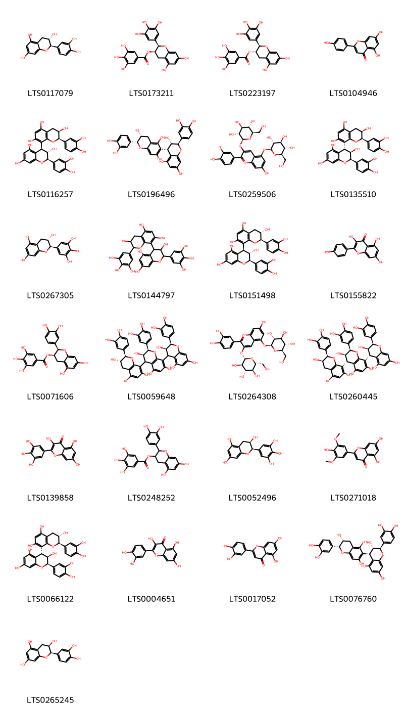{ width=100% }
    <figcaption>Hình ảnh cấu trúc hóa học của 25 hoạt chất thuộc nhóm Flavonoids gồm ['(+)-catechol (LTS0117079)', '(-)-epigallocatechin gallate (LTS0173211)', 'gallocatechin 3-o-gallate (LTS0223197)', 'chamomile (LTS0104946)', '(2r,3s,4s)-2-(3,4-dihydroxyphenyl)-4-[(2r,3r)-2-(3,4-dihydroxyphenyl)-3,5,7-trihydroxy-3,4-dihydro-2h-1-benzopyran-8-yl]-3,4-dihydro-2h-1-benzopyran-3,5,7-triol (LTS0116257)', '(2r,3s,4s)-2-(3,4-dihydroxyphenyl)-4-[(2r,3r)-2-(3,4-dihydroxyphenyl)-3,5,7-trihydroxy-3,4-dihydro-2h-1-benzopyran-6-yl]-3,4-dihydro-2h-1-benzopyran-3,5,7-triol (LTS0196496)', 'cyanin betaine (LTS0259506)', '(2r,3r,4r)-2-(3,4-dihydroxyphenyl)-4-[(2r,3r)-2-(3,4-dihydroxyphenyl)-3,5,7-trihydroxy-3,4-dihydro-2h-1-benzopyran-8-yl]-3,4-dihydro-2h-1-benzopyran-3,5,7-triol (LTS0135510)', 'gallocatechol (LTS0267305)', '4-[3,5,7-trihydroxy-2-(3,4,5-trihydroxyphenyl)-3,4-dihydro-2h-1-benzopyran-8-yl]-2-(3,4,5-trihydroxyphenyl)-3,4-dihydro-2h-1-benzopyran-3,5,7-triol (LTS0144797)', '(2r,3s,4s)-2-(3,4-dihydroxyphenyl)-4-[(2r,3s)-2-(3,4-dihydroxyphenyl)-3,5,7-trihydroxy-3,4-dihydro-2h-1-benzopyran-8-yl]-3,4-dihydro-2h-1-benzopyran-3,5,7-triol (LTS0151498)', 'kaempherol (LTS0155822)', 'epicatechin gallate (LTS0071606)', '(2r,3r)-2-(3,4-dihydroxyphenyl)-8-[(2r,3r)-2-(3,4-dihydroxyphenyl)-3,5,7-trihydroxy-3,4-dihydro-2h-1-benzopyran-4-yl]-4-[(2r,3s)-2-(3,4-dihydroxyphenyl)-3,5,7-trihydroxy-3,4-dihydro-2h-1-benzopyran-8-yl]-3,4-dihydro-2h-1-benzopyran-3,5,7-triol (LTS0059648)', 'cyanin (LTS0264308)', 'procyanidin c1 (LTS0260445)', 'myricetin (LTS0139858)', '2-(3,4-dihydroxyphenyl)-5,7-dihydroxy-3,4-dihydro-2h-1-benzopyran-3-yl 3,4,5-trihydroxybenzoate (LTS0248252)', 'epigallocatechin (LTS0052496)', 'tricin (LTS0271018)', '(2r,3r,4r)-2-(3,4-dihydroxyphenyl)-4-[(2r,3s)-2-(3,4-dihydroxyphenyl)-3,5,7-trihydroxy-3,4-dihydro-2h-1-benzopyran-8-yl]-3,4-dihydro-2h-1-benzopyran-3,5,7-triol (LTS0066122)', 'quercetin (LTS0004651)', 'luteolin (LTS0017052)', '(2r,3s,4r)-2-(3,4-dihydroxyphenyl)-4-[(2r,3r)-2-(3,4-dihydroxyphenyl)-3,5,7-trihydroxy-3,4-dihydro-2h-1-benzopyran-6-yl]-3,4-dihydro-2h-1-benzopyran-3,5,7-triol (LTS0076760)', 'ent-epicatechin (LTS0265245)'].</figcaption>
</figure>
#### Nhóm Furanoid lignans
<figure markdown="span">
    { width=100% }
    <figcaption>Hình ảnh cấu trúc hóa học của 5 hoạt chất thuộc nhóm Furanoid lignans gồm ['syringaresinol (LTS0116280)', 'pinoresinol (LTS0057431)', 'matairesinol (LTS0193475)', 'lariciresinol (LTS0010950)', '4-[(3ar,4s,6ar)-4-(4-hydroxy-3-methoxyphenyl)-hexahydrofuro[3,4-c]furan-1-yl]-2,6-dimethoxyphenol (LTS0041035)'].</figcaption>
</figure>
#### Nhóm Harmala alkaloids
<figure markdown="span">
    { width=100% }
    <figcaption>Hình ảnh cấu trúc hóa học của 5 hoạt chất thuộc nhóm Harmala alkaloids gồm ['harmine (LTS0131294)', 'harmalol (LTS0116566)', 'harmol (LTS0023194)', 'harmane (LTS0068205)', '1-methyl-3h,4h,9h-pyrido[3,4-b]indole (LTS0027115)'].</figcaption>
</figure>
#### Nhóm Hydroxy acids and derivatives
<figure markdown="span">
    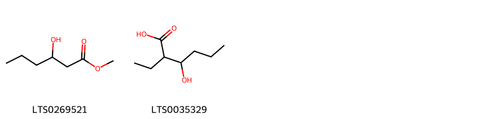{ width=100% }
    <figcaption>Hình ảnh cấu trúc hóa học của 2 hoạt chất thuộc nhóm Hydroxy acids and derivatives gồm ['methyl 3-hydroxyhexanoate (LTS0269521)', '2-ethyl-3-hydroxyhexanoic acid (LTS0035329)'].</figcaption>
</figure>
#### Nhóm Indoles and derivatives
<figure markdown="span">
    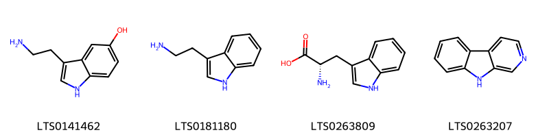{ width=100% }
    <figcaption>Hình ảnh cấu trúc hóa học của 4 hoạt chất thuộc nhóm Indoles and derivatives gồm ['serotonin (LTS0141462)', 'tryptamine (LTS0181180)', 'l-tryptophan (LTS0263809)', 'β-carboline (LTS0263207)'].</figcaption>
</figure>
#### Nhóm Organic carbonic acids and derivatives
<figure markdown="span">
    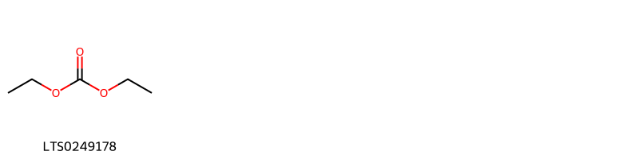{ width=100% }
    <figcaption>Hình ảnh cấu trúc hóa học của 1 hoạt chất thuộc nhóm Organic carbonic acids and derivatives gồm ['ethyl carbonate (LTS0249178)'].</figcaption>
</figure>
#### Nhóm Organooxygen compounds
<figure markdown="span">
    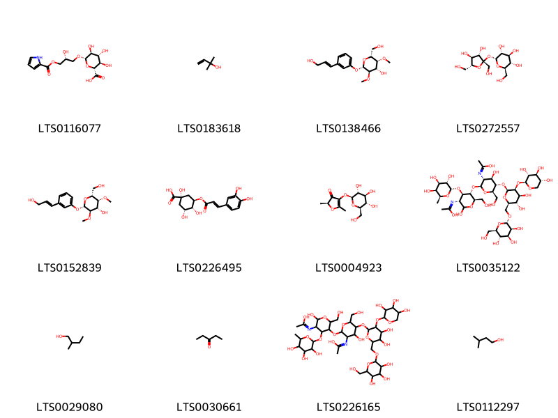{ width=100% }
    <figcaption>Hình ảnh cấu trúc hóa học của 12 hoạt chất thuộc nhóm Organooxygen compounds gồm ['(2r,3r,4r,5s,6s)-3,4,5-trihydroxy-6-[(2r)-2-hydroxy-3-(1h-pyrrole-2-carbonyloxy)propoxy]oxane-2-carboxylic acid (LTS0116077)', '2-methyl-3-buten-2-ol (LTS0183618)', '(2r,3r,4s,5r,6s)-2-(hydroxymethyl)-6-{3-[(1e)-3-hydroxyprop-1-en-1-yl]phenoxy}-3,5-dimethoxyoxan-4-ol (LTS0138466)', 'sucrose (LTS0272557)', '(2r,3r,4s,5r,6s)-2-(hydroxymethyl)-6-[3-(3-hydroxyprop-1-en-1-yl)phenoxy]-3,5-dimethoxyoxan-4-ol (LTS0152839)', 'chlorogenic acid (LTS0226495)', '(2s)-2,5-dimethyl-4-{[(2s,3r,4s,5s,6r)-3,4,5-trihydroxy-6-(hydroxymethyl)oxan-2-yl]oxy}-2h-furan-3-one (LTS0004923)', 'n-[(3r,4r,5s,6r)-5-{[(2s,3r,4r,5s,6r)-5-{[(2s,3s,4s,5s,6r)-4,5-dihydroxy-6-({[(2s,3s,4s,5s,6r)-3,4,5-trihydroxy-6-(hydroxymethyl)oxan-2-yl]oxy}methyl)-3-{[(2s,3r,4s,5r)-3,4,5-trihydroxyoxan-2-yl]oxy}oxan-2-yl]oxy}-4-hydroxy-3-[(1-hydroxyethylidene)amino]-6-(hydroxymethyl)oxan-2-yl]oxy}-2-hydroxy-6-(hydroxymethyl)-4-{[(2s,3s,4r,5s,6s)-3,4,5-trihydroxy-6-methyloxan-2-yl]oxy}oxan-3-yl]ethanimidic acid (LTS0035122)', '2-methyl-1-butanol (LTS0029080)', '3-pentanone (LTS0030661)', 'n-(5-{[4,5-dihydroxy-6-({[3,4,5-trihydroxy-6-(hydroxymethyl)oxan-2-yl]oxy}methyl)-3-[(3,4,5-trihydroxyoxan-2-yl)oxy]oxan-2-yl]oxy}-4-hydroxy-2-({6-hydroxy-5-[(1-hydroxyethylidene)amino]-2-(hydroxymethyl)-4-[(3,4,5-trihydroxy-6-methyloxan-2-yl)oxy]oxan-3-yl}oxy)-6-(hydroxymethyl)oxan-3-yl)ethanimidic acid (LTS0226165)', 'isoamyl alcohol (LTS0112297)'].</figcaption>
</figure>
#### Nhóm Phenols
<figure markdown="span">
    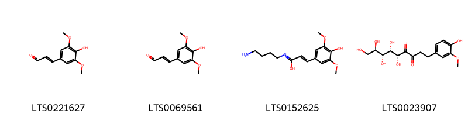{ width=100% }
    <figcaption>Hình ảnh cấu trúc hóa học của 4 hoạt chất thuộc nhóm Phenols gồm ['sinapyl aldehyde (LTS0221627)', 'sinapaldehyde (LTS0069561)', '(2e)-n-(4-aminobutyl)-3-(4-hydroxy-3,5-dimethoxyphenyl)prop-2-enimidic acid (LTS0152625)', '(5r,6s,7r,8r)-5,6,7,8,9-pentahydroxy-1-(4-hydroxy-3-methoxyphenyl)nonane-3,4-dione (LTS0023907)'].</figcaption>
</figure>
#### Nhóm Prenol lipids
<figure markdown="span">
    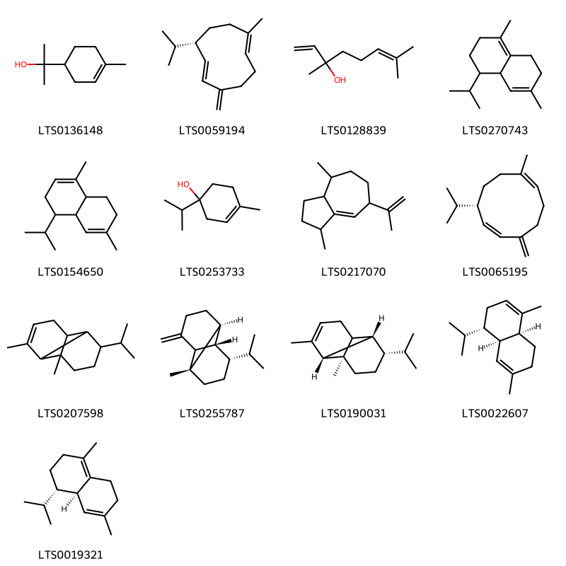{ width=100% }
    <figcaption>Hình ảnh cấu trúc hóa học của 13 hoạt chất thuộc nhóm Prenol lipids gồm ['terpineol (LTS0136148)', '(-)-germacrene d (LTS0059194)', 'linalool, (+-)- (LTS0128839)', '4-isopropyl-1,6-dimethyl-2,3,4,4a,7,8-hexahydronaphthalene (LTS0270743)', '4-isopropyl-1,6-dimethyl-3,4,4a,7,8,8a-hexahydronaphthalene (LTS0154650)', '4-terpineol (LTS0253733)', '1,4-dimethyl-7-(prop-1-en-2-yl)-1,2,3,3a,4,5,6,7-octahydroazulene (LTS0217070)', '(1z,6z,8s)-8-isopropyl-1-methyl-5-methylidenecyclodeca-1,6-diene (LTS0065195)', 'α-copaene (LTS0207598)', 'β-copaene (LTS0255787)', '(1r,2s,7s,8s)-8-isopropyl-1,3-dimethyltricyclo[4.4.0.0²,⁷]dec-3-ene (LTS0190031)', 'α-muurolene (LTS0022607)', 'delta-cadinene (LTS0019321)'].</figcaption>
</figure>
#### Nhóm Steroids and steroid derivatives
<figure markdown="span">
    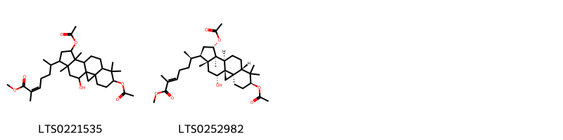{ width=100% }
    <figcaption>Hình ảnh cấu trúc hóa học của 2 hoạt chất thuộc nhóm Steroids and steroid derivatives gồm ['methyl 6-[6,13-bis(acetyloxy)-18-hydroxy-7,7,12,16-tetramethylpentacyclo[9.7.0.0¹,³.0³,⁸.0¹²,¹⁶]octadecan-15-yl]-2-methylhept-2-enoate (LTS0221535)', 'methyl (2e,6r)-6-[(1r,3r,6s,8s,11r,12s,13s,15r,16r,18r)-6,13-bis(acetyloxy)-18-hydroxy-7,7,12,16-tetramethylpentacyclo[9.7.0.0¹,³.0³,⁸.0¹²,¹⁶]octadecan-15-yl]-2-methylhept-2-enoate (LTS0252982)'].</figcaption>
</figure>
#### Nhóm Tannins
<figure markdown="span">
    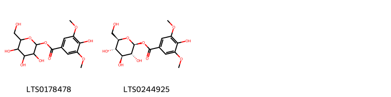{ width=100% }
    <figcaption>Hình ảnh cấu trúc hóa học của 2 hoạt chất thuộc nhóm Tannins gồm ['3,4,5-trihydroxy-6-(hydroxymethyl)oxan-2-yl 4-hydroxy-3,5-dimethoxybenzoate (LTS0178478)', '(2s,3r,4s,5s,6r)-3,4,5-trihydroxy-6-(hydroxymethyl)oxan-2-yl 4-hydroxy-3,5-dimethoxybenzoate (LTS0244925)'].</figcaption>
</figure>
#### Nhóm Thiocarboxylic acids and derivatives
<figure markdown="span">
    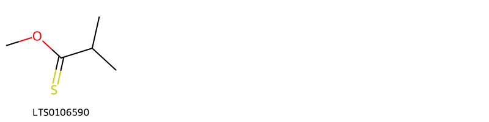{ width=100% }
    <figcaption>Hình ảnh cấu trúc hóa học của 1 hoạt chất thuộc nhóm Thiocarboxylic acids and derivatives gồm ['methyl isobutanethioate (LTS0106590)'].</figcaption>
</figure>

---

### Dược dân tộc học

Danh sách các quốc gia có sử dụng *Ananas comosus* trong điều trị các bệnh. 

| Country       | Disease                                                                                                                                               | Bệnh                                                                                                                                                                                                |
|:--------------|:------------------------------------------------------------------------------------------------------------------------------------------------------|:----------------------------------------------------------------------------------------------------------------------------------------------------------------------------------------------------|
| Dutch         | Vermifuge                                                                                                                                             | MYMEMORY WARNING: YOU USED ALL AVAILABLE FREE TRANSLATIONS FOR TODAY. NEXT AVAILABLE IN  13 HOURS 21 MINUTES 56 SECONDS VISIT HTTPS://MYMEMORY.TRANSLATED.NET/DOC/USAGELIMITS.PHP TO TRANSLATE MORE |
| Elsewhere     | Abortifacient, Cholagogue, Diuretic, Ecbolic, Estrogenic, Purgative, Refrigerant, Vermifuge, Vermifuge, Diuretic, Diaphoretic, Emmenagogue, Purgative | MYMEMORY WARNING: YOU USED ALL AVAILABLE FREE TRANSLATIONS FOR TODAY. NEXT AVAILABLE IN  13 HOURS 21 MINUTES 53 SECONDS VISIT HTTPS://MYMEMORY.TRANSLATED.NET/DOC/USAGELIMITS.PHP TO TRANSLATE MORE |
| German        | Styptic, Diuretic                                                                                                                                     | MYMEMORY WARNING: YOU USED ALL AVAILABLE FREE TRANSLATIONS FOR TODAY. NEXT AVAILABLE IN  13 HOURS 21 MINUTES 50 SECONDS VISIT HTTPS://MYMEMORY.TRANSLATED.NET/DOC/USAGELIMITS.PHP TO TRANSLATE MORE |
| Haiti         | Abortifacient, Antidote, Antidote, Digestive, Digestive, Diuretic, Diuretic, Emmenagogue, Emmenagogue, Laxative, Vermifuge, Parasiticide, Vermifuge   | MYMEMORY WARNING: YOU USED ALL AVAILABLE FREE TRANSLATIONS FOR TODAY. NEXT AVAILABLE IN  13 HOURS 21 MINUTES 47 SECONDS VISIT HTTPS://MYMEMORY.TRANSLATED.NET/DOC/USAGELIMITS.PHP TO TRANSLATE MORE |
| Iran          | Digestive                                                                                                                                             | MYMEMORY WARNING: YOU USED ALL AVAILABLE FREE TRANSLATIONS FOR TODAY. NEXT AVAILABLE IN  13 HOURS 21 MINUTES 40 SECONDS VISIT HTTPS://MYMEMORY.TRANSLATED.NET/DOC/USAGELIMITS.PHP TO TRANSLATE MORE |
| Italian       | Discutient                                                                                                                                            | MYMEMORY WARNING: YOU USED ALL AVAILABLE FREE TRANSLATIONS FOR TODAY. NEXT AVAILABLE IN  13 HOURS 21 MINUTES 31 SECONDS VISIT HTTPS://MYMEMORY.TRANSLATED.NET/DOC/USAGELIMITS.PHP TO TRANSLATE MORE |
| Java          | Emmenagogue                                                                                                                                           | MYMEMORY WARNING: YOU USED ALL AVAILABLE FREE TRANSLATIONS FOR TODAY. NEXT AVAILABLE IN  13 HOURS 21 MINUTES 25 SECONDS VISIT HTTPS://MYMEMORY.TRANSLATED.NET/DOC/USAGELIMITS.PHP TO TRANSLATE MORE |
| Malacca       | Diuretic                                                                                                                                              | MYMEMORY WARNING: YOU USED ALL AVAILABLE FREE TRANSLATIONS FOR TODAY. NEXT AVAILABLE IN  13 HOURS 21 MINUTES 18 SECONDS VISIT HTTPS://MYMEMORY.TRANSLATED.NET/DOC/USAGELIMITS.PHP TO TRANSLATE MORE |
| Malaya        | Abortifacient                                                                                                                                         | MYMEMORY WARNING: YOU USED ALL AVAILABLE FREE TRANSLATIONS FOR TODAY. NEXT AVAILABLE IN  13 HOURS 21 MINUTES 14 SECONDS VISIT HTTPS://MYMEMORY.TRANSLATED.NET/DOC/USAGELIMITS.PHP TO TRANSLATE MORE |
| Mexico        | Vermifuge                                                                                                                                             | MYMEMORY WARNING: YOU USED ALL AVAILABLE FREE TRANSLATIONS FOR TODAY. NEXT AVAILABLE IN  13 HOURS 21 MINUTES 10 SECONDS VISIT HTTPS://MYMEMORY.TRANSLATED.NET/DOC/USAGELIMITS.PHP TO TRANSLATE MORE |
| Moluccas      | Vermifuge                                                                                                                                             | MYMEMORY WARNING: YOU USED ALL AVAILABLE FREE TRANSLATIONS FOR TODAY. NEXT AVAILABLE IN  13 HOURS 21 MINUTES 07 SECONDS VISIT HTTPS://MYMEMORY.TRANSLATED.NET/DOC/USAGELIMITS.PHP TO TRANSLATE MORE |
| Panama(Choco) | Intoxicant                                                                                                                                            | MYMEMORY WARNING: YOU USED ALL AVAILABLE FREE TRANSLATIONS FOR TODAY. NEXT AVAILABLE IN  13 HOURS 21 MINUTES 04 SECONDS VISIT HTTPS://MYMEMORY.TRANSLATED.NET/DOC/USAGELIMITS.PHP TO TRANSLATE MORE |
| Portugal      | Emmenagogue                                                                                                                                           | MYMEMORY WARNING: YOU USED ALL AVAILABLE FREE TRANSLATIONS FOR TODAY. NEXT AVAILABLE IN  13 HOURS 21 MINUTES 01 SECONDS VISIT HTTPS://MYMEMORY.TRANSLATED.NET/DOC/USAGELIMITS.PHP TO TRANSLATE MORE |
| Trinidad      | Estrogenic                                                                                                                                            | MYMEMORY WARNING: YOU USED ALL AVAILABLE FREE TRANSLATIONS FOR TODAY. NEXT AVAILABLE IN  13 HOURS 20 MINUTES 58 SECONDS VISIT HTTPS://MYMEMORY.TRANSLATED.NET/DOC/USAGELIMITS.PHP TO TRANSLATE MORE |
| US            | Abortifacient                                                                                                                                         | MYMEMORY WARNING: YOU USED ALL AVAILABLE FREE TRANSLATIONS FOR TODAY. NEXT AVAILABLE IN  13 HOURS 20 MINUTES 56 SECONDS VISIT HTTPS://MYMEMORY.TRANSLATED.NET/DOC/USAGELIMITS.PHP TO TRANSLATE MORE |

---

# Chi Puya

??? note "Danh sách các dược liệu thuộc chi"
    
	 - *Puya flocosa*

---
## Puya flocosa
### Thông tin về thực vật

!!! info "Phân loại thực vật của *Puya floccosa* từ GIBF:"
    - **Kingdom:** Plantae
    - **Phylum:** Tracheophyta
    - **Order:** Poales
    - **Family:** Bromeliaceae
    - **Genus:** Puya
    - **Species:** *Puya floccosa*

 

| Label (VI)   | Label (EN)   | Scientific Name   | Descriptions (VI)   | Descriptions (EN)      | Also Known As (VI)                                               | Also Known As (EN)               |
|:-------------|:-------------|:------------------|:--------------------|:-----------------------|:-----------------------------------------------------------------|:---------------------------------|
| N/A          | N/A          | Ananas comosus    | loài thực vật       | tile bearing bromeliad | ['thơm', 'khớm', 'khóm', 'huyền nương', 'gai', 'Ananas comosus'] | ['Pineapple', 'pineapple plant'] |

#### Phân bố trên thế giới

**Từ CSDL GIBF** nan, Colombia, Venezuela (Bolivarian Republic of), Brazil, Bolivia (Plurinational State of), Costa Rica, Guyana

#### Phân bố tại Việt Nam

**Từ CSDL GIBF**: Không có ghi nhận ở Việt Nam

---
### Thành phần hóa học
        
- Theo cơ sở dữ liệu lotus: Từ loài *Puya floccosa* đã phân lập và xác định được Chưa có hoạt chất nào được phân lập. hoạt chất thuộc về các nhóm Không có hoạt chất nào được phân lập. 

Không có hình ảnh nào được tạo ra

---

### Dược dân tộc học

Danh sách các quốc gia có sử dụng *Puya floccosa* trong điều trị các bệnh. 

| Country   | Disease   | Bệnh                                                                                                                                                                                                |
|:----------|:----------|:----------------------------------------------------------------------------------------------------------------------------------------------------------------------------------------------------|
| Venezuela | Purgative | MYMEMORY WARNING: YOU USED ALL AVAILABLE FREE TRANSLATIONS FOR TODAY. NEXT AVAILABLE IN  13 HOURS 20 MINUTES 09 SECONDS VISIT HTTPS://MYMEMORY.TRANSLATED.NET/DOC/USAGELIMITS.PHP TO TRANSLATE MORE |

---

# Chi Tillandsia

??? note "Danh sách các dược liệu thuộc chi"
    
	 - *Tillandsia usenoides*
	 - *Tillandsia usneoides*

---
## Tillandsia usenoides
### Thông tin về thực vật

!!! info "Phân loại thực vật của *Tillandsia usneoides* từ GIBF:"
    - **Kingdom:** Plantae
    - **Phylum:** Tracheophyta
    - **Order:** Poales
    - **Family:** Bromeliaceae
    - **Genus:** Tillandsia
    - **Species:** *Tillandsia usneoides*

 

| Label (VI)   | Label (EN)   | Scientific Name   | Descriptions (VI)   | Descriptions (EN)      | Also Known As (VI)                                               | Also Known As (EN)               |
|:-------------|:-------------|:------------------|:--------------------|:-----------------------|:-----------------------------------------------------------------|:---------------------------------|
| N/A          | N/A          | Ananas comosus    | loài thực vật       | tile bearing bromeliad | ['thơm', 'khớm', 'khóm', 'huyền nương', 'gai', 'Ananas comosus'] | ['Pineapple', 'pineapple plant'] |

#### Phân bố trên thế giới

**Từ CSDL GIBF** nan, Colombia, Dominican Republic, Brazil, Ecuador, United States of America, Mexico, Australia, Jamaica, Guatemala

#### Phân bố tại Việt Nam

**Từ CSDL GIBF**: Không có ghi nhận ở Việt Nam

---
### Thành phần hóa học
        
- Theo cơ sở dữ liệu lotus: Từ loài *Tillandsia usneoides* đã phân lập và xác định được Chưa có hoạt chất nào được phân lập. hoạt chất thuộc về các nhóm Không có hoạt chất nào được phân lập. 

Không có hình ảnh nào được tạo ra

---

### Dược dân tộc học

Danh sách các quốc gia có sử dụng *Tillandsia usneoides* trong điều trị các bệnh. 

| Country   | Disease               | Bệnh                                                                                                                                                                                                |
|:----------|:----------------------|:----------------------------------------------------------------------------------------------------------------------------------------------------------------------------------------------------|
| Haiti     | Hemostat, Emmenagogue | MYMEMORY WARNING: YOU USED ALL AVAILABLE FREE TRANSLATIONS FOR TODAY. NEXT AVAILABLE IN  13 HOURS 19 MINUTES 43 SECONDS VISIT HTTPS://MYMEMORY.TRANSLATED.NET/DOC/USAGELIMITS.PHP TO TRANSLATE MORE |

---

---
## Tillandsia usneoides
### Thông tin về thực vật

!!! info "Phân loại thực vật của *Tillandsia usneoides* từ GIBF:"
    - **Kingdom:** Plantae
    - **Phylum:** Tracheophyta
    - **Order:** Poales
    - **Family:** Bromeliaceae
    - **Genus:** Tillandsia
    - **Species:** *Tillandsia usneoides*

 

| Label (VI)   | Label (EN)   | Scientific Name      | Descriptions (VI)   | Descriptions (EN)   | Also Known As (VI)   | Also Known As (EN)                                                                                                                        |
|:-------------|:-------------|:---------------------|:--------------------|:--------------------|:---------------------|:------------------------------------------------------------------------------------------------------------------------------------------|
| N/A          | N/A          | Tillandsia usneoides | loài thực vật       | species of plant    | ['']                 | ["old man's beard", 'grey beard', 'old man’s whiskers', 'Spanish moss', 'black moss', 'Florida moss', 'long moss', 'vegetable horsehair'] |

#### Phân bố trên thế giới

**Từ CSDL GIBF** nan, Colombia, Dominican Republic, Brazil, Ecuador, United States of America, Mexico, Australia, Jamaica, Guatemala

#### Phân bố tại Việt Nam

**Từ CSDL GIBF**: Không có ghi nhận ở Việt Nam

---
### Thành phần hóa học
        
- Theo cơ sở dữ liệu lotus: Từ loài *Tillandsia usneoides* đã phân lập và xác định được 41 hoạt chất thuộc về các nhóm Organooxygen compounds, Pyrimidine nucleosides, Flavonoids, Prenol lipids, Carboxylic acids and derivatives, Fatty Acyls, Purine nucleosides, Steroids and steroid derivatives. 

|    | chemicalTaxonomyClassyfireClass   |   smiles_count |
|---:|:----------------------------------|---------------:|
|  0 | Carboxylic acids and derivatives  |              2 |
|  1 | Fatty Acyls                       |              1 |
|  2 | Flavonoids                        |              1 |
|  3 | Organooxygen compounds            |              7 |
|  4 | Prenol lipids                     |              8 |
|  5 | Purine nucleosides                |              1 |
|  6 | Pyrimidine nucleosides            |              1 |
|  7 | Steroids and steroid derivatives  |             20 |

#### Nhóm Carboxylic acids and derivatives
<figure markdown="span">
    { width=100% }
    <figcaption>Hình ảnh cấu trúc hóa học của 2 hoạt chất thuộc nhóm Carboxylic acids and derivatives gồm ['citric acid (LTS0213921)', 'succinic acid (LTS0237204)'].</figcaption>
</figure>
#### Nhóm Fatty Acyls
<figure markdown="span">
    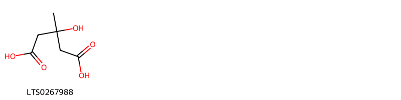{ width=100% }
    <figcaption>Hình ảnh cấu trúc hóa học của 1 hoạt chất thuộc nhóm Fatty Acyls gồm ['meglutol (LTS0267988)'].</figcaption>
</figure>
#### Nhóm Flavonoids
<figure markdown="span">
    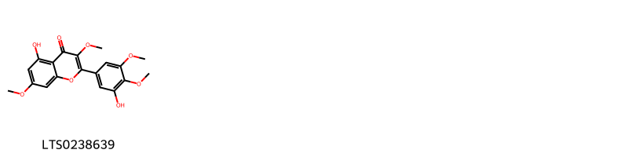{ width=100% }
    <figcaption>Hình ảnh cấu trúc hóa học của 1 hoạt chất thuộc nhóm Flavonoids gồm ['5-hydroxy-2-(3-hydroxy-4,5-dimethoxyphenyl)-3,7-dimethoxychromen-4-one (LTS0238639)'].</figcaption>
</figure>
#### Nhóm Organooxygen compounds
<figure markdown="span">
    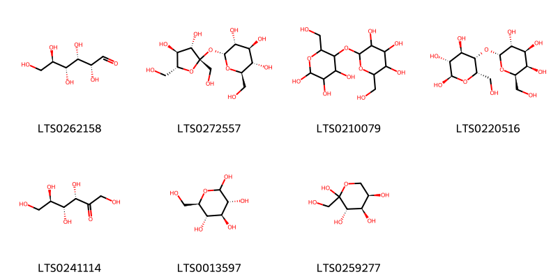{ width=100% }
    <figcaption>Hình ảnh cấu trúc hóa học của 7 hoạt chất thuộc nhóm Organooxygen compounds gồm ['(+)-glucose (LTS0262158)', 'sucrose (LTS0272557)', 'starch (LTS0210079)', '(2r,3r,4r,5s,6s)-6-(hydroxymethyl)-5-{[(2r,3r,4s,5r,6r)-3,4,5-trihydroxy-6-(hydroxymethyl)oxan-2-yl]oxy}oxane-2,3,4-triol (LTS0220516)', 'keto-d-fructose (LTS0241114)', 'glucose (LTS0013597)', 'd-fructopyranose (LTS0259277)'].</figcaption>
</figure>
#### Nhóm Prenol lipids
<figure markdown="span">
    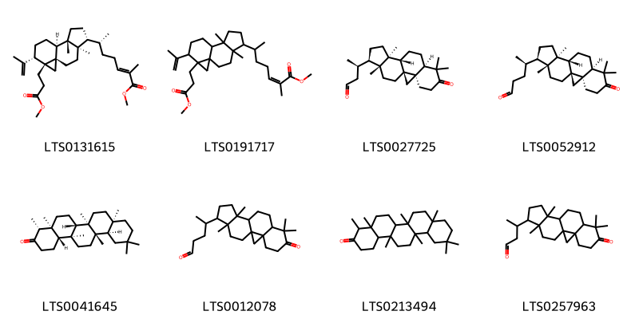{ width=100% }
    <figcaption>Hình ảnh cấu trúc hóa học của 8 hoạt chất thuộc nhóm Prenol lipids gồm ['methyl (2e,6r)-6-[(1s,4r,5r,8s,9s,12s,13r)-13-(3-methoxy-3-oxopropyl)-4,8-dimethyl-12-(prop-1-en-2-yl)tetracyclo[7.5.0.0¹,¹³.0⁴,⁸]tetradecan-5-yl]-2-methylhept-2-enoate (LTS0131615)', 'methyl 6-[13-(3-methoxy-3-oxopropyl)-4,8-dimethyl-12-(prop-1-en-2-yl)tetracyclo[7.5.0.0¹,¹³.0⁴,⁸]tetradecan-5-yl]-2-methylhept-2-enoate (LTS0191717)', '(3r)-3-[(1s,3r,8r,11s,12s,15r,16r)-7,7,12,16-tetramethyl-6-oxopentacyclo[9.7.0.0¹,³.0³,⁸.0¹²,¹⁶]octadecan-15-yl]butanal (LTS0027725)', '(4r)-4-[(1s,3r,8r,11s,12s,15r,16r)-7,7,12,16-tetramethyl-6-oxopentacyclo[9.7.0.0¹,³.0³,⁸.0¹²,¹⁶]octadecan-15-yl]pentanal (LTS0052912)', '(-)-friedelin (LTS0041645)', '4-{7,7,12,16-tetramethyl-6-oxopentacyclo[9.7.0.0¹,³.0³,⁸.0¹²,¹⁶]octadecan-15-yl}pentanal (LTS0012078)', 'friedelin (LTS0213494)', '3-{7,7,12,16-tetramethyl-6-oxopentacyclo[9.7.0.0¹,³.0³,⁸.0¹²,¹⁶]octadecan-15-yl}butanal (LTS0257963)'].</figcaption>
</figure>
#### Nhóm Purine nucleosides
<figure markdown="span">
    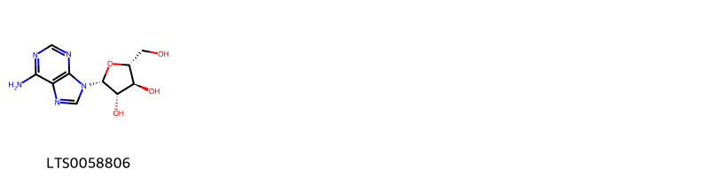{ width=100% }
    <figcaption>Hình ảnh cấu trúc hóa học của 1 hoạt chất thuộc nhóm Purine nucleosides gồm ['vidarabine (LTS0058806)'].</figcaption>
</figure>
#### Nhóm Pyrimidine nucleosides
<figure markdown="span">
    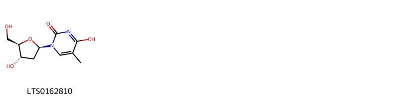{ width=100% }
    <figcaption>Hình ảnh cấu trúc hóa học của 1 hoạt chất thuộc nhóm Pyrimidine nucleosides gồm ['thymidine (LTS0162810)'].</figcaption>
</figure>
#### Nhóm Steroids and steroid derivatives
<figure markdown="span">
    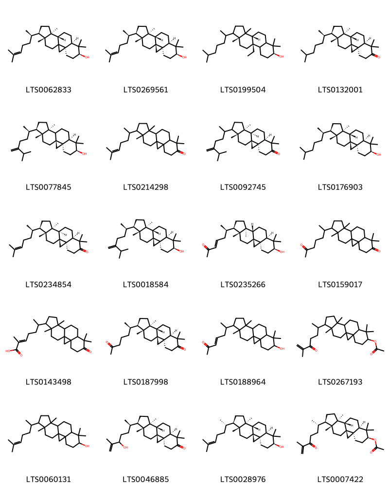{ width=100% }
    <figcaption>Hình ảnh cấu trúc hóa học của 20 hoạt chất thuộc nhóm Steroids and steroid derivatives gồm ['(3r,6s,8r,11s,12s,15r,16r)-7,7,12,16-tetramethyl-15-[(2r)-6-methylhept-5-en-2-yl]pentacyclo[9.7.0.0¹,³.0³,⁸.0¹²,¹⁶]octadecan-6-ol (LTS0062833)', 'cycloartenol (LTS0269561)', '(3br,7s,9bs,11ar)-9b-ethyl-3a,6,6,11a-tetramethyl-1-(6-methylheptan-2-yl)-dodecahydro-1h-cyclopenta[a]phenanthren-7-ol (LTS0199504)', '(1s,3r,8r,11s,12s,15r,16r)-7,7,12,16-tetramethyl-15-[(2r)-6-methylheptan-2-yl]pentacyclo[9.7.0.0¹,³.0³,⁸.0¹²,¹⁶]octadecan-6-one (LTS0132001)', '24-methylene-cycloartanol (LTS0077845)', '7,7,12,16-tetramethyl-15-(6-methylhept-5-en-2-yl)pentacyclo[9.7.0.0¹,³.0³,⁸.0¹²,¹⁶]octadecan-6-one (LTS0214298)', '(1s,3r,8r,11r,12s,16r)-7,7,12,16-tetramethyl-15-(6-methyl-5-methylideneheptan-2-yl)pentacyclo[9.7.0.0¹,³.0³,⁸.0¹²,¹⁶]octadecan-6-one (LTS0092745)', 'cycloartanol (LTS0176903)', '(1s,3r,8r,11r,12s,15r,16r)-7,7,12,16-tetramethyl-15-[(2r)-6-methylhept-5-en-2-yl]pentacyclo[9.7.0.0¹,³.0³,⁸.0¹²,¹⁶]octadecan-6-one (LTS0234854)', '24-methylenecycloartanol (LTS0018584)', '(3e,6r)-6-[(1s,3r,6s,8r,11s,12s,15r,16r)-6-hydroxy-7,7,12,16-tetramethylpentacyclo[9.7.0.0¹,³.0³,⁸.0¹²,¹⁶]octadecan-15-yl]hept-3-en-2-one (LTS0235266)', '7,7,12,16-tetramethyl-15-(6-oxoheptan-2-yl)pentacyclo[9.7.0.0¹,³.0³,⁸.0¹²,¹⁶]octadecan-6-one (LTS0159017)', '(2e)-2-methyl-6-{7,7,12,16-tetramethyl-6-oxopentacyclo[9.7.0.0¹,³.0³,⁸.0¹²,¹⁶]octadecan-15-yl}hept-2-enoic acid (LTS0143498)', '(1s,3r,8r,11s,12s,15r,16r)-7,7,12,16-tetramethyl-15-[(2r)-6-oxoheptan-2-yl]pentacyclo[9.7.0.0¹,³.0³,⁸.0¹²,¹⁶]octadecan-6-one (LTS0187998)', '6-{6-hydroxy-7,7,12,16-tetramethylpentacyclo[9.7.0.0¹,³.0³,⁸.0¹²,¹⁶]octadecan-15-yl}hept-3-en-2-one (LTS0188964)', '7,7,12,16-tetramethyl-15-(6-methyl-5-oxohept-6-en-2-yl)pentacyclo[9.7.0.0¹,³.0³,⁸.0¹²,¹⁶]octadecan-6-yl acetate (LTS0267193)', 'cycloartenol (LTS0060131)', '(1s,3r,8r,11s,12s,15r,16r)-15-[(2r)-5-hydroxy-6-methylhept-6-en-2-yl]-7,7,12,16-tetramethylpentacyclo[9.7.0.0¹,³.0³,⁸.0¹²,¹⁶]octadecan-6-one (LTS0046885)', '(1s,3r,6s,8r,11s,12s,15r,16r)-7,7,12,16-tetramethyl-15-[(2s)-6-methylhept-5-en-2-yl]pentacyclo[9.7.0.0¹,³.0³,⁸.0¹²,¹⁶]octadecan-6-ol (LTS0028976)', '(1s,3r,6s,8r,11s,12s,15r,16r)-7,7,12,16-tetramethyl-15-[(2s)-6-methyl-5-oxohept-6-en-2-yl]pentacyclo[9.7.0.0¹,³.0³,⁸.0¹²,¹⁶]octadecan-6-yl acetate (LTS0007422)'].</figcaption>
</figure>

---

### Dược dân tộc học

Danh sách các quốc gia có sử dụng *Tillandsia usneoides* trong điều trị các bệnh. 

| Country   | Disease                                                           | Bệnh                                                                                                                                                                                                |
|:----------|:------------------------------------------------------------------|:----------------------------------------------------------------------------------------------------------------------------------------------------------------------------------------------------|
| Haiti     | Emmenagogue, Hemostat, Vulnerary, Vulnerary, Sudorific, Sudorific | MYMEMORY WARNING: YOU USED ALL AVAILABLE FREE TRANSLATIONS FOR TODAY. NEXT AVAILABLE IN  13 HOURS 19 MINUTES 12 SECONDS VISIT HTTPS://MYMEMORY.TRANSLATED.NET/DOC/USAGELIMITS.PHP TO TRANSLATE MORE |
| Mexico    | Astringent                                                        | MYMEMORY WARNING: YOU USED ALL AVAILABLE FREE TRANSLATIONS FOR TODAY. NEXT AVAILABLE IN  13 HOURS 19 MINUTES 09 SECONDS VISIT HTTPS://MYMEMORY.TRANSLATED.NET/DOC/USAGELIMITS.PHP TO TRANSLATE MORE |

---

