!!! abstract "Tóm tắt"

    Họ Burseraceae gồm khoảng 8 chi và 33 loài được một số cộng đồng tại các quốc gia như Turkey, South America, Bahamas, Egypt, Mexico, Dominican Republic, Iran, China, Hindu, Voodoo, Haiti, Mexico(Seri), Sumatra, Elsewhere, India, Venezuela, Panama(Choco), Ethiopia sử dụng trong một số trường hợp QUERY LENGTH LIMIT EXCEEDED. MAX ALLOWED QUERY : 500 CHARS Chất kích thích tuyến nước bọt, Dạ dày, Thuốc giải độc, Thuốc chống đông máu, Chất làm se, Thuốc an thần, Chất kích thích, Hemostat, Vermifuge, Tiêu hóa, Chất đờm, Luyện kim, Chất làm se, Demulcent, Sudorific, Vulnerary, Thuốc lợi tiểu, Cicatrizant, Vulnerary.

!!! info "DrDuke"

    James A. Duke sinh năm 1929-2017 là một nhà thực vật học người Mỹ. Đây là một trong những tác giả hàng đầu trong lĩnh vực dược dân tộc học với cuốn *CRC Handbook of Medicinal Herbs* và chính là người xây dựng lên cơ sở dữ liệu về hợp chất tự nhiên và dược dân tộc học tại Bộ nông nghiệp Hoa Kỳ. Các thông tin được đăng tải tại website [Dr. Duke's Phytochemical and Ethnobotanical Databases](https://phytochem.nal.usda.gov/). 
    Trong suốt thập niên 1970, ông lãnh đạo the Plant Taxonomy Laboratory, Plant Genetics and Germplasm Institute of the Agricultural Research Service, U.S. Department of Agriculture.
    Trong tài liệu này, các thông tin về dược dân tộc của các dược liệu được trích dẫn từ tài liệu của James A. Ducke với sự trợ giúp của phần mềm dịch thuật từ tiếng Anh sang tiếng Việt.
   

# Chi Garuga

??? note "Danh sách các dược liệu thuộc chi"
    
	 - *Garuga pinnata*

---
## Garuga pinnata
### Thông tin về thực vật

!!! info "Phân loại thực vật của *Garuga pinnata* từ GIBF:"
    - **Kingdom:** Plantae
    - **Phylum:** Tracheophyta
    - **Order:** Sapindales
    - **Family:** Burseraceae
    - **Genus:** Garuga
    - **Species:** *Garuga pinnata*

 

| Label (VI)   | Label (EN)   | Scientific Name   | Descriptions (VI)   | Descriptions (EN)   | Also Known As (VI)   | Also Known As (EN)   |
|:-------------|:-------------|:------------------|:--------------------|:--------------------|:---------------------|:---------------------|
| N/A          | N/A          | Garuga pinnata    | loài thực vật       | species of plant    | ['']                 | ['']                 |

#### Phân bố trên thế giới

**Từ CSDL GIBF** nan, Thailand, Lao People’s Democratic Republic, Myanmar, India, unknown or invalid, Bangladesh, Liberia, Viet Nam, China, Nepal

#### Phân bố tại Việt Nam

**Từ CSDL GIBF**: Ninh Thuan

---
### Thành phần hóa học
        
- Theo cơ sở dữ liệu lotus: Từ loài *Garuga pinnata* đã phân lập và xác định được 26 hoạt chất thuộc về các nhóm Diarylheptanoids, Prenol lipids, Steroids and steroid derivatives. 

|    | chemicalTaxonomyClassyfireClass   |   smiles_count |
|---:|:----------------------------------|---------------:|
|  0 | Diarylheptanoids                  |             18 |
|  1 | Prenol lipids                     |              6 |
|  2 | Steroids and steroid derivatives  |              2 |

#### Nhóm Diarylheptanoids
<figure markdown="span">
    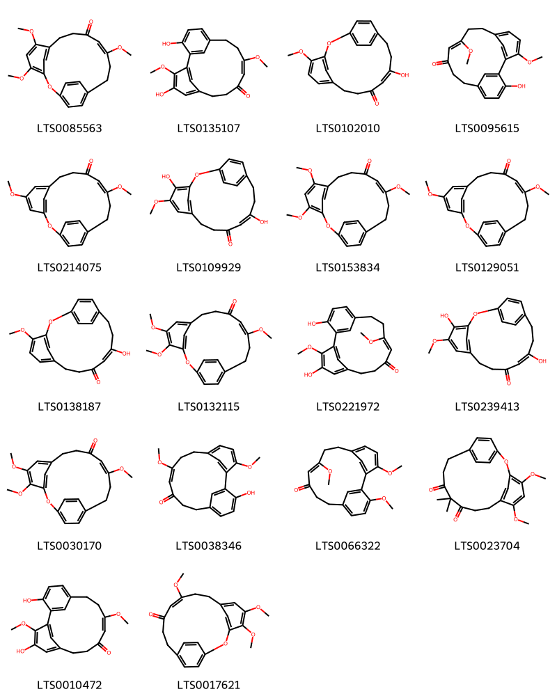{ width=100% }
    <figcaption>Hình ảnh cấu trúc hóa học của 18 hoạt chất thuộc nhóm Diarylheptanoids gồm ['(11e)-4,6,12-trimethoxy-2-oxatricyclo[13.2.2.1³,⁷]icosa-1(17),3,5,7(20),11,15,18-heptaen-10-one (LTS0085563)', '4,17-dihydroxy-3,11-dimethoxytricyclo[12.3.1.1²,⁶]nonadeca-1(18),2(19),3,5,10,14,16-heptaen-9-one (LTS0135107)', '(11e)-12-hydroxy-4-methoxy-2-oxatricyclo[13.2.2.1³,⁷]icosa-1(17),3(20),4,6,11,15,18-heptaen-10-one (LTS0102010)', '(10z)-3-hydroxy-11,17-dimethoxytricyclo[12.3.1.1²,⁶]nonadeca-1(18),2(19),3,5,10,14,16-heptaen-9-one (LTS0095615)', '5,12-dimethoxy-2-oxatricyclo[13.2.2.1³,⁷]icosa-1(17),3(20),4,6,11,15,18-heptaen-10-one (LTS0214075)', '4,12-dihydroxy-5-methoxy-2-oxatricyclo[13.2.2.1³,⁷]icosa-1(17),3,5,7(20),11,15,18-heptaen-10-one (LTS0109929)', '4,6,12-trimethoxy-2-oxatricyclo[13.2.2.1³,⁷]icosa-1(17),3,5,7(20),11,15,18-heptaen-10-one (LTS0153834)', '(11e)-5,12-dimethoxy-2-oxatricyclo[13.2.2.1³,⁷]icosa-1(17),3(20),4,6,11,15,18-heptaen-10-one (LTS0129051)', '12-hydroxy-4-methoxy-2-oxatricyclo[13.2.2.1³,⁷]icosa-1(17),3(20),4,6,11,15,18-heptaen-10-one (LTS0138187)', '4,5,12-trimethoxy-2-oxatricyclo[13.2.2.1³,⁷]icosa-1(17),3(20),4,6,11,15,18-heptaen-10-one (LTS0132115)', '(10z)-4,17-dihydroxy-3,11-dimethoxytricyclo[12.3.1.1²,⁶]nonadeca-1(18),2(19),3,5,10,14,16-heptaen-9-one (LTS0221972)', '(11e)-4,12-dihydroxy-5-methoxy-2-oxatricyclo[13.2.2.1³,⁷]icosa-1(17),3,5,7(20),11,15,18-heptaen-10-one (LTS0239413)', '(11e)-4,5,12-trimethoxy-2-oxatricyclo[13.2.2.1³,⁷]icosa-1(17),3(20),4,6,11,15,18-heptaen-10-one (LTS0030170)', '3-hydroxy-11,17-dimethoxytricyclo[12.3.1.1²,⁶]nonadeca-1(18),2(19),3,5,10,14,16-heptaen-9-one (LTS0038346)', '(10z)-3,11,17-trimethoxytricyclo[12.3.1.1²,⁶]nonadeca-1(18),2(19),3,5,10,14,16-heptaen-9-one (LTS0066322)', '4,6-dimethoxy-11,11-dimethyl-2-oxatricyclo[13.2.2.1³,⁷]icosa-1(17),3,5,7(20),15,18-hexaene-10,12-dione (LTS0023704)', '(10e)-4,17-dihydroxy-3,11-dimethoxytricyclo[12.3.1.1²,⁶]nonadeca-1(18),2(19),3,5,10,14,16-heptaen-9-one (LTS0010472)', '(10e)-4,5,10-trimethoxy-2-oxatricyclo[13.2.2.1³,⁷]icosa-1(17),3(20),4,6,10,15,18-heptaen-12-one (LTS0017621)'].</figcaption>
</figure>
#### Nhóm Prenol lipids
<figure markdown="span">
    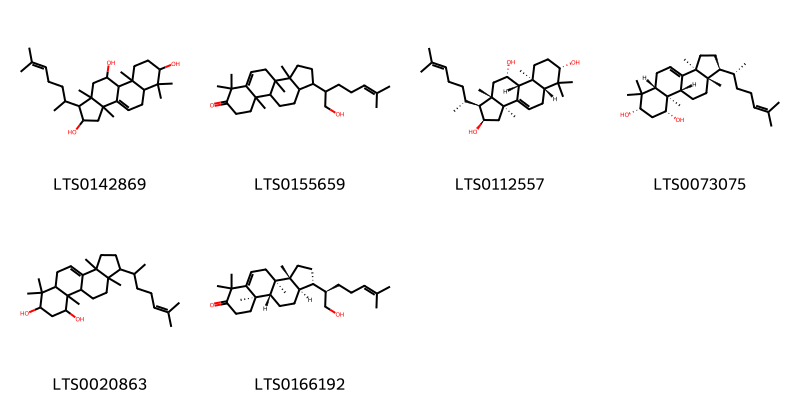{ width=100% }
    <figcaption>Hình ảnh cấu trúc hóa học của 6 hoạt chất thuộc nhóm Prenol lipids gồm ['3a,6,6,9a,11a-pentamethyl-1-(6-methylhept-5-en-2-yl)-1h,2h,3h,5h,5ah,7h,8h,9h,9bh,10h,11h-cyclopenta[a]phenanthrene-2,7,10-triol (LTS0142869)', '1-(1-hydroxy-6-methylhept-5-en-2-yl)-3a,3b,6,6,9a-pentamethyl-1h,2h,3h,4h,8h,9h,9bh,10h,11h,11ah-cyclopenta[a]phenanthren-7-one (LTS0155659)', '(1s,2r,3as,5ar,7s,9as,9br,10s,11as)-3a,6,6,9a,11a-pentamethyl-1-[(2r)-6-methylhept-5-en-2-yl]-1h,2h,3h,5h,5ah,7h,8h,9h,9bh,10h,11h-cyclopenta[a]phenanthrene-2,7,10-triol (LTS0112557)', '(1s,3as,5as,7s,9r,9ar,9bs,11as)-3a,6,6,9a,11a-pentamethyl-1-[(2r)-6-methylhept-5-en-2-yl]-1h,2h,3h,5h,5ah,7h,8h,9h,9bh,10h,11h-cyclopenta[a]phenanthrene-7,9-diol (LTS0073075)', '3a,6,6,9a,11a-pentamethyl-1-(6-methylhept-5-en-2-yl)-1h,2h,3h,5h,5ah,7h,8h,9h,9bh,10h,11h-cyclopenta[a]phenanthrene-7,9-diol (LTS0020863)', '(1s,3ar,3br,9ar,9bs,11ar)-1-[(2r)-1-hydroxy-6-methylhept-5-en-2-yl]-3a,3b,6,6,9a-pentamethyl-1h,2h,3h,4h,8h,9h,9bh,10h,11h,11ah-cyclopenta[a]phenanthren-7-one (LTS0166192)'].</figcaption>
</figure>
#### Nhóm Steroids and steroid derivatives
<figure markdown="span">
    { width=100% }
    <figcaption>Hình ảnh cấu trúc hóa học của 2 hoạt chất thuộc nhóm Steroids and steroid derivatives gồm ['stigmast-5-en-3-ol, (3β)- (LTS0204616)', 'sitosterol (LTS0168132)'].</figcaption>
</figure>

---

### Dược dân tộc học

Danh sách các quốc gia có sử dụng *Garuga pinnata* trong điều trị các bệnh. 

| Country   | Disease   | Bệnh   |
|:----------|:----------|:-------|
| India     | Digestive | tiêu   |

---

# Chi Protium

??? note "Danh sách các dược liệu thuộc chi"
    
	 - *Protium aracouchini*
	 - *Protium carana*
	 - *Protium heptaphyllum*

---
## Protium aracouchini
### Thông tin về thực vật

!!! info "Phân loại thực vật của *Protium aracouchini* từ GIBF:"
    - **Kingdom:** Plantae
    - **Phylum:** Tracheophyta
    - **Order:** Sapindales
    - **Family:** Burseraceae
    - **Genus:** Protium
    - **Species:** *Protium aracouchini*

 

| Label (VI)   | Label (EN)   | Scientific Name     | Descriptions (VI)   | Descriptions (EN)   | Also Known As (VI)   | Also Known As (EN)   |
|:-------------|:-------------|:--------------------|:--------------------|:--------------------|:---------------------|:---------------------|
| N/A          | N/A          | Protium aracouchini | loài thực vật       | species of plant    | ['']                 | ['']                 |

#### Phân bố trên thế giới

**Từ CSDL GIBF** Ecuador, Suriname, Colombia, Brazil, Costa Rica, Peru, France

#### Phân bố tại Việt Nam

**Từ CSDL GIBF**: Không có ghi nhận ở Việt Nam

---
### Thành phần hóa học
        
- Theo cơ sở dữ liệu lotus: Từ loài *Protium aracouchini* đã phân lập và xác định được Chưa có hoạt chất nào được phân lập. hoạt chất thuộc về các nhóm Không có hoạt chất nào được phân lập. 

Không có hình ảnh nào được tạo ra

---

### Dược dân tộc học

Danh sách các quốc gia có sử dụng *Protium aracouchini* trong điều trị các bệnh. 

| Country       | Disease   | Bệnh      |
|:--------------|:----------|:----------|
| South America | Vulnerary | Vulnerary |

---

---
## Protium carana
### Thông tin về thực vật

!!! info "Phân loại thực vật của *Protium carana* từ GIBF:"
    - **Kingdom:** Plantae
    - **Phylum:** Tracheophyta
    - **Order:** Sapindales
    - **Family:** Burseraceae
    - **Genus:** Protium
    - **Species:** *Protium carana*

 

| Label (VI)   | Label (EN)   | Scientific Name   | Descriptions (VI)   | Descriptions (EN)   | Also Known As (VI)   | Also Known As (EN)   |
|:-------------|:-------------|:------------------|:--------------------|:--------------------|:---------------------|:---------------------|
| N/A          | N/A          | Protium carana    | loài thực vật       | species of plant    | ['']                 | ['']                 |

#### Phân bố trên thế giới

**Từ CSDL GIBF** nan, Colombia, Brazil, Peru, Mexico, Venezuela (Bolivarian Republic of)

#### Phân bố tại Việt Nam

**Từ CSDL GIBF**: Không có ghi nhận ở Việt Nam

---
### Thành phần hóa học
        
- Theo cơ sở dữ liệu lotus: Từ loài *Protium carana* đã phân lập và xác định được Chưa có hoạt chất nào được phân lập. hoạt chất thuộc về các nhóm Không có hoạt chất nào được phân lập. 

Không có hình ảnh nào được tạo ra

---

### Dược dân tộc học

Danh sách các quốc gia có sử dụng *Protium carana* trong điều trị các bệnh. 

| Country   | Disease   | Bệnh      |
|:----------|:----------|:----------|
| Venezuela | Vulnerary | Vulnerary |

---

---
## Protium heptaphyllum
### Thông tin về thực vật

!!! info "Phân loại thực vật của *Protium heptaphyllum* từ GIBF:"
    - **Kingdom:** Plantae
    - **Phylum:** Tracheophyta
    - **Order:** Sapindales
    - **Family:** Burseraceae
    - **Genus:** Protium
    - **Species:** *Protium heptaphyllum*

 

| Label (VI)   | Label (EN)   | Scientific Name      | Descriptions (VI)   | Descriptions (EN)   | Also Known As (VI)   | Also Known As (EN)   |
|:-------------|:-------------|:---------------------|:--------------------|:--------------------|:---------------------|:---------------------|
| N/A          | N/A          | Protium heptaphyllum | loài thực vật       | species of plant    | ['']                 | ['']                 |

#### Phân bố trên thế giới

**Từ CSDL GIBF** Colombia, Brazil, French Guiana

#### Phân bố tại Việt Nam

**Từ CSDL GIBF**: Không có ghi nhận ở Việt Nam

---
### Thành phần hóa học
        
- Theo cơ sở dữ liệu lotus: Từ loài *Protium heptaphyllum* đã phân lập và xác định được 62 hoạt chất thuộc về các nhóm Fatty Acyls, Coumarinolignans, Prenol lipids, Steroids and steroid derivatives, Cinnamic acids and derivatives, Benzodioxoles, Unsaturated hydrocarbons, Coumarins and derivatives. 

|    | chemicalTaxonomyClassyfireClass   |   smiles_count |
|---:|:----------------------------------|---------------:|
|  0 | Benzodioxoles                     |              1 |
|  1 | Cinnamic acids and derivatives    |              1 |
|  2 | Coumarinolignans                  |              3 |
|  3 | Coumarins and derivatives         |              2 |
|  4 | Fatty Acyls                       |              3 |
|  5 | Prenol lipids                     |             44 |
|  6 | Steroids and steroid derivatives  |              5 |
|  7 | Unsaturated hydrocarbons          |              1 |

#### Nhóm Benzodioxoles
<figure markdown="span">
    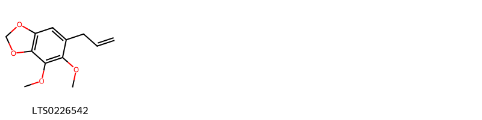{ width=100% }
    <figcaption>Hình ảnh cấu trúc hóa học của 1 hoạt chất thuộc nhóm Benzodioxoles gồm ['dillapiol (LTS0226542)'].</figcaption>
</figure>
#### Nhóm Cinnamic acids and derivatives
<figure markdown="span">
    { width=100% }
    <figcaption>Hình ảnh cấu trúc hóa học của 1 hoạt chất thuộc nhóm Cinnamic acids and derivatives gồm ['para-coumaric acid (LTS0266252)'].</figcaption>
</figure>
#### Nhóm Coumarinolignans
<figure markdown="span">
    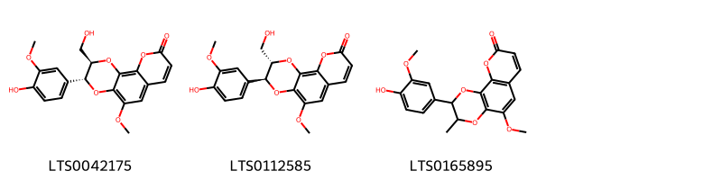{ width=100% }
    <figcaption>Hình ảnh cấu trúc hóa học của 3 hoạt chất thuộc nhóm Coumarinolignans gồm ['cleomiscosin a (LTS0042175)', '(2s,3s)-3-(4-hydroxy-3-methoxyphenyl)-2-(hydroxymethyl)-5-methoxy-2h,3h-[1,4]dioxino[2,3-h]chromen-9-one (LTS0112585)', '2-(4-hydroxy-3-methoxyphenyl)-5-methoxy-3-methyl-2h,3h-[1,4]dioxino[2,3-h]chromen-9-one (LTS0165895)'].</figcaption>
</figure>
#### Nhóm Coumarins and derivatives
<figure markdown="span">
    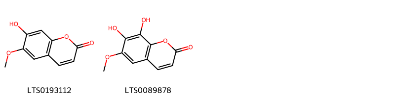{ width=100% }
    <figcaption>Hình ảnh cấu trúc hóa học của 2 hoạt chất thuộc nhóm Coumarins and derivatives gồm ['scopoletin (LTS0193112)', 'fraxetin (LTS0089878)'].</figcaption>
</figure>
#### Nhóm Fatty Acyls
<figure markdown="span">
    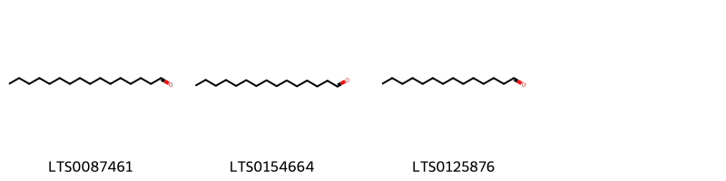{ width=100% }
    <figcaption>Hình ảnh cấu trúc hóa học của 3 hoạt chất thuộc nhóm Fatty Acyls gồm ['hexadecanal (LTS0087461)', 'pentadecanal (LTS0154664)', 'tetradecanal (LTS0125876)'].</figcaption>
</figure>
#### Nhóm Prenol lipids
<figure markdown="span">
    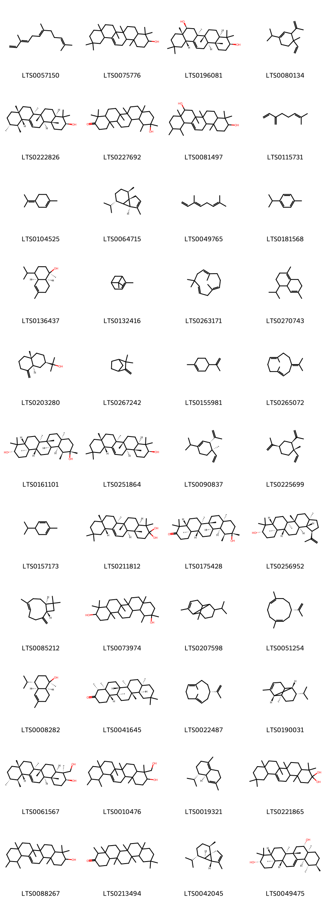{ width=100% }
    <figcaption>Hình ảnh cấu trúc hóa học của 44 hoạt chất thuộc nhóm Prenol lipids gồm ['farnesene (LTS0057150)', 'β-amyrin (LTS0075776)', 'maniladiol (LTS0196081)', '4-ethenyl-1-isopropyl-4-methyl-3-(prop-1-en-2-yl)cyclohex-1-ene (LTS0080134)', 'amyrin (LTS0222826)', '11-hydroxy-4,4,6a,6b,8a,11,12,14b-octamethyl-tetradecahydro-1h-picen-3-one (LTS0227692)', '4,4,6a,6b,8a,11,12,14b-octamethyl-2,3,4a,5,6,7,8,9,10,11,12,12a,14,14a-tetradecahydro-1h-picene-3,8-diol (LTS0081497)', 'α-myrcene (LTS0115731)', 'terpinolene (LTS0104525)', '(1s,5r,7s,10r)-7-isopropyl-4,10-dimethyltricyclo[4.4.0.0¹,⁵]dec-3-ene (LTS0064715)', 'trans-β-ocimene (LTS0049765)', 'cymene (LTS0181568)', '(1r,4ar,8as)-4-isopropyl-1,6-dimethyl-3,4,4a,7,8,8a-hexahydro-2h-naphthalen-1-ol (LTS0136437)', 'α pinene (LTS0132416)', 'humulene (LTS0263171)', '4-isopropyl-1,6-dimethyl-2,3,4,4a,7,8-hexahydronaphthalene (LTS0270743)', 'β-eudesmol (LTS0203280)', 'camphene (LTS0267242)', 'limonene,  (LTS0155981)', 'germacrene b (LTS0265072)', '(1s,2s,4as,6ar,6br,8ar,10s,12ar,12br,14ar,14br)-1,2,4a,6a,6b,9,9,12a-octamethyl-hexadecahydropicene-2,10-diol (LTS0161101)', 'β-amyrin (LTS0251864)', 'elemene (LTS0090837)', 'β-elemene (LTS0225699)', 'phellandrene (LTS0157173)', '(4ar,6ar,6bs,8ar,12ar,14ar,14br)-4,4,6a,6b,8a,11,11,14b-octamethyl-2,4a,5,6,7,8,9,10,12,12a,14,14a-dodecahydro-1h-picene-3,3-diol (LTS0211812)', '(4ar,6ar,6br,8as,11s,12s,12ar,12br,14ar,14br)-11-hydroxy-4,4,6a,6b,8a,11,12,14b-octamethyl-tetradecahydro-1h-picen-3-one (LTS0175428)', 'lupeol (LTS0256952)', 'caryophyllene (LTS0085212)', '1,2,4a,6a,6b,9,9,12a-octamethyl-hexadecahydropicene-2,10-diol (LTS0073974)', 'α-copaene (LTS0207598)', 'germacrene (LTS0051254)', 'delta-cadinol (LTS0008282)', '(-)-friedelin (LTS0041645)', '(-)-germacrene a (LTS0022487)', '(1r,2s,7s,8s)-8-isopropyl-1,3-dimethyltricyclo[4.4.0.0²,⁷]dec-3-ene (LTS0190031)', '(3s,4s,4ar,6ar,6bs,8ar,11r,12s,12ar,14ar,14br)-4-(hydroxymethyl)-4,6a,6b,8a,11,12,14b-heptamethyl-2,3,4a,5,6,7,8,9,10,11,12,12a,14,14a-tetradecahydro-1h-picen-3-ol (LTS0061567)', '4-(hydroxymethyl)-4,6a,6b,8a,11,12,14b-heptamethyl-2,3,4a,5,6,7,8,9,10,11,12,12a,14,14a-tetradecahydro-1h-picen-3-ol (LTS0010476)', 'delta-cadinene (LTS0019321)', '4,4,6a,6b,8a,11,11,14b-octamethyl-2,4a,5,6,7,8,9,10,12,12a,14,14a-dodecahydro-1h-picene-3,3-diol (LTS0221865)', 'α-amyrin (LTS0088267)', 'friedelin (LTS0213494)', '(-)-α-cubebene (LTS0042045)', 'brein (LTS0049475)'].</figcaption>
</figure>
#### Nhóm Steroids and steroid derivatives
<figure markdown="span">
    { width=100% }
    <figcaption>Hình ảnh cấu trúc hóa học của 5 hoạt chất thuộc nhóm Steroids and steroid derivatives gồm ['stigmast-5-en-3-ol (LTS0071224)', 'stigmast-5-en-3-ol, (3β)- (LTS0204616)', 'sitogluside (LTS0201798)', '2-{[1-(5-ethyl-6-methylheptan-2-yl)-9a,11a-dimethyl-1h,2h,3h,3ah,3bh,4h,6h,7h,8h,9h,9bh,10h,11h-cyclopenta[a]phenanthren-7-yl]oxy}-6-(hydroxymethyl)oxane-3,4,5-triol (LTS0158828)', 'phytosterol (LTS0029311)'].</figcaption>
</figure>
#### Nhóm Unsaturated hydrocarbons
<figure markdown="span">
    { width=100% }
    <figcaption>Hình ảnh cấu trúc hóa học của 1 hoạt chất thuộc nhóm Unsaturated hydrocarbons gồm ['α terpinene (LTS0232891)'].</figcaption>
</figure>

---

### Dược dân tộc học

Danh sách các quốc gia có sử dụng *Protium heptaphyllum* trong điều trị các bệnh. 

| Country       | Disease   | Bệnh           |
|:--------------|:----------|:---------------|
| Panama(Choco) | Larvicide | Diệt côn trùng |

---

# Chi Canarium

??? note "Danh sách các dược liệu thuộc chi"
    
	 - *Canarium album*
	 - *Canarium amboinense*
	 - *Canarium commune*
	 - *Canarium edule*
	 - *Canarium ovatum*
	 - *Canarium pimela*
	 - *Canarium zeylanicum*

---
## Canarium album
### Thông tin về thực vật

!!! info "Phân loại thực vật của *Canarium album* từ GIBF:"
    - **Kingdom:** Plantae
    - **Phylum:** Tracheophyta
    - **Order:** Sapindales
    - **Family:** Burseraceae
    - **Genus:** Canarium
    - **Species:** *Canarium album*

 

| Label (VI)   | Label (EN)   | Scientific Name   | Descriptions (VI)   | Descriptions (EN)   | Also Known As (VI)   | Also Known As (EN)   |
|:-------------|:-------------|:------------------|:--------------------|:--------------------|:---------------------|:---------------------|
| N/A          | N/A          | Canarium album    | loài thực vật       | species of plant    | ['']                 | ['']                 |

#### Phân bố trên thế giới

**Từ CSDL GIBF** nan, Hong Kong, Japan, Lao People’s Democratic Republic, Cambodia, Chinese Taipei, unknown or invalid, Indonesia, United States of America, Viet Nam, China

#### Phân bố tại Việt Nam

**Từ CSDL GIBF**: Tonkin, Gia Lai, Nghe An, Hoa Binh, 东京, Quang Nam-Da Nang

---
### Thành phần hóa học
        
- Theo cơ sở dữ liệu lotus: Từ loài *Canarium album* đã phân lập và xác định được 33 hoạt chất thuộc về các nhóm Fatty Acyls, Flavonoids, Prenol lipids, Isocoumarins and derivatives, Benzene and substituted derivatives, Organooxygen compounds, Tannins. 

|    | chemicalTaxonomyClassyfireClass     |   smiles_count |
|---:|:------------------------------------|---------------:|
|  0 | Benzene and substituted derivatives |              3 |
|  1 | Fatty Acyls                         |             10 |
|  2 | Flavonoids                          |             12 |
|  3 | Isocoumarins and derivatives        |              1 |
|  4 | Organooxygen compounds              |              1 |
|  5 | Prenol lipids                       |              4 |
|  6 | Tannins                             |              1 |

#### Nhóm Benzene and substituted derivatives
<figure markdown="span">
    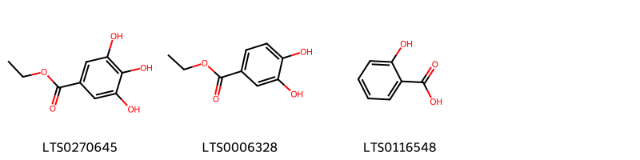{ width=100% }
    <figcaption>Hình ảnh cấu trúc hóa học của 3 hoạt chất thuộc nhóm Benzene and substituted derivatives gồm ['ethyl gallate (LTS0270645)', 'ethyl protocatechuate (LTS0006328)', 'salicyclic acid (LTS0116548)'].</figcaption>
</figure>
#### Nhóm Fatty Acyls
<figure markdown="span">
    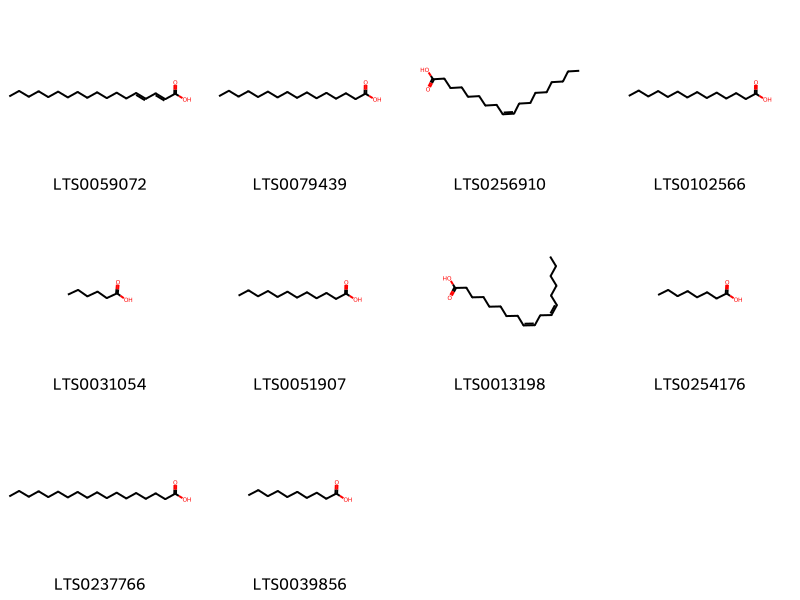{ width=100% }
    <figcaption>Hình ảnh cấu trúc hóa học của 10 hoạt chất thuộc nhóm Fatty Acyls gồm ['octadeca-2,4-dienoic acid (LTS0059072)', 'palmitic acid (LTS0079439)', 'oleic acid (LTS0256910)', 'myristic acid (LTS0102566)', 'hexanoic acid (LTS0031054)', 'lauric acid (LTS0051907)', 'linoleic (LTS0013198)', 'caprylic acid (LTS0254176)', 'stearic acid (LTS0237766)', 'capric acid (LTS0039856)'].</figcaption>
</figure>
#### Nhóm Flavonoids
<figure markdown="span">
    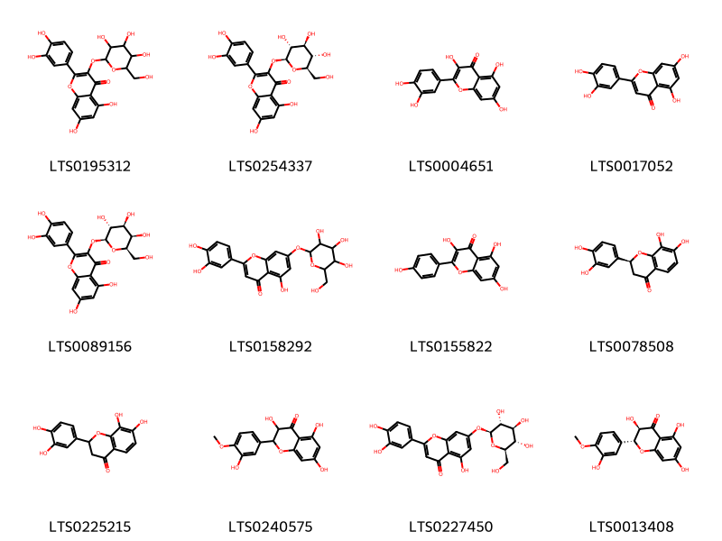{ width=100% }
    <figcaption>Hình ảnh cấu trúc hóa học của 12 hoạt chất thuộc nhóm Flavonoids gồm ['2-(3,4-dihydroxyphenyl)-5,7-dihydroxy-3-{[3,4,5-trihydroxy-6-(hydroxymethyl)oxan-2-yl]oxy}chromen-4-one (LTS0195312)', 'isoquercetin (LTS0254337)', 'quercetin (LTS0004651)', 'luteolin (LTS0017052)', 'hyperoside (LTS0089156)', '2-(3,4-dihydroxyphenyl)-5-hydroxy-7-{[3,4,5-trihydroxy-6-(hydroxymethyl)oxan-2-yl]oxy}chromen-4-one (LTS0158292)', 'kaempherol (LTS0155822)', '(2s)-2-(3,4-dihydroxyphenyl)-7,8-dihydroxy-2,3-dihydro-1-benzopyran-4-one (LTS0078508)', 'isookanin (LTS0225215)', "quercetin 4'-methyl ether (LTS0240575)", 'luteolin 7-o-glucoside (LTS0227450)', '(2r,3r)-3,5,7-trihydroxy-2-(3-hydroxy-4-methoxyphenyl)-2,3-dihydro-1-benzopyran-4-one (LTS0013408)'].</figcaption>
</figure>
#### Nhóm Isocoumarins and derivatives
<figure markdown="span">
    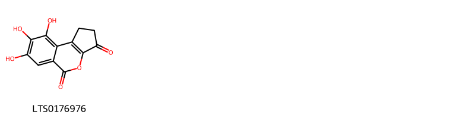{ width=100% }
    <figcaption>Hình ảnh cấu trúc hóa học của 1 hoạt chất thuộc nhóm Isocoumarins and derivatives gồm ['7,8,9-trihydroxy-1h,2h-cyclopenta[c]isochromene-3,5-dione (LTS0176976)'].</figcaption>
</figure>
#### Nhóm Organooxygen compounds
<figure markdown="span">
    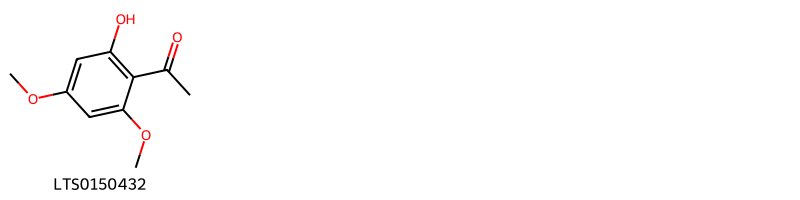{ width=100% }
    <figcaption>Hình ảnh cấu trúc hóa học của 1 hoạt chất thuộc nhóm Organooxygen compounds gồm ['xanthoxylin (LTS0150432)'].</figcaption>
</figure>
#### Nhóm Prenol lipids
<figure markdown="span">
    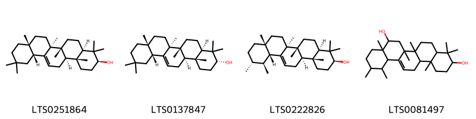{ width=100% }
    <figcaption>Hình ảnh cấu trúc hóa học của 4 hoạt chất thuộc nhóm Prenol lipids gồm ['β-amyrin (LTS0251864)', '(3r,4ar,6ar,6bs,8ar,12ar,14ar,14br)-4,4,6a,6b,8a,11,11,14b-octamethyl-1,2,3,4a,5,6,7,8,9,10,12,12a,14,14a-tetradecahydropicen-3-ol (LTS0137847)', 'amyrin (LTS0222826)', '4,4,6a,6b,8a,11,12,14b-octamethyl-2,3,4a,5,6,7,8,9,10,11,12,12a,14,14a-tetradecahydro-1h-picene-3,8-diol (LTS0081497)'].</figcaption>
</figure>
#### Nhóm Tannins
<figure markdown="span">
    { width=100% }
    <figcaption>Hình ảnh cấu trúc hóa học của 1 hoạt chất thuộc nhóm Tannins gồm ['ellagic acid (LTS0037297)'].</figcaption>
</figure>

---

### Dược dân tộc học

Danh sách các quốc gia có sử dụng *Canarium album* trong điều trị các bệnh. 

| Country   | Disease                                                                                                                            | Bệnh                                                                                                                                                                                                        |
|:----------|:-----------------------------------------------------------------------------------------------------------------------------------|:------------------------------------------------------------------------------------------------------------------------------------------------------------------------------------------------------------|
| China     | Antidote, Antiphlogistic, Antivinous, Apertif, Astringent, Sialogogue, Sialogogue, Stomachic, Antidote, Antiphlogistic, Astringent | Thuốc giải độc, Thuốc chống đông máu, Thuốc chống đông máu, Apertif, Chất làm se, Chất kích thích tuyến nước bọt, Chất kích thích tuyến nước bọt, Dạ dày, Thuốc giải độc, Thuốc chống đông máu, Chất làm se |

---

---
## Canarium amboinense
### Thông tin về thực vật

!!! info "Phân loại thực vật của *Canarium indicum* từ GIBF:"
    - **Kingdom:** Plantae
    - **Phylum:** Tracheophyta
    - **Order:** Sapindales
    - **Family:** Burseraceae
    - **Genus:** Canarium
    - **Species:** *Canarium indicum*

 

| Label (VI)   | Label (EN)   | Scientific Name     | Descriptions (VI)   | Descriptions (EN)                         | Also Known As (VI)   | Also Known As (EN)   |
|:-------------|:-------------|:--------------------|:--------------------|:------------------------------------------|:---------------------|:---------------------|
| N/A          | N/A          | Canarium amboinense |                     | species of tree in the family Burseraceae | ['']                 | ['']                 |

#### Phân bố trên thế giới

**Từ CSDL GIBF** nan, Indonesia

#### Phân bố tại Việt Nam

**Từ CSDL GIBF**: Không có ghi nhận ở Việt Nam

---
### Thành phần hóa học
        
- Theo cơ sở dữ liệu lotus: Từ loài *Canarium indicum* đã phân lập và xác định được Chưa có hoạt chất nào được phân lập. hoạt chất thuộc về các nhóm Không có hoạt chất nào được phân lập. 

Không có hình ảnh nào được tạo ra

---

### Dược dân tộc học

Danh sách các quốc gia có sử dụng *Canarium indicum* trong điều trị các bệnh. 

| Country   | Disease     | Bệnh          |
|:----------|:------------|:--------------|
| Elsewhere | Insecticide | Thuốc trừ sâu |

---

---
## Canarium commune
### Thông tin về thực vật

!!! info "Phân loại thực vật của *N/A* từ GIBF:"
    - **Kingdom:** Plantae
    - **Phylum:** Tracheophyta
    - **Order:** Sapindales
    - **Family:** Burseraceae
    - **Genus:** Canarium
    - **Species:** *N/A*

 

| Label (VI)   | Label (EN)   | Scientific Name     | Descriptions (VI)   | Descriptions (EN)                         | Also Known As (VI)   | Also Known As (EN)   |
|:-------------|:-------------|:--------------------|:--------------------|:------------------------------------------|:---------------------|:---------------------|
| N/A          | N/A          | Canarium amboinense |                     | species of tree in the family Burseraceae | ['']                 | ['']                 |

#### Phân bố trên thế giới

**Từ CSDL GIBF** Liberia, Hong Kong, Australia, Madagascar, Thailand, Gabon, Nigeria, Chinese Taipei, Côte d’Ivoire, Brazil, India, Cameroon, Guinea, Philippines, Singapore, Malaysia, Panama

#### Phân bố tại Việt Nam

**Từ CSDL GIBF**: Không có ghi nhận ở Việt Nam

---
### Thành phần hóa học
        
- Theo cơ sở dữ liệu lotus: Từ loài *N/A* đã phân lập và xác định được Chưa có hoạt chất nào được phân lập. hoạt chất thuộc về các nhóm Không có hoạt chất nào được phân lập. 

Không có hình ảnh nào được tạo ra

---

### Dược dân tộc học

Danh sách các quốc gia có sử dụng *N/A* trong điều trị các bệnh. 

| Country   | Disease                           | Bệnh                                    |
|:----------|:----------------------------------|:----------------------------------------|
| Elsewhere | Soap, Laxative                    | Xà phòng, nhuận tràng                   |
| Turkey    | Demulcent, Rubefacient, Stimulant | Demulcent, Rubefacient, Chất kích thích |

---

---
## Canarium edule
### Thông tin về thực vật

!!! info "Phân loại thực vật của *Pachylobus edulis* từ GIBF:"
    - **Kingdom:** Plantae
    - **Phylum:** Tracheophyta
    - **Order:** Sapindales
    - **Family:** Burseraceae
    - **Genus:** Pachylobus
    - **Species:** *Pachylobus edulis*

 

| Label (VI)   | Label (EN)   | Scientific Name     | Descriptions (VI)   | Descriptions (EN)                         | Also Known As (VI)   | Also Known As (EN)   |
|:-------------|:-------------|:--------------------|:--------------------|:------------------------------------------|:---------------------|:---------------------|
| N/A          | N/A          | Canarium amboinense |                     | species of tree in the family Burseraceae | ['']                 | ['']                 |

#### Phân bố trên thế giới

**Từ CSDL GIBF** Liberia, Hong Kong, Australia, Madagascar, Thailand, Gabon, Nigeria, Chinese Taipei, Côte d’Ivoire, Brazil, India, Cameroon, Guinea, Philippines, Singapore, Malaysia, Panama

#### Phân bố tại Việt Nam

**Từ CSDL GIBF**: Không có ghi nhận ở Việt Nam

---
### Thành phần hóa học
        
- Theo cơ sở dữ liệu lotus: Từ loài *Pachylobus edulis* đã phân lập và xác định được Chưa có hoạt chất nào được phân lập. hoạt chất thuộc về các nhóm Không có hoạt chất nào được phân lập. 

Không có hình ảnh nào được tạo ra

---

### Dược dân tộc học

Danh sách các quốc gia có sử dụng *Pachylobus edulis* trong điều trị các bệnh. 

| Country   | Disease     | Bệnh          |
|:----------|:------------|:--------------|
| Elsewhere | Insecticide | Thuốc trừ sâu |

---

---
## Canarium ovatum
### Thông tin về thực vật

!!! info "Phân loại thực vật của *Canarium ovatum* từ GIBF:"
    - **Kingdom:** Plantae
    - **Phylum:** Tracheophyta
    - **Order:** Sapindales
    - **Family:** Burseraceae
    - **Genus:** Canarium
    - **Species:** *Canarium ovatum*

 

| Label (VI)   | Label (EN)   | Scientific Name   | Descriptions (VI)   | Descriptions (EN)   | Also Known As (VI)   | Also Known As (EN)   |
|:-------------|:-------------|:------------------|:--------------------|:--------------------|:---------------------|:---------------------|
| N/A          | N/A          | Canarium ovatum   | loài thực vật       | species of plant    | ['']                 | ['']                 |

#### Phân bố trên thế giới

**Từ CSDL GIBF** nan, Colombia, Brazil, Costa Rica, Honduras, unknown or invalid, Indonesia, Papua New Guinea, United States of America, Philippines, Malaysia, Panama

#### Phân bố tại Việt Nam

**Từ CSDL GIBF**: Không có ghi nhận ở Việt Nam

---
### Thành phần hóa học
        
- Theo cơ sở dữ liệu lotus: Từ loài *Canarium ovatum* đã phân lập và xác định được Chưa có hoạt chất nào được phân lập. hoạt chất thuộc về các nhóm Không có hoạt chất nào được phân lập. 

Không có hình ảnh nào được tạo ra

---

### Dược dân tộc học

Danh sách các quốc gia có sử dụng *Canarium ovatum* trong điều trị các bệnh. 

| Country   | Disease   | Bệnh     |
|:----------|:----------|:---------|
| Elsewhere | Purgative | Thuốc xổ |

---

---
## Canarium pimela
### Thông tin về thực vật

!!! info "Phân loại thực vật của *Canarium pimela* từ GIBF:"
    - **Kingdom:** Plantae
    - **Phylum:** Tracheophyta
    - **Order:** Sapindales
    - **Family:** Burseraceae
    - **Genus:** Canarium
    - **Species:** *Canarium pimela*

 

| Label (VI)   | Label (EN)   | Scientific Name   | Descriptions (VI)   | Descriptions (EN)                         | Also Known As (VI)   | Also Known As (EN)   |
|:-------------|:-------------|:------------------|:--------------------|:------------------------------------------|:---------------------|:---------------------|
| N/A          | N/A          | Canarium pimela   |                     | species of tree in the family Burseraceae | ['']                 | ['']                 |

#### Phân bố trên thế giới

**Từ CSDL GIBF** nan, Malaysia, Hong Kong, Japan, Thailand, Mauritius, unknown or invalid, Cuba, Viet Nam, China

#### Phân bố tại Việt Nam

**Từ CSDL GIBF**: Quang Tri, Hoa Binh, Bac Can, Bac Giang

---
### Thành phần hóa học
        
- Theo cơ sở dữ liệu lotus: Từ loài *Canarium pimela* đã phân lập và xác định được Chưa có hoạt chất nào được phân lập. hoạt chất thuộc về các nhóm Không có hoạt chất nào được phân lập. 

Không có hình ảnh nào được tạo ra

---

### Dược dân tộc học

Danh sách các quốc gia có sử dụng *Canarium pimela* trong điều trị các bệnh. 

| Country   | Disease                                                                                   | Bệnh                                                                                                    |
|:----------|:------------------------------------------------------------------------------------------|:--------------------------------------------------------------------------------------------------------|
| China     | Antiphlogistic, Antivinous, Astringent, Sialogogue, Stimulant, Stomachic, Antidote, Tonic | Chống viêm, Chống đông, Chất làm se, Chất kích thích, Chất kích thích, Dạ dày, Thuốc giải độc, Thuốc bổ |

---

---
## Canarium zeylanicum
### Thông tin về thực vật

!!! info "Phân loại thực vật của *Canarium zeylanicum* từ GIBF:"
    - **Kingdom:** Plantae
    - **Phylum:** Tracheophyta
    - **Order:** Sapindales
    - **Family:** Burseraceae
    - **Genus:** Canarium
    - **Species:** *Canarium zeylanicum*

 

| Label (VI)   | Label (EN)   | Scientific Name     | Descriptions (VI)   | Descriptions (EN)   | Also Known As (VI)   | Also Known As (EN)   |
|:-------------|:-------------|:--------------------|:--------------------|:--------------------|:---------------------|:---------------------|
| N/A          | N/A          | Canarium zeylanicum | loài thực vật       | species of plant    | ['']                 | ['']                 |

#### Phân bố trên thế giới

**Từ CSDL GIBF** nan, Sri Lanka, Trinidad and Tobago, Italy, Thailand, unknown or invalid, Jamaica, India, Cameroon, Malaysia

#### Phân bố tại Việt Nam

**Từ CSDL GIBF**: Không có ghi nhận ở Việt Nam

---
### Thành phần hóa học
        
- Theo cơ sở dữ liệu lotus: Từ loài *Canarium zeylanicum* đã phân lập và xác định được 31 hoạt chất thuộc về các nhóm Unsaturated hydrocarbons, Prenol lipids, Steroids and steroid derivatives. 

|    | chemicalTaxonomyClassyfireClass   |   smiles_count |
|---:|:----------------------------------|---------------:|
|  0 | Prenol lipids                     |             27 |
|  1 | Steroids and steroid derivatives  |              2 |
|  2 | Unsaturated hydrocarbons          |              2 |

#### Nhóm Prenol lipids
<figure markdown="span">
    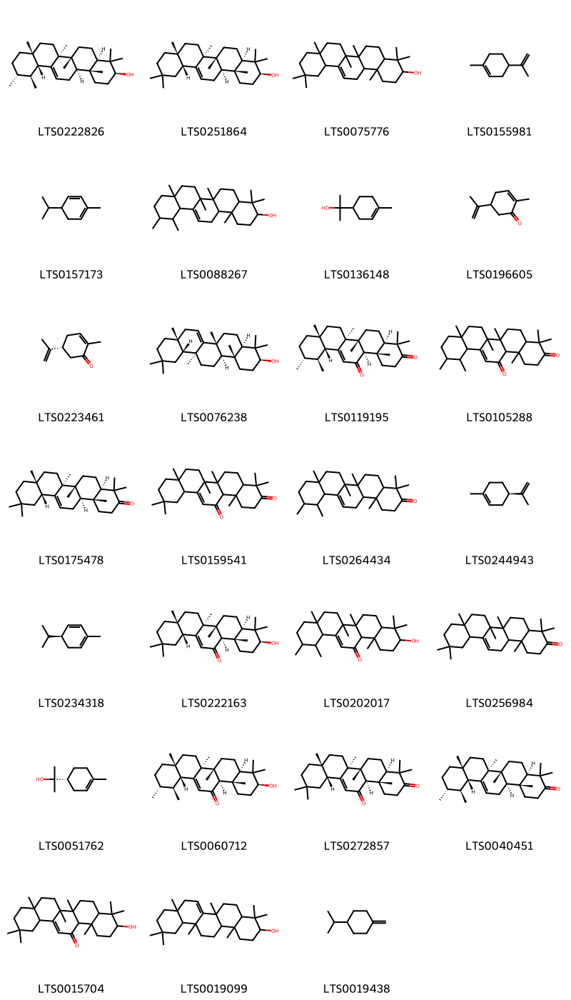{ width=100% }
    <figcaption>Hình ảnh cấu trúc hóa học của 27 hoạt chất thuộc nhóm Prenol lipids gồm ['amyrin (LTS0222826)', 'β-amyrin (LTS0251864)', 'β-amyrin (LTS0075776)', 'limonene,  (LTS0155981)', 'phellandrene (LTS0157173)', 'α-amyrin (LTS0088267)', 'terpineol (LTS0136148)', 'carvone (LTS0196605)', '(-)-carvone (LTS0223461)', 'alnulin (LTS0076238)', '(4ar,6ar,6bs,8ar,11r,12s,12ar,14ar,14bs)-4,4,6a,6b,8a,11,12,14b-octamethyl-2,4a,5,6,7,8,9,10,11,12,12a,14a-dodecahydro-1h-picene-3,14-dione (LTS0119195)', '4,4,6a,6b,8a,11,12,14b-octamethyl-2,4a,5,6,7,8,9,10,11,12,12a,14a-dodecahydro-1h-picene-3,14-dione (LTS0105288)', '(4ar,6ar,6bs,8ar,12ar,14ar,14br)-4,4,6a,6b,8a,11,11,14b-octamethyl-2,4a,5,6,7,8,9,10,12,12a,14,14a-dodecahydro-1h-picen-3-one (LTS0175478)', '4,4,6a,6b,8a,11,11,14b-octamethyl-1,2,4a,5,6,7,8,9,10,12,12a,14a-dodecahydropicene-3,14-dione (LTS0159541)', '4,4,6a,6b,8a,11,12,14b-octamethyl-1,2,4a,5,6,7,8,9,10,11,12,12a,14,14a-tetradecahydropicen-3-one (LTS0264434)', 'α-limonene (LTS0244943)', '(+)-α-phellandrene (LTS0234318)', '11-oxo-β-amyrin (LTS0222163)', '10-hydroxy-1,2,4a,6a,6b,9,9,12a-octamethyl-1,2,3,4,5,6,7,8,8a,10,11,12,12b,14b-tetradecahydropicen-13-one (LTS0202017)', '4,4,6a,6b,8a,11,11,14b-octamethyl-2,4a,5,6,7,8,9,10,12,12a,14,14a-dodecahydro-1h-picen-3-one (LTS0256984)', 'lily of valley (LTS0051762)', '(1s,2r,4ar,6as,6br,8ar,10s,12as,12br,14br)-10-hydroxy-1,2,4a,6a,6b,9,9,12a-octamethyl-1,2,3,4,5,6,7,8,8a,10,11,12,12b,14b-tetradecahydropicen-13-one (LTS0060712)', '(4ar,6ar,6bs,8ar,12ar,14ar,14bs)-4,4,6a,6b,8a,11,11,14b-octamethyl-1,2,4a,5,6,7,8,9,10,12,12a,14a-dodecahydropicene-3,14-dione (LTS0272857)', 'α-amyrenone (LTS0040451)', '10-hydroxy-2,2,4a,6a,6b,9,9,12a-octamethyl-3,4,5,6,7,8,8a,10,11,12,12b,14b-dodecahydro-1h-picen-13-one (LTS0015704)', 'taraxerol (LTS0019099)', '1(7)-p-menthene (LTS0019438)'].</figcaption>
</figure>
#### Nhóm Steroids and steroid derivatives
<figure markdown="span">
    { width=100% }
    <figcaption>Hình ảnh cấu trúc hóa học của 2 hoạt chất thuộc nhóm Steroids and steroid derivatives gồm ['stigmast-5-en-3-ol, (3β)- (LTS0204616)', 'sitosterol (LTS0168132)'].</figcaption>
</figure>
#### Nhóm Unsaturated hydrocarbons
<figure markdown="span">
    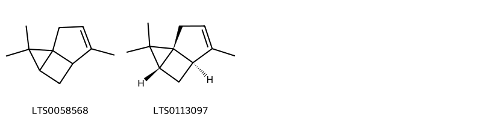{ width=100% }
    <figcaption>Hình ảnh cấu trúc hóa học của 2 hoạt chất thuộc nhóm Unsaturated hydrocarbons gồm ['2,2,6-trimethyltricyclo[3.3.0.0¹,³]oct-6-ene (LTS0058568)', '(1s,3r,5r)-2,2,6-trimethyltricyclo[3.3.0.0¹,³]oct-6-ene (LTS0113097)'].</figcaption>
</figure>

---

### Dược dân tộc học

Danh sách các quốc gia có sử dụng *Canarium zeylanicum* trong điều trị các bệnh. 

| Country   | Disease   | Bệnh                                        |
|:----------|:----------|:--------------------------------------------|
| Elsewhere | Fumigant  | chất hun khói (diệt côn trùng, vi sinh vật) |

---

# Chi Boswellia

??? note "Danh sách các dược liệu thuộc chi"
    
	 - *Boswellia carteri*
	 - *Boswellia papyrifera*

---
## Boswellia carteri
### Thông tin về thực vật

!!! info "Phân loại thực vật của *Boswellia sacra* từ GIBF:"
    - **Kingdom:** Plantae
    - **Phylum:** Tracheophyta
    - **Order:** Sapindales
    - **Family:** Burseraceae
    - **Genus:** Boswellia
    - **Species:** *Boswellia sacra*

 

| Label (VI)   | Label (EN)   | Scientific Name   | Descriptions (VI)   | Descriptions (EN)   | Also Known As (VI)   | Also Known As (EN)   |
|:-------------|:-------------|:------------------|:--------------------|:--------------------|:---------------------|:---------------------|
| N/A          | N/A          | Boswellia carteri | loài thực vật       | species of plant    | ['']                 | ['']                 |

#### Phân bố trên thế giới

**Từ CSDL GIBF** nan, Somalia, India, United States of America, Mexico, China, Yemen, Canada, Nepal

#### Phân bố tại Việt Nam

**Từ CSDL GIBF**: Không có ghi nhận ở Việt Nam

---
### Thành phần hóa học
        
- Theo cơ sở dữ liệu lotus: Từ loài *Boswellia sacra* đã phân lập và xác định được Chưa có hoạt chất nào được phân lập. hoạt chất thuộc về các nhóm Không có hoạt chất nào được phân lập. 

Không có hình ảnh nào được tạo ra

---

### Dược dân tộc học

Danh sách các quốc gia có sử dụng *Boswellia sacra* trong điều trị các bệnh. 

| Country   | Disease                                                       | Bệnh                                                                               |
|:----------|:--------------------------------------------------------------|:-----------------------------------------------------------------------------------|
| China     | Astringent, Carminative, Diuretic, Stimulant, Tonic, Sedative | Chất làm se, Carminative, Thuốc lợi tiểu, Chất kích thích, Thuốc bổ, Thuốc an thần |
| Elsewhere | Expectorant, Stimulant, Fumigant                              | Chất đờm, chất kích thích, chất khử trùng                                          |

---

---
## Boswellia papyrifera
### Thông tin về thực vật

!!! info "Phân loại thực vật của *Boswellia papyrifera* từ GIBF:"
    - **Kingdom:** Plantae
    - **Phylum:** Tracheophyta
    - **Order:** Sapindales
    - **Family:** Burseraceae
    - **Genus:** Boswellia
    - **Species:** *Boswellia papyrifera*

 

| Label (VI)   | Label (EN)   | Scientific Name      | Descriptions (VI)   | Descriptions (EN)   | Also Known As (VI)   | Also Known As (EN)   |
|:-------------|:-------------|:---------------------|:--------------------|:--------------------|:---------------------|:---------------------|
| N/A          | N/A          | Boswellia papyrifera | loài thực vật       | species of plant    | ['']                 | ['']                 |

#### Phân bố trên thế giới

**Từ CSDL GIBF** nan, Uganda, South Africa, Central African Republic, Nigeria, Japan, Eritrea, Chad, Sudan, unknown or invalid, Benin, Djibouti, Kenya, Cameroon, Ethiopia

#### Phân bố tại Việt Nam

**Từ CSDL GIBF**: Không có ghi nhận ở Việt Nam

---
### Thành phần hóa học
        
- Theo cơ sở dữ liệu lotus: Từ loài *Boswellia papyrifera* đã phân lập và xác định được 31 hoạt chất thuộc về các nhóm Organic carbonic acids and derivatives, Fatty Acyls, Prenol lipids, Steroids and steroid derivatives, Stilbenes, Organooxygen compounds. 

|    | chemicalTaxonomyClassyfireClass        |   smiles_count |
|---:|:---------------------------------------|---------------:|
|  0 | Fatty Acyls                            |              2 |
|  1 | Organic carbonic acids and derivatives |              1 |
|  2 | Organooxygen compounds                 |              2 |
|  3 | Prenol lipids                          |             22 |
|  4 | Steroids and steroid derivatives       |              2 |
|  5 | Stilbenes                              |              2 |

#### Nhóm Fatty Acyls
<figure markdown="span">
    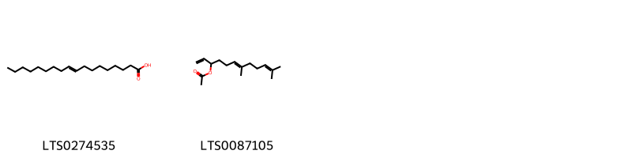{ width=100% }
    <figcaption>Hình ảnh cấu trúc hóa học của 2 hoạt chất thuộc nhóm Fatty Acyls gồm ['(+-)-propylene glycol (LTS0274535)', '(6e)-7,11-dimethyldodeca-1,6,10-trien-3-yl acetate (LTS0087105)'].</figcaption>
</figure>
#### Nhóm Organic carbonic acids and derivatives
<figure markdown="span">
    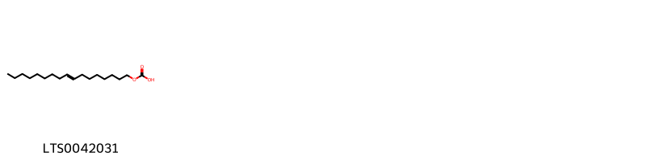{ width=100% }
    <figcaption>Hình ảnh cấu trúc hóa học của 1 hoạt chất thuộc nhóm Organic carbonic acids and derivatives gồm ['(8e)-heptadec-8-en-1-yl hydrogen carbonate (LTS0042031)'].</figcaption>
</figure>
#### Nhóm Organooxygen compounds
<figure markdown="span">
    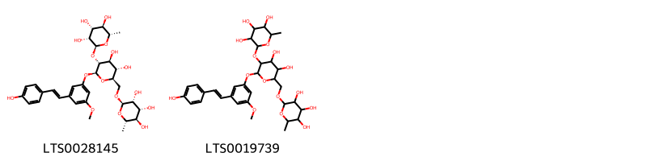{ width=100% }
    <figcaption>Hình ảnh cấu trúc hóa học của 2 hoạt chất thuộc nhóm Organooxygen compounds gồm ['(2r,3r,4r,5r,6s)-2-{[(2r,3s,4s,5r,6s)-3,4-dihydroxy-6-{3-[(1e)-2-(4-hydroxyphenyl)ethenyl]-5-methoxyphenoxy}-5-{[(2s,3r,4r,5r,6s)-3,4,5-trihydroxy-6-methyloxan-2-yl]oxy}oxan-2-yl]methoxy}-6-methyloxane-3,4,5-triol (LTS0028145)', '2-[(3,4-dihydroxy-6-{3-[2-(4-hydroxyphenyl)ethenyl]-5-methoxyphenoxy}-5-[(3,4,5-trihydroxy-6-methyloxan-2-yl)oxy]oxan-2-yl)methoxy]-6-methyloxane-3,4,5-triol (LTS0019739)'].</figcaption>
</figure>
#### Nhóm Prenol lipids
<figure markdown="span">
    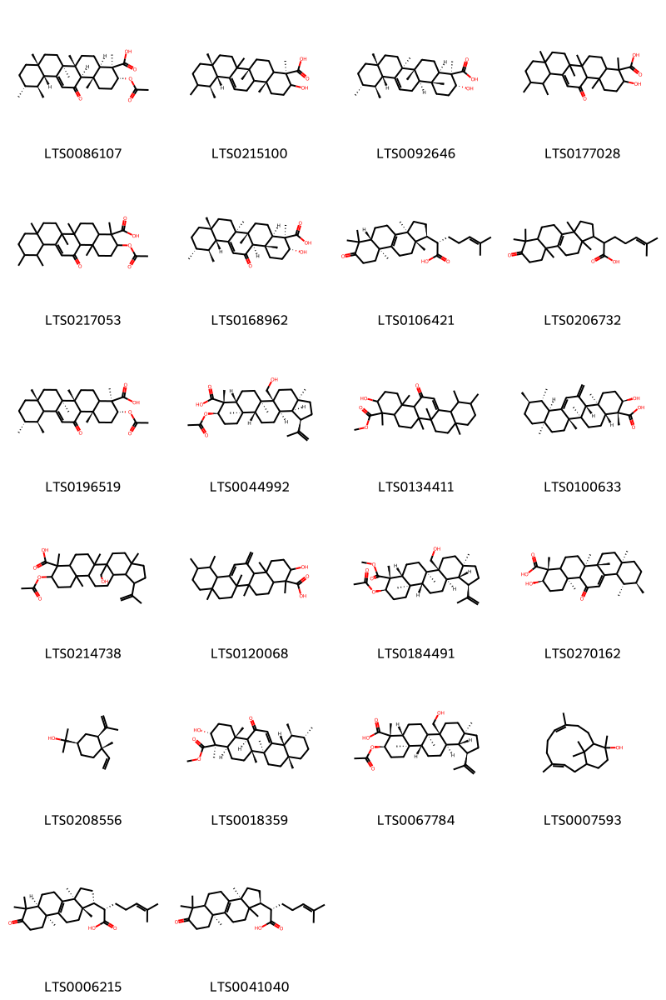{ width=100% }
    <figcaption>Hình ảnh cấu trúc hóa học của 22 hoạt chất thuộc nhóm Prenol lipids gồm ['(3r,4r,4ar,6ar,6bs,8ar,11r,12s,12ar,14ar,14bs)-3-(acetyloxy)-4,6a,6b,8a,11,12,14b-heptamethyl-14-oxo-1,2,3,4a,5,6,7,8,9,10,11,12,12a,14a-tetradecahydropicene-4-carboxylic acid (LTS0086107)', '(4r,6ar,8ar,12s,12ar,14br)-3-hydroxy-4,6a,6b,8a,11,12,14b-heptamethyl-2,3,4a,5,6,7,8,9,10,11,12,12a,14,14a-tetradecahydro-1h-picene-4-carboxylic acid (LTS0215100)', 'β-boswellic acid (LTS0092646)', '3-hydroxy-4,6a,6b,8a,11,12,14b-heptamethyl-14-oxo-1,2,3,4a,5,6,7,8,9,10,11,12,12a,14a-tetradecahydropicene-4-carboxylic acid (LTS0177028)', '3-(acetyloxy)-4,6a,6b,8a,11,12,14b-heptamethyl-14-oxo-1,2,3,4a,5,6,7,8,9,10,11,12,12a,14a-tetradecahydropicene-4-carboxylic acid (LTS0217053)', '11-keto-β-boswellic acid (LTS0168962)', '(2s)-2-[(1s,3as,5ar,9as,11as)-3a,6,6,9a,11a-pentamethyl-7-oxo-1h,2h,3h,4h,5h,5ah,8h,9h,10h,11h-cyclopenta[a]phenanthren-1-yl]-6-methylhept-5-enoic acid (LTS0106421)', '2-{3a,6,6,9a,11a-pentamethyl-7-oxo-1h,2h,3h,4h,5h,5ah,8h,9h,10h,11h-cyclopenta[a]phenanthren-1-yl}-6-methylhept-5-enoic acid (LTS0206732)', '(3r,4r,6ar,6bs,8ar,11r,12s,14bs)-3-(acetyloxy)-4,6a,6b,8a,11,12,14b-heptamethyl-14-oxo-1,2,3,4a,5,6,7,8,9,10,11,12,12a,14a-tetradecahydropicene-4-carboxylic acid (LTS0196519)', '(1r,3ar,5as,5br,7ar,8r,9r,11ar,11br,13ar,13bs)-9-(acetyloxy)-5a-(hydroxymethyl)-3a,5b,8,11a-tetramethyl-1-(prop-1-en-2-yl)-hexadecahydrocyclopenta[a]chrysene-8-carboxylic acid (LTS0044992)', 'methyl 3-hydroxy-4,6a,6b,8a,11,12,14b-heptamethyl-14-oxo-1,2,3,4a,5,6,7,8,9,10,11,12,12a,14a-tetradecahydropicene-4-carboxylate (LTS0134411)', '(3r,4r,4ar,6ar,6bs,8ar,11r,12s,12ar,14ar,14bs)-3-hydroxy-4,6a,6b,8a,11,12,14b-heptamethyl-14-methylidene-1,2,3,4a,5,6,7,8,9,10,11,12,12a,14a-tetradecahydropicene-4-carboxylic acid (LTS0100633)', '9-(acetyloxy)-5a-(hydroxymethyl)-3a,5b,8,11a-tetramethyl-1-(prop-1-en-2-yl)-hexadecahydrocyclopenta[a]chrysene-8-carboxylic acid (LTS0214738)', '3-hydroxy-4,6a,6b,8a,11,12,14b-heptamethyl-14-methylidene-1,2,3,4a,5,6,7,8,9,10,11,12,12a,14a-tetradecahydropicene-4-carboxylic acid (LTS0120068)', 'methyl (1r,3ar,5as,5br,7ar,8r,9r,11ar,11br,13ar,13br)-9-(acetyloxy)-5a-(hydroxymethyl)-3a,5b,8,11a-tetramethyl-1-(prop-1-en-2-yl)-hexadecahydrocyclopenta[a]chrysene-8-carboxylate (LTS0184491)', '(3r,4r,6ar,6bs,8ar,11r,12s,14bs)-3-hydroxy-4,6a,6b,8a,11,12,14b-heptamethyl-14-oxo-1,2,3,4a,5,6,7,8,9,10,11,12,12a,14a-tetradecahydropicene-4-carboxylic acid (LTS0270162)', 'elemol (LTS0208556)', 'methyl (3r,4r,4ar,6ar,6bs,8ar,11r,12s,12ar,14ar,14bs)-3-hydroxy-4,6a,6b,8a,11,12,14b-heptamethyl-14-oxo-1,2,3,4a,5,6,7,8,9,10,11,12,12a,14a-tetradecahydropicene-4-carboxylate (LTS0018359)', '(1r,3ar,5as,5br,7ar,8r,9r,11ar,11br,13ar,13br)-9-(acetyloxy)-5a-(hydroxymethyl)-3a,5b,8,11a-tetramethyl-1-(prop-1-en-2-yl)-hexadecahydrocyclopenta[a]chrysene-8-carboxylic acid (LTS0067784)', '(3e,7z)-4,8,12,15,15-pentamethylbicyclo[9.3.1]pentadeca-3,7-dien-12-ol (LTS0007593)', '(2s)-2-[(1r,3as,5as,9as,11as)-3a,6,6,9a,11a-pentamethyl-7-oxo-1h,2h,3h,4h,5h,5ah,8h,9h,10h,11h-cyclopenta[a]phenanthren-1-yl]-6-methylhept-5-enoic acid (LTS0006215)', '(2s)-2-[(1s,3as,9as)-3a,6,6,9a,11a-pentamethyl-7-oxo-1h,2h,3h,4h,5h,5ah,8h,9h,10h,11h-cyclopenta[a]phenanthren-1-yl]-6-methylhept-5-enoic acid (LTS0041040)'].</figcaption>
</figure>
#### Nhóm Steroids and steroid derivatives
<figure markdown="span">
    { width=100% }
    <figcaption>Hình ảnh cấu trúc hóa học của 2 hoạt chất thuộc nhóm Steroids and steroid derivatives gồm ['sitosterol (LTS0168132)', 'stigmast-5-en-3-ol, (3β)- (LTS0204616)'].</figcaption>
</figure>
#### Nhóm Stilbenes
<figure markdown="span">
    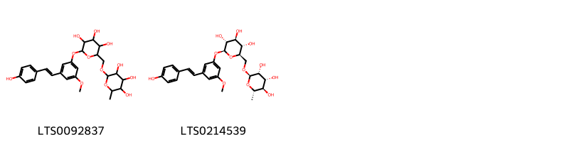{ width=100% }
    <figcaption>Hình ảnh cấu trúc hóa học của 2 hoạt chất thuộc nhóm Stilbenes gồm ['2-{3-[2-(4-hydroxyphenyl)ethenyl]-5-methoxyphenoxy}-6-{[(3,4,5-trihydroxy-6-methyloxan-2-yl)oxy]methyl}oxane-3,4,5-triol (LTS0092837)', '(2s,3r,4s,5s,6r)-2-{3-[(1e)-2-(4-hydroxyphenyl)ethenyl]-5-methoxyphenoxy}-6-({[(2r,3r,4r,5r,6s)-3,4,5-trihydroxy-6-methyloxan-2-yl]oxy}methyl)oxane-3,4,5-triol (LTS0214539)'].</figcaption>
</figure>

---

### Dược dân tộc học

Danh sách các quốc gia có sử dụng *Boswellia papyrifera* trong điều trị các bệnh. 

| Country   | Disease      | Bệnh                            |
|:----------|:-------------|:--------------------------------|
| Ethiopia  | Tranquilizer | Không khi không có cha đi cùng! |

---

# Chi Tetragastris

??? note "Danh sách các dược liệu thuộc chi"
    
	 - *Tetragastris balsamifera*

---
## Tetragastris balsamifera
### Thông tin về thực vật

!!! info "Phân loại thực vật của *N/A* từ GIBF:"
    - **Kingdom:** Plantae
    - **Phylum:** Tracheophyta
    - **Order:** Sapindales
    - **Family:** Burseraceae
    - **Genus:** N/A
    - **Species:** *N/A*

 

| Label (VI)   | Label (EN)   | Scientific Name          | Descriptions (VI)   | Descriptions (EN)   | Also Known As (VI)   | Also Known As (EN)   |
|:-------------|:-------------|:-------------------------|:--------------------|:--------------------|:---------------------|:---------------------|
| N/A          | N/A          | Tetragastris balsamifera |                     | species of plant    | ['']                 | ['']                 |

#### Phân bố trên thế giới

**Từ CSDL GIBF** Virgin Islands (U.S.), Australia, Gabon, Guatemala, Yemen, Panama, Puerto Rico, Namibia, Chinese Taipei, Honduras, Jamaica, United States of America, Belize, South Africa, Turks and Caicos Islands, Oman, Martinique, Brazil, Bahamas, New Caledonia, Cuba, Peru, Mexico, Singapore, Ecuador, Saint Kitts and Nevis, Haiti, Colombia, Costa Rica, India, Antigua and Barbuda

#### Phân bố tại Việt Nam

**Từ CSDL GIBF**: Không có ghi nhận ở Việt Nam

---
### Thành phần hóa học
        
- Theo cơ sở dữ liệu lotus: Từ loài *N/A* đã phân lập và xác định được Chưa có hoạt chất nào được phân lập. hoạt chất thuộc về các nhóm Không có hoạt chất nào được phân lập. 

Không có hình ảnh nào được tạo ra

---

### Dược dân tộc học

Danh sách các quốc gia có sử dụng *N/A* trong điều trị các bệnh. 

| Country            | Disease    | Bệnh               |
|:-------------------|:-----------|:-------------------|
| Dominican Republic | Antiseptic | Khử trùng          |
| Haiti              | Tonic      | (thuộc) trương lực |
| Voodoo             | Tonic      | (thuộc) trương lực |

---

# Chi Bursera

??? note "Danh sách các dược liệu thuộc chi"
    
	 - *Bursera aloexylon*
	 - *Bursera delpechiana*
	 - *Bursera gummifera*
	 - *Bursera jorullense*
	 - *Bursera microphylla*
	 - *Bursera odorata*
	 - *Bursera simaruba*
	 - *Bursera tomentosa*
	 - *Bursera trifoliata*
	 - *Bursera trijuga*

---
## Bursera aloexylon
### Thông tin về thực vật

!!! info "Phân loại thực vật của *Bursera linanoe* từ GIBF:"
    - **Kingdom:** Plantae
    - **Phylum:** Tracheophyta
    - **Order:** Sapindales
    - **Family:** Burseraceae
    - **Genus:** Bursera
    - **Species:** *Bursera linanoe*

 

| Label (VI)   | Label (EN)   | Scientific Name   | Descriptions (VI)   | Descriptions (EN)   | Also Known As (VI)   | Also Known As (EN)   |
|:-------------|:-------------|:------------------|:--------------------|:--------------------|:---------------------|:---------------------|
| N/A          | N/A          | Bursera aloexylon |                     | species of plant    | ['']                 | ['']                 |

#### Phân bố trên thế giới

**Từ CSDL GIBF** Mexico

#### Phân bố tại Việt Nam

**Từ CSDL GIBF**: Không có ghi nhận ở Việt Nam

---
### Thành phần hóa học
        
- Theo cơ sở dữ liệu lotus: Từ loài *Bursera linanoe* đã phân lập và xác định được Chưa có hoạt chất nào được phân lập. hoạt chất thuộc về các nhóm Không có hoạt chất nào được phân lập. 

Không có hình ảnh nào được tạo ra

---

### Dược dân tộc học

Danh sách các quốc gia có sử dụng *Bursera linanoe* trong điều trị các bệnh. 

| Country   | Disease   | Bệnh     |
|:----------|:----------|:---------|
| Mexico    | Poison    | Chất độc |

---

---
## Bursera delpechiana
### Thông tin về thực vật

!!! info "Phân loại thực vật của *Bursera linanoe* từ GIBF:"
    - **Kingdom:** Plantae
    - **Phylum:** Tracheophyta
    - **Order:** Sapindales
    - **Family:** Burseraceae
    - **Genus:** Bursera
    - **Species:** *Bursera linanoe*

 

| Label (VI)   | Label (EN)   | Scientific Name     | Descriptions (VI)   | Descriptions (EN)   | Also Known As (VI)   | Also Known As (EN)   |
|:-------------|:-------------|:--------------------|:--------------------|:--------------------|:---------------------|:---------------------|
| N/A          | N/A          | Bursera delpechiana |                     |                     | ['']                 | ['']                 |

#### Phân bố trên thế giới

**Từ CSDL GIBF** nan, India, Mexico

#### Phân bố tại Việt Nam

**Từ CSDL GIBF**: Không có ghi nhận ở Việt Nam

---
### Thành phần hóa học
        
- Theo cơ sở dữ liệu lotus: Từ loài *Bursera linanoe* đã phân lập và xác định được 20 hoạt chất thuộc về các nhóm Prenol lipids. 

|    | chemicalTaxonomyClassyfireClass   |   smiles_count |
|---:|:----------------------------------|---------------:|
|  0 | Prenol lipids                     |             20 |

#### Nhóm Prenol lipids
<figure markdown="span">
    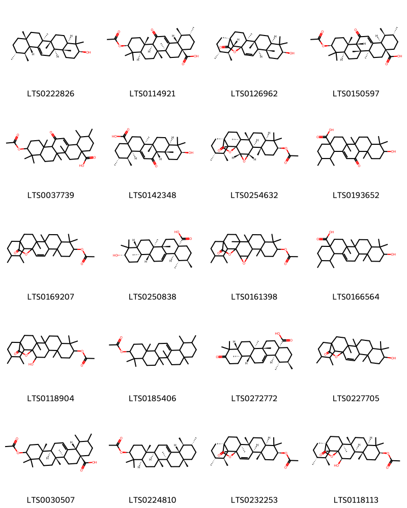{ width=100% }
    <figcaption>Hình ảnh cấu trúc hóa học của 20 hoạt chất thuộc nhóm Prenol lipids gồm ['amyrin (LTS0222826)', '(1s,2r,4as,6as,6br,8ar,10s,12as,12br,14bs)-10-(acetyloxy)-1,2,6a,6b,9,9,12a-heptamethyl-13-oxo-1,2,3,4,5,6,7,8,8a,10,11,12,12b,14b-tetradecahydropicene-4a-carboxylic acid (LTS0114921)', '(1s,4s,5r,8r,10s,13s,14r,17s,18r,19s,20r)-10-hydroxy-4,5,9,9,13,19,20-heptamethyl-24-oxahexacyclo[15.5.2.0¹,¹⁸.0⁴,¹⁷.0⁵,¹⁴.0⁸,¹³]tetracos-15-en-23-one (LTS0126962)', '(1s,2r,4as,6as,6br,8ar,10s,12as,12bs,14br)-10-(acetyloxy)-1,2,6a,6b,9,9,12a-heptamethyl-13-oxo-1,2,3,4,5,6,7,8,8a,10,11,12,12b,14b-tetradecahydropicene-4a-carboxylic acid (LTS0150597)', '10-(acetyloxy)-1,2,6a,6b,9,9,12a-heptamethyl-13-oxo-1,2,3,4,5,6,7,8,8a,10,11,12,12b,14b-tetradecahydropicene-4a-carboxylic acid (LTS0037739)', '(1s,2r,4as,6as,6br,8ar,10s,12as,12bs,14br)-10-hydroxy-1,2,6a,6b,9,9,12a-heptamethyl-13-oxo-1,2,3,4,5,6,7,8,8a,10,11,12,12b,14b-tetradecahydropicene-4a-carboxylic acid (LTS0142348)', '(1s,2s,4s,5r,6s,9s,11r,14r,15s,18s,21r,22s,23r)-6,10,10,14,15,21,22-heptamethyl-25-oxo-3,24-dioxaheptacyclo[16.5.2.0¹,¹⁵.0²,⁴.0⁵,¹⁴.0⁶,¹¹.0¹⁸,²³]pentacosan-9-yl acetate (LTS0254632)', '10-hydroxy-1,2,6a,6b,9,9,12a-heptamethyl-13-oxo-1,2,3,4,5,6,7,8,8a,10,11,12,12b,14b-tetradecahydropicene-4a-carboxylic acid (LTS0193652)', '4,5,9,9,13,19,20-heptamethyl-23-oxo-24-oxahexacyclo[15.5.2.0¹,¹⁸.0⁴,¹⁷.0⁵,¹⁴.0⁸,¹³]tetracos-15-en-10-yl acetate (LTS0169207)', 'ursolic acid (LTS0250838)', '6,10,10,14,15,21,22-heptamethyl-25-oxo-3,24-dioxaheptacyclo[16.5.2.0¹,¹⁵.0²,⁴.0⁵,¹⁴.0⁶,¹¹.0¹⁸,²³]pentacosan-9-yl acetate (LTS0161398)', '10-hydroxy-1,2,6a,6b,9,9,12a-heptamethyl-2,3,4,5,6,7,8,8a,10,11,12,12b,13,14b-tetradecahydro-1h-picene-4a-carboxylic acid (LTS0166564)', '16-hydroxy-4,5,9,9,13,19,20-heptamethyl-23-oxo-24-oxahexacyclo[15.5.2.0¹,¹⁸.0⁴,¹⁷.0⁵,¹⁴.0⁸,¹³]tetracosan-10-yl acetate (LTS0118904)', '4,4,6a,6b,8a,11,12,14b-octamethyl-2,3,4a,5,6,7,8,9,10,11,12,12a,14,14a-tetradecahydro-1h-picen-3-yl acetate (LTS0185406)', '(1s,2r,4as,6as,6br,8ar,12ar,12br,14bs)-1,2,6a,6b,9,9,12a-heptamethyl-10-oxo-1,2,3,4,5,6,7,8,8a,11,12,12b,13,14b-tetradecahydropicene-4a-carboxylic acid (LTS0272772)', '10-hydroxy-4,5,9,9,13,19,20-heptamethyl-24-oxahexacyclo[15.5.2.0¹,¹⁸.0⁴,¹⁷.0⁵,¹⁴.0⁸,¹³]tetracos-15-en-23-one (LTS0227705)', '(4as,6as,6br,12ar,12br,14bs)-10-(acetyloxy)-1,2,6a,6b,9,9,12a-heptamethyl-2,3,4,5,6,7,8,8a,10,11,12,12b,13,14b-tetradecahydro-1h-picene-4a-carboxylic acid (LTS0030507)', 'α-amyrin acetate (LTS0224810)', '(1s,4s,5r,8r,10s,13s,14r,17s,18r,19s,20r)-4,5,9,9,13,19,20-heptamethyl-23-oxo-24-oxahexacyclo[15.5.2.0¹,¹⁸.0⁴,¹⁷.0⁵,¹⁴.0⁸,¹³]tetracos-15-en-10-yl acetate (LTS0232253)', '(1s,4s,5r,8r,10s,13r,14r,16r,17s,18r,19s,20r)-16-hydroxy-4,5,9,9,13,19,20-heptamethyl-23-oxo-24-oxahexacyclo[15.5.2.0¹,¹⁸.0⁴,¹⁷.0⁵,¹⁴.0⁸,¹³]tetracosan-10-yl acetate (LTS0118113)'].</figcaption>
</figure>

---

### Dược dân tộc học

Danh sách các quốc gia có sử dụng *Bursera linanoe* trong điều trị các bệnh. 

| Country   | Disease   | Bệnh     |
|:----------|:----------|:---------|
| Elsewhere | Soap      | Xà phòng |

---

---
## Bursera gummifera
### Thông tin về thực vật

!!! info "Phân loại thực vật của *Bursera simaruba* từ GIBF:"
    - **Kingdom:** Plantae
    - **Phylum:** Tracheophyta
    - **Order:** Sapindales
    - **Family:** Burseraceae
    - **Genus:** Bursera
    - **Species:** *Bursera simaruba*

 

| Label (VI)   | Label (EN)   | Scientific Name   | Descriptions (VI)   | Descriptions (EN)   | Also Known As (VI)   | Also Known As (EN)   |
|:-------------|:-------------|:------------------|:--------------------|:--------------------|:---------------------|:---------------------|
| N/A          | N/A          | Bursera gummifera |                     |                     | ['']                 | ['']                 |

#### Phân bố trên thế giới

**Từ CSDL GIBF** nan, Guadeloupe, Grenada, unknown or invalid, Venezuela (Bolivarian Republic of), Panama, French Guiana, Puerto Rico, United States of America, Saint Martin (French part), Trinidad and Tobago, Saint Barthélemy, Martinique, Bahamas, Cuba, Dominica, Dominican Republic, Mexico, Curaçao, Saint Kitts and Nevis, Haiti, Colombia, India

#### Phân bố tại Việt Nam

**Từ CSDL GIBF**: Không có ghi nhận ở Việt Nam

---
### Thành phần hóa học
        
- Theo cơ sở dữ liệu lotus: Từ loài *Bursera simaruba* đã phân lập và xác định được Chưa có hoạt chất nào được phân lập. hoạt chất thuộc về các nhóm Không có hoạt chất nào được phân lập. 

Không có hình ảnh nào được tạo ra

---

### Dược dân tộc học

Danh sách các quốc gia có sử dụng *Bursera simaruba* trong điều trị các bệnh. 

| Country   | Disease                          | Bệnh                                   |
|:----------|:---------------------------------|:---------------------------------------|
| Elsewhere | Diuretic, Purgative, Diaphoretic | Thuốc lợi tiểu, Purgative, Diaphoretic |

---

---
## Bursera jorullense
### Thông tin về thực vật

!!! info "Phân loại thực vật của *Bursera copallifera* từ GIBF:"
    - **Kingdom:** Plantae
    - **Phylum:** Tracheophyta
    - **Order:** Sapindales
    - **Family:** Burseraceae
    - **Genus:** Bursera
    - **Species:** *Bursera copallifera*

 

| Label (VI)   | Label (EN)   | Scientific Name   | Descriptions (VI)   | Descriptions (EN)   | Also Known As (VI)   | Also Known As (EN)   |
|:-------------|:-------------|:------------------|:--------------------|:--------------------|:---------------------|:---------------------|
| N/A          | N/A          | Bursera gummifera |                     |                     | ['']                 | ['']                 |

#### Phân bố trên thế giới

**Từ CSDL GIBF** nan, Mexico

#### Phân bố tại Việt Nam

**Từ CSDL GIBF**: Không có ghi nhận ở Việt Nam

---
### Thành phần hóa học
        
- Theo cơ sở dữ liệu lotus: Từ loài *Bursera copallifera* đã phân lập và xác định được Chưa có hoạt chất nào được phân lập. hoạt chất thuộc về các nhóm Không có hoạt chất nào được phân lập. 

Không có hình ảnh nào được tạo ra

---

### Dược dân tộc học

Danh sách các quốc gia có sử dụng *Bursera copallifera* trong điều trị các bệnh. 

| Country   | Disease    | Bệnh      |
|:----------|:-----------|:----------|
| Mexico    | Astringent | Lam se da |

---

---
## Bursera microphylla
### Thông tin về thực vật

!!! info "Phân loại thực vật của *Bursera microphylla* từ GIBF:"
    - **Kingdom:** Plantae
    - **Phylum:** Tracheophyta
    - **Order:** Sapindales
    - **Family:** Burseraceae
    - **Genus:** Bursera
    - **Species:** *Bursera microphylla*

 

| Label (VI)   | Label (EN)   | Scientific Name     | Descriptions (VI)   | Descriptions (EN)   | Also Known As (VI)   | Also Known As (EN)   |
|:-------------|:-------------|:--------------------|:--------------------|:--------------------|:---------------------|:---------------------|
| N/A          | N/A          | Bursera microphylla | loài thực vật       | species of plant    | ['']                 | ['']                 |

#### Phân bố trên thế giới

**Từ CSDL GIBF** United States of America, Mexico

#### Phân bố tại Việt Nam

**Từ CSDL GIBF**: Không có ghi nhận ở Việt Nam

---
### Thành phần hóa học
        
- Theo cơ sở dữ liệu lotus: Từ loài *Bursera microphylla* đã phân lập và xác định được 5 hoạt chất thuộc về các nhóm Furanoid lignans, Dibenzylbutane lignans. 

|    | chemicalTaxonomyClassyfireClass   |   smiles_count |
|---:|:----------------------------------|---------------:|
|  0 | Dibenzylbutane lignans            |              2 |
|  1 | Furanoid lignans                  |              2 |

#### Nhóm Dibenzylbutane lignans
<figure markdown="span">
    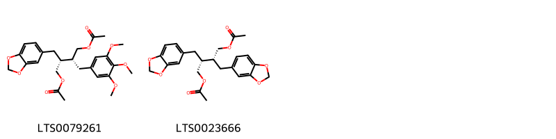{ width=100% }
    <figcaption>Hình ảnh cấu trúc hóa học của 2 hoạt chất thuộc nhóm Dibenzylbutane lignans gồm ['(2r,3r)-4-(acetyloxy)-3-(2h-1,3-benzodioxol-5-ylmethyl)-2-[(3,4,5-trimethoxyphenyl)methyl]butyl acetate (LTS0079261)', '(2r,3r)-4-(acetyloxy)-2,3-bis(2h-1,3-benzodioxol-5-ylmethyl)butyl acetate (LTS0023666)'].</figcaption>
</figure>
#### Nhóm Furanoid lignans
<figure markdown="span">
    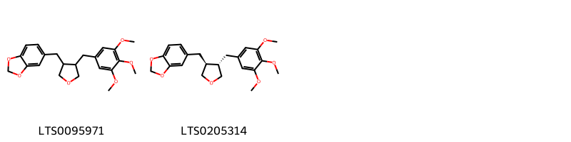{ width=100% }
    <figcaption>Hình ảnh cấu trúc hóa học của 2 hoạt chất thuộc nhóm Furanoid lignans gồm ['5-({4-[(3,4,5-trimethoxyphenyl)methyl]oxolan-3-yl}methyl)-2h-1,3-benzodioxole (LTS0095971)', 'burseran (LTS0205314)'].</figcaption>
</figure>

---

### Dược dân tộc học

Danh sách các quốc gia có sử dụng *Bursera microphylla* trong điều trị các bệnh. 

| Country      | Disease      | Bệnh         |
|:-------------|:-------------|:-------------|
| Mexico       | Astringent   | Lam se da    |
| Mexico(Seri) | Pediculicide | Pediculicide |

---

---
## Bursera odorata
### Thông tin về thực vật

!!! info "Phân loại thực vật của *Bursera odorata* từ GIBF:"
    - **Kingdom:** Plantae
    - **Phylum:** Tracheophyta
    - **Order:** Sapindales
    - **Family:** Burseraceae
    - **Genus:** Bursera
    - **Species:** *Bursera odorata*

 

| Label (VI)   | Label (EN)   | Scientific Name   | Descriptions (VI)   | Descriptions (EN)   | Also Known As (VI)   | Also Known As (EN)   |
|:-------------|:-------------|:------------------|:--------------------|:--------------------|:---------------------|:---------------------|
| N/A          | N/A          | Bursera odorata   | loài thực vật       | species of plant    | ['']                 | ['']                 |

#### Phân bố trên thế giới

**Từ CSDL GIBF** nan, United States of America, Mexico

#### Phân bố tại Việt Nam

**Từ CSDL GIBF**: Không có ghi nhận ở Việt Nam

---
### Thành phần hóa học
        
- Theo cơ sở dữ liệu lotus: Từ loài *Bursera odorata* đã phân lập và xác định được Chưa có hoạt chất nào được phân lập. hoạt chất thuộc về các nhóm Không có hoạt chất nào được phân lập. 

Không có hình ảnh nào được tạo ra

---

### Dược dân tộc học

Danh sách các quốc gia có sử dụng *Bursera odorata* trong điều trị các bệnh. 

| Country   | Disease                | Bệnh                      |
|:----------|:-----------------------|:--------------------------|
| Elsewhere | Expectorant, Purgative | Thuốc long đờm, thuốc tẩy |
| Mexico    | Expectorant, Purgative | Thuốc long đờm, thuốc tẩy |

---

---
## Bursera simaruba
### Thông tin về thực vật

!!! info "Phân loại thực vật của *Bursera simaruba* từ GIBF:"
    - **Kingdom:** Plantae
    - **Phylum:** Tracheophyta
    - **Order:** Sapindales
    - **Family:** Burseraceae
    - **Genus:** Bursera
    - **Species:** *Bursera simaruba*

 

| Label (VI)   | Label (EN)   | Scientific Name   | Descriptions (VI)   | Descriptions (EN)   | Also Known As (VI)   | Also Known As (EN)   |
|:-------------|:-------------|:------------------|:--------------------|:--------------------|:---------------------|:---------------------|
| N/A          | N/A          | Bursera simaruba  | loài thực vật       | species of plant    | ['']                 | ['']                 |

#### Phân bố trên thế giới

**Từ CSDL GIBF** Virgin Islands (U.S.), Guadeloupe, Guatemala, Saint Lucia, Nicaragua, Panama, Puerto Rico, Honduras, Jamaica, United States of America, Belize, Trinidad and Tobago, Turks and Caicos Islands, Martinique, Bahamas, Cuba, Mexico, Dominica, Dominican Republic, Curaçao, Saint Kitts and Nevis, Haiti, Costa Rica, Cayman Islands, Antigua and Barbuda, Sint Maarten (Dutch part)

#### Phân bố tại Việt Nam

**Từ CSDL GIBF**: Không có ghi nhận ở Việt Nam

---
### Thành phần hóa học
        
- Theo cơ sở dữ liệu lotus: Từ loài *Bursera simaruba* đã phân lập và xác định được 34 hoạt chất thuộc về các nhóm Lignan glycosides, Prenol lipids, Lignan lactones, Organooxygen compounds, Coumarins and derivatives, Furanoid lignans. 

|    | chemicalTaxonomyClassyfireClass   |   smiles_count |
|---:|:----------------------------------|---------------:|
|  0 | Coumarins and derivatives         |              1 |
|  1 | Furanoid lignans                  |              9 |
|  2 | Lignan glycosides                 |              4 |
|  3 | Lignan lactones                   |              2 |
|  4 | Organooxygen compounds            |             13 |
|  5 | Prenol lipids                     |              4 |

#### Nhóm Coumarins and derivatives
<figure markdown="span">
    { width=100% }
    <figcaption>Hình ảnh cấu trúc hóa học của 1 hoạt chất thuộc nhóm Coumarins and derivatives gồm ['scopoletin (LTS0193112)'].</figcaption>
</figure>
#### Nhóm Furanoid lignans
<figure markdown="span">
    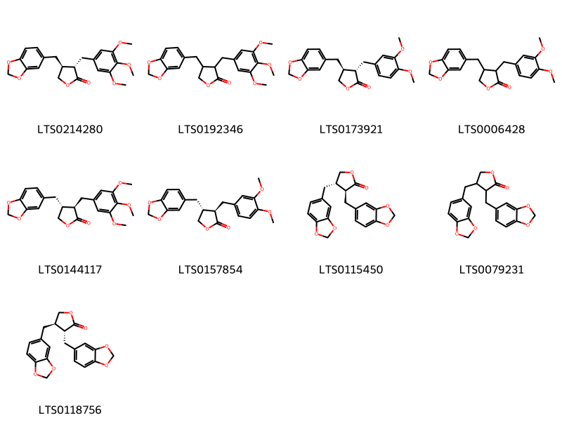{ width=100% }
    <figcaption>Hình ảnh cấu trúc hóa học của 9 hoạt chất thuộc nhóm Furanoid lignans gồm ['(3s,4s)-4-(2h-1,3-benzodioxol-5-ylmethyl)-3-[(3,4,5-trimethoxyphenyl)methyl]oxolan-2-one (LTS0214280)', '4-(2h-1,3-benzodioxol-5-ylmethyl)-3-[(3,4,5-trimethoxyphenyl)methyl]oxolan-2-one (LTS0192346)', '(3s,4s)-4-(2h-1,3-benzodioxol-5-ylmethyl)-3-[(3,4-dimethoxyphenyl)methyl]oxolan-2-one (LTS0173921)', '4-(2h-1,3-benzodioxol-5-ylmethyl)-3-[(3,4-dimethoxyphenyl)methyl]oxolan-2-one (LTS0006428)', 'yatein (LTS0144117)', '(-)-bursehernin (LTS0157854)', '(3s,4s)-3,4-bis(2h-1,3-benzodioxol-5-ylmethyl)oxolan-2-one (LTS0115450)', '3,4-bis(2h-1,3-benzodioxol-5-ylmethyl)oxolan-2-one (LTS0079231)', 'hinokinin (LTS0118756)'].</figcaption>
</figure>
#### Nhóm Lignan glycosides
<figure markdown="span">
    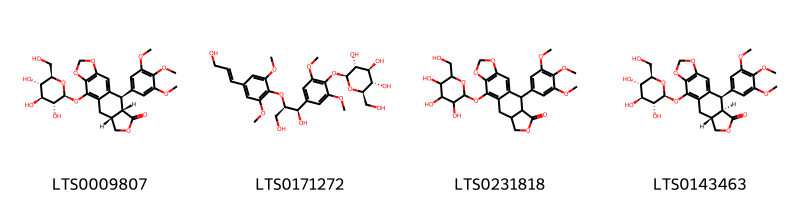{ width=100% }
    <figcaption>Hình ảnh cấu trúc hóa học của 4 hoạt chất thuộc nhóm Lignan glycosides gồm ['(10r,11s,15r)-2-{[(2s,3r,4s,5s,6r)-3,4,5-trihydroxy-6-(hydroxymethyl)oxan-2-yl]oxy}-10-(3,4,5-trimethoxyphenyl)-4,6,13-trioxatetracyclo[7.7.0.0³,⁷.0¹¹,¹⁵]hexadeca-1,3(7),8-trien-12-one (LTS0009807)', '(2s,3r,4s,5s,6r)-2-{4-[(1r,2r)-1,3-dihydroxy-2-{4-[(1e)-3-hydroxyprop-1-en-1-yl]-2,6-dimethoxyphenoxy}propyl]-2,6-dimethoxyphenoxy}-6-(hydroxymethyl)oxane-3,4,5-triol (LTS0171272)', '2-{[3,4,5-trihydroxy-6-(hydroxymethyl)oxan-2-yl]oxy}-10-(3,4,5-trimethoxyphenyl)-4,6,13-trioxatetracyclo[7.7.0.0³,⁷.0¹¹,¹⁵]hexadeca-1,3(7),8-trien-12-one (LTS0231818)', 'β-peltatin-β-d-glucoside (LTS0143463)'].</figcaption>
</figure>
#### Nhóm Lignan lactones
<figure markdown="span">
    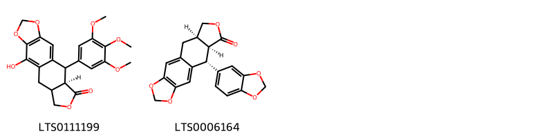{ width=100% }
    <figcaption>Hình ảnh cấu trúc hóa học của 2 hoạt chất thuộc nhóm Lignan lactones gồm ['(11r)-2-hydroxy-10-(3,4,5-trimethoxyphenyl)-4,6,13-trioxatetracyclo[7.7.0.0³,⁷.0¹¹,¹⁵]hexadeca-1,3(7),8-trien-12-one (LTS0111199)', '(10r,11s,15r)-10-(2h-1,3-benzodioxol-5-yl)-4,6,13-trioxatetracyclo[7.7.0.0³,⁷.0¹¹,¹⁵]hexadeca-1,3(7),8-trien-12-one (LTS0006164)'].</figcaption>
</figure>
#### Nhóm Organooxygen compounds
<figure markdown="span">
    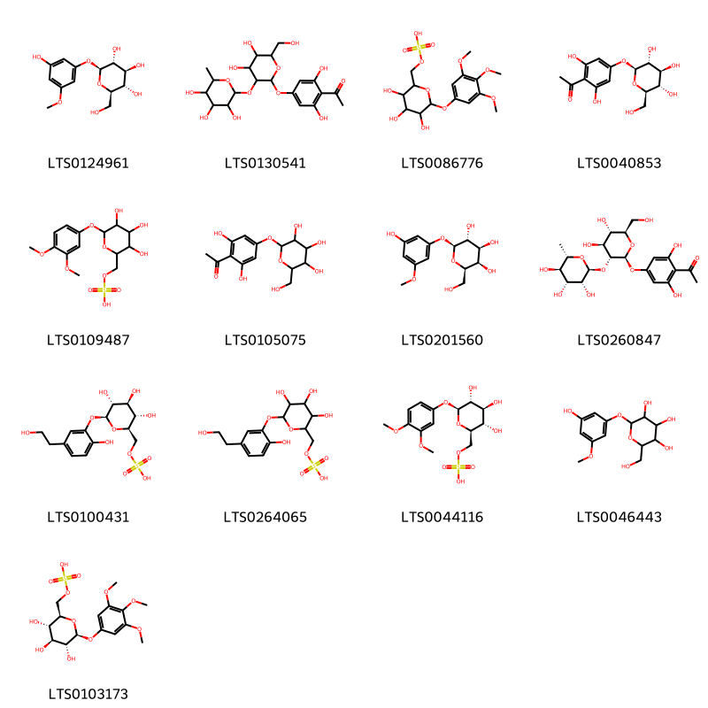{ width=100% }
    <figcaption>Hình ảnh cấu trúc hóa học của 13 hoạt chất thuộc nhóm Organooxygen compounds gồm ['(2s,3r,4s,5s,6r)-2-(3-hydroxy-5-methoxyphenoxy)-6-(hydroxymethyl)oxane-3,4,5-triol (LTS0124961)', '1-(4-{[4,5-dihydroxy-6-(hydroxymethyl)-3-[(3,4,5-trihydroxy-6-methyloxan-2-yl)oxy]oxan-2-yl]oxy}-2,6-dihydroxyphenyl)ethanone (LTS0130541)', '[3,4,5-trihydroxy-6-(3,4,5-trimethoxyphenoxy)oxan-2-yl]methoxysulfonic acid (LTS0086776)', '1-(2,6-dihydroxy-4-{[(2s,3r,4s,5s,6r)-3,4,5-trihydroxy-6-(hydroxymethyl)oxan-2-yl]oxy}phenyl)ethanone (LTS0040853)', '[6-(3,4-dimethoxyphenoxy)-3,4,5-trihydroxyoxan-2-yl]methoxysulfonic acid (LTS0109487)', '1-(2,6-dihydroxy-4-{[3,4,5-trihydroxy-6-(hydroxymethyl)oxan-2-yl]oxy}phenyl)ethanone (LTS0105075)', '(2s,3r,4s,5r,6r)-2-(3-hydroxy-5-methoxyphenoxy)-6-(hydroxymethyl)oxane-3,4,5-triol (LTS0201560)', '1-(4-{[(2s,3r,4s,5s,6r)-4,5-dihydroxy-6-(hydroxymethyl)-3-{[(2s,3r,4r,5r,6s)-3,4,5-trihydroxy-6-methyloxan-2-yl]oxy}oxan-2-yl]oxy}-2,6-dihydroxyphenyl)ethanone (LTS0260847)', '[(2r,3s,4s,5r,6s)-3,4,5-trihydroxy-6-[2-hydroxy-5-(2-hydroxyethyl)phenoxy]oxan-2-yl]methoxysulfonic acid (LTS0100431)', '{3,4,5-trihydroxy-6-[2-hydroxy-5-(2-hydroxyethyl)phenoxy]oxan-2-yl}methoxysulfonic acid (LTS0264065)', '[(2r,3s,4s,5r,6s)-6-(3,4-dimethoxyphenoxy)-3,4,5-trihydroxyoxan-2-yl]methoxysulfonic acid (LTS0044116)', '2-(3-hydroxy-5-methoxyphenoxy)-6-(hydroxymethyl)oxane-3,4,5-triol (LTS0046443)', '[(2r,3s,4s,5r,6s)-3,4,5-trihydroxy-6-(3,4,5-trimethoxyphenoxy)oxan-2-yl]methoxysulfonic acid (LTS0103173)'].</figcaption>
</figure>
#### Nhóm Prenol lipids
<figure markdown="span">
    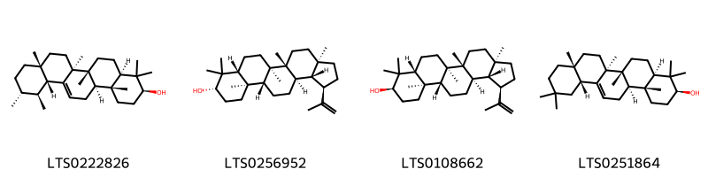{ width=100% }
    <figcaption>Hình ảnh cấu trúc hóa học của 4 hoạt chất thuộc nhóm Prenol lipids gồm ['amyrin (LTS0222826)', 'lupeol (LTS0256952)', 'epilupeol (LTS0108662)', 'β-amyrin (LTS0251864)'].</figcaption>
</figure>

---

### Dược dân tộc học

Danh sách các quốc gia có sử dụng *Bursera simaruba* trong điều trị các bệnh. 

| Country   | Disease                                                          | Bệnh                                                                  |
|:----------|:-----------------------------------------------------------------|:----------------------------------------------------------------------|
| Bahamas   | Aphrodisiac                                                      | Thuốc kích dục                                                        |
| Elsewhere | Depilatory                                                       | Gây rụng lông                                                         |
| Haiti     | Antiseptic, Diuretic, Vulnerary, Vulnerary, Antiseptic, Diuretic | Khử trùng, lợi tiểu, sơ hở, sơ hở, sát trùng, lợi tiểu                |
| Mexico    | Diaphoretic, Diuretic, Expectorant, Purgative                    | Thuốc lợi tiểu, thuốc lợi tiểu, thuốc long đờm, thuốc tẩy tế bào chết |

---

---
## Bursera tomentosa
### Thông tin về thực vật

!!! info "Phân loại thực vật của *Bursera tomentosa* từ GIBF:"
    - **Kingdom:** Plantae
    - **Phylum:** Tracheophyta
    - **Order:** Sapindales
    - **Family:** Burseraceae
    - **Genus:** Bursera
    - **Species:** *Bursera tomentosa*

 

| Label (VI)   | Label (EN)   | Scientific Name   | Descriptions (VI)   | Descriptions (EN)   | Also Known As (VI)   | Also Known As (EN)   |
|:-------------|:-------------|:------------------|:--------------------|:--------------------|:---------------------|:---------------------|
| N/A          | N/A          | Bursera tomentosa | loài thực vật       | species of plant    | ['']                 | ['']                 |

#### Phân bố trên thế giới

**Từ CSDL GIBF** Curaçao, Nicaragua, Colombia, Costa Rica, Mexico, Bonaire, Sint Eustatius and Saba, Panama

#### Phân bố tại Việt Nam

**Từ CSDL GIBF**: Không có ghi nhận ở Việt Nam

---
### Thành phần hóa học
        
- Theo cơ sở dữ liệu lotus: Từ loài *Bursera tomentosa* đã phân lập và xác định được Chưa có hoạt chất nào được phân lập. hoạt chất thuộc về các nhóm Không có hoạt chất nào được phân lập. 

Không có hình ảnh nào được tạo ra

---

### Dược dân tộc học

Danh sách các quốc gia có sử dụng *Bursera tomentosa* trong điều trị các bệnh. 

| Country   | Disease     | Bệnh        |
|:----------|:------------|:------------|
| Venezuela | Cicatrizant | Cicatrizant |

---

---
## Bursera trifoliata
### Thông tin về thực vật

!!! info "Phân loại thực vật của *Bursera trifoliolata* từ GIBF:"
    - **Kingdom:** Plantae
    - **Phylum:** Tracheophyta
    - **Order:** Sapindales
    - **Family:** Burseraceae
    - **Genus:** Bursera
    - **Species:** *Bursera trifoliolata*

 

| Label (VI)   | Label (EN)   | Scientific Name   | Descriptions (VI)   | Descriptions (EN)   | Also Known As (VI)   | Also Known As (EN)   |
|:-------------|:-------------|:------------------|:--------------------|:--------------------|:---------------------|:---------------------|
| N/A          | N/A          | Bursera tomentosa | loài thực vật       | species of plant    | ['']                 | ['']                 |

#### Phân bố trên thế giới

**Từ CSDL GIBF** nan, Mexico

#### Phân bố tại Việt Nam

**Từ CSDL GIBF**: Không có ghi nhận ở Việt Nam

---
### Thành phần hóa học
        
- Theo cơ sở dữ liệu lotus: Từ loài *Bursera trifoliolata* đã phân lập và xác định được Chưa có hoạt chất nào được phân lập. hoạt chất thuộc về các nhóm Không có hoạt chất nào được phân lập. 

Không có hình ảnh nào được tạo ra

---

### Dược dân tộc học

Danh sách các quốc gia có sử dụng *Bursera trifoliolata* trong điều trị các bệnh. 

| Country   | Disease   | Bệnh     |
|:----------|:----------|:---------|
| Mexico    | Poison    | Chất độc |

---

---
## Bursera trijuga
### Thông tin về thực vật

!!! info "Phân loại thực vật của *Bursera lancifolia* từ GIBF:"
    - **Kingdom:** Plantae
    - **Phylum:** Tracheophyta
    - **Order:** Sapindales
    - **Family:** Burseraceae
    - **Genus:** Bursera
    - **Species:** *Bursera lancifolia*

 

| Label (VI)   | Label (EN)   | Scientific Name   | Descriptions (VI)   | Descriptions (EN)   | Also Known As (VI)   | Also Known As (EN)   |
|:-------------|:-------------|:------------------|:--------------------|:--------------------|:---------------------|:---------------------|
| N/A          | N/A          | Bursera tomentosa | loài thực vật       | species of plant    | ['']                 | ['']                 |

#### Phân bố trên thế giới

**Từ CSDL GIBF** Mexico

#### Phân bố tại Việt Nam

**Từ CSDL GIBF**: Không có ghi nhận ở Việt Nam

---
### Thành phần hóa học
        
- Theo cơ sở dữ liệu lotus: Từ loài *Bursera lancifolia* đã phân lập và xác định được Chưa có hoạt chất nào được phân lập. hoạt chất thuộc về các nhóm Không có hoạt chất nào được phân lập. 

Không có hình ảnh nào được tạo ra

---

### Dược dân tộc học

Danh sách các quốc gia có sử dụng *Bursera lancifolia* trong điều trị các bệnh. 

| Country   | Disease                                               | Bệnh                                                                        |
|:----------|:------------------------------------------------------|:----------------------------------------------------------------------------|
| Mexico    | Expectorant, Purgative, Sudorific, Diuretic, Antidote | Thuốc long đờm, thuốc tẩy, thuốc hút mồ hôi, thuốc lợi tiểu, thuốc giải độc |

---

# Chi Santiria

??? note "Danh sách các dược liệu thuộc chi"
    
	 - *Santiria griffithii*

---
## Santiria griffithii
### Thông tin về thực vật

!!! info "Phân loại thực vật của *Santiria griffithii* từ GIBF:"
    - **Kingdom:** Plantae
    - **Phylum:** Tracheophyta
    - **Order:** Sapindales
    - **Family:** Burseraceae
    - **Genus:** Santiria
    - **Species:** *Santiria griffithii*

 

| Label (VI)   | Label (EN)   | Scientific Name     | Descriptions (VI)   | Descriptions (EN)   | Also Known As (VI)   | Also Known As (EN)   |
|:-------------|:-------------|:--------------------|:--------------------|:--------------------|:---------------------|:---------------------|
| N/A          | N/A          | Santiria griffithii |                     | species of plant    | ['']                 | ['']                 |

#### Phân bố trên thế giới

**Từ CSDL GIBF** nan, Papua New Guinea, Indonesia, Singapore, Malaysia, Brunei Darussalam

#### Phân bố tại Việt Nam

**Từ CSDL GIBF**: Không có ghi nhận ở Việt Nam

---
### Thành phần hóa học
        
- Theo cơ sở dữ liệu lotus: Từ loài *Santiria griffithii* đã phân lập và xác định được Chưa có hoạt chất nào được phân lập. hoạt chất thuộc về các nhóm Không có hoạt chất nào được phân lập. 

Không có hình ảnh nào được tạo ra

---

### Dược dân tộc học

Danh sách các quốc gia có sử dụng *Santiria griffithii* trong điều trị các bệnh. 

| Country   | Disease            | Bệnh                                |
|:----------|:-------------------|:------------------------------------|
| Sumatra   | Aphrodisiac, Tonic | Thuốc kích thích tình dục, Thuốc bổ |

---

# Chi Commiphora

??? note "Danh sách các dược liệu thuộc chi"
    
	 - *Commiphora abyssinica*
	 - *Commiphora africanum*
	 - *Commiphora molmol*
	 - *Commiphora mukul*
	 - *Commiphora myrrha*
	 - *Commiphora opobalsam*
	 - *Commiphora opobalsamum*
	 - *Commiphora stocksiana*

---
## Commiphora abyssinica
### Thông tin về thực vật

!!! info "Phân loại thực vật của *Commiphora kua* từ GIBF:"
    - **Kingdom:** Plantae
    - **Phylum:** Tracheophyta
    - **Order:** Sapindales
    - **Family:** Burseraceae
    - **Genus:** Commiphora
    - **Species:** *Commiphora kua*

 

| Label (VI)   | Label (EN)   | Scientific Name       | Descriptions (VI)   | Descriptions (EN)   | Also Known As (VI)   | Also Known As (EN)   |
|:-------------|:-------------|:----------------------|:--------------------|:--------------------|:---------------------|:---------------------|
| N/A          | N/A          | Commiphora abyssinica | loài thực vật       | species of plant    | ['']                 | ['']                 |

#### Phân bố trên thế giới

**Từ CSDL GIBF** nan, Oman, Belgium, Eritrea, Brazil, Sudan, United States of America, Kenya, Tanzania, United Republic of, Yemen, Ethiopia

#### Phân bố tại Việt Nam

**Từ CSDL GIBF**: Không có ghi nhận ở Việt Nam

---
### Thành phần hóa học
        
- Theo cơ sở dữ liệu lotus: Từ loài *Commiphora kua* đã phân lập và xác định được Chưa có hoạt chất nào được phân lập. hoạt chất thuộc về các nhóm Không có hoạt chất nào được phân lập. 

Không có hình ảnh nào được tạo ra

---

### Dược dân tộc học

Danh sách các quốc gia có sử dụng *Commiphora kua* trong điều trị các bệnh. 

| Country   | Disease                          | Bệnh                                 |
|:----------|:---------------------------------|:-------------------------------------|
| Elsewhere | Astringent, Stomachic, Stimulant | Chất làm se, Dạ dày, Chất kích thích |

---

---
## Commiphora africanum
### Thông tin về thực vật

!!! info "Phân loại thực vật của *Commiphora africana* từ GIBF:"
    - **Kingdom:** Plantae
    - **Phylum:** Tracheophyta
    - **Order:** Sapindales
    - **Family:** Burseraceae
    - **Genus:** Commiphora
    - **Species:** *Commiphora africana*

 

| Label (VI)   | Label (EN)   | Scientific Name       | Descriptions (VI)   | Descriptions (EN)   | Also Known As (VI)   | Also Known As (EN)   |
|:-------------|:-------------|:----------------------|:--------------------|:--------------------|:---------------------|:---------------------|
| N/A          | N/A          | Commiphora abyssinica | loài thực vật       | species of plant    | ['']                 | ['']                 |

#### Phân bố trên thế giới

**Từ CSDL GIBF** Malawi, South Africa, Senegal, Nigeria, Namibia, Belgium, Niger, Angola, Mozambique, Botswana, Benin, Congo, Democratic Republic of the, Ethiopia, Tanzania, United Republic of, Kenya, Zimbabwe, Eswatini, Togo

#### Phân bố tại Việt Nam

**Từ CSDL GIBF**: Không có ghi nhận ở Việt Nam

---
### Thành phần hóa học
        
- Theo cơ sở dữ liệu lotus: Từ loài *Commiphora africana* đã phân lập và xác định được Chưa có hoạt chất nào được phân lập. hoạt chất thuộc về các nhóm Không có hoạt chất nào được phân lập. 

Không có hình ảnh nào được tạo ra

---

### Dược dân tộc học

Danh sách các quốc gia có sử dụng *Commiphora africana* trong điều trị các bệnh. 

| Country   | Disease   | Bệnh           |
|:----------|:----------|:---------------|
| Turkey    | Vermifuge | Thuốc diệt sán |

---

---
## Commiphora molmol
### Thông tin về thực vật

!!! info "Phân loại thực vật của *Commiphora myrrha* từ GIBF:"
    - **Kingdom:** Plantae
    - **Phylum:** Tracheophyta
    - **Order:** Sapindales
    - **Family:** Burseraceae
    - **Genus:** Commiphora
    - **Species:** *Commiphora myrrha*

 

| Label (VI)   | Label (EN)   | Scientific Name   | Descriptions (VI)   | Descriptions (EN)   | Also Known As (VI)   | Also Known As (EN)   |
|:-------------|:-------------|:------------------|:--------------------|:--------------------|:---------------------|:---------------------|
| N/A          | N/A          | Commiphora molmol | loài thực vật       | species of plant    | ['']                 | ['']                 |

#### Phân bố trên thế giới

**Từ CSDL GIBF** Malawi, South Africa, Senegal, Nigeria, Namibia, Belgium, Niger, Angola, Mozambique, Botswana, Benin, Congo, Democratic Republic of the, Ethiopia, Tanzania, United Republic of, Kenya, Zimbabwe, Eswatini, Togo

#### Phân bố tại Việt Nam

**Từ CSDL GIBF**: Không có ghi nhận ở Việt Nam

---
### Thành phần hóa học
        
- Theo cơ sở dữ liệu lotus: Từ loài *Commiphora myrrha* đã phân lập và xác định được Chưa có hoạt chất nào được phân lập. hoạt chất thuộc về các nhóm Không có hoạt chất nào được phân lập. 

Không có hình ảnh nào được tạo ra

---

### Dược dân tộc học

Danh sách các quốc gia có sử dụng *Commiphora myrrha* trong điều trị các bệnh. 

| Country   | Disease   | Bệnh        |
|:----------|:----------|:------------|
| China     | Hemostat  | Máy cầm máu |

---

---
## Commiphora mukul
### Thông tin về thực vật

!!! info "Phân loại thực vật của *Commiphora wightii* từ GIBF:"
    - **Kingdom:** Plantae
    - **Phylum:** Tracheophyta
    - **Order:** Sapindales
    - **Family:** Burseraceae
    - **Genus:** Commiphora
    - **Species:** *Commiphora wightii*

 

| Label (VI)   | Label (EN)   | Scientific Name   | Descriptions (VI)   | Descriptions (EN)   | Also Known As (VI)   | Also Known As (EN)   |
|:-------------|:-------------|:------------------|:--------------------|:--------------------|:---------------------|:---------------------|
| N/A          | N/A          | Commiphora mukul  |                     | species of plant    | ['']                 | ['']                 |

#### Phân bố trên thế giới

**Từ CSDL GIBF** Oman, Pakistan, India, nan

#### Phân bố tại Việt Nam

**Từ CSDL GIBF**: Không có ghi nhận ở Việt Nam

---
### Thành phần hóa học
        
- Theo cơ sở dữ liệu lotus: Từ loài *Commiphora wightii* đã phân lập và xác định được 26 hoạt chất thuộc về các nhóm Fatty Acyls, Prenol lipids, Steroids and steroid derivatives, Benzodioxoles, Furanoid lignans. 

|    | chemicalTaxonomyClassyfireClass   |   smiles_count |
|---:|:----------------------------------|---------------:|
|  0 | Benzodioxoles                     |              2 |
|  1 | Fatty Acyls                       |              2 |
|  2 | Furanoid lignans                  |              1 |
|  3 | Prenol lipids                     |             16 |
|  4 | Steroids and steroid derivatives  |              5 |

#### Nhóm Benzodioxoles
<figure markdown="span">
    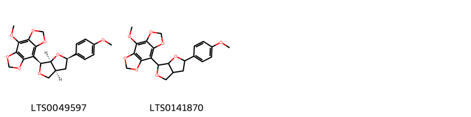{ width=100% }
    <figcaption>Hình ảnh cấu trúc hóa học của 2 hoạt chất thuộc nhóm Benzodioxoles gồm ['2-[(2r,3as,6s,6as)-2-(4-methoxyphenyl)-hexahydrofuro[2,3-c]furan-6-yl]-8-methoxy-4,6,10,12-tetraoxatricyclo[7.3.0.0³,⁷]dodeca-1,3(7),8-triene (LTS0049597)', '2-methoxy-8-[2-(4-methoxyphenyl)-hexahydrofuro[2,3-c]furan-6-yl]-4,6,10,12-tetraoxatricyclo[7.3.0.0³,⁷]dodeca-1,3(7),8-triene (LTS0141870)'].</figcaption>
</figure>
#### Nhóm Fatty Acyls
<figure markdown="span">
    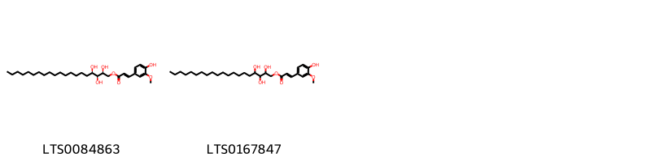{ width=100% }
    <figcaption>Hình ảnh cấu trúc hóa học của 2 hoạt chất thuộc nhóm Fatty Acyls gồm ['(2s,3s,4r)-2,3,4-trihydroxyicosyl (2e)-3-(4-hydroxy-3-methoxyphenyl)prop-2-enoate (LTS0084863)', '2,3,4-trihydroxyicosyl 3-(4-hydroxy-3-methoxyphenyl)prop-2-enoate (LTS0167847)'].</figcaption>
</figure>
#### Nhóm Furanoid lignans
<figure markdown="span">
    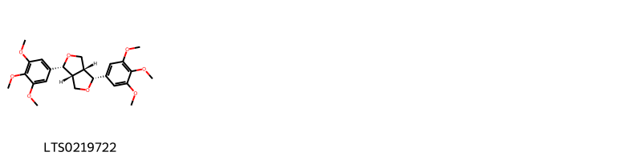{ width=100% }
    <figcaption>Hình ảnh cấu trúc hóa học của 1 hoạt chất thuộc nhóm Furanoid lignans gồm ['(1r,3ar,4r,6ar)-1,4-bis(3,4,5-trimethoxyphenyl)-hexahydrofuro[3,4-c]furan (LTS0219722)'].</figcaption>
</figure>
#### Nhóm Prenol lipids
<figure markdown="span">
    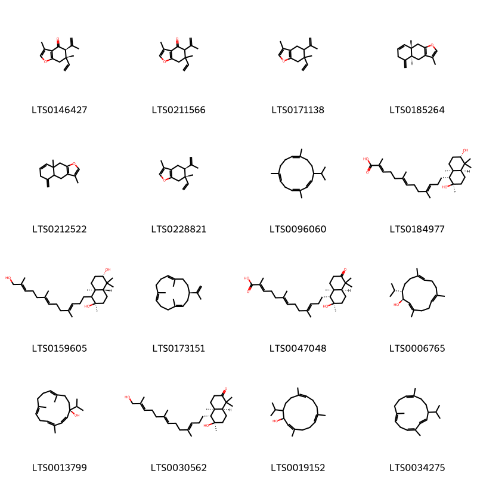{ width=100% }
    <figcaption>Hình ảnh cấu trúc hóa học của 16 hoạt chất thuộc nhóm Prenol lipids gồm ['(5s,6s)-6-ethenyl-3,6-dimethyl-5-(prop-1-en-2-yl)-5,7-dihydro-1-benzofuran-4-one (LTS0146427)', '6-ethenyl-3,6-dimethyl-5-(prop-1-en-2-yl)-5,7-dihydro-1-benzofuran-4-one (LTS0211566)', '6-ethenyl-3,6-dimethyl-5-(prop-1-en-2-yl)-5,7-dihydro-4h-1-benzofuran (LTS0171138)', '(4as,8as)-3,8a-dimethyl-5-methylidene-4h,4ah,6h,9h-naphtho[2,3-b]furan (LTS0185264)', '3,8a-dimethyl-5-methylidene-4h,4ah,6h,9h-naphtho[2,3-b]furan (LTS0212522)', '(5s,6s)-6-ethenyl-3,6-dimethyl-5-(prop-1-en-2-yl)-5,7-dihydro-4h-1-benzofuran (LTS0228821)', '(3z,6z,10z)-14-isopropyl-3,7,11-trimethylcyclotetradeca-1,3,6,10-tetraene (LTS0096060)', '(2e,6e,10e)-13-[(1r,2r,4as,6s,8as)-2,6-dihydroxy-2,5,5,8a-tetramethyl-hexahydro-1h-naphthalen-1-yl]-2,6,10-trimethyltrideca-2,6,10-trienoic acid (LTS0184977)', 'myrrhanol a (LTS0159605)', 'neocembrene (LTS0173151)', '(2e,6e,10e)-13-[(1r,2r,4as,8as)-2-hydroxy-2,5,5,8a-tetramethyl-6-oxo-hexahydronaphthalen-1-yl]-2,6,10-trimethyltrideca-2,6,10-trienoic acid (LTS0047048)', '(1s,2e,6e,10e,14s)-14-isopropyl-3,7,11-trimethylcyclotetradeca-2,6,10-trien-1-ol (LTS0006765)', '(1s,2z,4e,7e,11e)-1-isopropyl-4,8,12-trimethylcyclotetradeca-2,4,7,11-tetraen-1-ol (LTS0013799)', '(4as,5r,6r,8as)-6-hydroxy-5-[(3e,7e,11e)-13-hydroxy-4,8,12-trimethyltrideca-3,7,11-trien-1-yl]-1,1,4a,6-tetramethyl-hexahydronaphthalen-2-one (LTS0030562)', '14-isopropyl-3,7,11-trimethylcyclotetradeca-2,6,10-trien-1-ol (LTS0019152)', '(1e,3z,6e,10z)-14-isopropyl-3,7,11-trimethylcyclotetradeca-1,3,6,10-tetraene (LTS0034275)'].</figcaption>
</figure>
#### Nhóm Steroids and steroid derivatives
<figure markdown="span">
    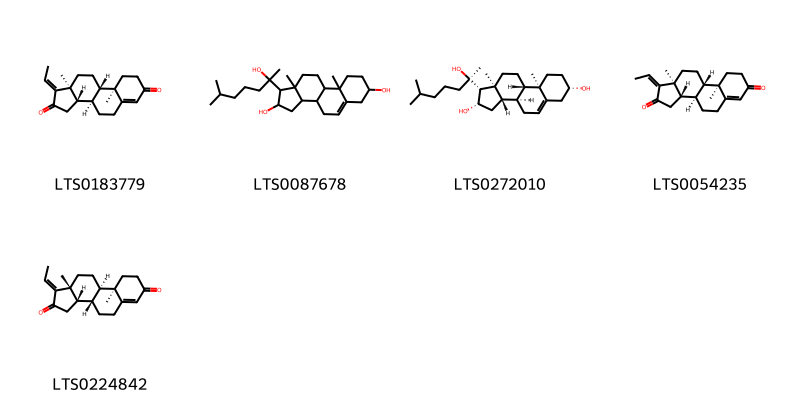{ width=100% }
    <figcaption>Hình ảnh cấu trúc hóa học của 5 hoạt chất thuộc nhóm Steroids and steroid derivatives gồm ['guggulsterone (LTS0183779)', '1-(2-hydroxy-6-methylheptan-2-yl)-9a,11a-dimethyl-1h,2h,3h,3ah,3bh,4h,6h,7h,8h,9h,9bh,10h,11h-cyclopenta[a]phenanthrene-2,7-diol (LTS0087678)', '(1r,2s,3as,3bs,7s,9ar,9bs,11as)-1-[(2r)-2-hydroxy-6-methylheptan-2-yl]-9a,11a-dimethyl-1h,2h,3h,3ah,3bh,4h,6h,7h,8h,9h,9bh,10h,11h-cyclopenta[a]phenanthrene-2,7-diol (LTS0272010)', '(z)-guggulsterone (LTS0054235)', '(1e,3as,3bs,9ar,9br,11ar)-1-ethylidene-9a,11a-dimethyl-3h,3ah,3bh,4h,5h,8h,9h,9bh,10h,11h-cyclopenta[a]phenanthrene-2,7-dione (LTS0224842)'].</figcaption>
</figure>

---

### Dược dân tộc học

Danh sách các quốc gia có sử dụng *Commiphora wightii* trong điều trị các bệnh. 

| Country   | Disease                                                                                                                         | Bệnh                                                                                                         |
|:----------|:--------------------------------------------------------------------------------------------------------------------------------|:-------------------------------------------------------------------------------------------------------------|
| China     | Sedative, Stimulant                                                                                                             | Thuốc an thần, thuốc kích thích                                                                              |
| Elsewhere | Apertif, Carminative, Diaphoretic, Diuretic, Emmenagogue, Expectorant, Stomachic, Stomachic, Uterotonic, Antiseptic, Astringent | Apertif, Carminative, Diaphoretic, lợi tiểu, Emmenagogue, đờm, Dạ dày, Dạ dày, Uterotonic, Khử trùng, Làm se |
| Iran      | Stomachic                                                                                                                       | Sững sờ                                                                                                      |

---

---
## Commiphora myrrha
### Thông tin về thực vật

!!! info "Phân loại thực vật của *Commiphora myrrha* từ GIBF:"
    - **Kingdom:** Plantae
    - **Phylum:** Tracheophyta
    - **Order:** Sapindales
    - **Family:** Burseraceae
    - **Genus:** Commiphora
    - **Species:** *Commiphora myrrha*

 

| Label (VI)   | Label (EN)   | Scientific Name   | Descriptions (VI)   | Descriptions (EN)   | Also Known As (VI)    | Also Known As (EN)   |
|:-------------|:-------------|:------------------|:--------------------|:--------------------|:----------------------|:---------------------|
| N/A          | N/A          | Commiphora myrrha | loài thực vật       | species of plant    | ['Commiphora myrrha'] | ['']                 |

#### Phân bố trên thế giới

**Từ CSDL GIBF** Saudi Arabia, Brazil, Somalia, Ethiopia

#### Phân bố tại Việt Nam

**Từ CSDL GIBF**: Không có ghi nhận ở Việt Nam

---
### Thành phần hóa học
        
- Theo cơ sở dữ liệu lotus: Từ loài *Commiphora myrrha* đã phân lập và xác định được 84 hoạt chất thuộc về các nhóm Prenol lipids, Steroids and steroid derivatives, Unsaturated hydrocarbons, Naphthofurans, Organooxygen compounds. 

|    | chemicalTaxonomyClassyfireClass   |   smiles_count |
|---:|:----------------------------------|---------------:|
|  0 | Naphthofurans                     |              2 |
|  1 | Organooxygen compounds            |              2 |
|  2 | Prenol lipids                     |             76 |
|  3 | Steroids and steroid derivatives  |              2 |
|  4 | Unsaturated hydrocarbons          |              1 |

#### Nhóm Naphthofurans
<figure markdown="span">
    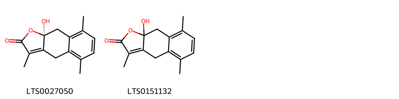{ width=100% }
    <figcaption>Hình ảnh cấu trúc hóa học của 2 hoạt chất thuộc nhóm Naphthofurans gồm ['(9as)-9a-hydroxy-3,5,8-trimethyl-4h,9h-naphtho[2,3-b]furan-2-one (LTS0027050)', '9a-hydroxy-3,5,8-trimethyl-4h,9h-naphtho[2,3-b]furan-2-one (LTS0151132)'].</figcaption>
</figure>
#### Nhóm Organooxygen compounds
<figure markdown="span">
    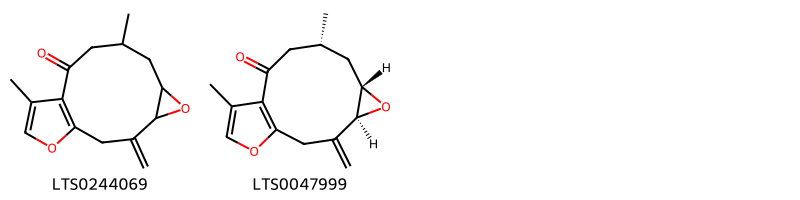{ width=100% }
    <figcaption>Hình ảnh cấu trúc hóa học của 2 hoạt chất thuộc nhóm Organooxygen compounds gồm ['8,12-dimethyl-3-methylidene-5,14-dioxatricyclo[9.3.0.0⁴,⁶]tetradeca-1(11),12-dien-10-one (LTS0244069)', '(4s,6s,8r)-8,12-dimethyl-3-methylidene-5,14-dioxatricyclo[9.3.0.0⁴,⁶]tetradeca-1(11),12-dien-10-one (LTS0047999)'].</figcaption>
</figure>
#### Nhóm Prenol lipids
<figure markdown="span">
    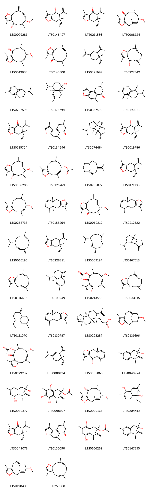{ width=100% }
    <figcaption>Hình ảnh cấu trúc hóa học của 76 hoạt chất thuộc nhóm Prenol lipids gồm ['7-methoxy-3,6-dimethyl-10-methylidene-5h,6h,7h,11h-cyclodeca[b]furan-4-one (LTS0079281)', '(5s,6s)-6-ethenyl-3,6-dimethyl-5-(prop-1-en-2-yl)-5,7-dihydro-1-benzofuran-4-one (LTS0146427)', '6-ethenyl-3,6-dimethyl-5-(prop-1-en-2-yl)-5,7-dihydro-1-benzofuran-4-one (LTS0211566)', '(6r,8r)-8-methoxy-3,6,10-trimethyl-5h,6h,7h,8h,11h-cyclodeca[b]furan-4-one (LTS0008124)', '8-methoxy-3,6,10-trimethyl-5h,6h,7h,8h,11h-cyclodeca[b]furan-4-one (LTS0013888)', 'furanodienone (LTS0143300)', 'β-elemene (LTS0225699)', 'furanodienone (LTS0227342)', 'α-copaene (LTS0207598)', 'α-cadinol (LTS0178794)', '(8s)-1,5,8-trimethyl-7h,8h,9h-naphtho[2,1-b]furan-6-one (LTS0187590)', '(1r,2s,7s,8s)-8-isopropyl-1,3-dimethyltricyclo[4.4.0.0²,⁷]dec-3-ene (LTS0190031)', '(6s)-6-ethenyl-3,6-dimethyl-5-(prop-1-en-2-yl)-5,7-dihydro-1-benzofuran-4-one (LTS0135704)', '1,5,8-trimethyl-7h,8h,9h-naphtho[2,1-b]furan-6-one (LTS0134646)', 'β-bourbonene (LTS0074484)', '(6r)-6-ethenyl-3,6-dimethyl-5-(prop-1-en-2-yl)-5,7-dihydro-1-benzofuran-4-one (LTS0019786)', '(6s,7s)-7-methoxy-3,6-dimethyl-10-methylidene-5h,6h,7h,11h-cyclodeca[b]furan-4-one (LTS0066288)', '3,6,10-trimethyl-4h,7h,8h,11h-cyclodeca[b]furan-8-yl acetate (LTS0126769)', 'germacrene b (LTS0265072)', '6-ethenyl-3,6-dimethyl-5-(prop-1-en-2-yl)-5,7-dihydro-4h-1-benzofuran (LTS0171138)', '8-methoxy-3,6,10-trimethyl-4h,7h,8h,11h-cyclodeca[b]furan (LTS0268733)', '(4as,8as)-3,8a-dimethyl-5-methylidene-4h,4ah,6h,9h-naphtho[2,3-b]furan (LTS0185264)', '(6s,7r)-7-methoxy-3,6-dimethyl-10-methylidene-5h,6h,7h,11h-cyclodeca[b]furan-4-one (LTS0062219)', '3,8a-dimethyl-5-methylidene-4h,4ah,6h,9h-naphtho[2,3-b]furan (LTS0212522)', '(1z,6z,8s)-8-isopropyl-1-methyl-5-methylidenecyclodeca-1,6-diene (LTS0065195)', '(5s,6s)-6-ethenyl-3,6-dimethyl-5-(prop-1-en-2-yl)-5,7-dihydro-4h-1-benzofuran (LTS0228821)', '(-)-germacrene d (LTS0059194)', 'β-bourbonene (LTS0167513)', 'furanodiene (LTS0176695)', '(+)-gamma-cadinene (LTS0103949)', '8-methoxy-3,6,10-trimethyl-4-oxo-5h,6h,7h,8h,11h-cyclodeca[b]furan-5-yl acetate (LTS0213588)', 'furanodiene (LTS0034115)', '4-isopropyl-6-methyl-1-methylidene-3,4,4a,7,8,8a-hexahydro-2h-naphthalene (LTS0111070)', '3,5,8a-trimethyl-4h,4ah,9h-naphtho[2,3-b]furan (LTS0130787)', '3-[(3as,5as,6s,7s,9ar,9br)-6,9a,9b-trimethyl-7-(prop-1-en-2-yl)-1h,3ah,4h,5h,5ah,7h,8h,9h-cyclopenta[a]naphthalen-6-yl]propanoic acid (LTS0223287)', '(8r)-8-methoxy-3,6,10-trimethyl-4h,7h,8h,11h-cyclodeca[b]furan (LTS0131696)', '(5s,6s,8s)-8-methoxy-3,6,10-trimethyl-4-oxo-5h,6h,7h,8h,11h-cyclodeca[b]furan-5-yl acetate (LTS0129287)', '4-ethenyl-1-isopropyl-4-methyl-3-(prop-1-en-2-yl)cyclohex-1-ene (LTS0080134)', '(8ar)-3,5,8a-trimethyl-6h,9h-naphtho[2,3-b]furan-4-one (LTS0085063)', '1-[2-(but-3-en-2-yl)-5-methylphenyl]-2-methylpropan-2-ol (LTS0040924)', '(1s,5s,6r)-6-[(2s)-but-3-en-2-yl]-5-(2-hydroxy-2-methylpropyl)-3-methylcyclohex-2-en-1-ol (LTS0030377)', '1-[2-(but-3-en-2-yl)-3,4,6-trihydroxy-5-methylphenyl]-2-methylpropan-2-yl acetate (LTS0098107)', '(6r,8s)-8-methoxy-3,6,10-trimethyl-5h,6h,7h,8h,11h-cyclodeca[b]furan-4-one (LTS0099166)', '5-(2-hydroxybutan-2-yl)-2-methyl-6-(2-methylprop-1-en-1-yl)cyclohex-2-en-1-ol (LTS0204412)', '(5s,6r)-6-ethenyl-3,6-dimethyl-5-(prop-1-en-2-yl)-5,7-dihydro-1-benzofuran-4-one (LTS0049078)', '(8r)-1,5,8-trimethyl-7h,8h,9h-naphtho[2,1-b]furan-6-one (LTS0156090)', '1-{2-[(2r)-but-3-en-2-yl]-3,6-dihydroxy-5-methylphenyl}-2-methylpropan-2-yl acetate (LTS0106269)', '1-{2-[(2r)-but-3-en-2-yl]-5-methylphenyl}-2-methylpropan-2-ol (LTS0147255)', '8-methoxy-3,6,10-trimethyl-4h,7h,8h,11h-cyclodeca[b]furan (LTS0198435)', 'furanodiene (LTS0259888)', '6-ethenyl-7a-hydroxy-3,6-dimethyl-5-(prop-1-en-2-yl)-5,7-dihydro-4h-1-benzofuran-2-one (LTS0205665)', '3,6,10-trimethyl-4h,7h,8h,11h-cyclodeca[b]furan-2-yl acetate (LTS0151691)', '7-isopropyl-1-methoxy-1,4-dimethyl-2,3,3a,5,6,8a-hexahydroazulen-4-ol (LTS0214930)', '9a-hydroxy-3,8a-dimethyl-5-methylidene-4h,4ah,6h,9h-naphtho[2,3-b]furan-2-one (LTS0113800)', 'elemene (LTS0090837)', '(4as,8as,9as)-9a-hydroxy-3,8a-dimethyl-5-methylidene-4h,4ah,6h,9h-naphtho[2,3-b]furan-2-one (LTS0270659)', '6-(but-3-en-2-yl)-5-(2-hydroxy-2-methylpropyl)-3-methylcyclohex-2-en-1-ol (LTS0179112)', '(4-isopropyl-6-methyl-1,2,3,4,4a,5,8,8a-octahydronaphthalen-1-yl)methanol (LTS0158932)', '3b,6,6,9a,11a-pentamethyl-1-(6-methylhept-5-en-2-yl)-1h,2h,4h,5h,5ah,7h,8h,9h,9bh,10h,11h-cyclopenta[a]phenanthrene-7,9-diol (LTS0159472)', '(1s,3br,5as,7s,9r,9ar,9bs,11as)-3b,6,6,9a,11a-pentamethyl-1-[(2s)-6-methylhept-5-en-2-yl]-1h,2h,4h,5h,5ah,7h,8h,9h,9bh,10h,11h-cyclopenta[a]phenanthrene-7,9-diol (LTS0243520)', '(4as,8as)-3,5,8a-trimethyl-4h,4ah,9h-naphtho[2,3-b]furan (LTS0114159)', '[(1s,4s,4as,8ar)-4-isopropyl-6-methyl-1,2,3,4,4a,5,8,8a-octahydronaphthalen-1-yl]methanol (LTS0231122)', '(5s,6s,7as)-6-ethenyl-7a-hydroxy-3,6-dimethyl-5-(prop-1-en-2-yl)-5,7-dihydro-4h-1-benzofuran-2-one (LTS0225874)', '3,5,8a-trimethyl-6h,9h-naphtho[2,3-b]furan-4-one (LTS0238434)', '(1r,3ar,4r,8as)-7-isopropyl-1-methoxy-1,4-dimethyl-2,3,3a,5,6,8a-hexahydroazulen-4-ol (LTS0009178)', '1-{2-[(2r)-but-3-en-2-yl]-3,4,6-trihydroxy-5-methylphenyl}-2-methylpropan-2-yl acetate (LTS0029654)', '(5s,6s,8s)-8-methoxy-3,6,10-trimethyl-4-oxo-5h,6h,7h,8h,11h-cyclodeca[b]furan-5-yl acetate (LTS0273652)', 'caryophyllene (LTS0131870)', '(1s,5r,6r)-5-[(2r)-2-hydroxybutan-2-yl]-2-methyl-6-(2-methylprop-1-en-1-yl)cyclohex-2-en-1-ol (LTS0018488)', '(8as)-3,8a-dimethyl-5-methylidene-4h,4ah,6h,9h-naphtho[2,3-b]furan (LTS0096616)', '3a-hydroxy-1,5,8-trimethyl-4h,5h,7h,8h,9h-naphtho[2,1-b]furan-2,6-dione (LTS0229884)', '(5r,6s,8s)-8-methoxy-3,6,10-trimethyl-4-oxo-5h,6h,7h,8h,11h-cyclodeca[b]furan-5-yl acetate (LTS0027675)', '(8r)-3,6,10-trimethyl-4h,7h,8h,11h-cyclodeca[b]furan-8-yl acetate (LTS0121055)', '(3as,5s,8s)-3a-hydroxy-1,5,8-trimethyl-4h,5h,7h,8h,9h-naphtho[2,1-b]furan-2,6-dione (LTS0107365)', '(5r,6r)-6-ethenyl-3,6-dimethyl-5-(prop-1-en-2-yl)-5,7-dihydro-4h-1-benzofuran (LTS0048127)', '1-[2-(but-3-en-2-yl)-3,6-dihydroxy-5-methylphenyl]-2-methylpropan-2-yl acetate (LTS0252894)'].</figcaption>
</figure>
#### Nhóm Steroids and steroid derivatives
<figure markdown="span">
    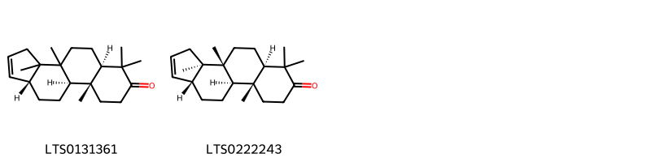{ width=100% }
    <figcaption>Hình ảnh cấu trúc hóa học của 2 hoạt chất thuộc nhóm Steroids and steroid derivatives gồm ['(5ar,9ar,9br,11ar)-3a,3b,6,6,9a-pentamethyl-3h,4h,5h,5ah,8h,9h,9bh,10h,11h,11ah-cyclopenta[a]phenanthren-7-one (LTS0131361)', '(3ar,3br,5ar,9ar,9br,11ar)-3a,3b,6,6,9a-pentamethyl-3h,4h,5h,5ah,8h,9h,9bh,10h,11h,11ah-cyclopenta[a]phenanthren-7-one (LTS0222243)'].</figcaption>
</figure>
#### Nhóm Unsaturated hydrocarbons
<figure markdown="span">
    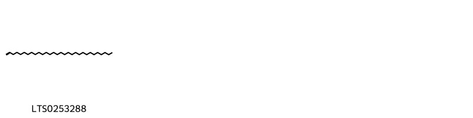{ width=100% }
    <figcaption>Hình ảnh cấu trúc hóa học của 1 hoạt chất thuộc nhóm Unsaturated hydrocarbons gồm ['1-triacontene (LTS0253288)'].</figcaption>
</figure>

---

### Dược dân tộc học

Danh sách các quốc gia có sử dụng *Commiphora myrrha* trong điều trị các bệnh. 

| Country   | Disease                                                                | Bệnh                                                                       |
|:----------|:-----------------------------------------------------------------------|:---------------------------------------------------------------------------|
| China     | Sedative, Stomachic                                                    | Thuốc an thần, Dạ dày                                                      |
| Turkey    | Antiseptic, Astringent, Emmenagogue, Stimulant, Stomachic, Expectorant | Khử trùng, Chất làm se, Chất kích thích, Chất kích thích, Dạ dày, Chất đờm |

---

---
## Commiphora opobalsam
### Thông tin về thực vật

!!! info "Phân loại thực vật của *Commiphora gileadensis* từ GIBF:"
    - **Kingdom:** Plantae
    - **Phylum:** Tracheophyta
    - **Order:** Sapindales
    - **Family:** Burseraceae
    - **Genus:** Commiphora
    - **Species:** *Commiphora gileadensis*

 

| Label (VI)   | Label (EN)   | Scientific Name   | Descriptions (VI)   | Descriptions (EN)   | Also Known As (VI)    | Also Known As (EN)   |
|:-------------|:-------------|:------------------|:--------------------|:--------------------|:----------------------|:---------------------|
| N/A          | N/A          | Commiphora myrrha | loài thực vật       | species of plant    | ['Commiphora myrrha'] | ['']                 |

#### Phân bố trên thế giới

**Từ CSDL GIBF** nan, Syrian Arab Republic, Sudan, Egypt, Somalia, unknown or invalid, India, Saudi Arabia, Yemen, Ethiopia

#### Phân bố tại Việt Nam

**Từ CSDL GIBF**: Không có ghi nhận ở Việt Nam

---
### Thành phần hóa học
        
- Theo cơ sở dữ liệu lotus: Từ loài *Commiphora gileadensis* đã phân lập và xác định được Chưa có hoạt chất nào được phân lập. hoạt chất thuộc về các nhóm Không có hoạt chất nào được phân lập. 

Không có hình ảnh nào được tạo ra

---

### Dược dân tộc học

Danh sách các quốc gia có sử dụng *Commiphora gileadensis* trong điều trị các bệnh. 

| Country   | Disease                | Bệnh             |
|:----------|:-----------------------|:-----------------|
| Elsewhere | Diaphoretic, Stomachic | Đau bụng, dạ dày |

---

---
## Commiphora opobalsamum
### Thông tin về thực vật

!!! info "Phân loại thực vật của *Commiphora gileadensis* từ GIBF:"
    - **Kingdom:** Plantae
    - **Phylum:** Tracheophyta
    - **Order:** Sapindales
    - **Family:** Burseraceae
    - **Genus:** Commiphora
    - **Species:** *Commiphora gileadensis*

 

| Label (VI)   | Label (EN)   | Scientific Name        | Descriptions (VI)   | Descriptions (EN)   | Also Known As (VI)   | Also Known As (EN)   |
|:-------------|:-------------|:-----------------------|:--------------------|:--------------------|:---------------------|:---------------------|
| N/A          | N/A          | Commiphora opobalsamum | loài thực vật       | species of plant،   | ['']                 | ['']                 |

#### Phân bố trên thế giới

**Từ CSDL GIBF** nan, Syrian Arab Republic, Sudan, Egypt, Somalia, unknown or invalid, India, Saudi Arabia, Yemen, Ethiopia

#### Phân bố tại Việt Nam

**Từ CSDL GIBF**: Không có ghi nhận ở Việt Nam

---
### Thành phần hóa học
        
- Theo cơ sở dữ liệu lotus: Từ loài *Commiphora gileadensis* đã phân lập và xác định được Chưa có hoạt chất nào được phân lập. hoạt chất thuộc về các nhóm Không có hoạt chất nào được phân lập. 

Không có hình ảnh nào được tạo ra

---

### Dược dân tộc học

Danh sách các quốc gia có sử dụng *Commiphora gileadensis* trong điều trị các bệnh. 

| Country   | Disease                                               | Bệnh                                                   |
|:----------|:------------------------------------------------------|:-------------------------------------------------------|
| Egypt     | Digestive, Carminative                                | Tiêu hóa, Carminative                                  |
| Turkey    | Astringent, Demulcent, Sudorific, Vulnerary, Diuretic | Chất làm se, Demulcent, Sudorific, Vulnerary, lợi tiểu |

---

---
## Commiphora stocksiana
### Thông tin về thực vật

!!! info "Phân loại thực vật của *Commiphora gileadensis* từ GIBF:"
    - **Kingdom:** Plantae
    - **Phylum:** Tracheophyta
    - **Order:** Sapindales
    - **Family:** Burseraceae
    - **Genus:** Commiphora
    - **Species:** *Commiphora gileadensis*

 

| Label (VI)   | Label (EN)   | Scientific Name       | Descriptions (VI)   | Descriptions (EN)   | Also Known As (VI)   | Also Known As (EN)   |
|:-------------|:-------------|:----------------------|:--------------------|:--------------------|:---------------------|:---------------------|
| N/A          | N/A          | Commiphora stocksiana | loài thực vật       | species of plant    | ['']                 | ['']                 |

#### Phân bố trên thế giới

**Từ CSDL GIBF** nan, Syrian Arab Republic, Sudan, Egypt, Somalia, unknown or invalid, India, Saudi Arabia, Yemen, Ethiopia

#### Phân bố tại Việt Nam

**Từ CSDL GIBF**: Không có ghi nhận ở Việt Nam

---
### Thành phần hóa học
        
- Theo cơ sở dữ liệu lotus: Từ loài *Commiphora gileadensis* đã phân lập và xác định được Chưa có hoạt chất nào được phân lập. hoạt chất thuộc về các nhóm Không có hoạt chất nào được phân lập. 

Không có hình ảnh nào được tạo ra

---

### Dược dân tộc học

Danh sách các quốc gia có sử dụng *Commiphora gileadensis* trong điều trị các bệnh. 

| Country   | Disease   | Bệnh            |
|:----------|:----------|:----------------|
| Hindu     | Stimulant | Chất kích thích |

---

