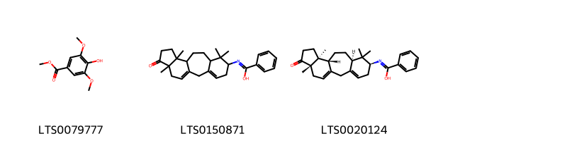
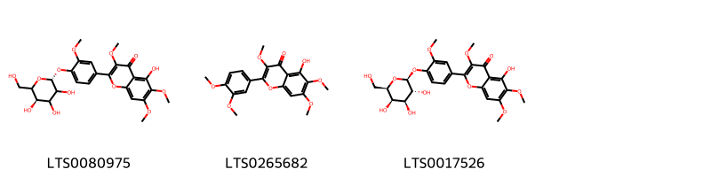
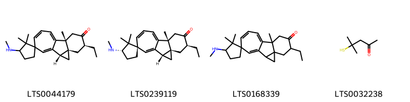
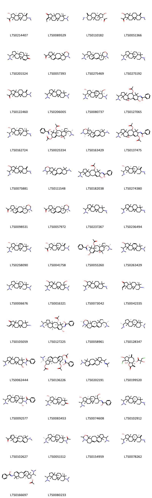
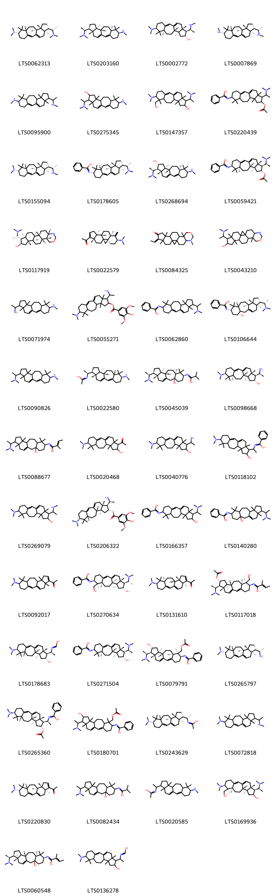
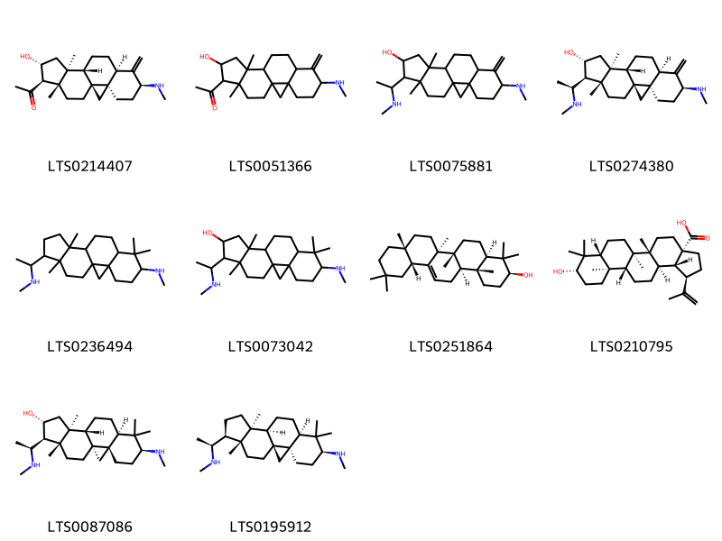

!!! abstract "Tóm tắt"

    Họ Buxaceae gồm khoảng 1 chi và 2 loài được một số cộng đồng tại các quốc gia như Turkey, Elsewhere, US, Dominican Republic, Haiti sử dụng trong một số trường hợp Thuốc lợi tiểu, thuốc nhuận tràng, thuốc gây mê, thuốc độc, thuốc an thần, thuốc ngủ, thuốc bổ, thuốc diệt giun, thuốc ngủ, thuốc độc.

!!! info "DrDuke"

    James A. Duke sinh năm 1929-2017 là một nhà thực vật học người Mỹ. Đây là một trong những tác giả hàng đầu trong lĩnh vực dược dân tộc học với cuốn *CRC Handbook of Medicinal Herbs* và chính là người xây dựng lên cơ sở dữ liệu về hợp chất tự nhiên và dược dân tộc học tại Bộ nông nghiệp Hoa Kỳ. Các thông tin được đăng tải tại website [Dr. Duke's Phytochemical and Ethnobotanical Databases](https://phytochem.nal.usda.gov/). 
    Trong suốt thập niên 1970, ông lãnh đạo the Plant Taxonomy Laboratory, Plant Genetics and Germplasm Institute of the Agricultural Research Service, U.S. Department of Agriculture.
    Trong tài liệu này, các thông tin về dược dân tộc của các dược liệu được trích dẫn từ tài liệu của James A. Ducke với sự trợ giúp của phần mềm dịch thuật từ tiếng Anh sang tiếng Việt.
   

# Chi Buxus

??? note "Danh sách các dược liệu thuộc chi"
    
	 - *Buxus sempervirens*
	 - *Buxus wallichiana*

---
## Buxus sempervirens
### Thông tin về thực vật

!!! info "Phân loại thực vật của *Buxus sempervirens* từ GIBF:"
    - **Kingdom:** Plantae
    - **Phylum:** Tracheophyta
    - **Order:** Buxales
    - **Family:** Buxaceae
    - **Genus:** Buxus
    - **Species:** *Buxus sempervirens*

 

| Label (VI)   | Label (EN)   | Scientific Name    | Descriptions (VI)   | Descriptions (EN)   | Also Known As (VI)   | Also Known As (EN)                                          |
|:-------------|:-------------|:-------------------|:--------------------|:--------------------|:---------------------|:------------------------------------------------------------|
| N/A          | N/A          | Buxus sempervirens | loài thực vật       | species of plant    | ['']                 | ['boxwood', 'common box', 'common boxwood', 'European box'] |

#### Phân bố trên thế giới

**Từ CSDL GIBF** Italy, Belgium, Georgia, Canada, Ukraine, Denmark, Netherlands, Spain, Portugal, Russian Federation, United States of America, Sweden, Czechia, Germany, Iran (Islamic Republic of), Switzerland, Austria, France, United Kingdom of Great Britain and Northern Ireland, Poland, New Zealand

#### Phân bố tại Việt Nam

**Từ CSDL GIBF**: Không có ghi nhận ở Việt Nam

---
### Thành phần hóa học
        
- Theo cơ sở dữ liệu lotus: Từ loài *Buxus sempervirens* đã phân lập và xác định được 202 hoạt chất thuộc về các nhóm Flavonoids, Prenol lipids, Steroids and steroid derivatives, Benzene and substituted derivatives, Organooxygen compounds. 

|    | chemicalTaxonomyClassyfireClass     |   smiles_count |
|---:|:------------------------------------|---------------:|
|  0 | Benzene and substituted derivatives |              3 |
|  1 | Flavonoids                          |              3 |
|  2 | Organooxygen compounds              |              4 |
|  3 | Prenol lipids                       |            120 |
|  4 | Steroids and steroid derivatives    |             72 |

#### Nhóm Benzene and substituted derivatives
<figure markdown="span">
    { width=100% }
    <figcaption>Hình ảnh cấu trúc hóa học của 3 hoạt chất thuộc nhóm Benzene and substituted derivatives gồm ['syringate (LTS0079777)', 'n-{7,7,12,16-tetramethyl-15-oxotetracyclo[9.7.0.0³,⁸.0¹²,¹⁶]octadeca-1(18),3-dien-6-yl}benzenecarboximidic acid (LTS0150871)', 'n-[(6s,8r,11r,12s,16s)-7,7,12,16-tetramethyl-15-oxotetracyclo[9.7.0.0³,⁸.0¹²,¹⁶]octadeca-1(18),3-dien-6-yl]benzenecarboximidic acid (LTS0020124)'].</figcaption>
</figure>
#### Nhóm Flavonoids
<figure markdown="span">
    { width=100% }
    <figcaption>Hình ảnh cấu trúc hóa học của 3 hoạt chất thuộc nhóm Flavonoids gồm ['galactobuxin (LTS0080975)', 'artemetin (LTS0265682)', '5-hydroxy-3,6,7-trimethoxy-2-(3-methoxy-4-{[(2s,3r,4s,5r,6r)-3,4,5-trihydroxy-6-(hydroxymethyl)oxan-2-yl]oxy}phenyl)chromen-4-one (LTS0017526)'].</figcaption>
</figure>
#### Nhóm Organooxygen compounds
<figure markdown="span">
    { width=100% }
    <figcaption>Hình ảnh cấu trúc hóa học của 4 hoạt chất thuộc nhóm Organooxygen compounds gồm ["(2's,4's,6's,9'r)-6'-ethyl-2,2,9'-trimethyl-3-(methylamino)spiro[cyclopentane-1,14'-tetracyclo[8.5.0.0²,⁴.0⁴,⁹]pentadecane]-1'(15'),10',12'-trien-7'-one (LTS0044179)", "(1r,2's,3s,4's,6's,9'r)-6'-ethyl-2,2,9'-trimethyl-3-(methylamino)spiro[cyclopentane-1,14'-tetracyclo[8.5.0.0²,⁴.0⁴,⁹]pentadecane]-1'(15'),10',12'-trien-7'-one (LTS0239119)", "6'-ethyl-2,2,9'-trimethyl-3-(methylamino)spiro[cyclopentane-1,14'-tetracyclo[8.5.0.0²,⁴.0⁴,⁹]pentadecane]-1'(15'),10',12'-trien-7'-one (LTS0168339)", '4-methyl-4-sulfanylpentan-2-one (LTS0032238)'].</figcaption>
</figure>
#### Nhóm Prenol lipids
<figure markdown="span">
    { width=100% }
    <figcaption>Hình ảnh cấu trúc hóa học của 120 hoạt chất thuộc nhóm Prenol lipids gồm ['1-[(1s,3r,6s,8r,11s,12s,14r,15r,16r)-14-hydroxy-12,16-dimethyl-6-(methylamino)-7-methylidenepentacyclo[9.7.0.0¹,³.0³,⁸.0¹²,¹⁶]octadecan-15-yl]ethanone (LTS0214407)', 'cyclobuxophylline k (LTS0089529)', '1-[(1s,3r,6s,11s,12s,14r,15r,16r)-14-hydroxy-12,16-dimethyl-6-(methylamino)-7-methylidenepentacyclo[9.7.0.0¹,³.0³,⁸.0¹²,¹⁶]octadecan-15-yl]ethanone (LTS0110182)', '1-[14-hydroxy-12,16-dimethyl-6-(methylamino)-7-methylidenepentacyclo[9.7.0.0¹,³.0³,⁸.0¹²,¹⁶]octadecan-15-yl]ethanone (LTS0051366)', '(1s,3s,8r,11s,12s,15s,16r)-15-[(1s)-1-(dimethylamino)ethyl]-7,7,12,16-tetramethylpentacyclo[9.7.0.0¹,³.0³,⁸.0¹²,¹⁶]octadec-4-en-6-one (LTS0201524)', '1-{6,10,15,19-tetramethyl-17-oxa-19-azapentacyclo[12.8.0.0³,¹¹.0⁶,¹⁰.0¹⁵,²⁰]docosa-1,3-dien-7-yl}ethanone (LTS0057393)', 'dimethyl[(1s)-1-[(6r,7s,10s,11r,14r,15s,20s)-6,10,15,19-tetramethyl-17-oxa-19-azapentacyclo[12.8.0.0³,¹¹.0⁶,¹⁰.0¹⁵,²⁰]docosa-1,3-dien-7-yl]ethyl]amine (LTS0275469)', 'cycloprotobuxine c (LTS0275192)', '1-[6-(dimethylamino)-14-hydroxy-12,16-dimethyl-7-methylidenepentacyclo[9.7.0.0¹,³.0³,⁸.0¹²,¹⁶]octadecan-15-yl]ethanone (LTS0122460)', '15-[1-(dimethylamino)ethyl]-n,n,7,7,12,16-hexamethylpentacyclo[9.7.0.0¹,³.0³,⁸.0¹²,¹⁶]octadecan-6-amine (LTS0206005)', '(1s,3r,6s,7r,8r,11s,12s,14r,15s,16r)-6-(dimethylamino)-15-[(1s)-1-(dimethylamino)ethyl]-7-(hydroxymethyl)-7,12,16-trimethylpentacyclo[9.7.0.0¹,³.0³,⁸.0¹²,¹⁶]octadec-9-en-14-ol (LTS0080737)', 'n-[9-(acetyloxy)-15-[1-(dimethylamino)ethyl]-5-hydroxy-7,7,12,16-tetramethyl-19-oxapentacyclo[9.8.0.0¹,¹⁸.0³,⁸.0¹²,¹⁶]nonadec-3-en-6-yl]benzenecarboximidic acid (LTS0127065)', 'cyclovirobuxine d (LTS0162724)', 'n-[(1r,5r,6r,8r,9s,11s,12s,15s,16r,18s)-5,9-bis(acetyloxy)-15-[(1s)-1-(dimethylamino)ethyl]-7,7,12,16-tetramethyl-19-oxapentacyclo[9.8.0.0¹,¹⁸.0³,⁸.0¹²,¹⁶]nonadec-3-en-6-yl]benzenecarboximidic acid (LTS0025334)', '(1r,2s,4r,8s,9s,10r,18s,20r)-n,2,7,8,10,19,19-heptamethyl-5-oxa-7-azapentacyclo[11.9.0.0²,¹⁰.0⁴,⁹.0¹⁵,²⁰]docosa-12,14-dien-18-amine (LTS0163429)', 'n-[5,9-bis(acetyloxy)-15-[1-(dimethylamino)ethyl]-7,7,12,16-tetramethyl-19-oxapentacyclo[9.8.0.0¹,¹⁸.0³,⁸.0¹²,¹⁶]nonadec-3-en-6-yl]benzenecarboximidic acid (LTS0137475)', '12,16-dimethyl-6-(methylamino)-15-[1-(methylamino)ethyl]-7-methylidenepentacyclo[9.7.0.0¹,³.0³,⁸.0¹²,¹⁶]octadecan-14-ol (LTS0075881)', 'n,2,7,8,10,19,19-heptamethyl-5-oxa-7-azapentacyclo[11.9.0.0²,¹⁰.0⁴,⁹.0¹⁵,²⁰]docosa-12,14-dien-18-amine (LTS0111548)', 'n-[9-(acetyloxy)-15-[1-(dimethylamino)ethyl]-5-hydroxy-7,7,12,16-tetramethyltetracyclo[9.7.0.0³,⁸.0¹²,¹⁶]octadec-3-en-6-yl]benzenecarboximidic acid (LTS0182038)', 'cyclobuxine (LTS0274380)', '1-[(6r,7s,10s,11r,14r,15r,20s)-6,10,15,19-tetramethyl-17-oxa-19-azapentacyclo[12.8.0.0³,¹¹.0⁶,¹⁰.0¹⁵,²⁰]docosa-1,3-dien-7-yl]ethanone (LTS0098531)', '1-[(6r,7s,10s,11r,14r,15s,20s)-6,10,15,19-tetramethyl-17-oxa-19-azapentacyclo[12.8.0.0³,¹¹.0⁶,¹⁰.0¹⁵,²⁰]docosa-1,3-dien-7-yl]ethanone (LTS0057972)', '15-[1-(dimethylamino)ethyl]-n,7,7,12,16-pentamethylpentacyclo[9.7.0.0¹,³.0³,⁸.0¹²,¹⁶]octadecan-6-amine (LTS0237267)', 'n,7,7,12,16-pentamethyl-15-[1-(methylamino)ethyl]pentacyclo[9.7.0.0¹,³.0³,⁸.0¹²,¹⁶]octadecan-6-amine (LTS0236494)', '(1s,3r,6s,8r,11s,12s,14r,15s,16r)-6-(dimethylamino)-15-[(1s)-1-(dimethylamino)ethyl]-7,7,12,16-tetramethylpentacyclo[9.7.0.0¹,³.0³,⁸.0¹²,¹⁶]octadec-9-en-14-ol (LTS0258090)', '1-[(1s,3r,6s,8r,11s,12s,14r,15r,16r)-6-(dimethylamino)-14-hydroxy-12,16-dimethyl-7-methylidenepentacyclo[9.7.0.0¹,³.0³,⁸.0¹²,¹⁶]octadecan-15-yl]ethanone (LTS0041758)', 'n-[(1r,5r,6r,8r,9s,11s,12s,15s,16r,18s)-9-(acetyloxy)-15-[(1s)-1-(dimethylamino)ethyl]-5-hydroxy-7,7,12,16-tetramethyl-19-oxapentacyclo[9.8.0.0¹,¹⁸.0³,⁸.0¹²,¹⁶]nonadec-3-en-6-yl]benzenecarboximidic acid (LTS0055260)', '6-(dimethylamino)-15-[1-(dimethylamino)ethyl]-7,7,12,16-tetramethylpentacyclo[9.7.0.0¹,³.0³,⁸.0¹²,¹⁶]octadec-9-en-14-ol (LTS0263429)', '(1s,3r,6s,8r,11s,12s,15s,16r)-15-[(1s)-1-(dimethylamino)ethyl]-n,n,7,7,12,16-hexamethylpentacyclo[9.7.0.0¹,³.0³,⁸.0¹²,¹⁶]octadecan-6-amine (LTS0006676)', '6-(dimethylamino)-15-[1-(dimethylamino)ethyl]-7-(hydroxymethyl)-7,12,16-trimethylpentacyclo[9.7.0.0¹,³.0³,⁸.0¹²,¹⁶]octadecan-14-ol (LTS0016321)', '7,7,12,16-tetramethyl-6-(methylamino)-15-[1-(methylamino)ethyl]pentacyclo[9.7.0.0¹,³.0³,⁸.0¹²,¹⁶]octadecan-14-ol (LTS0073042)', '(1s,3r,6s,8r,11s,12s,15e,16s)-6-amino-15-ethylidene-7,7,12,16-tetramethylpentacyclo[9.7.0.0¹,³.0³,⁸.0¹²,¹⁶]octadecan-14-one (LTS0042335)', '6-amino-15-ethylidene-7,7,12,16-tetramethylpentacyclo[9.7.0.0¹,³.0³,⁸.0¹²,¹⁶]octadecan-14-one (LTS0105059)', 'n-[(1r,5r,6r,8r,9s,11r,12s,15s,16r)-9-(acetyloxy)-15-[(1s)-1-(dimethylamino)ethyl]-5-hydroxy-7,7,12,16-tetramethyltetracyclo[9.7.0.0³,⁸.0¹²,¹⁶]octadec-3-en-6-yl]benzenecarboximidic acid (LTS0127225)', 'dimethyl[(1s)-1-[(6r,7s,10s,11r,14r,15s,18s,20s)-6,10,15,18,19-pentamethyl-17-oxa-19-azapentacyclo[12.8.0.0³,¹¹.0⁶,¹⁰.0¹⁵,²⁰]docosa-1,3-dien-7-yl]ethyl]amine (LTS0058961)', '(1r,3s,6r,8s,11r,12s,15s,16r)-n,n,7,7,12,16-hexamethyl-15-[(1r)-1-(methylamino)ethyl]pentacyclo[9.7.0.0¹,³.0³,⁸.0¹²,¹⁶]octadecan-6-amine (LTS0128347)', 'n-{5-hydroxy-7,7,12,16-tetramethyl-15-[1-(methylamino)ethyl]pentacyclo[9.7.0.0¹,³.0³,⁸.0¹²,¹⁶]octadecan-6-yl}-n-methylbenzamide (LTS0062444)', 'n-[(5r,6r,7s,8r,11r,12s,14r,15s,16r)-5,14-bis(acetyloxy)-7-[(acetyloxy)methyl]-15-[(1s)-1-(dimethylamino)ethyl]-7,12,16-trimethyltetracyclo[9.7.0.0³,⁸.0¹²,¹⁶]octadeca-1(18),3-dien-6-yl]benzenecarboximidic acid (LTS0136226)', 'n,n,7,7,12,16-hexamethyl-15-[1-(propan-2-ylideneamino)ethyl]tetracyclo[9.7.0.0³,⁸.0¹²,¹⁶]octadeca-1,3-dien-6-amine (LTS0202191)', '(3ar,4s,6ar,8s,9s,9as)-9-(chloromethyl)-8,9-dihydroxy-3,6-dimethylidene-2-oxo-octahydroazuleno[4,5-b]furan-4-yl (2r)-3-chloro-2-hydroxy-2-methylpropanoate (LTS0199520)', 'n-[(1s,3s,5r,6r,8r,11s,12s,15s,16r)-15-[(1s)-1-(dimethylamino)ethyl]-5-hydroxy-7,7,12,16-tetramethylpentacyclo[9.7.0.0¹,³.0³,⁸.0¹²,¹⁶]octadecan-6-yl]-n-methylbenzamide (LTS0092577)', '(1s,3r,8r,11s,12s,14r,15s,16r)-15-[(1s)-1-(dimethylamino)ethyl]-14-hydroxy-7,7,12,16-tetramethylpentacyclo[9.7.0.0¹,³.0³,⁸.0¹²,¹⁶]octadecan-6-one (LTS0083453)', 'n-[(1s,3r,6s,7r,8r,11s,12s,14r,15s,16r)-15-[(1s)-1-(dimethylamino)ethyl]-14-hydroxy-7-(hydroxymethyl)-7,12,16-trimethylpentacyclo[9.7.0.0¹,³.0³,⁸.0¹²,¹⁶]octadecan-6-yl]benzenecarboximidic acid (LTS0074608)', '(1s,3r,6s,8r,11r,12r,15s,16r)-15-[(1s)-1-(dimethylamino)ethyl]-n,7,7,12,16-pentamethylpentacyclo[9.7.0.0¹,³.0³,⁸.0¹²,¹⁶]octadecan-6-amine (LTS0102912)', '1-[(6s,8r,11r,12s,16s)-7,7,12,16-tetramethyl-6-(methylamino)tetracyclo[9.7.0.0³,⁸.0¹²,¹⁶]octadeca-1(18),3,14-trien-15-yl]ethanone (LTS0102627)', 'n-[(1s,3r,6s,8r,11s,12s,15s,16r)-15-[(1r)-1-(dimethylamino)ethyl]-7,7,12,16-tetramethylpentacyclo[9.7.0.0¹,³.0³,⁸.0¹²,¹⁶]octadecan-6-yl]-n-methylacetamide (LTS0051512)', 'dimethyl(1-{6,10,15,18,19-pentamethyl-17-oxa-19-azapentacyclo[12.8.0.0³,¹¹.0⁶,¹⁰.0¹⁵,²⁰]docosa-1,3-dien-7-yl}ethyl)amine (LTS0154959)', '(1s,3r,6s,8r,11r,12r,14r,15s,16r)-12,16-dimethyl-6-(methylamino)-15-[(1s)-1-(methylamino)ethyl]-7-methylidenepentacyclo[9.7.0.0¹,³.0³,⁸.0¹²,¹⁶]octadecan-14-ol (LTS0078262)', 'n-[(6s,8r,11r,12s,14r,15s,16r)-14-(acetyloxy)-15-[(1s)-1-(dimethylamino)ethyl]-7,7,12,16-tetramethyltetracyclo[9.7.0.0³,⁸.0¹²,¹⁶]octadeca-1(18),3-dien-6-yl]benzenecarboximidic acid (LTS0166697)', '(3r,6s,8r,11s,15s,16r)-15-[(1s)-1-(dimethylamino)ethyl]-n,n,7,7,12,16-hexamethylpentacyclo[9.7.0.0¹,³.0³,⁸.0¹²,¹⁶]octadecan-6-amine (LTS0080233)', '(1s,3r,6s,7s,8r,11s,12s,14r,15s,16s)-6-(dimethylamino)-15-[(1s)-1-(dimethylamino)ethyl]-7-(hydroxymethyl)-7,12,16-trimethylpentacyclo[9.7.0.0¹,³.0³,⁸.0¹²,¹⁶]octadecan-14-ol (LTS0093971)', '14-methoxy-n,7,7,12,16-pentamethyl-15-[1-(methylamino)ethyl]pentacyclo[9.7.0.0¹,³.0³,⁸.0¹²,¹⁶]octadecan-6-amine (LTS0100962)', '1-{8,10,10,15,19-pentamethyl-6-oxa-8-azapentacyclo[12.7.0.0³,¹¹.0⁵,⁹.0¹⁵,¹⁹]henicosa-1(21),2-dien-18-yl}ethanone (LTS0101559)', '6-(dimethylamino)-15-[1-(dimethylamino)ethyl]-7,12,16-trimethylpentacyclo[9.7.0.0¹,³.0³,⁸.0¹²,¹⁶]octadec-9-en-14-ol (LTS0097902)', 'n-[(1s,3s,5r,6r,8r,11s,12s,15s,16r)-5-hydroxy-7,7,12,16-tetramethyl-15-[(1s)-1-(methylamino)ethyl]pentacyclo[9.7.0.0¹,³.0³,⁸.0¹²,¹⁶]octadecan-6-yl]-n-methylbenzamide (LTS0164772)', '(6r,7r,10s,11r,14r,15s,20s)-7-ethenyl-6,10,15,19-tetramethyl-17-oxa-19-azapentacyclo[12.8.0.0³,¹¹.0⁶,¹⁰.0¹⁵,²⁰]docosa-1,3-diene (LTS0165198)', '(1s,3r,6s,8r,11s,12r,15s,16r)-n,7,7,12,16-pentamethyl-15-[(1s)-1-(methylamino)ethyl]pentacyclo[9.7.0.0¹,³.0³,⁸.0¹²,¹⁶]octadecan-6-amine (LTS0163980)', '(1s,4r,5s,6s,10r,12s,13s,16r,18s,21r)-n,4,6,7,12,17,17-heptamethyl-9-oxa-7-azahexacyclo[11.9.0.0¹,²¹.0⁴,¹².0⁵,¹⁰.0¹⁶,²¹]docosan-18-amine (LTS0050249)', '[(1s,3r,6s,7r,8r,11s,12s,14r,15s,16r)-6-(dimethylamino)-15-[(1s)-1-(dimethylamino)ethyl]-14-hydroxy-7,12,16-trimethylpentacyclo[9.7.0.0¹,³.0³,⁸.0¹²,¹⁶]octadec-9-en-7-yl]methyl acetate (LTS0034601)', '1-[6-(dimethylamino)-7,7,12,16-tetramethyltetracyclo[9.7.0.0³,⁸.0¹²,¹⁶]octadeca-1(18),3,14-trien-15-yl]ethanone (LTS0051954)', 'n-[(1s,3r,6s,7r,8r,11s,12s,14r,15s,16r)-14-(acetyloxy)-15-[(1s)-1-(dimethylamino)ethyl]-7-(hydroxymethyl)-7,12,16-trimethylpentacyclo[9.7.0.0¹,³.0³,⁸.0¹²,¹⁶]octadecan-6-yl]benzenecarboximidic acid (LTS0131972)', '15-[1-(dimethylamino)ethyl]-7,7,12,16-tetramethylpentacyclo[9.7.0.0¹,³.0³,⁸.0¹²,¹⁶]octadec-4-en-6-one (LTS0264118)', 'n-[(1r,3r,6s,8r,11s,12s,15s,16r)-15-[(1s)-1-(dimethylamino)ethyl]-7,7,12,16-tetramethyl-18-oxopentacyclo[9.7.0.0¹,³.0³,⁸.0¹²,¹⁶]octadecan-6-yl]benzenecarboximidic acid (LTS0150064)', '(1s,3r,6s,8r,11s,12s,14r,15s,16r)-6-(dimethylamino)-12,16-dimethyl-15-[(1s)-1-(methylamino)ethyl]-7-methylidenepentacyclo[9.7.0.0¹,³.0³,⁸.0¹²,¹⁶]octadecan-14-ol (LTS0184549)', '7-ethenyl-6,10,15,19-tetramethyl-17-oxa-19-azapentacyclo[12.8.0.0³,¹¹.0⁶,¹⁰.0¹⁵,²⁰]docosa-1,3-diene (LTS0142119)', '(1s,3r,6s,7s,8s,11s,12s,14r,15s,16r)-6-(dimethylamino)-15-[(1s)-1-(dimethylamino)ethyl]-7,12,16-trimethylpentacyclo[9.7.0.0¹,³.0³,⁸.0¹²,¹⁶]octadec-9-en-14-ol (LTS0275624)', 'n-{15-[1-(dimethylamino)ethyl]-14-hydroxy-7,7,12,16-tetramethyltetracyclo[9.7.0.0³,⁸.0¹²,¹⁶]octadeca-1(18),3-dien-6-yl}benzenecarboximidic acid (LTS0202872)', 'cyclovirobuxine c (LTS0154816)', '(1s,3r,6s,8r,11s,12s,14r,15s,16r)-6-(dimethylamino)-7,7,12,16-tetramethyl-15-[(1r)-1-(methylamino)ethyl]pentacyclo[9.7.0.0¹,³.0³,⁸.0¹²,¹⁶]octadec-9-en-14-yl (2e)-2-methylbut-2-enoate (LTS0150714)', 'n,4,6,7,12,17,17-heptamethyl-9-oxa-7-azahexacyclo[11.9.0.0¹,²¹.0⁴,¹².0⁵,¹⁰.0¹⁶,²¹]docosan-18-amine (LTS0139430)', 'n-[(6s,8r,11r,12s,14r,15s,16r)-15-[(1s)-1-(dimethylamino)ethyl]-14-hydroxy-7,7,12,16-tetramethyltetracyclo[9.7.0.0³,⁸.0¹²,¹⁶]octadeca-1(18),3-dien-6-yl]benzenecarboximidic acid (LTS0105941)', 'n,7,7,12,16-pentamethyl-15-[1-(propan-2-ylideneamino)ethyl]tetracyclo[9.7.0.0³,⁸.0¹²,¹⁶]octadeca-1,3-dien-6-amine (LTS0150250)', 'n-{15-[1-(dimethylamino)ethyl]-5-hydroxy-7,7,12,16-tetramethylpentacyclo[9.7.0.0¹,³.0³,⁸.0¹²,¹⁶]octadecan-6-yl}-n-methylbenzamide (LTS0146144)', 'n-{15-[1-(dimethylamino)ethyl]-7,7,12,16-tetramethylpentacyclo[9.7.0.0¹,³.0³,⁸.0¹²,¹⁶]octadecan-6-yl}-n-methylbenzamide (LTS0101066)', '15-[1-(dimethylamino)ethyl]-7,7,12,16-tetramethyl-6-(methylamino)pentacyclo[9.7.0.0¹,³.0³,⁸.0¹²,¹⁶]octadecan-14-ol (LTS0171817)', '(6s,8s,11s,13r,15s,16r,17s,18r)-16-[(1s)-1-aminoethyl]-6-(dimethylamino)-7,7,13,18-tetramethyltetracyclo[9.7.0.0³,⁸.0¹³,¹⁷]octadeca-1,3-dien-15-ol (LTS0218140)', 'n-{15-[1-(dimethylamino)ethyl]-14-hydroxy-7-(hydroxymethyl)-7,12,16-trimethylpentacyclo[9.7.0.0¹,³.0³,⁸.0¹²,¹⁶]octadecan-6-yl}benzenecarboximidic acid (LTS0043202)', 'n-{15-[1-(dimethylamino)ethyl]-7,7,12,16-tetramethyl-18-oxopentacyclo[9.7.0.0¹,³.0³,⁸.0¹²,¹⁶]octadecan-6-yl}benzenecarboximidic acid (LTS0067418)', '6-(dimethylamino)-7,7,12,16-tetramethyl-15-[1-(methylamino)ethyl]pentacyclo[9.7.0.0¹,³.0³,⁸.0¹²,¹⁶]octadec-9-en-14-ol (LTS0071370)', '(1s,3s,7r,8s,11s,12s,15s,16r)-15-[(1s)-1-(dimethylamino)ethyl]-7,12,16-trimethylpentacyclo[9.7.0.0¹,³.0³,⁸.0¹²,¹⁶]octadec-4-en-6-one (LTS0245973)', 'n-[14-(acetyloxy)-15-[1-(dimethylamino)ethyl]-7-(hydroxymethyl)-7,12,16-trimethylpentacyclo[9.7.0.0¹,³.0³,⁸.0¹²,¹⁶]octadecan-6-yl]benzenecarboximidic acid (LTS0058791)', '(1s,3r,6s,8r,11s,12s,14r,15s,16r)-14-methoxy-n,7,7,12,16-pentamethyl-15-[(1s)-1-(methylamino)ethyl]pentacyclo[9.7.0.0¹,³.0³,⁸.0¹²,¹⁶]octadecan-6-amine (LTS0211739)', '(1s,3r,6s,8s,11s,12s,14r,15s,16r)-12,16-dimethyl-6-(methylamino)-15-[(1s)-1-(methylamino)ethyl]-7-methylidenepentacyclo[9.7.0.0¹,³.0³,⁸.0¹²,¹⁶]octadecan-14-ol (LTS0223361)', 'n-{7-[(acetyloxy)methyl]-15-[1-(dimethylamino)ethyl]-7,12,16-trimethyl-18-oxopentacyclo[9.7.0.0¹,³.0³,⁸.0¹²,¹⁶]octadecan-6-yl}benzenecarboximidic acid (LTS0210303)', '(6r,8r,11r,12s,15s,16r)-n,n,7,7,12,16-hexamethyl-15-[(1s)-1-(propan-2-ylideneamino)ethyl]tetracyclo[9.7.0.0³,⁸.0¹²,¹⁶]octadeca-1,3-dien-6-amine (LTS0072073)', 'dimethyl(1-{6,10,15-trimethyl-17-oxa-19-azapentacyclo[12.8.0.0³,¹¹.0⁶,¹⁰.0¹⁵,²⁰]docosa-1,3-dien-7-yl}ethyl)amine (LTS0262196)', '(1s,3r,6s,8r,11s,12r,15s,16r)-15-[(1s)-1-(dimethylamino)ethyl]-n,n,7,7,12,16-hexamethylpentacyclo[9.7.0.0¹,³.0³,⁸.0¹²,¹⁶]octadecan-6-amine (LTS0227760)', '[6-(dimethylamino)-15-[1-(dimethylamino)ethyl]-14-hydroxy-7,12,16-trimethylpentacyclo[9.7.0.0¹,³.0³,⁸.0¹²,¹⁶]octadec-9-en-7-yl]methyl acetate (LTS0163614)', '(6s,8r,11r,12s,15s,16s)-n,7,7,12,16-pentamethyl-15-[(1s)-1-(propan-2-ylideneamino)ethyl]tetracyclo[9.7.0.0³,⁸.0¹²,¹⁶]octadeca-1,3-dien-6-amine (LTS0229338)', 'n-[14-(acetyloxy)-15-[1-(dimethylamino)ethyl]-7,7,12,16-tetramethyltetracyclo[9.7.0.0³,⁸.0¹²,¹⁶]octadeca-1(18),3-dien-6-yl]benzenecarboximidic acid (LTS0178153)', '(1s,3r,6s,8r,11s,12s,14r,15s,16r)-6-(dimethylamino)-7,7,12,16-tetramethyl-15-[(1r)-1-(methylamino)ethyl]pentacyclo[9.7.0.0¹,³.0³,⁸.0¹²,¹⁶]octadec-9-en-14-ol (LTS0241716)', 'n-[5,14-bis(acetyloxy)-7-[(acetyloxy)methyl]-15-[1-(dimethylamino)ethyl]-7,12,16-trimethyltetracyclo[9.7.0.0³,⁸.0¹²,¹⁶]octadeca-1(18),3-dien-6-yl]benzenecarboximidic acid (LTS0023601)', '(1s,3r,6r,8r,11s,12s,14r,15s,16r)-12,16-dimethyl-6-(methylamino)-15-[(1s)-1-(methylamino)ethyl]-7-methylidenepentacyclo[9.7.0.0¹,³.0³,⁸.0¹²,¹⁶]octadecan-14-ol (LTS0240428)', '6-(dimethylamino)-12,16-dimethyl-15-[1-(methylamino)ethyl]-7-methylidenepentacyclo[9.7.0.0¹,³.0³,⁸.0¹²,¹⁶]octadecan-14-ol (LTS0028229)', 'n-[(1s,3r,6s,8r,11s,12s,15s,16r)-15-[(1s)-1-(dimethylamino)ethyl]-7,7,12,16-tetramethylpentacyclo[9.7.0.0¹,³.0³,⁸.0¹²,¹⁶]octadecan-6-yl]-n-methylacetamide (LTS0183993)', '1-[(1s,3r,6s,11s,15r,16r)-14-hydroxy-12,16-dimethyl-6-(methylamino)-7-methylidenepentacyclo[9.7.0.0¹,³.0³,⁸.0¹²,¹⁶]octadecan-15-yl]ethanone (LTS0057304)', 'n-[5,14-bis(acetyloxy)-7-[(acetyloxy)methyl]-15-[1-(dimethylamino)ethyl]-7,12,16-trimethyltetracyclo[9.7.0.0³,⁸.0¹²,¹⁶]octadec-3-en-6-yl]benzenecarboximidic acid (LTS0203149)', 'dimethyl[(1s)-1-[(6r,7s,10s,11s,14r,15s,20s)-6,10,15,19-tetramethyl-17-oxa-19-azapentacyclo[12.8.0.0³,¹¹.0⁶,¹⁰.0¹⁵,²⁰]docosa-1,3-dien-7-yl]ethyl]amine (LTS0191671)', '(1s,3r,6s,8r,11s,12s,15s,16r)-n,n,7,7,12,16-hexamethyl-15-[(1s)-1-(methylamino)ethyl]pentacyclo[9.7.0.0¹,³.0³,⁸.0¹²,¹⁶]octadecan-6-amine (LTS0228313)', "4-amino-1''-[1-(dimethylamino)ethyl]-3,3,3''a,7''a-tetramethyl-4''-propyl-hexahydrodispiro[cyclohexane-1,1'-cyclopropane-2',5''-inden]-2''-ol (LTS0230924)", 'n-[(1r,3r,6s,7r,8r,11s,12s,14r,15s,16r)-15-[(1r)-1-(dimethylamino)ethyl]-14-hydroxy-7-(hydroxymethyl)-7,12,16-trimethyl-18-oxopentacyclo[9.7.0.0¹,³.0³,⁸.0¹²,¹⁶]octadecan-6-yl]benzenecarboximidic acid (LTS0064801)', '6-(dimethylamino)-7,7,12,16-tetramethyl-15-[1-(methylamino)ethyl]pentacyclo[9.7.0.0¹,³.0³,⁸.0¹²,¹⁶]octadec-9-en-14-yl 2-methylbut-2-enoate (LTS0060880)', '(1s,3r,6r,8r,11r,12r,14r,15s,16r)-12,16-dimethyl-6-(methylamino)-15-[(1s)-1-(methylamino)ethyl]-7-methylidenepentacyclo[9.7.0.0¹,³.0³,⁸.0¹²,¹⁶]octadecan-14-ol (LTS0037694)', 'dimethyl[(1s)-1-[(6r,7s,10s,11r,14r,15s,20s)-6,10,15-trimethyl-17-oxa-19-azapentacyclo[12.8.0.0³,¹¹.0⁶,¹⁰.0¹⁵,²⁰]docosa-1,3-dien-7-yl]ethyl]amine (LTS0065964)', '1-[(6s,8r,11r,12s,16s)-6-(dimethylamino)-7,7,12,16-tetramethyltetracyclo[9.7.0.0³,⁸.0¹²,¹⁶]octadeca-1(18),3,14-trien-15-yl]ethanone (LTS0006534)', 'n,n,7,7,12,16-hexamethyl-15-[1-(methylamino)ethyl]pentacyclo[9.7.0.0¹,³.0³,⁸.0¹²,¹⁶]octadecan-6-amine (LTS0012459)', '(1s,3r,6s,8r,11s,12r,14r,15s,16r)-6-(dimethylamino)-12,16-dimethyl-15-[(1s)-1-(methylamino)ethyl]-7-methylidenepentacyclo[9.7.0.0¹,³.0³,⁸.0¹²,¹⁶]octadecan-14-ol (LTS0054076)', '(1s,3r,6s,8r,11s,12r,14r,15s,16r)-12,16-dimethyl-6-(methylamino)-15-[(1s)-1-(methylamino)ethyl]-7-methylidenepentacyclo[9.7.0.0¹,³.0³,⁸.0¹²,¹⁶]octadecan-14-ol (LTS0001020)', '15-[1-(dimethylamino)ethyl]-7,7,12,16-tetramethyl-6-(methylamino)tetracyclo[9.7.0.0³,⁸.0¹²,¹⁶]octadeca-1(18),3-dien-14-ol (LTS0017959)', 'n-{15-[1-(dimethylamino)ethyl]-14-hydroxy-7-(hydroxymethyl)-7,12,16-trimethyl-18-oxopentacyclo[9.7.0.0¹,³.0³,⁸.0¹²,¹⁶]octadecan-6-yl}benzenecarboximidic acid (LTS0010602)', "(1r,1''s,2's,2''r,3''as,4s,4''s,7''as)-4-amino-1''-[(1s)-1-(dimethylamino)ethyl]-3,3,3''a,7''a-tetramethyl-4''-propyl-hexahydrodispiro[cyclohexane-1,1'-cyclopropane-2',5''-inden]-2''-ol (LTS0076595)", 'n-[(1r,5r,6r,7s,8r,11r,12s,14r,15s,16r)-5,14-bis(acetyloxy)-7-[(acetyloxy)methyl]-15-[(1s)-1-(dimethylamino)ethyl]-7,12,16-trimethyltetracyclo[9.7.0.0³,⁸.0¹²,¹⁶]octadec-3-en-6-yl]benzenecarboximidic acid (LTS0022746)', 'n-[(1r,3r,6s,7r,8r,11s,12s,15s,16r)-7-[(acetyloxy)methyl]-15-[(1s)-1-(dimethylamino)ethyl]-7,12,16-trimethyl-18-oxopentacyclo[9.7.0.0¹,³.0³,⁸.0¹²,¹⁶]octadecan-6-yl]benzenecarboximidic acid (LTS0105049)', '(6s,8r,11r,12s,14r,15s,16r)-15-[(1s)-1-(dimethylamino)ethyl]-7,7,12,16-tetramethyl-6-(methylamino)tetracyclo[9.7.0.0³,⁸.0¹²,¹⁶]octadeca-1(18),3-dien-14-ol (LTS0034226)', '(1s,3r,6s,8r,11s,12s,15s,16r)-n,7,7,12,16-pentamethyl-15-[(1s)-1-(methylamino)ethyl]pentacyclo[9.7.0.0¹,³.0³,⁸.0¹²,¹⁶]octadecan-6-amine (LTS0248476)', '16-(1-aminoethyl)-6-(dimethylamino)-7,7,13,18-tetramethyltetracyclo[9.7.0.0³,⁸.0¹³,¹⁷]octadeca-1,3-dien-15-ol (LTS0091529)', '1-[7,7,12,16-tetramethyl-6-(methylamino)tetracyclo[9.7.0.0³,⁸.0¹²,¹⁶]octadeca-1(18),3,14-trien-15-yl]ethanone (LTS0020150)', 'n-{15-[1-(dimethylamino)ethyl]-7,7,12,16-tetramethylpentacyclo[9.7.0.0¹,³.0³,⁸.0¹²,¹⁶]octadecan-6-yl}-n-methylacetamide (LTS0225005)', 'dimethyl(1-{6,10,15,19-tetramethyl-17-oxa-19-azapentacyclo[12.8.0.0³,¹¹.0⁶,¹⁰.0¹⁵,²⁰]docosa-1,3-dien-7-yl}ethyl)amine (LTS0044156)', 'n-[(1s,3r,6s,8r,11s,12s,15s,16r)-15-[(1s)-1-(dimethylamino)ethyl]-7,7,12,16-tetramethylpentacyclo[9.7.0.0¹,³.0³,⁸.0¹²,¹⁶]octadecan-6-yl]-n-methylbenzamide (LTS0039354)'].</figcaption>
</figure>
#### Nhóm Steroids and steroid derivatives
<figure markdown="span">
    { width=100% }
    <figcaption>Hình ảnh cấu trúc hóa học của 72 hoạt chất thuộc nhóm Steroids and steroid derivatives gồm ['buxamine a (LTS0062313)', '(6s,8r,11r,12s,15s,16r)-15-[(1s)-1-(dimethylamino)ethyl]-n,7,7,12,16-pentamethyltetracyclo[9.7.0.0³,⁸.0¹²,¹⁶]octadeca-1(18),2-dien-6-amine (LTS0203160)', '(6s,8r,11r,12s,14r,15s,16r)-6-(dimethylamino)-7,7,12,16-tetramethyl-15-[(1s)-1-(methylamino)ethyl]tetracyclo[9.7.0.0³,⁸.0¹²,¹⁶]octadeca-1(18),2-dien-14-ol (LTS0002772)', '(6s,8r,11r,12s,15s,16r)-n,7,7,12,16-pentamethyl-15-[(1s)-1-(methylamino)ethyl]tetracyclo[9.7.0.0³,⁸.0¹²,¹⁶]octadeca-1(18),2-dien-6-amine (LTS0007869)', 'n,7,7,12,16-pentamethyl-15-[1-(methylamino)ethyl]tetracyclo[9.7.0.0³,⁸.0¹²,¹⁶]octadeca-1(18),2-dien-6-amine (LTS0095900)', '15-[1-(dimethylamino)ethyl]-7,7,12,16-tetramethyl-6-(methylamino)tetracyclo[9.7.0.0³,⁸.0¹²,¹⁶]octadeca-1(18),2-dien-14-ol (LTS0275345)', '6-(dimethylamino)-15-[1-(dimethylamino)ethyl]-7-(hydroxymethyl)-7,12,16-trimethyltetracyclo[9.7.0.0³,⁸.0¹²,¹⁶]octadeca-1(18),2-dien-14-ol (LTS0147357)', 'n-[14-(acetyloxy)-15-[1-(dimethylamino)ethyl]-7,7,12,16-tetramethyltetracyclo[9.7.0.0³,⁸.0¹²,¹⁶]octadeca-1(18),2-dien-6-yl]benzenecarboximidic acid (LTS0220439)', '(6s,8r,11r,12s,15s,16r)-n,n,7,7,12,16-hexamethyl-15-[(1s)-1-(methylamino)ethyl]tetracyclo[9.7.0.0³,⁸.0¹²,¹⁶]octadeca-1(18),2-dien-6-amine (LTS0155094)', 'n-[(6s,8r,11r,12s,15s,16r)-15-[(1s)-1-(dimethylamino)ethyl]-7,7,12,16-tetramethyltetracyclo[9.7.0.0³,⁸.0¹²,¹⁶]octadeca-1(18),2-dien-6-yl]benzenecarboximidic acid (LTS0178605)', '(+)-buxaminol c (LTS0268694)', 'n-[(6s,8r,11r,12s,14r,15s,16r)-14-(acetyloxy)-15-[(1s)-1-(dimethylamino)ethyl]-7,7,12,16-tetramethyltetracyclo[9.7.0.0³,⁸.0¹²,¹⁶]octadeca-1(18),2-dien-6-yl]benzenecarboximidic acid (LTS0059421)', '(1r,3s,6r,7s,8r,10s,11s,14r,15r,20s)-7-[(1s)-1-(dimethylamino)ethyl]-6,10,15-trimethyl-17-oxa-19-azahexacyclo[12.8.0.0¹,³.0³,¹¹.0⁶,¹⁰.0¹⁵,²⁰]docosan-8-ol (LTS0117919)', '1-[(1s,3r,6s,8r,11s,12s,16s)-6-(dimethylamino)-12,16-dimethyl-7-methylidenepentacyclo[9.7.0.0¹,³.0³,⁸.0¹²,¹⁶]octadec-14-en-15-yl]ethanone (LTS0022579)', '(7z)-7-ethylidene-6,10,15,19-tetramethyl-17-oxa-19-azahexacyclo[12.8.0.0¹,³.0³,¹¹.0⁶,¹⁰.0¹⁵,²⁰]docosan-8-one (LTS0084325)', '7-[1-(dimethylamino)ethyl]-6,10,15-trimethyl-17-oxa-19-azahexacyclo[12.8.0.0¹,³.0³,¹¹.0⁶,¹⁰.0¹⁵,²⁰]docosan-8-ol (LTS0043210)', '15-(1-aminoethyl)-n,7,7,12,16-pentamethyltetracyclo[9.7.0.0³,⁸.0¹²,¹⁶]octadeca-1(18),2-dien-6-amine (LTS0071974)', '15-(1-aminoethyl)-6-(dimethylamino)-7,7,12,16-tetramethyltetracyclo[9.7.0.0³,⁸.0¹²,¹⁶]octadeca-1(18),2-dien-14-yl 4-hydroxy-3,5-dimethoxybenzoate (LTS0055271)', 'n-{15-[1-(dimethylamino)ethyl]-7,7,12,16-tetramethyltetracyclo[9.7.0.0³,⁸.0¹²,¹⁶]octadeca-1(18),2-dien-6-yl}benzenecarboximidic acid (LTS0062860)', 'n-[(3s,6s,8s,11r,12s,15s,16r)-15-[(1s)-1-(dimethylamino)ethyl]-3-hydroxy-7,7,12,16-tetramethyltetracyclo[9.7.0.0³,⁸.0¹²,¹⁶]octadec-1(18)-en-6-yl]benzenecarboximidic acid (LTS0106644)', '15-[1-(dimethylamino)ethyl]-n,7,7,12,16-pentamethyltetracyclo[9.7.0.0³,⁸.0¹²,¹⁶]octadeca-1(18),2-dien-6-amine (LTS0090826)', 'n-[(1s)-1-[(6s,8s,11r,12s,15s,16r)-7,7,12,16-tetramethyl-6-(methylamino)tetracyclo[9.7.0.0³,⁸.0¹²,¹⁶]octadeca-1(18),2-dien-15-yl]ethyl]ethanimidic acid (LTS0022580)', 'n-[(3s,6s,8s,11r,12s,15s,16r)-15-[(1s)-1-(dimethylamino)ethyl]-3-hydroxy-7,7,12,16-tetramethyltetracyclo[9.7.0.0³,⁸.0¹²,¹⁶]octadec-1(18)-en-6-yl]-2-methylpropanimidic acid (LTS0045039)', '(6s,8r,11r,12s,14r,15s,16r)-15-[(1s)-1-aminoethyl]-6-(dimethylamino)-7,7,12,16-tetramethyltetracyclo[9.7.0.0³,⁸.0¹²,¹⁶]octadeca-1(18),2-dien-14-ol (LTS0098668)', 'n-{15-[1-(dimethylamino)ethyl]-3-hydroxy-7,7,12,16-tetramethyltetracyclo[9.7.0.0³,⁸.0¹²,¹⁶]octadec-1(18)-en-6-yl}-2-methylbut-2-enimidic acid (LTS0088677)', '1-[6-(dimethylamino)-14-hydroxy-7,7,12,16-tetramethyltetracyclo[9.7.0.0³,⁸.0¹²,¹⁶]octadeca-1(18),2-dien-15-yl]ethanone (LTS0020468)', '15-(1-aminoethyl)-6-(dimethylamino)-7,7,12,16-tetramethyltetracyclo[9.7.0.0³,⁸.0¹²,¹⁶]octadeca-1(18),2-dien-14-ol (LTS0040776)', 'n-{1-[6-(dimethylamino)-14-hydroxy-7,7,12,16-tetramethyltetracyclo[9.7.0.0³,⁸.0¹²,¹⁶]octadeca-1(18),2-dien-15-yl]ethyl}benzenecarboximidic acid (LTS0118102)', '6-(dimethylamino)-7,7,12,16-tetramethyl-15-[1-(methylamino)ethyl]tetracyclo[9.7.0.0³,⁸.0¹²,¹⁶]octadeca-1(18),2-dien-14-ol (LTS0269079)', '(6s,8s,11r,12s,14r,15s,16r)-15-[(1s)-1-aminoethyl]-6-(dimethylamino)-7,7,12,16-tetramethyltetracyclo[9.7.0.0³,⁸.0¹²,¹⁶]octadeca-1(18),2-dien-14-yl 4-hydroxy-3,5-dimethoxybenzoate (LTS0206322)', 'n-{15-[1-(dimethylamino)ethyl]-14-hydroxy-7,7,12,16-tetramethyltetracyclo[9.7.0.0³,⁸.0¹²,¹⁶]octadeca-1(18),2-dien-6-yl}benzenecarboximidic acid (LTS0166357)', 'n-{15-[1-(dimethylamino)ethyl]-3-hydroxy-7,7,12,16-tetramethyltetracyclo[9.7.0.0³,⁸.0¹²,¹⁶]octadec-1(18)-en-6-yl}benzenecarboximidic acid (LTS0140280)', '1-[6-(dimethylamino)-7,7,12,16-tetramethyltetracyclo[9.7.0.0³,⁸.0¹²,¹⁶]octadeca-1(18),2,14-trien-15-yl]ethanone (LTS0092017)', 'n-[(6s,7r,8r,11s,12s,14r,15s,16r)-15-[(1r)-1-(dimethylamino)ethyl]-14-hydroxy-7-(hydroxymethyl)-7,12,16-trimethyltetracyclo[9.7.0.0³,⁸.0¹²,¹⁶]octadeca-1(18),2-dien-6-yl]benzenecarboximidic acid (LTS0270634)', '1-[(6r,8s,11s,12s,16s)-6-(dimethylamino)-7,7,12,16-tetramethyltetracyclo[9.7.0.0³,⁸.0¹²,¹⁶]octadeca-1(18),2,14-trien-15-yl]ethanone (LTS0131610)', '(2e)-n-[(6s,7r,8r,11r,12s,14r,15s,16r)-14-(acetyloxy)-15-[(1s)-1-(dimethylamino)ethyl]-7-(hydroxymethyl)-7,12,16-trimethyltetracyclo[9.7.0.0³,⁸.0¹²,¹⁶]octadeca-1(18),2-dien-6-yl]-2-methylbut-2-enimidic acid (LTS0117018)', 'n-[(1s)-1-[(6s,8s,11r,12s,14r,15s,16r)-6-(dimethylamino)-14-hydroxy-7,7,12,16-tetramethyltetracyclo[9.7.0.0³,⁸.0¹²,¹⁶]octadeca-1(18),2-dien-15-yl]ethyl]carboximidic acid (LTS0178683)', 'n-[(6s,8r,11r,12s,14r,15s,16r)-15-[(1s)-1-(dimethylamino)ethyl]-14-hydroxy-7,7,12,16-tetramethyltetracyclo[9.7.0.0³,⁸.0¹²,¹⁶]octadeca-1(18),2-dien-6-yl]benzenecarboximidic acid (LTS0271504)', 'n-[(6s,7r,8r,11r,12s,14r,15s,16r)-7-[(acetyloxy)methyl]-15-[(1s)-1-(dimethylamino)ethyl]-14-hydroxy-7,12,16-trimethyltetracyclo[9.7.0.0³,⁸.0¹²,¹⁶]octadeca-1(18),2-dien-6-yl]benzenecarboximidic acid (LTS0079791)', 'buxamine e (LTS0265797)', 'n-[(1s)-1-[(6s,8s,11r,12s,14r,15s,16r)-14-(acetyloxy)-6-(dimethylamino)-7,7,12,16-tetramethyltetracyclo[9.7.0.0³,⁸.0¹²,¹⁶]octadeca-1(18),2-dien-15-yl]ethyl]benzenecarboximidic acid (LTS0265360)', 'n-{7-[(acetyloxy)methyl]-15-[1-(dimethylamino)ethyl]-14-hydroxy-7,12,16-trimethyltetracyclo[9.7.0.0³,⁸.0¹²,¹⁶]octadeca-1(18),2-dien-6-yl}benzenecarboximidic acid (LTS0180701)', 'n-[(1s)-1-[(6s,8r,11r,12s,15s,16r)-6-(dimethylamino)-7,7,12,16-tetramethyltetracyclo[9.7.0.0³,⁸.0¹²,¹⁶]octadeca-1(18),2-dien-15-yl]ethyl]ethanimidic acid (LTS0243629)', 'n,n,7,7,12,16-hexamethyl-15-[1-(methylamino)ethyl]tetracyclo[9.7.0.0³,⁸.0¹²,¹⁶]octadeca-1(18),2-dien-6-amine (LTS0072818)', '1-[(6s,8r,11r,12s,16s)-6-(dimethylamino)-7,7,12,16-tetramethyltetracyclo[9.7.0.0³,⁸.0¹²,¹⁶]octadeca-1(18),2,14-trien-15-yl]ethanone (LTS0220830)', 'n-{15-[1-(dimethylamino)ethyl]-3-hydroxy-7,7,12,16-tetramethyltetracyclo[9.7.0.0³,⁸.0¹²,¹⁶]octadec-1(18)-en-6-yl}-2-methylpropanimidic acid (LTS0082434)', 'n-{1-[7,7,12,16-tetramethyl-6-(methylamino)tetracyclo[9.7.0.0³,⁸.0¹²,¹⁶]octadeca-1(18),2-dien-15-yl]ethyl}ethanimidic acid (LTS0020585)', '(6s,7r,8r,11r,12s,14s,15s,16r)-6-(dimethylamino)-15-[(1s)-1-(dimethylamino)ethyl]-7-(hydroxymethyl)-7,12,16-trimethyltetracyclo[9.7.0.0³,⁸.0¹²,¹⁶]octadeca-1(18),2-dien-14-ol (LTS0169936)', '(2e)-n-[(3s,6s,8s,11r,12s,15s,16r)-15-[(1s)-1-(dimethylamino)ethyl]-3-hydroxy-7,7,12,16-tetramethyltetracyclo[9.7.0.0³,⁸.0¹²,¹⁶]octadec-1(18)-en-6-yl]-2-methylbut-2-enimidic acid (LTS0060548)', 'n-{1-[6-(dimethylamino)-14-hydroxy-7,7,12,16-tetramethyltetracyclo[9.7.0.0³,⁸.0¹²,¹⁶]octadeca-1(18),2-dien-15-yl]ethyl}carboximidic acid (LTS0136278)', '15-(1-aminoethyl)-n,n,7,7,12,16-hexamethyltetracyclo[9.7.0.0³,⁸.0¹²,¹⁶]octadeca-1(18),2-dien-6-amine (LTS0000677)', '1-[(6s,8r,11r,12s,14r,15r,16r)-6-(dimethylamino)-14-hydroxy-7,7,12,16-tetramethyltetracyclo[9.7.0.0³,⁸.0¹²,¹⁶]octadeca-1(18),2-dien-15-yl]ethanone (LTS0017069)', '15-[1-(dimethylamino)ethyl]-7,7,12,16-tetramethyltetracyclo[9.7.0.0³,⁸.0¹²,¹⁶]octadeca-1(18),2-dien-6-amine (LTS0014089)', '(6s,8r,11r,12s,15s,16r)-15-[(1s)-1-aminoethyl]-n,7,7,12,16-pentamethyltetracyclo[9.7.0.0³,⁸.0¹²,¹⁶]octadeca-1(18),2-dien-6-amine (LTS0012323)', 'n-{15-[1-(dimethylamino)ethyl]-14-hydroxy-7-(hydroxymethyl)-7,12,16-trimethyltetracyclo[9.7.0.0³,⁸.0¹²,¹⁶]octadeca-1(18),2-dien-6-yl}benzenecarboximidic acid (LTS0011239)', 'n-[14-(acetyloxy)-15-[1-(dimethylamino)ethyl]-7-(hydroxymethyl)-7,12,16-trimethyltetracyclo[9.7.0.0³,⁸.0¹²,¹⁶]octadeca-1(18),2-dien-6-yl]benzenecarboximidic acid (LTS0256971)', 'n-[(1s)-1-[(6s,8s,11r,12s,14r,15s,16r)-6-(dimethylamino)-14-hydroxy-7,7,12,16-tetramethyltetracyclo[9.7.0.0³,⁸.0¹²,¹⁶]octadeca-1(18),2-dien-15-yl]ethyl]benzenecarboximidic acid (LTS0106812)', 'n-[14-(acetyloxy)-15-[1-(dimethylamino)ethyl]-7-(hydroxymethyl)-7,12,16-trimethyltetracyclo[9.7.0.0³,⁸.0¹²,¹⁶]octadeca-1(18),2-dien-6-yl]-2-methylbut-2-enimidic acid (LTS0088708)', '(6s,8r,11r,12s,15s,16r)-15-[(1s)-1-(dimethylamino)ethyl]-7,7,12,16-tetramethyltetracyclo[9.7.0.0³,⁸.0¹²,¹⁶]octadeca-1(18),2-dien-6-amine (LTS0021724)', 'n-{1-[6-(dimethylamino)-7,7,12,16-tetramethyltetracyclo[9.7.0.0³,⁸.0¹²,¹⁶]octadeca-1(18),2-dien-15-yl]ethyl}ethanimidic acid (LTS0249786)', 'n-{1-[14-(acetyloxy)-6-(dimethylamino)-7,7,12,16-tetramethyltetracyclo[9.7.0.0³,⁸.0¹²,¹⁶]octadeca-1(18),2-dien-15-yl]ethyl}benzenecarboximidic acid (LTS0044519)', 'n-[(1s)-1-[(6s,8r,11r,12s,14r,15s,16r)-6-(dimethylamino)-14-hydroxy-7,7,12,16-tetramethyltetracyclo[9.7.0.0³,⁸.0¹²,¹⁶]octadeca-1(18),2-dien-15-yl]ethyl]carboximidic acid (LTS0247175)', '(1r,3s,6r,7z,10r,11r,14s,15s,20s)-7-ethylidene-6,10,15,19-tetramethyl-17-oxa-19-azahexacyclo[12.8.0.0¹,³.0³,¹¹.0⁶,¹⁰.0¹⁵,²⁰]docosan-8-one (LTS0084878)', '1-[6-(dimethylamino)-12,16-dimethyl-7-methylidenepentacyclo[9.7.0.0¹,³.0³,⁸.0¹²,¹⁶]octadec-14-en-15-yl]ethanone (LTS0210678)', '(1s,3as,3bs,7s,9ar,9bs,11as)-1-[(1r)-1-(dimethylamino)ethyl]-9a,11a-dimethyl-1h,2h,3h,3ah,3bh,4h,6h,7h,8h,9h,9bh,10h,11h-cyclopenta[a]phenanthren-7-ol (LTS0127940)', '7-[1-(dimethylamino)ethyl]-6,10,15,19-tetramethyl-17-oxa-19-azahexacyclo[12.8.0.0¹,³.0³,¹¹.0⁶,¹⁰.0¹⁵,²⁰]docosan-8-ol (LTS0054559)', '(1s,3r,6s,8r,11s,12s,16s)-7,7,12,16-tetramethyl-6-(methylamino)pentacyclo[9.7.0.0¹,³.0³,⁸.0¹²,¹⁶]octadecan-15-one (LTS0071869)', '(1r,3r,6s,8r,12r,15e,16s)-15-ethylidene-7,7,12,16-tetramethyl-6-(methylamino)pentacyclo[9.7.0.0¹,³.0³,⁸.0¹²,¹⁶]octadec-10-en-14-one (LTS0228156)', '(1r,3s,6r,7s,8r,10s,11s,14r,15r,20s)-7-[(1s)-1-(dimethylamino)ethyl]-6,10,15,19-tetramethyl-17-oxa-19-azahexacyclo[12.8.0.0¹,³.0³,¹¹.0⁶,¹⁰.0¹⁵,²⁰]docosan-8-ol (LTS0018306)', '7,7,12,16-tetramethyl-6-(methylamino)pentacyclo[9.7.0.0¹,³.0³,⁸.0¹²,¹⁶]octadecan-15-one (LTS0064125)', '1-[1-(dimethylamino)ethyl]-9a,11a-dimethyl-1h,2h,3h,3ah,3bh,4h,6h,7h,8h,9h,9bh,10h,11h-cyclopenta[a]phenanthren-7-ol (LTS0050954)', '(1r,3r,6s,8r,12r,15z,16s)-15-ethylidene-7,7,12,16-tetramethyl-6-(methylamino)pentacyclo[9.7.0.0¹,³.0³,⁸.0¹²,¹⁶]octadec-10-en-14-one (LTS0252292)'].</figcaption>
</figure>

---

### Dược dân tộc học

Danh sách các quốc gia có sử dụng *Buxus sempervirens* trong điều trị các bệnh. 

| Country            | Disease                                                                                 | Bệnh                                                                                                      |
|:-------------------|:----------------------------------------------------------------------------------------|:----------------------------------------------------------------------------------------------------------|
| Dominican Republic | Sudorific                                                                               | Ngạt thở                                                                                                  |
| Haiti              | Sudorific                                                                               | Ngạt thở                                                                                                  |
| Turkey             | Cholagogue, Diuretic, Laxative, Narcotic, Poison, Sedative, Sudorific, Tonic, Vermifuge | Thuốc lợi tiểu, thuốc nhuận tràng, ma túy, thuốc độc, thuốc an thần, thuốc gây ngạt, thuốc bổ, thuốc giun |
| US                 | Poison                                                                                  | Chất độc                                                                                                  |

---

---
## Buxus wallichiana
### Thông tin về thực vật

!!! info "Phân loại thực vật của *Buxus wallichiana* từ GIBF:"
    - **Kingdom:** Plantae
    - **Phylum:** Tracheophyta
    - **Order:** Buxales
    - **Family:** Buxaceae
    - **Genus:** Buxus
    - **Species:** *Buxus wallichiana*

 

| Label (VI)   | Label (EN)   | Scientific Name   | Descriptions (VI)   | Descriptions (EN)   | Also Known As (VI)   | Also Known As (EN)                          |
|:-------------|:-------------|:------------------|:--------------------|:--------------------|:---------------------|:--------------------------------------------|
| N/A          | N/A          | Buxus wallichiana | loài thực vật       | species of plant    | ['']                 | ['Himalayan Box Tree', 'Himalayan Boxwood'] |

#### Phân bố trên thế giới

**Từ CSDL GIBF** nan, Pakistan, Japan, Thailand, Belgium, Afghanistan, United Kingdom of Great Britain and Northern Ireland, Bhutan, India, Indonesia, China, Nepal

#### Phân bố tại Việt Nam

**Từ CSDL GIBF**: Không có ghi nhận ở Việt Nam

---
### Thành phần hóa học
        
- Theo cơ sở dữ liệu lotus: Từ loài *Buxus wallichiana* đã phân lập và xác định được 11 hoạt chất thuộc về các nhóm Fatty Acyls, Prenol lipids. 

|    | chemicalTaxonomyClassyfireClass   |   smiles_count |
|---:|:----------------------------------|---------------:|
|  0 | Fatty Acyls                       |              1 |
|  1 | Prenol lipids                     |             10 |

#### Nhóm Fatty Acyls
<figure markdown="span">
    { width=100% }
    <figcaption>Hình ảnh cấu trúc hóa học của 1 hoạt chất thuộc nhóm Fatty Acyls gồm ['n-hentriacontanol (LTS0212771)'].</figcaption>
</figure>
#### Nhóm Prenol lipids
<figure markdown="span">
    { width=100% }
    <figcaption>Hình ảnh cấu trúc hóa học của 10 hoạt chất thuộc nhóm Prenol lipids gồm ['1-[(1s,3r,6s,8r,11s,12s,14r,15r,16r)-14-hydroxy-12,16-dimethyl-6-(methylamino)-7-methylidenepentacyclo[9.7.0.0¹,³.0³,⁸.0¹²,¹⁶]octadecan-15-yl]ethanone (LTS0214407)', '1-[14-hydroxy-12,16-dimethyl-6-(methylamino)-7-methylidenepentacyclo[9.7.0.0¹,³.0³,⁸.0¹²,¹⁶]octadecan-15-yl]ethanone (LTS0051366)', '12,16-dimethyl-6-(methylamino)-15-[1-(methylamino)ethyl]-7-methylidenepentacyclo[9.7.0.0¹,³.0³,⁸.0¹²,¹⁶]octadecan-14-ol (LTS0075881)', 'cyclobuxine (LTS0274380)', 'n,7,7,12,16-pentamethyl-15-[1-(methylamino)ethyl]pentacyclo[9.7.0.0¹,³.0³,⁸.0¹²,¹⁶]octadecan-6-amine (LTS0236494)', '7,7,12,16-tetramethyl-6-(methylamino)-15-[1-(methylamino)ethyl]pentacyclo[9.7.0.0¹,³.0³,⁸.0¹²,¹⁶]octadecan-14-ol (LTS0073042)', 'β-amyrin (LTS0251864)', 'betulinic acid (LTS0210795)', '(1r,3s,6s,8r,11s,12s,14r,15s,16r)-7,7,12,16-tetramethyl-6-(methylamino)-15-[(1s)-1-(methylamino)ethyl]pentacyclo[9.7.0.0¹,³.0³,⁸.0¹²,¹⁶]octadecan-14-ol (LTS0087086)', '(1s,3r,6s,8r,11r,12s,15s,16r)-n,7,7,12,16-pentamethyl-15-[(1s)-1-(methylamino)ethyl]pentacyclo[9.7.0.0¹,³.0³,⁸.0¹²,¹⁶]octadecan-6-amine (LTS0195912)'].</figcaption>
</figure>

---

### Dược dân tộc học

Danh sách các quốc gia có sử dụng *Buxus wallichiana* trong điều trị các bệnh. 

| Country   | Disease   | Bệnh     |
|:----------|:----------|:---------|
| Elsewhere | Poison    | Chất độc |

---

