!!! abstract "Tóm tắt"

    Họ Cactaceae gồm khoảng 18 chi và 28 loài được một số cộng đồng tại các quốc gia như Italian, Mexico, Mexico(Seri), Mexico(Tarahumara), French, West Indies, Haiti, Hawaii, Curacao, US(Pima), Dutch, German, ain, US(Papago), Venezuela, Mexico(Huichol), US(Blackfoot), Elsewhere, Peru, US sử dụng trong một số trường hợp QUERY LENGTH LIMIT EXCEEDED. MAX ALLOWED QUERY : 500 CHARS.

!!! info "DrDuke"

    James A. Duke sinh năm 1929-2017 là một nhà thực vật học người Mỹ. Đây là một trong những tác giả hàng đầu trong lĩnh vực dược dân tộc học với cuốn *CRC Handbook of Medicinal Herbs* và chính là người xây dựng lên cơ sở dữ liệu về hợp chất tự nhiên và dược dân tộc học tại Bộ nông nghiệp Hoa Kỳ. Các thông tin được đăng tải tại website [Dr. Duke's Phytochemical and Ethnobotanical Databases](https://phytochem.nal.usda.gov/). 
    Trong suốt thập niên 1970, ông lãnh đạo the Plant Taxonomy Laboratory, Plant Genetics and Germplasm Institute of the Agricultural Research Service, U.S. Department of Agriculture.
    Trong tài liệu này, các thông tin về dược dân tộc của các dược liệu được trích dẫn từ tài liệu của James A. Ducke với sự trợ giúp của phần mềm dịch thuật từ tiếng Anh sang tiếng Việt.
   

# Chi Obregonia

??? note "Danh sách các dược liệu thuộc chi"
    
	 - *Obregonia denegrii*

---
## Obregonia denegrii
### Thông tin về thực vật

!!! info "Phân loại thực vật của *Obregonia denegrii* từ GIBF:"
    - **Kingdom:** Plantae
    - **Phylum:** Tracheophyta
    - **Order:** Caryophyllales
    - **Family:** Cactaceae
    - **Genus:** Obregonia
    - **Species:** *Obregonia denegrii*

 

| Label (VI)   | Label (EN)   | Scientific Name    | Descriptions (VI)   | Descriptions (EN)   | Also Known As (VI)   | Also Known As (EN)   |
|:-------------|:-------------|:-------------------|:--------------------|:--------------------|:---------------------|:---------------------|
| N/A          | N/A          | Obregonia denegrii | loài thực vật       | species of plant    | ['']                 | ['Artichoke cactus'] |

#### Phân bố trên thế giới

**Từ CSDL GIBF** nan, Mexico, Belgium, unknown or invalid

#### Phân bố tại Việt Nam

**Từ CSDL GIBF**: Không có ghi nhận ở Việt Nam

---
### Thành phần hóa học
        
- Theo cơ sở dữ liệu lotus: Từ loài *Obregonia denegrii* đã phân lập và xác định được Chưa có hoạt chất nào được phân lập. hoạt chất thuộc về các nhóm Không có hoạt chất nào được phân lập. 

Không có hình ảnh nào được tạo ra

---

### Dược dân tộc học

Danh sách các quốc gia có sử dụng *Obregonia denegrii* trong điều trị các bệnh. 

| Country   | Disease                 | Bệnh                                                                                                                                                                                                |
|:----------|:------------------------|:----------------------------------------------------------------------------------------------------------------------------------------------------------------------------------------------------|
| Elsewhere | Sympathomimetic, Poison | MYMEMORY WARNING: YOU USED ALL AVAILABLE FREE TRANSLATIONS FOR TODAY. NEXT AVAILABLE IN  05 HOURS 43 MINUTES 04 SECONDS VISIT HTTPS://MYMEMORY.TRANSLATED.NET/DOC/USAGELIMITS.PHP TO TRANSLATE MORE |
| Mexico    | Antibiotic              | MYMEMORY WARNING: YOU USED ALL AVAILABLE FREE TRANSLATIONS FOR TODAY. NEXT AVAILABLE IN  05 HOURS 43 MINUTES 00 SECONDS VISIT HTTPS://MYMEMORY.TRANSLATED.NET/DOC/USAGELIMITS.PHP TO TRANSLATE MORE |

---

# Chi Acanthocereus

??? note "Danh sách các dược liệu thuộc chi"
    
	 - *Acanthocereus pitajaya*

---
## Acanthocereus pitajaya
### Thông tin về thực vật

!!! info "Phân loại thực vật của *Acanthocereus tetragonus* từ GIBF:"
    - **Kingdom:** Plantae
    - **Phylum:** Tracheophyta
    - **Order:** Caryophyllales
    - **Family:** Cactaceae
    - **Genus:** Acanthocereus
    - **Species:** *Acanthocereus tetragonus*

 

| Label (VI)   | Label (EN)   | Scientific Name        | Descriptions (VI)   | Descriptions (EN)   | Also Known As (VI)   | Also Known As (EN)   |
|:-------------|:-------------|:-----------------------|:--------------------|:--------------------|:---------------------|:---------------------|
| N/A          | N/A          | Acanthocereus pitajaya | loài thực vật       | species of plant    | ['']                 | ['']                 |

#### Phân bố trên thế giới

**Từ CSDL GIBF** Colombia

#### Phân bố tại Việt Nam

**Từ CSDL GIBF**: Không có ghi nhận ở Việt Nam

---
### Thành phần hóa học
        
- Theo cơ sở dữ liệu lotus: Từ loài *Acanthocereus tetragonus* đã phân lập và xác định được Chưa có hoạt chất nào được phân lập. hoạt chất thuộc về các nhóm Không có hoạt chất nào được phân lập. 

Không có hình ảnh nào được tạo ra

---

### Dược dân tộc học

Danh sách các quốc gia có sử dụng *Acanthocereus tetragonus* trong điều trị các bệnh. 

| Country   | Disease   | Bệnh                                                                                                                                                                                                |
|:----------|:----------|:----------------------------------------------------------------------------------------------------------------------------------------------------------------------------------------------------|
| Elsewhere | Diuretic  | MYMEMORY WARNING: YOU USED ALL AVAILABLE FREE TRANSLATIONS FOR TODAY. NEXT AVAILABLE IN  05 HOURS 42 MINUTES 38 SECONDS VISIT HTTPS://MYMEMORY.TRANSLATED.NET/DOC/USAGELIMITS.PHP TO TRANSLATE MORE |

---

# Chi Opuntia

??? note "Danh sách các dược liệu thuộc chi"
    
	 - *Opuntia bigelovii*
	 - *Opuntia elatior*
	 - *Opuntia ficus-indica*
	 - *Opuntia megacantha*
	 - *Opuntia tuna*

---
## Opuntia bigelovii
### Thông tin về thực vật

!!! info "Phân loại thực vật của *Cylindropuntia bigelowii* từ GIBF:"
    - **Kingdom:** Plantae
    - **Phylum:** Tracheophyta
    - **Order:** Caryophyllales
    - **Family:** Cactaceae
    - **Genus:** Cylindropuntia
    - **Species:** *Cylindropuntia bigelowii*

 

| Label (VI)   | Label (EN)   | Scientific Name   | Descriptions (VI)   | Descriptions (EN)   | Also Known As (VI)   | Also Known As (EN)   |
|:-------------|:-------------|:------------------|:--------------------|:--------------------|:---------------------|:---------------------|
| N/A          | N/A          | Opuntia bigelovii | loài thực vật       | species of plant    | ['']                 | ['']                 |

#### Phân bố trên thế giới

**Từ CSDL GIBF** nan, Mexico, United States of America, unknown or invalid

#### Phân bố tại Việt Nam

**Từ CSDL GIBF**: Không có ghi nhận ở Việt Nam

---
### Thành phần hóa học
        
- Theo cơ sở dữ liệu lotus: Từ loài *Cylindropuntia bigelowii* đã phân lập và xác định được 1 hoạt chất thuộc về các nhóm Benzene and substituted derivatives. 

|    | chemicalTaxonomyClassyfireClass     |   smiles_count |
|---:|:------------------------------------|---------------:|
|  0 | Benzene and substituted derivatives |              1 |

#### Nhóm Benzene and substituted derivatives
<figure markdown="span">
    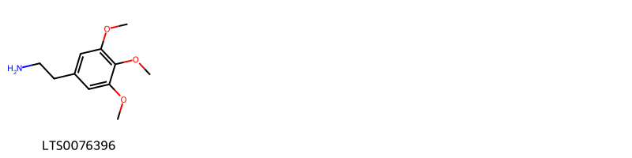{ width=100% }
    <figcaption>Hình ảnh cấu trúc hóa học của 1 hoạt chất thuộc nhóm Benzene and substituted derivatives gồm ['mescaline (LTS0076396)'].</figcaption>
</figure>

---

### Dược dân tộc học

Danh sách các quốc gia có sử dụng *Cylindropuntia bigelowii* trong điều trị các bệnh. 

| Country      | Disease   | Bệnh                                                                                                                                                                                                |
|:-------------|:----------|:----------------------------------------------------------------------------------------------------------------------------------------------------------------------------------------------------|
| Mexico(Seri) | Diuretic  | MYMEMORY WARNING: YOU USED ALL AVAILABLE FREE TRANSLATIONS FOR TODAY. NEXT AVAILABLE IN  05 HOURS 42 MINUTES 06 SECONDS VISIT HTTPS://MYMEMORY.TRANSLATED.NET/DOC/USAGELIMITS.PHP TO TRANSLATE MORE |

---

---
## Opuntia elatior
### Thông tin về thực vật

!!! info "Phân loại thực vật của *Opuntia elatior* từ GIBF:"
    - **Kingdom:** Plantae
    - **Phylum:** Tracheophyta
    - **Order:** Caryophyllales
    - **Family:** Cactaceae
    - **Genus:** Opuntia
    - **Species:** *Opuntia elatior*

 

| Label (VI)   | Label (EN)   | Scientific Name   | Descriptions (VI)   | Descriptions (EN)   | Also Known As (VI)   | Also Known As (EN)   |
|:-------------|:-------------|:------------------|:--------------------|:--------------------|:---------------------|:---------------------|
| N/A          | N/A          | Opuntia elatior   |                     | species of plant    | ['']                 | ['']                 |

#### Phân bố trên thế giới

**Từ CSDL GIBF** nan, Brazil, Guatemala, Viet Nam, Türkiye, French Polynesia, Thailand, Spain, Madagascar, Montenegro, Indonesia, Colombia, Croatia, Aruba, Morocco, Gibraltar, Mexico, Kenya, Belgium, Mauritius, Curaçao, Portugal, Timor-Leste, South Africa, Australia, Italy, India, France, Venezuela (Bolivarian Republic of)

#### Phân bố tại Việt Nam

**Từ CSDL GIBF**: Đà Nẵng

---
### Thành phần hóa học
        
- Theo cơ sở dữ liệu lotus: Từ loài *Opuntia elatior* đã phân lập và xác định được 1 hoạt chất thuộc về các nhóm Pyrans. 

|    | chemicalTaxonomyClassyfireClass   |   smiles_count |
|---:|:----------------------------------|---------------:|
|  0 | Pyrans                            |              1 |

#### Nhóm Pyrans
<figure markdown="span">
    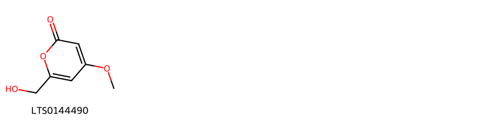{ width=100% }
    <figcaption>Hình ảnh cấu trúc hóa học của 1 hoạt chất thuộc nhóm Pyrans gồm ['6-(hydroxymethyl)-4-methoxypyran-2-one (LTS0144490)'].</figcaption>
</figure>

---

### Dược dân tộc học

Danh sách các quốc gia có sử dụng *Opuntia elatior* trong điều trị các bệnh. 

| Country   | Disease                 | Bệnh                                                                                                                                                                                                |
|:----------|:------------------------|:----------------------------------------------------------------------------------------------------------------------------------------------------------------------------------------------------|
| Elsewhere | Expectorant, Antiseptic | MYMEMORY WARNING: YOU USED ALL AVAILABLE FREE TRANSLATIONS FOR TODAY. NEXT AVAILABLE IN  05 HOURS 41 MINUTES 31 SECONDS VISIT HTTPS://MYMEMORY.TRANSLATED.NET/DOC/USAGELIMITS.PHP TO TRANSLATE MORE |

---

---
## Opuntia ficusindica
### Thông tin về thực vật

!!! info "Phân loại thực vật của *Opuntia ficus-indica* từ GIBF:"
    - **Kingdom:** Plantae
    - **Phylum:** Tracheophyta
    - **Order:** Caryophyllales
    - **Family:** Cactaceae
    - **Genus:** Opuntia
    - **Species:** *Opuntia ficus-indica*

 

| Label (VI)   | Label (EN)   | Scientific Name   | Descriptions (VI)   | Descriptions (EN)   | Also Known As (VI)   | Also Known As (EN)   |
|:-------------|:-------------|:------------------|:--------------------|:--------------------|:---------------------|:---------------------|
| N/A          | N/A          | Opuntia elatior   |                     | species of plant    | ['']                 | ['']                 |

#### Phân bố trên thế giới

**Từ CSDL GIBF** Malta, Israel, Chile, New Zealand, Antigua and Barbuda, Tanzania, United Republic of, Ecuador, Uruguay, Spain, United States of America, Greece, Colombia, Monaco, Argentina, Cyprus, Ethiopia, Mexico, Algeria, France, Namibia, Portugal, South Africa, Australia, Italy, India, Peru, Bolivia (Plurinational State of)

#### Phân bố tại Việt Nam

**Từ CSDL GIBF**: Không có ghi nhận ở Việt Nam

---
### Thành phần hóa học
        
- Theo cơ sở dữ liệu lotus: Từ loài *Opuntia ficus-indica* đã phân lập và xác định được Chưa có hoạt chất nào được phân lập. hoạt chất thuộc về các nhóm Không có hoạt chất nào được phân lập. 

Không có hình ảnh nào được tạo ra

---

### Dược dân tộc học

Danh sách các quốc gia có sử dụng *Opuntia ficus-indica* trong điều trị các bệnh. 

| Country   | Disease                                      | Bệnh                                                                                                                                                                                                |
|:----------|:---------------------------------------------|:----------------------------------------------------------------------------------------------------------------------------------------------------------------------------------------------------|
| Elsewhere | Emollient, Emollient, Decongestant, Diuretic | MYMEMORY WARNING: YOU USED ALL AVAILABLE FREE TRANSLATIONS FOR TODAY. NEXT AVAILABLE IN  05 HOURS 41 MINUTES 05 SECONDS VISIT HTTPS://MYMEMORY.TRANSLATED.NET/DOC/USAGELIMITS.PHP TO TRANSLATE MORE |
| ain       | Emollient                                    | MYMEMORY WARNING: YOU USED ALL AVAILABLE FREE TRANSLATIONS FOR TODAY. NEXT AVAILABLE IN  05 HOURS 41 MINUTES 02 SECONDS VISIT HTTPS://MYMEMORY.TRANSLATED.NET/DOC/USAGELIMITS.PHP TO TRANSLATE MORE |

---

---
## Opuntia megacantha
### Thông tin về thực vật

!!! info "Phân loại thực vật của *Opuntia ficus-indica* từ GIBF:"
    - **Kingdom:** Plantae
    - **Phylum:** Tracheophyta
    - **Order:** Caryophyllales
    - **Family:** Cactaceae
    - **Genus:** Opuntia
    - **Species:** *Opuntia ficus-indica*

 

| Label (VI)   | Label (EN)   | Scientific Name    | Descriptions (VI)   | Descriptions (EN)   | Also Known As (VI)   | Also Known As (EN)   |
|:-------------|:-------------|:-------------------|:--------------------|:--------------------|:---------------------|:---------------------|
| N/A          | N/A          | Opuntia megacantha | loài thực vật       | species of plant    | ['']                 | ['']                 |

#### Phân bố trên thế giới

**Từ CSDL GIBF** nan, Mexico, United States of America, Italy, Spain

#### Phân bố tại Việt Nam

**Từ CSDL GIBF**: Không có ghi nhận ở Việt Nam

---
### Thành phần hóa học
        
- Theo cơ sở dữ liệu lotus: Từ loài *Opuntia ficus-indica* đã phân lập và xác định được Chưa có hoạt chất nào được phân lập. hoạt chất thuộc về các nhóm Không có hoạt chất nào được phân lập. 

Không có hình ảnh nào được tạo ra

---

### Dược dân tộc học

Danh sách các quốc gia có sử dụng *Opuntia ficus-indica* trong điều trị các bệnh. 

| Country   | Disease   | Bệnh                                                                                                                                                                                                |
|:----------|:----------|:----------------------------------------------------------------------------------------------------------------------------------------------------------------------------------------------------|
| Hawaii    | Laxative  | MYMEMORY WARNING: YOU USED ALL AVAILABLE FREE TRANSLATIONS FOR TODAY. NEXT AVAILABLE IN  05 HOURS 40 MINUTES 28 SECONDS VISIT HTTPS://MYMEMORY.TRANSLATED.NET/DOC/USAGELIMITS.PHP TO TRANSLATE MORE |
| Mexico    | Poultice  | MYMEMORY WARNING: YOU USED ALL AVAILABLE FREE TRANSLATIONS FOR TODAY. NEXT AVAILABLE IN  05 HOURS 40 MINUTES 24 SECONDS VISIT HTTPS://MYMEMORY.TRANSLATED.NET/DOC/USAGELIMITS.PHP TO TRANSLATE MORE |

---

---
## Opuntia tuna
### Thông tin về thực vật

!!! info "Phân loại thực vật của *Opuntia tuna* từ GIBF:"
    - **Kingdom:** Plantae
    - **Phylum:** Tracheophyta
    - **Order:** Caryophyllales
    - **Family:** Cactaceae
    - **Genus:** Opuntia
    - **Species:** *Opuntia tuna*

 

| Label (VI)   | Label (EN)   | Scientific Name   | Descriptions (VI)   | Descriptions (EN)   | Also Known As (VI)   | Also Known As (EN)   |
|:-------------|:-------------|:------------------|:--------------------|:--------------------|:---------------------|:---------------------|
| N/A          | N/A          | Opuntia tuna      | loài thực vật       | species of plant    | ['']                 | ['']                 |

#### Phân bố trên thế giới

**Từ CSDL GIBF** nan, Brazil, Senegal, Guadeloupe, Ecuador, Madagascar, Spain, Cayman Islands, United States of America, Jamaica, Virgin Islands (U.S.), Seychelles, Dominican Republic, Colombia, Cuba, unknown or invalid, Aruba, Sint Maarten (Dutch part), Mexico, Benin, Algeria, United Kingdom of Great Britain and Northern Ireland, Haiti, Palestine, State of, Namibia, Portugal, Bonaire, Sint Eustatius and Saba, Bermuda, Italy, France, Venezuela (Bolivarian Republic of)

#### Phân bố tại Việt Nam

**Từ CSDL GIBF**: Không có ghi nhận ở Việt Nam

---
### Thành phần hóa học
        
- Theo cơ sở dữ liệu lotus: Từ loài *Opuntia tuna* đã phân lập và xác định được Chưa có hoạt chất nào được phân lập. hoạt chất thuộc về các nhóm Không có hoạt chất nào được phân lập. 

Không có hình ảnh nào được tạo ra

---

### Dược dân tộc học

Danh sách các quốc gia có sử dụng *Opuntia tuna* trong điều trị các bệnh. 

| Country   | Disease   | Bệnh                                                                                                                                                                                                |
|:----------|:----------|:----------------------------------------------------------------------------------------------------------------------------------------------------------------------------------------------------|
| US        | Poultice  | MYMEMORY WARNING: YOU USED ALL AVAILABLE FREE TRANSLATIONS FOR TODAY. NEXT AVAILABLE IN  05 HOURS 39 MINUTES 56 SECONDS VISIT HTTPS://MYMEMORY.TRANSLATED.NET/DOC/USAGELIMITS.PHP TO TRANSLATE MORE |

---

# Chi Pereskia

??? note "Danh sách các dược liệu thuộc chi"
    
	 - *Pereskia guamacho*

---
## Pereskia guamacho
### Thông tin về thực vật

!!! info "Phân loại thực vật của *Leuenbergeria guamacho* từ GIBF:"
    - **Kingdom:** Plantae
    - **Phylum:** Tracheophyta
    - **Order:** Caryophyllales
    - **Family:** Cactaceae
    - **Genus:** Leuenbergeria
    - **Species:** *Leuenbergeria guamacho*

 

| Label (VI)   | Label (EN)   | Scientific Name   | Descriptions (VI)   | Descriptions (EN)   | Also Known As (VI)   | Also Known As (EN)   |
|:-------------|:-------------|:------------------|:--------------------|:--------------------|:---------------------|:---------------------|
| N/A          | N/A          | Pereskia guamacho | loài thực vật       | species of plant    | ['']                 | ['']                 |

#### Phân bố trên thế giới

**Từ CSDL GIBF** Colombia

#### Phân bố tại Việt Nam

**Từ CSDL GIBF**: Không có ghi nhận ở Việt Nam

---
### Thành phần hóa học
        
- Theo cơ sở dữ liệu lotus: Từ loài *Leuenbergeria guamacho* đã phân lập và xác định được Chưa có hoạt chất nào được phân lập. hoạt chất thuộc về các nhóm Không có hoạt chất nào được phân lập. 

Không có hình ảnh nào được tạo ra

---

### Dược dân tộc học

Danh sách các quốc gia có sử dụng *Leuenbergeria guamacho* trong điều trị các bệnh. 

| Country   | Disease                               | Bệnh                                                                                                                                                                                                |
|:----------|:--------------------------------------|:----------------------------------------------------------------------------------------------------------------------------------------------------------------------------------------------------|
| Venezuela | Refrigerant, Suppurative, Cicatrizant | MYMEMORY WARNING: YOU USED ALL AVAILABLE FREE TRANSLATIONS FOR TODAY. NEXT AVAILABLE IN  05 HOURS 39 MINUTES 30 SECONDS VISIT HTTPS://MYMEMORY.TRANSLATED.NET/DOC/USAGELIMITS.PHP TO TRANSLATE MORE |

---

# Chi Machaerocereus

??? note "Danh sách các dược liệu thuộc chi"
    
	 - *Machaerocereus gummosus*

---
## Machaerocereus gummosus
### Thông tin về thực vật

!!! info "Phân loại thực vật của *Stenocereus gummosus* từ GIBF:"
    - **Kingdom:** Plantae
    - **Phylum:** Tracheophyta
    - **Order:** Caryophyllales
    - **Family:** Cactaceae
    - **Genus:** Stenocereus
    - **Species:** *Stenocereus gummosus*

 

| Label (VI)   | Label (EN)   | Scientific Name         | Descriptions (VI)   | Descriptions (EN)                        | Also Known As (VI)   | Also Known As (EN)   |
|:-------------|:-------------|:------------------------|:--------------------|:-----------------------------------------|:---------------------|:---------------------|
| N/A          | N/A          | Machaerocereus gummosus | loài thực vật       | species of plant in the family Cactaceae | ['']                 | ['']                 |

#### Phân bố trên thế giới

**Từ CSDL GIBF** nan, Mexico, United States of America, American Samoa, unknown or invalid

#### Phân bố tại Việt Nam

**Từ CSDL GIBF**: Không có ghi nhận ở Việt Nam

---
### Thành phần hóa học
        
- Theo cơ sở dữ liệu lotus: Từ loài *Stenocereus gummosus* đã phân lập và xác định được Chưa có hoạt chất nào được phân lập. hoạt chất thuộc về các nhóm Không có hoạt chất nào được phân lập. 

Không có hình ảnh nào được tạo ra

---

### Dược dân tộc học

Danh sách các quốc gia có sử dụng *Stenocereus gummosus* trong điều trị các bệnh. 

| Country   | Disease              | Bệnh                                                                                                                                                                                                |
|:----------|:---------------------|:----------------------------------------------------------------------------------------------------------------------------------------------------------------------------------------------------|
| Mexico    | Piscicide, Piscicide | MYMEMORY WARNING: YOU USED ALL AVAILABLE FREE TRANSLATIONS FOR TODAY. NEXT AVAILABLE IN  05 HOURS 38 MINUTES 58 SECONDS VISIT HTTPS://MYMEMORY.TRANSLATED.NET/DOC/USAGELIMITS.PHP TO TRANSLATE MORE |

---

# Chi Mammillaria

??? note "Danh sách các dược liệu thuộc chi"
    
	 - *Mammillaria heyderi*

---
## Mammillaria heyderi
### Thông tin về thực vật

!!! info "Phân loại thực vật của *Mammillaria heyderi* từ GIBF:"
    - **Kingdom:** Plantae
    - **Phylum:** Tracheophyta
    - **Order:** Caryophyllales
    - **Family:** Cactaceae
    - **Genus:** Mammillaria
    - **Species:** *Mammillaria heyderi*

 

| Label (VI)   | Label (EN)   | Scientific Name     | Descriptions (VI)   | Descriptions (EN)   | Also Known As (VI)   | Also Known As (EN)   |
|:-------------|:-------------|:--------------------|:--------------------|:--------------------|:---------------------|:---------------------|
| N/A          | N/A          | Mammillaria heyderi | loài thực vật       | species of plant    | ['']                 | ['']                 |

#### Phân bố trên thế giới

**Từ CSDL GIBF** nan, Mexico, United States of America

#### Phân bố tại Việt Nam

**Từ CSDL GIBF**: Không có ghi nhận ở Việt Nam

---
### Thành phần hóa học
        
- Theo cơ sở dữ liệu lotus: Từ loài *Mammillaria heyderi* đã phân lập và xác định được Chưa có hoạt chất nào được phân lập. hoạt chất thuộc về các nhóm Không có hoạt chất nào được phân lập. 

Không có hình ảnh nào được tạo ra

---

### Dược dân tộc học

Danh sách các quốc gia có sử dụng *Mammillaria heyderi* trong điều trị các bệnh. 

| Country            | Disease      | Bệnh                                                                                                                                                                                                |
|:-------------------|:-------------|:----------------------------------------------------------------------------------------------------------------------------------------------------------------------------------------------------|
| Mexico(Tarahumara) | Hallucinogen | MYMEMORY WARNING: YOU USED ALL AVAILABLE FREE TRANSLATIONS FOR TODAY. NEXT AVAILABLE IN  05 HOURS 38 MINUTES 35 SECONDS VISIT HTTPS://MYMEMORY.TRANSLATED.NET/DOC/USAGELIMITS.PHP TO TRANSLATE MORE |

---

# Chi Epiphyllum

??? note "Danh sách các dược liệu thuộc chi"
    
	 - *Epiphyllum phyllanthus*

---
## Epiphyllum phyllanthus
### Thông tin về thực vật

!!! info "Phân loại thực vật của *Epiphyllum phyllanthus* từ GIBF:"
    - **Kingdom:** Plantae
    - **Phylum:** Tracheophyta
    - **Order:** Caryophyllales
    - **Family:** Cactaceae
    - **Genus:** Epiphyllum
    - **Species:** *Epiphyllum phyllanthus*

 

| Label (VI)   | Label (EN)   | Scientific Name        | Descriptions (VI)   | Descriptions (EN)   | Also Known As (VI)   | Also Known As (EN)   |
|:-------------|:-------------|:-----------------------|:--------------------|:--------------------|:---------------------|:---------------------|
| N/A          | N/A          | Epiphyllum phyllanthus | loài thực vật       | species of plant    | ['']                 | ['']                 |

#### Phân bố trên thế giới

**Từ CSDL GIBF** Brazil, Nicaragua, Mexico, Guatemala, Panama, Paraguay, Suriname, Australia, Colombia, Argentina, Peru, Ecuador, French Guiana, Trinidad and Tobago, Bolivia (Plurinational State of), Guyana, Cayman Islands

#### Phân bố tại Việt Nam

**Từ CSDL GIBF**: Không có ghi nhận ở Việt Nam

---
### Thành phần hóa học
        
- Theo cơ sở dữ liệu lotus: Từ loài *Epiphyllum phyllanthus* đã phân lập và xác định được Chưa có hoạt chất nào được phân lập. hoạt chất thuộc về các nhóm Không có hoạt chất nào được phân lập. 

Không có hình ảnh nào được tạo ra

---

### Dược dân tộc học

Danh sách các quốc gia có sử dụng *Epiphyllum phyllanthus* trong điều trị các bệnh. 

| Country   | Disease        | Bệnh                                                                                                                                                                                                |
|:----------|:---------------|:----------------------------------------------------------------------------------------------------------------------------------------------------------------------------------------------------|
| Elsewhere | Tonic, Cardiac | MYMEMORY WARNING: YOU USED ALL AVAILABLE FREE TRANSLATIONS FOR TODAY. NEXT AVAILABLE IN  05 HOURS 37 MINUTES 58 SECONDS VISIT HTTPS://MYMEMORY.TRANSLATED.NET/DOC/USAGELIMITS.PHP TO TRANSLATE MORE |

---

# Chi Trichocereus

??? note "Danh sách các dược liệu thuộc chi"
    
	 - *Trichocereus pachanoi*

---
## Trichocereus pachanoi
### Thông tin về thực vật

!!! info "Phân loại thực vật của *Trichocereus macrogonus* từ GIBF:"
    - **Kingdom:** Plantae
    - **Phylum:** Tracheophyta
    - **Order:** Caryophyllales
    - **Family:** Cactaceae
    - **Genus:** Trichocereus
    - **Species:** *Trichocereus macrogonus*

 

| Label (VI)   | Label (EN)   | Scientific Name       | Descriptions (VI)   | Descriptions (EN)   | Also Known As (VI)   | Also Known As (EN)   |
|:-------------|:-------------|:----------------------|:--------------------|:--------------------|:---------------------|:---------------------|
| N/A          | N/A          | Trichocereus pachanoi |                     | species of plant    | ['']                 | ['']                 |

#### Phân bố trên thế giới

**Từ CSDL GIBF** nan, Mexico, United States of America, New Zealand, Ecuador, Peru

#### Phân bố tại Việt Nam

**Từ CSDL GIBF**: Không có ghi nhận ở Việt Nam

---
### Thành phần hóa học
        
- Theo cơ sở dữ liệu lotus: Từ loài *Trichocereus macrogonus* đã phân lập và xác định được Chưa có hoạt chất nào được phân lập. hoạt chất thuộc về các nhóm Không có hoạt chất nào được phân lập. 

Không có hình ảnh nào được tạo ra

---

### Dược dân tộc học

Danh sách các quốc gia có sử dụng *Trichocereus macrogonus* trong điều trị các bệnh. 

| Country   | Disease              | Bệnh                                                                                                                                                                                                |
|:----------|:---------------------|:----------------------------------------------------------------------------------------------------------------------------------------------------------------------------------------------------|
| Mexico    | Hallucinogen         | MYMEMORY WARNING: YOU USED ALL AVAILABLE FREE TRANSLATIONS FOR TODAY. NEXT AVAILABLE IN  05 HOURS 37 MINUTES 24 SECONDS VISIT HTTPS://MYMEMORY.TRANSLATED.NET/DOC/USAGELIMITS.PHP TO TRANSLATE MORE |
| Peru      | Emetic, Hallucinogen | MYMEMORY WARNING: YOU USED ALL AVAILABLE FREE TRANSLATIONS FOR TODAY. NEXT AVAILABLE IN  05 HOURS 37 MINUTES 21 SECONDS VISIT HTTPS://MYMEMORY.TRANSLATED.NET/DOC/USAGELIMITS.PHP TO TRANSLATE MORE |

---

# Chi Lophophora

??? note "Danh sách các dược liệu thuộc chi"
    
	 - *Lophophora williamsi*
	 - *Lophophora williamsii*

---
## Lophophora williamsi
### Thông tin về thực vật

!!! info "Phân loại thực vật của *Lophophora williamsii* từ GIBF:"
    - **Kingdom:** Plantae
    - **Phylum:** Tracheophyta
    - **Order:** Caryophyllales
    - **Family:** Cactaceae
    - **Genus:** Lophophora
    - **Species:** *Lophophora williamsii*

 

| Label (VI)   | Label (EN)   | Scientific Name       | Descriptions (VI)   | Descriptions (EN)   | Also Known As (VI)   | Also Known As (EN)   |
|:-------------|:-------------|:----------------------|:--------------------|:--------------------|:---------------------|:---------------------|
| N/A          | N/A          | Trichocereus pachanoi |                     | species of plant    | ['']                 | ['']                 |

#### Phân bố trên thế giới

**Từ CSDL GIBF** nan, Mexico, United States of America

#### Phân bố tại Việt Nam

**Từ CSDL GIBF**: Không có ghi nhận ở Việt Nam

---
### Thành phần hóa học
        
- Theo cơ sở dữ liệu lotus: Từ loài *Lophophora williamsii* đã phân lập và xác định được 17 hoạt chất thuộc về các nhóm Benzene and substituted derivatives, Pyridines and derivatives, Dihydroisoquinolines, Tetrahydroisoquinolines. 

|    | chemicalTaxonomyClassyfireClass     |   smiles_count |
|---:|:------------------------------------|---------------:|
|  0 | Benzene and substituted derivatives |              4 |
|  1 | Dihydroisoquinolines                |              2 |
|  2 | Pyridines and derivatives           |              2 |
|  3 | Tetrahydroisoquinolines             |              8 |

#### Nhóm Benzene and substituted derivatives
<figure markdown="span">
    { width=100% }
    <figcaption>Hình ảnh cấu trúc hóa học của 4 hoạt chất thuộc nhóm Benzene and substituted derivatives gồm ['mescaline (LTS0076396)', 'methoxamine (LTS0180749)', 'n-methylmescaline (LTS0239088)', 'hordenine (LTS0007857)'].</figcaption>
</figure>
#### Nhóm Dihydroisoquinolines
<figure markdown="span">
    { width=100% }
    <figcaption>Hình ảnh cấu trúc hóa học của 2 hoạt chất thuộc nhóm Dihydroisoquinolines gồm ['6,7-dimethoxy-3,4-dihydroisoquinolin-8-ol (LTS0202677)', '6,7-dimethoxy-1-methyl-3,4-dihydroisoquinolin-8-ol (LTS0049166)'].</figcaption>
</figure>
#### Nhóm Pyridines and derivatives
<figure markdown="span">
    { width=100% }
    <figcaption>Hình ảnh cấu trúc hóa học của 2 hoạt chất thuộc nhóm Pyridines and derivatives gồm ['6,7-dimethoxy-2-methyl-3,4-dihydroisoquinolin-8-one (LTS0128994)', '6,7-dimethoxy-1,2-dimethyl-3,4-dihydroisoquinolin-8-one (LTS0239420)'].</figcaption>
</figure>
#### Nhóm Tetrahydroisoquinolines
<figure markdown="span">
    { width=100% }
    <figcaption>Hình ảnh cấu trúc hóa học của 8 hoạt chất thuộc nhóm Tetrahydroisoquinolines gồm ['(+)-pellotine (LTS0183010)', 'anhalonidine (LTS0273488)', 'anhalonidine (LTS0058901)', '(1s)-6,7-dimethoxy-1,2-dimethyl-3,4-dihydro-1h-isoquinolin-8-ol (LTS0012541)', 'pellotine (LTS0078592)', '(9s)-4-methoxy-9-methyl-2h,6h,7h,8h,9h-[1,3]dioxolo[4,5-h]isoquinoline (LTS0154339)', 'anhalidine (LTS0153945)', 'anhalamine (LTS0100771)'].</figcaption>
</figure>

---

### Dược dân tộc học

Danh sách các quốc gia có sử dụng *Lophophora williamsii* trong điều trị các bệnh. 

| Country   | Disease      | Bệnh                                                                                                                                                                                                |
|:----------|:-------------|:----------------------------------------------------------------------------------------------------------------------------------------------------------------------------------------------------|
| Mexico    | Hallucinogen | MYMEMORY WARNING: YOU USED ALL AVAILABLE FREE TRANSLATIONS FOR TODAY. NEXT AVAILABLE IN  05 HOURS 36 MINUTES 59 SECONDS VISIT HTTPS://MYMEMORY.TRANSLATED.NET/DOC/USAGELIMITS.PHP TO TRANSLATE MORE |

---

---
## Lophophora williamsii
### Thông tin về thực vật

!!! info "Phân loại thực vật của *Lophophora williamsii* từ GIBF:"
    - **Kingdom:** Plantae
    - **Phylum:** Tracheophyta
    - **Order:** Caryophyllales
    - **Family:** Cactaceae
    - **Genus:** Lophophora
    - **Species:** *Lophophora williamsii*

 

| Label (VI)   | Label (EN)   | Scientific Name       | Descriptions (VI)   | Descriptions (EN)        | Also Known As (VI)   | Also Known As (EN)   |
|:-------------|:-------------|:----------------------|:--------------------|:-------------------------|:---------------------|:---------------------|
| N/A          | N/A          | Lophophora williamsii |                     | species of plant, peyote | ['']                 | ['Peyote', 'peyote'] |

#### Phân bố trên thế giới

**Từ CSDL GIBF** nan, Mexico, United States of America

#### Phân bố tại Việt Nam

**Từ CSDL GIBF**: Không có ghi nhận ở Việt Nam

---
### Thành phần hóa học
        
- Theo cơ sở dữ liệu lotus: Từ loài *Lophophora williamsii* đã phân lập và xác định được 17 hoạt chất thuộc về các nhóm Benzene and substituted derivatives, Pyridines and derivatives, Dihydroisoquinolines, Tetrahydroisoquinolines. 

|    | chemicalTaxonomyClassyfireClass     |   smiles_count |
|---:|:------------------------------------|---------------:|
|  0 | Benzene and substituted derivatives |              4 |
|  1 | Dihydroisoquinolines                |              2 |
|  2 | Pyridines and derivatives           |              2 |
|  3 | Tetrahydroisoquinolines             |              8 |

#### Nhóm Benzene and substituted derivatives
<figure markdown="span">
    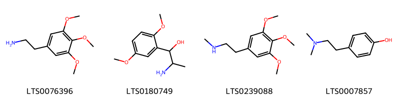{ width=100% }
    <figcaption>Hình ảnh cấu trúc hóa học của 4 hoạt chất thuộc nhóm Benzene and substituted derivatives gồm ['mescaline (LTS0076396)', 'methoxamine (LTS0180749)', 'n-methylmescaline (LTS0239088)', 'hordenine (LTS0007857)'].</figcaption>
</figure>
#### Nhóm Dihydroisoquinolines
<figure markdown="span">
    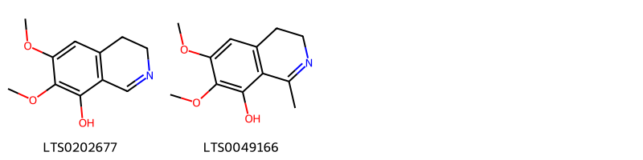{ width=100% }
    <figcaption>Hình ảnh cấu trúc hóa học của 2 hoạt chất thuộc nhóm Dihydroisoquinolines gồm ['6,7-dimethoxy-3,4-dihydroisoquinolin-8-ol (LTS0202677)', '6,7-dimethoxy-1-methyl-3,4-dihydroisoquinolin-8-ol (LTS0049166)'].</figcaption>
</figure>
#### Nhóm Pyridines and derivatives
<figure markdown="span">
    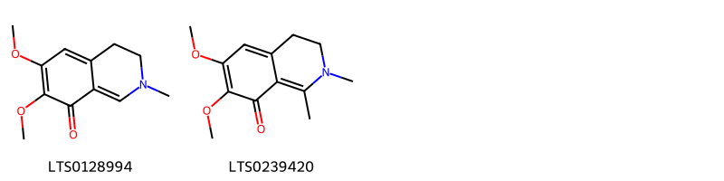{ width=100% }
    <figcaption>Hình ảnh cấu trúc hóa học của 2 hoạt chất thuộc nhóm Pyridines and derivatives gồm ['6,7-dimethoxy-2-methyl-3,4-dihydroisoquinolin-8-one (LTS0128994)', '6,7-dimethoxy-1,2-dimethyl-3,4-dihydroisoquinolin-8-one (LTS0239420)'].</figcaption>
</figure>
#### Nhóm Tetrahydroisoquinolines
<figure markdown="span">
    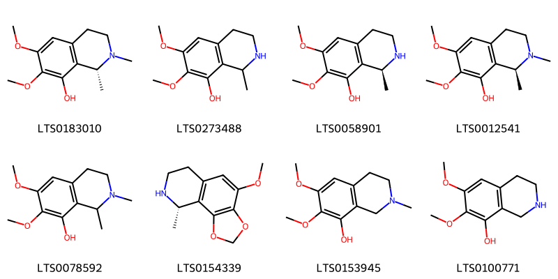{ width=100% }
    <figcaption>Hình ảnh cấu trúc hóa học của 8 hoạt chất thuộc nhóm Tetrahydroisoquinolines gồm ['(+)-pellotine (LTS0183010)', 'anhalonidine (LTS0273488)', 'anhalonidine (LTS0058901)', '(1s)-6,7-dimethoxy-1,2-dimethyl-3,4-dihydro-1h-isoquinolin-8-ol (LTS0012541)', 'pellotine (LTS0078592)', '(9s)-4-methoxy-9-methyl-2h,6h,7h,8h,9h-[1,3]dioxolo[4,5-h]isoquinoline (LTS0154339)', 'anhalidine (LTS0153945)', 'anhalamine (LTS0100771)'].</figcaption>
</figure>

---

### Dược dân tộc học

Danh sách các quốc gia có sử dụng *Lophophora williamsii* trong điều trị các bệnh. 

| Country         | Disease                                                                                                                        | Bệnh                                                                                                                                                                                                |
|:----------------|:-------------------------------------------------------------------------------------------------------------------------------|:----------------------------------------------------------------------------------------------------------------------------------------------------------------------------------------------------|
| Elsewhere       | Sedative                                                                                                                       | MYMEMORY WARNING: YOU USED ALL AVAILABLE FREE TRANSLATIONS FOR TODAY. NEXT AVAILABLE IN  05 HOURS 36 MINUTES 20 SECONDS VISIT HTTPS://MYMEMORY.TRANSLATED.NET/DOC/USAGELIMITS.PHP TO TRANSLATE MORE |
| Mexico          | Cardiotonic, Hallucinogen, Hallucinogen, Hallucinogen, Hallucinogen, Narcotic, Narcotic, Poison, Sedative, Tonic, Hallucinogen | MYMEMORY WARNING: YOU USED ALL AVAILABLE FREE TRANSLATIONS FOR TODAY. NEXT AVAILABLE IN  05 HOURS 36 MINUTES 16 SECONDS VISIT HTTPS://MYMEMORY.TRANSLATED.NET/DOC/USAGELIMITS.PHP TO TRANSLATE MORE |
| Mexico(Huichol) | Hallucinogen                                                                                                                   | MYMEMORY WARNING: YOU USED ALL AVAILABLE FREE TRANSLATIONS FOR TODAY. NEXT AVAILABLE IN  05 HOURS 36 MINUTES 13 SECONDS VISIT HTTPS://MYMEMORY.TRANSLATED.NET/DOC/USAGELIMITS.PHP TO TRANSLATE MORE |
| US              | Intoxicant                                                                                                                     | MYMEMORY WARNING: YOU USED ALL AVAILABLE FREE TRANSLATIONS FOR TODAY. NEXT AVAILABLE IN  05 HOURS 36 MINUTES 10 SECONDS VISIT HTTPS://MYMEMORY.TRANSLATED.NET/DOC/USAGELIMITS.PHP TO TRANSLATE MORE |
| US(Blackfoot)   | Hallucinogen                                                                                                                   | MYMEMORY WARNING: YOU USED ALL AVAILABLE FREE TRANSLATIONS FOR TODAY. NEXT AVAILABLE IN  05 HOURS 36 MINUTES 07 SECONDS VISIT HTTPS://MYMEMORY.TRANSLATED.NET/DOC/USAGELIMITS.PHP TO TRANSLATE MORE |

---

# Chi Echinocereus

??? note "Danh sách các dược liệu thuộc chi"
    
	 - *Echinocereus enneacanthus*

---
## Echinocereus enneacanthus
### Thông tin về thực vật

!!! info "Phân loại thực vật của *Echinocereus enneacanthus* từ GIBF:"
    - **Kingdom:** Plantae
    - **Phylum:** Tracheophyta
    - **Order:** Caryophyllales
    - **Family:** Cactaceae
    - **Genus:** Echinocereus
    - **Species:** *Echinocereus enneacanthus*

 

| Label (VI)   | Label (EN)   | Scientific Name           | Descriptions (VI)   | Descriptions (EN)   | Also Known As (VI)   | Also Known As (EN)   |
|:-------------|:-------------|:--------------------------|:--------------------|:--------------------|:---------------------|:---------------------|
| N/A          | N/A          | Echinocereus enneacanthus | loài thực vật       | species of plant    | ['']                 | ['']                 |

#### Phân bố trên thế giới

**Từ CSDL GIBF** nan, Mexico, United States of America

#### Phân bố tại Việt Nam

**Từ CSDL GIBF**: Không có ghi nhận ở Việt Nam

---
### Thành phần hóa học
        
- Theo cơ sở dữ liệu lotus: Từ loài *Echinocereus enneacanthus* đã phân lập và xác định được 3 hoạt chất thuộc về các nhóm Benzene and substituted derivatives. 

|    | chemicalTaxonomyClassyfireClass     |   smiles_count |
|---:|:------------------------------------|---------------:|
|  0 | Benzene and substituted derivatives |              2 |

#### Nhóm Benzene and substituted derivatives
<figure markdown="span">
    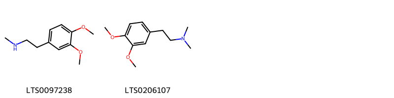{ width=100% }
    <figcaption>Hình ảnh cấu trúc hóa học của 2 hoạt chất thuộc nhóm Benzene and substituted derivatives gồm ['n-methylhomoveratrylamine (LTS0097238)', 'n,n-dimethylhomoveratrylamine (LTS0206107)'].</figcaption>
</figure>

---

### Dược dân tộc học

Danh sách các quốc gia có sử dụng *Echinocereus enneacanthus* trong điều trị các bệnh. 

| Country   | Disease              | Bệnh                                                                                                                                                                                                |
|:----------|:---------------------|:----------------------------------------------------------------------------------------------------------------------------------------------------------------------------------------------------|
| US        | Piscicide, Vermifuge | MYMEMORY WARNING: YOU USED ALL AVAILABLE FREE TRANSLATIONS FOR TODAY. NEXT AVAILABLE IN  05 HOURS 35 MINUTES 39 SECONDS VISIT HTTPS://MYMEMORY.TRANSLATED.NET/DOC/USAGELIMITS.PHP TO TRANSLATE MORE |

---

# Chi Aporocactus

??? note "Danh sách các dược liệu thuộc chi"
    
	 - *Aporocactus flagelliformis*

---
## Aporocactus flagelliformis
### Thông tin về thực vật

!!! info "Phân loại thực vật của *Aporocactus flagelliformis* từ GIBF:"
    - **Kingdom:** Plantae
    - **Phylum:** Tracheophyta
    - **Order:** Caryophyllales
    - **Family:** Cactaceae
    - **Genus:** Aporocactus
    - **Species:** *Aporocactus flagelliformis*

 

| Label (VI)   | Label (EN)   | Scientific Name            | Descriptions (VI)   | Descriptions (EN)   | Also Known As (VI)   | Also Known As (EN)   |
|:-------------|:-------------|:---------------------------|:--------------------|:--------------------|:---------------------|:---------------------|
| N/A          | N/A          | Aporocactus flagelliformis | loài thực vật       | species of plant    | ['']                 | ['rattail cactus']   |

#### Phân bố trên thế giới

**Từ CSDL GIBF** nan, Mexico, Brazil, Kenya, United States of America, Panama, Peru, Belgium, France, Switzerland, Luxembourg, Ecuador, unknown or invalid, Madagascar, Spain

#### Phân bố tại Việt Nam

**Từ CSDL GIBF**: Không có ghi nhận ở Việt Nam

---
### Thành phần hóa học
        
- Theo cơ sở dữ liệu lotus: Từ loài *Aporocactus flagelliformis* đã phân lập và xác định được Chưa có hoạt chất nào được phân lập. hoạt chất thuộc về các nhóm Không có hoạt chất nào được phân lập. 

Không có hình ảnh nào được tạo ra

---

### Dược dân tộc học

Danh sách các quốc gia có sử dụng *Aporocactus flagelliformis* trong điều trị các bệnh. 

| Country   | Disease   | Bệnh                                                                                                                                                                                                |
|:----------|:----------|:----------------------------------------------------------------------------------------------------------------------------------------------------------------------------------------------------|
| Mexico    | Vermifuge | MYMEMORY WARNING: YOU USED ALL AVAILABLE FREE TRANSLATIONS FOR TODAY. NEXT AVAILABLE IN  05 HOURS 35 MINUTES 07 SECONDS VISIT HTTPS://MYMEMORY.TRANSLATED.NET/DOC/USAGELIMITS.PHP TO TRANSLATE MORE |

---

# Chi Hylocereus

??? note "Danh sách các dược liệu thuộc chi"
    
	 - *Hylocereus napoleonsis*
	 - *Hylocereus undatus*

---
## Hylocereus napoleonsis
### Thông tin về thực vật

!!! info "Phân loại thực vật của *Selenicereus triangularis* từ GIBF:"
    - **Kingdom:** Plantae
    - **Phylum:** Tracheophyta
    - **Order:** Caryophyllales
    - **Family:** Cactaceae
    - **Genus:** Selenicereus
    - **Species:** *Selenicereus triangularis*

 

| Label (VI)   | Label (EN)   | Scientific Name            | Descriptions (VI)   | Descriptions (EN)   | Also Known As (VI)   | Also Known As (EN)   |
|:-------------|:-------------|:---------------------------|:--------------------|:--------------------|:---------------------|:---------------------|
| N/A          | N/A          | Aporocactus flagelliformis | loài thực vật       | species of plant    | ['']                 | ['rattail cactus']   |

#### Phân bố trên thế giới

**Từ CSDL GIBF** nan, Mexico, unknown or invalid

#### Phân bố tại Việt Nam

**Từ CSDL GIBF**: Không có ghi nhận ở Việt Nam

---
### Thành phần hóa học
        
- Theo cơ sở dữ liệu lotus: Từ loài *Selenicereus triangularis* đã phân lập và xác định được Chưa có hoạt chất nào được phân lập. hoạt chất thuộc về các nhóm Không có hoạt chất nào được phân lập. 

Không có hình ảnh nào được tạo ra

---

### Dược dân tộc học

Danh sách các quốc gia có sử dụng *Selenicereus triangularis* trong điều trị các bệnh. 

| Country     | Disease   | Bệnh                                                                                                                                                                                                |
|:------------|:----------|:----------------------------------------------------------------------------------------------------------------------------------------------------------------------------------------------------|
| West Indies | Cathartic | MYMEMORY WARNING: YOU USED ALL AVAILABLE FREE TRANSLATIONS FOR TODAY. NEXT AVAILABLE IN  05 HOURS 34 MINUTES 35 SECONDS VISIT HTTPS://MYMEMORY.TRANSLATED.NET/DOC/USAGELIMITS.PHP TO TRANSLATE MORE |

---

---
## Hylocereus undatus
### Thông tin về thực vật

!!! info "Phân loại thực vật của *Selenicereus undatus* từ GIBF:"
    - **Kingdom:** Plantae
    - **Phylum:** Tracheophyta
    - **Order:** Caryophyllales
    - **Family:** Cactaceae
    - **Genus:** Selenicereus
    - **Species:** *Selenicereus undatus*

 

| Label (VI)   | Label (EN)   | Scientific Name    | Descriptions (VI)   | Descriptions (EN)             | Also Known As (VI)   | Also Known As (EN)   |
|:-------------|:-------------|:-------------------|:--------------------|:------------------------------|:---------------------|:---------------------|
| N/A          | N/A          | Hylocereus undatus | loài thực vật       | species of plant, dragonfruit | ['']                 | ['']                 |

#### Phân bố trên thế giới

**Từ CSDL GIBF** Brazil, Guatemala, Japan, Tanzania, United Republic of, Spain, Réunion, United States of America, Zambia, Greece, Seychelles, Colombia, Cuba, Cyprus, Malawi, Mexico, Kenya, Norway, El Salvador, Belgium, Chinese Taipei, Mauritius, Curaçao, South Africa, Australia, Italy, India

#### Phân bố tại Việt Nam

**Từ CSDL GIBF**: Không có ghi nhận ở Việt Nam

---
### Thành phần hóa học
        
- Theo cơ sở dữ liệu lotus: Từ loài *Selenicereus undatus* đã phân lập và xác định được 34 hoạt chất thuộc về các nhóm Fatty Acyls, Flavonoids, Carboxylic acids and derivatives, Cinnamic acids and derivatives, Saccharolipids, Steroids and steroid derivatives, Organooxygen compounds. 

|    | chemicalTaxonomyClassyfireClass   |   smiles_count |
|---:|:----------------------------------|---------------:|
|  0 | Carboxylic acids and derivatives  |              5 |
|  1 | Cinnamic acids and derivatives    |              4 |
|  2 | Fatty Acyls                       |              4 |
|  3 | Flavonoids                        |              8 |
|  4 | Organooxygen compounds            |              5 |
|  5 | Saccharolipids                    |              4 |
|  6 | Steroids and steroid derivatives  |              4 |

#### Nhóm Carboxylic acids and derivatives
<figure markdown="span">
    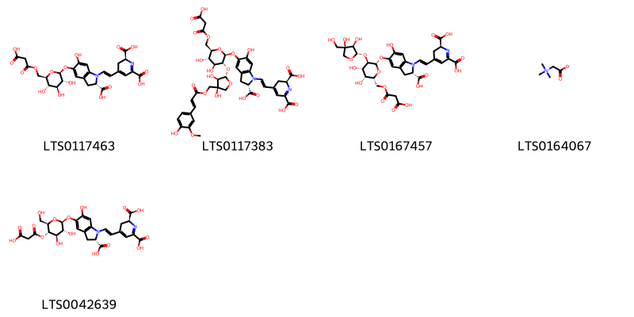{ width=100% }
    <figcaption>Hình ảnh cấu trúc hóa học của 5 hoạt chất thuộc nhóm Carboxylic acids and derivatives gồm ['(2s)-4-[(1e)-2-[(2s)-2-carboxy-5-{[(2s,3r,4s,5s,6r)-6-{[(2-carboxyacetyl)oxy]methyl}-3,4,5-trihydroxyoxan-2-yl]oxy}-6-hydroxy-2,3-dihydroindol-1-yl]ethenyl]-2,3-dihydropyridine-2,6-dicarboxylic acid (LTS0117463)', '(2s)-4-[(1e)-2-[(2s)-2-carboxy-5-{[(2s,3r,4s,5s,6r)-6-{[(2-carboxyacetyl)oxy]methyl}-3-{[(2s,3r,4s)-3,4-dihydroxy-4-({[(2e)-3-(4-hydroxy-3-methoxyphenyl)prop-2-enoyl]oxy}methyl)oxolan-2-yl]oxy}-4,5-dihydroxyoxan-2-yl]oxy}-6-hydroxy-2,3-dihydroindol-1-yl]ethenyl]-2,3-dihydropyridine-2,6-dicarboxylic acid (LTS0117383)', '(2s)-4-[(1e)-2-[(2s)-2-carboxy-5-{[(2s,3r,4s,5r,6r)-6-{[(2-carboxyacetyl)oxy]methyl}-3-{[(2s,3r,4r)-3,4-dihydroxy-4-(hydroxymethyl)oxolan-2-yl]oxy}-4,5-dihydroxyoxan-2-yl]oxy}-6-hydroxy-2,3-dihydroindol-1-yl]ethenyl]-2,3-dihydropyridine-2,6-dicarboxylic acid (LTS0167457)', 'bet (LTS0164067)', '(2s)-4-[(1e)-2-[(2s)-2-carboxy-5-{[(2s,3r,4r,5s,6r)-5-[(2-carboxyacetyl)oxy]-3,4-dihydroxy-6-(hydroxymethyl)oxan-2-yl]oxy}-6-hydroxy-2,3-dihydroindol-1-yl]ethenyl]-2,3-dihydropyridine-2,6-dicarboxylic acid (LTS0042639)'].</figcaption>
</figure>
#### Nhóm Cinnamic acids and derivatives
<figure markdown="span">
    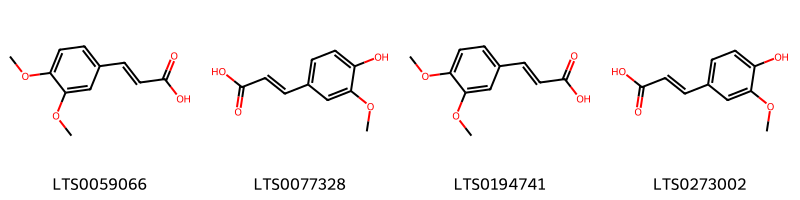{ width=100% }
    <figcaption>Hình ảnh cấu trúc hóa học của 4 hoạt chất thuộc nhóm Cinnamic acids and derivatives gồm ['3,4-dimethoxycinnamic acid (LTS0059066)', 'ferulic acid (LTS0077328)', '3-(3,4-dimethoxyphenyl)prop-2-enoic acid (LTS0194741)', 'ferulic acid (LTS0273002)'].</figcaption>
</figure>
#### Nhóm Fatty Acyls
<figure markdown="span">
    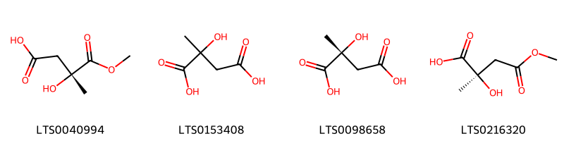{ width=100% }
    <figcaption>Hình ảnh cấu trúc hóa học của 4 hoạt chất thuộc nhóm Fatty Acyls gồm ['(3r)-3-hydroxy-4-methoxy-3-methyl-4-oxobutanoic acid (LTS0040994)', 'citramalate, (+-)- (LTS0153408)', 'pyrotartaric acid (LTS0098658)', '(2r)-2-hydroxy-4-methoxy-2-methyl-4-oxobutanoic acid (LTS0216320)'].</figcaption>
</figure>
#### Nhóm Flavonoids
<figure markdown="span">
    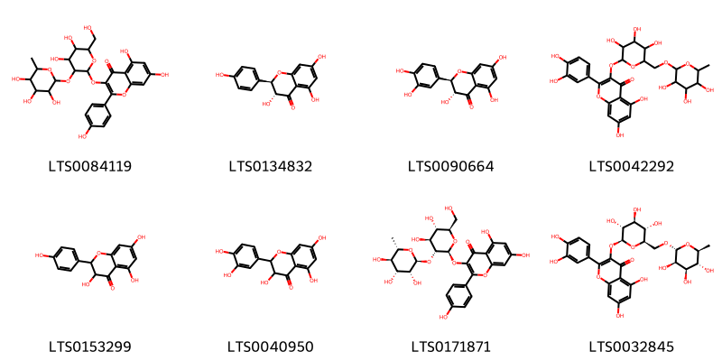{ width=100% }
    <figcaption>Hình ảnh cấu trúc hóa học của 8 hoạt chất thuộc nhóm Flavonoids gồm ['3-{[4,5-dihydroxy-6-(hydroxymethyl)-3-[(3,4,5-trihydroxy-6-methyloxan-2-yl)oxy]oxan-2-yl]oxy}-5,7-dihydroxy-2-(4-hydroxyphenyl)chromen-4-one (LTS0084119)', '(+)-dihydrokaempferol (LTS0134832)', '(+)-taxifolin (LTS0090664)', 'rutin (LTS0042292)', 'aromadendrin (LTS0153299)', '2,3-dihydroquercetin (LTS0040950)', '3-{[(2s,3r,4s,5s,6r)-4,5-dihydroxy-6-(hydroxymethyl)-3-{[(2s,3r,4r,5r,6s)-3,4,5-trihydroxy-6-methyloxan-2-yl]oxy}oxan-2-yl]oxy}-5,7-dihydroxy-2-(4-hydroxyphenyl)chromen-4-one (LTS0171871)', '3-rutinosyl quercetin (LTS0032845)'].</figcaption>
</figure>
#### Nhóm Organooxygen compounds
<figure markdown="span">
    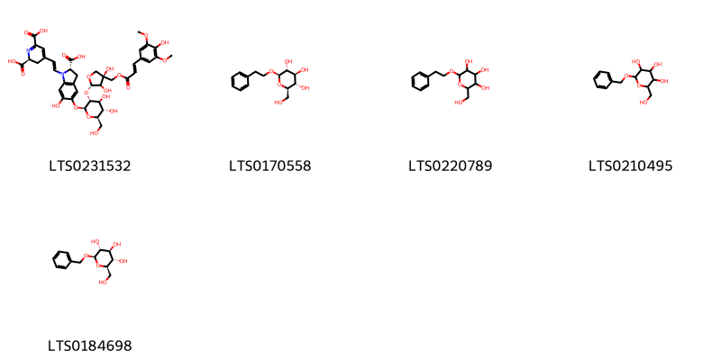{ width=100% }
    <figcaption>Hình ảnh cấu trúc hóa học của 5 hoạt chất thuộc nhóm Organooxygen compounds gồm ['(2s)-4-[(1e)-2-[(2s)-2-carboxy-5-{[(2s,3r,4s,5s,6r)-3-{[(2s,3r,4s)-3,4-dihydroxy-4-({[(2e)-3-(4-hydroxy-3,5-dimethoxyphenyl)prop-2-enoyl]oxy}methyl)oxolan-2-yl]oxy}-4,5-dihydroxy-6-(hydroxymethyl)oxan-2-yl]oxy}-6-hydroxy-2,3-dihydroindol-1-yl]ethenyl]-2,3-dihydropyridine-2,6-dicarboxylic acid (LTS0231532)', '(2r,3s,4s,5r,6r)-2-(hydroxymethyl)-6-(2-phenylethoxy)oxane-3,4,5-triol (LTS0170558)', '2-(hydroxymethyl)-6-(2-phenylethoxy)oxane-3,4,5-triol (LTS0220789)', 'benzyl glucopyranoside (LTS0210495)', 'benzyl β-d-glucoside (LTS0184698)'].</figcaption>
</figure>
#### Nhóm Saccharolipids
<figure markdown="span">
    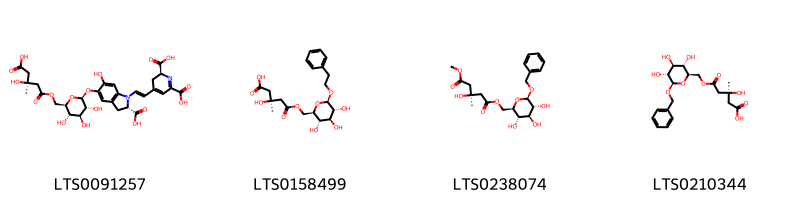{ width=100% }
    <figcaption>Hình ảnh cấu trúc hóa học của 4 hoạt chất thuộc nhóm Saccharolipids gồm ['(2s)-4-[(1e)-2-[(2s)-2-carboxy-5-{[(2s,3r,4s,5s,6r)-6-({[(3s)-4-carboxy-3-hydroxy-3-methylbutanoyl]oxy}methyl)-3,4,5-trihydroxyoxan-2-yl]oxy}-6-hydroxy-2,3-dihydroindol-1-yl]ethenyl]-2,3-dihydropyridine-2,6-dicarboxylic acid (LTS0091257)', '(3s)-3-hydroxy-3-methyl-5-oxo-5-{[(2r,3s,4s,5r,6r)-3,4,5-trihydroxy-6-(2-phenylethoxy)oxan-2-yl]methoxy}pentanoic acid (LTS0158499)', '1-[(2r,3s,4s,5r,6r)-6-(benzyloxy)-3,4,5-trihydroxyoxan-2-yl]methyl 5-methyl (3s)-3-hydroxy-3-methylpentanedioate (LTS0238074)', '(3s)-5-{[(2r,3s,4s,5r,6r)-6-(benzyloxy)-3,4,5-trihydroxyoxan-2-yl]methoxy}-3-hydroxy-3-methyl-5-oxopentanoic acid (LTS0210344)'].</figcaption>
</figure>
#### Nhóm Steroids and steroid derivatives
<figure markdown="span">
    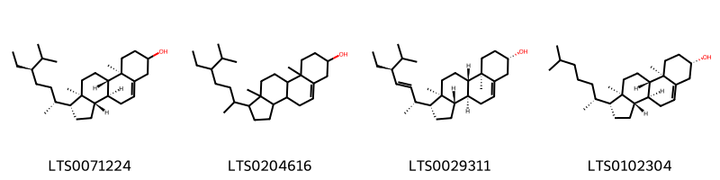{ width=100% }
    <figcaption>Hình ảnh cấu trúc hóa học của 4 hoạt chất thuộc nhóm Steroids and steroid derivatives gồm ['stigmast-5-en-3-ol (LTS0071224)', 'stigmast-5-en-3-ol, (3β)- (LTS0204616)', 'phytosterol (LTS0029311)', 'cholesterol (LTS0102304)'].</figcaption>
</figure>

---

### Dược dân tộc học

Danh sách các quốc gia có sử dụng *Selenicereus undatus* trong điều trị các bệnh. 

| Country   | Disease                 | Bệnh                                                                                                                                                                                                |
|:----------|:------------------------|:----------------------------------------------------------------------------------------------------------------------------------------------------------------------------------------------------|
| Mexico    | Parasiticide, Vermifuge | MYMEMORY WARNING: YOU USED ALL AVAILABLE FREE TRANSLATIONS FOR TODAY. NEXT AVAILABLE IN  05 HOURS 34 MINUTES 14 SECONDS VISIT HTTPS://MYMEMORY.TRANSLATED.NET/DOC/USAGELIMITS.PHP TO TRANSLATE MORE |

---

# Chi Nopalea

??? note "Danh sách các dược liệu thuộc chi"
    
	 - *Nopalea cochenillifera*
	 - *Nopalea cochinillifera*

---
## Nopalea cochenillifera
### Thông tin về thực vật

!!! info "Phân loại thực vật của *Opuntia cochenillifera* từ GIBF:"
    - **Kingdom:** Plantae
    - **Phylum:** Tracheophyta
    - **Order:** Caryophyllales
    - **Family:** Cactaceae
    - **Genus:** Opuntia
    - **Species:** *Opuntia cochenillifera*

 

| Label (VI)   | Label (EN)   | Scientific Name        | Descriptions (VI)   | Descriptions (EN)   | Also Known As (VI)   | Also Known As (EN)   |
|:-------------|:-------------|:-----------------------|:--------------------|:--------------------|:---------------------|:---------------------|
| N/A          | N/A          | Nopalea cochenillifera |                     | species of plant    | ['']                 | ['']                 |

#### Phân bố trên thế giới

**Từ CSDL GIBF** nan, Brazil, Guatemala, Puerto Rico, Sri Lanka, United States of America, Jamaica, Virgin Islands (U.S.), Costa Rica, Dominican Republic, Colombia, Guyana, unknown or invalid, Dominica, Mexico, El Salvador, Belgium, Chinese Taipei, Palau, Nicaragua, Bonaire, Sint Eustatius and Saba, Bahamas, South Africa, Bolivia (Plurinational State of), Belize, Venezuela (Bolivarian Republic of)

#### Phân bố tại Việt Nam

**Từ CSDL GIBF**: Không có ghi nhận ở Việt Nam

---
### Thành phần hóa học
        
- Theo cơ sở dữ liệu lotus: Từ loài *Opuntia cochenillifera* đã phân lập và xác định được Chưa có hoạt chất nào được phân lập. hoạt chất thuộc về các nhóm Không có hoạt chất nào được phân lập. 

Không có hình ảnh nào được tạo ra

---

### Dược dân tộc học

Danh sách các quốc gia có sử dụng *Opuntia cochenillifera* trong điều trị các bệnh. 

| Country   | Disease   | Bệnh                                                                                                                                                                                                |
|:----------|:----------|:----------------------------------------------------------------------------------------------------------------------------------------------------------------------------------------------------|
| Elsewhere | Emollient | MYMEMORY WARNING: YOU USED ALL AVAILABLE FREE TRANSLATIONS FOR TODAY. NEXT AVAILABLE IN  05 HOURS 33 MINUTES 34 SECONDS VISIT HTTPS://MYMEMORY.TRANSLATED.NET/DOC/USAGELIMITS.PHP TO TRANSLATE MORE |
| Mexico    | Poultice  | MYMEMORY WARNING: YOU USED ALL AVAILABLE FREE TRANSLATIONS FOR TODAY. NEXT AVAILABLE IN  05 HOURS 33 MINUTES 29 SECONDS VISIT HTTPS://MYMEMORY.TRANSLATED.NET/DOC/USAGELIMITS.PHP TO TRANSLATE MORE |

---

---
## Nopalea cochinillifera
### Thông tin về thực vật

!!! info "Phân loại thực vật của *Opuntia cochenillifera* từ GIBF:"
    - **Kingdom:** Plantae
    - **Phylum:** Tracheophyta
    - **Order:** Caryophyllales
    - **Family:** Cactaceae
    - **Genus:** Opuntia
    - **Species:** *Opuntia cochenillifera*

 

| Label (VI)   | Label (EN)   | Scientific Name        | Descriptions (VI)   | Descriptions (EN)   | Also Known As (VI)   | Also Known As (EN)   |
|:-------------|:-------------|:-----------------------|:--------------------|:--------------------|:---------------------|:---------------------|
| N/A          | N/A          | Nopalea cochenillifera |                     | species of plant    | ['']                 | ['']                 |

#### Phân bố trên thế giới

**Từ CSDL GIBF** nan, Brazil, Guatemala, Puerto Rico, Sri Lanka, United States of America, Jamaica, Virgin Islands (U.S.), Costa Rica, Dominican Republic, Colombia, Guyana, unknown or invalid, Dominica, Mexico, El Salvador, Belgium, Chinese Taipei, Palau, Nicaragua, Bonaire, Sint Eustatius and Saba, Bahamas, South Africa, Bolivia (Plurinational State of), Belize, Venezuela (Bolivarian Republic of)

#### Phân bố tại Việt Nam

**Từ CSDL GIBF**: Không có ghi nhận ở Việt Nam

---
### Thành phần hóa học
        
- Theo cơ sở dữ liệu lotus: Từ loài *Opuntia cochenillifera* đã phân lập và xác định được Chưa có hoạt chất nào được phân lập. hoạt chất thuộc về các nhóm Không có hoạt chất nào được phân lập. 

Không có hình ảnh nào được tạo ra

---

### Dược dân tộc học

Danh sách các quốc gia có sử dụng *Opuntia cochenillifera* trong điều trị các bệnh. 

| Country   | Disease   | Bệnh                                                                                                                                                                                                |
|:----------|:----------|:----------------------------------------------------------------------------------------------------------------------------------------------------------------------------------------------------|
| Haiti     | Laxative  | MYMEMORY WARNING: YOU USED ALL AVAILABLE FREE TRANSLATIONS FOR TODAY. NEXT AVAILABLE IN  05 HOURS 33 MINUTES 03 SECONDS VISIT HTTPS://MYMEMORY.TRANSLATED.NET/DOC/USAGELIMITS.PHP TO TRANSLATE MORE |

---

# Chi Pelecyphora

??? note "Danh sách các dược liệu thuộc chi"
    
	 - *Pelecyphora aselliformis*

---
## Pelecyphora aselliformis
### Thông tin về thực vật

!!! info "Phân loại thực vật của *Pelecyphora aselliformis* từ GIBF:"
    - **Kingdom:** Plantae
    - **Phylum:** Tracheophyta
    - **Order:** Caryophyllales
    - **Family:** Cactaceae
    - **Genus:** Pelecyphora
    - **Species:** *Pelecyphora aselliformis*

 

| Label (VI)   | Label (EN)   | Scientific Name          | Descriptions (VI)   | Descriptions (EN)   | Also Known As (VI)   | Also Known As (EN)   |
|:-------------|:-------------|:-------------------------|:--------------------|:--------------------|:---------------------|:---------------------|
| N/A          | N/A          | Pelecyphora aselliformis | loài thực vật       | species of plant    | ['']                 | ['']                 |

#### Phân bố trên thế giới

**Từ CSDL GIBF** nan, Mexico, United States of America, Belgium, unknown or invalid

#### Phân bố tại Việt Nam

**Từ CSDL GIBF**: Không có ghi nhận ở Việt Nam

---
### Thành phần hóa học
        
- Theo cơ sở dữ liệu lotus: Từ loài *Pelecyphora aselliformis* đã phân lập và xác định được Chưa có hoạt chất nào được phân lập. hoạt chất thuộc về các nhóm Không có hoạt chất nào được phân lập. 

Không có hình ảnh nào được tạo ra

---

### Dược dân tộc học

Danh sách các quốc gia có sử dụng *Pelecyphora aselliformis* trong điều trị các bệnh. 

| Country   | Disease    | Bệnh                                                                                                                                                                                                |
|:----------|:-----------|:----------------------------------------------------------------------------------------------------------------------------------------------------------------------------------------------------|
| Mexico    | Antibiotic | MYMEMORY WARNING: YOU USED ALL AVAILABLE FREE TRANSLATIONS FOR TODAY. NEXT AVAILABLE IN  05 HOURS 32 MINUTES 27 SECONDS VISIT HTTPS://MYMEMORY.TRANSLATED.NET/DOC/USAGELIMITS.PHP TO TRANSLATE MORE |

---

# Chi Anhalonium

??? note "Danh sách các dược liệu thuộc chi"
    
	 - *Anhalonium lewinii*

---
## Anhalonium lewinii
### Thông tin về thực vật

!!! info "Phân loại thực vật của *Lophophora williamsii* từ GIBF:"
    - **Kingdom:** Plantae
    - **Phylum:** Tracheophyta
    - **Order:** Caryophyllales
    - **Family:** Cactaceae
    - **Genus:** Lophophora
    - **Species:** *Lophophora williamsii*

 

| Label (VI)   | Label (EN)   | Scientific Name    | Descriptions (VI)   | Descriptions (EN)   | Also Known As (VI)   | Also Known As (EN)   |
|:-------------|:-------------|:-------------------|:--------------------|:--------------------|:---------------------|:---------------------|
| N/A          | N/A          | Anhalonium lewinii |                     |                     | ['']                 | ['']                 |

#### Phân bố trên thế giới

**Từ CSDL GIBF** nan, Mexico, United States of America, Belgium, unknown or invalid

#### Phân bố tại Việt Nam

**Từ CSDL GIBF**: Không có ghi nhận ở Việt Nam

---
### Thành phần hóa học
        
- Theo cơ sở dữ liệu lotus: Từ loài *Lophophora williamsii* đã phân lập và xác định được Chưa có hoạt chất nào được phân lập. hoạt chất thuộc về các nhóm Không có hoạt chất nào được phân lập. 

Không có hình ảnh nào được tạo ra

---

### Dược dân tộc học

Danh sách các quốc gia có sử dụng *Lophophora williamsii* trong điều trị các bệnh. 

| Country   | Disease     | Bệnh                                                                                                                                                                                                |
|:----------|:------------|:----------------------------------------------------------------------------------------------------------------------------------------------------------------------------------------------------|
| German    | Stimulant   | MYMEMORY WARNING: YOU USED ALL AVAILABLE FREE TRANSLATIONS FOR TODAY. NEXT AVAILABLE IN  05 HOURS 31 MINUTES 55 SECONDS VISIT HTTPS://MYMEMORY.TRANSLATED.NET/DOC/USAGELIMITS.PHP TO TRANSLATE MORE |
| US        | Cardiotonic | MYMEMORY WARNING: YOU USED ALL AVAILABLE FREE TRANSLATIONS FOR TODAY. NEXT AVAILABLE IN  05 HOURS 31 MINUTES 52 SECONDS VISIT HTTPS://MYMEMORY.TRANSLATED.NET/DOC/USAGELIMITS.PHP TO TRANSLATE MORE |

---

# Chi Cereus

??? note "Danh sách các dược liệu thuộc chi"
    
	 - *Cereus donkelarii*
	 - *Cereus grandiflorus*
	 - *Cereus hexagonus*
	 - *Cereus repandus*

---
## Cereus donkelarii
### Thông tin về thực vật

!!! info "Phân loại thực vật của *Selenicereus grandiflorus* từ GIBF:"
    - **Kingdom:** Plantae
    - **Phylum:** Tracheophyta
    - **Order:** Caryophyllales
    - **Family:** Cactaceae
    - **Genus:** Selenicereus
    - **Species:** *Selenicereus grandiflorus*

 

| Label (VI)   | Label (EN)   | Scientific Name    | Descriptions (VI)   | Descriptions (EN)   | Also Known As (VI)   | Also Known As (EN)   |
|:-------------|:-------------|:-------------------|:--------------------|:--------------------|:---------------------|:---------------------|
| N/A          | N/A          | Anhalonium lewinii |                     |                     | ['']                 | ['']                 |

#### Phân bố trên thế giới

**Từ CSDL GIBF** nan, Mexico

#### Phân bố tại Việt Nam

**Từ CSDL GIBF**: Không có ghi nhận ở Việt Nam

---
### Thành phần hóa học
        
- Theo cơ sở dữ liệu lotus: Từ loài *Selenicereus grandiflorus* đã phân lập và xác định được Chưa có hoạt chất nào được phân lập. hoạt chất thuộc về các nhóm Không có hoạt chất nào được phân lập. 

Không có hình ảnh nào được tạo ra

---

### Dược dân tộc học

Danh sách các quốc gia có sử dụng *Selenicereus grandiflorus* trong điều trị các bệnh. 

| Country   | Disease     | Bệnh                                                                                                                                                                                                |
|:----------|:------------|:----------------------------------------------------------------------------------------------------------------------------------------------------------------------------------------------------|
| Mexico    | Cardiotonic | MYMEMORY WARNING: YOU USED ALL AVAILABLE FREE TRANSLATIONS FOR TODAY. NEXT AVAILABLE IN  05 HOURS 31 MINUTES 32 SECONDS VISIT HTTPS://MYMEMORY.TRANSLATED.NET/DOC/USAGELIMITS.PHP TO TRANSLATE MORE |

---

---
## Cereus grandiflorus
### Thông tin về thực vật

!!! info "Phân loại thực vật của *Selenicereus grandiflorus* từ GIBF:"
    - **Kingdom:** Plantae
    - **Phylum:** Tracheophyta
    - **Order:** Caryophyllales
    - **Family:** Cactaceae
    - **Genus:** Selenicereus
    - **Species:** *Selenicereus grandiflorus*

 

| Label (VI)   | Label (EN)   | Scientific Name     | Descriptions (VI)   | Descriptions (EN)   | Also Known As (VI)   | Also Known As (EN)   |
|:-------------|:-------------|:--------------------|:--------------------|:--------------------|:---------------------|:---------------------|
| N/A          | N/A          | Cereus grandiflorus | loài thực vật       | species of plant    | ['']                 | ['']                 |

#### Phân bố trên thế giới

**Từ CSDL GIBF** nan, Brazil, United States of America, Jamaica, Virgin Islands (U.S.), Bangladesh, Bahamas, Cuba, unknown or invalid, Canada

#### Phân bố tại Việt Nam

**Từ CSDL GIBF**: Không có ghi nhận ở Việt Nam

---
### Thành phần hóa học
        
- Theo cơ sở dữ liệu lotus: Từ loài *Selenicereus grandiflorus* đã phân lập và xác định được Chưa có hoạt chất nào được phân lập. hoạt chất thuộc về các nhóm Không có hoạt chất nào được phân lập. 

Không có hình ảnh nào được tạo ra

---

### Dược dân tộc học

Danh sách các quốc gia có sử dụng *Selenicereus grandiflorus* trong điều trị các bệnh. 

| Country   | Disease                | Bệnh                                                                                                                                                                                                |
|:----------|:-----------------------|:----------------------------------------------------------------------------------------------------------------------------------------------------------------------------------------------------|
| Dutch     | Diuretic               | MYMEMORY WARNING: YOU USED ALL AVAILABLE FREE TRANSLATIONS FOR TODAY. NEXT AVAILABLE IN  05 HOURS 31 MINUTES 08 SECONDS VISIT HTTPS://MYMEMORY.TRANSLATED.NET/DOC/USAGELIMITS.PHP TO TRANSLATE MORE |
| Elsewhere | Cardiotonic, Stimulant | MYMEMORY WARNING: YOU USED ALL AVAILABLE FREE TRANSLATIONS FOR TODAY. NEXT AVAILABLE IN  05 HOURS 31 MINUTES 01 SECONDS VISIT HTTPS://MYMEMORY.TRANSLATED.NET/DOC/USAGELIMITS.PHP TO TRANSLATE MORE |
| French    | Cardiac                | MYMEMORY WARNING: YOU USED ALL AVAILABLE FREE TRANSLATIONS FOR TODAY. NEXT AVAILABLE IN  05 HOURS 30 MINUTES 57 SECONDS VISIT HTTPS://MYMEMORY.TRANSLATED.NET/DOC/USAGELIMITS.PHP TO TRANSLATE MORE |
| German    | Tonic                  | MYMEMORY WARNING: YOU USED ALL AVAILABLE FREE TRANSLATIONS FOR TODAY. NEXT AVAILABLE IN  05 HOURS 30 MINUTES 52 SECONDS VISIT HTTPS://MYMEMORY.TRANSLATED.NET/DOC/USAGELIMITS.PHP TO TRANSLATE MORE |
| Italian   | Nervine                | MYMEMORY WARNING: YOU USED ALL AVAILABLE FREE TRANSLATIONS FOR TODAY. NEXT AVAILABLE IN  05 HOURS 30 MINUTES 49 SECONDS VISIT HTTPS://MYMEMORY.TRANSLATED.NET/DOC/USAGELIMITS.PHP TO TRANSLATE MORE |
| US        | Stimulant              | MYMEMORY WARNING: YOU USED ALL AVAILABLE FREE TRANSLATIONS FOR TODAY. NEXT AVAILABLE IN  05 HOURS 30 MINUTES 46 SECONDS VISIT HTTPS://MYMEMORY.TRANSLATED.NET/DOC/USAGELIMITS.PHP TO TRANSLATE MORE |

---

---
## Cereus hexagonus
### Thông tin về thực vật

!!! info "Phân loại thực vật của *Cereus hexagonus* từ GIBF:"
    - **Kingdom:** Plantae
    - **Phylum:** Tracheophyta
    - **Order:** Caryophyllales
    - **Family:** Cactaceae
    - **Genus:** Cereus
    - **Species:** *Cereus hexagonus*

 

| Label (VI)   | Label (EN)   | Scientific Name   | Descriptions (VI)   | Descriptions (EN)   | Also Known As (VI)   | Also Known As (EN)   |
|:-------------|:-------------|:------------------|:--------------------|:--------------------|:---------------------|:---------------------|
| N/A          | N/A          | Cereus hexagonus  | loài thực vật       | species of plant    | ['']                 | ['']                 |

#### Phân bố trên thế giới

**Từ CSDL GIBF** Brazil, Suriname, Ecuador, Madagascar, Thailand, Puerto Rico, United States of America, Virgin Islands (U.S.), Dominican Republic, Colombia, Guyana, Cuba, Aruba, French Guiana, Bonaire, Sint Eustatius and Saba, Martinique, Bahamas, India, Bolivia (Plurinational State of), Belize, Venezuela (Bolivarian Republic of)

#### Phân bố tại Việt Nam

**Từ CSDL GIBF**: Không có ghi nhận ở Việt Nam

---
### Thành phần hóa học
        
- Theo cơ sở dữ liệu lotus: Từ loài *Cereus hexagonus* đã phân lập và xác định được Chưa có hoạt chất nào được phân lập. hoạt chất thuộc về các nhóm Không có hoạt chất nào được phân lập. 

Không có hình ảnh nào được tạo ra

---

### Dược dân tộc học

Danh sách các quốc gia có sử dụng *Cereus hexagonus* trong điều trị các bệnh. 

| Country   | Disease   | Bệnh                                                                                                                                                                                                |
|:----------|:----------|:----------------------------------------------------------------------------------------------------------------------------------------------------------------------------------------------------|
| Venezuela | Diuretic  | MYMEMORY WARNING: YOU USED ALL AVAILABLE FREE TRANSLATIONS FOR TODAY. NEXT AVAILABLE IN  05 HOURS 30 MINUTES 26 SECONDS VISIT HTTPS://MYMEMORY.TRANSLATED.NET/DOC/USAGELIMITS.PHP TO TRANSLATE MORE |

---

---
## Cereus repandus
### Thông tin về thực vật

!!! info "Phân loại thực vật của *Cereus repandus* từ GIBF:"
    - **Kingdom:** Plantae
    - **Phylum:** Tracheophyta
    - **Order:** Caryophyllales
    - **Family:** Cactaceae
    - **Genus:** Cereus
    - **Species:** *Cereus repandus*

 

| Label (VI)   | Label (EN)   | Scientific Name   | Descriptions (VI)   | Descriptions (EN)   | Also Known As (VI)   | Also Known As (EN)   |
|:-------------|:-------------|:------------------|:--------------------|:--------------------|:---------------------|:---------------------|
| N/A          | N/A          | Cereus repandus   | loài thực vật       | species of plant    | ['']                 | ['']                 |

#### Phân bố trên thế giới

**Từ CSDL GIBF** United States of America, Bonaire, Sint Eustatius and Saba, Chinese Taipei, Curaçao, Colombia, India, Spain, Aruba, Egypt

#### Phân bố tại Việt Nam

**Từ CSDL GIBF**: Không có ghi nhận ở Việt Nam

---
### Thành phần hóa học
        
- Theo cơ sở dữ liệu lotus: Từ loài *Cereus repandus* đã phân lập và xác định được 5 hoạt chất thuộc về các nhóm Benzene and substituted derivatives, Organooxygen compounds, Carboxylic acids and derivatives. 

|    | chemicalTaxonomyClassyfireClass     |   smiles_count |
|---:|:------------------------------------|---------------:|
|  0 | Benzene and substituted derivatives |              2 |
|  1 | Carboxylic acids and derivatives    |              1 |
|  2 | Organooxygen compounds              |              2 |

#### Nhóm Benzene and substituted derivatives
<figure markdown="span">
    { width=100% }
    <figcaption>Hình ảnh cấu trúc hóa học của 2 hoạt chất thuộc nhóm Benzene and substituted derivatives gồm ['hordenine (LTS0007857)', 'tyramine (LTS0111335)'].</figcaption>
</figure>
#### Nhóm Carboxylic acids and derivatives
<figure markdown="span">
    { width=100% }
    <figcaption>Hình ảnh cấu trúc hóa học của 1 hoạt chất thuộc nhóm Carboxylic acids and derivatives gồm ['1,3-dihydroxypentane-1,3,5-tricarboxylic acid (LTS0248878)'].</figcaption>
</figure>
#### Nhóm Organooxygen compounds
<figure markdown="span">
    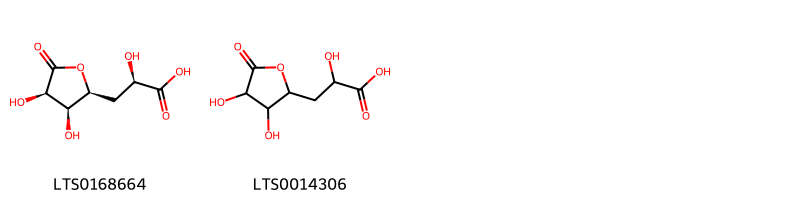{ width=100% }
    <figcaption>Hình ảnh cấu trúc hóa học của 2 hoạt chất thuộc nhóm Organooxygen compounds gồm ['(2r)-3-[(2s,3s,4r)-3,4-dihydroxy-5-oxooxolan-2-yl]-2-hydroxypropanoic acid (LTS0168664)', '3-(3,4-dihydroxy-5-oxooxolan-2-yl)-2-hydroxypropanoic acid (LTS0014306)'].</figcaption>
</figure>

---

### Dược dân tộc học

Danh sách các quốc gia có sử dụng *Cereus repandus* trong điều trị các bệnh. 

| Country   | Disease   | Bệnh                                                                                                                                                                                                |
|:----------|:----------|:----------------------------------------------------------------------------------------------------------------------------------------------------------------------------------------------------|
| Curacao   | Soap      | MYMEMORY WARNING: YOU USED ALL AVAILABLE FREE TRANSLATIONS FOR TODAY. NEXT AVAILABLE IN  05 HOURS 29 MINUTES 59 SECONDS VISIT HTTPS://MYMEMORY.TRANSLATED.NET/DOC/USAGELIMITS.PHP TO TRANSLATE MORE |

---

# Chi Ariocarpus

??? note "Danh sách các dược liệu thuộc chi"
    
	 - *Ariocarpus fissuratus*

---
## Ariocarpus fissuratus
### Thông tin về thực vật

!!! info "Phân loại thực vật của *Ariocarpus fissuratus* từ GIBF:"
    - **Kingdom:** Plantae
    - **Phylum:** Tracheophyta
    - **Order:** Caryophyllales
    - **Family:** Cactaceae
    - **Genus:** Ariocarpus
    - **Species:** *Ariocarpus fissuratus*

 

| Label (VI)   | Label (EN)   | Scientific Name       | Descriptions (VI)   | Descriptions (EN)   | Also Known As (VI)   | Also Known As (EN)   |
|:-------------|:-------------|:----------------------|:--------------------|:--------------------|:---------------------|:---------------------|
| N/A          | N/A          | Ariocarpus fissuratus | loài thực vật       | species of plant    | ['']                 | ['']                 |

#### Phân bố trên thế giới

**Từ CSDL GIBF** nan, Mexico, United States of America

#### Phân bố tại Việt Nam

**Từ CSDL GIBF**: Không có ghi nhận ở Việt Nam

---
### Thành phần hóa học
        
- Theo cơ sở dữ liệu lotus: Từ loài *Ariocarpus fissuratus* đã phân lập và xác định được 1 hoạt chất thuộc về các nhóm Benzene and substituted derivatives. 

|    | chemicalTaxonomyClassyfireClass     |   smiles_count |
|---:|:------------------------------------|---------------:|
|  0 | Benzene and substituted derivatives |              1 |

#### Nhóm Benzene and substituted derivatives
<figure markdown="span">
    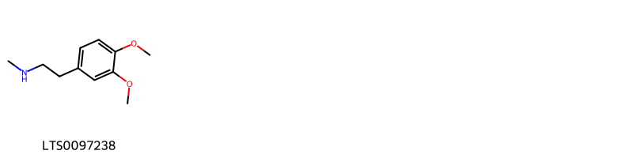{ width=100% }
    <figcaption>Hình ảnh cấu trúc hóa học của 1 hoạt chất thuộc nhóm Benzene and substituted derivatives gồm ['n-methylhomoveratrylamine (LTS0097238)'].</figcaption>
</figure>

---

### Dược dân tộc học

Danh sách các quốc gia có sử dụng *Ariocarpus fissuratus* trong điều trị các bệnh. 

| Country            | Disease            | Bệnh                                                                                                                                                                                                |
|:-------------------|:-------------------|:----------------------------------------------------------------------------------------------------------------------------------------------------------------------------------------------------|
| Mexico(Huichol)    | Hallucinogen       | MYMEMORY WARNING: YOU USED ALL AVAILABLE FREE TRANSLATIONS FOR TODAY. NEXT AVAILABLE IN  05 HOURS 29 MINUTES 28 SECONDS VISIT HTTPS://MYMEMORY.TRANSLATED.NET/DOC/USAGELIMITS.PHP TO TRANSLATE MORE |
| Mexico(Tarahumara) | Narcotic, Narcotic | MYMEMORY WARNING: YOU USED ALL AVAILABLE FREE TRANSLATIONS FOR TODAY. NEXT AVAILABLE IN  05 HOURS 29 MINUTES 24 SECONDS VISIT HTTPS://MYMEMORY.TRANSLATED.NET/DOC/USAGELIMITS.PHP TO TRANSLATE MORE |

---

# Chi Carnegiea

??? note "Danh sách các dược liệu thuộc chi"
    
	 - *Carnegiea gigantea*

---
## Carnegiea gigantea
### Thông tin về thực vật

!!! info "Phân loại thực vật của *Carnegiea gigantea* từ GIBF:"
    - **Kingdom:** Plantae
    - **Phylum:** Tracheophyta
    - **Order:** Caryophyllales
    - **Family:** Cactaceae
    - **Genus:** Carnegiea
    - **Species:** *Carnegiea gigantea*

 

| Label (VI)   | Label (EN)   | Scientific Name    | Descriptions (VI)   | Descriptions (EN)   | Also Known As (VI)   | Also Known As (EN)                                                                        |
|:-------------|:-------------|:-------------------|:--------------------|:--------------------|:---------------------|:------------------------------------------------------------------------------------------|
| N/A          | N/A          | Carnegiea gigantea |                     | species of plant    | ['']                 | ['Saguaro', 'Cereus giganteus', 'Arizona giant cactus', 'giant cactus', 'saguaro cactus'] |

#### Phân bố trên thế giới

**Từ CSDL GIBF** Mexico, United States of America

#### Phân bố tại Việt Nam

**Từ CSDL GIBF**: Không có ghi nhận ở Việt Nam

---
### Thành phần hóa học
        
- Theo cơ sở dữ liệu lotus: Từ loài *Carnegiea gigantea* đã phân lập và xác định được 18 hoạt chất thuộc về các nhóm Dihydroisoquinolines, Prenol lipids, Steroids and steroid derivatives, Tetrahydroisoquinolines. 

|    | chemicalTaxonomyClassyfireClass   |   smiles_count |
|---:|:----------------------------------|---------------:|
|  0 | Dihydroisoquinolines              |              1 |
|  1 | Prenol lipids                     |              2 |
|  2 | Steroids and steroid derivatives  |              9 |
|  3 | Tetrahydroisoquinolines           |              6 |

#### Nhóm Dihydroisoquinolines
<figure markdown="span">
    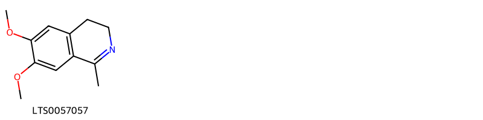{ width=100% }
    <figcaption>Hình ảnh cấu trúc hóa học của 1 hoạt chất thuộc nhóm Dihydroisoquinolines gồm ['6,7-dimethoxy-1-methyl-3,4-dihydroisoquinoline (LTS0057057)'].</figcaption>
</figure>
#### Nhóm Prenol lipids
<figure markdown="span">
    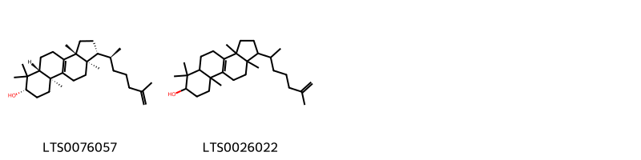{ width=100% }
    <figcaption>Hình ảnh cấu trúc hóa học của 2 hoạt chất thuộc nhóm Prenol lipids gồm ['(1r,3ar,5ar,7s,9as,11ar)-3a,6,6,9a,11a-pentamethyl-1-[(2s)-6-methylhept-6-en-2-yl]-1h,2h,3h,4h,5h,5ah,7h,8h,9h,10h,11h-cyclopenta[a]phenanthren-7-ol (LTS0076057)', '3a,6,6,9a,11a-pentamethyl-1-(6-methylhept-6-en-2-yl)-1h,2h,3h,4h,5h,5ah,7h,8h,9h,10h,11h-cyclopenta[a]phenanthren-7-ol (LTS0026022)'].</figcaption>
</figure>
#### Nhóm Steroids and steroid derivatives
<figure markdown="span">
    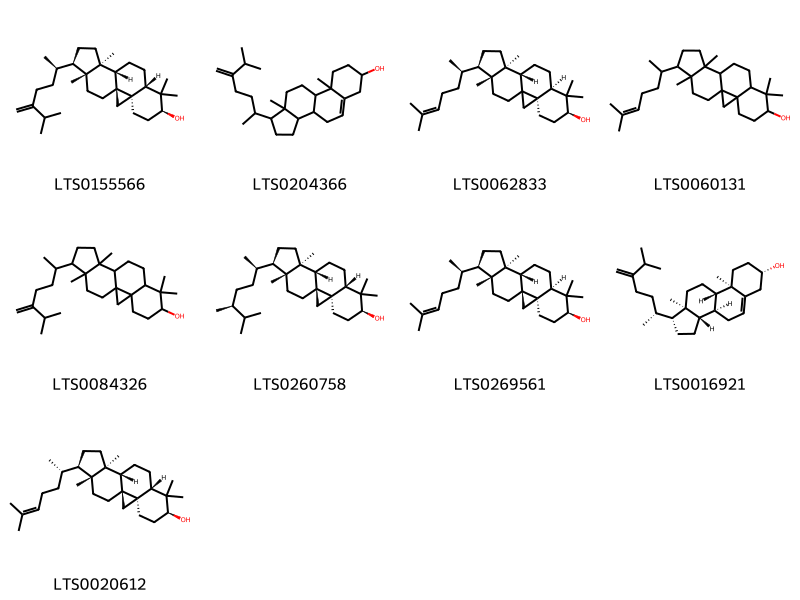{ width=100% }
    <figcaption>Hình ảnh cấu trúc hóa học của 9 hoạt chất thuộc nhóm Steroids and steroid derivatives gồm ['(1s,3r,6s,8s,11s,12s,15r,16r)-7,7,12,16-tetramethyl-15-[(2r)-6-methyl-5-methylideneheptan-2-yl]pentacyclo[9.7.0.0¹,³.0³,⁸.0¹²,¹⁶]octadecan-6-ol (LTS0155566)', '9a,11a-dimethyl-1-(6-methyl-5-methylideneheptan-2-yl)-1h,2h,3h,3ah,3bh,4h,6h,7h,8h,9h,9bh,10h,11h-cyclopenta[a]phenanthren-7-ol (LTS0204366)', '(3r,6s,8r,11s,12s,15r,16r)-7,7,12,16-tetramethyl-15-[(2r)-6-methylhept-5-en-2-yl]pentacyclo[9.7.0.0¹,³.0³,⁸.0¹²,¹⁶]octadecan-6-ol (LTS0062833)', 'cycloartenol (LTS0060131)', '7,7,12,16-tetramethyl-15-(6-methyl-5-methylideneheptan-2-yl)pentacyclo[9.7.0.0¹,³.0³,⁸.0¹²,¹⁶]octadecan-6-ol (LTS0084326)', '(1s,3r,6s,8s,11s,12s,15r,16r)-15-[(2r,5s)-5,6-dimethylheptan-2-yl]-7,7,12,16-tetramethylpentacyclo[9.7.0.0¹,³.0³,⁸.0¹²,¹⁶]octadecan-6-ol (LTS0260758)', 'cycloartenol (LTS0269561)', '24-methylenecholesterol (LTS0016921)', '(1s,3r,6s,8s,11s,12s,15r,16r)-7,7,12,16-tetramethyl-15-[(2s)-6-methylhept-5-en-2-yl]pentacyclo[9.7.0.0¹,³.0³,⁸.0¹²,¹⁶]octadecan-6-ol (LTS0020612)'].</figcaption>
</figure>
#### Nhóm Tetrahydroisoquinolines
<figure markdown="span">
    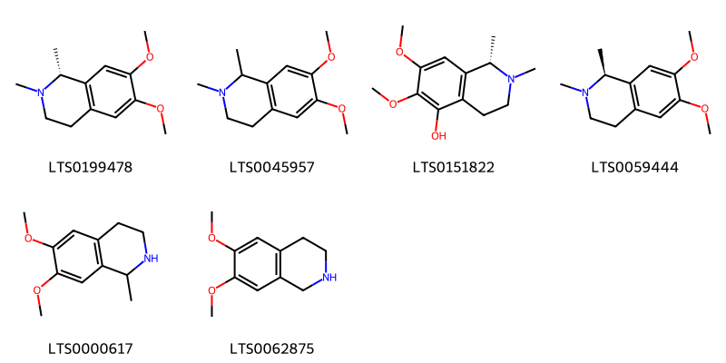{ width=100% }
    <figcaption>Hình ảnh cấu trúc hóa học của 6 hoạt chất thuộc nhóm Tetrahydroisoquinolines gồm ['(+)-carnegine (LTS0199478)', 'carnegine (LTS0045957)', 'gigantine (LTS0151822)', '(+-)-carnegine (LTS0059444)', '6,7-dimethoxy-1-methyl-1,2,3,4-tetrahydroisoquinoline (LTS0000617)', 'heliamine (LTS0062875)'].</figcaption>
</figure>

---

### Dược dân tộc học

Danh sách các quốc gia có sử dụng *Carnegiea gigantea* trong điều trị các bệnh. 

| Country    | Disease    | Bệnh                                                                                                                                                                                                |
|:-----------|:-----------|:----------------------------------------------------------------------------------------------------------------------------------------------------------------------------------------------------|
| US(Papago) | Intoxicant | MYMEMORY WARNING: YOU USED ALL AVAILABLE FREE TRANSLATIONS FOR TODAY. NEXT AVAILABLE IN  05 HOURS 28 MINUTES 58 SECONDS VISIT HTTPS://MYMEMORY.TRANSLATED.NET/DOC/USAGELIMITS.PHP TO TRANSLATE MORE |
| US(Pima)   | Intoxicant | MYMEMORY WARNING: YOU USED ALL AVAILABLE FREE TRANSLATIONS FOR TODAY. NEXT AVAILABLE IN  05 HOURS 28 MINUTES 55 SECONDS VISIT HTTPS://MYMEMORY.TRANSLATED.NET/DOC/USAGELIMITS.PHP TO TRANSLATE MORE |

---

