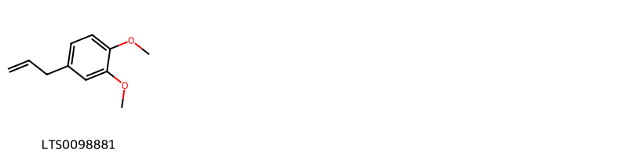
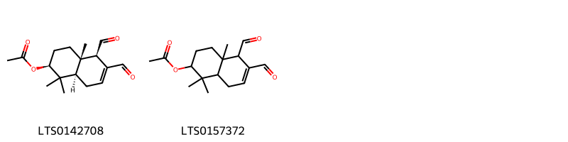
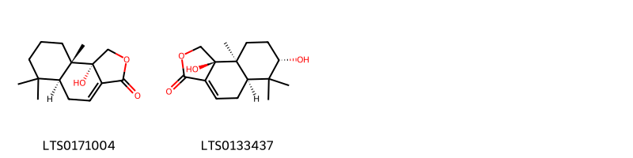
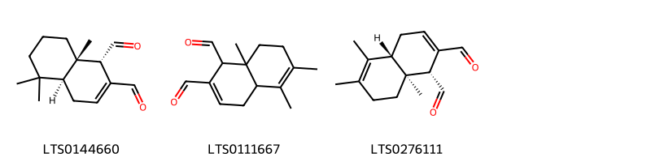
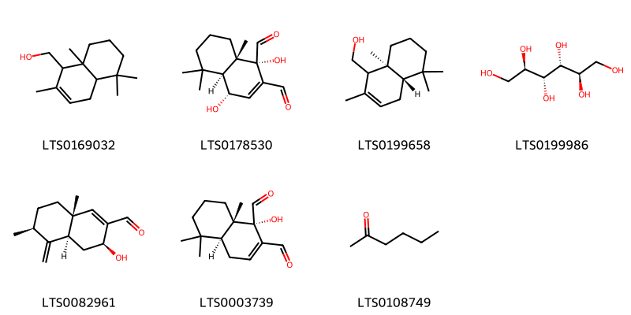
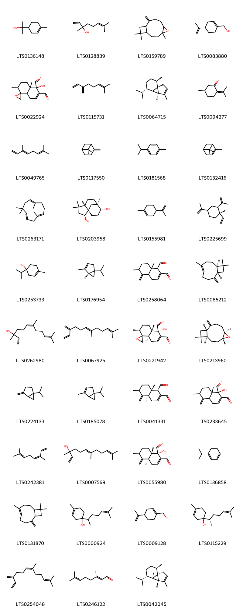

!!! abstract "Tóm tắt"

    Họ Canellaceae gồm khoảng 2 chi và 3 loài được một số cộng đồng tại các quốc gia như Turkey, Elsewhere, Puerto Rico, Dominican Republic, Haiti sử dụng trong một số trường hợp Chất kích thích, Thuốc bổ, Chất kích thích, Tiêu hóa, Dạ dày, Thuốc bổ, Chất kích thích, Thuốc diệt cá, Thuốc kích thích tình dục.

!!! info "DrDuke"

    James A. Duke sinh năm 1929-2017 là một nhà thực vật học người Mỹ. Đây là một trong những tác giả hàng đầu trong lĩnh vực dược dân tộc học với cuốn *CRC Handbook of Medicinal Herbs* và chính là người xây dựng lên cơ sở dữ liệu về hợp chất tự nhiên và dược dân tộc học tại Bộ nông nghiệp Hoa Kỳ. Các thông tin được đăng tải tại website [Dr. Duke's Phytochemical and Ethnobotanical Databases](https://phytochem.nal.usda.gov/). 
    Trong suốt thập niên 1970, ông lãnh đạo the Plant Taxonomy Laboratory, Plant Genetics and Germplasm Institute of the Agricultural Research Service, U.S. Department of Agriculture.
    Trong tài liệu này, các thông tin về dược dân tộc của các dược liệu được trích dẫn từ tài liệu của James A. Ducke với sự trợ giúp của phần mềm dịch thuật từ tiếng Anh sang tiếng Việt.
   

# Chi Cinnamodendron

??? note "Danh sách các dược liệu thuộc chi"
    
	 - *Cinnamodendron angustifolium*

---
## Cinnamodendron angustifolium
### Thông tin về thực vật

!!! info "Phân loại thực vật của *Cinnamodendron angustifolium* từ GIBF:"
    - **Kingdom:** Plantae
    - **Phylum:** Tracheophyta
    - **Order:** Canellales
    - **Family:** Canellaceae
    - **Genus:** Cinnamodendron
    - **Species:** *Cinnamodendron angustifolium*

 

| Label (VI)   | Label (EN)   | Scientific Name              | Descriptions (VI)   | Descriptions (EN)   | Also Known As (VI)   | Also Known As (EN)   |
|:-------------|:-------------|:-----------------------------|:--------------------|:--------------------|:---------------------|:---------------------|
| N/A          | N/A          | Cinnamodendron angustifolium | loài thực vật       | species of plant    | ['']                 | ['']                 |

#### Phân bố trên thế giới

**Từ CSDL GIBF** Jamaica, Haiti

#### Phân bố tại Việt Nam

**Từ CSDL GIBF**: Không có ghi nhận ở Việt Nam

---
### Thành phần hóa học
        
- Theo cơ sở dữ liệu lotus: Từ loài *Cinnamodendron angustifolium* đã phân lập và xác định được Chưa có hoạt chất nào được phân lập. hoạt chất thuộc về các nhóm Không có hoạt chất nào được phân lập. 

Không có hình ảnh nào được tạo ra

---

### Dược dân tộc học

Danh sách các quốc gia có sử dụng *Cinnamodendron angustifolium* trong điều trị các bệnh. 

| Country   | Disease     | Bệnh           |
|:----------|:------------|:---------------|
| Haiti     | Aphrodisiac | Thuốc kích dục |

---

# Chi Canella

??? note "Danh sách các dược liệu thuộc chi"
    
	 - *Canella alba*
	 - *Canella winterana*

---
## Canella alba
### Thông tin về thực vật

!!! info "Phân loại thực vật của *Canella alba* từ GIBF:"
    - **Kingdom:** Plantae
    - **Phylum:** Tracheophyta
    - **Order:** Canellales
    - **Family:** Canellaceae
    - **Genus:** Canella
    - **Species:** *Canella alba*

 

| Label (VI)   | Label (EN)   | Scientific Name   | Descriptions (VI)   | Descriptions (EN)   | Also Known As (VI)   | Also Known As (EN)   |
|:-------------|:-------------|:------------------|:--------------------|:--------------------|:---------------------|:---------------------|
| N/A          | N/A          | Canella alba      | loài thực vật       | species of plant    | ['']                 | ['']                 |

#### Phân bố trên thế giới

**Từ CSDL GIBF** nan, Puerto Rico, Trinidad and Tobago, Guadeloupe, unknown or invalid, Jamaica, United States of America, Dominican Republic, French Guiana

#### Phân bố tại Việt Nam

**Từ CSDL GIBF**: Không có ghi nhận ở Việt Nam

---
### Thành phần hóa học
        
- Theo cơ sở dữ liệu lotus: Từ loài *Canella alba* đã phân lập và xác định được Chưa có hoạt chất nào được phân lập. hoạt chất thuộc về các nhóm Không có hoạt chất nào được phân lập. 

Không có hình ảnh nào được tạo ra

---

### Dược dân tộc học

Danh sách các quốc gia có sử dụng *Canella alba* trong điều trị các bệnh. 

| Country   | Disease     | Bệnh        |
|:----------|:------------|:------------|
| Elsewhere | Emmenagogue | Emmenagogue |

---

---
## Canella winterana
### Thông tin về thực vật

!!! info "Phân loại thực vật của *Canella winterana* từ GIBF:"
    - **Kingdom:** Plantae
    - **Phylum:** Tracheophyta
    - **Order:** Canellales
    - **Family:** Canellaceae
    - **Genus:** Canella
    - **Species:** *Canella winterana*

 

| Label (VI)   | Label (EN)   | Scientific Name   | Descriptions (VI)   | Descriptions (EN)   | Also Known As (VI)   | Also Known As (EN)   |
|:-------------|:-------------|:------------------|:--------------------|:--------------------|:---------------------|:---------------------|
| N/A          | N/A          | Canella winterana | loài thực vật       | species of plant    | ['']                 | ['']                 |

#### Phân bố trên thế giới

**Từ CSDL GIBF** Virgin Islands (U.S.), nan, Guadeloupe, Belgium, Puerto Rico, Honduras, Jamaica, United States of America, Bonaire, Sint Eustatius and Saba, Saint Martin (French part), Barbados, Turks and Caicos Islands, Bahamas, Cuba, Dominican Republic, Mexico, France, Saint Kitts and Nevis, Montserrat, Anguilla, Cayman Islands, Antigua and Barbuda, Sint Maarten (Dutch part)

#### Phân bố tại Việt Nam

**Từ CSDL GIBF**: Không có ghi nhận ở Việt Nam

---
### Thành phần hóa học
        
- Theo cơ sở dữ liệu lotus: Từ loài *Canella winterana* đã phân lập và xác định được 61 hoạt chất thuộc về các nhóm Prenol lipids, Steroids and steroid derivatives, Organic oxides, Benzodioxoles, Benzene and substituted derivatives, Unsaturated hydrocarbons, Naphthofurans, Organooxygen compounds, Phenols, Epoxides, Carboxylic acids and derivatives. 

|    | chemicalTaxonomyClassyfireClass     |   smiles_count |
|---:|:------------------------------------|---------------:|
|  0 | Benzene and substituted derivatives |              1 |
|  1 | Benzodioxoles                       |              1 |
|  2 | Carboxylic acids and derivatives    |              2 |
|  3 | Epoxides                            |              2 |
|  4 | Naphthofurans                       |              2 |
|  5 | Organic oxides                      |              3 |
|  6 | Organooxygen compounds              |              7 |
|  7 | Phenols                             |              1 |
|  8 | Prenol lipids                       |             39 |
|  9 | Steroids and steroid derivatives    |              1 |
| 10 | Unsaturated hydrocarbons            |              1 |

#### Nhóm Benzene and substituted derivatives
<figure markdown="span">
    { width=100% }
    <figcaption>Hình ảnh cấu trúc hóa học của 1 hoạt chất thuộc nhóm Benzene and substituted derivatives gồm ['methyl eugenol (LTS0098881)'].</figcaption>
</figure>
#### Nhóm Benzodioxoles
<figure markdown="span">
    { width=100% }
    <figcaption>Hình ảnh cấu trúc hóa học của 1 hoạt chất thuộc nhóm Benzodioxoles gồm ['myristicin (LTS0180101)'].</figcaption>
</figure>
#### Nhóm Carboxylic acids and derivatives
<figure markdown="span">
    { width=100% }
    <figcaption>Hình ảnh cấu trúc hóa học của 2 hoạt chất thuộc nhóm Carboxylic acids and derivatives gồm ['(2s,4as,5r,8ar)-5,6-diformyl-1,1,4a-trimethyl-2,3,4,5,8,8a-hexahydronaphthalen-2-yl acetate (LTS0142708)', '5,6-diformyl-1,1,4a-trimethyl-2,3,4,5,8,8a-hexahydronaphthalen-2-yl acetate (LTS0157372)'].</figcaption>
</figure>
#### Nhóm Epoxides
<figure markdown="span">
    { width=100% }
    <figcaption>Hình ảnh cấu trúc hóa học của 2 hoạt chất thuộc nhóm Epoxides gồm ['(3z,7e)-1,5,5,8-tetramethyl-12-oxabicyclo[9.1.0]dodeca-3,7-diene (LTS0107049)', '(1r,11s)-1,5,5,8-tetramethyl-12-oxabicyclo[9.1.0]dodeca-3,7-diene (LTS0195579)'].</figcaption>
</figure>
#### Nhóm Naphthofurans
<figure markdown="span">
    { width=100% }
    <figcaption>Hình ảnh cấu trúc hóa học của 2 hoạt chất thuộc nhóm Naphthofurans gồm ['(5as,9as,9bs)-9b-hydroxy-6,6,9a-trimethyl-1h,5h,5ah,7h,8h,9h-naphtho[1,2-c]furan-3-one (LTS0171004)', '(5ar,7s,9as,9bs)-7,9b-dihydroxy-6,6,9a-trimethyl-1h,5h,5ah,7h,8h,9h-naphtho[1,2-c]furan-3-one (LTS0133437)'].</figcaption>
</figure>
#### Nhóm Organic oxides
<figure markdown="span">
    { width=100% }
    <figcaption>Hình ảnh cấu trúc hóa học của 3 hoạt chất thuộc nhóm Organic oxides gồm ['(1s,4as,8as)-5,5,8a-trimethyl-1,4,4a,6,7,8-hexahydronaphthalene-1,2-dicarbaldehyde (LTS0144660)', '5,6,8a-trimethyl-4,4a,7,8-tetrahydro-1h-naphthalene-1,2-dicarbaldehyde (LTS0111667)', '(1r,4ar,8as)-5,6,8a-trimethyl-4,4a,7,8-tetrahydro-1h-naphthalene-1,2-dicarbaldehyde (LTS0276111)'].</figcaption>
</figure>
#### Nhóm Organooxygen compounds
<figure markdown="span">
    { width=100% }
    <figcaption>Hình ảnh cấu trúc hóa học của 7 hoạt chất thuộc nhóm Organooxygen compounds gồm ['(2,5,5,8a-tetramethyl-1,4,4a,6,7,8-hexahydronaphthalen-1-yl)methanol (LTS0169032)', 'mukaadial (LTS0178530)', '[(4as,8as)-2,5,5,8a-tetramethyl-1,4,4a,6,7,8-hexahydronaphthalen-1-yl]methanol (LTS0199658)', 'mannitol (LTS0199986)', '(3s,4as,6s,8ar)-3-hydroxy-6,8a-dimethyl-5-methylidene-3,4,4a,6,7,8-hexahydronaphthalene-2-carbaldehyde (LTS0082961)', 'warburganal (LTS0003739)', 'hexanone (LTS0108749)'].</figcaption>
</figure>
#### Nhóm Phenols
<figure markdown="span">
    { width=100% }
    <figcaption>Hình ảnh cấu trúc hóa học của 1 hoạt chất thuộc nhóm Phenols gồm ['eugenol (LTS0052342)'].</figcaption>
</figure>
#### Nhóm Prenol lipids
<figure markdown="span">
    { width=100% }
    <figcaption>Hình ảnh cấu trúc hóa học của 39 hoạt chất thuộc nhóm Prenol lipids gồm ['terpineol (LTS0136148)', 'linalool, (+-)- (LTS0128839)', 'caryophyllene oxide (LTS0159789)', '(-)-perillyl alcohol (LTS0083880)', "5-hydroxy-2,4a-dimethyl-3,4,8,8a-tetrahydro-2h-spiro[naphthalene-1,2'-oxirane]-5,6-dicarbaldehyde (LTS0022924)", 'α-myrcene (LTS0115731)', '(1s,5r,7s,10r)-7-isopropyl-4,10-dimethyltricyclo[4.4.0.0¹,⁵]dec-3-ene (LTS0064715)', '(+)-pulegone (LTS0094277)', 'trans-β-ocimene (LTS0049765)', 'β-pinene (LTS0117550)', 'cymene (LTS0181568)', 'α pinene (LTS0132416)', 'humulene (LTS0263171)', 'clovanediol (LTS0203958)', 'limonene,  (LTS0155981)', 'β-elemene (LTS0225699)', '4-terpineol (LTS0253733)', 'α-thujene (LTS0176954)', '6,8a-dimethyl-5-methylidene-1,4,4a,6,7,8-hexahydronaphthalene-1,2-dicarbaldehyde (LTS0258064)', 'caryophyllene (LTS0085212)', 'nerolidol (LTS0262980)', 'β-farnesene (LTS0067925)', "(1r,2s,4as,5s,8ar)-5-hydroxy-2,4a-dimethyl-3,4,8,8a-tetrahydro-2h-spiro[naphthalene-1,2'-oxirane]-5,6-dicarbaldehyde (LTS0221942)", 'β-caryophyllene oxide (LTS0213960)', 'sabinene (LTS0224133)', 'α-thujene (LTS0185078)', '(1r,4as,6s,8as)-6,8a-dimethyl-5-methylidene-1,4,4a,6,7,8-hexahydronaphthalene-1,2-dicarbaldehyde (LTS0041331)', '1-hydroxy-6,8a-dimethyl-5-methylidene-4a,6,7,8-tetrahydro-4h-naphthalene-1,2-dicarbaldehyde (LTS0233645)', 'β-ocimene (LTS0242381)', 'nerolidol isomers (LTS0007569)', 'canellal (LTS0055980)', 'terpinene (LTS0136858)', 'caryophyllene (LTS0131870)', '4-methyl-1-(6-methylhept-5-en-2-yl)cyclohex-3-en-1-ol (LTS0000924)', 'perillylalcohol (LTS0009128)', 'β-bisabolol (LTS0115229)', '(z)-β-farnesene (LTS0254048)', 'α-citral (LTS0246122)', '(-)-α-cubebene (LTS0042045)'].</figcaption>
</figure>
#### Nhóm Steroids and steroid derivatives
<figure markdown="span">
    { width=100% }
    <figcaption>Hình ảnh cấu trúc hóa học của 1 hoạt chất thuộc nhóm Steroids and steroid derivatives gồm ['sitogluside (LTS0201798)'].</figcaption>
</figure>
#### Nhóm Unsaturated hydrocarbons
<figure markdown="span">
    { width=100% }
    <figcaption>Hình ảnh cấu trúc hóa học của 1 hoạt chất thuộc nhóm Unsaturated hydrocarbons gồm ['α terpinene (LTS0232891)'].</figcaption>
</figure>

---

### Dược dân tộc học

Danh sách các quốc gia có sử dụng *Canella winterana* trong điều trị các bệnh. 

| Country            | Disease                                | Bệnh                                        |
|:-------------------|:---------------------------------------|:--------------------------------------------|
| Dominican Republic | Tonic                                  | (thuộc) trương lực                          |
| Haiti              | Stimulant                              | Chất kích thích                             |
| Puerto Rico        | Piscicide                              | Thuốc diệt cá                               |
| Turkey             | Stimulant, Digestive, Stomachic, Tonic | Chất kích thích, tiêu hóa, dạ dày, thuốc bổ |

---

