!!! abstract "Tóm tắt"

    Họ Cannabaceae gồm khoảng 2 chi và 3 loài được một số cộng đồng tại các quốc gia như Turkey, UK, Trinidad, Haiti, Lesotho, India, Elsewhere, Java, US, ain, Mexico, China, Nepal sử dụng trong một số trường hợp QUERY LENGTH LIMIT EXCEEDED. MAX ALLOWED QUERY : 500 CHARS.

!!! info "DrDuke"

    James A. Duke sinh năm 1929-2017 là một nhà thực vật học người Mỹ. Đây là một trong những tác giả hàng đầu trong lĩnh vực dược dân tộc học với cuốn *CRC Handbook of Medicinal Herbs* và chính là người xây dựng lên cơ sở dữ liệu về hợp chất tự nhiên và dược dân tộc học tại Bộ nông nghiệp Hoa Kỳ. Các thông tin được đăng tải tại website [Dr. Duke's Phytochemical and Ethnobotanical Databases](https://phytochem.nal.usda.gov/). 
    Trong suốt thập niên 1970, ông lãnh đạo the Plant Taxonomy Laboratory, Plant Genetics and Germplasm Institute of the Agricultural Research Service, U.S. Department of Agriculture.
    Trong tài liệu này, các thông tin về dược dân tộc của các dược liệu được trích dẫn từ tài liệu của James A. Ducke với sự trợ giúp của phần mềm dịch thuật từ tiếng Anh sang tiếng Việt.
   

# Chi Cannabis

??? note "Danh sách các dược liệu thuộc chi"
    
	 - *Cannabis sativa*

---
## Cannabis sativa
### Thông tin về thực vật

!!! info "Phân loại thực vật của *Cannabis sativa* từ GIBF:"
    - **Kingdom:** Plantae
    - **Phylum:** Tracheophyta
    - **Order:** Rosales
    - **Family:** Cannabaceae
    - **Genus:** Cannabis
    - **Species:** *Cannabis sativa*

 

| Label (VI)   | Label (EN)   | Scientific Name   | Descriptions (VI)   | Descriptions (EN)   | Also Known As (VI)   | Also Known As (EN)                                            |
|:-------------|:-------------|:------------------|:--------------------|:--------------------|:---------------------|:--------------------------------------------------------------|
| N/A          | N/A          | Cannabis sativa   | loài thực vật       | species of plant    | ['']                 | ['hemp', 'pot', 'Mary Jane', 'grass', 'marijuana', 'hashish'] |

#### Phân bố trên thế giới

**Từ CSDL GIBF** nan, Bulgaria, Italy, Australia, Slovakia, Argentina, Ukraine, Pakistan, Netherlands, Nigeria, Kyrgyzstan, Spain, Hungary, Russian Federation, United States of America, Ethiopia, Kazakhstan, Greece, South Africa, Czechia, Thailand, Germany, Bhutan, Armenia, Peru, France, Mexico, Austria, Viet Nam, China, India, New Zealand, Nepal

#### Phân bố tại Việt Nam

**Từ CSDL GIBF**: Lào Cai

---
### Thành phần hóa học
        
- Theo cơ sở dữ liệu lotus: Từ loài *Cannabis sativa* đã phân lập và xác định được 558 hoạt chất thuộc về các nhóm Organic oxides, Piperidines, Benzofurans, Hydroxy acids and derivatives, Stilbenes, Phenols, Carboxylic acids and derivatives, Fatty Acyls, Macrolactams, Indoles and derivatives, Cinnamic acids and derivatives, Heteroaromatic compounds, Saturated hydrocarbons, Neoflavonoids, Prenol lipids, Phenanthrenes and derivatives, Benzene and substituted derivatives, Indanes, Organooxygen compounds, Phenol ethers, Flavonoids, Phenylpropanoic acids, Steroids and steroid derivatives, Oxepanes, Organonitrogen compounds, Pyrans, 2-arylbenzofuran flavonoids, Unsaturated hydrocarbons, Arylnaphthalene lignans, Aryltetralin lignans, Epoxides, Benzopyrans, Imidazopyrimidines. 

|    | chemicalTaxonomyClassyfireClass     |   smiles_count |
|---:|:------------------------------------|---------------:|
|  0 |                                     |              6 |
|  1 | 2-arylbenzofuran flavonoids         |              4 |
|  2 | Arylnaphthalene lignans             |              1 |
|  3 | Aryltetralin lignans                |              6 |
|  4 | Benzene and substituted derivatives |             32 |
|  5 | Benzofurans                         |              5 |
|  6 | Benzopyrans                         |             73 |
|  7 | Carboxylic acids and derivatives    |             28 |
|  8 | Cinnamic acids and derivatives      |              9 |
|  9 | Epoxides                            |              2 |
| 10 | Fatty Acyls                         |             32 |
| 11 | Flavonoids                          |             14 |
| 12 | Heteroaromatic compounds            |              1 |
| 13 | Hydroxy acids and derivatives       |              1 |
| 14 | Imidazopyrimidines                  |              1 |
| 15 | Indanes                             |             16 |
| 16 | Indoles and derivatives             |              1 |
| 17 | Macrolactams                        |              2 |
| 18 | Neoflavonoids                       |              1 |
| 19 | Organic oxides                      |              2 |
| 20 | Organonitrogen compounds            |              6 |
| 21 | Organooxygen compounds              |             63 |
| 22 | Oxepanes                            |              3 |
| 23 | Phenanthrenes and derivatives       |              5 |
| 24 | Phenol ethers                       |              2 |
| 25 | Phenols                             |             10 |
| 26 | Phenylpropanoic acids               |              2 |
| 27 | Piperidines                         |              1 |
| 28 | Prenol lipids                       |            156 |
| 29 | Pyrans                              |              1 |
| 30 | Saturated hydrocarbons              |             42 |
| 31 | Steroids and steroid derivatives    |             20 |
| 32 | Stilbenes                           |              5 |
| 33 | Unsaturated hydrocarbons            |              1 |

#### Nhóm 
<figure markdown="span">
    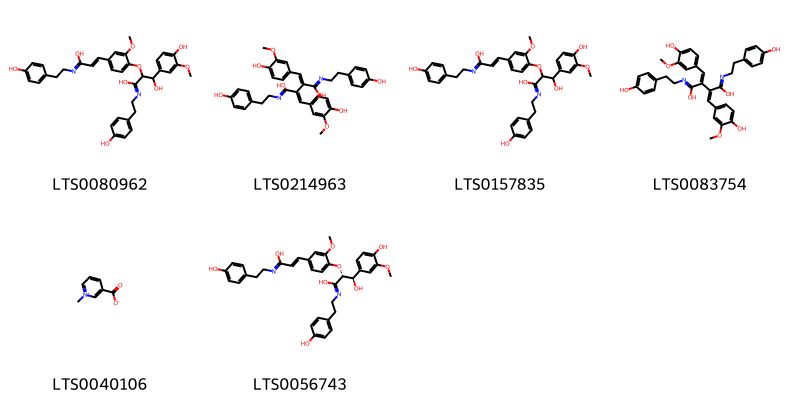{ width=100% }
    <figcaption>Hình ảnh cấu trúc hóa học của 6 hoạt chất thuộc nhóm  gồm ['(2e)-3-{4-[2-hydroxy-2-(4-hydroxy-3-methoxyphenyl)-1-{[2-(4-hydroxyphenyl)ethyl]-c-hydroxycarbonimidoyl}ethoxy]-3-methoxyphenyl}-n-[2-(4-hydroxyphenyl)ethyl]prop-2-enimidic acid (LTS0080962)', "(2e,3e)-2,3-bis[(4-hydroxy-3-methoxyphenyl)methylidene]-n,n'-bis[2-(4-hydroxyphenyl)ethyl]butanediimidic acid (LTS0214963)", '3-{4-[2-hydroxy-2-(4-hydroxy-3-methoxyphenyl)-1-{[2-(4-hydroxyphenyl)ethyl]-c-hydroxycarbonimidoyl}ethoxy]-3-methoxyphenyl}-n-[2-(4-hydroxyphenyl)ethyl]prop-2-enimidic acid (LTS0157835)', "2,3-bis[(4-hydroxy-3-methoxyphenyl)methylidene]-n,n'-bis[2-(4-hydroxyphenyl)ethyl]butanediimidic acid (LTS0083754)", 'trigonelline (LTS0040106)', '(2e)-3-{4-[(1r,2r)-2-hydroxy-2-(4-hydroxy-3-methoxyphenyl)-1-{[2-(4-hydroxyphenyl)ethyl]-c-hydroxycarbonimidoyl}ethoxy]-3-methoxyphenyl}-n-[2-(4-hydroxyphenyl)ethyl]prop-2-enimidic acid (LTS0056743)'].</figcaption>
</figure>
#### Nhóm 2-arylbenzofuran flavonoids
<figure markdown="span">
    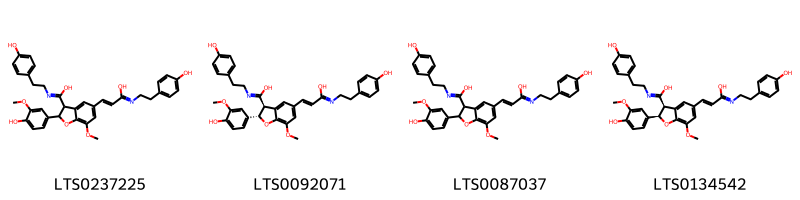{ width=100% }
    <figcaption>Hình ảnh cấu trúc hóa học của 4 hoạt chất thuộc nhóm 2-arylbenzofuran flavonoids gồm ['2-(4-hydroxy-3-methoxyphenyl)-n-[2-(4-hydroxyphenyl)ethyl]-5-[(1e)-2-{[2-(4-hydroxyphenyl)ethyl]-c-hydroxycarbonimidoyl}eth-1-en-1-yl]-7-methoxy-2,3-dihydro-1-benzofuran-3-carboximidic acid (LTS0237225)', '(2s,3s)-2-(4-hydroxy-3-methoxyphenyl)-n-[2-(4-hydroxyphenyl)ethyl]-5-[(1e)-2-{[2-(4-hydroxyphenyl)ethyl]-c-hydroxycarbonimidoyl}eth-1-en-1-yl]-7-methoxy-2,3-dihydro-1-benzofuran-3-carboximidic acid (LTS0092071)', '2-(4-hydroxy-3-methoxyphenyl)-n-[2-(4-hydroxyphenyl)ethyl]-5-(2-{[2-(4-hydroxyphenyl)ethyl]-c-hydroxycarbonimidoyl}eth-1-en-1-yl)-7-methoxy-2,3-dihydro-1-benzofuran-3-carboximidic acid (LTS0087037)', '(2r,3s)-2-(4-hydroxy-3-methoxyphenyl)-n-[2-(4-hydroxyphenyl)ethyl]-5-[(1e)-2-{[2-(4-hydroxyphenyl)ethyl]-c-hydroxycarbonimidoyl}eth-1-en-1-yl]-7-methoxy-2,3-dihydro-1-benzofuran-3-carboximidic acid (LTS0134542)'].</figcaption>
</figure>
#### Nhóm Arylnaphthalene lignans
<figure markdown="span">
    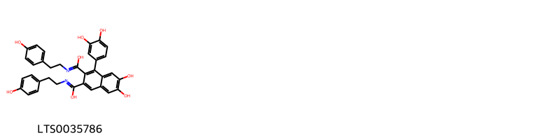{ width=100% }
    <figcaption>Hình ảnh cấu trúc hóa học của 1 hoạt chất thuộc nhóm Arylnaphthalene lignans gồm ['1-(3,4-dihydroxyphenyl)-6,7-dihydroxy-n2,n3-bis[2-(4-hydroxyphenyl)ethyl]naphthalene-2,3-dicarboximidic acid (LTS0035786)'].</figcaption>
</figure>
#### Nhóm Aryltetralin lignans
<figure markdown="span">
    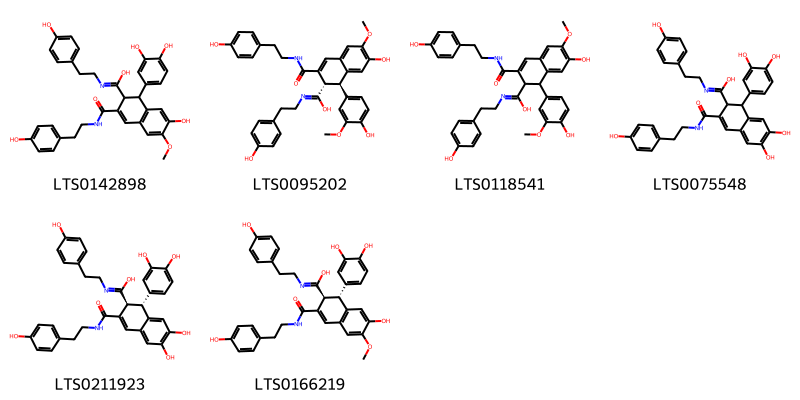{ width=100% }
    <figcaption>Hình ảnh cấu trúc hóa học của 6 hoạt chất thuộc nhóm Aryltetralin lignans gồm ['1-(3,4-dihydroxyphenyl)-7-hydroxy-n-[2-(4-hydroxyphenyl)ethyl]-3-{[2-(4-hydroxyphenyl)ethyl]carbamoyl}-6-methoxy-1,2-dihydronaphthalene-2-carboximidic acid (LTS0142898)', '(1r,2s)-7-hydroxy-1-(4-hydroxy-3-methoxyphenyl)-n-[2-(4-hydroxyphenyl)ethyl]-3-{[2-(4-hydroxyphenyl)ethyl]carbamoyl}-6-methoxy-1,2-dihydronaphthalene-2-carboximidic acid (LTS0095202)', '7-hydroxy-1-(4-hydroxy-3-methoxyphenyl)-n-[2-(4-hydroxyphenyl)ethyl]-3-{[2-(4-hydroxyphenyl)ethyl]carbamoyl}-6-methoxy-1,2-dihydronaphthalene-2-carboximidic acid (LTS0118541)', '1-(3,4-dihydroxyphenyl)-6,7-dihydroxy-n-[2-(4-hydroxyphenyl)ethyl]-3-{[2-(4-hydroxyphenyl)ethyl]carbamoyl}-1,2-dihydronaphthalene-2-carboximidic acid (LTS0075548)', '(1r,2s)-1-(3,4-dihydroxyphenyl)-6,7-dihydroxy-n-[2-(4-hydroxyphenyl)ethyl]-3-{[2-(4-hydroxyphenyl)ethyl]carbamoyl}-1,2-dihydronaphthalene-2-carboximidic acid (LTS0211923)', '(1r,2s)-1-(3,4-dihydroxyphenyl)-7-hydroxy-n-[2-(4-hydroxyphenyl)ethyl]-3-{[2-(4-hydroxyphenyl)ethyl]carbamoyl}-6-methoxy-1,2-dihydronaphthalene-2-carboximidic acid (LTS0166219)'].</figcaption>
</figure>
#### Nhóm Benzene and substituted derivatives
<figure markdown="span">
    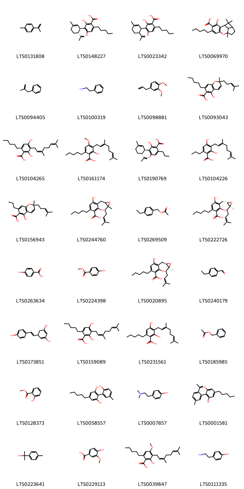{ width=100% }
    <figcaption>Hình ảnh cấu trúc hóa học của 32 hoạt chất thuộc nhóm Benzene and substituted derivatives gồm ['p,α-dimethylstyrene (LTS0131808)', 'cannabidiolic acid (LTS0148227)', '2,4-dihydroxy-3-[3-methyl-6-(prop-1-en-2-yl)cyclohex-2-en-1-yl]-6-pentylbenzoic acid (LTS0023342)', '3-hydroxy-9,13,13-trimethyl-5-pentyl-8-oxatetracyclo[7.4.1.0²,⁷.0¹²,¹⁴]tetradeca-2(7),3,5-triene-4-carboxylic acid (LTS0069970)', '(2-methylprop-2-en-1-yl)benzene (LTS0094405)', '2-phenylethylamine (LTS0100319)', 'methyl eugenol (LTS0098881)', 'cannabichromenic acid (LTS0093043)', '3-(3,7-dimethylocta-2,6-dien-1-yl)-2,4-dihydroxy-6-pentylbenzoic acid (LTS0104265)', '3-[(2e)-3,7-dimethylocta-2,6-dien-1-yl]-2-hydroxy-4-methoxy-6-pentylbenzoic acid (LTS0161174)', '2,4-dihydroxy-3-[(1r,6r)-3-methyl-6-(prop-1-en-2-yl)cyclohex-2-en-1-yl]-6-propylbenzoic acid (LTS0190769)', '3-[(2e)-3,7-dimethylocta-2,6-dien-1-yl]-2,4-dihydroxy-6-propylbenzoic acid (LTS0104226)', '5-hydroxy-2-methyl-2-(4-methylpent-3-en-1-yl)-7-propylchromene-6-carboxylic acid (LTS0156943)', '2,4-dihydroxy-3-{[3-methyl-3-(4-methylpent-3-en-1-yl)oxiran-2-yl]methyl}-6-pentylbenzoic acid (LTS0244760)', '(4-ethylphenyl)methyl acetate (LTS0269509)', '2,4-dihydroxy-3-{[(2s,3s)-3-methyl-3-(4-methylpent-3-en-1-yl)oxiran-2-yl]methyl}-6-pentylbenzoic acid (LTS0222726)', 'p-hydroxybenzoic acid (LTS0263634)', 'paraben (LTS0224398)', '2,4-dihydroxy-3-{[(2r,3s)-3-methyl-3-(4-methylpent-3-en-1-yl)oxiran-2-yl]methyl}-6-pentylbenzoic acid (LTS0020895)', '4-ethylbenzaldehyde (LTS0240179)', '5-[2-(4-hydroxyphenyl)ethenyl]cyclohexa-1,3-diene-1,3-diol (LTS0173851)', 'cannabinerolic acid (LTS0159089)', 'cannabigerolic acid (LTS0231561)', 'benzyl acetate (LTS0185985)', 'methyl salicylate (LTS0128373)', "5'-methyl-4-pentyl-[1,1'-biphenyl]-2,2',6-triol (LTS0058557)", 'hordenine (LTS0007857)', 'cannabinodiol (LTS0001581)', 'p-cymen-8-ol (LTS0223641)', 'vanillic acid (LTS0229113)', '3-(3,7-dimethylocta-2,6-dien-1-yl)-2-hydroxy-4-methoxy-6-pentylbenzoic acid (LTS0039847)', 'tyramine (LTS0111335)'].</figcaption>
</figure>
#### Nhóm Benzofurans
<figure markdown="span">
    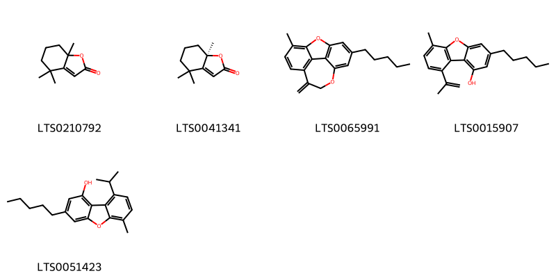{ width=100% }
    <figcaption>Hình ảnh cấu trúc hóa học của 5 hoạt chất thuộc nhóm Benzofurans gồm ['(+/-)-dihydroactinidiolide (LTS0210792)', 'dihydroactinidiolide (LTS0041341)', '12-methyl-8-methylidene-3-pentyl-6,16-dioxatetracyclo[11.2.1.0⁵,¹⁵.0⁹,¹⁴]hexadeca-1(15),2,4,9,11,13-hexaene (LTS0065991)', '10-methyl-5-pentyl-13-(prop-1-en-2-yl)-8-oxatricyclo[7.4.0.0²,⁷]trideca-1(9),2(7),3,5,10,12-hexaen-3-ol (LTS0015907)', '13-isopropyl-10-methyl-5-pentyl-8-oxatricyclo[7.4.0.0²,⁷]trideca-1(9),2(7),3,5,10,12-hexaen-3-ol (LTS0051423)'].</figcaption>
</figure>
#### Nhóm Benzopyrans
<figure markdown="span">
    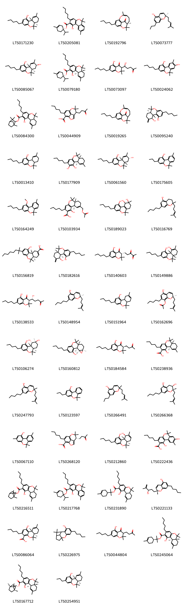{ width=100% }
    <figcaption>Hình ảnh cấu trúc hóa học của 73 hoạt chất thuộc nhóm Benzopyrans gồm ['thc (LTS0171230)', '(1r)-1-isopropyl-4-methylcyclohex-3-en-1-yl 1-hydroxy-6,6,9-trimethyl-3-pentylbenzo[c]chromene-2-carboxylate (LTS0205081)', '(1s,10z)-2,2,10-trimethyl-6-pentyl-3,9-dioxatricyclo[6.5.2.0⁴,¹⁵]pentadeca-4,6,8(15),10-tetraen-14-one (LTS0192796)', '(2r)-2-methyl-2-(4-methylpent-3-en-1-yl)-7-propylchromen-5-ol (LTS0073777)', '(6ar,8s,10ar)-6,6,9-trimethyl-3-pentyl-6ah,7h,8h,10ah-benzo[c]isochromene-1,8-diol (LTS0085067)', '(1r)-1-isopropyl-4-methylcyclohex-3-en-1-yl (6ar,10ar)-1-hydroxy-6,6,9-trimethyl-3-pentyl-6ah,7h,8h,10ah-benzo[c]isochromene-2-carboxylate (LTS0079180)', '5-hydroxy-3-(1-hydroxy-4-oxopentyl)-2,2-dimethyl-7-pentyl-3h-1-benzopyran-4-one (LTS0073097)', '6,6,9-trimethyl-3-pentylbenzo[c]chromene-1,8-diol (LTS0024062)', '1,3,3-trimethylbicyclo[2.2.1]heptan-2-yl 1-hydroxy-6,6,9-trimethyl-3-pentyl-6ah,7h,8h,10ah-benzo[c]isochromene-2-carboxylate (LTS0084300)', '6,6-dimethyl-5-(3-oxobutyl)-10-pentyl-2,7-dioxatricyclo[6.3.1.0⁴,¹²]dodeca-1(11),3,8(12),9-tetraene-11-carboxylic acid (LTS0044909)', '2,2,10-trimethyl-6-pentyl-3,9-dioxatricyclo[6.5.2.0⁴,¹⁵]pentadeca-4,6,8(15),10-tetraen-14-one (LTS0019265)', '(6ar,10r,10ar)-6,6-dimethyl-9-methylidene-3-pentyl-6ah,7h,8h,10h,10ah-benzo[c]isochromene-1,10-diol (LTS0095240)', 'delta(1)-thc (LTS0013410)', '(6ar,10ar)-6,6,9-trimethyl-3-pentyl-6ah,7h,8h,10ah-benzo[c]isochromene-1,2-diol (LTS0177909)', '(6as,8r,10ar)-6,6,9-trimethyl-3-pentyl-6ah,7h,8h,10ah-benzo[c]isochromene-1,8-diol (LTS0061560)', 'cannabivarin (LTS0175605)', '1-methoxy-6,6,9-trimethyl-3-pentylbenzo[c]chromene (LTS0164249)', '(6ar,10ar)-9-[(acetyloxy)methyl]-1-hydroxy-6,6-dimethyl-3-pentyl-6ah,7h,8h,10ah-benzo[c]isochromene-2-carboxylic acid (LTS0103934)', '6,6,9-trimethyl-3-pentyl-7h,8h,10h-cyclohexa[c]chromene-1,9,10-triol (LTS0189023)', '2-methyl-2-(4-methylpent-3-en-1-yl)-7-pentyl-3,4-dihydro-1-benzopyran-5-ol (LTS0116769)', 'ajulemic acid (LTS0156819)', '(6as,10r,10as)-6,6-dimethyl-9-methylidene-3-pentyl-6ah,7h,8h,10h,10ah-benzo[c]isochromene-1,10-diol (LTS0182616)', '5-[(3r)-5-hydroxy-2,2-dimethyl-4-oxo-7-pentyl-3h-1-benzopyran-3-yl]pentane-2,3-dione (LTS0140603)', '(6as,10ar)-6,6,9-trimethyl-3-pentyl-6ah,7h,8h,10ah-benzo[c]isochromene-1,10-diol (LTS0149886)', '(3s)-5-hydroxy-3-[(1r)-1-hydroxy-4-oxopentyl]-2,2-dimethyl-7-pentyl-3h-1-benzopyran-4-one (LTS0138533)', '(2r)-2-methyl-2-(4-methylpent-3-en-1-yl)-7-pentylchromen-5-ol (LTS0148954)', '6,6,9-trimethyl-3-pentyl-6ah,7h,10h,10ah-benzo[c]isochromen-1-ol (LTS0151964)', '(2r)-5-hydroxy-2-methyl-2-(4-methylpent-3-en-1-yl)-7-pentylchromen-8-yl acetate (LTS0162696)', '(6ar,9s,10s,10ar)-6,6,9-trimethyl-3-pentyl-6ah,7h,8h,10h,10ah-benzo[c]isochromene-1,9,10-triol (LTS0106274)', '(1r,10r,13r,15s)-9,9,13-trimethyl-5-pentyl-8,14-dioxatetracyclo[8.5.0.0²,⁷.0¹³,¹⁵]pentadeca-2,4,6-trien-3-ol (LTS0160812)', '(3s)-5-hydroxy-2,2-dimethyl-3-(3-oxobutyl)-7-pentyl-3h-1-benzopyran-4-one (LTS0184584)', 'tetrahydrocannabinolic acid (LTS0238936)', 'cannabichromene (LTS0247793)', '6,6-dimethyl-3-propylbenzo[c]chromen-1-ol (LTS0123597)', 'cannabichromevarin (LTS0266491)', '(2s,3r)-2-methyl-2-(4-methylpent-3-en-1-yl)-7-pentyl-3,4-dihydro-1-benzopyran-3,5-diol (LTS0266368)', '3,6,6,9-tetramethylbenzo[c]chromen-1-ol (LTS0067110)', '(5r)-6,6-dimethyl-5-(3-oxobutyl)-10-pentyl-2,7-dioxatricyclo[6.3.1.0⁴,¹²]dodeca-1(11),3,8(12),9-tetraene-11-carboxylic acid (LTS0268120)', '(6ar,10r,10ar)-6,6,9-trimethyl-3-pentyl-6ah,7h,10h,10ah-benzo[c]isochromene-1,10-diol (LTS0212860)', '1,8-dihydroxy-6,6,9-trimethyl-3-pentylbenzo[c]chromene-2-carboxylic acid (LTS0222436)', '1,7,7-trimethylbicyclo[2.2.1]heptan-2-yl 1-hydroxy-6,6,9-trimethyl-3-pentyl-6ah,7h,8h,10ah-benzo[c]isochromene-2-carboxylate (LTS0216511)', '1-isopropyl-4-methylcyclohex-3-en-1-yl 1-hydroxy-6,6,9-trimethyl-3-pentylbenzo[c]chromene-2-carboxylate (LTS0217768)', '2-(4-methylcyclohex-3-en-1-yl)propan-2-yl 1-hydroxy-6,6,9-trimethyl-3-pentyl-6ah,7h,8h,10ah-benzo[c]isochromene-2-carboxylate (LTS0231890)', '(2r)-2-[(3r)-3-hydroxy-4-methylpent-4-en-1-yl]-2-methyl-7-pentylchromen-5-ol (LTS0221133)', '(6ar,10ar)-1-hydroxy-6,6,9-trimethyl-3-pentyl-6ah,7h,8h,10ah-benzo[c]isochromene-4-carboxylic acid (LTS0086064)', 'cannabicyclol (LTS0226975)', '5-hydroxy-2,2-dimethyl-3-(3-oxobutyl)-7-pentyl-3h-1-benzopyran-4-one (LTS0044804)', '2-[(1s)-4-methylcyclohex-3-en-1-yl]propan-2-yl (6ar,10ar)-1-hydroxy-6,6,9-trimethyl-3-pentyl-6ah,7h,8h,10ah-benzo[c]isochromene-2-carboxylate (LTS0245064)', '(1r,2s,4r)-1,7,7-trimethylbicyclo[2.2.1]heptan-2-yl (6ar,10ar)-1-hydroxy-6,6,9-trimethyl-3-pentyl-6ah,7h,8h,10ah-benzo[c]isochromene-2-carboxylate (LTS0167712)', 'tetrahydrocannabivarin (LTS0254951)', '2-(3-hydroxy-4-methylpent-4-en-1-yl)-2-methyl-7-pentylchromen-5-ol (LTS0250791)', 'cannabinol (LTS0043385)', '(6as,9s,10s,10as)-6,6,9-trimethyl-3-pentyl-6ah,7h,8h,10h,10ah-benzo[c]isochromene-1,9,10-triol (LTS0011937)', '4-{6,6-dimethyl-10-pentyl-2,7-dioxatricyclo[6.3.1.0⁴,¹²]dodeca-1(11),3,8(12),9-tetraen-5-yl}butan-2-one (LTS0042400)', '(6as,10as)-9-[(acetyloxy)methyl]-1-hydroxy-6,6-dimethyl-3-pentyl-6ah,7h,8h,10ah-benzo[c]isochromene-2-carboxylic acid (LTS0000115)', '(6ar,10s,10ar)-6,6,9-trimethyl-3-pentyl-6ah,7h,10h,10ah-benzo[c]isochromene-1,10-diol (LTS0003918)', '(2r,3r)-2-methyl-2-(4-methylpent-3-en-1-yl)-7-pentyl-3,4-dihydro-1-benzopyran-3,5-diol (LTS0006993)', 'δ8-tetrahydrocannabinol (LTS0010818)', 'tetrahydrocannabivarin (LTS0064410)', '(6ar,8r,10ar)-6,6,9-trimethyl-3-pentyl-6ah,7h,8h,10ah-benzo[c]isochromene-1,8-diol (LTS0007834)', '5-hydroxy-2-methyl-2-(4-methylpent-3-en-1-yl)-7-pentylchromen-8-yl acetate (LTS0055592)', '2-methyl-2-(4-methylpent-3-en-1-yl)-7-pentyl-3,4-dihydro-1-benzopyran-3,5-diol (LTS0016429)', '(1s,10s,13r,15s)-9,9,13-trimethyl-5-pentyl-8,14-dioxatetracyclo[8.5.0.0²,⁷.0¹³,¹⁵]pentadeca-2,4,6-trien-3-ol (LTS0005475)', '(2r)-2-methyl-2-(4-methylpent-3-en-1-yl)-7-pentyl-3,4-dihydro-1-benzopyran-5-ol (LTS0137588)', '1-hydroxy-6,6,9-trimethyl-3-pentyl-6ah,7h,8h,10ah-benzo[c]isochromene-2-carboxylic acid (LTS0021667)', 'cannabinolic acid a (LTS0235014)', '6,6,9-trimethyl-3-pentyl-6ah,7h,8h,10ah-benzo[c]isochromene-1,2-diol (LTS0099034)', '1,5,5-trimethyl-9-pentyl-6,15-dioxatetracyclo[9.3.1.0⁴,¹³.0⁷,¹²]pentadeca-7,9,11-triene (LTS0130484)', '(1r,2s,4s)-1,3,3-trimethylbicyclo[2.2.1]heptan-2-yl (6ar,10ar)-1-hydroxy-6,6,9-trimethyl-3-pentyl-6ah,7h,8h,10ah-benzo[c]isochromene-2-carboxylate (LTS0101371)', '1-isopropyl-4-methylcyclohex-3-en-1-yl 1-hydroxy-6,6,9-trimethyl-3-pentyl-6ah,7h,8h,10ah-benzo[c]isochromene-2-carboxylate (LTS0246643)', '12-(2-hydroxypropan-2-yl)-9-methyl-5-propyl-8-oxatricyclo[7.3.1.0²,⁷]trideca-2,4,6-trien-3-ol (LTS0105776)', '(1s,2r,4r)-1,3,3-trimethylbicyclo[2.2.1]heptan-2-yl (6ar,10ar)-1-hydroxy-6,6,9-trimethyl-3-pentyl-6ah,7h,8h,10ah-benzo[c]isochromene-2-carboxylate (LTS0257521)', '5-(5-hydroxy-2,2-dimethyl-4-oxo-7-pentyl-3h-1-benzopyran-3-yl)pentane-2,3-dione (LTS0119519)'].</figcaption>
</figure>
#### Nhóm Carboxylic acids and derivatives
<figure markdown="span">
    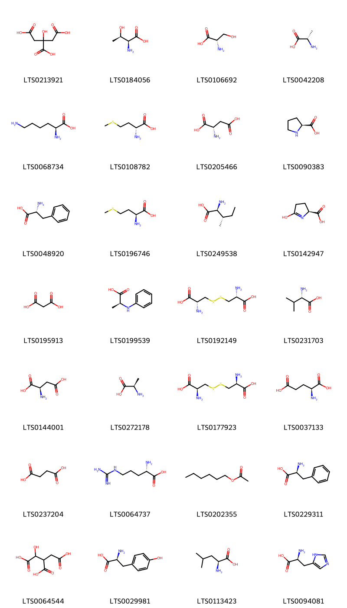{ width=100% }
    <figcaption>Hình ảnh cấu trúc hóa học của 28 hoạt chất thuộc nhóm Carboxylic acids and derivatives gồm ['citric acid (LTS0213921)', 'l-threonine (LTS0184056)', 'l-serine (LTS0106692)', 'l-alanine (LTS0042208)', 'l-lysine (LTS0068734)', 'd-methionine (LTS0108782)', 'l-aspartic acid (LTS0205466)', 'l-proline (LTS0090383)', 'd-phenylalanine (LTS0048920)', 'l-methionine (LTS0196746)', 'l-isoleucine (LTS0249538)', 'pyroglutamic acid (LTS0142947)', 'malonic acid (LTS0195913)', '(2s)-2-(phenylamino)propanoic acid (LTS0199539)', 'l-cystine (LTS0192149)', 'l-valine (LTS0231703)', 'd-aspartic acid (LTS0144001)', 'd-alanine (LTS0272178)', 'd-cystine (LTS0177923)', 'l-glutamic acid (LTS0037133)', 'succinic acid (LTS0237204)', 'l-arginine (LTS0064737)', 'hexyl acetate (LTS0202355)', 'l-phenylalanine (LTS0229311)', 'isocitric acid (LTS0064544)', 'l-tyrosine (LTS0029981)', 'l-leucine (LTS0113423)', 'l-histidine (LTS0094081)'].</figcaption>
</figure>
#### Nhóm Cinnamic acids and derivatives
<figure markdown="span">
    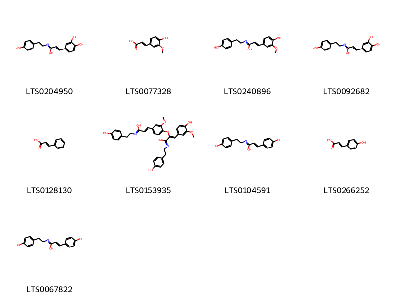{ width=100% }
    <figcaption>Hình ảnh cấu trúc hóa học của 9 hoạt chất thuộc nhóm Cinnamic acids and derivatives gồm ['3-(3,4-dihydroxyphenyl)-n-[2-(4-hydroxyphenyl)ethyl]prop-2-enimidic acid (LTS0204950)', 'ferulic acid (LTS0077328)', '3-(4-hydroxy-3-methoxyphenyl)-n-[2-(4-hydroxyphenyl)ethyl]prop-2-enimidic acid (LTS0240896)', '(2e)-3-(3,4-dihydroxyphenyl)-n-[2-(4-hydroxyphenyl)ethyl]prop-2-enimidic acid (LTS0092682)', 'cinnamic acid (LTS0128130)', '(2z)-3-(4-hydroxy-3-methoxyphenyl)-n-[2-(4-hydroxyphenyl)ethyl]-2-{4-[(1e)-2-{[2-(4-hydroxyphenyl)ethyl]-c-hydroxycarbonimidoyl}eth-1-en-1-yl]-2-methoxyphenoxy}prop-2-enimidic acid (LTS0153935)', '3-(4-hydroxyphenyl)-n-[2-(4-hydroxyphenyl)ethyl]prop-2-enimidic acid (LTS0104591)', 'para-coumaric acid (LTS0266252)', '(2e)-3-(4-hydroxyphenyl)-n-[2-(4-hydroxyphenyl)ethyl]prop-2-enimidic acid (LTS0067822)'].</figcaption>
</figure>
#### Nhóm Epoxides
<figure markdown="span">
    { width=100% }
    <figcaption>Hình ảnh cấu trúc hóa học của 2 hoạt chất thuộc nhóm Epoxides gồm ['(3z,7z)-1,5,5,8-tetramethyl-12-oxabicyclo[9.1.0]dodeca-3,7-diene (LTS0274935)', '(4z,7z)-1,5,9,9-tetramethyl-12-oxabicyclo[9.1.0]dodeca-4,7-diene (LTS0242379)'].</figcaption>
</figure>
#### Nhóm Fatty Acyls
<figure markdown="span">
    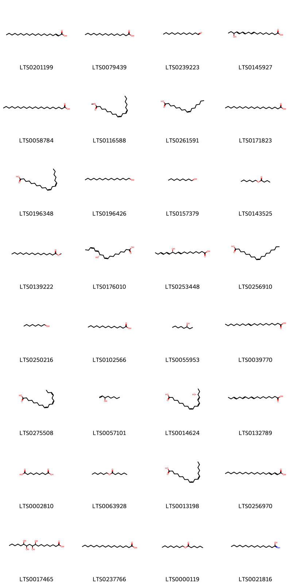{ width=100% }
    <figcaption>Hình ảnh cấu trúc hóa học của 32 hoạt chất thuộc nhóm Fatty Acyls gồm ['icos-2-enoic acid (LTS0201199)', 'palmitic acid (LTS0079439)', 'tridecanal (LTS0239223)', '16-hydroxyoctadeca-9,12,14-trienoic acid (LTS0145927)', 'behenic acid (LTS0058784)', 'methyl linoleate (LTS0116588)', 'palmitoleic acid (LTS0261591)', 'arachidic acid (LTS0171823)', '14-icosadienoic acid 11 (LTS0196348)', 'cetyl alcohol (LTS0196426)', 'nonan-1-ol (LTS0157379)', 'hexyl butyrate (LTS0143525)', 'methyl palmitate (LTS0139222)', '(9z,12s,13e,15z)-12-hydroxyoctadeca-9,13,15-trienoic acid (LTS0176010)', '(12s,13e)-12-hydroxyoctadeca-9,13,15-trienoic acid (LTS0253448)', 'oleic acid (LTS0256910)', 'octanol (LTS0250216)', 'myristic acid (LTS0102566)', '3-octanol (LTS0055953)', 'icosenoic acid (LTS0039770)', 'α-linolenic acid (LTS0275508)', '1-octen-3-ol (LTS0057101)', '(9z,12z,14e,16r)-16-hydroxyoctadeca-9,12,14-trienoic acid (LTS0014624)', 'α linolenic acid (LTS0132789)', 'azelaic acid (LTS0002810)', 'hexyl hexanoate (LTS0063928)', 'linoleic (LTS0013198)', 'icosa-2,4-dienoic acid (LTS0256970)', 'sativic acid (LTS0017465)', 'stearic acid (LTS0237766)', 'octyl caproate (LTS0000119)', 'hexadecanimidic acid (LTS0021816)'].</figcaption>
</figure>
#### Nhóm Flavonoids
<figure markdown="span">
    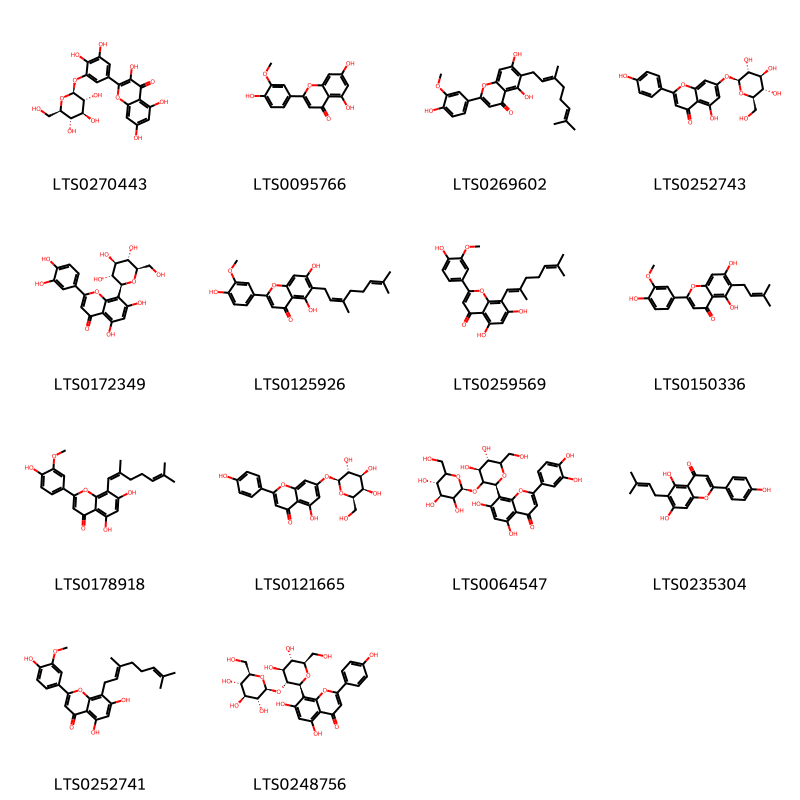{ width=100% }
    <figcaption>Hình ảnh cấu trúc hóa học của 14 hoạt chất thuộc nhóm Flavonoids gồm ['2-(3,4-dihydroxy-5-{[(2s,3r,4s,5s,6r)-3,4,5-trihydroxy-6-(hydroxymethyl)oxan-2-yl]oxy}phenyl)-3,5,7-trihydroxychromen-4-one (LTS0270443)', 'chrysoeriol (LTS0095766)', 'cannflavin a (LTS0269602)', 'apigenin 7-o-β-glucoside (LTS0252743)', 'orientin (LTS0172349)', '6-(3,7-dimethylocta-2,6-dien-1-yl)-5,7-dihydroxy-2-(4-hydroxy-3-methoxyphenyl)chromen-4-one (LTS0125926)', '8-[(1e)-2,6-dimethylhepta-1,5-dien-1-yl]-5,7-dihydroxy-2-(4-hydroxy-3-methoxyphenyl)chromen-4-one (LTS0259569)', 'cannflavin b (LTS0150336)', '8-(2,6-dimethylhepta-1,5-dien-1-yl)-5,7-dihydroxy-2-(4-hydroxy-3-methoxyphenyl)chromen-4-one (LTS0178918)', '5-hydroxy-2-(4-hydroxyphenyl)-7-{[(2s,3r,4s,5r,6r)-3,4,5-trihydroxy-6-(hydroxymethyl)oxan-2-yl]oxy}chromen-4-one (LTS0121665)', 'flavocannabiside (LTS0064547)', '6-prenylapigenin (LTS0235304)', '8-[(2e)-3,7-dimethylocta-2,6-dien-1-yl]-5,7-dihydroxy-2-(4-hydroxy-3-methoxyphenyl)chromen-4-one (LTS0252741)', "2''-o-glucosylvitexin (LTS0248756)"].</figcaption>
</figure>
#### Nhóm Heteroaromatic compounds
<figure markdown="span">
    { width=100% }
    <figcaption>Hình ảnh cấu trúc hóa học của 1 hoạt chất thuộc nhóm Heteroaromatic compounds gồm ['perillene (LTS0083458)'].</figcaption>
</figure>
#### Nhóm Hydroxy acids and derivatives
<figure markdown="span">
    { width=100% }
    <figcaption>Hình ảnh cấu trúc hóa học của 1 hoạt chất thuộc nhóm Hydroxy acids and derivatives gồm ['malic acid (LTS0216520)'].</figcaption>
</figure>
#### Nhóm Imidazopyrimidines
<figure markdown="span">
    { width=100% }
    <figcaption>Hình ảnh cấu trúc hóa học của 1 hoạt chất thuộc nhóm Imidazopyrimidines gồm ['zeatine (LTS0032706)'].</figcaption>
</figure>
#### Nhóm Indanes
<figure markdown="span">
    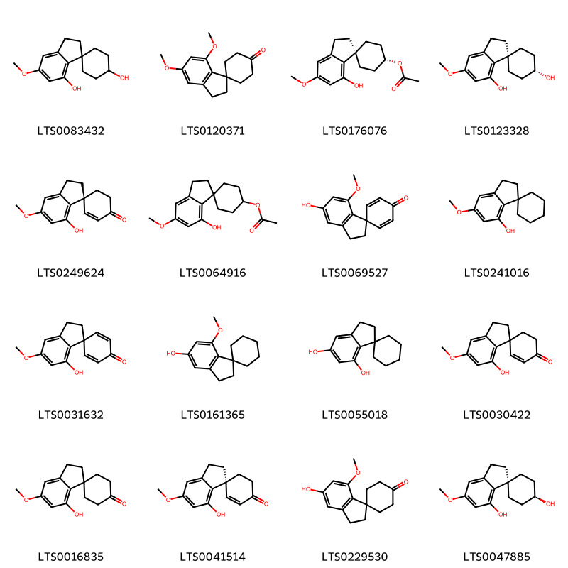{ width=100% }
    <figcaption>Hình ảnh cấu trúc hóa học của 16 hoạt chất thuộc nhóm Indanes gồm ["5'-methoxy-2',3'-dihydrospiro[cyclohexane-1,1'-indene]-4,7'-diol (LTS0083432)", "5',7'-dimethoxy-2',3'-dihydrospiro[cyclohexane-1,1'-inden]-4-one (LTS0120371)", "(1r,4s)-7'-hydroxy-5'-methoxy-2',3'-dihydrospiro[cyclohexane-1,1'-inden]-4-yl acetate (LTS0176076)", "(1r,4s)-5'-methoxy-2',3'-dihydrospiro[cyclohexane-1,1'-indene]-4,7'-diol (LTS0123328)", "(1r)-7'-hydroxy-5'-methoxy-2',3'-dihydrospiro[cyclohexane-1,1'-inden]-2-en-4-one (LTS0249624)", "7'-hydroxy-5'-methoxy-2',3'-dihydrospiro[cyclohexane-1,1'-inden]-4-yl acetate (LTS0064916)", "5'-hydroxy-7'-methoxy-2',3'-dihydrospiro[cyclohexane-1,1'-indene]-2,5-dien-4-one (LTS0069527)", "5'-methoxy-2',3'-dihydrospiro[cyclohexane-1,1'-inden]-7'-ol (LTS0241016)", "7'-hydroxy-5'-methoxy-2',3'-dihydrospiro[cyclohexane-1,1'-indene]-2,5-dien-4-one (LTS0031632)", "7'-methoxy-2',3'-dihydrospiro[cyclohexane-1,1'-inden]-5'-ol (LTS0161365)", "2',3'-dihydrospiro[cyclohexane-1,1'-indene]-5',7'-diol (LTS0055018)", "7'-hydroxy-5'-methoxy-2',3'-dihydrospiro[cyclohexane-1,1'-inden]-2-en-4-one (LTS0030422)", "7'-hydroxy-5'-methoxy-2',3'-dihydrospiro[cyclohexane-1,1'-inden]-4-one (LTS0016835)", "(1s)-7'-hydroxy-5'-methoxy-2',3'-dihydrospiro[cyclohexane-1,1'-inden]-2-en-4-one (LTS0041514)", "5'-hydroxy-7'-methoxy-2',3'-dihydrospiro[cyclohexane-1,1'-inden]-4-one (LTS0229530)", "(1s,4r)-5'-methoxy-2',3'-dihydrospiro[cyclohexane-1,1'-indene]-4,7'-diol (LTS0047885)"].</figcaption>
</figure>
#### Nhóm Indoles and derivatives
<figure markdown="span">
    { width=100% }
    <figcaption>Hình ảnh cấu trúc hóa học của 1 hoạt chất thuộc nhóm Indoles and derivatives gồm ['l-tryptophan (LTS0263809)'].</figcaption>
</figure>
#### Nhóm Macrolactams
<figure markdown="span">
    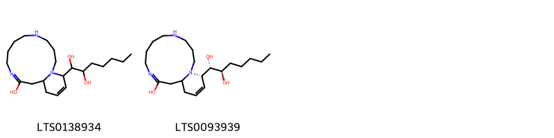{ width=100% }
    <figcaption>Hình ảnh cấu trúc hóa học của 2 hoạt chất thuộc nhóm Macrolactams gồm ['1-{2-hydroxy-1h,4h,5h,6h,7h,8h,9h,10h,11h,13h,16h,16ah-pyrido[2,1-d]1,5,9-triazacyclotridecan-13-yl}heptane-1,2-diol (LTS0138934)', '(1s,2r)-1-[(13s)-2-hydroxy-1h,4h,5h,6h,7h,8h,9h,10h,11h,13h,16h,16ah-pyrido[2,1-d]1,5,9-triazacyclotridecan-13-yl]heptane-1,2-diol (LTS0093939)'].</figcaption>
</figure>
#### Nhóm Neoflavonoids
<figure markdown="span">
    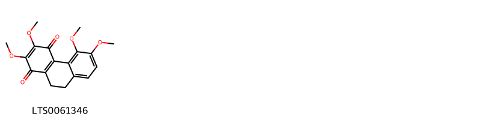{ width=100% }
    <figcaption>Hình ảnh cấu trúc hóa học của 1 hoạt chất thuộc nhóm Neoflavonoids gồm ['2,3,5,6-tetramethoxy-9,10-dihydrophenanthrene-1,4-dione (LTS0061346)'].</figcaption>
</figure>
#### Nhóm Organic oxides
<figure markdown="span">
    { width=100% }
    <figcaption>Hình ảnh cấu trúc hóa học của 2 hoạt chất thuộc nhóm Organic oxides gồm ['safranal (LTS0094098)', 'β-cyclocitral (LTS0195727)'].</figcaption>
</figure>
#### Nhóm Organonitrogen compounds
<figure markdown="span">
    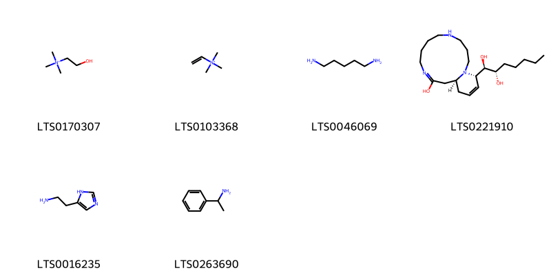{ width=100% }
    <figcaption>Hình ảnh cấu trúc hóa học của 6 hoạt chất thuộc nhóm Organonitrogen compounds gồm ['choline (LTS0170307)', 'ethenyltrimethylazanium (LTS0103368)', 'pentane-1,5-diamine (LTS0046069)', '(1r,2s)-1-[(13s,16as)-2-hydroxy-1h,4h,5h,6h,7h,8h,9h,10h,11h,13h,16h,16ah-pyrido[2,1-d]1,5,9-triazacyclotridecan-13-yl]heptane-1,2-diol (LTS0221910)', '1h-imidazole-5-ethanamine (LTS0016235)', '(+/-)-α-methylbenzylamine (LTS0263690)'].</figcaption>
</figure>
#### Nhóm Organooxygen compounds
<figure markdown="span">
    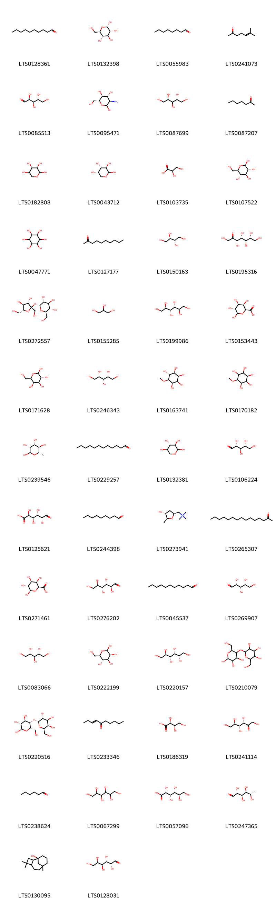{ width=100% }
    <figcaption>Hình ảnh cấu trúc hóa học của 63 hoạt chất thuộc nhóm Organooxygen compounds gồm ['decanal (LTS0128361)', 'α-glucose (LTS0132398)', 'octanal (LTS0055983)', '6-methyl-5-hepten-2-one (LTS0241073)', 'arabinose (LTS0085513)', 'glucosamine (LTS0095471)', 'arabitol (LTS0087699)', '2-heptanone (LTS0087207)', 'd-ribopyranose (LTS0182808)', 'l-arabinopyranose (LTS0043712)', 'glyceric acid (LTS0103735)', 'β-d-glucose (LTS0107522)', '(-)-inositol (LTS0047771)', '2-decanone (LTS0127177)', 'meso-erythritol (LTS0150163)', 'sedoheptulose (LTS0195316)', 'sucrose (LTS0272557)', 'glycerol (LTS0155285)', 'mannitol (LTS0199986)', 'd-galacturonic acid (LTS0153443)', 'galactose (LTS0171628)', 'd-xylitol (LTS0246343)', '(1r,2r,4s,5r)-6-methoxycyclohexane-1,2,3,4,5-pentol (LTS0163741)', '(2r)-6-methoxycyclohexane-1,2,3,4,5-pentol (LTS0170182)', 'l-rhamnose (LTS0239546)', 'dodecanal (LTS0229257)', 'd-xylose (LTS0132381)', 'ribose (LTS0106224)', 'galacturonic acid (LTS0125621)', 'nonanal (LTS0244398)', '(+)-muscarine (LTS0273941)', '2-pentadecanone (LTS0265307)', 'β-d-galactopyranuronic acid (LTS0271461)', '(+-)-mannose (LTS0276202)', 'aldehyde c11 (LTS0045537)', '(d)-xylose (LTS0269907)', 'ribitol (LTS0083066)', 'β-glucose (LTS0222199)', 'd-sorbitol (LTS0220157)', 'starch (LTS0210079)', '(2r,3r,4r,5s,6s)-6-(hydroxymethyl)-5-{[(2r,3r,4s,5r,6r)-3,4,5-trihydroxy-6-(hydroxymethyl)oxan-2-yl]oxy}oxane-2,3,4-triol (LTS0220516)', 'dec-3-en-5-one (LTS0233346)', 'threonic acid (LTS0186319)', 'keto-d-fructose (LTS0241114)', 'hexanal (LTS0238624)', 'sorbo (LTS0067299)', 'gluconic acid (LTS0057096)', 'rhamnose (LTS0247365)', 'caryophyllene alcohol (LTS0130095)', 'aldehydo-d-galactose (LTS0128031)', '1,2,3,4,5-pentahydroxypentane (LTS0023185)', 'saccharic acid (LTS0007607)', 'galactitol (LTS0012947)', 'pentanal (LTS0234306)', 'galactosamine (LTS0099079)', 'raffinose (LTS0113066)', 'heptanal (LTS0031416)', 'undecan-2-one (LTS0244143)', 'arabinonate (LTS0099990)', 'lauron (LTS0275476)', '3-octanone (LTS0272728)', '(2r,4s)-pentane-1,2,3,4,5-pentol (LTS0104641)', 'd-fructopyranose (LTS0259277)'].</figcaption>
</figure>
#### Nhóm Oxepanes
<figure markdown="span">
    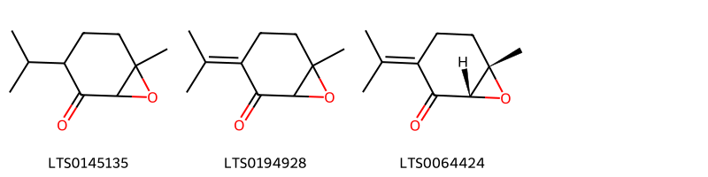{ width=100% }
    <figcaption>Hình ảnh cấu trúc hóa học của 3 hoạt chất thuộc nhóm Oxepanes gồm ['3-isopropyl-6-methyl-7-oxabicyclo[4.1.0]heptan-2-one (LTS0145135)', '6-methyl-3-(propan-2-ylidene)-7-oxabicyclo[4.1.0]heptan-2-one (LTS0194928)', 'piperitenone oxide (LTS0064424)'].</figcaption>
</figure>
#### Nhóm Phenanthrenes and derivatives
<figure markdown="span">
    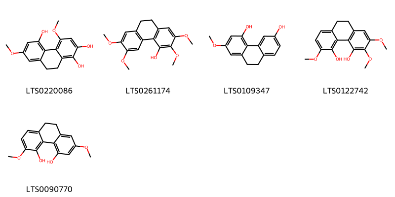{ width=100% }
    <figcaption>Hình ảnh cấu trúc hóa học của 5 hoạt chất thuộc nhóm Phenanthrenes and derivatives gồm ['4,7-dimethoxy-9,10-dihydrophenanthrene-1,2,5-triol (LTS0220086)', '2,3,6,7-tetramethoxy-9,10-dihydrophenanthren-4-ol (LTS0261174)', '7-methoxy-9,10-dihydrophenanthrene-3,5-diol (LTS0109347)', '2,3,6-trimethoxy-9,10-dihydrophenanthrene-4,5-diol (LTS0122742)', '2,6-dimethoxy-9,10-dihydrophenanthrene-4,5-diol (LTS0090770)'].</figcaption>
</figure>
#### Nhóm Phenol ethers
<figure markdown="span">
    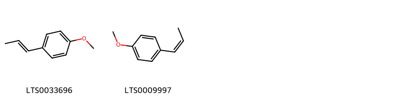{ width=100% }
    <figcaption>Hình ảnh cấu trúc hóa học của 2 hoạt chất thuộc nhóm Phenol ethers gồm ['anethole (LTS0033696)', '(e)-anethole (LTS0009997)'].</figcaption>
</figure>
#### Nhóm Phenols
<figure markdown="span">
    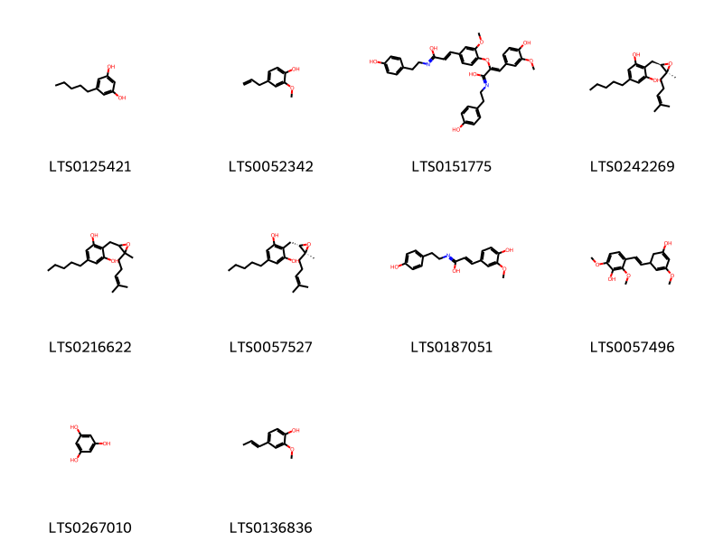{ width=100% }
    <figcaption>Hình ảnh cấu trúc hóa học của 10 hoạt chất thuộc nhóm Phenols gồm ['olivetol (LTS0125421)', 'eugenol (LTS0052342)', '3-(4-hydroxy-3-methoxyphenyl)-n-[2-(4-hydroxyphenyl)ethyl]-2-[4-(2-{[2-(4-hydroxyphenyl)ethyl]-c-hydroxycarbonimidoyl}eth-1-en-1-yl)-2-methoxyphenoxy]prop-2-enimidic acid (LTS0151775)', '2-{[(2r,3s)-3-methyl-3-(4-methylpent-3-en-1-yl)oxiran-2-yl]methyl}-5-pentylbenzene-1,3-diol (LTS0242269)', '2-{[3-methyl-3-(4-methylpent-3-en-1-yl)oxiran-2-yl]methyl}-5-pentylbenzene-1,3-diol (LTS0216622)', '2-{[(2s,3s)-3-methyl-3-(4-methylpent-3-en-1-yl)oxiran-2-yl]methyl}-5-pentylbenzene-1,3-diol (LTS0057527)', '(2e)-3-(4-hydroxy-3-methoxyphenyl)-n-[2-(4-hydroxyphenyl)ethyl]prop-2-enimidic acid (LTS0187051)', '3-[(1e)-2-(5-hydroxy-3-methoxycyclohexa-2,4-dien-1-yl)ethenyl]-2,6-dimethoxyphenol (LTS0057496)', 'phloroglucinol (LTS0267010)', 'isoeugenol (LTS0136836)'].</figcaption>
</figure>
#### Nhóm Phenylpropanoic acids
<figure markdown="span">
    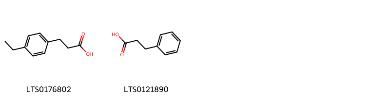{ width=100% }
    <figcaption>Hình ảnh cấu trúc hóa học của 2 hoạt chất thuộc nhóm Phenylpropanoic acids gồm ['3-(4-ethylphenyl)propanoic acid (LTS0176802)', '3-phenylpropionic acid (LTS0121890)'].</figcaption>
</figure>
#### Nhóm Piperidines
<figure markdown="span">
    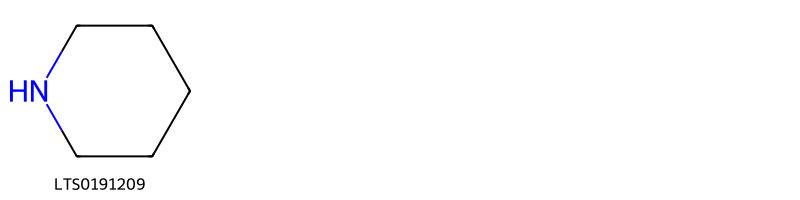{ width=100% }
    <figcaption>Hình ảnh cấu trúc hóa học của 1 hoạt chất thuộc nhóm Piperidines gồm ['piperidine (LTS0191209)'].</figcaption>
</figure>
#### Nhóm Prenol lipids
<figure markdown="span">
    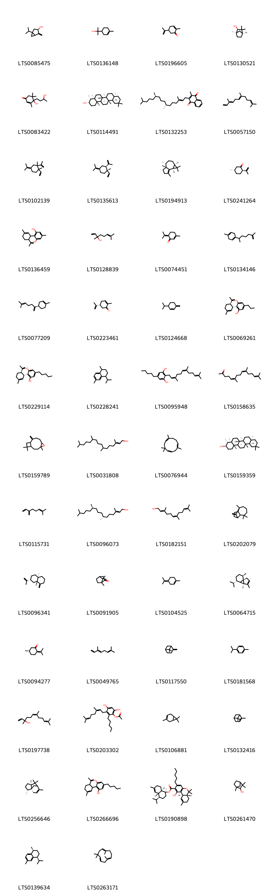{ width=100% }
    <figcaption>Hình ảnh cấu trúc hóa học của 156 hoạt chất thuộc nhóm Prenol lipids gồm ['sabinol (LTS0085475)', 'terpineol (LTS0136148)', 'carvone (LTS0196605)', '(1r,2r,4s)-1,3,3-trimethylbicyclo[2.2.1]heptan-2-ol (LTS0130521)', '4-hydroxy-4-(3-hydroxybutyl)-3,5,5-trimethylcyclohex-2-en-1-one (LTS0083422)', 'epi-friedelanol (LTS0114491)', 'phytonadione (LTS0132253)', 'farnesene (LTS0057150)', '1-ethenyl-1,2-dimethyl-2-(prop-1-en-2-yl)-4-(propan-2-ylidene)cyclohexane (LTS0102139)', '(1s,2s)-1-ethenyl-1-methyl-2-(prop-1-en-2-yl)-4-(propan-2-ylidene)cyclohexane (LTS0135613)', '(-)-α-gurjunene (LTS0194913)', '(2r,5s)-5-methyl-2-(prop-1-en-2-yl)cyclohexan-1-one (LTS0241264)', '5-methyl-2-[3-methyl-6-(prop-1-en-2-yl)cyclohex-2-en-1-yl]benzene-1,3-diol (LTS0136459)', 'linalool, (+-)- (LTS0128839)', 'piperitenone (LTS0074451)', '1-methyl-4-(6-methylhept-6-en-2-yl)cyclohexa-1,4-diene (LTS0134146)', '(r)-β-bisabolene (LTS0077209)', '(-)-carvone (LTS0223461)', 'β phellandrene (LTS0124668)', '2-[(1r,6r)-3-methyl-6-(prop-1-en-2-yl)cyclohex-2-en-1-yl]-5-propylbenzene-1,3-diol (LTS0069261)', 'cannabidiol (LTS0229114)', '(e)-calamene (LTS0228241)', '5-pentyl-2-(3,7,11-trimethyldodeca-2,6,10-trien-1-yl)benzene-1,3-diol (LTS0095948)', '6,10,14-trimethylpentadeca-5,9,13-trien-2-one (LTS0158635)', 'caryophyllene oxide (LTS0159789)', 'phytol (LTS0031808)', 'α-humulene (LTS0076944)', '(3r,4r,4as,6as,6br,8ar,12ar,12bs,14as,14bs)-4,4a,6b,8a,11,11,12b,14a-octamethyl-hexadecahydropicen-3-ol (LTS0159359)', 'α-myrcene (LTS0115731)', 'phytol (LTS0096073)', '(e,z)-farnesol (LTS0182151)', 'longifolene (LTS0202079)', 'β-selinene (LTS0096341)', 'camphor (LTS0091905)', 'terpinolene (LTS0104525)', '(1s,5r,7s,10r)-7-isopropyl-4,10-dimethyltricyclo[4.4.0.0¹,⁵]dec-3-ene (LTS0064715)', '(+)-pulegone (LTS0094277)', 'trans-β-ocimene (LTS0049765)', 'β-pinene (LTS0117550)', 'cymene (LTS0181568)', 'nerolidol (LTS0197738)', '3-(3,7-dimethylocta-2,6-dien-1-yl)-4,6-dihydroxy-2-pentylphenyl acetate (LTS0203302)', 'monoterpenes (LTS0106881)', 'α pinene (LTS0132416)', 'cedrene (LTS0256646)', 'cannabidiol (LTS0266696)', '(1s,4s,4ar,8ar)-4-isopropyl-1,6-dimethyl-3,4,4a,7,8,8a-hexahydro-2h-naphthalen-1-yl (6ar,10ar)-1-hydroxy-6,6,9-trimethyl-3-pentyl-6ah,7h,8h,10ah-benzo[c]isochromene-2-carboxylate (LTS0190898)', 'fenchol (LTS0261470)', '(1s,4s)-4-isopropyl-1,6-dimethyl-1,2,3,4-tetrahydronaphthalene (LTS0139634)', 'humulene (LTS0263171)', 'terpineols (LTS0139391)', '3-methyl-1-(prop-1-en-2-yl)cyclohex-3-en-1-ol (LTS0270867)', '4-isopropyl-1,6-dimethyl-2,3,4,4a,7,8-hexahydronaphthalene (LTS0270743)', '(1as,4ar,7as,7br)-1,1,7-trimethyl-4-methylidene-octahydro-1ah-cyclopropa[e]azulene (LTS0145331)', '(3r,6e)-nerolidol (LTS0145065)', '(1r,9s,10s,13r)-10-methyl-5-pentyl-13-(prop-1-en-2-yl)-8-oxatricyclo[7.4.0.0²,⁷]trideca-2,4,6-triene-3,10-diol (LTS0199004)', '2-[(2e)-3,7-dimethylocta-2,6-dien-1-yl]-3,6-dihydroxy-5-pentylphenyl acetate (LTS0262214)', '{2-hydroxy-1,7,7-trimethylbicyclo[2.2.1]heptan-2-yl}acetic acid (LTS0273856)', 'cannabigerovarin (LTS0144795)', 'camphene (LTS0267242)', '(6e)-2,6-dimethyl-10-methylidenedodeca-2,6-diene (LTS0154516)', 'limonene,  (LTS0155981)', 'β-caryophyllen (LTS0141501)', '(4e,8e)-β-humulene (LTS0193661)', 'β-ionone (LTS0155301)', 'dihydrocarvone (LTS0195462)', 'pinocarvone (LTS0084836)', '(2s,7s)-3,3,7-trimethyl-8-methylidenetricyclo[5.4.0.0²,⁹]undecane (LTS0085446)', 'gamma-eudesmol (LTS0147389)', 'phellandrene (LTS0157173)', '2-(3,7-dimethylocta-2,6-dien-1-yl)-5-pentylbenzene-1,3-diol (LTS0146473)', '(2r)-6-methyl-2-(4-methylcyclohex-3-en-1-yl)hept-5-en-2-ol (LTS0088859)', '4-terpineol (LTS0253733)', '4,4a,6b,8a,11,11,12b,14a-octamethyl-hexadecahydropicen-3-ol (LTS0182128)', 'borneol (LTS0264960)', '(+)-gamma-cadinene (LTS0103949)', 'α-bergamotene (LTS0226115)', 'α-thujene (LTS0176954)', '(4e,8e)-4,8,11,11-tetramethylcycloundeca-1,4,8-triene (LTS0118116)', '(1r,9s,10s,13r)-3,10-dihydroxy-10-methyl-5-pentyl-13-(prop-1-en-2-yl)-8-oxatricyclo[7.4.0.0²,⁷]trideca-2,4,6-triene-6-carboxylic acid (LTS0255477)', '4-hydroxy-4-(3-hydroxybut-1-en-1-yl)-3,5,5-trimethylcyclohex-2-en-1-one (LTS0183737)', 'α-bisabolol (LTS0250984)', 'cannabidiol (LTS0068259)', 'caryophyllene (LTS0085212)', '(-)-α-curcumene (LTS0216936)', 'cannabidivarin (LTS0221920)', '2-(4a,8-dimethyl-2,3,4,5,6,7-hexahydro-1h-naphthalen-2-yl)propan-2-yl 1-hydroxy-6,6,9-trimethyl-3-pentyl-6ah,7h,8h,10ah-benzo[c]isochromene-2-carboxylate (LTS0259490)', '3-[(2e)-3,7-dimethylocta-2,6-dien-1-yl]-4,6-dihydroxy-2-pentylphenyl acetate (LTS0263489)', 'β-farnesene (LTS0067925)', 'levo-α-cedrene (LTS0222481)', 'bornyl acetate (LTS0060565)', '2-[(2r,4ar)-4a,8-dimethyl-2,3,4,5,6,7-hexahydro-1h-naphthalen-2-yl]propan-2-yl 3-[(2e)-3,7-dimethylocta-2,6-dien-1-yl]-2,4-dihydroxy-6-pentylbenzoate (LTS0209090)', 'camphene hydrate (LTS0071319)', 'β-caryophyllene oxide (LTS0213960)', '4-isopropyl-1,6-dimethyl-3,4,4a,7,8,8a-hexahydro-2h-naphthalen-1-yl 1-hydroxy-6,6,9-trimethyl-3-pentyl-6ah,7h,8h,10ah-benzo[c]isochromene-2-carboxylate (LTS0222371)', 'selinene (LTS0197809)', 'α-copaene (LTS0207598)', 'cannabigerol (LTS0069129)', 'sabinene (LTS0224133)', '2-[(2e)-3,7-dimethylocta-2,6-dien-1-yl]-5-hexyl-3,6-dioxocyclohexa-1,4-dien-1-yl acetate (LTS0267306)', 'sesquicannabigerol (LTS0211418)', '2-[3-methyl-6-(prop-1-en-2-yl)cyclohex-3-en-1-yl]-5-propylbenzene-1,3-diol (LTS0152284)', '(4s)-4-hydroxy-4-(3-hydroxybut-1-en-1-yl)-3,5,5-trimethylcyclohex-2-en-1-one (LTS0225700)', '2-[(2e)-3,7-dimethylocta-2,6-dien-1-yl]-3-ethoxy-5-pentylphenol (LTS0048334)', 'guaiol (LTS0240901)', '(5e,9e)-farnesyl acetone (LTS0229980)', 'α-thujene (LTS0185078)', '2-[(1s,6s)-6-isopropyl-3-methylcyclohex-2-en-1-yl]-5-pentylbenzene-1,3-diol (LTS0174617)', 'isopulegone (LTS0226394)', '(-)-friedelin (LTS0041645)', 'β-humulene (LTS0207418)', 'neral (LTS0165243)', '(-)-trans-α-bergamotene (LTS0239937)', '2-(3,7-dimethylocta-2,6-dien-1-yl)-3,6-dihydroxy-5-pentylphenyl acetate (LTS0188675)', 'geraniol (LTS0258838)', '4,7,7-trimethylbicyclo[4.1.0]hept-2-ene (LTS0156738)', 'β-ocimene (LTS0242381)', '(4s)-4-hydroxy-4-[(1e,3r)-3-hydroxybut-1-en-1-yl]-3,3,5-trimethylcyclohexan-1-one (LTS0057219)', '(1s,4s,4ar,8ar)-4-isopropyl-1,6-dimethyl-3,4,4a,7,8,8a-hexahydro-2h-naphthalen-1-yl 3-[(2e)-3,7-dimethylocta-2,6-dien-1-yl]-2,4-dihydroxy-6-pentylbenzoate (LTS0256938)', '2-[(1r,6r)-3-methyl-6-(prop-1-en-2-yl)cyclohex-3-en-1-yl]-5-propylbenzene-1,3-diol (LTS0035998)', 'curcumene (LTS0190074)', '(1r,2s,7s,8s)-8-isopropyl-1,3-dimethyltricyclo[4.4.0.0²,⁷]dec-3-ene (LTS0190031)', 'farnesol (LTS0059667)', '(2s,4r)-1,7,7-trimethylbicyclo[2.2.1]heptan-2-ol (LTS0010050)', '2-(3,7-dimethylocta-2,6-dien-1-yl)-5-hexyl-3,6-dioxocyclohexa-1,4-dien-1-yl acetate (LTS0059700)', '2-(3,7-dimethylocta-2,6-dien-1-yl)-3-ethoxy-5-pentylphenol (LTS0012904)', '2-(3,7-dimethylocta-2,6-dien-1-yl)-5-hydroxy-3-pentylcyclohexa-2,5-diene-1,4-dione (LTS0119693)', '(1s,2s,4r)-2-methyl-3-methylidene-2-(4-methylpent-3-en-1-yl)bicyclo[2.2.1]heptane (LTS0259563)', '(6s,9r)-vomifoliol (LTS0052786)', '2-[(2e)-3,7-dimethylocta-2,6-dien-1-yl]-5-hydroxy-3-pentylcyclohexa-2,5-diene-1,4-dione (LTS0126133)', 'terpinene (LTS0136858)', '(-)-β-bisabolene (LTS0009940)', '2-[(2r,4ar)-4a,8-dimethyl-2,3,4,5,6,7-hexahydro-1h-naphthalen-2-yl]propan-2-yl (6ar,10ar)-1-hydroxy-6,6,9-trimethyl-3-pentyl-6ah,7h,8h,10ah-benzo[c]isochromene-2-carboxylate (LTS0001606)', 'fenchone (LTS0126716)', 'carvacrol (LTS0012882)', '(1s)-3-methyl-1-(prop-1-en-2-yl)cyclohex-3-en-1-ol (LTS0010347)', 'nerol (LTS0244289)', 'delta-cadinene (LTS0019321)', 'pinocarveol (LTS0090950)', 'α-selinene (LTS0024564)', 'citronellol, (+-)- (LTS0090925)', '(-)-β-curcumene (LTS0027873)', 'humula-1(11),4,8-triene (LTS0029053)', '3-methoxy-2-[(1r,6r)-3-methyl-6-(prop-1-en-2-yl)cyclohex-2-en-1-yl]-5-pentylphenol (LTS0029245)', 'friedelin (LTS0213494)', '(1ar,4r,7r,7bs)-1,1,4,7-tetramethyl-octahydro-1ah-cyclopropa[e]azulen-4-ol (LTS0248407)', '(z)-β-farnesene (LTS0254048)', 'carvone, (+)- (LTS0027671)', '(1r,9s,10s,13r)-3,10-dihydroxy-10-methyl-5-pentyl-13-(prop-1-en-2-yl)-8-oxatricyclo[7.4.0.0²,⁷]trideca-2,4,6-triene-4-carboxylic acid (LTS0044921)', '(-)-α-cubebene (LTS0042045)', '2-[(1s,6s)-3-methyl-6-(prop-1-en-2-yl)cyclohex-2-en-1-yl]-5-pentylbenzene-1,3-diol (LTS0029554)', '(4s)-4-hydroxy-4-[(3r)-3-hydroxybutyl]-3,5,5-trimethylcyclohex-2-en-1-one (LTS0038392)', '4-isopropyl-6-methyl-1-methylidene-3,4,4a,7,8,8a-hexahydro-2h-naphthalene (LTS0111070)', 'geranylacetone (LTS0231623)', '4-isopropyl-1,6-dimethyl-3,4,4a,7,8,8a-hexahydro-2h-naphthalen-1-yl 3-(3,7-dimethylocta-2,6-dien-1-yl)-2,4-dihydroxy-6-pentylbenzoate (LTS0037374)', '2-(4a,8-dimethyl-2,3,4,5,6,7-hexahydro-1h-naphthalen-2-yl)propan-2-yl 3-(3,7-dimethylocta-2,6-dien-1-yl)-2,4-dihydroxy-6-pentylbenzoate (LTS0045232)'].</figcaption>
</figure>
#### Nhóm Pyrans
<figure markdown="span">
    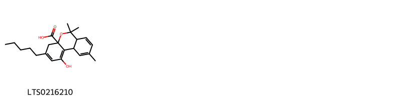{ width=100% }
    <figcaption>Hình ảnh cấu trúc hóa học của 1 hoạt chất thuộc nhóm Pyrans gồm ['3-hydroxy-9,9,13-trimethyl-5-pentyl-8-oxatricyclo[8.4.0.0²,⁷]tetradeca-2,4,11,13-tetraene-7-carboxylic acid (LTS0216210)'].</figcaption>
</figure>
#### Nhóm Saturated hydrocarbons
<figure markdown="span">
    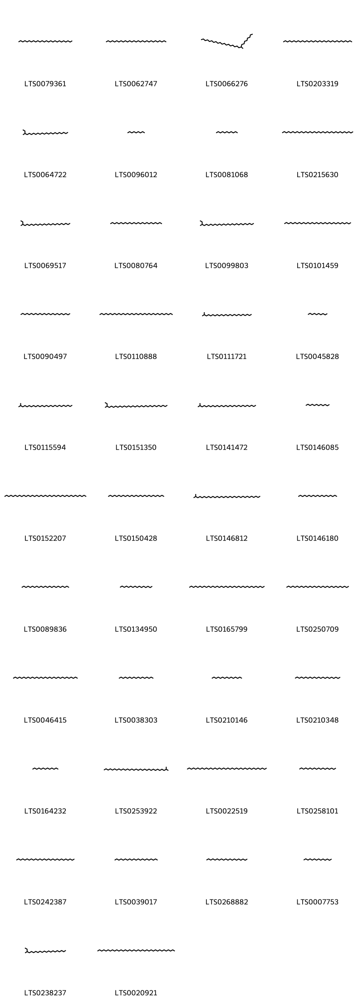{ width=100% }
    <figcaption>Hình ảnh cấu trúc hóa học của 42 hoạt chất thuộc nhóm Saturated hydrocarbons gồm ['hexacosane (LTS0079361)', 'nonacosane (LTS0062747)', '9-methyloctacosane (LTS0066276)', 'tritriacontane (LTS0203319)', '3-methyltricosane (LTS0064722)', 'nonane (LTS0096012)', 'undecane (LTS0081068)', 'tetratriacontane (LTS0215630)', '3-methylpentacosane (LTS0069517)', 'pentacosane (LTS0080764)', '3-methylheptacosane (LTS0099803)', 'dotriacontane (LTS0101459)', 'tetracosane (LTS0090497)', 'pentatriacontane (LTS0110888)', '2-methyltetracosane (LTS0111721)', 'decane (LTS0045828)', '2-methylhexacosane (LTS0115594)', '3-methylhentriacontane (LTS0151350)', '2-methyloctacosane (LTS0141472)', 'dodecane (LTS0146085)', 'nonatriacontane (LTS0152207)', 'heptacosane (LTS0150428)', '2-methyldotriacontane (LTS0146812)', 'nonadecane (LTS0146180)', 'tricosane (LTS0089836)', 'cetane (LTS0134950)', 'hexatriacontane (LTS0165799)', 'triacontane (LTS0250709)', 'hentriacontane (LTS0046415)', 'heptadecane (LTS0038303)', 'pentadecane (LTS0210146)', 'docosane (LTS0210348)', 'tridecane (LTS0164232)', '2-methylhentriacontane (LTS0253922)', 'octatriacontane (LTS0022519)', 'octadecane (LTS0258101)', 'octacosane (LTS0242387)', 'heneicosane (LTS0039017)', 'eicosane (LTS0268882)', 'tetradecane (LTS0007753)', '3-methylhenicosane (LTS0238237)', 'heptatriacontane (LTS0020921)'].</figcaption>
</figure>
#### Nhóm Steroids and steroid derivatives
<figure markdown="span">
    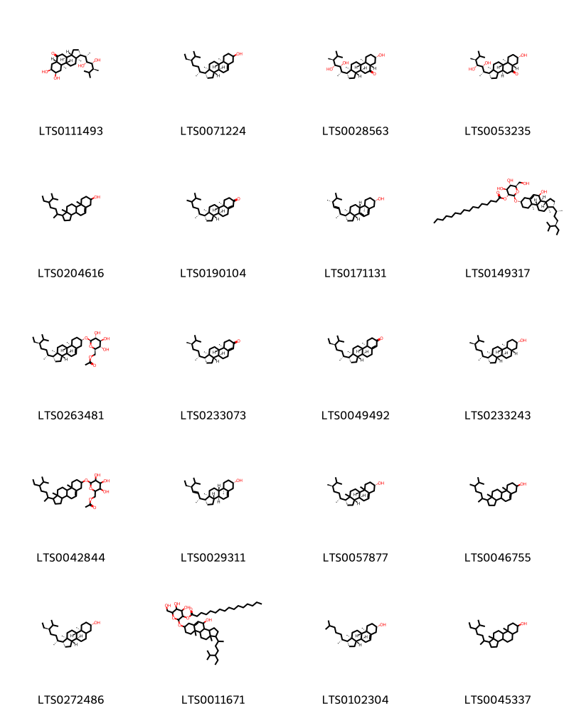{ width=100% }
    <figcaption>Hình ảnh cấu trúc hóa học của 20 hoạt chất thuộc nhóm Steroids and steroid derivatives gồm ['castasterone (LTS0111493)', 'stigmast-5-en-3-ol (LTS0071224)', 'teasterone (LTS0028563)', '(1r,3bs,5as,7s,9ar,9bs,11as)-1-[(2s,3r,4r,5s)-3,4-dihydroxy-5,6-dimethylheptan-2-yl]-7-hydroxy-9a,11a-dimethyl-tetradecahydrocyclopenta[a]phenanthren-5-one (LTS0053235)', 'stigmast-5-en-3-ol, (3β)- (LTS0204616)', '(1r,3as,3bs,9ar,9bs,11ar)-1-[(2r)-5,6-dimethylheptan-2-yl]-9a,11a-dimethyl-1h,2h,3h,3ah,3bh,4h,5h,8h,9h,9bh,10h,11h-cyclopenta[a]phenanthren-7-one (LTS0190104)', 'ergosterol (LTS0171131)', '(2r,3r,4s,5s,6r)-2-{[(1r,3as,3bs,4s,7s,9ar,9bs,11ar)-1-[(2r,5r)-5-ethyl-6-methylheptan-2-yl]-4-hydroxy-9a,11a-dimethyl-1h,2h,3h,3ah,3bh,4h,6h,7h,8h,9h,9bh,10h,11h-cyclopenta[a]phenanthren-7-yl]oxy}-4,5-dihydroxy-6-(hydroxymethyl)oxan-3-yl hexadecanoate (LTS0149317)', '[(2r,3s,4s,5r,6r)-6-{[(1r,3as,3bs,7s,9ar,9bs,11ar)-1-[(2r,5r)-5-ethyl-6-methylheptan-2-yl]-9a,11a-dimethyl-1h,2h,3h,3ah,3bh,4h,6h,7h,8h,9h,9bh,10h,11h-cyclopenta[a]phenanthren-7-yl]oxy}-3,4,5-trihydroxyoxan-2-yl]methyl acetate (LTS0263481)', 'campest-4-en-3-one (LTS0233073)', 'β-sitostenone (LTS0049492)', 'campestanol (LTS0233243)', '(6-{[1-(5-ethyl-6-methylheptan-2-yl)-9a,11a-dimethyl-1h,2h,3h,3ah,3bh,4h,6h,7h,8h,9h,9bh,10h,11h-cyclopenta[a]phenanthren-7-yl]oxy}-3,4,5-trihydroxyoxan-2-yl)methyl acetate (LTS0042844)', 'phytosterol (LTS0029311)', '(1r,3as,3bs,7s,9bs)-1-[(2r,5r)-5,6-dimethylheptan-2-yl]-9a,11a-dimethyl-1h,2h,3h,3ah,3bh,4h,6h,7h,8h,9h,9bh,10h,11h-cyclopenta[a]phenanthren-7-ol (LTS0057877)', 'campesterol (LTS0046755)', '(1r,3as,3br,7s,9as,9bs,11ar)-1-[(2r,5r)-5-ethyl-6-methylheptan-2-yl]-9a,11a-dimethyl-tetradecahydro-1h-cyclopenta[a]phenanthren-7-ol (LTS0272486)', '2-{[1-(5-ethyl-6-methylheptan-2-yl)-4-hydroxy-9a,11a-dimethyl-1h,2h,3h,3ah,3bh,4h,6h,7h,8h,9h,9bh,10h,11h-cyclopenta[a]phenanthren-7-yl]oxy}-4,5-dihydroxy-6-(hydroxymethyl)oxan-3-yl hexadecanoate (LTS0011671)', 'cholesterol (LTS0102304)', '24-ethyl coprostanol (LTS0045337)'].</figcaption>
</figure>
#### Nhóm Stilbenes
<figure markdown="span">
    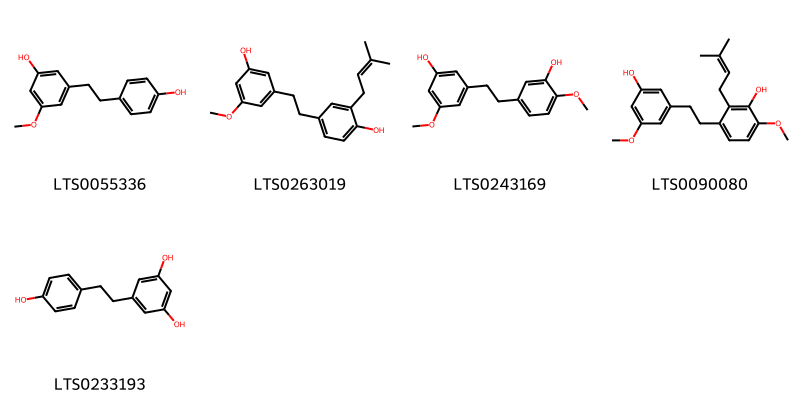{ width=100% }
    <figcaption>Hình ảnh cấu trúc hóa học của 5 hoạt chất thuộc nhóm Stilbenes gồm ['3-[2-(4-hydroxyphenyl)ethyl]-5-methoxyphenol (LTS0055336)', '3-{2-[4-hydroxy-3-(3-methylbut-2-en-1-yl)phenyl]ethyl}-5-methoxyphenol (LTS0263019)', '3-[2-(3-hydroxy-4-methoxyphenyl)ethyl]-5-methoxyphenol (LTS0243169)', 'canniprene (LTS0090080)', 'dihydroresveratrol (LTS0233193)'].</figcaption>
</figure>
#### Nhóm Unsaturated hydrocarbons
<figure markdown="span">
    { width=100% }
    <figcaption>Hình ảnh cấu trúc hóa học của 1 hoạt chất thuộc nhóm Unsaturated hydrocarbons gồm ['α terpinene (LTS0232891)'].</figcaption>
</figure>

---

### Dược dân tộc học

Danh sách các quốc gia có sử dụng *Cannabis sativa* trong điều trị các bệnh. 

| Country   | Disease                                                                                                                                                                                                   | Bệnh                                                                                                                                                                                                |
|:----------|:----------------------------------------------------------------------------------------------------------------------------------------------------------------------------------------------------------|:----------------------------------------------------------------------------------------------------------------------------------------------------------------------------------------------------|
| China     | Anesthetic, Demulcent, Diuretic, Emmenagogue, Hallucinogen, Hallucinogen, Hallucinogen, Laxative, Laxative, Laxative, Poison, Poison, Tonic, Tonic, Vermifuge, Diuretic, Analgesic, Anesthetic, Emollient | MYMEMORY WARNING: YOU USED ALL AVAILABLE FREE TRANSLATIONS FOR TODAY. NEXT AVAILABLE IN  06 HOURS 59 MINUTES 38 SECONDS VISIT HTTPS://MYMEMORY.TRANSLATED.NET/DOC/USAGELIMITS.PHP TO TRANSLATE MORE |
| Elsewhere | Hallucinogen, Narcotic, Narcotic, Sedative, Sedative, Analgesic, Aphrodisiac, Apertif                                                                                                                     | MYMEMORY WARNING: YOU USED ALL AVAILABLE FREE TRANSLATIONS FOR TODAY. NEXT AVAILABLE IN  06 HOURS 59 MINUTES 35 SECONDS VISIT HTTPS://MYMEMORY.TRANSLATED.NET/DOC/USAGELIMITS.PHP TO TRANSLATE MORE |
| Haiti     | Narcotic                                                                                                                                                                                                  | MYMEMORY WARNING: YOU USED ALL AVAILABLE FREE TRANSLATIONS FOR TODAY. NEXT AVAILABLE IN  06 HOURS 59 MINUTES 31 SECONDS VISIT HTTPS://MYMEMORY.TRANSLATED.NET/DOC/USAGELIMITS.PHP TO TRANSLATE MORE |
| India     | Narcotic, Vermifuge                                                                                                                                                                                       | MYMEMORY WARNING: YOU USED ALL AVAILABLE FREE TRANSLATIONS FOR TODAY. NEXT AVAILABLE IN  06 HOURS 59 MINUTES 28 SECONDS VISIT HTTPS://MYMEMORY.TRANSLATED.NET/DOC/USAGELIMITS.PHP TO TRANSLATE MORE |
| Java      | Narcotic                                                                                                                                                                                                  | MYMEMORY WARNING: YOU USED ALL AVAILABLE FREE TRANSLATIONS FOR TODAY. NEXT AVAILABLE IN  06 HOURS 59 MINUTES 26 SECONDS VISIT HTTPS://MYMEMORY.TRANSLATED.NET/DOC/USAGELIMITS.PHP TO TRANSLATE MORE |
| Lesotho   | Hallucinogen                                                                                                                                                                                              | MYMEMORY WARNING: YOU USED ALL AVAILABLE FREE TRANSLATIONS FOR TODAY. NEXT AVAILABLE IN  06 HOURS 59 MINUTES 22 SECONDS VISIT HTTPS://MYMEMORY.TRANSLATED.NET/DOC/USAGELIMITS.PHP TO TRANSLATE MORE |
| Mexico    | Hypnotic, Stimulant, Sedative                                                                                                                                                                             | MYMEMORY WARNING: YOU USED ALL AVAILABLE FREE TRANSLATIONS FOR TODAY. NEXT AVAILABLE IN  06 HOURS 59 MINUTES 18 SECONDS VISIT HTTPS://MYMEMORY.TRANSLATED.NET/DOC/USAGELIMITS.PHP TO TRANSLATE MORE |
| Trinidad  | Hallucinogen                                                                                                                                                                                              | MYMEMORY WARNING: YOU USED ALL AVAILABLE FREE TRANSLATIONS FOR TODAY. NEXT AVAILABLE IN  06 HOURS 59 MINUTES 14 SECONDS VISIT HTTPS://MYMEMORY.TRANSLATED.NET/DOC/USAGELIMITS.PHP TO TRANSLATE MORE |
| Turkey    | Intoxicant, Hypnotic, Narcotic                                                                                                                                                                            | MYMEMORY WARNING: YOU USED ALL AVAILABLE FREE TRANSLATIONS FOR TODAY. NEXT AVAILABLE IN  06 HOURS 59 MINUTES 11 SECONDS VISIT HTTPS://MYMEMORY.TRANSLATED.NET/DOC/USAGELIMITS.PHP TO TRANSLATE MORE |
| US        | Intoxicant, Psychotropic, Narcotic                                                                                                                                                                        | MYMEMORY WARNING: YOU USED ALL AVAILABLE FREE TRANSLATIONS FOR TODAY. NEXT AVAILABLE IN  06 HOURS 59 MINUTES 07 SECONDS VISIT HTTPS://MYMEMORY.TRANSLATED.NET/DOC/USAGELIMITS.PHP TO TRANSLATE MORE |
| ain       | Sedative                                                                                                                                                                                                  | MYMEMORY WARNING: YOU USED ALL AVAILABLE FREE TRANSLATIONS FOR TODAY. NEXT AVAILABLE IN  06 HOURS 59 MINUTES 02 SECONDS VISIT HTTPS://MYMEMORY.TRANSLATED.NET/DOC/USAGELIMITS.PHP TO TRANSLATE MORE |

---

# Chi Humulus

??? note "Danh sách các dược liệu thuộc chi"
    
	 - *Humulus japonicus*
	 - *Humulus lupulus*

---
## Humulus japonicus
### Thông tin về thực vật

!!! info "Phân loại thực vật của *Humulus scandens* từ GIBF:"
    - **Kingdom:** Plantae
    - **Phylum:** Tracheophyta
    - **Order:** Rosales
    - **Family:** Cannabaceae
    - **Genus:** Humulus
    - **Species:** *Humulus scandens*

 

| Label (VI)   | Label (EN)   | Scientific Name   | Descriptions (VI)   | Descriptions (EN)   | Also Known As (VI)   | Also Known As (EN)           |
|:-------------|:-------------|:------------------|:--------------------|:--------------------|:---------------------|:-----------------------------|
| N/A          | N/A          | Humulus japonicus |                     | species of plant    | ['']                 | ['Japanese hop', 'wild hop'] |

#### Phân bố trên thế giới

**Từ CSDL GIBF** Italy, Belgium, Korea, Republic of, United States of America, Sweden, France

#### Phân bố tại Việt Nam

**Từ CSDL GIBF**: Không có ghi nhận ở Việt Nam

---
### Thành phần hóa học
        
- Theo cơ sở dữ liệu lotus: Từ loài *Humulus scandens* đã phân lập và xác định được 11 hoạt chất thuộc về các nhóm Cinnamic acids and derivatives, Flavonoids, Stilbenes, Vinylogous acids. 

|    | chemicalTaxonomyClassyfireClass   |   smiles_count |
|---:|:----------------------------------|---------------:|
|  0 | Cinnamic acids and derivatives    |              1 |
|  1 | Flavonoids                        |              7 |
|  2 | Stilbenes                         |              1 |
|  3 | Vinylogous acids                  |              2 |

#### Nhóm Cinnamic acids and derivatives
<figure markdown="span">
    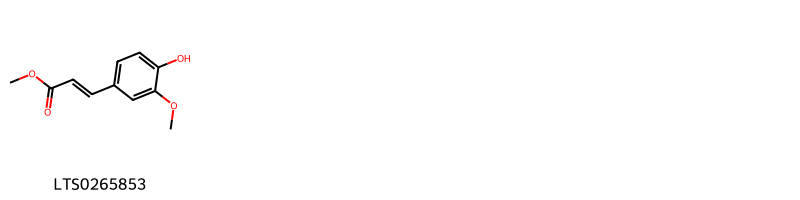{ width=100% }
    <figcaption>Hình ảnh cấu trúc hóa học của 1 hoạt chất thuộc nhóm Cinnamic acids and derivatives gồm ['methyl ferulate (LTS0265853)'].</figcaption>
</figure>
#### Nhóm Flavonoids
<figure markdown="span">
    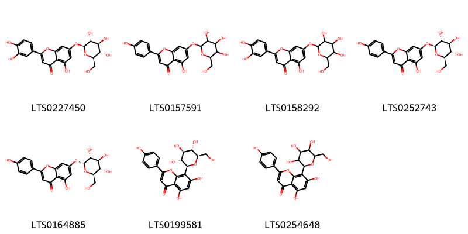{ width=100% }
    <figcaption>Hình ảnh cấu trúc hóa học của 7 hoạt chất thuộc nhóm Flavonoids gồm ['luteolin 7-o-glucoside (LTS0227450)', 'apigetrin (LTS0157591)', '2-(3,4-dihydroxyphenyl)-5-hydroxy-7-{[3,4,5-trihydroxy-6-(hydroxymethyl)oxan-2-yl]oxy}chromen-4-one (LTS0158292)', 'apigenin 7-o-β-glucoside (LTS0252743)', '5-hydroxy-2-(4-hydroxyphenyl)-7-{[(2r,3r,4s,5s,6r)-3,4,5-trihydroxy-6-(hydroxymethyl)oxan-2-yl]oxy}chromen-4-one (LTS0164885)', 'vitexin (LTS0199581)', 'vitexin (LTS0254648)'].</figcaption>
</figure>
#### Nhóm Stilbenes
<figure markdown="span">
    { width=100% }
    <figcaption>Hình ảnh cấu trúc hóa học của 1 hoạt chất thuộc nhóm Stilbenes gồm ['resveratrol (LTS0256677)'].</figcaption>
</figure>
#### Nhóm Vinylogous acids
<figure markdown="span">
    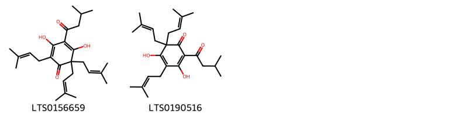{ width=100% }
    <figcaption>Hình ảnh cấu trúc hóa học của 2 hoạt chất thuộc nhóm Vinylogous acids gồm ["b'' -acid (LTS0156659)", 'lupulone (LTS0190516)'].</figcaption>
</figure>

---

### Dược dân tộc học

Danh sách các quốc gia có sử dụng *Humulus scandens* trong điều trị các bệnh. 

| Country   | Disease         | Bệnh                                                                                                                                                                                                |
|:----------|:----------------|:----------------------------------------------------------------------------------------------------------------------------------------------------------------------------------------------------|
| China     | Diuretic, Tonic | MYMEMORY WARNING: YOU USED ALL AVAILABLE FREE TRANSLATIONS FOR TODAY. NEXT AVAILABLE IN  06 HOURS 57 MINUTES 56 SECONDS VISIT HTTPS://MYMEMORY.TRANSLATED.NET/DOC/USAGELIMITS.PHP TO TRANSLATE MORE |

---

---
## Humulus lupulus
### Thông tin về thực vật

!!! info "Phân loại thực vật của *Humulus lupulus* từ GIBF:"
    - **Kingdom:** Plantae
    - **Phylum:** Tracheophyta
    - **Order:** Rosales
    - **Family:** Cannabaceae
    - **Genus:** Humulus
    - **Species:** *Humulus lupulus*

 

| Label (VI)   | Label (EN)   | Scientific Name   | Descriptions (VI)   | Descriptions (EN)   | Also Known As (VI)   | Also Known As (EN)    |
|:-------------|:-------------|:------------------|:--------------------|:--------------------|:---------------------|:----------------------|
| N/A          | N/A          | Humulus lupulus   | loài thực vật       | species of plant    | ['']                 | ['common hop', 'hop'] |

#### Phân bố trên thế giới

**Từ CSDL GIBF** Italy, Australia, Belgium, Slovakia, Norway, Canada, Ukraine, Denmark, Netherlands, Belarus, Luxembourg, Spain, Hungary, Russian Federation, United States of America, Sweden, Kazakhstan, Czechia, Germany, Romania, Switzerland, Austria, France, United Kingdom of Great Britain and Northern Ireland, Serbia, Poland, New Zealand

#### Phân bố tại Việt Nam

**Từ CSDL GIBF**: Không có ghi nhận ở Việt Nam

---
### Thành phần hóa học
        
- Theo cơ sở dữ liệu lotus: Từ loài *Humulus lupulus* đã phân lập và xác định được 304 hoạt chất thuộc về các nhóm Benzofurans, Stilbenes, Phenols, Vinylogous acids, Carboxylic acids and derivatives, Trithianes, Fatty Acyls, Purine nucleotides, Cinnamic acids and derivatives, Triphenyl compounds, Coumarans, Prenol lipids, Linear 1,3-diarylpropanoids, Benzene and substituted derivatives, Dihydrofurans, Organooxygen compounds, Flavonoids, Steroids and steroid derivatives, Pyrans, Epoxides. 

|    | chemicalTaxonomyClassyfireClass     |   smiles_count |
|---:|:------------------------------------|---------------:|
|  0 | Benzene and substituted derivatives |              1 |
|  1 | Benzofurans                         |              9 |
|  2 | Carboxylic acids and derivatives    |              1 |
|  3 | Cinnamic acids and derivatives      |              6 |
|  4 | Coumarans                           |              3 |
|  5 | Dihydrofurans                       |              1 |
|  6 | Epoxides                            |              4 |
|  7 | Fatty Acyls                         |             12 |
|  8 | Flavonoids                          |             35 |
|  9 | Linear 1,3-diarylpropanoids         |             50 |
| 10 | Organooxygen compounds              |             38 |
| 11 | Phenols                             |              2 |
| 12 | Prenol lipids                       |            115 |
| 13 | Purine nucleotides                  |              2 |
| 14 | Pyrans                              |              5 |
| 15 | Steroids and steroid derivatives    |              4 |
| 16 | Stilbenes                           |              3 |
| 17 | Triphenyl compounds                 |              1 |
| 18 | Trithianes                          |              1 |
| 19 | Vinylogous acids                    |              9 |

#### Nhóm Benzene and substituted derivatives
<figure markdown="span">
    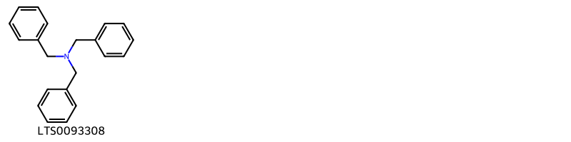{ width=100% }
    <figcaption>Hình ảnh cấu trúc hóa học của 1 hoạt chất thuộc nhóm Benzene and substituted derivatives gồm ['tribenzylamine (LTS0093308)'].</figcaption>
</figure>
#### Nhóm Benzofurans
<figure markdown="span">
    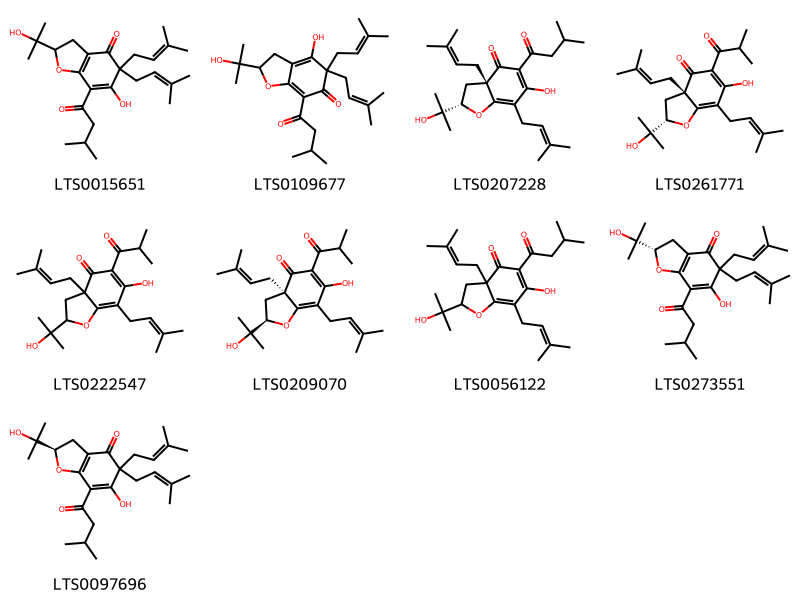{ width=100% }
    <figcaption>Hình ảnh cấu trúc hóa học của 9 hoạt chất thuộc nhóm Benzofurans gồm ['6-hydroxy-2-(2-hydroxypropan-2-yl)-5,5-bis(3-methylbut-2-en-1-yl)-7-(3-methylbutanoyl)-2,3-dihydro-1-benzofuran-4-one (LTS0015651)', '4-hydroxy-2-(2-hydroxypropan-2-yl)-5,5-bis(3-methylbut-2-en-1-yl)-7-(3-methylbutanoyl)-2,3-dihydro-1-benzofuran-6-one (LTS0109677)', '(2s,3as)-6-hydroxy-2-(2-hydroxypropan-2-yl)-3a,7-bis(3-methylbut-2-en-1-yl)-5-(3-methylbutanoyl)-2,3-dihydro-1-benzofuran-4-one (LTS0207228)', '(2s,3as)-6-hydroxy-2-(2-hydroxypropan-2-yl)-3a,7-bis(3-methylbut-2-en-1-yl)-5-(2-methylpropanoyl)-2,3-dihydro-1-benzofuran-4-one (LTS0261771)', '6-hydroxy-2-(2-hydroxypropan-2-yl)-3a,7-bis(3-methylbut-2-en-1-yl)-5-(2-methylpropanoyl)-2,3-dihydro-1-benzofuran-4-one (LTS0222547)', '(2r,3ar)-6-hydroxy-2-(2-hydroxypropan-2-yl)-3a,7-bis(3-methylbut-2-en-1-yl)-5-(2-methylpropanoyl)-2,3-dihydro-1-benzofuran-4-one (LTS0209070)', '6-hydroxy-2-(2-hydroxypropan-2-yl)-3a,7-bis(3-methylbut-2-en-1-yl)-5-(3-methylbutanoyl)-2,3-dihydro-1-benzofuran-4-one (LTS0056122)', '(2s)-6-hydroxy-2-(2-hydroxypropan-2-yl)-5,5-bis(3-methylbut-2-en-1-yl)-7-(3-methylbutanoyl)-2,3-dihydro-1-benzofuran-4-one (LTS0273551)', '(2r)-6-hydroxy-2-(2-hydroxypropan-2-yl)-5,5-bis(3-methylbut-2-en-1-yl)-7-(3-methylbutanoyl)-2,3-dihydro-1-benzofuran-4-one (LTS0097696)'].</figcaption>
</figure>
#### Nhóm Carboxylic acids and derivatives
<figure markdown="span">
    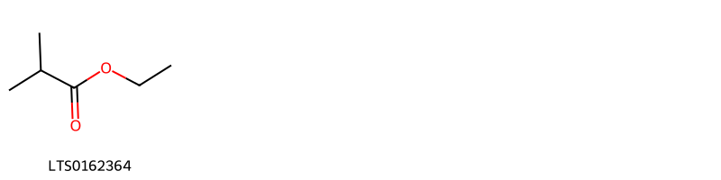{ width=100% }
    <figcaption>Hình ảnh cấu trúc hóa học của 1 hoạt chất thuộc nhóm Carboxylic acids and derivatives gồm ['ethyl isobutyrate (LTS0162364)'].</figcaption>
</figure>
#### Nhóm Cinnamic acids and derivatives
<figure markdown="span">
    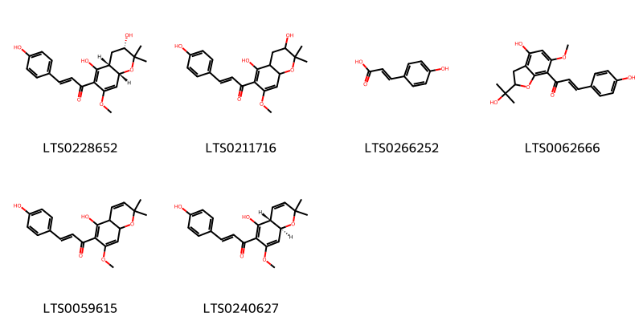{ width=100% }
    <figcaption>Hình ảnh cấu trúc hóa học của 6 hoạt chất thuộc nhóm Cinnamic acids and derivatives gồm ['(2e)-1-[(3s,4ar,8ar)-3,5-dihydroxy-7-methoxy-2,2-dimethyl-3,4,4a,8a-tetrahydro-1-benzopyran-6-yl]-3-(4-hydroxyphenyl)prop-2-en-1-one (LTS0228652)', '1-(3,5-dihydroxy-7-methoxy-2,2-dimethyl-3,4,4a,8a-tetrahydro-1-benzopyran-6-yl)-3-(4-hydroxyphenyl)prop-2-en-1-one (LTS0211716)', 'para-coumaric acid (LTS0266252)', '(2e)-1-[4-hydroxy-2-(2-hydroxypropan-2-yl)-6-methoxy-2,3-dihydro-1-benzofuran-7-yl]-3-(4-hydroxyphenyl)prop-2-en-1-one (LTS0062666)', '1-(5-hydroxy-7-methoxy-2,2-dimethyl-4a,8a-dihydrochromen-6-yl)-3-(4-hydroxyphenyl)prop-2-en-1-one (LTS0059615)', '(2e)-1-[(4ar,8as)-5-hydroxy-7-methoxy-2,2-dimethyl-4a,8a-dihydrochromen-6-yl]-3-(4-hydroxyphenyl)prop-2-en-1-one (LTS0240627)'].</figcaption>
</figure>
#### Nhóm Coumarans
<figure markdown="span">
    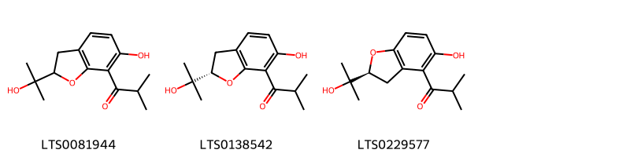{ width=100% }
    <figcaption>Hình ảnh cấu trúc hóa học của 3 hoạt chất thuộc nhóm Coumarans gồm ['1-[6-hydroxy-2-(2-hydroxypropan-2-yl)-2,3-dihydro-1-benzofuran-7-yl]-2-methylpropan-1-one (LTS0081944)', '1-[(2s)-6-hydroxy-2-(2-hydroxypropan-2-yl)-2,3-dihydro-1-benzofuran-7-yl]-2-methylpropan-1-one (LTS0138542)', '1-[(2s)-5-hydroxy-2-(2-hydroxypropan-2-yl)-2,3-dihydro-1-benzofuran-4-yl]-2-methylpropan-1-one (LTS0229577)'].</figcaption>
</figure>
#### Nhóm Dihydrofurans
<figure markdown="span">
    { width=100% }
    <figcaption>Hình ảnh cấu trúc hóa học của 1 hoạt chất thuộc nhóm Dihydrofurans gồm ['vitamin c (LTS0022555)'].</figcaption>
</figure>
#### Nhóm Epoxides
<figure markdown="span">
    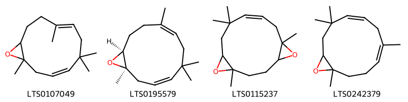{ width=100% }
    <figcaption>Hình ảnh cấu trúc hóa học của 4 hoạt chất thuộc nhóm Epoxides gồm ['(3z,7e)-1,5,5,8-tetramethyl-12-oxabicyclo[9.1.0]dodeca-3,7-diene (LTS0107049)', '(1r,11s)-1,5,5,8-tetramethyl-12-oxabicyclo[9.1.0]dodeca-3,7-diene (LTS0195579)', '(8z)-1,6,10,10-tetramethyl-5,13-dioxatricyclo[10.1.0.0⁴,⁶]tridec-8-ene (LTS0115237)', '(4z,7z)-1,5,9,9-tetramethyl-12-oxabicyclo[9.1.0]dodeca-4,7-diene (LTS0242379)'].</figcaption>
</figure>
#### Nhóm Fatty Acyls
<figure markdown="span">
    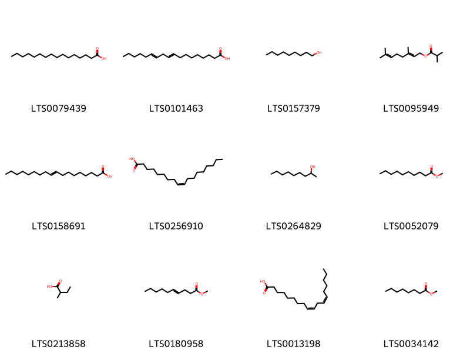{ width=100% }
    <figcaption>Hình ảnh cấu trúc hóa học của 12 hoạt chất thuộc nhóm Fatty Acyls gồm ['palmitic acid (LTS0079439)', '9,12-octadecadienoic acid (LTS0101463)', 'nonan-1-ol (LTS0157379)', 'geranyl isobutyrate (LTS0095949)', '9 octadecenoic acid (LTS0158691)', 'oleic acid (LTS0256910)', '2-nonanol (LTS0264829)', 'methyl caprate (LTS0052079)', '2-methylbutanoic acid (LTS0213858)', 'methyl dec-4-enoate (LTS0180958)', 'linoleic (LTS0013198)', 'methyl caprylate (LTS0034142)'].</figcaption>
</figure>
#### Nhóm Flavonoids
<figure markdown="span">
    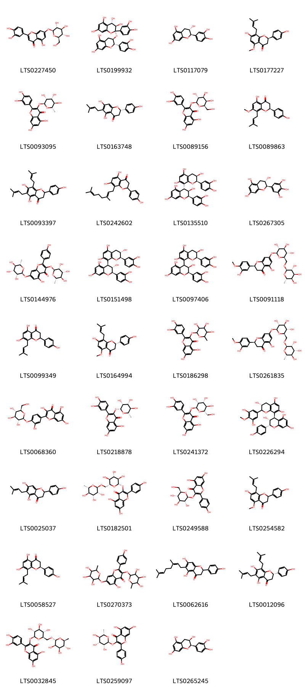{ width=100% }
    <figcaption>Hình ảnh cấu trúc hóa học của 35 hoạt chất thuộc nhóm Flavonoids gồm ['luteolin 7-o-glucoside (LTS0227450)', '(2r,3r,4s)-2-(3,4-dihydroxyphenyl)-2-{[(2s,3r)-2-(3,4-dihydroxyphenyl)-5,7-dihydroxy-3,4-dihydro-2h-1-benzopyran-3-yl]oxy}-3,4-dihydro-1-benzopyran-3,4,5,7-tetrol (LTS0199932)', '(+)-catechol (LTS0117079)', '(2r)-7-hydroxy-2-(4-hydroxyphenyl)-5-methoxy-8-(3-methylbut-2-en-1-yl)-2,3-dihydro-1-benzopyran-4-one (LTS0177227)', 'quercitrin (LTS0093095)', '6-prenylnaringenin (LTS0163748)', 'hyperoside (LTS0089156)', 'mundulea flavanone b (LTS0089863)', '5,7-dihydroxy-2-(4-hydroxyphenyl)-6,8-bis(3-methylbut-2-en-1-yl)-2,3-dihydro-1-benzopyran-4-one (LTS0093397)', 'sophoraflavanone a (LTS0242602)', '(2r,3r,4r)-2-(3,4-dihydroxyphenyl)-4-[(2r,3r)-2-(3,4-dihydroxyphenyl)-3,5,7-trihydroxy-3,4-dihydro-2h-1-benzopyran-8-yl]-3,4-dihydro-2h-1-benzopyran-3,5,7-triol (LTS0135510)', 'gallocatechol (LTS0267305)', 'lespedin (LTS0144976)', '(2r,3s,4s)-2-(3,4-dihydroxyphenyl)-4-[(2r,3s)-2-(3,4-dihydroxyphenyl)-3,5,7-trihydroxy-3,4-dihydro-2h-1-benzopyran-8-yl]-3,4-dihydro-2h-1-benzopyran-3,5,7-triol (LTS0151498)', '(2r,3r)-2-(3,4-dihydroxyphenyl)-4-[(2r,3r)-2-(3,4-dihydroxyphenyl)-3,5,7-trihydroxy-3,4-dihydro-2h-1-benzopyran-8-yl]-3,4-dihydro-2h-1-benzopyran-3,5,7-triol (LTS0097406)', '(2s)-5-hydroxy-2-(3-hydroxy-4-methoxyphenyl)-7-{[(2s,3r,4s,5s,6r)-3,4,5-trihydroxy-6-({[(2r,3r,4s,5r,6s)-3,4,5-trihydroxy-6-methyloxan-2-yl]oxy}methyl)oxan-2-yl]oxy}-2,3-dihydro-1-benzopyran-4-one (LTS0091118)', 'sophoraflavanone b (LTS0099349)', 'isoxanthohumol (LTS0164994)', 'quercitrin (LTS0186298)', 'hesperidin (LTS0261835)', 'spiraeoside (LTS0068360)', '2-(3,4-dihydroxyphenyl)-5,7-dihydroxy-3-{[(2r,3r,4r,5r,6s)-3,4,5-trihydroxy-6-methyloxan-2-yl]oxy}chromen-4-one (LTS0218878)', '2-(3,4-dihydroxyphenyl)-5,7-dihydroxy-3-{[(2s,3r,4r,5r,6s)-3,4,5-trihydroxy-6-(hydroxymethyl)oxan-2-yl]oxy}chromen-4-one (LTS0241372)', '(3r)-2-(3,5-dihydroxy-4-methoxyphenyl)-8-[(2r,3r,4r)-3,5,7-trihydroxy-2-(4-hydroxyphenyl)-3,4-dihydro-2h-1-benzopyran-4-yl]-3,4-dihydro-2h-1-benzopyran-3,5,7-triol (LTS0226294)', '5,7-dihydroxy-2-(4-hydroxyphenyl)-6-(3-methylbut-2-en-1-yl)-2,3-dihydro-1-benzopyran-4-one (LTS0025037)', 'nictoflorin (LTS0182501)', 'astragalin (LTS0249588)', 'isoxanthohumol(sophora) (LTS0254582)', 'sophoraflavanone b (LTS0058527)', 'kaempferitrin (LTS0270373)', '6-(3,7-dimethylocta-2,6-dien-1-yl)-5,7-dihydroxy-2-(4-hydroxyphenyl)-2,3-dihydro-1-benzopyran-4-one (LTS0062616)', 'lonchocarpol a (LTS0012096)', '3-rutinosyl quercetin (LTS0032845)', 'afzelin (LTS0259097)', 'ent-epicatechin (LTS0265245)'].</figcaption>
</figure>
#### Nhóm Linear 1_3-diarylpropanoids
<figure markdown="span">
    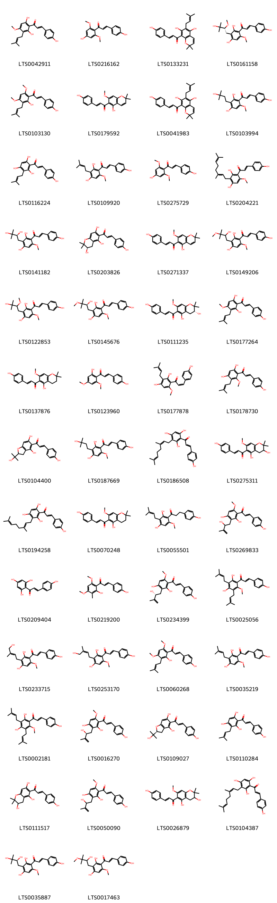{ width=100% }
    <figcaption>Hình ảnh cấu trúc hóa học của Không tìm thấy chú thích hoạt chất thuộc nhóm Linear 1_3-diarylpropanoids gồm Không tìm thấy chú thích.</figcaption>
</figure>
#### Nhóm Organooxygen compounds
<figure markdown="span">
    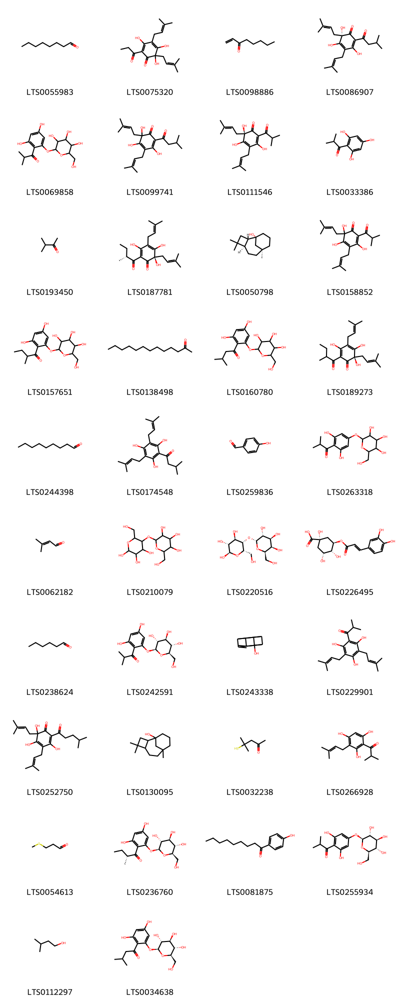{ width=100% }
    <figcaption>Hình ảnh cấu trúc hóa học của 38 hoạt chất thuộc nhóm Organooxygen compounds gồm ['octanal (LTS0055983)', '3,5,6-trihydroxy-4,6-bis(3-methylbut-2-en-1-yl)-2-propanoylcyclohexa-2,4-dien-1-one (LTS0075320)', '1-octen-3-one (LTS0098886)', 'humulone (LTS0086907)', '1-(2,4-dihydroxy-6-{[3,4,5-trihydroxy-6-(hydroxymethyl)oxan-2-yl]oxy}phenyl)-2-methylpropan-1-one (LTS0069858)', '3,5,6-trihydroxy-4,6-bis(3-methylbut-2-en-1-yl)-2-(3-methylbutanoyl)cyclohexa-2,4-dien-1-one (LTS0099741)', '(6r)-3,5,6-trihydroxy-4,6-bis(3-methylbut-2-en-1-yl)-2-(2-methylpropanoyl)cyclohexa-2,4-dien-1-one (LTS0111546)', '2-methyl-1-(2,4,6-trihydroxyphenyl)propan-1-one (LTS0033386)', 'methyl isopropyl ketone (LTS0193450)', '(6r)-3,5,6-trihydroxy-4,6-bis(3-methylbut-2-en-1-yl)-2-[(2r)-2-methylbutanoyl]cyclohexa-2,4-dien-1-one (LTS0187781)', '(1r,2s,5r,8s)-4,4,8-trimethyltricyclo[6.3.1.0²,⁵]dodecan-1-ol (LTS0050798)', '(+/-)-cohumulone (LTS0158852)', '1-(2,4-dihydroxy-6-{[3,4,5-trihydroxy-6-(hydroxymethyl)oxan-2-yl]oxy}phenyl)-2-methylbutan-1-one (LTS0157651)', '2-tridecanone (LTS0138498)', '1-(2,4-dihydroxy-6-{[3,4,5-trihydroxy-6-(hydroxymethyl)oxan-2-yl]oxy}phenyl)-3-methylbutan-1-one (LTS0160780)', '(6r)-3,5,6-trihydroxy-4,6-bis(3-methylbut-2-en-1-yl)-2-(2-methylbutanoyl)cyclohexa-2,4-dien-1-one (LTS0189273)', 'nonanal (LTS0244398)', '3-methyl-1-[2,4,6-trihydroxy-3,5-bis(3-methylbut-2-en-1-yl)phenyl]butan-1-one (LTS0174548)', 'p-hydroxybenzaldehyde (LTS0259836)', '1-(2,6-dihydroxy-4-{[3,4,5-trihydroxy-6-(hydroxymethyl)oxan-2-yl]oxy}phenyl)-2-methylpropan-1-one (LTS0263318)', 'prenal (LTS0062182)', 'starch (LTS0210079)', '(2r,3r,4r,5s,6s)-6-(hydroxymethyl)-5-{[(2r,3r,4s,5r,6r)-3,4,5-trihydroxy-6-(hydroxymethyl)oxan-2-yl]oxy}oxane-2,3,4-triol (LTS0220516)', 'chlorogenic acid (LTS0226495)', 'hexanal (LTS0238624)', '1-(2,4-dihydroxy-6-{[(2s,3r,4s,5s,6r)-3,4,5-trihydroxy-6-(hydroxymethyl)oxan-2-yl]oxy}phenyl)-2-methylpropan-1-one (LTS0242591)', '3,4,5,8-tetrahydro-2h-cuban-1-ol (LTS0243338)', '2-methyl-1-[2,4,6-trihydroxy-3,5-bis(3-methylbut-2-en-1-yl)phenyl]propan-1-one (LTS0229901)', '3,5,6-trihydroxy-4,6-bis(3-methylbut-2-en-1-yl)-2-(4-methylpentanoyl)cyclohexa-2,4-dien-1-one (LTS0252750)', 'caryophyllene alcohol (LTS0130095)', '4-methyl-4-sulfanylpentan-2-one (LTS0032238)', '2-methyl-1-[2,4,6-trihydroxy-3-(3-methylbut-2-en-1-yl)phenyl]propan-1-one (LTS0266928)', 'methional (LTS0054613)', '(2r)-1-(2,4-dihydroxy-6-{[(2s,3r,4s,5s,6r)-3,4,5-trihydroxy-6-(hydroxymethyl)oxan-2-yl]oxy}phenyl)-2-methylbutan-1-one (LTS0236760)', '1-(4-hydroxyphenyl)nonan-1-one (LTS0081875)', '1-(2,6-dihydroxy-4-{[(2s,3r,4s,5s,6r)-3,4,5-trihydroxy-6-(hydroxymethyl)oxan-2-yl]oxy}phenyl)-2-methylpropan-1-one (LTS0255934)', 'isoamyl alcohol (LTS0112297)', '1-(2,4-dihydroxy-6-{[(2s,3r,4s,5s,6r)-3,4,5-trihydroxy-6-(hydroxymethyl)oxan-2-yl]oxy}phenyl)-3-methylbutan-1-one (LTS0034638)'].</figcaption>
</figure>
#### Nhóm Phenols
<figure markdown="span">
    { width=100% }
    <figcaption>Hình ảnh cấu trúc hóa học của 2 hoạt chất thuộc nhóm Phenols gồm ['2-methoxy-4-vinyl-phenol (LTS0128961)', '5-ethenyl-2-methoxyphenol (LTS0076260)'].</figcaption>
</figure>
#### Nhóm Prenol lipids
<figure markdown="span">
    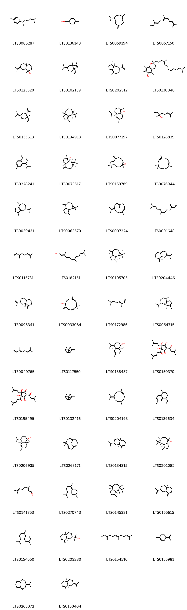{ width=100% }
    <figcaption>Hình ảnh cấu trúc hóa học của 115 hoạt chất thuộc nhóm Prenol lipids gồm ['zingiberene (LTS0085287)', 'terpineol (LTS0136148)', '(-)-germacrene d (LTS0059194)', 'farnesene (LTS0057150)', '1,4a-dimethyl-7-(propan-2-ylidene)-hexahydro-2h-naphthalen-1-ol (LTS0123520)', '1-ethenyl-1,2-dimethyl-2-(prop-1-en-2-yl)-4-(propan-2-ylidene)cyclohexane (LTS0102139)', 'α-bulnesene (LTS0202512)', '(2r)-2,5,7,8-tetramethyl-2-[(4s,8s)-4,8,12-trimethyltridecyl]-3,4-dihydro-1-benzopyran-6-ol (LTS0130040)', '(1s,2s)-1-ethenyl-1-methyl-2-(prop-1-en-2-yl)-4-(propan-2-ylidene)cyclohexane (LTS0135613)', '(-)-α-gurjunene (LTS0194913)', '(1s,4r,4as,8ar)-1-isopropyl-4,7-dimethyl-2,3,4,5,6,8a-hexahydro-1h-naphthalen-4a-ol (LTS0077197)', 'linalool, (+-)- (LTS0128839)', '(e)-calamene (LTS0228241)', '(1as,4as,7s,7ar,7bs)-1,1,7-trimethyl-4-methylidene-octahydrocyclopropa[e]azulen-7-ol (LTS0073517)', 'caryophyllene oxide (LTS0159789)', 'α-humulene (LTS0076944)', 'guaiene (LTS0039431)', '1,1,7-trimethyl-4-methylidene-octahydro-1ah-cyclopropa[e]azulene (LTS0063570)', '(1z,4e)-germacrene b (LTS0097224)', 'β-farnesene (LTS0091648)', 'α-myrcene (LTS0115731)', '(e,z)-farnesol (LTS0182151)', '(1ar,4ar,7r,7as,7bs)-1,1,7-trimethyl-4-methylidene-octahydro-1ah-cyclopropa[e]azulene (LTS0105705)', '(4as,8as)-4a-methyl-1-methylidene-7-(propan-2-ylidene)-hexahydro-2h-naphthalene (LTS0204446)', 'β-selinene (LTS0096341)', '(4z,8z)-6,6,9-trimethyl-2-methylidenecycloundeca-4,8-dien-1-ol (LTS0033084)', '3,7-dimethyl-1,3,6-octatriene (LTS0172986)', '(1s,5r,7s,10r)-7-isopropyl-4,10-dimethyltricyclo[4.4.0.0¹,⁵]dec-3-ene (LTS0064715)', 'trans-β-ocimene (LTS0049765)', 'β-pinene (LTS0117550)', '(1r,4ar,8as)-4-isopropyl-1,6-dimethyl-3,4,4a,7,8,8a-hexahydro-2h-naphthalen-1-ol (LTS0136437)', '3,4,5-trihydroxy-4-(3-methylbut-2-en-1-yl)-2-(3-methylbutanoyl)-5-(4-methylpent-3-enoyl)cyclopent-2-en-1-one (LTS0150370)', '3,4,5-trihydroxy-5-(3-methylbut-2-en-1-yl)-2-(3-methylbutanoyl)-4-(4-methylpent-3-enoyl)cyclopent-2-en-1-one (LTS0195495)', 'α pinene (LTS0132416)', '1,5-dimethyl-8-(propan-2-ylidene)cyclodeca-1,5-diene (LTS0204193)', '(1s,4s)-4-isopropyl-1,6-dimethyl-1,2,3,4-tetrahydronaphthalene (LTS0139634)', 'α-cadinol (LTS0206935)', 'humulene (LTS0263171)', 'selinene (LTS0134315)', '(+)-ledol (LTS0201082)', '3,7-dimethyl-2,6-octadienal (LTS0141353)', '4-isopropyl-1,6-dimethyl-2,3,4,4a,7,8-hexahydronaphthalene (LTS0270743)', '(1as,4ar,7as,7br)-1,1,7-trimethyl-4-methylidene-octahydro-1ah-cyclopropa[e]azulene (LTS0145331)', '4a-methyl-1-methylidene-7-(prop-1-en-2-yl)-octahydronaphthalene (LTS0165615)', '4-isopropyl-1,6-dimethyl-3,4,4a,7,8,8a-hexahydronaphthalene (LTS0154650)', 'β-eudesmol (LTS0203280)', '(6e)-2,6-dimethyl-10-methylidenedodeca-2,6-diene (LTS0154516)', 'limonene,  (LTS0155981)', 'germacrene b (LTS0265072)', '(4as,8ar)-1,4a-dimethyl-7-(propan-2-ylidene)-3,4,5,6,8,8a-hexahydronaphthalene (LTS0150404)', 'α-ylangene (LTS0254603)', '(z)-γ-bisabolene (LTS0143321)', 'gamma-eudesmol (LTS0147389)', '(2r)-6-methyl-2-(4-methylcyclohex-3-en-1-yl)hept-5-en-2-ol (LTS0088859)', '(1r,4s,4ar)-4-isopropyl-1,6-dimethyl-3,4,4a,7,8,8a-hexahydro-2h-naphthalen-1-ol (LTS0164497)', '(+)-gamma-cadinene (LTS0103949)', 'α-bergamotene (LTS0226115)', '(4e,8e)-4,8,11,11-tetramethylcycloundeca-1,4,8-triene (LTS0118116)', 'α-bisabolol (LTS0250984)', 'caryophyllene (LTS0085212)', '(4ar,8ar)-1,4a-dimethyl-7-(propan-2-ylidene)-3,4,5,6,8,8a-hexahydronaphthalene (LTS0195440)', 'cadalene (LTS0077722)', '(4r,8ar)-4-isopropyl-1,6-dimethyl-3,4,4a,7,8,8a-hexahydronaphthalene (LTS0191845)', '(4ar,8as)-4a-methyl-1-methylidene-7-(propan-2-ylidene)-hexahydro-2h-naphthalene (LTS0199661)', 'vitamin e (LTS0263269)', '(1s)-8-isopropyl-1,3-dimethyltricyclo[4.4.0.0²,⁷]dec-3-ene (LTS0199723)', 'β-farnesene (LTS0067925)', '(1z,6z,8s)-8-isopropyl-1-methyl-5-methylidenecyclodeca-1,6-diene (LTS0065195)', 'α-eudesmol (LTS0222498)', 'β-caryophyllene oxide (LTS0213960)', 'selinene (LTS0197809)', 'α-copaene (LTS0207598)', "1,1,7-trimethyl-octahydro-1ah-spiro[cyclopropa[e]azulene-4,2'-oxirane] (LTS0190755)", 'sabinene (LTS0224133)', 'viridiflorol (LTS0183129)', 'delta-selinene (LTS0181591)', 'thymol (LTS0168527)', '1,4a-dimethyl-7-(propan-2-ylidene)-3,4,5,6,8,8a-hexahydronaphthalene (LTS0160369)', 'delta-cadinol (LTS0008282)', '(1ar,4r,4ar,7as,7bs)-1,1,4,7-tetramethyl-octahydro-1ah-cyclopropa[e]azulen-4-ol (LTS0021381)', '(1as,4as,7as,7br)-1,1,7-trimethyl-4-methylidene-octahydro-1ah-cyclopropa[e]azulene (LTS0160636)', 'neral (LTS0165243)', '1,1,4,7-tetramethyl-octahydro-1ah-cyclopropa[e]azulen-4a-ol (LTS0248056)', '(4r,5r)-3,4,5-trihydroxy-5-(3-methylbut-2-en-1-yl)-4-(4-methylpent-3-enoyl)-2-(2-methylpropanoyl)cyclopent-2-en-1-one (LTS0225593)', 'α-cadinol (LTS0178794)', 'geraniol (LTS0258838)', 'β-ocimene (LTS0242381)', 'methyl geranate (LTS0181597)', '(1r,2s,7s,8s)-8-isopropyl-1,3-dimethyltricyclo[4.4.0.0²,⁷]dec-3-ene (LTS0190031)', '(1ar,4s,4ar,7as,7br)-1,1,4,7-tetramethyl-octahydro-1ah-cyclopropa[e]azulen-4-ol (LTS0050572)', 'farnesol (LTS0059667)', 'β-cadinene (LTS0049088)', 'isohumulone (LTS0260735)', 'ledol (LTS0243935)', 'gamma-muurolene (LTS0052920)', '(4s,5s)-3,4,5-trihydroxy-5-(3-methylbut-2-en-1-yl)-2-(3-methylbutanoyl)-4-(4-methylpent-3-enoyl)cyclopent-2-en-1-one (LTS0121731)', '4a-methyl-1-methylidene-7-(propan-2-ylidene)-hexahydro-2h-naphthalene (LTS0267398)', 'terpinene (LTS0136858)', 'caryophyllene (LTS0131870)', 'α-muurolene (LTS0022607)', '(1r)-1,4a-dimethyl-7-(prop-1-en-2-yl)-octahydronaphthalen-1-ol (LTS0015602)', '(1s,2e,10r)-3,7,11,11-tetramethylbicyclo[8.1.0]undeca-2,6-diene (LTS0032090)', 'leden (LTS0002793)', '3,4,5-trihydroxy-5-(3-methylbut-2-en-1-yl)-4-(4-methylpent-3-enoyl)-2-(2-methylpropanoyl)cyclopent-2-en-1-one (LTS0017076)', '(1s,4r,4ar,8ar)-1-isopropyl-4,7-dimethyl-2,3,4,5,6,8a-hexahydro-1h-naphthalen-4a-ol (LTS0018576)', 'delta-cadinene (LTS0019321)', '(7ar)-1,1,7-trimethyl-4-methylidene-octahydrocyclopropa[e]azulen-7-ol (LTS0091612)', 'α-selinene (LTS0024564)', 'cadinene (LTS0003360)', '(1ar,4r,7r,7bs)-1,1,4,7-tetramethyl-octahydro-1ah-cyclopropa[e]azulen-4-ol (LTS0248407)', '(4as,7s,8as)-4a-methyl-1-methylidene-7-(prop-1-en-2-yl)-octahydronaphthalene (LTS0244362)', '(-)-α-cubebene (LTS0042045)', '4-isopropyl-6-methyl-1-methylidene-3,4,4a,7,8,8a-hexahydro-2h-naphthalene (LTS0111070)', '(-)-β-cubebene (LTS0123697)', '(2e,6e)-3,7,11,11-tetramethylbicyclo[8.1.0]undeca-2,6-diene (LTS0225278)'].</figcaption>
</figure>
#### Nhóm Purine nucleotides
<figure markdown="span">
    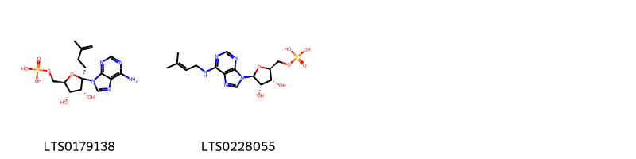{ width=100% }
    <figcaption>Hình ảnh cấu trúc hóa học của 2 hoạt chất thuộc nhóm Purine nucleotides gồm ['[(2r,3s,4r,5r)-5-(6-aminopurin-9-yl)-3,4-dihydroxy-5-(3-methylbut-3-en-1-yl)oxolan-2-yl]methoxyphosphonic acid (LTS0179138)', '[(2s,3r,4s,5s)-3,4-dihydroxy-5-{6-[(3-methylbut-2-en-1-yl)amino]purin-9-yl}oxolan-2-yl]methoxyphosphonic acid (LTS0228055)'].</figcaption>
</figure>
#### Nhóm Pyrans
<figure markdown="span">
    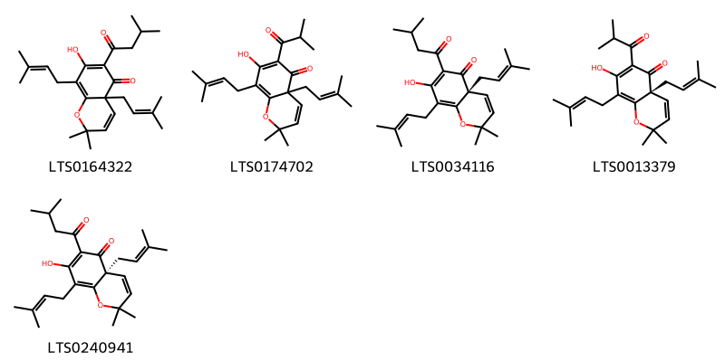{ width=100% }
    <figcaption>Hình ảnh cấu trúc hóa học của 5 hoạt chất thuộc nhóm Pyrans gồm ['7-hydroxy-2,2-dimethyl-4a,8-bis(3-methylbut-2-en-1-yl)-6-(3-methylbutanoyl)chromen-5-one (LTS0164322)', '7-hydroxy-2,2-dimethyl-4a,8-bis(3-methylbut-2-en-1-yl)-6-(2-methylpropanoyl)chromen-5-one (LTS0174702)', '(4ar)-7-hydroxy-2,2-dimethyl-4a,8-bis(3-methylbut-2-en-1-yl)-6-(3-methylbutanoyl)chromen-5-one (LTS0034116)', '(4ar)-7-hydroxy-2,2-dimethyl-4a,8-bis(3-methylbut-2-en-1-yl)-6-(2-methylpropanoyl)chromen-5-one (LTS0013379)', '(4as)-7-hydroxy-2,2-dimethyl-4a,8-bis(3-methylbut-2-en-1-yl)-6-(3-methylbutanoyl)chromen-5-one (LTS0240941)'].</figcaption>
</figure>
#### Nhóm Steroids and steroid derivatives
<figure markdown="span">
    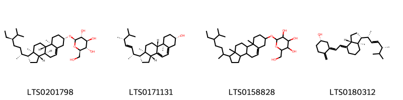{ width=100% }
    <figcaption>Hình ảnh cấu trúc hóa học của 4 hoạt chất thuộc nhóm Steroids and steroid derivatives gồm ['sitogluside (LTS0201798)', 'ergosterol (LTS0171131)', '2-{[1-(5-ethyl-6-methylheptan-2-yl)-9a,11a-dimethyl-1h,2h,3h,3ah,3bh,4h,6h,7h,8h,9h,9bh,10h,11h-cyclopenta[a]phenanthren-7-yl]oxy}-6-(hydroxymethyl)oxane-3,4,5-triol (LTS0158828)', 'ergocalciferol (LTS0180312)'].</figcaption>
</figure>
#### Nhóm Stilbenes
<figure markdown="span">
    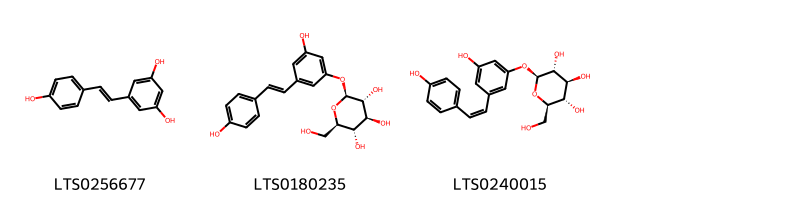{ width=100% }
    <figcaption>Hình ảnh cấu trúc hóa học của 3 hoạt chất thuộc nhóm Stilbenes gồm ['resveratrol (LTS0256677)', 'piceid (LTS0180235)', 'cis-piceid (LTS0240015)'].</figcaption>
</figure>
#### Nhóm Triphenyl compounds
<figure markdown="span">
    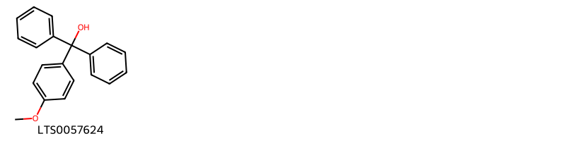{ width=100% }
    <figcaption>Hình ảnh cấu trúc hóa học của 1 hoạt chất thuộc nhóm Triphenyl compounds gồm ['(4-methoxyphenyl)diphenylmethanol (LTS0057624)'].</figcaption>
</figure>
#### Nhóm Trithianes
<figure markdown="span">
    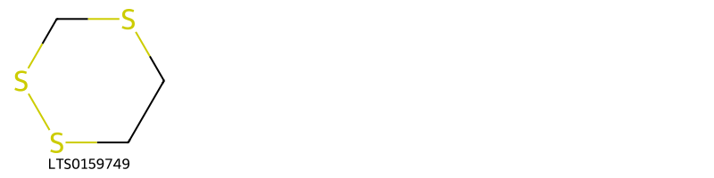{ width=100% }
    <figcaption>Hình ảnh cấu trúc hóa học của 1 hoạt chất thuộc nhóm Trithianes gồm ['1,2,4-trithiane (LTS0159749)'].</figcaption>
</figure>
#### Nhóm Vinylogous acids
<figure markdown="span">
    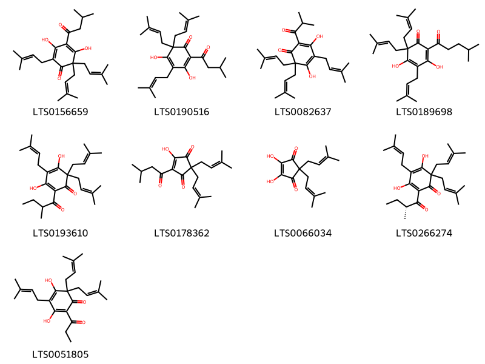{ width=100% }
    <figcaption>Hình ảnh cấu trúc hóa học của 9 hoạt chất thuộc nhóm Vinylogous acids gồm ["b'' -acid (LTS0156659)", 'lupulone (LTS0190516)', '3,5-dihydroxy-4,6,6-tris(3-methylbut-2-en-1-yl)-2-(2-methylpropanoyl)cyclohexa-2,4-dien-1-one (LTS0082637)', '3,5-dihydroxy-4,6,6-tris(3-methylbut-2-en-1-yl)-2-(4-methylpentanoyl)cyclohexa-2,4-dien-1-one (LTS0189698)', 'adlupulone (LTS0193610)', 'hulupone (LTS0178362)', '4,5-dihydroxy-2,2-bis(3-methylbut-2-en-1-yl)cyclopent-4-ene-1,3-dione (LTS0066034)', '3,5-dihydroxy-4,6,6-tris(3-methylbut-2-en-1-yl)-2-[(2r)-2-methylbutanoyl]cyclohexa-2,4-dien-1-one (LTS0266274)', '3,5-dihydroxy-4,6,6-tris(3-methylbut-2-en-1-yl)-2-propanoylcyclohexa-2,4-dien-1-one (LTS0051805)'].</figcaption>
</figure>

---

### Dược dân tộc học

Danh sách các quốc gia có sử dụng *Humulus lupulus* trong điều trị các bệnh. 

| Country   | Disease                                                                                         | Bệnh                                                                                                                                                                                                |
|:----------|:------------------------------------------------------------------------------------------------|:----------------------------------------------------------------------------------------------------------------------------------------------------------------------------------------------------|
| Elsewhere | Antiseptic, Diuretic, Hypnotic, Sedative, Stomachic, Vermifuge, Tonic                           | MYMEMORY WARNING: YOU USED ALL AVAILABLE FREE TRANSLATIONS FOR TODAY. NEXT AVAILABLE IN  06 HOURS 57 MINUTES 28 SECONDS VISIT HTTPS://MYMEMORY.TRANSLATED.NET/DOC/USAGELIMITS.PHP TO TRANSLATE MORE |
| Nepal     | Hypnotic, Sedative, Hypnotic, Sedative                                                          | MYMEMORY WARNING: YOU USED ALL AVAILABLE FREE TRANSLATIONS FOR TODAY. NEXT AVAILABLE IN  06 HOURS 57 MINUTES 25 SECONDS VISIT HTTPS://MYMEMORY.TRANSLATED.NET/DOC/USAGELIMITS.PHP TO TRANSLATE MORE |
| Turkey    | Anaphrodisiac, Antiseptic, Astringent, Diuretic, Nervine, Sedative, Soporific, Sudorific, Tonic | MYMEMORY WARNING: YOU USED ALL AVAILABLE FREE TRANSLATIONS FOR TODAY. NEXT AVAILABLE IN  06 HOURS 57 MINUTES 20 SECONDS VISIT HTTPS://MYMEMORY.TRANSLATED.NET/DOC/USAGELIMITS.PHP TO TRANSLATE MORE |
| UK        | Sedative                                                                                        | MYMEMORY WARNING: YOU USED ALL AVAILABLE FREE TRANSLATIONS FOR TODAY. NEXT AVAILABLE IN  06 HOURS 57 MINUTES 14 SECONDS VISIT HTTPS://MYMEMORY.TRANSLATED.NET/DOC/USAGELIMITS.PHP TO TRANSLATE MORE |
| US        | Diuretic, Poultice, Vermifuge                                                                   | MYMEMORY WARNING: YOU USED ALL AVAILABLE FREE TRANSLATIONS FOR TODAY. NEXT AVAILABLE IN  06 HOURS 57 MINUTES 12 SECONDS VISIT HTTPS://MYMEMORY.TRANSLATED.NET/DOC/USAGELIMITS.PHP TO TRANSLATE MORE |
| ain       | Diuretic                                                                                        | MYMEMORY WARNING: YOU USED ALL AVAILABLE FREE TRANSLATIONS FOR TODAY. NEXT AVAILABLE IN  06 HOURS 57 MINUTES 09 SECONDS VISIT HTTPS://MYMEMORY.TRANSLATED.NET/DOC/USAGELIMITS.PHP TO TRANSLATE MORE |

---

