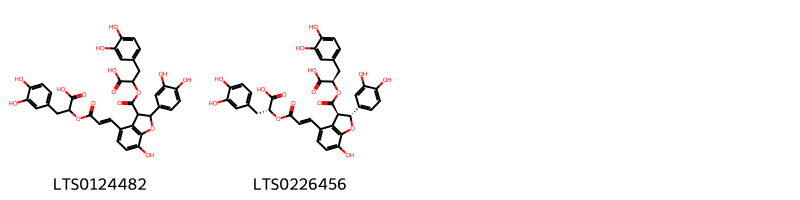
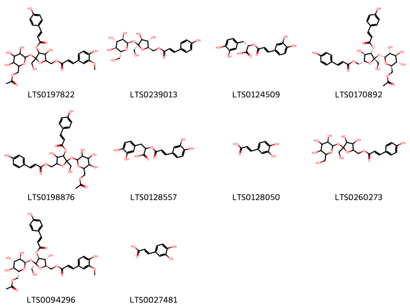

!!! abstract "Tóm tắt"

    Họ Cannaceae gồm khoảng 1 chi và 4 loài được một số cộng đồng tại các quốc gia như German, Brazil, Kurdistan, Latin America, French, Venezuela, Haiti, Elsewhere, Iraq, India, Turkey sử dụng trong một số trường hợp Thuốc lợi tiểu, Thuốc giảm đau, Thuốc lợi tiểu, Thuốc giảm đau, Thuốc lợi tiểu, Thuốc lợi tiểu, Thuốc lợi tiểu, Thuốc ngủ, Thuốc giải độc, Thuốc lợi tiểu, Thuốc lợi tiểu, Thuốc lợi tiểu, Thuốc lợi tiểu, Thuốc lợi tiểu, Thuốc lợi tiểu, Thuốc lợi tiểu, Thuốc lợi tiểu, Thuốc giảm đau, Thuốc lợi tiểu, Thuốc lợi tiểu.

!!! info "DrDuke"

    James A. Duke sinh năm 1929-2017 là một nhà thực vật học người Mỹ. Đây là một trong những tác giả hàng đầu trong lĩnh vực dược dân tộc học với cuốn *CRC Handbook of Medicinal Herbs* và chính là người xây dựng lên cơ sở dữ liệu về hợp chất tự nhiên và dược dân tộc học tại Bộ nông nghiệp Hoa Kỳ. Các thông tin được đăng tải tại website [Dr. Duke's Phytochemical and Ethnobotanical Databases](https://phytochem.nal.usda.gov/). 
    Trong suốt thập niên 1970, ông lãnh đạo the Plant Taxonomy Laboratory, Plant Genetics and Germplasm Institute of the Agricultural Research Service, U.S. Department of Agriculture.
    Trong tài liệu này, các thông tin về dược dân tộc của các dược liệu được trích dẫn từ tài liệu của James A. Ducke với sự trợ giúp của phần mềm dịch thuật từ tiếng Anh sang tiếng Việt.
   

# Chi Canna

??? note "Danh sách các dược liệu thuộc chi"
    
	 - *Canna edulis*
	 - *Canna gigantea*
	 - *Canna indica*
	 - *Canna warszewiczii*

---
## Canna edulis
### Thông tin về thực vật

!!! info "Phân loại thực vật của *Canna indica* từ GIBF:"
    - **Kingdom:** Plantae
    - **Phylum:** Tracheophyta
    - **Order:** Zingiberales
    - **Family:** Cannaceae
    - **Genus:** Canna
    - **Species:** *Canna indica*

 

| Label (VI)   | Label (EN)   | Scientific Name   | Descriptions (VI)   | Descriptions (EN)   | Also Known As (VI)   | Also Known As (EN)   |
|:-------------|:-------------|:------------------|:--------------------|:--------------------|:---------------------|:---------------------|
| N/A          | N/A          | Canna edulis      | loài thực vật       | species of plant    | ['']                 | ['']                 |

#### Phân bố trên thế giới

**Từ CSDL GIBF** nan, Brazil, Guatemala, Nepal, China, Ecuador, Spain, Netherlands, United States of America, Indonesia, Colombia, unknown or invalid, Mexico, Norway, Chinese Taipei, Canada, Panama, Nicaragua, Bermuda, Peru, Belize, Venezuela (Bolivarian Republic of)

#### Phân bố tại Việt Nam

**Từ CSDL GIBF**: Không có ghi nhận ở Việt Nam

---
### Thành phần hóa học
        
- Theo cơ sở dữ liệu lotus: Từ loài *Canna indica* đã phân lập và xác định được Chưa có hoạt chất nào được phân lập. hoạt chất thuộc về các nhóm Không có hoạt chất nào được phân lập. 

Không có hình ảnh nào được tạo ra

---

### Dược dân tộc học

Danh sách các quốc gia có sử dụng *Canna indica* trong điều trị các bệnh. 

| Country   | Disease             | Bệnh                         |
|:----------|:--------------------|:-----------------------------|
| Venezuela | Diuretic, Emollient | Thuốc lợi tiểu, chất làm mềm |

---

---
## Canna gigantea
### Thông tin về thực vật

!!! info "Phân loại thực vật của *Canna tuerckheimii* từ GIBF:"
    - **Kingdom:** Plantae
    - **Phylum:** Tracheophyta
    - **Order:** Zingiberales
    - **Family:** Cannaceae
    - **Genus:** Canna
    - **Species:** *Canna tuerckheimii*

 

| Label (VI)   | Label (EN)   | Scientific Name   | Descriptions (VI)   | Descriptions (EN)   | Also Known As (VI)   | Also Known As (EN)   |
|:-------------|:-------------|:------------------|:--------------------|:--------------------|:---------------------|:---------------------|
| N/A          | N/A          | Canna gigantea    |                     |                     | ['']                 | ['']                 |

#### Phân bố trên thế giới

**Từ CSDL GIBF** nan, Brazil, Guatemala, Nepal, China, Ecuador, Spain, Netherlands, United States of America, Indonesia, Colombia, unknown or invalid, Mexico, Norway, Chinese Taipei, Canada, Panama, Nicaragua, Bermuda, Peru, Belize, Venezuela (Bolivarian Republic of)

#### Phân bố tại Việt Nam

**Từ CSDL GIBF**: Không có ghi nhận ở Việt Nam

---
### Thành phần hóa học
        
- Theo cơ sở dữ liệu lotus: Từ loài *Canna tuerckheimii* đã phân lập và xác định được Chưa có hoạt chất nào được phân lập. hoạt chất thuộc về các nhóm Không có hoạt chất nào được phân lập. 

Không có hình ảnh nào được tạo ra

---

### Dược dân tộc học

Danh sách các quốc gia có sử dụng *Canna tuerckheimii* trong điều trị các bệnh. 

| Country   | Disease               | Bệnh                           |
|:----------|:----------------------|:-------------------------------|
| Brazil    | Diuretic, Diaphoretic | Thuốc lợi tiểu, thuốc lợi tiểu |

---

---
## Canna indica
### Thông tin về thực vật

!!! info "Phân loại thực vật của *Canna indica* từ GIBF:"
    - **Kingdom:** Plantae
    - **Phylum:** Tracheophyta
    - **Order:** Zingiberales
    - **Family:** Cannaceae
    - **Genus:** Canna
    - **Species:** *Canna indica*

 

| Label (VI)   | Label (EN)   | Scientific Name   | Descriptions (VI)   | Descriptions (EN)   | Also Known As (VI)   | Also Known As (EN)                            |
|:-------------|:-------------|:------------------|:--------------------|:--------------------|:---------------------|:----------------------------------------------|
| N/A          | N/A          | Canna indica      | loài thực vật       | species of plant    | ['']                 | ['Indian shot', 'Garden canna', 'Wild canna'] |

#### Phân bố trên thế giới

**Từ CSDL GIBF** nan, Brazil, Guatemala, China, Chile, New Zealand, Honduras, Tanzania, United Republic of, Ecuador, Trinidad and Tobago, Uruguay, Spain, Puerto Rico, Sri Lanka, Réunion, United States of America, Iran (Islamic Republic of), Costa Rica, Dominican Republic, Nigeria, Colombia, Cuba, Argentina, French Guiana, Grenada, Mexico, Kenya, Rwanda, Chinese Taipei, Philippines, Panama, Namibia, Nicaragua, Portugal, Bermuda, South Africa, Australia, India, Bolivia (Plurinational State of), Belize, Venezuela (Bolivarian Republic of)

#### Phân bố tại Việt Nam

**Từ CSDL GIBF**: Không có ghi nhận ở Việt Nam

---
### Thành phần hóa học
        
- Theo cơ sở dữ liệu lotus: Từ loài *Canna indica* đã phân lập và xác định được 12 hoạt chất thuộc về các nhóm 2-arylbenzofuran flavonoids, Cinnamic acids and derivatives. 

|    | chemicalTaxonomyClassyfireClass   |   smiles_count |
|---:|:----------------------------------|---------------:|
|  0 | 2-arylbenzofuran flavonoids       |              2 |
|  1 | Cinnamic acids and derivatives    |             10 |

#### Nhóm 2-arylbenzofuran flavonoids
<figure markdown="span">
    { width=100% }
    <figcaption>Hình ảnh cấu trúc hóa học của 2 hoạt chất thuộc nhóm 2-arylbenzofuran flavonoids gồm ['2-(4-{3-[1-carboxy-2-(3,4-dihydroxyphenyl)ethoxy]-3-oxoprop-1-en-1-yl}-2-(3,4-dihydroxyphenyl)-7-hydroxy-2,3-dihydro-1-benzofuran-3-carbonyloxy)-3-(3,4-dihydroxyphenyl)propanoic acid (LTS0124482)', '(2r)-2-{[(2e)-3-[(2r,3r)-3-{[(1r)-1-carboxy-2-(3,4-dihydroxyphenyl)ethoxy]carbonyl}-2-(3,4-dihydroxyphenyl)-7-hydroxy-2,3-dihydro-1-benzofuran-4-yl]prop-2-enoyl]oxy}-3-(3,4-dihydroxyphenyl)propanoic acid (LTS0226456)'].</figcaption>
</figure>
#### Nhóm Cinnamic acids and derivatives
<figure markdown="span">
    { width=100% }
    <figcaption>Hình ảnh cấu trúc hóa học của 10 hoạt chất thuộc nhóm Cinnamic acids and derivatives gồm ['[5-({6-[(acetyloxy)methyl]-3,4,5-trihydroxyoxan-2-yl}oxy)-3-hydroxy-5-(hydroxymethyl)-4-{[3-(4-hydroxyphenyl)prop-2-enoyl]oxy}oxolan-2-yl]methyl 3-(4-hydroxy-3-methoxyphenyl)prop-2-enoate (LTS0197822)', '[(2r,3s,4s,5s)-3,4-dihydroxy-5-(hydroxymethyl)-5-{[(2r,3r,4s,5s,6r)-3,4,5-trihydroxy-6-(hydroxymethyl)oxan-2-yl]oxy}oxolan-2-yl]methyl (2e)-3-(4-hydroxyphenyl)prop-2-enoate (LTS0239013)', '(s)-rosmarinic acid (LTS0124509)', '[(2r,3r,4s,5s)-5-{[(2r,3r,4s,5s,6r)-6-[(acetyloxy)methyl]-3,4,5-trihydroxyoxan-2-yl]oxy}-3-hydroxy-5-(hydroxymethyl)-4-{[(2e)-3-(4-hydroxyphenyl)prop-2-enoyl]oxy}oxolan-2-yl]methyl (2e)-3-(4-hydroxyphenyl)prop-2-enoate (LTS0170892)', '[5-({6-[(acetyloxy)methyl]-3,4,5-trihydroxyoxan-2-yl}oxy)-3-hydroxy-5-(hydroxymethyl)-4-{[3-(4-hydroxyphenyl)prop-2-enoyl]oxy}oxolan-2-yl]methyl 3-(4-hydroxyphenyl)prop-2-enoate (LTS0198876)', '3-(3,4-dihydroxyphenyl)-2-{[3-(3,4-dihydroxyphenyl)prop-2-enoyl]oxy}propanoic acid (LTS0128557)', '3,4-dihydroxycinnamic acid (LTS0128050)', '[3,4-dihydroxy-5-(hydroxymethyl)-5-{[3,4,5-trihydroxy-6-(hydroxymethyl)oxan-2-yl]oxy}oxolan-2-yl]methyl 3-(4-hydroxyphenyl)prop-2-enoate (LTS0260273)', '[(2r,3r,4s,5s)-5-{[(2r,3r,4s,5s,6r)-6-[(acetyloxy)methyl]-3,4,5-trihydroxyoxan-2-yl]oxy}-3-hydroxy-5-(hydroxymethyl)-4-{[(2e)-3-(4-hydroxyphenyl)prop-2-enoyl]oxy}oxolan-2-yl]methyl (2e)-3-(4-hydroxy-3-methoxyphenyl)prop-2-enoate (LTS0094296)', 'caffeic acid (LTS0027481)'].</figcaption>
</figure>

---

### Dược dân tộc học

Danh sách các quốc gia có sử dụng *Canna indica* trong điều trị các bệnh. 

| Country       | Disease                                             | Bệnh                                                |
|:--------------|:----------------------------------------------------|:----------------------------------------------------|
| French        | Demulcent                                           | dịu, giảm kích thích                                |
| German        | Sudorific                                           | Ngạt thở                                            |
| Haiti         | Diuretic, Sudorific                                 | Thuốc lợi tiểu, gây ngạt mồ hôi                     |
| India         | Antidote, Diaphoretic, Diuretic                     | Thuốc giải độc, thuốc lợi tiểu, thuốc lợi tiểu      |
| Iraq          | Demulcent, Diuretic                                 | Khử mỡ, lợi tiểu                                    |
| Kurdistan     | Sudorific                                           | Ngạt thở                                            |
| Latin America | Diuretic                                            | Thuốc lợi tiêu                                      |
| Turkey        | Demulcent, Diuretic, Diuretic, Sudorific, Demulcent | Demulcent, lợi tiểu, lợi tiểu, Sudorific, Demulcent |

---

---
## Canna warszewiczii
### Thông tin về thực vật

!!! info "Phân loại thực vật của *Canna indica* từ GIBF:"
    - **Kingdom:** Plantae
    - **Phylum:** Tracheophyta
    - **Order:** Zingiberales
    - **Family:** Cannaceae
    - **Genus:** Canna
    - **Species:** *Canna indica*

 

| Label (VI)   | Label (EN)   | Scientific Name    | Descriptions (VI)   | Descriptions (EN)   | Also Known As (VI)   | Also Known As (EN)   |
|:-------------|:-------------|:-------------------|:--------------------|:--------------------|:---------------------|:---------------------|
| N/A          | N/A          | Canna warszewiczii | loài thực vật       | species of plant    | ['']                 | ['']                 |

#### Phân bố trên thế giới

**Từ CSDL GIBF** nan, Brazil, United States of America, China, unknown or invalid

#### Phân bố tại Việt Nam

**Từ CSDL GIBF**: Không có ghi nhận ở Việt Nam

---
### Thành phần hóa học
        
- Theo cơ sở dữ liệu lotus: Từ loài *Canna indica* đã phân lập và xác định được Chưa có hoạt chất nào được phân lập. hoạt chất thuộc về các nhóm Không có hoạt chất nào được phân lập. 

Không có hình ảnh nào được tạo ra

---

### Dược dân tộc học

Danh sách các quốc gia có sử dụng *Canna indica* trong điều trị các bệnh. 

| Country   | Disease             | Bệnh                         |
|:----------|:--------------------|:-----------------------------|
| Elsewhere | Diuretic, Emollient | Thuốc lợi tiểu, chất làm mềm |

---

