!!! abstract "Tóm tắt"

    Họ Capparaceae gồm khoảng 11 chi và 35 loài được một số cộng đồng tại các quốc gia như Mexico, Guatemala, Indochina, West Indies, Guam, Haiti, Philippines, China, Java, Turkey, Africa(Swahili), Sudan, German, ain, Venezuela, Solomon I, Elsewhere, Dominican Republic, Malaya, India, Africa, US sử dụng trong một số trường hợp QUERY LENGTH LIMIT EXCEEDED. MAX ALLOWED QUERY : 500 CHARS MYMEMORY WARNING: YOU USED ALL AVAILABLE FREE TRANSLATIONS FOR TODAY. NEXT AVAILABLE IN  16 HOURS 18 MINUTES 16 SECONDS VISIT HTTPS://MYMEMORY.TRANSLATED.NET/DOC/USAGELIMITS.PHP TO TRANSLATE MORE.

!!! info "DrDuke"

    James A. Duke sinh năm 1929-2017 là một nhà thực vật học người Mỹ. Đây là một trong những tác giả hàng đầu trong lĩnh vực dược dân tộc học với cuốn *CRC Handbook of Medicinal Herbs* và chính là người xây dựng lên cơ sở dữ liệu về hợp chất tự nhiên và dược dân tộc học tại Bộ nông nghiệp Hoa Kỳ. Các thông tin được đăng tải tại website [Dr. Duke's Phytochemical and Ethnobotanical Databases](https://phytochem.nal.usda.gov/). 
    Trong suốt thập niên 1970, ông lãnh đạo the Plant Taxonomy Laboratory, Plant Genetics and Germplasm Institute of the Agricultural Research Service, U.S. Department of Agriculture.
    Trong tài liệu này, các thông tin về dược dân tộc của các dược liệu được trích dẫn từ tài liệu của James A. Ducke với sự trợ giúp của phần mềm dịch thuật từ tiếng Anh sang tiếng Việt.
   

# Chi Maerua

??? note "Danh sách các dược liệu thuộc chi"
    
	 - *Maerua angolensis*
	 - *Maerua arenaria*

---
## Maerua angolensis
### Thông tin về thực vật

!!! info "Phân loại thực vật của *Maerua angolensis* từ GIBF:"
    - **Kingdom:** Plantae
    - **Phylum:** Tracheophyta
    - **Order:** Brassicales
    - **Family:** Capparaceae
    - **Genus:** Maerua
    - **Species:** *Maerua angolensis*

 

| Label (VI)   | Label (EN)   | Scientific Name   | Descriptions (VI)   | Descriptions (EN)   | Also Known As (VI)   | Also Known As (EN)   |
|:-------------|:-------------|:------------------|:--------------------|:--------------------|:---------------------|:---------------------|
| N/A          | N/A          | Maerua angolensis | loài thực vật       | species of plant    | ['']                 | ['']                 |

#### Phân bố trên thế giới

**Từ CSDL GIBF** Uganda, Senegal, Botswana, Zimbabwe, Somalia, Mozambique, Tanzania, United Republic of, Yemen, Ghana, Chad, Burkina Faso, Ethiopia, Togo, Malawi, Benin, Kenya, Djibouti, Namibia, South Africa, Angola, Cameroon

#### Phân bố tại Việt Nam

**Từ CSDL GIBF**: Không có ghi nhận ở Việt Nam

---
### Thành phần hóa học
        
- Theo cơ sở dữ liệu lotus: Từ loài *Maerua angolensis* đã phân lập và xác định được Chưa có hoạt chất nào được phân lập. hoạt chất thuộc về các nhóm Không có hoạt chất nào được phân lập. 

Không có hình ảnh nào được tạo ra

---

### Dược dân tộc học

Danh sách các quốc gia có sử dụng *Maerua angolensis* trong điều trị các bệnh. 

| Country         | Disease   | Bệnh                                                                                                                                                                                                |
|:----------------|:----------|:----------------------------------------------------------------------------------------------------------------------------------------------------------------------------------------------------|
| Africa          | Purgative | MYMEMORY WARNING: YOU USED ALL AVAILABLE FREE TRANSLATIONS FOR TODAY. NEXT AVAILABLE IN  16 HOURS 18 MINUTES 13 SECONDS VISIT HTTPS://MYMEMORY.TRANSLATED.NET/DOC/USAGELIMITS.PHP TO TRANSLATE MORE |
| Africa(Swahili) | Poison    | MYMEMORY WARNING: YOU USED ALL AVAILABLE FREE TRANSLATIONS FOR TODAY. NEXT AVAILABLE IN  16 HOURS 18 MINUTES 10 SECONDS VISIT HTTPS://MYMEMORY.TRANSLATED.NET/DOC/USAGELIMITS.PHP TO TRANSLATE MORE |

---

---
## Maerua arenaria
### Thông tin về thực vật

!!! info "Phân loại thực vật của *N/A* từ GIBF:"
    - **Kingdom:** Plantae
    - **Phylum:** Tracheophyta
    - **Order:** Brassicales
    - **Family:** Capparaceae
    - **Genus:** Maerua
    - **Species:** *N/A*

 

| Label (VI)   | Label (EN)   | Scientific Name   | Descriptions (VI)   | Descriptions (EN)   | Also Known As (VI)   | Also Known As (EN)   |
|:-------------|:-------------|:------------------|:--------------------|:--------------------|:---------------------|:---------------------|
| N/A          | N/A          | Maerua arenaria   |                     |                     | ['']                 | ['']                 |

#### Phân bố trên thế giới

**Từ CSDL GIBF** Uganda, Viet Nam, Botswana, Israel, Zimbabwe, Somalia, Mozambique, Tanzania, United Republic of, Yemen, Thailand, Madagascar, Morocco, Eswatini, Saudi Arabia, Namibia, Niger, South Africa, India, Cameroon

#### Phân bố tại Việt Nam

**Từ CSDL GIBF**: Ninh Thuận

---
### Thành phần hóa học
        
- Theo cơ sở dữ liệu lotus: Từ loài *N/A* đã phân lập và xác định được Chưa có hoạt chất nào được phân lập. hoạt chất thuộc về các nhóm Không có hoạt chất nào được phân lập. 

Không có hình ảnh nào được tạo ra

---

### Dược dân tộc học

Danh sách các quốc gia có sử dụng *N/A* trong điều trị các bệnh. 

| Country   | Disease          | Bệnh                                                                                                                                                                                                |
|:----------|:-----------------|:----------------------------------------------------------------------------------------------------------------------------------------------------------------------------------------------------|
| Elsewhere | Stimulant, Tonic | MYMEMORY WARNING: YOU USED ALL AVAILABLE FREE TRANSLATIONS FOR TODAY. NEXT AVAILABLE IN  16 HOURS 17 MINUTES 49 SECONDS VISIT HTTPS://MYMEMORY.TRANSLATED.NET/DOC/USAGELIMITS.PHP TO TRANSLATE MORE |

---

# Chi Crateva

??? note "Danh sách các dược liệu thuộc chi"
    
	 - *Crateva nurvala*
	 - *Crateva religiosa*
	 - *Crateva tapia*

---
## Crateva nurvala
### Thông tin về thực vật

!!! info "Phân loại thực vật của *Crateva magna* từ GIBF:"
    - **Kingdom:** Plantae
    - **Phylum:** Tracheophyta
    - **Order:** Brassicales
    - **Family:** Capparaceae
    - **Genus:** Crateva
    - **Species:** *Crateva magna*

 

| Label (VI)   | Label (EN)   | Scientific Name   | Descriptions (VI)   | Descriptions (EN)   | Also Known As (VI)   | Also Known As (EN)   |
|:-------------|:-------------|:------------------|:--------------------|:--------------------|:---------------------|:---------------------|
| N/A          | N/A          | Crateva nurvala   | loài thực vật       | species of plant    | ['']                 | ['Barun']            |

#### Phân bố trên thế giới

**Từ CSDL GIBF** nan, Viet Nam, Cambodia, Japan, Bhutan, Bangladesh, Malaysia, Nepal, China, Indonesia, Myanmar, India, unknown or invalid, Thailand, Lao People’s Democratic Republic

#### Phân bố tại Việt Nam

**Từ CSDL GIBF**: Annam, Đà Nẵng, Thua Thien-Hue, Thanh Hóa

---
### Thành phần hóa học
        
- Theo cơ sở dữ liệu lotus: Từ loài *Crateva magna* đã phân lập và xác định được 5 hoạt chất thuộc về các nhóm Prenol lipids. 

|    | chemicalTaxonomyClassyfireClass   |   smiles_count |
|---:|:----------------------------------|---------------:|
|  0 | Prenol lipids                     |              5 |

#### Nhóm Prenol lipids
<figure markdown="span">
    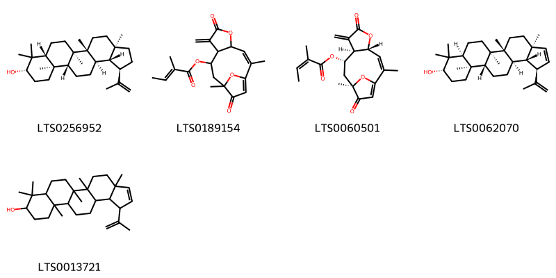{ width=100% }
    <figcaption>Hình ảnh cấu trúc hóa học của 5 hoạt chất thuộc nhóm Prenol lipids gồm ['lupeol (LTS0256952)', '(2z)-2,11-dimethyl-7-methylidene-6,12-dioxo-5,14-dioxatricyclo[9.2.1.0⁴,⁸]tetradeca-1(13),2-dien-9-yl (2e)-2-methylbut-2-enoate (LTS0189154)', '(2z,4r,8r,9s,11r)-2,11-dimethyl-7-methylidene-6,12-dioxo-5,14-dioxatricyclo[9.2.1.0⁴,⁸]tetradeca-1(13),2-dien-9-yl (2z)-2-methylbut-2-enoate (LTS0060501)', '(1r,3as,5ar,5br,7as,9s,11ar,11br,13ar,13bs)-3a,5a,5b,8,8,11a-hexamethyl-1-(prop-1-en-2-yl)-1h,4h,5h,6h,7h,7ah,9h,10h,11h,11bh,12h,13h,13ah,13bh-cyclopenta[a]chrysen-9-ol (LTS0062070)', '3a,5a,5b,8,8,11a-hexamethyl-1-(prop-1-en-2-yl)-1h,4h,5h,6h,7h,7ah,9h,10h,11h,11bh,12h,13h,13ah,13bh-cyclopenta[a]chrysen-9-ol (LTS0013721)'].</figcaption>
</figure>

---

### Dược dân tộc học

Danh sách các quốc gia có sử dụng *Crateva magna* trong điều trị các bệnh. 

| Country   | Disease                                                                            | Bệnh                                                                                                                                                                                                |
|:----------|:-----------------------------------------------------------------------------------|:----------------------------------------------------------------------------------------------------------------------------------------------------------------------------------------------------|
| Elsewhere | Apertif, Astringent, Cholagogue, Rubefacient, Vesicant, Tonic, Demulcent, Laxative | MYMEMORY WARNING: YOU USED ALL AVAILABLE FREE TRANSLATIONS FOR TODAY. NEXT AVAILABLE IN  16 HOURS 17 MINUTES 27 SECONDS VISIT HTTPS://MYMEMORY.TRANSLATED.NET/DOC/USAGELIMITS.PHP TO TRANSLATE MORE |
| Malaya    | Laxative, Rubefacient                                                              | MYMEMORY WARNING: YOU USED ALL AVAILABLE FREE TRANSLATIONS FOR TODAY. NEXT AVAILABLE IN  16 HOURS 17 MINUTES 24 SECONDS VISIT HTTPS://MYMEMORY.TRANSLATED.NET/DOC/USAGELIMITS.PHP TO TRANSLATE MORE |

---

---
## Crateva religiosa
### Thông tin về thực vật

!!! info "Phân loại thực vật của *Crateva religiosa* từ GIBF:"
    - **Kingdom:** Plantae
    - **Phylum:** Tracheophyta
    - **Order:** Brassicales
    - **Family:** Capparaceae
    - **Genus:** Crateva
    - **Species:** *Crateva religiosa*

 

| Label (VI)   | Label (EN)   | Scientific Name   | Descriptions (VI)   | Descriptions (EN)   | Also Known As (VI)   | Also Known As (EN)                                                                                           |
|:-------------|:-------------|:------------------|:--------------------|:--------------------|:---------------------|:-------------------------------------------------------------------------------------------------------------|
| N/A          | N/A          | Crateva religiosa |                     | species of plant    | ['']                 | ['sacred garlic pear', 'abiyuch', 'Balai Lamok', 'barna', 'bidasi', 'spider tree', 'temple plant', 'varuna'] |

#### Phân bố trên thế giới

**Từ CSDL GIBF** Viet Nam, Senegal, China, Honduras, Papua New Guinea, Thailand, Madagascar, United States of America, Jamaica, Chad, Bhutan, Indonesia, Mauritania, Nigeria, Burkina Faso, Equatorial Guinea, Fiji, Hong Kong, Mexico, Benin, Vanuatu, American Samoa, Chinese Taipei, Philippines, Malaysia, Palau, Singapore, Timor-Leste, Australia, Micronesia (Federated States of), India, Peru

#### Phân bố tại Việt Nam

**Từ CSDL GIBF**: Hai Phong

---
### Thành phần hóa học
        
- Theo cơ sở dữ liệu lotus: Từ loài *Crateva religiosa* đã phân lập và xác định được 17 hoạt chất thuộc về các nhóm Fatty Acyls, Flavonoids, Steroids and steroid derivatives, Organooxygen compounds, Macrolactams, Prenol lipids. 

|    | chemicalTaxonomyClassyfireClass   |   smiles_count |
|---:|:----------------------------------|---------------:|
|  0 | Fatty Acyls                       |              1 |
|  1 | Flavonoids                        |              2 |
|  2 | Macrolactams                      |              1 |
|  3 | Organooxygen compounds            |              4 |
|  4 | Prenol lipids                     |              6 |
|  5 | Steroids and steroid derivatives  |              2 |

#### Nhóm Fatty Acyls
<figure markdown="span">
    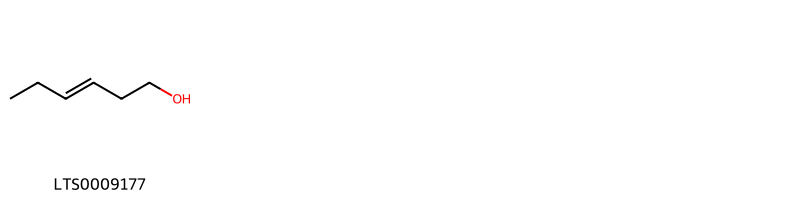{ width=100% }
    <figcaption>Hình ảnh cấu trúc hóa học của 1 hoạt chất thuộc nhóm Fatty Acyls gồm ['3-hexenol (LTS0009177)'].</figcaption>
</figure>
#### Nhóm Flavonoids
<figure markdown="span">
    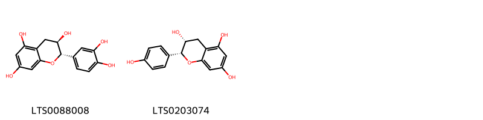{ width=100% }
    <figcaption>Hình ảnh cấu trúc hóa học của 2 hoạt chất thuộc nhóm Flavonoids gồm ['α catechin (LTS0088008)', 'epiafzelechin (LTS0203074)'].</figcaption>
</figure>
#### Nhóm Macrolactams
<figure markdown="span">
    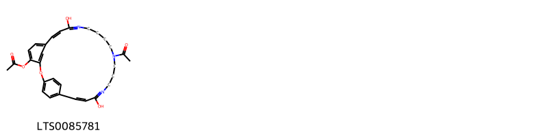{ width=100% }
    <figcaption>Hình ảnh cấu trúc hóa học của 1 hoạt chất thuộc nhóm Macrolactams gồm ['(8z,22e)-16-acetyl-10,21-dihydroxy-2-oxa-11,16,20-triazatricyclo[22.2.2.1³,⁷]nonacosa-1(26),3(29),4,6,8,10,20,22,24,27-decaen-4-yl acetate (LTS0085781)'].</figcaption>
</figure>
#### Nhóm Organooxygen compounds
<figure markdown="span">
    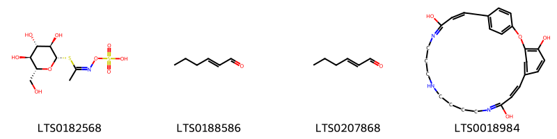{ width=100% }
    <figcaption>Hình ảnh cấu trúc hóa học của 4 hoạt chất thuộc nhóm Organooxygen compounds gồm ['[(z)-(1-{[(2s,3r,4s,5s,6r)-3,4,5-trihydroxy-6-(hydroxymethyl)oxan-2-yl]sulfanyl}ethylidene)amino]oxysulfonic acid (LTS0182568)', 'hexenal (LTS0188586)', '(e)-2-hexenal (LTS0207868)', '(22z)-2-oxa-11,16,20-triazatricyclo[22.2.2.1³,⁷]nonacosa-1(26),3(29),4,6,8,10,20,22,24,27-decaene-4,10,21-triol (LTS0018984)'].</figcaption>
</figure>
#### Nhóm Prenol lipids
<figure markdown="span">
    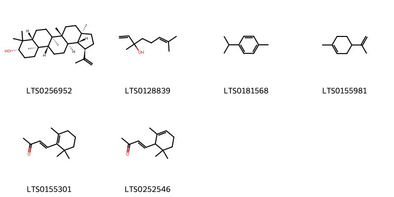{ width=100% }
    <figcaption>Hình ảnh cấu trúc hóa học của 6 hoạt chất thuộc nhóm Prenol lipids gồm ['lupeol (LTS0256952)', 'linalool, (+-)- (LTS0128839)', 'cymene (LTS0181568)', 'limonene,  (LTS0155981)', 'β-ionone (LTS0155301)', 'ionone (LTS0252546)'].</figcaption>
</figure>
#### Nhóm Steroids and steroid derivatives
<figure markdown="span">
    { width=100% }
    <figcaption>Hình ảnh cấu trúc hóa học của 2 hoạt chất thuộc nhóm Steroids and steroid derivatives gồm ['sitogluside (LTS0201798)', '2-{[1-(5-ethyl-6-methylheptan-2-yl)-9a,11a-dimethyl-1h,2h,3h,3ah,3bh,4h,6h,7h,8h,9h,9bh,10h,11h-cyclopenta[a]phenanthren-7-yl]oxy}-6-(hydroxymethyl)oxane-3,4,5-triol (LTS0158828)'].</figcaption>
</figure>

---

### Dược dân tộc học

Danh sách các quốc gia có sử dụng *Crateva religiosa* trong điều trị các bệnh. 

| Country   | Disease           | Bệnh                                                                                                                                                                                                |
|:----------|:------------------|:----------------------------------------------------------------------------------------------------------------------------------------------------------------------------------------------------|
| India     | Apertif, Laxative | MYMEMORY WARNING: YOU USED ALL AVAILABLE FREE TRANSLATIONS FOR TODAY. NEXT AVAILABLE IN  16 HOURS 17 MINUTES 01 SECONDS VISIT HTTPS://MYMEMORY.TRANSLATED.NET/DOC/USAGELIMITS.PHP TO TRANSLATE MORE |
| Solomon I | Purgative         | MYMEMORY WARNING: YOU USED ALL AVAILABLE FREE TRANSLATIONS FOR TODAY. NEXT AVAILABLE IN  16 HOURS 16 MINUTES 58 SECONDS VISIT HTTPS://MYMEMORY.TRANSLATED.NET/DOC/USAGELIMITS.PHP TO TRANSLATE MORE |

---

---
## Crateva tapia
### Thông tin về thực vật

!!! info "Phân loại thực vật của *Crateva tapia* từ GIBF:"
    - **Kingdom:** Plantae
    - **Phylum:** Tracheophyta
    - **Order:** Brassicales
    - **Family:** Capparaceae
    - **Genus:** Crateva
    - **Species:** *Crateva tapia*

 

| Label (VI)   | Label (EN)   | Scientific Name   | Descriptions (VI)   | Descriptions (EN)   | Also Known As (VI)   | Also Known As (EN)           |
|:-------------|:-------------|:------------------|:--------------------|:--------------------|:---------------------|:-----------------------------|
| N/A          | N/A          | Crateva tapia     | loài thực vật       | species of plant    | ['Crataeva tapia']   | ['Crataeva tapia', 'Trapiá'] |

#### Phân bố trên thế giới

**Từ CSDL GIBF** Brazil, Mexico, Nicaragua, El Salvador, Paraguay, Colombia, Argentina, French Guiana, Bolivia (Plurinational State of), Belize

#### Phân bố tại Việt Nam

**Từ CSDL GIBF**: Không có ghi nhận ở Việt Nam

---
### Thành phần hóa học
        
- Theo cơ sở dữ liệu lotus: Từ loài *Crateva tapia* đã phân lập và xác định được 2 hoạt chất thuộc về các nhóm Organooxygen compounds. 

|    | chemicalTaxonomyClassyfireClass   |   smiles_count |
|---:|:----------------------------------|---------------:|
|  0 | Organooxygen compounds            |              1 |

#### Nhóm Organooxygen compounds
<figure markdown="span">
    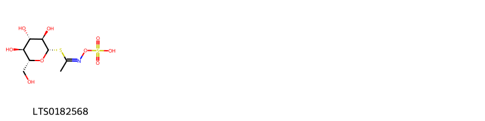{ width=100% }
    <figcaption>Hình ảnh cấu trúc hóa học của 1 hoạt chất thuộc nhóm Organooxygen compounds gồm ['[(z)-(1-{[(2s,3r,4s,5s,6r)-3,4,5-trihydroxy-6-(hydroxymethyl)oxan-2-yl]sulfanyl}ethylidene)amino]oxysulfonic acid (LTS0182568)'].</figcaption>
</figure>

---

### Dược dân tộc học

Danh sách các quốc gia có sử dụng *Crateva tapia* trong điều trị các bệnh. 

| Country   | Disease                                      | Bệnh                                                                                                                                                                                                |
|:----------|:---------------------------------------------|:----------------------------------------------------------------------------------------------------------------------------------------------------------------------------------------------------|
| Elsewhere | Tonic, Diuretic                              | MYMEMORY WARNING: YOU USED ALL AVAILABLE FREE TRANSLATIONS FOR TODAY. NEXT AVAILABLE IN  16 HOURS 16 MINUTES 31 SECONDS VISIT HTTPS://MYMEMORY.TRANSLATED.NET/DOC/USAGELIMITS.PHP TO TRANSLATE MORE |
| Mexico    | Stomachic, Stomachic, Tonic, Vesicant, Tonic | MYMEMORY WARNING: YOU USED ALL AVAILABLE FREE TRANSLATIONS FOR TODAY. NEXT AVAILABLE IN  16 HOURS 16 MINUTES 29 SECONDS VISIT HTTPS://MYMEMORY.TRANSLATED.NET/DOC/USAGELIMITS.PHP TO TRANSLATE MORE |

---

# Chi Thylachium

??? note "Danh sách các dược liệu thuộc chi"
    
	 - *Thylachium africanum*

---
## Thylachium africanum
### Thông tin về thực vật

!!! info "Phân loại thực vật của *Thylachium africanum* từ GIBF:"
    - **Kingdom:** Plantae
    - **Phylum:** Tracheophyta
    - **Order:** Brassicales
    - **Family:** Capparaceae
    - **Genus:** Thilachium
    - **Species:** *Thylachium africanum*

 

| Label (VI)   | Label (EN)   | Scientific Name   | Descriptions (VI)   | Descriptions (EN)   | Also Known As (VI)   | Also Known As (EN)           |
|:-------------|:-------------|:------------------|:--------------------|:--------------------|:---------------------|:-----------------------------|
| N/A          | N/A          | Crateva tapia     | loài thực vật       | species of plant    | ['Crataeva tapia']   | ['Crataeva tapia', 'Trapiá'] |

#### Phân bố trên thế giới

**Từ CSDL GIBF** nan, Kenya, South Africa, Mozambique, Tanzania, United Republic of, Madagascar

#### Phân bố tại Việt Nam

**Từ CSDL GIBF**: Không có ghi nhận ở Việt Nam

---
### Thành phần hóa học
        
- Theo cơ sở dữ liệu lotus: Từ loài *Thylachium africanum* đã phân lập và xác định được Chưa có hoạt chất nào được phân lập. hoạt chất thuộc về các nhóm Không có hoạt chất nào được phân lập. 

Không có hình ảnh nào được tạo ra

---

### Dược dân tộc học

Danh sách các quốc gia có sử dụng *Thylachium africanum* trong điều trị các bệnh. 

| Country         | Disease   | Bệnh                                                                                                                                                                                                |
|:----------------|:----------|:----------------------------------------------------------------------------------------------------------------------------------------------------------------------------------------------------|
| Africa(Swahili) | Poison    | MYMEMORY WARNING: YOU USED ALL AVAILABLE FREE TRANSLATIONS FOR TODAY. NEXT AVAILABLE IN  16 HOURS 16 MINUTES 05 SECONDS VISIT HTTPS://MYMEMORY.TRANSLATED.NET/DOC/USAGELIMITS.PHP TO TRANSLATE MORE |

---

# Chi Cleome

??? note "Danh sách các dược liệu thuộc chi"
    
	 - *Cleome chelidonii*
	 - *Cleome felina*
	 - *Cleome icosandra*
	 - *Cleome inosa*
	 - *Cleome pentaphylla*
	 - *Cleome serrulata*
	 - *Cleome viscosa*

---
## Cleome chelidonii
### Thông tin về thực vật

!!! info "Phân loại thực vật của *N/A* từ GIBF:"
    - **Kingdom:** Plantae
    - **Phylum:** Tracheophyta
    - **Order:** Brassicales
    - **Family:** Cleomaceae
    - **Genus:** N/A
    - **Species:** *N/A*

 

| Label (VI)   | Label (EN)   | Scientific Name   | Descriptions (VI)   | Descriptions (EN)   | Also Known As (VI)                          | Also Known As (EN)          |
|:-------------|:-------------|:------------------|:--------------------|:--------------------|:--------------------------------------------|:----------------------------|
| N/A          | N/A          | Cleome chelidonii | loài thực vật       | species of plant    | ['Rau màn tím', 'Mằn ri tím', 'Màn ri tím'] | ['celandine spider flower'] |

#### Phân bố trên thế giới

**Từ CSDL GIBF** Brazil, United Arab Emirates, Viet Nam, Virgin Islands (British), Uganda, Botswana, Guadeloupe, Antigua and Barbuda, Israel, Zimbabwe, Saint Lucia, Mozambique, Ecuador, Yemen, Thailand, Uruguay, Puerto Rico, Sri Lanka, Réunion, United States of America, Indonesia, Costa Rica, Dominican Republic, Argentina, Cabo Verde, Mexico, Benin, Chinese Taipei, Malaysia, Panama, Namibia, Singapore, Portugal, South Africa, Australia, India, Belize, Venezuela (Bolivarian Republic of)

#### Phân bố tại Việt Nam

**Từ CSDL GIBF**: Hồ Chí Minh city

---
### Thành phần hóa học
        
- Theo cơ sở dữ liệu lotus: Từ loài *N/A* đã phân lập và xác định được Chưa có hoạt chất nào được phân lập. hoạt chất thuộc về các nhóm Không có hoạt chất nào được phân lập. 

Không có hình ảnh nào được tạo ra

---

### Dược dân tộc học

Danh sách các quốc gia có sử dụng *N/A* trong điều trị các bệnh. 

| Country   | Disease   | Bệnh                                                                                                                                                                                                |
|:----------|:----------|:----------------------------------------------------------------------------------------------------------------------------------------------------------------------------------------------------|
| Guam      | Vermifuge | MYMEMORY WARNING: YOU USED ALL AVAILABLE FREE TRANSLATIONS FOR TODAY. NEXT AVAILABLE IN  16 HOURS 15 MINUTES 48 SECONDS VISIT HTTPS://MYMEMORY.TRANSLATED.NET/DOC/USAGELIMITS.PHP TO TRANSLATE MORE |
| India     | Vermifuge | MYMEMORY WARNING: YOU USED ALL AVAILABLE FREE TRANSLATIONS FOR TODAY. NEXT AVAILABLE IN  16 HOURS 15 MINUTES 45 SECONDS VISIT HTTPS://MYMEMORY.TRANSLATED.NET/DOC/USAGELIMITS.PHP TO TRANSLATE MORE |
| Indochina | Vermifuge | MYMEMORY WARNING: YOU USED ALL AVAILABLE FREE TRANSLATIONS FOR TODAY. NEXT AVAILABLE IN  16 HOURS 15 MINUTES 43 SECONDS VISIT HTTPS://MYMEMORY.TRANSLATED.NET/DOC/USAGELIMITS.PHP TO TRANSLATE MORE |
| Java      | Narcotic  | MYMEMORY WARNING: YOU USED ALL AVAILABLE FREE TRANSLATIONS FOR TODAY. NEXT AVAILABLE IN  16 HOURS 15 MINUTES 40 SECONDS VISIT HTTPS://MYMEMORY.TRANSLATED.NET/DOC/USAGELIMITS.PHP TO TRANSLATE MORE |
| Malaya    | Vermifuge | MYMEMORY WARNING: YOU USED ALL AVAILABLE FREE TRANSLATIONS FOR TODAY. NEXT AVAILABLE IN  16 HOURS 15 MINUTES 37 SECONDS VISIT HTTPS://MYMEMORY.TRANSLATED.NET/DOC/USAGELIMITS.PHP TO TRANSLATE MORE |

---

---
## Cleome felina
### Thông tin về thực vật

!!! info "Phân loại thực vật của *Corynandra felina* từ GIBF:"
    - **Kingdom:** Plantae
    - **Phylum:** Tracheophyta
    - **Order:** Brassicales
    - **Family:** Cleomaceae
    - **Genus:** Corynandra
    - **Species:** *Corynandra felina*

 

| Label (VI)   | Label (EN)   | Scientific Name   | Descriptions (VI)   | Descriptions (EN)   | Also Known As (VI)   | Also Known As (EN)   |
|:-------------|:-------------|:------------------|:--------------------|:--------------------|:---------------------|:---------------------|
| N/A          | N/A          | Cleome felina     |                     | species of plant    | ['']                 | ['']                 |

#### Phân bố trên thế giới

**Từ CSDL GIBF** nan, India, Nepal, unknown or invalid

#### Phân bố tại Việt Nam

**Từ CSDL GIBF**: Không có ghi nhận ở Việt Nam

---
### Thành phần hóa học
        
- Theo cơ sở dữ liệu lotus: Từ loài *Corynandra felina* đã phân lập và xác định được Chưa có hoạt chất nào được phân lập. hoạt chất thuộc về các nhóm Không có hoạt chất nào được phân lập. 

Không có hình ảnh nào được tạo ra

---

### Dược dân tộc học

Danh sách các quốc gia có sử dụng *Corynandra felina* trong điều trị các bệnh. 

| Country   | Disease             | Bệnh                                                                                                                                                                                                |
|:----------|:--------------------|:----------------------------------------------------------------------------------------------------------------------------------------------------------------------------------------------------|
| Elsewhere | Vermifuge, Vesicant | MYMEMORY WARNING: YOU USED ALL AVAILABLE FREE TRANSLATIONS FOR TODAY. NEXT AVAILABLE IN  16 HOURS 15 MINUTES 15 SECONDS VISIT HTTPS://MYMEMORY.TRANSLATED.NET/DOC/USAGELIMITS.PHP TO TRANSLATE MORE |

---

---
## Cleome icosandra
### Thông tin về thực vật

!!! info "Phân loại thực vật của *Arivela viscosa* từ GIBF:"
    - **Kingdom:** Plantae
    - **Phylum:** Tracheophyta
    - **Order:** Brassicales
    - **Family:** Cleomaceae
    - **Genus:** Arivela
    - **Species:** *Arivela viscosa*

 

| Label (VI)   | Label (EN)   | Scientific Name   | Descriptions (VI)   | Descriptions (EN)   | Also Known As (VI)   | Also Known As (EN)   |
|:-------------|:-------------|:------------------|:--------------------|:--------------------|:---------------------|:---------------------|
| N/A          | N/A          | Cleome icosandra  | loài thực vật       | species of plant    | ['']                 | ['']                 |

#### Phân bố trên thế giới

**Từ CSDL GIBF** nan, Viet Nam, Virgin Islands (U.S.), Malaysia, India, unknown or invalid

#### Phân bố tại Việt Nam

**Từ CSDL GIBF**: Kon Tum

---
### Thành phần hóa học
        
- Theo cơ sở dữ liệu lotus: Từ loài *Arivela viscosa* đã phân lập và xác định được Chưa có hoạt chất nào được phân lập. hoạt chất thuộc về các nhóm Không có hoạt chất nào được phân lập. 

Không có hình ảnh nào được tạo ra

---

### Dược dân tộc học

Danh sách các quốc gia có sử dụng *Arivela viscosa* trong điều trị các bệnh. 

| Country   | Disease                                               | Bệnh                                                                                                                                                                                                |
|:----------|:------------------------------------------------------|:----------------------------------------------------------------------------------------------------------------------------------------------------------------------------------------------------|
| Elsewhere | Rubefacient, Sudorific, Vesicant, Vermifuge, Poultice | MYMEMORY WARNING: YOU USED ALL AVAILABLE FREE TRANSLATIONS FOR TODAY. NEXT AVAILABLE IN  16 HOURS 14 MINUTES 57 SECONDS VISIT HTTPS://MYMEMORY.TRANSLATED.NET/DOC/USAGELIMITS.PHP TO TRANSLATE MORE |

---

---
## Cleome inosa
### Thông tin về thực vật

!!! info "Phân loại thực vật của *N/A* từ GIBF:"
    - **Kingdom:** Plantae
    - **Phylum:** Tracheophyta
    - **Order:** Brassicales
    - **Family:** Cleomaceae
    - **Genus:** Cleome
    - **Species:** *N/A*

 

| Label (VI)   | Label (EN)   | Scientific Name   | Descriptions (VI)   | Descriptions (EN)   | Also Known As (VI)   | Also Known As (EN)   |
|:-------------|:-------------|:------------------|:--------------------|:--------------------|:---------------------|:---------------------|
| N/A          | N/A          | Cleome icosandra  | loài thực vật       | species of plant    | ['']                 | ['']                 |

#### Phân bố trên thế giới

**Từ CSDL GIBF** United Arab Emirates, Brazil, Israel, Türkiye, Tanzania, United Republic of, Madagascar, Spain, Netherlands, United States of America, Greece, Iran (Islamic Republic of), Russian Federation, Tunisia, Colombia, Morocco, Algeria, Saudi Arabia, Palestine, State of, Iraq, Canada, Namibia, Nicaragua, Portugal, Ukraine, South Africa, Australia, India, Bulgaria, Jordan, Cameroon, Venezuela (Bolivarian Republic of)

#### Phân bố tại Việt Nam

**Từ CSDL GIBF**: Không có ghi nhận ở Việt Nam

---
### Thành phần hóa học
        
- Theo cơ sở dữ liệu lotus: Từ loài *N/A* đã phân lập và xác định được Chưa có hoạt chất nào được phân lập. hoạt chất thuộc về các nhóm Không có hoạt chất nào được phân lập. 

Không có hình ảnh nào được tạo ra

---

### Dược dân tộc học

Danh sách các quốc gia có sử dụng *N/A* trong điều trị các bệnh. 

| Country   | Disease                           | Bệnh                                                                                                                                                                                                |
|:----------|:----------------------------------|:----------------------------------------------------------------------------------------------------------------------------------------------------------------------------------------------------|
| Elsewhere | Piscicide                         | MYMEMORY WARNING: YOU USED ALL AVAILABLE FREE TRANSLATIONS FOR TODAY. NEXT AVAILABLE IN  16 HOURS 14 MINUTES 41 SECONDS VISIT HTTPS://MYMEMORY.TRANSLATED.NET/DOC/USAGELIMITS.PHP TO TRANSLATE MORE |
| Haiti     | Rubefacient, Vermifuge, Vermifuge | MYMEMORY WARNING: YOU USED ALL AVAILABLE FREE TRANSLATIONS FOR TODAY. NEXT AVAILABLE IN  16 HOURS 14 MINUTES 39 SECONDS VISIT HTTPS://MYMEMORY.TRANSLATED.NET/DOC/USAGELIMITS.PHP TO TRANSLATE MORE |

---

---
## Cleome pentaphylla
### Thông tin về thực vật

!!! info "Phân loại thực vật của *N/A* từ GIBF:"
    - **Kingdom:** Plantae
    - **Phylum:** Tracheophyta
    - **Order:** Brassicales
    - **Family:** Cleomaceae
    - **Genus:** N/A
    - **Species:** *N/A*

 

| Label (VI)   | Label (EN)   | Scientific Name    | Descriptions (VI)   | Descriptions (EN)   | Also Known As (VI)   | Also Known As (EN)   |
|:-------------|:-------------|:-------------------|:--------------------|:--------------------|:---------------------|:---------------------|
| N/A          | N/A          | Cleome pentaphylla |                     |                     | ['']                 | ['']                 |

#### Phân bố trên thế giới

**Từ CSDL GIBF** Brazil, United Arab Emirates, Viet Nam, Virgin Islands (British), Uganda, Botswana, Guadeloupe, Antigua and Barbuda, Israel, Zimbabwe, Saint Lucia, Mozambique, Ecuador, Yemen, Thailand, Uruguay, Puerto Rico, Sri Lanka, Réunion, United States of America, Indonesia, Costa Rica, Dominican Republic, Argentina, Cabo Verde, Mexico, Benin, Chinese Taipei, Malaysia, Panama, Namibia, Singapore, Portugal, South Africa, Australia, India, Belize, Venezuela (Bolivarian Republic of)

#### Phân bố tại Việt Nam

**Từ CSDL GIBF**: Hồ Chí Minh city

---
### Thành phần hóa học
        
- Theo cơ sở dữ liệu lotus: Từ loài *N/A* đã phân lập và xác định được Chưa có hoạt chất nào được phân lập. hoạt chất thuộc về các nhóm Không có hoạt chất nào được phân lập. 

Không có hình ảnh nào được tạo ra

---

### Dược dân tộc học

Danh sách các quốc gia có sử dụng *N/A* trong điều trị các bệnh. 

| Country   | Disease     | Bệnh                                                                                                                                                                                                |
|:----------|:------------|:----------------------------------------------------------------------------------------------------------------------------------------------------------------------------------------------------|
| China     | Sudorific   | MYMEMORY WARNING: YOU USED ALL AVAILABLE FREE TRANSLATIONS FOR TODAY. NEXT AVAILABLE IN  16 HOURS 14 MINUTES 18 SECONDS VISIT HTTPS://MYMEMORY.TRANSLATED.NET/DOC/USAGELIMITS.PHP TO TRANSLATE MORE |
| German    | Stimulant   | MYMEMORY WARNING: YOU USED ALL AVAILABLE FREE TRANSLATIONS FOR TODAY. NEXT AVAILABLE IN  16 HOURS 14 MINUTES 15 SECONDS VISIT HTTPS://MYMEMORY.TRANSLATED.NET/DOC/USAGELIMITS.PHP TO TRANSLATE MORE |
| US        | Carminative | MYMEMORY WARNING: YOU USED ALL AVAILABLE FREE TRANSLATIONS FOR TODAY. NEXT AVAILABLE IN  16 HOURS 14 MINUTES 12 SECONDS VISIT HTTPS://MYMEMORY.TRANSLATED.NET/DOC/USAGELIMITS.PHP TO TRANSLATE MORE |

---

---
## Cleome serrulata
### Thông tin về thực vật

!!! info "Phân loại thực vật của *N/A* từ GIBF:"
    - **Kingdom:** Plantae
    - **Phylum:** Tracheophyta
    - **Order:** Brassicales
    - **Family:** Cleomaceae
    - **Genus:** N/A
    - **Species:** *N/A*

 

| Label (VI)   | Label (EN)   | Scientific Name   | Descriptions (VI)   | Descriptions (EN)   | Also Known As (VI)   | Also Known As (EN)      |
|:-------------|:-------------|:------------------|:--------------------|:--------------------|:---------------------|:------------------------|
| N/A          | N/A          | Cleome serrulata  | loài thực vật       | species of plant    | ['']                 | ['Cleomella serrulata'] |

#### Phân bố trên thế giới

**Từ CSDL GIBF** Brazil, United Arab Emirates, Viet Nam, Virgin Islands (British), Uganda, Botswana, Guadeloupe, Antigua and Barbuda, Israel, Zimbabwe, Saint Lucia, Mozambique, Ecuador, Yemen, Thailand, Uruguay, Puerto Rico, Sri Lanka, Réunion, United States of America, Indonesia, Costa Rica, Dominican Republic, Argentina, Cabo Verde, Mexico, Benin, Chinese Taipei, Malaysia, Panama, Namibia, Singapore, Portugal, South Africa, Australia, India, Belize, Venezuela (Bolivarian Republic of)

#### Phân bố tại Việt Nam

**Từ CSDL GIBF**: Hồ Chí Minh city

---
### Thành phần hóa học
        
- Theo cơ sở dữ liệu lotus: Từ loài *N/A* đã phân lập và xác định được Chưa có hoạt chất nào được phân lập. hoạt chất thuộc về các nhóm Không có hoạt chất nào được phân lập. 

Không có hình ảnh nào được tạo ra

---

### Dược dân tộc học

Danh sách các quốc gia có sử dụng *N/A* trong điều trị các bệnh. 

| Country   | Disease   | Bệnh                                                                                                                                                                                                |
|:----------|:----------|:----------------------------------------------------------------------------------------------------------------------------------------------------------------------------------------------------|
| US        | Poultice  | MYMEMORY WARNING: YOU USED ALL AVAILABLE FREE TRANSLATIONS FOR TODAY. NEXT AVAILABLE IN  16 HOURS 13 MINUTES 50 SECONDS VISIT HTTPS://MYMEMORY.TRANSLATED.NET/DOC/USAGELIMITS.PHP TO TRANSLATE MORE |

---

---
## Cleome viscosa
### Thông tin về thực vật

!!! info "Phân loại thực vật của *Arivela viscosa* từ GIBF:"
    - **Kingdom:** Plantae
    - **Phylum:** Tracheophyta
    - **Order:** Brassicales
    - **Family:** Cleomaceae
    - **Genus:** Arivela
    - **Species:** *Arivela viscosa*

 

| Label (VI)   | Label (EN)   | Scientific Name   | Descriptions (VI)   | Descriptions (EN)   | Also Known As (VI)   | Also Known As (EN)                                          |
|:-------------|:-------------|:------------------|:--------------------|:--------------------|:---------------------|:------------------------------------------------------------|
| N/A          | N/A          | Cleome viscosa    | loài thực vật       | species of plant    | ['Sơn tiền']         | ['Asian spiderflower', 'Sticky Spider Flower', 'Tick-Weed'] |

#### Phân bố trên thế giới

**Từ CSDL GIBF** Viet Nam, Virgin Islands (British), Saint Kitts and Nevis, Guadeloupe, Antigua and Barbuda, Saint Lucia, Honduras, Ecuador, Thailand, Madagascar, Cameroon, Puerto Rico, Sri Lanka, Ghana, Réunion, United States of America, Jamaica, Virgin Islands (U.S.), Indonesia, Costa Rica, Dominican Republic, Nigeria, Colombia, Cabo Verde, Mexico, Benin, Montserrat, Chinese Taipei, Philippines, Malaysia, Panama, Australia, Saint Vincent and the Grenadines, Myanmar, India, Belize, Venezuela (Bolivarian Republic of)

#### Phân bố tại Việt Nam

**Từ CSDL GIBF**: Quảng Bình, Hồ Chí Minh city, Đà Nẵng, Cần Thơ

---
### Thành phần hóa học
        
- Theo cơ sở dữ liệu lotus: Từ loài *Arivela viscosa* đã phân lập và xác định được 30 hoạt chất thuộc về các nhóm Coumarinolignans, Carboxylic acids and derivatives, Coumarins and derivatives, Steroids and steroid derivatives, Organooxygen compounds, Prenol lipids, Organonitrogen compounds. 

|    | chemicalTaxonomyClassyfireClass   |   smiles_count |
|---:|:----------------------------------|---------------:|
|  0 | Carboxylic acids and derivatives  |              2 |
|  1 | Coumarinolignans                  |             14 |
|  2 | Coumarins and derivatives         |              2 |
|  3 | Organonitrogen compounds          |              1 |
|  4 | Organooxygen compounds            |              2 |
|  5 | Prenol lipids                     |              6 |
|  6 | Steroids and steroid derivatives  |              2 |

#### Nhóm Carboxylic acids and derivatives
<figure markdown="span">
    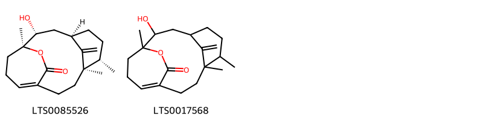{ width=100% }
    <figcaption>Hình ảnh cấu trúc hóa học của 2 hoạt chất thuộc nhóm Carboxylic acids and derivatives gồm ['(1s,2r,4r,7s,8r)-2-hydroxy-1,7,8-trimethyl-17-methylidene-15-oxatricyclo[9.3.2.1⁴,⁸]heptadec-11-en-16-one (LTS0085526)', '2-hydroxy-1,7,8-trimethyl-17-methylidene-15-oxatricyclo[9.3.2.1⁴,⁸]heptadec-11-en-16-one (LTS0017568)'].</figcaption>
</figure>
#### Nhóm Coumarinolignans
<figure markdown="span">
    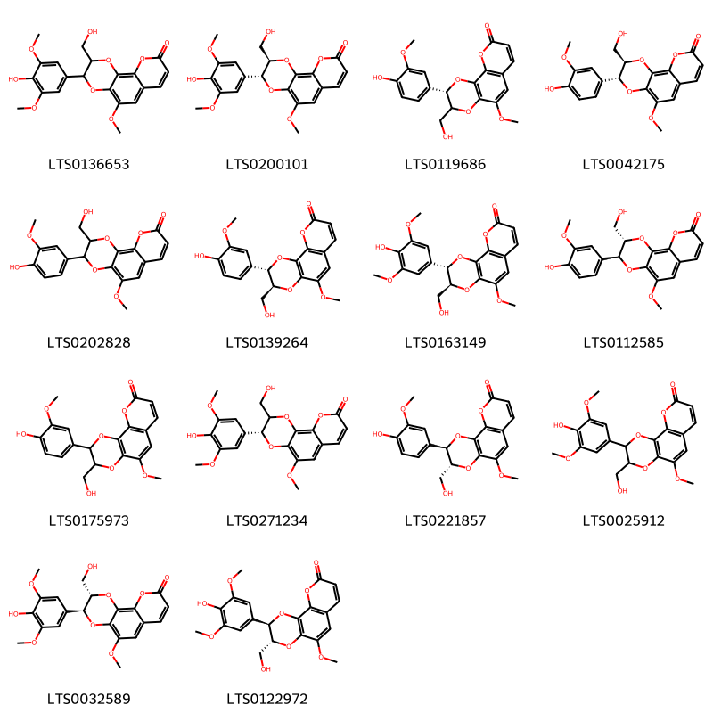{ width=100% }
    <figcaption>Hình ảnh cấu trúc hóa học của 14 hoạt chất thuộc nhóm Coumarinolignans gồm ['3-(4-hydroxy-3,5-dimethoxyphenyl)-2-(hydroxymethyl)-5-methoxy-2h,3h-[1,4]dioxino[2,3-h]chromen-9-one (LTS0136653)', '(2r,3r)-3-(4-hydroxy-3,5-dimethoxyphenyl)-2-(hydroxymethyl)-5-methoxy-2h,3h-[1,4]dioxino[2,3-h]chromen-9-one (LTS0200101)', '(2s)-2-(4-hydroxy-3-methoxyphenyl)-3-(hydroxymethyl)-5-methoxy-2h,3h-[1,4]dioxino[2,3-h]chromen-9-one (LTS0119686)', 'cleomiscosin a (LTS0042175)', '3-(4-hydroxy-3-methoxyphenyl)-2-(hydroxymethyl)-5-methoxy-2h,3h-[1,4]dioxino[2,3-h]chromen-9-one (LTS0202828)', '(2s,3s)-2-(4-hydroxy-3-methoxyphenyl)-3-(hydroxymethyl)-5-methoxy-2h,3h-[1,4]dioxino[2,3-h]chromen-9-one (LTS0139264)', 'cleomiscosin d (LTS0163149)', '(2s,3s)-3-(4-hydroxy-3-methoxyphenyl)-2-(hydroxymethyl)-5-methoxy-2h,3h-[1,4]dioxino[2,3-h]chromen-9-one (LTS0112585)', '2-(4-hydroxy-3-methoxyphenyl)-3-(hydroxymethyl)-5-methoxy-2h,3h-[1,4]dioxino[2,3-h]chromen-9-one (LTS0175973)', '(3r)-3-(4-hydroxy-3,5-dimethoxyphenyl)-2-(hydroxymethyl)-5-methoxy-2h,3h-[1,4]dioxino[2,3-h]chromen-9-one (LTS0271234)', '(2r,3r)-2-(4-hydroxy-3-methoxyphenyl)-3-(hydroxymethyl)-5-methoxy-2h,3h-[1,4]dioxino[2,3-h]chromen-9-one (LTS0221857)', '2-(4-hydroxy-3,5-dimethoxyphenyl)-3-(hydroxymethyl)-5-methoxy-2h,3h-[1,4]dioxino[2,3-h]chromen-9-one (LTS0025912)', '(2s,3s)-3-(4-hydroxy-3,5-dimethoxyphenyl)-2-(hydroxymethyl)-5-methoxy-2h,3h-[1,4]dioxino[2,3-h]chromen-9-one (LTS0032589)', '(2r,3r)-2-(4-hydroxy-3,5-dimethoxyphenyl)-3-(hydroxymethyl)-5-methoxy-2h,3h-[1,4]dioxino[2,3-h]chromen-9-one (LTS0122972)'].</figcaption>
</figure>
#### Nhóm Coumarins and derivatives
<figure markdown="span">
    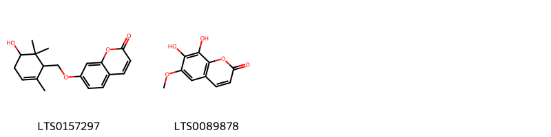{ width=100% }
    <figcaption>Hình ảnh cấu trúc hóa học của 2 hoạt chất thuộc nhóm Coumarins and derivatives gồm ['7-[(5-hydroxy-2,6,6-trimethylcyclohex-2-en-1-yl)methoxy]chromen-2-one (LTS0157297)', 'fraxetin (LTS0089878)'].</figcaption>
</figure>
#### Nhóm Organonitrogen compounds
<figure markdown="span">
    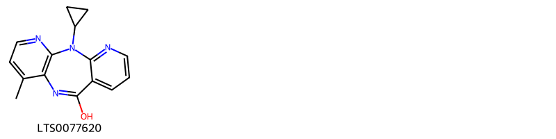{ width=100% }
    <figcaption>Hình ảnh cấu trúc hóa học của 1 hoạt chất thuộc nhóm Organonitrogen compounds gồm ['nevirapine (product) (LTS0077620)'].</figcaption>
</figure>
#### Nhóm Organooxygen compounds
<figure markdown="span">
    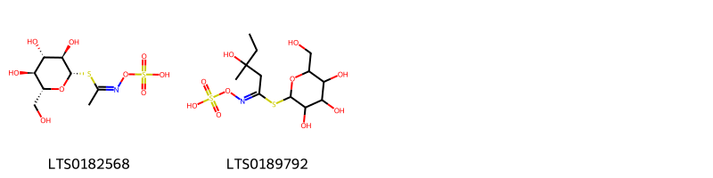{ width=100% }
    <figcaption>Hình ảnh cấu trúc hóa học của 2 hoạt chất thuộc nhóm Organooxygen compounds gồm ['[(z)-(1-{[(2s,3r,4s,5s,6r)-3,4,5-trihydroxy-6-(hydroxymethyl)oxan-2-yl]sulfanyl}ethylidene)amino]oxysulfonic acid (LTS0182568)', '[(e)-(3-hydroxy-3-methyl-1-{[3,4,5-trihydroxy-6-(hydroxymethyl)oxan-2-yl]sulfanyl}pentylidene)amino]oxysulfonic acid (LTS0189792)'].</figcaption>
</figure>
#### Nhóm Prenol lipids
<figure markdown="span">
    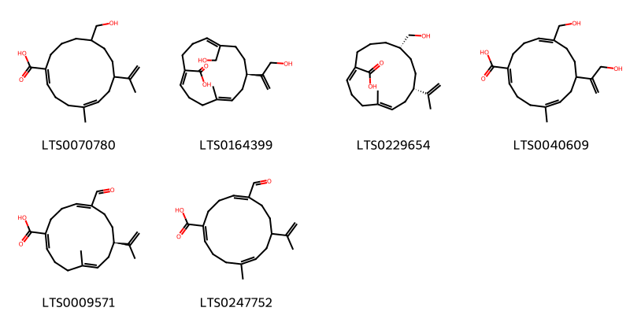{ width=100% }
    <figcaption>Hình ảnh cấu trúc hóa học của 6 hoạt chất thuộc nhóm Prenol lipids gồm ['11-(hydroxymethyl)-5-methyl-8-(prop-1-en-2-yl)cyclotetradeca-1,5-diene-1-carboxylic acid (LTS0070780)', '(1z,5e,8r,11z)-11-(hydroxymethyl)-8-(3-hydroxyprop-1-en-2-yl)-5-methylcyclotetradeca-1,5,11-triene-1-carboxylic acid (LTS0164399)', '(1z,5e,8s,11s)-11-(hydroxymethyl)-5-methyl-8-(prop-1-en-2-yl)cyclotetradeca-1,5-diene-1-carboxylic acid (LTS0229654)', '11-(hydroxymethyl)-8-(3-hydroxyprop-1-en-2-yl)-5-methylcyclotetradeca-1,5,11-triene-1-carboxylic acid (LTS0040609)', '(1e,5e,8r,11e)-11-formyl-5-methyl-8-(prop-1-en-2-yl)cyclotetradeca-1,5,11-triene-1-carboxylic acid (LTS0009571)', '11-formyl-5-methyl-8-(prop-1-en-2-yl)cyclotetradeca-1,5,11-triene-1-carboxylic acid (LTS0247752)'].</figcaption>
</figure>
#### Nhóm Steroids and steroid derivatives
<figure markdown="span">
    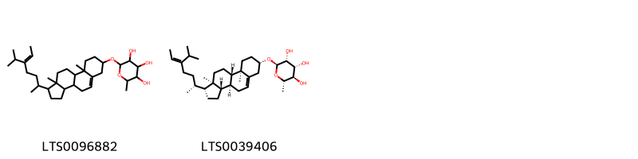{ width=100% }
    <figcaption>Hình ảnh cấu trúc hóa học của 2 hoạt chất thuộc nhóm Steroids and steroid derivatives gồm ['2-{[1-(5-isopropylhept-5-en-2-yl)-9a,11a-dimethyl-1h,2h,3h,3ah,3bh,4h,6h,7h,8h,9h,9bh,10h,11h-cyclopenta[a]phenanthren-7-yl]oxy}-6-methyloxane-3,4,5-triol (LTS0096882)', '(2r,3r,4r,5r,6s)-2-{[(1r,3as,3bs,7s,9ar,9bs,11ar)-1-[(2r,5z)-5-isopropylhept-5-en-2-yl]-9a,11a-dimethyl-1h,2h,3h,3ah,3bh,4h,6h,7h,8h,9h,9bh,10h,11h-cyclopenta[a]phenanthren-7-yl]oxy}-6-methyloxane-3,4,5-triol (LTS0039406)'].</figcaption>
</figure>

---

### Dược dân tộc học

Danh sách các quốc gia có sử dụng *Arivela viscosa* trong điều trị các bệnh. 

| Country   | Disease            | Bệnh                                                                                                                                                                                                |
|:----------|:-------------------|:----------------------------------------------------------------------------------------------------------------------------------------------------------------------------------------------------|
| Elsewhere | Apertif, Stimulant | MYMEMORY WARNING: YOU USED ALL AVAILABLE FREE TRANSLATIONS FOR TODAY. NEXT AVAILABLE IN  16 HOURS 13 MINUTES 29 SECONDS VISIT HTTPS://MYMEMORY.TRANSLATED.NET/DOC/USAGELIMITS.PHP TO TRANSLATE MORE |
| Sudan     | Collyrium          | MYMEMORY WARNING: YOU USED ALL AVAILABLE FREE TRANSLATIONS FOR TODAY. NEXT AVAILABLE IN  16 HOURS 13 MINUTES 27 SECONDS VISIT HTTPS://MYMEMORY.TRANSLATED.NET/DOC/USAGELIMITS.PHP TO TRANSLATE MORE |

---

# Chi Polanisia

??? note "Danh sách các dược liệu thuộc chi"
    
	 - *Polanisia uniglandsulosa*
	 - *Polanisia viscosa*

---
## Polanisia uniglandsulosa
### Thông tin về thực vật

!!! info "Phân loại thực vật của *Polanisia uniglandulosa* từ GIBF:"
    - **Kingdom:** Plantae
    - **Phylum:** Tracheophyta
    - **Order:** Brassicales
    - **Family:** Cleomaceae
    - **Genus:** Polanisia
    - **Species:** *Polanisia uniglandulosa*

 

| Label (VI)   | Label (EN)   | Scientific Name   | Descriptions (VI)   | Descriptions (EN)   | Also Known As (VI)   | Also Known As (EN)                                          |
|:-------------|:-------------|:------------------|:--------------------|:--------------------|:---------------------|:------------------------------------------------------------|
| N/A          | N/A          | Cleome viscosa    | loài thực vật       | species of plant    | ['Sơn tiền']         | ['Asian spiderflower', 'Sticky Spider Flower', 'Tick-Weed'] |

#### Phân bố trên thế giới

**Từ CSDL GIBF** Mexico, United States of America

#### Phân bố tại Việt Nam

**Từ CSDL GIBF**: Không có ghi nhận ở Việt Nam

---
### Thành phần hóa học
        
- Theo cơ sở dữ liệu lotus: Từ loài *Polanisia uniglandulosa* đã phân lập và xác định được Chưa có hoạt chất nào được phân lập. hoạt chất thuộc về các nhóm Không có hoạt chất nào được phân lập. 

Không có hình ảnh nào được tạo ra

---

### Dược dân tộc học

Danh sách các quốc gia có sử dụng *Polanisia uniglandulosa* trong điều trị các bệnh. 

| Country   | Disease                | Bệnh                                                                                                                                                                                                |
|:----------|:-----------------------|:----------------------------------------------------------------------------------------------------------------------------------------------------------------------------------------------------|
| Mexico    | Rubefacient, Vermifuge | MYMEMORY WARNING: YOU USED ALL AVAILABLE FREE TRANSLATIONS FOR TODAY. NEXT AVAILABLE IN  16 HOURS 13 MINUTES 02 SECONDS VISIT HTTPS://MYMEMORY.TRANSLATED.NET/DOC/USAGELIMITS.PHP TO TRANSLATE MORE |

---

---
## Polanisia viscosa
### Thông tin về thực vật

!!! info "Phân loại thực vật của *Arivela viscosa* từ GIBF:"
    - **Kingdom:** Plantae
    - **Phylum:** Tracheophyta
    - **Order:** Brassicales
    - **Family:** Cleomaceae
    - **Genus:** Arivela
    - **Species:** *Arivela viscosa*

 

| Label (VI)   | Label (EN)   | Scientific Name   | Descriptions (VI)   | Descriptions (EN)   | Also Known As (VI)   | Also Known As (EN)   |
|:-------------|:-------------|:------------------|:--------------------|:--------------------|:---------------------|:---------------------|
| N/A          | N/A          | Polanisia viscosa |                     |                     | ['']                 | ['']                 |

#### Phân bố trên thế giới

**Từ CSDL GIBF** nan, Guatemala, Guadeloupe, Nepal, Barbados, China, Honduras, United States of America, Indonesia, Colombia, Cuba, unknown or invalid, Sint Maarten (Dutch part), Lao People’s Democratic Republic, Mexico, El Salvador, Chinese Taipei, Philippines, Malaysia, Curaçao, Bonaire, Sint Eustatius and Saba, Martinique, Australia, Myanmar, Belize

#### Phân bố tại Việt Nam

**Từ CSDL GIBF**: Không có ghi nhận ở Việt Nam

---
### Thành phần hóa học
        
- Theo cơ sở dữ liệu lotus: Từ loài *Arivela viscosa* đã phân lập và xác định được Chưa có hoạt chất nào được phân lập. hoạt chất thuộc về các nhóm Không có hoạt chất nào được phân lập. 

Không có hình ảnh nào được tạo ra

---

### Dược dân tộc học

Danh sách các quốc gia có sử dụng *Arivela viscosa* trong điều trị các bệnh. 

| Country   | Disease                      | Bệnh                                                                                                                                                                                                |
|:----------|:-----------------------------|:----------------------------------------------------------------------------------------------------------------------------------------------------------------------------------------------------|
| India     | Counterirritant, Carminative | MYMEMORY WARNING: YOU USED ALL AVAILABLE FREE TRANSLATIONS FOR TODAY. NEXT AVAILABLE IN  16 HOURS 12 MINUTES 40 SECONDS VISIT HTTPS://MYMEMORY.TRANSLATED.NET/DOC/USAGELIMITS.PHP TO TRANSLATE MORE |
| Indochina | Vesicant                     | MYMEMORY WARNING: YOU USED ALL AVAILABLE FREE TRANSLATIONS FOR TODAY. NEXT AVAILABLE IN  16 HOURS 12 MINUTES 38 SECONDS VISIT HTTPS://MYMEMORY.TRANSLATED.NET/DOC/USAGELIMITS.PHP TO TRANSLATE MORE |

---

# Chi Boscia

??? note "Danh sách các dược liệu thuộc chi"
    
	 - *Boscia octandra*

---
## Boscia octandra
### Thông tin về thực vật

!!! info "Phân loại thực vật của *Boscia senegalensis* từ GIBF:"
    - **Kingdom:** Plantae
    - **Phylum:** Tracheophyta
    - **Order:** Brassicales
    - **Family:** Capparaceae
    - **Genus:** Boscia
    - **Species:** *Boscia senegalensis*

 

| Label (VI)   | Label (EN)   | Scientific Name   | Descriptions (VI)   | Descriptions (EN)   | Also Known As (VI)   | Also Known As (EN)   |
|:-------------|:-------------|:------------------|:--------------------|:--------------------|:---------------------|:---------------------|
| N/A          | N/A          | Polanisia viscosa |                     |                     | ['']                 | ['']                 |

#### Phân bố trên thế giới

**Từ CSDL GIBF** Senegal, Sudan

#### Phân bố tại Việt Nam

**Từ CSDL GIBF**: Không có ghi nhận ở Việt Nam

---
### Thành phần hóa học
        
- Theo cơ sở dữ liệu lotus: Từ loài *Boscia senegalensis* đã phân lập và xác định được Chưa có hoạt chất nào được phân lập. hoạt chất thuộc về các nhóm Không có hoạt chất nào được phân lập. 

Không có hình ảnh nào được tạo ra

---

### Dược dân tộc học

Danh sách các quốc gia có sử dụng *Boscia senegalensis* trong điều trị các bệnh. 

| Country   | Disease   | Bệnh                                                                                                                                                                                                |
|:----------|:----------|:----------------------------------------------------------------------------------------------------------------------------------------------------------------------------------------------------|
| Elsewhere | Collyrium | MYMEMORY WARNING: YOU USED ALL AVAILABLE FREE TRANSLATIONS FOR TODAY. NEXT AVAILABLE IN  16 HOURS 12 MINUTES 17 SECONDS VISIT HTTPS://MYMEMORY.TRANSLATED.NET/DOC/USAGELIMITS.PHP TO TRANSLATE MORE |

---

# Chi Capparis

??? note "Danh sách các dược liệu thuộc chi"
    
	 - *Capparis baducca*
	 - *Capparis coriacea*
	 - *Capparis cynophallophora*
	 - *Capparis decidua*
	 - *Capparis flexuosa*
	 - *Capparis frutescens*
	 - *Capparis heyneana*
	 - *Capparis horrida*
	 - *Capparis incana*
	 - *Capparis inosa*
	 - *Capparis micracantha*
	 - *Capparis micrantha*
	 - *Capparis sepiaria*
	 - *Capparis tomentosa*
	 - *Capparis zeylanica*

---
## Capparis baducca
### Thông tin về thực vật

!!! info "Phân loại thực vật của *N/A* từ GIBF:"
    - **Kingdom:** Plantae
    - **Phylum:** Tracheophyta
    - **Order:** Brassicales
    - **Family:** Capparaceae
    - **Genus:** N/A
    - **Species:** *N/A*

 

| Label (VI)   | Label (EN)   | Scientific Name   | Descriptions (VI)   | Descriptions (EN)   | Also Known As (VI)   | Also Known As (EN)   |
|:-------------|:-------------|:------------------|:--------------------|:--------------------|:---------------------|:---------------------|
| N/A          | N/A          | Capparis baducca  | loài thực vật       | species of plant    | ['']                 | ['']                 |

#### Phân bố trên thế giới

**Từ CSDL GIBF** Brazil, Botswana, Israel, Antigua and Barbuda, Zimbabwe, Ecuador, Yemen, Puerto Rico, United States of America, Greece, Virgin Islands (U.S.), Argentina, Morocco, Mexico, Niue, Saudi Arabia, Chinese Taipei, Gabon, Namibia, Martinique, South Africa, Australia, Italy, India, Northern Mariana Islands, Cameroon

#### Phân bố tại Việt Nam

**Từ CSDL GIBF**: Không có ghi nhận ở Việt Nam

---
### Thành phần hóa học
        
- Theo cơ sở dữ liệu lotus: Từ loài *N/A* đã phân lập và xác định được Chưa có hoạt chất nào được phân lập. hoạt chất thuộc về các nhóm Không có hoạt chất nào được phân lập. 

Không có hình ảnh nào được tạo ra

---

### Dược dân tộc học

Danh sách các quốc gia có sử dụng *N/A* trong điều trị các bệnh. 

| Country   | Disease                                 | Bệnh                                                                                                                                                                                                |
|:----------|:----------------------------------------|:----------------------------------------------------------------------------------------------------------------------------------------------------------------------------------------------------|
| Guatemala | Poison                                  | MYMEMORY WARNING: YOU USED ALL AVAILABLE FREE TRANSLATIONS FOR TODAY. NEXT AVAILABLE IN  16 HOURS 12 MINUTES 01 SECONDS VISIT HTTPS://MYMEMORY.TRANSLATED.NET/DOC/USAGELIMITS.PHP TO TRANSLATE MORE |
| Mexico    | Diuretic, Emmenagogue, Poison, Sedative | MYMEMORY WARNING: YOU USED ALL AVAILABLE FREE TRANSLATIONS FOR TODAY. NEXT AVAILABLE IN  16 HOURS 11 MINUTES 59 SECONDS VISIT HTTPS://MYMEMORY.TRANSLATED.NET/DOC/USAGELIMITS.PHP TO TRANSLATE MORE |

---

---
## Capparis coriacea
### Thông tin về thực vật

!!! info "Phân loại thực vật của *Boscia oleoides* từ GIBF:"
    - **Kingdom:** Plantae
    - **Phylum:** Tracheophyta
    - **Order:** Brassicales
    - **Family:** Capparaceae
    - **Genus:** Boscia
    - **Species:** *Boscia oleoides*

 

| Label (VI)   | Label (EN)   | Scientific Name   | Descriptions (VI)   | Descriptions (EN)   | Also Known As (VI)   | Also Known As (EN)   |
|:-------------|:-------------|:------------------|:--------------------|:--------------------|:---------------------|:---------------------|
| N/A          | N/A          | Capparis baducca  | loài thực vật       | species of plant    | ['']                 | ['']                 |

#### Phân bố trên thế giới

**Từ CSDL GIBF** Brazil, Botswana, Israel, Antigua and Barbuda, Zimbabwe, Ecuador, Yemen, Puerto Rico, United States of America, Greece, Virgin Islands (U.S.), Argentina, Morocco, Mexico, Niue, Saudi Arabia, Chinese Taipei, Gabon, Namibia, Martinique, South Africa, Australia, Italy, India, Northern Mariana Islands, Cameroon

#### Phân bố tại Việt Nam

**Từ CSDL GIBF**: Không có ghi nhận ở Việt Nam

---
### Thành phần hóa học
        
- Theo cơ sở dữ liệu lotus: Từ loài *Boscia oleoides* đã phân lập và xác định được Chưa có hoạt chất nào được phân lập. hoạt chất thuộc về các nhóm Không có hoạt chất nào được phân lập. 

Không có hình ảnh nào được tạo ra

---

### Dược dân tộc học

Danh sách các quốc gia có sử dụng *Boscia oleoides* trong điều trị các bệnh. 

| Country   | Disease   | Bệnh                                                                                                                                                                                                |
|:----------|:----------|:----------------------------------------------------------------------------------------------------------------------------------------------------------------------------------------------------|
| Elsewhere | Sedative  | MYMEMORY WARNING: YOU USED ALL AVAILABLE FREE TRANSLATIONS FOR TODAY. NEXT AVAILABLE IN  16 HOURS 11 MINUTES 36 SECONDS VISIT HTTPS://MYMEMORY.TRANSLATED.NET/DOC/USAGELIMITS.PHP TO TRANSLATE MORE |

---

---
## Capparis cynophallophora
### Thông tin về thực vật

!!! info "Phân loại thực vật của *Quadrella cynophallophora* từ GIBF:"
    - **Kingdom:** Plantae
    - **Phylum:** Tracheophyta
    - **Order:** Brassicales
    - **Family:** Capparaceae
    - **Genus:** Quadrella
    - **Species:** *Quadrella cynophallophora*

 

| Label (VI)   | Label (EN)   | Scientific Name          | Descriptions (VI)   | Descriptions (EN)   | Also Known As (VI)   | Also Known As (EN)   |
|:-------------|:-------------|:-------------------------|:--------------------|:--------------------|:---------------------|:---------------------|
| N/A          | N/A          | Capparis cynophallophora | loài thực vật       | species of plant    | ['']                 | ['']                 |

#### Phân bố trên thế giới

**Từ CSDL GIBF** nan, Brazil, Guatemala, Guadeloupe, Anguilla, Cayman Islands, Puerto Rico, United States of America, Saint Barthélemy, Jamaica, Virgin Islands (U.S.), Costa Rica, Dominican Republic, Saint Martin (French part), Cuba, unknown or invalid, Aruba, Sint Maarten (Dutch part), Mexico, Panama, Bonaire, Sint Eustatius and Saba, Martinique, Paraguay, Bahamas, Belize

#### Phân bố tại Việt Nam

**Từ CSDL GIBF**: Không có ghi nhận ở Việt Nam

---
### Thành phần hóa học
        
- Theo cơ sở dữ liệu lotus: Từ loài *Quadrella cynophallophora* đã phân lập và xác định được 2 hoạt chất thuộc về các nhóm Flavonoids. 

|    | chemicalTaxonomyClassyfireClass   |   smiles_count |
|---:|:----------------------------------|---------------:|
|  0 | Flavonoids                        |              2 |

#### Nhóm Flavonoids
<figure markdown="span">
    { width=100% }
    <figcaption>Hình ảnh cấu trúc hóa học của 2 hoạt chất thuộc nhóm Flavonoids gồm ['kaempherol (LTS0155822)', 'quercetin (LTS0004651)'].</figcaption>
</figure>

---

### Dược dân tộc học

Danh sách các quốc gia có sử dụng *Quadrella cynophallophora* trong điều trị các bệnh. 

| Country            | Disease                | Bệnh                                                                                                                                                                                                |
|:-------------------|:-----------------------|:----------------------------------------------------------------------------------------------------------------------------------------------------------------------------------------------------|
| Dominican Republic | Apertif                | MYMEMORY WARNING: YOU USED ALL AVAILABLE FREE TRANSLATIONS FOR TODAY. NEXT AVAILABLE IN  16 HOURS 11 MINUTES 20 SECONDS VISIT HTTPS://MYMEMORY.TRANSLATED.NET/DOC/USAGELIMITS.PHP TO TRANSLATE MORE |
| Haiti              | Emmenagogue, Vermifuge | MYMEMORY WARNING: YOU USED ALL AVAILABLE FREE TRANSLATIONS FOR TODAY. NEXT AVAILABLE IN  16 HOURS 11 MINUTES 17 SECONDS VISIT HTTPS://MYMEMORY.TRANSLATED.NET/DOC/USAGELIMITS.PHP TO TRANSLATE MORE |

---

---
## Capparis decidua
### Thông tin về thực vật

!!! info "Phân loại thực vật của *Capparis decidua* từ GIBF:"
    - **Kingdom:** Plantae
    - **Phylum:** Tracheophyta
    - **Order:** Brassicales
    - **Family:** Capparaceae
    - **Genus:** Capparis
    - **Species:** *Capparis decidua*

 

| Label (VI)   | Label (EN)   | Scientific Name   | Descriptions (VI)   | Descriptions (EN)   | Also Known As (VI)   | Also Known As (EN)   |
|:-------------|:-------------|:------------------|:--------------------|:--------------------|:---------------------|:---------------------|
| N/A          | N/A          | Capparis decidua  | loài thực vật       | species of plant    | ['']                 | ['']                 |

#### Phân bố trên thế giới

**Từ CSDL GIBF** Niger, Chad, Saudi Arabia, Iran (Islamic Republic of), Mauritania, Pakistan, Israel, India, Western Sahara, Ethiopia, Togo

#### Phân bố tại Việt Nam

**Từ CSDL GIBF**: Không có ghi nhận ở Việt Nam

---
### Thành phần hóa học
        
- Theo cơ sở dữ liệu lotus: Từ loài *Capparis decidua* đã phân lập và xác định được 18 hoạt chất thuộc về các nhóm Fatty Acyls, Flavonoids, Organooxygen compounds, Macrolactams, Saturated hydrocarbons. 

|    | chemicalTaxonomyClassyfireClass   |   smiles_count |
|---:|:----------------------------------|---------------:|
|  0 | Fatty Acyls                       |              3 |
|  1 | Flavonoids                        |              4 |
|  2 | Macrolactams                      |              7 |
|  3 | Organooxygen compounds            |              3 |
|  4 | Saturated hydrocarbons            |              1 |

#### Nhóm Fatty Acyls
<figure markdown="span">
    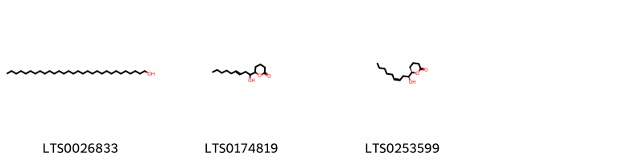{ width=100% }
    <figcaption>Hình ảnh cấu trúc hóa học của 3 hoạt chất thuộc nhóm Fatty Acyls gồm ['triacontanol (LTS0026833)', '6-(1-hydroxynon-3-en-1-yl)oxan-2-one (LTS0174819)', '(6r)-6-[(1s,3z)-1-hydroxynon-3-en-1-yl]oxan-2-one (LTS0253599)'].</figcaption>
</figure>
#### Nhóm Flavonoids
<figure markdown="span">
    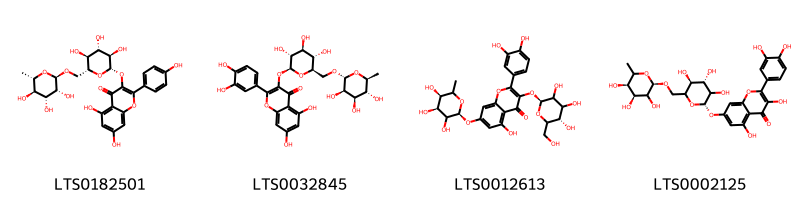{ width=100% }
    <figcaption>Hình ảnh cấu trúc hóa học của 4 hoạt chất thuộc nhóm Flavonoids gồm ['nictoflorin (LTS0182501)', '3-rutinosyl quercetin (LTS0032845)', '2-(3,4-dihydroxyphenyl)-5-hydroxy-3-{[(2s,5s)-3,4,5-trihydroxy-6-(hydroxymethyl)oxan-2-yl]oxy}-7-{[(2s,4s,5r)-3,4,5-trihydroxy-6-methyloxan-2-yl]oxy}chromen-4-one (LTS0012613)', 'quercetin 7-rutinoside (LTS0002125)'].</figcaption>
</figure>
#### Nhóm Macrolactams
<figure markdown="span">
    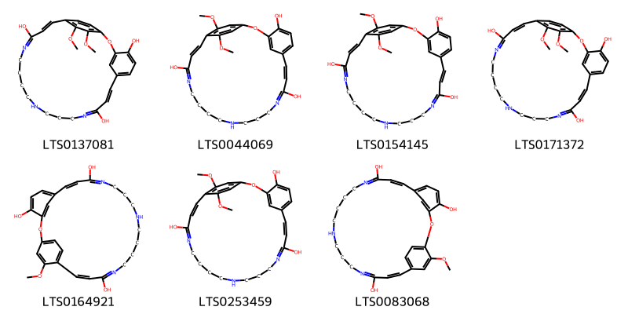{ width=100% }
    <figcaption>Hình ảnh cấu trúc hóa học của 7 hoạt chất thuộc nhóm Macrolactams gồm ['(8e,22e)-25,26-dimethoxy-2-oxa-11,15,20-triazatricyclo[22.2.2.1³,⁷]nonacosa-1(26),3(29),4,6,8,10,20,22,24,27-decaene-4,10,21-triol (LTS0137081)', '(8z,22e)-25,28-dimethoxy-2-oxa-11,15,20-triazatricyclo[22.2.2.1³,⁷]nonacosa-1(26),3(29),4,6,8,10,20,22,24,27-decaene-4,10,21-triol (LTS0044069)', '(8e,22e)-25,28-dimethoxy-2-oxa-11,15,20-triazatricyclo[22.2.2.1³,⁷]nonacosa-1(26),3(29),4,6,8,10,20,22,24,27-decaene-4,10,21-triol (LTS0154145)', '25,26-dimethoxy-2-oxa-11,15,20-triazatricyclo[22.2.2.1³,⁷]nonacosa-1(26),3(29),4,6,8,10,20,22,24,27-decaene-4,10,21-triol (LTS0171372)', '28-methoxy-2-oxa-11,15,20-triazatricyclo[22.2.2.1³,⁷]nonacosa-1(26),3(29),4,6,8,10,20,22,24,27-decaene-4,10,21-triol (LTS0164921)', '25,28-dimethoxy-2-oxa-11,15,20-triazatricyclo[22.2.2.1³,⁷]nonacosa-1(26),3(29),4,6,8,10,20,22,24,27-decaene-4,10,21-triol (LTS0253459)', '27-methoxy-2-oxa-11,16,20-triazatricyclo[22.2.2.1³,⁷]nonacosa-1(26),3(29),4,6,8,10,20,22,24,27-decaene-4,10,21-triol (LTS0083068)'].</figcaption>
</figure>
#### Nhóm Organooxygen compounds
<figure markdown="span">
    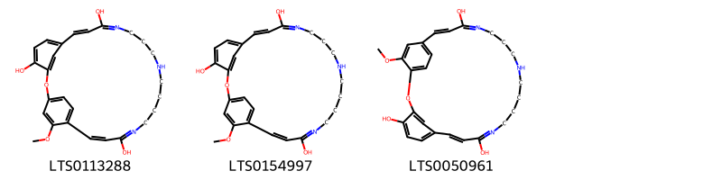{ width=100% }
    <figcaption>Hình ảnh cấu trúc hóa học của 3 hoạt chất thuộc nhóm Organooxygen compounds gồm ['(8e,22z)-28-methoxy-2-oxa-11,15,20-triazatricyclo[22.2.2.1³,⁷]nonacosa-1(26),3(29),4,6,8,10,20,22,24,27-decaene-4,10,21-triol (LTS0113288)', '(8e,22e)-28-methoxy-2-oxa-11,15,20-triazatricyclo[22.2.2.1³,⁷]nonacosa-1(26),3(29),4,6,8,10,20,22,24,27-decaene-4,10,21-triol (LTS0154997)', '(8e,22e)-27-methoxy-2-oxa-11,16,20-triazatricyclo[22.2.2.1³,⁷]nonacosa-1(26),3(29),4,6,8,10,20,22,24,27-decaene-4,10,21-triol (LTS0050961)'].</figcaption>
</figure>
#### Nhóm Saturated hydrocarbons
<figure markdown="span">
    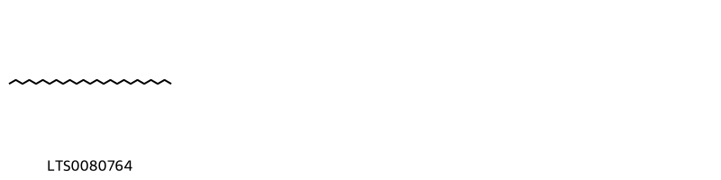{ width=100% }
    <figcaption>Hình ảnh cấu trúc hóa học của 1 hoạt chất thuộc nhóm Saturated hydrocarbons gồm ['pentacosane (LTS0080764)'].</figcaption>
</figure>

---

### Dược dân tộc học

Danh sách các quốc gia có sử dụng *Capparis decidua* trong điều trị các bệnh. 

| Country   | Disease                                                  | Bệnh                                                                                                                                                                                                |
|:----------|:---------------------------------------------------------|:----------------------------------------------------------------------------------------------------------------------------------------------------------------------------------------------------|
| Elsewhere | Alexiteric, Astringent, Laxative, Vermifuge, Diaphoretic | MYMEMORY WARNING: YOU USED ALL AVAILABLE FREE TRANSLATIONS FOR TODAY. NEXT AVAILABLE IN  16 HOURS 10 MINUTES 52 SECONDS VISIT HTTPS://MYMEMORY.TRANSLATED.NET/DOC/USAGELIMITS.PHP TO TRANSLATE MORE |

---

---
## Capparis flexuosa
### Thông tin về thực vật

!!! info "Phân loại thực vật của *N/A* từ GIBF:"
    - **Kingdom:** Plantae
    - **Phylum:** Tracheophyta
    - **Order:** Brassicales
    - **Family:** Capparaceae
    - **Genus:** N/A
    - **Species:** *N/A*

 

| Label (VI)   | Label (EN)   | Scientific Name   | Descriptions (VI)   | Descriptions (EN)   | Also Known As (VI)   | Also Known As (EN)   |
|:-------------|:-------------|:------------------|:--------------------|:--------------------|:---------------------|:---------------------|
| N/A          | N/A          | Capparis flexuosa | loài thực vật       | species of plant    | ['']                 | ['']                 |

#### Phân bố trên thế giới

**Từ CSDL GIBF** Brazil, Botswana, Israel, Antigua and Barbuda, Zimbabwe, Ecuador, Yemen, Puerto Rico, United States of America, Greece, Virgin Islands (U.S.), Argentina, Morocco, Mexico, Niue, Saudi Arabia, Chinese Taipei, Gabon, Namibia, Martinique, South Africa, Australia, Italy, India, Northern Mariana Islands, Cameroon

#### Phân bố tại Việt Nam

**Từ CSDL GIBF**: Không có ghi nhận ở Việt Nam

---
### Thành phần hóa học
        
- Theo cơ sở dữ liệu lotus: Từ loài *N/A* đã phân lập và xác định được 2 hoạt chất thuộc về các nhóm Organooxygen compounds. 

|    | chemicalTaxonomyClassyfireClass   |   smiles_count |
|---:|:----------------------------------|---------------:|
|  0 | Organooxygen compounds            |              1 |

#### Nhóm Organooxygen compounds
<figure markdown="span">
    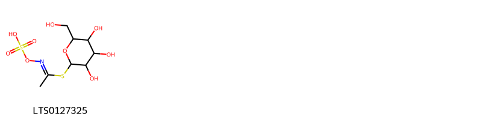{ width=100% }
    <figcaption>Hình ảnh cấu trúc hóa học của 1 hoạt chất thuộc nhóm Organooxygen compounds gồm ['[(1-{[3,4,5-trihydroxy-6-(hydroxymethyl)oxan-2-yl]sulfanyl}ethylidene)amino]oxysulfonic acid (LTS0127325)'].</figcaption>
</figure>

---

### Dược dân tộc học

Danh sách các quốc gia có sử dụng *N/A* trong điều trị các bệnh. 

| Country   | Disease                                                | Bệnh                                                                                                                                                                                                |
|:----------|:-------------------------------------------------------|:----------------------------------------------------------------------------------------------------------------------------------------------------------------------------------------------------|
| Mexico    | Diuretic, Emmenagogue, Emmenagogue, Diuretic, Sedative | MYMEMORY WARNING: YOU USED ALL AVAILABLE FREE TRANSLATIONS FOR TODAY. NEXT AVAILABLE IN  16 HOURS 10 MINUTES 27 SECONDS VISIT HTTPS://MYMEMORY.TRANSLATED.NET/DOC/USAGELIMITS.PHP TO TRANSLATE MORE |
| Venezuela | Diuretic, Vesicant, Emmenagogue                        | MYMEMORY WARNING: YOU USED ALL AVAILABLE FREE TRANSLATIONS FOR TODAY. NEXT AVAILABLE IN  16 HOURS 10 MINUTES 24 SECONDS VISIT HTTPS://MYMEMORY.TRANSLATED.NET/DOC/USAGELIMITS.PHP TO TRANSLATE MORE |

---

---
## Capparis frutescens
### Thông tin về thực vật

!!! info "Phân loại thực vật của *N/A* từ GIBF:"
    - **Kingdom:** Plantae
    - **Phylum:** Tracheophyta
    - **Order:** Brassicales
    - **Family:** Capparaceae
    - **Genus:** Capparis
    - **Species:** *N/A*

 

| Label (VI)   | Label (EN)   | Scientific Name   | Descriptions (VI)   | Descriptions (EN)   | Also Known As (VI)   | Also Known As (EN)   |
|:-------------|:-------------|:------------------|:--------------------|:--------------------|:---------------------|:---------------------|
| N/A          | N/A          | Capparis flexuosa | loài thực vật       | species of plant    | ['']                 | ['']                 |

#### Phân bố trên thế giới

**Từ CSDL GIBF** Malta, Bangladesh, New Caledonia, China, Israel, Zimbabwe, Yemen, Thailand, Spain, Madagascar, United States of America, Chad, Greece, Morocco, Hong Kong, Niue, Eswatini, Saudi Arabia, Chinese Taipei, Palestine, State of, Namibia, South Africa, Australia, Italy, India, Northern Mariana Islands

#### Phân bố tại Việt Nam

**Từ CSDL GIBF**: Không có ghi nhận ở Việt Nam

---
### Thành phần hóa học
        
- Theo cơ sở dữ liệu lotus: Từ loài *N/A* đã phân lập và xác định được Chưa có hoạt chất nào được phân lập. hoạt chất thuộc về các nhóm Không có hoạt chất nào được phân lập. 

Không có hình ảnh nào được tạo ra

---

### Dược dân tộc học

Danh sách các quốc gia có sử dụng *N/A* trong điều trị các bệnh. 

| Country     | Disease   | Bệnh                                                                                                                                                                                                |
|:------------|:----------|:----------------------------------------------------------------------------------------------------------------------------------------------------------------------------------------------------|
| West Indies | Stomachic | MYMEMORY WARNING: YOU USED ALL AVAILABLE FREE TRANSLATIONS FOR TODAY. NEXT AVAILABLE IN  16 HOURS 10 MINUTES 02 SECONDS VISIT HTTPS://MYMEMORY.TRANSLATED.NET/DOC/USAGELIMITS.PHP TO TRANSLATE MORE |

---

---
## Capparis heyneana
### Thông tin về thực vật

!!! info "Phân loại thực vật của *Capparis rheedei* từ GIBF:"
    - **Kingdom:** Plantae
    - **Phylum:** Tracheophyta
    - **Order:** Brassicales
    - **Family:** Capparaceae
    - **Genus:** Capparis
    - **Species:** *Capparis rheedei*

 

| Label (VI)   | Label (EN)   | Scientific Name   | Descriptions (VI)   | Descriptions (EN)   | Also Known As (VI)   | Also Known As (EN)   |
|:-------------|:-------------|:------------------|:--------------------|:--------------------|:---------------------|:---------------------|
| N/A          | N/A          | Capparis flexuosa | loài thực vật       | species of plant    | ['']                 | ['']                 |

#### Phân bố trên thế giới

**Từ CSDL GIBF** Malta, Bangladesh, New Caledonia, China, Israel, Zimbabwe, Yemen, Thailand, Spain, Madagascar, United States of America, Chad, Greece, Morocco, Hong Kong, Niue, Eswatini, Saudi Arabia, Chinese Taipei, Palestine, State of, Namibia, South Africa, Australia, Italy, India, Northern Mariana Islands

#### Phân bố tại Việt Nam

**Từ CSDL GIBF**: Không có ghi nhận ở Việt Nam

---
### Thành phần hóa học
        
- Theo cơ sở dữ liệu lotus: Từ loài *Capparis rheedei* đã phân lập và xác định được Chưa có hoạt chất nào được phân lập. hoạt chất thuộc về các nhóm Không có hoạt chất nào được phân lập. 

Không có hình ảnh nào được tạo ra

---

### Dược dân tộc học

Danh sách các quốc gia có sử dụng *Capparis rheedei* trong điều trị các bệnh. 

| Country   | Disease   | Bệnh                                                                                                                                                                                                |
|:----------|:----------|:----------------------------------------------------------------------------------------------------------------------------------------------------------------------------------------------------|
| Elsewhere | Laxative  | MYMEMORY WARNING: YOU USED ALL AVAILABLE FREE TRANSLATIONS FOR TODAY. NEXT AVAILABLE IN  16 HOURS 09 MINUTES 40 SECONDS VISIT HTTPS://MYMEMORY.TRANSLATED.NET/DOC/USAGELIMITS.PHP TO TRANSLATE MORE |

---

---
## Capparis horrida
### Thông tin về thực vật

!!! info "Phân loại thực vật của *N/A* từ GIBF:"
    - **Kingdom:** Plantae
    - **Phylum:** Tracheophyta
    - **Order:** Brassicales
    - **Family:** Capparaceae
    - **Genus:** Capparis
    - **Species:** *N/A*

 

| Label (VI)   | Label (EN)   | Scientific Name   | Descriptions (VI)   | Descriptions (EN)   | Also Known As (VI)   | Also Known As (EN)   |
|:-------------|:-------------|:------------------|:--------------------|:--------------------|:---------------------|:---------------------|
| N/A          | N/A          | Capparis flexuosa | loài thực vật       | species of plant    | ['']                 | ['']                 |

#### Phân bố trên thế giới

**Từ CSDL GIBF** Malta, Bangladesh, New Caledonia, China, Israel, Zimbabwe, Yemen, Thailand, Spain, Madagascar, United States of America, Chad, Greece, Morocco, Hong Kong, Niue, Eswatini, Saudi Arabia, Chinese Taipei, Palestine, State of, Namibia, South Africa, Australia, Italy, India, Northern Mariana Islands

#### Phân bố tại Việt Nam

**Từ CSDL GIBF**: Không có ghi nhận ở Việt Nam

---
### Thành phần hóa học
        
- Theo cơ sở dữ liệu lotus: Từ loài *N/A* đã phân lập và xác định được Chưa có hoạt chất nào được phân lập. hoạt chất thuộc về các nhóm Không có hoạt chất nào được phân lập. 

Không có hình ảnh nào được tạo ra

---

### Dược dân tộc học

Danh sách các quốc gia có sử dụng *N/A* trong điều trị các bệnh. 

| Country   | Disease             | Bệnh                                                                                                                                                                                                |
|:----------|:--------------------|:----------------------------------------------------------------------------------------------------------------------------------------------------------------------------------------------------|
| Elsewhere | Sedative, Stomachic | MYMEMORY WARNING: YOU USED ALL AVAILABLE FREE TRANSLATIONS FOR TODAY. NEXT AVAILABLE IN  16 HOURS 09 MINUTES 23 SECONDS VISIT HTTPS://MYMEMORY.TRANSLATED.NET/DOC/USAGELIMITS.PHP TO TRANSLATE MORE |

---

---
## Capparis incana
### Thông tin về thực vật

!!! info "Phân loại thực vật của *Quadrella incana* từ GIBF:"
    - **Kingdom:** Plantae
    - **Phylum:** Tracheophyta
    - **Order:** Brassicales
    - **Family:** Capparaceae
    - **Genus:** Quadrella
    - **Species:** *Quadrella incana*

 

| Label (VI)   | Label (EN)   | Scientific Name   | Descriptions (VI)   | Descriptions (EN)   | Also Known As (VI)   | Also Known As (EN)   |
|:-------------|:-------------|:------------------|:--------------------|:--------------------|:---------------------|:---------------------|
| N/A          | N/A          | Capparis incana   | loài thực vật       | species of plant    | ['']                 | ['']                 |

#### Phân bố trên thế giới

**Từ CSDL GIBF** Mexico, Nicaragua, Guatemala, United States of America, El Salvador, Colombia, Honduras

#### Phân bố tại Việt Nam

**Từ CSDL GIBF**: Không có ghi nhận ở Việt Nam

---
### Thành phần hóa học
        
- Theo cơ sở dữ liệu lotus: Từ loài *Quadrella incana* đã phân lập và xác định được Chưa có hoạt chất nào được phân lập. hoạt chất thuộc về các nhóm Không có hoạt chất nào được phân lập. 

Không có hình ảnh nào được tạo ra

---

### Dược dân tộc học

Danh sách các quốc gia có sử dụng *Quadrella incana* trong điều trị các bệnh. 

| Country   | Disease   | Bệnh                                                                                                                                                                                                |
|:----------|:----------|:----------------------------------------------------------------------------------------------------------------------------------------------------------------------------------------------------|
| Guatemala | Poison    | MYMEMORY WARNING: YOU USED ALL AVAILABLE FREE TRANSLATIONS FOR TODAY. NEXT AVAILABLE IN  16 HOURS 09 MINUTES 00 SECONDS VISIT HTTPS://MYMEMORY.TRANSLATED.NET/DOC/USAGELIMITS.PHP TO TRANSLATE MORE |

---

---
## Capparis inosa
### Thông tin về thực vật

!!! info "Phân loại thực vật của *N/A* từ GIBF:"
    - **Kingdom:** Plantae
    - **Phylum:** Tracheophyta
    - **Order:** Brassicales
    - **Family:** Capparaceae
    - **Genus:** Capparis
    - **Species:** *N/A*

 

| Label (VI)   | Label (EN)   | Scientific Name   | Descriptions (VI)   | Descriptions (EN)   | Also Known As (VI)   | Also Known As (EN)   |
|:-------------|:-------------|:------------------|:--------------------|:--------------------|:---------------------|:---------------------|
| N/A          | N/A          | Capparis incana   | loài thực vật       | species of plant    | ['']                 | ['']                 |

#### Phân bố trên thế giới

**Từ CSDL GIBF** Malta, Bangladesh, New Caledonia, China, Israel, Zimbabwe, Yemen, Thailand, Spain, Madagascar, United States of America, Chad, Greece, Morocco, Hong Kong, Niue, Eswatini, Saudi Arabia, Chinese Taipei, Palestine, State of, Namibia, South Africa, Australia, Italy, India, Northern Mariana Islands

#### Phân bố tại Việt Nam

**Từ CSDL GIBF**: Không có ghi nhận ở Việt Nam

---
### Thành phần hóa học
        
- Theo cơ sở dữ liệu lotus: Từ loài *N/A* đã phân lập và xác định được Chưa có hoạt chất nào được phân lập. hoạt chất thuộc về các nhóm Không có hoạt chất nào được phân lập. 

Không có hình ảnh nào được tạo ra

---

### Dược dân tộc học

Danh sách các quốc gia có sử dụng *N/A* trong điều trị các bệnh. 

| Country   | Disease                                             | Bệnh                                                                                                                                                                                                |
|:----------|:----------------------------------------------------|:----------------------------------------------------------------------------------------------------------------------------------------------------------------------------------------------------|
| Elsewhere | Aperient, Diuretic, Emmenagogue, Expectorant, Tonic | MYMEMORY WARNING: YOU USED ALL AVAILABLE FREE TRANSLATIONS FOR TODAY. NEXT AVAILABLE IN  16 HOURS 08 MINUTES 38 SECONDS VISIT HTTPS://MYMEMORY.TRANSLATED.NET/DOC/USAGELIMITS.PHP TO TRANSLATE MORE |
| Turkey    | Astringent, Diuretic, Expectorant, Stimulant, Tonic | MYMEMORY WARNING: YOU USED ALL AVAILABLE FREE TRANSLATIONS FOR TODAY. NEXT AVAILABLE IN  16 HOURS 08 MINUTES 36 SECONDS VISIT HTTPS://MYMEMORY.TRANSLATED.NET/DOC/USAGELIMITS.PHP TO TRANSLATE MORE |
| ain       | Diuretic                                            | MYMEMORY WARNING: YOU USED ALL AVAILABLE FREE TRANSLATIONS FOR TODAY. NEXT AVAILABLE IN  16 HOURS 08 MINUTES 34 SECONDS VISIT HTTPS://MYMEMORY.TRANSLATED.NET/DOC/USAGELIMITS.PHP TO TRANSLATE MORE |

---

---
## Capparis micracantha
### Thông tin về thực vật

!!! info "Phân loại thực vật của *Capparis micracantha* từ GIBF:"
    - **Kingdom:** Plantae
    - **Phylum:** Tracheophyta
    - **Order:** Brassicales
    - **Family:** Capparaceae
    - **Genus:** Capparis
    - **Species:** *Capparis micracantha*

 

| Label (VI)   | Label (EN)   | Scientific Name      | Descriptions (VI)   | Descriptions (EN)   | Also Known As (VI)   | Also Known As (EN)   |
|:-------------|:-------------|:---------------------|:--------------------|:--------------------|:---------------------|:---------------------|
| N/A          | N/A          | Capparis micracantha | loài thực vật       | species of plant    | ['']                 | ['']                 |

#### Phân bố trên thế giới

**Từ CSDL GIBF** Viet Nam, Cambodia, Indonesia, Chinese Taipei, Philippines, Thailand

#### Phân bố tại Việt Nam

**Từ CSDL GIBF**: Đồng Nai

---
### Thành phần hóa học
        
- Theo cơ sở dữ liệu lotus: Từ loài *Capparis micracantha* đã phân lập và xác định được Chưa có hoạt chất nào được phân lập. hoạt chất thuộc về các nhóm Không có hoạt chất nào được phân lập. 

Không có hình ảnh nào được tạo ra

---

### Dược dân tộc học

Danh sách các quốc gia có sử dụng *Capparis micracantha* trong điều trị các bệnh. 

| Country   | Disease   | Bệnh                                                                                                                                                                                                |
|:----------|:----------|:----------------------------------------------------------------------------------------------------------------------------------------------------------------------------------------------------|
| Elsewhere | Diuretic  | MYMEMORY WARNING: YOU USED ALL AVAILABLE FREE TRANSLATIONS FOR TODAY. NEXT AVAILABLE IN  16 HOURS 08 MINUTES 13 SECONDS VISIT HTTPS://MYMEMORY.TRANSLATED.NET/DOC/USAGELIMITS.PHP TO TRANSLATE MORE |
| Java      | Diuretic  | MYMEMORY WARNING: YOU USED ALL AVAILABLE FREE TRANSLATIONS FOR TODAY. NEXT AVAILABLE IN  16 HOURS 08 MINUTES 10 SECONDS VISIT HTTPS://MYMEMORY.TRANSLATED.NET/DOC/USAGELIMITS.PHP TO TRANSLATE MORE |

---

---
## Capparis micrantha
### Thông tin về thực vật

!!! info "Phân loại thực vật của *Capparis micrantha* từ GIBF:"
    - **Kingdom:** Plantae
    - **Phylum:** Tracheophyta
    - **Order:** Brassicales
    - **Family:** Capparaceae
    - **Genus:** Capparis
    - **Species:** *Capparis micrantha*

 

| Label (VI)   | Label (EN)   | Scientific Name    | Descriptions (VI)   | Descriptions (EN)   | Also Known As (VI)   | Also Known As (EN)   |
|:-------------|:-------------|:-------------------|:--------------------|:--------------------|:---------------------|:---------------------|
| N/A          | N/A          | Capparis micrantha | loài thực vật       | species of plant    | ['']                 | ['']                 |

#### Phân bố trên thế giới

**Từ CSDL GIBF** nan, Singapore, Viet Nam, United States of America, Indonesia, Timor-Leste, Philippines, Malaysia, China, Chinese Taipei, unknown or invalid, Thailand, Lao People’s Democratic Republic, Sudan

#### Phân bố tại Việt Nam

**Từ CSDL GIBF**: Bac Can

---
### Thành phần hóa học
        
- Theo cơ sở dữ liệu lotus: Từ loài *Capparis micrantha* đã phân lập và xác định được Chưa có hoạt chất nào được phân lập. hoạt chất thuộc về các nhóm Không có hoạt chất nào được phân lập. 

Không có hình ảnh nào được tạo ra

---

### Dược dân tộc học

Danh sách các quốc gia có sử dụng *Capparis micrantha* trong điều trị các bệnh. 

| Country     | Disease    | Bệnh                                                                                                                                                                                                |
|:------------|:-----------|:----------------------------------------------------------------------------------------------------------------------------------------------------------------------------------------------------|
| Philippines | Uterotonic | MYMEMORY WARNING: YOU USED ALL AVAILABLE FREE TRANSLATIONS FOR TODAY. NEXT AVAILABLE IN  16 HOURS 07 MINUTES 48 SECONDS VISIT HTTPS://MYMEMORY.TRANSLATED.NET/DOC/USAGELIMITS.PHP TO TRANSLATE MORE |

---

---
## Capparis sepiaria
### Thông tin về thực vật

!!! info "Phân loại thực vật của *Capparis sepiaria* từ GIBF:"
    - **Kingdom:** Plantae
    - **Phylum:** Tracheophyta
    - **Order:** Brassicales
    - **Family:** Capparaceae
    - **Genus:** Capparis
    - **Species:** *Capparis sepiaria*

 

| Label (VI)   | Label (EN)   | Scientific Name   | Descriptions (VI)   | Descriptions (EN)   | Also Known As (VI)   | Also Known As (EN)   |
|:-------------|:-------------|:------------------|:--------------------|:--------------------|:---------------------|:---------------------|
| N/A          | N/A          | Capparis sepiaria | loài thực vật       | species of plant    | ['']                 | ['']                 |

#### Phân bố trên thế giới

**Từ CSDL GIBF** Uganda, Madagascar, South Africa, Australia, India, Tanzania, United Republic of, Thailand

#### Phân bố tại Việt Nam

**Từ CSDL GIBF**: Không có ghi nhận ở Việt Nam

---
### Thành phần hóa học
        
- Theo cơ sở dữ liệu lotus: Từ loài *Capparis sepiaria* đã phân lập và xác định được Chưa có hoạt chất nào được phân lập. hoạt chất thuộc về các nhóm Không có hoạt chất nào được phân lập. 

Không có hình ảnh nào được tạo ra

---

### Dược dân tộc học

Danh sách các quốc gia có sử dụng *Capparis sepiaria* trong điều trị các bệnh. 

| Country   | Disease   | Bệnh                                                                                                                                                                                                |
|:----------|:----------|:----------------------------------------------------------------------------------------------------------------------------------------------------------------------------------------------------|
| Elsewhere | Tonic     | MYMEMORY WARNING: YOU USED ALL AVAILABLE FREE TRANSLATIONS FOR TODAY. NEXT AVAILABLE IN  16 HOURS 07 MINUTES 30 SECONDS VISIT HTTPS://MYMEMORY.TRANSLATED.NET/DOC/USAGELIMITS.PHP TO TRANSLATE MORE |

---

---
## Capparis tomentosa
### Thông tin về thực vật

!!! info "Phân loại thực vật của *Capparis tomentosa* từ GIBF:"
    - **Kingdom:** Plantae
    - **Phylum:** Tracheophyta
    - **Order:** Brassicales
    - **Family:** Capparaceae
    - **Genus:** Capparis
    - **Species:** *Capparis tomentosa*

 

| Label (VI)   | Label (EN)   | Scientific Name    | Descriptions (VI)   | Descriptions (EN)   | Also Known As (VI)   | Also Known As (EN)   |
|:-------------|:-------------|:-------------------|:--------------------|:--------------------|:---------------------|:---------------------|
| N/A          | N/A          | Capparis tomentosa | loài thực vật       | species of plant    | ['']                 | ['']                 |

#### Phân bố trên thế giới

**Từ CSDL GIBF** Uganda, Senegal, Botswana, Gambia, Zimbabwe, Mozambique, Tanzania, United Republic of, Guinea, Ghana, Chad, Zambia, Nigeria, Sao Tome and Principe, Ethiopia, Togo, Malawi, Benin, Kenya, Eswatini, Saudi Arabia, Namibia, South Africa, Angola

#### Phân bố tại Việt Nam

**Từ CSDL GIBF**: Không có ghi nhận ở Việt Nam

---
### Thành phần hóa học
        
- Theo cơ sở dữ liệu lotus: Từ loài *Capparis tomentosa* đã phân lập và xác định được 2 hoạt chất thuộc về các nhóm Indoles and derivatives. 

|    | chemicalTaxonomyClassyfireClass   |   smiles_count |
|---:|:----------------------------------|---------------:|
|  0 | Indoles and derivatives           |              2 |

#### Nhóm Indoles and derivatives
<figure markdown="span">
    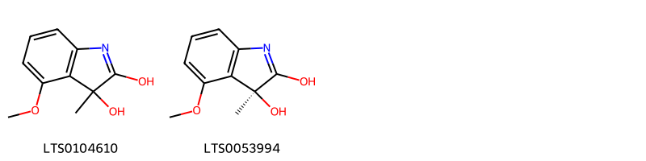{ width=100% }
    <figcaption>Hình ảnh cấu trúc hóa học của 2 hoạt chất thuộc nhóm Indoles and derivatives gồm ['4-methoxy-3-methylindole-2,3-diol (LTS0104610)', '(3s)-4-methoxy-3-methylindole-2,3-diol (LTS0053994)'].</figcaption>
</figure>

---

### Dược dân tộc học

Danh sách các quốc gia có sử dụng *Capparis tomentosa* trong điều trị các bệnh. 

| Country   | Disease   | Bệnh                                                                                                                                                                                                |
|:----------|:----------|:----------------------------------------------------------------------------------------------------------------------------------------------------------------------------------------------------|
| Sudan     | Poison    | MYMEMORY WARNING: YOU USED ALL AVAILABLE FREE TRANSLATIONS FOR TODAY. NEXT AVAILABLE IN  16 HOURS 07 MINUTES 06 SECONDS VISIT HTTPS://MYMEMORY.TRANSLATED.NET/DOC/USAGELIMITS.PHP TO TRANSLATE MORE |

---

---
## Capparis zeylanica
### Thông tin về thực vật

!!! info "Phân loại thực vật của *Capparis zeylanica* từ GIBF:"
    - **Kingdom:** Plantae
    - **Phylum:** Tracheophyta
    - **Order:** Brassicales
    - **Family:** Capparaceae
    - **Genus:** Capparis
    - **Species:** *Capparis zeylanica*

 

| Label (VI)   | Label (EN)   | Scientific Name    | Descriptions (VI)   | Descriptions (EN)   | Also Known As (VI)   | Also Known As (EN)   |
|:-------------|:-------------|:-------------------|:--------------------|:--------------------|:---------------------|:---------------------|
| N/A          | N/A          | Capparis zeylanica |                     | climbing shrub      | ['']                 | ['Ceylon Caper']     |

#### Phân bố trên thế giới

**Từ CSDL GIBF** Sri Lanka, nan, Viet Nam, Cambodia, Bangladesh, Indonesia, Philippines, China, Nepal, Myanmar, Colombia, India, unknown or invalid, Thailand, Lao People’s Democratic Republic, Venezuela (Bolivarian Republic of)

#### Phân bố tại Việt Nam

**Từ CSDL GIBF**: Ninh Thuan, Ninh Thuận

---
### Thành phần hóa học
        
- Theo cơ sở dữ liệu lotus: Từ loài *Capparis zeylanica* đã phân lập và xác định được 4 hoạt chất thuộc về các nhóm Fatty Acyls, Steroids and steroid derivatives. 

|    | chemicalTaxonomyClassyfireClass   |   smiles_count |
|---:|:----------------------------------|---------------:|
|  0 | Fatty Acyls                       |              2 |
|  1 | Steroids and steroid derivatives  |              2 |

#### Nhóm Fatty Acyls
<figure markdown="span">
    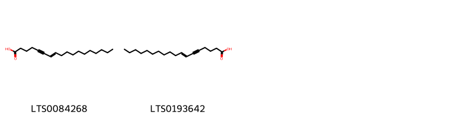{ width=100% }
    <figcaption>Hình ảnh cấu trúc hóa học của 2 hoạt chất thuộc nhóm Fatty Acyls gồm ['octadec-7-en-5-ynoic acid (LTS0084268)', '(7e)-octadec-7-en-5-ynoic acid (LTS0193642)'].</figcaption>
</figure>
#### Nhóm Steroids and steroid derivatives
<figure markdown="span">
    { width=100% }
    <figcaption>Hình ảnh cấu trúc hóa học của 2 hoạt chất thuộc nhóm Steroids and steroid derivatives gồm ['stigmast-5-en-3-ol, (3β)- (LTS0204616)', 'stigmast-5-en-3-ol (LTS0071224)'].</figcaption>
</figure>

---

### Dược dân tộc học

Danh sách các quốc gia có sử dụng *Capparis zeylanica* trong điều trị các bệnh. 

| Country   | Disease                         | Bệnh                                                                                                                                                                                                |
|:----------|:--------------------------------|:----------------------------------------------------------------------------------------------------------------------------------------------------------------------------------------------------|
| Elsewhere | Cholagogue, Sedative, Stomachic | MYMEMORY WARNING: YOU USED ALL AVAILABLE FREE TRANSLATIONS FOR TODAY. NEXT AVAILABLE IN  16 HOURS 06 MINUTES 44 SECONDS VISIT HTTPS://MYMEMORY.TRANSLATED.NET/DOC/USAGELIMITS.PHP TO TRANSLATE MORE |

---

# Chi Morisonia

??? note "Danh sách các dược liệu thuộc chi"
    
	 - *Morisonia americana*

---
## Morisonia americana
### Thông tin về thực vật

!!! info "Phân loại thực vật của *Morisonia americana* từ GIBF:"
    - **Kingdom:** Plantae
    - **Phylum:** Tracheophyta
    - **Order:** Brassicales
    - **Family:** Capparaceae
    - **Genus:** Morisonia
    - **Species:** *Morisonia americana*

 

| Label (VI)   | Label (EN)   | Scientific Name     | Descriptions (VI)   | Descriptions (EN)   | Also Known As (VI)   | Also Known As (EN)   |
|:-------------|:-------------|:--------------------|:--------------------|:--------------------|:---------------------|:---------------------|
| N/A          | N/A          | Morisonia americana | loài thực vật       | species of plant    | ['']                 | ['']                 |

#### Phân bố trên thế giới

**Từ CSDL GIBF** Mexico, Nicaragua, El Salvador, Jamaica, Guadeloupe, Martinique, Virgin Islands (U.S.), Saint Martin (French part), Colombia, Dominican Republic, Ecuador, Peru, Montserrat, Puerto Rico

#### Phân bố tại Việt Nam

**Từ CSDL GIBF**: Không có ghi nhận ở Việt Nam

---
### Thành phần hóa học
        
- Theo cơ sở dữ liệu lotus: Từ loài *Morisonia americana* đã phân lập và xác định được Chưa có hoạt chất nào được phân lập. hoạt chất thuộc về các nhóm Không có hoạt chất nào được phân lập. 

Không có hình ảnh nào được tạo ra

---

### Dược dân tộc học

Danh sách các quốc gia có sử dụng *Morisonia americana* trong điều trị các bệnh. 

| Country     | Disease               | Bệnh                                                                                                                                                                                                |
|:------------|:----------------------|:----------------------------------------------------------------------------------------------------------------------------------------------------------------------------------------------------|
| Mexico      | Vermifuge, Aperient   | MYMEMORY WARNING: YOU USED ALL AVAILABLE FREE TRANSLATIONS FOR TODAY. NEXT AVAILABLE IN  16 HOURS 06 MINUTES 15 SECONDS VISIT HTTPS://MYMEMORY.TRANSLATED.NET/DOC/USAGELIMITS.PHP TO TRANSLATE MORE |
| West Indies | Apertif, Parasiticide | MYMEMORY WARNING: YOU USED ALL AVAILABLE FREE TRANSLATIONS FOR TODAY. NEXT AVAILABLE IN  16 HOURS 06 MINUTES 12 SECONDS VISIT HTTPS://MYMEMORY.TRANSLATED.NET/DOC/USAGELIMITS.PHP TO TRANSLATE MORE |

---

# Chi Cadaba

??? note "Danh sách các dược liệu thuộc chi"
    
	 - *Cadaba farinosa*
	 - *Cadaba rotundifolia*
	 - *Cadaba trifoliata*

---
## Cadaba farinosa
### Thông tin về thực vật

!!! info "Phân loại thực vật của *Cadaba farinosa* từ GIBF:"
    - **Kingdom:** Plantae
    - **Phylum:** Tracheophyta
    - **Order:** Brassicales
    - **Family:** Capparaceae
    - **Genus:** Cadaba
    - **Species:** *Cadaba farinosa*

 

| Label (VI)   | Label (EN)   | Scientific Name   | Descriptions (VI)   | Descriptions (EN)   | Also Known As (VI)   | Also Known As (EN)   |
|:-------------|:-------------|:------------------|:--------------------|:--------------------|:---------------------|:---------------------|
| N/A          | N/A          | Cadaba farinosa   | loài thực vật       | species of plant    | ['']                 | ['']                 |

#### Phân bố trên thế giới

**Từ CSDL GIBF** Benin, Uganda, Kenya, Senegal, Saudi Arabia, Mali, Somalia, Mozambique, India, Tanzania, United Republic of, Ethiopia, Togo

#### Phân bố tại Việt Nam

**Từ CSDL GIBF**: Không có ghi nhận ở Việt Nam

---
### Thành phần hóa học
        
- Theo cơ sở dữ liệu lotus: Từ loài *Cadaba farinosa* đã phân lập và xác định được 8 hoạt chất thuộc về các nhóm Prenol lipids, Organooxygen compounds, Macrolactams. 

|    | chemicalTaxonomyClassyfireClass   |   smiles_count |
|---:|:----------------------------------|---------------:|
|  0 | Macrolactams                      |              4 |
|  1 | Organooxygen compounds            |              2 |
|  2 | Prenol lipids                     |              2 |

#### Nhóm Macrolactams
<figure markdown="span">
    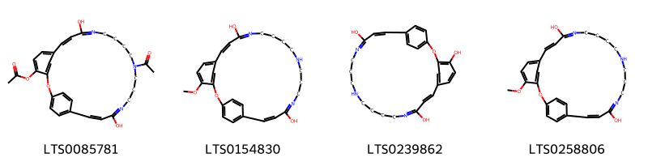{ width=100% }
    <figcaption>Hình ảnh cấu trúc hóa học của 4 hoạt chất thuộc nhóm Macrolactams gồm ['(8z,22e)-16-acetyl-10,21-dihydroxy-2-oxa-11,16,20-triazatricyclo[22.2.2.1³,⁷]nonacosa-1(26),3(29),4,6,8,10,20,22,24,27-decaen-4-yl acetate (LTS0085781)', '4-methoxy-2-oxa-11,16,20-triazatricyclo[22.2.2.1³,⁷]nonacosa-1(26),3(29),4,6,8,10,20,22,24,27-decaene-10,21-diol (LTS0154830)', '(8e,22e)-2-oxa-11,16,20-triazatricyclo[22.2.2.1³,⁷]nonacosa-1(26),3(29),4,6,8,10,20,22,24,27-decaene-4,10,21-triol (LTS0239862)', '(8e,22e)-4-methoxy-2-oxa-11,16,20-triazatricyclo[22.2.2.1³,⁷]nonacosa-1(26),3(29),4,6,8,10,20,22,24,27-decaene-10,21-diol (LTS0258806)'].</figcaption>
</figure>
#### Nhóm Organooxygen compounds
<figure markdown="span">
    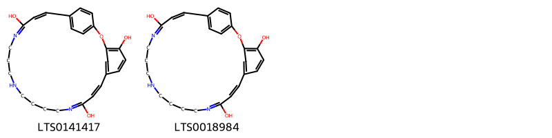{ width=100% }
    <figcaption>Hình ảnh cấu trúc hóa học của 2 hoạt chất thuộc nhóm Organooxygen compounds gồm ['2-oxa-11,16,20-triazatricyclo[22.2.2.1³,⁷]nonacosa-1(26),3(29),4,6,8,10,20,22,24,27-decaene-4,10,21-triol (LTS0141417)', '(22z)-2-oxa-11,16,20-triazatricyclo[22.2.2.1³,⁷]nonacosa-1(26),3(29),4,6,8,10,20,22,24,27-decaene-4,10,21-triol (LTS0018984)'].</figcaption>
</figure>
#### Nhóm Prenol lipids
<figure markdown="span">
    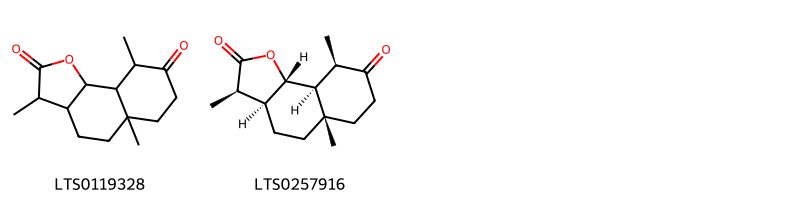{ width=100% }
    <figcaption>Hình ảnh cấu trúc hóa học của 2 hoạt chất thuộc nhóm Prenol lipids gồm ['3,5a,9-trimethyl-octahydro-3h-naphtho[1,2-b]furan-2,8-dione (LTS0119328)', '(3r,3as,5as,9r,9as,9bs)-3,5a,9-trimethyl-octahydro-3h-naphtho[1,2-b]furan-2,8-dione (LTS0257916)'].</figcaption>
</figure>

---

### Dược dân tộc học

Danh sách các quốc gia có sử dụng *Cadaba farinosa* trong điều trị các bệnh. 

| Country         | Disease    | Bệnh                                                                                                                                                                                                |
|:----------------|:-----------|:----------------------------------------------------------------------------------------------------------------------------------------------------------------------------------------------------|
| Africa(Swahili) | Dentifrice | MYMEMORY WARNING: YOU USED ALL AVAILABLE FREE TRANSLATIONS FOR TODAY. NEXT AVAILABLE IN  16 HOURS 05 MINUTES 43 SECONDS VISIT HTTPS://MYMEMORY.TRANSLATED.NET/DOC/USAGELIMITS.PHP TO TRANSLATE MORE |
| India           | Vermifuge  | MYMEMORY WARNING: YOU USED ALL AVAILABLE FREE TRANSLATIONS FOR TODAY. NEXT AVAILABLE IN  16 HOURS 05 MINUTES 38 SECONDS VISIT HTTPS://MYMEMORY.TRANSLATED.NET/DOC/USAGELIMITS.PHP TO TRANSLATE MORE |

---

---
## Cadaba rotundifolia
### Thông tin về thực vật

!!! info "Phân loại thực vật của *Cadaba rotundifolia* từ GIBF:"
    - **Kingdom:** Plantae
    - **Phylum:** Tracheophyta
    - **Order:** Brassicales
    - **Family:** Capparaceae
    - **Genus:** Cadaba
    - **Species:** *Cadaba rotundifolia*

 

| Label (VI)   | Label (EN)   | Scientific Name     | Descriptions (VI)   | Descriptions (EN)   | Also Known As (VI)   | Also Known As (EN)   |
|:-------------|:-------------|:--------------------|:--------------------|:--------------------|:---------------------|:---------------------|
| N/A          | N/A          | Cadaba rotundifolia | loài thực vật       | species of plant    | ['']                 | ['']                 |

#### Phân bố trên thế giới

**Từ CSDL GIBF** nan, Kenya, Djibouti, Saudi Arabia, Nigeria, Somalia, unknown or invalid, Yemen, Ethiopia, Egypt, Eritrea, Sudan

#### Phân bố tại Việt Nam

**Từ CSDL GIBF**: Không có ghi nhận ở Việt Nam

---
### Thành phần hóa học
        
- Theo cơ sở dữ liệu lotus: Từ loài *Cadaba rotundifolia* đã phân lập và xác định được Chưa có hoạt chất nào được phân lập. hoạt chất thuộc về các nhóm Không có hoạt chất nào được phân lập. 

Không có hình ảnh nào được tạo ra

---

### Dược dân tộc học

Danh sách các quốc gia có sử dụng *Cadaba rotundifolia* trong điều trị các bệnh. 

| Country   | Disease   | Bệnh                                                                                                                                                                                                |
|:----------|:----------|:----------------------------------------------------------------------------------------------------------------------------------------------------------------------------------------------------|
| Sudan     | Purgative | MYMEMORY WARNING: YOU USED ALL AVAILABLE FREE TRANSLATIONS FOR TODAY. NEXT AVAILABLE IN  16 HOURS 04 MINUTES 59 SECONDS VISIT HTTPS://MYMEMORY.TRANSLATED.NET/DOC/USAGELIMITS.PHP TO TRANSLATE MORE |

---

---
## Cadaba trifoliata
### Thông tin về thực vật

!!! info "Phân loại thực vật của *Cadaba trifoliata* từ GIBF:"
    - **Kingdom:** Plantae
    - **Phylum:** Tracheophyta
    - **Order:** Brassicales
    - **Family:** Capparaceae
    - **Genus:** Cadaba
    - **Species:** *Cadaba trifoliata*

 

| Label (VI)   | Label (EN)   | Scientific Name   | Descriptions (VI)   | Descriptions (EN)   | Also Known As (VI)   | Also Known As (EN)   |
|:-------------|:-------------|:------------------|:--------------------|:--------------------|:---------------------|:---------------------|
| N/A          | N/A          | Cadaba trifoliata | loài thực vật       | species of plant    | ['']                 | ['']                 |

#### Phân bố trên thế giới

**Từ CSDL GIBF** Sri Lanka, nan, India

#### Phân bố tại Việt Nam

**Từ CSDL GIBF**: Không có ghi nhận ở Việt Nam

---
### Thành phần hóa học
        
- Theo cơ sở dữ liệu lotus: Từ loài *Cadaba trifoliata* đã phân lập và xác định được Chưa có hoạt chất nào được phân lập. hoạt chất thuộc về các nhóm Không có hoạt chất nào được phân lập. 

Không có hình ảnh nào được tạo ra

---

### Dược dân tộc học

Danh sách các quốc gia có sử dụng *Cadaba trifoliata* trong điều trị các bệnh. 

| Country   | Disease              | Bệnh                                                                                                                                                                                                |
|:----------|:---------------------|:----------------------------------------------------------------------------------------------------------------------------------------------------------------------------------------------------|
| Elsewhere | Vermifuge, Purgative | MYMEMORY WARNING: YOU USED ALL AVAILABLE FREE TRANSLATIONS FOR TODAY. NEXT AVAILABLE IN  16 HOURS 04 MINUTES 26 SECONDS VISIT HTTPS://MYMEMORY.TRANSLATED.NET/DOC/USAGELIMITS.PHP TO TRANSLATE MORE |

---

# Chi Gynandropsis

??? note "Danh sách các dược liệu thuộc chi"
    
	 - *Gynandropsis gynandra*
	 - *Gynandropsis pentaphylla*

---
## Gynandropsis gynandra
### Thông tin về thực vật

!!! info "Phân loại thực vật của *Gynandropsis gynandra* từ GIBF:"
    - **Kingdom:** Plantae
    - **Phylum:** Tracheophyta
    - **Order:** Brassicales
    - **Family:** Cleomaceae
    - **Genus:** Gynandropsis
    - **Species:** *Gynandropsis gynandra*

 

| Label (VI)   | Label (EN)   | Scientific Name       | Descriptions (VI)   | Descriptions (EN)   | Also Known As (VI)   | Also Known As (EN)   |
|:-------------|:-------------|:----------------------|:--------------------|:--------------------|:---------------------|:---------------------|
| N/A          | N/A          | Gynandropsis gynandra | loài thực vật       | species of plant    | ['']                 | ['']                 |

#### Phân bố trên thế giới

**Từ CSDL GIBF** Brazil, Uganda, Viet Nam, Senegal, Botswana, Guadeloupe, Israel, Zimbabwe, Mozambique, Tanzania, United Republic of, Thailand, Puerto Rico, United States of America, Indonesia, Nigeria, Colombia, Cuba, Malawi, Mexico, Benin, Congo, Democratic Republic of the, Kenya, El Salvador, Chinese Taipei, Malaysia, Canada, Namibia, Timor-Leste, South Africa, Australia, India, Venezuela (Bolivarian Republic of)

#### Phân bố tại Việt Nam

**Từ CSDL GIBF**: Hòa Bình

---
### Thành phần hóa học
        
- Theo cơ sở dữ liệu lotus: Từ loài *Gynandropsis gynandra* đã phân lập và xác định được 5 hoạt chất thuộc về các nhóm Prenol lipids, Organooxygen compounds, Flavonoids. 

|    | chemicalTaxonomyClassyfireClass   |   smiles_count |
|---:|:----------------------------------|---------------:|
|  0 | Flavonoids                        |              1 |
|  1 | Organooxygen compounds            |              1 |
|  2 | Prenol lipids                     |              2 |

#### Nhóm Flavonoids
<figure markdown="span">
    { width=100% }
    <figcaption>Hình ảnh cấu trúc hóa học của 1 hoạt chất thuộc nhóm Flavonoids gồm ['luteolin (LTS0017052)'].</figcaption>
</figure>
#### Nhóm Organooxygen compounds
<figure markdown="span">
    { width=100% }
    <figcaption>Hình ảnh cấu trúc hóa học của 1 hoạt chất thuộc nhóm Organooxygen compounds gồm ['[(z)-(1-{[(2s,3r,4s,5s,6r)-3,4,5-trihydroxy-6-(hydroxymethyl)oxan-2-yl]sulfanyl}ethylidene)amino]oxysulfonic acid (LTS0182568)'].</figcaption>
</figure>
#### Nhóm Prenol lipids
<figure markdown="span">
    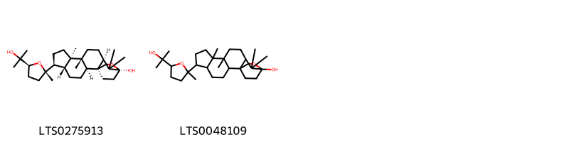{ width=100% }
    <figcaption>Hình ảnh cấu trúc hóa học của 2 hoạt chất thuộc nhóm Prenol lipids gồm ['(1s,2s,5r,6s,9r,10r,13r,15s)-6-[(2s,5s)-5-(2-hydroxypropan-2-yl)-2-methyloxolan-2-yl]-9,10,14,14-tetramethyl-16-oxapentacyclo[13.2.2.0¹,¹³.0²,¹⁰.0⁵,⁹]nonadecan-15-ol (LTS0275913)', '6-[5-(2-hydroxypropan-2-yl)-2-methyloxolan-2-yl]-9,10,14,14-tetramethyl-16-oxapentacyclo[13.2.2.0¹,¹³.0²,¹⁰.0⁵,⁹]nonadecan-15-ol (LTS0048109)'].</figcaption>
</figure>

---

### Dược dân tộc học

Danh sách các quốc gia có sử dụng *Gynandropsis gynandra* trong điều trị các bệnh. 

| Country   | Disease                                                            | Bệnh                                                                                                                                                                                                |
|:----------|:-------------------------------------------------------------------|:----------------------------------------------------------------------------------------------------------------------------------------------------------------------------------------------------|
| Elsewhere | Larvicide, Pediculicide, Piscicide, Rubefacient, Vermifuge, Poison | MYMEMORY WARNING: YOU USED ALL AVAILABLE FREE TRANSLATIONS FOR TODAY. NEXT AVAILABLE IN  16 HOURS 03 MINUTES 52 SECONDS VISIT HTTPS://MYMEMORY.TRANSLATED.NET/DOC/USAGELIMITS.PHP TO TRANSLATE MORE |
| Sudan     | Vermifuge                                                          | MYMEMORY WARNING: YOU USED ALL AVAILABLE FREE TRANSLATIONS FOR TODAY. NEXT AVAILABLE IN  16 HOURS 03 MINUTES 48 SECONDS VISIT HTTPS://MYMEMORY.TRANSLATED.NET/DOC/USAGELIMITS.PHP TO TRANSLATE MORE |

---

---
## Gynandropsis pentaphylla
### Thông tin về thực vật

!!! info "Phân loại thực vật của *Gynandropsis gynandra* từ GIBF:"
    - **Kingdom:** Plantae
    - **Phylum:** Tracheophyta
    - **Order:** Brassicales
    - **Family:** Cleomaceae
    - **Genus:** Gynandropsis
    - **Species:** *Gynandropsis gynandra*

 

| Label (VI)   | Label (EN)   | Scientific Name          | Descriptions (VI)   | Descriptions (EN)   | Also Known As (VI)   | Also Known As (EN)   |
|:-------------|:-------------|:-------------------------|:--------------------|:--------------------|:---------------------|:---------------------|
| N/A          | N/A          | Gynandropsis pentaphylla | loài thực vật       | species of plant    | ['']                 | ['']                 |

#### Phân bố trên thế giới

**Từ CSDL GIBF** nan, Brazil, Japan, Bangladesh, Nepal, China, Zimbabwe, Netherlands, Puerto Rico, Sri Lanka, United States of America, Virgin Islands (U.S.), Indonesia, unknown or invalid, Ethiopia, Equatorial Guinea, Congo, Democratic Republic of the, Kenya, Malaysia, Philippines, Namibia, Portugal, Liberia, South Africa, Myanmar, India, Angola

#### Phân bố tại Việt Nam

**Từ CSDL GIBF**: Không có ghi nhận ở Việt Nam

---
### Thành phần hóa học
        
- Theo cơ sở dữ liệu lotus: Từ loài *Gynandropsis gynandra* đã phân lập và xác định được Chưa có hoạt chất nào được phân lập. hoạt chất thuộc về các nhóm Không có hoạt chất nào được phân lập. 

Không có hình ảnh nào được tạo ra

---

### Dược dân tộc học

Danh sách các quốc gia có sử dụng *Gynandropsis gynandra* trong điều trị các bệnh. 

| Country   | Disease       | Bệnh                                                                                                                                                                                                |
|:----------|:--------------|:----------------------------------------------------------------------------------------------------------------------------------------------------------------------------------------------------|
| China     | Carminative   | MYMEMORY WARNING: YOU USED ALL AVAILABLE FREE TRANSLATIONS FOR TODAY. NEXT AVAILABLE IN  16 HOURS 03 MINUTES 05 SECONDS VISIT HTTPS://MYMEMORY.TRANSLATED.NET/DOC/USAGELIMITS.PHP TO TRANSLATE MORE |
| Elsewhere | Antiscorbutic | MYMEMORY WARNING: YOU USED ALL AVAILABLE FREE TRANSLATIONS FOR TODAY. NEXT AVAILABLE IN  16 HOURS 03 MINUTES 02 SECONDS VISIT HTTPS://MYMEMORY.TRANSLATED.NET/DOC/USAGELIMITS.PHP TO TRANSLATE MORE |

---

# Chi Euadenia

??? note "Danh sách các dược liệu thuộc chi"
    
	 - *Euadenia eminens*

---
## Euadenia eminens
### Thông tin về thực vật

!!! info "Phân loại thực vật của *Euadenia eminens* từ GIBF:"
    - **Kingdom:** Plantae
    - **Phylum:** Tracheophyta
    - **Order:** Brassicales
    - **Family:** Capparaceae
    - **Genus:** Euadenia
    - **Species:** *Euadenia eminens*

 

| Label (VI)   | Label (EN)   | Scientific Name   | Descriptions (VI)   | Descriptions (EN)   | Also Known As (VI)   | Also Known As (EN)   |
|:-------------|:-------------|:------------------|:--------------------|:--------------------|:---------------------|:---------------------|
| N/A          | N/A          | Euadenia eminens  | loài thực vật       | species of plant    | ['']                 | ['']                 |

#### Phân bố trên thế giới

**Từ CSDL GIBF** nan, Brazil, Uganda, Congo, Democratic Republic of the, Norway, Central African Republic, Liberia, Gabon, Côte d’Ivoire, Nigeria, Congo, unknown or invalid, Sierra Leone, Cameroon, Guinea, Ghana

#### Phân bố tại Việt Nam

**Từ CSDL GIBF**: Không có ghi nhận ở Việt Nam

---
### Thành phần hóa học
        
- Theo cơ sở dữ liệu lotus: Từ loài *Euadenia eminens* đã phân lập và xác định được Chưa có hoạt chất nào được phân lập. hoạt chất thuộc về các nhóm Không có hoạt chất nào được phân lập. 

Không có hình ảnh nào được tạo ra

---

### Dược dân tộc học

Danh sách các quốc gia có sử dụng *Euadenia eminens* trong điều trị các bệnh. 

| Country   | Disease     | Bệnh                                                                                                                                                                                                |
|:----------|:------------|:----------------------------------------------------------------------------------------------------------------------------------------------------------------------------------------------------|
| Africa    | Aphrodisiac | MYMEMORY WARNING: YOU USED ALL AVAILABLE FREE TRANSLATIONS FOR TODAY. NEXT AVAILABLE IN  16 HOURS 02 MINUTES 27 SECONDS VISIT HTTPS://MYMEMORY.TRANSLATED.NET/DOC/USAGELIMITS.PHP TO TRANSLATE MORE |

---

