!!! abstract "Tóm tắt"

    Họ Caprifoliaceae gồm khoảng 6 chi và 29 loài được một số cộng đồng tại các quốc gia như Dutch, Kashmir, Japan, US(Flathead), USA, French, South America, Mexico, China, Europe, ain, Haiti, Elsewhere, Argentina, Canada(Salish), Canada(Kwakiutl), France, German, Latin America, US(Colonial), Eurasia, US(Appalachia), US, Asia, Italian, Turkey, Iraq, US(Amerindian), Bolivia sử dụng trong một số trường hợp QUERY LENGTH LIMIT EXCEEDED. MAX ALLOWED QUERY : 500 CHARS QUERY LENGTH LIMIT EXCEEDED. MAX ALLOWED QUERY : 500 CHARS.

!!! info "DrDuke"

    James A. Duke sinh năm 1929-2017 là một nhà thực vật học người Mỹ. Đây là một trong những tác giả hàng đầu trong lĩnh vực dược dân tộc học với cuốn *CRC Handbook of Medicinal Herbs* và chính là người xây dựng lên cơ sở dữ liệu về hợp chất tự nhiên và dược dân tộc học tại Bộ nông nghiệp Hoa Kỳ. Các thông tin được đăng tải tại website [Dr. Duke's Phytochemical and Ethnobotanical Databases](https://phytochem.nal.usda.gov/). 
    Trong suốt thập niên 1970, ông lãnh đạo the Plant Taxonomy Laboratory, Plant Genetics and Germplasm Institute of the Agricultural Research Service, U.S. Department of Agriculture.
    Trong tài liệu này, các thông tin về dược dân tộc của các dược liệu được trích dẫn từ tài liệu của James A. Ducke với sự trợ giúp của phần mềm dịch thuật từ tiếng Anh sang tiếng Việt.
   

# Chi Lonicera

??? note "Danh sách các dược liệu thuộc chi"
    
	 - *Lonicera caprifolium*
	 - *Lonicera ciliosa*
	 - *Lonicera involucrata*
	 - *Lonicera japonica*
	 - *Lonicera periclymenum*

---
## Lonicera caprifolium
### Thông tin về thực vật

!!! info "Phân loại thực vật của *Lonicera caprifolium* từ GIBF:"
    - **Kingdom:** Plantae
    - **Phylum:** Tracheophyta
    - **Order:** Dipsacales
    - **Family:** Caprifoliaceae
    - **Genus:** Lonicera
    - **Species:** *Lonicera caprifolium*

 

| Label (VI)   | Label (EN)   | Scientific Name      | Descriptions (VI)   | Descriptions (EN)   | Also Known As (VI)   | Also Known As (EN)                                                                                                                                         |
|:-------------|:-------------|:---------------------|:--------------------|:--------------------|:---------------------|:-----------------------------------------------------------------------------------------------------------------------------------------------------------|
| N/A          | N/A          | Lonicera caprifolium | loài thực vật       | species of plant    | ['']                 | ['blue-berried honeysuckle', 'haskap berry', 'honeyberry', 'Italian Honeysuckle', 'Lonicera caerulea', 'Perfoliate Honeysuckle', 'sweetberry honeysuckle'] |

#### Phân bố trên thế giới

**Từ CSDL GIBF** Georgia, nan, Denmark, Germany, Azerbaijan, Austria, Serbia, Sweden, Montenegro, Belgium, Netherlands, Finland, Belarus, Slovenia, Lithuania, Hungary, Estonia, Norway, Switzerland, United Kingdom of Great Britain and Northern Ireland, Czechia, Russian Federation, Italy, Greece, Croatia, Ukraine

#### Phân bố tại Việt Nam

**Từ CSDL GIBF**: Không có ghi nhận ở Việt Nam

---
### Thành phần hóa học
        
- Theo cơ sở dữ liệu lotus: Từ loài *Lonicera caprifolium* đã phân lập và xác định được Chưa có hoạt chất nào được phân lập. hoạt chất thuộc về các nhóm Không có hoạt chất nào được phân lập. 

Không có hình ảnh nào được tạo ra

---

### Dược dân tộc học

Danh sách các quốc gia có sử dụng *Lonicera caprifolium* trong điều trị các bệnh. 

| Country   | Disease                                                | Bệnh                                                                                                                                                                                                |
|:----------|:-------------------------------------------------------|:----------------------------------------------------------------------------------------------------------------------------------------------------------------------------------------------------|
| Europe    | Laxative, Expectorant                                  | MYMEMORY WARNING: YOU USED ALL AVAILABLE FREE TRANSLATIONS FOR TODAY. NEXT AVAILABLE IN  13 HOURS 42 MINUTES 38 SECONDS VISIT HTTPS://MYMEMORY.TRANSLATED.NET/DOC/USAGELIMITS.PHP TO TRANSLATE MORE |
| Turkey    | Astringent, Diuretic, Expectorant, Sudorific, Laxative | MYMEMORY WARNING: YOU USED ALL AVAILABLE FREE TRANSLATIONS FOR TODAY. NEXT AVAILABLE IN  13 HOURS 42 MINUTES 35 SECONDS VISIT HTTPS://MYMEMORY.TRANSLATED.NET/DOC/USAGELIMITS.PHP TO TRANSLATE MORE |

---

---
## Lonicera ciliosa
### Thông tin về thực vật

!!! info "Phân loại thực vật của *Lonicera ciliosa* từ GIBF:"
    - **Kingdom:** Plantae
    - **Phylum:** Tracheophyta
    - **Order:** Dipsacales
    - **Family:** Caprifoliaceae
    - **Genus:** Lonicera
    - **Species:** *Lonicera ciliosa*

 

| Label (VI)   | Label (EN)   | Scientific Name   | Descriptions (VI)   | Descriptions (EN)   | Also Known As (VI)   | Also Known As (EN)                                    |
|:-------------|:-------------|:------------------|:--------------------|:--------------------|:---------------------|:------------------------------------------------------|
| N/A          | N/A          | Lonicera ciliosa  | loài thực vật       | species of plant    | ['']                 | ['orange honeysuckle', 'western trumpet honeysuckle'] |

#### Phân bố trên thế giới

**Từ CSDL GIBF** Canada, United States of America

#### Phân bố tại Việt Nam

**Từ CSDL GIBF**: Không có ghi nhận ở Việt Nam

---
### Thành phần hóa học
        
- Theo cơ sở dữ liệu lotus: Từ loài *Lonicera ciliosa* đã phân lập và xác định được Chưa có hoạt chất nào được phân lập. hoạt chất thuộc về các nhóm Không có hoạt chất nào được phân lập. 

Không có hình ảnh nào được tạo ra

---

### Dược dân tộc học

Danh sách các quốc gia có sử dụng *Lonicera ciliosa* trong điều trị các bệnh. 

| Country        | Disease   | Bệnh                                                                                                                                                                                                |
|:---------------|:----------|:----------------------------------------------------------------------------------------------------------------------------------------------------------------------------------------------------|
| Canada(Salish) | Poison    | MYMEMORY WARNING: YOU USED ALL AVAILABLE FREE TRANSLATIONS FOR TODAY. NEXT AVAILABLE IN  13 HOURS 42 MINUTES 10 SECONDS VISIT HTTPS://MYMEMORY.TRANSLATED.NET/DOC/USAGELIMITS.PHP TO TRANSLATE MORE |

---

---
## Lonicera involucrata
### Thông tin về thực vật

!!! info "Phân loại thực vật của *Lonicera involucrata* từ GIBF:"
    - **Kingdom:** Plantae
    - **Phylum:** Tracheophyta
    - **Order:** Dipsacales
    - **Family:** Caprifoliaceae
    - **Genus:** Lonicera
    - **Species:** *Lonicera involucrata*

 

| Label (VI)   | Label (EN)   | Scientific Name      | Descriptions (VI)   | Descriptions (EN)   | Also Known As (VI)   | Also Known As (EN)   |
|:-------------|:-------------|:---------------------|:--------------------|:--------------------|:---------------------|:---------------------|
| N/A          | N/A          | Lonicera involucrata | loài thực vật       | species of plant    | ['']                 | ['']                 |

#### Phân bố trên thế giới

**Từ CSDL GIBF** nan, United Kingdom of Great Britain and Northern Ireland, Denmark, Germany, Canada, United States of America

#### Phân bố tại Việt Nam

**Từ CSDL GIBF**: Không có ghi nhận ở Việt Nam

---
### Thành phần hóa học
        
- Theo cơ sở dữ liệu lotus: Từ loài *Lonicera involucrata* đã phân lập và xác định được Chưa có hoạt chất nào được phân lập. hoạt chất thuộc về các nhóm Không có hoạt chất nào được phân lập. 

Không có hình ảnh nào được tạo ra

---

### Dược dân tộc học

Danh sách các quốc gia có sử dụng *Lonicera involucrata* trong điều trị các bệnh. 

| Country          | Disease             | Bệnh                                                                                                                                                                                                |
|:-----------------|:--------------------|:----------------------------------------------------------------------------------------------------------------------------------------------------------------------------------------------------|
| Canada(Kwakiutl) | Poultice            | MYMEMORY WARNING: YOU USED ALL AVAILABLE FREE TRANSLATIONS FOR TODAY. NEXT AVAILABLE IN  13 HOURS 41 MINUTES 34 SECONDS VISIT HTTPS://MYMEMORY.TRANSLATED.NET/DOC/USAGELIMITS.PHP TO TRANSLATE MORE |
| US(Flathead)     | Laxative, Vermifuge | MYMEMORY WARNING: YOU USED ALL AVAILABLE FREE TRANSLATIONS FOR TODAY. NEXT AVAILABLE IN  13 HOURS 41 MINUTES 31 SECONDS VISIT HTTPS://MYMEMORY.TRANSLATED.NET/DOC/USAGELIMITS.PHP TO TRANSLATE MORE |

---

---
## Lonicera japonica
### Thông tin về thực vật

!!! info "Phân loại thực vật của *Lonicera japonica* từ GIBF:"
    - **Kingdom:** Plantae
    - **Phylum:** Tracheophyta
    - **Order:** Dipsacales
    - **Family:** Caprifoliaceae
    - **Genus:** Lonicera
    - **Species:** *Lonicera japonica*

 

| Label (VI)   | Label (EN)   | Scientific Name   | Descriptions (VI)   | Descriptions (EN)   | Also Known As (VI)                             | Also Known As (EN)                                        |
|:-------------|:-------------|:------------------|:--------------------|:--------------------|:-----------------------------------------------|:----------------------------------------------------------|
| N/A          | N/A          | Lonicera japonica | loài thực vật       | species of plant    | ['Nhẫn đông', 'Lonicera japonica', 'Kim ngân'] | ['golden-and-silver honeysuckle', 'Japanese honeysuckle'] |

#### Phân bố trên thế giới

**Từ CSDL GIBF** nan, United Kingdom of Great Britain and Northern Ireland, Argentina, South Africa, Portugal, Brazil, Niue, Spain, New Zealand, Hungary, Réunion, United States of America, Italy, Australia, Belgium, Netherlands, Chinese Taipei

#### Phân bố tại Việt Nam

**Từ CSDL GIBF**: Không có ghi nhận ở Việt Nam

---
### Thành phần hóa học
        
- Theo cơ sở dữ liệu lotus: Từ loài *Lonicera japonica* đã phân lập và xác định được 213 hoạt chất thuộc về các nhóm Carboxylic acids and derivatives, Saccharolipids, Flavonolignans, Macrolides and analogues, Sphingolipids, Tannins, Phenols, Cinnamic acids and derivatives, Organooxygen compounds, Diazines, Saturated hydrocarbons, Unsaturated hydrocarbons, Fatty Acyls, Tetrahydrofurans, Flavonoids, Indoles and derivatives, Isoquinolines and derivatives, Prenol lipids, Steroids and steroid derivatives, Benzene and substituted derivatives. 

|    | chemicalTaxonomyClassyfireClass     |   smiles_count |
|---:|:------------------------------------|---------------:|
|  0 |                                     |              1 |
|  1 | Benzene and substituted derivatives |             14 |
|  2 | Carboxylic acids and derivatives    |              2 |
|  3 | Cinnamic acids and derivatives      |              1 |
|  4 | Diazines                            |              1 |
|  5 | Fatty Acyls                         |             14 |
|  6 | Flavonoids                          |             15 |
|  7 | Flavonolignans                      |              1 |
|  8 | Indoles and derivatives             |              2 |
|  9 | Isoquinolines and derivatives       |              1 |
| 10 | Macrolides and analogues            |              1 |
| 11 | Organooxygen compounds              |             36 |
| 12 | Phenols                             |              2 |
| 13 | Prenol lipids                       |            107 |
| 14 | Saccharolipids                      |              1 |
| 15 | Saturated hydrocarbons              |              1 |
| 16 | Sphingolipids                       |              6 |
| 17 | Steroids and steroid derivatives    |              1 |
| 18 | Tannins                             |              2 |
| 19 | Tetrahydrofurans                    |              1 |
| 20 | Unsaturated hydrocarbons            |              2 |

#### Nhóm 
<figure markdown="span">
    { width=100% }
    <figcaption>Hình ảnh cấu trúc hóa học của 1 hoạt chất thuộc nhóm  gồm ['octadec-1-yne (LTS0208608)'].</figcaption>
</figure>
#### Nhóm Benzene and substituted derivatives
<figure markdown="span">
    { width=100% }
    <figcaption>Hình ảnh cấu trúc hóa học của 14 hoạt chất thuộc nhóm Benzene and substituted derivatives gồm ['benzyl benzoate (LTS0097515)', 'phenylacetaldehyde (LTS0245512)', 'benzyl alcohol (LTS0125638)', '2-phenyl-ethanol (LTS0206341)', 'methyl benzoate (LTS0225398)', 'methyl phenylacetate (LTS0085009)', 'loniphenyruviridoside c (LTS0107920)', '(2e)-3-[(3r,4as,5r,6s)-5-ethenyl-1-oxo-6-{[(2s,3r,4s,5s,6r)-3,4,5-trihydroxy-6-(hydroxymethyl)oxan-2-yl]oxy}-3h,4h,4ah,5h,6h-pyrano[3,4-c]pyran-3-yl]-2-hydroxy-3-phenylprop-2-enoic acid (LTS0244486)', '3-[(1z)-hex-1-en-1-yl]benzoic acid (LTS0079000)', 'o-anisic acid (LTS0185551)', 'benzyl tiglate (LTS0180584)', 'octisalate (LTS0235959)', 'bis(methoxyethyl)phthalate (LTS0256908)', '2-(benzyloxy)benzoic acid (LTS0003895)'].</figcaption>
</figure>
#### Nhóm Carboxylic acids and derivatives
<figure markdown="span">
    { width=100% }
    <figcaption>Hình ảnh cấu trúc hóa học của 2 hoạt chất thuộc nhóm Carboxylic acids and derivatives gồm ['(z)-3-hexenyl acetate (LTS0167261)', 'hexyl acetate (LTS0202355)'].</figcaption>
</figure>
#### Nhóm Cinnamic acids and derivatives
<figure markdown="span">
    { width=100% }
    <figcaption>Hình ảnh cấu trúc hóa học của 1 hoạt chất thuộc nhóm Cinnamic acids and derivatives gồm ['cinnamic acid (LTS0128130)'].</figcaption>
</figure>
#### Nhóm Diazines
<figure markdown="span">
    { width=100% }
    <figcaption>Hình ảnh cấu trúc hóa học của 1 hoạt chất thuộc nhóm Diazines gồm ['5-methylpyrimidine-2,4-dione (LTS0084111)'].</figcaption>
</figure>
#### Nhóm Fatty Acyls
<figure markdown="span">
    { width=100% }
    <figcaption>Hình ảnh cấu trúc hóa học của 14 hoạt chất thuộc nhóm Fatty Acyls gồm ['methyl palmitate (LTS0139222)', 'ethyl palmitate (LTS0111042)', 'isopropyl laurate (LTS0129928)', '11-hexadecenoic acid (LTS0130305)', 'octyl acetate (LTS0217143)', '(3z)-hexenyl tiglate (LTS0127710)', 'hexyl (2e)-2-methylbut-2-enoate (LTS0082952)', '(1z)-hex-1-en-1-yl (2e)-2-methylbut-2-enoate (LTS0191373)', 'cis-3-hexenol (LTS0132156)', '(13e)-octadec-13-enoic acid (LTS0139394)', 'allyl stearate (LTS0092475)', '2-ethylhexanol (LTS0180984)', 'arachidyl alcohol (LTS0230409)', 'capric acid (LTS0039856)'].</figcaption>
</figure>
#### Nhóm Flavonoids
<figure markdown="span">
    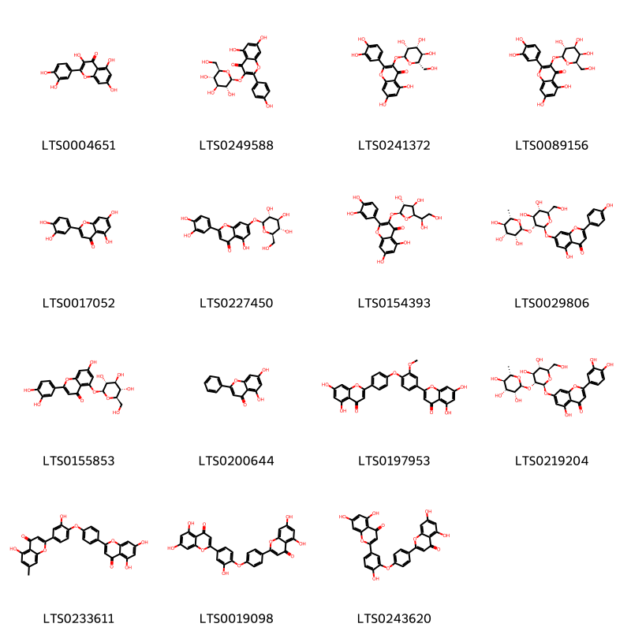{ width=100% }
    <figcaption>Hình ảnh cấu trúc hóa học của 15 hoạt chất thuộc nhóm Flavonoids gồm ['quercetin (LTS0004651)', 'astragalin (LTS0249588)', '2-(3,4-dihydroxyphenyl)-5,7-dihydroxy-3-{[(2s,3r,4r,5r,6s)-3,4,5-trihydroxy-6-(hydroxymethyl)oxan-2-yl]oxy}chromen-4-one (LTS0241372)', 'hyperoside (LTS0089156)', 'luteolin (LTS0017052)', 'luteolin 7-o-glucoside (LTS0227450)', 'quercetin-3-glucoside (LTS0154393)', 'rhoifolin (LTS0029806)', '2-(3,4-dihydroxyphenyl)-7-hydroxy-5-{[(2s,3r,4s,5s,6r)-3,4,5-trihydroxy-6-(hydroxymethyl)oxan-2-yl]oxy}chromen-4-one (LTS0155853)', 'chrysin (LTS0200644)', '2-{4-[4-(5,7-dihydroxy-4-oxochromen-2-yl)phenoxy]-3-methoxyphenyl}-5,7-dihydroxychromen-4-one (LTS0197953)', 'lonicerin (LTS0219204)', '2-{4-[4-(5,7-dihydroxy-4-oxochromen-2-yl)phenoxy]-3-hydroxyphenyl}-5-hydroxy-7-methylchromen-4-one (LTS0233611)', '2-{4-[4-(5,7-dihydroxy-4-oxochromen-2-yl)-2-hydroxyphenoxy]phenyl}-5,7-dihydroxychromen-4-one (LTS0019098)', 'ochnaflavone (LTS0243620)'].</figcaption>
</figure>
#### Nhóm Flavonolignans
<figure markdown="span">
    { width=100% }
    <figcaption>Hình ảnh cấu trúc hóa học của 1 hoạt chất thuộc nhóm Flavonolignans gồm ['5,7-dihydroxy-2-[2-(4-hydroxy-3-methoxyphenyl)-3-(hydroxymethyl)-2,3-dihydro-1,4-benzodioxin-6-yl]chromen-4-one (LTS0064314)'].</figcaption>
</figure>
#### Nhóm Indoles and derivatives
<figure markdown="span">
    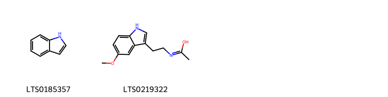{ width=100% }
    <figcaption>Hình ảnh cấu trúc hóa học của 2 hoạt chất thuộc nhóm Indoles and derivatives gồm ['indole (LTS0185357)', 'n-[2-(5-methoxy-1h-indol-3-yl)ethyl]ethanimidic acid (LTS0219322)'].</figcaption>
</figure>
#### Nhóm Isoquinolines and derivatives
<figure markdown="span">
    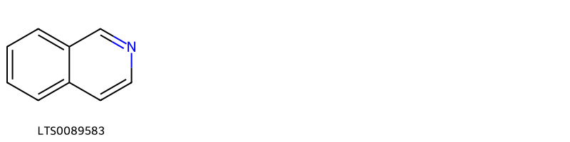{ width=100% }
    <figcaption>Hình ảnh cấu trúc hóa học của 1 hoạt chất thuộc nhóm Isoquinolines and derivatives gồm ['isoquinoline (LTS0089583)'].</figcaption>
</figure>
#### Nhóm Macrolides and analogues
<figure markdown="span">
    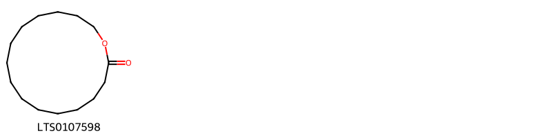{ width=100% }
    <figcaption>Hình ảnh cấu trúc hóa học của 1 hoạt chất thuộc nhóm Macrolides and analogues gồm ['exaltolide (LTS0107598)'].</figcaption>
</figure>
#### Nhóm Organooxygen compounds
<figure markdown="span">
    { width=100% }
    <figcaption>Hình ảnh cấu trúc hóa học của 36 hoạt chất thuộc nhóm Organooxygen compounds gồm ['benzyl β-d-glucoside (LTS0184698)', '(4as,5r,6s)-5-ethenyl-6-{[3,4,5-trihydroxy-6-(hydroxymethyl)oxan-2-yl]oxy}-3h,4h,4ah,5h,6h-pyrano[3,4-c]pyran-1-one (LTS0114959)', 'sweroside (LTS0014051)', '5-ethenyl-6-{[3,4,5-trihydroxy-6-(hydroxymethyl)oxan-2-yl]oxy}-3h,4h,4ah,5h,6h-pyrano[3,4-c]pyran-1-one (LTS0049445)', 'swertiamarin (LTS0210938)', '(4as,5s,6s)-5-ethenyl-6-{[(2s,3s,4s,5s,6r)-3,4,5-trihydroxy-6-(hydroxymethyl)oxan-2-yl]oxy}-3h,4h,4ah,5h,6h-pyrano[3,4-c]pyran-1-one (LTS0048954)', 'neochlorogenic acid (LTS0235816)', '(2s,3r,4s,5s,6r)-2-{[(3s,4r,4as)-4-ethenyl-3h,4h,4ah,5h,6h,8h-pyrano[3,4-c]pyran-3-yl]oxy}-6-(hydroxymethyl)oxane-3,4,5-triol (LTS0060943)', 'methyl (1s,4as,8s,8as)-8-methyl-6-oxo-1-{[(2s,3r,4s,5s,6r)-3,4,5-trihydroxy-6-(hydroxymethyl)oxan-2-yl]oxy}-1h,4ah,5h,8h,8ah-pyrano[3,4-c]pyran-4-carboxylate (LTS0082680)', 'methyl 6-hydroxy-8-methyl-1-{[3,4,5-trihydroxy-6-(hydroxymethyl)oxan-2-yl]oxy}-1h,4ah,5h,6h,8h,8ah-pyrano[3,4-c]pyran-4-carboxylate (LTS0084953)', 'morroniside (LTS0059263)', '(1s,4as,8as)-8-methyl-6-oxo-1-{[(2s,3r,4s,5s,6r)-3,4,5-trihydroxy-6-(hydroxymethyl)oxan-2-yl]oxy}-1h,4ah,5h,8h,8ah-pyrano[3,4-c]pyran-4-yl acetate (LTS0033110)', '2-nonadecanone (LTS0035904)', '(1r,2s,3s,7s,9r)-10-phenyl-3-{[(2s,3r,4s,5s,6r)-3,4,5-trihydroxy-6-(hydroxymethyl)oxan-2-yl]oxy}-4,12-dioxatricyclo[7.3.1.0²,⁷]trideca-5,10-diene-6-carboxylic acid (LTS0117035)', '(2r)-2-hydroxy-n-[(2s,3s,5r,6s,9e)-1,3,5,6-tetrahydroxyhexacos-9-en-2-yl]pentadecanimidic acid (LTS0196888)', '(3r,4as,5s,6s)-5-ethenyl-3-methoxy-6-{[(2s,3s,4r,5s,6s)-3,4,5-trihydroxy-6-(hydroxymethyl)oxan-2-yl]oxy}-3h,4h,4ah,5h,6h-pyrano[3,4-c]pyran-1-one (LTS0192970)', '(3r,4as,5r,6s)-5-ethenyl-3-methoxy-6-{[(2s,3r,4s,5s,6r)-3,4,5-trihydroxy-6-(hydroxymethyl)oxan-2-yl]oxy}-3h,4h,4ah,5h,6h-pyrano[3,4-c]pyran-1-one (LTS0157469)', '5-ethenyl-3-methoxy-6-{[(2s,3r,4s,5s,6r)-3,4,5-trihydroxy-6-(hydroxymethyl)oxan-2-yl]oxy}-3h,4h,4ah,5h,6h-pyrano[3,4-c]pyran-1-one (LTS0075789)', 'isochlorogenic acid (LTS0210263)', 'methyl (1s,4as,8s,8as)-8-methyl-6-oxo-1-{[(2r,3s,4r,5s,6s)-3,4,5-trihydroxy-6-(hydroxymethyl)oxan-2-yl]oxy}-1h,4ah,5h,8h,8ah-pyrano[3,4-c]pyran-4-carboxylate (LTS0102052)', '(3s,4as,5r,6s)-5-ethenyl-3-methoxy-6-{[(2s,3r,4s,5s,6r)-3,4,5-trihydroxy-6-(hydroxymethyl)oxan-2-yl]oxy}-3h,4h,4ah,5h,6h-pyrano[3,4-c]pyran-1-one (LTS0187995)', '(2r)-2-hydroxy-n-[(2s,3s,5r,6s,9e)-1,3,5,6-tetrahydroxyoctacos-9-en-2-yl]octadecanimidic acid (LTS0173298)', '(2s,3r,4s,5s,6r)-2-{[(3s,4r,4as,6r)-4-ethenyl-6-methoxy-3h,4h,4ah,5h,6h,8h-pyrano[3,4-c]pyran-3-yl]oxy}-6-(hydroxymethyl)oxane-3,4,5-triol (LTS0156001)', '2-pentadecanone (LTS0265307)', 'jasmone (LTS0205512)', '(3s,4as,5s,6s)-5-ethenyl-3-methoxy-6-{[(2s,3r,4s,5s,6r)-3,4,5-trihydroxy-6-(hydroxymethyl)oxan-2-yl]oxy}-3h,4h,4ah,5h,6h-pyrano[3,4-c]pyran-1-one (LTS0269826)', '(e)-2-hexenal (LTS0207868)', 'methyl (1s,4as,6s,8s,8as)-6-hydroxy-8-methyl-1-{[(2s,3r,4s,5s,6r)-3,4,5-trihydroxy-6-(hydroxymethyl)oxan-2-yl]oxy}-1h,4ah,5h,6h,8h,8ah-pyrano[3,4-c]pyran-4-carboxylate (LTS0226231)', 'methyl 8-methyl-6-oxo-1-{[3,4,5-trihydroxy-6-(hydroxymethyl)oxan-2-yl]oxy}-1h,4ah,5h,8h,8ah-pyrano[3,4-c]pyran-4-carboxylate (LTS0251161)', '(2s,3r,4s,5s,6r)-2-{[(3s,4r,4as,6s)-4-ethenyl-6-methoxy-3h,4h,4ah,5h,6h,8h-pyrano[3,4-c]pyran-3-yl]oxy}-6-(hydroxymethyl)oxane-3,4,5-triol (LTS0233432)', '5-ethenyl-3-methoxy-6-{[3,4,5-trihydroxy-6-(hydroxymethyl)oxan-2-yl]oxy}-3h,4h,4ah,5h,6h-pyrano[3,4-c]pyran-1-one (LTS0253286)', '2-({4-ethenyl-3h,4h,4ah,5h,6h,8h-pyrano[3,4-c]pyran-3-yl}oxy)-6-(hydroxymethyl)oxane-3,4,5-triol (LTS0008879)', 'lonijaposide h (LTS0000491)', '2-({4-ethenyl-6-methoxy-3h,4h,4ah,5h,6h,8h-pyrano[3,4-c]pyran-3-yl}oxy)-6-(hydroxymethyl)oxane-3,4,5-triol (LTS0094812)', 'methyl (4as,8as)-6-hydroxy-8-methyl-1-{[3,4,5-trihydroxy-6-(hydroxymethyl)oxan-2-yl]oxy}-1h,4ah,5h,6h,8h,8ah-pyrano[3,4-c]pyran-4-carboxylate (LTS0262967)', 'didecyl ether (LTS0250090)'].</figcaption>
</figure>
#### Nhóm Phenols
<figure markdown="span">
    { width=100% }
    <figcaption>Hình ảnh cấu trúc hóa học của 2 hoạt chất thuộc nhóm Phenols gồm ['eugenol (LTS0052342)', '2-methoxy-6-(prop-2-en-1-yl)phenol (LTS0013916)'].</figcaption>
</figure>
#### Nhóm Prenol lipids
<figure markdown="span">
    { width=100% }
    <figcaption>Hình ảnh cấu trúc hóa học của 107 hoạt chất thuộc nhóm Prenol lipids gồm ['caryophyllene (LTS0085212)', 'β-carotene (LTS0275716)', 'terpineol (LTS0136148)', 'nerolidol (LTS0197738)', 'geraniol (LTS0258838)', 'farnesene (LTS0057150)', '10-[(4,5-dihydroxy-3-{[3,4,5-trihydroxy-6-(hydroxymethyl)oxan-2-yl]oxy}oxan-2-yl)oxy]-2,2,6a,6b,9,9,12a-heptamethyl-1,3,4,5,6,7,8,8a,10,11,12,12b,13,14b-tetradecahydropicene-4a-carboxylic acid (LTS0220377)', 'hederagenin 3-o-arabinoside (LTS0090209)', 'β-bourbonene (LTS0074484)', '9-(hydroxymethyl)-2,2,6a,6b,9,12a-hexamethyl-10-[(3,4,5-trihydroxyoxan-2-yl)oxy]-1,3,4,5,6,7,8,8a,10,11,12,12b,13,14b-tetradecahydropicene-4a-carboxylic acid (LTS0062858)', '(2s,3r,4s,5s,6r)-3,4,5-trihydroxy-6-({[(2r,3r,4s,5s,6r)-3,4,5-trihydroxy-6-(hydroxymethyl)oxan-2-yl]oxy}methyl)oxan-2-yl (4as,6as,6br,8ar,9r,10s,12ar,12br,14bs)-9-(hydroxymethyl)-2,2,6a,6b,9,12a-hexamethyl-10-{[(2s,3r,4s,5s)-3,4,5-trihydroxyoxan-2-yl]oxy}-1,3,4,5,6,7,8,8a,10,11,12,12b,13,14b-tetradecahydropicene-4a-carboxylate (LTS0170288)', '(-)-secologanin (LTS0199033)', '3,4,5-trihydroxy-6-({[3,4,5-trihydroxy-6-(hydroxymethyl)oxan-2-yl]oxy}methyl)oxan-2-yl 9-(hydroxymethyl)-2,2,6a,6b,9,12a-hexamethyl-10-[(3,4,5-trihydroxyoxan-2-yl)oxy]-1,3,4,5,6,7,8,8a,10,11,12,12b,13,14b-tetradecahydropicene-4a-carboxylate (LTS0238626)', '(4as,6as,6br,8ar,10s,12ar,12br,14bs)-10-{[(2s,3r,4s,5s)-4,5-dihydroxy-3-{[(2s,3r,4s,5s,6r)-3,4,5-trihydroxy-6-(hydroxymethyl)oxan-2-yl]oxy}oxan-2-yl]oxy}-2,2,6a,6b,9,9,12a-heptamethyl-1,3,4,5,6,7,8,8a,10,11,12,12b,13,14b-tetradecahydropicene-4a-carboxylic acid (LTS0240910)', '10-[(4,5-dihydroxy-3-{[3,4,5-trihydroxy-6-(hydroxymethyl)oxan-2-yl]oxy}oxan-2-yl)oxy]-9-(hydroxymethyl)-2,2,6a,6b,9,12a-hexamethyl-1,3,4,5,6,7,8,8a,10,11,12,12b,13,14b-tetradecahydropicene-4a-carboxylic acid (LTS0101116)', 'cauloside c (LTS0086751)', 'loganin (LTS0084120)', 'citronellol, (+-)- (LTS0090925)', '1,3,3-trimethyl-2-[(9e,11e,13e,15e,17e)-3,7,12,16-tetramethyl-18-(2,6,6-trimethylcyclohex-1-en-1-yl)octadeca-1,3,5,7,9,11,13,15,17-nonaen-1-yl]cyclohex-1-ene (LTS0110068)', '2,6,6-trimethyl-8-methylidenetricyclo[5.3.1.0¹,⁵]undecane (LTS0066298)', '7-deoxyloganetin (LTS0122992)', '(2s,3r,4s,5s,6r)-3,4,5-trihydroxy-6-({[(2r,3r,4s,5s,6r)-3,4,5-trihydroxy-6-(hydroxymethyl)oxan-2-yl]oxy}methyl)oxan-2-yl (4as,6as,6br,8ar,10s,12ar,12br,14bs)-10-{[(2s,3r,4s,5s)-4,5-dihydroxy-3-{[(2s,3r,4s,5s,6r)-3,4,5-trihydroxy-6-(hydroxymethyl)oxan-2-yl]oxy}oxan-2-yl]oxy}-2,2,6a,6b,9,9,12a-heptamethyl-1,3,4,5,6,7,8,8a,10,11,12,12b,13,14b-tetradecahydropicene-4a-carboxylate (LTS0072041)', 'piperitenone (LTS0074451)', '2,6,6-trimethylbicyclo[3.1.1]hept-1-ene (LTS0080542)', 'methyl 6-hydroxy-7-methyl-1-{[3,4,5-trihydroxy-6-(hydroxymethyl)oxan-2-yl]oxy}-1h,4ah,5h,6h,7h,7ah-cyclopenta[c]pyran-4-carboxylate (LTS0032881)', '3-carboxy-1-(3-carboxypropyl)-5-[(1e)-2-[(2s,3r,4s)-3-ethenyl-5-(methoxycarbonyl)-2-{[(2s,3r,4s,5s,6r)-3,4,5-trihydroxy-6-(hydroxymethyl)oxan-2-yl]oxy}-3,4-dihydro-2h-pyran-4-yl]ethenyl]pyridin-1-ium (LTS0078530)', '3-carboxy-5-[(1e)-2-[(2s,3r,4s)-5-carboxylato-3-ethenyl-2-{[(2s,3r,4s,5s,6r)-3,4,5-trihydroxy-6-(hydroxymethyl)oxan-2-yl]oxy}-3,4-dihydro-2h-pyran-4-yl]ethenyl]-1-ethylpyridin-1-ium (LTS0023161)', '4-(carboxymethyl)-5-ethenyl-6-{[3,4,5-trihydroxy-6-(hydroxymethyl)oxan-2-yl]oxy}-5,6-dihydro-4h-pyran-3-carboxylic acid (LTS0144922)', '2-({2-[3-ethenyl-5-(methoxycarbonyl)-2-{[3,4,5-trihydroxy-6-(hydroxymethyl)oxan-2-yl]oxy}-3,4-dihydro-2h-pyran-4-yl]ethyl}amino)-3-phenylpropanoic acid (LTS0008479)', '3,4,5-trihydroxy-6-({[3,4,5-trihydroxy-6-(hydroxymethyl)oxan-2-yl]oxy}methyl)oxan-2-yl 10-[(4,5-dihydroxy-3-{[3,4,5-trihydroxy-6-(hydroxymethyl)oxan-2-yl]oxy}oxan-2-yl)oxy]-9-(hydroxymethyl)-2,2,6a,6b,9,12a-hexamethyl-1,3,4,5,6,7,8,8a,10,11,12,12b,13,14b-tetradecahydropicene-4a-carboxylate (LTS0102646)', '(4s,5r,6s)-5-ethenyl-4-(2-methoxy-2-oxoethyl)-6-{[(2s,3r,4s,5s,6r)-3,4,5-trihydroxy-6-(hydroxymethyl)oxan-2-yl]oxy}-5,6-dihydro-4h-pyran-3-carboxylic acid (LTS0167485)', '4,5-dihydroxy-3-[(3,4,5-trihydroxy-6-methyloxan-2-yl)oxy]-6-{[(3,4,5-trihydroxyoxan-2-yl)oxy]methyl}oxan-2-yl 9-(hydroxymethyl)-2,2,6a,6b,9,12a-hexamethyl-10-{[3,4,5-trihydroxy-6-(hydroxymethyl)oxan-2-yl]oxy}-1,3,4,5,6,7,8,8a,10,11,12,12b,13,14b-tetradecahydropicene-4a-carboxylate (LTS0118857)', 'methyl 5-ethenyl-4-{3-[3-ethenyl-5-(methoxycarbonyl)-2-{[3,4,5-trihydroxy-6-(hydroxymethyl)oxan-2-yl]oxy}-3,4-dihydro-2h-pyran-4-yl]-4-oxobut-2-en-1-yl}-6-{[3,4,5-trihydroxy-6-(hydroxymethyl)oxan-2-yl]oxy}-5,6-dihydro-4h-pyran-3-carboxylate (LTS0119142)', '3-carboxy-5-[(1e)-2-[(2s,3r,4s)-3-ethenyl-5-(methoxycarbonyl)-2-{[(2s,3r,4s,5s,6r)-3,4,5-trihydroxy-6-(hydroxymethyl)oxan-2-yl]oxy}-3,4-dihydro-2h-pyran-4-yl]ethenyl]-1-(2-hydroxyethyl)pyridin-1-ium (LTS0199763)', '3,4,5-trihydroxy-6-(hydroxymethyl)oxan-2-yl 10-({4,5-dihydroxy-3-[(3,4,5-trihydroxy-6-methyloxan-2-yl)oxy]oxan-2-yl}oxy)-9-(hydroxymethyl)-2,2,6a,6b,9,12a-hexamethyl-1,3,4,5,6,7,8,8a,10,11,12,12b,13,14b-tetradecahydropicene-4a-carboxylate (LTS0068099)', '5-ethenyl-4-(2-methoxy-2-oxoethyl)-6-{[3,4,5-trihydroxy-6-(hydroxymethyl)oxan-2-yl]oxy}-5,6-dihydro-4h-pyran-3-carboxylic acid (LTS0110457)', '3-[(1e)-2-[(2s,3r,4s)-3-ethenyl-5-(methoxycarbonyl)-2-{[(2s,3r,4s,5s,6r)-3,4,5-trihydroxy-6-(hydroxymethyl)oxan-2-yl]oxy}-3,4-dihydro-2h-pyran-4-yl]ethenyl]-1-(2-hydroxyethyl)pyridin-1-ium (LTS0196820)', 'lonijaposide g (LTS0017922)', '10-({4,5-dihydroxy-3-[(3,4,5-trihydroxy-6-methyloxan-2-yl)oxy]oxan-2-yl}oxy)-9-(hydroxymethyl)-2,2,6a,6b,9,12a-hexamethyl-1,3,4,5,6,7,8,8a,10,11,12,12b,13,14b-tetradecahydropicene-4a-carboxylic acid (LTS0107537)', '3,7,11-trimethyldodeca-1,6,10-trien-3-yl acetate (LTS0104577)', 'methyl (1s,4as,6s,7s,7ar)-6-hydroxy-7-methyl-1-{[(2s,3r,4s,5s,6r)-3,4,5-trihydroxy-6-(hydroxymethyl)oxan-2-yl]oxy}-1h,4ah,5h,6h,7h,7ah-cyclopenta[c]pyran-4-carboxylate (LTS0184542)', 'methyl (1s,4as,6s,7r,7as)-1-{[(2s,3r,4s,5s,6r)-6-({[(3r,4as,5r,6s)-5-ethenyl-1-oxo-6-{[(2s,3r,4s,5s,6r)-3,4,5-trihydroxy-6-(hydroxymethyl)oxan-2-yl]oxy}-3h,4h,4ah,5h,6h-pyrano[3,4-c]pyran-3-yl]oxy}methyl)-3,4,5-trihydroxyoxan-2-yl]oxy}-6-hydroxy-7-methyl-1h,4ah,5h,6h,7h,7ah-cyclopenta[c]pyran-4-carboxylate (LTS0187232)', '(1s,4as,6s,7s,7as)-6-hydroxy-7-methyl-1-{[(2s,3r,4s,5s,6r)-3,4,5-trihydroxy-6-(hydroxymethyl)oxan-2-yl]oxy}-1h,4ah,5h,6h,7h,7ah-cyclopenta[c]pyran-4-carboxylic acid (LTS0260312)', '6-[({6-[(acetyloxy)methyl]-3,4,5-trihydroxyoxan-2-yl}oxy)methyl]-3,4,5-trihydroxyoxan-2-yl 10-({4,5-dihydroxy-3-[(3,4,5-trihydroxy-6-methyloxan-2-yl)oxy]oxan-2-yl}oxy)-9-(hydroxymethyl)-2,2,6a,6b,9,12a-hexamethyl-1,3,4,5,6,7,8,8a,10,11,12,12b,13,14b-tetradecahydropicene-4a-carboxylate (LTS0241854)', '3,4,5-trihydroxy-6-({[3,4,5-trihydroxy-6-(hydroxymethyl)oxan-2-yl]oxy}methyl)oxan-2-yl 10-({4,5-dihydroxy-3-[(3,4,5-trihydroxy-6-methyloxan-2-yl)oxy]oxan-2-yl}oxy)-2,2,6a,6b,9,9,12a-heptamethyl-1,3,4,5,6,7,8,8a,10,11,12,12b,13,14b-tetradecahydropicene-4a-carboxylate (LTS0193057)', 'methyl (4s,5r,6s)-5-ethenyl-4-[(2e)-3-[(2s,3r,4r)-3-ethenyl-5-(methoxycarbonyl)-2-{[(2s,3r,4s,5s,6r)-3,4,5-trihydroxy-6-(hydroxymethyl)oxan-2-yl]oxy}-3,4-dihydro-2h-pyran-4-yl]-4-oxobut-2-en-1-yl]-6-{[(2s,3r,4s,5s,6r)-3,4,5-trihydroxy-6-(hydroxymethyl)oxan-2-yl]oxy}-5,6-dihydro-4h-pyran-3-carboxylate (LTS0250189)', '(2s,3r,4s,5s,6r)-3,4,5-trihydroxy-6-({[(2r,3r,4s,5s,6r)-3,4,5-trihydroxy-6-(hydroxymethyl)oxan-2-yl]oxy}methyl)oxan-2-yl (4as,6as,6br,9r,10s,12ar)-10-{[(2s,3r,4s,5s)-4,5-dihydroxy-3-{[(2s,3r,4r,5r,6s)-3,4,5-trihydroxy-6-methyloxan-2-yl]oxy}oxan-2-yl]oxy}-9-(hydroxymethyl)-2,2,6a,6b,9,12a-hexamethyl-1,3,4,5,6,7,8,8a,10,11,12,12b,13,14b-tetradecahydropicene-4a-carboxylate (LTS0162110)', '5-carboxy-3-[(1e)-2-[(2r,3s,4s)-5-carboxy-3-ethenyl-2-{[(2s,3r,4s,5r,6r)-3,4,5-trihydroxy-6-(hydroxymethyl)oxan-2-yl]oxy}-3,4-dihydro-2h-pyran-4-yl]ethenyl]-1-(2-hydroxyethyl)-2h-pyridin-2-yl (LTS0150042)', '(2s,3r,4s,5s,6r)-6-({[(2r,3r,4s,5s,6r)-6-[(acetyloxy)methyl]-3,4,5-trihydroxyoxan-2-yl]oxy}methyl)-3,4,5-trihydroxyoxan-2-yl (4as,6as,6br,8ar,9r,10s,12ar,12br,14bs)-10-{[(2s,3r,4s,5s)-4,5-dihydroxy-3-{[(2s,3r,4r,5r,6s)-3,4,5-trihydroxy-6-methyloxan-2-yl]oxy}oxan-2-yl]oxy}-9-(hydroxymethyl)-2,2,6a,6b,9,12a-hexamethyl-1,3,4,5,6,7,8,8a,10,11,12,12b,13,14b-tetradecahydropicene-4a-carboxylate (LTS0192120)', '(2s,3r,4s,5s,6r)-3,4,5-trihydroxy-6-(hydroxymethyl)oxan-2-yl (4as,6as,6br,8ar,9r,10s,12ar,12br,14bs)-10-{[(2s,3r,4s,5s)-4,5-dihydroxy-3-{[(2s,3r,4r,5r,6s)-3,4,5-trihydroxy-6-methyloxan-2-yl]oxy}oxan-2-yl]oxy}-9-(hydroxymethyl)-2,2,6a,6b,9,12a-hexamethyl-1,3,4,5,6,7,8,8a,10,11,12,12b,13,14b-tetradecahydropicene-4a-carboxylate (LTS0191742)', 'lonijaposide n (LTS0090217)', '4,5-dihydroxy-3-[(3,4,5-trihydroxy-6-methyloxan-2-yl)oxy]-6-{[(3,4,5-trihydroxyoxan-2-yl)oxy]methyl}oxan-2-yl 10-({4,5-dihydroxy-3-[(3,4,5-trihydroxy-6-methyloxan-2-yl)oxy]oxan-2-yl}oxy)-9-(hydroxymethyl)-2,2,6a,6b,9,12a-hexamethyl-1,3,4,5,6,7,8,8a,10,11,12,12b,13,14b-tetradecahydropicene-4a-carboxylate (LTS0164634)', 'methyl (1s,4as,6s,7s,7as)-6-hydroxy-7-methyl-1-{[(2s,3r,4s,5s,6r)-3,4,5-trihydroxy-6-(hydroxymethyl)oxan-2-yl]oxy}-1h,4ah,5h,6h,7h,7ah-cyclopenta[c]pyran-4-carboxylate (LTS0213092)', 'phytofluene (LTS0181914)', 'methyl (4s,5r,6r)-5-ethenyl-4-(2-oxoethyl)-6-{[(2s,3r,4s,5s,6r)-3,4,5-trihydroxy-6-(hydroxymethyl)oxan-2-yl]oxy}-5,6-dihydro-4h-pyran-3-carboxylate (LTS0246845)', '(2s,3r,4s,5s,6r)-4,5-dihydroxy-3-{[(2s,3r,4r,5r,6s)-3,4,5-trihydroxy-6-methyloxan-2-yl]oxy}-6-({[(2s,3r,4s,5r)-3,4,5-trihydroxyoxan-2-yl]oxy}methyl)oxan-2-yl (4as,6as,6br,8ar,9r,10s,12ar,12br,14br)-10-{[(2s,3r,4s,5s)-4,5-dihydroxy-3-{[(2s,3r,4r,5r,6s)-3,4,5-trihydroxy-6-methyloxan-2-yl]oxy}oxan-2-yl]oxy}-9-(hydroxymethyl)-2,2,6a,6b,9,12a-hexamethyl-1,3,4,5,6,7,8,8a,10,11,12,12b,13,14b-tetradecahydropicene-4a-carboxylate (LTS0245060)', '(4s,5r,6s)-4-(carboxymethyl)-5-ethenyl-6-{[(2s,3r,4s,5s,6r)-3,4,5-trihydroxy-6-(hydroxymethyl)oxan-2-yl]oxy}-5,6-dihydro-4h-pyran-3-carboxylic acid (LTS0242890)', 'dipsacoside b (LTS0161777)', '4,5-dihydroxy-3-[(3,4,5-trihydroxy-6-methyloxan-2-yl)oxy]-6-{[(3,4,5-trihydroxyoxan-2-yl)oxy]methyl}oxan-2-yl 9-(hydroxymethyl)-2,2,6a,6b,9,12a-hexamethyl-10-[(3,4,5-trihydroxyoxan-2-yl)oxy]-1,3,4,5,6,7,8,8a,10,11,12,12b,13,14b-tetradecahydropicene-4a-carboxylate (LTS0107255)', '(4s,5r,6s)-4-(carboxymethyl)-5-ethenyl-6-{[(2r,3s,4r,5r,6s)-3,4,5-trihydroxy-6-(hydroxymethyl)oxan-2-yl]oxy}-5,6-dihydro-4h-pyran-3-carboxylic acid (LTS0267795)', '(2s,3r,4s,5s,6r)-4,5-dihydroxy-3-{[(2s,3r,4r,5r,6s)-3,4,5-trihydroxy-6-methyloxan-2-yl]oxy}-6-({[(2r,3r,4r,5s)-3,4,5-trihydroxyoxan-2-yl]oxy}methyl)oxan-2-yl (4as,6as,6br,8ar,9r,10s,12ar,12br,14bs)-9-(hydroxymethyl)-2,2,6a,6b,9,12a-hexamethyl-10-{[(2r,3r,4s,5s,6r)-3,4,5-trihydroxy-6-(hydroxymethyl)oxan-2-yl]oxy}-1,3,4,5,6,7,8,8a,10,11,12,12b,13,14b-tetradecahydropicene-4a-carboxylate (LTS0195682)', 'lonijaposide l (LTS0203192)', '3-carboxy-5-[(1e)-2-[(2s,3r,4s)-5-carboxylato-3-ethenyl-2-{[(2s,3r,4s,5s,6r)-3,4,5-trihydroxy-6-(hydroxymethyl)oxan-2-yl]oxy}-3,4-dihydro-2h-pyran-4-yl]ethenyl]-1-(3-carboxypropyl)pyridin-1-ium (LTS0073819)', '[(2s,3r,4s)-3-ethenyl-5-(methoxycarbonyl)-2-{[(2s,3r,4s,5s,6r)-3,4,5-trihydroxy-6-(hydroxymethyl)oxan-2-yl]oxy}-3,4-dihydro-2h-pyran-4-yl]acetic acid (LTS0101012)', 'zeta-carotene (LTS0218266)', '(2s)-2-({2-[(2s,3r,4s)-3-ethenyl-5-(methoxycarbonyl)-2-{[(2s,3r,4s,5s,6r)-3,4,5-trihydroxy-6-(hydroxymethyl)oxan-2-yl]oxy}-3,4-dihydro-2h-pyran-4-yl]ethyl}amino)-3-phenylpropanoic acid (LTS0100816)', 'lonijaposide c (LTS0100755)', 'methyl 4-(2,2-dimethoxyethyl)-5-ethenyl-6-{[3,4,5-trihydroxy-6-(hydroxymethyl)oxan-2-yl]oxy}-5,6-dihydro-4h-pyran-3-carboxylate (LTS0218607)', 'loganic acid (LTS0231203)', '3,4,5-trihydroxy-6-({[3,4,5-trihydroxy-6-(hydroxymethyl)oxan-2-yl]oxy}methyl)oxan-2-yl 10-[(4,5-dihydroxy-3-{[3,4,5-trihydroxy-6-(hydroxymethyl)oxan-2-yl]oxy}oxan-2-yl)oxy]-2,2,6a,6b,9,9,12a-heptamethyl-1,3,4,5,6,7,8,8a,10,11,12,12b,13,14b-tetradecahydropicene-4a-carboxylate (LTS0080846)', '(2s,3r,4s,5s,6r)-4,5-dihydroxy-3-{[(2s,3r,4r,5r,6s)-3,4,5-trihydroxy-6-methyloxan-2-yl]oxy}-6-({[(2s,3r,4s,5r)-3,4,5-trihydroxyoxan-2-yl]oxy}methyl)oxan-2-yl (4as,6as,6br,8ar,9r,10s,12ar,12br,14bs)-9-(hydroxymethyl)-2,2,6a,6b,9,12a-hexamethyl-10-{[(2r,3r,4s,5s,6r)-3,4,5-trihydroxy-6-(hydroxymethyl)oxan-2-yl]oxy}-1,3,4,5,6,7,8,8a,10,11,12,12b,13,14b-tetradecahydropicene-4a-carboxylate (LTS0226310)', 'methyl (4s,5r,6s)-5-ethenyl-4-[(2z)-3-[(2s,3r,4r)-3-ethenyl-5-(methoxycarbonyl)-2-{[(2s,3r,4s,5s,6r)-3,4,5-trihydroxy-6-(hydroxymethyl)oxan-2-yl]oxy}-3,4-dihydro-2h-pyran-4-yl]-4-oxobut-2-en-1-yl]-6-{[(2s,3r,4s,5s,6r)-3,4,5-trihydroxy-6-(hydroxymethyl)oxan-2-yl]oxy}-5,6-dihydro-4h-pyran-3-carboxylate (LTS0218395)', '(2s,3r,4s,5s,6r)-4,5-dihydroxy-3-{[(2s,3r,4r,5r,6s)-3,4,5-trihydroxy-6-methyloxan-2-yl]oxy}-6-({[(2s,3r,4s,5r)-3,4,5-trihydroxyoxan-2-yl]oxy}methyl)oxan-2-yl (4as,6as,6br,8ar,9r,10s,12ar,12br,14bs)-10-{[(2s,3r,4s,5s)-4,5-dihydroxy-3-{[(2s,3r,4r,5r,6s)-3,4,5-trihydroxy-6-methyloxan-2-yl]oxy}oxan-2-yl]oxy}-9-(hydroxymethyl)-2,2,6a,6b,9,12a-hexamethyl-1,3,4,5,6,7,8,8a,10,11,12,12b,13,14b-tetradecahydropicene-4a-carboxylate (LTS0212920)', 'methyl 4-[(4,5-dimethyl-1,3-dioxolan-2-yl)methyl]-5-ethenyl-6-{[3,4,5-trihydroxy-6-(hydroxymethyl)oxan-2-yl]oxy}-5,6-dihydro-4h-pyran-3-carboxylate (LTS0188388)', '7-deoxyloganetic acid (LTS0040000)', 'polyprenol (LTS0209244)', '(10e,12e,14e)-2,6,10,14,19,23,27,31-octamethyldotriaconta-2,6,10,12,14,16,18,22,26,30-decaene (LTS0022128)', 'lonijaposide m (LTS0047239)', 'lonijaposide e (LTS0248338)', '[3-ethenyl-5-(methoxycarbonyl)-2-{[3,4,5-trihydroxy-6-(hydroxymethyl)oxan-2-yl]oxy}-3,4-dihydro-2h-pyran-4-yl]acetic acid (LTS0036880)', 'methyl (4s,5r,6s)-4-{[(4r,5s)-4,5-dimethyl-1,3-dioxolan-2-yl]methyl}-5-ethenyl-6-{[(2s,3r,4s,5s,6r)-3,4,5-trihydroxy-6-(hydroxymethyl)oxan-2-yl]oxy}-5,6-dihydro-4h-pyran-3-carboxylate (LTS0256042)', 'farnesol (LTS0059667)', '(2s,3r,4s,5s,6r)-3,4,5-trihydroxy-6-({[(2r,3r,4s,5s,6r)-3,4,5-trihydroxy-6-(hydroxymethyl)oxan-2-yl]oxy}methyl)oxan-2-yl (4as,6as,6br,8ar,9r,10s,12ar,12br,14bs)-10-{[(2s,3r,4s,5s)-4,5-dihydroxy-3-{[(2s,3r,4s,5s,6r)-3,4,5-trihydroxy-6-(hydroxymethyl)oxan-2-yl]oxy}oxan-2-yl]oxy}-9-(hydroxymethyl)-2,2,6a,6b,9,12a-hexamethyl-1,3,4,5,6,7,8,8a,10,11,12,12b,13,14b-tetradecahydropicene-4a-carboxylate (LTS0016604)', '(2s,3r,4s,5s,6r)-4,5-dihydroxy-3-{[(2s,3r,4r,5r,6s)-3,4,5-trihydroxy-6-methyloxan-2-yl]oxy}-6-({[(2s,3r,4s,5r)-3,4,5-trihydroxyoxan-2-yl]oxy}methyl)oxan-2-yl (4as,6as,6br,8ar,9r,10s,12ar,12br,14br)-9-(hydroxymethyl)-2,2,6a,6b,9,12a-hexamethyl-10-{[(2s,3r,4s,5s)-3,4,5-trihydroxyoxan-2-yl]oxy}-1,3,4,5,6,7,8,8a,10,11,12,12b,13,14b-tetradecahydropicene-4a-carboxylate (LTS0129400)', 'methyl (4s,5s,6s)-4-{[(2s,4r,5s)-4,5-dimethyl-1,3-dioxolan-2-yl]methyl}-5-ethenyl-6-{[(2s,3r,4s,5s,6r)-3,4,5-trihydroxy-6-(hydroxymethyl)oxan-2-yl]oxy}-5,6-dihydro-4h-pyran-3-carboxylate (LTS0270646)', 'methyl (4s,5s,6s)-4-{[(2r,4r,5s)-4,5-dimethyl-1,3-dioxolan-2-yl]methyl}-5-ethenyl-6-{[(2s,3r,4s,5s,6r)-3,4,5-trihydroxy-6-(hydroxymethyl)oxan-2-yl]oxy}-5,6-dihydro-4h-pyran-3-carboxylate (LTS0014246)', '3,4,5-trihydroxy-6-({[3,4,5-trihydroxy-6-(hydroxymethyl)oxan-2-yl]oxy}methyl)oxan-2-yl 10-({4,5-dihydroxy-3-[(3,4,5-trihydroxy-6-methyloxan-2-yl)oxy]oxan-2-yl}oxy)-9-(hydroxymethyl)-2,2,6a,6b,9,12a-hexamethyl-1,3,4,5,6,7,8,8a,10,11,12,12b,13,14b-tetradecahydropicene-4a-carboxylate (LTS0125941)', 'methyl (4s,5r,6s)-4-(2,2-dimethoxyethyl)-5-ethenyl-6-{[(2s,3r,4s,5s,6r)-3,4,5-trihydroxy-6-(hydroxymethyl)oxan-2-yl]oxy}-5,6-dihydro-4h-pyran-3-carboxylate (LTS0266081)', 'lonijaposide k (LTS0037684)', 'loniphenyruviridoside d (LTS0014480)', 'methyl (4s,5r,6s)-4-{[(2r,4r,5s)-4,5-dimethyl-1,3-dioxolan-2-yl]methyl}-5-ethenyl-6-{[(2s,3r,4s,5s,6r)-3,4,5-trihydroxy-6-(hydroxymethyl)oxan-2-yl]oxy}-5,6-dihydro-4h-pyran-3-carboxylate (LTS0027684)', 'isophytol (LTS0015331)', 'α-hederin (LTS0024551)', 'carvacrol (LTS0012882)', '(2s,3r,4s,5s,6r)-3,4,5-trihydroxy-6-({[(2r,3r,4s,5s,6r)-3,4,5-trihydroxy-6-(hydroxymethyl)oxan-2-yl]oxy}methyl)oxan-2-yl (4as,6as,6br,8ar,10s,12ar,12br,14bs)-10-{[(2s,3r,4s,5s)-4,5-dihydroxy-3-{[(2s,3r,4r,5r,6s)-3,4,5-trihydroxy-6-methyloxan-2-yl]oxy}oxan-2-yl]oxy}-2,2,6a,6b,9,9,12a-heptamethyl-1,3,4,5,6,7,8,8a,10,11,12,12b,13,14b-tetradecahydropicene-4a-carboxylate (LTS0051871)', '(2s,3r,4s,5s,6r)-3,4,5-trihydroxy-6-({[(2r,3r,4s,5s,6r)-3,4,5-trihydroxy-6-(hydroxymethyl)oxan-2-yl]oxy}methyl)oxan-2-yl (4as,6as,6br,8ar,10s,12ar,12br,14bs)-2,2,6a,6b,9,9,12a-heptamethyl-10-{[(2s,3r,4s,5s)-3,4,5-trihydroxyoxan-2-yl]oxy}-1,3,4,5,6,7,8,8a,10,11,12,12b,13,14b-tetradecahydropicene-4a-carboxylate (LTS0006048)', '2-(3,7,12,16,20,24-hexamethylpentacosa-1,3,5,7,9,11,13,15,17,19,23-undecaen-1-yl)-1,3,3-trimethylcyclohex-1-ene (LTS0086978)', 'methyl (4s,5r,6s)-4-{[(2s,4r,5s)-4,5-dimethyl-1,3-dioxolan-2-yl]methyl}-5-ethenyl-6-{[(2s,3r,4s,5s,6r)-3,4,5-trihydroxy-6-(hydroxymethyl)oxan-2-yl]oxy}-5,6-dihydro-4h-pyran-3-carboxylate (LTS0017687)', 'methyl 1-[(6-{[(5-ethenyl-1-oxo-6-{[3,4,5-trihydroxy-6-(hydroxymethyl)oxan-2-yl]oxy}-3h,4h,4ah,5h,6h-pyrano[3,4-c]pyran-3-yl)oxy]methyl}-3,4,5-trihydroxyoxan-2-yl)oxy]-6-hydroxy-7-methyl-1h,4ah,5h,6h,7h,7ah-cyclopenta[c]pyran-4-carboxylate (LTS0100913)', '3,4,5-trihydroxy-6-({[3,4,5-trihydroxy-6-(hydroxymethyl)oxan-2-yl]oxy}methyl)oxan-2-yl 2,2,6a,6b,9,9,12a-heptamethyl-10-[(3,4,5-trihydroxyoxan-2-yl)oxy]-1,3,4,5,6,7,8,8a,10,11,12,12b,13,14b-tetradecahydropicene-4a-carboxylate (LTS0234984)', '(1r,4r,6s,10s)-4,12,12-trimethyl-9-methylidene-5-oxatricyclo[8.2.0.0⁴,⁶]dodecane (LTS0029123)', 'zeta-carotene (LTS0007334)', 'secologanin (LTS0235060)', 'lonijaposide i (LTS0027760)', 'gamma-carotene (LTS0108535)', '5-carboxy-3-[(1e)-2-[(2s,3r,4r)-3-ethenyl-5-(methoxycarbonyl)-2-{[(2s,3r,4s,5s,6r)-3,4,5-trihydroxy-6-(hydroxymethyl)oxan-2-yl]oxy}-3,4-dihydro-2h-pyran-4-yl]ethenyl]-1-(2-hydroxyethyl)-2h-pyridin-2-yl (LTS0042207)', 'geranylacetone (LTS0231623)'].</figcaption>
</figure>
#### Nhóm Saccharolipids
<figure markdown="span">
    { width=100% }
    <figcaption>Hình ảnh cấu trúc hóa học của 1 hoạt chất thuộc nhóm Saccharolipids gồm ['5-carboxy-1-(3-carboxypropyl)-3-[(1e)-2-[(2r,3s,4s)-3-ethenyl-5-(methoxycarbonyl)-2-{[(2s,3r,4s,5s,6r)-3,4,5-trihydroxy-6-(hydroxymethyl)oxan-2-yl]oxy}-3,4-dihydro-2h-pyran-4-yl]ethenyl]-2h-pyridin-2-yl (LTS0210169)'].</figcaption>
</figure>
#### Nhóm Saturated hydrocarbons
<figure markdown="span">
    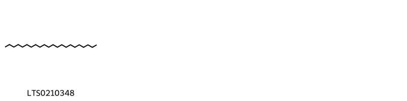{ width=100% }
    <figcaption>Hình ảnh cấu trúc hóa học của 1 hoạt chất thuộc nhóm Saturated hydrocarbons gồm ['docosane (LTS0210348)'].</figcaption>
</figure>
#### Nhóm Sphingolipids
<figure markdown="span">
    { width=100% }
    <figcaption>Hình ảnh cấu trúc hóa học của 6 hoạt chất thuộc nhóm Sphingolipids gồm ['2-hydroxy-n-(1,3,5,6-tetrahydroxyhexacos-9-en-2-yl)pentadecanimidic acid (LTS0168246)', '2-hydroxy-n-(3,5,6-trihydroxy-1-{[3,4,5-trihydroxy-6-(hydroxymethyl)oxan-2-yl]oxy}hexacos-9-en-2-yl)hexadecanimidic acid (LTS0184821)', '2-hydroxy-n-(1,3,5,6-tetrahydroxyoctacos-9-en-2-yl)octadecanimidic acid (LTS0254989)', 'n-(1-{[3,4-dihydroxy-6-(hydroxymethyl)-5-{[3,4,5-trihydroxy-6-(hydroxymethyl)oxan-2-yl]oxy}oxan-2-yl]oxy}-3,5,6-trihydroxyoctacos-9-en-2-yl)-2-hydroxyoctadecanimidic acid (LTS0174910)', '(2r)-2-hydroxy-n-[(2s,3s,5r,6s,9e)-3,5,6-trihydroxy-1-{[(2r,3r,4s,5s,6r)-3,4,5-trihydroxy-6-(hydroxymethyl)oxan-2-yl]oxy}hexacos-9-en-2-yl]hexadecanimidic acid (LTS0160915)', '(2r)-n-[(2s,3s,5r,6s,9e)-1-{[(2r,3r,4r,5s,6r)-3,4-dihydroxy-6-(hydroxymethyl)-5-{[(2s,3r,4s,5s,6r)-3,4,5-trihydroxy-6-(hydroxymethyl)oxan-2-yl]oxy}oxan-2-yl]oxy}-3,5,6-trihydroxyoctacos-9-en-2-yl]-2-hydroxyoctadecanimidic acid (LTS0013972)'].</figcaption>
</figure>
#### Nhóm Steroids and steroid derivatives
<figure markdown="span">
    { width=100% }
    <figcaption>Hình ảnh cấu trúc hóa học của 1 hoạt chất thuộc nhóm Steroids and steroid derivatives gồm ['progesterone (LTS0238391)'].</figcaption>
</figure>
#### Nhóm Tannins
<figure markdown="span">
    { width=100% }
    <figcaption>Hình ảnh cấu trúc hóa học của 2 hoạt chất thuộc nhóm Tannins gồm ['(4s,5r,6s)-5-ethenyl-4-[2-(3-methoxy-4-{[(2s,3r,4s,5s,6r)-3,4,5-trihydroxy-6-(hydroxymethyl)oxan-2-yl]oxy}benzoyloxy)ethyl]-6-{[(2s,3r,4s,5s,6r)-3,4,5-trihydroxy-6-(hydroxymethyl)oxan-2-yl]oxy}-5,6-dihydro-4h-pyran-3-carboxylic acid (LTS0158788)', '5-ethenyl-4-[2-(3-methoxy-4-{[3,4,5-trihydroxy-6-(hydroxymethyl)oxan-2-yl]oxy}benzoyloxy)ethyl]-6-{[3,4,5-trihydroxy-6-(hydroxymethyl)oxan-2-yl]oxy}-5,6-dihydro-4h-pyran-3-carboxylic acid (LTS0000922)'].</figcaption>
</figure>
#### Nhóm Tetrahydrofurans
<figure markdown="span">
    { width=100% }
    <figcaption>Hình ảnh cấu trúc hóa học của 1 hoạt chất thuộc nhóm Tetrahydrofurans gồm ['lilac aldehyde (LTS0245235)'].</figcaption>
</figure>
#### Nhóm Unsaturated hydrocarbons
<figure markdown="span">
    { width=100% }
    <figcaption>Hình ảnh cấu trúc hóa học của 2 hoạt chất thuộc nhóm Unsaturated hydrocarbons gồm ['2-methyl-6-methylideneocta-1,7-diene (LTS0213612)', '1-hexene (LTS0038568)'].</figcaption>
</figure>

---

### Dược dân tộc học

Danh sách các quốc gia có sử dụng *Lonicera japonica* trong điều trị các bệnh. 

| Country   | Disease                                           | Bệnh                                                                                                                                                                                                |
|:----------|:--------------------------------------------------|:----------------------------------------------------------------------------------------------------------------------------------------------------------------------------------------------------|
| China     | Antidote, nan, Refrigerant, Stomachic, Astringent | MYMEMORY WARNING: YOU USED ALL AVAILABLE FREE TRANSLATIONS FOR TODAY. NEXT AVAILABLE IN  13 HOURS 41 MINUTES 05 SECONDS VISIT HTTPS://MYMEMORY.TRANSLATED.NET/DOC/USAGELIMITS.PHP TO TRANSLATE MORE |
| Elsewhere | nan, Diuretic, Diuretic, Antidote, Fungicide      | MYMEMORY WARNING: YOU USED ALL AVAILABLE FREE TRANSLATIONS FOR TODAY. NEXT AVAILABLE IN  13 HOURS 41 MINUTES 02 SECONDS VISIT HTTPS://MYMEMORY.TRANSLATED.NET/DOC/USAGELIMITS.PHP TO TRANSLATE MORE |
| Japan     | Diuretic, nan, Stomachic                          | MYMEMORY WARNING: YOU USED ALL AVAILABLE FREE TRANSLATIONS FOR TODAY. NEXT AVAILABLE IN  13 HOURS 40 MINUTES 58 SECONDS VISIT HTTPS://MYMEMORY.TRANSLATED.NET/DOC/USAGELIMITS.PHP TO TRANSLATE MORE |

---

---
## Lonicera periclymenum
### Thông tin về thực vật

!!! info "Phân loại thực vật của *Lonicera periclymenum* từ GIBF:"
    - **Kingdom:** Plantae
    - **Phylum:** Tracheophyta
    - **Order:** Dipsacales
    - **Family:** Caprifoliaceae
    - **Genus:** Lonicera
    - **Species:** *Lonicera periclymenum*

 

| Label (VI)   | Label (EN)   | Scientific Name       | Descriptions (VI)   | Descriptions (EN)   | Also Known As (VI)   | Also Known As (EN)   |
|:-------------|:-------------|:----------------------|:--------------------|:--------------------|:---------------------|:---------------------|
| N/A          | N/A          | Lonicera periclymenum | loài thực vật       | species of plant    | ['']                 | ['']                 |

#### Phân bố trên thế giới

**Từ CSDL GIBF** Switzerland, United Kingdom of Great Britain and Northern Ireland, Denmark, Sweden, Luxembourg, France, Spain, New Zealand, Germany, Ireland, Norway, Belgium, Netherlands

#### Phân bố tại Việt Nam

**Từ CSDL GIBF**: Không có ghi nhận ở Việt Nam

---
### Thành phần hóa học
        
- Theo cơ sở dữ liệu lotus: Từ loài *Lonicera periclymenum* đã phân lập và xác định được 19 hoạt chất thuộc về các nhóm Organooxygen compounds, Prenol lipids. 

|    | chemicalTaxonomyClassyfireClass   |   smiles_count |
|---:|:----------------------------------|---------------:|
|  0 | Organooxygen compounds            |              3 |
|  1 | Prenol lipids                     |             16 |

#### Nhóm Organooxygen compounds
<figure markdown="span">
    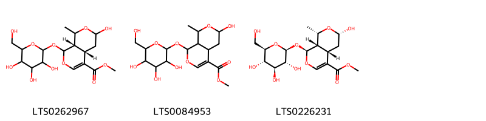{ width=100% }
    <figcaption>Hình ảnh cấu trúc hóa học của 3 hoạt chất thuộc nhóm Organooxygen compounds gồm ['methyl (4as,8as)-6-hydroxy-8-methyl-1-{[3,4,5-trihydroxy-6-(hydroxymethyl)oxan-2-yl]oxy}-1h,4ah,5h,6h,8h,8ah-pyrano[3,4-c]pyran-4-carboxylate (LTS0262967)', 'methyl 6-hydroxy-8-methyl-1-{[3,4,5-trihydroxy-6-(hydroxymethyl)oxan-2-yl]oxy}-1h,4ah,5h,6h,8h,8ah-pyrano[3,4-c]pyran-4-carboxylate (LTS0084953)', 'methyl (1s,4as,6s,8s,8as)-6-hydroxy-8-methyl-1-{[(2s,3r,4s,5s,6r)-3,4,5-trihydroxy-6-(hydroxymethyl)oxan-2-yl]oxy}-1h,4ah,5h,6h,8h,8ah-pyrano[3,4-c]pyran-4-carboxylate (LTS0226231)'].</figcaption>
</figure>
#### Nhóm Prenol lipids
<figure markdown="span">
    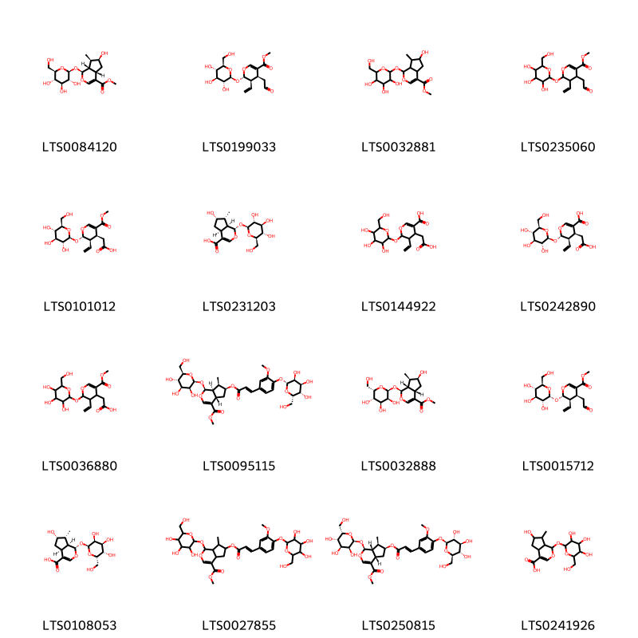{ width=100% }
    <figcaption>Hình ảnh cấu trúc hóa học của 16 hoạt chất thuộc nhóm Prenol lipids gồm ['loganin (LTS0084120)', '(-)-secologanin (LTS0199033)', 'methyl 6-hydroxy-7-methyl-1-{[3,4,5-trihydroxy-6-(hydroxymethyl)oxan-2-yl]oxy}-1h,4ah,5h,6h,7h,7ah-cyclopenta[c]pyran-4-carboxylate (LTS0032881)', 'secologanin (LTS0235060)', '[(2s,3r,4s)-3-ethenyl-5-(methoxycarbonyl)-2-{[(2s,3r,4s,5s,6r)-3,4,5-trihydroxy-6-(hydroxymethyl)oxan-2-yl]oxy}-3,4-dihydro-2h-pyran-4-yl]acetic acid (LTS0101012)', 'loganic acid (LTS0231203)', '4-(carboxymethyl)-5-ethenyl-6-{[3,4,5-trihydroxy-6-(hydroxymethyl)oxan-2-yl]oxy}-5,6-dihydro-4h-pyran-3-carboxylic acid (LTS0144922)', '(4s,5r,6s)-4-(carboxymethyl)-5-ethenyl-6-{[(2s,3r,4s,5s,6r)-3,4,5-trihydroxy-6-(hydroxymethyl)oxan-2-yl]oxy}-5,6-dihydro-4h-pyran-3-carboxylic acid (LTS0242890)', '[3-ethenyl-5-(methoxycarbonyl)-2-{[3,4,5-trihydroxy-6-(hydroxymethyl)oxan-2-yl]oxy}-3,4-dihydro-2h-pyran-4-yl]acetic acid (LTS0036880)', 'methyl (1s,4as,6s,7r,7ar)-6-{[(2e)-3-(3-methoxy-4-{[(2r,3s,4s,5s,6s)-3,4,5-trihydroxy-6-(hydroxymethyl)oxan-2-yl]oxy}phenyl)prop-2-enoyl]oxy}-7-methyl-1-{[(2s,3s,4s,5s,6r)-3,4,5-trihydroxy-6-(hydroxymethyl)oxan-2-yl]oxy}-1h,4ah,5h,6h,7h,7ah-cyclopenta[c]pyran-4-carboxylate (LTS0095115)', 'methyl (1s,4as,6s,7r,7as)-6-hydroxy-7-methyl-1-{[(2s,3s,4s,5s,6s)-3,4,5-trihydroxy-6-(hydroxymethyl)oxan-2-yl]oxy}-1h,4ah,5h,6h,7h,7ah-cyclopenta[c]pyran-4-carboxylate (LTS0032888)', 'methyl (4s,5r,6s)-5-ethenyl-4-(2-oxoethyl)-6-{[(2r,3r,4s,5s,6r)-3,4,5-trihydroxy-6-(hydroxymethyl)oxan-2-yl]oxy}-5,6-dihydro-4h-pyran-3-carboxylate (LTS0015712)', '(1s,4as,6s,7r,7as)-6-hydroxy-7-methyl-1-{[(2s,3s,4s,5s,6s)-3,4,5-trihydroxy-6-(hydroxymethyl)oxan-2-yl]oxy}-1h,4ah,5h,6h,7h,7ah-cyclopenta[c]pyran-4-carboxylic acid (LTS0108053)', 'methyl 6-{[3-(3-methoxy-4-{[3,4,5-trihydroxy-6-(hydroxymethyl)oxan-2-yl]oxy}phenyl)prop-2-enoyl]oxy}-7-methyl-1-{[3,4,5-trihydroxy-6-(hydroxymethyl)oxan-2-yl]oxy}-1h,4ah,5h,6h,7h,7ah-cyclopenta[c]pyran-4-carboxylate (LTS0027855)', 'methyl (1s,4as,6s,7r,7as)-6-{[(2e)-3-(3-methoxy-4-{[(2s,3r,4s,5s,6r)-3,4,5-trihydroxy-6-(hydroxymethyl)oxan-2-yl]oxy}phenyl)prop-2-enoyl]oxy}-7-methyl-1-{[(2s,3s,4s,5s,6s)-3,4,5-trihydroxy-6-(hydroxymethyl)oxan-2-yl]oxy}-1h,4ah,5h,6h,7h,7ah-cyclopenta[c]pyran-4-carboxylate (LTS0250815)', '6-hydroxy-7-methyl-1-{[3,4,5-trihydroxy-6-(hydroxymethyl)oxan-2-yl]oxy}-1h,4ah,5h,6h,7h,7ah-cyclopenta[c]pyran-4-carboxylic acid (LTS0241926)'].</figcaption>
</figure>

---

### Dược dân tộc học

Danh sách các quốc gia có sử dụng *Lonicera periclymenum* trong điều trị các bệnh. 

| Country   | Disease             | Bệnh                                                                                                                                                                                                |
|:----------|:--------------------|:----------------------------------------------------------------------------------------------------------------------------------------------------------------------------------------------------|
| Elsewhere | Diuretic, Sudorific | MYMEMORY WARNING: YOU USED ALL AVAILABLE FREE TRANSLATIONS FOR TODAY. NEXT AVAILABLE IN  13 HOURS 40 MINUTES 09 SECONDS VISIT HTTPS://MYMEMORY.TRANSLATED.NET/DOC/USAGELIMITS.PHP TO TRANSLATE MORE |

---

# Chi Diervilla

??? note "Danh sách các dược liệu thuộc chi"
    
	 - *Diervilla versicolor*

---
## Diervilla versicolor
### Thông tin về thực vật

!!! info "Phân loại thực vật của *Weigela japonica* từ GIBF:"
    - **Kingdom:** Plantae
    - **Phylum:** Tracheophyta
    - **Order:** Dipsacales
    - **Family:** Caprifoliaceae
    - **Genus:** Weigela
    - **Species:** *Weigela japonica*

 

| Label (VI)   | Label (EN)   | Scientific Name      | Descriptions (VI)   | Descriptions (EN)   | Also Known As (VI)   | Also Known As (EN)   |
|:-------------|:-------------|:---------------------|:--------------------|:--------------------|:---------------------|:---------------------|
| N/A          | N/A          | Diervilla versicolor | loài thực vật       | species of plant    | ['']                 | ['']                 |

#### Phân bố trên thế giới

**Từ CSDL GIBF** nan, Japan

#### Phân bố tại Việt Nam

**Từ CSDL GIBF**: Không có ghi nhận ở Việt Nam

---
### Thành phần hóa học
        
- Theo cơ sở dữ liệu lotus: Từ loài *Weigela japonica* đã phân lập và xác định được Chưa có hoạt chất nào được phân lập. hoạt chất thuộc về các nhóm Không có hoạt chất nào được phân lập. 

Không có hình ảnh nào được tạo ra

---

### Dược dân tộc học

Danh sách các quốc gia có sử dụng *Weigela japonica* trong điều trị các bệnh. 

| Country   | Disease   | Bệnh                                                                                                                                                                                                |
|:----------|:----------|:----------------------------------------------------------------------------------------------------------------------------------------------------------------------------------------------------|
| China     | Poison    | MYMEMORY WARNING: YOU USED ALL AVAILABLE FREE TRANSLATIONS FOR TODAY. NEXT AVAILABLE IN  13 HOURS 39 MINUTES 41 SECONDS VISIT HTTPS://MYMEMORY.TRANSLATED.NET/DOC/USAGELIMITS.PHP TO TRANSLATE MORE |

---

# Chi Symphoricarpos

??? note "Danh sách các dược liệu thuộc chi"
    
	 - *Symphoricarpos albus*
	 - *Symphoricarpos racemosa*

---
## Symphoricarpos albus
### Thông tin về thực vật

!!! info "Phân loại thực vật của *Symphoricarpos albus* từ GIBF:"
    - **Kingdom:** Plantae
    - **Phylum:** Tracheophyta
    - **Order:** Dipsacales
    - **Family:** Caprifoliaceae
    - **Genus:** Symphoricarpos
    - **Species:** *Symphoricarpos albus*

 

| Label (VI)   | Label (EN)   | Scientific Name      | Descriptions (VI)   | Descriptions (EN)   | Also Known As (VI)   | Also Known As (EN)   |
|:-------------|:-------------|:---------------------|:--------------------|:--------------------|:---------------------|:---------------------|
| N/A          | N/A          | Symphoricarpos albus | loài thực vật       | species of plant    | ['']                 | ['']                 |

#### Phân bố trên thế giới

**Từ CSDL GIBF** Switzerland, Denmark, United Kingdom of Great Britain and Northern Ireland, Lithuania, Sweden, Spain, Czechia, Hungary, Germany, Canada, Russian Federation, United States of America, Ireland, Austria, Belgium, Netherlands

#### Phân bố tại Việt Nam

**Từ CSDL GIBF**: Không có ghi nhận ở Việt Nam

---
### Thành phần hóa học
        
- Theo cơ sở dữ liệu lotus: Từ loài *Symphoricarpos albus* đã phân lập và xác định được 37 hoạt chất thuộc về các nhóm Flavonoids, Prenol lipids, Steroids and steroid derivatives, Benzophenanthridine alkaloids. 

|    | chemicalTaxonomyClassyfireClass   |   smiles_count |
|---:|:----------------------------------|---------------:|
|  0 | Benzophenanthridine alkaloids     |              3 |
|  1 | Flavonoids                        |              1 |
|  2 | Prenol lipids                     |             11 |
|  3 | Steroids and steroid derivatives  |             21 |

#### Nhóm Benzophenanthridine alkaloids
<figure markdown="span">
    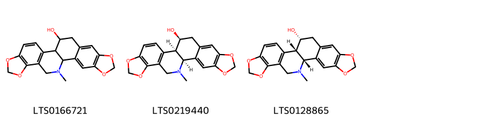{ width=100% }
    <figcaption>Hình ảnh cấu trúc hóa học của 3 hoạt chất thuộc nhóm Benzophenanthridine alkaloids gồm ['24-methyl-5,7,18,20-tetraoxa-24-azahexacyclo[11.11.0.0²,¹⁰.0⁴,⁸.0¹⁴,²².0¹⁷,²¹]tetracosa-2,4(8),9,14(22),15,17(21)-hexaen-12-ol (LTS0166721)', 'chelidonine (LTS0219440)', '(-)-chelidonine (LTS0128865)'].</figcaption>
</figure>
#### Nhóm Flavonoids
<figure markdown="span">
    { width=100% }
    <figcaption>Hình ảnh cấu trúc hóa học của 1 hoạt chất thuộc nhóm Flavonoids gồm ['luteolin (LTS0017052)'].</figcaption>
</figure>
#### Nhóm Prenol lipids
<figure markdown="span">
    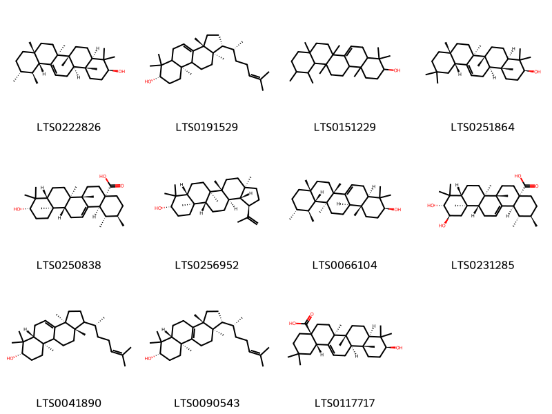{ width=100% }
    <figcaption>Hình ảnh cấu trúc hóa học của 11 hoạt chất thuộc nhóm Prenol lipids gồm ['amyrin (LTS0222826)', '(1r,3ar,7s,9ar,11ar)-3a,6,6,9a,11a-pentamethyl-1-[(2r)-6-methylhept-5-en-2-yl]-1h,2h,3h,5h,5ah,7h,8h,9h,9bh,10h,11h-cyclopenta[a]phenanthren-7-ol (LTS0191529)', '4,4,6b,8a,11,12,12b,14b-octamethyl-2,3,4a,5,7,8,9,10,11,12,12a,13,14,14a-tetradecahydro-1h-picen-3-ol (LTS0151229)', 'β-amyrin (LTS0251864)', 'ursolic acid (LTS0250838)', 'lupeol (LTS0256952)', '(3s,4ar,6bs,8ar,11r,12s,12ar,12bs,14ar,14br)-4,4,6b,8a,11,12,12b,14b-octamethyl-2,3,4a,5,7,8,9,10,11,12,12a,13,14,14a-tetradecahydro-1h-picen-3-ol (LTS0066104)', 'corosolic acid (LTS0231285)', '(3as,5ar,7s,9ar,11as)-3a,6,6,9a,11a-pentamethyl-1-[(2r)-6-methylhept-5-en-2-yl]-1h,2h,3h,5h,5ah,7h,8h,9h,9bh,10h,11h-cyclopenta[a]phenanthren-7-ol (LTS0041890)', 'lanosterol (LTS0090543)', 'oleanolic acid (LTS0117717)'].</figcaption>
</figure>
#### Nhóm Steroids and steroid derivatives
<figure markdown="span">
    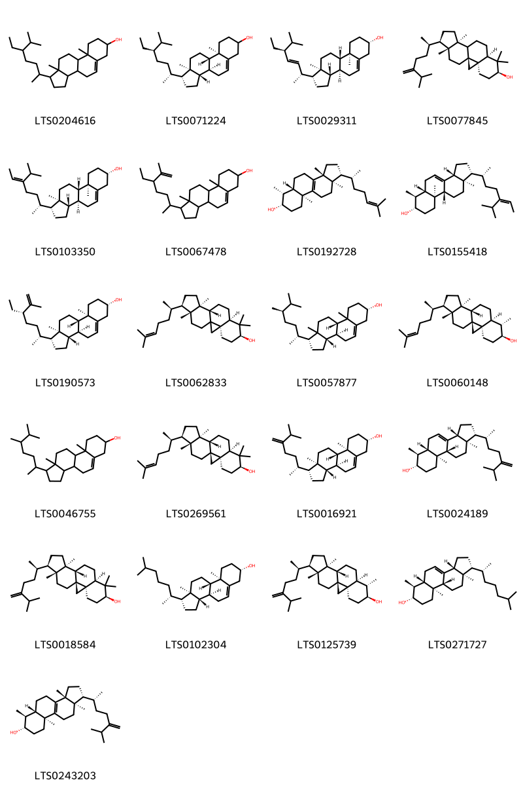{ width=100% }
    <figcaption>Hình ảnh cấu trúc hóa học của 21 hoạt chất thuộc nhóm Steroids and steroid derivatives gồm ['stigmast-5-en-3-ol, (3β)- (LTS0204616)', 'stigmast-5-en-3-ol (LTS0071224)', 'phytosterol (LTS0029311)', '24-methylene-cycloartanol (LTS0077845)', 'avenasterol (LTS0103350)', '1-(5-ethyl-6-methylhept-6-en-2-yl)-9a,11a-dimethyl-1h,2h,3h,3ah,3bh,4h,6h,7h,8h,9h,9bh,10h,11h-cyclopenta[a]phenanthren-7-ol (LTS0067478)', '(1r,3ar,5as,6r,7s,9as,11ar)-3a,6,9a,11a-tetramethyl-1-[(2r)-6-methylhept-5-en-2-yl]-1h,2h,3h,4h,5h,5ah,6h,7h,8h,9h,10h,11h-cyclopenta[a]phenanthren-7-ol (LTS0192728)', '(z)-24-ethylidenelophenol (LTS0155418)', '(1r,3as,3bs,7s,9ar,9bs,11ar)-1-[(2r,5s)-5-ethyl-6-methylhept-6-en-2-yl]-9a,11a-dimethyl-1h,2h,3h,3ah,3bh,4h,6h,7h,8h,9h,9bh,10h,11h-cyclopenta[a]phenanthren-7-ol (LTS0190573)', '(3r,6s,8r,11s,12s,15r,16r)-7,7,12,16-tetramethyl-15-[(2r)-6-methylhept-5-en-2-yl]pentacyclo[9.7.0.0¹,³.0³,⁸.0¹²,¹⁶]octadecan-6-ol (LTS0062833)', '(1r,3as,3bs,7s,9bs)-1-[(2r,5r)-5,6-dimethylheptan-2-yl]-9a,11a-dimethyl-1h,2h,3h,3ah,3bh,4h,6h,7h,8h,9h,9bh,10h,11h-cyclopenta[a]phenanthren-7-ol (LTS0057877)', '(1s,3r,6s,7s,8s,11s,12s,15r,16r)-7,12,16-trimethyl-15-[(2r)-6-methylhept-5-en-2-yl]pentacyclo[9.7.0.0¹,³.0³,⁸.0¹²,¹⁶]octadecan-6-ol (LTS0060148)', 'campesterol (LTS0046755)', 'cycloartenol (LTS0269561)', '24-methylenecholesterol (LTS0016921)', '24-methylidenelophenol (LTS0024189)', '24-methylenecycloartanol (LTS0018584)', 'cholesterol (LTS0102304)', 'cycloeucalenol (LTS0125739)', 'lophenol (LTS0271727)', '(1r,3ar,5as,6s,7s,9as,11ar)-3a,6,9a,11a-tetramethyl-1-[(2r)-6-methyl-5-methylideneheptan-2-yl]-1h,2h,3h,4h,5h,5ah,6h,7h,8h,9h,10h,11h-cyclopenta[a]phenanthren-7-ol (LTS0243203)'].</figcaption>
</figure>

---

### Dược dân tộc học

Danh sách các quốc gia có sử dụng *Symphoricarpos albus* trong điều trị các bệnh. 

| Country        | Disease                      | Bệnh                                                                                                                                                                                                |
|:---------------|:-----------------------------|:----------------------------------------------------------------------------------------------------------------------------------------------------------------------------------------------------|
| Canada(Salish) | Collyrium, Emetic, Cathartic | MYMEMORY WARNING: YOU USED ALL AVAILABLE FREE TRANSLATIONS FOR TODAY. NEXT AVAILABLE IN  13 HOURS 39 MINUTES 12 SECONDS VISIT HTTPS://MYMEMORY.TRANSLATED.NET/DOC/USAGELIMITS.PHP TO TRANSLATE MORE |
| US(Flathead)   | Collyrium                    | MYMEMORY WARNING: YOU USED ALL AVAILABLE FREE TRANSLATIONS FOR TODAY. NEXT AVAILABLE IN  13 HOURS 39 MINUTES 09 SECONDS VISIT HTTPS://MYMEMORY.TRANSLATED.NET/DOC/USAGELIMITS.PHP TO TRANSLATE MORE |

---

---
## Symphoricarpos racemosa
### Thông tin về thực vật

!!! info "Phân loại thực vật của *Symphoricarpos albus* từ GIBF:"
    - **Kingdom:** Plantae
    - **Phylum:** Tracheophyta
    - **Order:** Dipsacales
    - **Family:** Caprifoliaceae
    - **Genus:** Symphoricarpos
    - **Species:** *Symphoricarpos albus*

 

| Label (VI)   | Label (EN)   | Scientific Name      | Descriptions (VI)   | Descriptions (EN)   | Also Known As (VI)   | Also Known As (EN)   |
|:-------------|:-------------|:---------------------|:--------------------|:--------------------|:---------------------|:---------------------|
| N/A          | N/A          | Symphoricarpos albus | loài thực vật       | species of plant    | ['']                 | ['']                 |

#### Phân bố trên thế giới

**Từ CSDL GIBF** nan, unknown or invalid, Spain, Germany, Austria, Kiribati, Poland, Canada, Belgium, Netherlands, Finland, Estonia, Ireland, Switzerland, United Kingdom of Great Britain and Northern Ireland, Latvia, France, Czechia, Russian Federation, United States of America

#### Phân bố tại Việt Nam

**Từ CSDL GIBF**: Không có ghi nhận ở Việt Nam

---
### Thành phần hóa học
        
- Theo cơ sở dữ liệu lotus: Từ loài *Symphoricarpos albus* đã phân lập và xác định được Chưa có hoạt chất nào được phân lập. hoạt chất thuộc về các nhóm Không có hoạt chất nào được phân lập. 

Không có hình ảnh nào được tạo ra

---

### Dược dân tộc học

Danh sách các quốc gia có sử dụng *Symphoricarpos albus* trong điều trị các bệnh. 

| Country        | Disease   | Bệnh                                                                                                                                                                                                |
|:---------------|:----------|:----------------------------------------------------------------------------------------------------------------------------------------------------------------------------------------------------|
| Canada(Salish) | Poison    | MYMEMORY WARNING: YOU USED ALL AVAILABLE FREE TRANSLATIONS FOR TODAY. NEXT AVAILABLE IN  13 HOURS 38 MINUTES 29 SECONDS VISIT HTTPS://MYMEMORY.TRANSLATED.NET/DOC/USAGELIMITS.PHP TO TRANSLATE MORE |

---

# Chi Sambucus

??? note "Danh sách các dược liệu thuộc chi"
    
	 - *Sambucus australis*
	 - *Sambucus canadensis*
	 - *Sambucus chinensis*
	 - *Sambucus ebulus*
	 - *Sambucus javanica*
	 - *Sambucus mexicana*
	 - *Sambucus nigra*
	 - *Sambucus nigrum*
	 - *Sambucus peruviana*
	 - *Sambucus pubens*
	 - *Sambucus racemosa*
	 - *Sambucus sieboldiana*
	 - *Sambucus simpsoni*
	 - *Sambucus simpsonii*
	 - *Sambucus thunbergiana*
	 - *Sambucus williamsii*
	 - *Sambucus wrightiana*

---
## Sambucus australis
### Thông tin về thực vật

!!! info "Phân loại thực vật của *Sambucus australis* từ GIBF:"
    - **Kingdom:** Plantae
    - **Phylum:** Tracheophyta
    - **Order:** Dipsacales
    - **Family:** Viburnaceae
    - **Genus:** Sambucus
    - **Species:** *Sambucus australis*

 

| Label (VI)   | Label (EN)   | Scientific Name    | Descriptions (VI)   | Descriptions (EN)   | Also Known As (VI)   | Also Known As (EN)   |
|:-------------|:-------------|:-------------------|:--------------------|:--------------------|:---------------------|:---------------------|
| N/A          | N/A          | Sambucus australis |                     | species of plant    | ['']                 | ['']                 |

#### Phân bố trên thế giới

**Từ CSDL GIBF** Uruguay, Colombia, Argentina, Brazil, United States of America

#### Phân bố tại Việt Nam

**Từ CSDL GIBF**: Không có ghi nhận ở Việt Nam

---
### Thành phần hóa học
        
- Theo cơ sở dữ liệu lotus: Từ loài *Sambucus australis* đã phân lập và xác định được Chưa có hoạt chất nào được phân lập. hoạt chất thuộc về các nhóm Không có hoạt chất nào được phân lập. 

Không có hình ảnh nào được tạo ra

---

### Dược dân tộc học

Danh sách các quốc gia có sử dụng *Sambucus australis* trong điều trị các bệnh. 

| Country       | Disease             | Bệnh                                                                                                                                                                                                |
|:--------------|:--------------------|:----------------------------------------------------------------------------------------------------------------------------------------------------------------------------------------------------|
| Argentina     | Intoxicant          | MYMEMORY WARNING: YOU USED ALL AVAILABLE FREE TRANSLATIONS FOR TODAY. NEXT AVAILABLE IN  13 HOURS 38 MINUTES 03 SECONDS VISIT HTTPS://MYMEMORY.TRANSLATED.NET/DOC/USAGELIMITS.PHP TO TRANSLATE MORE |
| Latin America | Diuretic, Sudorific | MYMEMORY WARNING: YOU USED ALL AVAILABLE FREE TRANSLATIONS FOR TODAY. NEXT AVAILABLE IN  13 HOURS 37 MINUTES 58 SECONDS VISIT HTTPS://MYMEMORY.TRANSLATED.NET/DOC/USAGELIMITS.PHP TO TRANSLATE MORE |
| South America | Poison              | MYMEMORY WARNING: YOU USED ALL AVAILABLE FREE TRANSLATIONS FOR TODAY. NEXT AVAILABLE IN  13 HOURS 37 MINUTES 53 SECONDS VISIT HTTPS://MYMEMORY.TRANSLATED.NET/DOC/USAGELIMITS.PHP TO TRANSLATE MORE |

---

---
## Sambucus canadensis
### Thông tin về thực vật

!!! info "Phân loại thực vật của *Sambucus canadensis* từ GIBF:"
    - **Kingdom:** Plantae
    - **Phylum:** Tracheophyta
    - **Order:** Dipsacales
    - **Family:** Viburnaceae
    - **Genus:** Sambucus
    - **Species:** *Sambucus canadensis*

 

| Label (VI)   | Label (EN)   | Scientific Name     | Descriptions (VI)   | Descriptions (EN)   | Also Known As (VI)   | Also Known As (EN)                                                      |
|:-------------|:-------------|:--------------------|:--------------------|:--------------------|:---------------------|:------------------------------------------------------------------------|
| N/A          | N/A          | Sambucus canadensis | loài thực vật       | species of plant    | ['']                 | ['American black elderberry', 'Canada elderberry', 'common elderberry'] |

#### Phân bố trên thế giới

**Từ CSDL GIBF** Dominican Republic, South Africa, Canada, United States of America, Mexico

#### Phân bố tại Việt Nam

**Từ CSDL GIBF**: Không có ghi nhận ở Việt Nam

---
### Thành phần hóa học
        
- Theo cơ sở dữ liệu lotus: Từ loài *Sambucus canadensis* đã phân lập và xác định được 18 hoạt chất thuộc về các nhóm Flavonoids, Steroids and steroid derivatives, Prenol lipids. 

|    | chemicalTaxonomyClassyfireClass   |   smiles_count |
|---:|:----------------------------------|---------------:|
|  0 | Flavonoids                        |             11 |
|  1 | Prenol lipids                     |              4 |
|  2 | Steroids and steroid derivatives  |              3 |

#### Nhóm Flavonoids
<figure markdown="span">
    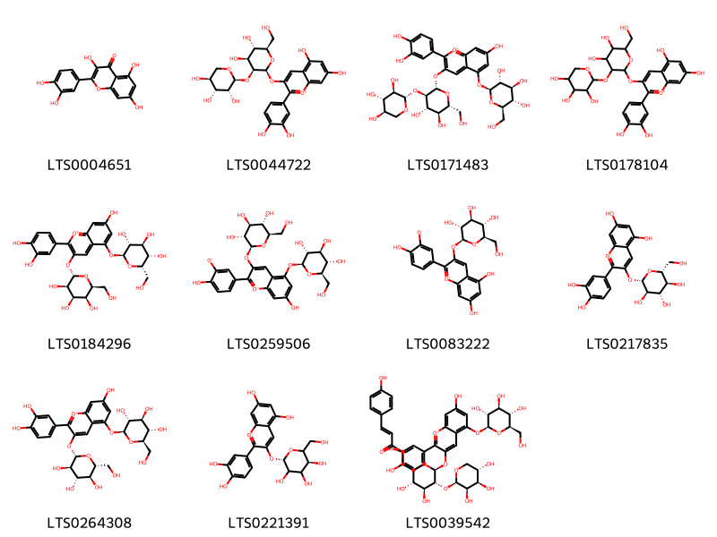{ width=100% }
    <figcaption>Hình ảnh cấu trúc hóa học của 11 hoạt chất thuộc nhóm Flavonoids gồm ['quercetin (LTS0004651)', '3-{[(2s,3s,4s,5s,6r)-4,5-dihydroxy-6-(hydroxymethyl)-3-{[(2s,3r,4r,5s)-3,4,5-trihydroxyoxan-2-yl]oxy}oxan-2-yl]oxy}-2-(3,4-dihydroxyphenyl)-5,7-dihydroxy-1λ⁴-chromen-1-ylium (LTS0044722)', '3-{[(2s,3r,4s,5s,6r)-4,5-dihydroxy-6-(hydroxymethyl)-3-{[(2s,3r,4s,5r)-3,4,5-trihydroxyoxan-2-yl]oxy}oxan-2-yl]oxy}-2-(3,4-dihydroxyphenyl)-7-hydroxy-5-{[(2s,3r,4s,5s,6r)-3,4,5-trihydroxy-6-(hydroxymethyl)oxan-2-yl]oxy}-1λ⁴-chromen-1-ylium (LTS0171483)', '3-{[4,5-dihydroxy-6-(hydroxymethyl)-3-[(3,4,5-trihydroxyoxan-2-yl)oxy]oxan-2-yl]oxy}-2-(3,4-dihydroxyphenyl)-5,7-dihydroxy-1λ⁴-chromen-1-ylium (LTS0178104)', '2-(3,4-dihydroxyphenyl)-7-hydroxy-3-{[(2s,3r,4r,5s,6s)-3,4,5-trihydroxy-6-(hydroxymethyl)oxan-2-yl]oxy}-5-{[(2s,3r,4s,5s,6s)-3,4,5-trihydroxy-6-(hydroxymethyl)oxan-2-yl]oxy}-1λ⁴-chromen-1-ylium (LTS0184296)', 'cyanin betaine (LTS0259506)', '5,7-dihydroxy-2-(4-hydroxy-3-oxidophenyl)-3-{[(2s,3r,4s,5s,6r)-3,4,5-trihydroxy-6-(hydroxymethyl)oxan-2-yl]oxy}-1λ⁴-chromen-1-ylium (LTS0083222)', 'cyanidin 3-glucoside (LTS0217835)', 'cyanin (LTS0264308)', 'chrysanthemin (LTS0221391)', '3-{[(2s,3r,4s,5s,6r)-4,5-dihydroxy-6-({[3-(4-hydroxyphenyl)prop-2-enoyl]oxy}methyl)-3-{[(2r,3r,4r,5s)-3,4,5-trihydroxyoxan-2-yl]oxy}oxan-2-yl]oxy}-2-(3,4-dihydroxyphenyl)-7-hydroxy-5-{[(2s,3r,4s,5s,6r)-3,4,5-trihydroxy-6-(hydroxymethyl)oxan-2-yl]oxy}-1λ⁴-chromen-1-ylium (LTS0039542)'].</figcaption>
</figure>
#### Nhóm Prenol lipids
<figure markdown="span">
    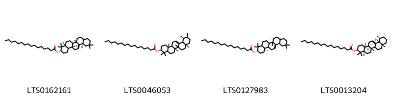{ width=100% }
    <figcaption>Hình ảnh cấu trúc hóa học của 4 hoạt chất thuộc nhóm Prenol lipids gồm ['(3s,4ar,6ar,6bs,8ar,12ar,14ar,14br)-4,4,6a,6b,8a,11,11,14b-octamethyl-1,2,3,4a,5,6,7,8,9,10,12,12a,14,14a-tetradecahydropicen-3-yl hexadecanoate (LTS0162161)', '(3s,6ar,8ar,12s,14br)-4,4,6a,6b,8a,11,12,14b-octamethyl-2,3,4a,5,6,7,8,9,10,11,12,12a,14,14a-tetradecahydro-1h-picen-3-yl hexadecanoate (LTS0046053)', '(3s,6ar,8ar,14br)-4,4,6a,6b,8a,11,11,14b-octamethyl-1,2,3,4a,5,6,7,8,9,10,12,12a,14,14a-tetradecahydropicen-3-yl hexadecanoate (LTS0127983)', '(3s,4ar,6ar,6bs,8ar,11r,12s,12ar,14ar,14br)-4,4,6a,6b,8a,11,12,14b-octamethyl-2,3,4a,5,6,7,8,9,10,11,12,12a,14,14a-tetradecahydro-1h-picen-3-yl hexadecanoate (LTS0013204)'].</figcaption>
</figure>
#### Nhóm Steroids and steroid derivatives
<figure markdown="span">
    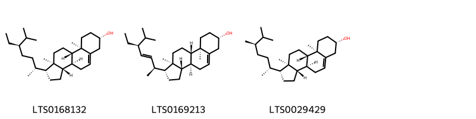{ width=100% }
    <figcaption>Hình ảnh cấu trúc hóa học của 3 hoạt chất thuộc nhóm Steroids and steroid derivatives gồm ['sitosterol (LTS0168132)', '(1r,3as,3bs,7s,9ar,9bs,11ar)-1-[(2s,3e,5s)-5-ethyl-6-methylhept-3-en-2-yl]-9a,11a-dimethyl-1h,2h,3h,3ah,3bh,4h,6h,7h,8h,9h,9bh,10h,11h-cyclopenta[a]phenanthren-7-ol (LTS0169213)', 'campesterol (LTS0029429)'].</figcaption>
</figure>

---

### Dược dân tộc học

Danh sách các quốc gia có sử dụng *Sambucus canadensis* trong điều trị các bệnh. 

| Country        | Disease                                                                    | Bệnh                                                                                                                                                                                                |
|:---------------|:---------------------------------------------------------------------------|:----------------------------------------------------------------------------------------------------------------------------------------------------------------------------------------------------|
| Elsewhere      | Aperient, Emetic, Laxative, Sudorific, Poison, Diaphoretic, Diuretic       | MYMEMORY WARNING: YOU USED ALL AVAILABLE FREE TRANSLATIONS FOR TODAY. NEXT AVAILABLE IN  13 HOURS 37 MINUTES 19 SECONDS VISIT HTTPS://MYMEMORY.TRANSLATED.NET/DOC/USAGELIMITS.PHP TO TRANSLATE MORE |
| Turkey         | Diuretic, Laxative, Sudorific, Emetic                                      | MYMEMORY WARNING: YOU USED ALL AVAILABLE FREE TRANSLATIONS FOR TODAY. NEXT AVAILABLE IN  13 HOURS 37 MINUTES 16 SECONDS VISIT HTTPS://MYMEMORY.TRANSLATED.NET/DOC/USAGELIMITS.PHP TO TRANSLATE MORE |
| US             | Carminative, Collyrium, Poison, Poultice, Stimulant, Diaphoretic, Diuretic | MYMEMORY WARNING: YOU USED ALL AVAILABLE FREE TRANSLATIONS FOR TODAY. NEXT AVAILABLE IN  13 HOURS 37 MINUTES 12 SECONDS VISIT HTTPS://MYMEMORY.TRANSLATED.NET/DOC/USAGELIMITS.PHP TO TRANSLATE MORE |
| US(Amerindian) | Poultice                                                                   | MYMEMORY WARNING: YOU USED ALL AVAILABLE FREE TRANSLATIONS FOR TODAY. NEXT AVAILABLE IN  13 HOURS 37 MINUTES 09 SECONDS VISIT HTTPS://MYMEMORY.TRANSLATED.NET/DOC/USAGELIMITS.PHP TO TRANSLATE MORE |
| US(Appalachia) | Poultice                                                                   | MYMEMORY WARNING: YOU USED ALL AVAILABLE FREE TRANSLATIONS FOR TODAY. NEXT AVAILABLE IN  13 HOURS 37 MINUTES 06 SECONDS VISIT HTTPS://MYMEMORY.TRANSLATED.NET/DOC/USAGELIMITS.PHP TO TRANSLATE MORE |
| US(Colonial)   | Intoxicant, Refrigerant                                                    | MYMEMORY WARNING: YOU USED ALL AVAILABLE FREE TRANSLATIONS FOR TODAY. NEXT AVAILABLE IN  13 HOURS 37 MINUTES 03 SECONDS VISIT HTTPS://MYMEMORY.TRANSLATED.NET/DOC/USAGELIMITS.PHP TO TRANSLATE MORE |
| USA            | Cathartic, Diaphoretic, Sudorific, Aperient                                | MYMEMORY WARNING: YOU USED ALL AVAILABLE FREE TRANSLATIONS FOR TODAY. NEXT AVAILABLE IN  13 HOURS 37 MINUTES 00 SECONDS VISIT HTTPS://MYMEMORY.TRANSLATED.NET/DOC/USAGELIMITS.PHP TO TRANSLATE MORE |

---

---
## Sambucus chinensis
### Thông tin về thực vật

!!! info "Phân loại thực vật của *Sambucus javanica* từ GIBF:"
    - **Kingdom:** Plantae
    - **Phylum:** Tracheophyta
    - **Order:** Dipsacales
    - **Family:** Viburnaceae
    - **Genus:** Sambucus
    - **Species:** *Sambucus javanica*

 

| Label (VI)   | Label (EN)   | Scientific Name    | Descriptions (VI)   | Descriptions (EN)   | Also Known As (VI)   | Also Known As (EN)   |
|:-------------|:-------------|:-------------------|:--------------------|:--------------------|:---------------------|:---------------------|
| N/A          | N/A          | Sambucus chinensis |                     | species of plant    | ['']                 | ['']                 |

#### Phân bố trên thế giới

**Từ CSDL GIBF** Viet Nam, nan, Japan, Germany, China, Korea, Republic of, Chinese Taipei

#### Phân bố tại Việt Nam

**Từ CSDL GIBF**: Hoa Binh, Thua Thien-Hue

---
### Thành phần hóa học
        
- Theo cơ sở dữ liệu lotus: Từ loài *Sambucus javanica* đã phân lập và xác định được 14 hoạt chất thuộc về các nhóm Prenol lipids, Steroids and steroid derivatives. 

|    | chemicalTaxonomyClassyfireClass   |   smiles_count |
|---:|:----------------------------------|---------------:|
|  0 | Prenol lipids                     |              7 |
|  1 | Steroids and steroid derivatives  |              7 |

#### Nhóm Prenol lipids
<figure markdown="span">
    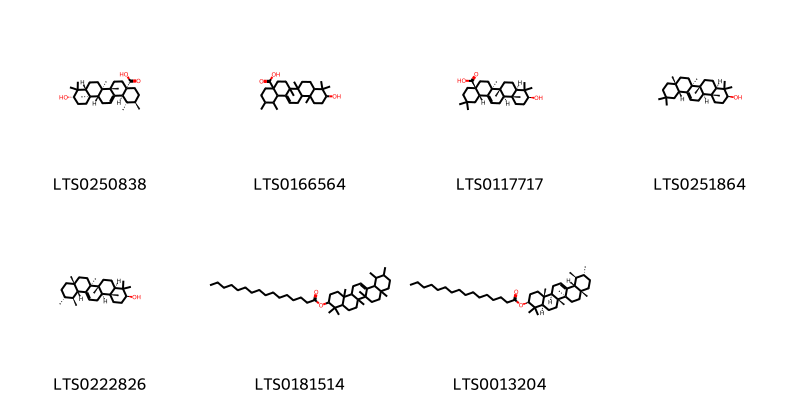{ width=100% }
    <figcaption>Hình ảnh cấu trúc hóa học của 7 hoạt chất thuộc nhóm Prenol lipids gồm ['ursolic acid (LTS0250838)', '10-hydroxy-1,2,6a,6b,9,9,12a-heptamethyl-2,3,4,5,6,7,8,8a,10,11,12,12b,13,14b-tetradecahydro-1h-picene-4a-carboxylic acid (LTS0166564)', 'oleanolic acid (LTS0117717)', 'β-amyrin (LTS0251864)', 'amyrin (LTS0222826)', '4,4,6a,6b,8a,11,12,14b-octamethyl-2,3,4a,5,6,7,8,9,10,11,12,12a,14,14a-tetradecahydro-1h-picen-3-yl hexadecanoate (LTS0181514)', '(3s,4ar,6ar,6bs,8ar,11r,12s,12ar,14ar,14br)-4,4,6a,6b,8a,11,12,14b-octamethyl-2,3,4a,5,6,7,8,9,10,11,12,12a,14,14a-tetradecahydro-1h-picen-3-yl hexadecanoate (LTS0013204)'].</figcaption>
</figure>
#### Nhóm Steroids and steroid derivatives
<figure markdown="span">
    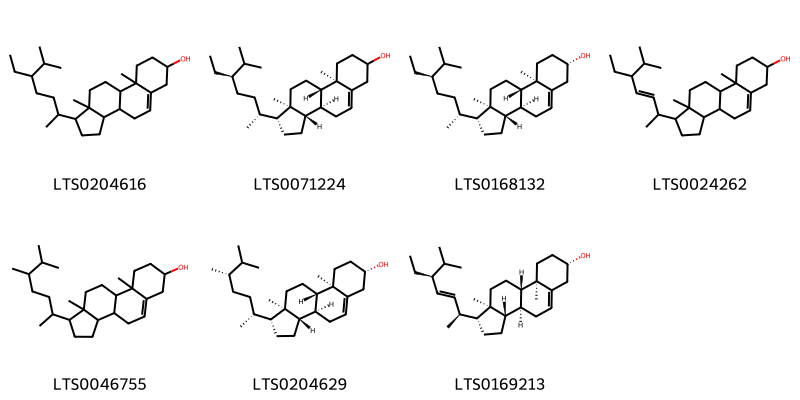{ width=100% }
    <figcaption>Hình ảnh cấu trúc hóa học của 7 hoạt chất thuộc nhóm Steroids and steroid derivatives gồm ['stigmast-5-en-3-ol, (3β)- (LTS0204616)', 'stigmast-5-en-3-ol (LTS0071224)', 'sitosterol (LTS0168132)', 'stigmasterol (LTS0024262)', 'campesterol (LTS0046755)', '22,23-dihydrobrassicasterol (LTS0204629)', '(1r,3as,3bs,7s,9ar,9bs,11ar)-1-[(2s,3e,5s)-5-ethyl-6-methylhept-3-en-2-yl]-9a,11a-dimethyl-1h,2h,3h,3ah,3bh,4h,6h,7h,8h,9h,9bh,10h,11h-cyclopenta[a]phenanthren-7-ol (LTS0169213)'].</figcaption>
</figure>

---

### Dược dân tộc học

Danh sách các quốc gia có sử dụng *Sambucus javanica* trong điều trị các bệnh. 

| Country   | Disease        | Bệnh                                                                                                                                                                                                |
|:----------|:---------------|:----------------------------------------------------------------------------------------------------------------------------------------------------------------------------------------------------|
| China     | Poison, Emetic | MYMEMORY WARNING: YOU USED ALL AVAILABLE FREE TRANSLATIONS FOR TODAY. NEXT AVAILABLE IN  13 HOURS 36 MINUTES 15 SECONDS VISIT HTTPS://MYMEMORY.TRANSLATED.NET/DOC/USAGELIMITS.PHP TO TRANSLATE MORE |
| Elsewhere | Aperient       | MYMEMORY WARNING: YOU USED ALL AVAILABLE FREE TRANSLATIONS FOR TODAY. NEXT AVAILABLE IN  13 HOURS 36 MINUTES 13 SECONDS VISIT HTTPS://MYMEMORY.TRANSLATED.NET/DOC/USAGELIMITS.PHP TO TRANSLATE MORE |

---

---
## Sambucus ebulus
### Thông tin về thực vật

!!! info "Phân loại thực vật của *Sambucus ebulus* từ GIBF:"
    - **Kingdom:** Plantae
    - **Phylum:** Tracheophyta
    - **Order:** Dipsacales
    - **Family:** Viburnaceae
    - **Genus:** Sambucus
    - **Species:** *Sambucus ebulus*

 

| Label (VI)   | Label (EN)   | Scientific Name   | Descriptions (VI)   | Descriptions (EN)          | Also Known As (VI)   | Also Known As (EN)   |
|:-------------|:-------------|:------------------|:--------------------|:---------------------------|:---------------------|:---------------------|
| N/A          | N/A          | Sambucus ebulus   | loài thực vật       | species of plant, danewort | ['']                 | ['']                 |

#### Phân bố trên thế giới

**Từ CSDL GIBF** Georgia, Luxembourg, Spain, Germany, Austria, Serbia, Belgium, Slovakia, Netherlands, Hungary, Bulgaria, Switzerland, United Kingdom of Great Britain and Northern Ireland, France, Czechia, Romania, Russian Federation, Italy, Greece, Croatia, Ukraine

#### Phân bố tại Việt Nam

**Từ CSDL GIBF**: Không có ghi nhận ở Việt Nam

---
### Thành phần hóa học
        
- Theo cơ sở dữ liệu lotus: Từ loài *Sambucus ebulus* đã phân lập và xác định được 37 hoạt chất thuộc về các nhóm Organooxygen compounds, Flavonoids, Prenol lipids, Carboxylic acids and derivatives, Fatty Acyls, Dihydrofurans, Hydroxy acids and derivatives, Steroids and steroid derivatives. 

|    | chemicalTaxonomyClassyfireClass   |   smiles_count |
|---:|:----------------------------------|---------------:|
|  0 | Carboxylic acids and derivatives  |              2 |
|  1 | Dihydrofurans                     |              1 |
|  2 | Fatty Acyls                       |              2 |
|  3 | Flavonoids                        |              1 |
|  4 | Hydroxy acids and derivatives     |              2 |
|  5 | Organooxygen compounds            |              7 |
|  6 | Prenol lipids                     |             18 |
|  7 | Steroids and steroid derivatives  |              4 |

#### Nhóm Carboxylic acids and derivatives
<figure markdown="span">
    { width=100% }
    <figcaption>Hình ảnh cấu trúc hóa học của 2 hoạt chất thuộc nhóm Carboxylic acids and derivatives gồm ['citric acid (LTS0213921)', 'oxalic acid (LTS0217707)'].</figcaption>
</figure>
#### Nhóm Dihydrofurans
<figure markdown="span">
    { width=100% }
    <figcaption>Hình ảnh cấu trúc hóa học của 1 hoạt chất thuộc nhóm Dihydrofurans gồm ['vitamin c (LTS0022555)'].</figcaption>
</figure>
#### Nhóm Fatty Acyls
<figure markdown="span">
    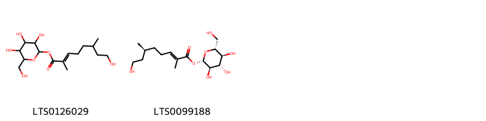{ width=100% }
    <figcaption>Hình ảnh cấu trúc hóa học của 2 hoạt chất thuộc nhóm Fatty Acyls gồm ['3,4,5-trihydroxy-6-(hydroxymethyl)oxan-2-yl 8-hydroxy-2,6-dimethyloct-2-enoate (LTS0126029)', '(2s,3r,4s,5s,6r)-3,4,5-trihydroxy-6-(hydroxymethyl)oxan-2-yl (2e,6s)-8-hydroxy-2,6-dimethyloct-2-enoate (LTS0099188)'].</figcaption>
</figure>
#### Nhóm Flavonoids
<figure markdown="span">
    { width=100% }
    <figcaption>Hình ảnh cấu trúc hóa học của 1 hoạt chất thuộc nhóm Flavonoids gồm ['3-rutinosyl quercetin (LTS0032845)'].</figcaption>
</figure>
#### Nhóm Hydroxy acids and derivatives
<figure markdown="span">
    { width=100% }
    <figcaption>Hình ảnh cấu trúc hóa học của 2 hoạt chất thuộc nhóm Hydroxy acids and derivatives gồm ['lactic acid (LTS0131933)', 'malic acid (LTS0216520)'].</figcaption>
</figure>
#### Nhóm Organooxygen compounds
<figure markdown="span">
    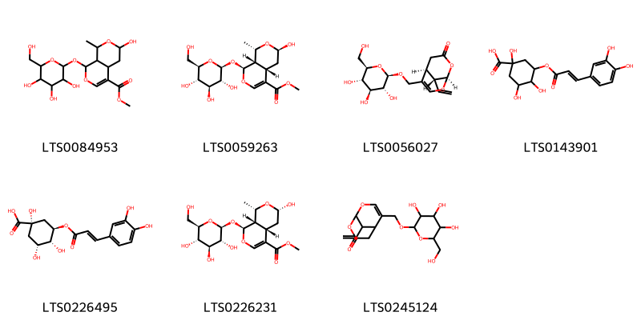{ width=100% }
    <figcaption>Hình ảnh cấu trúc hóa học của 7 hoạt chất thuộc nhóm Organooxygen compounds gồm ['methyl 6-hydroxy-8-methyl-1-{[3,4,5-trihydroxy-6-(hydroxymethyl)oxan-2-yl]oxy}-1h,4ah,5h,6h,8h,8ah-pyrano[3,4-c]pyran-4-carboxylate (LTS0084953)', 'morroniside (LTS0059263)', '(1r,5s,9r)-9-ethenyl-6-({[(2r,3r,4s,5s,6r)-3,4,5-trihydroxy-6-(hydroxymethyl)oxan-2-yl]oxy}methyl)-2,8-dioxabicyclo[3.3.1]non-6-en-3-one (LTS0056027)', '3-{[3-(3,4-dihydroxyphenyl)prop-2-enoyl]oxy}-1,4,5-trihydroxycyclohexane-1-carboxylic acid (LTS0143901)', 'chlorogenic acid (LTS0226495)', 'methyl (1s,4as,6s,8s,8as)-6-hydroxy-8-methyl-1-{[(2s,3r,4s,5s,6r)-3,4,5-trihydroxy-6-(hydroxymethyl)oxan-2-yl]oxy}-1h,4ah,5h,6h,8h,8ah-pyrano[3,4-c]pyran-4-carboxylate (LTS0226231)', '9-ethenyl-6-({[3,4,5-trihydroxy-6-(hydroxymethyl)oxan-2-yl]oxy}methyl)-2,8-dioxabicyclo[3.3.1]non-6-en-3-one (LTS0245124)'].</figcaption>
</figure>
#### Nhóm Prenol lipids
<figure markdown="span">
    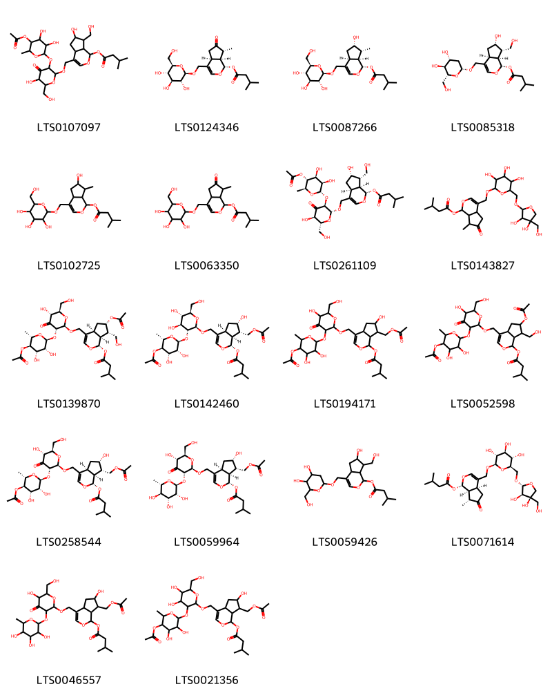{ width=100% }
    <figcaption>Hình ảnh cấu trúc hóa học của 18 hoạt chất thuộc nhóm Prenol lipids gồm ['4-{[(3-{[5-(acetyloxy)-3,4-dihydroxy-6-methyloxan-2-yl]oxy}-5-hydroxy-6-(hydroxymethyl)-4-oxooxan-2-yl)oxy]methyl}-6-hydroxy-7-(hydroxymethyl)-1h,4ah,5h,6h,7h,7ah-cyclopenta[c]pyran-1-yl 3-methylbutanoate (LTS0107097)', '(1s,4as,7r,7as)-7-methyl-6-oxo-4-({[(2r,3r,4s,5s,6r)-3,4,5-trihydroxy-6-(hydroxymethyl)oxan-2-yl]oxy}methyl)-1h,4ah,5h,7h,7ah-cyclopenta[c]pyran-1-yl 3-methylbutanoate (LTS0124346)', '(1s,4as,6s,7r,7as)-6-hydroxy-7-methyl-4-({[(2r,3r,4s,5s,6r)-3,4,5-trihydroxy-6-(hydroxymethyl)oxan-2-yl]oxy}methyl)-1h,4ah,5h,6h,7h,7ah-cyclopenta[c]pyran-1-yl 3-methylbutanoate (LTS0087266)', '(1s,4as,6s,7s,7as)-4-({[(2r,4r,5s,6r)-4,5-dihydroxy-6-(hydroxymethyl)oxan-2-yl]oxy}methyl)-6-hydroxy-7-(hydroxymethyl)-1h,4ah,5h,6h,7h,7ah-cyclopenta[c]pyran-1-yl 3-methylbutanoate (LTS0085318)', '6-hydroxy-7-methyl-4-({[3,4,5-trihydroxy-6-(hydroxymethyl)oxan-2-yl]oxy}methyl)-1h,4ah,5h,6h,7h,7ah-cyclopenta[c]pyran-1-yl 3-methylbutanoate (LTS0102725)', '7-methyl-6-oxo-4-({[3,4,5-trihydroxy-6-(hydroxymethyl)oxan-2-yl]oxy}methyl)-1h,4ah,5h,7h,7ah-cyclopenta[c]pyran-1-yl 3-methylbutanoate (LTS0063350)', '(1s,4as,6s,7s,7as)-4-({[(2r,3s,5r,6r)-3-{[(2s,3r,4s,5r,6s)-5-(acetyloxy)-3,4-dihydroxy-6-methyloxan-2-yl]oxy}-5-hydroxy-6-(hydroxymethyl)-4-oxooxan-2-yl]oxy}methyl)-6-hydroxy-7-(hydroxymethyl)-1h,4ah,5h,6h,7h,7ah-cyclopenta[c]pyran-1-yl 3-methylbutanoate (LTS0261109)', '4-({[6-({[3,4-dihydroxy-4-(hydroxymethyl)oxolan-2-yl]oxy}methyl)-3,4,5-trihydroxyoxan-2-yl]oxy}methyl)-7-methyl-6-oxo-1h,4ah,5h,7h,7ah-cyclopenta[c]pyran-1-yl 3-methylbutanoate (LTS0143827)', '(1s,4as,6s,7s,7as)-6-(acetyloxy)-4-({[(2r,3s,5r,6r)-3-{[(2s,3r,4s,5r,6s)-5-(acetyloxy)-3,4-dihydroxy-6-methyloxan-2-yl]oxy}-5-hydroxy-6-(hydroxymethyl)-4-oxooxan-2-yl]oxy}methyl)-7-(hydroxymethyl)-1h,4ah,5h,6h,7h,7ah-cyclopenta[c]pyran-1-yl 3-methylbutanoate (LTS0139870)', '(1s,4as,6s,7s,7as)-4-({[(2r,3r,4s,5s,6r)-3-{[(2s,3r,4s,5r,6s)-5-(acetyloxy)-3,4-dihydroxy-6-methyloxan-2-yl]oxy}-4,5-dihydroxy-6-(hydroxymethyl)oxan-2-yl]oxy}methyl)-7-[(acetyloxy)methyl]-6-hydroxy-1h,4ah,5h,6h,7h,7ah-cyclopenta[c]pyran-1-yl 3-methylbutanoate (LTS0142460)', '4-{[(3-{[5-(acetyloxy)-3,4-dihydroxy-6-methyloxan-2-yl]oxy}-5-hydroxy-6-(hydroxymethyl)-4-oxooxan-2-yl)oxy]methyl}-7-[(acetyloxy)methyl]-6-hydroxy-1h,4ah,5h,6h,7h,7ah-cyclopenta[c]pyran-1-yl 3-methylbutanoate (LTS0194171)', '6-(acetyloxy)-4-{[(3-{[5-(acetyloxy)-3,4-dihydroxy-6-methyloxan-2-yl]oxy}-5-hydroxy-6-(hydroxymethyl)-4-oxooxan-2-yl)oxy]methyl}-7-(hydroxymethyl)-1h,4ah,5h,6h,7h,7ah-cyclopenta[c]pyran-1-yl 3-methylbutanoate (LTS0052598)', '(1s,4as,6s,7s,7as)-4-({[(2r,3s,5r,6r)-3-{[(2s,3r,4s,5r,6s)-5-(acetyloxy)-3,4-dihydroxy-6-methyloxan-2-yl]oxy}-5-hydroxy-6-(hydroxymethyl)-4-oxooxan-2-yl]oxy}methyl)-7-[(acetyloxy)methyl]-6-hydroxy-1h,4ah,5h,6h,7h,7ah-cyclopenta[c]pyran-1-yl 3-methylbutanoate (LTS0258544)', '(1s,4as,6s,7s,7as)-7-[(acetyloxy)methyl]-6-hydroxy-4-({[(2r,3s,5r,6r)-5-hydroxy-6-(hydroxymethyl)-4-oxo-3-{[(2s,3r,4r,5r,6s)-3,4,5-trihydroxy-6-methyloxan-2-yl]oxy}oxan-2-yl]oxy}methyl)-1h,4ah,5h,6h,7h,7ah-cyclopenta[c]pyran-1-yl 3-methylbutanoate (LTS0059964)', '4-({[4,5-dihydroxy-6-(hydroxymethyl)oxan-2-yl]oxy}methyl)-6-hydroxy-7-(hydroxymethyl)-1h,4ah,5h,6h,7h,7ah-cyclopenta[c]pyran-1-yl 3-methylbutanoate (LTS0059426)', '(1s,4as,7r,7as)-4-({[(2r,3r,4s,5s,6r)-6-({[(2r,3r,4r)-3,4-dihydroxy-4-(hydroxymethyl)oxolan-2-yl]oxy}methyl)-3,4,5-trihydroxyoxan-2-yl]oxy}methyl)-7-methyl-6-oxo-1h,4ah,5h,7h,7ah-cyclopenta[c]pyran-1-yl 3-methylbutanoate (LTS0071614)', '7-[(acetyloxy)methyl]-6-hydroxy-4-({[5-hydroxy-6-(hydroxymethyl)-4-oxo-3-[(3,4,5-trihydroxy-6-methyloxan-2-yl)oxy]oxan-2-yl]oxy}methyl)-1h,4ah,5h,6h,7h,7ah-cyclopenta[c]pyran-1-yl 3-methylbutanoate (LTS0046557)', '4-{[(3-{[5-(acetyloxy)-3,4-dihydroxy-6-methyloxan-2-yl]oxy}-4,5-dihydroxy-6-(hydroxymethyl)oxan-2-yl)oxy]methyl}-7-[(acetyloxy)methyl]-6-hydroxy-1h,4ah,5h,6h,7h,7ah-cyclopenta[c]pyran-1-yl 3-methylbutanoate (LTS0021356)'].</figcaption>
</figure>
#### Nhóm Steroids and steroid derivatives
<figure markdown="span">
    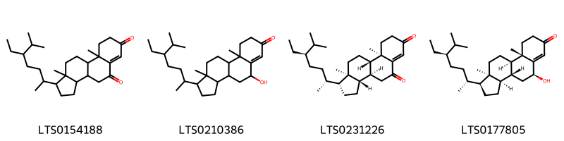{ width=100% }
    <figcaption>Hình ảnh cấu trúc hóa học của 4 hoạt chất thuộc nhóm Steroids and steroid derivatives gồm ['1-(5-ethyl-6-methylheptan-2-yl)-9a,11a-dimethyl-1h,2h,3h,3ah,3bh,4h,8h,9h,9bh,10h,11h-cyclopenta[a]phenanthrene-5,7-dione (LTS0154188)', '1-(5-ethyl-6-methylheptan-2-yl)-5-hydroxy-9a,11a-dimethyl-1h,2h,3h,3ah,3bh,4h,5h,8h,9h,9bh,10h,11h-cyclopenta[a]phenanthren-7-one (LTS0210386)', '(1r,3as,3bs,9ar,9bs,11ar)-1-[(2r,5r)-5-ethyl-6-methylheptan-2-yl]-9a,11a-dimethyl-1h,2h,3h,3ah,3bh,4h,8h,9h,9bh,10h,11h-cyclopenta[a]phenanthrene-5,7-dione (LTS0231226)', '(1s,3ar,3br,5s,9as,9br,11ar)-1-[(2r,5r)-5-ethyl-6-methylheptan-2-yl]-5-hydroxy-9a,11a-dimethyl-1h,2h,3h,3ah,3bh,4h,5h,8h,9h,9bh,10h,11h-cyclopenta[a]phenanthren-7-one (LTS0177805)'].</figcaption>
</figure>

---

### Dược dân tộc học

Danh sách các quốc gia có sử dụng *Sambucus ebulus* trong điều trị các bệnh. 

| Country   | Disease                                                      | Bệnh                                                                                                                                                                                                |
|:----------|:-------------------------------------------------------------|:----------------------------------------------------------------------------------------------------------------------------------------------------------------------------------------------------|
| Elsewhere | Diaphoretic, Diuretic, Expectorant, Purgative                | MYMEMORY WARNING: YOU USED ALL AVAILABLE FREE TRANSLATIONS FOR TODAY. NEXT AVAILABLE IN  13 HOURS 35 MINUTES 33 SECONDS VISIT HTTPS://MYMEMORY.TRANSLATED.NET/DOC/USAGELIMITS.PHP TO TRANSLATE MORE |
| Eurasia   | Poison                                                       | MYMEMORY WARNING: YOU USED ALL AVAILABLE FREE TRANSLATIONS FOR TODAY. NEXT AVAILABLE IN  13 HOURS 35 MINUTES 28 SECONDS VISIT HTTPS://MYMEMORY.TRANSLATED.NET/DOC/USAGELIMITS.PHP TO TRANSLATE MORE |
| Turkey    | Aperient, Diuretic, Expectorant, Sudorific, Poison, Laxative | MYMEMORY WARNING: YOU USED ALL AVAILABLE FREE TRANSLATIONS FOR TODAY. NEXT AVAILABLE IN  13 HOURS 35 MINUTES 23 SECONDS VISIT HTTPS://MYMEMORY.TRANSLATED.NET/DOC/USAGELIMITS.PHP TO TRANSLATE MORE |
| ain       | Purgative                                                    | MYMEMORY WARNING: YOU USED ALL AVAILABLE FREE TRANSLATIONS FOR TODAY. NEXT AVAILABLE IN  13 HOURS 35 MINUTES 20 SECONDS VISIT HTTPS://MYMEMORY.TRANSLATED.NET/DOC/USAGELIMITS.PHP TO TRANSLATE MORE |

---

---
## Sambucus javanica
### Thông tin về thực vật

!!! info "Phân loại thực vật của *Sambucus javanica* từ GIBF:"
    - **Kingdom:** Plantae
    - **Phylum:** Tracheophyta
    - **Order:** Dipsacales
    - **Family:** Viburnaceae
    - **Genus:** Sambucus
    - **Species:** *Sambucus javanica*

 

| Label (VI)   | Label (EN)   | Scientific Name   | Descriptions (VI)   | Descriptions (EN)   | Also Known As (VI)   | Also Known As (EN)   |
|:-------------|:-------------|:------------------|:--------------------|:--------------------|:---------------------|:---------------------|
| N/A          | N/A          | Sambucus javanica |                     | species of plant    | ['']                 | ['']                 |

#### Phân bố trên thế giới

**Từ CSDL GIBF** China, Chinese Taipei

#### Phân bố tại Việt Nam

**Từ CSDL GIBF**: Không có ghi nhận ở Việt Nam

---
### Thành phần hóa học
        
- Theo cơ sở dữ liệu lotus: Từ loài *Sambucus javanica* đã phân lập và xác định được 14 hoạt chất thuộc về các nhóm Prenol lipids, Steroids and steroid derivatives. 

|    | chemicalTaxonomyClassyfireClass   |   smiles_count |
|---:|:----------------------------------|---------------:|
|  0 | Prenol lipids                     |              7 |
|  1 | Steroids and steroid derivatives  |              7 |

#### Nhóm Prenol lipids
<figure markdown="span">
    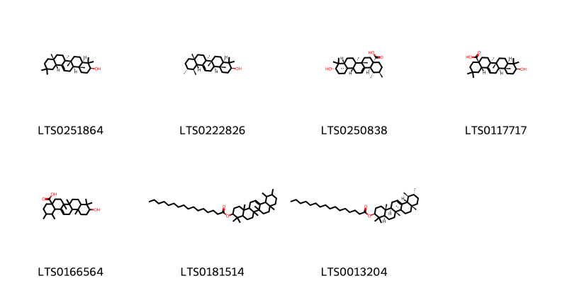{ width=100% }
    <figcaption>Hình ảnh cấu trúc hóa học của 7 hoạt chất thuộc nhóm Prenol lipids gồm ['β-amyrin (LTS0251864)', 'amyrin (LTS0222826)', 'ursolic acid (LTS0250838)', 'oleanolic acid (LTS0117717)', '10-hydroxy-1,2,6a,6b,9,9,12a-heptamethyl-2,3,4,5,6,7,8,8a,10,11,12,12b,13,14b-tetradecahydro-1h-picene-4a-carboxylic acid (LTS0166564)', '4,4,6a,6b,8a,11,12,14b-octamethyl-2,3,4a,5,6,7,8,9,10,11,12,12a,14,14a-tetradecahydro-1h-picen-3-yl hexadecanoate (LTS0181514)', '(3s,4ar,6ar,6bs,8ar,11r,12s,12ar,14ar,14br)-4,4,6a,6b,8a,11,12,14b-octamethyl-2,3,4a,5,6,7,8,9,10,11,12,12a,14,14a-tetradecahydro-1h-picen-3-yl hexadecanoate (LTS0013204)'].</figcaption>
</figure>
#### Nhóm Steroids and steroid derivatives
<figure markdown="span">
    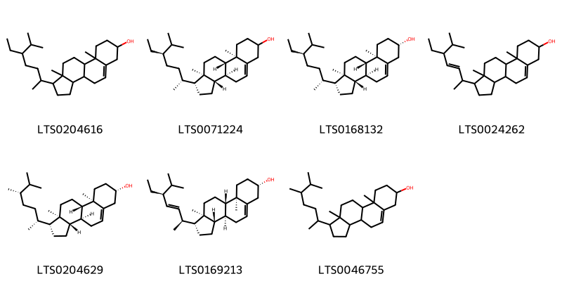{ width=100% }
    <figcaption>Hình ảnh cấu trúc hóa học của 7 hoạt chất thuộc nhóm Steroids and steroid derivatives gồm ['stigmast-5-en-3-ol, (3β)- (LTS0204616)', 'stigmast-5-en-3-ol (LTS0071224)', 'sitosterol (LTS0168132)', 'stigmasterol (LTS0024262)', '22,23-dihydrobrassicasterol (LTS0204629)', '(1r,3as,3bs,7s,9ar,9bs,11ar)-1-[(2s,3e,5s)-5-ethyl-6-methylhept-3-en-2-yl]-9a,11a-dimethyl-1h,2h,3h,3ah,3bh,4h,6h,7h,8h,9h,9bh,10h,11h-cyclopenta[a]phenanthren-7-ol (LTS0169213)', 'campesterol (LTS0046755)'].</figcaption>
</figure>

---

### Dược dân tộc học

Danh sách các quốc gia có sử dụng *Sambucus javanica* trong điều trị các bệnh. 

| Country   | Disease                     | Bệnh                                                                                                                                                                                                |
|:----------|:----------------------------|:----------------------------------------------------------------------------------------------------------------------------------------------------------------------------------------------------|
| Asia      | Poison, Purgative, Diuretic | MYMEMORY WARNING: YOU USED ALL AVAILABLE FREE TRANSLATIONS FOR TODAY. NEXT AVAILABLE IN  13 HOURS 34 MINUTES 47 SECONDS VISIT HTTPS://MYMEMORY.TRANSLATED.NET/DOC/USAGELIMITS.PHP TO TRANSLATE MORE |
| China     | Diuretic                    | MYMEMORY WARNING: YOU USED ALL AVAILABLE FREE TRANSLATIONS FOR TODAY. NEXT AVAILABLE IN  13 HOURS 34 MINUTES 44 SECONDS VISIT HTTPS://MYMEMORY.TRANSLATED.NET/DOC/USAGELIMITS.PHP TO TRANSLATE MORE |

---

---
## Sambucus mexicana
### Thông tin về thực vật

!!! info "Phân loại thực vật của *Sambucus mexicana* từ GIBF:"
    - **Kingdom:** Plantae
    - **Phylum:** Tracheophyta
    - **Order:** Dipsacales
    - **Family:** Viburnaceae
    - **Genus:** Sambucus
    - **Species:** *Sambucus mexicana*

 

| Label (VI)   | Label (EN)   | Scientific Name   | Descriptions (VI)   | Descriptions (EN)   | Also Known As (VI)   | Also Known As (EN)   |
|:-------------|:-------------|:------------------|:--------------------|:--------------------|:---------------------|:---------------------|
| N/A          | N/A          | Sambucus mexicana | loài thực vật       | species of plant    | ['']                 | ['']                 |

#### Phân bố trên thế giới

**Từ CSDL GIBF** nan, Niue, Micronesia (Federated States of), Peru, French Polynesia, Costa Rica, Gabon, United States of America, Mexico, Guatemala

#### Phân bố tại Việt Nam

**Từ CSDL GIBF**: Không có ghi nhận ở Việt Nam

---
### Thành phần hóa học
        
- Theo cơ sở dữ liệu lotus: Từ loài *Sambucus mexicana* đã phân lập và xác định được Chưa có hoạt chất nào được phân lập. hoạt chất thuộc về các nhóm Không có hoạt chất nào được phân lập. 

Không có hình ảnh nào được tạo ra

---

### Dược dân tộc học

Danh sách các quốc gia có sử dụng *Sambucus mexicana* trong điều trị các bệnh. 

| Country   | Disease                                                                                                   | Bệnh                                                                                                                                                                                                |
|:----------|:----------------------------------------------------------------------------------------------------------|:----------------------------------------------------------------------------------------------------------------------------------------------------------------------------------------------------|
| Mexico    | Aperient, Diaphoretic, Diuretic, Expectorant, Soap, Sudorific, Stimulant, Sudorific, Purgative, Cathartic | MYMEMORY WARNING: YOU USED ALL AVAILABLE FREE TRANSLATIONS FOR TODAY. NEXT AVAILABLE IN  13 HOURS 33 MINUTES 41 SECONDS VISIT HTTPS://MYMEMORY.TRANSLATED.NET/DOC/USAGELIMITS.PHP TO TRANSLATE MORE |

---

---
## Sambucus nigra
### Thông tin về thực vật

!!! info "Phân loại thực vật của *Sambucus nigra* từ GIBF:"
    - **Kingdom:** Plantae
    - **Phylum:** Tracheophyta
    - **Order:** Dipsacales
    - **Family:** Viburnaceae
    - **Genus:** Sambucus
    - **Species:** *Sambucus nigra*

 

| Label (VI)   | Label (EN)   | Scientific Name   | Descriptions (VI)   | Descriptions (EN)   | Also Known As (VI)   | Also Known As (EN)                                                                                                               |
|:-------------|:-------------|:------------------|:--------------------|:--------------------|:---------------------|:---------------------------------------------------------------------------------------------------------------------------------|
| N/A          | N/A          | Sambucus nigra    | loài thực vật       | species of plant    | ['cây cơm cháy']     | ['elder', 'black elder', 'black elderberry', 'elderberry', 'European black elderberry', 'European elder', 'European elderberry'] |

#### Phân bố trên thế giới

**Từ CSDL GIBF** Switzerland, United Kingdom of Great Britain and Northern Ireland, Denmark, South Africa, France, Spain, Poland, New Zealand, Hungary, Germany, Ecuador, Mexico, Austria, Ireland, Italy, Australia, Netherlands, Ukraine

#### Phân bố tại Việt Nam

**Từ CSDL GIBF**: Không có ghi nhận ở Việt Nam

---
### Thành phần hóa học
        
- Theo cơ sở dữ liệu lotus: Từ loài *Sambucus nigra* đã phân lập và xác định được 160 hoạt chất thuộc về các nhóm Organooxygen compounds, Furanoid lignans, Flavonoids, Saturated hydrocarbons, 2-arylbenzofuran flavonoids, Carboxylic acids and derivatives, Prenol lipids, Fatty Acyls, Dihydrofurans, Hydroxy acids and derivatives, Steroids and steroid derivatives. 

|    | chemicalTaxonomyClassyfireClass   |   smiles_count |
|---:|:----------------------------------|---------------:|
|  0 | 2-arylbenzofuran flavonoids       |              6 |
|  1 | Carboxylic acids and derivatives  |              3 |
|  2 | Dihydrofurans                     |              1 |
|  3 | Fatty Acyls                       |             16 |
|  4 | Flavonoids                        |             52 |
|  5 | Furanoid lignans                  |              6 |
|  6 | Hydroxy acids and derivatives     |              2 |
|  7 | Organooxygen compounds            |             22 |
|  8 | Prenol lipids                     |             29 |
|  9 | Saturated hydrocarbons            |              1 |
| 10 | Steroids and steroid derivatives  |             22 |

#### Nhóm 2-arylbenzofuran flavonoids
<figure markdown="span">
    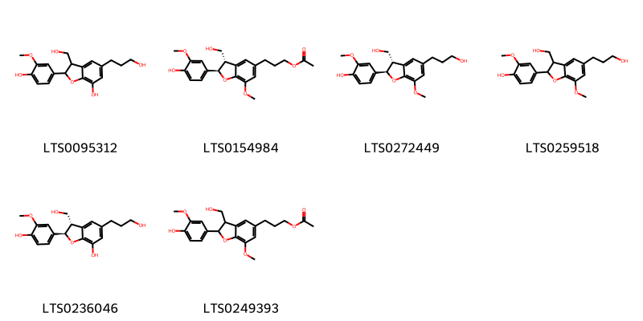{ width=100% }
    <figcaption>Hình ảnh cấu trúc hóa học của 6 hoạt chất thuộc nhóm 2-arylbenzofuran flavonoids gồm ['2-(4-hydroxy-3-methoxyphenyl)-3-(hydroxymethyl)-5-(3-hydroxypropyl)-2,3-dihydro-1-benzofuran-7-ol (LTS0095312)', '3-[(2r,3s)-2-(4-hydroxy-3-methoxyphenyl)-3-(hydroxymethyl)-7-methoxy-2,3-dihydro-1-benzofuran-5-yl]propyl acetate (LTS0154984)', '4-[(2r,3s)-3-(hydroxymethyl)-5-(3-hydroxypropyl)-7-methoxy-2,3-dihydro-1-benzofuran-2-yl]-2-methoxyphenol (LTS0272449)', '4-[3-(hydroxymethyl)-5-(3-hydroxypropyl)-7-methoxy-2,3-dihydro-1-benzofuran-2-yl]-2-methoxyphenol (LTS0259518)', '(2r,3s)-2-(4-hydroxy-3-methoxyphenyl)-3-(hydroxymethyl)-5-(3-hydroxypropyl)-2,3-dihydro-1-benzofuran-7-ol (LTS0236046)', '3-[2-(4-hydroxy-3-methoxyphenyl)-3-(hydroxymethyl)-7-methoxy-2,3-dihydro-1-benzofuran-5-yl]propyl acetate (LTS0249393)'].</figcaption>
</figure>
#### Nhóm Carboxylic acids and derivatives
<figure markdown="span">
    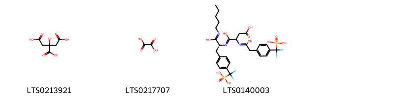{ width=100% }
    <figcaption>Hình ảnh cấu trúc hóa học của 3 hoạt chất thuộc nhóm Carboxylic acids and derivatives gồm ['citric acid (LTS0213921)', 'oxalic acid (LTS0217707)', '3-{[(1s)-2-{4-[difluoro(phosphono)methyl]phenyl}-1-(pentyl-c-hydroxycarbonimidoyl)ethyl]-c-hydroxycarbonimidoyl}-3-[(2-{4-[difluoro(phosphono)methyl]phenyl}-1-hydroxyethylidene)amino]propanoic acid (LTS0140003)'].</figcaption>
</figure>
#### Nhóm Dihydrofurans
<figure markdown="span">
    { width=100% }
    <figcaption>Hình ảnh cấu trúc hóa học của 1 hoạt chất thuộc nhóm Dihydrofurans gồm ['vitamin c (LTS0022555)'].</figcaption>
</figure>
#### Nhóm Fatty Acyls
<figure markdown="span">
    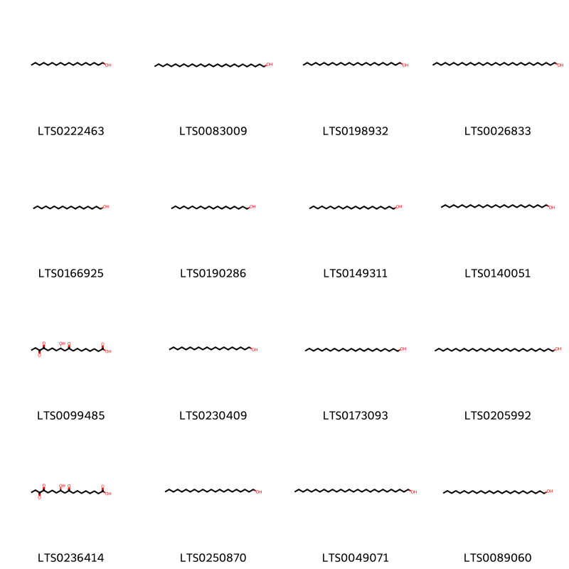{ width=100% }
    <figcaption>Hình ảnh cấu trúc hóa học của 16 hoạt chất thuộc nhóm Fatty Acyls gồm ['stearyl alcohol (LTS0222463)', 'heptacosanol (LTS0083009)', '1-tetracosanol (LTS0198932)', 'triacontanol (LTS0026833)', '1-heptadecanol (LTS0166925)', 'nonadecanol (LTS0190286)', 'henicosan-1-ol (LTS0149311)', 'ceryl alcohol (LTS0140051)', '(11s)-11-hydroxy-9,15,16-trioxooctadecanoic acid (LTS0099485)', 'arachidyl alcohol (LTS0230409)', '1-tricosanol (LTS0173093)', 'nonacosanol (LTS0205992)', '11-hydroxy-9,15,16-trioxooctadecanoic acid (LTS0236414)', 'docosanol (LTS0250870)', 'octacosanol (LTS0049071)', '1-pentacosanol (LTS0089060)'].</figcaption>
</figure>
#### Nhóm Flavonoids
<figure markdown="span">
    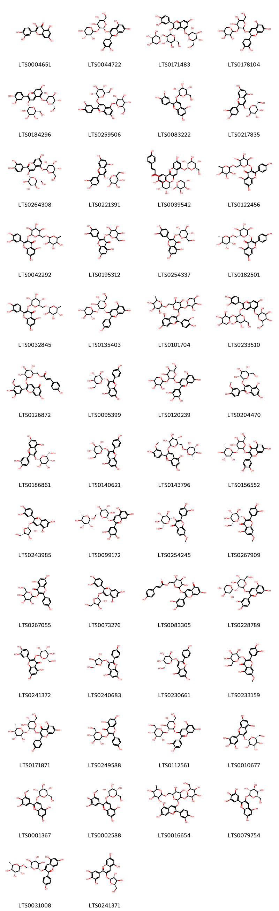{ width=100% }
    <figcaption>Hình ảnh cấu trúc hóa học của 52 hoạt chất thuộc nhóm Flavonoids gồm ['quercetin (LTS0004651)', '3-{[(2s,3s,4s,5s,6r)-4,5-dihydroxy-6-(hydroxymethyl)-3-{[(2s,3r,4r,5s)-3,4,5-trihydroxyoxan-2-yl]oxy}oxan-2-yl]oxy}-2-(3,4-dihydroxyphenyl)-5,7-dihydroxy-1λ⁴-chromen-1-ylium (LTS0044722)', '3-{[(2s,3r,4s,5s,6r)-4,5-dihydroxy-6-(hydroxymethyl)-3-{[(2s,3r,4s,5r)-3,4,5-trihydroxyoxan-2-yl]oxy}oxan-2-yl]oxy}-2-(3,4-dihydroxyphenyl)-7-hydroxy-5-{[(2s,3r,4s,5s,6r)-3,4,5-trihydroxy-6-(hydroxymethyl)oxan-2-yl]oxy}-1λ⁴-chromen-1-ylium (LTS0171483)', '3-{[4,5-dihydroxy-6-(hydroxymethyl)-3-[(3,4,5-trihydroxyoxan-2-yl)oxy]oxan-2-yl]oxy}-2-(3,4-dihydroxyphenyl)-5,7-dihydroxy-1λ⁴-chromen-1-ylium (LTS0178104)', '2-(3,4-dihydroxyphenyl)-7-hydroxy-3-{[(2s,3r,4r,5s,6s)-3,4,5-trihydroxy-6-(hydroxymethyl)oxan-2-yl]oxy}-5-{[(2s,3r,4s,5s,6s)-3,4,5-trihydroxy-6-(hydroxymethyl)oxan-2-yl]oxy}-1λ⁴-chromen-1-ylium (LTS0184296)', 'cyanin betaine (LTS0259506)', '5,7-dihydroxy-2-(4-hydroxy-3-oxidophenyl)-3-{[(2s,3r,4s,5s,6r)-3,4,5-trihydroxy-6-(hydroxymethyl)oxan-2-yl]oxy}-1λ⁴-chromen-1-ylium (LTS0083222)', 'cyanidin 3-glucoside (LTS0217835)', 'cyanin (LTS0264308)', 'chrysanthemin (LTS0221391)', '3-{[(2s,3r,4s,5s,6r)-4,5-dihydroxy-6-({[3-(4-hydroxyphenyl)prop-2-enoyl]oxy}methyl)-3-{[(2r,3r,4r,5s)-3,4,5-trihydroxyoxan-2-yl]oxy}oxan-2-yl]oxy}-2-(3,4-dihydroxyphenyl)-7-hydroxy-5-{[(2s,3r,4s,5s,6r)-3,4,5-trihydroxy-6-(hydroxymethyl)oxan-2-yl]oxy}-1λ⁴-chromen-1-ylium (LTS0039542)', '5,7-dihydroxy-2-(4-hydroxyphenyl)-3-[(3,4,5-trihydroxy-6-{[(3,4,5-trihydroxy-6-methyloxan-2-yl)oxy]methyl}oxan-2-yl)oxy]chromen-4-one (LTS0122456)', 'rutin (LTS0042292)', '2-(3,4-dihydroxyphenyl)-5,7-dihydroxy-3-{[3,4,5-trihydroxy-6-(hydroxymethyl)oxan-2-yl]oxy}chromen-4-one (LTS0195312)', 'isoquercetin (LTS0254337)', 'nictoflorin (LTS0182501)', '3-rutinosyl quercetin (LTS0032845)', '3-{[(2r,3r,4s,5s,6r)-4,5-dihydroxy-6-(hydroxymethyl)-3-{[(2s,3r,4s,5r)-3,4,5-trihydroxyoxan-2-yl]oxy}oxan-2-yl]oxy}-5,7-dihydroxy-2-(4-hydroxyphenyl)-1λ⁴-chromen-1-ylium (LTS0135403)', '3-[(4,5-dihydroxy-6-{[(3,4,5-trihydroxy-6-methyloxan-2-yl)oxy]methyl}-3-[(3,4,5-trihydroxyoxan-2-yl)oxy]oxan-2-yl)oxy]-2-(3,4-dihydroxyphenyl)-5,7-dihydroxy-1λ⁴-chromen-1-ylium (LTS0101704)', '3-{[4,5-dihydroxy-6-(hydroxymethyl)-3-[(3,4,5-trihydroxyoxan-2-yl)oxy]oxan-2-yl]oxy}-2-(3,4-dihydroxyphenyl)-7-hydroxy-5-{[3,4,5-trihydroxy-6-(hydroxymethyl)oxan-2-yl]oxy}-1λ⁴-chromen-1-ylium (LTS0233510)', '[(2r,3s,4s,5r)-6-{[2-(3,4-dihydroxy-5-methoxyphenyl)-7-hydroxy-5-oxochromen-3-yl]oxy}-3,4,5-trihydroxyoxan-2-yl]methyl 3-(4-hydroxyphenyl)prop-2-enoate (LTS0126872)', 'pelargonidin 3-glucoside (LTS0095399)', '3-{[4,5-dihydroxy-6-(hydroxymethyl)-3-[(3,4,5-trihydroxyoxan-2-yl)oxy]oxan-2-yl]oxy}-5,7-dihydroxy-2-(3,4,5-trihydroxyphenyl)-1λ⁴-chromen-1-ylium (LTS0120239)', 'peonidin-3-glucoside (LTS0204470)', 'cyanidin 3-o-β-d-galactoside (LTS0186861)', '5,7-dihydroxy-2-(4-hydroxyphenyl)-3-{[(2r,3s,4r,5r,6s)-3,4,5-trihydroxy-6-(hydroxymethyl)oxan-2-yl]oxy}-1λ⁴-chromen-1-ylium (LTS0140621)', '5,7-dihydroxy-2-(4-hydroxy-3-methoxyphenyl)-3-{[(2s,3r,4s,5s,6r)-3,4,5-trihydroxy-6-({[(2r,3r,4r,5r,6s)-3,4,5-trihydroxy-6-methyloxan-2-yl]oxy}methyl)oxan-2-yl]oxy}-1λ⁴-chromen-1-ylium (LTS0143796)', '3-{[(2s,3r,4s,5r,6r)-4,5-dihydroxy-6-(hydroxymethyl)-3-{[(2s,3r,4r,5r,6s)-3,4,5-trihydroxy-6-methyloxan-2-yl]oxy}oxan-2-yl]oxy}-2-(3,4-dihydroxyphenyl)-5,7-dihydroxychromen-4-one (LTS0156552)', '3-{[(2r,3r,4r,5s)-3,4-dihydroxy-5-(hydroxymethyl)oxolan-2-yl]oxy}-2-(3,4-dihydroxyphenyl)-5,7-dihydroxy-1λ⁴-chromen-1-ylium (LTS0243985)', 'tulipanin (LTS0099172)', '2-(3,4-dihydroxyphenyl)-7-methoxy-3-{[(2s,3r,4s,5s,6r)-3,4,5-trihydroxy-6-(hydroxymethyl)oxan-2-yl]oxy}chromen-4-one (LTS0254245)', '2-(3,4-dihydroxyphenyl)-5-hydroxy-7-methoxy-3-{[(2s,3r,4s,5s,6r)-3,4,5-trihydroxy-6-(hydroxymethyl)oxan-2-yl]oxy}chromen-4-one (LTS0267909)', 'trifolin (LTS0267055)', '3-{[(2s,3r,4r,5r)-3,4-dihydroxy-5-(hydroxymethyl)oxolan-2-yl]oxy}-2-(3,4-dihydroxyphenyl)-5,7-dihydroxy-1λ⁴-chromen-1-ylium (LTS0073276)', '(6-{[2-(3,4-dihydroxyphenyl)-7-hydroxy-5-oxochromen-3-yl]oxy}-3,4,5-trihydroxyoxan-2-yl)methyl 3-(4-hydroxyphenyl)prop-2-enoate (LTS0083305)', '3-{[(2s,3r,4s,5s,6r)-4,5-dihydroxy-6-(hydroxymethyl)-3-{[(2s,3r,4s,5r)-3,4,5-trihydroxyoxan-2-yl]oxy}oxan-2-yl]oxy}-5,7-dihydroxy-2-(4-hydroxy-3-oxidophenyl)-1λ⁴-chromen-1-ylium (LTS0228789)', '2-(3,4-dihydroxyphenyl)-5,7-dihydroxy-3-{[(2s,3r,4r,5r,6s)-3,4,5-trihydroxy-6-(hydroxymethyl)oxan-2-yl]oxy}chromen-4-one (LTS0241372)', '3-{[(2r,3s,4s,5r)-3,4-dihydroxy-5-(hydroxymethyl)oxolan-2-yl]oxy}-5,7-dihydroxy-2-(4-hydroxyphenyl)-1λ⁴-chromen-1-ylium (LTS0240683)', '5,7-dihydroxy-2-(4-hydroxyphenyl)-3-{[(2r,3r,4s,5r,6r)-3,4,5-trihydroxy-6-(hydroxymethyl)oxan-2-yl]oxy}-1λ⁴-chromen-1-ylium (LTS0230661)', '2-(3,4-dihydroxyphenyl)-5-hydroxy-7-methoxy-3-{[3,4,5-trihydroxy-6-(hydroxymethyl)oxan-2-yl]oxy}chromen-4-one (LTS0233159)', '3-{[(2s,3r,4s,5s,6r)-4,5-dihydroxy-6-(hydroxymethyl)-3-{[(2s,3r,4r,5r,6s)-3,4,5-trihydroxy-6-methyloxan-2-yl]oxy}oxan-2-yl]oxy}-5,7-dihydroxy-2-(4-hydroxyphenyl)chromen-4-one (LTS0171871)', 'astragalin (LTS0249588)', 'cyanidin 3-o-sophoroside (LTS0112561)', 'delphinidin 3-glucoside (LTS0010677)', 'petunidin 3-glucoside (LTS0001367)', '5,7-dihydroxy-2-(3-hydroxy-5-methoxy-4-oxidophenyl)-3-{[(2s,3r,4s,5s,6r)-3,4,5-trihydroxy-6-(hydroxymethyl)oxan-2-yl]oxy}-1λ⁴-chromen-1-ylium (LTS0002588)', '3-[(4,5-dihydroxy-3-{[3,4,5-trihydroxy-6-(hydroxymethyl)oxan-2-yl]oxy}-6-{[(3,4,5-trihydroxy-6-methyloxan-2-yl)oxy]methyl}oxan-2-yl)oxy]-2-(3,4-dihydroxyphenyl)-5,7-dihydroxy-1λ⁴-chromen-1-ylium (LTS0016654)', '2-(3,5-dihydroxy-4-oxidophenyl)-5,7-dihydroxy-3-{[(2s,3r,4s,5s,6r)-3,4,5-trihydroxy-6-(hydroxymethyl)oxan-2-yl]oxy}-1λ⁴-chromen-1-ylium (LTS0079754)', 'pelargonidin 3-o-rutinoside (LTS0031008)', '3-{[(2s,3r,4r,5r)-3,4-dihydroxy-5-(hydroxymethyl)oxolan-2-yl]oxy}-5,7-dihydroxy-2-(3,4,5-trihydroxyphenyl)-1λ⁴-chromen-1-ylium (LTS0241371)', '[(2r,3s,4s,5r,6s)-6-{[2-(3,4-dihydroxyphenyl)-7-hydroxy-5-oxochromen-3-yl]oxy}-3,4,5-trihydroxyoxan-2-yl]methyl 3-(3,4-dihydroxyphenyl)prop-2-enoate (LTS0105542)', 'cyanidin 3-o-rutinoside (LTS0049654)'].</figcaption>
</figure>
#### Nhóm Furanoid lignans
<figure markdown="span">
    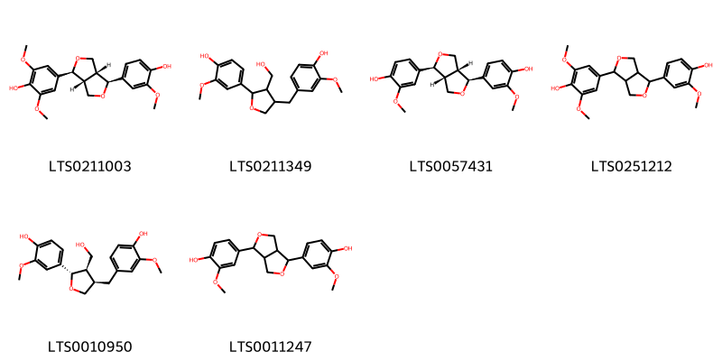{ width=100% }
    <figcaption>Hình ảnh cấu trúc hóa học của 6 hoạt chất thuộc nhóm Furanoid lignans gồm ['(-)-medioresinol (LTS0211003)', '4-{4-[(4-hydroxy-3-methoxyphenyl)methyl]-3-(hydroxymethyl)oxolan-2-yl}-2-methoxyphenol (LTS0211349)', 'pinoresinol (LTS0057431)', '4-[4-(4-hydroxy-3-methoxyphenyl)-hexahydrofuro[3,4-c]furan-1-yl]-2,6-dimethoxyphenol (LTS0251212)', 'lariciresinol (LTS0010950)', 'pinoresinol (LTS0011247)'].</figcaption>
</figure>
#### Nhóm Hydroxy acids and derivatives
<figure markdown="span">
    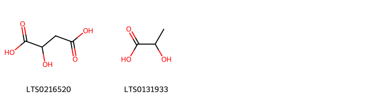{ width=100% }
    <figcaption>Hình ảnh cấu trúc hóa học của 2 hoạt chất thuộc nhóm Hydroxy acids and derivatives gồm ['malic acid (LTS0216520)', 'lactic acid (LTS0131933)'].</figcaption>
</figure>
#### Nhóm Organooxygen compounds
<figure markdown="span">
    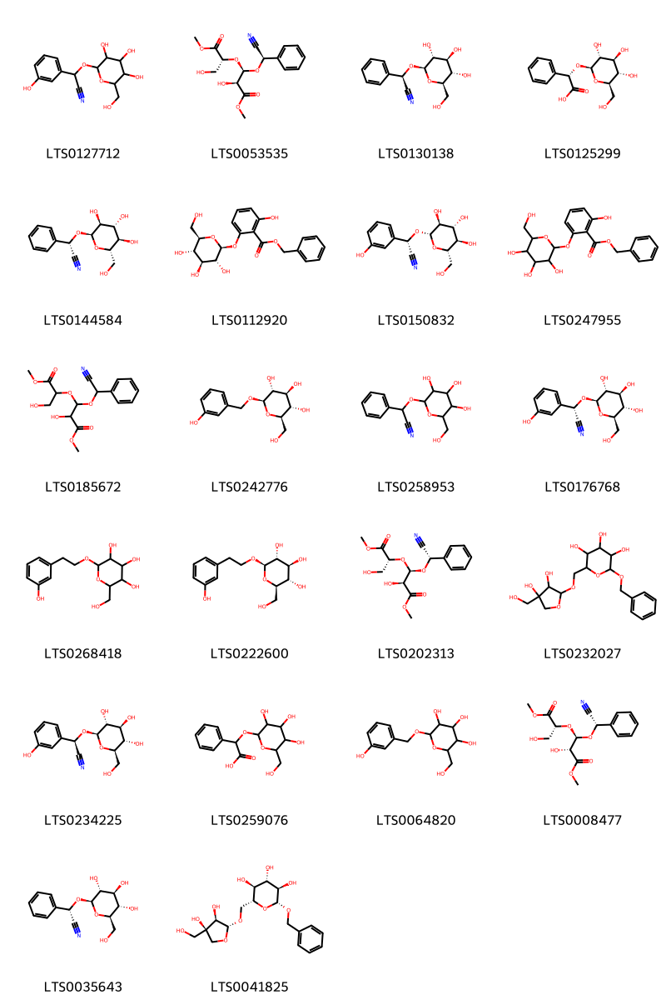{ width=100% }
    <figcaption>Hình ảnh cấu trúc hóa học của 22 hoạt chất thuộc nhóm Organooxygen compounds gồm ['2-(3-hydroxyphenyl)-2-{[3,4,5-trihydroxy-6-(hydroxymethyl)oxan-2-yl]oxy}acetonitrile (LTS0127712)', 'methyl (2r)-2-[(1r,2s)-1-[(r)-cyano(phenyl)methoxy]-2-hydroxy-3-methoxy-3-oxopropoxy]-3-hydroxypropanoate (LTS0053535)', 'prunasin (LTS0130138)', '(s)-phenyl({[(2s,3r,4s,5s,6r)-3,4,5-trihydroxy-6-(hydroxymethyl)oxan-2-yl]oxy})acetic acid (LTS0125299)', '(2s)-2-phenyl-2-{[(2r,3s,4r,5r,6s)-3,4,5-trihydroxy-6-(hydroxymethyl)oxan-2-yl]oxy}acetonitrile (LTS0144584)', 'benzyl 2-hydroxy-6-{[(2s,3r,4s,5s,6r)-3,4,5-trihydroxy-6-(hydroxymethyl)oxan-2-yl]oxy}benzoate (LTS0112920)', '(2s)-2-(3-hydroxyphenyl)-2-{[(2s,3s,4r,5r,6s)-3,4,5-trihydroxy-6-(hydroxymethyl)oxan-2-yl]oxy}acetonitrile (LTS0150832)', 'benzyl 2-hydroxy-6-{[3,4,5-trihydroxy-6-(hydroxymethyl)oxan-2-yl]oxy}benzoate (LTS0247955)', 'methyl 3-[cyano(phenyl)methoxy]-2-hydroxy-3-[(3-hydroxy-1-methoxy-1-oxopropan-2-yl)oxy]propanoate (LTS0185672)', '(2r,3s,4s,5r,6r)-2-(hydroxymethyl)-6-[(3-hydroxyphenyl)methoxy]oxane-3,4,5-triol (LTS0242776)', '2-phenyl-2-{[3,4,5-trihydroxy-6-(hydroxymethyl)oxan-2-yl]oxy}acetonitrile (LTS0258953)', 'zierin (LTS0176768)', '2-(hydroxymethyl)-6-[2-(3-hydroxyphenyl)ethoxy]oxane-3,4,5-triol (LTS0268418)', '(2r,3s,4s,5r,6r)-2-(hydroxymethyl)-6-[2-(3-hydroxyphenyl)ethoxy]oxane-3,4,5-triol (LTS0222600)', 'methyl (2r)-2-[(1r,2s)-1-[(s)-cyano(phenyl)methoxy]-2-hydroxy-3-methoxy-3-oxopropoxy]-3-hydroxypropanoate (LTS0202313)', '2-(benzyloxy)-6-({[3,4-dihydroxy-4-(hydroxymethyl)oxolan-2-yl]oxy}methyl)oxane-3,4,5-triol (LTS0232027)', '(2r)-2-(3-hydroxyphenyl)-2-{[(2r,3r,4s,5s,6r)-3,4,5-trihydroxy-6-(hydroxymethyl)oxan-2-yl]oxy}acetonitrile (LTS0234225)', 'phenyl({[3,4,5-trihydroxy-6-(hydroxymethyl)oxan-2-yl]oxy})acetic acid (LTS0259076)', '2-(hydroxymethyl)-6-[(3-hydroxyphenyl)methoxy]oxane-3,4,5-triol (LTS0064820)', 'methyl (2r)-2-[(1r,2r)-1-[(s)-cyano(phenyl)methoxy]-2-hydroxy-3-methoxy-3-oxopropoxy]-3-hydroxypropanoate (LTS0008477)', '(s)-prunasin (LTS0035643)', '(2r,3r,4s,5s,6r)-2-(benzyloxy)-6-({[(2r,3r,4r)-3,4-dihydroxy-4-(hydroxymethyl)oxolan-2-yl]oxy}methyl)oxane-3,4,5-triol (LTS0041825)'].</figcaption>
</figure>
#### Nhóm Prenol lipids
<figure markdown="span">
    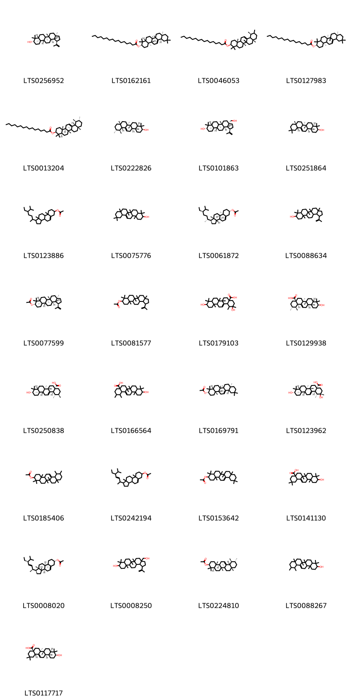{ width=100% }
    <figcaption>Hình ảnh cấu trúc hóa học của 29 hoạt chất thuộc nhóm Prenol lipids gồm ['lupeol (LTS0256952)', '(3s,4ar,6ar,6bs,8ar,12ar,14ar,14br)-4,4,6a,6b,8a,11,11,14b-octamethyl-1,2,3,4a,5,6,7,8,9,10,12,12a,14,14a-tetradecahydropicen-3-yl hexadecanoate (LTS0162161)', '(3s,6ar,8ar,12s,14br)-4,4,6a,6b,8a,11,12,14b-octamethyl-2,3,4a,5,6,7,8,9,10,11,12,12a,14,14a-tetradecahydro-1h-picen-3-yl hexadecanoate (LTS0046053)', '(3s,6ar,8ar,14br)-4,4,6a,6b,8a,11,11,14b-octamethyl-1,2,3,4a,5,6,7,8,9,10,12,12a,14,14a-tetradecahydropicen-3-yl hexadecanoate (LTS0127983)', '(3s,4ar,6ar,6bs,8ar,11r,12s,12ar,14ar,14br)-4,4,6a,6b,8a,11,12,14b-octamethyl-2,3,4a,5,6,7,8,9,10,11,12,12a,14,14a-tetradecahydro-1h-picen-3-yl hexadecanoate (LTS0013204)', 'amyrin (LTS0222826)', 'betulin (LTS0101863)', 'β-amyrin (LTS0251864)', '1-(5-ethyl-6-methylheptan-2-yl)-9a,11a-dimethyl-1h,2h,3h,3ah,3bh,4h,6h,7h,8h,9h,9bh,10h,11h-cyclopenta[a]phenanthren-7-yl acetate (LTS0123886)', 'β-amyrin (LTS0075776)', '(1s,3as,3bs,7s,9ar,9br,11as)-1-[(2r,5r)-5-ethyl-6-methylheptan-2-yl]-9a,11a-dimethyl-1h,2h,3h,3ah,3bh,4h,6h,7h,8h,9h,9bh,10h,11h-cyclopenta[a]phenanthren-7-yl acetate (LTS0061872)', 'lupeol (LTS0088634)', 'lupeol acetate (LTS0077599)', '3a,5a,5b,8,8,11a-hexamethyl-1-(prop-1-en-2-yl)-hexadecahydrocyclopenta[a]chrysen-9-yl acetate (LTS0081577)', '2,10-dihydroxy-1,2,6a,6b,9,9,12a-heptamethyl-1,3,4,5,6,7,8,8a,10,11,12,12b,13,14b-tetradecahydropicene-4a-carboxylic acid (LTS0179103)', '(1s,2r,4as,6as,6br,8as,10s,12ar,12br,14br)-10-hydroxy-1,2,6a,6b,9,9,12a-heptamethyl-2,3,4,5,6,7,8,8a,10,11,12,12b,13,14b-tetradecahydro-1h-picene-4a-carboxylic acid (LTS0129938)', 'ursolic acid (LTS0250838)', '10-hydroxy-1,2,6a,6b,9,9,12a-heptamethyl-2,3,4,5,6,7,8,8a,10,11,12,12b,13,14b-tetradecahydro-1h-picene-4a-carboxylic acid (LTS0166564)', '(3s,4ar,6as,6br,8ar,12as,14ar,14bs)-4,4,6a,6b,8a,11,11,14b-octamethyl-1,2,3,4a,5,6,7,8,9,10,12,12a,14,14a-tetradecahydropicen-3-yl acetate (LTS0169791)', '(1r,2s,4ar,6as,6br,8ar,10s,12ar,12br,14bs)-2,10-dihydroxy-1,2,6a,6b,9,9,12a-heptamethyl-1,3,4,5,6,7,8,8a,10,11,12,12b,13,14b-tetradecahydropicene-4a-carboxylic acid (LTS0123962)', '4,4,6a,6b,8a,11,12,14b-octamethyl-2,3,4a,5,6,7,8,9,10,11,12,12a,14,14a-tetradecahydro-1h-picen-3-yl acetate (LTS0185406)', '1-(5-ethyl-6-methylhept-3-en-2-yl)-9a,11a-dimethyl-1h,2h,3h,3ah,3bh,4h,6h,7h,8h,9h,9bh,10h,11h-cyclopenta[a]phenanthren-7-yl acetate (LTS0242194)', '4,4,6a,6b,8a,11,11,14b-octamethyl-1,2,3,4a,5,6,7,8,9,10,12,12a,14,14a-tetradecahydropicen-3-yl acetate (LTS0153642)', 'oleanolic acid (LTS0141130)', '(1s,3as,3bs,7s,9ar,9br,11as)-1-[(2s,3e,5s)-5-ethyl-6-methylhept-3-en-2-yl]-9a,11a-dimethyl-1h,2h,3h,3ah,3bh,4h,6h,7h,8h,9h,9bh,10h,11h-cyclopenta[a]phenanthren-7-yl acetate (LTS0008020)', '3a-(hydroxymethyl)-5a,5b,8,8,11a-pentamethyl-1-(prop-1-en-2-yl)-hexadecahydrocyclopenta[a]chrysen-9-ol (LTS0008250)', 'α-amyrin acetate (LTS0224810)', 'α-amyrin (LTS0088267)', 'oleanolic acid (LTS0117717)'].</figcaption>
</figure>
#### Nhóm Saturated hydrocarbons
<figure markdown="span">
    { width=100% }
    <figcaption>Hình ảnh cấu trúc hóa học của 1 hoạt chất thuộc nhóm Saturated hydrocarbons gồm ['heptacosane (LTS0150428)'].</figcaption>
</figure>
#### Nhóm Steroids and steroid derivatives
<figure markdown="span">
    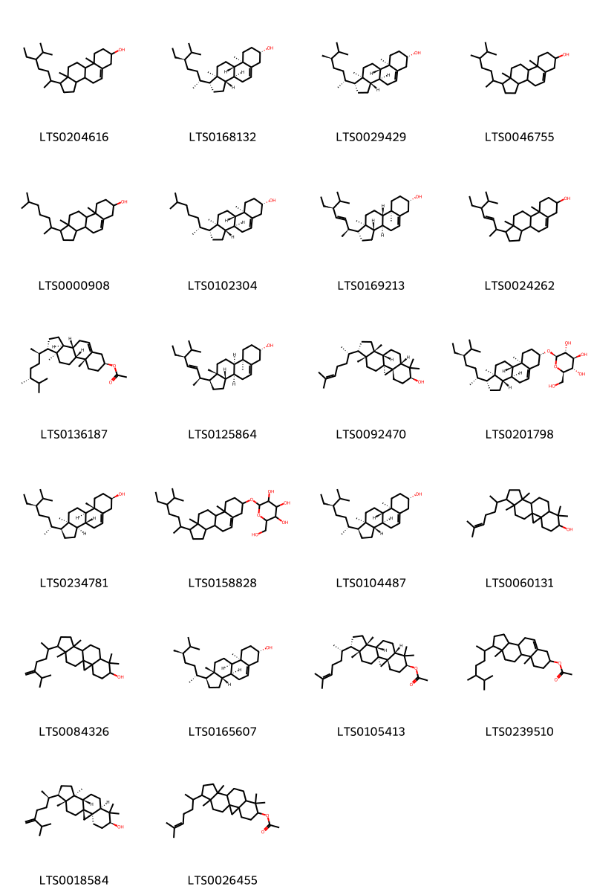{ width=100% }
    <figcaption>Hình ảnh cấu trúc hóa học của 22 hoạt chất thuộc nhóm Steroids and steroid derivatives gồm ['stigmast-5-en-3-ol, (3β)- (LTS0204616)', 'sitosterol (LTS0168132)', 'campesterol (LTS0029429)', 'campesterol (LTS0046755)', 'epicholestrol (LTS0000908)', 'cholesterol (LTS0102304)', '(1r,3as,3bs,7s,9ar,9bs,11ar)-1-[(2s,3e,5s)-5-ethyl-6-methylhept-3-en-2-yl]-9a,11a-dimethyl-1h,2h,3h,3ah,3bh,4h,6h,7h,8h,9h,9bh,10h,11h-cyclopenta[a]phenanthren-7-ol (LTS0169213)', 'stigmasterol (LTS0024262)', '(1s,3as,3bs,7s,9ar,9br,11as)-1-[(2r,5r)-5,6-dimethylheptan-2-yl]-9a,11a-dimethyl-1h,2h,3h,3ah,3bh,4h,6h,7h,8h,9h,9bh,10h,11h-cyclopenta[a]phenanthren-7-yl acetate (LTS0136187)', '(1s,3as,3bs,7s,9ar,9br,11as)-1-[(2s,3e,5s)-5-ethyl-6-methylhept-3-en-2-yl]-9a,11a-dimethyl-1h,2h,3h,3ah,3bh,4h,6h,7h,8h,9h,9bh,10h,11h-cyclopenta[a]phenanthren-7-ol (LTS0125864)', '(1r,3s,6s,8s,11s,12r,15s,16r)-7,7,12,16-tetramethyl-15-[(2s)-6-methylhept-5-en-2-yl]pentacyclo[9.7.0.0¹,³.0³,⁸.0¹²,¹⁶]octadecan-6-ol (LTS0092470)', 'sitogluside (LTS0201798)', '(1s,3ar,3br,7r,9as,9br,11ar)-1-[(2r,5r)-5-ethyl-6-methylheptan-2-yl]-9a,11a-dimethyl-1h,2h,3h,3ah,3bh,4h,6h,7h,8h,9h,9bh,10h,11h-cyclopenta[a]phenanthren-7-ol (LTS0234781)', '2-{[1-(5-ethyl-6-methylheptan-2-yl)-9a,11a-dimethyl-1h,2h,3h,3ah,3bh,4h,6h,7h,8h,9h,9bh,10h,11h-cyclopenta[a]phenanthren-7-yl]oxy}-6-(hydroxymethyl)oxane-3,4,5-triol (LTS0158828)', '(1s,3as,3bs,7s,9ar,9bs,11ar)-1-[(2r,5r)-5-ethyl-6-methylheptan-2-yl]-9a,11a-dimethyl-1h,2h,3h,3ah,3bh,4h,6h,7h,8h,9h,9bh,10h,11h-cyclopenta[a]phenanthren-7-ol (LTS0104487)', 'cycloartenol (LTS0060131)', '7,7,12,16-tetramethyl-15-(6-methyl-5-methylideneheptan-2-yl)pentacyclo[9.7.0.0¹,³.0³,⁸.0¹²,¹⁶]octadecan-6-ol (LTS0084326)', '(1s,3as,3bs,7s,9ar,9br,11as)-1-[(2r,5r)-5,6-dimethylheptan-2-yl]-9a,11a-dimethyl-1h,2h,3h,3ah,3bh,4h,6h,7h,8h,9h,9bh,10h,11h-cyclopenta[a]phenanthren-7-ol (LTS0165607)', '(1r,3s,6s,8s,11s,12r,15s,16r)-7,7,12,16-tetramethyl-15-[(2s)-6-methylhept-5-en-2-yl]pentacyclo[9.7.0.0¹,³.0³,⁸.0¹²,¹⁶]octadecan-6-yl acetate (LTS0105413)', '1-(5,6-dimethylheptan-2-yl)-9a,11a-dimethyl-1h,2h,3h,3ah,3bh,4h,6h,7h,8h,9h,9bh,10h,11h-cyclopenta[a]phenanthren-7-yl acetate (LTS0239510)', '24-methylenecycloartanol (LTS0018584)', '7,7,12,16-tetramethyl-15-(6-methylhept-5-en-2-yl)pentacyclo[9.7.0.0¹,³.0³,⁸.0¹²,¹⁶]octadecan-6-yl acetate (LTS0026455)'].</figcaption>
</figure>

---

### Dược dân tộc học

Danh sách các quốc gia có sử dụng *Sambucus nigra* trong điều trị các bệnh. 

| Country   | Disease                                                                            | Bệnh                                                                                                                                                                                                |
|:----------|:-----------------------------------------------------------------------------------|:----------------------------------------------------------------------------------------------------------------------------------------------------------------------------------------------------|
| Elsewhere | Diaphoretic, Diuretic, Emetic, Laxative, Stimulant, Diaphoretic, Poison, Sudorific | MYMEMORY WARNING: YOU USED ALL AVAILABLE FREE TRANSLATIONS FOR TODAY. NEXT AVAILABLE IN  13 HOURS 32 MINUTES 54 SECONDS VISIT HTTPS://MYMEMORY.TRANSLATED.NET/DOC/USAGELIMITS.PHP TO TRANSLATE MORE |
| Europe    | Cathartic, Diaphoretic, Poison, Purgative, Sudorific, Aperient, Diaphoretic        | MYMEMORY WARNING: YOU USED ALL AVAILABLE FREE TRANSLATIONS FOR TODAY. NEXT AVAILABLE IN  13 HOURS 32 MINUTES 51 SECONDS VISIT HTTPS://MYMEMORY.TRANSLATED.NET/DOC/USAGELIMITS.PHP TO TRANSLATE MORE |
| France    | Cathartic, Expectorant                                                             | MYMEMORY WARNING: YOU USED ALL AVAILABLE FREE TRANSLATIONS FOR TODAY. NEXT AVAILABLE IN  13 HOURS 32 MINUTES 48 SECONDS VISIT HTTPS://MYMEMORY.TRANSLATED.NET/DOC/USAGELIMITS.PHP TO TRANSLATE MORE |
| Iraq      | Sudorific                                                                          | MYMEMORY WARNING: YOU USED ALL AVAILABLE FREE TRANSLATIONS FOR TODAY. NEXT AVAILABLE IN  13 HOURS 32 MINUTES 46 SECONDS VISIT HTTPS://MYMEMORY.TRANSLATED.NET/DOC/USAGELIMITS.PHP TO TRANSLATE MORE |
| Turkey    | Emetic, Emollient, Expectorant, Laxative, Stomachic, Sudorific, Diuretic           | MYMEMORY WARNING: YOU USED ALL AVAILABLE FREE TRANSLATIONS FOR TODAY. NEXT AVAILABLE IN  13 HOURS 32 MINUTES 43 SECONDS VISIT HTTPS://MYMEMORY.TRANSLATED.NET/DOC/USAGELIMITS.PHP TO TRANSLATE MORE |
| ain       | Sudorific                                                                          | MYMEMORY WARNING: YOU USED ALL AVAILABLE FREE TRANSLATIONS FOR TODAY. NEXT AVAILABLE IN  13 HOURS 32 MINUTES 40 SECONDS VISIT HTTPS://MYMEMORY.TRANSLATED.NET/DOC/USAGELIMITS.PHP TO TRANSLATE MORE |

---

---
## Sambucus nigrum
### Thông tin về thực vật

!!! info "Phân loại thực vật của *Sambucus nigra* từ GIBF:"
    - **Kingdom:** Plantae
    - **Phylum:** Tracheophyta
    - **Order:** Dipsacales
    - **Family:** Viburnaceae
    - **Genus:** Sambucus
    - **Species:** *Sambucus nigra*

 

| Label (VI)   | Label (EN)   | Scientific Name   | Descriptions (VI)   | Descriptions (EN)   | Also Known As (VI)   | Also Known As (EN)                                                                                                               |
|:-------------|:-------------|:------------------|:--------------------|:--------------------|:---------------------|:---------------------------------------------------------------------------------------------------------------------------------|
| N/A          | N/A          | Sambucus nigra    | loài thực vật       | species of plant    | ['cây cơm cháy']     | ['elder', 'black elder', 'black elderberry', 'elderberry', 'European black elderberry', 'European elder', 'European elderberry'] |

#### Phân bố trên thế giới

**Từ CSDL GIBF** Switzerland, United Kingdom of Great Britain and Northern Ireland, Denmark, South Africa, France, Spain, Poland, New Zealand, Hungary, Germany, Ecuador, Mexico, Austria, Ireland, Italy, Australia, Netherlands, Ukraine

#### Phân bố tại Việt Nam

**Từ CSDL GIBF**: Không có ghi nhận ở Việt Nam

---
### Thành phần hóa học
        
- Theo cơ sở dữ liệu lotus: Từ loài *Sambucus nigra* đã phân lập và xác định được Chưa có hoạt chất nào được phân lập. hoạt chất thuộc về các nhóm Không có hoạt chất nào được phân lập. 

Không có hình ảnh nào được tạo ra

---

### Dược dân tộc học

Danh sách các quốc gia có sử dụng *Sambucus nigra* trong điều trị các bệnh. 

| Country   | Disease   | Bệnh                                                                                                                                                                                                |
|:----------|:----------|:----------------------------------------------------------------------------------------------------------------------------------------------------------------------------------------------------|
| France    | Sedative  | MYMEMORY WARNING: YOU USED ALL AVAILABLE FREE TRANSLATIONS FOR TODAY. NEXT AVAILABLE IN  13 HOURS 31 MINUTES 43 SECONDS VISIT HTTPS://MYMEMORY.TRANSLATED.NET/DOC/USAGELIMITS.PHP TO TRANSLATE MORE |

---

---
## Sambucus peruviana
### Thông tin về thực vật

!!! info "Phân loại thực vật của *Sambucus peruviana* từ GIBF:"
    - **Kingdom:** Plantae
    - **Phylum:** Tracheophyta
    - **Order:** Dipsacales
    - **Family:** Viburnaceae
    - **Genus:** Sambucus
    - **Species:** *Sambucus peruviana*

 

| Label (VI)   | Label (EN)   | Scientific Name    | Descriptions (VI)   | Descriptions (EN)   | Also Known As (VI)   | Also Known As (EN)   |
|:-------------|:-------------|:-------------------|:--------------------|:--------------------|:---------------------|:---------------------|
| N/A          | N/A          | Sambucus peruviana | loài thực vật       | species of plant    | ['']                 | ['']                 |

#### Phân bố trên thế giới

**Từ CSDL GIBF** nan, Colombia, Argentina, Venezuela (Bolivarian Republic of), unknown or invalid, Panama, Peru, Bolivia (Plurinational State of), Paraguay, Ecuador, United States of America, Mexico, Chile

#### Phân bố tại Việt Nam

**Từ CSDL GIBF**: Không có ghi nhận ở Việt Nam

---
### Thành phần hóa học
        
- Theo cơ sở dữ liệu lotus: Từ loài *Sambucus peruviana* đã phân lập và xác định được Chưa có hoạt chất nào được phân lập. hoạt chất thuộc về các nhóm Không có hoạt chất nào được phân lập. 

Không có hình ảnh nào được tạo ra

---

### Dược dân tộc học

Danh sách các quốc gia có sử dụng *Sambucus peruviana* trong điều trị các bệnh. 

| Country   | Disease     | Bệnh                                                                                                                                                                                                |
|:----------|:------------|:----------------------------------------------------------------------------------------------------------------------------------------------------------------------------------------------------|
| Bolivia   | Diaphoretic | MYMEMORY WARNING: YOU USED ALL AVAILABLE FREE TRANSLATIONS FOR TODAY. NEXT AVAILABLE IN  13 HOURS 31 MINUTES 21 SECONDS VISIT HTTPS://MYMEMORY.TRANSLATED.NET/DOC/USAGELIMITS.PHP TO TRANSLATE MORE |

---

---
## Sambucus pubens
### Thông tin về thực vật

!!! info "Phân loại thực vật của *Sambucus racemosa* từ GIBF:"
    - **Kingdom:** Plantae
    - **Phylum:** Tracheophyta
    - **Order:** Dipsacales
    - **Family:** Viburnaceae
    - **Genus:** Sambucus
    - **Species:** *Sambucus racemosa*

 

| Label (VI)   | Label (EN)   | Scientific Name   | Descriptions (VI)   | Descriptions (EN)   | Also Known As (VI)   | Also Known As (EN)                                |
|:-------------|:-------------|:------------------|:--------------------|:--------------------|:---------------------|:--------------------------------------------------|
| N/A          | N/A          | Sambucus pubens   |                     | species of plant    | ['']                 | ['American red elder', 'American red elderberry'] |

#### Phân bố trên thế giới

**Từ CSDL GIBF** nan, Nicaragua, New Zealand, Poland, Canada, Iceland, United States of America, Norway, Belgium, Finland

#### Phân bố tại Việt Nam

**Từ CSDL GIBF**: Không có ghi nhận ở Việt Nam

---
### Thành phần hóa học
        
- Theo cơ sở dữ liệu lotus: Từ loài *Sambucus racemosa* đã phân lập và xác định được Chưa có hoạt chất nào được phân lập. hoạt chất thuộc về các nhóm Không có hoạt chất nào được phân lập. 

Không có hình ảnh nào được tạo ra

---

### Dược dân tộc học

Danh sách các quốc gia có sử dụng *Sambucus racemosa* trong điều trị các bệnh. 

| Country   | Disease   | Bệnh                                                                                                                                                                                                |
|:----------|:----------|:----------------------------------------------------------------------------------------------------------------------------------------------------------------------------------------------------|
| US        | Poison    | MYMEMORY WARNING: YOU USED ALL AVAILABLE FREE TRANSLATIONS FOR TODAY. NEXT AVAILABLE IN  13 HOURS 30 MINUTES 44 SECONDS VISIT HTTPS://MYMEMORY.TRANSLATED.NET/DOC/USAGELIMITS.PHP TO TRANSLATE MORE |

---

---
## Sambucus racemosa
### Thông tin về thực vật

!!! info "Phân loại thực vật của *Sambucus racemosa* từ GIBF:"
    - **Kingdom:** Plantae
    - **Phylum:** Tracheophyta
    - **Order:** Dipsacales
    - **Family:** Viburnaceae
    - **Genus:** Sambucus
    - **Species:** *Sambucus racemosa*

 

| Label (VI)   | Label (EN)   | Scientific Name   | Descriptions (VI)   | Descriptions (EN)   | Also Known As (VI)   | Also Known As (EN)                      |
|:-------------|:-------------|:------------------|:--------------------|:--------------------|:---------------------|:----------------------------------------|
| N/A          | N/A          | Sambucus racemosa | loài thực vật       | species of plant    | ['']                 | ['red elderberry', 'Red-berried Elder'] |

#### Phân bố trên thế giới

**Từ CSDL GIBF** Switzerland, Denmark, Sweden, Czechia, Poland, Germany, Canada, Russian Federation, United States of America, Italy, Austria, Finland, Norway, Netherlands, Ukraine

#### Phân bố tại Việt Nam

**Từ CSDL GIBF**: Không có ghi nhận ở Việt Nam

---
### Thành phần hóa học
        
- Theo cơ sở dữ liệu lotus: Từ loài *Sambucus racemosa* đã phân lập và xác định được 14 hoạt chất thuộc về các nhóm Prenol lipids, Lignan glycosides, Phenols, Cinnamic acids and derivatives, Benzene and substituted derivatives. 

|    | chemicalTaxonomyClassyfireClass     |   smiles_count |
|---:|:------------------------------------|---------------:|
|  0 | Benzene and substituted derivatives |              2 |
|  1 | Cinnamic acids and derivatives      |              2 |
|  2 | Lignan glycosides                   |              5 |
|  3 | Phenols                             |              2 |
|  4 | Prenol lipids                       |              3 |

#### Nhóm Benzene and substituted derivatives
<figure markdown="span">
    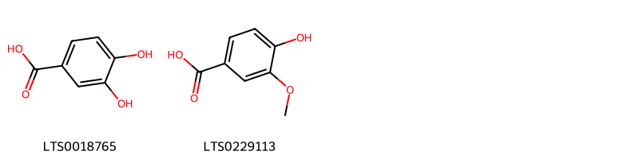{ width=100% }
    <figcaption>Hình ảnh cấu trúc hóa học của 2 hoạt chất thuộc nhóm Benzene and substituted derivatives gồm ['3,4-dihydroxybenzoic acid (LTS0018765)', 'vanillic acid (LTS0229113)'].</figcaption>
</figure>
#### Nhóm Cinnamic acids and derivatives
<figure markdown="span">
    { width=100% }
    <figcaption>Hình ảnh cấu trúc hóa học của 2 hoạt chất thuộc nhóm Cinnamic acids and derivatives gồm ['para-coumaric acid (LTS0266252)', 'hydroxycinnamic acid (LTS0233023)'].</figcaption>
</figure>
#### Nhóm Lignan glycosides
<figure markdown="span">
    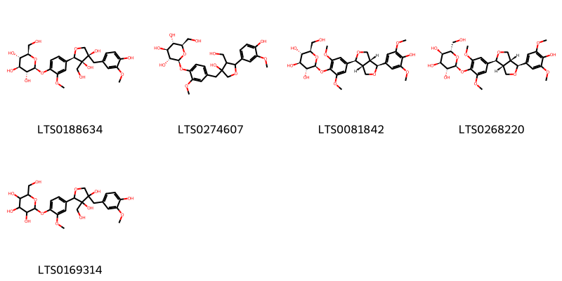{ width=100% }
    <figcaption>Hình ảnh cấu trúc hóa học của 5 hoạt chất thuộc nhóm Lignan glycosides gồm ['(2s,3r,4s,5s,6r)-2-{4-[(2r,3s,4r)-3,4-dihydroxy-4-[(4-hydroxy-3-methoxyphenyl)methyl]-3-(hydroxymethyl)oxolan-2-yl]-2-methoxyphenoxy}-6-(hydroxymethyl)oxane-3,4,5-triol (LTS0188634)', '(2s,3r,4s,5s,6r)-2-(4-{[3-hydroxy-5-(4-hydroxy-3-methoxyphenyl)-4-(hydroxymethyl)oxolan-3-yl]methyl}-2-methoxyphenoxy)-6-(hydroxymethyl)oxane-3,4,5-triol (LTS0274607)', 'acanthoside b (LTS0081842)', '(2s,3r,4s,5r,6s)-2-{4-[(1s,3ar,4s,6ar)-4-(4-hydroxy-3,5-dimethoxyphenyl)-hexahydrofuro[3,4-c]furan-1-yl]-2,6-dimethoxyphenoxy}-6-(hydroxymethyl)oxane-3,4,5-triol (LTS0268220)', '2-(4-{3,4-dihydroxy-4-[(4-hydroxy-3-methoxyphenyl)methyl]-3-(hydroxymethyl)oxolan-2-yl}-2-methoxyphenoxy)-6-(hydroxymethyl)oxane-3,4,5-triol (LTS0169314)'].</figcaption>
</figure>
#### Nhóm Phenols
<figure markdown="span">
    { width=100% }
    <figcaption>Hình ảnh cấu trúc hóa học của 2 hoạt chất thuộc nhóm Phenols gồm ['vanillin (LTS0136163)', 'coniferyl alcohol (LTS0152881)'].</figcaption>
</figure>
#### Nhóm Prenol lipids
<figure markdown="span">
    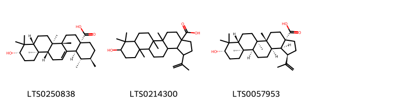{ width=100% }
    <figcaption>Hình ảnh cấu trúc hóa học của 3 hoạt chất thuộc nhóm Prenol lipids gồm ['ursolic acid (LTS0250838)', '9-hydroxy-5a,5b,8,8,11a-pentamethyl-1-(prop-1-en-2-yl)-hexadecahydrocyclopenta[a]chrysene-3a-carboxylic acid (LTS0214300)', '(1r,3as,5ar,5br,7ar,9s,11ar,11bs,13ar,13bs)-9-hydroxy-5a,5b,8,8,11a-pentamethyl-1-(prop-1-en-2-yl)-hexadecahydrocyclopenta[a]chrysene-3a-carboxylic acid (LTS0057953)'].</figcaption>
</figure>

---

### Dược dân tộc học

Danh sách các quốc gia có sử dụng *Sambucus racemosa* trong điều trị các bệnh. 

| Country          | Disease                     | Bệnh                                                                                                                                                                                                |
|:-----------------|:----------------------------|:----------------------------------------------------------------------------------------------------------------------------------------------------------------------------------------------------|
| Canada(Kwakiutl) | Emetic                      | MYMEMORY WARNING: YOU USED ALL AVAILABLE FREE TRANSLATIONS FOR TODAY. NEXT AVAILABLE IN  13 HOURS 30 MINUTES 08 SECONDS VISIT HTTPS://MYMEMORY.TRANSLATED.NET/DOC/USAGELIMITS.PHP TO TRANSLATE MORE |
| China            | Carminative, Emetic         | MYMEMORY WARNING: YOU USED ALL AVAILABLE FREE TRANSLATIONS FOR TODAY. NEXT AVAILABLE IN  13 HOURS 30 MINUTES 05 SECONDS VISIT HTTPS://MYMEMORY.TRANSLATED.NET/DOC/USAGELIMITS.PHP TO TRANSLATE MORE |
| Turkey           | Diuretic, Emetic, Sudorific | MYMEMORY WARNING: YOU USED ALL AVAILABLE FREE TRANSLATIONS FOR TODAY. NEXT AVAILABLE IN  13 HOURS 30 MINUTES 02 SECONDS VISIT HTTPS://MYMEMORY.TRANSLATED.NET/DOC/USAGELIMITS.PHP TO TRANSLATE MORE |

---

---
## Sambucus sieboldiana
### Thông tin về thực vật

!!! info "Phân loại thực vật của *Sambucus sieboldiana* từ GIBF:"
    - **Kingdom:** Plantae
    - **Phylum:** Tracheophyta
    - **Order:** Dipsacales
    - **Family:** Viburnaceae
    - **Genus:** Sambucus
    - **Species:** *Sambucus sieboldiana*

 

| Label (VI)   | Label (EN)   | Scientific Name      | Descriptions (VI)   | Descriptions (EN)   | Also Known As (VI)   | Also Known As (EN)   |
|:-------------|:-------------|:---------------------|:--------------------|:--------------------|:---------------------|:---------------------|
| N/A          | N/A          | Sambucus sieboldiana | loài thực vật       | species of plant    | ['']                 | ['']                 |

#### Phân bố trên thế giới

**Từ CSDL GIBF** Korea, Republic of, Japan, Russian Federation

#### Phân bố tại Việt Nam

**Từ CSDL GIBF**: Không có ghi nhận ở Việt Nam

---
### Thành phần hóa học
        
- Theo cơ sở dữ liệu lotus: Từ loài *Sambucus sieboldiana* đã phân lập và xác định được 11 hoạt chất thuộc về các nhóm Benzene and substituted derivatives, Lignan glycosides, Phenols, Cinnamic acids and derivatives. 

|    | chemicalTaxonomyClassyfireClass     |   smiles_count |
|---:|:------------------------------------|---------------:|
|  0 | Benzene and substituted derivatives |              2 |
|  1 | Cinnamic acids and derivatives      |              2 |
|  2 | Lignan glycosides                   |              5 |
|  3 | Phenols                             |              2 |

#### Nhóm Benzene and substituted derivatives
<figure markdown="span">
    { width=100% }
    <figcaption>Hình ảnh cấu trúc hóa học của 2 hoạt chất thuộc nhóm Benzene and substituted derivatives gồm ['3,4-dihydroxybenzoic acid (LTS0018765)', 'vanillic acid (LTS0229113)'].</figcaption>
</figure>
#### Nhóm Cinnamic acids and derivatives
<figure markdown="span">
    { width=100% }
    <figcaption>Hình ảnh cấu trúc hóa học của 2 hoạt chất thuộc nhóm Cinnamic acids and derivatives gồm ['para-coumaric acid (LTS0266252)', 'hydroxycinnamic acid (LTS0233023)'].</figcaption>
</figure>
#### Nhóm Lignan glycosides
<figure markdown="span">
    { width=100% }
    <figcaption>Hình ảnh cấu trúc hóa học của 5 hoạt chất thuộc nhóm Lignan glycosides gồm ['(2s,3r,4s,5s,6r)-2-{4-[(2r,3s,4r)-3,4-dihydroxy-4-[(4-hydroxy-3-methoxyphenyl)methyl]-3-(hydroxymethyl)oxolan-2-yl]-2-methoxyphenoxy}-6-(hydroxymethyl)oxane-3,4,5-triol (LTS0188634)', '(2s,3r,4s,5s,6r)-2-(4-{[3-hydroxy-5-(4-hydroxy-3-methoxyphenyl)-4-(hydroxymethyl)oxolan-3-yl]methyl}-2-methoxyphenoxy)-6-(hydroxymethyl)oxane-3,4,5-triol (LTS0274607)', 'acanthoside b (LTS0081842)', '(2s,3r,4s,5r,6s)-2-{4-[(1s,3ar,4s,6ar)-4-(4-hydroxy-3,5-dimethoxyphenyl)-hexahydrofuro[3,4-c]furan-1-yl]-2,6-dimethoxyphenoxy}-6-(hydroxymethyl)oxane-3,4,5-triol (LTS0268220)', '2-(4-{3,4-dihydroxy-4-[(4-hydroxy-3-methoxyphenyl)methyl]-3-(hydroxymethyl)oxolan-2-yl}-2-methoxyphenoxy)-6-(hydroxymethyl)oxane-3,4,5-triol (LTS0169314)'].</figcaption>
</figure>
#### Nhóm Phenols
<figure markdown="span">
    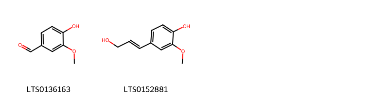{ width=100% }
    <figcaption>Hình ảnh cấu trúc hóa học của 2 hoạt chất thuộc nhóm Phenols gồm ['vanillin (LTS0136163)', 'coniferyl alcohol (LTS0152881)'].</figcaption>
</figure>

---

### Dược dân tộc học

Danh sách các quốc gia có sử dụng *Sambucus sieboldiana* trong điều trị các bệnh. 

| Country   | Disease                  | Bệnh                                                                                                                                                                                                |
|:----------|:-------------------------|:----------------------------------------------------------------------------------------------------------------------------------------------------------------------------------------------------|
| Elsewhere | Diuretic                 | MYMEMORY WARNING: YOU USED ALL AVAILABLE FREE TRANSLATIONS FOR TODAY. NEXT AVAILABLE IN  13 HOURS 29 MINUTES 23 SECONDS VISIT HTTPS://MYMEMORY.TRANSLATED.NET/DOC/USAGELIMITS.PHP TO TRANSLATE MORE |
| Japan     | Antiphlogistic, Diuretic | MYMEMORY WARNING: YOU USED ALL AVAILABLE FREE TRANSLATIONS FOR TODAY. NEXT AVAILABLE IN  13 HOURS 29 MINUTES 18 SECONDS VISIT HTTPS://MYMEMORY.TRANSLATED.NET/DOC/USAGELIMITS.PHP TO TRANSLATE MORE |

---

---
## Sambucus simpsoni
### Thông tin về thực vật

!!! info "Phân loại thực vật của *Sambucus canadensis* từ GIBF:"
    - **Kingdom:** Plantae
    - **Phylum:** Tracheophyta
    - **Order:** Dipsacales
    - **Family:** Viburnaceae
    - **Genus:** Sambucus
    - **Species:** *Sambucus canadensis*

 

| Label (VI)   | Label (EN)   | Scientific Name      | Descriptions (VI)   | Descriptions (EN)   | Also Known As (VI)   | Also Known As (EN)   |
|:-------------|:-------------|:---------------------|:--------------------|:--------------------|:---------------------|:---------------------|
| N/A          | N/A          | Sambucus sieboldiana | loài thực vật       | species of plant    | ['']                 | ['']                 |

#### Phân bố trên thế giới

**Từ CSDL GIBF** Cuba, Puerto Rico, United States of America, Martinique

#### Phân bố tại Việt Nam

**Từ CSDL GIBF**: Không có ghi nhận ở Việt Nam

---
### Thành phần hóa học
        
- Theo cơ sở dữ liệu lotus: Từ loài *Sambucus canadensis* đã phân lập và xác định được Chưa có hoạt chất nào được phân lập. hoạt chất thuộc về các nhóm Không có hoạt chất nào được phân lập. 

Không có hình ảnh nào được tạo ra

---

### Dược dân tộc học

Danh sách các quốc gia có sử dụng *Sambucus canadensis* trong điều trị các bệnh. 

| Country   | Disease                                     | Bệnh                                                                                                                                                                                                |
|:----------|:--------------------------------------------|:----------------------------------------------------------------------------------------------------------------------------------------------------------------------------------------------------|
| Haiti     | Laxative, Purgative, Sudorific, Diaphoretic | MYMEMORY WARNING: YOU USED ALL AVAILABLE FREE TRANSLATIONS FOR TODAY. NEXT AVAILABLE IN  13 HOURS 28 MINUTES 49 SECONDS VISIT HTTPS://MYMEMORY.TRANSLATED.NET/DOC/USAGELIMITS.PHP TO TRANSLATE MORE |

---

---
## Sambucus simpsonii
### Thông tin về thực vật

!!! info "Phân loại thực vật của *Sambucus canadensis* từ GIBF:"
    - **Kingdom:** Plantae
    - **Phylum:** Tracheophyta
    - **Order:** Dipsacales
    - **Family:** Viburnaceae
    - **Genus:** Sambucus
    - **Species:** *Sambucus canadensis*

 

| Label (VI)   | Label (EN)   | Scientific Name    | Descriptions (VI)   | Descriptions (EN)   | Also Known As (VI)   | Also Known As (EN)   |
|:-------------|:-------------|:-------------------|:--------------------|:--------------------|:---------------------|:---------------------|
| N/A          | N/A          | Sambucus simpsonii |                     | species of plant    | ['']                 | ['']                 |

#### Phân bố trên thế giới

**Từ CSDL GIBF** Cuba, Puerto Rico, United States of America, Martinique

#### Phân bố tại Việt Nam

**Từ CSDL GIBF**: Không có ghi nhận ở Việt Nam

---
### Thành phần hóa học
        
- Theo cơ sở dữ liệu lotus: Từ loài *Sambucus canadensis* đã phân lập và xác định được Chưa có hoạt chất nào được phân lập. hoạt chất thuộc về các nhóm Không có hoạt chất nào được phân lập. 

Không có hình ảnh nào được tạo ra

---

### Dược dân tộc học

Danh sách các quốc gia có sử dụng *Sambucus canadensis* trong điều trị các bệnh. 

| Country   | Disease   | Bệnh                                                                                                                                                                                                |
|:----------|:----------|:----------------------------------------------------------------------------------------------------------------------------------------------------------------------------------------------------|
| US        | Poison    | MYMEMORY WARNING: YOU USED ALL AVAILABLE FREE TRANSLATIONS FOR TODAY. NEXT AVAILABLE IN  13 HOURS 28 MINUTES 21 SECONDS VISIT HTTPS://MYMEMORY.TRANSLATED.NET/DOC/USAGELIMITS.PHP TO TRANSLATE MORE |

---

---
## Sambucus thunbergiana
### Thông tin về thực vật

!!! info "Phân loại thực vật của *Sambucus javanica* từ GIBF:"
    - **Kingdom:** Plantae
    - **Phylum:** Tracheophyta
    - **Order:** Dipsacales
    - **Family:** Viburnaceae
    - **Genus:** Sambucus
    - **Species:** *Sambucus javanica*

 

| Label (VI)   | Label (EN)   | Scientific Name    | Descriptions (VI)   | Descriptions (EN)   | Also Known As (VI)   | Also Known As (EN)   |
|:-------------|:-------------|:-------------------|:--------------------|:--------------------|:---------------------|:---------------------|
| N/A          | N/A          | Sambucus simpsonii |                     | species of plant    | ['']                 | ['']                 |

#### Phân bố trên thế giới

**Từ CSDL GIBF** nan, Japan, China

#### Phân bố tại Việt Nam

**Từ CSDL GIBF**: Không có ghi nhận ở Việt Nam

---
### Thành phần hóa học
        
- Theo cơ sở dữ liệu lotus: Từ loài *Sambucus javanica* đã phân lập và xác định được Chưa có hoạt chất nào được phân lập. hoạt chất thuộc về các nhóm Không có hoạt chất nào được phân lập. 

Không có hình ảnh nào được tạo ra

---

### Dược dân tộc học

Danh sách các quốc gia có sử dụng *Sambucus javanica* trong điều trị các bệnh. 

| Country   | Disease                      | Bệnh                                                                                                                                                                                                |
|:----------|:-----------------------------|:----------------------------------------------------------------------------------------------------------------------------------------------------------------------------------------------------|
| China     | Parasiticide, Poison, Emetic | MYMEMORY WARNING: YOU USED ALL AVAILABLE FREE TRANSLATIONS FOR TODAY. NEXT AVAILABLE IN  13 HOURS 27 MINUTES 47 SECONDS VISIT HTTPS://MYMEMORY.TRANSLATED.NET/DOC/USAGELIMITS.PHP TO TRANSLATE MORE |

---

---
## Sambucus williamsii
### Thông tin về thực vật

!!! info "Phân loại thực vật của *Sambucus williamsii* từ GIBF:"
    - **Kingdom:** Plantae
    - **Phylum:** Tracheophyta
    - **Order:** Dipsacales
    - **Family:** Viburnaceae
    - **Genus:** Sambucus
    - **Species:** *Sambucus williamsii*

 

| Label (VI)   | Label (EN)   | Scientific Name     | Descriptions (VI)   | Descriptions (EN)   | Also Known As (VI)   | Also Known As (EN)            |
|:-------------|:-------------|:--------------------|:--------------------|:--------------------|:---------------------|:------------------------------|
| N/A          | N/A          | Sambucus williamsii | loài thực vật       | species of plant    | ['']                 | ['SAMBUCUS WILLIAMSII WHOLE'] |

#### Phân bố trên thế giới

**Từ CSDL GIBF** Japan, Latvia, Mongolia, Poland, Estonia, Russian Federation, Lao People’s Democratic Republic, China, Norway, Belgium, Korea, Republic of

#### Phân bố tại Việt Nam

**Từ CSDL GIBF**: Không có ghi nhận ở Việt Nam

---
### Thành phần hóa học
        
- Theo cơ sở dữ liệu lotus: Từ loài *Sambucus williamsii* đã phân lập và xác định được 10 hoạt chất thuộc về các nhóm Furanoid lignans, Prenol lipids, Fatty Acyls. 

|    | chemicalTaxonomyClassyfireClass   |   smiles_count |
|---:|:----------------------------------|---------------:|
|  0 | Fatty Acyls                       |              6 |
|  1 | Furanoid lignans                  |              2 |
|  2 | Prenol lipids                     |              2 |

#### Nhóm Fatty Acyls
<figure markdown="span">
    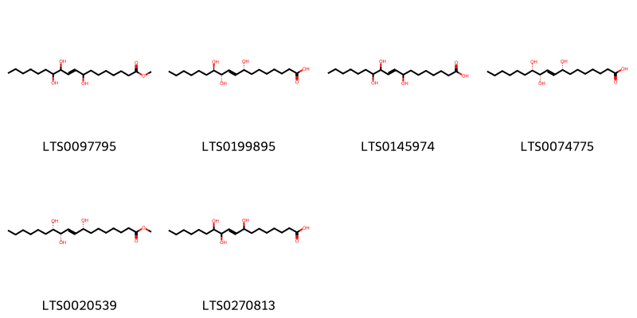{ width=100% }
    <figcaption>Hình ảnh cấu trúc hóa học của 6 hoạt chất thuộc nhóm Fatty Acyls gồm ['methyl 8,11,12-trihydroxyoctadec-9-enoate (LTS0097795)', '(8r,9e,11s,12r)-8,11,12-trihydroxyoctadec-9-enoic acid (LTS0199895)', '8,11,12-trihydroxyoctadec-9-enoic acid (LTS0145974)', '(8r,9e,11s,12s)-8,11,12-trihydroxyoctadec-9-enoic acid (LTS0074775)', 'methyl (8r,9e,11s,12s)-8,11,12-trihydroxyoctadec-9-enoate (LTS0020539)', 'tianshic acid (LTS0270813)'].</figcaption>
</figure>
#### Nhóm Furanoid lignans
<figure markdown="span">
    { width=100% }
    <figcaption>Hình ảnh cấu trúc hóa học của 2 hoạt chất thuộc nhóm Furanoid lignans gồm ['pinoresinol (LTS0057431)', 'pinoresinol (LTS0011247)'].</figcaption>
</figure>
#### Nhóm Prenol lipids
<figure markdown="span">
    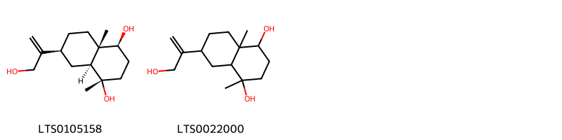{ width=100% }
    <figcaption>Hình ảnh cấu trúc hóa học của 2 hoạt chất thuộc nhóm Prenol lipids gồm ['(1s,4s,4as,7s,8as)-7-(3-hydroxyprop-1-en-2-yl)-1,4a-dimethyl-octahydronaphthalene-1,4-diol (LTS0105158)', '7-(3-hydroxyprop-1-en-2-yl)-1,4a-dimethyl-octahydronaphthalene-1,4-diol (LTS0022000)'].</figcaption>
</figure>

---

### Dược dân tộc học

Danh sách các quốc gia có sử dụng *Sambucus williamsii* trong điều trị các bệnh. 

| Country   | Disease               | Bệnh                                                                                                                                                                                                |
|:----------|:----------------------|:----------------------------------------------------------------------------------------------------------------------------------------------------------------------------------------------------|
| China     | Diaphoretic, Diuretic | MYMEMORY WARNING: YOU USED ALL AVAILABLE FREE TRANSLATIONS FOR TODAY. NEXT AVAILABLE IN  13 HOURS 27 MINUTES 24 SECONDS VISIT HTTPS://MYMEMORY.TRANSLATED.NET/DOC/USAGELIMITS.PHP TO TRANSLATE MORE |

---

---
## Sambucus wrightiana
### Thông tin về thực vật

!!! info "Phân loại thực vật của *N/A* từ GIBF:"
    - **Kingdom:** Plantae
    - **Phylum:** Tracheophyta
    - **Order:** Dipsacales
    - **Family:** Viburnaceae
    - **Genus:** Sambucus
    - **Species:** *N/A*

 

| Label (VI)   | Label (EN)   | Scientific Name     | Descriptions (VI)   | Descriptions (EN)   | Also Known As (VI)   | Also Known As (EN)            |
|:-------------|:-------------|:--------------------|:--------------------|:--------------------|:---------------------|:------------------------------|
| N/A          | N/A          | Sambucus williamsii | loài thực vật       | species of plant    | ['']                 | ['SAMBUCUS WILLIAMSII WHOLE'] |

#### Phân bố trên thế giới

**Từ CSDL GIBF** Denmark, Spain, Germany, Austria, Australia, Poland, Canada, Hungary, Mexico, Ireland, Chinese Taipei, United Kingdom of Great Britain and Northern Ireland, Argentina, South Africa, France, New Zealand, Bolivia (Plurinational State of), Russian Federation, Ecuador, United States of America, Italy, Ukraine

#### Phân bố tại Việt Nam

**Từ CSDL GIBF**: Không có ghi nhận ở Việt Nam

---
### Thành phần hóa học
        
- Theo cơ sở dữ liệu lotus: Từ loài *N/A* đã phân lập và xác định được Chưa có hoạt chất nào được phân lập. hoạt chất thuộc về các nhóm Không có hoạt chất nào được phân lập. 

Không có hình ảnh nào được tạo ra

---

### Dược dân tộc học

Danh sách các quốc gia có sử dụng *N/A* trong điều trị các bệnh. 

| Country   | Disease   | Bệnh                                                                                                                                                                                                |
|:----------|:----------|:----------------------------------------------------------------------------------------------------------------------------------------------------------------------------------------------------|
| Kashmir   | Poison    | MYMEMORY WARNING: YOU USED ALL AVAILABLE FREE TRANSLATIONS FOR TODAY. NEXT AVAILABLE IN  13 HOURS 26 MINUTES 53 SECONDS VISIT HTTPS://MYMEMORY.TRANSLATED.NET/DOC/USAGELIMITS.PHP TO TRANSLATE MORE |

---

# Chi Viburnum

??? note "Danh sách các dược liệu thuộc chi"
    
	 - *Viburnum lantana*
	 - *Viburnum nudum*
	 - *Viburnum opulus*
	 - *Viburnum prunifolium*

---
## Viburnum lantana
### Thông tin về thực vật

!!! info "Phân loại thực vật của *Viburnum lantana* từ GIBF:"
    - **Kingdom:** Plantae
    - **Phylum:** Tracheophyta
    - **Order:** Dipsacales
    - **Family:** Viburnaceae
    - **Genus:** Viburnum
    - **Species:** *Viburnum lantana*

 

| Label (VI)   | Label (EN)   | Scientific Name   | Descriptions (VI)   | Descriptions (EN)   | Also Known As (VI)   | Also Known As (EN)                  |
|:-------------|:-------------|:------------------|:--------------------|:--------------------|:---------------------|:------------------------------------|
| N/A          | N/A          | Viburnum lantana  | loài thực vật       | species of plant    | ['']                 | ['wayfaring-tree', 'wayfaringtree'] |

#### Phân bố trên thế giới

**Từ CSDL GIBF** Luxembourg, Spain, Germany, Austria, Sweden, Canada, Belgium, Slovakia, Netherlands, Hungary, Switzerland, United Kingdom of Great Britain and Northern Ireland, France, Czechia, Russian Federation, United States of America, Italy, Croatia, Ukraine

#### Phân bố tại Việt Nam

**Từ CSDL GIBF**: Không có ghi nhận ở Việt Nam

---
### Thành phần hóa học
        
- Theo cơ sở dữ liệu lotus: Từ loài *Viburnum lantana* đã phân lập và xác định được 17 hoạt chất thuộc về các nhóm Prenol lipids, Flavonoids, Fatty Acyls. 

|    | chemicalTaxonomyClassyfireClass   |   smiles_count |
|---:|:----------------------------------|---------------:|
|  0 | Fatty Acyls                       |              2 |
|  1 | Flavonoids                        |              5 |
|  2 | Prenol lipids                     |             10 |

#### Nhóm Fatty Acyls
<figure markdown="span">
    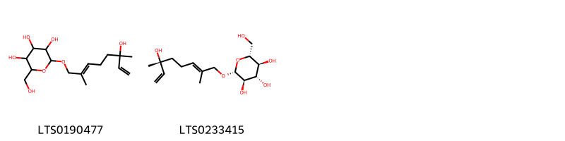{ width=100% }
    <figcaption>Hình ảnh cấu trúc hóa học của 2 hoạt chất thuộc nhóm Fatty Acyls gồm ['2-[(6-hydroxy-2,6-dimethylocta-2,7-dien-1-yl)oxy]-6-(hydroxymethyl)oxane-3,4,5-triol (LTS0190477)', '(2r,3r,4s,5s,6r)-2-{[(2e,6r)-6-hydroxy-2,6-dimethylocta-2,7-dien-1-yl]oxy}-6-(hydroxymethyl)oxane-3,4,5-triol (LTS0233415)'].</figcaption>
</figure>
#### Nhóm Flavonoids
<figure markdown="span">
    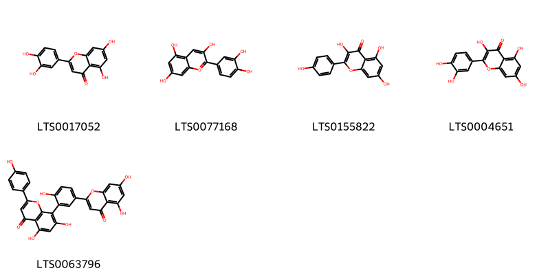{ width=100% }
    <figcaption>Hình ảnh cấu trúc hóa học của 5 hoạt chất thuộc nhóm Flavonoids gồm ['luteolin (LTS0017052)', 'cyanidin (LTS0077168)', 'kaempherol (LTS0155822)', 'quercetin (LTS0004651)', 'amentoflavone (LTS0063796)'].</figcaption>
</figure>
#### Nhóm Prenol lipids
<figure markdown="span">
    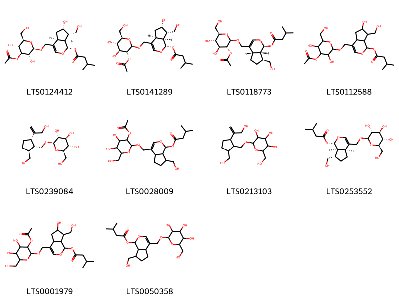{ width=100% }
    <figcaption>Hình ảnh cấu trúc hóa học của 10 hoạt chất thuộc nhóm Prenol lipids gồm ['(1s,4as,6s,7s,7as)-4-({[(2r,3r,4s,5r,6r)-4-(acetyloxy)-3,5-dihydroxy-6-(hydroxymethyl)oxan-2-yl]oxy}methyl)-6-hydroxy-7-(hydroxymethyl)-1h,4ah,5h,6h,7h,7ah-cyclopenta[c]pyran-1-yl 3-methylbutanoate (LTS0124412)', '(1s,4as,6s,7s,7as)-4-({[(2r,3r,4s,5s,6r)-3-(acetyloxy)-4,5-dihydroxy-6-(hydroxymethyl)oxan-2-yl]oxy}methyl)-6-hydroxy-7-(hydroxymethyl)-1h,4ah,5h,6h,7h,7ah-cyclopenta[c]pyran-1-yl 3-methylbutanoate (LTS0141289)', '(1s,4as,7s,7as)-4-({[(2r,3r,4s,5s,6r)-3-(acetyloxy)-4,5-dihydroxy-6-(hydroxymethyl)oxan-2-yl]oxy}methyl)-7-(hydroxymethyl)-1h,4ah,5h,6h,7h,7ah-cyclopenta[c]pyran-1-yl 3-methylbutanoate (LTS0118773)', '4-({[4-(acetyloxy)-3,5-dihydroxy-6-(hydroxymethyl)oxan-2-yl]oxy}methyl)-6-hydroxy-7-(hydroxymethyl)-1h,4ah,5h,6h,7h,7ah-cyclopenta[c]pyran-1-yl 3-methylbutanoate (LTS0112588)', '(2r,3s,4s,5r,6r)-2-(hydroxymethyl)-6-{[(1s,2s,5s)-2-(hydroxymethyl)-5-(3-hydroxyprop-1-en-2-yl)cyclopentyl]methoxy}oxane-3,4,5-triol (LTS0239084)', '4-({[3-(acetyloxy)-4,5-dihydroxy-6-(hydroxymethyl)oxan-2-yl]oxy}methyl)-7-(hydroxymethyl)-1h,4ah,5h,6h,7h,7ah-cyclopenta[c]pyran-1-yl 3-methylbutanoate (LTS0028009)', '2-(hydroxymethyl)-6-{[2-(hydroxymethyl)-5-(3-hydroxyprop-1-en-2-yl)cyclopentyl]methoxy}oxane-3,4,5-triol (LTS0213103)', '(1s,4as,7s,7as)-7-(hydroxymethyl)-4-({[(2r,3r,4s,5s,6r)-3,4,5-trihydroxy-6-(hydroxymethyl)oxan-2-yl]oxy}methyl)-1h,4ah,5h,6h,7h,7ah-cyclopenta[c]pyran-1-yl 3-methylbutanoate (LTS0253552)', '4-({[3-(acetyloxy)-4,5-dihydroxy-6-(hydroxymethyl)oxan-2-yl]oxy}methyl)-6-hydroxy-7-(hydroxymethyl)-1h,4ah,5h,6h,7h,7ah-cyclopenta[c]pyran-1-yl 3-methylbutanoate (LTS0001979)', '7-(hydroxymethyl)-4-({[3,4,5-trihydroxy-6-(hydroxymethyl)oxan-2-yl]oxy}methyl)-1h,4ah,5h,6h,7h,7ah-cyclopenta[c]pyran-1-yl 3-methylbutanoate (LTS0050358)'].</figcaption>
</figure>

---

### Dược dân tộc học

Danh sách các quốc gia có sử dụng *Viburnum lantana* trong điều trị các bệnh. 

| Country   | Disease    | Bệnh                                                                                                                                                                                                |
|:----------|:-----------|:----------------------------------------------------------------------------------------------------------------------------------------------------------------------------------------------------|
| Italian   | Astringent | MYMEMORY WARNING: YOU USED ALL AVAILABLE FREE TRANSLATIONS FOR TODAY. NEXT AVAILABLE IN  13 HOURS 26 MINUTES 26 SECONDS VISIT HTTPS://MYMEMORY.TRANSLATED.NET/DOC/USAGELIMITS.PHP TO TRANSLATE MORE |

---

---
## Viburnum nudum
### Thông tin về thực vật

!!! info "Phân loại thực vật của *Viburnum nudum* từ GIBF:"
    - **Kingdom:** Plantae
    - **Phylum:** Tracheophyta
    - **Order:** Dipsacales
    - **Family:** Viburnaceae
    - **Genus:** Viburnum
    - **Species:** *Viburnum nudum*

 

| Label (VI)   | Label (EN)   | Scientific Name   | Descriptions (VI)   | Descriptions (EN)   | Also Known As (VI)   | Also Known As (EN)                                             |
|:-------------|:-------------|:------------------|:--------------------|:--------------------|:---------------------|:---------------------------------------------------------------|
| N/A          | N/A          | Viburnum nudum    | loài thực vật       | species of plant    | ['']                 | ['possumhaw', 'wild raisin', 'withe-rod', 'witherod viburnum'] |

#### Phân bố trên thế giới

**Từ CSDL GIBF** nan, Canada, United States of America

#### Phân bố tại Việt Nam

**Từ CSDL GIBF**: Không có ghi nhận ở Việt Nam

---
### Thành phần hóa học
        
- Theo cơ sở dữ liệu lotus: Từ loài *Viburnum nudum* đã phân lập và xác định được 6 hoạt chất thuộc về các nhóm Prenol lipids. 

|    | chemicalTaxonomyClassyfireClass   |   smiles_count |
|---:|:----------------------------------|---------------:|
|  0 | Prenol lipids                     |              6 |

#### Nhóm Prenol lipids
<figure markdown="span">
    { width=100% }
    <figcaption>Hình ảnh cấu trúc hóa học của 6 hoạt chất thuộc nhóm Prenol lipids gồm ['amyrin (LTS0222826)', 'betulin (LTS0101863)', 'β-amyrin (LTS0251864)', 'lupeol (LTS0256952)', '(1r,4r,5r,8r,10s,13r,14r,18r)-4,5,9,9,13,20,20-heptamethyl-24-oxahexacyclo[17.3.2.0¹,¹⁸.0⁴,¹⁷.0⁵,¹⁴.0⁸,¹³]tetracosan-10-ol (LTS0049641)', '(-)-friedelin (LTS0041645)'].</figcaption>
</figure>

---

### Dược dân tộc học

Danh sách các quốc gia có sử dụng *Viburnum nudum* trong điều trị các bệnh. 

| Country   | Disease         | Bệnh                                                                                                                                                                                                |
|:----------|:----------------|:----------------------------------------------------------------------------------------------------------------------------------------------------------------------------------------------------|
| US        | Tonic, Diuretic | MYMEMORY WARNING: YOU USED ALL AVAILABLE FREE TRANSLATIONS FOR TODAY. NEXT AVAILABLE IN  13 HOURS 25 MINUTES 29 SECONDS VISIT HTTPS://MYMEMORY.TRANSLATED.NET/DOC/USAGELIMITS.PHP TO TRANSLATE MORE |

---

---
## Viburnum opulus
### Thông tin về thực vật

!!! info "Phân loại thực vật của *Viburnum opulus* từ GIBF:"
    - **Kingdom:** Plantae
    - **Phylum:** Tracheophyta
    - **Order:** Dipsacales
    - **Family:** Viburnaceae
    - **Genus:** Viburnum
    - **Species:** *Viburnum opulus*

 

| Label (VI)   | Label (EN)   | Scientific Name   | Descriptions (VI)   | Descriptions (EN)   | Also Known As (VI)   | Also Known As (EN)                                                                                                                                                         |
|:-------------|:-------------|:------------------|:--------------------|:--------------------|:---------------------|:---------------------------------------------------------------------------------------------------------------------------------------------------------------------------|
| N/A          | N/A          | Viburnum opulus   |                     | species of plant    | ['vót Âu Châu']      | ['common snowball', 'cramp bark', 'snowball tree', 'water elder', 'cranberry-tree', 'European cranberrybush', 'guelder rose', 'guelder-rose', 'kalyna', 'Vibernum opulus'] |

#### Phân bố trên thế giới

**Từ CSDL GIBF** Denmark, Luxembourg, Spain, Germany, Austria, Sweden, Poland, Canada, Belgium, Netherlands, Norway, Switzerland, United Kingdom of Great Britain and Northern Ireland, Latvia, France, Czechia, New Zealand, Russian Federation, United States of America, Ukraine

#### Phân bố tại Việt Nam

**Từ CSDL GIBF**: Không có ghi nhận ở Việt Nam

---
### Thành phần hóa học
        
- Theo cơ sở dữ liệu lotus: Từ loài *Viburnum opulus* đã phân lập và xác định được 55 hoạt chất thuộc về các nhóm Furanoid lignans, Organooxygen compounds, Flavonoids, Prenol lipids, Carboxylic acids and derivatives, Fatty Acyls, Steroids and steroid derivatives, Hydroxy acids and derivatives, Cinnamic acids and derivatives. 

|    | chemicalTaxonomyClassyfireClass   |   smiles_count |
|---:|:----------------------------------|---------------:|
|  0 | Carboxylic acids and derivatives  |              2 |
|  1 | Cinnamic acids and derivatives    |              2 |
|  2 | Fatty Acyls                       |              8 |
|  3 | Flavonoids                        |              7 |
|  4 | Furanoid lignans                  |              2 |
|  5 | Hydroxy acids and derivatives     |              2 |
|  6 | Organooxygen compounds            |              4 |
|  7 | Prenol lipids                     |             16 |
|  8 | Steroids and steroid derivatives  |             10 |

#### Nhóm Carboxylic acids and derivatives
<figure markdown="span">
    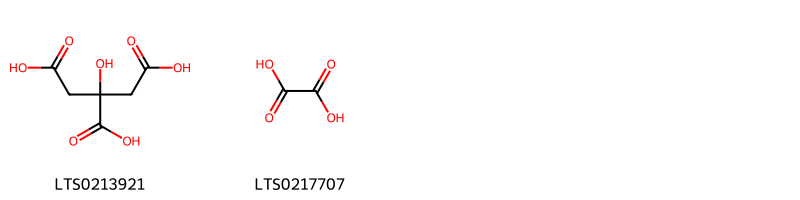{ width=100% }
    <figcaption>Hình ảnh cấu trúc hóa học của 2 hoạt chất thuộc nhóm Carboxylic acids and derivatives gồm ['citric acid (LTS0213921)', 'oxalic acid (LTS0217707)'].</figcaption>
</figure>
#### Nhóm Cinnamic acids and derivatives
<figure markdown="span">
    { width=100% }
    <figcaption>Hình ảnh cấu trúc hóa học của 2 hoạt chất thuộc nhóm Cinnamic acids and derivatives gồm ['3,4-dihydroxycinnamic acid (LTS0128050)', 'para-coumaric acid (LTS0266252)'].</figcaption>
</figure>
#### Nhóm Fatty Acyls
<figure markdown="span">
    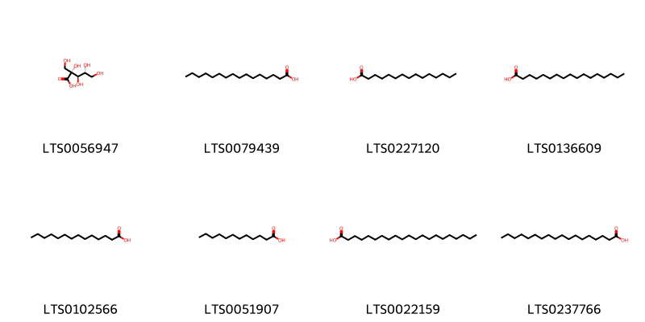{ width=100% }
    <figcaption>Hình ảnh cấu trúc hóa học của 8 hoạt chất thuộc nhóm Fatty Acyls gồm ['2-carboxy-d-arabinitol (LTS0056947)', 'palmitic acid (LTS0079439)', 'pentadecanoic acid (LTS0227120)', 'heptadecanoic acid (LTS0136609)', 'myristic acid (LTS0102566)', 'lauric acid (LTS0051907)', 'heneicosanoic acid (LTS0022159)', 'stearic acid (LTS0237766)'].</figcaption>
</figure>
#### Nhóm Flavonoids
<figure markdown="span">
    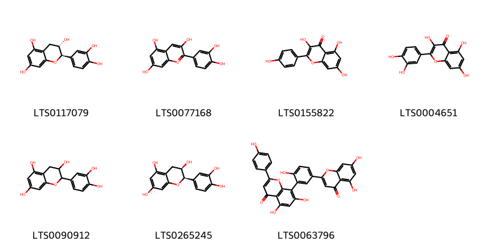{ width=100% }
    <figcaption>Hình ảnh cấu trúc hóa học của 7 hoạt chất thuộc nhóm Flavonoids gồm ['(+)-catechol (LTS0117079)', 'cyanidin (LTS0077168)', 'kaempherol (LTS0155822)', 'quercetin (LTS0004651)', 'catechol (LTS0090912)', 'ent-epicatechin (LTS0265245)', 'amentoflavone (LTS0063796)'].</figcaption>
</figure>
#### Nhóm Furanoid lignans
<figure markdown="span">
    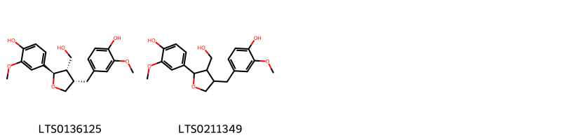{ width=100% }
    <figcaption>Hình ảnh cấu trúc hóa học của 2 hoạt chất thuộc nhóm Furanoid lignans gồm ['(-)-lariciresinol (LTS0136125)', '4-{4-[(4-hydroxy-3-methoxyphenyl)methyl]-3-(hydroxymethyl)oxolan-2-yl}-2-methoxyphenol (LTS0211349)'].</figcaption>
</figure>
#### Nhóm Hydroxy acids and derivatives
<figure markdown="span">
    { width=100% }
    <figcaption>Hình ảnh cấu trúc hóa học của 2 hoạt chất thuộc nhóm Hydroxy acids and derivatives gồm ['(-)-malic acid (LTS0128885)', 'malic acid (LTS0216520)'].</figcaption>
</figure>
#### Nhóm Organooxygen compounds
<figure markdown="span">
    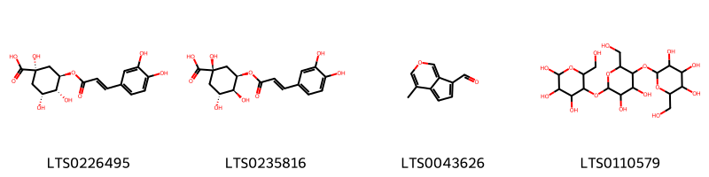{ width=100% }
    <figcaption>Hình ảnh cấu trúc hóa học của 4 hoạt chất thuộc nhóm Organooxygen compounds gồm ['chlorogenic acid (LTS0226495)', 'neochlorogenic acid (LTS0235816)', '4-methylcyclopenta[c]pyran-7-carbaldehyde (LTS0043626)', 'amylose (LTS0110579)'].</figcaption>
</figure>
#### Nhóm Prenol lipids
<figure markdown="span">
    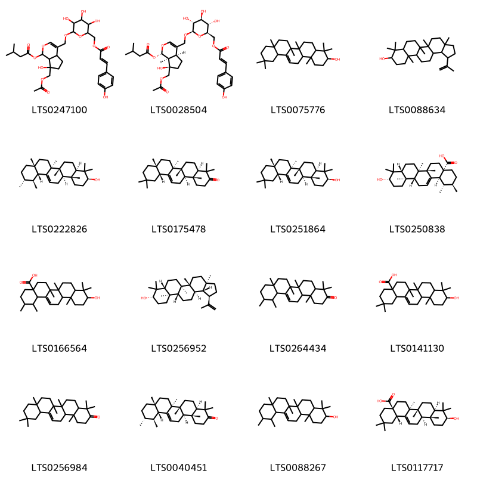{ width=100% }
    <figcaption>Hình ảnh cấu trúc hóa học của 16 hoạt chất thuộc nhóm Prenol lipids gồm ['7-[(acetyloxy)methyl]-7-hydroxy-4-({[3,4,5-trihydroxy-6-({[3-(4-hydroxyphenyl)prop-2-enoyl]oxy}methyl)oxan-2-yl]oxy}methyl)-1h,4ah,5h,6h,7ah-cyclopenta[c]pyran-1-yl 3-methylbutanoate (LTS0247100)', '(1s,4as,7r,7as)-7-[(acetyloxy)methyl]-7-hydroxy-4-({[(2r,3r,4s,5s,6r)-3,4,5-trihydroxy-6-({[(2e)-3-(4-hydroxyphenyl)prop-2-enoyl]oxy}methyl)oxan-2-yl]oxy}methyl)-1h,4ah,5h,6h,7ah-cyclopenta[c]pyran-1-yl 3-methylbutanoate (LTS0028504)', 'β-amyrin (LTS0075776)', 'lupeol (LTS0088634)', 'amyrin (LTS0222826)', '(4ar,6ar,6bs,8ar,12ar,14ar,14br)-4,4,6a,6b,8a,11,11,14b-octamethyl-2,4a,5,6,7,8,9,10,12,12a,14,14a-dodecahydro-1h-picen-3-one (LTS0175478)', 'β-amyrin (LTS0251864)', 'ursolic acid (LTS0250838)', '10-hydroxy-1,2,6a,6b,9,9,12a-heptamethyl-2,3,4,5,6,7,8,8a,10,11,12,12b,13,14b-tetradecahydro-1h-picene-4a-carboxylic acid (LTS0166564)', 'lupeol (LTS0256952)', '4,4,6a,6b,8a,11,12,14b-octamethyl-1,2,4a,5,6,7,8,9,10,11,12,12a,14,14a-tetradecahydropicen-3-one (LTS0264434)', 'oleanolic acid (LTS0141130)', '4,4,6a,6b,8a,11,11,14b-octamethyl-2,4a,5,6,7,8,9,10,12,12a,14,14a-dodecahydro-1h-picen-3-one (LTS0256984)', 'α-amyrenone (LTS0040451)', 'α-amyrin (LTS0088267)', 'oleanolic acid (LTS0117717)'].</figcaption>
</figure>
#### Nhóm Steroids and steroid derivatives
<figure markdown="span">
    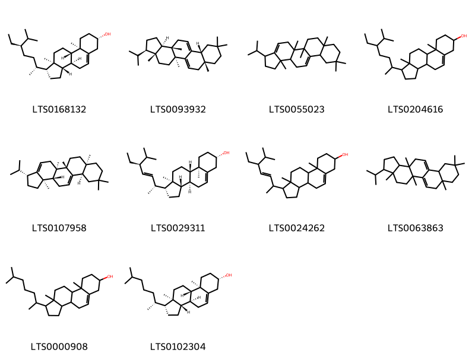{ width=100% }
    <figcaption>Hình ảnh cấu trúc hóa học của 10 hoạt chất thuộc nhóm Steroids and steroid derivatives gồm ['sitosterol (LTS0168132)', '(3r,3ar,5as,7ar,11ar,13as,13br)-3-isopropyl-3a,5a,7a,10,10,13a-hexamethyl-1h,2h,3h,4h,5h,7h,8h,9h,11h,11ah,13h,13bh-cyclopenta[a]chrysene (LTS0093932)', '3-isopropyl-5a,5b,7a,10,10,13b-hexamethyl-1h,2h,3h,5h,6h,7h,8h,9h,11h,11ah,13h,13ah-cyclopenta[a]chrysene (LTS0055023)', 'stigmast-5-en-3-ol, (3β)- (LTS0204616)', '(3r,5ar,5bs,7ar,11ar,13ar,13br)-3-isopropyl-5a,5b,7a,10,10,13b-hexamethyl-1h,2h,3h,5h,6h,7h,8h,9h,11h,11ah,13h,13ah-cyclopenta[a]chrysene (LTS0107958)', 'phytosterol (LTS0029311)', 'stigmasterol (LTS0024262)', '3-isopropyl-3a,5a,7a,10,10,13a-hexamethyl-1h,2h,3h,4h,5h,7h,8h,9h,11h,11ah,13h,13bh-cyclopenta[a]chrysene (LTS0063863)', 'epicholestrol (LTS0000908)', 'cholesterol (LTS0102304)'].</figcaption>
</figure>

---

### Dược dân tộc học

Danh sách các quốc gia có sử dụng *Viburnum opulus* trong điều trị các bệnh. 

| Country        | Disease                    | Bệnh                                                                                                                                                                                                |
|:---------------|:---------------------------|:----------------------------------------------------------------------------------------------------------------------------------------------------------------------------------------------------|
| China          | Emetic                     | MYMEMORY WARNING: YOU USED ALL AVAILABLE FREE TRANSLATIONS FOR TODAY. NEXT AVAILABLE IN  13 HOURS 24 MINUTES 59 SECONDS VISIT HTTPS://MYMEMORY.TRANSLATED.NET/DOC/USAGELIMITS.PHP TO TRANSLATE MORE |
| Elsewhere      | Diuretic, Sedative         | MYMEMORY WARNING: YOU USED ALL AVAILABLE FREE TRANSLATIONS FOR TODAY. NEXT AVAILABLE IN  13 HOURS 24 MINUTES 56 SECONDS VISIT HTTPS://MYMEMORY.TRANSLATED.NET/DOC/USAGELIMITS.PHP TO TRANSLATE MORE |
| Turkey         | Nervine, Purgative, Emetic | MYMEMORY WARNING: YOU USED ALL AVAILABLE FREE TRANSLATIONS FOR TODAY. NEXT AVAILABLE IN  13 HOURS 24 MINUTES 53 SECONDS VISIT HTTPS://MYMEMORY.TRANSLATED.NET/DOC/USAGELIMITS.PHP TO TRANSLATE MORE |
| US(Amerindian) | Diuretic, Diuretic         | MYMEMORY WARNING: YOU USED ALL AVAILABLE FREE TRANSLATIONS FOR TODAY. NEXT AVAILABLE IN  13 HOURS 24 MINUTES 50 SECONDS VISIT HTTPS://MYMEMORY.TRANSLATED.NET/DOC/USAGELIMITS.PHP TO TRANSLATE MORE |

---

---
## Viburnum prunifolium
### Thông tin về thực vật

!!! info "Phân loại thực vật của *Viburnum prunifolium* từ GIBF:"
    - **Kingdom:** Plantae
    - **Phylum:** Tracheophyta
    - **Order:** Dipsacales
    - **Family:** Viburnaceae
    - **Genus:** Viburnum
    - **Species:** *Viburnum prunifolium*

 

| Label (VI)   | Label (EN)   | Scientific Name      | Descriptions (VI)   | Descriptions (EN)   | Also Known As (VI)   | Also Known As (EN)                                                                             |
|:-------------|:-------------|:---------------------|:--------------------|:--------------------|:---------------------|:-----------------------------------------------------------------------------------------------|
| N/A          | N/A          | Viburnum prunifolium | loài thực vật       | species of plant    | ['']                 | ['black haw', 'black haw viburnum', 'blackhaw', 'blackhaw viburnum', 'stag bush', 'sweet haw'] |

#### Phân bố trên thế giới

**Từ CSDL GIBF** United States of America

#### Phân bố tại Việt Nam

**Từ CSDL GIBF**: Không có ghi nhận ở Việt Nam

---
### Thành phần hóa học
        
- Theo cơ sở dữ liệu lotus: Từ loài *Viburnum prunifolium* đã phân lập và xác định được 13 hoạt chất thuộc về các nhóm Saturated hydrocarbons, Flavonoids, Prenol lipids, Fatty Acyls. 

|    | chemicalTaxonomyClassyfireClass   |   smiles_count |
|---:|:----------------------------------|---------------:|
|  0 | Fatty Acyls                       |              3 |
|  1 | Flavonoids                        |              1 |
|  2 | Prenol lipids                     |              8 |
|  3 | Saturated hydrocarbons            |              1 |

#### Nhóm Fatty Acyls
<figure markdown="span">
    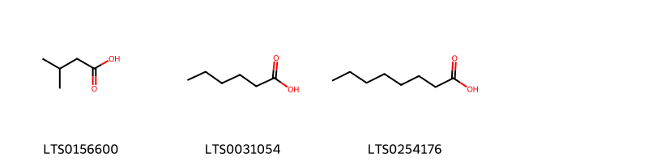{ width=100% }
    <figcaption>Hình ảnh cấu trúc hóa học của 3 hoạt chất thuộc nhóm Fatty Acyls gồm ['isovaleric acid (LTS0156600)', 'hexanoic acid (LTS0031054)', 'caprylic acid (LTS0254176)'].</figcaption>
</figure>
#### Nhóm Flavonoids
<figure markdown="span">
    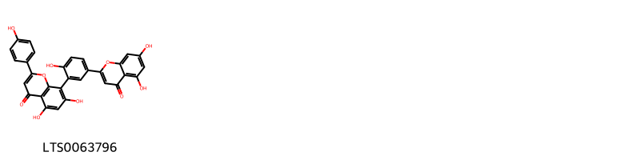{ width=100% }
    <figcaption>Hình ảnh cấu trúc hóa học của 1 hoạt chất thuộc nhóm Flavonoids gồm ['amentoflavone (LTS0063796)'].</figcaption>
</figure>
#### Nhóm Prenol lipids
<figure markdown="span">
    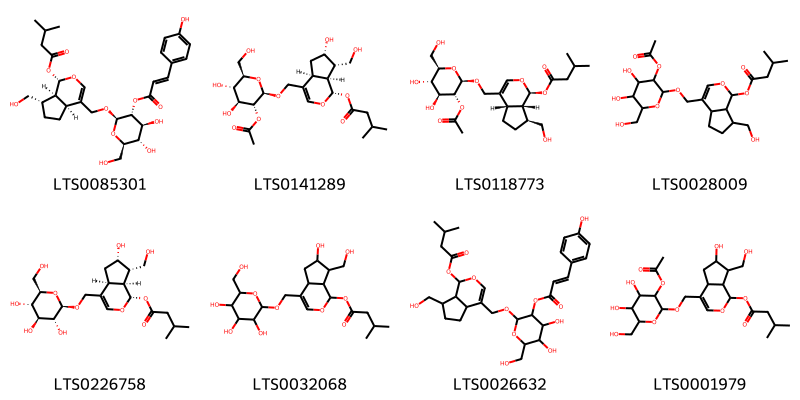{ width=100% }
    <figcaption>Hình ảnh cấu trúc hóa học của 8 hoạt chất thuộc nhóm Prenol lipids gồm ['(1s,4as,7s,7as)-4-({[(2r,3r,4s,5s,6r)-4,5-dihydroxy-6-(hydroxymethyl)-3-{[(2e)-3-(4-hydroxyphenyl)prop-2-enoyl]oxy}oxan-2-yl]oxy}methyl)-7-(hydroxymethyl)-1h,4ah,5h,6h,7h,7ah-cyclopenta[c]pyran-1-yl 3-methylbutanoate (LTS0085301)', '(1s,4as,6s,7s,7as)-4-({[(2r,3r,4s,5s,6r)-3-(acetyloxy)-4,5-dihydroxy-6-(hydroxymethyl)oxan-2-yl]oxy}methyl)-6-hydroxy-7-(hydroxymethyl)-1h,4ah,5h,6h,7h,7ah-cyclopenta[c]pyran-1-yl 3-methylbutanoate (LTS0141289)', '(1s,4as,7s,7as)-4-({[(2r,3r,4s,5s,6r)-3-(acetyloxy)-4,5-dihydroxy-6-(hydroxymethyl)oxan-2-yl]oxy}methyl)-7-(hydroxymethyl)-1h,4ah,5h,6h,7h,7ah-cyclopenta[c]pyran-1-yl 3-methylbutanoate (LTS0118773)', '4-({[3-(acetyloxy)-4,5-dihydroxy-6-(hydroxymethyl)oxan-2-yl]oxy}methyl)-7-(hydroxymethyl)-1h,4ah,5h,6h,7h,7ah-cyclopenta[c]pyran-1-yl 3-methylbutanoate (LTS0028009)', 'patrinoside (LTS0226758)', '6-hydroxy-7-(hydroxymethyl)-4-({[3,4,5-trihydroxy-6-(hydroxymethyl)oxan-2-yl]oxy}methyl)-1h,4ah,5h,6h,7h,7ah-cyclopenta[c]pyran-1-yl 3-methylbutanoate (LTS0032068)', '4-({[4,5-dihydroxy-6-(hydroxymethyl)-3-{[3-(4-hydroxyphenyl)prop-2-enoyl]oxy}oxan-2-yl]oxy}methyl)-7-(hydroxymethyl)-1h,4ah,5h,6h,7h,7ah-cyclopenta[c]pyran-1-yl 3-methylbutanoate (LTS0026632)', '4-({[3-(acetyloxy)-4,5-dihydroxy-6-(hydroxymethyl)oxan-2-yl]oxy}methyl)-6-hydroxy-7-(hydroxymethyl)-1h,4ah,5h,6h,7h,7ah-cyclopenta[c]pyran-1-yl 3-methylbutanoate (LTS0001979)'].</figcaption>
</figure>
#### Nhóm Saturated hydrocarbons
<figure markdown="span">
    { width=100% }
    <figcaption>Hình ảnh cấu trúc hóa học của 1 hoạt chất thuộc nhóm Saturated hydrocarbons gồm ['heptacosane (LTS0150428)'].</figcaption>
</figure>

---

### Dược dân tộc học

Danh sách các quốc gia có sử dụng *Viburnum prunifolium* trong điều trị các bệnh. 

| Country   | Disease                                                            | Bệnh                                                                                                                                                                                                |
|:----------|:-------------------------------------------------------------------|:----------------------------------------------------------------------------------------------------------------------------------------------------------------------------------------------------|
| Elsewhere | Sedative, Diuretic                                                 | MYMEMORY WARNING: YOU USED ALL AVAILABLE FREE TRANSLATIONS FOR TODAY. NEXT AVAILABLE IN  13 HOURS 23 MINUTES 59 SECONDS VISIT HTTPS://MYMEMORY.TRANSLATED.NET/DOC/USAGELIMITS.PHP TO TRANSLATE MORE |
| Turkey    | Nervine, Uterotonic, Sedative                                      | MYMEMORY WARNING: YOU USED ALL AVAILABLE FREE TRANSLATIONS FOR TODAY. NEXT AVAILABLE IN  13 HOURS 23 MINUTES 54 SECONDS VISIT HTTPS://MYMEMORY.TRANSLATED.NET/DOC/USAGELIMITS.PHP TO TRANSLATE MORE |
| US        | Abortifacient, Astringent, Diuretic, Tonic, Uterosedative, Nervine | MYMEMORY WARNING: YOU USED ALL AVAILABLE FREE TRANSLATIONS FOR TODAY. NEXT AVAILABLE IN  13 HOURS 23 MINUTES 51 SECONDS VISIT HTTPS://MYMEMORY.TRANSLATED.NET/DOC/USAGELIMITS.PHP TO TRANSLATE MORE |

---

# Chi Triosteum

??? note "Danh sách các dược liệu thuộc chi"
    
	 - *Triosteum perfoliatum*

---
## Triosteum perfoliatum
### Thông tin về thực vật

!!! info "Phân loại thực vật của *Triosteum perfoliatum* từ GIBF:"
    - **Kingdom:** Plantae
    - **Phylum:** Tracheophyta
    - **Order:** Dipsacales
    - **Family:** Caprifoliaceae
    - **Genus:** Triosteum
    - **Species:** *Triosteum perfoliatum*

 

| Label (VI)   | Label (EN)   | Scientific Name       | Descriptions (VI)   | Descriptions (EN)   | Also Known As (VI)   | Also Known As (EN)                                 |
|:-------------|:-------------|:----------------------|:--------------------|:--------------------|:---------------------|:---------------------------------------------------|
| N/A          | N/A          | Triosteum perfoliatum | loài thực vật       | species of plant    | ['']                 | ['wild coffee', 'feverwort', 'late horse gentian'] |

#### Phân bố trên thế giới

**Từ CSDL GIBF** Canada, United States of America

#### Phân bố tại Việt Nam

**Từ CSDL GIBF**: Không có ghi nhận ở Việt Nam

---
### Thành phần hóa học
        
- Theo cơ sở dữ liệu lotus: Từ loài *Triosteum perfoliatum* đã phân lập và xác định được Chưa có hoạt chất nào được phân lập. hoạt chất thuộc về các nhóm Không có hoạt chất nào được phân lập. 

Không có hình ảnh nào được tạo ra

---

### Dược dân tộc học

Danh sách các quốc gia có sử dụng *Triosteum perfoliatum* trong điều trị các bệnh. 

| Country        | Disease           | Bệnh                                                                                                                                                                                                |
|:---------------|:------------------|:----------------------------------------------------------------------------------------------------------------------------------------------------------------------------------------------------|
| Dutch          | Sudorific         | MYMEMORY WARNING: YOU USED ALL AVAILABLE FREE TRANSLATIONS FOR TODAY. NEXT AVAILABLE IN  13 HOURS 23 MINUTES 20 SECONDS VISIT HTTPS://MYMEMORY.TRANSLATED.NET/DOC/USAGELIMITS.PHP TO TRANSLATE MORE |
| French         | Emetic            | MYMEMORY WARNING: YOU USED ALL AVAILABLE FREE TRANSLATIONS FOR TODAY. NEXT AVAILABLE IN  13 HOURS 23 MINUTES 14 SECONDS VISIT HTTPS://MYMEMORY.TRANSLATED.NET/DOC/USAGELIMITS.PHP TO TRANSLATE MORE |
| German         | Laxative          | MYMEMORY WARNING: YOU USED ALL AVAILABLE FREE TRANSLATIONS FOR TODAY. NEXT AVAILABLE IN  13 HOURS 23 MINUTES 10 SECONDS VISIT HTTPS://MYMEMORY.TRANSLATED.NET/DOC/USAGELIMITS.PHP TO TRANSLATE MORE |
| US             | Emetic, Cathartic | MYMEMORY WARNING: YOU USED ALL AVAILABLE FREE TRANSLATIONS FOR TODAY. NEXT AVAILABLE IN  13 HOURS 23 MINUTES 07 SECONDS VISIT HTTPS://MYMEMORY.TRANSLATED.NET/DOC/USAGELIMITS.PHP TO TRANSLATE MORE |
| US(Appalachia) | Emetic            | MYMEMORY WARNING: YOU USED ALL AVAILABLE FREE TRANSLATIONS FOR TODAY. NEXT AVAILABLE IN  13 HOURS 23 MINUTES 02 SECONDS VISIT HTTPS://MYMEMORY.TRANSLATED.NET/DOC/USAGELIMITS.PHP TO TRANSLATE MORE |

---

