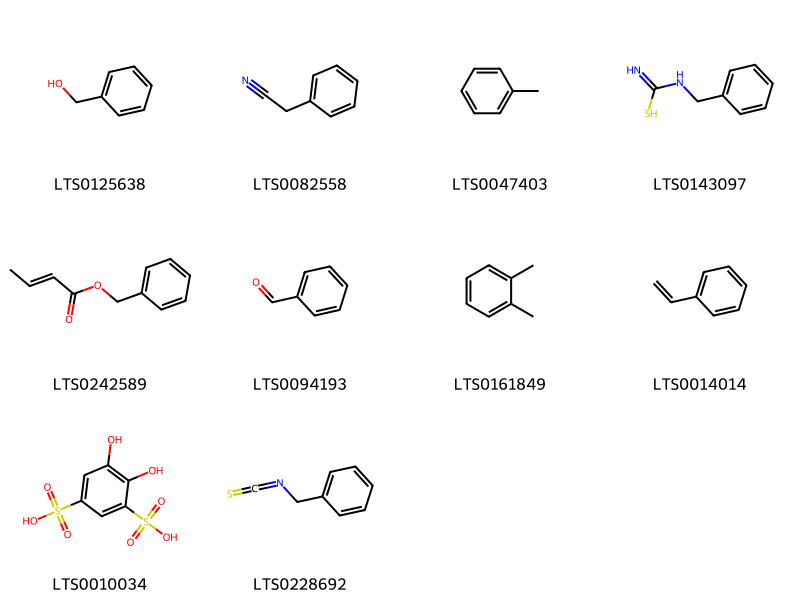
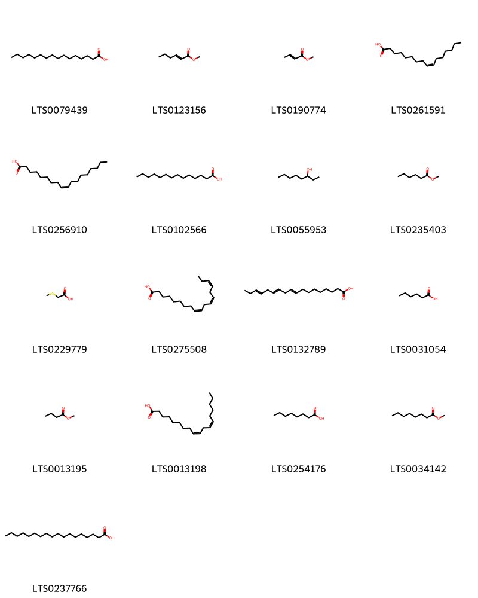
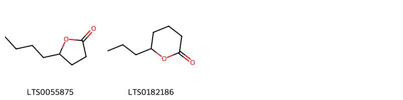
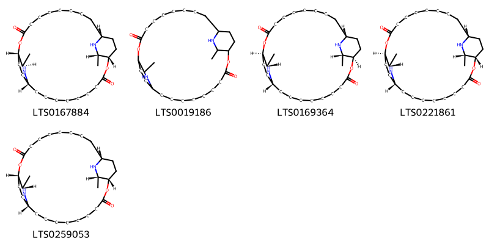
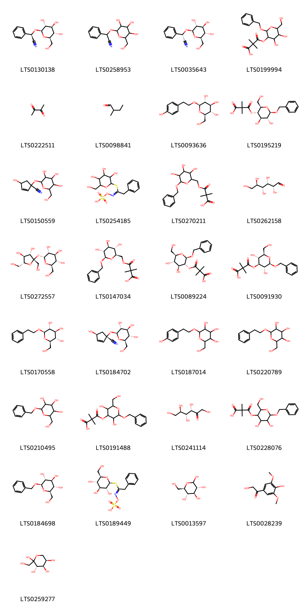
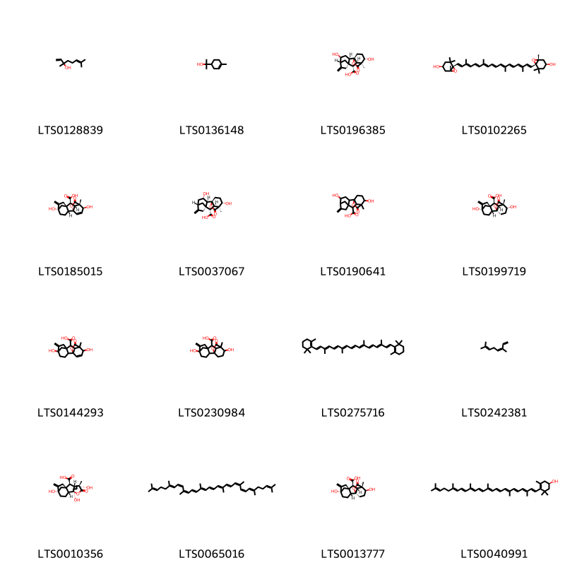
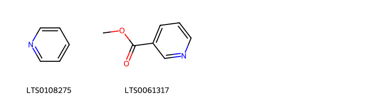
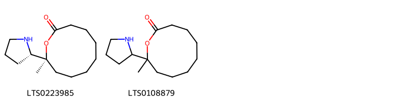
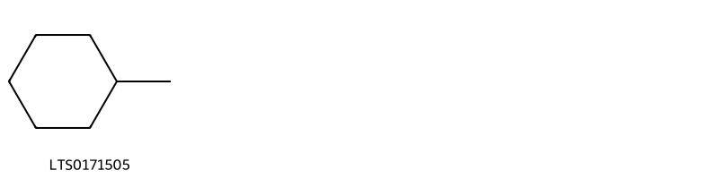

!!! abstract "Tóm tắt"

    Họ Caricaceae gồm khoảng 1 chi và 2 loài được một số cộng đồng tại các quốc gia như Haiti, Elsewhere, Trinidad, Dominican Republic, Panama, India, Samoa, Venezuela, Java, South America, Mexico, China, Turkey, Malaya, Panama(Choco) sử dụng trong một số trường hợp MYMEMORY WARNING: YOU USED ALL AVAILABLE FREE TRANSLATIONS FOR TODAY. NEXT AVAILABLE IN  10 HOURS 59 MINUTES 11 SECONDS VISIT HTTPS://MYMEMORY.TRANSLATED.NET/DOC/USAGELIMITS.PHP TO TRANSLATE MORE.

!!! info "DrDuke"

    James A. Duke sinh năm 1929-2017 là một nhà thực vật học người Mỹ. Đây là một trong những tác giả hàng đầu trong lĩnh vực dược dân tộc học với cuốn *CRC Handbook of Medicinal Herbs* và chính là người xây dựng lên cơ sở dữ liệu về hợp chất tự nhiên và dược dân tộc học tại Bộ nông nghiệp Hoa Kỳ. Các thông tin được đăng tải tại website [Dr. Duke's Phytochemical and Ethnobotanical Databases](https://phytochem.nal.usda.gov/). 
    Trong suốt thập niên 1970, ông lãnh đạo the Plant Taxonomy Laboratory, Plant Genetics and Germplasm Institute of the Agricultural Research Service, U.S. Department of Agriculture.
    Trong tài liệu này, các thông tin về dược dân tộc của các dược liệu được trích dẫn từ tài liệu của James A. Ducke với sự trợ giúp của phần mềm dịch thuật từ tiếng Anh sang tiếng Việt.
   

# Chi Carica

??? note "Danh sách các dược liệu thuộc chi"
    
	 - *Carica cauliflora*
	 - *Carica papaya*

---
## Carica cauliflora
### Thông tin về thực vật

!!! info "Phân loại thực vật của *Vasconcellea cauliflora* từ GIBF:"
    - **Kingdom:** Plantae
    - **Phylum:** Tracheophyta
    - **Order:** Brassicales
    - **Family:** Caricaceae
    - **Genus:** Vasconcellea
    - **Species:** *Vasconcellea cauliflora*

 

| Label (VI)   | Label (EN)   | Scientific Name   | Descriptions (VI)   | Descriptions (EN)   | Also Known As (VI)   | Also Known As (EN)   |
|:-------------|:-------------|:------------------|:--------------------|:--------------------|:---------------------|:---------------------|
| N/A          | N/A          | Carica cauliflora | loài thực vật       | species of plant    | ['']                 | ['']                 |

#### Phân bố trên thế giới

**Từ CSDL GIBF** nan, Colombia, Venezuela (Bolivarian Republic of), El Salvador, Nicaragua, Panama, unknown or invalid, Costa Rica, United States of America, Mexico, Guatemala

#### Phân bố tại Việt Nam

**Từ CSDL GIBF**: Không có ghi nhận ở Việt Nam

---
### Thành phần hóa học
        
- Theo cơ sở dữ liệu lotus: Từ loài *Vasconcellea cauliflora* đã phân lập và xác định được Chưa có hoạt chất nào được phân lập. hoạt chất thuộc về các nhóm Không có hoạt chất nào được phân lập. 

Không có hình ảnh nào được tạo ra

---

### Dược dân tộc học

Danh sách các quốc gia có sử dụng *Vasconcellea cauliflora* trong điều trị các bệnh. 

| Country   | Disease   | Bệnh                                                                                                                                                                                                |
|:----------|:----------|:----------------------------------------------------------------------------------------------------------------------------------------------------------------------------------------------------|
| Venezuela | Vermifuge | MYMEMORY WARNING: YOU USED ALL AVAILABLE FREE TRANSLATIONS FOR TODAY. NEXT AVAILABLE IN  10 HOURS 59 MINUTES 08 SECONDS VISIT HTTPS://MYMEMORY.TRANSLATED.NET/DOC/USAGELIMITS.PHP TO TRANSLATE MORE |

---

---
## Carica papaya
### Thông tin về thực vật

!!! info "Phân loại thực vật của *Carica papaya* từ GIBF:"
    - **Kingdom:** Plantae
    - **Phylum:** Tracheophyta
    - **Order:** Brassicales
    - **Family:** Caricaceae
    - **Genus:** Carica
    - **Species:** *Carica papaya*

 

| Label (VI)   | Label (EN)   | Scientific Name   | Descriptions (VI)   | Descriptions (EN)   | Also Known As (VI)   | Also Known As (EN)   |
|:-------------|:-------------|:------------------|:--------------------|:--------------------|:---------------------|:---------------------|
| N/A          | N/A          | Carica papaya     | loài thực vật       | species of plant    | ['Carica papaya']    | ['papaya tree']      |

#### Phân bố trên thế giới

**Từ CSDL GIBF** Honduras, Cayman Islands, Viet Nam, Thailand, Philippines, Guadeloupe, French Polynesia, Trinidad and Tobago, Kenya, Northern Mariana Islands, Lao People’s Democratic Republic, United Arab Emirates, Australia, Jamaica, Indonesia, Guatemala, Colombia, Sri Lanka, Dominican Republic, Saint Vincent and the Grenadines, Maldives, Malaysia, Puerto Rico, India, Réunion, Seychelles, Nigeria, Bahamas, Saint Kitts and Nevis, Cuba, Guam, Virgin Islands (U.S.), Cambodia, Antigua and Barbuda, Belize, Panama, Brazil, Saint Lucia, Peru, Mexico, China, Tonga, Nepal, Benin, Chinese Taipei, Hong Kong, South Africa, Grenada, Tanzania, United Republic of, New Zealand, Macao, Costa Rica, Ecuador, United States of America, Oman

#### Phân bố tại Việt Nam

**Từ CSDL GIBF**: Hà Giang, Khánh Hòa

---
### Thành phần hóa học
        
- Theo cơ sở dữ liệu lotus: Từ loài *Carica papaya* đã phân lập và xác định được 92 hoạt chất thuộc về các nhóm Organooxygen compounds, Furanoid lignans, Lactones, Saturated hydrocarbons, Macrolides and analogues, Dibenzylbutane lignans, Prenol lipids, Pyrrolidines, Fatty Acyls, Glycerophospholipids, Phenols, Cinnamic acids and derivatives, Dihydrofurans, Pyridines and derivatives, Benzene and substituted derivatives. 

|    | chemicalTaxonomyClassyfireClass     |   smiles_count |
|---:|:------------------------------------|---------------:|
|  0 | Benzene and substituted derivatives |             10 |
|  1 | Cinnamic acids and derivatives      |              1 |
|  2 | Dibenzylbutane lignans              |              2 |
|  3 | Dihydrofurans                       |              1 |
|  4 | Fatty Acyls                         |             17 |
|  5 | Furanoid lignans                    |              1 |
|  6 | Glycerophospholipids                |              1 |
|  7 | Lactones                            |              2 |
|  8 | Macrolides and analogues            |              5 |
|  9 | Organooxygen compounds              |             29 |
| 10 | Phenols                             |              1 |
| 11 | Prenol lipids                       |             16 |
| 12 | Pyridines and derivatives           |              2 |
| 13 | Pyrrolidines                        |              2 |
| 14 | Saturated hydrocarbons              |              1 |

#### Nhóm Benzene and substituted derivatives
<figure markdown="span">
    { width=100% }
    <figcaption>Hình ảnh cấu trúc hóa học của 10 hoạt chất thuộc nhóm Benzene and substituted derivatives gồm ['benzyl alcohol (LTS0125638)', 'phenylacetonitrile (LTS0082558)', 'toluene (LTS0047403)', 'n-benzylcarbamimidothioic acid (LTS0143097)', 'benzyl but-2-enoate (LTS0242589)', 'benzaldehyde (LTS0094193)', 'ortho-xylene (LTS0161849)', 'styrene (LTS0014014)', 'tiron free acid (LTS0010034)', 'benzyl isothiocyanate (LTS0228692)'].</figcaption>
</figure>
#### Nhóm Cinnamic acids and derivatives
<figure markdown="span">
    { width=100% }
    <figcaption>Hình ảnh cấu trúc hóa học của 1 hoạt chất thuộc nhóm Cinnamic acids and derivatives gồm ['3,4-dihydroxycinnamic acid (LTS0128050)'].</figcaption>
</figure>
#### Nhóm Dibenzylbutane lignans
<figure markdown="span">
    { width=100% }
    <figcaption>Hình ảnh cấu trúc hóa học của 2 hoạt chất thuộc nhóm Dibenzylbutane lignans gồm ['(2s,3r)-2,3-bis[(4-hydroxy-3-methoxyphenyl)(¹³c)methyl](1-¹³c)butane-1,4-diol (LTS0268699)', 'secoisolariciresinol (LTS0086727)'].</figcaption>
</figure>
#### Nhóm Dihydrofurans
<figure markdown="span">
    { width=100% }
    <figcaption>Hình ảnh cấu trúc hóa học của 1 hoạt chất thuộc nhóm Dihydrofurans gồm ['vitamin c (LTS0022555)'].</figcaption>
</figure>
#### Nhóm Fatty Acyls
<figure markdown="span">
    { width=100% }
    <figcaption>Hình ảnh cấu trúc hóa học của 17 hoạt chất thuộc nhóm Fatty Acyls gồm ['palmitic acid (LTS0079439)', 'methyl hex-2-enoate (LTS0123156)', 'methyl but-2-enoate (LTS0190774)', 'palmitoleic acid (LTS0261591)', 'oleic acid (LTS0256910)', 'myristic acid (LTS0102566)', '3-octanol (LTS0055953)', 'methyl caproate (LTS0235403)', '(methylthio)acetic acid (LTS0229779)', 'α-linolenic acid (LTS0275508)', 'α linolenic acid (LTS0132789)', 'hexanoic acid (LTS0031054)', 'methyl butyrate (LTS0013195)', 'linoleic (LTS0013198)', 'caprylic acid (LTS0254176)', 'methyl caprylate (LTS0034142)', 'stearic acid (LTS0237766)'].</figcaption>
</figure>
#### Nhóm Furanoid lignans
<figure markdown="span">
    { width=100% }
    <figcaption>Hình ảnh cấu trúc hóa học của 1 hoạt chất thuộc nhóm Furanoid lignans gồm ['matairesinol (LTS0193475)'].</figcaption>
</figure>
#### Nhóm Glycerophospholipids
<figure markdown="span">
    { width=100% }
    <figcaption>Hình ảnh cấu trúc hóa học của 1 hoạt chất thuộc nhóm Glycerophospholipids gồm ['2,3-dihydroxypropoxy(3-(hexadecanoyloxy)-2-[(9e,12e)-octadeca-9,12-dienoyloxy]propoxy)phosphinic acid (LTS0232487)'].</figcaption>
</figure>
#### Nhóm Lactones
<figure markdown="span">
    { width=100% }
    <figcaption>Hình ảnh cấu trúc hóa học của 2 hoạt chất thuộc nhóm Lactones gồm ['γ-octalactone (LTS0055875)', 'δ-octalactone (LTS0182186)'].</figcaption>
</figure>
#### Nhóm Macrolides and analogues
<figure markdown="span">
    { width=100% }
    <figcaption>Hình ảnh cấu trúc hóa học của 5 hoạt chất thuộc nhóm Macrolides and analogues gồm ['(1s,11r,13r,14s,24r,26s)-13,26-dimethyl-2,15-dioxa-12,25-diazatricyclo[22.2.2.2¹¹,¹⁴]triacontane-3,16-dione (LTS0167884)', 'carpaine (LTS0019186)', '(1r,11r,13s,14r,24r,26s)-13,26-dimethyl-2,15-dioxa-12,25-diazatricyclo[22.2.2.2¹¹,¹⁴]triacontane-3,16-dione (LTS0169364)', '(1r,11r,13s,14s,24r,26s)-13,26-dimethyl-2,15-dioxa-12,25-diazatricyclo[22.2.2.2¹¹,¹⁴]triacontane-3,16-dione (LTS0221861)', 'carpaine (LTS0259053)'].</figcaption>
</figure>
#### Nhóm Organooxygen compounds
<figure markdown="span">
    { width=100% }
    <figcaption>Hình ảnh cấu trúc hóa học của 29 hoạt chất thuộc nhóm Organooxygen compounds gồm ['prunasin (LTS0130138)', '2-phenyl-2-{[3,4,5-trihydroxy-6-(hydroxymethyl)oxan-2-yl]oxy}acetonitrile (LTS0258953)', '(s)-prunasin (LTS0035643)', '3-{[2-(benzyloxy)-4,5-dihydroxy-6-(hydroxymethyl)oxan-3-yl]oxy}-2,2-dimethyl-3-oxopropanoic acid (LTS0199994)', 'diacetyl (LTS0222511)', '2-methylbutanal (LTS0098841)', 'salidroside (LTS0093636)', '3-{[(2r,3s,4r,5r,6r)-6-(benzyloxy)-4,5-dihydroxy-2-(hydroxymethyl)oxan-3-yl]oxy}-2,2-dimethyl-3-oxopropanoic acid (LTS0195219)', '4-hydroxy-1-{[3,4,5-trihydroxy-6-(hydroxymethyl)oxan-2-yl]oxy}cyclopent-2-ene-1-carbonitrile (LTS0150559)', '[(2-phenyl-1-{[3,4,5-trihydroxy-6-(hydroxymethyl)oxan-2-yl]sulfanyl}ethylidene)amino]oxysulfonic acid (LTS0254185)', '3-{[6-(benzyloxy)-3,4,5-trihydroxyoxan-2-yl]methoxy}-2,2-dimethyl-3-oxopropanoic acid (LTS0270211)', '(+)-glucose (LTS0262158)', 'sucrose (LTS0272557)', '3-{[(2r,3s,4s,5r,6r)-6-(benzyloxy)-3,4,5-trihydroxyoxan-2-yl]methoxy}-2,2-dimethyl-3-oxopropanoic acid (LTS0147034)', '3-{[(2r,3r,4s,5s,6r)-2-(benzyloxy)-4,5-dihydroxy-6-(hydroxymethyl)oxan-3-yl]oxy}-2,2-dimethyl-3-oxopropanoic acid (LTS0089224)', '3-{[(2r,3r,4s,5r,6r)-2-(benzyloxy)-3,5-dihydroxy-6-(hydroxymethyl)oxan-4-yl]oxy}-2,2-dimethyl-3-oxopropanoic acid (LTS0091930)', '(2r,3s,4s,5r,6r)-2-(hydroxymethyl)-6-(2-phenylethoxy)oxane-3,4,5-triol (LTS0170558)', '(1s,4s)-4-hydroxy-1-{[(2s,3r,4s,5s,6r)-3,4,5-trihydroxy-6-(hydroxymethyl)oxan-2-yl]oxy}cyclopent-2-ene-1-carbonitrile (LTS0184702)', '2-(hydroxymethyl)-6-[2-(4-hydroxyphenyl)ethoxy]oxane-3,4,5-triol (LTS0187014)', '2-(hydroxymethyl)-6-(2-phenylethoxy)oxane-3,4,5-triol (LTS0220789)', 'benzyl glucopyranoside (LTS0210495)', '3-{[2-(benzyloxy)-3,5-dihydroxy-6-(hydroxymethyl)oxan-4-yl]oxy}-2,2-dimethyl-3-oxopropanoic acid (LTS0191488)', 'keto-d-fructose (LTS0241114)', '3-{[6-(benzyloxy)-4,5-dihydroxy-2-(hydroxymethyl)oxan-3-yl]oxy}-2,2-dimethyl-3-oxopropanoic acid (LTS0228076)', 'benzyl β-d-glucoside (LTS0184698)', 'glucotropaeolin (LTS0189449)', 'glucose (LTS0013597)', 'danielone (LTS0028239)', 'd-fructopyranose (LTS0259277)'].</figcaption>
</figure>
#### Nhóm Phenols
<figure markdown="span">
    { width=100% }
    <figcaption>Hình ảnh cấu trúc hóa học của 1 hoạt chất thuộc nhóm Phenols gồm ['tyrosol (LTS0132195)'].</figcaption>
</figure>
#### Nhóm Prenol lipids
<figure markdown="span">
    { width=100% }
    <figcaption>Hình ảnh cấu trúc hóa học của 16 hoạt chất thuộc nhóm Prenol lipids gồm ['linalool, (+-)- (LTS0128839)', 'terpineol (LTS0136148)', '(1r,2r,4s,5r,8r,9s,10r,11s,12s)-4,12-dihydroxy-11-methyl-6-methylidene-16-oxo-15-oxapentacyclo[9.3.2.1⁵,⁸.0¹,¹⁰.0²,⁸]heptadecane-9-carboxylic acid (LTS0196385)', 'violaxanthin (LTS0102265)', 'gibberellin a3 (LTS0185015)', '(1s,2s,3s,5s,8r,9s,10r,11s,12s)-3,12-dihydroxy-11-methyl-6-methylidene-16-oxo-15-oxapentacyclo[9.3.2.1⁵,⁸.0¹,¹⁰.0²,⁸]heptadecane-9-carboxylic acid (LTS0037067)', '4,12-dihydroxy-11-methyl-6-methylidene-16-oxo-15-oxapentacyclo[9.3.2.1⁵,⁸.0¹,¹⁰.0²,⁸]heptadecane-9-carboxylic acid (LTS0190641)', '(1r,2r,5s,8s,9s,10r,11s,12r)-5,12-dihydroxy-11-methyl-6-methylidene-16-oxo-15-oxapentacyclo[9.3.2.1⁵,⁸.0¹,¹⁰.0²,⁸]heptadecane-9-carboxylic acid (LTS0199719)', '5,12-dihydroxy-11-methyl-6-methylidene-16-oxo-15-oxapentacyclo[9.3.2.1⁵,⁸.0¹,¹⁰.0²,⁸]heptadec-13-ene-9-carboxylic acid (LTS0144293)', '5,12-dihydroxy-11-methyl-6-methylidene-16-oxo-15-oxapentacyclo[9.3.2.1⁵,⁸.0¹,¹⁰.0²,⁸]heptadecane-9-carboxylic acid (LTS0230984)', 'β-carotene (LTS0275716)', 'β-ocimene (LTS0242381)', '(1r,2r,5s,8s,9s,10r,11s,12s,14r)-5,12,14-trihydroxy-11-methyl-6-methylidene-16-oxo-15-oxapentacyclo[9.3.2.1⁵,⁸.0¹,¹⁰.0²,⁸]heptadecane-9-carboxylic acid (LTS0010356)', 'prolycopene (LTS0065016)', 'gibberellin a1 (LTS0013777)', 'rubixanthin (LTS0040991)'].</figcaption>
</figure>
#### Nhóm Pyridines and derivatives
<figure markdown="span">
    { width=100% }
    <figcaption>Hình ảnh cấu trúc hóa học của 2 hoạt chất thuộc nhóm Pyridines and derivatives gồm ['pyridine (LTS0108275)', 'heat spray (LTS0061317)'].</figcaption>
</figure>
#### Nhóm Pyrrolidines
<figure markdown="span">
    { width=100% }
    <figcaption>Hình ảnh cấu trúc hóa học của 2 hoạt chất thuộc nhóm Pyrrolidines gồm ['(10s)-10-methyl-10-[(2s)-pyrrolidin-2-yl]oxecan-2-one (LTS0223985)', '10-methyl-10-(pyrrolidin-2-yl)oxecan-2-one (LTS0108879)'].</figcaption>
</figure>
#### Nhóm Saturated hydrocarbons
<figure markdown="span">
    { width=100% }
    <figcaption>Hình ảnh cấu trúc hóa học của 1 hoạt chất thuộc nhóm Saturated hydrocarbons gồm ['methylcyclohexane (LTS0171505)'].</figcaption>
</figure>

---

### Dược dân tộc học

Danh sách các quốc gia có sử dụng *Carica papaya* trong điều trị các bệnh. 

| Country            | Disease                                                                                                                                                                                  | Bệnh                                                                                                                                                                                                |
|:-------------------|:-----------------------------------------------------------------------------------------------------------------------------------------------------------------------------------------|:----------------------------------------------------------------------------------------------------------------------------------------------------------------------------------------------------|
| China              | Digestive                                                                                                                                                                                | MYMEMORY WARNING: YOU USED ALL AVAILABLE FREE TRANSLATIONS FOR TODAY. NEXT AVAILABLE IN  10 HOURS 58 MINUTES 44 SECONDS VISIT HTTPS://MYMEMORY.TRANSLATED.NET/DOC/USAGELIMITS.PHP TO TRANSLATE MORE |
| Dominican Republic | Digestive                                                                                                                                                                                | MYMEMORY WARNING: YOU USED ALL AVAILABLE FREE TRANSLATIONS FOR TODAY. NEXT AVAILABLE IN  10 HOURS 58 MINUTES 40 SECONDS VISIT HTTPS://MYMEMORY.TRANSLATED.NET/DOC/USAGELIMITS.PHP TO TRANSLATE MORE |
| Elsewhere          | Antibiotic, Antiphlogistic, Cholagogue, Digestive, Diuretic, Diuretic, Diuretic, Ecbolic, Emmenagogue, Expectorant, Fungicide, Stomachic, Stomachic, Suppurative, Cardiotonic, Vermifuge | MYMEMORY WARNING: YOU USED ALL AVAILABLE FREE TRANSLATIONS FOR TODAY. NEXT AVAILABLE IN  10 HOURS 58 MINUTES 37 SECONDS VISIT HTTPS://MYMEMORY.TRANSLATED.NET/DOC/USAGELIMITS.PHP TO TRANSLATE MORE |
| Haiti              | Pediculicide, Soap, Vermifuge                                                                                                                                                            | MYMEMORY WARNING: YOU USED ALL AVAILABLE FREE TRANSLATIONS FOR TODAY. NEXT AVAILABLE IN  10 HOURS 58 MINUTES 34 SECONDS VISIT HTTPS://MYMEMORY.TRANSLATED.NET/DOC/USAGELIMITS.PHP TO TRANSLATE MORE |
| India              | nan                                                                                                                                                                                      | MYMEMORY WARNING: YOU USED ALL AVAILABLE FREE TRANSLATIONS FOR TODAY. NEXT AVAILABLE IN  10 HOURS 58 MINUTES 31 SECONDS VISIT HTTPS://MYMEMORY.TRANSLATED.NET/DOC/USAGELIMITS.PHP TO TRANSLATE MORE |
| Java               | Abortifacient                                                                                                                                                                            | MYMEMORY WARNING: YOU USED ALL AVAILABLE FREE TRANSLATIONS FOR TODAY. NEXT AVAILABLE IN  10 HOURS 58 MINUTES 28 SECONDS VISIT HTTPS://MYMEMORY.TRANSLATED.NET/DOC/USAGELIMITS.PHP TO TRANSLATE MORE |
| Malaya             | Vermifuge                                                                                                                                                                                | MYMEMORY WARNING: YOU USED ALL AVAILABLE FREE TRANSLATIONS FOR TODAY. NEXT AVAILABLE IN  10 HOURS 58 MINUTES 25 SECONDS VISIT HTTPS://MYMEMORY.TRANSLATED.NET/DOC/USAGELIMITS.PHP TO TRANSLATE MORE |
| Mexico             | Emmenagogue                                                                                                                                                                              | MYMEMORY WARNING: YOU USED ALL AVAILABLE FREE TRANSLATIONS FOR TODAY. NEXT AVAILABLE IN  10 HOURS 58 MINUTES 22 SECONDS VISIT HTTPS://MYMEMORY.TRANSLATED.NET/DOC/USAGELIMITS.PHP TO TRANSLATE MORE |
| Panama             | Laxative, Vermifuge, Digestive                                                                                                                                                           | MYMEMORY WARNING: YOU USED ALL AVAILABLE FREE TRANSLATIONS FOR TODAY. NEXT AVAILABLE IN  10 HOURS 58 MINUTES 19 SECONDS VISIT HTTPS://MYMEMORY.TRANSLATED.NET/DOC/USAGELIMITS.PHP TO TRANSLATE MORE |
| Panama(Choco)      | Abortifacient                                                                                                                                                                            | MYMEMORY WARNING: YOU USED ALL AVAILABLE FREE TRANSLATIONS FOR TODAY. NEXT AVAILABLE IN  10 HOURS 58 MINUTES 16 SECONDS VISIT HTTPS://MYMEMORY.TRANSLATED.NET/DOC/USAGELIMITS.PHP TO TRANSLATE MORE |
| Samoa              | Vermifuge                                                                                                                                                                                | MYMEMORY WARNING: YOU USED ALL AVAILABLE FREE TRANSLATIONS FOR TODAY. NEXT AVAILABLE IN  10 HOURS 58 MINUTES 13 SECONDS VISIT HTTPS://MYMEMORY.TRANSLATED.NET/DOC/USAGELIMITS.PHP TO TRANSLATE MORE |
| South America      | Vermifuge                                                                                                                                                                                | MYMEMORY WARNING: YOU USED ALL AVAILABLE FREE TRANSLATIONS FOR TODAY. NEXT AVAILABLE IN  10 HOURS 58 MINUTES 10 SECONDS VISIT HTTPS://MYMEMORY.TRANSLATED.NET/DOC/USAGELIMITS.PHP TO TRANSLATE MORE |
| Trinidad           | Antibiotic, Diuretic                                                                                                                                                                     | MYMEMORY WARNING: YOU USED ALL AVAILABLE FREE TRANSLATIONS FOR TODAY. NEXT AVAILABLE IN  10 HOURS 58 MINUTES 06 SECONDS VISIT HTTPS://MYMEMORY.TRANSLATED.NET/DOC/USAGELIMITS.PHP TO TRANSLATE MORE |
| Turkey             | Cardiac, Digestive, Emmenagogue, Vermifuge, Abortifacient                                                                                                                                | MYMEMORY WARNING: YOU USED ALL AVAILABLE FREE TRANSLATIONS FOR TODAY. NEXT AVAILABLE IN  10 HOURS 58 MINUTES 03 SECONDS VISIT HTTPS://MYMEMORY.TRANSLATED.NET/DOC/USAGELIMITS.PHP TO TRANSLATE MORE |

---

