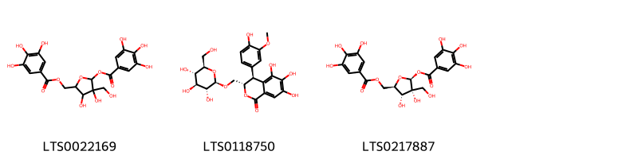
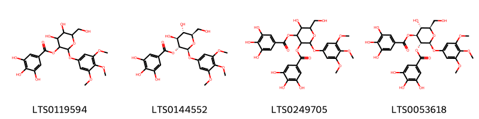
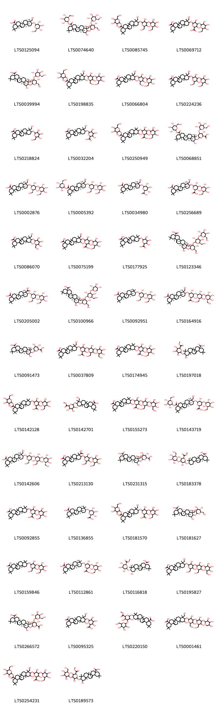

!!! abstract "Tóm tắt"

    Họ Caryocaraceae gồm khoảng 1 chi và 3 loài được một số cộng đồng tại các quốc gia như Colombia, Elsewhere, Brazil(Maku) sử dụng trong một số trường hợp MYMEMORY WARNING: YOU USED ALL AVAILABLE FREE TRANSLATIONS FOR TODAY. NEXT AVAILABLE IN  12 HOURS 44 MINUTES 01 SECONDS VISIT HTTPS://MYMEMORY.TRANSLATED.NET/DOC/USAGELIMITS.PHP TO TRANSLATE MORE.

!!! info "DrDuke"

    James A. Duke sinh năm 1929-2017 là một nhà thực vật học người Mỹ. Đây là một trong những tác giả hàng đầu trong lĩnh vực dược dân tộc học với cuốn *CRC Handbook of Medicinal Herbs* và chính là người xây dựng lên cơ sở dữ liệu về hợp chất tự nhiên và dược dân tộc học tại Bộ nông nghiệp Hoa Kỳ. Các thông tin được đăng tải tại website [Dr. Duke's Phytochemical and Ethnobotanical Databases](https://phytochem.nal.usda.gov/). 
    Trong suốt thập niên 1970, ông lãnh đạo the Plant Taxonomy Laboratory, Plant Genetics and Germplasm Institute of the Agricultural Research Service, U.S. Department of Agriculture.
    Trong tài liệu này, các thông tin về dược dân tộc của các dược liệu được trích dẫn từ tài liệu của James A. Ducke với sự trợ giúp của phần mềm dịch thuật từ tiếng Anh sang tiếng Việt.
   

# Chi Caryocar

??? note "Danh sách các dược liệu thuộc chi"
    
	 - *Caryocar glabrum*
	 - *Caryocar grabrum*
	 - *Caryocar tessmannii*

---
## Caryocar glabrum
### Thông tin về thực vật

!!! info "Phân loại thực vật của *Caryocar glabrum* từ GIBF:"
    - **Kingdom:** Plantae
    - **Phylum:** Tracheophyta
    - **Order:** Malpighiales
    - **Family:** Caryocaraceae
    - **Genus:** Caryocar
    - **Species:** *Caryocar glabrum*

 

| Label (VI)   | Label (EN)   | Scientific Name   | Descriptions (VI)   | Descriptions (EN)   | Also Known As (VI)   | Also Known As (EN)   |
|:-------------|:-------------|:------------------|:--------------------|:--------------------|:---------------------|:---------------------|
| N/A          | N/A          | Caryocar glabrum  | loài thực vật       | species of plant    | ['']                 | ['']                 |

#### Phân bố trên thế giới

**Từ CSDL GIBF** Brazil, Colombia, Ecuador, Peru, French Guiana

#### Phân bố tại Việt Nam

**Từ CSDL GIBF**: Không có ghi nhận ở Việt Nam

---
### Thành phần hóa học
        
- Theo cơ sở dữ liệu lotus: Từ loài *Caryocar glabrum* đã phân lập và xác định được 67 hoạt chất thuộc về các nhóm Prenol lipids, Organooxygen compounds, Benzene and substituted derivatives. 

|    | chemicalTaxonomyClassyfireClass     |   smiles_count |
|---:|:------------------------------------|---------------:|
|  0 | Benzene and substituted derivatives |              3 |
|  1 | Organooxygen compounds              |              4 |
|  2 | Prenol lipids                       |             60 |

#### Nhóm Benzene and substituted derivatives
<figure markdown="span">
    { width=100% }
    <figcaption>Hình ảnh cấu trúc hóa học của 3 hoạt chất thuộc nhóm Benzene and substituted derivatives gồm ['3,4-dihydroxy-3-(hydroxymethyl)-5-[(3,4,5-trihydroxybenzoyloxy)methyl]oxolan-2-yl 3,4,5-trihydroxybenzoate (LTS0022169)', '(3s,4s)-5,6,7-trihydroxy-4-(4-hydroxy-3-methoxyphenyl)-3-({[(2r,3r,4s,5s,6r)-3,4,5-trihydroxy-6-(hydroxymethyl)oxan-2-yl]oxy}methyl)-3,4-dihydro-2-benzopyran-1-one (LTS0118750)', '(2s,3r,4r,5r)-3,4-dihydroxy-3-(hydroxymethyl)-5-[(3,4,5-trihydroxybenzoyloxy)methyl]oxolan-2-yl 3,4,5-trihydroxybenzoate (LTS0217887)'].</figcaption>
</figure>
#### Nhóm Organooxygen compounds
<figure markdown="span">
    { width=100% }
    <figcaption>Hình ảnh cấu trúc hóa học của 4 hoạt chất thuộc nhóm Organooxygen compounds gồm ['4,5-dihydroxy-6-(hydroxymethyl)-2-(3,4,5-trimethoxyphenoxy)oxan-3-yl 3,4,5-trihydroxybenzoate (LTS0119594)', '(2s,3r,4s,5s,6r)-4,5-dihydroxy-6-(hydroxymethyl)-2-(3,4,5-trimethoxyphenoxy)oxan-3-yl 3,4,5-trihydroxybenzoate (LTS0144552)', '3-hydroxy-2-(hydroxymethyl)-5-(3,4,5-trihydroxybenzoyloxy)-6-(3,4,5-trimethoxyphenoxy)oxan-4-yl 3,4,5-trihydroxybenzoate (LTS0249705)', '(2r,3r,4s,5r,6s)-3-hydroxy-2-(hydroxymethyl)-5-(3,4,5-trihydroxybenzoyloxy)-6-(3,4,5-trimethoxyphenoxy)oxan-4-yl 3,4,5-trihydroxybenzoate (LTS0053618)'].</figcaption>
</figure>
#### Nhóm Prenol lipids
<figure markdown="span">
    { width=100% }
    <figcaption>Hình ảnh cấu trúc hóa học của 60 hoạt chất thuộc nhóm Prenol lipids gồm ['(4as,6as,6br,8ar,9r,10s,12ar,12br,14bs)-9-(hydroxymethyl)-2,2,6a,6b,9,12a-hexamethyl-10-{[(2r,3r,4s,5s,6r)-3,4,5-trihydroxy-6-(hydroxymethyl)oxan-2-yl]oxy}-1,3,4,5,6,7,8,8a,10,11,12,12b,13,14b-tetradecahydropicene-4a-carboxylic acid (LTS0125094)', '(2s,3r,4s,5s,6r)-3,4,5-trihydroxy-6-(hydroxymethyl)oxan-2-yl (4as,6as,6br,8ar,9r,10r,11s,12ar,12br,14bs)-10-{[(2r,3r,4s,5r,6r)-3,5-dihydroxy-6-(hydroxymethyl)-4-{[(2s,3r,4s,5r,6r)-3,4,5-trihydroxy-6-(hydroxymethyl)oxan-2-yl]oxy}oxan-2-yl]oxy}-11-hydroxy-9-(hydroxymethyl)-2,2,6a,6b,9,12a-hexamethyl-1,3,4,5,6,7,8,8a,10,11,12,12b,13,14b-tetradecahydropicene-4a-carboxylate (LTS0074640)', '3,4,5-trihydroxy-6-(hydroxymethyl)oxan-2-yl 10-{[3,5-dihydroxy-6-(hydroxymethyl)-4-{[3,4,5-trihydroxy-6-(hydroxymethyl)oxan-2-yl]oxy}oxan-2-yl]oxy}-9-(hydroxymethyl)-2,2,6a,6b,9,12a-hexamethyl-1,3,4,5,6,7,8,8a,10,11,12,12b,13,14b-tetradecahydropicene-4a-carboxylate (LTS0085745)', '6-{[8a-carboxy-4-(hydroxymethyl)-4,6a,6b,11,11,14b-hexamethyl-1,2,3,4a,5,6,7,8,9,10,12,12a,14,14a-tetradecahydropicen-3-yl]oxy}-3,5-dihydroxy-4-{[3,4,5-trihydroxy-6-(hydroxymethyl)oxan-2-yl]oxy}oxane-2-carboxylic acid (LTS0069712)', '(4as,6as,6br,8ar,9r,10r,11s,12ar,12br,14bs)-10-{[(2r,3r,4s,5r,6r)-3,5-dihydroxy-6-(hydroxymethyl)-4-{[(2s,3r,4s,5r,6r)-3,4,5-trihydroxy-6-(hydroxymethyl)oxan-2-yl]oxy}oxan-2-yl]oxy}-11-hydroxy-9-(hydroxymethyl)-2,2,6a,6b,9,12a-hexamethyl-1,3,4,5,6,7,8,8a,10,11,12,12b,13,14b-tetradecahydropicene-4a-carboxylic acid (LTS0039994)', '3,4,5-trihydroxy-6-(hydroxymethyl)oxan-2-yl 10-{[3,5-dihydroxy-6-(hydroxymethyl)-4-{[3,4,5-trihydroxy-6-(hydroxymethyl)oxan-2-yl]oxy}oxan-2-yl]oxy}-11-hydroxy-9-(hydroxymethyl)-2,2,6a,6b,9,12a-hexamethyl-1,3,4,5,6,7,8,8a,10,11,12,12b,13,14b-tetradecahydropicene-4a-carboxylate (LTS0198835)', '10-{[3,5-dihydroxy-6-(hydroxymethyl)-4-{[3,4,5-trihydroxy-6-(hydroxymethyl)oxan-2-yl]oxy}oxan-2-yl]oxy}-11-hydroxy-9-(hydroxymethyl)-2,2,6a,6b,9,12a-hexamethyl-1,3,4,5,6,7,8,8a,10,11,12,12b,13,14b-tetradecahydropicene-4a-carboxylic acid (LTS0066804)', '10-{[3,5-dihydroxy-6-(hydroxymethyl)-4-{[3,4,5-trihydroxy-6-(hydroxymethyl)oxan-2-yl]oxy}oxan-2-yl]oxy}-9-(hydroxymethyl)-2,2,6a,6b,9,12a-hexamethyl-1,3,4,5,6,7,8,8a,10,11,12,12b,13,14b-tetradecahydropicene-4a-carboxylic acid (LTS0224236)', '9-(hydroxymethyl)-2,2,6a,6b,9,12a-hexamethyl-10-{[3,4,5-trihydroxy-6-(hydroxymethyl)oxan-2-yl]oxy}-1,3,4,5,6,7,8,8a,10,11,12,12b,13,14b-tetradecahydropicene-4a-carboxylic acid (LTS0218824)', '6-{[8a-carboxy-4-(hydroxymethyl)-4,6a,6b,11,11,14b-hexamethyl-1,2,3,4a,5,6,7,8,9,10,12,12a,14,14a-tetradecahydropicen-3-yl]oxy}-3,4,5-trihydroxyoxane-2-carboxylic acid (LTS0032204)', '3,5-dihydroxy-6-{[2-hydroxy-4,4,6a,6b,11,11,14b-heptamethyl-8a-({[3,4,5-trihydroxy-6-(hydroxymethyl)oxan-2-yl]oxy}carbonyl)-1,2,3,4a,5,6,7,8,9,10,12,12a,14,14a-tetradecahydropicen-3-yl]oxy}-4-{[3,4,5-trihydroxy-6-(hydroxymethyl)oxan-2-yl]oxy}oxane-2-carboxylic acid (LTS0250949)', '(2s,3s,4s,5r,6r)-6-{[(2s,3r,4ar,6ar,6bs,8as,12as,14ar,14br)-2-hydroxy-4,4,6a,6b,11,11,14b-heptamethyl-8a-({[(2s,3r,4s,5s,6r)-3,4,5-trihydroxy-6-(hydroxymethyl)oxan-2-yl]oxy}carbonyl)-1,2,3,4a,5,6,7,8,9,10,12,12a,14,14a-tetradecahydropicen-3-yl]oxy}-3,5-dihydroxy-4-{[(2s,3r,4s,5r,6r)-3,4,5-trihydroxy-6-(hydroxymethyl)oxan-2-yl]oxy}oxane-2-carboxylic acid (LTS0068851)', '(4as,6as,6br,8ar,9r,10s,12ar,12br,14bs)-10-{[(2r,3r,4s,5r,6r)-3,5-dihydroxy-6-(hydroxymethyl)-4-{[(2s,3r,4s,5r,6r)-3,4,5-trihydroxy-6-(hydroxymethyl)oxan-2-yl]oxy}oxan-2-yl]oxy}-9-(hydroxymethyl)-2,2,6a,6b,9,12a-hexamethyl-1,3,4,5,6,7,8,8a,10,11,12,12b,13,14b-tetradecahydropicene-4a-carboxylic acid (LTS0002876)', '(2s,3r,4s,5s,6r)-3,4,5-trihydroxy-6-(hydroxymethyl)oxan-2-yl (4as,6as,6br,8ar,9r,10s,12ar,12br,14bs)-10-{[(2r,3r,4s,5r,6r)-3,5-dihydroxy-6-(hydroxymethyl)-4-{[(2s,3r,4s,5r,6r)-3,4,5-trihydroxy-6-(hydroxymethyl)oxan-2-yl]oxy}oxan-2-yl]oxy}-9-(hydroxymethyl)-2,2,6a,6b,9,12a-hexamethyl-1,3,4,5,6,7,8,8a,10,11,12,12b,13,14b-tetradecahydropicene-4a-carboxylate (LTS0005392)', '(2s,3s,4s,5r,6r)-6-{[(3s,4r,4ar,6ar,6bs,8as,12as,14ar,14br)-8a-carboxy-4-(hydroxymethyl)-4,6a,6b,11,11,14b-hexamethyl-1,2,3,4a,5,6,7,8,9,10,12,12a,14,14a-tetradecahydropicen-3-yl]oxy}-3,4,5-trihydroxyoxane-2-carboxylic acid (LTS0034980)', '(2s,3s,4s,5r,6r)-6-{[(3s,4r,4ar,6ar,6bs,8as,12as,14ar,14br)-8a-carboxy-4-(hydroxymethyl)-4,6a,6b,11,11,14b-hexamethyl-1,2,3,4a,5,6,7,8,9,10,12,12a,14,14a-tetradecahydropicen-3-yl]oxy}-3,5-dihydroxy-4-{[(2s,3r,4s,5r,6r)-3,4,5-trihydroxy-6-(hydroxymethyl)oxan-2-yl]oxy}oxane-2-carboxylic acid (LTS0256689)', '11-hydroxy-9-(hydroxymethyl)-2,2,6a,6b,9,12a-hexamethyl-10-{[3,4,5-trihydroxy-6-(hydroxymethyl)oxan-2-yl]oxy}-1,3,4,5,6,7,8,8a,10,11,12,12b,13,14b-tetradecahydropicene-4a-carboxylic acid (LTS0086070)', '6-{[8a-carboxy-2-hydroxy-4-(hydroxymethyl)-4,6a,6b,11,11,14b-hexamethyl-1,2,3,4a,5,6,7,8,9,10,12,12a,14,14a-tetradecahydropicen-3-yl]oxy}-3,5-dihydroxy-4-{[3,4,5-trihydroxy-6-(hydroxymethyl)oxan-2-yl]oxy}oxane-2-carboxylic acid (LTS0075199)', '6-[(8a-carboxy-4,4,6a,6b,11,11,14b-heptamethyl-1,2,3,4a,5,6,7,8,9,10,12,12a,14,14a-tetradecahydropicen-3-yl)oxy]-3,4,5-trihydroxyoxane-2-carboxylic acid (LTS0177925)', '(4as,6as,6br,8ar,9r,10r,11s,12ar,12br,14bs)-10-{[(2r,3r,4s,5r,6r)-4-{[(2s,3r,4s,5s,6r)-3,5-dihydroxy-6-(hydroxymethyl)-4-{[(2s,3r,4s,5r,6r)-3,4,5-trihydroxy-6-(hydroxymethyl)oxan-2-yl]oxy}oxan-2-yl]oxy}-3,5-dihydroxy-6-(hydroxymethyl)oxan-2-yl]oxy}-11-hydroxy-9-(hydroxymethyl)-2,2,6a,6b,9,12a-hexamethyl-1,3,4,5,6,7,8,8a,10,11,12,12b,13,14b-tetradecahydropicene-4a-carboxylic acid (LTS0123346)', '(3s,4s,4ar,6ar,6bs,8as,12as,14ar,14br)-3-{[(2r,3r,4s,5r,6r)-3,5-dihydroxy-6-(hydroxymethyl)-4-{[(2s,3r,4s,5r,6r)-3,4,5-trihydroxy-6-(hydroxymethyl)oxan-2-yl]oxy}oxan-2-yl]oxy}-4,6a,6b,11,11,14b-hexamethyl-1,2,3,4a,5,6,7,8,9,10,12,12a,14,14a-tetradecahydropicene-4,8a-dicarboxylic acid (LTS0205002)', '(4as,6as,6br,8ar,9r,10r,11s,12ar,12br,14bs)-10-{[(2r,3r,4s,5r,6r)-4-{[(2s,3r,4s,5s,6r)-3,5-dihydroxy-6-(hydroxymethyl)-4-{[(2s,3r,4s,5r)-3,4,5-trihydroxyoxan-2-yl]oxy}oxan-2-yl]oxy}-3,5-dihydroxy-6-(hydroxymethyl)oxan-2-yl]oxy}-11-hydroxy-9-(hydroxymethyl)-2,2,6a,6b,9,12a-hexamethyl-1,3,4,5,6,7,8,8a,10,11,12,12b,13,14b-tetradecahydropicene-4a-carboxylic acid (LTS0100966)', '(4as,6as,6br,8ar,10s,12ar,12br,14bs)-10-{[(2r,3r,4s,5r,6r)-3,5-dihydroxy-6-(hydroxymethyl)-4-{[(2s,3r,4s,5r,6r)-3,4,5-trihydroxy-6-(hydroxymethyl)oxan-2-yl]oxy}oxan-2-yl]oxy}-2,2,6a,6b,9,9,12a-heptamethyl-1,3,4,5,6,7,8,8a,10,11,12,12b,13,14b-tetradecahydropicene-4a-carboxylic acid (LTS0092951)', '(2s,3s,4s,5r,6r)-6-{[(3s,4r,4ar,6ar,6bs,8as,12as,14ar,14br)-8a-carboxy-4-(hydroxymethyl)-4,6a,6b,11,11,14b-hexamethyl-1,2,3,4a,5,6,7,8,9,10,12,12a,14,14a-tetradecahydropicen-3-yl]oxy}-4-{[(2s,3r,4s,5s,6r)-3,5-dihydroxy-6-(hydroxymethyl)-4-{[(2s,3r,4s,5r,6r)-3,4,5-trihydroxy-6-(hydroxymethyl)oxan-2-yl]oxy}oxan-2-yl]oxy}-3,5-dihydroxyoxane-2-carboxylic acid (LTS0164916)', '(2s,3s,4s,5r,6r)-6-{[(2s,3r,4ar,6ar,6bs,8as,12as,14ar,14br)-8a-carboxy-2-hydroxy-4,4,6a,6b,11,11,14b-heptamethyl-1,2,3,4a,5,6,7,8,9,10,12,12a,14,14a-tetradecahydropicen-3-yl]oxy}-3,4,5-trihydroxyoxane-2-carboxylic acid (LTS0091473)', '6-{[8a-carboxy-4-(hydroxymethyl)-4,6a,6b,11,11,14b-hexamethyl-1,2,3,4a,5,6,7,8,9,10,12,12a,14,14a-tetradecahydropicen-3-yl]oxy}-4-{[3,5-dihydroxy-6-(hydroxymethyl)-4-{[3,4,5-trihydroxy-6-(hydroxymethyl)oxan-2-yl]oxy}oxan-2-yl]oxy}-3,5-dihydroxyoxane-2-carboxylic acid (LTS0037809)', '6-[(8a-carboxy-2-hydroxy-4,4,6a,6b,11,11,14b-heptamethyl-1,2,3,4a,5,6,7,8,9,10,12,12a,14,14a-tetradecahydropicen-3-yl)oxy]-3,5-dihydroxy-4-{[3,4,5-trihydroxy-6-(hydroxymethyl)oxan-2-yl]oxy}oxane-2-carboxylic acid (LTS0174945)', '11-hydroxy-2,2,6a,6b,9,9,12a-heptamethyl-10-{[3,4,5-trihydroxy-6-(methoxycarbonyl)oxan-2-yl]oxy}-1,3,4,5,6,7,8,8a,10,11,12,12b,13,14b-tetradecahydropicene-4a-carboxylic acid (LTS0197018)', '6-{[4,4,6a,6b,11,11,14b-heptamethyl-8a-({[3,4,5-trihydroxy-6-(hydroxymethyl)oxan-2-yl]oxy}carbonyl)-1,2,3,4a,5,6,7,8,9,10,12,12a,14,14a-tetradecahydropicen-3-yl]oxy}-3,5-dihydroxy-4-{[3,4,5-trihydroxy-6-(hydroxymethyl)oxan-2-yl]oxy}oxane-2-carboxylic acid (LTS0142128)', '9-(hydroxymethyl)-2,2,6a,6b,9,12a-hexamethyl-10-{[3,4,5-trihydroxy-6-(methoxycarbonyl)oxan-2-yl]oxy}-1,3,4,5,6,7,8,8a,10,11,12,12b,13,14b-tetradecahydropicene-4a-carboxylic acid (LTS0142701)', '6-[(8a-carboxy-2-hydroxy-4,4,6a,6b,11,11,14b-heptamethyl-1,2,3,4a,5,6,7,8,9,10,12,12a,14,14a-tetradecahydropicen-3-yl)oxy]-4-{[3,5-dihydroxy-6-(hydroxymethyl)-4-{[3,4,5-trihydroxy-6-(hydroxymethyl)oxan-2-yl]oxy}oxan-2-yl]oxy}-3,5-dihydroxyoxane-2-carboxylic acid (LTS0155273)', '(2s,3s,4s,5r,6r)-6-{[(3s,4r,4ar,6ar,6bs,8as,12as,14ar,14br)-4-(hydroxymethyl)-4,6a,6b,11,11,14b-hexamethyl-8a-({[(2s,3r,4s,5s,6r)-3,4,5-trihydroxy-6-(hydroxymethyl)oxan-2-yl]oxy}carbonyl)-1,2,3,4a,5,6,7,8,9,10,12,12a,14,14a-tetradecahydropicen-3-yl]oxy}-3,5-dihydroxy-4-{[(2s,3r,4s,5r,6r)-3,4,5-trihydroxy-6-(hydroxymethyl)oxan-2-yl]oxy}oxane-2-carboxylic acid (LTS0143719)', '(4as,6as,6br,8ar,9r,10s,12ar,12br,14bs)-10-{[(2r,3r,4s,5r,6r)-4-{[(2s,3r,4s,5s,6r)-3,5-dihydroxy-6-(hydroxymethyl)-4-{[(2s,3r,4s,5r,6r)-3,4,5-trihydroxy-6-(hydroxymethyl)oxan-2-yl]oxy}oxan-2-yl]oxy}-3,5-dihydroxy-6-(hydroxymethyl)oxan-2-yl]oxy}-9-(hydroxymethyl)-2,2,6a,6b,9,12a-hexamethyl-1,3,4,5,6,7,8,8a,10,11,12,12b,13,14b-tetradecahydropicene-4a-carboxylic acid (LTS0142606)', '3-{[3,5-dihydroxy-6-(hydroxymethyl)-4-{[3,4,5-trihydroxy-6-(hydroxymethyl)oxan-2-yl]oxy}oxan-2-yl]oxy}-4,6a,6b,11,11,14b-hexamethyl-1,2,3,4a,5,6,7,8,9,10,12,12a,14,14a-tetradecahydropicene-4,8a-dicarboxylic acid (LTS0213130)', '(2s,3s,4s,5r,6r)-6-{[(2s,3r,4r,4ar,6ar,6bs,8as,12as,14ar,14br)-8a-carboxy-2-hydroxy-4-(hydroxymethyl)-4,6a,6b,11,11,14b-hexamethyl-1,2,3,4a,5,6,7,8,9,10,12,12a,14,14a-tetradecahydropicen-3-yl]oxy}-3,4,5-trihydroxyoxane-2-carboxylic acid (LTS0231315)', '(4as,6as,6br,8ar,10s,12ar,12br,14bs)-10-{[(2r,3r,4s,5s,6s)-3,5-dihydroxy-6-(methoxycarbonyl)-4-{[(2s,3r,4s,5r,6r)-3,4,5-trihydroxy-6-(hydroxymethyl)oxan-2-yl]oxy}oxan-2-yl]oxy}-2,2,6a,6b,9,9,12a-heptamethyl-1,3,4,5,6,7,8,8a,10,11,12,12b,13,14b-tetradecahydropicene-4a-carboxylic acid (LTS0183378)', '6-[(8a-carboxy-4,4,6a,6b,11,11,14b-heptamethyl-1,2,3,4a,5,6,7,8,9,10,12,12a,14,14a-tetradecahydropicen-3-yl)oxy]-3,5-dihydroxy-4-{[3,4,5-trihydroxy-6-(hydroxymethyl)oxan-2-yl]oxy}oxane-2-carboxylic acid (LTS0092855)', 'oleanolic acid 3-o-glucuronide (LTS0136855)', '3,5-dihydroxy-6-{[4-(hydroxymethyl)-4,6a,6b,11,11,14b-hexamethyl-8a-({[3,4,5-trihydroxy-6-(hydroxymethyl)oxan-2-yl]oxy}carbonyl)-1,2,3,4a,5,6,7,8,9,10,12,12a,14,14a-tetradecahydropicen-3-yl]oxy}-4-{[3,4,5-trihydroxy-6-(hydroxymethyl)oxan-2-yl]oxy}oxane-2-carboxylic acid (LTS0181570)', '(4as,6as,6br,8ar,9r,10r,11s,12ar,12br,14bs)-11-hydroxy-9-(hydroxymethyl)-2,2,6a,6b,9,12a-hexamethyl-10-{[(2r,3r,4s,5s,6r)-3,4,5-trihydroxy-6-(hydroxymethyl)oxan-2-yl]oxy}-1,3,4,5,6,7,8,8a,10,11,12,12b,13,14b-tetradecahydropicene-4a-carboxylic acid (LTS0181627)', '10-{[3,5-dihydroxy-6-(hydroxymethyl)-4-{[3,4,5-trihydroxy-6-(hydroxymethyl)oxan-2-yl]oxy}oxan-2-yl]oxy}-2,2,6a,6b,9,9,12a-heptamethyl-1,3,4,5,6,7,8,8a,10,11,12,12b,13,14b-tetradecahydropicene-4a-carboxylic acid (LTS0159846)', 'calenduloside g (LTS0112861)', '(4as,6as,6br,8ar,10r,11s,12ar,12br,14bs)-11-hydroxy-2,2,6a,6b,9,9,12a-heptamethyl-10-{[(2r,3r,4s,5s,6s)-3,4,5-trihydroxy-6-(methoxycarbonyl)oxan-2-yl]oxy}-1,3,4,5,6,7,8,8a,10,11,12,12b,13,14b-tetradecahydropicene-4a-carboxylic acid (LTS0116818)', '10-[(4-{[3,5-dihydroxy-6-(hydroxymethyl)-4-{[3,4,5-trihydroxy-6-(hydroxymethyl)oxan-2-yl]oxy}oxan-2-yl]oxy}-3,5-dihydroxy-6-(hydroxymethyl)oxan-2-yl)oxy]-9-(hydroxymethyl)-2,2,6a,6b,9,12a-hexamethyl-1,3,4,5,6,7,8,8a,10,11,12,12b,13,14b-tetradecahydropicene-4a-carboxylic acid (LTS0195827)', '(2s,3s,4s,5r,6r)-6-{[(2s,3r,4r,4ar,6ar,6bs,8as,12as,14ar,14br)-8a-carboxy-2-hydroxy-4-(hydroxymethyl)-4,6a,6b,11,11,14b-hexamethyl-1,2,3,4a,5,6,7,8,9,10,12,12a,14,14a-tetradecahydropicen-3-yl]oxy}-3,5-dihydroxy-4-{[(2s,3r,4s,5r,6r)-3,4,5-trihydroxy-6-(hydroxymethyl)oxan-2-yl]oxy}oxane-2-carboxylic acid (LTS0266572)', '6-{[8a-carboxy-2-hydroxy-4-(hydroxymethyl)-4,6a,6b,11,11,14b-hexamethyl-1,2,3,4a,5,6,7,8,9,10,12,12a,14,14a-tetradecahydropicen-3-yl]oxy}-3,4,5-trihydroxyoxane-2-carboxylic acid (LTS0095325)', '10-{[3,5-dihydroxy-6-(methoxycarbonyl)-4-{[3,4,5-trihydroxy-6-(hydroxymethyl)oxan-2-yl]oxy}oxan-2-yl]oxy}-2,2,6a,6b,9,9,12a-heptamethyl-1,3,4,5,6,7,8,8a,10,11,12,12b,13,14b-tetradecahydropicene-4a-carboxylic acid (LTS0220150)', '10-[(4-{[3,5-dihydroxy-6-(hydroxymethyl)-4-[(3,4,5-trihydroxyoxan-2-yl)oxy]oxan-2-yl]oxy}-3,5-dihydroxy-6-(hydroxymethyl)oxan-2-yl)oxy]-11-hydroxy-9-(hydroxymethyl)-2,2,6a,6b,9,12a-hexamethyl-1,3,4,5,6,7,8,8a,10,11,12,12b,13,14b-tetradecahydropicene-4a-carboxylic acid (LTS0001461)', '3,5-dihydroxy-6-{[2-hydroxy-4-(hydroxymethyl)-4,6a,6b,11,11,14b-hexamethyl-8a-({[3,4,5-trihydroxy-6-(hydroxymethyl)oxan-2-yl]oxy}carbonyl)-1,2,3,4a,5,6,7,8,9,10,12,12a,14,14a-tetradecahydropicen-3-yl]oxy}-4-{[3,4,5-trihydroxy-6-(hydroxymethyl)oxan-2-yl]oxy}oxane-2-carboxylic acid (LTS0254231)', '10-{[3,5-dihydroxy-6-(methoxycarbonyl)-4-{[3,4,5-trihydroxy-6-(hydroxymethyl)oxan-2-yl]oxy}oxan-2-yl]oxy}-11-hydroxy-2,2,6a,6b,9,9,12a-heptamethyl-1,3,4,5,6,7,8,8a,10,11,12,12b,13,14b-tetradecahydropicene-4a-carboxylic acid (LTS0189573)', '(2s,3s,4s,5r,6r)-6-{[(2s,3r,4ar,6ar,6bs,8as,12as,14ar,14br)-8a-carboxy-2-hydroxy-4,4,6a,6b,11,11,14b-heptamethyl-1,2,3,4a,5,6,7,8,9,10,12,12a,14,14a-tetradecahydropicen-3-yl]oxy}-3,5-dihydroxy-4-{[(2s,3r,4s,5r,6r)-3,4,5-trihydroxy-6-(hydroxymethyl)oxan-2-yl]oxy}oxane-2-carboxylic acid (LTS0190256)', '(4as,6as,6br,8ar,9r,10s,12ar,12br,14bs)-9-(hydroxymethyl)-2,2,6a,6b,9,12a-hexamethyl-10-{[(2r,3r,4s,5s,6s)-3,4,5-trihydroxy-6-(methoxycarbonyl)oxan-2-yl]oxy}-1,3,4,5,6,7,8,8a,10,11,12,12b,13,14b-tetradecahydropicene-4a-carboxylic acid (LTS0271531)', '(4as,6as,6br,8ar,10r,11s,12ar,12br,14bs)-10-{[(2r,3r,4s,5s,6s)-3,5-dihydroxy-6-(methoxycarbonyl)-4-{[(2s,3r,4s,5r,6r)-3,4,5-trihydroxy-6-(hydroxymethyl)oxan-2-yl]oxy}oxan-2-yl]oxy}-11-hydroxy-2,2,6a,6b,9,9,12a-heptamethyl-1,3,4,5,6,7,8,8a,10,11,12,12b,13,14b-tetradecahydropicene-4a-carboxylic acid (LTS0035500)', '10-[(4-{[3,5-dihydroxy-6-(hydroxymethyl)-4-{[3,4,5-trihydroxy-6-(hydroxymethyl)oxan-2-yl]oxy}oxan-2-yl]oxy}-3,5-dihydroxy-6-(hydroxymethyl)oxan-2-yl)oxy]-11-hydroxy-9-(hydroxymethyl)-2,2,6a,6b,9,12a-hexamethyl-1,3,4,5,6,7,8,8a,10,11,12,12b,13,14b-tetradecahydropicene-4a-carboxylic acid (LTS0033959)', '(2s,3s,4s,5r,6r)-6-{[(2s,3r,4ar,6ar,6bs,8as,12as,14ar,14br)-8a-carboxy-2-hydroxy-4,4,6a,6b,11,11,14b-heptamethyl-1,2,3,4a,5,6,7,8,9,10,12,12a,14,14a-tetradecahydropicen-3-yl]oxy}-4-{[(2s,3r,4s,5s,6r)-3,5-dihydroxy-6-(hydroxymethyl)-4-{[(2s,3r,4s,5r,6r)-3,4,5-trihydroxy-6-(hydroxymethyl)oxan-2-yl]oxy}oxan-2-yl]oxy}-3,5-dihydroxyoxane-2-carboxylic acid (LTS0016133)', '(2s,3s,4s,5r,6r)-6-{[(2s,3r,4r,4ar,6ar,6bs,8as,12as,14ar,14br)-2-hydroxy-4-(hydroxymethyl)-4,6a,6b,11,11,14b-hexamethyl-8a-({[(2s,3r,4s,5s,6r)-3,4,5-trihydroxy-6-(hydroxymethyl)oxan-2-yl]oxy}carbonyl)-1,2,3,4a,5,6,7,8,9,10,12,12a,14,14a-tetradecahydropicen-3-yl]oxy}-3,5-dihydroxy-4-{[(2s,3r,4s,5r,6r)-3,4,5-trihydroxy-6-(hydroxymethyl)oxan-2-yl]oxy}oxane-2-carboxylic acid (LTS0007608)', 'calenduloside h (LTS0136012)', '6-[(8a-carboxy-2-hydroxy-4,4,6a,6b,11,11,14b-heptamethyl-1,2,3,4a,5,6,7,8,9,10,12,12a,14,14a-tetradecahydropicen-3-yl)oxy]-3,4,5-trihydroxyoxane-2-carboxylic acid (LTS0039992)', 'methyl 3,5-dihydroxy-6-{[4-(hydroxymethyl)-4,6a,6b,11,11,14b-hexamethyl-8a-({[3,4,5-trihydroxy-6-(hydroxymethyl)oxan-2-yl]oxy}carbonyl)-1,2,3,4a,5,6,7,8,9,10,12,12a,14,14a-tetradecahydropicen-3-yl]oxy}-4-{[3,4,5-trihydroxy-6-(hydroxymethyl)oxan-2-yl]oxy}oxane-2-carboxylate (LTS0044113)', 'methyl (2s,3s,4s,5r,6r)-6-{[(3s,4r,4ar,6ar,6bs,8as,12as,14ar,14br)-4-(hydroxymethyl)-4,6a,6b,11,11,14b-hexamethyl-8a-({[(2s,3r,4s,5s,6r)-3,4,5-trihydroxy-6-(hydroxymethyl)oxan-2-yl]oxy}carbonyl)-1,2,3,4a,5,6,7,8,9,10,12,12a,14,14a-tetradecahydropicen-3-yl]oxy}-3,5-dihydroxy-4-{[(2s,3r,4s,5r,6r)-3,4,5-trihydroxy-6-(hydroxymethyl)oxan-2-yl]oxy}oxane-2-carboxylate (LTS0043538)'].</figcaption>
</figure>

---

### Dược dân tộc học

Danh sách các quốc gia có sử dụng *Caryocar glabrum* trong điều trị các bệnh. 

| Country      | Disease   | Bệnh                                                                                                                                                                                                |
|:-------------|:----------|:----------------------------------------------------------------------------------------------------------------------------------------------------------------------------------------------------|
| Brazil(Maku) | Piscicide | MYMEMORY WARNING: YOU USED ALL AVAILABLE FREE TRANSLATIONS FOR TODAY. NEXT AVAILABLE IN  12 HOURS 43 MINUTES 56 SECONDS VISIT HTTPS://MYMEMORY.TRANSLATED.NET/DOC/USAGELIMITS.PHP TO TRANSLATE MORE |

---

---
## Caryocar grabrum
### Thông tin về thực vật

!!! info "Phân loại thực vật của *Caryocar glabrum* từ GIBF:"
    - **Kingdom:** Plantae
    - **Phylum:** Tracheophyta
    - **Order:** Malpighiales
    - **Family:** Caryocaraceae
    - **Genus:** Caryocar
    - **Species:** *Caryocar glabrum*

 

| Label (VI)   | Label (EN)   | Scientific Name   | Descriptions (VI)   | Descriptions (EN)   | Also Known As (VI)   | Also Known As (EN)   |
|:-------------|:-------------|:------------------|:--------------------|:--------------------|:---------------------|:---------------------|
| N/A          | N/A          | Caryocar glabrum  | loài thực vật       | species of plant    | ['']                 | ['']                 |

#### Phân bố trên thế giới

**Từ CSDL GIBF** Brazil, Colombia, Ecuador, Peru, French Guiana

#### Phân bố tại Việt Nam

**Từ CSDL GIBF**: Không có ghi nhận ở Việt Nam

---
### Thành phần hóa học
        
- Theo cơ sở dữ liệu lotus: Từ loài *Caryocar glabrum* đã phân lập và xác định được Chưa có hoạt chất nào được phân lập. hoạt chất thuộc về các nhóm Không có hoạt chất nào được phân lập. 

Không có hình ảnh nào được tạo ra

---

### Dược dân tộc học

Danh sách các quốc gia có sử dụng *Caryocar glabrum* trong điều trị các bệnh. 

| Country   | Disease   | Bệnh                                                                                                                                                                                                |
|:----------|:----------|:----------------------------------------------------------------------------------------------------------------------------------------------------------------------------------------------------|
| Elsewhere | Soap      | MYMEMORY WARNING: YOU USED ALL AVAILABLE FREE TRANSLATIONS FOR TODAY. NEXT AVAILABLE IN  12 HOURS 43 MINUTES 28 SECONDS VISIT HTTPS://MYMEMORY.TRANSLATED.NET/DOC/USAGELIMITS.PHP TO TRANSLATE MORE |

---

---
## Caryocar tessmannii
### Thông tin về thực vật

!!! info "Phân loại thực vật của *Caryocar glabrum* từ GIBF:"
    - **Kingdom:** Plantae
    - **Phylum:** Tracheophyta
    - **Order:** Malpighiales
    - **Family:** Caryocaraceae
    - **Genus:** Caryocar
    - **Species:** *Caryocar glabrum*

 

| Label (VI)   | Label (EN)   | Scientific Name     | Descriptions (VI)   | Descriptions (EN)   | Also Known As (VI)   | Also Known As (EN)   |
|:-------------|:-------------|:--------------------|:--------------------|:--------------------|:---------------------|:---------------------|
| N/A          | N/A          | Caryocar tessmannii |                     | species of plant    | ['']                 | ['']                 |

#### Phân bố trên thế giới

**Từ CSDL GIBF** nan, Brazil, Peru

#### Phân bố tại Việt Nam

**Từ CSDL GIBF**: Không có ghi nhận ở Việt Nam

---
### Thành phần hóa học
        
- Theo cơ sở dữ liệu lotus: Từ loài *Caryocar glabrum* đã phân lập và xác định được Chưa có hoạt chất nào được phân lập. hoạt chất thuộc về các nhóm Không có hoạt chất nào được phân lập. 

Không có hình ảnh nào được tạo ra

---

### Dược dân tộc học

Danh sách các quốc gia có sử dụng *Caryocar glabrum* trong điều trị các bệnh. 

| Country   | Disease   | Bệnh                                                                                                                                                                                                |
|:----------|:----------|:----------------------------------------------------------------------------------------------------------------------------------------------------------------------------------------------------|
| Colombia  | Piscicide | MYMEMORY WARNING: YOU USED ALL AVAILABLE FREE TRANSLATIONS FOR TODAY. NEXT AVAILABLE IN  12 HOURS 42 MINUTES 47 SECONDS VISIT HTTPS://MYMEMORY.TRANSLATED.NET/DOC/USAGELIMITS.PHP TO TRANSLATE MORE |

---

