!!! abstract "Tóm tắt"

    Họ Caryophyllaceae gồm khoảng 19 chi và 38 loài được một số cộng đồng tại các quốc gia như Morocco, Italian, Mexico, Philippines(Ifugao), Kashmir, Haiti, Malaysia, China, Iraq, Turkey, Eurasia, German, Kurdistan, ain, English, Elsewhere, Sumatra, South Africa, US(Amerindian), Italy, India, Argentina, US, Ethiopia, Europe, Lesotho sử dụng trong một số trường hợp QUERY LENGTH LIMIT EXCEEDED. MAX ALLOWED QUERY : 500 CHARS MYMEMORY WARNING: YOU USED ALL AVAILABLE FREE TRANSLATIONS FOR TODAY. NEXT AVAILABLE IN  09 HOURS 18 MINUTES 04 SECONDS VISIT HTTPS://MYMEMORY.TRANSLATED.NET/DOC/USAGELIMITS.PHP TO TRANSLATE MORE.

!!! info "DrDuke"

    James A. Duke sinh năm 1929-2017 là một nhà thực vật học người Mỹ. Đây là một trong những tác giả hàng đầu trong lĩnh vực dược dân tộc học với cuốn *CRC Handbook of Medicinal Herbs* và chính là người xây dựng lên cơ sở dữ liệu về hợp chất tự nhiên và dược dân tộc học tại Bộ nông nghiệp Hoa Kỳ. Các thông tin được đăng tải tại website [Dr. Duke's Phytochemical and Ethnobotanical Databases](https://phytochem.nal.usda.gov/). 
    Trong suốt thập niên 1970, ông lãnh đạo the Plant Taxonomy Laboratory, Plant Genetics and Germplasm Institute of the Agricultural Research Service, U.S. Department of Agriculture.
    Trong tài liệu này, các thông tin về dược dân tộc của các dược liệu được trích dẫn từ tài liệu của James A. Ducke với sự trợ giúp của phần mềm dịch thuật từ tiếng Anh sang tiếng Việt.
   

# Chi Arenaria

??? note "Danh sách các dược liệu thuộc chi"
    
	 - *Arenaria rubra*
	 - *Arenaria serpyllifolia*

---
## Arenaria rubra
### Thông tin về thực vật

!!! info "Phân loại thực vật của *Spergularia rubra* từ GIBF:"
    - **Kingdom:** Plantae
    - **Phylum:** Tracheophyta
    - **Order:** Caryophyllales
    - **Family:** Caryophyllaceae
    - **Genus:** Spergularia
    - **Species:** *Spergularia rubra*

 

| Label (VI)   | Label (EN)   | Scientific Name   | Descriptions (VI)   | Descriptions (EN)   | Also Known As (VI)   | Also Known As (EN)   |
|:-------------|:-------------|:------------------|:--------------------|:--------------------|:---------------------|:---------------------|
| N/A          | N/A          | Arenaria rubra    | loài thực vật       | species of plant    | ['']                 | ['']                 |

#### Phân bố trên thế giới

**Từ CSDL GIBF** nan, Algeria, United States of America, Sweden, United Kingdom of Great Britain and Northern Ireland, Belgium, Egypt, Switzerland, unknown or invalid, France, Spain, Netherlands

#### Phân bố tại Việt Nam

**Từ CSDL GIBF**: Không có ghi nhận ở Việt Nam

---
### Thành phần hóa học
        
- Theo cơ sở dữ liệu lotus: Từ loài *Spergularia rubra* đã phân lập và xác định được Chưa có hoạt chất nào được phân lập. hoạt chất thuộc về các nhóm Không có hoạt chất nào được phân lập. 

Không có hình ảnh nào được tạo ra

---

### Dược dân tộc học

Danh sách các quốc gia có sử dụng *Spergularia rubra* trong điều trị các bệnh. 

| Country   | Disease                        | Bệnh                                                                                                                                                                                                |
|:----------|:-------------------------------|:----------------------------------------------------------------------------------------------------------------------------------------------------------------------------------------------------|
| Turkey    | Antiseptic, Sedative, Diuretic | MYMEMORY WARNING: YOU USED ALL AVAILABLE FREE TRANSLATIONS FOR TODAY. NEXT AVAILABLE IN  09 HOURS 18 MINUTES 01 SECONDS VISIT HTTPS://MYMEMORY.TRANSLATED.NET/DOC/USAGELIMITS.PHP TO TRANSLATE MORE |

---

---
## Arenaria serpyllifolia
### Thông tin về thực vật

!!! info "Phân loại thực vật của *Arenaria serpyllifolia* từ GIBF:"
    - **Kingdom:** Plantae
    - **Phylum:** Tracheophyta
    - **Order:** Caryophyllales
    - **Family:** Caryophyllaceae
    - **Genus:** Arenaria
    - **Species:** *Arenaria serpyllifolia*

 

| Label (VI)   | Label (EN)   | Scientific Name        | Descriptions (VI)   | Descriptions (EN)   | Also Known As (VI)   | Also Known As (EN)                                  |
|:-------------|:-------------|:-----------------------|:--------------------|:--------------------|:---------------------|:----------------------------------------------------|
| N/A          | N/A          | Arenaria serpyllifolia | loài thực vật       | species of plant    | ['']                 | ['Arenaria serpyllifolia', 'thyme-leaved sandwort'] |

#### Phân bố trên thế giới

**Từ CSDL GIBF** Japan, Czechia, Sweden, China, New Zealand, Denmark, Netherlands, Montenegro, United States of America, Korea, Republic of, Russian Federation, Croatia, Estonia, Norway, France, Belgium, Chinese Taipei, Luxembourg, Canada, Germany, Austria, Hungary, Ukraine, Slovakia, Italy, Switzerland, United Kingdom of Great Britain and Northern Ireland

#### Phân bố tại Việt Nam

**Từ CSDL GIBF**: Không có ghi nhận ở Việt Nam

---
### Thành phần hóa học
        
- Theo cơ sở dữ liệu lotus: Từ loài *Arenaria serpyllifolia* đã phân lập và xác định được Chưa có hoạt chất nào được phân lập. hoạt chất thuộc về các nhóm Không có hoạt chất nào được phân lập. 

Không có hình ảnh nào được tạo ra

---

### Dược dân tộc học

Danh sách các quốc gia có sử dụng *Arenaria serpyllifolia* trong điều trị các bệnh. 

| Country   | Disease                           | Bệnh                                                                                                                                                                                                |
|:----------|:----------------------------------|:----------------------------------------------------------------------------------------------------------------------------------------------------------------------------------------------------|
| China     | Alexiteric, Refrigerant, Diuretic | MYMEMORY WARNING: YOU USED ALL AVAILABLE FREE TRANSLATIONS FOR TODAY. NEXT AVAILABLE IN  09 HOURS 17 MINUTES 34 SECONDS VISIT HTTPS://MYMEMORY.TRANSLATED.NET/DOC/USAGELIMITS.PHP TO TRANSLATE MORE |

---

# Chi Paronychia

??? note "Danh sách các dược liệu thuộc chi"
    
	 - *Paronychia argentea*

---
## Paronychia argentea
### Thông tin về thực vật

!!! info "Phân loại thực vật của *Paronychia argentea* từ GIBF:"
    - **Kingdom:** Plantae
    - **Phylum:** Tracheophyta
    - **Order:** Caryophyllales
    - **Family:** Caryophyllaceae
    - **Genus:** Paronychia
    - **Species:** *Paronychia argentea*

 

| Label (VI)   | Label (EN)   | Scientific Name     | Descriptions (VI)   | Descriptions (EN)   | Also Known As (VI)   | Also Known As (EN)   |
|:-------------|:-------------|:--------------------|:--------------------|:--------------------|:---------------------|:---------------------|
| N/A          | N/A          | Paronychia argentea | loài thực vật       | species of plant    | ['']                 | ['']                 |

#### Phân bố trên thế giới

**Từ CSDL GIBF** Morocco, Gibraltar, Portugal, Israel, Palestine, State of, Italy, Cyprus, France, Spain

#### Phân bố tại Việt Nam

**Từ CSDL GIBF**: Không có ghi nhận ở Việt Nam

---
### Thành phần hóa học
        
- Theo cơ sở dữ liệu lotus: Từ loài *Paronychia argentea* đã phân lập và xác định được 15 hoạt chất thuộc về các nhóm Prenol lipids, Linear 1,3-diarylpropanoids, Flavonoids. 

|    | chemicalTaxonomyClassyfireClass   |   smiles_count |
|---:|:----------------------------------|---------------:|
|  0 | Flavonoids                        |             11 |
|  1 | Linear 1,3-diarylpropanoids       |              2 |
|  2 | Prenol lipids                     |              2 |

#### Nhóm Flavonoids
<figure markdown="span">
    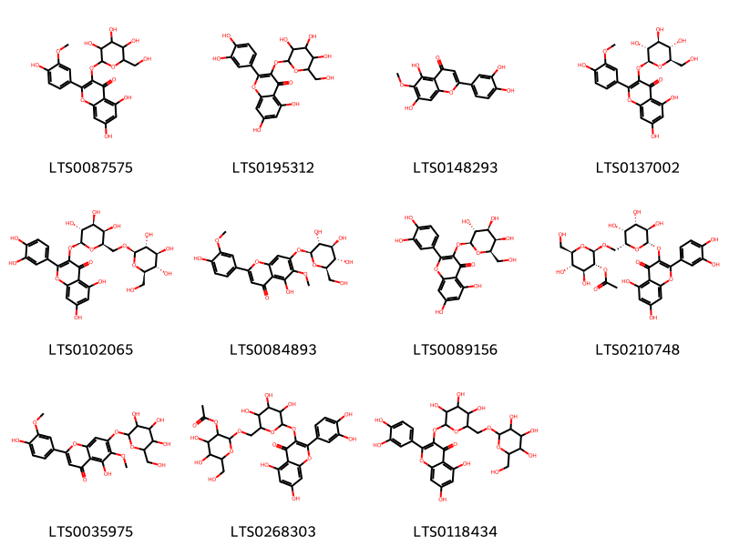{ width=100% }
    <figcaption>Hình ảnh cấu trúc hóa học của 11 hoạt chất thuộc nhóm Flavonoids gồm ['isorhamnetin 3-galactoside (LTS0087575)', '2-(3,4-dihydroxyphenyl)-5,7-dihydroxy-3-{[3,4,5-trihydroxy-6-(hydroxymethyl)oxan-2-yl]oxy}chromen-4-one (LTS0195312)', 'nepetin (LTS0148293)', 'isorhamnetin 3-o-glucoside (LTS0137002)', '2-(3,4-dihydroxyphenyl)-5,7-dihydroxy-3-{[(2s,3r,4s,5r,6r)-3,4,5-trihydroxy-6-({[(2r,3r,4s,5s,6r)-3,4,5-trihydroxy-6-(hydroxymethyl)oxan-2-yl]oxy}methyl)oxan-2-yl]oxy}chromen-4-one (LTS0102065)', '5-hydroxy-2-(4-hydroxy-3-methoxyphenyl)-6-methoxy-7-{[(2s,3r,4s,5s,6r)-3,4,5-trihydroxy-6-(hydroxymethyl)oxan-2-yl]oxy}chromen-4-one (LTS0084893)', 'hyperoside (LTS0089156)', '(2r,3r,4s,5s,6r)-2-{[(2r,3r,4s,5r,6s)-6-{[2-(3,4-dihydroxyphenyl)-5,7-dihydroxy-4-oxochromen-3-yl]oxy}-3,4,5-trihydroxyoxan-2-yl]methoxy}-4,5-dihydroxy-6-(hydroxymethyl)oxan-3-yl acetate (LTS0210748)', '5-hydroxy-2-(4-hydroxy-3-methoxyphenyl)-6-methoxy-7-{[3,4,5-trihydroxy-6-(hydroxymethyl)oxan-2-yl]oxy}chromen-4-one (LTS0035975)', '2-[(6-{[2-(3,4-dihydroxyphenyl)-5,7-dihydroxy-4-oxochromen-3-yl]oxy}-3,4,5-trihydroxyoxan-2-yl)methoxy]-4,5-dihydroxy-6-(hydroxymethyl)oxan-3-yl acetate (LTS0268303)', '2-(3,4-dihydroxyphenyl)-5,7-dihydroxy-3-{[3,4,5-trihydroxy-6-({[3,4,5-trihydroxy-6-(hydroxymethyl)oxan-2-yl]oxy}methyl)oxan-2-yl]oxy}chromen-4-one (LTS0118434)'].</figcaption>
</figure>
#### Nhóm Linear 1_3-diarylpropanoids
<figure markdown="span">
    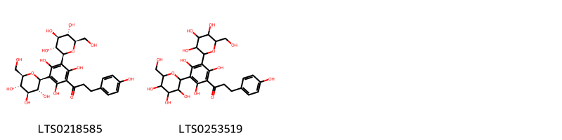{ width=100% }
    <figcaption>Hình ảnh cấu trúc hóa học của Không tìm thấy chú thích hoạt chất thuộc nhóm Linear 1_3-diarylpropanoids gồm Không tìm thấy chú thích.</figcaption>
</figure>
#### Nhóm Prenol lipids
<figure markdown="span">
    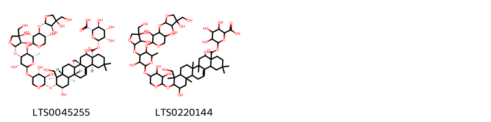{ width=100% }
    <figcaption>Hình ảnh cấu trúc hóa học của 2 hoạt chất thuộc nhóm Prenol lipids gồm ['(2s,3s,4s,5s,6s)-6-[(4ar,5r,6as,6br,8ar,9r,10r,11s,12ar,12br,14bs)-10-{[(2s,3r,4r,5r)-5-{[(2s,3r,4s,5s,6s)-4-{[(2s,3r,4r)-3,4-dihydroxy-4-(hydroxymethyl)oxolan-2-yl]oxy}-5-{[(2s,3r,4s,5r)-4-{[(2s,3r,4r)-3,4-dihydroxy-4-(hydroxymethyl)oxolan-2-yl]oxy}-3,5-dihydroxyoxan-2-yl]oxy}-3-hydroxy-6-methyloxan-2-yl]oxy}-3,4-dihydroxyoxan-2-yl]oxy}-5,11-dihydroxy-9-(hydroxymethyl)-2,2,6a,6b,9,12a-hexamethyl-1,3,4,5,6,7,8,8a,10,11,12,12b,13,14b-tetradecahydropicene-4a-carbonyloxy]-3,4,5-trihydroxyoxane-2-carboxylic acid (LTS0045255)', '6-[10-({5-[(4-{[3,4-dihydroxy-4-(hydroxymethyl)oxolan-2-yl]oxy}-5-[(4-{[3,4-dihydroxy-4-(hydroxymethyl)oxolan-2-yl]oxy}-3,5-dihydroxyoxan-2-yl)oxy]-3-hydroxy-6-methyloxan-2-yl)oxy]-3,4-dihydroxyoxan-2-yl}oxy)-5,11-dihydroxy-9-(hydroxymethyl)-2,2,6a,6b,9,12a-hexamethyl-1,3,4,5,6,7,8,8a,10,11,12,12b,13,14b-tetradecahydropicene-4a-carbonyloxy]-3,4,5-trihydroxyoxane-2-carboxylic acid (LTS0220144)'].</figcaption>
</figure>

---

### Dược dân tộc học

Danh sách các quốc gia có sử dụng *Paronychia argentea* trong điều trị các bệnh. 

| Country   | Disease               | Bệnh                                                                                                                                                                                                |
|:----------|:----------------------|:----------------------------------------------------------------------------------------------------------------------------------------------------------------------------------------------------|
| Morocco   | Aphrodisiac, Diuretic | MYMEMORY WARNING: YOU USED ALL AVAILABLE FREE TRANSLATIONS FOR TODAY. NEXT AVAILABLE IN  09 HOURS 17 MINUTES 04 SECONDS VISIT HTTPS://MYMEMORY.TRANSLATED.NET/DOC/USAGELIMITS.PHP TO TRANSLATE MORE |
| ain       | Diuretic              | MYMEMORY WARNING: YOU USED ALL AVAILABLE FREE TRANSLATIONS FOR TODAY. NEXT AVAILABLE IN  09 HOURS 16 MINUTES 59 SECONDS VISIT HTTPS://MYMEMORY.TRANSLATED.NET/DOC/USAGELIMITS.PHP TO TRANSLATE MORE |

---

# Chi Lychnis

??? note "Danh sách các dược liệu thuộc chi"
    
	 - *Lychnis grandiflora*
	 - *Lychnis indica*

---
## Lychnis grandiflora
### Thông tin về thực vật

!!! info "Phân loại thực vật của *Silene banksia* từ GIBF:"
    - **Kingdom:** Plantae
    - **Phylum:** Tracheophyta
    - **Order:** Caryophyllales
    - **Family:** Caryophyllaceae
    - **Genus:** Silene
    - **Species:** *Silene banksia*

 

| Label (VI)   | Label (EN)   | Scientific Name     | Descriptions (VI)   | Descriptions (EN)   | Also Known As (VI)   | Also Known As (EN)   |
|:-------------|:-------------|:--------------------|:--------------------|:--------------------|:---------------------|:---------------------|
| N/A          | N/A          | Paronychia argentea | loài thực vật       | species of plant    | ['']                 | ['']                 |

#### Phân bố trên thế giới

**Từ CSDL GIBF** nan, Japan, China, unknown or invalid, France

#### Phân bố tại Việt Nam

**Từ CSDL GIBF**: Không có ghi nhận ở Việt Nam

---
### Thành phần hóa học
        
- Theo cơ sở dữ liệu lotus: Từ loài *Silene banksia* đã phân lập và xác định được Chưa có hoạt chất nào được phân lập. hoạt chất thuộc về các nhóm Không có hoạt chất nào được phân lập. 

Không có hình ảnh nào được tạo ra

---

### Dược dân tộc học

Danh sách các quốc gia có sử dụng *Silene banksia* trong điều trị các bệnh. 

| Country   | Disease                | Bệnh                                                                                                                                                                                                |
|:----------|:-----------------------|:----------------------------------------------------------------------------------------------------------------------------------------------------------------------------------------------------|
| China     | Hemostat, Parasiticide | MYMEMORY WARNING: YOU USED ALL AVAILABLE FREE TRANSLATIONS FOR TODAY. NEXT AVAILABLE IN  09 HOURS 16 MINUTES 28 SECONDS VISIT HTTPS://MYMEMORY.TRANSLATED.NET/DOC/USAGELIMITS.PHP TO TRANSLATE MORE |

---

---
## Lychnis indica
### Thông tin về thực vật

!!! info "Phân loại thực vật của *Silene indica* từ GIBF:"
    - **Kingdom:** Plantae
    - **Phylum:** Tracheophyta
    - **Order:** Caryophyllales
    - **Family:** Caryophyllaceae
    - **Genus:** Silene
    - **Species:** *Silene indica*

 

| Label (VI)   | Label (EN)   | Scientific Name   | Descriptions (VI)   | Descriptions (EN)   | Also Known As (VI)   | Also Known As (EN)   |
|:-------------|:-------------|:------------------|:--------------------|:--------------------|:---------------------|:---------------------|
| N/A          | N/A          | Lychnis indica    |                     |                     | ['']                 | ['']                 |

#### Phân bố trên thế giới

**Từ CSDL GIBF** nan, Japan, China, unknown or invalid, France

#### Phân bố tại Việt Nam

**Từ CSDL GIBF**: Không có ghi nhận ở Việt Nam

---
### Thành phần hóa học
        
- Theo cơ sở dữ liệu lotus: Từ loài *Silene indica* đã phân lập và xác định được Chưa có hoạt chất nào được phân lập. hoạt chất thuộc về các nhóm Không có hoạt chất nào được phân lập. 

Không có hình ảnh nào được tạo ra

---

### Dược dân tộc học

Danh sách các quốc gia có sử dụng *Silene indica* trong điều trị các bệnh. 

| Country   | Disease   | Bệnh                                                                                                                                                                                                |
|:----------|:----------|:----------------------------------------------------------------------------------------------------------------------------------------------------------------------------------------------------|
| Elsewhere | Soap      | MYMEMORY WARNING: YOU USED ALL AVAILABLE FREE TRANSLATIONS FOR TODAY. NEXT AVAILABLE IN  09 HOURS 16 MINUTES 08 SECONDS VISIT HTTPS://MYMEMORY.TRANSLATED.NET/DOC/USAGELIMITS.PHP TO TRANSLATE MORE |

---

# Chi Stellaria

??? note "Danh sách các dược liệu thuộc chi"
    
	 - *Stellaria alsine*
	 - *Stellaria aquatica*
	 - *Stellaria media*
	 - *Stellaria puberula*

---
## Stellaria alsine
### Thông tin về thực vật

!!! info "Phân loại thực vật của *Stellaria alsine* từ GIBF:"
    - **Kingdom:** Plantae
    - **Phylum:** Tracheophyta
    - **Order:** Caryophyllales
    - **Family:** Caryophyllaceae
    - **Genus:** Stellaria
    - **Species:** *Stellaria alsine*

 

| Label (VI)   | Label (EN)   | Scientific Name   | Descriptions (VI)   | Descriptions (EN)   | Also Known As (VI)   | Also Known As (EN)                  |
|:-------------|:-------------|:------------------|:--------------------|:--------------------|:---------------------|:------------------------------------|
| N/A          | N/A          | Stellaria alsine  | loài thực vật       | species of plant    | ['']                 | ['bog chickweed', 'bog stitchwort'] |

#### Phân bố trên thế giới

**Từ CSDL GIBF** nan, Czechia, Sweden, China, New Zealand, Spain, Denmark, Netherlands, Korea, Republic of, France, Belgium, Chinese Taipei, Luxembourg, Germany, Austria, Ukraine, Switzerland, United Kingdom of Great Britain and Northern Ireland, Ireland

#### Phân bố tại Việt Nam

**Từ CSDL GIBF**: Không có ghi nhận ở Việt Nam

---
### Thành phần hóa học
        
- Theo cơ sở dữ liệu lotus: Từ loài *Stellaria alsine* đã phân lập và xác định được Chưa có hoạt chất nào được phân lập. hoạt chất thuộc về các nhóm Không có hoạt chất nào được phân lập. 

Không có hình ảnh nào được tạo ra

---

### Dược dân tộc học

Danh sách các quốc gia có sử dụng *Stellaria alsine* trong điều trị các bệnh. 

| Country   | Disease                 | Bệnh                                                                                                                                                                                                |
|:----------|:------------------------|:----------------------------------------------------------------------------------------------------------------------------------------------------------------------------------------------------|
| China     | Carminative, Alexiteric | MYMEMORY WARNING: YOU USED ALL AVAILABLE FREE TRANSLATIONS FOR TODAY. NEXT AVAILABLE IN  09 HOURS 15 MINUTES 47 SECONDS VISIT HTTPS://MYMEMORY.TRANSLATED.NET/DOC/USAGELIMITS.PHP TO TRANSLATE MORE |

---

---
## Stellaria aquatica
### Thông tin về thực vật

!!! info "Phân loại thực vật của *Stellaria aquatica* từ GIBF:"
    - **Kingdom:** Plantae
    - **Phylum:** Tracheophyta
    - **Order:** Caryophyllales
    - **Family:** Caryophyllaceae
    - **Genus:** Stellaria
    - **Species:** *Stellaria aquatica*

 

| Label (VI)   | Label (EN)   | Scientific Name    | Descriptions (VI)   | Descriptions (EN)   | Also Known As (VI)   | Also Known As (EN)   |
|:-------------|:-------------|:-------------------|:--------------------|:--------------------|:---------------------|:---------------------|
| N/A          | N/A          | Stellaria aquatica | loài thực vật       | species of plant    | ['']                 | ['water chickweed']  |

#### Phân bố trên thế giới

**Từ CSDL GIBF** Japan, Czechia, Nepal, China, Poland, Netherlands, United States of America, Romania, Korea, Republic of, Russian Federation, Belarus, Hong Kong, Belgium, Chinese Taipei, Luxembourg, Canada, Germany, Austria, Hungary, Ukraine, Slovakia, Italy, India, Switzerland, Serbia

#### Phân bố tại Việt Nam

**Từ CSDL GIBF**: Không có ghi nhận ở Việt Nam

---
### Thành phần hóa học
        
- Theo cơ sở dữ liệu lotus: Từ loài *Stellaria aquatica* đã phân lập và xác định được Chưa có hoạt chất nào được phân lập. hoạt chất thuộc về các nhóm Không có hoạt chất nào được phân lập. 

Không có hình ảnh nào được tạo ra

---

### Dược dân tộc học

Danh sách các quốc gia có sử dụng *Stellaria aquatica* trong điều trị các bệnh. 

| Country   | Disease    | Bệnh                                                                                                                                                                                                |
|:----------|:-----------|:----------------------------------------------------------------------------------------------------------------------------------------------------------------------------------------------------|
| Elsewhere | Lactagogue | MYMEMORY WARNING: YOU USED ALL AVAILABLE FREE TRANSLATIONS FOR TODAY. NEXT AVAILABLE IN  09 HOURS 15 MINUTES 19 SECONDS VISIT HTTPS://MYMEMORY.TRANSLATED.NET/DOC/USAGELIMITS.PHP TO TRANSLATE MORE |

---

---
## Stellaria media
### Thông tin về thực vật

!!! info "Phân loại thực vật của *Stellaria media* từ GIBF:"
    - **Kingdom:** Plantae
    - **Phylum:** Tracheophyta
    - **Order:** Caryophyllales
    - **Family:** Caryophyllaceae
    - **Genus:** Stellaria
    - **Species:** *Stellaria media*

 

| Label (VI)   | Label (EN)   | Scientific Name   | Descriptions (VI)   | Descriptions (EN)   | Also Known As (VI)   | Also Known As (EN)                                 |
|:-------------|:-------------|:------------------|:--------------------|:--------------------|:---------------------|:---------------------------------------------------|
| N/A          | N/A          | Stellaria media   | loài thực vật       | species of plant    | ['']                 | ['common chickweed', 'little mouse-ear chickweed'] |

#### Phân bố trên thế giới

**Từ CSDL GIBF** nan, Israel, New Zealand, Türkiye, Ecuador, Spain, Netherlands, Poland, Denmark, United States of America, Russian Federation, Argentina, Lithuania, United Kingdom of Great Britain and Northern Ireland, Belgium, Chinese Taipei, Iraq, Luxembourg, Canada, Germany, Portugal, Ukraine, South Africa, Australia, Italy, France, Ireland

#### Phân bố tại Việt Nam

**Từ CSDL GIBF**: Không có ghi nhận ở Việt Nam

---
### Thành phần hóa học
        
- Theo cơ sở dữ liệu lotus: Từ loài *Stellaria media* đã phân lập và xác định được 64 hoạt chất thuộc về các nhóm Fatty Acyls, Flavonoids, Carboxylic acids and derivatives, Steroids and steroid derivatives, Organooxygen compounds, Prenol lipids, Saturated hydrocarbons. 

|    | chemicalTaxonomyClassyfireClass   |   smiles_count |
|---:|:----------------------------------|---------------:|
|  0 | Carboxylic acids and derivatives  |             30 |
|  1 | Fatty Acyls                       |             10 |
|  2 | Flavonoids                        |              4 |
|  3 | Organooxygen compounds            |              9 |
|  4 | Prenol lipids                     |              3 |
|  5 | Saturated hydrocarbons            |              3 |
|  6 | Steroids and steroid derivatives  |              5 |

#### Nhóm Carboxylic acids and derivatives
<figure markdown="span">
    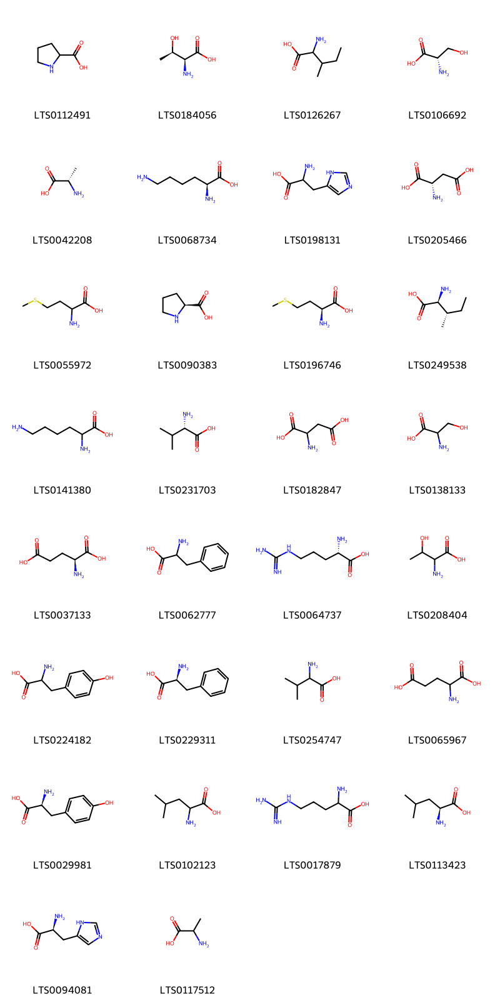{ width=100% }
    <figcaption>Hình ảnh cấu trúc hóa học của 30 hoạt chất thuộc nhóm Carboxylic acids and derivatives gồm ['proline (LTS0112491)', 'l-threonine (LTS0184056)', 'lisoleucine (LTS0126267)', 'l-serine (LTS0106692)', 'l-alanine (LTS0042208)', 'l-lysine (LTS0068734)', 'histidine (LTS0198131)', 'l-aspartic acid (LTS0205466)', 'methionin (LTS0055972)', 'l-proline (LTS0090383)', 'l-methionine (LTS0196746)', 'l-isoleucine (LTS0249538)', 'lysine (LTS0141380)', 'l-valine (LTS0231703)', 'aspartic acid (LTS0182847)', 'serin (LTS0138133)', 'l-glutamic acid (LTS0037133)', 'phenylalanin (LTS0062777)', 'l-arginine (LTS0064737)', 'threonine(l) (LTS0208404)', 'tyrosin (LTS0224182)', 'l-phenylalanine (LTS0229311)', 'valin (LTS0254747)', 'glutaminsaeure (LTS0065967)', 'l-tyrosine (LTS0029981)', 'leucine (LTS0102123)', 'arginine (LTS0017879)', 'l-leucine (LTS0113423)', 'l-histidine (LTS0094081)', 'alanine (LTS0117512)'].</figcaption>
</figure>
#### Nhóm Fatty Acyls
<figure markdown="span">
    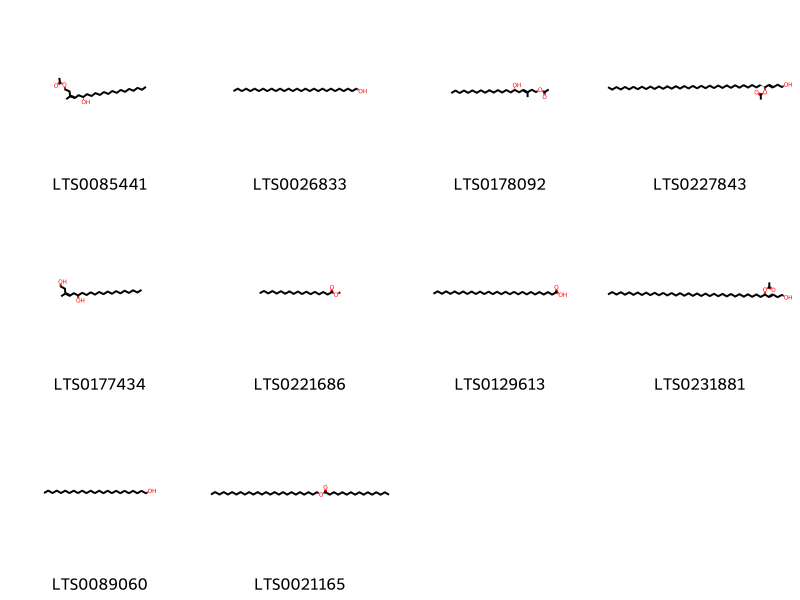{ width=100% }
    <figcaption>Hình ảnh cấu trúc hóa học của 10 hoạt chất thuộc nhóm Fatty Acyls gồm ['(6s)-6-hydroxy-3-methylhenicos-3-en-1-yl acetate (LTS0085441)', 'triacontanol (LTS0026833)', '(3e,6s)-6-hydroxy-3-methylhenicos-3-en-1-yl acetate (LTS0178092)', '(3e,5r)-1-hydroxydotetracont-3-en-5-yl acetate (LTS0227843)', '3-methylhenicos-3-ene-1,6-diol (LTS0177434)', 'methyl stearate (LTS0221686)', 'triacontanoic acid (LTS0129613)', '1-hydroxydotetracont-3-en-5-yl acetate (LTS0231881)', '1-pentacosanol (LTS0089060)', 'hexacosyl-palmitate (LTS0021165)'].</figcaption>
</figure>
#### Nhóm Flavonoids
<figure markdown="span">
    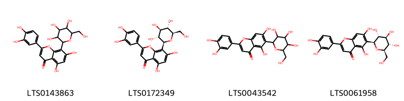{ width=100% }
    <figcaption>Hình ảnh cấu trúc hóa học của 4 hoạt chất thuộc nhóm Flavonoids gồm ['orientin (LTS0143863)', 'orientin (LTS0172349)', 'isoorientin (LTS0043542)', 'isoorientin (LTS0061958)'].</figcaption>
</figure>
#### Nhóm Organooxygen compounds
<figure markdown="span">
    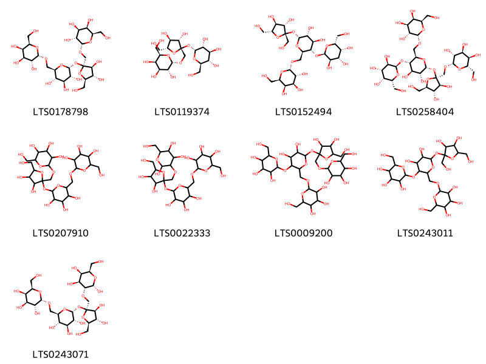{ width=100% }
    <figcaption>Hình ảnh cấu trúc hóa học của 9 hoạt chất thuộc nhóm Organooxygen compounds gồm ['(2s,3r,4s,5r,6r)-2-{[(2s,3s,4s,5r)-3,4-dihydroxy-5-(hydroxymethyl)-2-{[(2r,3r,4s,5s,6r)-3,4,5-trihydroxy-6-({[(2s,3r,4s,5r,6r)-3,4,5-trihydroxy-6-(hydroxymethyl)oxan-2-yl]oxy}methyl)oxan-2-yl]oxy}oxolan-2-yl]methoxy}-6-(hydroxymethyl)oxane-3,4,5-triol (LTS0178798)', '(2r,3r,4s,5s,6r)-2-{[(2s,3s,4s,5r)-3,4-dihydroxy-5-(hydroxymethyl)-2-({[(2s,3r,4s,5r,6r)-3,4,5-trihydroxy-6-(hydroxymethyl)oxan-2-yl]oxy}methyl)oxolan-2-yl]oxy}-6-(hydroxymethyl)oxane-3,4,5-triol (LTS0119374)', '(2s,3r,4s,5r,6r)-2-{[(2r,3s,4r,5r,6r)-6-{[(2s,3s,4s,5r)-3,4-dihydroxy-2,5-bis(hydroxymethyl)oxolan-2-yl]oxy}-4,5-dihydroxy-3-{[(2r,3r,4s,5r,6r)-3,4,5-trihydroxy-6-(hydroxymethyl)oxan-2-yl]oxy}oxan-2-yl]methoxy}-6-(hydroxymethyl)oxane-3,4,5-triol (LTS0152494)', '(2s,3r,4s,5r,6s)-2-{[(2s,3s,4s,5r)-2-{[(2r,3r,4r,5s,6r)-3,4-dihydroxy-5-{[(2r,3r,4s,5r,6r)-3,4,5-trihydroxy-6-(hydroxymethyl)oxan-2-yl]oxy}-6-({[(2s,3r,4s,5r,6r)-3,4,5-trihydroxy-6-(hydroxymethyl)oxan-2-yl]oxy}methyl)oxan-2-yl]oxy}-3,4-dihydroxy-5-(hydroxymethyl)oxolan-2-yl]methoxy}-6-(hydroxymethyl)oxane-3,4,5-triol (LTS0258404)', '2-[(6-{[3,4-dihydroxy-5-(hydroxymethyl)-2-({[3,4,5-trihydroxy-6-(hydroxymethyl)oxan-2-yl]oxy}methyl)oxolan-2-yl]oxy}-3,4,5-trihydroxyoxan-2-yl)methoxy]-6-(hydroxymethyl)oxane-3,4,5-triol (LTS0207910)', '2-[(6-{[3,4-dihydroxy-5-(hydroxymethyl)-2-({[2,4,5-trihydroxy-6-(hydroxymethyl)oxan-3-yl]oxy}methyl)oxolan-2-yl]oxy}-3,4,5-trihydroxyoxan-2-yl)methoxy]-6-(hydroxymethyl)oxane-3,4,5-triol (LTS0022333)', '2-[(6-{[3,4-dihydroxy-5-(hydroxymethyl)-2-({[3,4,5-trihydroxy-6-(hydroxymethyl)oxan-2-yl]oxy}methyl)oxolan-2-yl]oxy}-4,5-dihydroxy-3-{[3,4,5-trihydroxy-6-(hydroxymethyl)oxan-2-yl]oxy}oxan-2-yl)methoxy]-6-(hydroxymethyl)oxane-3,4,5-triol (LTS0009200)', '2-[(6-{[3,4-dihydroxy-2,5-bis(hydroxymethyl)oxolan-2-yl]oxy}-4,5-dihydroxy-3-{[3,4,5-trihydroxy-6-(hydroxymethyl)oxan-2-yl]oxy}oxan-2-yl)methoxy]-6-(hydroxymethyl)oxane-3,4,5-triol (LTS0243011)', '(2s,3r,4s,5r,6r)-3-{[(2s,3s,4s,5r)-3,4-dihydroxy-5-(hydroxymethyl)-2-{[(2r,3r,4s,5s,6r)-3,4,5-trihydroxy-6-({[(2s,3r,4s,5r,6r)-3,4,5-trihydroxy-6-(hydroxymethyl)oxan-2-yl]oxy}methyl)oxan-2-yl]oxy}oxolan-2-yl]methoxy}-6-(hydroxymethyl)oxane-2,4,5-triol (LTS0243071)'].</figcaption>
</figure>
#### Nhóm Prenol lipids
<figure markdown="span">
    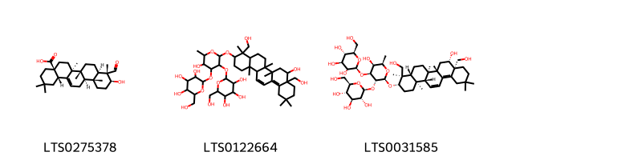{ width=100% }
    <figcaption>Hình ảnh cấu trúc hóa học của 3 hoạt chất thuộc nhóm Prenol lipids gồm ['gypsogenin (LTS0275378)', '2-[(5-hydroxy-2-{[8-hydroxy-4,8a-bis(hydroxymethyl)-4,6a,6b,11,11,14b-hexamethyl-1,2,3,4a,5,6,7,8,9,10,12,14a-dodecahydropicen-3-yl]oxy}-6-methyl-4-{[3,4,5-trihydroxy-6-(hydroxymethyl)oxan-2-yl]oxy}oxan-3-yl)oxy]-6-(hydroxymethyl)oxane-3,4,5-triol (LTS0122664)', '(2s,3r,4s,5s,6r)-2-{[(2r,3r,4s,5s,6r)-2-{[(3s,4r,4ar,6ar,6bs,8s,8as,14ar,14bs)-8-hydroxy-4,8a-bis(hydroxymethyl)-4,6a,6b,11,11,14b-hexamethyl-1,2,3,4a,5,6,7,8,9,10,12,14a-dodecahydropicen-3-yl]oxy}-5-hydroxy-6-methyl-4-{[(2s,3r,4s,5s,6r)-3,4,5-trihydroxy-6-(hydroxymethyl)oxan-2-yl]oxy}oxan-3-yl]oxy}-6-(hydroxymethyl)oxane-3,4,5-triol (LTS0031585)'].</figcaption>
</figure>
#### Nhóm Saturated hydrocarbons
<figure markdown="span">
    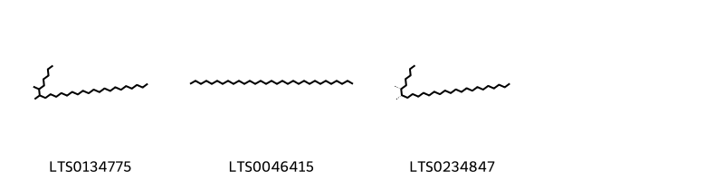{ width=100% }
    <figcaption>Hình ảnh cấu trúc hóa học của 3 hoạt chất thuộc nhóm Saturated hydrocarbons gồm ['6,7-dimethylheptacosane (LTS0134775)', 'hentriacontane (LTS0046415)', '(6r,7s)-6,7-dimethylheptacosane (LTS0234847)'].</figcaption>
</figure>
#### Nhóm Steroids and steroid derivatives
<figure markdown="span">
    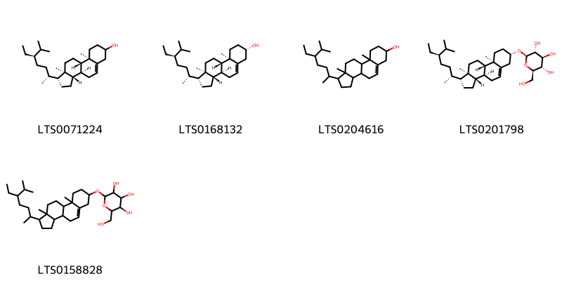{ width=100% }
    <figcaption>Hình ảnh cấu trúc hóa học của 5 hoạt chất thuộc nhóm Steroids and steroid derivatives gồm ['stigmast-5-en-3-ol (LTS0071224)', 'sitosterol (LTS0168132)', 'stigmast-5-en-3-ol, (3β)- (LTS0204616)', 'sitogluside (LTS0201798)', '2-{[1-(5-ethyl-6-methylheptan-2-yl)-9a,11a-dimethyl-1h,2h,3h,3ah,3bh,4h,6h,7h,8h,9h,9bh,10h,11h-cyclopenta[a]phenanthren-7-yl]oxy}-6-(hydroxymethyl)oxane-3,4,5-triol (LTS0158828)'].</figcaption>
</figure>

---

### Dược dân tộc học

Danh sách các quốc gia có sử dụng *Stellaria media* trong điều trị các bệnh. 

| Country   | Disease                                       | Bệnh                                                                                                                                                                                                |
|:----------|:----------------------------------------------|:----------------------------------------------------------------------------------------------------------------------------------------------------------------------------------------------------|
| Elsewhere | Poison                                        | MYMEMORY WARNING: YOU USED ALL AVAILABLE FREE TRANSLATIONS FOR TODAY. NEXT AVAILABLE IN  09 HOURS 14 MINUTES 52 SECONDS VISIT HTTPS://MYMEMORY.TRANSLATED.NET/DOC/USAGELIMITS.PHP TO TRANSLATE MORE |
| Turkey    | Demulcent, Diuretic, Expectorant, Refrigerant | MYMEMORY WARNING: YOU USED ALL AVAILABLE FREE TRANSLATIONS FOR TODAY. NEXT AVAILABLE IN  09 HOURS 14 MINUTES 50 SECONDS VISIT HTTPS://MYMEMORY.TRANSLATED.NET/DOC/USAGELIMITS.PHP TO TRANSLATE MORE |
| ain       | Expectorant                                   | MYMEMORY WARNING: YOU USED ALL AVAILABLE FREE TRANSLATIONS FOR TODAY. NEXT AVAILABLE IN  09 HOURS 14 MINUTES 47 SECONDS VISIT HTTPS://MYMEMORY.TRANSLATED.NET/DOC/USAGELIMITS.PHP TO TRANSLATE MORE |

---

---
## Stellaria puberula
### Thông tin về thực vật

!!! info "Phân loại thực vật của *Stellaria pubera* từ GIBF:"
    - **Kingdom:** Plantae
    - **Phylum:** Tracheophyta
    - **Order:** Caryophyllales
    - **Family:** Caryophyllaceae
    - **Genus:** Stellaria
    - **Species:** *Stellaria pubera*

 

| Label (VI)   | Label (EN)   | Scientific Name   | Descriptions (VI)   | Descriptions (EN)   | Also Known As (VI)   | Also Known As (EN)                                 |
|:-------------|:-------------|:------------------|:--------------------|:--------------------|:---------------------|:---------------------------------------------------|
| N/A          | N/A          | Stellaria media   | loài thực vật       | species of plant    | ['']                 | ['common chickweed', 'little mouse-ear chickweed'] |

#### Phân bố trên thế giới

**Từ CSDL GIBF** United States of America

#### Phân bố tại Việt Nam

**Từ CSDL GIBF**: Không có ghi nhận ở Việt Nam

---
### Thành phần hóa học
        
- Theo cơ sở dữ liệu lotus: Từ loài *Stellaria pubera* đã phân lập và xác định được Chưa có hoạt chất nào được phân lập. hoạt chất thuộc về các nhóm Không có hoạt chất nào được phân lập. 

Không có hình ảnh nào được tạo ra

---

### Dược dân tộc học

Danh sách các quốc gia có sử dụng *Stellaria pubera* trong điều trị các bệnh. 

| Country   | Disease   | Bệnh                                                                                                                                                                                                |
|:----------|:----------|:----------------------------------------------------------------------------------------------------------------------------------------------------------------------------------------------------|
| US        | Tonic     | MYMEMORY WARNING: YOU USED ALL AVAILABLE FREE TRANSLATIONS FOR TODAY. NEXT AVAILABLE IN  09 HOURS 14 MINUTES 13 SECONDS VISIT HTTPS://MYMEMORY.TRANSLATED.NET/DOC/USAGELIMITS.PHP TO TRANSLATE MORE |

---

# Chi Sagina

??? note "Danh sách các dược liệu thuộc chi"
    
	 - *Sagina maxima*

---
## Sagina maxima
### Thông tin về thực vật

!!! info "Phân loại thực vật của *Sagina maxima* từ GIBF:"
    - **Kingdom:** Plantae
    - **Phylum:** Tracheophyta
    - **Order:** Caryophyllales
    - **Family:** Caryophyllaceae
    - **Genus:** Sagina
    - **Species:** *Sagina maxima*

 

| Label (VI)   | Label (EN)   | Scientific Name   | Descriptions (VI)   | Descriptions (EN)   | Also Known As (VI)   | Also Known As (EN)   |
|:-------------|:-------------|:------------------|:--------------------|:--------------------|:---------------------|:---------------------|
| N/A          | N/A          | Sagina maxima     | loài thực vật       | species of plant    | ['']                 | ['']                 |

#### Phân bố trên thế giới

**Từ CSDL GIBF** nan, United States of America, Japan, Korea, Republic of, Chinese Taipei, Russian Federation, Canada

#### Phân bố tại Việt Nam

**Từ CSDL GIBF**: Không có ghi nhận ở Việt Nam

---
### Thành phần hóa học
        
- Theo cơ sở dữ liệu lotus: Từ loài *Sagina maxima* đã phân lập và xác định được Chưa có hoạt chất nào được phân lập. hoạt chất thuộc về các nhóm Không có hoạt chất nào được phân lập. 

Không có hình ảnh nào được tạo ra

---

### Dược dân tộc học

Danh sách các quốc gia có sử dụng *Sagina maxima* trong điều trị các bệnh. 

| Country   | Disease                   | Bệnh                                                                                                                                                                                                |
|:----------|:--------------------------|:----------------------------------------------------------------------------------------------------------------------------------------------------------------------------------------------------|
| China     | Refrigerant, Parasiticide | MYMEMORY WARNING: YOU USED ALL AVAILABLE FREE TRANSLATIONS FOR TODAY. NEXT AVAILABLE IN  09 HOURS 13 MINUTES 44 SECONDS VISIT HTTPS://MYMEMORY.TRANSLATED.NET/DOC/USAGELIMITS.PHP TO TRANSLATE MORE |

---

# Chi Herniaria

??? note "Danh sách các dược liệu thuộc chi"
    
	 - *Herniaria glabra*
	 - *Herniaria hirsuta*

---
## Herniaria glabra
### Thông tin về thực vật

!!! info "Phân loại thực vật của *Herniaria glabra* từ GIBF:"
    - **Kingdom:** Plantae
    - **Phylum:** Tracheophyta
    - **Order:** Caryophyllales
    - **Family:** Caryophyllaceae
    - **Genus:** Herniaria
    - **Species:** *Herniaria glabra*

 

| Label (VI)   | Label (EN)   | Scientific Name   | Descriptions (VI)   | Descriptions (EN)   | Also Known As (VI)   | Also Known As (EN)   |
|:-------------|:-------------|:------------------|:--------------------|:--------------------|:---------------------|:---------------------|
| N/A          | N/A          | Herniaria glabra  | loài thực vật       | species of plant    | ['']                 | ['Herniaria glabra'] |

#### Phân bố trên thế giới

**Từ CSDL GIBF** Czechia, Sweden, Finland, Kazakhstan, Slovenia, Spain, Denmark, Netherlands, Montenegro, Poland, Russian Federation, Croatia, Lithuania, Belarus, France, Belgium, Germany, Austria, Latvia, Ukraine, Slovakia, Italy, Switzerland, United Kingdom of Great Britain and Northern Ireland

#### Phân bố tại Việt Nam

**Từ CSDL GIBF**: Không có ghi nhận ở Việt Nam

---
### Thành phần hóa học
        
- Theo cơ sở dữ liệu lotus: Từ loài *Herniaria glabra* đã phân lập và xác định được 4 hoạt chất thuộc về các nhóm Prenol lipids. 

|    | chemicalTaxonomyClassyfireClass   |   smiles_count |
|---:|:----------------------------------|---------------:|
|  0 | Prenol lipids                     |              4 |

#### Nhóm Prenol lipids
<figure markdown="span">
    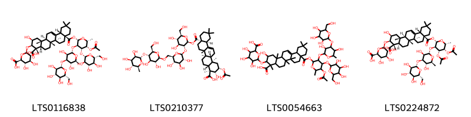{ width=100% }
    <figcaption>Hình ảnh cấu trúc hóa học của 4 hoạt chất thuộc nhóm Prenol lipids gồm ['(2s,3s,4s,5r,6r)-6-{[(2s,3r,4s,4as,6ar,6bs,8as,12as,14ar,14br)-8a-({[(2s,3r,4s,5s,6r)-5-(acetyloxy)-3-{[(2s,3r,4r,5s,6s)-3,5-dihydroxy-6-methyl-4-{[(2s,3r,4s,5s,6r)-3,4,5-trihydroxy-6-(hydroxymethyl)oxan-2-yl]oxy}oxan-2-yl]oxy}-6-methyl-4-{[(2s,3r,4s,5s,6r)-3,4,5-trihydroxy-6-(hydroxymethyl)oxan-2-yl]oxy}oxan-2-yl]oxy}carbonyl)-4-carboxy-2-hydroxy-4,6a,6b,11,11,14b-hexamethyl-1,2,3,4a,5,6,7,8,9,10,12,12a,14,14a-tetradecahydropicen-3-yl]oxy}-3,4,5-trihydroxyoxane-2-carboxylic acid (LTS0116838)', '(2s,3r,4s,4ar,6ar,6bs,8as,12as,14ar,14br)-2-(acetyloxy)-8a-({[(2s,3r,4s,5s,6r)-3-{[(2s,3r,4s,5s,6r)-6-({[(2r,3r,4r,5s,6r)-3,4-dihydroxy-6-(hydroxymethyl)-5-{[(2s,3r,4r,5r,6s)-3,4,5-trihydroxy-6-methyloxan-2-yl]oxy}oxan-2-yl]oxy}methyl)-3,4,5-trihydroxyoxan-2-yl]oxy}-4,5-dihydroxy-6-(hydroxymethyl)oxan-2-yl]oxy}carbonyl)-3-hydroxy-4,6a,6b,11,11,14b-hexamethyl-1,2,3,4a,5,6,7,8,9,10,12,12a,14,14a-tetradecahydropicene-4-carboxylic acid (LTS0210377)', '6-{[8a-({[5-(acetyloxy)-3-[(3,5-dihydroxy-6-methyl-4-{[3,4,5-trihydroxy-6-(hydroxymethyl)oxan-2-yl]oxy}oxan-2-yl)oxy]-6-methyl-4-{[3,4,5-trihydroxy-6-(hydroxymethyl)oxan-2-yl]oxy}oxan-2-yl]oxy}carbonyl)-4-carboxy-2-hydroxy-4,6a,6b,11,11,14b-hexamethyl-1,2,3,4a,5,6,7,8,9,10,12,12a,14,14a-tetradecahydropicen-3-yl]oxy}-3,4,5-trihydroxyoxane-2-carboxylic acid (LTS0054663)', '(2s,3s,4s,5r,6r)-6-{[(2s,3r,4s,4ar,6ar,6bs,8as,12as,14ar,14br)-8a-({[(2s,3r,4s,5s,6r)-4,5-bis(acetyloxy)-3-{[(2s,3r,4r,5s,6s)-3,5-dihydroxy-6-methyl-4-{[(2s,3r,4s,5s,6r)-3,4,5-trihydroxy-6-(hydroxymethyl)oxan-2-yl]oxy}oxan-2-yl]oxy}-6-methyloxan-2-yl]oxy}carbonyl)-4-carboxy-2-hydroxy-4,6a,6b,11,11,14b-hexamethyl-1,2,3,4a,5,6,7,8,9,10,12,12a,14,14a-tetradecahydropicen-3-yl]oxy}-3,4,5-trihydroxyoxane-2-carboxylic acid (LTS0224872)'].</figcaption>
</figure>

---

### Dược dân tộc học

Danh sách các quốc gia có sử dụng *Herniaria glabra* trong điều trị các bệnh. 

| Country   | Disease                                       | Bệnh                                                                                                                                                                                                |
|:----------|:----------------------------------------------|:----------------------------------------------------------------------------------------------------------------------------------------------------------------------------------------------------|
| Elsewhere | Expectorant, Astringent, Diuretic             | MYMEMORY WARNING: YOU USED ALL AVAILABLE FREE TRANSLATIONS FOR TODAY. NEXT AVAILABLE IN  09 HOURS 13 MINUTES 11 SECONDS VISIT HTTPS://MYMEMORY.TRANSLATED.NET/DOC/USAGELIMITS.PHP TO TRANSLATE MORE |
| Iraq      | Soap                                          | MYMEMORY WARNING: YOU USED ALL AVAILABLE FREE TRANSLATIONS FOR TODAY. NEXT AVAILABLE IN  09 HOURS 13 MINUTES 06 SECONDS VISIT HTTPS://MYMEMORY.TRANSLATED.NET/DOC/USAGELIMITS.PHP TO TRANSLATE MORE |
| Turkey    | Astringent, Diuretic, Litholytic, Expectorant | MYMEMORY WARNING: YOU USED ALL AVAILABLE FREE TRANSLATIONS FOR TODAY. NEXT AVAILABLE IN  09 HOURS 13 MINUTES 03 SECONDS VISIT HTTPS://MYMEMORY.TRANSLATED.NET/DOC/USAGELIMITS.PHP TO TRANSLATE MORE |
| ain       | Diuretic                                      | MYMEMORY WARNING: YOU USED ALL AVAILABLE FREE TRANSLATIONS FOR TODAY. NEXT AVAILABLE IN  09 HOURS 13 MINUTES 00 SECONDS VISIT HTTPS://MYMEMORY.TRANSLATED.NET/DOC/USAGELIMITS.PHP TO TRANSLATE MORE |

---

---
## Herniaria hirsuta
### Thông tin về thực vật

!!! info "Phân loại thực vật của *Herniaria hirsuta* từ GIBF:"
    - **Kingdom:** Plantae
    - **Phylum:** Tracheophyta
    - **Order:** Caryophyllales
    - **Family:** Caryophyllaceae
    - **Genus:** Herniaria
    - **Species:** *Herniaria hirsuta*

 

| Label (VI)   | Label (EN)   | Scientific Name   | Descriptions (VI)   | Descriptions (EN)   | Also Known As (VI)   | Also Known As (EN)    |
|:-------------|:-------------|:------------------|:--------------------|:--------------------|:---------------------|:----------------------|
| N/A          | N/A          | Herniaria hirsuta | loài thực vật       | species of plant    | ['']                 | ['Hairy rupturewort'] |

#### Phân bố trên thế giới

**Từ CSDL GIBF** Czechia, Uzbekistan, Israel, Türkiye, Slovenia, Spain, Denmark, Netherlands, United States of America, Greece, Croatia, Cyprus, Mexico, Belgium, Germany, Austria, Hungary, Italy, Switzerland, France

#### Phân bố tại Việt Nam

**Từ CSDL GIBF**: Không có ghi nhận ở Việt Nam

---
### Thành phần hóa học
        
- Theo cơ sở dữ liệu lotus: Từ loài *Herniaria hirsuta* đã phân lập và xác định được 6 hoạt chất thuộc về các nhóm Prenol lipids, Carboxylic acids and derivatives, Coumarins and derivatives. 

|    | chemicalTaxonomyClassyfireClass   |   smiles_count |
|---:|:----------------------------------|---------------:|
|  0 | Carboxylic acids and derivatives  |              1 |
|  1 | Coumarins and derivatives         |              1 |
|  2 | Prenol lipids                     |              4 |

#### Nhóm Carboxylic acids and derivatives
<figure markdown="span">
    { width=100% }
    <figcaption>Hình ảnh cấu trúc hóa học của 1 hoạt chất thuộc nhóm Carboxylic acids and derivatives gồm ['oxalic acid (LTS0217707)'].</figcaption>
</figure>
#### Nhóm Coumarins and derivatives
<figure markdown="span">
    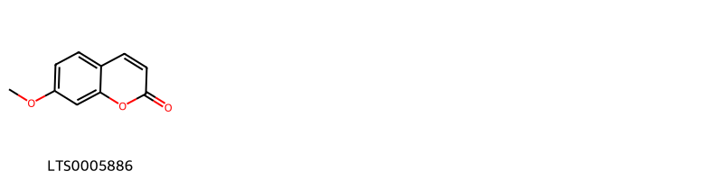{ width=100% }
    <figcaption>Hình ảnh cấu trúc hóa học của 1 hoạt chất thuộc nhóm Coumarins and derivatives gồm ['methylumbelliferone (LTS0005886)'].</figcaption>
</figure>
#### Nhóm Prenol lipids
<figure markdown="span">
    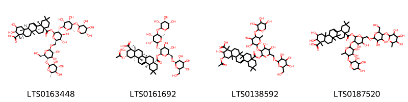{ width=100% }
    <figcaption>Hình ảnh cấu trúc hóa học của 4 hoạt chất thuộc nhóm Prenol lipids gồm ['(2s,3r,4s,4ar,6ar,6bs,8as,12as,14ar,14br)-8a-({[(2s,3r,4s,5s,6r)-6-({[(2r,3r,4r,5s,6r)-3,4-dihydroxy-6-(hydroxymethyl)-5-{[(2s,3r,4r,5r,6s)-3,4,5-trihydroxy-6-methyloxan-2-yl]oxy}oxan-2-yl]oxy}methyl)-3-{[(2s,3r,4s,5r,6s)-3,4-dihydroxy-6-methyl-5-{[(2s,3r,4s,5r)-3,4,5-trihydroxyoxan-2-yl]oxy}oxan-2-yl]oxy}-4,5-dihydroxyoxan-2-yl]oxy}carbonyl)-2,3-dihydroxy-4,6a,6b,11,11,14b-hexamethyl-1,2,3,4a,5,6,7,8,9,10,12,12a,14,14a-tetradecahydropicene-4-carboxylic acid (LTS0163448)', '(2s,3r,4s,4ar,6ar,6bs,8as,12as,14ar,14br)-2-(acetyloxy)-8a-({[(2s,3r,4s,5s,6r)-3-{[(2s,3r,4s,5r,6s)-3,4-dihydroxy-6-methyl-5-{[(2s,3r,4s,5r)-3,4,5-trihydroxyoxan-2-yl]oxy}oxan-2-yl]oxy}-4,5-dihydroxy-6-({[(2r,3r,4s,5s,6r)-3,4,5-trihydroxy-6-(hydroxymethyl)oxan-2-yl]oxy}methyl)oxan-2-yl]oxy}carbonyl)-3-hydroxy-4,6a,6b,11,11,14b-hexamethyl-1,2,3,4a,5,6,7,8,9,10,12,12a,14,14a-tetradecahydropicene-4-carboxylic acid (LTS0161692)', '2-(acetyloxy)-8a-({[3-({3,4-dihydroxy-6-methyl-5-[(3,4,5-trihydroxyoxan-2-yl)oxy]oxan-2-yl}oxy)-4,5-dihydroxy-6-({[3,4,5-trihydroxy-6-(hydroxymethyl)oxan-2-yl]oxy}methyl)oxan-2-yl]oxy}carbonyl)-3-hydroxy-4,6a,6b,11,11,14b-hexamethyl-1,2,3,4a,5,6,7,8,9,10,12,12a,14,14a-tetradecahydropicene-4-carboxylic acid (LTS0138592)', '8a-({[6-({[3,4-dihydroxy-6-(hydroxymethyl)-5-[(3,4,5-trihydroxy-6-methyloxan-2-yl)oxy]oxan-2-yl]oxy}methyl)-3-({3,4-dihydroxy-6-methyl-5-[(3,4,5-trihydroxyoxan-2-yl)oxy]oxan-2-yl}oxy)-4,5-dihydroxyoxan-2-yl]oxy}carbonyl)-2,3-dihydroxy-4,6a,6b,11,11,14b-hexamethyl-1,2,3,4a,5,6,7,8,9,10,12,12a,14,14a-tetradecahydropicene-4-carboxylic acid (LTS0187520)'].</figcaption>
</figure>

---

### Dược dân tộc học

Danh sách các quốc gia có sử dụng *Herniaria hirsuta* trong điều trị các bệnh. 

| Country      | Disease            | Bệnh                                                                                                                                                                                                |
|:-------------|:-------------------|:----------------------------------------------------------------------------------------------------------------------------------------------------------------------------------------------------|
| Elsewhere    | Diuretic, Narcotic | MYMEMORY WARNING: YOU USED ALL AVAILABLE FREE TRANSLATIONS FOR TODAY. NEXT AVAILABLE IN  09 HOURS 12 MINUTES 28 SECONDS VISIT HTTPS://MYMEMORY.TRANSLATED.NET/DOC/USAGELIMITS.PHP TO TRANSLATE MORE |
| Iraq         | Diuretic, Narcotic | MYMEMORY WARNING: YOU USED ALL AVAILABLE FREE TRANSLATIONS FOR TODAY. NEXT AVAILABLE IN  09 HOURS 12 MINUTES 24 SECONDS VISIT HTTPS://MYMEMORY.TRANSLATED.NET/DOC/USAGELIMITS.PHP TO TRANSLATE MORE |
| South Africa | Diuretic           | MYMEMORY WARNING: YOU USED ALL AVAILABLE FREE TRANSLATIONS FOR TODAY. NEXT AVAILABLE IN  09 HOURS 12 MINUTES 22 SECONDS VISIT HTTPS://MYMEMORY.TRANSLATED.NET/DOC/USAGELIMITS.PHP TO TRANSLATE MORE |

---

# Chi Melandrium

??? note "Danh sách các dược liệu thuộc chi"
    
	 - *Melandrium album*

---
## Melandrium album
### Thông tin về thực vật

!!! info "Phân loại thực vật của *Silene latifolia* từ GIBF:"
    - **Kingdom:** Plantae
    - **Phylum:** Tracheophyta
    - **Order:** Caryophyllales
    - **Family:** Caryophyllaceae
    - **Genus:** Silene
    - **Species:** *Silene latifolia*

 

| Label (VI)   | Label (EN)   | Scientific Name   | Descriptions (VI)   | Descriptions (EN)   | Also Known As (VI)   | Also Known As (EN)   |
|:-------------|:-------------|:------------------|:--------------------|:--------------------|:---------------------|:---------------------|
| N/A          | N/A          | Melandrium album  | loài thực vật       | species of plant    | ['']                 | ['']                 |

#### Phân bố trên thế giới

**Từ CSDL GIBF** Russian Federation, Poland, Latvia, Ukraine

#### Phân bố tại Việt Nam

**Từ CSDL GIBF**: Không có ghi nhận ở Việt Nam

---
### Thành phần hóa học
        
- Theo cơ sở dữ liệu lotus: Từ loài *Silene latifolia* đã phân lập và xác định được Chưa có hoạt chất nào được phân lập. hoạt chất thuộc về các nhóm Không có hoạt chất nào được phân lập. 

Không có hình ảnh nào được tạo ra

---

### Dược dân tộc học

Danh sách các quốc gia có sử dụng *Silene latifolia* trong điều trị các bệnh. 

| Country   | Disease   | Bệnh                                                                                                                                                                                                |
|:----------|:----------|:----------------------------------------------------------------------------------------------------------------------------------------------------------------------------------------------------|
| Europe    | Soap      | MYMEMORY WARNING: YOU USED ALL AVAILABLE FREE TRANSLATIONS FOR TODAY. NEXT AVAILABLE IN  09 HOURS 11 MINUTES 53 SECONDS VISIT HTTPS://MYMEMORY.TRANSLATED.NET/DOC/USAGELIMITS.PHP TO TRANSLATE MORE |

---

# Chi Vaccaria

??? note "Danh sách các dược liệu thuộc chi"
    
	 - *Vaccaria pyramidata*

---
## Vaccaria pyramidata
### Thông tin về thực vật

!!! info "Phân loại thực vật của *Gypsophila vaccaria* từ GIBF:"
    - **Kingdom:** Plantae
    - **Phylum:** Tracheophyta
    - **Order:** Caryophyllales
    - **Family:** Caryophyllaceae
    - **Genus:** Gypsophila
    - **Species:** *Gypsophila vaccaria*

 

| Label (VI)   | Label (EN)   | Scientific Name     | Descriptions (VI)   | Descriptions (EN)   | Also Known As (VI)   | Also Known As (EN)   |
|:-------------|:-------------|:--------------------|:--------------------|:--------------------|:---------------------|:---------------------|
| N/A          | N/A          | Vaccaria pyramidata | loài thực vật       | species of plant    | ['']                 | ['']                 |

#### Phân bố trên thế giới

**Từ CSDL GIBF** nan, Brazil, Japan, China, Israel, Türkiye, Spain, Poland, Netherlands, United States of America, Romania, Greece, Jordan, Iran (Islamic Republic of), Armenia, Croatia, unknown or invalid, Cyprus, Estonia, Ethiopia, Morocco, United Kingdom of Great Britain and Northern Ireland, Belgium, Iraq, Canada, Germany, Syrian Arab Republic, Egypt, Lebanon, Austria, Tajikistan, Portugal, South Africa, Italy, Bulgaria, Peru, France

#### Phân bố tại Việt Nam

**Từ CSDL GIBF**: Không có ghi nhận ở Việt Nam

---
### Thành phần hóa học
        
- Theo cơ sở dữ liệu lotus: Từ loài *Gypsophila vaccaria* đã phân lập và xác định được Chưa có hoạt chất nào được phân lập. hoạt chất thuộc về các nhóm Không có hoạt chất nào được phân lập. 

Không có hình ảnh nào được tạo ra

---

### Dược dân tộc học

Danh sách các quốc gia có sử dụng *Gypsophila vaccaria* trong điều trị các bệnh. 

| Country   | Disease         | Bệnh                                                                                                                                                                                                |
|:----------|:----------------|:----------------------------------------------------------------------------------------------------------------------------------------------------------------------------------------------------|
| Elsewhere | nan, Hemostatic | MYMEMORY WARNING: YOU USED ALL AVAILABLE FREE TRANSLATIONS FOR TODAY. NEXT AVAILABLE IN  09 HOURS 11 MINUTES 25 SECONDS VISIT HTTPS://MYMEMORY.TRANSLATED.NET/DOC/USAGELIMITS.PHP TO TRANSLATE MORE |

---

# Chi Agrostemma

??? note "Danh sách các dược liệu thuộc chi"
    
	 - *Agrostemma githago*

---
## Agrostemma githago
### Thông tin về thực vật

!!! info "Phân loại thực vật của *Agrostemma githago* từ GIBF:"
    - **Kingdom:** Plantae
    - **Phylum:** Tracheophyta
    - **Order:** Caryophyllales
    - **Family:** Caryophyllaceae
    - **Genus:** Agrostemma
    - **Species:** *Agrostemma githago*

 

| Label (VI)   | Label (EN)   | Scientific Name    | Descriptions (VI)   | Descriptions (EN)   | Also Known As (VI)   | Also Known As (EN)                   |
|:-------------|:-------------|:-------------------|:--------------------|:--------------------|:---------------------|:-------------------------------------|
| N/A          | N/A          | Agrostemma githago | loài thực vật       | species of plant    | ['']                 | ['common corn-cockle', 'Corncockle'] |

#### Phân bố trên thế giới

**Từ CSDL GIBF** Czechia, Sweden, China, Israel, Türkiye, Spain, Poland, Netherlands, Denmark, United States of America, Greece, Croatia, United Kingdom of Great Britain and Northern Ireland, Belgium, North Macedonia, Serbia, Germany, Austria, Hungary, Portugal, Ukraine, Switzerland, Bulgaria, France

#### Phân bố tại Việt Nam

**Từ CSDL GIBF**: Không có ghi nhận ở Việt Nam

---
### Thành phần hóa học
        
- Theo cơ sở dữ liệu lotus: Từ loài *Agrostemma githago* đã phân lập và xác định được 13 hoạt chất thuộc về các nhóm Prenol lipids. 

|    | chemicalTaxonomyClassyfireClass   |   smiles_count |
|---:|:----------------------------------|---------------:|
|  0 | Prenol lipids                     |             13 |

#### Nhóm Prenol lipids
<figure markdown="span">
    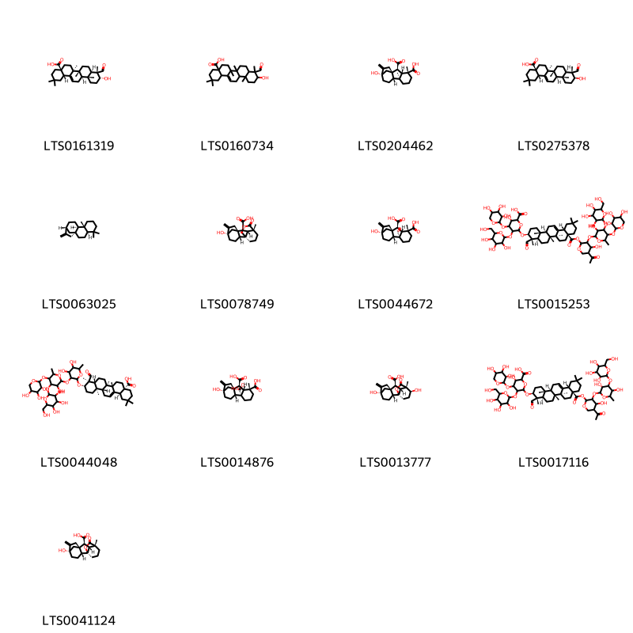{ width=100% }
    <figcaption>Hình ảnh cấu trúc hóa học của 13 hoạt chất thuộc nhóm Prenol lipids gồm ['(4as,6as,6br,8ar,9s,10r,12ar,12br,14bs)-9-formyl-10-hydroxy-2,2,6a,6b,9,12a-hexamethyl-1,3,4,5,6,7,8,8a,10,11,12,12b,13,14b-tetradecahydropicene-4a-carboxylic acid (LTS0161319)', 'gypsogenin (LTS0160734)', 'gibberellin a53 (LTS0204462)', 'gypsogenin (LTS0275378)', 'ent-kaurene (LTS0063025)', 'gibberellin a44 (LTS0078749)', 'gibberellin a19 (LTS0044672)', '6-{[(3s,4s,4ar,6ar,6bs,8as,12as,14ar,14br)-8a-[({5-acetyl-4-hydroxy-3-[(3-hydroxy-6-methyl-4-{[3,4,5-trihydroxy-6-(hydroxymethyl)oxan-2-yl]oxy}-5-[(3,4,5-trihydroxyoxan-2-yl)oxy]oxan-2-yl)oxy]oxan-2-yl}oxy)carbonyl]-4-formyl-4,6a,6b,11,11,14b-hexamethyl-1,2,3,4a,5,6,7,8,9,10,12,12a,14,14a-tetradecahydropicen-3-yl]oxy}-3-hydroxy-5-{[3,4,5-trihydroxy-6-(hydroxymethyl)oxan-2-yl]oxy}-4-[(3,4,5-trihydroxyoxan-2-yl)oxy]oxane-2-carboxylic acid (LTS0015253)', '(4as,6as,6br,8ar,9s,10s,12ar,12br,14bs)-10-({4,5-dihydroxy-3-[(3-hydroxy-6-methyl-4-{[3,4,5-trihydroxy-6-(hydroxymethyl)oxan-2-yl]oxy}-5-[(3,4,5-trihydroxyoxan-2-yl)oxy]oxan-2-yl)oxy]-6-methyloxan-2-yl}oxy)-9-formyl-2,2,6a,6b,9,12a-hexamethyl-1,3,4,5,6,7,8,8a,10,11,12,12b,13,14b-tetradecahydropicene-4a-carboxylic acid (LTS0044048)', 'gibberellin a17 (LTS0014876)', 'gibberellin a1 (LTS0013777)', '6-{[(3s,4s,4ar,6ar,6bs,8as,12as,14ar,14br)-8a-[({5-acetyl-3-[(3,5-dihydroxy-6-methyl-4-{[3,4,5-trihydroxy-6-(hydroxymethyl)oxan-2-yl]oxy}oxan-2-yl)oxy]-4-hydroxyoxan-2-yl}oxy)carbonyl]-4-formyl-4,6a,6b,11,11,14b-hexamethyl-1,2,3,4a,5,6,7,8,9,10,12,12a,14,14a-tetradecahydropicen-3-yl]oxy}-3-hydroxy-5-{[3,4,5-trihydroxy-6-(hydroxymethyl)oxan-2-yl]oxy}-4-[(3,4,5-trihydroxyoxan-2-yl)oxy]oxane-2-carboxylic acid (LTS0017116)', 'gibberellin a20 (LTS0041124)'].</figcaption>
</figure>

---

### Dược dân tộc học

Danh sách các quốc gia có sử dụng *Agrostemma githago* trong điều trị các bệnh. 

| Country   | Disease     | Bệnh                                                                                                                                                                                                |
|:----------|:------------|:----------------------------------------------------------------------------------------------------------------------------------------------------------------------------------------------------|
| Argentina | Vermifuge   | MYMEMORY WARNING: YOU USED ALL AVAILABLE FREE TRANSLATIONS FOR TODAY. NEXT AVAILABLE IN  09 HOURS 11 MINUTES 01 SECONDS VISIT HTTPS://MYMEMORY.TRANSLATED.NET/DOC/USAGELIMITS.PHP TO TRANSLATE MORE |
| English   | Expectorant | MYMEMORY WARNING: YOU USED ALL AVAILABLE FREE TRANSLATIONS FOR TODAY. NEXT AVAILABLE IN  09 HOURS 10 MINUTES 59 SECONDS VISIT HTTPS://MYMEMORY.TRANSLATED.NET/DOC/USAGELIMITS.PHP TO TRANSLATE MORE |
| Europe    | Poison      | MYMEMORY WARNING: YOU USED ALL AVAILABLE FREE TRANSLATIONS FOR TODAY. NEXT AVAILABLE IN  09 HOURS 10 MINUTES 56 SECONDS VISIT HTTPS://MYMEMORY.TRANSLATED.NET/DOC/USAGELIMITS.PHP TO TRANSLATE MORE |
| German    | Poison      | MYMEMORY WARNING: YOU USED ALL AVAILABLE FREE TRANSLATIONS FOR TODAY. NEXT AVAILABLE IN  09 HOURS 10 MINUTES 54 SECONDS VISIT HTTPS://MYMEMORY.TRANSLATED.NET/DOC/USAGELIMITS.PHP TO TRANSLATE MORE |
| Italian   | Emmenagogue | MYMEMORY WARNING: YOU USED ALL AVAILABLE FREE TRANSLATIONS FOR TODAY. NEXT AVAILABLE IN  09 HOURS 10 MINUTES 52 SECONDS VISIT HTTPS://MYMEMORY.TRANSLATED.NET/DOC/USAGELIMITS.PHP TO TRANSLATE MORE |
| Turkey    | Diuretic    | MYMEMORY WARNING: YOU USED ALL AVAILABLE FREE TRANSLATIONS FOR TODAY. NEXT AVAILABLE IN  09 HOURS 10 MINUTES 49 SECONDS VISIT HTTPS://MYMEMORY.TRANSLATED.NET/DOC/USAGELIMITS.PHP TO TRANSLATE MORE |

---

# Chi Cucubalus

??? note "Danh sách các dược liệu thuộc chi"
    
	 - *Cucubalus baccifer*

---
## Cucubalus baccifer
### Thông tin về thực vật

!!! info "Phân loại thực vật của *Silene baccifera* từ GIBF:"
    - **Kingdom:** Plantae
    - **Phylum:** Tracheophyta
    - **Order:** Caryophyllales
    - **Family:** Caryophyllaceae
    - **Genus:** Silene
    - **Species:** *Silene baccifera*

 

| Label (VI)   | Label (EN)   | Scientific Name    | Descriptions (VI)   | Descriptions (EN)   | Also Known As (VI)   | Also Known As (EN)   |
|:-------------|:-------------|:-------------------|:--------------------|:--------------------|:---------------------|:---------------------|
| N/A          | N/A          | Cucubalus baccifer | loài thực vật       | species of plant    | ['']                 | ['']                 |

#### Phân bố trên thế giới

**Từ CSDL GIBF** Austria, Portugal, Czechia, Latvia, Chinese Taipei, Ukraine, Belgium, Russian Federation, China, Italy, Switzerland, Germany, France, Spain, Poland

#### Phân bố tại Việt Nam

**Từ CSDL GIBF**: Không có ghi nhận ở Việt Nam

---
### Thành phần hóa học
        
- Theo cơ sở dữ liệu lotus: Từ loài *Silene baccifera* đã phân lập và xác định được Chưa có hoạt chất nào được phân lập. hoạt chất thuộc về các nhóm Không có hoạt chất nào được phân lập. 

Không có hình ảnh nào được tạo ra

---

### Dược dân tộc học

Danh sách các quốc gia có sử dụng *Silene baccifera* trong điều trị các bệnh. 

| Country   | Disease    | Bệnh                                                                                                                                                                                                |
|:----------|:-----------|:----------------------------------------------------------------------------------------------------------------------------------------------------------------------------------------------------|
| Elsewhere | Astringent | MYMEMORY WARNING: YOU USED ALL AVAILABLE FREE TRANSLATIONS FOR TODAY. NEXT AVAILABLE IN  09 HOURS 10 MINUTES 20 SECONDS VISIT HTTPS://MYMEMORY.TRANSLATED.NET/DOC/USAGELIMITS.PHP TO TRANSLATE MORE |

---

# Chi Holosteum

??? note "Danh sách các dược liệu thuộc chi"
    
	 - *Holosteum umbellatum*

---
## Holosteum umbellatum
### Thông tin về thực vật

!!! info "Phân loại thực vật của *Holosteum umbellatum* từ GIBF:"
    - **Kingdom:** Plantae
    - **Phylum:** Tracheophyta
    - **Order:** Caryophyllales
    - **Family:** Caryophyllaceae
    - **Genus:** Holosteum
    - **Species:** *Holosteum umbellatum*

 

| Label (VI)   | Label (EN)   | Scientific Name      | Descriptions (VI)   | Descriptions (EN)   | Also Known As (VI)   | Also Known As (EN)       |
|:-------------|:-------------|:---------------------|:--------------------|:--------------------|:---------------------|:-------------------------|
| N/A          | N/A          | Holosteum umbellatum | loài thực vật       | species of plant    | ['']                 | ['Holosteum umbellatum'] |

#### Phân bố trên thế giới

**Từ CSDL GIBF** Austria, Hungary, United States of America, Korea, Republic of, Czechia, Sweden, France, Uzbekistan, Ukraine, Slovakia, Russian Federation, Georgia, Switzerland, Türkiye, Germany, Poland, Spain, Netherlands

#### Phân bố tại Việt Nam

**Từ CSDL GIBF**: Không có ghi nhận ở Việt Nam

---
### Thành phần hóa học
        
- Theo cơ sở dữ liệu lotus: Từ loài *Holosteum umbellatum* đã phân lập và xác định được Chưa có hoạt chất nào được phân lập. hoạt chất thuộc về các nhóm Không có hoạt chất nào được phân lập. 

Không có hình ảnh nào được tạo ra

---

### Dược dân tộc học

Danh sách các quốc gia có sử dụng *Holosteum umbellatum* trong điều trị các bệnh. 

| Country   | Disease   | Bệnh                                                                                                                                                                                                |
|:----------|:----------|:----------------------------------------------------------------------------------------------------------------------------------------------------------------------------------------------------|
| Kashmir   | Demulcent | MYMEMORY WARNING: YOU USED ALL AVAILABLE FREE TRANSLATIONS FOR TODAY. NEXT AVAILABLE IN  09 HOURS 09 MINUTES 53 SECONDS VISIT HTTPS://MYMEMORY.TRANSLATED.NET/DOC/USAGELIMITS.PHP TO TRANSLATE MORE |

---

# Chi Polycarpaea

??? note "Danh sách các dược liệu thuộc chi"
    
	 - *Polycarpaea corymbosa*

---
## Polycarpaea corymbosa
### Thông tin về thực vật

!!! info "Phân loại thực vật của *Polycarpaea corymbosa* từ GIBF:"
    - **Kingdom:** Plantae
    - **Phylum:** Tracheophyta
    - **Order:** Caryophyllales
    - **Family:** Caryophyllaceae
    - **Genus:** Polycarpaea
    - **Species:** *Polycarpaea corymbosa*

 

| Label (VI)   | Label (EN)   | Scientific Name       | Descriptions (VI)   | Descriptions (EN)   | Also Known As (VI)   | Also Known As (EN)   |
|:-------------|:-------------|:----------------------|:--------------------|:--------------------|:---------------------|:---------------------|
| N/A          | N/A          | Polycarpaea corymbosa | loài thực vật       | species of plant    | ['']                 | ['']                 |

#### Phân bố trên thế giới

**Từ CSDL GIBF** Brazil, Benin, Viet Nam, United States of America, Chinese Taipei, Liberia, South Africa, Australia, Zimbabwe, Nigeria, India, Burkina Faso, Madagascar

#### Phân bố tại Việt Nam

**Từ CSDL GIBF**: Không có ghi nhận ở Việt Nam

---
### Thành phần hóa học
        
- Theo cơ sở dữ liệu lotus: Từ loài *Polycarpaea corymbosa* đã phân lập và xác định được Chưa có hoạt chất nào được phân lập. hoạt chất thuộc về các nhóm Không có hoạt chất nào được phân lập. 

Không có hình ảnh nào được tạo ra

---

### Dược dân tộc học

Danh sách các quốc gia có sử dụng *Polycarpaea corymbosa* trong điều trị các bệnh. 

| Country   | Disease               | Bệnh                                                                                                                                                                                                |
|:----------|:----------------------|:----------------------------------------------------------------------------------------------------------------------------------------------------------------------------------------------------|
| China     | Astringent, Emollient | MYMEMORY WARNING: YOU USED ALL AVAILABLE FREE TRANSLATIONS FOR TODAY. NEXT AVAILABLE IN  09 HOURS 09 MINUTES 25 SECONDS VISIT HTTPS://MYMEMORY.TRANSLATED.NET/DOC/USAGELIMITS.PHP TO TRANSLATE MORE |
| Malaysia  | Demulcent, Astringent | MYMEMORY WARNING: YOU USED ALL AVAILABLE FREE TRANSLATIONS FOR TODAY. NEXT AVAILABLE IN  09 HOURS 09 MINUTES 22 SECONDS VISIT HTTPS://MYMEMORY.TRANSLATED.NET/DOC/USAGELIMITS.PHP TO TRANSLATE MORE |

---

# Chi ergula

??? note "Danh sách các dược liệu thuộc chi"
    
	 - *ergula arvensis*

---
## ergula arvensis
### Thông tin về thực vật

!!! info "Phân loại thực vật của *N/A* từ GIBF:"
    - **Kingdom:** N/A
    - **Phylum:** N/A
    - **Order:** N/A
    - **Family:** N/A
    - **Genus:** N/A
    - **Species:** *N/A*

 

| Label (VI)   | Label (EN)   | Scientific Name       | Descriptions (VI)   | Descriptions (EN)   | Also Known As (VI)   | Also Known As (EN)   |
|:-------------|:-------------|:----------------------|:--------------------|:--------------------|:---------------------|:---------------------|
| N/A          | N/A          | Polycarpaea corymbosa | loài thực vật       | species of plant    | ['']                 | ['']                 |

#### Phân bố trên thế giới

**Từ CSDL GIBF** Không có kết quả phù hợp

#### Phân bố tại Việt Nam

**Từ CSDL GIBF**: Không có ghi nhận ở Việt Nam

---
### Thành phần hóa học
        
- Theo cơ sở dữ liệu lotus: Từ loài *N/A* đã phân lập và xác định được 2 hoạt chất thuộc về các nhóm Fatty Acyls. 

|    | chemicalTaxonomyClassyfireClass   |   smiles_count |
|---:|:----------------------------------|---------------:|
|  0 | Fatty Acyls                       |              2 |

#### Nhóm Fatty Acyls
<figure markdown="span">
    { width=100% }
    <figcaption>Hình ảnh cấu trúc hóa học của 2 hoạt chất thuộc nhóm Fatty Acyls gồm ['α-linolenic acid (LTS0275508)', 'α linolenic acid (LTS0132789)'].</figcaption>
</figure>

---

### Dược dân tộc học

Danh sách các quốc gia có sử dụng *N/A* trong điều trị các bệnh. 

| Country   | Disease               | Bệnh                                                                                                                                                                                                |
|:----------|:----------------------|:----------------------------------------------------------------------------------------------------------------------------------------------------------------------------------------------------|
| Elsewhere | Diuretic, Insecticide | MYMEMORY WARNING: YOU USED ALL AVAILABLE FREE TRANSLATIONS FOR TODAY. NEXT AVAILABLE IN  09 HOURS 08 MINUTES 52 SECONDS VISIT HTTPS://MYMEMORY.TRANSLATED.NET/DOC/USAGELIMITS.PHP TO TRANSLATE MORE |

---

# Chi Drymaria

??? note "Danh sách các dược liệu thuộc chi"
    
	 - *Drymaria arenarioides*
	 - *Drymaria codata*
	 - *Drymaria cordata*
	 - *Drymaria pachyphylla*

---
## Drymaria arenarioides
### Thông tin về thực vật

!!! info "Phân loại thực vật của *Drymaria arenarioides* từ GIBF:"
    - **Kingdom:** Plantae
    - **Phylum:** Tracheophyta
    - **Order:** Caryophyllales
    - **Family:** Caryophyllaceae
    - **Genus:** Drymaria
    - **Species:** *Drymaria arenarioides*

 

| Label (VI)   | Label (EN)   | Scientific Name       | Descriptions (VI)   | Descriptions (EN)   | Also Known As (VI)   | Also Known As (EN)   |
|:-------------|:-------------|:----------------------|:--------------------|:--------------------|:---------------------|:---------------------|
| N/A          | N/A          | Drymaria arenarioides | loài thực vật       | species of plant    | ['']                 | ['']                 |

#### Phân bố trên thế giới

**Từ CSDL GIBF** Mexico

#### Phân bố tại Việt Nam

**Từ CSDL GIBF**: Không có ghi nhận ở Việt Nam

---
### Thành phần hóa học
        
- Theo cơ sở dữ liệu lotus: Từ loài *Drymaria arenarioides* đã phân lập và xác định được 5 hoạt chất thuộc về các nhóm Prenol lipids. 

|    | chemicalTaxonomyClassyfireClass   |   smiles_count |
|---:|:----------------------------------|---------------:|
|  0 | Prenol lipids                     |              5 |

#### Nhóm Prenol lipids
<figure markdown="span">
    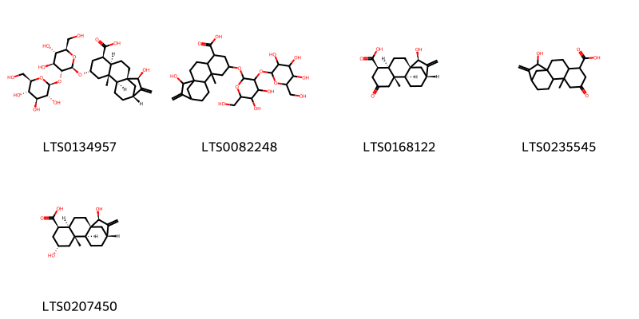{ width=100% }
    <figcaption>Hình ảnh cấu trúc hóa học của 5 hoạt chất thuộc nhóm Prenol lipids gồm ['(1r,4r,5r,7r,9r,10s,13r,15s)-7-{[(2r,3r,4s,5s,6r)-4,5-dihydroxy-6-(hydroxymethyl)-3-{[(2s,3r,4s,5s,6r)-3,4,5-trihydroxy-6-(hydroxymethyl)oxan-2-yl]oxy}oxan-2-yl]oxy}-15-hydroxy-9-methyl-14-methylidenetetracyclo[11.2.1.0¹,¹⁰.0⁴,⁹]hexadecane-5-carboxylic acid (LTS0134957)', '7-{[4,5-dihydroxy-6-(hydroxymethyl)-3-{[3,4,5-trihydroxy-6-(hydroxymethyl)oxan-2-yl]oxy}oxan-2-yl]oxy}-15-hydroxy-9-methyl-14-methylidenetetracyclo[11.2.1.0¹,¹⁰.0⁴,⁹]hexadecane-5-carboxylic acid (LTS0082248)', '(1r,4r,5r,9r,10s,13r,15s)-15-hydroxy-9-methyl-14-methylidene-7-oxotetracyclo[11.2.1.0¹,¹⁰.0⁴,⁹]hexadecane-5-carboxylic acid (LTS0168122)', '15-hydroxy-9-methyl-14-methylidene-7-oxotetracyclo[11.2.1.0¹,¹⁰.0⁴,⁹]hexadecane-5-carboxylic acid (LTS0235545)', '(1r,4r,5r,7r,9r,10s,13r,15s)-7,15-dihydroxy-9-methyl-14-methylidenetetracyclo[11.2.1.0¹,¹⁰.0⁴,⁹]hexadecane-5-carboxylic acid (LTS0207450)'].</figcaption>
</figure>

---

### Dược dân tộc học

Danh sách các quốc gia có sử dụng *Drymaria arenarioides* trong điều trị các bệnh. 

| Country   | Disease   | Bệnh                                                                                                                                                                                                |
|:----------|:----------|:----------------------------------------------------------------------------------------------------------------------------------------------------------------------------------------------------|
| Mexico    | Poison    | MYMEMORY WARNING: YOU USED ALL AVAILABLE FREE TRANSLATIONS FOR TODAY. NEXT AVAILABLE IN  09 HOURS 08 MINUTES 37 SECONDS VISIT HTTPS://MYMEMORY.TRANSLATED.NET/DOC/USAGELIMITS.PHP TO TRANSLATE MORE |

---

---
## Drymaria codata
### Thông tin về thực vật

!!! info "Phân loại thực vật của *N/A* từ GIBF:"
    - **Kingdom:** N/A
    - **Phylum:** N/A
    - **Order:** N/A
    - **Family:** N/A
    - **Genus:** N/A
    - **Species:** *N/A*

 

| Label (VI)   | Label (EN)   | Scientific Name       | Descriptions (VI)   | Descriptions (EN)   | Also Known As (VI)   | Also Known As (EN)   |
|:-------------|:-------------|:----------------------|:--------------------|:--------------------|:---------------------|:---------------------|
| N/A          | N/A          | Drymaria arenarioides | loài thực vật       | species of plant    | ['']                 | ['']                 |

#### Phân bố trên thế giới

**Từ CSDL GIBF** Không có kết quả phù hợp

#### Phân bố tại Việt Nam

**Từ CSDL GIBF**: Không có ghi nhận ở Việt Nam

---
### Thành phần hóa học
        
- Theo cơ sở dữ liệu lotus: Từ loài *N/A* đã phân lập và xác định được Chưa có hoạt chất nào được phân lập. hoạt chất thuộc về các nhóm Không có hoạt chất nào được phân lập. 

Không có hình ảnh nào được tạo ra

---

### Dược dân tộc học

Danh sách các quốc gia có sử dụng *N/A* trong điều trị các bệnh. 

| Country   | Disease            | Bệnh                                                                                                                                                                                                |
|:----------|:-------------------|:----------------------------------------------------------------------------------------------------------------------------------------------------------------------------------------------------|
| Haiti     | Apertif, Stimulant | MYMEMORY WARNING: YOU USED ALL AVAILABLE FREE TRANSLATIONS FOR TODAY. NEXT AVAILABLE IN  09 HOURS 08 MINUTES 10 SECONDS VISIT HTTPS://MYMEMORY.TRANSLATED.NET/DOC/USAGELIMITS.PHP TO TRANSLATE MORE |

---

---
## Drymaria cordata
### Thông tin về thực vật

!!! info "Phân loại thực vật của *Drymaria cordata* từ GIBF:"
    - **Kingdom:** Plantae
    - **Phylum:** Tracheophyta
    - **Order:** Caryophyllales
    - **Family:** Caryophyllaceae
    - **Genus:** Drymaria
    - **Species:** *Drymaria cordata*

 

| Label (VI)   | Label (EN)   | Scientific Name   | Descriptions (VI)   | Descriptions (EN)   | Also Known As (VI)   | Also Known As (EN)   |
|:-------------|:-------------|:------------------|:--------------------|:--------------------|:---------------------|:---------------------|
| N/A          | N/A          | Drymaria cordata  | loài thực vật       | species of plant    | ['']                 | ['']                 |

#### Phân bố trên thế giới

**Từ CSDL GIBF** nan, Brazil, Guatemala, China, Tanzania, United Republic of, Thailand, Puerto Rico, Réunion, United States of America, Colombia, Argentina, French Guiana, Hong Kong, Mexico, Chinese Taipei, South Africa, Australia, Myanmar, India, Bolivia (Plurinational State of)

#### Phân bố tại Việt Nam

**Từ CSDL GIBF**: Không có ghi nhận ở Việt Nam

---
### Thành phần hóa học
        
- Theo cơ sở dữ liệu lotus: Từ loài *Drymaria cordata* đã phân lập và xác định được 30 hoạt chất thuộc về các nhóm Dihydrofurans, Benzene and substituted derivatives, Flavonoids, Steroids and steroid derivatives, Glycerolipids, Organooxygen compounds, Indolonaphthyridine alkaloids, Prenol lipids, Keto acids and derivatives. 

|    | chemicalTaxonomyClassyfireClass     |   smiles_count |
|---:|:------------------------------------|---------------:|
|  0 | Benzene and substituted derivatives |              1 |
|  1 | Dihydrofurans                       |              1 |
|  2 | Flavonoids                          |              5 |
|  3 | Glycerolipids                       |              2 |
|  4 | Indolonaphthyridine alkaloids       |              1 |
|  5 | Keto acids and derivatives          |              1 |
|  6 | Organooxygen compounds              |              1 |
|  7 | Prenol lipids                       |              1 |
|  8 | Steroids and steroid derivatives    |              2 |

#### Nhóm Benzene and substituted derivatives
<figure markdown="span">
    { width=100% }
    <figcaption>Hình ảnh cấu trúc hóa học của 1 hoạt chất thuộc nhóm Benzene and substituted derivatives gồm ['p-hydroxybenzoic acid (LTS0263634)'].</figcaption>
</figure>
#### Nhóm Dihydrofurans
<figure markdown="span">
    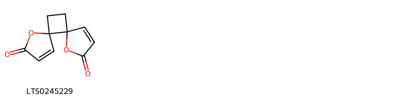{ width=100% }
    <figcaption>Hình ảnh cấu trúc hóa học của 1 hoạt chất thuộc nhóm Dihydrofurans gồm ['anemonin (LTS0245229)'].</figcaption>
</figure>
#### Nhóm Flavonoids
<figure markdown="span">
    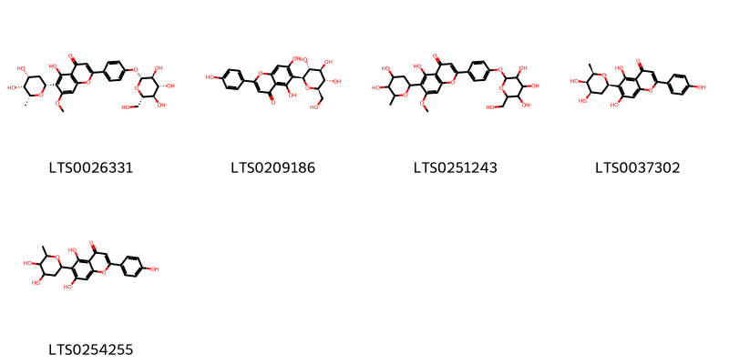{ width=100% }
    <figcaption>Hình ảnh cấu trúc hóa học của 5 hoạt chất thuộc nhóm Flavonoids gồm ['6-[(2r,4r,5r,6r)-4,5-dihydroxy-6-methyloxan-2-yl]-5-hydroxy-7-methoxy-2-(4-{[(2r,3s,4r,5r,6s)-3,4,5-trihydroxy-6-(hydroxymethyl)oxan-2-yl]oxy}phenyl)chromen-4-one (LTS0026331)', 'isovitexin (LTS0209186)', '6-(4,5-dihydroxy-6-methyloxan-2-yl)-5-hydroxy-7-methoxy-2-(4-{[3,4,5-trihydroxy-6-(hydroxymethyl)oxan-2-yl]oxy}phenyl)chromen-4-one (LTS0251243)', '6-[(2r,4r,5r,6r)-4,5-dihydroxy-6-methyloxan-2-yl]-5,7-dihydroxy-2-(4-hydroxyphenyl)chromen-4-one (LTS0037302)', '6-(4,5-dihydroxy-6-methyloxan-2-yl)-5,7-dihydroxy-2-(4-hydroxyphenyl)chromen-4-one (LTS0254255)'].</figcaption>
</figure>
#### Nhóm Glycerolipids
<figure markdown="span">
    { width=100% }
    <figcaption>Hình ảnh cấu trúc hóa học của 2 hoạt chất thuộc nhóm Glycerolipids gồm ['2,3-dihydroxypropyl tetracosanoate (LTS0027049)', '(2r)-2,3-dihydroxypropyl tetracosanoate (LTS0018372)'].</figcaption>
</figure>
#### Nhóm Indolonaphthyridine alkaloids
<figure markdown="span">
    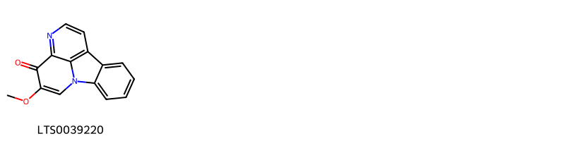{ width=100% }
    <figcaption>Hình ảnh cấu trúc hóa học của 1 hoạt chất thuộc nhóm Indolonaphthyridine alkaloids gồm ['3-methoxy-1,6-diazatetracyclo[7.6.1.0⁵,¹⁶.0¹⁰,¹⁵]hexadeca-2,5,7,9(16),10(15),11,13-heptaen-4-one (LTS0039220)'].</figcaption>
</figure>
#### Nhóm Keto acids and derivatives
<figure markdown="span">
    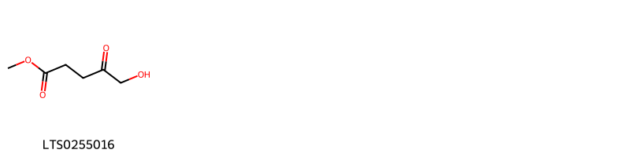{ width=100% }
    <figcaption>Hình ảnh cấu trúc hóa học của 1 hoạt chất thuộc nhóm Keto acids and derivatives gồm ['methyl 5-hydroxy-4-oxopentanoate (LTS0255016)'].</figcaption>
</figure>
#### Nhóm Organooxygen compounds
<figure markdown="span">
    { width=100% }
    <figcaption>Hình ảnh cấu trúc hóa học của 1 hoạt chất thuộc nhóm Organooxygen compounds gồm ['p-hydroxybenzaldehyde (LTS0259836)'].</figcaption>
</figure>
#### Nhóm Prenol lipids
<figure markdown="span">
    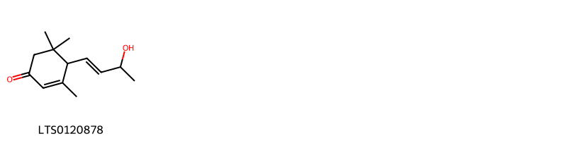{ width=100% }
    <figcaption>Hình ảnh cấu trúc hóa học của 1 hoạt chất thuộc nhóm Prenol lipids gồm ['4-[(1e)-3-hydroxybut-1-en-1-yl]-3,5,5-trimethylcyclohex-2-en-1-one (LTS0120878)'].</figcaption>
</figure>
#### Nhóm Steroids and steroid derivatives
<figure markdown="span">
    { width=100% }
    <figcaption>Hình ảnh cấu trúc hóa học của 2 hoạt chất thuộc nhóm Steroids and steroid derivatives gồm ['(2r,3r,4s,5s,6r)-2-{[(1r,3ar,5as,7s,9as,9br,11ar)-1-[(2r,3e,5s)-5-ethyl-6-methylhept-3-en-2-yl]-9a,11a-dimethyl-1h,2h,3h,3ah,5h,5ah,6h,7h,8h,9h,9bh,10h,11h-cyclopenta[a]phenanthren-7-yl]oxy}-6-(hydroxymethyl)oxane-3,4,5-triol (LTS0179842)', '2-{[1-(5-ethyl-6-methylhept-3-en-2-yl)-9a,11a-dimethyl-1h,2h,3h,3ah,5h,5ah,6h,7h,8h,9h,9bh,10h,11h-cyclopenta[a]phenanthren-7-yl]oxy}-6-(hydroxymethyl)oxane-3,4,5-triol (LTS0274888)'].</figcaption>
</figure>

---

### Dược dân tộc học

Danh sách các quốc gia có sử dụng *Drymaria cordata* trong điều trị các bệnh. 

| Country             | Disease                       | Bệnh                                                                                                                                                                                                |
|:--------------------|:------------------------------|:----------------------------------------------------------------------------------------------------------------------------------------------------------------------------------------------------|
| Haiti               | Apertif, Stimulant, Emollient | MYMEMORY WARNING: YOU USED ALL AVAILABLE FREE TRANSLATIONS FOR TODAY. NEXT AVAILABLE IN  09 HOURS 07 MINUTES 56 SECONDS VISIT HTTPS://MYMEMORY.TRANSLATED.NET/DOC/USAGELIMITS.PHP TO TRANSLATE MORE |
| India               | Laxative                      | MYMEMORY WARNING: YOU USED ALL AVAILABLE FREE TRANSLATIONS FOR TODAY. NEXT AVAILABLE IN  09 HOURS 07 MINUTES 53 SECONDS VISIT HTTPS://MYMEMORY.TRANSLATED.NET/DOC/USAGELIMITS.PHP TO TRANSLATE MORE |
| Philippines(Ifugao) | Poultice                      | MYMEMORY WARNING: YOU USED ALL AVAILABLE FREE TRANSLATIONS FOR TODAY. NEXT AVAILABLE IN  09 HOURS 07 MINUTES 51 SECONDS VISIT HTTPS://MYMEMORY.TRANSLATED.NET/DOC/USAGELIMITS.PHP TO TRANSLATE MORE |
| Sumatra             | Laxative                      | MYMEMORY WARNING: YOU USED ALL AVAILABLE FREE TRANSLATIONS FOR TODAY. NEXT AVAILABLE IN  09 HOURS 07 MINUTES 49 SECONDS VISIT HTTPS://MYMEMORY.TRANSLATED.NET/DOC/USAGELIMITS.PHP TO TRANSLATE MORE |

---

---
## Drymaria pachyphylla
### Thông tin về thực vật

!!! info "Phân loại thực vật của *Drymaria pachyphylla* từ GIBF:"
    - **Kingdom:** Plantae
    - **Phylum:** Tracheophyta
    - **Order:** Caryophyllales
    - **Family:** Caryophyllaceae
    - **Genus:** Drymaria
    - **Species:** *Drymaria pachyphylla*

 

| Label (VI)   | Label (EN)   | Scientific Name      | Descriptions (VI)   | Descriptions (EN)   | Also Known As (VI)   | Also Known As (EN)   |
|:-------------|:-------------|:---------------------|:--------------------|:--------------------|:---------------------|:---------------------|
| N/A          | N/A          | Drymaria pachyphylla |                     | species of plant    | ['']                 | ['']                 |

#### Phân bố trên thế giới

**Từ CSDL GIBF** nan, Mexico, United States of America

#### Phân bố tại Việt Nam

**Từ CSDL GIBF**: Không có ghi nhận ở Việt Nam

---
### Thành phần hóa học
        
- Theo cơ sở dữ liệu lotus: Từ loài *Drymaria pachyphylla* đã phân lập và xác định được Chưa có hoạt chất nào được phân lập. hoạt chất thuộc về các nhóm Không có hoạt chất nào được phân lập. 

Không có hình ảnh nào được tạo ra

---

### Dược dân tộc học

Danh sách các quốc gia có sử dụng *Drymaria pachyphylla* trong điều trị các bệnh. 

| Country   | Disease   | Bệnh                                                                                                                                                                                                |
|:----------|:----------|:----------------------------------------------------------------------------------------------------------------------------------------------------------------------------------------------------|
| US        | Poison    | MYMEMORY WARNING: YOU USED ALL AVAILABLE FREE TRANSLATIONS FOR TODAY. NEXT AVAILABLE IN  09 HOURS 07 MINUTES 16 SECONDS VISIT HTTPS://MYMEMORY.TRANSLATED.NET/DOC/USAGELIMITS.PHP TO TRANSLATE MORE |

---

# Chi Silene

??? note "Danh sách các dược liệu thuộc chi"
    
	 - *Silene conoidea*
	 - *Silene cucubalus*
	 - *Silene gallica*
	 - *Silene griffithii*
	 - *Silene macrosolen*

---
## Silene conoidea
### Thông tin về thực vật

!!! info "Phân loại thực vật của *Silene conoidea* từ GIBF:"
    - **Kingdom:** Plantae
    - **Phylum:** Tracheophyta
    - **Order:** Caryophyllales
    - **Family:** Caryophyllaceae
    - **Genus:** Silene
    - **Species:** *Silene conoidea*

 

| Label (VI)   | Label (EN)   | Scientific Name   | Descriptions (VI)   | Descriptions (EN)   | Also Known As (VI)   | Also Known As (EN)   |
|:-------------|:-------------|:------------------|:--------------------|:--------------------|:---------------------|:---------------------|
| N/A          | N/A          | Silene conoidea   | loài thực vật       | species of plant    | ['']                 | ['']                 |

#### Phân bố trên thế giới

**Từ CSDL GIBF** Japan, Uzbekistan, Sweden, Finland, Åland Islands, China, Israel, Türkiye, Spain, United States of America, Korea, Republic of, Iran (Islamic Republic of), Armenia, Pakistan, Azerbaijan, Norway, Belgium, Palestine, State of, Iraq, Georgia, Canada, Germany, Syrian Arab Republic, Turkmenistan, Austria, Tajikistan, Kyrgyzstan, Oman, India, Jordan, France

#### Phân bố tại Việt Nam

**Từ CSDL GIBF**: Không có ghi nhận ở Việt Nam

---
### Thành phần hóa học
        
- Theo cơ sở dữ liệu lotus: Từ loài *Silene conoidea* đã phân lập và xác định được 4 hoạt chất thuộc về các nhóm Fatty Acyls, Organooxygen compounds, Steroids and steroid derivatives, Flavonoids. 

|    | chemicalTaxonomyClassyfireClass   |   smiles_count |
|---:|:----------------------------------|---------------:|
|  0 | Fatty Acyls                       |              1 |
|  1 | Flavonoids                        |              1 |
|  2 | Organooxygen compounds            |              1 |
|  3 | Steroids and steroid derivatives  |              1 |

#### Nhóm Fatty Acyls
<figure markdown="span">
    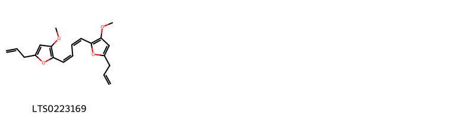{ width=100% }
    <figcaption>Hình ảnh cấu trúc hóa học của 1 hoạt chất thuộc nhóm Fatty Acyls gồm ['3-methoxy-2-[(1z,3z)-4-[3-methoxy-5-(prop-2-en-1-yl)furan-2-yl]buta-1,3-dien-1-yl]-5-(prop-2-en-1-yl)furan (LTS0223169)'].</figcaption>
</figure>
#### Nhóm Flavonoids
<figure markdown="span">
    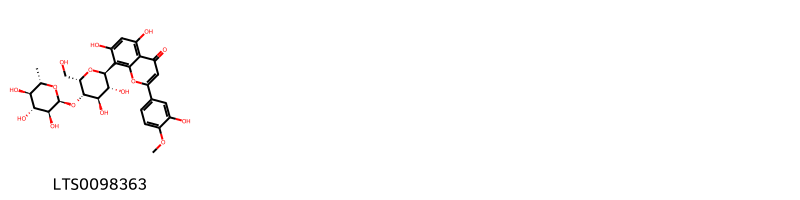{ width=100% }
    <figcaption>Hình ảnh cấu trúc hóa học của 1 hoạt chất thuộc nhóm Flavonoids gồm ['8-[(2s,3r,4r,5s,6s)-3,4-dihydroxy-6-(hydroxymethyl)-5-{[(2s,3s,4r,5r,6s)-3,4,5-trihydroxy-6-methyloxan-2-yl]oxy}oxan-2-yl]-5,7-dihydroxy-2-(3-hydroxy-4-methoxyphenyl)chromen-4-one (LTS0098363)'].</figcaption>
</figure>
#### Nhóm Organooxygen compounds
<figure markdown="span">
    { width=100% }
    <figcaption>Hình ảnh cấu trúc hóa học của 1 hoạt chất thuộc nhóm Organooxygen compounds gồm ['sucrose (LTS0272557)'].</figcaption>
</figure>
#### Nhóm Steroids and steroid derivatives
<figure markdown="span">
    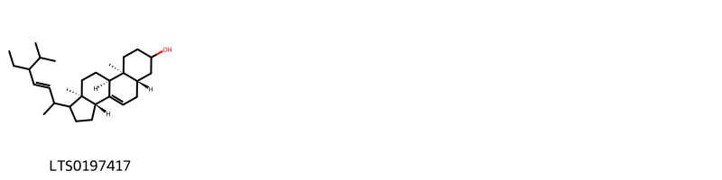{ width=100% }
    <figcaption>Hình ảnh cấu trúc hóa học của 1 hoạt chất thuộc nhóm Steroids and steroid derivatives gồm ['(3ar,5as,9as,9bs,11ar)-1-(5-ethyl-6-methylhept-3-en-2-yl)-9a,11a-dimethyl-1h,2h,3h,3ah,5h,5ah,6h,7h,8h,9h,9bh,10h,11h-cyclopenta[a]phenanthren-7-ol (LTS0197417)'].</figcaption>
</figure>

---

### Dược dân tộc học

Danh sách các quốc gia có sử dụng *Silene conoidea* trong điều trị các bệnh. 

| Country   | Disease             | Bệnh                                                                                                                                                                                                |
|:----------|:--------------------|:----------------------------------------------------------------------------------------------------------------------------------------------------------------------------------------------------|
| Elsewhere | Emollient, Fumigant | MYMEMORY WARNING: YOU USED ALL AVAILABLE FREE TRANSLATIONS FOR TODAY. NEXT AVAILABLE IN  09 HOURS 06 MINUTES 52 SECONDS VISIT HTTPS://MYMEMORY.TRANSLATED.NET/DOC/USAGELIMITS.PHP TO TRANSLATE MORE |

---

---
## Silene cucubalus
### Thông tin về thực vật

!!! info "Phân loại thực vật của *Silene vulgaris* từ GIBF:"
    - **Kingdom:** Plantae
    - **Phylum:** Tracheophyta
    - **Order:** Caryophyllales
    - **Family:** Caryophyllaceae
    - **Genus:** Silene
    - **Species:** *Silene vulgaris*

 

| Label (VI)   | Label (EN)   | Scientific Name   | Descriptions (VI)   | Descriptions (EN)   | Also Known As (VI)   | Also Known As (EN)   |
|:-------------|:-------------|:------------------|:--------------------|:--------------------|:---------------------|:---------------------|
| N/A          | N/A          | Silene cucubalus  |                     | species of plants   | ['']                 | ['']                 |

#### Phân bố trên thế giới

**Từ CSDL GIBF** Czechia, Finland, Israel, Türkiye, Spain, Denmark, Netherlands, United States of America, Greece, Estonia, Morocco, France, Georgia, Canada, Germany, Austria, Greenland, Portugal, Latvia, Slovakia, Italy, Switzerland, Bulgaria, United Kingdom of Great Britain and Northern Ireland

#### Phân bố tại Việt Nam

**Từ CSDL GIBF**: Không có ghi nhận ở Việt Nam

---
### Thành phần hóa học
        
- Theo cơ sở dữ liệu lotus: Từ loài *Silene vulgaris* đã phân lập và xác định được Chưa có hoạt chất nào được phân lập. hoạt chất thuộc về các nhóm Không có hoạt chất nào được phân lập. 

Không có hình ảnh nào được tạo ra

---

### Dược dân tộc học

Danh sách các quốc gia có sử dụng *Silene vulgaris* trong điều trị các bệnh. 

| Country   | Disease             | Bệnh                                                                                                                                                                                                |
|:----------|:--------------------|:----------------------------------------------------------------------------------------------------------------------------------------------------------------------------------------------------|
| Elsewhere | Emollient, Fumigant | MYMEMORY WARNING: YOU USED ALL AVAILABLE FREE TRANSLATIONS FOR TODAY. NEXT AVAILABLE IN  09 HOURS 06 MINUTES 24 SECONDS VISIT HTTPS://MYMEMORY.TRANSLATED.NET/DOC/USAGELIMITS.PHP TO TRANSLATE MORE |

---

---
## Silene gallica
### Thông tin về thực vật

!!! info "Phân loại thực vật của *Silene gallica* từ GIBF:"
    - **Kingdom:** Plantae
    - **Phylum:** Tracheophyta
    - **Order:** Caryophyllales
    - **Family:** Caryophyllaceae
    - **Genus:** Silene
    - **Species:** *Silene gallica*

 

| Label (VI)   | Label (EN)   | Scientific Name   | Descriptions (VI)   | Descriptions (EN)   | Also Known As (VI)   | Also Known As (EN)          |
|:-------------|:-------------|:------------------|:--------------------|:--------------------|:---------------------|:----------------------------|
| N/A          | N/A          | Silene gallica    | loài thực vật       | species of plant    | ['']                 | ['Small-flowered catchfly'] |

#### Phân bố trên thế giới

**Từ CSDL GIBF** Japan, Israel, Chile, New Zealand, Ecuador, Spain, United States of America, Greece, Argentina, Morocco, Mexico, Algeria, United Kingdom of Great Britain and Northern Ireland, Canada, Portugal, South Africa, Australia, Italy, Peru, France

#### Phân bố tại Việt Nam

**Từ CSDL GIBF**: Không có ghi nhận ở Việt Nam

---
### Thành phần hóa học
        
- Theo cơ sở dữ liệu lotus: Từ loài *Silene gallica* đã phân lập và xác định được 20 hoạt chất thuộc về các nhóm Fatty Acyls, Saccharolipids. 

|    | chemicalTaxonomyClassyfireClass   |   smiles_count |
|---:|:----------------------------------|---------------:|
|  0 | Fatty Acyls                       |             19 |
|  1 | Saccharolipids                    |              1 |

#### Nhóm Fatty Acyls
<figure markdown="span">
    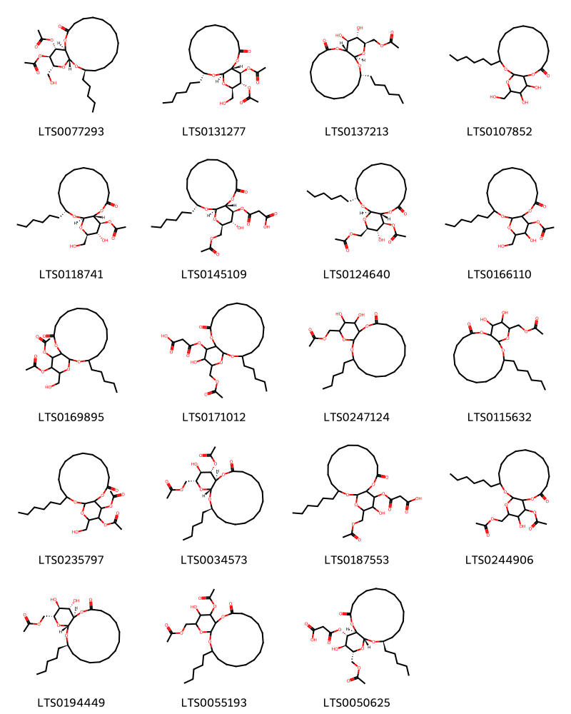{ width=100% }
    <figcaption>Hình ảnh cấu trúc hóa học của 19 hoạt chất thuộc nhóm Fatty Acyls gồm ['(2r,3r,4s,4ar,18r,19ar)-3-(acetyloxy)-2-(hydroxymethyl)-6-oxo-18-pentyl-hexadecahydro-2h-pyrano[2,3-b]1,4-dioxacycloheptadecan-4-yl acetate (LTS0077293)', '(2r,3r,4s,4ar,17r,18ar)-3-(acetyloxy)-17-hexyl-2-(hydroxymethyl)-6-oxo-hexadecahydropyrano[2,3-b]1,4-dioxacyclohexadecan-4-yl acetate (LTS0131277)', '[(2r,3s,4s,4ar,17r,18ar)-17-hexyl-3,4-dihydroxy-6-oxo-hexadecahydropyrano[2,3-b]1,4-dioxacyclohexadecan-2-yl]methyl acetate (LTS0137213)', '17-hexyl-3,4-dihydroxy-2-(hydroxymethyl)-hexadecahydropyrano[2,3-b]1,4-dioxacyclohexadecan-6-one (LTS0107852)', '(2r,3r,4s,4ar,17r,18ar)-17-hexyl-3-hydroxy-2-(hydroxymethyl)-6-oxo-hexadecahydropyrano[2,3-b]1,4-dioxacyclohexadecan-4-yl acetate (LTS0118741)', '3-{[(2r,3r,4s,4ar,17r,18ar)-2-[(acetyloxy)methyl]-17-hexyl-3-hydroxy-6-oxo-hexadecahydropyrano[2,3-b]1,4-dioxacyclohexadecan-4-yl]oxy}-3-oxopropanoic acid (LTS0145109)', '[(2r,3r,4s,4ar,17r,18ar)-4-(acetyloxy)-17-hexyl-3-hydroxy-6-oxo-hexadecahydropyrano[2,3-b]1,4-dioxacyclohexadecan-2-yl]methyl acetate (LTS0124640)', '17-hexyl-3-hydroxy-2-(hydroxymethyl)-6-oxo-hexadecahydropyrano[2,3-b]1,4-dioxacyclohexadecan-4-yl acetate (LTS0166110)', '4-(acetyloxy)-2-(hydroxymethyl)-6-oxo-18-pentyl-hexadecahydro-2h-pyrano[2,3-b]1,4-dioxacycloheptadecan-3-yl acetate (LTS0169895)', '3-({2-[(acetyloxy)methyl]-3-hydroxy-6-oxo-18-pentyl-hexadecahydro-2h-pyrano[2,3-b]1,4-dioxacycloheptadecan-4-yl}oxy)-3-oxopropanoic acid (LTS0171012)', '{3,4-dihydroxy-6-oxo-18-pentyl-hexadecahydro-2h-pyrano[2,3-b]1,4-dioxacycloheptadecan-2-yl}methyl acetate (LTS0247124)', '{17-hexyl-3,4-dihydroxy-6-oxo-hexadecahydropyrano[2,3-b]1,4-dioxacyclohexadecan-2-yl}methyl acetate (LTS0115632)', '4-(acetyloxy)-17-hexyl-2-(hydroxymethyl)-6-oxo-hexadecahydropyrano[2,3-b]1,4-dioxacyclohexadecan-3-yl acetate (LTS0235797)', '[(2r,3r,4s,4ar,18r,19ar)-4-(acetyloxy)-3-hydroxy-6-oxo-18-pentyl-hexadecahydro-2h-pyrano[2,3-b]1,4-dioxacycloheptadecan-2-yl]methyl acetate (LTS0034573)', '3-({2-[(acetyloxy)methyl]-17-hexyl-3-hydroxy-6-oxo-hexadecahydropyrano[2,3-b]1,4-dioxacyclohexadecan-4-yl}oxy)-3-oxopropanoic acid (LTS0187553)', '[4-(acetyloxy)-17-hexyl-3-hydroxy-6-oxo-hexadecahydropyrano[2,3-b]1,4-dioxacyclohexadecan-2-yl]methyl acetate (LTS0244906)', '[(2r,3s,4s,4ar,18r,19ar)-3,4-dihydroxy-6-oxo-18-pentyl-hexadecahydro-2h-pyrano[2,3-b]1,4-dioxacycloheptadecan-2-yl]methyl acetate (LTS0194449)', '[4-(acetyloxy)-3-hydroxy-6-oxo-18-pentyl-hexadecahydro-2h-pyrano[2,3-b]1,4-dioxacycloheptadecan-2-yl]methyl acetate (LTS0055193)', '3-{[(2r,3r,4s,4ar,18r,19ar)-2-[(acetyloxy)methyl]-3-hydroxy-6-oxo-18-pentyl-hexadecahydro-2h-pyrano[2,3-b]1,4-dioxacycloheptadecan-4-yl]oxy}-3-oxopropanoic acid (LTS0050625)'].</figcaption>
</figure>
#### Nhóm Saccharolipids
<figure markdown="span">
    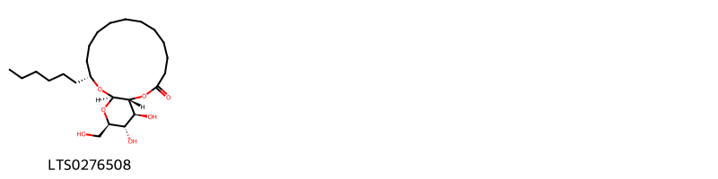{ width=100% }
    <figcaption>Hình ảnh cấu trúc hóa học của 1 hoạt chất thuộc nhóm Saccharolipids gồm ['(2r,3s,4s,4ar,17r,18ar)-17-hexyl-3,4-dihydroxy-2-(hydroxymethyl)-hexadecahydropyrano[2,3-b]1,4-dioxacyclohexadecan-6-one (LTS0276508)'].</figcaption>
</figure>

---

### Dược dân tộc học

Danh sách các quốc gia có sử dụng *Silene gallica* trong điều trị các bệnh. 

| Country   | Disease             | Bệnh                                                                                                                                                                                                |
|:----------|:--------------------|:----------------------------------------------------------------------------------------------------------------------------------------------------------------------------------------------------|
| Elsewhere | Emollient, Fumigant | MYMEMORY WARNING: YOU USED ALL AVAILABLE FREE TRANSLATIONS FOR TODAY. NEXT AVAILABLE IN  09 HOURS 06 MINUTES 01 SECONDS VISIT HTTPS://MYMEMORY.TRANSLATED.NET/DOC/USAGELIMITS.PHP TO TRANSLATE MORE |

---

---
## Silene griffithii
### Thông tin về thực vật

!!! info "Phân loại thực vật của *Silene viscosa* từ GIBF:"
    - **Kingdom:** Plantae
    - **Phylum:** Tracheophyta
    - **Order:** Caryophyllales
    - **Family:** Caryophyllaceae
    - **Genus:** Silene
    - **Species:** *Silene viscosa*

 

| Label (VI)   | Label (EN)   | Scientific Name   | Descriptions (VI)   | Descriptions (EN)   | Also Known As (VI)   | Also Known As (EN)          |
|:-------------|:-------------|:------------------|:--------------------|:--------------------|:---------------------|:----------------------------|
| N/A          | N/A          | Silene gallica    | loài thực vật       | species of plant    | ['']                 | ['Small-flowered catchfly'] |

#### Phân bố trên thế giới

**Từ CSDL GIBF** Japan, Israel, Chile, New Zealand, Ecuador, Spain, United States of America, Greece, Argentina, Morocco, Mexico, Algeria, United Kingdom of Great Britain and Northern Ireland, Canada, Portugal, South Africa, Australia, Italy, Peru, France

#### Phân bố tại Việt Nam

**Từ CSDL GIBF**: Không có ghi nhận ở Việt Nam

---
### Thành phần hóa học
        
- Theo cơ sở dữ liệu lotus: Từ loài *Silene viscosa* đã phân lập và xác định được Chưa có hoạt chất nào được phân lập. hoạt chất thuộc về các nhóm Không có hoạt chất nào được phân lập. 

Không có hình ảnh nào được tạo ra

---

### Dược dân tộc học

Danh sách các quốc gia có sử dụng *Silene viscosa* trong điều trị các bệnh. 

| Country   | Disease   | Bệnh                                                                                                                                                                                                |
|:----------|:----------|:----------------------------------------------------------------------------------------------------------------------------------------------------------------------------------------------------|
| Elsewhere | Soap      | MYMEMORY WARNING: YOU USED ALL AVAILABLE FREE TRANSLATIONS FOR TODAY. NEXT AVAILABLE IN  09 HOURS 05 MINUTES 34 SECONDS VISIT HTTPS://MYMEMORY.TRANSLATED.NET/DOC/USAGELIMITS.PHP TO TRANSLATE MORE |

---

---
## Silene macrosolen
### Thông tin về thực vật

!!! info "Phân loại thực vật của *Silene macrosolen* từ GIBF:"
    - **Kingdom:** Plantae
    - **Phylum:** Tracheophyta
    - **Order:** Caryophyllales
    - **Family:** Caryophyllaceae
    - **Genus:** Silene
    - **Species:** *Silene macrosolen*

 

| Label (VI)   | Label (EN)   | Scientific Name   | Descriptions (VI)   | Descriptions (EN)   | Also Known As (VI)   | Also Known As (EN)   |
|:-------------|:-------------|:------------------|:--------------------|:--------------------|:---------------------|:---------------------|
| N/A          | N/A          | Silene macrosolen | loài thực vật       | species of plant    | ['']                 | ['']                 |

#### Phân bố trên thế giới

**Từ CSDL GIBF** nan, Kenya, Saudi Arabia, Tanzania, United Republic of, unknown or invalid, Yemen, Ethiopia, Sudan

#### Phân bố tại Việt Nam

**Từ CSDL GIBF**: Không có ghi nhận ở Việt Nam

---
### Thành phần hóa học
        
- Theo cơ sở dữ liệu lotus: Từ loài *Silene macrosolen* đã phân lập và xác định được Chưa có hoạt chất nào được phân lập. hoạt chất thuộc về các nhóm Không có hoạt chất nào được phân lập. 

Không có hình ảnh nào được tạo ra

---

### Dược dân tộc học

Danh sách các quốc gia có sử dụng *Silene macrosolen* trong điều trị các bệnh. 

| Country   | Disease   | Bệnh                                                                                                                                                                                                |
|:----------|:----------|:----------------------------------------------------------------------------------------------------------------------------------------------------------------------------------------------------|
| Ethiopia  | Vermifuge | MYMEMORY WARNING: YOU USED ALL AVAILABLE FREE TRANSLATIONS FOR TODAY. NEXT AVAILABLE IN  09 HOURS 05 MINUTES 17 SECONDS VISIT HTTPS://MYMEMORY.TRANSLATED.NET/DOC/USAGELIMITS.PHP TO TRANSLATE MORE |

---

# Chi ergularia

??? note "Danh sách các dược liệu thuộc chi"
    
	 - *ergularia rubra*

---
## ergularia rubra
### Thông tin về thực vật

!!! info "Phân loại thực vật của *N/A* từ GIBF:"
    - **Kingdom:** N/A
    - **Phylum:** N/A
    - **Order:** N/A
    - **Family:** N/A
    - **Genus:** N/A
    - **Species:** *N/A*

 

| Label (VI)   | Label (EN)   | Scientific Name   | Descriptions (VI)   | Descriptions (EN)   | Also Known As (VI)   | Also Known As (EN)   |
|:-------------|:-------------|:------------------|:--------------------|:--------------------|:---------------------|:---------------------|
| N/A          | N/A          | Silene macrosolen | loài thực vật       | species of plant    | ['']                 | ['']                 |

#### Phân bố trên thế giới

**Từ CSDL GIBF** Không có kết quả phù hợp

#### Phân bố tại Việt Nam

**Từ CSDL GIBF**: Không có ghi nhận ở Việt Nam

---
### Thành phần hóa học
        
- Theo cơ sở dữ liệu lotus: Từ loài *N/A* đã phân lập và xác định được Chưa có hoạt chất nào được phân lập. hoạt chất thuộc về các nhóm Không có hoạt chất nào được phân lập. 

Không có hình ảnh nào được tạo ra

---

### Dược dân tộc học

Danh sách các quốc gia có sử dụng *N/A* trong điều trị các bệnh. 

| Country   | Disease                        | Bệnh                                                                                                                                                                                                |
|:----------|:-------------------------------|:----------------------------------------------------------------------------------------------------------------------------------------------------------------------------------------------------|
| Iraq      | Sedative, Diuretic, Antiseptic | MYMEMORY WARNING: YOU USED ALL AVAILABLE FREE TRANSLATIONS FOR TODAY. NEXT AVAILABLE IN  09 HOURS 04 MINUTES 46 SECONDS VISIT HTTPS://MYMEMORY.TRANSLATED.NET/DOC/USAGELIMITS.PHP TO TRANSLATE MORE |
| ain       | Diuretic                       | MYMEMORY WARNING: YOU USED ALL AVAILABLE FREE TRANSLATIONS FOR TODAY. NEXT AVAILABLE IN  09 HOURS 04 MINUTES 40 SECONDS VISIT HTTPS://MYMEMORY.TRANSLATED.NET/DOC/USAGELIMITS.PHP TO TRANSLATE MORE |

---

# Chi Gypsophila

??? note "Danh sách các dược liệu thuộc chi"
    
	 - *Gypsophila arrostii*
	 - *Gypsophila paniculata*
	 - *Gypsophila struthium*

---
## Gypsophila arrostii
### Thông tin về thực vật

!!! info "Phân loại thực vật của *Gypsophila arrostii* từ GIBF:"
    - **Kingdom:** Plantae
    - **Phylum:** Tracheophyta
    - **Order:** Caryophyllales
    - **Family:** Caryophyllaceae
    - **Genus:** Gypsophila
    - **Species:** *Gypsophila arrostii*

 

| Label (VI)   | Label (EN)   | Scientific Name     | Descriptions (VI)   | Descriptions (EN)   | Also Known As (VI)   | Also Known As (EN)   |
|:-------------|:-------------|:--------------------|:--------------------|:--------------------|:---------------------|:---------------------|
| N/A          | N/A          | Gypsophila arrostii | loài thực vật       | species of plant    | ['']                 | ['']                 |

#### Phân bố trên thế giới

**Từ CSDL GIBF** nan, Italy, Türkiye, unknown or invalid

#### Phân bố tại Việt Nam

**Từ CSDL GIBF**: Không có ghi nhận ở Việt Nam

---
### Thành phần hóa học
        
- Theo cơ sở dữ liệu lotus: Từ loài *Gypsophila arrostii* đã phân lập và xác định được 2 hoạt chất thuộc về các nhóm Prenol lipids. 

|    | chemicalTaxonomyClassyfireClass   |   smiles_count |
|---:|:----------------------------------|---------------:|
|  0 | Prenol lipids                     |              2 |

#### Nhóm Prenol lipids
<figure markdown="span">
    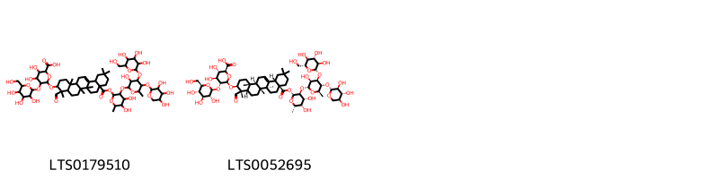{ width=100% }
    <figcaption>Hình ảnh cấu trúc hóa học của 2 hoạt chất thuộc nhóm Prenol lipids gồm ['6-({8a-[({4,5-dihydroxy-3-[(3-hydroxy-6-methyl-4-{[3,4,5-trihydroxy-6-(hydroxymethyl)oxan-2-yl]oxy}-5-[(3,4,5-trihydroxyoxan-2-yl)oxy]oxan-2-yl)oxy]-6-methyloxan-2-yl}oxy)carbonyl]-4-formyl-4,6a,6b,11,11,14b-hexamethyl-1,2,3,4a,5,6,7,8,9,10,12,12a,14,14a-tetradecahydropicen-3-yl}oxy)-3,4-dihydroxy-5-{[3,4,5-trihydroxy-6-(hydroxymethyl)oxan-2-yl]oxy}oxane-2-carboxylic acid (LTS0179510)', '(2s,3s,4s,5r,6r)-6-{[(3s,4s,4as,6ar,6bs,8as,12as,14ar,14br)-8a-({[(2r,3s,4r,5s,6s)-4,5-dihydroxy-3-{[(2r,3s,4r,5r,6r)-3-hydroxy-6-methyl-4-{[(2s,3r,4s,5s,6r)-3,4,5-trihydroxy-6-(hydroxymethyl)oxan-2-yl]oxy}-5-{[(2r,3s,4r,5s)-3,4,5-trihydroxyoxan-2-yl]oxy}oxan-2-yl]oxy}-6-methyloxan-2-yl]oxy}carbonyl)-4-formyl-4,6a,6b,11,11,14b-hexamethyl-1,2,3,4a,5,6,7,8,9,10,12,12a,14,14a-tetradecahydropicen-3-yl]oxy}-3,4-dihydroxy-5-{[(2s,3r,4s,5s,6r)-3,4,5-trihydroxy-6-(hydroxymethyl)oxan-2-yl]oxy}oxane-2-carboxylic acid (LTS0052695)'].</figcaption>
</figure>

---

### Dược dân tộc học

Danh sách các quốc gia có sử dụng *Gypsophila arrostii* trong điều trị các bệnh. 

| Country   | Disease               | Bệnh                                                                                                                                                                                                |
|:----------|:----------------------|:----------------------------------------------------------------------------------------------------------------------------------------------------------------------------------------------------|
| Italy     | Diuretic, Diaphoretic | MYMEMORY WARNING: YOU USED ALL AVAILABLE FREE TRANSLATIONS FOR TODAY. NEXT AVAILABLE IN  09 HOURS 04 MINUTES 27 SECONDS VISIT HTTPS://MYMEMORY.TRANSLATED.NET/DOC/USAGELIMITS.PHP TO TRANSLATE MORE |

---

---
## Gypsophila paniculata
### Thông tin về thực vật

!!! info "Phân loại thực vật của *Gypsophila paniculata* từ GIBF:"
    - **Kingdom:** Plantae
    - **Phylum:** Tracheophyta
    - **Order:** Caryophyllales
    - **Family:** Caryophyllaceae
    - **Genus:** Gypsophila
    - **Species:** *Gypsophila paniculata*

 

| Label (VI)   | Label (EN)   | Scientific Name       | Descriptions (VI)   | Descriptions (EN)   | Also Known As (VI)   | Also Known As (EN)                                               |
|:-------------|:-------------|:----------------------|:--------------------|:--------------------|:---------------------|:-----------------------------------------------------------------|
| N/A          | N/A          | Gypsophila paniculata |                     | species of plant    | ['']                 | ["baby's breath", 'common gypsophila', "panicled baby's-breath"] |

#### Phân bố trên thế giới

**Từ CSDL GIBF** Austria, Hungary, United States of America, Czechia, Mongolia, Sweden, Iran (Islamic Republic of), Belgium, Ukraine, Russian Federation, Kazakhstan, Canada, Germany, Lithuania, Poland

#### Phân bố tại Việt Nam

**Từ CSDL GIBF**: Không có ghi nhận ở Việt Nam

---
### Thành phần hóa học
        
- Theo cơ sở dữ liệu lotus: Từ loài *Gypsophila paniculata* đã phân lập và xác định được 18 hoạt chất thuộc về các nhóm Prenol lipids, Flavonoids. 

|    | chemicalTaxonomyClassyfireClass   |   smiles_count |
|---:|:----------------------------------|---------------:|
|  0 | Flavonoids                        |              6 |
|  1 | Prenol lipids                     |             12 |

#### Nhóm Flavonoids
<figure markdown="span">
    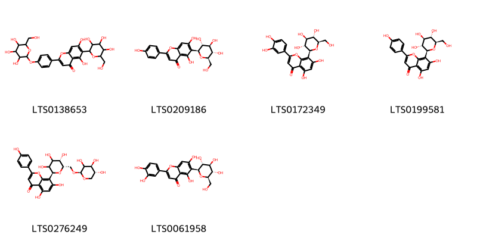{ width=100% }
    <figcaption>Hình ảnh cấu trúc hóa học của 6 hoạt chất thuộc nhóm Flavonoids gồm ['5,7-dihydroxy-6-[3,4,5-trihydroxy-6-(hydroxymethyl)oxan-2-yl]-2-(4-{[3,4,5-trihydroxy-6-(hydroxymethyl)oxan-2-yl]oxy}phenyl)chromen-4-one (LTS0138653)', 'isovitexin (LTS0209186)', 'orientin (LTS0172349)', 'vitexin (LTS0199581)', 'cachimoside (LTS0276249)', 'isoorientin (LTS0061958)'].</figcaption>
</figure>
#### Nhóm Prenol lipids
<figure markdown="span">
    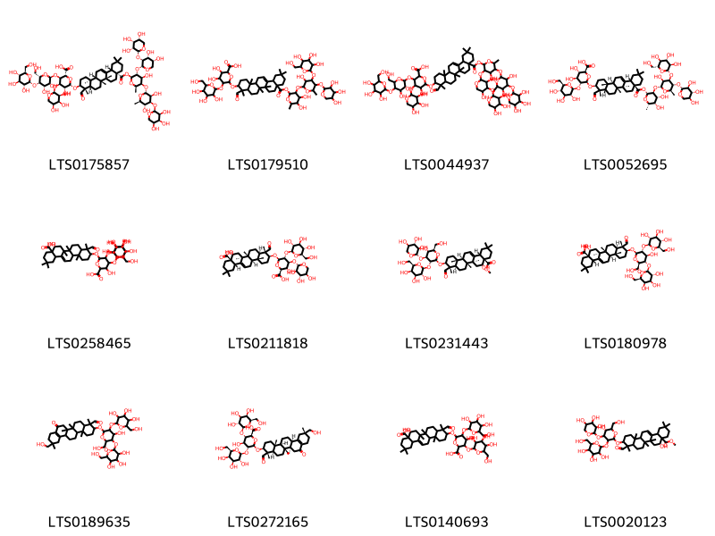{ width=100% }
    <figcaption>Hình ảnh cấu trúc hóa học của 12 hoạt chất thuộc nhóm Prenol lipids gồm ['(2r,3r,4r,5r,6s)-6-{[(3s,4s,4as,6ar,6br,8ar,12as,14as,14bs)-8a-({[(2s,3r,4s,5r,6r)-3-{[(2r,3r,4r,5r)-4,5-dihydroxy-3-{[(2r,3r,4r,5r)-3,4,5-trihydroxyoxan-2-yl]oxy}oxan-2-yl]oxy}-5-{[(2r,3s,4s,5r,6r)-3,5-dihydroxy-6-methyl-4-{[(2s,3s,4s,5s)-3,4,5-trihydroxyoxan-2-yl]oxy}oxan-2-yl]oxy}-4-hydroxy-6-methyloxan-2-yl]oxy}carbonyl)-4-formyl-4,6a,6b,11,11,14b-hexamethyl-1,2,3,4a,5,6,7,8,9,10,12,12a,14,14a-tetradecahydropicen-3-yl]oxy}-3-{[(2s,3s,4s,5s,6s)-3,4-dihydroxy-6-(hydroxymethyl)-5-{[(2r,3r,4s,5s,6r)-3,4,5-trihydroxy-6-(hydroxymethyl)oxan-2-yl]oxy}oxan-2-yl]oxy}-5-hydroxy-4-{[(2s,3s,4s,5s)-3,4,5-trihydroxyoxan-2-yl]oxy}oxane-2-carboxylic acid (LTS0175857)', '6-({8a-[({4,5-dihydroxy-3-[(3-hydroxy-6-methyl-4-{[3,4,5-trihydroxy-6-(hydroxymethyl)oxan-2-yl]oxy}-5-[(3,4,5-trihydroxyoxan-2-yl)oxy]oxan-2-yl)oxy]-6-methyloxan-2-yl}oxy)carbonyl]-4-formyl-4,6a,6b,11,11,14b-hexamethyl-1,2,3,4a,5,6,7,8,9,10,12,12a,14,14a-tetradecahydropicen-3-yl}oxy)-3,4-dihydroxy-5-{[3,4,5-trihydroxy-6-(hydroxymethyl)oxan-2-yl]oxy}oxane-2-carboxylic acid (LTS0179510)', '6-{[8a-({[3-({3,5-dihydroxy-4-[(3,4,5-trihydroxyoxan-2-yl)oxy]oxan-2-yl}oxy)-5-({3,5-dihydroxy-6-methyl-4-[(3,4,5-trihydroxyoxan-2-yl)oxy]oxan-2-yl}oxy)-4-hydroxy-6-methyloxan-2-yl]oxy}carbonyl)-4-formyl-4,6a,6b,11,11,14b-hexamethyl-1,2,3,4a,5,6,7,8,9,10,12,12a,14,14a-tetradecahydropicen-3-yl]oxy}-3-{[3,4-dihydroxy-6-(hydroxymethyl)-5-{[3,4,5-trihydroxy-6-(hydroxymethyl)oxan-2-yl]oxy}oxan-2-yl]oxy}-5-hydroxy-4-[(3,4,5-trihydroxyoxan-2-yl)oxy]oxane-2-carboxylic acid (LTS0044937)', '(2s,3s,4s,5r,6r)-6-{[(3s,4s,4as,6ar,6bs,8as,12as,14ar,14br)-8a-({[(2r,3s,4r,5s,6s)-4,5-dihydroxy-3-{[(2r,3s,4r,5r,6r)-3-hydroxy-6-methyl-4-{[(2s,3r,4s,5s,6r)-3,4,5-trihydroxy-6-(hydroxymethyl)oxan-2-yl]oxy}-5-{[(2r,3s,4r,5s)-3,4,5-trihydroxyoxan-2-yl]oxy}oxan-2-yl]oxy}-6-methyloxan-2-yl]oxy}carbonyl)-4-formyl-4,6a,6b,11,11,14b-hexamethyl-1,2,3,4a,5,6,7,8,9,10,12,12a,14,14a-tetradecahydropicen-3-yl]oxy}-3,4-dihydroxy-5-{[(2s,3r,4s,5s,6r)-3,4,5-trihydroxy-6-(hydroxymethyl)oxan-2-yl]oxy}oxane-2-carboxylic acid (LTS0052695)', '6-[(8a-carboxy-4-formyl-8-hydroxy-4,6a,6b,11,11,14b-hexamethyl-1,2,3,4a,5,6,7,8,9,10,12,12a,14,14a-tetradecahydropicen-3-yl)oxy]-3-hydroxy-5-{[3,4,5-trihydroxy-6-(hydroxymethyl)oxan-2-yl]oxy}-4-[(3,4,5-trihydroxyoxan-2-yl)oxy]oxane-2-carboxylic acid (LTS0258465)', '(2s,3s,4s,5r,6r)-6-{[(3s,4s,4ar,6ar,6bs,8r,8ar,12as,14ar,14br)-8a-carboxy-4-formyl-8-hydroxy-4,6a,6b,11,11,14b-hexamethyl-1,2,3,4a,5,6,7,8,9,10,12,12a,14,14a-tetradecahydropicen-3-yl]oxy}-3-hydroxy-5-{[(2s,3r,4s,5s,6r)-3,4,5-trihydroxy-6-(hydroxymethyl)oxan-2-yl]oxy}-4-{[(2s,3r,4s,5r)-3,4,5-trihydroxyoxan-2-yl]oxy}oxane-2-carboxylic acid (LTS0211818)', 'methyl (4ar,5r,6as,6br,8ar,9s,10s,12ar,12br,14bs)-9-formyl-5-hydroxy-10-{[(2r,3r,4s,5r,6r)-5-hydroxy-6-(hydroxymethyl)-3-{[(2s,3r,4s,5r,6r)-3,4,5-trihydroxy-6-(hydroxymethyl)oxan-2-yl]oxy}-4-{[(2s,3r,4s,5r)-3,4,5-trihydroxyoxan-2-yl]oxy}oxan-2-yl]oxy}-2,2,6a,6b,9,12a-hexamethyl-1,3,4,5,6,7,8,8a,10,11,12,12b,13,14b-tetradecahydropicene-4a-carboxylate (LTS0231443)', '(2s,3s,4s,5r,6r)-6-{[(3s,4s,4ar,6ar,6bs,8r,8ar,12as,14ar,14br)-8a-carboxy-4-formyl-8-hydroxy-4,6a,6b,11,11,14b-hexamethyl-1,2,3,4a,5,6,7,8,9,10,12,12a,14,14a-tetradecahydropicen-3-yl]oxy}-4-hydroxy-3-{[(2s,3r,4s,5r,6r)-3,4,5-trihydroxy-6-(hydroxymethyl)oxan-2-yl]oxy}-5-{[(2s,3r,4s,5s,6r)-3,4,5-trihydroxy-6-(hydroxymethyl)oxan-2-yl]oxy}oxane-2-carboxylic acid (LTS0180978)', '6-{[4-formyl-11-(hydroxymethyl)-4,6a,6b,11,14b-pentamethyl-8-oxo-1,2,3,4a,5,6,7,9,10,12,12b,13,14,14a-tetradecahydropicen-3-yl]oxy}-4-hydroxy-3,5-bis({[3,4,5-trihydroxy-6-(hydroxymethyl)oxan-2-yl]oxy})oxane-2-carboxylic acid (LTS0189635)', '(2s,3s,4s,5r,6r)-6-{[(3s,4s,4ar,6ar,6br,11r,12bs,14ar,14br)-4-formyl-11-(hydroxymethyl)-4,6a,6b,11,14b-pentamethyl-8-oxo-1,2,3,4a,5,6,7,9,10,12,12b,13,14,14a-tetradecahydropicen-3-yl]oxy}-4-hydroxy-3,5-bis({[(2s,3r,4s,5r,6r)-3,4,5-trihydroxy-6-(hydroxymethyl)oxan-2-yl]oxy})oxane-2-carboxylic acid (LTS0272165)', '6-[(8a-carboxy-4-formyl-8-hydroxy-4,6a,6b,11,11,14b-hexamethyl-1,2,3,4a,5,6,7,8,9,10,12,12a,14,14a-tetradecahydropicen-3-yl)oxy]-4-hydroxy-3,5-bis({[3,4,5-trihydroxy-6-(hydroxymethyl)oxan-2-yl]oxy})oxane-2-carboxylic acid (LTS0140693)', 'methyl 9-formyl-5-hydroxy-10-{[5-hydroxy-6-(hydroxymethyl)-3-{[3,4,5-trihydroxy-6-(hydroxymethyl)oxan-2-yl]oxy}-4-[(3,4,5-trihydroxyoxan-2-yl)oxy]oxan-2-yl]oxy}-2,2,6a,6b,9,12a-hexamethyl-1,3,4,5,6,7,8,8a,10,11,12,12b,13,14b-tetradecahydropicene-4a-carboxylate (LTS0020123)'].</figcaption>
</figure>

---

### Dược dân tộc học

Danh sách các quốc gia có sử dụng *Gypsophila paniculata* trong điều trị các bệnh. 

| Country   | Disease   | Bệnh                                                                                                                                                                                                |
|:----------|:----------|:----------------------------------------------------------------------------------------------------------------------------------------------------------------------------------------------------|
| Elsewhere | Purgative | MYMEMORY WARNING: YOU USED ALL AVAILABLE FREE TRANSLATIONS FOR TODAY. NEXT AVAILABLE IN  09 HOURS 04 MINUTES 05 SECONDS VISIT HTTPS://MYMEMORY.TRANSLATED.NET/DOC/USAGELIMITS.PHP TO TRANSLATE MORE |

---

---
## Gypsophila struthium
### Thông tin về thực vật

!!! info "Phân loại thực vật của *Gypsophila struthium* từ GIBF:"
    - **Kingdom:** Plantae
    - **Phylum:** Tracheophyta
    - **Order:** Caryophyllales
    - **Family:** Caryophyllaceae
    - **Genus:** Gypsophila
    - **Species:** *Gypsophila struthium*

 

| Label (VI)   | Label (EN)   | Scientific Name      | Descriptions (VI)   | Descriptions (EN)   | Also Known As (VI)   | Also Known As (EN)   |
|:-------------|:-------------|:---------------------|:--------------------|:--------------------|:---------------------|:---------------------|
| N/A          | N/A          | Gypsophila struthium | loài thực vật       | species of plant    | ['']                 | ['']                 |

#### Phân bố trên thế giới

**Từ CSDL GIBF** Spain

#### Phân bố tại Việt Nam

**Từ CSDL GIBF**: Không có ghi nhận ở Việt Nam

---
### Thành phần hóa học
        
- Theo cơ sở dữ liệu lotus: Từ loài *Gypsophila struthium* đã phân lập và xác định được Chưa có hoạt chất nào được phân lập. hoạt chất thuộc về các nhóm Không có hoạt chất nào được phân lập. 

Không có hình ảnh nào được tạo ra

---

### Dược dân tộc học

Danh sách các quốc gia có sử dụng *Gypsophila struthium* trong điều trị các bệnh. 

| Country   | Disease                                              | Bệnh                                                                                                                                                                                                |
|:----------|:-----------------------------------------------------|:----------------------------------------------------------------------------------------------------------------------------------------------------------------------------------------------------|
| Turkey    | Diuretic, Soap, Sternutatory, Expectorant, Sudorific | MYMEMORY WARNING: YOU USED ALL AVAILABLE FREE TRANSLATIONS FOR TODAY. NEXT AVAILABLE IN  09 HOURS 03 MINUTES 24 SECONDS VISIT HTTPS://MYMEMORY.TRANSLATED.NET/DOC/USAGELIMITS.PHP TO TRANSLATE MORE |

---

# Chi Saponaria

??? note "Danh sách các dược liệu thuộc chi"
    
	 - *Saponaria officinalis*
	 - *Saponaria vaccaria*

---
## Saponaria officinalis
### Thông tin về thực vật

!!! info "Phân loại thực vật của *Saponaria officinalis* từ GIBF:"
    - **Kingdom:** Plantae
    - **Phylum:** Tracheophyta
    - **Order:** Caryophyllales
    - **Family:** Caryophyllaceae
    - **Genus:** Saponaria
    - **Species:** *Saponaria officinalis*

 

| Label (VI)   | Label (EN)   | Scientific Name       | Descriptions (VI)   | Descriptions (EN)   | Also Known As (VI)   | Also Known As (EN)                                                                                |
|:-------------|:-------------|:----------------------|:--------------------|:--------------------|:---------------------|:--------------------------------------------------------------------------------------------------|
| N/A          | N/A          | Saponaria officinalis | loài thực vật       | species of plant    | ['tạo phì thảo']     | ['bouncing bet', 'common soapwort', 'crow soap', 'hedge taper', 'soapweed', 'wild sweet William'] |

#### Phân bố trên thế giới

**Từ CSDL GIBF** nan, Czechia, Sweden, Chile, New Zealand, Kazakhstan, Spain, Denmark, Poland, Netherlands, United States of America, Russian Federation, Croatia, Argentina, United Kingdom of Great Britain and Northern Ireland, Belgium, Canada, Germany, Austria, Hungary, Portugal, Ukraine, South Africa, Australia, Italy, Switzerland, France

#### Phân bố tại Việt Nam

**Từ CSDL GIBF**: Không có ghi nhận ở Việt Nam

---
### Thành phần hóa học
        
- Theo cơ sở dữ liệu lotus: Từ loài *Saponaria officinalis* đã phân lập và xác định được 46 hoạt chất thuộc về các nhóm Prenol lipids, Organooxygen compounds, Steroids and steroid derivatives, Flavonoids. 

|    | chemicalTaxonomyClassyfireClass   |   smiles_count |
|---:|:----------------------------------|---------------:|
|  0 | Flavonoids                        |              2 |
|  1 | Organooxygen compounds            |              6 |
|  2 | Prenol lipids                     |             34 |
|  3 | Steroids and steroid derivatives  |              4 |

#### Nhóm Flavonoids
<figure markdown="span">
    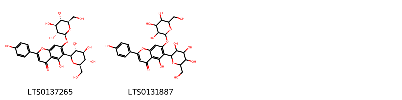{ width=100% }
    <figcaption>Hình ảnh cấu trúc hóa học của 2 hoạt chất thuộc nhóm Flavonoids gồm ['saponarin (LTS0137265)', 'saponarin (LTS0131887)'].</figcaption>
</figure>
#### Nhóm Organooxygen compounds
<figure markdown="span">
    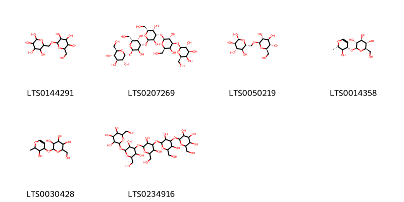{ width=100% }
    <figcaption>Hình ảnh cấu trúc hóa học của 6 hoạt chất thuộc nhóm Organooxygen compounds gồm ['polydextrose (LTS0144291)', '(2r,3r,4s,5s,6r)-2-{[(2r,3r,4s,5s,6r)-4-{[(2r,3r,4s,5s,6r)-4-{[(2s,3r,4s,5s,6r)-3,5-dihydroxy-6-(hydroxymethyl)-4-{[(2s,3r,4s,5r,6r)-3,4,5-trihydroxy-6-(hydroxymethyl)oxan-2-yl]oxy}oxan-2-yl]oxy}-3,5-dihydroxy-6-(hydroxymethyl)oxan-2-yl]oxy}-3,5-dihydroxy-6-(hydroxymethyl)oxan-2-yl]oxy}-6-(hydroxymethyl)oxane-3,4,5-triol (LTS0207269)', 'α-gentiobiose (LTS0050219)', '(2r,3r,4s,5s,6r)-2-{[(2s,3s,4s)-3-hydroxy-2-methyl-3,4-dihydro-2h-pyran-4-yl]oxy}-6-(hydroxymethyl)oxane-3,4,5-triol (LTS0014358)', '2-[(3-hydroxy-2-methyl-3,4-dihydro-2h-pyran-4-yl)oxy]-6-(hydroxymethyl)oxane-3,4,5-triol (LTS0030428)', '2-({4-[(4-{[3,5-dihydroxy-6-(hydroxymethyl)-4-{[3,4,5-trihydroxy-6-(hydroxymethyl)oxan-2-yl]oxy}oxan-2-yl]oxy}-3,5-dihydroxy-6-(hydroxymethyl)oxan-2-yl)oxy]-3,5-dihydroxy-6-(hydroxymethyl)oxan-2-yl}oxy)-6-(hydroxymethyl)oxane-3,4,5-triol (LTS0234916)'].</figcaption>
</figure>
#### Nhóm Prenol lipids
<figure markdown="span">
    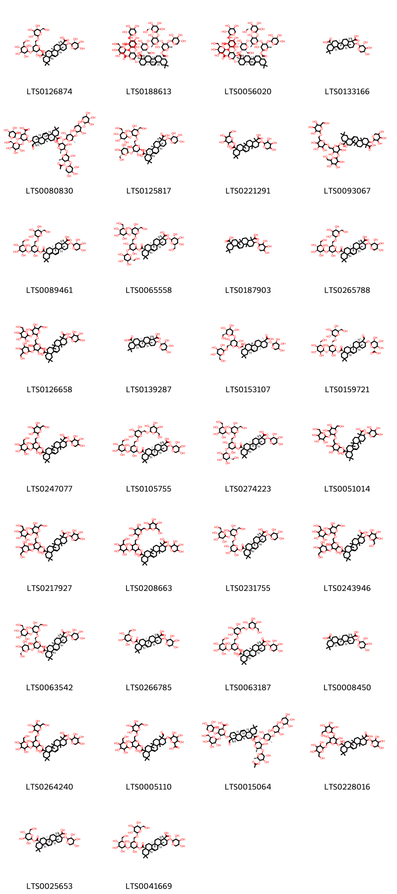{ width=100% }
    <figcaption>Hình ảnh cấu trúc hóa học của 34 hoạt chất thuộc nhóm Prenol lipids gồm ['(3s,4s,4ar,6ar,6bs,8r,8ar,12as,14ar,14br)-8a-({[(2s,3r,4s,5r,6r)-3,5-dihydroxy-4-{[(2s,3r,4s,5s,6r)-3,4,5-trihydroxy-6-(hydroxymethyl)oxan-2-yl]oxy}-6-({[(2r,3r,4s,5s,6r)-3,4,5-trihydroxy-6-(hydroxymethyl)oxan-2-yl]oxy}methyl)oxan-2-yl]oxy}carbonyl)-8-hydroxy-4,6a,6b,11,11,14b-hexamethyl-3-{[(2s,3r,4s,5r)-3,4,5-trihydroxyoxan-2-yl]oxy}-1,2,3,4a,5,6,7,8,9,10,12,12a,14,14a-tetradecahydropicene-4-carboxylic acid (LTS0126874)', '(2s,3s,4r,5r,6r)-6-{[(3s,4r,4ar,6ar,6bs,8as,12as,14ar,14br)-4-formyl-8a-({[(2s,3r,4r,5s,6r)-3-hydroxy-4-{[(2s,3r,4r,5r,6s)-4-hydroxy-6-methyl-5-{[(2s,3r,4s,5r,6r)-3,4,5-trihydroxy-6-(hydroxymethyl)oxan-2-yl]oxy}-3-{[(2s,3r,4s,5s,6r)-3,4,5-trihydroxy-6-(hydroxymethyl)oxan-2-yl]oxy}oxan-2-yl]oxy}-6-methyl-5-{[(2s,3r,4s,5r)-3,4,5-trihydroxyoxan-2-yl]oxy}oxan-2-yl]oxy}carbonyl)-4,6a,6b,11,11,14b-hexamethyl-1,2,3,4a,5,6,7,8,9,10,12,12a,14,14a-tetradecahydropicen-3-yl]oxy}-5-hydroxy-4-{[(2s,3r,4s,5r)-4-hydroxy-3-{[(2s,3r,4s,5r,6r)-3,4,5-trihydroxy-6-(hydroxymethyl)oxan-2-yl]oxy}-5-{[(2s,3r,4s,5s)-3,4,5-trihydroxyoxan-2-yl]oxy}oxan-2-yl]oxy}-3-{[(2s,3r,4r,5r,6s)-3,4,5-trihydroxy-6-methyloxan-2-yl]oxy}oxane-2-carboxylic acid (LTS0188613)', '(2s,3s,4r,5r,6r)-6-{[(3s,4r,4ar,6ar,6bs,8as,14ar,14br)-4-formyl-8a-({[(2s,3r,4r,5s,6r)-3-hydroxy-4-{[(2s,3r,4r,5r,6s)-4-hydroxy-6-methyl-5-{[(2s,3r,4s,5r,6r)-3,4,5-trihydroxy-6-(hydroxymethyl)oxan-2-yl]oxy}-3-{[(2s,3r,4s,5s,6r)-3,4,5-trihydroxy-6-(hydroxymethyl)oxan-2-yl]oxy}oxan-2-yl]oxy}-6-methyl-5-{[(2s,3r,4s,5r)-3,4,5-trihydroxyoxan-2-yl]oxy}oxan-2-yl]oxy}carbonyl)-4,6a,6b,11,11,14b-hexamethyl-1,2,3,4a,5,6,7,8,9,10,12,12a,14,14a-tetradecahydropicen-3-yl]oxy}-5-hydroxy-4-{[(2s,3r,4s,5r)-4-hydroxy-3-{[(2s,3r,4s,5r,6r)-3,4,5-trihydroxy-6-(hydroxymethyl)oxan-2-yl]oxy}-5-{[(2s,3r,4s,5s)-3,4,5-trihydroxyoxan-2-yl]oxy}oxan-2-yl]oxy}-3-{[(2s,3r,4r,5r,6s)-3,4,5-trihydroxy-6-methyloxan-2-yl]oxy}oxane-2-carboxylic acid (LTS0056020)', '(3s,4s,4ar,6ar,6bs,8as,12as,14ar,14br)-4,6a,6b,11,11,14b-hexamethyl-3-{[(2s,3r,4s,5r)-3,4,5-trihydroxyoxan-2-yl]oxy}-1,2,3,4a,5,6,7,8,9,10,12,12a,14,14a-tetradecahydropicene-4,8a-dicarboxylic acid (LTS0133166)', '(2s,3s,4s,5r,6r)-6-{[(3s,4s,4ar,6ar,6br,8r,8ar,12as,12br,14ar,14bs)-8a-({[(2s,3r,4s,5r,6r)-5-{[(2s,3r,4r,5r,6r)-5-(acetyloxy)-3-hydroxy-6-methyl-4-{[(2s,3r,4s,5r)-3,4,5-trihydroxyoxan-2-yl]oxy}oxan-2-yl]oxy}-3-{[(2s,3r,4s,5r,6s)-5-{[(2s,3r,4s,5r)-3,5-dihydroxy-4-{[(2s,3r,4s,5r)-3,4,5-trihydroxyoxan-2-yl]oxy}oxan-2-yl]oxy}-3,4-dihydroxy-6-methyloxan-2-yl]oxy}-4-hydroxy-6-methyloxan-2-yl]oxy}carbonyl)-4-formyl-8-hydroxy-4,6a,6b,11,11,14b-hexamethyl-1,2,3,4a,5,6,7,8,9,10,12,12a,12b,14a-tetradecahydropicen-3-yl]oxy}-3-hydroxy-5-{[(2s,3r,4s,5r,6r)-3,4,5-trihydroxy-6-(hydroxymethyl)oxan-2-yl]oxy}-4-{[(2s,3r,4s,5r)-3,4,5-trihydroxyoxan-2-yl]oxy}oxane-2-carboxylic acid (LTS0080830)', '(3s,4ar,6ar,6bs,8r,8ar,12as,14ar,14br)-8a-({[(2s,3r,4s,5r,6r)-6-({[(2r,3r,4s,5s,6r)-4,5-dihydroxy-6-(hydroxymethyl)-3-{[(2s,3r,4s,5s,6r)-3,4,5-trihydroxy-6-(hydroxymethyl)oxan-2-yl]oxy}oxan-2-yl]oxy}methyl)-3,5-dihydroxy-4-{[(2s,3r,4s,5s,6r)-3,4,5-trihydroxy-6-(hydroxymethyl)oxan-2-yl]oxy}oxan-2-yl]oxy}carbonyl)-8-hydroxy-4,6a,6b,11,11,14b-hexamethyl-3-{[(2s,3r,4s,5r)-3,4,5-trihydroxyoxan-2-yl]oxy}-1,2,3,4a,5,6,7,8,9,10,12,12a,14,14a-tetradecahydropicene-4-carboxylic acid (LTS0125817)', '4,6a,6b,11,11,14b-hexamethyl-8a-({[3,4,5-trihydroxy-6-(hydroxymethyl)oxan-2-yl]oxy}carbonyl)-3-[(3,4,5-trihydroxyoxan-2-yl)oxy]-1,2,3,4a,5,6,7,8,9,10,12,12a,14,14a-tetradecahydropicene-4-carboxylic acid (LTS0221291)', '8a-{[(3,5-dihydroxy-4-{[3,4,5-trihydroxy-6-(hydroxymethyl)oxan-2-yl]oxy}-6-({[3,4,5-trihydroxy-6-({[3,4,5-trihydroxy-6-(hydroxymethyl)oxan-2-yl]oxy}methyl)oxan-2-yl]oxy}methyl)oxan-2-yl)oxy]carbonyl}-8-hydroxy-4,6a,6b,11,11,14b-hexamethyl-3-[(3,4,5-trihydroxyoxan-2-yl)oxy]-1,2,3,4a,5,6,7,8,9,10,12,12a,14,14a-tetradecahydropicene-4-carboxylic acid (LTS0093067)', '(3s,4s,4ar,6ar,6bs,8as,14ar,14bs)-8a-({[(2s,3r,4s,5r,6r)-3,5-dihydroxy-4-{[(2s,3r,4s,5s,6r)-3,4,5-trihydroxy-6-(hydroxymethyl)oxan-2-yl]oxy}-6-({[(2r,3r,4s,5s,6r)-3,4,5-trihydroxy-6-(hydroxymethyl)oxan-2-yl]oxy}methyl)oxan-2-yl]oxy}carbonyl)-4,6a,6b,11,11,14b-hexamethyl-3-{[(2s,3r,4s,5r)-3,4,5-trihydroxyoxan-2-yl]oxy}-1,2,3,4a,5,6,7,8,9,10,12,14a-dodecahydropicene-4-carboxylic acid (LTS0089461)', '(3s,4s,4ar,6ar,6bs,8as,12as,14ar,14br)-8a-({[(2s,3r,4s,5r,6r)-6-({[(2r,3r,4s,5s,6r)-4,5-dihydroxy-6-(hydroxymethyl)-3-{[(2s,3r,4s,5s,6r)-3,4,5-trihydroxy-6-(hydroxymethyl)oxan-2-yl]oxy}oxan-2-yl]oxy}methyl)-3,5-dihydroxy-4-{[(2s,3r,4s,5s,6r)-3,4,5-trihydroxy-6-(hydroxymethyl)oxan-2-yl]oxy}oxan-2-yl]oxy}carbonyl)-4,6a,6b,11,11,14b-hexamethyl-3-{[(2r,3r,4s,5s,6r)-3,4,5-trihydroxy-6-(hydroxymethyl)oxan-2-yl]oxy}-1,2,3,4a,5,6,7,8,9,10,12,12a,14,14a-tetradecahydropicene-4-carboxylic acid (LTS0065558)', '4,6a,6b,11,11,14b-hexamethyl-3-[(3,4,5-trihydroxyoxan-2-yl)oxy]-1,2,3,4a,5,6,7,8,9,10,12,12a,14,14a-tetradecahydropicene-4,8a-dicarboxylic acid (LTS0187903)', '(3s,4ar,6ar,6bs,8as,12as,14ar,14br)-8a-({[(2s,3r,4s,5r,6r)-3,5-dihydroxy-4-{[(2s,3r,4s,5s,6r)-3,4,5-trihydroxy-6-(hydroxymethyl)oxan-2-yl]oxy}-6-({[(2r,3r,4s,5s,6r)-3,4,5-trihydroxy-6-(hydroxymethyl)oxan-2-yl]oxy}methyl)oxan-2-yl]oxy}carbonyl)-4,6a,6b,11,11,14b-hexamethyl-3-{[(2s,3r,4s,5r)-3,4,5-trihydroxyoxan-2-yl]oxy}-1,2,3,4a,5,6,7,8,9,10,12,12a,14,14a-tetradecahydropicene-4-carboxylic acid (LTS0265788)', '8a-({[6-({[4,5-dihydroxy-6-(hydroxymethyl)-3-{[3,4,5-trihydroxy-6-(hydroxymethyl)oxan-2-yl]oxy}oxan-2-yl]oxy}methyl)-3,5-dihydroxy-4-{[3,4,5-trihydroxy-6-(hydroxymethyl)oxan-2-yl]oxy}oxan-2-yl]oxy}carbonyl)-8-hydroxy-4,6a,6b,11,11,14b-hexamethyl-3-[(3,4,5-trihydroxyoxan-2-yl)oxy]-1,2,3,4a,5,6,7,8,9,10,12,12a,14,14a-tetradecahydropicene-4-carboxylic acid (LTS0126658)', '(3s,4s,4as,6ar,6bs,8as,12ar,14ar,14br)-4,6a,6b,11,11,14b-hexamethyl-3-{[(2r,3s,4r,5s)-3,4,5-trihydroxyoxan-2-yl]oxy}-1,2,3,4a,5,6,7,8,9,10,12,12a,14,14a-tetradecahydropicene-4,8a-dicarboxylic acid (LTS0139287)', '(3r,4r,6as,6br,8s,8as,12ar,14bs)-8a-({[(2r,3s,4r,5s,6s)-3,5-dihydroxy-4-{[(2r,3s,4r,5r,6s)-3,4,5-trihydroxy-6-(hydroxymethyl)oxan-2-yl]oxy}-6-({[(2s,3s,4r,5r,6s)-3,4,5-trihydroxy-6-(hydroxymethyl)oxan-2-yl]oxy}methyl)oxan-2-yl]oxy}carbonyl)-8-hydroxy-4,6a,6b,11,11,14b-hexamethyl-3-{[(2r,3s,4r,5s)-3,4,5-trihydroxyoxan-2-yl]oxy}-1,2,3,4a,5,6,7,8,9,10,12,12a,14,14a-tetradecahydropicene-4-carboxylic acid (LTS0153107)', '(2r,3r,4r,5s,6s)-6-{[(3s,4r,4ar,6ar,6bs,8as,12ar,14ar,14br)-8a-({[(2r,3s,4r,5s,6s)-3,5-dihydroxy-4-{[(2r,3s,4r,5r,6s)-3,4,5-trihydroxy-6-(hydroxymethyl)oxan-2-yl]oxy}-6-({[(2s,3r,4s,5s,6r)-3,4,5-trihydroxy-6-(hydroxymethyl)oxan-2-yl]oxy}methyl)oxan-2-yl]oxy}carbonyl)-4-formyl-4,6a,6b,11,11,14b-hexamethyl-1,2,3,4a,5,6,7,8,9,10,12,12a,14,14a-tetradecahydropicen-3-yl]oxy}-3,4,5-trihydroxyoxane-2-carboxylic acid (LTS0159721)', '8a-{[(3,5-dihydroxy-4-{[3,4,5-trihydroxy-6-(hydroxymethyl)oxan-2-yl]oxy}-6-({[3,4,5-trihydroxy-6-(hydroxymethyl)oxan-2-yl]oxy}methyl)oxan-2-yl)oxy]carbonyl}-4,6a,6b,11,11,14b-hexamethyl-3-[(3,4,5-trihydroxyoxan-2-yl)oxy]-1,2,3,4a,5,6,7,8,9,10,12,12a,14,14a-tetradecahydropicene-4-carboxylic acid (LTS0247077)', '(3s,4s,4ar,6ar,6bs,8as,12as,14ar,14br)-8a-({[(2s,3r,4s,5r,6r)-3,5-dihydroxy-4-{[(2s,3r,4s,5s,6r)-3,4,5-trihydroxy-6-(hydroxymethyl)oxan-2-yl]oxy}-6-({[(2r,3r,4s,5s,6r)-3,4,5-trihydroxy-6-({[(2s,3r,4s,5r,6r)-3,4,5-trihydroxy-6-(hydroxymethyl)oxan-2-yl]oxy}methyl)oxan-2-yl]oxy}methyl)oxan-2-yl]oxy}carbonyl)-4,6a,6b,11,11,14b-hexamethyl-3-{[(2s,3r,4s,5r)-3,4,5-trihydroxyoxan-2-yl]oxy}-1,2,3,4a,5,6,7,8,9,10,12,12a,14,14a-tetradecahydropicene-4-carboxylic acid (LTS0105755)', '(3s,4s,4ar,6ar,6bs,8as,12as,14ar,14br)-8a-({[(2s,3r,4s,5r,6r)-6-({[(2r,3r,4s,5s,6r)-4,5-dihydroxy-6-(hydroxymethyl)-3-{[(2s,3r,4s,5s,6r)-3,4,5-trihydroxy-6-(hydroxymethyl)oxan-2-yl]oxy}oxan-2-yl]oxy}methyl)-3,5-dihydroxy-4-{[(2s,3r,4s,5s,6r)-3,4,5-trihydroxy-6-(hydroxymethyl)oxan-2-yl]oxy}oxan-2-yl]oxy}carbonyl)-4,6a,6b,11,11,14b-hexamethyl-3-{[(2s,3r,4s,5r)-3,4,5-trihydroxyoxan-2-yl]oxy}-1,2,3,4a,5,6,7,8,9,10,12,12a,14,14a-tetradecahydropicene-4-carboxylic acid (LTS0274223)', '8a-({[6-({[4,5-dihydroxy-6-(hydroxymethyl)-3-{[3,4,5-trihydroxy-6-(hydroxymethyl)oxan-2-yl]oxy}oxan-2-yl]oxy}methyl)-3,4,5-trihydroxyoxan-2-yl]oxy}carbonyl)-4,6a,6b,11,11,14b-hexamethyl-3-[(3,4,5-trihydroxyoxan-2-yl)oxy]-1,2,3,4a,5,6,7,8,9,10,12,12a,14,14a-tetradecahydropicene-4-carboxylic acid (LTS0051014)', '8a-({[6-({[4,5-dihydroxy-6-(hydroxymethyl)-3-{[3,4,5-trihydroxy-6-(hydroxymethyl)oxan-2-yl]oxy}oxan-2-yl]oxy}methyl)-3,5-dihydroxy-4-{[3,4,5-trihydroxy-6-(hydroxymethyl)oxan-2-yl]oxy}oxan-2-yl]oxy}carbonyl)-4,6a,6b,11,11,14b-hexamethyl-3-[(3,4,5-trihydroxyoxan-2-yl)oxy]-1,2,3,4a,5,6,7,8,9,10,12,12a,14,14a-tetradecahydropicene-4-carboxylic acid (LTS0217927)', '8a-{[(3,5-dihydroxy-4-{[3,4,5-trihydroxy-6-(hydroxymethyl)oxan-2-yl]oxy}-6-({[3,4,5-trihydroxy-6-({[3,4,5-trihydroxy-6-(hydroxymethyl)oxan-2-yl]oxy}methyl)oxan-2-yl]oxy}methyl)oxan-2-yl)oxy]carbonyl}-4,6a,6b,11,11,14b-hexamethyl-3-[(3,4,5-trihydroxyoxan-2-yl)oxy]-1,2,3,4a,5,6,7,8,9,10,12,12a,14,14a-tetradecahydropicene-4-carboxylic acid (LTS0208663)', '(3s,4s,4ar,6ar,6bs,8as,12as,14ar,14br)-8a-({[(2s,3r,4s,5s,6r)-6-({[(2r,3r,4s,5s,6r)-4,5-dihydroxy-6-(hydroxymethyl)-3-{[(2s,3r,4s,5s,6r)-3,4,5-trihydroxy-6-(hydroxymethyl)oxan-2-yl]oxy}oxan-2-yl]oxy}methyl)-3,4,5-trihydroxyoxan-2-yl]oxy}carbonyl)-4,6a,6b,11,11,14b-hexamethyl-3-{[(2s,3r,4s,5r)-3,4,5-trihydroxyoxan-2-yl]oxy}-1,2,3,4a,5,6,7,8,9,10,12,12a,14,14a-tetradecahydropicene-4-carboxylic acid (LTS0231755)', '8a-({[6-({[4,5-dihydroxy-6-(hydroxymethyl)-3-{[3,4,5-trihydroxy-6-(hydroxymethyl)oxan-2-yl]oxy}oxan-2-yl]oxy}methyl)-3,5-dihydroxy-4-{[3,4,5-trihydroxy-6-(hydroxymethyl)oxan-2-yl]oxy}oxan-2-yl]oxy}carbonyl)-4,6a,6b,11,11,14b-hexamethyl-3-{[3,4,5-trihydroxy-6-(hydroxymethyl)oxan-2-yl]oxy}-1,2,3,4a,5,6,7,8,9,10,12,12a,14,14a-tetradecahydropicene-4-carboxylic acid (LTS0243946)', '(3s,4s,4ar,6ar,6bs,8r,8ar,12as,14ar,14br)-8a-({[(2s,3r,4s,5r,6r)-6-({[(2r,3r,4s,5s,6r)-4,5-dihydroxy-6-(hydroxymethyl)-3-{[(2s,3r,4s,5s,6r)-3,4,5-trihydroxy-6-(hydroxymethyl)oxan-2-yl]oxy}oxan-2-yl]oxy}methyl)-3,5-dihydroxy-4-{[(2s,3r,4s,5s,6r)-3,4,5-trihydroxy-6-(hydroxymethyl)oxan-2-yl]oxy}oxan-2-yl]oxy}carbonyl)-8-hydroxy-4,6a,6b,11,11,14b-hexamethyl-3-{[(2s,3r,4s,5r)-3,4,5-trihydroxyoxan-2-yl]oxy}-1,2,3,4a,5,6,7,8,9,10,12,12a,14,14a-tetradecahydropicene-4-carboxylic acid (LTS0063542)', '(3s,4ar,6ar,6bs,8as,12as,14ar,14br)-4,6a,6b,11,11,14b-hexamethyl-8a-({[(2s,3r,4s,5s,6r)-3,4,5-trihydroxy-6-(hydroxymethyl)oxan-2-yl]oxy}carbonyl)-3-{[(2s,3r,4s,5r)-3,4,5-trihydroxyoxan-2-yl]oxy}-1,2,3,4a,5,6,7,8,9,10,12,12a,14,14a-tetradecahydropicene-4-carboxylic acid (LTS0266785)', '(3s,4s,4ar,6ar,6bs,8r,8ar,12as,14ar,14br)-8a-({[(2s,3r,4s,5r,6r)-3,5-dihydroxy-4-{[(2s,3r,4s,5s,6r)-3,4,5-trihydroxy-6-(hydroxymethyl)oxan-2-yl]oxy}-6-({[(2r,3r,4s,5s,6r)-3,4,5-trihydroxy-6-({[(2s,3r,4s,5r,6r)-3,4,5-trihydroxy-6-(hydroxymethyl)oxan-2-yl]oxy}methyl)oxan-2-yl]oxy}methyl)oxan-2-yl]oxy}carbonyl)-8-hydroxy-4,6a,6b,11,11,14b-hexamethyl-3-{[(2s,3r,4s,5r)-3,4,5-trihydroxyoxan-2-yl]oxy}-1,2,3,4a,5,6,7,8,9,10,12,12a,14,14a-tetradecahydropicene-4-carboxylic acid (LTS0063187)', '(3s,4s,4as,6ar,6bs,8as,12ar,14ar,14br)-4,6a,6b,11,11,14b-hexamethyl-3-{[(2s,3r,4s,5r)-3,4,5-trihydroxyoxan-2-yl]oxy}-1,2,3,4a,5,6,7,8,9,10,12,12a,14,14a-tetradecahydropicene-4,8a-dicarboxylic acid (LTS0008450)', '8a-{[(3,5-dihydroxy-4-{[3,4,5-trihydroxy-6-(hydroxymethyl)oxan-2-yl]oxy}-6-({[3,4,5-trihydroxy-6-(hydroxymethyl)oxan-2-yl]oxy}methyl)oxan-2-yl)oxy]carbonyl}-4,6a,6b,11,11,14b-hexamethyl-3-[(3,4,5-trihydroxyoxan-2-yl)oxy]-1,2,3,4a,5,6,7,8,9,10,12,14a-dodecahydropicene-4-carboxylic acid (LTS0264240)', '6-[(8a-{[(3,5-dihydroxy-4-{[3,4,5-trihydroxy-6-(hydroxymethyl)oxan-2-yl]oxy}-6-({[3,4,5-trihydroxy-6-(hydroxymethyl)oxan-2-yl]oxy}methyl)oxan-2-yl)oxy]carbonyl}-4-formyl-4,6a,6b,11,11,14b-hexamethyl-1,2,3,4a,5,6,7,8,9,10,12,12a,14,14a-tetradecahydropicen-3-yl)oxy]-3,4,5-trihydroxyoxane-2-carboxylic acid (LTS0005110)', '(2s,3s,4s,5r,6r)-6-{[(3s,4s,4ar,6ar,6br,8r,8ar,12as,12bs,14ar,14bs)-8a-({[(2s,3r,4s,5r,6r)-5-{[(2s,3r,4r,5s,6r)-5-(acetyloxy)-3,4-dihydroxy-6-methyloxan-2-yl]oxy}-3-{[(2s,3r,4s,5r,6s)-5-{[(2s,3r,4s,5r)-3,5-dihydroxy-4-{[(2s,3r,4s,5r)-3,4,5-trihydroxyoxan-2-yl]oxy}oxan-2-yl]oxy}-3,4-dihydroxy-6-methyloxan-2-yl]oxy}-4-hydroxy-6-methyloxan-2-yl]oxy}carbonyl)-4-formyl-8-hydroxy-4,6a,6b,11,11,14b-hexamethyl-1,2,3,4a,5,6,7,8,9,10,12,12a,12b,14a-tetradecahydropicen-3-yl]oxy}-3-hydroxy-5-{[(2s,3r,4s,5r,6r)-3,4,5-trihydroxy-6-(hydroxymethyl)oxan-2-yl]oxy}-4-{[(2s,3r,4s,5r)-3,4,5-trihydroxyoxan-2-yl]oxy}oxane-2-carboxylic acid (LTS0015064)', '8a-{[(3,5-dihydroxy-4-{[3,4,5-trihydroxy-6-(hydroxymethyl)oxan-2-yl]oxy}-6-({[3,4,5-trihydroxy-6-(hydroxymethyl)oxan-2-yl]oxy}methyl)oxan-2-yl)oxy]carbonyl}-8-hydroxy-4,6a,6b,11,11,14b-hexamethyl-3-[(3,4,5-trihydroxyoxan-2-yl)oxy]-1,2,3,4a,5,6,7,8,9,10,12,12a,14,14a-tetradecahydropicene-4-carboxylic acid (LTS0228016)', '(3s,4s,4ar,6ar,6bs,8as,12as,14ar,14br)-4,6a,6b,11,11,14b-hexamethyl-8a-({[(2s,3r,4s,5s,6r)-3,4,5-trihydroxy-6-(hydroxymethyl)oxan-2-yl]oxy}carbonyl)-3-{[(2s,3r,4s,5r)-3,4,5-trihydroxyoxan-2-yl]oxy}-1,2,3,4a,5,6,7,8,9,10,12,12a,14,14a-tetradecahydropicene-4-carboxylic acid (LTS0025653)', '(3s,4s,4ar,6ar,6bs,8as,12as,14ar,14br)-8a-({[(2s,3r,4s,5r,6r)-3,5-dihydroxy-4-{[(2s,3r,4s,5s,6r)-3,4,5-trihydroxy-6-(hydroxymethyl)oxan-2-yl]oxy}-6-({[(2r,3r,4s,5s,6r)-3,4,5-trihydroxy-6-(hydroxymethyl)oxan-2-yl]oxy}methyl)oxan-2-yl]oxy}carbonyl)-4,6a,6b,11,11,14b-hexamethyl-3-{[(2s,3r,4s,5r)-3,4,5-trihydroxyoxan-2-yl]oxy}-1,2,3,4a,5,6,7,8,9,10,12,12a,14,14a-tetradecahydropicene-4-carboxylic acid (LTS0041669)'].</figcaption>
</figure>
#### Nhóm Steroids and steroid derivatives
<figure markdown="span">
    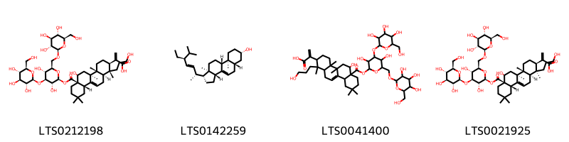{ width=100% }
    <figcaption>Hình ảnh cấu trúc hóa học của 4 hoạt chất thuộc nhóm Steroids and steroid derivatives gồm ['2-[(1r,2r,4ar,4bs,6r,6ar,10as,12ar)-6a-({[(2s,3r,4s,5r,6r)-3,5-dihydroxy-4-{[(2s,3r,4s,5s,6r)-3,4,5-trihydroxy-6-(hydroxymethyl)oxan-2-yl]oxy}-6-({[(2r,3r,4s,5s,6r)-3,4,5-trihydroxy-6-(hydroxymethyl)oxan-2-yl]oxy}methyl)oxan-2-yl]oxy}carbonyl)-6-hydroxy-1-(3-hydroxypropyl)-1,4a,4b,9,9-pentamethyl-3,4,5,6,7,8,10,10a,12,12a-decahydro-2h-chrysen-2-yl]prop-2-enoic acid (LTS0212198)', 'chondrillasterol (LTS0142259)', '2-(6a-{[(3,5-dihydroxy-4-{[3,4,5-trihydroxy-6-(hydroxymethyl)oxan-2-yl]oxy}-6-({[3,4,5-trihydroxy-6-(hydroxymethyl)oxan-2-yl]oxy}methyl)oxan-2-yl)oxy]carbonyl}-6-hydroxy-1-(3-hydroxypropyl)-1,4a,4b,9,9-pentamethyl-3,4,5,6,7,8,10,10a,12,12a-decahydro-2h-chrysen-2-yl)prop-2-enoic acid (LTS0041400)', '2-[(1s,2r,4ar,4bs,6r,6ar,10as,12ar)-6a-({[(2s,3r,4s,5r,6r)-3,5-dihydroxy-4-{[(2s,3r,4s,5s,6r)-3,4,5-trihydroxy-6-(hydroxymethyl)oxan-2-yl]oxy}-6-({[(2r,3r,4s,5s,6r)-3,4,5-trihydroxy-6-(hydroxymethyl)oxan-2-yl]oxy}methyl)oxan-2-yl]oxy}carbonyl)-6-hydroxy-1-(3-hydroxypropyl)-1,4a,4b,9,9-pentamethyl-3,4,5,6,7,8,10,10a,12,12a-decahydro-2h-chrysen-2-yl]prop-2-enoic acid (LTS0021925)'].</figcaption>
</figure>

---

### Dược dân tộc học

Danh sách các quốc gia có sử dụng *Saponaria officinalis* trong điều trị các bệnh. 

| Country        | Disease                                                                               | Bệnh                                                                                                                                                                                                |
|:---------------|:--------------------------------------------------------------------------------------|:----------------------------------------------------------------------------------------------------------------------------------------------------------------------------------------------------|
| China          | Expectorant                                                                           | MYMEMORY WARNING: YOU USED ALL AVAILABLE FREE TRANSLATIONS FOR TODAY. NEXT AVAILABLE IN  09 HOURS 02 MINUTES 53 SECONDS VISIT HTTPS://MYMEMORY.TRANSLATED.NET/DOC/USAGELIMITS.PHP TO TRANSLATE MORE |
| Elsewhere      | nan, Diaphoretic, Expectorant, Sudorific, Diuretic, Expectorant, Emetic, Poison, Soap | MYMEMORY WARNING: YOU USED ALL AVAILABLE FREE TRANSLATIONS FOR TODAY. NEXT AVAILABLE IN  09 HOURS 02 MINUTES 48 SECONDS VISIT HTTPS://MYMEMORY.TRANSLATED.NET/DOC/USAGELIMITS.PHP TO TRANSLATE MORE |
| Eurasia        | Soap, Laxative                                                                        | MYMEMORY WARNING: YOU USED ALL AVAILABLE FREE TRANSLATIONS FOR TODAY. NEXT AVAILABLE IN  09 HOURS 02 MINUTES 43 SECONDS VISIT HTTPS://MYMEMORY.TRANSLATED.NET/DOC/USAGELIMITS.PHP TO TRANSLATE MORE |
| Turkey         | Diuretic, Emetic, Expectorant, Laxative, Stimulant, Sudorific, Soap, Sternutatory     | MYMEMORY WARNING: YOU USED ALL AVAILABLE FREE TRANSLATIONS FOR TODAY. NEXT AVAILABLE IN  09 HOURS 02 MINUTES 39 SECONDS VISIT HTTPS://MYMEMORY.TRANSLATED.NET/DOC/USAGELIMITS.PHP TO TRANSLATE MORE |
| US             | Soap, Poison                                                                          | MYMEMORY WARNING: YOU USED ALL AVAILABLE FREE TRANSLATIONS FOR TODAY. NEXT AVAILABLE IN  09 HOURS 02 MINUTES 36 SECONDS VISIT HTTPS://MYMEMORY.TRANSLATED.NET/DOC/USAGELIMITS.PHP TO TRANSLATE MORE |
| US(Amerindian) | Soap                                                                                  | MYMEMORY WARNING: YOU USED ALL AVAILABLE FREE TRANSLATIONS FOR TODAY. NEXT AVAILABLE IN  09 HOURS 02 MINUTES 33 SECONDS VISIT HTTPS://MYMEMORY.TRANSLATED.NET/DOC/USAGELIMITS.PHP TO TRANSLATE MORE |

---

---
## Saponaria vaccaria
### Thông tin về thực vật

!!! info "Phân loại thực vật của *Gypsophila vaccaria* từ GIBF:"
    - **Kingdom:** Plantae
    - **Phylum:** Tracheophyta
    - **Order:** Caryophyllales
    - **Family:** Caryophyllaceae
    - **Genus:** Gypsophila
    - **Species:** *Gypsophila vaccaria*

 

| Label (VI)   | Label (EN)   | Scientific Name    | Descriptions (VI)   | Descriptions (EN)   | Also Known As (VI)   | Also Known As (EN)   |
|:-------------|:-------------|:-------------------|:--------------------|:--------------------|:---------------------|:---------------------|
| N/A          | N/A          | Saponaria vaccaria | loài thực vật       | species of plant    | ['']                 | ['']                 |

#### Phân bố trên thế giới

**Từ CSDL GIBF** nan, Czechia, Sweden, Uzbekistan, China, Mali, Tanzania, United Republic of, Türkiye, United States of America, Romania, Greece, Iran (Islamic Republic of), Tunisia, unknown or invalid, Morocco, Algeria, United Kingdom of Great Britain and Northern Ireland, Belgium, Palestine, State of, Canada, Germany, Portugal, Australia, France

#### Phân bố tại Việt Nam

**Từ CSDL GIBF**: Không có ghi nhận ở Việt Nam

---
### Thành phần hóa học
        
- Theo cơ sở dữ liệu lotus: Từ loài *Gypsophila vaccaria* đã phân lập và xác định được Chưa có hoạt chất nào được phân lập. hoạt chất thuộc về các nhóm Không có hoạt chất nào được phân lập. 

Không có hình ảnh nào được tạo ra

---

### Dược dân tộc học

Danh sách các quốc gia có sử dụng *Gypsophila vaccaria* trong điều trị các bệnh. 

| Country   | Disease                                                                         | Bệnh                                                                                                                                                                                                |
|:----------|:--------------------------------------------------------------------------------|:----------------------------------------------------------------------------------------------------------------------------------------------------------------------------------------------------|
| China     | Diuretic, Emmenagogue, Expectorant, Styptic, Vulnerary, Discutient, Vulnerary   | MYMEMORY WARNING: YOU USED ALL AVAILABLE FREE TRANSLATIONS FOR TODAY. NEXT AVAILABLE IN  09 HOURS 01 MINUTES 55 SECONDS VISIT HTTPS://MYMEMORY.TRANSLATED.NET/DOC/USAGELIMITS.PHP TO TRANSLATE MORE |
| Elsewhere | nan, Emetic, Soap, Sudorific, Tonic, Diaphoretic, Diuretic, Expectorant, Poison | MYMEMORY WARNING: YOU USED ALL AVAILABLE FREE TRANSLATIONS FOR TODAY. NEXT AVAILABLE IN  09 HOURS 01 MINUTES 46 SECONDS VISIT HTTPS://MYMEMORY.TRANSLATED.NET/DOC/USAGELIMITS.PHP TO TRANSLATE MORE |
| US        | Poison                                                                          | MYMEMORY WARNING: YOU USED ALL AVAILABLE FREE TRANSLATIONS FOR TODAY. NEXT AVAILABLE IN  09 HOURS 01 MINUTES 42 SECONDS VISIT HTTPS://MYMEMORY.TRANSLATED.NET/DOC/USAGELIMITS.PHP TO TRANSLATE MORE |

---

# Chi Dianthus

??? note "Danh sách các dược liệu thuộc chi"
    
	 - *Dianthus caryophyllus*
	 - *Dianthus chinensis*
	 - *Dianthus fischeri*
	 - *Dianthus pectinatus*
	 - *Dianthus superbus*

---
## Dianthus caryophyllus
### Thông tin về thực vật

!!! info "Phân loại thực vật của *Dianthus caryophyllus* từ GIBF:"
    - **Kingdom:** Plantae
    - **Phylum:** Tracheophyta
    - **Order:** Caryophyllales
    - **Family:** Caryophyllaceae
    - **Genus:** Dianthus
    - **Species:** *Dianthus caryophyllus*

 

| Label (VI)   | Label (EN)   | Scientific Name       | Descriptions (VI)   | Descriptions (EN)   | Also Known As (VI)   | Also Known As (EN)                     |
|:-------------|:-------------|:----------------------|:--------------------|:--------------------|:---------------------|:---------------------------------------|
| N/A          | N/A          | Dianthus caryophyllus | loài thực vật       | species of plant    | ['']                 | ['carnation', 'clavell', 'clove pink'] |

#### Phân bố trên thế giới

**Từ CSDL GIBF** Czechia, Sweden, Kazakhstan, Slovenia, Spain, Denmark, Montenegro, Romania, Greece, Armenia, Croatia, Norway, France, Belgium, Germany, Austria, Switzerland, Serbia, Ireland, Venezuela (Bolivarian Republic of)

#### Phân bố tại Việt Nam

**Từ CSDL GIBF**: Không có ghi nhận ở Việt Nam

---
### Thành phần hóa học
        
- Theo cơ sở dữ liệu lotus: Từ loài *Dianthus caryophyllus* đã phân lập và xác định được 35 hoạt chất thuộc về các nhóm Benzene and substituted derivatives, Flavonoids, Purine nucleosides, Cinnamic acids and derivatives, Phenols, Imidazopyrimidines, Organooxygen compounds. 

|    | chemicalTaxonomyClassyfireClass     |   smiles_count |
|---:|:------------------------------------|---------------:|
|  0 | Benzene and substituted derivatives |             10 |
|  1 | Cinnamic acids and derivatives      |              3 |
|  2 | Flavonoids                          |             17 |
|  3 | Imidazopyrimidines                  |              2 |
|  4 | Organooxygen compounds              |              1 |
|  5 | Phenols                             |              1 |
|  6 | Purine nucleosides                  |              1 |

#### Nhóm Benzene and substituted derivatives
<figure markdown="span">
    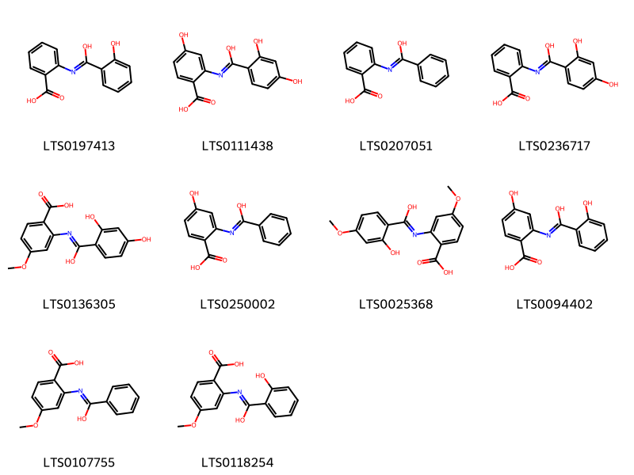{ width=100% }
    <figcaption>Hình ảnh cấu trúc hóa học của 10 hoạt chất thuộc nhóm Benzene and substituted derivatives gồm ['2-{[hydroxy(2-hydroxyphenyl)methylidene]amino}benzoic acid (LTS0197413)', '2-{[(2,4-dihydroxyphenyl)(hydroxy)methylidene]amino}-4-hydroxybenzoic acid (LTS0111438)', '2-{[hydroxy(phenyl)methylidene]amino}benzoic acid (LTS0207051)', '2-{[(2,4-dihydroxyphenyl)(hydroxy)methylidene]amino}benzoic acid (LTS0236717)', '2-{[(2,4-dihydroxyphenyl)(hydroxy)methylidene]amino}-4-methoxybenzoic acid (LTS0136305)', '4-hydroxy-2-{[hydroxy(phenyl)methylidene]amino}benzoic acid (LTS0250002)', '2-{[hydroxy(2-hydroxy-4-methoxyphenyl)methylidene]amino}-4-methoxybenzoic acid (LTS0025368)', '4-hydroxy-2-{[hydroxy(2-hydroxyphenyl)methylidene]amino}benzoic acid (LTS0094402)', '2-{[hydroxy(phenyl)methylidene]amino}-4-methoxybenzoic acid (LTS0107755)', '2-{[hydroxy(2-hydroxyphenyl)methylidene]amino}-4-methoxybenzoic acid (LTS0118254)'].</figcaption>
</figure>
#### Nhóm Cinnamic acids and derivatives
<figure markdown="span">
    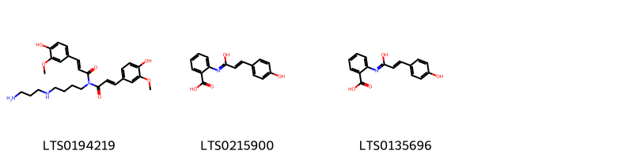{ width=100% }
    <figcaption>Hình ảnh cấu trúc hóa học của 3 hoạt chất thuộc nhóm Cinnamic acids and derivatives gồm ['(2e)-n-{4-[(3-aminopropyl)amino]butyl}-3-(4-hydroxy-3-methoxyphenyl)-n-[(2e)-3-(4-hydroxy-3-methoxyphenyl)prop-2-enoyl]prop-2-enamide (LTS0194219)', '2-{[(2e)-1-hydroxy-3-(4-hydroxyphenyl)prop-2-en-1-ylidene]amino}benzoic acid (LTS0215900)', '2-{[1-hydroxy-3-(4-hydroxyphenyl)prop-2-en-1-ylidene]amino}benzoic acid (LTS0135696)'].</figcaption>
</figure>
#### Nhóm Flavonoids
<figure markdown="span">
    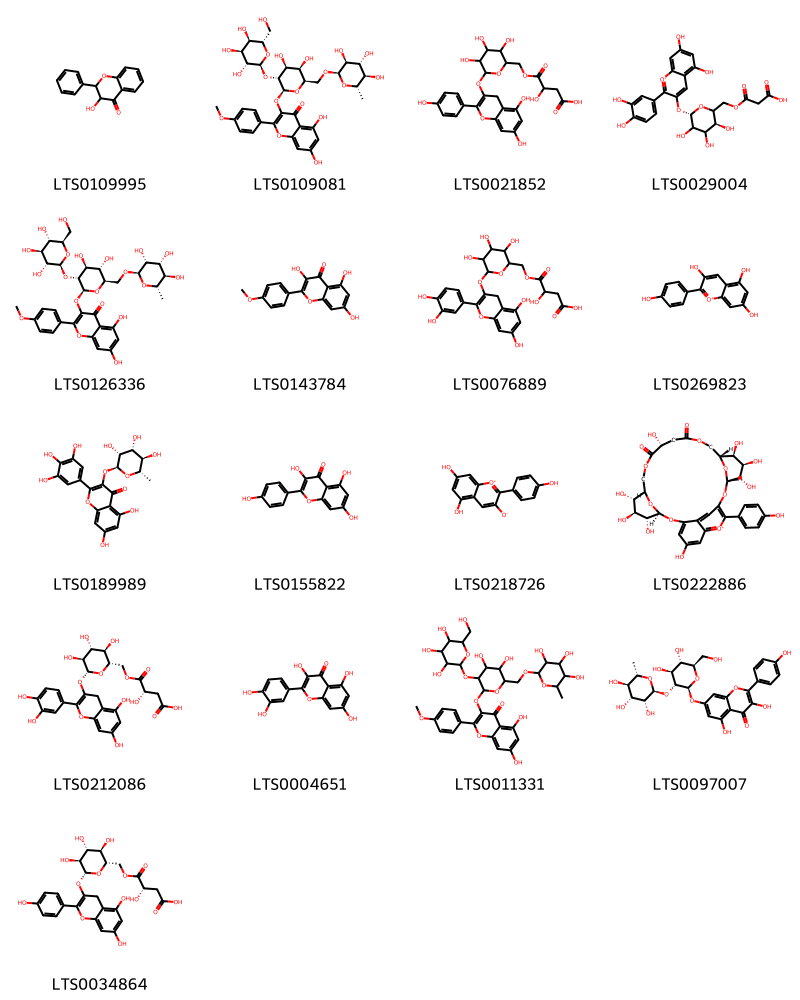{ width=100% }
    <figcaption>Hình ảnh cấu trúc hóa học của 17 hoạt chất thuộc nhóm Flavonoids gồm ['dihydroflavonol (LTS0109995)', '3-{[(2s,3r,4s,5r,6r)-4,5-dihydroxy-3-{[(2s,3r,4s,5r,6s)-3,4,5-trihydroxy-6-(hydroxymethyl)oxan-2-yl]oxy}-6-({[(2r,3s,4r,5r,6s)-3,4,5-trihydroxy-6-methyloxan-2-yl]oxy}methyl)oxan-2-yl]oxy}-5,7-dihydroxy-2-(4-methoxyphenyl)chromen-4-one (LTS0109081)', '4-[(6-{[5,7-dihydroxy-2-(4-hydroxyphenyl)-4h-chromen-3-yl]oxy}-3,4,5-trihydroxyoxan-2-yl)methoxy]-3-hydroxy-4-oxobutanoic acid (LTS0021852)', '3-{[(2s,5s)-6-{[(2-carboxyacetyl)oxy]methyl}-3,4,5-trihydroxyoxan-2-yl]oxy}-2-(3,4-dihydroxyphenyl)-5,7-dihydroxy-1λ⁴-chromen-1-ylium (LTS0029004)', '3-{[(2s,3r,4s,5s,6r)-4,5-dihydroxy-3-{[(2s,3r,4s,5s,6r)-3,4,5-trihydroxy-6-(hydroxymethyl)oxan-2-yl]oxy}-6-({[(2r,3r,4r,5r,6s)-3,4,5-trihydroxy-6-methyloxan-2-yl]oxy}methyl)oxan-2-yl]oxy}-5,7-dihydroxy-2-(4-methoxyphenyl)chromen-4-one (LTS0126336)', 'kaempferide (LTS0143784)', '4-[(6-{[2-(3,4-dihydroxyphenyl)-5,7-dihydroxy-4h-chromen-3-yl]oxy}-3,4,5-trihydroxyoxan-2-yl)methoxy]-3-hydroxy-4-oxobutanoic acid (LTS0076889)', 'pelargonidin (LTS0269823)', 'myricitrin (LTS0189989)', 'kaempherol (LTS0155822)', '5,7-dihydroxy-2-(4-hydroxyphenyl)-1λ⁴-chromen-1-ylium-3-olate (LTS0218726)', '(3s,4r,5s,6s,7r,11r,16r,17s,18r,19s,20s)-4,5,6,11,17,18,19,27-octahydroxy-23-(4-hydroxyphenyl)-10,13-dioxo-2,9,14,21,24λ⁴,31,32-heptaoxapentacyclo[20.6.2.1³,⁷.1¹⁶,²⁰.0²⁵,²⁹]dotriaconta-1(28),22,24,26,29-pentaen-24-ylium (LTS0222886)', '(3s)-4-{[(2s,3r,4r,5s,6r)-6-{[2-(3,4-dihydroxyphenyl)-5,7-dihydroxy-4h-chromen-3-yl]oxy}-3,4,5-trihydroxyoxan-2-yl]methoxy}-3-hydroxy-4-oxobutanoic acid (LTS0212086)', 'quercetin (LTS0004651)', '3-[(4,5-dihydroxy-3-{[3,4,5-trihydroxy-6-(hydroxymethyl)oxan-2-yl]oxy}-6-{[(3,4,5-trihydroxy-6-methyloxan-2-yl)oxy]methyl}oxan-2-yl)oxy]-5,7-dihydroxy-2-(4-methoxyphenyl)chromen-4-one (LTS0011331)', 'kaempferol 3-o-rutinoside (LTS0097007)', '(3s)-4-{[(2s,3r,4r,5s,6r)-6-{[5,7-dihydroxy-2-(4-hydroxyphenyl)-4h-chromen-3-yl]oxy}-3,4,5-trihydroxyoxan-2-yl]methoxy}-3-hydroxy-4-oxobutanoic acid (LTS0034864)'].</figcaption>
</figure>
#### Nhóm Imidazopyrimidines
<figure markdown="span">
    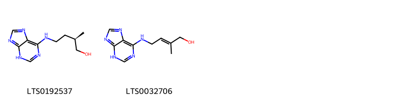{ width=100% }
    <figcaption>Hình ảnh cấu trúc hóa học của 2 hoạt chất thuộc nhóm Imidazopyrimidines gồm ['(2r)-2-methyl-4-(3h-purin-6-ylamino)butan-1-ol (LTS0192537)', 'zeatine (LTS0032706)'].</figcaption>
</figure>
#### Nhóm Organooxygen compounds
<figure markdown="span">
    { width=100% }
    <figcaption>Hình ảnh cấu trúc hóa học của 1 hoạt chất thuộc nhóm Organooxygen compounds gồm ['3-hydroxyacetophenone (LTS0193353)'].</figcaption>
</figure>
#### Nhóm Phenols
<figure markdown="span">
    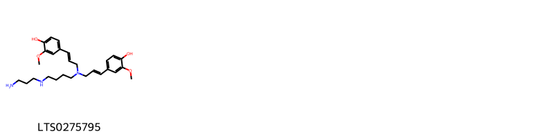{ width=100% }
    <figcaption>Hình ảnh cấu trúc hóa học của 1 hoạt chất thuộc nhóm Phenols gồm ['4-[(1e)-3-({4-[(3-aminopropyl)amino]butyl}[(2e)-3-(4-hydroxy-3-methoxyphenyl)prop-2-en-1-yl]amino)prop-1-en-1-yl]-2-methoxyphenol (LTS0275795)'].</figcaption>
</figure>
#### Nhóm Purine nucleosides
<figure markdown="span">
    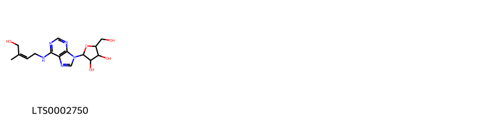{ width=100% }
    <figcaption>Hình ảnh cấu trúc hóa học của 1 hoạt chất thuộc nhóm Purine nucleosides gồm ['2-{6-[(4-hydroxy-3-methylbut-2-en-1-yl)amino]purin-9-yl}-5-(hydroxymethyl)oxolane-3,4-diol (LTS0002750)'].</figcaption>
</figure>

---

### Dược dân tộc học

Danh sách các quốc gia có sử dụng *Dianthus caryophyllus* trong điều trị các bệnh. 

| Country   | Disease                              | Bệnh                                                                                                                                                                                                |
|:----------|:-------------------------------------|:----------------------------------------------------------------------------------------------------------------------------------------------------------------------------------------------------|
| China     | Vermifuge, Vermifuge                 | MYMEMORY WARNING: YOU USED ALL AVAILABLE FREE TRANSLATIONS FOR TODAY. NEXT AVAILABLE IN  09 HOURS 01 MINUTES 07 SECONDS VISIT HTTPS://MYMEMORY.TRANSLATED.NET/DOC/USAGELIMITS.PHP TO TRANSLATE MORE |
| Elsewhere | Alexiteric, Cardiotonic, Diaphoretic | MYMEMORY WARNING: YOU USED ALL AVAILABLE FREE TRANSLATIONS FOR TODAY. NEXT AVAILABLE IN  09 HOURS 01 MINUTES 04 SECONDS VISIT HTTPS://MYMEMORY.TRANSLATED.NET/DOC/USAGELIMITS.PHP TO TRANSLATE MORE |
| Iraq      | Cardiotonic                          | MYMEMORY WARNING: YOU USED ALL AVAILABLE FREE TRANSLATIONS FOR TODAY. NEXT AVAILABLE IN  09 HOURS 01 MINUTES 00 SECONDS VISIT HTTPS://MYMEMORY.TRANSLATED.NET/DOC/USAGELIMITS.PHP TO TRANSLATE MORE |
| Kurdistan | Diaphoretic, Alexiteric              | MYMEMORY WARNING: YOU USED ALL AVAILABLE FREE TRANSLATIONS FOR TODAY. NEXT AVAILABLE IN  09 HOURS 00 MINUTES 57 SECONDS VISIT HTTPS://MYMEMORY.TRANSLATED.NET/DOC/USAGELIMITS.PHP TO TRANSLATE MORE |
| Turkey    | Tonic                                | MYMEMORY WARNING: YOU USED ALL AVAILABLE FREE TRANSLATIONS FOR TODAY. NEXT AVAILABLE IN  09 HOURS 00 MINUTES 53 SECONDS VISIT HTTPS://MYMEMORY.TRANSLATED.NET/DOC/USAGELIMITS.PHP TO TRANSLATE MORE |

---

---
## Dianthus chinensis
### Thông tin về thực vật

!!! info "Phân loại thực vật của *Dianthus chinensis* từ GIBF:"
    - **Kingdom:** Plantae
    - **Phylum:** Tracheophyta
    - **Order:** Caryophyllales
    - **Family:** Caryophyllaceae
    - **Genus:** Dianthus
    - **Species:** *Dianthus chinensis*

 

| Label (VI)   | Label (EN)   | Scientific Name    | Descriptions (VI)   | Descriptions (EN)    | Also Known As (VI)   | Also Known As (EN)           |
|:-------------|:-------------|:-------------------|:--------------------|:---------------------|:---------------------|:-----------------------------|
| N/A          | N/A          | Dianthus chinensis |                     | Chienese born flower | ['']                 | ['Dianthus amurensis Jacq.'] |

#### Phân bố trên thế giới

**Từ CSDL GIBF** Belarus, Hong Kong, United States of America, Mongolia, Sweden, Nepal, Ukraine, South Africa, Russian Federation, China

#### Phân bố tại Việt Nam

**Từ CSDL GIBF**: Không có ghi nhận ở Việt Nam

---
### Thành phần hóa học
        
- Theo cơ sở dữ liệu lotus: Từ loài *Dianthus chinensis* đã phân lập và xác định được 20 hoạt chất thuộc về các nhóm Prenol lipids, Organooxygen compounds, Steroids and steroid derivatives, Flavonoids. 

|    | chemicalTaxonomyClassyfireClass   |   smiles_count |
|---:|:----------------------------------|---------------:|
|  0 | Flavonoids                        |              1 |
|  1 | Organooxygen compounds            |              2 |
|  2 | Prenol lipids                     |             15 |
|  3 | Steroids and steroid derivatives  |              2 |

#### Nhóm Flavonoids
<figure markdown="span">
    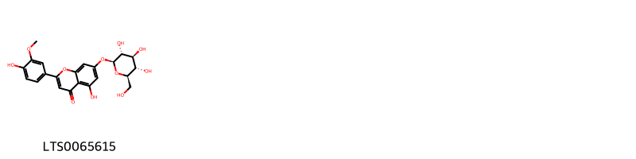{ width=100% }
    <figcaption>Hình ảnh cấu trúc hóa học của 1 hoạt chất thuộc nhóm Flavonoids gồm ['5-hydroxy-2-(4-hydroxy-3-methoxyphenyl)-7-{[(2s,3r,4s,5s,6r)-3,4,5-trihydroxy-6-(hydroxymethyl)oxan-2-yl]oxy}chromen-4-one (LTS0065615)'].</figcaption>
</figure>
#### Nhóm Organooxygen compounds
<figure markdown="span">
    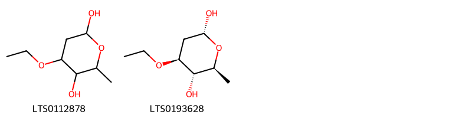{ width=100% }
    <figcaption>Hình ảnh cấu trúc hóa học của 2 hoạt chất thuộc nhóm Organooxygen compounds gồm ['4-ethoxy-6-methyloxane-2,5-diol (LTS0112878)', '(2r,4s,5s,6s)-4-ethoxy-6-methyloxane-2,5-diol (LTS0193628)'].</figcaption>
</figure>
#### Nhóm Prenol lipids
<figure markdown="span">
    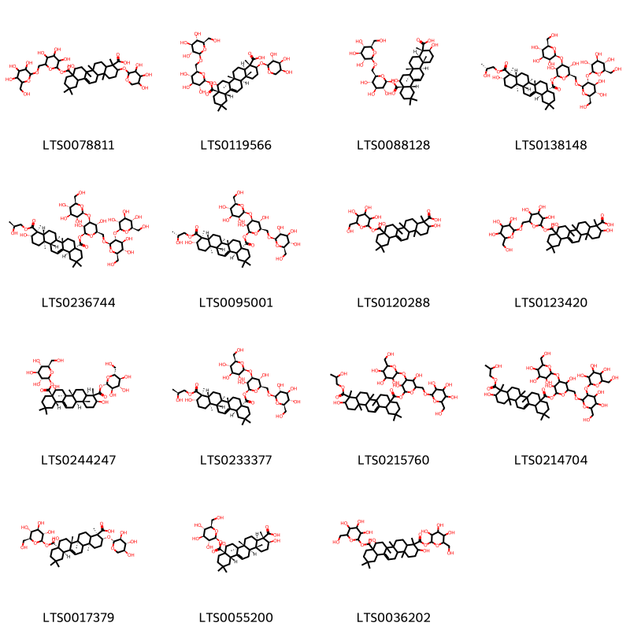{ width=100% }
    <figcaption>Hình ảnh cấu trúc hóa học của 15 hoạt chất thuộc nhóm Prenol lipids gồm ['8-hydroxy-4,6a,6b,11,11,14b-hexamethyl-8a-({[3,4,5-trihydroxy-6-({[3,4,5-trihydroxy-6-(hydroxymethyl)oxan-2-yl]oxy}methyl)oxan-2-yl]oxy}carbonyl)-3-[(3,4,5-trihydroxyoxan-2-yl)oxy]-1,2,3,4a,5,6,7,8,9,10,12,12a,14,14a-tetradecahydropicene-4-carboxylic acid (LTS0078811)', '(3s,4s,4ar,6ar,6bs,8r,8ar,12as,14ar,14br)-8-hydroxy-4,6a,6b,11,11,14b-hexamethyl-8a-({[(2s,3r,4s,5s,6r)-3,4,5-trihydroxy-6-({[(2r,3r,4s,5s,6r)-3,4,5-trihydroxy-6-(hydroxymethyl)oxan-2-yl]oxy}methyl)oxan-2-yl]oxy}carbonyl)-3-{[(2s,3r,4s,5s)-3,4,5-trihydroxyoxan-2-yl]oxy}-1,2,3,4a,5,6,7,8,9,10,12,12a,14,14a-tetradecahydropicene-4-carboxylic acid (LTS0119566)', '(3s,4s,4ar,6ar,6bs,8r,8ar,12as,14ar,14br)-3,8-dihydroxy-4,6a,6b,11,11,14b-hexamethyl-8a-({[(2s,3r,4s,5s,6r)-3,4,5-trihydroxy-6-({[(2r,3r,4s,5s,6r)-3,4,5-trihydroxy-6-(hydroxymethyl)oxan-2-yl]oxy}methyl)oxan-2-yl]oxy}carbonyl)-1,2,3,4a,5,6,7,8,9,10,12,12a,14,14a-tetradecahydropicene-4-carboxylic acid (LTS0088128)', '8a-(2s,3r,4s,5r,6r)-6-({[(2r,3r,4s,5s,6r)-4,5-dihydroxy-6-(hydroxymethyl)-3-{[(2s,3r,4s,5s,6r)-3,4,5-trihydroxy-6-(hydroxymethyl)oxan-2-yl]oxy}oxan-2-yl]oxy}methyl)-3,5-dihydroxy-4-{[(2s,3r,4s,5s,6r)-3,4,5-trihydroxy-6-(hydroxymethyl)oxan-2-yl]oxy}oxan-2-yl 4-(2r)-2-hydroxypropyl (3s,4s,4ar,6ar,6bs,8as,12as,14ar,14br)-3-hydroxy-4,6a,6b,11,11,14b-hexamethyl-1,2,3,4a,5,6,7,8,9,10,12,12a,14,14a-tetradecahydropicene-4,8a-dicarboxylate (LTS0138148)', '8a-(2s,3r,4s,5r,6r)-6-({[(2r,3r,4s,5s,6r)-4,5-dihydroxy-6-(hydroxymethyl)-3-{[(2s,3r,4s,5s,6r)-3,4,5-trihydroxy-6-(hydroxymethyl)oxan-2-yl]oxy}oxan-2-yl]oxy}methyl)-3,5-dihydroxy-4-{[(2s,3r,4s,5s,6r)-3,4,5-trihydroxy-6-(hydroxymethyl)oxan-2-yl]oxy}oxan-2-yl 4-(2s)-2-hydroxypropyl (3s,4s,4ar,6ar,6bs,8as,12as,14ar,14br)-3-hydroxy-4,6a,6b,11,11,14b-hexamethyl-1,2,3,4a,5,6,7,8,9,10,12,12a,14,14a-tetradecahydropicene-4,8a-dicarboxylate (LTS0236744)', '8a-(2s,3r,4s,5r,6r)-3,5-dihydroxy-4-{[(2s,3r,4s,5s,6r)-3,4,5-trihydroxy-6-(hydroxymethyl)oxan-2-yl]oxy}-6-({[(2r,3r,4s,5s,6r)-3,4,5-trihydroxy-6-(hydroxymethyl)oxan-2-yl]oxy}methyl)oxan-2-yl 4-(2r)-2-hydroxypropyl (3s,4s,4ar,6ar,6bs,8as,12as,14ar,14br)-3-hydroxy-4,6a,6b,11,11,14b-hexamethyl-1,2,3,4a,5,6,7,8,9,10,12,12a,14,14a-tetradecahydropicene-4,8a-dicarboxylate (LTS0095001)', '3,8-dihydroxy-4,6a,6b,11,11,14b-hexamethyl-8a-({[3,4,5-trihydroxy-6-(hydroxymethyl)oxan-2-yl]oxy}carbonyl)-1,2,3,4a,5,6,7,8,9,10,12,12a,14,14a-tetradecahydropicene-4-carboxylic acid (LTS0120288)', '3,8-dihydroxy-4,6a,6b,11,11,14b-hexamethyl-8a-({[3,4,5-trihydroxy-6-({[3,4,5-trihydroxy-6-(hydroxymethyl)oxan-2-yl]oxy}methyl)oxan-2-yl]oxy}carbonyl)-1,2,3,4a,5,6,7,8,9,10,12,12a,14,14a-tetradecahydropicene-4-carboxylic acid (LTS0123420)', '4,8a-bis[(2s,3r,4s,5s,6r)-3,4,5-trihydroxy-6-(hydroxymethyl)oxan-2-yl] (3s,4s,4ar,6ar,6bs,8r,8ar,12as,14ar,14br)-3,8-dihydroxy-4,6a,6b,11,11,14b-hexamethyl-1,2,3,4a,5,6,7,8,9,10,12,12a,14,14a-tetradecahydropicene-4,8a-dicarboxylate (LTS0244247)', '8a-(2s,3r,4s,5r,6r)-3,5-dihydroxy-4-{[(2s,3r,4s,5s,6r)-3,4,5-trihydroxy-6-(hydroxymethyl)oxan-2-yl]oxy}-6-({[(2r,3r,4s,5s,6r)-3,4,5-trihydroxy-6-(hydroxymethyl)oxan-2-yl]oxy}methyl)oxan-2-yl 4-(2s)-2-hydroxypropyl (3s,4s,4ar,6ar,6bs,8as,12as,14ar,14br)-3-hydroxy-4,6a,6b,11,11,14b-hexamethyl-1,2,3,4a,5,6,7,8,9,10,12,12a,14,14a-tetradecahydropicene-4,8a-dicarboxylate (LTS0233377)', '8a-(3,5-dihydroxy-4-{[3,4,5-trihydroxy-6-(hydroxymethyl)oxan-2-yl]oxy}-6-({[3,4,5-trihydroxy-6-(hydroxymethyl)oxan-2-yl]oxy}methyl)oxan-2-yl) 4-(2-hydroxypropyl) 3-hydroxy-4,6a,6b,11,11,14b-hexamethyl-1,2,3,4a,5,6,7,8,9,10,12,12a,14,14a-tetradecahydropicene-4,8a-dicarboxylate (LTS0215760)', '8a-[6-({[4,5-dihydroxy-6-(hydroxymethyl)-3-{[3,4,5-trihydroxy-6-(hydroxymethyl)oxan-2-yl]oxy}oxan-2-yl]oxy}methyl)-3,5-dihydroxy-4-{[3,4,5-trihydroxy-6-(hydroxymethyl)oxan-2-yl]oxy}oxan-2-yl] 4-(2-hydroxypropyl) 3-hydroxy-4,6a,6b,11,11,14b-hexamethyl-1,2,3,4a,5,6,7,8,9,10,12,12a,14,14a-tetradecahydropicene-4,8a-dicarboxylate (LTS0214704)', '(3r,4r,6as,6br,8s,8as,12ar,14bs)-8-hydroxy-4,6a,6b,11,11,14b-hexamethyl-8a-({[(2r,3s,4r,5r,6s)-3,4,5-trihydroxy-6-(hydroxymethyl)oxan-2-yl]oxy}carbonyl)-3-{[(2r,3s,4r,5s)-3,4,5-trihydroxyoxan-2-yl]oxy}-1,2,3,4a,5,6,7,8,9,10,12,12a,14,14a-tetradecahydropicene-4-carboxylic acid (LTS0017379)', '(3s,4s,4ar,6ar,6bs,8r,8ar,12as,14ar,14br)-3,8-dihydroxy-4,6a,6b,11,11,14b-hexamethyl-8a-({[(2s,3r,4s,5s,6r)-3,4,5-trihydroxy-6-(hydroxymethyl)oxan-2-yl]oxy}carbonyl)-1,2,3,4a,5,6,7,8,9,10,12,12a,14,14a-tetradecahydropicene-4-carboxylic acid (LTS0055200)', '4,8a-bis[3,4,5-trihydroxy-6-(hydroxymethyl)oxan-2-yl] 3,8-dihydroxy-4,6a,6b,11,11,14b-hexamethyl-1,2,3,4a,5,6,7,8,9,10,12,12a,14,14a-tetradecahydropicene-4,8a-dicarboxylate (LTS0036202)'].</figcaption>
</figure>
#### Nhóm Steroids and steroid derivatives
<figure markdown="span">
    { width=100% }
    <figcaption>Hình ảnh cấu trúc hóa học của 2 hoạt chất thuộc nhóm Steroids and steroid derivatives gồm ['sitogluside (LTS0201798)', '2-{[1-(5-ethyl-6-methylheptan-2-yl)-9a,11a-dimethyl-1h,2h,3h,3ah,3bh,4h,6h,7h,8h,9h,9bh,10h,11h-cyclopenta[a]phenanthren-7-yl]oxy}-6-(hydroxymethyl)oxane-3,4,5-triol (LTS0158828)'].</figcaption>
</figure>

---

### Dược dân tộc học

Danh sách các quốc gia có sử dụng *Dianthus chinensis* trong điều trị các bệnh. 

| Country   | Disease                  | Bệnh                                                                                                                                                                                                |
|:----------|:-------------------------|:----------------------------------------------------------------------------------------------------------------------------------------------------------------------------------------------------|
| China     | Diaphoretic              | MYMEMORY WARNING: YOU USED ALL AVAILABLE FREE TRANSLATIONS FOR TODAY. NEXT AVAILABLE IN  08 HOURS 59 MINUTES 50 SECONDS VISIT HTTPS://MYMEMORY.TRANSLATED.NET/DOC/USAGELIMITS.PHP TO TRANSLATE MORE |
| Elsewhere | Antiphlogistic, Diuretic | MYMEMORY WARNING: YOU USED ALL AVAILABLE FREE TRANSLATIONS FOR TODAY. NEXT AVAILABLE IN  08 HOURS 59 MINUTES 45 SECONDS VISIT HTTPS://MYMEMORY.TRANSLATED.NET/DOC/USAGELIMITS.PHP TO TRANSLATE MORE |

---

---
## Dianthus fischeri
### Thông tin về thực vật

!!! info "Phân loại thực vật của *Dianthus chinensis* từ GIBF:"
    - **Kingdom:** Plantae
    - **Phylum:** Tracheophyta
    - **Order:** Caryophyllales
    - **Family:** Caryophyllaceae
    - **Genus:** Dianthus
    - **Species:** *Dianthus chinensis*

 

| Label (VI)   | Label (EN)   | Scientific Name   | Descriptions (VI)   | Descriptions (EN)   | Also Known As (VI)   | Also Known As (EN)   |
|:-------------|:-------------|:------------------|:--------------------|:--------------------|:---------------------|:---------------------|
| N/A          | N/A          | Dianthus fischeri | loài thực vật       | species of plant    | ['']                 | ['']                 |

#### Phân bố trên thế giới

**Từ CSDL GIBF** nan, Belgium, Ukraine, Russian Federation, Kazakhstan, unknown or invalid, Estonia

#### Phân bố tại Việt Nam

**Từ CSDL GIBF**: Không có ghi nhận ở Việt Nam

---
### Thành phần hóa học
        
- Theo cơ sở dữ liệu lotus: Từ loài *Dianthus chinensis* đã phân lập và xác định được Chưa có hoạt chất nào được phân lập. hoạt chất thuộc về các nhóm Không có hoạt chất nào được phân lập. 

Không có hình ảnh nào được tạo ra

---

### Dược dân tộc học

Danh sách các quốc gia có sử dụng *Dianthus chinensis* trong điều trị các bệnh. 

| Country   | Disease   | Bệnh                                                                                                                                                                                                |
|:----------|:----------|:----------------------------------------------------------------------------------------------------------------------------------------------------------------------------------------------------|
| China     | Vermifuge | MYMEMORY WARNING: YOU USED ALL AVAILABLE FREE TRANSLATIONS FOR TODAY. NEXT AVAILABLE IN  08 HOURS 59 MINUTES 12 SECONDS VISIT HTTPS://MYMEMORY.TRANSLATED.NET/DOC/USAGELIMITS.PHP TO TRANSLATE MORE |

---

---
## Dianthus pectinatus
### Thông tin về thực vật

!!! info "Phân loại thực vật của *Dianthus caespitosus* từ GIBF:"
    - **Kingdom:** Plantae
    - **Phylum:** Tracheophyta
    - **Order:** Caryophyllales
    - **Family:** Caryophyllaceae
    - **Genus:** Dianthus
    - **Species:** *Dianthus caespitosus*

 

| Label (VI)   | Label (EN)   | Scientific Name     | Descriptions (VI)   | Descriptions (EN)   | Also Known As (VI)   | Also Known As (EN)   |
|:-------------|:-------------|:--------------------|:--------------------|:--------------------|:---------------------|:---------------------|
| N/A          | N/A          | Dianthus pectinatus | loài thực vật       | species of plant    | ['']                 | ['']                 |

#### Phân bố trên thế giới

**Từ CSDL GIBF** nan, South Africa

#### Phân bố tại Việt Nam

**Từ CSDL GIBF**: Không có ghi nhận ở Việt Nam

---
### Thành phần hóa học
        
- Theo cơ sở dữ liệu lotus: Từ loài *Dianthus caespitosus* đã phân lập và xác định được Chưa có hoạt chất nào được phân lập. hoạt chất thuộc về các nhóm Không có hoạt chất nào được phân lập. 

Không có hình ảnh nào được tạo ra

---

### Dược dân tộc học

Danh sách các quốc gia có sử dụng *Dianthus caespitosus* trong điều trị các bệnh. 

| Country   | Disease   | Bệnh                                                                                                                                                                                                |
|:----------|:----------|:----------------------------------------------------------------------------------------------------------------------------------------------------------------------------------------------------|
| Lesotho   | Cosmetic  | MYMEMORY WARNING: YOU USED ALL AVAILABLE FREE TRANSLATIONS FOR TODAY. NEXT AVAILABLE IN  08 HOURS 58 MINUTES 35 SECONDS VISIT HTTPS://MYMEMORY.TRANSLATED.NET/DOC/USAGELIMITS.PHP TO TRANSLATE MORE |

---

---
## Dianthus superbus
### Thông tin về thực vật

!!! info "Phân loại thực vật của *Dianthus superbus* từ GIBF:"
    - **Kingdom:** Plantae
    - **Phylum:** Tracheophyta
    - **Order:** Caryophyllales
    - **Family:** Caryophyllaceae
    - **Genus:** Dianthus
    - **Species:** *Dianthus superbus*

 

| Label (VI)   | Label (EN)   | Scientific Name   | Descriptions (VI)   | Descriptions (EN)   | Also Known As (VI)   | Also Known As (EN)             |
|:-------------|:-------------|:------------------|:--------------------|:--------------------|:---------------------|:-------------------------------|
| N/A          | N/A          | Dianthus superbus | loài thực vật       | species of plant    | ['']                 | ['fringed pink', 'large pink'] |

#### Phân bố trên thế giới

**Từ CSDL GIBF** Belarus, Austria, Hungary, Norway, Poland, Mongolia, Sweden, Czechia, Finland, Slovakia, Denmark, Russian Federation, China, Switzerland, Estonia, Germany, France, Netherlands

#### Phân bố tại Việt Nam

**Từ CSDL GIBF**: Không có ghi nhận ở Việt Nam

---
### Thành phần hóa học
        
- Theo cơ sở dữ liệu lotus: Từ loài *Dianthus superbus* đã phân lập và xác định được 24 hoạt chất thuộc về các nhóm Benzene and substituted derivatives, Carboxylic acids and derivatives, Coumarins and derivatives, Anthracenes, Organooxygen compounds, Phenylpropanoic acids, Prenol lipids, Benzopyrans. 

|    | chemicalTaxonomyClassyfireClass     |   smiles_count |
|---:|:------------------------------------|---------------:|
|  0 | Anthracenes                         |              1 |
|  1 | Benzene and substituted derivatives |              2 |
|  2 | Benzopyrans                         |              1 |
|  3 | Carboxylic acids and derivatives    |              7 |
|  4 | Coumarins and derivatives           |              1 |
|  5 | Organooxygen compounds              |              1 |
|  6 | Phenylpropanoic acids               |              1 |
|  7 | Prenol lipids                       |             10 |

#### Nhóm Anthracenes
<figure markdown="span">
    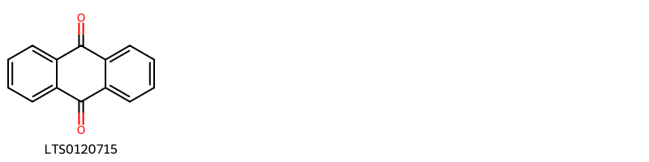{ width=100% }
    <figcaption>Hình ảnh cấu trúc hóa học của 1 hoạt chất thuộc nhóm Anthracenes gồm ['anthraquinone (LTS0120715)'].</figcaption>
</figure>
#### Nhóm Benzene and substituted derivatives
<figure markdown="span">
    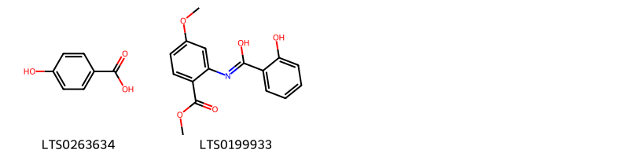{ width=100% }
    <figcaption>Hình ảnh cấu trúc hóa học của 2 hoạt chất thuộc nhóm Benzene and substituted derivatives gồm ['p-hydroxybenzoic acid (LTS0263634)', '2-hydroxy-n-[5-methoxy-2-(methoxycarbonyl)phenyl]benzenecarboximidic acid (LTS0199933)'].</figcaption>
</figure>
#### Nhóm Benzopyrans
<figure markdown="span">
    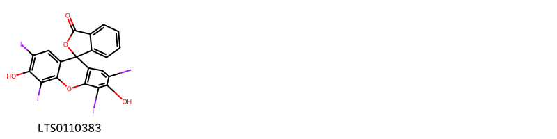{ width=100% }
    <figcaption>Hình ảnh cấu trúc hóa học của 1 hoạt chất thuộc nhóm Benzopyrans gồm ['erythrosine (LTS0110383)'].</figcaption>
</figure>
#### Nhóm Carboxylic acids and derivatives
<figure markdown="span">
    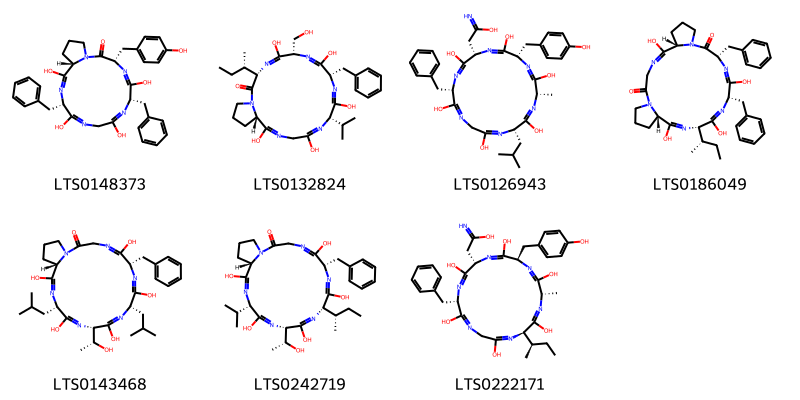{ width=100% }
    <figcaption>Hình ảnh cấu trúc hóa học của 7 hoạt chất thuộc nhóm Carboxylic acids and derivatives gồm ['(3s,9s,12s,17as)-3,9-dibenzyl-1,4,7,10-tetrahydroxy-12-[(4-hydroxyphenyl)methyl]-3h,6h,9h,12h,15h,16h,17h,17ah-pyrrolo[1,2-a]1,4,7,10,13-pentaazacyclopentadecan-13-one (LTS0148373)', '(6s,9s,12s,15s,20as)-9-benzyl-15-[(2s)-butan-2-yl]-1,4,7,10,13-pentahydroxy-12-(hydroxymethyl)-6-isopropyl-3h,6h,9h,12h,15h,18h,19h,20h,20ah-pyrrolo[1,2-a]1,4,7,10,13,16-hexaazacyclooctadecan-16-one (LTS0132824)', '2-[(2s,5s,11s,14s,17s)-5-benzyl-3,6,9,12,15,18-hexahydroxy-17-[(4-hydroxyphenyl)methyl]-14-methyl-11-(2-methylpropyl)-1,4,7,10,13,16-hexaazacyclooctadeca-1(18),3,6,9,12,15-hexaen-2-yl]ethanimidic acid (LTS0126943)', '(6s,12s,15s,18s,21s)-12,15-dibenzyl-18-[(2s)-butan-2-yl]-5,14,17,20-tetrahydroxy-1,4,10,13,16,19-hexaazatricyclo[19.3.0.0⁶,¹⁰]tetracosa-4,13,16,19-tetraene-2,11-dione (LTS0186049)', '(3s,6s,9s,12s,20as)-12-benzyl-1,4,7,10,13-pentahydroxy-6-[(1r)-1-hydroxyethyl]-3,9-bis(2-methylpropyl)-3h,6h,9h,12h,15h,18h,19h,20h,20ah-pyrrolo[1,2-a]1,4,7,10,13,16-hexaazacyclooctadecan-16-one (LTS0143468)', '(3s,6s,9s,12s,20as)-12-benzyl-9-[(2s)-butan-2-yl]-1,4,7,10,13-pentahydroxy-6-[(1r)-1-hydroxyethyl]-3-isopropyl-3h,6h,9h,12h,15h,18h,19h,20h,20ah-pyrrolo[1,2-a]1,4,7,10,13,16-hexaazacyclooctadecan-16-one (LTS0242719)', '2-[(2s,5s,11r,14s,17r)-5-benzyl-11-[(2r)-butan-2-yl]-3,6,9,12,15,18-hexahydroxy-17-[(4-hydroxyphenyl)methyl]-14-methyl-1,4,7,10,13,16-hexaazacyclooctadeca-1(18),3,6,9,12,15-hexaen-2-yl]ethanimidic acid (LTS0222171)'].</figcaption>
</figure>
#### Nhóm Coumarins and derivatives
<figure markdown="span">
    { width=100% }
    <figcaption>Hình ảnh cấu trúc hóa học của 1 hoạt chất thuộc nhóm Coumarins and derivatives gồm ['2h-1-benzopyran-2-one (LTS0069773)'].</figcaption>
</figure>
#### Nhóm Organooxygen compounds
<figure markdown="span">
    { width=100% }
    <figcaption>Hình ảnh cấu trúc hóa học của 1 hoạt chất thuộc nhóm Organooxygen compounds gồm ['p-hydroxybenzaldehyde (LTS0259836)'].</figcaption>
</figure>
#### Nhóm Phenylpropanoic acids
<figure markdown="span">
    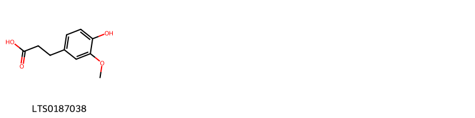{ width=100% }
    <figcaption>Hình ảnh cấu trúc hóa học của 1 hoạt chất thuộc nhóm Phenylpropanoic acids gồm ['homovanillinic acid (LTS0187038)'].</figcaption>
</figure>
#### Nhóm Prenol lipids
<figure markdown="span">
    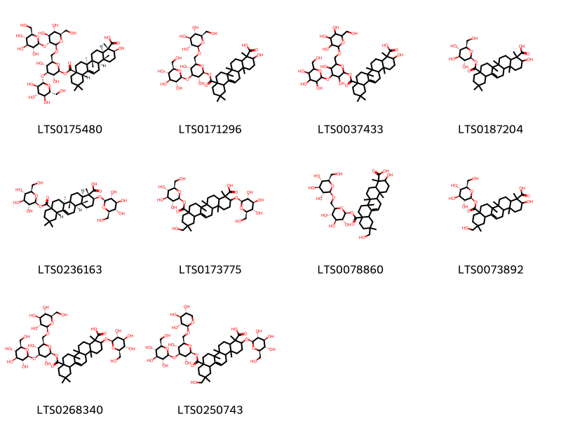{ width=100% }
    <figcaption>Hình ảnh cấu trúc hóa học của 10 hoạt chất thuộc nhóm Prenol lipids gồm ['(3s,4s,4ar,6ar,6bs,8as,12as,14ar,14br)-8a-({[(2s,3r,4s,5r,6r)-6-({[(2r,3r,4s,5s,6r)-4,5-dihydroxy-6-(hydroxymethyl)-3-{[(2s,3r,4s,5s,6r)-3,4,5-trihydroxy-6-(hydroxymethyl)oxan-2-yl]oxy}oxan-2-yl]oxy}methyl)-3,5-dihydroxy-4-{[(2s,3r,4s,5s,6r)-3,4,5-trihydroxy-6-(hydroxymethyl)oxan-2-yl]oxy}oxan-2-yl]oxy}carbonyl)-3-hydroxy-4,6a,6b,11,11,14b-hexamethyl-1,2,3,4a,5,6,7,8,9,10,12,12a,14,14a-tetradecahydropicene-4-carboxylic acid (LTS0175480)', '8a-({[(2s,3r,4s,5r,6r)-3,5-dihydroxy-4-{[(2s,3r,4s,5s,6r)-3,4,5-trihydroxy-6-(hydroxymethyl)oxan-2-yl]oxy}-6-({[(2r,3r,4s,5s,6r)-3,4,5-trihydroxy-6-(hydroxymethyl)oxan-2-yl]oxy}methyl)oxan-2-yl]oxy}carbonyl)-3-hydroxy-4,6a,6b,11,11,14b-hexamethyl-1,2,3,4a,5,6,7,8,9,10,12,12a,14,14a-tetradecahydropicene-4-carboxylic acid (LTS0171296)', '8a-{[(3,5-dihydroxy-4-{[3,4,5-trihydroxy-6-(hydroxymethyl)oxan-2-yl]oxy}-6-({[3,4,5-trihydroxy-6-(hydroxymethyl)oxan-2-yl]oxy}methyl)oxan-2-yl)oxy]carbonyl}-3-hydroxy-4,6a,6b,11,11,14b-hexamethyl-1,2,3,4a,5,6,7,8,9,10,12,12a,14,14a-tetradecahydropicene-4-carboxylic acid (LTS0037433)', '3-hydroxy-4,6a,6b,11,11,14b-hexamethyl-8a-({[(2s,3r,4s,5s,6r)-3,4,5-trihydroxy-6-(hydroxymethyl)oxan-2-yl]oxy}carbonyl)-1,2,3,4a,5,6,7,8,9,10,12,12a,14,14a-tetradecahydropicene-4-carboxylic acid (LTS0187204)', 'dianoside a (LTS0236163)', '11-(hydroxymethyl)-4,6a,6b,11,14b-pentamethyl-3-{[(2r,3r,4s,5s,6r)-3,4,5-trihydroxy-6-(hydroxymethyl)oxan-2-yl]oxy}-8a-({[(2s,3r,4s,5s,6r)-3,4,5-trihydroxy-6-(hydroxymethyl)oxan-2-yl]oxy}carbonyl)-1,2,3,4a,5,6,7,8,9,10,12,12a,14,14a-tetradecahydropicene-4-carboxylic acid (LTS0173775)', '3-hydroxy-11-(hydroxymethyl)-4,6a,6b,11,14b-pentamethyl-8a-({[(2s,3r,4s,5s,6r)-3,4,5-trihydroxy-6-({[(2r,3r,4s,5s,6r)-3,4,5-trihydroxy-6-(hydroxymethyl)oxan-2-yl]oxy}methyl)oxan-2-yl]oxy}carbonyl)-1,2,3,4a,5,6,7,8,9,10,12,12a,14,14a-tetradecahydropicene-4-carboxylic acid (LTS0078860)', '3-hydroxy-11-(hydroxymethyl)-4,6a,6b,11,14b-pentamethyl-8a-({[(2s,3r,4s,5s,6r)-3,4,5-trihydroxy-6-(hydroxymethyl)oxan-2-yl]oxy}carbonyl)-1,2,3,4a,5,6,7,8,9,10,12,12a,14,14a-tetradecahydropicene-4-carboxylic acid (LTS0073892)', '8a-({[(2s,3r,4s,5r,6r)-3,5-dihydroxy-4-{[(2s,3r,4s,5s,6r)-3,4,5-trihydroxy-6-(hydroxymethyl)oxan-2-yl]oxy}-6-({[(2r,3r,4s,5s,6r)-3,4,5-trihydroxy-6-(hydroxymethyl)oxan-2-yl]oxy}methyl)oxan-2-yl]oxy}carbonyl)-4,6a,6b,11,11,14b-hexamethyl-3-{[(2r,3r,4s,5s,6r)-3,4,5-trihydroxy-6-(hydroxymethyl)oxan-2-yl]oxy}-1,2,3,4a,5,6,7,8,9,10,12,12a,14,14a-tetradecahydropicene-4-carboxylic acid (LTS0268340)', '8a-({[(2s,3r,4s,5r,6r)-3,5-dihydroxy-4-{[(2s,3r,4s,5s,6r)-3,4,5-trihydroxy-6-(hydroxymethyl)oxan-2-yl]oxy}-6-({[(2s,3r,4s,5r)-3,4,5-trihydroxyoxan-2-yl]oxy}methyl)oxan-2-yl]oxy}carbonyl)-11-(hydroxymethyl)-4,6a,6b,11,14b-pentamethyl-3-{[(2r,3r,4s,5s,6r)-3,4,5-trihydroxy-6-(hydroxymethyl)oxan-2-yl]oxy}-1,2,3,4a,5,6,7,8,9,10,12,12a,14,14a-tetradecahydropicene-4-carboxylic acid (LTS0250743)'].</figcaption>
</figure>

---

### Dược dân tộc học

Danh sách các quốc gia có sử dụng *Dianthus superbus* trong điều trị các bệnh. 

| Country   | Disease                                                                       | Bệnh                                                                                                                                                                                                |
|:----------|:------------------------------------------------------------------------------|:----------------------------------------------------------------------------------------------------------------------------------------------------------------------------------------------------|
| China     | Diuretic, Emmenagogue, Vulnerary, Abortifacient, Diuretic, Diuretic, Diuretic | MYMEMORY WARNING: YOU USED ALL AVAILABLE FREE TRANSLATIONS FOR TODAY. NEXT AVAILABLE IN  08 HOURS 58 MINUTES 07 SECONDS VISIT HTTPS://MYMEMORY.TRANSLATED.NET/DOC/USAGELIMITS.PHP TO TRANSLATE MORE |
| Elsewhere | Diuretic, Diuretic, Antiphlogistic, Antiphlogistic                            | MYMEMORY WARNING: YOU USED ALL AVAILABLE FREE TRANSLATIONS FOR TODAY. NEXT AVAILABLE IN  08 HOURS 58 MINUTES 04 SECONDS VISIT HTTPS://MYMEMORY.TRANSLATED.NET/DOC/USAGELIMITS.PHP TO TRANSLATE MORE |

---

