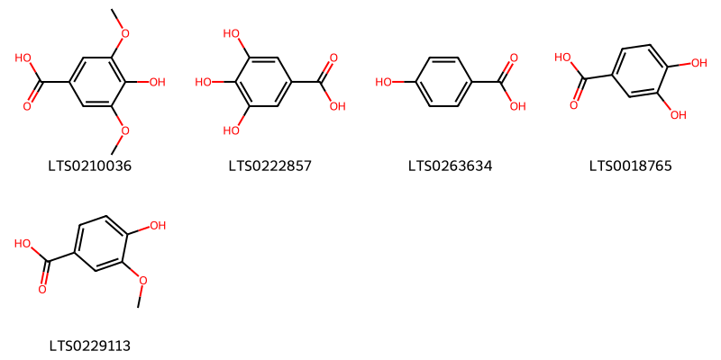
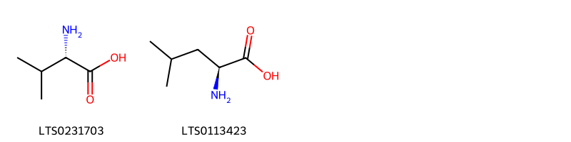
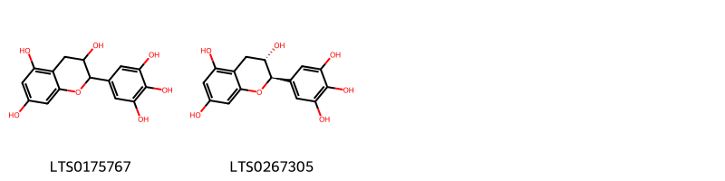
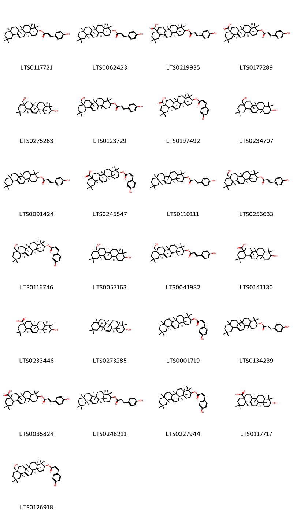
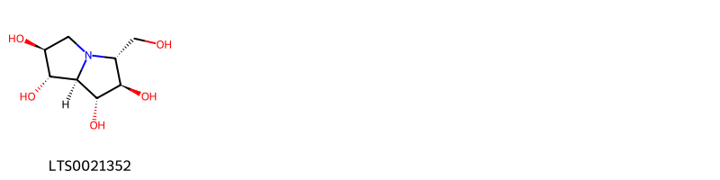

!!! abstract "Tóm tắt"

    Họ Casuarinaceae gồm khoảng 1 chi và 1 loài được một số cộng đồng tại các quốc gia như Mexico, Elsewhere, Tonga, Egypt, Philippines, anish sử dụng trong một số trường hợp Chất làm se, Ecbolic, Chất làm se, Xà phòng, Thuốc lợi tiểu, Chất làm se, Thuốc nhuận tràng, Thuốc bổ, Chất làm se, Chất làm se.

!!! info "DrDuke"

    James A. Duke sinh năm 1929-2017 là một nhà thực vật học người Mỹ. Đây là một trong những tác giả hàng đầu trong lĩnh vực dược dân tộc học với cuốn *CRC Handbook of Medicinal Herbs* và chính là người xây dựng lên cơ sở dữ liệu về hợp chất tự nhiên và dược dân tộc học tại Bộ nông nghiệp Hoa Kỳ. Các thông tin được đăng tải tại website [Dr. Duke's Phytochemical and Ethnobotanical Databases](https://phytochem.nal.usda.gov/). 
    Trong suốt thập niên 1970, ông lãnh đạo the Plant Taxonomy Laboratory, Plant Genetics and Germplasm Institute of the Agricultural Research Service, U.S. Department of Agriculture.
    Trong tài liệu này, các thông tin về dược dân tộc của các dược liệu được trích dẫn từ tài liệu của James A. Ducke với sự trợ giúp của phần mềm dịch thuật từ tiếng Anh sang tiếng Việt.
   

# Chi Casuarina

??? note "Danh sách các dược liệu thuộc chi"
    
	 - *Casuarina equisetifolia*

---
## Casuarina equisetifolia
### Thông tin về thực vật

!!! info "Phân loại thực vật của *Casuarina equisetifolia* từ GIBF:"
    - **Kingdom:** Plantae
    - **Phylum:** Tracheophyta
    - **Order:** Fagales
    - **Family:** Casuarinaceae
    - **Genus:** Casuarina
    - **Species:** *Casuarina equisetifolia*

 

| Label (VI)   | Label (EN)   | Scientific Name         | Descriptions (VI)   | Descriptions (EN)   | Also Known As (VI)   | Also Known As (EN)                                                                                                                                       |
|:-------------|:-------------|:------------------------|:--------------------|:--------------------|:---------------------|:---------------------------------------------------------------------------------------------------------------------------------------------------------|
| N/A          | N/A          | Casuarina equisetifolia | loài thực vật       | species of plant    | ['']                 | ['agoho pine', 'Australian pine', 'Australian pine tree', 'beach sheoak', 'horsetail tree', 'whistling pine tree', 'beach casuarina', 'coastal she-oak'] |

#### Phân bố trên thế giới

**Từ CSDL GIBF** Brazil, Senegal, Barbados, Antigua and Barbuda, Honduras, French Polynesia, Thailand, Turks and Caicos Islands, Spain, Puerto Rico, Cayman Islands, United States of America, Jamaica, Indonesia, Dominican Republic, Nigeria, Kiribati, Cuba, French Guiana, Hong Kong, Mexico, Benin, Vanuatu, Maldives, Guam, Chinese Taipei, Haiti, Malaysia, Singapore, Bahamas, South Africa, Australia, India, Northern Mariana Islands, Bolivia (Plurinational State of), Belize

#### Phân bố tại Việt Nam

**Từ CSDL GIBF**: Không có ghi nhận ở Việt Nam

---
### Thành phần hóa học
        
- Theo cơ sở dữ liệu lotus: Từ loài *Casuarina equisetifolia* đã phân lập và xác định được 38 hoạt chất thuộc về các nhóm Benzene and substituted derivatives, Flavonoids, Carboxylic acids and derivatives, Cinnamic acids and derivatives, Prenol lipids, Pyrrolizidines, Indoles and derivatives. 

|    | chemicalTaxonomyClassyfireClass     |   smiles_count |
|---:|:------------------------------------|---------------:|
|  0 | Benzene and substituted derivatives |              5 |
|  1 | Carboxylic acids and derivatives    |              2 |
|  2 | Cinnamic acids and derivatives      |              2 |
|  3 | Flavonoids                          |              2 |
|  4 | Indoles and derivatives             |              1 |
|  5 | Prenol lipids                       |             25 |
|  6 | Pyrrolizidines                      |              1 |

#### Nhóm Benzene and substituted derivatives
<figure markdown="span">
    { width=100% }
    <figcaption>Hình ảnh cấu trúc hóa học của 5 hoạt chất thuộc nhóm Benzene and substituted derivatives gồm ['syringic acid (LTS0210036)', 'galop (LTS0222857)', 'p-hydroxybenzoic acid (LTS0263634)', '3,4-dihydroxybenzoic acid (LTS0018765)', 'vanillic acid (LTS0229113)'].</figcaption>
</figure>
#### Nhóm Carboxylic acids and derivatives
<figure markdown="span">
    { width=100% }
    <figcaption>Hình ảnh cấu trúc hóa học của 2 hoạt chất thuộc nhóm Carboxylic acids and derivatives gồm ['l-valine (LTS0231703)', 'l-leucine (LTS0113423)'].</figcaption>
</figure>
#### Nhóm Cinnamic acids and derivatives
<figure markdown="span">
    { width=100% }
    <figcaption>Hình ảnh cấu trúc hóa học của 2 hoạt chất thuộc nhóm Cinnamic acids and derivatives gồm ['para-coumaric acid (LTS0266252)', 'hydroxycinnamic acid (LTS0233023)'].</figcaption>
</figure>
#### Nhóm Flavonoids
<figure markdown="span">
    { width=100% }
    <figcaption>Hình ảnh cấu trúc hóa học của 2 hoạt chất thuộc nhóm Flavonoids gồm ['epigallocatechin (LTS0175767)', 'gallocatechol (LTS0267305)'].</figcaption>
</figure>
#### Nhóm Indoles and derivatives
<figure markdown="span">
    { width=100% }
    <figcaption>Hình ảnh cấu trúc hóa học của 1 hoạt chất thuộc nhóm Indoles and derivatives gồm ['l-tryptophan (LTS0263809)'].</figcaption>
</figure>
#### Nhóm Prenol lipids
<figure markdown="span">
    { width=100% }
    <figcaption>Hình ảnh cấu trúc hóa học của 25 hoạt chất thuộc nhóm Prenol lipids gồm ['(3s,4ar,6ar,6bs,8ar,12as,14ar,14br)-4,4,6a,6b,8a,11,11,14b-octamethyl-1,2,3,4a,5,6,7,8,9,10,12,12a,14,14a-tetradecahydropicen-3-yl (2e)-3-(4-hydroxyphenyl)prop-2-enoate (LTS0117721)', '(3s,4ar,6ar,6bs,8ar,12ar,14ar,14br)-4,4,6a,6b,8a,11,11,14b-octamethyl-1,2,3,4a,5,6,7,8,9,10,12,12a,14,14a-tetradecahydropicen-3-yl (2e)-3-(4-hydroxyphenyl)prop-2-enoate (LTS0062423)', '(4as,6as,6br,8ar,10s,12ar,12br,14br)-10-{[(2e)-3-(4-hydroxyphenyl)prop-2-enoyl]oxy}-2,2,6a,6b,9,9,12a-heptamethyl-1,3,4,5,6,7,8,8a,10,11,12,12b,13,14b-tetradecahydropicene-4a-carboxylic acid (LTS0219935)', '(4as,6as,6br,8ar,10s,12ar,12br,14bs)-10-{[(2e)-3-(4-hydroxyphenyl)prop-2-enoyl]oxy}-2,2,6a,6b,9,9,12a-heptamethyl-1,3,4,5,6,7,8,8a,10,11,12,12b,13,14b-tetradecahydropicene-4a-carboxylic acid (LTS0177289)', '(3s,4ar,6ar,6bs,8as,12ar,14ar,14br)-8a-(hydroxymethyl)-4,4,6a,6b,11,11,14b-heptamethyl-1,2,3,4a,5,6,7,8,9,10,12,12a,14,14a-tetradecahydropicen-3-ol (LTS0275263)', '8a-(hydroxymethyl)-4,4,6a,6b,11,11,14b-heptamethyl-1,2,3,4a,5,6,7,8,9,10,12,12a,14,14a-tetradecahydropicen-3-yl 3-(4-hydroxyphenyl)prop-2-enoate (LTS0123729)', '(4as,6as,6br,8ar,10s,12ar,12br,14br)-10-{[(2z)-3-(4-hydroxyphenyl)prop-2-enoyl]oxy}-2,2,6a,6b,9,9,12a-heptamethyl-1,3,4,5,6,7,8,8a,10,11,12,12b,13,14b-tetradecahydropicene-4a-carboxylic acid (LTS0197492)', '8a-(hydroxymethyl)-4,4,6a,6b,11,11,14b-heptamethyl-1,2,3,4a,5,6,7,8,9,10,12,12a,14,14a-tetradecahydropicen-3-ol (LTS0234707)', '4,4,6a,6b,8a,11,11,14b-octamethyl-1,2,3,4a,5,6,7,8,9,10,12,12a,14,14a-tetradecahydropicen-3-yl 3-(4-hydroxyphenyl)prop-2-enoate (LTS0091424)', '(4as,6as,6br,8ar,10s,12ar,12br,14bs)-10-{[(2z)-3-(4-hydroxyphenyl)prop-2-enoyl]oxy}-2,2,6a,6b,9,9,12a-heptamethyl-1,3,4,5,6,7,8,8a,10,11,12,12b,13,14b-tetradecahydropicene-4a-carboxylic acid (LTS0245547)', '(3s,4ar,6ar,6bs,8ar,12ar,14ar,14br)-4,4,6a,6b,8a,11,11,14b-octamethyl-1,2,3,4a,5,6,7,8,9,10,12,12a,14,14a-tetradecahydropicen-3-yl 3-(4-hydroxyphenyl)propanoate (LTS0110111)', '(3s,4ar,6ar,6bs,8as,12as,14ar,14br)-8a-(hydroxymethyl)-4,4,6a,6b,11,11,14b-heptamethyl-1,2,3,4a,5,6,7,8,9,10,12,12a,14,14a-tetradecahydropicen-3-yl (2e)-3-(4-hydroxyphenyl)prop-2-enoate (LTS0256633)', '(3s,4ar,6ar,6bs,8as,12ar,14ar,14br)-8a-(hydroxymethyl)-4,4,6a,6b,11,11,14b-heptamethyl-1,2,3,4a,5,6,7,8,9,10,12,12a,14,14a-tetradecahydropicen-3-yl (2z)-3-(4-hydroxyphenyl)prop-2-enoate (LTS0116746)', 'erythrodiol (LTS0057163)', '(3s,4ar,6ar,6bs,8as,12ar,14ar,14br)-8a-(hydroxymethyl)-4,4,6a,6b,11,11,14b-heptamethyl-1,2,3,4a,5,6,7,8,9,10,12,12a,14,14a-tetradecahydropicen-3-yl (2e)-3-(4-hydroxyphenyl)prop-2-enoate (LTS0041982)', 'oleanolic acid (LTS0141130)', '(4as,6as,6br,8ar,10s,12ar,12br,14br)-10-hydroxy-2,2,6a,6b,9,9,12a-heptamethyl-1,3,4,5,6,7,8,8a,10,11,12,12b,13,14b-tetradecahydropicene-4a-carboxylic acid (LTS0233446)', '(3s,4as,6ar,6br,8ar,12as,12br,14ar,14bs)-4,4,6a,6b,8a,11,11,14b-octamethyl-1,2,3,4a,5,6,7,8,9,10,12,12a,12b,14a-tetradecahydropicen-3-ol (LTS0273285)', '(3s,4ar,6ar,6bs,8ar,12as,14ar,14br)-4,4,6a,6b,8a,11,11,14b-octamethyl-1,2,3,4a,5,6,7,8,9,10,12,12a,14,14a-tetradecahydropicen-3-yl (2z)-3-(4-hydroxyphenyl)prop-2-enoate (LTS0001719)', '4,4,6a,6b,8a,11,11,14b-octamethyl-1,2,3,4a,5,6,7,8,9,10,12,12a,14,14a-tetradecahydropicen-3-yl 3-(4-hydroxyphenyl)propanoate (LTS0134239)', '10-{[3-(4-hydroxyphenyl)prop-2-enoyl]oxy}-2,2,6a,6b,9,9,12a-heptamethyl-1,3,4,5,6,7,8,8a,10,11,12,12b,13,14b-tetradecahydropicene-4a-carboxylic acid (LTS0035824)', '(3s,4ar,6ar,6bs,8ar,12as,14ar,14br)-4,4,6a,6b,8a,11,11,14b-octamethyl-1,2,3,4a,5,6,7,8,9,10,12,12a,14,14a-tetradecahydropicen-3-yl 3-(4-hydroxyphenyl)propanoate (LTS0248211)', '(3s,4ar,6ar,6bs,8ar,12ar,14ar,14br)-4,4,6a,6b,8a,11,11,14b-octamethyl-1,2,3,4a,5,6,7,8,9,10,12,12a,14,14a-tetradecahydropicen-3-yl (2z)-3-(4-hydroxyphenyl)prop-2-enoate (LTS0227944)', 'oleanolic acid (LTS0117717)', '(3s,4ar,6ar,6bs,8as,12as,14ar,14br)-8a-(hydroxymethyl)-4,4,6a,6b,11,11,14b-heptamethyl-1,2,3,4a,5,6,7,8,9,10,12,12a,14,14a-tetradecahydropicen-3-yl (2z)-3-(4-hydroxyphenyl)prop-2-enoate (LTS0126918)'].</figcaption>
</figure>
#### Nhóm Pyrrolizidines
<figure markdown="span">
    { width=100% }
    <figcaption>Hình ảnh cấu trúc hóa học của 1 hoạt chất thuộc nhóm Pyrrolizidines gồm ['casuarine (LTS0021352)'].</figcaption>
</figure>

---

### Dược dân tộc học

Danh sách các quốc gia có sử dụng *Casuarina equisetifolia* trong điều trị các bệnh. 

| Country     | Disease                                | Bệnh                                   |
|:------------|:---------------------------------------|:---------------------------------------|
| Egypt       | Astringent                             | Lam se da                              |
| Elsewhere   | Astringent, Ecbolic, Emmenagogue, Soap | Làm se, Ecbolic, Emmenagogue, Xà phòng |
| Mexico      | Tonic, Astringent                      | Thuốc bổ, làm se                       |
| Philippines | Diuretic, Emmenagogue                  | Thuốc lợi tiểu, Thuốc lợi tiểu         |
| Tonga       | Laxative                               | Nhuận trường                           |
| anish       | Astringent                             | Lam se da                              |

---

