!!! abstract "Tóm tắt"

    Họ Celastraceae gồm khoảng 12 chi và 28 loài được một số cộng đồng tại các quốc gia như Mexico, Guatemala, Brazil, French, Senegal, Philippines, Haiti, China, Arabia, Dutch, Turkey, Hindu, US(Appalachia), ain, Cambodia, Zambia, Elsewhere, Paraguay, anish, US(Amerindian), Rhodesia, Malaya, Africa, India, US, Ethiopia, Europe, Malawi sử dụng trong một số trường hợp QUERY LENGTH LIMIT EXCEEDED. MAX ALLOWED QUERY : 500 CHARS MYMEMORY WARNING: YOU USED ALL AVAILABLE FREE TRANSLATIONS FOR TODAY. NEXT AVAILABLE IN  16 HOURS 42 MINUTES 50 SECONDS VISIT HTTPS://MYMEMORY.TRANSLATED.NET/DOC/USAGELIMITS.PHP TO TRANSLATE MORE.

!!! info "DrDuke"

    James A. Duke sinh năm 1929-2017 là một nhà thực vật học người Mỹ. Đây là một trong những tác giả hàng đầu trong lĩnh vực dược dân tộc học với cuốn *CRC Handbook of Medicinal Herbs* và chính là người xây dựng lên cơ sở dữ liệu về hợp chất tự nhiên và dược dân tộc học tại Bộ nông nghiệp Hoa Kỳ. Các thông tin được đăng tải tại website [Dr. Duke's Phytochemical and Ethnobotanical Databases](https://phytochem.nal.usda.gov/). 
    Trong suốt thập niên 1970, ông lãnh đạo the Plant Taxonomy Laboratory, Plant Genetics and Germplasm Institute of the Agricultural Research Service, U.S. Department of Agriculture.
    Trong tài liệu này, các thông tin về dược dân tộc của các dược liệu được trích dẫn từ tài liệu của James A. Ducke với sự trợ giúp của phần mềm dịch thuật từ tiếng Anh sang tiếng Việt.
   

# Chi Catha

??? note "Danh sách các dược liệu thuộc chi"
    
	 - *Catha edulis*

---
## Catha edulis
### Thông tin về thực vật

!!! info "Phân loại thực vật của *Catha edulis* từ GIBF:"
    - **Kingdom:** Plantae
    - **Phylum:** Tracheophyta
    - **Order:** Celastrales
    - **Family:** Celastraceae
    - **Genus:** Catha
    - **Species:** *Catha edulis*

 

| Label (VI)   | Label (EN)   | Scientific Name   | Descriptions (VI)   | Descriptions (EN)                                                      | Also Known As (VI)   | Also Known As (EN)                                                                                                                                               |
|:-------------|:-------------|:------------------|:--------------------|:-----------------------------------------------------------------------|:---------------------|:-----------------------------------------------------------------------------------------------------------------------------------------------------------------|
| N/A          | N/A          | Catha edulis      | loài thực vật       | species of plant, commonly used by humans for its psychoactive effects | ['']                 | ['chat', 'gat', 'khat', 'Abyssinian tea', 'African tea', 'Arabian tea', 'Arabic khat', "Bushmen's tea", 'jaad', 'jimaa', 'mayirungi', 'qaat', 'qat', 'wild tea'] |

#### Phân bố trên thế giới

**Từ CSDL GIBF** nan, China, Zimbabwe, New Zealand, Mozambique, Tanzania, United Republic of, Somalia, Yemen, Madagascar, Spain, United States of America, Indonesia, unknown or invalid, Ethiopia, Malawi, Kenya, Norway, Eswatini, Saudi Arabia, Belgium, Malaysia, Egypt, South Africa

#### Phân bố tại Việt Nam

**Từ CSDL GIBF**: Không có ghi nhận ở Việt Nam

---
### Thành phần hóa học
        
- Theo cơ sở dữ liệu lotus: Từ loài *Catha edulis* đã phân lập và xác định được 101 hoạt chất thuộc về các nhóm Dihydrofurans, Benzene and substituted derivatives, Cinnamyl alcohols, Flavonoids, Carboxylic acids and derivatives, Cinnamic acids and derivatives, Steroids and steroid derivatives, Pyridines and derivatives, Organooxygen compounds, Macrolides and analogues, Prenol lipids. 

|    | chemicalTaxonomyClassyfireClass     |   smiles_count |
|---:|:------------------------------------|---------------:|
|  0 |                                     |             12 |
|  1 | Benzene and substituted derivatives |              7 |
|  2 | Carboxylic acids and derivatives    |             17 |
|  3 | Cinnamic acids and derivatives      |              1 |
|  4 | Cinnamyl alcohols                   |              3 |
|  5 | Dihydrofurans                       |              1 |
|  6 | Flavonoids                          |             11 |
|  7 | Macrolides and analogues            |              2 |
|  8 | Organooxygen compounds              |              8 |
|  9 | Prenol lipids                       |             36 |
| 10 | Pyridines and derivatives           |              1 |
| 11 | Steroids and steroid derivatives    |              2 |

#### Nhóm 
<figure markdown="span">
    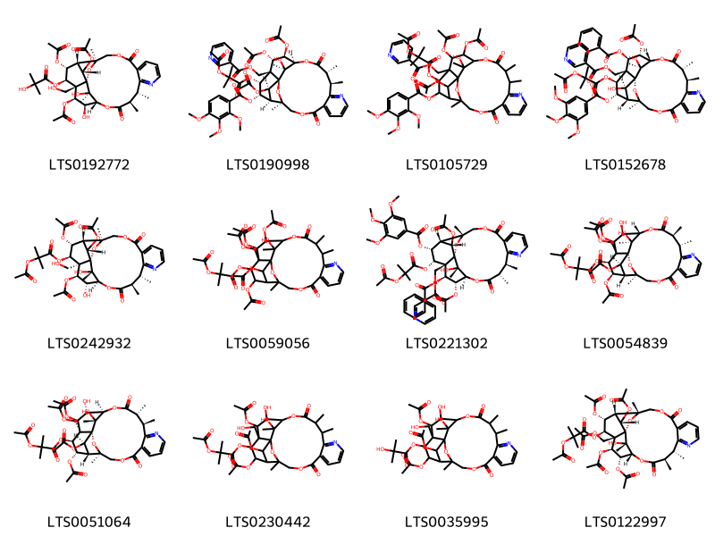{ width=100% }
    <figcaption>Hình ảnh cấu trúc hóa học của 12 hoạt chất thuộc nhóm  gồm ['(1r,3s,13r,14r,17r,18s,19s,20r,21r,22r,23s,24s,25r)-19,22,24-tris(acetyloxy)-18,25-dihydroxy-20-(hydroxymethyl)-3,13,14,25-tetramethyl-6,15-dioxo-2,5,16-trioxa-11-azapentacyclo[15.7.1.0¹,²⁰.0³,²³.0⁷,¹²]pentacosa-7,9,11-trien-21-yl 2-hydroxy-2-methylpropanoate (LTS0192772)', '[(1r,3r,13r,14r,17r,18r,19s,20r,21r,22s,23s,24r,25s)-18,19,24-tris(acetyloxy)-21-{[2-(acetyloxy)-2-methylpropanoyl]oxy}-25-hydroxy-3,13,14,25-tetramethyl-6,15-dioxo-22-(2,3,4-trimethoxybenzoyloxy)-2,5,16-trioxa-11-azapentacyclo[15.7.1.0¹,²⁰.0³,²³.0⁷,¹²]pentacosa-7,9,11-trien-20-yl]methyl pyridine-3-carboxylate (LTS0190998)', '[18,19,24-tris(acetyloxy)-21-{[2-(acetyloxy)-2-methylpropanoyl]oxy}-25-hydroxy-3,13,14,25-tetramethyl-6,15-dioxo-22-(2,3,4-trimethoxybenzoyloxy)-2,5,16-trioxa-11-azapentacyclo[15.7.1.0¹,²⁰.0³,²³.0⁷,¹²]pentacosa-7,9,11-trien-20-yl]methyl pyridine-3-carboxylate (LTS0105729)', '[(1s,3r,13r,14r,17s,18s,19r,20r,21s,22s,23s,24r,25s)-18-(acetyloxy)-21-{[2-(acetyloxy)-2-methylpropanoyl]oxy}-19-(benzoyloxy)-24,25-dihydroxy-3,13,14,25-tetramethyl-6,15-dioxo-22-(3,4,5-trimethoxybenzoyloxy)-2,5,16-trioxa-11-azapentacyclo[15.7.1.0¹,²⁰.0³,²³.0⁷,¹²]pentacosa-7,9,11-trien-20-yl]methyl pyridine-3-carboxylate (LTS0152678)', '(1r,3s,13r,14r,17s,18r,19s,20s,21r,22r,23s,24s,25s)-19,22,24-tris(acetyloxy)-18,25-dihydroxy-20-(hydroxymethyl)-3,13,14,25-tetramethyl-6,15-dioxo-2,5,16-trioxa-11-azapentacyclo[15.7.1.0¹,²⁰.0³,²³.0⁷,¹²]pentacosa-7,9,11-trien-21-yl 2-(acetyloxy)-2-methylpropanoate (LTS0242932)', '18,19,22,24-tetrakis(acetyloxy)-20-[(acetyloxy)methyl]-25-hydroxy-3,13,14,25-tetramethyl-6,15-dioxo-2,5,16-trioxa-11-azapentacyclo[15.7.1.0¹,²⁰.0³,²³.0⁷,¹²]pentacosa-7,9,11-trien-21-yl 2-(acetyloxy)-2-methylpropanoate (LTS0059056)', '[(1r,3r,13s,14s,17s,18r,19s,20s,21s,22r,23s,24s,25s)-18,24-bis(acetyloxy)-21-{[2-(acetyloxy)-2-methylpropanoyl]oxy}-19-(benzoyloxy)-25-hydroxy-3,13,14,25-tetramethyl-6,15-dioxo-22-(3,4,5-trimethoxybenzoyloxy)-2,5,16-trioxa-11-azapentacyclo[15.7.1.0¹,²⁰.0³,²³.0⁷,¹²]pentacosa-7,9,11-trien-20-yl]methyl pyridine-3-carboxylate (LTS0221302)', '(1s,3r,13s,14s,17s,18r,19r,20s,21s,22r,23r,24r,25s)-19,22,24-tris(acetyloxy)-20-[(acetyloxy)methyl]-18,25-dihydroxy-3,13,14,25-tetramethyl-6,15-dioxo-2,5,16-trioxa-11-azapentacyclo[15.7.1.0¹,²⁰.0³,²³.0⁷,¹²]pentacosa-7,9,11-trien-21-yl 2-(acetyloxy)-2-methylpropanoate (LTS0054839)', '(1s,3r,13r,14r,17r,18s,19r,20r,21s,22s,23r,24r,25r)-19,22,24-tris(acetyloxy)-20-[(acetyloxy)methyl]-18,25-dihydroxy-3,13,14,25-tetramethyl-6,15-dioxo-2,5,16-trioxa-11-azapentacyclo[15.7.1.0¹,²⁰.0³,²³.0⁷,¹²]pentacosa-7,9,11-trien-21-yl 2-(acetyloxy)-2-methylpropanoate (LTS0051064)', '19,22,24-tris(acetyloxy)-18,25-dihydroxy-20-(hydroxymethyl)-3,13,14,25-tetramethyl-6,15-dioxo-2,5,16-trioxa-11-azapentacyclo[15.7.1.0¹,²⁰.0³,²³.0⁷,¹²]pentacosa-7,9,11-trien-21-yl 2-(acetyloxy)-2-methylpropanoate (LTS0230442)', '19,22,24-tris(acetyloxy)-18,25-dihydroxy-20-(hydroxymethyl)-3,13,14,25-tetramethyl-6,15-dioxo-2,5,16-trioxa-11-azapentacyclo[15.7.1.0¹,²⁰.0³,²³.0⁷,¹²]pentacosa-7,9,11-trien-21-yl 2-hydroxy-2-methylpropanoate (LTS0035995)', '(1r,3r,13r,14r,17r,18r,19s,20s,21r,22r,23s,24s,25s)-18,19,22,24-tetrakis(acetyloxy)-20-[(acetyloxy)methyl]-25-hydroxy-3,13,14,25-tetramethyl-6,15-dioxo-2,5,16-trioxa-11-azapentacyclo[15.7.1.0¹,²⁰.0³,²³.0⁷,¹²]pentacosa-7,9,11-trien-21-yl 2-(acetyloxy)-2-methylpropanoate (LTS0122997)'].</figcaption>
</figure>
#### Nhóm Benzene and substituted derivatives
<figure markdown="span">
    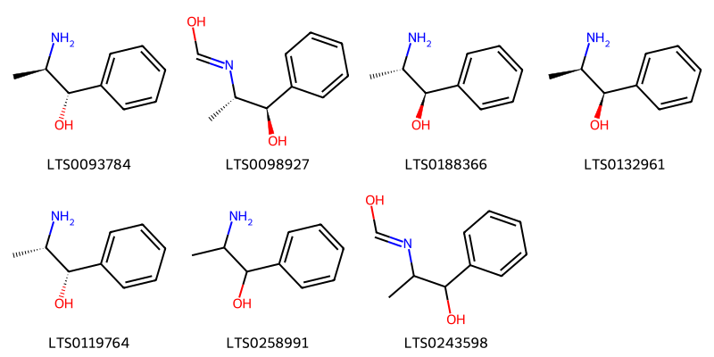{ width=100% }
    <figcaption>Hình ảnh cấu trúc hóa học của 7 hoạt chất thuộc nhóm Benzene and substituted derivatives gồm ['phenylpropanolamine (LTS0093784)', 'n-[(1r,2s)-1-hydroxy-1-phenylpropan-2-yl]carboximidic acid (LTS0098927)', '(-)-norephedrine (LTS0188366)', 'l-norpseudoephedrine (LTS0132961)', 'cathine (LTS0119764)', '2-amino-1-phenyl-propan-1-ol (LTS0258991)', 'n-(1-hydroxy-1-phenylpropan-2-yl)carboximidic acid (LTS0243598)'].</figcaption>
</figure>
#### Nhóm Carboxylic acids and derivatives
<figure markdown="span">
    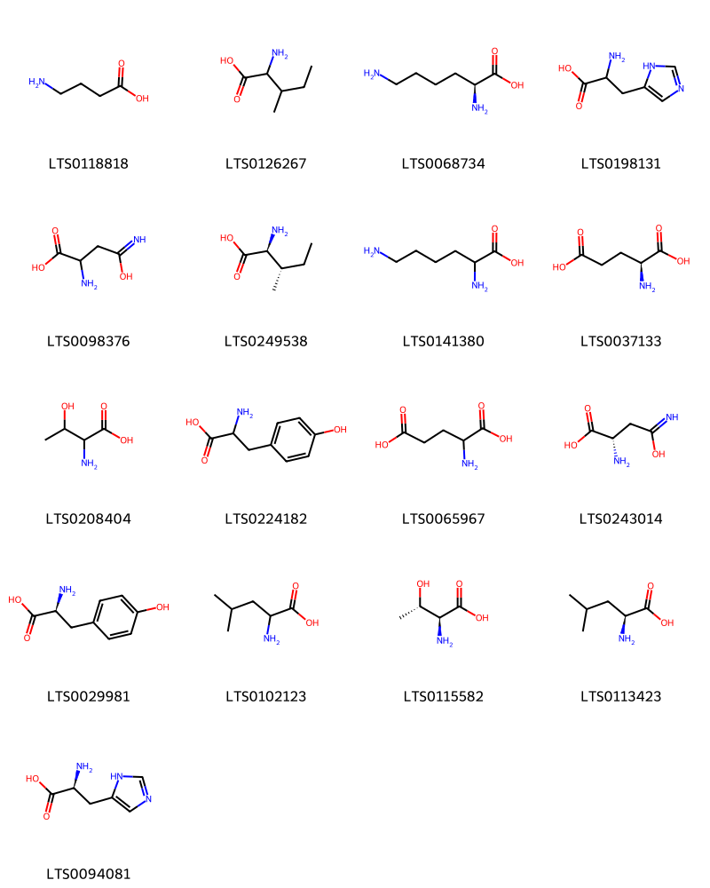{ width=100% }
    <figcaption>Hình ảnh cấu trúc hóa học của 17 hoạt chất thuộc nhóm Carboxylic acids and derivatives gồm ['gamma(amino)-butyric acid (LTS0118818)', 'lisoleucine (LTS0126267)', 'l-lysine (LTS0068734)', 'histidine (LTS0198131)', 'asparagine (LTS0098376)', 'l-isoleucine (LTS0249538)', 'lysine (LTS0141380)', 'l-glutamic acid (LTS0037133)', 'threonine(l) (LTS0208404)', 'tyrosin (LTS0224182)', 'glutaminsaeure (LTS0065967)', 'aspartamate (LTS0243014)', 'l-tyrosine (LTS0029981)', 'leucine (LTS0102123)', 'l-allothreonine (LTS0115582)', 'l-leucine (LTS0113423)', 'l-histidine (LTS0094081)'].</figcaption>
</figure>
#### Nhóm Cinnamic acids and derivatives
<figure markdown="span">
    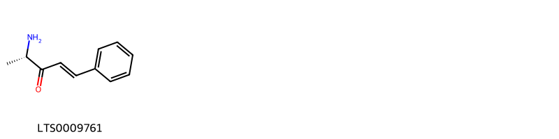{ width=100% }
    <figcaption>Hình ảnh cấu trúc hóa học của 1 hoạt chất thuộc nhóm Cinnamic acids and derivatives gồm ['(1e,4s)-4-amino-1-phenylpent-1-en-3-one (LTS0009761)'].</figcaption>
</figure>
#### Nhóm Cinnamyl alcohols
<figure markdown="span">
    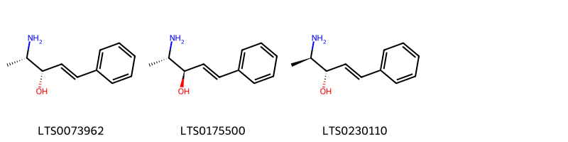{ width=100% }
    <figcaption>Hình ảnh cấu trúc hóa học của 3 hoạt chất thuộc nhóm Cinnamyl alcohols gồm ['(1e,3s,4s)-4-amino-1-phenylpent-1-en-3-ol (LTS0073962)', '(1e,3r,4s)-4-amino-1-phenylpent-1-en-3-ol (LTS0175500)', '(1e,3s,4r)-4-amino-1-phenylpent-1-en-3-ol (LTS0230110)'].</figcaption>
</figure>
#### Nhóm Dihydrofurans
<figure markdown="span">
    { width=100% }
    <figcaption>Hình ảnh cấu trúc hóa học của 1 hoạt chất thuộc nhóm Dihydrofurans gồm ['vitamin c (LTS0022555)'].</figcaption>
</figure>
#### Nhóm Flavonoids
<figure markdown="span">
    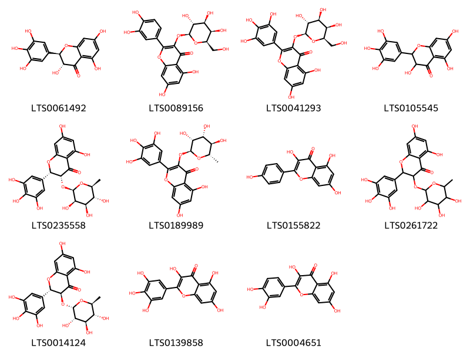{ width=100% }
    <figcaption>Hình ảnh cấu trúc hóa học của 11 hoạt chất thuộc nhóm Flavonoids gồm ['(+)-dihydromyricetin (LTS0061492)', 'hyperoside (LTS0089156)', '5,7-dihydroxy-3-{[(2s,3r,4s,5r,6r)-3,4,5-trihydroxy-6-(hydroxymethyl)oxan-2-yl]oxy}-2-(3,4,5-trihydroxyphenyl)chromen-4-one (LTS0041293)', 'dihydromyricetin (LTS0105545)', '(2s,3r)-5,7-dihydroxy-3-{[(2r,3r,4r,5r,6s)-3,4,5-trihydroxy-6-methyloxan-2-yl]oxy}-2-(3,4,5-trihydroxyphenyl)-2,3-dihydro-1-benzopyran-4-one (LTS0235558)', 'myricitrin (LTS0189989)', 'kaempherol (LTS0155822)', '5,7-dihydroxy-3-[(3,4,5-trihydroxy-6-methyloxan-2-yl)oxy]-2-(3,4,5-trihydroxyphenyl)-2,3-dihydro-1-benzopyran-4-one (LTS0261722)', '(2s,3s)-5,7-dihydroxy-3-{[(2s,3s,4r,5r,6s)-3,4,5-trihydroxy-6-methyloxan-2-yl]oxy}-2-(3,4,5-trihydroxyphenyl)-2,3-dihydro-1-benzopyran-4-one (LTS0014124)', 'myricetin (LTS0139858)', 'quercetin (LTS0004651)'].</figcaption>
</figure>
#### Nhóm Macrolides and analogues
<figure markdown="span">
    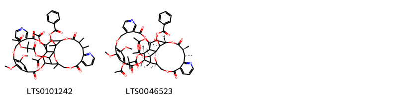{ width=100% }
    <figcaption>Hình ảnh cấu trúc hóa học của 2 hoạt chất thuộc nhóm Macrolides and analogues gồm ['6,25-bis(acetyloxy)-43-{[2-(acetyloxy)-2-methylpropanoyl]oxy}-44-hydroxy-39,42-dimethoxy-9,19,20,44-tetramethyl-2,12,21,29-tetraoxo-3,8,11,22,28,37-hexaoxa-17,32-diazaoctacyclo[36.2.2.1⁴,²⁶.1⁷,²³.0⁵,⁹.0⁷,²⁶.0¹³,¹⁸.0³⁰,³⁵]tetratetraconta-1(40),13,15,17,30,32,34,38,41-nonaen-24-yl benzoate (LTS0101242)', '(4r,5r,6r,7s,9r,19s,20s,23s,24r,25r,26r,43s,44s)-6,25-bis(acetyloxy)-43-{[2-(acetyloxy)-2-methylpropanoyl]oxy}-44-hydroxy-39,42-dimethoxy-9,19,20,44-tetramethyl-2,12,21,29-tetraoxo-3,8,11,22,28,37-hexaoxa-17,32-diazaoctacyclo[36.2.2.1⁴,²⁶.1⁷,²³.0⁵,⁹.0⁷,²⁶.0¹³,¹⁸.0³⁰,³⁵]tetratetraconta-1(40),13,15,17,30,32,34,38,41-nonaen-24-yl benzoate (LTS0046523)'].</figcaption>
</figure>
#### Nhóm Organooxygen compounds
<figure markdown="span">
    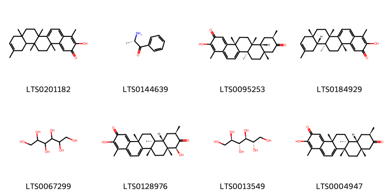{ width=100% }
    <figcaption>Hình ảnh cấu trúc hóa học của 8 hoạt chất thuộc nhóm Organooxygen compounds gồm ['3-hydroxy-4,6b,8a,11,12b,14a-hexamethyl-8,9,12,12a,13,14-hexahydro-7h-picen-2-one (LTS0201182)', 'cathinone (LTS0144639)', 'tingenone (LTS0095253)', '(6bs,8as,12ar,12bs,14ar)-3-hydroxy-4,6b,8a,11,12b,14a-hexamethyl-8,9,12,12a,13,14-hexahydro-7h-picen-2-one (LTS0184929)', 'sorbo (LTS0067299)', '(6bs,8ar,9s,11r,12as,12bs,14ar)-3,9-dihydroxy-4,6b,8a,11,12b,14a-hexamethyl-7,8,9,11,12,12a,13,14-octahydropicene-2,10-dione (LTS0128976)', 'd-allitol (LTS0013549)', '(6bs,8as,11r,12ar,12bs,14ar)-3-hydroxy-4,6b,8a,11,12b,14a-hexamethyl-7,8,9,11,12,12a,13,14-octahydropicene-2,10-dione (LTS0004947)'].</figcaption>
</figure>
#### Nhóm Prenol lipids
<figure markdown="span">
    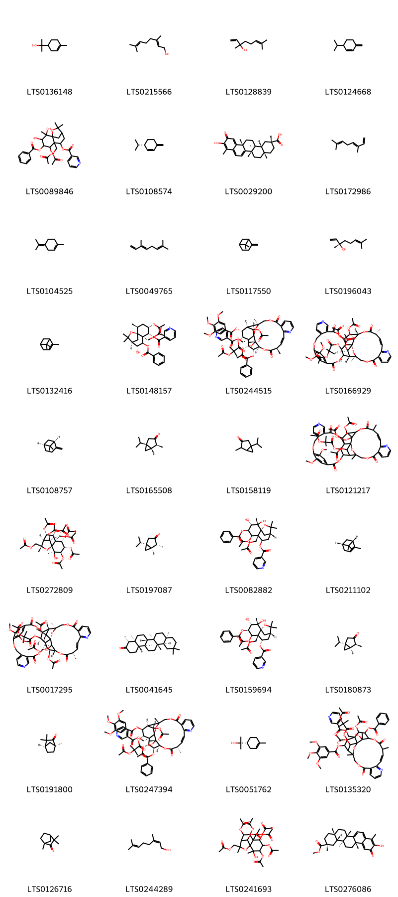{ width=100% }
    <figcaption>Hình ảnh cấu trúc hóa học của 36 hoạt chất thuộc nhóm Prenol lipids gồm ['terpineol (LTS0136148)', '3,7-dimethyl-2,6-octadien-1-ol (LTS0215566)', 'linalool, (+-)- (LTS0128839)', 'β phellandrene (LTS0124668)', '5-(acetyloxy)-6-[(acetyloxy)methyl]-4-(benzoyloxy)-2,3-dihydroxy-2,10,10-trimethyl-11-oxatricyclo[7.2.1.0¹,⁶]dodecan-7-yl pyridine-3-carboxylate (LTS0089846)', '(+)-β-phellandrene (LTS0108574)', 'celastrol (LTS0029200)', '3,7-dimethyl-1,3,6-octatriene (LTS0172986)', 'terpinolene (LTS0104525)', 'trans-β-ocimene (LTS0049765)', 'β-pinene (LTS0117550)', '(+)-linalool (LTS0196043)', 'α pinene (LTS0132416)', '[(1s,2s,4s,5r,6r,7r,8r,9s)-4,5-bis(acetyloxy)-7-(benzoyloxy)-8-hydroxy-2,10,10-trimethyl-11-oxatricyclo[7.2.1.0¹,⁶]dodecan-6-yl]methyl pyridine-3-carboxylate (LTS0148157)', '[(1s,3s,13z,15r,18s,19r,20r,21r,22s,23r,24r,25r,26s)-20,25-bis(acetyloxy)-22-{[2-(acetyloxy)-2-methylpropanoyl]oxy}-19-(benzoyloxy)-26-hydroxy-3,15,26-trimethyl-6,16-dioxo-23-(3,4,5-trimethoxybenzoyloxy)-2,5,17-trioxa-11-azapentacyclo[16.7.1.0¹,²¹.0³,²⁴.0⁷,¹²]hexacosa-7,9,11,13-tetraen-21-yl]methyl pyridine-3-carboxylate (LTS0244515)', '(4r,5r,6r,7s,9r,19z,21r,24s,25r,26r,27r,44s,45s)-6,25,26-tris(acetyloxy)-45-hydroxy-40,43-dimethoxy-9,21,45-trimethyl-2,12,22,30-tetraoxo-3,8,11,23,29,38-hexaoxa-17,33-diazaoctacyclo[37.2.2.1⁴,²⁷.1⁷,²⁴.0⁵,⁹.0⁷,²⁷.0¹³,¹⁸.0³¹,³⁶]pentatetraconta-1(41),13,15,17,19,31,33,35,39,42-decaen-44-yl 2-(acetyloxy)-2-methylpropanoate (LTS0166929)', '(-)-β-pinene (LTS0108757)', '(+)-thujone (LTS0165508)', '3-isothujone (LTS0158119)', '6,25,26-tris(acetyloxy)-45-hydroxy-40,43-dimethoxy-9,21,45-trimethyl-2,12,22,30-tetraoxo-3,8,11,23,29,38-hexaoxa-17,33-diazaoctacyclo[37.2.2.1⁴,²⁷.1⁷,²⁴.0⁵,⁹.0⁷,²⁷.0¹³,¹⁸.0³¹,³⁶]pentatetraconta-1(41),13,15,17,19,31,33,35,39,42-decaen-44-yl 2-(acetyloxy)-2-methylpropanoate (LTS0121217)', '[(1r,2r,3r,4s,5s,6s,7r,8s,9s,10s,12r)-3,4,5,7,8,12-hexakis(acetyloxy)-6-[(acetyloxy)methyl]-2-hydroxy-2,10-dimethyl-11-oxatricyclo[7.2.1.0¹,⁶]dodecan-10-yl]methyl acetate (LTS0272809)', 'thujone (LTS0197087)', '(1r,2s,3s,4s,5r,6r,7r,9r)-5-(acetyloxy)-6-[(acetyloxy)methyl]-4-(benzoyloxy)-2,3-dihydroxy-2,10,10-trimethyl-11-oxatricyclo[7.2.1.0¹,⁶]dodecan-7-yl pyridine-3-carboxylate (LTS0082882)', '(+)-α-pinene (LTS0211102)', '(4r,5s,6r,7r,9s,19e,21s,24r,25s,26r,27r,44r,45r)-6,25,26-tris(acetyloxy)-45-hydroxy-40,43-dimethoxy-9,21,45-trimethyl-2,12,22,30-tetraoxo-3,8,11,23,29,38-hexaoxa-17,33-diazaoctacyclo[37.2.2.1⁴,²⁷.1⁷,²⁴.0⁵,⁹.0⁷,²⁷.0¹³,¹⁸.0³¹,³⁶]pentatetraconta-1(41),13,15,17,19,31,33,35,39,42-decaen-44-yl 2-(acetyloxy)-2-methylpropanoate (LTS0017295)', '(-)-friedelin (LTS0041645)', '(1r,2s,3s,4s,5r,6r,7s,9r)-5-(acetyloxy)-6-[(acetyloxy)methyl]-4-(benzoyloxy)-2,3-dihydroxy-2,10,10-trimethyl-11-oxatricyclo[7.2.1.0¹,⁶]dodecan-7-yl pyridine-3-carboxylate (LTS0159694)', '(+)-β-thujone (LTS0180873)', '(+)-fenchone (LTS0191800)', '[(1s,3r,13z,15s,18s,19s,20r,21r,22s,23s,24r,25s,26s)-20,25-bis(acetyloxy)-22-{[2-(acetyloxy)-2-methylpropanoyl]oxy}-19-(benzoyloxy)-26-hydroxy-3,15,26-trimethyl-6,16-dioxo-23-(3,4,5-trimethoxybenzoyloxy)-2,5,17-trioxa-11-azapentacyclo[16.7.1.0¹,²¹.0³,²⁴.0⁷,¹²]hexacosa-7,9,11,13-tetraen-21-yl]methyl pyridine-3-carboxylate (LTS0247394)', 'lily of valley (LTS0051762)', '[20,25-bis(acetyloxy)-22-{[2-(acetyloxy)-2-methylpropanoyl]oxy}-19-(benzoyloxy)-26-hydroxy-3,15,26-trimethyl-6,16-dioxo-23-(3,4,5-trimethoxybenzoyloxy)-2,5,17-trioxa-11-azapentacyclo[16.7.1.0¹,²¹.0³,²⁴.0⁷,¹²]hexacosa-7,9,11,13-tetraen-21-yl]methyl pyridine-3-carboxylate (LTS0135320)', 'fenchone (LTS0126716)', 'nerol (LTS0244289)', '[3,4,5,7,8,12-hexakis(acetyloxy)-6-[(acetyloxy)methyl]-2-hydroxy-2,10-dimethyl-11-oxatricyclo[7.2.1.0¹,⁶]dodecan-10-yl]methyl acetate (LTS0241693)', 'celastrol methyl ester (LTS0276086)'].</figcaption>
</figure>
#### Nhóm Pyridines and derivatives
<figure markdown="span">
    { width=100% }
    <figcaption>Hình ảnh cấu trúc hóa học của 1 hoạt chất thuộc nhóm Pyridines and derivatives gồm ['niacin (LTS0216673)'].</figcaption>
</figure>
#### Nhóm Steroids and steroid derivatives
<figure markdown="span">
    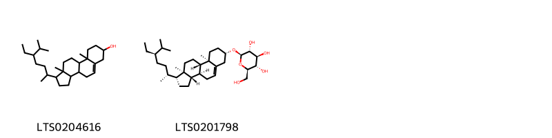{ width=100% }
    <figcaption>Hình ảnh cấu trúc hóa học của 2 hoạt chất thuộc nhóm Steroids and steroid derivatives gồm ['stigmast-5-en-3-ol, (3β)- (LTS0204616)', 'sitogluside (LTS0201798)'].</figcaption>
</figure>

---

### Dược dân tộc học

Danh sách các quốc gia có sử dụng *Catha edulis* trong điều trị các bệnh. 

| Country   | Disease                                                        | Bệnh                                                                                                                                                                                                |
|:----------|:---------------------------------------------------------------|:----------------------------------------------------------------------------------------------------------------------------------------------------------------------------------------------------|
| Africa    | Stimulant                                                      | MYMEMORY WARNING: YOU USED ALL AVAILABLE FREE TRANSLATIONS FOR TODAY. NEXT AVAILABLE IN  16 HOURS 42 MINUTES 48 SECONDS VISIT HTTPS://MYMEMORY.TRANSLATED.NET/DOC/USAGELIMITS.PHP TO TRANSLATE MORE |
| Arabia    | Poison                                                         | MYMEMORY WARNING: YOU USED ALL AVAILABLE FREE TRANSLATIONS FOR TODAY. NEXT AVAILABLE IN  16 HOURS 42 MINUTES 45 SECONDS VISIT HTTPS://MYMEMORY.TRANSLATED.NET/DOC/USAGELIMITS.PHP TO TRANSLATE MORE |
| Elsewhere | Astringent, Narcotic, Narcotic, Narcotic, Stimulant, Stimulant | MYMEMORY WARNING: YOU USED ALL AVAILABLE FREE TRANSLATIONS FOR TODAY. NEXT AVAILABLE IN  16 HOURS 42 MINUTES 43 SECONDS VISIT HTTPS://MYMEMORY.TRANSLATED.NET/DOC/USAGELIMITS.PHP TO TRANSLATE MORE |
| Ethiopia  | Stimulant, Aphrodisiac                                         | MYMEMORY WARNING: YOU USED ALL AVAILABLE FREE TRANSLATIONS FOR TODAY. NEXT AVAILABLE IN  16 HOURS 42 MINUTES 41 SECONDS VISIT HTTPS://MYMEMORY.TRANSLATED.NET/DOC/USAGELIMITS.PHP TO TRANSLATE MORE |

---

# Chi Pristimera

??? note "Danh sách các dược liệu thuộc chi"
    
	 - *Pristimera celastroides*

---
## Pristimera celastroides
### Thông tin về thực vật

!!! info "Phân loại thực vật của *Pristimera celastroides* từ GIBF:"
    - **Kingdom:** Plantae
    - **Phylum:** Tracheophyta
    - **Order:** Celastrales
    - **Family:** Celastraceae
    - **Genus:** Pristimera
    - **Species:** *Pristimera celastroides*

 

| Label (VI)   | Label (EN)   | Scientific Name         | Descriptions (VI)   | Descriptions (EN)   | Also Known As (VI)   | Also Known As (EN)   |
|:-------------|:-------------|:------------------------|:--------------------|:--------------------|:---------------------|:---------------------|
| N/A          | N/A          | Pristimera celastroides | loài thực vật       | species of plant    | ['']                 | ['']                 |

#### Phân bố trên thế giới

**Từ CSDL GIBF** nan, Mexico, Brazil, El Salvador, Costa Rica, Colombia, Bolivia (Plurinational State of), Puerto Rico

#### Phân bố tại Việt Nam

**Từ CSDL GIBF**: Không có ghi nhận ở Việt Nam

---
### Thành phần hóa học
        
- Theo cơ sở dữ liệu lotus: Từ loài *Pristimera celastroides* đã phân lập và xác định được Chưa có hoạt chất nào được phân lập. hoạt chất thuộc về các nhóm Không có hoạt chất nào được phân lập. 

Không có hình ảnh nào được tạo ra

---

### Dược dân tộc học

Danh sách các quốc gia có sử dụng *Pristimera celastroides* trong điều trị các bệnh. 

| Country   | Disease      | Bệnh                                                                                                                                                                                                |
|:----------|:-------------|:----------------------------------------------------------------------------------------------------------------------------------------------------------------------------------------------------|
| Mexico    | Pediculicide | MYMEMORY WARNING: YOU USED ALL AVAILABLE FREE TRANSLATIONS FOR TODAY. NEXT AVAILABLE IN  16 HOURS 42 MINUTES 01 SECONDS VISIT HTTPS://MYMEMORY.TRANSLATED.NET/DOC/USAGELIMITS.PHP TO TRANSLATE MORE |

---

# Chi Maytenus

??? note "Danh sách các dược liệu thuộc chi"
    
	 - *Maytenus ilicifolia*
	 - *Maytenus senegalensis*

---
## Maytenus ilicifolia
### Thông tin về thực vật

!!! info "Phân loại thực vật của *N/A* từ GIBF:"
    - **Kingdom:** Plantae
    - **Phylum:** Tracheophyta
    - **Order:** Celastrales
    - **Family:** Celastraceae
    - **Genus:** Monteverdia
    - **Species:** *N/A*

 

| Label (VI)   | Label (EN)   | Scientific Name     | Descriptions (VI)   | Descriptions (EN)   | Also Known As (VI)   | Also Known As (EN)   |
|:-------------|:-------------|:--------------------|:--------------------|:--------------------|:---------------------|:---------------------|
| N/A          | N/A          | Maytenus ilicifolia | loài thực vật       | species of plant    | ['']                 | ['']                 |

#### Phân bố trên thế giới

**Từ CSDL GIBF** Brazil, Mexico, Bolivia (Plurinational State of), El Salvador, Virgin Islands (U.S.), Martinique, Peru, Costa Rica, Dominican Republic, Colombia, Argentina, Ecuador, French Guiana, Uruguay, Puerto Rico

#### Phân bố tại Việt Nam

**Từ CSDL GIBF**: Không có ghi nhận ở Việt Nam

---
### Thành phần hóa học
        
- Theo cơ sở dữ liệu lotus: Từ loài *N/A* đã phân lập và xác định được Chưa có hoạt chất nào được phân lập. hoạt chất thuộc về các nhóm Không có hoạt chất nào được phân lập. 

Không có hình ảnh nào được tạo ra

---

### Dược dân tộc học

Danh sách các quốc gia có sử dụng *N/A* trong điều trị các bệnh. 

| Country   | Disease                                                       | Bệnh                                                                                                                                                                                                |
|:----------|:--------------------------------------------------------------|:----------------------------------------------------------------------------------------------------------------------------------------------------------------------------------------------------|
| Brazil    | Astringent, Cicatrizant, Tonic, Apertif, Analgesic, Stomachic | MYMEMORY WARNING: YOU USED ALL AVAILABLE FREE TRANSLATIONS FOR TODAY. NEXT AVAILABLE IN  16 HOURS 41 MINUTES 37 SECONDS VISIT HTTPS://MYMEMORY.TRANSLATED.NET/DOC/USAGELIMITS.PHP TO TRANSLATE MORE |
| Paraguay  | Antifertility, Contraceptive                                  | MYMEMORY WARNING: YOU USED ALL AVAILABLE FREE TRANSLATIONS FOR TODAY. NEXT AVAILABLE IN  16 HOURS 41 MINUTES 34 SECONDS VISIT HTTPS://MYMEMORY.TRANSLATED.NET/DOC/USAGELIMITS.PHP TO TRANSLATE MORE |

---

---
## Maytenus senegalensis
### Thông tin về thực vật

!!! info "Phân loại thực vật của *Gymnosporia senegalensis* từ GIBF:"
    - **Kingdom:** Plantae
    - **Phylum:** Tracheophyta
    - **Order:** Celastrales
    - **Family:** Celastraceae
    - **Genus:** Gymnosporia
    - **Species:** *Gymnosporia senegalensis*

 

| Label (VI)   | Label (EN)   | Scientific Name       | Descriptions (VI)   | Descriptions (EN)   | Also Known As (VI)   | Also Known As (EN)                 |
|:-------------|:-------------|:----------------------|:--------------------|:--------------------|:---------------------|:-----------------------------------|
| N/A          | N/A          | Maytenus senegalensis | loài thực vật       | species of plant    | ['']                 | ['Category:Maytenus senegalensis'] |

#### Phân bố trên thế giới

**Từ CSDL GIBF** Benin, Uganda, Kenya, Senegal, Saudi Arabia, Nigeria, Somalia, Burkina Faso, Ethiopia, Togo, Spain

#### Phân bố tại Việt Nam

**Từ CSDL GIBF**: Không có ghi nhận ở Việt Nam

---
### Thành phần hóa học
        
- Theo cơ sở dữ liệu lotus: Từ loài *Gymnosporia senegalensis* đã phân lập và xác định được 22 hoạt chất thuộc về các nhóm Organooxygen compounds, Flavonoids. 

|    | chemicalTaxonomyClassyfireClass   |   smiles_count |
|---:|:----------------------------------|---------------:|
|  0 | Flavonoids                        |             20 |
|  1 | Organooxygen compounds            |              2 |

#### Nhóm Flavonoids
<figure markdown="span">
    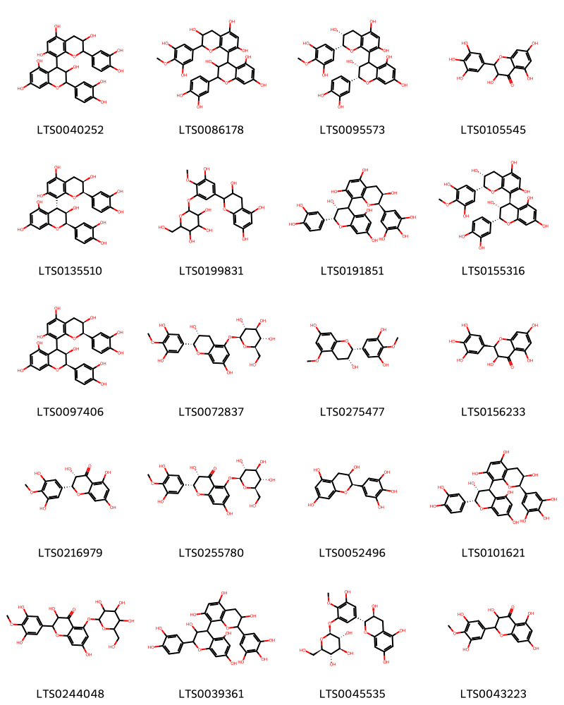{ width=100% }
    <figcaption>Hình ảnh cấu trúc hóa học của 20 hoạt chất thuộc nhóm Flavonoids gồm ['2-(3,4-dihydroxyphenyl)-4-[2-(3,4-dihydroxyphenyl)-3,5,7-trihydroxy-3,4-dihydro-2h-1-benzopyran-8-yl]-3,4-dihydro-2h-1-benzopyran-3,5,7-triol (LTS0040252)', '2-(3,5-dihydroxy-4-methoxyphenyl)-8-[2-(3,4-dihydroxyphenyl)-3,5,7-trihydroxy-3,4-dihydro-2h-1-benzopyran-4-yl]-3,4-dihydro-2h-1-benzopyran-3,5,7-triol (LTS0086178)', '(2r,3r)-2-(3,5-dihydroxy-4-methoxyphenyl)-8-[(2r,3r)-2-(3,4-dihydroxyphenyl)-3,5,7-trihydroxy-3,4-dihydro-2h-1-benzopyran-4-yl]-3,4-dihydro-2h-1-benzopyran-3,5,7-triol (LTS0095573)', 'dihydromyricetin (LTS0105545)', '(2r,3r,4r)-2-(3,4-dihydroxyphenyl)-4-[(2r,3r)-2-(3,4-dihydroxyphenyl)-3,5,7-trihydroxy-3,4-dihydro-2h-1-benzopyran-8-yl]-3,4-dihydro-2h-1-benzopyran-3,5,7-triol (LTS0135510)', '2-(3-hydroxy-4-methoxy-5-{[3,4,5-trihydroxy-6-(hydroxymethyl)oxan-2-yl]oxy}phenyl)-3,4-dihydro-2h-1-benzopyran-3,5,7-triol (LTS0199831)', '(2r,3r)-2-(3,4-dihydroxyphenyl)-4-[(2r,3r)-3,5,7-trihydroxy-2-(3,4,5-trihydroxyphenyl)-3,4-dihydro-2h-1-benzopyran-8-yl]-3,4-dihydro-2h-1-benzopyran-3,5,7-triol (LTS0191851)', '(2r,3r)-2-(3,5-dihydroxy-4-methoxyphenyl)-8-[(2r,3r,4r)-2-(3,4-dihydroxyphenyl)-3,5,7-trihydroxy-3,4-dihydro-2h-1-benzopyran-4-yl]-3,4-dihydro-2h-1-benzopyran-3,5,7-triol (LTS0155316)', '(2r,3r)-2-(3,4-dihydroxyphenyl)-4-[(2r,3r)-2-(3,4-dihydroxyphenyl)-3,5,7-trihydroxy-3,4-dihydro-2h-1-benzopyran-8-yl]-3,4-dihydro-2h-1-benzopyran-3,5,7-triol (LTS0097406)', '(2s,3r,4s,5s,6r)-2-{[(2r,3r)-2-(3,5-dihydroxy-4-methoxyphenyl)-3,7-dihydroxy-3,4-dihydro-2h-1-benzopyran-5-yl]oxy}-6-(hydroxymethyl)oxane-3,4,5-triol (LTS0072837)', '(2r,3r)-2-(3,5-dihydroxy-4-methoxyphenyl)-5-methoxy-3,4-dihydro-2h-1-benzopyran-3,7-diol (LTS0275477)', '(2r,3s)-3,5,7-trihydroxy-2-(3,4,5-trihydroxyphenyl)-2,3-dihydro-1-benzopyran-4-one (LTS0156233)', '(2r,3s)-2-(3,5-dihydroxy-4-methoxyphenyl)-3,5,7-trihydroxy-2,3-dihydro-1-benzopyran-4-one (LTS0216979)', '(2r,3s)-2-(3,5-dihydroxy-4-methoxyphenyl)-3,7-dihydroxy-5-{[(2s,3r,4s,5s,6r)-3,4,5-trihydroxy-6-(hydroxymethyl)oxan-2-yl]oxy}-2,3-dihydro-1-benzopyran-4-one (LTS0255780)', 'epigallocatechin (LTS0052496)', '(2r,3r,4r)-2-(3,4-dihydroxyphenyl)-4-[(2r,3r)-3,5,7-trihydroxy-2-(3,4,5-trihydroxyphenyl)-3,4-dihydro-2h-1-benzopyran-8-yl]-3,4-dihydro-2h-1-benzopyran-3,5,7-triol (LTS0101621)', '2-(3,5-dihydroxy-4-methoxyphenyl)-3,7-dihydroxy-5-{[3,4,5-trihydroxy-6-(hydroxymethyl)oxan-2-yl]oxy}-2,3-dihydro-1-benzopyran-4-one (LTS0244048)', '2-(3,4-dihydroxyphenyl)-4-[3,5,7-trihydroxy-2-(3,4,5-trihydroxyphenyl)-3,4-dihydro-2h-1-benzopyran-8-yl]-3,4-dihydro-2h-1-benzopyran-3,5,7-triol (LTS0039361)', '(2r,3s)-2-(3-hydroxy-4-methoxy-5-{[(2s,3r,4s,5s,6r)-3,4,5-trihydroxy-6-(hydroxymethyl)oxan-2-yl]oxy}phenyl)-3,4-dihydro-2h-1-benzopyran-3,5,7-triol (LTS0045535)', '2-(3,5-dihydroxy-4-methoxyphenyl)-3,5,7-trihydroxy-2,3-dihydro-1-benzopyran-4-one (LTS0043223)'].</figcaption>
</figure>
#### Nhóm Organooxygen compounds
<figure markdown="span">
    { width=100% }
    <figcaption>Hình ảnh cấu trúc hóa học của 2 hoạt chất thuộc nhóm Organooxygen compounds gồm ['(2s,3r,4s,5s,6r)-2-(3,5-dihydroxyphenoxy)-6-(hydroxymethyl)oxane-3,4,5-triol (LTS0172238)', '2-(3,5-dihydroxyphenoxy)-6-(hydroxymethyl)oxane-3,4,5-triol (LTS0123170)'].</figcaption>
</figure>

---

### Dược dân tộc học

Danh sách các quốc gia có sử dụng *Gymnosporia senegalensis* trong điều trị các bệnh. 

| Country   | Disease                      | Bệnh                                                                                                                                                                                                |
|:----------|:-----------------------------|:----------------------------------------------------------------------------------------------------------------------------------------------------------------------------------------------------|
| Africa    | Cicatrizant, Tonic, Laxative | MYMEMORY WARNING: YOU USED ALL AVAILABLE FREE TRANSLATIONS FOR TODAY. NEXT AVAILABLE IN  16 HOURS 41 MINUTES 11 SECONDS VISIT HTTPS://MYMEMORY.TRANSLATED.NET/DOC/USAGELIMITS.PHP TO TRANSLATE MORE |
| Malawi    | Diuretic                     | MYMEMORY WARNING: YOU USED ALL AVAILABLE FREE TRANSLATIONS FOR TODAY. NEXT AVAILABLE IN  16 HOURS 41 MINUTES 09 SECONDS VISIT HTTPS://MYMEMORY.TRANSLATED.NET/DOC/USAGELIMITS.PHP TO TRANSLATE MORE |
| Rhodesia  | Aphrodisiac                  | MYMEMORY WARNING: YOU USED ALL AVAILABLE FREE TRANSLATIONS FOR TODAY. NEXT AVAILABLE IN  16 HOURS 41 MINUTES 06 SECONDS VISIT HTTPS://MYMEMORY.TRANSLATED.NET/DOC/USAGELIMITS.PHP TO TRANSLATE MORE |
| Senegal   | Vermifuge                    | MYMEMORY WARNING: YOU USED ALL AVAILABLE FREE TRANSLATIONS FOR TODAY. NEXT AVAILABLE IN  16 HOURS 41 MINUTES 03 SECONDS VISIT HTTPS://MYMEMORY.TRANSLATED.NET/DOC/USAGELIMITS.PHP TO TRANSLATE MORE |
| Zambia    | Aphrodisiac                  | MYMEMORY WARNING: YOU USED ALL AVAILABLE FREE TRANSLATIONS FOR TODAY. NEXT AVAILABLE IN  16 HOURS 41 MINUTES 01 SECONDS VISIT HTTPS://MYMEMORY.TRANSLATED.NET/DOC/USAGELIMITS.PHP TO TRANSLATE MORE |

---

# Chi Reissantia

??? note "Danh sách các dược liệu thuộc chi"
    
	 - *Reissantia grahamii*
	 - *Reissantia indica*

---
## Reissantia grahamii
### Thông tin về thực vật

!!! info "Phân loại thực vật của *Arnicratea grahamii* từ GIBF:"
    - **Kingdom:** Plantae
    - **Phylum:** Tracheophyta
    - **Order:** Celastrales
    - **Family:** Celastraceae
    - **Genus:** Arnicratea
    - **Species:** *Arnicratea grahamii*

 

| Label (VI)   | Label (EN)   | Scientific Name     | Descriptions (VI)   | Descriptions (EN)   | Also Known As (VI)   | Also Known As (EN)   |
|:-------------|:-------------|:--------------------|:--------------------|:--------------------|:---------------------|:---------------------|
| N/A          | N/A          | Reissantia grahamii |                     |                     | ['']                 | ['']                 |

#### Phân bố trên thế giới

**Từ CSDL GIBF** nan, Viet Nam, Indonesia, Malaysia, Philippines, Bangladesh, Timor-Leste, India, Papua New Guinea, Thailand

#### Phân bố tại Việt Nam

**Từ CSDL GIBF**: Không có ghi nhận ở Việt Nam

---
### Thành phần hóa học
        
- Theo cơ sở dữ liệu lotus: Từ loài *Arnicratea grahamii* đã phân lập và xác định được Chưa có hoạt chất nào được phân lập. hoạt chất thuộc về các nhóm Không có hoạt chất nào được phân lập. 

Không có hình ảnh nào được tạo ra

---

### Dược dân tộc học

Danh sách các quốc gia có sử dụng *Arnicratea grahamii* trong điều trị các bệnh. 

| Country   | Disease    | Bệnh                                                                                                                                                                                                |
|:----------|:-----------|:----------------------------------------------------------------------------------------------------------------------------------------------------------------------------------------------------|
| Elsewhere | Antibiotic | MYMEMORY WARNING: YOU USED ALL AVAILABLE FREE TRANSLATIONS FOR TODAY. NEXT AVAILABLE IN  16 HOURS 40 MINUTES 39 SECONDS VISIT HTTPS://MYMEMORY.TRANSLATED.NET/DOC/USAGELIMITS.PHP TO TRANSLATE MORE |

---

---
## Reissantia indica
### Thông tin về thực vật

!!! info "Phân loại thực vật của *Reissantia indica* từ GIBF:"
    - **Kingdom:** Plantae
    - **Phylum:** Tracheophyta
    - **Order:** Celastrales
    - **Family:** Celastraceae
    - **Genus:** Reissantia
    - **Species:** *Reissantia indica*

 

| Label (VI)   | Label (EN)   | Scientific Name   | Descriptions (VI)   | Descriptions (EN)   | Also Known As (VI)   | Also Known As (EN)   |
|:-------------|:-------------|:------------------|:--------------------|:--------------------|:---------------------|:---------------------|
| N/A          | N/A          | Reissantia indica | loài thực vật       | species of plant    | ['']                 | ['']                 |

#### Phân bố trên thế giới

**Từ CSDL GIBF** Sri Lanka, Namibia, Benin, Zambia, Senegal, South Africa, India, Mozambique, Guinea

#### Phân bố tại Việt Nam

**Từ CSDL GIBF**: Không có ghi nhận ở Việt Nam

---
### Thành phần hóa học
        
- Theo cơ sở dữ liệu lotus: Từ loài *Reissantia indica* đã phân lập và xác định được 3 hoạt chất thuộc về các nhóm Naphthopyrans, Steroids and steroid derivatives. 

|    | chemicalTaxonomyClassyfireClass   |   smiles_count |
|---:|:----------------------------------|---------------:|
|  0 | Naphthopyrans                     |              1 |
|  1 | Steroids and steroid derivatives  |              2 |

#### Nhóm Naphthopyrans
<figure markdown="span">
    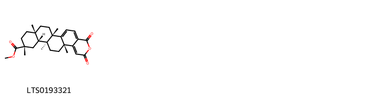{ width=100% }
    <figcaption>Hình ảnh cấu trúc hóa học của 1 hoạt chất thuộc nhóm Naphthopyrans gồm ['methyl (6bs,8as,11r,12ar,12bs,14ar)-6b,8a,11,12b,14a-pentamethyl-2,4-dioxo-7h,8h,9h,10h,12h,12ah,13h,14h-phenanthro[2,1-f]isochromene-11-carboxylate (LTS0193321)'].</figcaption>
</figure>
#### Nhóm Steroids and steroid derivatives
<figure markdown="span">
    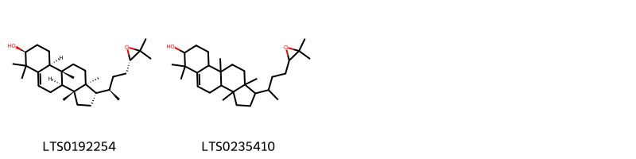{ width=100% }
    <figcaption>Hình ảnh cấu trúc hóa học của 2 hoạt chất thuộc nhóm Steroids and steroid derivatives gồm ['(1s,3ar,3bs,7s,9as,9br,11as)-1-[(2r)-4-[(2s)-3,3-dimethyloxiran-2-yl]butan-2-yl]-3a,6,6,9b,11a-pentamethyl-1h,2h,3h,3bh,4h,7h,8h,9h,9ah,10h,11h-cyclopenta[a]phenanthren-7-ol (LTS0192254)', '1-[4-(3,3-dimethyloxiran-2-yl)butan-2-yl]-3a,6,6,9b,11a-pentamethyl-1h,2h,3h,3bh,4h,7h,8h,9h,9ah,10h,11h-cyclopenta[a]phenanthren-7-ol (LTS0235410)'].</figcaption>
</figure>

---

### Dược dân tộc học

Danh sách các quốc gia có sử dụng *Reissantia indica* trong điều trị các bệnh. 

| Country   | Disease            | Bệnh                                                                                                                                                                                                |
|:----------|:-------------------|:----------------------------------------------------------------------------------------------------------------------------------------------------------------------------------------------------|
| Elsewhere | nan, nan, Laxative | MYMEMORY WARNING: YOU USED ALL AVAILABLE FREE TRANSLATIONS FOR TODAY. NEXT AVAILABLE IN  16 HOURS 40 MINUTES 21 SECONDS VISIT HTTPS://MYMEMORY.TRANSLATED.NET/DOC/USAGELIMITS.PHP TO TRANSLATE MORE |

---

# Chi Elaeodendron

??? note "Danh sách các dược liệu thuộc chi"
    
	 - *Elaeodendron buchanani*
	 - *Elaeodendron glaucum*

---
## Elaeodendron buchanani
### Thông tin về thực vật

!!! info "Phân loại thực vật của *Elaeodendron buchananii* từ GIBF:"
    - **Kingdom:** Plantae
    - **Phylum:** Tracheophyta
    - **Order:** Celastrales
    - **Family:** Celastraceae
    - **Genus:** Elaeodendron
    - **Species:** *Elaeodendron buchananii*

 

| Label (VI)   | Label (EN)   | Scientific Name   | Descriptions (VI)   | Descriptions (EN)   | Also Known As (VI)   | Also Known As (EN)   |
|:-------------|:-------------|:------------------|:--------------------|:--------------------|:---------------------|:---------------------|
| N/A          | N/A          | Reissantia indica | loài thực vật       | species of plant    | ['']                 | ['']                 |

#### Phân bố trên thế giới

**Từ CSDL GIBF** nan, Congo, Democratic Republic of the, Kenya, Uganda, Rwanda, Zambia, Central African Republic, Malawi, Tanzania, United Republic of, Angola, Ethiopia, Togo, Cameroon, Ghana

#### Phân bố tại Việt Nam

**Từ CSDL GIBF**: Không có ghi nhận ở Việt Nam

---
### Thành phần hóa học
        
- Theo cơ sở dữ liệu lotus: Từ loài *Elaeodendron buchananii* đã phân lập và xác định được 9 hoạt chất thuộc về các nhóm Prenol lipids, Carboxylic acids and derivatives, Steroids and steroid derivatives. 

|    | chemicalTaxonomyClassyfireClass   |   smiles_count |
|---:|:----------------------------------|---------------:|
|  0 | Carboxylic acids and derivatives  |              2 |
|  1 | Prenol lipids                     |              3 |
|  2 | Steroids and steroid derivatives  |              4 |

#### Nhóm Carboxylic acids and derivatives
<figure markdown="span">
    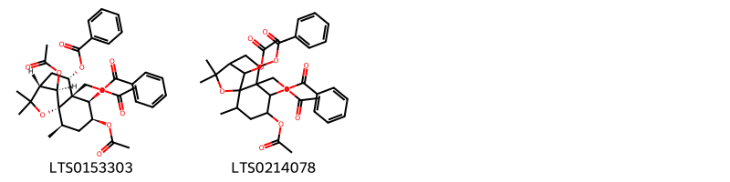{ width=100% }
    <figcaption>Hình ảnh cấu trúc hóa học của 2 hoạt chất thuộc nhóm Carboxylic acids and derivatives gồm ['(1s,2r,4s,5r,6r,7s,9r,12r)-4,5,12-tris(acetyloxy)-6-[(benzoyloxy)methyl]-2,10,10-trimethyl-11-oxatricyclo[7.2.1.0¹,⁶]dodecan-7-yl benzoate (LTS0153303)', '4,5,12-tris(acetyloxy)-6-[(benzoyloxy)methyl]-2,10,10-trimethyl-11-oxatricyclo[7.2.1.0¹,⁶]dodecan-7-yl benzoate (LTS0214078)'].</figcaption>
</figure>
#### Nhóm Prenol lipids
<figure markdown="span">
    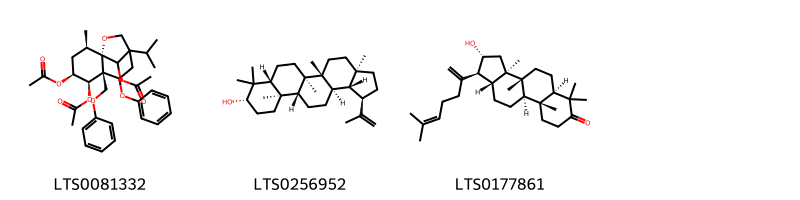{ width=100% }
    <figcaption>Hình ảnh cấu trúc hóa học của 3 hoạt chất thuộc nhóm Prenol lipids gồm ['(1s,2r,4s,5r,6r)-4,5-bis(acetyloxy)-9-isopropyl-2-methyl-7-phenoxy-6-(phenoxymethyl)-11-oxatricyclo[7.2.1.0¹,⁶]dodecan-12-yl acetate (LTS0081332)', 'lupeol (LTS0256952)', '(1s,2r,3ar,3br,5ar,9ar,9br,11ar)-2-hydroxy-3a,3b,6,6,9a-pentamethyl-1-(6-methylhepta-1,5-dien-2-yl)-dodecahydrocyclopenta[a]phenanthren-7-one (LTS0177861)'].</figcaption>
</figure>
#### Nhóm Steroids and steroid derivatives
<figure markdown="span">
    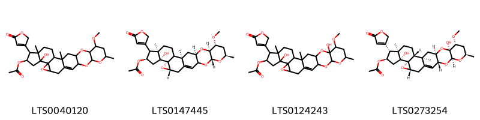{ width=100% }
    <figcaption>Hình ảnh cấu trúc hóa học của 4 hoạt chất thuộc nhóm Steroids and steroid derivatives gồm ['9-hydroxy-22-methoxy-1,5,20-trimethyl-6-(5-oxo-2h-furan-3-yl)-11,17,19,24-tetraoxaheptacyclo[12.12.0.0²,¹⁰.0⁵,⁹.0¹⁰,¹².0¹⁶,²⁵.0¹⁸,²³]hexacos-14-en-7-yl acetate (LTS0040120)', '(1r,5r,7r,9r,10r,12s,18r,20r,22r,23s,25r)-9-hydroxy-22-methoxy-1,5,20-trimethyl-6-(5-oxo-2h-furan-3-yl)-11,17,19,24-tetraoxaheptacyclo[12.12.0.0²,¹⁰.0⁵,⁹.0¹⁰,¹².0¹⁶,²⁵.0¹⁸,²³]hexacos-14-en-7-yl acetate (LTS0147445)', '9,23-dihydroxy-22-methoxy-1,5,20-trimethyl-6-(5-oxo-2h-furan-3-yl)-11,17,19,24-tetraoxaheptacyclo[12.12.0.0²,¹⁰.0⁵,⁹.0¹⁰,¹².0¹⁶,²⁵.0¹⁸,²³]hexacos-14-en-7-yl acetate (LTS0124243)', '(1r,2r,5r,6r,7r,9r,10r,12s,16r,18s,20r,22r,23s,25r)-9,23-dihydroxy-22-methoxy-1,5,20-trimethyl-6-(5-oxo-2h-furan-3-yl)-11,17,19,24-tetraoxaheptacyclo[12.12.0.0²,¹⁰.0⁵,⁹.0¹⁰,¹².0¹⁶,²⁵.0¹⁸,²³]hexacos-14-en-7-yl acetate (LTS0273254)'].</figcaption>
</figure>

---

### Dược dân tộc học

Danh sách các quốc gia có sử dụng *Elaeodendron buchananii* trong điều trị các bệnh. 

| Country   | Disease   | Bệnh                                                                                                                                                                                                |
|:----------|:----------|:----------------------------------------------------------------------------------------------------------------------------------------------------------------------------------------------------|
| Africa    | Poison    | MYMEMORY WARNING: YOU USED ALL AVAILABLE FREE TRANSLATIONS FOR TODAY. NEXT AVAILABLE IN  16 HOURS 40 MINUTES 00 SECONDS VISIT HTTPS://MYMEMORY.TRANSLATED.NET/DOC/USAGELIMITS.PHP TO TRANSLATE MORE |

---

---
## Elaeodendron glaucum
### Thông tin về thực vật

!!! info "Phân loại thực vật của *Elaeodendron glaucum* từ GIBF:"
    - **Kingdom:** Plantae
    - **Phylum:** Tracheophyta
    - **Order:** Celastrales
    - **Family:** Celastraceae
    - **Genus:** Elaeodendron
    - **Species:** *Elaeodendron glaucum*

 

| Label (VI)   | Label (EN)   | Scientific Name      | Descriptions (VI)   | Descriptions (EN)   | Also Known As (VI)   | Also Known As (EN)   |
|:-------------|:-------------|:---------------------|:--------------------|:--------------------|:---------------------|:---------------------|
| N/A          | N/A          | Elaeodendron glaucum | loài thực vật       | species of plant    | ['']                 | ['']                 |

#### Phân bố trên thế giới

**Từ CSDL GIBF** Sri Lanka, nan, Singapore, Viet Nam, United States of America, Cambodia, Indonesia, Nepal, Malaysia, India, unknown or invalid, Trinidad and Tobago, Thailand, Lao People’s Democratic Republic, Venezuela (Bolivarian Republic of)

#### Phân bố tại Việt Nam

**Từ CSDL GIBF**: Không có ghi nhận ở Việt Nam

---
### Thành phần hóa học
        
- Theo cơ sở dữ liệu lotus: Từ loài *Elaeodendron glaucum* đã phân lập và xác định được 61 hoạt chất thuộc về các nhóm Prenol lipids, Steroids and steroid derivatives. 

|    | chemicalTaxonomyClassyfireClass   |   smiles_count |
|---:|:----------------------------------|---------------:|
|  0 | Prenol lipids                     |             32 |
|  1 | Steroids and steroid derivatives  |             29 |

#### Nhóm Prenol lipids
<figure markdown="span">
    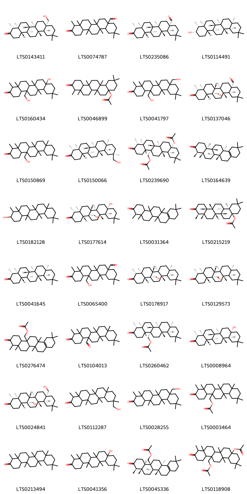{ width=100% }
    <figcaption>Hình ảnh cấu trúc hóa học của 32 hoạt chất thuộc nhóm Prenol lipids gồm ['(4r,4as,6as,6br,8as,12as,12bs,14as,14bs)-8a-(hydroxymethyl)-4,4a,6b,11,11,12b,14a-heptamethyl-tetradecahydro-1h-picen-3-one (LTS0143411)', '2,2,6a,8a,9,12b,14a-heptamethyl-10-oxo-tetradecahydro-1h-picene-4a-carbaldehyde (LTS0074787)', '(4as,6ar,6bs,8as,9r,12as,12bs,14as,14bs)-2,2,6a,8a,9,12b,14a-heptamethyl-10-oxo-tetradecahydro-1h-picene-4a-carbaldehyde (LTS0235086)', 'epi-friedelanol (LTS0114491)', '8a-hydroxy-14a-(hydroxymethyl)-4,4a,6b,11,11,12b-hexamethyl-tetradecahydro-1h-picen-3-one (LTS0160434)', '2,2,6a,8a,9,12b,14a-heptamethyl-10-oxo-tetradecahydro-1h-picen-4a-yl acetate (LTS0046899)', '8a,14a-bis(hydroxymethyl)-4,4a,6b,11,11,12b-hexamethyl-tetradecahydro-1h-picen-3-one (LTS0041797)', '(4as,6ar,6br,8as,9r,12ar,12br,14as,14bs)-12b-(hydroxymethyl)-2,2,6a,8a,9,14a-hexamethyl-10-oxo-tetradecahydro-1h-picene-4a-carbaldehyde (LTS0137046)', '14a-(hydroxymethyl)-4,4a,6b,8a,11,11,12b-heptamethyl-tetradecahydro-1h-picen-3-one (LTS0150869)', '(4r,4as,6as,6br,8as,11r,12ar,12bs,14as,14bs)-11-(hydroxymethyl)-4,4a,6b,8a,11,12b,14a-heptamethyl-tetradecahydro-1h-picen-3-one (LTS0150066)', '[(4as,6ar,6br,8as,9r,12ar,12br,14as,14bs)-4a-(acetyloxy)-2,2,6a,8a,9,14a-hexamethyl-10-oxo-tetradecahydro-1h-picen-12b-yl]methyl acetate (LTS0239690)', '(4r,4as,6as,6br,12br,14as,14bs)-4,4a,6b,11,11,12b,14a-heptamethyl-1,2,4,5,6,6a,7,8,9,10,12,13,14,14b-tetradecahydropicen-3-one (LTS0164639)', '4,4a,6b,8a,11,11,12b,14a-octamethyl-hexadecahydropicen-3-ol (LTS0182128)', '(4r,4as,6ar,6br,8as,12as,12bs,14ar,14br)-8a-hydroxy-14a-(hydroxymethyl)-4,4a,6b,11,11,12b-hexamethyl-tetradecahydro-1h-picen-3-one (LTS0177614)', '4,4a,6b,11,11,12b,14a-heptamethyl-1,2,4,5,6,6a,7,8,9,10,12,13,14,14b-tetradecahydropicen-3-one (LTS0031364)', '(4as,6ar,6br,8as,9r,12ar,12bs,14as,14br)-2,2,6a,8a,9,12b,14a-heptamethyl-10-oxo-tetradecahydro-1h-picen-4a-yl acetate (LTS0215219)', '(-)-friedelin (LTS0041645)', '12b-(hydroxymethyl)-2,2,6a,8a,9,14a-hexamethyl-10-oxo-tetradecahydro-1h-picene-4a-carbaldehyde (LTS0065400)', '(4r,4as,6ar,6br,8ar,12ar,12bs,14ar,14br)-14a-(hydroxymethyl)-4,4a,6b,8a,11,11,12b-heptamethyl-tetradecahydro-1h-picen-3-one (LTS0178917)', '(4ar,6ar,6br,8as,9r,12ar,12br,14as,14br)-2,2,4a,6a,8a,9,14a-heptamethyl-10-oxo-tetradecahydro-1h-picene-12b-carbaldehyde (LTS0129573)', '(2,2,6a,8a,9,14a-hexamethyl-10-oxo-1,3,4,5,6,6b,7,8,9,11,12,12a,13,14-tetradecahydropicen-12b-yl)methyl acetate (LTS0276474)', '2,2,4a,6a,8a,9,14a-heptamethyl-10-oxo-tetradecahydro-1h-picene-12b-carbaldehyde (LTS0104013)', '[(4ar,6ar,6br,8as,9r,12ar,12br,14as,14br)-2,2,4a,6a,8a,9,14a-heptamethyl-10-oxo-tetradecahydro-1h-picen-12b-yl]methyl acetate (LTS0260462)', '(4r,4as,6as,6br,8as,12as,12bs,14as,14bs)-8a-hydroxy-4,4a,6b,11,11,12b,14a-heptamethyl-tetradecahydro-1h-picen-3-one (LTS0008964)', '(4r,4as,6ar,6br,8as,12as,12bs,14ar,14br)-8a,14a-bis(hydroxymethyl)-4,4a,6b,11,11,12b-hexamethyl-tetradecahydro-1h-picen-3-one (LTS0024841)', '11-(hydroxymethyl)-4,4a,6b,8a,11,12b,14a-heptamethyl-tetradecahydro-1h-picen-3-one (LTS0112287)', 'canophyllol (LTS0028255)', '(2,2,4a,6a,8a,9,14a-heptamethyl-10-oxo-tetradecahydro-1h-picen-12b-yl)methyl acetate (LTS0003464)', 'friedelin (LTS0213494)', '8a-hydroxy-4,4a,6b,11,11,12b,14a-heptamethyl-tetradecahydro-1h-picen-3-one (LTS0041356)', '[(6ar,6br,8as,9r,12ar,12br,14ar)-2,2,6a,8a,9,14a-hexamethyl-10-oxo-1,3,4,5,6,6b,7,8,9,11,12,12a,13,14-tetradecahydropicen-12b-yl]methyl acetate (LTS0045336)', '[4a-(acetyloxy)-2,2,6a,8a,9,14a-hexamethyl-10-oxo-tetradecahydro-1h-picen-12b-yl]methyl acetate (LTS0118908)'].</figcaption>
</figure>
#### Nhóm Steroids and steroid derivatives
<figure markdown="span">
    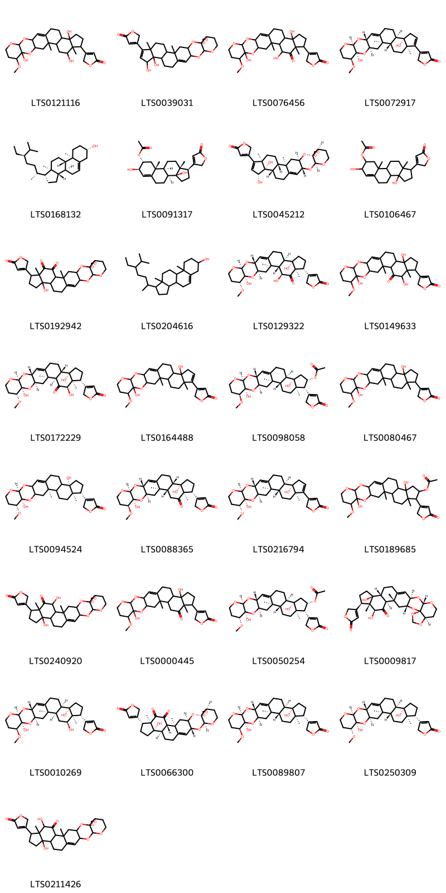{ width=100% }
    <figcaption>Hình ảnh cấu trúc hóa học của 29 hoạt chất thuộc nhóm Steroids and steroid derivatives gồm ['4-{10,17,22-trihydroxy-9-methoxy-14,18-dimethyl-4,6,11-trioxahexacyclo[12.11.0.0³,¹².0⁵,¹⁰.0¹⁵,²³.0¹⁸,²²]pentacos-1-en-19-yl}-5h-furan-2-one (LTS0121116)', '4-{10,11-dihydroxy-3,7-dimethyl-18,20,24,26,28-pentaoxaheptacyclo[15.11.0.0³,¹⁵.0⁴,¹².0⁷,¹¹.0¹⁹,²⁷.0²³,²⁷]octacosa-8,15-dien-8-yl}-5h-furan-2-one (LTS0039031)', '10,16,22-trihydroxy-9-methoxy-14,18-dimethyl-19-(5-oxo-2h-furan-3-yl)-4,6,11-trioxahexacyclo[12.11.0.0³,¹².0⁵,¹⁰.0¹⁵,²³.0¹⁸,²²]pentacos-1-en-17-one (LTS0076456)', '4-[(3r,5s,9s,10s,12r,14r,15s,18r,22s,23r)-10,22-dihydroxy-9-methoxy-14,18-dimethyl-4,6,11-trioxahexacyclo[12.11.0.0³,¹².0⁵,¹⁰.0¹⁵,²³.0¹⁸,²²]pentacosa-1,19-dien-19-yl]-5h-furan-2-one (LTS0072917)', 'sitosterol (LTS0168132)', '(1r,3as,3bs,7r,8r,9ar,9bs,11ar)-3a,7-dihydroxy-9a,11a-dimethyl-1-(5-oxo-2h-furan-3-yl)-1h,2h,3h,3bh,4h,5h,7h,8h,9h,9bh,10h,11h-cyclopenta[a]phenanthren-8-yl acetate (LTS0091317)', '4-[(1r,3r,4s,7r,10r,11s,12s,17r,19s,23r,27r)-10,11-dihydroxy-3,7-dimethyl-18,20,24,26,28-pentaoxaheptacyclo[15.11.0.0³,¹⁵.0⁴,¹².0⁷,¹¹.0¹⁹,²⁷.0²³,²⁷]octacosa-8,15-dien-8-yl]-5h-furan-2-one (LTS0045212)', '3a,7-dihydroxy-9a,11a-dimethyl-1-(5-oxo-2h-furan-3-yl)-1h,2h,3h,3bh,4h,5h,7h,8h,9h,9bh,10h,11h-cyclopenta[a]phenanthren-8-yl acetate (LTS0106467)', '11-hydroxy-3,7-dimethyl-8-(5-oxo-2h-furan-3-yl)-18,20,24,26,28-pentaoxaheptacyclo[15.11.0.0³,¹⁵.0⁴,¹².0⁷,¹¹.0¹⁹,²⁷.0²³,²⁷]octacos-15-ene-5,6-dione (LTS0192942)', 'stigmast-5-en-3-ol, (3β)- (LTS0204616)', '(3r,5s,9r,10s,12r,14r,15s,16s,18r,19r,22s,23r)-10,16,22-trihydroxy-9-methoxy-14,18-dimethyl-19-(5-oxo-2h-furan-3-yl)-4,6,11-trioxahexacyclo[12.11.0.0³,¹².0⁵,¹⁰.0¹⁵,²³.0¹⁸,²²]pentacos-1-en-17-one (LTS0129322)', '10,17,22-trihydroxy-9-methoxy-14,18-dimethyl-19-(5-oxo-2h-furan-3-yl)-4,6,11-trioxahexacyclo[12.11.0.0³,¹².0⁵,¹⁰.0¹⁵,²³.0¹⁸,²²]pentacos-1-en-16-one (LTS0149633)', '(3r,5s,9r,10s,12r,14r,15r,17r,18s,19r,22s,23s)-10,17,22-trihydroxy-9-methoxy-14,18-dimethyl-19-(5-oxo-2h-furan-3-yl)-4,6,11-trioxahexacyclo[12.11.0.0³,¹².0⁵,¹⁰.0¹⁵,²³.0¹⁸,²²]pentacos-1-en-16-one (LTS0172229)', '4-{10,22-dihydroxy-9-methoxy-14,18-dimethyl-4,6,11-trioxahexacyclo[12.11.0.0³,¹².0⁵,¹⁰.0¹⁵,²³.0¹⁸,²²]pentacosa-1,19-dien-19-yl}-5h-furan-2-one (LTS0164488)', 'elaeodendroside f (LTS0098058)', '4-{10,22-dihydroxy-9-methoxy-14,18-dimethyl-4,6,11-trioxahexacyclo[12.11.0.0³,¹².0⁵,¹⁰.0¹⁵,²³.0¹⁸,²²]pentacos-1-en-19-yl}-5h-furan-2-one (LTS0080467)', '4-[(5s,9r,10s,14r,18r,19r,22s)-10,22-dihydroxy-9-methoxy-14,18-dimethyl-4,6,11-trioxahexacyclo[12.11.0.0³,¹².0⁵,¹⁰.0¹⁵,²³.0¹⁸,²²]pentacos-1-en-19-yl]-5h-furan-2-one (LTS0094524)', '(3r,5s,9s,10s,12r,14r,15s,18r,19r,22s,23s)-10,22-dihydroxy-9-methoxy-14,18-dimethyl-19-(5-oxo-2h-furan-3-yl)-4,6,11-trioxahexacyclo[12.11.0.0³,¹².0⁵,¹⁰.0¹⁵,²³.0¹⁸,²²]pentacos-1-en-17-one (LTS0088365)', '4-[(3r,5s,9r,10s,12r,14r,15s,18r,22s,23r)-10,22-dihydroxy-9-methoxy-14,18-dimethyl-4,6,11-trioxahexacyclo[12.11.0.0³,¹².0⁵,¹⁰.0¹⁵,²³.0¹⁸,²²]pentacosa-1,19-dien-19-yl]-5h-furan-2-one (LTS0216794)', '10,22-dihydroxy-9-methoxy-14,18-dimethyl-19-(5-oxo-2h-furan-3-yl)-4,6,11-trioxahexacyclo[12.11.0.0³,¹².0⁵,¹⁰.0¹⁵,²³.0¹⁸,²²]pentacos-1-en-20-yl acetate (LTS0189685)', '5,11-dihydroxy-3,7-dimethyl-8-(5-oxo-2h-furan-3-yl)-18,20,24,26,28-pentaoxaheptacyclo[15.11.0.0³,¹⁵.0⁴,¹².0⁷,¹¹.0¹⁹,²⁷.0²³,²⁷]octacos-15-en-6-one (LTS0240920)', '10,22-dihydroxy-9-methoxy-14,18-dimethyl-19-(5-oxo-2h-furan-3-yl)-4,6,11-trioxahexacyclo[12.11.0.0³,¹².0⁵,¹⁰.0¹⁵,²³.0¹⁸,²²]pentacos-1-en-17-one (LTS0000445)', 'elaeodendroside g (LTS0050254)', '(1r,3r,4s,6s,7s,8r,11s,12r,17r,19s,23r,27r)-6,11-dihydroxy-3,7-dimethyl-8-(5-oxo-2h-furan-3-yl)-18,20,24,26,28-pentaoxaheptacyclo[15.11.0.0³,¹⁵.0⁴,¹².0⁷,¹¹.0¹⁹,²⁷.0²³,²⁷]octacos-15-en-5-one (LTS0009817)', '4-[(3r,5s,9s,10s,12r,14r,15r,17s,18s,19r,22s,23r)-10,17,22-trihydroxy-9-methoxy-14,18-dimethyl-4,6,11-trioxahexacyclo[12.11.0.0³,¹².0⁵,¹⁰.0¹⁵,²³.0¹⁸,²²]pentacos-1-en-19-yl]-5h-furan-2-one (LTS0010269)', '(1r,3r,4s,7r,8r,11s,12r,17r,19s,23r,27r)-11-hydroxy-3,7-dimethyl-8-(5-oxo-2h-furan-3-yl)-18,20,24,26,28-pentaoxaheptacyclo[15.11.0.0³,¹⁵.0⁴,¹².0⁷,¹¹.0¹⁹,²⁷.0²³,²⁷]octacos-15-ene-5,6-dione (LTS0066300)', 'elaeodendroside b (LTS0089807)', '4-[(3r,5s,9r,10s,12r,14r,15s,18r,19r,22s,23r)-10,22-dihydroxy-9-methoxy-14,18-dimethyl-4,6,11-trioxahexacyclo[12.11.0.0³,¹².0⁵,¹⁰.0¹⁵,²³.0¹⁸,²²]pentacos-1-en-19-yl]-5h-furan-2-one (LTS0250309)', '6,11-dihydroxy-3,7-dimethyl-8-(5-oxo-2h-furan-3-yl)-18,20,24,26,28-pentaoxaheptacyclo[15.11.0.0³,¹⁵.0⁴,¹².0⁷,¹¹.0¹⁹,²⁷.0²³,²⁷]octacos-15-en-5-one (LTS0211426)'].</figcaption>
</figure>

---

### Dược dân tộc học

Danh sách các quốc gia có sử dụng *Elaeodendron glaucum* trong điều trị các bệnh. 

| Country   | Disease                                | Bệnh                                                                                                                                                                                                |
|:----------|:---------------------------------------|:----------------------------------------------------------------------------------------------------------------------------------------------------------------------------------------------------|
| Elsewhere | Poison                                 | MYMEMORY WARNING: YOU USED ALL AVAILABLE FREE TRANSLATIONS FOR TODAY. NEXT AVAILABLE IN  16 HOURS 39 MINUTES 38 SECONDS VISIT HTTPS://MYMEMORY.TRANSLATED.NET/DOC/USAGELIMITS.PHP TO TRANSLATE MORE |
| India     | Emetic, Fumigant, Poison, Sternutatory | MYMEMORY WARNING: YOU USED ALL AVAILABLE FREE TRANSLATIONS FOR TODAY. NEXT AVAILABLE IN  16 HOURS 39 MINUTES 36 SECONDS VISIT HTTPS://MYMEMORY.TRANSLATED.NET/DOC/USAGELIMITS.PHP TO TRANSLATE MORE |

---

# Chi Lophopyxis

??? note "Danh sách các dược liệu thuộc chi"
    
	 - *Lophopyxis pierrei*

---
## Lophopyxis pierrei
### Thông tin về thực vật

!!! info "Phân loại thực vật của *Lophopyxis maingayi* từ GIBF:"
    - **Kingdom:** Plantae
    - **Phylum:** Tracheophyta
    - **Order:** Malpighiales
    - **Family:** Lophopyxidaceae
    - **Genus:** Lophopyxis
    - **Species:** *Lophopyxis maingayi*

 

| Label (VI)   | Label (EN)   | Scientific Name      | Descriptions (VI)   | Descriptions (EN)   | Also Known As (VI)   | Also Known As (EN)   |
|:-------------|:-------------|:---------------------|:--------------------|:--------------------|:---------------------|:---------------------|
| N/A          | N/A          | Elaeodendron glaucum | loài thực vật       | species of plant    | ['']                 | ['']                 |

#### Phân bố trên thế giới

**Từ CSDL GIBF** Sri Lanka, nan, Singapore, Viet Nam, United States of America, Cambodia, Indonesia, Nepal, Malaysia, India, unknown or invalid, Trinidad and Tobago, Thailand, Lao People’s Democratic Republic, Venezuela (Bolivarian Republic of)

#### Phân bố tại Việt Nam

**Từ CSDL GIBF**: Không có ghi nhận ở Việt Nam

---
### Thành phần hóa học
        
- Theo cơ sở dữ liệu lotus: Từ loài *Lophopyxis maingayi* đã phân lập và xác định được Chưa có hoạt chất nào được phân lập. hoạt chất thuộc về các nhóm Không có hoạt chất nào được phân lập. 

Không có hình ảnh nào được tạo ra

---

### Dược dân tộc học

Danh sách các quốc gia có sử dụng *Lophopyxis maingayi* trong điều trị các bệnh. 

| Country   | Disease   | Bệnh                                                                                                                                                                                                |
|:----------|:----------|:----------------------------------------------------------------------------------------------------------------------------------------------------------------------------------------------------|
| Malaya    | Poultice  | MYMEMORY WARNING: YOU USED ALL AVAILABLE FREE TRANSLATIONS FOR TODAY. NEXT AVAILABLE IN  16 HOURS 39 MINUTES 08 SECONDS VISIT HTTPS://MYMEMORY.TRANSLATED.NET/DOC/USAGELIMITS.PHP TO TRANSLATE MORE |

---

# Chi Salacia

??? note "Danh sách các dược liệu thuộc chi"
    
	 - *Salacia chinensis*
	 - *Salacia oblonga*
	 - *Salacia prinoides*
	 - *Salacia reticulata*

---
## Salacia chinensis
### Thông tin về thực vật

!!! info "Phân loại thực vật của *Salacia chinensis* từ GIBF:"
    - **Kingdom:** Plantae
    - **Phylum:** Tracheophyta
    - **Order:** Celastrales
    - **Family:** Celastraceae
    - **Genus:** Salacia
    - **Species:** *Salacia chinensis*

 

| Label (VI)   | Label (EN)   | Scientific Name   | Descriptions (VI)   | Descriptions (EN)   | Also Known As (VI)                            | Also Known As (EN)   |
|:-------------|:-------------|:------------------|:--------------------|:--------------------|:----------------------------------------------|:---------------------|
| N/A          | N/A          | Salacia chinensis | loài thực vật       | species of plant    | ['Salacia chinensis', 'Chóp máu', 'Chóp mào'] | ['']                 |

#### Phân bố trên thế giới

**Từ CSDL GIBF** Sri Lanka, nan, Viet Nam, Cambodia, Vanuatu, Indonesia, Malaysia, Philippines, Australia, Palau, Myanmar, Micronesia (Federated States of), India, Papua New Guinea, Brunei Darussalam, Thailand, Lao People’s Democratic Republic

#### Phân bố tại Việt Nam

**Từ CSDL GIBF**: Hoa Binh

---
### Thành phần hóa học
        
- Theo cơ sở dữ liệu lotus: Từ loài *Salacia chinensis* đã phân lập và xác định được 286 hoạt chất thuộc về các nhóm Fatty Acyls, Phenanthrenes and derivatives, Flavonoids, Cinnamic acids and derivatives, Steroids and steroid derivatives, Aryltetralin lignans, Organooxygen compounds, Thiolanes, Prenol lipids, 2-arylbenzofuran flavonoids, Lignan glycosides, Benzopyrans, Stilbenes. 

|    | chemicalTaxonomyClassyfireClass   |   smiles_count |
|---:|:----------------------------------|---------------:|
|  0 | 2-arylbenzofuran flavonoids       |              2 |
|  1 | Aryltetralin lignans              |              8 |
|  2 | Benzopyrans                       |              2 |
|  3 | Cinnamic acids and derivatives    |              3 |
|  4 | Fatty Acyls                       |             36 |
|  5 | Flavonoids                        |             11 |
|  6 | Lignan glycosides                 |              7 |
|  7 | Organooxygen compounds            |             59 |
|  8 | Phenanthrenes and derivatives     |              2 |
|  9 | Prenol lipids                     |            144 |
| 10 | Steroids and steroid derivatives  |              8 |
| 11 | Stilbenes                         |              1 |
| 12 | Thiolanes                         |              2 |

#### Nhóm 2-arylbenzofuran flavonoids
<figure markdown="span">
    { width=100% }
    <figcaption>Hình ảnh cấu trúc hóa học của 2 hoạt chất thuộc nhóm 2-arylbenzofuran flavonoids gồm ['(2r,3s,4s,5r,6s)-2-(hydroxymethyl)-6-{4-[(2s,3r)-3-(hydroxymethyl)-5-(3-hydroxypropyl)-7-methoxy-2,3-dihydro-1-benzofuran-2-yl]-2-methoxyphenoxy}oxane-3,4,5-triol (LTS0124902)', '2-(hydroxymethyl)-6-{4-[3-(hydroxymethyl)-5-(3-hydroxypropyl)-7-methoxy-2,3-dihydro-1-benzofuran-2-yl]-2-methoxyphenoxy}oxane-3,4,5-triol (LTS0214372)'].</figcaption>
</figure>
#### Nhóm Aryltetralin lignans
<figure markdown="span">
    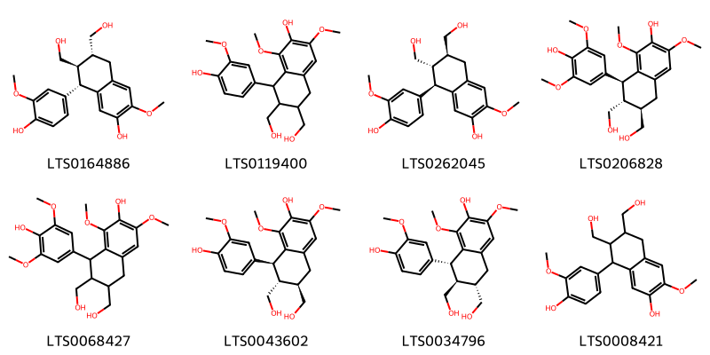{ width=100% }
    <figcaption>Hình ảnh cấu trúc hóa học của 8 hoạt chất thuộc nhóm Aryltetralin lignans gồm ['(+)-isolariciresinol (LTS0164886)', '8-(4-hydroxy-3-methoxyphenyl)-6,7-bis(hydroxymethyl)-1,3-dimethoxy-5,6,7,8-tetrahydronaphthalen-2-ol (LTS0119400)', '(6s,7s,8r)-8-(4-hydroxy-3-methoxyphenyl)-6,7-bis(hydroxymethyl)-3-methoxy-5,6,7,8-tetrahydronaphthalen-2-ol (LTS0262045)', '(+)-lyoniresinol (LTS0206828)', '8-(4-hydroxy-3,5-dimethoxyphenyl)-6,7-bis(hydroxymethyl)-1,3-dimethoxy-5,6,7,8-tetrahydronaphthalen-2-ol (LTS0068427)', '(6r,7r,8s)-8-(4-hydroxy-3-methoxyphenyl)-6,7-bis(hydroxymethyl)-1,3-dimethoxy-5,6,7,8-tetrahydronaphthalen-2-ol (LTS0043602)', '(6s,7s,8r)-8-(4-hydroxy-3-methoxyphenyl)-6,7-bis(hydroxymethyl)-1,3-dimethoxy-5,6,7,8-tetrahydronaphthalen-2-ol (LTS0034796)', '8-(4-hydroxy-3-methoxyphenyl)-6,7-bis(hydroxymethyl)-3-methoxy-5,6,7,8-tetrahydronaphthalen-2-ol (LTS0008421)'].</figcaption>
</figure>
#### Nhóm Benzopyrans
<figure markdown="span">
    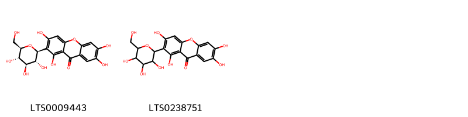{ width=100% }
    <figcaption>Hình ảnh cấu trúc hóa học của 2 hoạt chất thuộc nhóm Benzopyrans gồm ['mangiferin (LTS0009443)', 'mangiferin (LTS0238751)'].</figcaption>
</figure>
#### Nhóm Cinnamic acids and derivatives
<figure markdown="span">
    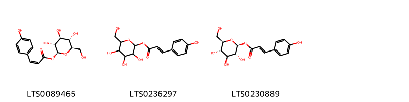{ width=100% }
    <figcaption>Hình ảnh cấu trúc hóa học của 3 hoạt chất thuộc nhóm Cinnamic acids and derivatives gồm ['(2s,3r,4s,5s,6r)-3,4,5-trihydroxy-6-(hydroxymethyl)oxan-2-yl (2z)-3-(4-hydroxyphenyl)prop-2-enoate (LTS0089465)', '3,4,5-trihydroxy-6-(hydroxymethyl)oxan-2-yl 3-(4-hydroxyphenyl)prop-2-enoate (LTS0236297)', 'p-coumaroyl-d-glucose (LTS0230889)'].</figcaption>
</figure>
#### Nhóm Fatty Acyls
<figure markdown="span">
    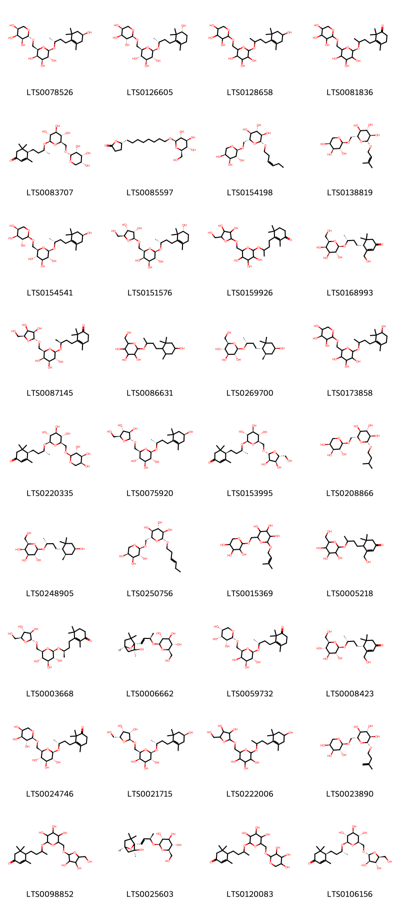{ width=100% }
    <figcaption>Hình ảnh cấu trúc hóa học của 36 hoạt chất thuộc nhóm Fatty Acyls gồm ['(2r,3r,4s,5r,6r)-2-{[(2r)-4-[(4s)-4-hydroxy-2,6,6-trimethylcyclohex-1-en-1-yl]butan-2-yl]oxy}-6-({[(2r,3s,4s,5s)-3,4,5-trihydroxyoxan-2-yl]oxy}methyl)oxane-3,4,5-triol (LTS0078526)', '(2r,3r,4s,5s,6r)-2-{[(2r)-4-[(5r)-5-hydroxy-2,6,6-trimethylcyclohex-1-en-1-yl]butan-2-yl]oxy}-6-({[(2s,3r,4s,5s)-3,4,5-trihydroxyoxan-2-yl]oxy}methyl)oxane-3,4,5-triol (LTS0126605)', '2-{[4-(4-hydroxy-2,6,6-trimethylcyclohex-1-en-1-yl)butan-2-yl]oxy}-6-{[(3,4,5-trihydroxyoxan-2-yl)oxy]methyl}oxane-3,4,5-triol (LTS0128658)', '2,2,4-trimethyl-3-{3-[(3,4,5-trihydroxy-6-{[(3,4,5-trihydroxyoxan-2-yl)oxy]methyl}oxan-2-yl)oxy]butyl}cyclohex-3-en-1-one (LTS0081836)', '(4r)-3,5,5-trimethyl-4-[(3r)-3-{[(2r,3r,4s,5s,6r)-3,4,5-trihydroxy-6-({[(2r,3r,4r,5r)-3,4,5-trihydroxyoxan-2-yl]oxy}methyl)oxan-2-yl]oxy}butyl]cyclohex-2-en-1-one (LTS0083707)', '(5r)-5-(8-{[(2r,3r,4s,5s,6r)-3,4,5-trihydroxy-6-(hydroxymethyl)oxan-2-yl]oxy}octyl)oxolan-2-one (LTS0085597)', '(2r,3r,4s,5s,6r)-2-[(3z)-hex-3-en-1-yloxy]-6-({[(2s,3r,4s,5s)-3,4,5-trihydroxyoxan-2-yl]oxy}methyl)oxane-3,4,5-triol (LTS0154198)', '(2r,3r,4s,5s,6r)-2-[(3-methylbut-2-en-1-yl)oxy]-6-({[(2s,3r,4s,5s)-3,4,5-trihydroxyoxan-2-yl]oxy}methyl)oxane-3,4,5-triol (LTS0138819)', '(2r,3r,4s,5s,6r)-2-{[(2r)-4-[(4s)-4-hydroxy-2,6,6-trimethylcyclohex-1-en-1-yl]butan-2-yl]oxy}-6-({[(2s,3r,4s,5s)-3,4,5-trihydroxyoxan-2-yl]oxy}methyl)oxane-3,4,5-triol (LTS0154541)', '(2r,3r,4s,5r,6r)-2-({[(2s,3s,4r,5s)-3,4-dihydroxy-5-(hydroxymethyl)oxolan-2-yl]oxy}methyl)-6-{[(2r)-4-[(5r)-5-hydroxy-2,6,6-trimethylcyclohex-1-en-1-yl]butan-2-yl]oxy}oxane-3,4,5-triol (LTS0151576)', '3-(3-{[6-({[3,4-dihydroxy-5-(hydroxymethyl)oxolan-2-yl]oxy}methyl)-3,4,5-trihydroxyoxan-2-yl]oxy}butyl)-2,4,4-trimethylcyclohex-2-en-1-one (LTS0159926)', '(4r)-3-(hydroxymethyl)-5,5-dimethyl-4-[(3r)-3-{[(2r,3r,4s,5r,6r)-3,4,5-trihydroxy-6-(hydroxymethyl)oxan-2-yl]oxy}butyl]cyclohex-2-en-1-one (LTS0168993)', '3-[(3s)-3-{[(2r,3r,4s,5r,6r)-6-({[(2r,3r,4s,5s)-3,4-dihydroxy-5-(hydroxymethyl)oxolan-2-yl]oxy}methyl)-3,4,5-trihydroxyoxan-2-yl]oxy}butyl]-2,2,4-trimethylcyclohex-3-en-1-one (LTS0087145)', '2-{[4-(4-hydroxy-2,2,6-trimethylcyclohexyl)butan-2-yl]oxy}-6-(hydroxymethyl)oxane-3,4,5-triol (LTS0086631)', '(2r,3r,4s,5s,6r)-2-{[(2r)-4-[(1s,4s,6r)-4-hydroxy-2,2,6-trimethylcyclohexyl]butan-2-yl]oxy}-6-(hydroxymethyl)oxane-3,4,5-triol (LTS0269700)', '2-{[4-(5-hydroxy-2,6,6-trimethylcyclohex-1-en-1-yl)butan-2-yl]oxy}-6-{[(3,4,5-trihydroxyoxan-2-yl)oxy]methyl}oxane-3,4,5-triol (LTS0173858)', '(4r)-3,5,5-trimethyl-4-[(3r)-3-{[(2r,3r,4s,5s,6r)-3,4,5-trihydroxy-6-({[(2s,3r,4s,5s)-3,4,5-trihydroxyoxan-2-yl]oxy}methyl)oxan-2-yl]oxy}butyl]cyclohex-2-en-1-one (LTS0220335)', '(2r,3s,4s,5r,6r)-2-({[(2r,3r,4r,5s)-3,4-dihydroxy-5-(hydroxymethyl)oxolan-2-yl]oxy}methyl)-6-{[(2r)-4-[(4s)-4-hydroxy-2,6,6-trimethylcyclohex-1-en-1-yl]butan-2-yl]oxy}oxane-3,4,5-triol (LTS0075920)', '(4r)-4-[(3r)-3-{[(2r,3r,4s,5s,6r)-6-({[(2r,3r,4s,5r)-3,4-dihydroxy-5-(hydroxymethyl)oxolan-2-yl]oxy}methyl)-3,4,5-trihydroxyoxan-2-yl]oxy}butyl]-3,5,5-trimethylcyclohex-2-en-1-one (LTS0153995)', '(2r,3r,4s,5s,6r)-2-(3-methylbutoxy)-6-({[(2s,3r,4s,5s)-3,4,5-trihydroxyoxan-2-yl]oxy}methyl)oxane-3,4,5-triol (LTS0208866)', '(2r,3r,4s,5r,6r)-2-{[(2r)-4-[(1s,4s,6r)-4-hydroxy-2,2,6-trimethylcyclohexyl]butan-2-yl]oxy}-6-(hydroxymethyl)oxane-3,4,5-triol (LTS0248905)', '(2r,3r,4s,5s,6r)-2-(hex-3-en-1-yloxy)-6-({[(2s,3r,4s,5s)-3,4,5-trihydroxyoxan-2-yl]oxy}methyl)oxane-3,4,5-triol (LTS0250756)', '2-[(3-methylbut-2-en-1-yl)oxy]-6-{[(3,4,5-trihydroxyoxan-2-yl)oxy]methyl}oxane-3,4,5-triol (LTS0015369)', '3-(hydroxymethyl)-5,5-dimethyl-4-(3-{[3,4,5-trihydroxy-6-(hydroxymethyl)oxan-2-yl]oxy}butyl)cyclohex-2-en-1-one (LTS0005218)', '3-[(3r)-3-{[(2r,3r,4s,5s,6r)-6-({[(2r,3r,4r,5s)-3,4-dihydroxy-5-(hydroxymethyl)oxolan-2-yl]oxy}methyl)-3,4,5-trihydroxyoxan-2-yl]oxy}butyl]-2,4,4-trimethylcyclohex-2-en-1-one (LTS0003668)', '(2r,3r,4s,5s,6r)-2-{[(2r)-4-[(1s,2s,4r)-2-hydroxy-2,6,6-trimethyl-7-oxabicyclo[2.2.1]heptan-1-yl]but-3-en-2-yl]oxy}-6-(hydroxymethyl)oxane-3,4,5-triol (LTS0006662)', '2,2,4-trimethyl-3-[(3r)-3-{[(2r,3r,4s,5r,6r)-3,4,5-trihydroxy-6-({[(2r,3r,4r,5r)-3,4,5-trihydroxyoxan-2-yl]oxy}methyl)oxan-2-yl]oxy}butyl]cyclohex-3-en-1-one (LTS0059732)', '(4r)-3-(hydroxymethyl)-5,5-dimethyl-4-[(3r)-3-{[(2r,3r,4s,5s,6r)-3,4,5-trihydroxy-6-(hydroxymethyl)oxan-2-yl]oxy}butyl]cyclohex-2-en-1-one (LTS0008423)', '2,2,4-trimethyl-3-[(3r)-3-{[(2r,3r,4s,5s,6r)-3,4,5-trihydroxy-6-({[(2s,3r,4s,5s)-3,4,5-trihydroxyoxan-2-yl]oxy}methyl)oxan-2-yl]oxy}butyl]cyclohex-3-en-1-one (LTS0024746)', '(2r,3r,4s,5r,6r)-2-({[(2s,3s,4r,5r)-3,4-dihydroxy-5-(hydroxymethyl)oxolan-2-yl]oxy}methyl)-6-{[(2r)-4-[(4s)-4-hydroxy-2,6,6-trimethylcyclohex-1-en-1-yl]butan-2-yl]oxy}oxane-3,4,5-triol (LTS0021715)', '2-({[3,4-dihydroxy-5-(hydroxymethyl)oxolan-2-yl]oxy}methyl)-6-{[4-(4-hydroxy-2,6,6-trimethylcyclohex-1-en-1-yl)butan-2-yl]oxy}oxane-3,4,5-triol (LTS0222006)', '(2r,3r,4s,5s,6r)-2-[(3-methylbut-3-en-1-yl)oxy]-6-({[(2s,3r,4s,5s)-3,4,5-trihydroxyoxan-2-yl]oxy}methyl)oxane-3,4,5-triol (LTS0023890)', '4-(3-{[6-({[3,4-dihydroxy-5-(hydroxymethyl)oxolan-2-yl]oxy}methyl)-3,4,5-trihydroxyoxan-2-yl]oxy}butyl)-3,5,5-trimethylcyclohex-2-en-1-one (LTS0098852)', '(2r,3r,4s,5s,6r)-2-{[(2r,3e)-4-[(1s,2s,4r)-2-hydroxy-2,6,6-trimethyl-7-oxabicyclo[2.2.1]heptan-1-yl]but-3-en-2-yl]oxy}-6-(hydroxymethyl)oxane-3,4,5-triol (LTS0025603)', '3,5,5-trimethyl-4-{3-[(3,4,5-trihydroxy-6-{[(3,4,5-trihydroxyoxan-2-yl)oxy]methyl}oxan-2-yl)oxy]butyl}cyclohex-2-en-1-one (LTS0120083)', '(4r)-4-[(3r)-3-{[(2r,3r,4s,5s,6r)-6-({[(2r,3r,4r,5s)-3,4-dihydroxy-5-(hydroxymethyl)oxolan-2-yl]oxy}methyl)-3,4,5-trihydroxyoxan-2-yl]oxy}butyl]-3,5,5-trimethylcyclohex-2-en-1-one (LTS0106156)'].</figcaption>
</figure>
#### Nhóm Flavonoids
<figure markdown="span">
    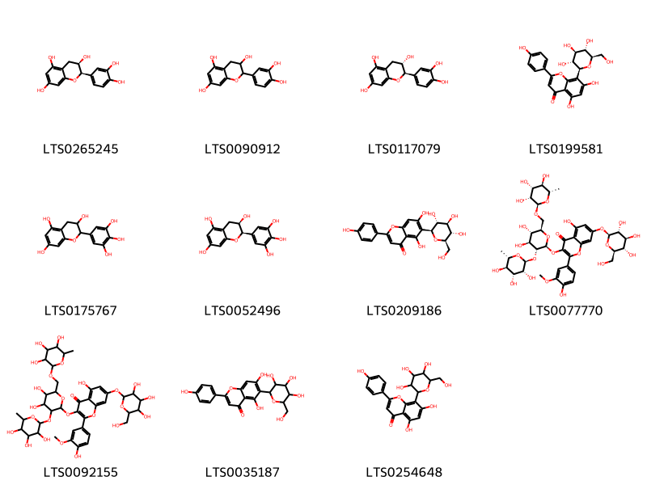{ width=100% }
    <figcaption>Hình ảnh cấu trúc hóa học của 11 hoạt chất thuộc nhóm Flavonoids gồm ['ent-epicatechin (LTS0265245)', 'catechol (LTS0090912)', '(+)-catechol (LTS0117079)', 'vitexin (LTS0199581)', 'epigallocatechin (LTS0175767)', 'epigallocatechin (LTS0052496)', 'isovitexin (LTS0209186)', '3-{[(2s,3r,4s,5s,6r)-4,5-dihydroxy-3-{[(2s,3r,4r,5r,6s)-3,4,5-trihydroxy-6-methyloxan-2-yl]oxy}-6-({[(2r,3r,4r,5r,6s)-3,4,5-trihydroxy-6-methyloxan-2-yl]oxy}methyl)oxan-2-yl]oxy}-5-hydroxy-2-(4-hydroxy-3-methoxyphenyl)-7-{[(2s,3r,4s,5s,6r)-3,4,5-trihydroxy-6-(hydroxymethyl)oxan-2-yl]oxy}chromen-4-one (LTS0077770)', '3-({4,5-dihydroxy-3-[(3,4,5-trihydroxy-6-methyloxan-2-yl)oxy]-6-{[(3,4,5-trihydroxy-6-methyloxan-2-yl)oxy]methyl}oxan-2-yl}oxy)-5-hydroxy-2-(4-hydroxy-3-methoxyphenyl)-7-{[3,4,5-trihydroxy-6-(hydroxymethyl)oxan-2-yl]oxy}chromen-4-one (LTS0092155)', 'isovitexin (LTS0035187)', 'vitexin (LTS0254648)'].</figcaption>
</figure>
#### Nhóm Lignan glycosides
<figure markdown="span">
    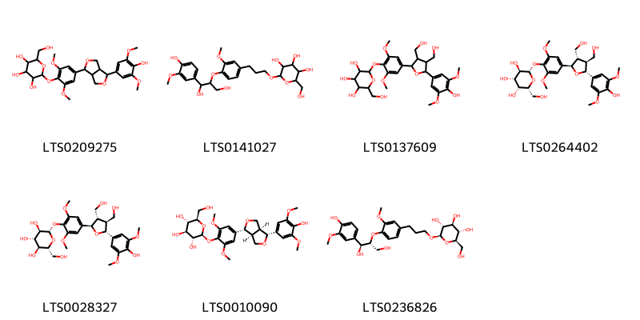{ width=100% }
    <figcaption>Hình ảnh cấu trúc hóa học của 7 hoạt chất thuộc nhóm Lignan glycosides gồm ['2-{4-[4-(4-hydroxy-3,5-dimethoxyphenyl)-hexahydrofuro[3,4-c]furan-1-yl]-2,6-dimethoxyphenoxy}-6-(hydroxymethyl)oxane-3,4,5-triol (LTS0209275)', '2-[3-(4-{[1,3-dihydroxy-1-(4-hydroxy-3-methoxyphenyl)propan-2-yl]oxy}-3-methoxyphenyl)propoxy]-6-(hydroxymethyl)oxane-3,4,5-triol (LTS0141027)', '2-{4-[5-(4-hydroxy-3,5-dimethoxyphenyl)-3,4-bis(hydroxymethyl)oxolan-2-yl]-2,6-dimethoxyphenoxy}-6-(hydroxymethyl)oxane-3,4,5-triol (LTS0137609)', '(2s,3r,4s,5r,6r)-2-{4-[(2r,3s,4s,5r)-5-(4-hydroxy-3,5-dimethoxyphenyl)-3,4-bis(hydroxymethyl)oxolan-2-yl]-2,6-dimethoxyphenoxy}-6-(hydroxymethyl)oxane-3,4,5-triol (LTS0264402)', '(2s,3r,4s,5s,6r)-2-{4-[(2r,3s,4s,5r)-5-(4-hydroxy-3,5-dimethoxyphenyl)-3,4-bis(hydroxymethyl)oxolan-2-yl]-2,6-dimethoxyphenoxy}-6-(hydroxymethyl)oxane-3,4,5-triol (LTS0028327)', '(2s,3r,4s,5s,6r)-2-{4-[(1r,3as,4r,6as)-4-(4-hydroxy-3,5-dimethoxyphenyl)-hexahydrofuro[3,4-c]furan-1-yl]-2,6-dimethoxyphenoxy}-6-(hydroxymethyl)oxane-3,4,5-triol (LTS0010090)', '(2r,3r,4s,5s,6r)-2-[3-(4-{[(1s,2r)-1,3-dihydroxy-1-(4-hydroxy-3-methoxyphenyl)propan-2-yl]oxy}-3-methoxyphenyl)propoxy]-6-(hydroxymethyl)oxane-3,4,5-triol (LTS0236826)'].</figcaption>
</figure>
#### Nhóm Organooxygen compounds
<figure markdown="span">
    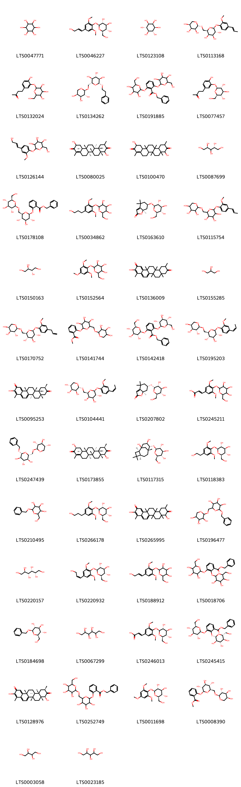{ width=100% }
    <figcaption>Hình ảnh cấu trúc hóa học của 59 hoạt chất thuộc nhóm Organooxygen compounds gồm ['(-)-inositol (LTS0047771)', 'syringin (LTS0046227)', '(1r,2r,3s,4r,5s,6s)-cyclohexane-1,2,3,4,5,6-hexol (LTS0123108)', '(2s,3r,4s,5r,6r)-2-{2-methoxy-4-[(1e)-prop-1-en-1-yl]phenoxy}-6-({[(2r,3s,4s,5s)-3,4,5-trihydroxyoxan-2-yl]oxy}methyl)oxane-3,4,5-triol (LTS0113168)', '4-(4-hydroxy-3-{[3,4,5-trihydroxy-6-(hydroxymethyl)oxan-2-yl]oxy}phenyl)butan-2-one (LTS0132024)', '(2r,3r,4s,5s,6r)-2-(2-phenylethoxy)-6-({[(2s,3r,4s,5s)-3,4,5-trihydroxyoxan-2-yl]oxy}methyl)oxane-3,4,5-triol (LTS0134262)', 'benzyl 2,6-bis({[3,4,5-trihydroxy-6-(hydroxymethyl)oxan-2-yl]oxy})benzoate (LTS0191885)', '4-(4-hydroxy-3-{[(2s,3r,4s,5s,6r)-3,4,5-trihydroxy-6-(hydroxymethyl)oxan-2-yl]oxy}phenyl)butan-2-one (LTS0077457)', '2-(hydroxymethyl)-6-[4-(3-hydroxyprop-1-en-1-yl)-2-methoxyphenoxy]oxane-3,4,5-triol (LTS0126144)', '(4ar,6ar,6bs,12as,12bs,14as,14bs)-4,11-dihydroxy-2,4a,6a,9,12b,14a-hexamethyl-1,2,4,5,6,6b,7,8,11,12,12a,13,14,14b-tetradecahydropicene-3,10-dione (LTS0080025)', '4,11-dihydroxy-2,4a,6a,9,12b,14a-hexamethyl-1,2,4,5,6,6b,7,8,11,12,12a,13,14,14b-tetradecahydropicene-3,10-dione (LTS0100470)', 'arabitol (LTS0087699)', 'benzyl 2-{[(2s,3r,4s,5s,6r)-3,4,5-trihydroxy-6-({[(2r,3r,4s,5s,6r)-3,4,5-trihydroxy-6-(hydroxymethyl)oxan-2-yl]oxy}methyl)oxan-2-yl]oxy}benzoate (LTS0178108)', '2-(hydroxymethyl)-6-[4-(3-hydroxypropyl)-2,6-dimethoxyphenoxy]oxane-3,4,5-triol (LTS0034862)', '(6r,7ar)-4,4,7a-trimethyl-6-{[(2r,3r,4s,5s,6r)-3,4,5-trihydroxy-6-(hydroxymethyl)oxan-2-yl]oxy}-6,7-dihydro-5h-1-benzofuran-2-one (LTS0163610)', '2-[2-methoxy-4-(prop-1-en-1-yl)phenoxy]-6-{[(3,4,5-trihydroxyoxan-2-yl)oxy]methyl}oxane-3,4,5-triol (LTS0115754)', 'meso-erythritol (LTS0150163)', '2-(hydroxymethyl)-6-(2,4,6-trimethoxyphenoxy)oxane-3,4,5-triol (LTS0152564)', '3-hydroxy-4,6b,8a,11,12b,14a-hexamethyl-7,8,9,11,12,12a,13,14-octahydropicene-2,10-dione (LTS0136009)', 'glycerol (LTS0155285)', '(2s,3r,4s,5s,6r)-2-[2-methoxy-4-(prop-2-en-1-yl)phenoxy]-6-({[(2s,3r,4s,5s)-3,4,5-trihydroxyoxan-2-yl]oxy}methyl)oxane-3,4,5-triol (LTS0170752)', 'monotropitoside (LTS0141744)', 'benzyl 2,6-bis({[(2s,3r,4s,5s,6r)-3,4,5-trihydroxy-6-(hydroxymethyl)oxan-2-yl]oxy})benzoate (LTS0142418)', '(2s,3r,4s,5s,6r)-2-{2-methoxy-4-[(1z)-prop-1-en-1-yl]phenoxy}-6-({[(2s,3r,4s,5s)-3,4,5-trihydroxyoxan-2-yl]oxy}methyl)oxane-3,4,5-triol (LTS0195203)', 'tingenone (LTS0095253)', '(2s,3r,4s,5r,6r)-2-{2-methoxy-4-[(1z)-prop-1-en-1-yl]phenoxy}-6-({[(2r,3s,4s,5r)-3,4,5-trihydroxyoxan-2-yl]oxy}methyl)oxane-3,4,5-triol (LTS0104441)', '(6s,7ar)-4,4,7a-trimethyl-6-{[(2s,3r,4s,5s,6r)-3,4,5-trihydroxy-6-(hydroxymethyl)oxan-2-yl]oxy}-6,7-dihydro-5h-1-benzofuran-2-one (LTS0207802)', '3-(3,5-dimethoxy-4-{[3,4,5-trihydroxy-6-(hydroxymethyl)oxan-2-yl]oxy}phenyl)prop-2-enoic acid (LTS0245211)', '(2r,3r,4s,5s,6r)-2-(benzyloxy)-6-({[(2s,3r,4s,5r)-3,4,5-trihydroxyoxan-2-yl]oxy}methyl)oxane-3,4,5-triol (LTS0247439)', '(2r,4s,4ar,6ar,6bs,11s,12as,12bs,14as,14bs)-4,11-dihydroxy-2,4a,6a,9,12b,14a-hexamethyl-1,2,4,5,6,6b,7,8,11,12,12a,13,14,14b-tetradecahydropicene-3,10-dione (LTS0173855)', '(2r,3r,4s,5s,6r)-2-{[(1r,2r,5r,8r,9r,10r)-1,10-dihydroxy-4,4,8-trimethyltricyclo[6.3.1.0²,⁵]dodecan-9-yl]oxy}-6-(hydroxymethyl)oxane-3,4,5-triol (LTS0117315)', '(2s,3r,4s,5s,6r)-2-[4-(2-hydroxyethyl)-2,6-dimethoxyphenoxy]-6-(hydroxymethyl)oxane-3,4,5-triol (LTS0118383)', 'benzyl glucopyranoside (LTS0210495)', '(2r,3s,4s,5r,6s)-2-(hydroxymethyl)-6-[4-(3-hydroxypropyl)-2,6-dimethoxyphenoxy]oxane-3,4,5-triol (LTS0266178)', '3,9-dihydroxy-4,6b,8a,11,12b,14a-hexamethyl-7,8,9,11,12,12a,13,14-octahydropicene-2,10-dione (LTS0265995)', '2-(benzyloxy)-6-{[(3,4,5-trihydroxyoxan-2-yl)oxy]methyl}oxane-3,4,5-triol (LTS0196477)', 'd-sorbitol (LTS0220157)', '(2r,3s,4s,5r,6s)-2-(hydroxymethyl)-6-{4-[(1z)-3-hydroxyprop-1-en-1-yl]-2,6-dimethoxyphenoxy}oxane-3,4,5-triol (LTS0220932)', '2-(hydroxymethyl)-6-[4-(3-hydroxyprop-1-en-1-yl)-2,6-dimethoxyphenoxy]oxane-3,4,5-triol (LTS0188912)', 'benzyl 2,3-bis({[3,4,5-trihydroxy-6-(hydroxymethyl)oxan-2-yl]oxy})benzoate (LTS0018706)', 'benzyl β-d-glucoside (LTS0184698)', 'sorbo (LTS0067299)', '(2e)-3-(3,5-dimethoxy-4-{[(2s,3r,4s,5s,6r)-3,4,5-trihydroxy-6-(hydroxymethyl)oxan-2-yl]oxy}phenyl)prop-2-enoic acid (LTS0246013)', 'benzyl 2,3-bis({[(2s,3r,4s,5s,6r)-3,4,5-trihydroxy-6-(hydroxymethyl)oxan-2-yl]oxy})benzoate (LTS0245415)', '(6bs,8ar,9s,11r,12as,12bs,14ar)-3,9-dihydroxy-4,6b,8a,11,12b,14a-hexamethyl-7,8,9,11,12,12a,13,14-octahydropicene-2,10-dione (LTS0128976)', 'benzyl 2-{[3,4,5-trihydroxy-6-({[3,4,5-trihydroxy-6-(hydroxymethyl)oxan-2-yl]oxy}methyl)oxan-2-yl]oxy}benzoate (LTS0252749)', '(2r,3s,4s,5r,6s)-2-(hydroxymethyl)-6-(2,4,6-trimethoxyphenoxy)oxane-3,4,5-triol (LTS0011698)', 'methyl 2-{[(2s,3r,4s,5s,6r)-3,4,5-trihydroxy-6-({[(2s,3r,4s,5s)-3,4,5-trihydroxyoxan-2-yl]oxy}methyl)oxan-2-yl]oxy}benzoate (LTS0008390)', 'erythrite (LTS0003058)', '1,2,3,4,5-pentahydroxypentane (LTS0023185)', '(2s,3r,4s,5s,6r)-2-{2-methoxy-4-[(1e)-prop-1-en-1-yl]phenoxy}-6-({[(2s,3r,4s,5s)-3,4,5-trihydroxyoxan-2-yl]oxy}methyl)oxane-3,4,5-triol (LTS0006339)', '(6bs,8as,11r,12ar,12bs,14ar)-3-hydroxy-4,6b,8a,11,12b,14a-hexamethyl-7,8,9,11,12,12a,13,14-octahydropicene-2,10-dione (LTS0004947)', 'galactitol (LTS0012947)', '2-(2-phenylethoxy)-6-{[(3,4,5-trihydroxyoxan-2-yl)oxy]methyl}oxane-3,4,5-triol (LTS0027131)', '2-[2-methoxy-4-(prop-2-en-1-yl)phenoxy]-6-{[(3,4,5-trihydroxyoxan-2-yl)oxy]methyl}oxane-3,4,5-triol (LTS0231187)', '(2r,3r,4s,5s,6r)-2-(benzyloxy)-6-({[(2s,3r,4s,5s)-3,4,5-trihydroxyoxan-2-yl]oxy}methyl)oxane-3,4,5-triol (LTS0220474)', '2-[4-(2-hydroxyethyl)-2,6-dimethoxyphenoxy]-6-(hydroxymethyl)oxane-3,4,5-triol (LTS0096655)', '4,4,7a-trimethyl-6-{[3,4,5-trihydroxy-6-(hydroxymethyl)oxan-2-yl]oxy}-6,7-dihydro-5h-1-benzofuran-2-one (LTS0043094)', 'coniferin (LTS0119031)'].</figcaption>
</figure>
#### Nhóm Phenanthrenes and derivatives
<figure markdown="span">
    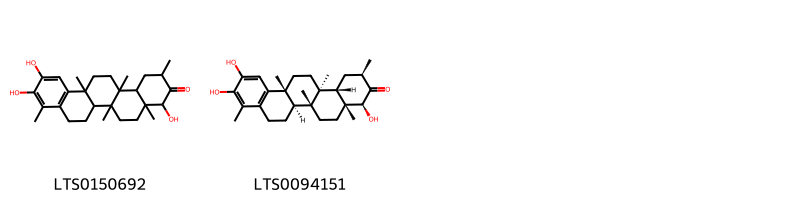{ width=100% }
    <figcaption>Hình ảnh cấu trúc hóa học của 2 hoạt chất thuộc nhóm Phenanthrenes and derivatives gồm ['4,10,11-trihydroxy-2,4a,6a,9,12b,14a-hexamethyl-2,4,5,6,6b,7,8,13,14,14b-decahydro-1h-picen-3-one (LTS0150692)', '(2r,4s,4ar,6ar,6br,12br,14as,14bs)-4,10,11-trihydroxy-2,4a,6a,9,12b,14a-hexamethyl-2,4,5,6,6b,7,8,13,14,14b-decahydro-1h-picen-3-one (LTS0094151)'].</figcaption>
</figure>
#### Nhóm Prenol lipids
<figure markdown="span">
    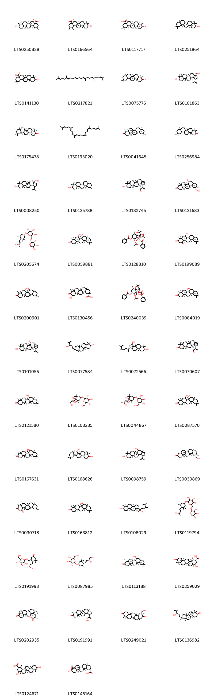{ width=100% }
    <figcaption>Hình ảnh cấu trúc hóa học của 144 hoạt chất thuộc nhóm Prenol lipids gồm ['ursolic acid (LTS0250838)', '10-hydroxy-1,2,6a,6b,9,9,12a-heptamethyl-2,3,4,5,6,7,8,8a,10,11,12,12b,13,14b-tetradecahydro-1h-picene-4a-carboxylic acid (LTS0166564)', 'oleanolic acid (LTS0117717)', 'β-amyrin (LTS0251864)', 'oleanolic acid (LTS0141130)', 'squalene (LTS0217821)', 'β-amyrin (LTS0075776)', 'betulin (LTS0101863)', '(4ar,6ar,6bs,8ar,12ar,14ar,14br)-4,4,6a,6b,8a,11,11,14b-octamethyl-2,4a,5,6,7,8,9,10,12,12a,14,14a-dodecahydro-1h-picen-3-one (LTS0175478)', '2,6,10,15,19,23-hexamethyltetracosa-2,6,10,14,18,22-hexaene (LTS0193020)', '(-)-friedelin (LTS0041645)', '4,4,6a,6b,8a,11,11,14b-octamethyl-2,4a,5,6,7,8,9,10,12,12a,14,14a-dodecahydro-1h-picen-3-one (LTS0256984)', '3a-(hydroxymethyl)-5a,5b,8,8,11a-pentamethyl-1-(prop-1-en-2-yl)-hexadecahydrocyclopenta[a]chrysen-9-ol (LTS0008250)', '(3s,4ar,6ar,8ar,11r,12s,12as,12bs,14ar,14br)-4,4,6a,8a,11,12,12b,14b-octamethyl-2,3,4a,5,6,8,9,10,11,12,12a,13,14,14a-tetradecahydro-1h-picen-3-ol (LTS0135788)', '(1r,3ar,5ar,5br,7ar,9s,11ar,11br,13ar,13bs)-1-(3-hydroxyprop-1-en-2-yl)-3a,5a,5b,8,8,11a-hexamethyl-hexadecahydrocyclopenta[a]chrysen-9-ol (LTS0182745)', '(4r,4ar,6as,6br,7s,8ar,11r,12ar,12bs,14as,14br)-7-hydroxy-11-(hydroxymethyl)-4,4a,6b,8a,11,12b,14a-heptamethyl-tetradecahydro-1h-picen-3-one (LTS0131683)', '(2r,3r,4s,5s,6r)-2-{[(1s,4r,5r)-4-[(1e,3r)-3-hydroxybut-1-en-1-yl]-3,3,5-trimethylcyclohexyl]oxy}-6-({[(2s,3r,4s,5s)-3,4,5-trihydroxyoxan-2-yl]oxy}methyl)oxane-3,4,5-triol (LTS0205674)', '(4r,4as,6r,6as,6bs,8ar,12ar,12bs,14as,14bs)-6-hydroxy-6b-(hydroxymethyl)-4,4a,8a,11,11,12b,14a-heptamethyl-tetradecahydro-1h-picen-3-one (LTS0059881)', '(1s,2r,4s,5r,6s,7s,9r,12r)-12-(acetyloxy)-6-[(acetyloxy)methyl]-4-(benzoyloxy)-5-hydroxy-2,10,10-trimethyl-11-oxatricyclo[7.2.1.0¹,⁶]dodecan-7-yl benzoate (LTS0128810)', '(4r,4ar,6r,6as,6br,8ar,12ar,12bs,14ar,14bs)-6-hydroxy-4,4a,6b,8a,11,11,12b,14a-octamethyl-tetradecahydropicene-1,3-dione (LTS0199089)', '6-hydroxy-4,4a,6b,8a,11,11,12b,14a-octamethyl-tetradecahydropicene-3,7-dione (LTS0200901)', '11-hydroxy-2,4a,6a,8a,9,12b,14a-heptamethyl-10-oxo-tetradecahydro-1h-picene-2-carboxylic acid (LTS0130456)', '12-(acetyloxy)-6-[(acetyloxy)methyl]-4-(benzoyloxy)-5-hydroxy-2,10,10-trimethyl-11-oxatricyclo[7.2.1.0¹,⁶]dodecan-7-yl benzoate (LTS0240039)', '(4r,4as,6as,6br,7s,8ar,12ar,12bs,14as,14bs)-7-hydroxy-6b-(hydroxymethyl)-4,4a,8a,11,11,12b,14a-heptamethyl-tetradecahydro-1h-picen-3-one (LTS0084019)', '(1r,3ar,5s,5ar,5br,7ar,9s,11ar,11br,13ar,13br)-3a,5a,5b,8,8,11a-hexamethyl-1-(prop-1-en-2-yl)-hexadecahydrocyclopenta[a]chrysene-5,9-diol (LTS0101056)', '8-(3-hydroxy-4-methylpent-4-en-1-yl)-1,1,4b,6a,8,10a-hexamethyl-3,4,4a,5,6,7,9,10,10b,11-decahydro-2h-chrysen-2-ol (LTS0077584)', '1-(5,6-dimethylhepta-1,6-dien-2-yl)-3a,3b,6,6,9a-pentamethyl-dodecahydro-1h-cyclopenta[a]phenanthrene-3,7-diol (LTS0072566)', '(1r,3ar,5ar,5br,7ar,11ar,11br,13ar,13bs)-1-(3-hydroxyprop-1-en-2-yl)-3a,5a,5b,8,8,11a-hexamethyl-tetradecahydro-1h-cyclopenta[a]chrysen-9-one (LTS0070607)', '7-hydroxy-4,4a,6b,8a,11,11,12b,14a-octamethyl-tetradecahydro-1h-picen-3-one (LTS0121580)', '(2r,3r,4s,5s,6r)-2-{[(1r,3s,4s)-3,4-dihydroxy-4-[(1e,3r)-3-hydroxybut-1-en-1-yl]-3,5,5-trimethylcyclohexyl]oxy}-6-(hydroxymethyl)oxane-3,4,5-triol (LTS0103235)', '(2r,3r,4s,5s,6r)-2-{[(1r,3s,4s)-3,4-dihydroxy-4-[(3r)-3-hydroxybut-1-en-1-yl]-3,5,5-trimethylcyclohexyl]oxy}-6-(hydroxymethyl)oxane-3,4,5-triol (LTS0044867)', '6-hydroxy-6b-(hydroxymethyl)-4,4a,8a,11,11,12b,14a-heptamethyl-tetradecahydro-1h-picen-3-one (LTS0087570)', '7-hydroxy-6b-(hydroxymethyl)-4,4a,8a,11,11,12b,14a-heptamethyl-tetradecahydro-1h-picen-3-one (LTS0167631)', '(3s,4ar,6ar,6bs,7s,8ar,14ar,14br)-4,4,6a,6b,8a,11,11,14b-octamethyl-1,2,3,4a,5,6,7,8,9,10,12,13,14,14a-tetradecahydropicene-3,7-diol (LTS0168626)', '3a,5a,5b,8,8,11a-hexamethyl-1-(prop-1-en-2-yl)-hexadecahydrocyclopenta[a]chrysene-5,9-diol (LTS0098759)', '(4r,4as,6as,6br,8as,11s,12ar,12bs,14as,14bs)-11-(hydroxymethyl)-4,4a,6b,8a,11,12b,14a-heptamethyl-tetradecahydro-1h-picen-3-one (LTS0030869)', '4,4a,6b,8a,11,11,12b,14a-octamethyl-tetradecahydropicene-1,3-dione (LTS0030718)', '6b-(hydroxymethyl)-4,4a,8a,11,11,12b,14a-heptamethyl-tetradecahydropicene-3,7-dione (LTS0163812)', '(1s,3ar,3br,5ar,7s,9ar,9br,11ar)-1-[(2s)-2-hydroxy-6-methyl-5-methylideneheptan-2-yl]-3a,3b,6,6,9a-pentamethyl-dodecahydro-1h-cyclopenta[a]phenanthren-7-ol (LTS0108029)', '2-{[4-(3-hydroxybut-1-en-1-yl)-3,3,5-trimethylcyclohexyl]oxy}-6-{[(3,4,5-trihydroxyoxan-2-yl)oxy]methyl}oxane-3,4,5-triol (LTS0119794)', '(4r)-4-[(3r)-3-hydroxybutyl]-5,5-dimethyl-3-({[(2r,3r,4s,5s,6r)-3,4,5-trihydroxy-6-(hydroxymethyl)oxan-2-yl]oxy}methyl)cyclohex-2-en-1-one (LTS0191993)', '(2r,3r,4s,5s,6r)-2-{[(1s,4r,5r)-4-[(3r)-3,4-dihydroxybut-1-en-1-yl]-3,3,5-trimethylcyclohexyl]oxy}-6-(hydroxymethyl)oxane-3,4,5-triol (LTS0087985)', '(4r,4as,6as,6br,7s,8ar,12ar,12bs,14as,14bs)-7-hydroxy-4,4a,6b,8a,11,11,12b,14a-octamethyl-tetradecahydro-1h-picen-3-one (LTS0113188)', '(1r,2r,4s,4ar,6as,6br,8ar,12ar,12br,14bs)-4-hydroxy-1,4a,6a,6b,9,9,12a-heptamethyl-10-oxo-1,2,3,4,5,6,7,8,8a,11,12,12b,13,14b-tetradecahydropicene-2-carboxylic acid (LTS0259029)', '(2r)-2-[(1r,3ar,5ar,5br,7as,11ar,11br,13ar,13br)-3a,5a,5b,8,8,11a-hexamethyl-9-oxo-tetradecahydro-1h-cyclopenta[a]chrysen-1-yl]propanoic acid (LTS0202935)', '1-(3-hydroxyprop-1-en-2-yl)-3a,5a,5b,8,8,11a-hexamethyl-hexadecahydrocyclopenta[a]chrysen-9-ol (LTS0191991)', '10-hydroxy-11-(hydroxymethyl)-4,4a,6b,8a,11,12b,14a-heptamethyl-tetradecahydro-1h-picen-3-one (LTS0249021)', '(2s,4as,4br,6as,8s,10ar,10bs)-8-[(3r)-3-hydroxy-4-methylpent-4-en-1-yl]-1,1,4b,6a,8,10a-hexamethyl-3,4,4a,5,6,7,9,10,10b,11-decahydro-2h-chrysen-2-ol (LTS0136982)', '4,10-dihydroxy-1,4a,6a,6b,9,9,12a-heptamethyl-2,3,4,5,6,7,8,8a,10,11,12,12b,13,14b-tetradecahydro-1h-picene-2-carboxylic acid (LTS0124671)', 'salaspermic acid (LTS0145164)', '(2r)-2-[(1r,3ar,5ar,5br,7ar,11ar,11br,13ar,13br)-3a,5a,5b,8,8,11a-hexamethyl-9-oxo-tetradecahydro-1h-cyclopenta[a]chrysen-1-yl]propanoic acid (LTS0147116)', '(4r,4as,6as,6br,8ar,12ar,12bs,14ar,14bs)-4a-(hydroxymethyl)-4,6b,8a,11,11,12b,14a-heptamethyl-tetradecahydropicene-1,3-dione (LTS0147720)', '3,4,5-trihydroxy-6-(hydroxymethyl)oxan-2-yl 5-{8-hydroxy-1,5-dimethyl-3-oxo-6-oxabicyclo[3.2.1]octan-8-yl}-3-methylpenta-2,4-dienoate (LTS0131701)', '1-(2-hydroxy-5,6-dimethylhept-6-en-2-yl)-3a,3b,6,6,9a-pentamethyl-dodecahydro-1h-cyclopenta[a]phenanthren-7-ol (LTS0263264)', '7-hydroxy-11-(hydroxymethyl)-4,4a,6b,8a,11,12b,14a-heptamethyl-tetradecahydro-1h-picen-3-one (LTS0142093)', '20,21-dihydroxy-5,8,11,14,17,24-hexamethyl-22-oxahexacyclo[19.2.1.0¹,¹⁸.0⁴,¹⁷.0⁵,¹⁴.0⁸,¹³]tetracosane-11-carboxylic acid (LTS0154674)', '13-hydroxy-4,4a,6b,8a,11,11,12b,14a-octamethyl-tetradecahydro-1h-picen-3-one (LTS0154470)', '(2s,4r,4ar,6as,6br,8ar,10s,12ar,12br,14bs)-4,10-dihydroxy-2,4a,6a,6b,9,9,12a-heptamethyl-1,3,4,5,6,7,8,8a,10,11,12,12b,13,14b-tetradecahydropicene-2-carboxylic acid (LTS0155422)', '(4r,4as,6as,6br,8as,11r,12ar,12bs,14as,14bs)-11-(hydroxymethyl)-4,4a,6b,8a,11,12b,14a-heptamethyl-tetradecahydro-1h-picen-3-one (LTS0150066)', '(2r,3r,4s,5s,6r)-2-{[(1r)-4-[(3r)-3-hydroxybutyl]-3,5,5-trimethylcyclohex-3-en-1-yl]oxy}-6-({[(2s,3r,4s,5s)-3,4,5-trihydroxyoxan-2-yl]oxy}methyl)oxane-3,4,5-triol (LTS0138541)', '2,4a,6a,8a,9,12b,14a-heptamethyl-10-oxo-tetradecahydro-1h-picene-2-carboxylic acid (LTS0139781)', '8a-(hydroxymethyl)-4,4,6a,6b,11,11,14b-heptamethyl-1,2,3,4a,5,6,7,8,9,10,12,12a,14,14a-tetradecahydropicen-3-ol (LTS0234707)', '(1r,5r,8s,11r,13r,14s,17r,18s,20r,21r,24r)-20,21-dihydroxy-5,8,11,14,17,24-hexamethyl-22-oxahexacyclo[19.2.1.0¹,¹⁸.0⁴,¹⁷.0⁵,¹⁴.0⁸,¹³]tetracosane-11-carboxylic acid (LTS0114407)', '(1s,2r,4s,5r,6r,7s,9r,12r)-5,12-bis(acetyloxy)-6-[(acetyloxy)methyl]-4-hydroxy-2,10,10-trimethyl-11-oxatricyclo[7.2.1.0¹,⁶]dodecan-7-yl benzoate (LTS0113701)', '(2s,4s,4ar,6as,6br,8ar,10s,12ar,12br,14bs)-4,10-dihydroxy-2,4a,6a,6b,9,9,12a-heptamethyl-1,3,4,5,6,7,8,8a,10,11,12,12b,13,14b-tetradecahydropicene-2-carboxylic acid (LTS0112363)', '(4r)-4-[(3r)-3-hydroxybutyl]-5,5-dimethyl-3-({[(2r,3r,4s,5r,6r)-3,4,5-trihydroxy-6-(hydroxymethyl)oxan-2-yl]oxy}methyl)cyclohex-2-en-1-one (LTS0156858)', '5,12-bis(acetyloxy)-6-[(acetyloxy)methyl]-4-hydroxy-2,10,10-trimethyl-11-oxatricyclo[7.2.1.0¹,⁶]dodecan-7-yl benzoate (LTS0130708)', '(2r,3r,4s,5s,6r)-2-{[(1r,2r,4s,5r,8s,9s)-2,9-dihydroxy-4,8-dimethyltricyclo[6.3.1.0¹,⁵]dodecan-4-yl]methoxy}-6-(hydroxymethyl)oxane-3,4,5-triol (LTS0254334)', '(4r,4ar,6r,6as,6bs,8ar,12ar,12bs,14as,14br)-6-hydroxy-6b-(hydroxymethyl)-4,4a,8a,11,11,12b,14a-heptamethyl-tetradecahydro-1h-picen-3-one (LTS0104932)', '21-hydroxy-5,8,11,14,17,24-hexamethyl-22-oxahexacyclo[19.2.1.0¹,¹⁸.0⁴,¹⁷.0⁵,¹⁴.0⁸,¹³]tetracosane-11-carboxylic acid (LTS0124472)', '(4r,4ar,6as,6br,8ar,12ar,12bs,14as,14br)-6b-(hydroxymethyl)-4,4a,8a,11,11,12b,14a-heptamethyl-tetradecahydropicene-3,7-dione (LTS0186524)', '4-hydroxy-2,4a,6a,6b,9,9,12a-heptamethyl-10-oxo-3,4,5,6,7,8,8a,11,12,12b,13,14b-dodecahydro-1h-picene-2-carboxylic acid (LTS0128618)', '(4r,4as,6r,6as,6br,8ar,12ar,12bs,14as,14bs)-6-hydroxy-4,4a,6b,8a,11,11,12b,14a-octamethyl-tetradecahydropicene-3,7-dione (LTS0084833)', '1,2,4a,6a,6b,9,9,12a-octamethyl-hexadecahydropicene-2,10-diol (LTS0073974)', '(1s,3ar,3br,5ar,7s,9ar,9br,11ar)-1-[(2s,5s)-2-hydroxy-5,6-dimethylhept-6-en-2-yl]-3a,3b,6,6,9a-pentamethyl-dodecahydro-1h-cyclopenta[a]phenanthren-7-ol (LTS0192260)', '(2s,3r,4s,5s,6r)-3,4,5-trihydroxy-6-(hydroxymethyl)oxan-2-yl (2z,4e)-5-[(1r,5r,8s)-8-hydroxy-1,5-dimethyl-3-oxo-6-oxabicyclo[3.2.1]octan-8-yl]-3-methylpenta-2,4-dienoate (LTS0064665)', 'lupan-3β,20-diol (LTS0267469)', 'polpunonic acid (LTS0075149)', 'betulinic acid (LTS0210795)', '(1r,3ar,5ar,5br,7ar,11ar,11br,13ar,13br)-1-[(2r)-1-hydroxypropan-2-yl]-3a,5a,5b,8,8,11a-hexamethyl-tetradecahydro-1h-cyclopenta[a]chrysen-9-one (LTS0245728)', '(4r,4ar,6r,6as,6br,8ar,12ar,12bs,14as,14br)-6-hydroxy-4,4a,6b,8a,11,11,12b,14a-octamethyl-tetradecahydropicene-3,7-dione (LTS0176375)', 'erythrodiol (LTS0057163)', '(4r,4as,6as,6br,8ar,12ar,12bs,14as,14bs)-6b-(hydroxymethyl)-4,4a,8a,11,11,12b,14a-heptamethyl-tetradecahydropicene-3,7-dione (LTS0207704)', '(1s,2s,4s,5s,6s,7r,9r,12s)-12-(acetyloxy)-6-[(acetyloxy)methyl]-7-(benzoyloxy)-5-hydroxy-2,10,10-trimethyl-11-oxatricyclo[7.2.1.0¹,⁶]dodecan-4-yl benzoate (LTS0213119)', '(1r,3ar,5ar,5br,7ar,11ar,11br,13ar,13br)-1-[(2s)-1-hydroxypropan-2-yl]-3a,5a,5b,8,8,11a-hexamethyl-tetradecahydro-1h-cyclopenta[a]chrysen-9-one (LTS0085030)', '(4r,4as,6as,6br,8ar,12ar,12bs,14ar,14bs)-4,6b,8a,11,11,12b,14a-heptamethyl-1,3-dioxo-tetradecahydropicene-4a-carbaldehyde (LTS0234232)', '9-hydroxy-5a,5b,8,8,11a-pentamethyl-1-(prop-1-en-2-yl)-hexadecahydrocyclopenta[a]chrysene-3a-carboxylic acid (LTS0214300)', '4,6b,8a,11,11,12b,14a-heptamethyl-1,3-dioxo-tetradecahydropicene-4a-carboxylic acid (LTS0212804)', '(1r,2r,4as,6ar,6br,8ar,10s,12ar,12br,14ar,14bs)-1,2,4a,6a,6b,9,9,12a-octamethyl-hexadecahydropicene-2,10-diol (LTS0222838)', '(1r,3ar,5ar,5br,7ar,11as,11br,13ar,13br)-1-[(2r)-1-hydroxypropan-2-yl]-3a,5a,5b,8,8,11a-hexamethyl-tetradecahydro-1h-cyclopenta[a]chrysen-9-one (LTS0262500)', '(2s,3r,4s,5s,6r)-2-{[(1r)-4-[(3r)-3-hydroxybutyl]-3,5,5-trimethylcyclohex-3-en-1-yl]oxy}-6-({[(2s,3r,4r,5r)-3,4,5-trihydroxyoxan-2-yl]oxy}methyl)oxane-3,4,5-triol (LTS0198263)', 'betulone (LTS0222075)', '1-(2-hydroxypropan-2-yl)-3a,5a,5b,8,8,11a-hexamethyl-hexadecahydrocyclopenta[a]chrysen-9-ol (LTS0231487)', '4,12-bis(acetyloxy)-6-[(acetyloxy)methyl]-5-hydroxy-2,10,10-trimethyl-11-oxatricyclo[7.2.1.0¹,⁶]dodecan-7-yl benzoate (LTS0233892)', '(1r,4s,5r,8s,11r,13r,14s,17r,18s,20r,21r,24r)-20,21-dihydroxy-5,8,11,14,17,24-hexamethyl-22-oxahexacyclo[19.2.1.0¹,¹⁸.0⁴,¹⁷.0⁵,¹⁴.0⁸,¹³]tetracosane-11-carboxylic acid (LTS0140831)', '(1r,2r,4s,4ar,6as,6br,8ar,10s,12ar,12br,14bs)-4,10-dihydroxy-1,4a,6a,6b,9,9,12a-heptamethyl-2,3,4,5,6,7,8,8a,10,11,12,12b,13,14b-tetradecahydro-1h-picene-2-carboxylic acid (LTS0196917)', '(4s,4as,6as,6br,8ar,12ar,12bs,14as,14bs)-4,4a,6b,8a,11,11,12b,14a-octamethyl-tetradecahydro-1h-picen-3-one (LTS0025802)', '2-{[4-(3-hydroxybutyl)-3,3,5-trimethylcyclohexyl]oxy}-6-{[(3,4,5-trihydroxyoxan-2-yl)oxy]methyl}oxane-3,4,5-triol (LTS0233766)', '(5r,8s,11r,14s,17r,24r)-21-hydroxy-5,8,11,14,17,24-hexamethyl-22-oxahexacyclo[19.2.1.0¹,¹⁸.0⁴,¹⁷.0⁵,¹⁴.0⁸,¹³]tetracosane-11-carboxylic acid (LTS0258699)', '3,4,5-trihydroxy-6-(hydroxymethyl)oxan-2-yl 5-(1-hydroxy-2,6,6-trimethyl-4-oxocyclohex-2-en-1-yl)-3-methylpenta-2,4-dienoate (LTS0236928)', '(2r,4as,6ar,6bs,8as,9r,11r,12as,12bs,14as,14br)-11-hydroxy-2,4a,6a,8a,9,12b,14a-heptamethyl-10-oxo-tetradecahydro-1h-picene-2-carboxylic acid (LTS0058139)', '8a-(hydroxymethyl)-4,4,6a,6b,11,12,14b-heptamethyl-2,3,4a,5,6,7,8,9,10,11,12,12a,14,14a-tetradecahydro-1h-picen-3-ol (LTS0178123)', '(4r,4ar,6as,6br,8ar,12ar,12bs,14ar,14bs)-4,4a,6b,8a,11,11,12b,14a-octamethyl-tetradecahydropicene-1,3-dione (LTS0193326)', '(3s,4ar,6ar,6bs,7s,8ar,14ar,14bs)-4,4,6a,6b,8a,11,11,14b-octamethyl-1,2,3,4a,5,6,7,8,9,10,12,13,14,14a-tetradecahydropicene-3,7-diol (LTS0059515)', '(2s,3r,4s,5s,6r)-2-{[(1s)-4-[(3r)-3-hydroxybutyl]-3,5,5-trimethylcyclohex-3-en-1-yl]oxy}-6-({[(2r,3r,4r,5r)-3,4,5-trihydroxyoxan-2-yl]oxy}methyl)oxane-3,4,5-triol (LTS0258669)', '(4r,4ar,6as,6br,7s,8ar,12ar,12bs,14as,14br)-7-hydroxy-6b-(hydroxymethyl)-4,4a,8a,11,11,12b,14a-heptamethyl-tetradecahydro-1h-picen-3-one (LTS0175061)', '3a-(hydroxymethyl)-5a,5b,8,8,11a-pentamethyl-1-(prop-1-en-2-yl)-tetradecahydro-1h-cyclopenta[a]chrysen-9-one (LTS0189548)', '1-(3-hydroxyprop-1-en-2-yl)-3a,5a,5b,8,8,11a-hexamethyl-tetradecahydro-1h-cyclopenta[a]chrysen-9-one (LTS0010200)', '(1s,3ar,3br,5ar,7s,9ar,9br,11ar)-1-[(2r,5s)-2-hydroxy-5,6-dimethylhept-6-en-2-yl]-3a,3b,6,6,9a-pentamethyl-dodecahydro-1h-cyclopenta[a]phenanthren-7-ol (LTS0065796)', '4-hydroxy-1,4a,6a,6b,9,9,12a-heptamethyl-10-oxo-1,2,3,4,5,6,7,8,8a,11,12,12b,13,14b-tetradecahydropicene-2-carboxylic acid (LTS0066237)', 'aba-β-ge (LTS0063642)', '4-(3-hydroxybutyl)-5,5-dimethyl-3-({[3,4,5-trihydroxy-6-(hydroxymethyl)oxan-2-yl]oxy}methyl)cyclohex-2-en-1-one (LTS0122119)', '(2r,3r,4s,5s,6r)-2-{[(1s,4s,5r)-4-[(3r)-3-hydroxybutyl]-3,3,5-trimethylcyclohexyl]oxy}-6-({[(2s,3r,4s,5s)-3,4,5-trihydroxyoxan-2-yl]oxy}methyl)oxane-3,4,5-triol (LTS0064241)', '(2s,3r,4s,5s,6r)-2-{[(1s,4r,5r)-4-[(1e,3r)-3-hydroxybut-1-en-1-yl]-3,3,5-trimethylcyclohexyl]oxy}-6-({[(2r,3r,4r,5r)-3,4,5-trihydroxyoxan-2-yl]oxy}methyl)oxane-3,4,5-triol (LTS0271489)', 'celahin c (LTS0273152)', '1-(1-hydroxypropan-2-yl)-3a,5a,5b,8,8,11a-hexamethyl-tetradecahydro-1h-cyclopenta[a]chrysen-9-one (LTS0066033)', '(2s,3r,4s,5s,6r)-2-{[(1s,4s,5r)-4-[(3r)-3-hydroxybutyl]-3,3,5-trimethylcyclohexyl]oxy}-6-({[(2s,3s,4s,5s)-3,4,5-trihydroxyoxan-2-yl]oxy}methyl)oxane-3,4,5-triol (LTS0016180)', '(4r,4as,6as,6br,8as,10r,11s,12ar,12bs,14as,14bs)-10-hydroxy-11-(hydroxymethyl)-4,4a,6b,8a,11,12b,14a-heptamethyl-tetradecahydro-1h-picen-3-one (LTS0014323)', 'uvaol (LTS0008025)', '(4r,4as,6as,6br,8ar,12ar,12bs,13r,14as,14bs)-13-hydroxy-4,4a,6b,8a,11,11,12b,14a-octamethyl-tetradecahydro-1h-picen-3-one (LTS0004556)', '(1r,3ar,5ar,5br,7ar,11as,11br,13ar,13br)-1-[(2s)-1-hydroxypropan-2-yl]-3a,5a,5b,8,8,11a-hexamethyl-tetradecahydro-1h-cyclopenta[a]chrysen-9-one (LTS0029676)', '1-(2-hydroxy-6-methyl-5-methylideneheptan-2-yl)-3a,3b,6,6,9a-pentamethyl-dodecahydro-1h-cyclopenta[a]phenanthren-7-ol (LTS0020599)', '(2r,4as,6ar,6bs,8as,9r,11s,12as,12bs,14as,14br)-11-hydroxy-2,4a,6a,8a,9,12b,14a-heptamethyl-10-oxo-tetradecahydro-1h-picene-2-carboxylic acid (LTS0026422)', '2-{[4-(3-hydroxybutyl)-3,5,5-trimethylcyclohex-3-en-1-yl]oxy}-6-{[(3,4,5-trihydroxyoxan-2-yl)oxy]methyl}oxane-3,4,5-triol (LTS0026093)', '(2r,3r,4s,5s,6r)-2-{[(1s)-4-[(3r)-3-hydroxybutyl]-3,5,5-trimethylcyclohex-3-en-1-yl]oxy}-6-({[(2s,3r,4s,5s)-3,4,5-trihydroxyoxan-2-yl]oxy}methyl)oxane-3,4,5-triol (LTS0126482)', '(4r,4as,6as,6br,7s,8ar,11r,12ar,12bs,14as,14bs)-7-hydroxy-11-(hydroxymethyl)-4,4a,6b,8a,11,12b,14a-heptamethyl-tetradecahydro-1h-picen-3-one (LTS0009341)', '(2s,4as,4br,6as,8s,10ar,10bs)-8-[(2e)-4-hydroxy-4-methylpent-2-en-1-yl]-1,1,4b,6a,8,10a-hexamethyl-3,4,4a,5,6,7,9,10,10b,11-decahydro-2h-chrysen-2-ol (LTS0004843)', '(1s,2s,4r,5s,6r,7r,9r,12s)-5,12-bis(acetyloxy)-6-[(acetyloxy)methyl]-4-hydroxy-2,10,10-trimethyl-11-oxatricyclo[7.2.1.0¹,⁶]dodecan-7-yl benzoate (LTS0240535)', '4,4,6a,6b,8a,11,11,14b-octamethyl-1,2,3,4a,5,6,7,8,9,10,12,13,14,14a-tetradecahydropicene-3,7-diol (LTS0238584)', '2-{3a,5a,5b,8,8,11a-hexamethyl-9-oxo-tetradecahydro-1h-cyclopenta[a]chrysen-1-yl}propanoic acid (LTS0109961)', '(2s,4s,4ar,6as,6br,8ar,12ar,12br,14bs)-4-hydroxy-2,4a,6a,6b,9,9,12a-heptamethyl-10-oxo-3,4,5,6,7,8,8a,11,12,12b,13,14b-dodecahydro-1h-picene-2-carboxylic acid (LTS0102418)', '11-(hydroxymethyl)-4,4a,6b,8a,11,12b,14a-heptamethyl-tetradecahydro-1h-picen-3-one (LTS0112287)', '4,10-dihydroxy-2,4a,6a,6b,9,9,12a-heptamethyl-1,3,4,5,6,7,8,8a,10,11,12,12b,13,14b-tetradecahydropicene-2-carboxylic acid (LTS0017829)', 'friedelin (LTS0213494)', '4,6b,8a,11,11,12b,14a-heptamethyl-1,3-dioxo-tetradecahydropicene-4a-carbaldehyde (LTS0044713)', '(1r,4s,5r,8s,11r,13r,14s,17r,18s,21r,24r)-21-hydroxy-5,8,11,14,17,24-hexamethyl-22-oxahexacyclo[19.2.1.0¹,¹⁸.0⁴,¹⁷.0⁵,¹⁴.0⁸,¹³]tetracosane-11-carboxylic acid (LTS0038228)', '6-hydroxy-4,4a,6b,8a,11,11,12b,14a-octamethyl-tetradecahydropicene-1,3-dione (LTS0135042)', '(4r,4as,6as,6br,8ar,12ar,12bs,14ar,14bs)-4,6b,8a,11,11,12b,14a-heptamethyl-1,3-dioxo-tetradecahydropicene-4a-carboxylic acid (LTS0137207)', '(2r,3r,4s,5s,6r)-2-{[(1s,4r,5r)-4-[(1e,3r)-3,4-dihydroxybut-1-en-1-yl]-3,3,5-trimethylcyclohexyl]oxy}-6-(hydroxymethyl)oxane-3,4,5-triol (LTS0127011)', '8-(4-hydroxy-4-methylpent-2-en-1-yl)-1,1,4b,6a,8,10a-hexamethyl-3,4,4a,5,6,7,9,10,10b,11-decahydro-2h-chrysen-2-ol (LTS0243785)', '4a-(hydroxymethyl)-4,6b,8a,11,11,12b,14a-heptamethyl-tetradecahydropicene-1,3-dione (LTS0250141)', '(2r,4s,4ar,6as,6br,8ar,12ar,12br,14bs)-4-hydroxy-2,4a,6a,6b,9,9,12a-heptamethyl-10-oxo-3,4,5,6,7,8,8a,11,12,12b,13,14b-dodecahydro-1h-picene-2-carboxylic acid (LTS0038947)', '4,4,6a,8a,11,12,12b,14b-octamethyl-2,3,4a,5,6,8,9,10,11,12,12a,13,14,14a-tetradecahydro-1h-picen-3-ol (LTS0254129)', '(1s,3s,3ar,3br,5ar,7s,9ar,9br,11ar)-1-[(5s)-5,6-dimethylhepta-1,6-dien-2-yl]-3a,3b,6,6,9a-pentamethyl-dodecahydro-1h-cyclopenta[a]phenanthrene-3,7-diol (LTS0044346)'].</figcaption>
</figure>
#### Nhóm Steroids and steroid derivatives
<figure markdown="span">
    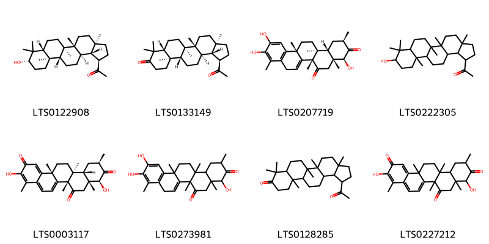{ width=100% }
    <figcaption>Hình ảnh cấu trúc hóa học của 8 hoạt chất thuộc nhóm Steroids and steroid derivatives gồm ['1-[(1r,3ar,5ar,5br,7ar,9s,11ar,11br,13ar,13bs)-9-hydroxy-3a,5a,5b,8,8,11a-hexamethyl-hexadecahydrocyclopenta[a]chrysen-1-yl]ethanone (LTS0122908)', '(1r,3ar,5ar,5br,7ar,11ar,11br,13ar,13bs)-1-acetyl-3a,5a,5b,8,8,11a-hexamethyl-tetradecahydro-1h-cyclopenta[a]chrysen-9-one (LTS0133149)', '(2r,4s,4ar,6as,12bs,14as,14bs)-4,10,11-trihydroxy-2,4a,6a,9,12b,14a-hexamethyl-1,2,4,5,8,13,14,14b-octahydropicene-3,6-dione (LTS0207719)', '1-{9-hydroxy-3a,5a,5b,8,8,11a-hexamethyl-hexadecahydrocyclopenta[a]chrysen-1-yl}ethanone (LTS0222305)', '(6bs,8ar,9s,11r,12as,12bs,14as)-3,9-dihydroxy-4,6b,8a,11,12b,14a-hexamethyl-9,11,12,12a,13,14-hexahydro-8h-picene-2,7,10-trione (LTS0003117)', '4,10,11-trihydroxy-2,4a,6a,9,12b,14a-hexamethyl-1,2,4,5,8,13,14,14b-octahydropicene-3,6-dione (LTS0273981)', '1-acetyl-3a,5a,5b,8,8,11a-hexamethyl-tetradecahydro-1h-cyclopenta[a]chrysen-9-one (LTS0128285)', '3,9-dihydroxy-4,6b,8a,11,12b,14a-hexamethyl-9,11,12,12a,13,14-hexahydro-8h-picene-2,7,10-trione (LTS0227212)'].</figcaption>
</figure>
#### Nhóm Stilbenes
<figure markdown="span">
    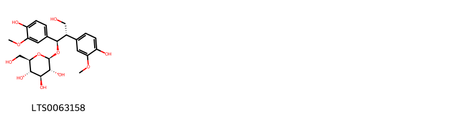{ width=100% }
    <figcaption>Hình ảnh cấu trúc hóa học của 1 hoạt chất thuộc nhóm Stilbenes gồm ['(2r,3r,4s,5s,6r)-2-[(1r,2s)-3-hydroxy-1,2-bis(4-hydroxy-3-methoxyphenyl)propoxy]-6-(hydroxymethyl)oxane-3,4,5-triol (LTS0063158)'].</figcaption>
</figure>
#### Nhóm Thiolanes
<figure markdown="span">
    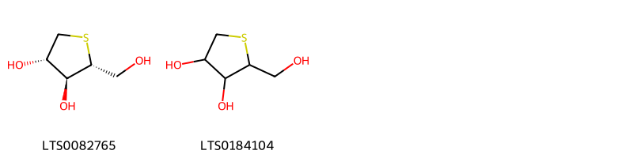{ width=100% }
    <figcaption>Hình ảnh cấu trúc hóa học của 2 hoạt chất thuộc nhóm Thiolanes gồm ['(2r,3s,4s)-2-(hydroxymethyl)thiolane-3,4-diol (LTS0082765)', '2-(hydroxymethyl)thiolane-3,4-diol (LTS0184104)'].</figcaption>
</figure>

---

### Dược dân tộc học

Danh sách các quốc gia có sử dụng *Salacia chinensis* trong điều trị các bệnh. 

| Country   | Disease                   | Bệnh                                                                                                                                                                                                |
|:----------|:--------------------------|:----------------------------------------------------------------------------------------------------------------------------------------------------------------------------------------------------|
| Elsewhere | Abortifacient, Astringent | MYMEMORY WARNING: YOU USED ALL AVAILABLE FREE TRANSLATIONS FOR TODAY. NEXT AVAILABLE IN  16 HOURS 38 MINUTES 54 SECONDS VISIT HTTPS://MYMEMORY.TRANSLATED.NET/DOC/USAGELIMITS.PHP TO TRANSLATE MORE |

---

---
## Salacia oblonga
### Thông tin về thực vật

!!! info "Phân loại thực vật của *Salacia oblonga* từ GIBF:"
    - **Kingdom:** Plantae
    - **Phylum:** Tracheophyta
    - **Order:** Celastrales
    - **Family:** Celastraceae
    - **Genus:** Salacia
    - **Species:** *Salacia oblonga*

 

| Label (VI)   | Label (EN)   | Scientific Name   | Descriptions (VI)   | Descriptions (EN)   | Also Known As (VI)   | Also Known As (EN)   |
|:-------------|:-------------|:------------------|:--------------------|:--------------------|:---------------------|:---------------------|
| N/A          | N/A          | Salacia oblonga   | loài thực vật       | species of plant    | ['']                 | ['']                 |

#### Phân bố trên thế giới

**Từ CSDL GIBF** Sri Lanka, nan, India, unknown or invalid, Papua New Guinea

#### Phân bố tại Việt Nam

**Từ CSDL GIBF**: Không có ghi nhận ở Việt Nam

---
### Thành phần hóa học
        
- Theo cơ sở dữ liệu lotus: Từ loài *Salacia oblonga* đã phân lập và xác định được 32 hoạt chất thuộc về các nhóm Flavonoids, Glycerolipids, Organooxygen compounds, Prenol lipids. 

|    | chemicalTaxonomyClassyfireClass   |   smiles_count |
|---:|:----------------------------------|---------------:|
|  0 | Flavonoids                        |              2 |
|  1 | Glycerolipids                     |              2 |
|  2 | Organooxygen compounds            |             16 |
|  3 | Prenol lipids                     |             11 |

#### Nhóm Flavonoids
<figure markdown="span">
    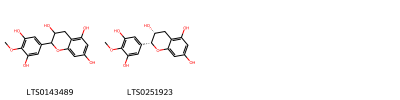{ width=100% }
    <figcaption>Hình ảnh cấu trúc hóa học của 2 hoạt chất thuộc nhóm Flavonoids gồm ['2-(3,5-dihydroxy-4-methoxyphenyl)-3,4-dihydro-2h-1-benzopyran-3,5,7-triol (LTS0143489)', 'ourateacatechin (LTS0251923)'].</figcaption>
</figure>
#### Nhóm Glycerolipids
<figure markdown="span">
    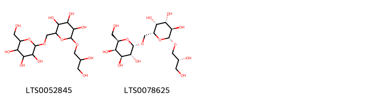{ width=100% }
    <figcaption>Hình ảnh cấu trúc hóa học của 2 hoạt chất thuộc nhóm Glycerolipids gồm ['2-(2,3-dihydroxypropoxy)-6-({[3,4,5-trihydroxy-6-(hydroxymethyl)oxan-2-yl]oxy}methyl)oxane-3,4,5-triol (LTS0052845)', '(2r,3r,4s,5r,6r)-2-[(2r)-2,3-dihydroxypropoxy]-6-({[(2s,3r,4s,5r,6r)-3,4,5-trihydroxy-6-(hydroxymethyl)oxan-2-yl]oxy}methyl)oxane-3,4,5-triol (LTS0078625)'].</figcaption>
</figure>
#### Nhóm Organooxygen compounds
<figure markdown="span">
    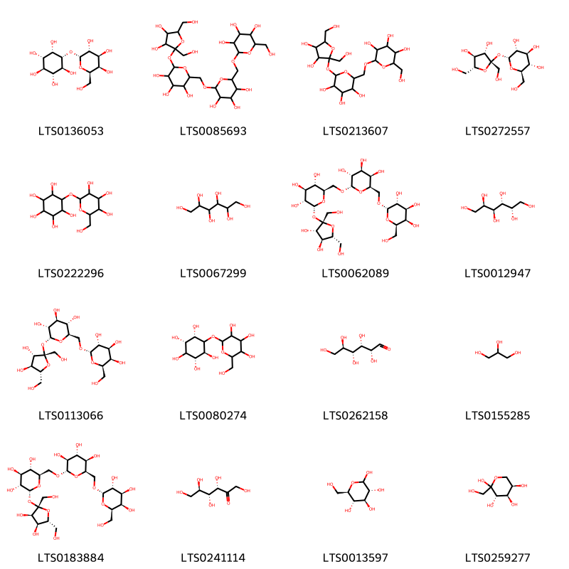{ width=100% }
    <figcaption>Hình ảnh cấu trúc hóa học của 16 hoạt chất thuộc nhóm Organooxygen compounds gồm ['galactinol (LTS0136053)', '2-({6-[(6-{[3,4-dihydroxy-2,5-bis(hydroxymethyl)oxolan-2-yl]oxy}-3,4,5-trihydroxyoxan-2-yl)methoxy]-3,4,5-trihydroxyoxan-2-yl}methoxy)-6-(hydroxymethyl)oxane-3,4,5-triol (LTS0085693)', '2-[(6-{[3,4-dihydroxy-2,5-bis(hydroxymethyl)oxolan-2-yl]oxy}-3,4,5-trihydroxyoxan-2-yl)methoxy]-6-(hydroxymethyl)oxane-3,4,5-triol (LTS0213607)', 'sucrose (LTS0272557)', '6-{[3,4,5-trihydroxy-6-(hydroxymethyl)oxan-2-yl]oxy}cyclohexane-1,2,3,4,5-pentol (LTS0222296)', 'sorbo (LTS0067299)', 'stachyose (LTS0062089)', 'galactitol (LTS0012947)', 'raffinose (LTS0113066)', '(1s,2r,4s,5s)-6-{[3,4,5-trihydroxy-6-(hydroxymethyl)oxan-2-yl]oxy}cyclohexane-1,2,3,4,5-pentol (LTS0080274)', '(+)-glucose (LTS0262158)', 'glycerol (LTS0155285)', '(2r,3r,4s,5s,6r)-2-{[(2s,3r,4s,5r)-3,4-dihydroxy-2,5-bis(hydroxymethyl)oxolan-2-yl]oxy}-6-({[(2s,3s,4r,5r,6r)-3,4,5-trihydroxy-6-({[(2s,3r,4s,5r,6r)-3,4,5-trihydroxy-6-(hydroxymethyl)oxan-2-yl]oxy}methyl)oxan-2-yl]oxy}methyl)oxane-3,4,5-triol (LTS0183884)', 'keto-d-fructose (LTS0241114)', 'glucose (LTS0013597)', 'd-fructopyranose (LTS0259277)'].</figcaption>
</figure>
#### Nhóm Prenol lipids
<figure markdown="span">
    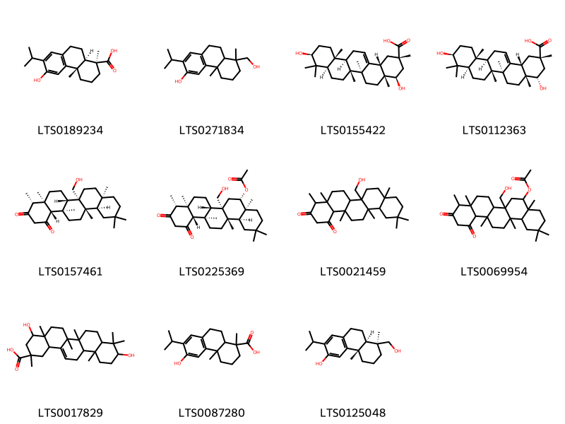{ width=100% }
    <figcaption>Hình ảnh cấu trúc hóa học của 11 hoạt chất thuộc nhóm Prenol lipids gồm ['(1s,4as,10ar)-6-hydroxy-7-isopropyl-1,4a-dimethyl-2,3,4,9,10,10a-hexahydrophenanthrene-1-carboxylic acid (LTS0189234)', '8-(hydroxymethyl)-2-isopropyl-4b,8-dimethyl-5,6,7,8a,9,10-hexahydrophenanthren-3-ol (LTS0271834)', '(2s,4r,4ar,6as,6br,8ar,10s,12ar,12br,14bs)-4,10-dihydroxy-2,4a,6a,6b,9,9,12a-heptamethyl-1,3,4,5,6,7,8,8a,10,11,12,12b,13,14b-tetradecahydropicene-2-carboxylic acid (LTS0155422)', '(2s,4s,4ar,6as,6br,8ar,10s,12ar,12br,14bs)-4,10-dihydroxy-2,4a,6a,6b,9,9,12a-heptamethyl-1,3,4,5,6,7,8,8a,10,11,12,12b,13,14b-tetradecahydropicene-2-carboxylic acid (LTS0112363)', '(4r,4ar,6as,6bs,8ar,12ar,12bs,14ar,14bs)-6b-(hydroxymethyl)-4,4a,8a,11,11,12b,14a-heptamethyl-tetradecahydropicene-1,3-dione (LTS0157461)', '(4as,5s,6as,6bs,8ar,9r,12as,12br,14as,14bs)-6a-(hydroxymethyl)-2,2,4a,8a,9,12b,14a-heptamethyl-10,12-dioxo-tetradecahydropicen-5-yl acetate (LTS0225369)', '6b-(hydroxymethyl)-4,4a,8a,11,11,12b,14a-heptamethyl-tetradecahydropicene-1,3-dione (LTS0021459)', '6a-(hydroxymethyl)-2,2,4a,8a,9,12b,14a-heptamethyl-10,12-dioxo-tetradecahydropicen-5-yl acetate (LTS0069954)', '4,10-dihydroxy-2,4a,6a,6b,9,9,12a-heptamethyl-1,3,4,5,6,7,8,8a,10,11,12,12b,13,14b-tetradecahydropicene-2-carboxylic acid (LTS0017829)', '6-hydroxy-7-isopropyl-1,4a-dimethyl-2,3,4,9,10,10a-hexahydrophenanthrene-1-carboxylic acid (LTS0087280)', '(4bs,8s,8ar)-8-(hydroxymethyl)-2-isopropyl-4b,8-dimethyl-5,6,7,8a,9,10-hexahydrophenanthren-3-ol (LTS0125048)'].</figcaption>
</figure>

---

### Dược dân tộc học

Danh sách các quốc gia có sử dụng *Salacia oblonga* trong điều trị các bệnh. 

| Country   | Disease    | Bệnh                                                                                                                                                                                                |
|:----------|:-----------|:----------------------------------------------------------------------------------------------------------------------------------------------------------------------------------------------------|
| Elsewhere | Antiseptic | MYMEMORY WARNING: YOU USED ALL AVAILABLE FREE TRANSLATIONS FOR TODAY. NEXT AVAILABLE IN  16 HOURS 38 MINUTES 16 SECONDS VISIT HTTPS://MYMEMORY.TRANSLATED.NET/DOC/USAGELIMITS.PHP TO TRANSLATE MORE |

---

---
## Salacia prinoides
### Thông tin về thực vật

!!! info "Phân loại thực vật của *Salacia chinensis* từ GIBF:"
    - **Kingdom:** Plantae
    - **Phylum:** Tracheophyta
    - **Order:** Celastrales
    - **Family:** Celastraceae
    - **Genus:** Salacia
    - **Species:** *Salacia chinensis*

 

| Label (VI)   | Label (EN)   | Scientific Name   | Descriptions (VI)   | Descriptions (EN)   | Also Known As (VI)   | Also Known As (EN)   |
|:-------------|:-------------|:------------------|:--------------------|:--------------------|:---------------------|:---------------------|
| N/A          | N/A          | Salacia prinoides | loài thực vật       | species of plant    | ['']                 | ['']                 |

#### Phân bố trên thế giới

**Từ CSDL GIBF** Sri Lanka, nan, Viet Nam, Indonesia, Philippines, Liberia, China, Australia, Palau, Myanmar, Micronesia (Federated States of), India, Solomon Islands, unknown or invalid, Papua New Guinea, Thailand

#### Phân bố tại Việt Nam

**Từ CSDL GIBF**: Không có ghi nhận ở Việt Nam

---
### Thành phần hóa học
        
- Theo cơ sở dữ liệu lotus: Từ loài *Salacia chinensis* đã phân lập và xác định được Chưa có hoạt chất nào được phân lập. hoạt chất thuộc về các nhóm Không có hoạt chất nào được phân lập. 

Không có hình ảnh nào được tạo ra

---

### Dược dân tộc học

Danh sách các quốc gia có sử dụng *Salacia chinensis* trong điều trị các bệnh. 

| Country     | Disease       | Bệnh                                                                                                                                                                                                |
|:------------|:--------------|:----------------------------------------------------------------------------------------------------------------------------------------------------------------------------------------------------|
| Philippines | Abortifacient | MYMEMORY WARNING: YOU USED ALL AVAILABLE FREE TRANSLATIONS FOR TODAY. NEXT AVAILABLE IN  16 HOURS 37 MINUTES 56 SECONDS VISIT HTTPS://MYMEMORY.TRANSLATED.NET/DOC/USAGELIMITS.PHP TO TRANSLATE MORE |

---

---
## Salacia reticulata
### Thông tin về thực vật

!!! info "Phân loại thực vật của *Salacia reticulata* từ GIBF:"
    - **Kingdom:** Plantae
    - **Phylum:** Tracheophyta
    - **Order:** Celastrales
    - **Family:** Celastraceae
    - **Genus:** Salacia
    - **Species:** *Salacia reticulata*

 

| Label (VI)   | Label (EN)   | Scientific Name    | Descriptions (VI)   | Descriptions (EN)   | Also Known As (VI)   | Also Known As (EN)     |
|:-------------|:-------------|:-------------------|:--------------------|:--------------------|:---------------------|:-----------------------|
| N/A          | N/A          | Salacia reticulata | loài thực vật       | species of plant    | ['']                 | ['Salacia reticulata'] |

#### Phân bố trên thế giới

**Từ CSDL GIBF** Sri Lanka, nan, Indonesia, India, unknown or invalid

#### Phân bố tại Việt Nam

**Từ CSDL GIBF**: Không có ghi nhận ở Việt Nam

---
### Thành phần hóa học
        
- Theo cơ sở dữ liệu lotus: Từ loài *Salacia reticulata* đã phân lập và xác định được 69 hoạt chất thuộc về các nhóm Flavonoids, Steroids and steroid derivatives, Sulfoxides, Organooxygen compounds, Prenol lipids, Benzopyrans. 

|    | chemicalTaxonomyClassyfireClass   |   smiles_count |
|---:|:----------------------------------|---------------:|
|  0 | Benzopyrans                       |              1 |
|  1 | Flavonoids                        |              2 |
|  2 | Organooxygen compounds            |             22 |
|  3 | Prenol lipids                     |             37 |
|  4 | Steroids and steroid derivatives  |              5 |
|  5 | Sulfoxides                        |              2 |

#### Nhóm Benzopyrans
<figure markdown="span">
    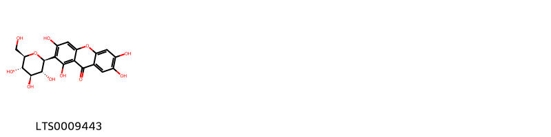{ width=100% }
    <figcaption>Hình ảnh cấu trúc hóa học của 1 hoạt chất thuộc nhóm Benzopyrans gồm ['mangiferin (LTS0009443)'].</figcaption>
</figure>
#### Nhóm Flavonoids
<figure markdown="span">
    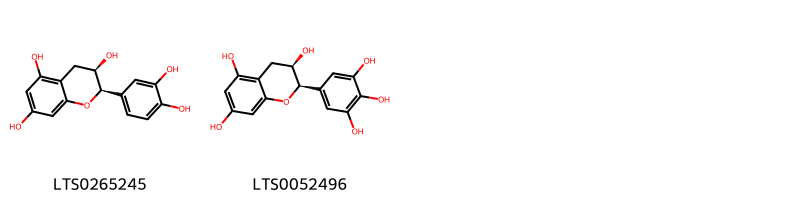{ width=100% }
    <figcaption>Hình ảnh cấu trúc hóa học của 2 hoạt chất thuộc nhóm Flavonoids gồm ['ent-epicatechin (LTS0265245)', 'epigallocatechin (LTS0052496)'].</figcaption>
</figure>
#### Nhóm Organooxygen compounds
<figure markdown="span">
    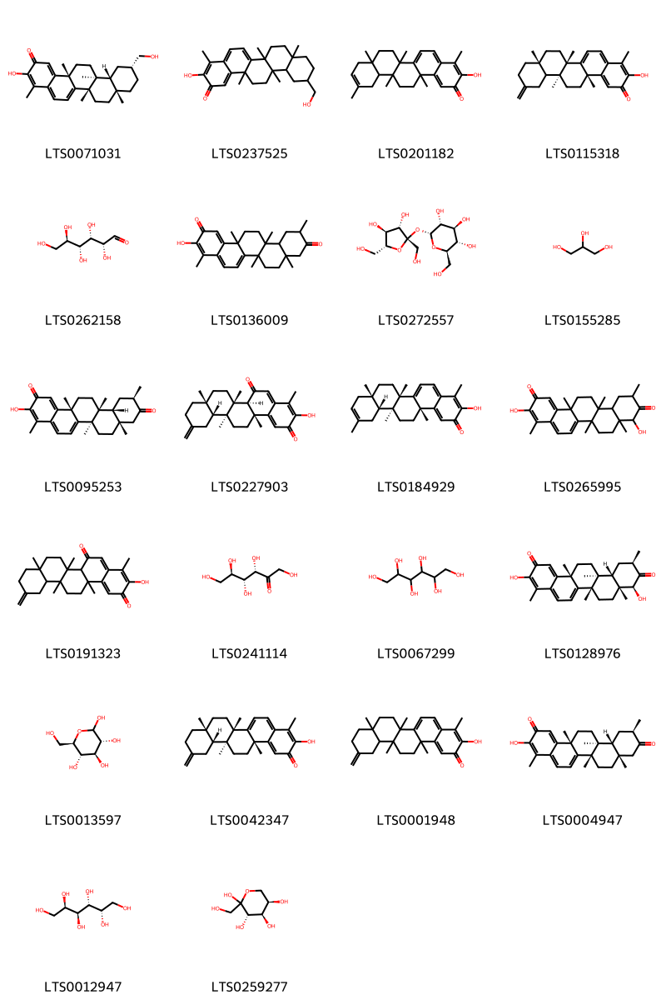{ width=100% }
    <figcaption>Hình ảnh cấu trúc hóa học của 22 hoạt chất thuộc nhóm Organooxygen compounds gồm ['(6bs,8ar,11r,12ar,12bs,14ar)-3-hydroxy-11-(hydroxymethyl)-4,6b,8a,12b,14a-pentamethyl-8,9,10,11,12,12a,13,14-octahydro-7h-picen-2-one (LTS0071031)', '3-hydroxy-11-(hydroxymethyl)-4,6b,8a,12b,14a-pentamethyl-8,9,10,11,12,12a,13,14-octahydro-7h-picen-2-one (LTS0237525)', '3-hydroxy-4,6b,8a,11,12b,14a-hexamethyl-8,9,12,12a,13,14-hexahydro-7h-picen-2-one (LTS0201182)', 'isoiguesterin (LTS0115318)', '(+)-glucose (LTS0262158)', '3-hydroxy-4,6b,8a,11,12b,14a-hexamethyl-7,8,9,11,12,12a,13,14-octahydropicene-2,10-dione (LTS0136009)', 'sucrose (LTS0272557)', 'glycerol (LTS0155285)', 'tingenone (LTS0095253)', '(6ar,6br,8ar,12ar,12bs,14ar)-3-hydroxy-4,6b,8a,12b,14a-pentamethyl-11-methylidene-7,8,9,10,12,12a,13,14-octahydro-6ah-picene-2,6-dione (LTS0227903)', '(6bs,8as,12ar,12bs,14ar)-3-hydroxy-4,6b,8a,11,12b,14a-hexamethyl-8,9,12,12a,13,14-hexahydro-7h-picen-2-one (LTS0184929)', '3,9-dihydroxy-4,6b,8a,11,12b,14a-hexamethyl-7,8,9,11,12,12a,13,14-octahydropicene-2,10-dione (LTS0265995)', '3-hydroxy-4,6b,8a,12b,14a-pentamethyl-11-methylidene-7,8,9,10,12,12a,13,14-octahydro-6ah-picene-2,6-dione (LTS0191323)', 'keto-d-fructose (LTS0241114)', 'sorbo (LTS0067299)', '(6bs,8ar,9s,11r,12as,12bs,14ar)-3,9-dihydroxy-4,6b,8a,11,12b,14a-hexamethyl-7,8,9,11,12,12a,13,14-octahydropicene-2,10-dione (LTS0128976)', 'glucose (LTS0013597)', '(6bs,8ar,12ar,12bs,14ar)-3-hydroxy-4,6b,8a,12b,14a-pentamethyl-11-methylidene-7,8,9,10,12,12a,13,14-octahydropicen-2-one (LTS0042347)', '3-hydroxy-4,6b,8a,12b,14a-pentamethyl-11-methylidene-7,8,9,10,12,12a,13,14-octahydropicen-2-one (LTS0001948)', '(6bs,8as,11r,12ar,12bs,14ar)-3-hydroxy-4,6b,8a,11,12b,14a-hexamethyl-7,8,9,11,12,12a,13,14-octahydropicene-2,10-dione (LTS0004947)', 'galactitol (LTS0012947)', 'd-fructopyranose (LTS0259277)'].</figcaption>
</figure>
#### Nhóm Prenol lipids
<figure markdown="span">
    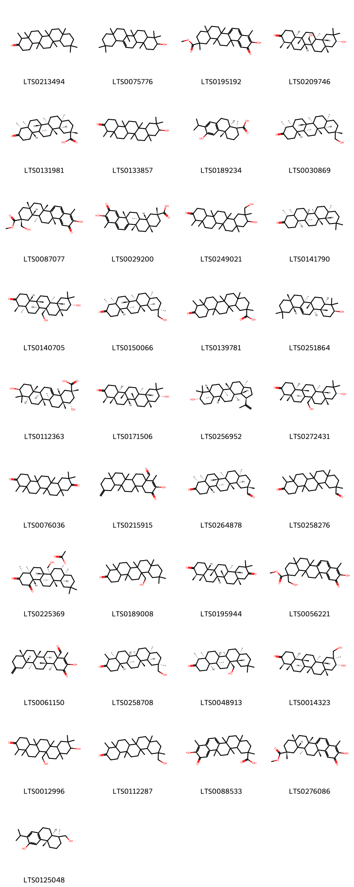{ width=100% }
    <figcaption>Hình ảnh cấu trúc hóa học của 37 hoạt chất thuộc nhóm Prenol lipids gồm ['friedelin (LTS0213494)', 'β-amyrin (LTS0075776)', 'methyl 10-hydroxy-2,4a,6a,9,12b,14a-hexamethyl-11-oxo-1,3,4,5,6,13,14,14b-octahydropicene-2-carboxylate (LTS0195192)', '(4r,4as,6ar,6bs,8as,10r,12ar,12bs,14as,14bs)-10-hydroxy-6b-(hydroxymethyl)-4,4a,8a,11,11,12b,14a-heptamethyl-tetradecahydro-1h-picen-3-one (LTS0209746)', '(2s,4as,6ar,6bs,8as,9r,12as,12bs,14as,14br)-2,4a,6a,8a,9,12b,14a-heptamethyl-10-oxo-tetradecahydro-1h-picene-2-carboxylic acid (LTS0131981)', '10-hydroxy-4,4a,6b,8a,11,11,12b,14a-octamethyl-tetradecahydro-1h-picen-3-one (LTS0133857)', '(1s,4as,10ar)-6-hydroxy-7-isopropyl-1,4a-dimethyl-2,3,4,9,10,10a-hexahydrophenanthrene-1-carboxylic acid (LTS0189234)', '(4r,4as,6as,6br,8as,11s,12ar,12bs,14as,14bs)-11-(hydroxymethyl)-4,4a,6b,8a,11,12b,14a-heptamethyl-tetradecahydro-1h-picen-3-one (LTS0030869)', 'methyl (2r,4as,6as,12br,14as,14br)-10-hydroxy-2-(hydroxymethyl)-4a,6a,9,12b,14a-pentamethyl-11-oxo-1,3,4,5,6,13,14,14b-octahydropicene-2-carboxylate (LTS0087077)', 'celastrol (LTS0029200)', '10-hydroxy-11-(hydroxymethyl)-4,4a,6b,8a,11,12b,14a-heptamethyl-tetradecahydro-1h-picen-3-one (LTS0249021)', '(4r,4as,6ar,6br,8ar,12as,12bs,14as,14br)-4,4a,6b,8a,11,11,12b,14a-octamethyl-tetradecahydro-1h-picen-3-one (LTS0141790)', '(4r,4ar,6as,6bs,8as,10r,12ar,12bs,14as,14br)-10-hydroxy-6b-(hydroxymethyl)-4,4a,8a,11,11,12b,14a-heptamethyl-tetradecahydro-1h-picen-3-one (LTS0140705)', '(4r,4as,6as,6br,8as,11r,12ar,12bs,14as,14bs)-11-(hydroxymethyl)-4,4a,6b,8a,11,12b,14a-heptamethyl-tetradecahydro-1h-picen-3-one (LTS0150066)', '2,4a,6a,8a,9,12b,14a-heptamethyl-10-oxo-tetradecahydro-1h-picene-2-carboxylic acid (LTS0139781)', 'β-amyrin (LTS0251864)', '(2s,4s,4ar,6as,6br,8ar,10s,12ar,12br,14bs)-4,10-dihydroxy-2,4a,6a,6b,9,9,12a-heptamethyl-1,3,4,5,6,7,8,8a,10,11,12,12b,13,14b-tetradecahydropicene-2-carboxylic acid (LTS0112363)', '(4r,4as,6ar,6br,8as,10r,12ar,12bs,14as,14bs)-10-hydroxy-4,4a,6b,8a,11,11,12b,14a-octamethyl-tetradecahydro-1h-picen-3-one (LTS0171506)', 'lupeol (LTS0256952)', '(4r,4as,6as,6bs,8as,10r,12ar,12bs,14as,14bs)-10-hydroxy-6b-(hydroxymethyl)-4,4a,8a,11,11,12b,14a-heptamethyl-tetradecahydro-1h-picen-3-one (LTS0272431)', '2,2,4a,6a,8a,9,12b,14a-octamethyl-tetradecahydropicene-3,10-dione (LTS0076036)', '3-hydroxy-4,6b,8a,12b,14a-pentamethyl-11-methylidene-2-oxo-5,6,6a,7,8,9,10,12,12a,13,14,14b-dodecahydro-1h-picene-4a-carbaldehyde (LTS0215915)', '(2s,4as,6ar,6bs,8as,9r,12as,12bs,14as,14br)-2,4a,6a,8a,9,12b,14a-heptamethyl-10-oxo-tetradecahydro-1h-picene-2-carbaldehyde (LTS0264878)', '2,4a,6a,8a,9,12b,14a-heptamethyl-10-oxo-tetradecahydro-1h-picene-2-carbaldehyde (LTS0258276)', '(4as,5s,6as,6bs,8ar,9r,12as,12br,14as,14bs)-6a-(hydroxymethyl)-2,2,4a,8a,9,12b,14a-heptamethyl-10,12-dioxo-tetradecahydropicen-5-yl acetate (LTS0225369)', '12b-(hydroxymethyl)-4,4a,6b,8a,11,11,14a-heptamethyl-tetradecahydro-1h-picen-3-one (LTS0189008)', '(4as,6ar,6br,8as,9r,12ar,12bs,14as,14br)-2,2,4a,6a,8a,9,12b,14a-octamethyl-tetradecahydropicene-3,10-dione (LTS0195944)', 'methyl 10-hydroxy-2-(hydroxymethyl)-4a,6a,9,12b,14a-pentamethyl-11-oxo-1,3,4,5,6,13,14,14b-octahydropicene-2-carboxylate (LTS0056221)', '(4ar,6as,6br,8ar,12ar,12bs,14ar,14bs)-3-hydroxy-4,6b,8a,12b,14a-pentamethyl-11-methylidene-2-oxo-5,6,6a,7,8,9,10,12,12a,13,14,14b-dodecahydro-1h-picene-4a-carbaldehyde (LTS0061150)', '(4as,6ar,6br,8as,11r,12ar,12bs,14as,14bs)-11-(hydroxymethyl)-4,4a,6b,8a,11,12b,14a-heptamethyl-tetradecahydro-1h-picen-3-one (LTS0258708)', '(4r,4as,6ar,6br,8ar,12as,12br,14as,14br)-12b-(hydroxymethyl)-4,4a,6b,8a,11,11,14a-heptamethyl-tetradecahydro-1h-picen-3-one (LTS0048913)', '(4r,4as,6as,6br,8as,10r,11s,12ar,12bs,14as,14bs)-10-hydroxy-11-(hydroxymethyl)-4,4a,6b,8a,11,12b,14a-heptamethyl-tetradecahydro-1h-picen-3-one (LTS0014323)', '10-hydroxy-6b-(hydroxymethyl)-4,4a,8a,11,11,12b,14a-heptamethyl-tetradecahydro-1h-picen-3-one (LTS0012996)', '11-(hydroxymethyl)-4,4a,6b,8a,11,12b,14a-heptamethyl-tetradecahydro-1h-picen-3-one (LTS0112287)', '10-hydroxy-2,4a,6a,9,12b,14a-hexamethyl-11-oxo-1,3,4,5,6,13,14,14b-octahydropicene-2-carboxylic acid (LTS0088533)', 'celastrol methyl ester (LTS0276086)', '(4bs,8s,8ar)-8-(hydroxymethyl)-2-isopropyl-4b,8-dimethyl-5,6,7,8a,9,10-hexahydrophenanthren-3-ol (LTS0125048)'].</figcaption>
</figure>
#### Nhóm Steroids and steroid derivatives
<figure markdown="span">
    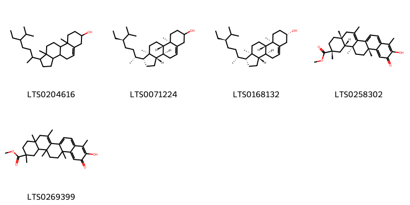{ width=100% }
    <figcaption>Hình ảnh cấu trúc hóa học của 5 hoạt chất thuộc nhóm Steroids and steroid derivatives gồm ['stigmast-5-en-3-ol, (3β)- (LTS0204616)', 'stigmast-5-en-3-ol (LTS0071224)', 'sitosterol (LTS0168132)', 'methyl (2r,4ar,12bs,14as,14br)-10-hydroxy-2,4a,6,9,12b,14a-hexamethyl-11-oxo-3,4,5,13,14,14b-hexahydro-1h-picene-2-carboxylate (LTS0258302)', 'methyl 10-hydroxy-2,4a,6,9,12b,14a-hexamethyl-11-oxo-3,4,5,13,14,14b-hexahydro-1h-picene-2-carboxylate (LTS0269399)'].</figcaption>
</figure>
#### Nhóm Sulfoxides
<figure markdown="span">
    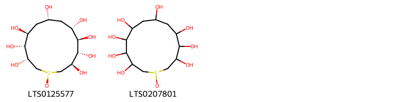{ width=100% }
    <figcaption>Hình ảnh cấu trúc hóa học của 2 hoạt chất thuộc nhóm Sulfoxides gồm ['(1r,3r,4s,5r,6s,8r,10s,11r,12r)-3,4,5,6,8,10,11,12-octahydroxy-1-thiacyclotridecan-1-ium-1-olate (LTS0125577)', '3,4,5,6,8,10,11,12-octahydroxy-1-thiacyclotridecan-1-ium-1-olate (LTS0207801)'].</figcaption>
</figure>

---

### Dược dân tộc học

Danh sách các quốc gia có sử dụng *Salacia reticulata* trong điều trị các bệnh. 

| Country   | Disease    | Bệnh                                                                                                                                                                                                |
|:----------|:-----------|:----------------------------------------------------------------------------------------------------------------------------------------------------------------------------------------------------|
| Elsewhere | Antiseptic | MYMEMORY WARNING: YOU USED ALL AVAILABLE FREE TRANSLATIONS FOR TODAY. NEXT AVAILABLE IN  16 HOURS 37 MINUTES 37 SECONDS VISIT HTTPS://MYMEMORY.TRANSLATED.NET/DOC/USAGELIMITS.PHP TO TRANSLATE MORE |

---

# Chi Tripterygium

??? note "Danh sách các dược liệu thuộc chi"
    
	 - *Tripterygium wilfordii*

---
## Tripterygium wilfordii
### Thông tin về thực vật

!!! info "Phân loại thực vật của *Tripterygium wilfordii* từ GIBF:"
    - **Kingdom:** Plantae
    - **Phylum:** Tracheophyta
    - **Order:** Celastrales
    - **Family:** Celastraceae
    - **Genus:** Tripterygium
    - **Species:** *Tripterygium wilfordii*

 

| Label (VI)   | Label (EN)   | Scientific Name        | Descriptions (VI)   | Descriptions (EN)   | Also Known As (VI)   | Also Known As (EN)   |
|:-------------|:-------------|:-----------------------|:--------------------|:--------------------|:---------------------|:---------------------|
| N/A          | N/A          | Tripterygium wilfordii | loài thực vật       | species of plant    | ['']                 | ['']                 |

#### Phân bố trên thế giới

**Từ CSDL GIBF** Japan, Korea, Republic of, Latvia, Chinese Taipei, Belgium, China, Canada

#### Phân bố tại Việt Nam

**Từ CSDL GIBF**: Không có ghi nhận ở Việt Nam

---
### Thành phần hóa học
        
- Theo cơ sở dữ liệu lotus: Từ loài *Tripterygium wilfordii* đã phân lập và xác định được 683 hoạt chất thuộc về các nhóm Fatty Acyls, Peptidomimetics, Phenanthrenes and derivatives, Carboxylic acids and derivatives, Phenols, Organooxygen compounds, Oxepanes, Naphthopyrans, Fluorenes, Furans, Vinylogous acids, Benzene and substituted derivatives, Steroids and steroid derivatives, Dioxanes, Pyridines and derivatives, Macrolides and analogues, Furanoid lignans, Benzopyrans, Flavonoids, Naphthofurans, Azepines, Macrolactams, Prenol lipids. 

|    | chemicalTaxonomyClassyfireClass     |   smiles_count |
|---:|:------------------------------------|---------------:|
|  0 |                                     |             50 |
|  1 | Azepines                            |              2 |
|  2 | Benzene and substituted derivatives |              1 |
|  3 | Benzopyrans                         |              2 |
|  4 | Carboxylic acids and derivatives    |             45 |
|  5 | Dioxanes                            |              3 |
|  6 | Fatty Acyls                         |              4 |
|  7 | Flavonoids                          |              4 |
|  8 | Fluorenes                           |              1 |
|  9 | Furanoid lignans                    |              6 |
| 10 | Furans                              |              1 |
| 11 | Macrolactams                        |              2 |
| 12 | Macrolides and analogues            |              2 |
| 13 | Naphthofurans                       |              3 |
| 14 | Naphthopyrans                       |              4 |
| 15 | Organooxygen compounds              |             18 |
| 16 | Oxepanes                            |              8 |
| 17 | Peptidomimetics                     |              2 |
| 18 | Phenanthrenes and derivatives       |             20 |
| 19 | Phenols                             |              1 |
| 20 | Prenol lipids                       |            427 |
| 21 | Pyridines and derivatives           |              2 |
| 22 | Steroids and steroid derivatives    |             68 |
| 23 | Vinylogous acids                    |              2 |

#### Nhóm 
<figure markdown="span">
    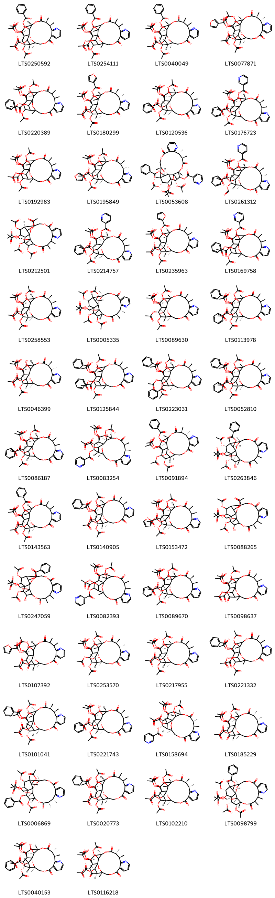{ width=100% }
    <figcaption>Hình ảnh cấu trúc hóa học của 50 hoạt chất thuộc nhóm  gồm ['(1s,3r,13r,14s,17s,18r,19r,20r,21s,22r,23r,24r,25s)-19,21,22,24-tetrakis(acetyloxy)-20-[(acetyloxy)methyl]-25-hydroxy-3,13,14,25-tetramethyl-6,15-dioxo-2,5,16-trioxa-11-azapentacyclo[15.7.1.0¹,²⁰.0³,²³.0⁷,¹²]pentacosa-7,9,11-trien-18-yl benzoate (LTS0250592)', '19,21,22,24-tetrakis(acetyloxy)-20-[(acetyloxy)methyl]-25-hydroxy-3,13,14,25-tetramethyl-6,15-dioxo-2,5,16-trioxa-11-azapentacyclo[15.7.1.0¹,²⁰.0³,²³.0⁷,¹²]pentacosa-7,9,11-trien-18-yl benzoate (LTS0254111)', 'forrestine (LTS0040049)', '[(1s,3r,13s,14s,17s,18r,19r,20r,21s,22r,23r,24r)-18,19,21,22,24-pentakis(acetyloxy)-25-hydroxy-3,13,14,25-tetramethyl-6,15-dioxo-2,5,16-trioxa-11-azapentacyclo[15.7.1.0¹,²⁰.0³,²³.0⁷,¹²]pentacosa-7,9,11-trien-20-yl]methyl furan-3-carboxylate (LTS0077871)', '18,19,21,22-tetrakis(acetyloxy)-20-[(acetyloxy)methyl]-25-hydroxy-3,13,14,25-tetramethyl-6,15-dioxo-2,5,16-trioxa-11-azapentacyclo[15.7.1.0¹,²⁰.0³,²³.0⁷,¹²]pentacosa-7,9,11-trien-24-yl benzoate (LTS0220389)', '(1s,3r,13s,14s,17s,18r,19r,20r,21s,22r,23r,24r)-19,21,22,24-tetrakis(acetyloxy)-20-[(acetyloxy)methyl]-25-hydroxy-3,13,14,25-tetramethyl-6,15-dioxo-2,5,16-trioxa-11-azapentacyclo[15.7.1.0¹,²⁰.0³,²³.0⁷,¹²]pentacosa-7,9,11-trien-18-yl furan-3-carboxylate (LTS0180299)', '(1s,3r,13r,14s,17s,18r,19r,20r,21s,22r,23r,24r,25s)-18,19,21,22-tetrakis(acetyloxy)-20-[(acetyloxy)methyl]-25-hydroxy-3,13,14,25-tetramethyl-6,15-dioxo-2,5,16-trioxa-11-azapentacyclo[15.7.1.0¹,²⁰.0³,²³.0⁷,¹²]pentacosa-7,9,11-trien-24-yl benzoate (LTS0120536)', '(1s,3r,13r,14s,17s,18r,19r,20r,21s,22r,23r,24r,25s)-19,21,22-tris(acetyloxy)-20-[(acetyloxy)methyl]-24-(benzoyloxy)-25-hydroxy-3,13,14,25-tetramethyl-6,15-dioxo-2,5,16-trioxa-11-azapentacyclo[15.7.1.0¹,²⁰.0³,²³.0⁷,¹²]pentacosa-7,9,11-trien-18-yl pyridine-3-carboxylate (LTS0176723)', '[18,19,21,22,24-pentakis(acetyloxy)-25-hydroxy-3,13,14,25-tetramethyl-6,15-dioxo-2,5,16-trioxa-11-azapentacyclo[15.7.1.0¹,²⁰.0³,²³.0⁷,¹²]pentacosa-7,9,11-trien-20-yl]methyl acetate (LTS0192983)', '(1s,3r,13s,14s,17s,18r,19r,20r,21s,22r,23r,24r)-18,19,21,22-tetrakis(acetyloxy)-20-[(acetyloxy)methyl]-25-hydroxy-3,13,14,25-tetramethyl-6,15-dioxo-2,5,16-trioxa-11-azapentacyclo[15.7.1.0¹,²⁰.0³,²³.0⁷,¹²]pentacosa-7,9,11-trien-24-yl furan-3-carboxylate (LTS0195849)', '(1r,3r,13r,14r,17r,18s,19r,20s,21r,22r,23s,24r,25s)-19,21,22-tris(acetyloxy)-20-[(acetyloxy)methyl]-24-(benzoyloxy)-25-hydroxy-3,13,14,25-tetramethyl-6,15-dioxo-2,5,16-trioxa-11-azapentacyclo[15.7.1.0¹,²⁰.0³,²³.0⁷,¹²]pentacosa-7,9,11-trien-18-yl pyridine-3-carboxylate (LTS0053608)', '(1s,3r,13s,14s,17s,18r,19r,20r,21s,22r,23r,24r)-19,21-bis(acetyloxy)-20-[(acetyloxy)methyl]-24-(benzoyloxy)-22-(formyloxy)-25-hydroxy-3,13,14,25-tetramethyl-6,15-dioxo-2,5,16-trioxa-11-azapentacyclo[15.7.1.0¹,²⁰.0³,²³.0⁷,¹²]pentacosa-7,9,11-trien-18-yl pyridine-3-carboxylate (LTS0261312)', '[(1s,3r,20r,23r,25s)-18,19,21,22,24-pentakis(acetyloxy)-25-hydroxy-3,13,14,25-tetramethyl-6,15-dioxo-2,5,16-trioxa-11-azapentacyclo[15.7.1.0¹,²⁰.0³,²³.0⁷,¹²]pentacosa-7,9,11-trien-20-yl]methyl acetate (LTS0212501)', 'hyponine d (LTS0214757)', 'hyponine f (LTS0235963)', '19,21,22-tris(acetyloxy)-20-[(acetyloxy)methyl]-24-(benzoyloxy)-25-hydroxy-3,13,14,25-tetramethyl-6,15-dioxo-2,5,16-trioxa-11-azapentacyclo[15.7.1.0¹,²⁰.0³,²³.0⁷,¹²]pentacosa-7,9,11-trien-18-yl pyridine-3-carboxylate (LTS0169758)', '[(1s,3r,13r,14s,17s,18r,19r,20r,21s,22r,23r,24r,25s)-18,19,21,22,24-pentakis(acetyloxy)-25-hydroxy-3,13,14,25-tetramethyl-6,15-dioxo-2,5,16-trioxa-11-azapentacyclo[15.7.1.0¹,²⁰.0³,²³.0⁷,¹²]pentacosa-7,9,11-trien-20-yl]methyl acetate (LTS0258553)', '[(1r,3s,13r,14r,17r,18s,19s,20s,21s,22r,23s,24s,25s)-18,19,21,22,24-pentakis(acetyloxy)-25-hydroxy-3,13,14,25-tetramethyl-6,15-dioxo-2,5,16-trioxa-11-azapentacyclo[15.7.1.0¹,²⁰.0³,²³.0⁷,¹²]pentacosa-7,9,11-trien-20-yl]methyl acetate (LTS0005335)', '[(1s,3r,17s,18r,19r,20r,21s,22r,23s,24r,25s)-18,19,21,22-tetrakis(acetyloxy)-24,25-dihydroxy-3,13,14,25-tetramethyl-6,15-dioxo-2,5,16-trioxa-11-azapentacyclo[15.7.1.0¹,²⁰.0³,²³.0⁷,¹²]pentacosa-7,9,11-trien-20-yl]methyl acetate (LTS0089630)', '(1s,3r,17s,18r,19r,20r,21s,22r,23r,24r,25s)-18,21,22-tris(acetyloxy)-20-[(acetyloxy)methyl]-19-(benzoyloxy)-25-hydroxy-3,13,14,25-tetramethyl-6,15-dioxo-2,5,16-trioxa-11-azapentacyclo[15.7.1.0¹,²⁰.0³,²³.0⁷,¹²]pentacosa-7,9,11-trien-24-yl benzoate (LTS0113978)', '[(1s,3r,13s,14s,17s,18r,19r,20s,21s,22r,23r,24r,25s)-19,21,22,24-tetrakis(acetyloxy)-18,25-dihydroxy-3,13,14,25-tetramethyl-6,15-dioxo-2,5,16-trioxa-11-azapentacyclo[15.7.1.0¹,²⁰.0³,²³.0⁷,¹²]pentacosa-7,9,11-trien-20-yl]methyl acetate (LTS0046399)', '18,21,22-tris(acetyloxy)-20-[(acetyloxy)methyl]-19-(benzoyloxy)-25-hydroxy-3,13,14,25-tetramethyl-6,15-dioxo-2,5,16-trioxa-11-azapentacyclo[15.7.1.0¹,²⁰.0³,²³.0⁷,¹²]pentacosa-7,9,11-trien-24-yl benzoate (LTS0125844)', '(1s,3r,14s,17s,18r,19r,20r,21s,22r,24r,25s)-18,21,22-tris(acetyloxy)-20-[(acetyloxy)methyl]-19-(benzoyloxy)-25-hydroxy-3,13,14,25-tetramethyl-6,15-dioxo-2,5,16-trioxa-11-azapentacyclo[15.7.1.0¹,²⁰.0³,²³.0⁷,¹²]pentacosa-7,9,11-trien-24-yl benzoate (LTS0223031)', '(1s,3r,13r,14s,17s,18r,19r,20r,21s,22r,23r,24r,25s)-18,21,22-tris(acetyloxy)-20-[(acetyloxy)methyl]-19-(benzoyloxy)-25-hydroxy-3,13,14,25-tetramethyl-6,15-dioxo-2,5,16-trioxa-11-azapentacyclo[15.7.1.0¹,²⁰.0³,²³.0⁷,¹²]pentacosa-7,9,11-trien-24-yl benzoate (LTS0052810)', '(1s,3r,17s,18r,19r,20r,21s,22r,23r,24r,25s)-18,19,21,22-tetrakis(acetyloxy)-20-[(acetyloxy)methyl]-25-hydroxy-3,13,14,25-tetramethyl-6,15-dioxo-2,5,16-trioxa-11-azapentacyclo[15.7.1.0¹,²⁰.0³,²³.0⁷,¹²]pentacosa-7,9,11-trien-24-yl benzoate (LTS0086187)', '(1s,3r,13r,14s,17s,18r,19r,20r,21s,22r,23r,24r,25s)-18,19,21,24-tetrakis(acetyloxy)-20-[(acetyloxy)methyl]-25-hydroxy-3,13,14,25-tetramethyl-6,15-dioxo-2,5,16-trioxa-11-azapentacyclo[15.7.1.0¹,²⁰.0³,²³.0⁷,¹²]pentacosa-7,9,11-trien-22-yl pyridine-3-carboxylate (LTS0083254)', '(1s,3r,13s,14s,17s,18r,19r,20r,21s,22r,23s,24r,25s)-19,21,22-tris(acetyloxy)-20-[(acetyloxy)methyl]-24,25-dihydroxy-3,13,14,25-tetramethyl-6,15-dioxo-2,5,16-trioxa-11-azapentacyclo[15.7.1.0¹,²⁰.0³,²³.0⁷,¹²]pentacosa-7,9,11-trien-18-yl benzoate (LTS0091894)', '(1s,3s,17r,18s,19r,20r,21r,22r,23s,24r,25r)-19,21,22-tris(acetyloxy)-20-[(acetyloxy)methyl]-18,25-dihydroxy-3,13,14,25-tetramethyl-6,15-dioxo-2,5,16-trioxa-11-azapentacyclo[15.7.1.0¹,²⁰.0³,²³.0⁷,¹²]pentacosa-7,9,11-trien-24-yl benzoate (LTS0263846)', '(1s,3r,17s,18r,19r,20r,21s,22r,23r,24r,25r)-19,21,22,24-tetrakis(acetyloxy)-20-[(acetyloxy)methyl]-25-hydroxy-3,13,14,25-tetramethyl-6,15-dioxo-2,5,16-trioxa-11-azapentacyclo[15.7.1.0¹,²⁰.0³,²³.0⁷,¹²]pentacosa-7,9,11-trien-18-yl benzoate (LTS0143563)', '(1s,3r,13r,14s,17s,18r,19r,20r,21s,22r,23r,24r,25s)-18,21,22,24-tetrakis(acetyloxy)-20-[(acetyloxy)methyl]-25-hydroxy-3,13,14,25-tetramethyl-6,15-dioxo-2,5,16-trioxa-11-azapentacyclo[15.7.1.0¹,²⁰.0³,²³.0⁷,¹²]pentacosa-7,9,11-trien-19-yl benzoate (LTS0140905)', '(1s,3r,17s,18r,19r,20r,21s,22r,23r,24r,25s)-18,19,21,22-tetrakis(acetyloxy)-20-[(acetyloxy)methyl]-25-hydroxy-3,13,14,25-tetramethyl-6,15-dioxo-2,5,16-trioxa-11-azapentacyclo[15.7.1.0¹,²⁰.0³,²³.0⁷,¹²]pentacosa-7,9,11-trien-24-yl furan-2-carboxylate (LTS0153472)', '[19,21,22,24-tetrakis(acetyloxy)-18,25-dihydroxy-3,13,14,25-tetramethyl-6,15-dioxo-2,5,16-trioxa-11-azapentacyclo[15.7.1.0¹,²⁰.0³,²³.0⁷,¹²]pentacosa-7,9,11-trien-20-yl]methyl acetate (LTS0088265)', '19,21,22-tris(acetyloxy)-20-[(acetyloxy)methyl]-18,25-dihydroxy-3,13,14,25-tetramethyl-6,15-dioxo-2,5,16-trioxa-11-azapentacyclo[15.7.1.0¹,²⁰.0³,²³.0⁷,¹²]pentacosa-7,9,11-trien-24-yl benzoate (LTS0247059)', '18,19,21,24-tetrakis(acetyloxy)-20-[(acetyloxy)methyl]-25-hydroxy-3,13,14,25-tetramethyl-6,15-dioxo-2,5,16-trioxa-11-azapentacyclo[15.7.1.0¹,²⁰.0³,²³.0⁷,¹²]pentacosa-7,9,11-trien-22-yl pyridine-3-carboxylate (LTS0082393)', '(1s,3r,13r,14s,17s,18r,19r,20r,21s,22r,23r,24r,25r)-18,19,21,22-tetrakis(acetyloxy)-20-[(acetyloxy)methyl]-25-hydroxy-3,13,14,25-tetramethyl-6,15-dioxo-2,5,16-trioxa-11-azapentacyclo[15.7.1.0¹,²⁰.0³,²³.0⁷,¹²]pentacosa-7,9,11-trien-24-yl benzoate (LTS0089670)', 'evonine (LTS0098637)', '[(1s,3r,17s,18r,19r,20s,21s,23r,24r,25s)-18,19,21,24-tetrakis(acetyloxy)-25-hydroxy-3,13,14,25-tetramethyl-6,15,22-trioxo-2,5,16-trioxa-11-azapentacyclo[15.7.1.0¹,²⁰.0³,²³.0⁷,¹²]pentacosa-7,9,11-trien-20-yl]methyl furan-2-carboxylate (LTS0107392)', '[(1s,3r,13s,14s,17s,18r,19r,20r,21s,22r,23s,24r)-18,19,21,22-tetrakis(acetyloxy)-24,25-dihydroxy-3,13,14,25-tetramethyl-6,15-dioxo-2,5,16-trioxa-11-azapentacyclo[15.7.1.0¹,²⁰.0³,²³.0⁷,¹²]pentacosa-7,9,11-trien-20-yl]methyl acetate (LTS0253570)', '[(1s,3r,17s,18r,19r,20r,21s,22r,23r,24r,25s)-18,19,21,22,24-pentakis(acetyloxy)-25-hydroxy-3,13,14,25-tetramethyl-6,15-dioxo-2,5,16-trioxa-11-azapentacyclo[15.7.1.0¹,²⁰.0³,²³.0⁷,¹²]pentacosa-7,9,11-trien-20-yl]methyl acetate (LTS0217955)', '18,21,22,24-tetrakis(acetyloxy)-20-[(acetyloxy)methyl]-25-hydroxy-3,13,14,25-tetramethyl-6,15-dioxo-2,5,16-trioxa-11-azapentacyclo[15.7.1.0¹,²⁰.0³,²³.0⁷,¹²]pentacosa-7,9,11-trien-19-yl benzoate (LTS0221332)', '(1r,3r,13r,14s,17r,18s,19r,20r,21s,22s,23s,24s,25r)-18,21,22,24-tetrakis(acetyloxy)-20-[(acetyloxy)methyl]-25-hydroxy-3,13,14,25-tetramethyl-6,15-dioxo-2,5,16-trioxa-11-azapentacyclo[15.7.1.0¹,²⁰.0³,²³.0⁷,¹²]pentacosa-7,9,11-trien-19-yl benzoate (LTS0101041)', '(1s,3r,13r,14s,17s,18r,19r,20s,21s,22r,23r,24r,25s)-19,21,22-tris(acetyloxy)-20-[(acetyloxy)methyl]-18,25-dihydroxy-3,13,14,25-tetramethyl-6,15-dioxo-2,5,16-trioxa-11-azapentacyclo[15.7.1.0¹,²⁰.0³,²³.0⁷,¹²]pentacosa-7,9,11-trien-24-yl benzoate (LTS0221743)', '(1r,3r,13r,14r,17s,18r,19s,20s,21s,22s,23s,24s,25r)-18,19,21,24-tetrakis(acetyloxy)-20-[(acetyloxy)methyl]-25-hydroxy-3,13,14,25-tetramethyl-6,15-dioxo-2,5,16-trioxa-11-azapentacyclo[15.7.1.0¹,²⁰.0³,²³.0⁷,¹²]pentacosa-7,9,11-trien-22-yl pyridine-3-carboxylate (LTS0158694)', '[(1s,3r,13s,14r,17s,18r,19r,20s,21s,23r,24r,25s)-18,19,21,24-tetrakis(acetyloxy)-25-hydroxy-3,13,14,25-tetramethyl-6,15,22-trioxo-2,5,16-trioxa-11-azapentacyclo[15.7.1.0¹,²⁰.0³,²³.0⁷,¹²]pentacosa-7,9,11-trien-20-yl]methyl acetate (LTS0185229)', '(1r,3s,13r,14s,17r,18s,19s,20s,21r,22s,23s,24s,25r)-18,21,22,24-tetrakis(acetyloxy)-20-[(acetyloxy)methyl]-25-hydroxy-3,13,14,25-tetramethyl-6,15-dioxo-2,5,16-trioxa-11-azapentacyclo[15.7.1.0¹,²⁰.0³,²³.0⁷,¹²]pentacosa-7,9,11-trien-19-yl benzoate (LTS0006869)', 'mayteine (LTS0020773)', '[(1s,3r,13s,14s,17s,18r,19r,20r,21s,22r,23r,24r)-18,19,21,22,24-pentakis(acetyloxy)-25-hydroxy-3,13,14,25-tetramethyl-6,15-dioxo-2,5,16-trioxa-11-azapentacyclo[15.7.1.0¹,²⁰.0³,²³.0⁷,¹²]pentacosa-7,9,11-trien-20-yl]methyl acetate (LTS0102210)', '(1s,3s,17r,18s,19r,20r,21r,22r,23s,24r,25r)-18,19,21,22-tetrakis(acetyloxy)-20-[(acetyloxy)methyl]-25-hydroxy-3,13,14,25-tetramethyl-6,15-dioxo-2,5,16-trioxa-11-azapentacyclo[15.7.1.0¹,²⁰.0³,²³.0⁷,¹²]pentacosa-7,9,11-trien-24-yl benzoate (LTS0098799)', '(1s,3r,13r,14r,17s,18r,19s,20s,21s,22s,23r,24s,25s)-19,21,22-tris(acetyloxy)-20-[(acetyloxy)methyl]-18,25-dihydroxy-3,13,14,25-tetramethyl-6,15-dioxo-2,5,16-trioxa-11-azapentacyclo[15.7.1.0¹,²⁰.0³,²³.0⁷,¹²]pentacosa-7,9,11-trien-24-yl benzoate (LTS0040153)', '[(1r,3s,13r,14r,17r,18r,19r,20s,21r,23s,24r,25s)-18,19,21,24-tetrakis(acetyloxy)-25-hydroxy-3,13,14,25-tetramethyl-6,15,22-trioxo-2,5,16-trioxa-11-azapentacyclo[15.7.1.0¹,²⁰.0³,²³.0⁷,¹²]pentacosa-7,9,11-trien-20-yl]methyl acetate (LTS0116218)'].</figcaption>
</figure>
#### Nhóm Azepines
<figure markdown="span">
    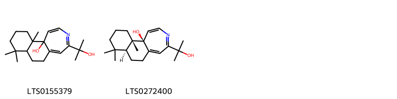{ width=100% }
    <figcaption>Hình ảnh cấu trúc hóa học của 2 hoạt chất thuộc nhóm Azepines gồm ['4-(2-hydroxypropan-2-yl)-8,8,11a-trimethyl-6h,7h,7ah,9h,10h,11h-naphtho[1,2-d]azepin-11b-ol (LTS0155379)', '(7as,11as,11bs)-4-(2-hydroxypropan-2-yl)-8,8,11a-trimethyl-6h,7h,7ah,9h,10h,11h-naphtho[1,2-d]azepin-11b-ol (LTS0272400)'].</figcaption>
</figure>
#### Nhóm Benzene and substituted derivatives
<figure markdown="span">
    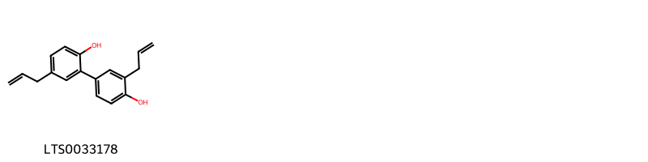{ width=100% }
    <figcaption>Hình ảnh cấu trúc hóa học của 1 hoạt chất thuộc nhóm Benzene and substituted derivatives gồm ['honokiol (LTS0033178)'].</figcaption>
</figure>
#### Nhóm Benzopyrans
<figure markdown="span">
    { width=100% }
    <figcaption>Hình ảnh cấu trúc hóa học của 2 hoạt chất thuộc nhóm Benzopyrans gồm ['3-(4-hydroxy-6-methoxy-3,4-dihydro-2h-1-benzopyran-3-yl)-6-methoxy-3,4-dihydro-2h-1-benzopyran-4-ol (LTS0076474)', '(3s,4s)-3-[(3r,4r)-4-hydroxy-6-methoxy-3,4-dihydro-2h-1-benzopyran-3-yl]-6-methoxy-3,4-dihydro-2h-1-benzopyran-4-ol (LTS0176064)'].</figcaption>
</figure>
#### Nhóm Carboxylic acids and derivatives
<figure markdown="span">
    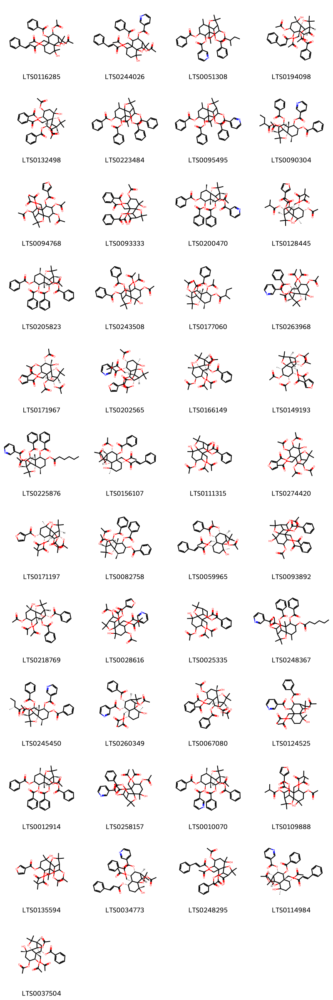{ width=100% }
    <figcaption>Hình ảnh cấu trúc hóa học của 45 hoạt chất thuộc nhóm Carboxylic acids and derivatives gồm ['8,12-bis(acetyloxy)-6-[(acetyloxy)methyl]-2-hydroxy-2,10,10-trimethyl-5-[(3-phenylprop-2-enoyl)oxy]-11-oxatricyclo[7.2.1.0¹,⁶]dodecan-7-yl benzoate (LTS0116285)', '12-(acetyloxy)-6-[(acetyloxy)methyl]-7-(benzoyloxy)-2-hydroxy-2,10,10-trimethyl-5-[(3-phenylprop-2-enoyl)oxy]-11-oxatricyclo[7.2.1.0¹,⁶]dodecan-8-yl pyridine-3-carboxylate (LTS0244026)', '12-(acetyloxy)-4,7-bis(benzoyloxy)-2,6,10,10-tetramethyl-8-[(2-methylbutanoyl)oxy]-11-oxatricyclo[7.2.1.0¹,⁶]dodecan-5-yl pyridine-3-carboxylate (LTS0051308)', '(1s,2s,4s,5r,6s,7s,9r,12r)-4,12-bis(acetyloxy)-6-[(acetyloxy)methyl]-2-hydroxy-2,10,10-trimethyl-8-oxo-5-{[(2z)-3-phenylprop-2-enoyl]oxy}-11-oxatricyclo[7.2.1.0¹,⁶]dodecan-7-yl benzoate (LTS0194098)', '(1s,2s,4s,5r,6s,7s,9r,12r)-4,12-bis(acetyloxy)-6-[(acetyloxy)methyl]-5-(benzoyloxy)-2-hydroxy-2,10,10-trimethyl-8-oxo-11-oxatricyclo[7.2.1.0¹,⁶]dodecan-7-yl benzoate (LTS0132498)', '12-(acetyloxy)-4,5,7-tris(benzoyloxy)-2,6,10,10-tetramethyl-11-oxatricyclo[7.2.1.0¹,⁶]dodecan-8-yl benzoate (LTS0223484)', '12-(acetyloxy)-4,5,7-tris(benzoyloxy)-2,6,10,10-tetramethyl-11-oxatricyclo[7.2.1.0¹,⁶]dodecan-8-yl pyridine-3-carboxylate (LTS0095495)', '(1s,2r,4s,5r,6s,7s,8r,9r,12r)-12-(acetyloxy)-4,7-bis(benzoyloxy)-2,6,10,10-tetramethyl-8-[(2-methylbutanoyl)oxy]-11-oxatricyclo[7.2.1.0¹,⁶]dodecan-5-yl pyridine-3-carboxylate (LTS0090304)', '3,4,7,8-tetrakis(acetyloxy)-6-[(acetyloxy)methyl]-12-hydroxy-2,10,10-trimethyl-11-oxatricyclo[7.2.1.0¹,⁶]dodecan-5-yl furan-3-carboxylate (LTS0094768)', '4,12-bis(acetyloxy)-6-[(acetyloxy)methyl]-5-(benzoyloxy)-2-hydroxy-2,10,10-trimethyl-8-oxo-11-oxatricyclo[7.2.1.0¹,⁶]dodecan-7-yl benzoate (LTS0093333)', '(1s,2r,4s,5r,6s,7s,8r,9r,12r)-12-(acetyloxy)-4,5,7-tris(benzoyloxy)-2,6,10,10-tetramethyl-11-oxatricyclo[7.2.1.0¹,⁶]dodecan-8-yl pyridine-3-carboxylate (LTS0200470)', '(1r,2r,4r,5s,6r,7s,8s,9s,12s)-4,5,12-tris(acetyloxy)-2-hydroxy-2,10,10-trimethyl-8-[(2-methylpropanoyl)oxy]-6-{[(2-methylpropanoyl)oxy]methyl}-11-oxatricyclo[7.2.1.0¹,⁶]dodecan-7-yl furan-3-carboxylate (LTS0128445)', '(1s,2r,4s,5r,6s,7s,8r,9r,12r)-12-(acetyloxy)-4,5,7-tris(benzoyloxy)-2,6,10,10-tetramethyl-11-oxatricyclo[7.2.1.0¹,⁶]dodecan-8-yl benzoate (LTS0205823)', '4,5-bis(acetyloxy)-6-[(acetyloxy)methyl]-7-(benzoyloxy)-2,12-dihydroxy-2,10,10-trimethyl-11-oxatricyclo[7.2.1.0¹,⁶]dodecan-8-yl benzoate (LTS0243508)', '(1s,2r,4s,5r,6s,7s,8r,9r,12r)-5,8,12-tris(acetyloxy)-2,6,10,10-tetramethyl-4-[(2-methylbutanoyl)oxy]-11-oxatricyclo[7.2.1.0¹,⁶]dodecan-7-yl benzoate (LTS0177060)', '(1s,2s,4s,5r,6s,7r,8r,9r,12r)-4,5,12-tris(acetyloxy)-6-[(acetyloxy)methyl]-7-(benzoyloxy)-2-hydroxy-2,10,10-trimethyl-11-oxatricyclo[7.2.1.0¹,⁶]dodecan-8-yl pyridine-3-carboxylate (LTS0263968)', '(1s,2s,3s,4r,5r,6r,7s,8s,9s,12r)-3,4,7,8-tetrakis(acetyloxy)-6-[(acetyloxy)methyl]-2,12-dihydroxy-2,10,10-trimethyl-11-oxatricyclo[7.2.1.0¹,⁶]dodecan-5-yl furan-3-carboxylate (LTS0171967)', '(1r,2r,4r,5s,6r,7s,8s,9s,12s)-4,8,12-tris(acetyloxy)-7-(furan-3-carbonyloxy)-2-hydroxy-2,10,10-trimethyl-6-{[(2-methylpropanoyl)oxy]methyl}-11-oxatricyclo[7.2.1.0¹,⁶]dodecan-5-yl pyridine-3-carboxylate (LTS0202565)', '(1s,2s,4s,5r,6s,7s,9r,12r)-4,5,12-tris(acetyloxy)-6-[(acetyloxy)methyl]-2-hydroxy-2,10,10-trimethyl-8-oxo-11-oxatricyclo[7.2.1.0¹,⁶]dodecan-7-yl benzoate (LTS0166149)', '(1r,2s,3s,4r,5s,6s,7r,8r,9r,12s)-3,4,7,8-tetrakis(acetyloxy)-6-[(acetyloxy)methyl]-12-hydroxy-2,10,10-trimethyl-11-oxatricyclo[7.2.1.0¹,⁶]dodecan-5-yl furan-3-carboxylate (LTS0149193)', '(1s,2r,4s,5r,6s,7s,8r,9r,12r)-12-(acetyloxy)-5,7-bis(benzoyloxy)-4-(hexanoyloxy)-2,6,10,10-tetramethyl-11-oxatricyclo[7.2.1.0¹,⁶]dodecan-8-yl pyridine-3-carboxylate (LTS0225876)', '(1s,2r,5r,6s,7s,8s,9r,12r)-8,12-bis(acetyloxy)-6-[(acetyloxy)methyl]-2-hydroxy-2,10,10-trimethyl-5-{[(2e)-3-phenylprop-2-enoyl]oxy}-11-oxatricyclo[7.2.1.0¹,⁶]dodecan-7-yl benzoate (LTS0156107)', '4,5,12-tris(acetyloxy)-6-[(acetyloxy)methyl]-2-hydroxy-2,10,10-trimethyl-8-oxo-11-oxatricyclo[7.2.1.0¹,⁶]dodecan-7-yl benzoate (LTS0111315)', '3,4,7,8-tetrakis(acetyloxy)-6-[(acetyloxy)methyl]-2,12-dihydroxy-2,10,10-trimethyl-11-oxatricyclo[7.2.1.0¹,⁶]dodecan-5-yl furan-3-carboxylate (LTS0274420)', '(1r,2r,4r,5s,6r,7s,8s,9s,12s)-5,7,8,12-tetrakis(acetyloxy)-2-hydroxy-2,10,10-trimethyl-6-{[(2-methylpropanoyl)oxy]methyl}-11-oxatricyclo[7.2.1.0¹,⁶]dodecan-4-yl furan-3-carboxylate (LTS0171197)', '(1s,2r,4s,5r,6s,7s,8r,9r,12r)-8,12-bis(acetyloxy)-4,5-bis(benzoyloxy)-2,6,10,10-tetramethyl-11-oxatricyclo[7.2.1.0¹,⁶]dodecan-7-yl benzoate (LTS0082758)', '(1s,2s,5s,6s,7s,8r,9r,12r)-8,12-bis(acetyloxy)-6-[(acetyloxy)methyl]-2-hydroxy-2,10,10-trimethyl-5-{[(2e)-3-phenylprop-2-enoyl]oxy}-11-oxatricyclo[7.2.1.0¹,⁶]dodecan-7-yl benzoate (LTS0059965)', '4,8,12-tris(acetyloxy)-6-[(acetyloxy)methyl]-7-(benzoyloxy)-2-hydroxy-2,10,10-trimethyl-11-oxatricyclo[7.2.1.0¹,⁶]dodecan-5-yl benzoate (LTS0093892)', '(1s,2s,4s,5r,6s,7s,8s,9s,12r)-4,5-bis(acetyloxy)-6-[(acetyloxy)methyl]-8-(benzoyloxy)-2,12-dihydroxy-2,10,10-trimethyl-11-oxatricyclo[7.2.1.0¹,⁶]dodecan-7-yl benzoate (LTS0218769)', '4,8,12-tris(acetyloxy)-7-(furan-3-carbonyloxy)-2-hydroxy-2,10,10-trimethyl-6-{[(2-methylpropanoyl)oxy]methyl}-11-oxatricyclo[7.2.1.0¹,⁶]dodecan-5-yl pyridine-3-carboxylate (LTS0028616)', '4,5,12-tris(acetyloxy)-6-[(acetyloxy)methyl]-2-hydroxy-2,10,10-trimethyl-11-oxatricyclo[7.2.1.0¹,⁶]dodecan-7-yl benzoate (LTS0025335)', '12-(acetyloxy)-5,7-bis(benzoyloxy)-4-(hexanoyloxy)-2,6,10,10-tetramethyl-11-oxatricyclo[7.2.1.0¹,⁶]dodecan-8-yl pyridine-3-carboxylate (LTS0248367)', '(1s,2r,4s,5r,6s,7s,8r,9r,12r)-12-(acetyloxy)-4,7-bis(benzoyloxy)-2,6,10,10-tetramethyl-8-{[(2r)-2-methylbutanoyl]oxy}-11-oxatricyclo[7.2.1.0¹,⁶]dodecan-5-yl pyridine-3-carboxylate (LTS0245450)', '(1s,2s,5s,6s,7s,8r,9r,12r)-5,12-bis(acetyloxy)-6-[(acetyloxy)methyl]-8-(benzoyloxy)-2-hydroxy-2,10,10-trimethyl-11-oxatricyclo[7.2.1.0¹,⁶]dodecan-7-yl pyridine-3-carboxylate (LTS0260349)', '(1s,2s,4s,5r,6s,7s,8s,9r,12r)-4,8,12-tris(acetyloxy)-6-[(acetyloxy)methyl]-5-(benzoyloxy)-2-hydroxy-2,10,10-trimethyl-11-oxatricyclo[7.2.1.0¹,⁶]dodecan-7-yl benzoate (LTS0067080)', '5,12-bis(acetyloxy)-6-[(acetyloxy)methyl]-8-(benzoyloxy)-2-hydroxy-2,10,10-trimethyl-11-oxatricyclo[7.2.1.0¹,⁶]dodecan-7-yl pyridine-3-carboxylate (LTS0124525)', '(2r,4s,5r,6s,7s,8r,9r,12r)-12-(acetyloxy)-4,5,7-tris(benzoyloxy)-2,6,10,10-tetramethyl-11-oxatricyclo[7.2.1.0¹,⁶]dodecan-8-yl benzoate (LTS0012914)', '4,5,12-tris(acetyloxy)-6-[(acetyloxy)methyl]-7-(benzoyloxy)-2-hydroxy-2,10,10-trimethyl-11-oxatricyclo[7.2.1.0¹,⁶]dodecan-8-yl pyridine-3-carboxylate (LTS0258157)', '(1s,2r,4s,5r,6s,7s,8r,9r,12r)-12-(acetyloxy)-4,7,8-tris(benzoyloxy)-2,6,10,10-tetramethyl-11-oxatricyclo[7.2.1.0¹,⁶]dodecan-5-yl pyridine-3-carboxylate (LTS0010070)', '4,5,12-tris(acetyloxy)-2-hydroxy-2,10,10-trimethyl-8-[(2-methylpropanoyl)oxy]-6-{[(2-methylpropanoyl)oxy]methyl}-11-oxatricyclo[7.2.1.0¹,⁶]dodecan-7-yl furan-3-carboxylate (LTS0109888)', '5,7,8,12-tetrakis(acetyloxy)-2-hydroxy-2,10,10-trimethyl-6-{[(2-methylpropanoyl)oxy]methyl}-11-oxatricyclo[7.2.1.0¹,⁶]dodecan-4-yl furan-3-carboxylate (LTS0135594)', '(1s,2r,5s,6s,7s,8r,9r,12s)-12-(acetyloxy)-6-[(acetyloxy)methyl]-7-(benzoyloxy)-2-hydroxy-2,10,10-trimethyl-5-{[(2e)-3-phenylprop-2-enoyl]oxy}-11-oxatricyclo[7.2.1.0¹,⁶]dodecan-8-yl pyridine-3-carboxylate (LTS0034773)', '4,12-bis(acetyloxy)-6-[(acetyloxy)methyl]-2-hydroxy-2,10,10-trimethyl-8-oxo-5-[(3-phenylprop-2-enoyl)oxy]-11-oxatricyclo[7.2.1.0¹,⁶]dodecan-7-yl benzoate (LTS0248295)', '(1r,2r,5r,6s,7s,8s,9s,12r)-12-(acetyloxy)-6-[(acetyloxy)methyl]-7-(benzoyloxy)-2-hydroxy-2,10,10-trimethyl-5-{[(2e)-3-phenylprop-2-enoyl]oxy}-11-oxatricyclo[7.2.1.0¹,⁶]dodecan-8-yl pyridine-3-carboxylate (LTS0114984)', '(1s,2s,4s,5r,6r,7s,9r,12r)-4,5,12-tris(acetyloxy)-6-[(acetyloxy)methyl]-2-hydroxy-2,10,10-trimethyl-11-oxatricyclo[7.2.1.0¹,⁶]dodecan-7-yl benzoate (LTS0037504)'].</figcaption>
</figure>
#### Nhóm Dioxanes
<figure markdown="span">
    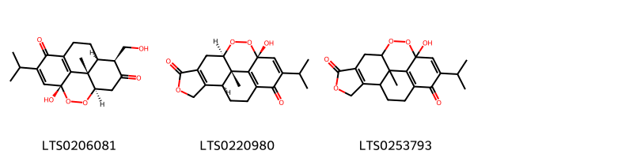{ width=100% }
    <figcaption>Hình ảnh cấu trúc hóa học của 3 hoạt chất thuộc nhóm Dioxanes gồm ['(1r,4r,7s,8s,16s)-1-hydroxy-7-(hydroxymethyl)-13-isopropyl-16-methyl-2,3-dioxatetracyclo[6.6.2.0⁴,¹⁶.0¹¹,¹⁵]hexadeca-11(15),13-diene-6,12-dione (LTS0206081)', '(1s,8r,11r,18s)-11-hydroxy-13-isopropyl-18-methyl-4,9,10-trioxapentacyclo[9.6.2.0²,⁶.0⁸,¹⁸.0¹⁵,¹⁹]nonadeca-2(6),12,15(19)-triene-5,14-dione (LTS0220980)', '11-hydroxy-13-isopropyl-18-methyl-4,9,10-trioxapentacyclo[9.6.2.0²,⁶.0⁸,¹⁸.0¹⁵,¹⁹]nonadeca-2(6),12,15(19)-triene-5,14-dione (LTS0253793)'].</figcaption>
</figure>
#### Nhóm Fatty Acyls
<figure markdown="span">
    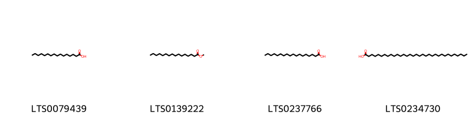{ width=100% }
    <figcaption>Hình ảnh cấu trúc hóa học của 4 hoạt chất thuộc nhóm Fatty Acyls gồm ['palmitic acid (LTS0079439)', 'methyl palmitate (LTS0139222)', 'stearic acid (LTS0237766)', 'psyllic acid (LTS0234730)'].</figcaption>
</figure>
#### Nhóm Flavonoids
<figure markdown="span">
    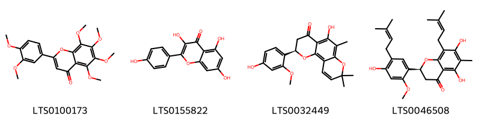{ width=100% }
    <figcaption>Hình ảnh cấu trúc hóa học của 4 hoạt chất thuộc nhóm Flavonoids gồm ['nobiletin (LTS0100173)', 'kaempherol (LTS0155822)', '(2r)-5-hydroxy-2-(4-hydroxy-2-methoxyphenyl)-6,8,8-trimethyl-2h,3h-pyrano[2,3-f]chromen-4-one (LTS0032449)', '(2s)-5,7-dihydroxy-2-[4-hydroxy-2-methoxy-5-(3-methylbut-2-en-1-yl)phenyl]-6-methyl-8-(3-methylbut-2-en-1-yl)-2,3-dihydro-1-benzopyran-4-one (LTS0046508)'].</figcaption>
</figure>
#### Nhóm Fluorenes
<figure markdown="span">
    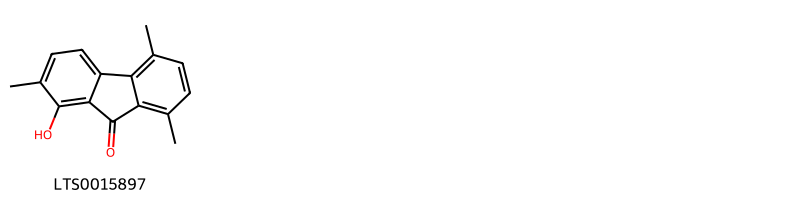{ width=100% }
    <figcaption>Hình ảnh cấu trúc hóa học của 1 hoạt chất thuộc nhóm Fluorenes gồm ['1-hydroxy-2,5,8-trimethylfluoren-9-one (LTS0015897)'].</figcaption>
</figure>
#### Nhóm Furanoid lignans
<figure markdown="span">
    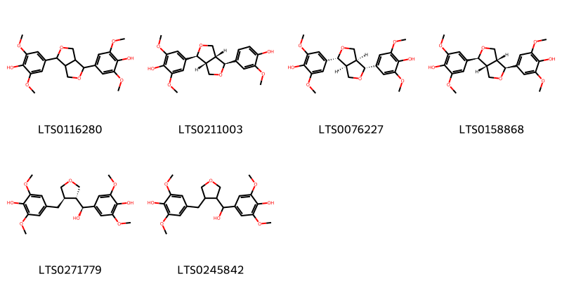{ width=100% }
    <figcaption>Hình ảnh cấu trúc hóa học của 6 hoạt chất thuộc nhóm Furanoid lignans gồm ['syringaresinol (LTS0116280)', '(-)-medioresinol (LTS0211003)', '(-)-syringaresinol (LTS0076227)', '(+)-syringaresinol (LTS0158868)', '4-{[(3r,4r)-4-[(s)-hydroxy(4-hydroxy-3,5-dimethoxyphenyl)methyl]oxolan-3-yl]methyl}-2,6-dimethoxyphenol (LTS0271779)', '4-({4-[hydroxy(4-hydroxy-3,5-dimethoxyphenyl)methyl]oxolan-3-yl}methyl)-2,6-dimethoxyphenol (LTS0245842)'].</figcaption>
</figure>
#### Nhóm Furans
<figure markdown="span">
    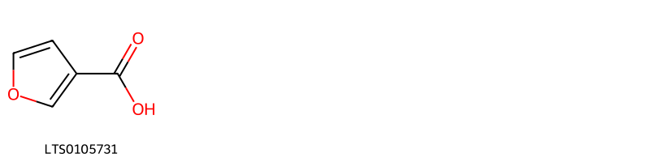{ width=100% }
    <figcaption>Hình ảnh cấu trúc hóa học của 1 hoạt chất thuộc nhóm Furans gồm ['3-furoic acid (LTS0105731)'].</figcaption>
</figure>
#### Nhóm Macrolactams
<figure markdown="span">
    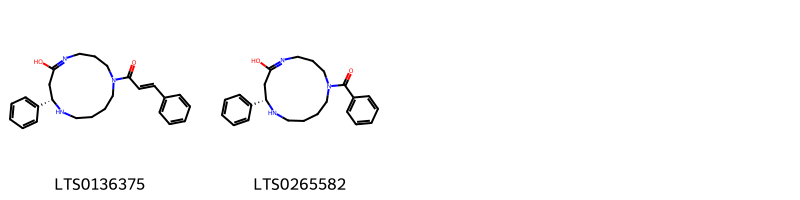{ width=100% }
    <figcaption>Hình ảnh cấu trúc hóa học của 2 hoạt chất thuộc nhóm Macrolactams gồm ['(2e)-1-[(8s)-6-hydroxy-8-phenyl-1,5,9-triazacyclotridec-5-en-1-yl]-3-phenylprop-2-en-1-one (LTS0136375)', '(2s)-9-benzoyl-2-phenyl-1,5,9-triazacyclotridec-4-en-4-ol (LTS0265582)'].</figcaption>
</figure>
#### Nhóm Macrolides and analogues
<figure markdown="span">
    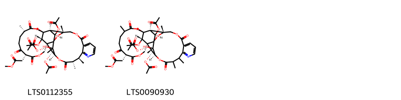{ width=100% }
    <figcaption>Hình ảnh cấu trúc hóa học của 2 hoạt chất thuộc nhóm Macrolides and analogues gồm ['methyl 2-[(1s,2r,3r,4r,7s,11r,15r,16r,17r,18s,21s,22s,32r,35s)-2,16,17,35-tetrakis(acetyloxy)-34-hydroxy-7,21,22,32,34-pentamethyl-6,10,12,20,29-pentaoxo-5,13,19,30,33-pentaoxa-24-azahexacyclo[16.15.1.1⁴,¹⁵.0¹,¹⁵.0³,³².0²³,²⁸]pentatriaconta-23,25,27-trien-11-yl]acetate (LTS0112355)', 'methyl 2-[(1s,2r,3r,4r,11r,15r,16r,17r,18s,32r,34s,35s)-2,16,17,35-tetrakis(acetyloxy)-34-hydroxy-7,21,22,32,34-pentamethyl-6,10,12,20,29-pentaoxo-5,13,19,30,33-pentaoxa-24-azahexacyclo[16.15.1.1⁴,¹⁵.0¹,¹⁵.0³,³².0²³,²⁸]pentatriaconta-23,25,27-trien-11-yl]acetate (LTS0090930)'].</figcaption>
</figure>
#### Nhóm Naphthofurans
<figure markdown="span">
    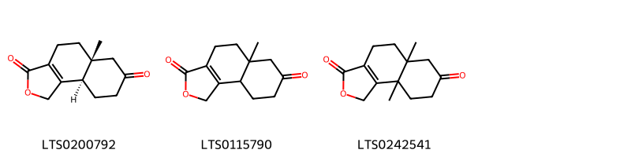{ width=100% }
    <figcaption>Hình ảnh cấu trúc hóa học của 3 hoạt chất thuộc nhóm Naphthofurans gồm ['(5ar,9ar)-5a-methyl-1h,4h,5h,6h,8h,9h,9ah-naphtho[1,2-c]furan-3,7-dione (LTS0200792)', '5a-methyl-1h,4h,5h,6h,8h,9h,9ah-naphtho[1,2-c]furan-3,7-dione (LTS0115790)', '5a,9a-dimethyl-1h,4h,5h,6h,8h,9h-naphtho[1,2-c]furan-3,7-dione (LTS0242541)'].</figcaption>
</figure>
#### Nhóm Naphthopyrans
<figure markdown="span">
    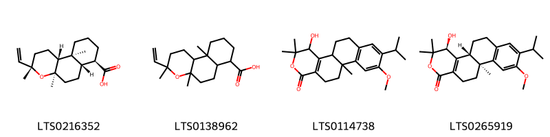{ width=100% }
    <figcaption>Hình ảnh cấu trúc hóa học của 4 hoạt chất thuộc nhóm Naphthopyrans gồm ['(3s,4ar,6as,7r,10as,10br)-3-ethenyl-3,4a,10a-trimethyl-decahydronaphtho[2,1-b]pyran-7-carboxylic acid (LTS0216352)', '3-ethenyl-3,4a,10a-trimethyl-decahydronaphtho[2,1-b]pyran-7-carboxylic acid (LTS0138962)', '4-hydroxy-8-isopropyl-9-methoxy-3,3,10b-trimethyl-4h,4bh,5h,6h,11h,12h-phenanthro[2,1-c]pyran-1-one (LTS0114738)', '(4s,4br,10bs)-4-hydroxy-8-isopropyl-9-methoxy-3,3,10b-trimethyl-4h,4bh,5h,6h,11h,12h-phenanthro[2,1-c]pyran-1-one (LTS0265919)'].</figcaption>
</figure>
#### Nhóm Organooxygen compounds
<figure markdown="span">
    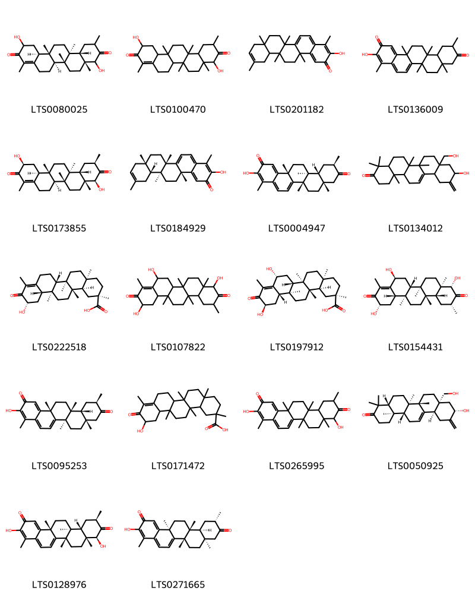{ width=100% }
    <figcaption>Hình ảnh cấu trúc hóa học của 18 hoạt chất thuộc nhóm Organooxygen compounds gồm ['(4ar,6ar,6bs,12as,12bs,14as,14bs)-4,11-dihydroxy-2,4a,6a,9,12b,14a-hexamethyl-1,2,4,5,6,6b,7,8,11,12,12a,13,14,14b-tetradecahydropicene-3,10-dione (LTS0080025)', '4,11-dihydroxy-2,4a,6a,9,12b,14a-hexamethyl-1,2,4,5,6,6b,7,8,11,12,12a,13,14,14b-tetradecahydropicene-3,10-dione (LTS0100470)', '3-hydroxy-4,6b,8a,11,12b,14a-hexamethyl-8,9,12,12a,13,14-hexahydro-7h-picen-2-one (LTS0201182)', '3-hydroxy-4,6b,8a,11,12b,14a-hexamethyl-7,8,9,11,12,12a,13,14-octahydropicene-2,10-dione (LTS0136009)', '(2r,4s,4ar,6ar,6bs,11s,12as,12bs,14as,14bs)-4,11-dihydroxy-2,4a,6a,9,12b,14a-hexamethyl-1,2,4,5,6,6b,7,8,11,12,12a,13,14,14b-tetradecahydropicene-3,10-dione (LTS0173855)', '(6bs,8as,12ar,12bs,14ar)-3-hydroxy-4,6b,8a,11,12b,14a-hexamethyl-8,9,12,12a,13,14-hexahydro-7h-picen-2-one (LTS0184929)', '(6bs,8as,11r,12ar,12bs,14ar)-3-hydroxy-4,6b,8a,11,12b,14a-hexamethyl-7,8,9,11,12,12a,13,14-octahydropicene-2,10-dione (LTS0004947)', '10-hydroxy-8a-(hydroxymethyl)-4,4,6a,6b,14b-pentamethyl-11-methylidene-2,4a,5,6,7,8,9,10,12,12a,14,14a-dodecahydro-1h-picen-3-one (LTS0134012)', '(2r,4as,6ar,6bs,11s,12as,12bs,14as,14br)-11-hydroxy-2,4a,6a,9,12b,14a-hexamethyl-10-oxo-1,3,4,5,6,6b,7,8,11,12,12a,13,14,14b-tetradecahydropicene-2-carboxylic acid (LTS0222518)', '4,8,11-trihydroxy-2,4a,6a,9,12b,14a-hexamethyl-1,2,4,5,6,6b,7,8,11,12,12a,13,14,14b-tetradecahydropicene-3,10-dione (LTS0107822)', '(2r,4as,6ar,6bs,8r,11r,12as,12br,14as,14br)-8,11-dihydroxy-2,4a,6a,9,12b,14a-hexamethyl-10-oxo-1,3,4,5,6,6b,7,8,11,12,12a,13,14,14b-tetradecahydropicene-2-carboxylic acid (LTS0197912)', '(2r,4s,4ar,6ar,6bs,8s,11s,12as,12br,14as,14br)-4,8,11-trihydroxy-2,4a,6a,9,12b,14a-hexamethyl-1,2,4,5,6,6b,7,8,11,12,12a,13,14,14b-tetradecahydropicene-3,10-dione (LTS0154431)', 'tingenone (LTS0095253)', '11-hydroxy-2,4a,6a,9,12b,14a-hexamethyl-10-oxo-1,3,4,5,6,6b,7,8,11,12,12a,13,14,14b-tetradecahydropicene-2-carboxylic acid (LTS0171472)', '3,9-dihydroxy-4,6b,8a,11,12b,14a-hexamethyl-7,8,9,11,12,12a,13,14-octahydropicene-2,10-dione (LTS0265995)', '(4ar,6ar,6bs,8ar,10s,12as,14ar,14br)-10-hydroxy-8a-(hydroxymethyl)-4,4,6a,6b,14b-pentamethyl-11-methylidene-2,4a,5,6,7,8,9,10,12,12a,14,14a-dodecahydro-1h-picen-3-one (LTS0050925)', '(6bs,8ar,9s,11r,12as,12bs,14ar)-3,9-dihydroxy-4,6b,8a,11,12b,14a-hexamethyl-7,8,9,11,12,12a,13,14-octahydropicene-2,10-dione (LTS0128976)', '(6bs,8ar,11s,12as,12br,14as)-3-hydroxy-4,6b,8a,11,12b,14a-hexamethyl-7,8,9,11,12,12a,13,14-octahydropicene-2,10-dione (LTS0271665)'].</figcaption>
</figure>
#### Nhóm Oxepanes
<figure markdown="span">
    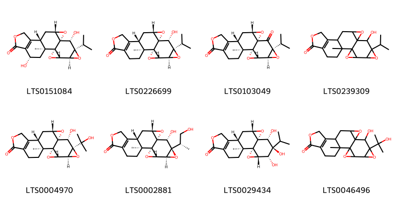{ width=100% }
    <figcaption>Hình ảnh cấu trúc hóa học của 8 hoạt chất thuộc nhóm Oxepanes gồm ['tripdiolide (LTS0151084)', 'triptolide (LTS0226699)', '(1s,2s,4s,5s,7s,9s,11s,13s)-7-isopropyl-1-methyl-3,6,10,16-tetraoxaheptacyclo[11.7.0.0²,⁴.0²,⁹.0⁵,⁷.0⁹,¹¹.0¹⁴,¹⁸]icos-14(18)-ene-8,17-dione (LTS0103049)', '8-hydroxy-7-isopropyl-1-methyl-3,6,10,16-tetraoxaheptacyclo[11.7.0.0²,⁴.0²,⁹.0⁵,⁷.0⁹,¹¹.0¹⁴,¹⁸]icos-14(18)-en-17-one (LTS0239309)', 'triptolidenol (LTS0004970)', '(1s,2s,4s,5s,7r,8r,9s,11s,13s)-8-hydroxy-7-[(2s)-1-hydroxypropan-2-yl]-1-methyl-3,6,10,16-tetraoxaheptacyclo[11.7.0.0²,⁴.0²,⁹.0⁵,⁷.0⁹,¹¹.0¹⁴,¹⁸]icos-14(18)-en-17-one (LTS0002881)', '(1s,2s,4s,5r,6s,7r,8s,10s,12s)-5,6,7-trihydroxy-6-isopropyl-1-methyl-3,9,15-trioxahexacyclo[10.7.0.0²,⁴.0²,⁸.0⁸,¹⁰.0¹³,¹⁷]nonadec-13(17)-en-16-one (LTS0029434)', '8-hydroxy-7-(2-hydroxypropan-2-yl)-1-methyl-3,6,10,16-tetraoxaheptacyclo[11.7.0.0²,⁴.0²,⁹.0⁵,⁷.0⁹,¹¹.0¹⁴,¹⁸]icos-14(18)-en-17-one (LTS0046496)'].</figcaption>
</figure>
#### Nhóm Peptidomimetics
<figure markdown="span">
    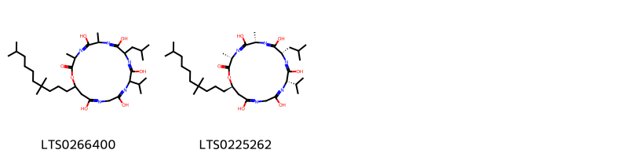{ width=100% }
    <figcaption>Hình ảnh cấu trúc hóa học của 2 hoạt chất thuộc nhóm Peptidomimetics gồm ['5,8,11,14,17-pentahydroxy-12-isopropyl-3,6-dimethyl-9-(2-methylpropyl)-19-(4,4,9-trimethyldecyl)-1-oxa-4,7,10,13,16-pentaazacyclononadeca-4,7,10,13,16-pentaen-2-one (LTS0266400)', '(3s,6s,9s,12s,19r)-5,8,11,14,17-pentahydroxy-12-isopropyl-3,6-dimethyl-9-(2-methylpropyl)-19-(4,4,9-trimethyldecyl)-1-oxa-4,7,10,13,16-pentaazacyclononadeca-4,7,10,13,16-pentaen-2-one (LTS0225262)'].</figcaption>
</figure>
#### Nhóm Phenanthrenes and derivatives
<figure markdown="span">
    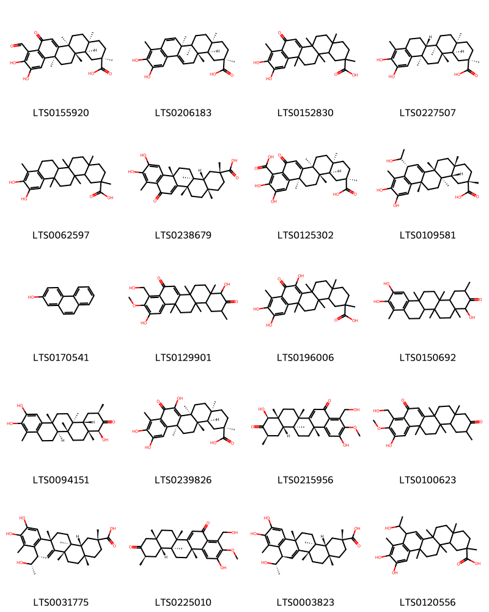{ width=100% }
    <figcaption>Hình ảnh cấu trúc hóa học của 20 hoạt chất thuộc nhóm Phenanthrenes and derivatives gồm ['(2r,4as,6as,12br,14as,14br)-9-formyl-10,11-dihydroxy-2,4a,6a,12b,14a-pentamethyl-8-oxo-1,3,4,5,6,13,14,14b-octahydropicene-2-carboxylic acid (LTS0155920)', '(2r,4as,6as,6bs,14as,14br)-10,11-dihydroxy-2,4a,6a,6b,9,14a-hexamethyl-3,4,5,6,14,14b-hexahydro-1h-picene-2-carboxylic acid (LTS0206183)', '10,11-dihydroxy-2,4a,6a,9,12b,14a-hexamethyl-8-oxo-1,3,4,5,6,13,14,14b-octahydropicene-2-carboxylic acid (LTS0152830)', '(2r,4as,6ar,6br,12br,14as,14br)-10,11-dihydroxy-2,4a,6a,9,12b,14a-hexamethyl-3,4,5,6,6b,7,8,13,14,14b-decahydro-1h-picene-2-carboxylic acid (LTS0227507)', '10,11-dihydroxy-2,4a,6a,9,12b,14a-hexamethyl-3,4,5,6,6b,7,8,13,14,14b-decahydro-1h-picene-2-carboxylic acid (LTS0062597)', '(2r,4as,6as,12br,14as,14br)-10,11-dihydroxy-2,4a,6a,9,12b,14a-hexamethyl-8-oxo-1,3,4,5,6,13,14,14b-octahydropicene-2-carboxylic acid (LTS0238679)', '(2r,4as,6as,12br,14as,14br)-10,11-dihydroxy-2,4a,6a,12b,14a-pentamethyl-8-oxo-1,3,4,5,6,13,14,14b-octahydropicene-2,9-dicarboxylic acid (LTS0125302)', '(2s,4ar,6ar,8r,12bs,14ar,14bs)-10,11-dihydroxy-8-(1-hydroxyethyl)-2,4a,6a,9,12b,14a-hexamethyl-3,4,5,6,8,13,14,14b-octahydro-1h-picene-2-carboxylic acid (LTS0109581)', '2-hydroxyphenanthrene (LTS0170541)', '4,11-dihydroxy-9-(hydroxymethyl)-10-methoxy-2,4a,6a,12b,14a-pentamethyl-1,2,4,5,6,13,14,14b-octahydropicene-3,8-dione (LTS0129901)', '7,10,11-trihydroxy-2,4a,6a,9,12b,14a-hexamethyl-8-oxo-1,3,4,5,6,13,14,14b-octahydropicene-2-carboxylic acid (LTS0196006)', '4,10,11-trihydroxy-2,4a,6a,9,12b,14a-hexamethyl-2,4,5,6,6b,7,8,13,14,14b-decahydro-1h-picen-3-one (LTS0150692)', '(2r,4s,4ar,6ar,6br,12br,14as,14bs)-4,10,11-trihydroxy-2,4a,6a,9,12b,14a-hexamethyl-2,4,5,6,6b,7,8,13,14,14b-decahydro-1h-picen-3-one (LTS0094151)', '(2r,4as,6as,12bs,14as,14br)-7,10,11-trihydroxy-2,4a,6a,9,12b,14a-hexamethyl-8-oxo-1,3,4,5,6,13,14,14b-octahydropicene-2-carboxylic acid (LTS0239826)', '(2r,4s,4ar,6as,12br,14as,14bs)-4,11-dihydroxy-9-(hydroxymethyl)-10-methoxy-2,4a,6a,12b,14a-pentamethyl-1,2,4,5,6,13,14,14b-octahydropicene-3,8-dione (LTS0215956)', '11-hydroxy-9-(hydroxymethyl)-10-methoxy-2,4a,6a,12b,14a-pentamethyl-1,2,4,5,6,13,14,14b-octahydropicene-3,8-dione (LTS0100623)', '(2r,4as,6as,8s,12br,14as,14br)-10,11-dihydroxy-8-[(1s)-1-hydroxyethyl]-2,4a,6a,9,12b,14a-hexamethyl-3,4,5,6,8,13,14,14b-octahydro-1h-picene-2-carboxylic acid (LTS0031775)', '(2r,4as,6as,12br,14as,14br)-11-hydroxy-9-(hydroxymethyl)-10-methoxy-2,4a,6a,12b,14a-pentamethyl-1,2,4,5,6,13,14,14b-octahydropicene-3,8-dione (LTS0225010)', '(2r,4as,6as,8r,12br,14as,14br)-10,11-dihydroxy-8-[(1s)-1-hydroxyethyl]-2,4a,6a,9,12b,14a-hexamethyl-3,4,5,6,8,13,14,14b-octahydro-1h-picene-2-carboxylic acid (LTS0003823)', '10,11-dihydroxy-8-(1-hydroxyethyl)-2,4a,6a,9,12b,14a-hexamethyl-3,4,5,6,8,13,14,14b-octahydro-1h-picene-2-carboxylic acid (LTS0120556)'].</figcaption>
</figure>
#### Nhóm Phenols
<figure markdown="span">
    { width=100% }
    <figcaption>Hình ảnh cấu trúc hóa học của 1 hoạt chất thuộc nhóm Phenols gồm ['3,4,5-trimethoxyphenol (LTS0080994)'].</figcaption>
</figure>
#### Nhóm Prenol lipids
<figure markdown="span">
    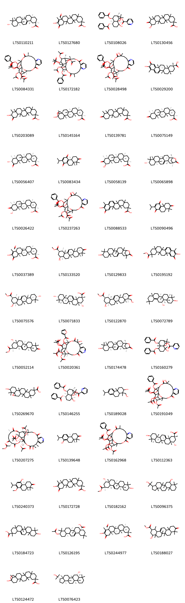{ width=100% }
    <figcaption>Hình ảnh cấu trúc hóa học của 427 hoạt chất thuộc nhóm Prenol lipids gồm ['(2r,4as,6as,6br,8ar,10s,12ar,12br,14br)-10-hydroxy-2,4a,6a,6b,9,9,12a-heptamethyl-1,3,4,5,6,7,8,8a,10,11,12,12b,13,14b-tetradecahydropicene-2-carboxylic acid (LTS0110211)', '8a-formyl-10-hydroxy-2,4a,6a,9,12b,14a-hexamethyl-11-oxo-3,4,5,6,6b,7,8,12,12a,13,14,14b-dodecahydro-1h-picene-2-carboxylic acid (LTS0127680)', '(1s,2s,5s,6s,7s,9r)-5,7-bis(benzoyloxy)-2-hydroxy-2,6,10,10-tetramethyl-11-oxatricyclo[7.2.1.0¹,⁶]dodecan-12-yl pyridine-3-carboxylate (LTS0108026)', '11-hydroxy-2,4a,6a,8a,9,12b,14a-heptamethyl-10-oxo-tetradecahydro-1h-picene-2-carboxylic acid (LTS0130456)', '(1s,3r,15s,18s,19r,20r,21r,22s,23r,25r,26s)-20,22,23,25-tetrakis(acetyloxy)-21-[(acetyloxy)methyl]-26-hydroxy-3,15,26-trimethyl-6,16-dioxo-2,5,17-trioxa-11-azapentacyclo[16.7.1.0¹,²¹.0³,²⁴.0⁷,¹²]hexacosa-7,9,11-trien-19-yl benzoate (LTS0084331)', '(1s,3r,18s,24r,26s)-20,22,23,25-tetrakis(acetyloxy)-21-[(acetyloxy)methyl]-26-hydroxy-3,15,26-trimethyl-6,16-dioxo-2,5,17-trioxa-11-azapentacyclo[16.7.1.0¹,²¹.0³,²⁴.0⁷,¹²]hexacosa-7,9,11-trien-19-yl benzoate (LTS0172182)', 'wilfordine (LTS0028498)', 'celastrol (LTS0029200)', '10-hydroxy-2,4a,6a,8a,9,12b,14a-heptamethyl-11-oxo-tetradecahydro-1h-picene-2-carboxylic acid (LTS0203089)', 'salaspermic acid (LTS0145164)', '2,4a,6a,8a,9,12b,14a-heptamethyl-10-oxo-tetradecahydro-1h-picene-2-carboxylic acid (LTS0139781)', 'polpunonic acid (LTS0075149)', '(2r,4as,6ar,6bs,8as,9r,10r,12as,12bs,14as,14br)-10-hydroxy-2,4a,6a,8a,9,12b,14a-heptamethyl-11-oxo-tetradecahydro-1h-picene-2-carboxylic acid (LTS0056407)', '(4bs,8ar)-2-isopropyl-4b,8,8-trimethyl-6,8a,9,10-tetrahydro-5h-phenanthrene-1,4,7-trione (LTS0083434)', '(2r,4as,6ar,6bs,8as,9r,11r,12as,12bs,14as,14br)-11-hydroxy-2,4a,6a,8a,9,12b,14a-heptamethyl-10-oxo-tetradecahydro-1h-picene-2-carboxylic acid (LTS0058139)', '(1s,2r,5s,6r,9r,11s,14r,15r,19s,21s)-11-hydroxy-2,5,6,10,10,14,21-heptamethyl-23-oxahexacyclo[19.2.1.0²,¹⁹.0⁵,¹⁸.0⁶,¹⁵.0⁹,¹⁴]tetracos-17-en-22-one (LTS0065898)', '(2r,4as,6ar,6bs,8as,9r,11s,12as,12bs,14as,14br)-11-hydroxy-2,4a,6a,8a,9,12b,14a-heptamethyl-10-oxo-tetradecahydro-1h-picene-2-carboxylic acid (LTS0026422)', '(1s,18s,19r,20r,21r,22s,23r,25r,26s)-20,22,23,25-tetrakis(acetyloxy)-21-[(acetyloxy)methyl]-15,26-dihydroxy-3,15,26-trimethyl-6,16-dioxo-2,5,17-trioxa-11-azapentacyclo[16.7.1.0¹,²¹.0³,²⁴.0⁷,¹²]hexacosa-7,9,11-trien-19-yl benzoate (LTS0237263)', '10-hydroxy-2,4a,6a,9,12b,14a-hexamethyl-11-oxo-1,3,4,5,6,13,14,14b-octahydropicene-2-carboxylic acid (LTS0088533)', '2-isopropyl-4b,8,8-trimethyl-6,8a,9,10-tetrahydro-5h-phenanthrene-1,4,7-trione (LTS0090496)', '(2r,4as,6ar,6bs,8ar,12as,12br,14as,14br)-8a-formyl-10-hydroxy-2,4a,6a,9,12b,14a-hexamethyl-11-oxo-3,4,5,6,6b,7,8,12,12a,13,14,14b-dodecahydro-1h-picene-2-carboxylic acid (LTS0037389)', 'methyl (1r,2r,4s,4ar,6as,6br,8ar,12ar,12br,14br)-4-hydroxy-1,4a,6a,6b,9,9,12a-heptamethyl-10-oxo-1,2,3,4,5,6,7,8,8a,11,12,12b,13,14b-tetradecahydropicene-2-carboxylate (LTS0133520)', '11-hydroxy-2,5,6,10,10,14,21-heptamethyl-23-oxahexacyclo[19.2.1.0²,¹⁹.0⁵,¹⁸.0⁶,¹⁵.0⁹,¹⁴]tetracos-17-en-22-one (LTS0129833)', 'methyl 10-hydroxy-2,4a,6a,9,12b,14a-hexamethyl-11-oxo-1,3,4,5,6,13,14,14b-octahydropicene-2-carboxylate (LTS0195192)', 'methyl (1r,2r,4s,4ar,6as,6br,10s,12ar,12br,14br)-4,10-dihydroxy-1,4a,6a,6b,9,9,12a-heptamethyl-2,3,4,5,6,7,8,8a,10,11,12,12b,13,14b-tetradecahydro-1h-picene-2-carboxylate (LTS0075576)', '(2s,4s,4ar,6as,6br,8ar,10r,12ar,12br,14bs)-4,10-dihydroxy-2,4a,6a,6b,9,9,12a-heptamethyl-1,3,4,5,6,7,8,8a,10,11,12,12b,13,14b-tetradecahydropicene-2-carboxylic acid (LTS0071833)', 'methyl (1r,2r,4s,4ar,6as,6br,8ar,9r,12ar,12br,14bs)-4-hydroxy-9-(hydroxymethyl)-1,4a,6a,6b,9,12a-hexamethyl-10-oxo-1,2,3,4,5,6,7,8,8a,11,12,12b,13,14b-tetradecahydropicene-2-carboxylate (LTS0122870)', '(3s,4ar,6ar,6bs,8ar,14r,14ar,14bs)-4,4,6a,6b,8a,11,11,14b-octamethyl-1,2,3,4a,5,6,7,8,9,10,12,13,14,14a-tetradecahydropicene-3,14-diol (LTS0072789)', 'methyl (2r,4s,4ar,6as,6br,12ar,12br,14br)-4-hydroxy-2,4a,6a,6b,9,9,12a-heptamethyl-10-oxo-3,4,5,6,7,8,8a,11,12,12b,13,14b-dodecahydro-1h-picene-2-carboxylate (LTS0052114)', 'hypoglaunine b (LTS0020361)', '(1s,2r,5s,6r,9r,11r,14r,15r,19s,21s)-11-hydroxy-2,5,6,10,10,14,21-heptamethyl-23-oxahexacyclo[19.2.1.0²,¹⁹.0⁵,¹⁸.0⁶,¹⁵.0⁹,¹⁴]tetracos-17-en-22-one (LTS0174478)', '5,7-bis(benzoyloxy)-2-hydroxy-2,6,10,10-tetramethyl-11-oxatricyclo[7.2.1.0¹,⁶]dodecan-12-yl pyridine-2-carboxylate (LTS0160279)', '9-hydroxy-3,4b,6a,10,10,12b,14a-heptamethyl-tetradecahydro-1h-piceno[5,4a-b]oxirene-3-carboxylic acid (LTS0269670)', '(1s,2s,5s,6s,7s,9r,12r)-5,7-bis(benzoyloxy)-2-hydroxy-2,6,10,10-tetramethyl-11-oxatricyclo[7.2.1.0¹,⁶]dodecan-12-yl pyridine-2-carboxylate (LTS0146255)', '1-(hydroxymethyl)-7-isopropyl-1,4a-dimethyl-2,3,4,9,10,10a-hexahydrophenanthren-2-ol (LTS0189028)', '20,22,23,25-tetrakis(acetyloxy)-21-[(acetyloxy)methyl]-15,26-dihydroxy-3,15,26-trimethyl-6,16-dioxo-2,5,17-trioxa-11-azapentacyclo[16.7.1.0¹,²¹.0³,²⁴.0⁷,¹²]hexacosa-7,9,11-trien-19-yl benzoate (LTS0191049)', 'methyl 2-[(1s,2r,3r,4r,7s,11r,15r,16r,17r,18s,21s,22r,32r,35s)-2,16,17,35-tetrakis(acetyloxy)-21,34-dihydroxy-7,21,22,32,34-pentamethyl-6,10,12,20,29-pentaoxo-5,13,19,30,33-pentaoxa-26-azahexacyclo[16.15.1.1⁴,¹⁵.0¹,¹⁵.0³,³².0²³,²⁸]pentatriaconta-23,25,27-trien-11-yl]acetate (LTS0207275)', 'triptonoterpene (LTS0139648)', '20,22,23,25-tetrakis(acetyloxy)-21-[(acetyloxy)methyl]-26-hydroxy-3,15,26-trimethyl-6,16-dioxo-2,5,17-trioxa-11-azapentacyclo[16.7.1.0¹,²¹.0³,²⁴.0⁷,¹²]hexacosa-7,9,11-trien-19-yl benzoate (LTS0162968)', '(2s,4s,4ar,6as,6br,8ar,10s,12ar,12br,14bs)-4,10-dihydroxy-2,4a,6a,6b,9,9,12a-heptamethyl-1,3,4,5,6,7,8,8a,10,11,12,12b,13,14b-tetradecahydropicene-2-carboxylic acid (LTS0112363)', 'triptonoterpene methyl ether (LTS0240373)', '10-hydroxy-2,4a,6a,8a,9,12b,14a-heptamethyl-11-oxo-3,4,5,6,6b,7,8,12,12a,13,14,14b-dodecahydro-1h-picene-2-carboxylic acid (LTS0172728)', 'methyl (2r,4s,4ar,6as,6br,10s,12ar,12br,14br)-4,10-dihydroxy-2,4a,6a,6b,9,9,12a-heptamethyl-1,3,4,5,6,7,8,8a,10,11,12,12b,13,14b-tetradecahydropicene-2-carboxylate (LTS0182162)', '3-(2-hydroxypropan-2-yl)-5a,5b,8,8,11a,13b-hexamethyl-hexadecahydrocyclopenta[a]chrysen-7-ol (LTS0096375)', '10-hydroxy-2,4a,6a,6b,9,9,12a-heptamethyl-1,3,4,5,6,7,8,8a,10,11,12,12b,13,14b-tetradecahydropicene-2-carboxylic acid (LTS0184723)', '(4as,6as,6br,10r,12ar)-10-(acetyloxy)-2,2,6a,6b,9,9,12a-heptamethyl-1,3,4,5,6,7,8,8a,10,11,12,12b,13,14b-tetradecahydropicene-4a-carboxylic acid (LTS0126195)', '(2s,4as,6ar,6bs,8ar,12as,12br,14as,14br)-8a-formyl-10-hydroxy-2,4a,6a,9,12b,14a-hexamethyl-11-oxo-3,4,5,6,6b,7,8,12,12a,13,14,14b-dodecahydro-1h-picene-2-carboxylic acid (LTS0244977)', 'methyl 4-hydroxy-1,4a,6a,6b,9,9,12a-heptamethyl-10-oxo-1,2,3,4,5,6,7,8,8a,11,12,12b,13,14b-tetradecahydropicene-2-carboxylate (LTS0188027)', '21-hydroxy-5,8,11,14,17,24-hexamethyl-22-oxahexacyclo[19.2.1.0¹,¹⁸.0⁴,¹⁷.0⁵,¹⁴.0⁸,¹³]tetracosane-11-carboxylic acid (LTS0124472)', 'zeorin (LTS0076423)', '(2r,6r,11s,14r,19s,21s)-11-hydroxy-2,5,6,10,10,14,21-heptamethyl-23-oxahexacyclo[19.2.1.0²,¹⁹.0⁵,¹⁸.0⁶,¹⁵.0⁹,¹⁴]tetracos-17-en-22-one (LTS0266981)', '(1s,3r,13s,14s,17s,18s,19r,20r,21r,22r,23r,24r,25r)-19,21,22,24-tetrakis(acetyloxy)-20-[(acetyloxy)methyl]-14,25-dihydroxy-3,13,14,25-tetramethyl-6,15-dioxo-2,5,16-trioxa-9-azapentacyclo[15.7.1.0¹,²⁰.0³,²³.0⁷,¹²]pentacosa-7,9,11-trien-18-yl benzoate (LTS0190150)', 'hypoglaunine c (LTS0214274)', '(1s,15s,18s,19r,20r,21r,22s,23r,25r,26s)-20,22,23,25-tetrakis(acetyloxy)-21-[(acetyloxy)methyl]-26-hydroxy-3,15,26-trimethyl-6,16-dioxo-2,5,17-trioxa-11-azapentacyclo[16.7.1.0¹,²¹.0³,²⁴.0⁷,¹²]hexacosa-7,9,11-trien-19-yl furan-3-carboxylate (LTS0212833)', '4,4,6a,6b,8a,11,11,14b-octamethyl-1,2,3,4a,5,6,7,8,9,10,12,13,14,14a-tetradecahydropicene-3,14-diol (LTS0215136)', 'methyl 2-[(1s,2r,3r,4r,7s,11r,15r,16r,17r,18s,21r,22r,32r,34s,35s)-2,16,17,35-tetrakis(acetyloxy)-21,34-dihydroxy-7,22,32,34-tetramethyl-6,10,12,20,29-pentaoxo-5,13,19,30,33-pentaoxa-26-azahexacyclo[16.15.1.1⁴,¹⁵.0¹,¹⁵.0³,³².0²³,²⁸]pentatriaconta-23,25,27-trien-11-yl]acetate (LTS0183547)', '(2r,4as,6as,6br,10s,12ar)-10-hydroxy-2,4a,6a,6b,9,9,12a-heptamethyl-1,3,4,5,6,7,8,8a,10,11,12,12b,13,14b-tetradecahydropicene-2-carboxylic acid (LTS0183573)', '20,22,23,25-tetrakis(acetyloxy)-21-[(acetyloxy)methyl]-26-hydroxy-3,15,26-trimethyl-6,16-dioxo-2,5,17-trioxa-11-azapentacyclo[16.7.1.0¹,²¹.0³,²⁴.0⁷,¹²]hexacosa-7,9,11-trien-19-yl pyridine-3-carboxylate (LTS0239122)', '(1r,4s,5r,8s,11r,13r,14s,17r,18s,20r,21r,24r)-20,21-dihydroxy-5,8,11,14,17,24-hexamethyl-22-oxahexacyclo[19.2.1.0¹,¹⁸.0⁴,¹⁷.0⁵,¹⁴.0⁸,¹³]tetracosane-11-carboxylic acid (LTS0140831)', '[19,20,22,23,25-pentakis(acetyloxy)-26-hydroxy-3,15,26-trimethyl-6,16-dioxo-2,5,17-trioxa-11-azapentacyclo[16.7.1.0¹,²¹.0³,²⁴.0⁷,¹²]hexacosa-7,9,11-trien-21-yl]methyl acetate (LTS0234149)', '(1s,3s,15s,18s,19r,20r,21s,22r,23r,24r,25s,26s)-20,22,23,25-tetrakis(acetyloxy)-21-[(acetyloxy)methyl]-26-hydroxy-3,15,26-trimethyl-6,16-dioxo-2,5,17-trioxa-11-azapentacyclo[16.7.1.0¹,²¹.0³,²⁴.0⁷,¹²]hexacosa-7,9,11-trien-19-yl benzoate (LTS0175263)', '19,21,22,24-tetrakis(acetyloxy)-20-[(acetyloxy)methyl]-14,25-dihydroxy-3,13,14,25-tetramethyl-6,15-dioxo-2,5,16-trioxa-9-azapentacyclo[15.7.1.0¹,²⁰.0³,²³.0⁷,¹²]pentacosa-7,9,11-trien-18-yl benzoate (LTS0194187)', '(1s,2s,5s,6s,7s,9r,12r)-5,7-bis(benzoyloxy)-2-hydroxy-2,6,10,10-tetramethyl-11-oxatricyclo[7.2.1.0¹,⁶]dodecan-12-yl pyridine-3-carboxylate (LTS0028462)', 'wilformine (LTS0183309)', '5-hydroxy-7-isopropyl-8-methoxy-1,1,4a-trimethyl-4,9,10,10a-tetrahydro-3h-phenanthren-2-one (LTS0176186)', '(3r,4ar,4bs,6ar,6bs,9s,10ar,11ar,12as,12br,14as)-9-hydroxy-3,4b,6a,10,10,12b,14a-heptamethyl-tetradecahydro-1h-piceno[5,4a-b]oxirene-3-carboxylic acid (LTS0187172)', '12-(acetyloxy)-6-[(acetyloxy)methyl]-2-hydroxy-2,10,10-trimethyl-8-oxo-5-[(3-phenylprop-2-enoyl)oxy]-11-oxatricyclo[7.2.1.0¹,⁶]dodecan-7-yl benzoate (LTS0050308)', '(2r,4as,6ar,6bs,8as,12as,12br,14as,14br)-10-hydroxy-2,4a,6a,8a,9,12b,14a-heptamethyl-11-oxo-3,4,5,6,6b,7,8,12,12a,13,14,14b-dodecahydro-1h-picene-2-carboxylic acid (LTS0138017)', 'methyl 4-hydroxy-9-(hydroxymethyl)-1,4a,6a,6b,9,12a-hexamethyl-10-oxo-1,2,3,4,5,6,7,8,8a,11,12,12b,13,14b-tetradecahydropicene-2-carboxylate (LTS0056316)', '(1s,3r,13r,14r,17s,18r,19r,20r,21s,22r,23r,24r)-19,21,22,24-tetrakis(acetyloxy)-20-[(acetyloxy)methyl]-14,25-dihydroxy-3,13,14,25-tetramethyl-6,15-dioxo-2,5,16-trioxa-9-azapentacyclo[15.7.1.0¹,²⁰.0³,²³.0⁷,¹²]pentacosa-7,9,11-trien-18-yl furan-3-carboxylate (LTS0058473)', '(1s,3r,15r,18r,21r,24r,26s)-20,22,23,25-tetrakis(acetyloxy)-21-[(acetyloxy)methyl]-15,26-dihydroxy-3,15,26-trimethyl-6,16-dioxo-2,5,17-trioxa-11-azapentacyclo[16.7.1.0¹,²¹.0³,²⁴.0⁷,¹²]hexacosa-7,9,11-trien-19-yl furan-3-carboxylate (LTS0004095)', '20,22,23,25-tetrakis(acetyloxy)-21-[(acetyloxy)methyl]-26-hydroxy-3,15,26-trimethyl-6,16-dioxo-2,5,17-trioxa-11-azapentacyclo[16.7.1.0¹,²¹.0³,²⁴.0⁷,¹²]hexacosa-7,9,11-trien-19-yl furan-3-carboxylate (LTS0265981)', '(1s,3r,15s,18s,19r,20r,21r,22s,23r,24r,25r,26s)-20,22,23,25-tetrakis(acetyloxy)-21-[(acetyloxy)methyl]-26-hydroxy-3,15,26-trimethyl-6,16-dioxo-2,5,17-trioxa-11-azapentacyclo[16.7.1.0¹,²¹.0³,²⁴.0⁷,¹²]hexacosa-7,9,11-trien-19-yl pyridine-3-carboxylate (LTS0065610)', '(1r,2r,5s,6r,8s,11r,12r)-6-hydroxy-6,12-dimethyl-14-oxapentacyclo[10.3.3.1⁵,⁸.0¹,¹¹.0²,⁸]nonadecan-15-one (LTS0024063)', '20,22,23,25-tetrakis(acetyloxy)-21-[(acetyloxy)methyl]-15,26-dihydroxy-3,15,26-trimethyl-6,16-dioxo-2,5,17-trioxa-11-azapentacyclo[16.7.1.0¹,²¹.0³,²⁴.0⁷,¹²]hexacosa-7,9,11-trien-19-yl furan-3-carboxylate (LTS0092603)', '[(1s,3s,15s,18r,19r,20s,21s,22r,23s,24r,25s,26s)-19,20,22,23,25-pentakis(acetyloxy)-26-hydroxy-3,15,26-trimethyl-6,16-dioxo-2,5,17-trioxa-11-azapentacyclo[16.7.1.0¹,²¹.0³,²⁴.0⁷,¹²]hexacosa-7,9,11-trien-21-yl]methyl acetate (LTS0222354)', '(1s,3r,18s,19r,20r,21r,22s,23r,24r,25r)-20,22,23,25-tetrakis(acetyloxy)-21-[(acetyloxy)methyl]-26-hydroxy-3,15,26-trimethyl-6,16-dioxo-2,5,17-trioxa-11-azapentacyclo[16.7.1.0¹,²¹.0³,²⁴.0⁷,¹²]hexacosa-7,9,11-trien-19-yl furan-3-carboxylate (LTS0028418)', '(1r,2r,5s,6r,9r,14r,15r,19s,21r)-2,5,6,10,10,14,21-heptamethyl-23-oxahexacyclo[19.2.1.0²,¹⁹.0⁵,¹⁸.0⁶,¹⁵.0⁹,¹⁴]tetracos-17-ene-11,22-dione (LTS0005949)', '4,10-dihydroxy-2,4a,6a,6b,9,9,12a-heptamethyl-1,3,4,5,6,7,8,8a,10,11,12,12b,13,14b-tetradecahydropicene-2-carboxylic acid (LTS0017829)', '20,22,23,25-tetrakis(acetyloxy)-21-[(acetyloxy)methyl]-26-hydroxy-3,15,26-trimethyl-6,16-dioxo-2,5,17-trioxa-11-azapentacyclo[16.7.1.0¹,²¹.0³,²⁴.0⁷,¹²]hexacosa-7,9,11-trien-19-yl pyridine-2-carboxylate (LTS0076362)', 'methyl (1r,2r,4s,4ar,6as,6br,8ar,12ar,12br,14bs)-4-hydroxy-1,4a,6a,6b,9,9,12a-heptamethyl-10-oxo-1,2,3,4,5,6,7,8,8a,11,12,12b,13,14b-tetradecahydropicene-2-carboxylate (LTS0006057)', '(2s,4r,4ar,6br,10s,12ar,14bs)-4,10-dihydroxy-2,4a,6a,6b,9,9,12a-heptamethyl-1,3,4,5,6,7,8,8a,10,11,12,12b,13,14b-tetradecahydropicene-2-carboxylic acid (LTS0028625)', '5,7-bis(benzoyloxy)-2-hydroxy-2,6,10,10-tetramethyl-11-oxatricyclo[7.2.1.0¹,⁶]dodecan-12-yl pyridine-3-carboxylate (LTS0119243)', '8-hydroxy-7-isopropyl-1,1,4a-trimethyl-4,9,10,10a-tetrahydro-3h-phenanthren-2-one (LTS0027716)', 'triptofordin c-2 (LTS0037140)', 'methyl 2-[2,16,17,35-tetrakis(acetyloxy)-21,34-dihydroxy-7,21,22,32,34-pentamethyl-6,10,12,20,29-pentaoxo-5,13,19,30,33-pentaoxa-26-azahexacyclo[16.15.1.1⁴,¹⁵.0¹,¹⁵.0³,³².0²³,²⁸]pentatriaconta-23,25,27-trien-11-yl]acetate (LTS0113948)', 'celastrol methyl ester (LTS0276086)', '(3s,3as,5ar,5br,7s,7ar,11ar,11br,13as,13bs)-3-(2-hydroxypropan-2-yl)-5a,5b,8,8,11a,13b-hexamethyl-hexadecahydrocyclopenta[a]chrysen-7-ol (LTS0260347)', 'squalene (LTS0217821)', '[(1s,3r,17s,18r,19r,20r,21s,22r,23s,24r,25r)-18,19,21,22-tetrakis(acetyloxy)-24,25-dihydroxy-3,13,14,25-tetramethyl-6,15-dioxo-2,5,16-trioxa-9-azapentacyclo[15.7.1.0¹,²⁰.0³,²³.0⁷,¹²]pentacosa-7,9,11-trien-20-yl]methyl acetate (LTS0136523)', '(1s,3r,16s,18s,19r,20r,21r,22s,23r,24r,25r,26r)-20,22,23,25-tetrakis(acetyloxy)-21-[(acetyloxy)methyl]-26-hydroxy-3,16,26-trimethyl-6,15-dioxo-2,5,17-trioxa-11-azapentacyclo[16.7.1.0¹,²¹.0³,²⁴.0⁷,¹²]hexacosa-7,9,11-trien-19-yl benzoate (LTS0078817)', '5-(acetyloxy)-2,6,10,10-tetramethyl-7-[(3-phenylprop-2-enoyl)oxy]-11-oxatricyclo[7.2.1.0¹,⁶]dodecan-4-yl butanoate (LTS0058583)', '(1s,3r,15r,18s,19r,20r,21r,22s,23r,24r,25r,26s)-19,20,22,23-tetrakis(acetyloxy)-21-[(acetyloxy)methyl]-15-(benzoyloxy)-26-hydroxy-3,15,26-trimethyl-6,16-dioxo-2,5,17-trioxa-11-azapentacyclo[16.7.1.0¹,²¹.0³,²⁴.0⁷,¹²]hexacosa-7,9,11-trien-25-yl benzoate (LTS0129756)', '5-(acetyloxy)-2,6,10,10-tetramethyl-11-oxatricyclo[7.2.1.0¹,⁶]dodecan-7-yl 3-phenylprop-2-enoate (LTS0129402)', '4a-(hydroxymethyl)-1,6a,6b,9,9,12a-hexamethyl-10-oxo-1,2,3,4,5,6,7,8,8a,11,12,12b,13,14b-tetradecahydropicene-2-carboxylic acid (LTS0135754)', '10-hydroxy-1,4a,6a,6b,9,9,12a-heptamethyl-2,3,4,5,6,7,8,8a,10,11,12,12b,13,14b-tetradecahydro-1h-picene-2-carboxylic acid (LTS0135306)', '2,6-dihydroxy-6,12-dimethyl-14-oxapentacyclo[10.3.3.1⁵,⁸.0¹,¹¹.0²,⁸]nonadecan-13-one (LTS0216699)', '(1s,3r,13s,14s,17s,18r,19r,20r,21s,22r,23r,24r,25s)-18,21,22,24-tetrakis(acetyloxy)-20-[(acetyloxy)methyl]-14,25-dihydroxy-3,13,14,25-tetramethyl-6,15-dioxo-2,5,16-trioxa-9-azapentacyclo[15.7.1.0¹,²⁰.0³,²³.0⁷,¹²]pentacosa-7,9,11-trien-19-yl benzoate (LTS0057689)', 'wilforine (LTS0045381)', '(1s,4s,5r,9s,10r,13r,14r)-5,9-dimethyltetracyclo[11.2.1.0¹,¹⁰.0⁴,⁹]hexadecane-5,14-dicarboxylic acid (LTS0192790)', 'β-amyrin (LTS0075776)', '(1s,3r,15r,18s,19r,20r,21r,22s,23r,24r,25r,26s)-19,20,22,23,25-pentakis(acetyloxy)-21-[(acetyloxy)methyl]-26-hydroxy-3,15,26-trimethyl-6,16-dioxo-2,5,17-trioxa-11-azapentacyclo[16.7.1.0¹,²¹.0³,²⁴.0⁷,¹²]hexacosa-7,9,11-trien-15-yl benzoate (LTS0199150)', '(2r,4as,6ar,6bs,10s,12as,12br,14as,14br)-10-hydroxy-2,4a,6a,9,9,12b,14a-heptamethyl-1,3,4,5,6,6b,7,10,11,12,12a,13,14,14b-tetradecahydropicene-2-carboxylic acid (LTS0241141)', 'methyl (1r,2r,4s,4ar,6as,6br,8ar,10s,12ar,12br,14bs)-4,10-dihydroxy-1,4a,6a,6b,9,9,12a-heptamethyl-2,3,4,5,6,7,8,8a,10,11,12,12b,13,14b-tetradecahydro-1h-picene-2-carboxylate (LTS0128042)', '14-hydroxy-5,9,14-trimethyltetracyclo[11.2.1.0¹,¹⁰.0⁴,⁹]hexadecane-5-carboxylic acid (LTS0125479)', '(1s,3s,15r,18s,19r,20r,21r,22s,23r,24r,25r,26r)-20,22,23,25-tetrakis(acetyloxy)-21-[(acetyloxy)methyl]-15,26-dihydroxy-3,15,26-trimethyl-6,16-dioxo-2,5,17-trioxa-11-azapentacyclo[16.7.1.0¹,²¹.0³,²⁴.0⁷,¹²]hexacosa-7,9,11-trien-19-yl furan-3-carboxylate (LTS0067407)', '[(1s,3r,18s,19r,20r,21s,22s,23r,24r,25r,26s)-20,22,23,25-tetrakis(acetyloxy)-15,19,26-trihydroxy-3,15,26-trimethyl-6,16-dioxo-2,5,17-trioxa-11-azapentacyclo[16.7.1.0¹,²¹.0³,²⁴.0⁷,¹²]hexacosa-7,9,11-trien-21-yl]methyl acetate (LTS0124079)', '[19,21,22,24-tetrakis(acetyloxy)-18,25-dihydroxy-3,13,14,25-tetramethyl-6,15-dioxo-2,5,16-trioxa-9-azapentacyclo[15.7.1.0¹,²⁰.0³,²³.0⁷,¹²]pentacosa-7,9,11-trien-20-yl]methyl acetate (LTS0198149)', '(1s,2s,5r,6r,7r,8s,9r,12r)-5,12-bis(acetyloxy)-7-(benzoyloxy)-2-hydroxy-2,6,10,10-tetramethyl-4-oxo-11-oxatricyclo[7.2.1.0¹,⁶]dodecan-8-yl benzoate (LTS0121931)', 'methyl 2,9-dihydroxy-4,6b,8a,11,12b,14a-hexamethyl-3,10-dioxo-tetradecahydro-1h-picene-4a-carboxylate (LTS0066220)', '(2s,4as,6ar,6bs,8as,9r,12as,12bs,14as,14br)-2,4a,6a,8a,9,12b,14a-heptamethyl-10-oxo-tetradecahydro-1h-picene-2-carboxylic acid (LTS0131981)', 'sugiol (LTS0127023)', '(1s,2s,5s,6s,7s,9r,12r)-5-(acetyloxy)-2,12-dihydroxy-2,10,10-trimethyl-6-({[(2e)-3-phenylprop-2-enoyl]oxy}methyl)-11-oxatricyclo[7.2.1.0¹,⁶]dodecan-7-yl benzoate (LTS0071550)', '(2r,4r,4ar,6as,6br,8ar,10s,12ar,12br,14bs)-4,10-dihydroxy-2,4a,6a,6b,9,9,12a-heptamethyl-1,3,4,5,6,7,8,8a,10,11,12,12b,13,14b-tetradecahydropicene-2-carboxylic acid (LTS0130341)', '(1r,3s,13r,14s,17s,18r,19s,20s,21r,22r,23s,24s,25s)-18,21,22,24-tetrakis(acetyloxy)-20-[(acetyloxy)methyl]-14,25-dihydroxy-3,13,14,25-tetramethyl-6,15-dioxo-2,5,16-trioxa-9-azapentacyclo[15.7.1.0¹,²⁰.0³,²³.0⁷,¹²]pentacosa-7,9,11-trien-19-yl benzoate (LTS0079147)', 'abietatriene (LTS0202406)', '(1s,3r,15s,18s,19r,20r,21r,22s,23r,24r,25r,26s)-20,22,23,25-tetrakis(acetyloxy)-21-[(acetyloxy)methyl]-15,26-dihydroxy-3,15,26-trimethyl-6,16-dioxo-2,5,17-trioxa-11-azapentacyclo[16.7.1.0¹,²¹.0³,²⁴.0⁷,¹²]hexacosa-7,9,11-trien-19-yl benzoate (LTS0215230)', '(1s,4r,5r,9r,10r,13r,14r)-14-hydroxy-5,14-dimethyltetracyclo[11.2.1.0¹,¹⁰.0⁴,⁹]hexadecane-5,9-dicarboxylic acid (LTS0080874)', '[(1r,3s,13r,14r,17r,18s,19r,20r,21r,22r,24r,25r)-18,19,21,22-tetrakis(acetyloxy)-24,25-dihydroxy-3,13,14,25-tetramethyl-6,15-dioxo-2,5,16-trioxa-9-azapentacyclo[15.7.1.0¹,²⁰.0³,²³.0⁷,¹²]pentacosa-7,9,11-trien-20-yl]methyl acetate (LTS0196036)', '[(1s,3r,13r,14s,17r,18s,19r,20r,21s,22r,23r,24s,25s)-18,19,21,22,24-pentakis(acetyloxy)-25-hydroxy-3,13,14,25-tetramethyl-6,15-dioxo-2,5,16-trioxa-9-azapentacyclo[15.7.1.0¹,²⁰.0³,²³.0⁷,¹²]pentacosa-7,9,11-trien-20-yl]methyl acetate (LTS0085406)', '(1s,2s,4as,10ar)-1-(hydroxymethyl)-7-isopropyl-8-methoxy-1,4a-dimethyl-2,3,4,9,10,10a-hexahydrophenanthren-2-ol (LTS0056329)', '(1r,3r,15s,18r,19r,20s,21s,22r,23r,24r,25r,26s)-19,20,22,23-tetrakis(acetyloxy)-21-[(acetyloxy)methyl]-25,26-dihydroxy-3,15,26-trimethyl-6,16-dioxo-2,5,17-trioxa-11-azapentacyclo[16.7.1.0¹,²¹.0³,²⁴.0⁷,¹²]hexacosa-7,9,11-trien-15-yl benzoate (LTS0069211)', '6-hydroxy-6,12-dimethyl-14-oxapentacyclo[10.3.3.1⁵,⁸.0¹,¹¹.0²,⁸]nonadecan-13-one (LTS0083740)', '(3s,4ar,6ar,7r,10as,10br)-3-ethenyl-3,4a,7,10a-tetramethyl-octahydro-1h-naphtho[2,1-b]pyran-7-carboxylic acid (LTS0127398)', '(4as,6as,6br,8ar,9r,12ar,12br,14bs)-9-(hydroxymethyl)-2,2,6a,6b,9,12a-hexamethyl-10-oxo-3,4,5,6,7,8,8a,11,12,12b,13,14b-dodecahydro-1h-picene-4a-carboxylic acid (LTS0208361)', 'amyrin (LTS0222826)', '20,22,23,25-tetrakis(acetyloxy)-21-[(acetyloxy)methyl]-3,15,26-trimethyl-6,16-dioxo-2,5,17-trioxa-11-azapentacyclo[16.7.1.0¹,²¹.0³,²⁴.0⁷,¹²]hexacosa-7,9,11-trien-19-yl benzoate (LTS0069507)', '(4bs,7s,8ar)-2-isopropyl-4b,8,8-trimethyl-5,6,7,8a,9,10-hexahydrophenanthrene-1,7-diol (LTS0078794)', '[(1s,3r,17s,18r,19r,20r,21s,22r,23r,24r,25s)-18,19,21,22,24-pentakis(acetyloxy)-25-hydroxy-3,13,14,25-tetramethyl-6,15-dioxo-2,5,16-trioxa-9-azapentacyclo[15.7.1.0¹,²⁰.0³,²³.0⁷,¹²]pentacosa-7,9,11-trien-20-yl]methyl furan-2-carboxylate (LTS0084109)', '12-(benzoyloxy)-2-hydroxy-2,6,10,10-tetramethyl-5-(pyridine-3-carbonyloxy)-11-oxatricyclo[7.2.1.0¹,⁶]dodecan-7-yl pyridine-3-carboxylate (LTS0077313)', '19,20,22,23,25-pentakis(acetyloxy)-21-[(acetyloxy)methyl]-26-hydroxy-3,15,26-trimethyl-6,16-dioxo-2,5,17-trioxa-11-azapentacyclo[16.7.1.0¹,²¹.0³,²⁴.0⁷,¹²]hexacosa-7,9,11-trien-15-yl benzoate (LTS0084029)', '7-isopropyl-1,1,4a-trimethyl-2,3,4,9,10,10a-hexahydrophenanthrene-2,6-diol (LTS0092659)', '8-acetyl-7-(carboxymethyl)-3,4b,6a,8,10b,12a-hexamethyl-dodecahydrochrysene-3-carboxylic acid (LTS0027606)', '[(1s,3s,15s,18s,19r,20r,21r,22s,23r,24s,25s,26r)-19,20,22,23-tetrakis(acetyloxy)-25,26-dihydroxy-3,15,26-trimethyl-6,16-dioxo-2,5,17-trioxa-11-azapentacyclo[16.7.1.0¹,²¹.0³,²⁴.0⁷,¹²]hexacosa-7,9,11-trien-21-yl]methyl acetate (LTS0049760)', '(1s,3r,15s,18s,19r,20r,21s,22s,23r,24r,25r,26s)-23,25-bis(acetyloxy)-19,20,22,26-tetrahydroxy-21-(hydroxymethyl)-3,15,26-trimethyl-6,16-dioxo-2,5,17-trioxa-11-azapentacyclo[16.7.1.0¹,²¹.0³,²⁴.0⁷,¹²]hexacosa-7,9,11-trien-15-yl furan-3-carboxylate (LTS0165236)', '19,21,22-tris(acetyloxy)-20-[(acetyloxy)methyl]-18-(benzoyloxy)-14,25-dihydroxy-3,13,14,25-tetramethyl-6,15-dioxo-2,5,16-trioxa-9-azapentacyclo[15.7.1.0¹,²⁰.0³,²³.0⁷,¹²]pentacosa-7,9,11-trien-24-yl benzoate (LTS0146984)', '7-isopropyl-6-methoxy-1,1,4a-trimethyl-2,3,4,9,10,10a-hexahydrophenanthren-2-ol (LTS0092528)', '[(1s,3r,13r,14r,17s,18r,19r,20r,21s,22r,23r,24r)-18,19,21,22,24-pentakis(acetyloxy)-14,25-dihydroxy-3,13,14,25-tetramethyl-6,15-dioxo-2,5,16-trioxa-9-azapentacyclo[15.7.1.0¹,²⁰.0³,²³.0⁷,¹²]pentacosa-7,9,11-trien-20-yl]methyl furan-3-carboxylate (LTS0030884)', '(1s,2r,4s,5r,6r,7s,9r)-5-(acetyloxy)-2,6,10,10-tetramethyl-7-{[(2e)-3-phenylprop-2-enoyl]oxy}-11-oxatricyclo[7.2.1.0¹,⁶]dodecan-4-yl butanoate (LTS0036206)', '28,29-dihydroxyfriedelan-3-one (LTS0092722)', '(1s,2s,4s,5r,6r,7s,8s,9r,12r)-4-(acetyloxy)-6-[(acetyloxy)methyl]-2,8,12-trihydroxy-2,10,10-trimethyl-5-{[(2z)-3-phenylprop-2-enoyl]oxy}-11-oxatricyclo[7.2.1.0¹,⁶]dodecan-7-yl benzoate (LTS0027159)', '(1s,4s,5r,8s,11r,13r,14s,17r,18s,20r,23r,24r)-23-ethoxy-20-hydroxy-5,8,11,14,17,24-hexamethyl-22-oxahexacyclo[19.2.1.0¹,¹⁸.0⁴,¹⁷.0⁵,¹⁴.0⁸,¹³]tetracosane-11-carboxylic acid (LTS0159754)', '(2r,4as,6as,6br,8ar,10r,12ar,12br,14br)-10-hydroxy-2,4a,6a,6b,9,9,12a-heptamethyl-1,3,4,5,6,7,8,8a,10,11,12,12b,13,14b-tetradecahydropicene-2-carboxylic acid (LTS0094779)', '[(1r,2s,3s,4r,5s,6s,7r,8s,9s,12s)-3,4,5,7,8,12-hexakis(acetyloxy)-2,10,10-trimethyl-11-oxatricyclo[7.2.1.0¹,⁶]dodecan-6-yl]methyl acetate (LTS0206275)', '[(1s,3r,13s,14s,17r,18s,19s,20r,21r,22r,23r,24s,25r)-18,21,22,24-tetrakis(acetyloxy)-19,25-dihydroxy-3,13,14,25-tetramethyl-6,15-dioxo-2,5,16-trioxa-9-azapentacyclo[15.7.1.0¹,²⁰.0³,²³.0⁷,¹²]pentacosa-7,9,11-trien-20-yl]methyl acetate (LTS0002981)', '(1s,2r,4s,5r,6r,7s,9r)-4,5-bis(acetyloxy)-2,6,10,10-tetramethyl-11-oxatricyclo[7.2.1.0¹,⁶]dodecan-7-yl benzoate (LTS0178055)', '6,12-dimethyl-14-oxapentacyclo[10.3.3.1⁵,⁸.0¹,¹¹.0²,⁸]nonadecane-6,15-diol (LTS0043228)', '(1s,2r,5s,6s,7s,9r)-5-(acetyloxy)-2,6,10,10-tetramethyl-11-oxatricyclo[7.2.1.0¹,⁶]dodecan-7-yl benzoate (LTS0042985)', '3-hydroxy-7-isopropyl-1,4a-dimethyl-5,8-dioxo-2,3,4,9,10,10a-hexahydrophenanthrene-1-carboxylic acid (LTS0113743)', '[(1s,3r,16s,18s,19r,20r,21r,22s,23r,24r,25r,26r)-19,20,22,23,25-pentakis(acetyloxy)-26-hydroxy-3,16,26-trimethyl-6,15-dioxo-2,5,17-trioxa-11-azapentacyclo[16.7.1.0¹,²¹.0³,²⁴.0⁷,¹²]hexacosa-7,9,11-trien-21-yl]methyl acetate (LTS0095726)', '[(1s,3r,15s,18s,19r,20r,21s,22s,23r,24r,25r,26s)-20,22,23,25-tetrakis(acetyloxy)-15,19,26-trihydroxy-3,15,26-trimethyl-6,16-dioxo-2,5,17-trioxa-11-azapentacyclo[16.7.1.0¹,²¹.0³,²⁴.0⁷,¹²]hexacosa-7,9,11-trien-21-yl]methyl acetate (LTS0120718)', '[(1s,3r,13s,14s,17s,18r,19r,20r,21s,22r,23r,24r)-18,19,21,24-tetrakis(acetyloxy)-22-(formyloxy)-25-hydroxy-3,13,14,25-tetramethyl-6,15-dioxo-2,5,16-trioxa-9-azapentacyclo[15.7.1.0¹,²⁰.0³,²³.0⁷,¹²]pentacosa-7,9,11-trien-20-yl]methyl furan-3-carboxylate (LTS0029341)', '[(1s,3r,18s,19r,20r,21s,22s,23r,24r,25r)-20,22,23,25-tetrakis(acetyloxy)-15,19,26-trihydroxy-3,15,26-trimethyl-6,16-dioxo-2,5,17-trioxa-11-azapentacyclo[16.7.1.0¹,²¹.0³,²⁴.0⁷,¹²]hexacosa-7,9,11-trien-21-yl]methyl acetate (LTS0195521)', '(2r,4as,6ar,6br,8ar,12as,12br,14as,14br)-8a-formyl-10-hydroxy-2,4a,6a,9,12b,14a-hexamethyl-11-oxo-3,4,5,6,6b,7,8,12,12a,13,14,14b-dodecahydro-1h-picene-2-carboxylic acid (LTS0205059)', '4,4,6a,6b,8a,11,11,14b-octamethyl-2,4a,5,6,7,8,9,10,12,14a-decahydro-1h-picen-3-one (LTS0103778)', '14-(hydroxymethyl)-5,9-dimethyltetracyclo[11.2.1.0¹,¹⁰.0⁴,⁹]hexadecane-5-carboxylic acid (LTS0033819)', '7-isopropyl-1,4a-dimethyl-5,8-dioxo-2,3,4,9,10,10a-hexahydrophenanthrene-1-carboxylic acid (LTS0063929)', '(4r,4as,6as,6br,8ar,11s,12as,12bs,14as,14bs)-8a,11-bis(hydroxymethyl)-4,4a,6b,11,12b,14a-hexamethyl-tetradecahydro-1h-picen-3-one (LTS0108948)', '(1s,3r,15r,18s,19r,20r,21r,22s,23r,24r,25r,26s)-19,20,22,23,25-pentakis(acetyloxy)-21-[(acetyloxy)methyl]-26-hydroxy-3,15,26-trimethyl-6,16-dioxo-2,5,17-trioxa-11-azapentacyclo[16.7.1.0¹,²¹.0³,²⁴.0⁷,¹²]hexacosa-7,9,11-trien-15-yl furan-3-carboxylate (LTS0108590)', '[(1s,3r,15s,18s,19r,20r,21r,22s,23r,24s,25r,26s)-19,20,22,23-tetrakis(acetyloxy)-25,26-dihydroxy-3,15,26-trimethyl-6,16-dioxo-2,5,17-trioxa-11-azapentacyclo[16.7.1.0¹,²¹.0³,²⁴.0⁷,¹²]hexacosa-7,9,11-trien-21-yl]methyl acetate (LTS0181578)', '(1s,2r,4s,5r,6r,7s,9r)-5-(acetyloxy)-2,6,10,10-tetramethyl-4-[(2-methylpropanoyl)oxy]-11-oxatricyclo[7.2.1.0¹,⁶]dodecan-7-yl benzoate (LTS0204866)', '[(1r,3r,18s,19r,20r,21r,22s,23r,24r,25r,26s)-19,20,22,23,25-pentakis(acetyloxy)-15,26-dihydroxy-3,15,26-trimethyl-6,16-dioxo-2,5,17-trioxa-11-azapentacyclo[16.7.1.0¹,²¹.0³,²⁴.0⁷,¹²]hexacosa-7,9,11-trien-21-yl]methyl acetate (LTS0119126)', '[(1s,3r,15r,18s,19r,20r,21s,22s,24r,25r,26s)-19,20,22,25-tetrakis(acetyloxy)-15,26-dihydroxy-3,15,26-trimethyl-6,16,23-trioxo-2,5,17-trioxa-11-azapentacyclo[16.7.1.0¹,²¹.0³,²⁴.0⁷,¹²]hexacosa-7,9,11-trien-21-yl]methyl acetate (LTS0186585)', '[(1s,2s,3s,4r,5r,6s,7s,9r,10r,12r)-4,5,7,12-tetrakis(acetyloxy)-6-[(acetyloxy)methyl]-2-hydroxy-2,10-dimethyl-3-{[(2r)-2-methylbutanoyl]oxy}-8-oxo-11-oxatricyclo[7.2.1.0¹,⁶]dodecan-10-yl]methyl pyridine-3-carboxylate (LTS0160180)', '12-(acetyloxy)-7-(benzoyloxy)-5-hydroxy-2,6,10,10-tetramethyl-4-oxo-11-oxatricyclo[7.2.1.0¹,⁶]dodecan-8-yl benzoate (LTS0053534)', '[(1s,3r,13s,14s,17s,18r,19r,20r,21s,22r,23r,24r,25s)-18,19,21,22,24-pentakis(acetyloxy)-14,25-dihydroxy-3,13,14,25-tetramethyl-6,15-dioxo-2,5,16-trioxa-9-azapentacyclo[15.7.1.0¹,²⁰.0³,²³.0⁷,¹²]pentacosa-7,9,11-trien-20-yl]methyl acetate (LTS0116420)', '(2r,4ar,6ar,12bs,14ar,14bs)-10-hydroxy-2,4a,6a,9,12b,14a-hexamethyl-11-oxo-1,3,4,5,6,13,14,14b-octahydropicene-2-carboxylic acid (LTS0111216)', '(1s,3r,15r,18s,19r,20r,21r,22s,23s,24r,25r,26s)-20,22,23,25-tetrakis(acetyloxy)-21-[(acetyloxy)methyl]-26-hydroxy-3,15,26-trimethyl-6,16-dioxo-2,5,17-trioxa-9-azapentacyclo[16.7.1.0¹,²¹.0³,²⁴.0⁷,¹²]hexacosa-7,9,11-trien-19-yl benzoate (LTS0186441)', '3-ethenyl-3,4a,7,10a-tetramethyl-octahydro-1h-naphtho[2,1-b]pyran-7-carboxylic acid (LTS0148463)', '(1r,2r,4s,4ar,6as,6br,8ar,12ar,12br,14bs)-4-hydroxy-1,4a,6a,6b,9,9,12a-heptamethyl-10-oxo-1,2,3,4,5,6,7,8,8a,11,12,12b,13,14b-tetradecahydropicene-2-carboxylic acid (LTS0259029)', '[3,4,5,7,8,12-hexakis(acetyloxy)-2,10,10-trimethyl-11-oxatricyclo[7.2.1.0¹,⁶]dodecan-6-yl]methyl acetate (LTS0188315)', '[(1s,3s,18r,19s,20r,21s,22r,24s,25r,26r)-19,20,22,25-tetrakis(acetyloxy)-15,26-dihydroxy-3,15,26-trimethyl-6,16,23-trioxo-2,5,17-trioxa-11-azapentacyclo[16.7.1.0¹,²¹.0³,²⁴.0⁷,¹²]hexacosa-7,9,11-trien-21-yl]methyl acetate (LTS0133673)', '[(1s,3r,13r,14s,17s,18r,19r,20s,21s,22r,23r,24r,25s)-19,21,22,24-tetrakis(acetyloxy)-18,25-dihydroxy-3,13,14,25-tetramethyl-6,15-dioxo-2,5,16-trioxa-9-azapentacyclo[15.7.1.0¹,²⁰.0³,²³.0⁷,¹²]pentacosa-7,9,11-trien-20-yl]methyl acetate (LTS0147041)', '(1r,3s,13r,14s,17r,18s,19s,20s,21r,22r,23s,24r,25s)-19,21,22-tris(acetyloxy)-20-[(acetyloxy)methyl]-24-(benzoyloxy)-14,25-dihydroxy-3,13,14,25-tetramethyl-6,15-dioxo-2,5,16-trioxa-9-azapentacyclo[15.7.1.0¹,²⁰.0³,²³.0⁷,¹²]pentacosa-7,9,11-trien-18-yl benzoate (LTS0180378)', '(1s,2r,4s,5r,6s,7s,8r,9r,12r)-12-(acetyloxy)-5,7-bis(benzoyloxy)-4-hydroxy-2,6,10,10-tetramethyl-11-oxatricyclo[7.2.1.0¹,⁶]dodecan-8-yl benzoate (LTS0194061)', '7,8-diphenyl (1s,2r,5s,6r,7r,8r,9r,12r)-12-(acetyloxy)-5-hydroxy-2,6,10,10-tetramethyl-11-oxatricyclo[7.2.1.0¹,⁶]dodecane-7,8-dicarboxylate (LTS0151194)', '[(1s,3r,13s,14s,17s,18r,19s,20r,21r,22r,23r,24s,25s)-19,21,22,24-tetrakis(acetyloxy)-18,25-dihydroxy-3,13,14,25-tetramethyl-6,15-dioxo-2,5,16-trioxa-9-azapentacyclo[15.7.1.0¹,²⁰.0³,²³.0⁷,¹²]pentacosa-7,9,11-trien-20-yl]methyl acetate (LTS0136969)', '6-hydroxy-7-isopropyl-8-methoxy-1,1,4a-trimethyl-4,9,10,10a-tetrahydro-3h-phenanthren-2-one (LTS0140217)', '(1s,3r,15s,18s,19r,20r,21r,22s,23r,24r,25r,26s)-20,22,23,25-tetrakis(acetyloxy)-21-[(acetyloxy)methyl]-26-hydroxy-3,15,26-trimethyl-6,16-dioxo-2,5,17-trioxa-11-azapentacyclo[16.7.1.0¹,²¹.0³,²⁴.0⁷,¹²]hexacosa-7,9,11-trien-19-yl furan-3-carboxylate (LTS0195792)', '2-isopropyl-4b,8,8-trimethyl-5,6,7,8a,9,10-hexahydrophenanthrene-1,7-diol (LTS0143839)', '(1r,2r,4as,8as)-1-[(3e)-5-hydroxy-3-methylpent-3-en-1-yl]-2,5,5,8a-tetramethyl-hexahydro-1h-naphthalen-2-ol (LTS0201067)', '(1s,2r,4s,5r,6s,7s,8r,9r,12r)-12-(acetyloxy)-4,5,8-trihydroxy-2,6,10,10-tetramethyl-11-oxatricyclo[7.2.1.0¹,⁶]dodecan-7-yl benzoate (LTS0124539)', '4,10-dihydroxy-1,4a,6a,6b,9,9,12a-heptamethyl-2,3,4,5,6,7,8,8a,10,11,12,12b,13,14b-tetradecahydro-1h-picene-2-carboxylic acid (LTS0124671)', '(2r,4ar,6ar,6bs,8ar,9r,11s,12ar,12bs,14as,14br)-11-hydroxy-2,4a,6a,8a,9,12b,14a-heptamethyl-10-oxo-tetradecahydro-1h-picene-2-carboxylic acid (LTS0172186)', '(4as,6as,6br,8as,10s,12ar,12bs,14bs)-10-hydroxy-2,2,6a,6b,9,9,12a-heptamethyl-1,3,4,5,6,7,8,8a,10,11,12,12b,13,14b-tetradecahydropicene-4a-carboxylic acid (LTS0143703)', '[(1s,3r,15s,18s,19r,20r,21s,22s,24r,25r,26s)-19,20,22,25-tetrakis(acetyloxy)-15,26-dihydroxy-3,15,26-trimethyl-6,16,23-trioxo-2,5,17-trioxa-9-azapentacyclo[16.7.1.0¹,²¹.0³,²⁴.0⁷,¹²]hexacosa-7,9,11-trien-21-yl]methyl acetate (LTS0154645)', '5-(acetyloxy)-2,6,10,10-tetramethyl-4-[(2-methylpropanoyl)oxy]-11-oxatricyclo[7.2.1.0¹,⁶]dodecan-7-yl 3-phenylprop-2-enoate (LTS0150957)', '5-(acetyloxy)-7-(benzoyloxy)-4-hydroxy-2,6,10,10-tetramethyl-11-oxatricyclo[7.2.1.0¹,⁶]dodecan-12-yl pyridine-3-carboxylate (LTS0154661)', '(4as,6ar,6bs,8as,9r,12as,12bs,14as,14bs)-2,2,6a,8a,9,12b,14a-heptamethyl-10-oxo-tetradecahydro-1h-picene-4a-carboxylic acid (LTS0125510)', '(1s,2s,4s,5r,6s,7r,8s,9r,12r)-5,12-bis(acetyloxy)-7-(benzoyloxy)-2,4-dihydroxy-2,6,10,10-tetramethyl-11-oxatricyclo[7.2.1.0¹,⁶]dodecan-8-yl benzoate (LTS0260094)', '(1r,2r,4as,6as,6br,8ar,12ar,12br,14bs)-4a-(hydroxymethyl)-1,6a,6b,9,9,12a-hexamethyl-10-oxo-1,2,3,4,5,6,7,8,8a,11,12,12b,13,14b-tetradecahydropicene-2-carboxylic acid (LTS0156495)', '(4s,5r,8s,11r,13r,14s,17r,18s,21r,24r)-21-hydroxy-5,8,11,14,17,24-hexamethyl-20-oxo-22-oxahexacyclo[19.2.1.0¹,¹⁸.0⁴,¹⁷.0⁵,¹⁴.0⁸,¹³]tetracosane-11-carboxylic acid (LTS0197045)', '20,21-dihydroxy-5,8,11,14,17,24-hexamethyl-22-oxahexacyclo[19.2.1.0¹,¹⁸.0⁴,¹⁷.0⁵,¹⁴.0⁸,¹³]tetracosane-11-carboxylic acid (LTS0154674)', '10,11-dihydroxy-1,2,6a,6b,9,9,12a-heptamethyl-2,3,4,5,6,7,8,8a,10,11,12,12b,13,14b-tetradecahydro-1h-picene-4a-carboxylic acid (LTS0122037)', '5,12-bis(acetyloxy)-2,6,10,10-tetramethyl-11-oxatricyclo[7.2.1.0¹,⁶]dodecan-7-yl 3-phenylprop-2-enoate (LTS0159302)', '5,12-bis(acetyloxy)-7-(benzoyloxy)-2,4-dihydroxy-2,6,10,10-tetramethyl-11-oxatricyclo[7.2.1.0¹,⁶]dodecan-8-yl benzoate (LTS0155017)', '(2s,4r,4ar,6as,6br,8ar,10s,12ar,12br,14bs)-4,10-dihydroxy-2,4a,6a,6b,9,9,12a-heptamethyl-1,3,4,5,6,7,8,8a,10,11,12,12b,13,14b-tetradecahydropicene-2-carboxylic acid (LTS0155422)', '[(1s,3r,13r,14s,17s,18r,19r,20r,21s,22r,23r,24r,25s)-18,19,21,22,24-pentakis(acetyloxy)-25-hydroxy-3,13,14,25-tetramethyl-6,15-dioxo-2,5,16-trioxa-9-azapentacyclo[15.7.1.0¹,²⁰.0³,²³.0⁷,¹²]pentacosa-7,9,11-trien-20-yl]methyl acetate (LTS0143334)', '(3r,4ar,6ar,7s,10as,10br)-3-[(1s)-1,2-dihydroxyethyl]-3,4a,7,10a-tetramethyl-octahydro-1h-naphtho[2,1-b]pyran-7-carboxylic acid (LTS0150807)', '(4r,4as,6as,6br,8as,12as,12bs,14as,14bs)-8a-hydroperoxy-4,4a,6b,11,11,12b,14a-heptamethyl-tetradecahydro-1h-picen-3-one (LTS0146748)', '(1s,3r,15r,18s,19r,20r,21s,22s,23r,24r,25r,26s)-22,23,25-tris(acetyloxy)-21-[(acetyloxy)methyl]-15,20,26-trihydroxy-3,15,26-trimethyl-6,16-dioxo-2,5,17-trioxa-11-azapentacyclo[16.7.1.0¹,²¹.0³,²⁴.0⁷,¹²]hexacosa-7,9,11-trien-19-yl benzoate (LTS0151072)', '7-isopropyl-6,8-dimethoxy-1,1,4a-trimethyl-4,9,10,10a-tetrahydro-3h-phenanthren-2-one (LTS0101451)', '(1r,5r,8s,11r,13r,14s,17r,18s,20r,21r,24r)-20,21-dihydroxy-5,8,11,14,17,24-hexamethyl-22-oxahexacyclo[19.2.1.0¹,¹⁸.0⁴,¹⁷.0⁵,¹⁴.0⁸,¹³]tetracosane-11-carboxylic acid (LTS0114407)', '22,23,25-tris(acetyloxy)-21-[(acetyloxy)methyl]-15,20,26-trihydroxy-3,15,26-trimethyl-6,16-dioxo-2,5,17-trioxa-11-azapentacyclo[16.7.1.0¹,²¹.0³,²⁴.0⁷,¹²]hexacosa-7,9,11-trien-19-yl benzoate (LTS0167699)', '(4ar,6ar,6bs,8ar,14ar,14bs)-4,4,6a,6b,8a,11,11,14b-octamethyl-2,4a,5,6,7,8,9,10,12,14a-decahydro-1h-picen-3-one (LTS0155347)', 'β-amyrin (LTS0251864)', '(1s,3s,15r,18r,19r,20r,21r,22s,23s,24r,25s,26s)-19,20,22,23,25-pentakis(acetyloxy)-21-[(acetyloxy)methyl]-26-hydroxy-3,15,26-trimethyl-6,16-dioxo-2,5,17-trioxa-11-azapentacyclo[16.7.1.0¹,²¹.0³,²⁴.0⁷,¹²]hexacosa-7,9,11-trien-15-yl benzoate (LTS0163181)', '(1s,4s,5r,8s,11r,13r,14s,17r,18s,21r,24r)-21-hydroxy-5,8,11,14,17,24-hexamethyl-20-oxo-22-oxahexacyclo[19.2.1.0¹,¹⁸.0⁴,¹⁷.0⁵,¹⁴.0⁸,¹³]tetracosane-11-carboxylic acid (LTS0254761)', 'triptogelin c-1 (LTS0169487)', '[(1s,3r,18s,19r,20r,21s,22s,23r,24r,25r,26r)-20,22,23,25-tetrakis(acetyloxy)-15,19,26-trihydroxy-3,15,26-trimethyl-6,16-dioxo-2,5,17-trioxa-11-azapentacyclo[16.7.1.0¹,²¹.0³,²⁴.0⁷,¹²]hexacosa-7,9,11-trien-21-yl]methyl acetate (LTS0143099)', '(1r,3r,15s,18s,19r,20s,21s,22s,23r,24r,25r,26s)-20,22,23-tris(acetyloxy)-21-[(acetyloxy)methyl]-25,26-dihydroxy-3,15,26-trimethyl-6,16-dioxo-2,5,17-trioxa-11-azapentacyclo[16.7.1.0¹,²¹.0³,²⁴.0⁷,¹²]hexacosa-7,9,11-trien-19-yl benzoate (LTS0253805)', '(1r,4r,5s,9r,10s,13s,14r)-5-(hydroxymethyl)-5,9,14-trimethyltetracyclo[11.2.1.0¹,¹⁰.0⁴,⁹]hexadecan-14-ol (LTS0258297)', '[(1s,3r,15r,18s,19r,20r,21r,22s,23r,24s,25r,26s)-19,20,22,23-tetrakis(acetyloxy)-25,26-dihydroxy-3,15,26-trimethyl-6,16-dioxo-2,5,17-trioxa-11-azapentacyclo[16.7.1.0¹,²¹.0³,²⁴.0⁷,¹²]hexacosa-7,9,11-trien-21-yl]methyl acetate (LTS0223574)', '(1s,4as,10ar)-7-isopropyl-1,4a-dimethyl-5,8-dioxo-2,3,4,9,10,10a-hexahydrophenanthrene-1-carbaldehyde (LTS0228320)', '5-(hydroxymethyl)-5,9,14-trimethyltetracyclo[11.2.1.0¹,¹⁰.0⁴,⁹]hexadecan-14-ol (LTS0168969)', '12-(acetyloxy)-4,5,8-trihydroxy-2,6,10,10-tetramethyl-11-oxatricyclo[7.2.1.0¹,⁶]dodecan-7-yl benzoate (LTS0238902)', '4,5-bis(acetyloxy)-6-[(acetyloxy)methyl]-2,10,10-trimethyl-11-oxatricyclo[7.2.1.0¹,⁶]dodecan-7-yl benzoate (LTS0100657)', '(1s,3r,15r,18s,19r,20r,21r,22s,23s,24r,25r,26s)-20,22,23,25-tetrakis(acetyloxy)-21-[(acetyloxy)methyl]-26-hydroxy-3,15,26-trimethyl-6,16-dioxo-2,5,17-trioxa-9-azapentacyclo[16.7.1.0¹,²¹.0³,²⁴.0⁷,¹²]hexacosa-7,9,11-trien-19-yl furan-3-carboxylate (LTS0171015)', '7,8-diphenyl (1s,2r,6s,7r,8r,9r,12r)-12-(acetyloxy)-2,6,10,10-tetramethyl-4-oxo-11-oxatricyclo[7.2.1.0¹,⁶]dodecane-7,8-dicarboxylate (LTS0156959)', '5-(benzoyloxy)-2,12-dihydroxy-2,6,10,10-tetramethyl-11-oxatricyclo[7.2.1.0¹,⁶]dodecan-7-yl benzoate (LTS0163142)', 'methyl (2s,4r,4ar,6as,6br,8ar,9s,11r,12as,12bs,14ar,14bs)-2,9-dihydroxy-4,6b,8a,11,12b,14a-hexamethyl-3,10-dioxo-tetradecahydro-1h-picene-4a-carboxylate (LTS0094540)', 'wilfortrine (LTS0207985)', '(1s,2r,4s,5r,6r,7s,9r)-5-(acetyloxy)-2,6,10,10-tetramethyl-7-{[(2e)-3-phenylprop-2-enoyl]oxy}-11-oxatricyclo[7.2.1.0¹,⁶]dodecan-4-yl (2r)-2-methylbutanoate (LTS0157406)', '(1r,2r,4s,5s,6r,7r,8r,9s,12r)-5,12-bis(acetyloxy)-7-(benzoyloxy)-2,4-dihydroxy-2,6,10,10-tetramethyl-11-oxatricyclo[7.2.1.0¹,⁶]dodecan-8-yl benzoate (LTS0230593)', '(1s,2r,5s,6r,9r,11r,12r,14r,15r,19s,21s)-11,12-dihydroxy-2,5,6,10,10,14,21-heptamethyl-23-oxahexacyclo[19.2.1.0²,¹⁹.0⁵,¹⁸.0⁶,¹⁵.0⁹,¹⁴]tetracos-17-en-22-one (LTS0132604)', '(1s,2r,5s,6s,7s,8r,9r,12r)-12-(acetyloxy)-7,8-bis(benzoyloxy)-2,6,10,10-tetramethyl-11-oxatricyclo[7.2.1.0¹,⁶]dodecan-5-yl pyridine-3-carboxylate (LTS0246984)', '4a-(hydroxymethyl)-2,6a,6b,9,9,12a-hexamethyl-10-oxo-3,4,5,6,7,8,8a,11,12,12b,13,14b-dodecahydro-1h-picene-2-carboxylic acid (LTS0169257)', '[18,21,22,24-tetrakis(acetyloxy)-19,25-dihydroxy-3,13,14,25-tetramethyl-6,15-dioxo-2,5,16-trioxa-9-azapentacyclo[15.7.1.0¹,²⁰.0³,²³.0⁷,¹²]pentacosa-7,9,11-trien-20-yl]methyl acetate (LTS0167360)', '(4r,4as,6as,6br,8as,12as,12bs,14as,14bs)-8a-(hydroxymethyl)-4,4a,6b,11,11,12b,14a-heptamethyl-tetradecahydro-1h-picen-3-one (LTS0143411)', '[(1s,3r,15r,18r,19r,20r,21s,22s,23s,24r,25s,26s)-20,22,23,25-tetrakis(acetyloxy)-15,19,26-trihydroxy-3,15,26-trimethyl-6,16-dioxo-2,5,17-trioxa-11-azapentacyclo[16.7.1.0¹,²¹.0³,²⁴.0⁷,¹²]hexacosa-7,9,11-trien-21-yl]methyl acetate (LTS0169103)', '[(1r,3s,13r,14r,17r,18s,19r,20r,21r,22r,23s,24r,25r)-18,19,21,22-tetrakis(acetyloxy)-24,25-dihydroxy-3,13,14,25-tetramethyl-6,15-dioxo-2,5,16-trioxa-9-azapentacyclo[15.7.1.0¹,²⁰.0³,²³.0⁷,¹²]pentacosa-7,9,11-trien-20-yl]methyl acetate (LTS0231513)', '(4r,4as,6as,6br,8r,8as,12as,12bs,14as,14bs)-8-hydroxy-4,4a,6b,8a,11,11,12b,14a-octamethyl-tetradecahydro-1h-picen-3-one (LTS0175909)', '(1s,3s,17r,18s,19r,20r,21r,22r,23s,24r,25r)-19,21,22-tris(acetyloxy)-20-[(acetyloxy)methyl]-24-(benzoyloxy)-14,25-dihydroxy-3,13,14,25-tetramethyl-6,15-dioxo-2,5,16-trioxa-9-azapentacyclo[15.7.1.0¹,²⁰.0³,²³.0⁷,¹²]pentacosa-7,9,11-trien-18-yl benzoate (LTS0245757)', '[(1s,3r,17s,18r,19r,20r,21s,22r,23r,24r,25s)-18,19,21,22,24-pentakis(acetyloxy)-14,25-dihydroxy-3,13,14,25-tetramethyl-6,15-dioxo-2,5,16-trioxa-9-azapentacyclo[15.7.1.0¹,²⁰.0³,²³.0⁷,¹²]pentacosa-7,9,11-trien-20-yl]methyl furan-2-carboxylate (LTS0137925)', '(1r,2r,5r,6r,8s,11s,12r,13s)-13-ethoxy-6,12-dimethyl-14-oxapentacyclo[10.3.3.1⁵,⁸.0¹,¹¹.0²,⁸]nonadecan-6-ol (LTS0184190)', '2-(hydroxymethyl)-2,6a,6b,9,9,12a-hexamethyl-10-oxo-3,4,5,6,7,8,8a,11,12,12b,13,14b-dodecahydro-1h-picene-4a-carboxylic acid (LTS0137663)', '(4ar,6as,6br,8ar,12ar,12br,14br)-10-hydroxy-1,4a,6a,6b,9,9,12a-heptamethyl-2,3,4,5,6,7,8,8a,10,11,12,12b,13,14b-tetradecahydro-1h-picene-2-carboxylic acid (LTS0155793)', '(1s,2r,4s,5r,6r,7s,9r,12s)-5-(acetyloxy)-7-(benzoyloxy)-4-hydroxy-2,6,10,10-tetramethyl-11-oxatricyclo[7.2.1.0¹,⁶]dodecan-12-yl pyridine-3-carboxylate (LTS0104738)', '4,4,6a,6b,8a,11,11,14b-octamethyl-1,2,3,4a,5,6,7,8,9,10,12,12a,14,14a-tetradecahydropicene-3,14-diol (LTS0128095)', '[19,20,22,23,25-pentakis(acetyloxy)-26-hydroxy-3,16,26-trimethyl-6,15-dioxo-2,5,17-trioxa-11-azapentacyclo[16.7.1.0¹,²¹.0³,²⁴.0⁷,¹²]hexacosa-7,9,11-trien-21-yl]methyl acetate (LTS0188120)', '5-(acetyloxy)-2,6,10,10-tetramethyl-11-oxatricyclo[7.2.1.0¹,⁶]dodecan-7-yl benzoate (LTS0264025)', '(1s,2r,4s,5r,6s,7s,8r,9r,12r)-12-(acetyloxy)-7-(benzoyloxy)-4,5-dihydroxy-2,6,10,10-tetramethyl-11-oxatricyclo[7.2.1.0¹,⁶]dodecan-8-yl benzoate (LTS0157498)', '4-(acetyloxy)-6-[(acetyloxy)methyl]-2,8,12-trihydroxy-2,10,10-trimethyl-5-[(3-phenylprop-2-enoyl)oxy]-11-oxatricyclo[7.2.1.0¹,⁶]dodecan-7-yl benzoate (LTS0225339)', '(2r,4ar,6as,6br,8ar,12ar,12br,14bs)-2-(hydroxymethyl)-2,6a,6b,9,9,12a-hexamethyl-10-oxo-3,4,5,6,7,8,8a,11,12,12b,13,14b-dodecahydro-1h-picene-4a-carboxylic acid (LTS0091572)', '(1s,3r,15r,18s,21r,24s,26s)-19,20,22,23,25-pentakis(acetyloxy)-21-[(acetyloxy)methyl]-26-hydroxy-3,15,26-trimethyl-6,16-dioxo-2,5,17-trioxa-11-azapentacyclo[16.7.1.0¹,²¹.0³,²⁴.0⁷,¹²]hexacosa-7,9,11-trien-15-yl benzoate (LTS0267718)', '(1r,2r,5r,6r,8s,11s,12r,13r)-13-ethoxy-6,12-dimethyl-14-oxapentacyclo[10.3.3.1⁵,⁸.0¹,¹¹.0²,⁸]nonadecan-6-ol (LTS0156675)', '(1s,3r,17s,18r,19r,20r,21s,22r,23r,24r,25s)-18,19,21,24-tetrakis(acetyloxy)-20-[(acetyloxy)methyl]-25-hydroxy-3,13,14,25-tetramethyl-6,15-dioxo-2,5,16-trioxa-9-azapentacyclo[15.7.1.0¹,²⁰.0³,²³.0⁷,¹²]pentacosa-7,9,11-trien-22-yl pyridine-3-carboxylate (LTS0159496)', '5-(acetyloxy)-2,6,10,10-tetramethyl-4-[(2-methylpropanoyl)oxy]-11-oxatricyclo[7.2.1.0¹,⁶]dodecan-7-yl benzoate (LTS0186400)', '(1s,2r,5r,6r,7s,9r)-5-(acetyloxy)-2,6,10,10-tetramethyl-4-oxo-11-oxatricyclo[7.2.1.0¹,⁶]dodecan-7-yl benzoate (LTS0186622)', '[(1s,3r,13s,14r,17s,18r,19r,20s,21s,22r,23r,24r,25s)-18,21,22,24-tetrakis(acetyloxy)-19,25-dihydroxy-3,13,14,25-tetramethyl-6,15-dioxo-2,5,16-trioxa-9-azapentacyclo[15.7.1.0¹,²⁰.0³,²³.0⁷,¹²]pentacosa-7,9,11-trien-20-yl]methyl acetate (LTS0178207)', '(-)-dehydroabietic acid (LTS0252977)', '(1r,3r,15s,18r,19s,20s,21s,22s,23s,24s,25r,26r)-19,20,22,23,25-pentakis(acetyloxy)-21-[(acetyloxy)methyl]-26-hydroxy-3,15,26-trimethyl-6,16-dioxo-2,5,17-trioxa-11-azapentacyclo[16.7.1.0¹,²¹.0³,²⁴.0⁷,¹²]hexacosa-7,9,11-trien-15-yl furan-3-carboxylate (LTS0226502)', '[(1s,3r,15s,18s,19r,20r,21s,22s,23r,24r,25r,26s)-20,22,23,25-tetrakis(acetyloxy)-19,26-dihydroxy-3,15,26-trimethyl-6,16-dioxo-2,5,17-trioxa-11-azapentacyclo[16.7.1.0¹,²¹.0³,²⁴.0⁷,¹²]hexacosa-7,9,11-trien-21-yl]methyl acetate (LTS0114188)', '4-hydroxy-2,4a,6a,6b,9,9,12a-heptamethyl-10-oxo-3,4,5,6,7,8,8a,11,12,12b,13,14b-dodecahydro-1h-picene-2-carboxylic acid (LTS0128618)', '(4as,10ar)-7-isopropyl-6,8-dimethoxy-1,1,4a-trimethyl-4,9,10,10a-tetrahydro-3h-phenanthren-2-one (LTS0227835)', 'methyl (1r,4ar,6br,10s,12ar)-4,10-dihydroxy-1,4a,6a,6b,9,9,12a-heptamethyl-2,3,4,5,6,7,8,8a,10,11,12,12b,13,14b-tetradecahydro-1h-picene-2-carboxylate (LTS0189627)', '5,12-bis(acetyloxy)-7-(benzoyloxy)-2-hydroxy-2,6,10,10-tetramethyl-4-oxo-11-oxatricyclo[7.2.1.0¹,⁶]dodecan-8-yl benzoate (LTS0181461)', '(1s,4s,5r,9s,10r,13r,14s)-14-(hydroxymethyl)-5,9-dimethyltetracyclo[11.2.1.0¹,¹⁰.0⁴,⁹]hexadecane-5-carboxylic acid (LTS0084314)', '(1s,3s,15r,18s,19r,20r,21r,22s,23r,24r,25r,26r)-20,22,23,25-tetrakis(acetyloxy)-21-[(acetyloxy)methyl]-15,26-dihydroxy-3,15,26-trimethyl-6,16-dioxo-2,5,17-trioxa-11-azapentacyclo[16.7.1.0¹,²¹.0³,²⁴.0⁷,¹²]hexacosa-7,9,11-trien-19-yl benzoate (LTS0061787)', '19,20,22,23-tetrakis(acetyloxy)-21-[(acetyloxy)methyl]-15-(benzoyloxy)-26-hydroxy-3,15,26-trimethyl-6,16-dioxo-2,5,17-trioxa-11-azapentacyclo[16.7.1.0¹,²¹.0³,²⁴.0⁷,¹²]hexacosa-7,9,11-trien-25-yl benzoate (LTS0199626)', '8-hydroxy-7-isopropyl-6-methoxy-1,1,4a-trimethyl-4,9,10,10a-tetrahydro-3h-phenanthren-2-one (LTS0043335)', '13-ethoxy-6,12-dimethyl-14-oxapentacyclo[10.3.3.1⁵,⁸.0¹,¹¹.0²,⁸]nonadecan-6-ol (LTS0080340)', '(2r,4as,10ar)-7-isopropyl-6-methoxy-1,1,4a-trimethyl-2,3,4,9,10,10a-hexahydrophenanthren-2-ol (LTS0268360)', '(3r,4ar,4bs,6ar,7s,8s,10as,10br,12as)-8-acetyl-7-(carboxymethyl)-3,4b,6a,8,10b,12a-hexamethyl-dodecahydrochrysene-3-carboxylic acid (LTS0265216)', '(2r,4as,6as,6br,8ar,12ar,12br,14br)-2,4a,6a,6b,9,9,12a-heptamethyl-10-oxo-3,4,5,6,7,8,8a,11,12,12b,13,14b-dodecahydro-1h-picene-2-carboxylic acid (LTS0249236)', 'betulinic acid (LTS0210795)', '(1s,2r,4s,5r,6r,7s,9r)-5-(acetyloxy)-2,6,10,10-tetramethyl-4-{[(2r)-2-methylbutanoyl]oxy}-11-oxatricyclo[7.2.1.0¹,⁶]dodecan-7-yl benzoate (LTS0198030)', '5-(acetyloxy)-2,6,10,10-tetramethyl-4-oxo-11-oxatricyclo[7.2.1.0¹,⁶]dodecan-7-yl benzoate (LTS0192673)', '(1s,2r,4s,5r,6r,7s,9r)-5-(acetyloxy)-2,6,10,10-tetramethyl-7-{[(2e)-3-phenylprop-2-enoyl]oxy}-11-oxatricyclo[7.2.1.0¹,⁶]dodecan-4-yl 2-methylbutanoate (LTS0246172)', '6-hydroxy-7-isopropyl-1,1,4a-trimethyl-3,4,10,10a-tetrahydro-2h-phenanthren-9-one (LTS0270724)', '4,11-dihydroxy-2,4a,6a,6b,9,9,12a-heptamethyl-10-oxo-3,4,5,6,7,8,8a,12b,13,14b-decahydro-1h-picene-2-carboxylic acid (LTS0064797)', '(1s,2r,4s,5r,6r,7r,9r,12r)-4,5-bis(acetyloxy)-7-(benzoyloxy)-2,6,10,10-tetramethyl-11-oxatricyclo[7.2.1.0¹,⁶]dodecan-12-yl pyridine-3-carboxylate (LTS0259446)', '(1s,3s,18r,19s,20r,21r,22r,23r,24s,25r,26r)-19,20,22,23,25-pentakis(acetyloxy)-21-[(acetyloxy)methyl]-26-hydroxy-3,15,26-trimethyl-6,16-dioxo-2,5,17-trioxa-11-azapentacyclo[16.7.1.0¹,²¹.0³,²⁴.0⁷,¹²]hexacosa-7,9,11-trien-15-yl furan-2-carboxylate (LTS0079143)', '(1s,2s,5s,6r,7s,9r,12s)-12-(acetyloxy)-6-[(acetyloxy)methyl]-2-hydroxy-2,10,10-trimethyl-8-oxo-5-{[(2e)-3-phenylprop-2-enoyl]oxy}-11-oxatricyclo[7.2.1.0¹,⁶]dodecan-7-yl benzoate (LTS0223452)', '9-hydroxy-5a,5b,8,8,11a-pentamethyl-1-(prop-1-en-2-yl)-hexadecahydrocyclopenta[a]chrysene-3a-carboxylic acid (LTS0214300)', '4,5-bis(acetyloxy)-2,6,10,10-tetramethyl-11-oxatricyclo[7.2.1.0¹,⁶]dodecan-7-yl benzoate (LTS0077850)', '5-(acetyloxy)-4-(butanoyloxy)-2,6,10,10-tetramethyl-11-oxatricyclo[7.2.1.0¹,⁶]dodecan-7-yl benzoate (LTS0221022)', '(1s,3r,15s,18s,19r,20r,21r,22s,23r,24s,25r,26s)-19,20,22,23-tetrakis(acetyloxy)-21-[(acetyloxy)methyl]-25,26-dihydroxy-3,15,26-trimethyl-6,16-dioxo-2,5,17-trioxa-11-azapentacyclo[16.7.1.0¹,²¹.0³,²⁴.0⁷,¹²]hexacosa-7,9,11-trien-15-yl benzoate (LTS0261997)', '(1r,2s,5s,6s,7s,9r)-2-hydroxy-2,6,10,10-tetramethyl-7-{[(2e)-3-phenylprop-2-enoyl]oxy}-11-oxatricyclo[7.2.1.0¹,⁶]dodecan-5-yl benzoate (LTS0238420)', '(1s,3s,19r,20r,21r,22r,23s,24r,25r,26r)-19,20,22,23-tetrakis(acetyloxy)-21-[(acetyloxy)methyl]-25,26-dihydroxy-3,15,26-trimethyl-6,16-dioxo-2,5,17-trioxa-11-azapentacyclo[16.7.1.0¹,²¹.0³,²⁴.0⁷,¹²]hexacosa-7,9,11-trien-15-yl benzoate (LTS0273248)', '(2s,4as,6as,6bs,8as,9r,12ar,12br,14as,14br)-2,4a,6a,8a,9,12b,14a-heptamethyl-10-oxo-tetradecahydro-1h-picene-2-carboxylic acid (LTS0102510)', '12-(acetyloxy)-5,7-bis(benzoyloxy)-4-hydroxy-2,6,10,10-tetramethyl-11-oxatricyclo[7.2.1.0¹,⁶]dodecan-8-yl benzoate (LTS0085591)', '(2r,4as,6as,8ar,10s,12ar,12br,14as,14br)-10-hydroxy-2,4a,6a,9,9,12a,14a-heptamethyl-1,3,4,5,6,8,8a,10,11,12,12b,13,14,14b-tetradecahydropicene-2-carboxylic acid (LTS0210440)', '11,12-dihydroxy-2,5,6,10,10,14,21-heptamethyl-23-oxahexacyclo[19.2.1.0²,¹⁹.0⁵,¹⁸.0⁶,¹⁵.0⁹,¹⁴]tetracos-17-en-22-one (LTS0272285)', '1-hydroxy-7-(hydroxymethyl)-13-isopropyl-7,16-dimethyl-2,3-dioxatetracyclo[6.6.2.0⁴,¹⁶.0¹¹,¹⁵]hexadeca-11(15),13-diene-6,12-dione (LTS0191409)', '[(1s,3r,15r,18s,19r,20r,21r,22s,23s,24r,25r,26s)-19,20,22,23,25-pentakis(acetyloxy)-26-hydroxy-3,15,26-trimethyl-6,16-dioxo-2,5,17-trioxa-9-azapentacyclo[16.7.1.0¹,²¹.0³,²⁴.0⁷,¹²]hexacosa-7,9,11-trien-21-yl]methyl acetate (LTS0210035)', '(2r,4ar,6as,6br,8ar,10r,12ar,12br,14bs)-10-hydroxy-4a-(hydroxymethyl)-2,6a,6b,9,9,12a-hexamethyl-1,3,4,5,6,7,8,8a,10,11,12,12b,13,14b-tetradecahydropicene-2-carboxylic acid (LTS0224412)', '(1s,3r,15s,18s,19r,20r,21r,22s,23r,24r,25r,26s)-20,22,23,25-tetrakis(acetyloxy)-21-[(acetyloxy)methyl]-19-(furan-3-carbonyloxy)-26-hydroxy-3,15,26-trimethyl-6,16-dioxo-2,5,17-trioxa-11-azapentacyclo[16.7.1.0¹,²¹.0³,²⁴.0⁷,¹²]hexacosa-7,9,11-trien-15-yl furan-3-carboxylate (LTS0078296)', '[(1s,3r,15s,18s,19r,20r,21r,22s,23s,24r,25r,26s)-20,22,23,25-tetrakis(acetyloxy)-19-(furan-3-yloxy)-15,26-dihydroxy-3,15,26-trimethyl-6,16-dioxo-2,5,17-trioxa-9-azapentacyclo[16.7.1.0¹,²¹.0³,²⁴.0⁷,¹²]hexacosa-7,9,11-trien-21-yl]methyl acetate (LTS0220322)', '[(1r,3s,15s,18r,19s,20s,21r,22r,24s,25r,26s)-19,20,22,25-tetrakis(acetyloxy)-15,26-dihydroxy-3,15,26-trimethyl-6,16,23-trioxo-2,5,17-trioxa-11-azapentacyclo[16.7.1.0¹,²¹.0³,²⁴.0⁷,¹²]hexacosa-7,9,11-trien-21-yl]methyl acetate (LTS0228550)', '9-(hydroxymethyl)-2,2,6a,6b,9,12a-hexamethyl-10-oxo-3,4,5,6,7,8,8a,11,12,12b,13,14b-dodecahydro-1h-picene-4a-carboxylic acid (LTS0007745)', '(1s,4as,10ar)-1-(hydroxymethyl)-7-isopropyl-1,4a-dimethyl-3,4,10,10a-tetrahydrophenanthrene-2,9-dione (LTS0183376)', '10-hydroxy-4a-(hydroxymethyl)-2,6a,6b,9,9,12a-hexamethyl-1,3,4,5,6,7,8,8a,10,11,12,12b,13,14b-tetradecahydropicene-2-carboxylic acid (LTS0231569)', '(1s,3s,18r,19s,20r,21r,22r,23r,24s,25r,26r)-19,20,22,23-tetrakis(acetyloxy)-21-[(acetyloxy)methyl]-25-(benzoyloxy)-26-hydroxy-3,15,26-trimethyl-6,16-dioxo-2,5,17-trioxa-11-azapentacyclo[16.7.1.0¹,²¹.0³,²⁴.0⁷,¹²]hexacosa-7,9,11-trien-15-yl benzoate (LTS0051123)', '5,9-dimethyltetracyclo[11.2.1.0¹,¹⁰.0⁴,⁹]hexadecane-5,14-dicarboxylic acid (LTS0044838)', '(1s,4r,5r,9r,10r,13r,14r)-5,9-bis(hydroxymethyl)-5,14-dimethyltetracyclo[11.2.1.0¹,¹⁰.0⁴,⁹]hexadecan-14-ol (LTS0229408)', '[19,20,22,25-tetrakis(acetyloxy)-15,26-dihydroxy-3,15,26-trimethyl-6,16,23-trioxo-2,5,17-trioxa-11-azapentacyclo[16.7.1.0¹,²¹.0³,²⁴.0⁷,¹²]hexacosa-7,9,11-trien-21-yl]methyl acetate (LTS0025077)', '[20,22,23,25-tetrakis(acetyloxy)-19,26-dihydroxy-3,15,26-trimethyl-6,16-dioxo-2,5,17-trioxa-11-azapentacyclo[16.7.1.0¹,²¹.0³,²⁴.0⁷,¹²]hexacosa-7,9,11-trien-21-yl]methyl acetate (LTS0040676)', '(1s,2r,5s,6s,7s,8r,9r,12r)-12-(acetyloxy)-7-(benzoyloxy)-5-hydroxy-2,6,10,10-tetramethyl-11-oxatricyclo[7.2.1.0¹,⁶]dodecan-8-yl benzoate (LTS0157932)', 'methyl 9-hydroxy-4,6b,8a,11,12b,14a-hexamethyl-3,10-dioxo-tetradecahydro-1h-picene-4a-carboxylate (LTS0227067)', '[(1s,2r,5s,6r,9r,10r,11r,15s,17s)-9-(1-methoxy-2-methyl-1-oxopropan-2-yl)-2,5,6,10,17-pentamethyl-18-oxo-19-oxapentacyclo[15.2.1.0²,¹⁵.0⁵,¹⁴.0⁶,¹¹]icos-13-en-10-yl]acetic acid (LTS0232964)', '18,21,22,24-tetrakis(acetyloxy)-20-[(acetyloxy)methyl]-14,25-dihydroxy-3,13,14,25-tetramethyl-6,15-dioxo-2,5,16-trioxa-9-azapentacyclo[15.7.1.0¹,²⁰.0³,²³.0⁷,¹²]pentacosa-7,9,11-trien-19-yl benzoate (LTS0151432)', '(1s,2r,4s,5r,6r,7s,9r)-5-(acetyloxy)-4-(butanoyloxy)-2,6,10,10-tetramethyl-11-oxatricyclo[7.2.1.0¹,⁶]dodecan-7-yl benzoate (LTS0239248)', '[18,19,21,22-tetrakis(acetyloxy)-24,25-dihydroxy-3,13,14,25-tetramethyl-6,15-dioxo-2,5,16-trioxa-9-azapentacyclo[15.7.1.0¹,²⁰.0³,²³.0⁷,¹²]pentacosa-7,9,11-trien-20-yl]methyl acetate (LTS0239000)', 'corosolic acid (LTS0231285)', '[20,22,23,25-tetrakis(acetyloxy)-15,19,26-trihydroxy-3,15,26-trimethyl-6,16-dioxo-2,5,17-trioxa-11-azapentacyclo[16.7.1.0¹,²¹.0³,²⁴.0⁷,¹²]hexacosa-7,9,11-trien-21-yl]methyl acetate (LTS0208601)', '[(1r,3s,15r,18s,19s,20r,21s,22r,23s,24s,25r,26s)-19,20,22,23,25-pentakis(acetyloxy)-15,26-dihydroxy-3,15,26-trimethyl-6,16-dioxo-2,5,17-trioxa-11-azapentacyclo[16.7.1.0¹,²¹.0³,²⁴.0⁷,¹²]hexacosa-7,9,11-trien-21-yl]methyl acetate (LTS0042976)', 'oleanolic acid (LTS0141130)', '7,8-diphenyl (1s,2r,4s,5r,6r,7r,8r,9r,12r)-12-(acetyloxy)-4,5-dihydroxy-2,6,10,10-tetramethyl-11-oxatricyclo[7.2.1.0¹,⁶]dodecane-7,8-dicarboxylate (LTS0031077)', '(1s,3r,18s,19r,20r,21r,22s,23r,24r,25r,26s)-20,22,23,25-tetrakis(acetyloxy)-21-[(acetyloxy)methyl]-26-hydroxy-3,15,26-trimethyl-6,16-dioxo-2,5,17-trioxa-11-azapentacyclo[16.7.1.0¹,²¹.0³,²⁴.0⁷,¹²]hexacosa-7,9,11-trien-19-yl furan-2-carboxylate (LTS0175765)', '1-(5-hydroxy-3-methylpent-3-en-1-yl)-2,5,5,8a-tetramethyl-hexahydro-1h-naphthalen-2-ol (LTS0028412)', '(1r,2s,5r,6r,8s,11s,12s)-6-hydroxy-6,12-dimethyl-14-oxapentacyclo[10.3.3.1⁵,⁸.0¹,¹¹.0²,⁸]nonadecan-13-one (LTS0233888)', '20,22,23,25-tetrakis(acetyloxy)-21-[(acetyloxy)methyl]-15,26-dihydroxy-3,15,26-trimethyl-6,16-dioxo-2,5,17-trioxa-9-azapentacyclo[16.7.1.0¹,²¹.0³,²⁴.0⁷,¹²]hexacosa-7,9,11-trien-19-yl benzoate (LTS0236379)', '(1s,3r,15r,18s,19r,20r,21s,22s,23r,24r,25r,26s)-22,23,25-tris(acetyloxy)-21-[(acetyloxy)methyl]-15,20,26-trihydroxy-3,15,26-trimethyl-6,16-dioxo-2,5,17-trioxa-11-azapentacyclo[16.7.1.0¹,²¹.0³,²⁴.0⁷,¹²]hexacosa-7,9,11-trien-19-yl furan-3-carboxylate (LTS0176938)', '[(1s,3r,14r,17s,18r,19r,20r,21s,22r,23s,24r,25s)-18,19,21,22-tetrakis(acetyloxy)-24,25-dihydroxy-3,13,14,25-tetramethyl-6,15-dioxo-2,5,16-trioxa-9-azapentacyclo[15.7.1.0¹,²⁰.0³,²³.0⁷,¹²]pentacosa-7,9,11-trien-20-yl]methyl acetate (LTS0158183)', '20,22,23-tris(acetyloxy)-21-[(acetyloxy)methyl]-25,26-dihydroxy-3,15,26-trimethyl-6,16-dioxo-2,5,17-trioxa-11-azapentacyclo[16.7.1.0¹,²¹.0³,²⁴.0⁷,¹²]hexacosa-7,9,11-trien-19-yl benzoate (LTS0028064)', '(-)-friedelin (LTS0041645)', '(4bs,8s,8ar)-8-(hydroxymethyl)-2-isopropyl-4b,8-dimethyl-5,6,7,8a,9,10-hexahydrophenanthrene-1,4-dione (LTS0227814)', '(1r,2r,4ar,6br,10s,12ar,14bs)-4,10-dihydroxy-1,4a,6a,6b,9,9,12a-heptamethyl-2,3,4,5,6,7,8,8a,10,11,12,12b,13,14b-tetradecahydro-1h-picene-2-carboxylic acid (LTS0141238)', '(5s,6s)-2-hydroxy-2,6,10,10-tetramethyl-7-{[(2e)-3-phenylprop-2-enoyl]oxy}-11-oxatricyclo[7.2.1.0¹,⁶]dodecan-5-yl benzoate (LTS0169775)', '[(1s,3r,18s,19r,20r,21r,22s,23r,24s,25r)-19,20,22,23-tetrakis(acetyloxy)-25,26-dihydroxy-3,15,26-trimethyl-6,16-dioxo-2,5,17-trioxa-11-azapentacyclo[16.7.1.0¹,²¹.0³,²⁴.0⁷,¹²]hexacosa-7,9,11-trien-21-yl]methyl acetate (LTS0061425)', '(1r,2r,4s,4ar,6as,6br,8ar,10s,12ar,12br,14bs)-4,10-dihydroxy-1,4a,6a,6b,9,9,12a-heptamethyl-2,3,4,5,6,7,8,8a,10,11,12,12b,13,14b-tetradecahydro-1h-picene-2-carboxylic acid (LTS0196917)', '[9-(1-methoxy-2-methyl-1-oxopropan-2-yl)-2,5,6,10,17-pentamethyl-18-oxo-19-oxapentacyclo[15.2.1.0²,¹⁵.0⁵,¹⁴.0⁶,¹¹]icos-13-en-10-yl]acetic acid (LTS0043395)', '(5r,8s,11r,14s,17r,24r)-21-hydroxy-5,8,11,14,17,24-hexamethyl-22-oxahexacyclo[19.2.1.0¹,¹⁸.0⁴,¹⁷.0⁵,¹⁴.0⁸,¹³]tetracosane-11-carboxylic acid (LTS0258699)', '(2r,4ar,6as,6br,8ar,12ar,12br,14bs)-4a-(hydroxymethyl)-2,6a,6b,9,9,12a-hexamethyl-10-oxo-3,4,5,6,7,8,8a,11,12,12b,13,14b-dodecahydro-1h-picene-2-carboxylic acid (LTS0160580)', '(1s,4s,5r,8s,11r,13r,14s,17r,18s,20r,21r,23r,24r)-23-ethoxy-20-hydroxy-5,8,11,14,17,24-hexamethyl-22-oxahexacyclo[19.2.1.0¹,¹⁸.0⁴,¹⁷.0⁵,¹⁴.0⁸,¹³]tetracosane-11-carboxylic acid (LTS0045673)', '[(4s,5r,7s)-4,12-bis(acetyloxy)-2-hydroxy-2,10,10-trimethyl-8-oxo-5,7-diphenoxy-11-oxatricyclo[7.2.1.0¹,⁶]dodecan-6-yl]methyl acetate (LTS0183678)', '(1r,4s,5r,8s,11r,13r,14s,17r,18s,20r,21s,24r)-20,21-dihydroxy-5,8,11,14,17,24-hexamethyl-22-oxahexacyclo[19.2.1.0¹,¹⁸.0⁴,¹⁷.0⁵,¹⁴.0⁸,¹³]tetracosane-11-carboxylic acid (LTS0241962)', '5-(acetyloxy)-2,12-dihydroxy-2,10,10-trimethyl-6-{[(3-phenylprop-2-enoyl)oxy]methyl}-11-oxatricyclo[7.2.1.0¹,⁶]dodecan-7-yl benzoate (LTS0169504)', '19,20,22,23-tetrakis(acetyloxy)-21-[(acetyloxy)methyl]-25,26-dihydroxy-3,15,26-trimethyl-6,16-dioxo-2,5,17-trioxa-11-azapentacyclo[16.7.1.0¹,²¹.0³,²⁴.0⁷,¹²]hexacosa-7,9,11-trien-15-yl benzoate (LTS0242178)', '(1s,2r,4s,5r,6r,7s,9r,12r)-5-(acetyloxy)-7-(benzoyloxy)-4-hydroxy-2,6,10,10-tetramethyl-11-oxatricyclo[7.2.1.0¹,⁶]dodecan-12-yl pyridine-3-carboxylate (LTS0230765)', '(1s,2r,5r,6s,7r,8r,9r,12s)-5,12-bis(acetyloxy)-7-(benzoyloxy)-2-hydroxy-2,6,10,10-tetramethyl-4-oxo-11-oxatricyclo[7.2.1.0¹,⁶]dodecan-8-yl benzoate (LTS0225959)', '22,23,25-tris(acetyloxy)-21-[(acetyloxy)methyl]-15,20,26-trihydroxy-3,15,26-trimethyl-6,16-dioxo-2,5,17-trioxa-11-azapentacyclo[16.7.1.0¹,²¹.0³,²⁴.0⁷,¹²]hexacosa-7,9,11-trien-19-yl furan-3-carboxylate (LTS0041808)', '[18,19,21,22,24-pentakis(acetyloxy)-14,25-dihydroxy-3,13,14,25-tetramethyl-6,15-dioxo-2,5,16-trioxa-9-azapentacyclo[15.7.1.0¹,²⁰.0³,²³.0⁷,¹²]pentacosa-7,9,11-trien-20-yl]methyl acetate (LTS0161787)', '[(1s,3r,15s,18s,19r,20r,21r,22s,23r,24r,25r,26s)-19,20,22,23,25-pentakis(acetyloxy)-15,26-dihydroxy-3,15,26-trimethyl-6,16-dioxo-2,5,17-trioxa-11-azapentacyclo[16.7.1.0¹,²¹.0³,²⁴.0⁷,¹²]hexacosa-7,9,11-trien-21-yl]methyl acetate (LTS0189970)', '14-hydroxy-5,14-dimethyltetracyclo[11.2.1.0¹,¹⁰.0⁴,⁹]hexadecane-5,9-dicarboxylic acid (LTS0244046)', '4-[4-(6,7-dihydroxy-2,5-dimethylnaphthalen-1-yl)-2-methylbutan-2-yl]-1,7-dimethyl-3-oxatricyclo[5.2.2.0⁴,⁸]undecan-2-one (LTS0256203)', '[4,5,7,12-tetrakis(acetyloxy)-6-[(acetyloxy)methyl]-2-hydroxy-2,10-dimethyl-3-[(2-methylbutanoyl)oxy]-8-oxo-11-oxatricyclo[7.2.1.0¹,⁶]dodecan-10-yl]methyl pyridine-3-carboxylate (LTS0185400)', '(1s,2s,5s,6s,7r,9r,12r)-5-(benzoyloxy)-2-hydroxy-6-(hydroxymethyl)-2,10,10-trimethyl-7-{[(2z)-3-phenylprop-2-enoyl]oxy}-11-oxatricyclo[7.2.1.0¹,⁶]dodecan-12-yl pyridine-3-carboxylate (LTS0249547)', '19,20,22,23,25-pentakis(acetyloxy)-21-[(acetyloxy)methyl]-26-hydroxy-3,15,26-trimethyl-6,16-dioxo-2,5,17-trioxa-11-azapentacyclo[16.7.1.0¹,²¹.0³,²⁴.0⁷,¹²]hexacosa-7,9,11-trien-15-yl furan-3-carboxylate (LTS0040198)', '3-(1,2-dihydroxyethyl)-3,4a,7,10a-tetramethyl-octahydro-1h-naphtho[2,1-b]pyran-7-carboxylic acid (LTS0255540)', 'methyl 4,10-dihydroxy-1,4a,6a,6b,9,9,12a-heptamethyl-2,3,4,5,6,7,8,8a,10,11,12,12b,13,14b-tetradecahydro-1h-picene-2-carboxylate (LTS0189430)', '[18,19,21,22,24-pentakis(acetyloxy)-25-hydroxy-3,13,14,25-tetramethyl-6,15-dioxo-2,5,16-trioxa-9-azapentacyclo[15.7.1.0¹,²⁰.0³,²³.0⁷,¹²]pentacosa-7,9,11-trien-20-yl]methyl acetate (LTS0058341)', '(1s,2r,5r,6s,7s,8r,9r,12r)-12-(acetyloxy)-7-(benzoyloxy)-5-hydroxy-2,6,10,10-tetramethyl-4-oxo-11-oxatricyclo[7.2.1.0¹,⁶]dodecan-8-yl benzoate (LTS0016813)', '(2s,4r,4ar,6as,6br,8ar,12ar,12br,14bs)-4,11-dihydroxy-2,4a,6a,6b,9,9,12a-heptamethyl-10-oxo-3,4,5,6,7,8,8a,12b,13,14b-decahydro-1h-picene-2-carboxylic acid (LTS0063235)', '(1s,2s,5s,6s,7s,9r,12r)-12-(acetyloxy)-6-[(acetyloxy)methyl]-2-hydroxy-2,10,10-trimethyl-8-oxo-5-{[(2e)-3-phenylprop-2-enoyl]oxy}-11-oxatricyclo[7.2.1.0¹,⁶]dodecan-7-yl benzoate (LTS0011762)', '(4as,6as,6br,8ar,9s,12ar,12br,14bs)-9-(hydroxymethyl)-2,2,6a,6b,9,12a-hexamethyl-10-oxo-3,4,5,6,7,8,8a,11,12,12b,13,14b-dodecahydro-1h-picene-4a-carboxylic acid (LTS0039700)', '(1s,4s,5r,9s,10r,13r,14r)-5-(hydroxymethyl)-5,9,14-trimethyltetracyclo[11.2.1.0¹,¹⁰.0⁴,⁹]hexadecan-14-ol (LTS0009788)', '8-(hydroxymethyl)-2-isopropyl-4b,8-dimethyl-5,6,7,8a,9,10-hexahydrophenanthrene-1,4-dione (LTS0260556)', '(1s,4s,5r,8s,11r,13r,14s,17r,18s,20r,24r)-20,21-dihydroxy-5,8,11,14,17,24-hexamethyl-22-oxahexacyclo[19.2.1.0¹,¹⁸.0⁴,¹⁷.0⁵,¹⁴.0⁸,¹³]tetracosane-11-carboxylic acid (LTS0010026)', '4-hydroxy-1,4a,6a,6b,9,9,12a-heptamethyl-10-oxo-1,2,3,4,5,6,7,8,8a,11,12,12b,13,14b-tetradecahydropicene-2-carboxylic acid (LTS0066237)', '(1s,2r,5s,6r,9r,14r,15r,19s,21s)-2,5,6,10,10,14,21-heptamethyl-23-oxahexacyclo[19.2.1.0²,¹⁹.0⁵,¹⁸.0⁶,¹⁵.0⁹,¹⁴]tetracos-17-ene-11,22-dione (LTS0272969)', '11α-hydroxy-β-amyrin (LTS0052820)', '(4as,10ar)-6-hydroxy-7-isopropyl-8-methoxy-1,1,4a-trimethyl-4,9,10,10a-tetrahydro-3h-phenanthren-2-one (LTS0263488)', '(4as,6as,6br,8ar,9r,10r,12ar,12br,14bs)-10-hydroxy-9-(hydroxymethyl)-2,2,6a,6b,9,12a-hexamethyl-1,3,4,5,6,7,8,8a,10,11,12,12b,13,14b-tetradecahydropicene-4a-carboxylic acid (LTS0268396)', '7,8-diphenyl (1s,2r,4s,5r,6r,7r,8r,9r,12r)-12-(acetyloxy)-5-(benzoyloxy)-4-hydroxy-2,6,10,10-tetramethyl-11-oxatricyclo[7.2.1.0¹,⁶]dodecane-7,8-dicarboxylate (LTS0137170)', '(1s,3r,18s,19r,20r,21r,22s,23r,24r,25r,26s)-20,22,23,25-tetrakis(acetyloxy)-21-[(acetyloxy)methyl]-15,26-dihydroxy-3,15,26-trimethyl-6,16-dioxo-2,5,17-trioxa-11-azapentacyclo[16.7.1.0¹,²¹.0³,²⁴.0⁷,¹²]hexacosa-7,9,11-trien-19-yl furan-2-carboxylate (LTS0056716)', '(2s,4as,10ar)-7-isopropyl-1,1,4a-trimethyl-2,3,4,9,10,10a-hexahydrophenanthrene-2,6-diol (LTS0056473)', '(1s,4s,5r,9s,10r,13r,14r)-14-hydroxy-5,9,14-trimethyltetracyclo[11.2.1.0¹,¹⁰.0⁴,⁹]hexadecane-5-carboxylic acid (LTS0267641)', '(1s,2r,5s,6s,7s,9r,12r)-5-(acetyloxy)-7-(benzoyloxy)-2,6,10,10-tetramethyl-11-oxatricyclo[7.2.1.0¹,⁶]dodecan-12-yl pyridine-3-carboxylate (LTS0273821)', '(1s,3r,18s,19r,20r,21r,22s,23r,24r,25r,26s)-20,22,23,25-tetrakis(acetyloxy)-21-[(acetyloxy)methyl]-26-hydroxy-3,15,26-trimethyl-6,16-dioxo-2,5,17-trioxa-11-azapentacyclo[16.7.1.0¹,²¹.0³,²⁴.0⁷,¹²]hexacosa-7,9,11-trien-19-yl benzoate (LTS0006938)', '[19,20,22,23,25-pentakis(acetyloxy)-15,26-dihydroxy-3,15,26-trimethyl-6,16-dioxo-2,5,17-trioxa-11-azapentacyclo[16.7.1.0¹,²¹.0³,²⁴.0⁷,¹²]hexacosa-7,9,11-trien-21-yl]methyl acetate (LTS0068500)', '(1r,2r,5r,6r,8s,11r,12r,15r)-6,12-dimethyl-14-oxapentacyclo[10.3.3.1⁵,⁸.0¹,¹¹.0²,⁸]nonadecane-6,15-diol (LTS0006885)', '12-(acetyloxy)-7-(benzoyloxy)-4,5-dihydroxy-2,6,10,10-tetramethyl-11-oxatricyclo[7.2.1.0¹,⁶]dodecan-8-yl pyridine-3-carboxylate (LTS0012653)', '5-(acetyloxy)-2,6,10,10-tetramethyl-7-[(3-phenylprop-2-enoyl)oxy]-11-oxatricyclo[7.2.1.0¹,⁶]dodecan-4-yl 2-methylbutanoate (LTS0009298)', '[19,20,22,23-tetrakis(acetyloxy)-25,26-dihydroxy-3,15,26-trimethyl-6,16-dioxo-2,5,17-trioxa-11-azapentacyclo[16.7.1.0¹,²¹.0³,²⁴.0⁷,¹²]hexacosa-7,9,11-trien-21-yl]methyl acetate (LTS0061194)', '[(1s,3r,18s,19r,20r,21r,22s,23r,24r,25r,26s)-19,20,22,23,25-pentakis(acetyloxy)-15,26-dihydroxy-3,15,26-trimethyl-6,16-dioxo-2,5,17-trioxa-11-azapentacyclo[16.7.1.0¹,²¹.0³,²⁴.0⁷,¹²]hexacosa-7,9,11-trien-21-yl]methyl acetate (LTS0001003)', 'methyl (2r,4as,6as,6br,8ar,12ar,12br,14br)-2,4a,6a,6b,9,9,12a-heptamethyl-10-oxo-3,4,5,6,7,8,8a,11,12,12b,13,14b-dodecahydro-1h-picene-2-carboxylate (LTS0005288)', '(2r,6r,14r,19s,21s)-2,5,6,10,10,14,21-heptamethyl-23-oxahexacyclo[19.2.1.0²,¹⁹.0⁵,¹⁸.0⁶,¹⁵.0⁹,¹⁴]tetracos-17-ene-11,22-dione (LTS0061125)', '(1s,2r,5s,6s,7s,9r,12r)-5,12-bis(acetyloxy)-2,6,10,10-tetramethyl-11-oxatricyclo[7.2.1.0¹,⁶]dodecan-7-yl (2e)-3-phenylprop-2-enoate (LTS0014106)', '(2s,4r,4ar,6as,6br,8ar,12ar,12br,14bs)-4-hydroxy-2,4a,6a,6b,9,9,12a-heptamethyl-10-oxo-3,4,5,6,7,8,8a,11,12,12b,13,14b-dodecahydro-1h-picene-2-carboxylic acid (LTS0001338)', '(1r,2r,4s,4ar,6as,6br,8ar,10r,12ar,12br,14bs)-4,10-dihydroxy-1,4a,6a,6b,9,9,12a-heptamethyl-2,3,4,5,6,7,8,8a,10,11,12,12b,13,14b-tetradecahydro-1h-picene-2-carboxylic acid (LTS0014877)', '(1s,2s,5s,6s,7s,9r,12r)-5-(benzoyloxy)-2,12-dihydroxy-2,6,10,10-tetramethyl-11-oxatricyclo[7.2.1.0¹,⁶]dodecan-7-yl benzoate (LTS0001170)', '(1r,2r,5r,6r,8s,11s,12r)-6-hydroxy-6,12-dimethyl-14-oxapentacyclo[10.3.3.1⁵,⁸.0¹,¹¹.0²,⁸]nonadecan-13-one (LTS0001907)', '12-(acetyloxy)-7-(benzoyloxy)-4,5-dihydroxy-2,6,10,10-tetramethyl-11-oxatricyclo[7.2.1.0¹,⁶]dodecan-8-yl benzoate (LTS0009648)', '(1r,4s,5r,8s,11r,13r,14s,17r,18s,21r,24r)-21-hydroxy-5,8,11,14,17,24-hexamethyl-20-oxo-22-oxahexacyclo[19.2.1.0¹,¹⁸.0⁴,¹⁷.0⁵,¹⁴.0⁸,¹³]tetracosane-11-carboxylic acid (LTS0011207)', '12-(acetyloxy)-7-(benzoyloxy)-5-hydroxy-2,6,10,10-tetramethyl-11-oxatricyclo[7.2.1.0¹,⁶]dodecan-8-yl benzoate (LTS0016071)', '(1s,3r,15r,18r,19r,20r,21r,22r,23r,24r,25s,26s)-19,20,22,23-tetrakis(acetyloxy)-21-[(acetyloxy)methyl]-25-(benzoyloxy)-26-hydroxy-3,15,26-trimethyl-6,16-dioxo-2,5,17-trioxa-11-azapentacyclo[16.7.1.0¹,²¹.0³,²⁴.0⁷,¹²]hexacosa-7,9,11-trien-15-yl benzoate (LTS0013025)', '(1s,4s,5r,8s,11r,13r,14s,17r,18s,20r,21r,24r)-20,21-dihydroxy-5,8,11,14,17,24-hexamethyl-22-oxahexacyclo[19.2.1.0¹,¹⁸.0⁴,¹⁷.0⁵,¹⁴.0⁸,¹³]tetracosane-11-carboxylic acid (LTS0004769)', '(1s,4as,10ar)-7-isopropyl-1,4a-dimethyl-5,8-dioxo-2,3,4,9,10,10a-hexahydrophenanthrene-1-carboxylic acid (LTS0234728)', 'methyl (4r,4ar,6as,6br,8ar,9s,11r,12as,12bs,14ar,14br)-9-hydroxy-4,6b,8a,11,12b,14a-hexamethyl-3,10-dioxo-tetradecahydro-1h-picene-4a-carboxylate (LTS0030334)', '(1s,3r,18s,24r,26s)-22,23,25-tris(acetyloxy)-21-[(acetyloxy)methyl]-20,26-dihydroxy-3,15,26-trimethyl-6,16-dioxo-2,5,17-trioxa-11-azapentacyclo[16.7.1.0¹,²¹.0³,²⁴.0⁷,¹²]hexacosa-7,9,11-trien-19-yl benzoate (LTS0240633)', '[(1s,3r,15r,18s,19r,20r,21s,22s,23r,24r,25r,26s)-20,22,23,25-tetrakis(acetyloxy)-19,26-dihydroxy-3,15,26-trimethyl-6,16-dioxo-2,5,17-trioxa-11-azapentacyclo[16.7.1.0¹,²¹.0³,²⁴.0⁷,¹²]hexacosa-7,9,11-trien-21-yl]methyl acetate (LTS0095837)', '(4as,6ar,6bs,12as,12bs,14bs)-4a-(hydroxymethyl)-2,6a,6b,9,9,12a-hexamethyl-10-oxo-3,4,5,6,7,8,8a,11,12,12b,13,14b-dodecahydro-1h-picene-2-carboxylic acid (LTS0099730)', '(1s,2r,4s,5r,6r,7s,9r)-4,5-bis(acetyloxy)-6-[(acetyloxy)methyl]-2,10,10-trimethyl-11-oxatricyclo[7.2.1.0¹,⁶]dodecan-7-yl benzoate (LTS0227789)', '[(1s,3r,13r,14s,17s,18r,19r,20r,21s,22r,23s,24r,25s)-18,19,21,22-tetrakis(acetyloxy)-24,25-dihydroxy-3,13,14,25-tetramethyl-6,15-dioxo-2,5,16-trioxa-9-azapentacyclo[15.7.1.0¹,²⁰.0³,²³.0⁷,¹²]pentacosa-7,9,11-trien-20-yl]methyl acetate (LTS0010810)', '1-(hydroxymethyl)-7-isopropyl-1,4a-dimethyl-3,4,10,10a-tetrahydrophenanthrene-2,9-dione (LTS0218121)', '5-(acetyloxy)-2,6,10,10-tetramethyl-4-[(2-methylbutanoyl)oxy]-11-oxatricyclo[7.2.1.0¹,⁶]dodecan-7-yl benzoate (LTS0253850)', '(1r,4s,5r,8s,11r,13r,14s,17r,18s,20r,21r,23r,24r)-23-ethoxy-20-hydroxy-5,8,11,14,17,24-hexamethyl-22-oxahexacyclo[19.2.1.0¹,¹⁸.0⁴,¹⁷.0⁵,¹⁴.0⁸,¹³]tetracosane-11-carboxylic acid (LTS0028063)', '[(1s,3r,18s,19r,20r,21r,22s,23r,24s,25r,26r)-19,20,22,23-tetrakis(acetyloxy)-25,26-dihydroxy-3,15,26-trimethyl-6,16-dioxo-2,5,17-trioxa-11-azapentacyclo[16.7.1.0¹,²¹.0³,²⁴.0⁷,¹²]hexacosa-7,9,11-trien-21-yl]methyl acetate (LTS0004005)', '[(1s,3s,17r,18s,19r,20r,21r,22r,23s,24r,25r)-18,21,22,24-tetrakis(acetyloxy)-19,25-dihydroxy-3,13,14,25-tetramethyl-6,15-dioxo-2,5,16-trioxa-9-azapentacyclo[15.7.1.0¹,²⁰.0³,²³.0⁷,¹²]pentacosa-7,9,11-trien-20-yl]methyl acetate (LTS0030452)', '[(1s,3r,13r,14s,17r,18r,19r,20r,21s,22s,23r,24s,25r)-18,19,21,22,24-pentakis(acetyloxy)-14,25-dihydroxy-3,13,14,25-tetramethyl-6,15-dioxo-2,5,16-trioxa-9-azapentacyclo[15.7.1.0¹,²⁰.0³,²³.0⁷,¹²]pentacosa-7,9,11-trien-20-yl]methyl acetate (LTS0033556)', '(2s,4s,4ar,6as,6br,8ar,12ar,12br,14bs)-4-hydroxy-2,4a,6a,6b,9,9,12a-heptamethyl-10-oxo-3,4,5,6,7,8,8a,11,12,12b,13,14b-dodecahydro-1h-picene-2-carboxylic acid (LTS0102418)', '(1s,3r,15r,18s,19r,20r,21r,22s,23r,24r,25r,26s)-20,22,23,25-tetrakis(acetyloxy)-21-[(acetyloxy)methyl]-15,26-dihydroxy-3,15,26-trimethyl-6,16-dioxo-2,5,17-trioxa-9-azapentacyclo[16.7.1.0¹,²¹.0³,²⁴.0⁷,¹²]hexacosa-7,9,11-trien-19-yl benzoate (LTS0033081)', '(1r,2r,4ar,6as,6br,8ar,10s,12ar,12br,14br)-10-hydroxy-1,4a,6a,6b,9,9,12a-heptamethyl-2,3,4,5,6,7,8,8a,10,11,12,12b,13,14b-tetradecahydro-1h-picene-2-carboxylic acid (LTS0225205)', '[(1s,3r,17s,18r,19r,20r,21s,22r,23s,24r)-18,19,21,22-tetrakis(acetyloxy)-24,25-dihydroxy-3,13,14,25-tetramethyl-6,15-dioxo-2,5,16-trioxa-9-azapentacyclo[15.7.1.0¹,²⁰.0³,²³.0⁷,¹²]pentacosa-7,9,11-trien-20-yl]methyl acetate (LTS0225243)', 'dehydroabietic acid (LTS0034017)', '(4as,10ar)-8-hydroxy-7-isopropyl-6-methoxy-1,1,4a-trimethyl-4,9,10,10a-tetrahydro-3h-phenanthren-2-one (LTS0087193)', '(1s,2s,5s,6s,7s,9r,12r)-12-(benzoyloxy)-2-hydroxy-2,6,10,10-tetramethyl-5-(pyridine-3-carbonyloxy)-11-oxatricyclo[7.2.1.0¹,⁶]dodecan-7-yl pyridine-3-carboxylate (LTS0232946)', '(1s,3s,15s,18s,19r,20r,21r,22s,23r,24r,25r,26r)-20,22,23,25-tetrakis(acetyloxy)-21-[(acetyloxy)methyl]-26-hydroxy-3,15,26-trimethyl-6,16-dioxo-2,5,17-trioxa-11-azapentacyclo[16.7.1.0¹,²¹.0³,²⁴.0⁷,¹²]hexacosa-7,9,11-trien-19-yl furan-3-carboxylate (LTS0232988)', '(4as,6ar,6bs,8r,8as,9r,12as,12br,14as,14bs)-8-hydroxy-2,2,4a,6a,8a,9,12b,14a-octamethyl-dodecahydro-1h-picene-3,5,10-trione (LTS0023410)', '(1r,2r,4r,4ar,6as,6br,8ar,12ar,12br,14bs)-4-hydroxy-1,4a,6a,6b,9,9,12a-heptamethyl-10-oxo-1,2,3,4,5,6,7,8,8a,11,12,12b,13,14b-tetradecahydropicene-2-carboxylic acid (LTS0029957)', '23-ethoxy-20-hydroxy-5,8,11,14,17,24-hexamethyl-22-oxahexacyclo[19.2.1.0¹,¹⁸.0⁴,¹⁷.0⁵,¹⁴.0⁸,¹³]tetracosane-11-carboxylic acid (LTS0028700)', 'friedelin (LTS0213494)', '21-hydroxy-5,8,11,14,17,24-hexamethyl-20-oxo-22-oxahexacyclo[19.2.1.0¹,¹⁸.0⁴,¹⁷.0⁵,¹⁴.0⁸,¹³]tetracosane-11-carboxylic acid (LTS0134889)', '2-hydroxy-2,6,10,10-tetramethyl-7-[(3-phenylprop-2-enoyl)oxy]-11-oxatricyclo[7.2.1.0¹,⁶]dodecan-5-yl benzoate (LTS0241064)', '5,9-bis(hydroxymethyl)-5,14-dimethyltetracyclo[11.2.1.0¹,¹⁰.0⁴,⁹]hexadecan-14-ol (LTS0026126)', '(1s,2r,4s,5r,6s,7s,8r,9r,12r)-12-(acetyloxy)-7-(benzoyloxy)-4,5-dihydroxy-2,6,10,10-tetramethyl-11-oxatricyclo[7.2.1.0¹,⁶]dodecan-8-yl pyridine-3-carboxylate (LTS0031743)', '(1s,2r,5s,6s,7s,9r)-5-(acetyloxy)-2,6,10,10-tetramethyl-11-oxatricyclo[7.2.1.0¹,⁶]dodecan-7-yl (2e)-3-phenylprop-2-enoate (LTS0044320)', '(1s,2r,4s,5r,6r,7s,9r)-5-(acetyloxy)-2,6,10,10-tetramethyl-4-[(2-methylbutanoyl)oxy]-11-oxatricyclo[7.2.1.0¹,⁶]dodecan-7-yl benzoate (LTS0045816)', '[(1s,3r,17s,18r,19r,20r,21s,22r,23r,24r,25s)-18,19,21,22,24-pentakis(acetyloxy)-25-hydroxy-3,13,14,25-tetramethyl-6,15-dioxo-2,5,16-trioxa-9-azapentacyclo[15.7.1.0¹,²⁰.0³,²³.0⁷,¹²]pentacosa-7,9,11-trien-20-yl]methyl acetate (LTS0028515)', '(1r,4s,5r,8s,11r,13r,14s,17r,18s,21r,24r)-21-hydroxy-5,8,11,14,17,24-hexamethyl-22-oxahexacyclo[19.2.1.0¹,¹⁸.0⁴,¹⁷.0⁵,¹⁴.0⁸,¹³]tetracosane-11-carboxylic acid (LTS0038228)', '(2r,4ar,6as,6br,8ar,10s,12ar,12br,14bs)-10-hydroxy-4a-(hydroxymethyl)-2,6a,6b,9,9,12a-hexamethyl-1,3,4,5,6,7,8,8a,10,11,12,12b,13,14b-tetradecahydropicene-2-carboxylic acid (LTS0264645)', '(1s,3s,4as,10ar)-3-hydroxy-7-isopropyl-1,4a-dimethyl-5,8-dioxo-2,3,4,9,10,10a-hexahydrophenanthrene-1-carboxylic acid (LTS0034744)', '(1s,2r,4s,5r,6r,7s,9r)-5-(acetyloxy)-2,6,10,10-tetramethyl-4-[(2-methylpropanoyl)oxy]-11-oxatricyclo[7.2.1.0¹,⁶]dodecan-7-yl (2e)-3-phenylprop-2-enoate (LTS0225420)', '(1r,2s,5r,6r,8s,11s,12r)-2,6-dihydroxy-6,12-dimethyl-14-oxapentacyclo[10.3.3.1⁵,⁸.0¹,¹¹.0²,⁸]nonadecan-13-one (LTS0018647)', '(1s,2s,4as,10ar)-1-(hydroxymethyl)-7-isopropyl-1,4a-dimethyl-2,3,4,9,10,10a-hexahydrophenanthren-2-ol (LTS0050365)', '(1r,4r,7s,8r,16s)-1-hydroxy-7-(hydroxymethyl)-13-isopropyl-7,16-dimethyl-2,3-dioxatetracyclo[6.6.2.0⁴,¹⁶.0¹¹,¹⁵]hexadeca-11(15),13-diene-6,12-dione (LTS0121313)', 'methyl 2,4a,6a,6b,9,9,12a-heptamethyl-10-oxo-3,4,5,6,7,8,8a,11,12,12b,13,14b-dodecahydro-1h-picene-2-carboxylate (LTS0243539)', '(1r,2r,4ar,6as,6br,8ar,12ar,12br,14br)-1,4a,6a,6b,9,9,12a-heptamethyl-10-oxo-1,2,3,4,5,6,7,8,8a,11,12,12b,13,14b-tetradecahydropicene-2-carboxylic acid (LTS0242478)', '20,22,23,25-tetrakis(acetyloxy)-21-[(acetyloxy)methyl]-26-hydroxy-3,16,26-trimethyl-6,15-dioxo-2,5,17-trioxa-11-azapentacyclo[16.7.1.0¹,²¹.0³,²⁴.0⁷,¹²]hexacosa-7,9,11-trien-19-yl benzoate (LTS0040653)', '5-(acetyloxy)-7-(benzoyloxy)-2,6,10,10-tetramethyl-11-oxatricyclo[7.2.1.0¹,⁶]dodecan-12-yl pyridine-3-carboxylate (LTS0253720)', '7-isopropyl-1,4a-dimethyl-5,8-dioxo-2,3,4,9,10,10a-hexahydrophenanthrene-1-carbaldehyde (LTS0114916)', '2,5,6,10,10,14,21-heptamethyl-23-oxahexacyclo[19.2.1.0²,¹⁹.0⁵,¹⁸.0⁶,¹⁵.0⁹,¹⁴]tetracos-17-ene-11,22-dione (LTS0252918)', 'oleanolic acid (LTS0117717)', '(1s,3r,13s,14s,17s,18r,19r,20r,21s,22r,23r,24r,25s)-19,21,22-tris(acetyloxy)-20-[(acetyloxy)methyl]-18-(benzoyloxy)-14,25-dihydroxy-3,13,14,25-tetramethyl-6,15-dioxo-2,5,16-trioxa-9-azapentacyclo[15.7.1.0¹,²⁰.0³,²³.0⁷,¹²]pentacosa-7,9,11-trien-24-yl benzoate (LTS0259714)', '(1s,2s,5s,6s,7r,9r,12r)-5-(benzoyloxy)-2-hydroxy-6-(hydroxymethyl)-2,10,10-trimethyl-7-[(3-phenylprop-2-enoyl)oxy]-11-oxatricyclo[7.2.1.0¹,⁶]dodecan-12-yl pyridine-3-carboxylate (LTS0049289)'].</figcaption>
</figure>
#### Nhóm Pyridines and derivatives
<figure markdown="span">
    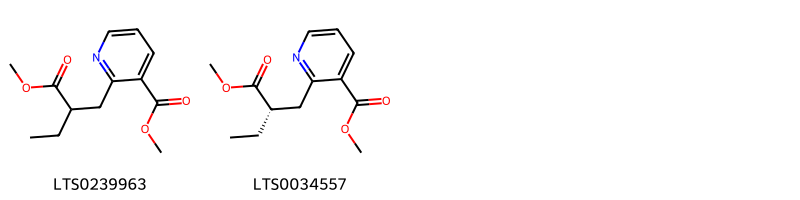{ width=100% }
    <figcaption>Hình ảnh cấu trúc hóa học của 2 hoạt chất thuộc nhóm Pyridines and derivatives gồm ['methyl 2-(2-ethyl-3-methoxy-3-oxopropyl)pyridine-3-carboxylate (LTS0239963)', 'methyl 2-[(2s)-2-ethyl-3-methoxy-3-oxopropyl]pyridine-3-carboxylate (LTS0034557)'].</figcaption>
</figure>
#### Nhóm Steroids and steroid derivatives
<figure markdown="span">
    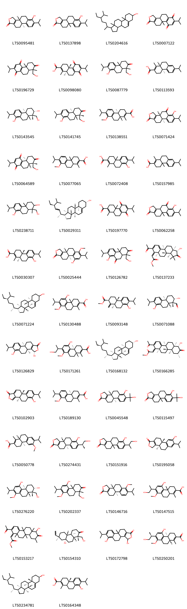{ width=100% }
    <figcaption>Hình ảnh cấu trúc hóa học của 68 hoạt chất thuộc nhóm Steroids and steroid derivatives gồm ['(3br,9bs)-6-hydroxy-7-isopropyl-9b-methyl-3h,3bh,4h,5h,10h,11h-phenanthro[1,2-c]furan-1-one (LTS0095481)', '6-hydroxy-7-isopropyl-9b-methyl-3h,3bh,4h,5h,10h,11h-phenanthro[1,2-c]furan-1-one (LTS0137898)', 'stigmast-5-en-3-ol, (3β)- (LTS0204616)', '7-isopropyl-9b-methyl-3h,3bh,4h,5h,10h,11h-phenanthro[1,2-c]furan-1,6,9-trione (LTS0007122)', '8-(hydroxymethyl)-2-isopropyl-4b,8-dimethyl-6,8a,9,10-tetrahydro-5h-phenanthrene-1,4,7-trione (LTS0196729)', '(4as,10as)-7-isopropyl-1,4a-dimethyl-5,8-dioxo-4,9,10,10a-tetrahydro-3h-phenanthrene-2-carboxylic acid (LTS0098080)', '8-hydroxy-1-(hydroxymethyl)-7-isopropyl-1,4a-dimethyl-4,9,10,10a-tetrahydro-3h-phenanthren-2-one (LTS0087779)', '(4as,10as)-7-isopropyl-1,4a-dimethyl-4,9,10,10a-tetrahydro-3h-phenanthrene-2-carboxylic acid (LTS0113593)', '(4bs,7s,8s,8ar)-8-(hydroxymethyl)-2-isopropyl-4b,8-dimethyl-5,6,7,8a,9,10-hexahydrophenanthrene-1,7-diol (LTS0143545)', '(1s,4as,10ar)-8-hydroxy-1-(hydroxymethyl)-7-isopropyl-1,4a-dimethyl-4,9,10,10a-tetrahydro-3h-phenanthren-2-one (LTS0141745)', '(4as,10as)-7-isopropyl-8-methoxy-1,4a-dimethyl-4,9,10,10a-tetrahydro-3h-phenanthrene-2-carboxylic acid (LTS0138551)', '(3br,9bs)-6-hydroxy-7-isopropyl-9b-methyl-3h,3bh,4h,10h,11h-phenanthro[1,2-c]furan-1,5-dione (LTS0071424)', '(4bs,8s,8ar)-8-(hydroxymethyl)-2-isopropyl-4b,8-dimethyl-6,8a,9,10-tetrahydro-5h-phenanthrene-1,4,7-trione (LTS0064589)', '7-isopropyl-8-methoxy-1,4a-dimethyl-4,9,10,10a-tetrahydro-3h-phenanthrene-2-carboxylic acid (LTS0077065)', '8-hydroxy-7-isopropyl-1,4a-dimethyl-4,9,10,10a-tetrahydro-3h-phenanthrene-2-carboxylic acid (LTS0072408)', '7-isopropyl-1,4a-dimethyl-4,9,10,10a-tetrahydro-3h-phenanthrene-2-carboxylic acid (LTS0157985)', '8-(hydroxymethyl)-2-isopropyl-4b,8-dimethyl-5,6,7,8a,9,10-hexahydrophenanthrene-1,7-diol (LTS0238711)', 'phytosterol (LTS0029311)', '7-isopropyl-1,4a-dimethyl-5,8-dioxo-4,9,10,10a-tetrahydro-3h-phenanthrene-2-carboxylic acid (LTS0197770)', '6-hydroxy-7-isopropyl-9b-methyl-3h,3bh,4h,10h,11h-phenanthro[1,2-c]furan-1,5-dione (LTS0062258)', '(4as,10as)-8-hydroxy-7-isopropyl-1,4a-dimethyl-4,9,10,10a-tetrahydro-3h-phenanthrene-2-carboxylic acid (LTS0030307)', '(3br,9bs)-9-hydroxy-7-isopropyl-6-methoxy-9b-methyl-3h,3bh,4h,5h,10h,11h-phenanthro[1,2-c]furan-1-one (LTS0025444)', '8-hydroxy-1-(hydroxymethyl)-7-isopropyl-1,4a-dimethyl-3,4,10,10a-tetrahydrophenanthrene-2,9-dione (LTS0126782)', 'methyl 2-[(1s,3as,3bs,5ar,6e,9bs,11ar)-7-acetyl-1-hydroxy-3,3,3b,5a,9b,11a-hexamethyl-2-oxo-1h,3ah,4h,5h,10h,11h-cyclopenta[a]phenanthren-6-ylidene]acetate (LTS0137233)', 'stigmast-5-en-3-ol (LTS0071224)', '5-hydroxy-7-isopropyl-8-methoxy-1,4a-dimethyl-4,9,10,10a-tetrahydro-3h-phenanthrene-2-carboxylic acid (LTS0130488)', 'methyl (2s,4as,10as)-8-hydroxy-7-isopropyl-4a-methyl-1-methylidene-2,3,4,9,10,10a-hexahydrophenanthrene-2-carboxylate (LTS0093148)', '(1r,2s,4as,10ar)-2,8-dihydroxy-7-isopropyl-1,4a-dimethyl-2,3,4,9,10,10a-hexahydrophenanthrene-1-carbaldehyde (LTS0071088)', '(3s,3bs,9bs)-3,6-dihydroxy-7-isopropyl-9b-methyl-3h,3bh,4h,5h,10h,11h-phenanthro[1,2-c]furan-1-one (LTS0126829)', '(4as,10as)-5-hydroxy-7-(1-hydroxypropan-2-yl)-8-methoxy-1,4a-dimethyl-4,9,10,10a-tetrahydro-3h-phenanthrene-2-carboxylic acid (LTS0171261)', 'sitosterol (LTS0168132)', 'methyl 2-[(1z,4bs,6ar,7s,9r,10as,10bs,12ar)-2-acetyl-7-hydroxy-4b,6a,9,10b,12a-pentamethyl-8-oxo-5,6,7,9,10,10a,11,12-octahydrochrysen-1-ylidene]acetate (LTS0166285)', '(3br,9bs)-6-hydroxy-7-isopropyl-9b-methyl-3bh,4h,5h,10h-phenanthro[1,2-c]furan-1-one (LTS0102903)', '(4as)-7-isopropyl-8-methoxy-1,4a-dimethyl-4,9,10,10a-tetrahydro-3h-phenanthrene-2-carboxylic acid (LTS0189130)', '(3br,9bs)-6-hydroxy-7-(2-hydroxypropan-2-yl)-9b-methyl-3h,3bh,4h,5h,10h,11h-phenanthro[1,2-c]furan-1-one (LTS0045548)', '6-hydroxy-7-(2-hydroxypropan-2-yl)-9b-methyl-3h,3bh,4h,5h,10h,11h-phenanthro[1,2-c]furan-1-one (LTS0115497)', '(4as,10as)-7-isopropyl-6-methoxy-1,4a-dimethyl-4,9,10,10a-tetrahydro-3h-phenanthrene-2-carboxylic acid (LTS0050778)', '(3br,9bs)-6-hydroxy-7-[(2s)-1-hydroxypropan-2-yl]-9b-methyl-3h,3bh,4h,5h,10h,11h-phenanthro[1,2-c]furan-1-one (LTS0274431)', '6-hydroxy-7-(1-hydroxypropan-2-yl)-9b-methyl-3h,3bh,4h,5h,10h,11h-phenanthro[1,2-c]furan-1-one (LTS0151916)', '(3br,9bs)-8-hydroxy-7-isopropyl-9b-methyl-3h,3bh,4h,5h,10h,11h-phenanthro[1,2-c]furan-1-one (LTS0195058)', '(1s,2s,4as,10ar)-1-(hydroxymethyl)-7-isopropyl-8-methoxy-1,4a-dimethyl-2,3,4,9,10,10a-hexahydrophenanthrene-2,5-diol (LTS0276220)', '5-hydroxy-1-(hydroxymethyl)-7-isopropyl-8-methoxy-1,4a-dimethyl-4,9,10,10a-tetrahydro-3h-phenanthren-2-one (LTS0202337)', '(3br,9bs)-7-isopropyl-6-methoxy-9b-methyl-3h,3bh,4h,5h,10h,11h-phenanthro[1,2-c]furan-1-one (LTS0146716)', '5-hydroxy-7-(1-hydroxypropan-2-yl)-8-methoxy-1,4a-dimethyl-4,9,10,10a-tetrahydro-3h-phenanthrene-2-carboxylic acid (LTS0147515)', 'methyl 2-(2-acetyl-7-hydroxy-4b,6a,9,10b,12a-pentamethyl-8-oxo-5,6,7,9,10,10a,11,12-octahydrochrysen-1-ylidene)acetate (LTS0153217)', '(1s,4as,4br,7s,8ar,10ar)-7-ethenyl-8a-hydroxy-1-(hydroxymethyl)-1,4a,7-trimethyl-octahydro-3h-phenanthren-2-one (LTS0154310)', '3,6-dihydroxy-7-isopropyl-9b-methyl-3h,3bh,4h,5h,10h,11h-phenanthro[1,2-c]furan-1-one (LTS0172798)', '(4as,10as)-5-hydroxy-7-[(2s)-1-hydroxypropan-2-yl]-8-methoxy-1,4a-dimethyl-4,9,10,10a-tetrahydro-3h-phenanthrene-2-carboxylic acid (LTS0250201)', '(1s,3ar,3br,7r,9as,9br,11ar)-1-[(2r,5r)-5-ethyl-6-methylheptan-2-yl]-9a,11a-dimethyl-1h,2h,3h,3ah,3bh,4h,6h,7h,8h,9h,9bh,10h,11h-cyclopenta[a]phenanthren-7-ol (LTS0234781)', '(4as)-8-hydroxy-7-isopropyl-1,4a-dimethyl-4,9,10,10a-tetrahydro-3h-phenanthrene-2-carboxylic acid (LTS0164348)', '(1r,4ar,10as)-5-hydroxy-1-(hydroxymethyl)-7-isopropyl-8-methoxy-1,4a-dimethyl-4,9,10,10a-tetrahydro-3h-phenanthren-2-one (LTS0178930)', '(1s,4as,10ar)-8-hydroxy-1-(hydroxymethyl)-7-isopropyl-1,4a-dimethyl-3,4,10,10a-tetrahydrophenanthrene-2,9-dione (LTS0041702)', '(3bs,9bs)-7-isopropyl-9b-methyl-3h,3bh,4h,5h,10h,11h-phenanthro[1,2-c]furan-1,6,9-trione (LTS0193657)', '(1s,4as,10ar)-5-hydroxy-1-(hydroxymethyl)-7-isopropyl-8-methoxy-1,4a-dimethyl-4,9,10,10a-tetrahydro-3h-phenanthren-2-one (LTS0274058)', '1-(hydroxymethyl)-7-isopropyl-8-methoxy-1,4a-dimethyl-2,3,4,9,10,10a-hexahydrophenanthrene-2,5-diol (LTS0070249)', '7-ethenyl-8a-hydroxy-1-(hydroxymethyl)-1,4a,7-trimethyl-octahydro-3h-phenanthren-2-one (LTS0264212)', 'methyl 7-(2-hydroxypropan-2-yl)-1,4a-dimethyl-4,9,10,10a-tetrahydro-3h-phenanthrene-2-carboxylate (LTS0019158)', '(4bs,7s,8s,8ar)-7-hydroxy-8-(hydroxymethyl)-2-isopropyl-4b,8-dimethyl-5,6,7,8a,9,10-hexahydrophenanthrene-1,4-dione (LTS0249232)', '(1s,4as,10ar)-6-hydroxy-1-(hydroxymethyl)-7-isopropyl-1,4a-dimethyl-4,9,10,10a-tetrahydro-3h-phenanthren-2-one (LTS0247689)', '6-hydroxy-7-isopropyl-9b-methyl-3bh,4h,5h,10h-phenanthro[1,2-c]furan-1-one (LTS0008608)', '7-isopropyl-6-methoxy-1,4a-dimethyl-4,9,10,10a-tetrahydro-3h-phenanthrene-2-carboxylic acid (LTS0003030)', '6-hydroxy-1-(hydroxymethyl)-7-isopropyl-1,4a-dimethyl-4,9,10,10a-tetrahydro-3h-phenanthren-2-one (LTS0013989)', 'tripchlorolide (LTS0025895)', '7-hydroxy-8-(hydroxymethyl)-2-isopropyl-4b,8-dimethyl-5,6,7,8a,9,10-hexahydrophenanthrene-1,4-dione (LTS0031788)', '(1s,4as,10ar)-8-hydroxy-1-(hydroxymethyl)-7-isopropyl-6-methoxy-1,4a-dimethyl-4,9,10,10a-tetrahydro-3h-phenanthren-2-one (LTS0248483)', '(3s,3br,9bs)-3,6-dihydroxy-7-isopropyl-9b-methyl-3h,3bh,4h,5h,10h,11h-phenanthro[1,2-c]furan-1-one (LTS0133228)', 'methyl (4as,10as)-7-(2-hydroxypropan-2-yl)-1,4a-dimethyl-4,9,10,10a-tetrahydro-3h-phenanthrene-2-carboxylate (LTS0209845)', '(4as,10as)-5-hydroxy-7-isopropyl-8-methoxy-1,4a-dimethyl-4,9,10,10a-tetrahydro-3h-phenanthrene-2-carboxylic acid (LTS0119274)'].</figcaption>
</figure>
#### Nhóm Vinylogous acids
<figure markdown="span">
    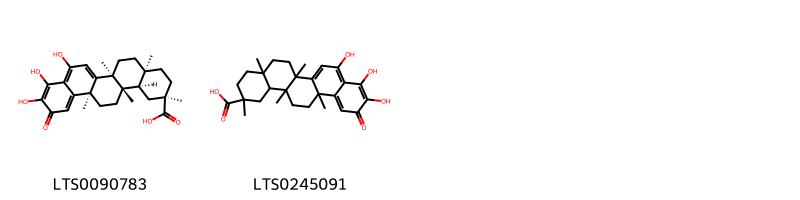{ width=100% }
    <figcaption>Hình ảnh cấu trúc hóa học của 2 hoạt chất thuộc nhóm Vinylogous acids gồm ['(2r,4as,6as,12br,14as,14br)-8,9,10-trihydroxy-2,4a,6a,12b,14a-pentamethyl-11-oxo-1,3,4,5,6,13,14,14b-octahydropicene-2-carboxylic acid (LTS0090783)', '8,9,10-trihydroxy-2,4a,6a,12b,14a-pentamethyl-11-oxo-1,3,4,5,6,13,14,14b-octahydropicene-2-carboxylic acid (LTS0245091)'].</figcaption>
</figure>

---

### Dược dân tộc học

Danh sách các quốc gia có sử dụng *Tripterygium wilfordii* trong điều trị các bệnh. 

| Country   | Disease                                                            | Bệnh                                                                                                                                                                                                |
|:----------|:-------------------------------------------------------------------|:----------------------------------------------------------------------------------------------------------------------------------------------------------------------------------------------------|
| China     | Detoxicant, Insecticide, Molluscicide, Poison, Raticide, Larvicide | MYMEMORY WARNING: YOU USED ALL AVAILABLE FREE TRANSLATIONS FOR TODAY. NEXT AVAILABLE IN  16 HOURS 37 MINUTES 08 SECONDS VISIT HTTPS://MYMEMORY.TRANSLATED.NET/DOC/USAGELIMITS.PHP TO TRANSLATE MORE |

---

# Chi Celastrus

??? note "Danh sách các dược liệu thuộc chi"
    
	 - *Celastrus paniculata*
	 - *Celastrus scandens*

---
## Celastrus paniculata
### Thông tin về thực vật

!!! info "Phân loại thực vật của *Celastrus paniculatus* từ GIBF:"
    - **Kingdom:** Plantae
    - **Phylum:** Tracheophyta
    - **Order:** Celastrales
    - **Family:** Celastraceae
    - **Genus:** Celastrus
    - **Species:** *Celastrus paniculatus*

 

| Label (VI)   | Label (EN)   | Scientific Name        | Descriptions (VI)   | Descriptions (EN)   | Also Known As (VI)   | Also Known As (EN)   |
|:-------------|:-------------|:-----------------------|:--------------------|:--------------------|:---------------------|:---------------------|
| N/A          | N/A          | Tripterygium wilfordii | loài thực vật       | species of plant    | ['']                 | ['']                 |

#### Phân bố trên thế giới

**Từ CSDL GIBF** nan, Brazil, Viet Nam, Nepal, New Caledonia, China, Thailand, Sri Lanka, United States of America, Indonesia, Lao People’s Democratic Republic, Dominica, Mexico, Chinese Taipei, Philippines, Malaysia, Cambodia, Australia, India, Christmas Island, Venezuela (Bolivarian Republic of)

#### Phân bố tại Việt Nam

**Từ CSDL GIBF**: Ninh Binh

---
### Thành phần hóa học
        
- Theo cơ sở dữ liệu lotus: Từ loài *Celastrus paniculatus* đã phân lập và xác định được Chưa có hoạt chất nào được phân lập. hoạt chất thuộc về các nhóm Không có hoạt chất nào được phân lập. 

Không có hình ảnh nào được tạo ra

---

### Dược dân tộc học

Danh sách các quốc gia có sử dụng *Celastrus paniculatus* trong điều trị các bệnh. 

| Country   | Disease                                                                      | Bệnh                                                                                                                                                                                                |
|:----------|:-----------------------------------------------------------------------------|:----------------------------------------------------------------------------------------------------------------------------------------------------------------------------------------------------|
| Elsewhere | Antidote, Aphrodisiac, Emetic, Laxative, Stimulant, Abortifacient, Analgesic | MYMEMORY WARNING: YOU USED ALL AVAILABLE FREE TRANSLATIONS FOR TODAY. NEXT AVAILABLE IN  16 HOURS 36 MINUTES 31 SECONDS VISIT HTTPS://MYMEMORY.TRANSLATED.NET/DOC/USAGELIMITS.PHP TO TRANSLATE MORE |
| Hindu     | Stimulant                                                                    | MYMEMORY WARNING: YOU USED ALL AVAILABLE FREE TRANSLATIONS FOR TODAY. NEXT AVAILABLE IN  16 HOURS 36 MINUTES 29 SECONDS VISIT HTTPS://MYMEMORY.TRANSLATED.NET/DOC/USAGELIMITS.PHP TO TRANSLATE MORE |

---

---
## Celastrus scandens
### Thông tin về thực vật

!!! info "Phân loại thực vật của *Celastrus scandens* từ GIBF:"
    - **Kingdom:** Plantae
    - **Phylum:** Tracheophyta
    - **Order:** Celastrales
    - **Family:** Celastraceae
    - **Genus:** Celastrus
    - **Species:** *Celastrus scandens*

 

| Label (VI)   | Label (EN)   | Scientific Name    | Descriptions (VI)   | Descriptions (EN)   | Also Known As (VI)   | Also Known As (EN)   |
|:-------------|:-------------|:-------------------|:--------------------|:--------------------|:---------------------|:---------------------|
| N/A          | N/A          | Celastrus scandens | loài thực vật       | species of plant    | ['']                 | ['']                 |

#### Phân bố trên thế giới

**Từ CSDL GIBF** United States of America, Canada

#### Phân bố tại Việt Nam

**Từ CSDL GIBF**: Không có ghi nhận ở Việt Nam

---
### Thành phần hóa học
        
- Theo cơ sở dữ liệu lotus: Từ loài *Celastrus scandens* đã phân lập và xác định được 2 hoạt chất thuộc về các nhóm Prenol lipids. 

|    | chemicalTaxonomyClassyfireClass   |   smiles_count |
|---:|:----------------------------------|---------------:|
|  0 | Prenol lipids                     |              2 |

#### Nhóm Prenol lipids
<figure markdown="span">
    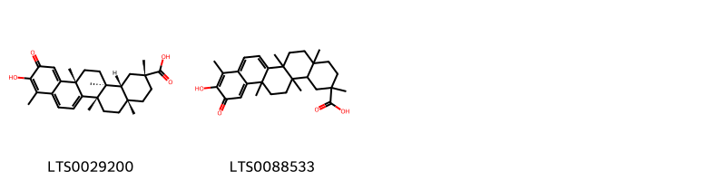{ width=100% }
    <figcaption>Hình ảnh cấu trúc hóa học của 2 hoạt chất thuộc nhóm Prenol lipids gồm ['celastrol (LTS0029200)', '10-hydroxy-2,4a,6a,9,12b,14a-hexamethyl-11-oxo-1,3,4,5,6,13,14,14b-octahydropicene-2-carboxylic acid (LTS0088533)'].</figcaption>
</figure>

---

### Dược dân tộc học

Danh sách các quốc gia có sử dụng *Celastrus scandens* trong điều trị các bệnh. 

| Country   | Disease                                                  | Bệnh                                                                                                                                                                                                |
|:----------|:---------------------------------------------------------|:----------------------------------------------------------------------------------------------------------------------------------------------------------------------------------------------------|
| Dutch     | Sudorific                                                | MYMEMORY WARNING: YOU USED ALL AVAILABLE FREE TRANSLATIONS FOR TODAY. NEXT AVAILABLE IN  16 HOURS 36 MINUTES 08 SECONDS VISIT HTTPS://MYMEMORY.TRANSLATED.NET/DOC/USAGELIMITS.PHP TO TRANSLATE MORE |
| Elsewhere | Diaphoretic, Diuretic                                    | MYMEMORY WARNING: YOU USED ALL AVAILABLE FREE TRANSLATIONS FOR TODAY. NEXT AVAILABLE IN  16 HOURS 36 MINUTES 05 SECONDS VISIT HTTPS://MYMEMORY.TRANSLATED.NET/DOC/USAGELIMITS.PHP TO TRANSLATE MORE |
| French    | Emmenagogue                                              | MYMEMORY WARNING: YOU USED ALL AVAILABLE FREE TRANSLATIONS FOR TODAY. NEXT AVAILABLE IN  16 HOURS 36 MINUTES 03 SECONDS VISIT HTTPS://MYMEMORY.TRANSLATED.NET/DOC/USAGELIMITS.PHP TO TRANSLATE MORE |
| US        | Discutient, Diuretic, Diuretic, Emetic, Poison, Sedative | MYMEMORY WARNING: YOU USED ALL AVAILABLE FREE TRANSLATIONS FOR TODAY. NEXT AVAILABLE IN  16 HOURS 36 MINUTES 01 SECONDS VISIT HTTPS://MYMEMORY.TRANSLATED.NET/DOC/USAGELIMITS.PHP TO TRANSLATE MORE |
| anish     | Emetic                                                   | MYMEMORY WARNING: YOU USED ALL AVAILABLE FREE TRANSLATIONS FOR TODAY. NEXT AVAILABLE IN  16 HOURS 35 MINUTES 58 SECONDS VISIT HTTPS://MYMEMORY.TRANSLATED.NET/DOC/USAGELIMITS.PHP TO TRANSLATE MORE |

---

# Chi Euonymus

??? note "Danh sách các dược liệu thuộc chi"
    
	 - *Euonymus alata*
	 - *Euonymus alatus*
	 - *Euonymus americanus*
	 - *Euonymus atropurpureus*
	 - *Euonymus cochinchinensis*
	 - *Euonymus europaeus*
	 - *Euonymus japonicus*
	 - *Euonymus sieboldianus*
	 - *Euonymus thunbergianus*
	 - *Euonymus tingens*

---
## Euonymus alata
### Thông tin về thực vật

!!! info "Phân loại thực vật của *Euonymus alatus* từ GIBF:"
    - **Kingdom:** Plantae
    - **Phylum:** Tracheophyta
    - **Order:** Celastrales
    - **Family:** Celastraceae
    - **Genus:** Euonymus
    - **Species:** *Euonymus alatus*

 

| Label (VI)   | Label (EN)   | Scientific Name    | Descriptions (VI)   | Descriptions (EN)   | Also Known As (VI)   | Also Known As (EN)   |
|:-------------|:-------------|:-------------------|:--------------------|:--------------------|:---------------------|:---------------------|
| N/A          | N/A          | Celastrus scandens | loài thực vật       | species of plant    | ['']                 | ['']                 |

#### Phân bố trên thế giới

**Từ CSDL GIBF** nan, United States of America, Korea, Republic of, Sweden, Canada, Denmark, Netherlands

#### Phân bố tại Việt Nam

**Từ CSDL GIBF**: Không có ghi nhận ở Việt Nam

---
### Thành phần hóa học
        
- Theo cơ sở dữ liệu lotus: Từ loài *Euonymus alatus* đã phân lập và xác định được Chưa có hoạt chất nào được phân lập. hoạt chất thuộc về các nhóm Không có hoạt chất nào được phân lập. 

Không có hình ảnh nào được tạo ra

---

### Dược dân tộc học

Danh sách các quốc gia có sử dụng *Euonymus alatus* trong điều trị các bệnh. 

| Country   | Disease     | Bệnh                                                                                                                                                                                                |
|:----------|:------------|:----------------------------------------------------------------------------------------------------------------------------------------------------------------------------------------------------|
| China     | Carminative | MYMEMORY WARNING: YOU USED ALL AVAILABLE FREE TRANSLATIONS FOR TODAY. NEXT AVAILABLE IN  16 HOURS 35 MINUTES 35 SECONDS VISIT HTTPS://MYMEMORY.TRANSLATED.NET/DOC/USAGELIMITS.PHP TO TRANSLATE MORE |

---

---
## Euonymus alatus
### Thông tin về thực vật

!!! info "Phân loại thực vật của *Euonymus alatus* từ GIBF:"
    - **Kingdom:** Plantae
    - **Phylum:** Tracheophyta
    - **Order:** Celastrales
    - **Family:** Celastraceae
    - **Genus:** Euonymus
    - **Species:** *Euonymus alatus*

 

| Label (VI)   | Label (EN)   | Scientific Name   | Descriptions (VI)   | Descriptions (EN)   | Also Known As (VI)   | Also Known As (EN)   |
|:-------------|:-------------|:------------------|:--------------------|:--------------------|:---------------------|:---------------------|
| N/A          | N/A          | Euonymus alatus   | loài thực vật       | species of plant    | ['']                 | ['']                 |

#### Phân bố trên thế giới

**Từ CSDL GIBF** nan, United States of America, Korea, Republic of, Sweden, Canada, Denmark, Netherlands

#### Phân bố tại Việt Nam

**Từ CSDL GIBF**: Không có ghi nhận ở Việt Nam

---
### Thành phần hóa học
        
- Theo cơ sở dữ liệu lotus: Từ loài *Euonymus alatus* đã phân lập và xác định được 73 hoạt chất thuộc về các nhóm Fatty Acyls, Flavonoids, Carboxylic acids and derivatives, Cinnamic acids and derivatives, Steroids and steroid derivatives, Pyridines and derivatives, Phenols, Aryltetralin lignans, Organooxygen compounds, Furanoid lignans, Prenol lipids, 2-arylbenzofuran flavonoids. 

|    | chemicalTaxonomyClassyfireClass   |   smiles_count |
|---:|:----------------------------------|---------------:|
|  0 |                                   |             12 |
|  1 | 2-arylbenzofuran flavonoids       |              6 |
|  2 | Aryltetralin lignans              |              1 |
|  3 | Carboxylic acids and derivatives  |              5 |
|  4 | Cinnamic acids and derivatives    |              4 |
|  5 | Fatty Acyls                       |              1 |
|  6 | Flavonoids                        |              2 |
|  7 | Furanoid lignans                  |              5 |
|  8 | Organooxygen compounds            |              2 |
|  9 | Phenols                           |              2 |
| 10 | Prenol lipids                     |             25 |
| 11 | Pyridines and derivatives         |              1 |
| 12 | Steroids and steroid derivatives  |              7 |

#### Nhóm 
<figure markdown="span">
    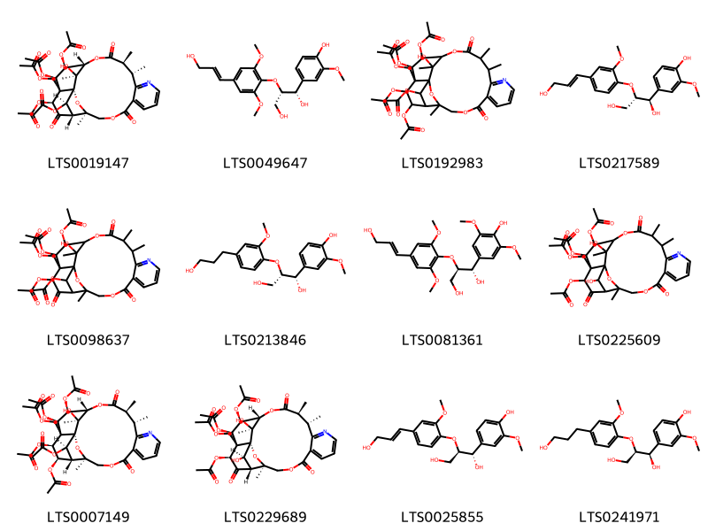{ width=100% }
    <figcaption>Hình ảnh cấu trúc hóa học của 12 hoạt chất thuộc nhóm  gồm ['[(1s,3r,13s,14s,17s,18r,19r,20s,21s,23r,24r,25s)-18,19,21,24-tetrakis(acetyloxy)-25-hydroxy-3,13,14,25-tetramethyl-6,15,22-trioxo-2,5,16-trioxa-11-azapentacyclo[15.7.1.0¹,²⁰.0³,²³.0⁷,¹²]pentacosa-7,9,11-trien-20-yl]methyl acetate (LTS0019147)', '(1s,2s)-1-(4-hydroxy-3-methoxyphenyl)-2-{4-[(1e)-3-hydroxyprop-1-en-1-yl]-2,6-dimethoxyphenoxy}propane-1,3-diol (LTS0049647)', '[18,19,21,22,24-pentakis(acetyloxy)-25-hydroxy-3,13,14,25-tetramethyl-6,15-dioxo-2,5,16-trioxa-11-azapentacyclo[15.7.1.0¹,²⁰.0³,²³.0⁷,¹²]pentacosa-7,9,11-trien-20-yl]methyl acetate (LTS0192983)', '(1r,2s)-1-(4-hydroxy-3-methoxyphenyl)-2-{4-[(1e)-3-hydroxyprop-1-en-1-yl]-2-methoxyphenoxy}propane-1,3-diol (LTS0217589)', 'evonine (LTS0098637)', '(1s,2s)-1-(4-hydroxy-3-methoxyphenyl)-2-[4-(3-hydroxypropyl)-2-methoxyphenoxy]propane-1,3-diol (LTS0213846)', '(1s,2r)-1-(4-hydroxy-3,5-dimethoxyphenyl)-2-{4-[(1e)-3-hydroxyprop-1-en-1-yl]-2,6-dimethoxyphenoxy}propane-1,3-diol (LTS0081361)', '[18,19,21-tris(acetyloxy)-24,25-dihydroxy-3,13,14,25-tetramethyl-6,15,22-trioxo-2,5,16-trioxa-11-azapentacyclo[15.7.1.0¹,²⁰.0³,²³.0⁷,¹²]pentacosa-7,9,11-trien-20-yl]methyl acetate (LTS0225609)', '[(1s,3r,13s,14s,17s,18r,19r,20r,21s,22r,23r,24r,25s)-18,19,21,22,24-pentakis(acetyloxy)-25-hydroxy-3,13,14,25-tetramethyl-6,15-dioxo-2,5,16-trioxa-11-azapentacyclo[15.7.1.0¹,²⁰.0³,²³.0⁷,¹²]pentacosa-7,9,11-trien-20-yl]methyl acetate (LTS0007149)', '[(1s,3r,13s,14s,17s,18r,19r,20s,21s,23r,24r,25s)-18,19,21-tris(acetyloxy)-24,25-dihydroxy-3,13,14,25-tetramethyl-6,15,22-trioxo-2,5,16-trioxa-11-azapentacyclo[15.7.1.0¹,²⁰.0³,²³.0⁷,¹²]pentacosa-7,9,11-trien-20-yl]methyl acetate (LTS0229689)', '(1s,2r)-1-(4-hydroxy-3-methoxyphenyl)-2-{4-[(1e)-3-hydroxyprop-1-en-1-yl]-2-methoxyphenoxy}propane-1,3-diol (LTS0025855)', '(1r,2r)-1-(4-hydroxy-3-methoxyphenyl)-2-[4-(3-hydroxypropyl)-2-methoxyphenoxy]propane-1,3-diol (LTS0241971)'].</figcaption>
</figure>
#### Nhóm 2-arylbenzofuran flavonoids
<figure markdown="span">
    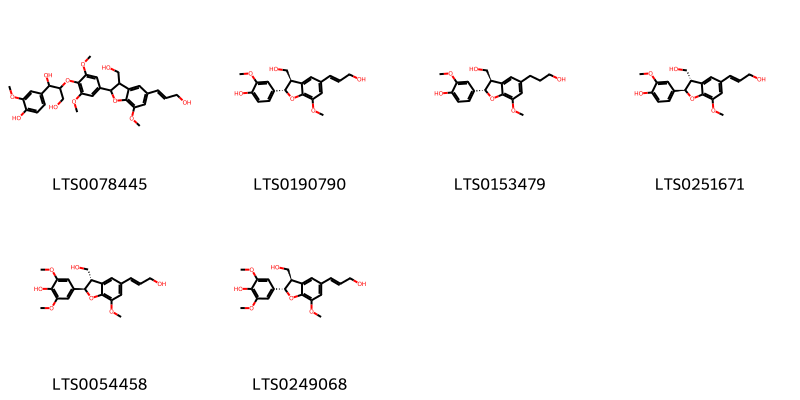{ width=100% }
    <figcaption>Hình ảnh cấu trúc hóa học của 6 hoạt chất thuộc nhóm 2-arylbenzofuran flavonoids gồm ['buddlenol b (LTS0078445)', '4-[(2s,3r)-3-(hydroxymethyl)-5-[(1e)-3-hydroxyprop-1-en-1-yl]-7-methoxy-2,3-dihydro-1-benzofuran-2-yl]-2-methoxyphenol (LTS0190790)', '4-[(2s,3r)-3-(hydroxymethyl)-5-(3-hydroxypropyl)-7-methoxy-2,3-dihydro-1-benzofuran-2-yl]-2-methoxyphenol (LTS0153479)', '(-)-dehydrodiconiferyl alcohol (LTS0251671)', '4-[(2r,3s)-3-(hydroxymethyl)-5-[(1e)-3-hydroxyprop-1-en-1-yl]-7-methoxy-2,3-dihydro-1-benzofuran-2-yl]-2,6-dimethoxyphenol (LTS0054458)', '4-[(2s,3r)-3-(hydroxymethyl)-5-[(1e)-3-hydroxyprop-1-en-1-yl]-7-methoxy-2,3-dihydro-1-benzofuran-2-yl]-2,6-dimethoxyphenol (LTS0249068)'].</figcaption>
</figure>
#### Nhóm Aryltetralin lignans
<figure markdown="span">
    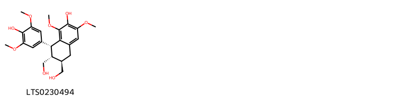{ width=100% }
    <figcaption>Hình ảnh cấu trúc hóa học của 1 hoạt chất thuộc nhóm Aryltetralin lignans gồm ['(6r,7r,8r)-8-(4-hydroxy-3,5-dimethoxyphenyl)-6,7-bis(hydroxymethyl)-1,3-dimethoxy-5,6,7,8-tetrahydronaphthalen-2-ol (LTS0230494)'].</figcaption>
</figure>
#### Nhóm Carboxylic acids and derivatives
<figure markdown="span">
    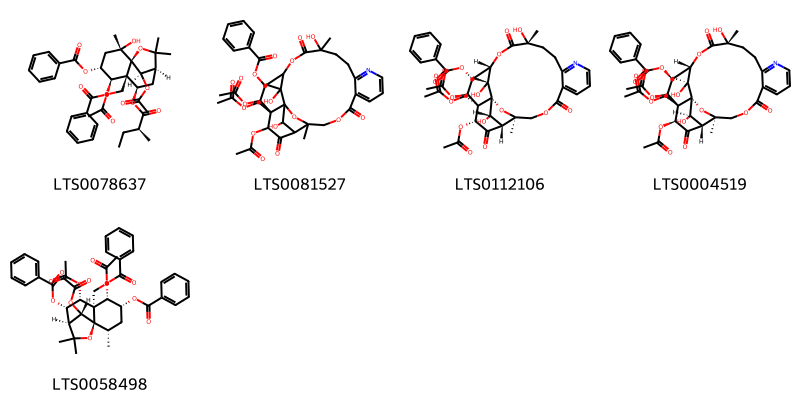{ width=100% }
    <figcaption>Hình ảnh cấu trúc hóa học của 5 hoạt chất thuộc nhóm Carboxylic acids and derivatives gồm ['(1r,2s,4r,5r,6r,7r,9s,12r)-12-(acetyloxy)-6-[(acetyloxy)methyl]-5-(benzoyloxy)-2-hydroxy-2,10,10-trimethyl-7-{[(2s)-2-methylbutanoyl]oxy}-11-oxatricyclo[7.2.1.0¹,⁶]dodecan-4-yl benzoate (LTS0078637)', '20,22-bis(acetyloxy)-21-[(acetyloxy)methyl]-15,25,26-trihydroxy-3,15,26-trimethyl-6,16,23-trioxo-2,5,17-trioxa-11-azapentacyclo[16.7.1.0¹,²¹.0³,²⁴.0⁷,¹²]hexacosa-7,9,11-trien-19-yl benzoate (LTS0081527)', '(1s,3r,15r,18s,19s,20r,21r,22r,24r,25s,26r)-20,22-bis(acetyloxy)-21-[(acetyloxy)methyl]-15,25,26-trihydroxy-3,15,26-trimethyl-6,16,23-trioxo-2,5,17-trioxa-11-azapentacyclo[16.7.1.0¹,²¹.0³,²⁴.0⁷,¹²]hexacosa-7,9,11-trien-19-yl benzoate (LTS0112106)', '(1s,3r,15r,18s,19r,20r,21s,22s,24r,25r,26s)-20,22-bis(acetyloxy)-21-[(acetyloxy)methyl]-15,25,26-trihydroxy-3,15,26-trimethyl-6,16,23-trioxo-2,5,17-trioxa-11-azapentacyclo[16.7.1.0¹,²¹.0³,²⁴.0⁷,¹²]hexacosa-7,9,11-trien-19-yl benzoate (LTS0004519)', '(1r,2s,4r,5s,6r,7r,8s,9s,12s)-7,12-bis(acetyloxy)-6-[(acetyloxy)methyl]-4,8-bis(benzoyloxy)-2,10,10-trimethyl-11-oxatricyclo[7.2.1.0¹,⁶]dodecan-5-yl benzoate (LTS0058498)'].</figcaption>
</figure>
#### Nhóm Cinnamic acids and derivatives
<figure markdown="span">
    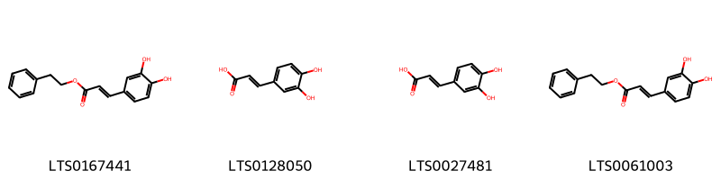{ width=100% }
    <figcaption>Hình ảnh cấu trúc hóa học của 4 hoạt chất thuộc nhóm Cinnamic acids and derivatives gồm ['2-phenylethyl 3-(3,4-dihydroxyphenyl)prop-2-enoate (LTS0167441)', '3,4-dihydroxycinnamic acid (LTS0128050)', 'caffeic acid (LTS0027481)', 'caffeic acid phenethyl ester (LTS0061003)'].</figcaption>
</figure>
#### Nhóm Fatty Acyls
<figure markdown="span">
    { width=100% }
    <figcaption>Hình ảnh cấu trúc hóa học của 1 hoạt chất thuộc nhóm Fatty Acyls gồm ['2-carboxy-d-arabinitol (LTS0056947)'].</figcaption>
</figure>
#### Nhóm Flavonoids
<figure markdown="span">
    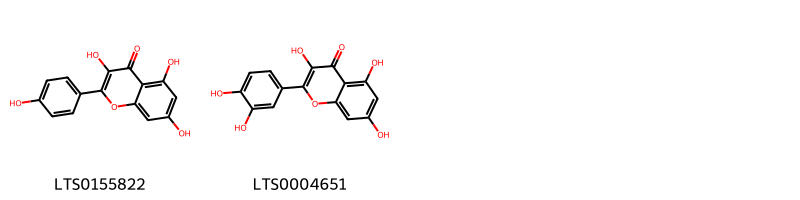{ width=100% }
    <figcaption>Hình ảnh cấu trúc hóa học của 2 hoạt chất thuộc nhóm Flavonoids gồm ['kaempherol (LTS0155822)', 'quercetin (LTS0004651)'].</figcaption>
</figure>
#### Nhóm Furanoid lignans
<figure markdown="span">
    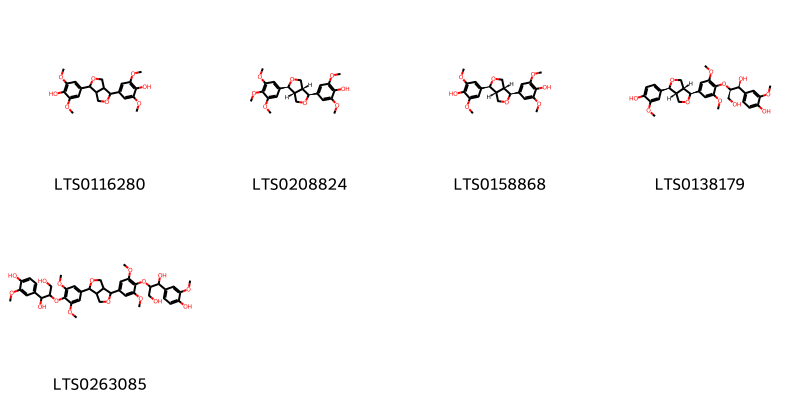{ width=100% }
    <figcaption>Hình ảnh cấu trúc hóa học của 5 hoạt chất thuộc nhóm Furanoid lignans gồm ['syringaresinol (LTS0116280)', '4-[(1s,3ar,4s,6ar)-4-(3,4,5-trimethoxyphenyl)-hexahydrofuro[3,4-c]furan-1-yl]-2,6-dimethoxyphenol (LTS0208824)', '(+)-syringaresinol (LTS0158868)', '(1s,2r)-2-{4-[(1s,3ar,4s,6ar)-4-(4-hydroxy-3-methoxyphenyl)-hexahydrofuro[3,4-c]furan-1-yl]-2,6-dimethoxyphenoxy}-1-(4-hydroxy-3-methoxyphenyl)propane-1,3-diol (LTS0138179)', '2-{4-[4-(4-{[1,3-dihydroxy-1-(4-hydroxy-3-methoxyphenyl)propan-2-yl]oxy}-3,5-dimethoxyphenyl)-hexahydrofuro[3,4-c]furan-1-yl]-2,6-dimethoxyphenoxy}-1-(4-hydroxy-3-methoxyphenyl)propane-1,3-diol (LTS0263085)'].</figcaption>
</figure>
#### Nhóm Organooxygen compounds
<figure markdown="span">
    { width=100% }
    <figcaption>Hình ảnh cấu trúc hóa học của 2 hoạt chất thuộc nhóm Organooxygen compounds gồm ['3-{[3-(3,4-dihydroxyphenyl)prop-2-enoyl]oxy}-1,4,5-trihydroxycyclohexane-1-carboxylic acid (LTS0143901)', 'chlorogenic acid (LTS0226495)'].</figcaption>
</figure>
#### Nhóm Phenols
<figure markdown="span">
    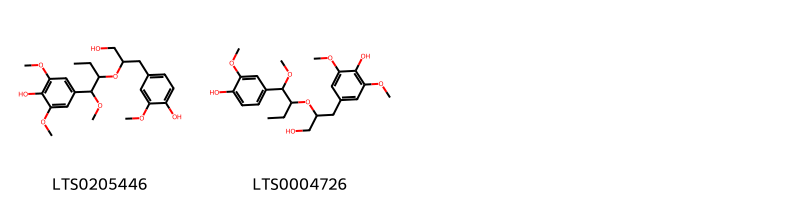{ width=100% }
    <figcaption>Hình ảnh cấu trúc hóa học của 2 hoạt chất thuộc nhóm Phenols gồm ['4-(2-{[1-hydroxy-3-(4-hydroxy-3-methoxyphenyl)propan-2-yl]oxy}-1-methoxybutyl)-2,6-dimethoxyphenol (LTS0205446)', '4-(3-hydroxy-2-{[1-(4-hydroxy-3-methoxyphenyl)-1-methoxybutan-2-yl]oxy}propyl)-2,6-dimethoxyphenol (LTS0004726)'].</figcaption>
</figure>
#### Nhóm Prenol lipids
<figure markdown="span">
    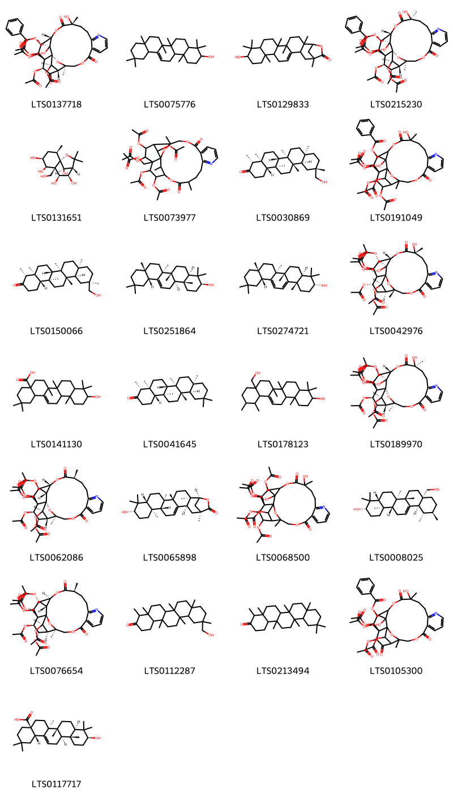{ width=100% }
    <figcaption>Hình ảnh cấu trúc hóa học của 25 hoạt chất thuộc nhóm Prenol lipids gồm ['(1s,3r,15r,18s,19r,20r,21s,22s,24r,25r,26s)-20,22,25-tris(acetyloxy)-21-[(acetyloxy)methyl]-15,26-dihydroxy-3,15,26-trimethyl-6,16,23-trioxo-2,5,17-trioxa-11-azapentacyclo[16.7.1.0¹,²¹.0³,²⁴.0⁷,¹²]hexacosa-7,9,11-trien-19-yl benzoate (LTS0137718)', 'β-amyrin (LTS0075776)', '11-hydroxy-2,5,6,10,10,14,21-heptamethyl-23-oxahexacyclo[19.2.1.0²,¹⁹.0⁵,¹⁸.0⁶,¹⁵.0⁹,¹⁴]tetracos-17-en-22-one (LTS0129833)', '(1s,3r,15s,18s,19r,20r,21r,22s,23r,24r,25r,26s)-20,22,23,25-tetrakis(acetyloxy)-21-[(acetyloxy)methyl]-15,26-dihydroxy-3,15,26-trimethyl-6,16-dioxo-2,5,17-trioxa-11-azapentacyclo[16.7.1.0¹,²¹.0³,²⁴.0⁷,¹²]hexacosa-7,9,11-trien-19-yl benzoate (LTS0215230)', '(1s,2r,4s,5r,6s,7s,8r,9r,12r)-6-(hydroxymethyl)-2,10,10-trimethyl-11-oxatricyclo[7.2.1.0¹,⁶]dodecane-4,5,7,8,12-pentol (LTS0131651)', '[19,20,22,23,25-pentakis(acetyloxy)-3,15,26-trimethyl-6,16-dioxo-2,5,17-trioxa-11-azapentacyclo[16.7.1.0¹,²¹.0³,²⁴.0⁷,¹²]hexacosa-7,9,11-trien-21-yl]methyl acetate (LTS0073977)', '(4r,4as,6as,6br,8as,11s,12ar,12bs,14as,14bs)-11-(hydroxymethyl)-4,4a,6b,8a,11,12b,14a-heptamethyl-tetradecahydro-1h-picen-3-one (LTS0030869)', '20,22,23,25-tetrakis(acetyloxy)-21-[(acetyloxy)methyl]-15,26-dihydroxy-3,15,26-trimethyl-6,16-dioxo-2,5,17-trioxa-11-azapentacyclo[16.7.1.0¹,²¹.0³,²⁴.0⁷,¹²]hexacosa-7,9,11-trien-19-yl benzoate (LTS0191049)', '(4r,4as,6as,6br,8as,11r,12ar,12bs,14as,14bs)-11-(hydroxymethyl)-4,4a,6b,8a,11,12b,14a-heptamethyl-tetradecahydro-1h-picen-3-one (LTS0150066)', 'β-amyrin (LTS0251864)', '(3r,4ar,6as,6br,8ar,12ar,14bs)-4,4,6a,6b,8a,11,11,14b-octamethyl-1,2,3,4a,5,6,7,8,9,10,12,12a-dodecahydropicen-3-ol (LTS0274721)', '[(1r,3s,15r,18s,19s,20r,21s,22r,23s,24s,25r,26s)-19,20,22,23,25-pentakis(acetyloxy)-15,26-dihydroxy-3,15,26-trimethyl-6,16-dioxo-2,5,17-trioxa-11-azapentacyclo[16.7.1.0¹,²¹.0³,²⁴.0⁷,¹²]hexacosa-7,9,11-trien-21-yl]methyl acetate (LTS0042976)', 'oleanolic acid (LTS0141130)', '(-)-friedelin (LTS0041645)', '8a-(hydroxymethyl)-4,4,6a,6b,11,12,14b-heptamethyl-2,3,4a,5,6,7,8,9,10,11,12,12a,14,14a-tetradecahydro-1h-picen-3-ol (LTS0178123)', '[(1s,3r,15s,18s,19r,20r,21r,22s,23r,24r,25r,26s)-19,20,22,23,25-pentakis(acetyloxy)-15,26-dihydroxy-3,15,26-trimethyl-6,16-dioxo-2,5,17-trioxa-11-azapentacyclo[16.7.1.0¹,²¹.0³,²⁴.0⁷,¹²]hexacosa-7,9,11-trien-21-yl]methyl acetate (LTS0189970)', '[(1s,3r,15s,18r,19s,20r,21r,22s,23r,24r,25r,26r)-19,20,22,23,25-pentakis(acetyloxy)-3,15,26-trimethyl-6,16-dioxo-2,5,17-trioxa-11-azapentacyclo[16.7.1.0¹,²¹.0³,²⁴.0⁷,¹²]hexacosa-7,9,11-trien-21-yl]methyl acetate (LTS0062086)', '(1s,2r,5s,6r,9r,11s,14r,15r,19s,21s)-11-hydroxy-2,5,6,10,10,14,21-heptamethyl-23-oxahexacyclo[19.2.1.0²,¹⁹.0⁵,¹⁸.0⁶,¹⁵.0⁹,¹⁴]tetracos-17-en-22-one (LTS0065898)', '[19,20,22,23,25-pentakis(acetyloxy)-15,26-dihydroxy-3,15,26-trimethyl-6,16-dioxo-2,5,17-trioxa-11-azapentacyclo[16.7.1.0¹,²¹.0³,²⁴.0⁷,¹²]hexacosa-7,9,11-trien-21-yl]methyl acetate (LTS0068500)', 'uvaol (LTS0008025)', '[(1r,3r,15s,18s,19r,20s,21r,22s,23s,24s,25r,26r)-19,20,22,23,25-pentakis(acetyloxy)-3,15,26-trimethyl-6,16-dioxo-2,5,17-trioxa-11-azapentacyclo[16.7.1.0¹,²¹.0³,²⁴.0⁷,¹²]hexacosa-7,9,11-trien-21-yl]methyl acetate (LTS0076654)', '11-(hydroxymethyl)-4,4a,6b,8a,11,12b,14a-heptamethyl-tetradecahydro-1h-picen-3-one (LTS0112287)', 'friedelin (LTS0213494)', '20,22,25-tris(acetyloxy)-21-[(acetyloxy)methyl]-15,26-dihydroxy-3,15,26-trimethyl-6,16,23-trioxo-2,5,17-trioxa-11-azapentacyclo[16.7.1.0¹,²¹.0³,²⁴.0⁷,¹²]hexacosa-7,9,11-trien-19-yl benzoate (LTS0105300)', 'oleanolic acid (LTS0117717)'].</figcaption>
</figure>
#### Nhóm Pyridines and derivatives
<figure markdown="span">
    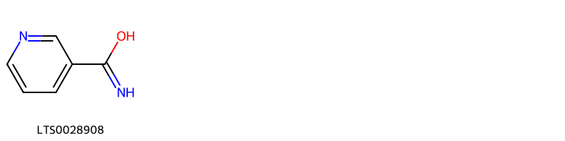{ width=100% }
    <figcaption>Hình ảnh cấu trúc hóa học của 1 hoạt chất thuộc nhóm Pyridines and derivatives gồm ['vitamin b>3< (LTS0028908)'].</figcaption>
</figure>
#### Nhóm Steroids and steroid derivatives
<figure markdown="span">
    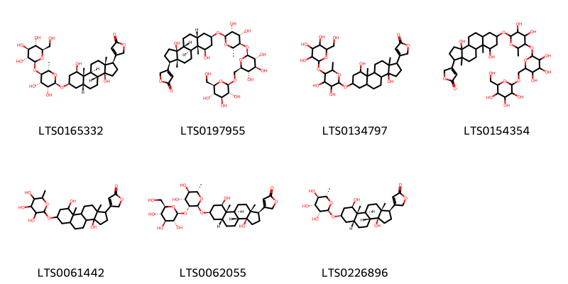{ width=100% }
    <figcaption>Hình ảnh cấu trúc hóa học của 7 hoạt chất thuộc nhóm Steroids and steroid derivatives gồm ['4-[(1r,3as,3br,5ar,7r,9r,9as,9bs,11ar)-7-{[(2r,3r,4s,5r,6s)-3,4-dihydroxy-6-methyl-5-{[(2s,3r,4s,5s,6r)-3,4,5-trihydroxy-6-(hydroxymethyl)oxan-2-yl]oxy}oxan-2-yl]oxy}-3a,9-dihydroxy-9a,11a-dimethyl-tetradecahydrocyclopenta[a]phenanthren-1-yl]-5h-furan-2-one (LTS0165332)', '4-[(1r,3as,3br,5ar,7r,9r,9as,9bs,11ar)-7-{[(2r,3r,4s,5r,6s)-3,4-dihydroxy-6-methyl-5-{[(2s,3r,4s,5s,6r)-3,4,5-trihydroxy-6-({[(2r,3r,4s,5s,6r)-3,4,5-trihydroxy-6-(hydroxymethyl)oxan-2-yl]oxy}methyl)oxan-2-yl]oxy}oxan-2-yl]oxy}-3a,9-dihydroxy-9a,11a-dimethyl-tetradecahydrocyclopenta[a]phenanthren-1-yl]-5h-furan-2-one (LTS0197955)', '4-{7-[(3,4-dihydroxy-6-methyl-5-{[3,4,5-trihydroxy-6-(hydroxymethyl)oxan-2-yl]oxy}oxan-2-yl)oxy]-3a,9-dihydroxy-9a,11a-dimethyl-tetradecahydrocyclopenta[a]phenanthren-1-yl}-5h-furan-2-one (LTS0134797)', '4-{7-[(3,4-dihydroxy-6-methyl-5-{[3,4,5-trihydroxy-6-({[3,4,5-trihydroxy-6-(hydroxymethyl)oxan-2-yl]oxy}methyl)oxan-2-yl]oxy}oxan-2-yl)oxy]-3a,9-dihydroxy-9a,11a-dimethyl-tetradecahydrocyclopenta[a]phenanthren-1-yl}-5h-furan-2-one (LTS0154354)', '4-{3a,9-dihydroxy-9a,11a-dimethyl-7-[(3,4,5-trihydroxy-6-methyloxan-2-yl)oxy]-tetradecahydrocyclopenta[a]phenanthren-1-yl}-5h-furan-2-one (LTS0061442)', '4-[(1r,3as,3br,5ar,7r,9r,9as,9bs,11ar)-7-{[(2r,3r,4r,5r,6s)-4,5-dihydroxy-6-methyl-3-{[(2s,3r,4s,5s,6r)-3,4,5-trihydroxy-6-(hydroxymethyl)oxan-2-yl]oxy}oxan-2-yl]oxy}-3a,9-dihydroxy-9a,11a-dimethyl-tetradecahydrocyclopenta[a]phenanthren-1-yl]-5h-furan-2-one (LTS0062055)', '4-[(1r,3as,3br,5ar,7r,9r,9as,9bs,11ar)-3a,9-dihydroxy-9a,11a-dimethyl-7-{[(2r,3r,4r,5r,6s)-3,4,5-trihydroxy-6-methyloxan-2-yl]oxy}-tetradecahydrocyclopenta[a]phenanthren-1-yl]-5h-furan-2-one (LTS0226896)'].</figcaption>
</figure>

---

### Dược dân tộc học

Danh sách các quốc gia có sử dụng *Euonymus alatus* trong điều trị các bệnh. 

| Country   | Disease                | Bệnh                                                                                                                                                                                                |
|:----------|:-----------------------|:----------------------------------------------------------------------------------------------------------------------------------------------------------------------------------------------------|
| China     | Analgesic, Purgative   | MYMEMORY WARNING: YOU USED ALL AVAILABLE FREE TRANSLATIONS FOR TODAY. NEXT AVAILABLE IN  16 HOURS 35 MINUTES 13 SECONDS VISIT HTTPS://MYMEMORY.TRANSLATED.NET/DOC/USAGELIMITS.PHP TO TRANSLATE MORE |
| Elsewhere | Vermifuge, Antitussive | MYMEMORY WARNING: YOU USED ALL AVAILABLE FREE TRANSLATIONS FOR TODAY. NEXT AVAILABLE IN  16 HOURS 35 MINUTES 11 SECONDS VISIT HTTPS://MYMEMORY.TRANSLATED.NET/DOC/USAGELIMITS.PHP TO TRANSLATE MORE |

---

---
## Euonymus americanus
### Thông tin về thực vật

!!! info "Phân loại thực vật của *Euonymus americanus* từ GIBF:"
    - **Kingdom:** Plantae
    - **Phylum:** Tracheophyta
    - **Order:** Celastrales
    - **Family:** Celastraceae
    - **Genus:** Euonymus
    - **Species:** *Euonymus americanus*

 

| Label (VI)   | Label (EN)   | Scientific Name     | Descriptions (VI)   | Descriptions (EN)   | Also Known As (VI)   | Also Known As (EN)                                                |
|:-------------|:-------------|:--------------------|:--------------------|:--------------------|:---------------------|:------------------------------------------------------------------|
| N/A          | N/A          | Euonymus americanus | loài thực vật       | species of plant    | ['']                 | ['bursting-heart', "hearts-bustin'-with-love", 'strawberry bush'] |

#### Phân bố trên thế giới

**Từ CSDL GIBF** nan, United States of America

#### Phân bố tại Việt Nam

**Từ CSDL GIBF**: Không có ghi nhận ở Việt Nam

---
### Thành phần hóa học
        
- Theo cơ sở dữ liệu lotus: Từ loài *Euonymus americanus* đã phân lập và xác định được 1 hoạt chất thuộc về các nhóm Pyridines and derivatives. 

|    | chemicalTaxonomyClassyfireClass   |   smiles_count |
|---:|:----------------------------------|---------------:|
|  0 | Pyridines and derivatives         |              1 |

#### Nhóm Pyridines and derivatives
<figure markdown="span">
    { width=100% }
    <figcaption>Hình ảnh cấu trúc hóa học của 1 hoạt chất thuộc nhóm Pyridines and derivatives gồm ['vitamin b>3< (LTS0028908)'].</figcaption>
</figure>

---

### Dược dân tộc học

Danh sách các quốc gia có sử dụng *Euonymus americanus* trong điều trị các bệnh. 

| Country   | Disease                    | Bệnh                                                                                                                                                                                                |
|:----------|:---------------------------|:----------------------------------------------------------------------------------------------------------------------------------------------------------------------------------------------------|
| Elsewhere | Cathartic, Irritant        | MYMEMORY WARNING: YOU USED ALL AVAILABLE FREE TRANSLATIONS FOR TODAY. NEXT AVAILABLE IN  16 HOURS 34 MINUTES 41 SECONDS VISIT HTTPS://MYMEMORY.TRANSLATED.NET/DOC/USAGELIMITS.PHP TO TRANSLATE MORE |
| US        | Laxative, Diuretic, Emetic | MYMEMORY WARNING: YOU USED ALL AVAILABLE FREE TRANSLATIONS FOR TODAY. NEXT AVAILABLE IN  16 HOURS 34 MINUTES 39 SECONDS VISIT HTTPS://MYMEMORY.TRANSLATED.NET/DOC/USAGELIMITS.PHP TO TRANSLATE MORE |

---

---
## Euonymus atropurpureus
### Thông tin về thực vật

!!! info "Phân loại thực vật của *Euonymus atropurpureus* từ GIBF:"
    - **Kingdom:** Plantae
    - **Phylum:** Tracheophyta
    - **Order:** Celastrales
    - **Family:** Celastraceae
    - **Genus:** Euonymus
    - **Species:** *Euonymus atropurpureus*

 

| Label (VI)   | Label (EN)   | Scientific Name        | Descriptions (VI)   | Descriptions (EN)   | Also Known As (VI)   | Also Known As (EN)   |
|:-------------|:-------------|:-----------------------|:--------------------|:--------------------|:---------------------|:---------------------|
| N/A          | N/A          | Euonymus atropurpureus | loài thực vật       | species of plant    | ['']                 | ['']                 |

#### Phân bố trên thế giới

**Từ CSDL GIBF** United States of America, Canada

#### Phân bố tại Việt Nam

**Từ CSDL GIBF**: Không có ghi nhận ở Việt Nam

---
### Thành phần hóa học
        
- Theo cơ sở dữ liệu lotus: Từ loài *Euonymus atropurpureus* đã phân lập và xác định được 3 hoạt chất thuộc về các nhóm Organooxygen compounds, Pyridines and derivatives. 

|    | chemicalTaxonomyClassyfireClass   |   smiles_count |
|---:|:----------------------------------|---------------:|
|  0 | Organooxygen compounds            |              2 |
|  1 | Pyridines and derivatives         |              1 |

#### Nhóm Organooxygen compounds
<figure markdown="span">
    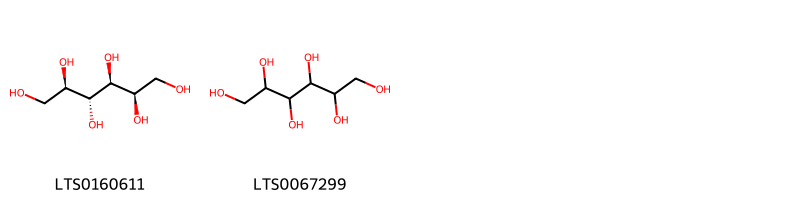{ width=100% }
    <figcaption>Hình ảnh cấu trúc hóa học của 2 hoạt chất thuộc nhóm Organooxygen compounds gồm ['d-altritol (LTS0160611)', 'sorbo (LTS0067299)'].</figcaption>
</figure>
#### Nhóm Pyridines and derivatives
<figure markdown="span">
    { width=100% }
    <figcaption>Hình ảnh cấu trúc hóa học của 1 hoạt chất thuộc nhóm Pyridines and derivatives gồm ['vitamin b>3< (LTS0028908)'].</figcaption>
</figure>

---

### Dược dân tộc học

Danh sách các quốc gia có sử dụng *Euonymus atropurpureus* trong điều trị các bệnh. 

| Country        | Disease                               | Bệnh                                                                                                                                                                                                |
|:---------------|:--------------------------------------|:----------------------------------------------------------------------------------------------------------------------------------------------------------------------------------------------------|
| Elsewhere      | Cathartic                             | MYMEMORY WARNING: YOU USED ALL AVAILABLE FREE TRANSLATIONS FOR TODAY. NEXT AVAILABLE IN  16 HOURS 34 MINUTES 17 SECONDS VISIT HTTPS://MYMEMORY.TRANSLATED.NET/DOC/USAGELIMITS.PHP TO TRANSLATE MORE |
| Europe         | Pediculicide                          | MYMEMORY WARNING: YOU USED ALL AVAILABLE FREE TRANSLATIONS FOR TODAY. NEXT AVAILABLE IN  16 HOURS 34 MINUTES 15 SECONDS VISIT HTTPS://MYMEMORY.TRANSLATED.NET/DOC/USAGELIMITS.PHP TO TRANSLATE MORE |
| India          | Cathartic                             | MYMEMORY WARNING: YOU USED ALL AVAILABLE FREE TRANSLATIONS FOR TODAY. NEXT AVAILABLE IN  16 HOURS 34 MINUTES 12 SECONDS VISIT HTTPS://MYMEMORY.TRANSLATED.NET/DOC/USAGELIMITS.PHP TO TRANSLATE MORE |
| US             | Laxative, Poultice, Stimulant, Poison | MYMEMORY WARNING: YOU USED ALL AVAILABLE FREE TRANSLATIONS FOR TODAY. NEXT AVAILABLE IN  16 HOURS 34 MINUTES 09 SECONDS VISIT HTTPS://MYMEMORY.TRANSLATED.NET/DOC/USAGELIMITS.PHP TO TRANSLATE MORE |
| US(Amerindian) | Collyrium                             | MYMEMORY WARNING: YOU USED ALL AVAILABLE FREE TRANSLATIONS FOR TODAY. NEXT AVAILABLE IN  16 HOURS 34 MINUTES 07 SECONDS VISIT HTTPS://MYMEMORY.TRANSLATED.NET/DOC/USAGELIMITS.PHP TO TRANSLATE MORE |
| US(Appalachia) | Cathartic                             | MYMEMORY WARNING: YOU USED ALL AVAILABLE FREE TRANSLATIONS FOR TODAY. NEXT AVAILABLE IN  16 HOURS 34 MINUTES 04 SECONDS VISIT HTTPS://MYMEMORY.TRANSLATED.NET/DOC/USAGELIMITS.PHP TO TRANSLATE MORE |

---

---
## Euonymus cochinchinensis
### Thông tin về thực vật

!!! info "Phân loại thực vật của *Euonymus cochinchinensis* từ GIBF:"
    - **Kingdom:** Plantae
    - **Phylum:** Tracheophyta
    - **Order:** Celastrales
    - **Family:** Celastraceae
    - **Genus:** Euonymus
    - **Species:** *Euonymus cochinchinensis*

 

| Label (VI)   | Label (EN)   | Scientific Name          | Descriptions (VI)   | Descriptions (EN)   | Also Known As (VI)                                           | Also Known As (EN)   |
|:-------------|:-------------|:-------------------------|:--------------------|:--------------------|:-------------------------------------------------------------|:---------------------|
| N/A          | N/A          | Euonymus cochinchinensis |                     | species of plant    | ['Po giang', 'Euonymus cochinchinensis', 'Chân danh nam bộ'] | ['']                 |

#### Phân bố trên thế giới

**Từ CSDL GIBF** nan, Viet Nam, Cambodia, Indonesia, Malaysia, Chinese Taipei, China, Philippines, Brunei Darussalam, Thailand, Lao People’s Democratic Republic

#### Phân bố tại Việt Nam

**Từ CSDL GIBF**: Không có ghi nhận ở Việt Nam

---
### Thành phần hóa học
        
- Theo cơ sở dữ liệu lotus: Từ loài *Euonymus cochinchinensis* đã phân lập và xác định được Chưa có hoạt chất nào được phân lập. hoạt chất thuộc về các nhóm Không có hoạt chất nào được phân lập. 

Không có hình ảnh nào được tạo ra

---

### Dược dân tộc học

Danh sách các quốc gia có sử dụng *Euonymus cochinchinensis* trong điều trị các bệnh. 

| Country   | Disease   | Bệnh                                                                                                                                                                                                |
|:----------|:----------|:----------------------------------------------------------------------------------------------------------------------------------------------------------------------------------------------------|
| Cambodia  | Apertif   | MYMEMORY WARNING: YOU USED ALL AVAILABLE FREE TRANSLATIONS FOR TODAY. NEXT AVAILABLE IN  16 HOURS 33 MINUTES 41 SECONDS VISIT HTTPS://MYMEMORY.TRANSLATED.NET/DOC/USAGELIMITS.PHP TO TRANSLATE MORE |

---

---
## Euonymus europaeus
### Thông tin về thực vật

!!! info "Phân loại thực vật của *Euonymus europaeus* từ GIBF:"
    - **Kingdom:** Plantae
    - **Phylum:** Tracheophyta
    - **Order:** Celastrales
    - **Family:** Celastraceae
    - **Genus:** Euonymus
    - **Species:** *Euonymus europaeus*

 

| Label (VI)   | Label (EN)   | Scientific Name    | Descriptions (VI)   | Descriptions (EN)   | Also Known As (VI)   | Also Known As (EN)                                                                                                                                                                                            |
|:-------------|:-------------|:-------------------|:--------------------|:--------------------|:---------------------|:--------------------------------------------------------------------------------------------------------------------------------------------------------------------------------------------------------------|
| N/A          | N/A          | Euonymus europaeus | loài thực vật       | species of plant    | ['']                 | ['spindle', 'spindletree', 'common spindle', 'common spindle tree', 'Euonymus europeaus', 'European spindle', 'European spindle tree', 'European spindletree', 'skewer wood', 'spindle tree', 'spindleberry'] |

#### Phân bố trên thế giới

**Từ CSDL GIBF** Sweden, New Zealand, Spain, Netherlands, Denmark, Poland, United States of America, Russian Federation, United Kingdom of Great Britain and Northern Ireland, Belgium, Luxembourg, Canada, Germany, Austria, Hungary, Latvia, Ukraine, Italy, Switzerland, France, Ireland

#### Phân bố tại Việt Nam

**Từ CSDL GIBF**: Không có ghi nhận ở Việt Nam

---
### Thành phần hóa học
        
- Theo cơ sở dữ liệu lotus: Từ loài *Euonymus europaeus* đã phân lập và xác định được 24 hoạt chất thuộc về các nhóm Carboxylic acids and derivatives, Steroids and steroid derivatives, Organooxygen compounds, Furans, Prenol lipids. 

|    | chemicalTaxonomyClassyfireClass   |   smiles_count |
|---:|:----------------------------------|---------------:|
|  0 |                                   |              4 |
|  1 | Carboxylic acids and derivatives  |              4 |
|  2 | Furans                            |              1 |
|  3 | Organooxygen compounds            |              3 |
|  4 | Prenol lipids                     |              8 |
|  5 | Steroids and steroid derivatives  |              4 |

#### Nhóm 
<figure markdown="span">
    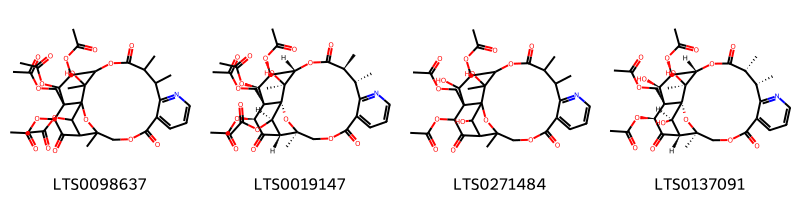{ width=100% }
    <figcaption>Hình ảnh cấu trúc hóa học của 4 hoạt chất thuộc nhóm  gồm ['evonine (LTS0098637)', '[(1s,3r,13s,14s,17s,18r,19r,20s,21s,23r,24r,25s)-18,19,21,24-tetrakis(acetyloxy)-25-hydroxy-3,13,14,25-tetramethyl-6,15,22-trioxo-2,5,16-trioxa-11-azapentacyclo[15.7.1.0¹,²⁰.0³,²³.0⁷,¹²]pentacosa-7,9,11-trien-20-yl]methyl acetate (LTS0019147)', '[18,21-bis(acetyloxy)-19,24,25-trihydroxy-3,13,14,25-tetramethyl-6,15,22-trioxo-2,5,16-trioxa-11-azapentacyclo[15.7.1.0¹,²⁰.0³,²³.0⁷,¹²]pentacosa-7,9,11-trien-20-yl]methyl acetate (LTS0271484)', '[(1s,3r,13s,14r,17s,18r,19r,20s,21s,23r,24r,25s)-18,21-bis(acetyloxy)-19,24,25-trihydroxy-3,13,14,25-tetramethyl-6,15,22-trioxo-2,5,16-trioxa-11-azapentacyclo[15.7.1.0¹,²⁰.0³,²³.0⁷,¹²]pentacosa-7,9,11-trien-20-yl]methyl acetate (LTS0137091)'].</figcaption>
</figure>
#### Nhóm Carboxylic acids and derivatives
<figure markdown="span">
    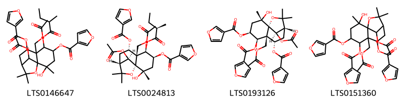{ width=100% }
    <figcaption>Hình ảnh cấu trúc hóa học của 4 hoạt chất thuộc nhóm Carboxylic acids and derivatives gồm ['12-(acetyloxy)-6-[(acetyloxy)methyl]-7-(furan-3-carbonyloxy)-2-hydroxy-2,10,10-trimethyl-5-[(2-methylbutanoyl)oxy]-11-oxatricyclo[7.2.1.0¹,⁶]dodecan-4-yl furan-3-carboxylate (LTS0146647)', '(1s,2s,4s,5r,6r,7s,9r,12r)-12-(acetyloxy)-6-[(acetyloxy)methyl]-7-(furan-3-carbonyloxy)-2-hydroxy-2,10,10-trimethyl-5-{[(2r)-2-methylbutanoyl]oxy}-11-oxatricyclo[7.2.1.0¹,⁶]dodecan-4-yl furan-3-carboxylate (LTS0024813)', '(1s,2s,4s,5r,6r,7s,9r,12r)-12-(acetyloxy)-6-[(acetyloxy)methyl]-4,5-bis(furan-3-carbonyloxy)-2-hydroxy-2,10,10-trimethyl-11-oxatricyclo[7.2.1.0¹,⁶]dodecan-7-yl furan-3-carboxylate (LTS0193126)', '12-(acetyloxy)-6-[(acetyloxy)methyl]-4,5-bis(furan-3-carbonyloxy)-2-hydroxy-2,10,10-trimethyl-11-oxatricyclo[7.2.1.0¹,⁶]dodecan-7-yl furan-3-carboxylate (LTS0151360)'].</figcaption>
</figure>
#### Nhóm Furans
<figure markdown="span">
    { width=100% }
    <figcaption>Hình ảnh cấu trúc hóa học của 1 hoạt chất thuộc nhóm Furans gồm ['3-furoic acid (LTS0105731)'].</figcaption>
</figure>
#### Nhóm Organooxygen compounds
<figure markdown="span">
    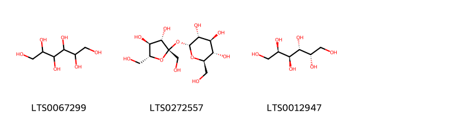{ width=100% }
    <figcaption>Hình ảnh cấu trúc hóa học của 3 hoạt chất thuộc nhóm Organooxygen compounds gồm ['sorbo (LTS0067299)', 'sucrose (LTS0272557)', 'galactitol (LTS0012947)'].</figcaption>
</figure>
#### Nhóm Prenol lipids
<figure markdown="span">
    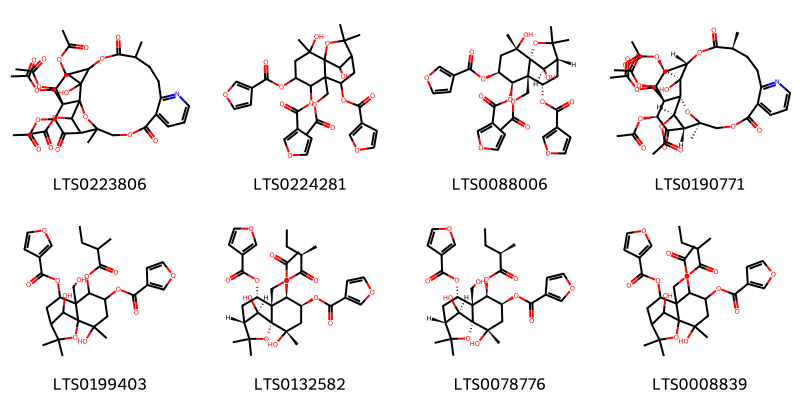{ width=100% }
    <figcaption>Hình ảnh cấu trúc hóa học của 8 hoạt chất thuộc nhóm Prenol lipids gồm ['[19,20,22,25-tetrakis(acetyloxy)-26-hydroxy-3,15,26-trimethyl-6,16,23-trioxo-2,5,17-trioxa-11-azapentacyclo[16.7.1.0¹,²¹.0³,²⁴.0⁷,¹²]hexacosa-7,9,11-trien-21-yl]methyl acetate (LTS0223806)', '6-[(acetyloxy)methyl]-4,5-bis(furan-3-carbonyloxy)-2,12-dihydroxy-2,10,10-trimethyl-11-oxatricyclo[7.2.1.0¹,⁶]dodecan-7-yl furan-3-carboxylate (LTS0224281)', '(1s,2s,4s,5r,6r,7s,9r,12r)-6-[(acetyloxy)methyl]-4,5-bis(furan-3-carbonyloxy)-2,12-dihydroxy-2,10,10-trimethyl-11-oxatricyclo[7.2.1.0¹,⁶]dodecan-7-yl furan-3-carboxylate (LTS0088006)', '[(1s,3r,15s,18s,19r,20r,21s,22s,24r,25r,26s)-19,20,22,25-tetrakis(acetyloxy)-26-hydroxy-3,15,26-trimethyl-6,16,23-trioxo-2,5,17-trioxa-11-azapentacyclo[16.7.1.0¹,²¹.0³,²⁴.0⁷,¹²]hexacosa-7,9,11-trien-21-yl]methyl acetate (LTS0190771)', '7-(furan-3-carbonyloxy)-2,12-dihydroxy-6-(hydroxymethyl)-2,10,10-trimethyl-5-[(2-methylbutanoyl)oxy]-11-oxatricyclo[7.2.1.0¹,⁶]dodecan-4-yl furan-3-carboxylate (LTS0199403)', '(1s,2s,4s,5r,6r,7s,9r,12r)-6-[(acetyloxy)methyl]-7-(furan-3-carbonyloxy)-2,12-dihydroxy-2,10,10-trimethyl-5-{[(2r)-2-methylbutanoyl]oxy}-11-oxatricyclo[7.2.1.0¹,⁶]dodecan-4-yl furan-3-carboxylate (LTS0132582)', '(1s,2s,4s,5r,6r,7s,9r,12r)-7-(furan-3-carbonyloxy)-2,12-dihydroxy-6-(hydroxymethyl)-2,10,10-trimethyl-5-{[(2r)-2-methylbutanoyl]oxy}-11-oxatricyclo[7.2.1.0¹,⁶]dodecan-4-yl furan-3-carboxylate (LTS0078776)', '6-[(acetyloxy)methyl]-7-(furan-3-carbonyloxy)-2,12-dihydroxy-2,10,10-trimethyl-5-[(2-methylbutanoyl)oxy]-11-oxatricyclo[7.2.1.0¹,⁶]dodecan-4-yl furan-3-carboxylate (LTS0008839)'].</figcaption>
</figure>
#### Nhóm Steroids and steroid derivatives
<figure markdown="span">
    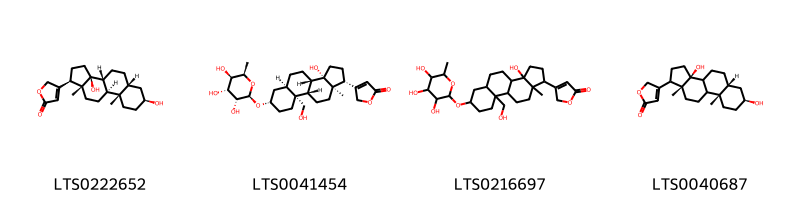{ width=100% }
    <figcaption>Hình ảnh cấu trúc hóa học của 4 hoạt chất thuộc nhóm Steroids and steroid derivatives gồm ['digitoxigenin (LTS0222652)', '4-[(1r,3as,3bs,5ar,7s,9ar,9bs,11ar)-3a-hydroxy-9a-(hydroxymethyl)-11a-methyl-7-{[(2r,3r,4r,5r,6r)-3,4,5-trihydroxy-6-methyloxan-2-yl]oxy}-tetradecahydrocyclopenta[a]phenanthren-1-yl]-5h-furan-2-one (LTS0041454)', '4-[3a-hydroxy-9a-(hydroxymethyl)-11a-methyl-7-[(3,4,5-trihydroxy-6-methyloxan-2-yl)oxy]-tetradecahydrocyclopenta[a]phenanthren-1-yl]-5h-furan-2-one (LTS0216697)', '4-[(3as,5ar,7s,9as,11ar)-3a,7-dihydroxy-9a,11a-dimethyl-tetradecahydrocyclopenta[a]phenanthren-1-yl]-5h-furan-2-one (LTS0040687)'].</figcaption>
</figure>

---

### Dược dân tộc học

Danh sách các quốc gia có sử dụng *Euonymus europaeus* trong điều trị các bệnh. 

| Country   | Disease                                                       | Bệnh                                                                                                                                                                                                |
|:----------|:--------------------------------------------------------------|:----------------------------------------------------------------------------------------------------------------------------------------------------------------------------------------------------|
| Elsewhere | Soap                                                          | MYMEMORY WARNING: YOU USED ALL AVAILABLE FREE TRANSLATIONS FOR TODAY. NEXT AVAILABLE IN  16 HOURS 33 MINUTES 20 SECONDS VISIT HTTPS://MYMEMORY.TRANSLATED.NET/DOC/USAGELIMITS.PHP TO TRANSLATE MORE |
| Europe    | Poison                                                        | MYMEMORY WARNING: YOU USED ALL AVAILABLE FREE TRANSLATIONS FOR TODAY. NEXT AVAILABLE IN  16 HOURS 33 MINUTES 18 SECONDS VISIT HTTPS://MYMEMORY.TRANSLATED.NET/DOC/USAGELIMITS.PHP TO TRANSLATE MORE |
| Turkey    | Diuretic, Emetic, Parasiticide, Stimulant, Cholagogue, Poison | MYMEMORY WARNING: YOU USED ALL AVAILABLE FREE TRANSLATIONS FOR TODAY. NEXT AVAILABLE IN  16 HOURS 33 MINUTES 15 SECONDS VISIT HTTPS://MYMEMORY.TRANSLATED.NET/DOC/USAGELIMITS.PHP TO TRANSLATE MORE |
| ain       | Cardiotonic                                                   | MYMEMORY WARNING: YOU USED ALL AVAILABLE FREE TRANSLATIONS FOR TODAY. NEXT AVAILABLE IN  16 HOURS 33 MINUTES 12 SECONDS VISIT HTTPS://MYMEMORY.TRANSLATED.NET/DOC/USAGELIMITS.PHP TO TRANSLATE MORE |

---

---
## Euonymus japonicus
### Thông tin về thực vật

!!! info "Phân loại thực vật của *Euonymus japonicus* từ GIBF:"
    - **Kingdom:** Plantae
    - **Phylum:** Tracheophyta
    - **Order:** Celastrales
    - **Family:** Celastraceae
    - **Genus:** Euonymus
    - **Species:** *Euonymus japonicus*

 

| Label (VI)   | Label (EN)   | Scientific Name    | Descriptions (VI)   | Descriptions (EN)   | Also Known As (VI)   | Also Known As (EN)   |
|:-------------|:-------------|:-------------------|:--------------------|:--------------------|:---------------------|:---------------------|
| N/A          | N/A          | Euonymus japonicus | loài thực vật       | species of plant    | ['']                 | ['']                 |

#### Phân bố trên thế giới

**Từ CSDL GIBF** Brazil, Japan, Sweden, China, Chile, New Zealand, Slovenia, Thailand, Spain, Netherlands, Poland, United States of America, Korea, Republic of, Jersey, Azerbaijan, France, Belgium, Chinese Taipei, Serbia, Georgia, Germany, Hungary, Portugal, Italy, Switzerland, United Kingdom of Great Britain and Northern Ireland, Ireland

#### Phân bố tại Việt Nam

**Từ CSDL GIBF**: Không có ghi nhận ở Việt Nam

---
### Thành phần hóa học
        
- Theo cơ sở dữ liệu lotus: Từ loài *Euonymus japonicus* đã phân lập và xác định được 64 hoạt chất thuộc về các nhóm Organic phosphoric acids and derivatives, Phenanthrenes and derivatives, Carboxylic acids and derivatives, Steroids and steroid derivatives, Prenol lipids, Glycerophospholipids. 

|    | chemicalTaxonomyClassyfireClass          |   smiles_count |
|---:|:-----------------------------------------|---------------:|
|  0 |                                          |             19 |
|  1 | Carboxylic acids and derivatives         |             10 |
|  2 | Glycerophospholipids                     |              2 |
|  3 | Organic phosphoric acids and derivatives |              1 |
|  4 | Phenanthrenes and derivatives            |              2 |
|  5 | Prenol lipids                            |             19 |
|  6 | Steroids and steroid derivatives         |             10 |

#### Nhóm 
<figure markdown="span">
    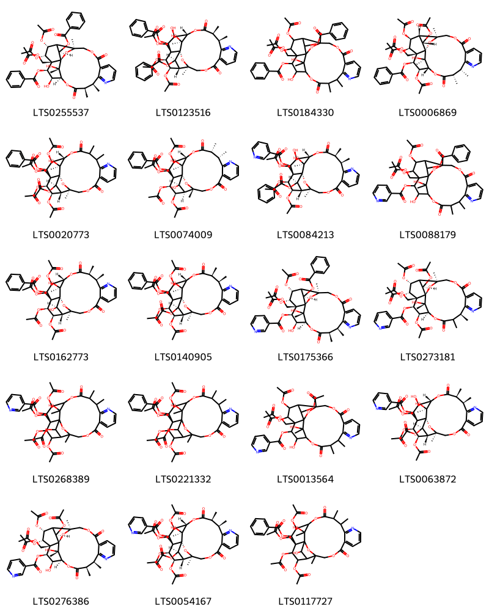{ width=100% }
    <figcaption>Hình ảnh cấu trúc hóa học của 19 hoạt chất thuộc nhóm  gồm ['(1s,3s,13s,14r,17s,18s,19s,20r,21s,22r,24r,25s)-21,22-bis(acetyloxy)-20-[(acetyloxy)methyl]-24-(benzoyloxy)-18,25-dihydroxy-3,13,14,25-tetramethyl-6,15-dioxo-2,5,16-trioxa-11-azapentacyclo[15.7.1.0¹,²⁰.0³,²³.0⁷,¹²]pentacosa-7,9,11-trien-19-yl benzoate (LTS0255537)', '(1s,3r,13r,14s,17s,18r,19r,20s,21s,22r,23r,24r,25s)-21,22-bis(acetyloxy)-20-[(acetyloxy)methyl]-19-(benzoyloxy)-18,25-dihydroxy-3,13,14,25-tetramethyl-6,15-dioxo-2,5,16-trioxa-11-azapentacyclo[15.7.1.0¹,²⁰.0³,²³.0⁷,¹²]pentacosa-7,9,11-trien-24-yl benzoate (LTS0123516)', '21,22-bis(acetyloxy)-20-[(acetyloxy)methyl]-24-(benzoyloxy)-18,25-dihydroxy-3,13,14,25-tetramethyl-6,15-dioxo-2,5,16-trioxa-11-azapentacyclo[15.7.1.0¹,²⁰.0³,²³.0⁷,¹²]pentacosa-7,9,11-trien-19-yl benzoate (LTS0184330)', '(1r,3s,13r,14s,17r,18s,19s,20s,21r,22s,23s,24s,25r)-18,21,22,24-tetrakis(acetyloxy)-20-[(acetyloxy)methyl]-25-hydroxy-3,13,14,25-tetramethyl-6,15-dioxo-2,5,16-trioxa-11-azapentacyclo[15.7.1.0¹,²⁰.0³,²³.0⁷,¹²]pentacosa-7,9,11-trien-19-yl benzoate (LTS0006869)', 'mayteine (LTS0020773)', '(1s,3s,13s,14r,17s,19r,20r,21s,22r,23r,24r,25s)-18,21,22-tris(acetyloxy)-20-[(acetyloxy)methyl]-24,25-dihydroxy-3,13,14,25-tetramethyl-6,15-dioxo-2,5,16-trioxa-11-azapentacyclo[15.7.1.0¹,²⁰.0³,²³.0⁷,¹²]pentacosa-7,9,11-trien-19-yl benzoate (LTS0074009)', '(1s,3r,13r,14s,17s,18r,19r,20s,21s,22r,23r,24r,25s)-21,22-bis(acetyloxy)-20-[(acetyloxy)methyl]-24-(benzoyloxy)-18,25-dihydroxy-3,13,14,25-tetramethyl-6,15-dioxo-2,5,16-trioxa-11-azapentacyclo[15.7.1.0¹,²⁰.0³,²³.0⁷,¹²]pentacosa-7,9,11-trien-19-yl pyridine-3-carboxylate (LTS0084213)', '21,22-bis(acetyloxy)-20-[(acetyloxy)methyl]-24-(benzoyloxy)-18,25-dihydroxy-3,13,14,25-tetramethyl-6,15-dioxo-2,5,16-trioxa-11-azapentacyclo[15.7.1.0¹,²⁰.0³,²³.0⁷,¹²]pentacosa-7,9,11-trien-19-yl pyridine-3-carboxylate (LTS0088179)', '(1s,3r,13r,14s,17s,18r,19r,20r,21s,22r,23s,24r,25s)-18,21,22-tris(acetyloxy)-20-[(acetyloxy)methyl]-24,25-dihydroxy-3,13,14,25-tetramethyl-6,15-dioxo-2,5,16-trioxa-11-azapentacyclo[15.7.1.0¹,²⁰.0³,²³.0⁷,¹²]pentacosa-7,9,11-trien-19-yl benzoate (LTS0162773)', '(1s,3r,13r,14s,17s,18r,19r,20r,21s,22r,23r,24r,25s)-18,21,22,24-tetrakis(acetyloxy)-20-[(acetyloxy)methyl]-25-hydroxy-3,13,14,25-tetramethyl-6,15-dioxo-2,5,16-trioxa-11-azapentacyclo[15.7.1.0¹,²⁰.0³,²³.0⁷,¹²]pentacosa-7,9,11-trien-19-yl benzoate (LTS0140905)', '(1s,3s,13s,14r,17s,18s,19s,20r,21s,22r,24r,25s)-21,22-bis(acetyloxy)-20-[(acetyloxy)methyl]-24-(benzoyloxy)-18,25-dihydroxy-3,13,14,25-tetramethyl-6,15-dioxo-2,5,16-trioxa-11-azapentacyclo[15.7.1.0¹,²⁰.0³,²³.0⁷,¹²]pentacosa-7,9,11-trien-19-yl pyridine-3-carboxylate (LTS0175366)', '(1s,3s,13s,17s,18s,19s,20s,21s,22r,24r,25s)-18,21,22,24-tetrakis(acetyloxy)-20-[(acetyloxy)methyl]-25-hydroxy-3,13,14,25-tetramethyl-6,15-dioxo-2,5,16-trioxa-11-azapentacyclo[15.7.1.0¹,²⁰.0³,²³.0⁷,¹²]pentacosa-7,9,11-trien-19-yl pyridine-3-carboxylate (LTS0273181)', '18,21,22,24-tetrakis(acetyloxy)-20-[(acetyloxy)methyl]-25-hydroxy-3,13,14,25-tetramethyl-6,15-dioxo-2,5,16-trioxa-11-azapentacyclo[15.7.1.0¹,²⁰.0³,²³.0⁷,¹²]pentacosa-7,9,11-trien-19-yl pyridine-3-carboxylate (LTS0268389)', '18,21,22,24-tetrakis(acetyloxy)-20-[(acetyloxy)methyl]-25-hydroxy-3,13,14,25-tetramethyl-6,15-dioxo-2,5,16-trioxa-11-azapentacyclo[15.7.1.0¹,²⁰.0³,²³.0⁷,¹²]pentacosa-7,9,11-trien-19-yl benzoate (LTS0221332)', '21,22,24-tris(acetyloxy)-20-[(acetyloxy)methyl]-18,25-dihydroxy-3,13,14,25-tetramethyl-6,15-dioxo-2,5,16-trioxa-11-azapentacyclo[15.7.1.0¹,²⁰.0³,²³.0⁷,¹²]pentacosa-7,9,11-trien-19-yl pyridine-3-carboxylate (LTS0013564)', '(1s,3r,13r,14s,17s,18r,19r,20s,21s,22r,23r,24r,25s)-21,22,24-tris(acetyloxy)-20-[(acetyloxy)methyl]-18,25-dihydroxy-3,13,14,25-tetramethyl-6,15-dioxo-2,5,16-trioxa-11-azapentacyclo[15.7.1.0¹,²⁰.0³,²³.0⁷,¹²]pentacosa-7,9,11-trien-19-yl pyridine-3-carboxylate (LTS0063872)', '(1s,3s,13s,14r,17s,18s,19s,20r,21s,22r,24r,25s)-21,22,24-tris(acetyloxy)-20-[(acetyloxy)methyl]-18,25-dihydroxy-3,13,14,25-tetramethyl-6,15-dioxo-2,5,16-trioxa-11-azapentacyclo[15.7.1.0¹,²⁰.0³,²³.0⁷,¹²]pentacosa-7,9,11-trien-19-yl pyridine-3-carboxylate (LTS0276386)', '(1s,3r,13r,14s,17s,18r,19r,20r,21s,22r,23r,24r,25s)-18,21,22,24-tetrakis(acetyloxy)-20-[(acetyloxy)methyl]-25-hydroxy-3,13,14,25-tetramethyl-6,15-dioxo-2,5,16-trioxa-11-azapentacyclo[15.7.1.0¹,²⁰.0³,²³.0⁷,¹²]pentacosa-7,9,11-trien-19-yl pyridine-3-carboxylate (LTS0054167)', '18,21,22-tris(acetyloxy)-20-[(acetyloxy)methyl]-24,25-dihydroxy-3,13,14,25-tetramethyl-6,15-dioxo-2,5,16-trioxa-11-azapentacyclo[15.7.1.0¹,²⁰.0³,²³.0⁷,¹²]pentacosa-7,9,11-trien-19-yl benzoate (LTS0117727)'].</figcaption>
</figure>
#### Nhóm Carboxylic acids and derivatives
<figure markdown="span">
    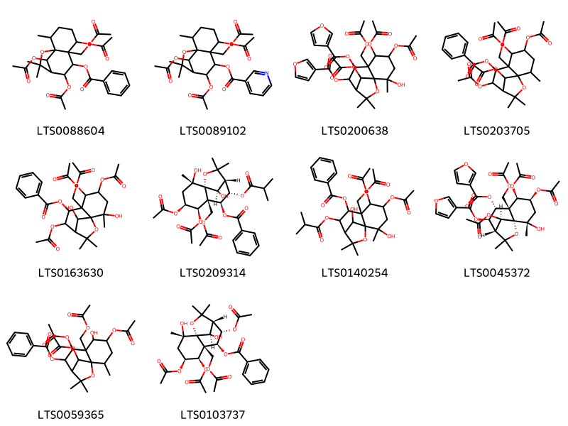{ width=100% }
    <figcaption>Hình ảnh cấu trúc hóa học của 10 hoạt chất thuộc nhóm Carboxylic acids and derivatives gồm ['5,8,12-tris(acetyloxy)-6-[(acetyloxy)methyl]-2,10,10-trimethyl-11-oxatricyclo[7.2.1.0¹,⁶]dodecan-7-yl benzoate (LTS0088604)', '5,8,12-tris(acetyloxy)-6-[(acetyloxy)methyl]-2,10,10-trimethyl-11-oxatricyclo[7.2.1.0¹,⁶]dodecan-7-yl pyridine-3-carboxylate (LTS0089102)', '4,5,12-tris(acetyloxy)-6-[(acetyloxy)methyl]-7-(furan-3-carbonyloxy)-2-hydroxy-2,10,10-trimethyl-11-oxatricyclo[7.2.1.0¹,⁶]dodecan-8-yl furan-3-carboxylate (LTS0200638)', '4,5,8,12-tetrakis(acetyloxy)-6-[(acetyloxy)methyl]-2,10,10-trimethyl-11-oxatricyclo[7.2.1.0¹,⁶]dodecan-7-yl benzoate (LTS0203705)', '4,5,8-tris(acetyloxy)-6-[(acetyloxy)methyl]-2,12-dihydroxy-2,10,10-trimethyl-11-oxatricyclo[7.2.1.0¹,⁶]dodecan-7-yl benzoate (LTS0163630)', '(1s,2s,4s,5r,6s,7s,8s,9s,12r)-4,5-bis(acetyloxy)-6-[(acetyloxy)methyl]-2,12-dihydroxy-2,10,10-trimethyl-8-[(2-methylpropanoyl)oxy]-11-oxatricyclo[7.2.1.0¹,⁶]dodecan-7-yl benzoate (LTS0209314)', '4,5-bis(acetyloxy)-6-[(acetyloxy)methyl]-2,12-dihydroxy-2,10,10-trimethyl-8-[(2-methylpropanoyl)oxy]-11-oxatricyclo[7.2.1.0¹,⁶]dodecan-7-yl benzoate (LTS0140254)', '(1s,2s,4s,5r,6s,7r,8r,9r,12r)-4,5,12-tris(acetyloxy)-6-[(acetyloxy)methyl]-7-(furan-3-carbonyloxy)-2-hydroxy-2,10,10-trimethyl-11-oxatricyclo[7.2.1.0¹,⁶]dodecan-8-yl furan-3-carboxylate (LTS0045372)', '4,7,12-tris(acetyloxy)-6-[(acetyloxy)methyl]-5-hydroxy-2,10,10-trimethyl-11-oxatricyclo[7.2.1.0¹,⁶]dodecan-8-yl benzoate (LTS0059365)', '(1s,2s,4s,5r,6s,7s,8s,9s,12r)-4,5,8-tris(acetyloxy)-6-[(acetyloxy)methyl]-2,12-dihydroxy-2,10,10-trimethyl-11-oxatricyclo[7.2.1.0¹,⁶]dodecan-7-yl benzoate (LTS0103737)'].</figcaption>
</figure>
#### Nhóm Glycerophospholipids
<figure markdown="span">
    { width=100% }
    <figcaption>Hình ảnh cấu trúc hóa học của 2 hoạt chất thuộc nhóm Glycerophospholipids gồm ['(2r)-2-(pentadecanoyloxy)-3-(tridecanoyloxy)propoxyphosphonic acid (LTS0060583)', 'dipalmitoyl (LTS0190394)'].</figcaption>
</figure>
#### Nhóm Organic phosphoric acids and derivatives
<figure markdown="span">
    { width=100% }
    <figcaption>Hình ảnh cấu trúc hóa học của 1 hoạt chất thuộc nhóm Organic phosphoric acids and derivatives gồm ['o-phosphoethanolamine; bis(nonane) (LTS0249963)'].</figcaption>
</figure>
#### Nhóm Phenanthrenes and derivatives
<figure markdown="span">
    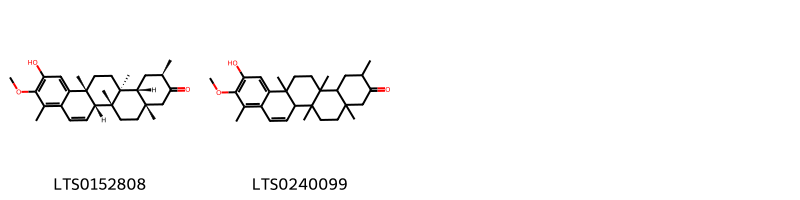{ width=100% }
    <figcaption>Hình ảnh cấu trúc hóa học của 2 hoạt chất thuộc nhóm Phenanthrenes and derivatives gồm ['(2r,4as,6ar,6bs,12br,14as,14br)-11-hydroxy-10-methoxy-2,4a,6a,9,12b,14a-hexamethyl-2,4,5,6,6b,13,14,14b-octahydro-1h-picen-3-one (LTS0152808)', '11-hydroxy-10-methoxy-2,4a,6a,9,12b,14a-hexamethyl-2,4,5,6,6b,13,14,14b-octahydro-1h-picen-3-one (LTS0240099)'].</figcaption>
</figure>
#### Nhóm Prenol lipids
<figure markdown="span">
    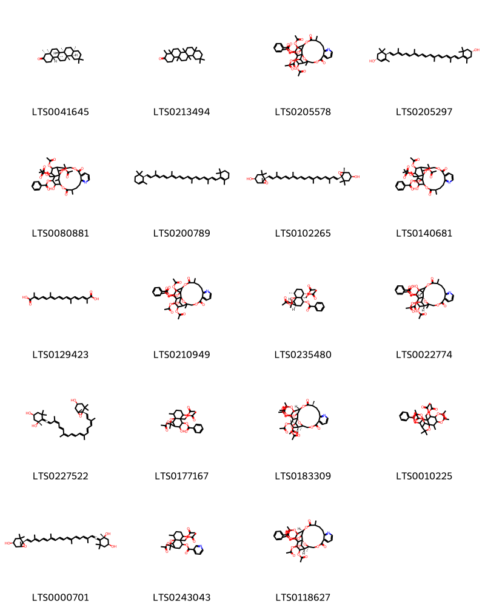{ width=100% }
    <figcaption>Hình ảnh cấu trúc hóa học của 19 hoạt chất thuộc nhóm Prenol lipids gồm ['(-)-friedelin (LTS0041645)', 'friedelin (LTS0213494)', '19,22,23,25-tetrakis(acetyloxy)-21-[(acetyloxy)methyl]-26-hydroxy-3,15,26-trimethyl-6,16-dioxo-2,5,17-trioxa-11-azapentacyclo[16.7.1.0¹,²¹.0³,²⁴.0⁷,¹²]hexacosa-7,9,11-trien-20-yl benzoate (LTS0205578)', 'carotenoid (LTS0205297)', '22,23,25-tris(acetyloxy)-21-[(acetyloxy)methyl]-19-hydroxy-3,15,26-trimethyl-6,16-dioxo-2,5,17-trioxa-11-azapentacyclo[16.7.1.0¹,²¹.0³,²⁴.0⁷,¹²]hexacosa-7,9,11-trien-20-yl benzoate (LTS0080881)', '(+)-α-carotene (LTS0200789)', 'violaxanthin (LTS0102265)', '22,23,25-tris(acetyloxy)-21-[(acetyloxy)methyl]-19,26-dihydroxy-3,15,26-trimethyl-6,16-dioxo-2,5,17-trioxa-11-azapentacyclo[16.7.1.0¹,²¹.0³,²⁴.0⁷,¹²]hexacosa-7,9,11-trien-20-yl benzoate (LTS0140681)', 'crocetin (LTS0129423)', '19,22,23-tris(acetyloxy)-21-[(acetyloxy)methyl]-25,26-dihydroxy-3,15,26-trimethyl-6,16-dioxo-2,5,17-trioxa-11-azapentacyclo[16.7.1.0¹,²¹.0³,²⁴.0⁷,¹²]hexacosa-7,9,11-trien-20-yl benzoate (LTS0210949)', 'ejap-2 (LTS0235480)', '(1s,19s,20r,21s,22s,23r,24r,26r)-22,23,25-tris(acetyloxy)-21-[(acetyloxy)methyl]-19-hydroxy-3,15,26-trimethyl-6,16-dioxo-2,5,17-trioxa-11-azapentacyclo[16.7.1.0¹,²¹.0³,²⁴.0⁷,¹²]hexacosa-7,9,11-trien-20-yl benzoate (LTS0022774)', 'neoxanthin (LTS0227522)', '5,12-bis(acetyloxy)-6-[(acetyloxy)methyl]-8-hydroxy-2,10,10-trimethyl-11-oxatricyclo[7.2.1.0¹,⁶]dodecan-7-yl benzoate (LTS0177167)', 'wilformine (LTS0183309)', '3,4,5,7,12-pentakis(acetyloxy)-6-[(acetyloxy)methyl]-2,10,10-trimethyl-11-oxatricyclo[7.2.1.0¹,⁶]dodecan-8-yl benzoate (LTS0010225)', 'neoxanthin (LTS0000701)', '5,12-bis(acetyloxy)-6-[(acetyloxy)methyl]-2,10,10-trimethyl-11-oxatricyclo[7.2.1.0¹,⁶]dodecan-7-yl pyridine-3-carboxylate (LTS0243043)', '(1s,3r,18r,21r,24s,26s)-19,22,23-tris(acetyloxy)-21-[(acetyloxy)methyl]-25,26-dihydroxy-3,15,26-trimethyl-6,16-dioxo-2,5,17-trioxa-11-azapentacyclo[16.7.1.0¹,²¹.0³,²⁴.0⁷,¹²]hexacosa-7,9,11-trien-20-yl benzoate (LTS0118627)'].</figcaption>
</figure>
#### Nhóm Steroids and steroid derivatives
<figure markdown="span">
    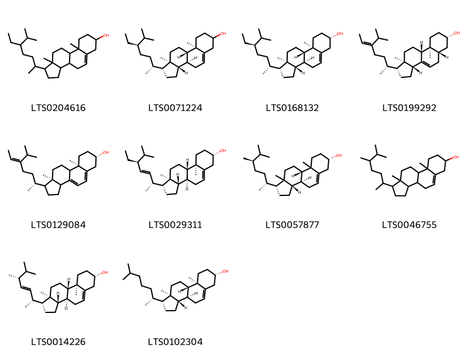{ width=100% }
    <figcaption>Hình ảnh cấu trúc hóa học của 10 hoạt chất thuộc nhóm Steroids and steroid derivatives gồm ['stigmast-5-en-3-ol, (3β)- (LTS0204616)', 'stigmast-5-en-3-ol (LTS0071224)', 'sitosterol (LTS0168132)', 'delta7-avenasterol (LTS0199292)', '5-dehydroavenasterol (LTS0129084)', 'phytosterol (LTS0029311)', '(1r,3as,3bs,7s,9bs)-1-[(2r,5r)-5,6-dimethylheptan-2-yl]-9a,11a-dimethyl-1h,2h,3h,3ah,3bh,4h,6h,7h,8h,9h,9bh,10h,11h-cyclopenta[a]phenanthren-7-ol (LTS0057877)', 'campesterol (LTS0046755)', 'brassicasterol (LTS0014226)', 'cholesterol (LTS0102304)'].</figcaption>
</figure>

---

### Dược dân tộc học

Danh sách các quốc gia có sử dụng *Euonymus japonicus* trong điều trị các bệnh. 

| Country   | Disease         | Bệnh                                                                                                                                                                                                |
|:----------|:----------------|:----------------------------------------------------------------------------------------------------------------------------------------------------------------------------------------------------|
| China     | Diuretic, Tonic | MYMEMORY WARNING: YOU USED ALL AVAILABLE FREE TRANSLATIONS FOR TODAY. NEXT AVAILABLE IN  16 HOURS 32 MINUTES 49 SECONDS VISIT HTTPS://MYMEMORY.TRANSLATED.NET/DOC/USAGELIMITS.PHP TO TRANSLATE MORE |

---

---
## Euonymus sieboldianus
### Thông tin về thực vật

!!! info "Phân loại thực vật của *Euonymus hamiltonianus* từ GIBF:"
    - **Kingdom:** Plantae
    - **Phylum:** Tracheophyta
    - **Order:** Celastrales
    - **Family:** Celastraceae
    - **Genus:** Euonymus
    - **Species:** *Euonymus hamiltonianus*

 

| Label (VI)   | Label (EN)   | Scientific Name       | Descriptions (VI)   | Descriptions (EN)   | Also Known As (VI)   | Also Known As (EN)   |
|:-------------|:-------------|:----------------------|:--------------------|:--------------------|:---------------------|:---------------------|
| N/A          | N/A          | Euonymus sieboldianus | loài thực vật       | species of plant    | ['']                 | ['']                 |

#### Phân bố trên thế giới

**Từ CSDL GIBF** nan, Latvia, Japan, Korea, Republic of

#### Phân bố tại Việt Nam

**Từ CSDL GIBF**: Không có ghi nhận ở Việt Nam

---
### Thành phần hóa học
        
- Theo cơ sở dữ liệu lotus: Từ loài *Euonymus hamiltonianus* đã phân lập và xác định được Chưa có hoạt chất nào được phân lập. hoạt chất thuộc về các nhóm Không có hoạt chất nào được phân lập. 

Không có hình ảnh nào được tạo ra

---

### Dược dân tộc học

Danh sách các quốc gia có sử dụng *Euonymus hamiltonianus* trong điều trị các bệnh. 

| Country   | Disease                | Bệnh                                                                                                                                                                                                |
|:----------|:-----------------------|:----------------------------------------------------------------------------------------------------------------------------------------------------------------------------------------------------|
| Elsewhere | Antitussive, Vermifuge | MYMEMORY WARNING: YOU USED ALL AVAILABLE FREE TRANSLATIONS FOR TODAY. NEXT AVAILABLE IN  16 HOURS 32 MINUTES 20 SECONDS VISIT HTTPS://MYMEMORY.TRANSLATED.NET/DOC/USAGELIMITS.PHP TO TRANSLATE MORE |

---

---
## Euonymus thunbergianus
### Thông tin về thực vật

!!! info "Phân loại thực vật của *Euonymus alatus* từ GIBF:"
    - **Kingdom:** Plantae
    - **Phylum:** Tracheophyta
    - **Order:** Celastrales
    - **Family:** Celastraceae
    - **Genus:** Euonymus
    - **Species:** *Euonymus alatus*

 

| Label (VI)   | Label (EN)   | Scientific Name        | Descriptions (VI)   | Descriptions (EN)   | Also Known As (VI)   | Also Known As (EN)   |
|:-------------|:-------------|:-----------------------|:--------------------|:--------------------|:---------------------|:---------------------|
| N/A          | N/A          | Euonymus thunbergianus |                     | species of plant    | ['']                 | ['']                 |

#### Phân bố trên thế giới

**Từ CSDL GIBF** nan, Hong Kong, Japan, Belgium, Indonesia, China, unknown or invalid

#### Phân bố tại Việt Nam

**Từ CSDL GIBF**: Không có ghi nhận ở Việt Nam

---
### Thành phần hóa học
        
- Theo cơ sở dữ liệu lotus: Từ loài *Euonymus alatus* đã phân lập và xác định được Chưa có hoạt chất nào được phân lập. hoạt chất thuộc về các nhóm Không có hoạt chất nào được phân lập. 

Không có hình ảnh nào được tạo ra

---

### Dược dân tộc học

Danh sách các quốc gia có sử dụng *Euonymus alatus* trong điều trị các bệnh. 

| Country   | Disease               | Bệnh                                                                                                                                                                                                |
|:----------|:----------------------|:----------------------------------------------------------------------------------------------------------------------------------------------------------------------------------------------------|
| China     | Astringent, Vermifuge | MYMEMORY WARNING: YOU USED ALL AVAILABLE FREE TRANSLATIONS FOR TODAY. NEXT AVAILABLE IN  16 HOURS 32 MINUTES 01 SECONDS VISIT HTTPS://MYMEMORY.TRANSLATED.NET/DOC/USAGELIMITS.PHP TO TRANSLATE MORE |

---

---
## Euonymus tingens
### Thông tin về thực vật

!!! info "Phân loại thực vật của *Euonymus tingens* từ GIBF:"
    - **Kingdom:** Plantae
    - **Phylum:** Tracheophyta
    - **Order:** Celastrales
    - **Family:** Celastraceae
    - **Genus:** Euonymus
    - **Species:** *Euonymus tingens*

 

| Label (VI)   | Label (EN)   | Scientific Name   | Descriptions (VI)   | Descriptions (EN)   | Also Known As (VI)   | Also Known As (EN)   |
|:-------------|:-------------|:------------------|:--------------------|:--------------------|:---------------------|:---------------------|
| N/A          | N/A          | Euonymus tingens  | loài thực vật       | species of plant    | ['']                 | ['']                 |

#### Phân bố trên thế giới

**Từ CSDL GIBF** nan, Bhutan, Nepal, China, Myanmar, New Zealand, India

#### Phân bố tại Việt Nam

**Từ CSDL GIBF**: Không có ghi nhận ở Việt Nam

---
### Thành phần hóa học
        
- Theo cơ sở dữ liệu lotus: Từ loài *Euonymus tingens* đã phân lập và xác định được 2 hoạt chất thuộc về các nhóm Organooxygen compounds. 

|    | chemicalTaxonomyClassyfireClass   |   smiles_count |
|---:|:----------------------------------|---------------:|
|  0 | Organooxygen compounds            |              2 |

#### Nhóm Organooxygen compounds
<figure markdown="span">
    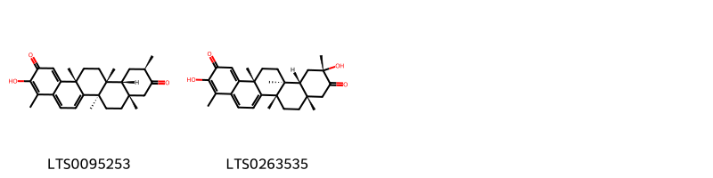{ width=100% }
    <figcaption>Hình ảnh cấu trúc hóa học của 2 hoạt chất thuộc nhóm Organooxygen compounds gồm ['tingenone (LTS0095253)', '(6bs,8as,11s,12ar,12bs,14ar)-3,11-dihydroxy-4,6b,8a,11,12b,14a-hexamethyl-8,9,12,12a,13,14-hexahydro-7h-picene-2,10-dione (LTS0263535)'].</figcaption>
</figure>

---

### Dược dân tộc học

Danh sách các quốc gia có sử dụng *Euonymus tingens* trong điều trị các bệnh. 

| Country   | Disease   | Bệnh                                                                                                                                                                                                |
|:----------|:----------|:----------------------------------------------------------------------------------------------------------------------------------------------------------------------------------------------------|
| Elsewhere | Purgative | MYMEMORY WARNING: YOU USED ALL AVAILABLE FREE TRANSLATIONS FOR TODAY. NEXT AVAILABLE IN  16 HOURS 31 MINUTES 44 SECONDS VISIT HTTPS://MYMEMORY.TRANSLATED.NET/DOC/USAGELIMITS.PHP TO TRANSLATE MORE |

---

# Chi Hippocratea

??? note "Danh sách các dược liệu thuộc chi"
    
	 - *Hippocratea acapulcensis*
	 - *Hippocratea celastroides*
	 - *Hippocratea indica*

---
## Hippocratea acapulcensis
### Thông tin về thực vật

!!! info "Phân loại thực vật của *Pristimera celastroides* từ GIBF:"
    - **Kingdom:** Plantae
    - **Phylum:** Tracheophyta
    - **Order:** Celastrales
    - **Family:** Celastraceae
    - **Genus:** Pristimera
    - **Species:** *Pristimera celastroides*

 

| Label (VI)   | Label (EN)   | Scientific Name          | Descriptions (VI)   | Descriptions (EN)   | Also Known As (VI)   | Also Known As (EN)   |
|:-------------|:-------------|:-------------------------|:--------------------|:--------------------|:---------------------|:---------------------|
| N/A          | N/A          | Hippocratea acapulcensis | loài thực vật       | species of plant    | ['']                 | ['']                 |

#### Phân bố trên thế giới

**Từ CSDL GIBF** nan, Mexico, Madagascar

#### Phân bố tại Việt Nam

**Từ CSDL GIBF**: Không có ghi nhận ở Việt Nam

---
### Thành phần hóa học
        
- Theo cơ sở dữ liệu lotus: Từ loài *Pristimera celastroides* đã phân lập và xác định được Chưa có hoạt chất nào được phân lập. hoạt chất thuộc về các nhóm Không có hoạt chất nào được phân lập. 

Không có hình ảnh nào được tạo ra

---

### Dược dân tộc học

Danh sách các quốc gia có sử dụng *Pristimera celastroides* trong điều trị các bệnh. 

| Country   | Disease                                  | Bệnh                                                                                                                                                                                                |
|:----------|:-----------------------------------------|:----------------------------------------------------------------------------------------------------------------------------------------------------------------------------------------------------|
| Mexico    | Parasiticide, Pediculicide, Pediculicide | MYMEMORY WARNING: YOU USED ALL AVAILABLE FREE TRANSLATIONS FOR TODAY. NEXT AVAILABLE IN  16 HOURS 31 MINUTES 24 SECONDS VISIT HTTPS://MYMEMORY.TRANSLATED.NET/DOC/USAGELIMITS.PHP TO TRANSLATE MORE |

---

---
## Hippocratea celastroides
### Thông tin về thực vật

!!! info "Phân loại thực vật của *Pristimera celastroides* từ GIBF:"
    - **Kingdom:** Plantae
    - **Phylum:** Tracheophyta
    - **Order:** Celastrales
    - **Family:** Celastraceae
    - **Genus:** Pristimera
    - **Species:** *Pristimera celastroides*

 

| Label (VI)   | Label (EN)   | Scientific Name          | Descriptions (VI)   | Descriptions (EN)   | Also Known As (VI)   | Also Known As (EN)   |
|:-------------|:-------------|:-------------------------|:--------------------|:--------------------|:---------------------|:---------------------|
| N/A          | N/A          | Hippocratea celastroides | loài thực vật       | species of plant    | ['']                 | ['']                 |

#### Phân bố trên thế giới

**Từ CSDL GIBF** Mexico, Guatemala

#### Phân bố tại Việt Nam

**Từ CSDL GIBF**: Không có ghi nhận ở Việt Nam

---
### Thành phần hóa học
        
- Theo cơ sở dữ liệu lotus: Từ loài *Pristimera celastroides* đã phân lập và xác định được 4 hoạt chất thuộc về các nhóm Prenol lipids, Organooxygen compounds. 

|    | chemicalTaxonomyClassyfireClass   |   smiles_count |
|---:|:----------------------------------|---------------:|
|  0 | Organooxygen compounds            |              2 |
|  1 | Prenol lipids                     |              2 |

#### Nhóm Organooxygen compounds
<figure markdown="span">
    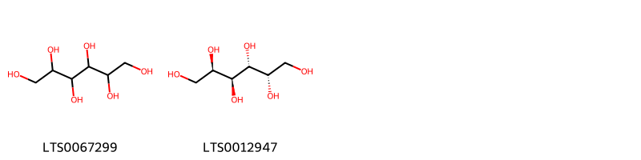{ width=100% }
    <figcaption>Hình ảnh cấu trúc hóa học của 2 hoạt chất thuộc nhóm Organooxygen compounds gồm ['sorbo (LTS0067299)', 'galactitol (LTS0012947)'].</figcaption>
</figure>
#### Nhóm Prenol lipids
<figure markdown="span">
    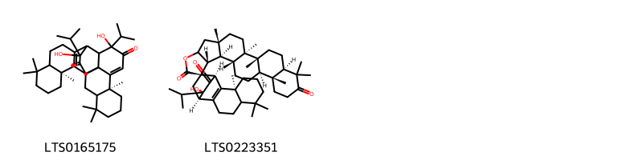{ width=100% }
    <figcaption>Hình ảnh cấu trúc hóa học của 2 hoạt chất thuộc nhóm Prenol lipids gồm ['(10s,25s)-14,28-dihydroxy-14,28-diisopropyl-6,6,10,21,21,25-hexamethylheptacyclo[14.10.2.0²,¹¹.0²,¹⁵.0⁵,¹⁰.0¹⁷,²⁶.0²⁰,²⁵]octacosa-11,17(26)-diene-13,27-dione (LTS0165175)', "(1r,1'r,2r,3's,5r,10r,11r,12'r,14r,15s,16r,16'r,17s,22s)-16'-hydroxy-16'-isopropyl-1,2,3',6,6,7',7',10,22-nonamethyl-19-oxaspiro[hexacyclo[12.10.0.0²,¹¹.0⁵,¹⁰.0¹⁵,²².0¹⁶,²⁰]tetracosane-17,14'-tetracyclo[10.2.2.0²,¹¹.0³,⁸]hexadecan]-2'(11')-ene-7,15',18-trione (LTS0223351)"].</figcaption>
</figure>

---

### Dược dân tộc học

Danh sách các quốc gia có sử dụng *Pristimera celastroides* trong điều trị các bệnh. 

| Country   | Disease                            | Bệnh                                                                                                                                                                                                |
|:----------|:-----------------------------------|:----------------------------------------------------------------------------------------------------------------------------------------------------------------------------------------------------|
| Guatemala | Insecticide, Pediculicide, Nervine | MYMEMORY WARNING: YOU USED ALL AVAILABLE FREE TRANSLATIONS FOR TODAY. NEXT AVAILABLE IN  16 HOURS 31 MINUTES 05 SECONDS VISIT HTTPS://MYMEMORY.TRANSLATED.NET/DOC/USAGELIMITS.PHP TO TRANSLATE MORE |
| Mexico    | Sedative                           | MYMEMORY WARNING: YOU USED ALL AVAILABLE FREE TRANSLATIONS FOR TODAY. NEXT AVAILABLE IN  16 HOURS 31 MINUTES 02 SECONDS VISIT HTTPS://MYMEMORY.TRANSLATED.NET/DOC/USAGELIMITS.PHP TO TRANSLATE MORE |

---

---
## Hippocratea indica
### Thông tin về thực vật

!!! info "Phân loại thực vật của *Reissantia indica* từ GIBF:"
    - **Kingdom:** Plantae
    - **Phylum:** Tracheophyta
    - **Order:** Celastrales
    - **Family:** Celastraceae
    - **Genus:** Reissantia
    - **Species:** *Reissantia indica*

 

| Label (VI)   | Label (EN)   | Scientific Name    | Descriptions (VI)   | Descriptions (EN)   | Also Known As (VI)   | Also Known As (EN)   |
|:-------------|:-------------|:-------------------|:--------------------|:--------------------|:---------------------|:---------------------|
| N/A          | N/A          | Hippocratea indica | loài thực vật       | species of plant    | ['']                 | ['']                 |

#### Phân bố trên thế giới

**Từ CSDL GIBF** Senegal, China, Mali, Zimbabwe, Tanzania, United Republic of, Guinea-Bissau, Guinea, Ghana, United States of America, Indonesia, Nigeria, unknown or invalid, Togo, Benin, Congo, Democratic Republic of the, Malaysia, Gabon, Philippines, Liberia, South Africa, Côte d’Ivoire, Myanmar, India, Angola, Cameroon

#### Phân bố tại Việt Nam

**Từ CSDL GIBF**: Không có ghi nhận ở Việt Nam

---
### Thành phần hóa học
        
- Theo cơ sở dữ liệu lotus: Từ loài *Reissantia indica* đã phân lập và xác định được Chưa có hoạt chất nào được phân lập. hoạt chất thuộc về các nhóm Không có hoạt chất nào được phân lập. 

Không có hình ảnh nào được tạo ra

---

### Dược dân tộc học

Danh sách các quốc gia có sử dụng *Reissantia indica* trong điều trị các bệnh. 

| Country   | Disease   | Bệnh                                                                                                                                                                                                |
|:----------|:----------|:----------------------------------------------------------------------------------------------------------------------------------------------------------------------------------------------------|
| Malaya    | Tonic     | MYMEMORY WARNING: YOU USED ALL AVAILABLE FREE TRANSLATIONS FOR TODAY. NEXT AVAILABLE IN  16 HOURS 30 MINUTES 42 SECONDS VISIT HTTPS://MYMEMORY.TRANSLATED.NET/DOC/USAGELIMITS.PHP TO TRANSLATE MORE |

---

# Chi Schaefferia

??? note "Danh sách các dược liệu thuộc chi"
    
	 - *Schaefferia frutescens*

---
## Schaefferia frutescens
### Thông tin về thực vật

!!! info "Phân loại thực vật của *Schaefferia frutescens* từ GIBF:"
    - **Kingdom:** Plantae
    - **Phylum:** Tracheophyta
    - **Order:** Celastrales
    - **Family:** Celastraceae
    - **Genus:** Schaefferia
    - **Species:** *Schaefferia frutescens*

 

| Label (VI)   | Label (EN)   | Scientific Name        | Descriptions (VI)   | Descriptions (EN)   | Also Known As (VI)   | Also Known As (EN)   |
|:-------------|:-------------|:-----------------------|:--------------------|:--------------------|:---------------------|:---------------------|
| N/A          | N/A          | Schaefferia frutescens | loài thực vật       | species of plant    | ['']                 | ['']                 |

#### Phân bố trên thế giới

**Từ CSDL GIBF** nan, Virgin Islands (British), Guadeloupe, Barbados, Ecuador, Puerto Rico, Cayman Islands, United States of America, Saint Barthélemy, Jamaica, Virgin Islands (U.S.), Costa Rica, Dominican Republic, Colombia, Saint Martin (French part), Cuba, Sint Maarten (Dutch part), Grenada, Dominica, Mexico, Haiti, Martinique, Bahamas, Peru, Montserrat, Venezuela (Bolivarian Republic of)

#### Phân bố tại Việt Nam

**Từ CSDL GIBF**: Không có ghi nhận ở Việt Nam

---
### Thành phần hóa học
        
- Theo cơ sở dữ liệu lotus: Từ loài *Schaefferia frutescens* đã phân lập và xác định được Chưa có hoạt chất nào được phân lập. hoạt chất thuộc về các nhóm Không có hoạt chất nào được phân lập. 

Không có hình ảnh nào được tạo ra

---

### Dược dân tộc học

Danh sách các quốc gia có sử dụng *Schaefferia frutescens* trong điều trị các bệnh. 

| Country   | Disease     | Bệnh                                                                                                                                                                                                |
|:----------|:------------|:----------------------------------------------------------------------------------------------------------------------------------------------------------------------------------------------------|
| Haiti     | Aphrodisiac | MYMEMORY WARNING: YOU USED ALL AVAILABLE FREE TRANSLATIONS FOR TODAY. NEXT AVAILABLE IN  16 HOURS 30 MINUTES 22 SECONDS VISIT HTTPS://MYMEMORY.TRANSLATED.NET/DOC/USAGELIMITS.PHP TO TRANSLATE MORE |

---

